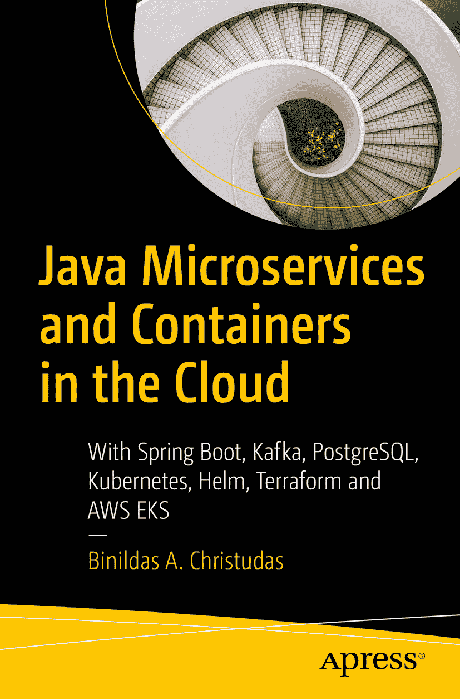

ISBN 979-8-8688-0554-7（电子书）ISBN 979-8-8688-0555-4 [`doi.org/10.1007/979-8-8688-0555-4`](https://doi.org/10.1007/979-8-8688-0555-4) © Binildas A. Christudas 2024 本作品受版权保护。所有权利均由出版商独家授权，无论涉及材料的全部或部分，具体包括翻译、重印、插图复用、朗诵、广播、微缩胶片复制或任何其他物理形式的复制权，以及信息存储与检索、电子改编、计算机软件或目前已知或未来开发的类似或不同方法论的传输权。本出版物中使用的通用描述性名称、注册商标、商标、服务标志等，即使未作明确声明，也不意味着这些名称不受相关保护性法律和法规的约束，因此可自由通用。出版商、作者和编辑假定本书中的建议和信息在出版时是真实准确的。出版商、作者和编辑均不对本书所含材料或可能存在的任何错误或遗漏提供明示或暗示的担保。对于已出版地图中的管辖权主张和机构隶属关系，出版商保持中立立场。

本 Apress 印记由注册公司 APress Media, LLC（Springer Nature 旗下）出版。

注册公司地址为：美国纽约州纽约市新广场 1 号，邮编 10004。

*献给索米娅·休伯特、安·S·比尼尔和里亚·S·比尼尔*

引言

微服务承诺了终极目标：并发发布与选择性可扩展性。如何以云原生的方式实现这一点？微服务能否摒弃同步 RPC，转而采用基于消息的异步交互？当这样做时，如何通过同步交互模式保证用户体验？在本书中，你将学习这些非平凡的模式与实践，所有内容均附有生产级示例代码，可作为模板用于启动你自己的项目。

凭借 25 年的经验，我将教你通常难以理解的六边形架构和洋葱架构，并通过 Spring Boot 中的具体示例进行演示。如果你具备足够的 Java 和 Spring 知识，你将能够学习从基础到高级的概念，包括在 RPC 和消息传递风格中，复制同一微服务的实例，并将来自并发用户的请求与响应关联到同一实例。你将学习如何在独立 Java 进程、Docker 容器、Kubernetes 以及使用弹性 Kubernetes 服务（EKS）的 AWS 云中实现这一点。

本书内容涵盖：

*   在 Spring Boot 中构建一个简单的微服务
*   通过代码示例学习 HATEOAS、六边形架构和洋葱架构
*   构建通过 RPC 和消息传递交互的多个微服务
*   在每一层使用异步模式，同时将并发用户请求关联到同一实例或不同实例
*   通过代码示例学习 CI/CD 和 Helm 打包
*   构建 Docker 包并将其部署到 Kubernetes
*   将微服务部署到 AWS EC2 和 EKS

Spring Boot 帮助开发者创建“即运行”的应用程序。当创建应用程序只需极简配置时，即使是初级 Java 开发者也能胜任。这种简洁性不应限制开发者应对复杂企业需求的能力，这正是使用 Spring Boot 的微服务架构的价值所在。除了快速部署、修补或扩展应用程序外，容器还提供了支持敏捷开发和 DevOps 实践的解决方案，以加速开发、测试和生产周期。云技术帮助公司快速扩展和适应、加速创新并提升业务敏捷性，而无需大量前期 IT 投资。如果能让即使是初级开发者也能掌握帮助企业实现这一切所需的知识，那会怎样？本书正是为此而生，甚至更多。

致谢

衷心感谢 Apress Media 对我的信任，并给予我撰写本书的机会。Nirmal Selvaraj、Dulcy Nirmala 和 Divya Modi 在使整个过程顺利进行方面提供了极大帮助。

IBS Software 的技术友好工作环境对我而言是一大福音。非常感谢 IBS 集团创始人兼执行主席 V. K. Mathews 先生，他在我整个职业生涯中提供了持续的动力。我还要感谢 IBS 创新生态系统高级副总裁 Arun Hrishikesan 先生，感谢他不断的激励和支持，特别是他在技术领域提供的广阔视角，极大地影响了本书的内容和风格。同时感谢 IBS 首席技术官 Christopher Branagan 多年来的指导。

我还要感谢 IBS 的 Arun Prasanth 与我讨论本书的各个方面。

感谢我的妻子 Sowmya Hubert，以及我的女儿 Ann S. Binil 和 Ria S. Binil，她们付出了太多。特别感谢我的父亲 Christudas Y.和母亲 Azhakamma J.，他们无私的支持帮助我走到了今天。同时感谢我的岳父母 Hubert Daniel 和 Pamala Percis。最后，感谢我的妹妹 Binitha 博士、她的丈夫 Segin Chandran 博士以及他们的女儿 Aardra B. S.

关于作者 关于技术审校

