# 1. 面向企业的微服务

自微服务的原始理念及其变体被讨论和考虑以来，已过去十多年。如今，这种架构风格已成为常态，而非例外。其工具和框架已足够成熟，架构原则也已在本地环境和云环境中得到验证和证明。对于这种软件架构如何区别于其前身，已有足够清晰的认识，因此本章仅讨论一些在其他地方未被提及的关键点。

本章首先概述计算范式，并解释当前微服务趋势的定位。你将了解到，微服务是分布式计算的另一种形式，但微服务的真正优势在于为微服务组件提供去中心化的业务事务处理能力。去中心化带来了对等微服务之间的自治性，从而为业务事务引入了一个显著特征，称为*最终一致性*。最终一致的系统具有更强的容错性，并为端到端业务事务提供可靠性，这些事务通常发生在相对不稳定的基于 HTTP 的传输协议上。接下来，本章将探讨微服务与“非微服务”之间的边界，这部分内容涵盖在服务粒度讨论中。在结束本章之前，我还会通过一个示例介绍*六边形架构*的概念。第 2 章中还有更多关于六边形架构的示例。

本章涵盖以下主题：

*   不同的计算架构范式
*   最终一致的软件系统
*   服务粒度
*   六边形架构隐喻
*   你的第一个 Java 微服务代码

## 计算架构范式

理解微服务架构风格中服务的分布式特性至关重要，因此本节将解释这种架构是什么，以及它如何区别于其他更熟悉的架构。


### 集中式计算

与如今常见且商品化的小型计算机或个人计算机相比，大型机拥有更强大的处理能力。早期版本的大型计算机有一个被称为*主机柜*的大型机箱，其中容纳了中央处理器和主存储器。大型计算机的特点是作为分时计算机运行的交互式用户终端，同时支持数百名用户和批处理。大型机用于商业事务处理，例如航空预订、银行业务等。一个事务包含一系列操作，包括磁盘 I/O、操作系统调用以及其他形式的数据从一个子系统到另一个子系统的传输，如图 1-1 所示。

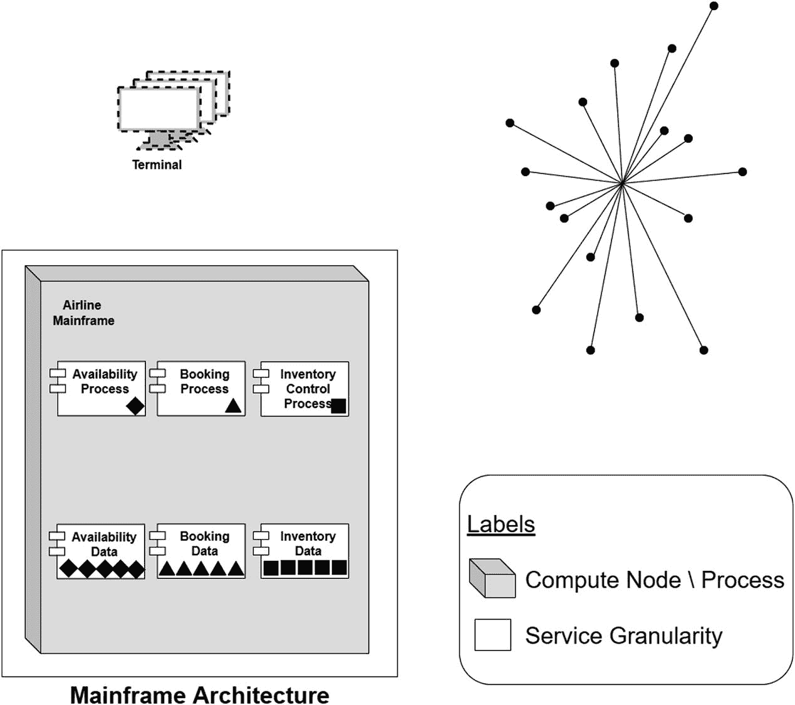

大型机的架构。系统连接到终端以供用户交互。航空大型机具有可用性、预订和库存控制功能。数据存储在具有服务粒度和计算节点的独立数据库中。它通过星形节点网络定义了连接方式。

图 1-1

集中式计算

如图所示，大型机是以分时模式运行的集中式计算机，同时支持数百名用户和批处理。用户通过键盘/打字机终端以及带有集成键盘的专用文本终端 CRT 显示器来访问大型机。*绿屏*是用于用户访问的单色显示器的通用名称，因为它们传统上使用绿色的“P1”荧光屏。^(¹)

事务处理或*批处理*是由中央大型机系统作为服务提供的，因此这种架构最好归类于*集中式计算范式*，其中中央计算机从头到尾做出关于业务事务成功完成的所有决策。

### 分布式计算

接下来是*分布式计算*范式，其中计算系统的不同组件位于不同的联网计算机上，它们通过相互传递消息来进行通信和协调行动。在此过程中，通常有一个节点或计算机充当业务事务的协调者——它协调（或编排）不同联网计算机上整个业务事务的基本计算组件，并决定事务的成功或失败。

分布式计算有多种变体。主要列举如下：

*   *客户端-服务器*：在客户端-服务器架构中，客户端从服务器请求和接收数据，并将其显示给用户。客户端机器托管了完成业务逻辑所需的大部分规则和验证。胖客户端是这种架构的特征，而客户端二进制文件的分发在此是一个麻烦事。

*   *三层架构*：三层架构将客户端智能迁移到中间层，以便可以使用无状态和瘦客户端。这简化了应用程序到单个中间件服务器的部署，并且客户端二进制文件的分发为零或最小化。大多数 Web 应用程序都是三层架构。

*   *N 层架构*：N 层架构，也称为多层架构，是一种软件工程设计模式，它将应用程序分离为逻辑层和物理层。每一层都有特定的职责和功能，并且各层通常由物理或逻辑边界（例如不同的服务器、进程或网络）分隔。

*   *点对点*：在这种架构中，没有特定的机器提供服务或管理网络资源。相反，所有职责均匀地分配给所有机器，称为对等点。每个对等点既可以充当客户端，也可以充当服务器。这种架构的例子包括 BitTorrent。比特币网络也是一种点对点网络，但比特币网络更符合另一种称为*去中心化架构*的计算范式，稍后将对此进行解释。

*   *微服务*：微服务是一种分布式架构，其中功能单元被识别为分布的基础。因此，在许多情况下，需要多个微服务才能完成单个业务事务。具有额外设计能力的微服务可以归类为另一种计算范式，称为*去中心化*，本章稍后将对此进行讨论。

图 1-2 展示了一种分布式架构。在这里，客户端、业务和数据库进程通过网络分隔开来。

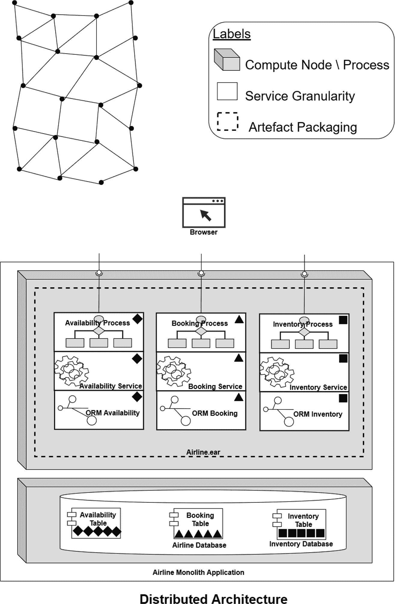

一种具有服务粒度和工件打包的节点网络及其分布式架构的独特模式示意图。它有一个浏览器，其计算节点负责可用性、预订或库存控制。数据为每个进程存储在单独的数据库中。

图 1-2

分布式计算

在图 1-2 中，显示了一个单一的中间层服务器。该服务器由一组业务模块组成：

*   *可用性*：一个帮助规划航班的模块，旅客可以在此输入旅行日期和目的地，并通过所谓的互联网预订引擎（IBE）获取来自不同航空公司的所有可用航班列表。旅客可以浏览此列表，比较价格，然后决定预订哪一个。

*   *预订*：预订模块帮助旅客预订航班，并为入围航班上的旅行创建旅客姓名记录（PNR）。

*   *库存*：当航班座位预订完成时，库存模块中的座位库存应相应减少。

在某些情况下，中间层服务器还会连接到其他第三方系统，例如 Amadeus 或 Sabre 等全球分销系统（GDS），从而真正体现了分布式计算范式。这在图 1-2 的分布式网状表示中有所描绘。


### 去中心化计算

在去中心化计算中，应用服务由分布式网络中的各个计算设备或节点执行，不存在中心位置。这种软件开发（及分发）方式为开发者提供了极大的灵活性和成本节约，因为他们无需创建中央控制点。比特币、以太坊和 Uniswap 是几个采用去中心化计算的协议。

图 1-3 描绘了一种微服务架构，它显然是分布式的。端到端业务交易的不同组件也可能分散在不同的组件中，因此从某种意义上说，这也是去中心化的。

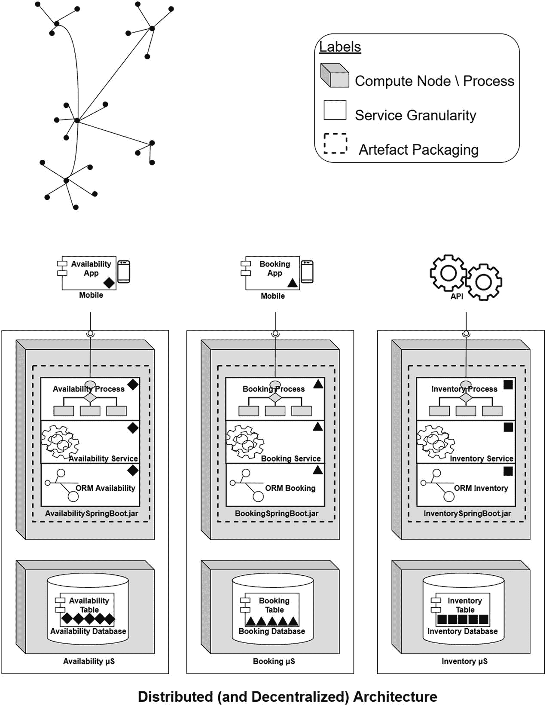

一张网络示意图，节点以星形分支连接，展示了服务粒度、工件打包及其分布式与去中心化架构。图中包含负责可用性、预订或库存控制的计算节点。该系统与移动应用相连。

图 1-3

去中心化计算

我不讨论图 1-3 为何描绘微服务架构的细节，因为我假设读者已熟悉这些基础知识。以下是该架构的几个特点：

*   *分布式*：业务应用根据功能（如机票搜索、预订和库存管理）进行划分和分布。
*   *独立性*：每个微服务可以独立于其他微服务进行开发和部署（前提是保持微服务间通信的 API 兼容性）。
*   *可用性*：如果某个微服务未运行，用户仍可通过其他正在运行的微服务获取应用功能（例如，若预订服务宕机，用户仍可进行搜索）。

因此，从某种意义上说，具备适当设计原语的微服务架构也可以作为去中心化应用运行（尽管“去中心化”这一术语更适用于涉及区块链的应用）。

## 最终一致性软件系统

理解微服务架构中服务的分布式特性至关重要。本节将解释其含义，以及它与其他更熟悉的架构有何不同。

### 原子一致性

图 1-4 展示了图 1-2 中的分布式架构，但此处用户正在预订航班。

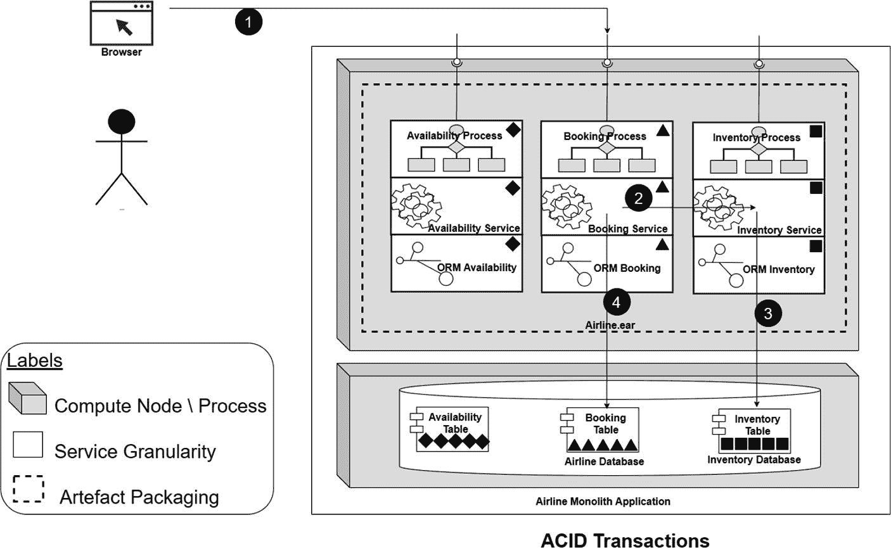

ACID 事务架构图。用户访问浏览器，浏览器包含用于可用性、预订、库存控制、服务和 ORM 的计算节点。每个进程的数据存储在独立的数据库中，并带有服务粒度和工件打包。

图 1-4

ACID 事务

参照图 1-4，典型的航班预订业务交易流程如下：

1.  浏览器将用户事务发送到业务层服务器。
2.  由于该事务是航班预订，因此由预订模块拦截。在执行预订之前，预订模块在启动一个 ACID^(²)事务后，向库存模块发送更新库存请求以减少座位库存。
3.  在先前启动的 ACID 事务内，库存模块更新库存数据库表。
4.  如果库存更新成功，预订模块将在同一事务上下文中，在其数据库表中创建预订记录。

如果预订表和库存表位于同一数据库，且预订和库存组件是同一中间层服务器中的两个模块，则该事务为本地事务。这意味着两个表的更新将以原子（ACID）方式要么全部成功，要么全部回滚。

### 最终一致性

本节考虑在微服务架构中相同的航班预订场景，此时处理过程是分布式的。见图 1-5。

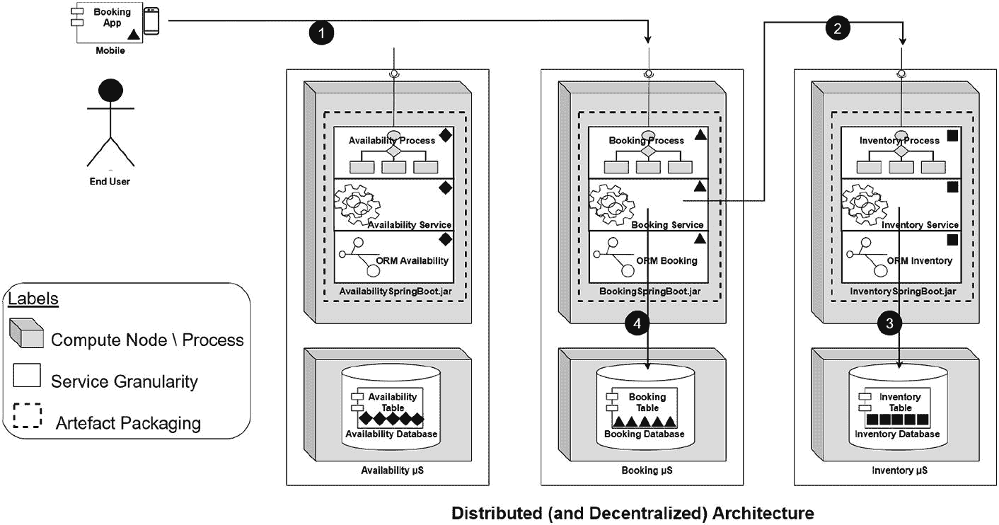

一种具有服务粒度和工件打包的分布式与去中心化架构。它包括多个用于可用性、预订或库存控制的计算节点。每个进程的数据存储在独立的数据库中。该架构连接到一个移动应用以供用户交互。

图 1-5

微服务间事务

相同的航班预订业务事务场景现在如下进行：

1.  预订应用将用户事务发送到业务层服务器。
2.  由于该事务是预订航班，因此由预订微服务拦截。在执行预订之前，预订微服务向库存微服务发送更新库存请求以减少座位库存。但是，你无法启动一个全局事务并在同一全局事务中发送更新库存请求。这是因为更新库存请求通常是同步的 REST 调用，并且不鼓励跨微服务的分布式事务。在没有分布式事务上下文的情况下，预订微服务会收到更新库存请求的成功或失败结果。
3.  库存模块更新库存数据库表，并返回成功或失败。
4.  如果库存更新成功，预订微服务将在其数据库表中创建预订记录，并向最终用户发送成功消息。

这里存在一个陷阱。如果更新库存数据库表的尝试意外成功，但预订微服务未能在其数据库表中创建预订记录，则这两个表之间的数据一致性就会出现问题。你需要手动干预来纠正此问题，并使这两个微服务恢复到最终一致状态。


### 最终一致性，去中心化系统

我已经发起了一场关于如何让微服务实现最终一致性的讨论。我还讨论了当更新库存数据库表成功，但预订微服务在预订数据库表中创建预订失败时的处理场景。现在考虑相反的场景——如果库存微服务没有运行，预订微服务无法完成预订，会发生什么？当从预订微服务到库存微服务的同步风格 REST 调用无法完成时，就会出现这种场景，因此预订创建也会失败。

图 1-6 展示了在图 1-5 所示架构基础上的改进，通过插入一个基于事件的通道来实现。

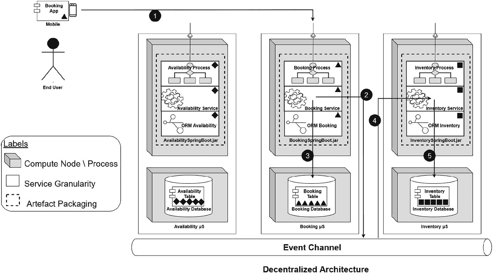

一幅去中心化架构的示意图，展示了服务粒度、工件打包和事件通道。它包含多个用于可用性、预订或库存控制的计算节点。数据存储在独立的数据库中。该系统连接到一个用于用户交互的移动应用。

图 1-6

去中心化微服务

在这里，微服务之间并非紧密耦合。相反，你可以使用松散耦合的 JMS 或 AMQP 风格的消息传递协议。那么，航班预订业务事务的序列可能如下：

1.  浏览器将用户事务发送到业务层服务器。

2.  由于该事务是航班预订，因此被预订微服务拦截。在执行预订之前，预订模块向消息通道发送一条“航班已预订”消息。

3.  预订微服务将在其数据库表中创建一条预订记录，并向最终用户提供响应。

4.  “航班已预订”消息将被任何其他感兴趣的微服务（本例中为库存微服务）接收。

5.  库存微服务更新库存数据库表，并可选地向消息通道发送成功或失败消息。

通过将步骤 2 和步骤 3 保持在事务范围内，可以提高此业务事务的可靠性。尽管如此，设计中一个显著的变化是，业务事务跨越了多个微服务，并且事务的成功完成最终取决于这些不同微服务各自事务的整体完成情况。没有一个单一的微服务完全负责控制完整的端到端流程。相反，每个微服务执行自己的部分，从而使架构真正实现去中心化。

请注意，此讨论假设存在足够的库存。可能存在更复杂的场景，例如库存有限，但这超出了本文的讨论范围。

## 服务粒度

正确理解服务架构的不同粒度级别将有助于理解它们的可能性和局限性，因此本节将探讨这些服务粒度。

### 单体架构

图 1-7 展示了一个典型的单体架构。在这种架构中，功能模块仅在逻辑上分离，但它们在物理上都打包到一个单一的 `.ear`（企业归档）文件中。

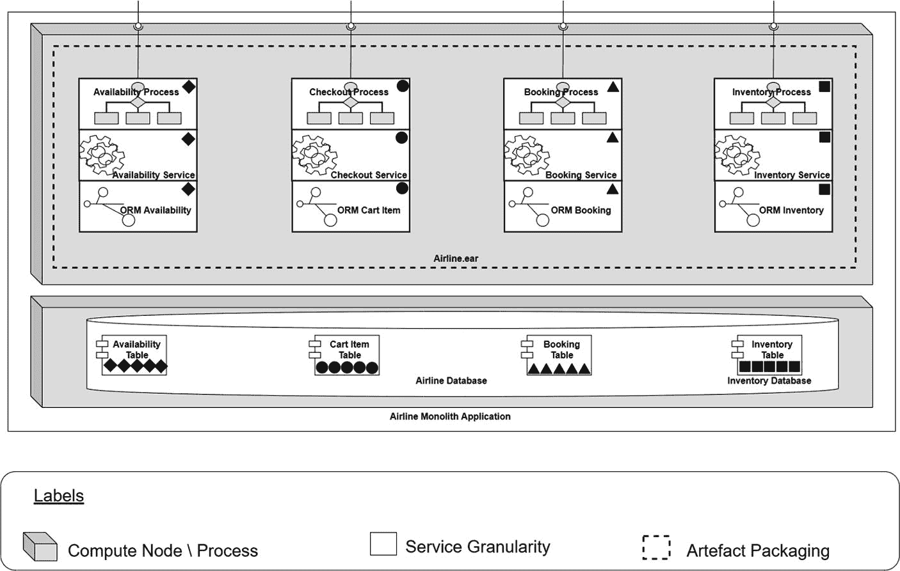

一个由四个进程组成的架构。可用性、结账、预订和库存控制，数据存储在独立的数据库中，体现了服务粒度和工件打包的概念。该系统连接到一个名为 central airline dot ear 的组件。

图 1-7

单体架构

很多时候，单体架构与不同节点上的数据库通信，并且所有功能模块都紧密耦合到这个单一的数据库上。

### 宏服务架构

图 1-8 所示的宏服务架构是对单体架构在打包方面的改进。

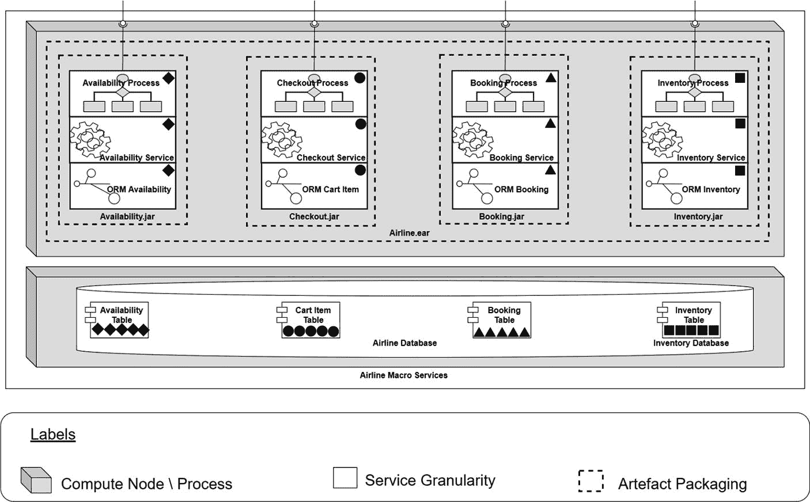

一个由 4 个进程组成的架构。可用性、结账、预订和库存控制，数据存储在独立的数据库中，体现了服务粒度和工件打包的概念，位于 airline macro services 中。该系统连接到一个名为 central airline dot ear 的组件。

图 1-8

宏服务架构

在宏服务架构中，不同的功能模块被打包到独立的 `.jar`（Java 归档）文件中。宏服务架构的部署模式与单体架构类似。所有 Java 归档文件都放置在一个单一的 `.ear` 或 `.war`（Web 归档）文件中，然后部署在单个节点上。

### 迷你服务

迷你服务架构是对单体或宏服务进行改进的一次真正尝试。图 1-9 描绘了一个迷你服务架构。

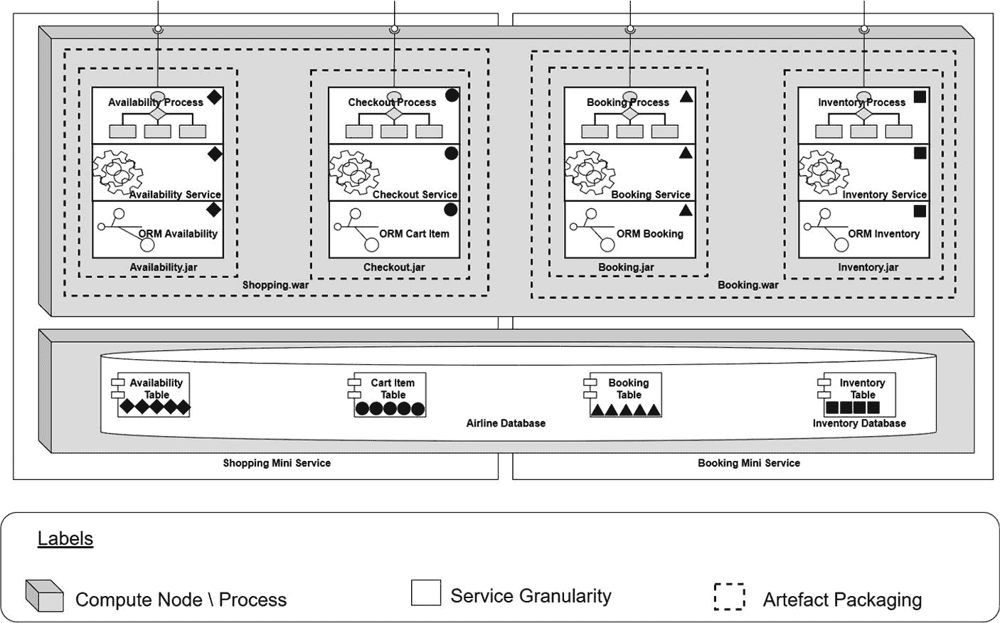

一个航空预订系统的示意图。它具有不同的组件，包括计算节点、服务粒度和工件打包。shopping dot war 中包含 availability jar 和 checkout jar，booking dot war 中包含 booking jar 和 inventory jar。数据存储在独立的数据库中。

图 1-9

迷你服务架构

如图 1-9 所示，迷你服务架构也会将模块打包到独立的归档文件中，类似于宏服务架构。此外，其中一些归档文件还可以被打包到独立的可部署归档文件中。然而，在许多情况下，由于依赖库、通信模式等架构约束，这些部署归档文件被部署在同一个节点上。

### 微服务

微服务架构试图在开发、部署和发布方面提供完全的灵活性，如图 1-10 所示。

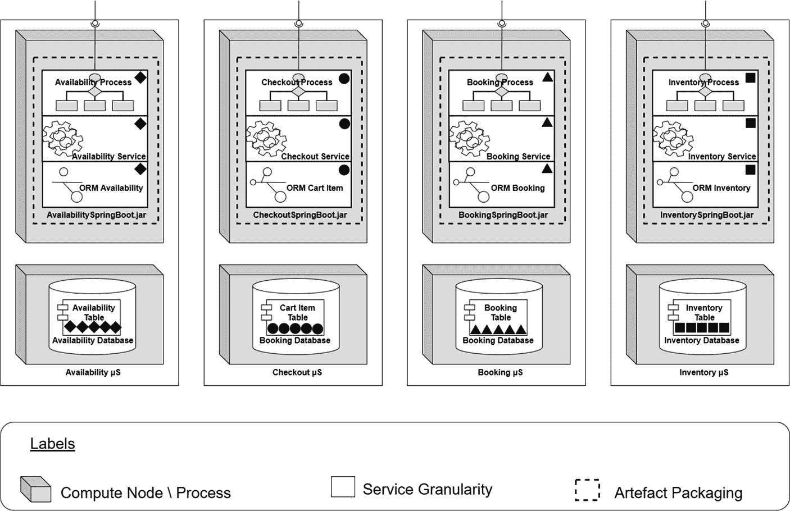

一个航空预订系统的示意图。它具有不同的组件，包括计算节点、服务粒度和工件打包。为可用性、结账、预订和库存分别设置了独立的数据库。每个数据库执行进程、服务和库存管理。

图 1-10

微服务架构

微服务架构的一个显著优势是它促进了多语言技术的使用。这赋予了每个微服务采用自身实现技术和架构的灵活性，同时仍然使用标准协议与对等微服务进行交互和暴露接口。

## 六边形架构隐喻

在学习松散耦合系统时，尤其是在微服务的背景下，讨论*六边形架构*是很有帮助的。我将在本节中进行讨论。

为了理解这个隐喻，我从典型的层次架构开始讨论。

### 层次架构

层次架构指的是为了分离关注点（主要是通信方面的关注点）而遵循的典型软件架构组织方式，如图 1-11 所示。

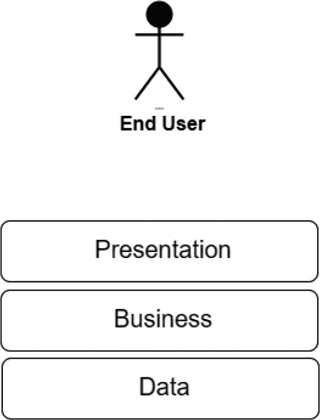

一个表示具有三个层次（最终用户、表示层、业务层和数据层）的层次架构的示意图。最终用户被描绘成一个与表示层交互的火柴人。表示层位于业务层之上，业务层又位于数据层之上。

图 1-11

层次架构

在图 1-11 所示的层次架构中，顶层和底层仅仅是应用程序的入口/出口点。


### 端口与适配器架构

端口与适配器架构由 Alistair Cockburn 于 2005 年在其博客中提出。其描述如下：

“允许应用程序同等地由用户、程序、自动化测试或批处理脚本驱动，并且能够在与最终运行时设备和数据库隔离的环境中进行开发和测试。”

进一步解释，将应用程序视为系统的核心工件，所有输入和输出都通过一个或多个端口进出应用程序，这些端口将应用程序与各种外部工具、技术和交付机制隔离开来。应用程序不应知晓是谁/什么在发送输入或接收输出。这样做的目的是保护应用程序免受技术演进和业务需求变化的影响，因为这种演进可能会使应用程序在开发后不久就变得过时。

要理解端口与适配器架构，首先将分层架构从典型的南北方向转变为东西方向，如图 1-12 所示。

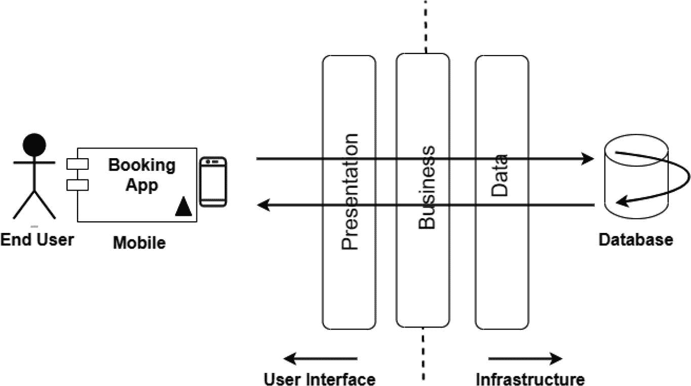

一个流程定义了最终用户如何在其移动设备上与预订应用进行交互。该应用与表示层、业务层和数据层进行通信。表示层处理用户界面，业务层处理数据，数据则存储在数据库中。

图 1-12

分层架构，方向已改变

图 1-12 展示了典型的应用程序流程，该流程从用户界面中的代码开始，经过应用程序核心到达基础设施代码，再返回应用程序核心，最终向用户界面发送响应。

端口与适配器架构通过使用一个抽象层（以端口和适配器的形式实现）来解决保护和重用内层（业务层）的问题。

*   *端口*：端口是进入/离开应用程序的、与消费者无关的入口和出口点。在 Java 中，它是一个 Java 接口。或者用更抽象的术语来说，它可以是一个 HTTP REST 接口，或者是一个 JMS 或 AMQP 消息传递接口。

*   *适配器*：适配器类实现了一个其客户端已知的接口，并提供对客户端未知类实例的访问。适配器对象提供了接口所承诺的功能，而无需假设使用哪个类来实现该接口。

端口与适配器架构明确地标识了系统中三个基本的代码块：

1.  *接口*：使运行用户界面成为可能的代码，无论其用户界面类型如何。

2.  *业务*：业务逻辑代码，或称应用程序核心，用户界面通过它来驱动事务发生。

3.  *基础设施*：将应用程序核心连接到数据库、消息队列或第三方 API 等工具的基础设施代码。

在图 1-12 当前的方位中，左侧代表 UI 的适配器被称为*主*适配器或*驱动*适配器，因为它们发起对应用程序的操作。右侧代表与后端资源连接的适配器被称为*次*适配器或*被驱动*适配器，因为它们总是响应主适配器的操作。

主适配器或驱动适配器提供服务（给用户界面），而次适配器或被驱动适配器则消费服务（来自基础设施）。因此，在左侧，端口及其具体实现（用例）都属于应用程序内部。在右侧，端口属于应用程序内部，但其具体实现则属于外部。它包裹着来自某个提供者的外部基础设施。

### 六边形架构

图 1-12 展示了两侧——一侧是使用用户界面进入应用程序的入口，另一侧是离开应用程序进入基础设施的出口。因此，尽管应用程序有两个对称的侧（左侧和右侧），但每一侧都可以有多个入口/出口点。例如，一个 API（比如 REST API）和一个图形用户界面（GUI）可以是应用程序左侧的两个不同入口/出口点，而一个数据库和一个消息队列可以是应用程序右侧的两个不同入口/出口点。为了表示该应用程序可以有多个入口/出口点，你可以绘制一个具有多个边的应用程序图。这个图可以是任何多边形，但最终选择的是六边形，因此得名六边形架构。

### 微服务元模型

现在，我可以将六边形架构的概念扩展到微服务，因为端口与适配器部分讨论的许多方面在微服务的上下文中都是有意义的。如图 1-13 所示。

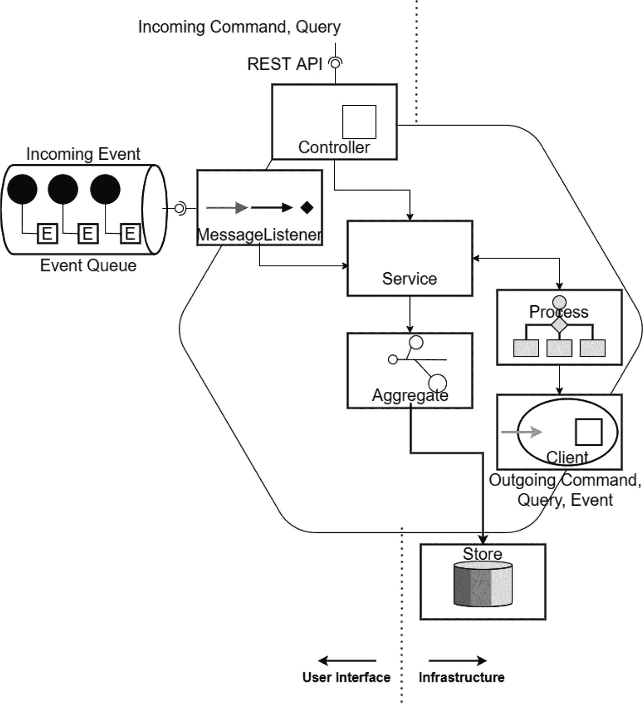

一个流程定义了命令、查询和事件如何通过 REST API、控制器、消息监听器、服务、流程、聚合、客户端和存储进行处理。该系统处理传入和传出的命令，并与用户界面和基础设施组件进行交互。

图 1-13

微服务元模型

现在，你可以将图 1-13 中所示的微服务元模型与基于 Java Spring 的微服务进行比较，后者包含以下组件：

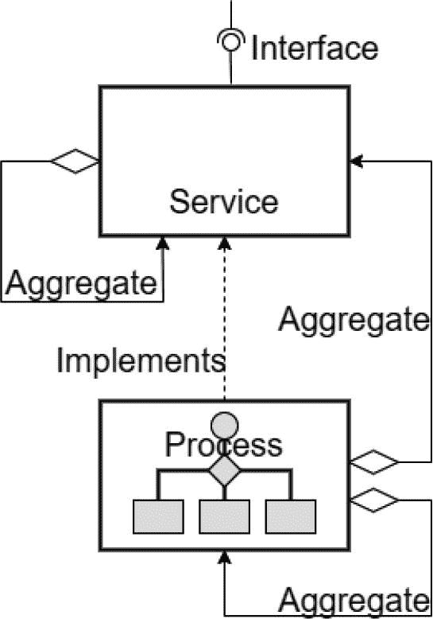

一个图表说明了微服务由实现流程的聚合组成。该流程进一步细分为更小的聚合。每个聚合代表一个特定的工作单元。服务与接口交互。

图 1-14

流程与服务的关系

*   *REST 控制器*：一个基于 HTTP 的 REST 控制器类，使用 `@RestController` 注解。
*   *POJO 服务*：核心业务逻辑。此类应屏蔽任何入口/出口变更，以促进重用。
*   *ORM 仓库*：处理数据库持久化逻辑的 ORM 仓库类。
*   *聚合实体*：基于领域模型的领域实体，可重用。
*   *数据存储*：基础设施的持久化存储。
*   *消息监听器*：一个基于 JMS 或 AMQP 的控制器类。
*   *客户端程序*：将使用端口退出到其他类型基础设施的程序。
*   *流程*：复杂的业务建模需要流程建模，这是可选的。如果涉及流程建模，流程与服务之间的抽象元模型关系如图 1-14 所示。
    *   服务暴露一个服务接口。
    *   一个服务可以是其他服务的聚合。
    *   一个流程聚合和编排许多服务，甚至其他流程。
    *   一个流程也暴露一个服务接口。

后续的讨论将遵循图 1-13 中所示的微服务元模型来表示许多即将出现的场景。

## 你的第一个 Java 微服务

我相信你已经了解了足够的理论，现在是时候构建你的第一个 Java 微服务了。

此示例使用 Spring Boot 来构建 Java 微服务。项目代码库可以导入到你喜欢的任何 IDE 中，但也可以在 Windows 或 Mac 终端中通过命令无需 IDE 即可构建和运行。后续章节将采用类似的方法，因为关于使用哪个 IDE 以及如何使用特定 IDE 的讨论超出了本书的范围。我假设你已经熟悉这些步骤，或者可以参考一本 Java 或 JEE 入门书籍。


### Spring Boot

Spring Boot 采用了一种**自以为是**的视角来审视 Spring 平台及众多第三方 Java 库，使得创建可直接“运行”的、生产级的、基于 Spring 的独立应用程序变得简单直接。Spring Boot 遵循了开发者在以往使用 Spring 及其他第三方库时所利用的许多约定和用法模式。因此，大多数 Spring Boot 应用程序只需要极少的 Spring 配置。再次强调，本章的目的并非详细讲解 Spring Boot，这超出了本章的范围。已经熟悉 Java 或 Spring 的读者，访问 Spring Boot 主页即可轻松上手。

### 设计你的第一个六边形微服务

本节从图 1-13 中六边形微服务视图的精简版本开始。该视图也显示在图 1-15 中。

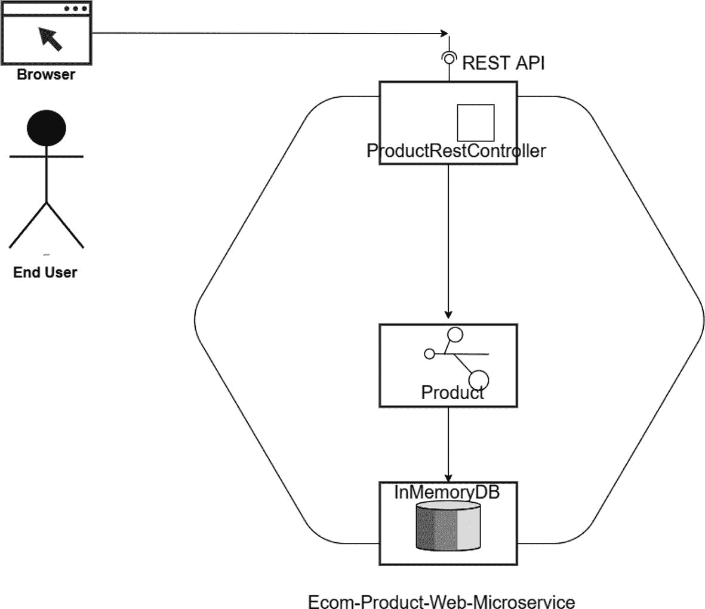

该图展示了最终用户如何与浏览器交互，浏览器向 REST API 发送请求。然后，REST API 与产品 REST 控制器和产品组件进行交互。产品组件从内存数据库（属于 ecom-product-web-microservice 的一部分）访问数据。

图 1-15

产品 Web 微服务

考虑使用端口和适配器的语言来描述图 1-15。这里使用了一个 HTTP 端口，它不过是一个关于用户浏览器如何使用应用程序核心的规范。这个端口（接口）作为 REST 控制器属于业务逻辑内部。`Product` 实体实现了应用程序核心。见图 1-16。

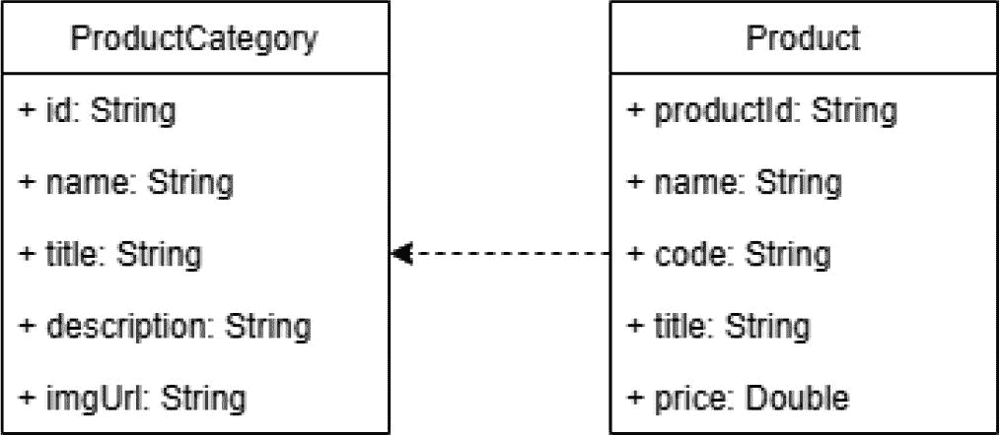

该图说明了两个实体之间的关系：产品类别和产品。产品类别具有 id、名称、标题、描述和图片 URL。产品具有产品 id、名称、代码、标题和价格。一条虚线箭头将产品连接到产品类别。

图 1-16

产品 Web 微服务核心实体

在图 1-15 中，我有意从图 1-13 中剥离了服务和流程组件，以使第一个示例尽可能简单。接下来，你将使用一个数据库适配器连接到内存数据库。同样，为了保持第一个示例的简单性，我没有设计适配器。相反，我使用了与内存数据库类的直接依赖关系。在下一章中，你将了解如何以正确的方式使用适配器。

`ProductRestController` 是主要适配器或驱动适配器，它封装了一个 HTTP 端口。你使用它来告诉应用程序核心该做什么。它将来自交付机制（本例中为浏览器请求）的任何内容转换为应用程序核心中的方法调用。

### 代码组织

本书的源代码可通过本书的产品页面在 GitHub 上获取，网址为 [`www.apress.com/9798868805547`](http://www.apress.com/9798868805547)。示例代码的组织方式如代码清单 1-1 所示，位于 `ch01\ch01-01` 文件夹内。这遵循标准的 Maven 结构，因此 `pom.xml` 位于目录的根目录。

```
├── 02-ProductWeb
│   ├── make.bat
│   ├── make.sh
│   ├── pom.xml
│   ├── run.bat
│   ├── run.sh
│   └── src
│       └── main
│           ├── java
│           │   └── com
│           │       └── acme
│           │           └── ecom
│           │               └── product
│           │                   ├── EcomProdMicroAppl.java
│           │                   ├── InitComponent.java
│           │                   ├── controller
│           │                   │   ├── ProdRestContr.java
│           │                   │   └── ProdRestConConfig.java
│           │                   ├── db
│           │                   │   └── InMemoryDB.java
│           │                   └── model
│           │                       ├── Product.java
│           │                       └── ProductCategory.java
│           └── resources
│               ├── application.properties
│               ├── log4j2-spring.xml
│               └── static
│                   ├── css
│                   │   ├── app.css
│                   │   └── bootstrap.css
│                   ├── js
│                   │   ├── app.js
│                   │   ├── controller
│                   │   │   └── product_controller.js
│                   │   └── service
│                   │       └── product_service.js
│                   └── product.html
├── README.txt
├── make.sh
├── makeandrun.bat
├── makeandrun.sh
└── pom.xml
代码清单 1-1
Spring Boot 源代码组织
```

`ch01\ch01-01\02-ProductWeb\src\main\java` 文件夹包含微服务的源代码。`ch01-01\02-ProductWeb\src\main\resources` 文件夹包含微服务的配置以及 Web 应用程序的源代码，这将帮助最终用户通过浏览器界面与微服务进行交互。最顶层的文件夹还包含帮助你构建和运行微服务的脚本。

### 理解代码

对于这第一个示例，我保持领域实体非常简单。该实体是一个典型的可以在电子商务网站上列出的产品。多个产品属于一个产品类别，因此在网站上，你可以首先展示产品类别，用户可以浏览产品类别以查看所选类别下的所有可用产品。让我们先看看这些实体，如代码清单 1-2 所示。

```
public class Product {
@Id
private String productId;
private String name;
private String code;;
private String title;
private Double price;
}
public class ProductCategory {
@Id
private String id;
private String name;
private String title;
private String description;
private String imgUrl;
}
代码清单 1-2
产品/产品类别领域模型 (ch01\ch01-01\02-ProductWeb\src\main\java\com\acme\ecom\product\model\Product.java)
```

这些实体很直接，因此不再进一步解释。接下来，考虑支持 REST 的 HTTP 端口，使用 Spring 的 `RestController`，如代码清单 1-3 所示。

```
@RestController
public class ProductRestController{
@Autowired
private InMemoryDB inMemoryDB;
@RequestMapping(value = "/productsweb",
method = RequestMethod.GET,
produces = {MediaType.APPLICATION_JSON_VALUE})
public ResponseEntity> getAllProducts() {
List products = inMemoryDB.getAllProducts();
if(products.isEmpty()){
return new ResponseEntity>(
HttpStatus.NOT_FOUND);
}
List list = new ArrayList ();
for(Product product:products){
list.add(product);
}
return new ResponseEntity>(list,
HttpStatus.OK);
}
}
代码清单 1-3
用于 getAllProducts 的基于 REST 的 HTTP 端口 (ch01\ch01-01\02-ProductWeb\src\main\java\com\acme\ecom\product\controller\ProductRestController.java)
```

`getAllProducts` 是一个 Java 方法，它将返回数据库中所有产品的列表，该方法通过基于 HTTP 的 REST 端口中声明的抽象协议和交付格式来定义。然后，Spring 会注入（或用于拦截）该端口的具体实现，并在运行时在控制器中使用。它们将来自 HTTP 交付通道的 JSON 格式数据负载转换为应用程序核心中的 `getAllProducts` 方法调用。为了检索产品，`getAllProducts` 将调用委托给 `InMemoryDB` 类。

REST 控制器实现的其余部分如代码清单 1-4 所示。


```
public class ProductRestController{
@RequestMapping(value = "/productsweb/{productId}",
method = RequestMethod.GET,
produces = MediaType.APPLICATION_JSON_VALUE)
public ResponseEntity getProduct(@PathVariable(
"productId") String productId) {
Product product = inMemoryDB.getProduct(productId);
if (product == null) {
return new ResponseEntity(
HttpStatus.NOT_FOUND);
}
return new ResponseEntity(product,
HttpStatus.OK);
}
@RequestMapping(value = "/productsweb",
method = RequestMethod.POST,
produces = MediaType.APPLICATION_JSON_VALUE)
public ResponseEntity addProduct(
@RequestBody Product product) {
Product productFound = inMemoryDB.getProduct(
product.getProductId());
if (null != productFound) {
return new ResponseEntity(
HttpStatus.CONFLICT);
}
inMemoryDB.addProduct(product);
return new ResponseEntity(product,
HttpStatus.OK);
}
@RequestMapping(value = "/productsweb/{productId}",
method = RequestMethod.DELETE,
produces = MediaType.APPLICATION_JSON_VALUE)
public ResponseEntity deleteProduct(
@PathVariable("productId")String productId) {
Product productFound = inMemoryDB.getProduct(
productId);
if (productFound == null) {
return new ResponseEntity(
HttpStatus.NOT_FOUND);
}
inMemoryDB.deleteProduct(productId);
return new ResponseEntity(
HttpStatus.NO_CONTENT);
}
@RequestMapping(value = "/productsweb/{productId}",
method = RequestMethod.PUT,
produces = MediaType.APPLICATION_JSON_VALUE)
public ResponseEntity updateProduct(
@PathVariable("productId")String productId,
@RequestBody Product product) {
Product currentProduct = inMemoryDB.getProduct(
productId);
if (currentProduct == null) {
return new ResponseEntity(
HttpStatus.NOT_FOUND);
}
currentProduct.setName(product.getName());
currentProduct.setCode(product.getCode());
currentProduct.setTitle(product.getTitle());
currentProduct.setPrice(product.getPrice());
Product newProduct = inMemoryDB.updateProduct(
currentProduct);
return new ResponseEntity(newProduct,
HttpStatus.OK);
}
}
清单 1-4
基于 REST 的 HTTP 端口，用于 getAllProducts（ch01\ch01-01\02-ProductWeb\src\main\java\com\acme\ecom\product\controller\ProductRestController.java）
```

这里，给定一个 `productId`，`getProduct` 方法将检索特定产品的详细信息。`addProduct` 将创建一个新产品，`deleteProduct` 将从内存数据库中移除一个产品。`updateProduct` 将用一组新值更新一个产品。

### 构建并运行代码

`ch01\ch01-01` 文件夹包含构建和运行示例所需的 Maven 脚本。这个示例是任何人能想到的最简单的微服务，因为它不依赖于数据库或消息队列等外部资源。它仍然是一个功能完备的微服务，演示了完整的 CRUD（创建、读取、更新和删除）功能，因此构建示例并启动微服务非常轻松。假设你的机器上已安装 Java 和 Maven，你可以打开一个命令终端，进入 `ch01\ch01-01` 文件夹，并执行清单 1-5 中的命令。

```
mvn -Dmaven.test.skip=true clean package
java -jar -Dserver.port=8080 ./02-ProductWeb/target/Ecom-Product-Web-Microservice-0.0.1-SNAPSHOT.jar
清单 1-5
构建并运行微服务的命令
```

另外，还有一个适用于 Mac 终端的 shell 脚本和一个 Windows 批处理脚本，可以帮助你一次性构建并运行应用程序，如清单 1-6 所示。

```
(base) binildass-MacBook-Pro:ch01-01 binil$ pwd
/Users/binil/binil/code/mac/mybooks/docker-04/Code/ch01/ch01-01
binildass-MacBook-Pro:ch01-01 binil$ sh makeandrun.sh
[INFO] Scanning for projects...
[INFO] ------------------------------------------------------
[INFO] Reactor Build Order:
[INFO]
[INFO] Ecom-Product-Web-Microservice                  [jar]
[INFO] Ecom                                           [pom]
[INFO]
[INFO] --------<com.acme.ecom.product:Ecom-Product-Web-Micro
[INFO] Building Ecom-Product-Web-Mi 0.0.1-SNAPSHOT    [1/2]
[INFO] --------------------------------[ jar ]--------------
[INFO]
...
[INFO]
[INFO] Ecom-Product-Web-Microservice .... SUCCESS [  1.705 s]
[INFO] Ecom ............................. SUCCESS [  0.019 s]
[INFO] -----------------------------------------------------
[INFO] BUILD SUCCESS
[INFO] -----------------------------------------------------
[INFO] Total time:  1.902 s
[INFO] Finished at: 2023-12-13T11:32:38+05:30
[INFO] -----------------------------------------------------
.   ____          _            __ _ _
/\\ / ___'_ __ _ _(_)_ __  __ _ \ \ \ \
( ( )\___ | '_ | '_| | '_ \/ _` | \ \ \ \
\\/  ___)| |_)| | | | | || (_| |  ) ) ) )
'  |____| .__|_| |_|_| |_\__, | / / / /
=========|_|==============|___/=/_/_/_/
:: Spring Boot ::                (v3.2.0)
2023-12-13 11:32:39 INFO  Startup…:50 - Starting EcomProd...
2023-12-13 11:32:39 DEBUG StartupInfoLogger.logStarting:51 - Running with Spring Boot v3.2.0, Spring v6.1.1
2023-12-13 11:32:39 INFO  SpringApp…:653 - No active ...
2023-12-13 11:32:40 INFO  InMemoryDB.initDB:71 - Start
2023-12-13 11:32:40 INFO  InMemoryDB.initDB:92 - Ending.
2023-12-13 11:32:40 INFO  Initial...init:35 - Start
2023-12-13 11:32:40 DEBUG Initial...init:37 - Doing Nothing...
2023-12-13 11:32:40 INFO  Initial….init:39 - End
2023-12-13 11:32:40 INFO  Start…:56 - Started EcomProd...
2023-12-13 11:32:46 INFO  ProdRest...getAllProducts:64 - Start
2023-12-13 11:32:46 DEBUG ProductRest...lambda$getAll$0:74 - Product [productId=1, ...
2023-12-13 11:32:46 DEBUG ProductRestController.lambda$getAllProducts$0:74 - Product [productId=2, ...
2023-12-13 11:32:46 INFO  ProdRest.getAllProducts:75 – Ending
...
清单 1-6
使用脚本构建并运行微服务
```

从日志中可以看到，应用程序已构建并部署，并且处于运行状态。现在是时候测试应用程序了。


### 使用 UI 测试微服务

微服务启动后，你可以通过浏览器访问 `http://localhost:8080/product.html` 来使用 Web 应用程序（见图 1-17）。

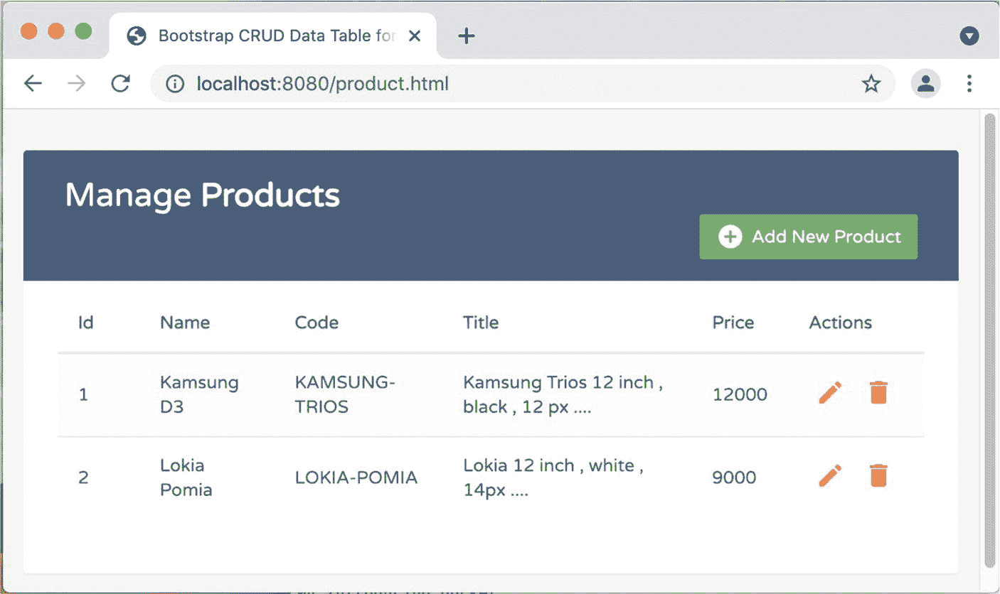

一张网页截图，显示了一个用于产品管理的 Bootstrap CRUD 数据表格。表格包含 ID、名称、编码、标题、价格和操作列。用户可以添加新产品、编辑现有产品或删除产品。

图 1-17

使用浏览器访问微服务

在浏览器中输入此 URL 将渲染 UI 应用程序，该应用程序打包在项目内的 `resources` 文件夹中。在浏览器 UI 中，你可以通过点击“添加新产品”按钮并输入详细信息来添加新产品（见图 1-18）。

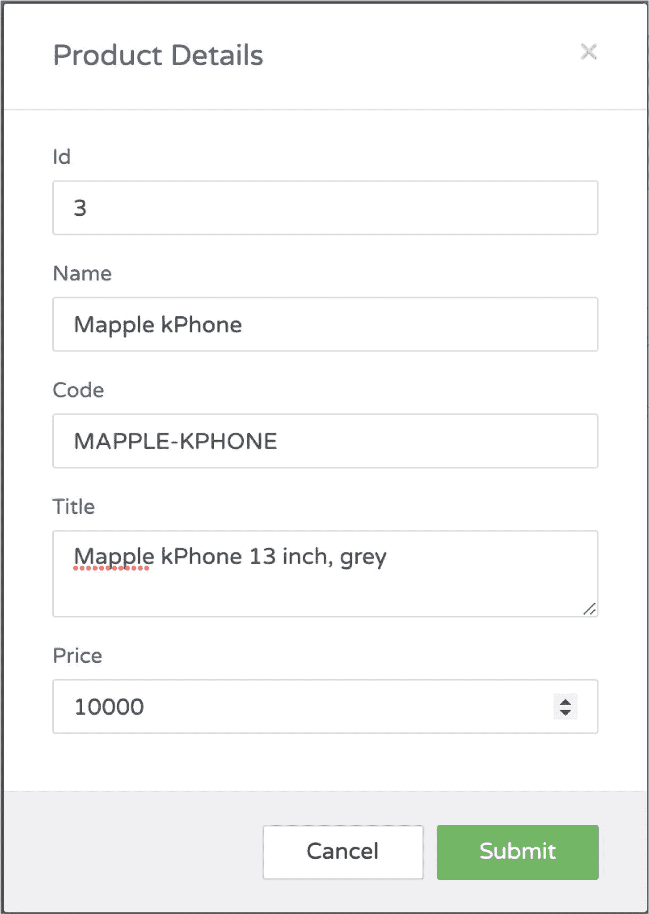

一张标题为“产品详情”的窗格截图。表单字段包括 ID、名称、编码、标题和价格。字段中显示了 ID 为 3 的产品的当前值。右下角有“取消”和“提交”按钮。

图 1-18

添加新产品

在 UI 中为所有字段输入一些有意义的值，然后点击“提交”按钮，这将要求微服务在内存数据库中创建一个新产品。新添加的产品也会显示在刷新后的屏幕上，如图 1-19 所示。

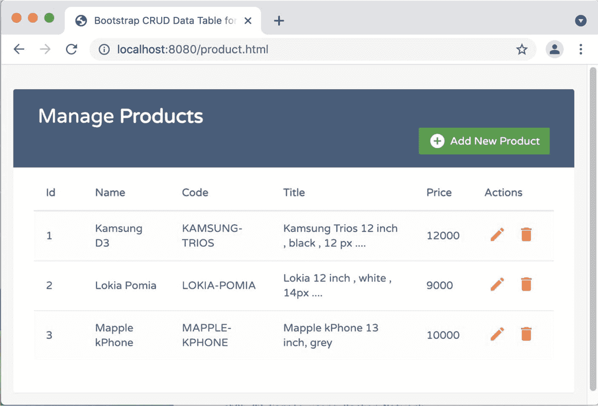

一张网页截图，显示了一个用于产品管理的 Bootstrap CRUD 数据表格。表格包含 ID、名称、编码、标题、价格和操作列。用户可以添加新产品、编辑现有产品或删除产品。在名称列下列出了 kamsung D 3、lokia pomia 和 mapple k phone。

图 1-19

列出新添加的产品

现在，你可以尝试通过点击每个列出的产品条目右侧的“编辑”图标来编辑（更新）新添加的产品。见图 1-20。

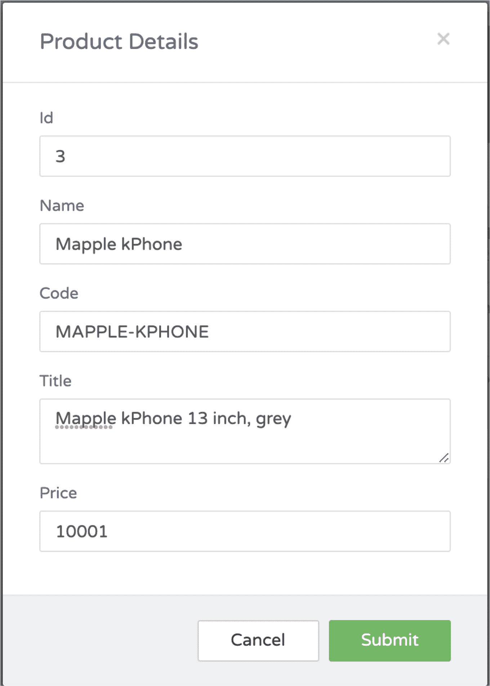

一张标题为“产品详情”的窗格截图。表单字段包括 ID、名称、编码、标题和价格。字段中显示了 ID 为 3 的产品的当前值。右下角有“取消”和“提交”按钮。

图 1-20

更新产品

如图 1-20 所示，在不更改产品 ID 的情况下，对某些字段（本例中为价格）进行一些有效更改。点击“提交”按钮使更改生效。见图 1-21。

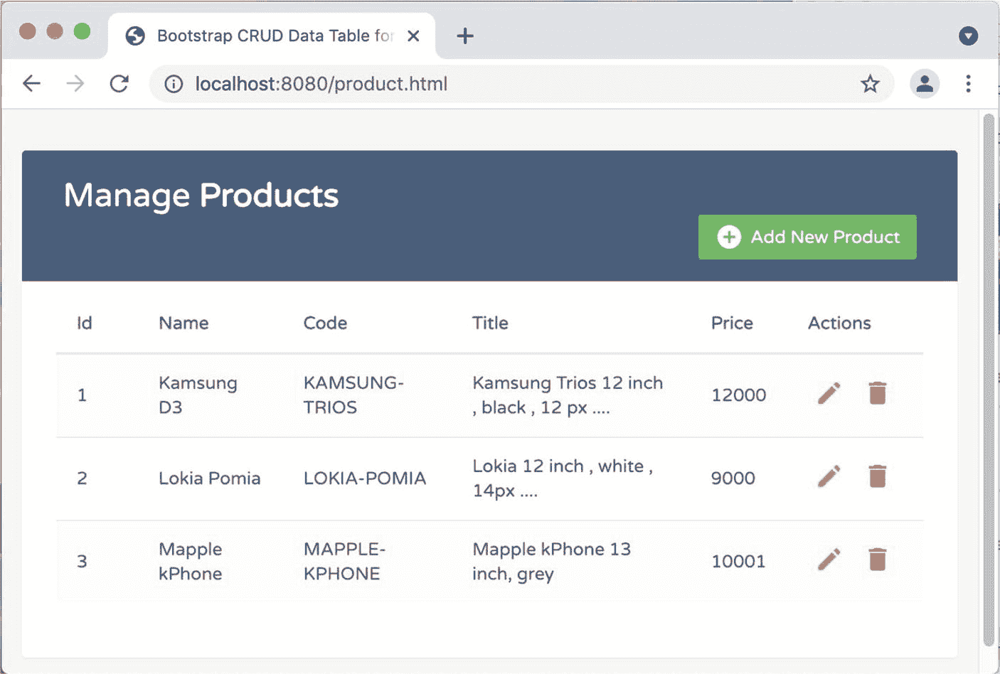

一张网页截图，显示了一个用于管理产品的 Bootstrap CRUD 数据表格。表格包含 ID、名称、编码、标题、价格和操作列。用户可以添加新产品、编辑现有产品或删除产品。在名称列下列出了 kamsung D 3、lokia pomia 和 mapple k phone。

图 1-21

列出更新后的产品

对产品所做的更改会显示在刷新后的屏幕上，如图 1-21 所示。

最后但同样重要的是，你可能还想测试“删除”功能，你可以通过点击每个产品最右侧的“删除”图标，然后确认操作来实现。见图 1-22。


一张确认对话框的截图，询问用户是否确定要删除产品。右下角有“取消”和“删除”按钮。

图 1-22

确认删除

### 使用 cURL 测试微服务

你可能还想使用 cURL 或 Postman 来测试微服务中实现的所有方法。有关详细说明，请参阅附录 A。

## 总结

在本章中，我有意避免定义微服务，因为业界存在许多定义和观点。相反，我尝试从一些不太常见的角度来审视微服务，以期理解它们如何融入更大的计算范式。本章还探讨了这些显著特性如何有助于提供卓越的业务交易执行能力。我还尝试通过示例展示六边形架构是什么。我将在接下来的两章中继续讨论，并提供更多示例，以便你能够清楚地理解，如果采用六边形架构的原则，你的微服务将具备的设计结构和质量。

脚注 1   2

