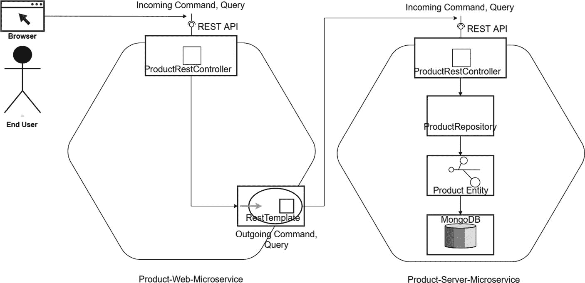
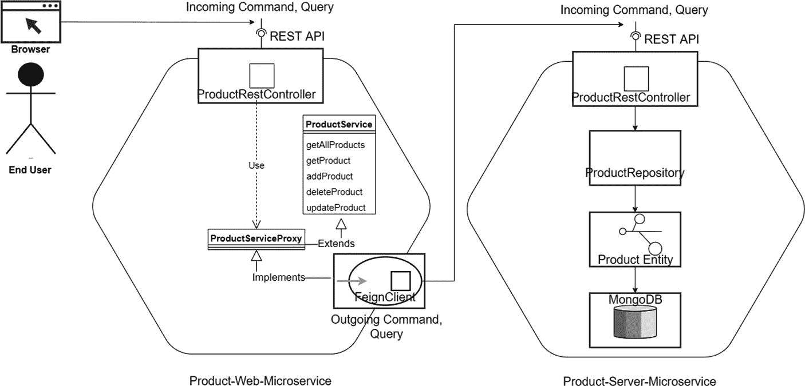
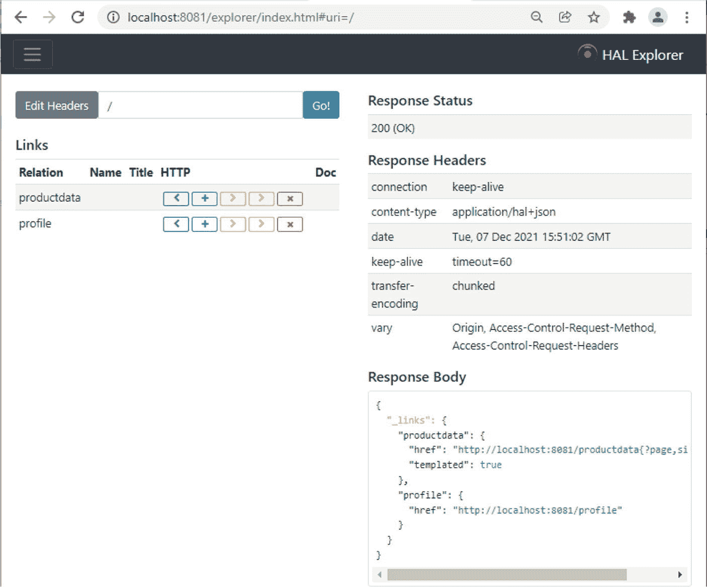
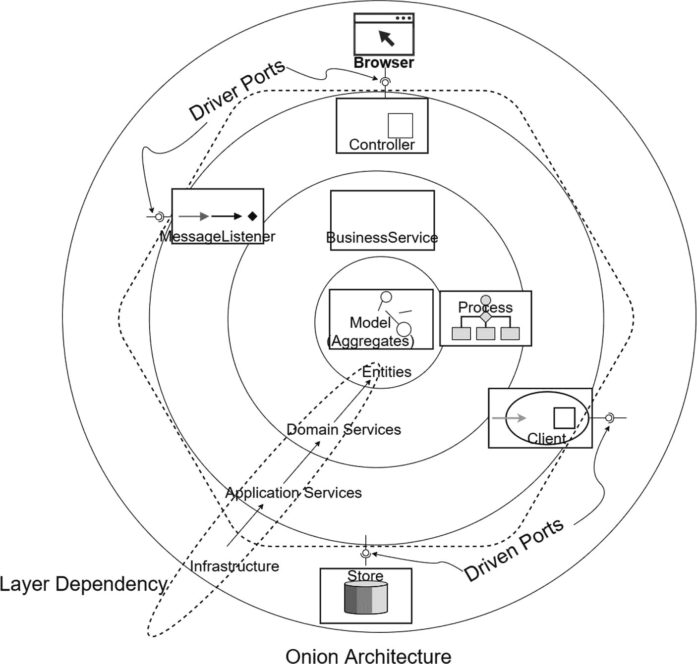
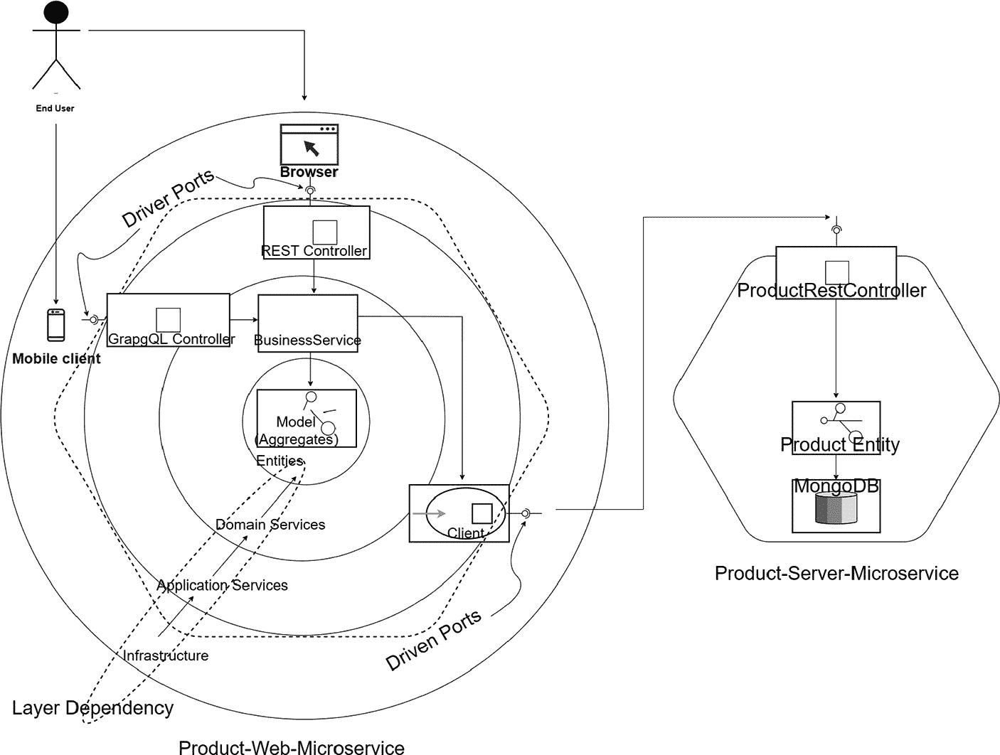

# 2. 更多动手实践微服务

你在上一章中编写了第一个也是最简单的微服务。该示例使用了一个简单的数据结构作为内存数据库。本章通过创建更多微服务来扩展该示例，每个微服务的复杂度依次递增。这将使你能够基于之前所学的内容进行构建。你将与一些真实的数据库进行交互，并巩固对第 1 章介绍的端口和适配器架构的理解。

本章完全是动手实践，但示例仍然很简单，因此你无需理解复杂的业务或实体关系。相反，示例侧重于学习技术和架构变体。

本章涵盖以下概念，每个概念都配有可运行的示例：

*   首先，你将增强上一章的微服务示例，使其能够与 MongoDB 交互。

*   接下来，我将介绍 Spring Cloud。

*   然后，我将讨论 HAL 和 HATEOAS。

*   作为最后一个示例，你将使用 Spring Boot 实现一个基于 HATEOAS 的微服务。

## 使用 MongoDB 和 RestTemplate 的微服务

如前所述，你将增强上一章创建的微服务。你将拥有两个微服务——一个消费者微服务和一个提供者微服务——它们使用 REST 协议相互通信。提供者微服务还与 NoSQL 数据库 MongoDB 进行交互。


### 设计微服务

本示例采用了图 1-13（位于第 1 章）中描绘的六边形微服务设计。该设计在图 2-1 中再次展示。



模型图将终端用户和浏览器通过传入命令或查询、REST API、产品 REST 控制器、以及带有 REST 模板的传出命令或查询连接到产品 Web 微服务，并通过传入命令或查询、REST API、控制器、产品仓库、产品实体和 Mongo DB 连接到产品服务微服务。

图 2-1

消费者与提供者微服务设计

图 2-1 中展示的两个微服务都在 REST 接口处使用了 HTTP 端口，这些端口规定了用户浏览器或其他 HTTP 客户端如何使用应用核心。这些端口（接口）作为 REST 控制器，属于各自微服务的业务逻辑内部。Spring 运行时提供了一个适配器，该适配器实现了 REST 接口所承诺的功能。来自浏览器的请求将命中作为消费者微服务的 Product Web 微服务。Product Web 微服务不执行任何业务逻辑；相反，它将调用委托给作为提供者微服务的 Product Server 微服务。保持 Product Web 微服务简单的目的是演示如何启动微服务间的通信，以便您可以在实际场景中使用和扩展此模板。

Product Web 微服务中的`RestTemplate`是另一个端口，它同样只是应用核心如何使用它的一个规范。一个实现了`RestTemplate`端口的具体驱动适配器，会在任何需要该端口的地方（通过类型提示）由 Spring 注入到应用核心中。

`Product`实体在 Product Server 微服务中实现了应用核心。同样，我避免了典型的分层服务和组件构造型类，以保持示例的整体复杂性简单。

`ProductRepository`是 Product Server 微服务使用的第三个端口。Product Server 微服务的目的是持久化数据。因此，您需要创建一个满足其需求的持久化接口，其中包含使用实体 ID 在 NoSQL 集合中执行 CRUD 操作的方法。此时，无论何时何地，只要应用程序需要执行 CRUD 操作，应用核心就需要一个实现了您定义的持久化接口的对象，该对象由 Spring 运行时提供。

### 代码组织

本书的源代码可通过本书的产品页面在 GitHub 上获取，网址为 [`www.apress.com/9798868805547`](http://www.apress.com/9798868805547)。示例代码的组织方式如代码清单 2-1 所示，位于 `ch02\ch02-01` 文件夹内。这遵循标准的 Maven 结构，因此 `pom.xml` 位于目录的根目录。

```
├── 01-ProductServer
│   ├── pom.xml
│   └── src
│       └── main
│           ├── java
│           │   └── com
│           │       └── acme
│           │           └── ecom
│           │               └── product
│           │                   ├── EcomProductMicroApp.java
│           │                   ├── InitComponent.java
│           │                   ├── controller
│           │                   │   └── ProdRestControl.java
│           │                   ├── model
│           │                   │   └── Product.java
│           │                   └── repository
│           │                       ├── ProductRepository.java
│           │                       └── ProdRepConfig.java
│           └── resources
│               ├── application.properties
│               └── log4j2-spring.xml
├── 02-ProductWeb
│   ├── pom.xml
│   └── src
│       └── main
│           ├── java
│           │   └── com
│           │       └── acme
│           │           └── ecom
│           │               └── product
│           │                   ├── EcomProdMicroApp.java
│           │                   ├── InitComponent.java
│           │                   ├── controller
│           │                   │   ├── ProdRestControl.java
│           │                   │   └── ProdRestConfig.java
│           │                   └── model
│           │                       ├── Product.java
│           │                       └── ProductCategory.java
│           └── resources
│               ├── application.properties
│               ├── log4j2-spring.xml
│               └── static
│                   ├── css
│                   │   ├── app.css
│                   │   └── bootstrap.css
│                   ├── js
│                   │   ├── app.js
│                   │   ├── controller
│                   │   │   └── product_controller.js
│                   │   └── service
│                   │       └── product_service.js
│                   └── product.html
└── pom.xml
代码清单 2-1
Spring Boot 源代码组织
```

注意

代码清单 2-1 中部分 Java 类的名称因格式原因已缩短。

`ch02\ch02-01` 文件夹包含消费者和提供者微服务的源代码。最顶层的文件夹还包含一些脚本，可帮助您一起构建这些微服务。此文件夹中还有一些脚本，用于在最后清理项目。


### 理解代码

首先，我们来看提供者微服务——即 Product Server 微服务。清单 2-2 以支持 REST 的 HTTP 端口开始，使用了 Spring 的 `RestController`。

```
@RestController
public class ProductRestController {
@Autowired
private ProductRepository productRepository;
@RequestMapping(value = "/products",
method = RequestMethod.GET,
produces = {MediaType.APPLICATION_JSON_VALUE})
public ResponseEntity> getAllProducts() {
List products = productRepository.findAll();
if(products.isEmpty()){
return new ResponseEntity>(
HttpStatus.NOT_FOUND);
}
List list = new ArrayList ();
for(Product product:products){
list.add(product);
}
list.forEach(item->LOGGER.debug(item.toString()));
return new ResponseEntity>(list,
HttpStatus.OK);
}
}
清单 2-2
Product Server 中 getAllProducts 的基于 REST 的 HTTP 端口 (ch02\ch02-01\01-ProductServer\src\main\java\com\acme\ecom\product\controller\ProductRestController.java)
```

`getAllProducts` 是一个 Java 方法，它会返回 MongoDB 数据库中所有产品的列表，该列表通过一个抽象协议以及基于 HTTP 的 REST 端口声明的交付格式来定义。然后，Spring 会注入（或用于拦截）该端口的一个具体实现，并在运行时的 Controller 边缘使用它。它们将来自 HTTP 交付通道的 JSON 格式请求数据负载，转换为应用程序核心中的 `getAllProducts` 方法调用。为了检索产品，`getAllProducts` 将调用委托给被驱动端口 `ProductRepository`。

Product Server 微服务中 REST 控制器的其余实现与第 1 章的清单 1-4 中的代码非常相似（唯一的区别是，这里使用 `ProductRepository` 端口与 MongoDB 仓库交互，而不是使用内存数据库），因此我在此不再重复完整代码。

此示例引入了与 MongoDB 交互的抽象端口，如清单 2-3 所示。

```
@RepositoryRestResource(collectionResourceRel = "productdata", path = "productdata")
public interface ProductRepository extends
MongoRepository  {
public List findByCode(
@Param("code") String  code);
}
清单 2-3
MongoDB 仓库的抽象端口 (ch02\ch02-01\01-ProductServer\src\main\java\com\acme\ecom\product\repository\ProductRepository.java)
```

由于此端口扩展了 `MongoRepository`，因此默认继承了所有默认的 CRUD 方法声明。因此，你只需要声明自定义方法——在此示例中为 `findByCode`。

Product Server 微服务主类的代码如清单 2-4 所示。

```
@SpringBootApplication
public class EcomProductMicroserviceApplication {
public static void main(String[] args) {
SpringApplication.run(
EcomProductMicroserviceApplication.class, args);
}
}
清单 2-4
Product Server 微服务主类 (ch02\ch02-01\01-ProductServer\src\main\java\com\acme\ecom\product \EcomProductMicroserviceApplication.java)
```

清单 2-5 展示了 Product Server 微服务的配置文件。

```
spring.data.mongodb.uri=mongodb://localhost:27017/test
server.port=8081
spring.application.name = product-server
清单 2-5
Product Server 微服务配置文件 (ch02\ch02-01\01-ProductServer\src\main\resources\application.properties)
```

此 URL 指向 MongoDB 数据库。

接下来，你将查看消费者微服务，即 Product Web 微服务。清单 2-6 展示了支持 REST 的 HTTP 端口，使用了 Spring 的 `RestController`。

```
@RestController
public class ProductRestController{
@Value("${acme.PRODUCT_SERVICE_URL}")
private String PRODUCT_SERVICE_URL;
@Autowired
private RestTemplate restTemplate;
@RequestMapping(value = "/productsweb",
method = RequestMethod.GET,
produces = {MediaType.APPLICATION_JSON_VALUE})
public ResponseEntity> getAllProducts() {
ParameterizedTypeReference>
responseTypeRef = new ParameterizedTypeReference>() {};
ResponseEntity> entity =
restTemplate.exchange(PRODUCT_SERVICE_URL,
HttpMethod.GET, (HttpEntity) null,
responseTypeRef);
List productList = entity.getBody();
return new ResponseEntity>(productList,
HttpStatus.OK);
}
}
清单 2-6
Product Web 中 getAllProducts 的基于 REST 的 HTTP 端口 (ch02\ch02-01\02-ProductWeb\src\main\java\com\acme\ecom\product\controller\ProductRestController.java)
```

`PRODUCT_SERVICE_URL` 的值在 `application.properties` 中配置，指向提供者微服务的 URL，如下所示：

```
acme.PRODUCT_SERVICE_URL = http://localhost:8081/products
```

在 Product Web 微服务中，通过在配置类中定义 Spring 配置的 `RestTemplate` 来定义实现微服务间通信的适配器，如清单 2-7 所示。

```
@Bean
RestTemplate restTemplate() {
ObjectMapper mapper = new ObjectMapper();
mapper.configure(
DeserializationFeature.FAIL_ON_UNKNOWN_PROPERTIES,
false);
MappingJackson2HttpMessageConverter converter =
new MappingJackson2HttpMessageConverter();
converter.setSupportedMediaTypes(
MediaType.parseMediaTypes("application/json"));
converter.setObjectMapper(mapper);
return new RestTemplate(Arrays.asList(converter));
}
}
清单 2-7
Product Web 中的 REST 模板配置 (ch02\ch02-01\02-ProductWeb\src\main\java\com\acme\ecom\product\controller\ProductRestControllerConfiguration.java)
```

从现在开始，每当 Product Web 微服务需要与 Product Server 微服务的外部 API 通信时，你都需要一个实现了你定义的 `RestTemplate` 接口的对象，而 Spring 会为你提供该对象。

Product Web 微服务 REST 控制器的其余实现如清单 2-8 所示。

```
public class ProductRestController{
@RequestMapping(value = "/productsweb/{productId}",
method = RequestMethod.GET,
produces = MediaType.APPLICATION_JSON_VALUE)
public ResponseEntity getProduct(@PathVariable(
"productId") String productId) {
String uri = PRODUCT_SERVICE_URL + "/" + productId;
Product product = restTemplate.getForObject(uri,
Product.class);
return new ResponseEntity(product,
HttpStatus.OK);
}
@RequestMapping(value = "/productsweb",
method = RequestMethod.POST,
produces = MediaType.APPLICATION_JSON_VALUE)
public ResponseEntity addProduct(
@RequestBody Product product) {
Product productNew = restTemplate.postForObject(
PRODUCT_SERVICE_URL,
product, Product.class);
return new ResponseEntity(product,
HttpStatus.OK);
}
@RequestMapping(value = "/productsweb/{productId}",
method = RequestMethod.DELETE,
produces = MediaType.APPLICATION_JSON_VALUE)
public ResponseEntity deleteProduct(
@PathVariable("productId")String productId) {
restTemplate.delete(PRODUCT_SERVICE_URL + "/" +
productId);
return new ResponseEntity(
HttpStatus.NO_CONTENT);
}
@RequestMapping(value = "/productsweb/{productId}",
method = RequestMethod.PUT,
produces = MediaType.APPLICATION_JSON_VALUE)
public ResponseEntity updateProduct(
@PathVariable("productId")String productId,
@RequestBody Product product) {
String uri = PRODUCT_SERVICE_URL + "/" + productId;
restTemplate.put(uri, product, Product.class);
Product updatedProduct = restTemplate.getForObject(
uri, Product.class);
return new ResponseEntity(updatedProduct,
HttpStatus.OK);
}
}
清单 2-8
Product Web 中 CRUD 方法的基于 REST 的 HTTP 端口 (ch02\ch02-01\02-ProductWeb\src\main\java\com\acme\ecom\product\controller\ProductRestController.java)
```

给定一个 `productId`，`getProduct` 方法将检索特定产品的详细信息。`addProduct` 将创建一个新产品，`deleteProduct` 将从 MongoDB 数据库中移除一个产品。`updateProduct` 将使用一组新值更新一个产品。


### 构建并运行微服务

`ch02\ch02-01` 文件夹包含构建这些示例所需的 Maven 脚本。第一步，你需要启动 MongoDB 服务器。请参考附录 B 了解如何设置并启动 MongoDB 服务器。你需要执行清单 2-9 中所示的命令来启动 MongoDB。

```
(base) binildass-MBP:bin binil$ pwd
/Users/binil/Applns/mongodb/mongodb-macos-x86_64-4.2.8/bin
(base) binildass-MBP:bin binil$ mongod --dbpath /usr/local/var/mongodb --logpath /usr/local/var/log/mongodb/mongo.log
清单 2-9
启动 MongoDB 服务器
```

接下来，打开一个命令终端，进入 `ch02\ch02-01` 文件夹。执行清单 2-10 中所示的命令来一起构建微服务。

```
(base) binildass-MBP:ch02-01 binil$ pwd
/Users/binil/binil/code/mac/mybooks/docker-03/ch02/ch02-01
binildass-MacBook-Pro:ch02-01 binil$ sh make.sh
[INFO] Scanning for projects...
[INFO] ----------------------------------------------------
[INFO] Reactor Build Order:
[INFO]
[INFO] Ecom-Product-Server-Microservice              [jar]
[INFO] Ecom-Product-Web-Microservice                 [jar]
[INFO] Ecom                                          [pom]
[INFO]
...
[INFO]
[INFO] Ecom-Product-Server-Microservice  SUCCESS [  1.834 s]
[INFO] Ecom-Product-Web-Microservice ... SUCCESS [  0.425 s]
[INFO] Ecom ............................ SUCCESS [  0.040 s]
[INFO] -----------------------------------------------------
[INFO] BUILD SUCCESS
[INFO] -----------------------------------------------------
[INFO] Total time:  2.491 s
[INFO] Finished at: 2023-12-20T08:26:08+05:30
[INFO] -----------------------------------------------------
binildass-MacBook-Pro:ch02-01 binil$
清单 2-10
构建并运行微服务
```

或者，你可以打开两个命令终端，并将目录切换到微服务的顶层文件夹。首先，使用 `make.sh` 和 `run.sh` 脚本构建并运行 Product Server 微服务，如清单 2-11 所示。

```
(base) binildass-MacBook-Pro:01-ProductServer binil$ pwd
/Users/binil/binil/code/mac/mybooks/docker-03/ch02/ch02-01/01-ProductServer
binildass-MacBook-Pro:01-ProductServer binil$ sh make.sh
[INFO] Scanning for projects...
[INFO]
...
[INFO] ----------------------------------------------------
[INFO] BUILD SUCCESS
[INFO] ----------------------------------------------------
[INFO] Total time:  2.136 s
[INFO] Finished at: 2023-12-20T08:18:18+05:30
[INFO] ----------------------------------------------------
binildass-MacBook-Pro:01-ProductServer binil$
binildass-MacBook-Pro:01-ProductServer binil$ sh run.sh
.   ____          _            __ _ _
/\\ / ___'_ __ _ _(_)_ __  __ _ \ \ \ \
( ( )\___ | '_ | '_| | '_ \/ _` | \ \ \ \
\\/  ___)| |_)| | | | | || (_| |  ) ) ) )
'  |____| .__|_| |_|_| |_\__, | / / / /
=========|_|==============|___/=/_/_/_/
:: Spring Boot ::                (v3.2.0)
2023-12-20 08:21:18 INFO  Start.log:50 - Starting EcomProd...
2023-12-20 08:21:18 DEBUG Start.log:51 - Run with Boot v3.2.0
2023-12-20 08:21:19 INFO  SpringApp.log:653 - No active ...
2023-12-20 08:21:19 INFO  InitComponent.init:45 - Start
2023-12-20 08:21:19 INFO  InitComponent.init:67 - End
2023-12-20 08:21:20 INFO  Start.log:56 - Started EcomProd...
清单 2-11
使用脚本构建并运行 Product Server 微服务

接下来，构建并运行 Product Web 微服务，如清单 2-12 所示。

```
(base) binildass-MacBook-Pro:02-ProductWeb binil$ pwd
/Users/binil/binil/code/mac/mybooks/docker-03/ch02/ch02-01/02-ProductWeb
binildass-MacBook-Pro:02-ProductWeb binil$ sh make.sh
...
binildass-MacBook-Pro:02-ProductWeb binil$ sh run.sh
[INFO] Scanning for projects...
[INFO]
...
2023-12-20 08:23:46 INFO  SpringApp.log:653 - No active ...
2023-12-20 08:23:47 INFO  InitComponent.init:37 - Start
2023-12-20 08:23:47 DEBUG InitComponent.init:39 - Do Nothing
2023-12-20 08:23:47 INFO  InitComponent.init:41 - End
2023-12-20 08:23:47 INFO  StartupInfoLogger.logStarted:56 - Started EcomProduct...
清单 2-12
使用脚本构建并运行 Product Web 微服务
```

现在两个微服务都已启动并运行，你可以测试它们了。

### 测试微服务

一旦两个微服务都启动并运行，你可以使用 `mongo` 终端检查你的 MongoDB 服务器，以确保 Product Server 微服务在启动期间向 MongoDB 服务器插入了几个产品（参见清单 2-13）。请参考附录 B 了解如何使用 `mongo` 终端。

```
> show collections
product
> db.product.find()
{ "_id" : ObjectId("619e1a5b21b6e123a375641c"), "name" : "Kamsung D3", "code" : "KAMSUNG-TRIOS", "title" : "Kamsung Trios 12 inch , black , 12 px ....", "price" : 12000, "_class" : "com.acme.ecom.product.model.Product" }
{ "_id" : ObjectId("619e1a5b21b6e123a375641d"), "name" : "Lokia Pomia", "code" : "LOKIA-POMIA", "title" : "Lokia 12 inch , white , 14px ....", "price" : 9000, "_class" : "com.acme.ecom.product.model.Product" }
>
清单 2-13
使用 Mongo Shell 检查 MongoDB 服务器
```

一切就绪后，你可以使用浏览器访问 `http://localhost:8080/product.html` 来访问 Web 应用程序。

要测试 CRUD 操作，请按照第 1 章最后一节“你的第一个 Java 微服务”中的“使用 UI 测试微服务”小节中描述的说明进行操作。

## 使用 Spring Cloud 的微服务

Spring Cloud 构建于 Spring Boot 之上。Spring Cloud 提供了分布式微服务生态系统中的许多常见模式，可以帮助你将核心服务集成为一组松散耦合的服务。Spring Cloud 还提供了许多强大的工具，可以增强 Spring Boot 应用程序的行为以实现这些模式。本节将通过代码介绍其中一种模式，以便你了解其带来的好处。

### 设计微服务

本节对之前的微服务示例稍作修改，以引入 Spring Cloud。



一个模型图将最终用户和浏览器通过传入命令、REST API、产品 REST 控制器、产品服务代理、产品服务以及带有 Feign 客户端的传出命令连接到 product-web-microservice，并通过传入命令、REST API、控制器、产品仓库、产品实体和 MongoDB 连接到 product-service-microservice。

图 2-2
使用 Spring Cloud Feign 客户端的微服务设计

如之前的示例所述，在图 2-2 所示的两个微服务中，你在 REST 接口处使用 HTTP 端口，这些端口指定了用户浏览器或其他 HTTP 客户端如何使用应用程序核心。这些端口（接口）作为 REST 控制器属于各自微服务的业务逻辑内部。来自浏览器的请求将命中 Product Web 微服务，即消费者微服务。Product Web 微服务不执行任何业务逻辑；相反，它将调用委托给 Product Server 微服务，即提供者微服务。

Product Web 微服务中的 `FeignClient` 端口是另一个端口，它同样只是应用程序核心如何使用它的规范。一个实现了 `FeignClient` 端口的具体驱动适配器由 Spring Cloud 注入到应用程序核心中，无论该端口在何处被需要（通过类型提示）。

`Product` 实体实现了 Product Server 微服务中的应用程序核心。

Product Server 微服务中的其余端口和适配器的功能与之前的示例完全相同。


### 理解代码

本书的源代码可通过图书产品页面上的 GitHub 链接获取，地址为 [`www.apress.com/9798868805547`](http://www.apress.com/9798868805547)。本示例的源代码位于 `ch02\ch02-02` 文件夹中。该源代码与上一个示例类似。Product Server 微服务也类似；不过，Product Web 微服务有一些变化，我们在此进行说明。本示例使用 `FeignClient` 代替了 `RestTemplate`。清单 2-14 展示了如何指定 `FeignClient`。

```
public interface ProductService {
@RequestMapping(value = "/products",
method = RequestMethod.GET,
produces = MediaType.APPLICATION_JSON_VALUE)
public ResponseEntity>>
getAllProducts();
@RequestMapping(value = "/products/{productId}",
method = RequestMethod.GET,
produces = MediaType.APPLICATION_JSON_VALUE)
public ResponseEntity> getProduct(
@PathVariable("productId") String productId);
@RequestMapping(value = "/products",
method = RequestMethod.POST,
produces = MediaType.APPLICATION_JSON_VALUE)
public ResponseEntity> addProduct(
@RequestBody Product product);
@RequestMapping(value = "/products/{productId}",
method = RequestMethod.DELETE,
produces = MediaType.APPLICATION_JSON_VALUE)
public ResponseEntity> deleteProduct(
@PathVariable("productId") String productId);
@RequestMapping(value = "/products/{productId}",
method = RequestMethod.PUT,
produces = MediaType.APPLICATION_JSON_VALUE)
public ResponseEntity> updateProduct(
@PathVariable("productId") String productId ,
@RequestBody Product product);
}
清单 2-14
Product Server 微服务的服务接口 (ch02\ch02-02\02-ProductWeb\src\main\java\com\acme\ecom\product\api\ProductService.java)
```

首先，你需要定义一个服务接口，如清单 2-14 所示。基于此服务接口，你可以声明一个抽象的 `FeignClient`，它是一种声明式的 Web 服务客户端。使用 `Feign` 的好处在于，除了定义接口之外，你无需编写任何调用服务的代码，如清单 2-15 所示。

```
@FeignClient(name="the-name", url = "http://localhost:8081")
public interface ProductServiceProxy extends ProductService{
}
清单 2-15
Product Server 微服务的 Feign 客户端接口 (ch02\ch02-02\02-ProductWeb\src\main\java\com\acme\ecom\product\client\ProductServiceProxy.java)
```

必须为所有客户端指定一个名称，该名称是服务的名称，可以带有可选的协议前缀。

然后，你在 `pom.xml` 中声明这个 `FeignClient`，如清单 2-16 所示。

```

org.springframework.cloud

spring-cloud-starter-openfeign

4.1.0

清单 2-16
Maven 中的 Feign 客户端依赖 (ch02\ch02-02\02-ProductWeb\pom.xml)
```

你可以使用应用程序属性来配置 `Feign` 客户端；不过，为了简化示例，我没有用这些细节来配置 `Feign` 客户端。请参见清单 2-17。

```
feign:
client:
config:
default:
connectTimeout: 5000
readTimeout: 5000
loggerLevel: basic
清单 2-17
Ribbon 配置 (ch02\ch02-02\02-ProductWeb\src\main\resources\application.properties)
```

### 构建并运行微服务

`ch02\ch02-02` 文件夹包含构建示例所需的 Maven 脚本。第一步，你需要启动 MongoDB 服务器。请参考附录 B 了解如何设置并启动 MongoDB 服务器。你需要执行清单 2-18 中所示的命令来启动 MongoDB。

```
(base) binildass-MBP:bin binil$ pwd
/Users/binil/Applns/mongodb/mongodb-macos-x86_64-4.2.8/bin
(base) binildass-MBP:bin binil$ mongod --dbpath /usr/local/var/mongodb --logpath /usr/local/var/log/mongodb/mongo.log
清单 2-18
启动 MongoDB 服务器
```

接下来，打开两个命令终端，并将目录切换到两个微服务的顶层文件夹。然后，使用 `make.sh` 和 `run.sh` 脚本构建并运行 Product Server 微服务，如清单 2-19 所示。

```
(base) binildass-MacBook-Pro:01-ProductServer binil$ pwd
/Users/binil/binil/code/mac/mybooks/docker-04/Code/ch02/ch02-02/01-ProductServer
(base) binildass-MacBook-Pro:01-ProductServer binil$ sh make.sh
[INFO] Scanning for projects...
[INFO]
...
2023-12-20 09:28:00 INFO  InitializationComp.init:45 - Start
2023-12-20 09:28:01 INFO  InitializationComp.init:67 - End
2023-12-20 09:28:01 INFO  Start.log:56 - Started EcomProd...
清单 2-19
使用脚本构建并运行 Product Server 微服务
```

下一步，构建并运行 Product Web 微服务，如清单 2-20 所示。

```
(base) binildass-MacBook-Pro:02-ProductWeb binil$ pwd
/Users/binil/binil/code/mac/mybooks/docker-04/Code/ch02/ch02-02/02-ProductWeb
(base) binildass-MacBook-Pro:02-ProductWeb binil$ sh make.sh
[INFO] Scanning for projects...
...
2023-12-20 09:32:00 INFO  InitComponent.init:37 - Start
2023-12-20 09:32:00 DEBUG InitComponent.init:39 - Do Nothing.
2023-12-20 09:32:00 INFO  InitComponent.init:41 - End
2023-12-2009:32:00 INFO Start.log:56 - Started EcomProduct...
清单 2-20
使用脚本构建并运行 Product Web 微服务
```

现在两个微服务都已启动并运行，你可以测试它们了。

### 测试微服务

一旦两个微服务都启动并运行，你就可以通过浏览器访问 Web 应用程序。指向以下 URL：

`http://localhost:8080/product.html`

要测试 CRUD 操作，请按照第 1 章最后一节“你的第一个 Java 微服务”中“使用 UI 测试微服务”小节的说明进行操作。

现在你已经体验了 Spring Boot 和 Spring Cloud 的特性，下一节将介绍基于 REST 的微服务中另一个重要概念——HATEOAS 和 HAL。

## HATEOAS 和 HAL

超媒体作为应用状态的引擎（HATEOAS）是 REST 应用架构的一个约束，它将客户端与服务器解耦。这种解耦使得服务器功能能够独立演进。下一节将通过实际示例进一步探讨这一点。


### HATEOAS 详解

HATEOAS 倡导用户代理通过实现 HTTP 协议，使用一个简单的 URL 向 REST API 发起 HTTP 请求。一旦启动，用户代理可能发出的所有后续请求，都会在每个请求的响应中被发现。用于这些表示的媒体类型，以及每个响应可能包含的链接关系，都是标准化的。客户端通过选择表示中的链接，或通过其媒体类型提供的其他方式操作表示，从而在应用状态间进行转换。换句话说，可用的资源以及适用于这些资源的操作都是被发现的，后续的状态转换也据此进行编排。这样，RESTful 交互便由超媒体驱动，而非带外信息。

例如，清单 2-21 中的 GET 请求获取了一个产品资源，并以 JSON 表示形式请求详细信息。

```
GET /productdata/61a7a51467964f330f6560fa HTTP/1.1
Host: ecom.acme.com
{
"productId" : "61a7a51467964f330f6560fa",
"name" : "Lokia Pomia",
"code" : "LOKIA-POMIA",
"title" : "Lokia 12 inch , white , 14px ....",
"price" : 9000.0,
"_links" : {
"self" : {
"href" : "http://localhost:8081/productdata/61"
},
"product" : {
"href" : "http://localhost:8081/productdata/61"
}
"buy" : " http://localhost:8081/productdata/61/buy"
}
}
清单 2-21
HATEOAS 响应格式
```

该响应包含购买产品的后续链接。之后，当该产品 SKU 的库存为零时，“购买”链接可能不可用，或者换句话说，在其当前状态下，购买链接不可用。因此，就有了“应用状态引擎”这个术语。随着资源状态的变化，可能的操作也会发生变化。

因此，HATEOAS 使用超媒体控制提供上下文驱动的响应，这些控制根据这些链接的存在与否，指示哪些操作是可能的，或者就此而言，哪些操作是不可能的。这有助于避免在服务器和客户端之间传输与状态相关的字段。

### HAL 详解

超文本应用语言（HAL）是一种互联网标准（“进行中的工作”），用于定义超媒体，例如 JSON 或 XML 数据中指向外部资源的链接。HAL 的结构基于资源和链接的概念来表示元素。资源由 URI 链接、嵌入式资源、标准的 JSON 或 XML 数据以及非 URI 链接组成。链接具有目标 URI、链接名称（称为 `rel`），以及旨在考虑弃用和内容协商的可选属性。

总而言之，HAL 模型围绕两个简单的概念展开。

*   资源，包含：
    *   指向相关 URI 的链接

    *   嵌入式资源

    *   状态

*   链接：
    *   一个目标 URI

    *   与链接的关系，即 rel

    *   一些其他可选属性，用于帮助处理弃用、内容协商等

有了这个简短的介绍，你现在就可以通过一些代码进入实际操作了。

## 使用 HATEOAS 和 HAL 的微服务

本节使用一个实际示例来展示各个部分如何协同工作。你将修改微服务示例，以演示 HATEOAS 和 HAL。

### 设计微服务

本示例复用了图 2-1 中所示并先前描述的六边形微服务视图。一些不同之处如下：

*   产品 Web 微服务将得到增强，以展示 HATEOAS 能力。

*   产品服务器微服务将得到增强，以演示 HAL。

你将利用 Spring HATEOAS 项目来创建超媒体驱动的 REST Web 服务。其目的是轻松创建遵循 HATEOAS 原则的 REST 表示，以便 API 能够通过返回关于下一步潜在步骤的相关信息，以及每个响应，来引导客户端遍历应用。

### 代码组织

本书的源代码可通过本书的产品页面在 GitHub 上获取，网址为 [`www.apress.com/9798868805547`](http://www.apress.com/9798868805547)。本示例的代码组织如清单 2-22 所示，位于 `ch02\ch02-03` 文件夹内。这遵循标准的 Maven 结构，因此 `pom.xml` 位于目录的根目录。仅显示了产品 Web 微服务相关部分的代码组织，因为你已经看到了产品服务器微服务的代码。

```
.
├── 01-ProductServer
│   ├── ...
├── 02-ProductWeb
│   ├── pom.xml
│   └── src
│       └── main
│           ├── java
│           │   └── com
│           │       └── acme
│           │           └── ecom
│           │               └── product
│           │                   ├── EcomProdWebMicroApp.java
│           │                   ├── InitComponent.java
│           │                   ├── controller
│           │                   │   └── ProdController.java
│           │                   ├── hateoas
│           │                   │   └── model
│           │                   │       └── Product.java
│           │                   └── model
│           │                       └── Product.java
│           └── resources
└── pom.xml
清单 2-22
Spring Boot 源代码组织
```

你需要注意的一个区别是 `Product` 实体模型中的 `hateoas` 子文件夹。我将在下一节解释这个文件夹存在的原因。


### 理解代码

首先，让我们看看提供者微服务——即 Product Server 微服务——中的变化。

Product Server 微服务中 REST 控制器的大部分实现与第 1 章中的清单 1-3 和 1-4 中的代码类似，不同之处在于，它不再使用内存数据库，而是通过 `ProductRepository` 和 `ProductCategoryRepository` 端口与 MongoDB 仓库进行交互，因此此处不再重复完整代码。不过，这个示例确实引入了一个 HAL 浏览器。HAL 浏览器由开发 HAL 的同一位作者创建，它提供了一个浏览器内的图形用户界面，用于浏览你的 REST API。通过添加相关依赖，可以轻松地将 HAL 浏览器集成到你的 Maven 项目中——参见清单 2-23。

```
org.springframework.data
spring-data-rest-hal-explorer

清单 2-23
Maven 中的 HAL 浏览器依赖 (ch02\ch02-03\01-ProductServer\pom.xml)
```

Product Web 微服务中有一些变化，我将对此进行讨论。清单 2-24 展示了 `Product` 实体的 HATEOAS 变体。

```
public class Product extends RepresentationModel {
private String productId;
private String name;
private String code;;
private String title;
private Double price;
}
清单 2-24
Product 实体的 HATEOAS 变体 (ch02\ch02-03\02-ProductWeb\src\main\java\com\acme\ecom\product\hateoas\model\Product.java)
```

`Product` 类继承自 `RepresentationModel` 类，以继承 `add()` 方法。一旦你创建了一个链接，就可以轻松地将该值设置到资源表示中，而无需向其添加任何新字段。

接下来，让我们看看控制器类的方法。清单 2-25 中的代码展示了如何基于 `ProductRestController` 的 `getProduct()` 方法构建 HATEOAS 超链接。

```
public class ProductRestController{
private static final Logger LOGGER = LoggerFactory.getLogger(ProductRestController.class);
@Value("${acme.PRODUCT_SERVICE_URL}")
private String PRODUCT_SERVICE_URL;
@Autowired
public RestTemplate restTemplate;
@Autowired
private ModelMapper modelMapper;
@RequestMapping(value = "/productsweb/{productId}",
method = RequestMethod.GET,
produces = MediaType.APPLICATION_JSON_VALUE)
public ResponseEntity
getProduct(@PathVariable("productId")
String productId) {
String uri = PRODUCT_SERVICE_URL + "/" + productId;
com.acme.ecom.product.model.Product productRetreived =
restTemplate.getForObject(uri,
com.acme.ecom.product.model.Product.class);
com.acme.ecom.product.hateoas.model.Product
productHateoas = convertEntityToHateoasEntity(
productRetreived);
productHateoas.add(linkTo(methodOn(
ProductRestController.class).getProduct(
productHateoas.getProductId())).withSelfRel());
return new ResponseEntity(
productHateoas, HttpStatus.OK);
}
private com.acme.ecom.product.hateoas.model.Product
convertEntityToHateoasEntity(
com.acme.ecom.product.model.Product product){
return  modelMapper.map(
product,
com.acme.ecom.product.hateoas.
model.Product.class);
}
}
清单 2-25
HATEOAS REST 控制器 (ch02\ch02-03\02-ProductWeb\src\main\java\com\acme\ecom\product\controller\ProductRestController.java)
```

`WebMvcLinkBuilder` 为 Spring MVC 控制器提供了出色的支持。`methodOn()` 方法通过对代理控制器上的目标方法进行虚拟调用来获取方法映射，并将 `productId` 设置为 URI 的路径变量。

`WebMvcLinkBuilder` 还通过避免硬编码链接来简化 URI 的构建。清单 2-25 中的代码展示了如何使用 `WebMvcLinkBuilder` 类构建产品的自链接。

你使用 `ModelMapper` 将 HATEOAS 的 `Product` 实例隐式映射到非 HATEOAS 的 `Product` API 实例。当调用 map 方法时，会分析源类型和目标类型，以确定哪些属性隐式匹配。然后根据这些匹配项映射数据。即使源对象和目标对象及其属性不同，如果存在配置的匹配策略，`ModelMapper` 也能尽力确定属性之间的合理匹配。

同样，为简洁起见，我不再列出 `ProductRestController` 的其余方法。你可以在代码仓库中查阅它们。

### 构建并运行微服务

`ch02\ch02-03` 文件夹包含构建示例所需的 Maven 脚本。第一步，你需要启动 MongoDB 服务器。请参考附录 B 了解如何设置并启动 MongoDB 服务器。你需要执行清单 2-26 中所示的命令来启动 MongoDB。

```
(base) binildass-MBP:bin binil$ pwd
/Users/binil/Applns/mongodb/mongodb-macos-x86_64-4.2.8/bin
(base) binildass-MBP:bin binil$ mongod --dbpath /usr/local/var/mongodb --logpath /usr/local/var/log/mongodb/mongo.log
清单 2-26
启动 MongoDB 服务器
```

接下来，打开两个命令终端，并将目录切换到两个微服务的顶层文件夹。使用 `make.sh` 和 `run.sh` 脚本构建并运行 Product Server 微服务，如清单 2-27 所示。

```
(base) binildass-MBP:01-ProductServer binil$ pwd
/Users/binil/binil/code/mac/mybooks/docker-03/ch02/ch02-03/01-ProductServer
(base) binildass-MBP:01-ProductServer binil$ sh make.sh
[INFO] Scanning for projects...
[INFO]
...
2023-12-20 10:33:45 INFO  InitComponent.init:42 - Start
2023-12-20 10:33:45 INFO  InitComponent.init:62 - End
2023-12-20 10:33:45 INFO  Start.log:56 - Started EcomProd...
清单 2-27
使用脚本构建并运行 Product Server 微服务
```

接下来，构建并运行 Product Web 微服务，如清单 2-28 所示。

```
(base) binildass-MBP:02-ProductWeb binil$ pwd
/Users/binil/binil/code/mac/mybooks/docker-03/ch02/ch02-03/02-ProductWeb
(base) binildass-MBP:02-ProductWeb binil$ sh make.sh
[INFO] Scanning for projects...
[INFO]
...
2023-12-20 10:36:29 INFO  InitComponent.init:37 - Start
2023-12-20 10:36:29 DEBUG InitComponent.init:39 - Do Nothing
2023-12-20 10:36:29 INFO  InitComponent.init:41 - End
2023-12-20 10:36:29 INFO  Start.log:56 - Started EcomProd...
清单 2-28
使用脚本构建并运行 Product Web 微服务
```

现在微服务已启动并运行，你可以测试它们了。

### 测试微服务

一旦两个微服务都启动并运行，你可以通过浏览器访问以下 URL 来使用 Web 应用程序：

`http://localhost:8080/product.html`

要测试 CRUD 操作，请按照第 1 章最后一节“你的第一个 Java 微服务”中“使用 UI 测试微服务”子节的说明进行操作。

回想一下，你启用了 HAL 浏览器，因此 Spring 会自动配置该浏览器，并使其通过默认端点可用（见图 2-3）。你可以通过以下地址访问 HAL 浏览器：

`http://localhost:8081/`



HAL 浏览器窗口的屏幕截图。左侧有编辑标题栏（包含“转到”按钮）和链接表（包含 5 列：关系、名称、标题、HTTP 和文档，以及 2 行数据），右侧有响应状态、响应头和响应体部分，分别显示各自的数据和代码。

图 2-3

HAL 浏览器

现在，你可以尝试使用 HAL 浏览器提供的各种选项。


## 摘要

在第 1 章中，你已经看到了六边形架构的示例。本章延续了这一讨论，并提供了更复杂的微服务示例。你还看到了更多关于端口和适配器的示例。现在，你应该能够将这些概念与你用于在边缘暴露服务的众多接口，以及你用于从（微服务的）边缘调用其他服务的众多接口联系起来。六边形架构提供的这种端口和适配器的概念，也是思考微服务间松耦合交互方式的一个绝佳途径。你看到了`Feign`客户端如何以一种巧妙的方式，用极少的特定应用代码来实现这一点。为了完成关于灵活性和松耦合的讨论，本章还涵盖了 HATEOAS。下一章将转向基于组件的架构中更有趣的方面。

# 3. 洋葱架构与六边形架构实践

第 1 章介绍了六边形架构。你还在第 1 章和第 3 章中看到了一些示例，这些示例解释了像 Spring 和 Spring Boot 这样的轻量级容器如何实现抽象端口的概念，以在运行时提供按需适配器。本章通过引入洋葱架构，并辅以更精确和具体的示例，对这些概念进行了扩展。

本章涵盖以下概念：

*   使用 Spring Boot 和 PostgreSQL 扩展微服务中六边形架构的概念。

*   通过用 MongoDB 替换 PostgreSQL，演示六边形架构的实际应用。

*   介绍洋葱架构的概念。

*   引入 GraphQL 作为一种技术手段来演示洋葱架构。

*   通过示例演示六边形架构与洋葱架构的互补性质。

## 使用 PostgreSQL 和 RestTemplate 的微服务

在本节中，你将调整在第 2 章中看到的第一个微服务示例，但将其连接到 PostgreSQL 数据库而不是 MongoDB。你将拥有相同的两个微服务——一个消费者微服务和一个提供者微服务——它们使用 REST 协议相互通信。提供者微服务也与 PostgreSQL 交互，而不是 MongoDB。整体设计请参考第 2 章中的图 2-1。

### 设计微服务

你将重用第 2 章图 2-1 中所示的六边形微服务视图。此设计存在以下几个差异：

*   Product Server 微服务连接到一个 PostgreSQL 数据库。

*   你将使用 Liquibase 来初始化 PostgreSQL 数据库。

*   由于使用了 Lombok 库，`Product`实体更加简洁。

*   你将使用独立的实体模型——用于 Repository 交互的`ProductOR`和用于 REST 接口的`Product`。

*   你将使用`mapstruct`库在`ProductOR`和`Product`结构之间转换实体。

### 理解代码

本书的源代码可通过本书的产品页面在 GitHub 上获取，网址为[`www.apress.com/9798868805547`](http://www.apress.com/9798868805547)。本示例的源代码组织在`ch03\ch03-01`文件夹内。你将首先查看提供者微服务——即 Product Server 微服务。清单 3-1 显示了用于与 PostgreSQL 交互的已更改的仓库。

```
@RepositoryRestResource(collectionResourceRel = "productdata",
path = "productdata")
public interface ProductRepository extends
CrudRepository {
public List findByCode(@Param("code")
String  code);
}
清单 3-1
Product Server 微服务与 PostgreSQL 交互的抽象端口 (ch03\ch03-02\01-ProductServer\src\main\java\com\acme\ecom\product\repository\ProductRepository.java)
```

这个端口（接口）提供了对仓库（本例中为 PostgreSQL）的通用 CRUD 操作。请注意，第 2 章中的所有示例中，`MongoRepository`都与 MongoDB 交互。然而，本示例选择了更通用的`CrudRepository`类型，而不是`MongoRepository`。这样做是有原因的。我想演示一个通用端口（带有`CrudRepository`的受驱端口）如何适配连接到不同类型的数据库——更具体地说，在本示例中连接到 PostgreSQL 数据库，在下一个示例中连接到 MongoDB 数据库。

`CrudRepository`是 Spring Data 的一个接口，用于对特定类型的仓库执行通用 CRUD 操作。它提供了几个开箱即用的方法来与数据库交互。此端口的特定适配器（即 PostgreSQL 数据库的适配器）由 Spring 根据`pom.xml`中的配置提供（参见清单 3-2）。

```

org.postgresql
postgresql
42.2.19
runtime

清单 3-2
Product Server 微服务的适配器提示 (ch03\ch03-02\01-ProductServer\ pom.xml)
```

清单 3-3 展示了支持 REST 的 HTTP 端口，它使用了 Spring 的`RestController`。

```
@RestController
public class ProductRestController {
@Autowired
private ProductRepository productRepository;
@Autowired
private ProductMapper mapper;
@ApiOperation(value="查看所有产品列表",
response = Product.class,
responseContainer = "List")
@RequestMapping(value = "/products",
method = RequestMethod.GET,
produces = {MediaType.APPLICATION_JSON_VALUE})
public ResponseEntity> getAllProducts() {
Iterable iterable =
productRepository.findAll();
List list = new ArrayList ();
for(ProductOR productOR:iterable){
list.add(mapper.entityToApi(productOR));
}
if(list.size() == 0){
return new ResponseEntity>(
HttpStatus.NOT_FOUND);
}
return new ResponseEntity>(list,
HttpStatus.OK);
}
}
清单 3-3
用于 getAllProducts Product Server 的基于 REST 的 HTTP 端口 (ch03\ch03-02\01-ProductServer\src\main\java\com\acme\ecom\product\controller\ProductRestController.java)
```

REST 控制器具有 CRUD 方法，用于同步`Product`实体的状态与 PostgreSQL 数据库中的状态。`getAllProducts`是一个 Java 方法，它返回 PostgreSQL 数据库中所有产品的列表，该列表通过基于 HTTP 的 REST 端口中声明的抽象协议和交付格式来定义。然后，Spring 会注入（或用于拦截）此端口的一个具体实现，并在运行时在控制器中使用。它们将来自 HTTP 交付通道的 JSON 格式请求数据负载转换为应用程序核心中的`getAllProducts`方法调用。为了检索实际的产品实体，`getAllProducts`将调用委托给受驱端口`ProductRepository`。

这里我需要讨论两个新的实用程序库。第一个是`ProductMapper`，如清单 3-4 所示。


```
@Mapper(componentModel = "spring")
public interface ProductMapper {
Product entityToApi(ProductOR entity);
ProductOR apiToEntity(Product api);
}
代码清单 3-4
产品实体映射器 (ch03\ch03-02\01-ProductServer\src\main\java\com\acme\ecom\product\controller\ProductMapper.java)
```

该 API 包含在两个 Java Bean（此处为 `ProductOR` 和 `Product`）之间自动映射的函数。使用 `MapStruct`，您只需创建接口，该库就会在编译时根据 `pom.xml` 中的声明自动创建具体实现。请参见代码清单 3-5。

```

org.mapstruct
mapstruct
1.5.5.Final

代码清单 3-5
在 ProductRestController 中配置映射器 (ch03\ch03-02\01-ProductServer\pom.xml)
```

当您通过执行 `mvn clean install` 触发 `MapStruct` 处理时，它将在 `/target/generated-sources/annotations/` 目录下生成实现类。

Product Server 微服务中 REST 控制器的其余实现与第 1 章中的代码清单 1-4 非常相似（唯一的区别是，此处使用 `ProductRepository` 端口与 PostgreSQL 存储库交互，而非内存数据库），因此此处不再重复完整代码。

现在让我们来看实体类。Product Server 微服务 API 中暴露的 `Product` 实体类如代码清单 3-6 所示。

```
@Builder
@Data
@NoArgsConstructor
@AllArgsConstructor
public class Product{
@ApiModelProperty(position = 1)
private String productId;
@ApiModelProperty(position = 2)
private String name;
@ApiModelProperty(position = 3)
private String code;;
@ApiModelProperty(position = 4)
private String title;
@ApiModelProperty(position = 5)
private Double price;
}
代码清单 3-6
Product 实体 (ch03\ch03-02\01-ProductServer\src\main\java\com\acme\ecom\product\model\Product.java)
```

Project Lombok 的 `@Builder` 是一种有用的机制，无需编写样板代码即可使用构建器模式。您可以将此注解应用于类或方法。

`@Data` 是一个便捷的快捷注解，它将 `@ToString`、`@EqualsAndHashCode`、`@Getter`/`@Setter` 和 `@RequiredArgsConstructor` 的功能捆绑在一起。也就是说，`@Data` 会生成通常与普通 Java 对象（POJO）和 Bean 相关的所有样板代码，主要包括所有字段的 getter、所有非 final 字段的 setter，以及涉及类字段的适当的 `toString`、equals 和 `hashCode` 实现，还有一个初始化所有 final 字段以及所有没有初始化器且已用 `@NonNull` 标记的非 final 字段的构造函数，以确保该字段永远不会为 null。

代码清单 3-7 显示了 Product Server 微服务的 `ProductRepository` 用于将数据持久化到 PostgreSQL 数据库的 `ProductOR` 实体类。

```
import javax.persistence.Id;
@Data
@NoArgsConstructor
@Entity
@Table(name ="product")
public class ProductOR{
@GeneratedValue(strategy = GenerationType.IDENTITY)
@Id
@Column(name = "productid")
private Long productId;
@Column(name = "prodname")
private String name;
@Column(name = "code")
private String code;;
@Column(name = "title")
private String title;
@Column(name = "price")
private Double price;
}
代码清单 3-7
ProductOR 实体 (ch03\ch03-02\01-ProductServer\src\main\java\com\acme\ecom\product\model\ProductOR.java)
```

您使用 JPA 进行持久化。JPA 中的实体不过是使用 `@Entity` 注解的 POJO，表示可以持久化到数据库的数据。一个实体代表存储在数据库中的一个表。实体的每个实例代表表中的一行。您必须在类级别指定 `@Entity` 注解。您还必须确保实体有一个无参构造函数和一个主键。实体名称默认为类的名称。您可以使用 `name` 元素 `@Entity(name="product")` 更改其名称。在某些情况下，数据库中的表名和实体名会不同。在这些情况下，您可以使用 `@Table` 注解指定表名。

每个 JPA 实体都必须有一个唯一标识它的主键。`@Id` 注解定义了主键。您可以通过多种方式生成标识符，由 `@GeneratedValue` 注解指定。您可以通过 strategy 元素从四种 ID 生成策略中进行选择。该值可以是 `AUTO`、`TABLE`、`SEQUENCE` 或 `IDENTITY`。

您还可以使用 `@Column` 注解来提及表中列的详细信息。`@Column` 注解有许多元素，包括 `name`、`length`、`nullable` 和 `unique`。

引入 `ProductOR` 实体还有另一个原因。我想演示在使用端口和适配器架构时，您可以最大限度地重用核心实体和核心业务服务。换句话说，我想演示此示例中使用的 `Product` 实体也会在下一个示例中重用，这将验证在运行时插入不同驱动适配器同时仍重用核心的能力。为此，`ProductOR` 实体将处理所有适配器（数据库）特定的细节。

JPA 依赖项在 Maven 配置中提及。请参见代码清单 3-8。

```

org.springframework.boot
spring-boot-starter-data-jpa

代码清单 3-8
Maven 中的 JPA 依赖项 (ch03\ch03-02\01-ProductServer\ pom.xml)
```

`pom.xml` 文件还揭示了 Liquibase 依赖项。使用 Liquibase 的核心组件是 `changeLog` 文件，这是一个 XML 文件，用于跟踪更新数据库所需运行的所有更改。请参见代码清单 3-9。

```

Create table with Product info

代码清单 3-9
Liquibase 变更日志 (ch03\ch03-02\01-ProductServer\src\main\resources\db\changelog\db.changelog-master.xml)
```

此处，它调用了 `01_init_product.sql` 文件，该文件包含在 product 表不存在时创建该表的脚本。

代码清单 3-10 显示了 Product Server 微服务的主应用程序类。

```
@SpringBootApplication
@EnableJpaRepositories("com.acme.ecom.product.repository")
public class EcomProductMicroserviceApplication {
public static void main(String[] args) {
SpringApplication.run(
EcomProductMicroserviceApplication.class, args);
}
}
代码清单 3-10
Product Server 微服务主应用程序 (ch03\ch03-01\01-ProductServer\src\main\java\com\acme\ecom\product\ EcomProductMicroserviceApplication.java)
```

为了激活 Spring JPA 存储库支持，此示例使用了 `@EnableJpaRepositories` 注解，并指定了包含 DAO 接口的包。

代码清单 3-11 显示了 Product Server 微服务的配置文件。

```
spring.application.name = product-server
server.port=8081
spring.datasource.url=jdbc:postgresql://${DB_SERVER}/${POSTGRES_DB}
spring.datasource.username=${POSTGRES_USER}
spring.datasource.password=${POSTGRES_PASSWORD}
spring.liquibase.change-log=classpath:/db/changelog/db.changelog-master.xml
spring.jpa.properties.hibernate.jdbc.lob.non_contextual_creation=true
spring.jpa.show-sql=true
代码清单 3-11
Liquibase 变更日志 (ch03\ch03-02\01-ProductServer\src\main\resources\application.properties)
```

该文件期望通过 Product Server 微服务的环境上下文提供 PostgreSQL 数据库配置参数。

Product Web 微服务的代码与您在第 2 章中看到的 Product Web 微服务代码非常相似。此处不再重复代码；相反，建议您参考第 2 章中的代码清单 2-6 至 2-8。


### 构建并运行微服务

`ch03\ch03-01` 文件夹包含构建示例所需的 Maven 脚本。第一步，你需要启动 PostgreSQL 服务器。请参考附录 C 了解如何设置并启动 PostgreSQL 服务器。你需要执行清单 3-12 中的命令来启动 PostgreSQL。

```
binildass-MacBook-Pro:~ binil$ pg_ctl -D /Library/PostgreSQL/12/data start
清单 3-12
启动 PostgreSQL 服务器
```

接下来，打开两个命令终端，并将目录切换到两个微服务的顶层文件夹。然后使用 `make.sh` 和 `run.sh` 脚本构建并运行 Product Server 微服务，如清单 3-13 所示。

```
binildass-MacBook-Pro:01-ProductServer binil$ pwd
/Users/binil/binil/code/mac/mybooks/docker-04/Code/ch03/ch03-01/01-ProductServer
binildass-MacBook-Pro:01-ProductServer binil$
binildass-MacBook-Pro:01-ProductServer binil$ sh make.sh
[INFO] Scanning for projects...
[INFO]
[INFO] --
...
[INFO] -----------------------------------------------------
[INFO] BUILD SUCCESS
[INFO] -----------------------------------------------------
[INFO] Total time:  3.026 s
[INFO] Finished at: 2024-01-03T12:36:02+05:30
[INFO] -----------------------------------------------------
binildass-MacBook-Pro:01-ProductServer binil$
binildass-MacBook-Pro:01-ProductServer binil$ sh run.sh
.   ____          _            __ _ _
/\\ / ___'_ __ _ _(_)_ __  __ _ \ \ \ \
( ( )\___ | '_ | '_| | '_ \/ _` | \ \ \ \
\\/  ___)| |_)| | | | | || (_| |  ) ) ) )
'  |____| .__|_| |_|_| |_\__, | / / / /
=========|_|==============|___/=/_/_/_/
:: Spring Boot ::                (v3.2.0)
2024-01-03 12:37:17 INFO  Start.log:50 - Starting EcomProdM…
2024-01-03 12:37:20 INFO  InitComponent.init:47 - Start...
2024-01-03 12:37:20 DEBUG InitComponent.init:51 - Delete...
Hibernate: select pco1_0.categoryid,pco1_0.description,pco1_0.imgurl,pco1_0.name,pco1_0.title from productcategory pco1_0
Hibernate: select po1_0.productid,po1_0.category,po1_0.code,po1_0.prodname,po1_0.price,po1_0.title from product po1_0
2024-01-03 12:37:20 DEBUG InitializationComponent.init:56 - Creating initial data on start...
Hibernate: insert into productcategory (description,imgurl,name,title) values (?,?,?,?)
Hibernate: insert into productcategory (description,imgurl,name,title) values (?,?,?,?)
Hibernate: insert into product (category,code,prodname,price,title) values (?,?,?,?,?)
Hibernate: insert into product (category,code,prodname,price,title) values (?,?,?,?,?)
Hibernate: insert into product (category,code,prodname,price,title) values (?,?,?,?,?)
Hibernate: insert into product (category,code,prodname,price,title) values (?,?,?,?,?)
2024-01-03 12:37:20 INFO  InitComponent.init:105 - End
2024-01-03 12:37:21 INFO  Start.log:56 - Started EcomProd...
...
清单 3-13
使用脚本构建并运行 Product Server 微服务
```

请注意，在 Product Server 微服务启动时，会通过向 PostgreSQL 数据库插入几行数据来完成初始化。接下来，构建并运行 Product Web 微服务，如清单 3-14 所示。

```
binildass-MacBook-Pro:02-ProductWeb binil$ pwd
/Users/binil/binil/code/mac/mybooks/docker-04/Code/ch03/ch03-01/02-ProductWeb
binildass-MacBook-Pro:02-ProductWeb binil$ sh make.sh
[INFO] Scanning for projects...
[INFO]
...
binildass-MacBook-Pro:02-ProductWeb binil$
binildass-MacBook-Pro:02-ProductWeb binil$ sh run.sh
...
2024-01-03 12:43:58 INFO  Startup.log:50 - Starting EcomProd
...
2024-01-03 12:43:59 INFO  InitComponent.init:36 - Start
2024-01-03 12:43:59 DEBUG InitComponent.init:38 - Do Nothing
2024-01-03 12:43:59 INFO  InitComponent.init:40 - End
2024-01-03 12:43:59 INFO  Startup.log:56 - Started EcomProd
...
清单 3-14
使用脚本构建并运行 Product Web 微服务
```

现在两个微服务都已启动并运行，你可以对它们进行测试了。

### 测试微服务

一旦两个微服务都启动并运行，你可以使用 `psql` 终端检查 PostgreSQL 服务器，以确保 Product Server 微服务在启动过程中向 PostgreSQL 服务器插入了若干产品。请参考附录 C 了解如何使用 `psql` 终端。

```
postgres=# connect productdb
You are now connected to database "productdb" as user "postgres".
productdb=# select * from product;
productid |  prodname   |  code   |  title        | price
-----------+-------------+---------+---------------+-----
1 | Kamsung D3  | KAMSUNG | Kamsung Tr..  | 12000
2 | Lokia Pomia | LOKIA   | Lokia 1\.      |  9009
(2 rows)
productdb=#
清单 3-15
使用 psql Shell 检查 PostgreSQL 服务器
```

一切就绪后，你可以使用浏览器访问 Web 应用程序。指向以下 URL：

`http://localhost:8080/product.html`

要测试 CRUD 操作，请按照第 1 章（标题为“你的第一个 Java 微服务”）最后一节中“使用 UI 测试微服务”小节描述的说明进行操作。

完成此示例中的测试用例后，你可以继续下一个示例，该示例旨在演示六边形架构的众多强大灵活性之一——即插即用。

## 使用 MongoDB 和 CrudRepository 的微服务

本示例对你在第 2 章中看到的第一个微服务示例进行了调整，使其连接到 MongoDB，并使用 `CrudRepository` 代替 `MongoRepository`。你拥有相同的两个微服务——一个消费者微服务和一个提供者微服务——它们通过 REST 协议相互通信。提供者微服务还与 MongoDB 进行交互。整体设计请参考第 2 章中的图 2-1。

### 重温六边形架构

我复用了第 2 章图 2-1 中所示的六边形微服务视图。但是，你将使用 `CrudRepository` 而不是 `MongoRepository`。我想演示一个通用端口（本例中为带有 `CrudRepository` 的被驱动端口）如何能够“使用合适的适配器进行适配”，以连接到不同类型的数据库——更具体地说，在本示例中连接到 MongoDB 数据库。

此外，我在上一个示例中引入了 `ProductOR` 实体。这样做的原因是我想演示，在使用端口和适配器架构时，你可以最大限度地重用核心实体和业务服务。换句话说，我想演示你将保留并重用上一个示例中的 `Product` 实体，这将验证在运行时插入不同被驱动适配器的能力。


### 理解代码

本书的源代码可通过图书产品页面上的 GitHub 获取，地址为 [`www.apress.com/9798868805547`](http://www.apress.com/9798868805547)。本示例的代码位于 `ch03\ch03-02` 文件夹中。您将首先查看提供者微服务，即 Product Server 微服务。清单 3-16 从用于与 PostgreSQL 交互的修改后的 Repository 开始。

```
@RepositoryRestResource(collectionResourceRel = "productdata", path = "productdata")
public interface ProductRepository extends
CrudRepository {
public List findByCode(@Param("code")
String  code);
public List findByCategory(@Param("category")
String  category);
}
清单 3-16
Product Server 微服务与 MongoDB 交互的抽象端口 (ch03\ch03-02\01-ProductServer\src\main\java\com\acme\ecom\product\repository\ProductRepository.java)
```

本示例保留了 `CrudRepository`，用于对特定类型的仓库执行通用的 CRUD 操作。该端口的特定适配器（即 MongoDB 数据库的适配器）由 Spring 根据 `pom.xml` 中的配置提供；请参见清单 3-17。

```

org.springframework.boot
spring-boot-starter-data-mongodb

javax.persistence
javax.persistence-api
2.2

清单 3-17
Product Server 微服务 Maven 文件 (ch03\ch03-02\01-ProductServer\pom.xml)
```

我还将持久化依赖项改为了仅保留其 API。

Product Server 微服务中 REST 控制器的其余实现与第 1 章中清单 1-4 的代码非常相似（唯一的区别是，这里使用 `ProductRepository` 端口与 MongoDB 仓库交互，而不是使用内存数据库），因此此处不再重复完整代码。

`Product` 实体类与之前的示例类似，如清单 3-6 所示。我保留了该类作为 API 实体，因此有其对应的 `ProductOR` 来管理数据库交互。`ProductOR` 的代码与之前示例中清单 3-7 所示的代码非常相似，但存在细微差别，这些差别已被注释掉，并在清单 3-18 中替换为新代码。

```
import org.springframework.data.annotation.Id;
//import javax.persistence.Id;
@Data
@NoArgsConstructor
@Entity
@Table(name ="product")
public class ProductOR{
@GeneratedValue(strategy = GenerationType.IDENTITY)
@Id
@Column(name = "productid")
//private Long productId;
private String productId;
@Column(name = "prodname")
private String name;
@Column(name = "code")
private String code;;
@Column(name = "title")
private String title;
@Column(name = "price")
private Double price;
@Column(name = "category")
private String category;
}
清单 3-18
ProductOR 实体 (ch03\ch03-02\01-ProductServer\src\main\java\com\acme\ecom\product\model\ProductOR.java)
```

如果你让 MongoDB 为 `Long` 类型自动生成 ID，它会报错，因此我将 ID 改为了 `String`。接下来，我将 `@Id` 注解从 `javax.persistence` 改为了 `springframework`，以便通过 API 方法暴露 ID 值。因此，`ProductOR` 屏蔽了 `Product` 实体类与不同数据库之间的阻抗不匹配问题。这使得 `Product` 实体可重用。

Product Server 微服务中的其余类与你在之前示例中看到的类似。Product Web 微服务的代码也与之前示例相同，因此此处不再重复。

### 构建并运行微服务

`ch03\ch03-02` 文件夹包含构建示例所需的 Maven 脚本。第一步，你需要启动 MongoDB 服务器。请参考附录 B 了解如何设置并启动 MongoDB 服务器。你需要执行清单 3-19 中的命令来启动 MongoDB。

```
(base) binildass-MBP:bin binil$ pwd
/Users/binil/Applns/mongodb/mongodb-macos-x86_64-4.2.8/bin
(base) binildass-MBP:bin binil$ mongod --dbpath /usr/local/var/mongodb --logpath /usr/local/var/log/mongodb/mongo.log
清单 3-19
启动 MongoDB 服务器
```

接下来，打开两个命令终端，并将目录切换到两个微服务的顶层文件夹。然后，使用 `make.sh` 和 `run.sh` 脚本构建并运行 Product Server 微服务，如清单 3-20 所示。

```
binildass-MacBook-Pro:01-ProductServer binil$ pwd
/Users/binil/binil/code/mac/mybooks/docker-04/Code/ch03/ch03-02/01-ProductServer
binildass-MacBook-Pro:01-ProductServer binil$ sh make.sh
[INFO] Scanning for projects...
[INFO]
...
binildass-MacBook-Pro:01-ProductServer binil$
binildass-MacBook-Pro:01-ProductServer binil$ sh run.sh
...
2024-01-03 13:13:59 INFO  Startup.log:50 - Starting EcomProd
...
2024-01-03 13:14:01 INFO  InitComponent.init:47 - Start...
2024-01-03 13:14:01 DEBUG InitComponent.init:51 - Delete ...
2024-01-03 13:14:01 DEBUG InitComponent.init:56 - Create init
2024-01-03 13:14:01 INFO  InitComponent.init:105 - End
2024-01-03 13:14:01 INFO  Startup.log:56 - Started EcomProd
...
清单 3-20
使用脚本构建并运行 Product Server 微服务
```

接下来，构建并运行 Product Web 微服务，如清单 3-21 所示。

```
binildass-MacBook-Pro:02-ProductWeb binil$ pwd
/Users/binil/binil/code/mac/mybooks/docker-04/Code/ch03/ch03-02/02-ProductWeb
binildass-MacBook-Pro:02-ProductWeb binil$ sh make.sh
[INFO] Scanning for projects...
[INFO]
...
binildass-MacBook-Pro:02-ProductWeb binil$
binildass-MacBook-Pro:01-ProductServer binil$ sh run.sh
...
2024-01-03 13:17:09 INFO  Startup.log:50 - Starting EcomProd
...
2024-01-03 13:17:10 INFO  InitComponent.init:37 - Start
2024-01-03 13:17:10 DEBUG InitComponent.init:39 - Do Nothing
2024-01-03 13:17:10 INFO  InitComponent.init:41 - End
2024-01-03 13:17:10 INFO  Startup.log:56 - Started EcomProd…
...
清单 3-21
使用脚本构建并运行 Product Web 微服务
```

现在两个微服务都已启动并运行，你可以测试它们了。


### 测试微服务

当两个微服务都启动并运行后，你可以使用 Mongo 终端检查 MongoDB 服务器，以确保产品服务器微服务在启动时向 MongoDB 服务器插入了若干产品。参见清单 3-22。

```
> db.productOR.find()
{ "_id" : ObjectId("61a5e3bc80e0e72c72097305"), "name" : "Kamsung Mobile", "code" : "KAMSUNG-TRIOS", "title" : "Tablet Trios 12 inch , black , 12 px ....", "price" : 12000, "category" : "Mobile", "_class" : "com.acme.ecom.product.model.ProductOR" }
{ "_id" : ObjectId("61a5e3bc80e0e72c72097306"), "name" : "Lokia Mobile", "code" : "LOKIA-POMIA", "title" : "Lokia 12 inch , white , 14px ....", "price" : 9000, "category" : "Mobile", "_class" : "com.acme.ecom.product.model.ProductOR" }
{ "_id" : ObjectId("61a5e3bc80e0e72c72097307"), "name" : "Mapple Mobile", "code" : "MAPPLE-EPHONE", "title" : "Mapple 7 inch, purple, 14px ....", "price" : 8000, "category" : "Mobile", "_class" : "com.acme.ecom.product.model.ProductOR" }
{ "_id" : ObjectId("61a5e3bc80e0e72c72097308"), "name" : "Mapple Tablet", "code" : "MAPPLE-PAD", "title" : "Mapple 11 inch , grey, 140px ....", "price" : 19000, "category" : "Tablet", "_class" : "com.acme.ecom.product.model.ProductOR" }
>
清单 3-22
使用 Mongo Shell 检查 MongoDB 服务器
```

一切就绪后，你可以通过浏览器访问 Web 应用程序。指向以下 URL：

`http://localhost:8080/product.html`

要测试 CRUD 操作，请按照第 1 章最后一节“你的第一个 Java 微服务”中“使用 UI 测试微服务”小节描述的说明进行操作。

现在是时候巩固你目前所学的内容，并介绍下一个概念——洋葱架构了。

## 洋葱架构

分层原则使软件架构师能够分离关注点。几十年来，软件架构师一直成功地构建分层软件架构，而如今，随着微服务架构的广泛采用，这些分层原则已获得广泛认可。让我们看看分层与洋葱有什么关系。

### 洋葱架构设计

在前几章解释的端口与适配器架构中，你学习了如何定义抽象的端口和适配器，这些端口和适配器将核心业务服务和实体与软件的上下文和意图隔离开来。换句话说，这些端口和适配器通过编写适配器代码，将软件应用核心与基础设施和外围关注点隔离开来，从而防止基础设施和外围代码泄漏到应用核心中。洋葱架构描绘了具有多层结构的企业应用，其中业务逻辑中的某些层可能可以通过领域驱动设计的原则来识别。典型的洋葱架构如图 3-1 所示。



一个模型图展示了四层同心圆，从最内层到最外层依次是实体、领域服务、应用服务和基础设施层依赖。这些层包括模型聚合、进度、业务服务、控制器、消息监听器、客户端、浏览器和带有驱动端口的存储。

图 3-1
洋葱架构

参考图 3-1，软件架构中的两个核心原则是：

*   外层依赖于内层
*   外层对内层是透明的

参考图 3-1，各层之间的耦合方向指向中心，为你提供了一个独立的对象模型（领域模型），其核心不依赖于任何东西。这个内层包含特定于应用本身领域的数据和操作数据的逻辑。

很多时候，你还会遇到涉及多个实体的逻辑，而这种领域逻辑可能不属于某个特定实体。这种逻辑也可以被重用，因此需要另一个层，称为业务服务层。这些业务服务（也称为领域服务）的作用是接收一组实体，并对它们执行一些业务逻辑。这样的领域服务也可以聚合更多的领域服务和业务实体（参见第 1 章的图 1-14）。

### 洋葱架构与六边形架构对比

六边形架构中定义的端口和适配器是一种将软件应用核心与基础设施和外围关注点隔离开来的手段。这些外围设备可以是用户界面，无论是什么类型的用户界面，比如浏览器、移动设备、扫描仪等。类似地，基础设施代码可以将应用核心连接到数据库、第三方系统、打印机等工具。基础设施层成为最外层的洋葱环，这在图 3-1 的洋葱架构中有所体现。你也可以将它们视为放置在六边形的边界上，作为抽象的端口和适配器。

这些端口和适配器通过我们称之为*应用服务*的东西连接到内层。这些是处理协议和格式转换及优化的技术服务。例如，REST 控制器是一种应用服务，通过 HTTP 传输将实体以 JSON 格式暴露出来。类似地，对特定类型数据库的持久化抽象可以通过仓库接口完成，正如你在本章前两个示例中看到的那样，这些同样属于应用服务。因此，洋葱的第二层是可重用的内层。

讨论了足够多的理论之后，让我们看一些实际的例子。如果你回顾本章前面的两个示例，你可以看到领域实体（`Product`）是如何在 PostgreSQL 和 MongoDB 数据库的不同持久化抽象之间被重用的，这些是驱动接口。我现在将进一步扩展同一个示例，以演示如何定义端口以允许多种驱动抽象。更具体地说，你已经看到了微服务的 REST 接口如何作为驱动端口提供精细的抽象。我将在同一个微服务的洋葱最外层插入另一个端口，一个使用 GraphQL 技术的端口，以便同一个洋葱的内层可以被重用。

## GraphQL

GraphQL 是一种用于 API 的开源数据查询和操作语言，以及一个使用现有数据执行查询的运行时。GraphQL 由 Facebook 于 2012 年内部开发。GraphQL 项目后来从 Facebook 转移到新成立的 GraphQL 基金会，由非营利性的 Linux 基金会托管。我将快速介绍 GraphQL，以便你能够理解本章的下一个示例。


### GraphQL 详解

GraphQL 允许客户端精确请求所需数据，不多不少，从而让 API 更易于随时间演进。它让客户端能够定义所需数据的结构，服务器则返回相同结构的数据，因此避免了返回过量的数据。这在移动设备、物联网等低配置设备上非常受欢迎。它允许客户端在单个请求中导航到子资源，从而在单个请求中实现多个查询。

GraphQL 使用命名查询和变更的概念，而非标准强制的一组操作。这有助于将控制权交给合适的人：API 开发者指定可能执行的操作，API 消费者指定所需的内容。清单 3-23 展示了一个查询示例。

```
query {
products(count: 10, offset: 0) {
productId
code
productCategory {
id
name
title
}
}
}
清单 3-23
一个 GraphQL 查询
```

此 GraphQL 查询旨在完成以下操作：

*   请求最近添加的十个产品
*   对于每个产品，请求其 `productId` 和 `code`
*   对于每个产品请求，请求其 `productCategory`，返回对应产品类别的 `id`、`name` 和 `title`

在传统的 REST API 中，这要么需要 11 个请求——一个用于初始产品查询，十个用于对应的 `productCategory`——要么需要将 `productCategory` 的详细信息与帖子详细信息一起包含，从而导致负载过大。

## 洋葱架构微服务示例

本示例对之前的微服务示例进行了调整。它使用了相同的两个微服务——一个消费者微服务和一个提供者微服务——通过 REST 协议相互通信。提供者微服务还与 MongoDB 进行交互。消费者微服务额外暴露了一个基于 GraphQL 的端口。

### 微服务的洋葱设计

如果将第 2 章图 2-1 中所示的六边形微服务视图叠加到本章图 3-1 的洋葱架构视图上，就会得到图 3-2。



一个产品-网络-微服务的模型图，将最终用户连接到四层同心圆，包括实体、领域服务、应用服务和基础设施层依赖及其各自的微服务。它最终指向产品服务器微服务下的产品 REST 控制器、产品实体和 MongoDB。

图 3-2
消费者和提供者微服务的洋葱架构

在图 3-2 所示的两个微服务中，你都在 REST 接口处使用了 HTTP 端口，这些端口指定了用户浏览器或其他 HTTP 客户端如何使用应用核心。对于产品 Web 微服务，你额外指定了一个基于 GraphQL 的端口。你还可以定义一个业务服务，旨在演示来自内层的业务服务实例如何被洋葱架构的外层重用，就像它们重用业务实体类一样。

### 代码组织

本书的源代码可通过图书产品页面在 GitHub 上获取，网址为 [`www.apress.com/9798868805547`](http://www.apress.com/9798868805547)。本示例的代码组织如清单 3-24 所示，位于 `ch03\ch03-03` 文件夹内。这遵循标准的 Maven 结构，因此 `pom.xml` 位于目录的根目录。仅展示了产品 Web 微服务相关部分的代码组织，因为产品服务器微服务与你之前看到的类似。

```
./ch03-03/
├── 01-ProductServer
│   ├── ...
│   .
├── 02-ProductWeb
│   ├── pom.xml
│   └── src
│       └── main
│           ├── java
│           │   └── com
│           │       └── acme
│           │           └── ecom
│           │               └── product
│           │                   ├── EcomProductApp.java
│           │                   ├── InitComponent.java
│           │                   ├── config
│           │                   │   └── SwaggerConfig.java
│           │                   ├── controller
│           │                   │   ├─ GraphQLController.java
│           │                   │   ├─ RestController.java
│           │                   │   └── RestControlConf.java
│           │                   ├── graphql
│           │                   │   ├── GraphqlConfig.java
│           │                   │   ├── ProdCategoryDao.java
│           │                   │   └── ProductDao.java
│           │                   ├── model
│           │                   │   ├── Product.java
│           │                   │   └── ProductCategory.java
│           │                   └── service
│           │                       └── ProdBusService.java
│           └── resources
│               ├── application.yml
│               ├── graphql
│               │   └── schema.graphqls
│               ├── log4j2-spring.xml
│               └── static
│                   ├── ...
│                   .
└── pom.xml
清单 3-24
Spring Boot 源代码组织
```

我添加了以下新的文件夹和文件，接下来将进行说明：

```
ch03\ch03-03\02-ProductWeb\src\main\java\com\acme\ecom\product\graphql
ch03\ch03-03\02-ProductWeb\src\main\java\com\acme\ecom\product\service
ch03\ch03-03\02-ProductWeb\src\main\resources\graphql\schema.graphqls
```


### 理解代码

本节首先查看提供者微服务（即 Product Server 微服务）中的变更。

Product Server 微服务中 REST 控制器的实现，大部分与第 1 章中代码清单 1-4 的代码类似（区别在于，这里不再使用内存数据库，而是通过 `ProductRepository` 和 `ProductCategoryRepository` 端口与 MongoDB 仓库交互），因此此处不再重复完整代码。不过，我为 `ProductRestController` 引入了两个新方法，如代码清单 3-25 所示。

```
@RestController
public class ProductRestController {
@Autowired
private ProductRepository productRepository;
@Autowired
private ProductCategoryRepository
productCategoryRepository;
@RequestMapping(value =
"/productsbycat/{productcategoryname}",
method = RequestMethod.GET,
produces = {MediaType.APPLICATION_JSON_VALUE})
public ResponseEntity>
getProductsByCategory(
@PathVariable("productcategoryname") String
productCategoryName) {
List productORs =
productRepository.findByCategory(
productCategoryName);
if(productORs.isEmpty()){
return new ResponseEntity>(HttpStatus.NOT_FOUND);
}
List list = new ArrayList ();
for(ProductOR productOR:productORs){
list.add(productMapper.entityToApi(productOR));
}
return new ResponseEntity>(list, HttpStatus.OK);
}
@RequestMapping(value =
"/category/{category}", method = RequestMethod.GET,
produces = MediaType.APPLICATION_JSON_VALUE)
public ResponseEntity getCategory(
@PathVariable("category") String category) {
List productCategoryORs =
productCategoryRepository.findByName(category);
if(productCategoryORs.isEmpty()){
return new ResponseEntity(
HttpStatus.NOT_FOUND);
}
ProductCategoryOR firstProductCategoryOR =
productCategoryORs.iterator().next();
return new ResponseEntity(
productCategoryMapper.entityToApi(
firstProductCategoryOR), HttpStatus.OK);
}
}
代码清单 3-25
Product Server 中基于 REST 的 HTTP 端口，用于基于产品类别的查询 (ch03\ch03-03\01-ProductServer\src\main\java\com\acme\ecom\product\controller\ProductRestController.java)
```

这两个新方法使用各自的仓库来检索相应的实体，这些实体将被 GraphQL 实现所使用，我稍后会进行解释。

代码清单 3-26 查看的是消费者微服务——Product Web 微服务。它从支持 REST 的 HTTP 端口开始，使用了 Spring 的 `RestController`。

```
@CrossOrigin
@RestController
public class ProductRestController{
@Autowired
private ProductBusinessService productBusinessService;
@RequestMapping(value = "/productsweb",
method = RequestMethod.GET,
produces = {MediaType.APPLICATION_JSON_VALUE})
public ResponseEntity> getAllProducts() {
List productList =
productBusinessService.getAllProducts();
return new ResponseEntity>(productList, HttpStatus.OK);
}
}
代码清单 3-26
Product Web 中基于 REST 的 HTTP 端口，用于 getAllProducts (ch03\ch03-03\02-ProductWeb\src\main\java\com\acme\ecom\product\controller\ProductRestController.java)
```

Product Web 微服务中值得注意的一点是，它将所有调用都委托给了 `ProductBusinessService`。在这里，`ProductRestController` 是一个应用服务类，而 `ProductBusinessService` 是一个业务服务类。为简洁起见，此处不再重复 `ProductRestController` 中的其余方法。代码清单 3-27 检查了业务服务类。

```
@Service
public class ProductBusinessService{
@Value("${acme.PRODUCT_SERVICE_BY_CAT_URL}")
private String PRODUCT_SERVICE_BY_CAT_URL;
@Value("${acme.PRODUCT_CATEGORY_URL}")
private String PRODUCT_CATEGORY_URL;
@Autowired
private RestTemplate restTemplate;
public List getProductsForCategory(String name) {
ParameterizedTypeReference>
responseTypeRef = new ParameterizedTypeReference>() {};
ResponseEntity> entity =
restTemplate.exchange(
PRODUCT_SERVICE_BY_CAT_URL + "/" + name,
HttpMethod.GET, (HttpEntity) null,
responseTypeRef);
List productList = entity.getBody();
return productList;
}
public ProductCategory getProductCategory(
String productCategoryName) {
String uri = PRODUCT_CATEGORY_URL + "/" +
productCategoryName;
ProductCategory productCategory =
restTemplate.getForObject(uri,
ProductCategory.class);
return productCategory;
}
}
代码清单 3-27
产品业务服务 (ch03\ch03-03\02-ProductWeb\src\main\java\com\acme\ecom\product\service\ ProductBusinessService.java)
```

`@Service` 用于注解服务层的类，这些类是 `@Component` 的特殊情况。你可以用 `@Service` 标记 Bean，以表明它们承载着业务逻辑。产品业务服务中的典型实现模式如代码清单 3-27 所示。你可以看到，调用被定向到 Product Server 微服务中的相应方法。

现在，你已经来到了 GraphQL 实现部分。GraphQL 应该有一个描述 API 的模式。你需要将这些 `.graphqls` 或 `.gqls` 模式文件放在 `src/main/resources/graphql/**` 位置下，这样 Spring Boot 就能自动拾取它们。参见代码清单 3-28。

```
type Product {
productId: ID!
name: String!
code: String!
title: String!
price: Float!
productCategory: ProductCategory!
}
type ProductCategory {
id: ID!
name: String!
title: String!
description: String!
imgUrl: String!
products: [Product]!
}
