# The Root Mutation for the application
type Mutation {
writeProduct(name: String!, code: String!, title: String!, price: Float!, category: String!) : Product!
}
代码清单 3-28
产品 GraphQL 模式 (ch03\ch03-03\02-ProductWeb\src\main\resources\graphql\schema.graphqls)
```

这个模式由类型定义组成。每个类型都有一个或多个字段，每个字段接受零个或多个参数并返回一个特定类型。某些名称末尾的 `!` 表示它们是**非空类型**。该图展示了这些字段相互嵌套的方式。

代码清单 3-28 中的 GraphQL 模式是针对 Product 定义的，描述了一个产品、一个产品类别，以及一个用于获取最近添加产品的根查询。必须恰好有一个根查询，并且最多有一个根变更。根查询需要在 Spring 上下文中定义特殊的 Bean 来处理该根查询中的各个字段。

接下来，你需要解析根查询。如前所述，它需要有特殊注解的方法来处理各个字段。你可以通过使用 `@QueryMapping` 注解来注解处理程序方法，然后将它们放置在应用中的标准 `@Controller` 组件内来实现这一点。这会将注解过的类注册为 GraphQL 应用中的数据获取组件，如代码清单 3-29 所示。


```
@Controller
public class ProductGraphQLController {
private ProductDao productDao;
private ProductCategoryDao productCategoryDao;
public ProductGraphQLController(ProductDao productDao,
ProductCategoryDao productCategoryDao) {
this.productDao = productDao;
this.productCategoryDao = productCategoryDao;
}
@QueryMapping
public List products(@Argument int count,
@Argument int offset) {
return productDao.getProducts(count, offset);
}
}
清单 3-29
根查询解析器 (/ch03/ch03-03/02-ProductWeb/src/main/java/com/acme/ecom/product/controller/ ProductGraphQLController.java)
```

如你所见，我定义了 `products` 方法，用于处理之前定义的 schema 中 `Products` 字段的任何 GraphQL 查询。该方法还应包含带有 `@Argument` 注解的参数，这些参数与 schema 中的相关参数对应。该方法必须为 GraphQL schema 中的类型返回正确的返回类型。你可以使用任何简单类型，如 `Int`、`String`、`List` 等，并对应 Java 中的等效类型，GraphQL 运行时会自动映射它们。

GraphQL 服务器中的任何复杂类型都由对应的 Java Bean 表示。同一个 Java 类将始终表示同一个 GraphQL 类型。Java Bean 中任何未映射到 GraphQL schema 的字段或方法都会被静默忽略，不会引发任何问题。在本例中，`Product` 和 `ProductCategory` 的加载都较为复杂。因此，`@SchemaMapping` 注解将处理方法映射到 schema 中同名的字段，并将其用作该字段的 `DataFetcher`，如清单 3-30 所示。

```
@Controller
public class ProductGraphQLController {
@SchemaMapping
public ProductCategory productCategory(Product product) {
return productCategoryDao.getProductCategory(
product.getCategory());
}
@SchemaMapping
public List products(
ProductCategory productCategory) {
return productDao.getProductsForCategory(
productCategory.getName());
}
}
清单 3-30
根查询解析器 (/ch03/ch03-03/02-ProductWeb/src/main/java/com/acme/ecom/product/controller/ ProductGraphQLController.java)
```

如果客户端没有显式请求某个字段，GraphQL 服务器就不会执行检索该字段的工作。在这种情况下，如果客户端检索产品时没有请求 `ProductCategory` 字段，那么 `productCategory()` 方法就不会被执行，`productCategoryDao` 的调用也不会发生。

清单 3-31 展示了 Data Fetcher 类。

```
public class ProductDao {
@Autowired
private ProductBusinessService productBusinessService;
public List getProducts(int count, int offset) {
List productList =
productBusinessService.getAllProducts();
return productList.stream().skip(offset).
limit(count).collect(Collectors.toList());
}
}
清单 3-31
产品 Data Fetcher (/ch03/ch03-03/02-ProductWeb/src/main/java/com/acme/ecom/product/graphql/ ProductDAO.java)
```

这个 Data Fetcher 将调用委托给你已经见过的产品业务服务。稍后你会看到，无论客户端请求通过哪个端口到达服务器，这个产品业务服务的实例都会被池化或重用。

一旦定义了基于 GraphQL 的抽象端口，Spring Boot GraphQL Starter 提供了一种优雅的方式来启动 GraphQL 服务器，只需在 `pom.xml` 中定义相应的依赖即可，如清单 3-32 所示。

```

org.springframework.boot
spring-boot-starter-graphql

org.springframework.boot
spring-boot-starter-web

清单 3-32
产品 Web 微服务 Maven 依赖 (ch03\ch03-03\02-ProductWeb\pom.xml)
```

GraphQL 与传输协议无关。因此，我在这个配置中包含了 Web Starter。这将通过 Spring MVC 在默认的 `/graphql` 端点上通过 HTTP 暴露 GraphQL API。

GraphQL 还有一个很好的配套 UI 工具，叫做 GraphiQL。这个 UI 可以与任何兼容 GraphQL 的服务器通信，并对其执行查询和变更操作。参见图 3-3。

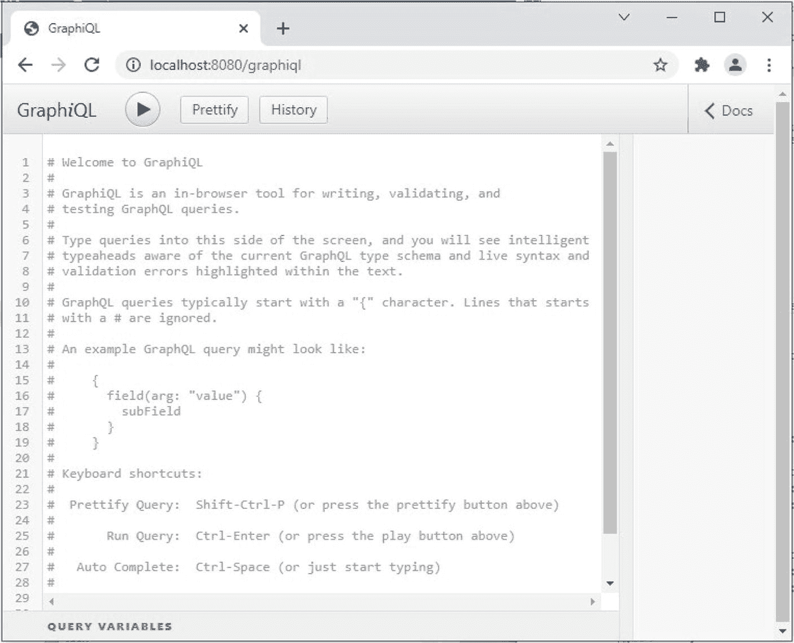

GraphiQL 浏览器标签页的截图，顶部有一个包含播放、美化、历史和文档按钮的工具栏，下方是 28 行代码。它显示了欢迎消息，随后是 GraphiQL 的描述，以及一个包含字段和子字段函数及键盘快捷键的查询示例。

图 3-3

GraphiQL 查询浏览器

最后，你需要配置产品 Web 微服务，如清单 3-33 所示。

```
spring:
application:
name: product-web
graphql:
graphiql:
enabled: true
server:
port: 8080
acme:
PRODUCT_SERVICE_URL: http://localhost:8081/products
PRODUCT_CATEGORY_URL: http://localhost:8081/category
PRODUCT_SERVICE_BY_CAT_URL: http://localhost:8081/productsbycat
清单 3-33
产品 Web 微服务配置 (ch03\ch03-03\02-ProductWeb\src\main\resources\application.yml)
```

这里的大部分配置都很简单。你需要特别关注的是 GraphQL 的配套工具 GraphiQL。这个 UI 工具可以与任何 GraphQL 服务器通信，有助于针对 GraphQL API 进行开发和消费。Spring GraphQL 自带一个默认的 GraphQL 页面，暴露在 `/graphiql` 端点上。该端点默认是禁用的，但可以通过启用 `spring.graphql.graphiql.enabled` 属性来开启，清单 3-33 中正是这样做的。这是一种快速而简洁的浏览器内编写和测试查询的方式，尤其在开发和测试阶段非常有用。


### 构建并运行微服务

`ch03\ch03-03` 文件夹包含构建这些示例所需的 Maven 脚本。首先，你需要启动 MongoDB 服务器。请参考附录 B 了解如何设置并启动 MongoDB 服务器。你需要执行清单 3-34 中的命令来启动 MongoDB。

```
(base) binildass-MBP:bin binil$ pwd
/Users/binil/Applns/mongodb/mongodb-macos-x86_64-4.2.8/bin
(base) binildass-MBP:bin binil$ mongod --dbpath /usr/local/var/mongodb --logpath /usr/local/var/log/mongodb/mongo.log
清单 3-34
启动 MongoDB 服务器
```

接下来，打开两个命令终端，并将目录切换到两个微服务的顶层文件夹。然后，使用 `make.sh` 和 `run.sh` 脚本构建并运行 Product Server 微服务，如清单 3-35 所示。

```
(base) binildass-MacBook-Pro:01-ProductServer binil$ pwd
/Users/binil/binil/code/mac/mybooks/docker-04/Code/ch03/ch03-03/01-ProductServer
(base) binildass-MacBook-Pro:01-ProductServer binil$ sh make.sh
[INFO] Scanning for projects...
[INFO]
...
binildass-MacBook-Pro:01-ProductServer binil$
binildass-MacBook-Pro:01-ProductServer binil$ sh run.sh
...
2024-01-21 20:44:22 INFO  Startup.log:50 - Starting EcomProd
...
2024-01-21 20:44:23 INFO  InitComponent.init:47 - Start...
2024-01-21 20:44:23 DEBUG InitComponent.init:51 – Delete…
2024-01-21 20:44:23 DEBUG InitComponent.init:56 – Create…
2024-01-21 20:44:23 INFO  InitComponent.init:105 - End
2024-01-21 20:44:24 INFO  Startup.log:56 - Started EcomProd
清单 3-35
使用脚本构建并运行 Product Server 微服务
```

接下来，构建并运行 Product Web 微服务，如清单 3-36 所示。

```
(base) binildass-MacBook-Pro:02-ProductWeb binil$ pwd
/Users/binil/binil/code/mac/mybooks/docker-04/Code/ch03/ch03-03/02-ProductWeb
(base) binildass-MacBook-Pro:02-ProductWeb binil$ sh make.sh
[INFO] Scanning for projects...
[INFO]
...
binildass-MacBook-Pro:02-ProductWeb binil$
binildass-MacBook-Pro:02-ProductWeb binil$ sh run.sh
...
2024-01-21 20:46:04 INFO  Startup.log:50 - Starting EcomProd
...
2024-01-21 20:46:05 INFO  InitComponent.init:37 - Start
2024-01-21 20:46:05 DEBUG InitComponent.init:39 - Do Nothing
2024-01-21 20:46:05 INFO  InitComponent.init:41 - End
2024-01-21 20:46:06 INFO  Startup.log:56 - Started EcomProd….
...
清单 3-36
使用脚本构建并运行 Product Web 微服务
```

现在两个微服务都已启动并运行，你可以对它们进行测试了。

### 测试微服务

一旦两个微服务都启动并运行，你可以使用 Mongo 终端检查 MongoDB 服务器，以确保 Product Server 微服务在启动时向 MongoDB 服务器插入了几个产品。参见清单 3-37。

```
> db.productOR.find()
{ "_id" : ObjectId("61a71908b1690955cc51afff"), "name" : "Kamsung Mobile", "code" : "KAMSUNG-TRIOS", "title" : "Tablet Trios 12 inch , black , 12 px ....", "price" : 12000, "category" : "Mobile", "_class" : "com.acme.ecom.product.model.ProductOR" }
{ "_id" : ObjectId("61a71908b1690955cc51b000"), "name" : "Lokia Mobile", "code" : "LOKIA-POMIA", "title" : "Lokia 12 inch , white , 14px ....", "price" : 9000, "category" : "Mobile", "_class" : "com.acme.ecom.product.model.ProductOR" }
{ "_id" : ObjectId("61a71908b1690955cc51b001"), "name" : "Mapple Mobile", "code" : "MAPPLE-EPHONE", "title" : "Mapple 7 inch, purple, 14px ....", "price" : 8000, "category" : "Mobile", "_class" : "com.acme.ecom.product.model.ProductOR" }
{ "_id" : ObjectId("61a71908b1690955cc51b002"), "name" : "Mapple Tablet", "code" : "MAPPLE-PAD", "title" : "Mapple 11 inch , grey, 140px ....", "price" : 19000, "category" : "Tablet", "_class" : "com.acme.ecom.product.model.ProductOR" }
> db.productCategoryOR.find()
{ "_id" : ObjectId("61a71908b1690955cc51affd"), "name" : "Mobile", "title" : "Mobiles and Tablet", "description" : "Mobile phones", "imgUrl" : "mobile.jpg", "_class" : "com.acme.ecom.product.model.ProductCategoryOR" }
{ "_id" : ObjectId("61a71908b1690955cc51affe"), "name" : "Tablet", "title" : "Tablet like pads", "description" : "Tablet pads", "imgUrl" : "tablet.jpg", "_class" : "com.acme.ecom.product.model.ProductCategoryOR" }
>
清单 3-37
使用 Mongo Shell 检查 MongoDB 服务器
```

一切就绪后，你可以使用浏览器访问 Web 应用程序。指向此 URL：

`http://localhost:8080/product.html`

要测试 CRUD 操作，请按照第 1 章最后一节（标题为“你的第一个 Java 微服务”）中“使用 UI 测试微服务”小节描述的说明进行操作。在尝试测试更多方法之前，让我们先暂停一下，检查其他几个方面。

当你在浏览器中访问此 URL 时，需要关注 Product Web 微服务终端，如清单 3-38 所示。

```
...
2024-01-21 20:47:47 INFO  ProductRestController.getAllProducts:70 - Start
2024-01-21 20:47:47 INFO  ProductBusinessService.getAllProducts:64 - Start. I am instance: com.acme.ecom.product.service.ProductBusinessService@528729a9
2024-01-21 20:47:47 INFO  ProductBusinessService.getAllProducts:69 - Ending...
2024-01-21 20:47:47 INFO  ProductRestController.getAllProducts:74 - Ending...
清单 3-38
检查 Product Web 微服务终端
```

下一步，测试基于 GraphQL 的端口。

在命令终端中，执行一个针对 GraphQL 端口的 cURL 命令，如清单 3-39 所示。

```
curl --request POST 'localhost:8080/graphql' --header 'Content-Type: application/json' --data-raw '{"query":"query {products(count: 2, offset: 0) {productId name code}}"}'
清单 3-39
向 GraphQL 端点发送 cURL 请求
```

同样，你需要关注 Product Web 微服务终端，如清单 3-40 所示。

```
...
2024-01-21 20:51:05 INFO  ProductGraphQLController.products:54 - Start
2024-01-21 20:51:05 INFO  ProductDao.getProducts:54 - Start
2024-01-21 20:51:05 INFO  ProductBusinessService.getAllProducts:64 - Start. I am instance: com.acme.ecom.product.service.ProductBusinessService@528729a9
2024-01-21 20:51:05 INFO  ProductBusinessService.getAllProducts:69 - Ending...
2024-01-21 20:51:05 INFO  ProductDao.getProducts:56 - Ending...
清单 3-40
检查 Product Web 微服务终端
```


如前所述，从 Product Web 微服务终端可以看到，无论客户端请求到达服务器的哪个端口，产品业务服务的实例都会被池化或复用。

你可以使用清单 3-41 中的 cURL 命令执行该请求的更多变体。

```
curl --request POST 'localhost:8080/graphql' --header 'Content-Type: application/json' --data-raw '{"query":"query {products(count: 2, offset: 0) {productId code productCategory {id name title}}}"}'
curl --request POST 'localhost:8080/graphql' --header 'Content-Type: application/json' --data-raw '{"query":"query {products(count: 2, offset: 0) {productId code productCategory {id name products {productId}}}}"}'
清单 3-41
更多针对 GraphQL 端点的 cURL 请求
```

或者，通过以下 URL 访问 GraphiQL UI：

`http://localhost:8080/graphiql`

发送此请求以在 GraphiQL UI 中获取响应（见图 3-4）：

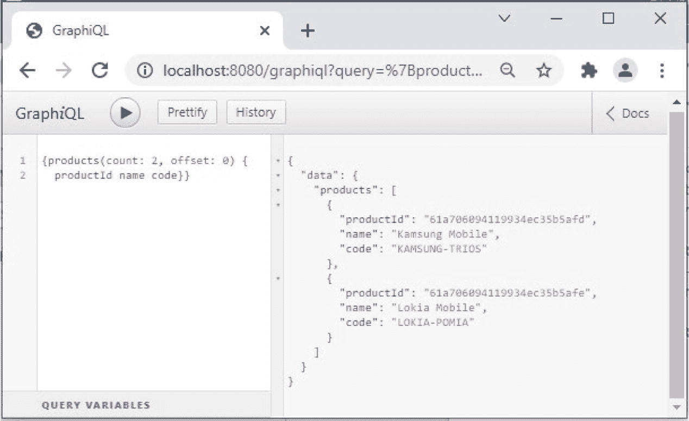

GraphiQL 浏览器标签页的截图，顶部有一个工具栏，下方分为两个部分。左侧的查询变量部分包含两行代码，涉及 products、productId、name、code 等函数。右侧部分包含多行代码，涉及 data、products、productId 等函数。

图 3-4

GraphiQL 顶级查询

```
{products(count: 2, offset: 0) {productId name code}}
```

接下来，你可以发送以下请求，在 GraphiQL UI 中获取更详细的响应（见图 3-5）：

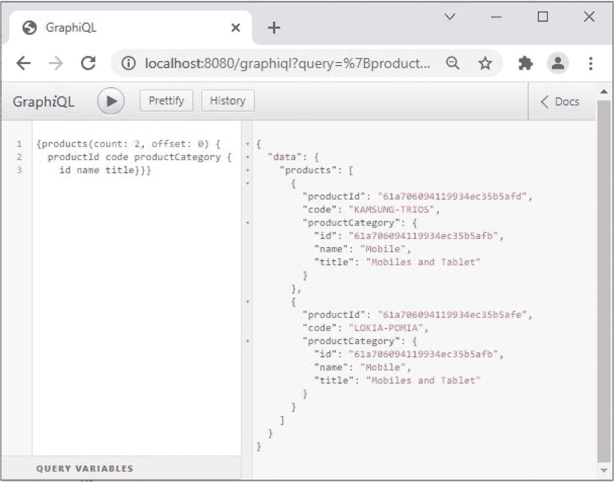

GraphiQL 浏览器标签页的截图，顶部有一个工具栏，下方分为两个部分。左侧的查询变量部分包含三行代码，涉及 products、productId、code、productCategory 等函数。右侧部分包含多行代码，涉及 data、products、productId、code、productCategory、id 等函数。

图 3-5

GraphiQL 一级依赖查询

```
{products(count: 2, offset: 0) {productId code productCategory {id name title}}}
```

通过发送此请求，可以在 GraphiQL UI 中获得更详细的响应（见图 3-6）：

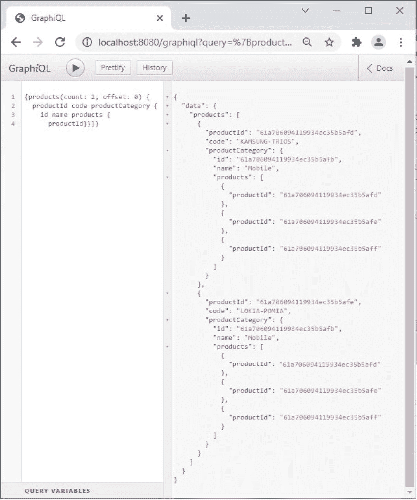

GraphiQL 浏览器标签页的截图，顶部有一个工具栏，下方分为两个部分。左侧的查询变量部分包含四行代码，涉及 products、productId、code、id、name、productId 等函数。右侧部分包含多行代码，涉及 data、products、productId、code、productCategory 等函数。

图 3-6

GraphiQL 二级依赖查询

```
{products(count: 2, offset: 0) {productId code productCategory {id name products {productId}}}}
```

执行这些查询时，请观察服务器端日志。很明显，来自客户端设备的单个查询被映射到多个内部服务器端调用。如果你交替向构成外层洋葱圈的 REST 控制器和 GraphQL 控制器发送请求，还可以从服务器端日志中识别出，构成内层洋葱圈的 Service 类（以及实体类）及其实例正在被复用。在这里，洋葱架构正在发挥作用！

## 总结

在本章开始时，我通过展示用 MongoDB 替换 PostgreSQL 的插件机制，探讨了端口和适配器的可插拔特性如何在企业应用中发挥作用。这种插件机制是六边形架构的一个关键特征。接着，你了解了六边形架构和洋葱架构的互补性质。我再次演示了一种在六边形架构中添加更多端口的灵活方式，使得应用程序的核心保持不变。同样重要的是洋葱架构中的分层概念，其中外层依赖于内层，并且随着你越来越深入内层，你会探索到业务领域的核心，而核心的可复用性是一个理想的目标。现在，你应该对微服务架构范式中可用的选项有了扎实的理解。你已经准备好学习微服务中事件和消息传递的下一级概念，这些内容将在第 4 章中介绍。

# 4. 面向消息的微服务

在本书的前几章中，你看到了微服务之间的相互交互，以及人类参与者（最终用户）通过客户端设备（浏览器）与边缘微服务进行交互。由于微服务本质上是“微”型的，多个微服务通常需要相互通信以满足有用的业务功能。这些微服务间的通信可以在一个业务领域内进行，也可以跨业务领域进行。

微服务是应用程序的分布式部分，运行在多个进程或服务上，有时甚至跨多个服务器或主机，甚至跨多个地理位置。每个服务实例通常是一个计算机进程。因此，微服务间的通信使用进程间通信（IPC）协议（如 HTTP 或 AMQP）或二进制协议（如 TCP）进行，具体取决于这些微服务的性质。

使用 REST 进行微服务间通信简单直接。REST 在其最简单的形式中是同步的，即客户端发送请求并等待服务的响应。因此，客户端代码或客户端线程只有在收到服务器的 HTTP 响应后才能继续其任务。虽然这没问题，但你可以使用其他范式来实现微服务间通信，而且方式更灵活、更具可扩展性。本章介绍面向消息的微服务，其中微服务可以通过消息骨干网进行通信。

本章涵盖以下概念：

*   微服务的特性

*   基于 REST 的请求-响应风格的微服务间通信

*   微服务间通信对灵活模式的需求

*   消息通道简介

*   使用消息通道进行微服务间通信

*   为 Web 浏览器的请求-响应风格交互带来灵活性

## 微服务的特性

本节首先探讨微服务应用程序的典型特性，这将帮助你理解微服务间通信需要新范式的原因。


### 微服务是自治的

您知道微服务之间会相互通信，因为单个微服务可能不足以完成端到端的业务用例。同时，微服务架构的目标之一是每个微服务都是自治的，并且对客户端消费者可用，即使构成端到端应用流程的其他微服务宕机或不健康也是如此。这超越了微服务拥有并封装自身数据这一基本原则。

当微服务使用典型的同步风格 REST 进行通信时，它们被称为以点对点的方式进行通信。因此，HTTP 传输是一个点对点通道，它确保只有一个接收者会收到特定的消息（见图 4-1）。

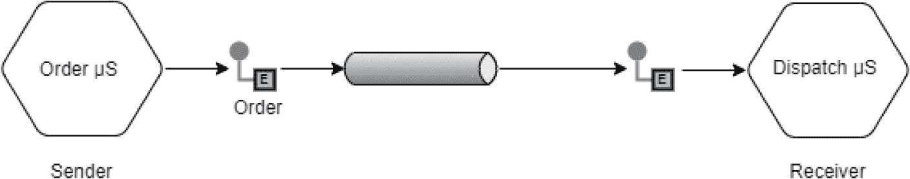

一个点对点通信系统的示意图。它描绘了左侧的一个发送者，向一个接收者发送请求。

图 4-1
点对点通信

图 4-1 展示了一个订单微服务。订单被创建，然后发送到调度微服务。当您从订单微服务调用调度微服务时（例如，为调度订单事件执行 HTTP 请求），这个调用链可以向客户端应用程序提供响应。当这些微服务中的某些发生故障时，这种架构的弹性将不足。换句话说，如果提供者微服务无法在 SLA 内响应，消费者微服务将收到一个错误。

### 微服务是演进的

一个更好的替代方案是在微服务之间采用松耦合。您可以用消息通道替代 HTTP 通道。同样，消息队列是点对点的，因此您需要使用消息主题，它是一对多的。主题提供了发布-订阅语义，它会将特定事件的副本传递给每个订阅的接收者。

在发布-订阅通道中，一个输入通道分成多个输出通道，每个输出通道对应一个订阅者微服务。当一个事件被发布到通道中时，发布-订阅通道会将消息的副本传递给每个输出通道。每个输出通道只有一个订阅者微服务，该服务只允许消费一次消息。这样，每个订阅者只会收到一次消息；消费过的副本会从它们的通道中消失。见图 4-2。

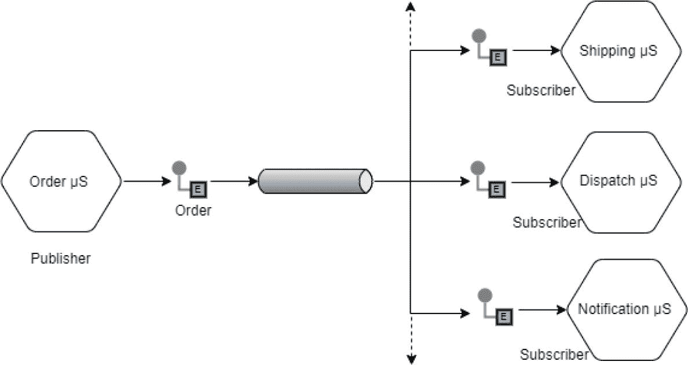

一个发布-订阅通道的流程图。它从发布者向订阅者交付订单开始。订阅者被调度并收到通知。

图 4-2
发布-订阅通道

这种发布-订阅通道不仅为单个微服务带来了更多的自治性，还允许微服务应用随着时间的推移按自己的节奏演进。换句话说，如图 4-2 所示，当微服务应用随时间增长，您需要添加更多微服务时，无需干扰现有架构；甚至无需重启现有的应用部署！

### 蜂巢类比

到目前为止的讨论让我们想到了微服务架构的蜂巢类比。微服务应用架构从第一个、单个微服务开始，逐渐增长到更多的微服务，就像建造蜂巢一样（见图 4-3）。

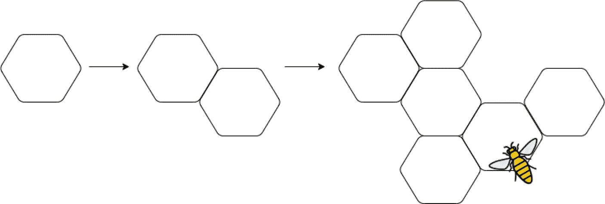

一个类似微服务的蜂巢结构流程图。它从一个六边形结构开始，最终形成蜂巢结构的 6 个六边形。

图 4-3
微服务蜂巢类比

下一节将探讨消息基础设施作为微服务间通信的媒介。

## 异步，仍是请求-回复

我在上一节中故意省略了另一个重要方面，即典型的微服务间通信需要请求-回复语义。消息通道是异步的，通常是单向的，或者仅仅是请求。那么，您如何获得相应的回复呢？本节将讨论这个问题。

### 异步请求

HTTP 通道不仅是同步的，而且还为发送者提供了一种接收回复或响应的机制。然而，如前所述，要充分发挥基于消息的架构的优势，事件委托机制必须是天生异步的。然而，可能有许多用例仍然需要同步风格的请求-回复语义。挑战在于如何在本质上是单向通道的消息通道上模拟请求-回复语义。

### 异步请求-回复

当应用程序发送消息时，它如何通过消息通道从接收者那里获得相应的响应？请求-回复企业集成模式提供了一种经过验证的机制，用于在异步通道上进行同步风格的消息交换（见图 4-4）。

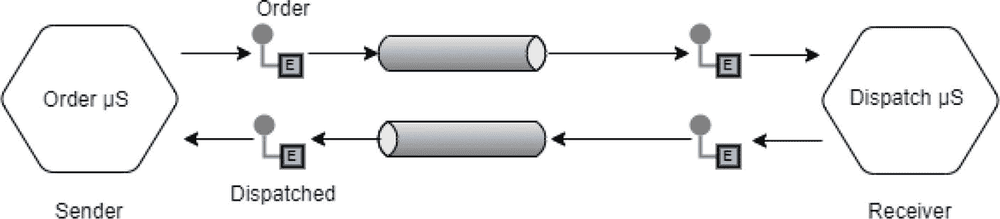

一个请求-回复的流程图。发送者应接收者的请求调度了一个订单。图中描绘了一条同步消息。

图 4-4
通过异步实现请求-回复

解决方案是发送一对请求-回复消息，每条消息都在自己的通道上。但有一个问题。服务提供者或接收者（或服务器角色微服务）可以在其公布的知名通道上接受请求。但是客户端的通道地址呢？多个客户端可以连接到同一个服务器角色的微服务进程，服务器不可能知道或记住回复通道，因为客户端来来去去，未来还可能出现更多的新客户端。相反，一种经过验证的方法是让请求消息包含一个返回地址，指示将回复消息发送到哪里（见图 4-5）。

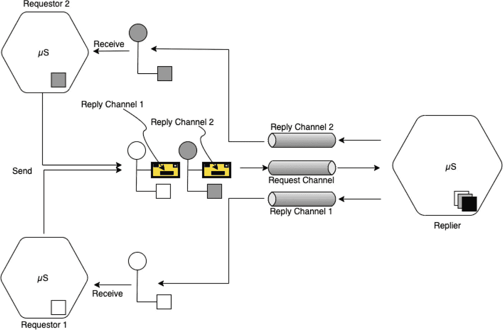

一个返回地址模式的示意图。它从两个请求者开始，它们通过不同的通道向一个回复者发送请求并接收回复。

图 4-5
返回地址模式

通过将返回地址附加到请求中，回复者无需知道或记住将回复发送到哪里。它只需检查并从请求中推断出来。如果发送给同一个回复者的不同消息需要回复到不同的地方，回复者可以推断出每个请求对应的回复应发送到哪里。这将使用哪些通道进行请求和回复的知识封装在请求者内部，因此这些决策不必硬编码在回复者中。返回地址被放置在消息的头部，因为它不是正在传输的数据的一部分，并且消息传输基础设施无需检查有效载荷。

下一节将用代码演示这个过程。

## 微服务上的同步与异步

在此示例中，您将调整之前看到的同一组微服务。一个消费者微服务和一个提供者微服务将使用消息通道相互通信。为简化示例，提供者微服务将实体存储在内存数据库中。


### 基于异步通道设计微服务

本示例对第 2 章图 2-1 中展示的六边形微服务视图进行了细微调整，使两个微服务通过异步消息通道而非 HTTP 通道进行通信。Apache Kafka 被用作消息通道，它本质上是异步的。请记住，目标是在基于 Kafka 的异步通道上模拟同步风格的通信。参见图 4-6。

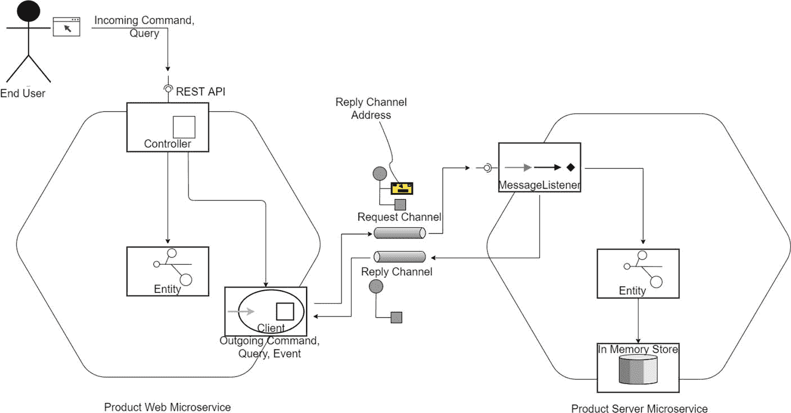

微服务通信流程图。流程始于传入的命令、REST API、实体、请求通道以及最终实体。

图 4-6

微服务通过异步通道通信

来自浏览器的最终用户请求将首先到达 Product Web 微服务。Product Web 微服务将通过消息通道将请求委托给 Product Server 微服务。Product Server 微服务可以自动知道应向哪个通道向 Product Web 微服务发送回复，但如前所述，硬编码的假设会降低软件的灵活性并增加维护难度。在这种情况下，单个 Product Server 微服务实例可能正在处理来自多个不同请求者类型，甚至来自同一请求者类型的多个实例的调用，因此回复通道并非对每条消息都相同。它取决于发送该请求消息的请求者。在这种情况下，你可以使用返回地址模式。

请注意，此示例中的 Product Server 微服务使用的是消息端口，这与之前示例中使用的 HTTP 端口不同。这进一步验证了六边形架构中不同的端口和适配器如何能够根据需要轻松地插入。

### 理解代码

本书的源代码可通过图书产品页面在 GitHub 上获取，网址为 [`www.apress.com/9798868805547`](http://www.apress.com/9798868805547)。本示例的代码组织在 `ch04\ch04-01` 文件夹内。本节首先查看消费者微服务（即 Product Web 微服务）中的变更。

使用的核心组件是 Spring 中的 `ReplyingKafkaTemplate<K,V,R>`，它扩展了 `KafkaTemplate` 的行为，以提供请求-回复语义。要设置此组件，你需要一个生产者（`ProducerFactory`）和一个 `KafkaMessageListenerContainer`。清单 4-1 展示了如何使用 Kafka `Configuration` 类来实现这一点。

```
@Configuration
public class KafkaConfig {
@Bean
public Map producerConfigs() {
// 配置值写在这里
}
@Bean
public Map consumerConfigs() {
// 配置值写在这里
}
@Bean
public ProducerFactory producerFactory() {
return new DefaultKafkaProducerFactory(
producerConfigs());
}
@Bean
public KafkaTemplate kafkaTemplate() {
return new KafkaTemplate(producerFactory());
}
@Bean
public ReplyingKafkaTemplate
replyKafkaTemplate(ProducerFactory pf, KafkaMessageListenerContainer container){
return new ReplyingKafkaTemplate(pf, container);
}
@Bean
public KafkaMessageListenerContainer
replyContainer(
ConsumerFactory cf) {
ContainerProperties containerProperties =
new ContainerProperties(requestReplyTopic);
return new KafkaMessageListenerContainer(cf,
containerProperties);
}
@Bean
public ConsumerFactory
consumerFactory() {
return new DefaultKafkaConsumerFactory(
consumerConfigs(),
new StringDeserializer(),new JsonDeserializer(
Products.class));
}
@Bean
public KafkaListenerContainerFactory>
kafkaListenerContainerFactory() {
ConcurrentKafkaListenerContainerFactory factory =
new ConcurrentKafkaListenerContainerFactory();
factory.setConsumerFactory(consumerFactory());
factory.setReplyTemplate(kafkaTemplate());
return factory;
}
@Bean
public KafkaAdmin admin() {
Map configs = new HashMap();
configs.put(ConsumerConfig.BOOTSTRAP_SERVERS_CONFIG,
bootstrapServers);
return new KafkaAdmin(configs);
}
@Bean
public NewTopic requestTopic() {
Map configs = new HashMap();
configs.put("retention.ms", replyTimeout.toString());
return new NewTopic(requestReplyTopic, 2, (short) 1).
configs(configs);
}
}
清单 4-1
消息生产者的 Kafka 配置 (ch04\ch04-01\02-ProductWeb\src\main\java\com\acme\ecom\product\KafkaConfig.java)
```

为了理解事件传输机制，请考虑一个典型事件（也称为消息）的外观：

*   事件键：“Ria”

*   事件值：“向 Ann 支付了 300 美元”

*   事件时间戳：“2021 年 9 月 25 日下午 3:06”

每个事件都有一个发起者，并且事件通常是时间序列数据。如果你查看发送事件的模板，`ReplyingKafkaTemplate <K, V, R>` 在消息被提供者或生产者端的 Kafka 监听器消费后，会提供一个返回对象或回复对象。类型参数表示：

*   `K` – 键类型

*   `V` – 出站数据类型

*   `R` – 回复数据类型

此处，示例事件中显示的事件时间戳可以是一个可选的元数据标头。键用于确定消息被追加到消息基础设施日志中的哪个分区。值是消息的实际负载。当新事件发布到主题时，它会被追加到该主题的某个分区中。具有相同事件键（例如，客户 ID 或账户 ID）的事件会被写入同一分区，并且 Kafka 保证给定主题-分区的任何消费者将始终按照写入顺序读取该分区的事件。

键和/或值也可以为 null。如果键为 null，则会随机选择一个分区。如果值为 null，并且你为主题启用了日志压缩策略而非日志保留策略，则它可以具有特殊的“删除”语义。


使用键（key）将消息定向到特定分区是生产者的默认策略。如果你在某个主题上拥有多个消费者组^(³)中的消费者，那么指定键以确保所有具有相同键的事件都进入同一个分区，对于保证消息处理的正确顺序至关重要。如果没有键，两个具有相同键的消息可能会进入不同的分区，并由组中不同的消费者处理，从而导致顺序错乱。

最终，由生产者决定使用哪个分区。如果你指定了分区参数，则会使用该参数，而键将被“忽略”，尽管它仍然会被写入主题。这允许你在拥有键的情况下实现自定义分区。换句话说，顺序保证并非来自键，而是来自消息位于同一分区。重申一下，消息到分区的路由不必基于键。你可以在创建 `ProducerRecord` 时显式指定一个分区。

此示例将 Bean 定义为 `ReplyingKafkaTemplate<String, String, Products>`，你将向 Kafka 发送一个 `String` 类型的请求，然后获取 `Products` 类型的对象作为回复数据类型。你将在下一节中创建 Products 及其包含的 DTO 类。总而言之，你设置了一个 `ReplyingKafkaTemplate`，它发送带有 `String` 键的请求消息，并接收带有 `String` 键的回复消息。`ReplyingKafkaTemplate` 需要由 `Request ProducerFactory`、`ReplyConsumerFactory` 和 `MessageListenerContainer` 支持，并带有相应的消费者和生产者配置，这些已在清单 4-1 的 `KafkaAdmin` 中完成。

当你在应用程序上下文中定义一个 `KafkaAdmin` Bean 时，它可以自动向代理添加主题。为此，你需要为每个主题向应用程序上下文添加一个 `NewTopic @Bean`。

`ContainerProperties` 包含监听器容器的运行时属性。尽管你使用 `requestReplyTopic` 指定了回复地址，但你稍后会看到，此示例在发送消息时显式设置了返回地址。它使用 Java 消费者创建了一个单线程的消息监听器容器。

在 `ReplyingKafkaTemplate` 中使用的 REST 控制器类，在清单 4-2 的 `KafkaAdmin` 中进行了配置。

```
@RestController
public class ProductRestController{
@Autowired
ReplyingKafkaTemplate kafkaTemplate;
@Value("${kafka.topic.request-topic}")
private String requestTopic;
@Value("${kafka.topic.requestreply-topic}")
private String requestReplyTopic;
@RequestMapping(value = "/productsweb",
method = RequestMethod.GET,
produces = {MediaType.APPLICATION_JSON_VALUE})
public ResponseEntity>>
getAllProducts() throws InterruptedException,
ExecutionException {
ProducerRecord record =
new ProducerRecord(requestTopic, "All");
record.headers().add(new RecordHeader(
KafkaHeaders.REPLY_TOPIC,
requestReplyTopic.getBytes()));
RequestReplyFuture
sendAndReceive =
kafkaTemplate.sendAndReceive(record);
ConsumerRecord consumerRecord =
sendAndReceive.get();
return new ResponseEntity(consumerRecord.value().
getProducts(), HttpStatus.OK);
}
}
清单 4-2
消息生产者的 Kafka 配置 (ch04\ch04-01\02-ProductWeb\src\main\java\com\acme\ecom\product\controller\ProductRestController.java)
```

REST 控制器接收来自客户端设备（本例中为浏览器）的请求。在控制器内部，`requestReplyKafkaTemplate` 生成并设置一个 `KafkaHeaders.CORRELATION_ID` 头。`CorrelationId` 应由提供者微服务消费，并在响应头中返回相同的值。你需要显式地在请求上设置 `KafkaHeaders.REPLY_TOPIC` 头，尽管之前在 `KafkaConfig` 中已经将相同的回复主题冗余连接到了 `replyListenerContainer`。

`ReplyingKafkaTemplate` 的 `sendAndReceive` 方法发送一个请求并在默认超时时间内接收回复。它会返回一个 `RequestReplyFuture`，你可以对其调用 `get` 方法，该方法会在必要时等待计算完成，然后检索其结果。本例中为 `Products`。

接下来，查看 `Products` 类。参见清单 4-3。

```
public class Products {
private List products;
public List getProducts() {
return products;
}
public void setProducts(List products) {
this.products = products;
}
}
清单 4-3
用于返回产品实体集合的容器类 (ch04\ch04-01\02-ProductWeb\src\main\java\com\acme\ecom\product\model\Products.java)
```

`Products` 只是一个容器包装器，用于保存 `Product` 实例的集合。

Product Web 微服务的配置如清单 4-4 所示，其中 `requestreply-topic` 指的是提供者应发送响应的主题。

```
server.port=8080
spring.kafka.bootstrap-servers: localhost:9092
spring.kafka.consumer.auto-offset-reset: earliest
spring.kafka.consumer.group-id: product-web
kafka.topic.requestreply-topic: product-req-reply-topic
kafka.topic.request-topic=product-req-topic
kafka.request-reply.timeout-ms: 20000
清单 4-4
Product Web 微服务配置 (ch04\ch04-01\02-ProductWeb\src\main\resources\application.properties)
```

在 Product Server 微服务端，一个常规的 `KafkaListener` 正在监听请求主题。参见清单 4-5。

```
@Component
public class ProductListener {
@KafkaListener(topics = "${kafka.topic.request-topic}")
@SendTo
public Products listen(String request) {
List productList = getAllTheProducts();
Products products = new Products();
products.setProducts(productList);
return products;
}
}
清单 4-5
Product Web 微服务配置 (ch04\ch04-01\01-ProductServer\src\main\java\com\acme\ecom\product\kafka\client\ProductListener.java)
```

此监听器额外使用了 `@SendTo` 注解来提供回复消息。由 `getAllTheProducts()` 方法检索并由 `listener` 方法返回的 `Product` 实例会自动包装到回复消息中。`CORRELATION_ID` 被添加，回复被发布到 `REPLY_TOPIC` 指定的主题上。`@KafkaListener` 用于订阅请求 Kafka 主题。使用该注解，`@SendTo` 注解使 `listener` 方法能够将响应发送到另一个回复主题。图 4-7 说明了这些交互的动态过程，并按照事件流顺序进行了标记。

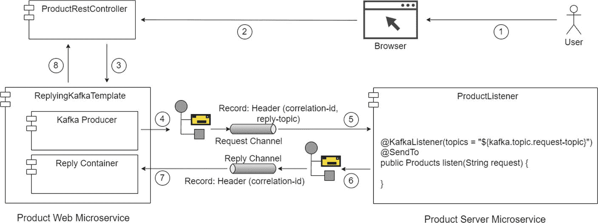

Kafka 模板回复的流程图。它由产品 Web 和服务器微服务两个模块组成。回复 Kafka 模板包含一个 Kafka 生产者和一个回复容器。

图 4-7

回复 Kafka 模板

提供者微服务也有一个 `KafkaConfig`，但与消费者微服务相比，它简单直接，因此此处未列出。


### 构建并运行微服务

`ch04\ch04-01` 文件夹包含构建这些示例所需的 Maven 脚本。第一步，你需要启动 Kafka 代理。请参考附录 D 了解如何设置并启动 Kafka 服务器。你需要执行清单 4-6 中的命令，从 Kafka 安装位置启动 Kafka。

```
bin/zookeeper-server-start.sh config/zookeeper.properties
bin/kafka-server-start.sh config/server.properties
清单 4-6
启动 Kafka 代理的命令
```

接下来，打开两个命令终端，并将目录切换到两个微服务的顶层文件夹。然后，使用 `make.sh` 和 `run.sh` 脚本构建并运行 Product Server 微服务，如清单 4-7 所示。

```
(base) binildass-MacBook-Pro:01-ProductServer binil$ pwd
/Users/binil/binil/code/mac/mybooks/docker-04/Code/ch04/ch04-01/01-ProductServer
(base) binildass-MacBook-Pro:01-ProductServer binil$ sh make.sh
[INFO] Scanning for projects...
[INFO]
...
binildass-MacBook-Pro:01-ProductServer binil$
binildass-MacBook-Pro:01-ProductServer binil$ sh run.sh
.   ____          _            __ _ _
/\\ / ___'_ __ _ _(_)_ __  __ _ \ \ \ \
( ( )\___ | '_ | '_| | '_ \/ _` | \ \ \ \
\\/  ___)| |_)| | | | | || (_| |  ) ) ) )
'  |____| .__|_| |_|_| |_\__, | / / / /
=========|_|==============|___/=/_/_/_/
:: Spring Boot ::                (v3.2.0)
2024-01-23 11:43:59 INFO  Startup.log:50 - Starting EcomProd
...
2024-01-23 11:44:00 INFO  InitComponent.init:43 - Start
2024-01-23 11:44:00 INFO  InitComponent.init:44 - Doing Nothing...
2024-01-23 11:44:00 INFO  InitComponent.init:66 - End
2024-01-23 11:44:01 INFO  Startup.log:56 - Started EcomProd
2024-01-23 11:56:03 DEBUG ProductListener.listenWithHeaders:58 - Received request : All
...
清单 4-7
构建并运行 Product Server 微服务的命令
```

接下来，构建并运行 Product Web 微服务，如清单 4-8 所示。

```
(base) binildass-MacBook-Pro:02-ProductWeb binil$ pwd
/Users/binil/binil/code/mac/mybooks/docker-04/Code/ch04/ch04-01/02-ProductWeb
(base) binildass-MacBook-Pro:02-ProductWeb binil$ sh make.sh
[INFO] Scanning for projects...
[INFO]
...
binildass-MacBook-Pro:02-ProductWeb binil$
binildass-MacBook-Pro:02-ProductWeb binil$ sh run.sh
...
2024-01-23 11:54:08 INFO  StartupInfoLogger.logStarting:50 - Starting EcomProductWebMicro...
...
2024-01-23 11:54:10 INFO  StartupInfoLogger.logStarted:56 - Started EcomProductWebMicro...
清单 4-8
构建并运行 Product Web 微服务的命令
```

现在两个微服务都已启动并运行，你可以测试它们了。

### 测试微服务

一切就绪后，你可以使用浏览器访问 Web 应用程序（见图 4-8）。指向以下 URL：

`http://localhost:8080/product.html`

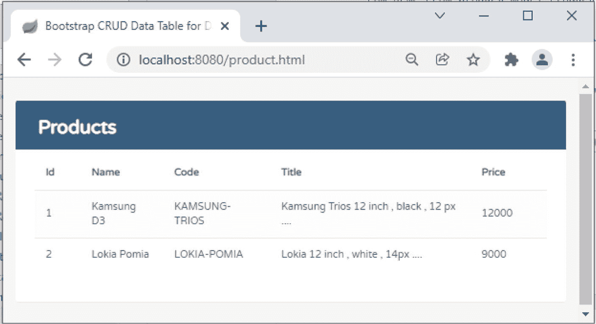

Chrome 浏览器中一个标签页的截图，显示了一个 Bootstrap 数据表格。表格列出了产品名称、代码、标题和价格。

图 4-8

测试微服务

当你在浏览器中触发该 URL 时，请求会命中 Product Web 微服务的 REST 控制器。此后，流程如图 4-7 所示。

为了示例的完整性，你可能还想列出并查看代理中创建的请求和响应队列，如清单 4-9 所示。

```
binildass-MacBook-Pro:kafka_2.13-2.5.0 binil$ sh ./bin/kafka-topics.sh --zookeeper localhost:2181 --list
__consumer_offsets
product-req-reply-topic
product-req-topic
binildass-MacBook-Pro:kafka_2.13-2.5.0 binil$
清单 4-9
列出 Kafka 代理中创建的队列
```

## SEDA 与微服务

在讨论并执行了关于如何通过异步消息传递骨干网进行微服务间通信的示例之后，现在是时候了解你所追求的更宏大的图景了。SEDA（分阶段事件驱动架构）概念用于使服务能够良好地适应负载，防止在需求超过服务容量时资源过度提交。接下来你将对此进行研究，并将该概念与你使用消息传递基础设施的企业微服务相关联。

### SEDA 架构

在 SEDA 中，应用程序由通过显式队列连接的事件驱动阶段网络组成。这种架构允许服务良好地适应负载，防止在需求超过服务容量时资源过度提交。SEDA 使用一组动态资源控制器来使阶段保持在其运行范围内，即使在负载大幅波动的情况下也是如此。这在 Matt Welsh、David Culler 和 Eric Brewer 撰写的论文《SEDA：一种用于良好适应、可扩展互联网服务的架构》中有所解释。该架构如图 4-9 所示，改编自该论文。

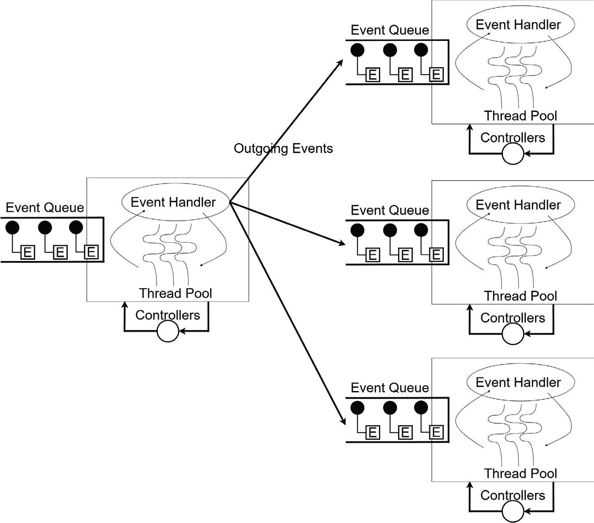

事件队列和传出事件处理程序的示意图。事件处理程序由线程池组成，并与控制器相连。

图 4-9

一个 SEDA 阶段

一个阶段由传入事件队列、线程池和应用程序提供的事件处理程序组成。阶段的操作由控制器管理，控制器动态调整资源分配和调度。许多这样的阶段可以链接在一起，形成一个松散耦合的端到端应用程序连续体。

### 作为阶段网络的微服务架构

基于微服务的架构可以设计为由事件队列互连的阶段网络。每个微服务都可以被设想为一个阶段。这些事件队列是有限的；也就是说，如果队列想要拒绝新条目（例如，因为它达到了阈值），入队操作可能会失败。当入队操作失败时，调用方微服务可以使用背压（通过阻塞在满队列上）或负载削减（通过丢弃事件）。或者，微服务可以采取一些特定于服务的操作，例如向用户发送错误，或执行替代功能，例如调用 Hystrix 回调等。

如果尝试使用 SEDA 风格来表示微服务间交互会怎样？见图 4-10。

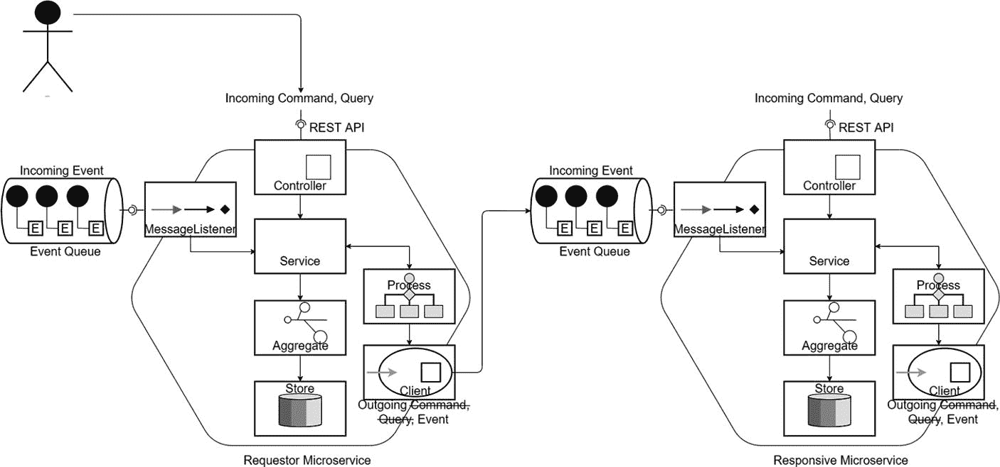

具有请求方和响应方微服务两个模块的异步微服务示意图。用户向微服务发送命令并获取响应。

图 4-10

作为阶段网络的基于异步的微服务架构

以这种方式在两个微服务之间引入队列将提供隔离性、模块化和独立的负载管理，但可能会增加延迟。此外，如果提供方微服务未启动并运行，消费方微服务可以向最终用户提供的承诺可能必须稍后（或最终）才能兑现，这将导致与执行用例的传统方式不同的用户体验。

请注意 Product Web 微服务处理从浏览器接收到的请求的阻塞方式。像 Apache Tomcat 这样的应用服务器中的典型容器通常为每个客户端请求使用一个服务器线程。在负载增加的情况下，这要求容器拥有许多线程来服务所有客户端请求。这限制了可伸缩性，可能由于内存耗尽或容器线程池耗尽而导致。从 Servlet 3.0 规范开始，Java EE 为 Servlet 和过滤器增加了异步处理支持。

下一节将通过一个示例向你展示如何利用这一点来隔离资源，避免不必要的阻塞。


## 在同步与异步微服务上使用异步 HTTP

在本示例中，你将调整本章前面使用过的同一组微服务。一个消费者微服务和一个提供者微服务将通过消息通道相互通信。为简化示例，提供者微服务将实体存储在内存数据库中。此外，当浏览器向第一个（消费者）微服务发送请求时，本示例将使用异步 HTTP 而非同步 HTTP。

### 理解代码

本书的源代码可通过图书产品页面在 GitHub 上获取，网址为 [`www.apress.com/9798868805547`](http://www.apress.com/9798868805547)。本示例的源代码组织在 `ch04\ch04-02` 文件夹内。清单 4-10 首先展示了消费者微服务（即 Product Web 微服务）中的变更。

```
public class ProductRestController{
@RequestMapping(value = "/productsweb", method = RequestMethod.GET,
produces = {MediaType.APPLICATION_JSON_VALUE})
public DeferredResult  getAllProducts()
throws InterruptedException, ExecutionException {
LOGGER.info("Start");
LOGGER.debug("Thread : " + Thread.currentThread());
DeferredResult deferredResult =
new DeferredResult();
ProducerRecord record =
new ProducerRecord(
requestTopic, "All");
record.headers().add(new RecordHeader(
KafkaHeaders.REPLY_TOPIC,
requestReplyTopic.getBytes()));
record.headers().forEach(header ->
LOGGER.debug(header.key() + ":" +
header.value().toString()));
RequestReplyFuture
sendAndReceive =
replyingKafkaTemplate.sendAndReceive(record);
SendResult sendResult =
sendAndReceive.getSendFuture().get();
LOGGER.debug("Request success -> " + sendResult);
sendResult.getProducerRecord().headers().forEach(
header -> LOGGER.debug(header.key() + " : " +
new String(header.value())));
sendAndReceive.addCallback(
new ListenableFutureCallback>() {
@Override
public void onFailure(Throwable ex) {
LOGGER.debug(Thread.currentThread().
toString());
LOGGER.error(ex.getMessage());
}
@Override
public void onSuccess(ConsumerRecord consumerRecord) {
long secondsToSleep = 2;
LOGGER.debug("Starting to Sleep Seconds :
" + secondsToSleep);
try{
Thread.sleep(1000 * secondsToSleep);
}
catch(Exception e) {
//Logger.error("Error : " + e);
}
LOGGER.debug("Awakening from Sleep...");
LOGGER.debug(Thread.currentThread().
toString());
deferredResult.setResult(
consumerRecord.value());
}
}
);
LOGGER.debug("Thread : " + Thread.currentThread());
LOGGER.info("Ending...");
return deferredResult;
}
}
清单 4-10
Product Web 微服务 REST 控制器 (ch04\ch04-02\02-ProductWeb\src\main\java\com\acme\ecom\product\controller\ProductRestController.java)
```

如你所见，REST 控制器中的 `getAllProducts` 方法是异步的。这意味着发起服务 `getAllProducts` 请求的 HTTP 主线程无需阻塞等待该方法完成。其中还包含两秒的休眠，以便你可以在命令终端中观察这些方法。

Product Server 微服务中也包含六秒的休眠，如清单 4-11 所示。

```
public class ProductListener {
@KafkaListener(topics = "${kafka.topic.request-topic}")
@SendTo
public Products listenConsumerRecord(ConsumerRecord record){
long secondsToSleep = 6;
LOGGER.info("Start");
//print all headers
record.headers().forEach(header ->
LOGGER.debug(header.key() + ":" +
new String(header.value())));
String brand = record.key();
String request = record.value();
LOGGER.debug("Listen; brand : " + brand);
LOGGER.debug("Listen; request : " + request);
List productList = getAllTheProducts();
Products products = new Products();
products.setProducts(productList);
LOGGER.debug("Starting to Sleep Seconds : " +
secondsToSleep);
try{
Thread.sleep(1000 * secondsToSleep);
}
catch(Exception e) {
LOGGER.error("Error : " + e);
}
LOGGER.debug("Awakening from Sleep...");
LOGGER.info("Ending...");
return products;
}
}
清单 4-11
Product Server 微服务消息监听器 (ch04\ch04-02\01-ProductServer\src\main\java\com\acme\ecom\product\kafka\client\ProductListener.java)
```

这六秒的休眠延迟使得调用方（Product Web）微服务能够感受到延迟。因此，Product Web 微服务中发起服务 `getAllProducts` 请求的 HTTP 主线程“`Thread[http-nio-8080-exec-5,5,main]`”会从该请求的服务中被释放。另一个线程“`Thread[ForkJoinPool.commonPool-worker-1,5,main]`”稍后完成该请求，如下一节所述，并在清单 4-14 中展示。

### 构建并运行微服务

`ch04\ch04-02` 文件夹包含构建示例所需的 Maven 脚本。第一步，你需要启动 Kafka 代理。请参考附录 D 了解如何设置并启动 Kafka 服务器。你需要执行清单 4-12 中的命令，从 Kafka 安装位置启动 Kafka。

```
bin/zookeeper-server-start.sh config/zookeeper.properties
bin/kafka-server-start.sh config/server.properties
清单 4-12
启动 Kafka 代理的命令
```

接下来，打开两个命令终端，将目录切换到两个微服务的顶层文件夹。然后，使用 `make.sh` 和 `run.sh` 脚本构建并运行 Product Server 微服务，如清单 4-13 所示。

```
binildass-MacBook-Pro:01-ProductServer binil$ pwd
/Users/binil/binil/code/mac/mybooks/docker-04/Code/ch04/ch04-02/01-ProductServer
binildass-MacBook-Pro:01-ProductServer binil$ sh make.sh
[INFO] Scanning for projects...
[INFO]
...
binildass-MacBook-Pro:01-ProductServer binil$
binildass-MacBook-Pro:01-ProductServer binil$ sh run.sh
...
2024-02-20 19:14:19 INFO  ProductListener.listenConsumerRecord:50 - Start
2024-02-20 19:14:19 DEBUG ProductListener.lambda$listenConsumerRecord$0:53 - kafka_replyTopic:product-req-reply-topic
2024-02-20 19:14:19 DEBUG ProductListener.lambda$listenConsumerRecord$0:53 - kafka_correlationId:An illustration of a polygon with a question mark inside.upI<JNAn illustration of a polygon with a question mark inside.rI54An illustration of a polygon with a question mark inside.($
2024-02-20 19:14:19 DEBUG ProductListener.listenConsumerRecord:57 - Listen; brand : null
2024-02-20 19:14:19 DEBUG ProductListener.listenConsumerRecord:58 - Listen; request : All
2024-02-20 19:14:19 DEBUG ProductListener.listenConsumerRecord:63 - Starting to Sleep Seconds : 6
2024-02-20 19:14:25 DEBUG ProductListener.listenConsumerRecord:70 - Awakening from Sleep...
2024-02-20 19:14:25 INFO  ProductListener.listenConsumerRecord:71 - Ending...
清单 4-13
构建并运行 Product Server 微服务的命令
```

接下来，构建并运行 Product Web 微服务，如清单 4-14 所示。


```
binildass-MacBook-Pro:02-ProductWeb binil$ pwd
/Users/binil/binil/code/mac/mybooks/docker-04/Code/ch04/ch04-02/02-ProductWeb
binildass-MacBook-Pro:02-ProductWeb binil$ sh make.sh
[INFO] Scanning for projects...
[INFO]
...
binildass-MacBook-Pro:02-ProductWeb binil$
binildass-MacBook-Pro:02-ProductWeb binil$ sh run.sh
...
2024-02-20 19:14:19 INFO  ProductRestController.getAllProducts:70 - Start
2024-02-20 19:14:19 DEBUG ProductRestController.lambda$getAllProducts$0:74 - kafka_replyTopic:[B@47139a13
2024-02-20 19:14:19 DEBUG ProductRestController.getAllProducts:76 - Thread : Thread[http-nio-8080-exec-5,5,main]
2024-02-20 19:14:19 DEBUG ProductRestController.getAllProducts:78 - Request success -> SendResult [producerRecord=ProducerRecord(topic=product-req-topic, partition=null, headers=RecordHeaders(headers = [RecordHeader(key = kafka_replyTopic, value = [112, 114, ...
2024-02-20 19:14:19 DEBUG ProductRestController.lambda$getAllProducts$1:79 - kafka_replyTopic : product-req-reply-topic
2024-02-20 19:14:19 DEBUG ProductRestController.lambda$getAllProducts$1:79 - kafka_correlationId : An illustration of a polygon with a question mark inside.upI<JNAn illustration of a polygon with a question mark inside.rI54An illustration of a polygon with a question mark inside.($
2024-02-20 19:14:19 DEBUG ProductRestController.lambda$getAllProducts$1:79 - __TypeId__ : java.lang.String
2024-02-20 19:14:19 DEBUG ProductRestController.getAllProducts:80 - Thread : Thread[http-nio-8080-exec-5,5,main]
2024-02-20 19:14:19 DEBUG ProductRestController.lambda$getAllProducts$2:86 - Thread[ForkJoinPool.commonPool-worker-1,5,main]
2024-02-20 19:14:19 DEBUG ProductRestController.getAllProducts:142 - Thread : Thread[http-nio-8080-exec-5,5,main]
2024-02-20 19:14:19 INFO  ProductRestController.getAllProducts:143 - Ending...
2024-02-20 19:14:25 DEBUG ProductRestController.lambda$getAllProducts$2:88 - Thread[ForkJoinPool.commonPool-worker-1,5,main]
2024-02-20 19:14:25 DEBUG ProductRestController.lambda$getAllProducts$3:98 - Starting to Sleep Seconds: 2
2024-02-20 19:14:27 DEBUG ProductRestController.lambda$getAllProducts$3:105 - Awakening from Sleep...
2024-02-20 19:14:27 DEBUG ProductRestController.lambda$getAllProducts$3:106 - Thread[ForkJoinPool.commonPool-worker-2,5,main]
清单 4-14
构建和运行 Product Web 微服务的命令
```

现在两个微服务都已启动并运行，你可以对它们进行测试了。

### 测试微服务

一切就绪后，你可以通过浏览器访问以下 URL 来使用 Web 应用程序：

`http://localhost:8080/product.html`

你可能需要稍等片刻，因为由于你在两个微服务中设置的睡眠延迟，浏览器将*最终*渲染出数据。

执行测试后，请仔细观察清单 4-14 中 Product Web 微服务命令终端记录的多个线程。你需要将这些日志与清单 4-13 中 Product Web 微服务命令终端的日志进行关联。这种关联关系如表 4-1 所示。

表 4-1

同步覆异步模式中异步 HTTP 的事件日志

| 序号 | 时间戳 | 微服务 | 代码行^(⁴) | 线程 | 事件 |
| --- | --- | --- | --- | --- | --- |
| 1 | 19:14:19 | Product Web | 76 | `http-nio-8080-exec-5` | 调用 Product Web 之前 |
| 2 | 19:14:19 | Product Server | 50 | - | Product Server 被调用 |
| 3 | 19:14:19 | Product Server | 63 | - | Product Server 开始 6 秒睡眠 |
| 4 | 19:14:19 | Product Web | 80 | `http-nio-8080-exec-5` | 调用后继续执行 |
| 5 | 19:14:19 | Product Web | 86 | `ForkJoinPool.commonPool-worker-1` | 新池化线程被创建 |
| 6 | 19:14:19 | Product Web | 143 | `http-nio-8080-exec-5` | 退出 |
| 7 | 19:14:25 | Product Server | 70 | `-` | Product Server 结束睡眠，返回 |
| 8 | 19:14:25 | Product Web | 88 | `ForkJoinPool.commonPool-worker-1` | 收到来自 Product Server 的响应 |
| 9 | 19:14:25 | Product Web | 98 | `ForkJoinPool.commonPool-worker-1` | Product Web 开始 2 秒睡眠 |
| 10 | 19:14:27 | Product Web | 106 | `ForkJoinPool.commonPool-worker-1` | Product Server 结束睡眠，退出 |

以下列出几个值得关注的方面：

*   作为第一步（序号 1），Product Web 微服务中的工作线程（`http-nio-8080-exec-5`）调用了 Product Server 微服务。
    *   由于此调用是异步的（`sendAndReceive.getSendFuture()` 是异步的），工作线程不会等待 Product Server 微服务的响应。

    *   在第 4 步和第 6 步中，Product Web 微服务中的工作线程退出。

*   作为第 1 步调用的结果，Product Server 微服务几乎在同一时间接收到请求，如第 2 步所示。
    *   然后 Product Server 微服务进入六秒的睡眠状态。

    *   当 Product Server 微服务睡眠时，Product Web 微服务中的调用方工作线程不会等待。相反，它在第 4 步和第 6 步中退出。

*   与此同时，如第 5 步所示，用于接收响应的 `sendAndReceive.get()` 方法被阻塞，但这是在新的池化线程中进行的。

*   六秒睡眠结束后，Product Server 微服务在第 7 步完成睡眠。Product Web 微服务的新池化线程在第 8 步接收到响应。

*   在第 9 步中，Product Web 微服务的这个池化线程开始两秒的睡眠。其余步骤不太重要，可以忽略。

你不仅了解了异步通道上的同步风格，还学会了如何释放主工作线程，并利用池化线程在消息通道中响应可用时继续处理。

你还了解了另一个方面。如果你有耐心，可能会注意到，由于你在两个微服务中设置的睡眠延迟，浏览器仅在几秒延迟后才最终渲染出数据。有趣的是，为浏览器提供套接字连接的 HTTP 工作线程也不会等待。相反，当 Product Web 微服务的响应在 HTTP 通道中可用时，HTTP 服务器会分配一个池化线程来将响应流式传输回浏览器。这是由 `DeferredResult` 在底层完成的。


## 摘要

本章的目标是介绍事件以及通过消息通道进行微服务间通信。你学习了如何有效地实现这一点。通过使用返回地址模式，你可以将相关的请求和响应交互编织在一起，从而在异步通道上提供同步的用户体验。你还学习了有效的编程实践，这些实践使你能够避免占用资源，除非绝对必要。

通过利用 Servlet 3 规范在 HTTP 层面使用异步处理，你还尝试更好地管理来自专用池的 HTTP 工作线程，否则这些线程可能会耗尽。将 HTTP 线程池大小增加到超过最佳值的数量也会导致系统资源耗尽，不利于可扩展性。异步 Servlet 使你的应用程序能够以异步方式处理传入的请求。一个给定的 HTTP 工作线程处理一个传入的请求，但它不是处理实际的工作负载，而是将请求传递给另一个后台线程（一个池化线程），该线程负责处理工作负载并将响应发送回客户端。一旦初始的 HTTP 工作线程将工作负载传递给后台线程，它就可以返回到 HTTP 线程池，从而可以处理来自套接字的更多请求。所有这些概念都在代码中得到了演示，但你还没有完全掌握。当并发请求到达同一个主题，并被同一类型微服务的多个实例消费时，会发生什么？下一章将打开潘多拉的魔盒。

脚注 1   2

# 5. 微服务集成实践

你已经看到消息中间件如何在提供桥梁方面发挥关键作用，使微服务能够以松散耦合的方式相互通信。你已经看到了一些动手实践的示例。一些工程师仍然怀疑，与使用同步 REST 风格的方式相比，他们是否可以使用事件和事件范式进行微服务间通信。本章将阐明其中一些问题。本章是实践性的。最好在阅读本章之前先阅读第 4 章，以便你理解在事件基础设施上运行示例的基础知识。不过，如果你想从本章开始，本章也提供了逐步指导。

本章涵盖以下主题：

*   微服务上下文中的可扩展性模式

*   异步之上的同步挑战

*   微服务类型 vs. 同一类型微服务的实例

*   顺序微服务消费者

*   并行微服务消费者

## 云中的微服务可扩展性

在当今的运营中，从生产质量和可扩展性的角度思考在微服务架构中是不可或缺的，尤其是在公有云成为常态的情况下。当你从单体架构迁移到微服务架构时，你的思维方式需要发生范式转变，以了解如何扩展服务。本节将快速回顾其中一些方面，为本章的进一步讨论和示例奠定基础。

### 垂直可扩展性

垂直可扩展性历来被实践，尤其是在单体架构时代，开发人员通常增加托管应用程序的机器的核心或 CPU。见图 5-1。

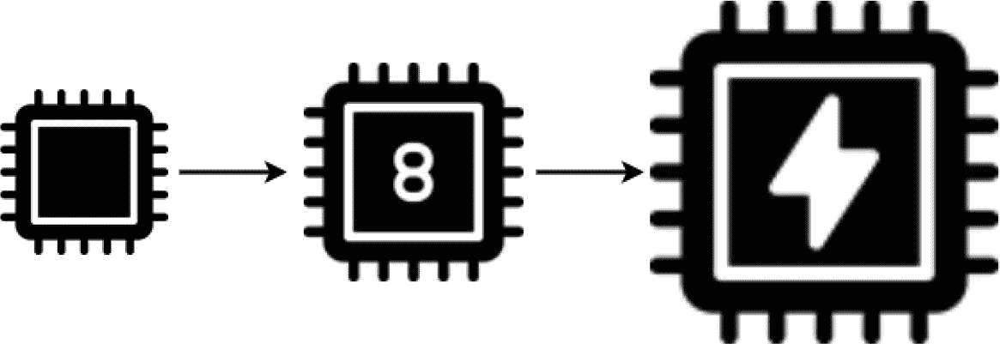

一张图展示了微芯片的三种变换。第一个微芯片是空白的。第二个微芯片包含数字 8。第三个微芯片带有一个闪电符号。

图 5-1

垂直可扩展性

垂直扩展应用程序相对简单，因为它不会破坏现有的部署拓扑。将现有进程“直接迁移”到具有更强计算能力的另一台主机上是一个直接的步骤。然而，要将应用程序扩展到该限制之外，垂直可扩展性就无济于事了，因为你会受到芯片和内存技术相对缓慢的进步速度的限制。

### 水平可扩展性

水平扩展（见图 5-2）与垂直扩展是正交的，它不是增加现有计算或内存模块的容量，而是通过整合更多模块来提高整体计算和/或内存能力。

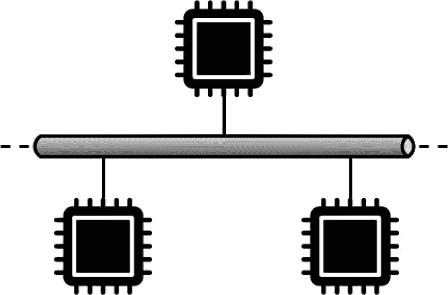

一张图描绘了三个连接到中央水平总线上的微芯片。每个微芯片都是空白的。

图 5-2

水平可扩展性

### 微服务可扩展性

通常，微服务代表一个功能域或一个功能域的一部分。就像任何应用程序一样，微服务应用程序也会随着时间的推移而增长。需要在单个微服务的大小和这些微服务的数量之间取得平衡，以实现高效的运营模式。

就像垂直可扩展性一样，可以向现有微服务添加更多功能，如图 5-3 所示。

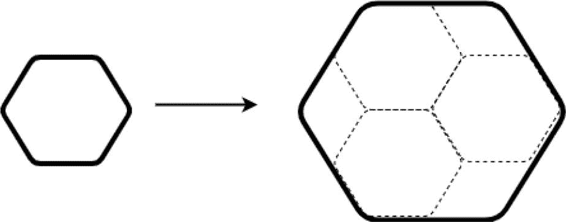

一幅插图展示了左侧的一个小六边形结构，它被转换为右侧的一个更大的六边形。一个更大的六边形被细分为更小的六边形部分。

图 5-3

微服务垂直增长

无休止地向现有微服务添加越来越多的功能将使微服务退化为单体系统。相反，可以添加更多类型的微服务，如图 5-4 所示。

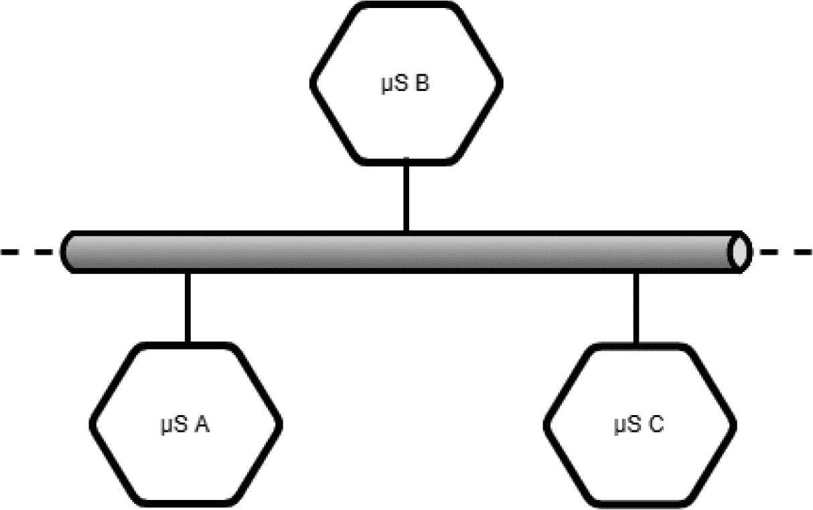

一张图展示了一个总线拓扑，有三个六边形形状，分别标记为 mu S A、mu S B 和 mu S C。mu S A 连接到总线的左侧。mu S B 连接到总线的顶部。mu S C 连接到总线的右侧。

图 5-4

微服务水平增长

当你想在运营中解决可扩展性问题时，还需要解决不断增长的流量问题。这需要克隆多个微服务实例，并以负载均衡的方式路由流量，如图 5-5 所示。

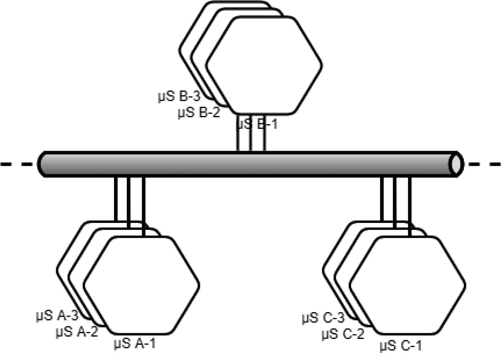

一张图展示了一个总线拓扑，有三个六边形形状，分别标记为 mu S A、mu S B 和 mu S C。mu S A 连接到总线的左侧。mu S B 连接到总线的顶部。mu S C 连接到总线的右侧。每个六边形包含多个部分。

图 5-5

微服务横向扩展

在典型的基于 HTTP 的传输中，将请求路由到不同类型的微服务并将负载分发到同一类型微服务的多个实例是直接的，但在基于消息的基础设施上则并非易事。接下来让我们探讨这一点。

## 异步之上的同步动态

消息传递风格的通信本质上是异步的，并且消息通道是单向的。这两个属性结合在一起，给开发人员带来了一系列需要处理的复杂性，特别是当他们必须通过异步性质的事件通道来模拟同步风格的微服务间通信时。


### 发布者与订阅者的组合

第 4 章在图 4-5 中简要描述了返回地址模式。当微服务通信时，同一个微服务可以向不同的微服务发送消息，而不同的微服务也可以向同一个微服务发送消息。我们可以将这种通信模式进行泛化，如图 5-6 所示。

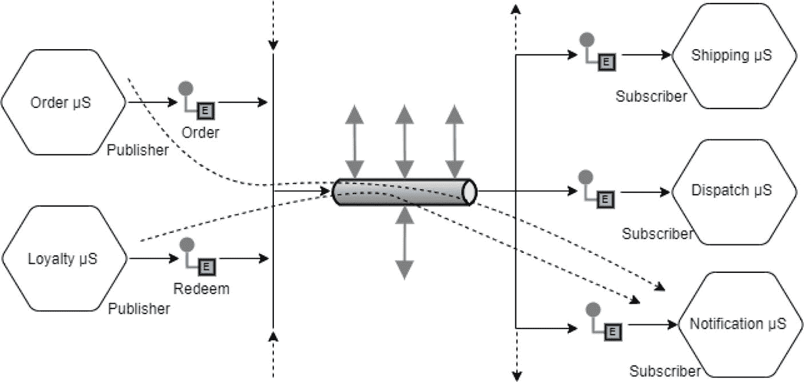

该图展示了两个分别标记为“订单微服务”和“忠诚度微服务”的发布者，如何将事件发送到中央消息总线。这些事件随后被分发给多个订阅者，包括“物流微服务”、“调度微服务”和“通知微服务”。

图 5-6
不同类型的微服务进行通信

再次参考第 4 章的图 4-5，每个发布者微服务都可以拥有自己的返回地址，通过这种方式，响应消息可以被定向到对应的发送方。

### 发布者与订阅者实例的组合

当你需要扩展微服务时，如果要在异步通道上发送同步风格的通信，这会引入更多的复杂性。

如果你有同一个微服务的多个实例，必须确保回复被发送到正确的微服务实例。Spring Kafka 文档建议每个消费者使用一个唯一的回复主题，这样回复消息就不会被混淆。

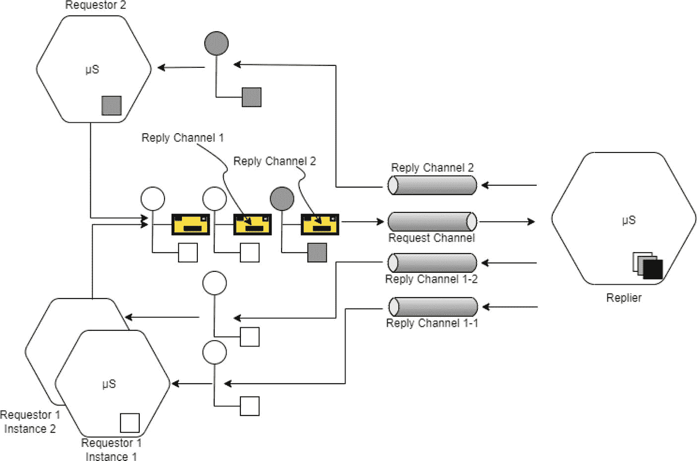

该图展示了微服务之间的请求-回复交互模型。它涉及多个请求方和回复方组件，通过多种通道进行通信。这些通道对应于发起原始请求的请求方实例。

图 5-7
不同的回复通道

图 5-7 描绘了每个消费者使用一个唯一的回复主题，这样回复消息就不会在消费者之间混淆。来自特定请求方实例的特定请求线程会接收到对应正确请求的响应。这个方案可行，但并不优雅。主题是托管对象，需要进行维护。即使维护工作可以自动化（例如使用动态队列），也不应该就这样创建成百上千个主题。

一个更好的解决方案是利用*主题*的分区功能，这是 Kafka 提供的一个特性。正如 Spring Kafka 文档所建议的，每个消费者可以使用一个额外的 `KafkaHeaders.REPLY_PARTITION` 标头值，该值随请求一起发送。这是一个四字节字段，包含分区整数的 BIG-ENDIAN 表示。

其模式可以如图 5-8 所示。

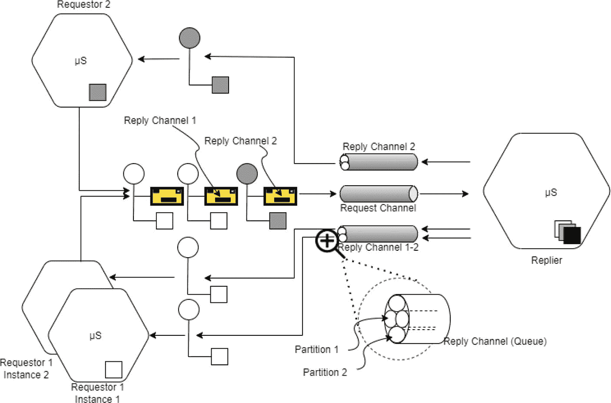

该图展示了微服务之间的请求-回复交互模型，其中包含了回复机制中的分区和队列概念。两个请求方微服务通过通道发送请求。该通道连接到一个队列机制，该机制将请求拆分为分区 1 和分区 2。

图 5-8
不同的回复分区

Kafka 分区是 Kafka 中主要的并发机制。一个主题被划分为一个或多个分区，从而允许扩展生产者和消费者的负载。消费者在分区之间均匀分布，通过增加消费者和分区的数量，可以实现消费者负载的线性扩展。你可以利用这个特性来处理回复地址。

下一节将用代码说明这些主题。

## 微服务顺序处理

在本例中，你将看到如何调整第 4 章中展示的同一组微服务。一个消费者微服务和一个提供者微服务通过消息通道相互通信。为了保持示例简单，提供者微服务将实体存储在内存数据库中。此外，当浏览器向第一个（消费者）微服务发送请求时，它使用的是异步 HTTP。

与第 4 章中的示例相比，本例的复杂性在于，在测试服务时，它使用了消费者和提供者微服务的多个实例以及多个客户端。当来自不同用户的同类请求到达（消息消费者）微服务的单个实例时，这些请求会按顺序逐一得到处理。

### 设计顺序处理微服务

我对第 2 章图 2-1 中所示的六边形微服务视图进行了轻微修改，使两个微服务通过异步通道进行通信。本例使用 Apache Kafka 作为消息通道，它本质上是异步的。请记住，目标是在基于 Kafka 的异步通道上模拟同步风格的通信，并演示多种消费者类型或同一消费者类型的多个实例可以连接到提供者微服务的一个或多个实例，并且仍然能单独获取到对应各自请求的响应。参见图 5-9。

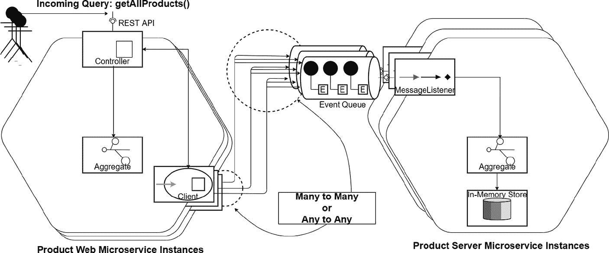

该图展示了一种事件驱动的微服务架构，其中包含两个主要组件：产品 Web 微服务实例和产品服务器微服务实例。通信通过事件队列以多对多或任意对任意的方式进行。

图 5-9
利用分区在异步通道上的微服务设计

需要注意以下几点：

*   这里配置了多个产品 Web（请求消费者）微服务实例。如果这种模式可行，那么它也应该适用于不同类型的微服务。

*   这里配置了多个产品服务器（请求提供者）微服务实例。因此，事件可以被任何实例以轮询方式拾取处理。

*   尽管从服务消费者和服务提供者的角度来看，产品 Web 是请求消费者，产品服务器是请求提供者，但它们同时在 Kafka 主题上扮演着消息发送者和消息消费者的角色。

*   图 5-9 显示了产品服务器微服务的实例在监听不同的主题，尽管在本例中，它监听的是同一个主题，但利用了不同的分区。


### 理解代码

本书的源代码可通过图书产品页面在 GitHub 上获取，地址为 [`www.apress.com/9798868805547`](http://www.apress.com/9798868805547)。示例的源代码组织在 `ch05\ch05-01` 文件夹内。本节首先查看消费者微服务（即 Product Web 微服务）中的变更。

如前所述，为不同客户端使用独立主题并非优雅的解决方案，因为你需要显式利用 `REPLY_PARTITION`。在这种情况下，消费者微服务需要知道它被分配到了哪个分区。可以通过如下方式提供显式配置以选择特定分区：

```
@Value("${kafka.topic.product.reply.partition}")
private int replyPartition;
```

如第 4 章的列表 4-2 所示，现在需要像列表 5-1 那样显式设置参数。

```
productRecord.headers().add(new RecordHeader(
KafkaHeaders.REPLY_TOPIC, requestReplyTopic.getBytes()));
productRecord.headers().add(new RecordHeader(
KafkaHeaders.REPLY_PARTITION,
intToBytesBigEndian(replyPartition)));
RequestReplyFuture sendAndReceive =
requestReplyKafkaTemplate.sendAndReceive(
productRecord);
...
列表 5-1
回复主题和分区的静态配置
```

然而，这种静态配置在动态水平扩展（增加同一微服务的更多实例）时无法提供帮助，因此你需要一种方案来解决这个问题。

来自 Callista Enterprise 的 Bjorn Beskow 撰写了一篇优秀的博客，并在互联网上提供了一个用于实现此功能的工具库，因此本示例将使用该库。需求是动态管理实现返回地址模式所需的回复主题和回复分区，而这个库正好实现了这一点。回复主题需要注入到 `RequestReplyTemplate` 中，这样在发送记录时就无需通过 API 处理它。对于回复分区，你需要检索回复主题监听器被分配到的分区，并传递该分区信息。该工具库位于以下源代码子文件夹中：

```
ch05\ch05-01\kafka-request-reply-util
```

对该工具库实现的详细解释超出了本书的范围。建议你参考相关博客以获取更多信息。相反，本节将探讨如何使用该工具库并实现相关功能。列表 5-2 展示了使用该工具库的配置。

```
import se.callista.blog.synch_kafka.request_reply_util.
CompletableFutureReplyingKafkaOperations;
import se.callista.blog.synch_kafka.request_reply_util.
CompletableFutureReplyingKafkaTemplate;
@Configuration
public class KafkaConfig {
@Value("${spring.kafka.bootstrap-servers}")
private String bootstrapServers;
@Value("${spring.kafka.consumer.group-id}")
private String groupId;
@Value("${kafka.topic.product.request}")
private String requestTopic;
@Value("${product.topic.request.numPartitions}")
private int numPartitions;
@Value("${kafka.topic.product.reply}")
private String replyTopic;
@Value("${kafka.request-reply.timeout-ms}")
private Long replyTimeout;
@Bean
public CompletableFutureReplyingKafkaOperations replyKafkaTemplate() {
CompletableFutureReplyingKafkaTemplate requestReplyKafkaTemplate =
new CompletableFutureReplyingKafkaTemplate(
requestProducerFactory(),
replyListenerContainer());
requestReplyKafkaTemplate.setDefaultTopic(
requestTopic);
requestReplyKafkaTemplate.setDefaultReplyTimeout(
Duration.of(replyTimeout, ChronoUnit.MILLIS));
return requestReplyKafkaTemplate;
}
@Bean
public NewTopic replyTopic() {
Map configs = new HashMap();
configs.put("retention.ms", replyTimeout.toString());
return new NewTopic(replyTopic, numPartitions,
(short) 1).configs(configs);
}
}
列表 5-2
Product Web 微服务的 Kafka 配置 (ch05\ch05-01\02-ProductWeb\src\main\java\com\acme\ecom\product\KafkaConfig.java)
```

正如你在第 4 章中所见，一旦 Kafka 监听器从提供者或生产者端消费了消息，`ReplyingKafkaTemplate <K, V, R>` 就会提供一个返回对象或回复对象。类型参数表示：

*   K – 键类型

*   V – 出站数据类型

*   R – 回复数据类型

当你有多个发送者微服务实例时，必须确保响应被发送到正确的发送者微服务实例。Spring Kafka 文档建议每个发送者微服务使用一个唯一的主题，或者在请求中发送一个额外的 `KafkaHeaders.REPLY_PARTITION` 标头值。主题是受管对象。你也可以显式设置 `REPLY_PARTITION`。`REPLY_PARTITION` 标头表示发送回复的分区编号。发送者微服务随后需要知道它被分配到了哪个分区。文档建议使用显式配置来选择特定分区。列表 5-3 展示了一种可能的配置。

```
@Configuration
public class KafkaConfig {
@Value("${kafka.topic.product.reply}")
private String replyTopic;
@Value("${kafka.topic.product.reply.partition}")
private int replyPartition;
@Bean
public KafkaMessageListenerContainer replyListenerContainer() {
ContainerProperties containerProperties =
new ContainerProperties(replyTopic);
TopicPartitionInitialOffset initialOffset =
new TopicPartitionInitialOffset(replyTopic,
replyPartition);
return new KafkaMessageListenerContainer(
replyConsumerFactory(),
containerProperties, initialOffset);
}
列表 5-3
指定分区的 Product Web 微服务 Kafka 配置
```

可以在请求中发送一个额外的 `KafkaHeaders.REPLY_PARTITION` 标头值，这是一个四字节字段，包含分区整数的 BIG-ENDIAN 表示，如列表 5-4 所示。

```
record.headers().add(new RecordHeader(KafkaHeaders.REPLY_TOPIC,
requestReplyTopic.getBytes()));
record.headers().add(new RecordHeader(KafkaHeaders.REPLY_PARTITION,
intToBytesBigEndian(replyPartition)));
RequestReplyFuture sendAndReceive =
requestReplyKafkaTemplate.sendAndReceive(record);
列表 5-4
指定分区的 Product Web 微服务 Kafka 消息交换
```


如前所述，为不同的发送方微服务使用独立的主题显然不够灵活。所需的配置和编程工作量大，且 API 属于底层接口。此外，当需要动态扩展发送方微服务的数量时，这种静态配置方式并不适用。因此，你可以使用`PartitionAwareReplyingKafkaTemplate<K, V, R>`工具类，它扩展了`ReplyingKafkaTemplate<K, V, R>`，并实现了`PartitionAwareReplyingKafkaOperations<K, V, R>`。随后，`CompletableFutureReplyingKafkaTemplate<K, V, R>`又扩展了`PartitionAwareReplyingKafkaTemplate<K, V, R>`。

你可以通过将分区信息与回复主题一起传递来增强返回地址模式。回复主题已注入到`RequestReplyTemplate`中，因此无需出现在 API 中。对于分区信息，你可以检索回复主题监听器被分配了哪些分区，并自动传递该分区。这消除了客户端关心这些消息头的需要。如前所述，来自 Callista Enterprise 的 Bjorn Beskow 已将此工具库发布到互联网上以实现此功能，并在代码清单 5-5 中使用。

```
public class PartitionAwareReplyingKafkaTemplate
extends ReplyingKafkaTemplate {
public PartitionAwareReplyingKafkaTemplate(
ProducerFactory producerFactory,
GenericMessageListenerContainer
replyContainer) {
super(producerFactory, replyContainer);
}
private TopicPartition
getFirstAssignedReplyTopicPartition() {
if (getAssignedReplyTopicPartitions() != null &&
getAssignedReplyTopicPartitions().iterator().
hasNext()) {
TopicPartition replyPartition =
getAssignedReplyTopicPartitions().iterator().
next();
if (this.logger.isDebugEnabled()) {
this.logger.debug("Using partition " +
replyPartition.partition());
}
return replyPartition;
} else {
throw new KafkaException("Illegal state: No reply
partition is assigned to this instance");
}
}
protected RequestReplyFuture doSendAndReceive(
ProducerRecord record) {
TopicPartition replyPartition =
getFirstAssignedReplyTopicPartition();
record.headers()
.add(new RecordHeader(KafkaHeaders.REPLY_TOPIC,
replyPartition.topic().getBytes()))
.add(new RecordHeader(
KafkaHeaders.REPLY_PARTITION,
intToBytesBigEndian(
replyPartition.partition())));
return super.sendAndReceive(record);
}
}
代码清单 5-5
在 Kafka 消息交换中封装分区信息 (ch05\ch05-01\kafka-request-reply-util\src\main\java\se\callista\blog\synch_kafka\request_reply_util\PartitionAwareReplyingKafkaTemplate.java)
```

代码清单 5-5 稍微有些复杂，因此我将借助图 5-10 来解释它，该图展示了`CompletableFutureReplyingKafkaTemplate`提供的完整抽象。

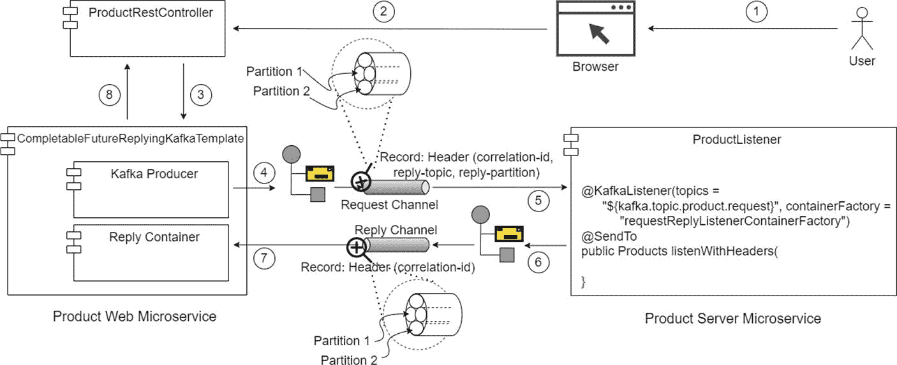

该图展示了基于 Kafka 的事件驱动微服务架构中，产品 Web 微服务和产品服务器微服务之间的请求-回复交互。它说明了用户如何与系统交互，以及请求和回复如何通过 Kafka 模板进行处理。

图 5-10

CompletableFutureReplyingKafkaTemplate 抽象

图 5-10 中的标记步骤是按顺序进行的，因此你可以直接按照这些步骤来理解前面提供的解释。

接下来，我们将查看 Product Web 微服务的 REST 控制器。如代码清单 5-6 所示。

```
@CrossOrigin
@RestController
public class ProductRestController{
private static final String REQUEST_PAYLOAD = "All";
//获取所有数据
@Value("${spring.application.name:product-web}")
private String appName;
@Value("${kafka.topic.product.pinnedToPartition:false}")
private boolean pinnedToPartition;
@Value("${kafka.topic.product.request}")
private String requestTopic;
@Autowired
private CompletableFutureReplyingKafkaOperations replyingKafkaTemplate;
@RequestMapping(value = "/productsweb", method =
RequestMethod.GET,
produces = {MediaType.APPLICATION_JSON_VALUE})
public DeferredResult  getAllProducts()
throws InterruptedException, ExecutionException {
DeferredResult deferredResult =
new DeferredResult();
CompletableFuture completableFuture =  null;
if(pinnedToPartition){
completableFuture =  replyingKafkaTemplate.
requestReply(requestTopic,
appName, REQUEST_PAYLOAD);
}
else{
completableFuture =  replyingKafkaTemplate.
requestReply(requestTopic, REQUEST_PAYLOAD);
}
completableFuture.thenAccept(products ->
deferredResult.setResult(products))
.exceptionally(ex -> {
LOGGER.error(ex.getMessage());
return null;
});
return deferredResult;
}
}
代码清单 5-6
Product Web 微服务的 REST 控制器 (ch05\ch05-01\02-ProductWeb\src\main\java\com\acme\ecom\product\controller\ProductRestController.java)
```

与`ReplyingKafkaTemplate`类似，一旦 Kafka 监听器从提供方或生产方消费了消息，`CompletableFutureReplyingKafkaOperations<K, V, R>`就会提供一个返回或回复对象。类型参数表示：

*   K – 键类型
*   V – 出站数据类型
*   R – 回复数据类型

接下来，我们引入一个布尔标志`pinnedToPartition`，旨在演示各种测试用例。该标志可以在 Product Web 微服务的`application.yml`配置文件中进行配置。参见代码清单 5-7。

```
server:
port: 8080
spring:
application:
name: product-web
autoconfigure:
exclude: org.springframework.boot.autoconfigure.kafka.
KafkaAutoConfiguration
kafka:
bootstrap-servers: localhost:9092
consumer:
auto-offset-reset: earliest
group-id: product-web
kafka:
topic:
product:
request: product-req-topic
pinnedToPartition: true
reply: product-req-reply-topic
request-reply:
timeout-ms: 60000
product:
topic:
request:
numPartitions: 2
代码清单 5-7
Product Web 微服务的配置 (ch05\ch05-01\02-ProductWeb\src\main\resources\application.yml)
```

如果`pinnedToPartition`配置为`false`，发送方微服务将以随机、负载均衡的方式向接收方微服务发送请求消息，如下所示：

```
completableFuture =  replyingKafkaTemplate.requestReply(requestTopic, REQUEST_PAYLOAD);
```

相反，如果`pinnedToPartition`配置为`true`，发送方微服务将以固定或钉住的方式向接收方微服务发送请求消息，如下所示：

```
completableFuture =  replyingKafkaTemplate.requestReply(requestTopic, appName,
REQUEST_PAYLOAD);
```

正如你在第 4 章中所见，生产者选择使用哪个分区。如果你指定了分区参数，则会使用该参数，并且键将被“忽略”，尽管键仍然会被写入主题。消息到分区的路由不必基于键。你也可以在创建`ProducerRecord`时显式指定分区。当`pinnedToPartition`配置为`true`时，底层工具库使用`requestReply(String topic, K key, V value)`的重载版本，以便可以指定键的值，如代码清单 5-8 所示。


```
package se.callista.blog.synch_kafka.request_reply_util;
public class CompletableFutureReplyingKafkaTemplate
extends PartitionAwareReplyingKafkaTemplate
implements CompletableFutureReplyingKafkaOperations {
@Override
public CompletableFuture requestReply(String topic,
V value) {
return adapt(sendAndReceive(topic, value));
}
@Override
public CompletableFuture requestReply(String topic,
K key, V value) {
return adapt(sendAndReceive(topic, key, value));
}
@Override
public CompletableFuture requestReply(String topic,
Integer partition, K key, V value) {
return adapt(sendAndReceive(topic, partition,
key, value));
}
}
代码清单 5-8
CompletableFutureReplyingKafkaTemplate 工具类 (ch05\ch05-01\kafka-request-reply-util\src\main\java\se\callista\blog\synch_kafka\request_reply_util\CompletableFutureReplyingKafkaTemplate.java)
```

你可以通过在 Product Web 微服务根文件夹的运行脚本中为 `appName` 提供相同的值，来为键配置相同的值：

```
-Dspring.application.name=product-web-1
-Dspring.application.name=product-web-1
```

在代码清单 5-7 中，请注意配置 `numPartitions: 2`。数字 2 是任意设定的，但它应该大于请求方微服务（实例）的数量，否则系统会抛出错误。此外，共享分区无法保证请求方微服务（实例）能收到对应的响应。

在 Product Server 微服务中，主要组件是 `ProductListener`，如代码清单 5-9 所示。

```
@Component
public class ProductListener {
@KafkaListener(topics = "${kafka.topic.product.request}",
containerFactory =
"requestReplyListenerContainerFactory")
@SendTo
public Products listenWithHeaders(
@Payload String requestor,
@Header(KafkaHeaders.REPLY_TOPIC)
String replyTopic,
@Header(KafkaHeaders.REPLY_PARTITION)
int replyPartitionId,
@Header(KafkaHeaders.RECEIVED_TOPIC)
String receivedTopic,
@Header(KafkaHeaders.RECEIVED_PARTITION_ID)
int receivedPartitionId,
@Header(KafkaHeaders.CORRELATION_ID)
String correlationId,
@Header(KafkaHeaders.OFFSET) String offset){
LOGGER.info("开始");
LOGGER.debug("监听；请求来自：" + requestor);
LOGGER.debug("监听；replyTopic：" + replyTopic);
LOGGER.debug("监听；replyPartitionId：" +
replyPartitionId);
LOGGER.debug("监听；receivedTopic：" +
receivedTopic);
LOGGER.debug("监听；receivedPartitionId：" +
receivedPartitionId);
LOGGER.debug("监听；correlationId：" +
correlationId);
LOGGER.debug("监听；offset：" + offset);
List productList = getAllTheProducts();
Products products=new Products();
products.setProducts(productList);
LOGGER.info("结束...");
return products;
}
}
代码清单 5-9
Product Server 消息监听器 (ch05\ch05-01\01-ProductServer\src\main\java\com\acme\ecom\product\kafka\client\ProductListener.java)
```

`ProductListener` 包含日志信息，这将帮助你调试标头和其他参数。它还会从内存数据库中获取 `Product` 实体集合，并将其返回到回复通道。

其余代码与第 4 章的代码清单 4-11 非常相似，因此此处不再重复。相反，代码清单 5-10 展示了 Product Server 微服务配置的一个片段。

```
product:
topic:
request:
numPartitions: 3
代码清单 5-10
Product Server 微服务的配置 (ch05\ch05-01\01-ProductServer\src\main\resources\application.yml)
```

此示例使用 Product Server 微服务的三个实例进行演示。

### 构建并运行微服务顺序处理

`ch05\ch05-01` 文件夹包含构建示例所需的 Maven 脚本。第一步，你需要启动 Kafka 代理。请参考附录 D 了解如何设置 Kafka 服务器并将其启动。你需要执行代码清单 5-11 中的命令，从 Kafka 安装位置启动 Kafka。

```
bin/zookeeper-server-start.sh config/zookeeper.properties
bin/kafka-server-start.sh config/server.properties
代码清单 5-11
启动 Kafka 代理的命令

接下来，从 Callista Enterprise 构建并安装工具库，如代码清单 5-12 所示。

```
(base) binildass-MacBook-Pro:kafka-request-reply-util binil$ pwd
/Users/binil/binil/code/mac/mybooks/docker-04/Code/ch05/ch05-01/kafka-request-reply-util
(base) binildass-MacBook-Pro:kafka-request-reply-util binil$ mvn clean install
[INFO] Scanning for projects...
[INFO]
[INFO] --
[INFO] Building Kafka Request Reply utility 0.0.1-SNAPSHOT
[INFO] --------------------------------[ jar ]-------------
[INFO]
...
[INFO] ----------------------------------------------------
[INFO] BUILD SUCCESS
[INFO] ----------------------------------------------------
[INFO] Total time:  1.335 s
[INFO] Finished at: 2024-02-27T12:35:54+05:30
[INFO] ----------------------------------------------------
binildass-MacBook-Pro:kafka-request-reply-util binil$
代码清单 5-12
从 Callista Enterprise 构建并安装工具库的命令
```

接下来，打开五个命令终端——三个用于 Product Server，两个用于 Product Web 微服务——并将目录切换到两个微服务的顶级文件夹。

使用 `make.sh` 脚本构建 Product Server 微服务，如代码清单 5-13 所示。

```
binildass-MacBook-Pro:01-ProductServer binil$ pwd
/Users/binil/binil/code/mac/mybooks/docker-04/Code/ch05/ch05-01/01-ProductServer
binildass-MacBook-Pro:01-ProductServer binil$ sh make.sh
[INFO] Scanning for projects...
[INFO]
...
代码清单 5-13
构建 Product Server 微服务的命令
```

接下来，构建 Product Web 微服务，如代码清单 5-14 所示。

```
binildass-MacBook-Pro:02-ProductWeb binil$ pwd
/Users/binil/binil/code/mac/mybooks/docker-04/Code/ch05/ch05-01/02-ProductWeb
binildass-MacBook-Pro:02-ProductWeb binil$ sh make.sh
[INFO] Scanning for projects...
[INFO]
...
代码清单 5-14
构建 Product Web 微服务的命令
```

现在 Product Server 微服务已构建完成，你可以在三个不同的终端中，使用微服务根文件夹中的 `run1.sh`、`run2.sh` 和 `run3.sh` 脚本来运行它。请参见代码清单 5-15 至 5-17。


```
binildass-MacBook-Pro:01-ProductServer binil$ pwd
/Users/binil/binil/code/mac/mybooks/docker-04/Code/ch05/ch05-01/01-ProductServer
binildass-MacBook-Pro:01-ProductServer binil$ sh run3.sh
...
2024-02-28 17:41:19 INFO  InitComponent.init:43 - Start
2024-02-28 17:41:19 INFO  InitComponent.init:44 - Do Nothing
2024-02-28 17:41:19 INFO  InitComponent.init:66 - End
2024-02-28 17:41:20 INFO  Logger.log:56 - Started EcomProd...
2024-02-28 17:52:23 INFO  ProductListener.listenWithHeaders:57 - Start
2024-02-28 17:52:23 DEBUG ProductListener.listenWithHeaders:58 - Listen; Request from : All
2024-02-28 17:52:23 DEBUG ProductListener.listenWithHeaders:59 - Listen; replyTopic : product-req-reply-topic
2024-02-28 17:52:23 DEBUG ProductListener.listenWithHeaders:60 - Listen; replyPartitionId : 0
2024-02-28 17:52:23 DEBUG ProductListener.listenWithHeaders:61 - Listen; receivedTopic : product-req-topic
2024-02-28 17:52:23 DEBUG ProductListener.listenWithHeaders:62 - Listen; receivedPartitionId : 0
...
2024-02-28 17:52:29 INFO  ProductListener.listenWithHeaders:80 - Ending...
2024-02-28 17:52:29 INFO  ProductListener.listenWithHeaders:57 - Start
2024-02-28 17:52:29 DEBUG ProductListener.listenWithHeaders:58 - Listen; Request from : All
2024-02-28 17:52:29 DEBUG ProductListener.listenWithHeaders:59 - Listen; replyTopic : product-req-reply-topic
2024-02-28 17:52:29 DEBUG ProductListener.listenWithHeaders:60 - Listen; replyPartitionId : 1
2024-02-28 17:52:29 DEBUG ProductListener.listenWithHeaders:61 - Listen; receivedTopic : product-req-topic
2024-02-28 17:52:29 DEBUG ProductListener.listenWithHeaders:62 - Listen; receivedPartitionId : 0
...
2024-02-28 17:52:35 INFO  ProductListener.listenWithHeaders:80 - Ending...
清单 5-17
运行产品服务器微服务的命令：实例 3
```

```
binildass-MacBook-Pro:01-ProductServer binil$ pwd
/Users/binil/binil/code/mac/mybooks/docker-04/Code/ch05/ch05-01/01-ProductServer
binildass-MacBook-Pro:01-ProductServer binil$ sh run2.sh
...
2024-02-28 17:41:11 INFO  Logger.log:56 - Started EcomProd...
...
清单 5-16
运行产品服务器微服务的命令：实例 2
```

```
binildass-MacBook-Pro:01-ProductServer binil$ pwd
/Users/binil/binil/code/mac/mybooks/docker-04/Code/ch05/ch05-01/01-ProductServer
binildass-MacBook-Pro:01-ProductServer binil$ sh run1.sh
.   ____          _            __ _ _
/\\ / ___'_ __ _ _(_)_ __  __ _ \ \ \ \
( ( )\___ | '_ | '_| | '_ \/ _` | \ \ \ \
\\/  ___)| |_)| | | | | || (_| |  ) ) ) )
'  |____| .__|_| |_|_| |_\__, | / / / /
=========|_|==============|___/=/_/_/_/
:: Spring Boot ::                (v3.2.0)
...
2024-02-28 17:41:09 INFO  InitComponent.init:43 - Start
2024-02-28 17:41:09 INFO  InitComponent.init:44 - Do Nothing
2024-02-28 17:41:09 INFO  InitComponent.init:66 - End
2024-02-28 17:41:11 INFO  Logger.log:56 - Started EcomProd...
...
清单 5-15
运行产品服务器微服务的命令：实例 1
```

当产品服务器微服务的所有三个实例都运行起来后，你可以启动两个产品 Web 微服务实例，如清单 5-18 和 5-19 所示。

```
binildass-MacBook-Pro:02-ProductWeb binil$ pwd
/Users/binil/binil/code/mac/mybooks/docker-04/Code/ch05/ch05-01/02-ProductWeb
binildass-MacBook-Pro:02-ProductWeb binil$ sh run2.sh
...
2024-02-28 17:50:27 INFO  Logger.log:56 - Started EcomProd...
2024-02-28 17:52:23 INFO  ProductRestController.getAllProducts:69 - Start
2024-02-28 17:52:23 DEBUG ProductRestController.getAllProducts:70 - Application Name : product-web-1
2024-02-28 17:52:23 DEBUG ProductRestController.getAllProducts:71 - PinnedToPartition? : true
2024-02-28 17:52:23 DEBUG ProductRestController.getAllProducts:72 - Thread : Thread[http-nio-8081-exec-1,5,main]
2024-02-28 17:52:23 DEBUG LogAccessor.debug:191 - Using Request partition : null
2024-02-28 17:52:23 DEBUG LogAccessor.debug:191 - Using Request key : product-web-1
2024-02-28 17:52:23 DEBUG LogAccessor.debug:191 - Using Reply partition : 1
2024-02-28 17:52:23 DEBUG LogAccessor.debug:313 - Sending: ProducerRecord(topic=product-req-topic...
...
2024-02-28 17:52:27 INFO  ProductRestController.getAllProducts:98 - Ending
2024-02-28 17:52:35 DEBUG LogAccessor.debug:313 - Received: product-req-reply-topic-1@0 with correlationId: 8403edb7-e702-4e05-8341-ed7a2b2bd3ba
清单 5-19
运行产品 Web 微服务的命令：实例 2
```

```
binildass-MacBook-Pro:02-ProductWeb binil$ pwd
/Users/binil/binil/code/mac/mybooks/docker-04/Code/ch05/ch05-01/02-ProductWeb
binildass-MacBook-Pro:02-ProductWeb binil$ sh run1.sh
...
2024-02-28 17:48:02 INFO  Logger.log:56 - Started EcomProd...
2024-02-28 17:52:23 INFO  ProductRestController.getAllProducts:69 - Start
2024-02-28 17:52:23 DEBUG ProductRestController.getAllProducts:70 - Application Name : product-web-1
2024-02-28 17:52:23 DEBUG ProductRestController.getAllProducts:71 - PinnedToPartition? : true
2024-02-28 17:52:23 DEBUG ProductRestController.getAllProducts:72 - Thread : Thread[http-nio-8080-exec-1,5,main]
2024-02-28 17:52:23 DEBUG LogAccessor.debug:191 - Using Request partition : null
2024-02-28 17:52:23 DEBUG LogAccessor.debug:191 - Using Request key : product-web-1
2024-02-28 17:52:23 DEBUG LogAccessor.debug:191 - Using Reply partition : 0
2024-02-28 17:52:23 DEBUG LogAccessor.debug:313 - Sending: ProducerRecord(topic=product-req-topic...
...
2024-02-28 17:52:27 INFO  ProductRestController.getAllProducts:98 - Ending
2024-02-28 17:52:29 DEBUG LogAccessor.debug:313 - Received: product-req-reply-topic-0@0 with correlationId: ec3cceaa-d7e4-4544-add2-4b98ce5e3709
清单 5-18
运行产品 Web 微服务的命令：实例 1
```

现在两个微服务都已启动并运行，你可以准备测试这些微服务了。


### 测试顺序请求处理

一切就绪后，您可以使用 cURL 客户端访问 Web 应用程序。

要测试单个分区内请求的顺序处理，您需要将 `pinnedToPartition` 配置为 `true` 值，如代码清单 5-7 所示。

测试的目的是同时向 Product Web 微服务实例发送多个请求。由于您已将来自 Product Web 微服务的请求固定到同一个分区，因此您知道这些请求消息将由 Product Server 微服务的单个实例接收。

现在，您可以（大致）同时使用两个独立的终端来运行 cURL 客户端命令，如代码清单 5-20 和 5-21 所示。

```
binildass-MacBook-Pro:02-ProductWeb binil$ pwd
/Users/binil/binil/code/mac/mybooks/docker-04/Code/ch05/ch05-01/02-ProductWeb
binildass-MacBook-Pro:02-ProductWeb binil$ sh curlrun2.sh
Firing http://127.0.0.1:8081/productsweb and waiting...

Current date: Wed Feb 28 17:52:23 IST 2024
==========================================
{"products":{"productId":"1","name":"Kamsung ...

Current date: Wed Feb 28 17:52:35 IST 2024
==========================================
Response from http://127.0.0.1:8081/productsweb received.
binildass-MacBook-Pro:02-ProductWeb binil$
代码清单 5-21
使用 cURL 进行测试的命令：客户端 2
```

```
binildass-MacBook-Pro:02-ProductWeb binil$ pwd
/Users/binil/binil/code/mac/mybooks/docker-04/Code/ch05/ch05-01/02-ProductWeb
binildass-MacBook-Pro:02-ProductWeb binil$ sh curlrun1.sh
Firing http://127.0.0.1:8080/productsweb and waiting...

Current date: Wed Feb 28 17:52:23 IST 2024
==========================================
{"products":[{"productId":"1","name":"Kamsung ...

Current date: Wed Feb 28 17:52:29 IST 2024
==========================================
Response from http://127.0.0.1:8080/productsweb received.
binildass-MacBook-Pro:02-ProductWeb binil$
代码清单 5-20
使用 cURL 进行测试的命令：客户端 1
```

代码清单 [5-20 和 5-21 显示，您可以（大致）同时从客户端发送请求（在时间 `17:52:23`）。代码清单 5-18 和 5-19 进一步显示，Product Web 微服务的同一个实例也（大致）同时尝试将这些请求转发给 Product Server 微服务：

```
2024-02-28 17:52:23 DEBUG LogAccessor.debug:313 - Sending: ProducerRecord(topic=product-req-topic...
2024-02-28 17:52:23 DEBUG LogAccessor.debug:313 - Sending: ProducerRecord(topic=product-req-topic...
```

然而，仔细观察代码清单 5-17 会发现，Product Server 微服务是按顺序处理接收到的消息的，即消息到达 Product Server 微服务的顺序：

```
...
2024-02-28 17:52:23 INFO  ProductListener.listenWithHeaders:57 – Start
...
2024-02-28 17:52:29 INFO  ProductListener.listenWithHeaders:80 - Ending...
2024-02-28 17:52:29 INFO  ProductListener.listenWithHeaders:57 – Start
...
2024-02-28 17:52:35 INFO  ProductListener.listenWithHeaders:80 - Ending...
```

当您启动更多 Product Web 微服务实例时，如果要确保它们都固定到同一个 Topic 分区，则需要调整通过 Product Web 微服务根目录下的运行脚本配置的 `appName` 的默认值。默认值如下：

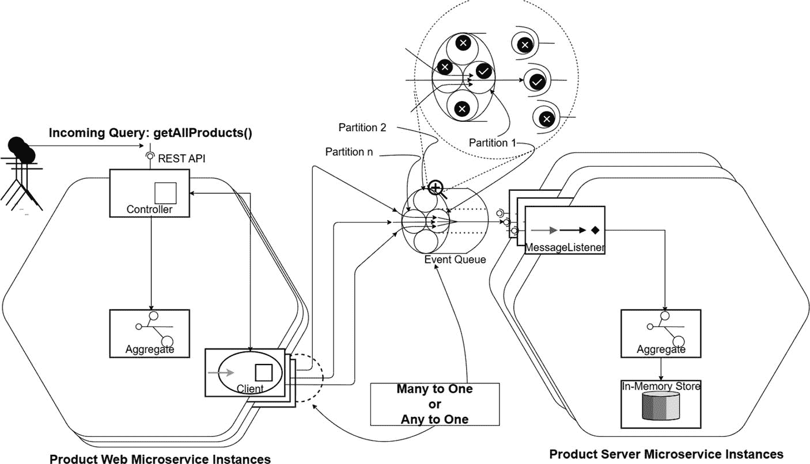

该图展示了一种事件驱动架构，用于 Product Web 微服务实例和 Product Server 微服务实例之间的通信，该架构利用具有多个分区的事件队列来实现可伸缩性。每个分区包含一个事件队列。

图 5-11
固定到同一消息主题分区的微服务实例

```
-Dspring.application.name=product-web-1
-Dspring.application.name=product-web-1
```

通过这样做，如图 5-11 所示，来自 Product Web 微服务所有实例的消息都可以被固定到同一个分区（例如，用勾号标记的分区 1）。因此，来自 Product Web 微服务所有实例的消息可以由 Product Server 微服务的单个实例来处理。

（Product Server）微服务实例按顺序（因此也是按序）处理消息的消息处理模式如图 5-12 所示。

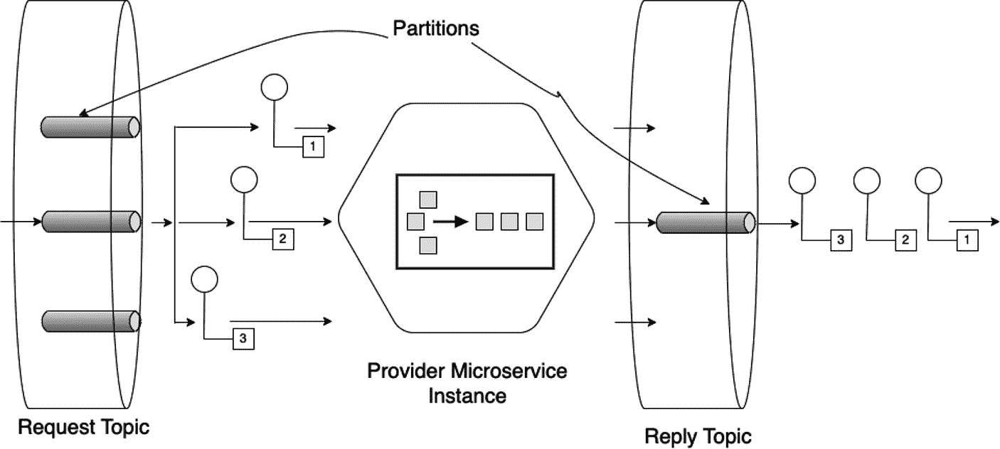

该图展示了一种请求-回复通信模型，该模型在请求主题和回复主题之间进行，由一个跨分区处理消息的提供者微服务实例协调。来自请求主题的分区被转移到回复主题。

图 5-12
按顺序处理请求的微服务

在结束之前，下一节将检查在代码清单 5-7 和 5-10 中配置的分区分配。


### 检查微服务分区分配

本节首先查看启动微服务实例时自动创建的不同主题。请参见清单 5-22。

```
binildass-MacBook-Pro:kafka_2.13-2.5.0 binil$ sh bin/kafka-topics.sh --zookeeper localhost:2181 --list
__consumer_offsets
product-req-reply-topic
product-req-topic
binildass-MacBook-Pro:kafka_2.13-2.5.0 binil$
清单 5-22
列出 Kafka 主题的命令
```

参考清单 5-7 中为 Product Web 微服务配置的分区数量，分区分配情况如清单 5-23 所示。

```
binildass-MacBook-Pro:kafka_2.13-2.5.0 binil$ bin/kafka-consumer-groups.sh --bootstrap-server localhost:9092 --describe --group product-web
GROUP           TOPIC                   PARTITION  CURRENT-OFFSET  LOG-END-OFFSET  LAG             CONSUMER-ID                                                 HOST            CLIENT-ID
product-web     product-req-reply-topic 1          0               0               0               consumer-product-web-1-c457cc3e-cf76-4788-9230-19c89f016333 /127.0.0.1      consumer-product-web-1
product-web     product-req-reply-topic 0          0               0               0          consumer-product-web-1-347b84e6-d51a-4561-b5d1-3ec54378a47c /127.0.0.1      consumer-product-web-1
binildass-MacBook-Pro:kafka_2.13-2.5.0 binil$
清单 5-23
Product Web 微服务的 Kafka 主题分区分配
```

参考清单 5-10 中为 Product Server 微服务配置的分区数量，分区分配情况如清单 5-24 所示。

```
binildass-MacBook-Pro:kafka_2.13-2.5.0 binil$ bin/kafka-consumer-groups.sh --bootstrap-server localhost:9092 --describe --group product-server
GROUP           TOPIC             PARTITION  CURRENT-OFFSET  LOG-END-OFFSET  LAG             CONSUMER-ID                HOST     CLIENT-ID
product-server  product-req-topic 2          0               0        0               consumer-product-server-1-f2ae14f5-3964-4a6f-897e-954d3c447669 /127.0.0.1      consumer-product-server-1
product-server  product-req-topic 1          0               0        0               consumer-product-server-1-865f46aa-a4fe-4031-830d-8c182f74cb42 /127.0.0.1      consumer-product-server-1
product-server  product-req-topic 0          0               0        0               consumer-product-server-1-436a6f12-2073-4c43-a201-0981ed94f286 /127.0.0.1      consumer-product-server-1
binildass-MacBook-Pro:kafka_2.13-2.5.0 binil$
清单 5-24
Product Server 微服务的 Kafka 主题分区分配
```

如果你需要进一步探索演示代码，这些额外的分区分配信息会很有帮助。

## 微服务并行处理

这个稍作修改的示例利用了第 4 章中的同一组微服务，这些微服务经过调整，用于演示前一个示例中的顺序处理。一个消费者微服务和一个提供者微服务通过消息通道相互通信。为了简化示例，提供者微服务将实体存储在内存数据库中。此外，当浏览器向第一个（消费者）微服务发送请求时，该示例使用了异步 HTTP。

此处的目标是演示：当来自不同用户或微服务消费者的同类请求到达单一类型提供者微服务的实例集群时，这些请求也可以并行处理，以提高系统可扩展性。

### 设计并行处理微服务

图 5-13 展示了第 2 章中图 2-1 所示的六边形微服务视图的修改版本。这使得两个微服务能够通过异步通道进行通信。Apache Kafka 再次被用作消息通道，它本质上是异步的。

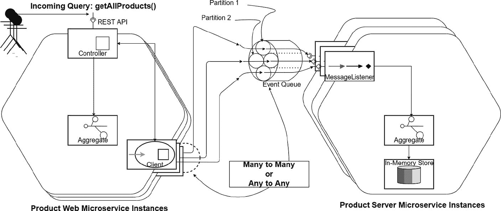

该图展示了一种事件驱动的微服务架构，其中包含 Product Web 微服务实例和 Product Server 微服务实例，它们通过事件队列连接。事件队列在多对多或任意对任意通道之间进行处理。

图 5-13
微服务实例负载均衡到多个主题分区

主题的分区越多，可实现的并发度就越高，因此潜在吞吐量也越高。在 Kafka 中，每个分区必须只分配给一个消费者。因此，每个分区最多只能有一个消费者。这意味着，在单个消费者组中，消费者的数量最多只能等于主题的分区数，但也可以少于分区数。如果消费者数量少于分区数，消费者可能会处理来自一个或多个分区的记录。总而言之，当每个分区对应一个消费者，或者消费者数量与分区数量相等时，将实现最大吞吐量。

### 并行性与线程安全

图 5-14 描绘了上一节的讨论。你已经看到，在单个消费者组中，消费者的数量最多只能等于主题的分区数。如果消费者数量超过分区数，额外的消费者可能不会被分配到任何分区。

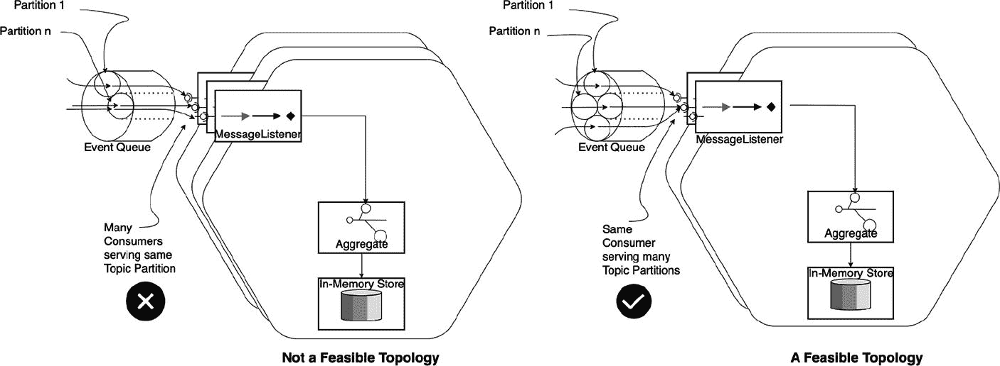

该图描绘了两种拓扑结构：不可行方案与可行方案。左侧，分区通过事件队列由多个消费者处理，随后是消息监听器。右侧，分区通过事件队列由同一个消费者处理，随后是监听器。

图 5-14
微服务消费者与分区分配对比

Kafka 生产者是线程安全的，可以在多个线程之间共享。然而，Kafka 消费者在设计上并非线程安全。因此，你不能在多个线程之间共享同一个消费者实例。默认的 Kafka 消费者是单线程的，因此它只能顺序处理记录，正如你在上一节的示例中看到的那样。那么，如何提高并行度呢？

由于单线程消费者即使被分配到多个分区也无法并发处理，直接的解决方案是同时增加分区和消费者的数量，这正是本节将要尝试的方法。然而，这种设计有其自身的局限性，因为对于高事务性系统来说，拥有过多的消费者是不可行的，需要支持与消费者数量一样多的分区，可能达到数百万个。在这种情况下，你需要采用一种异构策略，将消息的消费和确认与耗时的消息处理解耦，但这不在本演示的讨论范围之内。


### 理解代码

本书的源代码可通过图书产品页面上的 GitHub 链接获取，地址为 [`www.apress.com/9798868805547`](http://www.apress.com/9798868805547)。本示例的源代码位于 `ch05\ch05-02` 文件夹中。这段代码与本章的第一个示例相同，但配置方式不同。本节将重点介绍消费者微服务（即 Product Web 微服务）中的变更。

Product Web 微服务配置的主要部分如清单 5-25 所示。

```
server:
port: 8080
spring:
...
kafka:
bootstrap-servers: localhost:9092
consumer:
auto-offset-reset: earliest
group-id: product-web
kafka:
topic:
product:
request: product-req-topic
pinnedToPartition: false
reply: product-req-reply-topic
request-reply:
timeout-ms: 60000
product:
topic:
request:
numPartitions: 3
清单 5-25
Product Web 微服务的配置 (ch05\ch05-02\02-ProductWeb\src\main\resources\application.yml)
```

`pinnedToPartition` 被配置为 `false`，因为您将 Product Web 微服务实例到可用分区的分配工作留给了底层库。

您可以通过 Product Web 微服务根文件夹中的 `run` 脚本来配置 `appName` 的值：

```
-Dspring.application.name=product-web-1
-Dspring.application.name=product-web-2
-Dspring.application.name=product-web-3
```

由于 `pinnedToPartition` 被配置为 `false`，您并未利用 `appName` 来实现任何分区粘性，因此无论您为 [`spring.application.name`](http://spring.application.name) 配置相同的值还是不同的值，都没有影响。

在清单 5-25 中，您可能会注意到配置 `numPartitions: 3`。这个数字是任意的，但它应该大于请求方微服务的（实例）数量，否则系统会抛出错误。Product Server 微服务的实例数量也是三个。

### 构建并运行微服务并行处理

`ch05\ch05-02` 文件夹包含构建示例所需的 Maven 脚本。第一步，您需要启动 Kafka 代理。请参考附录 D 了解如何设置并启动 Kafka 服务器。随后，您还需要按照本章前一个示例中所述，构建并安装来自 Callista Enterprise 的工具库。

接下来，打开六个命令行终端——三个用于 Product Server，三个用于 Product Web 微服务——并将目录切换到这两个微服务的顶层文件夹。

使用 `make.sh` 脚本构建 Product Server 微服务，如清单 5-26 所示。

```
binildass-MacBook-Pro:01-ProductServer binil$ pwd
/Users/binil/binil/code/mac/mybooks/docker-04/Code/ch05/ch05-02/01-ProductServer
binildass-MacBook-Pro:01-ProductServer binil$ sh make.sh
[INFO] Scanning for projects...
[INFO]
...
清单 5-26
构建 Product Server 微服务的命令
```

接下来，构建 Product Web 微服务，如清单 5-27 所示。

```
binildass-MacBook-Pro:01-ProductServer binil$ pwd
/Users/binil/binil/code/mac/mybooks/docker-04/Code/ch05/ch05-02/02-ProductWeb
binildass-MacBook-Pro:02-ProductWeb binil$ sh make.sh
[INFO] Scanning for projects...
[INFO]
...
清单 5-27
构建 Product Web 微服务的命令
```

第一步，您需要逐个启动 Product Server 微服务的三个实例。首先运行 Product Server 微服务实例 1，如清单 5-28 所示。

```
binildass-MacBook-Pro:01-ProductServer binil$ pwd
/Users/binil/binil/code/mac/mybooks/docker-04/Code/ch05/ch05-02/01-ProductServer
binildass-MacBook-Pro:01-ProductServer binil$ sh run1.sh
...
2024-02-29 19:52:16 INFO  ProductListener.listenWithHeaders:57 - Start
...
2024-02-29 19:52:23 INFO  ProductListener.listenWithHeaders:80 - Ending...
清单 5-28
运行 Product Server 微服务实例 1 的命令
```

接下来，运行 Product Server 微服务实例 2，如清单 5-29 所示。

```
binildass-MacBook-Pro:01-ProductServer binil$ pwd
/Users/binil/binil/code/mac/mybooks/docker-04/Code/ch05/ch05-02/01-ProductServer
binildass-MacBook-Pro:01-ProductServer binil$ sh run2.sh
...
2024-02-29 19:52:17 INFO  ProductListener.listenWithHeaders:57 - Start
...
2024-02-29 19:52:23 INFO  ProductListener.listenWithHeaders:80 - Ending...
清单 5-29
运行 Product Server 微服务实例 2 的命令

最后，运行 Product Server 微服务实例 3，如清单 5-30 所示。

```
binildass-MacBook-Pro:01-ProductServer binil$ pwd
/Users/binil/binil/code/mac/mybooks/docker-04/Code/ch05/ch05-02/01-ProductServer
binildass-MacBook-Pro:01-ProductServer binil$ sh run3.sh
...
2024-02-29 19:52:16 INFO  ProductListener.listenWithHeaders:57 - Start
...
2024-02-29 19:52:22 INFO  ProductListener.listenWithHeaders:80 - Ending...
清单 5-30
运行 Product Server 微服务实例 3 的命令
```

第二步，您需要逐个启动 Product Web 微服务的三个实例。首先，运行 Product Web 微服务实例 1，如清单 5-31 所示。

```
binildass-MacBook-Pro:02-ProductWeb binil$ pwd
/Users/binil/binil/code/mac/mybooks/docker-04/Code/ch05/ch05-02/02-ProductWeb
binildass-MacBook-Pro:02-ProductWeb binil$ sh run1.sh
...
2024-02-29 19:52:16 INFO  ProductRestController.getAllProducts:69 – Start
...
2024-02-29 19:52:16 DEBUG LogAccessor.debug:313 - Sending: ProducerRecord(topic=product-req-topic,...
...
2024-02-29 19:52:22 DEBUG LogAccessor.debug:313 - Received: product-req-reply-topic-2@0 with correlationId: c67dd6d1-83ed-479c-99b4-708f603b48dc
清单 5-31
运行 Product Web 微服务实例 1 的命令
```

清单 5-32 展示了 Product Web 微服务实例 2。

```
binildass-MacBook-Pro:02-ProductWeb binil$ pwd
/Users/binil/binil/code/mac/mybooks/docker-04/Code/ch05/ch05-02/02-ProductWeb
binildass-MacBook-Pro:02-ProductWeb binil$ sh run2.sh
...
2024-02-29 19:52:16 INFO  ProductRestController.getAllProducts:69 - Start
...
2024-02-29 19:52:16 DEBUG LogAccessor.debug:313 - Sending: ProducerRecord(topic=product-req-topic,...
...
2024-02-29 19:52:23 DEBUG LogAccessor.debug:313 - Received: product-req-reply-topic-0@0 with correlationId: 2045c904-b6c8-4608-a21b-684943f4ab30
清单 5-32
运行 Product Web 微服务实例 2 的命令
```

最后一步，运行 Product Web 微服务实例 3，如清单 5-33 所示。

```
binildass-MacBook-Pro:02-ProductWeb binil$ pwd
/Users/binil/binil/code/mac/mybooks/docker-04/Code/ch05/ch05-02/02-ProductWeb
binildass-MacBook-Pro:02-ProductWeb binil$ sh run3.sh
...
2024-02-29 19:52:17 INFO  ProductRestController.getAllProducts:69 - Start
...
2024-02-29 19:52:17 DEBUG LogAccessor.debug:313 - Sending: ProducerRecord(topic=product-req-topic,...
...
2024-02-29 19:52:23 DEBUG LogAccessor.debug:313 - Received: product-req-reply-topic-1@0 with correlationId: 3bdb5077-8f14-46a0-ae7c-3585dc8a9fce
清单 5-33
运行 Product Web 微服务实例 3 的命令
```

现在，两个微服务都已启动并运行，您可以测试它们了。


### 测试并行请求处理

一切就绪后，您可以使用 cURL 客户端访问 Web 应用程序。

要测试并行处理请求，您需要将 `pinnedToPartition` 配置为 `false` 值，如清单 5-25 所示。

为了进行测试，我们的目标是同时向 Product Web 微服务发起多个请求。现在，您可以使用三个独立的终端来（大致）同时运行 cURL 客户端命令，如清单 5-34 至 5-36 所示。

```
binildass-MacBook-Pro:02-ProductWeb binil$ sh curlrun3.sh
Firing http://127.0.0.1:8082/productsweb and waiting...

Current date: Thu Feb 29 19:52:17 IST 2024
==========================================
{"products":{"productId":"1","name":"Kamsung...

Current date: Thu Feb 29 19:52:23 IST 2024
==========================================
Response from http://127.0.0.1:8082/productsweb received.
binildass-MacBook-Pro:02-ProductWeb binil$
清单 5-36
使用 cURL 进行测试的命令：客户端 3
```

```
binildass-MacBook-Pro:02-ProductWeb binil$ sh curlrun2.sh
Firing http://127.0.0.1:8081/productsweb and waiting...

Current date: Thu Feb 29 19:52:16 IST 2024
==========================================
{"products":[{"productId":"1","name":"Kamsung...

Current date: Thu Feb 29 19:52:23 IST 2024
==========================================
Response from http://127.0.0.1:8081/productsweb received.
binildass-MacBook-Pro:02-ProductWeb binil$
清单 5-35
使用 cURL 进行测试的命令：客户端 2
```

```
binildass-MacBook-Pro:02-ProductWeb binil$ pwd
/Users/binil/binil/code/mac/mybooks/docker-04/Code/ch05/ch05-02/02-ProductWeb
binildass-MacBook-Pro:02-ProductWeb binil$ sh curlrun1.sh
Firing http://127.0.0.1:8080/productsweb and waiting...

Current date: Thu Feb 29 19:52:16 IST 2024
==========================================
{"products":[{"productId":"1","name":"Kamsung ...

Current date: Thu Feb 29 19:52:22 IST 2024
==========================================
Response from http://127.0.0.1:8080/productsweb received.
binildass-MacBook-Pro:02-ProductWeb binil$
清单 5-34
使用 cURL 进行测试的命令：客户端 1
```

仔细观察清单 [5-34 至 5-36 会发现，程序可以（大致）同时向 Product Web 微服务实例发起 cURL 客户端请求。随后，从清单 5-31 至 5-33 可以清楚地看到，不同的 Product Web 微服务实例也可以（大致）同时以负载均衡的方式将这些请求转发给不同的 Product Server 微服务实例。

```
2024-02-29 19:52:16 INFO  ProductRestController.getAllProducts:69 – Start
2024-02-29 19:52:16 INFO  ProductRestController.getAllProducts:69 - Start
2024-02-29 19:52:17 INFO  ProductRestController.getAllProducts:69 - Start
```

接下来，观察清单 5-28 至 5-30 中 Product Server 微服务不同实例对请求的处理。它们表明消息处理是以负载均衡的方式（大致）同时进行的：

```
2024-02-29 19:52:16 INFO  ProductListener.listenWithHeaders:57 - Start
2024-02-29 19:52:17 INFO  ProductListener.listenWithHeaders:57 - Start
2024-02-29 19:52:16 INFO  ProductListener.listenWithHeaders:57 - Start
```

微服务实例的消息处理模式是并发处理消息，并且可能乱序处理，如图 5-15 所示。

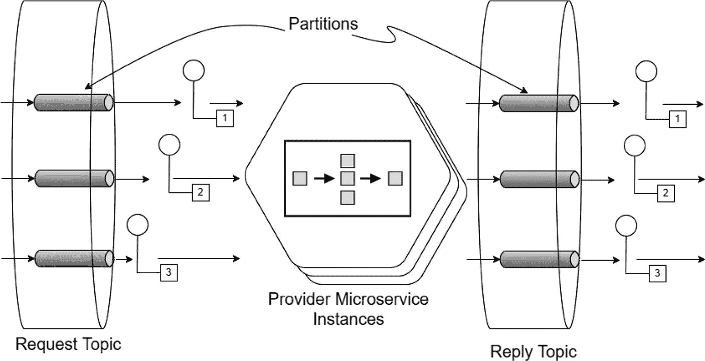

该图说明了使用类似 Kafka 的系统，在提供者微服务实例之间通过请求主题和回复主题实现的请求-回复模型。请求主题有多个分区，请求被放置到特定的分区中。

图 5-15

微服务消费者与分区分配

当微服务启动并运行后，您也可以通过浏览器访问 Web 应用程序，指向以下 URL：

`http://localhost:8080/product.html`

`http://localhost:8081/product.html`

`http://localhost:8082/product.html`

您可能需要在浏览器控制台稍等片刻，因为由于微服务中配置的睡眠延迟，浏览器最终才会渲染数据。

## 总结

使用面向消息的微服务的事件驱动架构的一个主要好处是，将事件生产者微服务与事件消费者微服务解耦，从而允许系统更加灵活和可演进。依赖同步的请求-回复语义则恰恰相反，生产者和消费者微服务紧密耦合。这仅应在必要时使用。如果需要同步的请求-回复，基于 HTTP 的协议比使用像 Apache Kafka 这样的异步通道更简单、更直接、更高效。话虽如此，在某些场景下，使用同步风格的请求-回复可能是有意义的。您可能需要根据手头的任务，明智地从可用的选项组合中进行选择。本章中的示例演示了通过消息通道检索 Product 实体集合的过程。您现在可能会自然地想到，本章中解释的微服务间交互风格是否可以在实际生活中用于覆盖完整的业务用例，而这正是第 6 章将要介绍的内容。

# 6. 生产级面向消息的微服务

第 4 章解释了消息中间件如何在为微服务提供松散耦合的通信桥梁方面发挥关键作用。消息通道通常以异步交互风格为特征，但第 4 章和第 5 章试图展示即使在异步消息通道上，也可以实现同步的用户体验。这是提供信心的第一步，即可以利用松散耦合的、基于消息的微服务交互来实现您的许多（如果不是全部）功能用例。如第 5 章所述，许多工程师仍然对是否可以使用事件和事件范式以同步方式进行微服务间通信以实现完整的数据管理范式持怀疑态度。本章旨在解决这种怀疑。

本章完全以实践为主，并附有示例。需要您对第 5 章中的示例有概览和实际操作经验，才能快速理解本章中增强的示例。

本章涵盖以下概念：

*   消息交换的协议和消息格式

*   使用 Kafka 作为中间件，在微服务之间实现完整的 CRUD（创建、读取、更新、删除）功能

*   使用 MongoDB 和 PostgreSQL DB 实现 CRUD

*   快速了解一些集成模式

## 微服务间线路级选项

当我们谈论面向消息的微服务时，有利有弊。其中一个主要方面涉及微服务间通信格式的选项。让我们在下一节中探讨这些内容。


### XML-RPC 与 SOAP

十多年来，XML-RPC 和 SOAP 一直是使用 Web 服务进行远程服务调用的基石。Web 服务由 WSDL（Web 服务描述语言）文档描述，该文档充当服务提供者与服务消费者之间的契约。WSDL 文档描述了 Web 服务如何绑定到消息传递协议——对于 Web 服务而言，即 SOAP 协议。

WSDL SOAP 绑定可以是面向 RPC 的绑定，也可以是面向文档的绑定。

*   **面向 RPC 的风格：** 使用面向 RPC（远程过程调用）风格的 Web 服务是接口驱动的。在此，客户端应用程序通过发送请求的参数值并接收响应的参数值来调用 Web 服务方法（调用远程过程）。SOAP 请求的正文包含一个用于此方法的包装 XML 元素。该方法的参数作为子元素嵌入在此包装元素内。

*   **面向文档的风格：** 使用面向文档风格的 Web 服务是文档（更准确地说是 XML 文档）驱动的。在此，客户端应用程序将参数作为 XML 文档发送给 Web 服务，而不是作为离散的参数值集合。SOAP 请求和响应消息的正文包含一个或多个 XML 文档。面向文档的风格比面向 RPC 的风格更扁平，并且不需要使用包装元素。

### REST 与 JSON-RPC

在最近一段时间，每当有人想要开始构建 HTTP API 时，他们几乎都专门使用 REST 作为事实上的架构风格，而不是 XML-RPC 和 SOAP 等替代方法。REST 指定了一种客户端-服务器关系，其中服务器端数据通过简单格式（通常是 JSON 和 XML）的数据表示形式提供。这些用于资源或资源集合的表示形式随后可以通过操作（更准确地说是 HTTP 操作）进行修改。数据之间的关系通过一种称为*超媒体*的方法变得可发现。超媒体是 REST 的基础，本质上就是提供指向其他资源的链接的概念。在第 2 章标题为“HATEOAS 和 HAL”的部分中，您已经了解了这一点。

JSON-RPC 是一种用 JSON 编码的远程过程调用协议。它类似于 XML-RPC 协议，只定义了少数数据类型和命令。JSON-RPC 允许通知（发送到服务器但不需要响应的数据）以及向服务器发送多个调用，这些调用可以异步应答。

### RPC 与消息传递

这两种协议的根本区别在于 RPC 框架是同步的。您发起一个调用，在收到响应之前，该调用不会完成。另一方面，消息传递是异步的。您发送消息，要么不期望得到响应，要么不知道响应何时会返回（如果真有响应的话）！

如果您的调用者需要从您正在请求或调用的服务的响应中获取信息，那么您应该使用 RPC，因为在从提供者那里获得所需信息之前，您无法返回给调用者。如果您的调用者不需要来自下游服务的信息，您可以使用消息传递。发送消息后即可忘记它，因为您不期望（更确切地说，是无法期望）收到响应。

### RPC 风格的消息传递

如前所述，消息传递范式试图强制执行一种“发送即忘”的消息传递风格，但可以使用设计得当的消息队列来执行和模拟 RPC，如第 5 章所述。第 5 章中的图 5-7 描述了微服务通信的不同回复通道，而图 5-8 描述了相互通信的微服务的不同回复分区。在这两种场景中，您都可以在消息传递通道上模拟参与微服务之间的同步风格请求-响应。

与 XML-RPC 或 SOAP 场景不同，当微服务通过普通消息传递通道进行通信时，它们不会严格绑定到严格的消息调用模式——缺少一种充当服务提供者与服务消费者之间契约的 WSDL 类机制。因此，您需要编织一种机制来指定“要执行什么操作”。HTTP 提供了标准动词来为正在执行的操作意图提供语义含义。

### 用于资源 CRUD 的 HTTP 方法

基于 RPC 的 API 非常适合操作（即过程或命令），而基于 REST 的 API 非常适合对您的领域（即资源或实体）进行建模，为您的所有数据提供 CRUD（创建、读取、更新、删除）功能。REST 使用 HTTP 方法，例如 GET、POST、PUT、DELETE、OPTIONS 以及（希望如此）PATCH，来为正在执行的操作意图提供语义含义。

您可以利用来实现 REST 的 HTTP 主要方法如下：

*   **GET：** GET 是最简单的 HTTP 操作，其意图是从服务器检索资源。200 OK 是成功操作的状态码。所有 GET 操作都应该是*幂等*的，这意味着无论您使用相同参数重复操作多少次，资源的状态都不应发生任何变化。

*   **POST：** HTTP POST 为客户端提供了一种向服务器发送信息的选项。建议将 POST 用于创建新资源（尽管它也可以更新现有资源）。

*   **PUT：**^(⁵) HTTP PUT 也为客户端提供了一种向服务器发送信息的选项；但是，根据 HTTP 规范，PUT 的使用语义与 POST 略有不同。使用 PUT，您可以向服务器发送一个“新对象”，将其放置在由 URI 表示的服务器上的某个位置，因此其意图应该是用新资源替换现有资源。就单个客户端而言，PUT 请求是幂等的。如果在 PUT 请求中只提供了数据元素的子集，其余部分将被替换为空或 null。

*   **DELETE：** DELETE 允许客户端从服务器删除资源。URI 标识要删除的资源。资源可能不必立即删除；相反，可以通过后台的异步或长时间运行的操作来完成。

REST 不仅仅是 CRUD，但事情主要通过基于 CRUD 的操作来完成。

然而，RPC 并不严格遵循标准的 HTTP 动词。大多数只使用 GET 和 POST，其中 GET 用于检索信息，POST 用于其他所有事情。常见的做法是看到 RPC API 使用类似 `POST /deleteBar` 的方式，并带有 `{ "id": 10 }` 的请求体，而不是 REST 方法，后者会是 `DELETE /bars/10`。

JSON（JavaScript 对象表示法）是一种开放标准的文件格式和数据交换格式，它使用人类可读的文本来存储和传输由属性-值对和数组（或其他可序列化值）组成的数据对象。如果您想继续使用这种格式，而不是同步风格的 HTTP 传输，您可以使用异步风格的消息传递传输。但是，当您不使用标准 HTTP 时，您就失去了使用标准 HTTP 动词及其任何相关优势的机会。

下一节将看两个示例，演示其中的一些讨论要点。具体来说，我们将为端点 API 坚持使用 REST，并尝试在通过 Kafka 进行的微服务间通信中坚持使用 JSON。


## 基于 MongoDB 的 Kafka 上的 CRUD 微服务

本示例对第 5 章中的同一组微服务进行了调整。一个消费者微服务和一个提供者微服务使用 Kafka 作为消息通道进行通信。提供者微服务将实体存储在 MongoDB 数据库中。此外，当浏览器向第一个（消费者）微服务发送请求时，它使用异步 HTTP。尽管使用了异步 HTTP，但该示例在浏览器层面模拟了同步风格的用户体验。

与第 5 章中的示例一样，本示例通过消费者和提供者微服务的多个实例进行演示，并且在测试服务时使用了多个客户端。

本示例引入了一个新的功能特性。它通过微服务交互，使用 Kafka 作为消息通道，模拟了完整的 CRUD（创建、读取、更新和删除）功能。

### 在 MongoDB 上设计基于异步通道的 CRUD

本示例使用了第 2 章图 2-1 中所示六边形微服务视图的修改版本（您在第 5 章中也见过），以便两个微服务通过异步通道进行通信。Apache Kafka 被用作消息通道，它本质上是异步的。本示例的目标是多方面的：

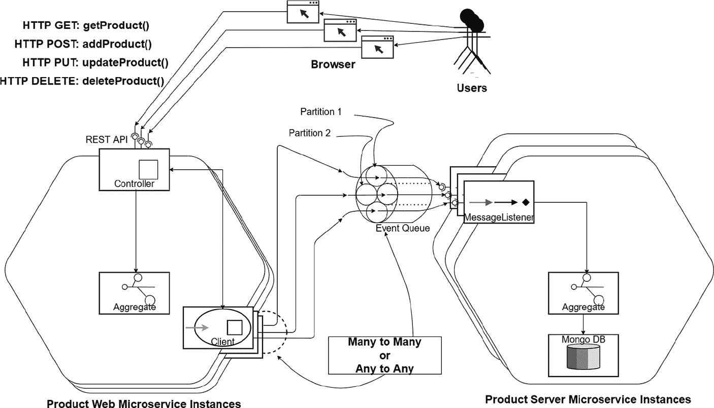

微服务设计包含以下组件：用户、浏览器、REST API、产品 Web 微服务实例、产品服务器微服务实例。

图 6-1

使用分区的异步通道上的微服务设计

*   在基于 Kafka 的异步通道上调用同步风格的通信。
*   演示多个消费者类型或同一消费者类型的多个实例可以连接到一个或多个提供者微服务实例，并且仍然只接收到与各自请求相对应的正确响应。
*   演示完整的 CRUD 操作集可以通过异步通道进行编排。
*   在浏览器端为用户提供同步风格的体验，即使该示例使用了异步 HTTP。
*   演示浏览器可以从完全符合 HATEOAS 的接口进行消费。

如图 6-1 所示，本示例将利用 Kafka 分区作为微服务之间异步通道中的主要并发机制。这个异步主题被划分为一个或多个分区（本例中为五个），使得生产者和消费者的负载可以扩展。消费者在各个分区之间均匀分布，从而可以通过增加提供者实例及其配置的分区来线性扩展消费者负载。

### 理解源代码

本书的源代码可通过图书产品页面在 GitHub 上获取，网址为 [`www.apress.com/9798868805547`](http://www.apress.com/9798868805547)。本示例的代码组织在 `ch06\ch06-01` 文件夹内。本示例的大部分源代码与 `ch05\ch05-01` 中的类似。我之前详细解释了如何设置使用消息通道相互通信的消费者和提供者微服务。本节仅介绍更改的部分。

需要检查的主类是 `Product` 实体的新容器类（参见代码清单 6-1），它具有以下功能：

*   作为在微服务之间传输资源集合的容器
*   作为模式规范

```
public class Products {
public static final String CREATE = "Create";
public static final String DELETE = "Delete";
public static final String DELETE_ALL = "Delete_All";
public static final String UPDATE = "Update";
public static final String RETREIVE_ALL = "Retreive_All";
public static final String RETREIVE_DETAILS =
"Retreive_Details";
public static final String SUCCESS = "Success";
public static final String FAILURE = "Failure";
private String operation;
private List products;
public String getOperation() {
return operation;
}
public void setOperation(String operation) {
this.operation = operation;
}
public List getProducts() {
return products;
}
public void setProducts(List products) {
this.products = products;
}
}
代码清单 6-1
Product 实体的容器类 (ch06\ch06-01\02-ProductWeb\src\main\java\com\acme\ecom\product\model\Products.java)
```

`Products` 类将 CRUD HTTP 动词的对应项列为常量字面量。`operation` 属性用于指定在请求阶段要执行的操作。在响应阶段，相同的操作将请求处理的结果指定为“成功”或“失败”。接下来，`products` 集合可能包含一个或多个 `Product` 实体。在请求阶段，`products` 属性包含一个 `Product` 实体，其属性值对应于要执行操作的参数。在操作的响应阶段，相同的 `products` 集合可能包含一个或多个 `Product` 实体，对应于所执行操作的响应。

这种将请求和响应参数及操作作为有效载荷附带的方法并非最佳、最优雅的方式，但它能完成任务。

代码清单 6-2 显示了 Product Web 微服务使用的配置类。

```
@Configuration
public class KafkaConfig {
@Bean
public CompletableFutureReplyingKafkaOperations replyKafkaTemplate() {
CompletableFutureReplyingKafkaTemplate
requestReplyKafkaTemplate = new
CompletableFutureReplyingKafkaTemplate(
requestProducerFactory(),
replyListenerContainer());
requestReplyKafkaTemplate.setDefaultTopic(
requestTopic);
requestReplyKafkaTemplate.setDefaultReplyTimeout(
Duration.of(replyTimeout, ChronoUnit.MILLIS));
return requestReplyKafkaTemplate;
}
@Bean
public ConsumerFactory
replyConsumerFactory() {
JsonDeserializer jsonDeserializer =
new JsonDeserializer();
jsonDeserializer.addTrustedPackages(
Products.class.getPackage().getName());
return new DefaultKafkaConsumerFactory(
consumerConfigs(), new StringDeserializer(),
jsonDeserializer);
}
@Bean
public KafkaMessageListenerContainer
replyListenerContainer() {
ContainerProperties containerProperties =
new ContainerProperties(replyTopic);
return new KafkaMessageListenerContainer(
replyConsumerFactory(), containerProperties);
}
}
代码清单 6-2
Product Web 微服务的 Kafka 配置 (ch06\ch06-01\02-ProductWeb\src\main\java\com\acme\ecom\product\KafkaConfig.java)
```

这段代码配置了 `CompletableFutureReplyingKafkaTemplate`，指定将 `Products` 作为请求发送，并期望将 `Products` 作为响应返回。


清单 6-3 检查了 Product Web 控制器中的一个方法。其他方法以类似方式实现，为简洁起见，此处不再重复代码。

```
@RestController
public class ProductRestController{
@Autowired
private CompletableFutureReplyingKafkaOperations replyingKafkaTemplate;
@RequestMapping(value = "/productsweb",
method = RequestMethod.GET,
produces = {MediaType.APPLICATION_JSON_VALUE})
public DeferredResult>>
getAllProducts(){
DeferredResult>>
deferredResult = new DeferredResult();
Products productsRequest = new Products();
productsRequest.setOperation(Products.RETREIVE_ALL);
CompletableFuture completableFuture =
replyingKafkaTemplate.requestReply(
requestTopic, productsRequest);
completableFuture.thenAccept(products -> {
List
productList = products.getProducts();
CollectionModel result = CollectionModel.of(
list, links);
deferredResult.setResult(new ResponseEntity>(result,
HttpStatus.OK));
return deferredResult;
}
}
清单 6-3
Product Web 微服务的 REST 控制器 (ch06\ch06-01\02-ProductWeb\src\main\java\com\acme\ecom\product\controller\ProductRestController.java)
```

在向 Product Server 微服务发送请求消息以检索所有产品时，你将操作指定为 `Products.RETREIVE_ALL`。即使你在请求中发送了一个空的 `Products` 集合 `productsRequest`，它在此处也不相关或未被使用。然而，对于其他一些方法，你可以使用同一个 `productsRequest` 集合来发送请求参数。然后，你使用上一步配置的 `CompletableFutureReplyingKafkaOperations`，以同步风格发送请求消息并接收其对应的响应消息，尽管底层的请求和响应消息语义是两个独立的异步消息。

注意

关于 `CompletableFutureReplyingKafkaOperations` 及其使用模式的详细说明，请参见第 5 章。

在 Product Server 微服务端，你还必须配置并指定 `Products` 容器类，以便在网络上传输，如清单 6-4 所示。

```
@Configuration
@EnableKafka
public class KafkaConfig {
@Bean
public ConsumerFactory
requestConsumerFactory() {
JsonDeserializer jsonDeserializer =
new JsonDeserializer();
jsonDeserializer.addTrustedPackages(Products.class.
getPackage().getName());
return new DefaultKafkaConsumerFactory(
consumerConfigs(), new StringDeserializer(),
jsonDeserializer);
}
@Bean
public KafkaListenerContainerFactory> requestReplyListenerContainerFactory(){
ConcurrentKafkaListenerContainerFactory factory =
new ConcurrentKafkaListenerContainerFactory();
factory.setConsumerFactory(requestConsumerFactory());
factory.setReplyTemplate(replyTemplate());
return factory;
}
}
清单 6-4
Product Server 微服务的 Kafka 配置 (ch06\ch06-01\01-ProductServer\src\main\java\com\acme\ecom\product\KafkaConfig.java)
```

`ProductListener` 是 Product Server 微服务的消息监听器。`ProductListener` 首先通过检查 `operation` 属性来解析要执行的操作，并调用相应的方法。参见清单 6-5。

```
@Component
public class ProductListener {
@Autowired
private ProductRepository productRepository;
@KafkaListener(topics = "${kafka.topic.product.request}",
containerFactory =
"requestReplyListenerContainerFactory")
@SendTo
public Products listenWithHeaders(
ConsumerRecord record){
Products productsRequest = record.value();
Products productsResponse = resolveAndExecute(
productsRequest);
return productsResponse;
}
private Products resolveAndExecute(Products products) {
Products productsToReturn = null;
if(products.getOperation().equals(
Products.RETREIVE_DETAILS)){
productsToReturn = getProduct(products);
}
else if(products.getOperation().equals(
Products.RETREIVE_ALL)){
productsToReturn = getAllProducts(products);
}
else if(products.getOperation().equals(
Products.CREATE)){
productsToReturn = createProduct(products);
}
else if(products.getOperation().equals(
Products.UPDATE)){
productsToReturn = updateProduct(products);
}
else if(products.getOperation().equals(
Products.DELETE)){
productsToReturn = deleteProduct(products);
}
else {
LOGGER.debug("Inside else. Undefined Operation!");
}
return productsToReturn;
}
private Products getAllProducts(Products products) {
Products productsToReturn = new Products();
List productListToReturn =
productRepository.findAll();
productsToReturn.setOperation(Products.SUCCESS);
productsToReturn.setProducts(productListToReturn);
return productsToReturn;
}
//other code goes here
}
清单 6-5
Product Server 微服务的 Kafka 监听器 (ch06\ch06-01\01-ProductServer\src\main\java\com\acme\ecom\product\kafka\client\ProductListener.java)
```

这里再次只展示了 `ProductListener` 中的一个方法，名为 `getAllProducts`。其他方法以类似方式实现，因此此处不再重复其代码。

还建议你参考第 3 章中“使用 MongoDB 和 CrudRepository 的微服务”一节中的第二个示例，该示例解释了 Product Server 微服务如何连接到 MongoDB 以执行完整的 CRUD 操作集。


### 构建并运行微服务

`ch06\ch06-01` 文件夹包含构建示例所需的 Maven 脚本。第一步，你需要启动 Kafka 代理。请参考附录 D 了解如何设置并启动 Kafka 服务器。你需要执行清单 6-6 中的命令，从 Kafka 安装位置启动它。

```
bin/zookeeper-server-start.sh config/zookeeper.properties
bin/kafka-server-start.sh config/server.properties
清单 6-6
启动 Kafka 代理的命令
```

接下来，你需要启动 MongoDB 服务器。请参考附录 B 了解如何设置并启动 MongoDB 服务器。你需要执行清单 6-7 中的命令来启动 MongoDB。

```
(base) binildass-MBP:bin binil$ pwd
/Users/binil/Applns/mongodb/mongodb-macos-x86_64-4.2.8/bin
(base) binildass-MBP:bin binil$ mongod --dbpath /usr/local/var/mongodb --logpath /usr/local/var/log/mongodb/mongo.log
清单 6-7
启动 MongoDB 的命令

```

接着，你需要构建并安装来自 Callista Enterprise 的实用工具库（见清单 6-8）。关于此库的简要介绍，请参考第 5 章。

```
binildass-MacBook-Pro:kafka-request-reply-util binil$ pwd
/Users/binil/binil/code/mac/mybooks/docker-04/Code/ch06/ch06-01/kafka-request-reply-util
(base) binildass-MacBook-Pro:kafka-request-reply-util binil$ mvn clean install
[INFO] Scanning for projects...
[INFO]
...
清单 6-8
构建并安装来自 Callista Enterprise 的实用工具库的命令
```

然后，使用两个命令终端，并将目录切换到两个微服务的顶层文件夹。首先，使用 `make.sh` 脚本构建 Product Server 微服务，如清单 6-9 所示。

```
binildass-MacBook-Pro:01-ProductServer binil$ pwd
/Users/binil/binil/code/mac/mybooks/docker-04/Code/ch06/ch06-01/01-ProductServer
binildass-MacBook-Pro:01-ProductServer binil$ sh make.sh
...
清单 6-9
构建 Product Server 微服务的命令
```

接下来，构建 Product Web 微服务，如清单 6-10 所示。

```
binildass-MacBook-Pro:02-ProductWeb binil$ pwd
/Users/binil/binil/code/mac/mybooks/docker-04/Code/ch06/ch06-01/02-ProductWeb
binildass-MacBook-Pro:02-ProductWeb binil$ sh make.sh
...
清单 6-10
构建 Product Web 微服务的命令
```

此示例将测试 Product Server 微服务的三个实例以及 Product Web 微服务的另外三个实例。

首先，启动 Product Server 微服务的第一个实例，如清单 6-11 所示。

```
(base) binildass-MacBook-Pro:01-ProductServer binil$ pwd
/Users/binil/binil/code/mac/mybooks/docker-04/Code/ch06/ch06-01/01-ProductServer
(base) binildass-MacBook-Pro:01-ProductServer binil$ sh run1.sh
...
清单 6-11
运行 Product Server 微服务实例 1 的命令
```

接下来，启动 Product Server 微服务的第二个实例，如清单 6-12 所示。

```
(base) binildass-MacBook-Pro:01-ProductServer binil$ pwd
/Users/binil/binil/code/mac/mybooks/docker-04/Code/ch06/ch06-01/01-ProductServer
(base) binildass-MacBook-Pro:01-ProductServer binil$ sh run2.sh
...
清单 6-12
运行 Product Server 微服务实例 2 的命令
```

最后，启动 Product Server 微服务的第三个实例，如清单 6-13 所示。

```
(base) binildass-MacBook-Pro:01-ProductServer binil$ pwd
/Users/binil/binil/code/mac/mybooks/docker-04/Code/ch06/ch06-01/01-ProductServer
(base) binildass-MacBook-Pro:01-ProductServer binil$ sh run3.sh
...
清单 6-13
运行 Product Server 微服务实例 3 的命令
```

接下来，运行 Product Web 微服务的实例。第一步，清单 6-14 展示了如何运行第一个实例。

```
(base) binildass-MacBook-Pro:02-ProductWeb binil$ pwd
/Users/binil/binil/code/mac/mybooks/docker-04/Code/ch06/ch06-01/02-ProductWeb
(base) binildass-MacBook-Pro:02-ProductWeb binil$ sh run1.sh
...
清单 6-14
运行 Product Web 微服务实例 1 的命令
```

接着，启动 Product Web 微服务的第二个实例，如清单 6-15 所示。

```
(base) binildass-MacBook-Pro:02-ProductWeb binil$ pwd
/Users/binil/binil/code/mac/mybooks/docker-04/Code/ch06/ch06-01/02-ProductWeb
(base) binildass-MacBook-Pro:02-ProductWeb binil$ sh run2.sh
...
清单 6-15
运行 Product Web 微服务实例 2 的命令
```

最后一步，启动 Product Web 微服务的第三个实例，如清单 6-16 所示。

```
(base) binildass-MacBook-Pro:02-ProductWeb binil$ pwd
/Users/binil/binil/code/mac/mybooks/docker-04/Code/ch06/ch06-01/02-ProductWeb
(base) binildass-MacBook-Pro:02-ProductWeb binil$ sh run3.sh
...
清单 6-16
运行 Product Web 微服务实例 3 的命令
```

图 6-2 展示了访问这些微服务多个实例的过程。

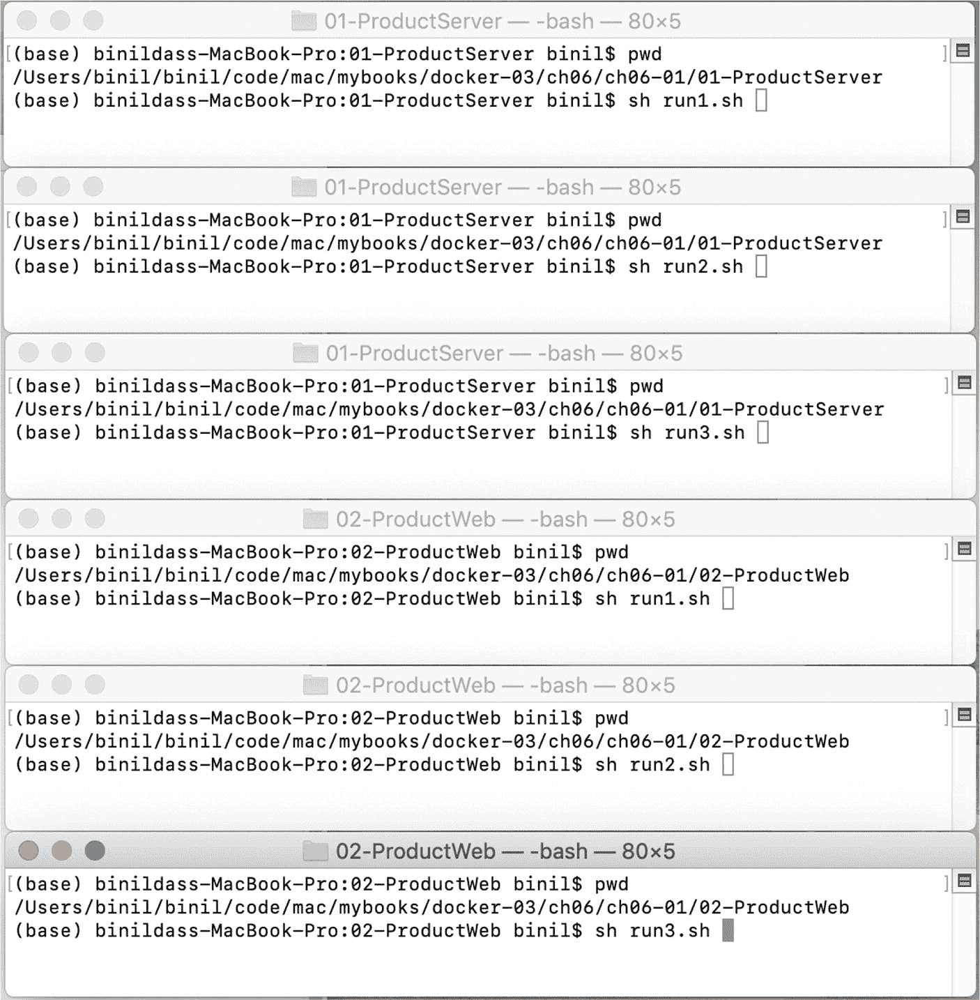

该截图包含了使用多个实例测试微服务的代码。

图 6-2
使用多个实例测试微服务

现在，两个微服务都已启动并运行，你可以测试它们了。


### 测试微服务

要测试这些微服务，请参考第 5 章中的“测试并行请求处理”一节。或者，你也可以使用以下章节。

测试这些微服务的方法不止一种。一种方法是使用三个浏览器实例，并指向清单 6-17 中的 URL 来测试微服务。

```
http://localhost:8080/product.html
http://localhost:8081/product.html
http://localhost:8082/product.html
清单 6-17
使用浏览器测试微服务
```

请按照第 1 章中“使用 UI 测试微服务”一节的详细说明来测试 CRUD 操作。

或者，你现在可以打开三个（甚至更多）独立的终端，同时运行 cURL 客户端命令。清单 6-17 展示了 cURL 客户端向 Product Web 微服务发送请求。

```
binildass-MacBook-Pro:~ binil$ curl http://localhost:8080/productsweb
binildass-MacBook-Pro:~ binil$ curl http://localhost:8081/productsweb
binildass-MacBook-Pro:~ binil$ curl http://localhost:8082/productsweb
清单 6-18
向不同端口的 Product Web 微服务发起请求的 cURL 客户端
```

你还可以通过让 cURL 客户端持续发送请求来进行微服务的耐力测试，如清单 6-19 至 6-21 所示。

```
(base) binildass-MacBook-Pro:02-ProductWeb binil$ pwd
/Users/binil/binil/code/mac/mybooks/docker-04/Code/ch06/ch06-01/02-ProductWeb
(base) binildass-MacBook-Pro:02-ProductWeb binil$ sh loopcurl3.sh
...
清单 6-21
使用 cURL 客户端 3 进行耐力测试
```

```
(base) binildass-MacBook-Pro:02-ProductWeb binil$ pwd
/Users/binil/binil/code/mac/mybooks/docker-04/Code/ch06/ch06-01/02-ProductWeb
(base) binildass-MacBook-Pro:02-ProductWeb binil$ sh loopcurl2.sh
...
清单 6-20
使用 cURL 客户端 2 进行耐力测试
```

```
(base) binildass-MacBook-Pro:02-ProductWeb binil$ pwd
/Users/binil/binil/code/mac/mybooks/docker-04/Code/ch06/ch06-01/02-ProductWeb
(base) binildass-MacBook-Pro:02-ProductWeb binil$ sh loopcurl1.sh
{"_embedded":{"products":[{"productId":"1","name":"Kamsung D3","code":"KAMSUNG-TRIOS","title":"Kamsung Trios 12 inch , black , 12 px ....","price":12000.0,"_links":{"self":{"href":"/products/1"}}},{"productId":"2","name":"Lokia Pomia","code":"LOKIA-POMIA","title":"Lokia 12 inch , white , 14px ....","price":9000.0,"_links":{"self":{"href":"/products/2"}}}]},"_links":{"self":{"href":"/productsweb"},"getAllProducts":{"href":"/productsweb"}}}

Current date: Mon Dec 13 13:37:04 IST 2021
==========================================
...
清单 6-19
使用 cURL 客户端 1 进行耐力测试
```

至此，第一个示例结束。该示例试图演示本书迄今为止涵盖的许多概念。为了讨论的完整性，下一节将介绍此示例的 PostgreSQL 版本。

## 基于 PostgreSQL 的 Kafka CRUD 微服务

本示例对上一节中看到的同一组微服务进行了调整。一个消费者微服务和一个提供者微服务使用 Kafka 作为消息通道进行通信。提供者微服务将实体存储在 PostgreSQL 数据库中，而不是 MongoDB 中。当浏览器向第一个（消费者）微服务发送请求时，它使用异步 HTTP。尽管代码使用了异步 HTTP，但它在浏览器层面模拟了同步风格的用户体验。

与上一个示例一样，本示例旨在演示消费者和提供者微服务的多个实例，并在测试该服务时使用多个客户端。

### 在 PostgreSQL 上设计基于异步通道的 CRUD

本示例使用了第 2 章中图 2-1 所示的六边形微服务视图的修改版本，该视图在第 5 章中重新讨论过，并在上一个示例中稍作调整。在这里，两个微服务通过异步通道进行通信。该示例使用 Apache Kafka 作为消息通道，这本质上是异步的。


微服务设计从用户开始，然后是浏览器、REST API、Product Web 微服务实例和 Product Server 微服务实例。

图 6-3
使用分区在异步通道上的微服务设计

与上一个示例相比，一个显著的变化是提供者微服务将实体存储在 PostgreSQL 数据库中，而不是使用 MongoDB 数据库。此更改已在图 6-3 中标记。

### 理解源代码

本书的源代码可通过图书产品页面在 GitHub 上获取，网址为[`www.apress.com/9798868805547`](http://www.apress.com/9798868805547)。本示例的代码组织在`ch06\ch06-02`文件夹内。

与上一个示例相比，代码的唯一变化是提供者微服务将实体存储在 PostgreSQL 数据库中，而不是使用 MongoDB 数据库。提供者微服务将实体存储在 PostgreSQL 数据库中并执行完整 CRUD 操作所需的代码，在第 3 章第一个示例的“理解代码”一节中有详细描述。请参考该节以获取解释。


### 构建并运行微服务

`ch06\ch06-02` 文件夹包含构建这些示例所需的 Maven 脚本。第一步，你需要启动 Kafka 代理。请参考附录 D 了解如何设置并启动 Kafka 服务器。你需要执行清单 6-22 中的命令，从 Kafka 安装位置启动它。

```
bin/zookeeper-server-start.sh config/zookeeper.properties
bin/kafka-server-start.sh config/server.properties
清单 6-22
启动 Kafka 代理的命令
```

接下来，你需要启动 PostgreSQL 数据库服务器。请参考附录 C 了解如何设置并启动 PostgreSQL 服务器。你需要执行清单 6-23 中的命令来启动 PostgreSQL。

```
binildass-MacBook-Pro:~ binil$ pg_ctl -D /Library/PostgreSQL/12/data start
清单 6-23
启动 PostgreSQL 服务器
```

接着，你需要构建并安装来自 Callista Enterprise 的工具库（参见清单 6-24）。关于此库的简要介绍，请参考第 5 章。

```
binildass-MacBook-Pro:kafka-request-reply-util binil$ pwd
/Users/binil/binil/code/mac/mybooks/docker-04/Code/ch06/ch06-02/kafka-request-reply-util
(base) binildass-MacBook-Pro:kafka-request-reply-util binil$ mvn clean install
[INFO] Scanning for projects...
[INFO]
...
清单 6-24
构建并安装来自 Callista Enterprise 的工具库的命令
```

然后，使用两个命令终端，并将目录切换到两个微服务的顶层文件夹。接着，使用 `make.sh` 脚本构建 Product Server 微服务，如清单 6-25 所示。

```
binildass-MacBook-Pro:01-ProductServer binil$ pwd
/Users/binil/binil/code/mac/mybooks/docker-04/Code/ch06/ch06-02/01-ProductServer
binildass-MacBook-Pro:01-ProductServer binil$ sh make.sh
...
清单 6-25
构建 Product Server 微服务的命令
```

接下来，构建 Product Web 微服务，如清单 6-26 所示。

```
binildass-MacBook-Pro:02-ProductWeb binil$ pwd
/Users/binil/binil/code/mac/mybooks/docker-04/Code/ch06/ch06-02/02-ProductWeb
binildass-MacBook-Pro:02-ProductWeb binil$ sh make.sh
...
清单 6-26
构建 Product Web 微服务的命令
```

你将使用三个 Product Server 微服务实例和另外三个 Product Web 微服务实例进行测试。

首先，启动 Product Server 微服务的第一个实例，如清单 6-27 所示。

```
binildass-MacBook-Pro:01-ProductServer binil$ pwd
/Users/binil/binil/code/mac/mybooks/docker-04/Code/ch06/ch06-02/01-ProductServer
binildass-MacBook-Pro:01-ProductServer binil$ sh run1.sh
.   ____          _            __ _ _
/\\ / ___'_ __ _ _(_)_ __  __ _ \ \ \ \
( ( )\___ | '_ | '_| | '_ \/ _` | \ \ \ \
\\/  ___)| |_)| | | | | || (_| |  ) ) ) )
'  |____| .__|_| |_|_| |_\__, | / / / /
=========|_|==============|___/=/_/_/_/
:: Spring Boot ::                (v3.2.0)
2023-05-16 22:02:45 INFO  StartupInfoLogger.logStarting:51 - Starting EcomProductServerMicroservice...
...
Running Changeset: db/changelog/initial-schema_inventory.xml::product::Binildas
Running Changeset: db/changelog/initial-schema_inventory.xml::addAutoIncrement...
Running Changeset: db/changelog/initial-schema_inventory.xml::insert-product-01::Binildas
Running Changeset: db/changelog/initial-schema_inventory.xml::insert-product-02::Binildas
UPDATE SUMMARY
Run:                          4
Previously run:               0
Filtered out:                 0

Total change sets:            4
Liquibase: Update has been successful.
2024-03-04 17:52:57 INFO  InitializationComponent.init:42 - Start
2024-03-04 17:52:57 INFO  InitializationComponent.init:70 - End
2024-03-04 17:52:58 INFO  StartupInfoLogger.logStarted:56 - Started EcomProductServerMicroserviceApplication in 4.665 seconds (process running for 5.577)
清单 6-27
运行 Product Server 微服务实例 1 的命令
```

接下来，启动 Product Server 微服务的第二个实例，如清单 6-28 所示。

```
binildass-MacBook-Pro:01-ProductServer binil$ pwd
/Users/binil/binil/code/mac/mybooks/docker-04/Code/ch06/ch06-02/01-ProductServer
binildass-MacBook-Pro:01-ProductServer binil$ java -jar -Dserver.port=8084 -DDB_SERVER=127.0.0.1:5432 -DPOSTGRES_DB=productdb -DPOSTGRES_USER=postgres -DPOSTGRES_PASSWORD=postgre -Dspring.kafka.consumer.group-id=product-server ./target/Ecom-Product-Server-Microservice-0.0.1-SNAPSHOT.jar
...
清单 6-28
运行 Product Server 微服务实例 2 的命令
```

最后，启动 Product Server 微服务的第三个实例，如清单 6-29 所示。

```
binildass-MacBook-Pro:01-ProductServer binil$ java -jar -Dserver.port=8085 -DDB_SERVER=127.0.0.1:5432 -DPOSTGRES_DB=productdb -DPOSTGRES_USER=postgres -DPOSTGRES_PASSWORD=postgre -Dspring.kafka.consumer.group-id=product-server ./target/Ecom-Product-Server-Microservice-0.0.1-SNAPSHOT.jar
...
清单 6-29
运行 Product Server 微服务实例 3 的命令
```

接下来，运行 Product Web 微服务的实例。第一步，运行第一个实例。参见清单 6-30。

```
binildass-MacBook-Pro:02-ProductWeb binil$ pwd
/Users/binil/binil/code/mac/mybooks/docker-04/Code/ch06/ch06-02/02-ProductWeb
binildass-MacBook-Pro:02-ProductWeb binil$ sh run1.sh
.   ____          _            __ _ _
/\\ / ___'_ __ _ _(_)_ __  __ _ \ \ \ \
( ( )\___ | '_ | '_| | '_ \/ _` | \ \ \ \
\\/  ___)| |_)| | | | | || (_| |  ) ) ) )
'  |____| .__|_| |_|_| |_\__, | / / / /
=========|_|==============|___/=/_/_/_/
:: Spring Boot ::                (v3.2.0)
2024-03-04 17:54:06 INFO  StartupInfoLogger.logStarted:56 - Started EcomProductWebMicroserviceApplication in 2.322 seconds (process running for 2.981)
...
清单 6-30
运行 Product Web 微服务实例 1 的命令
```

接下来，启动 Product Web 微服务的第二个实例，如清单 6-31 所示。

```
binildass-MacBook-Pro:02-ProductWeb binil$ pwd
/Users/binil/binil/code/mac/mybooks/docker-04/Code/ch06/ch06-02/02-ProductWeb
binildass-MacBook-Pro:02-ProductWeb binil$ java -jar target/Ecom-Product-Microservice-0.0.1-SNAPSHOT.jar  -Dserver.port=8081
...
清单 6-31
运行 Product Web 微服务实例 2 的命令
```

最后一步，启动 Product Web 微服务的第三个实例，如清单 6-32 所示。

```
binildass-MacBook-Pro:02-ProductWeb binil$ java -jar target/Ecom-Product-Microservice-0.0.1-SNAPSHOT.jar  -Dserver.port=8082
...
清单 6-32
运行 Product Web 微服务实例 3 的命令
```

现在两个微服务都已启动并运行，你可以测试它们了。


### 测试微服务

要测试微服务，请参考第 5 章中的“测试并行请求处理”一节。或者，我们也可以按照以下步骤进行。

测试这些微服务的方法不止一种。其中一种方法是使用三个浏览器实例，分别指向清单 6-33 中所示的 URL。

```
http://localhost:8080/product.html
http://localhost:8081/product.html
http://localhost:8082/product.html
清单 6-33
使用浏览器测试微服务
```

按照第 1 章中“使用 UI 测试微服务”一节的详细说明，来测试这些 CRUD 操作。

或者，你现在可以使用三个（或更多）独立的终端来同时运行 cURL 客户端命令。清单 6-34 展示了向 Product Web 微服务发送请求的 cURL 客户端。

```
binildass-MacBook-Pro:~ binil$ curl http://localhost:8080/productsweb
...
binildass-MacBook-Pro:~ binil$ curl http://localhost:8081/productsweb
...
binildass-MacBook-Pro:~ binil$ curl http://localhost:8082/productsweb
...
清单 6-34
向不同端口的 Product Web 微服务发起请求的 cURL 客户端
```

你还可以通过让 cURL 客户端持续不断地发送请求来对微服务进行耐力测试，如清单 6-35 至 6-37 所示。

```
(base) binildass-MacBook-Pro:02-ProductWeb binil$ pwd
/Users/binil/binil/code/mac/mybooks/docker-04/Code/ch06/ch06-03/02-ProductWeb
(base) binildass-MacBook-Pro:02-ProductWeb binil$ sh loopcurl3.sh
...
清单 6-37
使用 cURL 客户端 3 进行耐力测试
```

```
(base) binildass-MacBook-Pro:02-ProductWeb binil$ pwd
/Users/binil/binil/code/mac/mybooks/docker-04/Code/ch06/ch06-02/02-ProductWeb
(base) binildass-MacBook-Pro:02-ProductWeb binil$ sh loopcurl2.sh
...
清单 6-36
使用 cURL 客户端 2 进行耐力测试
```

```
(base) binildass-MacBook-Pro:02-ProductWeb binil$ pwd
/Users/binil/binil/code/mac/mybooks/docker-04/Code/ch06/ch06-02/02-ProductWeb
(base) binildass-MacBook-Pro:02-ProductWeb binil$ sh loopcurl1.sh
...
清单 6-35
使用 cURL 客户端 1 进行耐力测试
```

至此，第二个使用 PostgreSQL 的示例就完成了。

在结束本章之前，下一节将快速解释一个名为*集成模式*的重要概念。这些模式展示了标准且定义明确的模式如何为涉及面向消息中间件（MOM）的架构提供价值。

## 聚合来自多个微服务的响应

在前面的所有章节以及本章的前几节中，你已经看到了不同的组合方式，可以在微服务之间混合搭配传输连接选项，以模拟不同的消息交换模式。为了完善这一讨论，本节将介绍一种名为*聚合器*的集成模式。你可以使用此模式来聚合来自多个微服务的响应。

### 聚合器集成模式

首先，让我们看看什么是聚合器模式。*聚合器*是一种有状态过滤器，用于收集和存储单个消息，直到接收到一组完整的相关消息。然后，聚合器可以过滤、组合并发布一条从这些单个消息中提炼出的单一消息。请参见图 6-4。

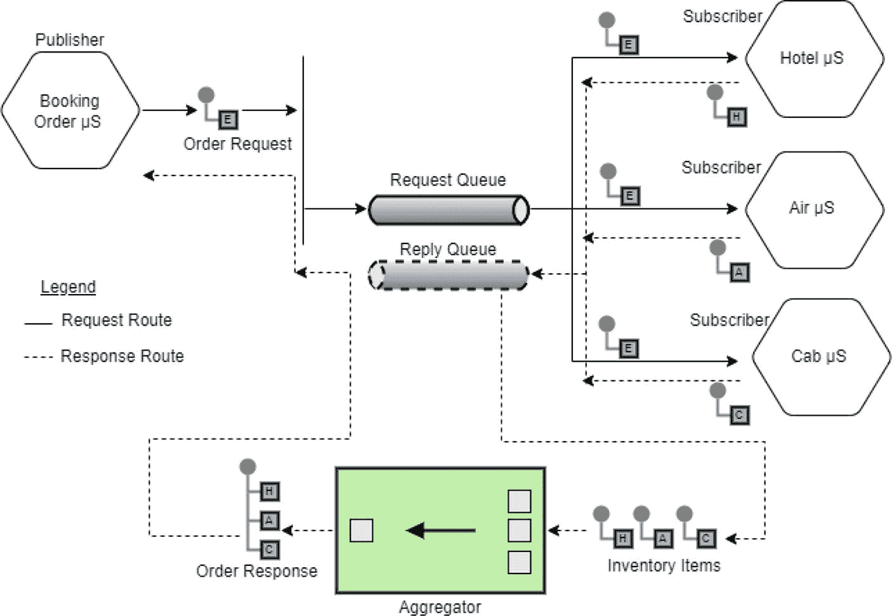

该图展示了聚合器集成模式。用户向出版商订购图书，出版商随后请求并回复，聚合器集成负责处理这些响应。

图 6-4
聚合器集成模式

图 6-4 描绘了一个由旅行社处理的典型旅行预订场景。旅行社使用预订订单微服务代表旅行者完成预订请求。旅行者也可以通过网页或移动应用直接使用预订订单微服务。假设预订需要包含酒店住宿、航空旅行以及机场接送的综合行程，那么这些单独的履约库存项目将由不同的第三方提供商拥有——在本例中，分别是酒店微服务、航空微服务和出租车微服务。这些不同的库存所有者微服务将接收预订请求，尝试履行各自的预订组件，并将响应消息发送回回复队列。接下来就是聚合器发挥作用的部分。

聚合器作为一种有状态过滤器，可以等待多个回复，直到超时。然后，聚合器可以从各个响应消息中组合信息，并向预订订单微服务发布一条单一消息。

下一节将展示一些实现此模式的工作代码。

### 设计微服务聚合器

本示例使用我们已经熟悉的 Product Web 和 Product Server 微服务领域。如图 6-5 所示，用户通过浏览器与 Product Web 微服务交互。Product Web 微服务进而调用 Product Server 微服务。Product Server 微服务从数据库（本例中为内存数据库）检索数据，并发送响应。

微服务间的通信通过消息通道进行。

此外，请求消息会被中继到多个服务提供者。其目标是使 Product Web 微服务能够将请求中继到多个服务提供者，并接收来自所有这些或其中许多服务提供者的响应。Product Web 微服务充当聚合器，存储单个消息，直到接收到一组完整的相关消息。然后，聚合器可以过滤、组合并向浏览器发布一条从这些单个消息中提炼出的单一消息。请参见图 6-5。

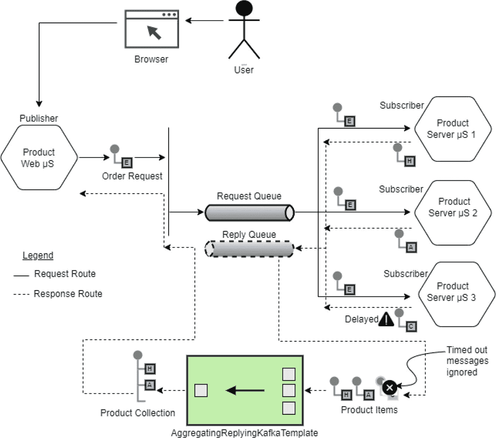

该图展示了微服务聚合器。用户通过浏览器与 Product Web 微服务交互。该服务从数据库检索数据，并发送响应。

图 6-5
微服务聚合器

为了控制示例的复杂度，本示例没有使用不同类型的提供者微服务。相反，该示例使用了同一类型微服务的不同实例。但是请注意，这并不妨碍你使用不同类型的提供者微服务来响应同一个请求消息。


### 理解源代码

本书的源代码可通过图书产品页面在 GitHub 上获取，地址为 [`www.apress.com/9798868805547`](http://www.apress.com/9798868805547)。本示例的代码组织在 `ch06\ch06-03` 文件夹中，该文件夹已详细说明。额外的连接部分在两个微服务之间插入了一个聚合器，以及用于将来自 Product Web 微服务的单个请求中继到多个（实例的）提供者微服务的机制，你将在本节代码中看到这一点。

Spring Kafka 提供了 `AggregatingReplyingKafkaTemplate`，这是一个回复模板，用于聚合具有相同关联 ID 的多个回复。`AggregatingReplyingKafkaTemplate` 是一个监听器，用于处理一批传入的 Kafka 消息。这批消息列表由轮询返回的消费者记录对象创建。`AggregatingReplyingKafkaTemplate` 扩展了 Spring 中 `ReplyingKafkaTemplate<K,V,R>` 的行为，而后者又扩展了 `KafkaTemplate` 的行为，以提供请求-回复语义。你在第 4 章中已详细了解过，因此这里仅解释 `AggregatingReplyingKafkaTemplate` 的额外特性，如代码清单 6-38 中所配置。

```
import org.springframework.kafka.requestreply.AggregatingReplyingKafkaTemplate;
@Configuration
public class KafkaConfig {
@Value("${product.topic.reply.numProviders}")
private int numProviders;
@Value("${product.topic.reply.aggregatingTimeout}")
private long aggregatingTimeout;
@Bean
public AggregatingReplyingKafkaTemplate replyKafkaTemplate(ProducerFactory pf,
KafkaMessageListenerContainer>>
replyContainer){
AggregatingReplyingKafkaTemplate replyTemplate =
new AggregatingReplyingKafkaTemplate(pf,
replyContainer,(list, timeout) -> {
LOGGER.debug("list.size() : {}; timeout : {}",
list.size(), timeout);
return (list.size() == numProviders) ||
(timeout);
});
replyTemplate.setReturnPartialOnTimeout(true);
replyTemplate.setSharedReplyTopic(true);
replyTemplate.setDefaultReplyTimeout(
java.time.Duration.ofSeconds(aggregatingTimeout));
return replyTemplate;
}
@Bean
public KafkaMessageListenerContainer>>
replyContainer(ConsumerFactory>> cf){
ContainerProperties containerProperties =
new ContainerProperties(requestReplyTopic);
containerProperties.setAckMode(AckMode.MANUAL);
return new KafkaMessageListenerContainer>>(cf, containerProperties);
}
}
代码清单 6-38
Product Web Kafka 配置 (ch06\ch06-03\02-ProductWeb\src\main\java\com\acme\ecom\product\KafkaConfig.java)
```

`replyContainer` bean 为一个容器创建属性，该容器将订阅指定的主题——本例中为 `requestReplyTopic`。你可以配置此监听器容器以消费多个主题。回复必须包含关联 ID 标头（用于聚合）。框架将创建一个容器，订阅所有与指定模式匹配的主题，以动态获取分区。

使用 `replyContainer`，你配置了一个 `AggregatingReplyingKafkaTemplate`，指定你期望得到一个包含 `Product` 的 `ConsumerRecord` 集合。然后你设置 `replyTemplate.setReturnPartialOnTimeout(true)`，这仅仅意味着模板在超时时会咨询释放策略。模板通过将超时参数设置为 `true` 来实现这一点，以告知策略这是超时而非投递调用。当设置为 `true` 时，它会释放部分结果。你还可以执行许多操作，并查看（可能修改）列表以决定是释放还是丢弃。

在本例中，你运行以下测试：

```
return (list.size() == numProviders) || (timeout);
```

本示例中还配置了一个参数（`numProviders`）。你将 `numProviders`（本例中在 `application.properties` 中）设置为 `3`，如代码清单 6-39 所示。这是因为你有三个 Product Server 微服务实例。一旦你从这三个 Product Server 微服务实例接收到响应消息，你就不再需要等待更多响应。

通过指定 `replyTemplate.setSharedReplyTopic(true)`，你表明多个模板正在使用相同的主题进行回复。这仅会将意外回复的日志从错误级别更改为调试级别。

`replyTemplate.setDefaultReplyTimeout()` 将设置一个超时时间，用于在本示例中检查此释放策略。

```
product.topic.reply.numProviders: 3
product.topic.reply.aggregatingTimeout: 6
代码清单 6-39
Product Web Kafka 配置 (ch06\ch06-03\02-ProductWeb\src\main\resources\application.properties)
```

你可以通过更改 Product Web 微服务的 `application.properties` 中 `aggregatingTimeout` 的值来调整此参数，以测试不同场景。代码清单 6-40 展示了聚合器代码的动态过程。

```
@RestController
public class ProductRestController{
@Autowired
AggregatingReplyingKafkaTemplate
kafkaTemplate;
@Value("${kafka.topic.request-topic}")
private String requestTopic;
@Value("${kafka.topic.requestreply-topic}")
private String requestReplyTopic;
@RequestMapping(value = "/productsweb", method =
RequestMethod.GET,
produces = {MediaType.APPLICATION_JSON_VALUE})
public ResponseEntity> getAllProducts()
throws InterruptedException,
ExecutionException, TimeoutException {
ProducerRecord record =
new ProducerRecord(
requestTopic, "All");
record.headers().add(new RecordHeader(
KafkaHeaders.REPLY_TOPIC,
requestReplyTopic.getBytes()));
RequestReplyFuture>>
sendAndReceive =
kafkaTemplate.sendAndReceive(record);
SendResult sendResult =
sendAndReceive.getSendFuture().get();
sendResult.getProducerRecord().headers().forEach(
header -> LOGGER.trace(header.key() + ":" +
header.value().toString()));
sendAndReceive.getSendFuture().get(30,
TimeUnit.SECONDS);
ConsumerRecord>>
consumerRecords = sendAndReceive.get();
Collection> consumerRecord =
consumerRecords.value();
List products =new ArrayList();
for(ConsumerRecord
temp:consumerRecord) {
products.addAll(temp.value().getProducts());
}
return new ResponseEntity(products, HttpStatus.OK);
}
}
代码清单 6-40
Product Web REST 控制器 (ch06\ch06-03\02-ProductWeb\src\main\java\com\acme\ecom\product\controller\ProductRestController.java)
```

关于代码清单 6-40 中代码的解释，请参见第 4 章中“同步与异步微服务”一节。这里仅解释用于实现聚合的新代码。`sendAndReceive` 发送请求，`AggregatingReplyingKafkaTemplate` 接收一个 `ConsumerRecord`，它本身是一个包含 `ConsumerRecord` 的 `Collection`，而这些 `ConsumerRecord` 又包含从每个 Product Server 微服务实例检索到的 `Product` 的 `Collection`（即 `Collection` 的 `Collection`）！

你可以拆解这个 `ConsumerRecord`（即 `Collection` 的 `ConsumerRecord` 的 `Collection` 的 `Product`），将其展平，并聚合到一个单一的 `ArrayList` 中返回。请注意，这里你没有进行任何过滤、去重或类似的转换。不过，你可以根据需求自由地进行任何进一步的处理。


### 构建并运行微服务

`ch06\ch06-03` 文件夹包含构建示例所需的 Maven 脚本。首先，你需要启动 Kafka 代理。请参考附录 D 了解如何设置并启动 Kafka 服务器。你需要执行清单 6-41 中的命令，从 Kafka 安装位置启动 Kafka。

```
bin/zookeeper-server-start.sh config/zookeeper.properties
bin/kafka-server-start.sh config/server.properties
清单 6-41
启动 Kafka 代理的命令
```

接下来，使用两个命令终端，并将目录切换到两个微服务的顶层文件夹。然后，使用 `make.sh` 脚本构建 Product Server 微服务，如清单 6-42 所示。

```
(base) binildass-MacBook-Pro:01-ProductServer binil$ pwd
/Users/binil/binil/code/mac/mybooks/docker-04/Code/ch06/ch06-03/01-ProductServer
(base) binildass-MacBook-Pro:01-ProductServer binil$ sh make.sh
[INFO] Scanning for projects...
[INFO]
...
清单 6-42
构建 Product Server 微服务的命令
```

接下来，构建 Product Web 微服务，如清单 6-43 所示。

```
(base) binildass-MacBook-Pro:02-ProductWeb binil$ pwd
/Users/binil/binil/code/mac/mybooks/docker-04/Code/ch06/ch06-03/02-ProductWeb
(base) binildass-MacBook-Pro:02-ProductWeb binil$ sh make.sh
[INFO] Scanning for projects...
[INFO]
...
清单 6-43
构建 Product Web 微服务的命令

你将使用三个 Product Server 微服务实例和一个 Product Web 微服务实例来测试此示例。

清单 6-44 展示了如何启动 Product Server 微服务的第一个实例。

```
(base) binildass-MacBook-Pro:01-ProductServer binil$ pwd
/Users/binil/binil/code/mac/mybooks/docker-03/ch06/ch06-03/01-ProductServer
(base) binildass-MacBook-Pro:01-ProductServer binil$ java -jar -Dserver.port=8081 -Dspring.kafka.consumer.group-id=product-server1 -Dcom.acme.ecom.product.kafka.client.productlistener.sleeptimeout=2 ./target/Ecom-Product-Server-Microservice-0.0.1-SNAPSHOT.jar
...
清单 6-44
运行 Product Server 微服务实例 1 的命令
```

接下来，启动 Product Server 微服务的第二个实例，如清单 6-45 所示。

```
(base) binildass-MacBook-Pro:01-ProductServer binil$ pwd
/Users/binil/binil/code/mac/mybooks/docker-03/ch06/ch06-03/01-ProductServer
(base) binildass-MacBook-Pro:01-ProductServer binil$ java -jar -Dserver.port=8082 -Dspring.kafka.consumer.group-id=product-server2 -Dcom.acme.ecom.product.kafka.client.productlistener.sleeptimeout=10 ./target/Ecom-Product-Server-Microservice-0.0.1-SNAPSHOT.jar
清单 6-45
运行 Product Server 微服务实例 2 的命令
```

最后，启动 Product Server 微服务的第三个实例，如清单 6-46 所示。

```
(base) binildass-MacBook-Pro:01-ProductServer binil$ pwd
/Users/binil/binil/code/mac/mybooks/docker-03/ch06/ch06-03/01-ProductServer
(base) binildass-MacBook-Pro:01-ProductServer binil$ java -jar -Dserver.port=8083 -Dspring.kafka.consumer.group-id=product-server3 -Dcom.acme.ecom.product.kafka.client.productlistener.sleeptimeout=3 ./target/Ecom-Product-Server-Microservice-0.0.1-SNAPSHOT.jar
...
清单 6-46
运行 Product Server 微服务实例 3 的命令
```

请注意清单 6-44 到 6-46 中的一个方面：环境变量 `spring.kafka.consumer.group-id` 传递的值。该示例为此配置了不同的值，以便消息消费者（或提供者微服务）位于不同的组（`group.id`）中。如果它们都在同一个组中，则只有一个会消费请求。通过将 Product Server 微服务的所有三个实例指定到不同的消费者组，它们都将消费相同的请求消息。

接下来，运行 Product Web 微服务实例，如清单 6-47 所示。

```
(base) binildass-MacBook-Pro:02-ProductWeb binil$ pwd
/Users/binil/binil/code/mac/mybooks/docker-03/ch06/ch06-03/02-ProductWeb
(base) binildass-MacBook-Pro:02-ProductWeb binil$ sh run.sh
.   ____          _            __ _ _
/\\ / ___'_ __ _ _(_)_ __  __ _ \ \ \ \
( ( )\___ | '_ | '_| | '_ \/ _` | \ \ \ \
\\/  ___)| |_)| | | | | || (_| |  ) ) ) )
'  |____| .__|_| |_|_| |_\__, | / / / /
=========|_|==============|___/=/_/_/_/
:: Spring Boot ::                (v3.2.0)
2022-05-22 10:41:45 INFO  org.springframework.boot.StartupInfoLogger.logStarting:55 - Starting EcomProductWeb...
2022-05-22 10:41:45 DEBUG org.springframework.boot.StartupInfoLogger.logStarting:56 - Running with Spring Boot ...
2022-05-22 10:41:45 INFO  org.springframework.boot.SpringApplication.logStartupProfileInfo:651 - No active ...
2022-05-22 10:41:47 INFO  org.springframework.boot.StartupInfoLogger.logStarted:61 - Started EcomProductWeb...
2022-05-22 10:41:57 INFO  com.acme.ecom.product.controller.ProductRestController.getAllProducts:71 - Start
2022-05-22 10:41:57 INFO  com.acme.ecom.product.controller.ProductRestController.getAllProducts:72 - Thread : Thread[http-nio-8080-exec-5,5,main]
2022-05-22 10:41:59 DEBUG com.acme.ecom.product.KafkaConfig.lambda$replyKafkaTemplate$0:129 - list.size() : 1; timeout : false
2022-05-22 10:42:00 DEBUG com.acme.ecom.product.KafkaConfig.lambda$replyKafkaTemplate$0:129 - list.size() : 2; timeout : false
2022-05-22 10:42:03 DEBUG com.acme.ecom.product.KafkaConfig.lambda$replyKafkaTemplate$0:129 - list.size() : 2; timeout : true
2022-05-22 10:42:03 DEBUG com.acme.ecom.product.controller.ProductRestController.getAllProducts:83 - Reply success ...
2022-05-22 10:42:03 INFO  com.acme.ecom.product.controller.ProductRestController.getAllProducts:84 - Thread : Thread[http-nio-8080-exec-5,5,main]
清单 6-47
运行聚合器——Product Web 微服务实例的命令
```

请参考清单 6-44 到 6-46，其中为三个 Product 微服务实例分别配置了 `sleeptimeout`，如下所示：

```
-Dcom.acme.ecom.product.kafka.client.productlistener.sleeptimeout=2
-Dcom.acme.ecom.product.kafka.client.productlistener.sleeptimeout=10
-Dcom.acme.ecom.product.kafka.client.productlistener.sleeptimeout=3
```

现在，参考清单 6-30，你在 Product Web 微服务中配置了以下内容，使其在六秒后超时：

```
product.topic.reply.aggregatingTimeout: 6
```

它将仅接收来自 Product Server 微服务实例 1 和 3 的响应。


### 测试微服务

一切就绪后，你可以通过浏览器访问以下 URL 来使用该 Web 应用程序（见图 6-6）：

`http://localhost:8080/product.html`

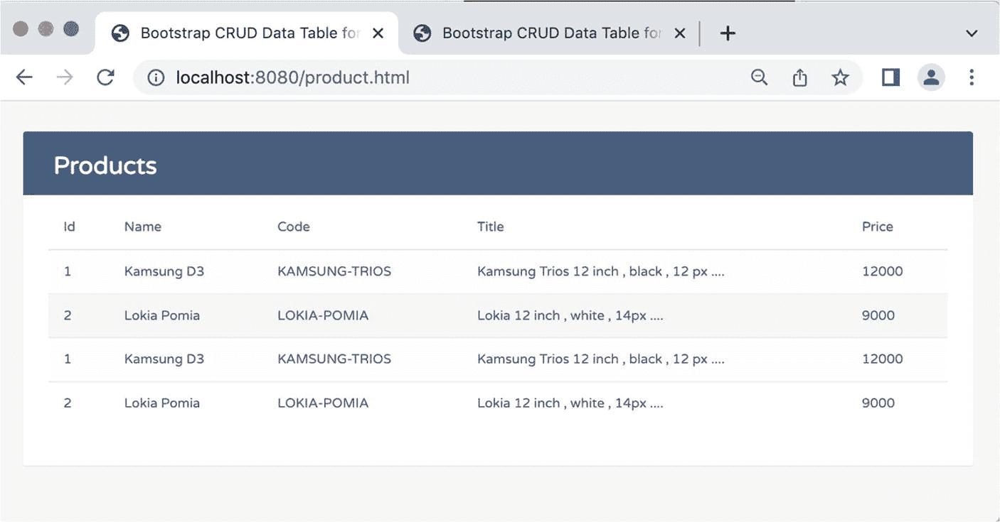

一张包含以下供应商的截图：Kamsung、Lokia、Kamsung、Lokia Pomia。

图 6-6

测试微服务，显示三个服务提供商中两个的返回结果

如前所述，该示例使用了三个 Product Server 微服务实例，而非三种不同类型的微服务，因此它们都会返回相同的响应。但在清单 6-45 中，其中一个 Product Server 微服务设置了名为 `sleeptimeout=10` 的延迟。清单 6-39 显示 Product Web 微服务的 `aggregatingTimeout: 6`，因此 Product Web 微服务的 `AggregatingReplyingKafkaTemplate` 将不会等待来自该 Product Server 微服务实例的响应。

由于你没有进行任何过滤、去重或类似的转换操作，你会看到来自两个 Product Server 微服务实例的响应中出现重复的行项目。

清单 6-48 显示了 Product Web 微服务上 `AggregatingReplyingKafkaTemplate` 的日志记录。

```
list.size() : 1; timeout : false
list.size() : 2; timeout : false
list.size() : 2; timeout : true
清单 6-48
聚合器超时
```

清单 6-48 展示了模板在超时时咨询释放策略所发生的情况。前两行对应在超时限制内从两个 Product Web 微服务实例接收到响应的情况。第三行对应模板使用 `set to true` 的超时参数执行此操作，以告知策略这是超时而非投递调用，因此它不会等待更多响应。

此聚合响应如图 6-6 所示。

在实际应用中，你可能不会像清单 6-39 那样静态配置 `product.topic.reply.numProviders`。相反，你需要根据在超时之前期望的最小服务提供商数量，动态地形成 `numProviders` 的值。典型的生成环境设计如图 6-7 所示，其中旅行代理或旅行聚合器与多个航空、酒店、出租车及其他辅助服务提供商签订了合同。旅行搜索参数被转发给所有或首选的库存提供商，来自所有或许多这些首选提供商的响应被聚合。可以应用过滤、去重或任何转换，然后根据一组类似的规则对结果集进行重新排序，并将响应发送给 Booking Service 提供商 Web 微服务。

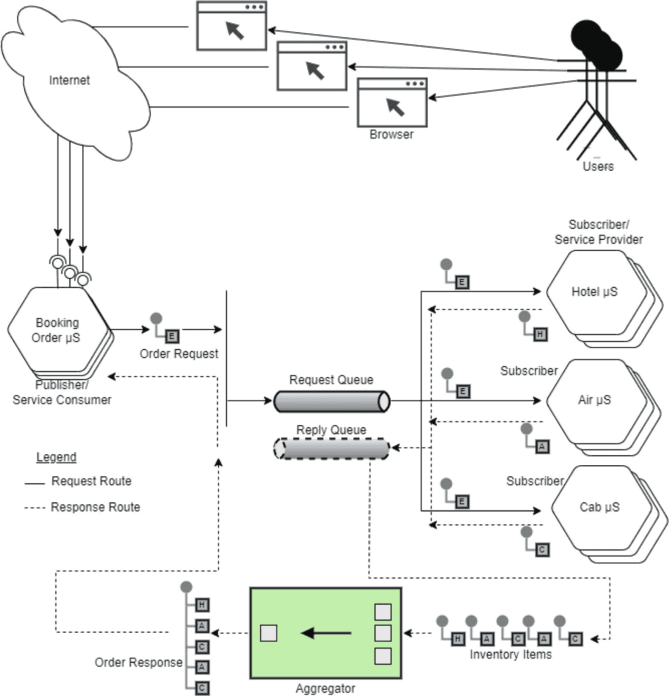

一个说明聚合器连接到第三方库存提供商的过程图。

图 6-7

预订聚合器连接到第三方库存提供商

现在我将更改测试条件。让我们增加聚合超时时间，如清单 6-49 所示。

```
product.topic.reply.numProviders: 3
product.topic.reply.aggregatingTimeout: 15
清单 6-49
Product Web Kafka 配置 (ch06\ch06-03\02-ProductWeb\src\main\resources\application.properties)
```

你通过调整清单 6-49 中的值来增加聚合超时时间，以确保在超时之前能够收到来自所有三个 Product Server 微服务实例的响应，正如清单 6-44 到 6-46 中所配置的那样。

你没有对 Product Server 微服务进行任何更改，因此可以使用其相同的运行实例重复测试。但你需要重建并重新运行 Product Web 微服务，如清单 6-50 所示。

```
(base) binildass-MacBook-Pro:02-ProductWeb binil$ pwd
/Users/binil/binil/code/mac/mybooks/docker-03/ch06/ch06-03/02-ProductWeb
(base) binildass-MacBook-Pro:02-ProductWeb binil$ sh make.sh
...
(base) binildass-MacBook-Pro:02-ProductWeb binil$ sh run.sh
.   ____          _            __ _ _
/\\ / ___'_ __ _ _(_)_ __  __ _ \ \ \ \
( ( )\___ | '_ | '_| | '_ \/ _` | \ \ \ \
\\/  ___)| |_)| | | | | || (_| |  ) ) ) )
'  |____| .__|_| |_|_| |_\__, | / / / /
=========|_|==============|___/=/_/_/_/
:: Spring Boot ::                (v3.2.0)
2022-05-22 10:53:48 INFO  org.springframework.boot.StartupInfoLogger.logStarting:55 - Starting EcomProductWeb...
2022-05-22 10:53:48 DEBUG org.springframework.boot.StartupInfoLogger.logStarting:56 - Running with Spring Boot ...
2022-05-22 10:53:48 INFO  org.springframework.boot.SpringApplication.logStartupProfileInfo:651 - No active ...
2022-05-22 10:53:50 INFO  org.springframework.boot.StartupInfoLogger.logStarted:61 - Started EcomProductWeb...
2022-05-22 10:54:02 INFO  com.acme.ecom.product.controller.ProductRestController.getAllProducts:71 - Start
2022-05-22 10:54:02 INFO  com.acme.ecom.product.controller.ProductRestController.getAllProducts:72 - Thread : Thread[http-nio-8080-exec-5,5,main]
2022-05-22 10:54:04 DEBUG com.acme.ecom.product.KafkaConfig.lambda$replyKafkaTemplate$0:129 - list.size() : 1; timeout : false
2022-05-22 10:54:05 DEBUG com.acme.ecom.product.KafkaConfig.lambda$replyKafkaTemplate$0:129 - list.size() : 2; timeout : false
2022-05-22 10:54:12 DEBUG com.acme.ecom.product.KafkaConfig.lambda$replyKafkaTemplate$0:129 - list.size() : 3; timeout : false
2022-05-22 10:54:12 DEBUG com.acme.ecom.product.controller.ProductRestController.getAllProducts:83 - Reply success ...
2022-05-22 10:54:12 INFO  com.acme.ecom.product.controller.ProductRestController.getAllProducts:84 - Thread : Thread[http-nio-8080-exec-5,5,main]
清单 6-50
使用脚本重建并运行 Product Web 微服务
```

现在你可以通过浏览器访问以下 URL 来测试该应用程序（见图 6-8）：

`http://localhost:8080/product.html`

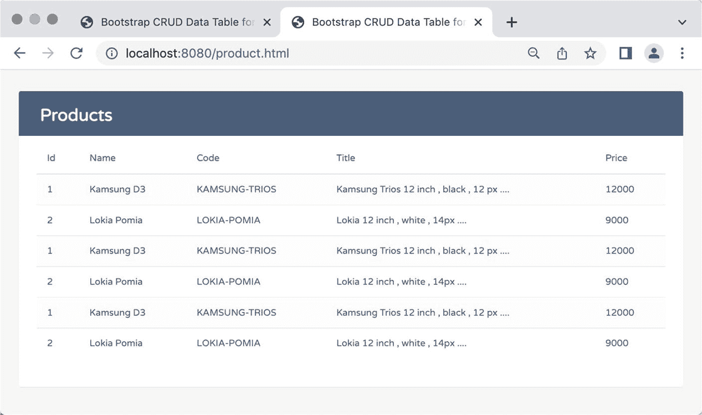

一张包含以下服务提供商的截图：Kamsung、Lokia。

图 6-8

测试微服务，显示所有服务提供商的返回结果

如果你观察清单 6-50，可以看到即使超时尚未发生，由于你已经收到了来自所有预期 Product Server 微服务实例的响应，你可以在第三次投递调用时终止等待，如清单 6-51 所示。

```
list.size() : 1; timeout : false
list.size() : 2; timeout : false
list.size() : 3; timeout : false
清单 6-51
聚合器超时
```

你可以在图 6-8 中看到来自三个 Product Server 微服务实例的重复行项目。

## 总结

从第 1 章中最简单的微服务开始，你已经走过了很长的路，理解了多种微服务架构变体。你已经尝试并测试了许多并发和集成模式，使用了熟悉的 SQL 和 NoSQL 数据库。这些章节中的示例可以提取出来作为模板，并根据你的日常生产用例进行修改。现在，你已经为开始下一段旅程——容器化——做好了准备，这将在下一章中介绍。

脚注 1


