# 7. 初识 Docker

资源和时间的共享并非新鲜事物，普遍认为其起源于 20 世纪 60 年代末至 70 年代初的 IBM 大型机时代。虚拟化技术使得组织和个人无需拥有计算机资源即可使用它。单个服务器的容量如此之大，以至于绝大多数通用型工作负载几乎无法有效利用它，因此让大量应用程序和用户共享使用是合理的。其目标是提高用户及其共享的昂贵计算机资源的效率，这为虚拟化铺平了道路。

容器是操作系统虚拟化的一种形式。容器没有或只有精简的操作系统镜像，但会大量利用宿主操作系统。一系列特性使得容器颇具吸引力，尤其是在部署基于微服务的应用程序时，本章将对此进行探讨。

本章涵盖以下主题：

*   虚拟化概述
*   容器简介
*   Docker 详解
*   无需本地 Java 环境即可编译、打包和运行 Java 应用
*   运行你的第一个 Java 容器

## 不同类型的虚拟化

本讨论从传统的应用部署模式开始，然后过渡到各种虚拟化方式，以便你能够体会到容器相较于其他虚拟化方法所提供的一些优势。

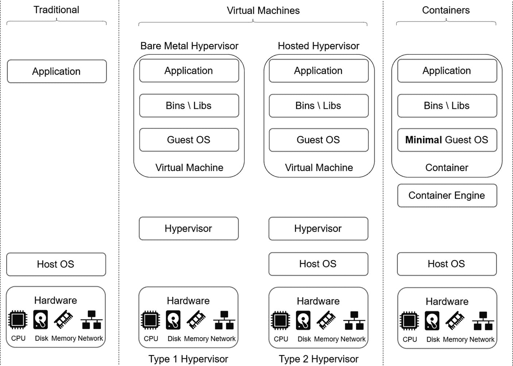

三张框图比较了三种类型的虚拟化。传统虚拟化只有一个应用程序，而虚拟机拥有客户操作系统和虚拟机，容器则拥有极简的客户操作系统和一个容器框。每种方式都包含硬件和应用程序。

图 7-1

传统方式 vs. 虚拟机 vs. 容器

参考图 7-1，首先考虑不同的虚拟化和应用部署模式。

### 传统部署

在传统或经典的应用部署模式中，组织使用物理服务器。每当业务需要新应用时，IT 部门就会购买一台新服务器。由于很多时候没人知道新应用的性能需求，并且为了给未来业务量的增长留出足够的空间，IT 部门往往会过度采购。他们通过猜测来决定要购买的服务器型号和规格。

配置应用软件的典型生命周期流程如下：

1.  在数据中心准备好物理服务器。
2.  安装或使用现有的操作系统。
3.  安装应用软件所需的任何额外工具。
4.  安装软件所需的任何依赖项。
5.  运行你的软件。
6.  停用你的应用。
7.  重新利用或回收服务器硬件。

更好地利用资本支出的方式是使用虚拟化，接下来将对此进行讨论。

### 虚拟化

当 VMware 公司引入虚拟机（VM）概念时，IT 部门不再需要每次需要新应用时就采购一台新的、性能过剩的服务器。相反，IT 部门可以在现有闲置且有富余容量的服务器上运行新应用。虚拟化允许 IT 部门在单个物理服务器上运行多个虚拟机。每个虚拟机都包含一个完整的操作系统副本、应用程序、必要的二进制文件和库。

虚拟化堆栈中的核心组件是*虚拟机监控器*，也称为虚拟机监视器（VMM）。它在宿主机上创建一个虚拟平台，在此平台之上可以执行和监控多个客户操作系统。这些多个操作系统可以是同一操作系统的不同实例，也可以是不同的操作系统。它们共享由同一台宿主机提供的硬件资源。虚拟机监控器有以下分类：

*   **类型 1，原生型或裸机型：** 原生型虚拟机监控器直接运行在宿主机硬件上，以控制硬件并监控客户操作系统。因此，客户操作系统运行在虚拟机监控器之上的一个独立层级。例如：Oracle VM、Microsoft Hyper-V、VMWare ESX 和 Xen。
*   **类型 2，托管型：** 托管型虚拟机监控器运行在传统操作系统内。托管型虚拟机监控器在宿主操作系统之上增加了一个独立的软件层，而客户操作系统则成为硬件之上的第三个软件层级。例如：Oracle VM VirtualBox、VMWare Server 和 Workstation、Microsoft Virtual PC、KVM、QEMU 和 Parallels。

每个虚拟机都需要自己专用的操作系统（OS）这一事实是一个主要缺陷。每个操作系统都会消耗 CPU、RAM 和其他资源。每个操作系统都需要许可、打补丁和监控。还有其他挑战，这里列举几个：

*   操作系统镜像很庞大——以 GB 计。
*   启动过程缓慢。
*   应用程序不可移植。
*   启动一个虚拟机可能需要 1-2 分钟。

Docker 容器于 2013 年推出，旨在解决这些缺点。

### 容器

容器使用操作系统级虚拟化。它们不需要自己完整的操作系统。相反，单个宿主机上的所有容器共享宿主机的操作系统。这释放了大量的系统资源，包括 CPU、RAM 和存储。它还降低了潜在的许可成本，并减少了操作系统打补丁和其他维护的开销。在操作系统层进行的容器抽象将代码和依赖项打包在一起。

容器启动速度快且具有超强可移植性。容器非常轻量，可以在几秒或几毫秒内启动。容器工作负载可以快速轻松地从笔记本电脑迁移到云端，然后再迁移到数据中心的虚拟机或裸机服务器上。

## 容器详解

理解容器对于理解本章的其余内容至关重要，因此本节专门介绍容器。


### 容器发展简史

让我们简要回顾一下容器的发展史。大约在 2000 年，FreeBSD 系统中加入了 Jails，这是容器技术的早期实现。次年，Linux VServer 项目实现了在单台服务器上运行多个通用 Linux 服务器的功能。它将用户空间环境划分为不同的单元——称为虚拟专用服务器——使得每个 VPS 对其内部运行的进程而言，看起来和感觉上都像一台真正的服务器。2006 年，“通用进程容器”被提出。该技术后来更名为 Cgroups（控制组），它允许将进程分组，并确保每个组获得相应的内存、CPU 和磁盘 I/O 资源份额，同时防止任何一个容器独占这些资源。与此相辅相成的是内核命名空间的概念，它将进程与用户命名空间分离开来。用户命名空间允许进程拥有自己独立的用户集，并允许进程在容器内部拥有 root 权限，但在容器外部则没有。2008 年，IBM 创建了 Linux 容器项目（LXC）。LXC 1.0 于 2014 年发布。SELinux 和 Seccomp 是两个新特性：

*   **Seccomp：** Seccomp 是一个 Linux 内核特性，用于限制任务可以使用的系统调用。这使得可以将利用率不高的 CPU 租借给不受信任的客户，而无需担心他们会滥用其他资源，这非常适合容器的使用场景。

*   **SELinux：** SELinux 提供了一种访问控制方案，用于“标记进程、文件和设备，并定义被标记的进程如何与被标记的进程、文件和设备交互的规则”。Linux 容器作为一组进程，非常适合使用 SELinux 进行加固，这是另一个映射到容器使用场景的理念。

Docker 逐步构建在这些特性之上，并封装了 LXC 的用户空间工具，使开发者使用起来更加便捷。2015 年 6 月，Docker 公司在 Linux 基金会的支持下，将 Docker 开源给了 OCI（开放容器倡议）。Docker 最初使用 LXC 驱动，后来转向了 `libcontainer`，后者现已更名为 `runc`。

### 容器内部原理

命名空间是一个内核级别的特性。操作系统的这一功能允许在进程之间共享全局资源，如网络和磁盘。当全局资源被封装在命名空间中时，它们仅对运行在同一命名空间内的进程可见。例如，当你获取一部分磁盘并将其放入一个命名空间时，运行在另一个命名空间中的进程无法看到或访问它。类似地，一个命名空间中的进程无法访问分配给另一个命名空间的任何内存内容，以此类推。当然，命名空间 A 中的进程无法看到或与命名空间 B 中的进程通信。通过这种方式，全局资源可以被虚拟化和隔离。Docker 正是以这种方式工作的——每个 Docker 容器都在自己的命名空间中运行，但与其他所有容器共享同一个内核。这种隔离之所以能实现，是因为内核知道分配给该进程的命名空间。在进行 API 调用时，内核会确保该进程只能访问其自身命名空间内的资源。

### 虚拟化 vs. 容器化

在了解了不同层次的虚拟化选项之后，本节将探讨其底层细节。参见图 7-2。

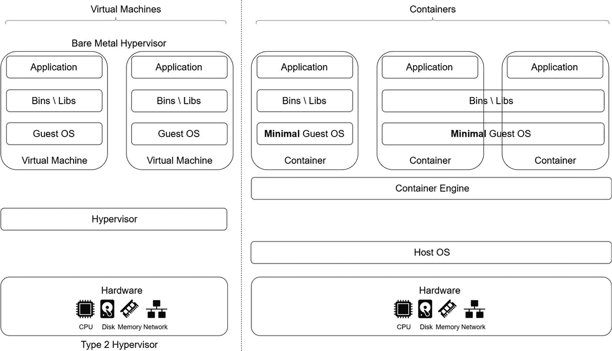

两张框图对比了虚拟机和容器。虚拟机拥有客户操作系统。容器拥有一个极简的客户操作系统。两者都包含二进制文件、库和应用程序。虚拟机运行在虚拟机监控器上，而容器运行在引擎上。

图 7-2

虚拟机 vs. 容器

图 7-2 对比了虚拟化与容器化之间的异同。这里的讨论限于类型 2 虚拟化，它与容器化相比差异更明显，尽管几乎所有方面也适用于类型 1 虚拟化。

在虚拟化的情况下，虚拟机管理器接管了 CPU 的 ring 0（在较新的 CPU 中也称为“根模式”），并拦截客户操作系统发出的所有特权调用，以营造出客户操作系统拥有自己硬件的假象。因此，虚拟化允许你在同一（单）个底层硬件上运行两个完全不同的操作系统。每个客户操作系统都要经历引导、内核加载等过程。客户操作系统无法完全访问主机操作系统或其他客户操作系统，因此不会造成混乱。这提供了更严格的安全性。

现在你可能能够理解，虽然你可以在虚拟化硬件上运行多个操作系统，但你不能像在虚拟化中那样在容器中运行完全不同的操作系统。然而，你可以运行不同的 Linux 发行版，因为它们都共享同一个内核。这意味着，由于容器与主机共享同一个内核，你可以在 Ubuntu 主机上运行 Arch 镜像。

系统调用（通常缩写为 *syscall*）是程序向其执行所在的操作系统内核请求服务的编程方式。这可能包括与硬件相关的服务（例如，访问硬盘驱动器或访问设备的 I/O 端口）、创建和执行新进程，以及与进程调度等内核核心服务进行通信。系统调用提供了进程与操作系统之间的基本接口。容器可以访问主机的内核。由于内核是与硬件通信的唯一部分，只要你的操作系统使用正确的系统调用，你就可以在容器内运行任何 Linux 发行版。出于同样的原因，你不能在容器内运行 Windows，因为它不使用相同的系统调用。

## Docker 概念

本节讨论 Docker 概念和 Docker 容器。

### 分层文件系统

Docker 基于 *aufs*（*advanced multi-layered unification filesystem* 的缩写），它实现了 Unionfs，一种用于 Linux 文件系统的联合挂载。Unionfs 是一种用于 Linux、FreeBSD 和 NetBSD 的文件系统服务，它为其他文件系统实现了联合挂载。它允许将来自不同文件系统（称为 *分支*）的文件和目录透明地叠加在一起，形成一个单一、连贯的文件系统。一些 Linux 发行版已选择 aufs 作为 UnionFS 的替代品。

*联合挂载* 是一种允许同时挂载多个文件系统并使它们看起来像一个文件系统的挂载方式。联合挂载将文件系统层层叠加，使得最终的文件系统可能包含来自任何一个或所有底层文件系统的文件和子目录。用 Docker 的术语来说，这些文件系统中的每一个都被称为一个 *镜像*。


### Docker 镜像

Docker 镜像由相互叠加的文件系统组成，如图 7-3 所示。

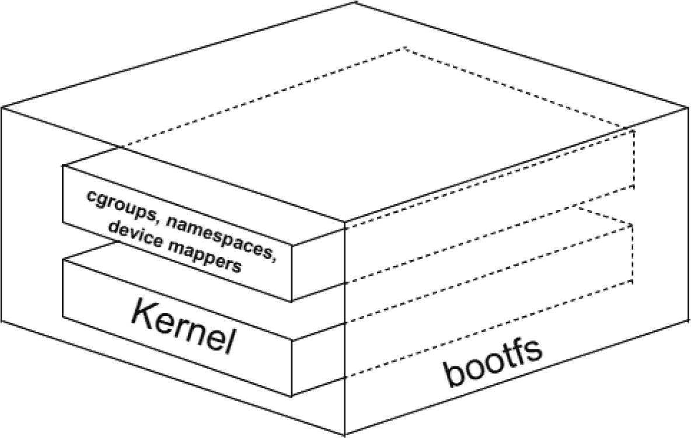

一个三层长方体的 3D 模型。底层标记为内核。中间层标记为 cgroups、命名空间和设备映射器。顶层标记为 bootfs。

图 7-3

Docker bootfs

镜像的底层是一个引导文件系统 bootfs，它类似于典型的 Linux/UNIX 引导文件系统。当容器启动时，它会被移入内存，并且引导文件系统会被卸载，以释放 initrd 磁盘镜像占用的 RAM。到目前为止，这类似于典型的 Linux 虚拟化堆栈。Docker 用户可能永远不会与引导文件系统交互。

在引导文件系统之上，Docker 叠加了一个根文件系统 rootfs。这个 rootfs 可以是一个或多个操作系统（例如，Debian 或 Ubuntu）。参见图 7-4。

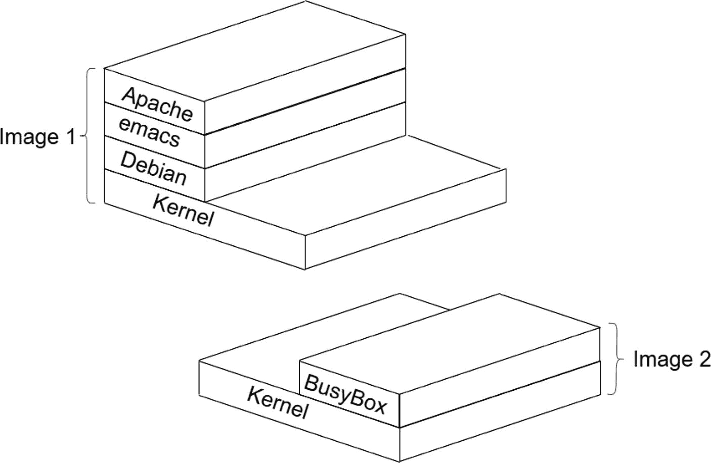

Docker 镜像层的两个示意图。镜像 1 包含一个带有内核、Emacs 和 Apache 的 Debian 操作系统。镜像 2 包含一个带有内核的 BusyBox 操作系统。

图 7-4

Docker 镜像

在传统的 Linux 启动中，根文件系统以只读方式挂载，然后在启动完成并执行完整性检查后切换为读写模式。在 Docker 世界中，根文件系统保持只读模式，并且 Docker 利用联合挂载在根文件系统之上添加更多的只读文件系统。

Docker 将操作系统的公共部分组织为只读。任何公共部分都在你的所有容器之间共享。参见图 7-5。

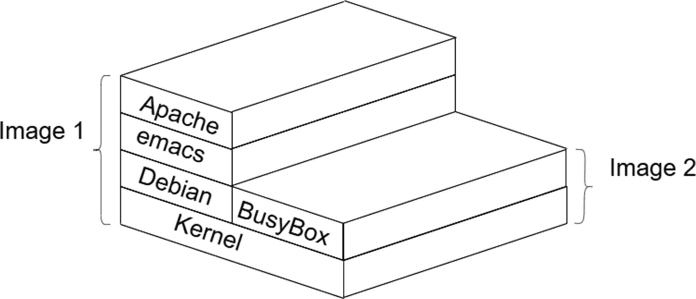

两个长方体相互堆叠的 3D 示意图。顶部标记为镜像 1，底部标记为镜像 2。顶部被分为四层，标记为内核、Debian、emacs 和 Apache。底部被分为两层，标记为 BusyBox 和内核。

图 7-5

Docker 镜像共享层

共享这些公共部分提供了存储和运行时效率。为了说明清楚，如果你有一个 1GB 的容器镜像并使用传统的虚拟机方法，你将需要 1GB 乘以你想要的虚拟机数量。由于 Docker 在所有容器之间共享这 1GB 的大部分内容，如果你有 1000 个容器，你可能仍然只需要略多于 1GB 的空间来容纳所有这些容器（假设它们都运行相同的操作系统镜像）。

Docker 镜像是相互叠加的。顶部的镜像是父镜像；你可以从一个层遍历到其父层，依此类推，直到到达镜像堆栈的底部，底部的镜像称为基础镜像。参见图 7-6。

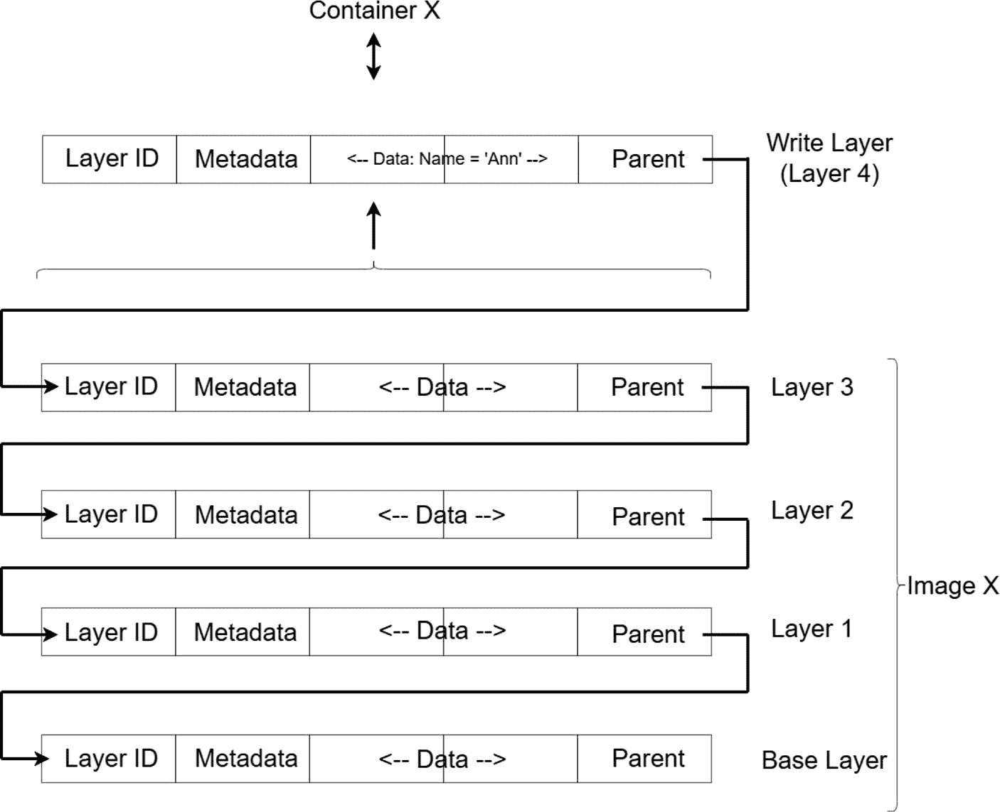

一个容器 X 的流程示意图，包含一个写入层和四个层。这些层通过数据和元数据连接到写入层。每个层都有一个层 ID、元数据、数据和父数据。

图 7-6

Docker 镜像的结构剖析

### Docker 镜像与容器

Docker 镜像是用于构建容器的只读模板。容器是从这些模板创建的已部署实例。镜像和容器密切相关，并且对于驱动 Docker 软件平台至关重要。

当从镜像启动一个容器时，Docker 会在顶部挂载一个读写文件系统。在这个读写层中，你希望 Docker 容器运行的任何进程都将在此执行。图 7-6 到 7-8 展示了这个过程。

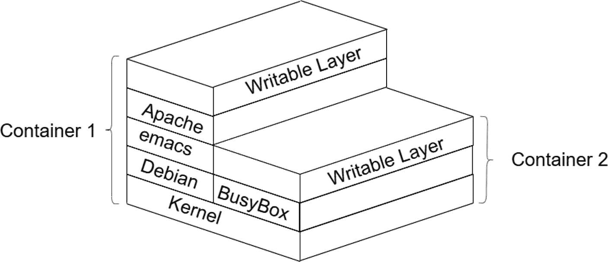

两个长方体相互堆叠的 3D 示意图。顶部标记为容器 1，底部标记为容器 2。顶部被分为四层，标记为内核、Debian、emacs 和 Apache。底部被分为两层，标记为 BusyBox 和内核。

图 7-7

Docker 容器共享镜像层

即使容器共享相同的镜像（层），一旦它们从其镜像模板实例化，它们就是分离且隔离的，如图 7-8 所示。

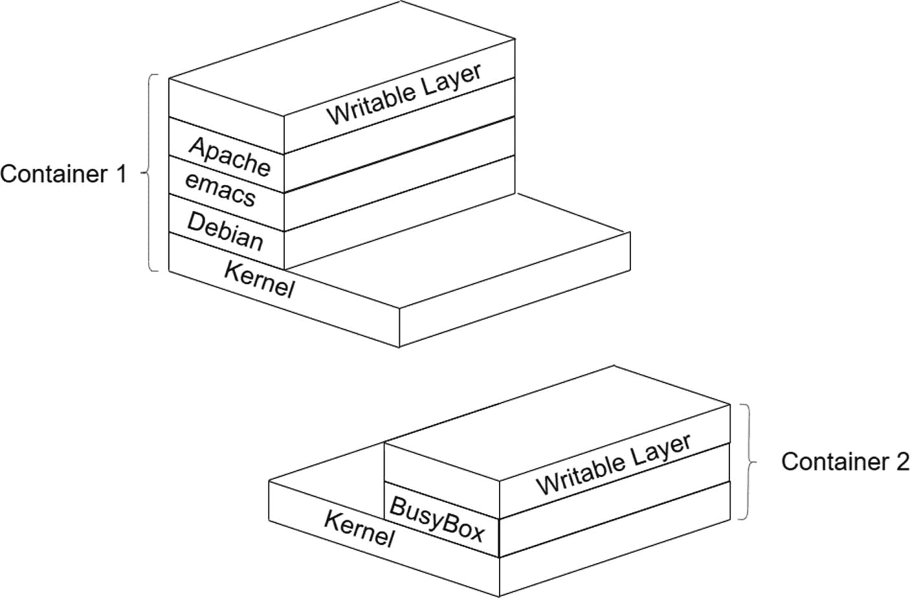

Docker 容器的两个 3D 示意图。容器 1 有 3 层，底层是内核，中间层是 Apache、emacs、Debian 和内核，顶层是一个可写层。容器 2 有 2 层，底层是内核，顶层是可写层。

图 7-8

Docker 容器隔离

当容器启动时，初始的读写层是空的。随着变化的发生，这些变化会被应用到该读写层，如图 7-9 所示。

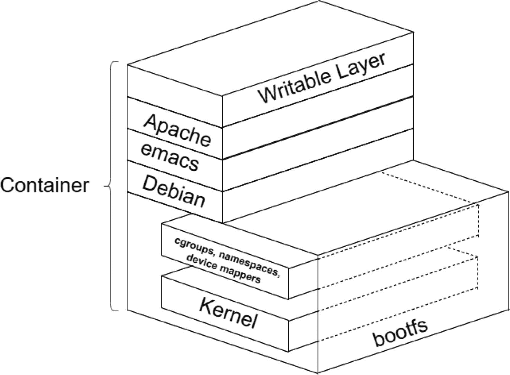

一个具有多个层的容器的 3D 示意图。顶层标记为可写层。其下方是标记为 Apache、emacs 和 Debian 的层。在这些层下方是标记为 cgroups、命名空间、设备映射器、内核和 bootfs 的层。

图 7-9

Docker 容器写入层

为了说明清楚，如果你想更改一个文件，该文件将从下方的只读层复制到读写层。该文件的只读版本仍然存在，但会被其上方的覆盖层隐藏在该副本之下。参见图 7-10。

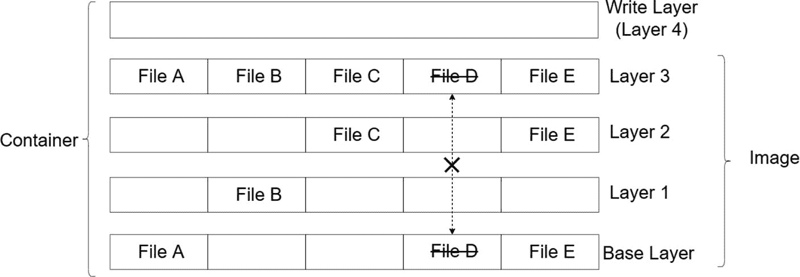

一个容器的阵列示意图。这些层相互堆叠。从底部开始，基础层、层 1、层 2、层 3 和写入层（即层 4）。每个层包含文件 A、B、C、D 和 E。一个带箭头的虚线将基础层中的文件 D 连接到层 3 中的文件 D。

图 7-10

Docker 容器写入的过程

每个容器都可以将其自身的更改应用到其容器读写层，因为它们是隔离的。参见图 7-11。

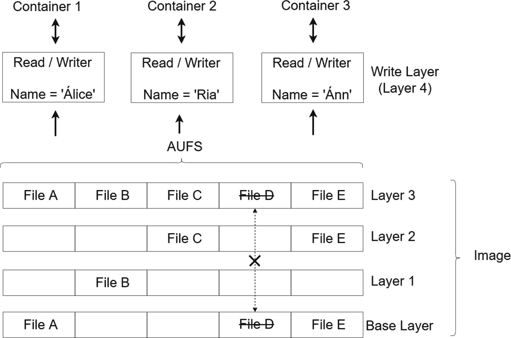

一个流程示意图，定义了 Docker 容器写时复制的过程。容器 1、2 和 3 都有一个读写层。这些容器相互堆叠，基础层位于底部。基础层是只读的，每个容器可以将其更改应用到其容器读写层。

图 7-11

Docker 容器写时复制的过程

这种模式传统上称为“写时复制”，是使 Docker 如此强大的特性之一。每个只读镜像层都是只读的——这些镜像永远不会改变。当创建一个容器时，Docker 从镜像堆栈构建，并在顶部添加读写层。图 7-11 展示了向容器添加数据的过程。一旦你做出更改并使用 Docker 提交它们，Docker 就会创建一个新的镜像。该镜像仅包含与基础镜像的差异。当你想要运行这个新镜像时，你可以对该容器进行更改，如图 7-12 所示。

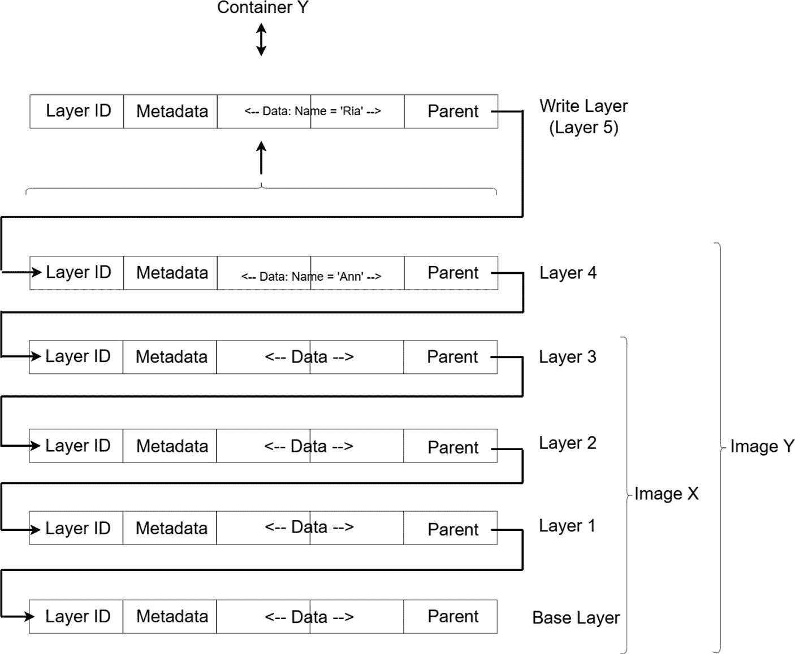

一个容器 Y 的流程示意图，各层相互堆叠。从底部开始，基础层、层 1、层 2、层 3 和层 4，以及写入层（即层 5）。每个层都有层 ID、元数据、数据和父层。从基础层到层 3 创建镜像 X，从基础层到层 4 创建镜像 Y。

图 7-12

Docker 容器提交的过程


### Docker 注册表

Docker 注册表是一个用于存储 Docker 镜像的仓库（见图 7-13）。它可以是私有的或公共的，也可以是本地的或远程的。Docker 注册表有助于在不同开发环境和运行时之间轻松共享 Docker 镜像。构建好镜像后，你可以在构建它的计算机上直接运行，也可以将镜像推送（上传）到注册表，随后再拉取（下载）到同一台计算机或其他计算机上运行。

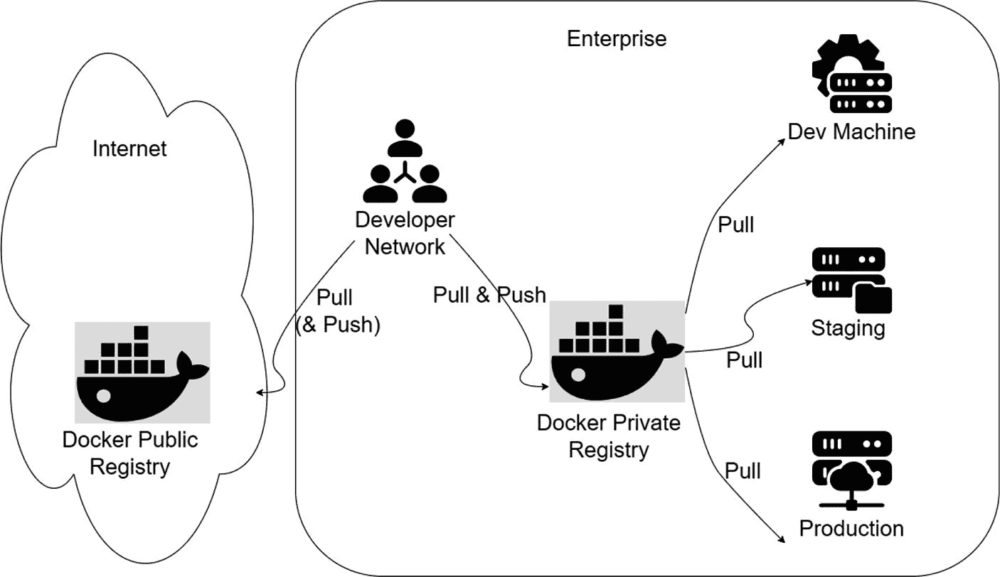

Docker 镜像从开发者网络到生产环境的流程图。开发者网络从互联网云中的 Docker 公共注册表和 Docker 私有注册表拉取和推送镜像。开发机、预发布环境和生产环境均从 Docker 私有注册表拉取镜像。

图 7-13

Docker 注册表

Docker Hub 是公共注册表的一个例子。私有注册表可以通过多种方式搭建，例如在 JFrog Bintray 上搭建私有 Docker 注册表。此外还有远程仓库，它们充当远程站点（如 Docker Hub 或 JFrog Bintray）管理的 Docker 注册表的缓存代理。镜像根据控制缓存和代理行为的各种配置参数，在远程 Docker 注册表中进行存储和更新。

像 JFrog Artifactory 这样的开发环境工具可以充当开发者机器与远程 Docker 注册表之间的中介。由于它们完全实现了 Docker 注册表 API 规范，因此可以代理任何公共或私有 Docker 注册表，例如 Docker Hub、JFrog Bintray 或其他私有 Docker 注册表。当开发者机器首次请求某个镜像时，该镜像会被下载，同时 Artifactory 会将其存储在本地缓存中。当收到后续对该镜像的请求时，Artifactory 会执行智能校验和搜索，如果该镜像已被下载并存在于本地缓存中，则会提供本地缓存的副本。通过这种方式，每个镜像仅被下载一次，并且组织内的所有其他开发者都可以在本地使用。这不仅减少了网络流量，还能有效屏蔽网络及其他远程 Docker 注册表可能带来的问题，从而为你提供对（远程）Docker 镜像的一致、可靠且持续的访问。

## Docker 中的 Hello World Tomcat

我相信你已经读够了理论，因此本节将通过实践帮助你学习。在本节中，你将学习如何运行一个“Docker Hello World”程序。

我假设你的主机上已经运行着 Docker 守护进程。如果没有，请参考附录 E 在你的 Mac 机器上（不使用 Docker Desktop）设置 Docker 守护进程。如果你的机器上安装了任何操作系统的 Docker Desktop，那也可以。

### 运行 Tomcat 容器

第一步是启动 Minikube 单节点 Kubernetes 集群，以便你有一个可用的 Docker 守护进程（见清单 7-1）。有关容器命令的快速参考，请参阅附录 E。

```
(base) binildass-MacBook-Pro:~ binil$ pwd
/Users/binil
(base) binildass-MacBook-Pro:~ binil$ minikube start
minikube v1.25.2 on Darwin 12.4
...
Done! kubectl is now configured to use "minikube" cluster and "default" namespace by default
(base) binildass-MacBook-Pro:~ binil$
清单 7-1
启动 Minikube
```

接下来，在你的工作终端中设置 Minikube 环境变量，如清单 7-2 所示。

```
(base) binildass-MacBook-Pro:~ binil$ eval $(minikube docker-env)
(base) binildass-MacBook-Pro:~ binil$
清单 7-2
在终端中设置 Minikube 环境
```

这会将 Docker 客户端指向 Minikube 的 Docker 环境，因为你正在使用 Minikube 虚拟机中的 Docker 守护进程。本书中的大多数 Docker 示例都使用此设置。`minikube docker-env` 命令返回一组 Bash 环境变量导出语句，用于配置本地主机环境以重用 Minikube 实例内部的 Docker 守护进程。通过 `eval` 传递此输出，会使 `bash` 评估这些导出的变量并使它们生效。这将使用 Minikube 的 Docker 实例构建 Docker 镜像，然后将镜像推送到 Minikube 的 Docker 注册表。它还会在 Minikube 中设置你的部署以使用此镜像。因此，这些变量将帮助你的 Docker CLI（你编写 Docker 命令的地方）与 Minikube 创建的虚拟机中的 Docker 守护进程建立连接。

相反，如果你使用的是 Docker Desktop 或类似安装中的 Docker 守护进程，则无需设置此环境配置。

要列出系统上所有正在运行或已停止的容器，请执行清单 7-3 中所示的 `docker ps` 命令。

```
(base) binildass-MacBook-Pro:~ binil$ docker ps
CONTAINER ID  IMAGE         COMMAND                   CREATED        STATUS        PORTS   NAMES
24eea7cbd5b2  e1482a24335a  "/dashboard --insecu..."  5 minutes ago  Up 5 minutes          k8s_kubernetes-
c091fe0efebc  6e38f40d628d  "/storage-provisioner"    5 minutes ago  Up 5 minutes          k8s_storage-
...
(base) binildass-MacBook-Pro:~ binil$ docker ps
清单 7-3
列出 Docker 容器
```

Docker 客户端将列出一个表格，包含容器 ID（一个唯一 ID，你可以在其他命令中用它来引用容器）、创建日期、用于启动容器的命令、状态、暴露的端口以及名称。名称可以由你指定，也可以由 Docker 随机选取。

接下来，你可以运行一个容器。要运行容器，请使用以下 `docker run` 命令：

```
docker run [OPTIONS] IMAGE [COMMAND] [ARG...]
```

清单 7-4 显示了启动一个 Tomcat 容器的代码。

```
(base) binildass-MacBook-Pro:~ binil$ docker run -it -p 8080:8080 tomcat
Unable to find image 'tomcat:latest' locally
latest: Pulling from library/tomcat
67e8aa6c8bbc: Downloading [========>                                  ]  9.653MB/54.95MB
627e6c1e1055: Download complete
0670968926f6: Downloading [=====================================>     ]  8.059MB/10.88MB
5a8b0e20be4b: Downloading [==>                                        ]  3.226MB/54.58MB
7a93fb438607: Waiting
400f1e54bef0: Waiting
f0b65b53f1a4: Waiting
dc9d1a029c69: Waiting
42a9874765c5: Waiting
52140cf8a5cf: Waiting
清单 7-4
Tomcat 容器启动中
```


`stdin`、`stdout`和`ttys`是相互关联的概念，理解它们将对你有所帮助。`stdin`和`stdout`是进程的输入输出流。伪终端（也称为`tty`或`pts`）将用户的“终端”与`stdin`和`stdout`流连接起来，通常（但不一定）通过`bash`等 shell 实现。这里的“终端”一词加了引号，因为如今我们使用的终端与过去的概念已大不相同。

如清单 7-4 所示，当以交互模式运行进程时（例如启动 bash shell），你通常会同时使用`-t`和`-i`参数。对于 shell 而言，你的目的是发出命令并读取输出。

在 Docker 中，`-i`或`--interactive`（用于保持 STDIN 流开启，即使未附加）和`-t`或`-tty`（用于附加伪`tty`）这两个开关通常组合使用为`-it`，这将帮助你为容器中运行的进程分配一个伪`-tty`控制台。

`-it`组合会在容器启动后将命令行附加到容器上。这样，你就可以在 shell 控制台中查看运行中容器的情况，并在需要时与容器进行交互。

执行清单 7-4 中的命令时，Docker 会判断该镜像是否存在于本地机器上。如果不存在，则会从远程仓库拉取该镜像。Docker 引擎使用该镜像，并在镜像层栈的顶部添加一个可写层。随后，它会初始化镜像的名称、ID 以及资源限制（如 CPU 和内存）。在此阶段，Docker 还会通过从 IP 池中查找并附加一个可用的 IP 地址来设置容器的 IP 地址。执行的最后一步是实际命令，该命令作为`docker run`命令的最后一个参数传入。参见清单 7-5。

```
(base) binildass-MacBook-Pro:~ binil$ docker run -it -p 8080:8080 tomcat
Unable to find image 'tomcat:latest' locally
latest: Pulling from library/tomcat
67e8aa6c8bbc: Pull complete
627e6c1e1055: Pull complete
0670968926f6: Pull complete
5a8b0e20be4b: Pull complete
7a93fb438607: Pull complete
400f1e54bef0: Pull complete
f0b65b53f1a4: Pull complete
dc9d1a029c69: Pull complete
42a9874765c5: Pull complete
52140cf8a5cf: Pull complete
Digest: sha256:fe703c02e16ea7d3e8d7bdf5a0c03957f2d4a313cfa9ae44878a3ad12e633ccf
Status: Downloaded newer image for tomcat:latest
Using CATALINA_BASE:   /usr/local/tomcat
Using CATALINA_HOME:   /usr/local/tomcat
Using CATALINA_TMPDIR: /usr/local/tomcat/temp
Using JRE_HOME:        /usr/local/openjdk-11
Using CLASSPATH:       /usr/local/tomcat/bin/bootstrap.jar:/usr/local/tomcat/bin/tomcat-juli.jar
Using CATALINA_OPTS:
...
26-May-2022 14:33:47.952 INFO [main] org.apache.catalina.startup.Catalina.start Server startup in [100] milliseconds
清单 7-5
Tomcat 容器正在运行
```

清单 7-5 展示了一个正在运行的 Tomcat 容器。由于使用了`-it`选项，Docker 会捕获并提供容器输出，这些输出会显示在控制台中。当你运行此命令时，Docker 会从托管在 Docker Hub 上的 Tomcat 公共仓库安装`tomcat:latest`并运行该软件。在 Docker 安装并启动 Tomcat 后，终端上会写入一行看似随机的字符。这串字符是刚刚为运行 Tomcat 而创建的容器的唯一标识符。每次调用`docker run`命令并创建一个新容器时，这个新创建的容器都会获得一个类似的唯一标识符。

现在，你可以再次列出 Docker 容器，如清单 7-6 所示。

```
(base) binildass-MacBook-Pro:~ binil$ docker ps
CONTAINER ID  IMAGE   COMMAND  CREATED  STATUS  PORTS   NAMES
5b621bcd9dd1  tomcat  "catalina.sh run"  About a minute ago   Up About a minute   0.0.0.0:8080->8080/tcp   priceless_chebyshev
...
(base) binildass-MacBook-Pro:~ binil$
清单 7-6
列出 Docker 容器
```

你可以看到刚刚启动的 Tomcat 容器，以及其他容器。要访问 Tomcat，如附录 E 所述，你必须先获取 minikube 的 IP 地址。参见清单 7-7。

```
(base) binildass-MacBook-Pro:ch07-01 binil$ minikube ip
192.168.64.5
(base) binildass-MacBook-Pro:ch07-01 binil$
清单 7-7
查找 Minikube IP
```

现在，你可以使用`curl`命令访问 Tomcat，如清单 7-8 所示。

```
(base) binildass-MacBook-Pro:ch07-01 binil$ curl http://192.168.64.5:8080
HTTP Status 404 – Not Found...
(base) binildass-MacBook-Pro:ch07-01 binil$
清单 7-8
访问 Tomcat 容器
```

你也可以使用浏览器，如图 7-14 所示。

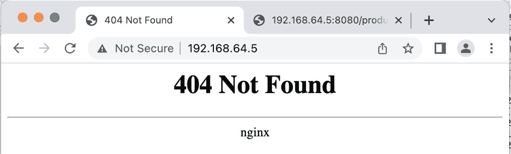

一个网页浏览器窗口的截图，显示了一个 404 未找到错误信息。该信息以粗体文本显示。网址是 192.168.64.5。该浏览器连接不安全。

图 7-14

在 Tomcat 容器中访问“无 Web 应用”

当你看到`404`错误时，可能会认为在安装 Docker 镜像时犯了错误。但这并非错误，而是出于 Docker 社区提出的安全考虑，设计上如此表现。你可以在 Docker Hub 上 Tomcat 镜像的官方文档中找到此安全信息。参见图 7-15。

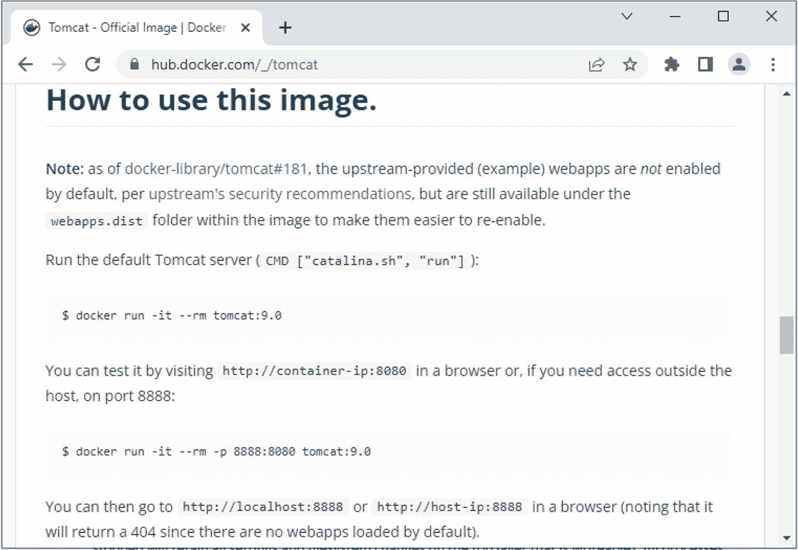

一个网页截图，内容是关于如何使用 Docker Tomcat 镜像的说明。它解释了出于安全原因，Web 应用默认未启用，并且这些应用位于镜像内的一个文件夹中，同时提供了如何运行 Tomcat 服务器并在浏览器中测试的说明。

图 7-15

Docker Tomcat 通知

你可以使用清单 7-9 中的代码停止 Tomcat 容器。

```
(base) binildass-MacBook-Pro:~ binil$ docker stop 5b62
5b62
(base) binildass-MacBook-Pro:~ binil$
清单 7-9
停止 Tomcat 容器

请注意，`5b62`是清单 7-6 中容器 ID 的前四个字符。此容器在停止时，将保留所有设置和文件系统更改（位于可写的顶层）。容器中运行的所有进程都将停止，并且你将丢失内存中的所有内容。如果你现在尝试使用`curl`命令访问 Tomcat，将会得到清单 7-10 所示的响应。

```
(base) binildass-MacBook-Pro:~ binil$ curl http://192.168.64.5:8080
curl: (7) Failed to connect to 192.168.64.5 port 8080: Connection refused
(base) binildass-MacBook-Pro:~ binil$
清单 7-10
尝试访问 Tomcat 容器
```

## 无需 Java 即可构建和运行 Java 应用

本节的目标是在没有 Java SDK 或 Java 运行时的开发机器上编译、打包、部署和运行一个 Java 应用。如何做到这一点？你可能已经猜到了，因为你正在学习使用 Docker，对吧？使用 Docker！


### 使用 Maven 容器

你可以将官方的 Maven Docker 镜像作为容器运行，并进一步编译、打包和部署 Java 应用程序。下面我们来看看如何操作。首先，按照代码清单 7-2 所述，在终端中设置 Minikube 环境变量。然后，运行 Docker，如代码清单 7-11 所示。

```
(base) binildass-MacBook-Pro:~ binil$ docker run --rm -it maven mvn --version
Unable to find image 'maven:latest' locally
latest: Pulling from library/maven
d5fd17ec1767: Pull complete
...
Status: Downloaded newer image for maven:latest
Apache Maven 3.8.5 (3599d3414f046de2324203b78ddcf9b5e4388aa0)
Maven home: /usr/share/maven
Java version: 17.0.3, vendor: Eclipse Adoptium, runtime: /opt/java/openjdk
Default locale: en_US, platform encoding: UTF-8
OS name: "linux", version: "4.19.202", arch: "amd64", family: "unix"
(base) binildass-MacBook-Pro:~ binil$
代码清单 7-11
运行 Maven 容器
```

代码清单 7-11 创建了一个 Maven 容器并在其中运行了 `maven` 命令。参数 `--rm` 会在命令执行完毕后移除该容器。

### 创建 Maven 原型

在本节中，你将创建一个类型为 `maven-``archetype-webapp` 的新 Web 应用程序项目 Product Web。请参见代码清单 7-12。

```
(base) binildass-MacBook-Pro:~ binil$ docker run --rm -it -v $(pwd):/workfolder -w /workfolder maven mvn archetype:generate -DgroupId=com.acme.ecom.product -DartifactId=ProductWeb -DarchetypeArtifactId=maven-archetype-webapp -DinteractiveMode=false
[INFO] Scanning for projects...
Downloaded from central: ...
...
[INFO] ---------------------------------------------------
[INFO] Using following parameters for creating project from Old (1.x) Archetype: maven-archetype-webapp:1.0
[INFO] ---------------------------------------------------
[INFO] Parameter: basedir, Value: /workfolder
[INFO] Parameter: package, Value: com.acme.ecom.product
[INFO] Parameter: groupId, Value: com.acme.ecom.product
[INFO] Parameter: artifactId, Value: ProductWeb
[INFO] Parameter: packageName, Value: com.acme.ecom.product
[INFO] Parameter: version, Value: 1.0-SNAPSHOT
[INFO] project created from Old (1.x) Archetype in dir: /workfolder/ProductWeb
[INFO] ---------------------------------------------------
[INFO] BUILD SUCCESS
[INFO] ----------------------------------------------------
[INFO] Total time:  02:02 min
[INFO] Finished at: 2022-05-26T14:53:54Z
[INFO] ---------------------------------------------------
(base) binildass-MacBook-Pro:~ binil$
代码清单 7-12
使用 Maven 容器创建 maven-archetype-webapp
```

`-v $(pwd):/workfolder` 将当前目录挂载为容器中的 `/workfolder`。`-w /workfolder` 将容器当前工作目录更改为 `/workfolder`。当你运行 `-DartifactId= ProductWeb` 命令时，你将获得一个包含名为 `ProductWeb` 新目录的新项目，该目录创建于挂载卷中。即使销毁容器，它也会被保留，因为挂载的目录并不在容器内部，而是实际指向宿主机上的一个文件夹。

这里有一个注意事项。如果你使用的是 Docker Desktop 或类似的 Docker 守护进程，你会在宿主机的 `ProductWeb` 文件夹中找到新创建的项目。但是，本示例使用的是 Minikube 内部的 Docker 守护进程，因此要查看新创建的项目，你需要查看托管 minikube 的虚拟机内部。请参见代码清单 7-13。

```
(base) binildass-MacBook-Pro:~ binil$ pwd
/Users/binil
(base) binildass-MacBook-Pro:~ binil$ minikube ssh
_             _
_         _ ( )           ( )
___ ___  (_)  ___  (_)| |/')  _   _ | |_      __
/' _ ` _ `\| |/' _ `\| || , <  ( ) ( )| '_`\  /'__`\
| ( ) ( ) || || ( ) || || |\`\ | (_) || |_) )(  ___/
(_) (_) (_)(_)(_) (_)(_)(_) (_)`\___/'(_,__/'`\____)
$ cd /Users/binil/binil/code/mac/mybooks/docker-03/ch07/ch07-01
$ ls
ProductWeb
$ cd ProductWeb/
$ ls
pom.xml  src
$
(base) binildass-MacBook-Pro:~ binil$ tree ProductWeb/
ProductWeb/
├── pom.xml
└── src
└── main
├── resources
└── webapp
├── WEB-INF
│   └── web.xml
└── index.jsp
5 directories, 3 files
(base) binildass-MacBook-Pro:~ binil$
代码清单 7-13
登录 Minikube 虚拟机
```

在 Minikube 宿主机内部，该路径位于 `/Users/binil/binil/code/mac/mybooks/docker-03/ch07/ch07-01` 文件夹下，因为这是当前工作文件夹所在位置（假设这是你的工作文件夹）。你可能需要根据你机器上的路径进行调整，因为本示例可以从任何文件夹构建和运行。

### 使用 Maven 容器构建和打包

这里，你不会对 Maven Web 应用程序项目做任何更改。你将了解如何构建和打包它。在设置了 Minikube 环境变量的终端中（如代码清单 7-2 所述），你可以再次运行 Docker，如代码清单 7-14 所示。

```
(base) binildass-MacBook-Pro:~ binil$ docker run --rm -it -v $(pwd)/ProductWeb:/DockerHostProductWeb -w /DockerHostProductWeb maven:3.8.5-jdk-11 mvn clean package
[INFO] Scanning for projects...
[INFO]
[INFO] -------------
[INFO] Building ProductWeb Maven Webapp 1.0-SNAPSHOT
[INFO] --------------------------------[ war ]------------
Downloading from central: https://repo.maven.apache.org/maven2/...
...
[INFO] Packaging webapp
[INFO] Assembling webapp [ProductWeb01] in [/DockerHostProductWeb/target/ProductWeb]
[INFO] Processing war project
[INFO] Copying webapp resources [/DockerHostProductWeb/src/main/webapp]
[INFO] Webapp assembled in [13 msecs]
[INFO] Building war: /DockerHostProductWeb/target/ProductWeb.war
[INFO] WEB-INF/web.xml already added, skipping
[INFO] ---------------------------------------------------
[INFO] BUILD SUCCESS
[INFO] --------------------------------------------------
[INFO] Total time:  02:07 min
[INFO] Finished at: 2022-05-26T17:17:19Z
[INFO] --------------------------------------------------
(base) binildass-MacBook-Pro:~ binil$
代码清单 7-14
使用 Maven 容器构建和打包 Web 应用程序
```

这里，`-v $(pwd)/ProductWeb:/DockerHostProductWeb` 会将 `/Users/binil/binil/code/mac/mybooks/docker-03/ch07/ch07-01/ProductWeb` 路径挂载为容器的 `DockerHostProductWeb`。`-w /DockerHostProductWeb` 会将 `DockerHostProductWeb` 设置为当前工作目录，然后 Maven 容器执行命令。该命令会在你的项目位置（Minikube 虚拟机中的 `/Users/binil/binil/code/mac/mybooks/docker-03/ch07/ch07-01/ProductWeb` 内）创建一个名为 `target` 的目录，其中应包含你的构建产物。由于你将构件 ID 设置为 `ProductWeb`，其结构应类似于代码清单 7-15。

```
(base) binildass-MacBook-Pro:~ binil$ tree ProductWeb/
ProductWeb/
├── pom.xml
├── src
│   └── main
│       ├── resources
│       └── webapp
│           ├── WEB-INF
│           │   └── web.xml
│           └── index.jsp
└── target
├── ProductWeb
│   ├── META-INF
│   ├── WEB-INF
│   │   ├── classes
│   │   └── web.xml
│   └── index.jsp
├── ProductWeb.war
├── classes
└── maven-archiver
└── pom.properties
12 directories, 7 files
(base) binildass-MacBook-Pro:~ binil$
代码清单 7-15
构建后展开的 Web 应用程序项目文件夹
```


### 使用 Maven 容器部署 Web 应用

你可以简单地将应用程序构建产物添加到 Tomcat 的 `webapps` 目录（对于官方 Docker 镜像，该目录为 `/usr/local/tomcat/webapps`）来部署应用。根据添加到 `webapps` 目录的构建产物名称，Tomcat 会将此应用映射到特定的路由。如果你将 `ProductWeb.war` 以 `product-web.war` 的名称添加到 `webapps`，则可以通过 Tomcat URL 的 `/product-web` 路径访问它。如果你想在没有任何额外路径的情况下部署应用，则必须使用名为 `ROOT` 的构件。参见清单 7-16。

```
(base) binildass-MacBook-Pro:~ binil$ docker run -it -p 8080:8080 -v $(pwd)/ProductWeb/target/ProductWeb.war:/usr/local/tomcat/webapps/productapp.war tomcat
Using CATALINA_BASE:   /usr/local/tomcat
Using CATALINA_HOME:   /usr/local/tomcat
Using CATALINA_TMPDIR: /usr/local/tomcat/temp
Using JRE_HOME:        /usr/local/openjdk-11
Using CLASSPATH:       /usr/local/tomcat/bin/bootstrap.jar:/usr/local/tomcat/bin/tomcat-juli.jar
Using CATALINA_OPTS:
...
26-May-2022 17:41:34.052 INFO [main] org.apache.catalina.startup.HostConfig.deployWAR Deploying web application archive [/usr/local/tomcat/webapps/productapp.war]
26-May-2022 17:41:34.307 INFO [main] org.apache.catalina.startup.HostConfig.deployWAR Deployment of web application archive [/usr/local/tomcat/webapps/productapp.war] has finished in [255] ms
26-May-2022 17:41:34.310 INFO [main] org.apache.coyote.AbstractProtocol.start Starting ProtocolHandler ["http-nio-8080"]
26-May-2022 17:41:34.329 INFO [main] org.apache.catalina.startup.Catalina.start Server startup in [339] milliseconds
清单 7-16
使用 Maven 容器部署 Web 应用项目
```

在上一节中，你了解了如何运行 Tomcat 容器。我们在此处重复该操作，如清单 7-16 所示。请注意，这次没有下载 Tomcat 镜像，因为它已经下载过了，如清单 7-5 所示。你可以访问 Docker 环境中 8080 端口的 `/productapp` 路径，并使用浏览器查看 Web 应用的输出，如图 7-16 所示。

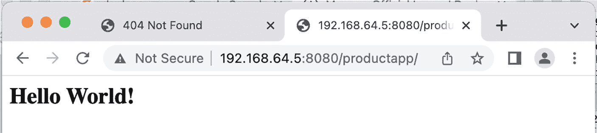

一个显示 404 错误消息的 Web 浏览器窗口截图。页面上显示文本 Hello World。

图 7-16

访问 Tomcat 容器中的 Web 应用

请注意，192.168.64.5 是 Minikube 的 IP 地址。你也可以使用 cURL 访问该应用，如清单 7-17 所示。

```
(base) binildass-MacBook-Pro:~ binil$ curl http://192.168.64.5:8080/productapp/

Hello World!

(base) binildass-MacBook-Pro:~ binil$
清单 7-17
使用 cURL 访问 Tomcat 中的 Web 应用
```

完成后，你可以使用清单 7-18 中的代码停止 Tomcat 容器。

```
(base) binildass-MacBook-Pro:~ binil$ docker ps
CONTAINER ID   IMAGE    COMMAND             CREATED         STATUS         PORTS                           NAMES
a198aabd9464   tomcat  "catalina.sh run"   8 minutes ago   Up 8 minutes   0.0.0.0:8080->8080/tcp   happy_gould
..
(base) binildass-MacBook-Pro:~ binil$ docker stop a198
a198
(base) binildass-MacBook-Pro:~ binil$
清单 7-18
停止 Tomcat 容器
```

这是一个简单的示例，演示了如何在不需在宿主机上安装 Java 的情况下，构建、打包、部署和运行 Java 应用！下一节将介绍下一个概念——Docker Compose。

## 使用 Docker Compose 构建和运行 Java 应用

此处的目标是使用 Docker Compose 编译、打包、部署和运行 Java 应用。我将在后续章节中提供更多关于 Docker Compose 的详细信息和示例。这里仅运行此示例以完成我们的讨论。

### 使用 Docker Compose

本书的源代码可通过图书产品页面在 GitHub 上获取，网址为 [`www.apress.com/9798868805547`](http://www.apress.com/9798868805547)。此示例的代码位于 `ch07\ch07-01` 文件夹中。请参考附录 E 关于 Docker 的内容，确保你已安装 Docker Compose。Docker Compose 使用清单 7-19 所示的文件。

```
version: '2'
services:
web:
image: tomcat
ports:
- "8080:8080"
volumes:
- ./ProductWeb/target/ProductWeb.war:
/usr/local/tomcat/webapps/ROOT.war
- ./ProductWeb/target/ProductWeb:
/usr/local/tomcat/webapps/ROOT
清单 7-19
Docker Compose YML 文件
```

如果你想在没有任何额外路径的情况下部署应用，则必须放置一个名为 `ROOT` 的构件。这通过清单 7-19 中的目录挂载实现。然后，你像之前的示例一样运行 Docker 进行打包，随后运行 `docker-compose`，这两个命令一次性执行。`docker-compose` 将获取 `docker-compose.yml`，如清单 7-20 所示。

```
(base) binildass-MacBook-Pro:ch07-01 binil$ docker run --rm -it -v $(pwd)/ProductWeb:/ProductWebDockerHost -w /ProductWebDockerHost maven:3.8.5-jdk-11 mvn package && docker-compose up
[INFO] Scanning for projects...
[INFO]
[INFO] --------------
WARNING: All illegal access operations will be denied in a future release
[INFO] Packaging webapp
[INFO] Assembling webapp [ProductWeb] in [/ProductWebDockerHost/target/ProductWeb]
[INFO] Processing war project
[INFO] Copying webapp resources [/ProductWebDockerHost/src/main/webapp]
[INFO] Webapp assembled in [16 msecs]
[INFO] Building war: /ProductWebDockerHost/target/ProductWeb.war
[INFO] WEB-INF/web.xml already added, skipping
[INFO] -------------------------------------------------
[INFO] BUILD SUCCESS
[INFO] --------------------------------------------------
[INFO] Total time:  01:56 min
[INFO] Finished at: 2022-05-26T18:04:38Z
[INFO] ---------------------------------------------------
[+] Running 2/0
⠿ Network ch07-01_default  Created                  0.1s
⠿ Container ch07-01-web-1  Created                  0.0s
Attaching to ch07-01-web-1
...
ch07-01-web-1  | 26-May-2022 18:04:40.683 INFO [main] org.apache.catalina.startup.HostConfig.deployWAR Deploying web application archive [/usr/local/tomcat/webapps/ROOT.war]
ch07-01-web-1  | 26-May-2022 18:04:41.016 INFO [main] org.apache.catalina.startup.HostConfig.deployWAR Deployment of web application archive [/usr/local/tomcat/webapps/ROOT.war] has finished in [333] ms
ch07-01-web-1  | 26-May-2022 18:04:41.020 INFO [main] org.apache.coyote.AbstractProtocol.start Starting ProtocolHandler ["http-nio-8080"]
ch07-01-web-1  | 26-May-2022 18:04:41.054 INFO [main] org.apache.catalina.startup.Catalina.start Server startup in [465] milliseconds
清单 7-20
使用 Docker Compose 运行 Tomcat 容器
```

接下来，访问应用 `http://192.168.64.5:8080`。参见图 7-17。


一个显示 404 错误消息的 Web 浏览器窗口截图。页面上显示文本 Hello World。

图 7-17

访问 Tomcat 容器中的 Web 应用

你也可以使用 cURL 访问该应用，如清单 7-21 所示。

```
(base) binildass-MacBook-Pro:ch07-01 binil$ curl http://192.168.64.5:8080/

Hello World!

(base) binildass-MacBook-Pro:ch07-01 binil$
清单 7-21
使用 cURL 访问 Tomcat 容器中的 Web 应用
```

## 使用 Docker 构建第一个 Java 微服务

在本节中，你将研究如何使用 Docker 部署一个更正式的微服务。为此，你将使用在第 1 章“你的第一个 Java 微服务”一节中部署的同一个微服务。


### 使用 Jib 将微服务容器化

Jib 是谷歌维护的一款开源 Java 工具，用于构建基于 Java 的应用程序的 Docker 镜像。Jib 简化了容器化过程，因为使用它时，你无需编写 Dockerfile（你将在下一节了解什么是 Dockerfile），而你在之前的示例中已经看到了这一点。此外，你甚至不需要安装 Docker 就能创建和发布 Docker 镜像。谷歌将 Jib 作为 Maven 和 Gradle 插件发布——这里你使用的是 Maven。

### 理解源代码

本书的源代码可通过图书产品页面在 GitHub 上获取，网址为 [`www.apress.com/9798868805547`](http://www.apress.com/9798868805547)。本示例的代码组织在 `ch07\ch07-02` 文件夹内。本示例中的大部分源代码与 `ch01\ch01-01` 中的类似。本节不讨论微服务的代码，因为这部分内容已在第 1 章中描述过，但本节会探讨部署方面的问题。每次构建时，Jib 都会捕获你对应用程序源代码所做的任何更改。这省去了你单独执行 Docker 构建/推送命令的步骤，并简化了将其添加到 CI 流水线的过程，但我不对这些方面进行展开。你还需要在本地进行设置，以对你想要部署到的 Docker 仓库进行身份验证。这通过 Maven 的 `settings.xml` 文件完成，如代码清单 7-22 所示。

```
(base) binildass-MacBook-Pro:~ binil$ vi /Users/binil/.m2/settings.xml
...

registry.hub.docker.com
binildas
********

...
(base) binildass-MacBook-Pro:~ binil$
代码清单 7-22
Maven 设置文件
```

你可能已经猜到，我在 Docker Hub 公共仓库中创建了一个账户，并在代码清单 7-22 中配置了其凭据。此外，Maven 插件的配置如代码清单 7-23 所示。

```

com.google.cloud.tools
jib-maven-plugin
3.4.1

代码清单 7-23
Maven 模块配置 (ch07\ch07-02\pom.xml)
```

Jib 会对你的需求做出许多合理的猜测，例如 `FROM` 和 `ENTRYPOINT`（你将在下一节了解这些内容）。Spring Boot 默认暴露 8080 端口，但如果你希望应用程序在 8081 端口上运行，并使其可通过容器暴露，你可以通过配置 Jib 并在 Boot 中进行相应更改来实现。此外，你可以使用 Jib 使其在镜像中可暴露。另外，默认情况下，Jib 使用精简版 Java 镜像。如果你希望在不同的基础镜像上运行应用程序，例如 `alpine-java`，你可以以类似的方式进行配置。本节不深入探讨这些选项，仅展示 Docker Hub 的配置，如代码清单 7-24 所示。

```

org.springframework.boot

spring-boot-maven-plugin

com.google.cloud.tools
jib-maven-plugin
3.2.0

registry.hub.docker.com/binildas/product-web

代码清单 7-24
Maven 构建配置 (ch07\ch07-02\02-ProductWeb\pom.xml)
```

### 构建镜像并推送到 Docker Hub

`ch07\ch07-02` 文件夹包含构建、容器化以及将镜像推送到 Docker Hub 所需的 Maven 脚本。

使用 Jib 插件，你可以通过以下命令，利用本地 Docker 实例根据配置构建镜像：

```
mvn compile jib:dockerBuild
```

然而，你甚至可以在没有本地运行 Docker 的情况下构建镜像：

```
mvn compile jib:build
```

这如代码清单 7-25 所示。

```
(base) binildass-MacBook-Pro:ch07-02 binil$ pwd
/Users/binil/binil/code/mac/mybooks/docker-04/ch07/ch07-02
(base) binildass-MacBook-Pro:ch07-02 binil$ mvn compile jib:build
[INFO] Scanning for projects...
...
[INFO] Containerizing application to registry.hub.docker.com/binildas/product-web...
[WARNING] Base image 'eclipse-temurin:8-jre' does not use a specific image digest - build may not be reproducible
[INFO] Using credentials from Maven settings file for registry.hub.docker.com/binildas/product-web
[INFO] The base image requires auth. Trying again for eclipse-temurin:8-jre...
[WARNING] The system does not have docker-credential-desktop CLI
[WARNING]   Caused by: Cannot run program "docker-credential-desktop": error=20, Not a directory
...
[INFO] Using base image with digest: sha256:ca34c4ad9cb6b4fcbfb1ee24c94539901a6266fa585bef4ecfb57bc53468f6f9
[INFO]
[INFO] Container entrypoint set to [java, -cp, /app/resources:/app/classes:/app/libs/*, com.acme.ecom.product.EcomProductMicroserviceApplication]
[INFO]
[INFO] Built and pushed image as registry.hub.docker.com/binildas/product-webNFO]
...
[INFO] --
[INFO] Building Ecom 0.0.1-SNAPSHOT                                       [2/2]
[INFO] --------------------------------[ pom ]------------
[INFO]
[INFO] --- jib-maven-plugin:3.2.0:build (default-cli) @ Ecom-Product-Microservice ---
[INFO] Skipping containerization because packaging is 'pom'...
[INFO] ---------------------------------------------------
[INFO] Reactor Summary for Ecom 0.0.1-SNAPSHOT:
[INFO]
[INFO] Ecom-Product-Web-Microservice ...................... SUCCESS [01:52 min]
[INFO] Ecom ............................................... SUCCESS [  0.064 s]
[INFO] --------------------------------------------------
[INFO] BUILD SUCCESS
[INFO] --------------------------------------------------
[INFO] Total time:  01:52 min
[INFO] Finished at: 2022-05-27T10:30:39+05:30
[INFO] --------------------------------------------------
(base) binildass-MacBook-Pro:ch07-02 binil$
代码清单 7-25
构建并创建产品服务器微服务镜像，然后推送该镜像
```

执行此 Maven 构建将无需使用你的 Docker 守护进程即可构建 Docker 镜像，并将镜像推送到 Docker Hub。


### Docker Hub 注册表与仓库

如前所述，Docker 分发系统中的组件是注册表。你构建的镜像可以被推送并存储在远程注册表中，供他人使用。Docker Hub 就是一个公开注册表的例子。它是免费的，并且提供了海量且不断增长的现有镜像集合。见图 7-18。

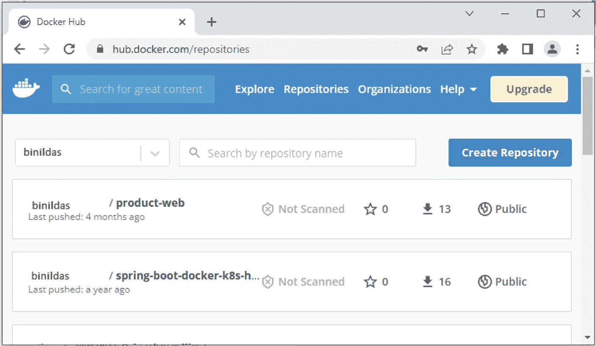

一张 Docker Hub 注册表网页的截图。页面包含一个搜索栏、一个仓库列表以及一个创建新仓库的按钮。

图 7-18

Docker Hub 注册表

图 7-18 展示了 Docker Hub 注册表的登录界面及其中的许多镜像仓库。仓库是相关镜像的集合（命名空间），提供同一应用或服务的不同版本。它是具有相同名称和不同标签的多个 Docker 镜像的集合。`product-web` 就是这样一个仓库，是我通过清单 7-25 中的 `jib build` 命令推送的。由于应用名为 `product-web`，而我在注册表中的用户名（或命名空间）是 `binildas`，因此该镜像被放置在 `binildas/product-web` 仓库中。见图 7-19。

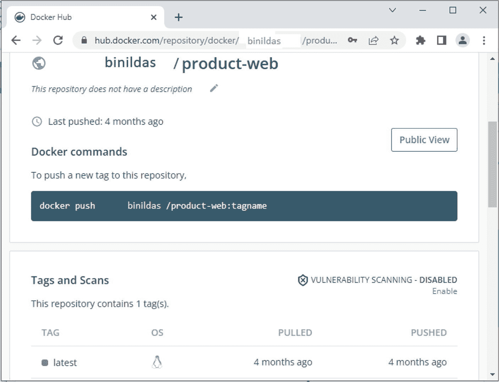

一个名为 binildas/product-web 的 Docker 仓库网页截图。该仓库没有描述。上次推送是 4 个月前，带有一个公开查看按钮。它列出了 Docker 命令、标签以及扫描详情。

图 7-19

Docker 仓库

你可以选择仓库的特定标签并将其删除。见图 7-20。

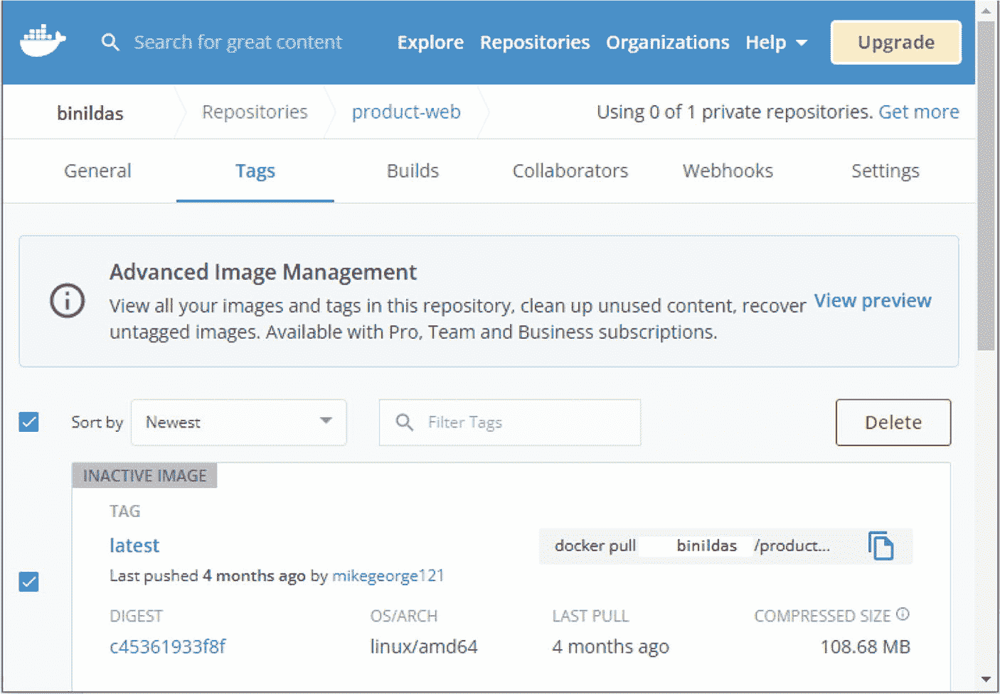

一张 Docker 仓库中标签列表的网页截图。它列出了标签名称、上次推送时间、摘要、操作系统与架构、上次拉取时间以及标签的压缩大小。每个标签旁边都有一个复选框，顶部有一个删除按钮。

图 7-20

删除 Docker 仓库

### 拉取镜像并运行容器

下一步是启动 Minikube 单节点 Kubernetes 集群，以便启动一个 Docker 守护进程。见清单 7-26。

```
(base) binildass-MacBook-Pro:ch07-02 binil$ minikube start
...
(base) binildass-MacBook-Pro:ch07-02 binil$
清单 7-26
启动 Minikube
```

接下来，在你的终端中设置 Minikube 环境变量，如清单 7-27 所示。

```
(base) binildass-MacBook-Pro:ch07-02 binil$ pwd
/Users/binil/binil/code/mac/mybooks/docker-04/ch07/ch07-02
(base) binildass-MacBook-Pro:ch07-02 binil$ eval $(minikube docker-env)
(base) binildass-MacBook-Pro:ch07-02 binil$
清单 7-27
设置 Minikube 环境

接下来，我们将在 Docker 中运行 Product Web 微服务。

```
(base) binildass-MacBook-Pro:ch07-02 binil$ docker run -it -p 8080:8080 binildas/product-web
Unable to find image ' binildas /product-web:latest' locally
latest: Pulling from binildas/product-web
125a6e411906: Pull complete
42222acc001c: Pull complete
4da85a7c2f39: Pull complete
ebcc7b1a7ad2: Pull complete
4edc7728a946: Pull complete
9a2bc4698b49: Pull complete
68af01cc5861: Pull complete
f3636ebea575: Pull complete
Digest: sha256:56254d5a6e84cbe625013d245d8fa7dfe157722d0a6dd50d434f8e63dfc339ad
Status: Downloaded newer image for binildas/product-web:latest
.   ____          _            __ _ _
/\\ / ___'_ __ _ _(_)_ __  __ _ \ \ \ \
( ( )\___ | '_ | '_| | '_ \/ _` | \ \ \ \
\\/  ___)| |_)| | | | | || (_| |  ) ) ) )
'  |____| .__|_| |_|_| |_\__, | / / / /
=========|_|==============|___/=/_/_/_/
:: Spring Boot ::                (v3.0.6)
2022-05-27 05:12:40 INFO  StartupInfoLogger.logStarting:55 - Starting EcomProductMicroserviceA...
2022-05-27 05:12:40 DEBUG StartupInfoLogger.logStarting:56 - Running with Spring Boot ...
2022-05-27 05:12:40 INFO  SpringApplication.logStartupProfileInfo:662 - No active ...
2022-05-27 05:12:41 INFO  InitializationComponent.init:37 - Start
2022-05-27 05:12:41 DEBUG InitializationComponent.init:39 - Doing Nothing...
2022-05-27 05:12:41 INFO  InitializationComponent.init:41 - End
2022-05-27 05:12:42 INFO  StartupInfoLogger.logStarted:61 - Started EcomProductMicroservice...
2022-05-27 05:16:03 INFO  ProductRestController.getAllProducts:63 - Start
2022-05-27 05:16:03 DEBUG ProductRestController.lambda$getAllProducts$0:73 - Product productId=1, ...
2022-05-27 05:16:03 DEBUG ProductRestController.lambda$getAllProducts$0:73 - Product [productId=2, ...
清单 7-28
使用 Docker 运行 Product Web 微服务
```

在清单 [7-28 的步骤中，我使用 Jib 构建，因此直接将 Product Web 微服务镜像推送到了 Docker Hub。本地注册表中没有该镜像的任何痕迹。那么，为什么当我在清单 7-28 中尝试在 Docker 中运行 Product Web 微服务时，它首先将镜像拉取到本地注册表，然后才启动容器呢？现在你可以检查 Docker 注册表，会发现该镜像已从 Docker Hub 拉取并可在本地注册表中使用。见清单 7-29。

```
(base) binildass-MacBook-Pro:ch07-02 binil$ docker images
REPOSITORY            TAG     IMAGE ID       CREATED        SIZE
...
binildas/product-web  latest  b547edfdc0be   52 years ago   247MB
(base) binildass-MacBook-Pro:ch07-02 binil$
清单 7-29
检查本地 Docker 注册表
```

忽略镜像创建时间为“52 years ago”的标签，我不确定为什么会这样显示。一旦容器运行起来，你可以列出正在运行的容器，如清单 7-30 所示。


```
(base) binildass-MacBook-Pro:ch07-02 binil$ docker ps
CONTAINER ID   IMAGE                  COMMAND                   CREATED        STATUS        PORTS                    NAMES
e95b2b5eb64e   binildas/product-web   "java -cp /app/resou..."  6 minutes ago  Up 6 minutes  0.0.0.0:8080->8080/tcp   loving_williams
...
(base) binildass-MacBook-Pro:ch07-02 binil$
清单 7-30
列出正在运行的容器
```

要访问 Product Web 微服务，如附录 E 所述，您需要先获取 Minikube 的 IP 地址，如清单 7-31 所示。

```
(base) binildass-MacBook-Pro:ch07-02 binil$ minikube ip
192.168.64.5
(base) binildass-MacBook-Pro:ch07-02 binil$
清单 7-31
查找 Minikube IP
```

现在，您可以使用浏览器，通过由 Minikube IP 构成的 URL 来访问 Product Web 微服务。请参见图 7-21。

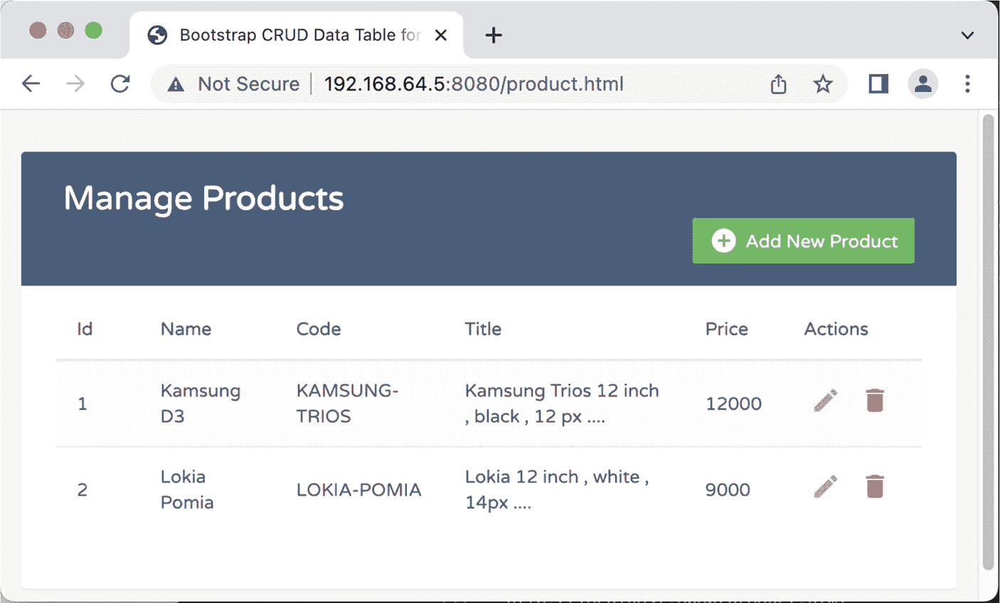

一个网页截图，页面中有一个名为“管理产品”的表格，并带有一个“添加新产品”的按钮。表格包含 ID、名称、代码、标题、价格和操作等列。表格中有两行数据，每行的操作列都包含一个铅笔图标和一个垃圾桶图标。

图 7-21

测试 Product Web 微服务容器

请参考第 1 章中“使用 UI 测试微服务”一节来测试 Product Web 微服务容器。

现在，您可以停止 Product Web 微服务容器，如清单 7-32 所示。

```
(base) binildass-MacBook-Pro:ch07-02 binil$ docker stop e95b
e95b
(base) binildass-MacBook-Pro:ch07-02 binil$
清单 7-32
停止 Product Web 微服务容器
```

请注意，`e95b` 是清单 7-30 中显示的 Product Web 微服务容器 ID 的前四个字符。

现在，您可以移除 Product Web 微服务容器，如清单 7-33 所示。

```
(base) binildass-MacBook-Pro:ch07-02 binil$ docker rm e95b
e95b
(base) binildass-MacBook-Pro:ch07-02 binil$
清单 7-33
移除 Product Web 微服务容器
```

您还可以从本地 Docker 注册表中移除 Product Web 微服务镜像，如清单 7-34 所示。

```
(base) binildass-MacBook-Pro:ch07-02 binil$ docker rmi b547
Untagged: binildas/product-web:latest
Untagged: binildas/product-web@sha256:56254d5a6e84cbe625013d245d8fa7dfe157722d0a6dd50d434f8e63dfc339ad
Deleted: sha256:b547edfdc0be94d5a44b168ff13f515aa916d63534a2d6075e000ab829a363e8
...
(base) binildass-MacBook-Pro:ch07-02 binil$
清单 7-34
移除 Product Web 微服务镜像
```

再次注意，`b547` 是清单 7-29 中 Product Web 微服务镜像 ID 的前四个字符。

## 使用 Dockerfile 构建微服务

本节将解释如何使用 Dockerfile 部署微服务。它使用了第 1 章“您的第一个 Java 微服务”一节中部署的同一个微服务。

### Dockerfile

*Dockerfile* 是一种使用纯文本文件来构建 Docker 镜像的配方。每个 Dockerfile 都指定了一个基础镜像，Docker 引擎将在此基础上进行构建。然后，Dockerfile 包含一系列关于如何构建镜像的指令。您指示 Docker 根据 Dockerfile 创建一个 Docker 镜像。`docker build` 命令在构建上下文中运行。构建的上下文包含指定位置的文件，该位置可以是 `PATH` 或 `URL`。`PATH` 是您本地文件系统中的一个目录，`URL` 是一个 Git 仓库位置。上下文会被递归处理。`PATH` 也包含任何子目录。`URL` 将包含仓库及其子模块。

### 理解源代码

本书的源代码可通过图书产品页面在 GitHub 上获取，网址为 [`www.apress.com/9798868805547`](http://www.apress.com/9798868805547)。本示例的代码组织在 `ch07\ch07-03` 文件夹内。本示例中的大部分源代码与 `ch01\ch01-01` 中的代码类似。因此，本节不再审查微服务代码，而是着眼于几个部署方面，特别是使用 Dockerfile 的部署。请参见清单 7-35。

```
FROM openjdk:8-jdk-alpine
VOLUME /tmp
ARG JAR_FILE
COPY ${JAR_FILE} ecom.jar
ENTRYPOINT ["java","-jar","/ecom.jar"]
清单 7-35
Dockerfile (ch07\ch07-03\Dockerfile)
```

此 Dockerfile 包含以下信息：

*   `FROM`：作为此镜像的基础，您将使用 `openjdk` 提供的支持 Java 的 Alpine Linux，`openjdk` 是一个包含 Java 平台标准版开源实现的官方仓库。

*   `VOLUME`：指向 `/tmp`，因为这是 Spring Boot 应用程序默认创建工作目录的位置。其效果是在您的主机上的 `/var/lib/docker` 下创建一个临时文件，并将其链接到容器内的 `/tmp` 下。当以非 root 用户身份运行容器时，这一点至关重要。

*   `ARG`：这也被称为构建时变量。它们从在 Dockerfile 中使用 `ARG` 指令“声明”的那一刻起，直到镜像构建完成的那一刻才可用。正在运行的容器无法访问 `ARG` 变量的值。

*   `COPY`：Docker 将 Jar 文件复制到镜像中。

*   `ENTRYPOINT`：这将是容器启动时要启动的可执行文件。定义为 `JSON-Array`，因为您将结合使用 `ENTRYPOINT` 和 `CMD` 来处理某些应用程序参数。

清单 7-36 中的单个脚本用于自动化此构建过程。

```
mvn -Dmaven.test.skip=true clean package
docker build  --build-arg JAR_FILE=02-ProductWeb/target/*.jar -t binildas/product-web .
docker push binildas/product-web
sleep 10
docker rmi binildas/product-web
sleep 10
docker run -p 8080:8080  --name product-web binildas/product-web
清单 7-36
Docker 构建脚本 (ch07\ch07-03\makeandrun.sh)
```


### 使用 Dockerfile 构建并运行微服务

下一步是启动 Minikube 单节点 Kubernetes 集群，以便启动 Docker 守护进程。参见清单 7-37。

```
(base) binildass-MacBook-Pro:ch07-03 binil$ minikube start
...
(base) binildass-MacBook-Pro:ch07-03 binil$
清单 7-37
启动 Minikube
```

接下来，在终端中设置 Minikube 环境变量，如清单 7-38 所示。

```
(base) binildass-MacBook-Pro:ch07-03 binil$ pwd
/Users/binil/binil/code/mac/mybooks/docker-04/ch07/ch07-03
(base) binildass-MacBook-Pro:ch07-03 binil$ eval $(minikube docker-env)
(base) binildass-MacBook-Pro:ch07-03 binil$
清单 7-38
在终端中设置 Minikube 环境
```

接下来，你可以尝试在 Docker 中运行 Product Web 微服务。如清单 7-36 所示，你需要使用 `docker push` 命令。为此，你需要在当前终端中登录 Docker Hub。参见清单 7-39。

```
(base) binildass-MacBook-Pro:ch07-03 binil$ docker login
Login with your Docker ID to push and pull images from Docker Hub. If you don't have a Docker ID, head over to https://hub.docker.com to create one.
Username: binildas
Password:
Error saving credentials: error storing credentials - err: exec: "docker-credential-desktop": executable file not found in $PATH, out: ``
(base) binildass-MacBook-Pro:ch07-03 binil$
清单 7-39
登录 Docker 终端
```

清单 7-39 中出现错误，是因为你当前操作的不是主机文件系统，而是 Minikube 虚拟机中的文件系统。因此，如果你尝试将 Docker 镜像推送到 Docker Hub，可能会失败。参见清单 7-40。

```
(base) binildass-MacBook-Pro:ch07-03 binil$ sh makeandrun.sh
(base) binildass-MacBook-Pro:ch07-03 binil$ pwd
/Users/binil/binil/code/mac/mybooks/docker-04/ch07/ch07-03
(base) binildass-MacBook-Pro:ch07-03 binil$ docker push binildas/product-web
Using default tag: latest
The push refers to repository [docker.io/binildas/product-web]
2c54cf7f9c27: Preparing
ceaf9e1ebef5: Preparing
9b9b7f3d56a0: Preparing
f1b5933fe4b5: Preparing
denied: requested access to the resource is denied
(base) binildass-MacBook-Pro:ch07-03 binil$
清单 7-40
登录 Docker 终端
```

如上所述，清单 7-40 中存在错误，因此请先搁置 `makeandrun.sh` 自动化脚本，手动逐步操作。参见清单 7-41 和 7-42。

```
(base) binildass-MacBook-Pro:ch07-03 binil$ docker build  --build-arg JAR_FILE=02-ProductWeb/target/*.jar -t binildas/product-web .
Sending build context to Docker daemon  21.68MB
Step 1/5 : FROM openjdk:8-jdk-alpine
---> a3562aa0b991
Step 2/5 : VOLUME /tmp
---> Running in b33ed0a15fb0
Removing intermediate container b33ed0a15fb0
---> 388ef9de0cd0
Step 3/5 : ARG JAR_FILE
---> Running in cdab850cc040
Removing intermediate container cdab850cc040
---> 9c06159a60bf
Step 4/5 : COPY ${JAR_FILE} ecom.jar
---> 9ed33fae3b42
Step 5/5 : ENTRYPOINT ["java","-jar","/ecom.jar"]
---> Running in 0949e3c49a48
Removing intermediate container 0949e3c49a48
---> 079251d7b3b0
Successfully built 079251d7b3b0
Successfully tagged binildas/product-web:latest
(base) binildass-MacBook-Pro:ch07-03 binil$
清单 7-42
构建 Product Web 微服务的镜像
```

```
(base) binildass-MacBook-Pro:ch07-03 binil$ pwd
/Users/binil/binil/code/mac/mybooks/docker-04/ch07/ch07-03
(base) binildass-MacBook-Pro:ch07-03 binil$ mvn -Dmaven.test.skip=true clean package
[INFO] Scanning for projects...
...
[INFO] Ecom-Product-Web-Microservice ... SUCCESS [  1.622 s]
[INFO] Ecom ............................ SUCCESS [  0.017 s]
[INFO] -------------------------------------------------
[INFO] BUILD SUCCESS
[INFO] --------------------------------------------------
[INFO] Total time:  1.796 s
[INFO] Finished at: 2022-05-27T11:50:50+05:30
[INFO] --------------------------------------------------
(base) binildass-MacBook-Pro:ch07-03 binil$
清单 7-41
构建并打包 Product Web 微服务
```

由于你使用了 Minikube 中的 Docker 守护进程（参见附录 E），镜像已创建在 Docker 守护进程的本地仓库中。你还应将其推送到 Docker Hub。由于你操作的不是主机文件系统，而是 Minikube 虚拟机中的文件系统，因此需要登录到虚拟机并执行推送操作。参见清单 7-43。

```
(base) binildass-MacBook-Pro:ch07-03 binil$ pwd
/Users/binil/binil/code/mac/mybooks/docker-04/ch07/ch07-03
(base) binildass-MacBook-Pro:ch07-03 binil$ minikube ssh
_             _
_         _ ( )           ( )
___ ___  (_)  ___  (_)| |/')  _   _ | |_      __
/' _ ` _ `\| |/' _ `\| || , <  ( ) ( )| '_`\  /'__`\
| ( ) ( ) || || ( ) || || |\`\ | (_) || |_) )(  ___/
(_) (_) (_)(_)(_) (_)(_)(_) (_)`\___/'(_,__/'`\____)
$ docker login
Login with your Docker ID to push and pull images from Docker Hub. If you don't have a Docker ID, head over to https://hub.docker.com to create one.
Username: binildas
Password:
WARNING! Your password will be stored unencrypted in /home/docker/.docker/config.json.
Configure a credential helper to remove this warning. See
https://docs.docker.com/engine/reference/commandline/login/#credentials-store
Login Succeeded
$ docker push binildas/product-web
Using default tag: latest
The push refers to repository [docker.io/binildas/product-web]
2c54cf7f9c27: Pushed
ceaf9e1ebef5: Layer already exists
9b9b7f3d56a0: Layer already exists
f1b5933fe4b5: Layer already exists
latest: digest: sha256:420cc888c575f695b5f2b84092b6bfa73d153bc0937cb846a28366ff14fa1f04 size: 1159
$ exit
logout
(base) binildass-MacBook-Pro:ch07-03 binil$
清单 7-43
推送 Product Web 微服务的镜像
```

为了确认你确实推送了镜像，可以删除本地镜像并尝试运行 Product Web 微服务容器，如清单 7-44 所示。

```
(base) binildass-MacBook-Pro:ch07-03 binil$ pwd
/Users/binil/binil/code/mac/mybooks/docker-04/ch07/ch07-03
(base) binildass-MacBook-Pro:ch07-03 binil$ docker rmi binildas/product-web
Untagged: binildas/product-web:latest
Untagged: binildas/product-web@sha256:420cc888c575f695b5f2b84092b6bfa73d153bc0937cb846a28366ff14fa1f04
Deleted: sha256:079251d7b3b01df698620fc9648125c62b220de7f031e3610d06970d994ca2ed
...
(base) binildass-MacBook-Pro:ch07-03 binil$
清单 7-44
从本地删除 Product Web 微服务的镜像
```

接下来，运行微服务容器，如清单 7-45 所示。


```
(base) binildass-MacBook-Pro:ch07-03 binil$ docker run -p 8080:8080  --name product-web binildas/product-web
Unable to find image 'binildas/product-web:latest' locally
latest: Pulling from binildas/product-web
e7c96db7181b: Already exists
f910a506b6cb: Already exists
c2274a1a0e27: Already exists
fa880b6dd374: Pull complete
Digest: sha256:420cc888c575f695b5f2b84092b6bfa73d153bc0937cb846a28366ff14fa1f04
Status: Downloaded newer image for binildas/product-web:latest
.   ____          _            __ _ _
/\\ / ___'_ __ _ _(_)_ __  __ _ \ \ \ \
( ( )\___ | '_ | '_| | '_ \/ _` | \ \ \ \
\\/  ___)| |_)| | | | | || (_| |  ) ) ) )
'  |____| .__|_| |_|_| |_\__, | / / / /
=========|_|==============|___/=/_/_/_/
:: Spring Boot ::                (v3.0.6)
2022-05-27 06:40:30 INFO  StartupInfoLogger.logStarting:55 - Starting EcomProductMicroservice...
2022-05-27 06:40:30 DEBUG StartupInfoLogger.logStarting:56 - Running with Spring Boot ...
2022-05-27 06:40:30 INFO  SpringApplication.logStartupProfileInfo:662 - No active ...
2022-05-27 06:40:31 INFO  InitializationComponent.init:37 - Start
2022-05-27 06:40:31 DEBUG InitializationComponent.init:39 - Doing Nothing...
2022-05-27 06:40:31 INFO  InitializationComponent.init:41 - End
2022-05-27 06:40:32 INFO  StartupInfoLogger.logStarted:61 - Started EcomProductMicroser...
2022-05-27 06:42:49 DEBUG ProductRestController.lambda$getAllProducts$0:73 - Product productId=1...
2022-05-27 06:42:49 DEBUG ProductRestController.lambda$getAllProducts$0:73 - Product [productId=2...
清单 7-45
运行产品 Web 微服务容器
```

在[清单 7-45 中，你正在从 Docker Hub 仓库拉取镜像。现在，你可以使用浏览器，通过由 Minikube IP 构成的 URL 来访问产品 Web 微服务：

`http://192.168.64.5:8080/product.html`

## 总结

容器非常擅长打包、分发以及在目标环境中执行代码，而无需在目标机器上设置许多特定于应用程序的配置。你可以将容器视为一个黑盒。为了证明这一点，本章包含了在没有本地 Java SDK 的情况下，仅使用容器中的 Maven 来构建、打包和执行 Java 代码的示例！你还学习了处理容器以与简单微服务交互的各种方法。现在，你能够更好地理解容器是什么。下一章将介绍更复杂的微服务，同样会使用容器。

