# 8. 微服务容器

前面的章节介绍了微服务，它们是自包含、独立的应用程序单元，每个单元都履行来自特定领域的相关业务功能。每个微服务，或者它们的集合，本身都可以被视为一个应用程序。在一个多微服务应用程序中，你会为你的应用创建许多微服务。如果你决定使用不同的技术栈来构建多个微服务，那该怎么办？你的团队很快就会陷入困境，因为开发人员需要管理的环境甚至比他们在传统的单体应用开发场景中还要多。使用 Docker，可以在同一台服务器上管理、部署甚至减少数百甚至数千个微服务的性能开销。Docker 容器比虚拟机需要更少的计算资源，并且容器还提供了所需的隔离性，使得不同的技术可以并存。因此，容器与微服务是天然契合的。

第 7 章介绍了如何使用 Docker 镜像运行应用程序容器。本章将继续讨论这一话题，但会使用反映真实场景的微服务示例。多个微服务将进行交互，这意味着它们需要相互通信。本章涵盖以下概念：

*   微服务容器之间的相互连接

*   微服务容器连接到主机上的 PostgreSQL 数据库

*   微服务容器连接到容器中的 PostgreSQL

*   微服务容器连接到容器中的 MongoDB

要理解容器间的通信，你需要了解容器之间的网络选项，接下来将对此进行介绍。

## 容器网络

Docker 提供了不同的网络配置方式，以便你的容器可以与外界通信，无论是与另一台服务器还是与另一个 Docker 容器。下一节将简要介绍这些选项。

### 链接

当你安装 Docker 时，Docker 默认使用一个自动创建的桥接网络。Docker 的网络子系统是可插拔的，使用驱动程序。在 Docker 引入网络功能之前，Docker 的链接功能使容器能够相互发现，并安全地将一个容器的信息传递给另一个容器。随着 Docker 网络功能的引入，你仍然可以创建链接，但它们与默认的桥接网络和其他用户定义的网络相比，行为有所不同。尽管链接选项仍然有效，但它是一个遗留功能。第一个示例使用了链接；然而，此功能最终可能会被移除，因此建议你使用其他选项（网络）来实现此功能。用户定义的网络不支持的一个功能是，你可以通过链接在容器之间共享环境变量。但卷提供了更好的选项，可以以更可控的方式在容器之间共享环境变量。

### 网络

有多种类型的网络。我在这里只提及它们，因为详细的解释超出了本书的范围。

*   当你需要在同一 Docker 主机上让多个容器通信时，桥接网络是最佳选择。

*   当网络堆栈不应与 Docker 主机隔离，但你希望容器的其他方面被隔离时，主机网络是最佳选择。

*   当你需要运行在不同 Docker 主机上的容器进行通信，或者多个应用程序使用 Swarm 服务协同工作时，覆盖网络是最佳选择。

*   当你从虚拟机设置迁移，或者需要你的容器看起来像网络上的物理主机（每个主机都有唯一的 MAC 地址）时，Macvlan 网络是最佳选择。

*   第三方网络插件允许你将 Docker 与专门的网络堆栈集成。

你很快就会看到可运行的代码，以便通过实践来学习。

由于本章将探讨容器通信的多种场景，因此了解如何检查容器日志也很有意义，接下来将对此进行介绍。

## 容器日志

你已经了解到 Docker 是一个操作系统级别的虚拟化平台，因此它允许你在同一台主机上同时运行多个应用程序容器。它有助于分离应用程序和基础设施，但是当你在同一基础设施中拥有许多应用程序时，当事情不如预期时，你需要一种方法来进行故障排除。Docker 日志在这里可以帮助你。


### 控制台日志输出

当你运行一个容器时，可以立即在控制台中看到 `STDOUT` 日志。你在第 7 章的清单 7-28 中看到过这一点，此处将其复制为清单 8-1。

```
(base) binildass-MacBook-Pro:ch07-02 binil$ docker run -it -p 8080:8080 binildas/product-web
...
f3636ebea575: Pull complete
Digest: sha256:56254d5a6e84cbe625013d245d8fa7dfe157722d0a6dd50d434f8e63dfc339ad
Status: Downloaded newer image for binildas/product-web:latest
.   ____          _            __ _ _
/\\ / ___'_ __ _ _(_)_ __  __ _ \ \ \ \
( ( )\___ | '_ | '_| | '_ \/ _` | \ \ \ \
\\/  ___)| |_)| | | | | || (_| |  ) ) ) )
'  |____| .__|_| |_|_| |_\__, | / / / /
=========|_|==============|___/=/_/_/_/
:: Spring Boot ::                (v3.2.0)
2022-05-27 05:12:40 INFO  StartupInfoLogger.logStarting:55 - Starting EcomProductMicroserviceA...
2022-05-27 05:12:40 DEBUG StartupInfoLogger.logStarting:56 - Running with Spring Boot ...
清单 8-1
使用 Docker 运行产品 Web 微服务
```

此命令会像 Linux shell 的 `tail -f` 命令一样持续跟踪日志。在 Linux 中，使用 `--follow (-f)` 选项时，`tail` 默认会跟踪文件描述符。

从第 7 章的清单 7-30 中，你了解到容器 ID 是 `e95b2b5eb64e`。你可以使用这些 ID 来查看容器日志，如清单 8-2 所示。

```
(base) binildass-MacBook-Pro:~ binil$ eval $(minikube docker-env)
(base) binildass-MacBook-Pro:~ binil$ docker logs e95b2b5eb64e
...
清单 8-2
查看产品 Web 微服务容器日志
```

在清单 8-2 中，日志将包含带有时间戳的输出流数据。但是，此命令不包含持续的日志输出。要查看容器的持续日志输出，你需要在 `docker logs` 命令中使用 `–follow` 选项，如清单 8-3 所示。

```
(base) binildass-MacBook-Pro:~ binil$ eval $(minikube docker-env)
(base) binildass-MacBook-Pro:~ binil$ docker logs --follow e95b2b5eb64e
...
清单 8-3
持续查看产品 Web 微服务容器日志
```

这个 `–follow` 选项是一个非常实用的 Docker 选项，因为它允许你监控容器的实时日志。

有了这个简单的介绍，接下来我们进入代码部分。

## 使用链接的微服务与 MongoDB 容器

本示例复用了第 3 章中“使用 MongoDB 和 CrudRepository 的微服务”一节中的微服务。它使用了相同的两个微服务——一个消费者微服务和一个提供者微服务，它们通过 REST 协议相互通信。提供者微服务还与 MongoDB 进行交互。整体设计请参考第 2 章的图 2-1。

### 设计容器拓扑

根据第 2 章图 2-1 中的设计，你还需要定义基于容器的部署拓扑。如图 8-1 所示。

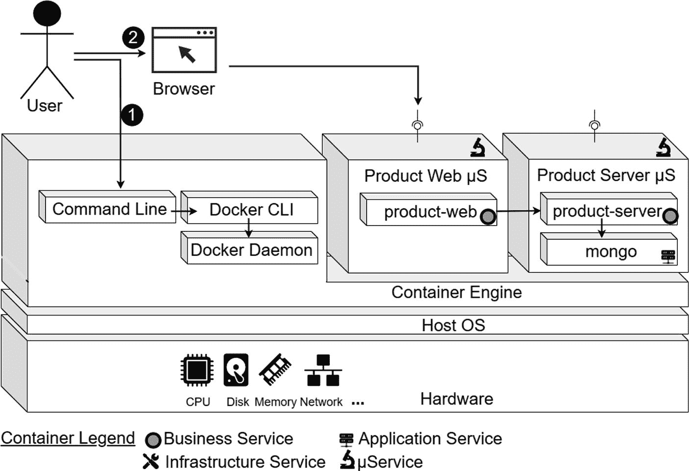

该图展示了微服务容器拓扑。它包括用户、浏览器、容器引擎、主机操作系统和硬件。

图 8-1

微服务容器拓扑设计

一个消费者微服务和一个提供者微服务通过 REST 协议相互通信。产品 Web 微服务是消费者微服务，它将作为单个容器部署。提供者微服务还与 NoSQL 数据库 MongoDB 进行交互。因此，部署涉及两个容器——一个用于产品服务器组件，另一个用于 MongoDB 组件。在这里，产品 Web 和产品服务器容器提供业务服务，而 Mongo 容器则提供用于持久化数据的应用服务。

另外，请注意图 8-1 中的另一个方面。产品服务器和 MongoDB 容器被组合在一起，称为单个微服务，即产品服务器微服务。这遵循了微服务的标准约定，即微服务是一个自包含的单元，拥有自己的数据。

还要注意用户与部署进行交互的两种方式：

*   命令行界面（CLI）作为部署管理接口，在所谓的用户空间内存中运行。该程序就像其他运行在操作系统之上的程序一样运行。在用户空间中运行的程序无法修改内核空间内存。操作系统是用户程序与计算机硬件之间的接口。

*   用户使用浏览器从业务服务访问业务功能

当你运行 Docker 时，Docker 引擎和 Docker CLI 是两个在用户空间中运行的程序。图 8-1 显示了三个正在运行的容器。每个容器都作为 Docker 引擎的子进程运行，并被容器封装，委托进程在其自身的用户空间内存子空间中运行。在容器内运行的程序无法访问相邻容器所限定的内存和资源。

此外，从某种意义上说，图 8-1 也代表了微服务部署的逻辑视图。虽然在基础设施架构层面，容器部署更有意义，但微服务架构视图对应用架构师更为相关，因此我在图中展示了这一点。这就是为什么即使产品服务器和 MongoDB 作为两个独立的容器部署，我仍然在逻辑上将它们组合在一起，以表示单个产品服务器微服务。这个特定的 MongoDB 实例完全归产品服务器微服务所有，产品服务器微服务之外的实体可能无需关心此 MongoDB 实例。

### 理解源代码

本书的源代码可通过图书产品页面在 GitHub 上获取，网址为 [`www.apress.com/9798868805547`](http://www.apress.com/9798868805547)。本示例的代码组织在 `ch08\ch08-01` 文件夹中。本示例中的源代码与第 3 章中详细解释的 `ch03\ch03-02` 类似。你需要进一步理解的是部署模式，这将在下一节中介绍。


### 使用 Dockerfile 运行容器

第 7 章介绍了如何构建微服务的 Docker 镜像。本节将在此基础上，构建多个微服务镜像。

第一步是启动 Minikube 单节点 Kubernetes 集群，以便启动 Docker 守护进程。有关容器命令的快速参考，请参阅附录 E。

```
(base) binildass-MacBook-Pro:~ binil$ minikube start
(base) binildass-MacBook-Pro:~ binil$ eval $(minikube docker-env)
```

注意

对于本章中的所有示例，如果你使用的是 Minikube 单节点 Kubernetes 集群，我假设前两个连接到 Docker 守护进程的步骤已经执行。

清单 8-4 展示了组织成一个实用脚本的命令。

```
mvn -Dmaven.test.skip=true clean package
docker build  --build-arg JAR_FILE=02-ProductWeb/target/*.jar -t ecom/product-web .
docker build  --build-arg JAR_FILE=01-ProductServer/target/*.jar -t ecom/product-server .
docker run -d -it -p 27017:27017 --name mongo mongo:3.6
docker run -d -p 8081:8081  --link mongo:mongo --name product-server ecom/product-server
docker run -d -p 8080:8080  --link product-server:product-server --name product-web ecom/product-web
清单 8-4
构建并运行微服务 Docker 容器的脚本 (ch08\ch08-01\makeandrun.sh)
```

第一行依次构建两个微服务并将其打包成 `.jar` 文件。第二行和第三行使用 `.jar` 文件构建 Docker 镜像。此构建使用了你在第 7 章的清单 7-35 中看到的 Dockerfile，该文件在此处重现为清单 8-5。

```
FROM openjdk:8-jdk-alpine
VOLUME /tmp
ARG JAR_FILE
COPY ${JAR_FILE} ecom.jar
ENTRYPOINT ["java","-jar","/ecom.jar"]
清单 8-5
Dockerfile (ch08\ch08-01\Dockerfile)
```

该 Dockerfile 支持模板化，因此 `.jar` 文件的实际值可以与 `build` 命令一起参数化。请参见清单 8-6。

```
(base) binildass-MacBook-Pro:ch08-01 binil$ pwd
/Users/binil/binil/code/mac/mybooks/docker-03/ch08/ch08-01
(base) binildass-MacBook-Pro:ch08-01 binil$ eval $(minikube docker-env)
(base) binildass-MacBook-Pro:ch08-01 binil$ sh makeandrun.sh
[INFO] Scanning for projects...
[INFO] ----------------------------------------------------
[INFO] Reactor Build Order:
[INFO]
...
Sending build context to Docker daemon  67.45MB
Step 1/5 : FROM openjdk:8-jdk-alpine
...
Successfully tagged ecom/product-web:latest
...
Successfully tagged ecom/product-server:latest
e0e9a00ce90dac5076991a67611c938458049f915ff472fed96afe9b9ce
03c80c666627fafda58611a9648b5c443010663311a6453187ccffd35a6
f19bb132fa30fedbf2f2cf8c9a6f6b082280993829a536deac8b1d3f3ff
(base) binildass-MacBook-Pro:ch08-01 binil$
清单 8-6
Dockerfile 构建与运行命令
```

在清单 8-4 中，第二条和第三条命令使用了与清单 8-5 中相同的 `Dockerfile`，但它们在构建过程中使用了不同的 `.jar` 文件路径，因此它们构建了 `ecom/product-web:latest` 和 `ecom/product-server:latest` 并运行了相应的容器。清单 8-6 显示了从最后三行日志中实例化的三个容器。其中两个用于两个业务微服务（Product Server 和 Product Web），第三行用于你实例化的 MongoDB 容器。

MongoDB 是一个独立的容器。如图 8-1 所示，Product Server 依赖于 MongoDB，而 Product Web 依赖于 Product Server。这些依赖关系在清单 8-4 的部署脚本中通过链接显式指定。

一旦容器启动并运行，你就可以列出正在运行的容器。请参见清单 8-7。

```
(base) binildass-MacBook-Pro:ch08-01 binil$ eval $(minikube docker-env)
(base) binildass-MacBook-Pro:ch08-01 binil$ docker ps
CONTAINER ID   IMAGE                 COMMAND                   CREATED              STATUS              PORTS                     NAMES
f19bb132fa30   ecom/product-web      "java -jar /ecom.jar"     About a minute ago   Up 59 seconds       0.0.0.0:8080->8080/tcp    product-web
03c80c666627   ecom/product-server   "java -jar /ecom.jar"     About a minute ago   Up About a minute   0.0.0.0:8081->8081/tcp    product-server
e0e9a00ce90d   mongo:3.6             "docker-entrypoint.s..."  About a minute ago   Up About a minute  0.0.0.0:27017->27017/tcp  mongo
...
(base) binildass-MacBook-Pro:ch08-01 binil$
清单 8-7
列出正在运行的容器
```

由于 `–d` 选项用于运行容器，它们作为后台守护进程子进程运行。在访问应用程序时，持续观察终端日志会很方便。

记下清单 8-7 中的容器 ID。你可以使用这些 ID 查看日志，如清单 8-8 和 8-9 所示。

```
(base) binildass-MacBook-Pro:~ binil$ eval $(minikube docker-env)
(base) binildass-MacBook-Pro:~ binil$ docker logs --follow 03c80c666627
.   ____          _            __ _ _
/\\ / ___'_ __ _ _(_)_ __  __ _ \ \ \ \
( ( )\___ | '_ | '_| | '_ \/ _` | \ \ \ \
\\/  ___)| |_)| | | | | || (_| |  ) ) ) )
'  |____| .__|_| |_|_| |_\__, | / / / /
=========|_|==============|___/=/_/_/_/
:: Spring Boot ::                (v3.2.0)
...
2022-05-30 04:44:31 INFO  InitComponent.init:68 - Start...
2022-05-30 04:44:31 DEBUG InitComponent.init:72 - Deleting all existing data on start...
2022-05-30 04:44:31 DEBUG InitComponent.init:77 - Creating initial data on start...
2022-05-30 04:44:31 INFO  InitComponent.init:126 - End
2022-05-30 04:44:36 INFO  Startup.log:61 - Started EcomProd...
...
清单 8-8
Product Server 容器日志
```

清单 8-8 显示了 Product Server 容器的日志。类似地，清单 8-9 显示了 Product Web 容器的日志。

```
(base) binildass-MacBook-Pro:~ binil$ eval $(minikube docker-env)
(base) binildass-MacBook-Pro:~ binil$ docker logs --follow f19bb132fa30
.   ____          _            __ _ _
/\\ / ___'_ __ _ _(_)_ __  __ _ \ \ \ \
( ( )\___ | '_ | '_| | '_ \/ _` | \ \ \ \
\\/  ___)| |_)| | | | | || (_| |  ) ) ) )
'  |____| .__|_| |_|_| |_\__, | / / / /
=========|_|==============|___/=/_/_/_/
:: Spring Boot ::                (v3.2.0)
...
2022-05-30 04:44:30 INFO  InitComponent.init:58 - Start
2022-05-30 04:44:30 DEBUG InitComponent.init:60 - Doing Nothing...
2022-05-30 04:44:30 INFO  InitComponent.init:62 - End
2022-05-30 04:44:35 INFO  Startup.log:61 - Started EcomProd...
清单 8-9
Product Web 容器日志
```


### 测试微服务容器

微服务启动并运行后，即可访问 Product Web 微服务。但如附录 E 所述，您需要先获取 Minikube 的 IP 地址。请参见清单 8-10。

```
(base) binildass-MacBook-Pro:ch07-02 binil$ minikube ip
192.168.64.5
(base) binildass-MacBook-Pro:ch07-02 binil$
清单 8-10
查找 Minikube IP
```

现在，您可以使用浏览器，通过 Minikube IP 构成的 URL 来访问 Product Web 微服务。

`http://192.168.64.5:8080/product.html`

请参考第 1 章中“使用 UI 测试微服务”一节，测试 Product Web 微服务容器。在测试微服务时，请持续观察日志窗口。

测试完成后，您可以停止并移除微服务容器，清理环境。环境清理步骤已自动化集成在清单 8-11 的脚本中。

```
mvn -Dmaven.test.skip=true clean
docker stop product-web
docker stop product-server
docker stop mongo
docker rm product-web
docker rm product-server
docker rm mongo
docker rmi -f ecom/product-web
docker rmi -f ecom/product-server
清单 8-11
自动化环境清理脚本 (ch08\ch08-01\clean.sh)
```

您可以执行清单 8-12 中的脚本来停止并移除微服务容器，并清理环境。

```
(base) binildass-MacBook-Pro:ch08-01 binil$ pwd
/Users/binil/binil/code/mac/mybooks/docker-03/ch08/ch08-01
(base) binildass-MacBook-Pro:ch08-01 binil$ sh clean.sh
[INFO] Scanning for projects...
[INFO] --------------------------------------------------
[INFO] Reactor Build Order:
[INFO]
[INFO] Ecom-Product-Server-Microservice    [jar]
[INFO] Ecom-Product-Web-Microservice       [jar]
[INFO] Ecom                                [pom]
[INFO]
...
product-web
product-server
mongo
product-web
product-server
mongo
Untagged: ecom/product-web:latest
Deleted: sha256:42ce83c1cbcb195e66db8b9541f7bd391764d0759d99753725a0b97d34d2b2fd
...
Untagged: ecom/product-server:latest
...
(base) binildass-MacBook-Pro:ch08-01 binil$
清单 8-12
停止微服务容器并清理环境

下一个示例将对当前示例稍作修改，使用网络（network）替代链接（link）。

## 使用网络的微服务与 MongoDB 容器

在本节中，您将复用第 3 章“使用 MongoDB 和 CrudRepository 的微服务”一节中介绍的微服务，这些微服务已在上一节中运行过。您将拥有相同的两个微服务——一个消费者微服务和一个提供者微服务，它们通过 REST 协议相互通信。提供者微服务还与 MongoDB 进行交互。整体设计请参考第 2 章的图 2-1。

### 设计容器拓扑

您将复用本章上一个示例中定义的部署架构，如图 8-1 所示。唯一的改动是，容器间的网络连接选项将从 `link` 替换为 `net`。

### 理解源代码

本书的源代码可通过图书产品页面上的 GitHub 获取，网址为 [`www.apress.com/9798868805547`](http://www.apress.com/9798868805547)。本示例的代码位于 `ch08\ch08-02` 文件夹中。本示例的源代码与第 3 章中详细解释的 `ch03\ch03-02` 非常相似，并且您已在本章上一个示例中部署过。

### 使用 Dockerfile 运行容器

您只需修改本章上一个示例中的脚本。清单 8-13 展示了整合到一个脚本中的命令。

```
mvn -Dmaven.test.skip=true clean package
docker build  --build-arg JAR_FILE=02-ProductWeb/target/*.jar -t ecom/product-web .
docker build  --build-arg JAR_FILE=01-ProductServer/target/*.jar -t ecom/product-server .
docker network create ecom-network
docker pull mongo:3.6
docker run -d -it -p 27017:27017 --name mongo  --net=ecom-network  mongo:3.6
docker run -d -p 8081:8081  --net=ecom-network --name product-server ecom/product-server
docker run -d -p 8080:8080  --net=ecom-network --name product-web ecom/product-web
清单 8-13
构建并运行微服务 Docker 容器的脚本 (ch08\ch08-02\makeandrun.sh)
```

请注意网络创建命令。这是 `create network` 命令的最简形式，但很可能也是您最常用的形式。它使用默认驱动（您未指定驱动，因此将使用默认的 `bridge` 驱动）。创建网络时，会生成一个 ID。之后，您可以使用此标识符来引用该网络，例如将容器连接到该网络或检查网络属性时。

本示例的 `Dockerfile` 与上一个示例中使用的 `Dockerfile` 相同，如清单 8-5 所示。

清单 8-14 构建微服务和 Docker 镜像，然后运行容器。

```
(base) binildass-MacBook-Pro:ch08-02 binil$ pwd
/Users/binil/binil/code/mac/mybooks/docker-03/ch08/ch08-02
(base) binildass-MacBook-Pro:ch08-02 binil$ eval $(minikube docker-env)
(base) binildass-MacBook-Pro:ch08-02 binil$ sh makeandrun.sh
[INFO] Scanning for projects...
...
a9f5da94581b4f3a492938734edca433c1fc6afbe954ad4e28ead4621dd
d762e59b315dfece79e7b98deb6b01796a9210b9536ede1f36a98af67af
b51443e6a5d0cfcc16efc54e52858353ce5aa0ada1a23012dc88dfa49f0
(base) binildass-MacBook-Pro:ch08-02 binil$
清单 8-14
执行脚本构建并运行微服务
```

您需要在清单 8-13 中新建 `ecom-network`，因此需要查看其创建状态。请参见清单 8-15。

```
(base) binildass-MacBook-Pro:ch08-02 binil$ docker network ls
NETWORK ID     NAME              DRIVER    SCOPE
435b063e810b   bridge            bridge    local
129e1b5f4de5   ecom-network      bridge    local
28731f4db9e0   host              host      local
2480825a3deb   none              null      local
(base) binildass-MacBook-Pro:ch08-02 binil$
清单 8-15
列出 Docker 网络
```

`network ls` 命令仅列出可供容器使用的网络。它会输出网络标识符、名称、所使用的驱动以及网络的作用域。

要列出系统上的所有容器，请执行 `docker ps` 命令。请参见清单 8-16。

```
(base) binildass-MacBook-Pro:ch08-02 binil$ docker ps
CONTAINER ID   IMAGE   COMMAND    CREATED      STATUS    PORTS        NAMES
b51443e6a5d0   ecom/product-web       "java -jar /ecom.jar"   3 minutes ago   Up 3 minutes   0.0.0.0:8080->8080/tcp   roduct-web
d762e59b315d   ecom/product-server    "java -jar /ecom.jar"    3 minutes ago   Up 3 minutes   0.0.0.0:8081->8081/tcp   t-server
a9f5da94581b   mongo:3.6   "docker-entrypoint.s..."   3 minutes ago   Up 3 minutes   0.0.0.0:27017->27017/tcp   mongo
...
(base) binildass-MacBook-Pro:ch08-01 binil$
清单 8-16
列出 Docker 容器

现在，您可以列出之前创建的 `ecom-network` 的详细信息，如清单 8-17 所示。


```
(base) binildass-MacBook-Pro:ch08-02 binil$ docker network inspect ecom-network
[
{
"Name": "ecom-network",
"Id": "129e1b5f4de5a5c2bff188496f0148eed01204924d0c09c0be9be9d1f4e9557e",
"Created": "2022-06-02T10:06:06.119442393Z",
"Scope": "local",
"Driver": "bridge",
"EnableIPv6": false,
"IPAM": {
"Driver": "default",
"Options": {},
"Config": [
{
"Subnet": "172.20.0.0/16",
"Gateway": "172.20.0.1"
}
]
},
"Internal": false,
"Attachable": false,
"Ingress": false,
"ConfigFrom": {
"Network": ""
},
"ConfigOnly": false,
"Containers": {
"a9f5da94581b4f3a492938734edca433c1fc6afbe954ad4e28ead4621ddf5d92": {
"Name": "mongo",
"EndpointID": "f2093e54a61c65800ca1a3da8f00927704fbeab12cf39df142ca36746321aba6",
"MacAddress": "02:42:ac:14:00:02",
"IPv4Address": "172.20.0.2/16",
"IPv6Address": ""
},
"b51443e6a5d0cfcc16efc54e52858353ce5aa0ada1a23012dc88dfa49f01c79d": {
"Name": "product-web",
"EndpointID": "9ca35c49812d5adc0c0d13585f0d7e7b007948e531951549625a78ae2f1fc225",
"MacAddress": "02:42:ac:14:00:04",
"IPv4Address": "172.20.0.4/16",
"IPv6Address": ""
},
"d762e59b315dfece79e7b98deb6b01796a9210b9536ede1f36a98af67afb2aa2": {
"Name": "product-server",
"EndpointID": "3990604146f3bc7c327606ab77b2de9f818c687a2f5a0bc5eaa86b64cfe5e3e0",
"MacAddress": "02:42:ac:14:00:03",
"IPv4Address": "172.20.0.3/16",
"IPv6Address": ""
}
},
"Options": {},
"Labels": {}
}
]
(base) binildass-MacBook-Pro:ch08-02 binil$
清单 8-17
检查特定 Docker 网络
```

如清单 8-17 所示，新创建的网络使用了 `bridge` 驱动，这在 `"Driver": "bridge"` 中显而易见。即使你没有明确要求，这也是默认设置。`Containers` 部分列出了你之前连接到该网络的三个容器。

请注意清单 8-16 中的容器 ID。你可以使用这些 ID 来查看日志。

```
(base) binildass-MacBook-Pro:ch08-02 binil$ docker logs --follow d762e59b315d
...
2022-06-02 10:06:24 INFO  StartupInfoLogger.logStarted:61 - Started EcomProductMicroserviceApplication in 10.378 seconds (JVM running for 11.925)
...
清单 8-18
查看产品服务器容器日志
```

清单 8-18 显示了产品服务器容器日志。类似地，清单 8-19 显示了产品 Web 容器日志。

```
(base) binildass-MacBook-Pro:ch08-02 binil$ docker logs --follow b51443e6a5d0
...
2022-06-02 10:06:23 INFO  StartupInfoLogger.logStarted:61 - Started EcomProductMicroserviceApplication in 9.058 seconds (JVM running for 10.648)
...
清单 8-19
查看产品 Web 容器日志
```

一旦容器启动并运行，你就可以测试应用程序了。

### 测试微服务容器

由于两个微服务都已启动并运行，你可以访问产品 Web 微服务。但是，如附录 E 所述，你首先需要获取 minikube 的 IP。请参见清单 8-20。

```
(base) binildass-MacBook-Pro:ch07-02 binil$ minikube ip
192.168.64.5
(base) binildass-MacBook-Pro:ch07-02 binil$
清单 8-20
查找 Minikube IP
```

现在，你可以使用浏览器，通过由 Minikube IP 构成的 URL 来访问产品 Web 微服务。

`http://192.168.64.5:8080/product.html`

请参考第 1 章中“使用 UI 测试微服务”一节来测试产品 Web 微服务容器。在测试微服务时，请持续观察日志窗口。

完成测试过程后，停止并移除微服务容器，并清理环境。环境清理步骤已自动化到脚本中，如清单 8-21 所示。

```
mvn -Dmaven.test.skip=true clean
docker stop product-web
docker stop product-server
docker stop mongo
docker rm product-web
docker rm product-server
docker rm mongo
docker rmi -f ecom/product-web
docker rmi -f ecom/product-server
docker network rm ecom-network
清单 8-21
自动化环境清理的脚本 (ch08\ch08-02\clean.sh)
```

现在，你可以执行此脚本来停止并移除微服务容器，并清理环境。请参见清单 8-22。

```
(base) binildass-MacBook-Pro:ch08-02 binil$ sh clean.sh
[INFO] Scanning for projects...
[INFO] --------------------------------------------------
[INFO] Reactor Build Order:
[INFO]
[INFO] Ecom-Product-Server-Microservice     [jar]
[INFO] Ecom-Product-Web-Microservice        [jar]
[INFO] Ecom                                 [pom]
[INFO]
...
product-web
product-server
mongo
product-web
product-server
mongo
Untagged: ecom/product-web:latest
...
Untagged: ecom/product-server:latest
...
ecom-network
(base) binildass-MacBook-Pro:ch08-02 binil$
清单 8-22
停止微服务容器并清理环境
```

## 在宿主机上使用 PostgreSQL 的微服务容器

此示例复用了第 3 章中“使用 PostgreSQL 和 RestTemplate 的微服务”一节中的微服务。它包括相同的两个微服务——一个消费者和一个提供者微服务，它们使用 REST 协议相互通信。此示例中的提供者微服务与 PostgreSQL 数据库交互。请参考第 2 章中的图 2-1 了解整体设计，但此示例使用的是 PostgreSQL 数据库。

### 设计容器拓扑

对于这个新设计，你需要对图 8-1 中基于容器的部署拓扑进行略微调整。如图 8-2 所示。产品 Web 和产品服务器微服务被容器化，但此处的计划是使用运行在 Docker 容器之外、直接位于宿主机操作系统上的 PostgreSQL 数据库。

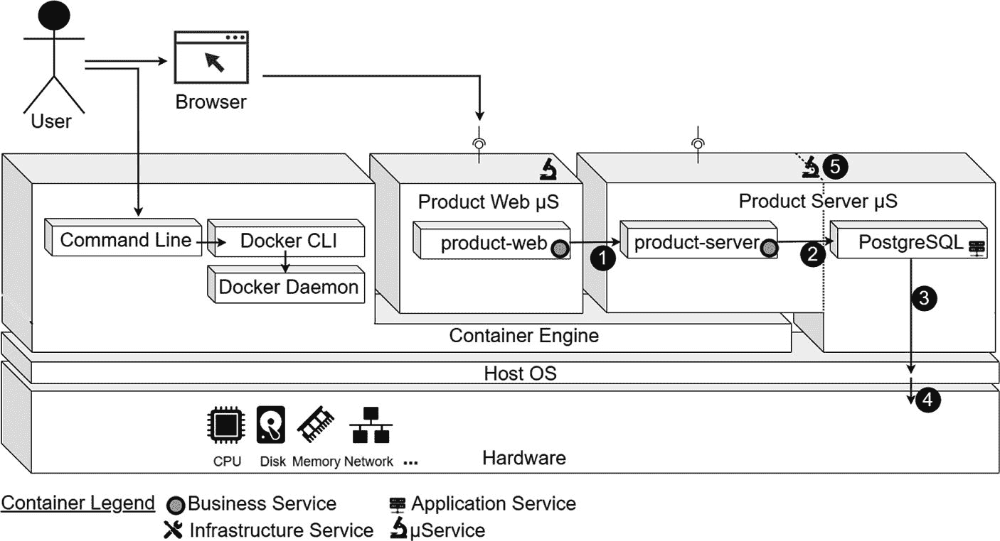

微服务容器拓扑设计。包括用户、浏览器、容器引擎、宿主机操作系统和硬件。

图 8-2

微服务容器拓扑设计

关于图 8-2 中的编号标签，有几点需要注意：

1.  产品 Web 微服务通过容器间的网络连接到产品服务器微服务。

2.  要连接到 PostgreSQL 数据库，仅靠产品服务器微服务使用容器网络是不够的，你需要明确告知产品服务器微服务容器运行 PostgreSQL 数据库的宿主机的 IP 详情。

3.  PostgreSQL 数据库未被容器化，因此它不使用任何形式的虚拟化。相反，PostgreSQL 直接运行在宿主机操作系统上。

4.  PostgreSQL 直接使用宿主机资源，特别是用于数据存储需求。

5.  产品服务器微服务不是一个物理组织；它是产品服务器微服务容器与宿主机上 PostgreSQL 数据库的虚拟分组。

现在让我们看看为什么需要这种部署架构。

像 Docker 这样的编排工具在创建时假设它们是无状态的，这意味着它们在运行期间不应保存任何数据。如果容器是有状态的，那么即使它们是从同一个镜像实例化出来的，也可能导致某些类型的多个容器行为不同。然而，数据库存储状态，因此它们是有状态的。因此，像图 8-2 所示的部署架构是可行的。当然，对于生产环境，这个单一的数据库实例（或集群）将位于公有云中，可能作为 DBaaS（数据库即服务），而不是本地宿主机（假设你使用的是基于云的部署）。


### 理解源代码

本书的源代码可通过图书产品页面在 GitHub 上获取，地址为 [`www.apress.com/9798868805547`](http://www.apress.com/9798868805547)。本示例的代码位于 `ch08\ch08-03` 文件夹中。本示例中的大部分源代码与 `ch03\ch03-01` 中的代码类似，后者已在第 3 章的“使用 PostgreSQL 和 RestTemplate 的微服务”一节中详细解释过。在前两个示例中，你已经看到了多个相互交互的微服务的部署架构，因此，本示例的重点是连接到非容器化的数据库。

### 容器与主机配置中的 PostgreSQL

由于 Postgres 数据库运行在主机系统上，你需要允许运行 Product Server 微服务的 Docker 容器连接到本地 PostgreSQL 数据库。假设你不想让容器与主机共享网络（在运行容器时使用 `--network` host 参数），则需要配置数据库和容器以进行通信。

请参考附录 C 中关于 PostgreSQL 的以下章节：

*   为远程客户端开放 PostgreSQL 服务器
*   在主机上为 Docker 客户端开放 PostgreSQL

这些配置应该足以让运行在主机系统上的 Postgres 数据库与容器化应用协同工作。

### 使用 Dockerfile 运行容器

`ch08\ch08-03` 文件夹包含构建示例所需的 Maven 脚本。第一步，你需要启动 PostgreSQL 服务器。本示例假设你已经有一个正在运行的 PostgreSQL 服务器，并且已按前述方式进行了配置。你需要执行清单 8-23 中的以下命令来启动 PostgreSQL。

```
binildass-MacBook-Pro:~ binil$ pg_ctl -D /Library/PostgreSQL/12/data start
清单 8-23
启动 PostgreSQL 服务器
```

如果你已经按照上一节的要求，完成了让运行在主机系统上的 Postgres 数据库与容器化应用协同工作所需的配置，那么现在你需要告诉容器主机的 IP 地址。你可以使用 `--add-host` 选项传递主机的 IP，这在清单 8-25 中完成。在这种情况下，`host` 是主机机器的名称，它将被添加到容器的 `/etc/hosts` 文件中。在 Docker 容器内部，你可以使用名称 `host` 来连接到主机系统。你需要知道运行 PostgreSQL 的主机的 IP，你可以在清单 8-24 中找到它。

```
binildass-MacBook-Pro:~ binil$ ipconfig getifaddr en0
192.168.29.96
binildass-MacBook-Pro:~ binil$
清单 8-24
查找 PostgreSQL 主机机器的 IP
```

本示例中的 `Dockerfile` 与上一个示例中使用的 `Dockerfile` 相同，如清单 8-5 所示。

接下来，构建微服务和 Docker 镜像，然后运行容器。你将修改本章上一个示例中的脚本。清单 8-25 将这些命令组织成一个脚本。

```
mvn -Dmaven.test.skip=true clean package
docker build  --build-arg JAR_FILE=01-ProductServer/target/*.jar -t ecom/product-server .
docker build  --build-arg JAR_FILE=02-ProductWeb/target/*.jar -t ecom/product-web .
docker network create ecom-network
docker run -d -p 8081:8081 --net=ecom-network --add-host=host:192.168.29.96 --name product-server -e DB_SERVER=host:5432 -e POSTGRES_DB=productdb -e POSTGRES_USER=postgres -e POSTGRES_PASSWORD=postgre ecom/product-server
docker run -d -p 8080:8080 --net=ecom-network --name product-web -e acme.PRODUCT_SERVICE_URL=http://product-server:8081/products ecom/product-web
清单 8-25
构建并运行微服务 Docker 容器的脚本 (ch08\ch08-03\makeandrun.sh)
```

要构建微服务和 Docker 镜像，然后运行容器，你需要执行清单 8-25 中的脚本，如清单 8-26 所示。

```
(base) binildass-MacBook-Pro:ch08-03 binil$ pwd
/Users/binil/binil/code/mac/mybooks/docker-03/ch08/ch08-03
(base) binildass-MacBook-Pro:ch08-03 binil$ eval $(minikube docker-env)
(base) binildass-MacBook-Pro:ch08-03 binil$ sh makeandrun.sh
[INFO] Scanning for projects...
[INFO] --------------------------------------------------
[INFO] Reactor Build Order:
[INFO]
[INFO] Ecom-Product-Server-Microservice    [jar]
[INFO] Ecom-Product-Web-Microservice       [jar]
[INFO] Ecom                                [pom]
[INFO]
...
Sending build context to Docker daemon  83.36MB
Step 1/5 : FROM openjdk:8-jdk-alpine
---> a3562aa0b991
...
Successfully tagged ecom/product-server:latest
...
Successfully tagged ecom/product-web:latest
3b852d90e2b71ac7f5c5a2a49d445c7daa3a37d9a695efd316f3c89107c
c89e8b5749fe45c235280d03a666de4fce9c7a7ddb46a147bc507b92c06
71e9c4b442275a4645009d046a506289271dd48a86b83d83683b13d5721
(base) binildass-MacBook-Pro:ch08-03 binil$
清单 8-26
执行 Docker 容器构建和运行命令
```

要列出系统上当前拥有的所有容器，请执行 `docker ps` 命令，如清单 8-27 所示。

```
(base) binildass-MacBook-Pro:~ binil$ docker ps
CONTAINER ID   IMAGE                 COMMAND                  CREATED         STATUS          PORTS                     NAMES
71e9c4b44227   ecom/product-web      "java -jar /ecom.jar"   3 minutes ago   Up 3 minutes   0.0.0.0:8080->8080/tcp    product-web
c89e8b5749fe   ecom/product-server   "java -jar /ecom.jar"   3 minutes ago   Up 3 minutes   0.0.0.0:8081->8081/tcp    product-server
...
(base) binildass-MacBook-Pro:ch08-01 binil$
清单 8-27
列出 Docker 容器

注意清单 8-27 中的容器 ID。你可以使用这些 ID 来查看日志，如清单 8-28 所示。

```
(base) binildass-MacBook-Pro:~ binil$ docker logs --follow c89e8b5749fe
.   ____          _            __ _ _
/\\ / ___'_ __ _ _(_)_ __  __ _ \ \ \ \
( ( )\___ | '_ | '_| | '_ \/ _` | \ \ \ \
\\/  ___)| |_)| | | | | || (_| |  ) ) ) )
'  |____| .__|_| |_|_| |_\__, | / / / /
=========|_|==============|___/=/_/_/_/
:: Spring Boot ::                (v3.2.0)
...
Creating 2 new products in DB during initialization
Hibernate: insert into product (code, prodname, price, title) values (?, ?, ?, ?)
Hibernate: insert into product (code, prodname, price, title) values (?, ?, ?, ?)
2022-05-30 07:18:02 INFO  InitializationComponent.init:74 - End
2022-05-30 07:18:04 INFO  StartupInfoLogger.logStarted:61 - Started EcomProductMicroserviceApplication in 13.101 seconds (JVM running for 15.006)
清单 8-28
查看 Product Server 容器日志
```

清单 8-28 显示了 Product Server 容器日志。类似地，清单 8-29 显示了 Product Web 容器日志。

```
(base) binildass-MacBook-Pro:~ binil$ docker logs --follow 71e9c4b44227
...
2022-05-30 07:18:00 INFO  StartupInfoLogger.logStarted:61 - Started EcomProductMicroserviceApplication in 8.835 seconds (JVM running for 10.646)
清单 8-29
查看 Product Web 容器日志
```

一旦容器启动并运行，你就可以测试应用程序了。


### 测试微服务容器

由于两个微服务均已启动并运行，您可以访问 Product Web 微服务。但是，如附录 E 所述，您必须先获取 Minikube 的 IP 地址。请参见代码清单 8-30。

```
(base) binildass-MacBook-Pro:ch07-02 binil$ minikube ip
192.168.64.5
(base) binildass-MacBook-Pro:ch07-02 binil$
代码清单 8-30
查找 Minikube IP
```

现在，您可以使用浏览器，通过由 Minikube IP 构成的 URL 来访问 Product Web 微服务（见图 8-3）。

`http://192.168.64.5:8080/product.html`

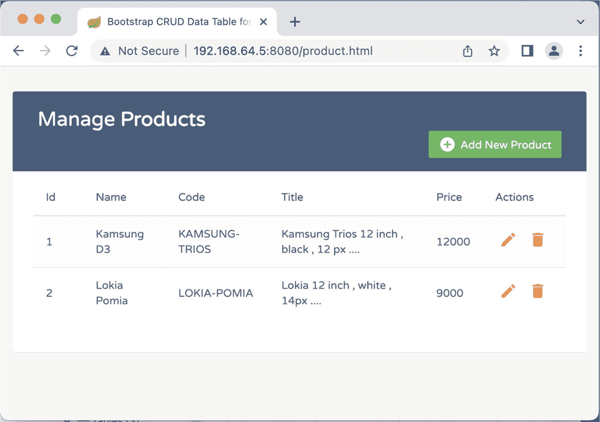

一张标题为“管理产品”的截图，包含以下选项：ID、名称、代码、标题、价格、操作。

图 8-3

使用浏览器访问微服务容器

请参考第 1 章中“使用 UI 测试微服务”一节来测试 Product Web 微服务容器。在测试微服务时，请持续观察日志窗口。

您可以向应用程序添加新产品进行测试，如图 8-4 所示。

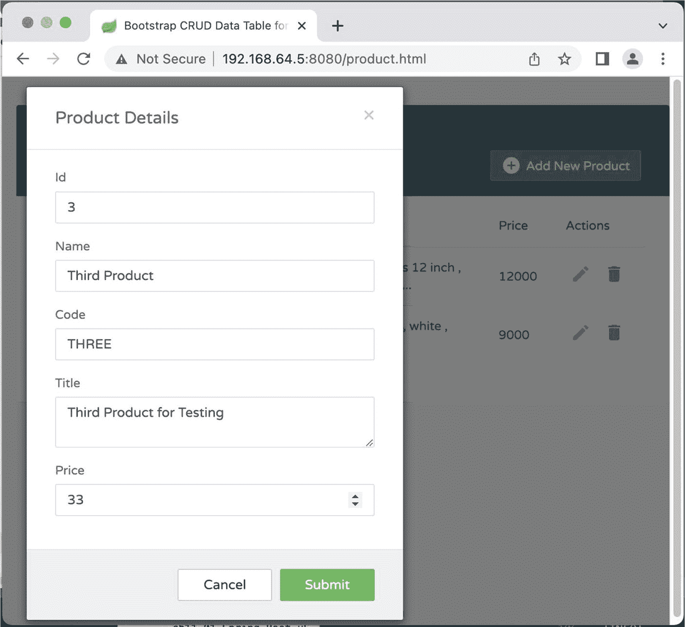

一张标题为“产品详情”的截图，包含以下字段：ID、名称、代码、标题、价格。

图 8-4

添加新产品以测试微服务

刷新浏览器以查看新添加的产品，如图 8-5 所示。

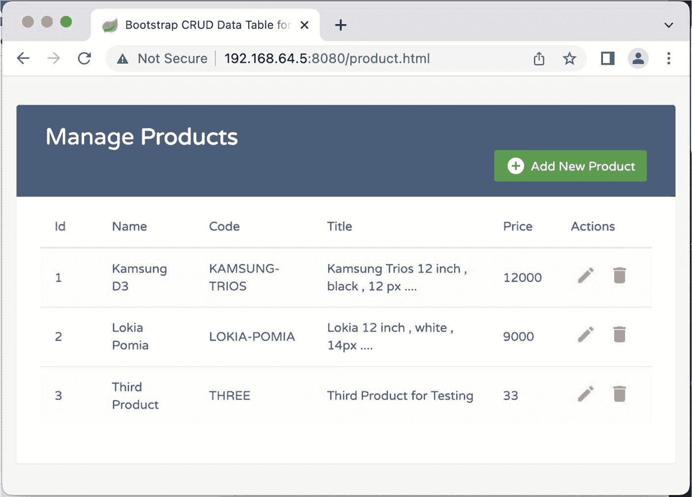

一张标题为“管理产品”的截图，包含以下字段：ID、名称、代码、标题、价格和操作。

图 8-5

刷新浏览器以查看新添加的产品

为了确保一切按预期进行，并且您的 Product Server 微服务确实已将数据持久化到主机上的 PostgreSQL 数据库中，您现在可以检查 PostgreSQL 数据库。关于如何使用 `pgAdmin` 与 PostgreSQL 数据库交互，请参考附录 C 中“使用 pgAdmin 在 PostgreSQL 中创建数据库”一节。您可以在图 8-6 中看到这一点。

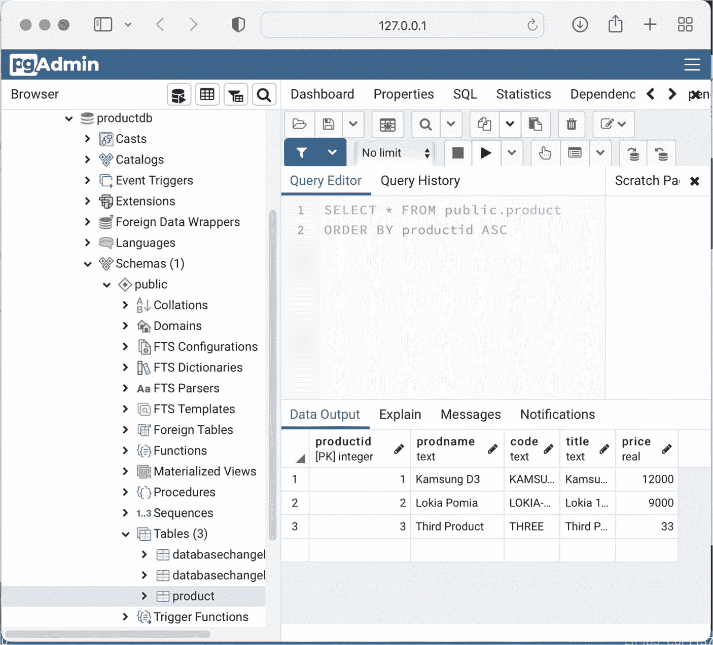

一张标题为“admin”的截图，包含以下文件夹：语言、模式、公共、产品。其中“产品”文件夹已被选中。

图 8-6

使用 pgAdmin 查看新添加的产品

完成测试过程后，您可以停止并移除微服务容器，并清理环境。环境清理已通过脚本自动化，如代码清单 8-31 所示。

```
mvn -Dmaven.test.skip=true clean
docker stop product-web
docker stop product-server
docker rm product-web
docker rm product-server
docker rmi -f ecom/product-web
docker rmi -f ecom/product-server
docker network rm ecom-network
代码清单 8-31
自动化环境清理的脚本 (ch08\ch08-03\clean.sh)
```

您可以执行此脚本来停止并移除微服务容器，并清理环境。请参见代码清单 8-32。

```
(base) binildass-MacBook-Pro:ch08-03 binil$ sh clean.sh
[INFO] Scanning for projects...
...
product-web
product-server
product-web
product-server
Untagged: ecom/product-web:latest
...
Untagged: ecom/product-server:latest
...
ecom-network
(base) binildass-MacBook-Pro:ch08-03 binil$
代码清单 8-32
停止微服务容器并清理环境
```

## 容器中的微服务与 PostgreSQL

您已经了解到，将有状态的应用（包括数据库）部署在 Docker 容器之外是更好的做法，因为容器在设计上更擅长处理无状态操作。然而，在某些用例中，您可能希望将数据库放在容器中，例如在快速测试的场景下。在本节中，您将学习如何修改上一节的示例，使其完全部署在容器基础设施中。

### 设计容器拓扑

对于当前设计，您需要对图 8-1 所示的基于容器的部署拓扑进行微调，并将 MongoDB 替换为 PostgreSQL。如图 8-7 所示。Product Web 和 Product Server 微服务被容器化，而 Product Server 微服务将连接到一个同样以容器形式部署的 PostgreSQL 数据库。


一张图表展示了微服务的容器部署拓扑。它包括用户、浏览器、容器引擎、主机操作系统和硬件。

图 8-7

微服务的容器部署拓扑

在此，Product Web 和 Product Server 容器提供业务服务，而 PostgreSQL 容器则提供用于持久化状态的应用程序服务。

### 理解源代码

本书的源代码可通过图书产品页面在 GitHub 上获取，网址为 [`www.apress.com/9798868805547`](http://www.apress.com/9798868805547)。本示例的代码组织在 `ch08\ch08-04` 文件夹内。此示例中的源代码与第 3 章“使用 PostgreSQL 和 RestTemplate 的微服务”一节中详细解释的 `ch03\ch03-01` 非常相似。您也在上一个示例中看到了使用 PostgreSQL 数据库的多个交互微服务的部署模式。本节将专门探讨如何连接到容器化的 PostgreSQL 数据库。

从容器化的微服务连接到容器化的 PostgreSQL 服务器相当直接，因此在单独运行容器时几乎不需要做任何更改。您将在下一节中了解这一点。


### 使用 Dockerfile 运行容器

`ch08\ch08-04` 文件夹包含构建示例所需的 Maven 脚本。第一步，你需要启动 PostgreSQL 服务器。本例使用的 `Dockerfile` 与前三个示例中的 `Dockerfile` 相同，如代码清单 8-5 所示。

接下来，构建微服务和 Docker 镜像，然后运行容器。你将修改本章上一个示例中的脚本。代码清单 8-33 将这些命令组织成一个脚本。

```
mvn -Dmaven.test.skip=true clean package
docker build  --build-arg JAR_FILE=01-ProductServer/target/*.jar -t ecom/product-server .
docker build  --build-arg JAR_FILE=02-ProductWeb/target/*.jar -t ecom/product-web .
docker network create ecom-network
docker run -d --net=ecom-network --name postgres-docker -e POSTGRES_DB=productdb -e POSTGRES_USER=postgres -e POSTGRES_PASSWORD=postgre -p 5432:5432 -d postgres:15.3-alpine3.18
docker run -d -p 8081:8081 --net=ecom-network --name product-server -e DB_SERVER=postgres-docker:5432 -e POSTGRES_DB=productdb -e POSTGRES_USER=postgres -e POSTGRES_PASSWORD=postgre ecom/product-server
docker run -d -p 8080:8080 --net=ecom-network --name product-web -e acme.PRODUCT_SERVICE_URL=http://product-server:8081/products ecom/product-web
代码清单 8-33
构建并运行微服务 Docker 容器的脚本 (ch08\ch08-04\makeandrun.sh)
```

本节仅解释 PostgreSQL 服务器的 Docker Run 命令，因为其余命令已解释过。

```
docker run -d --net=ecom-network --name postgres-docker -e POSTGRES_DB=productdb -e POSTGRES_USER=postgres -e POSTGRES_PASSWORD=postgre -p 5432:5432 -d postgres:9.6-alpine
```

其作用如下：

*   第一行从 Docker Hub 拉取 Postgres Docker 镜像。

*   然后设置 `POSTGRES_DB`，这是一个可选的环境变量，用于为镜像启动时创建的默认数据库定义不同的名称。如果未指定，将使用 `POSTGRES_USER` 的值。

*   接着设置 `POSTGRES_USER`，这是一个可选的环境变量，与 `POSTGRES_PASSWORD` 结合使用，用于设置用户及其密码。此变量将创建具有超级用户权限的指定用户，以及一个同名的数据库（我已覆盖该名称）。如果未指定，将使用默认用户 `postgres`。

*   然后设置 `POSTGRES_PASSWORD`，这是使用 PostgreSQL 镜像所必需的环境变量。它不能为空或未定义。此环境变量设置 PostgreSQL 的超级用户密码。默认超级用户由 `POSTGRES_USER` 环境变量定义。

*   它将 Docker 容器命名为（`--name`）`postgres-docker`。

*   它将容器的内部 `5432` 端口映射到外部 `5432` 端口，以便你可以从外部访问。

*   然后它允许在后台运行 Docker 容器（`-d`）。

如果你想使用 GUI 应用程序（如 pgAdmin、psql 等）进入数据库，现在应该可以做到了。

你可以构建微服务和 Docker 镜像，然后运行容器，如代码清单 8-34 所示。

```
(base) binildass-MacBook-Pro:ch08-01 binil$ pwd
/Users/binil/binil/code/mac/mybooks/docker-03/ch08/ch08-04
(base) binildass-MacBook-Pro:ch08-04 binil$ sh makeandrun.sh
[INFO] Scanning for projects...
[INFO] -------------------------------------------------
[INFO] Reactor Build Order:
[INFO]
[INFO] Ecom-Product-Server-Microservice                [jar]
[INFO] Ecom-Product-Web-Microservice                   [jar]
[INFO] Ecom                                            [pom]
[INFO]
...
Sending build context to Docker daemon  82.32MB
Step 1/5 : FROM openjdk:8-jdk-alpine
...
Successfully tagged ecom/product-server:latest
...
Successfully tagged ecom/product-web:latest
e5f38c5b37460b3889e284a7d1ccb4f7c32f6147516f81b90d26a8fbeb8
Unable to find image 'postgres:9.6-alpine' locally
9.6-alpine: Pulling from library/postgres
59bf1c3509f3: Pull complete
...
Status: Downloaded newer image for postgres:9.6-alpine
72d0bc450b9057b7c21bcd30ad3dffc4a1e04fd79415b9cd254057785cf
e309c7db0b1f72f96bf8ba19999f0e471aaff47cce056e8d757a3d3713a
f624b4b3fd732135948d61b23c07d31c54c07e7bc5e370a57485e7cfd7b
(base) binildass-MacBook-Pro:ch08-04 binil$
代码清单 8-34
Dockerfile 构建和运行命令
```

要列出系统上当前拥有的所有容器，请执行 `docker ps` 命令，如代码清单 8-35 所示。

```
(base) binildass-MacBook-Pro:~ binil$ docker ps
CONTAINER ID   IMAGE                 COMMAND                    CREATED         STATUS         PORTS                    NAMES
f624b4b3fd73   ecom/product-web      "java -jar /ecom.jar"      2 minutes ago   Up 2 minutes   0.0.0.0:8080->8080/tcp   product-web
e309c7db0b1f   ecom/product-server   "java -jar /ecom.jar"      2 minutes ago   Up 2 minutes   0.0.0.0:8081->8081/tcp   product-server
72d0bc450b90   postgres:9.6-alpine   "docker-entrypoint.s..."   2 minutes ago   Up 2 minutes   0.0.0.0:5432->5432/tcp   postgres-docker
...
(base) binildass-MacBook-Pro:~ binil$
代码清单 8-35
列出 Docker 容器
```

请注意代码清单 8-35 中的容器 ID。你可以使用这些 ID 查看日志，如代码清单 8-36 和 8-37 所示。

```
(base) binildass-MacBook-Pro:~ binil$ docker logs --follow e309c7db0b1f
.   ____          _            __ _ _
/\\ / ___'_ __ _ _(_)_ __  __ _ \ \ \ \
( ( )\___ | '_ | '_| | '_ \/ _` | \ \ \ \
\\/  ___)| |_)| | | | | || (_| |  ) ) ) )
'  |____| .__|_| |_|_| |_\__, | / / / /
=========|_|==============|___/=/_/_/_/
:: Spring Boot ::                (v3.2.0)
...
Creating 2 new products in DB during initialization
Hibernate: insert into product (code, prodname, price, title) values (?, ?, ?, ?)
Hibernate: insert into product (code, prodname, price, title) values (?, ?, ?, ?)
2022-05-30 10:29:35 INFO  InitializationComponent.init:74 - End
2022-05-30 10:29:37 INFO  StartupInfoLogger.logStarted:61 - Started EcomProductMicroserviceApplication in 12.887 seconds (JVM running for 15.075)
...
代码清单 8-36
产品服务器容器日志
```

代码清单 8-36 显示了产品服务器容器的日志。注意，在数据库中插入了两行作为初始数据。类似地，代码清单 8-37 显示了产品 Web 容器的日志。

```
(base) binildass-MacBook-Pro:~ binil$ docker logs --follow f624b4b3fd73
...
2022-05-30 10:29:34 INFO  StartupInfoLogger.logStarted:61 - Started EcomProductMicroserviceApplication in 8.81 seconds (JVM running for 10.568)
...
代码清单 8-37
产品 Web 容器日志
```

一旦容器启动并运行，你就可以测试应用程序了。


### 测试微服务容器

由于微服务和数据库容器现已启动并运行，您可以访问 Product Web 微服务。但是，如附录 E 所述，您需要先获取 minikube 的 IP 地址。请参见清单 8-38。

```
(base) binildass-MacBook-Pro:ch07-02 binil$ minikube ip
192.168.64.5
(base) binildass-MacBook-Pro:ch07-02 binil$
清单 8-38
查找 Minikube IP
```

现在，您可以使用浏览器，通过由 Minikube IP 构成的 URL 来访问 Product Web 微服务。

`http://192.168.64.5:8080/product.html`

请参考第 1 章中“使用 UI 测试微服务”一节来测试 Product Web 微服务容器。在测试微服务时，请持续观察日志窗口。

您还可以使用 `psql` 终端访问 Docker 容器中的 PostgreSQL 服务器。请参考附录 C 中“使用 psql 对 PostgreSQL 服务器运行命令”一节，以了解各种终端命令的概述。请参见清单 8-39。

```
(base) binildass-MacBook-Pro:~ binil$ docker exec -it postgres-docker bash
bash-5.1# psql -U postgres
psql (9.6.24)
Type "help" for help.
postgres=# \list
List of databases
Name    |  Owner   | Encoding |  Collate   |   Ctype    |
-----------+----------+----------+------------+------------+-
postgres  | postgres | UTF8     | en_US.utf8 | en_US.utf8 |
productdb | postgres | UTF8     | en_US.utf8 | en_US.utf8 |
template0 | postgres | UTF8     | en_US.utf8 | en_US.utf8 |
postgres=CTc/postgres
(4 rows)
postgres=# \conninfo
You are connected to database "postgres" as user "postgres" via socket in "/var/run/postgresql" at port "5432".
postgres=# \c productdb
You are now connected to database "productdb" as user "postgres".
productdb=# \conninfo
You are connected to database "productdb" as user "postgres" via socket in "/var/run/postgresql" at port "5432".
productdb=# select * from product;
productid |  prodname   | code    |    title               | price
-----------+-------------+---------------+------------------
1 | Kamsung D3  | KAMSUNG | Kamsung Trios 12 in..
2 | Lokia Pomia | LOKIA   | Lokia 12 inch..
(2 rows)
清单 8-39
psql 终端访问
```

在验证了 Product Server 微服务在 PostgreSQL 容器中创建的初始数据后，您可以向应用程序添加一个新商品用于测试，如图 8-8 所示。

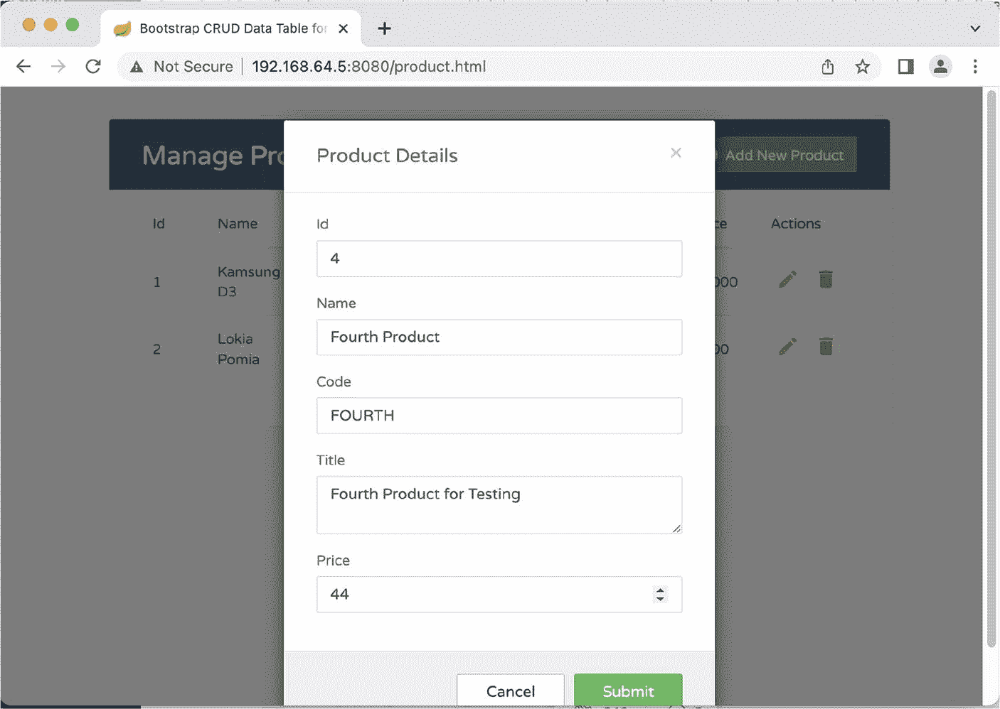

一张标题为“商品详情”的截图包含以下字段：ID、名称、代码、标题、价格。

图 8-8

添加新商品以测试微服务

刷新浏览器以查看新添加的商品。您也可以刷新终端查询，使用 `psql` 终端访问 Docker 容器中的 PostgreSQL 服务器，如清单 8-40 所示。

```
productdb=# select * from product;
productid |  prodname   | code    |    title               | price
-----------+-------------+---------------+------------------
1 | Kamsung D3  | KAMSUNG | Kamsung Trios 12 in..
2 | Lokia Pomia | LOKIA   | Lokia 12 inch..
3 | Fourth Prod | FOURTH  | Fourth Product for
(3 rows)
productdb=# \q
bash-5.1# exit
exit
(base) binildass-MacBook-Pro:~ binil$
清单 8-40
psql 终端访问
```

如清单 8-40 所示，您可以验证通过 Product Web 微服务 Web 应用新插入的商品已安全持久化到容器内的 PostgreSQL 数据库中。完成微服务测试后，您可以使用清单 8-41 中的脚本来停止并移除微服务容器，并清理环境。

```
mvn -Dmaven.test.skip=true clean
docker stop product-web
docker stop product-server
docker stop postgres-docker
docker rm product-web
docker rm product-server
docker rm postgres-docker
docker rmi -f ecom/product-web
docker rmi -f ecom/product-server
docker network rm ecom-network
清单 8-41
自动化环境清理脚本 (ch08\ch08-04\clean.sh)
```

您可以执行清单 8-42 中的脚本来停止并移除微服务容器，并清理环境。

```
(base) binildass-MacBook-Pro:ch08-04 binil$ sh clean.sh
...
product-web
product-server
postgres-docker
product-web
product-server
postgres-docker
Untagged: ecom/product-web:latest
...
Untagged: ecom/product-server:latest
...
ecom-network
(base) binildass-MacBook-Pro:ch08-04 binil$
清单 8-42
停止微服务容器并清理环境

现在您已经看到了许多示例，探索了将容器与 SQL 和 NoSQL 数据库结合使用的不同场景。接下来，本章将把这一学习扩展到另一个方面——容器存储。

## 容器存储

第 7 章解释了 Docker 容器文件系统主要是只读的，并且默认情况下是临时性的。当您通过运行容器来启动 Docker 镜像时，您是在底层文件堆栈之上放置了一个读写层。您可以随意创建、修改和删除文件。只有将更改提交回镜像时，这些更改才会持久化。这对于存储和检索本应是非易失性的数据来说非常不方便。一个更好的选择是将容器的生命周期与其管理的数据分离开来。您可以将它们分开保存，这样应用程序管理（或使用）的数据就不会被销毁或绑定到容器的生命周期，从而可以被重用。

将长期存在的数据与容器分离是通过卷（volumes）来实现的，本节将对此进行探讨。卷不属于联合文件系统，因此写入操作是即时且尽可能快的，并且无需提交任何更改。由于卷位于联合文件系统之外，它们作为主机文件系统上的普通目录和文件存在。

### 卷

卷是持久化 Docker 容器生成和使用数据的首选机制。在持久化长期数据方面，卷优于容器的可写层。卷不会增加使用它们的容器的大小，并且卷的内容存在于给定容器的生命周期之外。

有两种创建卷的方法：

*   在运行镜像时指定 `-v` 选项。
*   在启动容器之前，使用命令创建一个卷。

我们先来看第一种选项，您也将在下一个示例中使用它。

```
docker run  -d -it -p 27017:27017 --name mongo  --net=ecom-network -v /Users/binil/dockerbook/ch08-05/mongodata:/data/db  mongo:3.6
```

您可以使用 `-v` 开关创建一个卷，并指示 Docker 将主机目录 `/Users/binil/dockerbook/ch08-05/mongodata` 映射到正在运行的 Mongo 容器中的 `/data/db` 目录。

让我们直接看一个示例。

## 使用文件挂载的微服务和 MongoDB 容器

本示例复用了第 3 章中“使用 MongoDB 和 CrudRepository 的微服务”一节中的相同微服务。使用了相同的两个微服务——一个消费者微服务和一个提供者微服务，它们通过 REST 协议相互通信。提供者微服务还与 MongoDB 进行交互。与本章前两个 MongoDB 示例不同，本示例使用卷来持久化 Mongo 数据库数据。整体设计请参考第 2 章中的图 2-1。


### 设计容器拓扑结构

本示例复用了本章第一个示例中定义的部署模式。但有一个变化——这里将使用卷挂载。请参见图 8-9。

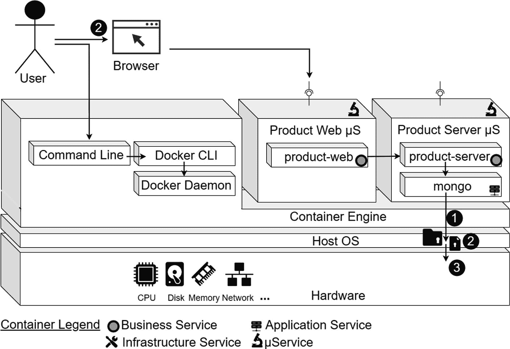

该图展示了微服务的容器部署拓扑结构，包括用户、浏览器、容器引擎、主机操作系统和硬件。

图 8-9

微服务的容器部署拓扑结构

本示例使用了 `-v` 选项，以便在此修改后的示例中，主机操作系统上的目录可供容器使用。以这种方式创建的卷是一种映射目录。该映射目录将可供容器使用，并且也可以从主机操作系统访问。映射目录中已有的任何文件在容器内部同样可用；它们在映射步骤中不会被删除。参考图 8-9 中的编号标签，您可能会注意到以下几点：

*   由于您使用了 `-v` 选项映射了卷，因此来自 Mongo 容器的持久化相关命令被委托给了文件系统抽象层。

*   操作系统的文件系统抽象层可以将 Mongo 数据库的数据组织成文件、目录和其他相关结构。

*   在硬件层，使用存储设备来保留数字数据，该设备可以是磁盘、半导体设备等。

由于本示例使用了容器外部的持久化机制，因此您还必须验证持久化到存储中的数据是否具备超越容器生命周期的能力。

### 理解源代码

本书的源代码可通过图书产品页面在 GitHub 上获取，网址为 [`www.apress.com/9798868805547`](http://www.apress.com/9798868805547)。本示例的代码位于 `ch08\ch08-05` 文件夹中。本示例中的大部分源代码与 `ch03\ch03-02` 类似，后者已在第 3 章中详细解释。此外，本示例的源代码与本章的前两个示例类似。与本章的第二个示例相比，变化在于您将使用 `-v` 选项，以便主机操作系统上的目录可供容器使用。

### 使用 Dockerfile 运行容器

`ch08\ch08-05` 文件夹包含构建示例所需的 Maven 脚本。第一步，您需要启动 PostgreSQL 服务器。本示例的 `Dockerfile` 与前四个示例中使用的 `Dockerfile` 相同，如代码清单 8-5 所示。

接下来，构建微服务和 Docker 镜像，然后运行容器。您需要修改上一个示例中的脚本。代码清单 8-43 显示了组织成单个脚本的命令。

```
mvn -Dmaven.test.skip=true clean package
docker build  --build-arg JAR_FILE=02-ProductWeb/target/*.jar -t ecom/product-web .
docker build  --build-arg JAR_FILE=01-ProductServer/target/*.jar -t ecom/product-server .
docker network create ecom-network
docker pull mongo:3.6
docker run  -d -it -p 27017:27017 --name mongo  --net=ecom-network -v /Users/binil/dockerbook/ch08-05/mongodata:/data/db  mongo:3.6
docker run -d -p 8081:8081  --net=ecom-network --name product-server ecom/product-server
docker run -d -p 8080:8080  --net=ecom-network --name product-web ecom/product-web
代码清单 8-43
构建并运行微服务 Docker 容器的脚本 (ch08\ch08-05\makeandrun.sh)
```

这里需要额外注意的一点是，增加了一个步骤来创建用于存放数据文件的文件夹，并将该文件夹指定为 Mongo 容器的卷。由于本示例在 Minikube 中使用 Docker，因此该文件夹会在 Minikube 虚拟机中自动创建。请记住，当您停止 Minikube 时，所有这些都将丢失。如果您在宿主机上使用 Docker，也可以手动创建此文件夹。

代码清单 8-44 展示了如何构建微服务和 Docker 镜像，然后运行容器。

```
(base) binildass-MacBook-Pro:ch08-05 binil$ eval $(minikube docker-env)
(base) binildass-MacBook-Pro:ch08-05 binil$ sh makeandrun.sh
...
Successfully tagged ecom/product-web:latest
Successfully tagged ecom/product-server:latest
(base) binildass-MacBook-Pro:ch08-05 binil$
代码清单 8-44
Dockerfile 构建和运行命令
```

要列出系统上当前拥有的所有容器，请执行 `docker ps` 命令，如代码清单 8-45 所示。

```
(base) binildass-MacBook-Pro:~ binil$ docker ps
CONTAINER ID   IMAGE                COMMAND                    CREATED          STATUS          PORTS                      NAMES
5e4c172b0e83   ecom/product-web     "java -jar /ecom.jar"      50 seconds ago   Up 50 seconds   0.0.0.0:8080->8080/tcp     product-web
24f369a0359d   ecom/product-server  "java -jar /ecom.jar"      51 seconds ago   Up 50 seconds   0.0.0.0:8081->8081/tcp     product-server
bf4ccedcd7b4   mongo:3.6            "docker-entrypoint.s..."   51 seconds ago   Up 51 seconds   0.0.0.0:27017->27017/tcp   mongo
...
(base) binildass-MacBook-Pro:~ binil$
代码清单 8-45
列出 Docker 容器

现在您可以检查数据文件夹是否已创建以及如何创建。由于 Docker 环境位于 Minikube 内部，因此您需要检查 Minikube 虚拟机中的这个数据文件夹，如代码清单 8-46 所示。


```
(base) binildass-MacBook-Pro:~ binil$ minikube ssh
_             _
_         _ ( )           ( )
___ ___  (_)  ___  (_)| |/')  _   _ | |_      __
/' _ ` _ `\| |/' _ `\| || , <  ( ) ( )| '_`\  /'__`\
| ( ) ( ) || || ( ) || || |\`\ | (_) || |_) )(  ___/
(_) (_) (_)(_)(_) (_)(_)(_) (_)`\___/'(_,__/'`\____)
$ ls /Users/binil/dockerbook/ch08-05/mongodata
WiredTiger                                diagnostic.data
WiredTiger.lock                           index-1--7375842170208132306.wt
WiredTiger.turtle                         index-10--7375842170208132306.wt
WiredTiger.wt                             index-3--7375842170208132306.wt
WiredTigerLAS.wt                          index-5--7375842170208132306.wt
_mdb_catalog.wt                           index-6--7375842170208132306.wt
collection-0--7375842170208132306.wt  index-8--7375842170208132306.wt
collection-2--7375842170208132306.wt  journal
collection-4--7375842170208132306.wt  mongod.lock
collection-7--7375842170208132306.wt  sizeStorer.wt
collection-9--7375842170208132306.wt  storage.bson
$
清单 8-46
检查已创建的卷文件夹
```

可以看到，Mongo 容器在启动时已使用所需的一切完成了初始化。

请注意清单 8-45 中的容器 ID。你可以使用这些 ID 查看日志，如清单 8-47 所示。

```
(base) binildass-MacBook-Pro:~ binil$ docker logs --follow 24f369a0359d
...
2022-05-30 13:55:07 INFO  InitializationComponent.init:47 - Start...
2022-05-30 13:55:07 DEBUG InitializationComponent.init:51 - Deleting all existing data on start...
2022-05-30 13:55:07 DEBUG InitializationComponent.init:56 - Creating initial data on start...
2022-05-30 13:55:08 INFO  InitializationComponent.init:105 - End
2022-05-30 13:55:12 INFO  StartupInfoLogger.logStarted:61 - Started EcomProductMicroserviceApplication in 9.964 seconds (JVM running for 11.603)
...
清单 8-47
产品服务器容器日志
```

清单 8-47 显示了产品服务器容器的日志。请注意，有两行数据作为初始数据插入到数据库中。类似地，清单 8-48 显示了产品 Web 容器的日志。

```
(base) binildass-MacBook-Pro:~ binil$ docker logs --follow 5e4c172b0e83
...
2022-05-30 13:55:11 INFO  StartupInfoLogger.logStarted:61 - Started EcomProductMicroserviceApplication in 8.539 seconds (JVM running for 10.306)
...
清单 8-48
产品 Web 容器日志
```

一旦容器启动并运行，你就可以测试应用程序了。

### 测试微服务容器

由于微服务和数据库容器已启动并运行，你可以访问产品 Web 微服务。但是，如附录 E 所述，你必须先获取 minikube 的 IP 地址。请参见清单 8-49。

```
(base) binildass-MacBook-Pro:ch07-02 binil$ minikube ip
192.168.64.5
(base) binildass-MacBook-Pro:ch07-02 binil$
清单 8-49
查找 Minikube IP
```

现在，你可以使用浏览器，通过由 Minikube IP 构成的 URL 来访问产品 Web 微服务。

`http://192.168.64.5:8080/product.html`

请参考第 1 章中“使用 UI 测试微服务”一节来测试产品 Web 微服务容器。在测试微服务时，请持续观察日志窗口。

现在，停止正在运行的 Mongo 容器，如清单 8-50 所示。

```
(base) binildass-MacBook-Pro:~ binil$ docker rm -f bf4ccedcd7b4
清单 8-50
移除 Mongo 容器
```

接下来，你可以启动一个新的 Mongo 容器，并挂载相同的卷，如清单 8-51 所示。

```
(base) binildass-MacBook-Pro:~ binil$ docker run -d -it -p 27017:27017 --name mongo  --net=ecom-network -v /Users/binil/dockerbook/ch08-05/mongodata:/data/db  mongo:3.6
清单 8-51
运行一个新的 Mongo 容器
```

列出新创建的 Mongo 容器，并确认它是一个新容器（具有新的 ID）。请参见清单 8-52。

```
(base) binildass-MacBook-Pro:~ binil$ docker ps
CONTAINER ID   IMAGE       COMMAND                    CREATED          STATUS          PORTS                       NAMES
a3b84961b0a7   mongo:3.6   "docker-entrypoint.s..."   11 seconds ago   Up 10 seconds   0.0.0.0:27017->27017/tcp    mongo
...
(base) binildass-MacBook-Pro:~ binil$
清单 8-52
列出 Docker 容器
```

现在，使用浏览器，通过由 Minikube IP 构成的 URL 来访问产品 Web 微服务。

`http://192.168.64.5:8080/product.html`

现在，你可以验证由先前 Mongo 容器创建和管理的数据是否仍然安全。完成微服务测试后，你可以停止并移除微服务容器，并清理环境。请参见清单 8-53。

```
(base) binildass-MacBook-Pro:ch08-05 binil$ sh clean.sh
[INFO] Scanning for projects...
[INFO] -------------------------------------------------
[INFO] Reactor Build Order:
[INFO]
[INFO] Ecom-Product-Server-Microservice     [jar]
[INFO] Ecom-Product-Web-Microservice        [jar]
[INFO] Ecom                                 [pom]
[INFO]
...
product-web
product-server
mongo
product-web
product-server
mongo
Untagged: ecom/product-web:latest
...
Untagged: ecom/product-server:latest
...
ecom-network
(base) binildass-MacBook-Pro:ch08-05 binil$
清单 8-53
停止微服务容器并清理环境
```

## 总结

你在第 7 章开始了容器和 Docker 之旅，在本章中，你通过探索相互交互的微服务容器和数据库容器的多种组合，扩展了所学知识。还剩下一件事，那就是消息代理的容器化。这将在下一章中介绍，届时我将演示如何使用 Docker Compose 来运行 Kafka 容器。不要错过下一章，因为届时你将掌握在容器上构建严肃微服务应用所需的基本工具。


# 9. 编排多服务容器

随着微服务应用发展到包含多个服务时，我们通常需要某种方式来定义这些服务之间的相互依赖和互联选项。同时，我们也需要一种优雅的方式来管理这些服务。像 Docker Compose 和 Kubernetes 这样的工具已迅速成为满足这类需求的常见选择。本章将介绍 Docker Compose，下一章则会介绍 Kubernetes。

Docker Compose 用于轻松定义和运行多容器的 Docker 应用或微服务。在前两章中，你已经学习了如何有效利用 Docker 将应用容器化。对于微服务而言，任何简单的应用都可能包含十几个微服务，这比传统的单个 `.ear` 或单个 `.jar` 这类单体部署要多得多。借助 Docker Compose，你可以使用一个 YAML 文件来配置微服务应用的服务。然后，只需一条命令，就能从 YAML 配置中创建并启动所有服务。本章涵盖以下概念。

*   Docker Compose 快速入门

*   将微服务和数据库容器编排在一起

*   向编排中添加消息代理容器

*   演示跨编排容器的完整 CRUD 功能

如前所述，目标是逐步增加复杂度来讲解和演示各个方面。因此，代码示例将从上一章结束的地方开始。最好在阅读本章之前先阅读第 8 章，这样你就能熟悉运行容器基础设施的基础知识。如果你想直接开始本章内容，本章也提供了分步说明。

## 介绍 Docker Compose

如前所述，使用 Docker 进行容器化时，管理许多不同的容器很快就会变得繁琐。Docker Compose 是一个帮助你克服这个问题并同时处理多个容器的工具。

使用 Docker Compose 进行打包和部署管理基本上是一个三步过程：

1.  使用 Dockerfile 定义应用的环境，以便它可以在任何地方重现。

2.  在 `docker-compose.yml` 中定义组成应用的服务，以便它们可以在隔离的环境中一起运行。

3.  作为最后一步，运行 `docker compose up`，此命令将启动并运行你的整个应用。

下一节将深入探讨这个编排文件的结构。

### Docker Compose YAML

在 Docker Compose 中，你在一个 `docker-compose.yml` 配置文件中声明规则。这些 YAML 规则既易于人类阅读，又针对机器进行了优化，因此足以让你声明多个容器的相互依赖关系。这有助于你在单个应用的部署场景中管理多个微服务。

在 Docker Compose YAML 文件中，你需要指定 Compose 文件格式的版本、至少一个服务，以及可选的卷和网络。通用格式如清单 9-1 所示。

```
version: "3"
services:
...
...
volumes:
...
networks:
...
清单 9-1
Docker Compose YAML 格式
```

如前几章所述，卷是主机计算机上磁盘空间的物理区域，在主机和容器之间，甚至在容器之间共享。换句话说，卷是主机中的一个共享目录，可以被有权访问的容器看到。

网络定义了容器之间以及容器与主机之间的通信路径和规则。共享或公共的网络区域将使容器的服务能够相互发现，而私有区域则会将它们隔离到虚拟沙箱中。

服务通常是相关容器服务的逻辑分组。例如，可以声明一个具有不同层的 Web 应用，如清单 9-2 所示。

```
services:
app:
image: my-js-app
...
backend:
image: my-boot-app
...
db:
image: mongo
...
清单 9-2
Docker Compose 编排典型的三层服务

Docker Compose 中还有更多可用的结构，按照本书的主题，你将通过实践来学习。

### Docker Compose 使用场景

尽管有更多工具可用于管理容器化应用，但 Docker Compose 在以下几种场景中仍有其用途，例如：

*   **开发环境**：Docker Compose 的最佳用例之一是帮助开发者“快速上手”，这对于项目的新成员非常有用。Docker Compose 可以将多页的“开发者入门指南”简化为一个机器可读的 Compose 文件和几个命令，任何人都可以通过一个按钮启动。Docker Compose 文件提供了一种方式来记录和配置应用的所有服务依赖项（数据库、消息队列、缓存、Web 服务 API、表示层应用等）。使用 Compose 命令行工具，你可以通过一个 `docker-compose up` 命令为每个依赖项创建并启动一个或多个容器。

*   **自动化测试环境**：测试自动化是任何持续部署或持续集成流程的重要组成部分，Docker Compose 提供了一种便捷的方式来创建和销毁为你的测试套件自定义定义的测试环境。

你可以通过 Compose 文件中的几个命令来创建和销毁这些环境：

```
docker-compose up
./run_your tests
docker-compose down
```

如前所述，你将通过实践来获得最佳学习效果，所以让我们直接进入具体的编码示例。

## 使用 PostgreSQL 容器编排微服务

第 8 章解释了为什么最好将包括数据库在内的状态处理应用部署在 Docker 容器之外，因为容器被设计为在无状态操作中更高效。但在某些用例中，你可能仍然希望将数据库放在容器内，例如在快速测试的情况下。在第 8 章中，你看到了一个完整的微服务与 PostgreSQL 数据库交互的示例，所有内容都在 Docker 容器中。请参考第 2 章的图 2-1 了解其整体设计。在本节中，你将修改该示例，使其使用 Docker Compose 完全部署在容器基础设施中。

### 编排容器拓扑

对于此编排，你需要一个完整的基于容器的部署拓扑，如图 9-1 所示。Product Web 和 Product Server 微服务都已容器化，而 Product Server 微服务将连接到同样部署在容器内的 PostgreSQL 数据库。

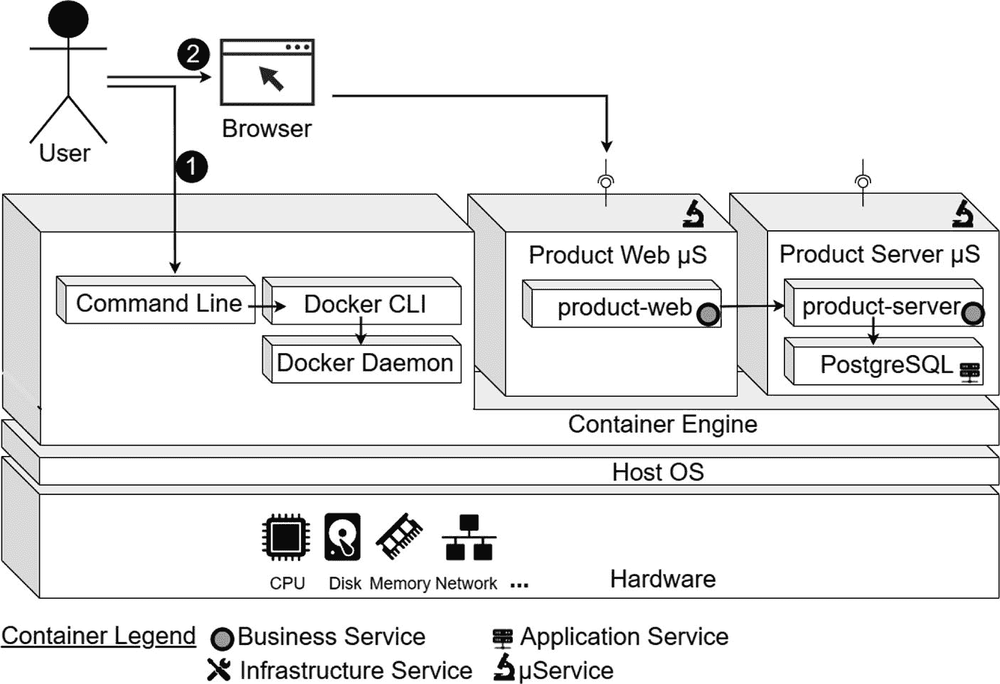

此图展示了完整的基于容器的部署。它从用户开始，依次是浏览器、命令行、Docker CLI、Docker 守护进程、容器引擎、主机操作系统和硬件。

图 9-1

编排微服务容器

在这里，Product Web 和 Product Server 容器提供业务服务，而 PostgreSQL 容器则提供用于持久化状态的应用程序服务。


### 理解源代码

本书的源代码可通过图书产品页面在 GitHub 上获取，地址为 [`www.apress.com/9798868805547`](http://www.apress.com/9798868805547)。本示例的代码组织在 `ch09\ch09-01` 文件夹中。本示例中的大部分源代码与 `ch03\ch03-01` 类似，后者已在第 3 章“使用 PostgreSQL 和 RestTemplate 的微服务”一节以及第 8 章“容器中的微服务和 PostgreSQL”一节中详细解释。你在上一章中已经看到了这些使用 PostgreSQL 数据库的多个交互微服务的部署模式，因此本节将专门研究如何使用 Docker Compose 来组合它们。

从容器化的微服务连接到容器化的 PostgreSQL 服务器相当直接，因此在单独运行容器时几乎不需要做任何更改。下一节将探讨这些更改。

列表 9-3 展示了本示例的源代码组织结构。

```
ch09-01
├── 01-ProductServer
│   ├── Dockerfile
│   ├── pom.xml
│   └── src
│       └── ...
├── 02-ProductWeb
│   ├── Dockerfile
│   ├── pom.xml
│   └── src
│       └── ...
├── README.txt
├── clean.sh
├── docker-compose.yml
├── makeandrun.sh
└── pom.xml
列表 9-3
示例 09-01 源代码组织结构
```

`ch09-01` 文件夹内示例的源代码组织结构的简洁表示如列表 9-3 所示。这里值得关注的是 `docker-compose.yml` 以及放置在两个项目文件夹内的 Dockerfile。

```
version: "3"
services:
db:
image: "postgres:9.6-alpine"
container_name: postgres-docker
volumes:
- product-data:/var/lib/postgresql/data
ports:
- 5432:5432
environment:
- POSTGRES_DB=productdb
- POSTGRES_USER=postgres
- POSTGRES_PASSWORD=postgre
networks:
- ecom-network
server:
build: ./01-ProductServer
image: ecom/product-server
container_name: product-server
ports:
- "8081:8081"
depends_on:
- "db"
environment:
- DB_SERVER=postgres-docker:5432
- POSTGRES_DB=productdb
- POSTGRES_USER=postgres
- POSTGRES_PASSWORD=postgre
networks:
- ecom-network
web:
build: ./02-ProductWeb
image: ecom/product-web
container_name: product-web
depends_on:
- "server"
ports:
- "8080:8080"
environment:
- acme.PRODUCT_SERVICE_URL=http://product-server:8081/products
networks:
- ecom-network
volumes:
product-data:
networks:
ecom-network:
列表 9-4
Docker Compose YAML 文件 (ch09\ch09-01\docker-compose.yml)
```

这里定义了三个服务，每个服务都是应用程序内计算资源的抽象定义，可以独立于其他组件进行扩展/替换。每个服务都由一个容器支持，并由平台根据复制要求和放置约束来运行。这些由容器支持的每个服务都由一个 Docker 镜像和一组运行时参数定义。一个服务内的所有容器都使用这些参数以相同方式创建。

你需要通过读取其 Dockerfile 从源代码构建服务器和 Web 的镜像。你可以使用 `build` 关键字，并将 Dockerfile 的路径作为值传递。当你指定 `./01-ProductServer` 和 `./02-ProductWeb` 时，你是在说明相对于当前目录（即 `docker-compose.yml` 所在的位置），再进入这些提到的文件夹中的每一个以找到相应的 Dockerfile。

当服务所需的镜像（如 `db` 的情况）已经（由你或其他人）发布到 Docker Hub 或其他 Docker 注册表中时，可以通过 `image` 属性来调用它，指定镜像名称和标签。但是，当你能够像 `server` 和 `web` 的情况那样，将镜像名称与 `build` 属性结合使用时，你可以命名该镜像，使其对其他服务可用。

要从主机访问容器，必须通过 `ports` 关键字声明性地暴露服务的端口，就像你对 `web` 使用 `8080`、对 `server` 使用 `8081`、对 `db` 使用 `5432` 一样。如果需要，这也允许你选择在主机上以不同的方式暴露端口。

这三个容器——`web`、`server` 和 `db`——在由 Docker Compose 隐式创建或通过配置创建的网络中相互通信，就像你在示例中所做的那样。如果你已通过 `expose` 关键字使端口可访问，则同一网络上的服务只需通过容器名称和端口（例如 `product-server:8081`）引用另一个服务即可与之通信。

Docker 管理匿名卷和命名卷，自动将它们挂载到主机上自生成的目录中。`product-data` 是一个命名卷，可供 `db` 服务访问。`/var/lib/postgresql/data` 是它映射到的路径，该路径将由 `postgres-docker` 容器使用。

你可能还需要在这些服务之间创建依赖链，以便某些服务在其他服务之前加载（并在之后卸载）。你可以通过 `depends_on` 关键字实现此结果。你希望 `db` 在加载 `server` 之前加载，因为你在 `server` 中有初始化脚本，将初始加载数据插入到 `db` 中。

在 Compose 中提供所需的环境变量很容易。你可以定义静态和动态环境变量，后者使用 `${}` 表示法。例如：`DB_SERVER=postgres-docker:5432`。

如前所述，相对于当前目录（`docker-compose.yml` 所在的位置），Dockerfile 位于此处：

```
build: ./01-ProductServer
```

列表 9-5 显示了此文件。

```
FROM maven:3.6.1-jdk-8-slim AS build
RUN mkdir -p /workspace
WORKDIR /workspace
COPY pom.xml /workspace
COPY src /workspace/src
RUN mvn -f pom.xml clean package
FROM openjdk:8-alpine
COPY --from=build /workspace/target/*.jar app.jar
EXPOSE 8081
ENTRYPOINT ["java","-jar","app.jar"]
列表 9-5
Dockerfile (ch09\ch09-01\01-ProductServer\Dockerfile)
```

这里使用了多阶段构建文件。使用多阶段构建，你可以在 Dockerfile 中使用多个 `FROM` 语句。每个 `FROM` 指令可以使用不同的基础镜像，并且每个指令都开始一个新的构建阶段。你可以选择性地将工件从一个阶段复制到另一个阶段。

你可以通过在 `FROM` 指令中添加 `AS <NAME>` 来命名你的阶段。本示例中使用了名称 `build`。此名称可以在第二阶段的 `COPY` 指令中使用。这意味着即使稍后重新排列 Dockerfile 中的指令，`COPY` 也不会中断。


### 使用 Docker Compose 运行容器

`ch09\ch09-04` 文件夹包含构建和运行这些示例所需的脚本。第一步是启动一个 Minikube 单节点 Kubernetes 集群，以便启动 Docker 守护进程。有关容器命令的快速参考，请参阅附录 E。参见代码清单 9-6。

```
(base) binildass-MacBook-Pro:~ binil$ pwd
/Users/binil
(base) binildass-MacBook-Pro:~ binil$ minikube start
minikube v1.25.2 on Darwin 12.4
...
Done! kubectl is now configured to use "minikube" cluster and "default" namespace by default
(base) binildass-MacBook-Pro:~ binil$
代码清单 9-6
启动 Minikube
```

你还需要在工作终端中设置 Minikube 环境变量。

注意

对于本章中的所有示例，我假设如果你使用的是 Minikube 单节点 Kubernetes 集群，则前面两个连接到 Docker 守护进程的步骤已经执行。

代码清单 9-7 展示了一个简单的脚本，其中包含一条命令，该命令构建并运行包含所有已定义容器的完整应用程序。

```
docker-compose up
代码清单 9-7
构建并运行微服务 Docker 容器的脚本 (ch09\ch09-01\makeandrun.sh)
```

你可以构建微服务和 Docker 镜像，然后运行容器，如代码清单 9-8 所示。

```
(base) binildass-MacBook-Pro:ch09-01 binil$ pwd
/Users/binil/binil/code/mac/mybooks/docker-03/ch09/ch09-01
(base) binildass-MacBook-Pro:~ binil$ eval $(minikube docker-env)
(base) binildass-MacBook-Pro:ch09-01 binil$ sh makeandrun.sh
[+] Running 0/2
⠿ web Error
⠿ server Error
[+] Building 58.4s (16/20)
=> [ecom/product-server internal] load build context
=> => transferring context: 5.06kB
=> [ecom/product-web internal] load build context
=> => transferring context: 4.92kB
=> CACHED [ecom/product-web build 2/6] RUN mkdir -p /workspace
=> CACHED [ecom/product-web build 3/6] WORKDIR /workspace
=> CACHED [ecom/product-server build 4/6] COPY pom.xml /workspace
=> [ecom/product-server build 5/6] COPY src /workspace/src
=> CACHED [ecom/product-web build 4/6] COPY pom.xml /workspace
=> [ecom/product-web build 5/6] COPY src /workspace/src
=> [ecom/product-server build 6/6] RUN mvn -f pom.xml clean package
=> => # erxml/jackson/core/jackson-core/2.11.4/jackson-core-2.11.4.pom (4.9 kB
=> => #  at 6.2 kB/s)
=> => # Downloading from central: https://repo.maven.apache.org/maven2/com/fas
=> => # terxml/jackson/datatype/jackson-datatype-jdk8/2.11.4/jackson-datatype-
=> => # jdk8-2.11.4.pom
=> => # Progress (1): 2.2 kB
=> [ecom/product-web build 6/6] RUN mvn -f pom.xml clean package         56.6s
=> => # Downloaded from central: https://repo.maven.apache.org/maven2/com/fast
=> => # erxml/jackson/datatype/jackson-datatype-jsr310/2.11.4/jackson-datatype
=> => # -jsr310-2.11.4.pom (4.5 kB at 6.0 kB/s)
=> => # Downloading from central: https://repo.maven.apache.org/maven2/com/fas
=> => # terxml/jackson/module/jackson-module-parameter-names/2.11.4/jackson-mo
=> => # dule-parameter-names-2.11.4.pom
代码清单 9-8
执行 Docker Compose Up 命令
```

如果你是第一次运行此命令，将首先使用 Maven 构建微服务。如代码清单 9-8 所示。`docker-compose up` 命令的完成情况如代码清单 9-9 所示。

```
(base) binildass-MacBook-Pro:ch09-01 binil$ docker-compose up
[+] Running 0/2
⠿ web Error
⠿ server Error
[+] Building 381.2s (21/21) FINISHED
...
=> [ecom/product-web stage-1 2/2] COPY --from=build /workspace/target/*.
=> [ecom/product-server] exporting to image
=> => exporting layers
=> => writing image sha256:76407061fc0df84b795e7aa818e4eca8189ba2d4e76f6
=> => naming to docker.io/ecom/product-web
=> => writing image sha256:05dc3a6cbb0248e6353beac61240a7f81155c47264644
=> => naming to docker.io/ecom/product-server
=> [ecom/product-server stage-1 2/2] COPY --from=build /workspace/target
[+] Running 4/2
⠿ Network ch09-01_ecom-network  Created
⠿ Container postgres-docker     Created
⠿ Container product-server      Created
⠿ Container product-web         Created
Attaching to postgres-docker, product-server, product-web
postgres-docker  |
postgres-docker  | PostgreSQL Database directory appears to contain a database; Skipping initialization
...
product-server   |   .   ____          _            __ _ _
product-server   |  /\\ / ___'_ __ _ _(_)_ __  __ _ \ \ \ \
product-server   | ( ( )\___ | '_ | '_| | '_ \/ _` | \ \ \ \
product-server   |  \\/  ___)| |_)| | | | | || (_| |  ) ) ) )
product-server   |   '  |____| .__|_| |_|_| |_\__, | / / / /
product-server   |  =========|_|==============|___/=/_/_/_/
product-server   |  :: Spring Boot ::                (v3.2.0)
product-server   |
product-server   | 2022-06-04 13:15:31 INFO  StartupInfoLogger.logStarting:55 - Starting EcomProductMicroserviceApplication v0.0.1-SNAPSHOT using Java 1.8.0_212 on 67bec9c678c1 with PID 1 (/app.jar started by root in /)
...
product-web      |
product-web      |   .   ____          _            __ _ _
product-web      |  /\\ / ___'_ __ _ _(_)_ __  __ _ \ \ \ \
product-web      | ( ( )\___ | '_ | '_| | '_ \/ _` | \ \ \ \
product-web      |  \\/  ___)| |_)| | | | | || (_| |  ) ) ) )
product-web      |   '  |____| .__|_| |_|_| |_\__, | / / / /
product-web      |  =========|_|==============|___/=/_/_/_/
product-web      |  :: Spring Boot ::                (v3.2.0)
product-web      |
...
product-web      | 2022-06-04 13:15:50 INFO  StartupInfoLogger.logStarted:61 - Started EcomProductMicroserviceApplication in 20.779 seconds (JVM running for 24.665)
product-server   | 2022-06-04 13:15:52 INFO  InitializationComponent.init:45 - Start
...
product-server   | Hibernate: insert into product (code, prodname, price, title) values (?, ?, ?, ?)
product-server   | Hibernate: insert into product (code, prodname, price, title) values (?, ?, ?, ?)
product-server   | 2022-06-04 13:15:53 INFO  InitializationComponent.init:74 - End
product-server   | 2022-06-04 13:15:59 INFO  StartupInfoLogger.logStarted:61 - Started EcomProductMicroserviceApplication in 30.06 seconds (JVM running for 33.926)
代码清单 9-9
Docker Compose Up 命令执行完毕
```

代码清单 9-9 显示，由 `maven build` 生成的 `.jar` 文件被用于生成 Docker 镜像，随后所有三个容器（`postgres-docker`、`product-server` 和 `product-web`）都启动了。

在我基于 Minikube 的 Mac Docker 环境中，第一次尝试构建示例时遇到了以下错误：

```
"exec: "docker-credential-desktop.exe": executable file not found in $PATH, out:"
```

我将 `~/.docker/config.json` 中的 `credsStore` 改为了 `credStore`：

```
(base) binildass-MacBook-Pro:~ binil$ sudo nano ~/.docker/config.json
```

进行此更改，然后按 Control+X 退出。输入 `Y` 保存修改后的缓冲区。进行这些更改后，你还需要打开一个新的终端（当然，还要设置 `minikube env`）。

一旦容器启动并运行，你就可以测试应用程序了。


### 测试微服务容器

由于微服务和数据库容器现已启动并运行，您可以访问 Product Web 微服务。但是，如附录 E 所述，您需要先获取 Minikube IP。请参见清单 9-10。

```
(base) binildass-MacBook-Pro:ch07-02 binil$ minikube ip
192.168.64.5
(base) binildass-MacBook-Pro:ch07-02 binil$
清单 9-10
查找 Minikube IP
```

现在，您可以使用浏览器，通过由 Minikube IP 构成的 URL 来访问 Product Web 微服务。

`http://192.168.64.5:8080/product.html`

请参考第 1 章中标题为“使用 UI 测试微服务”的部分来测试 Product Web 微服务容器。

在测试微服务时，请持续观察日志窗口。要确定容器 ID 并持续观察日志窗口，请参考第 8 章。

完成微服务测试后，您可以停止并移除微服务容器，并清理环境。要停止容器，请使用以下命令：

```
docker-compose down
```

该命令包含在清单 9-11 中。

```
docker-compose down
docker rmi -f ecom/product-web
docker rmi -f ecom/product-server
清单 9-11
停止微服务 Docker 容器的脚本 (ch09\ch09-01\clean.sh)
```

您可以执行此脚本来停止并移除微服务容器并清理环境，如清单 9-12 所示。

```
(base) binildass-MacBook-Pro:ch09-01 binil$ pwd
/Users/binil/binil/code/mac/mybooks/docker-03/ch09/ch09-01
(base) binildass-MacBook-Pro:ch09-01 binil$ sh clean.sh
[+] Running 4/4
⠿ Container product-web         Removed 0.3s
⠿ Container product-server      Removed 0.3s
⠿ Container postgres-docker     Removed 0.2s
⠿ Network ch09-01_ecom-network  Removed 0.0s
Untagged: ecom/product-web:latest
Deleted: sha256:76407061fc0df84b795e7aa818e4eca8189ba2d4e76f6cc9adbb1d34aa14a1c3
Untagged: ecom/product-server:latest
Deleted: sha256:05dc3a6cbb0248e6353beac61240a7f81155c4726464457eec808fa06f08bebd
(base) binildass-MacBook-Pro:ch09-01 binil$
清单 9-12
停止微服务容器并清理环境

```

在执行 `clean.sh` 脚本时，您还可以在服务器端控制台中观察日志，如清单 9-13 所示。

```
...
product-web exited with code 143
product-web exited with code 0
product-server exited with code 143
product-server exited with code 0
...
postgres-docker  | LOG:  database system is shut down
postgres-docker exited with code 0
(base) binildass-MacBook-Pro:ch09-01 binil$
清单 9-13
清理环境时的服务器端日志
```

## 使用 MongoDB 容器编排微服务

此示例再次复用了第 3 章中标题为“使用 MongoDB 和 CrudRepository 的微服务”部分的微服务。它使用了相同的两个微服务——一个消费者和一个提供者微服务，它们通过 REST 协议相互通信。提供者微服务还与 MongoDB 进行交互。第 8 章展示了一个与 MongoDB 数据库交互的完整微服务示例，所有组件都在 Docker 容器中。整体设计请参考第 2 章中的图 2-1。在本节中，您将修改该示例，使其使用 Docker Compose 完全部署在容器基础设施中。

### 编排容器拓扑

对于此编排，您需要一个完整的基于容器的部署拓扑，如图 9-2 所示。Product Web 和 Product Server 微服务被容器化，Product Server 微服务将连接到一个同样部署在容器内的 MongoDB 数据库。

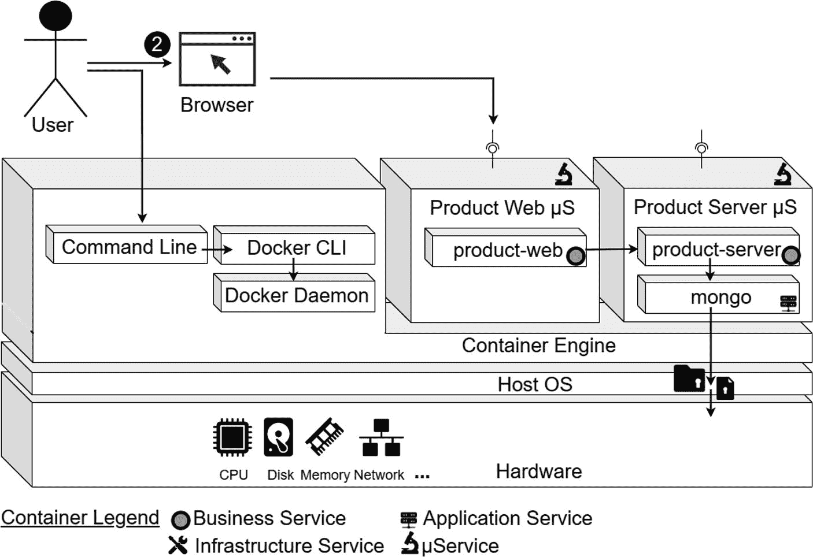

该图展示了微服务容器。它包括 Product Web 微服务、Product Server 微服务、容器引擎、主机操作系统和硬件。

图 9-2

编排微服务容器

同样，Product Web 和 Product Server 容器提供业务服务，而 PostgreSQL 容器则提供用于持久化状态的应用程序服务。

### 理解源代码

本书的源代码可通过图书产品页面在 GitHub 上获取，网址为 [`www.apress.com/9798868805547`](http://www.apress.com/9798868805547)。此示例的代码组织在 `ch09\ch09-02` 文件夹内。此示例中的大部分源代码与 `ch03\ch03-02` 类似，后者已在第 3 章“使用 MongoDB 和 CrudRepository 的微服务”部分以及第 8 章“使用文件挂载的微服务和 MongoDB 容器”部分详细解释过。您在上一章中已经看到了这些多个相互交互的微服务的基于容器的部署模式，因此本节将专门研究如何使用 Docker Compose 编排它们。

让我们从查看 `docker-compose.yml` 文件开始。描述 `web` 服务的部分与清单 9-4 中的相同，因此此处不再重复。其余配置如清单 9-14 所示。

```
version: "3"
services:
db:
image: mongo:3.6
container_name: mongo
ports:
- "27017:27017"
volumes:
- "db-data:/data/db"
networks:
- ecom-network
server:
build: ./01-ProductServer
image: ecom/product-server
container_name: product-server
ports:
- "8081:8081"
depends_on:
- "db"
networks:
- ecom-network
environment:
- spring.data.mongodb.uri=mongodb://192.168.64.5:27017/test
web:
...
volumes:
db-data:
driver: local
driver_opts:
o: bind
type: none
device: /home/docker/binil/mongodata
networks:
ecom-network:
清单 9-14
Docker Compose YAML 文件 (ch09\ch09-02\docker-compose.yml)
```

此处所有部分都在前面的示例中展示并解释过。请注意，此示例使用了一个命名卷 `db-data`，它使用了主机上的一个挂载文件夹。您可以复用为第 8 章示例创建的文件夹。该文件夹会在 Minikube VM 中自动创建，因为我在第 8 章的示例中使用了 Minikube 中的 Docker。如果您在创建此文件夹时遇到困难，一个简单的技巧是执行第 8 章的示例，并且在不重启 Minikube 的情况下尝试构建此示例。请记住，当您停止 Minikube 时，所有这些都将丢失。或者，您可以创建一个新文件夹，这将在下一节的第一步中解释。如果您在主机上使用 Docker，也可以手动创建此文件夹，但需要在主机上进行。


### 使用 Docker Compose 运行容器

`ch09\ch09-02` 文件夹包含构建和运行示例所需的脚本。第一步是启动一个 Minikube 单节点 Kubernetes 集群，以便启动 Docker 守护进程。有关容器命令的快速参考，请参阅附录 E。

假设 Minikube 单节点 Kubernetes 集群已启动并正在运行，下一步需要为你在清单 9-14 的 `docker-compose.yml` 中配置的 Mongo 数据创建这个新文件夹。此操作在清单 9-15 中完成。

```
(base) binildass-MacBook-Pro:mongodata binil$ minikube ssh
_             _
_         _ ( )           ( )
___ ___  (_)  ___  (_)| |/')  _   _ | |_      __
/' _ ` _ `\| |/' _ `\| || , <  ( ) ( )| '_`\  /'__`\
| ( ) ( ) || || ( ) || || |\`\ | (_) || |_) )(  ___/
(_) (_) (_)(_)(_) (_)(_)(_) (_)`\___/'(_,__/'`\____)
$ pwd
/home/docker
$ cd /home/docker
$ mkdir -p binil/mongodata
$ ls
binil
$ cd binil/mongodata/
$ ls
$ pwd
/home/docker/binil/mongodata
清单 9-15
创建用作 Mongo 数据卷挂载的本地文件夹
```

清单 9-16 展示了如何构建微服务和 Docker 镜像，然后运行容器。

```
(base) binildass-MacBook-Pro:ch09-02 binil$ pwd
/Users/binil/binil/code/mac/mybooks/docker-03/ch09/ch09-02
(base) binildass-MacBook-Pro:ch09-02 binil$ sh makeandrun.sh
[+] Running 0/2
⠿ server Error
⠿ web Error
[+] Building 324.8s (21/21) FINISHED
...
=> [ecom/product-server build 6/6] RUN mvn -f pom.xml clean package
=> [ecom/product-web build 6/6] RUN mvn -f pom.xml clean package
=> [ecom/product-web stage-1 2/2] COPY --from=build /workspace/target/*.
=> [ecom/product-server] exporting to image
=> => exporting layers
=> => writing image sha256:dc88e223b86907868d6e9ed2bd9837295b26afed551f3
=> => naming to docker.io/ecom/product-web
=> => writing image sha256:d1ec2ce63b03cb6df7eaeee522fe271c0ac24d76b8f47
=> => naming to docker.io/ecom/product-server
=> [ecom/product-server stage-1 2/2] COPY --from=build /workspace/target
[+] Running 4/2
⠿ Network ch09-02_ecom-network  Created
⠿ Container mongo               Created
⠿ Container product-server      Created
⠿ Container product-web         Created
Attaching to mongo, product-server, product-web
mongo           | 2022-06-04T14:57:12.181+0000 I CONTROL  [initandlisten] MongoDB starting : pid=1 port=27017 dbpath=/data/db 64-bit host=872d52dbcb22
...
product-web     | 2022-06-04 14:57:24 INFO  StartupInfoLogger.logStarted:61 - Started EcomProductMicroserviceApplication in 9.386 seconds (JVM running for 11.156)
product-server  | 2022-06-04 14:57:25 INFO  StartupInfoLogger.logStarted:61 - Started EcomProductMicroserviceApplication in 10.909 seconds (JVM running for 12.848)
清单 9-16
执行 Docker Compose Up 命令
```

容器启动并运行后，你可以测试应用程序。

### 测试微服务容器

由于微服务和数据库容器现已启动并运行，你可以访问 Product Web 微服务。但是，如附录 E 所述，你必须先获取 Minikube IP。请参见清单 9-17。

```
(base) binildass-MacBook-Pro:ch07-02 binil$ minikube ip
192.168.64.5
(base) binildass-MacBook-Pro:ch07-02 binil$
清单 9-17
查找 Minikube IP
```

现在，你可以使用浏览器，通过由 Minikube IP 构成的 URL 访问 Product Web 微服务。

`http://192.168.64.5:8080/product.html`

请参考第 1 章中“使用 UI 测试微服务”一节来测试 Product Web 微服务容器。

在测试微服务时，请持续观察日志窗口。要确定容器 ID 并持续观察日志窗口，请参考第 8 章。

完成微服务测试后，你可以停止并移除微服务容器，并清理环境。要停止容器，你需要使用以下命令：

```
docker-compose down
```

该命令已包含在清单 9-18 的脚本中。

```
docker-compose down
docker rmi -f ecom/product-web
docker rmi -f ecom/product-server
清单 9-18
停止微服务 Docker 容器的脚本 (ch09\ch09-02\clean.sh)
```

你可以执行此脚本来停止并移除微服务容器并清理环境，如清单 9-19 所示。

```
(base) binildass-MacBook-Pro:ch09-02 binil$ sh clean.sh
[+] Running 3/3
[+] Running 4/4oduct-web         Removed
⠿ Container product-web         Removed
⠿ Container product-server      Removed
⠿ Container mongo               Removed
⠿ Network ch09-02_ecom-network  Removed
Untagged: ecom/product-web:latest
Deleted: sha256:dc88e223b86907868d6e9ed2bd9837295b26afed551f37f...
Untagged: ecom/product-server:latest
Deleted: sha256:d1ec2ce63b03cb6df7eaeee522fe271c0ac24d76b8f47be...
(base) binildass-MacBook-Pro:ch09-02 binil$
清单 9-19
停止微服务容器并清理环境
```

至此，示例完成。

至此，你已经看到了两个使用 Docker Compose 的示例。与第 8 章中的类似示例相比，这些示例在容器管理方面有了真正的改进。

在将这项改进添加到你的工具箱之后，现在是时候研究更复杂的场景了，包括更多容器。在下一节中，你将把 Kafka 代理添加到容器组合中。

## 使用 PostgreSQL 和 Kafka 组合微服务

在第 8 章“容器中的微服务和 PostgreSQL”一节中，你看到了一个完整的微服务示例与 PostgreSQL 数据库的交互，所有内容都在 Docker 容器中。本节将向你展示如何修改该示例，以便这些容器可以使用消息中间件 Kafka 相互通信。你还将进行必要的更改，以使用 Docker Compose 在容器基础设施中完全部署所有服务。

### 组合容器拓扑

对于当前设计，你需要一个完整的基于容器的部署拓扑，如图 9-3 所示。Product Web 和 Product Server 微服务被容器化，Product Server 微服务将连接到同样部署在容器内的 PostgreSQL 数据库。Product Web 微服务和 Product Server 微服务之间的所有通信都通过 Kafka 进行。


该图展示了微服务容器。它包括 products web mu S、product server mu S、容器引擎、主机 O S 和硬件。

图 9-3

组合微服务容器

这里，Product Web 和 Product Server 容器提供业务服务，而 Mongo 容器提供用于持久化状态的应用程序服务。Kafka 容器提供基础设施服务，因此它们不作为任何特定（业务）微服务的一部分显示。


### 理解源代码

本书的源代码可通过图书产品页面上的 GitHub 获取，地址为 [`www.apress.com/9798868805547`](http://www.apress.com/9798868805547)。本示例的代码组织在 `ch09\ch09-03` 文件夹中，如代码清单 9-20 所示。本示例中的大部分源代码与 `ch03\ch03-01` 类似，后者已在第 3 章“使用 PostgreSQL 和 RestTemplate 的微服务”一节中详细解释。在第 6 章“基于 PostgreSQL 的 Kafka 上的 CRUD 微服务”一节中，你已经看到了 Product Web 微服务和 Product Server 微服务通过 Kafka 消息通道进行通信所需的代码，因此此处不再重复这些细节。此外，你还在“使用 PostgreSQL 容器组合微服务”一节中看到了基于 Docker Compose 部署的图 9-3 主要部分的拓扑结构。本节将探讨 Kafka 容器及其与其他微服务一起使用 Docker Compose 工具的部署。

代码清单 9-20 展示了本示例的源代码组织结构。

```
ch09-03
├── 01-ProductServer
│   ├── pom.xml
│   └── src
│       └── ...
├── 02-ProductWeb
│   ├── pom.xml
│   └── src
│       └── ...
├── kafka-request-reply-util
│   ├── pom.xml
│   └── src
│       └── ...
├── README.txt
├── clean.sh
├── docker-compose.yml
├── makeandrun.sh
├── pom.xml
├── server.Dockerfile
└── web.Dockerfile
代码清单 9-20
示例 09-03 源代码组织结构
```

`ch09-03` 文件夹内示例的源代码组织结构的简洁表示如代码清单 9-20 所示。`docker-compose.yml`、`server.Dockerfile` 和 `web.Dockerfile` 都放置在父文件夹中，并在代码清单 9-21 的 `docker-compose.yml` 文件中被适当引用。

```
version: "3"
services:
zookeeper:
image: bitnami/zookeeper:latest
container_name: zookeeper
ports:
- '2181:2181'
networks:
- ecom-network
environment:
- ALLOW_ANONYMOUS_LOGIN=yes
kafka:
image: bitnami/kafka:latest
container_name: kafka
ports:
- '9092:9092'
networks:
- ecom-network
environment:
- KAFKA_CFG_ZOOKEEPER_CONNECT=zookeeper:2181
- ALLOW_PLAINTEXT_LISTENER=yes
depends_on:
- zookeeper
db:
image: "postgres:9.6-alpine"
container_name: postgres-docker
volumes:
- product-data:/var/lib/postgresql/data
ports:
- 5432:5432
environment:
- POSTGRES_DB=productdb
- POSTGRES_USER=postgres
- POSTGRES_PASSWORD=postgre
networks:
- ecom-network
server:
build:
context: .
dockerfile: server.Dockerfile
image: ecom/product-server
container_name: product-server
ports:
- "8081:8081"
depends_on:
- "db"
environment:
- DB_SERVER=postgres-docker:5432
- POSTGRES_DB=productdb
- POSTGRES_USER=postgres
- POSTGRES_PASSWORD=postgre
- spring.kafka.bootstrap-servers=kafka:9092
networks:
- ecom-network
web:
build:
context: .
dockerfile: web.Dockerfile
image: ecom/product-web
container_name: product-web
depends_on:
- "server"
ports:
- "8080:8080"
environment:
- spring.kafka.bootstrap-servers=kafka:9092
networks:
- ecom-network
volumes:
product-data:
networks:
ecom-network:
代码清单 9-21
Docker Compose YAML 文件 (ch09\ch09-03\docker-compose.yml)
```

对于 server 和 web 服务，构建脚本 `server.Dockerfile` 和 `web.Dockerfile` 是从 `docker-compose.yml` 的当前上下文中引用的，包括相对文件路径，因此 Docker Compose 在构建过程中会正确找到这些文件。`db`、`web` 和 `server` 的其他方面已在本章的第一个示例中解释过。`zookeeper` 和 `kafka` 是此处配置的两个新容器，这些配置不言自明。

如前所述，相对于当前目录（`docker-compose.yml` 所在的位置），名为 `server.Dockerfile` 的 Dockerfile 位于此处：

```
build:
context: .
dockerfile: server.Dockerfile
```

你现在可以研究这个文件，如代码清单 9-22 所示。

```
FROM maven:3.6.1-jdk-8-slim AS prebuild
RUN mkdir -p /workspace
WORKDIR /workspace
COPY ./kafka-request-reply-util .
RUN mvn clean install
FROM maven:3.6.1-jdk-8-slim AS build
COPY --from=prebuild /root/.m2 /root/.m2
COPY ./01-ProductServer .
RUN mvn clean package
FROM openjdk:8-alpine
COPY --from=build ./target/*.jar app.jar
EXPOSE 8081
ENTRYPOINT ["java","-jar","app.jar"]
代码清单 9-22
Dockerfile (ch09\ch09-03 \server.Dockerfile)
```

这是一个三阶段构建。在第一阶段，你构建 `kafka-request-reply-util`；在第二阶段，你使用该 `.jar` 依赖项进行 Product Server 微服务的 Maven 构建；在第三阶段，你使用 Product Server 微服务的 `.jar` 来构建 Docker 镜像。该镜像根据代码清单 9-21 中 `docker-compose.yml` 文件下的 `server` 服务命名，并运行相应的容器。

Product Web 微服务的 `web.Dockerfile` 文件也有类似的解释，因此此处不再重复。


### 使用 Docker Compose 运行容器

`ch09\ch09-03` 文件夹包含构建和运行示例所需的脚本。第一步是启动一个 Minikube 单节点 Kubernetes 集群，以便启动 Docker 守护进程。有关容器命令的快速参考，请参阅附录 E。

假设 Minikube 单节点 Kubernetes 集群已启动并运行，清单 9-23 中的简单脚本包含一个命令，用于构建并运行包含所有已定义容器的完整应用程序。

```
docker-compose up
清单 9-23
构建并运行微服务 Docker 容器的脚本 (ch09\ch09-03\makeandrun.sh)
```

清单 9-24 到 9-27 构建了微服务和 Docker 镜像，然后运行容器。

```
(base) binildass-MacBook-Pro:ch09-03 binil$ pwd
/Users/binil/binil/code/mac/mybooks/docker-03/ch09/ch09-03
(base) binildass-MacBook-Pro:~ binil$ eval $(minikube docker-env)
(base) binildass-MacBook-Pro:ch09-03 binil$ sh makeandrun.sh
[+] Running 0/2
⠿ web Error
⠿ server Error
[+] Building 145.4s (12/24)
...
=> CACHED [ecom/product-web prebuild 2/5] RUN mkdir -p /workspace
=> CACHED [ecom/product-web prebuild 3/5] WORKDIR /workspace
=> [ecom/product-web prebuild 4/5] COPY ./kafka-request-reply-util .
=> [ecom/product-web prebuild 5/5] RUN mvn clean install
=> => # Downloaded from central: https://repo.maven.apache.org/maven2/org/apac
=> => # he/maven/maven-toolchain/2.0.9/maven-toolchain-2.0.9.pom (3.5 kB at 5.
=> => # 7 kB/s)
...
清单 9-24
Docker Compose Up 命令 – 预构建阶段
```

清单 9-24 显示了构建的开始，其中 `kafka-request-reply-util` 库正在通过 Maven 构建。构建在清单 9-25 中继续进行。

```
(base) binildass-MacBook-Pro:ch09-03 binil$ pwd
/Users/binil/binil/code/mac/mybooks/docker-03/ch09/ch09-03
(base) binildass-MacBook-Pro:ch09-03 binil$ sh makeandrun.sh
...
=> CACHED [ecom/product-server build 2/4] COPY --from=prebuild /root/.m2
=> [ecom/product-server build 3/4] COPY ./01-ProductServer
=> [ecom/product-server build 4/4] RUN mvn clean package
=> => # -build-configuration-parent-11.0.10.Final.pom
=> => # Downloaded from central: https://repo.maven.apache.org/maven2/org/infi
=> => # nispan/infinispan-build-configuration-parent/11.0.10.Final/infinispan-
=> => # build-configuration-parent-11.0.10.Final.pom (13 kB at 23 kB/s)
=> => # Downloading from central: https://repo.maven.apache.org/maven2/org/jbo
=> => # ss/jboss-parent/36/jboss-parent-36.pom
...
清单 9-25
Docker Compose Up 命令 – 构建开始阶段
```

在清单 9-25 中，您可以看到构建 `kafka-request-reply-util` 库生成的 `.jar` 文件被复制到了 `product-server` 和 `product-web` 微服务的构建上下文中，并且这两个微服务都在构建中。构建在清单 9-26 中继续进行。

```
(base) binildass-MacBook-Pro:ch09-03 binil$ pwd
/Users/binil/binil/code/mac/mybooks/docker-03/ch09/ch09-03
(base) binildass-MacBook-Pro:ch09-03 binil$ sh makeandrun.sh
...
=> [ecom/product-web build 4/4] RUN mvn clean package
=> [ecom/product-web stage-2 2/2] COPY --from=build ./target/*.jar app.j
=> [ecom/product-web] exporting to image
=> => exporting layers
=> => writing image sha256:7c979090f142559b149b6b7f1518189fb33a85af0eadd
=> => naming to docker.io/ecom/product-web
清单 9-26
Docker Compose Up 命令 – 构建完成前阶段
```

清单 9-26 几乎完成了 `kafka-request-reply-util` 库以及 `product-server` 和 `product-web` 微服务的打包，并即将进入创建 Docker 镜像的下一个阶段，如清单 9-27 所示。

```
(base) binildass-MacBook-Pro:ch09-03 binil$ pwd
/Users/binil/binil/code/mac/mybooks/docker-03/ch09/ch09-03
(base) binildass-MacBook-Pro:ch09-03 binil$ sh makeandrun.sh
[+] Running 0/2
⠿ web Error                              6.4s
⠿ server Error                           6.4s
[+] Building 480.1s (24/25)
...
⠿ Network ch09-03_ecom-network  Created  0.1s
⠿ Container zookeeper           Created  0.1s
⠿ Container postgres-docker     Created  0.0s
⠿ Container product-server      Created  0.0s
⠿ Container kafka               Created  0.0s
⠿ Container product-web         Created  0.0s
Attaching to kafka, postgres-docker, product-server, product-web, zookeeper
postgres-docker  |
postgres-docker  | PostgreSQL Database directory appears to contain a database; Skipping initialization
...
zookeeper        | zookeeper 12:40:10.68
zookeeper        | zookeeper 12:40:10.68 Welcome to the Bitnami zookeeper container
...
kafka            | [2022-06-05 12:40:16,663] INFO Session establishment complete on server zookeeper/172.19.0.3:2181, session id = 0x1000008b2470000, negotiated timeout = 18000 (org.apache.zookeeper.ClientCnxn)
kafka            | [2022-06-05 12:40:16,667] INFO [ZooKeeperClient Kafka server] Connected. (kafka.zookeeper.ZooKeeperClient)
product-server   |
product-server   |   .   ____          _            __ _ _
product-server   |  /\\ / ___'_ __ _ _(_)_ __  __ _ \ \ \ \
product-server   | ( ( )\___ | '_ | '_| | '_ \/ _` | \ \ \ \
product-server   |  \\/  ___)| |_)| | | | | || (_| |  ) ) ) )
product-server   |   '  |____| .__|_| |_|_| |_\__, | / / / /
product-server   |  =========|_|==============|___/=/_/_/_/
product-server   |  :: Spring Boot ::                (v3.2.0)
product-server   |
...
product-web      |
product-web      |   .   ____          _            __ _ _
product-web      |  /\\ / ___'_ __ _ _(_)_ __  __ _ \ \ \ \
product-web      | ( ( )\___ | '_ | '_| | '_ \/ _` | \ \ \ \
product-web      |  \\/  ___)| |_)| | | | | || (_| |  ) ) ) )
product-web      |   '  |____| .__|_| |_|_| |_\__, | / / / /
product-web      |  =========|_|==============|___/=/_/_/_/
product-web      |  :: Spring Boot ::                (v3.2.0)
product-web      |
...
product-web      | 2022-06-05 12:40:26 INFO  StartupInfoLogger.logStarted:61 - Started EcomProductWebMicroserviceApplication in 10.874 seconds (JVM running for 14.179)
...
product-server   | 2022-06-05 12:40:33 INFO  StartupInfoLogger.logStarted:61 - Started EcomProductServerMicroserviceApplication in 17.581 seconds (JVM running for 21.825)
product-web      | 2022-06-05 12:40:42 INFO  ProductRestController.getAllProducts:77 - Start
product-web      | 2022-06-05 12:40:42 INFO  ProductRestController.getAllProducts:111 - Ending
...
清单 9-27
完成的 Docker Compose Up 命令
```

清单 9-27 显示了五个容器已启动并运行，以及微服务日志，表明它们正在执行来自 Web 浏览器的用户发起的事务。

容器启动并运行后，您可以测试该应用程序。


### 测试微服务容器

当五个容器启动并运行后，你就可以访问 Product Web 微服务了。但是，如附录 E 所述，你需要先获取 Minikube 的 IP 地址。参见清单 9-28。

```
(base) binildass-MacBook-Pro:ch07-02 binil$ minikube ip
192.168.64.5
(base) binildass-MacBook-Pro:ch07-02 binil$
清单 9-28
查找 Minikube IP
```

现在，你可以使用浏览器，通过由 Minikube IP 构成的 URL 来访问 Product Web 微服务。

`http://192.168.64.5:8080/product.html`

请参考第 1 章中“使用 UI 测试微服务”一节，来测试 Product Web 微服务容器。

在测试微服务时，请持续观察日志窗口。关于如何确定容器 ID 并持续观察日志窗口，请参考第 8 章。

测试完微服务后，你可以使用清单 9-29 中的脚本来停止并移除微服务容器，以及清理环境。

```
docker-compose down
docker rmi -f ecom/product-web
docker rmi -f ecom/product-server
清单 9-29
停止微服务 Docker 容器的脚本 (ch09\ch09-03\clean.sh)
```

你可以执行此脚本来停止并移除微服务容器，并清理环境，如清单 9-30 所示。

```
(base) binildass-MacBook-Pro:ch09-01 binil$ pwd
/Users/binil/binil/code/mac/mybooks/docker-03/ch09/ch09-03
(base) binildass-MacBook-Pro:ch09-03 binil$ sh clean.sh
[+] Running 6/5
⠿ Container kafka               Removed   1.1s
⠿ Container product-web         Removed   0.3s
⠿ Container product-server      Removed   0.3s
⠿ Container postgres-docker     Removed   0.1s
⠿ Container zookeeper           Removed   0.5s
⠿ Network ch09-03_ecom-network  Removed   0.0s
Untagged: ecom/product-server:latest
Deleted: sha256:41ff845a1401143729e9979ad6239d5298bb8556536d0fd...
Untagged: ecom/product-web:latest
Deleted: sha256:7c979090f142559b149b6b7f1518189fb33a85af0eaddae...
(base) binildass-MacBook-Pro:ch09-03 binil$
清单 9-30
停止微服务容器并清理环境
```

在执行 `clean.sh` 脚本时，你也可以在服务端控制台观察日志，如清单 9-31 所示。

```
...
product-web exited with code 143
product-web exited with code 0
...
product-server exited with code 143
kafka            | [2022-06-05 12:44:34,332] INFO [KafkaServer id=1001] shut down completed (kafka.server.KafkaServer)
product-server exited with code 0
...
postgres-docker  | LOG:  database system is shut down
postgres-docker exited with code 0
postgres-docker exited with code 0
kafka exited with code 143
kafka exited with code 0
zookeeper exited with code 143
(base) binildass-MacBook-Pro:ch09-03 binil$
清单 9-31
清理环境时的服务端日志

至此，使用 PostgreSQL 和 Kafka 容器编排微服务的示例就完成了。

为了内容的完整性，下一节将介绍使用 MongoDB 和 Kafka 容器编排微服务。

## 使用 MongoDB 和 Kafka 编排微服务

这里，本示例再次复用了第 3 章中“使用 MongoDB 与 CrudRepository 的微服务”一节中的微服务。

本示例使用相同的两个微服务——一个消费者微服务和一个提供者微服务。不过，它们通过 Kafka 消息通道进行通信。

### 编排容器拓扑

对于当前的设计，你需要一个完整的基于容器的部署拓扑，如图 9-4 所示。Product Web 和 Product Server 微服务被容器化，而 Product Server 微服务将连接到一个同样部署在容器内的 MongoDB 数据库。Product Web 微服务和 Product Server 微服务之间的所有通信都通过 Kafka 进行。

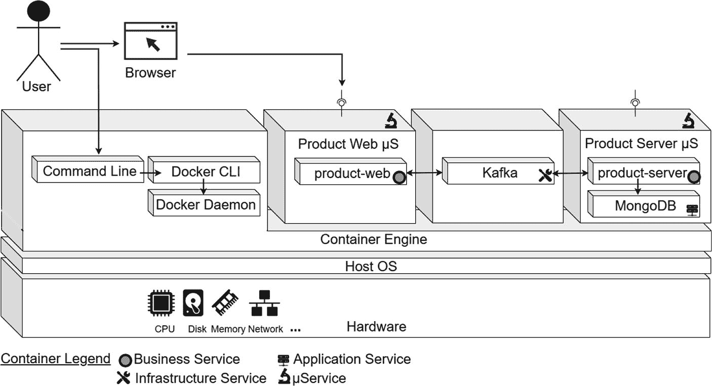

一张图示说明了微服务容器。它包括 products web mu S、product server mu S、容器引擎、主机 O S、product web mu S、product server mu S 和硬件。

图 9-4

编排微服务容器

这里，Product Web 和 Product Server 容器提供业务服务，而 Mongo 容器提供用于持久化状态的应用程序服务。Kafka 容器提供基础设施服务，因此它们不作为任何特定（业务）微服务的一部分显示。

### 理解源代码

本书的源代码可通过图书产品页面在 GitHub 上获取，网址为 [`www.apress.com/9798868805547`](http://www.apress.com/9798868805547)。本示例的代码组织在 `ch09\ch09-04` 文件夹内，代码结构如清单 9-20 所示。本示例中的大部分源代码与 `ch03\ch03-02` 类似，后者已在第 3 章的“使用 MongoDB 和 CrudRepository 的微服务”一节中详细解释过。在第 6 章的“基于 MongoDB 的 Kafka 上的 CRUD 微服务”一节中，你已经看到了 Product Web 和 Product Server 微服务通过 Kafka 消息通道相互通信所需的代码，因此这里不再重复这些细节。此外，在第 6 章的“使用 MongoDB 容器编排微服务”一节中，你已经看到了基于 Docker Compose 部署图 9-4 主要部分拓扑的内容。

`docker-compose.yml` 文件的大部分内容与清单 9-21 所示类似。清单 9-32 仅显示了变更部分。

```
version: "3"
services:
...
db:
image: mongo:3.6
container_name: mongo
ports:
- "27017:27017"
networks:
- ecom-network
...
清单 9-32
Docker Compose YAML 文件 (ch09\ch09-04\docker-compose.yml)
```

实际上，本例中清单 9-32 的 MongoDB 配置变得更简单了。

微服务的 Dockerfile 与之前清单 9-22 中的示例类似。它同样被配置为三阶段构建。


### 使用 Docker Compose 运行容器

`ch09\ch09-04` 文件夹包含构建和运行这些示例所需的脚本。第一步是启动一个 Minikube 单节点 Kubernetes 集群，以便启动 Docker 守护进程。有关容器命令的快速参考，请参阅附录 E。

假设 Minikube 单节点 Kubernetes 集群已启动并正在运行，清单 9-33 显示了一个简单的脚本，其中包含一个命令，用于构建和运行包含所有已定义容器的完整应用程序。

```
docker-compose up
清单 9-33
构建并运行微服务 Docker 容器的脚本 (ch09\ch09-04\makeandrun.sh)
```

清单 9-34 构建微服务和 Docker 镜像，然后运行容器。

```
(base) binildass-MacBook-Pro:ch09-04 binil$ pwd
(base) binildass-MacBook-Pro:ch09-04 binil$ sh makeandrun.sh
[+] Running 0/2
⠿ server Error
⠿ web Error
[+] Building 402.1s (24/25)
...
=> [ecom/product-server prebuild 4/5] COPY ./kafka-request-reply-util
=> [ecom/product-server prebuild 5/5] RUN mvn clean install
=> [ecom/product-server build 2/4] COPY --from=prebuild /root/.m2 /root/
=> [ecom/product-server build 3/4] COPY ./01-ProductServer.
...
=> [ecom/product-web build 4/4] RUN mvn clean package
=> [ecom/product-web stage-2 2/2] COPY --from=build ./target/*.jar app.j
=> [ecom/product-server] exporting to image
=> => exporting layers
...
[+] Running 6/4
⠿ Network ch09-04_ecom-network  Created
⠿ Container mongo               Created
⠿ Container zookeeper           Created
⠿ Container kafka               Created
⠿ Container product-server      Created
⠿ Container product-web         Created
Attaching to kafka, mongo, product-server, product-web, zookeeper
zookeeper       | zookeeper 13:38:33.77
zookeeper       | zookeeper 13:38:33.77 Welcome to the Bitnami zookeeper container
...
mongo           | 2022-06-05T13:38:34.066+0000 I CONTROL  [initandlisten] MongoDB starting : pid=1 port=27017 dbpath=/data/db 64-bit host=87f677f2efd6
...
kafka           | kafka 13:38:35.16
kafka           | kafka 13:38:35.16 Welcome to the Bitnami kafka container
...
kafka           |
kafka           | kafka 13:38:35.60 INFO  ==> ** Starting Kafka **
...
product-server  |
product-server  |   .   ____          _            __ _ _
kafka           | [2022-06-05 13:38:39,863] INFO [ZooKeeperClient Kafka server] Waiting until connected. (kafka.zookeeper.ZooKeeperClient)
product-server  |  /\\ / ___'_ __ _ _(_)_ __  __ _ \ \ \ \
product-server  | ( ( )\___ | '_ | '_| | '_ \/ _` | \ \ \ \
product-server  |  \\/  ___)| |_)| | | | | || (_| |  ) ) ) )
product-server  |   '  |____| .__|_| |_|_| |_\__, | / / / /
product-server  |  =========|_|==============|___/=/_/_/_/
product-server  |  :: Spring Boot ::                (v3.2.0)
product-server  |
...
product-server  | 2022-06-05 13:38:40 INFO  StartupInfoLogger.logStarting:55 - Starting EcomProductServerMicroserviceApplication v0.0.1-SNAPSHOT using Java 1.8.0_212 on 0ee4c7da5620 with PID 1 (/app.jar started by root in /)
product-web     |
product-web     |   .   ____          _            __ _ _
product-web     |  /\\ / ___'_ __ _ _(_)_ __  __ _ \ \ \ \
product-web     | ( ( )\___ | '_ | '_| | '_ \/ _` | \ \ \ \
product-web     |  \\/  ___)| |_)| | | | | || (_| |  ) ) ) )
product-web     |   '  |____| .__|_| |_|_| |_\__, | / / / /
product-web     |  =========|_|==============|___/=/_/_/_/
product-web     |  :: Spring Boot ::                (v3.2.0)
product-web     |
...
product-web     | 2022-06-05 13:38:40 INFO  StartupInfoLogger.logStarting:55 - Starting EcomProductWebMicroserviceApplication v0.0.1-SNAPSHOT using Java 1.8.0_212 on 4acbe5c92061 with PID 1 (/app.jar started by root in /)
kafka           | [2022-06-05 13:38:40,890] INFO KafkaConfig values:
...
清单 9-34
已完成的 Docker Compose Up 命令
```

清单 9-34 显示所有五个容器均已启动并运行，同时微服务日志表明它们正在等待响应从 Web 浏览器发起的事务。

一旦容器启动并运行，您就可以测试应用程序。

### 测试微服务容器

当所有五个容器都启动并运行后，您可以访问 Product Web 微服务。但是，如附录 E 所述，您必须首先获取 Minikube IP。请参阅清单 9-35。

```
(base) binildass-MacBook-Pro:ch07-02 binil$ minikube ip
192.168.64.5
(base) binildass-MacBook-Pro:ch07-02 binil$
清单 9-35
查找 Minikube IP
```

现在，您可以使用浏览器，通过由 Minikube IP 构成的 URL 来访问 Product Web 微服务。

`http://192.168.64.5:8080/product.html`

请参考第 1 章中“使用 UI 测试微服务”一节来测试 Product Web 微服务容器。

在测试微服务时，请持续观察日志窗口。要确定容器 ID 并持续观察日志窗口，请参考第 8 章。

测试完成后，您可以使用清单 9-36 中的脚本停止并移除微服务容器，并清理环境。

```
docker-compose down
docker rmi -f ecom/product-server
docker rmi -f ecom/product-web
清单 9-36
停止微服务 Docker 容器的脚本 (ch09\ch09-04\clean.sh)
```

您可以执行清单 9-37 中的脚本来停止并移除微服务容器，并清理环境。

```
(base) binildass-MacBook-Pro:ch09-04 binil$ sh clean.sh
[+] Running 6/5
⠿ Container kafka               Removed      1.5s
⠿ Container product-web         Removed      0.4s
⠿ Container product-server      Removed      0.4s
⠿ Container mongo               Removed      0.3s
⠿ Container zookeeper           Removed      0.5s
⠿ Network ch09-04_ecom-network  Removed      0.0s
Untagged: ecom/product-server:latest
Deleted: sha256:d0cb4d2302a2891120ae3f5b28616ebaaa85a5f25177f2c...
Untagged: ecom/product-web:latest
Deleted: sha256:b54513d0dc3a3d5b791c988114aebb7c46dbfee106d6f0d...
(base) binildass-MacBook-Pro:ch09-04 binil$
清单 9-37
停止微服务容器并清理环境
```

您还可以在执行 `clean.sh` 脚本时，在服务器端控制台中观察日志。

## 总结

第 7 章介绍了 Docker 容器，第 8 章解释了如何使用 Docker 容器更好地管理微服务应用程序。当您的聚合应用程序中包含多个微服务时，像 Docker Compose 和 Kubernetes 这样的工具可以为您提供进一步的帮助。本章展示了当您拥有许多业务微服务、应用程序服务和基础设施服务时，Docker Compose 如何为您提供帮助。这些服务中的许多都可以作为单独的容器部署，而 Docker Compose 正是在部署和运维期间帮助您管理它们的依赖关系和生命周期的工具。您不必止步于 Docker；您还可以考虑使用功能完备的容器编排工具，包括但不限于 Kubernetes。您将在下一章中实践这一点。


# 10. 使用 Kubernetes 的微服务

第 1 章讨论了不同级别的服务粒度。当你不断将服务拆分为更细粒度的服务时，实际上是在增加架构中活动部件的数量。这种将服务拆分为更细粒度服务的分而治之方法，旨在降低单个服务故障导致整个应用程序崩溃的风险。但另一方面，随着活动部件数量的增加，这些部件之间的连接数量也随之增加，从而扩大了容易发生故障的波及范围。

单体应用由紧密耦合的组件和模块组成，必须作为一个整体进行开发、部署、运维和管理，因为它们都作为单个进程运行。运行单体应用通常需要一个或几个能够提供足够资源来运行应用的强大服务器。当应用负载增加时，你可以进行*垂直*扩展（通过提高硬件规格）或*水平*扩展（通过引入更多进程副本）。

当你从单体架构迁移到微服务架构时，这些扩展原则大多仍然适用，但由于活动部件数量增加，整体复杂性也成倍增长。事实上，复杂度的增长速度往往超过新增元素的比例。你可能在关于 Docker 的章节中已经看到过这一点，我在那里讨论了镜像和容器，它们超越了传统的 `.jar` 格式制品。你需要一套工具集和生态系统来更好地管理你的应用二进制文件，无论是静态形式（`.jar` 和镜像）还是动态形式（容器）。本章将涵盖这一主题。

本章涵盖以下概念。

*   Kubernetes 架构简介

*   选定的 Kubernetes 部署方面

*   Kubernetes 中的流量和状态管理

*   在 Kubernetes 中将微服务和数据库容器组合在一起

*   演示跨 Kubernetes 中组合的容器的完整 CRUD 功能

## Kubernetes 的世界

将单体应用拆分为更细粒度、可独立部署的组件（称为微服务），将它们打包为容器镜像，并实例化为容器，这是未来的发展方向。每个微服务被打包成一个镜像，并在容器中作为独立进程运行。每个微服务通过定义良好的接口（API）与其他微服务通信。

图 10-1 展示了第 7 章中不同的虚拟化和应用部署模式。在容器化模式下，业务应用在容器运行时之上被实例化为容器。本书使用的容器运行时是 Docker。在基于微服务的架构中，你会拥有许多容器。具体来说，你可能拥有来自同一个 Docker 镜像或不同 Docker 镜像的一个或多个容器。当你拥有如此多的容器时，就需要一个容器管理工具或容器编排工具，例如 Kubernetes。

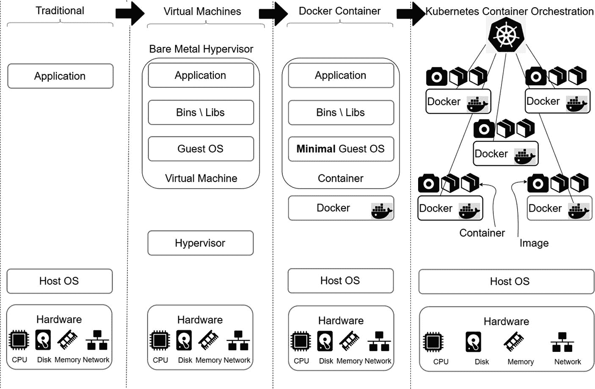

一张图表展示了从传统单体应用到基于 Kubernetes 编排的容器化技术的演进过程。它强调了容器化通过 CPU、磁盘、内存和网络等硬件带来的更高效率、可扩展性和可移植性。

图 10-1

Kubernetes 生态系统

运行容器就像运行进程一样，需要执行其自身的维护工作。启动和停止容器化应用、推出更新、维护服务级别、扩展容器以满足变化的负载、保护访问安全等等，只是众多需要执行的维护工作中的一小部分。本节将探讨 Kubernetes 如何在这方面提供帮助。

## Kubernetes 架构

Kubernetes 是一个容器编排器。它管理正在运行的容器。Kubernetes 架构由多个节点组成，这些节点分为主节点和工作节点。主节点托管 Kubernetes 控制平面，而工作节点托管你的实际容器应用。

你可以借助图 10-2 来了解这些节点。

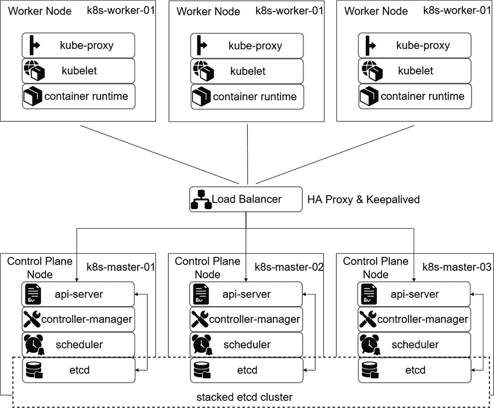

一个架构包含一个控制平面，其中有多个主节点和工作节点。它包括 API 服务器、控制器管理器和调度器。工作节点运行 kubelet、kube-proxy 和容器运行时。负载均衡器、HAProxy 和 Keepalived 用于服务发现和负载均衡。

图 10-2

Kubernetes 架构

下一节将从高层次审视 Kubernetes 架构。

### 控制平面

主节点托管 Kubernetes 控制平面；它还控制和管理 Kubernetes 系统。Kubernetes 控制平面的组件如下所列：

*   Kubernetes API 服务器：开发者和 Kubernetes 控制平面的其他组件使用 Kubernetes API 服务器与控制平面通信。

*   调度器：将作业或工作负载调度到你的 Kubernetes 集群的工作节点上。

*   控制器管理器：执行 Kubernetes 集群级别的功能，例如复制实例、跟踪工作节点等。

*   etcd：一个可靠、分布式且持久的数据存储，用于存储集群配置。

### 节点

节点，或称工作节点，运行你的容器化应用。主要组件如下所列：

*   容器运行时：运行你的容器。Docker、rkt 等是不同的容器运行时。

*   Kubelet：与控制平面的 API 服务器通信，并管理各自节点上的容器。

*   kube-proxy：也称为 Kubernetes 服务代理，它在应用组件之间对网络流量进行负载均衡。

图 10-2 描绘了控制平面和工作节点。当你在本地为生产环境设置 Kubernetes 集群时，建议以高可用性（HA）模式进行部署。高可用性意味着以 HA 模式安装 Kubernetes 主节点或控制平面，如图 10-2 所示。

## Kubernetes 部署

你使用不同类型的 API 对象在 Kubernetes 中部署工作负载。本节将简要介绍其中几种。

### 容器

在前两章关于 Docker 的内容中，你了解了容器的工作原理。在 Kubernetes 中，你将使用这些相同的容器作为基本工作单元。任何在 Kubernetes 中运行的工作负载或应用，都必须在容器内运行。这个容器可以是 Docker 容器、rkt 容器，或者由 Virtlet 管理的虚拟机（VM）。

当使用 Kubernetes 编排容器时，Kubernetes 需要额外的信息来进行容器管理，例如重启策略、存活探针等。Kubernetes 架构将这些额外需求抽象为所谓的 *Pod*。


### Pods

Pod 是 Kubernetes 中最小的可部署单元。一个 Pod 包含一个容器，但也可以在其中运行多个容器（即多个应用程序）。Pod 是对一个或多个正在运行的容器的封装。Kubernetes 通过 Pod 来控制、监控和操作这些容器。

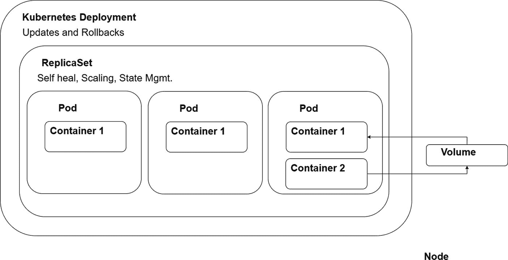

该图展示了 Kubernetes 的部署资源。部署由一个副本集组成，该副本集管理一组 Pod。每个 Pod 包含一个或多个容器。一个卷可以在 Pod 内的容器之间共享。部署提供了更新、回滚和自愈的机制。

图 10-3

Kubernetes 部署

Pod 中的容器运行在“逻辑主机”上，因为它们位于同一个节点（即它们使用相同的网络命名空间和相同的 IPC 命名空间）。它们还可以使用共享卷，如图 10-3 所示。

当一个应用程序需要多个容器在同一主机上运行，并且这些容器需要高效通信以确保数据本地性时，它们可以位于同一个 Pod 中。这提供了进程隔离；由于不同进程的日志不会混合，因此更容易对容器进行故障排查。

### ReplicaSets

Kubernetes 允许您以命令式或声明式的方式定义和创建 *ReplicaSet*。ReplicaSet 是一组带有修订历史记录的副本（Pod）。ReplicaSet 的工作是持续监控正在运行的 Pod 列表，并确保特定规格的 Pod 运行数量始终与期望数量匹配。因此，ReplicaSet 用于定义和管理一组运行在不同集群节点上的相同 Pod。ReplicaSet 定义了 Pod 内运行的容器所使用的容器镜像、将在集群中运行的 Pod 实例数量以及其他配置。

### Deployment

Deployment 是一种更高级别的资源，用于部署应用程序并以声明式方式进行更新。当您创建一个 Deployment 时，会在其下创建一个或多个 ReplicaSet 资源。使用 Deployment 时，实际的 Pod 是由 Deployment 的 ReplicaSet 创建和管理的，而不是由 Deployment 直接管理。参见图 10-4。

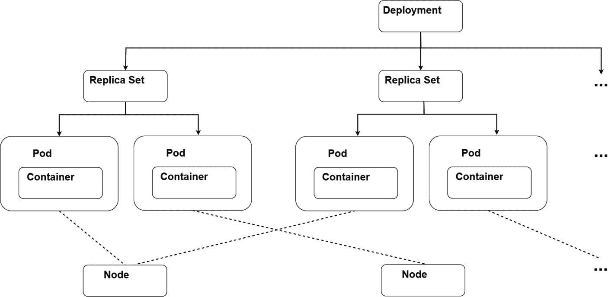

该树状图展示了 Kubernetes 部署资源。一个部署由多个副本集组成，每个副本集管理一组 Pod。每个 Pod 包含一个容器。Pod 被调度到节点上运行。

图 10-4

跨节点的 Kubernetes 部署

## 访问 Kubernetes 服务

在了解了 Kubernetes 采用的部署模式后，本节将探讨访问部署在 Kubernetes 中的工作负载的机制。

### 访问 Kubernetes 部署

在 Kubernetes 中，Pod 会被创建和销毁，以匹配您在部署描述符中指定的集群期望状态。Pod 是临时资源。当您使用 Deployment 运行 Kubernetes 应用程序时，它可以动态创建和销毁 Pod。当 Pod 被创建时，每个 Pod 都会获得自己的 IP 地址。当您使用 Deployment 时，某一时刻正在运行的 Pod 集合可能与稍后运行同一应用程序的 Pod 集合不同。

创建后，Pod 会被分配一个 IP 地址。这些 IP 地址在集群内可见，允许从集群内部进行访问。集群中的其他 Pod 可以访问该 IP 地址，从而实现 Pod 间通信。当一个 Pod 终止时，会创建一个新的 Pod，该 Pod 会以新的 IP 地址提供服务，任何试图与已终止 Pod 通信的实体都需要知道这个新地址。Kubernetes 提供了一种“服务”，这是一种将运行在一组 Pod 上的应用程序作为网络服务暴露的抽象方式。

### Kubernetes 服务

您之前从 Deployment 对象中看到的 Pod 可能会被终止或进行扩缩容，因此您不能依赖它们的 IP 地址，因为它们不是持久的。一旦定义了 Pod，它将表现出以下基本但并非直接的特征：

*   Pod 是短暂的：Pod 就像“银行柜员”，您每次不会由同一位柜员（人）服务。类似地，Pod 可以随时出现和消失。在扩缩容期间，Pod 可能会增加或减少，如果发生崩溃，Pod 可能会消失并可能被重新创建。

*   创建后分配 IP：Kubernetes 在 Pod 被调度并启动后为其分配 IP 地址。因此，客户端无法预先知道 Pod 的 IP 地址。

*   动态 IP 列表：横向扩展意味着多个相同类型的 Pod 可能提供相同的服务。这些（动态）Pod 各自拥有自己的 IP 地址，客户端要轻松绑定到动态 IP 列表可能并不实际。相反，所有这些 Pod 应该可以通过一个单一地址访问。

为了解决这些问题，服务为这些 Pod 提供了一个稳定的 IP。从更一般的意义上说，*服务*是一种抽象，它定义了一组逻辑 Pod 以及访问它们的策略。当创建一个服务时，它会将自己的虚拟地址作为环境变量发布给每个 Pod。服务不仅抽象了对 Pod 的访问，还可以抽象对数据库、外部主机甚至其他服务的访问。Kubernetes 服务是一种您创建的资源，用于为提供相同服务的一组 Pod 创建一个单一的、稳定的入口点。每个服务都是一个 IP 地址和端口的组合，在服务的整个生命周期内不会改变。如图 10-5 所示，一个 Kubernetes 服务可以由单个 Pod 或多个相同 Pod 的副本支持。外部客户端可以通过一个单一的服务名称访问同一服务的任何 Pod。类似地，前端 Pod 或前端服务也可以通过一个单一的服务名称访问同一后端服务的任何 Pod。图 10-5 展示了两个服务——`product-web` 和 `product-server`。

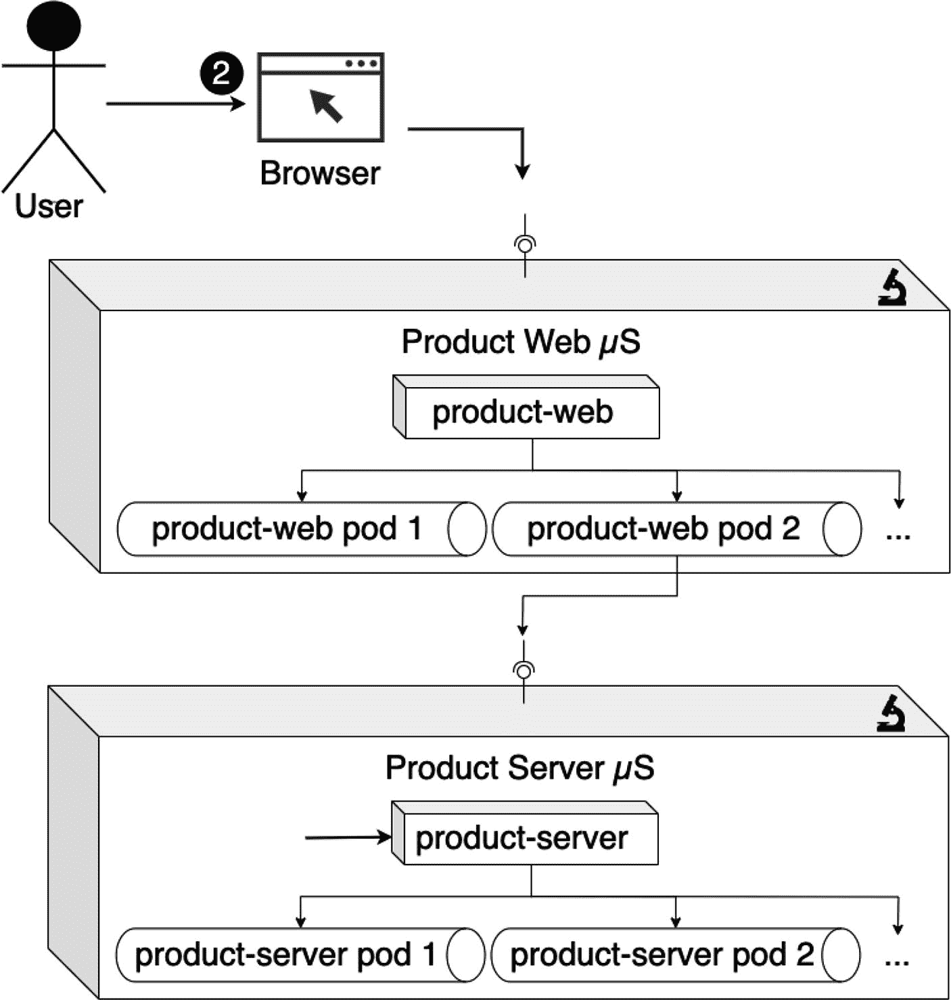

该图展示了一个电子商务产品 Web 服务的架构。用户与浏览器交互，浏览器向产品 Web 微服务发送请求，该微服务由多个 product-web Pod 组成，这些 Pod 与具有多个 product-server Pod 的产品服务器微服务通信。

图 10-5

Kubernetes 服务

在这里，浏览器或客户端设备应该知道前端微服务——产品 Web 微服务的服务（名称）。类似地，前端微服务应该知道后端微服务——产品服务器微服务的服务（名称）。

## 流量路由到 Kubernetes

有多种方法可以将外部流量引入您的 Kubernetes 集群。本节将介绍每种方法的工作原理。


### 集群 IP

顾名思义，集群 IP 仅在 Kubernetes 集群内部提供访问。集群内的其他应用可以访问它，但该服务无法从外部访问。集群 IP 的描述见代码清单 10-1。

```
apiVersion: v1
kind: Service
metadata:
name: product-web
spec:
selector:
app: product-web
type: ClusterIP
ports:
- name: http
port: 80
targetPort: 80
protocol: TCP
代码清单 10-1
集群 IP 定义
```

现在您可能会想，如何从外部访问该服务？答案是使用 Kubernetes 代理，如图 10-6 所示。

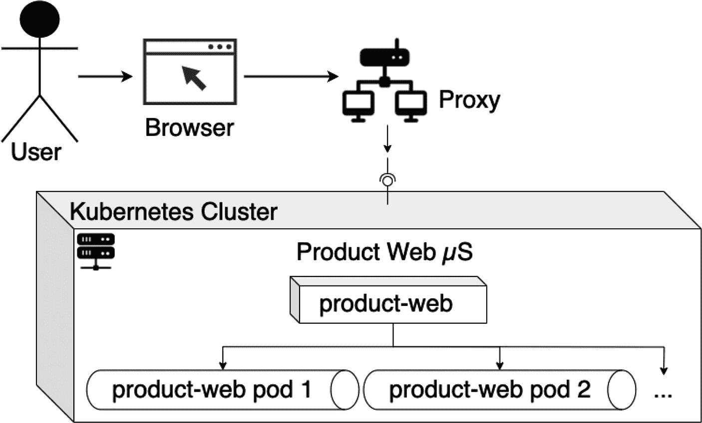

该图展示了用户如何与浏览器交互，浏览器向代理服务器发送请求。代理服务器随后将请求转发到运行着产品 Web 微服务的 Kubernetes 集群。该微服务由多个处理请求的 product-web Pod 组成。

图 10-6

Kubernetes 代理到集群 IP

您可以使用以下命令启动 Kubernetes 代理：

```
(base) binildass-MacBook-Pro:ch10-01 binil$ kubectl proxy --port=8080
```

这将在本地主机和 Kubernetes API 服务器之间创建一个代理服务器或应用层网关。所有传入数据通过一个端口进入，并被转发到远程的 Kubernetes API 服务器端口。

### 节点端口

当您将服务暴露为 NodePort 服务时，每个集群节点都会在自身节点上打开一个端口（因此得名），并将该端口接收到的流量重定向到相应的服务。该服务不仅可以通过内部集群 IP 和端口访问，还可以通过所有节点或虚拟机上的专用端口访问。

因此，NodePort 是将外部流量直接引入服务的最原始方式。NodePort 的定义如代码清单 10-2 所示。

```
apiVersion: v1
kind: Service
metadata:
name: product-server-nodeport
spec:
selector:
app: product-server
ports:
- nodePort: 30002
port: 8081
targetPort: 8081
type: NodePort
代码清单 10-2
节点端口定义
```

在代码清单 10-2 中，`30002` 被指定为 nodePort。您只能使用端口 `30000` 到 `32767`，如果未指定，则会使用一个随机端口。

如图 10-7 所示，由于服务跨节点运行，在第一个节点的某个端口上收到的连接可能会被转发到运行在同一节点上的 Pod，或者转发到运行在其他节点上的某个 Pod。

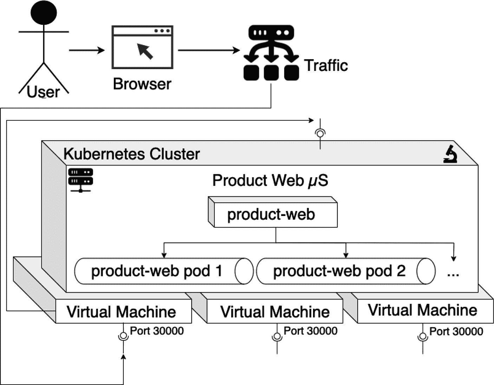

该图展示了用户如何与浏览器交互，浏览器向负载均衡器发送请求，负载均衡器将流量分发到 Kubernetes 集群内的多个 product-web Pod。这些 Pod 运行在虚拟机上，并通过端口 30000 相互通信。

图 10-7

Kubernetes 中的节点端口

### 负载均衡器

使用负载均衡器，您可以将服务暴露到互联网。这使得服务可以通过一个专用的负载均衡器进行访问，该负载均衡器由 Kubernetes 运行的云基础设施提供。参见代码清单 10-3。

```
apiVersion: v1
kind: Service
metadata:
name: product-web
spec:
selector:
app: product-web
type: LoadBalancer
ports:
- port: 8765
targetPort: 80
代码清单 10-3
负载均衡器定义
```

当您使用负载均衡器时，没有路由或过滤，您指定的所有流量都将被转发到服务，如图 10-8 所示。

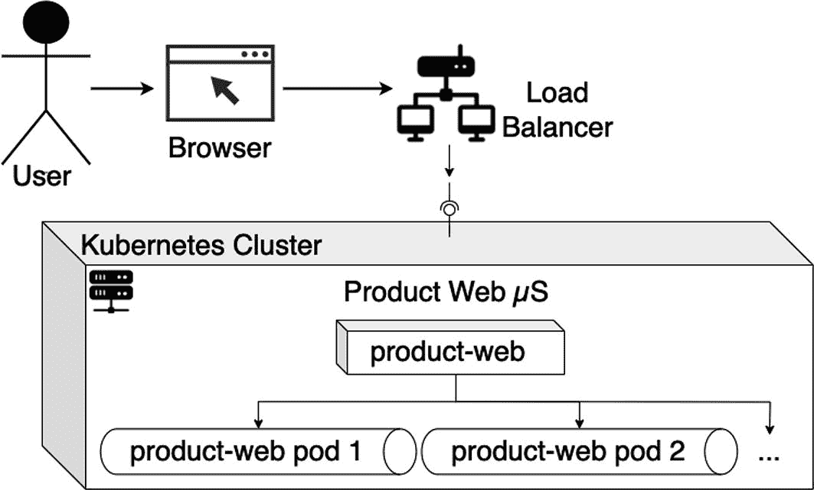

该图展示了用户如何与浏览器交互，浏览器向负载均衡器发送请求，负载均衡器将流量分发到 Kubernetes 集群内的 product-web 微 Pod。product-web 有多个 product-web Pod。

图 10-8

Kubernetes 中的负载均衡器

负载均衡器的缺点是，您暴露的每个服务都会获得自己的 IP 地址，并且您必须为所有暴露的服务各支付一个负载均衡器的费用。

### 入口

*入口*可以通过单个 IP 地址暴露多个服务。入口在 HTTP 层（网络层 7）运行，因此成本效益高。有许多不同类型的入口，具有不同的功能。参见图 10-9。

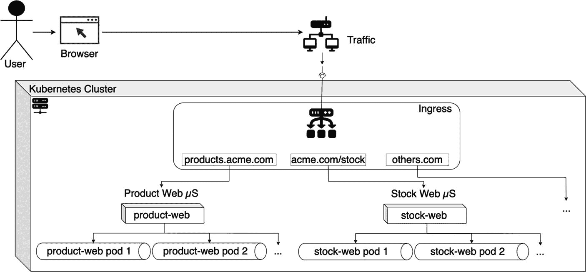

该图展示了用户如何与浏览器交互，浏览器向负载均衡器发送请求，负载均衡器将流量分发到 Kubernetes 集群内的多个 product-web 和 stock-web Pod。这些 Pod 使用入口控制器相互通信。

图 10-9

Kubernetes 中的入口

代码清单 10-4 定义了一个包含两条规则的入口。

```
apiVersion: networking.k8s.io/v1
kind: Ingress
metadata:
name: ingress-service
annotations:
kubernetes.io/ingress.class: nginx
spec:
rules:
- host: "adminer.acme.test"
http:
paths:
- path: /
pathType: Prefix
backend:
service:
name: adminer
port:
number: 8080
- host: "products.acme.test"
http:
paths:
- path: /
pathType: Prefix
backend:
service:
name: product-web
port:
number: 8080
代码清单 10-4
入口定义
```

代码清单 10-4 中的规则确保入口控制器接收到的所有 HTTP 请求中，请求 `products.acme.test` 主机的请求将被发送到端口 `8080` 上的 `product-web` 服务，而请求 `adminer.acme.test` 主机的所有 HTTP 请求将被发送到端口 `8080` 上的 adminer 服务。

## 状态管理

当您详细查看 Pod 和部署时，您会知道 Kubernetes Pod 是为横向扩展（甚至是弹性扩展）而设计的。扩展架构存在一个缺点。

### 横向扩展与状态管理

尽管拥有弹性扩展架构是可取的，但状态管理会带来问题。如果组件是真正无状态的，那么它们应该像“银行柜员”一样，您每次都不会由同一个柜员（人）服务。类似地，每个后续事务可以由任何其他相同组件的实例来服务。这意味着，除了您的客户端设备和持久化存储之外，每个其他中间组件都必须是无状态的。您无法避免客户端层的状态，否则您将无法进行任何个性化设置，这会损害用户体验。同样，对于非平凡的应用，必须管理某种状态，并且您通常会在某种数据库中执行此操作。

### 有状态集

为了解决状态管理问题，*StatefulSet* 代表一组唯一的、持久的、具有稳定 Pod 名称的 Pod（见图 10-10）。在无状态的 DeploymentSet 的情况下，每当您部署一个 Pod，每次部署或重启时，您都会得到一个不同的 Pod 名称——类似于 `product-server-6fb88b6849-6mrf5` 或 `product-web-5dfc886d6d-zvm8p`。在这种情况下，Pod 名称会在重启时改变。而在下一次重启时，它可能是任何名称，比如 `product-web-5dfc886d6d-4qw45` 或 `product-server-6fb88b6849-dwkcf`。如果您想要一个稳定的 Pod 名称，可以使用 StatefulSet。这样，即使部署重启，您也会得到相同的 Pod 名称（例如 `mongo-cluster-0`）。

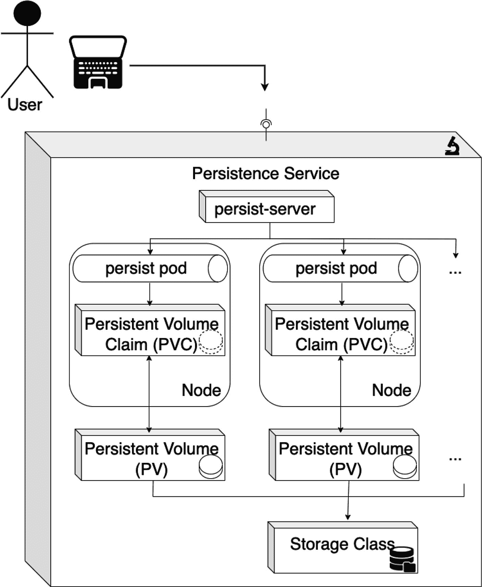

该图展示了用户如何与笔记本电脑交互，笔记本电脑向持久化服务发送请求。该服务由多个持久化 Pod 组成，这些 Pod 利用持久卷声明来访问底层节点上的持久卷。持久卷基于存储类进行配置。

图 10-10

Kubernetes 有状态集


### 持久卷声明

*持久卷声明*（PVC）是 Pod 对存储需求的一种声明，该需求在 Pod 生命周期的某个时刻可能变为可用或得到满足。持久卷声明承诺，它将在某个时刻“转化”为某种平台特定的存储卷，供你的应用程序使用，并具有已定义的特性，例如类别、大小和访问模式（`ROX`：只读多路，`RWO`：读写单路，以及 `RWX`：读写多路）。

通过这种方式，你可以将特定存储实现的链接从你的 Pod/部署中抽象出来。在典型情况下，你的应用程序会指定类似“我需要默认类别和 Y 大小的持久存储”这样的需求。随后，在运行时当这个“承诺”被兑现时，你可以链接一个 EBS 设备、一个 EFS 存储等，而你的核心清单文件在两种情况下都是相同的。

### 持久卷

*持久卷*（PV）是 Kubernetes 集群中的一块存储，它由服务器/存储/集群管理员预置，或通过某些存储类动态预置。它是集群中的一种资源，就像节点一样。因此，持久卷是你从 Kubernetes 那里获得的、你所请求的实际产品或选项。如果 Kubernetes 没有你所请求的内容，它会尝试为你即时创建。

在本章第一个示例的说明部分，特别是在代码清单 10-11 到 10-14 中，你将看到所有这些状态管理概念如何通过运行示例得以体现。

## Kubernetes 集群

如你所见，Kubernetes 集群是一组运行容器化应用程序的节点。Kubernetes 集群允许容器跨多台机器和环境运行——包括虚拟环境、物理环境、基于云的环境或本地环境。从头开始创建一个 Kubernetes 集群并非易事。更复杂的是，有多种选项和工具可供选择。

作为一条更简单的路径，有 Minikube，它是一个本地 Kubernetes 工具，专注于让学习和开发 Kubernetes 变得容易。不过，运行生产工作负载时，你确实需要其他更好的选项。

### Minikube

如前所述，Minikube 是本地 Kubernetes。使用 Minikube 设置一个单节点的本地 Kubernetes 相当容易。此外，本地 Kubernetes 还能在你将更改提交到团队环境之前，加速开发机器上的代码编写、测试、部署和调试循环周期。Minikube 还能让开发者在 Windows 和 Mac 环境中开发和测试容器化应用程序，而这两种操作系统是应用程序开发者偏爱的开发机器操作系统。

附录 E 关于容器工具的部分提供了在 Mac 环境中安装和启动 Minikube 的详细说明。

下一节将涉及一些代码。你将把第一个应用程序部署到基于 Minikube 的本地 Kubernetes 集群中。

## Kubernetes 中的微服务和 MongoDB

本示例复用了第 3 章中“使用 MongoDB 和 CrudRepository 的微服务”一节中的微服务。它使用了相同的两个微服务——一个消费者微服务和一个提供者微服务，它们通过 REST 协议相互通信。提供者微服务还与 MongoDB 进行交互。你将使用卷来持久化 MongoDB 数据库数据。整体设计请参考第 2 章中的图 2-1。

### 设计微服务部署拓扑

本示例复用了第 9 章第二个示例中定义的部署模式，如图 9-2 所示。一个变化是，本示例使用了 Kubernetes。

微服务的部署拓扑如图 10-11 所示。

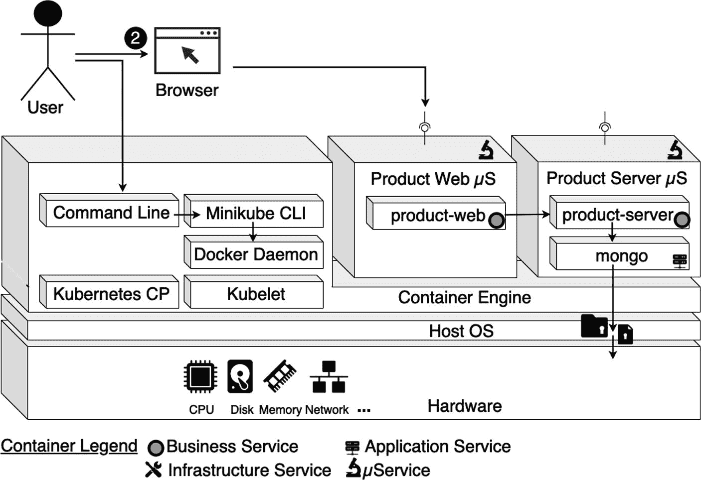

一张图表展示了用户如何与浏览器交互，浏览器向产品 Web 微服务发送请求。该微服务有多个 product-web Pod，它们与产品服务器微服务通信。它利用了一个 MongoDB，该 MongoDB 由 Minikube 和 Docker 部署在 Kubernetes 集群上。

图 10-11

基于 Kubernetes 的微服务部署拓扑

在这里，Product Web 和 Product Server 容器提供业务服务，而 Mongo 容器则提供用于持久化状态的应用程序服务。


### 理解源代码

本书的源代码可通过图书产品页面上的 GitHub 获取，地址为 [`www.apress.com/9798868805547`](http://www.apress.com/9798868805547)。示例的源代码组织在 `ch10\ch10-01` 文件夹内。本示例中的大部分源代码与 `ch03\ch03-02` 类似，后者已在第 3 章“使用 MongoDB 和 CrudRepository 的微服务”一节中详细解释过。你还在第 8 章“使用文件挂载的微服务和 MongoDB 容器”一节的图 8-9 中看到了基于 Docker 的拓扑部署。基于 Docker Compose 的拓扑部署也在第 9 章“组合微服务与 MongoDB 容器”一节的图 9-2 中展示过。基于这些原因，本节将直接进入 Kubernetes 相关的特定方面。

`ch10-01` 文件夹内示例源代码组织的概要表示如代码清单 10-5 所示。

```
./ch10-01/
├── 01-ProductServer
│   ├── pom.xml
│   └── src
│       └── ...
├── 02-ProductWeb
│   ├── pom.xml
│   └── src
│       └── ...
├── Dockerfile
├── README.txt
├── clean.sh
├── makeandrun.sh
├── mongo-deployment.yml
├── mongo-service.yml
├── mongo-volume-claim.yml
├── mongo-volume.yml
├── pom.xml
├── product-server-deployment.yml
├── product-server-service.yml
├── product-web-deployment.yml
└── product-web-service.yml
代码清单 10-5
示例 10-01 源代码组织
```

这个 Dockerfile 与第 7 章“使用 Dockerfile 构建微服务”一节中的类似，因此这里不再重复解释。此外还有一组 `.yml` 文件。

创建 Kubernetes 资源是通过向 Kubernetes 的 REST 端点提交 JSON 或 YAML 清单来完成的。这有助于对这些资源定义进行版本控制。

我研究的第一个资源是 Pod，它是一个容器组。它代表了 Kubernetes 中的基本构建块。你总是在 Pod 上部署和操作容器。Pod 通常只包含单个容器，但如果你认为有紧密相关的容器，也可以在 Pod 中包含多个容器。Sidecar 容器就是这样一个例子，其中日志和数据变更监视器可以与主容器位于同一个 Pod 中。

因此，尽管你可以将多层应用程序（例如 `ProductWeb` 和 `ProductServer`）托管在单个 Pod 中，但推荐的方式是为每一层使用单独的 Pod。原因很简单——你可以独立地扩展各层，并将它们分布到集群中。参见代码清单 10-6。

```

apiVersion: apps/v1
kind: Deployment
metadata:
name: product-web
labels:
app: product-web
group: frontend
spec:
replicas: 1
selector:
matchLabels:
app: product-web
template:
metadata:
labels:
app: product-web
spec:
containers:
- name: product-web
image: ecom/product-web
ports:
- containerPort: 8080
imagePullPolicy: Never
env:
- name: acme.PRODUCT_SERVICE_URL
value: http://product-server:8081/products
代码清单 10-6
Product Web 的 Pod 定义 YAML 文件 (ch10\ch10-01\product-web-deployment.yml)
```

在代码清单 10-6 的 Pod 定义中，第一行是分隔符，它是可选的。如果你试图在单个文件中定义多个结构，则需要分隔符。`metadata` 包含关于 Kubernetes Pod 的名称、命名空间、标签和其他信息。

代码清单 10-6 展示了 Product Web 微服务的 Pod 描述符。这里，`Spec` 包含了 Kubernetes Pod 内容的实际描述，例如 Pod 的容器、副本数量、镜像、卷和其他数据。

请注意 `containerPort: 8080`。即使你不分配端口，客户端仍然可以连接到 Pod。如果应用程序绑定到 `127.0.0.1`，它将有效地阻止流量进入 Pod，而 `0.0.0.0` 则允许流量通过所有接口进入 Pod，即使该端口没有在 Pod 规范中显式列出。但是，如果你显式地定义端口，那么使用你集群的每个人都可以快速看到每个 Pod 暴露了哪些端口。显式定义端口还允许你为每个端口分配一个名称，这很方便。

Product Web 微服务依赖于环境变量 `acme.PRODUCT_SERVICE_URL` 的适当值，你将其值设置为所依赖的 Product Server 微服务的服务 URL，你将在代码清单 10-9 中看到这一点。

与你创建 Pod 的方式相同，创建 Kubernetes 服务的最简单方法是向 Kubernetes 的 REST 端点提交 JSON 或 YAML 清单，如代码清单 10-7 中 Product Web 微服务的 Kubernetes 服务所示。

```
apiVersion: v1
kind: Service
metadata:
name: product-web
spec:
selector:
app: product-web
ports:
- protocol: TCP
port: 8080
targetPort: 8080
type: LoadBalancer
代码清单 10-7
Product Web 的服务定义 YAML 文件 (ch10\ch10-01\product-web-service.yml)
```

在代码清单 10-7 中，服务有一个名称 `product-web`。`port` 指的是该服务将在哪个端口上可用，而 `targetPort` 是请求将被转发到的容器端口，以便提供服务。因此，总结一下，你正在定义一个名为 `product-web` 的服务，它将接受端口 `80` 上的请求，并将每个请求路由到与标签选择器 `app=product-web` 匹配的某个 Pod 的端口 `8080`。你还可以看到定义了一个 `LoadBalancer`，以便于访问服务。

代码清单 10-8 展示了 Product Server 微服务的 Pod 描述。

```
apiVersion: apps/v1
kind: Deployment
metadata:
name: product-server
labels:
app: product-server
group: backend
spec:
replicas: 1
selector:
matchLabels:
app: product-server
template:
metadata:
labels:
app: product-server
spec:
containers:
- name: product-server
image: ecom/product-server
ports:
- containerPort: 8081
imagePullPolicy: Never
env:
- name: spring.data.mongodb.uri
value: mongodb://mongo:27017/test
代码清单 10-8
Product Server 的 Pod 定义 YAML 文件 (ch10\ch10-01\product-server-deployment.yml)
```

这里一个值得注意的方面是，Product Server 微服务依赖于环境变量 `spring.data.mongodb.uri` 的适当值，其值被设置为所依赖的 MongoDB 的服务 URL，你将在代码清单 10-15 中看到这一点。

代码清单 10-9 展示了 Product Server 微服务的服务描述。

```
apiVersion: v1
kind: Service
metadata:
name: product-server
spec:
selector:
app: product-server
ports:
- protocol: TCP
port: 8081
targetPort: 8081

apiVersion: v1
kind: Service
metadata:
name: product-server-nodeport
spec:
selector:
app: product-server
ports:
- nodePort: 30002
port: 8081
targetPort: 8081
type: NodePort
代码清单 10-9
Product Server 的服务定义 YAML 文件 (ch10\ch10-01\product-server-service.yml)
```


产品服务器微服务无需被任何外部客户端访问，因此我省略了你在产品 Web 微服务的清单 10-7 中看到的 `LoadBalancer` 类型的服务定义。`ClusterIP` 本来已经足够，但这里额外定义了一个 `NodePort`，其优势我将在“测试微服务”一节中解释。

图 10-11 中的第三个组件是 MongoDB。清单 10-10 展示了 MongoDB 的 Pod 定义。

```
apiVersion: apps/v1
kind: StatefulSet
metadata:
name: mongo-cluster
labels:
app: mongo
spec:
replicas: 1
serviceName: "mongo"
selector:
matchLabels:
app: mongo
template:
metadata:
labels:
app: mongo
annotations:
sidecar.istio.io/inject: "false"
spec:
volumes:
- name: data-db
persistentVolumeClaim:
claimName: mongo-data-db
terminationGracePeriodSeconds: 10
containers:
- name: mongo
image: mongo:4.2.24
volumeMounts:
- mountPath: /data/db
name: data-db
readOnly: false
ports:
- containerPort: 27017
清单 10-10
MongoDB 服务器的 Pod 定义 YAML 文件 (ch10\ch10-01\mongo-deployment.yml)
```

此示例指定使用 `mongo:4.2.24` 作为创建 Pod 所基于的镜像。请注意，该 Pod 被定义为 `StatefulSet`。Mongo Pod 必须管理 MongoDB 中的数据或状态，因此你需要一个有状态集。它还定义了一个 `persistentVolumeClaim`——`mongo-data-db`。下一节将介绍此 PVC 的描述。

```
apiVersion: v1
kind: PersistentVolumeClaim
metadata:
name: mongo-data-db
spec:
storageClassName: manual
accessModes:
- ReadWriteOnce
resources:
requests:
storage: 3Gi
清单 10-11
MongoDB 的持久卷声明定义 (ch10\ch10-01\mongo-volume-claim.yml)
```

现在你创建 `PersistentVolumeClaim`。MongoDB Pod 使用 `PersistentVolumeClaim` 来请求物理存储。你请求至少 3GB 的卷，以便它可以为至少一个节点提供读写访问。执行下一节中的脚本后，你可以检查 `PersistentVolumeClaim`，如清单 10-12 所示。

```
(base) binildass-MacBook-Pro:~ binil$ kubectl get pvc mongo-data-db
NAME            STATUS   VOLUME          CAPACITY   ACCESS MODES   STORAGECLASS   AGE
mongo-data-db   Bound    mongo-data-db   10Gi       RWO            manual         2m32s
(base) binildass-MacBook-Pro:~ binil$
清单 10-12
列出持久卷声明的详细信息
```

一旦你创建了 `PersistentVolumeClaim`，Kubernetes 控制平面就会寻找一个满足该声明要求的 `PersistentVolume`。参见清单 10-13。

```
apiVersion: v1
kind: PersistentVolume
metadata:
name: mongo-data-db
labels:
type: local
spec:
storageClassName: manual
capacity:
storage: 10Gi
accessModes:
- ReadWriteOnce
hostPath:
path: "/home/docker/binil/mongodata"
清单 10-13
MongoDB 的持久卷定义 (ch10\ch10-01\mongo-volume.yml)
```

这样，控制平面就能通过 `storageClassName` 找到具有相同存储类的这个 `PersistentVolume`，从而将声明绑定到该卷。执行下一节中的脚本后，你可以检查 `PersistentVolume`，如清单 10-14 所示。

```
(base) binildass-MacBook-Pro:~ binil$ kubectl get pv mongo-data-db
NAME          CAPACITY ACCESS MODES RECLAIM STATUS CLAIM         STORAGECLASS              AGE
mongo-data-db 10Gi     RWO          Retain  Bound  mongo-data-db manual      44s
(base) binildass-MacBook-Pro:~ binil$
清单 10-14
列出持久卷的详细信息
```

就 Kubernetes 所知，`mongo-data-db` PV 只是某个位置的存储块，其生命周期独立于使用它的 Pod。因此，即使 Pod 消失——比如它崩溃了，或达到内存限制并因内存不足错误而被杀死——存储仍然存在，随时准备在 MongoDB Pod 重新生成时被其使用。所以，无论 Pod 发生什么（某种程度上），这个持久卷都会持久存在，因为 `RECLAIM` 策略是 `Retain`，正如你在清单 10-14 中看到的那样。当 PVC 被删除时，Kubernetes 将根据 PV 的 `RECLAIM` 策略来处理该 PV。

最后剩下的方面是定义 MongoDB 服务，这在清单 10-15 中完成。

```
apiVersion: v1
kind: Service
metadata:
name: mongo
spec:
selector:
app: mongo
ports:
- protocol: TCP
port: 27017
targetPort: 27017

apiVersion: v1
kind: Service
metadata:
name: mongo-nodeport
spec:
selector:
app: mongo
ports:
- nodePort: 30001
port: 27017
targetPort: 27017
type: NodePort
清单 10-15
MongoDB 服务的描述 (ch10\ch10-01\mongo-service.yml)
```

与清单 10-9 中的产品服务器服务描述一样，`ClusterIP` 本来已经足够，但此示例额外定义了一个 `NodePort`，其优势我将在“测试微服务”一节中解释。


### 在 Kubernetes 中运行微服务

`ch10\ch10-01` 文件夹包含构建和运行示例所需的脚本。第一步是启动一个 Minikube 单节点 Kubernetes 集群。有关 Kubernetes 设置和命令的快速参考，请参阅附录 E。参见清单 10-16。

```
(base) binildass-MacBook-Pro:~ binil$ pwd
/Users/binil
(base) binildass-MacBook-Pro:~ binil$ minikube start
minikube v1.25.2 on Darwin 12.4
...
Done! kubectl is now configured to use "minikube" cluster and "default" namespace by default
(base) binildass-MacBook-Pro:~ binil$
清单 10-16
启动 Minikube
```

你还必须在工作终端中设置 Minikube 环境变量。

注意

对于本章中的所有示例，我假设如果你使用的是 Minikube 单节点 Kubernetes 集群，则之前连接到 Docker 守护进程的两个步骤已经执行。

下一步，你需要为你在 `mongo-volume.yml` 中配置的 Mongo 数据创建这个新文件夹。参见清单 10-17。

```
(base) binildass-MacBook-Pro:mongodata binil$ minikube ssh
_             _
_         _ ( )           ( )
___ ___  (_)  ___  (_)| |/')  _   _ | |_      __
/' _ ` _ `\| |/' _ `\| || , <  ( ) ( )| '_`\  /'__`\
| ( ) ( ) || || ( ) || || |\`\ | (_) || |_) )(  ___/
(_) (_) (_)(_)(_) (_)(_)(_) (_)`\___/'(_,__/'`\____)
$ pwd
/home/docker
$ cd /home/docker
$ mkdir -p binil/mongodata
$ ls
binil
$ cd binil/mongodata/
$ ls
$ pwd
/home/docker/binil/mongodata
$ ls
$
清单 10-17
创建用作 Mongo 数据卷挂载的本地文件夹
```

名为 `makeandrun.sh` 的简单脚本包含一个命令，用于构建和运行包含所有已定义部署的完整应用程序，如清单 10-18 所示。

```
mvn -Dmaven.test.skip=true clean package
docker build  --build-arg JAR_FILE=02-ProductWeb/target/*.jar -t ecom/product-web .
docker build  --build-arg JAR_FILE=01-ProductServer/target/*.jar -t ecom/product-server .
