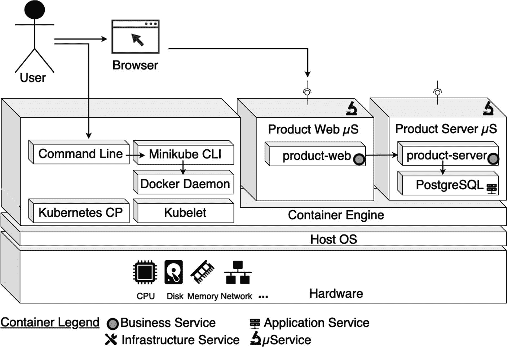
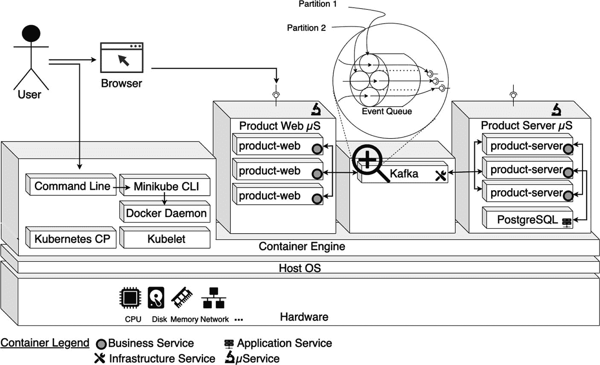

# docker pull mongo:4.2.24
kubectl create -f mongo-volume.yml
kubectl create -f mongo-volume-claim.yml
kubectl create -f mongo-deployment.yml
kubectl create -f mongo-service.yml
kubectl create -f product-server-deployment.yml
kubectl create -f product-server-service.yml
kubectl create -f product-web-deployment.yml
kubectl create -f product-web-service.yml
minikube service product-web --url
sleep 3
kubectl get pods
kubectl get services
清单 10-18
在 Kubernetes 中构建和运行微服务的脚本 (ch10\ch10-01\makeandrun.sh)
```

在附录 E 中，你可能已经注意到我使用了清单 E-22 中的这个命令：

```
kubectl apply -f https://raw.githubusercontent.com/scriptcamp/minikube/main/nginx.yaml
```

这是声明式管理，你只需指定所需的结果，而不是实现该结果所需的各个步骤。此命令通过文件名或标准输入将配置应用于资源。必须指定资源名称。接受 JSON 和 YAML 格式。

然而，清单 10-18 使用了 `kubectl create`。这是一种命令式的指定方式，意味着你给出一系列指令或步骤来达到目标。你指定要达到目标的内容和方式。`kubectl create` 命令也从文件或标准输入创建资源。接受 JSON 和 YAML 格式。

现在你可以执行清单 10-19 中所示的脚本。

```
(base) binildass-MacBook-Pro:ch10-01 binil$ pwd
/Users/binil/binil/code/mac/mybooks/docker-04/Code/ch10/ch10-01
(base) binildass-MacBook-Pro:ch10-01 binil$ eval $(minikube docker-env)
(base) binildass-MacBook-Pro:ch10-01 binil$ sh makeandrun.sh
[INFO] Scanning for projects...
[INFO] --------------------------------------------------------
[INFO] Reactor Build Order:
[INFO]
[INFO] Ecom-Product-Server-Microservice    [jar]
[INFO] Ecom-Product-Web-Microservice       [jar]
[INFO] Ecom                                [pom]
[INFO]
...
[INFO]
[INFO] Ecom-Product-Server-Microservice .. SUCCESS [  3.687 s]
[INFO] Ecom-Product-Web-Microservice ..... SUCCESS [  0.842 s]
[INFO] Ecom .............................. SUCCESS [  0.043 s]
[INFO] -------------------------------------------------------
[INFO] BUILD SUCCESS
[INFO] -------------------------------------------------------
[INFO] Total time:  4.836 s
[INFO] Finished at: 2023-05-25T19:18:03+05:30
[INFO] -------------------------------------------------------
...
persistentvolume/mongo-data-db created
persistentvolumeclaim/mongo-data-db created
statefulset.apps/mongo-cluster created
service/mongo created
service/mongo-nodeport created
deployment.apps/product-server created
service/product-server-nodeport created
deployment.apps/product-web created
service/product-web created
http://192.168.64.6:30503
...
(base) binildass-MacBook-Pro:ch10-01 binil$
清单 10-19
执行在 Kubernetes 中构建和运行微服务 Pod 的脚本
```

一旦 Pod 运行起来，你可以检查在清单 10-20 中创建的数据文件夹，并看到它已被初始化。这是因为你在 Product Server 微服务中使用 `InitializationComponent` 类初始化了 MongoDB 中的几行数据。

```
(base) binildass-MacBook-Pro:~ binil$ minikube ssh
_             _
_         _ ( )           ( )
___ ___  (_)  ___  (_)| |/')  _   _ | |_      __
/' _ ` _ `\| |/' _ `\| || , <  ( ) ( )| '_`\  /'__`\
| ( ) ( ) || || ( ) || || |\`\ | (_) || |_) )(  ___/
(_) (_) (_)(_)(_) (_)(_)(_) (_)`\___/'(_,__/'`\____)
$ pwd
/home/docker
$ cd /home/docker/binil/mongodata
$ ls
WiredTiger                           diagnostic.data
WiredTiger.lock                      index-1-840414156336134639.wt
WiredTiger.turtle                    index-11-840414156336134639.wt
WiredTiger.wt                        index-3-840414156336134639.wt
WiredTigerLAS.wt                     index-5-840414156336134639.wt
_mdb_catalog.wt                      index-6-840414156336134639.wt
collection-0-840414156336134639.wt   index-9-840414156336134639.wt
collection-10-840414156336134639.wt  journal
collection-2-840414156336134639.wt   mongod.lock
collection-4-840414156336134639.wt   sizeStorer.wt
collection-8-840414156336134639.wt   storage.bson
$
清单 10-20
检查用作 Mongo 数据卷挂载的本地文件夹
```

一旦所有 Pod 都创建完成，你如何知道它们是否在运行？你可以列出 Pod 来查看它们的状态，如清单 10-21 所示。

```
(base) binildass-MacBook-Pro:~ binil$ kubectl get pods
NAME                            READY STATUS    RESTARTS AGE
mongo-cluster-0                 1/1   Running   0        3m53s
product-server-6fb88b6849-q2pfx 1/1   Running   0        3m52s
product-web-5dfc886d6d-8cl7t    1/1   Running   0        3m52s
(base) binildass-MacBook-Pro:~ binil$
清单 10-21
列出 Kubernetes Pod 的状态
```

`kubectl exec` 命令允许你在 Pod 的现有容器内远程运行任意命令。当你想要检查容器的内容、状态和/或环境时，这会很有帮助。你可以通过引用清单 10-21 中的 Pod 名称，在清单 10-22 中检查 Product Web Pod 的环境变量。


```
(base) binildass-MacBook-Pro:~ binil$ kubectl exec product-web-5dfc886d6d-8cl7t env
...
acme.PRODUCT_SERVICE_URL=http://product-server:8081/products
清单 10-22
列出产品 Web 微服务的环境变量
```

清单 10-22 中的命令将输出你在清单 10-6 中配置的所有环境变量。

接下来，列出 Kubernetes 服务，如清单 10-23 所示。

```
(base) binildass-MacBook-Pro:~ binil$ kubectl get svc
NAME              TYPE         CLUSTER-IP     PORT(S)
kubernetes        ClusterIP    10.96.0.1      443/TCP
mongo             ClusterIP    10.98.30.13    27017/TCP
mongo-nodeport    NodePort     10.110.211.153 27017:30001/TCP
product-server    ClusterIP    10.102.46.205  8081/TCP
product-server-np NodePort     10.109.197.184 8081:30002/TCP
product-web       LoadBalancer 10.98.43.63    8080:30503/TCP
(base) binildass-MacBook-Pro:~ binil$
清单 10-23
列出 Kubernetes 服务
```

注意

为方便格式化，我在清单 10-23 中将 `product-server-nodeport` 缩写为 `product-server-np`。

清单 10-24 更详细地检查了清单 10-23 中的一个服务。

```
(base) binildass-MacBook-Pro:~ binil$ kubectl describe svc product-web
Name:                     product-web
Namespace:                default
Labels:                   
Annotations:              
Selector:                 app=product-web
Type:                     LoadBalancer
IP Family Policy:         SingleStack
IP Families:              IPv4
IP:                       10.98.43.63
IPs:                      10.98.43.63
Port:                       8080/TCP
TargetPort:               8080/TCP
NodePort:                   30503/TCP
Endpoints:                10.244.1.104:8080
Session Affinity:         None
External Traffic Policy:  Cluster
Events:                   
(base) binildass-MacBook-Pro:~ binil$
清单 10-24
描述 Kubernetes 服务
```

如你所见，服务使用 `Endpoints` 资源来链接到 Pod。`Endpoints` 是一个以逗号分隔的 IP 地址和端口列表，用于暴露服务。`Endpoints` 资源与任何其他 Kubernetes 资源一样，因此你可以使用 `kubectl` 命令显示其基本信息，如清单 10-25 所示。

```
(base) binildass-MacBook-Pro:~ binil$ kubectl get endpoints product-web
NAME          ENDPOINTS           AGE
product-web   10.244.1.104:8080   13m
(base) binildass-MacBook-Pro:~ binil$
清单 10-25
描述 Kubernetes 服务端点
```

在尝试测试这些服务之前，持续观察 Product Server 和 Product Web 微服务的终端日志会有所帮助。你可以使用清单 10-21 中的 Pod 名称来查看日志，如清单 10-26 和 10-27 所示。

```
(base) binildass-MacBook-Pro:~ binil$ kubectl --tail 15 logs -f product-web-5dfc886d6d-8cl7t
.   ____          _            __ _ _
/\\ / ___'_ __ _ _(_)_ __  __ _ \ \ \ \
( ( )\___ | '_ | '_| | '_ \/ _` | \ \ \ \
\\/  ___)| |_)| | | | | || (_| |  ) ) ) )
'  |____| .__|_| |_|_| |_\__, | / / / /
=========|_|==============|___/=/_/_/_/
:: Spring Boot ::                (v3.2.0)
...
2023-05-25 13:48:20 INFO  InitializationComponent.init:37 - Start
2023-05-25 13:48:20 DEBUG InitializationComponent.init:39 - Doing Nothing...
2023-05-25 13:48:20 INFO  InitializationComponent.init:41 - End
2023-05-25 13:48:21 INFO  StartupInfoLogger.logStarted:57 - Started EcomProductMicroservice...
...
清单 10-27
查看产品 Web 微服务终端日志
```

```
(base) binildass-MacBook-Pro:~ binil$ kubectl --tail 15 logs -f product-server-6fb88b6849-q2pfx
/\\ / ___'_ __ _ _(_)_ __  __ _ \ \ \ \
( ( )\___ | '_ | '_| | '_ \/ _` | \ \ \ \
\\/  ___)| |_)| | | | | || (_| |  ) ) ) )
'  |____| .__|_| |_|_| |_\__, | / / / /
=========|_|==============|___/=/_/_/_/
:: Spring Boot ::                (v3.2.0)
...
2023-05-25 13:48:21 INFO  InitializationComponent.init:47 - Start...
2023-05-25 13:48:21 DEBUG InitializationComponent.init:51 - Deleting all existing data...
2023-05-25 13:48:22 DEBUG InitializationComponent.init:56 - Creating initial data...
2023-05-25 13:48:22 INFO  InitializationComponent.init:105 - End
2023-05-25 13:48:23 INFO  StartupInfoLogger.logStarted:57 - Started EcomProductMicroservice...
...
清单 10-26
查看产品服务器微服务终端日志
```

现在你可以开始测试微服务了。

### 测试微服务 Pod

当所有三个 Pod 都启动并运行后，你就可以访问 Product Web 微服务了。为此，如附录 E 所述，你必须先获取 Minikube IP。参见清单 10-28。

```
(base) binildass-MacBook-Pro:ch07-02 binil$ minikube ip
192.168.64.5
(base) binildass-MacBook-Pro:ch07-02 binil$
清单 10-28
查找 Minikube IP
```

现在，你可以使用由 Minikube IP 构成的 URL，通过浏览器访问 Product Web 微服务。

`http://192.168.64.5:8080/product.html`

请参考第 1 章中“使用 UI 测试微服务”一节来测试 Product Web 微服务容器。

在测试微服务时，请持续观察清单 10-26 和 10-27 中的日志窗口。


### 访问 Kubernetes 部署

让我们继续测试，这次关注与清单 10-23 中 Kubernetes 服务相关的信息。你首先需要在主机终端的命令行中，对上一节测试过的 URL 执行 `cURL` 命令。请参见清单 10-29。

```
(base) binildass-MacBook-Pro:~ binil$ curl http://192.168.64.6:30503/productsweb
{"productId":"646ef0a55a32df351bf88d09","name":"Kamsung ...
(base) binildass-MacBook-Pro:~ binil$
清单 10-29
使用基于 Minikube IP 地址的 cURL 命令
```

你将能够成功访问 Product Web 微服务并检索到信息。

现在，尝试使用由 Cluster IP 构成的 URL，如清单 [10-30 所示。

```
(base) binildass-MacBook-Pro:~ binil$ curl http://10.98.43.63:30503/productsweb
curl: (7) Failed to connect to 10.109.140.135 port 30012: Connection refused
(base) binildass-MacBook-Pro:~ binil$ curl http://10.98.43.63:8080/productsweb
curl: (7) Failed to connect to 10.109.140.135 port 30012: Connection refused
(base) binildass-MacBook-Pro:~ binil$
清单 10-30
从宿主机使用基于 Cluster IP 的 URL 通过 cURL 访问 Product Web
```

Cluster IP 仅提供 Kubernetes 集群内部的访问。集群内的其他应用可以访问，但该服务没有外部访问权限，因此 `cURL` 命令失败了。

现在，尝试从 Minikube 主机内部访问该服务，如清单 10-31 所示。

```
(base) binildass-MacBook-Pro:~ binil$ minikube ssh
_             _
_         _ ( )           ( )
___ ___  (_)  ___  (_)| |/')  _   _ | |_      __
/' _ ` _ `\| |/' _ `\| || , <  ( ) ( )| '_`\  /'__`\
| ( ) ( ) || || ( ) || || |\`\ | (_) || |_) )(  ___/
(_) (_) (_)(_)(_) (_)(_)(_) (_)`\___/'(_,__/'`\____)
$ curl http:// 10.98.43.63:30503/productsweb
curl: (7) Failed to connect to 10.109.140.135 port 30012 after 10 ms: Connection refused
$ curl http:// 10.98.43.63:8080/productsweb
{"productId":"646ef0a55a32df351bf88d09","name":"Kamsung ...
清单 10-31
从 Minikube 内部使用基于 Cluster IP 的 URL 通过 cURL 访问 Product Web
```

在 Minikube 主机内部，命令执行成功了，因为 Cluster IP 允许集群内部的其他应用进行访问。

现在尝试访问 Product Server 微服务。你之前已经为该服务指定了 `NodePort` 类型。因此，你应该能够从 Kubernetes 集群外部（即宿主机）访问它。请参见清单 [10-32。

```
(base) binildass-MacBook-Pro:~ binil$ curl http://192.168.64.6:30002/products
{"productId":"646ef0a55a32df351bf88d09","name":"Kamsung ...
binildass-MacBook-Pro:~ binil$
清单 10-32
从宿主机使用基于 NodePort IP 的 URL 通过 cURL 访问 Product Server
```

你可以访问该服务，因为集群节点在其自身打开了一个端口（因此得名 `NodePort`），并将该端口接收到的流量重定向到相应的服务。

如果需要，你可以删除一个 Pod。删除 Pod 即指示 Kubernetes 终止该 Pod 中的所有容器。清单 [10-33 展示了如何删除 Product Web Pod。

```
(base) binildass-MacBook-Pro:~ binil$ kubectl delete po product-web-5dfc886d6d-8cl7t
pod "product-web-5dfc886d6d-8cl7t" deleted
(base) binildass-MacBook-Pro:~ binil$
清单 10-33
删除一个 Kubernetes Pod
```

一旦 Product Web Pod 被删除，你可以再次列出 Pod 以查看其状态，如清单 10-34 所示。

```
(base) binildass-MacBook-Pro:~ binil$ kubectl get pods
NAME                            READY STATUS    RESTARTS AGE
mongo-cluster-0                 1/1   Running   0        28m
product-server-6fb88b6849-q2pfx 1/1   Running   0        28m
product-web-5dfc886d6d-c2cps    1/1   Running   0        42s
(base) binildass-MacBook-Pro:~ binil$
清单 10-34
再次列出 Kubernetes Pod
```

有趣的是，你会发现 Product Web Pod 并没有被删除。准确地说，它确实被删除了，但随后又被重新创建了，因为你在清单 10-6 的 `product-web-deployment.yml` 中指定了 `replicas: 1`，这正是你向 Kubernetes 提出的请求。请注意，Pod 有了一个新名称，因为它不是一个 StatefulSet。

现在，让我们删除一个 StatefulSet 看看会发生什么。请参见清单 10-35。

```
(base) binildass-MacBook-Pro:~ binil$ kubectl delete po mongo-cluster-0
pod "mongo-cluster-0" deleted
(base) binildass-MacBook-Pro:~ binil$
清单 10-35
删除一个 Kubernetes StatefulSet
```

一旦 StatefulSet 被删除，你可以再次列出 Pod 以查看其状态（参见清单 10-36）。

```
(base) binildass-MacBook-Pro:~ binil$ kubectl get pods
NAME                            READY STATUS    RESTARTS AGE
mongo-cluster-0                 1/1   Running   0        3s
product-server-6fb88b6849-q2pfx 1/1   Running   0        29m
product-web-5dfc886d6d-c2cps    1/1   Running   0        116s
(base) binildass-MacBook-Pro:~ binil$
清单 10-36
再次列出 Kubernetes Pod
```

当你删除 StatefulSet 时，它会被重新创建，因为你在清单 10-10 的 `mongo-deployment.yml` 中指定了 `replicas: 1`，这正是你向 Kubernetes 提出的请求。Pod 被赋予了与之前相同的名称，因为它是一个 StatefulSet。

在你的宿主机的一个普通命令窗口中，你可以尝试在 Product Web 容器内运行命令。请参见清单 10-37。

```
(base) binildass-MacBook-Pro:ch10-01 binil$ kubectl exec -it product-web-5dfc886d6d-c2cps -- ps
PID   USER     TIME  COMMAND
1 root      0:17 java -jar /ecom.jar
125 root      0:00 ps
(base) binildass-MacBook-Pro:ch10-01 binil$ kubectl exec -it product-web-5dfc886d6d-c2cps -- ls
bin       etc       media     proc      sbin      tmp
dev       home      mnt       root      srv       usr
ecom.jar  lib       opt       run       sys       var
(base) binildass-MacBook-Pro:ch10-01 binil$
清单 10-37
在 Kubernetes 容器内运行命令

你甚至可以使用 Bourne Shell（或 `sh`）将你的 shell 控制台（在宿主机上）附加到正在运行的容器中的 shell，从而与之交互，例如列出进程等。请参见清单 10-38。

```
(base) binildass-MacBook-Pro:ch10-01 binil$ kubectl exec -it product-web-5dfc886d6d-c2cps -- sh
/ # ps -e
PID   USER     TIME  COMMAND
1 root      0:17 java -jar /ecom.jar
144 root      0:00 sh
151 root      0:00 ps -e
/ # exit
(base) binildass-MacBook-Pro:ch10-01 binil$
清单 10-38
将 Shell 控制台附加到容器
```

完成测试后，你可以停止并移除微服务容器，并使用清单 10-39 中的 `clean.sh` 脚本清理环境。

```
mvn -Dmaven.test.skip=true clean
kubectl delete -f product-web-service.yml
kubectl delete -f product-web-deployment.yml
kubectl delete -f product-server-service.yml
kubectl delete -f product-server-deployment.yml
kubectl delete -f mongo-service.yml
kubectl delete -f mongo-deployment.yml
kubectl delete -f mongo-volume-claim.yml
kubectl delete -f mongo-volume.yml
docker rmi -f ecom/product-web
docker rmi -f ecom/product-server
清单 10-39
用于关闭微服务 Kubernetes Pod 的脚本 (ch10\ch10-01\clean.sh)
```


与清单 10-18 中展示的`kubectl create`命令类似，`kubectl delete`可用于通过文件名、标准输入、资源和名称，或通过资源和标签选择器来删除资源，具体操作见清单 10-39。该命令支持 JSON 和 YAML 格式。

你可以执行此脚本来停止并移除微服务 Pod，并清理环境，如清单 10-40 所示。

```
(base) binildass-MacBook-Pro:ch10-01 binil$ pwd
/Users/binil/binil/code/mac/mybooks/docker-04/Code/ch10/ch10-01
(base) binildass-MacBook-Pro:ch10-01 binil$ eval $(minikube docker-env)
(base) binildass-MacBook-Pro:ch10-01 binil$ sh clean.sh
[INFO] Scanning for projects...
[INFO] ----------------------------------------------------
[INFO] Reactor Build Order:
[INFO]
[INFO] Ecom-Product-Server-Microservice      [jar]
[INFO] Ecom-Product-Web-Microservice         [jar]
[INFO] Ecom                                  [pom]
[INFO]
...
[INFO]
[INFO] Ecom-Product-Server-Microservice . SUCCESS [  0.108 s]
[INFO] Ecom-Product-Web-Microservice .... SUCCESS [  0.008 s]
[INFO] Ecom ............................. SUCCESS [  0.037 s]
[INFO] ---------------------------------------------------
[INFO] BUILD SUCCESS
[INFO] ---------------------------------------------------
[INFO] Total time:  0.366 s
[INFO] Finished at: 2023-05-19T16:40:53+05:30
[INFO] ---------------------------------------------------
"product-web" deleted
deployment.apps "product-web" deleted
service "product-server" deleted
service "product-server-nodeport" deleted
deployment.apps "product-server" deleted
service "mongo" deleted
service "mongo-nodeport" deleted
statefulset.apps "mongo-cluster" deleted
persistentvolumeclaim "mongo-data-db" deleted
persistentvolume "mongo-data-db" deleted
Untagged: ecom/product-web:latest
Untagged: ecom/product-server:latest
(base) binildass-MacBook-Pro:ch10-01 binil$
清单 10-40
停止微服务 Pod 并清理环境
```

至此，你在 Kubernetes 中的第一个微服务示例就完成了。

## Kubernetes 中的微服务与 PostgreSQL

第 8 章展示了一个与 PostgreSQL 数据库交互的完整微服务示例，所有组件均运行在 Docker 容器中。在第 9 章中，你修改了该示例，使其能够通过 Docker Compose 完全部署在容器基础设施中。现在，本节将在 Kubernetes 中部署相同的示例。

### 设计微服务部署拓扑

Product Web 和 Product Server 微服务已容器化，Product Server 微服务将连接到一个同样部署在容器内的 PostgreSQL 数据库。所有这些容器现在都将在 Kubernetes 中运行。请参见图 10-12。



该图展示了用户如何通过浏览器与系统交互，浏览器向 product web 微服务发送请求。该微服务由多个 product-web Pod 组成，这些 Pod 与 product server 微服务通信，而 product server 微服务则使用一个 PostgreSQL 数据库，该数据库部署在由 minikube 和 docker 管理的 Kubernetes 集群上。

图 10-12

基于 Kubernetes 的微服务部署拓扑

在此架构中，Product Web 和 Product Server 容器提供业务服务，而 PostgreSQL 容器则提供用于持久化状态的应用程序服务。

### 理解源代码

本书的源代码可通过图书产品页面在 GitHub 上获取，网址为 [`www.apress.com/9798868805547`](http://www.apress.com/9798868805547)。示例的源代码组织在 `ch10\ch10-02` 文件夹内。本示例中的大部分源代码与第 3 章“使用 PostgreSQL 和 RestTemplate 的微服务”一节中详细解释的 `ch03\ch03-01` 类似。你还在第 8 章“容器中的微服务和 PostgreSQL”一节的图 8-7 中看到了基于 Docker 的拓扑部署，随后在第 9 章“使用 PostgreSQL 容器编排微服务”一节的图 9-1 中看到了基于 Docker Compose 的拓扑部署。这意味着你可以直接进入 Kubernetes 相关的特定部分。

`ch10-02` 文件夹内示例源代码组织的概要表示如清单 10-41 所示。

```
./ch10-02/
├── 01-ProductServer
│   ├── pom.xml
│   └── src
│       └── ...
├── 02-ProductWeb
│   ├── pom.xml
│   └── src
│       └── ...
├── Dockerfile
├── README.txt
├── clean.sh
├── makeandrun.sh
├── pom.xml
├── postgres-config.yml
├── postgres-deployment.yml
├── postgres-pvc.yml
├── postgres-svc.yml
├── product-server-deployment.yml
├── product-server-service.yml
├── product-web-deployment.yml
└── product-web-service.yml
32 directories, 43 files
(base) binildass-MacBook-Pro:ch10 binil$
清单 10-41
示例 10-02 源代码组织

```

Dockerfile 与第 7 章清单 7-35 中的类似，因此此处不再重复解释。这里有一组 `.yml` 文件，其中许多你已经在本章前面的示例中见过。PostgreSQL 数据库需要两个新的描述符，你现在将学习它们。

从本示例中的 MongoDB 切换到 PostgreSQL 数据库，始于 Product Server 微服务部署描述符。请参见清单 10-42。

```
apiVersion: apps/v1
kind: Deployment
metadata:
name: product-server
...
spec:
...
template:
...
spec:
containers:
- name: product-server
...
envFrom:
- configMapRef:
name: postgres-config
env:
- name: DB_SERVER
value: postgres
清单 10-42
Product Server 的 Pod 定义 YAML 文件 (ch10\ch10-02\product-server-deployment.yml)
```

如前所述，清单 10-42 中的大部分配置我们已在本章前一个示例中见过，因此此处不再重复或解释。

当环境变量条目较多时，Kubernetes 提供了一种方法，可以将 `ConfigMap` 的所有条目作为环境变量暴露出来，而不是逐个创建环境变量，如清单 10-43 所示。你可以使用 `envFrom` 属性（而不是 `env`）将它们暴露为环境变量。你仍然可以像之前的示例那样使用 `env` 来引用 PostgreSQL 数据库地址。清单 10-43 展示了此 `ConfigMap` 的条目。

```
apiVersion: v1
kind: ConfigMap
metadata:
name: postgres-config
labels:
group: db
data:
POSTGRES_DB: productdb
POSTGRES_USER: postgres
POSTGRES_PASSWORD: postgre
清单 10-43
Product Server 引用的 ConfigMap YAML (ch10\ch10-02\postgres-config.yml)
```

这些条目用于 PostgreSQL 服务器配置，其含义不言自明。

清单 10-42 中引用的 PostgreSQL 数据库也是新的，清单 10-44 展示了其描述符。


```
apiVersion: apps/v1
kind: Deployment
metadata:
name: postgres
labels:
app: postgres
group: db
spec:
replicas: 1
selector:
matchLabels:
app: postgres
template:
metadata:
labels:
app: postgres
type: db
spec:
volumes:
- name: postgres-storage
persistentVolumeClaim:
claimName: postgres-persistent-volume-claim
containers:
- name: postgres
image: postgres:15.3-alpine3.18
ports:
- containerPort: 5432
envFrom:
- configMapRef:
name: postgres-config
volumeMounts:
- name: postgres-storage
mountPath: /var/lib/postgresql/data
清单 10-44
PostgreSQL 数据库的 Pod 描述（ch10\ch10-02\postgres-deployment.yml）
```

请注意，PostgreSQL Pod 引用了与 Product Server 微服务相同的 `ConfigMap`。通过这种方式，Product Server 微服务可以使用与 PostgreSQL DB 容器实例化时相同的凭据连接到该数据库。

接下来，检查 `persistentVolumeClaim`，如清单 10-45 所示。

```
apiVersion: v1
kind: PersistentVolumeClaim
metadata:
name: postgres-persistent-volume-claim
spec:
accessModes:
- ReadWriteOnce
resources:
requests:
storage: 4Gi
清单 10-45
PostgreSQL 数据库的 persistentVolumeClaim 描述（ch10\ch10-02\postgres-pvc.yml）
```

您要检查的最后一个文件是 PostgreSQL 数据库的服务定义，如清单 10-46 所示。

```
apiVersion: v1
kind: Service
metadata:
name: postgres
labels:
group: db
spec:
type: ClusterIP
selector:
app: postgres
ports:
- port: 5432
targetPort: 5432
清单 10-46
PostgreSQL 数据库服务的描述（ch10\ch10-02\postgres-svc.yml）
```

只有 Product Server 微服务会从 Kubernetes VM 内部访问 PostgreSQL 数据库，因此您只需要一个 `ClusterIP`。

### 在 Kubernetes 中运行微服务

`ch10\ch10-02` 文件夹包含构建和运行这些示例所需的脚本。第一步是启动一个 Minikube 单节点 Kubernetes 集群。有关 Kubernetes 设置和命令的快速参考，请参阅附录 E。随后，您还需要在工作终端中设置 Minikube 环境变量。

假设您的单节点 Kubernetes 集群 Minikube 已启动并正在运行，名为 `makeandrun.sh` 的简单脚本包含了使用所有部署描述符构建和运行完整应用程序所需的所有命令，如清单 10-47 所示。

```
mvn -Dmaven.test.skip=true clean package
docker build  --build-arg JAR_FILE=02-ProductWeb/target/*.jar -t ecom/product-web .
docker build  --build-arg JAR_FILE=01-ProductServer/target/*.jar -t ecom/product-server .
kubectl create -f postgres-config.yml
kubectl create -f postgres-pvc.yml
kubectl create -f postgres-deployment.yml
kubectl create -f postgres-svc.yml
kubectl create -f product-server-deployment.yml
kubectl create -f product-server-service.yml
kubectl create -f product-web-deployment.yml
kubectl create -f product-web-service.yml
minikube service product-web --url
sleep 3
kubectl get pods
kubectl get services
清单 10-47
在 Kubernetes 中构建和运行微服务的脚本（ch10\ch10-02\makeandrun.sh）
```

现在您可以执行此脚本，如清单 10-48 所示。

```
(base) binildass-MacBook-Pro:ch10-02 binil$ pwd
/Users/binil/binil/code/mac/mybooks/docker-04/Code/ch10/ch10-02
(base) binildass-MacBook-Pro:ch10-01 binil$ eval $(minikube docker-env)
(base) binildass-MacBook-Pro:ch10-02 binil$ sh makeandrun.sh
[INFO] Scanning for projects...
[INFO] ------------------------------------------------------
[INFO] Reactor Build Order:
[INFO]
[INFO] Ecom-Product-Server-Microservice                 [jar]
[INFO] Ecom-Product-Web-Microservice                    [jar]
[INFO] Ecom                                             [pom]
[INFO]
...
[INFO]
[INFO] Ecom-Product-Server-Microservice . SUCCESS [  3.001 s]
[INFO] Ecom-Product-Web-Microservice .... SUCCESS [  0.572 s]
[INFO] Ecom ............................. SUCCESS [  0.029 s]
[INFO] ------------------------------------------------------
[INFO] BUILD SUCCESS
[INFO] ------------------------------------------------------
[INFO] Total time:  3.762 s
[INFO] Finished at: 2023-05-25T22:47:54+05:30
[INFO] ------------------------------------------------------
...
configmap/postgres-config created
persistentvolumeclaim/postgres-persistent-volume-claim created
deployment.apps/postgres created
service/postgres created
deployment.apps/product-server created
service/product-server created
service/product-server-nodeport created
deployment.apps/product-web created
service/product-web created
http://192.168.64.6:30263
...
(base) binildass-MacBook-Pro:ch10-02 binil$
清单 10-48
执行在 Kubernetes 中构建和运行微服务 Pod 的脚本
```

现在您可以测试微服务了。


### 测试微服务 Pod

当 Pod 启动并运行后，你就可以访问 Product Web 微服务了。不过，如附录 E 所述，你必须先获取 Minikube 的 IP 地址。请参见清单 10-49。

```
(base) binildass-MacBook-Pro:ch07-02 binil$ minikube ip
192.168.64.6
(base) binildass-MacBook-Pro:ch07-02 binil$
清单 10-49
查找 Minikube IP
```

现在，你可以使用浏览器，通过 Minikube IP 构成的 URL 来访问 Product Web 微服务。

`http://192.168.64.5:8080/product.html`

请参考第 1 章中“使用 UI 测试微服务”一节，来测试 Product Web 微服务容器。

在测试微服务时，请持续观察日志窗口，正如本章前面示例中清单 10-26 和 10-27 所描述的那样。

现在，我们将更深入地了解一下 PostgreSQL 数据库。清单 10-50 声明了一个持久卷声明。

```
(base) binildass-MacBook-Pro:~ binil$ kubectl get persistentvolumeclaims
NAME                               STATUS   VOLUME                                     CAPACITY   ACCESS MODES   STORAGECLASS   AGE
postgres-persistent-volume-claim   Bound    pvc-2c90c05e-c233-44d4-8adb-5595da8edc3e   4Gi        RWO            standard       71s
(base) binildass-MacBook-Pro:~ binil$
清单 10-50
描述 PVC
```

请注意，PVC 的状态为 `Bound`，并且它指明了绑定了哪个 `VOLUME`。它们具有设定的容量 `4Gi`（这是在清单 10-45 的 `yaml` 文件中请求的），并且具有指定的访问模式 `RWO`（一次读写），这意味着一次只能有一个 Pod 使用该卷。

即使你没有设置存储类，它也会被默认设置。这是由 Kubernetes 集群中运行的 `AdmissionController` 完成的，它会拦截你对 Kubernetes API 服务器的请求并修改传入的对象。如果你指定了存储类，准入控制器就不会注入这个类。

但是，这个存储类是谁创建的呢？你可以在清单 10-51 中检查该存储类。

```
(base) binildass-MacBook-Pro:~ binil$ kubectl describe storageclass standard
Name:            standard
IsDefaultClass:  Yes
...
Provisioner:           k8s.io/minikube-hostpath
Parameters:            
AllowVolumeExpansion:  
MountOptions:          
ReclaimPolicy:         Delete
VolumeBindingMode:     Immediate
Events:                
(base) binildass-MacBook-Pro:~ binil$
清单 10-51
描述存储类

当你启动 Minikube 时，`StorageClass` 就会为你创建。它是在你的 Minikube 安装过程中自动引导的。你可以读取其内容。你也可以在 Kubernetes 内部使用 `kubectl edit sc standard` 来修改它。

由于你有一个带有供应器的默认存储类，因此无需担心显式创建持久卷。相反，供应器会根据持久卷声明来负责创建这些卷。这就是为什么与上一个示例不同，这里没有显式配置 PV 的原因。清单 10-52 显示了 PV。

```
(base) binildass-MacBook-Pro:~ binil$ kubectl get persistentvolumes
NAME                                       CAPACITY   ACCESS MODES   RECLAIM POLICY   STATUS   CLAIM                                      STORAGECLASS   REASON   AGE
pvc-2c90c05e-c233-44d4-8adb-5595da8edc3e   4Gi        RWO            Delete           Bound    default/postgres-persistent-volume-claim   standard                2m33s
(base) binildass-MacBook-Pro:~ binil$
清单 10-52
列出持久卷

请注意，容量和访问模式与 `PersistentVolumeClaim` 相匹配。同时也要注意，`PersistentVolumes` 指向了已声明它的 PVC，就像 PVC 指向它们已声明的 `PersistentVolumes` 一样。

在停止 Pod 和服务之前，请阅读下一节。

## Kubernetes Pod 的弹性

在本章的第一个示例中，你看到当一个 Pod 被杀死时，默认情况下会有一个新的 Pod 被重新创建。你还看到，对于有状态集，当 Pod 被重新创建时，Pod 的名称会被保留。

这展示了不同类型 Pod 和部署的弹性。

在接下来的几节中，你将使用 PostgreSQL Pod 进行更多实验。


### 状态保持

首先列出现有的 Pod，如代码清单 10-53 所示。

```
(base) binildass-MacBook-Pro:~ binil$ kubectl get pods
NAME                           READY STATUS  RESTARTS AGE
postgres-89dbf9fd9-f5bmc       1/1   Running 0        37m
product-server-85d84cf89-kxvfw 1/1   Running 0        37m
product-web-69b5948fb9-brdnf   1/1   Running 0        37m
(base) binildass-MacBook-Pro:~ binil$
代码清单 10-53
列出 Kubernetes Pod
```

在代码清单 10-54 中，你可以看到 PostgreSQL Pod 并非定义为 StatefulSet，而是定义为 Deployment。记住这一点，你可以删除该 Pod。

```
(base) binildass-MacBook-Pro:~ binil$ kubectl delete po postgres-89dbf9fd9-f5bmc
pod "postgres-89dbf9fd9-f5bmc" deleted
(base) binildass-MacBook-Pro:~ binil$
代码清单 10-54
删除 PostgreSQL Pod
```

现在再次列出剩余的 Pod，如代码清单 10-55 所示。

```
(base) binildass-MacBook-Pro:~ binil$ kubectl get pods
NAME                           READY STATUS  RESTARTS AGE
postgres-89dbf9fd9-4r5wk       1/1   Running 0        9s
product-server-85d84cf89-kxvfw 1/1   Running 0        38m
product-web-69b5948fb9-brdnf   1/1   Running 0        38m
(base) binildass-MacBook-Pro:~ binil$
代码清单 10-55
再次列出 Kubernetes Pod
```

请注意，PostgreSQL 数据库 Pod 已被重新创建，但名称不同。被删除的 Pod 的状态会发生什么变化？

为了回答这个问题，使用相同的 URL 测试 Product Web 微服务，以便请求将命中之前存在的 Product Server 和 Product Web 微服务 Pod。

`http://192.168.64.6:30263/product.html`

令你惊讶的是，你可能会发现之前的状态得以保持。这里所说的状态是指，当你初始化 Product Server 微服务时，你插入了几行数据库记录，而这些记录被保留了下来！

你需要进一步探索。为此，请查看代码清单 10-56，它检查了 Pod、PVC 和 PV 之间的关联。

```
(base) binildass-MacBook-Pro:~ binil$ kubectl get pods --all-namespaces -o=json | jq -c '.items[] | {name: .metadata.name, namespace: .metadata.namespace, claimName: .spec |  select( has ("volumes") ).volumes[] | select( has ("persistentVolumeClaim") ).persistentVolumeClaim.claimName }'
{"name":"postgres-89dbf9fd9-4r5wk","namespace":"default","claimName":"postgres-persistent-volume-claim"}
(base) binildass-MacBook-Pro:~ binil$
代码清单 10-56
Pod 与 PVC 之间的关联

此清单显示了 PostgreSQL Pod 与其 PVC 之间的关联。你还可以看到 PVC 与 PV 之间的关联，如代码清单 10-57 所示。

```
(base) binildass-MacBook-Pro:~ binil$ kubectl get pvc --all-namespaces -o json | jq -j '.items[] | "\(.metadata.namespace), \(.metadata.name), \(.spec.volumeName)\n"'
default, postgres-persistent-volume-claim, pvc-2c90c05e-c233-44d4-8adb-5595da8edc3e
(base) binildass-MacBook-Pro:~ binil$
代码清单 10-57
PV 与 PVC 之间的关联
```

为了理解这一点，请注意 Kubernetes 文档中的说明：

> *用户创建一个 PersistentVolumeClaim（或者在动态配置的情况下，已经创建了一个），其中请求了特定数量的存储和特定的访问模式。主节点中的一个控制循环会监视新的 PVC，找到匹配的 PV（如果可能），并将它们绑定在一起。如果为新的 PVC 动态配置了 PV，则该循环将始终将该 PV 绑定到该 PVC。否则，用户将始终至少获得他们所请求的内容，但卷可能会超出请求量。一旦绑定，PersistentVolumeClaim 的绑定是排他性的，无论它们是如何绑定的。PVC 到 PV 的绑定是一对一的映射，使用 ClaimRef，它是 PersistentVolume 和 PersistentVolumeClaim 之间的双向绑定。*
> 
> —Kubernetes

这在某种程度上解释了你之前看到的行为。进一步的细节超出了本讨论的范围，建议你参考 Kubernetes 文档。

测试完成后，你可以停止并移除微服务容器，并使用代码清单 10-58 中所示的 `clean.sh` 脚本来清理环境。

```
mvn -Dmaven.test.skip=true clean
kubectl delete -f product-web-service.yml
kubectl delete -f product-web-deployment.yml
kubectl delete -f product-server-service.yml
kubectl delete -f product-server-deployment.yml
kubectl delete -f postgres-svc.yml
kubectl delete -f postgres-deployment.yml
kubectl delete -f postgres-pvc.yml
kubectl delete -f postgres-config.yml
docker rmi -f ecom/product-web
docker rmi -f ecom/product-server
代码清单 10-58
用于关闭微服务 Kubernetes Pod 的脚本 (ch10\ch10-02\clean.sh)
```

你可以执行此脚本来停止并移除微服务 Pod 并清理环境，如代码清单 10-59 所示，就像你在代码清单 10-40 中清理环境的方式一样。

```
((base) binildass-MacBook-Pro:ch10-02 binil$ pwd
/Users/binil/binil/code/mac/mybooks/docker-04/Code/ch10/ch10-02
(base) binildass-MacBook-Pro:ch10-02 binil$ eval $(minikube docker-env)
(base) binildass-MacBook-Pro:ch10-02 binil$ sh clean.sh
...
代码清单 10-59
停止微服务 Pod 并清理环境
```

## 总结

你在第 7 章和第 8 章开始了容器之旅，并在第 9 章中扩展了学习内容，使用 Docker Compose 来编排多个微服务和数据库容器。在本章开始时，你了解到当从单体架构迁移到微服务架构时，活动部件的数量会增加，因此整体复杂性也会增加。这正是像 Kubernetes 这样更好的容器管理工具发挥价值的地方。本章快速介绍了 Kubernetes，并介绍了在 Kubernetes 工具集内与 SQL 和 NoSQL 数据库交互的熟悉微服务示例。你的学习尚未结束，因为你还需要研究如何将消息代理集成到你的 Kubernetes 生态系统中。这将在第 11 章中介绍。


# 11. 基于消息的 Kubernetes 微服务

在第 10 章中，你学习了 Kubernetes 如何进行容器编排，这极大地提升了微服务运行的可管理性。随着微服务数量的增加，这一点变得更为重要。你还了解了 Kubernetes 的一些弹性特性，并通过示例看到，当你删除一个现有 Pod 时，Pod 是如何被重新创建的。你还了解了 Pod 重新创建后状态是如何恢复的。

可扩展性和弹性是每个生产级应用程序都应具备的两个理想特性。当你试图提升这两个特性时，会使运行环境变得更加混乱。对于微服务架构来说尤其如此，因为你需要管理更多类型的服务，以及每种类型服务的更多数量。

在第 6 章中，你学习了消费者和提供者微服务如何使用 Kafka 作为消息通道进行通信。提供者微服务将实体存储在数据库中。在第 9 章中，你修改了这些相同的示例，利用容器化作为运行时选项。在本章中，你将重新审视它们，并使用 Kubernetes 进行部署。

本章是第 10 章的延续，因此完全是动手实践，涵盖以下三个场景：

*   通过 Kafka 通信并与 PostgreSQL 交互的微服务
*   通过 Kafka 通信并与 MongoDB 交互的微服务
*   使用 Ingress 访问协调微服务

下一节将直接进入这些示例。

## 在 k8s 中通过 Kafka 与 PostgreSQL 结合的微服务

本示例调整了第 6 章“基于 PostgreSQL 的 Kafka CRUD 微服务”一节以及第 9 章“使用 PostgreSQL 容器组合微服务”一节中的同一组微服务。消费者和提供者微服务使用 Kafka 作为消息通道进行通信。提供者微服务将实体存储在 PostgreSQL 数据库中。当浏览器向第一个（消费者）微服务发送请求时，它使用异步 HTTP。尽管使用了异步 HTTP，但该示例在客户端设备（本例中为浏览器）层面模拟了同步风格的用户体验。

该示例还包含消费者和提供者微服务的多个实例，并在测试服务时使用多个客户端。

### 设计微服务编排拓扑

本示例使用了第 9 章中图 9-3 所示六边形微服务视图的修改版本。两个微服务通过异步通道进行通信。Apache Kafka 是消息通道，它本质上是异步的。这个修改后的设计如图 11-1 所示。



一个 3D 模型图，展示了连接到浏览器的用户、Product Web 微服务、带有事件队列和分区 1 和 2 的 Kafka 基础设施服务、Product Server 微服务、带有功能的容器引擎、主机操作系统以及带有 CPU、磁盘等的硬件。Product Web 包含 3 个业务服务，Product Server 包含 3 个业务服务和 1 个应用服务。

图 11-1

微服务的 Kubernetes 编排拓扑

在这里，Product Web 和 Product Server 容器提供业务服务，而 Mongo 容器提供应用服务以持久化状态。Kafka 容器提供基础设施服务，因此它不作为任何特定（业务）微服务的一部分显示。

你在图 11-1 中需要注意的另一个方面是，你有 Product Web 和 Product Server 微服务的多个实例。这将帮助你像在第 6 章中那样，实验粘性和负载均衡场景。

### 理解源代码

本书的源代码可通过图书产品页面在 GitHub 上获取，网址为 [`www.apress.com/9798868805547`](http://www.apress.com/9798868805547)。本示例的源代码组织在 `ch11\ch11-01` 文件夹内。本示例中的大部分源代码与 `ch09\ch09-03` 类似，我在第 9 章中已详细解释过。在第 9 章的示例中，部署架构类似，但它使用的是 Docker Compose 而不是 Kubernetes。在第二个示例——`ch10\ch10-02`——中，你在第 10 章中还了解了基于 Kubernetes 的两个微服务和 PostgreSQL 的部署。剩下的就是单独部署 Kafka 到 Kubernetes。

`ch11-01` 文件夹内示例源代码组织的摘要表示如清单 11-1 所示。

```
./ch11-01/
├── 01-ProductServer
│   ├── pom.xml
│   └── src
│       └── ...
├── 02-ProductWeb
│   ├── pingrun1.sh
│   ├── pingrun2.sh
│   ├── pingrun3.sh
│   ├── pom.xml
│   └── src
│       └── ...
├── Dockerfile
├── README.txt
├── clean.sh
├── kafka-deployment.yml
├── kafka-request-reply-util
│   ├── pom.xml
│   └── src
│       └── ...
├── kafka-svc.yml
├── makeandrun.sh
├── pom.xml
├── postgres-config.yml
├── postgres-deployment.yml
├── postgres-pvc.yml
├── postgres-svc.yml
├── product-server-deployment.yml
├── product-server-service.yml
├── product-web-deployment.yml
└── product-web-service.yml
42 directories, 53 files
(base) binildass-MacBook-Pro:ch11 binil$
清单 11-1
示例 11-01 源代码组织
```

正如你可以从清单 11-1 中验证的那样，除了 `kafka*.yml` 之外，所有描述符都是熟悉的。清单 11-2 展示了这些新的描述符。

```

apiVersion: apps/v1
kind: Deployment
metadata:
name: zookeeper-deployment
spec:
replicas: 1
selector:
matchLabels:
component: zookeeper
template:
metadata:
labels:
component: zookeeper
spec:
containers:
- name: zookeeper
image: digitalwonderland/zookeeper
ports:
- containerPort: 2181
清单 11-2
Zookeeper 部署 YAML 文件 (ch11\ch11-01\kafka-deployment.yml)
```

清单 11-2 使用 `digitalwonderland/zookeeper` 作为 zookeeper 镜像。其余行不言自明。清单 11-3 研究了 Kafka 描述符。

```

apiVersion: apps/v1
kind: Deployment
metadata:
name: kafka-1-deployment
spec:
replicas: 1
selector:
matchLabels:
component: kafka-1
template:
metadata:
labels:
component: kafka-1
spec:
containers:
- name: kafka-1
image: pharosproduction/kafka_k8s:v1
resources:
requests:
memory: "256Mi"
cpu: "250m"
limits:
memory: "512Mi"
cpu: "500m"
ports:
- containerPort: 9092
env:
- name: MY_POD_IP
valueFrom:
fieldRef:
fieldPath: status.podIP
- name: KAFKA_ADVERTISED_PORT
value: "9092"
- name: KAFKA_ZOOKEEPER_CONNECT
value: zookeeper-ip-service:2181
- name: KAFKA_ADVERTISED_HOST_NAME
value: $(MY_POD_IP)
- name: KAFKA_BROKER_ID
value: "1"
清单 11-3
Kafka 部署 YAML 文件 (ch11\ch11-01\kafka-deployment.yml)
```

`pharosproduction/kafka_k8s:v1` 镜像用于 Kafka 服务器。你可以看到 `kafka` 部署引用了 `zookeeper-ip-service`，这是清单 11-4 中配置的 zookeeper 服务的服务名称。

```

apiVersion: v1
kind: Service
metadata:
name: zookeeper-ip-service
spec:
type: ClusterIP
selector:
component: zookeeper
ports:
- name: zookeeper
port: 2181
targetPort: 2181
type: NodePort
清单 11-4
Zookeeper 服务 YAML 文件 (ch11\ch11-01\kafka-svct.yml)
```


`zookeeper-ip-service` 也被配置为具有 `NodePort`。这将帮助您从 Kubernetes 集群外部与消息代理交互，以执行一些基本的队列管理操作，这将在后面的清单 11-17 和 11-18 中演示。

最后但同样重要的是，清单 11-5 展示了 Kafka 服务的定义。

```

apiVersion: v1
kind: Service
metadata:
name: kafka-1-ip-service
spec:
type: ClusterIP
selector:
component: kafka-1
ports:
- name: kafka
port: 9092
targetPort: 9092
Listing 11-5
Kafka 服务 YAML 文件 (ch11\ch11-01\kafka-svct.yml)
```

Product Server 微服务 Pod 将 `kafka` 服务作为消息代理，用于接收来自 Product Web 微服务的消息。请参见清单 11-6。

```
apiVersion: apps/v1
kind: Deployment
metadata:
name: product-server
...
spec:
replicas: 3
...
template:
...
spec:
containers:
- name: product-server
...
env:
- name: DB_SERVER
value: postgres
- name: spring.kafka.bootstrap-servers
value: kafka-1-ip-service:9092
Listing 11-6
Product Server Pod YAML 文件 (ch11\ch11-01\product-server-deployment.yml)
```

Product Web 微服务 Pod 也将同一个 `kafka` 服务作为消息代理，用于向 Product Server 微服务发送消息。请参见清单 11-7。

```
apiVersion: apps/v1
kind: Deployment
metadata:
name: product-web
...
spec:
replicas: 3
...
template:
...
spec:
containers:
...
env:
- name: spring.kafka.bootstrap-servers
value: kafka-1-ip-service:9092
Listing 11-7
Product Web Pod YAML 文件 (ch11\ch11-01\product-web-deployment.yml)
```

请注意，Product Web 微服务和 Product Server 微服务均配置了三个副本。

### 在 Kubernetes 中运行微服务

`ch11\ch11-01` 文件夹包含构建和运行示例所需的脚本。第一步是启动一个 Minikube 单节点 Kubernetes 集群（参见清单 11-8）。有关 Kubernetes 设置和命令的快速参考，请参阅附录 E。

```
(base) binildass-MacBook-Pro:~ binil$ minikube start
minikube v1.25.2 on Darwin 12.4
...
Done! kubectl is now configured to use "minikube" cluster and "default" namespace by default
(base) binildass-MacBook-Pro:~ binil$
Listing 11-8
启动 Minikube
```

在工作终端中设置 Minikube 环境变量。

注意

本章中的示例假设，如果您使用的是 Minikube 单节点 Kubernetes 集群，则已执行了前两步连接到 Docker 守护进程的操作。

假设您的单节点 Kubernetes 集群 Minikube 已启动并正在运行，一个包含单个命令的简单脚本（名为 `makeandrun.sh`）即可使用所有部署描述符构建并运行完整的应用程序。清单 11-9 执行了该脚本。

```
(base) binildass-MacBook-Pro:ch11-01 binil$ pwd
/Users/binil/binil/code/mac/mybooks/docker-04/Code/ch11/ch11-01
(base) binildass-MacBook-Pro:ch11-01 binil$ eval $(minikube docker-env)
(base) binildass-MacBook-Pro:ch11-01 binil$ sh makeandrun.sh
[INFO] Scanning for projects...
[INFO]
[INFO] --
[INFO] Building Kafka Request Reply utility 0.0.1-SNAPSHOT
[INFO] --------------------------------[ jar ]--------------
[INFO]
...
[INFO]
[INFO] Kafka Request Reply utility ...... SUCCESS [  1.119 s]
[INFO] Ecom-Product-Server-Microservice . SUCCESS [  2.534 s]
[INFO] Ecom-Product-Web-Microservice .... SUCCESS [  0.499 s]
[INFO] Ecom ............................. SUCCESS [  0.002 s]
[INFO] ------------------------------------------------------
[INFO] BUILD SUCCESS
[INFO] ------------------------------------------------------
...
http://192.168.64.6:32535
NAME                                 READY STATUS  RESTART AGE
kafka-1-deployment-7bcc6dd87f-rxhkd  1/1   Running 0        8s
postgres-89dbf9fd9-g9jx8             1/1   Running 0        7s
product-server-5bb6569674-9dflb      1/1   Running 0        5s
product-server-5bb6569674-g2488      1/1   Running 0        5s
product-server-5bb6569674-nzlv2      1/1   Running 0        5s
product-web-787d9ddf75-9m5c6         1/1   Running 0        4s
product-web-787d9ddf75-g82vm         1/1   Running 0        4s
product-web-787d9ddf75-tn8lk         1/1   Running 0        4s
zookeeper-deployment-886ff5f87-qmnl6 1/1   Running 0        8s
NAME                 TYPE      CLUSTER-IP     PORT(S)
kafka-1-ip-service   ClusterIP 10.98.44.163   9092/TCP
kubernetes           ClusterIP 10.96.0.1      443/TCP
postgres             ClusterIP 10.97.76.252   5432/TCP
product-server       ClusterIP 10.106.100.232 8081/TCP
product-web          LoadBalan 10.110.112.90  8080:32535/TCP
zookeeper-ip-service NodePort  10.111.204.18  2181:30059/TCP
(base) binildass-MacBook-Pro:ch11-01 binil$
Listing 11-9
执行脚本以在 Kubernetes 中构建并运行微服务 (ch11\ch11-01\makeandrun.sh)
```

确保所有 Pod 都处于“`Running`” `STATUS`。现在，您可以测试微服务了。


### 测试微服务 Pod

打开 Product Server 微服务和 Product Web 微服务所有实例的终端窗口。请记住，你为每个微服务配置了三个副本，如清单 11-10 所示。

将你的控制台连接到 Product Server 微服务 pod 1 的终端。

```
(base) binildass-MacBook-Pro:~ binil$ kubectl --tail 30 logs -f product-server-5bb6569674-9dflb
...
清单 11-10
Product Server Pod 1 终端
```

接下来，将你的控制台连接到 Product Server 微服务 pod 2 的终端。参见清单 11-11。

```
(base) binildass-MacBook-Pro:~ binil$ kubectl --tail 30 logs -f product-server-5bb6569674-g2488
...
清单 11-11
Product Server Pod 2 终端
```

最后一步，将你的控制台连接到 Product Server 微服务 pod 3 的终端。参见清单 11-12。

```
(base) binildass-MacBook-Pro:~ binil$ kubectl --tail 30 logs -f product-server-5bb6569674-nzlv2
.   ____          _            __ _ _
/\\ / ___'_ __ _ _(_)_ __  __ _ \ \ \ \
( ( )\___ | '_ | '_| | '_ \/ _` | \ \ \ \
\\/  ___)| |_)| | | | | || (_| |  ) ) ) )
'  |____| .__|_| |_|_| |_\__, | / / / /
=========|_|==============|___/=/_/_/_/
:: Spring Boot ::                (v3.2.0)
2023-05-19 13:49:12 INFO  StartupInfoLogger.logStarting:51 - Starting EcomProductServerMicroservice...
...
Running Changeset: db/changelog/initial-schema_inventory.xml::product::Binildas
Running Changeset: db/changelog/initial-schema_inventory.xml::addAutoIncrement-product::Binildas
Running Changeset: db/changelog/initial-schema_inventory.xml::insert-product-01::Binildas
Running Changeset: db/changelog/initial-schema_inventory.xml::insert-product-02::Binildas
...
Liquibase: Update has been successful.
2023-05-19 13:49:53 INFO  InitializationComponent.init:42 - Start
2023-05-19 13:49:53 INFO  InitializationComponent.init:67 - End
2023-05-19 13:50:04 INFO  StartupInfoLogger.logStarted:57 - Started EcomProductServerMicroserviceApplication in 57.979 seconds (process running for 69.734)
...
清单 11-12
Product Server Pod 3 终端
```

接下来，你将获取 Product Web 微服务的控制台。首先将你的主机控制台连接到 Product Web 微服务 pod 1 的终端。参见清单 11-13。

```
(base) binildass-MacBook-Pro:~ binil$ kubectl --tail 30 logs -f product-web-787d9ddf75-9m5c6
...
清单 11-13
Product Web pod 1 终端
```

将你的控制台连接到 Product Web 微服务 pod 2 的终端。参见清单 11-14。

```
(base) binildass-MacBook-Pro:~ binil$ kubectl --tail 30 logs -f product-web-787d9ddf75-g82vm
...
清单 11-14
Product Web Pod 2 终端
```

作为最后一步，将你的控制台连接到 Product Web 微服务 pod 3 的终端。参见清单 11-15。

```
(base) binildass-MacBook-Pro:~ binil$ kubectl --tail 30 logs -f product-web-787d9ddf75-tn8lk
.   ____          _            __ _ _
/\\ / ___'_ __ _ _(_)_ __  __ _ \ \ \ \
( ( )\___ | '_ | '_| | '_ \/ _` | \ \ \ \
\\/  ___)| |_)| | | | | || (_| |  ) ) ) )
'  |____| .__|_| |_|_| |_\__, | / / / /
=========|_|==============|___/=/_/_/_/
:: Spring Boot ::                (v3.2.0)
2023-05-19 13:49:11 INFO  StartupInfoLogger.logStarting:51 - Starting EcomProductWebMicroservice...
2023-05-19 13:49:43 INFO  StartupInfoLogger.logStarted:57 - Started EcomProductWebMicroservice...
...
清单 11-15
Product Web Pod 3 终端
```

现在你可以访问 Kafka 的一些统计数据。请记住，你为 zookeeper pod 定义了一个 `NodePort`。现在你将通过宿主机连接到 zookeeper。

要访问 Kafka 容器，如附录 E 所述，你必须先获取 Minikube IP。参见清单 11-16。

```
(base) binildass-MacBook-Pro:ch07-02 binil$ minikube ip
192.168.64.6
(base) binildass-MacBook-Pro:ch07-02 binil$
清单 11-16
查找 Minikube IP
```

现在连接到 Kafka。一种方法是使用任何标准 Apache Kafka 解压文件夹中的 `kafka-topics.sh` 脚本。参见清单 11-17。

```
(base) binildass-MacBook-Pro:bin binil$ pwd
/Users/binil/Applns/apache/kafka/kafka_2.13-2.5.0/bin
(base) binildass-MacBook-Pro:bin binil$ sh ./kafka-topics.sh --zookeeper 192.168.64.6:30059 --list
(base) binildass-MacBook-Pro:bin binil$
清单 11-17
列出 Kafka 主题
```

请注意，清单 11-17 中的 IP 地址是 Minikube IP 地址，端口是清单 11-9 中 `zookeeper-ip-service` 的 `NodePort`。

现在，你可以使用浏览器，通过由 Minikube IP 构成的 URL 访问 Product Web 微服务：

`http://192.168.64.5:8080/product.html`

请参考第 1 章中“使用 UI 测试微服务”一节来测试 Product Web 微服务容器。

在测试微服务时，你可以持续观察清单 11-10 到 11-15 中的日志窗口。

现在让我们重新审视 Kafka 主题，如清单 11-18 所示。

```
(base) binildass-MacBook-Pro:bin binil$ sh ./kafka-topics.sh --zookeeper 192.168.64.6:30059 --list
__consumer_offsets
product-req-reply-topic
product-req-topic
(base) binildass-MacBook-Pro:bin binil$
清单 11-18
列出 Kafka 主题
```

你可以看到在测试微服务时动态创建的不同主题。这与第 4 章中清单 4-9 提供的描述一致。


### 对微服务 Pod 进行负载测试

我提供了一些脚本，帮助你对微服务进行负载测试，并观察负载如何通过 Kafka 消息通道从 Product Web 均匀分布到 Product Server。请参见清单 11-19。

```
./02-ProductWeb/
├── pingrun1.sh
├── pingrun2.sh
├── pingrun3.sh
├── pom.xml
└── src
└── ...
清单 11-19
负载测试脚本
```

要进行负载测试，首先打开每个脚本，调整 URL 使其指向 Product Web 微服务。然后，你可以打开三个不同的终端，同时执行这些脚本以发起 cURL 请求。请参见清单 11-20 至 11-22。

```
(base) binildass-MacBook-Pro:02-ProductWeb binil$ sh pingrun3.sh
...
清单 11-22
从终端 3 向 Product Web 微服务发起请求
```

```
(base) binildass-MacBook-Pro:02-ProductWeb binil$ sh pingrun2.sh
...
清单 11-21
从终端 2 向 Product Web 微服务发起请求
```

```
(base) binildass-MacBook-Pro:02-ProductWeb binil$ pwd
/Users/binil/binil/code/mac/mybooks/docker-04/ch11/ch11-01/02-ProductWeb
(base) binildass-MacBook-Pro:02-ProductWeb binil$ sh pingrun1.sh
...
清单 11-20
从终端 1 向 Product Web 微服务发起请求
```

所有三个脚本的内容相同，因此你也可以在三个不同的终端中执行同一个脚本！

完成此示例中的微服务测试后，你可以停止并移除微服务容器，清理环境。请参见清单 11-23。

```
(base) binildass-MacBook-Pro:ch10-03 binil$ pwd
/Users/binil/binil/code/mac/mybooks/docker-04/Code/ch11/ch11-01
(base) binildass-MacBook-Pro:ch10-03 binil$ eval $(minikube docker-env)
(base) binildass-MacBook-Pro:ch10-03 binil$ sh clean.sh
[INFO] Scanning for projects...
[INFO] --------------------------------------
[INFO] Reactor Build Order:
[INFO]
[INFO] Kafka Request Reply utility        [jar]
[INFO] Ecom-Product-Server-Microservice   [jar]
[INFO] Ecom-Product-Web-Microservice      [jar]
[INFO] Ecom                               [pom]
[INFO]
...
service "product-web" deleted
deployment.apps "product-web" deleted
service "product-server" deleted
service "product-server-nodeport" deleted
deployment.apps "product-server" deleted
service "postgres" deleted
deployment.apps "postgres" deleted
persistentvolumeclaim "postgres-persistent-volume-claim" deleted
configmap "postgres-config" deleted
service "zookeeper-ip-service" deleted
service "kafka-1-ip-service" deleted
deployment.apps "zookeeper-deployment" deleted
deployment.apps "kafka-1-deployment" deleted
Untagged: ecom/product-web:latest
Untagged: ecom/product-server:latest
(base) binildass-MacBook-Pro:ch11-01 binil$
清单 11-23
清理项目与环境

```

至此，第一个示例完成。

## 在 k8s 中通过 Kafka 与 MongoDB 实现微服务

在此示例中，你将调整第 6 章“基于 MongoDB 的 Kafka CRUD 微服务”一节以及第 9 章“使用 MongoDB 容器组合微服务”一节中的同一组微服务。一个消费者微服务和一个提供者微服务使用 Kafka 作为消息通道进行通信。提供者微服务将实体存储在 MongoDB 数据库中。当浏览器向第一个（消费者）微服务发送请求时，它使用异步 HTTP。尽管使用了异步 HTTP，但该示例在浏览器层面模拟了同步风格的用户体验。

本节将通过消费者和提供者微服务的多个实例来演示此示例，并且在测试服务时你还会使用多个客户端。

### 设计微服务编排拓扑

此示例使用了第 9 章图 9-4 中所示六边形微服务视图的修改版本。微服务通过异步通道进行通信。Apache Kafka 本质上是异步的，被用作消息通道。请参见图 11-2。


一个 3D 模型图，展示了连接到浏览器的用户、Product Web 微服务、带有事件队列和分区 1 与 2 的 Kafka 基础设施服务、Product Server 微服务、容器引擎、主机操作系统和硬件。Product Web 包含 3 个业务服务，Product Server 包含 3 个业务服务和 1 个应用服务。

图 11-2

微服务的 Kubernetes 编排拓扑

部署架构与本章前面的示例非常相似。唯一的区别是此示例在 Kubernetes 中部署了一个 MongoDB 容器。

### 理解源代码

本书的源代码可通过图书产品页面在 GitHub 上获取，网址为 [`www.apress.com/9798868805547`](http://www.apress.com/9798868805547)。此示例的源代码组织在 `ch11\ch11-02` 文件夹内。

`ch11-02` 文件夹内示例源代码组织的概要表示如清单 11-24 所示。

```
ch11-02/
├── 01-ProductServer
│   ├── pom.xml
│   └── src
│       └── ...
├── 02-ProductWeb
│   ├── pingrun1.sh
│   ├── pingrun2.sh
│   ├── pingrun3.sh
│   ├── pom.xml
│   └── src
│       └── ...
├── Dockerfile
├── README.txt
├── clean.sh
├── kafka-deployment.yml
├── kafka-request-reply-util
│   ├── pom.xml
│   └── src
│       └── ...
├── kafka-svc.yml
├── makeandrun.sh
├── mongo-deployment.yml
├── mongo-service.yml
├── mongo-volume-claim.yml
├── mongo-volume.yml
├── pom.xml
├── product-server-deployment.yml
├── product-server-service.yml
├── product-web-deployment.yml
└── product-web-service.yml
清单 11-24
示例 11-02 源代码组织
```

此示例中的源代码与我在第 9 章详细解释过的 `ch09\ch09-04` 类似。在第 9 章的此示例中，部署架构类似，但使用的是 Docker Compose 而非 Kubernetes。在第 10 章的第一个示例（`ch10\ch10-01`）中，你还了解了基于 Kubernetes 的两个微服务和 PostgreSQL 的部署，并且在本章的前一个示例中，你也看到了 Kafka 的 Kubernetes 部署。因此，你应该已经熟悉清单 11-24 中的所有部署描述符，接下来我将进入执行示例的后续步骤。


### 在 Kubernetes 中运行微服务

`ch11\ch11-02` 文件夹包含构建和运行示例所需的脚本。第一步是启动一个 Minikube 单节点 Kubernetes 集群。有关 Kubernetes 设置和命令的快速参考，请参阅附录 E。接下来，你需要在 Minikube 虚拟机内为 Mongo 数据创建一个新文件夹，该文件夹已在 `mongo-volume.yml` 中配置。

最后，一个包含所有命令的简单脚本被执行，用于构建和运行包含所有已定义部署的完整应用程序，如清单 11-25 所示。

```
(base) binildass-MacBook-Pro:ch11-02 binil$ pwd
/Users/binil/binil/code/mac/mybooks/docker-04/Code/ch11/ch11-02
(base) binildass-MacBook-Pro:ch11-02 binil$ eval $(minikube docker-env)
(base) binildass-MacBook-Pro:ch11-02 binil$ sh makeandrun.sh
[INFO] Scanning for projects...
[INFO]
...
[INFO]
[INFO] Kafka Request Reply utility ...... SUCCESS [  1.129 s]
[INFO] Ecom-Product-Server-Microservice . SUCCESS [  1.242 s]
[INFO] Ecom-Product-Web-Microservice .... SUCCESS [  0.481 s]
[INFO] Ecom ............................. SUCCESS [  0.002 s]
[INFO] -----------------------------------------------------
[INFO] BUILD SUCCESS
[INFO] -----------------------------------------------------
[INFO] Total time:  3.023 s
[INFO] Finished at: 2023-05-19T20:17:30+05:30
[INFO] -----------------------------------------------------
...
http://192.168.64.6:32627
NAME                                 READY STATUS  RESTART AGE
kafka-1-deployment-7bcc6dd87f-jrdjx  1/1   Running 0       9s
mongo-cluster-0                      1/1   Running 0       8s
product-server-5cc8967574-6p249      1/1   Running 0       6s
product-server-5cc8967574-7gnz9      1/1   Running 0       6s
product-server-5cc8967574-jr2lv      1/1   Running 0       6s
product-web-ff4f65986-9plf7          1/1   Running 0       5s
product-web-ff4f65986-qd9bs          1/1   Running 0       5s
product-web-ff4f65986-s8hm4          1/1   Running 0       5s
zookeeper-deployment-886ff5f87-nv5xn 1/1   Running 0       9s
NAME                 TYPE      CLUSTER-IP    PORT(S)
kafka-1-ip-service   ClusterIP 10.108.5.80   9092/TCP
kubernetes           ClusterIP 10.96.0.1     443/TCP
mongo                ClusterIP 10.103.88.174 27017/TCP
mongo-nodeport       NodePort  10.108.6.234  27017:30001/TCP
product-server       ClusterIP 10.103.49.104 8081/TCP
product-server-np    NodePort  10.109.23.86  8081:30002/TCP
product-web          LoadBalan 10.99.185.187 8080:32627/TCP
zookeeper-ip-service ClusterIP 10.107.235.56 2181/TCP
(base) binildass-MacBook-Pro:ch11-02 binil$
清单 11-25
执行脚本以在 Kubernetes 中构建和运行微服务 (ch11\ch11-02\makeandrun.sh)
```

注意

为方便格式化，我在清单 11-25 中将 `product-server-nodeport` 缩写为 `product-server-np`。

现在你可以测试微服务了。

### 测试微服务 Pod

现在，你可以使用浏览器，通过由 Minikube IP 构成的 URL 访问 Product Web 微服务：

`http://192.168.64.6:32627/product.html`

请参考第 1 章中“使用 UI 测试微服务”一节来测试 Product Web 微服务容器。

你可以按照第 10 章第一个示例中的说明检查数据文件夹。你也可以按照第 10 章第一个示例中的说明重复相关测试。

### 对微服务 Pod 进行负载测试

本示例提供了一些脚本，帮助你对微服务进行负载测试，并观察负载如何通过 Kafka 消息通道从 Product Web 均匀分布到 Product Server。请参见清单 11-26。

```
./02-ProductWeb/
├── pingrun1.sh
├── pingrun2.sh
├── pingrun3.sh
├── pom.xml
└── src
└── ...
清单 11-26
负载测试脚本
```

请参考前面的示例，获取对示例进行负载测试的分步说明。

### 使用 kubectl 连接到 MongoDB Pod

本节研究如何使用 `kubectl` 命令与 MongoDB 进行交互。正如你之前所见，`kubectl exec` 命令允许你在 Pod 的现有容器内远程运行任意命令。基于此，你可以连接到 MongoDB Pod。请参见清单 11-27。

```
(base) binildass-MacBook-Pro:bin binil$ kubectl exec -it mongo-cluster-0 -- sh
#
清单 11-27
使用 kubectl 连接到 MongoDB Pod
```

接下来，加载 Mongo shell，如清单 11-28 所示。

```
(base) binildass-MacBook-Pro:bin binil$ kubectl exec -it mongo-cluster-0 -- sh
