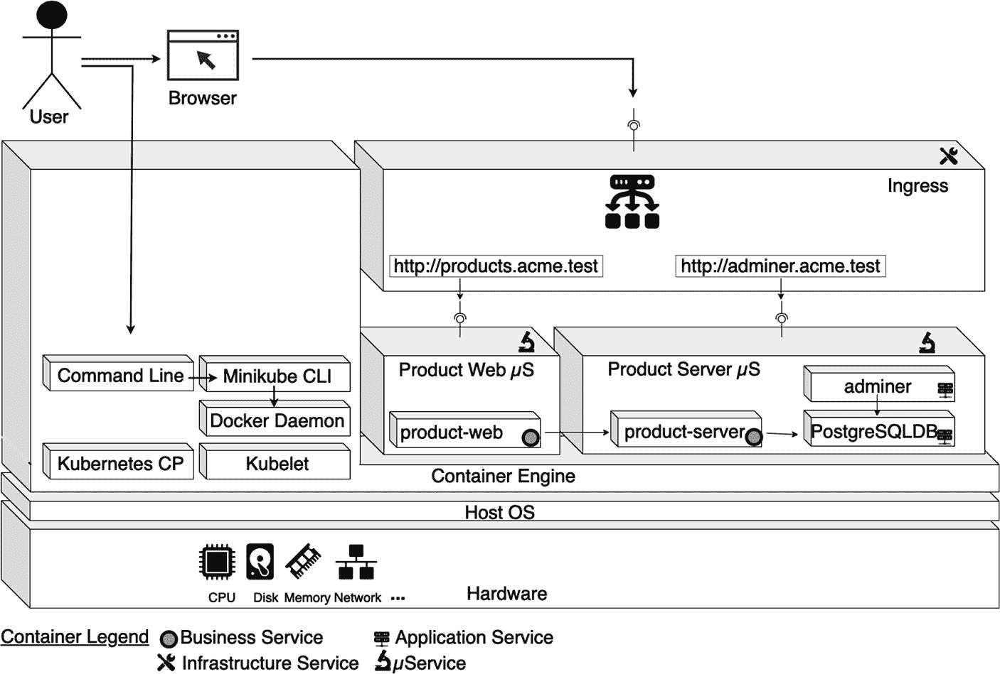
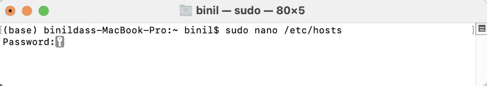
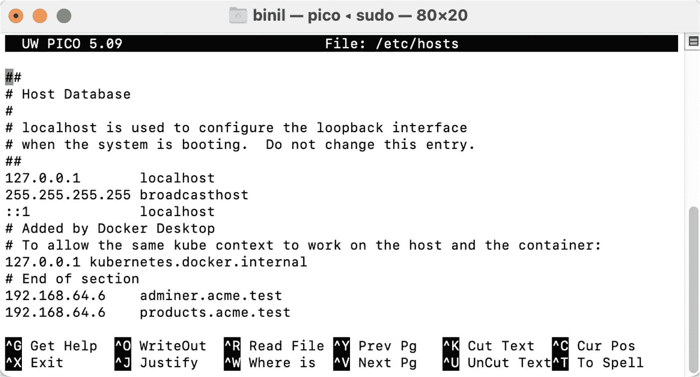
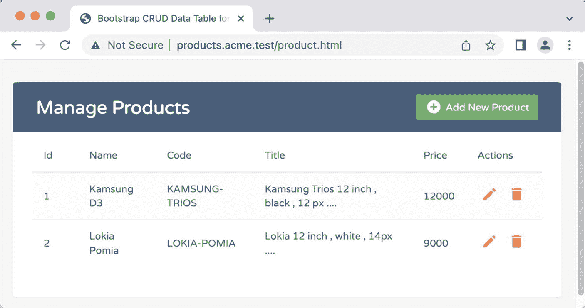
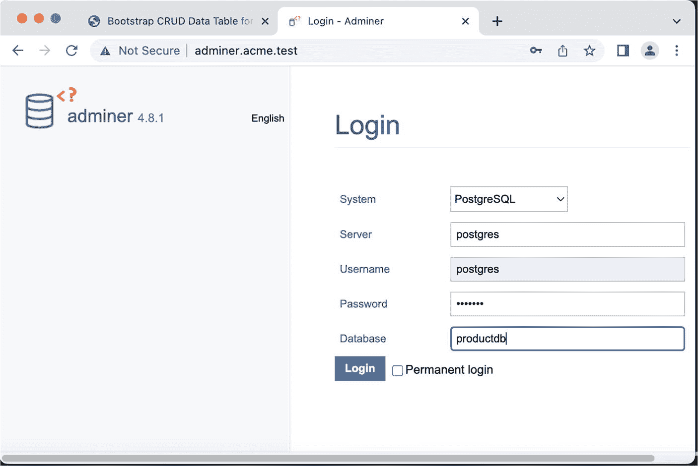
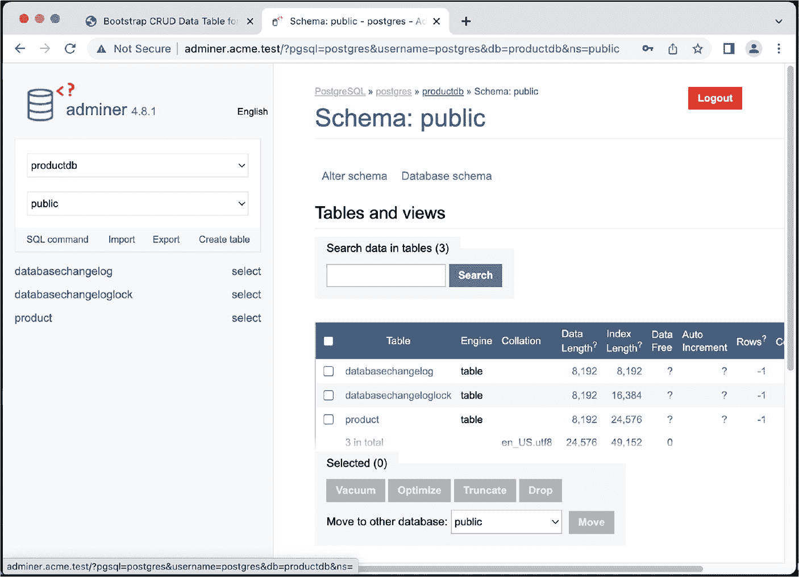
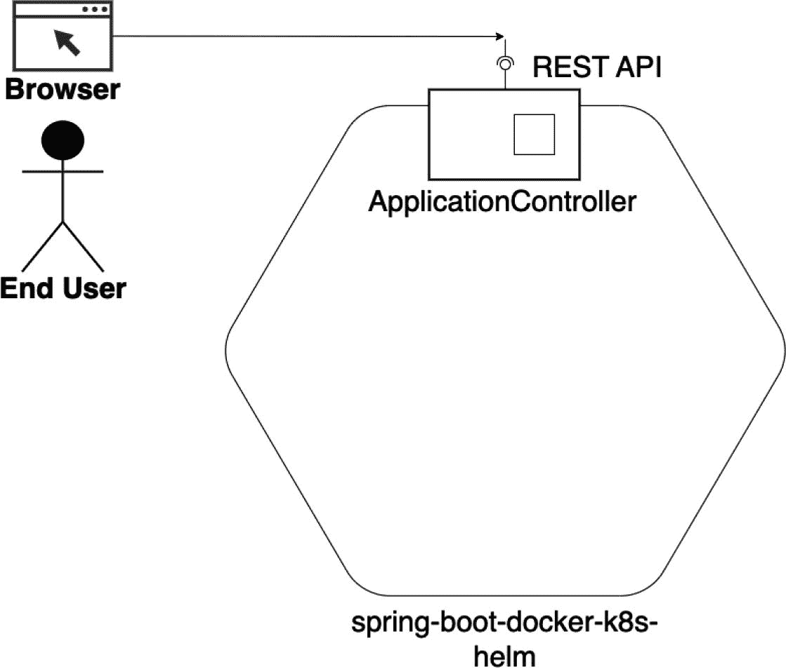
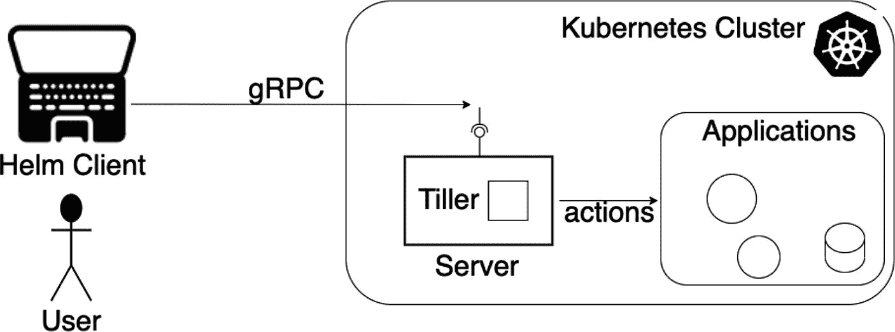

# mongo
...

> show dbs
admin   0.000GB
config  0.000GB
local   0.000GB
test    0.000GB
> db.getName()
test
> show collections
product
> db.product.find()
{ "_id" : ObjectId("64733f182a010c0eaeda6e30"), ...
{ "_id" : ObjectId("64733f182a010c0eaeda6e31"), ...
...
清单 11-29
执行 MongoDB Shell 命令
```

在本示例中测试完微服务后，你可以停止并移除微服务容器并清理环境，如清单 11-30 所示。

```
(base) binildass-MacBook-Pro:ch11-02 binil$ pwd
/Users/binil/binil/code/mac/mybooks/docker-04/Code/ch11/ch11-02
(base) binildass-MacBook-Pro:ch11-02 binil$ eval $(minikube docker-env)
(base) binildass-MacBook-Pro:ch11-02 binil$ sh clean.sh
[INFO] Scanning for projects...
[INFO] ---------------------------------------------------
[INFO] Reactor Build Order:
[INFO]
[INFO] Kafka Request Reply utility                     [jar]
[INFO] Ecom-Product-Server-Microservice                [jar]
[INFO] Ecom-Product-Web-Microservice                   [jar]
[INFO] Ecom                                            [pom]
[INFO]
...
[INFO]
[INFO] Kafka Request Reply utility ...... SUCCESS [  0.087 s]
[INFO] Ecom-Product-Server-Microservice . SUCCESS [  0.075 s]
[INFO] Ecom-Product-Web-Microservice .... SUCCESS [  0.013 s]
[INFO] Ecom ............................. SUCCESS [  0.003 s]
[INFO] -----------------------------------------------------
[INFO] BUILD SUCCESS
[INFO] -----------------------------------------------------
[INFO] Total time:  0.415 s
[INFO] Finished at: 2023-05-19T20:41:43+05:30
[INFO] -----------------------------------------------------
service "product-web" deleted
deployment.apps "product-web" deleted
service "product-server" deleted
service "product-server-nodeport" deleted
deployment.apps "product-server" deleted
service "mongo" deleted
service "mongo-nodeport" deleted
statefulset.apps "mongo-cluster" deleted
persistentvolumeclaim "mongo-data-db" deleted
persistentvolume "mongo-data-db" deleted
service "zookeeper-ip-service" deleted
service "kafka-1-ip-service" deleted
deployment.apps "zookeeper-deployment" deleted
deployment.apps "kafka-1-deployment" deleted
Untagged: ecom/product-web:latest
Untagged: ecom/product-server:latest
(base) binildass-MacBook-Pro:ch11-02 binil$
清单 11-30
清理项目与环境

```

至此，第二个示例完成。


## 微服务的入站路由

通过前几章以及本章前面的示例，你已经了解了如何在 Kubernetes 中通过多个业务、应用和基础设施服务完成典型的部署。本节将向你展示如何调整第 10 章第二个示例中的同一组微服务，在前端接入一个 Ingress 来路由外部请求。一个消费者微服务和一个提供者微服务相互通信。提供者微服务将实体存储在 PostgreSQL 数据库中。来自浏览器的请求由 Ingress 拦截。如第 10 章所述，Ingress 可以通过单个 IP 地址暴露多个服务。

尽管这个示例包含在本章中，并且标题为“面向消息的微服务”作为最后一个示例，但我有意去掉了微服务之间的消息桥接。这是为了让示例更轻量，以便我可以引入一些其他新组件，并将示例的整体复杂性控制在合理范围内。

### 设计 Ingress 路由拓扑

Product Web 和 Product Server 微服务均已容器化，Product Server 微服务将连接到部署在容器内的 PostgreSQL 数据库。所有这些容器都将驻留在 Kubernetes 中。Ingress 成为路由的附加组件，而 Adminer UI 组件则用于管理 PostgreSQL 数据库。参见图 11-3。



一个 3D 模型图，展示了连接到浏览器的用户、Ingress 基础设施服务、Product Web 微服务、Product Server 微服务、带功能的容器引擎、主机操作系统和硬件。Product Web 包含一个业务服务，Product Server 包含一个业务服务和两个应用服务。

图 11-3

微服务的 Ingress 路由拓扑

### 环境配置

要使 URL（[`http://products.acme.test`](http://products.acme.test) 和 [`http://adminer.acme.test`](http://adminer.acme.test)）生效，你需要编辑主机上的 hosts 文件。

每个连接到互联网的网站都有一个唯一的数字地址，用于告知所有其他设备其位置——即其 TCP/IP 地址。域名系统（DNS）将这些数字地址转换为人类更容易识别和记忆的形式，例如 [`www.acme.com`](http://www.acme.com)。当你第一次输入像 [`www.acme.com`](http://www.acme.com) 这样的网址时，你的机器会向一个 DNS 服务器发送请求——通常是由你的 ISP（互联网服务提供商）自动配置的。这将解析你要连接的服务器对应的 TCP/IP 地址。你的浏览器会建立一个隐藏的缓存文件，以便在你再次访问该网站时记住这些细节。

如前所述，本示例将名称添加到 hosts 文件中，如代码清单 11-31 所示。

```
(base) binildass-MacBook-Pro:ch11-03 binil$ minikube ip
192.168.64.5
(base) binildass-MacBook-Pro:~ binil$ sudo nano /etc/hosts
192.168.64.5  adminer.acme.com
192.168.64.5  products.acme.com
(base) binildass-MacBook-Pro:~ binil$ ^O (保存)
(base) binildass-MacBook-Pro:~ binil$ ^X (退出)
(base) binildass-MacBook-Pro:~ sudo killall -HUP mDNSResponder
代码清单 11-31
将主机名添加到 etc Hosts 文件
```

代码清单 11-31 展示了如何添加两行新内容，将两个新主机名添加到我的机器上。这会将你的本地主机（Minikube）IP 地址映射到这两个主机名，并使它们可访问。

图 11-4 展示了我是如何编辑这个文件的。



一个裁剪后的截图，显示 binil sudo 80 x 5 窗口。其中包含两条命令，内容为 base（括号内）binil d a s s-MacBook-Pro 冒号波浪线 binil 美元符号 sudo nano 斜杠 e t c 斜杠 hosts 和密码。

图 11-4

编辑 hosts 文件

图 11-5 展示了我是如何在我的机器上添加这两个主机名的。



一个 binil pico sudo 80 x 20 窗口的截图。其中包含 U W pico 5.09 文件：斜杠 e t c 斜杠 hosts 数据，内容为：主机数据库，localhost 用于配置回环接口，系统启动时请勿更改此条目，由 Docker Desktop 添加，以及其他内容，包括 localhost、broadcasthost 和其他地址。

图 11-5

添加主机名

完成后，按住 Control 和 O 键保存文件，然后按 Control 和 X 退出。随后在命令行中，输入 `sudo killall -HUP mDNSResponder`，然后按回车键。这将刷新你的 DNS 缓存，以免因对 Hosts 文件所做的任何更改而导致混淆。


### 理解源代码

本书的源代码可通过图书产品页面在 GitHub 上获取，地址为 [`www.apress.com/9798868805547`](http://www.apress.com/9798868805547)。本示例的源代码位于 `ch11\ch11-03` 文件夹内。该示例中的源代码与 `ch10\ch10-01` 类似，后者已在第 10 章中详细解释。不过，这里引入了两个新组件——Ingress 和 Adminer。

`ch11-03` 文件夹内示例源代码组织的概要表示如代码清单 11-32 所示。

```
./ch11-03/
├── 01-ProductServer
│   ├── make.sh
│   ├── pom.xml
│   └── src
│       └── main
├── 02-ProductWeb
│   ├── make.sh
│   ├── pom.xml
│   └── src
│       └── main
├── Dockerfile
├── README.txt
├── adminer-deployment.yaml
├── adminer-svc.yaml
├── clean.sh
├── ingress-controller.yaml
├── makeandrun.sh
├── pom.xml
├── postgres-config.yml
├── postgres-deployment.yml
├── postgres-pvc.yml
├── postgres-svc.yml
├── product-server-deployment.yml
├── product-server-service.yml
├── product-web-deployment.yml
└── product-web-service.yml
代码清单 11-32
示例 11-03 源代码组织
```

该项目中有两个表示服务或 UI 服务：

*   [`http://products.acme.test`](http://products.acme.test)：用户可与 Product Web 微服务交互

*   [`http://adminer.acme.test`](http://adminer.acme.test)：用户可与 PostgreSQL 数据库交互

与第 10 章中的代码清单 10-41 相比，代码清单 11-32 中新增了两个部署：Ingress 和 Adminer。让我们逐一研究这些新部署。请参见代码清单 11-33。

```
apiVersion: networking.k8s.io/v1
kind: Ingress
metadata:
name: ingress-service
annotations:
kubernetes.io/ingress.class: nginx
spec:
rules:
- host: "adminer.acme.test"
http:
paths:
- path: /
pathType: Prefix
backend:
service:
name: adminer
port:
number: 8080
- host: "products.acme.test"
http:
paths:
- path: /
pathType: Prefix
backend:
service:
name: product-web
port:
number: 8080
代码清单 11-33
Ingress 的 Pod 定义 YAML 文件 (ch11\ch11-03\ingress-controller.yml)
```

首先，指定要创建的 Kubernetes 对象的类型，即 Ingress。接着是包含对象名称的元数据（与往常一样）和一个名为 `annotations` 的新部分。你可以配置 Ingress 的行为。本示例使用了最简单的配置，但还有更多可能性。`spec` 部分包含了第一条规则——所有来自 `adminer.acme.test` 主机的请求都将路由到名为 `adminer` 的 `ClusterIP`，而来自 `products.acme.test` 主机的请求则路由到名为 `product-web` 的 `ClusterIP`。

下一个组件是 Adminer UI，它是 PostgreSQL 数据库的一个 UI 界面。请参见代码清单 11-34。

```
apiVersion: apps/v1
kind: Deployment
metadata:
name: adminer
labels:
app: adminer
group: db
spec:
replicas: 1
selector:
matchLabels:
app: adminer
template:
metadata:
labels:
app: adminer
group: db
spec:
containers:
- name: adminer
image: adminer:4.8.1-standalone
ports:
- containerPort: 8080
imagePullPolicy: IfNotPresent
env:
- name: ADMINER_DESIGN
value: pepa-linha
- name: ADMINER_DEFAULT_SERVER
value: postgres
代码清单 11-34
Adminer 的 Pod 定义 YAML 文件 (ch11\ch11-03\adminer-deployment.yml)
```

初始部分负责定义正在创建的对象类型（`apiVersion, kind`），随后是一些元数据，包括 `name`、`labels` 和 `app group`（`metadata`）。然后，它提到了容器要使用的 `image` 以及一些其他环境变量。它还定义了一个 Adminer 服务。请参见代码清单 11-35。

```
apiVersion: v1
kind: Service
metadata:
name: adminer
labels:
group: db
spec:
type: ClusterIP
selector:
app: adminer
ports:
- port: 8080
targetPort: 8080
代码清单 11-35
Adminer 的服务定义 YAML 文件 (ch11\ch11-03\adminer-svc.yml)
```

### 在 Kubernetes 中运行 Ingress 和微服务

本示例假设你的单节点 Kubernetes 集群 Minikube 已启动并正在运行，并且你已经按照附录 E 中的说明在 Minikube 中启用了 Ingress 插件。现在，你有一个简单的脚本，包含单个命令，用于构建并运行包含所有部署描述符的完整应用程序，如代码清单 11-36 所示。

```
(base) binildass-MacBook-Pro:ch11-03 binil$ eval $(minikube docker-env)
(base) binildass-MacBook-Pro:ch11-03 binil$ pwd
/Users/binil/binil/code/mac/mybooks/docker-04/Code/ch11/ch11-03
(base) binildass-MacBook-Pro:ch11-03 binil$ eval $(minikube docker-env)
(base) binildass-MacBook-Pro:ch11-03 binil$ sh makeandrun.sh
[INFO] Scanning for projects...
[INFO] -----------------------------------------------------
[INFO] Reactor Build Order:
[INFO]
[INFO] Ecom-Product-Server-Microservice                 [jar]
[INFO] Ecom-Product-Web-Microservice                    [jar]
[INFO] Ecom                                             [pom]
[INFO]
[INFO] --
[INFO] Building Ecom-Product-Server-Microservice 0.0.1-SNAPSHOT
[INFO] --------------------------------[ jar ]--------------
[INFO]
...
[INFO]
[INFO] Ecom-Product-Server-Microservice . SUCCESS [  2.975 s]
[INFO] Ecom-Product-Web-Microservice .... SUCCESS [  0.660 s]
[INFO] Ecom ............................. SUCCESS [  0.020 s]
[INFO] ------------------------------------------------------
[INFO] BUILD SUCCESS
[INFO] ------------------------------------------------------
[INFO] Total time:  3.850 s
[INFO] Finished at: 2023-05-28T22:17:15+05:30
[INFO] ------------------------------------------------------
...
Successfully tagged ecom/product-web:latest
Successfully tagged ecom/product-server:latest
configmap/postgres-config created
persistentvolumeclaim/postgres-persistent-volume-claim created
deployment.apps/postgres created
service/postgres created
deployment.apps/adminer created
service/adminer created
deployment.apps/product-server created
service/product-server created
deployment.apps/product-web created
service/product-web created
ingress.networking.k8s.io/ingress-service created
http://192.168.64.6:31858
NAME                              READY   STATUS    RESTART
adminer-847f44cbd4-hg4gf          1/1     Running   0
postgres-89dbf9fd9-vr8k2          0/1     Pending   0
product-server-5bf9db77dc-v9jl7   1/1     Running   0
product-web-7496dc46f9-fqfkq      1/1     Running   0
NAME           TYPE      CLUSTER-IP     PORT(S)        AGE
adminer        ClusterIP 10.104.83.51   8080/TCP       4s
kubernetes     ClusterIP 10.96.0.1      443/TCP        11d
postgres       ClusterIP 10.104.112.235 5432/TCP       5s
product-server ClusterIP 10.104.42.20   8081/TCP       4s
product-web    NodePort  10.106.179.41  8080:31858/TCP 4s
(base) binildass-MacBook-Pro:ch11-03 binil$
代码清单 11-36
执行脚本以在 Kubernetes 中构建并运行微服务 (ch11\ch11-03\makeandrun.sh)
```


### 描述 Ingress

当 Pod 启动并运行后，你可以描述已创建的 Ingress 对象。参见清单 11-37。

```
(base) binildass-MacBook-Pro:~ binil$ kubectl describe ingress
Name:             ingress-service
Labels:           
Namespace:        default
Address:          192.168.64.6
Ingress Class:    
Default backend:  
Rules:
Host                Path  Backends
----                ----  --------
adminer.acme.test
/   adminer:8080 (10.244.1.234:8080)
products.acme.test
/   product-web:8080 (10.244.1.233:8080)
Annotations:          kubernetes.io/ingress.class: nginx
Events:
Type    Reason  Age                    From                      Message
----    ------  --------------------- ------------------------  --------
Normal  Sync    7m15s (x2 over 7m44s)  nginx-ingress-controller  Scheduled for sync
(base) binildass-MacBook-Pro:~ binil$
清单 11-37
描述 Kubernetes Ingress 对象
```

如你所见，创建 Ingress Kubernetes 对象时指定的路由已成功配置。现在，让我们尝试访问这些路由。

现在可以测试微服务了。

### 测试微服务 Pod

你可以使用配置的主机名访问 Product Web 微服务（参见图 11-6）。

[`http://products.acme.test/product.html`](http://products.acme.test/product.html)



一个 bootstrap CRUD 数据表浏览器标签页的截图。它包含一个管理产品表格，顶部有“添加新产品”按钮。表格包含 ID、名称、代码、标题、价格和操作列，并有两行数据。

图 11-6

使用主机名访问 Product Web 微服务

注意图 11-6 中的 URL 地址。请参考第 1 章中“使用 UI 测试微服务”一节来测试 Product Web 微服务容器。在测试微服务时，你可以持续观察 Product Web 和 Product Server 微服务的日志窗口。

回想一下，你还配置了 Adminer UI。现在可以尝试通过 Adminer UI 访问 PostgreSQL 数据库。使用第二个 URL：[`http://adminer.acme.test`](http://adminer.acme.test)。



一个登录 Adminer 浏览器标签页的截图。右侧是登录区域，左侧是 Adminer 版本和语言。登录区域包含系统下拉菜单、服务器、用户名、密码和数据库输入框，以及带有“永久登录”复选框的登录按钮。

图 11-7

使用 Adminer UI 访问 PostgreSQL 数据库

注意图 11-7 中的 URL 地址。它提供了在 `postgres-config.yml` 中配置的凭据。如果成功登录，你可以查看 Product Server 微服务初始化的表。参见图 11-8。



一个 schema public 浏览器标签页的截图。右侧是 schema public 区域，左侧是 Adminer 版本、语言以及两个包含各种选项的下拉菜单。schema 区域包含表和视图部分，带有一个搜索栏和一个包含 8 列 3 行（含复选框等）的表格。

图 11-8

Adminer UI 显示新创建的表

完成本例中所有微服务的测试后，你可以停止并移除微服务容器并清理环境，如清单 11-38 所示。

```
(base) binildass-MacBook-Pro:ch11-03 binil$ pwd
/Users/binil/binil/code/mac/mybooks/docker-04/Code/ch11/ch11-03
(base) binildass-MacBook-Pro:ch11-03 binil$ eval $(minikube docker-env)
(base) binildass-MacBook-Pro:ch11-03 binil$ sh clean.sh
[INFO] Scanning for projects...
[INFO] -----------------------------------------------------
[INFO] Reactor Build Order:
[INFO]
[INFO] Ecom-Product-Server-Microservice                 [jar]
[INFO] Ecom-Product-Web-Microservice                    [jar]
[INFO] Ecom                                             [pom]
[INFO]
...
[INFO]
[INFO] Ecom-Product-Server-Microservice . SUCCESS [  0.114 s]
[INFO] Ecom-Product-Web-Microservice .... SUCCESS [  0.009 s]
[INFO] Ecom ............................. SUCCESS [  0.036 s]
[INFO] -----------------------------------------------------
[INFO] BUILD SUCCESS
[INFO] -----------------------------------------------------
[INFO] Total time:  0.384 s
[INFO] Finished at: 2023-05-28T22:46:54+05:30
[INFO] -----------------------------------------------------
service "product-web" deleted
deployment.apps "product-web" deleted
service "product-server" deleted
deployment.apps "product-server" deleted
service "adminer" deleted
deployment.apps "adminer" deleted
service "postgres" deleted
deployment.apps "postgres" deleted
persistentvolumeclaim "postgres-persistent-volume-claim" deleted
configmap "postgres-config" deleted
ingress.networking.k8s.io "ingress-service" deleted
Untagged: ecom/product-web:latest
Untagged: ecom/product-server:latest
(base) binildass-MacBook-Pro:ch11-03 binil$
清单 11-38
清理项目与环境
```

至此，本章的最后一个示例完成。

## 总结

上一章介绍了 Kubernetes 以及一个与 SQL 和 NoSQL 数据库交互的熟悉微服务示例。本章是上一章的延伸，你在其中了解了 Kubernetes 中的 Kafka。你还了解到，所有设计原语——包括消费者和提供者微服务多个实例之间的关联——都能在 Kubernetes 工具集中按预期工作。最后，你学习了 Ingress，它可以通过单个 IP 地址暴露多个服务，为你提供一种实用且经济的方式将多个服务暴露给外部世界。下一步是了解一些其他工具，这些工具可以帮助你在拥有十几个微服务的生产场景中进一步减少和管理复杂性。这是下一章的主题。

# 12. 自动化 Kubernetes 部署与 Helm

从单体架构到微服务的旅程包括选择性扩展、并行发布等目标。然而，随着你创建更多微服务并且应用程序不断增长，管理变得越来越困难。Kubernetes 通过将多个微服务分组到单个部署中来简化这一过程。在开发生命周期中管理 Kubernetes 应用程序会带来一系列挑战，包括版本管理、配置环境变量、资源分配、更新和回滚。Helm 为此问题提供了最合适的解决方案之一，使部署更加一致、可重复且可靠。本章再次审视自动化的必要性，并作为其中的一部分，借助多微服务示例介绍 Helm。

此处的目标是理解自动化步骤，然后介绍 Helm。首先，我将示例应用程序精简到最低限度，以便你可以专注于应用程序自动化方面。在介绍 Helm 之后，我会重新引入相同的多微服务示例，并向你展示当微服务复杂性增加时，Helm 如何发挥作用。

本章涵盖以下概念：

*   重新介绍 Hello World Spring Boot 微服务

*   自动化 Docker 交互

*   自动化 Kubernetes 交互

*   介绍 Helm

*   使用 Helm 部署多微服务

*   使用 Helmfile 部署多微服务

让我们从重新介绍“Hello World”微服务示例开始。


## 介绍一个简单的 Java 微服务

你在第 1 章中看到了一个简单的微服务示例。本节从一个类似但更简单的微服务开始。

### 设计你的简单微服务

这个简单的微服务只有一个组件或 Java 类，它是一个 REST 控制器（见图 12-1）。



该图展示了这个简单的微服务。它包括浏览器、REST API、应用程序控制器和最终用户。

图 12-1

一个简单的微服务

我们再来研究一下项目结构。

### 代码组织

本书的源代码可通过图书产品页面在 GitHub 上获取，网址为 [`www.apress.com/9798868805547`](http://www.apress.com/9798868805547)。此示例的源代码组织在 `ch12\ch12-01` 文件夹内，如清单 12-1 所示。

```
./ch12-01/
├── README.txt
├── clean.sh
├── make.sh
├── pom.xml
├── run.sh
└── src
└── main
├── java
│   └── com
│       └── acme
│           └── ecom
│               └── product
│                   └── Application.java
└── resources
├── application.yml
└── log4j2-spring.xml
清单 12-1
Spring Boot 微服务源代码组织
```

此代码遵循标准的 Maven 结构，因此 `pom.xml` 文件位于根目录中。

### 理解源代码

唯一的应用程序组件是 `Application.java` 类，它是一个 REST 控制器（见清单 12-2）。

```
@SpringBootApplication
@RestController
public class Application {
private static final Logger LOGGER =
LoggerFactory.getLogger(Application.class);
private static volatile long times = 0L;
@RequestMapping("/")
public String home() {
LOGGER.info("Start");
++times;
LOGGER.debug("Inside hello.Application.home() : {}",
times);
LOGGER.info("Returning...");
return "Hello Docker World : " + times;
}
public static void main(String[] args) {
SpringApplication.run(Application.class, args);
LOGGER.info("Started...");
}
}
清单 12-2
应用程序 REST 控制器 (ch12/ch12-01/src/main/java/com/acme/ecom/product\Application.java)
```

这是一个 Spring REST 注解类，因此你应该能够使用浏览器访问它。

### 构建并运行微服务

`ch12\ch12-01` 文件夹包含构建和运行这些示例所需的 Maven 脚本。见清单 12-3。

```
(base) binildass-MacBook-Pro:ch12-01 binil$ pwd
/Users/binil/binil/code/mac/mybooks/docker-04/Code/ch12/ch12-01
(base) binildass-MacBook-Pro:ch12-01 binil$ sh make.sh
[INFO] Scanning for projects...
[INFO]
...
[INFO] ---------------------------------------------------
[INFO] BUILD SUCCESS
[INFO] ---------------------------------------------------
[INFO] Total time:  1.569 s
[INFO] Finished at: 2023-05-20T11:17:49+05:30
[INFO] ---------------------------------------------------
(base) binildass-MacBook-Pro:ch12-01 binil$
清单 12-3
使用脚本构建微服务

下一步是运行微服务，如清单 12-4 所示。

```
(base) binildass-MacBook-Pro:ch12-01 binil$ pwd
/Users/binil/binil/code/mac/mybooks/docker-04/Code/ch12/ch12-01
(base) binildass-MacBook-Pro:ch12-01 binil$ sh run.sh
.   ____          _            __ _ _
/\\ / ___'_ __ _ _(_)_ __  __ _ \ \ \ \
( ( )\___ | '_ | '_| | '_ \/ _` | \ \ \ \
\\/  ___)| |_)| | | | | || (_| |  ) ) ) )
'  |____| .__|_| |_|_| |_\__, | / / / /
=========|_|==============|___/=/_/_/_/
:: Spring Boot ::                (v3.2.0)
2023-05-20 11:19:04 INFO  StartupInfoLogger.logStarting:51 - Starting Application v0.0.1-SNAPSHOT ...
2023-05-20 11:19:04 DEBUG StartupInfoLogger.logStarting:52 - Running with Spring Boot v3.0.6...
2023-05-20 11:19:04 INFO  SpringApplication.logStartupProfileInfo:632 - No active profile set...
2023-05-20 11:19:05 INFO  StartupInfoLogger.logStarted:57 - Started Application ...
2023-05-20 11:19:05 INFO  Application.main:50 - Started...
2023-05-20 11:19:10 INFO  Application.home:40 - Start
2023-05-20 11:19:10 DEBUG Application.home:42 - Inside hello.Application.home() : 1
2023-05-20 11:19:10 INFO  Application.home:43 - Returning...
清单 12-4
使用脚本运行微服务

### 测试微服务

微服务启动后，你可以通过浏览器访问此 URL 来访问 Web 应用程序：

`http://127.0.0.1:8080/`

或者，你也可以使用 cURL 访问微服务，如清单 12-5 所示。

```
(base) binildass-MacBook-Pro:~ binil$ curl http://127.0.0.1:8080/
Hello Docker World : 1
(base) binildass-MacBook-Pro:~ binil$
清单 12-5
使用 cURL 测试微服务

在接下来的三个示例中，你将提高此微服务基于容器的部署的构建和打包自动化水平。之后，我将介绍 Helm。

## 自动化 Docker 构建

在本节中，你将把示例容器化并部署到 Docker 中。本节使用 `dockerfile-maven-plugin` 将 Maven 与 Docker 集成。

### 理解源代码

本书的源代码可通过图书产品页面在 GitHub 上获取，网址为 [`www.apress.com/9798868805547`](http://www.apress.com/9798868805547)。此示例的源代码组织在 `ch12\ch12-02` 文件夹内。

你有一个唯一的应用程序组件，即 `Application.java` 类，它是一个 REST 控制器。额外的代码告诉 Maven 脚本使用 `dockerfile-maven-plugin`。见清单 12-6。

```
...

...

com.spotify

dockerfile-maven-plugin

1.4.13

${docker.image.prefix}/
${project.artifactId}

清单 12-6
Spotify Maven 插件 (ch12/ch12-02/pom.xml)
```

Spotify Maven 插件会使用你的 Dockerfile 为你运行 Docker 命令，就像你在命令终端上操作一样。你可以用它来自动化 Docker 构建。对于 Docker 镜像标签等，有一些配置选项，但它将应用程序中的 Docker 知识集中在一个 Dockerfile 中，这是许多人喜欢的方式。


### 构建并运行微服务

`ch12\ch12-02` 文件夹包含构建和运行示例所需的 Maven 脚本。

由于需要 Docker 运行时，请先启动 Minikube。有关基于 Minikube 的 Kubernetes 设置和命令的快速参考，请参阅附录 E。参见清单 12-7。

```
(base) binildass-MacBook-Pro:~ binil$ minikube start
😄  minikube v1.30.1 on Darwin 13.3
✨  基于现有配置文件使用 hyperkit 驱动
👍  正在 minikube 集群中启动控制平面节点 minikube
🔄  正在重启现有的 hyperkit VM "minikube" ...
📦  正在准备 Kubernetes v1.26.3 on Docker 20.10.23 ...
...
🔎  正在验证 ingress 插件...
🌟  已启用的插件：ingress-dns, storage-provisioner, default-storageclass, ingress
💡  kubectl 现在已配置为默认使用 "minikube" 集群和 "default" 命名空间
(base) binildass-MacBook-Pro:~ binil$
清单 12-7
启动 Minikube
```

同时，在你的工作终端中设置 minikube 环境变量。

你必须使用 `mvn dockerfile:build` 命令，该命令将创建 Docker 镜像，现在就这样做。参见清单 12-8。

```
(base) binildass-MacBook-Pro:ch12-02 binil$ pwd
/Users/binil/binil/code/mac/mybooks/docker-04/Code/ch12/ch12-02
(base) binildass-MacBook-Pro:ch12-04 binil$ eval $(minikube docker-env)
(base) binildass-MacBook-Pro:ch12-02 binil$ sh make.sh
[INFO] Scanning for projects...
...
[INFO]
[INFO] --
[INFO] Building Spring Boot μS 0.0.1-SNAPSHOT
[INFO] ---------------------- [ jar ]---------------------
[INFO]
...
[INFO] Successfully built 0c23b3413de1
[INFO] Successfully tagged binildas/spring-boot-docker-k8s-helm:latest
[INFO]
...
[INFO] Successfully built binildas/spring-boot-docker-k8s-helm:latest
[INFO] -------------------------------------------------
[INFO] BUILD SUCCESS
[INFO] -------------------------------------------------
[INFO] Total time:  13.935 s
[INFO] Finished at: 2023-05-20T11:54:39+05:30
[INFO] --------------------------------------------------
(base) binildass-MacBook-Pro:ch12-02 binil$
清单 12-8
构建微服务和 Docker 镜像
```

此日志表明 `binildas/spring-boot-docker-k8s-helm:latest` 已构建完成。你可以检查本地 Docker 注册表以查看新创建的镜像，如清单 12-9 所示。

```
(base) binildass-MacBook-Pro:~ binil$ eval $(minikube docker-env)
(base) binildass-MacBook-Pro:~ binil$ docker images
REPOSITORY                           TAG    IMAGE ID
binildas/spring-boot-docker-k8s-helm latest 0c23b3413de1
...
(base) binildass-MacBook-Pro:~ binil$
清单 12-9
检查 Docker 镜像
```

在此示例中，你打算进行的任何自动化（仅镜像创建）已经完成，因此你可以手动执行其余阶段。

现在将镜像推送到 Docker 公共注册表。由于我的 Docker 注册表中已有该镜像，我首先从终端将其删除。为此，我将获取一个令牌。参见清单 12-10。

```
(base) binildass-MacBook-Pro:~ binil$ HUB_TOKEN=$(curl -s -H "Content-Type: application/json" -X POST -d '{"username": "binildas" , "password": "********" }' https://hub.docker.com/v2/users/login/ | jq -r .token)
(base) binildass-MacBook-Pro:~ binil$ echo $HUB_TOKEN
eyJ4NWMiOlsiTUlJQytUQ0NBc...
(base) binildass-MacBook-Pro:~ binil$
清单 12-10
检索 Docker Hub 令牌

使用该令牌，你可以从公共 Docker 注册表中删除 `binildas/spring-boot-docker-k8s-helm` 镜像，如清单 12-11 所示。

```
(base) binildass-MacBook-Pro:~ binil$ curl -i -X DELETE -H "Accept: application/json" -H "Authorization: JWT $HUB_TOKEN" https://hub.docker.com/v2/repositories/binildas/spring-boot-docker-k8s-helm/tags/latest/
HTTP/1.1 204 No Content
date: Sat, 20 May 2023 06:08:59 GMT
x-ratelimit-limit: 600
x-ratelimit-reset: 1684562998
x-ratelimit-remaining: 600
x-trace-id: f6de7fa45a63c1eb6b076df17971cc37
server: nginx
x-frame-options: deny
x-content-type-options: nosniff
x-xss-protection: 1; mode=block
strict-transport-security: max-age=31536000
(base) binildass-MacBook-Pro:~ binil$
清单 12-11
从公共 Docker Hub 删除镜像
```

现在，要手动将镜像推送到公共 Docker Hub，你必须从终端登录到 Docker，如清单 12-12 所示。

```
(base) binildass-MacBook-Pro:~ binil$ eval $(minikube docker-env)
(base) binildass-MacBook-Pro:~ binil$ docker login
Authenticating with existing credentials...
WARNING! Your password will be stored unencrypted in /Users/binil/.docker/config.json.
Configure a credential helper to remove this warning. See
https://docs.docker.com/engine/reference/commandline/login/#credentials-store
Login Succeeded
(base) binildass-MacBook-Pro:~ binil$
清单 12-12
从终端登录 Docker Hub
```

你可以手动将镜像推送到 Docker Hub（从此终端），如清单 12-13 所示。

```
(base) binildass-MacBook-Pro:~ binil$ docker push binildas/spring-boot-docker-k8s-helm:latest
The push refers to repository [docker.io/binildas/spring-boot-docker-k8s-helm]
250c3b6ce2b0: Pushed
1bc0685fedc8: Pushed
cc66d1dae976: Pushed
ceaf9e1ebef5: Pushed
9b9b7f3d56a0: Pushed
f1b5933fe4b5: Pushed
latest: digest: sha256:083ad89fa86e9852ba783eadb5f9c174e746ba1e0cc8404f24cc6d76fdcd9345 size: 1575
(base) binildass-MacBook-Pro:~ binil$
清单 12-13
手动将镜像推送到 Docker Hub
```

为了演示从公共 Docker Hub 拉取 Docker 镜像，请从本地 Docker 注册表中删除该镜像，如清单 12-14 所示。

```
(base) binildass-MacBook-Pro:~ binil$ eval $(minikube docker-env)
(base) binildass-MacBook-Pro:~ binil$ docker rmi binildas/spring-boot-docker-k8s-helm
Untagged: binildas/spring-boot-docker-k8s-helm:latest
Untagged: binildas/spring-boot-docker-k8s-helm@sha256:083ad...
...
Deleted: sha256:9889cb2fe045eb9f5b7b3811796377440f5f6890fda...
(base) binildass-MacBook-Pro:~ binil$
清单 12-14
从本地 Docker 注册表删除镜像
```

现在你可以尝试启动应用程序。使用以下命令：

```
docker run -it -p 8080:8080 binildas/spring-boot-docker-k8s-helm:latest
```

在此过程中，你必须首先从公共 Docker Hub 拉取镜像并实例化容器。参见清单 12-15。


```
(base) binildass-MacBook-Pro:ch12-02 binil$ pwd
/Users/binil/binil/code/mac/mybooks/docker-04/Code/ch12/ch12-02
(base) binildass-MacBook-Pro:ch12-02 binil$ eval $(minikube docker-env)
(base) binildass-MacBook-Pro:ch12-02 binil$ sh run.sh
Unable to find image 'binildas/spring-boot-docker-k8s-helm:latest' locally
latest: Pulling from binildas/spring-boot-docker-k8s-helm
5843afab3874: Already exists
53c9466125e4: Already exists
d8d715783b80: Already exists
af78a462dd1f: Pull complete
71d05ae2a767: Pull complete
04170f3d7f6b: Pull complete
Digest: sha256:275170154dd952be90cffdff0b585d28975a47070d75f59e5f782862bb36a864
Status: Downloaded newer image for binildas/spring-boot-docker-k8s-helm:latest
.   ____          _            __ _ _
/\\ / ___'_ __ _ _(_)_ __  __ _ \ \ \ \
( ( )\___ | '_ | '_| | '_ \/ _` | \ \ \ \
\\/  ___)| |_)| | | | | || (_| |  ) ) ) )
'  |____| .__|_| |_|_| |_\__, | / / / /
=========|_|==============|___/=/_/_/_/
:: Spring Boot ::                (v3.2.0)
2023-05-20 07:07:33 INFO  StartupInfoLogger.logStarting:51 - Starting Application using Java...
2023-05-20 07:07:33 DEBUG StartupInfoLogger.logStarting:52 - Running with Spring Boot v3.0.6...
2023-05-20 07:07:33 INFO  SpringApplication.logStartupProfileInfo:632 - No active ...
2023-05-20 07:07:35 INFO  StartupInfoLogger.logStarted:57 - Started Application ...
2023-05-20 07:07:35 INFO  Application.main:50 - Started...
...
清单 12-15
拉取镜像并启动容器
```

应用程序运行后，你就可以测试它了。

### 测试微服务

首先需要找到 Minikube 的 IP 地址，如清单 12-16 所示。

```
(base) binildass-MacBook-Pro:~ binil$ eval $(minikube docker-env)
(base) binildass-MacBook-Pro:~ binil$ minikube ip
192.168.64.6
(base) binildass-MacBook-Pro:~ binil$
清单 12-16
查找 Minikube IP
```

微服务启动后，你可以通过浏览器访问以下 URL 来使用 Web 应用程序：

`http://192.168.64.6:8080/`

或者，你也可以使用 cURL 来访问微服务，如清单 12-5 所示。

```
(base) binildass-MacBook-Pro:~ binil$ eval $(minikube docker-env)
(base) binildass-MacBook-Pro:~ binil$ docker ps -a
CONTAINER ID   IMAGE                                              COMMAND                    CREATED             STATUS            PORTS                    NAMES
f39c79e72b6f   binildas/spring-boot-docker-k8s-helm:latest   "java -cp app:app/li..."   18 minutes ago      Up 18 minutes       0.0.0.0:8080->8080/tcp   sad_chandrasekhar
...
(base) binildass-MacBook-Pro:~ binil$ eval $
清单 12-17
列出正在运行的容器
```

接下来的三个示例将提高构建和打包的自动化程度。

## 自动化 Docker 推送

本示例展示了如何进一步自动化 Docker 镜像的推送，比上一个示例更进一步。

该示例使用 Google 的 `jib-maven-plugin` 将 Maven 与 Docker 集成。

### 理解源代码

本书的源代码可通过图书产品页面在 GitHub 上获取，网址为 [`www.apress.com/9798868805547`](http://www.apress.com/9798868805547)。本示例的源代码位于 `ch12\ch12-03` 文件夹中。

唯一的应用组件是 `Application.java` 类，它是一个 REST 控制器。你在第 7 章的第二个示例中已经见过这种自动化程度，但为了完整性，在当前示例中也会重复。此外，你还会对 `jib` 插件进行更多配置，因此 Maven 配置如清单 12-18 所示。

```
...

org.springframework.boot

spring-boot-maven-plugin

com.google.cloud.tools

jib-maven-plugin

3.3.2

binildas/${project.artifactId}

USE_CURRENT_TIMESTAMP

清单 12-18
Maven pom.xml (ch12/ch12-03/pom.xml)
```

请参考第 7 章的第二个示例，其中解释了如何配置 Maven 设置配置文件等，以及清单 7-22 中的 Docker Hub 凭据设置。本章将直接进行镜像的构建和推送。

### 构建并运行微服务

`ch12\ch12-03` 文件夹包含构建和运行示例所需的 Maven 脚本。使用 `mvn clean compile jib:build` 命令来构建示例，如清单 12-19 所示。

```
(base) binildass-MacBook-Pro:ch12-03 binil$ pwd
/Users/binil/binil/code/mac/mybooks/docker-04/Code/ch12/ch12-03
(base) binildass-MacBook-Pro:ch12-03 binil$ eval $(minikube docker-env)
(base) binildass-MacBook-Pro:ch12-03 binil$ sh make.sh
[INFO] Scanning for projects...
[WARNING]
...
[INFO]
[INFO] --
[INFO] Building Spring Boot μS 0.0.1-SNAPSHOT
[INFO] --------------------------------[ jar ]----------------
[INFO]
...
[INFO] Using credentials from Docker config (/Users/binil/.docker/config.json) for ...
[INFO] The base image requires auth. Trying again for eclipse-temurin:17-jre...
[INFO] Using credentials from Docker config (/Users/binil/.docker/config.json) for ...
[INFO] Using base image with digest: sha256:620beab172aa...
[INFO]
[INFO] Container entrypoint set to [java, -cp, @/app/jib-classpath-file, com.acme.ecom.product.Application]
[INFO]
[INFO] Built and pushed image as binildas/spring-boot-docker-k8s-helm
[INFO] Executing tasks:
[INFO] [==============================] 100.0% complete
[INFO]
[INFO] -----------------------------------------------------
[INFO] BUILD SUCCESS
[INFO] -----------------------------------------------------
[INFO] Total time:  27.088 s
[INFO] Finished at: 2023-05-20T13:09:48+05:30
[INFO] -----------------------------------------------------
(base) binildass-MacBook-Pro:ch12-03 binil$
清单 12-19
构建微服务并推送 Docker 镜像
```

接下来可以运行微服务。使用 `docker run -it -p 8080:8080 binildas/spring-boot-docker-k8s-helm:latest` 命令来运行此示例，如清单 12-20 所示。

```
(base) binildass-MacBook-Pro:ch12-03 binil$ pwd
/Users/binil/binil/code/mac/mybooks/docker-04/Code/ch12/ch12-03
(base) binildass-MacBook-Pro:ch12-03 binil$ eval $(minikube docker-env)
(base) binildass-MacBook-Pro:ch12-03 binil$ sh run.sh
.   ____          _            __ _ _
/\\ / ___'_ __ _ _(_)_ __  __ _ \ \ \ \
( ( )\___ | '_ | '_| | '_ \/ _` | \ \ \ \
\\/  ___)| |_)| | | | | || (_| |  ) ) ) )
'  |____| .__|_| |_|_| |_\__, | / / / /
=========|_|==============|___/=/_/_/_/
:: Spring Boot ::                (v3.2.0)
2023-05-20 07:45:25 INFO  StartupInfoLogger.logStarting:51 - Starting Application using Java 17-ea ...
2023-05-20 07:45:25 DEBUG StartupInfoLogger.logStarting:52 - Running with Spring Boot v3.0.6...
2023-05-20 07:45:25 INFO  SpringApplication.logStartupProfileInfo:632 - No active profile set...
2023-05-20 07:45:27 INFO  StartupInfoLogger.logStarted:57 - Started Application in 2.809 seconds ...
2023-05-20 07:45:27 INFO  Application.main:50 - Started...
2023-05-20 07:46:08 INFO  Application.home:40 - Start
2023-05-20 07:46:08 DEBUG Application.home:42 - Inside hello.Application.home() : 1
2023-05-20 07:46:08 INFO  Application.home:43 - Returning...
...
清单 12-20
使用脚本运行微服务
```

应用程序运行后，你就可以测试它了。

### 测试微服务

首先需要找到 Minikube 的 IP 地址，如清单 12-6 所示。微服务启动后，你可以通过浏览器访问以下 URL 来使用 Web 应用程序：

`http://192.168.64.6:8080/`

或者，你也可以使用 cURL 来访问微服务，如清单 12-5 所示。


## 自动化 Kubernetes 部署

在了解了 Docker 的不同构建自动化方式后，本示例中你将自动化 Kubernetes 的部署。事实上，在前几章的许多示例中，你已经使用了 Kubernetes 部署的自动化，特别是在第 10 章和第 11 章中。因此，我不再逐一解释每个细节，而是仅说明如何构建和运行代码。自动化使用了 Spotify Maven 插件，你已在本章的第二个示例中了解了其详细信息。

### 代码组织

本书的源代码可通过图书产品页面上的 GitHub 获取，网址为 [`www.apress.com/9798868805547`](http://www.apress.com/9798868805547)。本示例的源代码组织如代码清单 12-21 所示，位于 `ch12\ch12-04` 文件夹内。

```
./ch12-04/
├── Dockerfile
├── README.txt
├── clean.sh
├── k8s
│   ├── deployment.yml
│   └── service.yml
├── make.sh
├── pom.xml
├── run.sh
└── src
└── main
├── java
│   └── com
│       └── acme
│           └── ecom
│               └── product
│                   └── Application.java
└── resources
├── application.yml
└── log4j2-spring.xml
代码清单 12-21
Spring Boot 微服务源代码组织
```

这遵循标准的 Maven 结构，因此 `pom.xml` 文件位于根目录中。

在第 10 章和第 11 章中，你已经了解了 Kubernetes 部署描述符，因此这里不再赘述。相反，你将构建并运行该示例。

### 构建并运行微服务

`ch12\ch12-04` 文件夹包含构建和运行这些示例所需的 Maven 脚本。使用 `mvn clean package dockerfile:build` 命令来构建示例，如代码清单 12-22 所示。

```
(base) binildass-MacBook-Pro:ch12-04 binil$ pwd
/Users/binil/binil/code/mac/mybooks/docker-04/Code/ch12/ch12-04
(base) binildass-MacBook-Pro:ch12-04 binil$ eval $(minikube docker-env)clear
(base) binildass-MacBook-Pro:ch12-04 binil$ sh make.sh
[INFO] Scanning for projects...
[INFO]
...
代码清单 12-22
使用脚本构建微服务
```

下一步你可以运行微服务。名为 `run.sh` 的单个脚本整合了所有命令，如代码清单 12-23 所示。

```
eval $(minikube docker-env)
kubectl create -f ./k8s/deployment.yml
kubectl create -f ./k8s/service.yml
minikube service springboothelm --url
sleep 3
kubectl get pods
kubectl get services
代码清单 12-23
用于运行微服务容器的脚本 (ch12/ch12-04/run.sh)
```

现在你可以执行此脚本，如代码清单 12-24 所示。

```
(base) binildass-MacBook-Pro:ch12-04 binil$ pwd
/Users/binil/binil/code/mac/mybooks/docker-04/Code/ch12/ch12-04
(base) binildass-MacBook-Pro:ch12-04 binil$ eval $(minikube docker-env)clear
(base) binildass-MacBook-Pro:ch12-04 binil$ sh run.sh
deployment.apps/springboothelm created
service/springboothelm created
http://192.168.64.6:30048
...
代码清单 12-24
使用脚本运行微服务容器
```

一旦服务启动并运行，你就可以测试该示例。

### 测试微服务

首先需要找到 Minikube 的 IP 地址，如代码清单 12-16 所示。然后，你可以使用浏览器访问该 Web 应用程序，指向此 URL：

`http://192.168.64.6:8080/`

或者，你也可以使用 cURL 来访问微服务，如代码清单 12-5 所示。

## Helm

在前一个示例以及前两章的许多其他示例中，你看到了用于 Kubernetes 部署的 YAML 文件。当微服务数量增加，并且部署环境数量增加时，你将不得不处理许多 YAML 文件。例如，我目前所在的组织销售用于航空公司乘客预订服务和航空公司货运预订服务以及其他服务的 SaaS 服务。我们需要一个能够在第 4 级 SaaS 成熟度下运行的核心产品，这意味着同一个实例应在功能上适应多家航空公司（称为租户）的需求。同时，这些产品需要部署在多个环境中，例如开发、测试、预发布等。Helm 是一个便捷的工具，它维护一个包含版本信息的单一部署 YAML 文件。这个文件让你能够通过几个命令来设置和管理一个非常大的 Kubernetes 集群。

### 什么是 Helm？

Helm 是 Kubernetes 的包管理器。它有助于在 Kubernetes 集群中安装、升级、卸载和回滚工作负载。类似于 yum 和 apt（它们是 Linux 发行版中流行的包管理器），Helm 将部署视为安装在 Kubernetes 平台上的应用程序。

Helm 要求你将 Kubernetes 清单文件存储在一个特定的文件夹结构中。这个文件夹结构被视为一个包。Helm 包被称为 *charts*。Helm charts 可以嵌套，以帮助使用单个分层文件夹结构安装多个应用程序。为了方便管理 chart 以及同一 Helm chart 的多个版本，这些文件夹也可以归档并存储在仓库中。

### Helm 术语

Helm 使用了三个你需要熟悉的主要概念：

*   Chart：如前所述，chart 包含 Kubernetes 部署所需的所有内容，以及一些 Helm 特定的文件，并遵循特定的文件夹结构。这包括用于部署、服务、密钥和配置映射的所有 YAML 配置文件，这些文件定义了应用程序的部署状态。

*   Config：这包括一个或多个 YAML 文件，其中包含部署 Kubernetes 应用程序所需的配置信息。Kubernetes 集群中的资源将根据这些值进行部署。

*   Release：chart 的一个运行实例称为 release。当你运行 `helm install` 命令时，它会拉取 config，与 chart 文件合并，并部署所有 Kubernetes 资源。一个 chart 可以有多个 release。

掌握了这些基本概念后，下一节将介绍 Helm 的架构。

### 客户端-服务器 Helm 架构

Helm Kubernetes 有两个主要组件——客户端（CLI）和服务器（Tiller）。Helm 采用客户端-服务器模型工作，如图 12-2 所示。



Helm 架构包含以下组件：用户、Helm 客户端、Kubernetes 集群。

图 12-2
Helm 架构

本节将探讨 Helm 架构的两个主要组件：

*   Tiller：Tiller 是安装在 Kubernetes 集群中的服务器，Helm 通过此组件管理 Kubernetes 应用程序。Tiller 与 Kubernetes API 服务器交互，以执行应用程序的 release 操作——安装、升级、查询和删除 Kubernetes 资源。为了快速开发，它也可以在本地运行，并配置为与远程 Kubernetes 集群通信。

*   客户端（CLI）：与任何客户端-服务器模型类似，Helm 客户端位于用户的本地工作站上，而 Tiller 服务器位于 Kubernetes 集群上以执行所需操作。你可以将 CLI 视为用于推送所需资源的工具。Tiller 在 Kubernetes 集群内部运行，并管理（创建/更新/删除）Helm chart 的资源。

    **注意** 在 Helm 2（Helm v2.16.7）之后，Tiller 服务器已被弃用。但这不影响本书中的示例。

有了这些背景知识，下一节将解释 Helm 的工作原理。


### Helm 的工作原理

要理解这个概念，请回顾第 11 章的第一个示例。在 Product Server 微服务中，你为服务器实例定义了三个副本，如代码清单 12-25 所示。

```
apiVersion: apps/v1
kind: Deployment
metadata:
name: product-server
...
spec:
replicas: 3
...
template:
...
spec:
containers:
- name: product-server
...
env:
- name: DB_SERVER
value: postgres
- name: spring.kafka.bootstrap-servers
value: kafka-1-ip-service:9092
代码清单 12-25
Product Server Pod YAML 文件 (ch11\ch11-01\product-server-deployment.yml)
```

假设在预发布环境中你只需要一个实例。为此，你需要更新描述文件中的 `replica` 值，并将其部署到 Kubernetes 中。更好的方法是使用 Helm，这样你就可以根据环境对字段进行参数化。在这个例子中，你可以使用另一个文件中的值来代替副本的静态值。这个文件叫做 `values.yaml`。通过这种方式，Helm 帮助你从实际的 YAML 描述文件中分离出可配置的字段值。

在下一节中，你将通过实践学到更多。

## Helm 打包微服务

本节将向你展示如何为本章前面的示例启用 Helm。如附录 E 所述，我假设你已经在机器上安装了 Helm。

### 代码组织

本书的源代码可通过图书产品页面在 GitHub 上获取，网址为 [`www.apress.com/9798868805547`](http://www.apress.com/9798868805547)。示例的源代码组织如代码清单 12-25 所示，位于 `ch12\ch12-05` 文件夹内。这遵循标准的 Maven 结构，因此 `pom.xml` 文件位于根目录。其中还包含一个名为 `springboothelm` 的新文件夹，里面有许多文件，如代码清单 12-26 所示。

```
./ch12-05/
├── README.txt
├── clean.sh
├── make.sh
├── pom.xml
├── springboothelm
│   ├── Chart.yaml
│   ├── charts
│   ├── templates
│   │   ├── NOTES.txt
│   │   ├── _helpers.tpl
│   │   ├── deployment.yaml
│   │   ├── ingress.yaml
│   │   ├── service.yaml
│   │   ├── serviceaccount.yaml
│   │   └── tests
│   │       └── test-connection.yaml
│   └── values.yaml
└── src
└── main
├── java
│   └── com
│       └── acme
│           └── ecom
│               └── product
│                   └── Application.java
└── resources
├── application.yml
└── log4j2-spring.xml
代码清单 12-26
Spring Boot 微服务源代码组织
```

别慌；你不需要手动创建所有这些文件。相反，你可以自动生成其中的许多文件。

### 创建你的第一个 Helm Chart

在开始创建你的第一个 Helm Chart 之前，请确保 Minikube 正在运行，如代码清单 12-7 所述，因为你需要有一个 Kubernetes 集群。

接下来，从为此示例下载的源代码（`ch12\ch12-05`）中，删除 `springboothelm` 文件夹。然后，从项目文件夹的根目录，创建你的第一个 Helm Chart。参见代码清单 12-27。

```
(base) binildass-MacBook-Pro:ch12-05 binil$ pwd
/Users/binil/binil/code/mac/mybooks/docker-04/Code/ch12/ch12-05
(base) binildass-MacBook-Pro:ch12-05 binil$ helm create springboothelm
Creating springboothelm
(base) binildass-MacBook-Pro:ch12-05 binil$ tree ./springboothelm/
./springboothelm/
├── Chart.yaml
├── charts
├── templates
│   ├── NOTES.txt
│   ├── _helpers.tpl
│   ├── deployment.yaml
│   ├── hpa.yaml
│   ├── ingress.yaml
│   ├── service.yaml
│   ├── serviceaccount.yaml
│   └── tests
│       └── test-connection.yaml
└── values.yaml
3 directories, 10 files
(base) binildass-MacBook-Pro:ch12-05 binil$
代码清单 12-27
创建你的第一个 Helm Chart
```

我们先来看一下 `Chart.yaml`。这个文件包含了关于 Helm Chart 示例的所有元数据。参见代码清单 12-28。

```
apiVersion: v2
name: springboothelm
description: A Helm chart for Kubernetes
type: application
version: 0.1.0
appVersion: "1.16.0"
代码清单 12-28
Chart YAML 文件 (ch12/ch12-05/springboothelm\Chart.yaml)
```

`apiVersion`、`name` 和 `version` 字段是必填的。对于 `apiVersion` 没有严格的规则。每个 Chart 都应该有自己的版本号，并且应该遵循语义化版本 2.0。

代码清单 12-29 展示了 `values.yaml` 文件。

```
