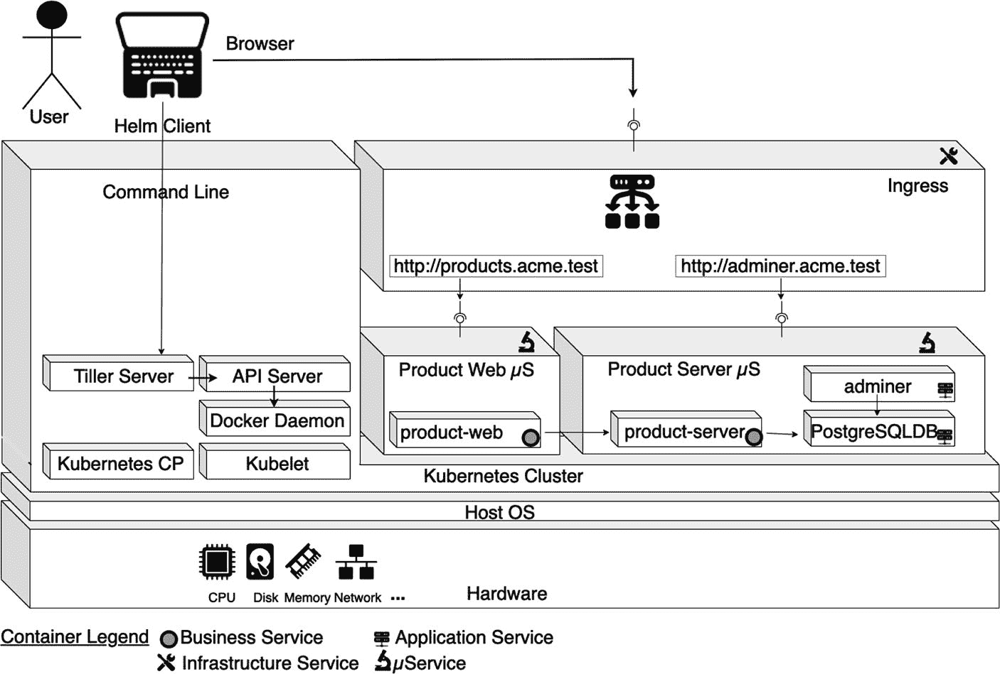
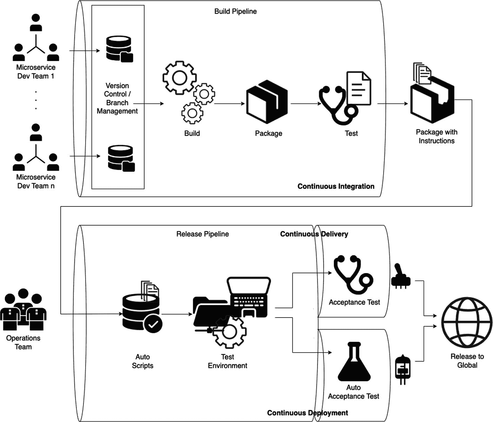

# Declare variables to be passed into your templates.
replicaCount: 1
image:
repository: binildas/spring-boot-docker-k8s-helm
pullPolicy: IfNotPresent
imagePullSecrets: []
nameOverride: ""
fullnameOverride: ""
...
代码清单 12-29
Values YAML 文件 (ch12/ch12-05/springboothelm/values.yaml)
```

这个文件相当冗长，但幸运的是你不需要管理它的所有内容。就此处而言，你只需要更新两行：

```
repository: binildas/spring-boot-docker-k8s-helm
port: 8080
```

接下来需要更新的配置是 `deployment.yaml`。顾名思义，它用于部署目的。代码清单 12-30 展示了 `deployment.yaml` 文件。

```
apiVersion: apps/v1
kind: Deployment
metadata:
name: {{ include "springboothelm.fullname" . }}
labels:
{{- include "springboothelm.labels" . | nindent 4 }}
spec:
replicas: {{ .Values.replicaCount }}
selector:
matchLabels:
{{- include "springboothelm.selectorLabels" . | nindent 6 }}
...
代码清单 12-30
Deployment YAML 文件 (ch12/ch12-05/springboothelm/templates/deployment.yaml)
```

这个文件也相当冗长，但幸运的是你也不需要管理它的所有内容。就此处而言，你只需要更新一行：

```
containerPort: 8080
```

你需要这样做，因为你需要将 Spring Boot 应用程序部署在端口 `8080` 上。

`service.yaml` 文件用于将 Kubernetes 的 `springboothelm` 部署暴露为服务。你不需要对 `service.yaml` 文件做任何更改。

### 确认 Helm Chart 的准确性

你的 Spring Boot 应用程序的第一个 Helm Chart 已经基本准备就绪。检查 `service.yaml` 和 `deployment.yaml` 文件以确认一切正常是明智的做法。为此，你应该退出 `springboothelm` 目录（回到项目根文件夹），然后执行代码清单 12-31 中的命令。

```
(base) binildass-MacBook-Pro:ch12-05 binil$ pwd
/Users/binil/binil/code/mac/mybooks/docker-04/Code/ch12/ch12-05
(base) binildass-MacBook-Pro:ch12-05 binil$ helm template springboothelm
代码清单 12-31
模板化 Helm Chart
```

运行此命令将返回带有实际值的 `service.yaml`、`deployment.yaml` 和 `test-connection.yaml` 文件，以便你可以验证一切是否正确。

作为一个可选步骤，Helm 还提供了一个名为 `lint` 的检查命令，你可以用它来提前识别可能的问题。参见代码清单 12-32。

```
(base) binildass-MacBook-Pro:ch12-05 binil$ pwd
/Users/binil/binil/code/mac/mybooks/docker-04/Code/ch12/ch12-05
(base) binildass-MacBook-Pro:ch12-05 binil$ helm lint springboothelm
==> Linting springboothelm
[INFO] Chart.yaml: icon is recommended
1 chart(s) linted, 0 chart(s) failed
代码清单 12-32
对 Helm Chart 使用 lint 命令
```

你也可以使用以下 `-dry-run` 命令来验证你的 Spring Boot Helm Chart。参见代码清单 12-33。

```
(base) binildass-MacBook-Pro:ch12-05 binil$ pwd
/Users/binil/binil/code/mac/mybooks/docker-04/Code/ch12/ch12-05
(base) binildass-MacBook-Pro:ch12-05 binil$ helm install springboothelm --debug --dry-run springboothelm
...
代码清单 12-33
Helm Chart 的试运行
```

如果你的 Helm Chart 配置有任何问题，此检查会立即提示你。


### 构建并运行微服务

`ch12\ch12-05` 文件夹包含构建和运行示例所需的 Maven 脚本。首先，你需要构建微服务并将镜像推送到公共 Docker Hub。使用 `mvn clean compile jib:build` 命令即可完成此操作，如代码清单 12-34 所示。

```
(base) binildass-MacBook-Pro:ch12-05 binil$ pwd
/Users/binil/binil/code/mac/mybooks/docker-04/Code/ch12/ch12-05
(base) binildass-MacBook-Pro:ch12-05 binil$ sh make.sh
[INFO] Scanning for projects...
[INFO]
...
[INFO]
[INFO] Built and pushed image as binildas/spring-boot-docker-k8s-helm
[INFO] Executing tasks:
[INFO] [===========================   ] 91.7% complete
[INFO] > launching layer pushers
[INFO]
[INFO] -----------------------------------------------
[INFO] BUILD SUCCESS
[INFO] -----------------------------------------------
[INFO] Total time:  13.205 s
[INFO] Finished at: 2023-05-20T16:06:58+05:30
[INFO] -----------------------------------------------
(base) binildass-MacBook-Pro:ch12-05 binil$
代码清单 12-34
构建微服务并推送 Docker 镜像
```

镜像推送完成后，你可以安装该应用程序，如代码清单 12-35 所示。

```
(base) binildass-MacBook-Pro:ch12-05 binil$ pwd
/Users/binil/binil/code/mac/mybooks/docker-04/Code/ch12/ch12-05
(base) binildass-MacBook-Pro:ch12-05 binil$ helm install myfirstspringboot springboothelm
NAME: myfirstspringboot
LAST DEPLOYED: Mon May 29 23:32:19 2023
NAMESPACE: default
STATUS: deployed
REVISION: 1
NOTES:
1\. Get the application URL by running these commands:
NOTE: It may take a few minutes for the LoadBalancer IP to be available.
You can watch the status of by running 'kubectl get --namespace default svc -w myfirstspringboot-springboothelm'
export SERVICE_IP=$(kubectl get svc --namespace default myfirstspringboot-springboothelm --template "{{ range (index .status.loadBalancer.ingress 0) }}{{.}}{{ end }}")
echo http://$SERVICE_IP:8080
(base) binildass-MacBook-Pro:ch12-05 binil$
代码清单 12-35
使用 Helm 安装微服务
```

安装命令包含两个名称：

*   `myfirstspringboot`：这是你的 Helm chart 的发布名称。如果你不提供，Helm 会生成自己的发布名称。

*   `springboothelm`：这是你实际的 chart 名称，即你之前创建的那个。

现在你可以验证安装，如代码清单 12-36 所示。

```
(base) binildass-MacBook-Pro:ch12-05 binil$ helm list -a
NAME                   NAMESPACE      REVISION      UPDATED                                   STATUS        CHART                     APP VERSION
myfirstspringboot      default        1             2023-05-29 23:32:19.571111 +0530 IST      deployed      springboothelm-0.1.0      latest
(base) binildass-MacBook-Pro:ch12-05 binil$
代码清单 12-36
验证 Helm 安装
```

你也可以在 Kubernetes 集群中验证此安装，如代码清单 12-37 所示。

```
(base) binildass-MacBook-Pro:~ binil$ kubectl get all
NAME                                                    READY   STATUS    RESTARTS   AGE
pod/myfirstspringboot-springboothelm-5575ff4d84-pvgzv   1/1     Running   0          88s
NAME                                       TYPE           CLUSTER-IP     EXTERNAL-IP   PORT(S)          AGE
service/kubernetes                         ClusterIP      10.96.0.1              443/TCP          12d
service/myfirstspringboot-springboothelm   LoadBalancer   10.103.65.93        8080:31530/TCP   88s
NAME                                               READY   UP-TO-DATE   AVAILABLE   AGE
deployment.apps/myfirstspringboot-springboothelm   1/1     1            1           88s
NAME                                                          DESIRED   CURRENT   READY   AGE
replicaset.apps/myfirstspringboot-springboothelm-5575ff4d84   1         1         1       88s
(base) binildass-MacBook-Pro:~ binil$
代码清单 12-37
在 Kubernetes 中验证基于 Helm 的部署
```

一切就绪后，你就可以测试示例了。

### 测试微服务

要测试应用程序，首先找到已部署应用程序的 URL，如代码清单 12-38 所示。

```
(base) binildass-MacBook-Pro:~ binil$ minikube service myfirstspringboot-springboothelm
|-----------|----------------------------------|-------------|---------------------------|
| NAMESPACE |               NAME               | TARGET PORT |            URL                       |
|-----------|----------------------------------|-------------|---------------------------|
| default   | myfirstspringboot-springboothelm | http/8080   | http://192.168.64.6:31530 |
|-----------|----------------------------------|-------------|---------------------------|
A flower emoji.  Opening service default/myfirstspringboot-springboothelm in default browser...
(base) binildass-MacBook-Pro:~ binil$ minikube service myfirstspringboot-springboothelm --url
http://192.168.64.6:31530
(base) binildass-MacBook-Pro:~ binil$
代码清单 12-38
查找已部署应用程序的 URL
```

现在你可以访问该应用程序，如代码清单 12-5 所示。


### Helm Release 升级

Helm 升级功能可帮助您创建应用程序的新版本。为了测试这一点，您需要对应用程序进行一些小的更改。

首先，您需要将 `Chart.yaml` 中的版本号从 `0.1.0` 更新为 `0.1.1`。

接下来，将 `values.yaml` 中的 `replicaCount` 从 `1` 更新为 `2`。

现在，您可以准备升级 Release 了，如清单 12-39 所示。

```
(base) binildass-MacBook-Pro:ch12-05 binil$ pwd
/Users/binil/binil/code/mac/mybooks/docker-04/Code/ch12/ch12-05
(base) binildass-MacBook-Pro:ch12-05 binil$ helm upgrade myfirstspringboot .
Error: Chart.yaml file is missing
(base) binildass-MacBook-Pro:ch12-05 binil$ pwd
/Users/binil/binil/code/mac/mybooks/docker-04/Code/ch12/ch12-05
(base) binildass-MacBook-Pro:ch12-05 binil$ helm upgrade myfirstspringboot .
Error: Chart.yaml file is missing
(base) binildass-MacBook-Pro:ch12-05 binil$ helm upgrade myfirstspringboot springboothelm
Release "myfirstspringboot" has been upgraded. Happy Helming!
NAME: myfirstspringboot
LAST DEPLOYED: Mon May 29 23:39:52 2023
NAMESPACE: default
STATUS: deployed
REVISION: 2
NOTES:
1\. Get the application URL by running these commands:
NOTE: It may take a few minutes for the LoadBalancer IP to be available.
You can watch the status of by running 'kubectl get --namespace default svc -w myfirstspringboot-springboothelm'
export SERVICE_IP=$(kubectl get svc --namespace default myfirstspringboot-springboothelm --template "{{ range (index .status.loadBalancer.ingress 0) }}{{.}}{{ end }}")
echo http://$SERVICE_IP:8080
(base) binildass-MacBook-Pro:ch12-05 binil$
清单 12-39
升级 Helm Release
```

您可以再次验证安装，如清单 12-40 所示。

```
(base) binildass-MacBook-Pro:ch12-05 binil$ helm list -a
NAME                   NAMESPACE      REVISION      UPDATED                                   STATUS        CHART                     APP VERSION
myfirstspringboot      default        2             2023-05-29 23:39:52.906387 +0530 IST      deployed      springboothelm-0.1.1      latest
(base) binildass-MacBook-Pro:ch12-05 binil$
清单 12-40
验证 Helm 安装
```

您可以看到 `REVISION` 计数现在为 `2`。

您还可以在 Kubernetes 集群中验证安装，如清单 12-41 所示。

```
(base) binildass-MacBook-Pro:~ binil$ kubectl get all
NAME                                                    READY   STATUS    RESTARTS   AGE
pod/myfirstspringboot-springboothelm-5575ff4d84-pvgzv   1/1     Running   0          8m2s
pod/myfirstspringboot-springboothelm-5575ff4d84-zqhq4   1/1     Running   0          29s
NAME                                       TYPE           CLUSTER-IP     EXTERNAL-IP   PORT(S)          AGE
service/kubernetes                         ClusterIP      10.96.0.1              443/TCP          12d
service/myfirstspringboot-springboothelm   LoadBalancer   10.103.65.93        8080:31530/TCP   8m2s
NAME                                               READY   UP-TO-DATE   AVAILABLE   AGE
deployment.apps/myfirstspringboot-springboothelm   2/2     2            2           8m2s
NAME                        DESIRED   CURRENT   READY   AGE
replicaset.apps/myfirstspringboot-springboothelm-5575ff4d84   2         2         2       8m2s
(base) binildass-MacBook-Pro:~ binil$
清单 12-41
在 Kubernetes 中验证基于 Helm 的部署
```

您可以看到，您已成功将 `myfirstspringboot-springboothelm` 服务的副本数从 `1` 升级到 `2`。

### Helm Release 回滚

您可能想知道是否可以回滚从 Release 1 升级到 Release 2 所做的更改？请参阅清单 12-42 了解如何操作。

```
(base) binildass-MacBook-Pro:ch12-05 binil$ helm rollback myfirstspringboot 1
Rollback was a success! Happy Helming!
(base) binildass-MacBook-Pro:ch12-05 binil$
清单 12-42
回滚 Helm 升级
```

然后，您可以使用清单 12-43 中的代码验证回滚是否成功。

```
(base) binildass-MacBook-Pro:ch12-05 binil$ helm list -a
NAME                   NAMESPACE      REVISION      UPDATED                                   STATUS        CHART                     APP VERSION
myfirstspringboot      default        3             2023-05-29 23:42:25.252089 +0530 IST      deployed      springboothelm-0.1.0      latest
(base) binildass-MacBook-Pro:ch12-05 binil$
清单 12-43
验证 Helm 安装
```

如您所见，您已成功将 Release 回滚到之前的版本。Helm 的一个有趣之处在于，它仍然会将 `REVISION` 更新到下一个序列号 `3`。请参阅清单 12-44。

```
(base) binildass-MacBook-Pro:~ binil$ kubectl get all
NAME                                                    READY   STATUS    RESTARTS   AGE
pod/myfirstspringboot-springboothelm-5575ff4d84-pvgzv   1/1     Running   0          10m
NAME                                       TYPE           CLUSTER-IP     EXTERNAL-IP   PORT(S)          AGE
service/kubernetes                         ClusterIP      10.96.0.1              443/TCP          12d
service/myfirstspringboot-springboothelm   LoadBalancer   10.103.65.93        8080:31530/TCP   10m
NAME                                               READY   UP-TO-DATE   AVAILABLE   AGE
deployment.apps/myfirstspringboot-springboothelm   1/1     1            1           10m
NAME                        DESIRED   CURRENT   READY   AGE
replicaset.apps/myfirstspringboot-springboothelm-5575ff4d84   1         1         1       10m
(base) binildass-MacBook-Pro:~ binil$
清单 12-44
在 Kubernetes 中验证基于 Helm 的部署
```

作为最后一步，您还可以删除 Release，如清单 12-45 所示。

```
(base) binildass-MacBook-Pro:ch12-05 binil$ helm delete myfirstspringboot
release "myfirstspringboot" uninstalled
(base) binildass-MacBook-Pro:ch12-05 binil$
清单 12-45
删除 Helm Release
```

然后，您可以验证它是否已被删除，如清单 12-46 和 12-47 所示。

```
(base) binildass-MacBook-Pro:~ binil$ kubectl get all
NAME                 TYPE        CLUSTER-IP   EXTERNAL-IP  PORT(S)  AGE
service/kubernetes   ClusterIP   10.96.0.1           443/TCP  12d
(base) binildass-MacBook-Pro:~ binil$
清单 12-47
在 Kubernetes 中验证基于 Helm 的部署
```

```
(base) binildass-MacBook-Pro:ch12-05 binil$ helm list -a
NAME      NAMESPACE      REVISION      UPDATED      STATUS      CHART      APP VERSION
(base) binildass-MacBook-Pro:ch12-05 binil$
清单 12-46
验证 Helm 安装
```

希望您喜欢您的第一次 Helm 练习。在下一节中，您将使用 Helm 发布多微服务示例。

## 使用 Helm 打包多微服务

在前面的章节中，您学习了 Helm 如何实现在 Kubernetes 中打包和部署微服务。然而，那个示例还不够复杂，不足以让您体会到 Helm 的真正优势。本节将向您展示如何使用 Helm 来打包和部署您的多微服务项目。


### 设计基于 Helm 的部署拓扑

本示例遵循第 11 章中图 11-3 的部署拓扑。Product Web 和 Product Server 微服务均已容器化，Product Server 微服务将连接到一个同样部署在容器内的 PostgreSQL 数据库。所有这些容器现在都将运行在 Kubernetes 内部。Ingress 是用于路由的附加组件，而 Adminer UI 组件则用于管理 PostgreSQL 数据库。请参见图 12-3。



该图展示了部署拓扑，包括用户、浏览器、Helm 客户端、Kubernetes 集群、主机操作系统和硬件。

图 12-3
微服务的部署拓扑

接下来的章节将介绍此部署的代码。

### 代码组织

本书的源代码可通过图书产品页面在 GitHub 上获取，网址为 [`www.apress.com/9798868805547`](http://www.apress.com/9798868805547)。本示例的源代码位于 `ch12\ch12-06` 文件夹中。

在深入了解本示例的源代码之前，请先回顾一下第 11 章中清单 11-32 所示的类似示例（`ch11\ch11-03`）的源代码组织结构。该结构在清单 12-48 中再次展示。

```
./ch11-03/
├── 01-ProductServer
│   ├── make.sh
│   ├── pom.xml
│   └── src
│       └── main
├── 02-ProductWeb
│   ├── make.sh
│   ├── pom.xml
│   └── src
│       └── main
├── Dockerfile
├── README.txt
├── adminer-deployment.yaml
├── adminer-svc.yaml
├── clean.sh
├── ingress-controller.yaml
├── makeandrun.sh
├── pom.xml
├── postgres-config.yml
├── postgres-deployment.yml
├── postgres-pvc.yml
├── postgres-svc.yml
├── product-server-deployment.yml
├── product-server-service.yml
├── product-web-deployment.yml
└── product-web-service.yml
清单 12-48
示例 11-03 源代码组织结构
```

对于两个业务服务，你可以看到需要多少个 YAML 文件。可以进行一些整合，例如将 Product Server 微服务的部署和服务定义合并到一个 YAML 文件中，等等。但这仍然无法解决另一个问题——重复问题。如何避免复制粘贴主要文件内容，仅仅为了替换几个值？如果能够为两个业务对象（Product Server 和 Product Web 微服务）定义一个模板，然后将值注入到特定字段中，那就太好了。Helm 在这方面可以帮到你。

本示例的源代码组织结构如清单 12-49 所示，位于 `ch12\ch12-06` 文件夹中。这与你在第 11 章中看到的示例相同。现在你将使用 Helm 进行部署。

```
./ch12-06/
├── 01-ProductServer
│   ├── Dockerfile
│   ├── pom.xml
│   └── src
│       └── ...
├── 02-ProductWeb
│   ├── Dockerfile
│   ├── pom.xml
│   └── src
│       └── ...
├── Dockerfile
├── README.txt
├── acme-postgres.yaml
├── acme-product-server.yaml
├── acme-product-web.yaml
├── adminer.yaml
├── app
│   ├── Chart.yaml
│   ├── charts
│   ├── templates
│   │   ├── deployment.yaml
│   │   └── service.yaml
│   └── values.yaml
├── clean.sh
├── ingress
│   ├── Chart.lock
│   ├── Chart.yaml
│   ├── charts
│   │   └── nginx-ingress-1.36.0.tgz
│   ├── templates
│   │   └── ingress.yaml
│   └── values.yaml
├── ingress.yaml
├── make.sh
├── pom.xml
├── postgres
│   ├── Chart.yaml
│   ├── charts
│   ├── templates
│   │   ├── config.yaml
│   │   ├── deployment.yaml
│   │   ├── pcv.yaml
│   │   └── service.yaml
│   └── values.yaml
└── run.sh
清单 12-49
示例 12-06 源代码组织结构
```

你可以看到，项目根目录顶层 YAML 配置文件的数量已经减少。虽然出现了更多的子文件夹和其中的许多新文件，但我保证，情况不会太糟糕。

### 理解源代码

本节假设你已在 Minikube 中启用了 Ingress，并按照第 11 章第三个示例中的说明，将所需的主机名添加到了主机文件中。

本示例从逐个创建 Helm Chart 开始。在此过程中，你还会看到如何利用适用于多个组件的公共 Chart。我假设你有一个名为 `ch12/ch12-06` 的项目根文件夹，该文件夹目前只包含 `README.txt` 文件。更准确的做法是，从本书的源代码下载中复制章节代码，然后删除当前未明确提及的任何文件和文件夹。当然，在创建完 Chart 后，再从本书的代码中将所需的其他文件复制到你的项目根目录中。


#### PostgreSQL 的 Helm Chart

首先，我们来创建第一个 Chart，即用于 PostgreSQL 数据库的 Chart。请参见清单 12-50。

```
(base) binildass-MacBook-Pro:ch12-06 binil$ pwd
/Users/binil/binil/code/mac/mybooks/docker-04/ch12/ch12-06
(base) binildass-MacBook-Pro:ch12-06 binil$ ls
README.txt
(base) binildass-MacBook-Pro:ch12-06 binil$ helm create postgres
Creating postgres
(base) binildass-MacBook-Pro:ch12-06 binil$ ls
README.txt      postgres
(base) binildass-MacBook-Pro:ch12-06 binil$ rm -r ./postgres/templates/*
(base) binildass-MacBook-Pro:ch12-06 binil$ touch ./postgres/templates/deployment.yaml
(base) binildass-MacBook-Pro:ch12-06 binil$ touch ./postgres/templates/pcv.yaml
(base) binildass-MacBook-Pro:ch12-06 binil$ touch ./postgres/templates/service.yaml
(base) binildass-MacBook-Pro:ch12-06 binil$ touch ./postgres/templates/config.yaml
(base) binildass-MacBook-Pro:ch12-06 binil$
清单 12-50
创建 PostgreSQL Helm Chart
```

你需要删除 `./postgres/template` 文件夹中生成的所有文件。然后，在 `./postgres/template` 文件夹中创建四个新文件——`deployment.yaml`、`pcv.yaml`、`service.yaml` 和 `config.yaml`。你将使用本书代码中的文件内容来填充这些新文件。

将 `BookCode/ch12/ch12-06/postgres/templates/*` 中相应文件的内容复制到这四个文件中。

清单 12-51 展示了这些文件的部分内容。

```
apiVersion: apps/v1
kind: Deployment
metadata:
name: {{ .Values.postgres.name }}
labels:
app: {{ .Values.postgres.name }}
group: {{ .Values.postgres.group }}
spec:
replicas: {{ .Values.replicaCount }}
selector:
matchLabels:
app: {{ .Values.postgres.name }}
...
清单 12-51
Postgres Deployment YAML 文件 (ch12/ch12-06/postgres/templates/deployment.yaml)
```

这些基于 Go 模板的占位符引用了 `values.yaml` 文件中的值。`values.yaml` 文件应位于 Chart 的根文件夹中。为了更清晰地说明，以 `deployment.yaml` 中的占位符 `{{ .Values.postgres.name }}` 为例，它将被清单 12-52 中的值填充。

```
postgres:
name: postgres
现在将 BookCode/ch12/ch12-06/postgres/values.yaml 的内容复制到你项目文件夹中的 ./postgres/values.yaml 文件
清单 12-51\. Postgres 的 values YAML 文件 (ch12/ch12-06/postgres/values.yaml)
replicaCount: 1
postgres:
name: postgres
group: db
container:
image: postgres:9.6-alpine
port: 5432
service:
type: ClusterIP
port: 5432
volume:
name: postgres-storage
kind: PersistentVolumeClaim
mountPath: /var/lib/postgresql/data
pvc:
name: postgres-persistent-volume-claim
accessMode: ReadWriteOnce
storage: 4Gi
config:
name: postgres-config
data:
- key: key
value: value
清单 12-52
Postgres 的 Values YAML 文件 (ch12/ch12-06/postgre/values.yaml)
```

现在，我们来详细研究另一个文件，其余文件将遵循相同的模式。接下来要研究的模板是你需要为 `ClusterIP` 创建的，它允许集群内的其他 Pod 访问带有 `postgres` 标签的 Pod。这就是 `./postgres/template/service.yaml` 文件，如清单 12-53 所示。

```
apiVersion: v1
kind: Service
metadata:
name: {{ .Values.postgres.name }}
labels:
group: {{ .Values.postgres.group }}
spec:
type: {{ .Values.postgres.service.type }}
selector:
app: {{ .Values.postgres.name }}
ports:
- port: {{ .Values.postgres.service.port }}
targetPort: {{ .Values.postgres.container.port }}
清单 12-53
Postgres Service YAML 文件 (ch12/ch12-06/postgres/service.yaml)
```

同样，以 `{{ .Values.postgres.service.port }}` 为例，它的值将来自 `./postgres/values.yaml` 文件的叶子节点：

```
postgres:
service:
port: 5432
```

同样的解释也适用于 `./postgres/pvc.yaml` 和 `./postgres/config.yaml` 文件。

你可以更新 `./Chart.yaml` 文件中的元数据，本章前面的示例中已经对此进行了描述。如果你有疑问，只需将 `BookCode/ch12/ch12-06/Chart.yaml` 的内容复制到你项目文件夹中的 `./Chart.yaml` 文件即可。

作为 `postgres` Chart 的最后一步，你需要创建另一个文件来保存一些 PostgreSQL 特定的值。将该文件添加到 `postgres` Chart 文件夹之外。

```
(base) binildass-MacBook-Pro:ch12-06 binil$ touch ./acme-postgres.yaml
```

使用 `acme postgres` 特定的值更新此文件。

然后将 `BookCode/ch12/ch12-06/acme-postgres.yaml` 的内容复制到 `./acme-postgres.yaml`。

为了确保一切正确，你可能需要执行清单 12-54 中所示的健全性检查命令。

```
/Users/binil/binil/code/mac/mybooks/docker-04/ch12/ch12-06
(base) binildass-MacBook-Pro:ch12-06 binil$ helm template postgres
(base) binildass-MacBook-Pro:ch12-06 binil$ helm lint postgres
(base) binildass-MacBook-Pro:ch12-06 binil$ helm install postgres --debug --dry-run postgres
清单 12-54
对 Helm 文件进行健全性检查
```

#### 微服务和 Adminer 的通用 Chart

本节将演示 Helm 的另一个优势——使用通用 Chart（称为模板 Chart），它可以用于多个发布版本。在本例中，你将把它用作 Product Web 和 Product Server 微服务以及 Adminer 应用的通用模板。你需要创建一个名为 `app` 的新 Helm Chart，并重复创建 `postgres` Helm Chart 的步骤，如清单 12-55 所示。

```
(base) binildass-MBP:ch12-06 binil$ pwd
/Users/binil/binil/code/mac/mybooks/docker-04/ch12/ch12-06
(base) binildass-MBP:ch12-06 binil$ ls
01-ProductServer README.txt            make.sh
02-ProductWeb            acme-postgres.yaml      postgres
(base) binildass-MBP:ch12-06 binil$ eval $(minikube docker-env)
(base) binildass-MBP:ch12-06 binil$ helm create app
Creating app
(base) binildass-MBP:ch12-06 binil$ rm -r ./app/templates/*
(base) binildass-MBP:ch12-06 binil$ touch ./app/templates/deployment.yaml
(base) binildass-MBP:ch12-06 binil$ touch ./app/templates/service.yaml
清单 12-55
为应用创建 Chart
```

为 PostgreSQL Kubernetes 对象创建模板：

将 `BookCode/ch12/ch12-06/app/templates/*` 的内容复制到相应的文件中。

为 PostgreSQL Kubernetes 对象创建虚拟值：

将 `BookCode/ch12/ch12-06/app/values.yaml` 的内容复制到 `./app/values.yaml`。

更新 `./app/Charts.yaml` 中的元数据。

```
(base) binildass-MBP:ch12-06 binil$ touch ./adminer.yaml
(base) binildass-MBP:ch12-06 binil$ touch ./acme-product-server.yaml
(base) binildass-MBP:ch12-06 binil$ touch ./acme-product-web.yaml
```

使用 `acme` 特定的值更新这些文件。

将 `BookCode/ch12/ch12-06/acme-*.yaml` 中相应文件的内容复制到 `./acme-*.yaml`。

将 `BookCode/ch12/ch12-06/adminer.yaml` 中相应文件的内容复制到 `./adminer.yaml`。


#### Ingress 的 Helm Chart

您需要创建的最后一个 Chart 是用于 Ingress 控制器的。为此，您将创建一个名为 `ingress` 的新 Helm Chart，并重复创建 `postgres` Helm Chart 的步骤，如代码清单 12-56 所示。

```
(base) binildass-MBP:ch12-06 binil$ helm create ingress
Creating ingress
(base) binildass-MBP:ch12-06 binil$ rm -r ./ingress/templates/*
(base) binildass-MBP:ch12-06 binil$
代码清单 12-56
为 Ingress 创建 Chart
```

为 Ingress Kubernetes 对象创建 `Chart.yaml`：

将 `BookCode/ch12/ch12-06/ingress/Chart.yaml` 的内容复制到 `./ingress/Chart.yaml`。

```
(base) binildass-MBP:ch12-06 binil$ helm dependency update ./ingress/
Saving 1 charts
Downloading nginx-ingress from repo https://charts.helm.sh/stable
Deleting outdated charts
(base) binildass-MBP:ch12-06 binil$
(base) binildass-MBP:ch12-06 binil$ touch ./ingress/templates/ingress.yaml
```

将 `BookCode/ch12/ch12-06/ingress/templates/ingress.yaml` 的内容复制到 `./ingress/templates/ingress.yaml`。

将 `BookCode/ch12/ch12-06/ingress/values.yaml` 的内容复制到 `./ingress/values.yaml`。

```
(base) binildass-MBP:ch12-06 binil$ touch ./ingress.yaml
```

将 `BookCode/ch12/ch12-06/ingress.yaml` 的内容复制到 `./ingress.yaml`。

`./ingress/Chart.yaml` 文件几乎无需额外说明。参见代码清单 12-57。

```
apiVersion: v2
name: ingress
description: A Helm chart for Kubernetes
type: application
version: 1.1.0
appVersion: 1.17.0
keywords:
- ingress
- nginx
- api-gateway
home: https://github.com/no-account/k8s-helm-helmfile/tree/master/helm
maintainers:
- name: Binildas
url: https://github.com/no-account
dependencies:
- name: nginx-ingress
version: 1.36.0
repository: https://charts.helm.sh/stable
代码清单 12-57
Ingress 的 Chart YAML (ch12/ch12-06/ingress/Chart.yaml)
```

与其他 Chart 相比，这里新增了 `- dependencies:` 部分。它创建了一个默认的后端服务，用于启用 Ingress 控制器的功能。

此声明仅定义了此 Chart 的依赖项；它不会在安装过程中自动下载这些依赖项。这就是为什么您必须通过运行 `helm dependency update ./ingress/` 命令来显式安装此依赖项。运行此命令后，`./ingress/charts` 文件夹内会出现一个名为 `nginx-ingress-1.36.0.tgz` 的新文件。

### 构建并运行微服务

`ch12\ch12-06` 文件夹包含构建和运行这些示例所需的 Maven 脚本。首先，您将构建微服务并将应用程序发布到 Kubernetes。一个名为 `run.sh` 的脚本声明了所有命令，如代码清单 12-58 所示。

```
mvn -Dmaven.test.skip=true clean package
eval $(minikube docker-env)
docker build  --build-arg JAR_FILE=02-ProductWeb/target/*.jar -t ecom/product-web .
docker build  --build-arg JAR_FILE=01-ProductServer/target/*.jar -t ecom/product-server .
helm install -f acme-postgres.yaml postgres ./postgres
helm install -f adminer.yaml adminer ./app
helm install -f acme-product-server.yaml product-server ./app
helm install -f acme-product-web.yaml product-web ./app
helm install -f ingress.yaml ingress ./ingress
minikube service product-web --url
sleep 3
helm list
kubectl get deployments
代码清单 12-58
Helm 发布脚本 (ch12/ch12-06/run.sh)
```

现在您可以执行此脚本，如代码清单 12-59 所示。

```
(base) binildass-MacBook-Pro:ch12-06 binil$ pwd
/Users/binil/binil/code/mac/mybooks/docker-04/Code/ch12/ch12-06
(base) binildass-MacBook-Pro:ch12-06 binil$ eval $(minikube docker-env)
(base) binildass-MacBook-Pro:ch12-06 binil$ sh run.sh
[INFO] Scanning for projects...
[INFO]
...
Successfully tagged ecom/product-web:latest
Successfully tagged ecom/product-server:latest
NAME: postgres
LAST DEPLOYED: Mon May 22 23:32:05 2023
NAMESPACE: default
STATUS: deployed
REVISION: 1
TEST SUITE: None
NAME: adminer
LAST DEPLOYED: Mon May 22 23:32:06 2023
NAMESPACE: default
STATUS: deployed
REVISION: 1
TEST SUITE: None
NAME: product-server
LAST DEPLOYED: Mon May 22 23:32:06 2023
NAMESPACE: default
STATUS: deployed
REVISION: 1
TEST SUITE: None
NAME: product-web
LAST DEPLOYED: Mon May 22 23:32:06 2023
NAMESPACE: default
STATUS: deployed
REVISION: 1
TEST SUITE: None
NAME: ingress
LAST DEPLOYED: Mon May 22 23:32:06 2023
NAMESPACE: default
STATUS: deployed
REVISION: 1
TEST SUITE: None
http://192.168.64.6:32216
...
(base) binildass-MacBook-Pro:ch12-06 binil$
代码清单 12-59
构建并运行微服务
```

就这样，您已经准备好进行测试了。

### 测试微服务

您可以使用已配置的主机名访问 Product Web 微服务。

[`http://products.acme.test/product.html`](http://products.acme.test/product.html)

请注意图 12-3 中的 URL 地址。请参考第 1 章中“使用 UI 测试微服务”一节来测试 Product Web 微服务容器。

在测试微服务时，请持续观察 Pod 的日志窗口，如第 11 章中代码清单 11-10 至 11-15 所述。

如果您还记得，您还配置了 Adminer UI。现在您将尝试通过 Adminer UI 访问 PostgreSQL 数据库。请使用第二个 URL：

[`http://adminer.acme.test`](http://adminer.acme.test)

有关测试的更多详细信息，请参考第 11 章中的第三个示例。

完成测试过程后，您可以停止并移除微服务容器，并清理环境。为此，您有一个单独的脚本，如代码清单 12-60 所示。

```
eval $(minikube docker-env)
helm delete adminer
helm delete product-web
helm delete product-server
helm delete postgres
helm delete ingress-backend
helm delete ingress-controller
mvn -Dmaven.test.skip=true clean
docker rmi -f ecom/product-web
docker rmi -f ecom/product-server
代码清单 12-60
清理项目和环境的脚本 (ch12/ch12-06/clean.sh)
```

现在您可以执行此脚本来清理环境，如代码清单 12-61 所示。

```
(base) binildass-MacBook-Pro:ch12-06 binil$ pwd
/Users/binil/binil/code/mac/mybooks/docker-04/Code/ch12/ch12-06
(base) binildass-MacBook-Pro:ch12-06 binil$ sh clean.sh
...
代码清单 12-61
清理项目和环境
```

至此，使用 Helm 打包多微服务的示例就完成了。

## 使用 Helmfile 打包多微服务

在上一个示例中，您使用了 Helm 来打包和部署多微服务项目。在那里，您定义了一个通用的 Helm Chart（模板），并通过向模板注入特定的值，在多个微服务之间复用它。在该示例中，即使您使用了一个名为 `run.sh` 的脚本，但要在集群中安装或更新一个 Chart，您仍然需要运行特定的命令式指令。换句话说，要更改集群的状态，您需要运行一个针对特定部署的命令。Helm 不具备通过单个命令安装、更新或回滚整个集群中所有应用程序的功能。

Helmfile 将在此处为您提供帮助，因为它允许您在单个 YAML 文件中声明整个 Kubernetes 集群的定义，并捆绑多个 Helm 发布（即 Helm Chart 的安装）。它会根据您想要部署应用程序的环境类型（开发、测试、生产）来发布它们。

让我们部署上一节中使用 Helm 发布的示例，但这次使用 Helmfile。


### 代码组织

本书的源代码可通过图书产品页面上的 GitHub 获取，地址为 [`www.apress.com/9798868805547`](http://www.apress.com/9798868805547)。本示例的源代码组织方式如代码清单 12-62 所示，位于 `ch12\ch12-07` 文件夹内。

```
./ch12-07/
├── 01-ProductServer
│   ├── Dockerfile
│   ├── pom.xml
│   └── src
│       └── ...
├── 02-ProductWeb
│   ├── Dockerfile
│   ├── pom.xml
│   └── src
│       └── ...
├── Dockerfile
├── README.txt
├── charts
│   ├── app
│   │   ├── Chart.yaml
│   │   ├── charts
│   │   ├── templates
│   │   │   ├── deployment.yaml
│   │   │   └── service.yaml
│   │   └── values.yaml
│   ├── ingress
│   │   ├── Chart.yaml
│   │   ├── charts
│   │   │   └── nginx-ingress-1.36.0.tgz
│   │   ├── templates
│   │   │   └── ingress.yaml
│   │   └── values.yaml
│   └── postgres
│       ├── Chart.yaml
│       ├── charts
│       ├── templates
│       │   ├── config.yaml
│       │   ├── deployment.yaml
│       │   ├── pcv.yaml
│       │   └── service.yaml
│       └── values.yaml
├── clean.sh
├── helmfile.yaml
├── make.sh
├── pom.xml
├── run.sh
└── values
├── acme-postgres.yaml
├── acme-product-server.yaml
├── acme-product-web.yaml
├── adminer.yaml
└── ingress.yaml
代码清单 12-62
多微服务 Helmfile 部署的源代码组织
```

下一节将介绍源代码的主要方面。

### 理解源代码

作为前提条件，我假设您已在 Minikube 中启用了 Ingress，并按照第 11 章的第三个示例所述，将所需的主机名添加到了您的主机文件中。

本示例假设您有一个名为 `ch12/ch12-07` 的项目根文件夹，且该文件夹为空。首先，将所有文件从 `ch12/ch12-06` 复制到 `ch12/ch12-07`。然后，在项目根文件夹 `ch12/ch12-07` 中创建两个新文件夹，分别命名为 `charts` 和 `values`。将 `./app`、`./ingress` 和 `./postgres` 移动到 `./charts`，并将 `./*.yaml` 移动到 `./values`。接着，在根目录中添加一个新的 `helmfile.yaml` 文件。参见代码清单 12-63。

```
(base) binildass-MacBook-Pro:.Trash binil$ cd /Users/binil/binil/code/mac/mybooks/docker-04/ch12/
(base) binildass-MacBook-Pro:ch12 binil$ pwd
/Users/binil/binil/code/mac/mybooks/docker-04/ch12
(base) binildass-MacBook-Pro:ch12 binil$ mkdir ch12-07
(base) binildass-MacBook-Pro:ch12 binil$ cp -r BookCode/ch12/ch12-06/* /Users/binil/binil/code/mac/mybooks/docker-04/ch12/ch12-07/
(base) binildass-MacBook-Pro:ch12-07 binil$ mkdir charts
(base) binildass-MacBook-Pro:ch12-07 binil$ mv ./charts/ ./app
(base) binildass-MacBook-Pro:ch12-07 binil$ mv ./app ./charts/
(base) binildass-MacBook-Pro:ch12-07 binil$ mv ./ingress ./charts/
(base) binildass-MacBook-Pro:ch12-07 binil$ mv ./postgres ./charts/
(base) binildass-MacBook-Pro:ch12-07 binil$ mkdir values
(base) binildass-MacBook-Pro:ch12-07 binil$ mv ./acme*.yaml ./values/
(base) binildass-MacBook-Pro:ch12-07 binil$ mv ./adminer.yaml ./values/
(base) binildass-MacBook-Pro:ch12-07 binil$ mv ./ingress.yaml ./values/
(base) binildass-MacBook-Pro:ch12-07 binil$ touch helmfile.yaml
代码清单 12-63
为 Helmfile 重新组织多微服务项目
```

下面我将解释代码清单 12-63 中的主要组成部分。

*   `helmfile.yaml`：这是一个 Helmfile 的配置文件，当前为空白。

*   `./charts`：三个 Helm chart，它们是每个发布版本的模板——`app`（用于 `adminer`、`product-web` 和 `product-server`）、`postgres` 和 `ingress`。

*   `./values`：包含每个将要发布的应用程序特定值的文件夹。

在上一个示例中，在 `ch12/ch12-06/ingress/Chart.yaml` 中，`nginx-ingress version 1.36.0` 是从仓库中获取的。此外，您显式地运行了安装命令。在当前示例中，您将从 `ch12/ch12-07/charts/ingress/Chart.yaml` 中移除这部分内容，而是在 `./helmfile.yaml` 中指定将 `nginx-ingress` chart 视为一个独立的 Helm 发布版本，与用于路由的 Ingress 控制器配置分开。

您可以删除 `./charts/ingress/Chart.lock` 文件。

代码清单 12-64 展示了 `./helmfile.yaml` 文件。

```
repositories:
- name: stable
url: https://charts.helm.sh/stable
releases:
- name: postgres
chart: ./charts/postgres
values:
- ./values/acme-postgres.yaml
- name: adminer
chart: ./charts/app
values:
- ./values/adminer.yaml
- name: product-server
chart: ./charts/app
values:
- ./values/acme-product-server.yaml
- name: product-web
chart: ./charts/app
values:
- ./values/acme-product-web.yaml
- name: ingress-backend
chart: stable/nginx-ingress
version: 1.36.0
- name: ingress-controller
chart: ./charts/ingress
values:
- ./values/ingress.yaml
代码清单 12-64
Helmfile (ch12/ch12-07/helmfile.yaml)
```

这里我们所做的是将 Ingress 控制器与 Ingress 后端分离。`./charts/ingress/Chart.yaml` Helm chart 仅定义了 Ingress 控制器；Ingress 后端已被移至 `./helmfile.yaml`。在 `./helmfile.yaml` 中，您指定了要从哪些 Helm 仓库下载 chart，然后列出了所有发布版本。


### 构建并运行微服务

`ch12\ch12-07` 文件夹包含构建和运行这些示例所需的 Maven 脚本。

第一步，你需要将仓库添加到你的 Helm 实例中，此操作只需执行一次（由于已包含在单个脚本中，你无需执行此操作）。

```
helmfile repos
```

接下来，你可以通过一条命令安装所有图表：

```
helmfile sync
```

现在执行构建和发布。一个名为 `run.sh` 的脚本声明了所有命令，如代码清单 12-65 所示。

```
mvn -Dmaven.test.skip=true clean package
eval $(minikube docker-env)
docker build  --build-arg JAR_FILE=02-ProductWeb/target/*.jar -t ecom/product-web .
docker build  --build-arg JAR_FILE=01-ProductServer/target/*.jar -t ecom/product-server .
helmfile repos
helmfile sync
minikube service product-web --url
sleep 3
helm list
kubectl get deployments
代码清单 12-65
Helm 发布脚本 (ch12/ch12-07/run.sh)
```

现在你可以执行此脚本，如代码清单 12-66 所示。

```
(base) binildass-MacBook-Pro:ch12-07 binil$ pwd
/Users/binil/binil/code/mac/mybooks/docker-04/Code/ch12/ch12-07
(base) binildass-MacBook-Pro:ch12-07 binil$ eval $(minikube docker-env)
(base) binildass-MacBook-Pro:ch12-07 binil$ sh run.sh
[INFO] Scanning for projects...
...
[INFO]
[INFO] Ecom-Product-Server-Microservice  SUCCESS [  3.604 s]
[INFO] Ecom-Product-Web-Microservice ... SUCCESS [  0.655 s]
[INFO] Ecom ............................ SUCCESS [  0.037 s]
[INFO] -----------------------------------------------------
[INFO] BUILD SUCCESS
[INFO] -----------------------------------------------------
[INFO] Total time:  4.502 s
[INFO] Finished at: 2023-05-23T11:35:18+05:30
[INFO] -----------------------------------------------------
...
Successfully tagged ecom/product-web:latest
Successfully tagged ecom/product-server:latest
Adding repo stable https://charts.helm.sh/stable
"stable" has been added to your repositories
Adding repo stable https://charts.helm.sh/stable
"stable" has been added to your repositories
Building dependency release=postgres, chart=charts/postgres
Building dependency release=adminer, chart=charts/app
Building dependency release=product-web, chart=charts/app
Building dependency release=ingress-controller, chart=charts/ingress
Building dependency release=product-server, chart=charts/app
Upgrading release=product-server, chart=charts/app
Upgrading release=product-web, chart=charts/app
Upgrading release=ingress-controller, chart=charts/ingress
Upgrading release=adminer, chart=charts/app
Upgrading release=ingress-backend, chart=stable/nginx-ingress
Upgrading release=postgres, chart=charts/postgres
Release "product-web" does not exist. Installing it now.
NAME: product-web
LAST DEPLOYED: Tue May 23 11:35:27 2023
NAMESPACE: default
STATUS: deployed
REVISION: 1
TEST SUITE: None
...
(base) binildass-MacBook-Pro:ch12-07 binil$
代码清单 12-66
发布微服务容器
```

你还可以查看新发布的服务，如代码清单 12-67 所示。

```
(base) binildass-MacBook-Pro:ch12-07 binil$ pwd
/Users/binil/binil/code/mac/mybooks/docker-04/Code/ch12/ch12-07
(base) binildass-MacBook-Pro:ch12-07 binil$ eval $(minikube docker-env)
(base) binildass-MacBook-Pro:ch12-07 binil$ helm list
UPDATED RELEASES:
NAME                 CHART                  VERSION   DURATION
product-web          ./charts/app           0.1.0           1s
adminer              ./charts/app           0.1.0           1s
product-server       ./charts/app           0.1.0           1s
postgres             ./charts/postgres      0.1.0           1s
ingress-controller   ./charts/ingress       1.1.0           1s
ingress-backend      stable/nginx-ingress   1.36.0          2s
(base) binildass-MacBook-Pro:ch12-07 binil$ pwd
代码清单 12-67
查看微服务的发布版本
```

应用程序运行后，你可以对其进行测试。

### 测试微服务

接下来，你可以使用配置的主机名访问 Product Web 微服务。

[`http://products.acme.test/product.html`](http://products.acme.test/product.html)

注意图 12-3 中的 URL 地址。请参考第 1 章中“使用 UI 测试微服务”一节来测试 Product Web 微服务容器。

在测试微服务时，请持续观察 Pod 的日志窗口，如第 11 章中代码清单 11-10 至 11-15 所述。

如果你还记得，你还配置了 Adminer UI。现在你将尝试通过 Adminer UI 访问 PostgreSQL 数据库。请使用第二个 URL：

[`http://adminer.acme.test`](http://adminer.acme.test)

请参考第 11 章中的第三个示例，以获取有关测试的更多详细信息。

完成测试过程后，你可以使用提供的 `clean.sh` 脚本停止并移除微服务容器并清理环境，该脚本类似于代码清单 12-60 中的脚本。请参见代码清单 12-68。

```
(base) binildass-MacBook-Pro:ch12-02 binil$ pwd
/Users/binil/binil/code/mac/mybooks/docker-04/Code/ch12/ch12-07
(base) binildass-MacBook-Pro:ch12-07 binil$ sh clean.sh
...
代码清单 12-68
清理项目与环境
```

至此，使用 Helmfile 的多微服务示例完成。

## 总结

Helm 通过使用名为 *Helm chart* 的打包格式自动化应用程序的分发，简化了 Kubernetes 中的应用程序开发过程。Helmfile 允许你在单个 YAML 文件中声明整个 Kubernetes 集群的定义，并捆绑多个 Helm 发布版本。这些工具在安装、管理和更新数百个配置时非常方便，这在微服务环境中是常见流程。你看到的示例具有足够的复杂性，足以让你体会到它们的优势。到目前为止一切顺利。现在是不是也该研究一下容器和微服务环境下的 CI（持续集成）和 CD（持续部署）了？这正是你将在下一章中要做的事情。

# 13. 微服务容器的 CI/CD

当微服务和部署环境的数量增加时，你必须处理许多 YAML 文件。在上一章中，你了解到 Helm 是一个方便的工具，它维护一个包含版本信息的单一部署 YAML 文件。这个文件让你能够通过几条命令设置和管理非常大的 Kubernetes 集群。

大量微服务带来的另一个问题是，如果你需要真正的并行性来提高发布速度，那么有多少个微服务，就可能有多少个团队在构建代码。一个应用程序是许多微服务的集合，代码变更必须定期构建、测试并合并到共享仓库中。一个应用程序可能有一个或多个仓库，例如每个微服务都有一个单独的仓库。当单个仓库中有许多分支时，这可能会导致构建周期中的合并冲突。如果有多个仓库，则在集成过程中可能会发生冲突。无论采用何种仓库策略，都必须有一个流程来最小化此类冲突并实现持续、无摩擦的发布。CI（持续集成）和 CD（持续部署）旨在最小化这些问题。

本章涵盖以下概念：

*   CI 和 CD 简介

*   演示简单 CI/CD 管道的示例

## CI 和 CD

现代软件发布自动化的动机以及几种标准的 DevOps 实践——例如自动化构建和测试、持续集成（CI）和持续交付（CD）——都源于敏捷软件工程世界。


### DevOps

DevOps 是软件开发行业的一种方法论。它作为一套实践和工具，旨在整合并自动化软件开发（Dev）与 IT 运维（Ops）的工作，以改进和缩短软件开发生命周期。基于微服务的架构旨在提高交付速度，并支持应用程序各部分独立于其他部分进行发布。微服务规模较小，这使得单个服务的架构能够通过持续重构逐步形成。共享的、受版本控制的仓库和制品是 DevOps 实践的核心，而开发与运维人员的角色正逐渐融合为一个统一的流水线阶段。每个阶段都明确了开发与运维流程中的离散步骤，但两者之间的界限变得模糊。如果你观察发布流程中的典型阶段，这些概念就会更加清晰。见图 13-1。



流程图包含以下流程：微服务开发团队 1 到 n，版本控制或分支管理，构建、打包和测试（位于构建流水线与持续集成下），带说明的包，运维团队，自动化脚本，测试环境，验收与自动化验收测试（位于发布流水线与持续交付和部署下），以及全局发布。

图 13-1

CI 与 CD

CI/CD 代表持续集成与持续交付（或持续部署）。本章将探讨每个组成部分。

### 持续集成 (CI)

*持续集成* 定义了开发人员如何借助自动化手段，每天多次使用共享仓库集成代码。新的代码变更会被定期构建、测试并合并到共享仓库中。

### 持续交付 (CD)

*持续交付* 指的是自动将软件发布到测试或生产环境。持续交付通常意味着开发人员对应用的更改会自动进行错误测试并上传到仓库（如 GitHub 或 Docker Hub 等容器注册中心），然后由运维团队将其部署到实际生产环境。

### 持续部署 (CD)

*持续部署* 指的是在无需人工干预的情况下自动将软件发布到生产环境。它解决了因手动测试和点击操作而使运维团队负担过重、从而拖慢应用交付速度的问题。持续部署在持续交付优势的基础上，通过自动化流水线中的下一个阶段来进一步优化，如图 13-1 所示。

下一节将结合工具 Skaffold 来探讨这些方面。

## Google Skaffold

Skaffold 是一个开源命令行工具，通过编排持续开发、持续集成 (CI) 和持续交付 (CD) 来提升开发人员生产力。它处理构建、推送和部署应用程序的工作流程，你可以用它轻松配置本地开发环境。由于其设置非常简单，本章将使用 Skaffold 在微服务示例中展示 CI/CD 的若干方面。

### Skaffold 工作流程

Skaffold 提供了一个单一、简单的命令，通过组织常见的开发阶段来简化你的开发工作流程。以下是执行 Skaffold `dev` 命令时的典型工作流程：

*   收集并监控你的源代码以检测变更。
*   如果用户将文件标记为可同步，则直接将文件同步到 Pod。
*   从源代码构建制品。
*   使用容器结构测试或自定义脚本测试构建好的制品。
*   为制品打标签。
*   推送制品。
*   部署制品。
*   监控已部署的制品。
*   退出时（按 Ctrl+C）清理已部署的制品。

Skaffold 非常灵活，因此如果你在本地机器上编码，可以配置它使用本地 Docker 守护进程构建制品，并通过 kubectl 部署到 Minikube，这正是你接下来在示例中要做的。在生产环境中，你可以切换到生产配置文件，使用不同的配置文件开始构建，然后使用 Helm 进行部署。

## 微服务的 CI 与 CD 示例

你将使用 Skaffold 为上一章的示例启用 CI/CD。本示例假设你的机器上已安装 Skaffold。在 Mac 上，你可以使用 `brew` 进行安装：

```
brew skaffold
```

本节首先探讨项目结构。

### 代码组织

本书的源代码可通过图书产品页面在 GitHub 上获取，网址为 [`www.apress.com/9798868805547`](http://www.apress.com/9798868805547)。本示例的源代码组织如代码清单 13-1 所示，位于 `ch13\ch13-01` 文件夹内。

```
./ch13-01/
├── README.txt
├── build.sh
├── clean.sh
├── k8s
│   ├── deployment.yml
│   └── service.yml
├── make.sh
├── pom.xml
├── run.sh
├── skaffold.yaml
└── src
└── main
├── java
│   └── com
│       └── acme
│           └── ecom
│               └── product
│                   └── Application.java
└── resources
├── application.yml
└── log4j2-spring.xml
9 directories, 12 files
binildass-MacBook-Pro:ch13 binil$
代码清单 13-1
Spring Boot 微服务源代码组织
```

由于你使用 Google `jib-maven-plugin` 来自动化 Docker 镜像创建，因此本地机器上无需运行 Docker 守护进程，也无需为你的 Spring Boot 应用程序准备 Docker 文件。


### 理解源代码

单一应用组件是 `Application.java` 类，它是一个 REST 控制器。你在第 12 章的第三个示例中见过这段代码，并且 `jib` 插件还有更多配置，因此 Maven 配置如清单 13-2 所示。

```
...

com.google.cloud.tools
jib-maven-plugin
3.3.2

binildas/${project.artifactId}

USE_CURRENT_TIMESTAMP

清单 13-2
Maven pom.xml (ch13/ch13-01/pom.xml)
```

你主要在清单 13-2 中配置容器端口。

本示例还查看了应用程序源代码。单一应用组件是 `Application.java` 类，它是一个 REST 控制器（参见清单 13-3）。

```
@SpringBootApplication
@RestController
public class Application {
private static final Logger LOGGER =
LoggerFactory.getLogger(Application.class);
private static volatile long times = 0L;
private static String appVersion = "1";
@RequestMapping("/")
public String home() {
LOGGER.info("Start");
++times;
LOGGER.debug("Inside hello.Application.home() :
Counted {} times by App Version: {}", times,
appVersion);
LOGGER.info("Returning...");
return "Hello Docker World : Counted " + times +
" times by App Version: " + appVersion;
}
public static void main(String[] args) {
SpringApplication.run(Application.class, args);
LOGGER.info("Started...");
}
}
清单 13-3
Application REST 控制器 (ch13/ch13-01/src/main/java/com/acme/ecom/product\Application.java)
```

在清单 13-3 的 Java 类文件中引入了一个 `appVersion` 字段。你将修改此字段以了解 Skaffold 的 CI/CD 功能。

接下来，查看 Skaffold 描述符，如清单 13-4 所示。

```
apiVersion: skaffold/v1beta4
kind: Config
build:
local:
push: false
artifacts:
- image: binildas/spring-boot-docker-k8s-helm
