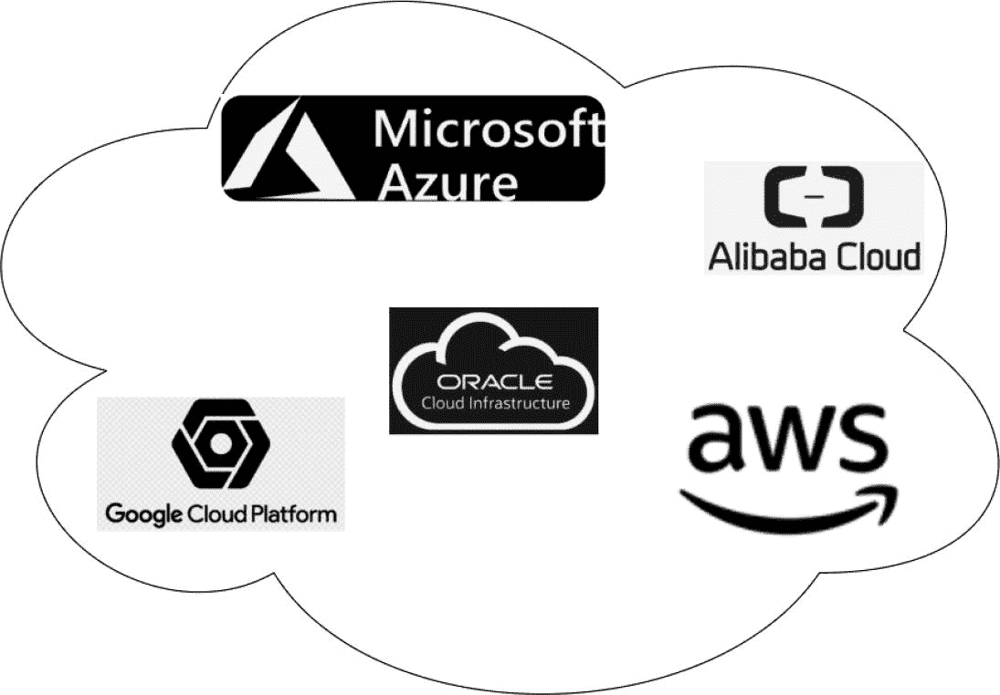
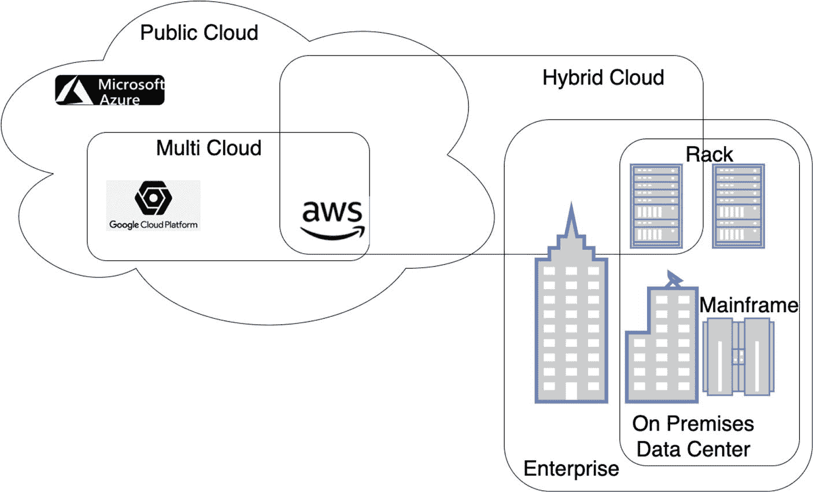
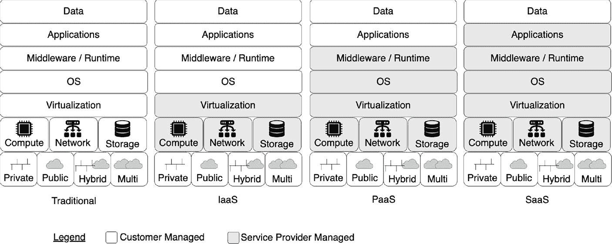
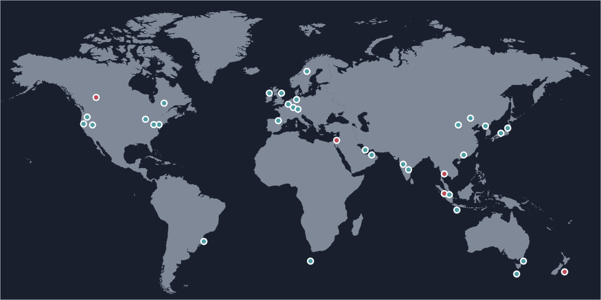
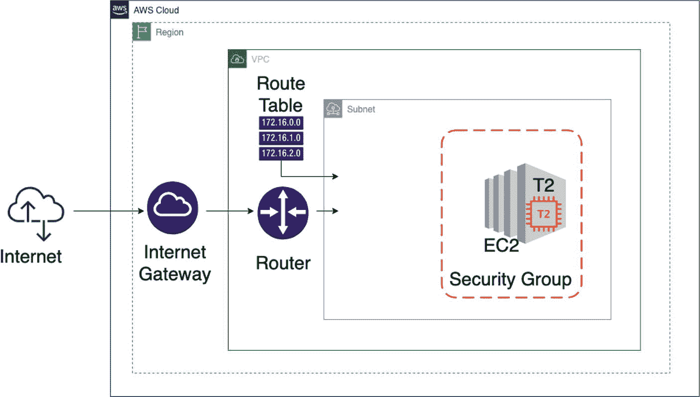

# 14. AWS Elastic Compute Cloud 中的微服务

在制造业企业中，滞销品是指那些不再销售且已停产，但仍留在货架上的产品。同样，过时品是指那些不再销售且已停产，并且通常无法再使用或销售的产品。IT 行业也无法避免类似的过时问题。计算、网络和存储设备可能会变得过时或无用，过去在这些设备上的投资可能无法得到保护。云计算试图在一定程度上解决这种过时问题，并将其作为目标之一。

本章介绍公有云的概念，并解释如何在公有云中部署微服务。

本章涵盖以下概念：

*   云计算简介

*   Amazon Web Services (AWS) 简介

*   Terraform 简介

*   在 AWS 云中配置 EC2

*   在 AWS 云中部署微服务示例

## 云计算

云计算是指按需提供计算机系统资源作为可通过网络访问的服务——尤其是计算能力、存储和网络资源——而无需用户企业进行直接、主动的管理。云通常将这些功能分布到多个地理位置，每个位置都是一个*数据中心*。云计算依赖于共享这些资源来实现一致性，并且通常采用按使用量付费的模式，这有助于降低用户企业的资本支出。


### 公有云

大约在 2000 年，亚马逊创建了名为亚马逊云服务（AWS）的子公司，不久后便推出了简单存储服务（S3）和弹性计算云（EC2）。由此，企业无需购买、拥有和维护物理数据中心和服务器，即可按需从 AWS 获取计算能力、存储和数据库等技术服务。

不久之后，许多其他厂商也提供了类似的云计算服务。参见图 14-1。



一张示意图，云朵中包含了 Microsoft Azure、阿里云、Google Cloud Platform、AWS 和 Oracle Cloud Infrastructure 的标识。

图 14-1

主要云服务提供商

云计算的一些优势值得一提：

*   **敏捷性**：云计算缩短了硬件和软件采购的漫长周期，以及随之而来的配置和测试的进一步延迟，因为企业甚至个人开发者都可以在需要资源的瞬间将其启动。

*   **弹性**：无需为了每年仅几小时或几天的季节性高峰而过度配置或额外配置资源，因为云计算允许您根据可扩展性需求的变化随时增加或减少资源。这就像货架上没有“死库存”一样。

*   **成本节约**：在 IT 基础设施和中间件上的前期投资减少，因此您的资本支出大大降低。由于云提供商大规模运营，他们实现了规模经济，其中一部分效益也可以惠及云用户。

云正在迅速成为 IT 基础设施服务的事实标准。图 14-1 展示了几家云服务提供商；行业内还有更多。

### 云部署模式

谁拥有云计算服务以及如何向客户提供服务，存在差异。基于此，云部署模式分为三种或更多。

#### 公有云

*公有云*是一种订阅服务，面向所有希望从其云提供商获得类似服务的客户。参见图 14-2。



一张示意图，将云和块重叠，展示了带有 Microsoft Azure 的公有云、带有 Google Cloud Platform 和 AWS 的多云、带有 AWS 和机架的混合云，以及带有机架和大型机的企业及本地数据中心。

图 14-2

公有云 vs. 私有云 vs. 混合云 vs. 多云

公有云服务通过互联网提供，因此任何消费者都可以订阅该服务。

#### 私有云

*私有云*是仅为单个组织运营的基础设施。它可以由组织自己的 IT 部门内部管理，也可以由第三方管理，并在内部或外部托管。

#### 混合云

*混合云*服务由来自不同服务提供商的私有云、公有云和社区云服务的某种组合构成。一些组织使用公有云计算资源来满足私有云无法满足的临时高容量需求。这种能力使混合云能够利用云爆发在不同云之间进行扩展。

#### 多云

*多云*在单一但异构的架构中利用来自多个提供商的计算服务，以减少对单一供应商的依赖。其原因可能是通过选择来增加灵活性，从而不依赖于单一供应商，或者是为了减轻灾难影响等。

虽然数据一致性和同步是需要关注的问题，但与纯粹的私有或公有模式相比，管理混合云和多云模式涉及更多的复杂性。即使使用单一提供商，以无差错的方式处理这些方面也并非易事。这是一个更大的话题，涉及许多技术复杂性，可能成为未来另一本书的主题。

### 分布式计算

云服务模型基于用户对资源利用方式的控制程度。图 14-3 展示了不同的模型。



四个框图分别展示了传统、IaaS、PaaS 和 SaaS 模式，以及它们各自的数据、应用程序、中间件或运行时、操作系统、虚拟化、计算、网络和存储，以及私有、公有、混合和多云分类。传统模式中所有服务均由客户管理，而其余模式中由服务提供商管理的服务数量逐渐增加。

图 14-3

云服务模型（改编自《实用微服务架构模式》，ISBN-13: 978-1484245002）

通常，云架构可以映射到云服务模型。在传统服务模型中，用户或企业自身负责管理整个堆栈（例如，硬件、数据中心设施、软件和数据），而在云服务模型中，情况则有所不同，具体如下：

*   **基础设施即服务 (IaaS)**：在 IaaS 服务模型中，用户仅请求计算能力、存储、网络及其相关资源，并按使用量付费。

*   **平台即服务 (PaaS)**：在 PaaS 模型中，用户无法控制底层基础设施，如 CPU、网络和存储，因为这些资源在平台之下被抽象化了。相反，它允许应用开发平台使用云中托管的受支持编程语言和相关工具创建应用程序，并通过接口（主要是浏览器）进行访问。很多时候，应用程序运行时和中间件也由云服务提供商提供，用户仅负责开发、安装、管理和操作软件应用程序及其数据。

*   **软件即服务 (SaaS)**：这是一种“无需操心一切”的模式，用户甚至不拥有、管理或操作应用程序。应用程序在云基础设施上运行，可从各种客户端设备访问。提供有限的用户配置。有时，同一个应用程序实例服务于多个企业（租户）的最终用户；此类应用程序称为多租户应用程序。^(⁶)

本书中的示例涵盖了 IaaS 和 PaaS。

## 亚马逊云服务 (AWS)

亚马逊云服务 (AWS) 在计算、存储和网络的不同抽象层级上提供公有云服务。AWS 基础设施分布在全球各地，AWS 网站提供了其数据中心全球分布的概览。参见图 14-4。



一张世界地图，用颜色渐变的圆圈标记了各大洲的数据中心位置。

图 14-4

AWS 数据中心位置（来源：[`https://aws.amazon.com/about-aws/global-infrastructure/`](https://aws.amazon.com/about-aws/global-infrastructure/)）

这些服务可以通过机器使用 HTTP 协议进行访问。用户也可以通过 AWS 命令终端或 Web 用户界面访问 AWS 服务。

下一节将介绍下一节示例中使用的一些 AWS 服务。

### VPC

虚拟私有云 (VPC) 是专用于您的 AWS 账户的虚拟网络。它在逻辑上与 AWS 云中的其他虚拟网络隔离。您可以为 VPC 指定 IP 地址范围、添加子网、添加网关以及关联安全组。


### 子网

*子网*是您 VPC 中的一个 IP 地址范围。您可以在特定子网中创建 AWS 资源，例如 EC2 实例。创建子网时，您需要根据 VPC 的配置指定其 IP 地址。IPv4 子网拥有一个 IPv4 CIDR 块，但没有 IPv6 CIDR 块。同样，IPv6 子网拥有一个 IPv6 CIDR 块，但没有 IPv4 CIDR 块。双栈子网则同时拥有这两种块。

子网有两种类型：

*   **公有子网**：具有通往互联网网关的直接路由。公有子网中的资源可以访问公共互联网。

*   **私有子网**：没有通往互联网网关的直接路由。私有子网中的资源需要 NAT 设备才能访问公共互联网。

### 公共代理子网

如果运行在子网中的 EC2 实例需要通过互联网访问，您可以创建一个代理子网。请按照以下步骤操作：

1.  创建一个子网，其 IP 地址范围是分配给 VPC 的 IP 地址范围的一部分。

2.  创建一个路由表并将其附加到该子网。

3.  添加一条指向互联网网关的 `0.0.0.0/0` 路由到该路由表。

### NAT 网关

NAT 网关是一种网络地址转换（NAT）服务。您可以使用 NAT 网关，以便私有子网中的实例可以连接到 VPC 外部的服务，但外部服务无法主动与这些实例建立连接。

### EC2

Amazon EC2 是一项 Web 服务，可在云中提供安全、可调整大小的计算容量。您将在后面的示例中使用 T2 实例。T2 实例是一种低成本、通用型实例类型，可提供基准 CPU 性能，并能在需要时提升至基准以上。T2 实例是成本最低的 Amazon EC2 实例选项之一，非常适合微服务等各种通用型应用。

### 路由表

路由表包含一组称为*路由*的规则，用于确定来自您的子网或网关的网络流量去向。

*主*路由表随您的 VPC 自动创建，它是一个隐式路由表。它控制所有未显式关联到其他路由表的子网的路由。

VPC 中的每个子网都必须关联一个路由表，该路由表控制该子网的路由（即子网路由表）。

### 互联网网关

互联网网关（IGW）使您的实例能够通过 Amazon EC2 网络边缘连接到互联网。IGW 将使用网络地址转换（NAT）将您虚拟机的公有 IP 地址转换为其私有 IP 地址。VPC 中使用的所有公有 IP 地址均由该 IGW 控制。

这些 AWS 服务仅为代表性示例，并非详尽无遗。对这些服务或更多服务的详细讨论超出了本书的范围。

## 基础设施即代码（IaC）

基础设施即代码（IaC）是指您编写并执行代码来定义、部署、更新和销毁您的基础设施。通常，您一直使用临时脚本（例如 `.sh` bash 脚本）来自动化基础设施管理。这种临时脚本提供了一种基于通用工具的方法，因此您需要为每个任务编写完整的自定义代码。而专为 IaC 设计的特定工具则为完成复杂任务提供了简洁的 API，从而为您的代码强制执行特定的结构。临时脚本非常适合小型的、一次性的任务，但当涉及到包含多个动态组件的基础设施时，尤其是当您需要管理大量微服务时，bash 脚本就会变成一团难以维护的意大利面条式代码。这时，IaC 工具就能为您提供帮助。

让我们看看 IaC 的一些好处：

*   **自助服务**：既然您在阅读本书，那么您在日常工作中的角色很可能是一名应用程序开发人员，而不是系统管理员。然而，有时您可能需要一个基础设施来部署和测试您的应用程序组件。根据我多年的经验，我见过少数系统管理员服务于整个大团队或整个组织。那么，作为一名开发人员，您如何及时获得一个基础设施呢？如果您的基础设施是用代码定义的，那么基础设施的部署过程就可以自动化，您可以在需要时自行启动部署来配置基础设施。

*   **版本控制**：当您将基础设施配置作为代码时，您可以将 IaC 存储在版本控制系统中，这样您基础设施的整个历史记录都会被捕获在提交日志中。这意味着，当出现问题并且您怀疑是由于基础设施的更改导致时，您可以简单地回滚到之前已知良好的配置代码版本。

下一节将介绍 IaC 领域的一个工具——Terraform。

### Terraform

Terraform 是由 HashiCorp 创建的一个开源 IaC 工具。Terraform 使用 Go 语言编写。Terraform 可以使用您已经在 AWS、Azure、Google Cloud 等云服务提供商中使用的身份验证机制，然后进行 API 调用。您需要创建 Terraform 配置文件，这些文件是用于指定您想要创建的基础设施的文本文件。

您可以定义您的整个基础设施，从互联网网关、负载均衡器、VPC、子网、服务器等等开始。您在 Terraform 配置文件中完成这些定义，并将这些文件提交到版本控制系统。然后，您可以运行 `terraform apply` 在目标云上创建您的基础设施。当您需要对基础设施进行一些更改时，您在 Terraform 配置文件中进行这些更改，通过代码审查和测试来验证这些更改，将更新后的代码提交到版本控制，然后再次运行 `terraform apply` 命令。需要注意的一点是，没有直接的方法可以使用相同的 Terraform 配置在不同的云提供商上部署相同的基础设施，因为云提供商不提供相同类型的基础设施。

以上就是对公有云和 IaC 的简要介绍。下一节将把这些知识付诸实践。

## 使用 Terraform 设置 AWS EC2

在本节中，您将使用 Terraform 在 AWS 中创建一个 EC2 计算基础设施。我假设您的开发机器上已经具备以下先决条件：

*   一个您知道如何使用 AWS Web 控制台管理的 AWS 账户

*   一个 AWS CLI（命令行界面）以及带有访问 AWS 账户密钥的终端（可选）

*   一个用于访问您的 EC2 实例的密钥对

*   Terraform

我无意在本书中涵盖这些方面。如果您不熟悉这些步骤，请参考相关书籍。^(⁷) 附录 F 也为使用其中一些工具提供了一些指导。

接下来的几节将使用已经讨论过的一些 AWS 基础设施组件进行演示。

### 在云中设计一个微型数据中心

您将在 AWS 云中拥有一个非常精简的计算模块。尽管目标是建立一个最小的计算基础设施，但请注意，为此您需要一整套计算和网络基础设施，这并非易事。多亏了 Terraform，它甚至能让像你我这样的开发人员也能完成如此复杂的任务。图 14-5 展示了 AWS 云中的目标计算模块。



一个分层块状图展示了以下流程，从最外层到最内层依次为：互联网、AWS 云和区域下的互联网网关、VPC 下的路由器和路由表、子网下的 EC2 和 T2 的安全组。

图 14-5

AWS 云中的微型数据中心

下一节将进入代码部分。首先从研究项目结构开始。


### 代码组织

本书的源代码可通过图书产品页面上的 GitHub 获取，地址为 [`www.apress.com/9798868805547`](http://www.apress.com/9798868805547)。本示例的源代码组织方式如代码清单 14-1 所示，位于 `ch14\ch14-01` 文件夹内。

```
./ch14-01/
├── README.txt
├── connections.tf
├── gateways.tf
├── network.tf
├── security.tf
├── servers.tf
├── subnets.tf
└── variables.tf
代码清单 14-1
Terraform EC2 项目源代码组织
```

从文件名可以推测出许多 Terraform 文件的用途，但下一节也会对其进行介绍。

### 理解源代码

本节从选择云提供商及其地理区域的第一步开始。请参见代码清单 14-2。

```
provider "aws" {
region = "ap-southeast-1"
}
代码清单 14-2
AWS 区域配置 (ch14/ch14-01/connections.tf)
```

如前所述，Terraform 可帮助您管理跨多种公有云提供商（例如 Amazon Web Services、Microsoft Azure、DigitalOcean）以及私有云和虚拟化平台（例如 OpenStack、VMware）的 IT 基础设施。在本示例中，它打算使用 `aws` 作为云提供商。我使用的是 `ap-southeast-1`，即新加坡区域。您可以使用任何您偏好的区域。

下一步是定义 VPC，如代码清单 14-3 所示。

```
resource "aws_vpc" "test-env" {
cidr_block = "10.0.0.0/16"
enable_dns_hostnames = true
enable_dns_support = true
tags = {
Name = "bdca-Instance-03"
}
}
resource "aws_eip" "ip-test-env" {
instance = "${aws_instance.test-ec2-instance.id}"
domain   = "vpc"
}
代码清单 14-3
AWS VPC 配置 (ch14/ch14-01/network.tf)
```

Amazon Virtual Private Cloud（Amazon VPC）允许您在逻辑隔离的虚拟网络中启动 AWS 资源。您的 AWS 账户在每个 AWS 区域都包含一个默认 VPC。默认 VPC 已配置好，以便您可以立即开始启动并连接到 EC2 实例；但是，在本示例中，您将创建自己的 VPC，名为 `test-env`。

在 AWS 中创建 VPC 时，CIDR 块用于配置网络的扩展范围。IP CIDR 块给出了要分配给此 VPC 的 IP 地址范围。其格式为 `10.0.0.0/16`。斜杠 `/` 后的数字 `16` 表示此 CIDR 块范围内的任何 IP 地址必须恰好由前 16 位组成。

*   由于前 16 位必须保持不变，因此仍有 16 位可以取任意值。

*   为了进一步理解这一点，您可以计算给定 CIDR 块 `10.0.0.0/16` 中的 IP 地址范围。

剩余位数 = 32 - `cidr` 前缀中 `/` 后的数字

```
= 32 - 16
= 16
```

`cidr` 块中的 IP 地址总数：

```
= 2 ^ 剩余位数
= 2 ^ 16
= 65536
```

此计算仅供参考；详细讨论超出了本书的范围。

添加了名为 `Name = "bdca-Instance-03"` 的标签，以便您可以识别该 VPC。

弹性 IP 是一个静态公有 IPv4 地址，并非免费。您可以将弹性 IP 附加到 `aws_instance.test-ec2-instance.id` 实例上，稍后您将看到该实例。

接下来，创建一个子网。请参见代码清单 14-4。

```
resource "aws_subnet" "subnet-uno" {
cidr_block = "${cidrsubnet(aws_vpc.test-env.cidr_block, 3, 1)}"
vpc_id = "${aws_vpc.test-env.id}"
availability_zone = "ap-southeast-1a"
}
resource "aws_route_table" "route-table-test-env" {
vpc_id = "${aws_vpc.test-env.id}"
route {
cidr_block = "0.0.0.0/0"
gateway_id = "${aws_internet_gateway.test-env-gw.id}"
}
tags = {
Name = "test-env-route-table"
}
}
resource "aws_route_table_association" "subnet-association" {
subnet_id      = "${aws_subnet.subnet-uno.id}"
route_table_id = "${aws_route_table.route-table-test-env.id}"
}
代码清单 14-4
AWS 子网配置 (ch14/ch14-01/subnets.tf)
```

子网部分还介绍了 Terraform 的一个重要特性，展示了它如何通过名称引用其他现有资源。请注意 `vpc_id` 是如何定义的。它引用了一个现有资源的属性（`id`），引用了其完整的 Terraform 名称 `aws_vpc.test-env.id`，该名称是在上一步中定义的。

要计算给定 IP 网络地址前缀中的子网地址，必须使用 Terraform 提供的 `cidrsubnet` 函数，该函数需要三个参数：

*   CIDR 前缀：应采用 CIDR 表示法，如 RFC 4632 第 3.1 节所定义，此处您引用的是子网所属 VPC 的 CIDR。


*   `newbits`：CIDR 前缀将按此位数进行扩展。如果 CIDR 前缀以 `/16` 结尾，且提供的 `newbits` 为 `4`，则 CIDR 前缀将扩展为 `/20`。（在 CIDR 前缀提供的 16 位基础上增加四位。）

*   `netnum`：用于填充前缀中的额外位。此整数值不能包含大于所提供 `newbits` 的位。

要了解其最终值，可以使用 Terraform 控制台工具。从您的开发机器终端，首先连接到 Terraform 控制台，然后执行该函数，如清单 14-5 所示。

```
(base) binildass-MacBook-Pro:~ binil$ terraform console
> cidrsubnet("10.0.0.0/16", 3, 1)
"10.0.32.0/19"
>
清单 14-5
Terraform cidrsubnet 函数
```

接下来，让我们研究一下路由。

Terraform 目前既提供独立的路由资源，也提供内联定义路由的路由表资源。您不能对同一个表同时使用这两种方法。换句话说，如果您在 `aws_route_table` 中创建了路由，则无法关联使用 `aws_route` 创建的路由。

`aws_route_table_association` 将路由表与您的子网绑定。

`aws_route_table route-table-test-env` 资源块在由 `vpc_id` 属性 `aws_vpc.test-env.id` 指定的 VPC 中创建一个新的路由表。它还定义了一条路由，将所有目标 CIDR 为 `0.0.0.0/0` 的流量发送到由 `gateway_id = "${aws_internet_gateway.test-env-gw.id}` 属性指定的互联网网关。`tags` 属性为路由表设置了一个 `test-env-route-table` 名称，以便于识别。

`aws_route_table_association` 块将新创建的路由表与 `subnet_id = "${aws_subnet.subnet-uno.id}"` 子网关联。`route_table_id` 属性引用了前一个块中创建的路由表的 ID。

清单 14-6 展示了前一个路由中引用的 `test-env-gw`。

```
resource "aws_internet_gateway" "test-env-gw" {
vpc_id = "${aws_vpc.test-env.id}"
tags = {
Name = "test-env-gw"
}
}
清单 14-6
AWS 互联网网关配置 (ch14/ch14-01/gateways.tf)
```

附加此互联网网关将允许公共流量进入子网。

AWS 默认允许所有外部流量，但使用 Terraform 时，此功能被禁用，因此必须显式声明以允许流量。为此，您需要首先创建一个符合需求的安全组。请参见清单 14-7。

```
resource "aws_security_group" "ingress-all-test" {
name = "allow-all-sg"
vpc_id = "${aws_vpc.test-env.id}"
ingress {
cidr_blocks = [
"0.0.0.0/0"
]
from_port = 22
to_port = 22
protocol = "tcp"
}
ingress {
cidr_blocks = [
"0.0.0.0/0"
]
from_port = 8080
to_port = 8080
protocol = "tcp"
}
egress {
from_port = 0
to_port = 0
protocol = "-1"
cidr_blocks = ["0.0.0.0/0"]
}
}
清单 14-7
AWS 安全组配置 (ch14/ch14-01/security.tf)
```

创建 VPC 时，它会自动附带一个默认安全组。如果您在启动实例时未指定其他安全组，则在 VPC 中启动的每个 EC2 实例都会自动与默认安全组关联。

安全组充当实例的虚拟防火墙，用于控制入站和出站流量。安全组在实例级别（而非子网级别）起作用。因此，VPC 子网中的每个实例都可以被分配到不同的安全组集合。如果在启动时未指定特定组，实例将自动分配到 VPC 的默认安全组。

对于每个安全组，您可以添加规则来控制发往实例的入站流量，以及一组单独的规则来控制出站流量。互联网协议第 4 版（IPv4）中的默认路由在 CIDR 表示法中指定为零地址 `0.0.0.0/0`，通常称为*四零路由*。子网掩码为 `/0`，这实际上指定了所有网络。`0.0.0.0/0,::/0`。这意味着源可以是任何 IP 地址，来自任何系统请求。`0.0.0.0/0` 代表 IPv4，`::/0` 代表 IPv6。

您定义的 `ingress-all-test` 允许任何人通过端口 22 进行连接。它还将无限制地转发所有流量。使用 `vpc_id = "${aws_vpc.test-env.id}"` 可以将其附加到您创建的 VPC。`ingress` 块描述了入站流量将如何处理。此示例定义了一条规则，接受来自所有 IP 地址在端口 `22` 上的连接。`egress` 块定义了出站流量的规则，此示例将其定义为允许所有流量。

作为最后一步，您需要定义 EC2 实例，这是实际的计算模块，您希望 AWS 云在此处进行计算以处理工作负载。请参见清单 14-8。

```
resource "aws_instance" "test-ec2-instance" {
ami = "${var.ami_id}"
instance_type = "t2.micro"
key_name = "${var.ami_key_pair_name}"
security_groups = ["${aws_security_group.ingress-all-test.id}"]
tags = {
Name = "${var.ami_name}"
}
subnet_id = "${aws_subnet.subnet-uno.id}"
}
清单 14-8
AWS EC2 配置 (ch14/ch14-01/servers.tf)
```

此代码请求一个 `t2.micro` 类型的 AWS 实例。然后进行安全组和子网的关联。需要注意的一点是，我们在三个地方使用了变量——用于 `ami_id`、`ami_key_pair_name` 和 `ami_name`。这些值来自另一个文件中定义的几个变量。请参见清单 14-9。

```
variable "ami_name" {}
variable "ami_id" {}
variable "ami_key_pair_name" {}
清单 14-9
Terraform 变量配置 (ch14/ch14-01/variables.tf)
```

定义这些变量是为了方便，以便整个 Terraform 计划可以用作模板，在需要时启动多个实例，并为这些变量提供采用不同值的选项。由于您将变量保留为空（如图所示），Terraform 将在执行计划期间提示您在终端中输入这些变量。`ami_name` 变量将用作标签，`ami_id` 变量用于查找要启动的实例。

现在，您几乎已经完成了所有工作，是时候在云中启动服务器了。


### 在云中构建并启动 EC2 服务器

进入 `ch14\ch14-01` 根文件夹并运行 `terraform init` 命令，如代码清单 14-10 所示。

```
(base) binildass-MacBook-Pro:ch14-01 binil$ pwd
/Users/binil/binil/code/mac/mybooks/docker-04/Code/ch14/ch14-01
(base) binildass-MacBook-Pro:ch14-01-temp binil$ terraform init
Initializing the backend...
Initializing provider plugins...
- Finding latest version of hashicorp/aws...
- Installing hashicorp/aws v5.1.0...
- Installed hashicorp/aws v5.1.0 (signed by HashiCorp)
Terraform has created a lock file .terraform.lock.hcl to record the provider
selections it made above. Include this file in your version control repository
so that Terraform can guarantee to make the same selections by default when
you run "terraform init" in the future.
Terraform has been successfully initialized!
You may now begin working with Terraform. Try running "terraform plan" to see
any changes that are required for your infrastructure. All Terraform commands
should now work.
If you ever set or change modules or backend configuration for Terraform,
rerun this command to reinitialize your working directory. If you forget, other
commands will detect it and remind you to do so if necessary.
(base) binildass-MacBook-Pro:ch14-01-temp binil$
代码清单 14-10
Terraform 初始化
```

你机器上安装的 Terraform 二进制文件仅包含 Terraform 的基本功能；它不附带任何提供程序（例如 AWS 提供程序、Azure 提供程序、GCP 提供程序等）的代码。当你首次使用 Terraform 时，需要运行 `terraform init` 来告诉 Terraform 检查代码，确定你正在使用哪些提供程序，并下载它们的代码——在本例中，是 AWS。此提供程序代码会下载到 `terraform` 文件夹中，这是 Terraform 的临时工作目录。Terraform 还会将其下载的提供程序代码信息记录到 `.terraform.lock.hcl` 文件中。

现在你可以对代码进行完整性检查，如代码清单 14-11 所示。

```
(base) binildass-MacBook-Pro:ch14-01 binil$ pwd
/Users/binil/binil/code/mac/mybooks/docker-04/Code/ch14/ch14-01
(base) binildass-MacBook-Pro:ch14-01-temp binil$ terraform validate
Success! The configuration is valid.
(base) binildass-MacBook-Pro:ch14-01-temp binil$
代码清单 14-11
验证 Terraform 脚本
```

`plan` 命令让你在进行任何更改之前查看 Terraform 将要执行的操作。接下来，你可以验证 Terraform 计划，如代码清单 14-12 所示。

```
(base) binildass-MacBook-Pro:ch14-01-temp binil$ terraform plan
var.ami_id
Enter a value: ami-061058b2c8f7fb264
var.ami_key_pair_name
Enter a value: bdca-key-01
var.ami_name
Enter a value: bdca-Instance-03
...
代码清单 14-12
Terraform 计划
```

这是在尝试创建实际基础设施之前对代码进行完整性检查的好方法。接下来，你可以继续应用这些脚本。`apply` 命令会显示相同的计划输出，并要求你确认是否要继续执行此计划。请参见代码清单 14-13。

```
(base) binildass-MacBook-Pro:005-aws-ec2-ssh binil$ terraform apply
var.ami_id
Enter a value: ami-061058b2c8f7fb264
var.ami_key_pair_name
Enter a value: bdca-key-01
var.ami_name
Enter a value: bdca-Instance-03
...
Apply complete! Resources: 8 added, 0 changed, 0 destroyed.
(base) binildass-MacBook-Pro:005-aws-ec2-ssh binil$
代码清单 14-13
Terraform 应用
```

### 使用 SSH 访问 AWS 云中的 EC2

一旦你的计算基础设施在 AWS 中创建完成，你就可以使用 SSH 访问它。你可以登录 AWS 控制台，检查新创建的 EC2 实例并获取其公有 IP。此外，本示例假设你已在 Amazon EC2 控制台中为你计划接收数据的区域创建了一个密钥对。

如果你打算使用 macOS 或 Linux 计算机上的 SSH 客户端连接到你的云实例，请使用代码清单 14-14 中的命令来设置私钥文件的权限，然后通过 `ssh` 连接到该实例。

```
(base) binildass-MacBook-Pro:AWS binil$ ls
BDCA-01.pem    bdca-key-01.pem
(base) binildass-MacBook-Pro:AWS binil$ chmod 600 ./bdca-key-01.pem
(base) binildass-MacBook-Pro:001-aws-ec2-ssh-http binil$ ssh -i "/Users/binil/AWS/bdca-key-01.pem" ubuntu@ec2-13-228-93-93.ap-southeast-1.compute.amazonaws.com
The authenticity of host 'ec2-13-228-93-93.ap-southeast-1.compute.amazonaws.com (13.228.93.93)' can't be established.
ECDSA key fingerprint is SHA256:TK4sg3Pw8w1crRgI/KebZJ///AavY8uSnKwZmFzqTJw.
Are you sure you want to continue connecting (yes/no)? yes
Warning: Permanently added 'ec2-13-228-93-93.ap-southeast-1.compute.amazonaws.com,13.228.93.93' (ECDSA) to the list of known hosts.
Welcome to Ubuntu 16.04.4 LTS (GNU/Linux 4.4.0-1114-aws x86_64)
...
ubuntu@ip-10-0-53-123:~$
代码清单 14-14
使用 SSH 访问 AWS 云 EC2
```

接下来，你可以检查你的 EC2 实例中是否安装了 Java 运行时，如代码清单 14-15 所示。

```
ubuntu@ip-10-0-53-123:~$ java -version
java version "1.8.0_161"
Java(TM) SE Runtime Environment (build 1.8.0_161-b12)
Java HotSpot(TM) 64-Bit Server VM (build 25.161-b12, mixed mode)
ubuntu@ip-10-0-53-123:~$ pwd
/home/ubuntu
ubuntu@ip-10-0-53-123:~$ ls
Nessus-7.0.2-ubuntu1110_amd64.deb
ubuntu@ip-10-0-53-123:~$
...
代码清单 14-15
验证 AWS 云 EC2 中的 Java 运行时
```

### 在 AWS EC2 中安装 JRE

如果你的系统默认没有安装 Java，你可以自行安装。在此之前，请先更新软件。使用 `sudo apt update` 命令，这是一个 Linux/Debian 系统管理命令，用于更新系统软件包索引中可用软件包及其版本的列表。请参见代码清单 14-16。

```
ubuntu@ip-10-0-53-123:~$ sudo apt update
...
代码清单 14-16
更新 AWS 云 EC2 软件包
```

然后安装 Java，如代码清单 14-17 所示。

```
ubuntu@ip-10-0-53-123:~$ java -version
Command ‘Java’ not found, but can be installed with:
sudo apt install openjdk-11-jre-headless
sudo apt install default-jre
sudo apt install openjdk-17-jre-headless
sudo apt install openjdk-18-jre-headless
sudo apt install openjdk-19-jre-headless
sudo apt install openjdk-8-jre-headless
ubuntu@ip-10-0-53-123:~$ sudo apt install openjdk-17-jre-headless
...
代码清单 14-17
在 AWS 云 EC2 中安装 JRE
```

现在，你已经成功访问了在 AWS 云中配置并安装了 JRE 的新服务器，接下来可以在云中部署你的微服务了。

## 在 AWS EC2 中部署微服务

本示例使用了本书中最简单的微服务，位于 `ch01/ch01-01/` 目录下。假设你已经按照代码清单 14-18 所示构建了微服务，并且 `.jar` 文件 `Ecom-Product-Web-Microservice-0.0.1-SNAPSHOT.jar` 位于 `ch01/ch01-01/target` 文件夹中，你需要首先使用 `secure copy` 命令将此 `.jar` 文件上传到 AWS 云中的 EC2。

```
mvn -Dmaven.test.skip=true clean package
java -jar -Dserver.port=8080 ./02-ProductWeb/target/Ecom-Product-Web-Microservice-0.0.1-SNAPSHOT.jar
代码清单 14-18
构建微服务的命令（来自代码清单 1-5）
```

下一步是将 `.jar` 文件复制到云端。


### 将微服务可执行文件复制到云端

现在，你将把微服务的 `.jar` 文件从本地主机复制到 AWS EC2 实例，如代码清单 14-19 所示。

```
(base) binildass-MacBook-Pro:target binil$ pwd
/Users/binil/binil/code/mac/mybooks/docker-03/ch01/ch01-01/target
(base) binildass-MacBook-Pro:target binil$ scp -i "/Users/binil/AWS/bdca-key-01.pem" /Users/binil/binil/code/mac/mybooks/docker-03/ch01/ch01-01/02-ProductWeb/target/Ecom-Product-Web-Microservice-0.0.1-SNAPSHOT.jar ubuntu@ec2-13-228-93-93.ap-southeast-1.compute.amazonaws.com:/home/ubuntu/
Ecom-Product-Web-Microservice-0.0.1-SNAPSHOT.jar                  100%   20MB   1.6MB/s   00:12
(base) binildass-MacBook-Pro:target binil$
代码清单 14-19
使用 scp 将微服务 Jar 文件上传到云端 EC2
```

一旦微服务的 `.jar` 文件被复制到云端，你就可以运行该微服务了。

### 运行微服务

由于你已拥有微服务的 `.jar` 文件，你可以使用 Java 来运行该应用程序。参见代码清单 14-20。

```
ubuntu@ip-10-0-53-123:~$ pwd
/home/ubuntu
ubuntu@ip-10-0-53-123:~$ ls
Ecom-Product-Web-Microservice-0.0.1-SNAPSHOT.jar  Nessus-7.0.2-ubuntu1110_amd64.deb
ubuntu@ip-10-0-53-123:~$ java -jar -Dserver.port=8080 ./Ecom-Product-Web-Microservice-0.0.1-SNAPSHOT.jar
.   ____          _            __ _ _
/\\ / ___'_ __ _ _(_)_ __  __ _ \ \ \ \
( ( )\___ | '_ | '_| | '_ \/ _` | \ \ \ \
\\/  ___)| |_)| | | | | || (_| |  ) ) ) )
'  |____| .__|_| |_|_| |_\__, | / / / /
=========|_|==============|___/=/_/_/_/
:: Spring Boot ::                (v3.2.0)
2021-07-03 00:38:41 INFO  StartupInfoLogger.logStarting:55 - Starting EcomProductMicroserviceApplication v0.0.1-SNAPSHOT using Java 1.8.0_161 on ip-10-0-53-123 with PID 4892 (/home/ubuntu/Ecom-Product-Web-Microservice-0.0.1-SNAPSHOT.jar started by ubuntu in /home/ubuntu)
2021-07-03 00:38:41 DEBUG StartupInfoLogger.logStarting:56 - Running with Spring Boot v2.4.4, Spring v5.3.5
2021-07-03 00:38:41 INFO  SpringApplication.logStartupProfileInfo:662 - No active profile set, falling back to default profiles: default
2021-07-03 00:38:46 INFO  InitializationComponent.init:58 - Start
2021-07-03 00:38:46 DEBUG InitializationComponent.init:60 - Doing Nothing...
2021-07-03 00:38:46 INFO  InitializationComponent.init:62 - End
2021-07-03 00:38:49 INFO  StartupInfoLogger.logStarted:61 - Started EcomProductMicroserviceApplication in 9.914 seconds (JVM running for 12.273)
2021-07-03 00:41:09 INFO  ProductRestController.getAllProducts:84 - Start
2021-07-03 00:41:09 DEBUG ProductRestController.lambda$getAllProducts$0:94 - Product [productId=1, name=Kamsung D3, code=KAMSUNG-TRIOS, title=Kamsung Trios 12 inch , black , 12 px ...., description=, imgUrl=, price=12000.0, productCategoryName=]
2021-07-03 00:41:09 DEBUG ProductRestController.lambda$getAllProducts$0:94 - Product [productId=2, name=Lokia Pomia, code=LOKIA-POMIA, title=Lokia 12 inch , white , 14px ...., description=, imgUrl=, price=9000.0, productCategoryName=]
2021-07-03 00:41:09 INFO  ProductRestController.getAllProducts:95 – Ending
...
代码清单 14-20
在 AWS EC2 中运行微服务
```

从日志中可以看到，应用程序已构建、部署并处于运行状态。现在你可以测试该应用程序了。

### 使用 UI 测试微服务

微服务启动后，你可以通过浏览器访问 EC2 的公共 URL 来访问 Web 应用程序：

[`http://ec2-13-228-93-93.ap-southeast-1.compute.amazonaws.com:8080/product.html`](http://ec2-13-228-93-93.ap-southeast-1.compute.amazonaws.com:8080/product.html)

请参考第 1 章中“使用 UI 测试微服务”一节来测试 Product Web 微服务。

测试完成后，你可以使用 `terraform destroy` 命令销毁云基础设施，如代码清单 14-21 所示。

```
(base) binildass-MacBook-Pro:ch14-01 binil$ pwd
/Users/binil/binil/code/mac/mybooks/docker-04/Code/ch14/ch14-01
(base) binildass-MacBook-Pro:ch14-01-temp binil$ terraform destroy
...
代码清单 14-21
释放 AWS 资源
```

## 总结

从本书的开篇章节到上一章，你已经从最简单的微服务一路学习到了 Docker 容器和 Kubernetes。你看到了多种重要的设计模式，包括 NoSQL 和消息代理。在本章中，你使用 IaC 在 AWS 云中配置了一个 EC2 实例。你还将第一章中的微服务示例部署到了该 EC2 实例中，并通过互联网从你的主机访问了它。这是一个良好的开端，现在你可以尝试将其他章节中的许多示例部署到云端。剩下的内容是在云端使用容器和编排，这将在下一章中介绍。

脚注 1   2

