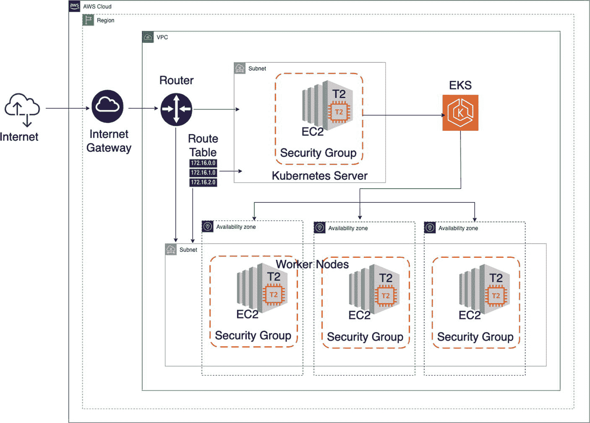

# 15. AWS Elastic Kubernetes Service 中的微服务

在上一章中，你学习了如何使用 IaC 工具 Terraform 在 AWS 中创建最小的计算基础设施。在本章中，你将通过使用相同的工具集搭建基于 Kubernetes 的基础设施来扩展该知识。你已经看到，基于 Minikube 的单节点 Kubernetes 如何使你能够运行本书中截至上一章的所有示例。现在，你将尝试将这些微服务部署到 AWS 云上基于多节点 Kubernetes 的基础设施中。

本章涵盖以下概念：

*   Elastic Kubernetes Service (EKS)

*   使用 Terraform 设置 AWS EKS

*   在 AWS EKS 中运行微服务容器

## Amazon Elastic Kubernetes Service

Amazon Elastic Kubernetes Service (Amazon EKS) 跨可用区运行 Kubernetes 管理基础设施。在任何标准 Kubernetes 环境中运行的应用程序都完全兼容，并且可以迁移到 Amazon EKS，因此本章将演示如何在 Minikube 中部署的微服务部署到 AWS 的 EKS 中。

Amazon EKS 集群由两个主要组件组成——EKS 控制平面和 EKS 工作节点。

### EKS 控制平面

EKS 控制平面由运行 Kubernetes 软件（例如 etcd 和 Kubernetes API 服务器）的节点组成。（有关这些组件的概述，请参阅第 10 章。）控制平面在由 AWS 管理的账户中运行，Kubernetes API 通过与你集群关联的 Amazon EKS 端点暴露。每个 Amazon EKS 集群控制平面在其自己的一组 Amazon EC2 实例上运行。这些控制平面节点也跨多个可用区进行配置，并由 Elastic Load Balancing Network Load Balancer 作为前端。Amazon EKS 还会在你的 VPC 子网中配置弹性网络接口，以提供从控制平面实例到节点的连接。

### EKS 工作节点

EKS 工作节点是 Kubernetes 集群的一部分，用户的工作负载在此处处理。Amazon EKS 工作节点在你的 AWS 账户中创建，它们会与在 AWS 托管账户中运行的集群控制平面实例建立连接。Amazon EKS 工作节点会在控制平面中注册。

在撰写本文时，引入了一个名为 Amazon EKS Blueprints 的相关解决方案。不过，Amazon EKS 仍然可以正常工作。


## 使用 Terraform 搭建 AWS EKS

本节将演示一个基于 AWS EKS 的微服务部署的实际案例。本章建立在你从第 14 章学到的 AWS 云基础知识之上，因此建议你在阅读本章之前先参考第 14 章。本章还将利用 Terraform，以便你能够相对轻松地搭建基础设施并运行示例。如果你已经熟悉 AWS 云和 Terraform，可以直接阅读本章，无需回看第 14 章。

由于本示例使用 Terraform 在 AWS 中创建 EKS 计算基础设施，我假设你的开发机器上已具备以下先决条件：

*   一个你知道如何使用 AWS Web 控制台进行管理的 AWS 账户
*   已安装 AWS CLI（命令行界面），并且终端已配置好用于访问 AWS 账户的密钥
*   用于访问 EC2 实例的密钥对
*   已安装 Terraform

本书不涵盖这些方面。如果你不熟悉这些步骤，建议参考相关书籍。^(⁸) 附录 F 也为使用其中一些工具提供了指导。

### 在 AWS 云中设计 EKS 拓扑

你将在 AWS 云中拥有一个非常精简的 EKS 集群（见图 15-1）。尽管目标是搭建一个最小的 EKS 基础设施，但请注意，你仍然需要为此准备一套完整的计算和网络基础设施，这并非易事。多亏了 Terraform，正如你在上一章所学到的，它使得像你我这样的开发者也能轻松完成这些复杂的任务。



一个分层框图具有以下流程：互联网、互联网网关（位于 AWS 云和区域下）、路由器和路由表（位于 VPC 下）、EC2 和 T2 的安全组（位于 Kubernetes 服务器和子网下），以及连接到 3 个可用区的 EKS（带有安全组工作节点，位于另一个子网下），从最外层到最内层。

图 15-1

AWS 云中的 EKS 集群

一个典型的 EKS 集群如图 15-1 所示。但是请注意，对于 Kubernetes 服务器，你可以通过拥有多个节点来实现冗余。尽管该图描绘了工作集群的三个节点，但本示例将进行定制以保持基础设施的简单性。

现在让我们进入代码部分。首先从研究项目结构开始。

### 代码组织

本书的源代码可通过图书产品页面在 GitHub 上获取，网址为 [`www.apress.com/9798868805547`](http://www.apress.com/9798868805547)。本示例的源代码组织如代码清单 15-1 所示，位于 `ch15\ch15-01` 文件夹内。

```
./ch15-01/
├── README.txt
├── eks-cluster.tf
├── eks-worker-nodes.tf
├── outputs.tf
├── product-deployment.yaml
├── product-service.yaml
├── providers.tf
├── variables.tf
├── vpc.tf
└── workstation-external-ip.tf
代码清单 15-1
Terraform EKS 项目源代码组织
```

第 14 章展示了其中一些文件的内容。此外，你从 Terraform 网站提供的 EKS 示例中改编了几个新文件来创建此演示。让我们来研究本示例中的新内容。

### 理解源代码

从选择要使用的云提供商的第一步开始。参见代码清单 15-2。

```
terraform {
required_version = ">= 0.12"
}
provider "aws" {
region = var.aws_region
}
data "aws_availability_zones" "available" {}
provider "http" {}
代码清单 15-2
AWS 区域配置 (ch15/ch15-01/providers.tf)
```

在指定 Terraform 版本后，你必须说明你打算使用 `aws` 作为云提供商。我使用的是 `ap-southeast-1`，即新加坡区域，但你可以使用任何你偏好的区域。

可用区数据源允许访问 AWS 可用区列表，这些可用区可由 AWS 账户在提供商配置的区域中访问。

HTTP 提供商用于与通用 HTTP 服务器交互。它提供了一个数据源，该数据源发出 HTTP 请求，并公开响应头和响应体，供 Terraform 部署使用。你使用此 HTTP 提供商来确定你自己的外部 IP 网关地址（参见代码清单 15-3）。如果你有了这个地址，就可以配置入站 EC2 安全组访问 Kubernetes 集群。你将在下一个描述符中执行此操作。

```
data "http" "workstation-external-ip" {
url = "http://ipv4.icanhazip.com"
}
locals {
workstation-external-cidr = "${chomp(data.http.workstation-external-ip.body)}/32"
}
代码清单 15-3
发现外部 IP 网关地址 (ch15/ch15-01/workstation-external-ip.tf)
```

正如你所猜测的，本示例在运行时用外部 IP 网关地址的值覆盖了 `workstation-external-cidr` 的值。假设你需要外部 IP 网关地址，你需要手动从网关设备确定它，或者向外部服务请求。[`icanhazip.com`](http://icanhazip.com) 就是这样一个服务，它可以显示你的面向互联网的 IPv4 和 IPv6 地址等信息。

有几种使用此服务的方法：

*   在配置文件中，指向 `(http://)`[`ipv4.icanhazip.com`](http://ipv4.icanhazip.com)（如果需要，也可以是 `ipv6`）。
*   在脚本中，使用 curl 获取地址，如下所示：echo 此外部 IP 地址为 `$(curl -s` [`http://ipv4.icanhazip.com`](http://ipv4.icanhazip.com)`)。`

在继续之前，你需要在 `variables` 配置中配置 `region = var.aws_region`。参见代码清单 15-4。

```
variable "aws_region" {
default = "ap-southeast-1"
}
variable "cluster-name" {
default = "bdca-tf-eks-01"
type    = string
}
代码清单 15-4
Terraform 变量配置 (ch15/ch15-01/variables.tf)
```

这无需解释。

你从 AWS 提供商开始，现在将研究网络基础设施定义。参见代码清单 15-5。

```
resource "aws_vpc" "demo" {
cidr_block = "10.0.0.0/16"
tags = tomap(
{"Name" = "terraform-eks-demo-node",
"kubernetes.io/cluster/${var.cluster-name}" = "shared"}
)
}
resource "aws_subnet" "demo" {
count = 2
availability_zone       = data.aws_availability_zones.available.names[count.index]
cidr_block              = "10.0.${count.index}.0/24"
map_public_ip_on_launch = true
vpc_id                  = aws_vpc.demo.id
tags = tomap(
{"Name" = "terraform-eks-demo-node",
"kubernetes.io/cluster/${var.cluster-name}" = "shared"}
)
}
resource "aws_internet_gateway" "demo" {
vpc_id = aws_vpc.demo.id
tags = {
Name = "terraform-eks-demo"
}
}
resource "aws_route_table" "demo" {
vpc_id = aws_vpc.demo.id
route {
cidr_block = "0.0.0.0/0"
gateway_id = aws_internet_gateway.demo.id
}
}
resource "aws_route_table_association" "demo" {
count = 2
subnet_id      = aws_subnet.demo.*.id[count.index]
route_table_id = aws_route_table.demo.id
}
代码清单 15-5
Terraform EKS 网络基础设施配置 (ch15/ch15-01/vpc.tf)
```

有关其中许多配置的详细说明，请参阅第 14 章。


这里我将解释几个新的方面。

此规范将创建一个 `10.0.0.0/16` 的 VPC、两个 `10.0.X.0/24` 的子网以及一个互联网网关，并设置子网路由，使外部流量通过该互联网网关进行路由。

`count = 2` 是 Terraform 中的一个元参数。它可以与模块以及每种资源类型一起使用。`count` 元参数接受一个整数，并创建相应数量的资源或模块实例。每个实例都关联一个不同的基础设施对象，并且在应用配置时，每个实例都会被单独创建、更新或销毁。此处意图是创建两个子网。

在设置了 `count` 的块中，表达式中会提供一个额外的 `count` 对象，因此你可以修改每个实例的配置。该对象具有一个属性：

*   `count.index`：与此实例对应的唯一索引号（从 `0` 开始）。

你在 `aws_subnet demo` 资源和 `aws_route_table_association demo` 资源中使用了 `count = 2` 作为元参数。在第一种情况下，你使用 `count.index` 来指定 `cidr_block`；在第二种情况下，你使用 `count.index` 来指定路由表关联的 `subnet_id`。

接下来是集群和工作节点的规格说明。首先是集群描述。在 Terraform 中，Amazon EKS 的集群可以使用资源名称 `aws_eks_cluster` 进行配置。参见清单 15-6。

```
resource "aws_iam_role" "demo-cluster" {
name = "terraform-eks-demo-cluster"
assume_role_policy = <<POLICY
{
"Version": "2012-10-17",
"Statement": [
{
"Effect": "Allow",
"Principal": {
"Service": "eks.amazonaws.com"
},
"Action": "sts:AssumeRole"
}
]
}
POLICY
}
resource "aws_iam_role_policy_attachment" "demo-cluster-AmazonEKSClusterPolicy" {
policy_arn = "arn:aws:iam::aws:policy/AmazonEKSClusterPolicy"
role       = aws_iam_role.demo-cluster.name
}
resource "aws_iam_role_policy_attachment" "demo-cluster-AmazonEKSVPCResourceController" {
policy_arn = "arn:aws:iam::aws:policy/AmazonEKSVPCResourceController"
role       = aws_iam_role.demo-cluster.name
}
resource "aws_security_group" "demo-cluster" {
name        = "terraform-eks-demo-cluster"
description = "Cluster communication with worker nodes"
vpc_id      = aws_vpc.demo.id
egress {
from_port   = 0
to_port     = 0
protocol    = "-1"
cidr_blocks = ["0.0.0.0/0"]
}
tags = {
Name = "terraform-eks-demo"
}
}
resource "aws_security_group_rule" "demo-cluster-ingress-workstation-https" {
cidr_blocks       = [local.workstation-external-cidr]
description       = "Allow workstation to communicate with cluster API Server"
from_port         = 443
protocol          = "tcp"
security_group_id = aws_security_group.demo-cluster.id
to_port           = 443
type              = "ingress"
}
resource "aws_eks_cluster" "demo" {
name     = var.cluster-name
role_arn = aws_iam_role.demo-cluster.arn
vpc_config {
security_group_ids = [aws_security_group.demo-cluster.id]
subnet_ids         = aws_subnet.demo[*].id
}
depends_on = [
aws_iam_role_policy_attachment.demo-cluster-AmazonEKSClusterPolicy,
aws_iam_role_policy_attachment.demo-cluster-AmazonEKSVPCResourceController,
]
}
清单 15-6
Terraform EKS 集群配置 (ch15/ch15-01/eks-cluster.tf)
```

工作节点的安全组以及处理工作节点与控制平面通信的安全组，其构建方式旨在避免通过工作节点中的特权端口进行通信。

你需要预先准备一些由操作者管理的资源，以便 Kubernetes 能够妥善管理其他 AWS 服务，并允许来自本地工作站（如果需要）和工作节点的入站网络通信。

需要 `aws_iam_role` 和 `aws_iam_role_policy_attachment` 来允许 EKS 服务管理或从其他 AWS 服务检索数据。

`aws_security_group` 控制对 Kubernetes 主节点的网络访问。然后，你通过一个 `ingress` 规则对其进行配置，以允许来自工作节点的流量。在 `egress` 和 `ingress` 中，你都需要指定协议。此处，可以使用 IP 协议名称（`tcp`、`udp`、`icmp`）或协议编号。当你在 `egress` 中指定 `-1`，或者指定除 `tcp`、`udp`、`icmp` 或 `58`（ICMPv6）之外的协议编号时，无论你指定了哪些端口，所有端口的流量都将被允许。对于 `tcp`、`udp` 和 `icmp`，你必须指定一个端口范围。对于协议 `58`（ICMPv6），你可以选择指定一个端口范围。如果你不指定任何内容，则允许所有类型和代码的流量。

`aws_security_group_rule` 允许工作节点网络访问 EKS 主集群。

接下来是工作节点的配置。AWS EKS 目前不提供用于运行工作节点的托管资源。因此，你需要创建一些由操作者管理的资源，以便 Kubernetes 能够妥善管理其他 AWS 服务、网络访问等。

```
resource "aws_iam_role" "demo-node" {
name = "terraform-eks-demo-node"
assume_role_policy = <<POLICY
{
"Version": "2012-10-17",
"Statement": [
{
"Effect": "Allow",
"Principal": {
"Service": "ec2.amazonaws.com"
},
"Action": "sts:AssumeRole"
}
]
}
POLICY
}
resource "aws_iam_role_policy_attachment" "demo-node-AmazonEKSWorkerNodePolicy" {
policy_arn = "arn:aws:iam::aws:policy/AmazonEKSWorkerNodePolicy"
role       = aws_iam_role.demo-node.name
}
resource "aws_iam_role_policy_attachment" "demo-node-AmazonEKS_CNI_Policy" {
policy_arn = "arn:aws:iam::aws:policy/AmazonEKS_CNI_Policy"
role       = aws_iam_role.demo-node.name
}
resource "aws_iam_role_policy_attachment" "demo-node-AmazonEC2ContainerRegistryReadOnly" {
policy_arn = "arn:aws:iam::aws:policy/AmazonEC2ContainerRegistryReadOnly"
role       = aws_iam_role.demo-node.name
}
resource "aws_eks_node_group" "demo" {
cluster_name    = aws_eks_cluster.demo.name
node_group_name = "demo"
node_role_arn   = aws_iam_role.demo-node.arn
subnet_ids      = aws_subnet.demo[*].id
scaling_config {
desired_size = 1
max_size     = 1
min_size     = 1
}
depends_on = [
aws_iam_role_policy_attachment.demo-node-AmazonEKSWorkerNodePolicy,
aws_iam_role_policy_attachment.demo-node-AmazonEKS_CNI_Policy,
aws_iam_role_policy_attachment.demo-node-AmazonEC2ContainerRegistryReadOnly,
]
}
清单 15-7
Terraform EKS 工作节点配置 (ch15/ch15-01/eks-worker-nodes.tf)
```

如前所述，你在此处使用最小数量的扩缩配置运行，尽管在生产部署中，你可能需要三个或更多节点以实现高可用性。`aws_eks_node_group` 资源将管理一个 EKS 节点组，该节点组可以预置并可选择更新与 EKS 兼容的 Kubernetes 工作节点的自动扩缩组。

`aws_iam_role` 和策略将允许工作节点管理或从其他 AWS 服务检索数据。Kubernetes 使用它来允许工作节点加入集群。

### 操作 EKS 集群所需的设置

在管理和操作 EKS 时，有一些设置会非常有用。我在此列出它们。你也可以参考附录 F 以详细了解其中一些设置。

建议你执行以下操作：

1.  安装 AWS CLI。

2.  安装 AWS IAM Authenticator。

3.  为 EKS 配置 `kubectl`。

4.  将工作节点加入 Kubernetes 集群。

首先完成前两个步骤。随后，你可以继续执行下一小节“在 AWS 中构建并启动你的 EKS 集群”，一旦 EKS 集群形成，你就可以执行最后两个步骤。


### 在 AWS 中构建并启动您的 EKS 集群

要在 AWS 中创建一个 EKS 集群，您需要进入根文件夹 `ch15\ch15-01`，并首先运行 `terraform init` 命令。参见清单 15-8。

```
(base) binildass-MacBook-Pro:ch15-01 binil$ pwd
/Users/binil/binil/code/mac/mybooks/docker-04/Code/ch15/ch15-01
(base) binildass-MacBook-Pro:ch15-01 binil$ terraform init
Initializing the backend...
...
(base) binildass-MacBook-Pro:ch15-01 binil$
清单 15-8
Terraform init
```

然后，您需要对代码进行完整性检查。参见清单 15-9。

```
(base) binildass-MacBook-Pro:ch15-01 binil$ pwd
/Users/binil/binil/code/mac/mybooks/docker-04/Code/ch15/ch15-01
(base) binildass-MacBook-Pro:ch15-01 binil$ terraform validate
Success! The configuration is valid.
(base) binildass-MacBook-Pro:ch15-01 binil$
清单 15-9
Terraform validate
```

`plan` 命令让您在进行任何更改之前查看 Terraform 将要执行的操作，如清单 15-10 所示。

```
(base) binildass-MacBook-Pro:ch15-01 binil$ terraform plan
清单 15-10
Terraform plan
```

`apply` 命令会显示相同的计划输出，并要求您确认是否要继续执行此计划，如清单 15-11 所示。

```
(base) binildass-MacBook-Pro:001-aws-eks-tf binil$ terraform apply
aws_eks_node_group.demo: Creation complete after 2m12s [id=bdca-tf-eks-01:demo]
Apply complete! Resources: 18 added, 0 changed, 0 destroyed.
Outputs:
config_map_aws_auth = <<EOT
apiVersion: v1
kind: ConfigMap
...
EOT
(base) binildass-MacBook-Pro:001-aws-eks-tf binil$
清单 15-11
Terraform apply
```

现在，您可以应用前面步骤 3 和 4 中提到的命令（为 EKS 配置 kubectl 并将工作节点加入 Kubernetes 集群）。然后，观察节点的状态，等待它们达到 **Ready** 状态。更多信息请参考附录 F。

## 在 AWS EKS 中部署容器

本示例使用了您在本书中见过的、来自 `ch01/ch01-01/` 的一个相对简单的微服务。我假设您已经执行了第 7 章中清单 7-41 到 7-43 所需的命令，并且您已经在公共 Docker Hub 中拥有了 `binildas/product-web` 镜像。

您将使用 Docker Hub 中的这个镜像，并将其部署到 AWS EKS。

注意

本示例假设 `kubectl` 已为 EKS 集群配置完毕。

您可能已经注意到，`product-deployment.yaml` 和 `product-service.yaml` 文件已经位于 EKS terraform 项目的根文件夹 `ch15/ch15-01/` 中。它们分别显示在清单 15-12 和 15-13 中。

```
apiVersion: v1
kind: Service
metadata:
name: product-service-loadbalancer
spec:
type: LoadBalancer
selector:
app: product
ports:
- protocol: TCP
port: 8080
targetPort: 8080
清单 15-13
产品 Web 微服务服务描述 (ch15/ch15-01/product-service.yaml)
```

```
apiVersion: apps/v1
kind: Deployment
metadata:
name: product-deployment
labels:
app: product
spec:
replicas: 1
selector:
matchLabels:
app: product
template:
metadata:
labels:
app: product
spec:
containers:
- name: product
image: binildas/product-web
ports:
- containerPort: 8080
清单 15-12
产品 Web 微服务部署描述 (ch15/ch15-01/product-deployment.yaml)
```

现在，您可以部署指定的微服务，如清单 15-14 所示。

```
(base) binildass-MBP:ch15-01 binil$ kubectl get pods -l 'app=nginx' -o wide | awk {'print $1" " $3 " " $6'} | column -t
No resources found in default namespace.
(base) binildass-MBP:ch15-01 binil$ kubectl get pods -l 'app=product' -o wide | awk {'print $1" " $3 " " $6'} | column -t
No resources found in default namespace.
(base) binildass-MBP:ch15-01 binil$ kubectl apply -f product-deployment.yaml
deployment.apps/product-deployment created
(base) binildass-MBP:ch15-01 binil$ kubectl get pods -l 'app=product' -o wide | awk {'print $1" " $3 " " $6'} | column -t
NAME                                STATUS             IP
product-deployment-84b9777c5-9kpz8  ContainerCreating  
(base) binildass-MBP:ch15-01 binil$ kubectl get pods -l 'app=product' -o wide | awk {'print $1" " $3 " " $6'} | column -t
NAME                                STATUS   IP
product-deployment-84b9777c5-9kpz8  Running  10.0.0.180
(base) binildass-MBP:ch15-01 binil$
清单 15-14
将产品 Web 微服务镜像部署到 EKS (ch15/ch15-01/product-deployment.yaml)
```

如清单 15-14 所示，您首先确认新创建的 EKS 集群中没有有效的部署，然后部署新的容器。部署就绪后，您可以部署服务定义。参见清单 15-15。

```
(base) binildass-MBP:ch15-01 binil$ kubectl get svc
NAME         TYPE        CLUSTER-IP   EXTERNAL-IP   PORT(S)   AGE
kubernetes   ClusterIP   172.20.0.1           443/TCP   11m
(base) binildass-MBP:ch15-01 binil$ kubectl create -f product-service.yaml
service/product-service-loadbalancer created
(base) binildass-MBP:ch15-01 binil$ kubectl get svc
NAME                           TYPE           CLUSTER-IP      EXTERNAL-IP           PORT(S)          AGE
kubernetes                     ClusterIP      172.20.0.1                      443/TCP          12m
product-service-loadbalancer   LoadBalancer   172.20.15.199   a2473f05176a6444bb676cf3927fd363-1434093128.ap-southeast-1.elb.amazonaws.com         8080:32087/TCP   49s
(base) binildass-MBP:ch15-01 binil$
清单 15-15
在 EKS 中暴露产品 Web 微服务 (ch15/ch15-01/product-service.yaml)
```

一切就绪后，您就可以测试示例了。您还可以使用适当的 URL 格式查看 EKS 控制台，在我的例子中如下所示：

```
https://ap-southeast-1.console.aws.amazon.com/eks/home?region=ap-southeast-1#/clusters
```

### 在 EKS 中测试微服务

一旦微服务在 AWS 云的 EKS 集群中启动并运行，您就可以通过浏览器访问 Web 应用程序。指向应用程序 URL，您可以从 AWS UI 控制台确定该 URL。

您可以在浏览器中使用清单 15-16 中的 URL 测试微服务。

```
http://a2473f05176a6444bb676cf3927fd363-1434093128.ap-southeast-1.elb.amazonaws.com:8080/product.html
清单 15-16
使用浏览器测试 EKS 中的服务
```

您也可以使用 cURL 测试该服务，如清单 15-17 所示。

```
(base) binildass-MBP:ch15-01 binil$ curl -silent http://a2473f05176a6444bb676cf3927fd363-1434093128.ap-southeast-1.elb.amazonaws.com:8080/product.html | grep title
Bootstrap CRUD Data Table for Database with Modal Form
.table-title {
.table-title h2 {
.table-title .btn-group {
.table-title .btn {
.table-title .btn i {
.table-title .btn span {
.modal .modal-title {

data-toggle="tooltip" title="Edit">&#xE254; &#xE872;
Product Details

Delete Product
(base) binildass-MBP:ch15-01 binil$
清单 15-17
使用 cURL 测试 EKS 中的服务
```

注意

测试完成后，请不要忘记释放 AWS 资源，因为未释放的资源可能会耗尽您的信用卡额度！

测试完成后，您可以使用 `terraform destroy` 命令销毁云基础设施，如清单 15-18 所示。

```
(base) binildass-MacBook-Pro:ch15-01 binil$ pwd
/Users/binil/binil/code/mac/mybooks/docker-04/Code/ch15/ch15-01
(base) binildass-MacBook-Pro:ch15-01 binil$ terraform destroy
...
清单 15-18
释放 AWS 资源
```


## 总结

每一个终点都是新的起点。你已读完本书，但你的微服务和云原生之旅才刚刚启程。我为你揭开了架构选择中的几个迷思，并深入探讨了许多细节。从第 1 章最简单的微服务示例开始，到第 15 章暂停旅程时，你甚至已将该微服务容器部署到了云端的 EKS 上。

希望你能像我享受深入代码细节并加以阐释那样，享受本书的诸多章节。我力求在理论与代码之间取得平衡，让你对几乎所有讲解的概念都能获得亲手实践的体验。框架会不断更迭，规范也会持续演进，因为“唯一不变的就是变化本身”。然而，本书所探讨的架构基础仍将保持其相关性与有效性——至少，这是我从事 IT 行业 25 年多来的经验之谈。继续前行，保持快节奏。


脚注 1 索引 A 使用 SSH 访问 AWS Cloud EC2 临时脚本 AdmissionController 聚合响应 构建/运行程序 定义 设计流程 集成模式 清单 提供者 源代码 测试程序 Amazon EC2 Amazon Elastic Kubernetes Service (Amazon EKS) 控制平面 Kubernetes 管理基础设施 工作节点 Amazon EKS 参见 Amazon Elastic Kubernetes Service (Amazon EKS) Amazon RDS 参见 Amazon Relational Database Service (Amazon RDS) Amazon Relational Database Service (Amazon RDS) Amazon Resource Names (ARN) Amazon Virtual Private Cloud (Amazon VPC) Amazon VPC 参见 Amazon Virtual Private Cloud (Amazon VPC) Amazon Web Services (AWS) EC2 HTTP 协议 IGW 基础设施 NAT 网关 代理 子网 公有云服务 路由表 子网 VPC Apache Kafka 分布式消息系统 安装 下载与解压 镜像 启动与停止 参见 针对 Kafka Broker 的 Run Command apply 命令 ARN 参见 Amazon Resource Names (ARN) 异步通道 HTTP 请求 构建与运行程序 源代码 测试程序 顺序处理 原子性 (ACID) 事务 可用区 AWS 参见 Amazon Web Services (AWS) AWS 账户 aws-auth-cm.yaml 文件 AWS CLI 参见 AWS Command Line Interface (AWS CLI) AWS Command Line Interface (AWS CLI) 配置 下载 安装 AWS EC2 配置 使用 Terraform 管理 AWS EC2 通过 SSH 访问 构建与启动 代码组织 设计迷你数据中心 开发机器 安装 JRE 源代码 AWS EKS 使用 Terraform 方面 可用区 aws_eks_cluster aws_eks_node_group 资源 aws_iam_role AWS 区域配置 aws_security_group 构建与启动 代码组织 count 对象 设计拓扑 发现外部 IP 网关地址 EKS 集群 操作 设置 HTTP 提供者 面向互联网 IPv4 和 IPv6 地址 meta-argument 网络基础设施定义 运营商管理资源 前提条件 扩缩容配置 安全组 变量配置 工作节点配置 AWS IAM Authenticator 配置映射 AWS Identity and Access Management (IAM) 配置 定义 下载 AWS Internet Gateway 配置 AWS 区域配置 aws_route_table_association AWS 安全组配置 AWS 子网配置 AWS VPC 配置 B build.artifacts build.artifacts.jibMaven build.local.push C CD 参见 持续交付/部署 (CD) 集中式计算范式 chown 命令 CI 参见 持续集成 (CI) CI/CD 参见 持续集成与持续交付 (CI/CD) 微服务的 CI/CD Application.java 类 Maven 配置 mvn clean compile jib:build 命令 REST 控制器 skaffold 命令 Skaffold 描述符 终止 测试 Application.java 类 skaffold 命令 测试 代码组织 CI/CD 流水线 CIDR 前缀 cidrsubnet 函数 云计算 优势 云服务提供商 定义 部署模型 参见 云部署模型 分布式计算 IT 基础设施服务 过时性 公有云 云部署模型 混合云服务 多云服务 私有云 公有云 云服务提供商 ClusterIP 定义 ConfigMap 基于容器的部署拓扑 容器化 历史 镜像 提交按钮 隔离 读写层 共享镜像层 内部机制 Minikube 配置 参见 虚拟化 容器日志 应用 Product Server Product Web Product Web 微服务 STDOUT 日志 容器网络 通信 链接功能 网络 用户自定义网络 容器编排 定义 Docker 访问 启动 Docker 环境 安装 kubectl Minikube 配置 删除 安装 启动 停止 故障排除 在 AWS EKS 中部署容器 Docker Hub product-deployment.yaml product-service.yaml product web 微服务 服务描述 product web 微服务 服务镜像 容器工具 Docker Desktop Docker ENV，基于 Intel 的 Mac 安装 Docker CLI 安装 HyperKit 卸载现有 Docker Desktop 容器拓扑 组成 PostgreSQL 数据库 Product Web 和 Product Server 持续交付/部署 (CD) 持续集成与持续交付 (CI/CD) 持续集成 (CI) count.index 创建、读取、更新和删除 (CRUD) HTTP 方法 MongoDB 异步通道 构建/运行程序 Kafka 分区 Product 实体 源代码 测试程序 PostgreSQL 数据库 异步通道 构建/运行程序 源代码 测试程序 工具库 CRUD 参见 创建、读取、更新和删除 (CRUD) CrudRepository/MongoDB 微服务 构建与运行程序 六边形架构 ProductOR 实体 源代码 测试程序 cURL 命令 cURL 操作，HTTP HTTP DELETE HTTP GET HTTP PATCH HTTP POST HTTP PUT URL D 数据中心 死库存 去中心化计算 声明式管理 HTTP DELETE 在 AWS EC2 中部署微服务 复制可执行文件 运行 安全复制命令 测试 deploy.kubectl.manifests 部署 DevOps 分布式计算范式 架构 业务模块 客户端-服务器架构 组件 微服务 n 层架构 点对点 三层架构 变体 分治法 DNS 参见 域名系统 (DNS) dnsmasq Docker Compose 容器 参见 容器化 Dockerfile 构建/运行程序 源代码 Hub 构建/推送镜像 本地仓库 Minikube 环境 Product Web 微服务 拉取镜像/运行容器 仓库/仓库 源代码 测试程序 镜像 剖析 基础镜像 bootfs 容器 rootfs 共享层 JFrog Artifactory Jib 分层文件系统 Maven 容器 Minikube 环境变量 推送镜像 仓库 移除镜像 Tomcat 参见 Hello World Tomcat 联合挂载 Docker 构建，自动化容器 docker hub 删除镜像 登录 推送镜像 Docker hub 令牌 Docker 镜像 docker 仓库 Minikube Minikube IP Spotify Maven 插件 Docker CLI Docker Compose 容器命令 环境 网络 用于打包和部署管理 层服务 工具 卷和网络 YAML 文件 docker-compose 命令 docker-compose.yml 文件 Docker 容器文件系统 Docker 容器 Docker 守护进程 (dockerd) Docker 引擎 Docker Env，基于 Apple Silicon 的 Mac 在 Mac 上安装 Helm Podman 启动 Minikube VM 创建与启动 Dockerfile Docker Hub Docker 镜像 Docker 网络 Docker 网络功能 Docker Push，自动化 Maven pom xml 微服务 构建 运行 测试 Docker 的网络子系统 域名系统 (DNS) E EC2 实例 EC2 安全组 访问 EKS 集群 EKS 集群 微服务测试 EKS 控制平面 EKS 工作节点 弹性 IP 弹性扩展架构 环境清理 最终一致性系统 原子一致性 去中心化系统 微服务间事务 库存模块 暴露 Minikube 服务 启用 Ingress 插件 启用 Ingress DNS 插件 F 更快的发布周期 G GDS 参见 全球分销系统 (GDS) 全球分销系统 (GDS) Google jib-maven-plugin 图形用户界面 (GUI) GraphQL 技术 GUI 参见 图形用户界面 (GUI) H HAL 参见 超文本应用语言 (HAL) HATEOAS 参见 超媒体作为应用状态引擎 (HATEOAS) Hello World Tomcat Minikube 配置 Helm 应用开发 架构 图表 组件 配置 产品服务器 发布 发布回滚 发布升级 values.yaml 文件 Helm 图表 Helmfile Helmfile 打包多微服务 代码组织 容器 Helm 发布 发布服务 run.sh 脚本 测试 Helm 包 微服务 Docker 镜像 Helm 图表 Chart.yaml 文件 创建 deployment.yaml 文件 -dry-run 命令 lint service.yaml 文件 模板 更新 values.yaml 文件 安装 Kubernetes 集群 源代码 组织 测试 验证 Helm 打包多微服务 构建/运行 部署拓扑 Helm 发布 ingress Helm 图表 PostgreSQL Helm 图表 内容 创建 删除 deployment.yaml 文件 postgres-specific 值 完整性检查命令 service.yaml 文件 更新 values.yaml 文件 源代码 组织 模板 图表 测试 六边形架构 抽象层 应用 CrudRepository/MongoDB 分层架构 微服务 元模型 洋葱 参见 洋葱架构 端口/适配器 PostgreSQL/RestTemplate 主/驱动适配器 流程与. 服务关系 高可用性 (HA) 模式 水平扩展 主机文件 HTTP GET HTTP PATCH HTTP POST HTTP PUT 混合云服务 HyperKit 超媒体作为应用状态引擎 (HATEOAS) 构建/运行程序 差异 getProduct() 方法 HAL 模型 参见 超文本应用语言 (HAL) 响应格式 产品实体 源代码 测试程序 超文本应用语言 (HAL) 浏览器 依赖 外部资源 测试程序 I IaaS 参见 基础设施即服务 (IaaS) IaC 参见 基础设施即代码 (IaC) IAM 参见 AWS Identity and Access Management (IAM) IAM Authenticator 二进制文件 IaS 参见 基础设施即代码 (IaS) IBE 参见 互联网预订引擎 (IBE) IGW 参见 互联网网关 (IGW) 基础设施即服务 (IaaS) 基础设施即代码 (IaC) 临时脚本 优势 定义 Terraform 基础设施即代码 (IaS) Ingress Ingress-all-test Ingress 路由 创建 描述 PostgreSQL 数据库 Product Web 和 Product Server 单节点 Kubernetes 拓扑 在 AWS Cloud EC2 中安装 JRE 互联网预订引擎 (IBE) 互联网网关 (IGW) 互联网协议版本 4 (IPv4) 进程间通信 (IPC) 协议 IP CIDR 块 IPv4 参见 互联网协议版本 4 (IPv4) J jar 格式工件 Java 应用 Docker Docker compose Maven 容器 Java 微服务 构建/运行命令 代码组织 cURL/Postman 领域实体代码 getAllProducts 方法 六边形微服务 product web 微服务 REST/HTTP 端口 Spring Boot UI 测试流程 浏览器 删除图标 产品 提交按钮 更新流程 Web 应用 JavaScript Object Notation (JSON) Jib JSON 参见 JavaScript Object Notation (JSON) K kafka broker Kafka 容器 Kafka 部署 YAML 文件 Kafka 消息通道 kafka-request-reply-util 库 kubectl 用于 EKS 的 kubectl kubeconfig 文件 前提条件 工作节点 kubectl create 命令 Kubernetes 架构 特性 云基础设施 控制平面 架构 组件 部署 节点 Pods 部署 生态系统 环境变量 Ingress IP 地址 负载均衡器 微服务与 MongoDB，CrudRepository Minikube Node 端口 资源 REST 服务 有状态集 流量路由 集群 IP 代理 虚拟化与应用部署 基于 Kubernetes 的基础设施 Kubernetes 集群 Kubernetes 命令行工具 Kubernetes 容器 Kubernetes 控制平面 Kubernetes 部署，自动化 微服务 构建 运行 测试 源代码 组织 Kubernetes 文档 Kubernetes 生态系统 Kubernetes 对象 Kubernetes Pods Kubernetes 服务 Kubernetes 设置 L Linux 容器项目 (LXC) 负载均衡器 LXC 参见 Linux 容器项目 (LXC) M *主* 路由表 makeandrun.sh 管理 Kubernetes 应用 访问 部署 部署 检查 映射目录 Maven 容器 archetype-webapp 构建配置 构建/打包 Web 应用 环境变量 模块配置 settings.xml 文件 webapps 目录 Maven 脚本 面向消息的微服务 异步通道 概念 数据库 六边形 进程间通信 Kafka 服务 YAML 文件 Kubernetes 负载均衡场景 多客户端 PostgreSQL 数据库 Product Server Product Server 微服务 可扩展性与弹性 源代码 zookeeper-ip-service zookeeper 服务 微服务概念 容器 Java 与 MongoDB 容器 MongoDB/RestTemplate 参见 MongoDB/RestTemplate 微服务 微服务与 MongoDB 容器 docker 容器 网络连接选项 源代码 微服务容器 Microservice.jar 文件 微服务 Pods 控制台 主机名 Kafka Kafka 容器 Kafka 主题 负载测试环境 Kafka 消息通道 脚本 Product Web 微服务 终端 终端窗口 UI 显示 URL 地址 微服务 异步通道 构建 特性 自治 蜂巢类比 点对点通信 发布-订阅通道 代码组织 通信 组件 计算架构范式 基于容器的部署拓扑 与数据库 与数据库容器 部署环境 Docker 容器与 Docker 镜像 环境清理步骤 最终一致性 参见 最终一致性系统 HATEOAS 与 HAL 六边形架构 容器间通信 Kubernetes 中的问题 Minikube VM 脚本 多环境 目标与包 与 PostgreSQL 应用 基于容器的部署拓扑 容器基础设施 Product Web Product Web 与 Product Server 容器 请求-回复语义 返回地址模式 运行 可扩展性 模式 SEDA 服务粒度 源代码 Spring Cloud 同步与异步 测试 微服务应用 微服务部署拓扑 PostgreSQL PostgreSQL 数据库 Product Web 与 Product Server 微服务 Kubernetes 微服务日志 微服务编排拓扑 Apache Kafka 架构 六边形微服务 基于 Kafka 的微服务 CRUD HTTP 使用 MongoDB 的微服务 命令行界面 基于容器的部署拓扑 CrudRepository 微服务 容器拓扑设计 Product Server 微服务 REST 协议 Minikube Kubernetes 环境 基于 Minikube 的 Docker 环境 基于 Minikube 的本地 Kubernetes Minikube 环境 Minikube IP Mongo 容器 MongoDB 灵活的文档数据模型 在 macOS 上安装 下载 tarball 解压 tarball 安装 tarball 打开 Mongo 终端 运行服务器 在 Windows 上安装 下载归档文件 下载 ZIP 归档文件 安装 ZIP 归档文件 打开 Mongo 终端 运行服务器 MongoDB 数据库 MongoDB pod MongoDB/RestTemplate CRUD 参见 创建、读取、更新和删除 (CRUD) MongoDB/RestTemplate 微服务 构建/运行程序 命令终端 MongoDB 服务器脚本 消费者/提供者设计 HTTP 端口/CRUD 方法 ProductRepository 端口 product server 微服务 RestController RestTemplate 端口 REST 模板配置 源代码 组织 测试程序 MongoDB 服务 MongoDB Shell 命令 单体应用 可挂载磁盘镜像 (.dmg) 多云服务 多仓库 N NAT 网关 netnum 网络地址转换 (NAT) newbits Nginx Ingress Controller NodePort O 过时库存 洋葱架构 应用服务 构建与运行程序 代码实现 业务服务类 数据获取器类 GraphQL 实现 ProductRestController 各自依赖 RestController 根查询 消费者/提供者微服务 核心原则 cURL 命令 GraphiQL 查询 GraphQL 六边形架构 端口/适配器架构 源代码 组织 测试程序 操作系统 (OS) 编排工具 P PaaS 参见 平台即服务 (PaaS) 并行处理微服务 构建/运行程序 消费者与分区分配 消息通道 目标 并行性/线程安全 源代码 测试程序 持久卷 (PV) 持久卷声明 (PVC) pgAdmin 定义 登录到 PostgreSQL 服务器 plan 命令 平台即服务 (PaaS) Pod 定义 YAML 文件 Podman Postgres 数据库 PostgreSQL 数据库 定义 Dockerfile 在 macOS 上安装 下载与解压 安装镜像 使用 psql 终端交互 为远程客户端打开 在 (本地) 主机上打开服务器 使用 psql 终端交互 启动与停止服务器 在 Windows 上安装 下载与解压 ZIP 归档文件 安装 ZIP 归档文件 交互，psql 终端 启动服务器 停止服务器 生产级 SQL 数据库服务器 postgresql.conf 文件 PostgreSQL 容器 PostgreSQL 数据库 PostgreSQL 数据库目录 PostgreSQL 数据库服务 PostgreSQL 数据库系统 PostgreSQL pod PostgreSQL/RestTemplate CURD 参见 创建、读取、更新和删除 (CRUD) PostgreSQL/RestTemplate 微服务 构建/运行程序 差异 源代码 抽象端口 Liquibase changeLog 文件 配置文件 CRUD 操作 实体类 HTTP 端口 Maven 配置 ProductMapper ProductOR 实体类 ProductRestController ProductServer 主应用 测试程序 PostgreSQL 服务器 Postman 用于 HTTP 操作的 Postman HTTP GET HTTP POST 私有云 私有子网 Product Server Product Server 与 MongoDB Product Server 容器日志 Product Server 微服务 /productsweb product-web 微服务 Product Web 容器日志 Product Web 微服务 Product Web 微服务容器 Product Web 微服务 pod Product Web pod Product Web Pod YAML 文件 psql 终端访问 公有云提供商 公有云 公共代理子网 公共子网 PV 参见 持久卷 (PV) PVC 参见 持久卷声明 (PVC) Q 四零路由 R 远程过程调用 (RPC) 面向文档风格 HTTP 方法 超媒体 JSON-RPC/REST 消息服务 风格 消息 Web 服务 方法 XML-RPC 与 SOAP ReplicaSet 路由表 RPC 参见 远程过程调用 (RPC) 针对 Kafka Broker 的 Run Command 创建主题 删除主题 向主题发布事件 从主题读取事件 查看主题 使用 psql 针对 PostgreSQL 的 Run Command 创建新表 删除行 描述现有表结构 删除表 退出会话 帮助命令 向表插入行 列出现有表 从表读取数据 更新表 MongoDB 服务器的 Run Commands 创建新文档 删除文档 删除集合 现有 Mongo 终端 列出现有数据库 读取文档 更新文档 运行微服务部署描述符 Minikube 单节点 S SaaS 参见 软件即服务 (SaaS) 可扩展性 模式 水平扩展微服务 垂直扩展 垂直可扩展性 Seccomp 安全组 SEDA 参见 阶段化事件驱动架构 (SEDA) SELinux 顺序处理微服务 异步通道 构建/安装过程 消息处理模式 测试过程 观察 分区分配 源代码 抽象 布尔标志 配置 封装分区 Kafka 配置 消息交换 参数 分区参数 pinnedToPartition ProductListener REST 控制器 静态配置 工具库 server.Dockerfile 服务端日志 服务定义 YAML 文件 服务粒度 宏服务架构 迷你服务 单体架构 .sh bash 脚本 单仓库 Skaffold CI/CD 定义 dev 命令 灵活性 软件即服务 (SaaS) 源代码 源代码组织 Spring Boot 微服务 源代码组织 Spring Cloud 架构 构建/运行程序 Feign 客户端 端口 HTTP 端口 ribbon 配置 服务接口 源代码 测试程序 阶段化事件驱动架构 (SEDA) 应用服务器 架构 消息基础设施 网络 阶段 队列 StatefulSet StorageClass 子网 同步 *与* 异步微服务 异步 HTTP 构建/运行程序 通信 设计流程 动态 发布者订阅者组合 实例 Kafka 分区 回复消息 源代码 容器类 事件 Kafka 配置 消息生产者 product web 配置 模板 类型参数 测试程序 T Tarball (.tgz) Terraform Ias 安装 升级 验证 Terraform apply Terraform 二进制文件 Terraform cidrsubnet 函数 Terraform EC2 项目 源代码组织 Terraform EKS 项目 源代码组织 terraform init 命令 .terraform.lock.hcl 文件 Terraform plan Terraform 的临时目录 Terraform 变量配置 test-env VPC 事务处理/批处理 U 基于 UI 的容器管理工具 upgrade 命令 V 垂直扩展 虚拟化 挑战 经典/传统模式 容器化 容器 托管虚拟机监控程序 虚拟机监控程序 原生虚拟机监控程序 传统与虚拟机与容器 虚拟机监视器 (VMM) 虚拟机 (VM) 虚拟私有云 (VPC) VM 参见 虚拟机 (VM) VMM 参见 虚拟机监视器 (VMM) 卷 W, X web.Dockerfile 文件 Web 服务描述语言 (WSDL) Y YAML 文件 Z Zookeeper 部署 YAML 文件
