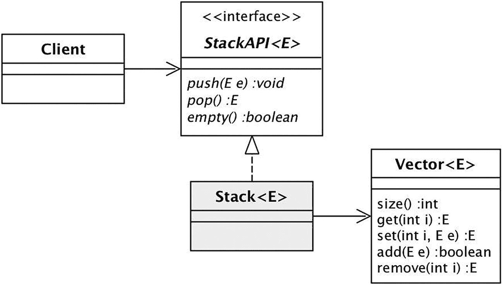
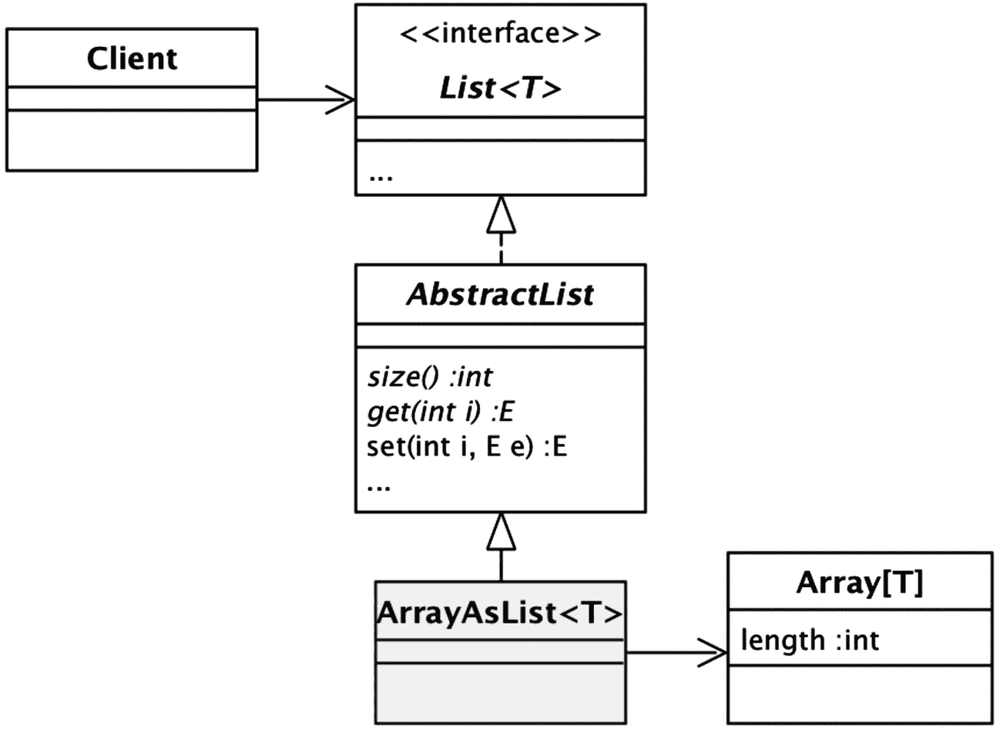
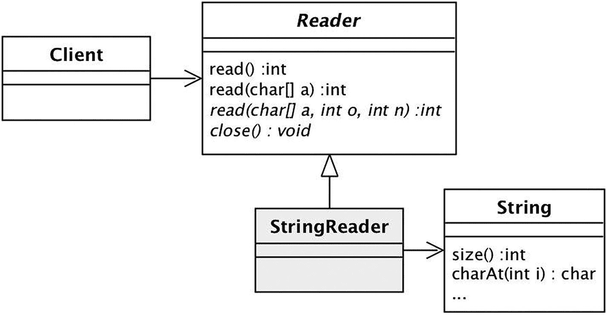
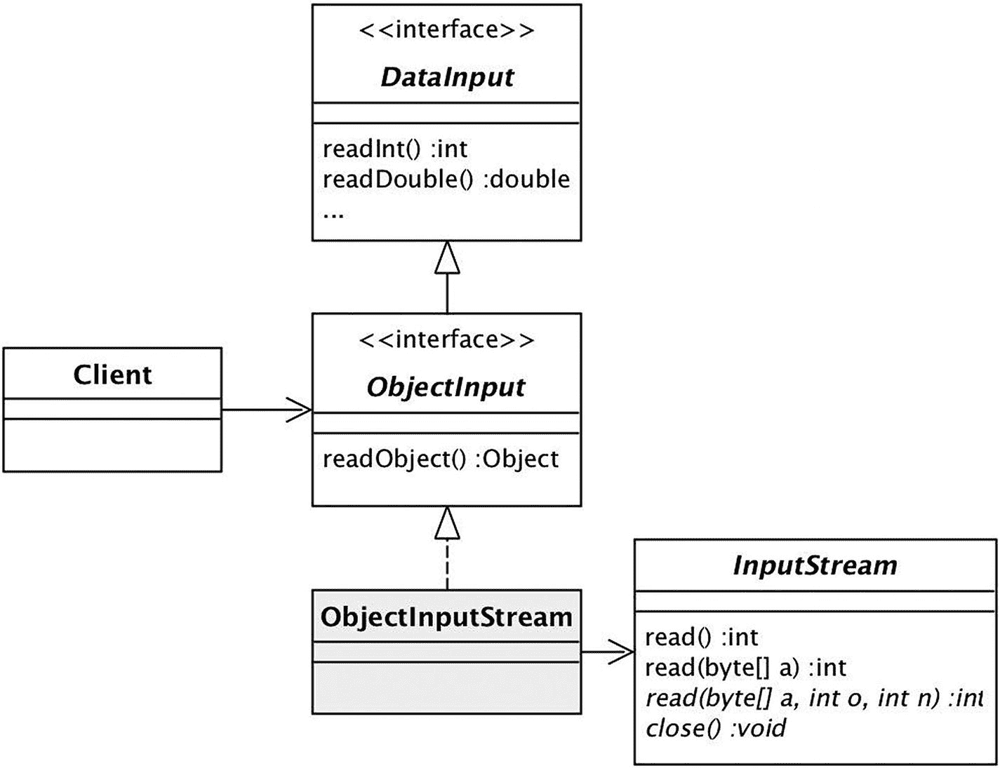
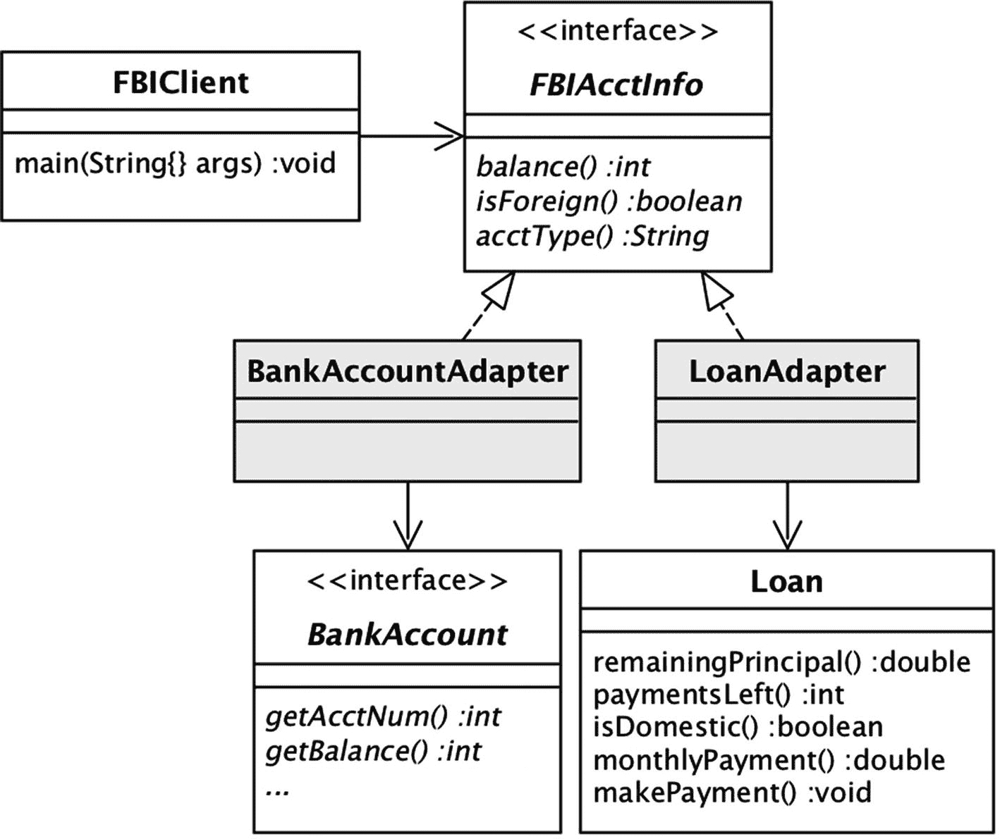

# 七、适配器

接下来的两章研究了一种叫做*包装*的设计技术。包装表示两个类之间的密切关系，称为*包装器*类和*包装器*类。包装类的唯一目的是修改或增强其包装类的功能。包装完全符合开放/封闭设计规则:如果你需要一个行为稍有不同的类，那么不要修改它。相反，创建一个包装它的新类。

本章涵盖了适配器的概念，适配器是一个包装器，它改变它所包装的类的功能。本章提供了几个例子来说明适配器类的广泛适用性。特别感兴趣的是改编第三章的字节流的 Java 库类。这些类使得简单地通过修改实现字节流的现有类来读写字符流、原始值或对象成为可能。

## 重用的继承

假设你需要写一个类。有一个现有的类，其方法类似于您需要的方法。因此，您决定将您的类定义为这个现有类的子类，这样您就可以继承这些方法，从而简化您的代码编写任务。

这听起来是个好主意，对吧？不幸的是，事实并非如此。事实上，这是一个非常糟糕的主意。正如在第三章中所讨论的，创建子类的唯一好理由是因为子类-超类关系满足 Liskov 替换原则——也就是说，如果子类对象可以用来代替超类对象。继承代码的可能性在决策中不起作用。

然而，很难抗拒仅仅为了继承代码而创建子类的诱惑。面向对象软件的历史充满了这样的类。这种设计技术甚至还有一个名字:*为重用而继承*。

在面向对象编程的早期，面向重用的继承被吹捧为面向对象的一大优点。现在我们明白，这种想法是完全错误的。Java 库类`Stack`为出现的问题提供了一个很好的例子。

`Stack`扩展了 Java 库类`Vector`，实现了`List`。扩展`Vector`的好处是堆栈方法`empty`、`push`和`pop`变得非常容易实现。清单 7-1 给出了`Stack`源代码的简化版本。

```java
public class Stack<E> extends Vector<E> {
   public boolean empty() {
      return size() == 0;
   }

   public void push(E item) {
      add(item);
   }

   public E pop() {
      return remove(size()-1);
   }
}

Listing 7-1Simplified Code for the Stack Class

```

这段代码利用了从`Vector`继承的`size`、`add`和`remove`方法。毫无疑问，`Stack`的设计者很高兴他们可以使用`Vector`方法来“免费”，而不用为它们写任何代码。这是一个继承重用的完美例子。

然而，这种设计有明显的问题。扩展`Vector`的决定违反了 Liskov 替换原则，因为堆栈的行为一点也不像列表。例如，栈只允许你查看它的顶部元素，而列表允许你查看(和修改)每个元素。

实际上，问题是客户端可以以非类似堆栈的方式使用堆栈。举个简单的例子，下面代码的最后一条语句修改了堆栈的底部:

```java
   Stack<String> s = new Stack<>();
   s.push("abc");
   s.push("xyz");
   s.set(0,"glorp");

```

换句话说，`Stack`类没有被充分封装。客户端可以利用它是按照`Vector`实现的这一事实。

`Stack`类是第一个 Java 版本的一部分。从那以后，Java 开发社区承认这种设计是一个错误。事实上，该类的当前文档建议不要使用它。

## 封装器

好消息是，可以编写`Stack`来利用`Vector`而不是它的子类。清单 7-2 展示了这种技术:`Stack`持有一个`Vector`类型的变量，并使用这个变量实现它的`empty`、`push`和`pop`方法。因为这个变量是`Stack`的私有变量，所以其他类不能访问它，这确保了`Stack`变量不能调用`Vector`方法。

```java
public class Stack<E> {
   private Vector<E> v = new Vector<>();

   public boolean empty() {
      return v.size() == 0;
   }

   public void push(E item) {
      v.add(item);
   }

   public E pop() {
      return v.remove(v.size()-1);
}

Listing 7-2Using a Wrapper to Implement Stack

```

这种实现技术被称为*包装*。包装是依赖关系的一种具体应用，其中类`C`通过对类`D`的依赖来实现其方法，调用`D`的方法来完成大部分(或全部)工作。类`D`被称为包装器`C`的*后备库*。例如在清单 7-2 中，`Stack`包装了`Vector`，因为它依赖于`Vector`，并通过调用`Vector`方法来实现其方法。

包装是一项非常有用的技术。如果一个设计包含了重用的继承，那么它总是可以被重新设计来使用包装。经验表明，基于包装器的设计总是更好。

## 适配器模式

包装类通常被用作适配器。术语“适配器”类似于现实生活中的适配器。例如，假设您想将三脚真空吸尘器插入两脚电源插座。解决这个僵局的一个方法是购买一个新的带有两个插座的真空吸尘器。另一种方法是重新连接插座，使其接受三个插脚。这两种选择都是昂贵且不切实际的。

第三个也是更好的选择是购买一端有两个插脚、另一端有三个插脚的适配器。设备插入适配器的一端，适配器的另一端插入插座。适配器管理其两端之间的电力传输。

软件也存在类似的情况。假设您的代码需要一个具有特定接口的类，但是现有的最佳类实现了一个稍微不同的接口。你该怎么办？你有同样的三个选择。

您的前两个选择是修改您的代码，使其使用现有的接口，或者修改现有类的代码，使其实现所需的接口。与电气适配器的情况一样，这些选项可能既昂贵又不切实际。此外，它们甚至不可能实现。例如，不允许修改 Java 库中的类。

更简单、更好的解决方案是编写一个适配器类。适配器类包装现有的类，并使用它来实现所需的接口。这个解决方案被称为*适配器模式*。其类图如图 7-1 所示。


图 7-1

适配器模式

清单 7-2 中的`Stack`类是适配器模式的一个例子。现有的类是`Vector`。所需的接口由方法{ `push`、`pop`、`empty`组成。适配器类是`Stack`。图 7-2 显示了它们的关系。在这种情况下，没有正式的 Java 接口，所以图中使用“StackAPI”来表示所需的方法。



图 7-2

作为适配器类堆栈

适配器模式的另一个例子出现在 Java 库类`Arrays`中。回想一下第五章中的内容，`Arrays`有一个静态工厂方法`asList`，它返回一个包含给定数组内容的列表。下面的代码说明了它的用法:

```java
   String[] a = {"a", "b", "c", "d"};
   List<String> L = Arrays.asList(a);

```

实现这个方法的一种方式是创建一个新的`ArrayList`对象，向它添加数组元素，然后返回它。这个想法不太好，因为复制大数组的元素效率很低。

一个更好的想法是使用适配器模式。由`asList`方法返回的对象将属于一个适配器类，该类包装数组并实现`List`方法。清单 7-3 中的代码使用这种思想实现了`Arrays`类。适配器类被称为`ArrayAsList`。

```java
public class Arrays {
   ...
   public static <T> List<T> asList(T[] vals) {
      return new ArrayAsList<T>(vals);
   }
}

class ArrayAsList<T> extends AbstractList<T> {
   private T[] data;

   public ArrayAsList(T[] data) {
      this.data = data;
   }

   public int size() {
      return data.length;
   }

   public T get(int i) {
      return data[i];
   }

   public T set(int i, T val) {
      T oldval = data[i];
      data[i] = val;
      return oldval;
   }
}

Listing 7-3A Simplified Implementation of the Arrays Class

```

`asList`方法只是从它的`ArrayAsList`适配器类中创建并返回一个对象。`ArrayAsList`扩展 Java 库类`AbstractList`，实现方法`size`、`get`和`set`。请注意，代码不会复制数组，而是按需访问数组元素。设计优雅而高效。图 7-3 给出了显示`ArrayAsList`如何适应适配器模式的类图。



图 7-3

适配器类数组列表

适配器的另一个例子是第六章中的类`RandomIterator`，它的代码出现在清单 6-3 中。该类包装了一个类型为`Random`的对象，并用它来实现`Iterator`接口。

## 文本流

第三章介绍了抽象类`InputStream`，它的子类能够从文件、管道和其他输入源读取字节；它还引入了`OutputStream`，它有类似的子类用于写字节。由这些类管理的字节序列被称为*字节流*(与第六章的收集流完全无关)。本节涉及字符流，称为*文本流*。

字符流层次由抽象类`Reader`和`Writer`领导。这些课程与`InputStream`和`OutputStream`非常相似。它们的方法是相似的，主要区别在于`Reader`和`Writer`的`read`和`write`方法操作字符而不是字节。它们的子类也是类似的。例如，类`FileReader`和`PipedReader`平行于`FileInputStream`和`PipedInputStream`。

例如，清单 7-4 给出了一个程序的代码，该程序读取文本文件“mobydick.txt”并将它的前 500 个字符写入文件“shortmoby.txt”

```java
public class FilePrefix {
   public static void main(String[] args) throws IOException {
      try (Reader r = new FileReader("mobydick.txt");
           Writer w = new FileWriter("shortmoby.txt")) {
         for (int i=0; i<500; i++) {
            int x = r.read();
            if (x < 0)
               break;
            char c = (char) x;
            w.write(c);
         }
      }
   }
}

Listing 7-4Reading and Writing a Text File

```

从设计的角度来看，关于文本流最有趣的问题是各种`Reader`和`Writer`类是如何实现的。事实证明，适配器起着很大的作用，这将在下面的小节中讨论。

### 适配器输出 StreamWriter

假设要求你实现`FileWriter`类；你会怎么做？您的代码需要解决两个问题。首先，它需要管理文件——打开它，向它写入值，然后关闭它。其次，您的代码需要将每个输出字符转换成一个或多个字节，因为文件理解字节而不是字符。您可以通过查看`FileOutputStream`的代码来处理第一个问题。它已经处理了那个问题，所以你可以复制相关的代码。您可以通过使用 Java 库中的类`CharEncoder`来处理第二个问题，我们很快就会讨论这种方法。所以一切似乎都在控制之中。但是在你继续下去之前，你应该停下来重读这一段。提议的设计好吗？

答案是否定的。从`FileOutputStream`复制代码违反了不要重复你自己的设计规则，并且是一个糟糕的主意。更好的设计是使用适配器类来利用现有的实现。换句话说，`FileWriter`应该是一个适配`FileOutputStream`并实现`Writer`的类。

事实上，你可以做得更好。注意，`FileWriter`唯一真正的职责是将每个字符编码成字节，并将这些字节写入其包装的输出流。这段代码适用于任何输出流，而不仅仅是`FileOutputStream`。换句话说，更通用的解决方案是为`OutputStream`编写一个适配器类，而不是为`FileOutputStream`编写一个适配器类。

Java 库正好提供了这样一个适配器类，叫做`OutputStreamWriter`。这个类包装了一个具有现有功能的对象(即`OutputStream`，它具有写字节的能力)，并使用它来实现所需的接口(即`Writer`，它赋予您写字符的能力)。

`OutputStreamWriter`适配器的用处在于它可以将*任何*输出流转换成一个写入器。特别是可以用来写`FileWriter`。以下两个语句是等效的:

```java
  Writer fw = new FileWriter(f);
  Writer fw = new OutputStreamWriter(new FileOutputStream(f));

```

换句话说，`FileWriter`是一个便利类。它可以被实现为`OutputStreamWriter`的子类，其构造器创建被包装的`FileOutputStream`对象。它的代码看起来有点像清单 7-5 。

```java
public class FileWriter extends OutputStreamWriter {
   public FileWriter(String f) throws IOException {
      super(new FileOutputStream(f));
   }
}

Listing 7-5The Code for the FileWriter Class

```

图 7-4 中的类图显示了`Writer`、`OutputStream`、`FileWriter`类之间的关系，以及适配器类`OutputStreamWriter`所起的关键作用。


图 7-4

将 OutputStreamWriter 作为适配器

既然`OutputStreamWriter`的目的已经明确，是时候考虑它的实现了。清单 7-6 中显示了代码的简化版本。该类扩展了抽象类`Writer`，因此需要实现三个抽象方法:`close`、`flush`和 3-arg `write`方法。`OutputStreamWriter`使用其包装的`OutputStream`对象实现这三种方法。`close`和`flush`的实现只需调用相应的`OutputStream`方法。`write`方法编码指定的字符，将编码的字节放入字节缓冲区，并将每个字节写入包装的输出流。

```java
public class OutputStreamWriter extends Writer {
   private CharsetEncoder encoder;
   private OutputStream os;

   public OutputStreamWriter(OutputStream os,
                   String charsetname) throws IOException {
      this.os = os;
      encoder = Charset.forName(charsetname).newEncoder();
   }

   public OutputStreamWriter(OutputStream os)
                            throws IOException {
      this(os, Charset.defaultCharset().name());
   }

   public void write(char cbuf[], int offset, int len)
                                     throws IOException {
      CharBuffer cb = CharBuffer.wrap(cbuf, offset, len);
      ByteBuffer bb = encoder.encode(cb);
      for (int i=0; i<bb.limit(); i++)
         os.write(bb.get(i));
   }

   public void close() throws IOException {
      os.close();
   }

   public void flush() throws IOException {
      os.flush();
   }

}

Listing 7-6A Simplified OutputStreamWriter Class

```

这个类的复杂性源于这样一个事实，即有许多编码字符的方法。例如，Java 使用 *16 位 Unicode* 进行内存中字符编码，这需要两个字节来存储大多数字符。(有些字符需要四个字节，这对于 Java 来说相当复杂，但幸运的是这与本讨论无关。)但是，16 位 Unicode 不一定是编码文件的最佳方式。许多文本编辑器使用像 ASCII 这样的编码，它假定一个较小的字符集，每个字符只需要一个字节。读写文件的 Java 程序需要能够与多种字符编码进行交互。

Java 库有一个类`Charset`，它的对象表示字符编码。该类支持几种标准编码，每种编码都有一个名称。例如，ASCII、8 位 Unicode 和 16 位 Unicode 的编码被命名为“US-ASCII”、“UTF-8”和“UTF-16”它的`forName`方法是一个静态工厂方法，返回与指定名称对应的`Charset`对象。`OutputStreamWriter`类有两个构造器。第一个构造器有一个指定所需字符集名称的参数。第二个构造器使用预先确定的默认字符集。

`The Charset`方法`newEncoder`返回一个`CharsetEncoder`对象。`CharsetEncoder`有方法`encode`，它执行编码。`encode`的参数是一个`CharBuffer`对象。一个`CharBuffer`类似于一个`ByteBuffer`，除了它使用一个底层的字符数组而不是字节。`encode`方法对这些字符进行编码，并将它们的编码字节放入一个`ByteBuffer`对象中，然后可以将该对象的字节写入输出流。

### 适配器输入流阅读器

`Reader`和`InputStream`类之间的对应类似于`Writer`和`OutputStream`类之间的对应。特别是，Java 库包含了包装`InputStream`和扩展`Reader`的适配器类`InputStreamReader`。`FileReader`是一个扩展了`InputStreamReader`的便利类。`FileReader`代码类似于`FileWriter`，出现在清单 7-7 中。

```java
public class FileReader extends InputStreamReader {
   public FileReader(String f) throws IOException {
      super(new FileInputStream(f));
   }
}

Listing 7-7The FileReader Class

```

清单 7-8 中显示了`InputStreamReader`适配器类的代码。它比`OutputStreamWriter`更复杂，因为解码字节比编码字符更棘手。问题是，某些编码中的字符不需要编码成相同数量的字节，这意味着您无法知道要读取多少字节来解码下一个字符。`InputStreamReader`类通过缓冲输入流解决了这个问题。它提前读取一些字节，并将这些字节存储在一个`ByteBuffer`对象中。`read`方法从那个缓冲区获取输入。

`read`方法通过调用类`CharDecoder`的方法`decode`来执行从字节到字符的转换。它提供给`decode`的两个参数是输入字节缓冲区和输出字符缓冲区。`decode`方法从字节缓冲区读取字节，并将解码后的字符放入字符缓冲区。当字符缓冲区已满或字节缓冲区为空时，它就会停止。char 缓冲区已满的情况称为*溢出*。在这种情况下，`read`方法可以停止，为下一次调用`read`保留剩余的输入字节。字节缓冲器为空的情况称为*下溢*。在这种情况下,`read`方法必须重新填充字节缓冲区并再次调用`decode`,这样它就可以填充 char 缓冲区的剩余部分。

```java
public class InputStreamReader extends Reader {
   public static int BUFF_SIZE = 10;
   private ByteBuffer bb = ByteBuffer.allocate(BUFF_SIZE);
   private InputStream is;
   private CharsetDecoder decoder;
   private boolean noMoreInput;

   public InputStreamReader(InputStream is,
                    String charsetname) throws IOException {
      this.is = is;
      decoder = Charset.forName(charsetname).newDecoder();
      bb.position(bb.limit()); //indicates an empty buffer
      noMoreInput = fillByteBuffer();
   }

   public InputStreamReader(InputStream is)
                                        throws IOException {
      this(is, Charset.defaultCharset().name());
   }

   public int read(char cbuf[], int offset, int len)
                                    throws IOException {
      int howmany = len;
      while (true) {
         CharBuffer cb = CharBuffer.wrap(cbuf, offset, len);
         CoderResult result = decoder.decode(bb, cb,
                                             noMoreInput);
         if (result == CoderResult.OVERFLOW)
            return howmany;
         else if (result == CoderResult.UNDERFLOW
                         && noMoreInput)
            return (cb.position() > 0) ? cb.position() : -1;
         else if (result == CoderResult.UNDERFLOW) {
            // Get more bytes and repeat the loop
            // to fill the remainder of the char buffer.
            noMoreInput = fillByteBuffer();
            offset = cb.position();
            len = howmany - cb.position();
         }
         else
            result.throwException();
      }
   }

   public void close() throws IOException {
      is.close();
   }

   private boolean fillByteBuffer() throws IOException {
      bb.compact(); //move leftover bytes to the front
      int pos = bb.position();
      int amtToRead = bb.capacity() - pos;
      int result = is.read(bb.array(), pos, amtToRead);
      int amtActuallyRead = (result < 0) ? 0 : result;
      int newlimit = pos + amtActuallyRead;
      bb.limit(newlimit);
      bb.position(0); //indicates a full buffer
      return (amtActuallyRead < amtToRead);
   }
}

Listing 7-8A Simplified InputStreamReader Class

```

### 适配器字符串读取器

类`StringReader`是 Java 库中文本流适配器的另一个例子。这个类的任务是从一个字符串创建一个阅读器。每次调用它的`read`方法都会返回字符串中的下一个字符。清单 7-9 中显示了其代码的简化版本。

```java
public class StringReader extends Reader {
   private String s;
   private int pos = 0;

   public StringReader(String s) throws IOException {
      this.s = s;
   }

   public int read(char[] cbuf, int off, int len)
                                 throws IOException {
      if (pos >= s.length())
         return -1;   // end of stream
      int count=0;
      while (count<len && pos<s.length()) {
         cbuf[off+count] = s.charAt(pos);
         pos++; count++;
      }
      return count;
   }

   public void close() {
      // strings don't need to be closed
   }
}

Listing 7-9A Simplified StringReader Class

```

与`InputStreamReader`不同，`StringReader`的代码简短明了。指定的字符串充当输入缓冲区。`read`方法将字符串中的一个字符放入`cbuf`的下一个槽中，当`len`字符被写入(“上溢”)或字符串用尽(“下溢”)时停止。在任一情况下，该方法都返回写入的字符数。

`StringReader`类符合适配器模式，如图 7-5 的类图所示。



图 7-5

StringReader 作为适配器

## 对象流

类`InputStream`和`OutputStream`让你读写字节流，而`Reader`和`Writer`让你读写字符流。Java 库提供了两个额外的读/写级别。接口`DataInput`和`DataOutput`让你读写原始值，接口`ObjectInput`和`ObjectOutput`让你读写对象。清单 7-10 给出了这四个接口的声明。

```java
public interface DataInput {
   int readInt() throws IOException;
   double readDouble() throws IOException;
   ... // a method for each primitive type
}

public interface DataOutput {
   void writeInt(int i) throws IOException;
   void writeDouble(double d) throws IOException;
   ... // a method for each primitive type
}

public interface ObjectInput extends DataInput {
   Object readObject() throws IOException;
}

public interface ObjectOutput extends DataInput {
   void writeObject(Object obj) throws IOException;
}

Listing 7-10The DataInput, DataOutput, ObjectInput, and ObjectOutput Interfaces

```

Java 类库`ObjectInputStream`和`ObjectOutputStream`实现了`ObjectInput`和`ObjectOutput`，因此也实现了`DataInput`和`DataOutput`。因此，这两个类能够管理混合了对象和原始值的流。

清单 7-11 给出了类`ObjectStreamTest`的代码，演示了这些类的用法。这个程序展示了两种将字符串列表写入对象流并读取它们的方法。

```java
public class ObjectStreamTest {
   public static void main(String[] args) throws Exception {
      List<String>  L = Arrays.asList("a", "b", "c");

      // Write the list to a file, in two ways.
      try (OutputStream os  = new FileOutputStream("sav.dat");
           ObjectOutput oos = new ObjectOutputStream(os)) {
         oos.writeObject(L);    // Write the list.

         oos.writeInt(L.size()); // Write the list size,
         for (String s : L)      // and then its elements

.
            oos.writeObject(s);

      }

      // Read the lists from the file.
      try (InputStream is  = new FileInputStream("sav.dat");
           ObjectInput ois = new ObjectInputStream(is)) {

         List<String>  L1 = (List<String>) ois.readObject();

         List<String>  L2 = new ArrayList<>();
         int size = ois.readInt();      // Read the list size.
         for (int i=0; i<size; i++) {   // Read the elements.
            String s = (String) ois.readObject();
            L2.add(s);
         }

         // L, L1, and L2 are equivalent.
         System.out.println(L + ", " + L1 + ", " + L2);
      }
   }
}

Listing 7-11The ObjectStreamTest Class

```

读取对象流不同于读取字节流或文本流。一个对象流可以包含一个任意的对象序列和原始值，客户端需要知道在读取它的时候会发生什么。例如，在`ObjectStreamTest`中，读取流的代码必须知道文件“sav.dat”包含以下内容:一个字符串列表、一个 int 和与前面的 int 的值一样多的单个字符串。

因此，客户端应该永远不需要读取对象流的末尾。这与字节流非常不同，在字节流中，客户端通常读取字节，直到返回流尾标记值-1。

由于由`readObject`返回的对象属于类型`Object`，客户端必须将该对象转换为适当的类型。

演示演示了两种向流中写入列表的方法:你可以将整个列表作为单个对象写入，或者你可以单独写入元素。编写整个列表显然更可取，因为它避免了遍历列表元素的需要。代码变得更容易编写和阅读。

类`ObjectInputStream`和`ObjectOutputStream`是适配器类。图 7-6 显示了说明`ObjectInputStream`如何符合适配器模式的类图。`ObjectOutputStream`的类图是类似的。



图 7-6

ObjectInputStream 作为适配器

类`ObjectInputStream`的实现类似于适配器类`InputStreamReader`。一个`ObjectInputStream`对象持有对它所包装的`InputStream`对象的引用，并使用该对象的方法来实现它的方法。`ObjectOutputStream`的实现也类似。

`DataInput`和`DataOutput`方法的实现非常简单。例如，`writeInt`方法从给定的 int 值中提取四个字节，并将它们写入字节流。`readInt`方法从字节流中读取四个字节，并将它们转换成一个 int。

`readObject`和`writeObject`的实现难度要大得多。`writeObject`方法需要对物体的足够信息进行编码，以使其能够被重建。这些信息包括关于对象的类及其状态变量的值的元数据。如果对象引用另一个对象`z`，那么关于`z`的信息也必须写入字节流。如果对象多次引用`z`(直接或间接)，那么该方法必须确保`z`只被写入流一次。将对象编码为字节序列的过程称为*对象序列化*。

通常，序列化对象的算法可能需要将几个对象写入字节流。`writeObject`方法首先创建一个从给定对象可达的所有对象的图；然后，它系统地遍历图形，将每个对象的字节表示写入流中。`readObject`方法执行相反的操作。关于`writeObject`和`readObject`算法的更多细节已经超出了本书的范围。

## 在银行演示中保存状态

对象流是保存程序状态的一种特别好的方式。回想一下，银行演示目前将银行的账户信息保存到一个文件中。管理文件读写的类是`SavedBankInfo`，它的代码出现在清单 3-14 中。那个类一个字节一个字节的写账户信息；编码既困难又乏味。

对象流的使用可以极大地简化`SavedBankInfo`的代码。现在只需调用一次`writeObject`，就可以写入整个帐户映射，而不是将每个帐户的每个值的每个字节都写入(和读取)到文件中。清单 7-12 给出了新的代码，它在银行演示的版本 16 中。

```java
public class SavedBankInfo {
   private String fname;
   private Map<Integer,BankAccount> accounts;
   private int nextaccount;

   public SavedBankInfo(String fname) {
      this.fname = fname;
      File f = new File(fname);
      if (!f.exists()) {
         accounts = new HashMap<Integer,BankAccount>();
         nextaccount = 0;
      }
      else {
         try (InputStream is = new FileInputStream(fname);
              ObjectInput ois = new ObjectInputStream(is)) {
            accounts =
                 (Map<Integer,BankAccount>) ois.readObject();
            nextaccount = ois.readInt();
         }
         catch (Exception ex) {
            throw new RuntimeException("file read exception");
         }
      }
   }

   public Map<Integer,BankAccount> getAccounts() {
      return accounts;
   }

   public int nextAcctNum() {
      return nextaccount;
   }

   public void saveMap(Map<Integer,BankAccount> map,
                       int nextaccount) {
      try (OutputStream os = new FileOutputStream(fname);
            ObjectOutput oos = new ObjectOutputStream(os)) {
         oos.writeObject(map);
         oos.writeInt(nextaccount);
      }
      catch (IOException ex) {
         throw new RuntimeException("file write exception");
      }
   }
}

Listing 7-12The Version 16 SavedBankInfo Class

```

保存的文件将包含两个对象:帐户映射和下一个帐号。构造器从保存的文件中读取映射和帐号(如果它们存在的话);否则，它会创建一个空映射，并将帐号设置为 0。方法`saveMap`将指定的地图和数字写入保存的文件，覆盖任何以前的文件内容。

`writeObject`方法有一个额外的要求:它写的对象和该对象引用的所有对象必须是*可序列化的*。也就是说，他们必须实现接口`Serializable`。Java 库中的大多数类都是可序列化的。如果你希望你的类是可序列化的，你必须声明它们来实现`Serializable`。

接口的不寻常之处在于它没有方法。这个接口的作用是作为一个“可以写”的标志。问题是一个类可能在其私有字段中包含敏感信息(如密码、工资或银行余额)。序列化该对象将使任何有权访问该文件的人都可以看到该私有信息，这可能会产生意想不到的后果。因此，程序员需要“签署”序列化。

回到版本 16 的银行演示，注意,`writeObject`方法的参数是账户映射。`HashMap`和`Integer`类已经是可序列化的。映射中唯一的其他组件是银行帐户类。您可以通过让`BankAccount`实现`Serializable`来使它们可序列化，如清单 7-13 所示。

```java
public interface BankAccount
       extends Comparable<BankAccount>, Serializable {
   ...
}

Listing 7-13The Version 16 BankAccount Interface

```

此外，银行帐户引用的任何对象也必须是可序列化的。`AbstractBankAccount`类有一个对`OwnerStrategy`对象的引用，所以你也应该声明`OwnerStrategy`接口是可序列化的。目前唯一实现`OwnerStrategy`的是枚举`Owners`。默认情况下，枚举在 Java 中是可序列化的，所以从技术上讲`OwnerStrategy`不需要显式地可序列化。但是无论如何声明它是一个好的做法，以防将来修改`OwnerStrategy`的实现。

## 银行演示的适配器

适配器的另一个用途是将不同类的信息合并到一个列表中，即使这些类可能没有公共接口。这个想法是为每个类创建一个适配器，这样这些适配器就实现了相同的接口。然后，可以将得到的调整后的对象放入列表中。

例如，考虑下面与银行演示相关的场景。假设 FBI 正在调查洗钱，并希望查看余额超过 10，000 美元的外国帐户的信息。此外，联邦调查局对贷款和银行账户感兴趣，贷款的“余额”被认为是其剩余本金。FBI 希望将这些信息存储为一个`FBIAcctInfo`对象的列表，其中`FBIAcctInfo`是清单 7-14 中所示的接口。

```java
interface FBIAcctInfo {
   int balance();     // in dollars
   boolean isForeign();
   String acctType(); // "deposit" or "loan"
}

Listing 7-14The FBIAcctInfo Interface

```

出于这个例子的目的，版本 16 的银行演示需要有一个类`Loan`，它包含一些关于银行贷款的基本信息。清单 7-15 给出了它的代码。该类具有返回贷款当前状态的方法——其余额、剩余还款和每月还款金额——以及进行下一次还款的方法。

```java
public class Loan {
   private double balance, monthlyrate, monthlypmt;
   private int pmtsleft;
   private boolean isdomestic;

   public Loan(double amt, double yearlyrate,
               int numyears, boolean isdomestic) {
      this.balance = amt;
      pmtsleft = numyears * 12;
      this.isdomestic = isdomestic;
      monthlyrate = yearlyrate / 12.0;
      monthlypmt = (amt*monthlyrate) /
                   (1-Math.pow(1+monthlyrate, -pmtsleft));
   }

   public double remainingPrincipal() {
      return balance;
   }

   public int paymentsLeft() {
      return pmtsleft;
   }

   public boolean isDomestic() {
      return isdomestic;
   }

   public double monthlyPayment() {
      return monthlypmt;
   }

   public void makePayment() {
      balance = balance + (balance*monthlyrate) - monthlypmt;
      pmtsleft--;
   }
}

Listing 7-15The Loan Class

```

为了处理 FBI 请求，银行需要在`FBIAcctInfo`接口下结合银行账户和贷款数据。当然，问题是`BankAccount`和`Loan`对象都没有实现`FBIAcctInfo`。`BankAccount`有一个`isForeign`方法，但是对应的`Loan`方法是`isDomestic`。另外，`FBIAcctInfo`希望它的`balance`方法返回一个以美元为单位的值，但是`BankAccount`和`Loan`对相应的方法使用不同的名称，并以便士为单位存储值。两个类都没有对应于`acctType`方法的方法。

解决这个问题的方法是为实现`FBIAcctInfo`的`BankAccount`和`Loan`创建适配器类。然后，您可以用这些适配器包装`BankAccount`和`Loan`对象，并将结果`FBIAcctInfo`对象放在一个列表中，供 FBI 分析。

用于`BankAccount`的适配器称为`BankAccountAdapter`，用于`Loan`的适配器称为`LoanAdapter`。它们的代码出现在清单 7-16 和 7-17 中。

```java
public class LoanAdapter implements FBIAcctInfo {
   private Loan loan;

   public LoanAdapter(Loan loan) {
      this.loan = loan;
   }

   public int balance() {
      return (int) (loan.principalRemaining() / 100);
   }

   public boolean isForeign() {
      return !loan.isDomestic();
   }

   public String acctType() {
      return "loan";
   }
}

Listing 7-17The LoanAdapter Class

```

```java
public class BankAccountAdapter implements FBIAcctInfo {
   private BankAccount ba;

   public BankAccountAdapter(BankAccount ba) {
      this.ba = ba;
   }

   public int balance() {
      return ba.getBalance() / 100;
   }

   public boolean isForeign() {
      return ba.isForeign();
   }

   public String acctType() {
      return "deposit";
   }
}

Listing 7-16The BankAccountAdapter Class

```

图 7-7 显示了这些适配器对应的类图。该图还显示了一个类`FBIClient`，它为每个账户和贷款创建一个改编的`FBIAcctInfo`对象，并将它们存储在一个列表中。然后它可以根据需要处理列表；为了简单起见，这段代码只计算受影响的帐户。代码出现在清单 7-18 中。



图 7-7

FBI 场景的类 diagam

```java
public class FBIClient {
   public static void main(String[] args) {
      Bank b = getBank();

      // put account info into a single list
      List<FBIAcctInfo> L = new ArrayList<>();
      for (BankAccount ba : b)
         L.add(new BankAccountAdapter(ba));
      for (Loan ln : b.loans())
         L.add(new LoanAdapter(ln));

      // then process the list
      int count = 0;
      for (FBIAcctInfo a : L)
         if (a.isForeign() && a.balance() > 1000.0)
            count++;
      System.out.println("The count is " + count);
   }

   private static Bank getBank() {
      SavedBankInfo info = new SavedBankInfo("bank16.info");
      Map<Integer,BankAccount> accounts = info.getAccounts();
      int nextacct = info.nextAcctNum();
      return new Bank(accounts, nextacct);
   }

}

Listing 7-18The FBIClient Class

```

## 摘要

如果一个类依赖于一个类`D`，并且通过调用`D`的方法来完成大部分(或全部)工作，那么这个类就被称为*包装器*类。包装类的一个常见用途是作为一个*适配器*。适配器类使用其包装的类来帮助它实现类似的接口。例如，图 7-3 中的`ArrayAsList`类通过包装一个数组来实现一个列表。适配器类、它包装的类和它实现的接口之间的关系被称为*适配器模式*。

Java 库中的字节流类说明了适配器的价值。类`InputStream`、`OutputStream`及其子类提供了在各种输入和输出之间读写字节的方法。但是字节级操作往往太低级而不实用，所以 Java 有支持更高级操作的类。类`Reader`、`Writer`及其子类读写字符，接口`ObjectInput`和`ObjectOutput`读写对象和原始值。实现这些高级操作的最佳方式是使用适配器。

特别是，类`InputStreamReader`包装任何`InputStream`对象，并使其能够作为一个字符序列被读取。类似地，适配器类`ObjectInputStream`支持将任何`InputStream`对象作为对象和值的序列读取。这些适配器只需要知道如何将一个字符(在`InputStreamReader`的情况下)或一个对象(在`ObjectInputStream`的情况下)编码为一个字节序列。然后，每个适配器类可以让其包装的`InputStream`对象执行剩余的工作。适配器类`OutputStreamWriter`和`ObjectOutputStream`为其包装的`ObjectStream`对象类似地工作。