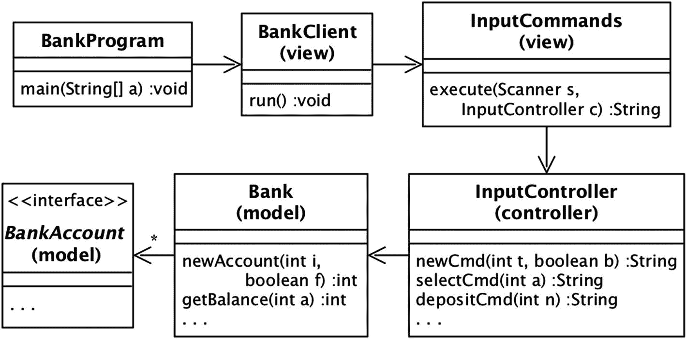
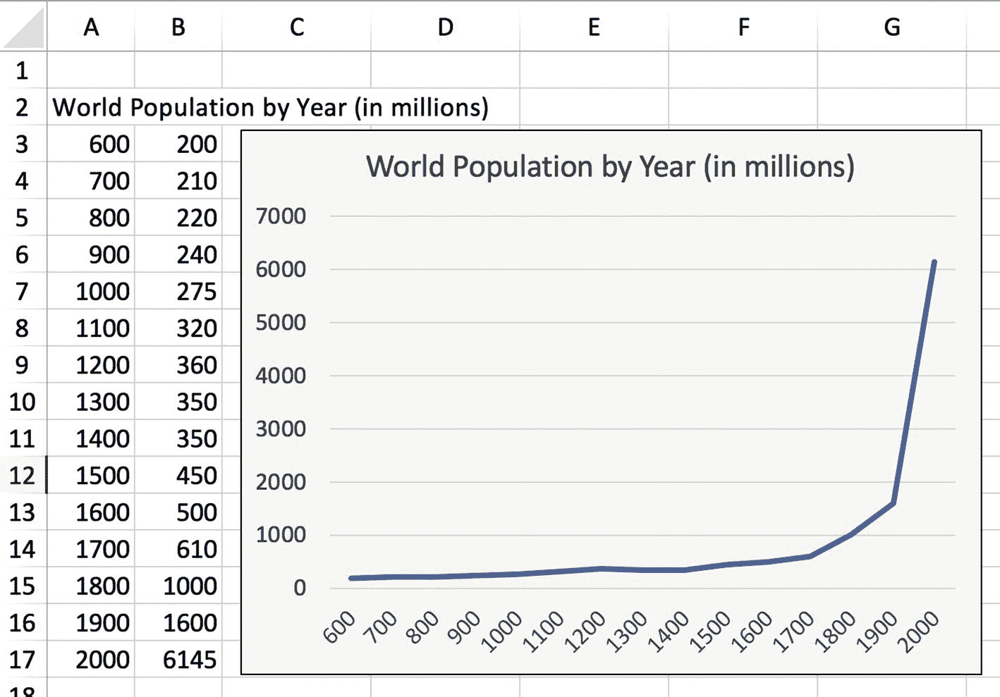
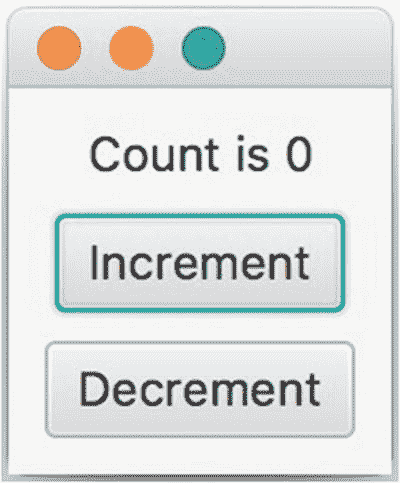
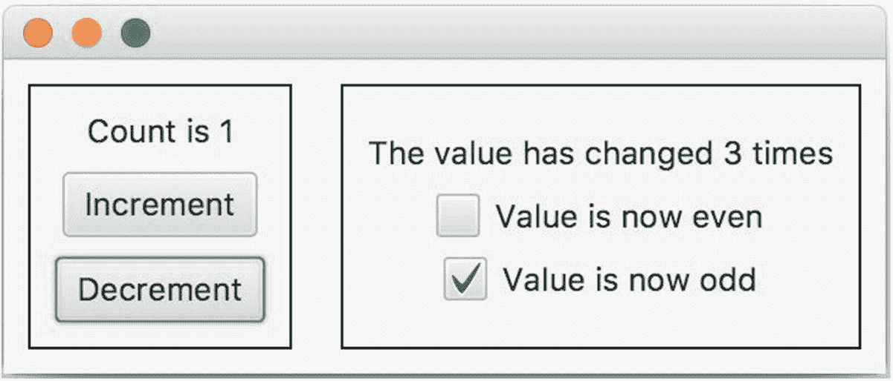
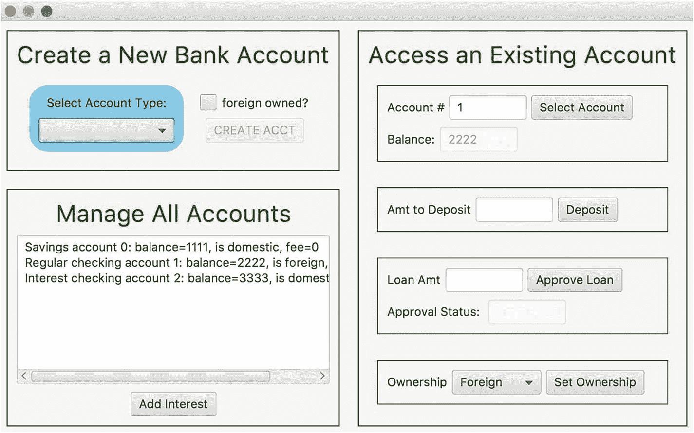
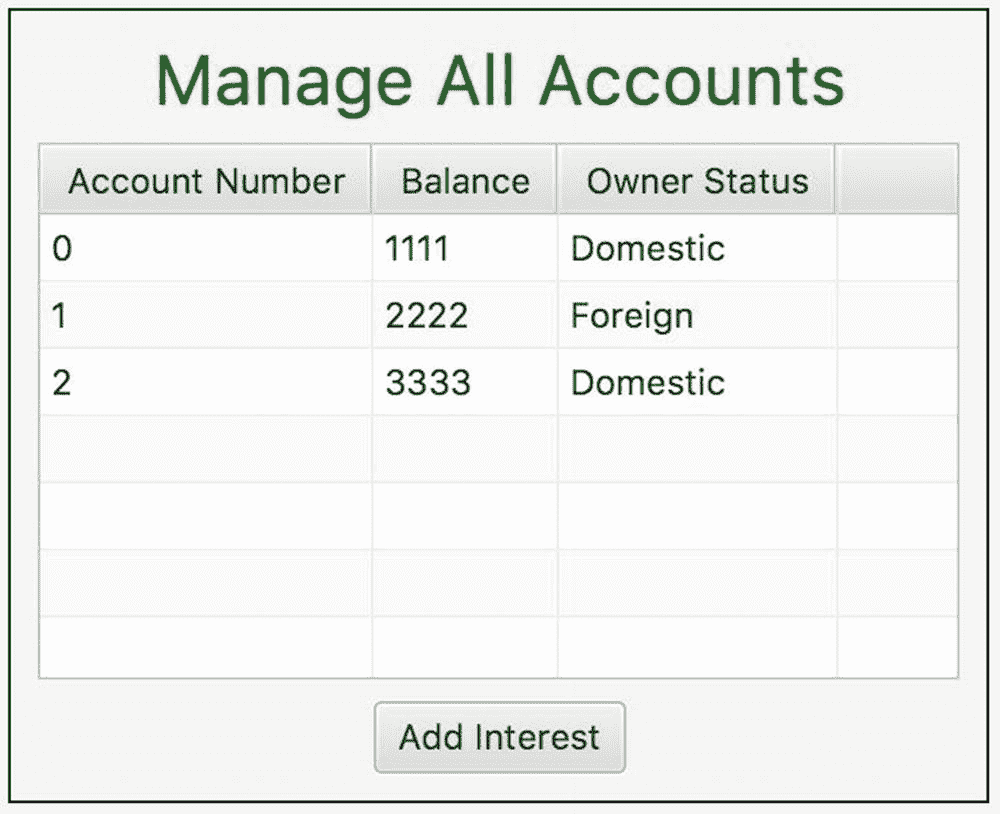

# 十一、模型、视图和控制器

这本书的最后一章讨论了如何将一个程序的计算相关的职责和它的表示相关的职责分开的问题。您可能还记得第一章在创建银行演示的第二版时首次解决了这个问题。版本 2 包含了新的类`BankClient`，它包含了表示责任，以及`Bank`，它包含了计算责任。

原来第一章走的还不够远。本章认为程序也应该*将计算类和表现类*隔离开来，为此你需要类在它们之间进行调解。计算、表示和中介类被称为*模型*、*视图*和*控制器*。本章介绍了 *MVC 模式*，这是在程序中组织这些类的首选方式。本章还讨论了使用 MVC 模式的优点，并给出了几个例子。

## MVC 设计规则

一个程序通常有两个感兴趣的领域。首先是它如何与用户交互，请求输入和呈现输出。第二个是它如何从输入计算输出。经验表明，设计良好的程序会将这两个领域的代码分开。输入/输出部分被称为*视图*。计算部分被称为*模型*。

这一思想通过设计规则“将模型与视图分离”来表达在面向对象的环境中，这条规则意味着应该有专门用于计算结果的类，以及专门用于呈现结果和请求输入的类。此外，不应该有一个两者都做的类。

视图和模型有不同的关注点。该视图需要是一个视觉上有吸引力的界面，易于学习和使用。该模型应该是实用和高效的。由于这些问题没有共同点，因此视图和模型应该相互独立地设计。因此，模型不应该知道视图如何显示结果，视图也不应该知道它所显示的值的含义。

为了保持这种隔离，程序必须有连接模型和视图的代码。这个代码叫做*控制器*。控制器理解程序的整体功能，并在视图和模型之间进行协调。它知道模型的哪些方法对应于每个视图请求，以及在视图中显示模型的哪些值。

这些想法被编入下面的*模型-视图-控制器*设计规则，或者被称为 *MVC* 规则。这个规则是单一责任规则的一个特例，它断言一个类不应该组合模型、视图或控制器责任。

### **模型-视图-控制器规则**

一个程序应该被设计成它的模型、视图和控制器代码属于不同的类。

例如，考虑版本 18 银行演示。`Bank`类是模型的一部分，它依赖的类和接口也是模型的一部分。因为这些类不包含视图或控制器代码，所以它们满足 MVC 规则。另一方面，`BankClient`和`InputCommands`类不满足 MVC 规则，因为它们都结合了视图和控制器代码。清单 11-1 和 11-2 中说明了这种情况。

清单 11-1 显示了`InputCommands`中定义常量`DEPOSIT`的部分。lambda 表达式包含视图代码(对扫描器和`System.out.print`的调用)以及控制器代码(对`bank.deposit`的调用)。

```java
public enum InputCommands implements InputCommand {
   ...
   DEPOSIT("deposit", (sc, bank, current)->{
      System.out.print("Enter deposit amt: ");
      int amt = sc.nextInt();
      bank.deposit(current, amt);
      return current;
   }),
   ...
}

Listing 11-1A Fragment of the Version 18 InputCommands Enum

```

清单 11-2 显示了`BankClient`类的开头和它的两个方法。值得称赞的是，该类主要包含视图代码。唯一的问题是它的两个变量，`bank`和`current`，引用了这个模型。尽管该类没有以任何有意义的方式使用这些变量，但它们不属于视图。

```java
public class BankClient {
   private Scanner scanner;
   private boolean done = false;
   private Bank bank;
   private int current = 0;
   ...

   private void processCommand(int cnum) {
      InputCommand cmd = commands[cnum];
      current = cmd.execute(scanner, bank, current);
      if (current < 0)
         done = true;
   }
}

Listing 11-2A Fragment of the Version 18 BankClient Class

```

版本 19 的银行演示通过将这些类的控制器代码移动到新的类`InputController`中来纠正这些类的问题。清单 11-3 给出了它的一些代码。

```java
public class InputController {
   private Bank bank;
   private int current = 0;

   public InputController(Bank bank) {
      this.bank = bank;
   }

   public String newCmd(int type, boolean isforeign) {
      int acctnum = bank.newAccount(type, isforeign);
      current = acctnum;
      return "Your new account number is " + acctnum;
   }

   public String selectCmd(int acctnum) {
      current = acctnum;
      int balance = bank.getBalance(current);
      return "Your balance is " + balance;
   }

   public String depositCmd(int amt) {
      bank.deposit(current, amt);
      return "Amount deposited";
   }
   ...
}

Listing 11-3The Version 19 InputController Class

```

控制器对每个输入命令都有一个方法。视图将调用这些方法，提供适当的参数值。控制器负责对模型执行必要的操作。它还负责构造一个描述结果的字符串，并将其返回给视图。控制器还管理保存当前帐户的变量`current`。

清单 11-4 和 11-5 给出了`BankClient`和`InputCommands`的版本 19 代码。这些类构成了视图。他们用扫描仪输入，用`System.out`输出。`BankClient`将控制器传递给`InputCommands`，而`InputCommands`将所有与模型相关的活动委托给控制器。

```java
public enum InputCommands implements InputCommand {
   QUIT("quit", (sc, controller)->{
      sc.close();
      return "Goodbye!";
   }),
   NEW("new", (sc, controller)->{
      printMessage();
      int type = sc.nextInt();
      boolean isforeign = requestForeign(sc);
      return controller.newCmd(type, isforeign);
   }),
   SELECT("select", (sc, controller)->{
      System.out.print("Enter acct#: ");
      int num = sc.nextInt();
      return controller.selectCmd(num);
   }),
   DEPOSIT("deposit", (sc, controller)->{
      System.out.print("Enter deposit amt: ");
      int amt = sc.nextInt();
      return controller.depositCmd(amt);
   }),
   ...
}

Listing 11-5The Version 19 InputCommands Enum

```

```java
public class BankClient {
   private Scanner scanner;
   private InputController controller;
   private InputCommand[] commands = InputCommands.values();

   public BankClient(Scanner scanner, InputController cont) {
      this.scanner = scanner;
      this.controller = cont;
   }

   public void run() {
      String usermessage = constructMessage();
      String response = "";
      while (!response.equals("Goodbye!")) {
         System.out.print(usermessage);
         int cnum = scanner.nextInt();
         InputCommand cmd = commands[cnum];
         response = cmd.execute(scanner, controller);
         System.out.println(response);
      }
   }
   ... 

}

Listing 11-4The Version 19 BankClient Class

```

主类`BankProgram`必须修改以适应视图和控制器类。它的代码出现在清单 11-6 中。这个类最好理解为既不属于模型、控制器，也不属于视图。相反，它的工作是创建和配置模型、控制器和视图类。清单 11-6 中的粗体代码突出显示了这些类的创建顺序。`BankProgram`首先创建模型对象(类型为`Bank`)。然后，它创建控制器，向其传递对模型的引用。最后，它创建视图，将一个引用传递给控制器。

```java
public class BankProgram {
   public static void main(String[] args) {
      SavedBankInfo info = new SavedBankInfo("bank19.info");
      Map<Integer,BankAccount> accounts = info.getAccounts();
      int nextacct = info.nextAcctNum();
      Bank bank = new Bank(accounts, nextacct);
      ...
      InputController controller = new InputController(bank);
      Scanner scanner = new Scanner(System.in);
      BankClient client = new BankClient(scanner, controller);
      client.run();
      info.saveMap(accounts, bank.nextAcctNum());
   }
}

Listing 11-6The Version 19 BankProgram Class

```

图 11-1 显示了描述这些模型、视图和控制器类之间关系的类图。注意，尽管视图和模型由多个类组成，但是有一个类作为配置的“主要”类。这种情况通常适用于所有的 MVC 设计。



图 11-1

基于 MVC 的银行演示的类图

从理论上讲，模型和视图之间的区别是很明显的:如果某样东西的功能与它的呈现方式无关，那么它就属于模型，如果它与模型无关，那么它就属于视图。然而，在实践中，做出这些区分可能需要仔细分析。银行演示提供了一些例子。

经常账户的概念就是一个例子。我之前说过它不应该是视图的一部分。但是它应该是控制器的一部分还是模型的一部分呢？答案取决于当前帐户是仅与特定视图相关，还是模型固有的。对我来说，关键是要意识到银行客户机的每个会话可能有不同的当前帐户，我不希望模型负责管理特定于会话的数据。这向我表明，当前帐户属于控制器，而不是模型。

再举一个例子，考虑一下`BankClient`分配给输入选项的数字。输入命令被分配一个从 0 到 7 的数字，帐户类型被分配一个从 1 到 3 的数字，所有权规范是 1 代表“国内”，2 代表“国外”视图负责为命令和国内/国外选择分配号码，但是模型决定帐户类型号码。为什么呢？

标准是输入值的含义是否与模型相关。如果模型不关心，那么视图应该负责确定值的含义。这是命令和所有权号的情况，因为模型永远看不到它们。另一方面，帐户类型由模型操纵，因此必须由模型决定。

## 一个模型的多个视图

将模型与视图分离的一个优点是，您可以创建使用相同模型的不同程序。例如，银行模型可以由一个面向客户的程序(例如，在线银行)、另一个面向银行员工的程序以及另一个面向银行高管的程序使用。要编写每个程序，只需编写视图和一个将视图与现有模型挂钩的控制器。

模型和视图之间的分离也使得修改视图变得更加容易，这样它就有了不同的用户界面。例如，`BankClient`可以修改为使用命令名而不是数字，或者支持语音命令，或者拥有基于 GUI 的界面。这最后一种选择将在本章后面讨论。

18 版银行演示有四个使用银行模型的程序:`BankProgram`、`FBIClient`、`IteratorStatProgram`和`StreamStatProgram`。后三个程序不满足 MVC 规则。它们都非常简单——它们没有输入，它们的输出只是打印一些测试查询的结果。用 MVC 重写他们的代码有意义吗？最简单的程序是`StreamStatProgram`，它有相关的类`StreamAccountStats`。这些类最初在第六章中讨论过。让我们重写它们，看看会发生什么。

清单 11-7 给出了`StreamAccountStats`的前两种方法。它主要是模型代码；唯一的问题是这些方法调用了`System.out.println`。

```java
public class StreamAccountStats {
   private Bank bank;

   public StreamAccountStats(Bank b) {
      bank = b;
   }

   public void printAccounts6(Predicate<BankAccount> pred) {
      Stream<BankAccount> s = bank.stream();
      s = s.filter(pred);
      s.forEach(ba->System.out.println(ba));
   }

   public void printAccounts7(Predicate<BankAccount> pred) {
      bank.stream()
          .filter(pred)
          .forEach(ba->System.out.println(ba));
   }
   ...
}

Listing 11-7The Original StreamAccountStats Class

```

清单 11-8 显示了版本 19 的修订版，称为`StreamStatModel`。两个`printAccounts`方法变了。他们名字中的前缀“print”已经被重命名为“get”，以反映他们的返回类型现在是`String`而不是`void`。此外，他们对`forEach`方法的使用必须修改为使用`reduce`，这样它可以从对`ba.toString`的单独调用中创建一个单独的字符串。

```java
public class StreamStatModel {
   private Bank bank;

   public StreamStatModel(Bank b) {
      bank = b;
   }

   public String getAccounts6(Predicate<BankAccount> pred) {
      Stream<BankAccount> s = bank.stream();
      s = s.filter(pred);
      Stream<String> t = s.map(ba->ba.toString());
      return t.reduce("", (s1,s2)->s1 + s2 + "\n");
   }

   public String getAccounts7(Predicate<BankAccount> pred) {
      return bank.stream()
                .filter(pred)
                .map(ba->ba.toString())
                .reduce("", (s1,s2)->s1 + s2 + "\n");
   }
   ...
}

Listing 11-8The Revised StreamStatModel Class

```

`StreamStatProgram`的原始代码出现在清单 11-9 中。它包含视图和控制器代码。控制器代码由调用模型方法组成。视图代码包括打印它们的结果。

```java
public class StreamStatProgram {
   public static void main(String[] args) {
      ... 
      StreamAccountStats stats = ... 

      Predicate<BankAccount> pred = ba -> ba.fee() == 0;
      ...
      System.out.println("Here are the domestic accounts.");
      stats.printAccounts6(pred);
      System.out.println("Here are the domestic accounts
                          again.");
      stats.printAccounts7(pred);
   }
}

Listing 11-9The Original StreamStatProgram Class

```

银行演示的版本 19 包含视图类`StreamStatView`。它的代码，如清单 11-10 所示，调用控制器方法而不是模型方法。注意，视图不知道谓词，因为谓词引用了模型。

```java
public class StreamStatView {
   StreamStatController c;

   public StreamStatView(StreamStatController c) {
      this.c = c;
   }

   public void run() {
      ...
      System.out.println("Here are the domestic accounts.");
      System.out.println(c.getAccounts6());
      System.out.println("Here are the domestic accounts
                          again.");
      System.out.println(c.getAccounts7());
   }
}

Listing 11-10The Version 19 StreamStatView Class

```

`StreamStatController`类出现在清单 11-11 中。它根据模型实现了三种视图方法中的每一种。它还创建了谓词。

```java
public class StreamStatController {
   private StreamStatModel model;
   Predicate<BankAccount> pred = ba -> ba.fee() == 0;

   public StreamStatController (StreamStatModel model) {
      this.model = model;
   }

   public String getAccounts6() {
      return model.getAccounts6(pred);
   }

   public String getAccounts7() {
      return model.getAccounts7(pred);
   }
   ...
}

Listing 11-11The Version 19 StreamStatController Class

```

最后，清单 11-12 给出了版本 19 `StreamStatProgram`类的代码。该类配置模型、视图和控制器，然后调用视图的`run`方法。

```java
public class StreamStatProgram {
   public static void main(String[] args) {
      SavedBankInfo info = new SavedBankInfo("bank19.info");
      Map<Integer,BankAccount> accounts = info.getAccounts();
      int nextacct = info.nextAcctNum();
      Bank bank = new Bank(accounts, nextacct);
      StreamStatModel m = new StreamStatModel(bank);
      StreamStatController c = new StreamStatController(m);
      StreamStatView v = new StreamStatView(c);
      v.run();
   }
}

Listing 11-12The Version 19 StreamStatProgram Class

```

比较 MVC 版本的`StreamStatProgram`类和它们的原始代码。你可能会惊讶于 MVC 版本是多么的干净和有组织。虽然它比原始版本包含更多的代码，但每个单独的类都很短，很容易修改。寓意是，即使对于小程序，MVC 设计也是值得考虑的。

## Excel 中的 MVC

Excel 是遵循 MVC 设计规则的商业程序的一个例子。该模型由电子表格的单元格组成。电子表格的每个图表都是模型的视图。图 11-2 显示了一个描述图表及其底层单元格的屏幕截图。



图 11-2

电子表格的模型和视图

Excel 在模型和视图之间保持严格的分离。细胞不知道图表的事。每个图表都是位于单元格顶部的“对象”。

创建 Excel 图表有两个方面。第一个方面是图表是什么样子的。Excel 具有指定不同图表类型、颜色、标签等的工具。这些工具对应于视图方法；它们让你让图表看起来更有吸引力，不管它代表什么数据。

第二个方面是图表显示什么数据。Excel 有一个名为“选择数据”的工具，用于指定图表的基本单元格。该工具对应于控制器。图 11-3 给出了图 11-2 的控制器窗口截图。“名称”文本字段指定包含图表标题的单元格；“Y 值”指定包含人口值的单元格；而“水平(类别)轴标签”指定包含年份的单元格。


图 11-3

图表的控制器

分离模型和视图提供了很大的灵活性。一个单元格区域可以是许多不同图表的模型，一个图表可以是许多不同单元格区域的视图。控制器将它们连接在一起。

## JavaFX 视图和控制器

再次考虑出现在图 10-3 中的`AccountCreationWindow`类。这个类显示 JavaFX 控件，允许用户选择要创建的银行帐户的类型。但是，该类没有连接到银行模型。点击`CREATE` `ACCT`按钮除了改变标题标签的文字外没有任何作用。换句话说，这个程序纯粹是视图代码，这是完全合适的，因为 JavaFX 是用来创建视图的。

如何创建将视图连接到银行模型的控制器？在回答这个问题之前，让我们从一个简单的 JavaFX 例子开始，来说明这个问题。程序`Count1`显示一个包含两个按钮和一个标签的窗口，如图 11-4 所示。标签显示变量`count`的值。这两个按钮增加和减少计数。



图 11-4

Count1 程序的初始屏幕

清单 11-13 给出了`Count1`的代码。这段代码不符合 MVC 设计规则。该模型由变量`count`组成。`updateBy`方法更新计数(对模型的操作)，但也改变标签的文本(对视图的操作)。

```java
public class Count1 extends Application {
   private static int count = 0;
   private static Label lbl = new Label("Count is 0");

   public void start(Stage stage) {
      Button inc = new Button("Increment");
      Button dec = new Button("Decrement");
      VBox p = new VBox(8);
      p.setAlignment(Pos.CENTER);
      p.setPadding(new Insets(10));
      p.getChildren().addAll(lbl, inc, dec);

      inc.setOnAction(e -> updateBy(1));
      dec.setOnAction(e -> updateBy(-1));

      stage.setScene(new Scene(p));
      stage.show();
   }

   private static void updateBy(int n) {
      count += n; // model code
      lbl.setText("Count is " + count); // view code
   }

   public static void main(String[] args) {
      Application.launch(args);
   }
}

Listing 11-13The Count1 Class

```

计数演示的版本 2 将代码分为模型、视图和控制器类。主类`Count2`负责创建这些类并将它们相互连接。它的代码出现在清单 11-14 中。

```java
public class Count2 extends Application {
   public void start(Stage stage) {
      CountModel model = new CountModel();
      CountController controller = new CountController(model);
      CountView view = new CountView(controller);

      Scene scene = new Scene(view.getRoot());
      stage.setScene(scene);
      stage.show();
   }

   public static void main(String[] args) {
      Application.launch(args);
   }
}

Listing 11-14The Count2 Class

```

这个类的结构类似于版本 19 的`BankProgram`和`StreamStatProgram`类的结构。首先，创建模型。然后创建控制器，并传入模型。然后创建视图，并传入控制器。

该类调用视图方法`getRoot`，该方法返回其节点层次结构的根。这个根被传递到`Scene`构造器中，然后传递到 stage(通过它的`setScene`方法)。

该模型由一个名为`CountModel`的类组成，其代码出现在清单 11-15 中。该类有一个保存当前计数的变量`count`，以及获取和更新计数的方法`getCount`和`updateBy`。

```java
public class CountModel {
   private int count = 0;

   public void updateBy(int n) {
      count += n;
   }

   public int getCount() {
      return count;
   }
}

Listing 11-15The CountModel Class

```

视图由一个名为`CountView`的类组成。它的代码出现在清单 11-16 中。

```java
class CountView {
   private Pane root;

   public CountView(CountController cont) {
      root = createNodeHierarchy(cont);
   }

   public Pane getRoot() {
      return root;
   }

   private Pane createNodeHierarchy(CountController cont) {
      Button inc = new Button("Increment");
      Button dec = new Button("Decrement");
      Label  lbl = new Label("Count is 0");

      VBox p = new VBox(8);
      p.setAlignment(Pos.CENTER);
      p.setPadding(new Insets(10));
      p.getChildren().addAll(lbl, inc, dec);

      inc.setOnAction(e -> {
         String s = cont.incrementButtonPressed();
         lbl.setText(s);
      });
      dec.setOnAction(e ->
              lbl.setText(cont.decrementButtonPressed()));

      return p;
   }
}

Listing 11-16The CountView Class

```

大多数视图代码都致力于创建节点层次结构的普通任务。更有趣的是视图如何使用它的两个按钮处理程序与控制器交互。`increment`按钮处理程序调用控制器的`incrementButtonPressed`方法。这个方法做它需要做的事情(在本例中是告诉模型增加计数)，然后返回一个字符串，供视图在其标签中显示。类似地，`decrement`按钮处理程序调用控制器的`decrementButtonPressed`方法，并显示其返回值。

请注意，这两个处理程序具有相同的结构。我编写了彼此不同的代码，只是为了说明不同的编码风格。

控制器类被命名为 *CountController* 。它的代码出现在清单 11-17 中。控制器负责将视图上的事件转换成模型上的动作，并将模型的返回值转换成视图上可显示的字符串。

```java
class CountController {
   private CountModel model;

   public CountController(CountModel model) {
      this.model = model;
   }

   public String incrementButtonPressed() {
      model.updateBy(1);
      return "Count is " + model.getCount();
   }
   public String decrementButtonPressed() {
      model.updateBy(-1);
      return "Count is " + model.getCount();
   }
}

Listing 11-17The CountController Class

```

注意控制器如何在模型和视图之间进行协调，这使得视图不知道模型。视图知道“嘿，我的按钮被按了”，但是它不知道该怎么办。因此视图将这项工作委托给控制器。此外，视图同意显示控制器返回的任何值。

2003 年，一位苹果工程师在苹果开发者大会上唱了一首关于 MVC 的精彩歌曲，他的表演被录制下来留给后人。你可以在 YouTube 上搜索“MVC 歌曲”来找到这个视频当你观看表演时，你可能会被朗朗上口的旋律吸引。但要特别注意歌词，它简洁地传达了 MVC 的真正之美。

## 扩展 MVC 架构

本章到目前为止已经展示了三个 MVC 程序的例子:`BankProgram`(列表 11-6 )、`StreamStatProgram`(列表 11-12 )和`Count2`(列表 11-14 )。这些程序都有相似的架构，视图与控制器对话，控制器与模型对话。这种架构简单明了。

尽管这种体系结构可以很好地处理单视图程序，但对于具有多视图的程序却很糟糕。例如，考虑计数演示的版本 3，它向版本 2 的演示添加了第二个视图。图 11-5 显示了点击几下按钮后的程序截图。



图 11-5

Count3 程序的屏幕截图

这两个视图在窗口中都有一个窗格。第二个视图是“观察者”视图。它跟踪计数改变的次数，并显示计数是偶数还是奇数。但是观察者视图如何知道模型何时发生了变化呢？答案是使用观察者模式！模型需要广播计数视图所做的更改，以便观察者视图可以观察到它们。因此，模型需要修改为可观测的。

定义一个观察者接口，名为`CountObserver`。这个接口将有一个观察器方法`update`，它将新的计数推送给它的观察器。它的代码出现在清单 11-18 中。

```java
public interface CountObserver {
   public void update(int count);
}

Listing 11-18The CountObserver Interface

```

类`CountModel`需要管理一个观察者列表。它的`updateBy`方法将向列表上的观察者广播新的计数。清单 11-19 显示了这个类的最终变化。

```java
public class CountModel {
   private int count = 0;
   private Collection<CountObserver> observers
                            = new ArrayList<>();

   public void addObserver(CountObserver obs) {
      observers.add(obs);
   }

   private void notifyObservers(int count) {
      for (CountObserver obs : observers)
         obs.update(count);
   }

   public void updateBy(int n) {
      count += n;
      notifyObservers(count);
   }

   public int getCount() {
      return count;
   }
}

Listing 11-19The CountModel Class

```

观察者的控制器将是模型观察者。当控制器收到来自模型的通知时，它将确定需要对其视图进行的更改，并将这些更改传递给视图。不幸的是，这种行为目前是不可能的，因为观察者控制器不知道它的视图是谁！为了解决这个问题，需要修改观察器视图及其控制器:控制器需要一个对视图的引用，视图需要有一个控制器可以调用的方法。

通过给控制器一个对它的视图的引用，观察器视图和它的控制器将相互引用。视图通过构造器注入获得它的引用。但是控制器不能，因为在创建控制器时视图还没有被创建。解决方案是让控制器通过方法注入获得对视图的引用。它定义了一个方法`setView`。当创建视图时，它可以调用控制器的`setView`方法，向控制器传递对自身的引用。

观察者视图定义了控制器要调用的方法`updateDisplay`。该方法有三个参数，对应于控制器想要传递给视图的三个值:标签的新消息，以及两个复选框的所需值。

清单 11-20 给出了控制器的代码。注意，控制器负责跟踪模型变化的次数，因为我认为这个值与模型无关。如果您不这么认为，您应该更改模型，以便它保留这些信息。

```java
public class WatcherController
                    implements CountObserver {
   private WatcherView view;
   private int howmany = 0;

   public WatcherController(CountModel model) {
      model.addObserver(this);
   }

   // called by the view
   public void setView(WatcherView view) {
      this.view = view;
   }

   // called by the model
   public void update(int count) {
      howmany++;
      boolean isEven = (count%2 == 0);
      boolean isOdd = !isEven;
      String msg = "The count has changed "
                  + howmany + " times";
      view.updateDisplay(msg, isEven, isOdd);
   }
}

Listing 11-20The WatcherController Class

```

清单 11-21 给出了观察者视图的代码。它的构造器调用控制器的`setView`方法，从而建立视图和控制器之间的双向连接。`updateDisplay`方法设置视图的三个控件的值。请注意，视图不知道这些值的含义。

```java
class WatcherView {
   private Label lbl
            = new Label("The count has not yet changed");
   private CheckBox iseven
            = new CheckBox("Value is now even");
   private CheckBox isodd = new CheckBox("Value is now odd");
   private Pane root;

   public WatcherView(WatcherController controller) {
      root = createNodeHierarchy();
      controller.setView(this);
   }

   public Pane root() {
      return root;
   }

   public void updateDisplay(String s, boolean even,
                             boolean odd) {
      lbl.setText(s);
      iseven.setSelected(even);
      isodd.setSelected(odd);
   }

   private Pane createNodeHierarchy() {
      iseven.setSelected(true);
      isodd.setSelected(false);

      VBox p = new VBox(8);
      p.setAlignment(Pos.CENTER);
      p.setPadding(new Insets(10));
      p.getChildren().addAll(lbl, iseven, isodd);
      return p;
   }
}

Listing 11-21The WatcherView Class

```

主程序`Count3`将两个视图配置到一个窗口中。为了处理多个视图，代码将两个视图的节点层次结构放在一个`HBox`窗格中。清单 11-22 给出了代码。合并这些观点的陈述用粗体表示。

```java
public class Count3 extends Application {
   public void start(Stage stage) {
      CountModel model = new CountModel();

      // the first view
      CountController ccontroller
                        = new CountController(model);
      CountView cview   = new CountView(ccontroller);

      // the second view
      WatcherController wcontroller
                        = new WatcherController(model);
      WatcherView wview = new WatcherView(wcontroller);

      // Display the views in a single two-pane window.
      HBox p = new HBox();
      BorderStroke bs = new BorderStroke(Color.BLACK,
                              BorderStrokeStyle.SOLID,
                              null, null, new Insets(10));
      Border b = new Border(bs);
      Pane root1 = cview.root(); Pane root2 = wview.root();
      root1.setBorder(b); root2.setBorder(b);
      p.getChildren().addAll(root1, root2);
      stage.setScene(new Scene(p));
      stage.show();
   }

   public static void main(String[] args) {
      Application.launch(args);
   }
}

Listing 11-22The Count3 Class

```

## MVC 模式

虽然`WatcherController`需要做模型观察者，但是`CountController`不需要。因为它是唯一可以改变模型的视图，所以它确切地知道模型何时以及如何改变。至少目前是这样。但是如果程序碰巧添加了另一个可以改变模型的视图呢？那么`CountView`显示的值可能会不正确。这种错误很难被发现。如果我们希望`CountView`总是显示当前的计数，而不管其他视图存在什么，那么`CountController`也需要成为一个模型观察者。

要成为模型观察者，`CountController`必须实现`update`方法。它的代码`update`将构造一个描述新计数的消息，并将其发送给视图。因此，按钮处理程序方法`incrementButtonPressed`和`decrementButtonPressed`现在应该是无效的，因为它们不再负责构造消息。此外，控制器需要一个对视图的引用。因此，它使用与`WatcherController`相同的技术实现方法`setView`。清单 11-23 给出了修改后的代码。

```java
class CountController implements CountObserver {
   private CountModel model;
   private CountView view;

   public CountController(CountModel model) {
      this.model = model;
      model.addObserver(this);
   }

   // Methods called by the view
   public void setView(CountView view) {
      this.view = view;
   }
   public void incrementButtonPressed() {
      model.updateBy(1);
   }
   public void decrementButtonPressed() {
      model.updateBy(-1);
   }

   // Method called by the model
   public void update(int count) {
      view.setLabel("Count is " + count);
   }
}

Listing 11-23The Revised CountController Class

```

类`CountView`需要被修改以适应其控制器的变化。视图构造器调用控制器的方法`setView`，视图实现方法`setLabel`供控制器调用。代码出现在清单 11-24 中。

```java
class CountView {
   private Label lbl = new Label("Count is 0");
   private Pane root;
   public CountView(CountController controller) {
      root = createNodeHierarchy(controller);
      controller.setView(this);
   }

   public Pane root() {
      return root;
   }

   public void setLabel(String s) {
      lbl.setText(s);
   }

   private Pane createNodeHierarchy(CountController cont) {
      Button inc = new Button("Increment");
      Button dec = new Button("Decrement");

      ... // create the node hierarchy, having root p

      inc.setOnAction(e -> cont.incrementButtonPressed());
      dec.setOnAction(e -> cont.decrementButtonPressed());

      return p;
   }
}

Listing 11-24The revised CountView Class

```

为了理解这些变化的影响，考虑当点击`Increment`按钮时计数视图和计数控制器现在会发生什么。

*   视图调用控制器的`incrementButtonPressed`方法。

*   该方法调用模型的`updateBy`方法。

*   该方法更新计数并调用`notifyObservers`，后者调用控制器的`update`方法。

*   该方法格式化视图显示的字符串，并调用视图的`setLabel`方法。

*   该方法将其标签的文本修改为当前计数。

这个方法调用序列与在`Count2`控制器中的效果相同。不同之处在于，控制器调用一对 void 方法，而不是返回值的单个方法。这种增加的复杂性对于保证在所有视图中更新计数是必要的，无论哪个视图进行更新。

控制器应该是观察者的观点是 *MVC 设计模式*的基础。这种模式断言应用程序的结构应该类似于`Count3`。特别是:模型应该是可观测的，所有控制器都应该是模型观测器；控制器直接与模型对话；每个视图/控制器对可以直接相互对话。该模式由图 11-6 的类图表示。


图 11-6

MVC 模式

使用 MVC 模式的通信工作如下:

*   视图上的一个动作(比如一个按钮点击)被传递给它的控制器。

*   控制器将该动作转换为模型上的方法调用。

*   如果该方法调用是对数据的请求，那么模型将请求的数据直接返回给控制器，控制器将数据转发给它的视图。

*   如果这个方法调用导致了模型的改变，模型会通知它的观察者。

*   作为模型观察者，每个控制器决定更新是否与其视图相关。如果是这样，它调用适当的视图方法。

许多 GUI 应用程序依赖 MVC 模式来同步它们的视图。为了说明这一点，我将使用我电脑上 MacOS 界面中的两个例子，但是在 Windows 或 Linux 中也可以找到类似的例子。

对于第一个例子，考虑文件管理器。打开两个文件管理器窗口，让它们显示同一文件夹的内容。转到其中一个窗口，重命名一个文件。您将在另一个窗口中看到该文件被自动重命名。现在打开一个应用程序，创建一个文件，并将其保存到该文件夹中。您将看到该文件自动出现在两个文件管理器窗口中。

对于第二个例子，考虑文本文档和它的 pdf 版本之间的对应关系。在文本编辑器中打开文档。将文档保存为 pdf 文件，并在 pdf 查看器中打开 pdf 版本。更改文本文档，并将其重新保存为 pdf。pdf 查看器中显示的版本将自动更改。

在这两个例子中，计算机的文件系统充当模型。文件管理器窗口和 pdf 查看器是文件系统的视图。每个视图都有一个观察文件系统的控制器。当文件系统发生变化时，它会通知它的观察者。当文件管理器控制器收到通知时，它会确定这些更改是否会影响正在显示的文件，如果会，则更新其视图。当 pdf controller 收到通知时，它会确定这些更改是否会影响它正在显示的文件，如果会，它会告诉视图重新加载文件的新内容。

## MVC 和银行演示

为银行演示开发基于 JavaFX 的接口的时机终于到来了。该界面将有一个包含三个视图的窗口:用于创建新帐户的视图；用于管理所选帐户的视图；以及显示所有帐户信息的视图。图 11-7 显示了三视图的截图。



图 11-7

银行演示的 JavaFX 接口

您已经遇到了标题为“创建新银行帐户”的视图用户选择所需的帐户类型，指定帐户是国内所有还是国外所有，然后单击按钮。创建了一个新帐户。

在标题为“访问现有帐户”的视图中，用户通过在顶部窗格的文本字段中输入帐号并单击“选择帐户”按钮来指定当前帐户。然后，帐户余额会出现在其下方的文本字段中，底部窗格中的国内/国外选择框会被设置为帐户的相应值。选择帐户后，用户可以向其存款、申请贷款授权或更改其所有权状态。自始至终，帐户余额始终保持最新。当发生存款或应计利息时，余额会更新。

标题为“管理所有帐户”的视图使用其`toString`方法的输出在文本区域中显示所有帐户。该视图还有一个用于执行银行的`addInterest`方法的按钮。帐户显示会自动保持最新。每当银行帐户的状态发生变化时，列表就会刷新。

该程序是使用 MVC 模式构建的。它的主类叫做`FxBankProgram`，有三个视图类和三个控制器类。`Bank`类就是模型。回想一下`Bank`在第十章中被修改为一个可观测值(见清单 10-18 )，不需要进一步修改。以下小节将研究`FxBankProgram`和每个视图/控制器对。

### fxbank 程序类

这个类将视图配置到一个 JavaFX 窗口中。清单 11-25 给出了代码。JavaFX `Application`类除了`start`之外还有两个方法`init`和`stop`。`launch`方法首先调用`init`，然后是`start`，然后是`stop`。`init`的目的是初始化应用所需的值。这里，`init`为三个视图中的每一个创建节点层次结构，并将它们的根保存在变量`root1`、`root2`和`root3`中。它还创建了模型和三个控制器。`stop`方法保存银行的状态。

```java
public class FxBankProgram extends Application {
   private SavedBankInfo info =
           new SavedBankInfo("bank19.info");
   private Map<Integer,BankAccount> accounts =
           info.getAccounts();
   Bank bank = new Bank(accounts, info.nextAcctNum());
   private Pane root1, root2, root3;

   public void start(Stage stage) {
      VBox left = new VBox();
      left.getChildren().addAll(root1, root2);
      HBox all = new HBox(left, root3);

      stage.setScene(new Scene(all));
      stage.show();
   }

   public void init() {
      Auditor aud = new Auditor(bank);
      bank.addObserver(BankEvent.DEPOSIT,
            (event,ba,amt) -> {
               if (amt > 10000000)
                  bank.makeSuspicious(ba.getAcctNum());
            });

      CreationController c1 = new CreationController(bank);
      AllController c2 = new AllController(bank);
      InfoController c3 = new InfoController(bank);
      CreationView v1 = new CreationView(c1);
      AllView v2 = new AllView(c2);
      InfoView v3 = new InfoView(c3);

      BorderStroke bs = new BorderStroke(Color.BLACK,
                               BorderStrokeStyle.SOLID,
                               null, null, new Insets(10));
      Border b = new Border(bs);
      root1 = v1.root(); root2 = v2.root(); root3 = v3.root();
      root1.setBorder(b); root2.setBorder(b);
                          root3.setBorder(b);
   }

   public void stop() {
      info.saveMap(accounts, bank.nextAcctNum());
   }

   public static void main(String[] args) {
      Application.launch(args);
   }
}

Listing 11-25The FxBankProgram Class

```

### 创建帐户视图

“创建帐户”视图类称为`CreationView`。它的代码出现在清单 11-26 中。代码类似于第九章和第十章中的`AccountCreationWindow`类，除了它现在有一个控制器与之对话。

```java
public class CreationView {
   private Pane root;
   private Label title = new Label("Create a New Bank Acct");

   public CreationView(CreationController controller) {
      controller.setView(this);
      root = createNodeHierarchy(controller);
   }

   public Pane root() {
      return root;
   }

   public void setTitle(String msg) {
      title.setText(msg);
   }

   private Pane createNodeHierarchy(CreationController cont) {
      ... // Create the hierarchy as in Listing 9-9\. Root is p1.

      btn.addEventHandler(ActionEvent.ACTION, e -> {
         cont.buttonPressed(chbx.getSelectionModel()
                                .getSelectedIndex(),
                            ckbx.isSelected());
         String foreign = ckbx.isSelected() ? "Foreign " : "";
         String acct = chbx.getValue();
         title.setText(foreign + acct + " Account Created");
      });
      return p1;
   }
}

Listing 11-26The CreationView Class

```

视图通过按钮处理程序与控制器对话。处理程序调用控制器的`buttonPressed`方法，将选择框和复选框的值传递给它。创建帐户后，控制器将调用视图的`setTitle`方法，向其传递要显示的消息。

控制器叫做`CreationController`。它的代码出现在清单 11-27 中。它的`buttonPressed`方法调用银行的`newAccount`方法来创建账户。

```java
public class CreationController implements BankObserver {
   private Bank bank;
   private CreationView view;

   public CreationController(Bank bank) {
      this.bank = bank;
      bank.addObserver(BankEvent.NEW, this);
   }

   // methods called by the view
   void setView(CreationView view) {
      this.view = view;
   }
   public void buttonPressed(int type, boolean isforeign) {
      bank.newAccount(type+1, isforeign);
   }

   // method called by the model
   public void update(BankEvent e, BankAccount ba, int amt) {
      view.setTitle("Account " + ba.getAcctNum()
                               + " created");
   }
}

Listing 11-27The CreationController Class

```

像所有遵循 MVC 模式的控制器一样，控制器是一个模型观察者。回想一下第十章`Bank`支持四个事件。控制器向银行注册自己为新事件的观察者。当控制器接收到一个更新通知时，它为视图构建一个要显示的消息，并调用视图的`setTitle`方法。

### 帐户信息视图

“账户信息”视图类称为`InfoView`。它的代码出现在清单 11-28 中。

```java
public class InfoView {
   private Pane root;
   private TextField balfld = createTextField(true);
   private ChoiceBox<String> forbx = new ChoiceBox<>();

   public InfoView(InfoController controller) {
      controller.setView(this);
      root = createNodeHierarchy(controller);
   }

   public Pane root() {
      return root;
   }

   public void setBalance(String s) {
      balfld.setText(s);
   }

   public void setForeign(boolean b) {
      String s = b ? "Foreign" : "Domestic";
      forbx.setValue(s);
   }

   private Pane createNodeHierarchy(InfoController cont) {
      ... // Create the hierarchy, with p1 as the root.

      depbtn.setOnAction(e ->
                controller.depositButton(depfld.getText()));
      loanbtn.setOnAction(e ->
                respfld.setText(controller.loanButton(
                                       loanfld.getText())));
      forbtn.setOnAction(e ->
                controller.foreignButton(forbx.getValue()));
      selectbtn.setOnAction(e ->
              controller.selectButton(selectfld.getText()));

      return p1;
   }
}

Listing 11-28The InfoView Class

```

该视图有四个按钮，每个按钮的处理程序调用不同的控制器方法。请注意，发送到控制器方法的值是字符串，即使这些值表示数字。控制器负责将一个值转换成适当的类型，因为它知道如何使用该值。

loan authorization 按钮与其他按钮不同，它从模型中请求一个值。因此它的控制器方法不是无效的。该视图在其“贷款响应”文本字段中显示返回值。

视图的控制器叫做`InfoController`。它的代码出现在清单 11-29 中。它对视图的每个按钮都有一个方法；每个方法都为其按钮在模型上执行必要的操作。例如，`depositButton`方法调用银行的`deposit`方法。`selectButton`方法检索当前帐户的`BankAccount`对象，并告诉视图设置余额文本字段和所有权选择框的显示值。

```java
public class InfoController implements BankObserver {
   private Bank bank;
   private int current = 0;
   private InfoView view;

   public InfoController(Bank bank) {
      this.bank = bank;
      bank.addObserver(BankEvent.DEPOSIT, this);
      bank.addObserver(BankEvent.INTEREST, this);
      bank.addObserver(BankEvent.SETFOREIGN, this);
   }

   // methods called by the view
   public void setView(InfoView view) {
      this.view = view;
   }
   public void depositButton(String s) {
      int amt = Integer.parseInt(s);
      bank.deposit(current, amt);
   }
   public String loanButton(String s) {
      int loanamt = Integer.parseInt(s);
      boolean result = bank.authorizeLoan(current, loanamt);
      return result ? "APPROVED" : "DENIED";
   }

   public void foreignButton(String s) {
      boolean b = s.equals("Foreign") ? true : false;
      bank.setForeign(current, b);
   }
   public void selectButton(String s) {
      current = Integer.parseInt(s);
      view.setBalance(
                Integer.toString(bank.getBalance(current)));
      String owner = bank.getAccount(current).isForeign() ?
                                     "Foreign" : "Domestic";
      view.setForeign(bank.isForeign(current));
   }

   // method called by the model
   public void update(BankEvent e, BankAccount ba, int amt) {
      if (e == BankEvent.SETFOREIGN &&
             ba.getAcctNum() == current)
         view.setForeign(ba.isForeign());
      else if (e == BankEvent.INTEREST ||
             ba.getAcctNum() == current)
         view.setBalance(
                Integer.toString(bank.getBalance(current)));
   }
}

Listing 11-29The InfoController Class

```

控制器将自己注册为三个银行事件的观察者:`DEPOSIT`、`INTEREST`和`SETFOREIGN`。它的`update`方法检查它的第一个参数，以确定哪个事件导致了更新。对于利息事件，控制器获取当前账户的余额，并将其发送给视图的`setBalance`方法。对于`DEPOSIT`或`SETFOREIGN`事件，控制器检查受影响的账户是否是当前账户。如果是，它将获取当前帐户的余额(或所有权)并将其发送给视图。

### 所有帐户视图

“所有帐户”视图类称为`AllView`。清单 11-30 给出了它的代码。`Add` `Interest`按钮的处理程序简单地调用控制器的`interestButton`方法。当控制器决定刷新账户显示时，它调用视图的`setAccounts`方法。

```java
public class AllView {
   private Pane root;
   TextArea accts = new TextArea();

   public AllView(AllController controller) {
      controller.setView(this);
      root = createNodeHierarchy(controller);
   }

   public Pane root() {
      return root;
   }

   public void setAccounts(String s) {
      accts.setText(s);
   }

   private Pane createNodeHierarchy(AllController cont) {
      accts.setPrefColumnCount(22);
      accts.setPrefRowCount(9);

      Button intbtn = new Button("Add Interest");
      intbtn.setOnAction(e -> cont.interestButton());

      VBox p1 = new VBox(8);
      p1.setAlignment(Pos.TOP_CENTER);
      p1.setPadding(new Insets(10));
      Label title = new Label("Manage All Accounts");
      double size = title.getFont().getSize();
      title.setFont(new Font(size*2));
      title.setTextFill(Color.GREEN);
      p1.getChildren().addAll(title, accts, intbtn);
      return p1;
   }
}

Listing 11-30The AllView Class

```

该视图在文本框中显示帐户列表。这种设计决策的问题是不能单独更新单个帐户值。因此，`setAccounts`方法必须用一个新的列表替换整个列表。接下来的两个部分将研究能够产生更好的实现的其他控件。

控制器叫做`AllController`。它的代码出现在清单 11-31 中。控制器是所有四个`Bank`事件的观察者。每当任何类型的事件发生时，控制器通过调用方法`refreshAccounts`来刷新显示的账户。这个方法遍历银行账户，并创建一个字符串来追加它们的`toString`值。然后，它将这个字符串发送到视图。

```java
public class AllController implements BankObserver {
   private Bank bank;
   private AllView view;

   public AllController(Bank bank) {
      this.bank = bank;
      bank.addObserver(BankEvent.NEW, this);
      bank.addObserver(BankEvent.DEPOSIT, this);
      bank.addObserver(BankEvent.SETFOREIGN, this);
      bank.addObserver(BankEvent.INTEREST, this);
   }

   // methods called by the view
   public void setView(AllView view) {
      this.view = view;
      refreshAccounts(); // initially populate the text area
   }
   public void interestButton() {
      bank.addInterest();
   }

   // method called by the model
   public void update(BankEvent e, BankAccount ba, int amt) {
      refreshAccounts();

   }

   private void refreshAccounts() {
      StringBuffer result = new StringBuffer();
      for (BankAccount ba : bank)
         result.append(ba + "\n");
      view.setAccounts(result.toString());
   }
}

Listing 11-31The AllController Class

```

## 可观察列表视图

使用文本区域来实现所有帐户的列表是不令人满意的:它看起来很糟糕，即使单个帐户发生变化，也需要完全刷新。JavaFX 有一个控件`ListView`，比较令人满意。图 11-8 显示了它在“所有账户”视图中的截图。


图 11-8

管理所有帐户屏幕

列表视图和文本区域的区别在于列表视图显示 Java `List`对象的内容。列表视图的每一行都对应列表中的一个元素，并显示调用该元素的`toString`方法的结果。

类`AllView2`和`AllController2`重写了`AllView`和`AllController`以使用`ListView`控件。清单 11-32 给出了 *AllView2* 的代码，新代码以粗体显示。

```java
public class AllView2 {
   private Pane root;
   ListView<BankAccount> accts = new ListView<>();

   public AllView2(AllController2 controller) {
      root = createNodeHierarchy(controller);
      accts.setItems(controller.getAccountList());
   }
   ...
}

Listing 11-32The AllView2 Class

```

只有两行新代码。第一行创建一个新的`ListView`对象。第二行指定它应该显示的列表，在本例中是由控制器的`getAccountList`方法返回的列表。

`AllView2`不再需要方法来更新它的`ListView`控件。相反，控件及其列表通过观察者模式连接。这份名单是可观察的。`ListView`控件是其列表的观察者。当控制器更改列表时，列表会通知控件，控件会自动更新自身。

这个特性简化了视图与控制器的交互。控制器不再需要明确地管理视图更新。当模型通知控制器账户已经改变时，控制器只需要修改它的列表。视图计算出其余部分。

控制器的代码命名为`AllController2`，出现在清单 11-33 中。变量`accounts`保存着`BankAccount`对象的可观察列表。JavaFX 类`FXCollections`包含几个用于创建可观察对象的静态工厂方法；方法`observableArrayList`创建了一个包装了`ArrayList`对象的可观察列表。

```java
public class AllController2 implements BankObserver {
   private Bank bank;
   private ObservableList<BankAccount> accounts
                 = FXCollections.observableArrayList();

   public AllController2(Bank bank) {
      this.bank = bank;
      bank.addObserver(BankEvent.NEW, this);
      bank.addObserver(BankEvent.DEPOSIT, this);
      bank.addObserver(BankEvent.SETFOREIGN, this);
      bank.addObserver(BankEvent.INTEREST, this);
      for (BankAccount ba : bank)
         accounts.add(ba); // initially populate the list
   }

   public ObservableList<BankAccount> getAccountList() {
      return accounts;
   }

   public void interestButton() {
      bank.addInterest();
   }

   public void update(BankEvent e, BankAccount ba, int amt) {
      if (e == BankEvent.INTEREST)
         refreshAllAccounts();
      else if (e == BankEvent.NEW)
         accounts.add(ba);
      else {
         int i = accounts.indexOf(ba);
         refreshAccount(i);
      }
   }

   private void refreshAccount(int i) {
      // a no-op, to force the list to notify its observer
      accounts.set(i, accounts.get(i));
   }

   private void refreshAllAccounts() {
      for (int i=0; i<accounts.size(); i++)
         refreshAccount(i);
   }
}

Listing 11-33The AllController2 Class

```

控制器观察四种事件，它的`update`方法根据事件执行不同的动作。对于一个`INTEREST`事件，控制器调用`refreshAllAccounts`，这样视图将重新显示列表中的每个元素。对于`NEW`事件，控制器将新的银行账户添加到列表中。对于`DEPOSIT`和`SETFOREIGN`事件，控制器刷新具有指定账号的列表元素。

注意，`DEPOSIT`或`SETFOREIGN`事件改变了列表元素的状态，但实际上并没有改变列表。这是一个问题，因为列表不会通知视图，除非它改变了。`refreshAccount`方法通过设置列表元素的新值与旧值相同来解决这个问题。尽管该操作对列表元素没有影响，但列表会将其识别为对列表的更改，并通知视图重新显示该元素。

## 可观察的表格视图

`ListView`控件在单个单元格中显示每个`BankAccount`对象的信息。如果帐户信息可以显示为一个表格，每个值都在自己的单元格中，这在视觉上会更令人愉快。这就是`TableView`控制的目的。图 11-9 显示了修改后使用`TableView`控件的视图截图。



图 11-9

以表格视图的形式管理所有帐户

这个视图被命名为 *AllView3* ，它的代码出现在清单 11-34 中。变量`accts`现在的类型为`TableView`。一个`TableView`控件观察一个列表，与`ListView`相同。它的方法`setItems`将控件与列表连接起来。因为机制与`ListView`控制器完全相同，`AllView3`可以像`AllView2`一样使用控制器`AllController2`。

```java
public class AllView3 {
   private Pane root;
   TableView<BankAccount> accts = new TableView<>();

   public AllView3(AllController2 controller) {
      root = createNodeHierarchy(controller);

      TableColumn<BankAccount,Integer> acctnumCol
                = new TableColumn<>("Account Number");

      acctnumCol.setCellValueFactory(p -> {
         BankAccount ba = p.getValue();
         int acctnum = ba.getAcctNum();
         Property<Integer> result
                = new SimpleObjectProperty<>(acctnum);
         return result;
      });

      TableColumn<BankAccount,Integer> balanceCol
                  = new TableColumn<>("Balance");
      balanceCol.setCellValueFactory(p ->
              new SimpleObjectProperty<>
                              (p.getValue().getBalance()));

      TableColumn<BankAccount,String> foreignCol
                  = new TableColumn<>("Owner Status");
      foreignCol.setCellValueFactory(p -> {
         boolean isforeign = p.getValue().isForeign();
         String owner = isforeign ? "Foreign" : "Domestic";
         return new SimpleObjectProperty<>(owner);
      });

      accts.getColumns().addAll(acctnumCol, balanceCol,
                                foreignCol);
      accts.setItems(controller.getAccountList());
      accts.setPrefSize(300, 200);
   }
   ...
}

Listing 11-34The AllView3 Class

```

`TableView`和`ListView`的区别在于一个`TableView`控件有一个`TableColumn`对象的集合。方法`getColumns`返回这个集合。

一个`TableColumn`对象有一个头字符串，它被传递给它的构造器。一个`TableColumn`对象也有一个“单元格值工厂”该对象的参数是一个方法，它计算给定列表元素的单元格的显示值。该方法的参数`p`表示可观察列表的一个元素，这里是一个包装了`BankAccount`的对象。它的方法`getValue`返回被包装的`BankAccount`对象。`SimpleObjectProperty`类从它的参数对象中创建一个属性。

例如，考虑清单 11-34 中的第一个 lambda 表达式，它计算列`acctnumCol`的值。

```java
   p -> {
      BankAccount ba = p.getValue();
      int acctnum = ba.getAcctNum();
      Property<Integer> result =
                new SimpleObjectProperty<>(acctnum);
      return result;
   }

```

这个 lambda 表达式解开 p，从解开的银行帐户中提取帐号，将值包装为属性，并返回它。λ表达式可以更简洁地表达如下:

```java
   p -> new SimpleObjectProperty<>(p.getValue().getAcctNum())

```

## 摘要

MVC 设计规则声明程序中的每个类都应该有模型、视图或者控制器的职责。以这种方式设计程序可能需要纪律。您可能需要编写三个类来执行任务，而不是编写一个单独的类，以便将任务的模型、视图和控制器方面分开。尽管创建这些类无疑需要更多的努力，但它们带来了显著的好处。分离的关注点使程序更加模块化，更容易修改，因此更符合基本的设计原则。

*MVC 模式*描述了一种组织模型、视图和控制器类的有效方法。根据该模式，一个程序将有一个模型，可能还有几个视图。每个视图都有自己的控制器，并使用控制器作为中介来帮助它与模型通信。每个控制器都有一个对其视图和模型的引用，因此它可以向模型发送视图请求，并向视图发送模型更新。然而，这个模型对控制器和视图一无所知。相反，它通过观察者模式与他们交流。

MVC 模式在模型、控制器和视图之间编排了一段复杂的舞蹈。这个舞蹈的目的是支持程序的灵活性和可修改性。特别地，视图是相互独立的；您可以在 MVC 程序中添加和删除一个视图，而不会影响其他视图。

这种灵活性具有巨大的价值。本章给出了几个基于 MVC 的商业软件的例子——比如 Excel、pdf viewers 和文件管理器——并描述了由于它们的 MVC 架构而成为可能的特性。

尽管本章对 MVC 模式给予了热情的支持，但现实是该模式并没有一个统一的定义。本章给出的定义只是用来组织模型、视图和控制器的几种方法之一。然而，不管它们有什么不同，所有 MVC 定义的中心特征都是它们对观察者模式的使用:*控制器向模型发出更新请求，模型通知它的观察者由此产生的状态变化。*我更喜欢使用控制器作为模型观察者，但是也可以使用视图，甚至是视图和控制器的组合。对于如何将视图连接到它的控制器，也有不同的方法。

正如本书中所有的设计模式一样，总有一些折衷要做。一个好的设计师会调整 MVC 组件之间的连接，以适应给定程序的需要。一般来说，你对 MVC 模式的工作方式和原因理解得越深，你就有越多的自由来做出调整，这将使你得到最好的设计。