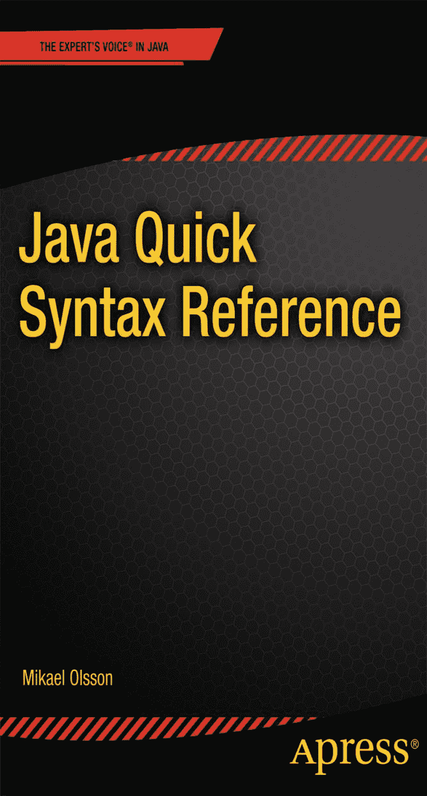
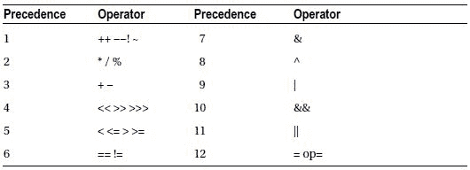
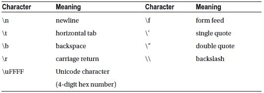

Java 快速语法参考


Mikael Olsson


**Java 快速语法参考**

版权所有 © 2013，Mikael Olsson

本作品受版权保护。出版商保留所有权利，无论是涉及材料的全部或部分，特别是翻译、重印、重用插图、朗诵、广播、微缩胶片复制或任何其他物理方式的复制权，以及传输或信息存储与检索、电子改编、计算机软件，或现在已知或以后开发的任何类似或不同方法的权利。此法律保留的例外情况包括与评论或学术分析相关的简短摘录，或专门为输入计算机系统并执行而提供的材料，仅供作品购买者独家使用。仅可根据出版商所在地现行版权法的规定复制本出版物或其部分内容，且必须始终从 Springer 获得使用许可。使用许可可通过 Copyright Clearance Center 的 RightsLink 获取。违反者将根据相应版权法被起诉。

ISBN-13 (平装): 978-1-4302-6286-2

ISBN-13 (电子版): 978-1-4302-6287-9

本书中可能出现商标名称、标识和图像。我们并非在每次出现商标名称、标识或图像时都使用商标符号，而是仅以编辑方式使用这些名称、标识和图像，以利于商标所有者，且无意侵犯商标权。

本出版物中使用的商品名称、商标、服务标志及类似术语，即使未明确标识，也不应被视为对其是否受专有权利保护的表达意见。

尽管本书中的建议和信息在出版时被认为是真实准确的，但作者、编辑和出版商均不对可能出现的任何错误或遗漏承担法律责任。出版商对本书所含内容不作任何明示或暗示的保证。

总裁兼出版人：Paul Manning

首席编辑：Steve Anglin

技术审校：Jeff Friesen

编辑委员会：Steve Anglin, Mark Beckner, Ewan Buckingham, Gary Cornell, Louise Corrigan, Morgan Ertel, Jonathan Gennick, Jonathan Hassell, Robert Hutchinson, Michelle Lowman, James Markham, Matthew Moodie, Jeff Olson, Jeffrey Pepper, Douglas Pundick, Ben Renow-Clarke, Dominic Shakeshaft, Gwenan Spearing, Matt Wade, Tom Welsh

协调编辑：Kevin Shea

文字编辑：xxx

排版：SPi Global

索引编制：SPi Global

美术设计：SPi Global

封面设计：Anna Ishchenko

本书通过 Springer Science+Business Media New York 在全球图书贸易中发行，地址：233 Spring Street, 6th Floor, New York, NY 10013。电话：1-800-SPRINGER，传真：(201) 348-4505，电子邮件：`orders-ny@springer-sbm.com`，或访问 `www.springeronline.com`。Apress Media, LLC 是加利福尼亚州的有限责任公司，其唯一成员（所有者）是 Springer Science + Business Media Finance Inc (SSBM Finance Inc)。SSBM Finance Inc 是一家**特拉华州**公司。

有关翻译信息，请发送电子邮件至 `rights@apress.com`，或访问 `www.apress.com`。

Apress 及 friends of ED 的书籍可批量购买用于学术、企业或促销用途。大多数图书也提供电子书版本和许可证。如需更多信息，请参考我们的特殊批量销售–电子书许可网页：`www.apress.com/bulk-sales`。

作者在本文中引用的任何源代码或其他补充材料，读者可在 `www.apress.com` 获取。有关如何找到本书源代码的详细信息，请访问 `www.apress.com/source-code/`。

内容概览

关于作者

引言


 第 1 章：Hello World

 第 2 章：编译与运行

 第 3 章：变量

 第 4 章：运算符

 第 5 章：字符串

 第 6 章：数组

 第 7 章：条件语句

 第 8 章：循环

 第 9 章：方法

 第 10 章：类

 第 11 章：静态

 第 12 章：继承

 第 13 章：重写

 第 14 章：包与导入

 第 15 章：访问级别

 第 16 章：常量

 第 17 章：接口

 第 18 章：抽象

 第 19 章：枚举

 第 20 章：异常处理

 第 21 章：装箱与拆箱

 第 22 章：泛型

索引

目录

 关于作者

 引言

 第 1 章：Hello World

安装

创建项目

Hello world

代码提示

 第 2 章：编译与运行

从 IDE 运行

从控制台窗口运行

注释

 第 3 章：变量

数据类型

声明变量

赋值变量

使用变量

整数类型

浮点类型

字符类型

布尔类型

变量作用域

匿名块

 第 4 章：运算符

算术运算符

赋值运算符

复合赋值运算符

自增与自减运算符

比较运算符

逻辑运算符

位运算符

运算符优先级

 第 5 章：字符串

字符串拼接

转义字符

字符串比较

StringBuffer 类

 第 6 章：数组

数组声明

数组分配

数组赋值

多维数组


ArrayList 类

 第 7 章：条件语句

If 语句

Switch 语句

三元运算符

 第 8 章：循环

While 循环

Do-while 循环

For 循环

Foreach 循环

Break 和 Continue

带标签的块

 第 9 章：方法

定义方法

调用方法

方法参数

Return 语句

方法重载

传递参数

 第 10 章：类

创建对象

访问对象成员

构造方法

This 关键字

构造方法重载

构造方法链

初始字段值

默认构造方法

Null

默认值

垃圾回收器

 第 11 章：静态

访问静态成员

静态方法

静态字段

静态初始化块

初始化块

 第 12 章：继承

Object 类

向上转型

向下转型

Instanceof 运算符

 第 13 章：重写

重写成员

重写注解

隐藏成员

阻止方法继承

访问被重写的方法

调用父类构造方法

 第 14 章：包与导入

导入特定类

导入包

静态导入

 第 15 章：访问级别

私有访问

包级私有访问

受保护访问

公共访问

顶级访问

嵌套类访问

访问级别指南

 第 16 章：常量

局部常量

常量字段

常量方法参数

编译时常量与运行时常量

常量指南

 第 17 章：接口

接口成员

接口示例

功能接口

类接口

接口类

 第 18 章：抽象

抽象类示例

抽象类与接口

抽象类与接口指南

 第 19 章：枚举

枚举示例

枚举类

 第 20 章：异常处理

Try-catch

Catch 块

Finally 块

抛出异常

受检异常与非受检异常

异常层次结构

 第 21 章：装箱与拆箱

自动装箱与自动拆箱

基本类型与包装类型指南

 第 22 章：泛型

泛型类

泛型方法

调用泛型方法

泛型接口

泛型类型参数

泛型变量用法

有界类型参数

泛型与 Object

索引

关于作者

**Mikael Olsson** 是一位专业的网络创业者、程序员和作家。他在芬兰一家研发公司工作，专注于软件开发。业余时间，他撰写书籍并创建网站，总结各种感兴趣的领域。他写的书专注于以最高效的方式教授主题，只解释相关且实用的内容，没有任何不必要的重复或理论。

引言

Java 是一种高级面向对象编程语言，由 Sun Microsystems 开发，该公司于 2010 年成为 Oracle 公司的一部分。该语言与 C++ 非常相似，但经过简化，使其更容易编写无错误的代码。最值得注意的是，Java 中没有指针，所有内存分配和释放都是自动处理的。

尽管有诸如此类的简化，但由于其庞大的类库，Java 的功能比 C 和 C++ 都要多得多。Java 程序还具有高性能，并且可以做到非常安全，这使 Java 成为当今使用最广泛的通用编程语言。

Java 的另一个关键特性是它的平台无关性。这是通过将程序仅编译到一半，即编译成称为字节码的平台无关指令来实现的。然后，字节码由 Java 虚拟机（JVM）解释或运行。这意味着任何安装了该程序及其附带库的系统都可以运行 Java 应用程序。

Java 编程语言有三种可用的类库：Java ME、Java SE 和 Java EE。Java ME（移动版）是 Java SE（标准版）的精简版本，而 Java EE（企业版）是 Java SE 的扩展版本，包含用于构建 Web 应用程序的库。

Java 语言及其类库自 1996 年首次发布以来经历了重大变化。版本的命名约定也经历了几次修订。主要版本包括：JDK 1.0、JDK 1.1、J2SE 1.2、J2SE 1.3、J2SE 1.4、J2SE 5.0、Java SE 6 和 Java SE 7，后者是撰写本文时的当前版本。


在 J2SE 1.4 之后，出于营销原因，版本号从 1.5 改为了 5.0。从 J2SE 5.0 开始，产品有一个版本号，而开发者内部使用的则是另一个版本号。J2SE 5.0 是产品名称，而 Java 1.5 是开发者版本。类似地，Java SE 7 是产品名称，Java 1.7 是内部版本号。为简单起见，本书中将 Java 版本统称为 Java 1-7。请注意，Java 被设计为向后兼容的。因此，Java 7 的虚拟机仍然可以运行 Java 1 的类文件。

第 1 章


Hello World

安装

在开始用 Java 编程之前，你需要从 Oracle 网站下载并安装 Java 开发工具包（JDK）标准版（SE）。¹ JDK 包含 Java 编译器、类库以及运行 Java 应用程序所需的虚拟机。Oracle 的下载页面还提供了一个链接，用于获取与 JDK 捆绑的 Netbeans。² Netbeans 是一个集成开发环境（IDE），它能让 Java 开发变得容易得多。或者，你也可以使用另一个免费的 IDE——Eclipse，³ 如果你根本不想使用任何 IDE，那么一个普通的文本编辑器也完全可以胜任。

创建项目

如果你决定使用 IDE（推荐），你需要创建一个项目来管理 Java 源文件和其他资源。或者，如果你倾向于不使用 IDE，你可以创建一个扩展名为 .java 的空文件，例如 MyApp.java，然后在你自己选择的文本编辑器中打开它。

要在 Netbeans 中创建项目，请转到“文件”菜单并选择“新建项目”。在对话框中，在“Java”类别下选择“Java 应用程序”项目类型，然后点击“下一步”。在此对话框中，将项目名称设置为“MyProject”，将主类的名称设置为“myproject.MyApp”。如果需要，可以更改项目的位置，然后点击“完成”按钮来生成项目。项目的唯一文件 MyApp.java 将会打开，其中包含一些默认代码。你可以继续删除所有这些代码，以便从一个空的源文件开始。

Hello World

当你设置好项目和编程环境后，要创建的第一个应用程序就是 Hello World 程序。这个程序将教你如何编译和运行 Java 应用程序，以及如何向命令窗口输出字符串。

创建此程序的第一步是在你的 MyApp.java 源文件中添加一个公共类。该类必须与物理源文件同名（不含文件扩展名），在本例中为“MyApp”。在 Java 中，一个文件中可以有多个类，但只允许有一个公共类，并且该名称必须与文件名匹配。请记住，Java 是区分大小写的。类名后面的大括号界定了属于该类的部分，并且必须包含在内。大括号及其内容被称为代码块，或简称为块。

```
public class MyApp {}
```

接下来，在类内部添加 main 方法。这是应用程序的入口点，并且必须始终以如下所示的形式包含。这些关键字本身将在后续章节中介绍。

```
public class MyApp {
  public static void main(String[] args) {}
}

```

完成 Hello World 程序的最后一步是通过调用 `print` 方法来输出文本。此方法位于内置的 `System` 类中，然后在其内部的 `out` 类中再下一层。该方法接受一个参数——要打印的字符串——并且以分号结尾，Java 中的所有语句都是如此。

```
public class MyApp {
  public static void main(String[] args) {
    System.out.print("Hello World");
  } 
}

```

请注意，点运算符（`.`）用于访问类的成员。

代码提示

如果你不确定某个特定类包含什么，或者某个方法接受什么参数，你可以利用某些 IDE（如 Netbeans）中的代码提示功能。当你输入代码并且存在多个预定义的备选项时，代码提示窗口就会出现。你也可以通过按 Ctrl + 空格键手动调出它。这是一个非常强大的功能，可以让你快速访问整个类库及其成员，并附有描述。

¹`http://www.oracle.com/technetwork/java/javase/downloads/index.html`

²`http://www.netbeans.org`

³`http://www.eclipse.org`

第 2 章


编译与运行

从 IDE 中运行

完成 Hello World 程序后，你可以通过两种方式之一来编译和运行它。第一种方法是从你使用的 IDE 的菜单栏中选择“运行”。在 Netbeans 中，菜单命令是：运行 ➤ 运行主项目。然后 IDE 将编译并运行该应用程序，并显示文本“Hello World”。

从控制台窗口运行

另一种方法是使用控制台窗口（C:\Windows\System32\cmd.exe）手动编译程序。最方便的方法是先将 JDK 的 bin 目录添加到 `PATH` 环境变量中。在 Windows 中，可以使用 `SET PATH` 命令，然后附加你的 JDK 安装的 bin 文件夹路径，并用分号分隔。

```
SET PATH=%PATH%;"C:\Program Files\JDK\bin"
```

通过这样做，控制台将能够在此控制台会话期间从任何文件夹找到 Java 编译器。`PATH` 变量也可以永久更改。¹ 接下来，导航到源文件所在的文件夹，并通过输入“javac”后跟完整的文件名来运行编译器。

```
javac MyApp.java
```

该程序将被编译成一个名为 MyApp.class 的类文件。这个类文件包含的是字节码而不是机器码，因此要执行它，你需要通过输入“java”后跟文件名来调用 Java 虚拟机。

```
java MyApp
```

请注意，编译文件时使用 .java 扩展名，但运行时不使用 .class 扩展名。

注释

注释用于在源代码中插入说明，并且对最终程序没有影响。Java 具有标准的 C++ 注释符号，包括单行注释和多行注释。

```
// 单行注释

/* 多行
   注释 */

```

除此之外，还有 Javadoc 注释。这种注释用于通过使用 JDK bin 文件夹中包含的一个名为 Javadoc 的工具来生成文档。

```
/** javadoc
    注释 */
```

¹`http://www.java.com/en/download/help/path.xml`

第 3 章


变量

变量用于在程序执行期间存储数据。

数据类型

根据你需要存储的数据类型，有几种不同的数据类型。Java 有八种内置于语言中的类型。这些被称为*基本类型*。整数类型有 `byte`、`short`、`int` 和 `long`。`float` 和 `double` 类型表示浮点数（实数）。`char` 类型保存一个 Unicode 字符，`boolean` 类型包含 true 或 false 值。除了这些基本类型之外，Java 中的其他所有类型都由类、接口或数组表示。

| 数据类型 | 大小（位） | 描述 |
| --- | --- | --- |
| byte short
int
long | 8 16

64 | 有符号整数 |
| float double | 32 64 | 浮点数 |
| char | 16 | Unicode 字符 |
| boolean | 1 | 布尔值 |

声明变量


要声明（创建）一个变量，你需要先指定其数据类型，然后跟上变量名。变量名可以任意取，但最好让变量名与其将要存储的值紧密相关。变量的标准命名规范是：首单词小写，后续单词首字母大写。

```
int myInt;
```

赋值变量

要给变量赋值，需使用赋值运算符（`=`），后跟具体的值。当变量被初始化（即被赋予一个值）后，它就变成了已定义（即已声明并赋值）的状态。

```
myInt = 10;
```

声明和赋值可以合并为一条语句。

```
int myInt = 10;
```

如果你需要多个相同类型的变量，可以使用逗号运算符（`,`）来简写声明或定义它们。

```
int myInt = 10, myInt2 = 20, myInt3;
```

使用变量

一旦变量被定义，就可以通过直接引用变量名来使用它，例如将其打印出来。

```
System.out.print(myInt);
```

整数类型

如前所述，有四种有符号整数类型可供选择，具体取决于变量需要存储的数字大小。

```
byte  myInt8  = 2;  // -128   to +127
short myInt16 = 1;  // -32768 to +32767
int   myInt32 = 0;  // -2³¹  to +2³¹-1
long  myInt64 = -1; // -2⁶³  to +2⁶³-1
```

除了标准的十进制表示法，整数还可以使用八进制或十六进制表示法来赋值。

```
int myHex = 0xF; // 十六进制（基数为 16）
int myOct = 07;  // 八进制（基数为 8）
```

浮点类型

浮点类型可以存储整数和小数。它们可以使用十进制或科学计数法来赋值。

```
double myDouble = 3.14;
double myDouble2 = 3e2; // 3*10² = 300
```

请注意，Java 中的常量浮点数在内部始终以 `double` 类型存储。因此，如果你试图将一个 `double` 值赋给一个 `float` 变量，将会出错，因为 `double` 的精度高于 `float`。要正确赋值，可以在常量后附加一个“F”字符，表明该数字实际上是一个 `float` 类型。

```
float myFloat = 3.14;  // 错误：可能丢失精度
float myFloat = 3.14F; // 正确
```

一种更常见且有用的方法是使用显式类型转换。显式类型转换通过在待转换的变量或常量前放置目标数据类型（用括号括起来）来实现。这会在赋值发生前将值转换为指定的类型，在此例中即转换为 `float`。

```
float myFloat = (float)3.14;
```

字符类型

`char` 数据类型可以包含单个 Unicode 字符，用单引号界定。

```
char myChar = 'A';
```

字符也可以通过一种特殊的十六进制表示法来赋值，这种表示法可以访问所有 Unicode 字符。

```
char myChar = '\u0000'; // \u0000 到 \uFFFF
```

布尔类型

`boolean` 类型可以存储一个布尔值，即只能为 `true` 或 `false` 的值。这些值通过 `true` 和 `false` 关键字来指定。

`boolean myBool = false;`

变量作用域

变量的作用域指的是无需限定即可使用该变量的代码块。例如，局部变量是在方法内部声明的变量。这样的变量在其声明之后，仅在该方法的代码块内可用。一旦方法的作用域（代码块）结束，该局部变量就会被销毁。

```
public static void main(String[] args)
{
  int localVar; // 局部变量
}
```

除了局部变量，Java 还有字段变量和参数类型变量，这些将在后续章节中介绍。然而，Java 没有像 C++ 那样的全局变量。

匿名块

局部变量的作用域可以通过使用匿名（未命名）代码块来限制。这种结构很少使用，因为如果一个方法大到需要使用匿名块，更好的选择通常是将代码拆分成独立的方法。

```
public static void main(String[] args)
{ 
  // 匿名代码块
  { 
    int localVar = 10;
  } 
  // 从这里开始 localVar 不可用
}

```

第 4 章


运算符

运算符用于对值进行操作。它们可以分为五种类型：算术运算符、赋值运算符、比较运算符、逻辑运算符和位运算符。

算术运算符

有四种基本的算术运算符，以及用于获取除法余数的取模运算符（`%`）。

```
float x = 3+2; // 5 // 加法
      x = 3-2; // 1 // 减法
      x = 3*2; // 6 // 乘法
      x = 3/2; // 1 // 除法
      x = 3%2; // 1 // 取模（除法余数）
```

注意除法符号给出了一个不正确的结果。这是因为它对两个整数值进行运算，因此会对结果进行四舍五入并返回一个整数。要获得正确的值，必须将其中一个数字显式转换为浮点类型。

```
float x = (float)3/2; // 1.5
```

赋值运算符

第二组是赋值运算符。最重要的是赋值运算符（`=`）本身，它将一个值赋给一个变量。

复合赋值运算符

赋值运算符和算术运算符的一个常见用法是对一个变量进行操作，然后将结果保存回同一个变量。这些操作可以使用复合赋值运算符来简化。

```
int x = 0;
    x += 5; // x = x+5;
    x -= 5; // x = x-5;
    x *= 5; // x = x*5;
    x /= 5; // x = x/5;
    x %= 5; // x = x%5;
```

递增和递减运算符

另一个常见操作是将变量递增或递减 1。这可以通过递增（`++`）和递减（`--`）运算符来简化。

```
++x; // x += 1
--x; // x -= 1
```

这两个运算符都可以用在变量的前面或后面。

```
++x; // 前递增
--x; // 前递减
x++; // 后递增
x--; // 后递减
```

无论使用哪种方式，对变量的最终结果都是一样的。区别在于，后置运算符在修改变量之前返回其原始值，而前置运算符则先修改变量，然后返回修改后的值。

```
x = 5; y = x++; // y=5, x=6
x = 5; y = ++x; // y=6, x=6
```

比较运算符

比较运算符比较两个值，并返回 `true` 或 `false`。它们主要用于指定条件，即计算结果为 `true` 或 `false` 的表达式。

```
boolean x = (2==3); // false // 等于
        x = (2!=3); // true  // 不等于
        x = (2>3);  // false // 大于
        x = (2<3);  // true  // 小于
        x = (2>=3); // false // 大于等于
        x = (2<=3); // true  // 小于等于
```

逻辑运算符

逻辑运算符通常与比较运算符一起使用。逻辑与（`&&`）在左右两侧都为 `true` 时计算结果为 `true`，逻辑或（`||`）在左侧或右侧任意一侧为 `true` 时计算结果为 `true`。要反转布尔结果，可以使用逻辑非（`!`）运算符。请注意，对于“逻辑与”和“逻辑或”，如果左侧的结果已经决定了最终结果，则右侧将不会被计算。

```
boolean x = (true && false); // false // 逻辑与
        x = (true || false); // true  // 逻辑或
        x = !(true);         // false // 逻辑非
```

位运算符

位运算符可以操作整数内部的各个位。例如，右移运算符（`>>`）将所有位（符号位除外）向右移动，而无符号右移（`>>>`）则将包括符号位在内的所有位向右移动。


```
```
int x = 5 & 4; // 101 & 100 = 100 (4) // 按位与
    x = 5 | 4; // 101 | 100 = 101 (5) // 按位或
    x = 5 ^ 4; // 101 ^ 100 = 001 (1) // 按位异或
    x = 4 << 1;// 100 << 1  =1000 (8) // 左移
    x = 4 >> 1;// 100 >> 1  =  10 (2) // 右移
    x = 4 >>>1;// 100 >>>1  =  10 (2) // 无符号右移
                                      // 右移
    x = ∼4;    // ∼00000100 = 11111011 (-5) // 按位取反
```

这些位运算符拥有简写的赋值运算符，与算术运算符类似。

```
int x = 5;
    x  &= 5; // 按位与并赋值
    x  |= 5; // 按位或并赋值
    x  ^= 5; // 按位异或并赋值
    x <<= 5; // 左移并赋值
    x >>= 5; // 右移并赋值
    x>>>= 5; // 右移并赋值（移动符号位）
```

运算符优先级

在 Java 中，表达式通常从左到右进行求值。然而，当一个表达式包含多个运算符时，这些运算符的优先级决定了它们的求值顺序。优先级顺序如下表所示。同样的顺序也适用于许多其他语言，例如 C++ 和 C#。



例如，逻辑与（`&&`）的绑定优先级低于关系运算符，而关系运算符的绑定优先级又低于算术运算符。

```
x = 2+3 > 1*4 && 5/5 == 1; // true
```

为了避免记忆所有运算符的优先级并明确意图，可以使用括号来指定表达式中哪一部分将首先被求值。括号在所有运算符中具有最高的优先级。

```
x = ( (2+3) > (1*4) ) && ( (5/5) == 1 ); // true
```

第 5 章


字符串

Java 中的 `String` 类是一种可以保存字符串字面量的数据类型。String 是引用数据类型，所有非原始数据类型都是如此。这意味着变量包含的是内存中某个对象的地址，而不是对象本身。`String` 对象在内存中被创建，该对象的地址被返回给变量。

如下所示，字符串字面量由双引号界定。这实际上是常规引用类型初始化（创建）语法的一种简写形式，该语法使用 `new` 关键字。

```
String a = "Hello";
String b = new String(" World");
```

字符串拼接

加号用于拼接两个字符串。在此上下文中，它被称为连接运算符（`+`）。该运算符有一个对应的赋值运算符（`+=`），用于将一个字符串追加到另一个字符串并创建一个新字符串。

```
String c = a+b; // Hello World
       a += b;  // Hello World
```

请注意，虽然一条语句可以分成多行，但字符串必须位于单行中，除非使用连接运算符将其拆分。

```
String x
         = "Hello " +
           "World";
```

转义字符

为了在字符串本身中添加新行，可以使用转义字符“`\n`”。这种反斜杠表示法用于编写特殊字符，例如反斜杠或双引号。特殊字符中还包括用于编写任意字符的 Unicode 字符表示法。所有转义字符如下表所示。



字符串比较

比较两个字符串的方法是使用 `String` 类的 `equals` 方法。如果使用相等运算符（`==`），则会比较内存地址。

```
boolean x = a.equals(b); // 比较字符串
boolean y = (a == b);    // 比较地址
```

请记住，Java 中的所有字符串都是 `String` 对象。因此，可以直接在常量字符串上调用方法，就像在变量上调用一样。

```
boolean z = "Hello".equals(a);
```

StringBuffer 类

`String` 类提供了大量方法，但不包含任何用于操作字符串的方法。这是因为 Java 中的字符串是不可变的。一旦创建了 `String` 对象，其内容就无法更改，除非完全替换整个字符串。由于大多数字符串从未被修改，因此特意这样设计是为了使 `String` 类更高效。当你需要一个可修改的字符串时，可以使用 `StringBuffer` 类，它是一个可变的字符串对象。

```
StringBuffer sb = new StringBuffer("Hello");
```

该类提供了多种操作字符串的方法，例如 `append`、`delete` 和 `insert`。

```
sb.append(" World");   // 添加到字符串末尾
sb.delete(0, 5);       // 删除前 5 个字符
sb.insert(0, "Hello"); // 在开头插入字符串
```

`StringBuffer` 对象可以通过 `toString` 方法转换回常规字符串。

```
String s = sb.toString();
```

第 6 章


数组

数组是一种用于存储值集合的数据结构。

数组声明

要声明一个数组，需要在数组将包含的数据类型后附加一对方括号，然后是数组的名称。或者，方括号也可以放在数组名称之后。数组可以用任何数据类型声明，并且其所有元素必须属于该类型。

```
int[] x;
int y[];
```

数组分配

使用 `new` 关键字分配数组，后面再次跟上数据类型和一对方括号，其中包含数组的长度。这是数组可以包含的固定元素数量。一旦创建了数组，元素将自动被分配为该数据类型的默认值。

```
int y[] = new int[3];
```

数组赋值

要填充数组元素，可以通过将元素的索引放在方括号内来逐个引用它们，然后为其赋值。请注意，索引从零开始。

```
y[0] = 1;
y[1] = 2;
y[2] = 3;
```

或者，可以使用花括号表示法一次性赋值。如果同时声明数组，可以省略 `new` 关键字和数据类型。

```
int[] x = new int[] {1,2,3};
int[] x = {1,2,3};
```

一旦数组元素被初始化，就可以通过引用方括号内的元素索引来访问它们。

```
System.out.print(x[0] + x[1] + x[2]); // 6
```

多维数组

多维数组的声明、创建和初始化与一维数组非常相似，只是它们有额外的方括号。它们可以有任意数量的维度，每增加一个维度就添加一对方括号。

```
String[][] x = {{"00","01"},{"10","11"}};
String[][] y = new String[2][2];

y[0][0] = "00";
y[0][1] = "01";
y[1][0] = "10";
y[1][1] = "11";

System.out.print(x[0][0] + x[1][1]); // "0011"
```

ArrayList 类

关于数组，需要牢记的一点是它们的长度是固定的，并且没有可用的方法来改变其大小。事实上，唯一经常使用的数组成员是 `length`，用于获取数组的大小。

```
int x[] = new int[3];
int size = x.length; // 3
```

当需要可变大小的数组时，可以使用 `ArrayList` 类，它位于 `java.util` 包中。`ArrayList` 中的项存储为通用的 `Object` 类型。因此，`ArrayList` 可以保存任何数据类型，但原始类型除外。

```
// 创建一个 Object ArrayList 集合
java.util.ArrayList a = new java.util.ArrayList();
```

`ArrayList` 类提供了多种有用的方法来更改数组，包括：`add`、`set` 和 `remove`。

```
a.add("Hi");       // 添加一个元素
a.set(0, "Hello"); // 更改第一个元素
a.remove(0);       // 移除第一个元素
```

要从 `ArrayList` 中检索元素，可以使用 `get` 方法。然后必须将元素显式地强制转换回其原始类型。

```
a.add("Hello World");
String s = (String)a.get(0); // Hello World
```
```


第七章


条件语句

条件语句用于根据不同的条件执行不同的代码块。

If 语句

只有当括号内的条件被评估为真时，`if` 语句才会执行。该条件可以包含任何比较运算符和逻辑运算符。

```
if (x < 1) {
  System.out.print(x + " < 1");
}

```

为了测试其他条件，`if` 语句可以通过任意数量的 `else if` 子句进行扩展。每个附加条件仅在所有先前条件都为假时才会被测试。

```
else if (x > 1) {
  System.out.print(x + " > 1");
}

```

`if` 语句可以在末尾包含一个 `else` 子句，当所有先前条件都为假时，该子句将执行。

```
else {
  System.out.print(x + " == 1");
}

```

至于花括号，如果只需要有条件地执行单个语句，则可以省略它们。

```
if (x < 1)
  System.out.print(x + " < 1");
else if (x > 1)
  System.out.print(x + " > 1");
else
  System.out.print(x + " == 1");
```

Switch 语句

`switch` 语句检查一个整数与一系列 `case` 标签之间的相等性。然后执行匹配的 `case`。该语句可以包含任意数量的 `case`，并且可以以一个 `default` 标签结尾，用于处理所有其他情况。

```
switch (y)
{ 
  case 0: System.out.print(y + " is 0"); break;
  case 1: System.out.print(y + " is 1"); break;
  default:System.out.print(y + " is something else");
}

```

请注意，每个 `case` 标签后的语句没有用花括号括起来。相反，语句以 `break` 关键字结束。如果没有 `break`，执行将会“穿透”到下一个 `case`。如果多个 `case` 需要以相同方式评估，这可能会很有用。

可以与 `switch` 语句一起使用的数据类型有：`byte`、`short`、`int` 和 `char`。从 Java 7 开始，也允许使用 `String` 类型。

三元运算符

除了 `if` 和 `switch` 语句之外，还有三元运算符（`?:`）。此运算符可以替换为特定变量赋值的单个 `if/else` 子句。该运算符接受三个表达式。如果第一个表达式评估为真，则返回第二个表达式；如果为假，则评估并返回第三个表达式。

```
x = (x < 0.5) ? 0 : 1; // 三元运算符 (?:)
```

第八章


循环

Java 中有四种循环结构。它们用于多次执行特定的代码块。就像条件 `if` 语句一样，如果代码块中只有一条语句，则可以省略循环的花括号。

While 循环

`while` 循环仅在条件为真时执行代码块，并且只要条件保持为真，就会继续循环。下面的循环将打印出数字 0 到 9。

```
int i = 0;
while (i < 10) { System.out.print(i++); }
```

请注意，循环的条件仅在每次迭代（循环）开始时检查。

Do-while 循环

`do-while` 循环的工作方式与 `while` 循环相同，不同之处在于它在代码块之后检查条件。因此，它总是至少执行一次代码块。

```
int i = 0;
do { System.out.print(i++); } while (i < 10);
```

For 循环

`for` 循环用于按特定次数执行代码块。它使用三个参数。第一个参数初始化一个计数器，并且在循环之前始终执行一次。第二个参数包含循环的条件，并在每次迭代之前检查。第三个参数包含计数器的增量，并在每次迭代结束时执行。

```
for (int i = 0; i < 10; i++)
{ System.out.print(i); }
```

`for` 循环有几种变体。例如，第一个和第三个参数可以通过使用逗号运算符拆分为多个语句。

```
for (int k = 0, l = 10; k < 10; k++, l--)
{ System.out.print(k + l); }
```

还可以选择省略一个或多个参数。例如，可以将第三个参数移到循环体内部。

```
for (int k = 0, l = 10; k < 10;)
{ System.out.print(k + l); k++, l--; }
```

Foreach 循环

`foreach` 循环提供了一种遍历数组的简单方法。在每次迭代中，数组中的下一个元素被分配给指定的变量，并且循环继续执行，直到遍历完整个数组。

```
int[] array = { 1,2,3 };
for (int element : array) { System.out.print(element); }
```

Break 和 Continue

有两个特殊的关键字可以在循环内部使用——`break` 和 `continue`。`break` 关键字结束循环结构，`continue` 跳过当前迭代的剩余部分，并在下一次迭代的开头继续执行。

```
break;    // 结束当前循环
continue; // 开始下一次迭代
```

要跳出当前循环之上的循环，必须首先通过在该循环之前添加一个名称后跟冒号来标记该循环。有了这个标签，它就可以用作 `break` 语句的参数，告诉它要跳出哪个循环。这也适用于 `continue` 关键字，以便跳到命名循环的下一次迭代。请注意，此示例中的 `continue` 语句是不可达的，因为前面的 `break` 语句总是阻止 `continue` 执行。

```
myLoop: for (int i = 0, j = 0; i < 10; i++)
        { 
          while (++j < 10)
          { 
            break myLoop;    // 结束 for 循环
            continue myLoop; // 开始下一次 for 循环
          } 
        }

```

标记块

标记块，也称为命名块，是通过在匿名代码块之前放置一个标签来创建的。`break` 关键字可用于跳出此类块，就像在标记循环中一样。例如，在执行验证时，如果某个验证步骤失败，必须中止整个过程，这可能会很有用。

```
validation:
{ 
  if(true)
    break validation;
}

```

标记块对于将大型方法组织成多个部分可能很有用。但在大多数情况下，拆分方法是更好的主意。然而，如果新方法需要大量参数，或者该方法仅从单个位置使用，那么一个或多个标记块可能是更可取的。

第九章


方法

方法是可重用的代码块，仅在调用时执行。

定义方法

可以通过输入 `void` 后跟方法名、一对圆括号和一个代码块来创建方法。`void` 关键字意味着该方法不会返回值。方法的命名约定与变量相同——一个描述性的名称，首单词小写，其他单词首字母大写。

```
class MyApp
{ 
  void myPrint()
  { 
    System.out.print("Hello");
  } 
}

```

调用方法

上面的方法将简单地打印出一条文本消息。要从 `main` 方法中调用它，必须首先创建 `MyApp` 类的一个实例。然后在实例名称后使用点运算符来访问其成员，其中包括 `myPrint` 方法。

```
public static void main(String[] args)
{ 
  MyApp m = new MyApp();
  m.myPrint(); // Hello
}

```

方法参数

方法名后面的圆括号用于向方法传递参数。为此，必须首先以逗号分隔列表的形式将相应的参数添加到方法声明中。

```
void myPrint(String s)
{ 
  System.out.print(s);
}

```

一个方法可以定义为接受任意数量的参数，并且它们可以具有任何数据类型，只需确保调用方法时使用相同类型和数量的参数即可。

```
public static void main(String[] args)
{ 
  MyApp m = new MyApp();
  m.myPrint("Hello"); // Hello
}

```

准确地说，*形参*出现在方法定义中，而*实参*出现在方法调用中。然而，这两个术语有时可以互换使用。

Return 语句


方法可以返回一个值。此时，`void` 关键字会被替换为方法将要返回的数据类型，并且需要在方法体中添加 `return` 关键字，后跟指定返回类型的参数。

```
String getPrint()
{ 
  return "Hello";
}

```

`return` 是一个跳转语句，它会导致方法退出，并将指定的值返回给调用该方法的地方。例如，上述方法可以作为参数传递给 `getPrint` 方法，因为该方法求值后得到一个字符串。

```
public static void main(String[] args)
{ 
  MyApp m = new MyApp();
  System.out.print( getPrint() ); // Hello
}

```

`return` 语句也可以在 `void` 方法中使用，以便在到达结束块之前退出。

```
void myPrint(String s)
{ 
  System.out.print(s);
}

```

方法重载

可以声明多个同名方法，只要它们的参数在类型或数量上有所不同即可。这被称为方法重载，例如可以在 `System.out.print` 方法的实现中看到。这是一个强大的特性，它允许一个方法处理多种参数，而程序员无需意识到使用了不同的方法。

```
void myPrint(String s)
{ 
  System.out.print(s);
}

void myPrint(int i)
{ 
  System.out.print(i);
}

```

传递参数

Java 与许多其他语言不同，所有方法参数都是按值传递的。事实上，它们不能按引用传递。对于值数据类型（基本类型），这意味着在方法内部只会改变变量的一个本地副本，因此这种改变不会影响原始变量。对于引用数据类型（类、接口和数组），这意味着只有内存地址的副本被传递给方法。因此，如果整个对象被替换，这种改变不会传播回调用者，但对对象内部所做的更改会影响原始对象，因为副本指向同一个内存位置。

```
public static void main(String[] args)
{ 
  int x = 0;              // 值数据类型
  m.set(x);               // 传递的是值
  System.out.print(x);    // 0

int[] y = {0};          // 引用数据类型
  m.set(y);               // 传递的是地址
  System.out.print(y[0]); // 10
}

void set(int a) { a = 10; }
void set(int[] a) { a[0] = 10; }
```

第 10 章


类

类是用于创建对象的模板。它们由成员组成，其中最主要的两个是字段和方法。字段是保存对象状态的变量，而方法则定义了对象可以做什么。

```
class MyRectangle
{ 
  int x, y;
  int getArea() { return x * y; }
}

```

创建对象

要从定义类的外部访问类的字段和方法，必须首先创建该类的一个对象。这通过使用 `new` 关键字来完成，它会在系统内存中创建一个新对象。

```
public class MyApp
{ 
  public static void main(String[] args)
 {
    // 创建一个 MyRectangle 对象
    MyRectangle r = new MyRectangle();
  } 
}

```

对象也被称为实例。该对象将包含自己的一组字段，这些字段可以保存与该类其他实例不同的值。

访问对象成员

除了创建对象之外，那些需要在其包之外可访问的类成员，必须在类定义中声明为 `public`。

```
class MyRectangle
{ 
  public int x, y;
  public int getArea() { return x * y; }
}

```

现在，可以通过在实例名称后使用点运算符来访问该对象的成员。

```
public static void main(String[] args)
{ 
  MyRectangle r = new MyRectangle();
  r.x = 10;
  r.y = 5;
  int z = r.getArea() // 50 (5*10)
}

```

构造方法

类可以有一个构造方法。这是一种特殊的方法，用于实例化（构造）对象。它总是与类同名，并且没有返回类型，因为它隐式地返回该类的一个新实例。为了能够从不在其包中的另一个类访问，它需要使用 `public` 访问修饰符进行声明。当使用 `new` 语法创建 `MyRectangle` 类的新实例时，会调用构造方法，在下面的示例中，它将字段设置为一些默认值。

```
class MyRectangle
{ 
  int x, y;
  public MyRectangle() { x = 10; y = 20; }

public static void main(String[] args)
  { 
    MyRectangle r = new MyRectangle();
  } 
}

```

构造方法可以像任何其他方法一样拥有参数列表。如下所示，这可以用来使字段的初始值依赖于创建对象时传递的参数。

```
class MyRectangle
{ 
  int x, y;
  public MyRectangle(int a, int b) { x = a; y = b; }

public static void main(String[] args)
  { 
    MyRectangle r = new MyRectangle(20,15);
  } 
}

```

`this` 关键字

在构造方法内部，以及属于该对象的其他方法中，可以使用一个名为 `this` 的特殊关键字。这个关键字是对当前类实例的引用。例如，如果构造方法的参数与相应字段同名，那么即使字段被参数遮蔽，仍然可以通过使用 `this` 关键字来访问这些字段。

```
class MyRectangle
{ 
  int x, y;
  public MyRectangle(int x, int y)
  { 
    this.x = x; this.y = y;
  } 
}

```

构造方法重载

为了支持不同的参数列表，构造方法可以被重载。在下面的示例中，如果类在没有参数的情况下被实例化，字段将被赋予默认值。如果有一个参数，两个字段都将被设置为该值；如果有两个参数，每个字段将被分配一个单独的值。尝试使用错误数量的参数或错误的数据类型创建对象将导致编译时错误，就像任何其他方法一样。

```
class MyRectangle
{ 
  int x, y;
  public MyRectangle()             { x = 10; y = 20; }
  public MyRectangle(int a)        { x = a;  y = a;  }
  public MyRectangle(int a, int b) { x = a;  y = b;  }
}

```

构造方法链

`this` 关键字也可以用来从一个构造方法调用另一个构造方法。这被称为构造方法链，并允许更大的代码复用。请注意，该关键字以方法调用的形式出现，并且它必须位于构造方法的第一行。

```
public MyRectangle()             { this(10,20);  }
public MyRectangle(int a)        { this(a,a);    }
public MyRectangle(int a, int b) { x = a; y = b; }
```

初始字段值

如果类中有需要分配默认值的字段，例如上面第一个构造方法中的情况，可以在声明字段的同时直接赋值。这些初始值将在构造方法被调用之前被分配。

```
class MyRectangle
{ 
  int x = 10, y = 20;
}

```

默认构造方法

即使没有定义任何构造方法，也可以创建一个类。这是因为编译器会自动创建一个默认的无参构造方法。

```
class MyClass
{ 
  public static void main(String[] args)
  { 
    // 使用默认构造方法
    MyClass c = new MyClass();
  } 
}

```

`null`

内置常量 `null` 用于表示一个未初始化的对象。它只能赋值给对象，而不能赋值给基本类型的变量。可以使用等于运算符（`==`）来测试一个对象是否为 null。

```
String s = null;
if (s == null) s = new String();
```

默认值


对象的默认值为 null。对于基本数据类型，默认值如下：数值类型变为 `0`，char 类型为 Unicode 零字符（`\0000`），boolean 类型为 false。编译器会自动分配默认值，但这仅适用于字段（fields），而不适用于局部变量（local variables）。然而，显式地为字段指定默认值被认为是良好的编程习惯，因为这能使代码更易于理解。对于局部变量，编译器不会设置默认值。相反，编译器会强制程序员为所有使用的局部变量赋值，以避免与使用未赋值变量相关的问题。

```
class MyApp
{ 
  int x;   // 字段被分配默认值 0

int dummy()
  { 
    int x; // 局部变量如果被使用则必须赋值
  } 
}

```

垃圾回收器

Java 运行时环境拥有一个垃圾回收器，它会定期释放不再需要的对象所占用的内存。这使程序员从通常繁琐且容易出错的内存管理任务中解放出来。当一个对象不再有任何引用时，它就符合销毁条件。例如，当对象超出作用域时就会发生这种情况。也可以通过将其引用设置为 null 来显式地丢弃对象。

第 11 章


静态

`static` 关键字用于创建无需创建类实例即可访问的字段和方法。静态（类）成员只存在一份副本，属于类本身；而实例（非静态）成员则为每个新对象创建新的副本。这意味着静态方法不能使用实例成员，因为这些方法不是实例的一部分。另一方面，实例方法可以同时使用静态成员和实例成员。

```
class MyCircle
{ 
  float r = 10;            // 实例字段
  static float pi = 3.14F; // 静态/类字段

// 实例方法
  float getArea() { return newArea(r); }

// 静态/类方法
  static float newArea(float a) { return pi*a*a; }
}

```

访问静态成员

要从类外部访问静态成员，需要使用类名后跟点运算符。此运算符与用于访问实例成员的运算符相同，但访问实例成员需要对象引用。尝试使用对象引用（而不是类名）来访问静态成员会给出警告，因为这会使查看正在使用静态成员变得更加困难。

```
public static void main(String[] args)
{ 
  float f = MyCircle.pi;
  MyCircle c = new MyCircle();
  float g = c.r;
} 
```

静态方法

静态成员的优点在于，其他类无需创建该类的实例即可使用它们。因此，当只需要变量的单个实例时，应将字段声明为 static。如果方法执行独立于任何实例变量的通用功能，则应将其声明为 static。`Math` 类就是一个很好的例子，它只包含静态方法和字段。

```
double pi = Math.PI;
```

`Math` 是每个 Java 应用程序中默认包含的类之一。原因在于它属于 `java.lang` 包，该包总是被自动导入。这个包包含 Java 语言的基础类，例如：`String`、`Object` 和 `System`。

静态字段

静态字段的优点在于它们在整个应用程序的生命周期内持续存在。因此，例如，它们可用于记录某个方法在该类的所有实例中被调用的次数。静态字段的初始值只会在类或字段被使用之前的某个时间点设置一次。

```
class MyCircle
{ 
  static void dummy() { count++; }
  static int count = 0;
}

```

静态初始化块

如果静态字段的初始化需要多行代码或某些其他逻辑，则可以使用静态初始化块。与构造函数相比，此块只会在静态字段初始化时运行一次。

```
static int[] array = new int[5];
static
{ 
  int i = 0;
  for(int element : array)
    element = i++;
}

```

实例初始化块

初始化块为分配实例字段提供了一种替代方法。此块放置在类级别，就像静态初始化块一样，但无需使用 `static` 关键字。大括号之间的任何代码都将被编译器复制到每个构造函数的开头。

```
int[] array = new int[5];
{ 
  int i = 0;
  for(int element : array) element = i++;
}

```

一个类可以有多个初始化块和静态初始化块。

第 12 章


继承

继承允许一个类获取另一个类的成员。在下面的示例中，Apple 继承自 Fruit。这是通过 `extends` 关键字指定的。Fruit 成为 Apple 的超类，而 Apple 则成为 Fruit 的子类。除了自己的成员之外，Apple 还获得了 Fruit 中所有可访问的成员，但其构造函数除外。

```
// 超类（父类）
class Fruit
{ 
  public String flavor;
}

// 子类（子类）
class Apple extends Fruit
{ 
  public String variety;
}

```

Object

Java 中的类只能继承自一个超类，如果没有指定类，它将隐式继承自 `Object`。因此，`Object` 是所有类的根类。

```
class Fruit extends Object {}
```

向上转型

从概念上讲，子类是超类的一种特化。这意味着 Apple 是一种 Fruit，也是一种 Object，因此可以在任何需要 Fruit 或 Object 的地方使用。例如，如果创建了一个 Apple 实例，它可以向上转型为 Fruit，因为子类包含了超类中的所有内容。

```
Apple a = new Apple();
Fruit f = a;
```

然后，Apple 被视为 Fruit，因此只能访问 Fruit 的成员。

```
f.flavor = "Sweet";
```

向下转型

当类向下转型回 Apple 时，Apple 特有的字段将被保留。这是因为 Fruit 只是包含了 Apple，并没有转换它。向下转型必须显式进行，因为不允许将实际的 Fruit 向下转型为 Apple。

```
Apple b = (Apple)f;
```

Instanceof 运算符

作为安全预防措施，您可以使用 `instanceof` 运算符来测试某个对象是否可以转换为特定类。如果左侧对象可以转换为右侧类型而不会引发异常，则此运算符返回 true。

```
Apple c = (f instanceof Apple) ? (Apple)f : null;
```

第 13 章


重写

子类中的成员可以重新定义其超类中的成员。这最常用于为实例方法提供新的实现。

重写成员

在下面的示例中，Rectangle 的 `getArea` 方法在 Triangle 中被重写，方法是在那里使用相同的方法签名重新声明它。签名包括方法的名称、参数和返回类型。但是，可以更改访问级别以允许比重写的方法更多的访问权限。

```
class Rectangle
{ 
  public int w = 10, h = 10;
  public int getArea() { return w * h; }
}

class Triangle extends Rectangle
{ 
  public int getArea() { return w * h / 2; }
}

```

重写注解

为了表明这次重写是有意的，应该在方法之前放置 `@Override` 注解。此注解是在 Java 5 中添加的，用于防止意外重写。

```
class Triangle extends Rectangle
{ 
  @Override public int getArea()
  { 
    return w * h / 2;
  } 
}

```

从 Triangle 实例调用 `getArea` 方法将调用 Triangle 版本的该方法。

```
Triangle o = new Triangle();
o.getArea(); // (50) 调用 Triangle 的版本
```


如果将 Triangle 的实例向上转型为 Rectangle，那么 Triangle 版本的方法仍会被调用，因为 Rectangle 的版本已被覆盖。

```
Rectangle o = new Triangle();
o.getArea();  // (50) 调用 Triangle 的版本
```

隐藏成员

这一规则仅适用于实例方法，而不适用于类方法。如果向 Rectangle 添加一个名为 `newArea` 的类方法，并在 Triangle 中重新定义它，那么 Triangle 版本的该方法只会隐藏 Rectangle 的实现。因此，不会使用 `@Override` 注解。

```
class Rectangle
{ 
  public int w = 10, h = 10;
  public static int newArea(int a, int b) {
    return a * b;
  } 
}

class Triangle extends Rectangle
{ 
  public static int newArea(int a, int b) {
    return a * b / 2;
  } 
}

```

从 Triangle 的接口调用 `newArea` 时，会按预期调用 Triangle 的版本；但从 Rectangle 的接口调用该方法时，则会调用 Rectangle 的实现。

```
Triangle o = new Triangle();
o.newArea(10,10); // (50) 调用 Triangle 的版本

Rectangle r = o;
r.newArea(10,10); // (100) 调用 Rectangle 的版本
```

在 Java 中，重新定义的实例方法总是被覆盖，而重新定义的类方法则总是被隐藏。无法像在 C++ 或 C# 中那样改变这一行为。

阻止方法继承

若要防止实例方法在子类中被覆盖，可以使用 `final` 方法修饰符来声明它。

```
public final int getArea() { return w * h; }
```

请注意，方法修饰符的顺序是固定的。如果修饰符顺序错误，编译器会指出问题。

访问被覆盖的方法

在子类的实例方法内部，仍然可以通过 `super` 关键字访问被覆盖的方法。该关键字是对超类当前实例的引用。

```
@Override public int getArea()
{ 
  return super.getArea() / 2;
}

```

调用父类构造器

`super` 关键字的另一个用途是放在构造器的第一行。在那里，它可以执行一个方法调用，以调用超类的构造器。

```
public Triangle(int a, int b) { super(a,b); }
```

如果构造器的第一行不是对另一个构造器的调用，Java 编译器会自动添加对超类无参构造器的调用。这确保了所有祖先类都能被正确构造。

```
public Triangle() { super(); }
```

第 14 章


包与导入

包用于避免命名冲突，并将代码文件组织到不同的目录中。到目前为止，本书中的代码文件都位于项目源目录的根目录下。因此，它属于所谓的*默认包*。在 Java 中，文件所属的目录（相对于项目源目录）对应着包名。

要将代码文件分配给某个包，例如“mypackage”，必须将其移动到项目目录下同名的文件夹中。此外，文件必须使用 `package` 关键字后跟包名（和路径）来指定它所属的包。每个源文件中只能有一条 package 语句，并且它必须是代码的第一行（注释除外）。请注意，包的命名约定是全小写。

```
package mypackage; // 此文件属于 mypackage
```

包的目录层级可以是任意深度，层级之间用点分隔。例如，如果包含代码文件的“mypackage”文件夹位于名为“sub”的项目文件夹中，则包声明应如下所示：

```
package sub.mypackage;
```

假设此文件包含一个名为 MyClass 的公共类。要从另一个源文件访问 MyClass，有两种选择。第一种是输入完全限定名称。

```
sub.mypackage.MyClass m;
```

导入特定类


第二种选择是通过 `import` 关键字引入类来缩短完全限定名称。import 语句必须位于代码文件中所有其他成员之前，其唯一用途就是让程序员免于输入完全限定名称。

```
import mypackage.sub.MyClass;
// ... 
MyClass m;
```

导入包

除了导入特定类之外，还可以使用星号（`*`）导入包内的所有类型。请注意，这并不会导入任何子包。

```
import java.util.*;
```

静态导入

import 语句的第三种变体是静态导入，它会导入一个类的所有静态成员。一旦静态成员被导入，就可以在不指定类名的情况下使用它们。

```
import static java.lang.Math.*;
// ... 
double pi = PI; // Math.PI
```

第 15 章


访问级别

Java 中有四种访问级别。分别是 `public`、`protected`、`private` 和包级私有。包级私有无法通过关键字显式声明。相反，它是 Java 中每个成员的默认访问级别。

```
public    int myPublic;   // 无限制访问
protected int myProtected;// 包或子类访问
          int myPackage;  // 包访问
private   int myPrivate;  // 类访问
```

私有访问

限制最严格的访问级别是 `private`。具有此级别的成员只能在其所属（包含）类内部使用。

```
package mypackage;
public class MyApp
{ 
  public    int myPublic;
  protected int myProtected;
            int myPackage;
  private   int myPrivate;

void test()
  { 
    myPublic    = 0; // 允许
    myProtected = 0; // 允许
    myPackage   = 0; // 允许
    myPrivate   = 0; // 允许
  } 
}

```

包级私有访问

包级私有成员可以在所属包内的任何位置访问，但不能从其他包访问。

```
package mypackage;
public class MyClass
{ 
  void test(MyApp m)
  { 
    m.myPublic    = 0; // 允许
    m.myProtected = 0; // 允许
    m.myPackage   = 0; // 允许
    m.myPrivate   = 0; // 不可访问
  } 
}

```

受保护访问

受保护成员可以在子类以及所属包内访问。请注意，Java 中 protected 的含义与其他语言（如 C++ 和 C#）不同，在那些语言中，受保护成员只能从子类和所属类访问。

```
package newpackage;
import mypackage.MyApp;

public class MyClass extends MyApp
{ 
  void test()
  { 
    myPublic    = 0; // 允许
    myProtected = 0; // 允许
    myPackage   = 0; // 不可访问
    myPrivate   = 0; // 不可访问
  } 
}

```

公共访问

`public` 修饰符允许从任何可以引用该成员的位置进行无限制访问。

```
package newpackage;
import mypackage.MyApp;

public class MyClass
{ 
  void test(MyApp m)
  { 
    m.myPublic    = 0; // 允许
    m.myProtected = 0; // 不可访问
    m.myPackage   = 0; // 不可访问
    m.myPrivate   = 0; // 不可访问
  } 
}

```

顶级访问

直接在包中声明的成员（顶级成员）只能在包级私有和公共访问之间选择。例如，没有访问修饰符的顶级类将默认为包级私有。这样的类只能在所属包内访问。另一方面，显式声明为 `public` 的顶级类也可以从其他包访问。

```
// 仅能从所属包访问
class PackagePrivateClass {}

// 可以从任何包访问
public class PublicClass {}
```

嵌套类访问

Java 允许在其他类内部定义类，即所谓的嵌套类。这样的类可以具有四种访问级别中的任何一种。如果一个类不可访问，则无法被实例化或继承。

```
public class MyClass
{ 
  // 仅在 MyClass 内部可访问
  private class PrivateNestedClass {}
}

```

访问级别指南


作为指导原则，在选择访问级别时，通常最好使用限制最严格的级别。这是因为成员能被访问的地方越多，它被错误访问的可能性就越大，这会使代码更难调试。使用限制性的访问级别还能让你更容易地修改类，而不会破坏使用该类的其他程序员的代码。

第 16 章


常量

在 Java 中，通过在数据类型前添加 `final` 关键字，可以将变量变为常量。这个修饰符意味着变量一旦被赋值就不能再被重新赋值，任何尝试重新赋值的操作都会导致编译时错误。

局部常量

局部常量必须在声明的同时进行初始化。Java 中常量的命名约定是使用全部大写字母，并用下划线分隔单词。

```
final double PI = 3.14;
```

常量字段

类变量和实例变量也可以声明为 `final`。

```
class MyClass
{ 
  final double E = 2.72;
  static final double C = 3e8;
}

```

与局部常量不同，常量字段并不总是在声明时赋值。常量实例字段可以选择在构造函数中赋值，而常量静态字段可以通过使用静态初始化块来赋值。如果常量的值需要计算且无法在一行代码内完成，这些替代赋值方式会很有用。

```
class MyClass
{ 
  final double E;
  static final double C;

public MyClass() { E = 2.72; }
  static { C = 3e8; }
}

```

常量方法参数

`final` 修饰符另一个可以应用的地方是方法参数，使其不可更改。

```
void f(final int A) {}
```

编译时常量与运行时常量

与大多数其他语言一样，Java 既有编译时常量也有运行时常量。然而，在 Java 中，只有类常量可以是编译时常量，并且仅当其值在编译时已知时才是。所有其他使用 `final` 的情况都会创建运行时常量。对于编译时常量，编译器会在代码中所有出现常量名的地方用其值进行替换。因此，它们比运行时常量更快，运行时常量直到程序运行时才被设置。不过，运行时常量可以被赋予动态值，这些值可以在不同的程序运行之间发生变化。

```
class MyClass
{ 
  final double E = 2.72;         // 运行时常量

final static double C = 3e8;   // 编译时常量

final static int RND = (new
  java.util.Random()).nextInt(); // 运行时常量
}

```

常量使用指南

通常，如果变量不需要重新赋值，最好始终将它们声明为 `final`。这可以确保变量不会在程序中的任何地方被意外更改，从而有助于防止错误。

第 17 章


接口

接口是一种将“接口”与实现解耦的类型。它规定了其实现者与调用其方法（以及访问其常量）的对象之间的契约。接口使用 `interface` 关键字定义，后跟名称和代码块。其命名约定与类相同，即每个单词的首字母大写。当接口没有嵌套在其他类型内部时，其访问级别可以是包级私有或公共，就像任何其他顶级成员一样。

```
interface MyInterface {}
```

接口成员

接口的代码块首先可以包含实例方法的签名。这些方法不能有任何实现。相反，它们的方法体由分号代替。接口成员必须始终是公共的，并且由于这是接口中的默认访问级别，因此可以省略此修饰符。

```
interface MyInterface {
  int myMethod(); // 方法签名
}

```

接口可以包含的第二个成员是常量。在接口中创建的任何字段都将被隐式声明为 `static final`，因此这些修饰符也可以省略。


```
interface MyInterface {
  int c = 10; // 常量
}

```

除了方法签名和常量，接口还可以包含嵌套的包含类型，例如类或其他接口。

```
interface MyInterface
{ 
  // 类型
  class Class {}
  interface Interface {}
  enum Enum {}
}

```

接口示例

下面的示例展示了一个名为 `Comparable` 的接口，它有一个名为 `compare` 的单一方法。

```
interface Comparable
{ 
  int compare(Object o);
}

```

下面的类通过在类名后使用 `implements` 关键字实现了该接口。按照惯例，如果该类有 `extends` 子句，则 `implements` 子句应放在其后。请注意，虽然一个类只能继承自一个超类，但它可以实现任意数量的接口，只需在逗号分隔的列表中指定它们即可。

```
class Circle implements Comparable
{ 
  public int r;
}

```

因为 `Circle` 实现了 `Comparable`，所以它必须定义 `compare` 方法。对于此类，该方法将返回圆半径之间的差值。实现的方法必须是 `public` 的，并且其签名必须与接口中定义的方法签名相同。

```
class Circle implements Comparable
{ 
  public int r;

public int compare(Object o) {
    return r - ( (Circle)o ).r;
  } 
}

```

功能接口

`Comparable` 展示了接口的第一种用途，即定义类可以共享的特定功能。它使得在不了解类实际类型的情况下使用接口成员成为可能。为了说明这一点，下面的示例展示了一个简单的方法，它接收两个 `Comparable` 对象并返回较大的一个。该方法适用于所有实现了 `Comparable` 接口的类，无论其类型如何，因为该方法仅使用通过该接口暴露的功能。

```
public static Object largest(Comparable a, Comparable b)
{ 
  return (a.compare(b) > 0) ? a : b;
}

```

类接口

接口的第二种用途是为类提供一个实际的接口，通过该接口可以使用该类。下面的示例为 `MyClass` 定义了一个名为 `MyInterface` 的接口。该接口仅包含使用 `MyClass` 的程序员可能需要的功能。

```
interface MyInterface
{ 
  void exposed();
}

class MyClass implements MyInterface
{ 
  public void exposed() {}
  public void hidden() {}
}

```

然后使用接口类型来持有实现类，这样该类就只能通过此接口被看到。

```
public static void main(String[] args)
{ 
  MyInterface i = new MyClass();
}

```

这种抽象提供了两个好处。首先，它使其他程序员更容易使用该类，因为他们现在只能访问相关的方法。其次，它使该类更加灵活，因为只要遵循接口，其实现可以更改，而使用该类的其他程序员不会察觉到。

接口类

如前所述，接口可以包含嵌套类型，例如类。与方法不同，这些类型是在接口内部实现的。例如，这可以用于提供一个包含对实现类有用的静态方法的类。这些嵌套类型仅对实现接口的类可见，而对这些类的对象不可见。

```
interface MyInterface
{ 
  class HelperClass {
    public static void helperMethod() {}
  } 
} 
```

第 18 章


抽象

抽象类提供了一个部分实现，其他类可以在此基础上构建。当一个类被声明为 `abstract` 时，意味着除了普通的类成员外，该类还可以包含必须在子类中实现的不完整方法。这些方法未被实现，仅指定了它们的签名，而它们的方法体被分号替换。

```
abstract class Shape
{ 
  public int x = 100, y = 100;
  public abstract int getArea();
}

```

抽象类示例

如果一个名为 `Rectangle` 的类继承自抽象类 `Shape`，那么 `Rectangle` 必须重写抽象的 `getArea` 方法。唯一的例外是如果 `Rectangle` 也被声明为 `abstract`，在这种情况下它不必实现任何抽象方法。

```
class Rectangle extends Shape
{ 
  @Override public int getArea()
  {
    return x * y;
  } 
}

```

抽象类不能被实例化，但可以用来持有其子类的实例。

```
Shape s = new Rectangle();
```

尽管抽象类不能被实例化，但它可以有构造函数，可以通过在子类的构造函数中使用 `super` 关键字来调用这些构造函数。

```
abstract class Shape
{ 
  public int x = 100, y = 100;
  public Shape(int a, int b) { x = a; y = b; }
}

class Rectangle extends Shape
{ 
  public Rectangle(int a, int b) { super(a,b); }
} 
```

抽象类与接口

抽象类在许多方面与接口相似。它们都可以定义子类必须实现的方法签名，并且两者都不能被实例化。关键区别在于：首先，抽象类可以包含非抽象成员，而接口不能。其次，一个类可以实现任意数量的接口，但只能继承自一个类，无论其是否为抽象类。请注意，抽象类可以像非抽象类一样，扩展一个超类并实现任意数量的接口。然而，接口不能继承自类。尽管它可以扩展另一个接口，这实际上将两个接口合并为一个。

抽象类与接口使用指南

接口要么用于定义类可以拥有的特定功能，要么为使用类的其他程序员提供接口。另一方面，抽象类用于提供部分类实现，由子类来完成它。当子类有很多共同的功能，但也有一些功能必须为每个子类以不同方式实现时，这非常有用。

第 19 章


枚举

枚举是一种由固定列表的命名常量组成的类型。要创建一个枚举，使用 `enum` 关键字，后跟一个名称和一个代码块，其中包含一个逗号分隔的常量元素列表。枚举的访问级别与类相同。默认是包级私有，但如果它在同名文件中声明，也可以设置为 `public`。与类一样，枚举可以包含在类内部，此时它可以设置为任何访问级别。

```
enum Speed
{ 
  STOP, SLOW, NORMAL, FAST
}

```

上述枚举类型的对象可以持有四个已定义常量中的任意一个。枚举常量的访问方式如同类的静态字段。

```
Speed s = Speed.SLOW;
```

枚举示例

`switch` 语句提供了一个很好的例子，说明枚举何时有用。与使用普通常量相比，枚举的优势在于允许程序员明确指定允许哪些常量值。这提供了编译时类型安全。请注意，在 `switch` 语句中使用枚举时，`case` 标签不需要用枚举名称限定。

```
switch(s) { case SLOW: break; }
```

枚举类

在 Java 中，枚举类型比 C++ 或 C# 等其他语言中的对应类型更强大。它本质上是一种特殊的类，可以包含类可以包含的任何内容。要添加类成员，常量列表必须以分号结束，并且成员必须在常量之后声明。在下面的示例中，向枚举添加了一个整数，该整数将保存元素所代表的实际速度。

```
enum Speed
{ 
  STOP, SLOW, NORMAL, FAST;
  public int speed;
}

```


要设置此字段，还需要添加一个构造器。枚举中的构造器必须具有私有（private）或包级私有（package-private）访问权限，并且其调用方式与普通类不同。相反，构造器的参数是在常量元素之后给出的，如下所示。例如，如果一个 `Speed` 枚举对象被赋值为常量 `SLOW`，那么参数 `5` 将被传递给该枚举实例的构造器。

```
enum Speed
{ 
  STOP(0), SLOW(5), NORMAL(10), FAST(20);
  public int speed;

Speed(int s) { speed = s; }
}

```

枚举类型与普通类相比的另一个区别是，它们隐式地继承自 `java.lang.Enum` 类。除了从该类继承的成员外，编译器还会自动向枚举中添加两个静态方法，即 `values` 和 `valueof`。`values` 方法返回一个包含枚举中声明的所有常量元素的数组，而 `valueof` 则返回指定枚举名称对应的枚举常量。

```
Speed[] a = Speed.values();
Speed s = Speed.valueOf(a[0].toString()); // Speed.STOP
```

第 20 章


异常处理

异常处理允许程序员处理程序中可能出现的意外情况。例如，`java.io` 包中的 `FileReader` 类用于打开文件。创建该类的实例时，Netbeans 会提示该类的构造器可能抛出 `FileNotFoundException`。尝试运行程序时，编译器也会指出这一点。

```
import java.io.*;
// ... 
FileReader in = new FileReader("Missing.file"); // 错误
```

Try-catch

要消除此编译时错误，必须使用 try-catch 语句来捕获异常。该语句由一个包含可能引发异常的代码的 try 块，以及一个或多个 catch 子句组成。如果 try 块成功执行，程序将在 try-catch 语句之后继续运行；但如果发生异常，执行流程将转移到第一个能够处理该异常类型的 catch 块。

```
import java.io.*;
// ... 
try {
  FileReader in = new FileReader("Missing.file");
} 
catch(FileNotFoundException e) {}
```

Catch 块

在上面的例子中，catch 块仅设置为处理 `FileNotFoundException`。如果 try 块中的代码可能抛出更多类型的异常，并且所有这些异常都应以相同方式处理，则可以捕获一个更通用的异常，例如 `Exception` 类本身。这个 catch 子句随后将能够处理所有继承自该类的异常，包括 `FileNotFoundException`。请记住，更通用的异常需要在更具体的异常之后捕获。catch 子句必须始终定义一个异常对象。该对象可用于获取有关异常的更多信息，例如通过使用 `getMessage` 方法获取异常的描述。

```
catch(FileNotFoundException e) {
  System.out.print(e.getMessage());
} 
catch(Exception e) {
  System.out.print(e.getMessage());
}

```

Finally 块

作为 try-catch 语句的最后一个子句，可以添加一个 finally 块。该块用于清理在 try 块中分配的资源，并且无论是否发生异常，它都会执行。在此示例中，在 try 块中打开的文件应该被关闭，但前提是它已成功打开。为了能够在 finally 子句中访问 `FileReader` 对象，它必须在 try 块外部声明。此外，由于 close 方法也可能抛出异常，因此它需要被另一个 try-catch 块包围。请记住，如果你忘记关闭文件，Java 的垃圾回收器最终会为你执行此操作，但自己动手关闭文件是一种良好的编程实践。

```
import java.io.*;
// ... 
FileReader in = null;
try {
  in = new FileReader("Missing.file");
} 
catch(FileNotFoundException e) {
  System.out.print(e.getMessage());
} 
finally {
  if (in != null) {
    try { in.close(); }
    catch(IOException e) {}
  } 
}

```

抛出异常

当方法遇到无法恢复的情况时，它可以生成自己的异常，以向调用者发出方法失败的信号。这是通过使用 `throw` 关键字后跟一个 `Throwable` 类型的新实例来完成的。

```
static void MakeException()
{ 
  throw new Throwable("我的 Throwable");
}

```

已检查异常与未检查异常

Java 中的异常分为两类——已检查异常和未检查异常——具体取决于是否需要指定它们。抛出已检查异常（例如 `IOException`）的方法将无法编译，除非在方法参数列表之后使用 throws 子句指定它，并且调用方法捕获了该异常。另一方面，未检查异常（例如 `ArithmeticException`）不必被捕获或指定。请注意，要指定多个异常，异常类型之间用逗号分隔。

```
import java.io.*;
// ... 
static void MakeException() throws IOException,
                                   ArithmeticException
{ 
  throw new IOException("我的 IO 异常");
  // ... 
  throw new ArithmeticException("除以零");
}

```

异常层次结构

与 Java 中的大多数其他事物一样，异常是存在于层次结构中的类。此层次结构的根（在 `Object` 之下）是 `Throwable` 类，该类的所有后代都可以被抛出和捕获。继承自 `Throwable` 的有 `Error` 和 `Exception` 类。从 `Error` 派生的类用于指示不可恢复的异常，例如 `OutOfMemoryError`。这些是未检查异常，因为一旦它们发生，即使被捕获，程序员也不太可能对它们采取任何措施。

从 `Exception` 派生的是 `RuntimeExceptions`，它们也是未检查异常。这些异常几乎可能在任何代码中发生，因此捕获和指定它们会很麻烦。例如，除以零会抛出 `ArithmeticException`，然而用 try-catch 包围每个除法运算会很烦人。检查异常也存在一定的开销，并且检查这些异常的成本超过了捕获它们的好处。其他 `Exception` 的后代，即那些不继承自 `RuntimeExceptions` 的，都是已检查异常。这些是可以恢复的异常，并且必须被捕获和指定。

第 21 章


装箱与拆箱

将基本类型变量放入对象中称为装箱。这允许在需要对象的地方使用基本类型。为此，Java 为每种基本类型提供了包装类，即：`Byte`、`Short`、`Integer`、`Long`、`Float`、`Double`、`Character` 和 `Boolean`。例如，一个 `Integer` 对象可以持有一个 int 类型的变量。

```
int iPrimitive = 5;
Integer iWrapper = new Integer(iPrimitive); // 装箱
```

与装箱相反的是拆箱。这会将对象类型转换回其基本类型。

```
iPrimitive = iWrapper.intValue(); // 拆箱
```

包装类属于 `java.lang` 包，该包始终被导入。与基本类型相比，包装对象是不可变的（不可更改）。要更改它们的值，必须创建一个新实例。基本类型和包装对象之间的另一个区别是它们如何检查相等性。基本类型使用相等运算符 (==)，而任何类型的对象都使用继承自 `Object` 的 `equals` 方法。还要记住，对象可以设置为 null，而基本类型则不能。

自动装箱与自动拆箱


Java 5 引入了自动装箱（autoboxing）和自动拆箱（autounboxing）。这些特性允许在基本类型与其对应的包装类对象之间进行自动转换。

```
Integer iWrapper = iPrimitive; // 自动装箱
iPrimitive = iWrapper;         // 自动拆箱
```

请注意，这仅仅是语法糖，旨在使代码更易于阅读。编译器会为你添加必要的代码来对基本类型进行装箱和拆箱——使用 `valueOf` 和 `intValue` 方法。

```
Integer iWrapper = Integer.valueOf(iPrimitive);
iPrimitive = iWrapper.intValue()
```

基本类型与包装类指南

当不需要对象时，应使用基本类型。这是因为基本类型通常比对象更快且更节省内存。相反，当需要数值但必须使用对象时，包装类就很有用。例如，要将数值存储在像 `ArrayList` 这样的集合类中，就需要使用包装类。

```
java.util.ArrayList a = new java.util.ArrayList();
a.add(Integer.valueOf(5)); // 装箱
a.add(10);                 // 自动装箱
```

请记住，如果速度很重要，则应尽量减少基本类型与包装类对象之间的转换。任何装箱和拆箱操作都会带来固有的性能开销。

第 22 章


泛型

泛型指的是类型参数的使用，它提供了一种定义可操作不同数据类型的**方法**、**类**和**接口**的方式。泛型的好处在于它们提供了编译时的类型安全性，并且消除了大多数类型转换的需要。

泛型类

泛型类允许类成员使用类型参数。通过在类名后添加一个类型参数部分来定义此类，该部分包含一个用尖括号括起来的类型参数。类型参数的命名约定是它们应由单个大写字母组成。通常，使用字母 `T` 表示类型。下面的示例定义了一个泛型容器类，它可以容纳一个泛型类型的元素。

```
// 泛型容器类
class MyBox<T> { public T box; }
```

当实例化此泛型类的对象时，必须将类型参数替换为实际的数据类型，例如 `Integer`。

```
MyBox<Integer> iBox = new MyBox<Integer>();
```

或者，从 Java 7 开始，可以使用一组空的类型参数来实例化泛型类。只要编译器能够从上下文中推断（确定）类型参数，这种实例化方式就是可行的。

```
MyBox<Integer> iBox = new MyBox<>();
```

当创建 `MyBox` 的实例时，类定义中的每个类型参数都会被替换为传入的类型实参。因此，该对象的行为就像一个常规对象，拥有一个 `Integer` 类型的字段。

```
iBox.box = 5;
Integer i = iBox.box;
```

请注意，在设置或从 `box` 字段检索存储的值时，不需要进行强制类型转换。此外，如果错误地将泛型字段赋值或设置为不兼容的类型，编译器会指出这一点。

```
iBox.box = "Hello World"; // 编译时错误
String s = iBox.box;      // 编译时错误
```

泛型方法

通过在方法的返回类型之前声明一个类型参数部分，可以使方法成为泛型方法。类型参数可以在方法内部像任何其他类型一样使用。它也可以用于方法的返回类型、throws 子句以及参数类型。下面的示例展示了一个泛型类方法，它接受一个泛型数组参数，并打印出其内容。

```
class MyClass
{ 
  public static <T> void printArray(T[] array)
  { 
    for (T element : array)
      System.out.print(element + " ");
  } 
}

```

方法可以声明为泛型，无论其所在的类或接口是否为泛型。构造函数也是如此。

调用泛型方法

泛型方法通常像常规（非泛型）方法一样被调用，无需指定类型实参。

```
Integer[] iArray = { 1, 2, 3 };
MyClass.printArray(iArray);
```

在大多数情况下，Java 编译器可以推断出泛型方法调用的类型实参，因此不必包含它。但是，如果不是这种情况，则需要显式指定类型实参。

```
MyClass.<Integer>printArray(iArray);
```

泛型接口

使用类型参数声明的接口成为泛型接口。泛型接口与常规接口有两个相同的目的。它们要么是为了公开将被其他类使用的类的成员而创建，要么是为了强制一个类实现特定的功能。当实现泛型接口时，必须指定类型实参。泛型接口可以由泛型类和非泛型类实现。

```
// 泛型功能接口
interface IGenericCollection<T>
{ 
  public void store(T t);
}

// 实现泛型接口的非泛型类
class Box implements IGenericCollection<Integer>
{ 
  public Integer myBox;
  public void store(Integer i) { myBox = i; }
}

// 实现泛型接口的泛型类
class GenericBox<T> implements IGenericCollection<T>
{ 
  public T myBox;
  public void store(T t) { myBox = t; }
}

```

泛型类型参数

为泛型传入的类型实参可以是类类型、接口类型或另一个类型参数。但是，它不能是基本类型。泛型可以定义多个类型参数，只需在尖括号之间以逗号分隔列表的形式添加更多参数即可。请记住，括号内的每个参数必须是唯一的。

```
class MyClass<T, U> {}
```

如果泛型定义了多个类型参数，则在**使用**泛型时需要指定相同数量的类型实参。

```
MyClass<Integer, Float> myClass = new MyClass<Integer,
                                              Float>();
```

泛型变量的使用

在 Java 中，泛型仅仅是编译时的构造。在编译器检查了与泛型变量一起使用的类型正确之后，它将擦除泛型代码中的所有类型参数和类型实参信息，并插入适当的强制类型转换。这意味着泛型不会像在 C# 中那样，因为消除了运行时强制类型转换而带来比非泛型代码更好的性能。这也意味着泛型类型不能用于任何需要运行时信息的事情——例如创建泛型类型的新实例或对类型参数使用 `instanceof` 运算符。允许的操作包括：声明泛型类型的变量、将 null 赋值给泛型变量以及调用 `Object` 方法。

```
class MyClass<T>
{ 
  public void myMethod(Object o)
  { 
    T t1;                            // 允许
    t1 = null;                       // 允许
    System.out.print(t1.toString()); // 允许
    if (o instanceof T) {}           // 无效
    T t2 = new T();                  // 无效
  } 
}

```

从泛型代码中移除类型信息的过程称为*类型擦除*。例如，`MyBox<Integer>` 将被简化为 `MyBox`，这被称为*原始类型*。执行此步骤是为了保持与在 Java 5 中泛型成为语言一部分之前编写的代码的向后兼容性。

受限类型参数

可以对泛型可能使用的类型参数种类应用编译时强制执行的限制。这些限制称为*边界*，它们通过在类型参数部分中使用 `extends` 关键字来指定。类型参数可以由超类或接口限定。例如，下面的类 `B` 只能使用类型为 `A` 或具有该类作为超类的类型实参进行实例化。


```
// T 必须继承自超类 A
class B<T extends A> {}
class A {}
```

第二个示例将接口指定为边界。这将把类型参数限制为仅实现指定接口的类型，或者本身就是该接口类型的类型。

```
// T 必须实现接口 I
class C<T extends I> {}
interface I {}
```

可以通过在列表中用与号（`&`）分隔来对类型参数应用多个边界。

```
class D<T extends A & I> {}
```

与号用作分隔符，而不是逗号，因为逗号已用于分隔类型参数。

```
class E<T extends A & I, U extends A & I> {}
```

除了将泛型的使用限制为仅限某些参数类型之外，应用边界的另一个原因是增加有界类型所支持的方法调用数量。无界类型只能调用 `Object` 的方法。然而，通过应用超类或接口边界，该类型的可访问成员也将变得可用。

```
class Fruit
{ 
  public String name;
}

class FruitBox<T extends Fruit>
{ 
  private T box;
  public void FruitBox(T t) { box = t; }
  public String getFruitName()
  { 
    // 由于 T extends Fruit，因此允许使用 Fruit 的成员
    return box.name;
  } 
}

```

泛型与 Object

在 Java 5 引入泛型之前，`Object` 类型被用于创建可以存储任何类型对象的容器类。既然泛型已经可用，就应该避免将 `Object` 类型用作通用容器。这是因为编译器有助于确保泛型在编译时是类型安全的，而使用 `Object` 类型时则无法做到这一点。

Java 库中的集合类（包括 `ArrayList`）都已替换为泛型版本。即便如此，任何泛型类仍然可以像非泛型类一样使用，只需省略类型参数部分即可。此时，默认的 `Object` 类型将用作类型参数。这就是为什么仍然允许使用非泛型版本的 `ArrayList`。请考虑以下对非泛型 `ArrayList` 的使用。

```
import java.util.ArrayList;
// ... 
// Object ArrayList
ArrayList a = new ArrayList();
a.add("Hello World");
// ... 
Integer b = (Integer)a.get(0); // 运行时错误
```

这种从 `String` 到 `Integer` 的转换将在运行时失败，并抛出 `ClassCastException`。如果改用泛型 `ArrayList`，则在编译时（或在 Netbeans 等 IDE 中）就会检测到错误的转换。

```
import java.util.ArrayList;
// ... 
// 泛型 ArrayList（推荐）
ArrayList<String> a = new ArrayList<String>();
a.add("Hello World");
// ... 
Integer b = (Integer)a.get(0); // 编译时错误
```

使用泛型替代方案，只有指定的类型参数才允许进入 `ArrayList` 集合。此外，从集合中获取的值无需强制转换为正确的类型，因为编译器会处理这一点。

索引

  A

抽象类

访问级别

匿名块

数组

ArrayList

赋值运算符 (=)

  B

布尔型

边界

装箱

break

字节型

  C

catch

字符型

类

类成员

代码块

逗号运算符 (,)

注释

编译


连接运算符（+）

条件语句

常量

构造器

continue

  D

数据类型

声明

递减运算符（--）

默认构造器

定义

点运算符（.）

double

do-while

向下转型

  E

封闭类

enum

转义字符

异常处理

异常层次结构

extends

  F

false

字段

final

finally

float

for

foreach

  G

垃圾回收器

泛型

  H

Hello world

  I

IDE

if

import

递增运算符（++）

继承

初始化块

初始化

实例

实例成员

instanceof 运算符

实例化

int

接口

调用

迭代

  J, K

java.lang

JDK

  L

带标签的块

逻辑与（&&）

逻辑非（!）

逻辑或（||）

long

循环

  M

主方法

方法

方法重载

取模运算符（%）

多维数组

  N

嵌套类

new

null

  O

对象

运算符

@Override

重写

  P, Q

包

包私有

基本类型

打印

private

protected

public

  R

return

  S

作用域

分号（;）

short

签名

static

String

StringBuffer

super

switch

  T

三元运算符（?:）

this

throw

顶级成员

true

try

  U

拆箱

向上转型

  V

变量

void

  W, X, Y, Z

while

包装类
