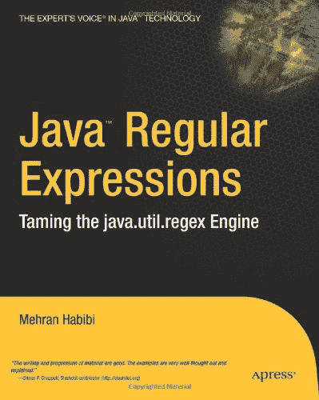
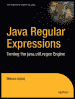

|  |  |  

| Java 正则表达式：驯服 java.util.regex 引擎 |
| 作者：Mehran Habibi | ISBN：1590591070 |
| Apress 出版社 © 2004 年（256 页） |
| 本书是关于学习 Java 中正则表达式的宝贵参考资料，重点介绍了正则表达式在 Java 语言中的使用。 |
|  |

|
|  |

| 目录 |
|  | <description>Java 正则表达式——驯服 java.util.regex 引擎</description> |
|  | <description>引言</description> |
|  | 第 1 章 | - | <description>正则表达式</description> |
|  | 第 2 章 | - | <description>Java.util.regex 对象模型简介</description> |
|  | 第 3 章 | - | <description>高级正则表达式</description> |
|  | 第 4 章 | - | <description>面向对象的正则表达式</description> |
|  | 第 5 章 | - | <description>实用示例</description> |
|  | 附录 A | - | <description>正则表达式参考</description> |
|  | 附录 B | - | <description>Pattern 和 Matcher 方法</description> |
|  | 附录 C | - | <description>常用正则表达式模式</description> |
|  | <description>索引</description> |
|  | <description>插图列表</description> |
|  | <description>表格列表</description> |
|  | <description>代码清单与输出列表</description> |
|  | <description>边栏列表</description> |

封底

| Java 一直是处理对象的优秀语言。但与 AWK 和 Perl 等语言相比，Java 的文本操作机制一直有所局限。另一方面，Java 2 标准版（J2SE）中新增的正则表达式包为 Java 文本机制带来了希望。该包提供了使用正则表达式所需的一切——全部封装在一个简化的面向对象框架中。除了工作示例和最佳实践外，本书还提供了详细的 API 参考，其中包含支持几乎所有方法的示例，以及一个逐步创建自己正则表达式的教程。随着时间的推移，你会发现正则表达式在你的编程武器库中极其强大——并且你会乐于使用它们！一旦掌握了这些工具，你会思考没有它们时自己是如何应对的。**关于作者**Mehran Habibi 是《The Sun Certified Java Developer Exam with J2SE 1.4》和《Cracking the AP Computer Science Exam, 2004-2005 Edition》的合著者。他还是俄亥俄州 BankOne 的应用架构师，与爱妻 Angela 居住于此。Mehran 拥有超过 9 年的 IT 经验，曾在 IBM、Executive Jet、UUNET、BankOne 和 OCLC 任职，同时还担任过大学讲师、独立顾问和 Java 认证培训师。他感兴趣的技术包括 Web 服务、无线技术和 XML/XSLT。Mehran 的专业重点一直放在架构、项目领导、指导、团队领导以及中间层及后端的编程上。Mehran 持有“另一家公司”和 Java 2 的认证，并以软件工程理学学士学位毕业于俄亥俄州立大学的荣誉项目。 |

