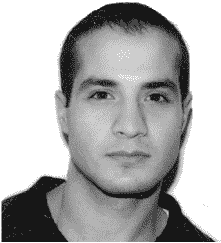

# Java 正则表达式——驯服 java.util.regex 引擎

MEHRAN HABIBI 

版权所有 © 2004 Mehran Habibi

保留所有权利。未经版权所有者及出版人事先书面许可，不得以任何形式或任何方式（电子或机械，包括影印、录制或任何信息存储检索系统）复制或传播本作品的任何部分。

ISBN（平装）：1-59059-107-0

在美国印刷装订 12345678910

本书中可能出现商标名称。我们不在每次出现商标名称时使用商标符号，仅以编辑方式使用这些名称，以利于商标所有者，无意侵犯商标权。

**技术审校：** Bill Saez

**编辑委员会：** Steve Anglin, Dan Appleman, Gary Cornell, James Cox, Tony Davis, John Franklin, Chris Mills, Steven Rycroft, Dominic Shakeshaft, Julian Skinner, Jim Sumser, Karen Gavin Wray, John Zukowski

**助理出版人：** Grace Wong

**项目经理：** Nate McFadden

**文字编辑：** Nicole LeClerc

**制作经理：** Kari Brooks

**制作编辑：** Laura Cheu

**校对员：** Linda Seifert

**排版员：** Susan Glinert Stevens

**索引编制：** Kevin Broccoli

**美工：** Kinetic Publishing Services, LLC

**封面设计：** Kurt Krames

**制造经理：** Tom Debolski

在美国由 Springer-Verlag New York, Inc. (地址：175 Fifth Avenue, New York, NY, 10010) 发行，在美国以外由 Springer-Verlag GmbH & Co. KG (地址：Tiergartenstr. 17, 69112 Heidelberg, Germany) 发行。

在美国：电话 1-800-SPRINGER，电子邮件 <orders@springer-ny.com>，或访问 [`www.springer-ny.com`](http://www.springer-ny.com)。在美国以外：传真 +49 6221 345229，电子邮件 <orders@springer.de>，或访问 [`www.springer.de`](http://www.springer.de)。

有关翻译信息，请直接联系 Apress 出版社：地址 2560 Ninth Street, Suite 219, Berkeley, CA 94710。电话 510-549-5930，传真 510-549-5939，电子邮件 <info@apress.com>，或访问 [`www.apress.com`](http://www.apress.com)。

本书中的信息按“原样”提供，不提供任何担保。尽管在编写本作品时已采取一切预防措施，但作者和 Apress 出版社均不对因本作品所含信息直接或间接引起的任何损失或损害对任何个人或实体承担责任。

本书的源代码可在 [`www.apress.com`](http://www.apress.com) 的“下载”部分获取。您需要回答与本书相关的问题才能成功下载代码。

*谨以此书献给我亲爱的妻子 Angela Young 医学博士。我前世一定非常、非常善良。*

**关于作者**

**Mehran Habibi** 是《The Sun Certified Java Developer Exam with J2SE 1.4》（Apress 出版社，2003 年）和《Cracking the AP Computer Science Exam, 2004-2005 Edition》（Princeton Review 出版社，2004 年）的合著者。他还是俄亥俄州 BankOne 的应用架构师，与爱妻 Angela 居住于此。Mehran 拥有超过九年的 IT 经验，曾在 IBM、Executive Jet、UUNET、BankOne 和 OCLC 任职，同时还担任过大学讲师、独立顾问和 Java 认证培训师。他感兴趣的技术包括 Web 服务、无线技术和 XML/XSLT。Mehran 的专业重点一直放在架构、项目领导、指导、团队领导以及中间层及后端的编程上。Mehran 持有“另一家公司”和 Java 2 的认证，并以软件工程理学学士学位毕业于俄亥俄州立大学的荣誉项目。

Mehran 是一名业余拳击手，在俄亥俄州立大学教授武术，热爱足球，并且因为下了太多快棋而毁掉了自己的棋艺。你可以通过 <coach@influxs.com.> 联系他。

**关于技术审校**

**Bill Saez** 是佛罗里达州劳德代尔堡摩托罗拉公司的一名软件工程师。在摩托罗拉工作期间，Bill 于 2000 年帮助创建了世界上第一款通过 J2ME 和 CLDC 认证的 Java 无线手机。自那时起，他一直在 J2ME 平台的商业化和开发中扮演着不可或缺的角色，并为 iDEN 手机编写了多个 OEM API，以及这些产品的 J2ME 开发者指南。Bill 自 Java 诞生之初就参与其中，甚至曾作为俄亥俄州立大学实验性 Java 软件课程的“小白鼠”。他获得了俄亥俄州立大学的软件工程学士学位，目前正在佛罗里达大学攻读计算机科学硕士学位。

在不工作或学习的时候，Bill 喜欢训练和跑马拉松、与家人一起旅行，并在充裕的业余时间偶尔撰写游戏评论（[`www.epinions.com/user-billservo`](http://www.epinions.com/user-billservo)）。

**致谢**

我要感谢 Apress 的 Nate McFadden、Gary Cornell、Nicole LeClerc 和 Laura Cheu，与他们共事非常愉快。我还要感谢各位朋友的大力贡献，包括 Terry Camerlengo、JavaRanch 的优秀同仁们（[`www.javaranch.com`](http://www.javaranch.com)），以及其他提供反馈和建议的善良人士。我尤其感激 Jim Yingst 敏锐的批判眼光。同时，我要感谢我的父亲 Javad Habibi 博士提供的强大数学分析。最后但同样重要的是，我要感谢我的技术审校 Bill Saez，他拥有惊人的技术洞察力和非常温和的风格。Bill，我迫不及待想看到你的书了。

