# 第 2 章：Java.util.regex 对象模型简介

## 概述

> *“如何吃掉一头大象？一口一口地吃。”*
> 
> — 谚语

Java 新的 `java.util.regex` 包提供了一个优雅且灵活的对象模型，用于满足正则表达式的需求。它完全由三个对象组成：`Pattern` 对象、`Matcher` 对象和一个 `PatternSyntaxException`。本章详细介绍了 `Pattern` 和 `Matcher` 类的所有方法和字段，并提供了它们的使用示例。在本章中，我还将讨论新添加到 `String` 类中的支持正则表达式的方法。

本章首先对 `Pattern` 类进行剖析。我将涵盖每一个方法和字段，并经常提供示例。我还将以类似的详细程度探讨 `Matcher` 类。最后，我将通过讨论已添加到 `String` 类中的正则表达式方法来结束本章。


## 模式对象

图 2-1 展示了 Pattern 类的方法。该图是 Pattern 类的 UML 渲染图，展示了该类的各种方法和常量。

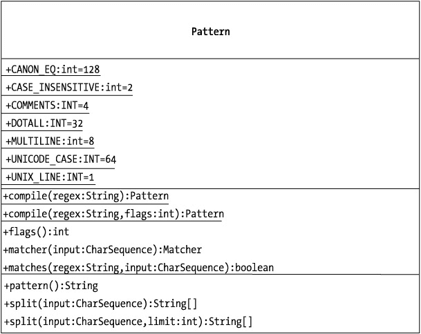
图 2-1: Pattern 类的 UML 表示

让我们详细考察 Pattern 类的字段和方法。如果你不熟悉 UML，这里有一份快速指南，帮助你阅读图 2-1：

*   类的名称是 Pattern，位于矩形的最顶部区域。
*   中间区域是字段变量的分组。前面的加号（+）表示它们是公有的。下划线表示它们是静态的，而": int"表示它们是 int 类型。"= num"表示默认值。
*   矩形的最底部区域存放着类的方法。同样，加号表示公有访问权限，下划线表示该方法是静态的。括号表示给定方法的参数；因此，`flags()`不带参数，而`matcher(input : CharSequence)`接受一个名为 input、类型为 CharSequence 的变量。末尾的冒号（:）表示类型。

以下各节将描述 Pattern 类的字段和方法。

### public static final int UNIX_LINES

UNIX_LINES 标志用于构造`Pattern.compile(String regex, int flags)`方法的第二个参数。当你解析源自 UNIX 机器的数据时，请使用此标志。

在许多 UNIX 变体中，不可见字符***\n***用于表示行的终止。这与其他操作系统不同，包括各种 Windows 变体，它们可能使用***\r\n***、***\n***、***\r***、***\u2028***或***\u0085***作为行终止符。

如果你将一个源自 UNIX 机器的文件传输到 Windows 平台并打开它，你可能会注意到，根据你用来查看文本的编辑器不同，行有时不会以预期的方式终止。这是因为两个系统可能使用不同的语法来表示行的结束。

UNIX_LINES 标志只是告诉正则表达式引擎它正在处理 UNIX 风格的行，这会影响正则表达式元字符***^***和***$***的匹配行为。使用 UNIX_LINES 标志或等效的***(?d)***正则表达式模式，不会降低性能。默认情况下，此标志未设置。

### public static final int CASE_INSENSITIVE

CASE_INSENSITIVE 字段用于构造`Pattern.compile(String regex, int flags)`方法的第二个参数。当你需要匹配 ASCII 字符而不区分大小写时，它非常有用。

使用此标志或等效的***(?i)***正则表达式可能会导致性能略有下降。默认情况下，此标志未设置。

### public static final int COMMENTS

COMMENTS 标志用于构造`Pattern.compile(String regex, int flags)`方法的第二个参数。它告诉正则表达式引擎，正则表达式模式中嵌入了注释。具体来说，它告诉正则表达式引擎忽略模式中的任何注释，从***#***字符前的空格开始，以及之后的所有内容，直到行尾。

因此，正则表达式模式***A*** ***#matches uppercase US-ASCII char code 65***将使用***A***作为正则表达式，但***#***字符前的空格以及之后直到行尾的所有内容都将被忽略。你的代码最终可能看起来像这样：

```
Pattern p =
Pattern.compile("A    #matches uppercase US-ASCII char code 65",Pattern.COMMENTS); 
```

将***#***字符视为正则表达式中与 Java 注释`//`等效的符号。通过在编译正则表达式时使用 COMMENTS 标志，你是在告诉正则表达式引擎你的表达式包含注释，这些注释应该被忽略。当你的模式特别复杂或微妙时，这会很有用。当你未设置此标志时，正则表达式引擎将尝试将你的注释解释并用作正则表达式的一部分。

使用此标志或等效的***(?x)***正则表达式不会降低性能。

### public static final int MULTILINE

MULTILINE 标志用于构造`Pattern.compile(String regex, int flags)`方法的第二个参数。它告诉正则表达式引擎，正则表达式的输入不是单行代码；相反，它包含多行，每行都有自己的终止字符。

这意味着行首字符***^***和行尾字符***$***可能会匹配输入字符串中的多行。例如，假设你的输入字符串是*This is a sentence.\n So is this.*。如果你使用 MULTILINE 标志编译正则表达式模式

```
Pattern p = Pattern.compile("^", Pattern.MULTILINE);
```

那么行首字符***^***将匹配*This is a sentence*中的*T*之前。它还会匹配*So is this*中的*S*之前。当你未使用 MULTILINE 标志时，匹配只会找到*This is a sentence*中的*T*。

使用此标志或等效的***(?m)***正则表达式可能会降低性能。

### public static final int DOTALL

DOTALL 标志用于构造`Pattern.compile(String regex, int flags)`方法的第二个参数。DOTALL 标志告诉正则表达式引擎允许元字符句点匹配任何字符，包括行终止字符。这意味着什么？

假设你的候选字符串是*Test\n*。如果你对应的正则表达式模式是`.`，通常你会得到四个匹配：一个匹配*T*，另一个匹配*e*，第三个匹配*s*，第四个匹配*t*。这是因为正则表达式元字符`.`通常匹配任何字符，*除了*行终止字符。

按如下方式启用 DOTALL 标志：

```
Pattern p = Pattern.compile(".", Pattern.DOTALL);
```

将生成五个匹配。你的模式将匹配*T*、*e*、*s*和*t*字符。此外，它还会匹配行尾的*\n*字符。

使用此标志或等效的***(?s)***正则表达式不会降低性能。

### public static final int UNICODE_CASE

UNICODE_CASE 标志用于构造`Pattern.compile(String regex, int flags)`方法的第二个参数。它与 CASE_INSENSITIVE 标志结合使用，为国际字符集生成不区分大小写的匹配。

使用此标志或等效的***(?u)***正则表达式可能会降低性能。

### public static final int CANON_EQ

CANON_EQ 标志用于构造`Pattern.compile(String regex, int flags)`方法的第二个参数。如你所知，字符实际上是以数字形式存储的。例如，在 ASCII 字符集中，字符*A*由数字 65 表示。根据你使用的字符集，同一个字符可以由不同的数字组合表示。例如，*à*可以由*+00E0*和*U+0061U+0300*两者表示。CANON_EQ 匹配将匹配任何一种表示形式。

使用此标志可能会降低性能。


### public static Pattern compile(String regex) 抛出 PatternSyntaxException

你会注意到 Pattern 类没有公共构造方法。这意味着你*不能*编写如下代码：

```
Pattern p = new Pattern("my regex");//错误！
```

要获取 Pattern 对象的引用，你必须使用静态方法 compile(String regex)。因此，你的第一行正则表达式代码可能如下所示：

```
Pattern p = Pattern.compile("my regex");//正确！
```

该方法的参数是一个表示正则表达式的字符串。当你将一个字符串传递给期望正则表达式的方法时，务必通过在每个 *\* 字符后附加另一个 *\* 字符来转义正则表达式中可能存在的任何 *\* 字符。这是因为 String 对象内部使用 *\* 字符来转义字符序列中的元字符，无论这些字符序列是否是正则表达式。早在正则表达式成为 Java 的一部分之前，情况就是如此。因此，正则表达式 ***\d*** 变成了 ***\\d***。要匹配单个数字，你的正则表达式变成如下形式：

```
Pattern p = Pattern.compile("\\d");
```

这里的关键点是，正则表达式 ***\d*** 变成了字符串 ***\\d***。

字符串参数的转义有时可能很棘手，因此充分理解这一点很重要。总的来说，这意味着你需要*加倍*正则表达式中可能已经存在的 *\* 字符。它*并不*意味着你只需简单地附加一个 *\* 字符。我稍后会提供一个例子来说明这一点。

如果正则表达式本身格式错误，compile 方法将抛出 java.util.regex.PatternSyntaxException。例如，如果你传入一个包含 ***4*** 的字符串，compile 方法会在运行时抛出 PatternSyntaxException，因为正则表达式 ***[4*** 的语法是非法的，如[清单 2-1 所示。

清单 2-1：使用 compile 方法

| **** |

```
import java.util.regex.*;

public class DelimitTest{
  public static void main(String args[]){

    //抛出异常
    Pattern p = Pattern.compile("4");
  }
}
```

| **![结束示例** ||  |这是否意味着每次使用正则表达式时都必须捕获 PatternSyntaxException？不。PatternSyntaxException 不必显式捕获，因为它继承自 RuntimeException，而 RuntimeException 不需要显式捕获。compile(String regex) 方法返回一个 Pattern 对象。### public static Pattern compile(String regex, int flags) 抛出 PatternSyntaxException(String regex, int flags) 方法是 compile(String) 方法的一种更强大的形式。该方法的第一个参数 regex 是一个表示正则表达式的字符串，详情如前文所述。关于如何格式化 String 参数的详细信息，请参阅“public static Pattern compile(String regex) 抛出 PatternSyntaxException”一节。该 compile 方法的灵活性通过使用第二个参数 int flags 得以充分体现。int flags 参数可以包含以下标志，或通过 OR 运算组合这些标志创建的位掩码：*   CANON_EQ*   CASE_INSENSTIVE*   COMMENTS*   DOTALL*   MULTILINE*   UNICODE_CASE*   UNIX_LINES 例如，如果你希望无论候选字符串的大小写如何都能匹配成功，那么你的模式可能如下所示：``` Pattern p = Pattern.compile(regex,Pattern.CASE_INSENSITIVE);```你可以使用 | 运算符组合这些标志。例如，要实现包含注释的、不区分大小写的 Unicode 匹配，你可以使用以下代码：```Pattern p =Pattern.compile("t # 复合标志示例",Pattern.CASE_INSENSITIVE | Pattern.UNICODE_CASE|Pattern.COMMENT);```compile(String regex, int flags) 方法返回一个 Pattern 对象。### public String pattern()此方法返回已编译正则表达式的简单字符串表示。它有时可能在两个方面产生误导。首先，返回的字符串不反映编译模式时设置的任何标志。其次，你传入的正则表达式字符串并不总是你取回的模式字符串。具体来说，原始的字符串转义不会被显示。因此，如果你的原始代码如下：```Pattern p = Pattern.compile("\\d");```你应该期望输出是 ***\d***，带有一个单独的 ***\*** 字符。这里自然会产生一个问题：如果此方法去掉了原始的转义，你能将结果字符串作为正则表达式提供给另一个表达式吗？例如，清单 2-2 能工作吗？清单 2-2：模式匹配示例| **** |

```
import java.util.regex.*;

public class PatternMethodExample{
  public static void main(String args[]){
      reusePatternMethodExample();
  }

   public static void reusePatternMethodExample(){
      //匹配单个数字
      Pattern p = Pattern.compile("\\d");
      Matcher matcher = p.matcher("5");
      boolean isOk = matcher.matches();
      System.out.println("原始模式匹配结果 " + isOk);

      //重用模式
      String tmp = p.pattern();
      Pattern p2 = Pattern.compile(tmp);
      matcher = p.matcher("5");
      isOk = matcher.matches();
      System.out.println("第二个模式匹配结果 " + isOk);
   }
}
```

| **** |

|  |

此方法会抛出 RuntimeException 吗？毕竟，pattern() 方法返回 ***\d***，而尝试使用 ***\d*** 作为字符串创建正则表达式模式将会编译失败。

答案是不会，它不会抛出异常。请记住，加倍 ***\*** 字符是 String 对象构造方法的要求——它与该字符串所表示的正则表达式模式无关。因此，一旦字符串被创建，冲突就消失了。

### public Matcher matcher(CharSequence input)

请记住，你通过编译你要查找内容的描述来创建一个 Pattern 对象。Pattern 有点像一则个人广告：它列出了你要寻找的事物的特征。纯粹从概念上讲，你的模式可能如下所示：

```
Pattern p = Pattern.compile("她必须有红头发和火爆脾气");
```

相应地，你需要将该描述与候选对象进行比较。也就是说，你需要检查一个给定的字符串，看它是否与你提供的描述匹配。

Matcher 对象就是专门为帮助你进行这种查询而设计的。我将在本章下一节详细讨论 Matcher，但现在你应该知道，Pattern.matcher(CharSequence input) 方法返回一个 Matcher，它将帮助你获取关于候选字符串与你传入的描述相比如何的详细信息。

Pattern.matcher(CharSequence input) 接受一个 CharSequence 参数作为输入参数。CharSequence 是 J2SE 1.4 中引入的一个新接口，并由 String 对象回溯实现。由于 String 实现了 CharSequence，你可以简单地将一个 String 对象作为参数传递给 Pattern.matcher(CharSequence input) 方法。我稍后将详细讨论 CharSequence 参数。

在前面的例子中，再次纯粹从概念上讲，你可以如下获取你的 Matcher 对象：

```
Matcher m = pattern.matches("Anna");
```

在 J2SE 中，这个 Matcher 对象的 matches() 方法将返回 true。在现实生活中，结果可能因人而异。


### public int flags()

前面我讨论了在编译正则表达式模式时可以使用的常量标志。`flags` 方法只是返回一个代表这些标志的 `int` 值。例如，要查看你的 `Pattern` 类当前是否使用了某个给定的标志（比如 `Pattern.COMMENTS` 标志），只需提取该标志：

```
int flgs = myPattern.flags();
```

然后将该标志与 `Pattern.COMMENTS` 标志进行“与”（&）运算：

```
boolean isUsingCommentFlag =( Pattern.COMMENTS == (Pattern.COMMENTS & flgs)) ;
```

类似地，要查看你是否使用了 `CASE_INSENSITIVE` 标志，可以使用以下代码：

```
boolean isUsingCaseInsensitiveFlag =
(Pattern.CASE_INSENSITIVE == (Pattern. CASE_INSENSITIVE & flgs));
```

### public static boolean matches (String regex,CharSequence input)

很多时候，你只需要知道一个字符串是否完全匹配给定的正则表达式。你不想创建一个 `Pattern` 对象，提取它的 `Matcher` 对象，然后再询问那个 `Matcher`。

这个静态实用方法正是为此而设计的。在内部，它会创建你所需的 `Pattern` 和 `Matcher` 对象，将正则表达式与输入字符串进行比较，并返回一个布尔值，告诉你两者是否完全匹配。清单 2-3 给出了一个使用示例。

清单 2-3：Matches 示例

| **** |

```
import java.util.regex.*;
public class PatternMatchesTest{
  public static void main(String args[]){

      String regex = "ad*";
      String input = "add";

      boolean isMatch = Pattern.matches(regex,input);
      System.out.println(isMatch);//返回 true
  }
}
```

| **** |

|  |

如果你要进行大量比较，那么显式创建一个 `Pattern` 对象并手动进行匹配会更高效。然而，如果你不需要进行大量比较，那么 `matches` 就是一个方便的实用方法。

`Pattern.matches(String regex, CharSequence input)` 方法也在 `String` 类内部使用。从 J2SE 1.4 开始，`String` 有一个名为 `matches` 的新方法，它在内部委托给 `Pattern.matches` 方法。你可能已经在使用这个方法而不自知。

当然，如果所考虑的正则表达式模式格式不正确，此方法可能会抛出 `PatternSyntaxException`。

### public String[] split(CharSequence input)

如果你需要根据某些条件将一个字符串拆分成子字符串数组，这个方法会特别有用。在概念上，它类似于 `StringTokenizer`，但它比 `StringTokenizer` 更强大，资源消耗也更大，因为它允许你的程序使用正则表达式作为拆分条件。

此方法总是返回至少一个元素。如果找不到要拆分的候选字符串 `input`，则返回一个只包含一个字符串的数组——即原始输入。

如果找到了输入，则返回一个字符串数组。该数组包含每次出现输入之后的所有子字符串。因此，对于模式

```
Pattern p = new Pattern.compile(",");
```

`split` 方法对于 *Hello, Dolly* 将返回一个包含两个元素的字符串数组。数组的第一个元素将包含 *Hello*，第二个元素将包含 *Dolly*。该字符串数组通过以下方式获得：

```
String tmp[] = p.split("Hello,Dolly");
```

在这种情况下，返回的值是

```
//tmp 等于 { "Hello", "Dolly"}
```

使用此方法时，你需要注意一些细微之处。如果候选字符串是 *Hello,Dolly,*，在 *Dolly* 的 *y* 后面有一个尾随逗号，那么此方法仍然会返回一个包含 *Hello* 和 *Dolly* 的两个元素的字符串数组。其隐含行为是尾随空格不会被返回。

如果输入字符串是 *Hello,,,Dolly*，则生成的字符串数组将有四个元素。`split` 方法应用于该模式时的返回值是

```
// p.split("Hello,,,Dolly")  返回 {"Hello","","","Dolly"} 
```

清单 2-4 提供了一个示例，其中使用 `split` 方法根据单个空格字符将字符串拆分成数组。

清单 2-4：Pattern 拆分示例

| **** |

```
import java.util.regex.*;
public class PatternSplitExample{
  public static void main(String args[]){
      splitTest();
  }

public static void splitTest(){

Pattern p =
    Pattern.compile(" ");
    String tmp = "this is the String I want to split up";

String[] tokens = p.split(tmp);

for (int i=0; i<tokens.length; i++){
       System.out.println(tokens[i]);
    }

}
}
```

| **** |

|  |

当然，这是对该方法的误用：你可以使用 `StringTokenizer` 达到同样的结果，而且资源消耗会更少。根据你现在所学的知识，请考虑清单 2-5，它是第 1 章中清单 1-12 的一个略微修改的版本，因为它使用了 `Pattern.split` 方法。输出 2-1 显示了运行该程序的结果。

清单 2-5：PatternSplit.java

| **** |

```
import java.util.regex.*;

public class PatternSplit{
  public static void main(String args[]){

String statement = "I will not compromise. I will not "+
      "cooperate. There will be no concession, no conciliation, no "+
      "finding the middle ground, and no give and take.";

String tokens[] =null;
      String splitPattern= "compromise|cooperate|concession|"+
      "conciliation|(finding the middle ground)|(give and take)";

Pattern p = Pattern.compile(splitPattern);

tokens=p.split(statement);

System.out.println("REGEX PATTERN:\n"+splitPattern + "\n");

System.out.println("STATEMENT:\n"+statement + "\n");

System.out.println("TOKENS:");
      for (int i=0; i < tokens.length; i++){
      System.out.println(tokens[i]);
      }
  }
}
```

| **** |

|  |

输出 2-1：运行 PatternSplit.java 的结果

| **** |

```
C:\RegEx\code\chapter1>java Split
REGEX PATTERN:
compromise|cooperate|concession|conciliation|(finding the middle group)|(give
and take)

STATEMENT:
I will not compromise. I will not cooperate. There
will be no concession, no conciliation,
no finding the middle group, and no give and take.

TOKENS:
I will not
. I will not
. There will be no
, no
, no
, and no
.
```

| **** |

|  |

你会注意到清单 2-5 使用了 `Pattern.split` 方法，而清单 1-12 使用了新的 `String.split` 方法。实际上，两者是相同的，因为 `String.split` 方法在内部只是委托给这个方法。

你所做的事情确实非常了不起，如果没有正则表达式，这可能会变得极其复杂。你实际上是在使用复杂的人工构造——即英语同义词——来分解文本。这可不是你父辈时代的 J2SE。

|  | 注意 | `String` 方法通过在模式前放置一个不可见的 *^* 并在其后放置一个 *$* 来进一步优化其搜索条件。 |

### public String[] split(CharSequence input, int limit)

此方法的工作方式与 `Pattern.split(CharSequence input)` 完全相同，只有一个区别。第二个参数 `limit` 允许你控制返回的元素数量，如下面几节所示。


#### Limit == 0

如果你指定第二个参数 limit 等于 0，那么此方法的行为与其重载版本完全相同。也就是说，它会返回一个包含尽可能多匹配子字符串的数组，并丢弃尾部空格。因此，模式

```
Pattern p = new Pattern.compile(",");
```

在对候选字符串 Hello, Dolly 进行分割时，将返回一个包含两个元素的数组。以下是该方法的使用示例：

```
String tmp[] = p.split("Hello,Dolly", 0);
```

类似地，当对字符串 Hello, Dolly 进行匹配时（其中 Dolly 的 y 后面有一个尾随逗号），split 也会返回两个元素：

```
String tmp[] = p.split("Hello,Dolly,", 0);
```

然而，你可能并不总是需要这种行为。例如，有时你可能希望限制返回的元素数量。

#### Limit > 0

如果你只对特定数量的匹配感兴趣，请使用正数 limit。你应该使用该数量加 1 作为 limit。要分割字符串 *Hello, Dolly, You, Are, My, Favorite* 且只获取前两个标记时，请使用以下代码：

```
String[] tmp = pattern.split("Hello, Dolly, You, Are, My, Favorite",3);
```

结果字符串的值如下：

```
//tmp[0] 是 "Hello",
// tmp[1] 是 "Dolly";
```

这里有趣的行为是返回了第三个元素。在本例中，第三个元素是

```
//tmp[2] 是 "You, Are, My, Favorite";
```

使用正数 limit 可能会带来性能提升，因为正则表达式引擎在达到指定匹配次数后可以停止搜索。

#### Limit < 0

为 limit 使用负数（任何负数）会告诉正则表达式引擎：你希望返回尽可能多的匹配项，*并且*希望返回尾部空格（如果有的话）。因此，对于正则表达式模式

```
Pattern p = Pattern.compile(",");
```

和候选字符串 *Hello,Dolly,*，命令

```
String tmp[] = p.split("Hello,Dolly", -1);
```

会产生以下结果：

```
//tmp 等于 {"Hello","Dolly"};
```

然而，对于字符串 *Hello, Dolly,*（其中 *Dolly* 后面的逗号后有尾部空格），方法调用

```
String tmp[] = p.split("Hello,Dolly,    ", -1); 
```

会产生以下结果：

```
//tmp 等于 {"Hello","Dolly","    "};
```

请注意，负数 limit 的实际值并不重要，因此

```
p.split("Hello,Dolly", -1);
```

与以下代码完全等价：

```
p.split("Hello,Dolly", -100);
```

## Matcher 对象

图 2-2 展示了 Matcher 类的方法。请花点时间研究它们。

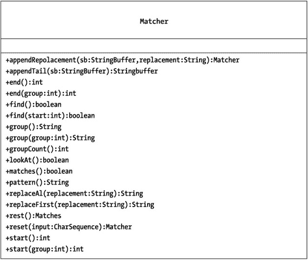
图 2-2：Matcher 类

以下各节将描述 Matcher 类的各种方法。但首先，让我们简要回顾一下组（group）的概念，因为它们在 Matcher 对象中扮演着非常重要的角色。

### 组

在充分利用 Matcher 对象之前，理解*组*的概念非常重要，因为 Matcher 的一些更强大的方法会涉及它们。我将在第 3 章中更详细地讨论组，但你需要对它们有一个直观的理解，才能充分利用本章的内容，因此我在此做一个简要介绍。

组正如其名：一组字符。通常，该术语指的是原始 Pattern 的一个子部分，尽管根据定义，每个组本身也是其自身的一个子组。你可能已经从算术学习中熟悉了组的概念。例如，表达式

```
6 * 7 + 4
```

隐含着分组的概念。你实际上将其理解为

```
 (6 * 7) + 4
```

其中 *(6 * 7)* 被视为一个数字聚类。进一步，你可以将表达式视为

```
( (6 * 7) + 4)
```

其中 *((6 * 7) + 4)* 是另一个数字聚类，它包含了子聚类 *(6*7)*。在这里，你的组包含了一个子组。类似地，正则表达式允许你将一系列字符组合在一起。为什么？我稍后会讨论。首先，让我们专注于如何实现。

请记住，在正则表达式中，你通过使用 Pattern 对象以通用术语描述你要查找的内容。组允许你在表达式中嵌套子描述。当你检查特定的候选字符串时，Matcher 可以跟踪该表达式的子匹配。

创建正则表达式字符的分组非常简单。你只需将想要视为组的表达式放在一对圆括号内。就是这样。因此，模式 ***(\w)(\d\d)(\w+)*** 包含四个组，编号从 0 到 3。group(0) 始终是原始表达式本身，如下所示：

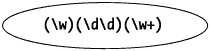

group(1) 由一个字母数字字符或下划线组成，在下图中用圆圈标出：

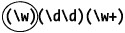

group(2) 在下图中用圆圈标出：

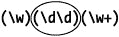

group(3) 在下图中用圆圈标出：

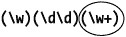

对于特定的候选字符串，比如 *X99SuperJava*，group(0) 始终是候选字符串中匹配原始正则表达式模式的部分——即模式 ***(\w)(\d\d)(\w+)*** 本身：


下图指示了 *X99SuperJava* 中对应于 group(1) 的部分：

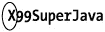

*X99SuperJava* 中对应于 group(2) 的部分在下图中用圆圈标出：


*X99SuperJava* 中对应于 group(3) 的部分在下图中用圆圈标出：


好了，现在你知道如何指定组以及如何在候选字符串中找到对应的部分。那么，为什么要这样做呢？一个常见的原因是为了能够引用候选字符串的子部分。例如，你可能不知道这个特定的候选字符串 *X99SuperJava* 是什么，但你仍然可以编写一个程序，通过创建一个新字符串（等于 group(3) 后接 group(1) 再后接 group(2)）来重新排列它。在这种情况下，重新排列后的字符串将是 *SuperJavaX99*。

第 3 章提供了关于组的详细示例。

### public Pattern pattern()

pattern 方法返回创建此特定 Matcher 对象的 Pattern。请参考清单 2-6。

清单 2-6：Matcher Pattern 示例

| **** |

```
import java.util.regex.*;

public class MatcherPatternExample{
  public static void main(String args[]){
      test();
  }

  public static void test(){
     Pattern p = Pattern.compile("\\d");
     Matcher m1 = p.matcher("55");
     Matcher m2 = p.matcher("fdshfdgdfh");

     System.out.println(m1.pattern() == m2.pattern());
     //返回 true
  }
}
```

| **** |

|  |

这里有几件重要的事情需要注意。首先，两个 Matcher 对象都成功返回了一个 Pattern，即使 m2 没有成功匹配。其次，这两个 Matcher 对象返回了*完全相同的* Pattern 对象，因为它们都是由同一个 Pattern 创建的。请注意，代码行

```
 System.out.println(m1.pattern() == m2.pattern());
```

执行的是 == 比较，而不是 .equals 比较。这只有在 m1 和 m2 返回的实际对象确实是同一个对象时才能成立。


### public Matcher reset()

`reset()` 方法会清除调用它的 `Matcher` 对象中的所有状态信息。实际上，该 `Matcher` 会被恢复到最初获取其引用时的状态，如清单 2-7 所示。

清单 2-7: Matcher.reset 示例

| **** |

```
import java.util.regex.*;
/**
 * 演示 Matcher.reset() 方法的使用
 */
public class MatcherResetExample{
  public static void main(String args[]){
      test();
  }
  public static void test(){
     //创建一个模式，并获取一个匹配器
     Pattern p = Pattern.compile("\\d");
     Matcher m1 = p.matcher("01234");

     //耗尽匹配器
     while (m1.find()){
      System.out.println("\t\t" + m1.group());
     }
     //现在将匹配器重置为其原始状态
     m1.reset();
     System.out.println("重置匹配器后");
     //再次遍历匹配器。
     //如果没有清除状态，这是不可能的
     while (m1.find()){
      System.out.println("\t\t" + m1.group());
     }
  }
}
```

| **** |

|  |

输出 2-2 展示了此方法的输出。

输出 2-2: Matcher.reset 示例的输出

| **** |

```

重置匹配器后

```

| **** |

|  |

如果匹配器没有被重置，你将无法再次遍历其元素。

### public Matcher reset(CharSequence input)

`reset(CharSequence input)` 方法会清除调用它的 `Matcher` 对象的状态，并用新的输入替换候选字符串。这与创建一个新的 `Matcher` 对象效果相同，只是没有那么多相关的开销。这可以带来有用的优化，也是我经常使用的一种方法。清单 2-8 演示了此方法的使用。

清单 2-8: Matcher.reset(CharSequence) 示例

| **** |

```
import java.util.regex.*;
/**
 * 演示 Matcher.reset(CharSequence) 方法的使用
 */
public class MatcherResetCharSequenceExample{
  public static void main(String args[]){
      test();
  }
  public static void test(){
     String output="";
     //创建一个模式，并获取一个匹配器
     Pattern p = Pattern.compile("\\d");
     Matcher m1 = p.matcher("01234");

     //耗尽匹配器
     while (m1.find()){
      System.out.println("\t\t" + m1.group());
     }
     //现在用新数据重置匹配器
     m1.reset("56789");
     System.out.println("重置匹配器后");
     //再次遍历匹配器。
     //如果没有重置，这是不可能的
     while (m1.find()){
      System.out.println("\t\t" + m1.group());
     }
  }
}
```

| **** |

|  |

输出 2-3 展示了此方法的输出。

输出 2-3: Matcher.reset(CharSequence) 示例的输出

| **** |

```

重置匹配器后

```

| **** |

|  |

### public int start()

`start()` 方法返回 `Matcher` 对象上一次成功匹配的起始索引。清单 2-9 演示了 `start()` 方法的使用。此清单中的代码在候选字符串 *My name is Bond. James Bond.* 中查找单词 *Bond* 的起始索引。

清单 2-9: Matcher.start() 示例

| **** |

```
/**
 * 演示 Matcher.start() 方法的使用
 */
public class MatcherStartExample{
  public static void main(String args[]){
      test();
  }
  public static void test(){
     //创建一个 Matcher 并使用 Matcher.start() 方法
     String candidateString = "My name is Bond. James Bond.";
     String matchHelper[] =
      {"          ^","                      ^"};
     Pattern p = Pattern.compile("Bond");
     Matcher matcher = p.matcher(candidateString);

     //找到第一个 'Bond' 的起始点
      matcher.find();
      int startIndex = matcher.start();
      System.out.println(candidateString);
      System.out.println(matchHelper[0] + startIndex);

     //找到第二个 'Bond' 的起始点
      matcher.find();
      int nextIndex = matcher.start();
      System.out.println(candidateString);
      System.out.println(matchHelper[1] + nextIndex);
}
```

| **** |

|  |

输出 2-4 展示了运行 `start()` 方法的输出。

输出 2-4: Matcher.start() 示例的输出

| **** |

```
My name is Bond. James Bond.
          ¹¹
My name is Bond. James Bond.
                      ²³
```

| **** |

|  |

如果你执行另一个 `find()` 方法

```
matcher.find();
```

然后执行 `start()`

```
int nonIndex = matcher.start(); //抛出 IllegalStateException
```

`start()` 方法将抛出一个 `IllegalStateException`。我很惊讶它没有简单地返回一个负数来表示匹配失败。请使用 `matches()` 方法返回的布尔值来确定是否应该调用诸如 `start()` 之类的方法。


### public int start(int group)

此方法允许你指定匹配结果中你感兴趣的某个子组。如果没有匹配项，或者尚未尝试进行匹配，此方法将抛出 `IllegalStateException`。清单 2-10 将很快演示 `start(int)` 方法的使用。但在检查代码之前，让我们先退一步，思考一下这段代码实际想要演示什么。

清单 2-10：Matcher.start(int) 示例

| **** |

```
import java.util.regex.*;
/**
 * 演示 Matcher.start(int) 方法的使用
 */
public class MatcherStartParamExample{
  public static void main(String args[]){
      test();
  }
  public static void test(){
     //创建一个 Pattern
      Pattern p = Pattern.compile("B(ond)");

//创建一个 Matcher 并使用 Matcher.start(int) 方法
     String candidateString = "My name is Bond. James Bond.";
     //为输出创建一个辅助索引
     String matchHelper[] =
                             {"          ^",
                              "           ^",
                              "                      ^",
                              "                       ^"};
     Matcher matcher = p.matcher(candidateString);
     //找到第一个 'B(ond)' 的起始点
      matcher.find();
      int startIndex = matcher.start(0);
      System.out.println(candidateString);
      System.out.println(matchHelper[0] + startIndex);

//找到第一个子组 (ond) 的起始点
      int nextIndex = matcher.start(1);
      System.out.println(candidateString);
      System.out.println(matchHelper[1] + nextIndex);

//找到第二个 'B(ond)' 的起始点
      matcher.find();
      startIndex = matcher.start(0);
      System.out.println(candidateString);
      System.out.println(matchHelper[2] + startIndex);
      //找到第二个子组 (ond) 的起始点
      nextIndex = matcher.start(1);
      System.out.println(candidateString);
      System.out.println(matchHelper[3] + nextIndex);
  }
}
```

| **** |

|  |

在下面的例子中，正则表达式模式是 ***B(ond)***，这意味着模式中包含一个子组（括号表示子组）。以下是首次调用 `find()` 时被解析的候选字符串部分：


因此，当你调用 `start(0)` 方法时，你实际上是仅针对已经解析过的区域（即方框中标出的部分）调用它。对于 `Matcher` 而言，这个方框区域是我们当前唯一可以讨论的范围。这仅仅是 `find` 方法的本质，与 `start(int)` 方法本身无关。

`start(0)` 方法返回 `group(0)` 中第一个字符的索引，即 *Bond* 中的 *B*。`group(0)` 在下图中用圆圈标出。


类似地，当你调用 `start(1)` 时，你也是仅针对已经解析过的区域（即上图中的方框区域）调用它。这次，你请求的是解析区域中的第二个分组。`start(1)` 方法返回 `group(1)` 中第一个字符的索引，即 *Bond* 中的 *o*。`group(1)` 在下图中用圆圈标出：


接下来，你再次调用 `matcher.find()`，这会导致候选字符串的一个新区域被纳入考虑范围，如下图所示：


在这里调用 `start(0)` 方法，实际上是仅针对已经解析过的新区域（即上图中方框内的部分）调用它。这是关联的 `Matcher` 将考虑的唯一区域。`start(0)` 返回 `group(0)` 中第一个字符的索引，即 *Bond* 中的 *B*。`group(0)` 在下图中用圆圈标出：


同样，调用 `start(1)` 是要求 `Matcher` 仅考虑已经解析过的新区域（即方框区域）。这次，你请求的是解析区域中的第二个分组。`start(1)` 返回 `group(1)` 中第一个字符的索引，即 *Bond* 中的 *o*。`group(1)` 在方框区域中用圆圈标出。


当你直观地审视这个过程时，就很容易理解 `start(int)` 方法如何与组、组编号以及 `find()` 方法交互。`find()` 方法仅解析候选字符串中足够让所有组匹配的部分，并在这个有限的区域内工作。在阅读清单 2-10 时请牢记这一点。清单 2-10 是本节讨论算法的完整可运行示例。在阅读示例时，请根据需要参考前面的图片。

输出 2-5 显示了运行 `start()` 方法的输出。

输出 2-5：Matcher.start(int) 示例的输出

| **** |

```
My name is Bond. James Bond.
          ¹¹
My name is Bond. James Bond.
          ¹²
My name is Bond. James Bond.
                      ²³
My name is Bond. James Bond.
                       ²⁴
```

| **** |

|  |

如果你执行另一个 `find()` 方法

```
matcher.find();
```

然后执行 `start()`

```
int nonIndex = matcher.start(0); //抛出 IllegalStateException
```

`start(int)` 方法将抛出 `IllegalStateException`，因为 `find()` 方法未成功。类似地，如果你尝试引用一个不存在的组编号，它将抛出 `IndexOutOfBoundsException`。

### public int end()

`end` 方法返回 `Matcher` 对象上一次成功匹配的结束索引加 1。如果没有匹配项，或者尚未尝试进行匹配，此方法将抛出 `IllegalStateException`。清单 2-11 演示了 `end` 方法的使用。

清单 2-11：Matcher.end() 示例

| **** |

```
/**
 * 演示 Matcher.end() 方法的使用
 */
public class MatcherEndExample{
  public static void main(String args[]){
      test();
  }
  public static void test(){
     //创建一个 Matcher 并使用 Matcher.end() 方法
     String candidateString = "My name is Bond. James Bond.";
     String matchHelper[] =
      {"               ^","                           ^"};
     Pattern p = Pattern.compile("Bond");
     Matcher matcher = p.matcher(candidateString);

     //找到第一个 'Bond' 的结束点
      matcher.find();
      int endIndex= matcher.end();
      System.out.println(candidateString);
      System.out.println(matchHelper[0] + endIndex);

     //找到第二个 'Bond' 的结束点
      matcher.find();
      int nextIndex = matcher.end();
      System.out.println(candidateString);
      System.out.println(matchHelper[1] + nextIndex);
  }
}
```

| **** |

|  |

输出 2-6 显示了运行 `end` 方法的输出。

输出 2-6：Matcher.end() 示例的输出

| **** |

```
My name is Bond. James Bond.
              ¹⁵
My name is Bond. James Bond.
                          ²⁷
```

| **** |

|  |

如果你执行另一个 `find` 方法

```
matcher.find();
```

然后执行 `end`

```
int nonIndex = matcher.end(); //抛出 IllegalStateException
```

`end` 方法将抛出 `IllegalStateException`，因为不存在有效的组来查找其结束位置。


### public int end(int group)

与 start(int) 方法类似，此方法允许你指定你感兴趣的匹配中的哪个子组。它返回匹配字符序列的最后一个索引加 1。清单 2-12 简要演示了 end(int) 方法的用法。

清单 2-12：Matcher.end(int) 示例

| **** |

```
import java.util.regex.*;
/**
 * 演示 Matcher.end(int) 方法的用法
 */
public class MatcherEndParamExample{
  public static void main(String args[]){
      test();
  }
  public static void test(){
     //创建一个 Pattern
      Pattern p = Pattern.compile("B(on)d");
     //创建一个 Matcher 并使用 Matcher.start(int) 方法
     String candidateString = "My name is Bond. James Bond.";
     //为输出创建一个辅助索引
     String matchHelper[] =
                             {"               ^",
                              "              ^",
                              "                           ^",
                              "                          ^"};
     Matcher matcher = p.matcher(candidateString);
     //找到第一个 'B(ond)' 的结束点
      matcher.find();
      int endIndex = matcher.end(0);
      System.out.println(candidateString);
      System.out.println(matchHelper[0] + endIndex);

//找到第一个子组 (ond) 的结束点
      int nextIndex = matcher.end(1);
      System.out.println(candidateString);
      System.out.println(matchHelper[1] + nextIndex);

//找到第二个 'B(ond)' 的结束点
      matcher.find();
      endIndex = matcher.end(0);
      System.out.println(candidateString);
      System.out.println(matchHelper[2] + endIndex);

//找到第二个子组 (ond) 的结束点
      nextIndex = matcher.end(1);
      System.out.println(candidateString);
      System.out.println(matchHelper[3] + nextIndex);
  }
}
```

| **** |

|  |

在下面的示例中，正则表达式模式是 ***B(on)d***，这意味着模式中包含一个子组。在首次调用 find() 后，Matcher 已检查的区域在下图所示的方框中高亮显示：


通过调用 end(0) 方法，你实际上是仅针对已解析的区域（即上图中的方框区域）调用它。就当前 Matcher 而言，这个方框区域是我们目前唯一可以讨论的区域。

end(0) 方法返回 group(0) 中最后一个字符的索引加 1。请记住，group(0) 是整个表达式 ***B(on)d***。在此区域中，最后一个字符是 *Bond* 中的 *d*，其位置为 14。由于 end(int) 会将该最后一个索引加 1，因此返回 15。group(0) 在下图中用圆圈标出：


类似地，当你调用 end(1) 时，你也是仅针对已解析的区域（同样是方框区域）调用它。这次，你请求的是该区域中的第二个分组。end(1) 方法返回 group(1) 中最后一个字符的索引加 1。group(1) 中的最后一个字符是 *Bond* 中的 *n*，因为模式是 ***B(on)d***，并且该 *n* 的索引是 13。由于 end 会将索引加 1，因此返回 14。group(1) 在下图中用圆圈标出：


接下来，你再次调用 matcher.find()，这会导致候选字符串的一个新区域被纳入考虑，如下所示：


调用 end(0) 方法隐式地仅针对已解析的新区域（即上图中的方框区域）调用它。end(0) 方法返回 group(0) 中最后一个字符的索引加 1，该字符是 *Bond* 中的 *d*。*d* 的索引是 26，由于 end 会将该数字加 1，因此返回 27。group(0) 在下图中用圆圈标出：


调用 end(1) 仅考虑已解析的新区域——同样是方框区域。这次，你请求的是已解析区域中的第二个分组。end(1) 方法返回 group(1) 中最后一个字符的索引加 1。该最后一个字符是 *Bond* 中的 *o*，其索引为 25，如下图所示。由于 end(int) 会将该数字加 1，因此返回 26。调用 group(1) 的结果如下：


在阅读清单 2-12 时，请根据需要参考前面的图片。该清单只是你刚刚经历的步骤的一个完整工作示例。

输出 2-7 显示了运行清单 2-12 的输出。

输出 2-7：Matcher.end(int) 示例的输出

| **** |

```
My name is Bond. James Bond.
              ¹⁵
My name is Bond. James Bond.
             ¹⁴
My name is Bond. James Bond.
                          ²⁷
My name is Bond. James Bond.
                         ²⁶
```

| **** |

|  |

如果你执行另一个 find() 方法

```
matcher.find();
```

然后执行 end()

```
int nonIndex = matcher.end(0); //抛出 IllegalStateException
```

如果 find 方法不成功或最初未被调用，则 end(int) 方法将抛出 IllegalStateException。类似地，如果你尝试引用一个不存在的组号，它将抛出 IndexOutOfBoundsException。

### public String group()

在对抗混乱代码的战争中，group 方法可以成为一个强大且便捷的工具。它简单地返回与原始正则表达式模式匹配的候选字符串的子串。例如，假设你想从候选字符串 *My name is Bond. James Bond.* 中提取模式 ***Bond*** 的出现

```
Pattern p = Pattern.compile("Bond");
```

。你提取 Matcher

```
Matcher matcher = p.matches("My name is Bond. James Bond.");
```

并对其调用 find()。

```
Matcher.find(); 
```

现在，下图中方框区域已准备好供 Matcher 仔细检查：


你现在可以使用 group() 方法提取候选字符串中符合你条件的部分：

```
String tmp = matcher.group(); \\返回 "Bond";
```

此方法提取所考虑区域中匹配的部分。该区域在下图中用圆圈标出：


实现相同结果的一种更笨拙的方法是使用 start 和 end 方法找到候选字符串中该组的起始和结束索引，然后使用 String.substring 方法提取该文本。

如果 find() 方法不成功或最初从未被调用，则 group() 方法将抛出 IllegalStateException。清单 2-13 提供了此方法及所讨论算法的完整工作示例。

清单 2-13：Matcher.group() 方法

| **** |

```
import java.util.regex.*;
/**
 * 演示 Matcher.group() 方法的用法
 */
public class MatcherGroupExample{
  public static void main(String args[]){
      test();
  }
  public static void test(){
      //创建一个 Pattern
      Pattern p = Pattern.compile("Bond");

      //创建一个 Matcher 并使用 Matcher.group() 方法
      String candidateString = "My name is Bond. James Bond.";
      Matcher matcher = p.matcher(candidateString);
      //提取该组
      matcher.find();
      System.out.println(matcher.group());
  }
} 
```

| **** |

|  |


### public String group(int group)

此方法是 `group()` 方法的一个更强大的对应版本。它允许你提取候选字符串中与模式内子组匹配的部分。`group(int)` 方法的使用将在清单 2-14 中简要演示。

清单 2-14：Matcher.group(int) 方法示例

| **** |

```
import java.util.regex.*;
/**
 * 演示 Matcher.group(int) 方法的使用
 */
public class MatcherGroupParamExample{
  public static void main(String args[]){
      test();
  }
  public static void test(){
     //创建一个 Pattern
      Pattern p = Pattern.compile("B(ond)");

//创建一个 Matcher 并使用 Matcher.group(int) 方法
     String candidateString = "My name is Bond. James Bond.";
     //为输出创建一个有用的索引
     Matcher matcher = p.matcher(candidateString);
     //查找第一次查找结果的组号 0
      matcher.find();
      String group_0 = matcher.group(0);
      String group_1 = matcher.group(1);
      System.out.println("Group 0 " + group_0);
      System.out.println("Group 1 " + group_1);
      System.out.println(candidateString);

//查找第二次查找结果的组号 1
      matcher.find();
      group_0 = matcher.group(0);
      group_1 = matcher.group(1);
      System.out.println("Group 0 " + group_0);
      System.out.println("Group 1 " + group_1);
      System.out.println(candidateString);
  }
} 
```

| **** |

|  |

在下面的示例中，正则表达式模式同样是 ***B(ond)***，这意味着你在模式中有一个子组。首次调用 `find()` 时解析的候选字符串部分如下所示：


因此，当你调用 `group(0)` 方法时，你实际上是隐式地只针对已经解析过的区域（即上图中框出的部分）调用它。就当前的 Matcher 而言，这个框出的区域是我们唯一可以讨论的部分。

调用 `group(0)` 返回 *Bond*，因为这是当前检查的候选字符串区域中符合你条件的第一个组。同样，该区域如上图方框所示。实际匹配的组如下图所示：


类似地，当你调用 `group(1)` 时，你也是只针对已经解析过的区域（即框出的区域）调用它。这次，你请求的是已解析区域中的第二个分组。`group(1)` 在下图中用圆圈标出：


接下来，你再次调用 `matcher.find()`，这会导致候选字符串的一个新区域进入检查范围，如下所示：


调用 `group(0)` 方法会隐式地只针对已经解析过的新区域（即上图中框出的部分）调用它。`group(0)` 方法返回字符串 *Bond*。`group(0)` 在下图中用圆圈标出：


调用 `group(1)` 只考虑已经解析过的新区域（即框出的区域）。在该区域内，`group(1)` 指的是 *ond*。`group(1)` 在下图中用圆圈标出：


清单 2-14 展示了一个使用 `group(int)` 方法的示例，输出 2-8 显示了该示例的输出。

输出 2-8：Matcher.Group(int) 示例的输出

| **** |

```
My name is Bond. James Bond.
Group 0 Bond
Group 1 ond
My name is Bond. James Bond.
Group 0 Bond
Group 1 ond
```

| **** |

|  |

如果你执行另一个 `find()` 方法

```
matcher.find();
```

然后执行 `group(0)`

```
String tmp = matcher.group(0); //抛出 IllegalStateException
```

`group(0)` 方法将抛出 `IllegalStateException`，因为 `find` 方法调用未成功。类似地，如果根本没有调用 `find`，它也会抛出 `IllegalStateException`。如果你尝试引用一个不存在的组号，它将抛出 `IndexOutOfBoundsException`。

### public int groupCount()

此方法简单地返回 Pattern 定义的组数。在清单 2-15 中，`groupCount` 方法显示了给定模式可能具有的组数。

清单 2-15：MatcherGroupCountExample 示例

| **** |

```
import java.util.regex.*;
/**
 * 演示 Matcher.groupCount() 方法的使用
 */
public class MatcherGroupCountExample{
  public static void main(String args[]){
     test();
  }
  public static void test(){
      //创建一个 Pattern
      Pattern p = Pattern.compile("B(ond)");

      //创建一个 Matcher 并使用 Matcher.group() 方法
      String candidateString = "My name is Bond. James Bond.";
      Matcher matcher = p.matcher(candidateString);

      //提取可能的组数。
      //需要注意的是，这仅代表可能的组数：
      //而不是在候选字符串中实际找到的组数
      int numberOfGroups = matcher.groupCount();
      System.out.println("numberOfGroups ="+numberOfGroups);
  }
}
```

| **** |

|  |

关于此方法，有一个非常重要且有点反直觉的细微差别需要注意。它基于原始 Pattern 返回可能的组数，甚至不考虑候选字符串。因此，它实际上不是关于 Matcher 对象的信息；而是关于生成它的 Pattern 的信息。这可能很棘手，因为此方法存在于 Matcher 对象上这一事实可能被解释为它在提供关于 Matcher 状态的反馈。但事实并非如此。它告诉你的是，对于给定的 Pattern，理论上可能有多少个匹配项。

### public boolean matches()

此方法旨在帮助你根据 Matcher 的 Pattern 匹配候选字符串。当且仅当所考虑的候选字符串与模式完全匹配时，它才返回 true。

清单 2-16 演示了如何使用此方法。三个字符串，*j2se*、*J2SE* 和 *J2SE*（注意 *E* 后面的空格），与模式 *J2SE* 进行比较。

清单 2-16：Matcher.matches 示例

| **** |

```
 import java.util.regex.*;
/**
 * 演示 Matcher.matches 方法的使用
 */
public class MatcherMatchesExample{
  public static void main(String args[]){
      test();
  }
  public static void test(){
     //创建一个 Pattern
      Pattern p = Pattern.compile("J2SE");

     //创建候选字符串
     String candidateString_1 = "j2se";
     String candidateString_2 = "J2SE ";
     String candidateString_3 = "J2SE";

     //尝试匹配候选字符串。
     Matcher matcher_1 = p.matcher(candidateString_1);
     Matcher matcher_2 = p.matcher(candidateString_2);
     Matcher matcher_3 = p.matcher(candidateString_3);

     //显示第一个候选字符串的输出
     String msg = ":" + candidateString_1 + ": 匹配?: ";
     System.out.println(msg + matcher_1.matches());

     //显示第二个候选字符串的输出
     msg = ":" + candidateString_2 + ": 匹配?: ";
     System.out.println(msg + matcher_2.matches());

     //显示第三个候选字符串的输出
     msg = ":" + candidateString_3 + ": 匹配?: ";
     System.out.println(msg + matcher_3.matches());
  }
}
```

| **** |

|  |

这里三个候选字符串中只有一个成功匹配。*j2se* 被拒绝，因为大小写错误。*J2SE* 再次被拒绝，因为它在 *E* 后面包含一个空格字符，这意味着它不是完全匹配。唯一完全匹配的是 *J2SE*。


### public boolean find()

`find()` 方法会解析候选字符串中足够的部分以查找匹配项。如果成功找到这样的子字符串，则返回 `true`，并且 `find` 停止解析候选字符串。如果候选字符串中没有部分与模式匹配，则 `find` 返回 `false`。

因此，对于模式

```
Pattern p = Pattern.compile("Bond");
```

和候选字符串 *My name is Bond. James Bond*。

```
Matcher matcher = p.matcher("My name is Bond. James Bond");
```

调用 `find()` 会解析 *My name is Bond. James Bond*，直到子字符串 *My name is* *Bond* 遇到第一个 *Bond*，如下所示：


框选部分是已解析的候选字符串部分；因此，这也是我们将要关注的 `start`、`end` 或 `group` 方法所调用的部分。为什么？因为 `find` 方法只需解析到 *Bond* 中的 *d* 即可找到匹配项。完成该任务后，`find` 方法不会浪费资源去解析候选字符串的其余部分。

调用 `find` 是使用 `start`、`end` 和 `group` 等方法之前必要的准备工作。如果没有先调用 `find`，调用这些方法将会抛出 `IllegalStateException`。

此方法的一个常见用途是作为 `while` 循环中的控制条件，这样就不会在可能抛出 `IllegalStateException` 时调用 `start`、`end` 或 `group` 方法。清单 2-17 是一个简单正则表达式的示例，它循环遍历字符串 *I* *love Java. Java is my favorite language. Java Java* *Java*。并查找模式 ***Java***。

清单 2-17：使用 find() 方法

| **** |

```
import java.util.regex.*;
/**
 * 演示 Matcher.find 方法的使用
 */
public class MatcherFindExample{
  public static void main(String args[]){
      test();
  }
  public static void test(){
     //创建一个 Pattern
      Pattern p = Pattern.compile("Java");

     //创建候选字符串
     String candidateString =
      "I love Java. Java is my favorite language. Java Java Java.";

     //尝试匹配候选字符串。
     Matcher matcher = p.matcher(candidateString);

     //循环并显示所有匹配项
     while (matcher.find()){
        System.out.println(matcher.group());
     }
  }
}
```

| **** |

|  |

在此示例中，候选字符串是

```
 String candidateString =
      "I love Java. Java is my favorite language. Java Java Java.";
```

当首次进入 `while` 循环时，会立即在 `Matcher` 上调用 `find()`，这会导致下图中框选区域的出现。在该框选区域内，匹配的部分被圈出，如下面的图片所示。

框选区域是已解析的区域，圈出部分是匹配的子字符串：


框选区域是下一个被解析的区域，圈出部分是匹配的子字符串：

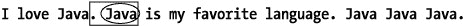

框选区域是下一个被解析的区域，圈出部分是匹配的子字符串：

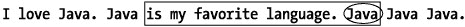

框选区域是下一个被解析的区域，圈出部分是匹配的子字符串：

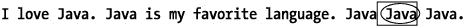

框选区域是下一个被解析的区域，圈出部分是匹配的子字符串：


### public boolean find(int start)

`find(int start)` 方法的工作方式与其重载版本完全相同，只是它指定了开始搜索的位置。`start` 中的 `int` 参数只是告诉 `Matcher` 从哪个字符开始搜索。

因此，对于候选字符串 *I* *love Java. Java is my favorite language. Java* *Java Java*。和模式 ***Java***，如果你只想从字符索引 11 开始搜索，则使用命令 `find(11)`。下图中框选的是已解析的区域，实际匹配的组被圈出：

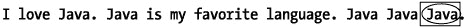

如果给定的索引大于候选字符串的长度，则此方法将抛出 `IndexOutOfBoundsException`。因此，对于前面的候选字符串，调用 `find(58)` 将导致 `IndexOutOfBoundsException`，因为该字符串的长度只有 57。

你也可以使用此方法来设置搜索的起始点。因此，你可以执行 `find(11)` 从字符 11 开始搜索，然后使用 `find(0)` 从字符 0 开始搜索。

清单 2-18 提供了一个示例，针对候选字符串 *I* *hate mice. I really* *hate MICE*。和模式 ***MICE***，其中比较是**不区分大小写**的。代码使用不区分大小写的比较来演示第一个匹配项实际上是字符编号 11 之后匹配的字符串。

清单 2-18：使用 find(int) 方法

| **** |

```
import java.util.regex.*;
/**
 * 演示 Matcher.find(int) 方法的使用
 */
public class MatcherFindParamExample{
  public static void main(String args[]){
      test();
  }
  public static void test(){
     //创建一个 Pattern
      Pattern p = Pattern.compile("mice", Pattern.CASE_INSENSITIVE);

     //创建候选字符串
     String candidateString =
      "I hate mice. I really hate MICE.";

     //尝试匹配候选字符串。
     Matcher matcher = p.matcher(candidateString);

     //显示后面的匹配项
     System.out.println(candidateString);
     matcher.find(11);
     System.out.println(matcher.group());

     //显示前面的匹配项
     System.out.println(candidateString);
     matcher.find(0);
     System.out.println(matcher.group());
  }
}
```

| **** |

|  |

当你执行 `find(11)` 方法时，搜索区域从字符 11 开始，如下图所示：


接下来，你执行 `find(0)`，这会将搜索索引移回 0。下图说明了由此产生的搜索区域：

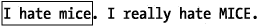


### public boolean lookingAt()

`lookingAt()` 方法是 `matches` 方法的一个更宽松的版本。它仅需将字符串与模式进行最少量的比较即可实现匹配。如果存在这样的子串，则此方法返回 `true`。

因此，对于模式 ***J2SE***

```
Pattern = Pattern.compile("J2SE"); 
```

和候选字符串 *J2SE is the only one for me*

```
Matcher matcher_1 = Pattern.matcher("J2SE is the only one for me");
```

`lookingAt` 方法返回 `true`。然而，对候选字符串 *For me, it's J2SE, or nothing at all* 调用 `lookingAt()`

```
Matcher matcher_2 = Pattern.matcher("For me, it's J2SE, or nothing at all");
```

将返回 `false`，因为 *For me, it's J2SE, or nothing at all* 的开头部分与模式 ***J2SE*** 不匹配。

与 `matches` 方法类似，`lookingAt` 方法总是从输入序列的开头开始查看候选字符串；但与 `matches` 不同的是，`lookingAt` 方法不要求整个输入序列都匹配。如果匹配成功，则可以通过使用 `start`、`end` 和 `group` 方法来获取更多信息。清单 2-19 提供了一个使用 `lookingAt` 方法的示例。

清单 2-19：使用 lookingAt 方法

| **** |

```
import java.util.regex.*;
/**
 * 演示 Matcher.LookingAt 方法的用法
 */
public class MatcherLookingAtExample{
  public static void main(String args[]){
      test();
  }
  public static void test(){
     //创建一个 Pattern
      Pattern p = Pattern.compile("J2SE");

     //创建候选字符串
     String candidateString_1 = "J2SE is the only one for me";
     String candidateString_2 =
      "For me, it's J2SE, or nothing at all";
     String candidateString_3 = "J2SEistheonlyoneforme";

     //尝试匹配候选字符串。
     Matcher matcher = p.matcher(candidateString_1);
     //显示候选字符串的输出
     String msg = ":" + candidateString_1 + ": matches?: ";
     System.out.println(msg + matcher.lookingAt());
     matcher.reset(candidateString_2);
     //显示候选字符串的输出
     msg = ":" + candidateString_2 + ": matches?: ";
     System.out.println(msg + matcher.lookingAt());

     matcher.reset(candidateString_3);
     //显示候选字符串的输出
     msg = ":" + candidateString_3 + ": matches?: ";
     System.out.println(msg + matcher.lookingAt());

     /*
     *返回结果
     *:J2SE is the only one for me: matches?: true
     *:For me, it's J2SE, or nothing at all: matches?: false
     *:J2SEistheonlyoneforme: matches?: true
     */
  }
}
```

| **** |

|  |

### public Matcher appendReplacement (StringBuffer sb, String replacement)

有时，在处理正则表达式时，你可能会更倾向于使用 `StringBuffer` 而不是 `String`。这可能是出于性能、实用性或其他原因。幸运的是，`java.util.regex` 包提供了 `appendReplacement` 和 `appendTail` 方法来实现这一点。本节重点介绍 `appendReplacement` 方法。

简单来说，`appendReplacement` 允许你根据 `Pattern` 和 `Matcher` 对象的内容创建一个 `StringBuffer`。假设你想在 *My name is Bond. James Bond. I would like a martini.* 中将 *Smith* 替换为 *Bond*，并且希望将结果存储在 `StringBuffer` 中。要使用 `appendReplacement`，你必须首先创建一个 `Pattern` 和一个对应的 `Matcher`。出于本例的目的，你将使用 ***Bond***：

```
Pattern pattern = Pattern.compile("Bond");
```

同时，你将使用候选字符串 *My name is Bond. James Bond. I would like a martini.*：

```
Matcher matcher =
 pattern.matcher("My name is Bond. James Bond. I would like a martini.");
```

接下来，你调用 `find` 方法，以便 `Matcher` 可以开始解析候选字符串。第一次调用 `find` 时，`Matcher` 仅解析候选字符串中足够的部分，以找到第一个匹配项（如果存在）。这个已解析的区域在下图中用方框标出：


回想一下，方框区域是 `Matcher` 当前唯一知晓的候选字符串部分。

然后，你将调用 `appendReplacement` 方法，该方法会用上图中方框区域内的所有内容填充 `StringBuffer sb`，但会将 *Smith* 替换为 *Bond*。因此，你的 `StringBuffer` 现在包含 *My name is Smith*。

最后还有一点需要提及。在内部，`Matcher` 对象维护着一个 *追加位置*。这个追加位置是 `Matcher` 对象为了 `StringBuffer` 对象而维护的状态信息。它记录了上一次调用 `appendReplacement` 时从 `StringBuffer` 中读取的位置。当然，追加位置初始为 0，如下图所示：

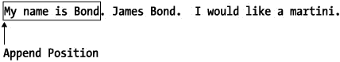

调用 `appendReplacement` 后，追加位置会向前移动到匹配项之后，如下图所示。这个位置与 `matcher.end()` 方法返回的位置相同。

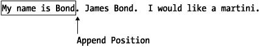

接下来，你再次调用 `matcher.find()`，使得当前考虑的位置变为下图中高亮显示的方框区域：

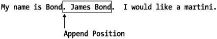

然后，你再次调用 `appendReplacement`，从而将 . *James Smith* 追加到 `StringBuffer` 中。请记住，因为这是一个替换方法，它会自动将 *Bond* 替换为 *Smith*。`StringBuffer` 的内容变为 *My name is* *Smith. James Smith*，并且追加位置向前移动，如下图所示：

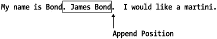

你的任务完成了。完整的代码清单显示在清单 2-20 中。

清单 2-20：appendReplacement 方法示例

| **** |

```
import java.util.regex.*;
import java.util.*;
/**
 * 演示 Matcher.appendReplacement 方法的用法
 */
public class Scrap{
  public static void main(String args[]){
      test();
  }
  public static void test(){
     //创建一个 Pattern
      Pattern p = Pattern.compile("Bond");
      //创建一个 StringBuffer
      StringBuffer sb =new StringBuffer();

//创建候选字符串
     String candidateString =
     "My name is Bond. James Bond. I would like a martini.";

String replacement = "Smith";
     //尝试匹配第一个候选字符串
     Matcher matcher = p.matcher(candidateString);
     matcher.find();

//填充 StringBuffer
     matcher.appendReplacement(sb,replacement);
     //尝试匹配第二个候选字符串
     Matcher matcher = p.matcher(candidateString);
     matcher.find();

//填充 StringBuffer
     matcher.appendReplacement(sb,replacement);

//显示候选字符串的输出
     String msg = sb.toString();

System.out.println(msg.length());
     System.out.println(msg);
  }
}
```

| **** |

|  |


#### 特别说明

`appendReplacement` 方法功能强大。如你所知，能力越大，细节差异越微妙。通过使用表达式 ***$d***（其中 ***d*** 是一个小于或等于上一次匹配中分组数量的数字），你实际上可以在搜索中嵌入并重组子组。例如，假设你的模式是 ***(James) (Bond)***：

```
Pattern p = Pattern.compile("(James) (Bond)");
```

你的候选字符串是 *My name is Bond. James Bond.*

```
String candidateString = "My name is Bond. James Bond.";
```

并且你想插入中间名 *Waldo*。你的替换字符串可能如下所示：

```
String replacement = "$1 Waldo $2";
```

其中 ***$1*** 指向第一个匹配的子组 *James*，***$2*** 指向第二个匹配的子组 *Bond*。

在这种情况下，`StringBuffer` 将包含值 *My name is Bond. James Waldo Bond..* 清单 2-20 给出了一个完整的工作示例。

清单 2-20：使用带子组替换的 appendReplacement

| **** |

```
import java.util.regex.*;
import java.util.*;
/**
 * 演示 Matcher.appendReplacement 方法
 * 与子组替换的用法。
 */
public class MatcherAppendReplacementGroupExample{
  public static void main(String args[]){
      test();
  }
  public static void test(){
     //创建一个 Pattern
      Pattern p = Pattern.compile("(James) (Bond)");
      //创建一个 StringBuffer
      StringBuffer sb =new StringBuffer();

     //创建候选字符串
     String candidateString =
     "My name is Bond. James Bond.";

     String replacement = "$1 Waldo $2";
     //尝试匹配第一个候选字符串
     Matcher matcher = p.matcher(candidateString);
     matcher.find();

     //填充 StringBuffer
     matcher.appendReplacement(sb,replacement);

     //显示候选字符串的输出
     String msg = sb.toString();
     System.out.println(msg);
  }
}
```

| **** |

|  |

如果尚未调用 `find()` 或 `find` 返回 false，`appendReplacement` 方法将抛出 `IllegalStateException`。如果 ***$1***、***$2*** 等引用的捕获组在 Matcher 当前正在检查的模式部分中不存在，它将抛出 `IndexOutOfBoundsException`。

### public StringBuffer appendTail(StringBuffer sb)

`appendTail` 方法是 `appendReplacement` 方法的补充。它只是将原始候选字符串中所有剩余的后续子序列追加到 `StringBuffer` 中。它从追加位置（我在 `appendReplacement` 部分解释过）读取，直到候选字符串的末尾。

在前面给出的 `appendReplacement` 示例中，你在字符串 *My name is Bond. James Bond. I would like a martini.* 中将 *Bond* 替换为 *Smith*。完成后，你得到了一个包含值 *My name is Smith. James Smith* 的 `StringBuffer`。

这就是 `appendReplacement` 方法能为你完成的所有工作，因为它基于一次成功的匹配，而在单词 *Bond* 第二次出现中的 *d* 之后，再也找不到更多成功的匹配了。第二次调用 `appendReplacement` 后 Matcher 的状态如下图所示：


相应地，通过使用 `appendReplacement` 创建的 `StringBuffer` 只会包含短语 *My name is Smith. James Smith*。`appendTail` 方法只是将字符串的其余部分，即 *. I would like a martini.*，追加到 `StringBuffer` 缓冲区中。然后返回同一个 `StringBuffer`。

### public String replaceAll(String replacement)

这个方法是我最喜欢的新增功能之一，无论是其功能还是其直观的应用程序编程接口（API）。`replaceAll` 方法只是返回一个字符串，该字符串将描述内容的每一次出现都替换为替换内容。

假设你有字符串 *I love ice. Ice is my favorite. Ice Ice Ice.*，并且你想将 *ice* 或 *Ice* 的每一次出现都替换为单词 *Java*。第一步是描述你要查找的单词。在这种情况下，因为你想要匹配大写 *Ice* 和小写 *ice*，你将使用正则表达式模式 ***(i|I)ce***：

```
Pattern pattern = Pattern.compile("(i|I)ce");
```

接下来，使用候选字符串获取一个 Matcher：

```
Matcher matcher = pattern.matcher("I love ice. Ice is my favorite. Ice Ice Ice."); 
```

最后，进行替换：

```
String tmp = matcher.replaceAll("Java");
```

现在字符串 tmp 保存了值 *I love Java. Java is my favorite. Java Java Java.* 清单 2-21 给出了这个示例的完整代码。

清单 2-21：replaceAll 方法示例

| **** |

```
import java.util.regex.*;
import java.util.*;
/**
 * 演示 Matcher.replaceAll 方法的用法
 */
public class MatcherReplaceAllExample{
  public static void main(String args[]){
      test();
  }
  public static void test(){
     //创建一个 Pattern
      Pattern p = Pattern.compile("(i|I)ce");

     //创建候选字符串
     String candidateString =
     "I love ice. Ice is my favorite. Ice Ice Ice.";

     Matcher matcher = p.matcher(candidateString);
     String tmp = matcher.replaceAll("Java");

     System.out.println(tmp);
  }
} 
```

| **** |

|  |

|  | 警告  | 使用此方法将更改 Matcher 对象的状态。具体来说，将调用 reset 方法。因此，就好像所有 start、end、group 和 find 调用都未被调用过一样。 |

与 `appendReplacement` 方法类似，`replaceAll` 方法可以通过使用 ***$*** 符号包含对子字符串的引用。有关详细信息，请参阅本章前面介绍的 `appendReplacement` 文档。


### public String replaceFirst(String replacement)

`replaceFirst` 方法是 `replaceAll` 方法的一个更专注的版本。该方法返回一个字符串，将描述内容的*第一次*出现替换为指定的替换字符串。

假设你有一个候选字符串 *I love ice. Ice is my favorite. Ice Ice Ice.*，并且你想将 *ice* 或 *Ice* 的第一次出现替换为单词 *Java*。同样，你的第一步是描述你要查找的单词。在这种情况下，由于你想同时匹配大写的 *Ice* 和小写的 *ice*，你使用正则表达式模式 ***(i|I)ce***：

```
Pattern pattern = Pattern.compile("(i|I)ce");
```

接下来，使用候选字符串获取一个 `Matcher`：

```
Matcher matcher = pattern.matcher("I love ice. Ice is my favorite. Ice Ice Ice.");
```

最后，执行替换：

```
String tmp = matcher.replaceFirst("Java");
```

字符串 `tmp` 保存的值为 *I love Java. Ice is my favorite. Ice Ice Ice.*。清单 2-22 展示了此示例的完整代码。

清单 2-22：replaceFirst 方法示例

| **** |

```
import java.util.regex.*;
import java.util.*;
/**
 * 演示 Matcher.replaceFirst 方法的使用
 */
public class MatcherReplaceFirstExample{
  public static void main(String args[]){
      test();
  }
  public static void test(){
     //创建一个 Pattern
      Pattern p = Pattern.compile("(i|I)ce");

     //创建候选字符串
     String candidateString =
     "I love ice. Ice is my favorite. Ice Ice Ice.";

     Matcher matcher = p.matcher(candidateString);
     String tmp = matcher.replaceFirst("Java");

     System.out.println(tmp);
  }} 
```

| **** |

|  |

|  | 警告  | 使用此方法将更改你的 `Matcher` 对象的状态。具体来说，会调用 `reset` 方法。因此，请记住，所有 `start`、`end`、`group` 和 `find` 调用都必须重新执行。 |

与 `appendReplacement` 方法类似，`replaceFirst` 方法可以通过使用 ***$*** 符号来包含对子字符串的引用。有关详细信息，请参阅本章前面介绍的 `appendReplacement` 文档。

## 新的 String 正则友好方法

将正则表达式引入 J2SE 所带来的最明显的变化之一是在 `String` 类中增加了五个强大的新方法。在接下来的章节中，我将讨论这些变化，并指导你如何在未来的编码实践中使用它们。

### 字符串定界艺术

当你使用正则表达式和 `String` 对象时，有一个非常重要的注意事项需要牢记：特殊字符，例如数字 ***\d*** 和单词标记 ***\w***（仅举几例），在传入 `String` 时必须进行两次定界。例如，要搜索一个数字，你必须将使用的 *\* 字符数量加倍。因此，当你在 Java `String` 对象中使用时，***\d*** 变成了 ***\\d***。

这听起来并不复杂，但有时处理起来却出奇地困难。例如，假设你想将 *I want to use a d character* 中字符 *d* 的每次出现替换为 *\d*。也就是说，你希望新的字符串变成 *I want to use a \d character*。你该如何开始？

当然，你可以尝试这样做：

```
String retval  = tmp.replaceAll("d","\d");
```

这会导致编译失败，并出现非法转义字符错误。好吧，那么你将 *\* 字符加倍，得到以下内容：

```
String retval  = tmp.replaceAll("d","\\d");
```

这可以编译通过，但返回了一个奇怪的结果：没有任何变化。这是怎么回事？

等等——回想一下，***\\d*** 作为正则表达式，并不意味着一个定界的 *d* 字符；它表示一个数字。嗯，那当然行不通。你的候选字符串中没有数字。尝试添加另一个 *\* 字符来定界 ***\\\d***：

```
String retval  = tmp.replaceAll("d","\\\d");
```

这再次导致编译失败，并出现非法转义字符错误。这真令人沮丧。本书前面的内容不是说在尝试定界特殊字符时要添加一个 *\* 字符吗？

嗯，实际上，并没有。本书前面的内容说的是将 *\* 字符的数量*加倍*。因为当前有两个 *\* 字符，将它们加倍会得到 ***\\\\d*** 作为表达式。看起来很奇怪，但无论如何试试看：

```
String retval  = tmp.replaceAll("d","\\\\d");
```

令人惊讶的是，它竟然成功了！但为什么它能成功？因为 ***\\\\d*** 中的第一个 *\* 充当了第二个 *\* 的定界符。类似地，第三个 ***\*** 充当了第四个 *\* 字符的定界符。

好了，现在一切都清楚了。尝试将 *I want to use a $ character* 中的 *$* 替换掉，使得结果字符串变为 *I want to use a \$ character*。有关解决方案，请参阅本章末尾的常见问题解答部分。

### public boolean matches(String regex)

`String.matches` 方法可能是你最常使用的正则表达式方法。它只是将给定的字符串与一个候选正则表达式进行比较，如果两者在正则表达式意义上*完全*匹配，则返回 `true`。例如，对于字符串

```
String num = "4";
```

将 *4* 与表示单个数字的 ***\d*** 进行比较，将返回 `true`：

```
num.matches("\\d");\\返回 true
```

然而，将 *4*（即 *4* 后跟一个空格）与数字 ***\d*** 进行比较，将返回 `false`。类似地，将 *4*（即 *4* 后面没有空格）与 ***\d***（即一个数字后跟一个空格）进行比较，也将返回 `false`。

这里的要点是，当你使用此方法时，*必须小心，确保正则表达式完整地描述了整个* String *，并且没有描述任何不属于该* String *的内容*。即使是一个空格，根据前面的例子，也可能使你的匹配出现偏差。

在幕后，此方法实例化一个 `Pattern` 对象，并简单地传递到前面讨论过的 `Pattern.matches` 方法。如果你将要执行大量的 `matches` 操作，你可能会发现显式创建 `Pattern` 和 `Matcher` 对象并直接使用它们会更高效。

如果传入的正则表达式无效，则此方法将抛出 `PatternSyntaxException` 错误。如果正则表达式为 `null`，`matches` 将抛出 `NullPointerException`。

### public String replaceFirst (String regex, String replacement)

`String.replaceFirst` 方法将正则表达式描述的第一次出现替换为此方法的第二个参数所表示的字符串。因此，对于字符串 `tmp`

```
String tmp = "I want to eat 5 hamburgers, 7 days a week";
```

命令

```
String newTmp = tmp.replaceFirst("\d","900");
```

将 `newTmp` 设置为 *I want to eat 900 hamburgers, 7 days a week*。

在幕后，此方法实例化 `Pattern` 和 `Matcher` 对象，并简单地传递到前面讨论过的 `Matcher.replaceFirst` 方法。如果你将要执行大量的 `replaceFirst` 操作，你可能会发现显式创建 `Pattern` 和 `Matcher` 对象并直接使用它们会更高效。

|  | 注意  | 如果你显式创建 `Pattern` 和 `Matcher` 对象并直接使用它们，你可能希望通过在适当的位置添加行尾 ***$*** 和行首 ***^*** 字符来优化你的模式。 |

如果传入的正则表达式无效，则此方法将抛出 `PatternSyntaxException` 错误。如果正则表达式为 `null`，`replaceFirst` 将抛出 `NullPointerException`。


### public String replaceAll (String regex, String replacement)

`String.replaceAll` 方法会将所有与正则表达式 `regex` 匹配的子串替换为该方法第二个参数所表示的字符串。因此，对于字符串 `tmp`：

```
String tmp = "I want to eat 5 hamburgers, 7 days a week";
```

执行命令：

```
String newTmp = tmp.replaceAll("\d","900");
```

会将 `newTmp` 设置为 *I want to eat 900 hamburgers, 900 days a week*。

在底层，该方法会实例化 `Pattern` 和 `Matcher` 对象，并直接调用之前讨论过的 `Matcher.replaceAll` 方法。如果你需要执行大量 `replaceAll` 操作，显式创建 `Pattern` 和 `Matcher` 对象并直接使用它们，效率可能会更高。

如果传入的正则表达式无效，该方法将抛出 `PatternSyntaxException` 异常。如果正则表达式为 `null`，`replaceFirst` 将抛出 `NullPointerException`。

### public boolean split(String regex)

如果你需要根据某些条件将字符串拆分为子字符串数组，这个方法会特别有用——从概念上讲，它类似于 `StringTokenizer`。然而，它比 `StringTokenizer` 更强大，资源消耗也更高，因为它允许你的程序使用正则表达式作为拆分条件。

该方法始终至少返回一个元素。如果找不到拆分候选（即输入），则返回一个仅包含一个字符串的字符串数组——即原始输入。如果找到了输入，则返回一个字符串数组，该数组包含每次出现输入之后的所有子字符串。

因此，对字符串 *Hello, Dolly* 调用 `split(",")` 方法，将返回一个包含两个元素的字符串数组。数组的第一个元素将包含 *Hello*，第二个元素将包含 *Dolly*。

使用此方法时，需要注意一些细微之处。如果字符串是 *Hello,Dolly,*，即在 *Dolly* 的 *y* 后面有一个尾随逗号，那么该方法仍然会返回一个包含两个元素的字符串数组，即 *Hello* 和 *Dolly*。其隐含行为是尾随空格不会被返回。

如果字符串是 *Hello,,,Dolly*，那么生成的字符串数组将有四个元素。`split` 方法应用于模式 `,` 的返回值如下：

```
// "Hello,,,Dolly".split() 等于 {"Hello","","","Dolly"}
```

在底层，该方法会实例化一个 `Pattern` 对象，并直接调用之前讨论过的 `Pattern.split` 方法。如果你需要执行大量 `split` 操作，显式创建 `Pattern` 对象并直接使用它们，效率可能会更高。

如果传入的正则表达式无效，该方法将抛出 `PatternSyntaxException` 异常。如果正则表达式为 `null`，`replaceFirst` 将抛出 `NullPointerException`。

### public String split(String regex, int limit)

该方法返回一个数组，其中包含调用该方法的 `String` 对象的子字符串。这些子字符串是围绕第一个参数 `regex` 所描述的正则表达式周围的文本。数组中实际元素的数量由第二个参数 `limit` 控制。以下部分解释了 `limit` 的不同值可能意味着什么。

#### Limit == 0

如果你指定第二个参数 `limit` 等于 0，那么该方法会返回一个数组，其中包含尽可能多的匹配子字符串，并且尾随空格会被丢弃。因此，模式：

```
Pattern p = "Hello, Dolly".split(",",0); 
```

在针对候选字符串 *Hello, Dolly* 进行拆分时，将返回一个包含两个元素的数组。

类似地，当针对 *Hello, Dolly,*（即在 *Dolly* 的 *y* 后面有一个尾随逗号）进行匹配时，`split` 将返回两个元素：

```
String tmp[] = "Hello, Dolly,.".split(",",0);
```

然而，你可能并不总是希望这种表现。例如，有时你可能希望限制返回的元素数量。

#### Limit > 0

如果你只对一定数量的匹配感兴趣，请使用正数 limit。你应该使用该数量加 1 作为 limit。要拆分 *Hello, Dolly, You, Are, My, Favorite* 并且只想要前两个标记，你可以这样使用：

```
String[] tmp = "Hello, Dolly, You, Are, My, Favorite".split(",",3);
```

结果字符串的值如下：

```
//tmp[0] 是 "Hello"
// tmp[1] 是 "Dolly";
```

这里有趣的行为是返回了第三个元素：

```
//tmp[2] 是 "You, Are, My, Favorite";
```

使用正数 limit 可能会带来性能提升，因为正则引擎在达到指定匹配次数后可以停止搜索。

#### Limit < 0

为 limit 使用负数（任何负数）会告诉正则引擎，你希望返回尽可能多的匹配，并且如果存在尾随空格，也要返回它们。因此，对于正则模式 `,` 和候选字符串 *Hello,Dolly,*，命令：

```
String tmp[] is "Hello,Dolly".split(",", -1); 
```

结果如下：

```
//tmp == {"Hello","Dolly"};
```

然而，对于字符串 *Hello, Dolly,*（在 *Dolly* 后面的逗号后有尾随空格），方法调用：

```
String tmp[] = "Hello,Dolly,    ".split(",", -1);
```

结果如下：

```
//tmp 等于 {"Hello","Dolly","    "};
```

请注意，负数 limit 的实际值并不重要。因此：

```
p.split("Hello,Dolly", -1);
```

完全等同于：

```
p.split("Hello,Dolly", -100);
```

在底层，该方法会实例化一个 `Pattern` 对象，并直接调用之前讨论过的 `Pattern.split` 方法。如果你需要执行大量 `split` 操作，显式创建 `Pattern` 对象并直接使用它，效率可能会更高。

如果传入的正则表达式无效，该方法将抛出 `PatternSyntaxException` 异常。如果正则表达式为 `null`，`replaceFirst` 将抛出 `NullPointerException`。

## 总结

在本章中，我为 `Pattern` 和 `Matcher` 类及其方法提供了详细的文档和大量示例。我还讨论了 `String` 类中新增的正则表达式方法。现在，你应该对这些对象的工作原理以及它们如何协同工作有了更好的理解，并且在处理这些方法时有了一个参考点。在第 3 章中，你将学习如何将这些新工具、正则表达式语言以及 Java 语言本身整合成一个统一的整体。


## 常见问题解答

| **问：** | **如何开始使用正则表达式包？** |  |
| **问：** | **如何判断一个字符串是否包含某个子串？** | [![如果你确实是在查找一个明确的子串，而不是模式描述，那么请使用 String.indexOf 方法。然而，如果你需要确认一个模式是否存在，那么你有两条路可走。第一种是使用 String.split 方法的一个变体，并将第二个参数设为负数：String tokens[] = candidate.split(subStringPattern,-1); 并确保结果数组包含多个元素：boolean isThere = tokens.length - 1? true: false; 这里的问题是，如果你要查找的短语恰好是候选句子的最后一个元素，那么数组的大小仍然会是 1，这将导致错误的结论。你可以用候选字符串 *this is* *the phrase I want* 和模式描述 ***want.***（末尾带有一个句点，跟在 *t* 字符之后）来测试一下。你的第二个选择是使用一个像下面这样的简短方法，它总是有效的：/*** 确认或否认正则表达式* 作为候选字符串的一部分存在。* @param the -code-String-/code- 候选字符串* @param the -code-String-/code- 子串模式* @return -code-boolean-/code- 如果正则表达式* 描述了候选字符串的一部分，则返回 true* @author M Habibi*/ public static booleancontainsSubtring(String candidate, String subStringPattern){boolean retval = false;//编译模式 Pattern pattern = Pattern.compile(subStringPattern); //查看候选字符串的任何部分是否包含该//描述 Matcher matcher = pattern.matcher(candidate);retval = matcher.find(); return retval;} ](question.gif)](#LiB0019.html#answer.N33) |
| **问：** | **如何确认第 n 次出现的子串是否存在？** |  |
| **问：** | **如何替换掉“I want to use a $ character”中的 $，使得结果字符串变为“I want to use a \$ character”？** | ![对于候选字符串 String candidate = `I want to use a $ character`; 解决方案是有点反直觉的正则表达式模式 String newString = candidate.replaceAll(`\\$`,`\\\\\\$`); 第一个参数 \\$ 很清楚。你想要美元符号，它恰好是一个表示行尾的正则表达式元字符。因为你确实想要实际的美元符号字符而不是行尾，所以你必须对美元符号进行转义，产生模式 \$ 。然而，你还需要满足 String 对象构造函数的需求，它期望将 \ 后面的任何内容视为字符串元字符。因为 \$ 不是字符串元字符（它是正则表达式元字符），你需要告诉 String 对象的构造函数忽略 \ 。因此，你需要再次对其进行转义，产生 \\$ 。这就引出了模式的第二部分：\\\\\\$ 。在这里，第一个 \ 转义第二个 \ ，第三个 \ 转义第四个 \ ，第五个 \ 转义第六个。因此，字符串 \\\\\\$ 的结果是 \\\\$ 。在内部，该方法必须从“I want to use a $ character”中剥离出 \$ 部分，并用某些内容替换它，但该内容是什么？该方法将你提供的原始字符串分解为两部分：一个由“I want to use a”组成的子串，和另一个由“character”组成的子串。通常，Matcher.replaceAll 方法会将你提供的任何内容插入到这两个子串之间，连接结果并返回。然而，因为你提供的内容恰好包含美元符号，所以出现了一个额外的复杂性。正如本章中 Matcher.replaceAll 的描述所示，美元符号在 replaceAll 方法中具有特殊意义。它用于引用被模式捕获的子组。因为你不希望它具有这种意义，所以你需要再次对其进行转义。因此，模式 \\\$ ，其中第一个 \ 转义第二个 \ ，第三个 \ 转义 $ ，从而逻辑上产生 \$ 。 ](img/#LiB0019.html#answer.N142) |

答案

| **答：**  | 只需导入 java.util.regex.* 包即可。 |
| **答：**  | 如果你确实是在查找一个明确的子串，而不是模式描述，那么请使用 String.indexOf 方法。然而，如果你需要确认一个模式是否存在，那么你有两条路可走。第一种是使用 String.split 方法的一个变体，并将第二个参数设为负数： 
```
String tokens[] = candidate.split(subStringPattern,-1);
```

并确保结果数组包含多个元素：

```
boolean isThere = tokens.length > 1? true: false;
```

这里的问题是，如果你要查找的短语恰好是候选句子的最后一个元素，那么数组的大小仍然会是 1，这将导致错误的结论。你可以用候选字符串 *this is* *the phrase I want* 和模式描述 ***want.***（末尾带有一个句点，跟在 *t* 字符之后）来测试一下。你的第二个选择是使用一个像下面这样的简短方法，它总是有效的：

```
 /**
   * 确认或否认正则表达式
   * 作为候选字符串的一部分存在。
   * @param the <code>String</code> 候选字符串
   * @param the <code>String</code> 子串模式
   * @return <code>boolean</code> 如果正则表达式
   * 描述了候选字符串的一部分，则返回 true
   * @author M Habibi
   */

   public static boolean
   containsSubtring(String candidate, String subStringPattern)
   {
       boolean retval = false;
       //编译模式
       Pattern pattern = Pattern.compile(subStringPattern);
       //查看候选字符串的任何部分是否包含该
       //描述
       Matcher matcher = pattern.matcher(candidate);
       retval = matcher.find();

       return retval;
   }
```

 |
| **答：**  | 这里的解决方案与之前给出的类似，包括使用 String.split 方法。同样的限制也适用。就基于方法的解决方案而言，你需要对该方法进行的唯一修改如下。首先，调整方法签名，使其接受第三个参数作为迭代次数，因此签名如下所示： 
```
public static boolean containsSubtring(
  String candidate,
  String subStringPattern,
  int n
)
```

其次，添加以粗体显示的循环：

```
boolean retval = false;
//编译模式
Pattern pattern = Pattern.compile(subStringPattern);

//查看候选字符串的任何部分是否包含该
//描述
Matcher matcher = pattern.matcher(candidate);
for (int i=0; i< n; i++)
{
  retval = matcher.find();
  if (!retval) break;
}
return retval;
```

 |
| **答：**  | 对于候选字符串 
```
 String candidate = "I want to use a $ character";
```

解决方案是有点反直觉的正则表达式模式

```
String newString = candidate.replaceAll("\\$","\\\\\\$");
```

第一个参数 *\\$* 很清楚。你想要美元符号，它恰好是一个表示行尾的正则表达式元字符。因为你确实想要实际的美元符号字符而不是行尾，所以你必须对美元符号进行转义，产生模式 ***\$***。然而，你还需要满足 String 对象构造函数的需求，它期望将 *\* 后面的任何内容视为字符串元字符。因为 *\$* 不是字符串元字符（它是正则表达式元字符），你需要告诉 String 对象的构造函数忽略 *\*。因此，你需要再次对其进行转义，产生 *\\$*。这就引出了模式的第二部分：*\\\\\\$* 。在这里，第一个 *\* 转义第二个 *\*，第三个 *\* 转义第四个 *\*，第五个 *\* 转义第六个。因此，字符串 *\\\\\\$* 的结果是 *\\\\$*。在内部，该方法必须从 *I* *want to use a $ character* 中剥离出 *\$* 部分，并用 *某些内容* 替换它，但该内容是什么？该方法将你提供的原始字符串分解为两部分：一个由 *I* *want to use a* 组成的子串，和另一个由 *character* 组成的子串。通常，Matcher.replaceAll 方法会将你提供的任何内容插入到这两个子串之间，连接结果并返回。然而，因为你提供的内容恰好包含美元符号，所以出现了一个额外的复杂性。正如本章中 Matcher.replaceAll 的描述所示，美元符号在 replaceAll 方法中具有特殊意义。它用于引用被模式捕获的子组。因为你不希望它具有这种意义，所以你需要再次对其进行转义。因此，模式 ***\\\$***，其中第一个 *\* 转义第二个 *\*，第三个 *\* 转义 *$*，从而逻辑上产生 *\$*。 |


# 第 3 章：高级正则表达式

## 概述

> *"你必须转身面对猛虎，才能发现它不过是纸做的。"*
> 
> ——禅语

本章探讨 J2SE 中正则表达式的一些更高级特性。其目标是为 Java 开发者提供更复杂的正则表达式工具和概念的参考点。当你需要重温 J2SE 正则表达式概念时，本章可作为参考资料。

当然，没有什么学习工具比实际编写代码更有用，因此我鼓励你亲自尝试这些概念。本章介绍了多种概念，包括组、子组、非捕获组、贪婪限定符、积极限定符、懒惰限定符、正向先行断言、负向先行断言、正向后行断言和负向后行断言。本章最后一节重点介绍如何提高正则表达式的效率。

|  | 注意 | 本章中的示例特意保持简单，以便清晰说明所讨论的机制。更复杂的示例（例如专业场景中使用的示例）将在第 5 章和附录中探讨。 |

## 理解组

正如我在第 2 章中解释的，组就是描述正则表达式模式的一系列字符。因此，***\w\d*** 是一个组，因为它包含两个字符 ***\w*** 和 ***\d***，并且它们按顺序排列。这是一个隐式组，因此很简单，因为大多数组通常都用括号显式包围。在 Java 正则表达式中，每个模式都有组，并且这些组都有索引。因此，模式 ***\w\d*** 只有一个组，即它本身，该组的索引当然是 0。

组在 Pattern 中描述，但在 Matcher 中实现。从概念上讲，这类似于 SQL 的工作方式：查询在 SQL 语句中描述，但匹配的部分从 ResultSet 中提取。因此，当你描述模式 ***\w\d*** 时，你可能会从候选字符串 *A9 is my favorite* 中提取匹配的候选 *A9*。例如，如果组被描述为

```
Pattern p = Pattern.compile("\\w\\d");
```

并且候选字符串是

```
String candidate = "A9 is my favorite";
```

你为此候选字符串定义一个 Matcher：

```
Matcher matcher = p.matcher(candidate);
```

假设已经调用了 Matcher.find() 方法，那么调用 Matcher.group(0) 会返回候选字符串中与整个模式匹配的部分，如下所示：

```
String tmp = matcher.group(0);
```

因此，Matcher.group(0) 方法这个名称有点用词不当。它实际上并不提取组；它提取候选字符串中与该组匹配的部分。这是一个微妙但重要的区别。完整示例如清单 3-1 所示。

清单 3-1：使用组

| **** |

```
import java.util.regex.*;
public class SimpleGroupExample{
    public static void main(String args[]){
        //原始模式始终是组 0
        Pattern p = Pattern.compile("\\w\\d");
        String candidate = "A9 is my favorite";

        //如果存在匹配，则提取候选字符串中
        //与组(0)匹配的部分
        Matcher matcher = p.matcher(candidate);

        //输出为 'A9'
        if (matcher.find()){
            String tmp = matcher.group(0);
            System.out.println(tmp);
        }
    }
}
```

| **** |

|  |

当你需要整个模式时，这种方法非常有效。但如果你需要该模式的子部分呢？如何提取它们？这时子组就派上用场了。

## 理解子组

正如模式可以有组一样，它也可以有子组。*子组*就是更大整体中的较小分组。它们通过被括号包围而与原始组以及彼此分隔开来。

在前一节的示例中，为了能够显式引用数字 ***\d***，你将模式修改为 ***\w(\d)***。这里，***\w\d*** 是组(0)，而 ***(\d)*** 是组(1)。清单 3-2 演示了如何使用子组来提取候选字符串中与数字 ***\d*** 匹配的部分。

清单 3-2：使用子组

| **** |

```
import java.util.regex.*;
public class SimpleSubGroupExample{
    public static void main(String args[]){
        //原始模式始终是组 0
        Pattern p = Pattern.compile("\\w(\\d)");
        String candidate = "A9 is my favorite";

        //如果存在匹配，则提取匹配的部分
        Matcher matcher = p.matcher(candidate);
        if (matcher.find()){
            //提取 'A9'，它与组(0)匹配，组(0)始终是
            //整个模式本身
            String tmp = matcher.group(0);
            System.out.println(tmp); //tmp 为 49

            //提取候选字符串中与组(1)匹配的部分：
            //即跟在 'A' 后面的 '9'
            tmp = matcher.group(1); //tmp 为 9
            System.out.println(tmp);
        }
    }
}
```

| **** |

|  |

清单 3-2 允许你提取候选字符串中与整个表达式匹配的部分。它还允许你提取该匹配部分的子部分。因此，你可以从匹配区域 *A9* 中提取 *9*，因为 *9* 与组(1)匹配。也就是说，当正则表达式引擎匹配 *A9* 时，它会存储 *9*，因为你定义了子组 ***(\d)***。

## 访问子组

那么这一切实际上是如何工作的呢？正则表达式引擎内部是否有小精灵在跑来跑去，跟踪所有这些组？嗯，可以说是，也可以说不是。

虽然据我所知引擎内部没有小精灵，但正则表达式引擎确实通过将候选字符串中的匹配部分存入内存来内部跟踪所有子组。因此，因为你将模式定义为 ***\w(\d)***，正则表达式会跟踪任何前面有字母数字或下划线字符的单个数字。当你将表达式 ***(\d)*** 放在括号中时，正则表达式认为你的意图就是如此。

引擎根据这些捕获组的数字索引提供对它们的访问。捕获组按从左到右的顺序，根据其左括号的顺序进行索引，并且组(0)始终引用整个原始表达式。因此，在前面的示例中，组(0)引用候选字符串中与整个表达式 ***\w(\d)*** 匹配的部分，而组(1)引用表达式中与 ***(\d)*** 部分匹配的部分。

例如，如果你的模式是 ***(\w)(\d)(\w)(\w)***，并且候选字符串是 *J2SE*，那么组 0 将匹配整个候选字符串 *J2SE*。组 1 将匹配 *J*，组 2 将匹配 *2*，组 3 将匹配 *S*，组 4 将匹配 *E*。

相应地，如果你的模式仍然是 ***(\w)(\d)(\w)(\w)***，但候选字符串是 *R2D2*，那么组 0 将匹配整个候选字符串 *R2D2*。组 1 将匹配 *R*，组 2 将匹配 *2*，组 3 将匹配 *D*，组 4 将匹配 *2*。


## 非捕获子组

有时你可能需要定义一个组，但又不希望该组被捕获——你只是想把它当作一个单一的逻辑实体来处理。使用这些*非捕获组*的主要优势在于，它们占用的内存更少，因为不需要正则表达式引擎来跟踪匹配的部分。

考虑模式 ***(\w)(\d\d)(\w+)***。具体来说，如果你不需要访问末尾的 ***(\w+)***，就可以进行一些优化。

要将一个组标记为非捕获组，只需在该组的左括号后紧跟字符 ***?:***。也就是说，你可以将表达式写成 ***(\w)(\d\d)(?:\w+)***。请注意，原始表达式 ***(\w)(\d\d)(\w+)*** 与新表达式 ***(\w)(\d\d)(?:\w+)*** 的唯一区别，就在于最后一个组 ***(\w+)*** 之前使用了 ***?:***。

非捕获组最常见的用途是为了逻辑分离。例如，假设你需要找出一个人早上过得怎么样。你可以接受 *good morning*、*bad morning*、*terrible morning*、*great morning* 等等。为了清晰起见，你将表达式写成 ***(good|bad|terrible|great) morning***。也就是说，你想把各种类型的早晨当作一个单一的逻辑单元来处理。

然而，假设你不需要捕获早晨的类型，因为你不会用它来做任何事情——你只是想知道它存在。那么你可以将表达式修改为 ***(?:good|bad|terrible|great) morning***。具体来说，你只需在组定义的左括号之后插入 ***?:***。这让你能够将各种类型的早晨视为一个单一的逻辑单元，但又不会浪费内存来捕获描述信息。

|  | 注意 | 要使一个组成为非捕获组，请在组的左括号内插入 ***?:***。 |

处理非捕获组时还有一个额外的问题：就组索引而言，它们是不被计数的。这完全合理，因为你实际上是在告诉正则表达式引擎你对这些组不感兴趣。因此，为什么正则引擎要跟踪它们或提供一种允许你引用它们的机制呢？毕竟，你已经明确告诉正则表达式引擎你对此不感兴趣。

所以对于模式 ***(?:\w)(\d)*** 来说，group(0) 是整个模式，即 ***\w\d***，而 group(1) 是 ***(\d)***。请注意，***(?:\w)*** 并不是通常情况下的 group(1)，因为 ***(?:\w)*** 是一个非捕获组；它前面有 ***?:***。清单 3-3 演示了一个简单非捕获子组的使用。

清单 3-3：使用非捕获子组

| **** |

```
import java.util.regex.*;

public class NonCapturingGroupExample{
    public static void main(String args[]){
        //定义模式
        String regex = "hello|hi|greetings|(?:good morning)";

//定义候选字符串
        String candidate1 = "Tommy say hi to you";
        String candidate2 = "Tommy say good morning to you";
        //编译模式
        Pattern pattern = Pattern.compile(regex);

//提取第一个模式
        Matcher matcher = pattern.matcher(candidate1);
        //显示组数量
        System.out.println("GROUP COUNT:"+ matcher.groupCount());

if (matcher.find())System.out.println("GOT 1:"+candidate1);

//重用匹配器，并检查第二个候选字符串
        matcher.reset();
        matcher = pattern.matcher(candidate2);

//显示组数量
        System.out.println("GROUP COUNT:"+ matcher.groupCount());

if (matcher.find())
        System.out.println("GOT 2:" +candidate2);
    }
}
```

| **** |

|  |

此示例的输出如输出 3-1 所示。

输出 3-1：NonCapturingGroupExample 的输出

| **** |

```
GROUP COUNT:0
GOT 1:Tommy say hi to you
GROUP COUNT:0
GOT 2:Tommy say good morning to you
```

| **** |

|  |

如果你使用了捕获组，那么组计数可能会是 1。虽然这看起来是一个相当无关紧要的问题，但随着捕获组数量的增加，它可能会变得极其复杂。


## 贪婪量词

你可能已经注意到，模式***(\w)(\d\d)(\w+)***中的第三个子组，即***(\w+)***，实际上给了正则表达式引擎一定的自由裁量权。对于候选字符串 *X99SuperJava*，子表达式***(\w+)***只需匹配一个或多个单词字符即可满足要求，但它却选择了匹配所有字符。也就是说，当它本可以只匹配 *S*、*Su*、*Sup* 等字符时，它却选择了匹配整个 *SuperJava*。毕竟，这些也都满足“一个或多个单词字符”的要求。为什么引擎会决定尽可能多地匹配呢？

它之所以这样做，是因为它本质上是*贪婪的*。正则表达式引擎的特性是尽可能多地匹配，只要这种匹配不会干扰模式中其他子表达式的匹配。因此，它匹配了整个候选字符串 *SuperJava*。表 3-1 列出了 Java 正则表达式的贪婪量词，供你参考。

表 3-1：贪婪量词

| **正则表达式** | **描述** |
| --- | --- |
| ? | 前面的元素重复一次或零次。 |
| * | 前面的元素重复零次或多次。 |
| + | 前面的元素重复一次或多次。 |
| {n} | 前面的元素恰好重复 *n* 次。 |
| {n,} | 前面的元素至少重复 *n* 次。 |
| {n,m} | 前面的元素至少重复 *n* 次，但不超过 *m* 次。包括 *m* 次重复。 |

贪婪匹配有一种有趣的行为模式，我称之为*贪婪-慷慨*。模式最左边的部分，即第一个***(\w)***，会尝试尽可能多地匹配。当它无法再匹配时，就会评估模式的下一部分。这就是贪婪的部分。

如果模式的第二部分未能找到任何匹配，那么第一个匹配模式就会开始缓慢*释放它已经收集到的字符*，从而为模式的第二部分提供更多匹配机会。这就是行为中慷慨的部分。

此时，可能会发生两种情况之一。第一种情况是，后面的组最终能够成功匹配，此时第一个组停止释放字符。第二种情况是，即使前面的组释放了字符供其使用，后面的组仍然无法匹配。如果发生这种情况，那么释放字符的组实际上会重新收集那些已释放的字符，然后正则表达式引擎继续执行。如果后面的子表达式再次匹配失败，则重复此过程。

那么，这一切对你意味着什么呢？嗯，实际上意义重大。考虑正则表达式模式***(\w+)(\d\d)(\w+)***，它与模式***(\w)(\d\d)(\w+)***几乎相同，只是第一个模式在第一个***\w***后面使用了***+***，从而形成了组***(\w+)***。这个小小的***+***在效率上可能会产生巨大差异，而这种差异在日常使用中你可能不会注意到，因为将新模式应用于候选字符串 *X99SuperJava* 的结果并没有改变。

清单 3-5 详细分析了评估该模式时实际发生的情况。

清单 3-5：贪婪量词示例

| **** |

```
import java.util.regex.*;

public class GreedyExample{
    public static void main(String args[]){
        //定义模式
        String regex = "(\\w+)(\\d\\d)(\\w+)";

//编译模式
        Pattern pattern = Pattern.compile(regex);

//定义候选字符串
        String candidate = "X99SuperJava";

//为候选字符串提取匹配器
        Matcher matcher = pattern.matcher(candidate);

matcher.find();

//提取匹配的组
        System.out.println(matcher.group(1));//返回 'X'
        System.out.println(matcher.group(2));//返回 '99'
        System.out.println(matcher.group(3));//返回 SuperJava
    }
} 
```

| **** |

|  |

当 group(1) 运行时，***(\w+)*** 会检查候选字符串 *X99SuperJava* 中的每一个字符。也就是说，*X* 被明确考虑，通过检查，并被放入该组的匹配包中。由于此模式是贪婪的，并且在***\w***后面有***+***，因此它会继续。接下来，*9* 被明确考虑并通过检查。然后，下一个 *9* 被考虑。这一过程一直持续到整个字符串 *X99SuperJava* 被消耗完毕。

在 group(1) 满足后，group(2)，即***(\d\d)***，获得了机会。由于 group(2) 根本无法匹配任何内容，group(1) 释放了 *X99SuperJava* 末尾的 *a* 字符。group(2) 考虑了这个 *a* 字符，发现它不是数字，并认为它不满足要求。因此，group(1) 释放了 *v* 字符。group(2) 检查了它，发现它不符合要求，并拒绝了它。因此，group(1) 释放了 *X99SuperJava* 中 *v* 字符前面的 *a* 字符。这一过程一直持续到 group(1) 释放了除 *X* 之外的所有字符。最后，两个 *9* 字符的释放使得 group(2) 能够匹配。现在 group(1) 拥有 *X*，group(2) 拥有 *99*。

最后，group(3) 获得了运行机会。它从第二个 *9* 字符之后的位置开始检查候选字符串 *X99SuperJava*。由于它是贪婪的，它匹配了整个字符串 *SuperJava*。

因此，当应用于字符串 *X99SuperJava* 时，模式***(\w)(\d\d)(\w+)***和***(\w+)(\d\d)(\w+)***产生了完全相同的结果，但效率成本却大相径庭。虽然这在处理小字符串时可能微不足道，但在解析一个装满文件的目录时却非常重要；这可能意味着你的应用程序能够正常工作与内存耗尽之间的区别。


## 占有量词

在理解了贪婪量词的背景后，*占有量词*相对容易理解。它们是 Java 独有的特性，不过随着时间的推移，其他正则表达式语言也可能会采用。简单来说，它们很贪婪，但绝不慷慨。在现有的贪婪量词后面加上一个加号（+）就构成了占有量词。因此，***\d+*** 变成了 ***\d++***，***\d{n,m}*** 变成了 ***\d{n,m}+***，以此类推。

考虑之前的例子，将模式 ***(\w+)(\d\d)(\w+)*** 应用于候选字符串 *X99SuperJava*。我之前已经说明，当正则表达式引擎遇到分组 ***(\w+)*** 时，会尝试匹配尽可能多的字符。我还说明过，如果释放这些匹配字符有助于后面的分组实现匹配，引擎会释放它们。

然而，如果你不希望分组释放其匹配字符来帮助后面的分组匹配，那么你只需在最后一个表达式后面加上一个额外的加号，就可以使用占有量词。你构建模式 ***(\w++)(\d\d)(\w+)***——也就是说，你将 ***\w+*** 变成了 ***\w++***。

当模式首次运行时，分组(1)，即 ***(\w++)***，会消耗候选字符串 *X99SuperJava* 中的每一个字符。但是，由于第二个加号的存在，引擎拒绝释放任何匹配的字符来帮助后面的分组匹配。你会发现分组(1)匹配成功，而分组(2)和分组(3)匹配失败——整个正则表达式匹配失败。清单 3-6 演示了这一点。

清单 3-6：占有量词示例

| **** |

```
import java.util.regex.*;

public class PossesiveExample{
    public static void main(String args[]){
        //定义模式
        String regex = "(\\w++)(\\d\\d)(\\w+)";
        //编译模式
        Pattern pattern = Pattern.compile(regex);

        //定义候选字符串
        String candidate = "X99SuperJava";

        //为候选字符串提取匹配器
        Matcher matcher = pattern.matcher(candidate);

        if (matcher.find()){
            System.out.println("GROUP 0:" +
            matcher.group(0));
            System.out.println("GROUP 1:" +
            matcher.group(1));
            System.out.println("GROUP 2:" + matcher.group(2));
            System.out.println("GROUP 3:" + matcher.group(3));
        }
        else{
           System.out.println("NO MATCHES" );
        }

        System.out.println("Done");
    }
} 
```

| **** |

|  |

## 懒惰量词

与贪婪量词相对的另一个极端是*懒惰量词*，它们会尝试匹配尽可能少的字符。懒惰量词是通过在现有贪婪量词后面追加一个问号形成的。因此，***X+*** 变成了 ***X+?***，***X{n,m}*** 变成了 ***X{n,m}?***，以此类推。例如，对于模式 ***\d+?*** 应用于候选字符串 *1234*，结果匹配的是 *1*，如清单 3-7 所示。

清单 3-7：懒惰量词示例

| **** |

```
import java.util.regex.*;

public class ReluctantExample{
    public static void main(String args[]){
        //定义模式
        String regex = "(\\d+?)";
        //编译模式
        Pattern pattern = Pattern.compile(regex);

        //定义候选字符串
        String candidate = "1234";

        //为候选字符串提取匹配器
        Matcher matcher = pattern.matcher(candidate);

        while (matcher.find()){
            //每个数字匹配一次
            //如果这不是一个懒惰量词的例子，
            //它将只匹配一次，并且那次匹配
            //将包含候选字符串 "1234" 中的每个数字。
            System.out.println(matcher.group());

        }

        System.out.println("Done");
    }
} 
```

| **** |

|  |

每次运行 find() 时，它都会匹配尽可能少的字符，因为它*不情愿*去匹配。该模式恰好匹配了四次：每个数字一次。如果你在模式中没有使用懒惰量词，那么整个候选字符串只会匹配一次，即 *1234*，因为模式会是贪婪的，并匹配尽可能多的字符。

## 理解环视

在编程中，有时就像在生活中一样，你希望在做出更认真的努力之前先了解预期情况。例如，你可能想在去最喜欢的餐厅吃饭之前知道它是否营业。你会怎么做？当然，你会提前打个电话。同样的想法也用于正则表达式的环视。

环视有四种类型：正向先行断言、负向先行断言、正向后发断言和负向后发断言。以下各节将详细解释每一种。

|  | 注意  | 环视是非捕获组，但它们从不消耗文本。因此，验证候选字符串中后续是否存在某个特定字符，并不意味着该字符已被正则表达式模式消耗掉。先行断言不匹配字符；它们匹配位置。 |


### 正向先行断言

*正向先行断言*允许你的正则表达式“向前查看”，并确保在尝试进行后续匹配之前，候选字符串中确实存在该模式。然而，它们不会消耗（消费）这些文本——它们只是确认其存在的事实。本质上，这是一种告诉正则引擎“如果候选字符串没有该先行断言，就别费劲去匹配了”的方式。通过使用字符 ***(?=*** 来开启分组即可构成正向先行断言。例如，先行断言

```
(?=\d\d)
```

确认候选字符串包含连续的两个数字。但是，它不会消耗这两个数字。与其他正则模式结合使用时，正向先行断言可以成为你正则表达式武器库中非常强大的武器。

假设你想匹配 IP 地址，但仅当它们以 *255* 开头时。此外，如果它们确实以 *255* 开头，你希望匹配整个正则模式。使用先行断言，这个问题很容易解决，如代码清单 3-8 所示。当然，这个例子对数据的友好性做了很多假设。即便如此，它很好地说明了先行断言的用法，所以一切都可以原谅。紧随代码清单 3-8 之后的表 3-2 分解了正则模式 ***(?=²⁵⁵).****。

表 3-2：模式 *(?=²⁵⁵)*. ^([*])

| **正则表达式** | **描述** |
| --- | --- |
| (?= | 一个正向先行断言，包含 |
| ^ | 行首字符，后跟 |
| 2 | 字符 2，后跟 |
| 5 | 字符 5，后跟 |
| 5 | 字符 5，后跟 |
| ) | 关闭先行断言分组 |
| . | 任意字符 |
| * | 重复零次或多次 |
| ^([*])*中文释义：* 如果 IP 地址以 255 开头，则捕获整个 IP 地址。 |

代码清单 3-8：简单的正向先行断言示例

| **** |

```
import java.util.regex.*;

public class PositiveLookaheadExample{
    public static void main(String args[]){
        //定义模式
        String regex = "(?=²⁵⁵).*";

        //编译模式
        Pattern pattern = Pattern.compile(regex);

        //定义候选字符串
        String candidate = "255.0.0.1";

        //为候选字符串提取一个匹配器
        Matcher matcher = pattern.matcher(candidate);

        String ip ="not found";

        //如果候选字符串以 255 开头，则 ip
        //将被填充正确的信息。
        if (matcher.find())
            ip=matcher.group();

        String msg ="ip: " + ip;

        System.out.println(msg);
    }
} 
```

| **** |

|  |

在代码清单 3-8 中，正则引擎在尝试执行模式的其余部分之前，首先确认候选字符串以 *255* 开头。如果候选字符串不是这样，那么模式的其余部分就不可能匹配，从而不会浪费资源去尝试匹配。

请注意，使用非捕获分组 ***(?:=²⁵⁵)*** 代替 ***(?=²⁵⁵)*** 来确认 *255* 的存在是行不通的，因为 ***(?:=²⁵⁵)*** 会消耗字符 *255*（即使它不捕获它们），并返回其后的 *.0.0.1*。

### 负向先行断言

*负向先行断言*，与正向先行断言一样，允许你的正则表达式“向前查看”。但是，它们允许引擎确认候选字符串中某处*不*存在某些内容。与所有先行断言一样，它们不消耗文本；它们只是确认其不存在的事实。通过使用字符 ***(?!*** 来开启分组即可构成负向先行断言。例如：

```
(?!\d\d)
```

确认候选字符串不包含连续的两个数字。它不会消耗这两个数字。

假设你正在解析文本，想要查找对 *John* 的引用，并提取名字和姓氏，除非该引用恰好是 *John Smith*。使用负向先行断言，这类练习变得非常容易。代码清单 3-9 演示了执行此操作的代码。表 3-3 分解了所使用的正则模式。

表 3-3：模式 *John (?!Smith)[A-Z]\\w*+

| **正则表达式** | **描述** |
| --- | --- |
| J | 字符 *J*，后跟 |
| o | 字符 *o*，后跟 |
| h | 字符 *h*，后跟 |
| n | 字符 *n*，后跟 |
| <space> | 一个空格，后跟 |
| (?! | 一个位置，在该位置你将找到除 |
| S | 字符 *S*，后跟 |
| m | 字符 *m*，后跟 |
| i | 字符 *i*，后跟 |
| t | 字符 *t*，后跟 |
| h | 字符 *h* 之外的任何内容 |
| ) | 关闭先行断言分组，后跟 |
| [A-Z] | 任意大写字符，后跟 |
| \w | 一个单词字符 |
| + | 重复一次或多次，后跟 |
| \w | 任意单词字符 |
| * | 重复零次或多次 |
| * **中文释义：** 查找并捕获 *John* 后跟某个大写单词的出现，除非该单词是 *Smith*。 |

代码清单 3-9：简单的负向先行断言示例

| **** |

```
import java.util.regex.*;
public class NegativeLookaheadExample{
    public static void main(String args[])
    throws Exception
    {
        //定义模式
        String regex = "John (?!Smith)[A-Z]\\w+";

        //编译模式
        Pattern pattern = Pattern.compile(regex);

        String candidate = "I think that John Smith ";
        candidate +="is a fictional character. His real name ";
        candidate +="might be John Jackson, John Westling, ";
        candidate +="or John Holmes for all we know.";

        //为候选字符串提取一个匹配器
        Matcher matcher = pattern.matcher(candidate);

        String tmp=null;

        //提取匹配的分组。注意它是
        //默认分组，因为环视结构是
        //非捕获的
        while (matcher.find()){
            tmp=matcher.group();
            System.out.println("MATCH:" + tmp);
        }
    }
} 
```

| **** |

|  |

在代码清单 3-9 中，正则引擎首先解析候选字符串，并将成功的匹配视为由 *John* 后跟某个大写单词（除非该大写单词是 *Smith*）组成的那些匹配。同样重要的是要注意，使用非捕获分组允许你捕获整个匹配，因为它没有被消耗。


### 正向向后查找

到目前为止，你已经探索了向右查看候选字符串以“向前窥视”并了解模式未来匹配情况的能力。同样，有时能够向左查看当前考虑的位置，以了解过去对特定模式的匹配情况也很有用。这就是*向后查找*的目的。

与向前查找类似，向后查找也有两种形式。*正向向后查找*确认当前左侧存在某个模式，而*负向向后查找*则确认当前模式左侧*不存在*某个模式。通过使用 ***(?<=*** 打开一个非捕获组来形成正向向后查找。因此，要确认当前表达式前面有两个数字，你可以使用以下正向向后查找：

```
(?<=\d\d).*
```

这确认了候选字符串前面连续有两个数字。它不会消耗这两个数字；然而，它的表现就像消耗了一样，因为*它们超出了捕获的范围*。这是因为表达式解析器已经越过了它们。也就是说，根据定义，解析器已经尝试匹配它们但失败了。如果它没有失败，它就会停止尝试寻找下一个匹配。

考虑候选字符串 *42 is the answer*。当正则表达式引擎将此候选字符串与模式 ***(?<=\d\d).**** 进行比较时，它首先检查第一个字符，即 *4*。由于 *4* 前面没有两个数字，因此被拒绝。接下来，引擎比较 *2* 字符。由于 *2* 前面也没有两个数字，因此也被丢弃。接着，正则表达式引擎检查候选字符串 *42 is the answer* 中 *2* 后面的空格字符。由于该空格字符前面确实有两个数字，即 *4* 和 *2*，正则表达式引擎愉快地开始匹配。当然，由于模式的剩余部分是 ***.****，因此所有剩余字符都被匹配。因此，*42* 后面的空格及其之后的所有内容都被捕获。但 *4* 和 *2* 没有被捕获，因为正则表达式引擎已经越过了它们。

由于正则表达式引擎已经越过了 *4* 和 *2* 字符，它不会匹配它们。这是一个重要且微妙的区别。向后查找与所有环视一样，都是非捕获的。然而，在这种情况下，它们表现得好像已经捕获了 *4* 和 *2* 字符。也就是说，字符 *4* 和 *2* 被排除在捕获集之外。但这只是因为它们已经被解析，而不是因为它们被捕获了。能够看穿这种假象非常重要。

清单 3-10 演示了一些使用正向向后查找的代码。目标是解析文档内容并提取其中使用的任何 URL。表 3-4 分解了所使用的正则表达式模式。

表 3-4：模式 (?<=http://)\S+

| **正则表达式** | **描述** |
| (?<= | 打开一个正向向后查找组，包含 |
| h | 字符 *h* 后跟 |
| t | 字符 *t* 后跟 |
| t | 字符 *t* 后跟 |
| p | 字符 *p* 后跟 |
| : | 字符 *:* 后跟 |
| / | 字符 */* 后跟 |
| / | 字符 */* 后跟 |
| \S | 一个非空格字符 |
| + | 重复一次或多次 |
| * **中文释义：** 匹配一个 URL，前提是该 URL 前面有 *http://*。 |

清单 3-10：简单的正向向后查找示例

| **** |

```
import java.util.regex.*;
public class PositiveLookBehindExample{
    public static void main(String args[])
    throws Exception
    {

//定义模式
        String regex = "(?<=http://)\\S+";

//编译模式
        Pattern pattern = Pattern.compile(regex);

String candidate = "Apress 网站可以在以下地址找到 ";
        candidate +="http://www.apress.com。在那里，";
        candidate +="你可以找到一些行业最佳书籍的信息，包括";
        candidate +="畅销书《Sun Certified Java Developer ";
        candidate +=" Exam with J2SE》(";
        candidate +="http://www.apress.com/book/bookDisplay.";
        candidate +="html?bID=39) 以及其他书籍。";

//为候选字符串提取匹配器
        Matcher matcher = pattern.matcher(candidate);

//如果找到 URL，在此处打印出来。
        while (matcher.find()){
            String msg =":"+ matcher.group()+":";
            System.out.println(msg);
        }
    }
} 
```

| **** |

|  |

### 负向向后查找

*负向向后查找*确认当前模式左侧*不存在*某个模式。它们是一种告诉正则表达式引擎的方式：“我对候选字符串感兴趣，只要它前面没有这样那样的内容。”通过使用 ***(?<!*** 打开一个非捕获组来形成负向向后查找。

负向向后查找不像其他环视那样直观，因此值得探讨它们实际的工作原理。例如，考虑以下负向向后查找：

```
(?<!\d\d).*
```

上述模式似乎要求候选字符串前面不能连续有两个数字。然而，当你实际用字符串 *42 is the answer* 测试它时，它会匹配整个候选字符串。这是怎么回事？

问题在于候选字符串 *42 is the answer* 的第一个元素是 *4*。因此引擎会问自己：*4* 字符前面是否有两个数字？由于答案是否定的，整个模式被匹配到 group(0) 中。请记住，***.**** 是一个贪婪量词，因此它会尽可能多地匹配——在这种情况下，就是整个候选字符串。

## 高效表达式的禅与艺术

本节介绍一些可用于优化 J2SE 中正则表达式的技术。它旨在帮助你处理已有的正则表达式，并为编写新的正则表达式建立框架。本节中的建议，结合你自己的直觉以及对数据性质的积极认识，将帮助你优化自己的正则表达式。

### 尽可能使用非捕获组

捕获组需要 JVM 跟踪它们。如果你需要提取组或在表达式后面需要反向引用它们，这会非常有用。然而，如果你纯粹出于逻辑目的使用组，那么将它们设为非捕获组是值得的，因为这可以节省内存使用。

前面给出的模式 ***(?:good|bad|terrible|great) morning*** 的示例将各种早晨分组到一个逻辑单元中，但不需要捕获它们。因此，该组是非捕获的，并在左括号内以 ***?:*** 开头。

### 预检查候选字符串

如果你正在查找特定字符串，你可以通过首先确保该字符串确实存在于候选字符串中来节省 CPU 周期。例如，假设你想解析一个可能包含电子邮件地址的字符串，如果包含，你想提取电子邮件地址的域名。首先确保候选字符串包含 *@* 符号，然后再开始正则表达式搜索是合理的。因此，以下是一种检查是否需要编译模式的低成本方法：

```
if (candidate.indexOf("@")) //..尝试提取域名信息。
```


### 优先提供最可能的匹配项

假设你的正则表达式用于验证一家全医生健康俱乐部成员的称谓。你预计 90% 的客户会使用 *Dr* 这一称谓，但有些人可能不会。因此，你的称谓匹配模式可能应该类似于 ***.*\b(?:Dr|Mr|Mrs|Miss|Brother|Mister) .****。

这种模式能提高尽早匹配成功的可能性，从而减少正则表达式引擎需要遍历的流程数量。例如，假设候选字符串是 *Please meet Dr Hana Saez*。按照当前模式的写法，引擎在第一次遍历时就会匹配到 *D*、*r*、空格以及之后的所有内容。因此，它永远不会再去尝试匹配 ***Mr***、***Mrs*** 等。

然而，如果模式写成 ***.*\b(?:Mr|Mrs|Miss|Brother|Mister| Dr) .****，引擎会为 ***Mr*** 遍历整个候选字符串一次，然后再为 ***Mrs*** 遍历一次，接着为 ***Miss*** 遍历一次，再为 ***Brother*** 遍历一次，以此类推，直到最终匹配到 ***Dr***。实际结果虽然相同，但整个过程会消耗更多的资源。

### 尽可能具体化

如果你知道正则表达式模式在某个位置只应匹配数字，那么就不要使用 ***\w*** 来定义该部分匹配——请使用 ***\d***。这将使正则表达式引擎能够缩小搜索范围并更快地进行过滤。或者，如果你知道模式必须包含某个特定单词，那么就在模式中直接使用该单词。这与根据特定需求编写代码更容易的原理相同。需求越聚焦、越详细，你的工作就越轻松。

例如，假设你知道候选字符串必须以大写字母开头，其后跟小写字母。使用 ***[A-Z][a-z]+*** 这样的模式比使用 ***\w**** 更高效。两者可能都有效，但 ***[A-Z][a-z]+*** 能让引擎比 ***\w**** 更快地得出准确结果，因为它可以拒绝将数字和小写字母作为首字符，并拒绝将数字和大写字母用于后续部分。

J2SE 正则表达式实现中，使用字面字符串比使用字符类要快得多——它能够精确地锁定特定字符串。因此，如果你要查找 10 到 19 之间的数字，使用 ***1\d*** 比使用 ***\d+***、***\d\d***、***\d{2}*** 或任何此类变体更高效。

### 指定匹配的位置

如果你知道候选字符串只能出现在行首之后、行尾之前或标点符号之后，那么就在正则表达式中明确说明。当你确定 ***Beth*** 必须出现在换行符之后时，模式 ***^Beth*** 的匹配速度会比模式 ***Beth*** 更快、更高效。

这种优化方式特别强大，因为它允许引擎在仅检查候选字符串的前两个字符后就停止搜索。在你的正则表达式中，要寻找机会利用这类特性。

### 指定匹配的长度

如果你要查找的匹配项长度至少为 *n* 个字符，那么就在正则表达式中明确说明。或者，如果你知道匹配项的长度不能超过 *m* 个字符，也请一并说明。

例如，假设你正在解析一个大型文件以查找名字的引用。合理地假设你需要的名字长度少于 20 个字符。因此，虽然你可以使用 ***\b[A-Z][a-z]+*** 这样的模式，但使用 ***\b[A-Z][a-z]{1,20}*** 可能更好，因为引擎可以放弃任何长度超过 20 个字符的搜索。或者，如果你知道候选字符串必须包含六个或更多字符，那么使用 ***\w\w\w\w\w\w+*** 比使用 ***\w+*** 更好。

|  | 注意 | J2SE 正则表达式查找特定重复项的速度比查找量化的重复项快得多。因此，***\w\w\w\w\w\w*** 比 ***\w{6}*** 快得多。 |

### 限制备选项的范围

通常，提供小的备选项比提供大的备选项更高效，并且将它们放在后面比放在前面更好。因此，如果你有模式 ***Good Morning|Good Evening***，那么模式 ***Good (?:Morning|Evening)*** 会更好。在后一个例子中，正则表达式引擎只有在确定 *Good* 是候选字符串的一部分后，才需要做出决策。

在前一个例子中，即使候选字符串不包含单词 *Good*，引擎也可能需要查找两次。也就是说，即使候选字符串是 *Bad year* 且根本不可能匹配，模式 ***Good Morning|Good Evening*** 仍然会搜索两次：一次搜索 *Good morning*，然后再次搜索 *Good Evening*。

## 总结

本章对 J2SE 正则表达式包中一些更具挑战性的工具和概念进行了解释、详细说明并提供了示例。本章讨论了组、子组、非捕获组、贪婪限定符、占有优先限定符、懒惰限定符、正向先行断言、负向先行断言、正向后行断言和负向后行断言。最后，本章以一些优化表达式的技巧作为结尾。下一章将介绍一些在面向对象语言（如 Java）中使用正则表达式的建议。

## 常见问题解答

| **问：** | **如何使一个组成为非捕获组？** |  |
| **问：** | **给定表达式 \w(\d(\w))，最右侧子组 (\w) 的捕获索引是多少？** |  |
| **问：** | **当其中一个组是非捕获组时，组索引会如何受到影响？** |  |

答案

| **答：**  | 要使一个组成为非捕获组，请在组的左括号内插入 ***?:***。例如，将 ***(\w)*** 改为 ***(?:\w)***。 |
| **答：**  | 组从左到右计数，从开括号开始，group(0) 始终指代整个正则表达式模式。因此，子组 ***(\w)*** 的捕获索引是 2。相应地，***(\d(\w))*** 的捕获索引是 group(2)。 |
| **答：**  | 计算组索引时，非捕获组不会被以任何方式计入。 |

# 第 4 章：面向对象的正则表达式


## 概述

> *"创造力是允许自己犯错。艺术是知道该保留哪些错误。"*
> 
> —— 斯科特·亚当斯

在本章中，我将提供一些关于如何在 Java 这类完全面向对象的语言中使用正则表达式的建议。与过程式语言相比，这可以（而且通常应该）是一种不同的体验，因为 Java 提供了不同的工具集。本章将涵盖何时使用 `java.util.regex` 包，何时不使用它，以及何时用其他 Java 特性来补充 `java.util.regex` 包。

Java 中表述的正则表达式与指导 Java 数据库连接（JDBC）的原则有很多共同之处。JDBC 使用通用描述语言——结构化查询语言（SQL）来描述和操作信息，而 `java.util.regex` 包则使用正则表达式。SQL 提供了一个通用的 `Command` 对象来“编译”该描述，正如正则表达式使用 `Pattern` 对象一样。SQL 提供了 `ResultSet` 来返回搜索的结果，而正则表达式则使用 `Matcher`。JDBC 和正则表达式包的使用模式是相似的。也就是说，两者都提供通用描述，在一个对象中编译它，并在另一个对象中检查结果。

在 Java 中使用正则表达式时，借鉴 JDBC 编程中的相关经验是很有意义的。我发现有用的 JDBC 和通用 Java 原则组合如下：

*   优化你的连接。
*   批量读取和写入。
*   将模式存储在外部。
*   根据需要编译你的 `Pattern`。
*   不要局限于正则表达式解决方案。

## 优化你的连接

在处理正则表达式时，应优先使用 `FileChannel` 而非其他文件访问方式。也就是说，不要使用 `RandomAccessFile`、`FileInputStream` 或 `FileOutputStream`，而应使用 `FileChannel` 来访问文件。

虽然对 `FileChannel` 的详细讨论超出了本书的范围，但我还是想简要提一下。`FileChannel` 是 Java 在高性能文件输入/输出（I/O）方面的最新成果，而且似乎非常成功。在底层，它们会根据你使用的操作系统进行优化，因此至少与 `java.io.*` 中的对应类一样快速高效——事实上，它们通常快得多。它们还提供了诸如 `FileLock`、在文件中任意定位、同时读写以及直接映射到内存缓冲区等工具。

|  | 注意 | `FileChannel` 与线程的交互也更好，但这完全是另一个话题，超出了本次讨论的范围。 |

`FileChannel` 通过按字节级别读取数据并将其存储到 `ByteBuffer` 中来工作。因此，使用 `FileChannel` 读取文件内容的代码可能如清单 4-1 所示。要了解更多关于 `ByteBuffer` 和 `Channel` 的一般信息，请查阅 Sun 的文档。

清单 4-1：使用 FileChannel 访问文件

| **** |

```
import java.io.*;
import java.nio.*;
import java.nio.channels.*;

/**
* 提供一种简便机制来提取文件中的正则表达式内容
*/
public class FileChannelExample{
    public static void main(String args[]) throws IOException{
        //打开一个指向本类源代码的连接
        FileInputStream fis =
        new FileInputStream("FileChannelExample.java");
        //获取一个文件通道
        FileChannel fc = fis.getChannel();

        //创建一个足够大的 ByteBuffer
        //并将文件内容读入其中
        ByteBuffer bb = ByteBuffer.allocate((int)fc.size());

        fc.read(bb);
        bb.flip();

        //将文件内容保存为字符串
        String fileContent= new String(bb.array());

        //释放 FileChannel
        fc.close();
        fc = null;

        //输出本文件的内容
        System.out.println("fileContent = " + fileContent);
    }
}
```

| **** |

|  |

这个过程非常简单，并且比传统的文件访问方式具有许多优势。基本上，你打开一个 `FileChannel`，将其内容读入 `ByteBuffer` 或其子类之一，然后检查该缓冲区。这在清单 4-1 中很容易理解，因为代码的相关部分以粗体显示。如你所见，如果需要，你可以轻松地将这些数据转换为字符串。当然，这里你最关心的优势与速度和内存使用有关，但使用 `FileChannel` 还有许多其他与正则表达式无关的原因。

## 批量读取和写入

另一个重要的连接问题是，在处理文件时，愿意将整个文件内容读入内存。虽然对于非常大的文件，这个原则有时会适得其反，但我发现它通常对我很有效。操作中最昂贵的部分通常是 I/O 事务时间。根据你的情况，用内存换取 I/O 使用，从而避免重复的 I/O 调用，可能是非常合理的。

总的来说，我发现将内容读入内存，在其中进行操作，然后根据需要将其写回文件，效果更好。我发现这比读取一点文件、做一些修改、写出这些修改、再读取更多文件等操作更高效。

|  | 注意 | 在处理非常大的文件时，我有时发现有必要忽略上述建议，而实际上一次只读取部分数据。这是因为一个模式很容易描述一个可能需要同时匹配文件开头和结尾的部分，从而可能要求你将整个文件保留在内存中。对于极大的文件，这根本不可能。在这种情况下，我会尽最大努力优化我的表达式，并一次只应用于一个部分。如果这还不够，我会编写一个专门设计用于解析特定文件的自定义 Java 程序。第一遍可能查找开始序列，第二遍可能在该部分内查找子匹配，依此类推。 |


## 将模式存储于外部文件

将正则表达式模式描述存储于外部文件具有三个重要优势。首先，模式无需为字符串构造函数再次进行转义，因此更易于阅读。其次，这是第一点的直接推论，即它使在代码中使用通用的、非 Java 转义的正则表达式变得更加容易。第三，将实际模式提取到外部文件后，你可以在以后更改模式，而无需重新编译该类。

|  | 注意 | 在此上下文中，当我使用术语“Java 转义”时，我指的是在字符串中对字符进行双重转义。 |

Java 正则表达式模式可能有点令人困惑，尤其是对于那些不熟悉字符串和正则表达式转义符如何协同工作的人来说。例如，考虑以下来自 [`www.regexlib.com`](http://www.regexlib.com) 的免费电子邮件描述符。要准确解析出 ***^([a-zA-Z0-9_\-\.]+)@((\[[0-9]{1,3}\.*** ***[0-9]{1,3}\.[0-9]{1,3}\.)|(([a-zA-Z0-9\-]+\.)+))([a-zA-Z]{2,4}|[0-9]{1,3})(\]?)$*** 的含义已经够困难了，更不用说还要加上字符串对象构造函数所需的那些略显笨拙的 *\\* 字符。这足以让你重新考虑是否要使用正则表达式。

此外，将正则表达式改为 Java 转义字符串的过程引入了“胖手指”风险。毫不奇怪，因为你的 Java 正则表达式看起来不常规，所以更难从正则表达式专家那里获得帮助，他们中的大多数人可能更熟悉 Perl。

同样非常可能的是，随着需求的变化，你可能需要更改正则表达式而不更改代码的任何其他部分。因此，将正则表达式模式存储在一个外部文件中，然后在需要时检索它们是一个好主意。这提供了一石二鸟的机会，因为你可以设想将正则表达式模式存储在外部，并且以不需要双重转义的方式存储。但是你应该使用哪种持久化机制呢？接下来的几节将讨论一些选项。

### 不要使用普通属性文件存储模式

乍一看，将模式存储在外部文件的解决方案似乎是属性文件。它们已经就位，久经考验，易于使用，易于修改，格式直观，并且是面向对象的。然而，不幸的是，Java 属性文件并不完全胜任这项任务，原因有三个非常强烈的反对意见。

第一个反对意见是，属性值需要像字符串一样进行转义才能正常工作。也就是说，模式 ***\w*** 必须存储为 *\\w*，而模式 ***^([a-zA-Z0-9_\-\.]+)@((\*** ***[[0-9]{1,3}\.[0-9]{1,3}\.[0-9]{1,3}\.)|(([a-zA-Z0-9\-]+\.)+))([a-zA-Z]{2,4}|*** ***[0-9]{1,3})(\]?)$*** 则变成了笨拙的

```
^([a-zA-Z0-9_\\-\\.]+)@((\\[[0-9]{1,3}\\.[0-9]{1,3}\\.[0-
9]{1,3}\\.)|(([a-zA-Z0-9\\-]+\\.)+))([a-zA-Z]{2,4}|[0-
9]{1,3})(\\]?)$
```

就可读性而言，这几乎算不上改进。

其次，Properties 对象会预处理某些字符，包括 ***\t***、***\n*** 和 ***\\***。也就是说，在使用 Properties 对象存储正则表达式模式之前，你必须了解 Properties 对象如何存储“特殊”字符的内部机制。就抽象性而言，这几乎算不上改进。

最后，属性文件内部使用 *\* 字符来表示一行的结束，以便可以延续到下一行。因此，属性文件条目

```
Produce = carrots, \
lettuce
```

被读取为

```
Produce = carrots, lettuce 
```

因此，使用 Properties 对象实际上增加了模式的复杂性，因为它引入了除正则表达式之外你还必须了解的新内容。同样，就易于维护而言，这几乎算不上改进。综合考虑，使用属性文件存储正则表达式模式似乎是在招致错误。我们可以做得更好。

### 不要使用 XML 存储模式

XML 也是正则表达式模式外部存储的一个合理候选方案。从积极的方面来看，XML 是一种简单、普遍接受的保存外部系统数据的方式，并且有许多访问这些数据的方法。事实上，J2SE 1.4 提供了极其有用的 XMLEncoder 和 XMLDecoder 类，使得持久化和检索 XML 数据比以往任何时候都更容易。XMLEncoder 和 XMLDecoder 是新的 Java 类，可以帮助将 JavaBeans 存储为序列化的 XML——更好的是，XML 是人类可读和可维护的，因此更改 XML 实际上会在对象反序列化时更改其属性。此外，根据你使用的 XML 持久化机制，XML 解析器可能不需要你对模式进行 Java 转义。

然而，XML 持久化方法有两个大问题。第一个问题是，最简单的 XML 持久化机制，即 XMLEncoder 和 XMLDecoder 类，会在存储时对字符串进行修饰。因此，*<* 字符变成 *&lt*，*>* 变成 *&gt*，等等。其次，XML 持久化机制，仅仅因为它是 XML，就包含了许多与正则表达式无关的杂乱元数据。但俗话说，事实胜于雄辩。为了说明这一点，让我们在下一节中尝试一种基于 XML 的方法，看看效果如何。


#### XML 持久化示例

由于您希望尝试将正则表达式存储为 XML 格式，因此需要创建一个支持正则表达式的 JavaBean，例如 `Regex.java`，它包含两个成员变量：一个用于存储正则表达式本身的字符串，以及一个用于说明其用途的字符串描述。代码清单 4-2 列出了该 Regex Bean 的代码。其思路是通过使用 `XMLEncoder` 轻松地将 Regex Bean 存储为 XML，从而简化对 XML 的修改。

**代码清单 4-2：Regex Bean**

| **** |

```
/**
* 持有一个支持正则表达式的对象，以便我们尝试
* 将正则表达式描述持久化为 XML
*/
public class Regex implements java.io.Serializable {

/**
    * 设置字符串描述
    *
    *@param String 描述
    */
    public void setDescription(String description){
        this.description = description;
    }

/**
    * 获取字符串描述
    *
    *@return String 描述
    */
    public String getDescription(){
        return this.description;
    }

/**
    * 设置字符串正则表达式
    *
    *@param String 正则表达式
    */
    public void setRegex(String regex){
        this.regex = regex;
    }

/**
    * 获取字符串正则表达式
    *
    *@return String 正则表达式
    */
    public String getRegex(){
        return this.regex;
    }

private String regex;
    private String description;
}
```

| **** |

|  |

接下来，编写持久化代码。我不打算深入探讨如何使用 `XMLEncoder` 和 `XMLDecoder` 对象；这既偏离主题，又很容易通过阅读代码清单 4-3 来理解。有关 `XMLEncoder` 和 `XMLDecoder` 的参考资料，请查阅 Sun 的文档。

**代码清单 4-3：持久化代码**

| **** |

```
import java.io.*;
import java.beans.*;

/**
* 帮助将可序列化对象持久化为 XML
* 并从中恢复。
*/
public class XMLHelper{
    public static void main(String args[]){
        Regex regex = new Regex();
        regex.setRegex("<((?i)TITLE>)(.*?)</\\1");

String desc =
        "从 HTML 页面中提取 title 元素";

regex.setDescription(desc);

saveXML(regex, "htmlTitle.xml");

}

/**
    * 将可序列化对象保存为 XML 文件
    * @param ser 要持久化的对象
    * @param fileName 要保存到的文件名
    */
    public static void saveXML(Serializable ser, String fileName){
        try{
            XMLEncoder e = new XMLEncoder(
            new BufferedOutputStream(
            new FileOutputStream(fileName)));
            e.writeObject(ser);
            e.close();
        }
        catch(IOException ioe){
            ioe.printStackTrace();
        }

}
    /**
    * 从 XML 文件中获取可序列化对象
    * @param fileName 要从中获取数据的文件名
    * @return ser 要持久化的对象
    */
    public static Serializable getXML(String fileName){
    Serializable retval= null;
    try{
        XMLDecoder d = new XMLDecoder(
        new BufferedInputStream(
        new FileInputStream(fileName)));
        retval = (Serializable)d.readObject();
        d.close();

}
    catch(IOException ioe){
        ioe.printStackTrace();
    }

return retval;

}
}
```

| **** |

|  |

本例中存储的正则表达式模式 ***<((?i)TITLE>)(.*?)</\1*** 用于从 HTML 文件中提取第一个 title 元素的内容。有关其工作原理的详细分解，请参阅“常见问题解答”部分。

`XMLHelper` 类包含两个方法：`saveXML` 和 `getXML`，分别用于持久化和检索对象的状态。存储的 Regex 对象的 XML 状态如代码清单 4-4 所示。

**代码清单 4-4：持久化后的 Regex 对象的 XML 状态**

| **** |

```
<?xml version="1.0" encoding="UTF-8"?>
<java version="1.4.1" class="java.beans.XMLDecoder">
 <object class="Regex">
  <void property="description">
   <string>从 HTML 页面中提取 title 元素</string>
  </void>
  <void property="regex">
     <string>&lt;((?i)TITLE&gt;)(.*?)&lt;/\1</string>
  </void>
 </object>
</java>
```

| **** |

|  |

如您所见，这些信息大部分是人类可读且易于维护的。如果您修改此 XML 文件并反序列化该对象，反序列化后的对象将反映您的更改。这相当强大，但尚未达到我们期望的健壮性。您会注意到这一行：

```
 <string>&lt;((?i)TITLE&gt;)(.*?)&lt;/\1</string>
```

正如预期的那样，它实际上将输入中的 *<* 字符改为了 *&lt*，将 *>* 字符改为了 *&gt*。这并不利于可读性。此外，您还会注意到 XML 中包含大量关于对象类型、方法名称等的元数据。我们并不需要这些。总而言之，这比 Properties 方法有所改进，但我们还能做得更好。

|  | 注意  | 细心的读者可能已经注意到，手动将 XML 元素更改为 CDATA 段可以解决 XML 修饰问题，并且仍然允许对象反序列化过程正常工作。然而，据我所知，这种行为并不能保证跨平台一致，而且它仍然没有解决元数据杂乱的问题。 |


### 使用 FileChannels 和 ByteBuffers 存储模式

Java 新 I/O (NIO) 范式为外部化模式提供了一种简单而优雅的解决方案。无需深入探究 NIO，您可以使用代码清单 4-5 中的代码从持久化文件中提取正则表达式模式。

代码清单 4-5：从文件中提取非 Java 分隔的正则表达式模式

| **** |

```
import java.util.regex.*;
import java.io.*;
import java.nio.*;
import java.nio.channels.*;

/**
* 提供一种简便机制来提取文件中的正则表达式内容
*/
public class RegexHelper{

/**
   * 提取给定文件的内容。此特定提取过程专门
   * 期望文件内容是一个非 Java 分隔的正则表达式模式。
   *
   * @param fileName 包含正则表达式模式的文件名。
   * @returns 包含文件内容的字符串
   * @author Mehran Habibi
   **/
   public static String getRegex(String fileName){
    String retval = null;
    try
    {
        //打开与文件的连接
        FileInputStream fis =
        new FileInputStream(fileName);

//获取文件通道
        FileChannel fc = fis.getChannel();

//创建一个足够大的 ByteBuffer
        //并将文件内容读入其中
        ByteBuffer bb = ByteBuffer.allocate((int)fc.size());

fc.read(bb);
        bb.flip();
        //将文件内容持久化为字符串
        retval = new String(bb.array());

//释放 FileChannel
        fc.close();
        fc = null;

}
   catch(IOException ioe)
   {
       ioe.printStackTrace();
   }

return retval;
   }
}
```

| **** |

|  |

当然，这里并非必须使用 FileChannels；任何执行文件字节级读取的机制都能得到相同的结果。然而，由于使用 NIO 读取字节非常自然，它似乎是最佳的总体解决方案。这样做的结果是，文件可以只包含纯粹的正则表达式模式，无需 Java 分隔，并且仍然能正常工作。

|  | 注意  | 确保模式在最后一个字符后没有多余的空格或换行符，因为这些字符会被读入作为模式的一部分，从而导致搜索失败。 |

当然，这并非最友好的方式——例如，如果能像处理属性文件一样处理该文件，并在其中定义各种键，那就更好了。毕竟，您不希望被迫为每个正则表达式模式都准备一个单独的文件。例如，您可以传入一个键以及文件名，这样就能在同一个文件中存储多个模式。基于此，我们添加了重载方法 getRegex，如代码清单 4-6 所示。

代码清单 4-6：重载的 getRegex 方法

| **** |

```
/**
  * 提取给定文件中指定键的内容。此特定提取过程专门
  * 期望文件内容是一个非 Java 分隔的正则表达式模式。
  *
  * @param fileName 包含正则表达式模式的文件名。
  * @param key 文件中定义正则表达式的键
  * @returns 包含文件内容的字符串
  * @author Mehran Habibi
  **/
  public static String getRegex(String fileName, String key){
   String retval = null;

//获取文件内容
   String content = getRegex(fileName);

//如果文件有内容，则尝试查找键
   if (content != null)
   {
    //查找行首，后跟键，再后跟等号，并捕获该键与行尾之间的所有内容
    String keyRegex = "^"+key+"=(.*)$";

//我们期望输出包含多行
    Pattern pattern = Pattern.compile(keyRegex,Pattern.MULTILINE);

//提取匹配器，并查找键对应的值
    Matcher matcher = pattern.matcher(content);

if (matcher != null && matcher.find())
       retval = matcher.group(1);

}

return retval;
    } 
```

| **** |

|  |

关键在于，您可以使用并编写非 Java 特定语法的正则表达式模式，至少就字符串语法的双重分隔而言是如此。尝试使用代码清单 4-7 中的示例数据测试此代码。

代码清单 4-7：正则表达式缓存文件的示例内容

| **** |

```
#严格遵循电子邮件地址命名规范的电子邮件验证器。
#它允许从 IP 地址和国家代码域名到用户名中非常罕见的字符。
email=^([a-zA-Z0-9_\-\.]+)@((\[[0-9]{1,3}\.[0-9]{1,3}\.[0-
9]{1,3}\.)|(([a-zA-Z0-9\-]+\.)+))([a-zA-Z]{2,4}|[0-
9]{1,3})(\]?)$

#根据以下规则匹配英国邮政编码：1\. LN NLL
#例如 N1 1AA 2\. LLN NLL 例如 SW4 0QL 3\. LNN NLL 例如 M23 4PJ 4\. LLNN NLL
#例如 WS14 0JT 5\. LLNL NLL 例如 SW1N 4TB 6\. LNL NLL 例如 W1C 8LQ 感谢
#Simon Bell 提供信息...
zip=^[a-zA-Z]{1,2}[0-9][0-9A-Za-z]{0,1} {0,1}[0-9][A-Za-z]{2}$

#此正则表达式匹配 XX/XX/YYYY 格式的日期
#其中 XX 可以是 1 位或 2 位数字，YYYY 始终是 4 位数字。
dates=^\d{1,2}\/\d{1,2}\/\d{4}$
```

| **** |

|  |

因此，要提取正则表达式模式，您只需编写以下代码：

```
String regex =getRegex("regexCache.txt","email");
```

您会注意到数据缓存文件也允许注释。当您编写完模式后，随着对模式细节的淡忘，这些注释会特别有用。

最后，需要指出的是，这里存在几种不同且有效的方法。一种方法是自行创建 Properties 文件的子类，并提供对正则表达式友好的实现。将来，如果 Sun 决定做类似的事情，或者提供其他便捷机制来从文件中提取正则表达式模式，而无需要求正则表达式使用 Java 分隔，我也不会感到惊讶。与此同时，代码清单 4-8 提供了一个自定义属性文件读取器的只读实现，该实现允许存储正则表达式模式而无需双重分隔。

代码清单 4-8：自定义属性文件读取器

| **** |

```
01  import java.util.Properties;
02  import java.util.regex.*;
03  import java.util.*;
04  import java.io.*;
05  import java.nio.*;
06  import java.nio.channels.*;
07  import java.util.logging.Logger;

08  /**
09  * 提供 java.util.properties 文件的只读扩展。
10 * 此类独特之处在于它专门设计用于读取未双重分隔的正则表达式，
11 * 而 String 类要求双重分隔。因此，\s 是用于表示空白字符的实际字符串，
12 * 而不是 \\s。相应地，此类不允许以编程方式修改正则表达式模式，
13 * 也不遵循 \n、\t 等常规属性文件约定，或
14 * 多行属性。请参阅 load 方法的文档。
15 */
16 public class RegexProperties extends Properties{
17     private static Logger log = Logger.getAnonymousLogger();
18     /**
19     * 参见 load(FileInputStream inStream)
20     *
21     * @param String 要加载的文件名
22     * @throws IOException 如果存在 IO 问题
23     * @throws PatternSyntaxException 如果文件格式未按照上述规范正确形成
24     */


29     public void load(String inStream)
30     throws IOException, PatternSyntaxException{
31         load(new FileInputStream(inStream));
32     }
33     /**
34     * 用于读取存储为正则表达式的专用属性文件。
35     * 通过 FileChannel 从输入流中读取属性列表（键和
36     * 元素对），从而允许使用所有字符。该流
37     * 假定使用 ISO 8859-1 字符编码。
38     * 每个属性占据输入流的一行。每
39     * 行以行终止符（\n 或 \r 或 \r\n）结束。
40     * 文件的所有内容都会被读取。
41     *
42     * 仅包含空白字符或其第一个
43     * 非空白字符为 ASCII # 或 ! 的行将被忽略
44     * （因此，# 或 ! 表示注释行）。
45     *
46     * 除空白行或注释行之外的每一行都描述
47     * 一个要添加到表中的属性。键由
48     * 行中从第一个非空白字符开始到
49     * 第一个 ASCII =、: 或空白字符之前（但不包括该字符）的所有字符组成。
50     * 键之后的任何空白字符将被跳过；如果键之后的第一个非空白字符
51     * 是 = 或 :，则忽略该字符。= 或 ; 之后的空白字符
52     * <B>不会</B>被跳过，而是成为
53     * 值的一部分。这是对该类默认行为的有意更改，
54     * 以支持可能需要这些字符的正则表达式。
55     * 行中所有剩余的字符
56     * 成为关联元素字符串的一部分。如果行中的最后一个
57     * 字符是 \，则下一行<B>不会</B>
58     * 被视为当前行的延续。同样，这是
59     * 对该类默认行为的有意更改，以支持正则表达式。
60     *
61     * @param FileInputStream inStream 实际的属性文件
62     * @throws IOException 如果存在 IO 问题
63     * @throws PatternSyntaxException 如果文件格式不符合上述规范
64     */

65     public void load(FileInputStream inStream)
       throws IOException, PatternSyntaxException{
66      // 加载文件内容
67      FileChannel fc = inStream.getChannel();

68      ByteBuffer bb = ByteBuffer.allocate((int)fc.size());
69      fc.read(bb);
70      bb.flip();
71      String fileContent = new String(bb.array());

72      // 定义一个模式，将内容逐行分解
73      Pattern pattern = Pattern.compile("^(.*)$",Pattern.MULTILINE);
74      Matcher matcher = pattern.matcher(fileContent);

75      // 遍历 fileContent，逐行处理
76      while (matcher.find()){
77          // 提取每行的相关部分。
78          // 在此情况下，相关部分指的是行首
79          // 与行尾之间的字符
80          String line = matcher.group(1) ;

81          // 如果行为空或为注释，则忽略
82          if (
83             line != null &&
84             !"".equals(line.trim()) &&
85             !line.startsWith("#") &&
86             !line.startsWith("!")
87          )
88          {
89             String keyValue[] = null;

90             // 键值对是用 '='
91             // 字符还是 ':' 字符分隔的？两者都是合法的。
92             if (line.indexOf("=") > 0 )
93               keyValue = line.split("=",2);
94             else
95               keyValue = line.split(":",2);

96            // 最终检查 keyValue 是否为空，因为我们
97            // 将要将其放入映射中并进行修剪
98            if (keyValue != null)
99            {
100                super.put(keyValue[0].trim(),keyValue[1]);
101            }
102         }
103     }

104     fc = null;
105     bb = null;
106    }
107     /**
108     *
109     * 不支持。此类设计为只读类。
110     * 抛出 UnsupportedOperationException。
111     * @param String 要放入此属性列表中的键
112     * @param String 与键对应的值
113     * @throws UnsupportedOperationException
114     *
115     */
116     public void store(FileOutputStream out, String header)
117     throws UnsupportedOperationException
118     {
119         String msg = "unsupported for this class";
120         throw new UnsupportedOperationException(msg);
121     }
122     /**!
123     * 不支持。
124     * @param Object t - 要存储在此映射中的映射关系。
125     *
126     * @returns 无返回值，因为此调用始终抛出
127     * UnsupportedOperationException。
128     * @throws  UnsupportedOperationException
129     */
130     public void putAll(Map t)
131    {
132         String msg = "unsupported for this class";
133         throw new UnsupportedOperationException(msg);
134    }
135 }


## 按需编译你的正则表达式

如果有可能用不到你的正则表达式，请务必坚持按需编译。也就是说，*如果*你确实需要用到`Pattern`对象，才去编译它。这在逻辑分支方法中尤其重要，因为可能根本不需要使用`Pattern`。更好的做法是，*寻找*条件编译正则表达式的机会。

例如，假设你正在日志处理器中解析日志条目，因为如果任何条目包含异常，你需要发送紧急邮件。当然，你可以编译模式***(.*Exception)***并对照每条记录的字符串进行检查。然而，这可能是过度设计，因为你当然不希望代码中出现任何异常。更好的做法是简单地使用`String.indexOf`查找子字符串*Exception*，并且仅在索引为正数时才尝试提取过程。这在清单 4-9 中进行了演示。

清单 4-9：检查异常的日志处理器

| **** |

```
import java.util.logging.*;
import java.util.regex.*;
/**
 * 监听日志条目中的异常
 * @author M Habibi
 */
public class ExceptionHandler extends StreamHandler{

    /**
    * 检查正在记录的日志记录，并查看是否包含异常
    * @param record 即将记录的 LogRecord
    */
    public void publish(LogRecord record){
        //提取消息
        String msg = record.getMessage();

        //检查消息是否包含异常
        int exceptionIndex = msg.indexOf("Exception");

        //如果消息不包含字符串
        //'Exception'，则无需编译正则表达式
        if (exceptionIndex > -1){

            Pattern pattern =
              Pattern.compile("(.*Exception.*)");

            Matcher matcher = pattern.matcher(msg);

            if (matcher != null && matcher.find()){
                String err = "EXCEPTION FOUND " + matcher.group(1);
               System.out.println(err);
               //在此处放置邮件发送代码
            }
        }
    }
} 
```

| **** |

|  |

这段代码算不上特别巧妙，但它很好地筛选出了需要进一步调查的嫌疑对象，以及那些根本不可能是候选对象的条目。这里的原理当然是智能判别。如果你能排除不可能的候选对象，那么在生产环境中就能节省时间和资源。清单 4-10 展示了测试工具。

清单 4-10：将日志处理器添加到你的日志中

| **** |

```
import java.util.logging.*;

/**
* 演示日志监听器的用法
*/
public class LogDemo{
    public static void main(String args[]){
        Logger log = Logger.global;
        setLoggerhandler(log);

        //测试代码。即使是最高精细级别的条目也会被记录吗？
        log.finest(new Exception().toString());
    }

    /**
    * 为给定的日志设置日志处理器。
    * @param log 需要监听器的日志记录器
    * @version 1.0 5/12/2002
    */
    public static void setLoggerhandler(Logger logger){
        Handler handler = new ExceptionHandler();
        logger.addHandler(handler);

        //设置为处理所有错误，以便检查所有错误。
        logger.setLevel(Level.ALL);
}} 
```

| **** |

|  |

|  | 注意  | 你会注意到这段代码没有处理`Logger.throwing`方法，也没有实际发送邮件。别担心，实现这些功能的代码可以在[`www.influxs.com`](http://www.influxs.com)找到。然而，这里的实现需要超出正则表达式范围的解释。 |

## 不要局限于正则表达式解决方案

当你手里拿着锤子，看什么都像钉子。重要的是要意识到，并非所有文本解析问题都需要正则表达式解决方案。例如，假设你需要将一个逗号分隔的字符串分解成各个组成部分。当然，编写一个正则表达式很容易做到这一点。但是，你不需要为正则表达式来解决这个问题；`StringTokenizer`就足够了。

同理，你不必将自己局限于正则表达式或传统的 Java 解决方案；你可以混合搭配。例如，假设你需要解析一个日志文件，并识别其中异常的类型和频率。你也许可以编写一个正则表达式，用一行代码就完成这个任务——我没有这么聪明或耐心，但可能有很多人能做到。

然而，我认为在 Java 中这可能不是正确的方法。当你完成正则表达式的编写、测试和文档记录时，你团队中的其他程序员可能会因为要维护你的代码而瑟瑟发抖。采用利用正则表达式的程序化解决方案，而不是编写纯正则表达式解决方案，可能会更容易。清单 4-9 中给出了这样一个解决方案。

清单 4-11 中的代码是自包含的，应该可以直接使用。但是，它需要两个小的调整。首先，你需要定义一个`regexCache.txt`文件来保存你的正则表达式模式，如前文清单 4-7 所述。其次，你需要在该文件中为键*exRegex*定义一个正则表达式条目。该条目的值应为\***s([a-zA-Z.]*\.[a-zA-Z.]*Exception)***。然后，要运行代码，你只需指向一个包含异常的日志文件即可。

清单 4-11：日志解析器

| **** |

```
import java.util.regex.*;
import java.util.*;
import java.io.*;
import java.nio.*;
import java.nio.channels.*;
import java.beans.*;

/**
* 此类解析日志，并识别所有抛出的异常及其发生频率。
*
*@ author M Habibi
*/
public class LogParser{
/**
* 应用异常模式的正则表达式的键
*/
public static final String REGEX_KEY="exRegex";

/**
* 包含正则表达式键的文件名。
* 这应该从属性文件中提取，
* 但我们暂时保持现状。
*/
public static final String REGEX_KEY_FILE="regexCache.txt";

/**
* 从命令行运行程序。
* @param args[]. 如果传入了日志文件名，则使用它。
* 否则，代码会查找名为'server.log'的文件。
*/
public static void main(String args[]){
    String logFile = "server.log";
    if (args != null && args.length == 1){
        logFile = args[0];
    }
    examineLog(logFile);

}

/**
* 解析日志，并识别所有抛出的异常及其发生频率。
*
* @param logFile 要检查的日志文件名。
* @param regexCacheFile 包含正则表达式缓存的文件名。
* @param regexKey 在 regexCacheFile 中键的名称。
* @return 一个 Map，包含找到的异常名称作为键，其频率作为值。
*/
public static Map examineLog(
    String logFile,
    String regexCacheFile,
    String regexKey){
     //创建一个 Map，用于按异常出现的顺序保留顺序
    Map retval = new LinkedHashMap();

//提取正则表达式
    String regex =getRegex(regexCacheFile,regexKey);

//获取日志文件的内容
    String fileContent = readFile(logFile);

//编译模式，并记录其执行时间
    Pattern pattern =
       Pattern.compile(regex, Pattern.MULTILINE);

long startTime = System.currentTimeMillis() ;
    Matcher matcher = pattern.matcher(fileContent);


//查找匹配项。
    while (matcher.find()){
       String exceptionName = matcher.group(1);
       incrementMapCount(retval,exceptionName);
    }

long endTime = System.currentTimeMillis() ;
    long totalTime= endTime - startTime;

//记录总处理时间
    totalTime =totalTime/(long)1000;
    System.out.println("totalTime = " + totalTime);

//显示输出结果
    System.out.println("retval = " + retval);

return retval;

}
    /**
    * 解析日志，识别所有抛出的异常及其出现频率。
    *
    * @param logFile 要检查的日志文件名
    * @return 一个 Map，其中键为找到的异常名称，值为其出现频率
    */
    public static Map examineLog(String logFile){
        Map map =examineLog(logFile,REGEX_KEY_FILE,REGEX_KEY);
        return map;
    }

/**
    * 从给定文件中提取指定键对应的内容。
    * 此特定提取过程预期文件内容为
    * 非 Java 分隔的正则表达式模式。
    *
    * @param fileName 包含正则表达式模式的文件名
    * @param key 文件中定义正则表达式的键
    * @returns 包含文件内容的字符串
    * @author Mehran Habibi
    **/
    private static String getRegex(String fileName, String key){
     String retval = null;

//获取文件内容
     String content = readFile(fileName);

//如果文件有内容，则尝试查找键
     if (content != null)
     {
      //查找行首，后跟键，再跟等号，并捕获键与行尾之间的所有内容
      String keyRegex = "^"+key+"=(.*)$";
      Pattern pattern = Pattern.compile(keyRegex,Pattern.MULTILINE);

Matcher matcher = pattern.matcher(content);
     if (matcher != null && matcher.find())
        retval = matcher.group(1);

}

return retval;
    }

/**
    * 增加异常名称的计数，或为其创建新条目。
    * @param map 预期存储异常名称（String 键）和计数（Integer 值）的 Map
    * @param exceptionName 被跟踪的异常名称
    */
    private static void incrementMapCount
    (Map map, String exceptionName)
    {
        Integer currentCount = (Integer)map.get(exceptionName);

if (currentCount == null){
            map.put(exceptionName, new Integer(1));

}
        else{
            currentCount = new Integer(currentCount.intValue() + 1);
            map.put(exceptionName,currentCount);

}

}

/**
   *将指定文件的内容作为字符串返回。
   * @param fileName 指定的文件名
   * @return 包含文件内容的字符串
   *
   */
   private static String readFile(String fileName){
       String retval = null;
       try{
            //打开文件连接
            FileInputStream fis =
            new FileInputStream(fileName);
            FileChannel fc = fis.getChannel();
            //创建一个足够大的字节缓冲区
            //以容纳文件内容，
            //并将文件内容读入其中
            ByteBuffer bb = ByteBuffer.allocate((int)fc.size());
            fc.read(bb);
            bb.flip();

//将内容保存为字符串
            retval = new String(bb.array());

//清理资源
            fc.close();
            bb= null;
            fis = null;
            fc= null;

}
       catch(Exception e){
             e.printStackTrace();
       }

return retval;
   }
}
```

| **** |

|  |

清单 4-11 是一个较长的示例，但值得仔细阅读。就正则表达式的复杂性而言，这里并没有太多内容，但代码在基于 Java 的面向代码解决方案方面做得相当不错：它并没有拘泥于正则表达式解决方案。事实上，正则表达式被当作另一种工具来使用，就像 Map 或 FileChannel 一样。我认为，这才是应有的方式。

Pattern 对象在 examineLog 方法中根据条件进行编译，重要的正则表达式模式被外部化，并且方法是面向对象且基于逻辑的。你不需要成为正则表达式专家就能理解这里发生了什么，这正是关键所在。顺便提一下，当我在配备 256MB 内存、1.5GHz 主频的笔记本电脑上运行它时，即使日志文件大小为 9.26MB，它也仅用了 4 秒就执行完毕。

## 总结

本章提供了如何在 Java 面向对象环境中处理正则表达式的解释、细节和示例。我讨论了如何访问文件，涵盖了通过将文件内容缓存到内存来优化速度的策略，探讨了在外部存储正则表达式模式的方法及原因，并介绍了在正则表达式代码与自然面向对象编程范式之间取得平衡的策略。在第 5 章中，你将利用本章以及前几章介绍的内容来解决实际的正则表达式问题。


## 常见问题解答

| **问：** | **模式 `<((?i)TITLE>)(.*?)</\1` 如何分解？** | ![答案见表 4-1。特别值得关注的是子组 `(.*?)`。请注意，这是一个惰性限定符，因此它会在遇到下一个 `<title>` 元素之前尽可能少地匹配。这里的区别在于，给定 `<title>first title</title><title>second title></title>`，该模式只会提取 `first title`。然而，如果没有惰性限定符，它会提取 `first title</title><title>second title>`。模式 `<((?i)TITLE>)(.*?)</(/1)` 正则表达式描述 * 用中文解释：提取第一个出现的 TITLE 元素的内容，并愿意匹配 TITLE 的任何大小写版本，包括 Title、title 等。 - 字符 `<` 后跟 ( 一个组，包含 (?i) 不区分大小写的比较 T 字符 T 后跟 I 字符 I 后跟 T 字符 T 后跟 L 字符 L 后跟 E 字符 E 后跟 > 字符 > ) 关闭组 ( 后跟一个组，包含 . 任意字符 * 重复任意次数 ? 惰性匹配 ) 关闭组，后跟 < 字符 < 后跟 / 字符 / 后跟 \1 第一个组，匹配了 `(?i)TITLE>`](img/#LiB0040.html#answer.N19) |
| **问：** | **如何判断我的正则表达式是否过于复杂？** |  |

答案

| **答：**  | 答案见表 4-1。特别值得关注的是子组 ***(.*?)***。请注意，这是一个惰性限定符，因此它会在遇到下一个 *<title>* 元素之前尽可能少地匹配。这里的区别在于，给定 *<title>first title</title><title>second title></title>*，该模式只会提取 *first title*。然而，如果没有惰性限定符，它会提取 *first* *title</title><title>second title>*。

表 4-1：模式 `<((?i)TITLE>)(.*?)</(/1)`

&#124; **正则表达式** &#124; **描述** &#124;
&#124; --- &#124; --- &#124;
&#124; < &#124; 字符 *<* 后跟 &#124;
&#124; ( &#124; 一个组，包含 &#124;
&#124; (?i) &#124; 不区分大小写的比较 &#124;
&#124; T &#124; 字符 *T* 后跟 &#124;
&#124; I &#124; 字符 *I* 后跟 &#124;
&#124; T &#124; 字符 *T* 后跟 &#124;
&#124; L &#124; 字符 *L* 后跟 &#124;
&#124; E &#124; 字符 *E* 后跟 &#124;
&#124; > &#124; 字符 *>* &#124;
&#124; ) &#124; 关闭组 &#124;
&#124; ( &#124; 后跟一个组，包含 &#124;
&#124; . &#124; 任意字符 &#124;
&#124; * &#124; 重复任意次数 &#124;
&#124; ? &#124; 惰性匹配 &#124;
&#124; ) &#124; 关闭组，后跟 &#124;
&#124; < &#124; 字符 *<* 后跟 &#124;
&#124; / &#124; 字符 */* 后跟 &#124;
&#124; \1 &#124; 第一个组，匹配了 ***(?i)TITLE>*** &#124;
&#124; * **用中文解释：** 提取第一个出现的 *TITLE* 元素的内容，并愿意匹配 *TITLE* 的任何大小写版本，包括 *Title*、*title* 等。 &#124;

 |
| **答：**  | 任何正则表达式的首要目标当然是准确且高效地工作。第二个目标是可读性。如何判断它是否可读？我的建议是，根据你认为需要的详细程度添加注释，然后将其交给几位可能需要解读它的开发人员。如果他们能理解（或者更好的是，他们能够修改它），那么它可能足够清晰。如果不能，那么你可能需要考虑重构。 |

