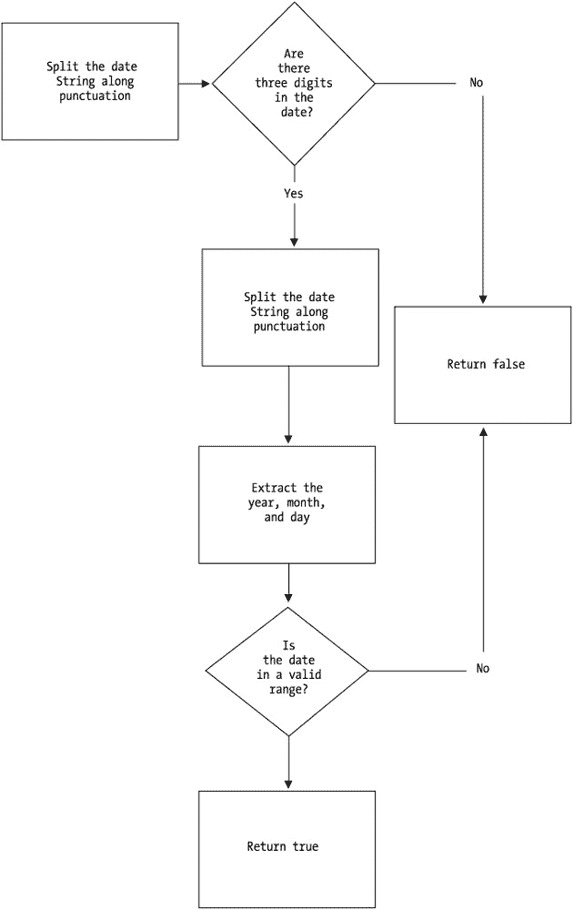
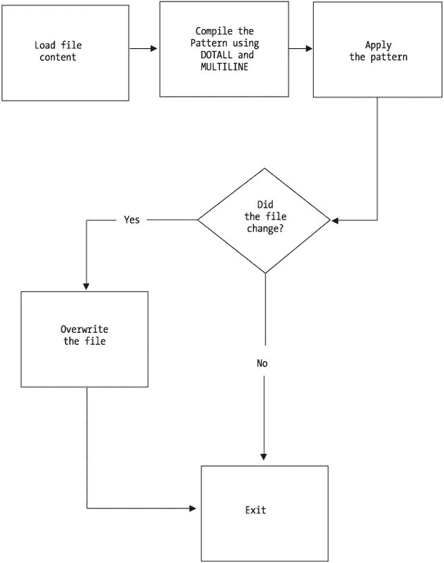
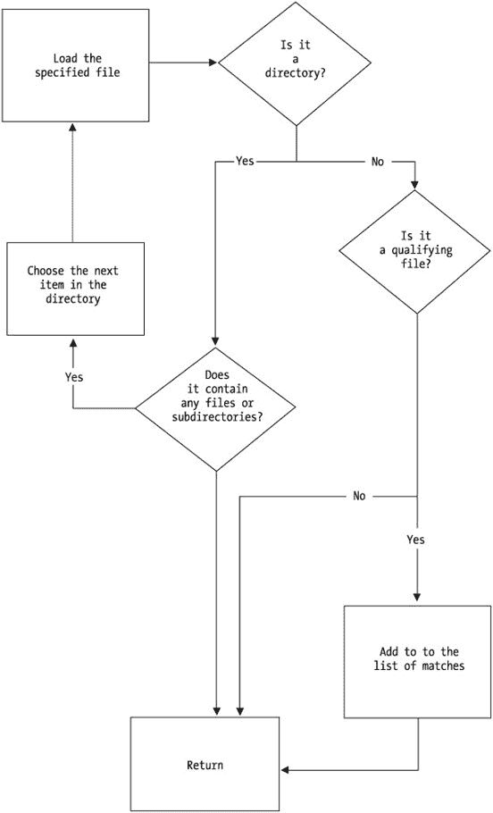

# 第 5 章：实用示例

## 概述

> *“我参加了一个速读课程，并在 20 分钟内读完了《战争与和平》。这本书是关于俄罗斯的。”*
> 
> — 伍迪·艾伦

在本章中，我会在解决几个正则表达式问题时边思考边讲解。这应该能让你对构建非平凡正则表达式解决方案的过程有所了解。其中一些示例是我在正则表达式或 Java 新闻组中遇到的问题，另一些则是为本章专门创建的。

|  | 注意  | 本章中的问题利用了在第 4 章中定义的 `RegexProperties` 类。`RegexProperties` 是一个扩展了 `java.util.Properties` 的类，允许你从属性文件中加载正则表达式模式。其主要优势在于模式不必使用 Java 分隔符。因此，你可以直接使用 ***\d*** 而不是 ***\\d***。有关 `RegexProperties` 类的更多详细信息，请参见第 4 章。 |


## 确认电话号码格式

第一个示例用于确认给定的电话号码是否符合美国电话号码的标准格式。

在正式开始之前，我需要做一个决定：是自行编写正则表达式，还是尝试寻找现成的？通常，我会先查阅一些在线正则表达式资源，例如 [`www.regexlib.com`](http://www.regexlib.com)，寻找已有的模式。不过，由于这个模式相对简单，而且我想演示编写过程，因此决定自己动手。

既然决定自己编写，我首先需要回答的问题是：什么是电话号码？我从一些示例号码入手，反向推导。这就是第 1 章中描述的“拉取技术”。它要求我获取一些实际数据，并尝试从中提取模式。假设我的样本集如下：

*   614-345-6789

*   345-6789

*   345 6789

*   345.6789

*   3456789

*   (614)345-6789

*   6143456789

我选择列表中的第一个电话号码作为模式模板。通过分析，我发现一个相当明显的结构：三位数字、一个连字符、三位数字、一个连字符，最后是四位数字。由此得出模式 ***\d{3}-\d{3}-\d{4}***。表 5-1 展示了推导过程。

表 5-1：从 614-345-6789 中提取通用正则表达式模式

| **步骤** | **操作** | **原因** | **说明** | **结果模式** |
| --- | --- | --- | --- | --- |
| 步骤 1 | 无 | 初始状态 | 不适用 | 614-345-6789 |
| 步骤 2 | 将数字替换为 ***\d*** | 获得更通用的描述 | ***\d*** 代表任意单个数字 | \d\d\d-\d\d\d-\d\d\d\d |
| 步骤 3 | 将 ***\d\d\d*** 替换为 ***\d{3}*** | 生成更简洁的模式 | ***\d{3}*** 完全等同于 ***\d\d\d*** | \d{3}-\d{3}-\d\d\d\d |
| 步骤 4 | 将 ***\d\d\d\d*** 替换为 ***\d{4}*** | 生成更简洁的模式 | ***\d{4}*** 完全等同于 ***\d\d\d\d*** | \d{3}-\d{3}-\d{4} |

当然，该模式还必须能处理仅包含七位数字的号码，例如 *345-6789*。目前它无法做到，因为它是基于九位数字的数据建模的。调整模式以兼容这种情况，得到 ***(?:\d{3}-)?\d{3}-\d{4}***。表 5-2 展示了推导过程。

表 5-2：调整 *\d{3}-\d{3}-\d{4}* 以兼容七位数字

| **步骤** | **操作** | **原因** | **说明** | **结果模式** |
| --- | --- | --- | --- | --- |
| 步骤 5 | 无 | 初始状态 | 不适用 | \d{3}-\d{3}-\d{4} |
| 步骤 6 | 将最左侧的 ***\d{3}-*** 用括号分组，得到 ***(\d{3}-)*** | 将 ***\d{3}-*** 视为一个可能存在的单一实体 | 模式的任何部分都可以进行子分组 | (\d{3}-)\d{3}-\d{4} |
| 步骤 7 | 通过添加 ***?*** 使 ***(\d{3}-)*** 变为可选，得到 ***(\d{3}-)?*** | 允许用户省略区号 | 在分组后添加 ***?*** 使其变为可选 | (\d{3}-)?\d{3}-\d{4} |
| 步骤 8 | 在 ***(\d{3}-)*** 的左括号内添加 ***?:***，得到 ***(?:\d{3}-)?*** | 提高表达式效率，非捕获分组占用更少内存 | 在分组内添加 ***?:*** 使其变为非捕获分组 | (?:\d{3}-)?\d{3}-\d{4} |

现在，只要数字按三位和四位分组，并用连字符分隔，该模式就能接受任何七位或十位的数字序列。

| **** |

**关于在 Java 中使用正则表达式的简要说明**

如果我使用 Perl 编程，下一步自然会是考虑候选字符串中的标点符号，处理可能存在的左括号等等。当然，这很可能直接在模式中解决。

但我用的不是 Perl；我使用的是功能完备的面向对象语言，它旨在处理各种麻烦的同时保持代码清晰。我决定利用这一优势，通过清洗数据来简化问题，更多地依赖程序逻辑，而不是正则表达式的奇技淫巧。

| **** |

|  |

接下来，我使用 `String.replaceAll` 移除电话号码中的所有标点符号和空格，如下所示：

```
String scrubbedPhone = phone.replaceAll("\\p{Punct}|\\s",""); 
```

这会将所有标点符号或空格字符替换为空字符串。

|  | 注意 | ***\p{Punct}*** 是一个 POSIX（美国 ASCII）预定义字符类，匹配任何标点符号。具体来说，它匹配 ***!"#$%&'()*+,-./:;<=>?@[\]^_`{&#124;}~***。该字符类在第 1 章的表 1-12 中介绍过。 |

这样一来，我可以确保电话号码的形式为 *6143456789* 或 *3456789*。这是个好消息，因为我现在可以进一步简化模式，如表 5-3 所示。通过将处理过程分解为单独的步骤，我降低了给定模式的复杂度。

表 5-3：从 *\d{3}-\d{3}-\d{4}* 中移除连字符引用以适配数据清洗

| **步骤** | **操作** | **原因** | **说明** | **结果模式** |
| --- | --- | --- | --- | --- |
| 步骤 9 | 无 | 初始状态 | 不适用 | (?:\d{3}-)?\d{3}-\d{4} |
| 步骤 10 | 移除所有对字符 - 的引用 | 数据清洗保证我无需再处理电话号码中的标点符号。因此，在模式中期望它存在是错误的。 | 移除 - 意味着模式不会检查或要求连字符的存在。 | (?:\d{3})?\d{3}\d{4} |
| 步骤 11 | 将 ***(\d{3})*** 视为单一实体，并检查其出现一次或两次；因此，将 ***(?:\d{3})?\d{3}*** 替换为 ***(?:\d{3}){1,2}*** | 使表达式更简洁 | ***(?:\d{3})?\d{3}*** 表示“三位数字或六位数字”。***(?:\d{3}){1,2}*** 含义完全相同。因此，它们在逻辑上是等价的。 | (?:\d{3}){1,2}\d{4} |
| 步骤 12 | 回退到使用步骤 10 中的模式 | 尽管步骤 11 的模式更简短，但可读性更差。 | 参见上一条。 | (?:\d{3})?\d{3}\d{4} |

请注意，我在步骤 12 中撤销了步骤 11 所做的更改。虽然步骤 11 确实使表达式更简洁，但也使其更难阅读。在这种情况下，如果模式能更易于阅读和维护，我宁愿它稍微长一点。因此，我的核心代码由两行组成。第一行是第 32 行，用于去除候选字符串中的所有标点符号：

```
String tmp = phone.replaceAll("\\p{Punct}|\\s","");
```

第二行是第 36 行，用于应用模式：

```
boolean retval = tmp.matches(PHONE_PATTERN) // (\d{3})?\d{3}\d{4}
```

清单 5-1 展示了完整的实现。

清单 5-1：搜索电话号码

| **** |

```
01  import java.util.regex.*;
02  import java.util.logging.Logger;

03  public class MatchPhoneNumber{
04  private static Logger log = Logger.getAnonymousLogger();
05     private static final String PHONE_NUMBER_KEY="phoneNumber";
06     /**
07     * 确认给定电话号码的格式是否有效。
08     * @param phone 表示电话号码的字符串。
09     * @returns 如果电话号码格式可接受则返回 true。
10    */
11    public static boolean isPhoneValid(String phone){
12       boolean retval=false;
13           String msg = "\r\nCANDIDATE:" + phone;


14       //确保候选号码有通过验证的机会
15       if (phone != null && phone.length() > 6)
16       {
17           //加载正则表达式属性文件
18           RegexProperties rb = new RegexProperties();
19           try
20           {
21             rb.load("../regex.properties");
22           }
23           catch(Exception e)
24           {
25                 e.printStackTrace();
26           }

27           //清理电话号码，移除空格
28           //和标点符号。我们也可以将这个
29           //模式存储在 regex.property 文件中，
30           //但用 Java 分隔符处理时，它其实并不复杂
31           //到令人困惑的程度
32           String tmp = phone.replaceAll("\\p{Punct}|\\s","");

33           //提取相应的正则表达式模式并执行检查
34           //本例中为 (\d{3})?\d{3}\d{4}
36           String phoneNumberPattern=rb.getProperty(PHONE_NUMBER_KEY);

37           //执行实际比较
38           retval= tmp.matches(phoneNumberPattern);

39           //记录调试信息
40           msg += ":\r\nREGEX:" + phoneNumberPattern;
41      }
42      msg += "\r\nRESULT:" + retval +"\r\n";
43      log.info(msg);
44      return retval;
45   }
46  public static void main(String args[]) throws Exception{
47    if (args != null && args.length == 1)
48       System.out.println(isPhoneValid(args[0]));
49    else
50       System.out.println("usage: java MatchPhoneNumber <phoneNumber>");
51   }
52 }
```

| **** |

|  |

即使完全不懂正则表达式的程序员也能看懂这段代码，这正体现了 J2SE 正则表达式的优雅之处。

这种冗余的写法是否合理？对于这个特定场景，直接用一行正则表达式是否更好？这类决策需要你根据具体需求逐案判断。在我看来，宁可写得冗余一些，也不要冒险使用过于简洁的代码。

## 验证邮政编码

下一个挑战是提供一个验证美国邮政编码的方法。该方法需要能处理邮政编码五位数和四位数部分之间的标点符号、空格或无分隔符的情况。它还需要能处理只有五位数的邮政编码。突然需求发生了变化：现在还需要验证加拿大、英国、阿根廷、瑞典、日本和荷兰的邮政编码。

我做的第一件事是在网上搜索模式，从[`www.regexlib.com`](http://www.regexlib.com)开始。这个网站提供了前面提到的所有国家的正则表达式。接着，我将这些正则表达式添加到 regex.properties 文件中，这样我就可以使用第 4 章中的 RegexProperties 类。

这样做的目的，当然是为了将表达式外部化，并避免对特殊字符进行双重转义。我决定为属性键使用有意义的键名。也就是说，我预期能够获取每个正则表达式模式对应的国家代码。因此，我可以根据国家代码来定义属性文件的键。例如，由于日本的国家代码是*JP*，我将日本邮政编码模式的键定义为*zipJP*。清单 5-2 总结了添加到 regex.properties 文件中的条目。

清单 5-2：regex.properties 文件中的新条目

| **** |

```
#日本邮政编码
zipJP=^\d{3}-\d{4}$

#美国邮政编码
zipUS=^\d{5}\p{Punct}?\s?(?:\d{4})?$

#荷兰邮政编码
zipNL=^[0-9]{4}\s*[a-zA-Z]{2}$

#阿根廷邮政编码
zipAR=^\d{3}-\d{4}$

#瑞典邮政编码
zipSE=^(s-|S-){0,1}[0-9]{3}\s?[0-9]{2}$

#加拿大邮政编码
zipCA=^([A-Z]\d[A-Z]\s\d[A-Z]\d)$

#英国邮政编码
zipUK=^[a-zA-Z]{1,2}[0-9][0-9A-Za-z]{0,1} {0,1}[0-9][A-Za-z]{2}$ 
```

| **** |

|  |

最后，我编写代码。算法是根据给定的国家代码查找相应的正则表达式，应用该模式，然后返回 true 或 false。清单 5-3 展示了实现此功能的代码。

清单 5-3：匹配多个国家的邮政编码

| **** |

```
01  import java.io.*;
02  import java.util.logging.Logger;
03  import java.util.regex.*;

04  /**
05  *验证给定国家的邮政编码。
06  *@author M Habibi
07  */
08  public class MatchZipCodes{
09      private static Logger log = Logger.getAnonymousLogger();
10     private static final String ZIP_PATTERN="zip";
11     private static RegexProperties regexProperties;
12     //加载正则表达式属性文件
13     //在类级别执行此操作
14     static
15     {
16         try
17         {
18             regexProperties = new RegexProperties();
19             regexProperties.load("../regex.properties");
20         }
21         catch(Exception e)
22         {
23             e.printStackTrace();
24         }
25     }

26     public static void main(String args[]){
27         String msg = "usage: java MatchZipCodes countryCode Zip";

28         if (args != null && args.length == 2)
29             msg = ""+isZipValid(args[0],args[1]);

30         //输出用法信息，或运行 isZipValid 方法的结果
31         System.out.println(msg);
32     }
33     /**
34     * 确认给定邮政编码的格式是否有效。
35     * @param <code>String</code> countryCode 国家代码
36     * @param <code>String</code> zip 邮政编码
37     * @return <code>boolean</code> 布尔值
38     *
39     * @author M Habibi
40     */
41     public static boolean isZipValid(String countryCode, String zip)
42     {
43         boolean retval=false;
44         //使用国家代码在正则表达式属性文件中形成唯一键
45         String zipPatternKey = ZIP_PATTERN + countryCode.toUpperCase();


48         // 根据给定的国家代码提取正则表达式模式
49         String zipPattern = regexProperties.getProperty(zipPatternKey);

50         // 如果出现某种问题，则无需尝试执行正则表达式
51         // 直接跳过
52         if (zipPattern != null)
53             retval = zip.trim().matches(zipPattern);
54         else
55         {
56             String msg = "国家代码 "+countryCode+" 的正则表达式";
57             msg+= " 未在属性文件中找到 ";
58             log.warning(msg);
59         }
60         // 创建日志报告
61         String msg = "正则表达式="+zipPattern +
62         "\n 邮编="+zip+"\n 国家代码="+
63         countryCode+"\n 匹配结果="+retval;
64         log.finest(msg);

65         return retval;
66     }
67 }
```

| **** |

|  |

除去注释等内容，该方法中的实际工作仅在三行代码中完成。第 47 行根据国家代码构成正确的键：

```
47      String zipPatternKey = ZIP_PATTERN + countryCode.toUpperCase(); 
```

例如，对于国家代码 *US*，zipPatternKey 等于 *zipUS*。接下来，第 49 行根据该键提取相关模式：

```
49   String zipPattern = regexProperties.getProperty(zipPatternKey);
```

第 53 行实际将模式与键进行比对：

```
53             retval = zip.trim().matches(zipPattern);
```

在本例中，我对正则表达式所做的唯一改动是让实际模式在内存使用上更高效，同时更宽松一些，如表 5-4 所示。具体来说，宽松意味着该模式将接受美国邮政编码前五位数字与后四位数字之间的任意标点符号、空格或完全没有分隔符。该模式也接受仅五位数字作为有效的美国邮政编码。

表 5-4：让邮政编码模式更宽松、更高效

| **步骤** | **我的操作** | **操作原因** | **理由** | **最终模式** |
| --- | --- | --- | --- | --- |
| 步骤 1 | 无操作 | 初始状态 | 不适用 | \d{5}(-\d{4})? |
| 步骤 2 | 在捕获组 ***(-\d{4})*** 内添加 ***?:***，生成 ***(?:-\d{4})*** | 生成更高效的模式。 | 此处无需捕获。 | \d{5}(?:-\d{4})? |
| 步骤 3 | 将 - 替换为 ***\p{Punct}?***，生成 ***(?:\p{Punct}?\d{4})?*** | 任意标点符号——或完全没有标点——均可作为分隔符。 | ***\p{Punct}?*** 是 - 的超集，且为可选，因此正则引擎现在愿意接受任意标点或完全没有标点作为分隔符。 | \d{5}(?:\p{Punct}?\d{4})? |
| 步骤 4 | 在美国邮政编码五位数字与四位数字之间的可接受分隔符列表中添加 ***\s?*** 模式 | 使用空格或空字符串分隔五位数字与四位数字的邮政编码将通过验证。 | 美国邮政编码五位数字与后续四位数字之间的空格是可选的。这仅仅是一种更宽松的解释。 | \d{5}(?:\p{Punct}?\s?\d{4})? |
| 步骤 5 | 将 ***\p{Punct}?\s?*** 移出非捕获组 | 提高可读性。可选非捕获组内的可选子模式可能难以理解。 | 逻辑上两者等价。 | \d{5}\p{Punct}?\s?(?:\d{4})? |
| 步骤 6 | 在模式前后添加行首标记 *^* 和行尾标记 *$* | 提高匹配速度。模式越精确，性能越好。 | 所有邮政编码都将作为提取的字符串传入该方法。因此，它们始终具有行首和行尾。 | ^\d{5}\p{Punct}?\s?(?:\d{4})?$ |

由于正则表达式模式被外部化，后续可以对其进行调整，以更好地适应不同地区。更棒的是，无需修改代码即可添加更多国家代码：只需在 `regex.properties` 文件中添加相应条目即可。

这里的要点是，即使使用网上找到的通用正则表达式模式，我仍然让代码带有非常 Java 的风格。它模块化、可适应、可扩展且清晰明了。


## 确认日期格式

在本例中，我需要一个能够验证日期格式的方法。要求非常明确：各个日期标记之间必须使用某种标点符号分隔，而空格不被视为标点符号。该方法应接受两位或四位数字的年份，以及一位或两位数字的月份和日期。我还需要确保日期不是未来的日期。可以预期第一个日期标记是月份，第二个日期标记是该月的日期，最后一个日期标记是年份。因此，有效的输入可能如下所示：

*   11/30/2002

*   4/25/03

*   03-29/2003

*   11/30/1902

*   2/25-03

*   06#9/2003

同样，首先要做的是在网上搜索。我找到了几个可能适用的模式。第一个模式如下，它被描述为非常健壮，能够处理闰年等情况：***^(?:(?:(?:0?[13578]|1[02])(\/|-|\.)31)\1|(?:(?:0?[1,3-9]|1*** ***[0-2])(\/|-|\.)(?:29|30)\2))(?:(?:1[6-9]|[2-9]\d)?\d{2})$|^(?:0?2(\/|-|\.)29\3*** ***(?:(?:(?:1[6-9]|[2-9]\d)?(?:0[48]|[2468][048]|[13579][26])|(?:(?:16|[2468]*** ***[048]|[3579][26])00))))$|^(?:(?:0?[1-9])|(?:1[0-2]))(\/|-|\.)(?:0?[1-9]|1\d|2[0-8])*** ***\4(?:(?:1[6-9]|[2-9]\d)?\d{2})$***.

我决定暂时跳过它。

我找到的第二个模式是 ***^\d{1,2}\/\d{1,2}\/\d{4}$***，看起来很有希望，但它只限于四位数的年份。它可能能用，但我需要对其进行调整。接着，我遇到了 ***((\d{2})|(\d))\/((\d{2})|(\d))\/((\d{4})|(\d{2}))***。乍一看，我似乎需要将第二个模式向第三个模式靠拢。

我不喜欢第三个模式现在的样子，因为它使用了大量实际上并不需要的捕获组。非捕获组同样可以胜任，而且效率更高。这立刻让我有些怀疑。它也比我希望的更冗长。当然，表达式冗长的特性可能使其更高效，但我怀疑一个关心效率的作者会留下所有这些无用的捕获组。

无论我选择哪个模式，我可能都想把候选字符串中的所有标点符号替换成一个易于处理的字符。我可以直接去掉所有标点，但那样我就无法知道像 *1111971* 这样的日期是指 1971 年 1 月 11 日，还是 1971 年 11 月 1 日。因此，我需要这样一行代码：

```
String scrubbedDate = date.replaceAll("\\p{Punct}","@");
```

这里，我可能会使用 *@* 符号作为替换分隔符。它没有任何特殊的正则表达式含义，因此更容易处理。接下来，我需要编写一个模式来捕获月份、日期和年份，并确保它构成一个有效的日期。

等等——我在想是否有更简单的方法。如果我使用 `String.split` 方法按标点符号分割，并从剩余的数字中提取日期呢？然后我就可以直接用纯 Java 代码来验证实际日期了。为此，我需要类似这样的代码：

```
String[] datetokens = date.split("\\p{Punct}");
```

这看起来相当简单，所以我决定采用这种方法。

我的算法如下：按标点符号分割日期，用它创建一个 `Calendar` 对象，将其与今天进行比较，如果该 `Calendar` 对象小于或等于今天，则返回 true。我可以将初步的方法签名写成如下形式：

```
 public static boolean isDateValid(String date)
```

图 5-1 展示了该算法。


图 5-1：isDateValid 方法的算法

代码清单 5-4 给出了完整的实现。

代码清单 5-4：验证日期

| **** |

```
01 import java.util.regex.*;
02 import java.io.*;
03 import java.util.logging.Logger;
04 import java.util.GregorianCalendar;
05 import java.util.Calendar;

06 /**
07 *匹配日期
08 */
09 public class MatchDates{
10 private static final String DATE_PATTERN = "date";
11 private static final String PROP_FILE = "../regex.properties";
12 private static Logger log = Logger.getAnonymousLogger();
13 public static int LOWER_YEAR_LIMIT = -120;

14    public static void main(String args[]) throws Exception{
15       if (args != null && args.length==1)
16       {
17         boolean b =isDateValid(args[0]);
18         log.info(""+b);
19       }
20       else
21       {
22         System.out.println("用法: java MatchDates dd/dd/dddd");
23       }
24    }

25    /**
26    * 确认给定的日期格式由一个或两位数字
27    * 后跟一个标点符号，再后跟一个或两位数字
28    * 后跟一个标点符号，再后跟两位或四位数字组成。此外，
29    * 它实际验证日期是否小于今天，并且
30    * 不超过过去 <CODE>LOWER_YEAR_LIMIT</CODE> =120 年。
31    * 此方法甚至考虑了闰年等情况
32    * @param 要处理的 <code>String</code> 日期
33    * @return <code>boolean</code> 如果有效则返回 true
34    *
35    * @author M Habibi
36    */

37    public static boolean isDateValid(String date)
38    {
39      boolean retval=false;
40      date = date.trim();

41      //候选字符串是否包含三个数字部分？否则
42      //下面的月份、日期和年份提取可能会
43      //抛出数字格式异常。
44      boolean hasThreeDigitSections =
45       date.matches("\\d+\\p{Punct}\\d+\\p{Punct}\\d+");

46      if (hasThreeDigitSections)
47      {
48         String[] dateTokens = date.split("\\p{Punct}");

49         if (dateTokens.length == 3)
50         {
51          //Java 中月份从 0 开始，因此减 1
52          int month = Integer.parseInt(dateTokens[0]) -1;

53          int day = Integer.parseInt(dateTokens[1]);
54          int year = Integer.parseInt(dateTokens[2]);

55          //如果输入的是两位数的年份
56          if (year < 100)
57            year += 2000;

58          //获取边界年份
59          GregorianCalendar today = new GregorianCalendar();
60          //获取比今天早 LOWER_YEAR_LIMIT 年的下限
61          GregorianCalendar lowerLimit = new GregorianCalendar();
62          lowerLimit.add(Calendar.YEAR, LOWER_YEAR_LIMIT);

63          //创建一个代表提议日期的候选对象。
64          GregorianCalendar candidate =
65          new GregorianCalendar(year, month,day);
66          //检查日期的有效性
67          if
68          (
69             candidate.before(today)
70           &&
71             candidate.after(lowerLimit)
72           &&//月份可能出错，例如用户输入了 55
73             month == candidate.get(Calendar.MONTH)
74           &&//日期可能出错，例如用户输入了 55
75             day == candidate.get(Calendar.DAY_OF_MONTH)
76          )
77          {
78              retval = true;
79          }
80      }
81     }
82     return retval;
83    }
84 }
```

| **** |

|  |

前面的示例将几乎所有繁重的工作都交给了正则表达式。代码清单 5-4 中的代码在 `split` 方法中使用了正则表达式。除此之外，它都是相当常规的 Java 代码。这并不意味着正则表达式的贡献微不足道——事实上，我认为它至关重要。然而，一旦 `split` 方法中的正则表达式部分被整合进来，你就回到了熟悉的 Java 世界。


## 搜索字符串

本示例在给定字符串中搜索某个模式是否存在，并返回所有匹配的字符串。这段代码非常简单，但作为一个实用的小程序，值得在此演示。

首先，我需要明确“返回”的具体含义。返回什么？在这个例子中，我决定返回一个包含匹配字符串的 ArrayList，因为我希望字符串按照被找到的顺序排列，而 ArrayList 正好能维护元素的插入顺序。此外，我也倾向于返回一个定义良好的数据结构，以便客户端（例如）可以遍历该结构并进一步检查数据。

我还决定让客户端能够传入 `Pattern.compile` 的标志，例如 `Pattern.MULTILINE` 和 `Pattern.DOTALL`。这并不会增加多少额外的复杂性，但对客户端来说却是一个不错的功能。此时，值得先写下初步的方法签名。我得到了以下内容：

```
 public static ArrayList searchString(
       String content, String searchPattern, int flags
   ) throws IOException
```

现在，我准备开始编写方法。我的第一个版本如清单 5-5 所示。

**清单 5-5：searchString 方法的第一个版本**

| **** |

```
01     public static ArrayList searchString(
02         String content,
03         String searchPattern,
04         int flags
05     )
06     throws IOException
07     {
08         ArrayList retval = new ArrayList();
09         Pattern pattern = null;

10        //编译模式
11        if (flags > -1)
12        {
13            pattern = Pattern.compile(searchPattern, flags);
14        }
15        else
16        {
17            pattern = Pattern.compile(searchPattern);
18        }

19        //为模式提取匹配器
20        Matcher matcher = pattern.matcher(content);

21        //遍历所有匹配项，并将
22        //所有相关项添加到 ArrayList
23        while (matcher.find())
24        {
25            //提取匹配项及其位置
26            String tmp = matcher.group();
27            //将匹配的字符串
28            //插入到映射中。
29            retval.add(+ tmp);
30        }

32        return retval;
32     } 
```

| **** |

|  |

清单 5-5 并不算糟糕。它能找到所有相关的匹配子串并按顺序返回。我运行了几个示例测试，发现它按预期工作。但它确实还有改进空间。它没有告诉我字符串是在哪里被找到的，而且如果方法能被重载就更好了，这样客户端在不需要标志时就不必强制传入。

我决定，对于这个版本，客户端可以接受没有重载。不过，我确实认为客户端有权要求知道匹配字符串被找到的位置。因此，我修改了代码，使其返回一个 Map。该 Map 将包含一个键/值对，键是每次匹配的字节位置（存储为 String 或 Integer——我还没决定用哪个），值是匹配的子串。修改代码后，我得到了清单 5-6。唯一显著的变化在第 7、25 和 29 行。顺便提一下，我在第 8 行决定使用 `LinkedHashMap`，因为我希望保留匹配字符串被找到的顺序。`LinkedHashMap` 是 J2SE 1.4 中添加到 Map 家族的新成员，它能保持元素的插入顺序。

**清单 5-6：属于 RegexUtil 类的修改版 searchString 方法**

| **** |

```
01  public static Map searchString(
02      String content,
03      String searchPattern,
04      int flags
05  )

06  {
07      Map retval = new LinkedHashMap();
08      Pattern pattern = null;

09      //编译模式
10      if (flags > -1)
11      {
12          pattern = Pattern.compile(searchPattern, flags);
13      }
14      else
15      {
16          pattern = Pattern.compile(searchPattern);
17      }

18      //为模式提取匹配器
19      Matcher matcher = pattern.matcher(content);
20     //遍历所有匹配项，并将
21     //所有相关项添加到 ArrayList
22     while (matcher.find())
23     {
24         //提取匹配项及其位置
25         int position = matcher.start();
26         String tmp = matcher.group();
27         //将匹配的字符串和位置
28         //插入到映射中。
29         retval.put(position+"",tmp);
30     }

31     return retval;
32 }
```

| **** |

|  |

我决定将位置存储为 String，以便更容易地处理输出。我不希望客户端过于小心地处理键，所以目前用 String 就足够了。


## 搜索文件

在前一个示例的基础上，我决定提供一个用于搜索文件内容并返回该文件中所有匹配字符串的实用工具。我将使用 `FileChannel` 进行实际的文件 I/O 操作。虽然对 `FileChannel` 的讨论超出了本书的范围，但在我看来，它们是 Java 中访问文件的最佳方式。

我的策略是使用 `FileChannel` 打开一个文件，将其内容读入一个字符串，释放 `FileChannel`，然后使用 `searchString` 方法来解析该字符串。这比逐行读取文件并检查其内容要快，尽管它比较消耗内存。清单 5-7 展示了实现此功能的代码。

**清单 5-7：读取文件内容**

| **** |

```
01     /**
02     * 提取文件的内容
03     * @param String fileName 要提取的文件名
04     * @throws IOException
05     *
06     * @return String 表示文件内容的字符串
07     */
08     public static String getFileContent(String fileName)
09     throws IOException{
10        String retval = null;
11        //获取 FileChannel 的访问权限
12        FileInputStream fis =
13          new FileInputStream(fileName);
14        FileChannel fc = fis.getChannel();

15        //获取文件内容
16        retval = getFileContent(fc);

17        //关闭资源
18        fc.close();
19        fc = null;

20        return retval;
21     }

22     /**
23     * 提取文件的内容
24     * @param String fileName 要提取的文件名
25     * @throws IOException
26     *
27     * @return String 表示文件内容的字符串
28     */
29     private static String getFileContent(FileChannel fc)
30     throws IOException{
31         String retval = null;
32        //读取 FileChannel 的内容
33         ByteBuffer bb = ByteBuffer.allocate((int)fc.size());
34         fc.read(bb);

35         //将内容保存为字符串
36         bb.flip();
37         retval = new String(bb.array());
38         bb = null;

39         return retval;
40     }
```

| **** |

|  |

接下来，我需要提供一个方法，用于加载文件、搜索文件并返回结果。有了前面两个方法，这就变得相当容易了，如清单 5-8 所示。

**清单 5-8：打开文件、搜索文件并返回结果**

| **** |

```
01     public static Map searchFile(
02         String file,
03         String searchPattern,
04         int flags
05     ) throws IOException
06     {
07        String fileContent = getFileContent(file);
08        Map retval = searchFile(fileContent,searchPattern,flags);
09        return retval;
10     }}
```

| **** |

|  |

我测试了这个程序，并将其与 `grep` 进行了比较。说实话，在比较中它似乎稍显不足。`grep` 程序会返回匹配标记的整行内容，而此方法只返回匹配的标记本身。这倒也不算太糟糕，因为客户端可以通过使用正确的正则表达式模式来请求整行内容。但它确实不够友好，尤其是对普通用户而言。

我决定对模式进行“填充”，以捕获整行内容，前提是原始搜索模式中没有标点符号，因此也不包含正则表达式。清单 5-9 展示了我修改后的 `searchFile` 方法。

**清单 5-9：修改 searchFile 方法使其更友好**

| **** |

```
01  public static Map searchFile(
02      String file,
03      String searchPattern,
04      int flags
05  ) throws IOException
06  {
07     String fileContent = getFileContent(file);

08     //如果搜索模式中没有标点符号
09     //则假定它不是正则表达式，并提取
10     //找到该模式的整行内容
11     String[] regexTokens = searchPattern.split("\\p{Punct}");

12     if (regexTokens.length == 1)
13     {
14         searchPattern = "^.*"+ searchPattern+".*$";
15     }

16    Map retval = searchString(fileContent,searchPattern,flags);
17    return retval;
18 } 
```

| **** |

|  |

### 讨论点

此时，你心中应该有一些合理的问题。这难道不应该是一本关于正则表达式的书吗？`searchFile` 和 `searchString` 方法中并没有什么特别像正则表达式的地方；它们基本上就是你已经知道如何编写的纯 Java 代码。这是怎么回事？

关键在于，正则表达式只是一个工具。它并没有改变你仍在编写 Java 代码的事实，并且即使你在使用正则表达式时，也需要遵循良好的、模块化的、面向对象的原则。正则表达式让你能够跨越那些你可能永远无法跨越的难点，但它只是一个工具。就像任何精心打造的引擎一样，`java.util.regex` 引擎通过安静地运行并且*不*让你为其操心，来彰显其卓越性。

### 处理非常大的文件

此时另一个有效的问题是，如果你要解析的文件内容太大，以至于无法将其全部读入内存，该怎么办？通常，你有两种方法可以选择。你可以使用 Java 的新特性之一，例如 `MappedByteBuffer`，或者你可以将文件分割成可管理的部分，然后依次解析每个部分。

如果你决定将 `MappedByteBuffer` 用于正则表达式，清单 5-10 包含了一个示例，展示了如何操作。然而，我不太愿意强烈推荐将 `MappedByteBuffer` 与正则表达式结合使用，原因有三。首先也是最重要的一点，它们的行为非常依赖于系统，因此如果你需要平台独立性，可能应该排除它们。其次，即使在给定的平台上，它们的行为也没有明确定义。因此，根据你操作系统上正在进行的其他操作，你可能会得到不一致的结果。第三，你需要考虑这样一个事实：如果整个文件无法一次性加载到内存中，那么尝试应用一个可能包含通配符的模式将是一件棘手的事情。

**清单 5-10：通过 MappedByteBuffer 访问文件**

| **** |

```
01   public static boolean getFileContentUsingMappedByteBuffer
02   (
03       String fileName
04   ) throws IOException
05   {
06       boolean retval = false;
07       RandomAccessFile raf = new RandomAccessFile(fileName,"rwd");
08       FileChannel fc = raf.getChannel();

09       MappedByteBuffer mbb =
10        fc.map(FileChannel.MapMode.READ_WRITE,0,fc.size());

11       CharSequence cb = mbb.asCharBuffer();

12       return retval;
13 }
```

| **** |

|  |

你可能需要重新考虑你的模式，并根据你对文件结构的了解，将文件分解成逻辑块。一种策略可能是检查文件大小，然后将其除以 10、100 或任何根据系统内存限制易于加载的分数，然后搜索该部分。虽然这并不理想，但它比相应的内存映射方法更具可预测性。底线是，无论你使用哪种正则表达式风格或提供者，非常大的文件都需要特殊处理。


## 修改文件内容

现在我想提供一个基于正则表达式模式修改文件内容的功能。也就是说，我想提供一种机制，能够打开文件、基于正则表达式模式搜索其内容，并将所有匹配该模式的内容替换为指定的字符串。由于我已经有了打开和搜索文件的代码，修改文件内容就相当容易了。实现这一功能的逻辑如图 5-2 所示。


图 5-2：更新文件内容的基本流程图

同样，为了提高效率，我决定使用`FileChannel`，如代码清单 5-11 所示。

代码清单 5-11：基于正则表达式模式修改文件内容

| **** |

```
01  /**
02  * 更新文件内容。默认情况下，
03  * 使用 Pattern.MULTILINE 模式。同时支持
04  * 替换字符串中的 $d 表示法，具体参照
05  * Matcher.replaceAll 方法。
06  * @param String fileName 文件名和文件路径
07  * @param String regex 要查找的正则表达式模式
08  * @param String replacement 正则表达式的替换字符串
09  * @throws IOException 如果发生 IO 错误
10  *
11  * @return boolean 如果文件已更新则返回 true
12  */
13  public static boolean updateFileContent
14  (
15     String fileName,
16     String regex,
17     String replacement
18  ) throws IOException
19  {
20     boolean retval = false;

21     RandomAccessFile raf =
22         new RandomAccessFile(fileName,"rwd");
23     FileChannel fc = raf.getChannel();

24     String fileContent = getFileContent(fc);
25     //为此正则表达式激活 MULTILINE 标志
26     regex = "(?m)"+regex;

27     String newFileContent =
28         fileContent.replaceAll(regex,replacement);

29     //如果没有变化，则不更新文件
30     if (!newFileContent.equals(fileContent))
31     {
32        setFileContent(newFileContent,fc);
33        retval = true;
34     }
35     //关闭清理
36     fc.close();
37     fc = null;
38     raf = null;

39     return retval;
40 }

41  /**
42  * 设置文件内容。完全覆盖
43  * 之前的文件内容，并将文件截断
44  * 为新内容的长度。
45  * @param <code>String</code> newContent
46  * @param <code>FileChannel</code> fc
47  * @throws <code>IOException</code>
48  *
49  * @author M Habibi
50  */
51  private static void setFileContent(
52     String newContent, FileChannel fc
53  )
54  throws IOException{
55     //将内容写入文件
56     ByteBuffer bb = ByteBuffer.wrap(newContent.getBytes());
57     //截断文件大小，以防
58     //原始文件内容比新内容长
59     fc.truncate(newContent.length());

60     //从位置 0 开始写入
61     fc.position(0);
62     fc.write(bb);

63     fc.close();
64     fc = null;
65  }
```

| **** |

|  |

代码清单 5-11 利用了之前在代码清单 5-7 第 29 行定义的`getFileContent`方法。除此之外，该示例是自包含的。

## 从文件中提取电话号码

在这个示例中，我想解析一个文件并提取所有电话号码。这是我为一个经营小型 IT 店的朋友编写的程序。他有各种电子文档，需要从中提取电话号码以便回拨给客户。我将从最开始的需求提取阶段开始这个过程：

| **问：** | 你要找的是美国号码还是国际号码？ |  |
| **问：** | 速度是问题吗？会有人焦急等待程序完成吗？ |  |
| **问：** | 电话号码的格式是否一致？ |  |
| **问：** | 它们中间有连字符或空格吗？ |  |
| **问：** | 文件格式会变化吗？ |  |
| **问：** | 如果必须出错，你宁愿候选号码太多还是太少？ |  |
| **问：** | 你需要这些号码以特定格式返回吗？ |  |
| **问：** | 你有没有已经看过的文件可以用来测试？ |  |
| **问：** | 这些文件有多大？ |  |
| **问：** | 有多少个文件？ |  |
| **问：** | 这些文件是什么类型？ |  |

答案

| **答：**  | 美国号码，但可能会变。 |
| **答：**  | 不，隔夜运行没问题。 |
| **答：**  | 它们要么是七位，要么是十位数字。 |
| **答：**  | 看情况——有时有。 |
| **答：**  | 会。 |
| **答：**  | 太多。 |
| **答：**  | 我没想过这个，但统一格式会很好。 |
| **答：**  | 有。 |
| **答：**  | 不算太大。我不知道。 |
| **答：**  | 每晚大约十个。 |
| **答：**  | Microsoft Word 文档。 |

我认为此时已有足够的信息可以开始工作了。听起来客户想要任何可能是七位或十位数字的电话号码，而且速度不是问题。文件似乎也不大。这应该很简单，只需定义一个电话号码模式，然后使用之前介绍的搜索方法即可。毕竟，我已经能够访问文件并搜索其内容了。当然，我决定将实际的正则表达式保存在一个外部属性文件中，这样我就可以根据需要调整它。在我熟悉这些文件之前，这个过程可能会容易出错。

我准备开始了。我决定快速搜索一下网络，找到了几个电话号码模式。其中一些有点晦涩难懂，但我愿意尝试，因为我的客户想要尽可能多的候选号码。我找到的模式如下：

```
 ^(\(?\+?[0-9]*\)?)?[0-9_\- \(\)]*$
    ^(0-1?)?(\(?[2-9]\d{2}\)?
    [2-9]\d{3})([\s-./\\])?(\d{3}([\s-./\\])?\d{4}
    [a-zA-Z0-9]{7})$
    ^\(?[\d]{3}\)?[\s-]?[\d]{3}[\s-]?[\d]{4}$
```


我编写了一个快速模式，将这些模式通过 OR 运算组合起来，并在一些文档中运行测试，结果发现它实际上并不奏效。虽然我确实提取到了一些电话号码，但也获取了一些根本不可能是电话号码模式的内容，因为它们包含了字符、长空格和标点符号。

这里我有两个选择：可以对匹配到的候选结果进行二次验证，或者调整这个模式。这次，我决定采用自己之前的模式，并尝试融入其他模式中的优点，如表 5-5 所示。这就是第 1 章中介绍的组合技术。

表 5-5：从 614-345-6789 中提炼通用正则表达式模式

| **步骤** | **我的操作** | **操作原因** | **理由** | **生成的模式** |
| --- | --- | --- | --- | --- |
| 步骤 1 | 无操作 | 初始状态 | 不适用 | (?:\d{3})?\d{3}\d{4} |
| 步骤 2 | 在数字组之间添加可选的连字符 `-` | 为了获得更通用的描述 | 电话号码可以用标点符号分隔。 | (?:\d{3}-?)?\d{3}-?\d{4} |
| 步骤 3 | 在数字组之间添加可选的空格 | 为了获得更通用的描述 | 电话号码可以用空格分隔。 | (?:\d{3}-?\s?)?\d{3}-?\s?\d{4} |
| 步骤 4 | 将 `-` 替换为 ***\p{Punct}*** | 为了兼容标点符号 | ***\p{Punct}*** 是 `-` 的超集 | (?:\d{3}\p{Punct}?\s?)?\d{3}\p {Punct}?\s?\d{4} |
| 步骤 5 | 将 ***(?:\d{3} \p{Punct}?\s?)? \d{3}\p{Punct}?*** 替换为 ***(?\d{3}\p{Punct }?\s?){1,2}*** | 为了创建更简洁的模式 | 两者是等价的表述。 | (?:\d{3}\p{Punct}?\s?){1,2}\d{4} |

使用这个模式，我发现结果看起来是合理的。最后，在即将完成时，我决定将所有输出格式化为 *ddd-dddd* 或 *ddd-ddd-dddd* 的形式。最终的代码如代码清单 5-12 所示。

代码清单 5-12：从文件中提取电话号码

| **** |

```
01  /**
02  * 从给定文件中挖掘电话号码，并以字符串形式返回。
03  * @param 文件路径的字符串 filePath
04  * @throws IOException 如果文件未找到或已损坏
05  *
06  * @return ArrayList 包含格式良好的电话号码，
07  * 格式为 ddd-ddd-dddd 或 ddd-dddd
08 */
09  public static ArrayList minePhoneNumbers(String filePath)
10  throws IOException{

11     ArrayList retval = new ArrayList();
12     // 获取模式
13     String regex = RegexUtil.getProperty("../regex.properties","allPhones");
14     // 查找所有匹配项
15     Map result =
16        RegexUtil.searchFile(filePath, regex ,Pattern.MULTILINE);

17     // 获取匹配的字符串
18     Iterator it = result.values().iterator();

19     // 为捕获的电话号码提供一致的格式
20     while (it.hasNext())
21     {
22        String num = (String)it.next();
23        num = num.replaceAll("\\p{Punct}|\\s","");

24        if (num.length() == 7)
25          num=num.replaceAll("(\\d{3})(\\d{4})","$1-$2");
26        else
27         num=num.replaceAll("(\\d{3})(\\d{3})(\\d{4})","($1)-$2-$3");

28       retval.add(num);
29     }

30     return retval;
31  }
```

| **** |

|  |

代码清单 5-12 相当不言自明。不过，我确实想指出第 27 行和第 29 行。请注意，只需进行微小的调整就能生成格式良好、一致的输出，这是多么容易。例如，第 27 行简单地说：“我想将前三位数字捕获到组 1，后四位数字捕获到组 2。然后，我想用连字符分隔这两个组。” 再次强调，这涉及非常容易但最终非常强大的代码。

## 在目录中搜索包含正则表达式的文件

原则上，在目录中搜索匹配特定模式的文件是相当容易的。我已经有了一个搜索文件的机制，所以我只需要搜索一个文件列表。正如你在图 5-3 中所见，该算法是递归的。


图 5-3：递归目录搜索

代码清单 5-13 通过利用现有框架实现了这个设计。它遍历子目录，查找恰好包含我所描述的正则表达式模式的文件。

代码清单 5-13：在当前目录和子目录中搜索包含该模式的文件

| **** |

```
01   /**
02   * 搜索给定目录，根据描述其内容的 searchPattern
03   * 查找指定的文件。以 ArrayList 形式返回匹配的文件。
04   * 此方法递归地搜索文件系统。
05   * @param File currentFile 要开始搜索的目录或文件
06   * @param String fileExtension 文件的扩展名（如果有）
07   * @param String searchPattern 描述我们要查找的文件内容的正则表达式
08   * @param int flags 我们想要应用于正则表达式模式的标志
09   * @throws IOException 如果存在 IO 问题
10   *
11   * @return ArrayList 包含 <code>File</code> 对象，
12   * 如果未找到匹配项，则返回空 ArrayList
13   */
14   public static ArrayList searchDirs(
15       File currentFile,
16       String fileExtension,
17       String searchPattern,
18       int flags
19   ) throws IOException
20   {
21      ArrayList retval = new ArrayList();

22      if (!currentFile.isDirectory())
23      {
24          Map tmp = searchFile(
25              currentFile.getPath(),
26             searchPattern,flags);

27          // 如果找到了任何内容，则添加该文件
28          if (tmp.size() > 0)
29          {
30               retval.add(currentFile);
31               this.log.finest("added " + currentFile);
32          }
33     }
34     else
35     {   // 遍历子目录
36         File subs[] =
37           currentFile.listFiles(
38               newLocalFileFilter(fileExtension));

39         if (subs != null)
40         {
41           // 如果递归搜索找到了任何内容，则添加它
42           for (int i=0; i < subs.length; i++)
43           {
44               ArrayList tmp=null;
45               tmp =searchDirs(
46                   subs[i],
47                   fileExtension,
48                   searchPattern,
49                   flags);

50               if (tmp.size() > 0)
51               {
52                  log.info(subs[i].getPath());
53                  retval.addAll(tmp);
54               }
55           }
56         }
57     }

58        return retval;
59   }
60  /**
61  * 私有过滤类，以便文件搜索更高效
62  */
63  private static class LocalFileFilter implements FileFilter{
64      private String extension;
65      LocalFileFilter()
66      {
67          this(null);
68      }

69      LocalFileFilter(String extension)
70      {
71          this.extension = extension;
72      }
73     /**
74     * 如果当前文件符合条件则返回 true
75     * @param 要检查的文件路径名
76     *
77     * @return 如果文件具有该扩展名，或扩展名为 null，
78     * 或者该文件是一个目录，则返回 true。
79     * 否则返回 false。
80     */
81     public boolean accept(File pathname){

82        boolean retval = false;
83        if (extension == null)
84        {
85            retval = true;
86        }
87        else
88        {
89            String tmp = pathname.getPath();
90            if (tmp.endsWith(extension)) retval = true;
91            if (pathname.isDirectory()) retval = true;
92         }

93        return retval;
94     }
95 }
```

| **** |

|  |


## 验证 EDI 文档

接下来的示例取自 Sun 网站上的一个帖子。一位程序员需要帮助验证一份电子数据交换（EDI）文档。他需要确保字符串 *ISA* 始终出现在字符串 *IEA* 之前，并且每个字符串只出现一次。他提供了示例输入 *ISA*XX*XXXXXXXXXXXXXXX*XX*XXXXXXXXXXXXXXX*030130*0912*~IEA*1*000005900~*。

这个问题很适合使用推送技术，因为很明显我需要将数据推入一个模式中。为了简化问题，我决定进行一些抽象处理。我决定使用 *@* 符号和 *#* 符号来代替字符串 *ISA* 和 *IEA*。此外，我决定将 *@* 和 *#* 之间的所有内容都视为数字。这些只是为了方便我理解而设置的逻辑占位符。我希望能够抽象掉一些繁琐的细节。

|  | 注意 | 如果你上学时碰巧喜欢数学，你会注意到这类似于代数中提取复杂子表达式并用简单变量指代它们的技巧。 |

现在，我将尝试根据表 5-6 中的推理来推进。

表 5-6：从 @45#78 中提取通用正则表达式模式

| **步骤** | **我的操作** | **操作原因** | **理由** | **结果模式** |
| --- | --- | --- | --- | --- |
| 步骤 1 | 无操作 | 初始状态 | 不适用 | @45#87 |
| 步骤 2 | 将 *4* 替换为 ***[^@]*** | 获得更通用的描述 | *4* 的唯一特征是它不是 *@*，因此使用 ***[^@]***。 | @[^@]5#7 |
| 步骤 3 | 将 *5* 替换为 ***[^@]*** | 获得更通用的描述 | *5* 的唯一特征是它不是 *@*。 | @[^@][^@]#7 |
| 步骤 4 | 将 ***[^@][^@]*** 替换为 ***[^@]**** | 获得更通用的描述 | ***[^@]**** 是 ***[^@]*** 的超集。 | @[^@]*#7 |
| 步骤 5 | 将 *7* 替换为 ***([^@][^#])*** | 获得更通用的描述 | *7* 的唯一特征是它不是 *@* 或 *#*。 | @[^@]*#([^@][^#])8 |
| 步骤 6 | 将 *8* 替换为 ***([^@][^#])*** | 获得更通用的描述 | *8* 的唯一特征是它不是 *@* 或 *#*。 | @[^@]*#([^@][^#])([^@][^#]) |
| 步骤 7 | 将 ***([^@][^#])([^@][^#])*** 替换为 ***([^@][^#])**** | 获得更通用的描述 | ***([^@][^#])**** 是 ***([^@][^#])([^@][^#])*** 的超集。 | @[^@]*#([^@][^#])* |

我认为我已经尽可能地将抽象化推进到了极致。现在，我将开始脱离抽象，回到我最初的目标。表 5-7 分解了我的推理过程。

表 5-7：从 *@[^@]*#([^@][^#]*)* 中提取 EDI 正则表达式

| **步骤** | **我的操作** | **操作原因** | **理由** | **结果模式** |
| --- | --- | --- | --- | --- |
| 步骤 8 | 无操作 | 初始状态 | 不适用 | @[^@]*#([^@][^#])* |
| 步骤 9 | 将 *@* 替换为 *ISA* | 获得更具体的描述 | *@* 始终只是 *ISA* 的替代符。 | ISA[^ISA]*#([^ISA][^#])* |
| 步骤 10 | 将 *#* 替换为 *IEA* | 获得更具体的描述 | *#* 始终只是 *IEA* 的替代符。 | ISA[^ISA]*IEA([^ISA][^IEA])* |
| 步骤 11 | 在 ***([^ISA][^IEA])*** 内部添加 ***?:*** | 提高效率 | 我不需要捕获组。 | ISA[^ISA]*IEA(?:[^ISA][^IEA])* |

## 总结

本章中的示例应作为编写你自己正则表达式的范例。我讨论了验证邮政编码、使用日期格式、搜索字符串、搜索文件、从文件中提取数据以及修改文件内容。如果你正在寻找更多类似的示例，请访问 [`www.influxs.com`](http://www.influxs.com)。

## 常见问题解答

| **问：** | **在哪里可以获取关于某个特定模式的更多信息？** |  |
| **问：** | **关于正则表达式，还有哪些其他资源？** |  |
| **问：** | **我可以就正则表达式问题给你发电子邮件吗？** |  |

答案

| **答：** | 我建议你向各个 Java 新闻组的朋友们请教。JavaRanch 网站 ([`www.javaranch.com`](http://www.javaranch.com)) 特别有帮助，ORO 和 Regexp 新闻组的朋友们也非常乐于助人。此外，Apress 现在提供了论坛 ([`forums.apress.com`](http://forums.apress.com))，读者可以在那里直接与作者互动。提问时，请确保提供示例输入、预期输出以及你当前的代码。 |
| **答：** | 我能想到的最好的正则表达式书籍是 Jeffery E. F. Friedl 的 *《精通正则表达式》*（O'Reilly & Associates, 2002 年出版）。它是对正则表达式的优雅介绍，并涉及包括 Java 在内的多种语言如何使用正则表达式。它没有像本书那样详细地专注于 Java 正则表达式，但它确实对正则表达式的机制、理论和应用提供了出色、有趣且详细的说明。如果你正在寻找一本能扩展你对正则表达式总体理解的书籍，你应该认真考虑购买 *《精通正则表达式》*。 |
| **答：** | 嗯，可以也不可以。我不会回复私人电子邮件，但你很可能会在 JavaRanch 网站 ([`www.javaranch.com`](http://www.javaranch.com)) 和 Apress 论坛 ([`forums.apress.com`](http://forums.apress.com)) 上发现我的踪迹。如果你的问题被发布出来，以便公众可以从讨论中受益，那么我会尽力提供我所能提供的帮助。 |


