# 二、树莓派 3B+ 设置

我假设您正在阅读这一章，因为您对使用树莓派 3 Model B+(我将在本章的剩余部分使用 *Pi3* )和 Java 构建机器人项目感兴趣。在本章中，您将学习如何

*   为 Pi3 选择“最佳”操作系统

*   安装树莓派操作系统

*   为远程开发配置树莓派操作系统

*   在树莓派操作系统上安装 Java

## 设置注意事项

当然，每个树莓派项目都需要“基础知识”:

*   覆盆子馅饼

*   用于文件系统存储的 microSD 卡

*   一种能源

在设置和一些项目开发过程中，您可以从电源插座(通过合适的电源)或电池供电。在本章我将介绍的设置方法中，你需要连接一个 HDMI 兼容的显示器或电视、一个 USB 键盘和一个 USB 鼠标。在项目开发过程中，你不需要这些。

## 选择操作系统

你应该使用什么操作系统？树莓派运行许多操作系统。然而，默认操作系统，以前叫做 Raspbian，现在叫做 *树莓派 OS* ，吸引了绝大多数用户和绝大多数在线支持。我建议使用它，除非你有一个非常好的理由使用另一个。本书中的所有材料都假设了树莓派操作系统，并且没有在任何其他操作系统上测试过。

树莓派操作系统有三个版本:

*   **完整的**包括核心操作系统、**桌面**图形用户界面，以及**许多**有用的工具和应用程序。默认情况下，它会引导到桌面。

*   推荐的(一个有点不正式的术语)包括核心操作系统、桌面，以及*少数*有用的工具和应用程序。默认情况下，它会引导到桌面。

*   *Lite* 只包含核心操作系统。它会引导至命令行界面(CLI)。你必须安装任何你需要的非操作系统工具或应用程序。

本书的基础是远程开发，其中所有的重型工具都运行在一个健壮的工作站上，为您的项目留下 Pi CPU 周期和存储空间。因此，事实上， **Lite** 几乎肯定是大多数项目的正确选择。然而

*   我发现使用**推荐**和**完全**中的桌面，第一次启动后的初始配置要容易得多。我将向您展示如何关闭桌面，以便当您不再需要它时，它不会消耗内存或 CPU 周期。

*   我发现利用**推荐的**中包含的工具有时很有用。

出于这些原因，对于 Pi3，我建议使用**推荐的**，并将向您展示如何安装和配置**推荐的**。注意，如果你喜欢那个版本，同样的说明也适用于 **Full** 。

Caution

以下操作系统说明适用于所有型号的 Raspberry Pi。我只在一辆 3B(约 2015 年设计)、一辆 3B+(约 2017 年设计)和一辆 1 型(约 2011 年设计)上进行了测试。然而，最新版本的 Java 不能安装在像 model 1 这样的老系统上。

## 在 microSD 卡上加载树莓派操作系统

我将首先描述获得树莓派操作系统的一些选项。然后，我将描述我认为的最佳方法。

### 获取树莓派操作系统

有几种方法可以获得树莓派操作系统:

*   你可以买一个预装 NOOBS 的 microSD 卡(新的开箱即用软件；见 [`www.raspberrypi.org/documentation/installation/noobs.md`](http://www.raspberrypi.org/documentation/installation/noobs.md) )。这提供了几个操作系统，你可以安装你的选择。

*   你可以买一张空的 microSD 卡，下载 NOOBS 并将其写入工作站上的 microSD 卡。同样，你可以安装你选择的操作系统。

*   你可以购买一张空的 microSD 卡，然后使用 *树莓派 Imager* 工具将树莓派操作系统写入工作站上的卡中。我觉得这是最简单的方法，我会在下面描述。

### 图像树莓派操作系统

树莓派 Imager ( [`www.raspberrypi.org/downloads`](http://www.raspberrypi.org/downloads) )是一个很棒的工具，可以下载树莓派操作系统映像并将其写入 microSD 卡。您可以从 [`www.raspberrypi.org/blog/raspberry-pi-imager-imaging-utility`](http://www.raspberrypi.org/blog/raspberry-pi-imager-imaging-utility) 获得关于该工具的更多信息。

您可以下载适用于 Windows、macOS 或 Ubuntu 的工具。我使用 macOS，但我怀疑下面的描述对于其他操作系统来说会非常相似。

在 macOS 上，你下载一个`.dmg`文件。它以类似于`imager_1.4.dmg`的名称出现在`Downloads`文件夹中。双击弹出安装对话框，如图 2-1 所示。

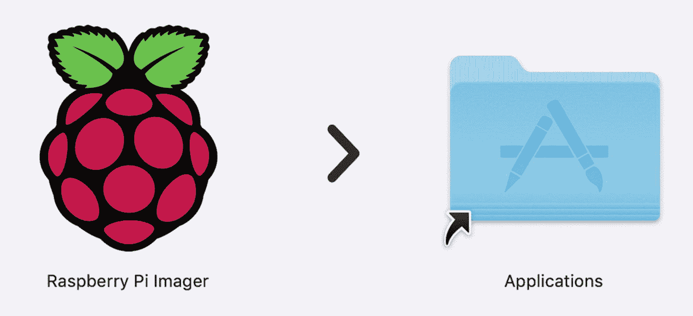

图 2-1

树莓派成像仪安装程序对话框

将 **树莓派成像仪**图标拖放到对话框中的`Applications`文件夹，安装程序。安装只需几秒钟。

要启动树莓派成像仪，您可以

*   转到`Finder`窗口，并导航到`Applications`文件夹。找到**树莓派成像仪**图标。双击该图标。

*   按 Command-space 调出*聚光灯搜索*。在“树莓派 Imager”中键入足够的字符，以便 Spotlight 找到工具，然后按下 **Enter** 键。

您将会看到一个对话框，询问您是否真的想要打开该应用程序(仅第一次)。如果是，点击**打开**。图 2-2 显示成像仪主对话框。

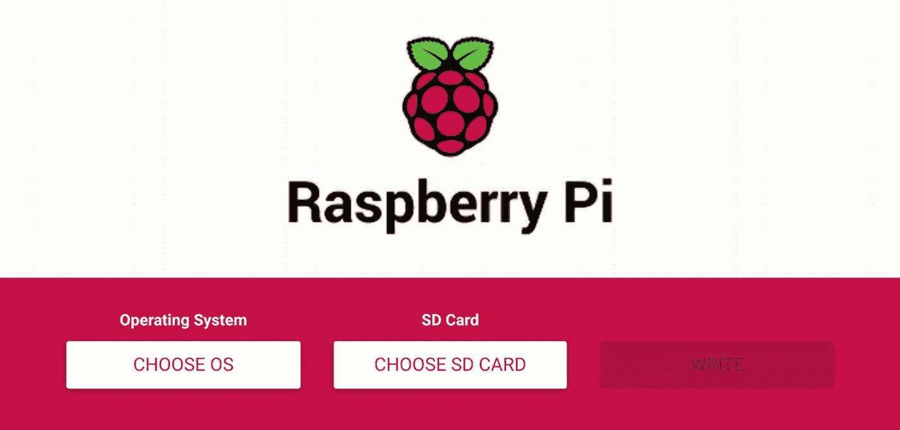

图 2-2

树莓派成像仪主对话框

点击**选择 OS** *。*图 2-3 显示了允许你选择你想要的操作系统的对话框。

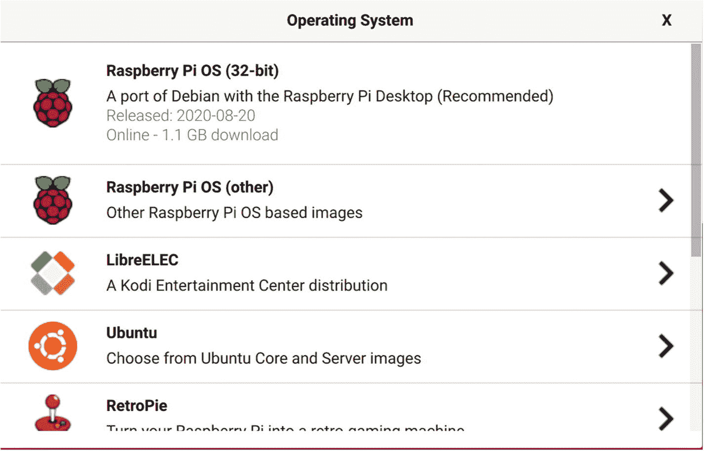

图 2-3

树莓派成像仪操作系统选择对话框

出于本书的目的，选择第一选择， **树莓派 OS (32 位)**；这就是我上一节所说的**推荐的**(你可以在描述中看到那个术语)。这将调出主对话框，显示所选择的操作系统，如图 2-4 所示。此时，如果您还没有这样做，您必须使 microSD 卡可用于您的工作站。

Tip

除非你预计你的项目需要大量的文件存储，否则我推荐 16 GB 或 32 GB 容量的 microSD 卡。大于 32 GB 将强制您重新格式化 microSD 卡，然后才能使用它。幸运的是，树莓派成像仪可以重新格式化它。更多信息见 [`www.raspberrypi.org/documentation/installation/sdxc_formatting.md`](http://www.raspberrypi.org/documentation/installation/sdxc_formatting.md) 。


图 2-4

树莓派成像仪主对话框；选择的操作系统

现在，您必须选择成像仪写入所选操作系统映像的 SD 卡。点击**选择 SD 卡**查看可用的卡。图 2-5 显示了一个类似于你将看到的 microSD 选择对话框。在这种情况下，只有一张卡可用。如果您安装了多张 microSD 卡，请单击您想要使用的那张。


图 2-5

树莓派成像仪 SD 卡选择对话框

现在，您将再次看到主对话框，显示选择的操作系统、选择的 SD 卡和一个活动的**写入**按钮。见图 2-6 。

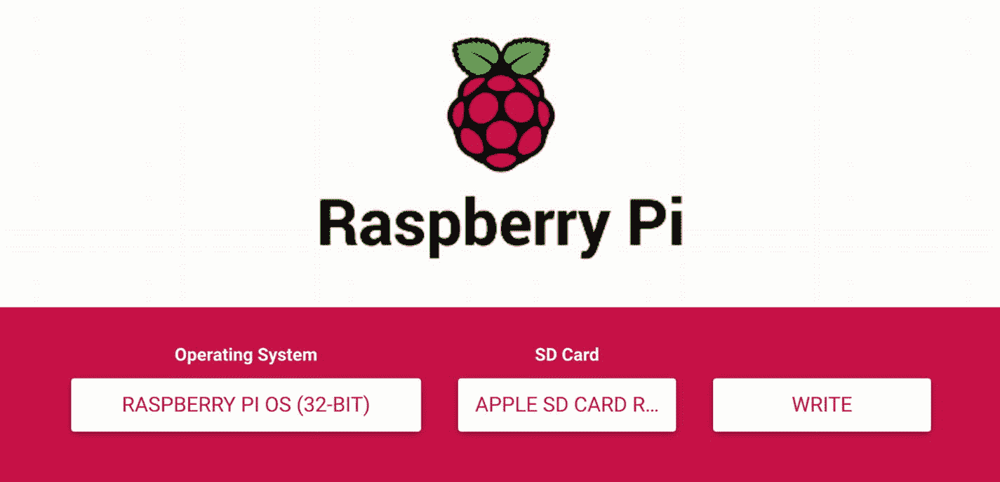

图 2-6

树莓派成像仪主对话框；选择的操作系统和 SD 卡

点击**写入**开始下载写入。你会看到一个*警告*对话框，提示当前卡上的所有内容都将被删除。只需点击**是**。接下来会提示您输入用户密码。输入密码，点击**确定**。你最终会再次看到带有进度条的主对话框，如图 2-7 所示。

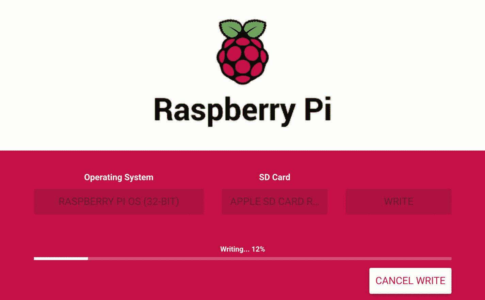

图 2-7

树莓派成像仪写入对话框

树莓派操作系统下载和 microSD 卡写入操作需要几分钟时间。实际时间取决于操作系统的大小、互联网连接速度和 microSD 卡的速度。注意**取消写入**按钮，您可以在紧急情况下使用。写入完成后，该工具会再花几分钟进行验证。验证后，你应该会看到成功的指示，如图 2-8 所示。

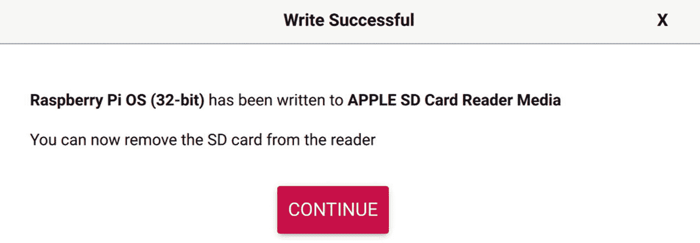

图 2-8

树莓派成像仪成功对话框

点击**继续**返回主对话框(见图 2-5 )。从那里，你可以重新开始整个过程来写另一个 microSD 卡。或者您可以移除 microSD 卡，然后开始引导和配置 Pi3。

Tip

树莓派成像仪帮了你一个忙…也许吧。该工具将下载的操作系统映像缓存在您的工作站文件系统中。因此，如果您想将相同的操作系统写入另一个 SD 卡，您不必再次下载映像，因此对 microSD 进行映像的整个任务应该会运行得更快。太好了。除非你不想再写同样的 OS；如果没有，您已经丢失了大约 2 GB 的文件系统。不幸的是，工具开发人员没有记录操作系统在哪里被缓存。然而，在大量的调查之后，我发现在 macOS 中，你可以在`~/Library/Caches/Raspberry Pi/Imager`下找到缓存的图片。在 Windows 机器上，它应该在`c:\users\your-username\AppData\Local`中，在 Ubuntu 上，它应该在`~/.cache`中。找到它，如果你愿意，你可以删除它。

## 引导和配置树莓派操作系统

在给 Pi3 通电之前，您必须将 microSD 卡插入 microSD 插槽。接下来，将 HDMI 电缆插入 Pi，然后插入 HDMI 兼容显示器或电视。接下来，将 USB 键盘和鼠标插入 Pi3。

最后，对于电源，您可以选择插入提供 5V 和 2.5A 电源的墙上适配器，或者使用类似规格的电源组。虽然初始启动和配置可能需要一段时间，但电池应该没问题。我经常用一个 10，000 mAh 的电池几个小时。

Note

不使用显示器、键盘和鼠标也可以设置 Raspberry Pi。它更复杂。参见第三章了解操作方法。

### 初始配置

一旦你给 Pi3 通电，奇迹就开始发生了。初始启动可能需要几十秒到几分钟。最终你会看到桌面和*欢迎*水花，如图 2-9 所示。

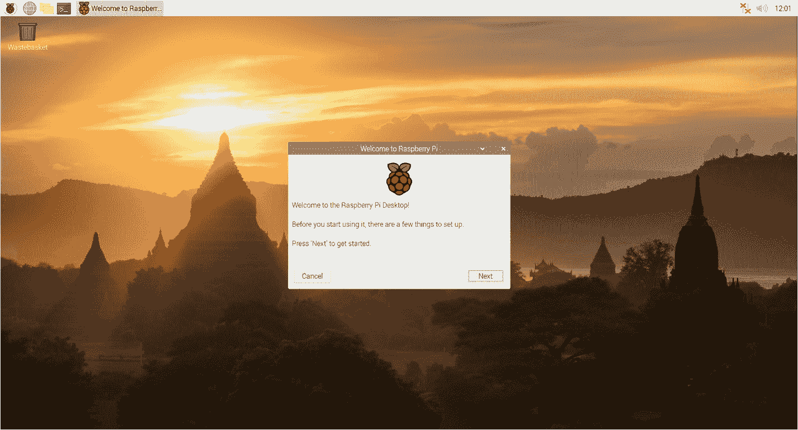

图 2-9

树莓派操作系统桌面和欢迎飞溅

*Welcome* splash 表示出现了一个非常好的配置工具。它以一种我发现比使用其他配置工具更容易的方式帮助设置所有的要素。在*欢迎画面*中点击**下一个**开始配置。

您看到的第一个对话框允许您设置适当的地区、时区和键盘。图 2-10 显示，和以往一样，英国的情况是默认的。

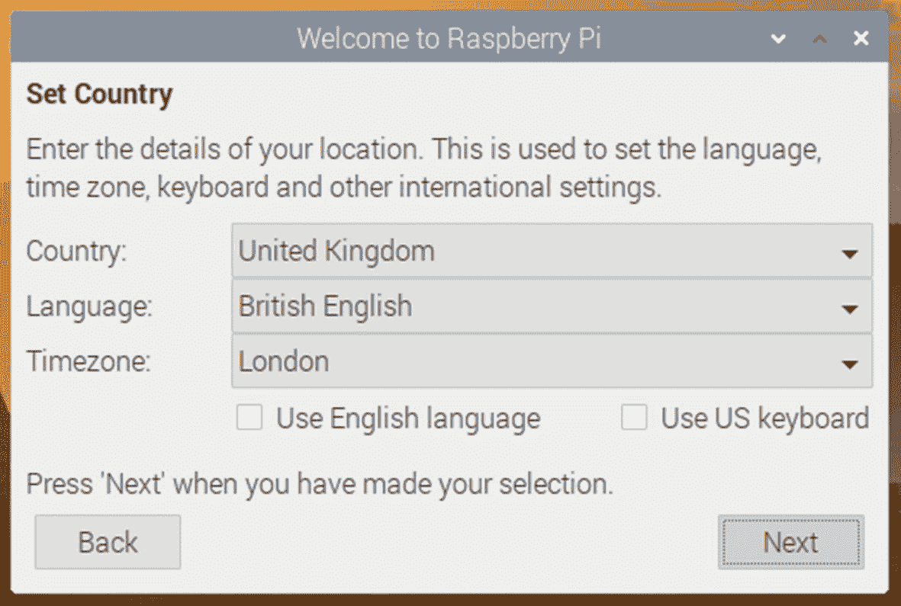

图 2-10

用于设置区域设置、时区和键盘的对话框

由于我生活在美国，假装读写美式英语，所以我使用了图 2-11 所示的设置。一旦你为自己做了适当的设置，点击**下一步**。


图 2-11

用于设置区域设置、时区和键盘的示例设置

接下来，你会看到一个对话框，如图 2-12 所示，它让你调整桌面以全屏显示。只需按照说明操作，然后点击**下一步**。

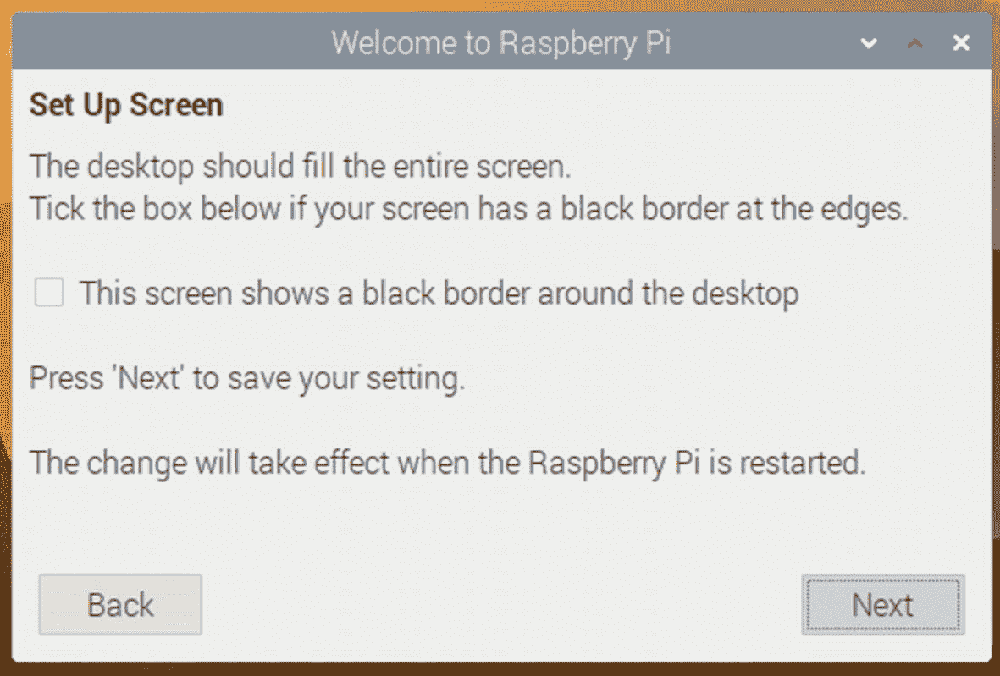

图 2-12

设置屏幕对话框

现在您有机会更改默认用户 ID“pi”的密码，如图 2-13 中的对话框所示。

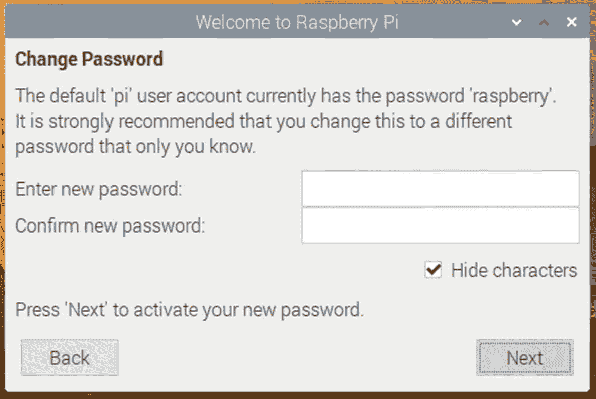

图 2-13

更改密码对话框

如果您不想更改“raspberry”的密码，请将这些字段留空，然后单击下一个的**。如果您想更改密码，我建议您首先取消选择**隐藏字符**，然后在两个文本字段中输入新密码，并点击**下一步**。如果您决定更改密码，您必须使用至少八个字符的密码，以便将来的设置步骤能够正常工作。 ***不要忘记密码！*****

接下来，你有机会连接到 Wi-Fi 网络，如图 2-14 所示。如果您通过以太网连接到网络，可以跳过这一步。既然这本书假设无线通信，不如现在就做。

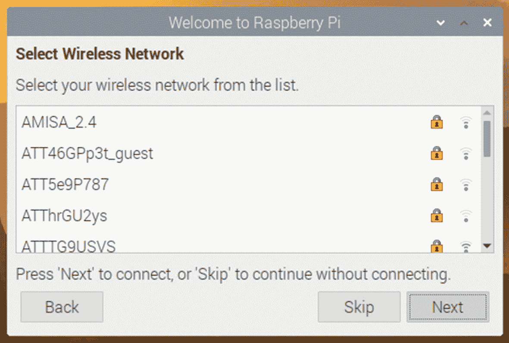

图 2-14

无线网络选择对话框

滚动对话框中显示的列表找到您的网络，选择它，然后单击下一个 *的**。***在下一个对话框中，如图 2-15 所示，您可以输入网络密码。


图 2-15

网络密码对话框

与前面的对话框一样，您可以跳过连接到 Wi-Fi 网络，但您应该连接。一旦你输入了正确的密码(取消选择**隐藏字符**使得输入正确的密码更容易)，点击**下一步**。

现在你将有机会确保树莓派操作系统是最新的，如图 2-16 所示。请注意，如果没有网络连接，操作系统甚至无法检查必要的更新，更不用说更新了。更新总是一个好主意，我强烈建议你这样做！点击**下一个**。

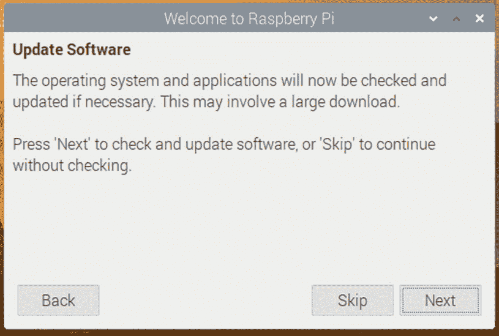

图 2-16

更新软件对话框

现在，当操作系统读取更新列表、获取更新、下载更新、安装更新并最终完成时，您将看到一系列状态消息。图 2-17 所示为该系列。


图 2-17

树莓派操作系统更新消息

点击**确定**继续。你应该得到设置完成的确认，如图 2-18 所示。你可以选择现在重启操作系统或者做一些其他的事情。我个人觉得在做其他事情之前重启更安全。点击**重启**重启。

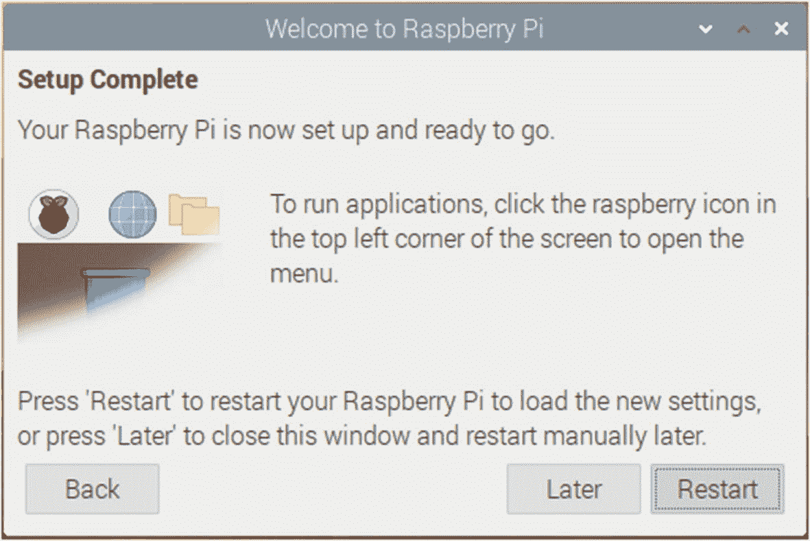

图 2-18

安装完成对话框

恭喜你！您已经完成了初始配置，并且运行了最新的树莓派操作系统！

### 配置远程计算

你现在有了一个可以作为台式电脑使用的树莓派系统，尽管你可能会发现它对任何重要的活动都令人失望。我将向您展示如何配置 Pi3 进行无头操作，即不连接显示器/电视、键盘或鼠标。然而，你将完全控制这个系统。这种配置非常适合机器人或物联网系统以及远程开发。

我假设此时您已经完成了上一节中描述的初始配置，已经重新启动，并且可以使用桌面来完成附加配置。通过**菜单【树莓】** ➤ **偏好设置** ➤ ***树莓派配置*** 调出桌面的*树莓派配置*工具。您应该会看到如图 2-19 所示的对话框。

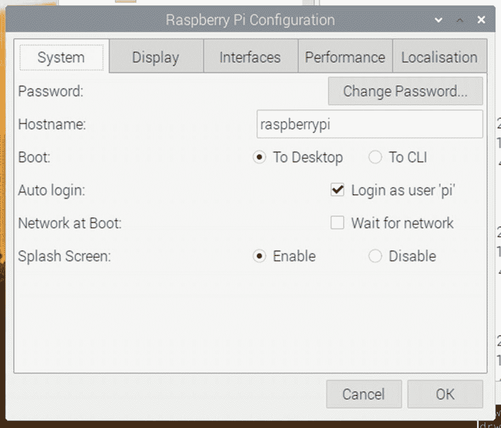

图 2-19

树莓派配置对话框

配置工具在*系统*选项卡上打开。您需要更改一些默认值。如果你希望有多个树莓派连接到你的网络，我强烈建议你更改*主机名*。

*Boot* 行控制引导时加载的用户界面的类型。如你所见，默认情况下，操作系统启动桌面。它很现代，也很容易使用。但是，正如您可以想象的那样，它占用了 CPU 周期和内存方面的资源。另一个选项是 CLI(命令行界面)。它更难使用，但需要的资源少得多。因为您希望将尽可能多的 Pi3 资源用于您的项目，所以您希望引导到 CLI。选择 **CLI** 。*先不要*点击**确定**。

### 配置接口功能

现在是时候让 Pi3 通过其各种基本 I/O 接口与机器人和物联网设备进行交互了。默认情况下，并非所有接口都启用。在配置工具中，点击*接口*选项卡。你会看到类似图 2-20 的东西。该对话框显示所有接口和当前启用状态。

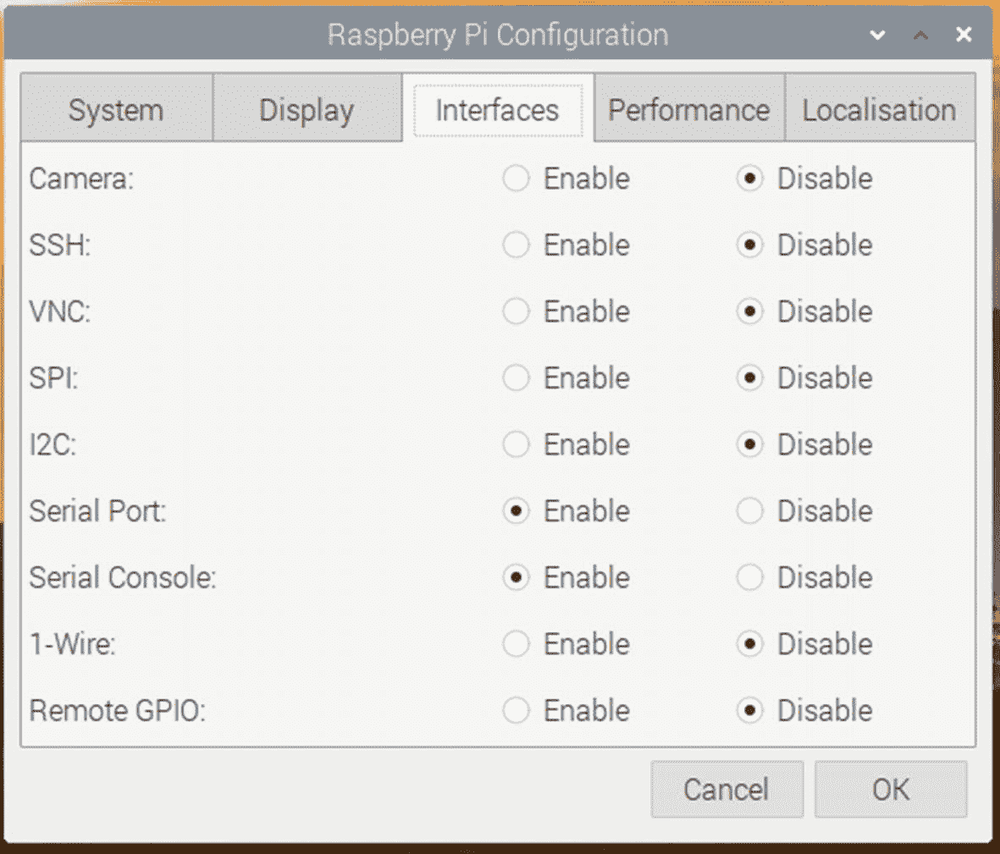

图 2-20

“接口”对话框的默认设置

感兴趣的接口有

*   *摄像头*:与 Pi3 上的树莓派摄像头插槽相关。本书中的项目不利用相机，所以我将禁用它。如果您计划在项目中使用摄像机，请启用它。

*   *SSH* :通过*安全外壳*远程访问 Pi3。你需要这个；这将是与 Pi 交互的主要方式！你*必须*启用它。

*   *VNC* :与虚拟网络计算有关。您将使用它，但具有讽刺意味的是，您希望禁用它！这是因为 VNC 在运行时也会窃取资源。更多关于 VNC 的信息，请参见第四章。

*   *SPI* :与串行外设接口协议相关。本书中的一些设备需要它，所以启用它。

*   *I2C* :与集成电路间协议相关。本书中的一些设备需要它，所以启用它。

*   *串口*:与树莓派 GPIO 头上可用的串口相关(RX & TX 引脚)。保持启用状态。

*   *串口控制台*:与串口相关；如果启用，操作系统将串行端口用于控制台输出。如果您计划将串行端口用于设备，则必须禁用串行控制台。本书中没有一个项目会用到它，但出于说明的目的，我还是会禁用它；参见第七章。

其余设置都可以接受。根据前面的建议，本书的接口配置如图 2-21 所示。

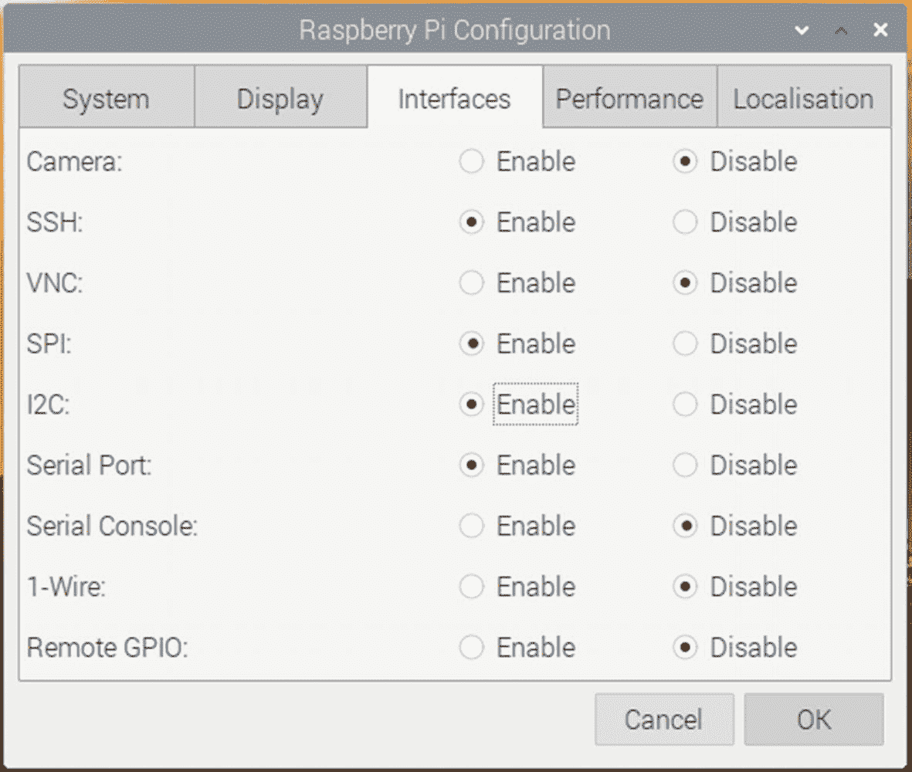

图 2-21

启用或禁用相关界面的界面对话框

一旦您完成了项目所需的启用和禁用任务，单击 **OK** 确认配置。如果愿意，您可以关闭配置工具。

## 在树莓派操作系统上安装 Java

是时候在 Pi3 上安装 Java 了。要开始安装，请在桌面上启动一个终端。只需点击桌面左上方启动栏中的**终端**图标。

### 安装什么 Java？

在安装之前，最好确定要安装哪个版本的 Java。在撰写本文时，最新的 Java 是版本 14，但是版本 8 到 14 已经存在。你可以在 Pi3 上安装它们中的任何一个(或者实际上是全部)，但是你可能会发现一些程序无法运行或者无法优化。最安全的 Java 版本是树莓派 OS 存储库中可用的版本。在撰写本文时，存储库中可用的最新版本是 Java version 11。

可以安装 JRE (Java 运行时环境),它允许您运行以前构建的程序，或者安装 JDK (Java 开发工具包),它允许您构建和运行程序。对于大多数项目，考虑到远程开发的预期，JRE 就足够了。然而，出于本书的目的，我将向您展示如何安装与 Pi3 兼容的 JDK。

### 检查以前的 Java 安装

在撰写本文时，关于 Java 是否包含在最新的树莓派操作系统中，似乎还有点混乱。我的经验说不包括在内；但是，检查是谨慎的。为此，在终端中，输入`java -version`命令来查找 Java 的当前默认版本。

有三种可能的反应:

1.  `-bash: java: command not found`

2.  `openjdk version "11.x.x" 202x-xx-xx`

3.  不同的东西

如果得到第一个响应，就要装 Java 了。跳到下一小节。

如果您得到第二个响应，那么 Java 11 已经安装好了，您可以跳过下一小节。

如果你得到第三个回应，你还有更多工作要做。“有些不同”意味着操作系统将不同版本的 Java 设置为默认版本。除非默认值已更改，否则操作系统默认为安装的最新版本。因此，要么没有安装 Java 11，要么安装了 Java 11，并将其他一些 Java 版本设置为默认版本。

您可以使用以下命令来诊断情况并更改默认版本:

```java
sudo update-alternatives --config java

```

响应列出了安装的 Java 版本。默认版本标有“*”。该命令还允许您将不同的版本指定为默认版本。如果你看到

```java
/lib/jvm/java-11-openjdk-armhf/bin/java

```

在列表中，在字符串左侧键入数字，然后按 Enter 键。如果您在列表中没有看到该路径，您必须安装 Java 11，在这种情况下，您必须阅读下面的小节。

在你安装了 Java 11 之后，如果一个更高版本的 Java 是默认的，你必须使用`update-alternatives`命令来使 Java 11 成为默认的。

Note

你可以从 [`https://phoenixnap.com/kb/install-java-raspberry-pi`](https://phoenixnap.com/kb/install-java-raspberry-pi) 中获得关于默认 Java 版本以及如何操作它的更多细节。

### 安装 JDK 11

我发现安装 Java 最简单的方法是通过命令行。为此，在终端中输入以下命令(这是一个好主意，尽管系统应该是最新的):

```java
sudo apt update

```

您最终应该会看到以下响应:

```java
All packages are up to date.

```

现在，对于好的东西，输入以下命令:

```java
sudo apt install default-jdk

```

几秒钟后，系统会询问您是否希望继续。输入“Y”。几分钟后，安装完成，没有任何大张旗鼓，只是返回命令行提示符。

现在，再次输入命令`java -version`。shell 现在应该会返回类似下面的内容:

```java
openjdk version "11.0.8" 2020-07-14

```

如果你得到了这样的回应(或类似的东西)，你可以继续下一小节。如果没有，您应该从上一小节重新开始。

### 完成 Java 安装

为了设置 NetBeans，在第五章中，你需要知道 Java 11 的安装路径。输入命令

```java
sudo update-alternatives --config java

```

您应该会在响应中看到如下内容:

```java
/usr/lib/jvm/java-11-openjdk-armhf/bin/java

```

你可以 ***记住这个路径*** 或者稍后运行这个命令。

## 完成 Pi3 设置

现在您需要找到新配置和连接的 Pi3 的 IP 地址。将鼠标指针悬停在桌面菜单栏右侧的 Wi-Fi 图标上。您应该会看到一个类似于图 2-22 所示的弹出窗口。

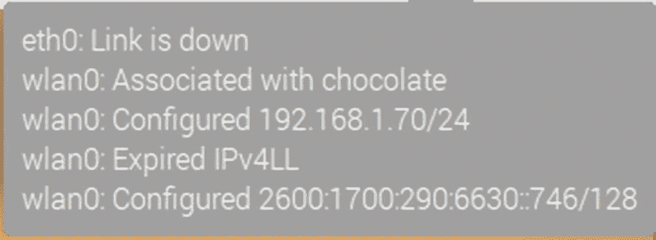

图 2-22

网络弹出窗口

第一行确认不存在以太网连接。第二行显示 Pi 所连接的 Wi-Fi 路由器的名称。第三行显示 IP 地址。 ***你需要记住 IP 地址*** 。

现在你应该关闭 Pi。新配置的某些方面在下次重新启动之前不会生效。例如，桌面仍将运行，直到您重新启动。要关机，使用**菜单(树莓)** ➤ **注销**。你会看到*关机选项*对话框。点击**关机**。你可能会看到一个*认证*对话框；如果是，输入“pi”的密码并点击 **OK** 。几秒钟后，绿色 LED 应该停止闪烁；此时，Pi 已经关闭。

一旦系统关闭，就可以安全地切断电源。你应该这样做。然后断开显示器/电视、键盘和鼠标的连接。从这一点上来说，除了远程计算什么都没有！

Tip

我发现最新版本的树莓派操作系统包括一个屏幕捕捉工具。它叫做斯克罗特。要捕捉整个屏幕，只需按下键盘上的 PrtScr 键。默认情况下，Scrot 存储。它在用户的主目录中生成的 png 文件。我用 Scrot 截取了本节使用的所有截图。你可以从 [`https://magpi.raspberrypi.org/articles/take-screenshots-raspberry-pi`](https://magpi.raspberrypi.org/articles/take-screenshots-raspberry-pi) 了解更多。

## 摘要

在本章中，您已经

*   了解如何为机器人选择合适的树莓派操作系统

*   安装和配置操作系统，以生产基于 Pi 的功能性计算机

*   进一步配置操作系统，以支持所需的接口和远程计算

*   安装了正确版本的 Java

恭喜你！您的树莓派 3 模型 B+设置已完成！在第四章中，您将学习如何从您的工作站控制 Pi3。在第五章中，你将学习如何在 Pi3 上设置远程开发的 NetBeans。