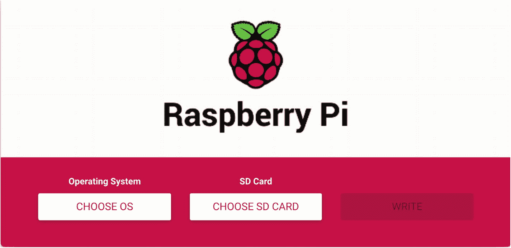
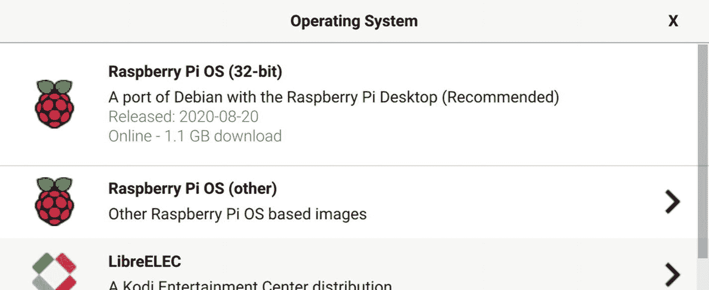
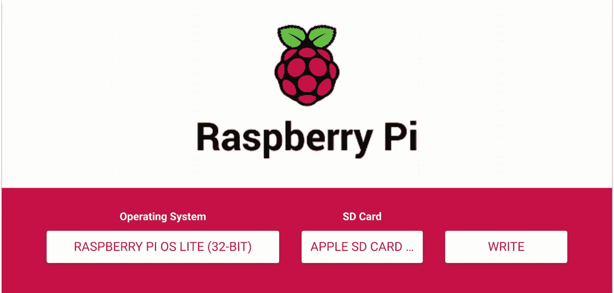
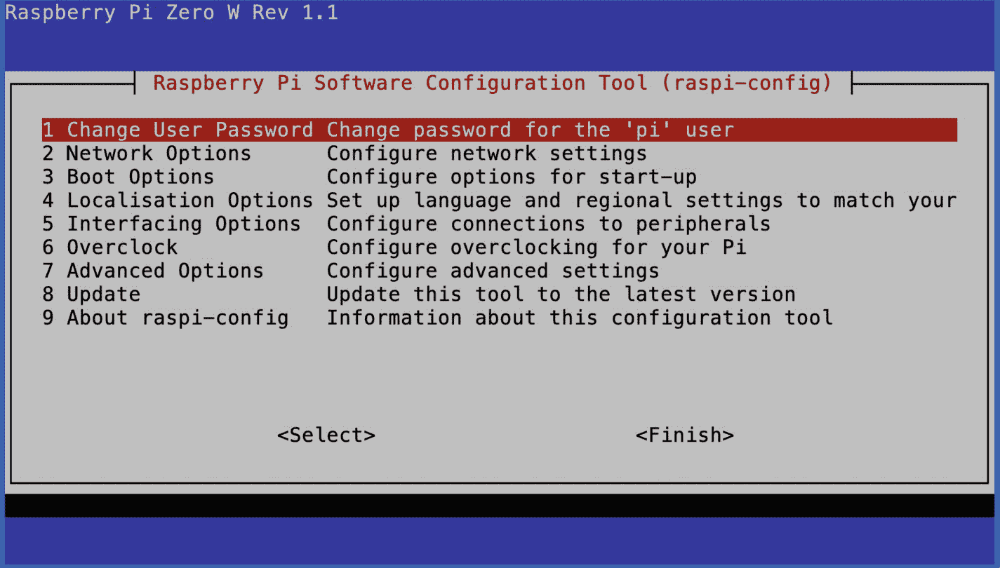
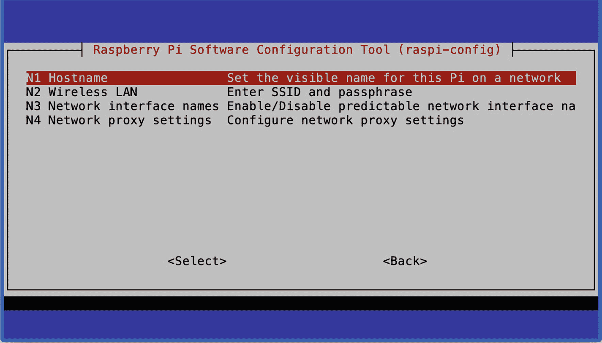
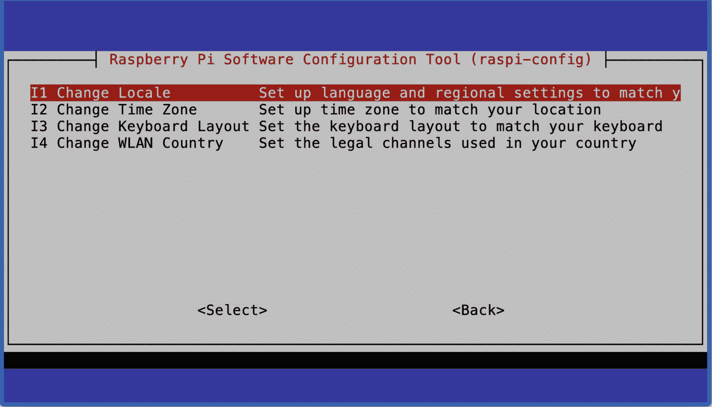
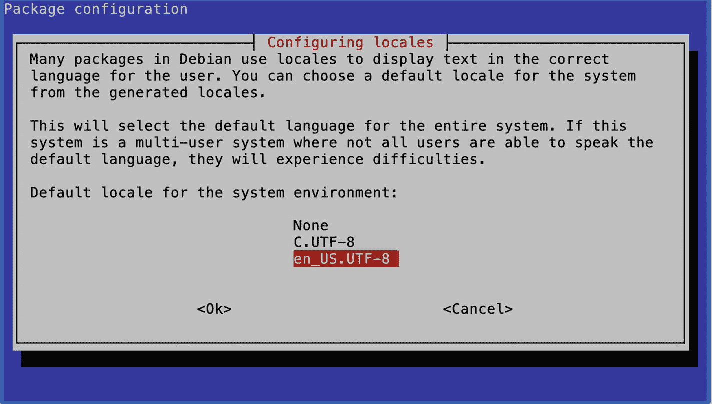
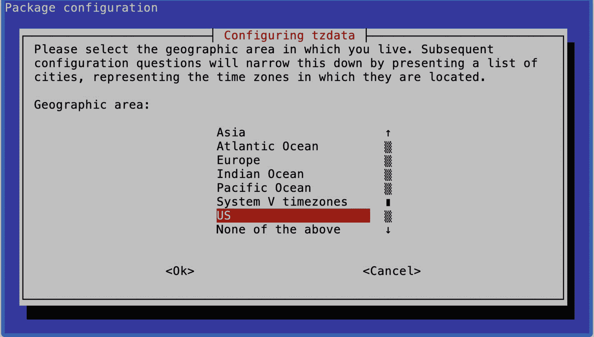
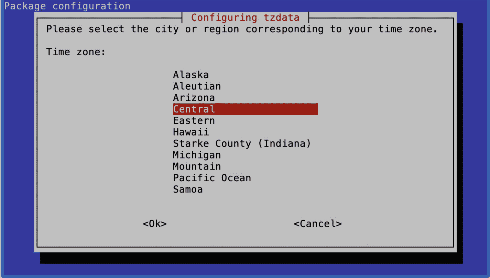

# 二、树莓派 0W 设置

我假设如果你正在阅读这一章，你对使用树莓派 Zero W(我将在本章的其余部分使用 Zero)和 Java 构建物联网项目感兴趣。在本章中，您将学习如何

*   为 Pi 选择“最佳”操作系统

*   安装树莓派操作系统

*   为远程开发配置树莓派操作系统

*   在树莓派操作系统上安装 Java

## 设置注意事项

零涉及的步骤与树莓派 3 型号 B+相同；但是，有些执行方式不同。同样，Pi、microSD 卡和电源的“基础”也是一样的。然而，Zero 使得连接 HDMI 显示器或电视、USB 键盘和 USB 鼠标有些困难，除非你有合适的连接器。因此，在这一章中，我将向您展示如何进行“无头”设置，这在任何情况下理解起来都不是一件坏事。

## 选择操作系统

考虑事项与树莓派 3 模型 B+类似。树莓派 OS 是操作系统(OS)的最佳选择。有趣的决定是在第二章描述的**精简版**、**推荐版**和**完整版**之间做出的。可以做一个安装**推荐**的案例，但是我推荐 **Lite** 。因此，我将向您展示如何安装和配置 **Lite** 。

## 在 microSD 卡上加载树莓派操作系统

我在第二章描述了获得树莓派操作系统的选项。在这一章，我将跳转到使用树莓派成像仪。如果您的工作站上没有安装，请参见第二章。

### 写树莓派 OS

启动树莓派成像仪(详见第二章)。您将会看到一个对话框，询问您是否真的想要打开该应用程序(仅第一次)。如果是，点击**打开**。图 3-1 显示成像仪主对话框。



图 3-1

树莓派成像仪主对话框

点击**选择 OS** 。图 3-2 显示了允许你选择你想要的操作系统的对话框。



图 3-2

树莓派成像仪操作系统选择对话框

就本书而言，选择第二个选择 **树莓派 OS(其他)**。这将弹出如图 3-3 所示的窗口。


图 3-3

操作系统选择

你会看到树莓派操作系统 **Lite** 和 **Full** 的选择。出于本书的目的，请单击 **树莓派 OS Lite (32 位)**。你会再次看到显示所选操作系统的主对话框，如图 3-4 所示。此时，如果您还没有这样做，您必须使 microSD 卡可用于您的工作站。


图 3-4

树莓派成像仪主对话框；选择的操作系统

现在，您必须选择成像仪写入所选操作系统映像的 SD 卡。点击**选择 SD 卡**查看选项。图 3-5 显示了一个类似于你将看到的 microSD 选择对话框。在这种情况下，只有一张卡可用。如果您安装了多张 microSD 卡，请单击您想要使用的那张。


图 3-5

树莓派成像仪 SD 卡选择对话框

现在，您将再次看到主对话框，显示选择的操作系统、选择的 SD 卡和一个活动的**写入**按钮。见图 3-6 。



图 3-6

树莓派成像仪主对话框；选择的操作系统和 SD 卡

点击**写入**按钮后，树莓派成像仪下载操作系统，将其写入 microSD 卡，并验证写入。在看到指示成功的对话框之前，不要取出 microSD 卡。更多细节请参见第二章。

Tip

参见第二章中的**提示**关于树莓派成像仪对操作系统映像的缓存。

## 完成可启动的 microSD 卡

由于我们正在进行“无头”设置，Zero 没有显示器，也没有键盘，你不能简单地将刚写好的 microSD 卡插入 Zero 并启动。您必须首先采取一些额外的重要措施:

*   支持通过*安全外壳* (SSH)访问设备。

*   配置 Wi-Fi 网络。

Caution

Zero W *不*支持 5 GHz Wi-Fi 网络。

确保 microSD 卡仍可由您的工作站访问。要启用 SSH，只需在 microSD 卡的根文件夹中创建一个名为`ssh`的空文件。请注意，文件名没有文件扩展名或类型，这一点很重要。

Tip

要在 macOS 上创建没有扩展名的空文件，请打开终端，导航到您想要文件的文件夹，然后输入命令`touch <fileName>`。要在 Windows 上这样做，打开记事本，创建一个新文件，然后点击**另存为**，导航到你想要文件的文件夹，输入“<文件名>”；引号消除了扩展名。

要配置 Zero 使其可以连接到您的 Wi-Fi 网络，请在 microSD 卡的根文件夹中创建一个名为`wpa_supplicant.conf`的文件。然后用您选择的文本编辑器编辑该文件，使其内容如清单 3-1 所示。

```java
country=<2 letter ISO 3166-1 country code>
ctrl_interface=DIR=/var/run/wpa_supplicant GROUP=netdev
update_config=1

network={
  scan_ssid=1
  ssid="<WIFI LAN name>"
  psk="<WIFI LAN password>"
}

Listing 3-1wpa_supplicant.conf

```

**< 2 个字母的 ISO 3166-1 国家代码>** 标识您的国家(参见 [`www.iso.org/obp/ui/#search`](http://www.iso.org/obp/ui/%2523search) )。对美国来说，应该是"**US**"；对于英国，应该是"**UK**"；等等。 **< WIFI 局域网名称>** 是您的 Wi-Fi 网络的名称， **< WIFI 局域网密码>** 是该网络的密码。注意清单 3-1 中的第二行和第三行实际上应该是一行。

现在您已经准备好引导和配置 Zero。

## 引导和配置树莓派操作系统

在给 Zero 加电之前，必须将 microSD 卡插入 microSD 插槽。电源方面，可以使用供电 5V 和 1.2A 以上的壁式适配器；您也可以使用相同规格的电池/电源组。确保将电源插入标有“PWR IN”的微型 USB 连接器

接通电源后，初次启动大约需要 90 秒。如果一切顺利，绿色 LED 最终停止闪烁并保持点亮。这表示 Zero 已经完成启动。

Caution

我注意到，当连接到一个空闲的零点时，至少有一些电源组决定关闭。我相信这是因为零在空闲时的功耗低于 150 mA。在开发过程中，您可能希望使用壁式电源为设备供电。

### 找到 IP 地址

你必须做的下一件事是找到零的 IP 地址。最简单的方法是通过一个*终端模拟器*。在 macOS 上，终端模拟器叫终端；在 Windows 10 上，等效物也称为终端。我将用通用词*终端*来指代这两者。打开工作站上的终端，输入命令`ping raspberrypi.local`。响应包含 IP 地址。如果 Zero 是您的 Wi-Fi 网络上唯一一个主机名为`raspberrypi`的设备，这种方法就有效。

如果 Zero 不是您的 Wi-Fi 网络上唯一具有主机名`raspberrypi`的设备，您可以使用无线路由器的配置工具来查找 Zero 的 IP 地址。基本上，您必须将浏览器定向到 192.168.1.1 或 192.168.1.254 或类似的地址(请参阅您的无线路由器文档)。四处寻找，直到找到连接到网络的设备列表。然后，您应该能够识别您的零点并确定 IP 地址。

### 接零

连接到 Zero 的最简单和最常用的方法是从工作站的终端发出的*安全外壳*命令(`ssh`)。打开终端并输入命令

```java
ssh <IP address> -l pi

```

其中`<IP address>`表示您之前确定的零的 IP 地址。输入命令后，终端可能会警告您“主机的真实性”；如果是这样，只需输入`yes`继续。将提示您输入密码；用户`pi`的默认密码是`raspberry`。一旦你输入了密码，你应该会看到零响应，如图 3-7 所示。


图 3-7

初始树莓派操作系统 ssh 响应

### 更新和升级树莓派操作系统

我建议连接到 Zero 后做的第一件事是更新和升级操作系统。为此，您可以在终端中输入以下两个命令:

```java
sudo apt-get update -y
sudo apt-get upgrade -y

```

完成`update`命令需要相当短的时间。它打印了几行反馈。完成后，您将在下一个命令提示符前看到下面一行:

```java
Reading package lists... Done

```

`upgrade`命令可能需要很长时间。Zero 不是一个快速的设备，而且总的时间会受到网络速度和 microSD 速度的影响。该命令打印数百行反馈。您看到的可能有所不同，但是当我升级时，下一个命令提示符前的最后一行如下所示:

```java
Processing triggers for libc-bin (2.28-10+rpi1)

```

您必须重新启动以确保一切生效。输入命令`sudo reboot`重启。当然，您必须在终端中再次输入`ssh`命令，以便在终端完成重启后重新连接到 Zero。

### 附加配置

现在，谨慎的做法是进行额外的配置。要启动树莓派配置工具，请输入命令`sudo raspi-config`。您将看到如图 3-8 所示的配置工具主对话框(细节可能有所不同)。您可以使用键盘上的 tab 键和箭头键在工具对话框中导航以突出显示选项。当您突出显示了所需的操作后，只需按回车键。



图 3-8

树莓派操作系统配置工具主对话框

注意图 3-7 中为用户`pi`修改密码的建议。假设您在一个完全本地的网络上工作，我认为这是可选的。如果您希望这样做，那么在配置工具启动时，它已经被高亮显示了。要更改用户`pi`的密码，只需点击 Enter。您将看到一个对话框，确认您将要更改用户`pi`的密码。按回车键。您将离开工具对话框并返回到 shell 来输入，然后重新输入密码。完成后，您将返回到工具，确认密码更改成功；按回车键。您将再次看到图 3-8 中的主对话框。

另一个可选配置是更改主机名。我建议这样做。要更改主机名，在主对话框中导航到**网络选项**(使用向下箭头)，然后点击 Enter。你会看到网络选项对话框，如图 3-9 所示。



图 3-9

树莓派操作系统配置工具网络选项对话框

您将看到**主机名**已经突出显示，因此只需点击 Enter。您将看到一个对话框，描述主机名中什么是合法的，什么是不合法的；只需按回车键。现在您将看到一个对话框，允许您键入新的主机名。这样做；然后按 tab 键或向下箭头键，使 **< OK >** 高亮显示，然后按 Enter 键。你会再次看到如图 3-8 所示的主对话框。

接下来，您将配置**本地化选项**(在美国也称为本地化选项)。导航到该选项，然后按 Enter 键。您将看到图 3-10 中的对话框。



图 3-10

树莓派操作系统配置工具本地化选项对话框

您应该更改区域设置；该选项已经被选中，所以只需按 Enter 键。您将看到如图 3-11 所示的区域设置选择对话框。


图 3-11

树莓派操作系统配置工具区域设置对话框

选择框包含一个区域列表。您可以使用上下箭头键滚动列表。您可以通过按空格键来选择或取消选择区域设置。你会发现。默认选择 UTF-8 UTF-8 。由于我在美国，我取消了它，然后选择了 **en_US。UTF-8 UTF-8** (如图 3-11 )。一旦选择了所有需要的语言环境，按 tab 键使 **< OK >** 高亮显示，然后按 Enter 键。现在您将看到另一个区域设置对话框，让您选择系统的默认区域设置。参见图 3-12 。



图 3-12

树莓派操作系统配置工具区域设置默认对话框

虽然不会有太大的不同，但最好的选择是 **en_US。UTF-8** 。使用向下箭头键选中该选项，然后输入。零点会处理一段时间，当它完成时，你会再次看到主对话框(图 3-8 )。

现在，您将更改时区，以便 Zero 知道您所在位置的正确时间。再次选择**定位选项**，将会看到如图 3-10 所示的对话框。现在突出显示并选择**更改时区**。您将看到如图 3-13 所示的对话框。



图 3-13

树莓派操作系统配置工具时区对话框

你需要为自己选择合适的地理区域。我选择了**美国**选项。按回车键继续。接下来，您将看到与该地理区域相关的时区列表，在我的例子中，是与美国相关的时区。见图 3-14 。



图 3-14

树莓派操作系统配置工具时区对话框

如您所见，我选择了中部时区。当你为自己选择了合适的选项后，按回车键。你将返回到主对话框(见图 3-8 )。

### 配置接口功能

现在是时候让 Zero 通过各种接口与外部设备进行交互了。在组态工具主对话框中，选择**接口选项**。你会看到类似图 3-15 的东西。该对话框显示所有界面。


图 3-15

树莓派操作系统配置工具界面对话框

感兴趣的接口与第二章中讨论的相同。界面的初始配置如图 2-20 所示，除了一个例外；您已经启用了 SSH。本书中的一些物联网设备需要 SPI 或 I2C，因此同时启用两者。串行端口没有被使用，所以你不需要做任何事情；如果您计划使用串行端口，您必须禁用串行控制台。

要启用 SPI，突出显示 **SPI** 并按 Enter 键。系统会询问您是否要启用它。确保 **Yes** 高亮显示，并按下回车键。您将收到一条消息，表明 SPI 已启用；只需按回车键。你将返回到如图 3-8 所示的主对话框。

要启用 I2C，在主对话框中选择**接口选项**，高亮显示 **I2C** ，并点击回车。系统会询问您是否要启用它。确保**是**高亮显示，并点击确认。您将收到一条消息，表明 I2C 已启用；只需按回车键。你将返回到如图 3-8 所示的主对话框。

现在是重新启动的好时机，这样您的新配置就会生效。在主对话框中，用 tab 键高亮显示 **<完成>** ，然后回车。将询问您是否希望重新启动。由于 **<是>** 已经高亮显示，您可以点击回车。

## 在树莓派操作系统上安装 Java

是时候从零开始安装 Java 了。要开始安装，在工作站终端再次使用`ssh`命令访问零点。要登录，如果您更改了默认的“raspberry”，您当然需要使用新密码

### 安装什么 Java？

为了确保本书中机器人技术(参见第二章)和物联网项目的一致性，你要安装 Java 版本 11。可悲的是，树莓派 OS repository 实现的 Java 11 ***在 Zero*** 上不起作用！Java 11 的存储库实现需要比 Zero 中使用的更现代的处理器架构。Java 8 的存储库实现应该可以工作，但是为了兼容在第二章配置的树莓派 3 Model B+，你需要 Java 11。

幸运的是，Azul ( [`www.azul.com/`](http://www.azul.com/) )提供了一个 JRE (Java Runtime Environment，Java 运行时环境)，允许你运行之前构建的程序，还提供了一个 JDK (Java Development Kit，Java 开发工具包)，允许你在几个处理器架构上为几个版本的 Java 构建和运行程序。更幸运的是，它们可以免费用于非商业用途。

你可以去 Azul 下载页面( [`www.azul.com/downloads/zulu-community/?architecture=x86-64-bit&package=jdk`](http://www.azul.com/downloads/zulu-community/%253Farchitecture%253Dx86-64-bit%2526package%253Djdk) )确定树莓派 Zero 有哪些 JRE 和 JDK 版本。在撰写本文时，该页面包含一个过滤功能，可以缩小选择范围；见图 3-16 。


图 3-16

阿苏尔 JDK/JRE 下载过滤器

我用图 3-16 所示的滤镜组合达到了最好的效果。请特别注意*架构*滤波器。如图所示，我为树莓派设置了适当的值；请注意,“HF”标志表示硬件浮点能力。在撰写本文时，过滤器生成的结果表只包含 JDK 8、JDK 11 和 JDK 13 的包。显然，你会想要 JDK 11 号。

### 检查以前的 Java 安装

在撰写本文时，我的经验表明 Java 不包含在最新的树莓派操作系统中。原因可能是默认的 Java 版本不能在所有的树莓派模型上运行。无论如何，检查是谨慎的。有关详细信息，请参考第二章“检查先前的 Java 安装”小节。

### 安装 JDK 11

即使系统应该是最新的，检查操作系统是否需要更新也是一个好主意。为此，请在终端中输入以下命令:

```java
sudo apt update

```

您最终应该会看到以下响应:

```java
All packages are up to date.

```

现在，您必须为 JDK 创建一个文件夹，然后导航到该文件夹。输入以下命令:

```java
sudo mkdir /opt/jdk
cd /opt/jdk

```

现在，在您的工作站浏览器中，转到 Azul 下载页面，并在表格中找到与 JDK 11 相对应的行。见图 3-17 。


图 3-17

阿苏尔 JDK/JRE JDK 11 下载行

将鼠标光标悬停在该行右侧的下载图标(右边有一个带文本“ **.tar.gz** ”的小云)上。右键单击(在 macOS 上，即按住 Ctrl 键单击或用两个手指单击)图标，弹出一个操作弹出窗口。点击**复制链接**。

现在在终端中，输入命令`sudo wget`，然后粘贴你复制的链接。例如，我使用的命令(在终端中，该命令应该是一行)是

```java
sudo wget https://cdn.azul.com/zulu-embedded/
bin/zulu11.41.75-ca-jdk11.0.8-linux_aarch32hf.
tar.gz

```

下载 JDK 需要几分钟时间。有一个进度条让你知道命令正在工作。

下载完成后，您需要找到下载文件的名称。使用`ls`命令来完成。复制文件的名称。然后输入命令`sudo tar -zxvf`，将文件名粘贴到终端中。例如，我使用的命令(同样，都在一行中)是

```java
sudo tar -zxvf zulu11.41.75-ca-jdk11.0.8-
linux_aarch32hf.tar.gz

```

该命令将需要几分钟的时间来提取所有文件。没有进度条，有时它似乎停滞不前。耐心点。

当命令完成时(您将看到一个新的命令提示符)，做一些清理是一个好主意。`tar.gz`文件很大，应该删除。为此，您可以使用以下命令:

```java
sudo rm *.tar.gz

```

现在您需要为`java`和`javac`命令创建符号链接(`javac`是可选的，因为它不太可能被使用)。首先，找到`tar`命令创建的目录的名称。使用`ls`命令来完成。复制目录的名称。使用以下命令(同样是单行命令)创建符号链接:

```java
sudo update-alternatives --install
     /usr/bin/java java <name of the directory you
     copied>/bin/java 1

sudo update-alternatives --install
/usr/bin/javac javac <name of the directory
you copied>/bin/javac 1

```

同样，您应该能够将目录名粘贴到终端中。例如，我使用的命令是

```java
sudo update-alternatives --install
/usr/bin/java java /opt/jdk/zulu11.41.75-
ca-jdk11.0.8-linux_aarch32hf/bin/java 1

sudo update-alternatives --install
/usr/bin/javac javac /opt/jdk/zulu11.41.75
     -ca-jdk11.0.8-linux_aarch32hf/bin/javac 1

```

现在输入命令

```java
java -version

```

shell 现在应该会返回类似下面的内容:

```java
openjdk version "11.0.8" 2020-07-14 LTS

```

为了设置 NetBeans，在第五章中，你需要知道 Java 11 的安装路径。输入命令

```java
sudo update-alternatives --config java

```

您应该会在响应中看到如下内容:

```java
/usr/bin/java

```

您可以记住该路径，也可以稍后运行该命令。

## 摘要

在本章中，您已经

*   了解如何为物联网选择合适的树莓派操作系统

*   安装和配置操作系统以生产基于树莓派 Zero W 的无头计算机

*   进一步配置操作系统以支持所需的接口

*   安装了正确版本的 Java

恭喜你！您的树莓派 Zero W 设置已完成！第四章主要与树莓派 3 型号 B+相关，因此请随意继续第五章。在第五章中，你将学习如何设置远程开发的 NetBeans。