# 五、将 NetBeans 用于远程 Java 开发

在本章中，我将向您展示使用 NetBeans 进行远程 Java 开发的基础知识。我将教您如何安装 NetBeans 并为远程开发进行配置。该配置适用于第 [2](02.html) 章中设置的树莓派 3 型号 B+和第 [3](03.html) 章中设置的树莓派 Zero W。我将讨论如何

*   确定哪个 NetBeans 是“最好的”

*   确定哪个 Java 版本是“最好的”

*   安装 Java

*   安装 NetBeans

*   在 NetBeans 中配置远程开发

*   远程运行和调试

## 选择 NetBeans 和 Java 版本

就本书而言，最好的 NetBeans 是最新的“长期支持”(LTS)版本。在撰写本文时，那是 NetBeans 12.0。

NetBeans 不仅支持 Java 开发，它本身也是一个 Java 应用程序。NetBeans 12.0 可以在 Java 版本 11 到 14 上运行。要运行 NetBeans 12.0，您需要在工作站上安装其中一个版本。

前几章向您展示了如何在树莓派上安装 Java 11。为了优化远程开发，您的树莓派和工作站上必须安装相同版本的 Java。这意味着你需要在你的工作站上安装 Java 11。

## 安装 Java 11

您必须首先从甲骨文下载页面( [`www.oracle.com/java/technologies/javase-jdk11-downloads.html`](http://www.oracle.com/java/technologies/javase-jdk11-downloads.html) )下载适用于您工作站操作系统的 JDK 11。重要的是要明白，在当前的许可下，下载对于个人或开发使用是免费的。也就是说，您可能需要在下载前创建一个帐户。

Note

您下载的 JDK 11 的次要和安全版本号可能与本章中显示的和本书中使用的不同(11.0.8)。只要您的树莓派版本和工作站具有相同的编号，一切都应该正常工作。

对于 macOS 和 Windows 10，你可以下载一个*安装程序*，它会帮你完成大部分工作。我将展示 macOS 使用安装程序的过程；对于 Windows 来说，应该是非常类似的。

要执行安装程序下载，请在下载页面的表格中查找“macOS 安装程序”行。单击该行右侧的链接。在这一点上，你可能会被要求创建一个帐户或注册，如果是这样，就这样做。执行下载需要一些时间。macOS `.dmg`文件下载完成后，在 macOS 上，转到`Downloads`文件夹，双击该文件。您将看到如图 [5-1](#Fig1) 所示的窗口。

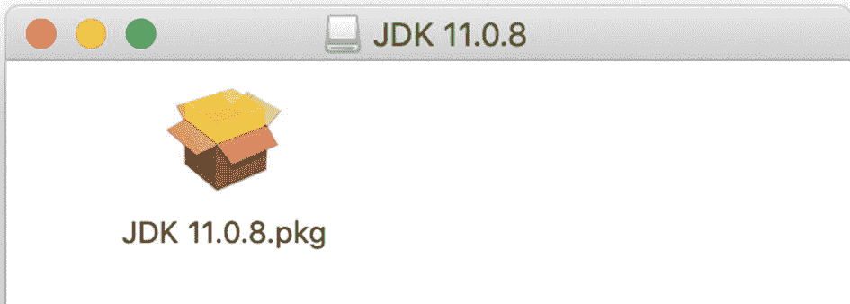

图 5-1

JDK 安装程序软件包

双击`.pkg`图标开始安装。首先你看到*介绍*面板如图 [5-2](#Fig2) 所示。

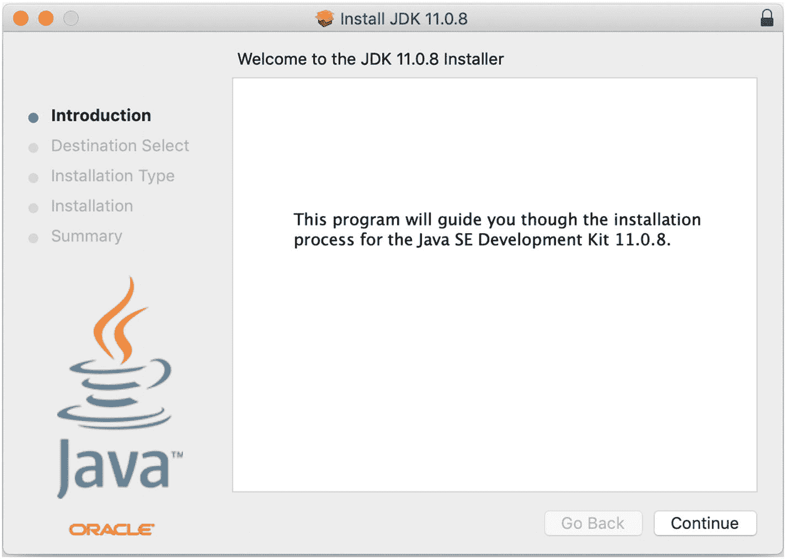

图 5-2

JDK 安装对话框

点击**继续**。你会看到*安装类型*对话框，但是除了退出安装，回到*安装*面板，或者继续之外，你什么也做不了。点击**安装**。系统将提示您输入管理 ID 和密码来启用安装。输入这些凭证并点击**安装软件**。一旦安装完成，您将在图 [5-3](#Fig3) 中看到确认。


图 5-3

JDK 安装确认

点击**关闭**结束安装程序。它会方便地询问您是否希望删除安装程序。这样做会释放文件系统上的空间。现在，您可以继续安装 NetBeans 了。

## 安装 NetBeans 12.0

首先，您必须从 Apache NetBeans 下载页面( [`https://netbeans.apache.org/download/nb120/nb120.html`](https://netbeans.apache.org/download/nb120/nb120.html) )下载 NetBeans 12.0。您可以找到适用于 macOS、Windows 和 Linux 的安装程序。单击适当的链接开始下载您需要的软件。下载完成后，在 macOS 上，双击**下载**文件夹中的`.dmg`文件。接下来你会看到如图 [5-4](#Fig4) 所示的安装包。双击`.pkg`图标开始安装。

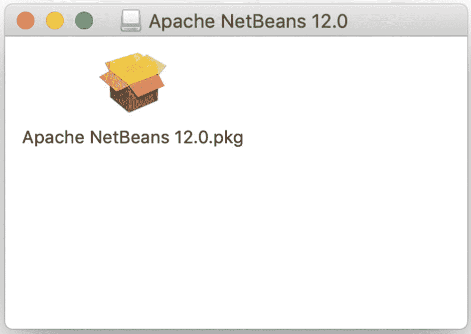

图 5-4

NetBeans 安装程序包

现在安装程序问你是否真的要安装程序；见图 [5-5](#Fig5) 。点击**继续**。

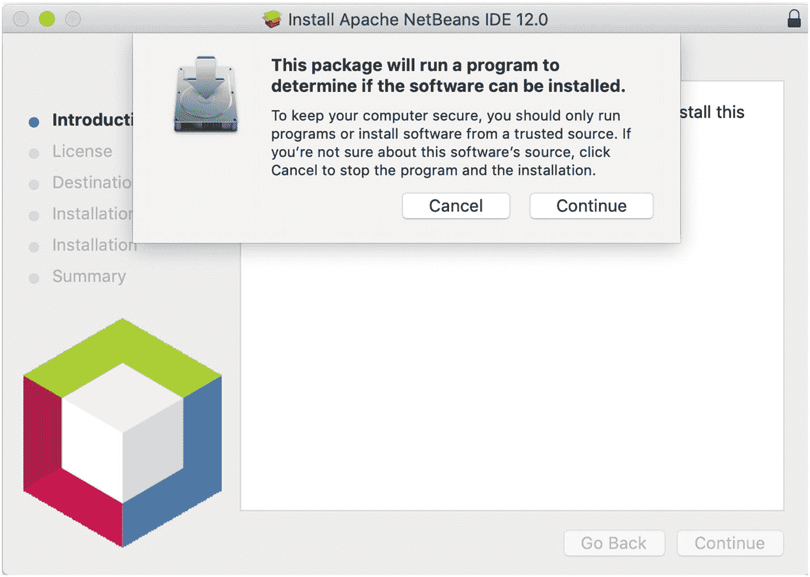

图 5-5

安装程序请求权限

您现在将看到 NetBeans 的*简介*面板。这与 JDK 非常相似(见图 [5-2](#Fig2) )。点击**继续**。接下来是一个*牌照*面板。点击**继续**。接下来，您将被要求同意您几乎肯定没有阅读的许可。点击**同意**。接下来你会看到*安装类型*面板，如图 [5-6](#Fig6) 所示。

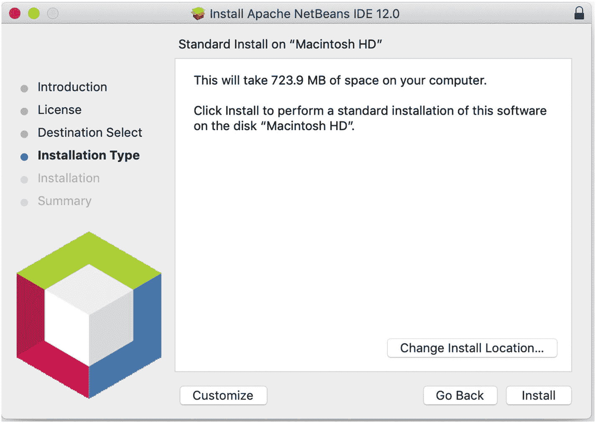

图 5-6

NetBeans 安装程序安装类型面板

NetBeans 12.0 允许您使用多种编程语言进行开发。默认情况下，除了基本 IDE 之外，安装还包括 Java SE、Java EE、HTML5/JavaScript 和 PHP。你显然需要 Java SE。点击**定制**可以选择安装什么。不包括其他的可以节省很多存储空间，但是我选择全部安装；谁知道下一个项目会需要什么？我推荐使用默认的安装位置，但是你可以通过点击**改变安装位置**来改变它。想了这么多之后，点击**安装**。系统将提示您输入管理员 ID 和密码。输入凭证，点击**安装软件**。一旦安装完成，您会看到图 [5-7](#Fig7) 中的确认。点击**关闭**结束安装。请注意，该安装程序不会删除`.pkg`或`.img`文件。如果您希望释放文件系统上的空间，您必须手动执行此操作。

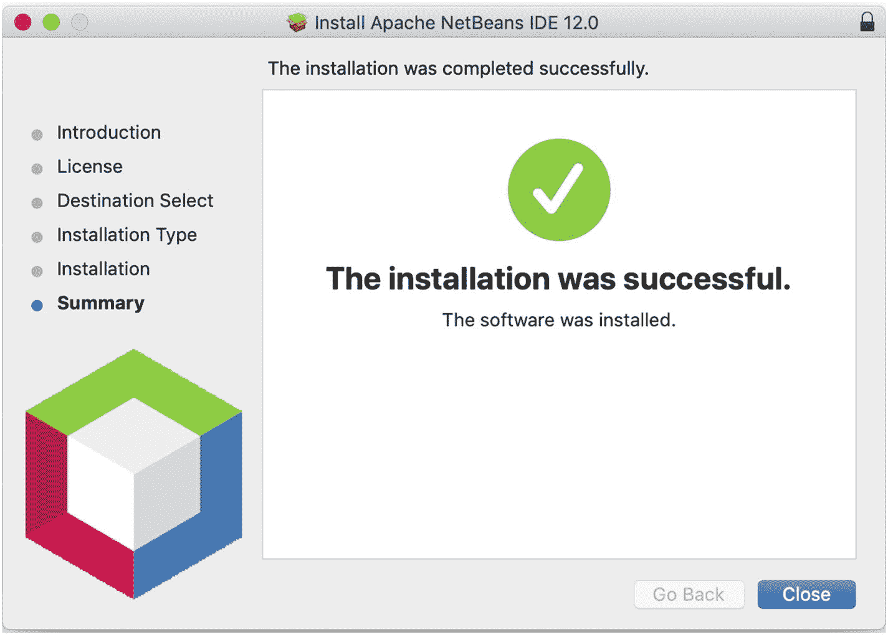

图 5-7

NetBeans 12.0 安装成功确认

## 测试 NetBeans 安装

现在，您可以在 macOS 上打开 NetBeans 12.0，方法是打开 Spotlight search，在字符串“Apache NetBeans 12.0”中键入字符，直到它出现，然后按 Enter 键。NetBeans 对自身进行初始化，然后显示图 [5-8](#Fig8) 中的窗口。

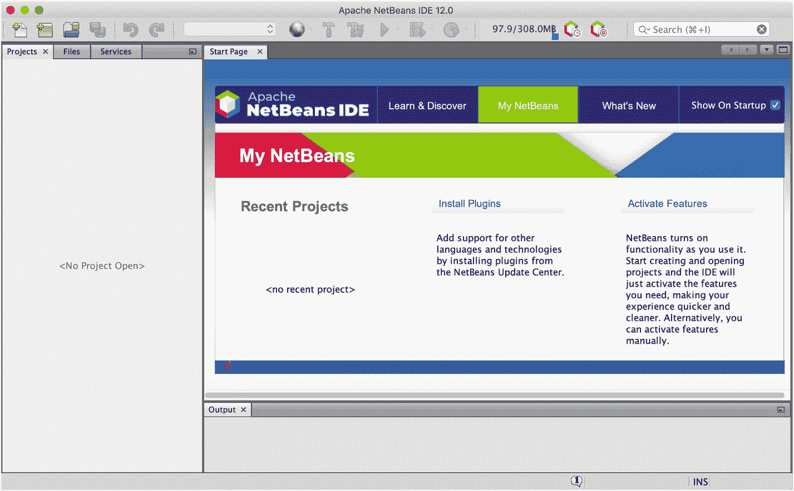

图 5-8

NetBeans 12 初始窗口外观

现在您可以创建一个测试。总的来说，我不会尝试给出关于 NetBeans 开发或 Java 的教程，但是我会讲述一些基本概念。

在 NetBeans 工具栏中，单击**新建项目**图标，这是一个看起来像文件夹的图标(工具栏中左起第二个)。你会看到如图 [5-9](#Fig9) 所示的*新建项目*对话框。

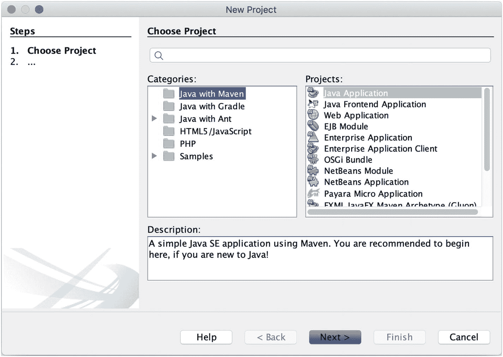

图 5-9

NetBeans 新建项目对话框

从图 [5-9](#Fig9) 中注意到，在 NetBeans 12 中，默认的项目管理/构建工具是 *Maven* 。Maven *不支持我对远程开发“开箱即用”的定义*蚂蚁*工具*不*支持。由于本书的一个重点是简单而有效的远程开发，所以本书使用了 Ant，在这一章中，我将向您展示如何使用 Ant 进行开发。*

Tip

Maven 在自动化其他开发任务方面做得更好。通过一些工作，Maven 可以近似“蚂蚁风格”的远程开发。详见附录 A3。在阅读附录 A3 之前，我建议您至少浏览本章的其余部分以及第 [6](06.html) 、 [7](07.html) ，甚至 [8](08.html) 章，以建立足够的上下文。

要上手 Ant，在*新建项目*对话框(图 [5-9](#Fig9) ，点击 **Java with Ant** ，然后点击 **Java 应用**，再点击**下一个**。您将看到*名称和位置*对话框，如图 [5-10](#Fig10) 所示，该对话框允许您输入项目的名称(本例中为“FirstTest”)和应用程序(或主类)，管理文件的位置(我建议不要更改默认位置，除非您确实需要这样做)，决定是否创建一个主类(在本例中为 yes)，并输入包名(对于本测试，默认是可以的)。当您满意地输入完信息后，点击**完成**。

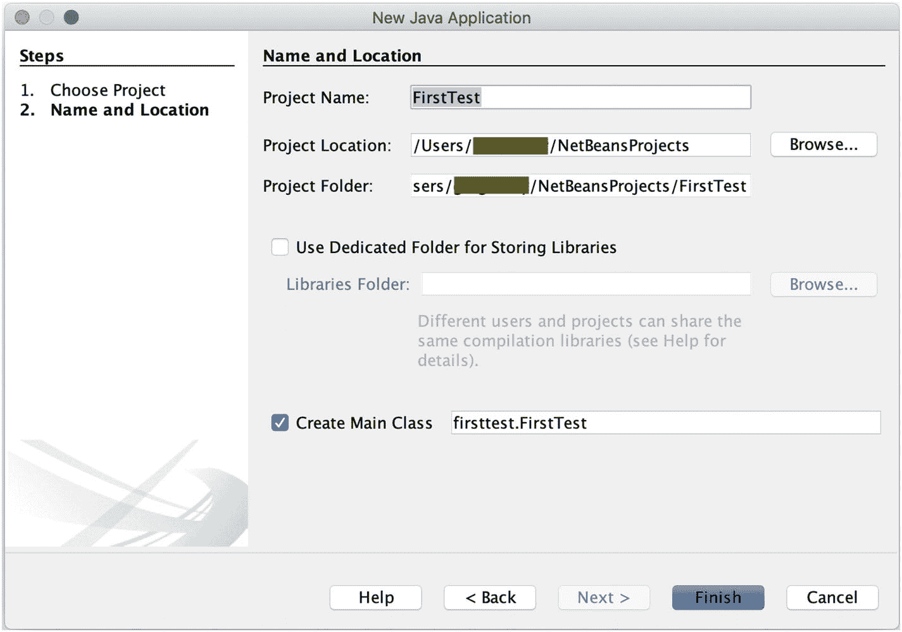

图 5-10

NetBeans“新建项目”对话框:输入项目名(和主类名)、位置和包名

NetBeans 创建项目并打开主类的类编辑器，在我的例子中是`FirstTest`。你会看到类似图 [5-11](#Fig11) 的东西。

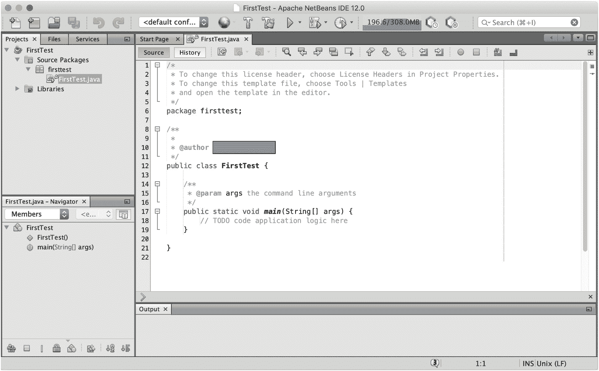

图 5-11

NetBeans 类编辑器

现在，您可以输入一个简单的 print 语句来创建经典的“Hello World”应用程序。清单 [5-1](#PC1) 显示了我使用的代码(我省略了 NetBeans 注入到类文件中的样板文件)。

```java
public class FirstTest {
    public static void main(String[] args) {
        System.out.println("Hello World!");
    }
}

Listing 5-1The “Hello World!” application code

```

点击 **Run** 图标(工具栏中间的绿色向右箭头)运行代码。假设一切正常，您应该在编辑器下方的 NetBeans *输出*窗格中看到以下内容:

```java
run:
Hello World!
BUILD SUCCESSFUL (total time: 1 second)

```

成功！您已经安装并测试了 NetBeans。

## 将树莓派配置为远程平台

现在，您将配置 NetBeans，以将树莓派识别为远程开发平台。在 NetBeans 菜单栏中，选择**工具** ➤ **Java 平台**。您将看到如图 [5-12](#Fig12) 所示的 *Java 平台管理器*弹出窗口。


图 5-12

NetBeans Java 平台管理器

请注意，当前唯一的平台是工作站上的 JDK 11 本地版。点击**添加平台**，这样你就可以添加一个树莓派了。图 [5-13](#Fig13) 显示了*添加平台*对话框。默认情况下，您将添加另一个本地 JDK。在这种情况下，你想添加一个 Pi，那么选择**远程 Java 标准版**选项，然后点击**下一步**。

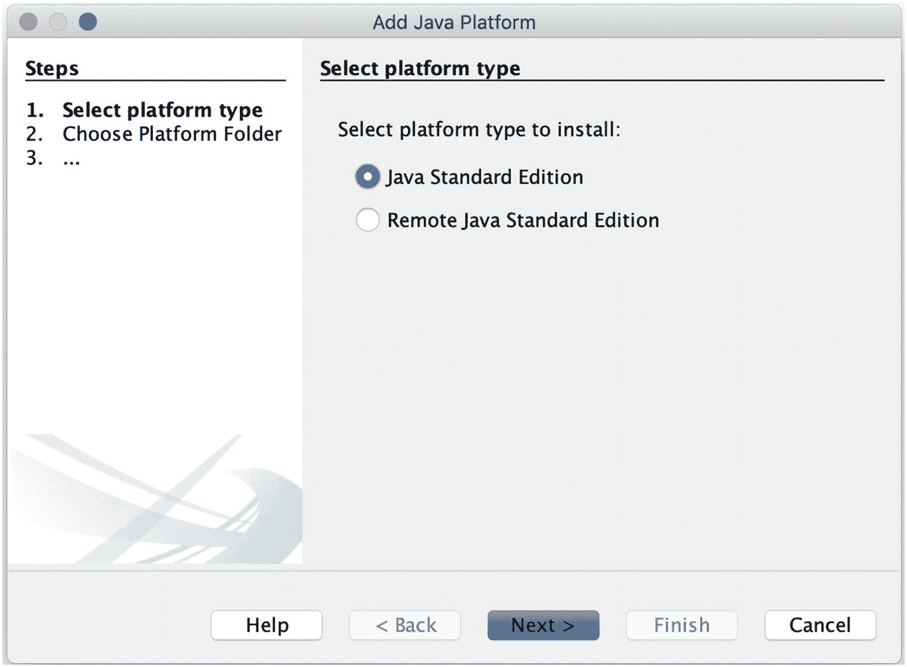

图 5-13

NetBeans 添加 Java 平台对话框

现在，您将看到图 [5-14](#Fig14) 所示的*设置远程平台*对话框。您必须输入一个*平台名称*。应该是比较独特的东西。我有时会在三个远程系统上同时开发项目组件，在这种情况下，惟一的名称是必须的。您必须输入远程 Pi 的*主机* IP 地址或主机名；您应该使用第 [2](02.html) 章或第 [3](03.html) 章中确定的地址或名称，除非您正在处理另一个 Raspberry Pi。您必须输入一个用户 ID；出于本书的目的，请使用“圆周率”最简单的*认证*类型是密码，因此确保选择**使用密码认证**并输入您在第 [2](02.html) 章或第 [3](03.html) 章中创建的密码。


图 5-14

完整的设置远程平台对话框

对话框中一个非常关键的字段是**远程 JRE 路径**。你应该使用在第 [2](02.html) 或第 [3](03.html) 章中发现的路径。如果您不记得了，找到该路径的最佳方法是到一个与 Pi 有`ssh`会话的终端，输入以下命令:

```java
sudo update-alternatives --config java

```

响应应该类似于以下内容:

```java
/usr/lib/jvm/java-11-openjdk-armhf/bin/java

```

在*远程 JRE 路径*字段中输入字符串，减去“/bin/java”。你可以改变远程*的工作目录*，但是我发现默认就可以了。当你完成这个对话框时，它看起来应该类似于图 [5-14](#Fig14) 。点击**完成**创建远程平台。NetBeans 可能需要几秒钟才能完成。完成后，您将再次看到 *Java 平台管理器*，其中显示了新创建的远程平台信息。参见图 [5-15](#Fig15) 。


图 5-15

具有远程平台的 NetBeans Java 平台管理器

注意 *Java 平台管理器*中的**测试平台**按钮。如果您愿意，您可以尝试一下，但是在创建新的远程平台之后，这是不必要的。但是，对于您已经有一段时间没有使用的远程平台或者您已经对其进行了可能会影响配置的更改的远程平台，它可能会很有用。现在你可以点击**关闭**来关闭 *Java 平台管理器*。

## 测试远程开发

现在您将运行之前在树莓派上创建的`FirstTest`程序。在 NetBeans *项目*窗格中，右键单击 **FirstTest** 项目，弹出*项目属性*对话框。在*类别*下，点击**运行**查看项目的运行时属性，如图 [5-16](#Fig16) 所示。点击*配置*字段右侧的**新建**。在出现的*创建新配置*弹出窗口中，输入配置名称并点击**确定**。该名称可以是任何名称。点击*运行时平台*字段右侧的下拉图标。从弹出的列表中，选择您之前创建的远程平台(本例中为 **PiForBook** )。点击**确定**保存属性。

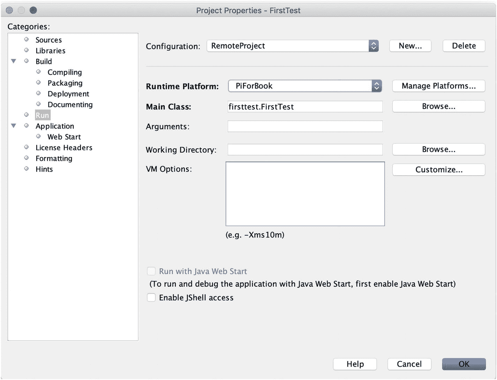

图 5-16

NetBeans 项目属性(运行)

现在再次运行该项目。这次在 NetBeans *输出*窗格中，您将看到类似于图 [5-17](#Fig17) 的内容。注意与 Pi 的通信，创建一个文件夹来存储 Pi 上的结果 jar 文件，下载 jar 文件，运行 jar 文件，并检索要显示的输出。成功了。恭喜你，你正在远程开发！

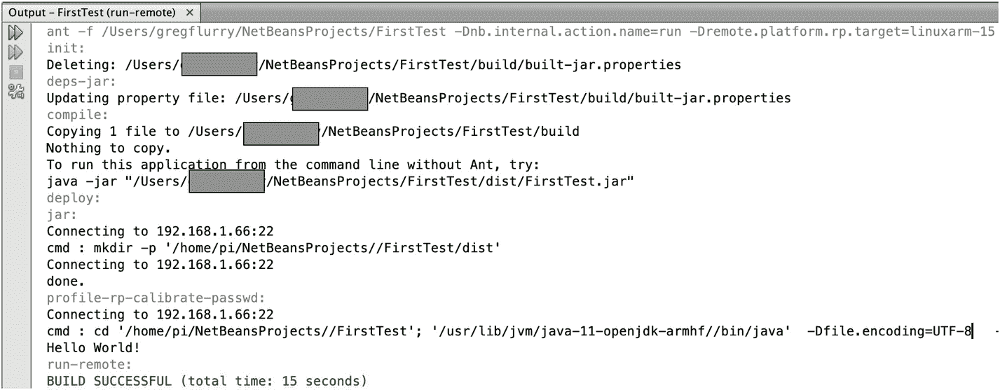

图 5-17

远程平台的 NetBeans 输出窗格

## 远程调试

NetBeans 也支持远程调试。可以如下测试。在`FirstTest`编辑器中，在`println`语句前添加以下行:

```java
int i = 5;

```

现在点击`println`语句的行号。整条线以红色高亮显示。点击主菜单栏中的**调试**图标；它是紧挨着**运行**图标右边的图标。遗憾的是，调试尝试可能会失败！至少它会失败，除非 NetBeans 开发人员已经修复了可疑的错误。如果有效，很好；您可以跳过下一小节。如果失败了，不要害怕；继续读。

### 修复远程调试

我最初认为这是一个常见问题，有一个容易发现的解决方案。我错了。然而，我四处搜寻，拼凑出了一个解决方案。来解决这个问题(至少在撰写本文时这是有效的)

1.  点击**项目**标签右侧的**文件**标签。

2.  展开 **FirstTest** 项目。

3.  展开`build.xml`。

4.  向下滚动，直到找到`debug-remote`元素。

5.  双击`debug-remote`；它的编辑器会在编辑器面板中打开。

6.  搜索字符串“debug-args-line”；你会发现两个事件；重要的一个是在名为“`-debug-remote-passwd`”的元素中。

7.  在该元素的子元素`<remote:runwithpasswd/>`中，删除字符串`${debug-args-line}`。

8.  保存文件并关闭`run-remote`编辑器。

现在再次点击**调试**。应该能行。不幸的是，有一个警告。我还没有发现如何在系统范围内解决这个问题。因此，在您希望远程调试的每个新 NetBeans 项目中，您都必须应用本小节中描述的修复程序。

### 成功调试

当 debug 运行时，您应该看到`println`语句变成绿色，表明调试器在执行它之前已经停止在那一行。见图 [5-18](#Fig18) 。

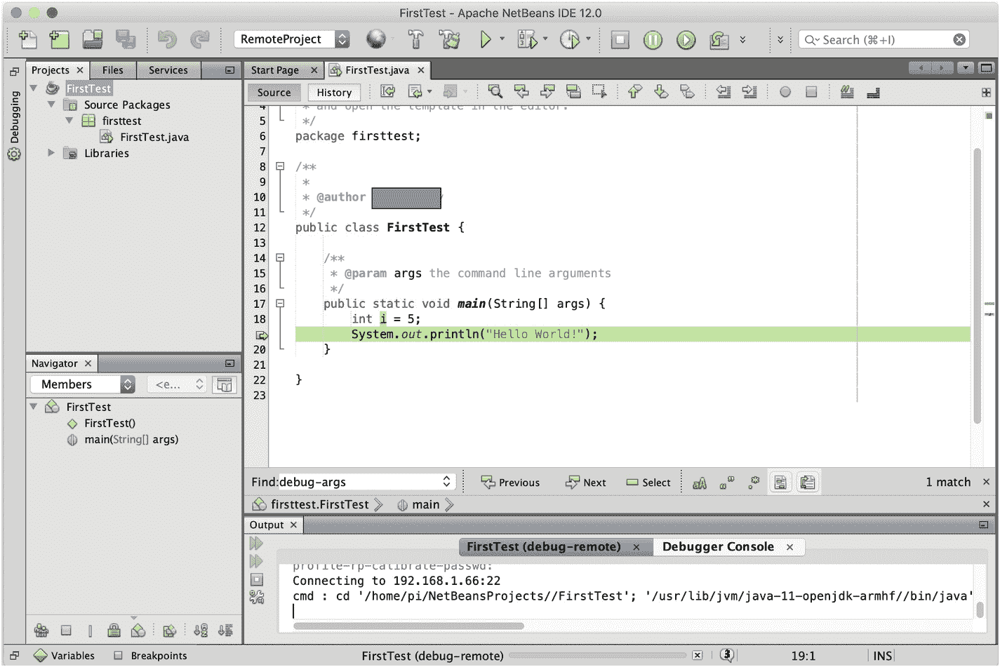

图 5-18

NetBeans 调试

现在您可以调试运行在树莓派上的代码了！

### 调试时检查变量

调试时，在输出面板中，您现在可以看到子面板、正常输出和调试器控制台。调试时，一般需要看变量。为此，单击 NetBeans 窗口左下角的**变量**(见图[5-18](#Fig18))；出现*变量*弹出窗口；它覆盖了输出窗格。你现在可以看看变量；特别是，您可以看到变量`i`的值为 5。

您可能不希望*变量*弹出窗口覆盖输出窗格。要使*变量*成为输出窗格中的另一个选项卡，请单击图 [5-18](#Fig18) 所示 NetBeans 窗口左下角的“双窗口”图标。现在输出面板如图 [5-19](#Fig19) 所示(我对断点做了和对变量一样的事情)。


图 5-19

NetBeans 输出窗格，带有“输出”、“断点”和“变量”选项卡

### 调试器菜单

调试值得多讨论一下。首先，图 [5-18](#Fig18) 只显示了调试菜单的一部分，这是由于我截屏时 NetBeans 窗口的大小。图 [5-20](#Fig20) 显示了最有用的调试器控件的图标。


图 5-20

NetBeans 调试器控件

从左到右，控件是

*   *完成*:终止调试会话

*   *暂停*:暂停调试会话

*   *继续*:运行到下一个断点

*   *跳过*:运行一条语句

*   *单步执行表达式*:运行单个表达式

*   *进入*:进入一种方法

*   *步出*:方法返回后运行到语句

在之前启动的调试会话中，如果您没有做任何其他事情，`println`语句应该仍然是绿色的。点击**跳过**，该语句将再次变为红色(表示是断点)，其后包含“}”的行将变为绿色，表示下一步将退出该方法。您可以查看*输出*选项卡，查看`println`语句是否有效。点击**继续**结束，因为不再有断点存在。

## 在没有 NetBeans 的情况下在树莓派上运行

现在，您可以使用运行在桌面上的 NetBeans 来开发 Java 程序，然后在树莓派上运行和调试该程序，这真是太棒了。但是，在某些时候，您可能希望在 Pi 上运行程序，而不涉及 NetBeans。我遇到的原因不多:

*   当您的项目处于“生产”阶段，甚至是进行一些测试时，您不需要或不想让 NetBeans“碍事”。

*   不幸的是，虽然这并不奇怪，但是运行在 Pi 上的远程程序不能接收键盘输入。

*   我发现高度格式化的控制台输出(例如由`System.out.format`产生的)不能正确呈现。

在这一节中，我将描述一些在没有 NetBeans 参与的情况下在 Pi 上运行程序的方法。后面的部分将描述其他的方法。

当您使用 NetBeans 在树莓派上运行或调试程序时，NetBeans 会将程序下载到 Pi。以前，当您将 Pi 配置为远程平台时，您必须标识 NetBeans 以 jar 文件的形式保存下载程序的文件夹(或 NetBeans 术语中的目录)(参见图 [5-14](#Fig14) )。用户 pi 的默认文件夹是`/home/pi/NetBeansProjects`。在该基本文件夹中，NetBeans 会创建一个与项目同名的特定子文件夹。NetBeans 将 jar 放在名为`dist`的子文件夹中。对于前面的示例项目，完整路径是`/home/pi/NetBeansProjects/FirstTest/dist`。

要在 Pi 上运行程序，首先从工作站终端 ssh 到 Pi。然后输入以下命令(在一行中):

```java
java -jar /home/pi/NetBeansProjects/
FirstTest/dist/FirstTest.jar

```

您将在终端中看到执行的结果。见图 [5-21](#Fig21)


图 5-21

不使用 NetBeans 执行程序(第一种方式)

您也可以使用稍微不同的方法来完成同样的事情。首先，在终端中，将工作目录(通过`cd`命令)更改为 jar 文件的位置。然后输入命令

```java
java -jar FirstTest.jar

```

你会得到完全相同的行为。见图 [5-22](#Fig22)


图 5-22

在没有 NetBeans 的情况下执行程序(第二种方式)

这些技术之所以有效，是因为 jar 文件中的信息标识了要执行 jar 中的哪个主类。该信息来自 NetBeans 项目的*运行的*属性名为*的主类*。您可以在*项目属性*对话框中查看并设置感兴趣项目的值；NetBeans 在创建包含主类`FirstTest`的 **FirstTest** 项目时会自动设置该值(参见图 [5-16](#Fig16) )。

## 在复杂项目中利用 NetBeans

在开发复杂的*系统*项目时，我遵循一个经典的开发实践，将大系统划分成更小的子系统。NetBeans 为这种实践提供了很大的支持，我总是在开发过程中创建多个 NetBeans 项目。例如，我可能有一个 NetBeans 项目提供“设备库”，第二个项目提供“数据处理库”，第三个项目包含使用“设备库”和“数据处理库”的应用程序

Note

库促进代码重用。虽然一个库通常包含*多个*类，它们都以某种方式相关联，但是一个库只包含一个*单个*类也是完全可以接受的。事实上，在下面的例子中，库只包含一个类。本书中开发的设备库有时包含单个类，有时包含多个类，这取决于设备的特性。

### 创建和测试库

为了探究其中的含义，您将为一个简单的库创建一个新的 NetBeans 项目并测试该库:

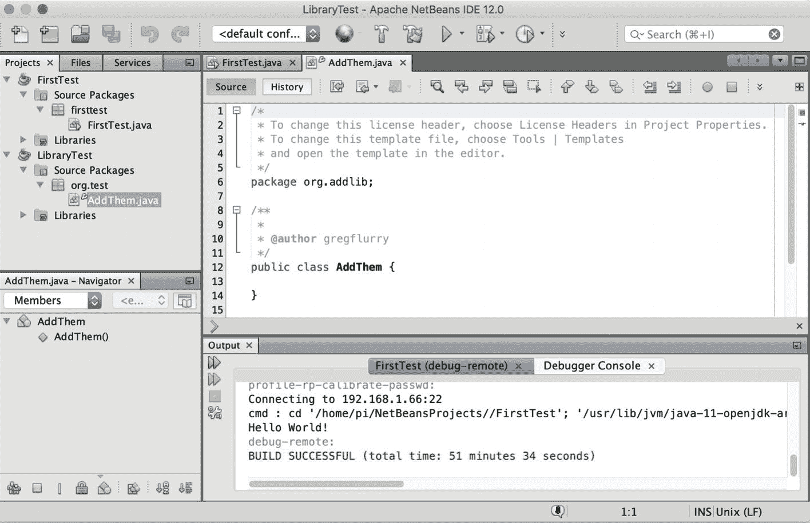

图 5-23

新库类的 NetBeans 窗口

1.  正如您之前对 **FirstTest** 项目所做的那样，在 NetBeans 中，单击菜单栏中的**新项目**图标。

2.  在*新项目*对话框中点击 **Java with Ant** 。

3.  在*新建项目*对话框中点击 **Java 类库**。

4.  在*新建项目*对话框中点击**下一个**。

5.  在*新建 Java 类库*对话框中，输入类库的名称；在这个例子中，我将使用“LibraryTest”。

6.  在*新建 Java 类库*对话框中点击**完成**。您应该会看到新项目出现在 NetBeans *项目*窗格中。

7.  右键 **LibraryTest** ，悬停在 **New** 上，点击 **Java 包**。你会看到*新 Java 包*对话框。

8.  输入所需的包名；在本例中为“org.addlib”。

9.  在*新 Java 包*对话框中点击**完成**。您应该会在 **LibraryTest** 项目下看到这个新包。

10.  右击 **org.addlib** ，悬停在 **New** 上，点击 **Java 类**。您应该会看到*新 Java 类*对话框。

11.  在*新 Java 类*对话框中输入所需的类名，在本例中为“AddThem”，点击**完成**。您将看到`AddThem`类的编辑器。NetBeans 窗口应该类似于图 [5-23](#Fig23) 所示。

新类需要一个带参数的构造器和一个带参数的方法。该方法会将其参数添加到构造器的参数中，并返回结果。输入清单 [5-2](#PC8) 中的代码完成`AddThem`。

```java
public class AddThem {
    int base;
    public AddThem(int base) {
        this.base = base;
    }

    public int addIt(int it) {
        return base + it;
    }
}

Listing 5-2The AddThem class

```

将代码添加到`AddThem`后，请注意“项目”面板中的变化。由于该项目被指定为一个库，NetBeans 不希望在源包中找到主类。预计您会想要测试库类，因此 NetBeans 友好地为测试类添加了一个测试包文件夹，并为只与测试相关的类添加了测试库。见图 [5-24](#Fig24) 。

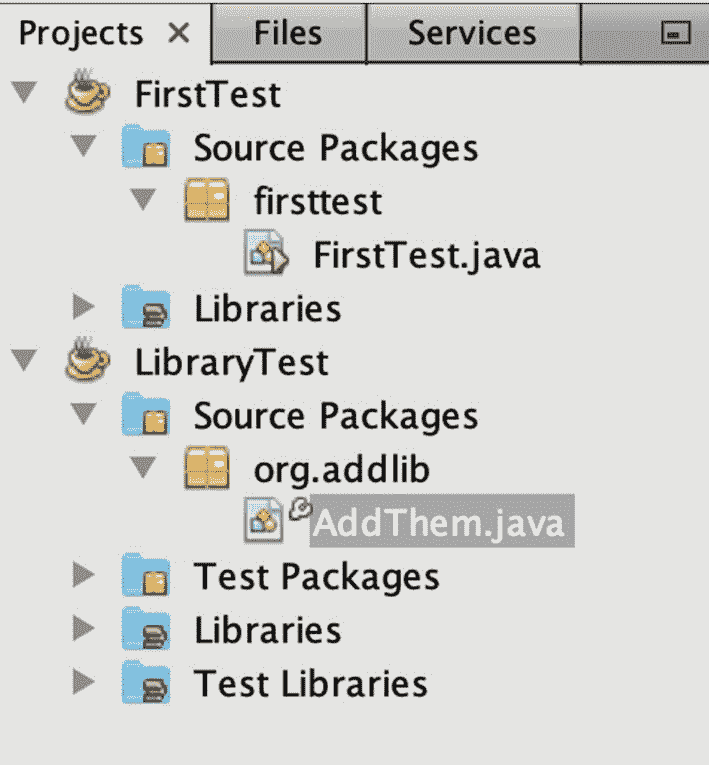

图 5-24

“项目”面板中的测试包和库

这些工件旨在支持 JUnit 测试程序(超出了本书的范围)，但是您可以创建自己的简单测试用例。但是，需要理解的是，当 NetBeans 为库 ***构建 jar 文件时，它不包括任何测试类或测试库*** ！这是一件非常好的事情，因为您不希望测试用例塞满一个库 jar 文件。然而，这也意味着测试用例永远不会被下载到 Raspberry Pi，因此，举例来说，您不能使用 Pi 上的测试包中的测试用例来测试设备库。

现在您将创建一个简单的主类来测试库中的单个类。展开**测试包**；你会看到 **<默认包>** 。出于本书的目的，这是放置测试库的主类的好地方。右击 ***<默认包>*** ，悬停在**新建**上，点击**主类**。在出现的*新 Java 主类*对话框中，在*类名*字段中输入“TestAdd”，然后点击**完成**。你会看到课程的编辑。完成该类，使其看起来如清单 [5-3](#PC9) 所示。

```java
public class TestAdd {
    public static void main(String[] args) {
        AddThem at = new AddThem(6);
        System.out.println("The result: " + at.AddIt(5));
    }
}

Listing 5-3The TestAdd class

```

您将在以“`AddThem at`”开头的行上看到一个错误指示。这是因为 NetBeans 不知道`AddThem`的包名。点击行上的红色球，然后点击高亮显示的选项**为 org.addlib.AddThem 添加导入**。NetBeans 会为您添加导入，并且错误会消失。啊，美丽的 IDE！

现在点击**运行**图标。您将看到一个弹出的错误，指出该项目没有主类集。如果你检查项目**运行**属性，你会发现你不能设置`TestAdd`为*主类*；你甚至在对话框里都找不到！这与前面的 jar 文件讨论有关；因为测试包从未出现在 jar 文件中，所以它们不可能是可运行的类。

但是可以跑`TestAdd`！在*项目*窗格中，右键单击 **TestAdd** 。在弹出的窗口中，点击**运行文件**。在输出窗格中，您会看到

```java
The result: 11

```

有效！你不仅可以运行测试程序，还可以调试它。在提到的弹出窗口中，点击**调试文件**而不是**运行文件**。

该库已经编写并经过测试。是时候使用它了。然而，在使用它之前，要认识到`TestAdd`是在您的工作站上运行的，而不是在树莓派上。这是极其重要的。您可以在您的工作站上对独立于硬件的代码进行大量测试。Java 的“编写一次，在任何地方运行”的特性对于这种情况确实很有价值。

Caution

我们在后面章节中开发的*设备库*是*而不是*硬件独立的，并且必须运行在树莓派上。因此，您必须使用不同的测试方法。详见第 [8](08.html) 章。

### 使用库

我现在将向您展示如何使用之前创建的库。为了说明一些额外的要点，您将在已经配置为在树莓派上运行的 **FirstTest** 项目中创建一个新程序(主类)。

1.  右键单击**首测**下的**源包**。

2.  将鼠标悬停在**新**上，然后点击 **Java 包**。

3.  在*新建 Java 包*对话框中，在*包名*字段中输入包名；对于图书，输入“org.lib.user”，然后点击**完成**。

4.  右击 ***org.lib.user*** ，悬停在弹出的 **New** 上，点击 **Java 主类**。

5.  在出现的 *New Java Main Class* 对话框中，在 *Class Name* 字段中输入类名；对于书籍，输入“LibTest”，然后点击**完成**。与其他类一样，NetBeans 会创建一个框架，并在编辑器窗格中打开该类。

6.  完成该类，使其看起来像清单 [5-4](#PC11) 。

```java
public class LibTest {

    public static void main(String[] args) {
        AddThem at = new AddThem(6);
        System.out.println("The result: " + at.AddIt(5));
    }
}

Listing 5-4The LibTest class

```

与前面提到的`TestAdd`一样，您将在以“`AddThem at`”开始的那一行得到一个错误指示。点击线上的红色球。你会发现选项**为 org.addlib.AddThem 添加导入**没有出现！这是因为 NetBeans 不知道在哪里可以找到包含正确的`AddThem`的库(可能不止一个)。

您必须告诉 NetBeans 哪个库包含适当的`AddThem`类。为此，右键单击项目 **FirstTest** ，然后单击 **Properties** 。在出现的*项目属性*对话框中，在*类别*下，点击**库**。您将看到如图 [5-25](#Fig25) 所示的库属性。

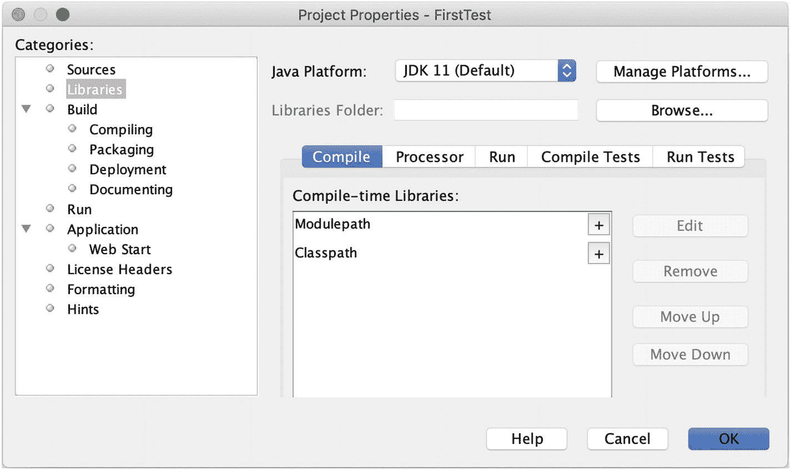

图 5-25

库的 NetBeans 项目属性

现在点击*类路径*右边的 **+** 。在弹出的小窗口中，点击**添加项目**。你现在会看到如图 [5-26](#Fig26) 所示的*添加项目*对话框。点击**库测试**，然后点击**添加项目 JAR 文件**。您将返回到*项目属性*对话框。点击**确定**。

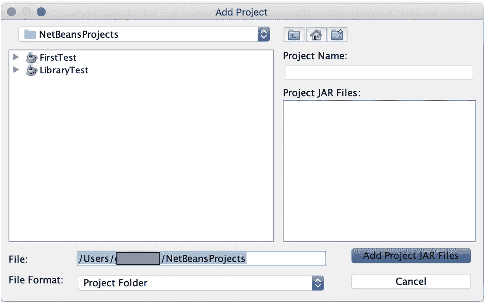

图 5-26

NetBeans 添加项目对话框

返回到`TestAdd`编辑器。点击红色的球。现在在弹出窗口中，您将看到所需的选项**为 org.addlib.AddThem** 添加导入。单击该选项，NetBeans 将为您添加从库中导入的内容，错误随即消失！

现在点击**运行**图标。您会看到主类`FirstTest`运行在树莓派上。这显然不是你想要的。运行`LibTest`有两种方式。如果您打算运行一两次，只需在*项目*窗格中右键单击 **LibTest** ，然后单击**运行文件**。注意，该弹出窗口还包含一个**调试文件**选项，因此您可以用同样的方式进行调试。第二种方式更有趣，我将在下一节介绍它。

## 选择要从 NetBeans 运行的程序

想一遍遍跑`LibTest`怎么办？然后你想使用**运行**图标。我将向您展示如何配置 NetBeans 来实现这一点。

首先右击 **FirstTest** ，选择项目**属性**。在*类别*下，点击**运行**。参见图 [5-16](#Fig16) 。查看*主类*旁边字段中的条目。您会看到 NetBeans 被配置为运行`FirstTest`。要选择运行另一个主类，单击*主类*右侧的**浏览**。您将看到一个弹出窗口，其中列出了项目中的主要类，并选择了`firsttest.FirstTest`。见图 [5-27](#Fig27) 。

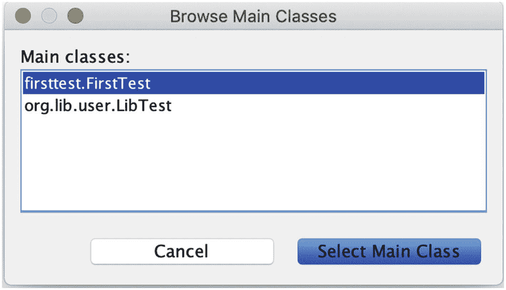

图 5-27

NetBeans 浏览主类对话框

在对话框中点击`org.lib.user.LibTest`，然后点击**选择主类**。在*项目属性*对话框中，点击**确定**。现在当你点击**运行**图标，`LibTest`运行！

## 在没有 NetBeans 的情况下在树莓派上运行选择的程序

前一节向您展示了如何使用`java -jar`命令来运行在先前下载的项目 jar 文件中标识的主类。如果您想在一个 jar 文件中运行多个主程序，您必须使用不同形式的`java`命令。

在上一节中，您创建了一个包含两个主要类的项目，`FirstTest`和`LibTest`。你配置 NetBeans 运行`LibTest`；因此，在远程终端中，当您输入以下命令时

```java
java -jar FirstTest.jar

```

你发现`LibTest`跑了。如果你想运行`FirstTest`，你使用下面的命令:

```java
java -cp FirstTest.jar firsttest.FirstTest

```

图 [5-28](#Fig28) 显示了运行各种命令的结果。


图 5-28

具有各种`java`命令结果的远程终端

通常，您应该使用前面描述的第二种形式:

```java
java -cp <jar>.jar <package>.<main class>

```

在哪里

*   `<jar>`是指 NetBeans 创建并下载的 jar 文件(注意，这个名称与 NetBeans 项目名称相同)。

*   `<package>`指您想要运行的主类的包名。

*   `<main class>`指你要运行的主类的名字。

## 用 NetBeans 下载就行了

在上面几节中，您了解了 NetBeans 可以将项目下载到 Raspberry Pi，然后运行或调试 jar 文件中指定为主类的程序。随后，您可以在没有 NetBeans 的 Pi 上运行同一个项目中的许多程序(主类)之一。

您还了解了如果您想要运行的主类不是 jar 文件中指定要运行的主类，您可以解决这个问题。但是，如果您变得懒惰(像我一样)，只想使用 NetBeans 下载一个更新的项目，然后在 Pi 上运行您想要的程序，该怎么办呢？

很简单。在这个项目中，您创建了一个“哑”主类，它除了指示下载成功之外什么也不做(有点多余)。当您单击 **Run** 图标时，您将它指定为主类来运行。对于示例项目**首测**

1.  右键单击**首测**下的**源包**。

2.  将鼠标悬停在**新**上，点击 **Java 主类**；你会看到*新的 Java 主类*对话框。

3.  在*类名*字段中，键入一个主类名，例如“Dummy”；在*包*字段中，输入一个包名，例如“dummy”，点击**完成**；此时，如果你想添加代码在`Dummy`运行时打印一些东西，可以这样做，但不是必须的。

4.  调出 **FirstTest** *项目属性*对话框。

5.  在*类别*下，点击**运行**。

6.  在*主类*行右侧，点击**浏览**；您将看到*浏览主类*对话框(参见图 [5-27](#Fig27) 中的示例)。

7.  你应该在主类列表中看到`dummy.Dummy`；点击它并点击**选择主类**，你将返回到*项目属性*(运行)对话框。

8.  现在点击**确定**。

现在点击**运行**图标。在*输出*窗格中，你看不到`FirstTest`或`LibTest`的输出，因为两者都没有运行；`Dummy`跑了，也确实*没什么*。您将在*输出*窗格中看到的内容如下:

```java
run-remote:
BUILD SUCCESSFUL (total time: 3 seconds)

```

当然，如果你把一个`println`语句注入`Dummy`，你会看到它打印出来的东西。当然，你仍然可以使用一个`ssh`终端从命令行运行树莓派上的`FirstTest`和`LibTest`。

## 摘要

在本章中，您已经

*   工作站上安装的 Java

*   在工作站上安装了 NetBeans

*   在 NetBeans 中将您的树莓派配置为远程平台

*   学习如何使用 NetBeans 从工作站和树莓派以多种方式构建、运行和调试复杂的 Java 程序

现在，您已经有了使用 Java 和树莓派开发机器人和物联网项目的工具。在第 [6](06.html) 章中，您将了解为机器人和物联网中使用的设备开发设备库的注意事项。