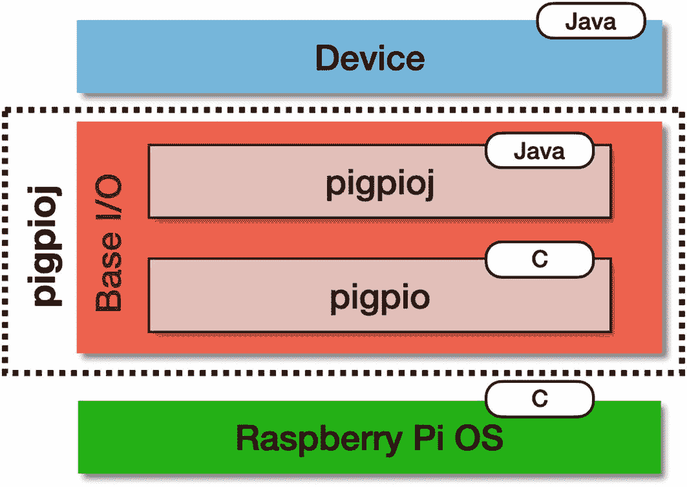
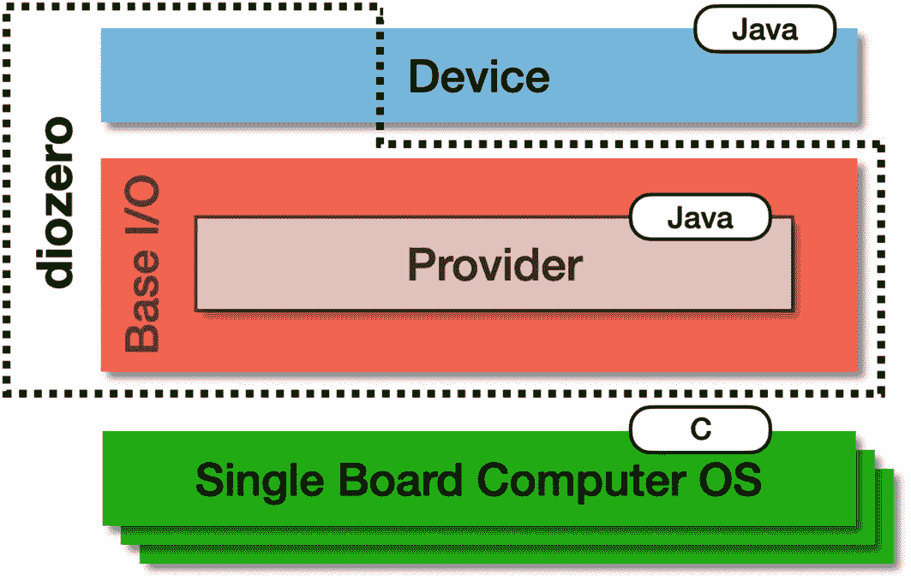
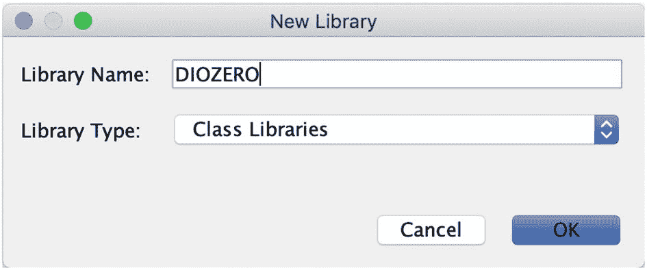
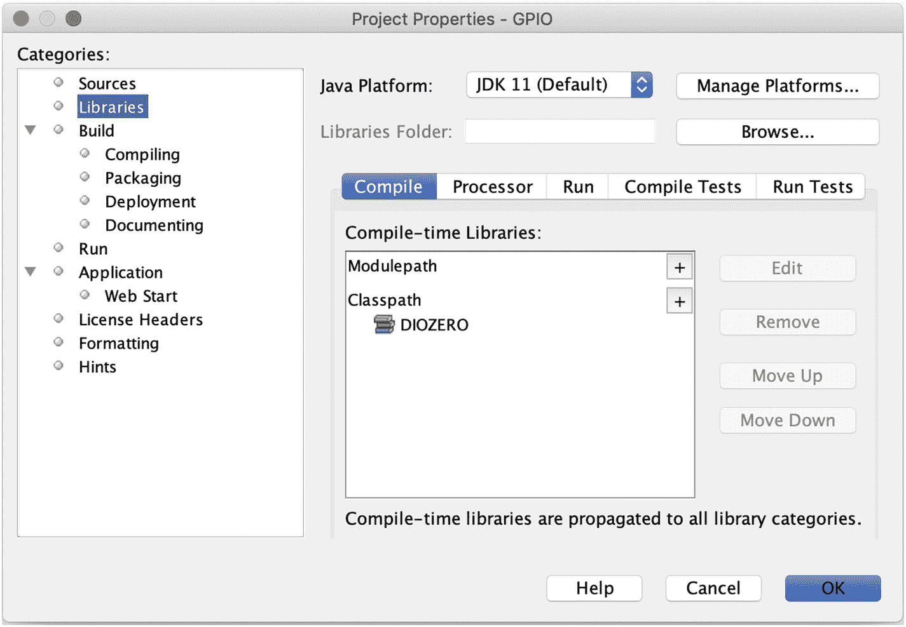

# 六、Java 中的设备支持

> *如果没有* *没有奋斗，就没有进步。*
> 
> —弗雷德里克·道格拉斯，1857 年

在第一章，我提到了在树莓派上使用 Java 时为你的设备寻找或创建设备库的挑战。这一挑战存在于两个层面:

1.  为各种形式的基本 I/O 寻找*基本 I/O* 库，即数字 I/O(也称为 GPIO)、串行、I2C 和 SPI，在这些基础上可以构建设备库

2.  为您的设备寻找或创建*设备*库，这需要一种或多种形式的基本 I/O

在这一章中，我将讨论

*   查找基本 I/O 库

*   为您的项目和本书选择基本 I/O 库

*   将基本 I/O 库引入 NetBeans

*   查找设备库

*   将非 Java 设备库移植到 Java

## 查找 Java 的基本 I/O 库

对于任何给定的项目，这组器件可能需要 GPIO、串行、I2C 和 SPI 的某种组合。遗憾的是，没有一个集中的来源提供关于树莓派上 Java 基本 I/O 的信息。或者，也许更准确地说，我找不到它，如果它存在的话。所以，要找到信息，你必须使用搜索引擎。很难立即产生有用的结果。例如，如果您想找到对串行 I/O 的支持，您可以使用搜索术语“串行”、“Java”和“Raspberry Pi”你毫无疑问会找到几个候选人，比如， *Pi4J* ， *RxTx* (又名 *RXTX* ，*jserialcom*， *usb4java* ， *jRXTX* ，以及 *jSSC* 。有时候，在“第一顺序”搜索之后，你必须在找到所有候选人之前跟踪一系列链接。例如:

*   沿着 Pi4J 走下去，你会发现它是一个封装了 *wiringPi* 库(用 C 编写)的包装器。

*   沿着 jRXTX 走下去，你会发现它是围绕 *RxTx* 的一个“更容易使用”的包装器。

但是你还没有完成。我发现，有时，出于不清楚的原因，您必须搜索其他基本 I/O 类型才能获得完整的图片。因此，举例来说，即使你对 I2C 不感兴趣，你可能也应该搜索一下，然后沿着一条新的链接线索，看看你是否能找到其他东西。这样做，你会找到很多关于 Pi4J 的参考资料。你还会找到对*设备 I/O* (又名 DIO)和 *diozero* 的引用。Pi4J、DIO 和 diozero 都支持*一切* : GPIO、串行、I2C 和 SPI。你可能还需要在 C 中寻找 I2C 支持，并找到支持一切的 pigpio。深入研究 pigpio，你会发现有一个 pigpio 的 Java“包装器”叫做 *pigpioj* 。我想你能明白我的观点；一般来说，你必须做一个相当广泛，详尽的搜索，以获得一个完整的图片。

## 选择最佳的基本 I/O 库

当您为一种类型的基本 I/O 找到多个选项时，有几个选择“最佳”的标准我建议不一定要按优先顺序

*   功能覆盖范围

*   表演

*   支持

*   易用性

### 功能覆盖范围

功能覆盖提出了一个问题“它做了我需要做的所有事情了吗？如果没有，需要什么样的妥协？”一些例子:

*  树莓派有两种形式的串行 I/O:通过 USB 端口的 USB 串行和通过 GPIO 头上的 RX/TX 引脚的 TTY 串行。usb4java 只支持 usb 端口，而前面提到的其他一些支持两种形式。

*   一些 GPIO 库为数字 I/O 提供上拉和下拉电阻支持；有些没有。

通常，您可以从文档中确定功能覆盖范围。然而，我发现测试有时是必要的。例如，在 2017 年，测试显示 Pi4J I2C 支持只能从寄存器地址 0 开始进行块读取，在某些情况下强制使用底层 wiringPi。

### 表演

性能其实是双管齐下的。第一个问题是“这个选项可靠吗？”例如，2017 年测试 jRXTX 表明它可以工作，但表现不稳定；我从未确定原因。显然不是最佳选择。

第二个问题是“选项见效快吗？”你肯定不想浪费时间或资源。如果一个选项执行任务的速度比其他选项快得多，那么它可能是最佳选择。比如 2017 年测试 Pi4J serial 和 jserialcom，结果显示 jserialcom 比 Pi4J 快很多(或者说我无法正确配置 Pi4J)。

您应该从这个讨论中了解到，您不仅要准备好测试一个库是否能够可靠地工作，还要准备好测试它在您的项目中是否具有足够的性能。

### 支持

支持是一个有点模糊的总称。有几件事需要考虑。您找到的任何库都是由个人、团队或组织创建和支持的。通常，创建和支持实体越大越好。

支持的现状和性质至关重要。您可能应该对使用几年没有更新或没有可见支持渠道的库保持警惕。例如，截至 2020 年 10 月

*   jSSC 似乎自 2013 年以来没有更新过。

*   我发现自 2017 年以来没有更新，也没有提到 RxTx。

*   wiringPi 的作者不赞成使用它，这实际上是反对 Pi4J 的当前版本(1.2)。

*   usb4java 直到 2018 年才被积极支持。

*   jRXTX 似乎有积极的支持和更新。

*   jSerialComm 似乎得到了积极的支持和更新。

*   DIO 似乎很少使用。

*   diozero 得到了积极的支持和更新。

*   pigpio 拥有积极的支持和更新，pigpioj 包装器也是如此。

*   Pi4J 2.0 正在构建中。

所以，公平的警告，当你读这本书的时候，我为这本书所发现和推荐的可能会改变。你应该自己做研究。

另一个考虑因素是用户社区的规模。越大越好，虽然这可能很难确定(搜索引擎可以帮助)。一个大的用户社区提供了更多的机会来寻找使用实例，并获得关于不寻常的用例或异常行为的帮助。然而，庞大的用户群体并不能保证“最好”。在所有基本 I/O 库中，Pi4J 似乎拥有最大的用户群体，但是请记住，当前版本应该被认为是过时的(不仅底层 wiringPi 库过时了，Pi4J 1.2 的某些部分在 Java 版本 9 或更高版本上也不能工作)。

### 易用性

易用性是主观和模糊的，可以包括许多方面。例如，理想情况下，要使用这个库，您可以获得一个单独的 jar 文件，这样就完成了。一些图书馆做到了这一点。另一方面，有些可能要求您在树莓派上构建 C 代码，在 Pi 上安装其他代码，弄乱 Java 权限文件，或者其他消耗您在项目上花费的时间的活动。

另一个方面在前面已经提到。有些库支持多种类型的 I/O。如果您需要的所有类型都由一个库满足，那么这个选项可能是“最佳的”，除非有其他标准禁止。只有一个图书馆，生活更简单；例如，您有单一的文档来源和单一的支持问题联系人。

其他方面包括文档的存在和质量、代码示例的存在以及 API 的复杂性。所有这些都会影响您使用库的速度。

## 这本书的基本 I/O 选择

不管是好是坏，这本书主要是一组独立的以设备为中心的项目，而不是一个单一的项目。在某种程度上，这种方法是由于机器人项目和物联网项目之间的差异，前者通常需要几个设备，后者通常只需要一两个设备。在某种程度上，这是因为想要展示树莓派的所有形式的基本 I/O。因此，出于本书的目的，我将寻找一个支持树莓派上可用的所有基本 I/O 功能的库，即 GPIO、串行、I2C 和 SPI。

在撰写本文时(2020 年末)，没有太多繁琐的细节，根据功能覆盖、相对性能、支持和易用性，对支持所有类型基本 I/O 的可用“一体化”库进行了筛选，结果只产生了两个可行的候选库:

*   pigpioj(见 [`https://github.com/mattjlewis/pigpioj`](https://github.com/mattjlewis/pigpioj)

*   diozero(参见 [`https://www.diozero.com`](https://www.diozero.com) )

正是在这一点上，最终的决定变得非常有趣。图 1-1 显示了适用于本书的理想化软件架构，相关文本描述了该架构四层的本质。我们将使用该架构来比较候选人。我断言，当比较 pigpioj 和 diozero 时，没有必要考虑应用层，因为你将*总是*必须在应用层编写程序。

### 看看皮格皮奥伊

图 6-1 显示了使用 pigpioj 时，图 1-1 的软件架构，减去了应用层。对于 pigpioj，基本 I/O 层由两个子层组成。 *pigpio* 子层代表 pigpio C 库，*在 *C* 中公开*一个基本 I/O API；pigpio *使用*更原始的树莓派 OS C API 作为基本 I/o。*pigpioj*子层*是 pigpio 的 pig pioj“包装器”*。pigpioj 子层*公开了*用于创建设备库的 Java 基本 I/O API；它使用 pigpio C API。

图 6-1

pigpioj 软件架构

设备层表示您找到或编写的设备库。它们*向应用程序公开*特定于设备的 API。他们*使用*pigpioj base I/O API。

pigpio 和 pigpioj 的结合提供了一个有趣的特性——*远程 I/O* 。这意味着您可以在不同的计算平台上运行您的应用程序，但是在目标树莓派上执行 I/O。这当然是用 NetBeans 进行远程开发的一种替代方法。详情参见 pigpioj 文档。

### 看一看迪奥西诺

图 6-2 显示了使用 diozero 时，图 1-1 的软件架构，减去了应用层。将图 6-2 与图 6-1 进行比较，您会发现相似之处，但也有显著差异。虽然在图 6-2 中并不明显，但与 pigpioj 的相对简单性相比，diozero 是一个提供了一系列有趣特性的扩展框架。

Note

本书中所有关于 diozero 的陈述在 1.3.0 版本中都是正确的；然而，在 2021 年夏天，diozero 正在积极开发中，新的和改进的功能频繁发布。因此，以后的版本可能会有所不同。此外，以下章节中的所有代码都是针对 1.3.0 进行测试的；以后的版本可能需要或受益于代码更新。

在图 6-2 中，首先注意到*单板计算机 OS* 层。该层表示几个单板计算机(SBC)中的一个，包括 Raspberry Pi。没错；diozero 在树莓派上工作，也在类似的 SBC 上工作，如 Odroid C2 和 BeagleBone Black。您可以在 diozero 文档中找到更多关于受支持的 SBC 的信息。

图 6-2

使用 diozero 的软件架构

使用 diozero，基本 I/O 层由 diozero *提供者组成。*dio zero 提供商尽可能地调整底层 SBC 基本 I/O 功能，以提供由基本 I/O 层公开的基本 I/O API。提供者*公开了*用于创建设备库的 Java 基本 I/O API。它*使用*更原始的 SBC OS C API 进行基本 I/O

提供者的概念可能代表了 diozero 最有趣的特性。提供者实现了众所周知的*服务提供者模式*(参见 [`www.javapedia.net/Design-Patterns/1593`](http://www.javapedia.net/Design-Patterns/1593) )。这意味着可以使用不同的提供商，而不改变更高层*。因此，您可以编写一个设备库，它可以跨多个提供者和多个 SBC 工作(在 SBC 的基本 I/O 能力范围内)。diozero 支持*通用*和工作于*任何* SBC 的提供者和 *SBC 专用*的提供者。在 diozero 版本 1.3.0 中，树莓派有四个提供者:*

 **   **内置**:在 Pi 基本 I/O 功能的范围内提供最佳的功能和性能选择。内置提供程序是通用的。

*   **pigpio** :使用 pigpio C 库。pigpio 提供程序是 Pi 特定的。

*   diozero remote :提供一种远程计算形式，应用程序运行在主机平台上，I/O 操作运行在 Pi 上。diozero-remote 提供程序是通用的。diozero-remote 提供程序是远程开发的一个替代方案。

*   **pigpio remote** :提供一种远程计算形式，应用程序运行在主机平台上，I/O 操作运行在 Pi 上。pigpio-remote 提供程序是 Pi 特定的。pigpio-remote 提供程序也是远程开发的一种选择。

您可以在 diozero 文档中找到关于各种 SBC 的提供者的更多信息。

在图 6-2 中，设备层用其暴露的设备 API 表示设备库；他们使用基本 I/O 层(也称为提供者)API。diozero 的另一个很大的特点是它包括了一个广泛的设备库，你*不必*去写！当然，如果 diozero 不支持您的设备，您可以使用基本 I/O 编程接口来创建一个设备库。两全其美！您可以在 diozero 文档中找到受支持设备的列表。

Note

本小节仅描述 diozero 与树莓派和类似 SBC 相关的方面。diozero 还支持其他计算平台，例如 Arduino 和粒子光子。更多细节见 diozero 文档。

### 评估选择

现在我将使用前面提到的四个标准来评估 pigpioj 和 diozero，以便在它们之间进行选择。

#### 功能覆盖范围

*pigpioj* 为您提供了一个健壮的基础 I/O 层，用于在树莓派上创建设备库。就这样。

*diozero* 给你

*   用于创建设备库的强大的*基础 I/O* 层

*   *多个提供者*、*为基础 I/O 层提供不同的特性*

*   一组现有的设备库，用于 LED、按钮、环境传感器、电机控制器甚至 IMU 等设备

*   支持*额外的计算平台*，例如，Odroid C2 和 BeagleBone Black

显然，diozero 具有更优越的功能覆盖面。

#### 表演

如前所述，pigpioj 是 pigpio 上的一个薄薄的包装。因此，在 Java 中，pigpio 的性能已经是最好的了。

diozero 提供的提供商之一是 pigpio。diozero 内置提供程序提供的 GPIO 性能大约是 pigpio 提供程序的七倍，两个提供程序的 I2C、SPI 和串行性能大致相当。因此，声称 diozero 提供卓越的性能当然是合理的。

#### 支持

如果您仔细阅读 pigpioj 和 diozero 的文档，您会注意到这些库是由同一个人创建的。因此，支持很可能是一个平局。另一方面，diozero 是一项更加全面的工作，因此，及时提供支持可能更加困难。

#### 易用性

至于易用性，pigpioj 还是蛮不错的。在尝试使用 pigpioj 之前，您必须在您的树莓派上安装 pigpioj 然而，这样做很简单。您必须在您的工作站上获取 pigpioj jar 文件。要构建和运行应用程序，必须将 jar 文件添加到 NetBeans 项目中。

然而，使用 pigpioj 要小心。底层 pigpio 库必须以 root 权限运行。因此，您必须通过`sudo`命令以超级用户身份运行您的 Java 应用程序。因此，您的应用程序可能会无意中造成混乱。虽然可能性不大，但还是有可能的。

diozero 的易用性也非常好。根据您使用的提供者，您必须获得三个或四个 jar 文件。要构建和运行应用程序，必须将 jar 文件添加到 NetBeans 项目中。正如您将在下面看到的，NetBeans 使这变得很容易。

pigpioj 和 diozero 都支持其基本 IO 层中的所有基本 I/O，即 GPIO、串行 I/O、I2C 和 SPI。diozero 的文档更好一些，自然也更广泛。虽然两个基本的 I/O 编程接口都不难使用，但我发现 diozero API 更容易使用，而且同样有效。diozero 还提供了一些 pigpioj 中没有的有用的便利方法和函数。

总的来说，这两个标准大致相同，尽管我觉得 diozero 有一点点优势。

### 最终选择——dio zero

就支持和易用性而言，pigpioj 和 diozero 之间没有明显的区别。但是 diozero 在 GPIO 上可以大大胜过 pigpioj。diozero 的功能覆盖面及其众多引人注目的特性远远超过 pigpioj。因此，本书中开发的设备库使用 diozero。当然，你可以做出不同的选择。

请记住，除非您坚持开放基本 I/O 选项，否则您只需要支持项目设备所需的一个或多个库。虽然 diozero 因其广泛的框架和令人钦佩的性能而成为本书的最佳选择，但这一选择的一个关键因素是支持所有的基本 I/O。如果您只需要一种特定形式的基本 I/O，例如串行，diozero 很可能至少是一个不错的候选，但您可能需要针对其他候选进行自己的评估。

Caution

我想强调的是，diozero 并不针对机器人或物联网。它是一个通用框架，支持任何类型设备的基本 I/O 功能。

## 在 NetBeans 中配置 diozero

现在 diozero 被确定为这本书的基本 I/O 库；我将向您展示如何使 diozero 对 NetBeans 可用，以便对于您的项目，您可以使用 diozero 中现有的设备库，或者使用 diozero 开发设备库。

我在第五章中提到，我发现在 NetBeans 中只有 Ant 项目管理/构建工具支持“开箱即用”的高效远程计算因此，我将向您展示如何设置基于 Ant 的项目。 1

首先，您需要下载所需的 diozero jar 文件。最简单的方法是获取 diozero“发行版 ZIP”文件，其中包含 diozero 依赖项的所有*dio zero JAR 文件和*所有* JAR 文件，以及依赖项的依赖项，等等。*

在下载之前，你得考虑好你要用什么版本的 diozero。除非你有很好的理由不这样做，否则你应该使用最新的版本(最高的版本号)。我找到了三种简单的方法来下载 diozero 发布版本的发行版 ZIP 文件。首先，调出 diozero 文档( [`https://www.diozero.com`](https://www.diozero.com) )。如果你想要最新的 diozero 版本，在左边的导航面板中选择**创建你自己的应用**。单击名为 **diozero-distribution ZIP 文件**的链接(就在 XML 清单下面)立即下载最新的发行版 ZIP 文件。如果你认为你可能想要一个更早的 diozero 版本，在你调出文档后，向下滚动直到你看到部分 *Maven 依赖/下载链接*。本节描述了查找和下载 diozero 所有发布版本的发行版 ZIP 的两种方法。

使用前面提到的方法之一下载您选择的版本的发行版 ZIP。您将下载一个名为`diozero-distribution-i.j.k-bin.zip`的文件，其中`i.j.k`代表版本号，例如 1.3.0。您可能需要解压缩文件；在 macOS 上，它被自动解压缩，所有包含的 JAR 文件都放在文件夹`Downloads` / `diozero-distribution-i.j.k`中。如果您使用的是 Windows，下载和解压缩(如果需要)应该会产生一个装满 JAR 文件的子文件夹(同名)。

发行版 ZIP 包含的 JAR 文件比您实际需要的要多得多。在本书中，您将只使用内置的提供程序。 2 这意味着下载的几十个 JAR 文件中，你只需要三个:

*   diozero-core-i.j.k.jar(包含内置提供程序；要看后面两个)

*   tinylog-api-m.n.o.jar 和 tinylog-impl-m.n.o.jar(这两个版本号是一样的；该编号可能不同于 diozero 核心的版本号)

现在您创建一个 *Ant 库*用于 diozero 项目。在 NetBeans 中，点击菜单栏中的**工具**。点击弹出窗口中的**库**；你会看到如图 6-3 所示的*蚂蚁库管理器*对话框。

图 6-3

NetBeans Ant 库管理器对话框

点击**新建库**按钮；你看到*新库*对话框(图 6-4 )允许你给新库命名；你可以看到我使用的是“DIOZERO”，但是你可以使用任何独特的东西。输入姓名后，点击**确定**。

图 6-4

新建库对话框

您将再次看到 *Ant Library Manager* 对话框，在这里您可以将适当的 JAR 文件添加到您正在创建的库中。点击**添加 JAR/文件夹**按钮；你会看到如图 6-5 所示的*浏览 JAR/文件夹*对话框(你可能需要水平展开它才能看到完整的文件/文件夹名称)。

图 6-5

浏览 JAR/文件夹对话框

导航到包含您刚刚下载的 JAR 文件的文件夹。选择前面提到的三个 JAR 文件，点击 **Add JAR/Folder** 。您将再次看到 *Ant Library Manager* 对话框，其中有您刚刚添加的用于创建库 DIOZERO 的 JAR 文件；见图 6-6 。

图 6-6

与 DIOZERO 库的 Ant 库管理器对话框

点击 **OK** 创建 DIOZERO 库。 *Ant Library Manager* 对话框关闭，库可以使用了。

现在我们来看看如何将 DIOZERO 库添加到项目中。这与添加一个*项目*库的过程非常相似，如第五章所述，所以我将只讨论不同之处。首先，打开项目属性，点击**库**，你会看到如图 5-25 所示的对话框。现在点击*类路径*右边的 **+** 。在弹出的小窗口中，点击**添加库**。你现在会看到如图 6-7 所示的*添加库*对话框。

图 6-7

添加库对话框

点击 **DIOZERO** ，然后点击**添加库**。你将返回到如图 6-8 所示的*项目属性*对话框。

图 6-8

将 DIOZERO 库添加到项目的结果

您还需要为项目设置*构建* ➤ *打包* ➤ *复制依赖库*属性。点击**确定**。现在，您可以编写一个使用 diozero 中包含的一些设备库的应用程序，或者您可以使用 diozero base I/O API 编写自己的设备库，或者两者兼而有之！下一节将帮助您决定做什么和如何做。

## 查找(和移植)设备库

你已经为你的项目获得了一个闪亮的新设备。你如何找到对它的支持？记住搜索引擎是你的朋友。一个好的方法是

*   查看您设备的 diozero 设备库列表(参见 [`https://www.diozero.com`](https://www.diozero.com) 和 [`www.javadoc.io/doc/com.diozero/diozero-core/latest/com/diozero/devices/package-summary.html`](http://www.javadoc.io/doc/com.diozero/diozero-core/latest/com/diozero/devices/package-summary.html) )。

*   在互联网上搜索使用 diozero base I/O 层的 Java 设备库。

*   搜索使用其他基本 I/O 支持的树莓派提供程序的 Java 设备库，例如 Pi4J 或 pigpioj。

*   更广泛地搜索 Java 设备库。这个搜索应该会得到其他计算平台以及树莓派的支持。

*   从销售商、制造商或任何其他地方为您的设备搜索非 Java 库。

*   从头开始为你的设备实现一个库。

你会发现自己处于几种情况中的一种(或多种)。以下各小节或多或少地按照可取性的顺序讨论了这些情况。

在分析情况之前，我必须提几点。第一点是重要的现实。即使在最好的情况下，也可能会有*需求差异*要求您完成工作。有时一个设备库表现出*太少*的设备能力；例如，IMU 库可能不支持此类设备中常见的 FIFO。有时候一个设备库*做的太多*；在我的一个项目中，我只使用了 9 轴 IMU 的 z 轴陀螺仪。有时候，可悲的是，你发现“*懒惰编程*”；在一个例子中，开发者在出错的情况下编码控制台输出，而不是更健壮的方法。不管在什么情况下，你必须*总是*准备好自己解决这样的需求差异，除非你的项目在他们存在的情况下运行良好。

第二点是一个重要的机会。在第一章中，我断言你应该认为自己很幸运能够在*为某些设备找到一个*库。如果您确实找到了一个库，甚至多个库，您可以选择移植，也可以选择从头开始。后者可能是更好的选择，这取决于设备的复杂性、编写现有设备库的语言、实际需要使用的现有库的大小以及其他因素。然而，有一件事你应该一直考虑，如果你有必要的资源，实际上是*运行*一个现有的库。您可以简单地检查设备是否真的按照您期望的方式工作。您可以在创建资源库时，将现有资源库的行为或结果与您的资源库进行比较。如果你有能力，通过一个 IDE，你可以调试让你更深入地了解现有的库。

记住这两点，我们现在来看看可能的情况。

### Java 设备库和 diozero 基本 I/O

这种情况有两种情况:

*   你可以在 diozero 中找到一个设备库。

*   您会发现一个使用 diozero base I/O 的非 diozero 设备库。

在这些非常理想的情况下，你不需要做任何工作！除了解决前面提到的需求差异之外，没有其他工作。

如果你没有找到这两种情况，你应该检查 diozero 是否为类似你的设备提供了一个设备库。各类设备通常有一些共同的特征。根据 diozero 支持的设备和您的设备之间的差异，您可能能够修改该库(例如，更改 I2C 地址、寄存器地址、控制常量)。至少，你可以用它作为指导。

Tip

有一种方法可以确保你在这种偶然的情况下结束。在为您的项目选择设备之前，检查 diozero 支持的设备，并尽可能使用它们。没有工作！

### Java 设备库和非 diozero 基本 I/O

在这种情况下，您会发现一个 Java 设备库使用了一个*非 diozero* 基本 I/O 库。设备库可能以树莓派或不同的 SBC 为目标。最有可能的基本 I/O 库是 Pi4J，因为它很受欢迎并且覆盖了所有的基本 I/O。其他可能的库包括 pigpioj 和 jSerialComm。

对于所有的可能性，将设备库移植到 diozero base I/O API 应该是相当简单的。所有的设计和大部分代码应该不加修改地移植。显然，您必须理解非 diozero 和 diozero 基本 I/O API 的语义和语法，以便在它们之间进行转换。移植有两种基本选择:

*   您可以将对非 diozero 基本 I/O API 的调用替换为逻辑和对 diozero 基本 I/O API 的调用的适当组合。

*   您可以创建适配器方法，在其接口中模拟非 diozero 基本 I/O API，并封装逻辑和对 diozero 基本 I/O API 的调用的适当组合。您甚至可以将这样的方法分组到一个类中。如果您需要使用相同的非 diozero 基本 I/O API 的多个设备库，这是可取的。

然而，我必须对这种情况提出警告。我发现的 Java 设备库倾向于嵌入到一个更大的框架中。有时很容易忽略更大的框架，而使用库的大部分；有时候不是。如果有其他选择，要小心所涉及的努力。

### C/C++设备库

您很有可能找到使用基于 C/C++的 I/O 库的 C/C++设备库。我的经验表明，最常见的设备库形式是 Arduino C++库，因为 Arduino 非常流行。这些通常会在设备供应商网站、制造商网站或两者上引用。您有时可以找到使用 pigpio 或 wiringPi 的设备库。这些几乎总是来自与供应商或制造商没有联系的个人或小团队。

一般来说，C/C++的大部分设计和实现应该是可用的；几乎可以用复制/粘贴来移植(尤其是 C++)。另一方面，移植现在包括

*   了解非 diozero base I/O API 以及 diozero base I/O API

*   处理 C/C++和 Java 之间的语法差异(例如，类定义、地址和指针、`malloc` / `free`)

*   处理差异是变量类型；例如，在 Java 中没有无符号类型，但是在 C/C++中有

这些项目都不是很费力，但是总的来说，这种情况显然比大多数纯 Java 情况需要更多的工作。所涉及的工作量取决于设备的复杂性、C/C++库开发人员的能力(例如代码中的注释)、您对 C/C++的了解以及其他因素。

### Python 设备库

您可能会找到一个 Python(或某种变体)设备库，它使用某种基于 Python 的 I/O 库，这主要是因为 Python 是树莓派的默认编程语言。Python 有几个基本的 I/O 库；最受欢迎的似乎是 RPi。GPIO 和 gpiozero。C pigpio 库也有 Python 包装器；和 pigpioj 一样，Python pigpio 库(是的，它和 C 库的名字完全一样)完全公开了 pigpio 接口。

使用 Python，设计应该是可用的，但是显然您必须将 Python 语法和语义移植到 Java。您将面临移植 C/C++库的所有问题，痛苦可能被夸大了(想想松散类型与强类型)。除非您精通 Python，否则移植 Python 设备库将比移植 C/C++库需要更多的工作，因此比移植 Java 需要更多的工作。也就是说，移植 Python 库可能比从头开始花费更少的工作。

### 没有设备库

如果在所有的搜索之后你没有找到合适的库，你显然必须做所有的工作。在某些方面，这是一种解放。你有一个干净的石板，你可以设计和实施精确的能力，你需要从你的设备。您不需要担心理解非 diozero 基础 I/O API。你不用担心语言之间的翻译。

或许与其他情况的最大区别在于，你必须对你的器件非常了解(例如，至少阅读两遍数据手册)，但这不一定是件坏事。您应该搜索该器件的应用笔记，以及任何可能有助于您理解该器件简明数据手册的内容。请记住，您可以通过查看类似设备的设备库来获得指导。

## 摘要

在这一章中，我讨论了树莓派对 Java 的设备支持，包括

*   寻找基本 I/O 功能支持的搜索技术

*   为您的项目选择最佳候选人的标准

*   本书的基 I/O 选择为*，即 *diozero**

**   使用 diozero 开发的 NetBeans 配置

    *   查找设备库的搜索技术

    *   将这些库移植到 Java(如果需要的话)以及使用您选择的基本 I/O 库(如果需要的话)所涉及的工作

    *   找不到图书馆时的努力* 

 *现在你掌握了一些技巧和指导方针，可以让你应对任何情况。在第七章中，我们将更详细地了解 diozero 基础 I/O API。之后，我们会找到或创建一些设备库！

<aside aria-label="Footnotes" class="FootnoteSection" epub:type="footnotes">Footnotes 1

正如我在第五章提到的，通过一些工作，Maven 可以近似“蚂蚁风格”的远程开发。详见附录 A3。如果你决定使用 Maven，你可以跳过本章的其余部分。

  2

附录 A3 是一个例外。它使用远程提供者。

 </aside>**