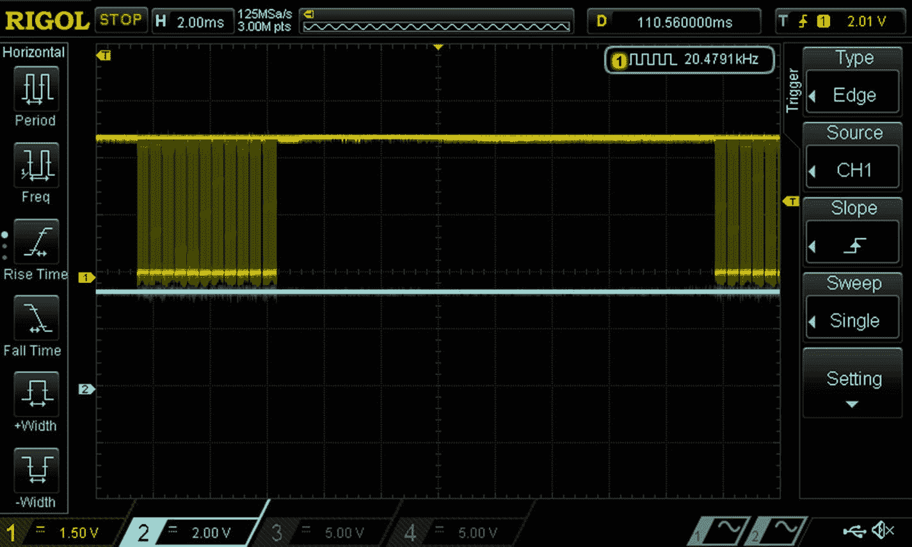
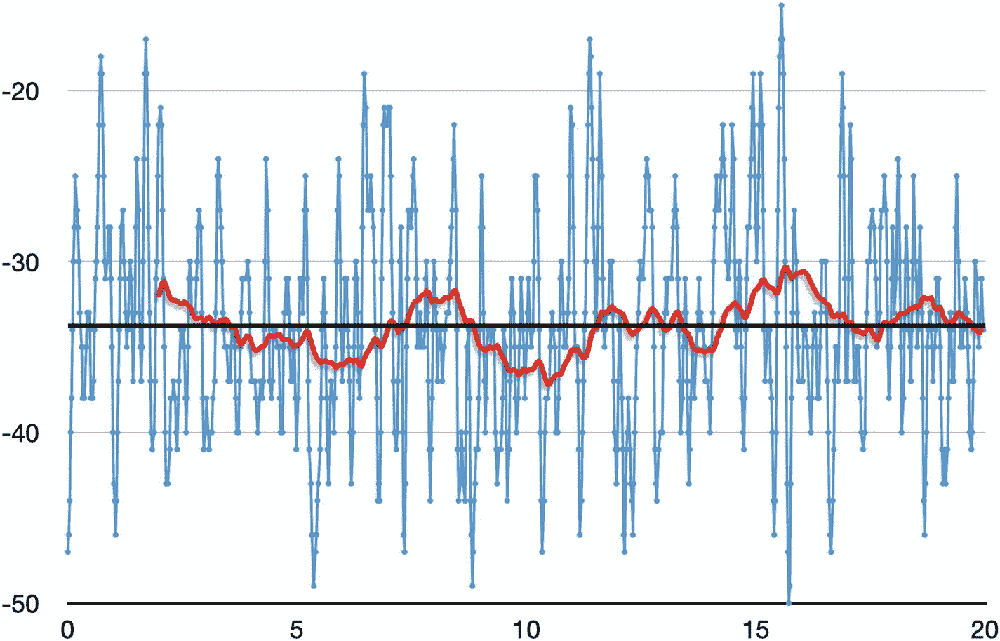
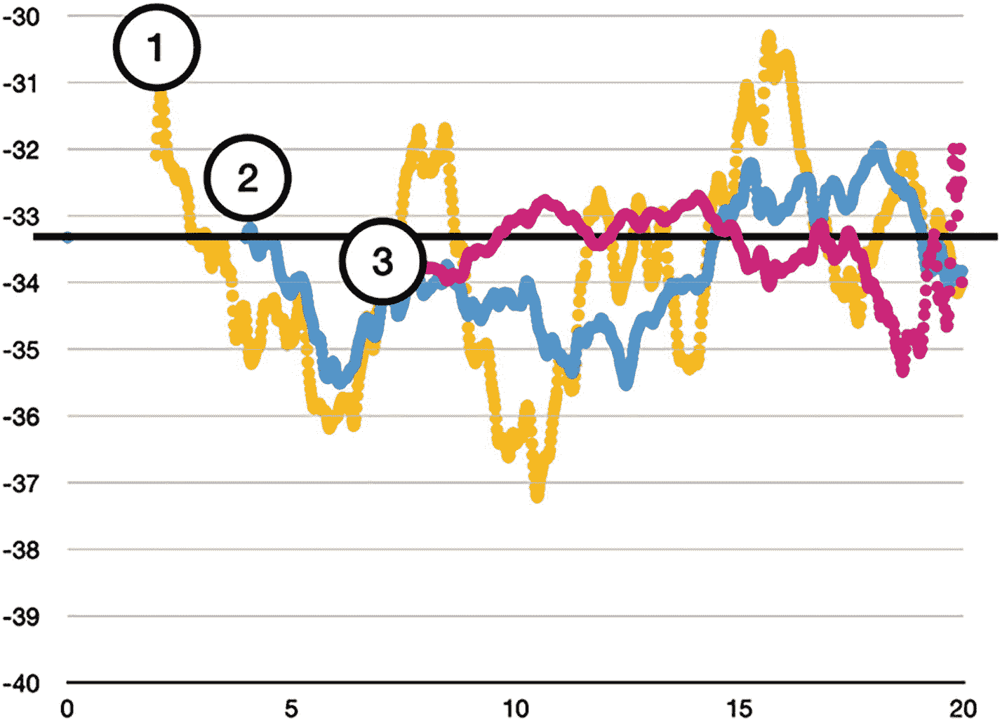
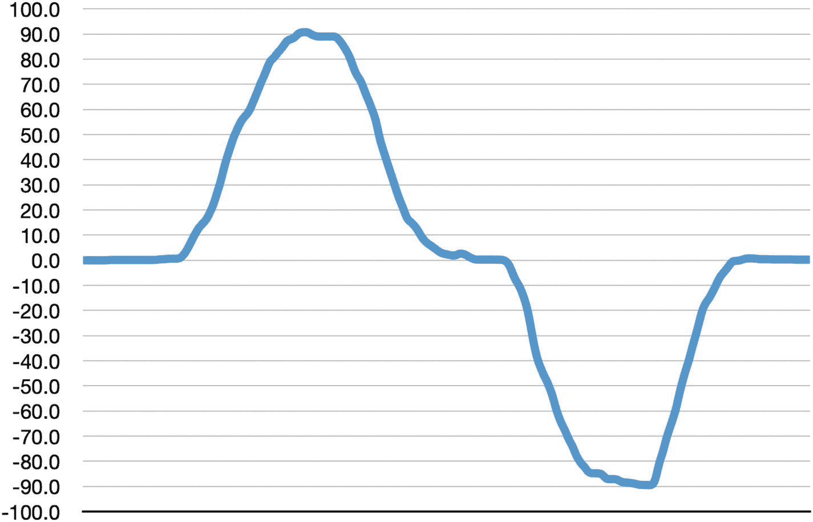
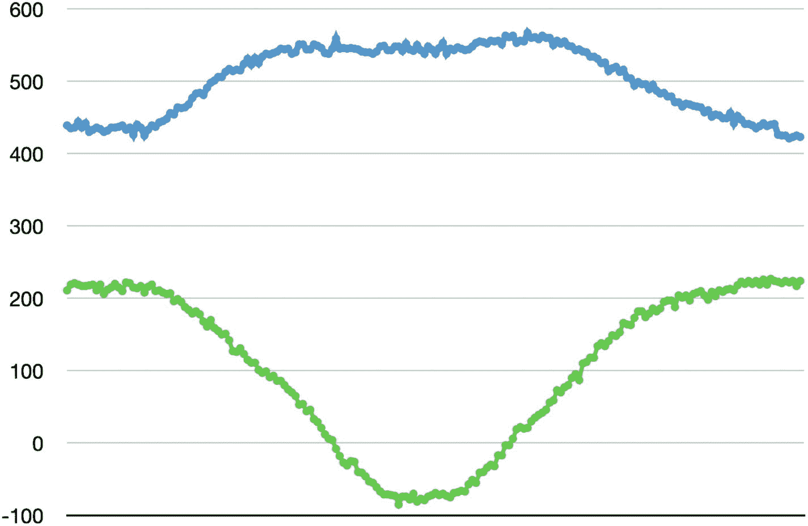

# 九、惯性测量装置

在这一章中，我们将检查我在自主漫游车中使用的另一个设备——惯性测量单元(IMU)。IMU 出现在许多移动机器人项目中，因为它有助于确定机器人从一个点到另一个点的方向。器件为*阿达果精密恩智浦 9 自由度分线板——fxos 8700+fxa 21002*(参见 [`www.adafruit.com/product/3463`](http://www.adafruit.com/product/3463) )。这个名字太长了，所以在本章中我将使用术语 *PIMU* 。

从逻辑上来说，你可以将 IMU 视为三个设备，因为它包括一个*加速度计*，该加速度计测量三维(三个自由度)中的*线性加速度*；一个*陀螺仪*，它在三维空间(三个自由度)中测量*角速度*；以及一个*磁力计*，测量*磁场强度*三维(三个 DOF)。把所有测得的自由度加起来，你就得到了 PIMU 真实名称中的九个自由度。物理上，PIMU 有两个设备，FXOS8700CQ 和 FXAS21002C。

在这一章中，我将介绍

*   一个设备实际上是*两个*设备，或者*三个*设备，这取决于你的观点！

*   使用 diozero 实现 I2C 设备的设备库

*   仅实现设备功能的子集

*   串联使用 C++库和 Java 库进行移植

*   使用“数据分析”识别和解决各种设计问题

*   利用 diozero 处理设备中断

## 了解设备

在 PIMU 分线板上，FXOS8700CQ ( [`www.nxp.com/docs/en/data-sheet/FXOS8700CQ.pdf`](http://www.nxp.com/docs/en/data-sheet/FXOS8700CQ.pdf) )为加速度计和磁力计供电；fxa 21002 c([`www.nxp.com/docs/en/data-sheet/FXAS21002.pdf`](http://www.nxp.com/docs/en/data-sheet/FXAS21002.pdf))为陀螺仪供电。这意味着您必须处理*两张*数据表！这也使得一些设计决策变得更加困难。

查看 FXOS8700CQ 数据手册可以发现，这是一款相当复杂的器件。数据手册中一些有趣的亮点:

*   数据手册有 116 页，参考了一些设计笔记，并包括一些示例代码。

*   它支持 I2C 和 SPI(点对点)。PIMU 突破板只暴露了 I2C。

*   您可以打开加速计和/或磁力计。

*   加速度计满量程范围是可配置的。

*   输出数据速率最高可配置为 800 Hz(运行两个传感器时为 400 Hz)。

*   加速度计的分辨率为 14 位；对于磁力计，它是 16 位。

*   它支持加速度计的 32 样本 FIFO。

*   它可以配置为识别几种可能产生中断的加速度和磁场“事件”。你必须仔细阅读，以确定还有一个更一般的“数据就绪”中断。

*   它有近 120 个寄存器，其中大部分用于各种功能和事件的配置。

*   它提供一个 8 位温度传感器。

查看 FXAS21002C 数据手册可以发现，它也是一款相当复杂的器件。数据手册中一些有趣的亮点:

*   数据手册有 58 页，提到了“各种参考手册、用户指南和应用笔记”。

*   陀螺仪满量程范围是可配置的。

*   输出数据速率最高可配置为 800 Hz。

*   陀螺仪的分辨率为 16 位。

*   它支持 I2C 和 SPI。同样，PIMU 突破板只暴露了 I2C。

*   它支持 32 样本 FIFO。

*   如果角加速度超过配置的阈值，它可以产生中断。同样，近距离读取暴露出它可以产生“数据就绪”中断。

*   它提供一个 8 位温度传感器。

FXOS8700CQ 和 FXAS21002C 都支持 100 kHz 或 400 kHz 的 I2C 总线速度。两者都不支持 I2C 时钟拉伸(用于根据需要减慢时钟)。对于块读取和块写入，两者都自动递增寄存器地址。

通过查看数据手册并思考您的需求，您可以了解如何配置 PIMU 来满足您的需求。这意味着有必要明确 PIMU 的功能预期。出于本书的目的，我假设加速度计/磁力计必须支持确定前面提到的火星车的*罗盘或绝对航向*，陀螺仪必须支持确定火星车的旋转幅度，或*相对航向*。考虑到这些要求，从数据手册中可以清楚地看出，除了“数据就绪”之外，任何一个器件都不需要“事件”

## 查找设备库

为了找到要使用或移植的设备库，我将遵循第 [6](06.html) 章中概述的过程。

### Java 库搜索

在撰写本文时，diozero 文档不包含任何与 IMU 相关的内容，发行版 ZIP 文件也不包含任何相关的类。然而，在 diozero GitHub 代码库中有一个`com.diozero.devices.imu`包( [`https://github.com/mattjlewis/diozero/tree/main/diozero-imu-devices/src/main/java/com/diozero/devices/imu`](https://github.com/mattjlewis/diozero/tree/main/diozero-imu-devices/src/main/java/com/diozero/devices/imu) )包含了几个与 IMU 相关的类。该封装有两种 IMU 实现方案:MPU9150 内置一个加速度计、一个陀螺仪和一个磁力计，ADXL345 仅内置一个加速度计。也就是说，没有任何东西与 PIMU 直接相关。

`com.diozero.devices.imu`中的接口和抽象类很有趣，尤其是高层的`ImuInterface`和`ImuData`，因为它们抽象了 IMU 的数据采集。它们的水平如此之高，我认为您应该只在最初的 PIMU 库实现之后才考虑使用它们。

MPU9150 库的实现(类`MPU9150Device`、`MPU9150Driver`和`AK8975Driver`)表明它是一个相当复杂的设备，并且比我预期的 PIMU 更加不同。 <sup>[1](#Fn1)</sup> 就配置灵活性而言，有很多好的界面设计理念，尽管并非所有都适用于 PIMU，而且基于 PIMU 对我的漫游者的要求，可能有些矫枉过正。不幸的是，MPU9150 和 PIMU 之间的差异建议在尝试使用 MPU9150 库之前搜索 PIMU 特定的库。

在其他 Java 库中搜索 FXOS8700CQ 和 FXAS21002C，每个库只找到一个结果。这两个库来自同一个基于 Android 的项目(见 [`https://github.com/ekalyvio/CowBit/tree/master/SensorApp/src/main/java/com/kaliviotis/efthymios/cowsensor/sensorapp`](https://github.com/ekalyvio/CowBit/tree/master/SensorApp/src/main/java/com/kaliviotis/efthymios/cowsensor/sensorapp) )。

检查表明它们至少是合理的候选者，有一些小问题，例如可能不完整，具有 Android 依赖性，具有框架依赖性，表现出对 Java 命名标准的违反，以及对 FIFO 和“事件”等功能配置的不必要支持。

与 RoboClaw 的设备库(第 [8](08.html) 章)相比，基本上只有两个级别的设备访问:

*   包装安卓 I2C 访问方法的底层方法；diozero 方法将被替代。

*   调用低级方法的接口级方法。

这些库采用最大列表的方法来配置，并允许你配置几乎所有可配置的东西。这些库包括更改设备电源状态和重置设备的能力。这些能力在你的项目中可能有用，也可能没用。

FXOS8700CQ 库的另一个令人失望的地方是，它只能在混合模式下工作，即它可以读取加速度计和磁力计；允许所有三种模式会引入一些配置依赖性。我在 FXAS21002C 库中找不到其他令人失望的地方。

## 搜索非 Java 库

通常，找到一个 Java 库后，您就可以继续了，但是我认为看看还有什么其他的库也是不错的。Adafruit 为这两种设备提供了 Arduino C++库。为了支持 CircuitPython 的发展，Adafruit 还提供了 CircuitPython 库。最后，单个器件的制造商恩智浦提供 Android C 库。

既然 Java 库已经存在，我看不出有什么理由去研究 CircuitPython 库。另一方面，我认为至少浏览一下其他的库是有益的。

### 看看 C++库

你可以在 [`https://github.com/adafruit/Adafruit_FXOS8700`](https://github.com/adafruit/Adafruit_FXOS8700) 和 [`https://github.com/adafruit/Adafruit_FXAS21002C`](https://github.com/adafruit/Adafruit_FXAS21002C) 找到 C++库。一项检查表明，他们至少是合理的候选人，有一些小问题，如对 Adafruit 传感器框架的依赖和单字节读取的使用。

像 Java 库一样，基本上只有两个级别的设备访问。与 Java 库不同，C++库对整体功能采取了*极简*的方法，例如，它们

*   仅定义部分配置寄存器。

*   仅允许配置加速度计(FXOS8700CQ)或陀螺仪(FXAS21002C)的满量程范围；所有其他配置都以某种方式默认。

*   始终读取两个传感器(FXOS8700CQ，尽管接口允许返回加速度计、磁力计或两者的传感器读数)。

*   不支持设备可能产生的“事件”。

*   不支持使用 FIFO。

*   不要提供检索状态的方法。

### 看一看 C 库

不幸的是，你必须下载 C 库来查看它们；你可以从[`www.nxp.com/webapp/sps/download/license.jsp?colCode=FXAS2100X-DRVR&location=null`](http://www.nxp.com/webapp/sps/download/license.jsp%253FcolCode%253DFXAS2100X-DRVR%2526location%253Dnull)[`www.nxp.com/webapp/sps/download/license.jsp?colCode=FXOS8700-DRVR&location=null`](http://www.nxp.com/webapp/sps/download/license.jsp%253FcolCode%253DFXOS8700-DRVR%2526location%253Dnull)开始做。一项检查显示，这些库是可能的候选者，但有我不理解的“Linux for Android”方面，并显示了一个更大框架的证据(我不理解细节)。

像 Java 和 C++库一样，基本上只有两个级别的设备访问。这些库像 C++库一样采用极简的配置方法，但也像 Java 库一样支持“事件”。FXOS8700CQ 库有一个有趣的特点；它独立返回加速度计和磁力计的数据，从而在一次读取操作就足够的情况下，执行两次块读取操作。

### 答案是…

我认为将之前检查的设备库描述为*极简主义者* (C++)、*最大主义者* (Java)，或者介于 (C)之间的*是公平的。事实上，我认为 C 库的“Linux for Android”方面混淆了太多需要移植的内容，所以我不考虑它。然后在最简的*(c++)和最简的*(Java)之间做出选择。***

 **考虑到这些设备库之间的差异，确定如何在项目中使用这些设备比平常更重要。前面的简短用法说明表明大多数事件都没有必要。倾向于极简主义。另一方面，配置一切的能力听起来相当有吸引力。也就是说(这可能会被认为是欺骗)，使用两种不同 IMU 和其他复杂设备的经验表明，通常情况下，你会从一种看起来适合你的配置开始，进行一点试验，最终确定一种配置，不再改变。因此，以编程方式配置一切的能力听起来很棒，但在实践中是不必要的。这绝对是一种最低限度的偏见。

因此，尽管听起来很荒谬，考虑到我的项目*的最低需求，我将使用 C++库作为*主*库来启动移植并充分利用 Java 库的各个方面。*

本章的其余部分描述了在底层使用 diozero `I2CDevice`的移植过程。在继续之前，如有必要，您应该回顾一下第 [7](07.html) 章中的材料，其中涵盖了树莓派 I2C I/O 功能和 diozero I2C 设备支持。

## 设备库端口

第 8 章指出了在开始开发代码之前必须考虑的 Java 设备库的一些方面。本节讨论与 PIMU 有关的方面。

PIMU 给界面设计带来了有趣的挑战。PIMU 是一种设备吗:(加速度计、陀螺仪、磁力计)？是两个器件:(加速度计，磁强计)，陀螺仪？是三个器件:加速度计、陀螺仪、磁力计？

显然，所有检查过的现有库都将 PIMU 分线板视为两个设备，与板上的两个真实设备 FXOS8700CQ 和 FXAS21002C 对齐。我会选择那个设计点。如果您需要将 PIMU 视为一个单独的设备，您可以创建一个类来封装这两个真实的设备(有点像前面提到的`MPU9150Device`)。

根据前面的讨论，Java 设备库接口应该关注检索传感器读数的方法。它应该可能包括支持某些配置和读取状态的方法。

每个传感器测量三个自由度。飞行器需要三维空间。然而，被限制在平坦表面上行进的漫游车只需要来自陀螺仪的一个维度(Z 轴)和来自加速度计/磁力计的两个维度(X 和 Y 轴)。因此，支持一组额外的方法来仅获取所需的信息是有意义的。

我认为一个机器人需要多个皮姆是非常不太可能的*。因此，不需要库的多个实例。你可以创建一个单独的类(参见 [`www.benchresources.net/singleton-design-pattern-restricting-all-4-ways-of-object-creation-in-java/`](http://www.benchresources.net/singleton-design-pattern-restricting-all-4-ways-of-object-creation-in-java/) )，或者你可以让所有的方法都是静态的，或者你可以假设没有用户会试图创建一个以上的实例。因为我很懒，所以我会做这样的假设，显然现有库的设计者也是这样做的。*

 *因为我主要是从 C++移植过来的，所以我可能会做大量的清理工作。至少在大多数情况下，我将遵循深度优先的开发移植方法。最后，由于 FXAS21002C 比 FXOS8700CQ 简单一点，所以我先从前者说起。

## 玩设备(FXAS21002C)

根据第 8 章中的建议，我们将首先尝试使用该设备。幸运的是，FXAS21002C 支持一个简单的交互来验证成功，即读取“我是谁”寄存器。所以，我们要玩！

显然，在运行任何代码之前，您必须将 PIMU 连接到您的树莓派参见 [`https://learn.adafruit.com/assets/59489`](https://learn.adafruit.com/assets/59489) 了解正确的 I2C 连接。你应该关掉你的 Pi；连接 SDA、SCL、地和 3.3V 检查连接；再查；然后打开你的电源。然后，您还可以在 ssh 到您的 Pi 的终端中使用命令"`i2cdetect -y 1`"来确定是否一切正常；在报告中，您应该会看到两个 I2C 设备地址，0x1f 和 0x21(参见 [`www.raspberrypi-spy.co.uk/2014/11/enabling-the-i2c-interface-on-the-raspberry-pi/`](http://www.raspberrypi-spy.co.uk/2014/11/enabling-the-i2c-interface-on-the-raspberry-pi/) )。

为了玩，你必须首先采取建造一个库所需要的相同步骤。您必须创建一个新的 NetBeans 项目、包和类。在您的树莓派上配置用于远程开发的项目；并将项目配置为使用 diozero。参见第 [7](07.html) 章了解步骤总结。我把我的项目**叫做 PIMU** ，我的包`org.gaf.pimu`，我的类`FXAS21002C`。但是，既然我们要做一些测试，那么你想要创建一个新的包；我会叫我的`org.gaf.pimu.test`。在那个包中，创建一个新的*主*类；我给我的班级取名`PlayFXAS`。

清单 [9-1](#PC1) 显示了读取“我是谁”寄存器的实现。如你所见，这很简单:

*   导入允许我们使用 diozero `I2CDevice`与 FXAS21002C 交互。

*   因为我们可以使用 I2C 通信的所有默认值，所以我们使用`I2CDevice.Builder`来构建一个仅使用 FXAS21002C 地址 0x21 的实例。

*   我们从“我是谁”寄存器 0x0C 中读取一个字节，并将其打印出来。

*   我们关闭实例。

```java
package org.gaf.pimu.test;

import com.diozero.api.I2CDevice;

public class PlayFXAS {

    public static void main(String[] args) {
        I2CDevice device =
               I2CDevice.builder(0x21).build();
        byte whoID = device.readByteData(0x0C);
        System.out.format("who am I: %2x%n", whoID);
        device.close();
    }
}

Listing 9-1PlayFXAS

```

在 Pi 上运行`PlayFXAS`，您应该看到以下内容:

```java
who am I: 0xd7

```

如果是，成功！然后我们可以继续开发图书馆。如果没有，…嗯；检查所有内容、连接和代码，然后重试。

## 设备库开发(FXAS21002C)

我们已经完成了库开发的初始任务，所以我们可以开始构建核心。但是核心是什么呢？基于第 [8](08.html) 章的指引，我们应该试着去读一些数据。为此，我们需要

*   建筑工人

*   寄存器地址和其他常量的定义

*   能够阅读有意义的内容的配置

*   一种读取数据的方法

### 构造器分析和实现

现有的 Java 设备库构造器需要一个可操作的 I2C 设备；它设置默认设备配置(13 部分)，但不写入设备；这是稍后在库的`begin`方法中完成的。现有的 C++设备库构造器需要更大框架的某种 ID；所有的“实际工作”都在库的`begin`方法中完成，包括检查“我是谁”注册。因此，实际上，两个构造器什么都不做，甚至没有创建一个 I2C 设备，也没有检查“我是谁”寄存器。我个人认为这没有意义，所以我会在`FXAS21002C`构造器中做更多的工作。

清单 [9-2](#PC3) 显示了`FXAS21002C`构造器。构造器创建一个 I2C 设备并检查“我是谁”寄存器。我再次选择在失败的情况下抛出一个检查过的异常，但是您可以做其他事情。

注意`FXAS21002C`实现`AutoCloseable`，如第 [7 章](07.html)中所推荐的。因此，必须有一个`close`方法。我想不出 PIMU 会发生什么不愉快的事情，但是确保关闭任何资源是一个最佳实践。

Note

同样，我没有包括 Javadoc 或注释(大部分)，但是*你应该*。

```java
package org.gaf.pimu;

import com.diozero.api.I2CDevice;
import com.diozero.api.RuntimeIOException;
import com.diozero.util.SleepUtil;
import java.io.IOException;

public class FXAS21002C implements AutoCloseable {

    private static final int FXAS21002C_ADDRESS =
           0x21;
    private static final byte FXAS21002C_ID =
           (byte) 0xD7;

    private I2CDevice device = null;

    public FXAS21002C() throws IOException {
        try {
            device =
                I2CDevice.builder(
                    FXAS21002C_ADDRESS).build();

            byte whoID = device.readByteData(
                Registers.WHO_AM_I.register);
            if (whoID != FXAS21002C_ID) {
                throw new IOException(
                    "FXAS21002C not found
                    at address " +
                    FXAS21002C_ADDRESS);
            }
        } catch (RuntimeIOException ex) {
            throw new IOException(ex.getMessage());
        }
    }

    @Override

    public void close() {
        if (device != null) device.close();
    }

    private enum Registers {
        STATUS(0x00),
        OUT_X_MSB(0x01),
        OUT_X_LSB(0x02),
        OUT_Y_MSB(0x03),
        OUT_Y_LSB(0x04),
        OUT_Z_MSB(0x05),
        OUT_Z_LSB(0x06),
        DR_STATUS(0x07),
        F_STATUS(0x08),
        F_SETUP(0x09),
        F_EVENT(0x0A),
        INT_SOURCE_FLAG(0x0B),
        WHO_AM_I(0x0C),
        CTRL_REG0(0x0D),
        CTRL_REG1(0x13),
        CTRL_REG2(0x14),
        CTRL_REG3(0x15);

        public final int register;

        Registers(int register) {
            this.register = register;
        }
    }

    public enum Range {
        DPS250(250, 3, 0.0078125F),
        DPS500(500, 2, 0.015625F),
        DPS1000(1000, 1, 0.03125F),
        DPS2000(2000, 0, 0.0625F);

        public final int range;

        public final int rangeCode;
        public final float sensitivity;

        Range(int range, int rangeCode,
                float sensitivity) {
            this.range = range;
            this.rangeCode = rangeCode;
            this.sensitivity = sensitivity;
        }
    }

    public enum ODR {
        ODR_800(800f, 0 << 2),
        ODR_400(400f, 1  << 2),
        ODR_200(200f, 2 << 2),
        ODR_100(100f, 3 << 2),
        ODR_50(50f, 4 << 2),
        ODR_25(25f, 5 << 2),
        ODR_12_5(12.5f, 6 << 2);

        public final float odr;
        public final int odrCode;

        ODR(float odr, int odrCode) {
            this.odr = odr;
            this.odrCode = odrCode;
        }
    }

    public enum LpfCutoff {
        Highest(0 << 6),
        Medium(1 << 6),
        Lowest(2 << 6);

        public final int level;

        LpfCutoff(int level) {
            this.level = level;
        }
    }

    public enum PowerState {
        StandBy(0),
        Ready(1),
        Active(2),
        Reset(0x40);

        public  final int state;

        PowerState(int state) {
            this.state = state;
        }
    }
}

Listing 9-2FXAS21002C constructor and constants

```

清单 [9-2](#PC3) 还显示了该类常量的定义。现有的 Java 类有一些很好的代码，展示了一些可以用作模型的“最佳实践”。但是你可以看到我做了一点清理。我

*   更改了名称，因为我觉得没有必要在名称中使用“enum”

*   将访问权限从公共改为私有，我认为不需要在类外访问

*   增强了一些枚举，使它们更有用
    *   向`Range`添加信息

    *   修改了`ODR`,使得该值可用于帮助定义控制寄存器的内容

    *   为`PowerState`增加了一个值，以支持复位

*   增加了`LpfCutoff`以增加常量使用的一致性

*   因为我不打算使用 FIFO，所以删除了`FifoModeEnum`

### 配置

现有的库支持界面中的各种级别的配置，最大列表 Java 库允许几乎所有的配置，最小化 C++库只允许全范围的配置。虽然一般的想法是创建一个极简的库，但是确定什么是可能的，当然，什么是需要的，这是一个好主意。假设没有 FIFO 和事件，重要的配置寄存器是

*   *CTRL_REG0* ，控制
    *   低通滤波器带宽截止

    *   高通滤波器使能和带宽截止

    *   满量程范围

*   *CTRL_REG1* ，控制
    *   输出数据速率

    *   电源模式

*   *CTRL_REG3* ，控制
    *   满量程范围加倍

您可能需要的可能不同于现有库的设计者决定需要的，也不同于我最终决定需要的。漫游者的目标包括直线行驶和以 90°的增量旋转。因此，任何角度的变化都会非常小，或者发生在几秒钟内。这意味着角度变化根据器件的能力“缓慢”发生，表明器件应始终配置在其最灵敏的位置，无需配置满量程范围(或加倍)。此外，由于任何真正的*角度变化都是“缓慢”发生的，我决定使用低通滤波器，并始终禁用高通数字，以消除漫游者机械特性中的“噪声”。这样就只剩下电源模式，它可以用来将设备置于就绪状态，而不是激活状态，以节省电能；我觉得这是不必要的，所以唯一需要的配置是*

*   低通滤波器带宽截止(在 *CTRL_REG0* 中)

*   输出数据速率(在 *CTRL_REG1* 中)

坦率地说，即使是这两种配置选项也只是为了更容易找到漫游者的最佳配置。一旦我发现我觉得是最佳的，我就再也不会改变它们了。这个故事的寓意是，在你花大力气允许改变之前，好好想想你需要改变什么，多久需要改变一次。

Tip

根据我使用 PIMU 的经验，您可能必须尝试不同的满量程范围和过滤配置，以找到一个或多个为您的项目产生最佳结果的配置。相反，您项目的需求决定了输出数据速率，无需太多实验。

清单 [9-3](#PC4) 显示的是`FXAS21002C`。`begin`配置和激活设备的方法。该方法首先复位器件，然后根据数据手册将器件置于待机模式，以便建立正确的配置。根据数据表(和现有库)，该方法在配置建立后休眠。

```java
public void begin(LpfCutoff lpfCutoff, ODR odr)
        throws RuntimeIOException {
    // reset
    device.writeByteData(
            Registers.CTRL_REG1.register,
            PowerState.StandBy.state);
    try {
        device.writeByteData(
                Registers.CTRL_REG1.register,
                PowerState.Reset.state);
    } catch (RuntimeIOException ex) {
        // expected so do nothing
    }

    // go to standby state
    device.writeByteData(
            Registers.CTRL_REG1.register,
            PowerState.StandBy.state);

    // set the lpf value
    int cntl_reg0 = lpfCutoff.level;
    // set the default full scale range
    cntl_reg0 |= DEFAULT_FSR_250DPS;
    // write the FSR and LPF cutoff
    device.writeByteData(
            Registers.CTRL_REG0.register,
            (byte) cntl_reg0);

    // set the odr value
    int cntl_reg1 = odr.odr;
    // write ODR as requested and active state
    cntl_reg1 |= PowerState.Active.state;
    device.writeByteData(
             Registers.CTRL_REG1.register,
             (byte) cntl_reg1);
    SleepUtil.sleepMillis(100);
} 

Listing 9-3FXAS21002C begin method

```

`begin`中的一个微妙之处值得详述。当设备重置时，您会注意到该方法捕获了一个*预期的* `RuntimeIOException`并且什么都不做，而 C++构造器不必这样做。这是因为树莓派和 Arduino I2C 操作的不同。由于设备在 I2C 交互期间复位，设备不会发送预期的确认。缺少的“ACK”不会困扰 Arduino，但会给 Pi 带来很多麻烦，导致 Java 出现异常。幸运的是，可以安全地忽略该异常。

请注意，根据第 [7](07.html) 章中的指导原则，任何*意外的* `RuntimeIOException`都会被传播，包括来自`SleepUtil`的。《T2》中的其他方法也是如此。

### 阅读样本

现在该做图书馆的主要工作了，就是读陀螺仪。然而，首先，有几个问题我要解决，有些微不足道，有些相当重要。

#### 命名

现有的库称他们的数据读取方法为`getEvent`，我觉得这不合适，因为根据数据表，读取数据不一定是对某个事件的反应。在另一次清理中，我将使用一个我认为更合适的不同名称(`readRaw`)。

#### 状态

FXAS21002C DR _ STATUS 寄存器指示新数据何时可用，旧数据何时被覆盖；状态寄存器镜像 DR_STATUS 寄存器，其配置在清单 [9-2](#PC3) 中的`begin`方法中建立。

现有的 Java 库*在读取数据时没有*读取状态；它*是否*包括一种读取 DR_STATUS 的方法和几种评估其内容的方法。C++库*在读取数据时*读取状态，但不做任何事情；库*没有*包含读取状态的方法。

我认为现有的 Java 库方法是合适的。也就是说，阅读状态不一定属于核心。我会推迟到以后。

#### 单位

返回数据的*单元*是目前最有趣的问题。该设备以最低有效位(LSB)为单位提供 ***原始*** 数据。为了有用，原始数据必须转换成每秒度数(dps)。数据手册显示，250 dps 的配置满量程范围可产生 7.8125 mdps/LSB 的灵敏度。两个现有的库都将从设备读取的**原始数据(单位= LSB)乘以灵敏度，以产生 ***转换的*** 数据(单位= dps)。**

 **这听起来是个好主意，因为 dps 单位比 LSB 更有意义。我不认为这是个好主意。处理现实世界设备的一个不幸现实是不完美。考虑数据手册中的表 5。原始数据受到与温度、 <sup>[2](#Fn2)</sup> 相关的“噪声”、非线性、噪声密度和*零速率偏移*的影响。在完美的世界中，如果设备是静止的，并且你获得 Z 轴的一系列原始读数，你会期望序列 0，0，…，0。由于零速率偏移，你会得到，例如，20，20，…，20。不幸的是，在使用器件进行计算之前，您并不真正知道零速率失调是什么。但是各种其他来源的“噪声”也开始起作用，所以你真的得到一系列看似随机的数字！

由于这一现实，我们现在只产生原始数据。我们稍后将查看原始数据，以巩固本小节中的讨论。

#### 履行

清单 [9-4](#PC5) 显示了从设备读取数据的`FXAS21002C.readRaw`的实现。根据前面的讨论，该方法不读取状态并返回原始数据。实现非常简单。它执行块读取来获取所有三个轴的值(总共六个字节)，然后创建整数返回给调用者。

```java
public int[] readRaw() throws RuntimeIOException {
    // read the data from the device
    byte[] buffer = new byte[6];
    device.readI2CBlockData(
            Registers.OUT_X_MSB.register, buffer);

    // construct the response as an int[]
    int[] res = new int[3];
    res[0] = (int) (buffer[0] << 8);
    res[0] = res[0] | Byte.toUnsignedInt(buffer[1]);
    res[1] = (int) (buffer[2] << 8);
    res[1] = res[1] | Byte.toUnsignedInt(buffer[3]);
    res[2] = (int) (buffer[4] << 8);
    res[2] = res[2] | Byte.toUnsignedInt(buffer[5]);
    return res;
}

Listing 9-4Method to read raw data from the FXAS21002C

```

### 测试核心

您现在可以测试`FXAS21002C`核心实现了。基于第 8 章的讨论，你应该在不同的包中创建一个主类。因为我们玩的比较早，包`org.gaf.pimu.test`已经存在。我将主类命名为`TestFXASCore`。

`TestFXASCore`该怎么办？显然它必须创建一个`FXAS21002C`(参见清单 [9-2](#PC3) )。它必须使用`begin`方法配置设备(参见清单 [9-3](#PC4) )。最后，它必须调用`readRaw`(参见清单 [9-4](#PC5) )来读取数据。

清单 [9-5](#PC6) 显示了 *TestFXASCore* 。它将低通滤波器截止频率配置为最低频率，将输出数据速率配置为 50 Hz。它定义了私有方法`readXYZ`，该方法多次读取所有三个轴，并打印一个轴的值。`TestFXASCore`调用`readXYZ`两次，一次在激活后立即调用，一次在延迟后调用。变量`axis`决定`readXYZ`是否打印 X、Y 或 Z 轴(`axis` =分别为 0、1 或 2)。

请注意，`TestFXASCore`按照第 [7](07.html) 章中的指南启用资源尝试和 diozero 安全网，本章中的所有其他设备和应用也是如此。由于 PIMU 不会造成伤害，因此不需要 Java 关闭安全网。

```java
package org.gaf.pimu.test;

import com.diozero.api.RuntimeIOException;
import com.diozero.util.Diozero;
import com.diozero.util.SleepUtil;
import java.io.IOException;
import org.gaf.pimu.FXAS21002C;

public class TestFXASCore {

    public static void main(String[] args) throws
            IOException, InterruptedException {
        try (FXAS21002C device = new FXAS21002C()) {
            device.begin(
                FXAS21002C.LpfCutoff.Lowest,
                FXAS21002C.ODR.ODR_50);

            int num = Integer.valueOf(args[0]);

            int axis = 2;

            readXYZ(device, num, axis);

            System.out.println("\n ... MORE ... \n");
            Thread.sleep(2000);

            readXYZ(device, num, axis);
        } finally {
            Diozero.shutdown();
        }
    }

    private static void readXYZ(FXAS21002C device,
             int num, int axis)
             throws RuntimeIOException {
        int[] xyz;
        for (int i = 0; i < num; i++) {
            xyz = device.readRaw();
            System.out.println(xyz[axis]);
            SleepUtil.sleepMillis.sleep(20);
        }
    }
}

Listing 9-5TestFXASCore

```

我运行`TestFXASCore`的参数= 200(使用项目 **PIMU** 的*运行*属性来设置参数)，ODR = 50 赫兹，PIMU *完全静止*。清单 [9-6](#PC7) 显示了输出。

```java
-256
-188
-125
-76
-47
...
 ... MORE ...
...
-33
-28
-25
-22
-21

Listing 9-6Output from TestFXASCore execution

```

我又跑了`TestFXASCore`。图 [9-1](#Fig1) 显示了在相同条件下，激活后立即开始*的输出(200 个值或 4 秒)图。请注意两个重要特征:*


图 9-1

激活后立即绘制 Z 轴原始值

*   有一个从 0 秒到大约 0.1 秒的时间段，在该时间段内，器件在产生零速率偏移值附近的值之前似乎“预热”。

*   即使在“预热”结束后，实际值仍然存在显著的随机性。

图 [9-2](#Fig2) 显示了在图 [9-1](#Fig1) 显示的数据之后的 200 个样本，用于相同的时期和配置。没有“预热”，但它也显示了值的随机性。平均值= -32.3，用粗水平线表示；平均值估计该时间段的*零速率偏移*(为了简洁起见，我此后将使用“零偏移”)。标准差= 7.9。图 [9-2](#Fig2) 中绘制的对角线显示了数值的趋势线；这表明零点偏移会随时间变化，甚至在 4 秒的时间内也会变化。不是好消息。


图 9-2

“预热”后很久的 Z 轴原始值图

清单 [9-6](#PC7) 和图 [9-1](#Fig1) 和 [9-2](#Fig2) 中的结果清楚地表明，您不能将 Z 原始值或其转换后的对应值视为“真实值”在相信这些数据是“真实的”之前，你必须对它们做大量的工作。我将在本章的后面讨论这项工作。

正如您所料，X 轴和 Y 轴在零失调和噪声方面的表现与 Z 轴相同。因此，如果全部使用，就必须处理所有三个轴的零失调和噪声。

尽管如此，你有数据证明你有一个正常工作的陀螺仪！你只是有更多的工作要做。

Tip

我使用电子表格应用程序创建了数字 [9-1](#Fig1) 、 [9-2](#Fig2) 以及本章后面的其他数字。我发现它是使用传感器时帮助可视化传感器数据的一个有价值的工具。

### 其他想法

前面的讨论提到了核心之外的一些有趣的功能。本节详细阐述。

#### 获取 Z 轴

清单 [9-7](#PC8) 显示了读取 Z 轴数据的方法的实现，减少了读取的数据量。像`readRaw`(列表 [9-4](#PC5) )一样，方法`readRawZ`不读取状态并返回原始数据。

```java
public int readRawZ() throws RuntimeIOException {
    // read only the Z axis
    byte[] buffer = new byte[2];
    device.readI2CBlockData(
            Registers.OUT_Z_MSB.register,
            buffer);

    // construct the int data
    int value = buffer[0] << 8;
    value = value |
            Byte.toUnsignedInt(buffer[1]);
    return value;
}

Listing 9-7Method to read Z-axis data from the FXAS21002C

```

#### 状态

为了实现数据就绪和读取数据之间的同步，必须访问器件状态。因为可能需要所有三个轴的信息或者只需要 Z 轴的信息，所以我将创建单独的方法。清单 [9-8](#PC9) 显示了状态方法。私有方法`isDataReady`读取 DR_STATUS 寄存器并检查适当的状态位；一个`wait`参数指示是否等待数据准备就绪。公共方法`isXYZReady`和`isZReady`分别使用所有三个轴或仅 Z 轴的适当状态位来调用`isDataReady`。

```java
public boolean isXYZReady(boolean wait)
        throws  RuntimeIOException {
    return isDataReady(0x08, wait);
}

public boolean isZReady(boolean wait)
        throws RuntimeIOException {
    return isDataReady(0x04, wait);
}

private boolean isDataReady(int type, boolean wait)
        throws RuntimeIOException {
    do {
        byte status =
               device.readByteData(
               Registers.DR_STATUS.register);
        if ((status & type) > 0) {
            return true;
        }
    } while (wait);
    return false;
}

Listing 9-8FXAS21002C data-ready status methods

```

Caution

`isDataReady`中的等待循环是*而不是*系统友好的。最初，我在寄存器读取之间编码了一个 250 微秒的休眠。但是，在我的 Pi3B+上，显然 Java 睡眠时间最少为一毫秒。我觉得太长了，放弃了睡觉。你可能想睡觉。在本章的后面，我将向您展示如何消除使用`isDataReady`的需要。

清单 [9-9](#PC10) 显示了`TestFXASCore_S`，一个测试状态的主类。它以`TestFXASCore`为基础，但只做一组读数。此外，私有方法`readZ`使用适当的状态方法来门控读取 Z 轴数据，并计算样本之间的时间周期。

FXAS21002C 数据手册指出，读取适当的数据后，状态位会被清零。为了确保`readZ`中的循环不会立即看到就绪状态，该方法在进入循环之前进行初始读取。

```java
package org.gaf.pimu.test;

import com.diozero.api.RuntimeIOException;
import com.diozero.util.Diozero;
import com.diozero.util.SleepUtil;
import java.io.IOException;
import org.gaf.pimu.FXAS21002C;

public class TestFXASCore_S {

    private static FXAS21002C device;

    public static void main(String[] args) throws
           IOException, InterruptedException {

        try (FXAS21002C device = new FXAS21002C()) {

            device.begin(
                FXAS21002C.LpfCutoff.Lowest,
                FXAS21002C.ODR.ODR_50);

            int num = Integer.valueOf(args[0]);

            readZ(device, num);
        } finally {
            Diozero.shutdown();
        }
    }

    private static void readZ(FXAS21002C device,
           int num)
           throws RuntimeIOException {
        long tCurrent, tLast, tDelta;
        tLast = System.nanoTime();
        device.readRawZ();
        for (int i = 0; i < num; i++) {
            device.isZReady(true);
            tCurrent = System.nanoTime();
            tDelta = (tCurrent - tLast) / 100000;
            tLast = tCurrent;
            int z = device.readRaw();
            System.out.println(z +
                    ", " + tDelta);

            SleepUtil.sleepMillis(15);
        }
    }
}

Listing 9-9TestFXASCore_S

```

在`TestFXASCore`和`TestFXASCore_S`中的“读取”方法中还有另一个*非常重要的*差异。在两次读取之间，前者休眠 20 毫秒(ms)的采样周期，后者休眠 15 ms，然后等待就绪状态。为什么要睡(相对)长的时间？您不希望在数据不可能准备就绪时浪费 CPU 周期来读取状态。基本上，`readZ`方法休眠 15 毫秒，在此期间释放 CPU，然后花费大约 5 毫秒读取状态，等待数据就绪，然后读取数据。

我是怎么到达 15 毫秒的？我作弊了。在运行`TestFXASCore_S`时，我启动了示波器，监测发送到 PIMU 分线点的 I2C 时钟信号。图 [9-3](#Fig3) 显示了结果。在图中，顶部的信号是 I2C 时钟(以 100 kHz 运行)。所示的时间跨度(24 ms)包括略多于一个完整周期。在左侧，您可以看到时钟在运行，同时读取状态，然后读取数据。然后，您可以看到大约 15 ms 的延迟，然后是另一段读取状态的第一部分。因此，15 ms 似乎可以保证状态读取在数据准备就绪之前开始，这意味着数据读取之间的时间间隔始终为 20 ms。



图 9-3

TestFXASCore_S 期间的 I2C 时钟信号

然而，我最初在`TestFXASCore_S`中使用的是 18 ms 睡眠。我发现，有时候，多任务的树莓派操作系统中时间的不确定性会导致“失误”,以至于有时候数据读取得太晚，已经被覆盖了。虽然我没有广泛的实验，15 毫秒似乎足以避免失误。

无论如何，列表 [9-10](#PC11) 显示了在 PIMU 静止的情况下运行`TestFXASCore_S`的最初几个结果。一行中的第一个数字是 Z 轴值，第二个数字是读数之间的时间间隔，以十分之一毫秒为单位。

```java
-185, 62
-37, 911
-37, 166
-37, 166
-37, 166
-38, 191
-40, 200
-43, 200
-43, 200
-40, 200

Listing 9-10TestFXASCore_S results

```

您可以看到，在配置几个读数后，在 Z 值和读数之间的时间方面，立即发生了一些奇怪的事情。在图 [9-1](#Fig1) 中部分观察到了这种现象。我不能 100%确定原因；我将在下一小节中讨论潜在的原因。在任何情况下，它都建议要么在配置后延迟，在`begin`本身的额外延迟，或在认真使用设备之前扔掉几个读数。

#### 毕竟事件…

对状态的讨论和图 [9-3](#Fig3) 中显示的结果让我对 FXAS21002C 产生的“数据就绪”事件和中断产生了疑问。当数据准备好时获得中断，而不是轮询，将节省大量 CPU 周期。

数据手册显示，配置“数据就绪”中断非常简单(参见 CTRL_REG2 描述)。清除中断很容易(见 INT_SOURCE_FLAG 描述)，尽管你必须读取所有三个轴才能清除。分线板上有 FXAS21002C 的中断引脚(参见 [`https://learn.adafruit.com/nxp-precision-9dof-breakout/downloads`](https://learn.adafruit.com/nxp-precision-9dof-breakout/downloads) )。

硬件能够产生“数据就绪”信号，该信号可以发送到树莓派 GPIO 引脚。软件能把它当作一个中断并调用一个“中断处理程序”吗？在第 7 章[中简要讨论的 diozero `DigitalInputDevice`支持“中断”和“中断处理程序”(我使用这些术语有点不严谨)！本小节说明如何在 FXAS21002C 的环境中使用中断。](07.html)

启用中断的适当位置是在`begin`方法中。显然，您希望启用“数据就绪”中断。我决定使用陀螺仪中断引脚 1(分线板上的引脚 GI1)，使中断信号高电平有效，并使用推挽输出驱动器(无需外部上拉或下拉电阻)。这意味着将 0x0E 写入 CTRL_REG2。为此，我向`FXAS21002C`添加了以下常量:

```java
private static final byte DATA_READY_INTERRUPT = 0x0e;

```

为了实际写入值，我在写入 CTRL_REG0 和 CTRL_REG1 之间向`begin`方法添加了以下语句:

```java
device.writeByteData(
        Registers.CTRL_REG2.register,
        DATA_READY_INTERRUPT);

```

一旦 FXAS21002C 产生中断，我们需要使用一个`DigitalInputDevice`来捕捉它们并调用一个中断处理程序。我相信这暗示了一个使用了一个 T1 和一个 T2 的 T5 复合 T6 设备。我将调用新的类`Gyro`，并将其放入包`org.gaf.pimu`。

要设计一个中断处理程序，我们必须考虑如何使用来自 FXAS21002C 的数据以及`DigitalInputDevice`如何工作。对于我的漫游者，我想等待 Z 轴的样本，并从该样本中获得相对的*航向*。`DigitalInputDevice`引入了并发性，因为中断处理程序在一个单独的线程中运行。因此，我们需要在中断处理线程和应用程序线程之间共享数据。此外，可以想象的是，应用程序有时可能无法像标题产生时那样快速地消费它们，所以共享 FIFO 队列会很好。一个非常方便的方法是使用实现了`java.util.concurrent.BlockingQueue`的类。中断处理程序可以将标题排队，应用程序可以等待队列中的标题。

不幸的是，我们还没有准备好计算方向的所有东西，所以最初，中断处理程序将简单地将样本的 Z 轴原始值排队。

清单 [9-11](#PC14) 显示了初始的`Gyro`类。构造器需要一个参数来指示用于检测中断的 GPIO 引脚，以及一个参数来标识实现`BlockingQueue`的对象。构造器创建一个`FXAS21002C`和一个`DigitalInputDevice`为中断信号适当配置(无上拉或下拉，上升沿触发)。你也可以在构造器后看到强制的`close`方法。

```java
package org.gaf.pimu;

import com.diozero.api.DigitalInputDevice;
import com.diozero.api.GpioEventTrigger;
import com.diozero.api.GpioPullUpDown;
import com.diozero.api.RuntimeIOException;
import com.diozero.util.SleepUtil;
import java.io.IOException;
import java.util.concurrent.BlockingQueue;

public class Gyro implements AutoCloseable {

    private final BlockingQueue queue;
    private FXAS21002C fxas = null;
    private DigitalInputDevice catcher = null;
    private FXAS21002C.ODR odr;

    private long tsLast;
    private boolean active = false;

    public Gyro(int interruptPin,
            BlockingQueue queue) throws IOException {
        this.queue = queue;
        this.fxas = new FXAS21002C();
        try {
            catcher = new DigitalInputDevice(
                    interruptPin,
                    GpioPullUpDown.NONE,
                    GpioEventTrigger.RISING);
        } catch (RuntimeIOException ex) {
            throw new IOException(ex.getMessage());
        }
    }

    @Override
    public void close() {
        System.out.println("Gyro close");
        if (fxas != null) {
            fxas.close();
            fxas = null;
        }
        if (catcher != null) {
            catcher.close();
            catcher = null;
        }
    }

    public void begin(
            FXAS21002C.LpfCutoff lpfCutoff,
            FXAS21002C.ODR odr)
            throws RuntimeIOException {
        this.odr = odr;
        fxas.begin(lpfCutoff, odr);
    }

    public void activateIH()
            throws RuntimeIOException {
        fxas.readRaw();
        queue.clear();
        tsLast = 0;
        this.active = true;
    }

    public void activateRaw()
            throws RuntimeIOException {
        catcher.whenActivated(this::queueRaw);
        activateIH();
    }

    public void deactivate() {
        this.active = false;
    }

    private void queueRaw(long timestamp)
            throws RuntimeIOException {
        if (active) {
            int[] xyz = fxas.readRaw();
            long tsDelta = timestamp - tsLast;
            tsLast = timestamp;
            long[] sample = {xyz[2], tsDelta};

            // queue it if queue not full
            if (!queue.offer(sample))
                System.err.println("Queue Full!");
        }
    }
}

Listing 9-11Gyro

```

`Gyro.begin`类似于`FXAS21002C.begin`方法。实际上，前者使用后者，并简单地传递配置参数。

`activateRaw`、`activateIH`和`deactivate`方法值得详细阐述一下。没有理由从 FXAS21002C 连续读取数据；只有当漫游车移动时才需要。这些方法允许打开和关闭数据收集。`activateRaw`方法支持简单的数据收集，`deactivate`禁用它。`activateRaw`注册简单中断处理程序(方法`queueRaw`)并调用`activateIH`，后者读取原始数据以清除任何中断，清空队列，清除上一次中断的时间，并将中断处理程序状态设置为活动。

`queueRaw`方法*是*一个中断处理程序。在这个简单的实现中，它读取一个原始样本，找到这个样本和上一个样本之间的时间段，从这些数据片段中创建一个数组，并对该数组进行排队。我必须承认，我对排满队的反应有点迟钝；一个更合适的动作可能是抛出一个`RuntimeIOException`，但我认为这有点激烈；你应该分析你的项目，以确定适当的反应。

在这一点上你可以合理地问“为什么不像`TestFXASCore_S`那样打印`queueGyro`中的数据？”很高兴你问了。最初，我确实打印了，但是在运行`TestFXASCore_S`的结果讨论(列出 [9-10](#PC11) )中发现的异常出现在执行`queueRaw`的结果中。经过广泛的调查，我发现印刷是造成*某些*异常行为的原因！因此，我决定简单地将收集到的数据排队(就像在生产中所做的那样)并在以后打印出来。

清单 [9-12](#PC15) 显示了用于测试`Gyro`的主类`TestGyro`。它首先创建一个队列；很明显，我选择了`ArrayBlockingQueue`，但是也有其他候选元素以先进先出的方式排序。`TestGyro`然后创建一个新的`Gyro`，配置它，激活中断处理程序，收集并打印 100 个数据样本。

在运行`TestGyro`之前，您必须将 PIMU GI1 中断引脚连接到树莓派 GPIO 引脚，以便使用`DigitalInputDevice`对其进行监控。我用的是 GPIO 18。同样，我建议在建立连接之前关闭 Pi。

```java
package org.gaf.pimu.test;

import com.diozero.util.Diozero;
import java.io.IOException;
import java.util.concurrent.ArrayBlockingQueue;
import org.gaf.pimu.FXAS21002C;
import org.gaf.pimu.Gyro;

public class TestGyro {

    public static void main(String[] args)
            throws IOException,
            InterruptedException {
        ArrayBlockingQueue queue =
            new ArrayBlockingQueue(10);

        try (Gyro gyro = new Gyro(18, queue)) {

            gyro.begin(FXAS21002C.LpfCutoff.Lowest,
                FXAS21002C.ODR.ODR_50);

            gyro.activateRaw();

            for (int cnt = 0; cnt < 100; cnt++) {
                long[] sample = (long[])
                    queue.take();
                System.out.println(sample[0] + ", " +
                    sample[1]/100000);
            }

            gyro.deactivate();
        } finally {
            Diozero.shutdown();
        }
    }
}

Listing 9-12TestGyro

```

清单 [9-13](#PC16) 显示了在 PIMU 静止的情况下运行`TestGyro`的输出片段。您可以看到设备激活后的前几个数据值(3 到 4)是假的；这与之前观察到的行为一致。时间也显示了一些异常的行为。第一次实际上只是时间戳，因为第一次读数没有时间参考。第二个和第三个读数关闭；我相信这是因为设备何时稳定以及所有 diozero 类何时加载的不确定性。随后的时间值看起来和预期的一样。附加测试证实，数据值异常仅在装置激活后立即出现。最终结果是激活*后最初几个读数中的数据值和时间必须忽略*。

```java
-122, 16167848657463
-122, 510
-75, 800
-47, 200
-37, 200
-37, 200
-34, 200
-31, 200
-28, 200
-25, 200
-25, 200
-28, 200
-33, 200
-35, 200
-38, 200

Listing 9-13Output from TestGyro

```

清单 [9-13](#PC16) 中另一个明显的要点是，在异常时期之后，读数发生的规律性。读取之间的平均时间至少与睡眠和读取状态以等待数据就绪时一样好。

图 [9-4](#Fig4) 显示了运行`TestGyro`时捕获的示波器图像。顶部的信号是 I2C 钟。底部信号是来自设备的中断信号。请注意，中断以 20 ms 的间隔发生(在测量能力范围内)，正如预期的那样(我的示波器测量值为 49.985 Hz)。此外，I2C 时钟脉冲的突发显示，读取数据仅发生在中断处理程序被调用以读取三个轴的数据之后。


图 9-4

运行测试陀螺仪时的中断信号和 I2C 时钟信号

与中断处理相关的最后一个主题如图 [9-5](#Fig5) 所示。中断信号和中断处理程序`readPrintGyroRaw`开始读取数据之间的时间间隔略小于 400 微秒。还不错！此外，您可以看到读取数据花费了 800 多微秒。还是那句话，还不错！


图 9-5

中断延迟和数据读取时间

Note

完成本章后，我决定按照第 [7](07.html) 章中的说明，尝试将 I2C 时钟频率从默认的 100 kHz 更改为 400 kHz。它对我的树莓派 3 B+有效。正如预期的那样，后来，它花了 200 多微秒来读取数据，而图 [9-5](#Fig5) 中花了 800 微秒。

### 解决零失调和噪声问题

我在本章前面说过，原始数据是不可靠的，因为有零偏置和噪声。在这一小节中，我将讨论处理这两个问题的一些步骤。

#### 零偏移

在理想条件下，零失调补偿似乎非常简单。你多次取样并计算平均值，如图 [9-2](#Fig2) 所示。然后当你得到一个读数，你减去零偏移。事实上，我找到的一篇关于这个主题的文章(见 [`https://sensing.honeywell.com/auto-zero-calibration-technique-pressure-sensors-technical-note.pdf`](https://sensing.honeywell.com/auto-zero-calibration-technique-pressure-sensors-technical-note.pdf) )正是这么做的。

然而，图 [9-2](#Fig2) 显示实际情况并不理想。首先，存在高频噪声，表现为平均值附近的差异很大。第二，有低频噪音，趋势线表示。尽管进行了大量的搜索，但除了取一个长时间的平均值之外，我找不到任何可以解释现实世界条件的东西。

图 [9-6](#Fig6) 显示了 20 秒内读取的 Z 轴原始数据。粗水平线代表 20 秒内的平均值(-33.3，标准偏差为 6.2)。在大约-30°和-37°之间弯曲的粗“信号”代表 2 秒钟的运行平均值(100 个读数)。



图 9-6

z 轴原始数据

我想知道需要多少读数才能很好地估计零点偏移。图 [9-7](#Fig7) 显示了不同时间段的运行平均值图。数字 1 显示两秒的时间，与图 [9-6](#Fig6) 相同。数字 2 显示 4 秒。数字 3 显示八秒。如图 [9-7](#Fig7) ，粗水平线显示的是 20 秒平均值。



图 9-7

Z 轴的各种平均零点偏移

图 [9-7](#Fig7) 中的结果表明，没有确定零点偏移的完美时间段。即使 8 秒的平均周期产生的值也可能与长期平均值相差很大。当然，20 秒平均值可能会在接下来的 20 秒内发生变化。因此，我认为有两种方法可以找到零点偏移:

*   当调出 FXAS21002C 时，读取一段“长”时间，并在可能持续数小时的试验期间，对设备使用的所有实例使用平均零偏移。不清楚“长”是多长。

*   在试验期间每次使用设备之前，读取一段“合理的”时间，并仅在试验期间使用该*次*设备时使用平均零点偏移。不清楚“合理”的时间有多长。

我不得不承认我不确定最好的方法。也就是说，对于我的漫游者，我使用的是第二种。

清单 [9-14](#PC17) 显示了对`Gyro`的更改，以解决零偏移问题。您可以看到一些新的变量:大量原始读数的累积、读数的总和，以及最终计算出的零点偏移。特别注意常量`BAD_DATA`；它用于在计算零点偏移时跳过潜在的异常读数。

中断处理程序`accumulateRaw`累积大量原始数据样本；它在累积时跳过“坏数据”。方法`calcZeroOffset`初始化所需的变量，然后激活中断处理程序；它等待 <sup>[3](#Fn3)</sup> 一段指定时间的原始数据累积，然后计算零点偏移以备后用。请注意，我在`calcZeroOffset`中留下了两张调试图，以帮助理解结果。

```java
private static final int BAD_DATA = 5;
private final long[] acc = new long[3];
private int total;
private final float[] zeroOffset = new float[3];

private void accumulateRaw()
        throws RuntimeIOException {
    if (active) {
        int[] xyz = device.readRaw();

        if (total >= BAD_DATA) {
            acc[0] += xyz[0];
            acc[1] += xyz[1];
            acc[2] += xyz[2];
        }
        total++;
    }
}

public void calcZeroOffset(int period)
        throws RuntimeIOException {

    acc[0] = 0;
    acc[1] = 0;
    acc[2] = 0;
    total = 0;

    catcher.whenActivated(this::accumulateRaw);
    activateIH();

    // sleep to gather raw data
    SleepUtil.sleepMillis(period);
    deactivate();

    // calculate the zero offsets
    float denom = (float) (total - BAD_DATA);
    zeroOffset[0] = (float) acc[0] / denom;
    zeroOffset [1] = (float) acc[1] / denom;
    zeroOffset [2] = (float) acc[2] / denom;
    System.out.println("Total = " + denom);
    System.out.format("Zero offsets: z=%f ",
        zeroOffset[2]);
}

public void activateZO() throws RuntimeIOException {
        catcher.whenActivated(this::queueO);
        activateIH();
}

public void queueO(long timestamp)
        throws RuntimeIOException {
    if (active) {
        int[] xyz = fxas.readRaw();

        long tsDelta = timestamp - tsLast;
        tsLast = timestamp;

        long z =  xyz[2] - (long) zeroOffset[2];
        long[] sample = {z, tsDelta};

        // queue it if queue not full
        if (!queue.offer(sample))
            System.err.println("Queue Full!");
    }
}

Listing 9-14Gyro changes for zero offset

```

方法`activateZO`激活一个应用零偏移的中断处理程序。中断处理器`queueO`将零偏移应用于原始读数；它将调整后的 Z 轴值排队。

清单 [9-15](#PC18) 显示了测试`Gyro`变化的主类`TestGyro_ZO`。因为它源自`TestGyro`，所以我省略了相同的包和导入语句。`TestGyro_ZO`的操作与`TestGyro`非常相似，除了

*   在处理原始数据之前，它用四秒钟时间累计原始数据来计算零偏置。

*   它激活`queueO`，在对样本进行排队之前应用零点偏移。

```java
public class TestGyro_ZO {

    public static void main(String[] args)
           throws IOException, InterruptedException {
        // set up queue
        ArrayBlockingQueue queue =
            new ArrayBlockingQueue(10);

        try ( Gyro gyro = new Gyro(18, queue)) {

            gyro.begin(FXAS21002C.LpfCutoff.Lowest,
                FXAS21002C.ODR.ODR_50);

            System.out.println(
                "\n... Calculating offset ...\n");
            gyro.calcZeroOffset(4000);

            gyro.activateZO();

            for (int cnt = 0; cnt < 100; cnt++) {
                long[] sample =
                    (long[]) queue.take();
                System.out.println(sample[0] + ", " +
                    sample[1] / 100000);
            }

            gyro.deactivate();
        } finally {
            Diozero.shutdown();
        }
    }
} 

Listing 9-15TestGyro_ZO

```

图 [9-8](#Fig8) 显示了在 PIMU 静止的情况下，绘制四秒钟零偏校正数据的结果。在这个四秒钟的图之前，Z 轴的零偏移计算值为-33.4。您可以看到，虽然绘制的数据以 0 为中心，但单个读数存在显著的可变性，实际上是 ***噪声*** 。下一小节讨论噪声。


图 9-8

零偏移校正的 Z 轴数据

#### 噪音

如前所述，来自 FXAS21002C 的数据表示角度变化率，单位为/秒。在图 [9-8](#Fig8) 中，粗水平线显示数据的平均值= -0.85(标准偏差= 6.6)。请记住，数据是在 PIMU 静止时捕获的。但是，通过使用灵敏度系数(7.8125 mdps/LSB)和时间周期(4 秒)从平均值计算报告的角度，会导致结束角度为-0.026，而不是 0！

这听起来可能不是一个大错误，对于一些项目来说，这可能是可以接受的。然而，对于我的漫游者，我需要在长达 25 秒的时间内测量零点几度的角度。你可以看到噪音肯定是个问题。

我决定实施一种*死区*方法来限制噪音的影响。注意，图 [9-8](#Fig8) 中从 0 开始的最大变化大约是 16，或者大约 3 个标准偏差。所以，我决定把死亡地带定为 20。

列表 [9-16](#PC19) 显示了对`Gyro`的补充，以说明死区。中断处理器`queueOD`确定零偏移校正值是否在死区内。如果是，则假定该值为零；如果不是，则假定它是真实的，并按原样传递。方法`activateZODZ`激活`queueOD`。

这种简单的方法显然有局限性。例如，前面的讨论表明，零点偏移会随时间而变化。此外，即使是指示真实运动的值也会受到噪声的影响。欢迎来到现实世界。

```java
private static final long DEAD_ZONE = 20;

public void activateZODZ() throws RuntimeIOException {
    catcher.whenActivated(this::queueOD);
    activateIH();
}

public void queueOD(long timestamp)
        throws RuntimeIOException {
    if (active) {
        int[] xyz = fxas.readRaw();

        long tsDelta = timestamp - tsLast;
        tsLast = timestamp;
        long z =  xyz[2] - (long) zeroOffset[2];

        if ((-DEAD_ZONE <= z) && (z <= DEAD_ZONE)) {
             z = 0;
        }

        long[] sample = {z, tsDelta};

        // queue it if queue not full
        if (!queue.offer(sample))
            System.err.println("Queue Full!");
    }
}

Listing 9-16Gyro dead-zone implementation

```

为了测试死区方法，在`TestGyro_ZO`中，我简单地用`gyro.activateZODZ`代替了`gyro.activateZO`。在 PIMU 静止状态下运行，在 4 秒钟的捕获周期之前产生了-34.8°的零偏。在整个测试过程中，显示的校正数据如预期的那样为 0。

Note

针对死区的一种可能的更好方法是，不仅计算零偏移，而且从相同的数据集计算标准偏差，并使死区大约为 3 个标准偏差。我懒得做那件事，但你可能不会。也可以考虑把死区的大小做成`activateZODZ`上的一个参数。

### 现实点吧

所有之前的工作对于理解 FXAS21002C 和“让它有所作为”都很有帮助。然而，这项工作没有产生可用于校正航向误差的*相对航向角*。

使用积分从设备产生的数据计算当前航向角，这个缺点很容易解决。计算涉及设备的灵敏度和采样周期。

清单 [9-17](#PC20) 显示了对`Gyro`的补充，以支持航向计算。有一些支持计算的新字段。中断处理程序`queueHeading`积分计算当前航向角，然后将结果放入队列。方法`activateHeading`激活`queueHeading`。

```java
private float angle;
private float sensitivity;
private float period;

public void activateHeading(FXAS21002C.Range range)
        throws RuntimeIOException {
    // initialize
    angle = 0;
    sensitivity = range.sensitivity;
    period = 1 / odr.odr;
    System.out.println("sensitivity = " +
        sensitivity + " period = " + period);

    // identify interrupt handler
    catcher.whenActivated(this::queueHeading);

    activateIH();
}

public void queueHeading(long timestamp)
        throws RuntimeIOException {
    if (active) {
        int[] xyz = fxas.readRaw();
        float z =  (float) xyz[2] –
            zeroOffset[2];
        if ((-DEAD_ZONE <= z) && (z <= DEAD_ZONE)) {
             z = 0;
        }
        // integrate
        angle += (z * sensitivity) * period;

        // put the angle in queue if queue not full
        if (!queue.offer(angle))
            System.err.println("Queue Full!");
    }
}

Listing 9-17Gyro heading implementation

```

为了测试航向计算，我创建了清单 [9-18](#PC21) 中所示的`TestGyro_Heading`。因为它是从`TestGyro_ZO`派生的，所以我省略了相同的包和导入语句。`TestGyro_Heading`的操作与`TestGyro_ZO`非常相似，除了

*   它用`activateHeading`代替`activateZODZ`。

*   它打印的是相对航向，而不是校正后的样本。

```java
public class TestGyro_Heading {
    public static void main(String[] args)
           throws IOException, InterruptedException {
        ArrayBlockingQueue queue =
            new ArrayBlockingQueue(10);

        try ( Gyro gyro = new Gyro(18, queue)) {

            gyro.begin(FXAS21002C.LpfCutoff.Lowest,
                FXAS21002C.ODR.ODR_50);

            System.out.println(
                "\n... Calculating offset ...\n");
            gyro.calcZeroOffset(4000);

            gyro.activateHeading(
                FXAS21002C.Range.DPS250);

            for (int cnt = 0; cnt < 5000; cnt++) {
                float heading = (float) queue.take();
                System.out.println(heading);
            }

            gyro.deactivate();
        } finally {
            Diozero.shutdown();
        }
    }
}

Listing 9-18TestGyro_Heading

```

为了测试航向计算，我将 PIMU 安装在试验板上运行`TestGyro_Heading`，这样我可以手动将组件逆时针旋转大约 90°，然后顺时针旋转大约 180°，最后逆时针旋转 90°(回到 0°)。图 [9-9](#Fig9) 显示了结果。当然，剧情从 0 开始；达到 90.8；它经过 0，到达-89.4，最后回到 0.2。考虑到旋转的手动性质，一点也不差！



图 9-9

手动旋转期间的航向角

Caution

如果你一直在仔细阅读，你可能会在`Gyro.queueHeading`中发现更多懒惰的编码。该方法假设采样间隔是理想值(输出数据速率的倒数)。你不能真的假设；最好实际测量样本之间的时间周期，并将其用于积分。好消息:列表 [9-13](#PC16) 表明测量的时间周期至少接近理想值。但是为了最大限度的精确，你应该使用测量的时间周期。

### 接下来呢？

您现在已经看到了复杂和挑剔的设备典型的设备库的增量开发。您已经了解了如何

*   使用`FXAS21002C`中的方法从设备中读取数据，并“猜测”何时读取数据——非常低效

*   使用状态信息“指导”何时读取，从设备中读取数据—效率低下

*   使用中断来“知道”何时读取，从而高效地从设备读取数据——非常高效

*   校正零点偏移和噪声，并使用积分和排队来产生有用和及时的信息

综上所述，你可以正确地断言这个库是不完整的。以前的工作大多只涉及 Z 轴。大多数工作必须被认为是“学习”或“调试”的范畴为设备配置所做的选择可能不符合您的需要。

接下来的步骤取决于你想如何使用这个设备，显然，我无法知道。现在，我们将离开 FXAS21002C，研究 FXOS8700CQ。

## 设备库开发(FXOS8700CQ)

对于 FXOS8700CQ，我将在与`FXAS21002C`相同的项目和包中创建一个类`FXOS8700CQ`。我们将按照与`FXAS21002C`相同的方式开发`FXOS8700CQ`，根据需要进行不同的开发。

我们将跳过播放，因为设备是如此相似，并开始建立核心。我们将首先处理寄存器地址、常量等。，自有余为`FXAS21002C`。参见清单 [9-19](#PC22) 。同样，现有的 Java 类有一些很好的代码，展示了一些可以用作模型的“最佳实践”。和`FXAS21002C`一样，我对常量定义做了一些清理。根据本章前面的讨论，我还从`Registers`枚举中删除了许多寄存器，以反映最小化方法。

```java
package org.gaf.pimu;

import com.diozero.api.I2CDevice;
import com.diozero.api.RuntimeIOException;
import com.diozero.util.SleepUtil;
import java.io.IOException;

public class FXOS8700CQ implements AutoCloseable {

    private enum Registers {
        STATUS(0x00),
        OUT_X_MSB(0x01),
        OUT_X_LSB(0x02),
        OUT_Y_MSB(0x03),
        OUT_Y_LSB(0x04),
        OUT_Z_MSB(0x05),
        OUT_Z_LSB(0x06),

        WHO_AM_I(0x0D),
        XYZ_DATA_CFG(0x0E),

        CTRL_REG1(0x2A),
        CTRL_REG2(0x2B),
        CTRL_REG3(0x2C),
        CTRL_REG4(0x2D),
        CTRL_REG5(0x2E),
        OFF_X(0x2F),
        OFF_Y(0x30),
        OFF_Z(0x31),
        M_DR_STATUS(0x32),
        M_OUT_X_MSB(0x33),
        M_OUT_X_LSB(0x34),
        M_OUT_Y_MSB(0x35),
        M_OUT_Y_LSB(0x36),
        M_OUT_Z_MSB(0x37),
        M_OUT_Z_LSB(0x38),

        M_CTRL_REG1(0x5B),
        M_CTRL_REG2(0x5C),
        M_CTRL_REG3(0x5D);

        public final int register;

        Registers(int code) {
            this.register = code;
        }
    }

    public enum AccelRange
    {
        RANGE_2G(0x00),
        RANGE_4G(0x01),
        RANGE_8G(0x02);

        public final int rangeCode;

        AccelRange(int rangeCode) {
            this.range = rangeCode;
        }
    }

    public enum ODR {
        ODR_800(0),
        ODR_400(1),
        ODR_200(2),
        ODR_100(3),
        ODR_50(4),
        ODR_12_5(5),
        ODR_06_25(6),
        ODR_01_56(6);

        public final int odrCode;

        ODR(int odrCode) {
            this. odrCode  = odrCode;
        }
    }

    public enum ReadSpeed {
        Normal(0 << 1),
        Fast(1 << 1);

        public final int speedCode;

        private ReadSpeed(int speedCode) {
            this.speedCode = speedCode;
        }
    }

    public enum NoiseMode {
        Normal(0 << 2),
        Reduced(1 << 2);

        public final int noiseCode;

        private NoiseMode(int noiseCode) {
            this.noiseCode = noiseCode;
        }
    }

    public enum AccelOSR {
        Normal(0),
        LowNoiseLowPower(1),
        HighResolution(2),
        LowPower(3);

        public final int osrCode;

        AccelOSR(int osrCode) {
            this. osrCode = osrCode;
        }
    }

    public enum PowerState {
        StandBy(0),
        Active(1);

        public final int stateCode;

        PowerState(int stateCode) {
            this.state = stateCode;
        }
    }

    public enum OperatingMode {
        OnlyAccelerometer(0),
        OnlyMagnetometer(1),
        HybridMode(3);

        public final int mode;

        OperatingMode(int mode) { this.mode = mode; }
    }

    private static final int HYBRID_AUTO_INC = 0x20;
    private static final int RESET = 0x40;

    public enum MagOSR {
        R0(0 << 2),
        R1(1 << 2),
        R2(2 << 2),
        R3(3 << 2),
        R4(4 << 2),
        R5(5 << 2),
        R6(6 << 2),
        R7(7 << 2);

        public final int osrCode;

        MagOSR(int osrCode) {
            this.osrCode = osrCode;
        }
    }
}

Listing 9-19FXOS8700CQ

```

### 构造器分析和实现

对`FXOS8700CQ`构造器的分析与对`FXAS21002C`的分析相同，因此，结果非常相似。清单 [9-20](#PC23) 显示了`FXOS8700CQ`构造器和类中使用的一些额外的常量。既然类实现了`AutoCloseable`，那么还有一个`close`方法。

```java
private static final int FXOS8700CQ_ADDRESS = 0x1F;
private static final byte FXOS8700CQ_ID = (byte) 0xC7;

private I2CDevice device = null;

public FXOS8700CQ() throws IOException {
    try {
        device = I2CDevice.builder(
            FXOS8700CQ_ADDRESS).build();
        byte whoID = device.readByteData(
                Registers.WHO_AM_I.register);
        if (whoID != FXOS8700CQ_ID) {
            throw new IOException(
                "FXOS8700CQ not found at address " +
                FXOS8700CQ_ADDRESS);
        }
    } catch (RuntimeIOException ex) {
        throw new IOException(ex.getMessage());
    }
}

@Override
public void close() {
    if (device != null) device.close();
}

Listing 9-20FXOS8700CQ constructor

```

### 配置

FXOS8700CQ 比 FXAS21002C 更复杂。因此，FXOS8700CQ 配置更加复杂。此外，我必须承认我对 FXOS8700CQ 没有什么实际经验。我从以前的机器人那里了解到，我家地板上丰富的钢筋会对任何磁力计(或模拟指南针)造成严重破坏，使它在我的环境中一文不值。我用加速度计做了实验，但唯一感兴趣的维度(X)产生的加速度足够低，它消失在噪声中。因此，除了现有的库和一些与`FXAS21002C`的协同之外，我没有什么可以指导我的配置建议。

maximalist Java 库支持几乎所有配置，极简 C++库仅支持加速度计满量程范围。同样，总的想法是创建一个极简主义的图书馆。由于缺乏经验，我将使*不可配置*。当然，您的需求可能会有所不同。值得看一看数据表，并对合理的*默认*配置做出一些断言:

*   加速度计使用 14 位分辨率，磁力计使用 16 位分辨率。

*   使用过采样来优化分辨率。

*   使用混合模式(采样加速度计和磁力计)。

*   使用降低的噪音。

*   不要使用任何事件，除了数据就绪。

*   务必使能数据就绪中断(最终)。

*   将输出数据速率配置为与陀螺仪相同。

*   使用最佳加速度计满量程。

清单 [9-21](#PC24) 显示了配置和激活 FXOS8700CQ 的类`FXOS8700CQ`的`begin`方法。该方法首先重置设备，然后将设备置于待机模式，以便可以建立正确的配置。

```java
public void begin() throws RuntimeIOException {
    // reset
    device.writeByteData(
            Registers.CTRL_REG1.register,
            PowerState.StandBy.stateCode);
    try {
        device.writeByteData(
                Registers.CTRL_REG2.register, RESET);
    } catch (RuntimeIOException ex) {
            // expected so do nothing
    }
    SleepUtil.sleepMillis(10);

    // go to standby state
    device.writeByteData(
            Registers.CTRL_REG1.register,
            PowerState.StandBy.stateCode);

    // set up high res OSR for mag, and hybrid mode
    int m_ctrl_reg1 = MagOSR.R7.osrCode |
           OperatingMode.HybridMode.mode;
    device.writeByteData(
           Registers.M_CTRL_REG1.register,
           m_ctrl_reg1);

    // set address increment to read ALL registers
    device.writeByteData(
            Registers.M_CTRL_REG2.register,
            HYBRID_AUTO_INC);

    // set accel sensitivity and no HPF
    device.writeByteData(
            Registers.XYZ_DATA_CFG.register,
            AccelRange.RANGE_2G.rangeCode);

    // set up high res OSR for accelerometer
    device.writeByteData(
            Registers.CTRL_REG2.register,
            AccelOSR.HighResolution.osrCode);

    // set ODR, normal read speed, and device ACTIVE
    int cntl_reg1 = ODR.ODR_100.odrCode |
            NoiseMode.Reduced.noiseCode |
            ReadSpeed.Normal.speedCode |
            PowerState.Active.stateCode;
    device.writeByteData(
            Registers.CTRL_REG1.register,
            cntl_reg1);
}

Listing 9-21FXOS8700CQ begin method

```

请注意在`begin`方法结束时设置的输出数据速率。它被设置为 100 赫兹。由于该器件配置为在混合模式下工作，实际输出数据速率将为 50 Hz，就像 FXAS21002C 一样。

### 读取样本和状态

如前所述，对于 FXOS8700CQ，我们将创建一种方法来读取加速度计和磁力计的*原始*数据(混合模式)。我们还将创建一个方法来读取“数据就绪”状态。

目标是在单个模块中读取加速度计和磁力计。有两种方法。第一个在 C++库中使用，从加速度计寄存器开始，然后是磁力计寄存器。第二种在现有 Java 库中使用，从磁力计寄存器开始，一直到加速度计寄存器的副本(参见数据手册第 14.14.3 节)。第一种方法可行，但数据手册没有明确说明加速度计和磁力计的结果是时间对齐的。数据手册指出，第二种方式*的结果是*时间对齐的，但对过采样速率配置有一些限制(参见 [`https://community.nxp.com/t5/Sensors/FXOS8700CQ-Time-aligned-accelerometer-magnetometer-measurements/td-p/345298`](https://community.nxp.com/t5/Sensors/FXOS8700CQ-Time-aligned-accelerometer-magnetometer-measurements/td-p/345298) )。

清单 [9-21](#PC24) 中的`begin`方法中的配置设置适用于任何一种方式。清单 [9-22](#PC25) 中的`readRaw`方法实现了时间对齐的第二种方式。它读取并返回所有三个磁力计轴和所有三个加速计轴的原始数据。注意加速度计数据的 18 位移位；需要传播 14 位数据的符号。

```java
public int[] readRaw() throws RuntimeIOException {
    // read the data from the device
    byte[] buffer = new byte[12];
    device.readI2CBlockData(
            Registers.M_OUT_X_MSB.register,
            buffer);

    // construct the response as an int[]
    int[] res = new int[6];
    // magnetometer
    res[0] = (int) (buffer[0] << 8);
    res[0] = res[0] | Byte.toUnsignedInt(buffer[1]);
    res[1] = (int) (buffer[2] << 8);
    res[1] = res[1] | Byte.toUnsignedInt(buffer[3]);
    res[2] = (int) (buffer[4] << 8);
    res[2] = res[2] | Byte.toUnsignedInt(buffer[5]);
    // accelerometer
    res[3] = (int) (buffer[6] << 8);
    res[3] = ((res[3] |
            Byte.toUnsignedInt(buffer[7]))
            << 18) >> 18 ;
    res[4] = (int) (buffer[8] << 8);
    res[4] = ((res[4] |
            Byte.toUnsignedInt(buffer[9]))
            << 18) >> 18 ;
    res[5] = (int) (buffer[10] << 8);
    res[5] = ((res[5] |
            Byte.toUnsignedInt(buffer[11]))
            << 18) >> 18 ;
    return res;
}

public boolean isDataReady(boolean wait)
        throws RuntimeIOException {
    do {
        byte status = device.readByteData(
                Registers.M_DR_STATUS.register);
        if ((status & 0x08) > 0) {
            return true;
        }
    } while (wait);
    return false;
}

Listing 9-22FXOS8700CQ methods readRaw and isDataReady

```

`isDataReady`方法必须检查磁力计的“数据就绪”状态，因为它控制时序。

### 测试核心

我们现在可以测试`FXOS8700CQ`核心实现了。我将在包`org.gaf.pimu.test`中创建一个新的主类`TestFXOSCore`。

`TestFXOSCore`该怎么办？显然它必须实例化一个`FXOS8700CQ`(清单 [9-20](#PC23) )。它必须使用`begin`方法配置设备(列表 [9-21](#PC24) )。最后，它必须调用`readRaw`和`isDataReady`(清单 [9-22](#PC25) )。

列表 [9-23](#PC26) 显示`TestFXOSCore`。它定义了一个私有方法`readAM`来多次读取所有六个轴并打印一个值。变量`axis`决定`readAM`是否打印磁力计或加速计的 X、Y 或 Z 轴(轴分别为 0、1、2、3、4 或 5)。

```java
package org.gaf.pimu.test;

import com.diozero.api.RuntimeIOException;
import com.diozero.util.Diozero;
import com.diozero.util.SleepUtil;
import java.io.IOException;
import org.gaf.pimu.FXOS8700CQ;

public class TestFXOSCore {

    public static void main(String[] args)
           throws IOException, InterruptedException {

        try (FXOS8700CQ device = new FXOS8700CQ()) {

            device.begin();

            int num = Integer.valueOf(args[0]);

            int axis = 3;

            readAM(num, axis);
        } finally {
            Diozero.shutdown();
        }
    }

    private static void readAM(FXOS8700CQ device,
             int num, int axis)
             throws RuntimeIOException {
        int[] am;
        long tCurrent, tLast, tDelta;
        tLast = System.nanoTime();
        device.readRaw();
        for (int i = 0; i < num; i++) {
            device.isDataReady(true);
            tCurrent = System.nanoTime();
            tDelta = (tCurrent - tLast) / 100000;
            tLast = tCurrent;
            am = device.readRaw();
            System.out.println(am[axis] +
                  ", " + tDelta);

            SleepUtil.sleepMillis(15);
        }
    }

}

Listing 9-23TestFXOSCore

```

我在`axis` =3(加速度计 X 轴)和 PIMU 静止的情况下跑了`TestFXOSCore`。我得到了清单 [9-24](#PC27) 中所示的输出；第一个数字是 X 轴输出，第二个数字是以十分之一毫秒为单位的时间增量。

```java
106, 204
94, 936
92, 172
102, 171
107, 171
110, 179
106, 200
98, 205
97, 205
95, 201

Listing 9-24Output from TestFXOSCore execution for accelerometer x axis

```

在最初的几个读数中，您可以清楚地看到一些异常的计时行为。这似乎与陀螺仪的行为非常相似。然而，样本值中似乎没有任何异常。也就是说，您可以在样本值中看到零偏移和噪声。

我在沿着 X 轴来回移动设备的同时，再次运行了 200 个样本的`TestFXOSCore`。图 9-10 显示了结果的曲线图。该图清楚地显示了大约 100 LSB 的零失调。你可以很容易地看到+X 和-X 两个方向的加速度。


图 9-10

在+x 和-x 方向移动设备时的加速度计 X 轴

我还运行了显示 Y 和 Z 轴的`TestFXASCore`。两者的行为方式与 X 轴相似，表现为零偏移(Y 轴约为-200，Z 轴约为 4220)、噪声以及正负加速度。

为了测试磁力计，在`TestFXOSCore`中，我用下面一行替换了打印由`axis`参数指示的轴的语句:

```java
System.out.println(am[0] + ", " + am[1]);

```

该语句打印磁力计的 X 轴和 Y 轴。在设备静止的情况下，我得到了清单 [9-25](#PC29) 中所示的结果。

```java
439, 211
435, 219
436, 221
444, 219
436, 217
442, 217
430, 218
433, 219
436, 211
434, 219

Listing 9-25Magnetometer X and Y axes; stationary

```

显然，读数中存在零点偏移和一点明显的噪声。图 [9-11](#Fig11) 显示了装置逆时针旋转约 90 °,然后顺时针旋转 90°回到初始位置时 200 个读数的曲线图。上面的曲线是 X 轴，下面的曲线是 Y 轴。



图 9-11

磁力计 X 轴(顶部)和 Y 轴(底部);在运转中

### 再次事件

鉴于 FXAS21002C 中断的成功，将其用于 FSOX8700CQ 是有意义的。分线板上也有 FSOX8700CQ 的中断引脚。配置中断很容易(尽管您必须处理三个而不是一个寄存器)。清除中断很容易，只需读取数据即可。

清单 [9-26](#PC30) 显示了添加到`FSOX8700CQ`中的代码，使用加速度计/磁力计中断 1(分线板上的引脚 AI1)配置数据就绪中断。列表 [9-26](#PC30) 开头的常量显示了控制寄存器中的值。末尾的语句被添加到`begin`方法中，就在将设备置于待机状态的语句之后。

```java
/* Configure interrupt : CNTL_REG3
-- active high
-- push-pull output driver
*/
private static final byte INTERRUPT_HIGH_PP = 0x02;
/* Configure interrupt : CNTL_REG4
-- on data ready
*/
private static final byte INTERRUPT_DATA_READY = 0x01;
/* Configure interrupt : CNTL_REG5
-- to pin 1
*/
private static final byte INTERRUPT_PIN1 = 0x01;

// configure a data ready interrupt
device.writeByteData(
       Registers.CTRL_REG3.register,
       INTERRUPT_HIGH_PP);
device.writeByteData(
        Registers.CTRL_REG4.register,
        INTERRUPT_DATA_READY);
device.writeByteData(
        Registers.CTRL_REG5.register,
        INTERRUPT_PIN1);

Listing 9-26Configuring interrupts in FSOX8700CQ

```

使用与 FXAS21002C 相同的论点，我建议创建一个复合设备。我将调用我的类`AccelMag`，如清单 [9-27](#PC31) 所示。它的实现与清单 [9-11](#PC14) 中`Gyro`的初始实现几乎相同。`AccelMag`与`Gyro`有以下不同:

*   它使用`FXOS8700CQ`。

*   从`FXOS8700CQ`开始。`begin`没有配置参数，`AccelMag.begin`也没有。

*   它对加速度计 X 轴进行排队。

```java
package org.gaf.pimu;

import com.diozero.api.DigitalInputDevice;
import com.diozero.api.GpioEventTrigger;
import com.diozero.api.GpioPullUpDown;
import com.diozero.api.RuntimeIOException;
import java.io.IOException;
import java.util.concurrent.BlockingQueue;

public class AccelMag implements AutoCloseable {

    private final BlockingQueue queue;
    private FXOS8700CQ fxos = null;
    private DigitalInputDevice catcher = null;

    private long tsLast;
    private boolean active = false;

    public AccelMag(int interruptPin,
            BlockingQueue queue) throws IOException {
        this.queue = queue;
        this.fxos = new FXOS8700CQ();
        try {
            catcher = new DigitalInputDevice(
                    interruptPin,
                    GpioPullUpDown.NONE,
                    GpioEventTrigger.RISING);
        } catch (RuntimeIOException ex) {
            throw new IOException(ex.getMessage());
        }
    }

    @Override
    public void close() {
        if (fxos != null) {
            fxos.close();
            fxos = null;
        }
        if (catcher != null) {
            catcher.close();
            catcher = null;
        }
    }

    public void begin() throws RuntimeIOException {
        fxos.begin();
    }

    public void activateIH() throws
            RuntimeIOException {
        // read to clear interrupt status
        fxos.readRaw();

        // empty the queue
        queue.clear();

        // set active
        tsLast = 0;
        this.active = true;
    }

    public void activateRaw()
            throws RuntimeIOException {
        catcher.whenActivated(this::queueRaw);
        activateIH();
    }

    public void deactivate() {
        this.active = false;
    }

    private void queueRaw(long timestamp)
            throws RuntimeIOException {
        if (active) {
            int[] xyzxyz = fxos.readRaw();

            long tsDelta = timestamp - tsLast;
            tsLast = timestamp;
            long[] sample = {xyzxyz[3], tsDelta};

            // queue it if queue not full
            if (!queue.offer(sample))
                System.err.println("Queue Full!");
        }
    }
}

Listing 9-27AccelMag

```

清单 [9-28](#PC32) 显示了测试`AccelMag`的主类`TestAccelMag`。毫不奇怪，它的实现与清单 [9-12](#PC15) 中的`TestGyro`几乎相同。

在运行`AccelMag`之前，您必须将 PIMU AI1 中断引脚连接到树莓派 GPIO 引脚，以便使用`DigitalInputDevice`对其进行监控。我用的是 GPIO 18。同样，我建议在建立连接之前关闭 Pi。

Caution

我在`TestGyro`和`TestAccelMag`中使用了相同的 GPIO 引脚。如果您同时使用`Gyro`和`AccelMag`，您必须使用两个不同的引脚。

```java
package org.gaf.pimu.test;

import com.diozero.util.Diozero;
import java.io.IOException;
import java.util.concurrent.ArrayBlockingQueue;
import org.gaf.pimu.AccelMag;

public class TestAccelMag {

    public static void main(String[] args)
           throws IOException, InterruptedException {
        ArrayBlockingQueue queue =
                new ArrayBlockingQueue(10);

        try (AccelMag am = new AccelMag(18, queue)) {

            am.begin();

            am.activateRaw();

            for (int cnt = 0; cnt < 100; cnt++) {
                long[] sample = (long[])
                    queue.take();
                System.out.println(sample[0] + ", " +
                   sample[1]/100000);
            }

            am.deactivate();
        } finally {
            Diozero.shutdown();
        }
    }
}

Listing 9-28TestAccelMag

```

清单 [9-29](#PC33) 显示了在 PIMU 静止的情况下运行`TestAccelMag`的输出片段。你可以看到最初的几个时间增量是异常的，但之后非常一致。在给定噪声的情况下，所有读数都在预期范围内。和 FXAS21002C 区别不大。好消息！

```java
92, 16168669712057
92, 52
104, 1131
94, 202
84, 202
88, 202
94, 202
104, 202
...

Listing 9-29Output from TestAccelMag

```

与 FXAS21002C 一样，我使用示波器测量中断周期。我有点失望地发现，频率约为 49.3 赫兹，不像 FXAS21002C 那样接近 50 赫兹。我测量了中断延迟，结果是一样的(不奇怪)。我还测量了读取加速度计和磁力计数据的时间，大约为 1400 微秒(I2C 时钟为 100 kHz)。那太好了！

Caution

要使用加速度计，通常需要进行积分。注意在 FXAS21002C 中，样本之间的*测量的*时间段明显不同于根据输出数据速率计算的*理想的*时间段！您必须使用测量的时间周期进行积分。

### 下一步是什么？

现在，您已经开发了一个库，支持使用 FXOS8700CQ 的基础知识。也就是说，之前的工作表明，加速度计和磁力计都存在 FXAS21002C 陀螺仪提出的一些棘手问题:零失调和噪声(尽管噪声水平似乎低得多)。好消息是，您可以复制为 FXAS21002C 所做的工作，以“强化”来自 FXOS8700CQ 的数据。

坏消息是强化数据是容易的部分。有些问题你必须解决。这两款器件的哪些方面没有改变，比如配置灵活性、其他事件和 FIFO？FXOS8700CQ 未涉及的方面如何，例如磁力计的校准？这些都可能对你的项目很重要。

一个大问题是接口模型:您是否公开

*   两个底层设备`FXAS21002C`和`FXOS8700CQ`，还是一个底层设备`PIMU`，利用`FXAS21002C`和`FXOS8700CQ`？

*   两个复合设备`Gyro`和`AccelMag`，还是一个复合设备`PIMU`，利用`FXAS21002C`和`FXOS8700CQ`，或者`Gyro`和`AccelMag`？

不管曝光什么，都是用前面说的 diozero IMU 相关类吗？

另一个大问题是，如何利用这些数据做一些有用的事情？我向您展示了如何使用陀螺仪 Z 轴来确定相对航向；它使用了一些琐碎的数学。您可以使用磁力计 X 轴和 Y 轴创建一个粗略的指南针，以提供绝对方向；这需要一些更复杂的数学以及一些校准工作。您可以使用加速度计、磁力计和陀螺仪来创建 AHRS(姿态和航向参考系统)；这需要一些非常复杂的数学。后者因发现 FXAS21002C 和 FXOS8700CQ 的采样频率不完全相同而变得复杂。

从根本上来说，接下来你要做的是确定你对 PIMU 的需求，并据此进行。

## 摘要

在这一章中，我们已经讨论了很多内容。你不得不再次

*   评估用于移植的现有设备库，有些是 Java 的！

*   在多个库之间选择

*   识别和评估移植问题并做出权衡

*   随着新需求的出现，改进设计

您还学习了如何

*   解决将 C++ *和*Java 库移植到*你的* Java 库的细节问题

*   识别、调查和减轻设备或设备库的异常或特性，也就是魔鬼可以隐藏在细节中

*   利用 diozero 的能力支持设备中断

*   利用 Java 并发类处理简单的并发情况

我认为有必要强调一个关于开发 FXAS21002C 和 FXOS8700CQ 库的重要“经验教训”。很大一部分工作与从现有库到基于 diozero 的 Java 库的移植无关。这部分来自于对设备行为的理解和“驯服”,这样它们就能产生对项目有用的信息。当然，我指的是需要解决零失调、噪声和集成问题。但我也指的是需要及时有效地公开数据，这导致了中断和并发性的引入。这些方面在现有的库中都没有解决。记住这个教训，为下一个复杂的设备做准备。

<aside aria-label="Footnotes" class="FootnoteSection" epub:type="footnotes">Footnotes [1](#Fn1_source)

一个有趣的惊喜是:MPU9150 和 PIMU 一样，实际上是两个设备。磁力仪实际上是 AKM AK8975。

  [2](#Fn2_source)

我想这就是设备测量温度的原因。

  [3](#Fn3_source)

睡眠不太友好，因为它会挂断打电话的人。为了改善行为，我们必须进一步挖掘并发性。

 </aside>*****