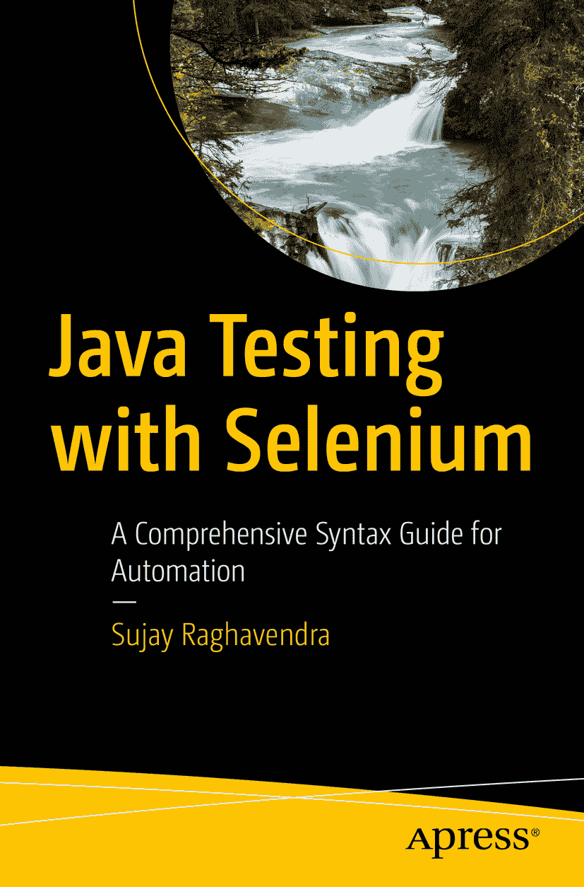

ISBN 979-8-8688-0290-4 电子版 ISBN 979-8-8688-0291-1 [`doi.org/10.1007/979-8-8688-0291-1`](https://doi.org/10.1007/979-8-8688-0291-1) © 编辑（如适用）及作者，根据与 APress Media, LLC（Springer Nature 旗下公司）的独家许可，2024 年。本作品受版权保护。所有权利均由出版商独家许可，无论涉及材料的全部或部分，特别是翻译、重印、重用插图、朗诵、广播、微缩胶片复制或任何其他物理形式的复制，以及信息存储与检索的传输、电子改编、计算机软件，或现在已知或未来开发的类似或不同方法。本出版物中使用通用描述性名称、注册商标、商标、服务标志等，即使没有明确声明，也不意味着这些名称不受相关保护法律和法规的约束，因此可自由使用。出版商、作者和编辑可以合理假设，本书中的建议和信息在出版时是真实准确的。出版商、作者或编辑均不对本书所含材料或可能存在的任何错误或遗漏提供明示或暗示的保证。出版商对已出版地图中的管辖权主张和机构归属保持中立。

本 Apress 印记由注册公司 APress Media, LLC（Springer Nature 旗下公司）出版。

注册公司地址为：美国纽约州纽约市新广场 1 号，邮编 10004。

*永远在我心中，奶奶*

引言

欢迎阅读 ***Java Testing with Selenium***，这是一本全面的指南，旨在帮助您使用 Java 和 Selenium WebDriver 掌握 Web 应用程序的自动化测试。本书将带您深入探索 Selenium WebDriver 的复杂性，了解其在 Web 测试中的能力，并利用 Java 的强大功能创建健壮且高效的自动化脚本。

## 本书适合谁？

本书非常适合软件开发人员、质量保证专业人员以及任何有兴趣学习使用 Java 进行 Selenium WebDriver 自动化测试的人。无论您是刚开始接触自动化测试的初学者，还是希望提升技能的经验丰富的测试人员，本书都能为您提供宝贵的见解和实用技术，助您在 Web 应用程序测试中脱颖而出。

## 本书结构

*Java Testing with Selenium* 共分为十二章，每章侧重于使用 Selenium WebDriver 和 Java 进行自动化测试的不同方面。以下是各章内容的简要概述：

*   第 1 章介绍 Selenium、其各种工具和版本以及 Selenium WebDriver 的架构。您将了解使用 Selenium 进行 Web 应用程序测试的优势，并学习如何将 Selenium 与 Python 集成以实现自动化。

*   第 2 章深入探讨 Selenium 测试的基础知识，学习如何安装 Java 和 Selenium、设置浏览器驱动程序、执行基本浏览器命令以及使用 Selenium 运行 Python 测试用例。

*   第 3 章探索 Selenium WebDriver 执行鼠标和键盘操作的能力。了解操作链、鼠标操作（如单击和拖动）、键盘操作（包括发送键）等。

*   第 4 章解释 Selenium WebDriver 中 Web 元素和定位器的基本概念。掌握各种类型的 Web 定位器以及定位多个 Web 元素的技术。

*   第 5 章教授测试网页超链接的技术，包括通过不同属性定位超链接、检查有效超链接以及处理超链接内的损坏图像。

*   第 6 章展示如何在 Selenium 中与不同类型的按钮交互，包括图像按钮、单选按钮、复选框、选择列表和多选列表。

*   第 7 章探索 Selenium WebDriver 中框架和文本框的概念。学习切换到 iframe 以及与单行和多行文本框交互的技术。

*   第 8 章解释断言在测试自动化中的重要性，以及如何使用硬断言和软断言在 Selenium 中有效实现断言。

*   第 9 章描述如何处理 Selenium WebDriver 中的异常，包括常见异常和有效异常处理的策略。

*   第 10 章深入探讨 Selenium WebDriver 中等待的概念，包括隐式等待和显式等待、常用的预期条件以及流畅等待。

*   第 11 章探索 Selenium 中的页面对象模型（POM）和 Page Factory 模式、它们的优势、实现方式以及区别。

*   第 12 章介绍 TestNG，这是一个强大的 Java 测试框架，并解释如何将其与 Selenium 集成，以创建健壮且可扩展的自动化测试套件。

*Java Testing with Selenium* 为您提供使用 Java 和 Selenium WebDriver 在 Web 应用程序自动化测试中脱颖而出所需的知识和技能。每章都提供对主题的全面讨论、实际示例和动手练习，以巩固学习。无论您是新手还是经验丰富的测试人员，本书都是您掌握使用 Java 进行 Selenium WebDriver 测试的终极指南。让我们一同踏上这段旅程，释放自动化测试的全部潜力！

致谢

我衷心感谢我亲爱的母亲 Indumati Raghavendra 和兄长 Sumedh，感谢他们坚定不移的爱、指导和支持。他们对我始终如一的信任是我整个旅程中力量和灵感的源泉。我兄长的智慧、指导和鼓励极大地塑造了我的道路和抱负。与我母亲无尽的爱和悉心照料一起，他们一直是我力量的支柱，指引我度过人生的起起落落。我真的很幸运，生命中能有如此杰出的人，我永远感激他们始终如一的存在和支持。谢谢妈妈和兄长，感谢你们为我所做的一切。

关于作者 关于技术审校者

