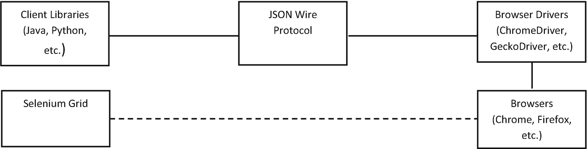

# 1. Selenium 简介：Java 自动化

## 引言

本次对 Web 应用测试动态领域的探索，深入剖析了 Selenium 不可或缺的作用。这款开源自动化工具从根本上改变了确保软件质量和可靠性的方式。旅程始于对应用测试关键需求的认知，这一实践对于在潜在问题影响最终用户体验之前发现并解决它们至关重要。一份全面的概述介绍了 Selenium，重点阐述了其发展历程、历史，以及它在 Web 测试领域被广泛采用的关键原因。

当你深入了解 Selenium 的复杂性时，焦点将转向其强大的架构——这一基础使其能够无缝集成并执行复杂的测试场景。这种架构视角为理解 Selenium 如何从市场其他工具中脱颖而出提供了背景，它在各种平台和浏览器上提供了无与伦比的灵活性和兼容性。

叙述的核心是 Selenium 与 **Java** 之间的紧密联系，Java 是增强 Selenium 能力的首选编程语言。Java 的面向对象特性、广泛采用度以及平台无关性使其成为 Selenium 的理想搭档，提升了你开发复杂且可扩展测试脚本的能力。

本章引言为深入探讨将 Selenium 与 Java 结合使用的功能、优势和战略意义奠定了基础。其目的在于阐明这些强大工具之间的协同效应，展示它们为何始终处于 Web 应用测试实践的前沿。

## 应用测试的必要性

随着软件开发的发展并成为现代企业不可或缺的一部分，应用测试的需求应运而生。对这一需求的认识可以追溯到以下几个关键因素。

*   **质量保证：** 测试有助于识别应用中的缺陷和错误，使开发人员能够在软件发布给用户之前修复它们。这提高了软件的整体质量。

*   **功能验证：** 测试验证应用是否按预期运行，确保其满足用户期望和业务需求。

*   **回归测试：** 随着软件通过新功能和更新不断发展，测试确保现有功能保持不变，且不受更改的影响。

*   **用户满意度：** 通过测试进行质量保证可带来更好的用户体验，这对于用户满意度和留存率至关重要。

*   **降低成本：** 早期发现和纠正缺陷可降低软件投入生产后修复问题的成本。

## 什么是 Selenium？

Selenium 是一个功能强大且被广泛使用的开源框架，用于自动化 Web 浏览器。它通过模拟用户与 Web 元素的交互，在测试 Web 应用中发挥着关键作用。Selenium 的核心目的是跨不同浏览器和平台自动化 Web 应用测试，确保 Web 应用正确且高效地运行。

## Selenium 的开发与历史

本主题追溯了 Selenium 非凡的开发历程，这款工具彻底改变了 Web 应用测试领域。从其作为简单浏览器自动化工具的诞生，到如今作为全面测试自动化套件的地位，Selenium 的演变反映了过去二十年 Web 技术的进步与挑战。

### 起源与早期开发（2004–2006 年）

#### Selenium 的诞生

*   Selenium 的故事始于 2004 年，ThoughtWorks 的软件工程师 Jason Huggins 开发了 Selenium 作为内部工具，以满足 Web 应用自动化测试的需求。最初的版本 Selenium Core 是一个开创性的基于 JavaScript 的测试系统。

*   选择 *Selenium* 这个名字是为了调侃一个名为 Mercury 的竞争对手，因为硒是已知的汞中毒解毒剂。

#### Selenium Remote Control (RC)

*   2005 年，另一位 ThoughtWorks 工程师 Paul Hammant 引入了 Selenium RC，以克服 Selenium Core 固有的同源策略限制。这一发展标志着向前迈出了重要一步，允许用户用多种编程语言编写测试脚本。

### 拓展视野（2006–2011 年）

#### Selenium IDE

*   2006 年，日本的 Shinya Kasatani 为 Selenium 套件贡献了 Selenium IDE，这是一个 Firefox 扩展。它提供了一个易于使用的界面来录制和回放测试，使测试自动化对初学者更加友好。

#### WebDriver 的引入

*   2008 年，Simon Stewart 开发了 WebDriver，这是一款旨在解决 Selenium RC 局限性的工具。WebDriver 与 Web 浏览器的直接交互及其连贯的 API 相比其前身有了显著改进。

#### Selenium 2.0：一个重要的里程碑

*   2011 年发布的 Selenium 2.0 是 Selenium 历史上的一个里程碑事件。该版本统一了 Selenium RC 和 WebDriver，为 Web 应用测试提供了一个强大且精简的框架。

### 成熟与扩展（2011–2018 年）

#### Selenium 3.0 的到来

*   2016 年，Selenium 3.0 代表了一次重大飞跃，弃用了原始的 Selenium Core 并代之以 WebDriver。该版本专注于现代 Web 标准并增强了对浏览器的支持。

#### Selenium 生态系统的成长

*   在此期间，Selenium 社区经历了显著增长。该工具与其他测试框架和 CI 系统的集成凸显了其适应性和广泛适用性。

### Selenium 的现代时代（2018 年至今）

#### Selenium 4.0：未来的实现

*   Selenium 4.0 于 2018 年宣布并于 2021 年发布，带来了许多新特性和改进。采用 W3C WebDriver 标准、对 Selenium Grid 的增强、相对定位器等新功能以及改进的窗口管理，都体现了 Selenium 持续的创新。

Selenium 的历史演变不仅仅是一个测试工具的编年史；它讲述了开源社区如何响应不断变化的技术格局来推动创新的故事。本章强调了 Selenium 过去的成就，并为其在日新月异的 Web 应用测试世界中的未来发展奠定了基础。当你阅读本书时，从 Selenium 历史中获得的见解将为你理解其当前的能力和应用提供坚实的基础。

### 为什么选择 Selenium？揭示 Selenium 在 Web 测试中的优势

让我们来讨论核心问题：为什么选择 Selenium？当你在多样化的 Web 测试工具领域中探索时，理解 Selenium 独特的优势和能力有助于你认识到它为何成为许多 Web 应用自动化测试专业人士的首选。

#### 开源优势

*   **可访问性和社区支持：** Selenium 的开源特性是其最引人注目的特点之一。这一特性不仅使 Selenium 对所有用户免费开放，还培育了一个充满活力的社区。社区支持的好处是多方面的，包括丰富的共享知识、快速的错误修复和频繁的更新。

#### 语言和框架灵活性

*   **适应多种编程语言：** 与一些局限于特定编程语言的测试工具不同，Selenium 支持多种语言，包括 Java、C#、Python、Ruby 和 JavaScript。这种灵活性允许团队选择符合其技能和项目需求的语言。

*   **与各种框架集成：** Selenium 能够与众多测试框架（如 Java 的 TestNG 和 JUnit、C# 的 NUnit 等）集成，增强了其实用性。这种集成能力使其能够无缝地融入各种开发工作流程。

#### 跨浏览器与跨平台测试

*   **广泛的浏览器支持：** Web 测试的一个关键方面是确保在不同浏览器上的兼容性。Selenium 在这方面表现出色，支持所有主流浏览器，如 Chrome、Firefox、Safari、Internet Explorer 和 Edge。

*   **跨平台一致性：** Selenium 很好地满足了在不同操作系统上确保应用程序性能一致的需求。它可在 Windows、Linux 和 macOS 上运行，提供全面的测试解决方案。

#### 复杂测试场景的高级功能

*   **处理现代 Web 应用程序：** Selenium 能够处理动态且复杂的 Web 应用程序。凭借处理 AJAX 和动态页面元素等高级功能，它可以为广泛的 Web 应用程序实现测试自动化。

#### 社区与持续演进

*   **不断壮大的 Selenium 社区：** Selenium 项目受益于软件测试领域最活跃、参与度最高的社区之一。该社区是学习、分享和解决问题的宝贵资源。

*   **持续的开发与更新：** Selenium 持续演进，定期进行更新和增强，以反映 Web 开发和测试领域的最新趋势和需求。

Selenium 是一款用于 Web 应用程序测试自动化的多功能、强大且用户友好的工具。它能够适应各种编程环境，支持跨浏览器测试，并且拥有强大的社区支持的开源模式，使其成为组织和个人都理想的选择。无论是处理简单还是复杂的测试场景，Selenium 都提供了确保 Web 应用程序质量和性能所需的工具和功能。当您在后续章节中探索 Selenium 的功能时，这些优势将构成理解其在现代 Web 测试领域中作用的基础。

## Selenium 架构

解释 Selenium 的架构，特别是包含框图时，需要全面理解其各个组件如何在框架内交互。以下是一个详细的解释，随后是对说明该架构的框图的描述。

### 核心组件

表 1-1

Selenium WebDrivers

| 浏览器 | Selenium 驱动 | 最新版本 |
| --- | --- | --- |
| Google Chrome | ChromeDriver | 96.0.4664.115 |
| Microsoft Edge | Microsoft Edge WebDriver | 122.0.2351.0 |
| Firefox | GeckoDriver (Mozilla Firefox) | 0.34.0 |
| Internet Explorer | Internet Explorer (IEDriverServer) | 4.2.0 |
| Safari | SafariDrvier | 17.2.1 |

*   **Selenium 客户端库/语言绑定：** 这些是 Selenium 为 Java、Python、C# 和 Ruby 等多种编程语言提供的 API。它们支持用这些语言编写测试脚本。

*   **基于 HTTP 的 JSON Wire 协议：** 来自测试脚本的 Selenium 命令被转换为 JSON 格式，并通过 HTTP 发送到浏览器驱动。

*   **浏览器驱动：** 每个浏览器（Chrome、Firefox、Safari 等）都有一个特定的驱动来接收命令。这些驱动解释命令并在相应的浏览器上执行它们。表 1-1 列出了各种浏览器及其对应的 Java 版 Selenium WebDriver 驱动。

*   版本号和下载链接可能会发生变化。

*   **浏览器：** 执行测试脚本的实际环境。每个浏览器响应驱动的指令。

*   **Selenium Grid：** 被描绘为连接到客户端库的可选实体。它分支到多个节点，每个节点能够运行一组浏览器驱动和浏览器，以进行并行执行。

连接线说明了命令从客户端库通过 JSON Wire 协议流向浏览器驱动和浏览器的过程。指向 Selenium Grid 的虚线显示了其在跨不同环境分发测试以进行并行执行中的作用。图 1-1 清晰地展示了 Selenium 架构中每个组件如何交互以促进 Web 应用程序测试。

一个框图说明了客户端库（包含测试脚本）是起点。连接到客户端库的 JSON Wire 协议将命令发送到浏览器驱动，以在 Chrome 和 Firefox 等不同浏览器中执行测试。浏览器连接到 Selenium Grid。

图 1-1

表示 Selenium 架构的框图

该框图将清晰地展示 Selenium 组件如何相互交互。客户端库是编写测试脚本的起点。JSON Wire 协议将命令发送到相应的浏览器驱动。然后，这些驱动与浏览器通信以执行测试。当与 Selenium Grid 集成时，此架构支持分布式测试环境，便于跨不同浏览器和系统并行执行测试。

## 自动化工具对比：Selenium 与替代方案

表 1-2 对比了 Selenium 及其替代方案的自动化工具。它展示了为什么 Selenium 通常能脱颖而出，成为比其他自动化工具更受青睐的选择。

表 1-2

自动化工具对比

| 特性/工具 | Selenium | QTP/UFT (Micro Focus) | TestComplete (SmartBear) | Cucumber | Katalon Studio |
| --- | --- | --- | --- | --- | --- |
| **类型** | 开源 | 商业 | 商业 | 开源 | 免费增值 |
| **语言支持** | Java, C#, Python, Ruby, JS | VBScript | JavaScript, Python, VBScript, C++Script, C#Script | Ruby, Java, JavaScript 等 | Groovy, Java |
| **浏览器兼容性** | 所有主流浏览器 | 有限 | 大多数主流浏览器 | 有限（通过集成） | 所有主流浏览器 |
| **跨平台测试** | Windows, macOS, Linux | Windows | Windows, macOS, Linux | 跨平台（通过集成） | Windows, macOS, Linux |
| **易用性** | 中等（需要编程技能） | 用户友好（所需技术知识较少） | 用户友好，具有录制回放功能 | 需要理解 BDD | 用户友好，具有录制回放功能 |
| **移动测试** | 可通过 Appium 实现 | 是 | 是 | 可能（通过集成） | 是，内置支持 |
| **API 测试** | 有限，需要集成 | 是，附带额外组件 | 是，附带额外组件 | 有限，需要集成 | 是，内置支持 |
| **CI/CD 集成** | 广泛 | 中等 | 广泛 | 广泛 | 广泛 |
| **社区支持** | 广泛 | 中等 | 中等 | 广泛 | 中等 |
| **测试管理集成** | 是，通过第三方工具 | 内置及通过第三方工具 | 内置及通过第三方工具 | 是，通过第三方工具 | 内置及通过第三方工具 |
| **成本** | 免费 | 高 | 中到高 | 免费（开源版） | 免费，提供付费选项 |

表 1-2 显示，Selenium 之所以脱颖而出，主要归功于其开源特性、广泛的浏览器兼容性以及对多种编程语言的支持。它对各种平台（Windows、macOS、Linux）的适应性以及广泛的 CI/CD 集成能力使其高度通用。尽管需要编程技能，但其广泛的社区支持以及通过集成第三方工具增强功能的能力，使其成为首选，特别是对于需要强大测试框架的测试自动化项目而言。

## Java：Selenium 的首选语言

Java 之所以成为 Selenium 的首选语言，并成为自动化 Web 测试中开发者和测试人员的首选，有多方面原因。Java 与 Selenium 之间的协同效应由多种因素驱动，这些因素增强了它们的有效性。以下是为何 Java 常被视为 Selenium 首选语言的详细解释。

*   **广泛的流行度与采用率/庞大的用户群**：Java 是使用最广泛的编程语言之一。这种广泛采用意味着有庞大的开发者和测试人员社区熟悉 Java，从而促进了 Selenium 项目中更便捷的协作和知识共享。

*   **面向对象编程 (OOP)/可重用性与可维护性**：Java 的面向对象特性与 Selenium 的架构非常契合。封装、继承和多态等 OOP 原则使得创建可重用且可维护的测试脚本成为可能，这在测试自动化中至关重要。

*   **强大的标准库/丰富的 API 集**：Java 提供了一套全面的标准库，这对 Selenium 自动化脚本编写非常有益。这些库提供了处理文件系统、数据库、网络等功能，增强了 Selenium 测试的能力。

*   **跨平台兼容性/平台无关性**：Java 的平台无关性是一个显著优势。用 Java 编写的测试脚本可以在不同操作系统上无需修改即可执行，这与 Selenium 的跨浏览器和跨平台测试能力相契合。

*   **强大的社区与生态系统/丰富的资源与支持**：强大的 Java 社区提供了广泛的支持，包括论坛、教程和文档。这使得使用 Selenium 和 Java 进行故障排除和学习变得更加容易。

*   **与其他工具的集成/与测试框架的兼容性**：Java 与流行的测试框架（如 JUnit 和 TestNG）集成良好，这些框架在 Selenium 中常用于组织测试、生成报告以及管理测试用例和测试套件。

*   **成熟的开发工具/先进的 IDE**：Java 受到 Eclipse 和 IntelliJ IDEA 等强大的集成开发环境 (IDE) 的支持。这些 IDE 提供了先进的编码、调试和测试功能，对于开发和维护 Selenium 测试脚本非常有益。

*   **稳定性与可靠性/久经考验的记录**：Java 在各个领域都有着悠久的稳定性和可靠性历史。这种稳定性在测试自动化中至关重要，因为测试脚本的一致和可靠执行是关键。

*   **强大的自动化生态系统/丰富的库和框架**：Java 的生态系统包含众多库和框架，可以增强和简化 Selenium 自动化。这些工具可以显著减少编写和维护测试脚本的工作量和复杂性。

Java 的面向对象特性、广泛使用、强大的库支持、平台无关性以及强大的生态系统相结合，使其成为 Selenium 的理想语言。它符合基于 Selenium 的自动化的技术要求，并为开发复杂高效的测试自动化套件提供了稳定且可扩展的环境。

## 总结

本章重点介绍了 Selenium 在自动化 Web 应用程序测试中的作用，详细阐述了其对于开发高质量软件的必要性。它审视了 Selenium 的起源和演变，强调了它如何成为测试领域的关键工具。

分析内容包括对 Selenium 架构的审视，展示了其跨各种平台和浏览器高效执行复杂测试的能力。这种探索强调了 Selenium 的灵活性、开源特性以及对不同编程语言的广泛支持，这使其有别于其他测试工具。

讨论的一个关键部分是 Selenium 和 Java 之间的协同作用。你了解到 Java 的面向对象特性和广泛使用增强了 Selenium 的测试脚本开发，使其成为 Selenium 用户的首选编程语言。这种组合优化了测试流程，并利用 Java 的优势来改进 Selenium 的功能。

将 Selenium 与其他测试工具进行比较，可以识别出其独特的优势：适应性、社区支持以及与其他软件工具的集成。这些见解有助于你理解 Selenium 在测试工具领域中的优越地位。

总体而言，本章简要概述了 Selenium 对 Web 应用程序测试的重大影响、其架构优势、与 Java 集成的益处，以及它如何优于竞争工具。这些知识为在软件测试场景中更有效地应用 Selenium 奠定了基础。

