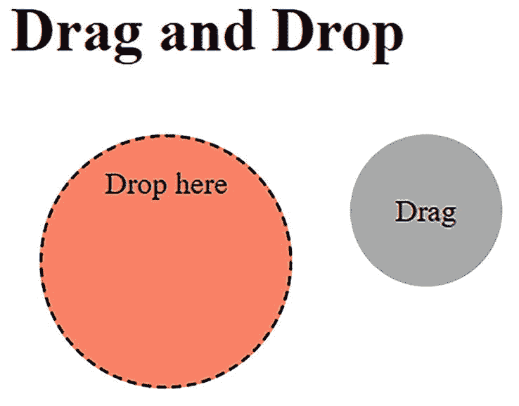
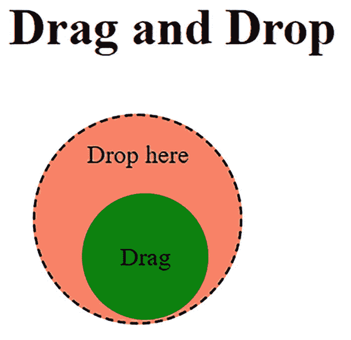

# 3. 鼠标与键盘操作

在本章中，你将深入探讨操作链的概念，这是模拟 Web 应用中复杂用户交互的强大功能。操作链允许自动化执行多个步骤，同时集成键盘和鼠标输入。这一功能对于全面测试 Web 应用至关重要。通过使用操作链，你可以自动化一系列键盘操作（如按键和文本输入）以及鼠标操作（如点击和拖放）。此外，操作链还支持滚动操作，能够自动滚动到特定的 Web 元素。这些能力确保了对交互式功能和用户交互进行全面测试。本章将介绍创建和执行操作链的基础知识，以及有效管理这些操作序列的方法。

## 操作链

术语*操作链*指的是一组按顺序执行的指令，用于在 Web 应用中模拟用户操作以测试其功能。

我们将使用 Eclipse IDE 编写 Java 测试用例，因为它是 Java 最广泛使用的 IDE 之一。使用该 IDE 的另一个原因是它会安装 Java JRE（Java 运行时环境），从而提供顺畅的启动设置。

## 鼠标操作

鼠标执行各种操作，例如点击、拖动、从一个位置移动到另一个位置等。这些操作用于模拟用户动作，并在浏览器中测试应用的功能。让我们从鼠标点击功能开始。

### 点击

点击方法是最常用的方法之一。你通过将鼠标移动到元素中心并点击来选择该元素。点击操作使用鼠标左键执行。

```
代码 3.1：
import java.util.concurrent.TimeUnit;
import org.openqa.selenium.By;
import org.openqa.selenium.chrome.ChromeDriver;
import org.openqa.selenium.WebDriver;
import org.openqa.selenium.WebElement;
public class Mouse {
public static void main(String[] args) throws Exception {
// 注意：从 ChromeDriver 114 版本开始，无需下载或指定 chromedriver 路径
// 为 Firefox 驱动创建新实例
WebDriver driver = new ChromeDriver();
// 导航到 URL
driver.get("https://www.selenium.dev");
// 等待页面加载的计时器
TimeUnit.SECONDS.sleep(5);
// 定位“登录”按钮
WebElement login_button=driver.findElement(By.linkText("Downloads"));
// 点击“登录”按钮
login_button.click();
}
}
```

此示例演示了对 selenium.dev 网页上的“Downloads”链接执行点击操作。设置计时器是为了等待页面加载，以便元素可用并执行点击操作。

注意

click() 函数由鼠标左键执行，也称为*点击并释放*。

### 双击

双击是指快速点击鼠标左键两次。鼠标指针首先移动到需要双击的 Web 元素的中心。

```
import org.openqa.selenium.By;
import org.openqa.selenium.WebDriver;
import org.openqa.selenium.WebElement;
import org.openqa.selenium.chrome.ChromeDriver;
import org.openqa.selenium.interactions.Actions;
public class DoubleClickExample {
public static void main(String[] args) {
WebDriver driver = new ChromeDriver();
driver.get("https://example.com");
WebElement elementToDoubleClick = driver.findElement(By.id("element-id"));
Actions actions = new Actions(driver);
actions.doubleClick(elementToDoubleClick).perform();
driver.quit();
}
}
```

此方法可以触发诸如打开项目、选择文本或激活某些控件等事件。

### 右键点击

右键点击功能是指将鼠标指针移动到元素中心，然后点击鼠标右键的操作。

```
import org.openqa.selenium.By;
import org.openqa.selenium.WebDriver;
import org.openqa.selenium.WebElement;
import org.openqa.selenium.chrome.ChromeDriver;
import org.openqa.selenium.interactions.Actions;
public class ContextClickExample {
public static void main(String[] args) {
WebDriver driver = new ChromeDriver();
driver.get("https://example.com");
WebElement elementToRightClick = driver.findElement(By.id("element-id"));
Actions actions = new Actions(driver);
actions.contextClick(elementToRightClick).perform();
driver.quit();
}
}
```

它通常用于测试 Web 应用中与上下文菜单相关的功能。

### 点击并按住

在点击并按住方法中，你将鼠标指针移动到元素中心，然后使用鼠标左键按下它但不释放。让我们使用前面的示例，看看通过按住操作，网页是导航到登录页面还是停留在同一页面。

```
import org.openqa.selenium.By;
import org.openqa.selenium.WebDriver;
import org.openqa.selenium.WebElement;
import org.openqa.selenium.chrome.ChromeDriver;
import org.openqa.selenium.interactions.Actions;
public class ClickAndHoldExample {
public static void main(String[] args) {
WebDriver driver = new ChromeDriver();
driver.get("https://example.com");
WebElement elementToClickAndHold = driver.findElement(By.id("element-id"));
Actions actions = new Actions(driver);
actions.clickAndHold(elementToClickAndHold).perform();
// 可以在此处执行其他操作，例如移动元素
actions.release().perform(); // 不要忘记释放点击
driver.quit();
}
}
```

它最常用于拖放场景，其中元素被点击并在特定时间内不释放，以到达其目标位置。你将在后续章节中看到更多相关内容。

### 执行

前面的代码使用了 perform() 函数来执行 clickAndHold() 函数。perform() 函数能够执行所有鼠标（点击除外）和键盘操作。当需要执行多个操作或任何定义的操作序列时，会使用 perform() 函数。

```
Actions actions = new Actions(driver);
actions.moveToElement(someElement)
.click()
.perform(); // 在元素上执行点击操作
```


### 暂停

暂停是指在执行操作时加入延迟。此延迟可用于一系列待执行的操作，或用于网页上某个需要等待其可用的单一操作。

```
import java.time.Duration;
Actions actions = new Actions(driver);
actions.moveToElement(someElement)
.click()
.pause(1000) // 暂停 1000 毫秒（1 秒）
.click(anotherElement)
.perform();
```

在某些情况下，可以通过模拟用户操作来自动化测试 UI 功能，从而创建更真实的场景。

### 释放

这是一个用于释放先前按下并按住不放的鼠标操作（按钮）的方法。一个常见的例子是拖放操作，你需要将一个元素从其位置拖到目标位置并释放它。

```
import org.openqa.selenium.interactions.Actions;
// 其他导入...
Actions actions = new Actions(driver);
actions.clickAndHold(someElement) // 点击并按住一个元素
.moveToElement(anotherElement) // 移动到另一个元素
.release() // 释放鼠标按钮
.perform(); // 执行整个操作序列
```

### 重置

Selenium 中的此重置操作用于重置或清除操作构建器中列出的所有操作的当前状态。

```
Actions actions = new Actions(driver);
actions.moveToElement(someElement)
.click()
.perform();
actions.reset(); // 重置操作构建器
actions.moveToElement(anotherElement)
.contextClick()
.perform();
```

注意

此函数会将焦点置于网页上的某个元素。

如上述代码片段所示，你可以从头开始构建一个新的操作序列，而无需创建 Action 对象。

## 鼠标移动

鼠标移动是指借助鼠标在屏幕上移动光标或指针。在 Selenium 中，这些移动被链接到各种操作中，下面将对此进行说明。

### 移动到元素

此方法将鼠标光标移动到指定网页元素的中心，模拟悬停行为。它用于与悬停相关的场景，如下拉菜单或悬停时探索隐藏元素。

```
from selenium import webdriver
from selenium.webdriver.common.action_chains import ActionChains
# 初始化 WebDriver
driver = webdriver.Chrome()
# 导航到网站
driver.get("https://example.com")
# 定位元素
element_to_hover_over = driver.find_element_by_id("some-id")
# 创建 ActionChains 对象
action = ActionChains(driver)
# 执行悬停操作
action.move_to_element(element_to_hover_over).perform()
```

此方法将鼠标指针移动到网页元素的中心。如果网页元素不可用，则会引发错误。

### 按偏移量移动

在 Selenium 中，你可以通过定义像素数作为偏移值来移动鼠标指针。鼠标指针可以位于视口中的当前位置，也可以位于特定的网页元素上。偏移值是定义鼠标指针移动位置的 *x* 和 *y* 坐标。

注意

视口是浏览器窗口中可见的网页显示区域。

```
import org.openqa.selenium.WebDriver;
import org.openqa.selenium.chrome.ChromeDriver;
import org.openqa.selenium.interactions.Actions;
public class OffsetExample {
public static void main(String[] args) {
// 初始化 WebDriver
WebDriver driver = new ChromeDriver();
// 导航到网站
driver.get("https://example.com");
// 创建 Actions 类的实例
Actions actions = new Actions(driver);
// 从视口左上角开始，将鼠标向右移动 50 像素，向下移动 100 像素
actions.moveByOffset(50, 100).perform();
// 可选：关闭浏览器
driver.quit();
}
}
```

偏移值从屏幕的左上角开始计算，该点定义为 (x=0, y=0)。请记住，偏移量没有默认值，并且偏移量始终相对于鼠标指针的当前位置。让我们看看可用于移动鼠标指针的各种方法。

### 从元素偏移

使用此方法时，鼠标指针会移动到指定网页元素的中心。当鼠标指针位于网页元素的中心时，鼠标指针会按提供的偏移值移动。

```
import org.openqa.selenium.By;
import org.openqa.selenium.WebDriver;
import org.openqa.selenium.WebElement;
import org.openqa.selenium.chrome.ChromeDriver;
import org.openqa.selenium.interactions.Actions;
public class OffsetFromElementExample {
public static void main(String[] args) {
// 初始化 WebDriver
WebDriver driver = new ChromeDriver();
// 导航到网站
driver.get("https://example.com");
// 定位所需的网页元素
WebElement targetElement = driver.findElement(By.id("someElementId"));
// 创建 Actions 类的实例
Actions actions = new Actions(driver);
// 将鼠标移动到目标元素的中心，然后按指定的偏移量移动
actions.moveToElement(targetElement).moveByOffset(50, 100).perform();
// 可选：关闭浏览器
driver.quit();
}
}
```

此代码将鼠标指针移动到指定网页元素（即 targetElement）的中心，然后立即按指定的偏移值移动它。此组合操作由 perform() 函数执行。

注意

xOffset -> 定义水平移动（值为正时，鼠标指针向右移动；值为负时，向左移动。）

yOffset -> 垂直移动（正值定义向下移动，而负值定义向上移动。）

### 从视口偏移

视口是网页的可见部分，鼠标光标在此视口内移动。偏移值从屏幕的左上角开始计算。

```
import org.openqa.selenium.WebDriver;
import org.openqa.selenium.chrome.ChromeDriver;
import org.openqa.selenium.interactions.Actions;
public class OffsetExample {
public static void main(String[] args) {
// 初始化 WebDriver
WebDriver driver = new ChromeDriver();
// 导航到网站
driver.get("https://example.com");
// 创建 Actions 类的实例
Actions actions = new Actions(driver);
// 从视口左上角开始，将鼠标向右移动 50 像素，向下移动 100 像素
actions.moveByOffset(50, 100).perform();
// 可选：关闭浏览器
driver.quit();
}
}
```

有两个偏移值：*x* 和 *y*。*x* 偏移值表示光标的水平移动，*y* 偏移值表示光标的垂直移动。此示例使用从视口左上角开始的偏移值移动了鼠标光标。


### 相对于当前指针位置的偏移量

此方法允许你将鼠标指针从其当前位置移动到指定的 *x* 和 *y* 偏移值。在不依赖网页元素作为参考点的情况下移动鼠标指针是可靠的。

```
import org.openqa.selenium.WebDriver;
import org.openqa.selenium.chrome.ChromeDriver;
import org.openqa.selenium.interactions.Actions;
public class OffsetFromCurrentPointerLocationExample {
// 初始化 WebDriver
WebDriver driver = new ChromeDriver();
// 导航至一个网站
driver.get("https://example.com");
// 创建 Actions 类的实例
Actions actions = new Actions(driver);
// 定义 x 和 y 偏移量
int xOffset = 30;   // 从当前位置向右移动 30 像素
int yOffset = -10;  // 从当前位置向上移动 10 像素
// 根据指定偏移量从当前位置移动鼠标
actions.moveByOffset(xOffset, yOffset).perform();
// 可选：关闭浏览器
driver.quit();
}
}
```

注意

如果鼠标指针之前未被任何 Selenium 命令移动过，那么鼠标指针位于视口的左上角。另外，请记住，当页面滚动时，鼠标指针位置保持不变。

在此示例中，考虑到 *x* 和 *y* 偏移量，鼠标指针从其当前位置移动了 30 像素。当鼠标指针的起始点变化或移动不依赖于任何网页元素时，可以使用此方法。

### 在元素上拖放

此方法用于测试 Web 应用程序中的拖放功能。此操作通过组合之前讨论过的“点击并按住”和“移动到元素”操作来自动化。对于拖放方法，我们使用简单的 HTML 和 JavaScript 代码来实现。

```

#drag, #drop {
float: left;
padding: 15px;
margin: 15px;
-moz-user-select: none;
}
#drag {
background-color: #A9A9A9;
height: 50px;
width: 50px;
border-radius: 50%;
cursor: pointer; /* 明确表明该元素可拖动 */
}
#drop {
background-color: #fd8166;
height: 100px;
width: 100px;
border-radius: 50%;
border: 2px dashed #000; /* 放置区域的视觉提示 */
}

function dragStart(event) {
event.dataTransfer.setData("Text", event.target.id);
event.dataTransfer.effectAllowed = 'move';
return true;
}
function dragEnter(event) {
event.preventDefault();
return true;
}
function dragOver(event) {
event.preventDefault(); // 允许放置所必需的
return false;
}
function dragDrop(event) {
var src = event.dataTransfer.getData("Text");
var srcElement = document.getElementById(src);
event.target.appendChild(srcElement);
srcElement.style.backgroundColor = 'green'; // 放置时改变颜色
event.stopPropagation();
return false;
}

拖放

放置在此处

拖动

```

图 3-1 显示了两个圆；一个比另一个大。你可以使用元素拖动较小的圆，并将其放入较大的圆或放置区域。为了区分圆何时被放入较大的圆中，较小圆的背景颜色会发生变化，这在 JavaScript 的 `dragDrop` 函数中有所提及。



拖放动作的两个圆的示意图。较大的圆标记为“放置在此处”，较小的圆标记为“拖动”。

图 3-1

执行前的拖放

在此示例中，对源元素执行了点击并按住操作，这是鼠标左键的功能。按住的同时，将元素移动到目标位置。当到达目标位置时，释放源元素。以下代码对前面看到的 HTML 执行拖放操作。

```
import org.openqa.selenium.By;
import org.openqa.selenium.WebDriver;
import org.openqa.selenium.WebElement;
import org.openqa.selenium.chrome.ChromeDriver;
import org.openqa.selenium.interactions.Actions;
public class DragAndDropCircleExample {
public static void main(String[] args) {
// 初始化 WebDriver
WebDriver driver = new ChromeDriver();
// 导航至 HTML 文件的位置
driver.get("URL_of_the_drag_and_drop_html_created"); // 替换为你的 HTML 文件的实际路径
// 定位源元素（圆）和目标元素
WebElement sourceElement = driver.findElement(By.id("drag"));
WebElement targetElement = driver.findElement(By.id("drop"));
// 创建 Actions 类的实例
Actions actions = new Actions(driver);
// 执行拖放操作
actions.dragAndDrop(sourceElement, targetElement).perform();
// 可选：关闭浏览器
driver.quit();
}
}
```

执行拖放方法后，拖入放置区域的圆会变为绿色，如图 3-2 所示。



执行后拖放动作的示意图。一个较小的圆代表拖动选项，放置在标记为“放置在此处”的较大圆内。

图 3-2

执行后的拖放

当圆被放下时，较小圆的背景变为绿色。接下来，让我们看看如何使用像素值（偏移值）进行拖放。

注意

你也可以使用“点击并按住”结合“移动到元素”操作来执行拖放操作。

### 按偏移量拖放

按偏移量拖放的方法与前述方法类似。唯一的区别在于，你使用偏移值（即 *x* 和 *y* 值，而不是定义目标元素）来移动源元素。

```
import org.openqa.selenium.By;
import org.openqa.selenium.WebDriver;
import org.openqa.selenium.WebElement;
import org.openqa.selenium.Point;
import org.openqa.selenium.chrome.ChromeDriver;
import org.openqa.selenium.interactions.Actions;
public class DragAndDropByOffsetExample {
public static void main(String[] args) {
WebDriver driver = new ChromeDriver();
// 打开包含拖放元素的网页
driver.get("URL_of_your_drag_and_drop_page");
// 定位要拖动的元素和目标元素
WebElement sourceElement = driver.findElement(By.id("drag"));
WebElement targetElement = driver.findElement(By.id("drop"));
// 获取源元素和目标元素的位置
Point sourceLocation = sourceElement.getLocation();
Point targetLocation = targetElement.getLocation();
// 计算偏移量（如果需要，考虑元素的大小）
int xOffset = targetLocation.getX() - sourceLocation.getX();
int yOffset = targetLocation.getY() - sourceLocation.getY();
// 创建 Actions 类的实例
Actions actions = new Actions(driver);
// 根据计算出的偏移量执行拖放
actions.dragAndDropBy(sourceElement, xOffset, yOffset).perform();
// 关闭浏览器
driver.quit();
}
}
```

此代码根据源元素和目标元素的位置计算偏移值，然后对创建的 HTML 执行拖放操作。下一节将介绍键盘操作。

## 键盘操作

在 Selenium WebDriver 中，键盘操作可自动执行按键按下和释放。它可以是一个或多个此类按键事件的组合，用于测试 Web 应用程序的功能。让我们讨论用于与 Web 应用程序交互的各种键盘操作。

### 按键

按键以 Unicode 形式提供了一组常量值，代表键盘上的特殊键和不可打印键。这些常量值允许你自动执行按键操作。表 3-1 中给出了按键及其对应的 Unicode。

表 3-1

基本按键和 Unicode 按键

| 基本按键 | Unicode | 基本按键 | Unicode |
| --- | --- | --- | --- |
| NULL | \uE000 | ENTER | \uE007 |
| CANCEL | \uE001 | Shift | \uE008 |
| HELP | \uE002 | CONTROL | \uE009 |
| BACK_SPACE | \uE003 | LEFT | \uE012 |
| TAB | \uE004 | UP | \uE013 |
| CLEAR | \uE005 | RIGHT | \uE014 |
| RETURN | \uE006 | DOWN | \uE015 |


### 按键按下

`keyDown` 方法用于模拟键盘操作中的按键按下动作。按键按下是指按住一个键而不释放它。当你希望输入大写字母或使用特殊字符时，需要按住 Shift 键。若要按住 Ctrl 键选择多个元素，则使用 `keyDown` 方法。

### 按键释放

`keyUp` 方法用于释放之前按下的键，并随后执行其他键盘操作。它主要与 `keyDown` 方法配合使用，以模拟完整的按键按下和释放动作。

### 发送键

当你需要向网页元素（例如密码框、文本区域和搜索框）中输入文本时，请使用 `sendKeys` 方法。你可以使用此方法将多个操作串联起来。以下代码展示了一个输入大写字母的示例。

该键将保持按下状态，直到你结束链式操作或使用接下来讨论的 `keyUp` 方法。

```
public class Mouse {
public static void main(String[] args) {
//设置系统属性
System.setProperty("webdriver.firefox.driver"," path/to/geckodriver");
// 为 Firefox 驱动创建新实例
WebDriver driver = new FirefoxDriver();
// 导航到 URL
driver.get("https://google.com/");
Actions actions = new Actions(driver);
// 定位 ID 为 "query" 的元素，并模拟按住 Shift 键的同时输入 "abc"
actions.moveToElement(driver.findElement(By.name("q")))
.keyDown(Keys.SHIFT)
.sendKeys("java selenium book sujay")
.keyUp(Keys.SHIFT)
.perform();
}
}
```

此示例代码将 `keyDown` 和 `keyUp` 方法与 `sendKeys` 结合使用，模拟了在 Google 搜索框中输入大写文本的过程。

### 滚动

在操作方面，除了鼠标点击之外，你还可以使用鼠标滚轮进行滚动操作。在 Selenium WebDriver 中，你可以向上或向下滚动网页。Selenium WebDriver 本身并不像支持鼠标和键盘操作那样原生支持滚动操作。接下来，让我们讨论用于模拟滚动操作的动作。

### 滚动到元素

当处理位于视口之外的元素时，可以使用 `scrollToElement` 方法。Selenium 中的 Action 类不会像 `click()` 或 `sendKeys()` 等更传统的方法那样自动将目标元素滚动到视口中。因此，在使用 Actions 类对元素执行操作之前，你通常需要确保该元素是可见的。

```
import org.openqa.selenium.WebDriver;
import org.openqa.selenium.firefox.FirefoxDriver;
import org.openqa.selenium.interactions.Actions;
import org.openqa.selenium.By;
import org.openqa.selenium.JavascriptExecutor;
import org.openqa.selenium.WebElement;
public class Mouse {
public static void main(String[] args) {
//设置系统属性
System.setProperty("webdriver.firefox.driver","path/to/geckodriver");
// 为 Firefox 驱动创建新实例
WebDriver driver = new FirefoxDriver();
// 导航到 URL
driver.get("https://link.springer.com/");
WebElement elementToScrollTo = driver.findElement(By.linkText("Biomedicine"));
Actions actions = new Actions(driver);
actions.moveToElement(elementToScrollTo).perform();
// 使用 JavascriptExecutor
JavascriptExecutor js = (JavascriptExecutor) driver;
js.executeScript("arguments[0].scrollIntoView(false);", elementToScrollTo);
}
}
```

要执行滚动操作，请使用 Selenium 中的 `JavascriptExecutor` 库。如示例所示，`scrollIntoView` 方法将目标元素带入视口的可视区域，而 `scrollIntoView(false)` 则确保目标元素的底部与视口的底部对齐。

### 按指定量滚动

`scrollByAmount` 是最常用的滚动方法之一，用于按像素数垂直或水平滚动。`delta x` 和 `delta y` 值分别指定水平和垂直滚动的量。当你希望按指定量（而非滚动到某个元素）滚动 Web 应用程序时，此方法非常有用。

```
public static void main(String[] args) {
//设置系统属性
System.setProperty("webdriver.firefox.driver","path/to/geckodriver");
// 为 Firefox 驱动创建新实例
WebDriver driver = new FirefoxDriver();
// 导航到 URL
driver.get("https://selenium.dev/");
// 定义水平和垂直滚动的量
int deltaX = 50; // 向右滚动 50 像素
int deltaY = 100; // 向下滚动 100 像素
// 创建一个 Actions 序列以按固定量滚动
new Actions(driver)
.scrollByAmount(deltaX, deltaY)
.perform();
}
}
```

此示例向右滚动 50 像素，向下滚动 100 像素。此操作在测试懒加载项目、无限滚动功能或任何在滚动特定量后激活的功能时非常有用。

### 从元素按指定量滚动

在此方法中，你首先将定义的 Web 元素带入视口，然后分别按预定的像素数水平（`delta x`）和垂直（`delta y`）从该元素位置向外滚动。当你想要测试紧邻指定参考元素侧面或下方的 Web 元素或功能时，可以使用此操作。

```
public static void main(String[] args) {
//设置系统属性
System.setProperty("webdriver.firefox.driver","path/to/geckodriver");
// 为 Firefox 驱动创建新实例
WebDriver driver = new FirefoxDriver();
// 导航到 URL
driver.get("https://link.springer.com/");
// 定位起始元素
WebElement originationElement = driver.findElement(By.linkText("books"));
// 定义滚动原点为元素的中心
WheelInput.ScrollOrigin scrollOrigin = WheelInput.ScrollOrigin.fromElement(originationElement);
WheelInput.ScrollOrigin scrollOrigin = WheelInput.ScrollOrigin.fromElement(originationElement, 0, 100);
// 创建一个 Actions 序列，从定义的原点向下滚动 500 像素
new Actions(driver)
.scrollFromOrigin(scrollOrigin, 0, 500)
.perform();
}
```

该示例定义了视口中可用的元素，然后使用 `scrollIntoView` 方法按指定的像素数进行滚动。接下来，让我们看看如何通过偏移量滚动元素。

### 从元素按偏移量滚动

此方法允许你从一个特定位置滚动 Web 应用程序，该位置由相对于已定义 Web 元素中心的偏移量决定。当你希望滚动到与某个元素相对应的特定位置（而非元素本身）时，此方法非常有用。

```
public static void main(String[] args) {
//设置系统属性
System.setProperty("webdriver.firefox.driver","path/to/geckodriver");
// 为 Firefox 驱动创建新实例
WebDriver driver = new FirefoxDriver();
// 导航到 URL
driver.get("https://link.springer.com/");
// 定位起始元素
WebElement originationElement = driver.findElement(By.linkText("books"));
// 定义滚动原点为页脚中心上方 100 像素的点
WheelInput.ScrollOrigin scrollOrigin = WheelInput.ScrollOrigin.fromElement(originationElement, 0, 100);
// 创建一个 Actions 序列，从定义的原点向下滚动 500 像素
new Actions(driver)
.scrollFromOrigin(scrollOrigin, 0, 500)
.perform();
}
```

在此示例中，从定义的 Web 元素位置开始，按指定的像素数执行滚动操作。接下来，让我们看看可以使用 Selenium 执行的滚动操作。


### 从视口原点偏移指定量进行滚动

使用此方法，你可以从当前视口左上角偏移定义的某个位置开始滚动。这适用于需要滚动到屏幕上特定位置（而非相对于某个网页元素）的场景。

```
public static void main(String[] args) {
//设置系统属性
System.setProperty("webdriver.firefox.driver","path/to/geckodriver");
// 为 Firefox 驱动创建新实例
WebDriver driver = new FirefoxDriver();
// 导航至 URL
driver.get("https://link.springer.com/");
// 将滚动原点定义为视口左上角向右 100 像素、向下 200 像素的点
WheelInput.ScrollOrigin scrollOrigin = WheelInput.ScrollOrigin.fromViewport(100, 200);
// 创建一个 Actions 序列，从定义的原点向下滚动 500 像素
new Actions(driver)
.scrollFromOrigin(scrollOrigin, 0, 500)
.perform();
}
```

## 总结

本章讨论了用于模拟复杂用户交互（包含多个步骤或同时使用键盘和鼠标）的操作链。操作链使你能够自动化测试 Web 应用程序的功能。

借助操作链，你可以执行各种键盘操作，例如按键、文本输入和组合键。它们还允许执行鼠标操作，例如单击、双击、右键单击、拖放以及在元素上移动鼠标。这些操作对于测试交互式功能（如网页元素、悬停状态和拖放）非常有用。

操作链还支持滚动操作，能够自动滚动到特定的网页元素或按预定义的偏移量滚动。这对于测试页面上未立即可见的网页元素来说是一项关键功能。操作链通过执行 `perform()` 方法来执行一系列操作，从而提供了一种全面的方法来模拟测试 Web 应用程序中的真实用户交互场景。

本章还讨论了 `reset()`、`release()` 和 `pause()` 等方法。

