# 4. 网页元素

本章探讨了 Selenium WebDriver 中网页元素定位器这一核心概念，它是 Web 自动化的基础。首先介绍定位器及其在 Selenium 中不可或缺的原因，为你理解其在高效自动化中的作用奠定基础。接着，你将深入探讨文档对象模型（DOM），这对于理解 Selenium 如何与网页元素交互至关重要。

随后，详细介绍了 Selenium 中八种主要的定位器类型，包括它们的实际应用、语法和适用场景。从简单的 ID 和类名定位器到复杂的 XPath 和 CSS 选择器，每种类型都进行了讨论，以提供对其用法的透彻理解。

最后，你将了解使用定位器时遇到的常见挑战，并分享克服这些问题的**最佳实践**，旨在提高自动化脚本的可靠性和效率。本章旨在为你提供掌握 Selenium WebDriver 中定位器使用所需的知识和专业技能。

## 什么是网页元素定位器？

网页元素定位器是 Web 自动化和测试中用于识别网页元素并与之交互的基本工具。这些元素可以包括按钮、文本字段、复选框、下拉菜单、链接等。定位器在网页的 DOM 中精确定位这些元素，使自动化脚本或测试能够执行点击、输入或从中提取信息等操作。

网页元素定位器确保 Web 应用程序的功能和用户界面按预期工作。它们广泛应用于各种测试场景，包括功能测试、回归测试和兼容性测试，以验证 Web 应用程序在不同浏览器和平台上是否表现正确且一致。

## 为什么网页元素定位器在 Web 自动化中很重要？

Web 自动化涉及与 Web 应用程序的自动交互；如果没有可靠的定位器，自动化这些交互几乎是不可能的。以下几点说明了网页元素定位器为何至关重要。

*   **自动化精度**：网页元素定位器能够精确识别网页上的元素，确保自动化测试或脚本能够准确地与目标元素进行交互。

*   **跨浏览器兼容性**：不同的 Web 浏览器渲染网页的方式不同。网页元素定位器通过适应其独特的渲染方式，有助于确保自动化测试在多个浏览器上一致地工作。

*   **可维护性**：有效使用定位器可以使自动化脚本更易于维护。当元素发生变化或 Web 应用程序演进时，设计良好的定位器可以更轻松地更新，从而减少维护开销。

*   **可重用性**：网页元素定位器可以在不同的测试用例或场景中重复使用，使自动化脚本更高效并减少冗余。

*   **可扩展性**：随着 Web 应用程序的增长和演进，自动化可以帮助管理大量的测试工作。网页元素定位器对于扩展测试自动化以覆盖各种功能至关重要。

*   **效率**：自动化显著加快了测试过程，实现了快速反馈和更快的 Web 应用程序发布。

理解如何有效且高效地使用不同类型的定位器，是任何参与 Web 自动化和测试的人员的基础技能。它确保了自动化测试的可靠性和有效性，并有助于提升 Web 应用程序的整体质量。

## 理解 DOM

文档对象模型（简称 DOM）是网页内容的结构化表示。它就像浏览器用来解释和渲染网页的蓝图。在此上下文中，DOM 扮演着至关重要的角色，因为网页元素定位器依赖它来定位网页上的元素并与之交互。

将网页想象成一个树形结构。网页中的每个元素，例如标题、段落、图像和按钮，都表示为这棵树中的一个节点。DOM 以层级方式组织这些节点，其中 HTML 文档是根节点。

### HTML 与 DOM 基础

HTML（超文本标记语言）是用于在万维网上创建和构建 Web 应用程序的标准语言。HTML 包含各种网页元素，每个元素由标签表示，从而定义了一个网页。理解 HTML 对于使用网页元素定位器和自动化至关重要，因为网页元素是在网页的 HTML 结构中定义的。

#### HTML 网页元素

HTML 网页元素是任何网页的构建块。它们被包含在 HTML 标签中，标签由开始标签、内容和结束标签（**< >**）组成。以下是一个基本示例。

```
这是一个段落元素。
```

此示例包含以下内容。

*   **<p>** 是开始标签。

*   **</p>** 是结束标签。

*   **这是一个段落元素。** 是内容。

网页元素的复杂程度各不相同，因为它们用于各种目的。常见的网页元素包括标题、段落、链接、图像和表单。每个网页元素都有特定的属性，并且可能包含其他嵌套元素。


### 属性

属性为 HTML 元素提供附加信息，并包含在开始标签中。属性由名称和值组成，两者用等号分隔。以下是使用图像元素的 `src` 属性的示例。

```

在提供的示例中，包含以下属性。

*   **src** 是属性名称。

*   **image.jpg** 是属性值。

*   **alt** 是另一个属性名称。

*   **A beautiful image** 是其属性值。

属性可以影响元素的行为和外观，使其对于 Web 元素定位器和自动化至关重要。例如，`id` 和 `name` 属性可以作为定位器来唯一标识元素。

## DOM 树结构概述

在了解它们之间的关系之前，你需要理解 DOM 中的关键概念及其定义。让我们从节点开始，这是 DOM 结构中最初且主要的概念。

节点表示 DOM 树中的单个元素、属性和文本内容。常见的节点类型包括以下几种。

*   **根节点**：代表整个文档（`document` 对象）。

*   **元素节点**：代表 HTML 标签，并构成 HTML 文档的结构。

*   **属性节点**：与元素节点关联，并提供关于元素的附加信息（尽管在 DOM API 中，属性通常作为元素对象的属性来访问）。

*   **文本节点**：包含元素内的实际文本，并且始终是叶节点（它们没有子节点）。

理解 DOM 结构以及如何在其内部有效地定位元素，对于 Web 自动化测试至关重要，它使测试人员能够创建测试用例。

## DOM 中的关系

DOM 中的元素可以具有父子关系、兄弟关系，或两者兼有。这种层级结构允许你高效地导航和操作文档。

*   **父子关系**：这种关系描述了嵌套在其他元素内部的元素。例如，如果你有一个 `<div>` 元素，其内部有一个 `<p>` 元素，那么 `<div>` 被视为父元素，`<p>` 是子元素。

*   **兄弟关系**：兄弟元素是处于同一层级或共享同一个父元素的元素。例如，如果两个 `<div>` 元素在同一个父元素内一个接一个地放置，它们就被视为兄弟元素。

```

我们的文档

欢迎来到我们的页面
    这是我们文档中的一个段落。
    访问示例

```

以下描述了此 HTML 中的元素。

*   **<html>** 元素是根元素，**<head>** 和 **<body>** 是其子元素。

*   **<title>** 元素是 **<head>** 的子元素。

*   在 **<body>** 内部，**<div>** 是一个子元素，它进一步包含 **<h1>**、**<p>** 和 **<a>** 作为其子元素。

*   **<a>** 元素有一个属性 **href**，其值为 **https://example.com**。

图 4-1 是一个流程图，展示了示例中描述的结构和关系。

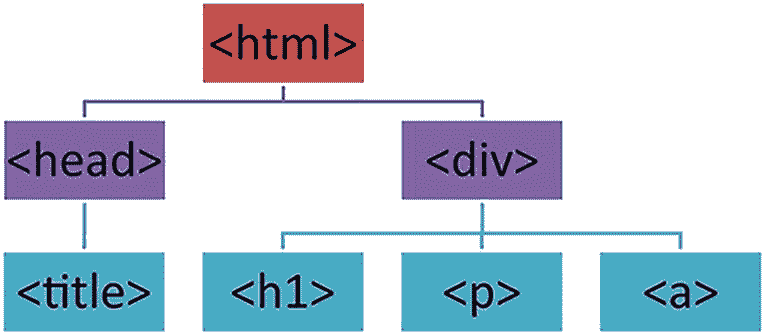

一个 DOM 结构树图以 html 元素开始，包含 head 和 div 元素。head 元素由一个 title 组成，而 div 元素包含 h1、p 和 a。

**图 4-1**
DOM 结构

图 4-1 展示了 HTML 文档中每个元素是如何连接的，展示了父子关系和兄弟关系。从 **<html>** 根元素开始，你可以看到元素是如何相互嵌套的，一直深入到 **<div>** 元素内的各个 **<h1>**、**<p>** 和 **<a>** 元素。图中还描绘了 **<a>** 元素的 `href` 属性，展示了属性如何提供关于元素的附加信息。

## 定位器

让我们探索各种 Selenium WebDriver 定位器，包括 ID、名称、XPath、CSS 选择器、链接文本、部分链接文本、标签名称和类名。这些定位器提供了识别和与 Web 元素交互的不同方法。每种定位器类型都包含描述、Java 语法和一个 HTML 代码示例。

### ID 定位器

Selenium 中的 ID 定位器用于通过其唯一 ID 查找元素。这是定位元素最高效的方法之一，因为 ID 在 HTML 文档中应该是唯一的。
**Java 语法**

```
WebElement element = driver.findElement(By.id("elementId"));
```

此语法告诉 Selenium 查找具有指定 ID 属性的元素。由于 ID 属性在 HTML 中的唯一性，**By.id** 方法快速且可靠。
**HTML 代码示例**

```
<button id="submitBtn">提交</button>
```

此示例有一个带有唯一 ID **submitBtn** 的按钮元素。你可以使用此 ID 直接定位该按钮。
**用于定位 Web 元素的 Java 代码**

```
WebElement submitButton = driver.findElement(By.id("submitBtn"));
```

该代码使用 **By.id** 方法查找具有 ID **submitBtn** 的按钮。由于 ID 的唯一性，这种方法直接且有效。

### 名称定位器

名称定位器用于通过其 **name** 属性查找元素。当 **name** 属性可用时，它非常有用，并且可以方便地定位元素，尤其是在表单中。
**Java 语法**

```
WebElement element = driver.findElement(By.name("elementName"));
```

此命令查找其 **name** 属性与提供的值匹配的元素。这是一种常用的方法，尤其在表单中。
**HTML 代码示例**

```
<input type="text" name="username" placeholder="输入用户名">
```

这里，有一个用户名字段的输入框，其 **name** 属性设置为 "username"。此属性可用于定位该输入框。
**用于定位 Web 元素的 Java 代码**

```
WebElement usernameInput = driver.findElement(By.name("username"));
```

该代码通过搜索具有 "username" **name** 属性的元素来定位输入框。此方法在诸如表单等常见使用 **name** 属性的场景中特别有用。

### 链接文本定位器

链接文本定位器通过其精确的可见文本查找链接元素。它对于文本独特且已知的链接特别有用。
**Java 语法**

```
WebElement element = driver.findElement(By.linkText("精确的链接文本"));
```

此语法基于链接（**<a>**）元素的精确文本内容来定位它们。它非常适合需要与特定文本链接进行交互的场景。
**HTML 代码示例**

```
<a href="https://example.com/login">登录</a>
```

该示例包含一个文本为 "登录" 的链接。这个文本独特且精确，可用于定位该链接。
**用于定位 Web 元素的 Java 代码**

```
WebElement loginLink = driver.findElement(By.linkText("登录"));
```

该代码查找与文本完全匹配的链接元素。这种方法对于定位基于文本的链接直接且高效。

### 部分链接文本定位器

部分链接文本定位器允许你基于其可见文本的子字符串来查找链接元素。当链接的确切文本未知或太长时，这很有帮助。
**Java 语法**

```
WebElement element = driver.findElement(By.partialLinkText("链接文本的一部分"));
```

此命令查找其文本中包含指定子字符串的链接元素。与精确链接文本定位器相比，它提供了更大的灵活性。
**HTML 代码示例**

```
<a href="https://example.com/about">了解更多关于你的信息</a>
```

在这种情况下，链接文本较长。如果你只记得其中一部分，比如 "关于你"，你仍然可以定位该链接。
**用于定位 Web 元素的 Java 代码**

```
WebElement aboutLink = driver.findElement(By.partialLinkText("关于你"));
```

此代码查找其可见文本中包含 "关于你" 的任何链接。对于文本较长或仅部分记得的链接，这是一种通用的方法。

### 标签名称定位器

标签名称定位器用于通过其标签名称查找元素。当 class、name 或 ID 不可用时，它对于识别元素很有用。
**Java 语法**


```
List elements = driver.findElements(By.tagName("tagName"));
```

此语法用于查找指定标签的所有元素。由于多个元素可能共享同一标签，因此它会返回一个元素列表。
**HTML 代码示例**

```
列表项 1
列表项 2

```

这里，你有几个列表项（`<li>`）。如果你想与所有列表项进行交互，可以使用它们的标签名进行定位。
**用于定位 Web 元素的 Java 代码**

```
List listItems = driver.findElements(By.tagName("li"));
```

该代码检索所有带有 `<li>` 标签的元素。当你需要与同一类型的多个元素进行交互或评估时，这种方法非常有效。

类名定位器
类名定位器用于通过元素的 class 属性来查找元素。当元素共享某个样式类时，这是一种常见的定位方式。
**Java 语法**

```
WebElement element = driver.findElement(By.className("className"));
```

此语法根据元素的 `class` 属性值来定位元素。当元素使用特定类进行分类或样式化时，这非常有用。
**HTML 代码示例**

```
发生错误
```

在此示例中，错误消息使用了 error-message 类进行样式化。该类可用于识别并与错误消息元素进行交互。
**用于定位 Web 元素的 Java 代码**

```
WebElement errorMessage = driver.findElement(By.className("error-message"));
```

该代码使用其 error-message 类定位 `<div>` 元素。当处理通过公共类进行样式化或分组的元素时，此方法特别有用。
Selenium WebDriver 中的每个定位器都有特定的用途，并提供了在网页中定位元素的不同方法。理解并有效使用这些定位器对于创建可靠且高效的 Web 自动化脚本至关重要。

XPath 定位器

绝对 XPath
绝对 XPath 从根节点开始，沿着文档层级向下导航，指定路径中的每个元素。它以单斜杠 **/** 开头，提供了一种直接访问 DOM 中任何元素的方式。然而，它很脆弱，因为文档结构中的任何更改都可能导致路径失效。
**Java 语法**

```
WebElement element = driver.findElement(By.xpath("/html/body/div/p"));
```

此语法使用 Selenium 的 `findElement` 方法和 `By.xpath`，其中 XPath 表达式定义了从根节点（`html`）到目标元素的直接路径。
**HTML 代码示例**

```

段落文本

```

在此示例中，**<p>** 元素嵌套在 **<div>** 内部，而该 **<div>** 又位于文档的 `body` 中。你可以使用绝对 XPath 精确定位此段落元素。
**用于定位 Web 元素的 Java 代码**

```
WebElement paragraph = driver.findElement(By.xpath("/html/body/div/p"));
```

该 Java 代码从 HTML 文档的根节点向下导航到特定的 **<p>** 元素。这种方法非常具体，依赖于 HTML 文档的确切结构。

相对 XPath
相对 XPath 提供了一种更灵活的定位元素的方法。它以双斜杠 **//** 开头，表示该元素可以位于文档中的任何位置。此方法不易因文档结构的变化而失效。
**Java 语法**

```
WebElement element = driver.findElement(By.xpath("//tag[@attribute='value']"));
```

**//** 表示 Selenium 应在 HTML 文档中搜索任何位置匹配标签和属性条件的元素。
**HTML 代码示例**

```
提交

```

这里，你有一个带有 **id** 属性的 **button**。该按钮位于 **div** 内，但使用相对 XPath 定位时，其在文档中的确切位置无关紧要。
**用于定位 Web 元素的 Java 代码**

```
WebElement submitButton = driver.findElement(By.xpath("//button[@id='submit']"));
```

这行 Java 代码告诉 Selenium 在文档中查找任何 **id** 为“submit”的 **button** 元素。与绝对 XPath 相比，此方法对 DOM 变化的适应性更强。

基于属性的 XPath
基于属性的 XPath 根据元素的属性来定位元素。当元素具有可用于识别的唯一属性（如 `id`、`name` 或自定义属性）时，此方法非常有用。
**Java 语法**

```
WebElement element = driver.findElement(By.xpath("//tag[@attribute='value']"));
```

此 XPath 表达式搜索具有特定标签和给定属性值的元素。这是一种精确定位具有唯一或独特属性的元素的方法。
**HTML 代码示例**

```
假设你想定位一个用于输入用户名的输入字段。该输入字段具有一个独特的 `name` 属性，你可以将其作为目标。
**用于定位 Web 元素的 Java 代码**

```
WebElement usernameField = driver.findElement(By.xpath("//input[@name='username']"));
```

此代码根据其 `name` 属性定位输入字段。通过使用 **//input[@name='username']**，你指示 Selenium 查找任何具有“username” `name` 属性的 `input` 元素，无论其在 DOM 中的位置如何。

XPath 中的位置过滤器
XPath 位置过滤器允许你根据元素在其父元素中的位置来选择元素。当元素的位置（而非其属性或标签）是定义特征时，这非常有用。
**Java 语法**

```
WebElement element = driver.findElement(By.xpath("(//parent/child)[position]"));
```

此语法根据子元素在其父元素中的位置来定位它。位置在方括号中指定，且基于 1，即计数从 1 开始。
**HTML 代码示例**

```
项目 1
项目 2
项目 3

```

你可能想选择此列表中的第二个列表项。这些项目的标签和属性都相同，因此你可以使用它们的位置来区分。
**用于定位 Web 元素的 Java 代码**

```
WebElement secondItem = driver.findElement(By.xpath("(//ul/li)[2]"));
```

该代码定位无序列表中的第二个 `<li>` 元素。XPath 表达式 `(//ul/li)[2]` 指示 Selenium 选择第二个 `li` 元素，演示了位置过滤器如何根据元素在 DOM 中的顺序来定位元素。

带有逻辑运算符的 XPath
XPath 逻辑运算符（如 `and`、`or` 和 `not`）允许在单个 XPath 表达式中组合多个条件。这增强了定位满足复杂条件的元素的能力。

使用 `and` 运算符
XPath 中的 **and** 运算符组合了多个条件，这些条件必须全部为真，元素才会被选中。当定位满足多个不同条件的元素时，它特别有用。
**Java 语法**

```
WebElement element = driver.findElement(By.xpath("//tag[@attribute1='value1' and @attribute2='value2']"));
```

此 XPath 语法针对满足所有指定条件的元素。此示例查找具有特定标签且 `attr1` 为 `value1` 且 `attr2` 为 `value2` 的元素。
**HTML 代码示例**

假设你需要定位一个专门用于电子邮件地址的 input 元素。该元素不仅类型为 'email'，而且还具有 **required** 属性。
**用于定位 Web 元素的 Java 代码**

```
WebElement emailInput = driver.findElement(By.xpath("//input[@type='email' and @required]"));
```

该代码片段查找一个既是 **type** 为 email 又具有 **required** 属性的 input 元素。它演示了如何在 XPath 中使用 `and` 运算符来精确定位满足多个特定条件的元素。

使用 `or` 运算符
`or` 运算符允许你选择满足多个指定条件中至少一个的元素。当存在多个可能的识别元素的标准时，这非常有用。
**Java 语法**

```
WebElement element = driver.findElement(By.xpath("//tag[@attr='value1' or @attr='value2']"));
```

此语法选择满足提供的任一条件的元素。`or` 运算符通过接受匹配任一条件的元素来扩大选择范围。
**HTML 代码示例**

```
确认
继续
```


你可能需要定位一个 ID 为“confirm”或“proceed”的按钮。这两个按钮执行类似的操作，但具有不同的标识符。
**用于定位 Web 元素的 Java 代码**

```
WebElement actionButton = driver.findElement(By.xpath("//button[@id='confirm' or @id='proceed']"));
```

这行代码会查找一个 `id` 为 'confirm' 或 'proceed' 的按钮元素。此示例说明了 XPath 中 `or` 运算符的灵活性，允许根据备选条件来选择元素。

使用 `not` 运算符
`not` 运算符用于排除满足特定条件的元素。它在选择不具有特定属性或属性值的元素时特别有用。
**Java 语法**

```
WebElement element = driver.findElement(By.xpath("//tag[not(@attribute='value')]"));
```

此语法用于查找特定条件为假的元素。`not` 运算符用于选择不具有某个属性或属性值的元素。
**HTML 代码示例**

在一组复选框中，你可能只想选择那些未被选中的。`not` 运算符使你能够专门定位这些未选中的复选框。
**用于定位 Web 元素的 Java 代码**

```
WebElement uncheckedCheckbox = driver.findElement(By.xpath("//input[@type='checkbox' and not(@checked)]"));
```

这段代码定位了未被选中的复选框。通过使用 `not(@checked)`，它排除了任何具有 `checked` 属性的元素。此示例展示了 `not` 运算符如何有效地过滤掉不满足特定条件的元素。
总之，XPath 逻辑运算符是 Selenium WebDriver 中用于创建灵活且精确的元素定位器的强大工具。它们允许组合多个条件，根据需要扩大或缩小元素选择范围，从而实现更具针对性和更有效的 Web 自动化脚本。

CSS 选择器
CSS（层叠样式表）主要用于 HTML 或 XML 编写的网页，定义 Web 元素的显示方式，涵盖布局、颜色、字体等方面。CSS 将一个或多个 Web 元素的样式应用上去。你可以使用 CSS 选择器来识别和选择网页上的这些元素。CSS 选择器尝试将 Web 文档中的内容部分与 CSS 定义的样式进行匹配。
CSS 选择器有多种形式，允许开发者精确地定位元素。以下是 Selenium 中使用的一些主要选择器类型及其用法。

CSS 选择器的类型及其用例
CSS 选择器是将样式应用于 HTML 文档中元素的方式。它们能够选择元素以应用 CSS 中定义的样式规则。这些选择器范围从简单的、针对单个元素的，到复杂的、允许你根据元素之间的关系或状态进行选择的。
让我们探讨一下选择器的类别，包括基本选择器、组合器、属性选择器、伪类和伪元素，并深入了解它们的具体类型。

基本选择器
基本选择器是最简单的，直接根据元素的类型、类或 ID 进行定位。

类型选择器
此方法根据元素的标签名称进行定位。它通常用于选择特定类型的所有 Web 元素。
**Java 语法**

```
By.cssSelector("tagName")
```

Selenium WebDriver 中的 **By.cssSelector** 方法根据 CSS 选择器查找元素。当向此方法传递标签名称时，它会定位 HTML 文档中指定类型的所有元素。
**HTML 代码示例**

```
这是一个段落。
```

此示例针对 HTML 文档中的 `<p>` 元素。你可以使用类型选择器定位所有段落，以应用特定的样式或交互。
**用于定位 Web 元素的 Java 代码**

```
WebElement paragraph = driver.findElement(By.cssSelector("p"));
```

这行 Java 代码使用 Selenium WebDriver 定位网页上的第一个段落元素。它使用 `findElement` 方法，并指定了一个 CSS 选择器 `p`，从而定位段落元素。

类选择器
根据 `class` 属性选择元素，使得可以样式化所有共享相同类的元素。
**Java 语法**

```
By.cssSelector(".className")
```

CSS 选择器中的点（**.**）前缀表示你正在通过类名定位元素。此语法与 Selenium 中的 `By.cssSelector` 方法一起使用，以查找具有指定 class 属性的元素。
**HTML 代码示例**

```
警告！
```

这里，你的目标是选择类为 `alert` 的元素。类选择器允许你定位并样式化所有 `class="alert"` 的元素，这对于在页面上突出显示警告或重要信息非常有用。
**用于定位 Web 元素的 Java 代码**

```
WebElement alertMessage = driver.findElement(By.cssSelector(".alert"));
```

在此代码片段中，`findElement` 方法使用 `.alert` CSS 选择器定位第一个类为 `alert` 的元素。它允许你与此类标识的元素进行交互或对其应用特定操作。

ID 选择器
此方法使用元素的 ID 属性进行选择，非常适合定位页面内的唯一元素。
**Java 语法**

```
By.cssSelector("#idValue")
```

井号 **#** 前缀表示你正在使用 ID 选择器。它与 Selenium 中的 `By.cssSelector` 一起使用，以定位具有特定 ID 的元素。
**HTML 代码示例**

```
提交
```

此示例包含一个 ID 为 `submitBtn` 的按钮元素。ID 选择器非常适合定位这个唯一元素，允许你与之交互或对其进行样式化。
**用于定位 Web 元素的 Java 代码**

```
WebElement submitButton = driver.findElement(By.cssSelector("#submitBtn"));
```

这里，`findElement` 方法查找 ID 为 `submitBtn` 的按钮。此方法精确地定位元素，从而能够执行特定于此按钮的操作，例如点击或数据检索。

通用选择器
定位 HTML 文档中的所有元素。它是一个强大的选择器，用于跨所有页面元素应用广泛的样式或操作。
**Java 语法**

```
By.cssSelector("*")
```

星号 ***** 在 CSS 中用于选择文档中的所有元素。虽然由于范围太广，它在 Selenium WebDriver 中的直接使用可能不太常见，但为了完整性，这里提及一下。
此选择器在 CSS 中常用于全局重置，但由于性能考虑以及 Web 自动化任务所需的特异性，通常在 Selenium 中会避免使用。

组合器
组合器是建立元素之间关系的选择器，允许根据元素的层级关系进行选择。

后代选择器（空格）
定位作为另一个指定元素后代的元素，无论嵌套深度如何。
**Java 语法**

```
By.cssSelector("ancestor descendant")
```

此语法使用空格分隔两个选择器，定位指定祖先元素的后代元素。它对于定位特定父元素内的嵌套元素非常有用。
**HTML 代码示例**

```
容器内的一个段落。

```

你可以定位 `<div>`（类为 `container`）内部的 `<p>` 元素。后代选择器允许你通过指定段落与其祖先的关系来选择该段落。
**用于定位 Web 元素的 Java 代码**

```
WebElement paragraphInsideContainer = driver.findElement(By.cssSelector(".container p"));
```

此代码片段查找作为类为 `container` 的 div 后代的段落（`<p>`）。它演示了如何使用后代组合器来导航嵌套结构。

子选择器（>）
定位指定元素的直接子元素，比后代选择器提供更精确的控制。
**Java 语法**

```
By.cssSelector("parent > child")
```


`>` 组合器用于在两个选择器之间，以定位指定父元素的直接子元素，相比后代选择器，它能提供更精确的选择。
**HTML 代码示例**

```
列表项 1
列表项 2

```

你可以使用子组合器来专门定位 `<ul>` 的直接子元素 `<li>`。这确保你只选择无序列表内的直接列表项，而不会选中嵌套列表中的项。
**用于定位 Web 元素的 Java 代码**

```
List listItems = driver.findElements(By.cssSelector("ul > li"));
```

这段代码会查找所有作为 `<ul>` 直接子元素的 `<li>` 元素。当需要对层级结构进行精确控制时，它特别有用。

相邻兄弟选择器 (+)
定位紧跟在指定兄弟元素之后的元素，适用于根据元素顺序进行样式设置。
**Java 语法**

```
By.cssSelector("previousElement + nextElement")
```

此选择器使用 `+` 组合器来定位紧跟在另一个指定元素之后的元素，实现直接相邻的匹配。
**HTML 代码示例**

```
标题
标题后的第一个段落。
```

要选择紧跟在 `<h2>` 之后的 `<p>` 元素，相邻兄弟选择器是理想之选。它会定位指定标题后的第一个段落。
**用于定位 Web 元素的 Java 代码**

```
WebElement firstParagraphAfterTitle = driver.findElement(By.cssSelector("h2 + p"));
```

这段代码片段定位了紧跟在 `<h2>` 元素之后的第一个段落 (`<p>`)，演示了如何利用相邻兄弟选择器基于兄弟关系进行精确的元素定位。

通用兄弟选择器 (~)
它会查找指定元素的所有具有相同父元素的兄弟元素，允许进行广泛的兄弟元素选择。
**Java 语法**

```
By.cssSelector("sibling ~ sibling")
```

**~** 组合器用于选择那些作为指定元素的兄弟元素，并且在文档顺序中位于该元素之后的元素。
**HTML 代码示例**

```
标题
段落 1。
段落 2，同样位于标题之后。
```

使用通用兄弟选择器，你可以定位 `<h2>` 之后的所有 `<p>` 元素，无论它们是否紧邻。
**用于定位 Web 元素的 Java 代码**

```
List paragraphsAfterTitle = driver.findElements(By.cssSelector("h2 ~ p"));
```

这段代码会查找所有作为 `<h2>` 元素的兄弟元素且位于其后的 `<p>` 元素。这对于选择多个相关元素以执行操作或验证非常有用。
CSS 中的组合器和选择器提供了在网页中定位元素的强大方法。当与 Java 中的 Selenium WebDriver 结合使用时，它们能提供对交互元素的精确控制，从而增强自动化 Web 测试和交互的能力。

属性选择器
属性选择器提供了一种基于元素的属性和属性值来选择元素的强大方式，提供了多种匹配选项。

存在性选择器
此选择器仅根据指定属性是否存在来定位元素，而不考虑该属性的值。
**Java 语法**

```
By.cssSelector("[attribute]")
```

语法 `[attribute]` 用于查找具有指定属性的元素，无论该属性的值是什么。这是一种广泛选择共享某个公共属性的元素的方法。
**HTML 代码示例**

此示例可以使用存在性选择器来定位标记为 `required` 的输入元素。它允许你识别所有用户必须填写的元素。
**用于定位 Web 元素的 Java 代码**

```
List requiredInputs = driver.findElements(By.cssSelector("input[required]"));
```

这段代码片段定位了所有带有 `required` 属性的 `<input>` 元素。它展示了如何使用存在性属性选择器来聚焦于表单验证所必需的元素。

精确值选择器
它查找属性值与指定值完全匹配的元素。
**Java 语法**

```
By.cssSelector("[attribute='value']")
```

语法 `[attribute='value']` 会选择属性精确值等于指定值的元素，允许基于属性值进行精确的目标定位。
**HTML 代码示例**

```
提交
取消
```

精确值选择器非常适合根据 `type` 属性来区分提交按钮和取消按钮。
**用于定位 Web 元素的 Java 代码**

```
WebElement submitButton = driver.findElement(By.cssSelector("button[type='submit']"));
```

这行 Java 代码通过将 `type` 属性与值 "submit" 精确匹配，专门定位了提交按钮。它演示了如何使用精确值选择器来定位具有特定角色或功能的元素。

部分匹配类型

包含 (*=)
此方法选择属性值包含指定子字符串的元素。
**Java 语法**

```
By.cssSelector("[attribute*='value']")
```

语法 `[attribute*='value']` 用于查找属性值包含指定子字符串的元素，适用于宽泛的匹配。
**HTML 代码示例**

```
用户资料
```

你可以使用包含选择器来选择其 `href` 属性中包含子字符串 "/profile/" 的链接。
**用于定位 Web 元素的 Java 代码**

```
WebElement profileLink = driver.findElement(By.cssSelector("a[href*='/profile/']"));
```

此代码片段查找其 `href` 属性包含 "/profile/" 的锚点元素 (`<a>`)，突显了包含选择器在基于部分属性值定位元素方面的实用性。

开头匹配 (^=)
定位属性值以指定子字符串开头的元素。
**Java 语法**

```
By.cssSelector("[attribute^='value']")
```

语法 `[attribute^='value']` 会选择属性值以指定子字符串开头的元素，允许基于属性值的开头部分进行定位。
**HTML 代码示例**

```
仪表盘
```

要聚焦于其 `href` 属性以 "https://example.com/dashboard" 开头的链接，可以使用开头匹配选择器。
**用于定位 Web 元素的 Java 代码**

```
WebElement dashboardLink = driver.findElement(By.cssSelector("a[href^='https://example.com/dashboard']"));
```

这段代码定位了 `href` 属性以 "https://example.com/dashboard" 开头的 `<a>` 元素，演示了开头匹配选择器根据属性值初始部分精确定位元素的能力。

结尾匹配 ($=)
选择属性值以指定子字符串结尾的元素。
**Java 语法**

```
By.cssSelector("[attribute$='value']")
```

语法 `[attribute$='value']` 用于查找属性值以指定子字符串结尾的元素，便于基于属性值的结尾部分进行定位。
**HTML 代码示例**

```
你使用结尾匹配选择器来选择其 `src` 属性以 .png 结尾的图片。
**用于定位 Web 元素的 Java 代码**

```
List pngImages = driver.findElements(By.cssSelector("img[src$='.png']"));
```

此代码片段定位了 `src` 属性以 .png 结尾的 `` 元素，展示了结尾匹配选择器根据属性值末尾部分聚焦元素的能力。

特定值选择器
特定值选择器 `[attribute|="value"]` 用于定位属性值精确等于指定 "value" 的元素，或者属性值以 "value" 开头并紧跟一个连字符的元素。此选择器特别适用于根据语言代码或使用连字符命名约定的属性来匹配元素。
**Java 语法**

```
By.cssSelector("[attribute|='value']")
```

在此语法中，`|=` 运算符用于属性选择器中，以定位属性匹配特定完整值或以连字符结尾的值前缀的元素。它允许基于符合标准化格式的属性值进行精确的目标定位，常用于国际化场景（例如，像 "en-us" 这样的语言代码）。
**HTML 代码示例**

```

示例页面

英文内容
美式英文内容
英式英文内容


```

在此示例中，段落元素通过语言代码进行区分，例如“en”代表英语，“en-us”代表美式英语，“en-gb”代表英式英语。使用特异性属性选择器，你可以专门针对美式英语（“en-us”）的元素，或者广泛针对任何以“en-”开头并后跟连字符的英语变体元素。

**用于定位 Web 元素的 Java 代码**

```
List americanEnglishContent = driver.findElements(By.cssSelector("p[lang|='en-us']"));
WebElement generalEnglishContent = driver.findElement(By.cssSelector("p[lang|='en']"));
```

第一行 Java 代码使用 Selenium WebDriver 定位所有 `lang` 属性精确为“en-us”或以“en-”开头后跟任意字符序列的 `<p>` 元素，从而有效定位美式英语内容。第二行代码演示了如何通过精确匹配 `lang` 属性为“en”或以“en-”开头后跟连字符来定位指定为通用英语内容的元素，尽管在实际使用中，精确匹配“en”不会遵循连字符规则，这更多是为了展示语法的灵活性。这种方法展示了特异性选择器在基于细微属性值模式区分元素方面的实用性，特别适用于需要根据语言或其他带连字符的代码进行精细选择的场景。

用于定位元素的伪类

定位第一个子元素
**:first-child** 伪类用于定位父元素内的第一个子元素。假设你有以下社交媒体链接列表。

**HTML 代码示例**

```
Facebook
Twitter
Instagram

```

三个社交媒体列表嵌入在代码的 **<ul>** 标签中。要定位列表中的第一个元素，请使用以下 Java 代码。

**用于定位元素的 Java 代码**

```
WebElement firstSocialLink = driver.findElement(By.cssSelector("#social-media-links li:first-child"));
```

这行代码定位 **#social-media-links** 列表中的第一个 **<li>** 元素，从而有效定位“Facebook”链接。它演示了使用 **:first-child** 伪类来选择特定的子元素。

定位最后一个子元素
**:last-child** 伪类用于定位父元素内的最后一个子元素。使用相同的列表，定位 Instagram 链接。

**用于定位 Web 元素的 Java 代码**

```
WebElement lastSocialLink = driver.findElement(By.cssSelector("#social-media-links li:last-child"));
```

此代码片段选择 **#social-media-links** 列表中的最后一个 **<li>** 元素，聚焦于“Instagram”链接。它展示了如何使用 **:last-child** 伪类来精确定位组中的最后一个元素。

定位第 N 个元素
**:nth-child(n)** 伪类用于选择其父元素内的第 n 个子元素，计数从 1 开始。要选择 Twitter 链接（即第二个元素）。

**用于定位 Web 元素的 Java 代码**

```
WebElement secondSocialLink = driver.findElement(By.cssSelector("#social-media-links li:nth-child(2)"));
```

此代码找到列表中的第二个 **<li>** 元素，定位到 Twitter 链接。**:nth-child(2)** 伪类允许根据元素在序列中的顺序进行选择。

定位多个 Web 元素
在 Selenium WebDriver 中定位多个元素是一个常见需求，尤其是在处理项目列表、表格或类似元素时。Selenium 提供了查找并同时与多个元素交互的方法，从而提高了自动化脚本的效率。让我们探讨如何定位多个元素。

在 Selenium WebDriver 中，多个元素使用 `findElements()` 方法定位。此方法列出所有符合给定定位器条件的 Web 元素。当需要与一组相似元素（例如列表中的项目、表格中的行或任何共享相同标签、类或其他属性的元素集合）进行交互或评估时，它特别有用。

**Java 语法**

```
List elements = driver.findElements(By.someLocator("value"));
```

`findElements()` 方法使用定位器策略（如 `By.id`、`By.className`、`By.tagName` 等）。它不返回第一个匹配项（如 `findElement()` 那样），而是返回 `List<WebElement>`，其中包含所有符合定位器的元素。

假设你有一个包含产品列表的网页。

**HTML 代码示例**

```
Product 1
Product 2
Product 3

```

在此示例中，网页包含一个产品列表。每个产品都列在 `<li>` 标签内。如果你想与所有这些产品列表项进行交互，请将它们作为一个组来定位。

**用于定位多个 Web 元素的 Java 代码**

```
List products = driver.findElements(By.tagName("li"));
```

此代码片段使用 `By.tagName("li")` 定位器来查找所有带有 `<li>` 标签的元素。这将返回一个 Web 元素列表，每个元素代表列表中的一个产品。你可以遍历此列表以执行诸如点击每个项目、读取文本等操作。以下是一个打印每个产品文本的示例。

```
for (WebElement product : products) {
System.out.println(product.getText());
}
```

此循环遍历 `products` 列表中的每个元素，打印每个产品的文本。这种方法适用于需要对一组相似元素执行操作或从中提取信息的场景。

定位多个元素是 Selenium WebDriver 的一个基本方面，它支持对元素组进行批量操作，并有助于高效地自动化重复性任务。理解并有效使用 `findElements()` 可以实现与网页更动态的交互，并拓宽自动化的可能性范围。

用于定位多个元素的定位器表格

表 4-1 描述了用于多个 Web 元素的定位器。

表 4-1
用于多个 Web 元素的定位器

| 定位器类型 | 语法示例 | 描述 |
| --- | --- | --- |
| ID | `driver.findElements(By.id("idValue"))` | 定位具有指定 ID 的多个元素。 |
| 类名 | `driver.findElements(By.className("className"))` | 定位具有指定类名的多个元素。 |
| 标签名 | `driver.findElements(By.tagName("tagName"))` | 定位具有指定标签名的多个元素。对于像 `<li>`、`<div>` 等标签很有用。 |
| 名称 | `driver.findElements(By.name("nameValue"))` | 定位具有指定名称属性的多个元素。 |
| 链接文本 | `driver.findElements(By.linkText("Link Text"))` | 定位可见文本完全匹配的多个锚点元素。 |
| 部分链接文本 | `driver.findElements(By.partialLinkText("Partial Link Text"))` | 定位可见文本中包含指定子字符串的多个锚点元素。 |
| CSS 选择器 | `driver.findElements(By.cssSelector("cssSelector"))` | 使用 CSS 选择器定位多个元素。允许进行复杂且特定的查询。 |
| XPath | `driver.findElements(By.xpath("xpathExpression"))` | 使用 XPath 表达式定位多个元素。提供高灵活性和精确性。 |

总之，定位多个元素是 Selenium WebDriver 功能的一个关键方面，允许有效处理相似元素组。通过理解并利用这些不同的定位器策略，你可以提高 Web 自动化脚本的效率，从而能够在网页上执行全面的操作和分析。

定位 Web 元素的常见挑战

定位 Web 元素是使用 Selenium Java 进行自动化测试的一个基本方面。然而，你经常会遇到各种可能阻碍此过程的挑战。理解这些挑战对于开发有效且可靠的自动化脚本至关重要。


*   **动态元素标识符**：具有动态变化 ID 或类名的 Web 元素构成了重大挑战。每次加载页面时，这些元素可能拥有不同的标识符。

*   **iframe 和 Shadow DOM**：位于 iframe 或 Shadow DOM 内的 Web 元素无法从主页面的 DOM 直接访问。这种封装机制需要在 Selenium 中进行特殊处理。

*   **异步内容加载**：现代 Web 应用经常异步加载内容（例如，Ajax）。通过这种方式加载的元素在首次访问页面时可能不会立即可用。

*   **隐藏或不可见元素**：存在于 DOM 中但在页面上不可见的元素无法使用标准方法进行交互。

*   **具有模糊定位符的相似元素**：包含多个共享相似属性的元素的页面，使得唯一标识特定元素变得困难。

克服挑战的最佳实践

可以采用某些最佳实践来有效克服 Selenium Java 中的这些挑战。

*   **处理动态元素标识符。** 可以使用不太可能变化的定位符，例如基于结构位置或其他稳定属性（如 name、title 或自定义属性）的 XPath 或 CSS 选择器。采用诸如定位具有稳定标识符的父元素或兄弟元素，然后遍历到目标元素的策略。

*   **处理 iframe 和 Shadow DOM。** 对于 iframe，可以在定位其中的元素之前，使用 `driver.switchTo().frame()` 将上下文切换到该 iframe。如果可用，使用 JavaScript 访问 Shadow DOM 元素，或利用 Selenium 的内置功能。

*   **管理异步内容加载。** 在继续操作之前，实现显式等待（使用 `ExpectedConditions` 的 `WebDriverWait`）来等待特定条件（如元素可见性）。应避免使用隐式等待，因为它们可能导致所有元素的等待时间变长。

*   **处理隐藏或不可见元素。** 当需要交互时，可以通过 Selenium 使用 JavaScript 执行（`JavascriptExecutor`）来与这些元素进行交互。如果预期元素可见，则使用显式等待等待元素变为可见。

*   **区分具有模糊定位符的相似元素。** 使用 XPath 或 CSS 选择器创建更具体的定位符，考虑每个元素的独特上下文。如果可用，可以利用索引来区分相似元素。但是，在 XPath 中使用索引号时必须谨慎；强烈不鼓励使用索引，因为如果元素层级（内容）发生变化，索引可能会改变，可能导致元素选择不可靠和交互失败。

*   **解决测试用例不匹配问题。** 解决测试用例不匹配的一些最佳措施如下。

    *   定期审查和更新测试用例，确保它们反映 Web 应用的当前状态和行为。
    *   执行彻底的 manual testing 以了解 Web 元素的实际行为和状态。
    *   确保测试用例足够灵活，能够处理元素属性中微小的、预期的变化。
    *   在测试脚本中加入检查，以验证测试用例中假设的条件与运行时 Web 元素的状态是否匹配。

通过采用这些最佳实践，无论您要自动化的网页多么复杂或动态，都能显著提高在 Selenium Java 中可靠定位 Web 元素的能力。这些策略有助于您构建更健壮、更易维护的自动化测试或网页抓取脚本。

总结
本章深入探讨了 Selenium WebDriver（Web 自动化的关键工具）中 Web 元素定位符的基本概念。定位符是识别和与网页元素交互的基石，因此理解和有效使用它们是任何成功的 Web 自动化、测试或抓取工作的先决条件。
您首先探讨了基本问题：什么是定位符，为什么需要它们？这一讨论为理解定位符在与 Web 元素交互中的重要性奠定了基础，特别是考虑到现代网页的多样性和动态性。
接着，您探索了文档对象模型（DOM），讨论了其基本概念以及 DOM 内各种元素之间的关系。这种理解至关重要，因为定位符在 DOM 的上下文中运作，遍历其结构以定位元素。
本章全面解释了 Selenium WebDriver 中使用的八种定位符类型。从 ID 和类名到更复杂的 XPath 和 CSS 选择器定位符，每种定位符类型都进行了讨论。您了解了它们的语法、用法以及最有效使用的场景，并附有实用的 HTML 示例和 Java 代码片段，以获得全面的理解。
最后，本章讨论了使用定位符时面临的常见挑战。它讨论了克服这些挑战并确保 Web 自动化脚本健壮、可靠和可维护的最佳实践。本节旨在为读者提供应对常见陷阱和优化定位符策略的知识。
您现在了解了 Selenium WebDriver 中的定位符策略、其应用和最佳实践，为成功的 Web 自动化项目奠定了坚实的基础。

5. 导航

本章探讨如何使用 Selenium WebDriver 和 Java 处理超链接。超链接是可点击的元素，能将您从一个页面带到另一个页面，就像在线旅程中的桥梁。理解它们对于测试至关重要，因为它们在网站导航中起着关键作用。
在 Web 应用中，导航也被称为*链接*或 URL（统一资源定位符），它引用文档、视频、图像等数据，或帮助在页面之间或页面内部进行迁移。本章描述了定位和处理超链接的各种方法，探讨如何使用 ID、文本、部分链接和 XPath 等定位符来定位超链接。您将学习如何列出网页上的超链接并检查它们是否按预期工作。
本章探讨了如何检查网页上的图像，以确保它们没有损坏并按预期显示。它解释了用于存储额外信息的数据属性以及如何与之交互。
本章将指导您掌握导航网页所需的实用知识和技能，确保您的自动化测试强大而有效。通过示例和用例支持您的学习，以便您可以使用 Selenium WebDriver 和 Java 在真实场景中应用它们。

超链接
超链接是帮助用户导航网页或跳转到完全不同网站的 Web 元素。这种导航 Web 元素嵌入在 HTML 的锚点标签 `<a>` 中，代表了遍历万维网或流式传输/下载数据的媒介。
超链接主要与使用 CSS 和 JavaScript 样式化的菜单、按钮、图像和文档相关联。超链接也称为*链接*。以下是创建链接的语法。

```
link_text
```

考虑以下 HTML 片段，用于在后续内容中定位链接。

```
Selenium
Java
Python 
CSharp

```

按 ID 定位超链接

您可以使用锚点标签中的 ID 来定位超链接。Web 应用现在支持多种语言，ID 是定位未更改超链接的最佳方式。

```
WebElement linkJava = driver.findElement(By.id("java"));
```


使用 ID 属性定位超链接可确保即使其他属性（如 name 或 class）重复或动态变化，也能准确定位到目标元素。

按文本定位超链接

当文本内容静态且唯一时，通过其可见文本定位超链接非常有用。此方法依赖于语言，可能不适用于多语言网站，除非测试也针对不同语言进行了适配。

```
WebElement linkPython = driver.findElement(By.linkText("Python"));
```

一旦通过可见文本定位到超链接，就可以执行各种交互操作，例如点击或链接验证，这些操作均可由 Selenium WebDriver 执行。

按部分链接文本定位超链接

当您不知道完整文本，或只有部分文本稳定且一致时，可以使用部分可见文本来定位超链接。此方法适用于处理较长或动态的链接文本，其中只有一部分保持不变。

```
WebElement linkPartial = driver.findElement(By.partialLinkText("Shar"));
```

按 XPath 定位超链接

这是一种更灵活的定位超链接的方式，尤其适用于无法使用更简单的定位策略定位链接，或处理复杂的 DOM 结构时。

```
WebElement linkCSharp = driver.findElement(By.xpath("//a[@id='csharp']"));
```

第 N 个超链接

当处理一系列相似或相同的超链接，且直接属性不可用或不适用时，可以使用第 N 个超链接方法。此方法基于索引，当超链接的顺序或数量发生变化时可能失效；因此，需要仔细管理和验证用于定位超链接的索引。

```
WebElement nthLink = driver.findElements(By.tagName("a")).get(1);
```

返回所有超链接

当您想要检索应用程序中所有可用的超链接以执行验证或按顺序与多个链接交互时，使用此方法可以获取所有超链接的列表，并可对其进行迭代，以对每个超链接执行各种操作或验证。

```
List allLinks = driver.findElements(By.tagName("a"));
```

测试超链接

超链接是导航以及访问各种资源和信息的主要途径。测试超链接至关重要，原因如下。

*   **准确导航**：测试确保用户被引导至正确的目标位置。准确导航是用户体验的关键，引导用户沿着预期路径前进，并能够访问相关内容和功能，而不会出现误导或错误。

*   **链接完整性**：识别并修复损坏或无效的链接对于维护超链接的完整性至关重要。

*   **下载链接测试**：与数据相关、为用户启动文件下载的超链接，必须确保执行正确的操作并提供预期的文件。

*   **资源可访问性**：必须测试链接以确认它们是否指向预期的资源，确保用户能够正确访问内容。

*   **安全性**：测试可以让您了解是否有任何链接可能使用户面临安全威胁。

检查有效超链接

您可以通过使用 href 属性检索 URL 并验证其格式来检查超链接是否有效。您可以发送请求以检查其可访问性的响应。请求是发送到 URL 的 HTTP 请求，而响应中会返回一个状态码。这确保了超链接不仅格式正确，而且能够指向预期的目标位置。

```
import org.openqa.selenium.WebDriver;
import org.openqa.selenium.WebElement;
import org.openqa.selenium.chrome.ChromeDriver;
import org.openqa.selenium.By;
import java.net.HttpURLConnection;
import java.net.URL;
public class ValidateHyperlink {
public static void main(String[] args) throws Exception {
WebDriver driver = new ChromeDriver();
driver.get("your_website_url");
WebElement link = driver.findElement(By.id("java"));
String href = link.getAttribute("href");
HttpURLConnection connection = (HttpURLConnection) new URL(href).openConnection();
connection.setRequestMethod("HEAD");
int responseCode = connection.getResponseCode();
if (responseCode == 200) {
System.out.println("Valid Hyperlink");
} else {
System.out.println("Invalid Hyperlink");
}
driver.quit();
}
}
```

HTTP 状态码是服务器返回的三位数字，用于指示所发送请求的状态（见表 5-1）。它们根据第一位数字分为五类。

表 5-1
HTTP 状态码

范围 |
 描述 |
 示例代码 |

| --- | --- | --- | --- | --- | --- | --- |

1xx（信息性） |
 请求已收到，处理正在进行中。 |
 100 Continue, 101 Switching Protocols |

2xx（成功） |
 请求已成功接收、理解并接受。 |
 200 OK, 201 Created |

3xx（重定向） |
 需要采取进一步操作才能完成请求。 |
 300 Multiple Choices, 301 Moved Permanently |

4xx（客户端错误） |
 请求包含错误的语法或服务器无法完成请求。 |
 400 Bad Request, 404 Not found |

5xx（服务器错误） |
 服务器未能完成一个有效的请求。 |
 500 Internal Server Error, 502 Bad Gateway |

检查损坏的图片

测试图片时，您必须定位通常嵌套在锚点标签内的图片，并验证 src 属性。为确保图片正确加载，您需要向图片 URL 发送一个 HTTP 请求，然后检查响应。如果状态码为 200，则表示图片可访问且加载正确，类似于前面案例中看到的链接验证。您可以使用 404 状态码来指示图片已损坏。通过使用此方法，您可以确保超链接内的图片能够正确显示，不会导致出现损坏的图片图标，从而保持网页的视觉完整性。

```
import org.openqa.selenium.WebDriver;
import org.openqa.selenium.WebElement;
import org.openqa.selenium.chrome.ChromeDriver;
import org.openqa.selenium.By;
import java.net.HttpURLConnection;
import java.net.URL;
import java.util.List;
public class ValidateImages {
public static void main(String[] args) throws Exception {
System.setProperty("webdriver.chrome.driver", "path/to/chromedriver");
WebDriver driver = new ChromeDriver();
driver.get("your_website_url");
List images = driver.findElements(By.tagName("img"));
for (WebElement img : images) {
String src = img.getAttribute("src");
HttpURLConnection connection = (HttpURLConnection) new URL(src).openConnection();
connection.setRequestMethod("HEAD");
int responseCode = connection.getResponseCode();
if (responseCode == 200) {
System.out.println(src + " - Image is valid");
} else if (responseCode == 404) {
System.out.println(src + " - Image is broken");
} else {
System.out.println(src + " - Image status is " + responseCode);
}
}
driver.quit();
}
}
```

数据属性超链接

当处理动态或相似的标准属性时，您需要使用自定义数据属性来定位超链接，这提供了一种灵活且自定义的方法。这些自定义数据属性为定位超链接以进行各种交互和验证提供了一种稳定且唯一的方式，确保在执行的测试中能够准确定位到正确的超链接。

```
WebElement dataLink = driver.findElement(By.cssSelector("a[data-info='pythonLink']"));
```


**总结**
本章探讨了在使用 Selenium WebDriver 和 Java 进行测试时，超链接的复杂世界。你学习了多种识别和与超链接交互的策略，并使用了不同的定位器。
本章研究了图像验证，确保网页上的图像没有损坏并能正确显示。此外，你还探索了超链接中数据属性的概念，理解了它们在存储附加信息方面的作用，并学习了如何与之交互。
本章通过清晰的示例和用例，为你提供了实用的知识和技能，确保所讨论的策略能够应用于真实的测试场景。这些基础知识对于浏览网页以及确保自动化测试的健壮性和有效性至关重要。

**6. 按钮**

本章探讨了 Web 界面中常见的一系列交互元素，例如按钮、单选按钮、复选框和下拉列表。每个元素都提供了独特的功能和用户交互方式，因此测试人员必须理解并有效地自动化其行为。
你的旅程从按钮开始——用户如何与网页交互。你将探索各种类型的按钮：标准按钮、提交按钮、图像按钮、JavaScript 按钮、禁用按钮和切换按钮。每种类型都引入了自己的一套功能和复杂性。接下来，你将重点关注单选按钮和复选框，它们对于单选和多选至关重要。理解如何准确地与这些元素交互并进行验证，对于基于表单的测试至关重要。然后，你将探索 `SelectList` 和 `MultiSelectList` 元素，它们对于下拉格式的用户选择至关重要。学习如何与这些列表中的单个和多个选项交互并进行验证，是测试全面表单相关功能的关键。
在本章中，你的目标不仅仅是与这些元素交互，还要确认它们的类型并验证交互的结果。它概述了使用 Selenium 测试按钮时需要考虑的关键点。这些要点可作为指南，帮助你创建全面、有效的测试用例，并确保应用程序的按钮可靠且用户友好。这能确保你的测试精确、可靠，并能反映真实的用户体验。
当你从一个元素过渡到下一个元素时，本章旨在提供一个平滑的过渡，确保你理解每个组件如何融入 Web 应用程序测试的更广泛背景中。

**标准 HTML 按钮**

标准 HTML 按钮是网页上用户交互的基本元素，通常使用 HTML 中的 `<button>` 标签创建。它用途广泛，通常用于触发脚本或作为一个简单的可点击元素。

```
Click Here!
```

图 6-1 展示了一个标准矩形按钮，通常带有默认样式，可以使用 CSS 进行自定义。


一张标题为“标准按钮”的截图，显示一个矩形阴影按钮，内部文字为“click here”加感叹号。

**图 6-1**
标准 HTML 按钮

在 Selenium 中，你可以使用 `click()` 方法与标准按钮进行交互，首先使用诸如 `By.id`、`By.className` 或 `By.cssSelector` 等选择器定位它们。

```
WebElement standardButton = driver.findElement(By.id("standardButton"));
standardButton.click(); // 交互
Assert.assertTrue(standardButton.isDisplayed(), "标准按钮不可见。"); // 交互后验证
```

你通过其 ID 定位此按钮并执行点击操作。交互之后，你可以验证其可见性或它触发的任何其他页面变化。

**断言按钮类型**

在与标准按钮交互后，确认其类型可以让你确信你的操作是在正确的元素上执行的。

```
// 类型验证
Assert.assertEquals("button", standardButton.getAttribute("type"), "不是标准按钮。");
```


标准 HTML 按钮的简洁性为理解更复杂的按钮（如提交按钮）奠定了基础，后者引入了表单提交这一额外层面。

提交按钮

提交按钮
专为将表单提交至服务器而设计。它通过将 `<input>` 元素的 `type` 属性设置为 `submit`（`<input type=“submit”>`）来创建。点击后，它会将表单数据发送至服务器。

图 6-2 展示了提交按钮，它与标准按钮类似，但通常标有“提交”或其他面向操作的文本。

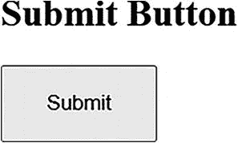

一张标题为“提交按钮”的截图，显示一个带有内部文本“提交”的矩形阴影按钮。

图 6-2
标准 HTML
按钮

与标准按钮类似，你可以使用 Selenium 中的 `click()` 方法与提交按钮进行交互。在点击提交按钮之前，请确保表单数据已正确填写，因为它会触发表单验证和提交。

```
WebElement submitButton = driver.findElement(By.id("submitButton"));
submitButton.click(); // 交互
Assert.assertTrue(driver.getCurrentUrl().contains("destinationURL"), "表单未提交。"); // 交互后验证
```

点击提交按钮通常会导致页面更改或表单提交，因此你需要验证预期操作是否已发生。

注意

通常出现在表单中，用于提交表单数据，并通过 `<input type=“submit”>` 定义。

断言按钮类型

验证提交按钮的类型至关重要，以确保其已正确配置用于提交用户数据。

```
// 类型验证
Assert.assertEquals("submit", submitButton.getAttribute("type"), "不是提交按钮。");
```

当你理解了提交按钮的功能角色后，你会遇到图像按钮，它为你的交互增添了美学维度。

图像按钮

图像按钮
使用图像作为可点击区域，通过将 `<input>` 元素的 `type` 属性设置为 `image`（`<input type=“image” src=“path/to/image.jpg”>`）来创建。它既可以作为提交按钮，也可以作为视觉上吸引人的可点击元素。

该按钮显示为 `src` 属性中提供的图像，为交互提供视觉提示，如图 6-3 所示。


一个带有文本“图像按钮”的右箭头图标。

图 6-3
图像作为按钮

你可以像与标准按钮或提交按钮交互一样与图像按钮交互。在定位元素后使用 `click()` 方法。请确保在交互过程中考虑图像加载时间和可见性。

```
WebElement imageButton = driver.findElement(By.id("imageButton"));
imageButton.click(); // 交互
// 根据预期结果进行额外验证
Assert.assertTrue(imageButton.isDisplayed(), "图像按钮未按预期工作。"); // 交互后验证
```

注意

带有图像的按钮，通常通过 `<input type=“image”>` 创建。

断言按钮类型

你可以通过断言类型值 `image` 来确认图像按钮的类型，这对于确保其旨在进行视觉交互至关重要。

```
// 类型验证
Assert.assertEquals("image", imageButton.getAttribute("type"), "不是图像按钮。");
```

从图像按钮的视觉提示，你将深入探讨 JavaScript 按钮更具动态性和脚本驱动性的本质。

JavaScript 按钮

JavaScript
按钮不一定指特定类型的按钮元素，而是指任何可触发 JavaScript 代码的可点击元素。它可以是标准按钮、链接或带有 `onclick` 事件的 `div`。

```
Click Here!
```

当你对图 6-4 中所示的按钮执行点击操作时，JavaScript 被触发并弹出一个警告框。

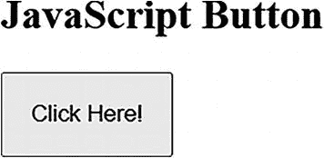

一张标题为“JavaScript 按钮”的截图，显示一个带有内部文本“点击这里！”的矩形阴影按钮。

图 6-4
触发 JavaScript 的按钮

与这些元素交互不仅涉及点击，还需要处理它们可能调用的动态元素，例如弹出窗口或 DOM 更改，这将引导你进入更复杂的等待和验证场景。

```
WebElement jsButton = driver.findElement(By.id("jsButton"));
jsButton.click(); // 交互
new WebDriverWait(driver, 10).until(ExpectedConditions.alertIsPresent()); // 处理动态行为
driver.switchTo().alert().accept(); // 接受警告
Assert.assertTrue(jsButton.isDisplayed(), "JavaScript 按钮未按预期执行。"); // 交互后验证
```

与 JavaScript 按钮交互时，请确保 JavaScript 代码已加载并准备好执行。照常使用 `click()` 方法，并考虑实现等待以处理 JavaScript 可能执行的任何异步操作。

注意

JavaScript 按钮没有特定类型；在交互后确认其功能或存在性可确保它们执行了预期的脚本。

禁用按钮

禁用按钮
很独特，因为它们旨在不可交互。它通常显示为灰色，并通过 `disabled` 属性（`<button disabled>`）设置。在需要满足特定条件才能执行操作的场景中，它们至关重要。

```
Disabled
```

禁用的按钮通常显示为灰色或褪色，如图 6-5 所示，表明其不可交互状态。

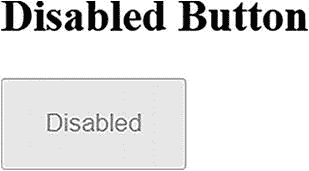

一张标题为“禁用按钮”的截图，显示一个带有内部文本“禁用”的矩形阴影按钮。

图 6-5
禁用按钮

你应首先使用 `isEnabled()` 方法检查按钮是否被禁用。这可以作为测试验证的一部分，以确保按钮在特定条件下按预期启用或禁用。

```
WebElement disabledButton = driver.findElement(By.id("disabledButton"));
Assert.assertFalse(disabledButton.isEnabled(), "按钮应被禁用，但当前已启用。");
```

在这里，你的交互更多是关于验证而非操作；你检查按钮在应该禁用时是否被禁用，这反映了测试的预防性方面。

断言按钮类型

确保按钮被正确标记为禁用有助于维护用户界面的完整性。

```
Assert.assertEquals("button", disabledButton.getAttribute("type"), "不是标准按钮或类型不正确。"); // 类型验证
```

从禁用按钮的被动性，你将过渡到切换按钮，后者提供了主动且可变的用户体验。

切换按钮

切换按钮是
交互式元素，每次点击可在两种状态（如开/关）之间切换，提供动态的用户体验。

```
On
```

它可能看起来像一个标准按钮，但通常包含指示其切换状态的视觉提示，如开/关标签或颜色变化，如图 6-6 所示。

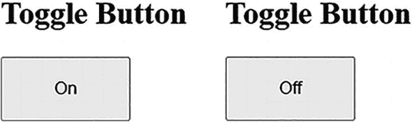

两张标题为“切换按钮”的矩形阴影按钮截图。第一张内部文本显示“开”，第二张显示“关”。

图 6-6
显示“开”和“关”状态的切换按钮

你可以使用 `click()` 方法与切换按钮交互。你可能还需要在点击前后验证按钮的状态，以确保其正确执行切换操作。这可以通过检查按钮的属性或关联文本来完成。

```
WebElement toggleButton = driver.findElement(By.id("toggleButton"));
String initialState = toggleButton.getText();
toggleButton.click(); // 交互
String finalState = toggleButton.getText();
Assert.assertNotEquals(initialState, finalState, "切换按钮状态未改变。"); // 验证
```


你点击切换按钮，然后验证其状态是否确实从之前的状态发生了切换。这需要在点击之前或之后进行检查，以确保状态按预期变化，从而为你的交互和验证过程引入了一种循环模式。在某些情况下，你需要检查点击时每个状态的效果。
切换按钮
没有唯一的类型，因此你可以根据其功能来验证它们，即按用户交互的预期在开/关两种状态之间切换。

单选按钮
单选按钮
是网页表单中的基本元素，确保用户做出单一、明确的选择。每组单选按钮通过共享的 `name` 属性进行分组，允许组内一次只能选中一个按钮。这种排他性在需要明确答案的调查或设置等场景中至关重要。

以下是一组询问用户偏好的音乐类型的单选按钮的 HTML 代码。

```

音乐偏好调查

摇滚

爵士

古典

```

在此结构中，每个单选按钮都标有唯一的 ID，使其易于识别。`label` 标签增强了用户的可访问性，并提供了更大的可点击区域。

接下来，请看图 6-7。

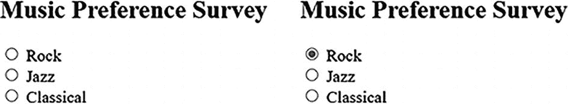

两组分别针对摇滚、爵士和古典的 3 个单选按钮，标题为“音乐偏好调查”。第一组未选中。第二组中选中了摇滚单选按钮。

图 6-7
显示未选中和已选中的单选按钮

图 6-7 展示了执行点击操作时，默认未选中和已选中的单选按钮。它演示了单选按钮是否被选中，以及如果被选中，是哪个选项，确保你能据此制定测试场景。

注意

单选按钮中的黑点表示该按钮已被选中。

定位和选择单选按钮
定位
元素是 Selenium 测试的基石。我们来讨论如何定位 HTML 中提供的单选按钮并与之交互。

按 ID 定位

这种方法精确高效，尤其适用于每个单选按钮都有唯一 ID 的情况。

```
WebElement rockRadio = driver.findElement(By.id("rock"));
rockRadio.click(); // 选择 '摇滚' 单选按钮
```

使用标签定位

当 ID 是动态的或属于复杂结构的一部分时，按标签定位特别有用。

```
WebElement jazzRadioLabel = driver.findElement(By.xpath("//label[text()='Jazz']"));
jazzRadioLabel.click(); // 点击标签也会选中关联的单选按钮
```

按索引值定位

当根据单选按钮在组中的位置与其交互时，你可以使用索引值。

```
List musicRadios = driver.findElements(By.name("music"));
WebElement classicalRadio = musicRadios.get(2); // 索引 2 对应第三个元素，即 '古典'
classicalRadio.click(); // 选择 '古典' 单选按钮
```

关于取消选中单选按钮的误解
你无法直接取消选中一个单选按钮。
一旦选中，该单选按钮将保持激活状态，直到组内选择了另一个按钮。这种行为强调了在表单中始终提供默认或中性选项的重要性。

使用断言验证你的选择

验证/确认元素类型

在与你认为的单选按钮交互之前，让我们先确认它确实是。

```
Assert.assertEquals("radio", rockRadio.getAttribute("type"), "该元素不是单选按钮。");
```

此断言检查元素的 `type` 属性，并将其与字符串 `radio` 进行比较，以确保你正在处理的是单选按钮。

验证选中状态

选择后，确认单选按钮反映了正确的状态至关重要，因此你可以使用断言方法来验证状态。

```
rockRadio.click(); // 点击 '摇滚' 单选按钮
Assert.assertTrue(rockRadio.isSelected(), "单选按钮未按预期被选中。");
```

此断言检查“摇滚”单选按钮是否被选中。如果没有，则测试失败，表明选择过程可能存在潜在问题。

复选框
复选框是网页表单中的主要元素，允许你进行多项选择。它们用途广泛，提供多种选择，这与限制用户只能进行单一选择的单选按钮不同。理解复选框的交互对于任何测试人员确保表单准确捕获用户输入都至关重要。

考虑一个询问用户爱好的 HTML 表单。此示例作为你的测试场地。

```

爱好选择

音乐

旅行

书籍

```

每个复选框都通过其 ID 唯一标识，并且 `label` 提供了人类可读的文本。让我们看看如何定位这些复选框并与之交互。

图 6-8 显示了三个复选框。上图显示没有复选框被勾选或选中。在下图中，三个复选框中有两个被选中。图 6-8 帮助你理解可以选中多个复选框，而单选按钮则不行。

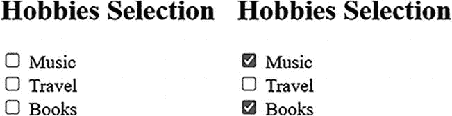

两组分别针对音乐、旅行和书籍的 3 个复选框。第一组未选中。第二组中选中了音乐和书籍的复选框。

图 6-8
显示未选中和已选中的复选框

注意

“选中”和“勾选”可互换使用。

定位和选择复选框
通过点击定位到的元素来选择复选框，这与之前讨论的单选按钮类似。对于单选按钮，只允许选择一个，而对于复选框，你可以选择多个选项。你需要先定位元素，然后进行相应的选择。

按 ID 定位

你首先使用复选框的唯一 ID 来识别和与之交互。这一步是基础，自然会引导你探索更复杂的定位策略。

```
WebElement musicCheckbox = driver.findElement(By.id("music"));
musicCheckbox.click(); // 选择 '音乐' 复选框
```

使用标签定位

此方法通过复选框的标签来定位，这种策略反映了用户可能与表单交互的方式。这种方法为理解以用户为中心的测试的重要性奠定了基础。

```
WebElement travelCheckboxLabel = driver.findElement(By.xpath("//label[text()='Travel']"));
travelCheckboxLabel.click(); // 点击标签会选中关联的复选框
```

按名称定位

当你想要与一组复选框交互时（这种情况会引入处理多个元素的方法，并为更高级的交互铺平道路），你可以使用以下 Java 代码片段通过其 `name` 属性查找所有复选框：

```
List hobbiesCheckboxes = driver.findElements(By.name("hobby"));
```

根据可见文本选择复选框

基于可见文本进行选择可确保测试反映用户与表单交互的方式。

```
for (WebElement checkbox : hobbiesCheckboxes) {
if (checkbox.getAttribute("value").equalsIgnoreCase("Travel")) {
if (!checkbox.isSelected()) {
checkbox.click();
}
break;
}
}
```

根据值选择复选框

有时，你可能希望根据复选框的 `value` 属性来选择它，当可见文本不可靠时，这是一种有效的方法。

```
for (WebElement checkbox : hobbiesCheckboxes) {
if ("Travel".equals(checkbox.getAttribute("value"))) {
checkbox.click();
break;
}
}
```

一次性选择所有复选框

有时，你的测试用例要求你选择所有可用的复选框。此操作不仅关乎确保每个框都被勾选，还关乎验证应用程序对多项选择的响应。通过遍历每个复选框并选中它们，你正在模拟常见的用户交互，确保你的测试尽可能真实。

```
for (WebElement checkbox : hobbiesCheckboxes) {
if (!checkbox.isSelected()) {
checkbox.click();
}
}
```

按索引选择和取消选择


当您需要根据列表中的位置进行选择或取消选择时。

```
// 按索引选择
if (!hobbiesCheckboxes.get(0).isSelected()) { // 0 表示第一个复选框
hobbiesCheckboxes.get(0).click();
}
// 按索引取消选择
if (hobbiesCheckboxes.get(1).isSelected()) { // 1 表示第二个复选框
hobbiesCheckboxes.get(1).click();
}
```

**按可见文本取消选择复选框**

此方法让您回归以用户为中心的视角。通过基于复选框的可见文本来取消选择，您的操作将与用户与表单交互的方式紧密对齐。这提醒您，测试策略应始终考虑用户的视角。

```
for (WebElement checkbox : hobbiesCheckboxes) {
if (checkbox.getAttribute("value").equalsIgnoreCase("Music") && checkbox.isSelected()) {
checkbox.click();
break;
}
}
```

**按值取消选择复选框**

要基于其值取消选择复选框，请遍历复选框，匹配值，如果已选中则点击。

```
for (WebElement checkbox : hobbiesCheckboxes) {
if ("Books".equals(checkbox.getAttribute("value")) && checkbox.isSelected()) {
checkbox.click(); // 如果 'Books' 复选框已选中，则取消选择它
break;
}
}
```

**一次性取消选择所有复选框**

当您需要确保在继续之前清除所有复选框时。此操作代表了用户重置选择的常见行为。

```
for (WebElement checkbox : hobbiesCheckboxes) {
if (checkbox.isSelected()) {
checkbox.click();
}
}
```

**注意**

您用于定位复选框以进行选择的方法同样适用于取消选择。无论是按 ID、可见文本还是值，选择和取消选择复选框的策略都是相同的。

**使用断言验证复选框**

断言复选框的选择和取消选择并非仅仅是一种形式；它是确保测试准确性和可靠性的关键步骤。通过断言，您可以确认您的交互导致了预期的结果，这反映了在自动化测试中进行彻底验证的重要性。

**断言已选择**

当您断言一个复选框已被选中时，您不仅仅是在勾选一个框，而是在确认您之前的操作已成功更改了应用程序的状态。此断言对于您的测试过程至关重要，确保应用程序在用户选择时按预期运行。

```
Assert.assertTrue(musicCheckbox.isSelected(), "该复选框应被选中，但实际并未选中。");
```

**断言已取消选择**

与选择断言类似，当您断言一个复选框已被取消选择时，您是在验证您取消选择的动作已生效。此步骤对于涉及更改或重新考虑选择的测试至关重要，反映了用户交互的动态性和通常不可预测性。

```
Assert.assertFalse(travelCheckbox.isSelected(), "该复选框应被取消选择，但实际并未取消。");
```

**断言元素类型**

验证您正在交互的元素确实是复选框。此步骤确保您的测试是准确的，并且与正确的 Web 元素进行交互。

```
Assert.assertEquals("checkbox", musicCheckbox.getAttribute("type"), "该元素不是复选框。");
```

**SelectList**
SelectList 是一种交互式 Web 元素，允许一次仅从下拉列表中选择一个选项。当您探索这个基本组件时，您将理解它在用户界面中的重要性，以及它如何塑造您的自动化测试方法。
在与 SelectList 元素交互之前，您应该熟悉其 HTML 结构，为您后续的操作奠定基础。

以下是一个 HTML 代码示例。

```

国家选择

选择您的国家

选择一个国家：

印度
美国
加拿大
英国
澳大利亚

```

在 HTML 中识别出 SelectList 元素后，您就可以继续定位并与此元素进行交互了。

图 6-9 显示了已选择默认国家的 SelectList 元素。有多个选项可用，但只能选择一个值，类似于单选按钮。

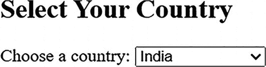

一张标题为“选择您的国家”的截图，显示一个带有向下箭头的文本字段，其中默认国家“印度”已被选为变量“选择一个国家”的值。

图 6-9
SelectList

SelectList 元素是一个下拉菜单，包含一系列选项，可以通过点击任意选项进行选择。图 6-10 显示了包含待选国家名称的下拉列表。

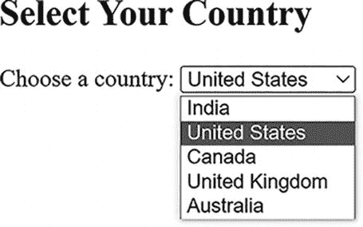

一张标题为“选择您的国家”的截图，显示一个文本字段，其中输入了“美国”，该选项是从下方的下拉列表中选出的，下拉列表包含印度、美国、加拿大、英国和澳大利亚，用于变量“选择一个国家”。

图 6-10
SelectList

**定位并与 SelectList 交互**
与 SelectList 元素交互让您能够专注于无缝地定位和选择选项。此步骤至关重要，因为它构成了您后续交互和验证选择的基础。

**按可见文本定位并选择**

您的第一个方法涉及按照用户看到的方式查找和选择选项。这种直观的方法有助于确保您的测试与现实世界的用户交互保持一致。

```
Select countrySelectList = new Select(driver.findElement(By.id("country")));
countrySelectList.selectByVisibleText("United Kingdom");
```

**按值定位并选择**

接下来，您将探索如何基于选项的底层值进行选择，当可见文本可能发生变化时，这种方法特别有用。

```
countrySelectList.selectByValue("india");
```

**按索引定位并选择**

最后，您将了解按索引选择，这依赖于选项在 SelectList 元素中的位置。这种方法引导您理解如何检索和处理所有可用选项。

```
countrySelectList.selectByIndex(3); // 这将选择 "United Kingdom"
```

**检索所有可用选项**
基于您对定位和选择的理解，您现在专注于检索 SelectList 元素中的所有选项。这种理解对于全面测试以及确保所有预期选项都存在至关重要。

**获取所有选项**

通过获取所有选项，您可以验证 SelectList 元素的内容，并确保其满足应用程序的要求。

```
List allOptions = countrySelectList.getOptions();
for(WebElement option : allOptions) {
System.out.println(option.getText()); // 打印每个选项的文本
}
```

在熟悉了所有可用选项之后，您现在处于一个有利位置，可以深入研究更高级的交互，例如模拟在 SelectList 中取消选择选项。

**在 SelectList 中取消选择选项**
在 SelectList 元素中，取消选择本身是不可能的，因为它始终需要选择一个选项。但是，如果存在一个默认或中性选项，您可以通过选择它来模拟取消选择。

**通过选择默认选项模拟取消选择**

如果您的 SelectList 元素包含一个默认或中性选项，选择它可以有效地模拟取消选择。当您准备验证您的选择并确保测试准确反映用户行为时，这种方法尤其相关。

```
countrySelectList.selectByValue("default"); // 假设 'default' 是一个中性选项
```

**验证 SelectList 选项和选择**
基于您与 SelectList 元素交互并理解其内容的能力，您现在专注于验证您的选择。此步骤对于确保您的测试健壮且应用程序按预期运行至关重要。

**断言已选中的选项**


选择某个选项后，您必须验证预期选项是否确实被选中。此验证可确认您之前的操作，并确保应用程序的响应符合用户预期。

```
WebElement selectedOption = countrySelectList.getFirstSelectedOption();
Assert.assertEquals("United Kingdom", selectedOption.getText(), "The expected option is not selected.");
```

断言元素类型

在 SelectList 元素中，您必须首先定位该 Web 元素，然后检查是否存在 select 标签，因为此类元素在 HTML 中是通过该标签初始化的。此检查可通过使用断言来完成。

```
Assert.assertEquals("select", countrySelectElement.getTagName(), "The element is not a SelectList.");
```

MultiSelectList（多选列表）
MultiSelectList 是一种重要的 Web 元素，它允许进行多项选择，这与 SelectList（每次只能选择一个选项）不同。它常用于 Web 表单中，以捕获所有适用的用户偏好或数据点。

让我们考虑一个 HTML 表单，用户可以在其中选择他们精通的多种编程语言。

```

语言能力

选择编程语言

语言：

Java
Python
JavaScript
C#

```

在此示例中，`<select>` 标签中的 `multiple` 属性表明这是一个 MultiSelectList 元素，允许选择多个选项。

接下来，让我们看一下图 6-11。

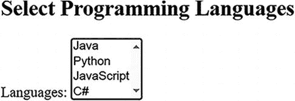

一张标题为“选择编程语言”的截图，显示一个文本区域，其中包含变量 languages 的列表：Java、Python、JavaScript 和 C#。文本区域右侧包含一个向上箭头和一个向下箭头。

图 6-11
选择前的 MultiSelectList

图 6-11 展示了一个包含可见编程语言列表的 MultiSelectList 元素。您必须执行点击操作才能从四个可用选项中进行选择。

图 6-12 显示了在 MultiSelectList 元素中选中的两个选项：Java 和 Python。您甚至可以选择所有可用选项来区分已选和未选状态；此处您已选择了两个选项。作为用户，要选择多个选项，在 Windows 系统中您需要按住 Ctrl 键并点击所需选项；在 macOS 系统中，您需要在选择选项时按住 Command 键。

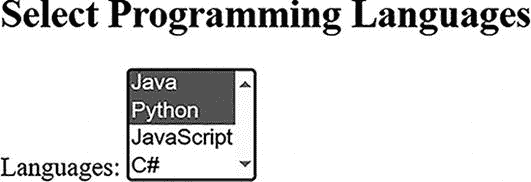

一张标题为“选择编程语言”的截图，显示一个文本区域，其中包含变量 languages 的列表：Java、Python、JavaScript 和 C#。文本区域右侧包含一个向上箭头和一个向下箭头。Java 和 Python 处于选中状态。

图 6-12
选择后的 MultiSelectList

使用 MultiSelectList 选择和取消选择选项
MultiSelectList 元素允许您选择和取消选择多个选项。接下来，我们讨论如何使用 Selenium 与它们进行交互。

选择多个选项

`Select` 类用于与 SelectList 元素交互，并可通过可见文本、值或索引来选择多个选项。

```
Select languagesSelectList = new Select(driver.findElement(By.id("languages")));
languagesSelectList.selectByVisibleText("Java");
languagesSelectList.selectByValue("python");
languagesSelectList.selectByIndex(2); // 基于 0 的索引，选择 "JavaScript"
```

取消选择选项

与 SelectList 不同，MultiSelectList 允许取消选择单个选项。以下代码分别说明了这一点。

```
// 取消选择选项
languagesSelectList.deselectByVisibleText("Java");
languagesSelectList.deselectByValue("python");
languagesSelectList.deselectByIndex(2); // 取消选择 "JavaScript"
```

验证多项选择与取消选择
在 MultiSelectList 元素中，对选择和取消选择操作进行断言至关重要，以确保应用程序准确捕获用户输入。

断言多项选择：

选择选项后，您需要确认它们确实已被选中。


```
List selectedOptions = languagesSelectList.getAllSelectedOptions();
List selectedValues = selectedOptions.stream().map(WebElement::getText).collect(Collectors.toList());
Assert.assertTrue(selectedValues.containsAll(Arrays.asList("Java", "Python", "JavaScript")), "Not all languages are selected.");
```

断言取消选择

同样，你需要验证你打算取消选择的选项
确实不再被选中。

```
// 假设你之前已经取消了“Python”的选择
selectedOptions = languagesSelectList.getAllSelectedOptions();
for (WebElement option : selectedOptions) {
Assert.assertNotEquals("Python", option.getText(), "Python should be deselected but is still selected.");
}
```

断言 MultiSelectList 的元素类型

与 SelectList 元素一样，断言你正在交互的
元素是一个 MultiSelectList 元素非常重要。你可以
检查 `multiple` 属性是否存在且设置为 true。

```
WebElement languagesElement = driver.findElement(By.id("languages"));
Assert.assertTrue(Boolean.parseBoolean(languagesElement.getAttribute("multiple")), "The element is not a MultiSelectList .");
```

注意

MultiSelectList 元素在 HTML 中通过带有 `multiple` 属性的 `<select>` 标签来标识，允许选择多个选项。

测试注意事项
在使用 Selenium 测试 Web 应用程序中的按钮时，有几个注意事项可以确保你的测试健壮、可靠，并能反映用户交互。以下是一种结构化的方法来理解这些测试注意事项。

按钮可见性与可访问性

*   **按钮是否可见？** 在尝试任何交互之前，确保按钮是
    可见的。
    通过 CSS 或其他方式隐藏的按钮可能存在于 DOM 中，但不可点击。

*   **按钮是否可访问？** 检查按钮是否对用户
    可访问，尤其要考虑可访问性标准。
    这包括验证 `aria-labels` 等属性是否适用于屏幕阅读器。

按钮状态

*   **按钮是启用还是禁用？** 在交互之前验证按钮的
    状态。
    测试应确认按钮在正确的条件下变为启用或禁用。

*   **按钮是否处于正确状态？** 对于切换按钮，
    确保按钮的状态（开/关，激活/未激活）在每次交互后按预期变化。

按钮功能

*   **按钮是否执行了预期的操作？**
    确认点击按钮会触发
    预期的结果，无论是提交表单、导航到新页面，
    还是执行脚本。

*   **按钮的功能在不同浏览器中是否一致？**
    在不同浏览器中进行测试以确保功能一致，
    因为按钮的行为可能有所不同。

按钮交互

*   **按钮如何响应点击？** 检查响应时间和
    任何即时的视觉反馈（如旋转加载图标），以表明点击已被记录且正在处理某个操作。

*   **是否有特殊的交互注意事项？** 对于图像按钮或具有复杂设计的按钮，
    确保可点击区域被正确映射且响应灵敏。

交互后验证

*   **UI 是否反映了预期的变化？** 点击后，验证
    UI 是否更新以反映任何变化。例如，提交按钮可能会变为“已提交”或更新页面某部分。

*   **是否有任何副作用？** 确认没有
    意外的副作用，如页面错误、非预期的导航或
    不正确的表单提交。

安全注意事项

*   **点击按钮是否会暴露安全漏洞？**
    确保与按钮的交互不会暴露 SQL 注入等漏洞，
    特别是对于与表单提交相关的按钮。

性能注意事项

*   **按钮响应是否迅速？** 检查按钮的响应性和
    加载时间，特别是对于触发复杂后端操作的按钮。

跨平台与跨浏览器测试

*   **按钮在不同平台和浏览器上的表现如何？** 验证按钮在不同浏览器和设备上的
    功能和外观，
    考虑渲染和性能的差异。

动态与上下文相关行为

*   **按钮的行为是否会根据上下文而改变？** 某些按钮的行为可能取决于页面上其他地方输入的数据或做出的选择。确保这些动态行为
    被正确实现和测试。

错误处理

*   **按钮如何处理错误？** 测试按钮在错误场景下的行为，例如表单提交失败
    或资源不可用。它应该优雅地处理错误并提供适当的用户反馈。

总结
本章探讨了 Selenium 自动化测试中至关重要的交互式 Web 元素。从与按钮的直接交互到 MultiSelectList 元素中的细微选择，涵盖了广泛的元素和交互类型。本章的学习历程不仅让你掌握了执行交互的技能，还强调了验证所执行的操作以及元素本身的重要性。
本章的一个关键收获是 Web 元素的多样性以及每种元素在交互和验证方面所需的独特方法。理解按钮、单选按钮、复选框、SelectList 和 MultiSelectList 元素的复杂性，对于任何希望创建健壮可靠自动化测试的测试人员来说都至关重要。验证作为本章反复出现的主题，已被强调为确保测试准确性和可靠性的关键。
本章大部分内容致力于按钮测试注意事项，你在此概述了确保全面测试的关键点。这些注意事项包括确保可见性和可访问性、验证按钮状态、确认功能、评估交互和性能等。通过理解这些细微差别，你将能更好地创建有效、健壮且能反映真实用户交互的测试。
此外，这里获得的知识是层层递进的，提供了一个结构化的理解和技能集，增强了每一部分的内容。随着本章的结束，你应该有信心使用 Selenium 处理各种 Web 元素。技术技能，加上对元素行为及其在 Web 应用程序中作用的深刻理解，将极大地提升你自动化测试的质量和有效性。无论你是在测试一个简单的用户表单还是一个复杂的交互式应用程序，从本章获得的见解和技能都是你 Selenium 工具包中宝贵的补充。

7. iframe 与文本框

在 Web 应用程序测试中，有两个 Web 元素始终需要关注：iframe 和文本框。在 iframe 中，内容从一个源嵌入到另一个源中，其功能类似于网页内的一个独立窗口。另一方面，文本框是基本的输入字段，用于捕获用户数据以实现各种目的。
本章从 iframe 开始，探讨了有效定位和与之交互的技术。一旦你牢固掌握了 iframe，重点将转向文本框，讨论精确交互和数据检索的机制。到本章结束时，你应该对这两个关键的 Web 元素以及如何在自动化任务中处理它们有一个全面的理解。


iframe
iframe 是嵌入在网站中另一个 HTML 文档中的 HTML 文档。iframe HTML 元素通常用于添加来自不同来源的内容。特别是，iframe 用于将一个文档嵌入到另一个文档中，将嵌入的文档与主页面隔离开来。这种隔离有助于防止第三方内容干扰主页面的 DOM 或 JavaScript 环境。
你可以嵌入视频（例如 YouTube 视频）和 PDF 等文档。第三方小部件等等。对于测试自动化来说，了解 iframe 内的内容存在于一个独立的文档中至关重要。这意味着 Web 元素存储着 Web 元素。
早期的 HTML 使用 frameset 标签，与现在的 iframe 标签类似，但它将浏览器窗口分割成多个包含不同 URL 的部分。这些分割后的窗口每个都被称为一个*框架*，显示不同的文档。与 iframe 不同，frameset 标签不能放置在页面的任意位置，并且由于其灵活性较低，frameset 的使用逐渐减少。然而，iframe 仍然是现代 Web 开发中不可或缺的一部分。

让我们来测试 iframe。

```

Iframe 示例

这是主页面的内容。

主页面的更多内容。

```

此示例使用了嵌入在 iframe 页面中的 [`https://www.selenium.dev/`](https://www.selenium.dev/)。已为 iframe 指定了高度和宽度。src 参数包含在 iframe 中显示的网站的 URL。

图 7-1 展示了该 HTML 在网页上的显示效果。

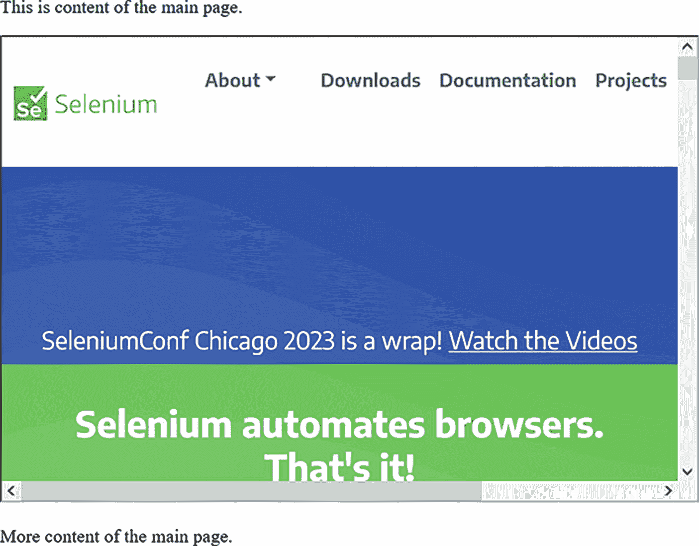

Selenium 网站的截图。中心的文字如下：Selenium Conf Chicago 2023 已圆满结束。Selenium 自动化浏览器。

图 7-1
显示 Selenium 网站的单个 iframe

Selenium 网站由一个 iframe 显示，如图 7-1 所示。这个 iframe 看起来像一个窗口中的窗口。在测试用例场景中，它被视为一个独立的文档。在与 iframe 中的内容交互之前，你需要切换到这个窗口。接下来的主题将深入探讨实现无缝切换的方法和最佳实践。

切换到 iframe
当你想要测试嵌入在 iframe 中的 Web 元素或功能时，首先需要定位并切换到该特定的 iframe。
由于嵌入在 iframe 中的 Web 元素不能直接访问，你必须先定位并切换到该特定的 iframe 才能进行测试。一旦你切换到 iframe，就可以像第 4 章讨论的那样定位元素。让我们探索各种定位 iframe 的技术。

使用 ID 切换

要从网页访问 iframe，请使用提供的 ID 属性。以下方法将控制权切换到 iframe。

```
driver.switchTo().frame(driver.findElement(By.id("iframe0")));
```

一旦你切换到 iframe，你的操作就被限制在其 Web 元素内，可以执行定位元素或与之交互等操作，直到你切换回主页面或另一个 iframe。

使用名称切换

与 ID 属性类似，当名称属性可用时，你可以使用它从网页切换到 iframe。

```
// 使用名称切换到 iframe
driver.switchTo().frame("selenium_java");
```

使用索引值切换
虽然你可以使用 ID 或 Name 等属性来定位和切换 iframe，但这些属性可能并不总是可用或唯一的。在这些情况下，使用 iframe 的索引是一种合理的方法。

索引表示 iframe 在网页上序列中的位置，从 0（零）开始。第一个 iframe 可以使用索引值 0 访问，第二个使用 1，依此类推。让我们使用多个 iframe 的示例。

```

多个 iframe

这是主页面内容。

主页面内容结束。

```

前面的示例在网页中嵌入了三个 iframe。让我们讨论如何使用索引值与这些 iframe 进行交互；你可以看到没有使用任何属性。

```
// 使用索引切换到第一个 iframe
driver.switchTo().frame(0);
// 通过索引直接导航到第二个 iframe
driver.switchTo().frame(1);
// 通过索引直接导航到第三个 iframe
driver.switchTo().frame(2);
```

带有索引值的 switchTo().frame() 方法会从零开始切换到 iframe。如果你提供的索引值与网页上可用的 iframe 不对应，则会发生 NoSuchFrameException 错误。一旦你切换到任何 iframe，你需要切换回主页面才能再次进入另一个 iframe。这将在接下来的 iframe 层级结构中解释。

切换 iframe 的层级结构

你已经了解了多个 iframe 及其访问方式。让我们看看嵌套在其他 iframe 中的多个 iframe。理解这些 iframe 放置的层级结构对于与 Web 元素交互是必要的，因为每一层都需要对 WebDriver 的上下文进行有效声明。以下是 HTML 中 iframe 的层级结构。让我们探索与之交互的方式。

```

主文档

这是主页面的内容。

这是第一级 iframe 的内容。

这是嵌套的第二级 iframe 的内容。

主页面的更多内容。

```

层级结构表示如下。

*   主页面或文档代表最顶层。
*   包含 id=“firstLevelIframe” 的 iframe 位于第一级，代表嵌入在主文档中的层级。
*   第一级 iframe 内嵌套的 iframe 构成了第二级 iframe。

注意

如果一个 iframe 嵌入在另一个 iframe 内部，则称为*嵌套 iframe*。可能存在多个层级的 iframe 相互嵌套，以此类推。

在层级结构中导航 iframe

*   **主文档上下文**：在 Selenium 中，当网页加载时，主文档或最顶层被设置为 WebDriver 的默认上下文；因此，无需切换到主文档，你可以直接访问其中的元素。

*   **访问第一级 iframe**：要从主文档定位第一级 iframe，你可以使用 Selenium 中的 switchTo() 函数。

driver.switchTo().frame(driver.findElement(By.id(“firstLevelIframe”)));

*   **访问第二级/嵌套 iframe**：当你想访问嵌入在第一级 iframe 中的第二级或嵌套 iframe 时，你可以使用相同的 switchTo() 函数。

driver.switchTo().frame(driver.findElement(By.id(“secondLevelIframe”)));

Selenium WebDriver 无法直接访问嵌套的 iframe，因为它需要按顺序遍历 iframe 层级。

如你所见，当需要访问第二个 iframe 时，首先需要访问第一个 iframe，然后才能访问第二个。现在，让我们看看如何从嵌套的 iframe 中返回。

*   **返回第一级**：当你处于嵌套的 iframe 中（即本例中的第二级）并需要返回到第一个 iframe 时，可以使用
    **driver.switchTo().parentFrame();**。

如果你切换到的 iframe 没有父级 iframe，或者该 iframe 没有嵌套在另一个 iframe 中，那么再次使用此函数将切换回主文档。因此，parentFrame() 函数通常用于嵌套情况。

*   **返回主文档**：如果你想从任何 iframe 返回主文档，可以将 defaultContent() 函数与 switchTo() 函数一起使用。

**driver.switchTo().defaultContent();**

当你想要切换回主文档时，可以在任何嵌套层级的 iframe 中使用此函数。一旦你回到主文档并想再次切换回 iframe，则需要按照前面讨论的方式遍历层级结构。

将元素作为 Switch 使用


当您处理动态网页时，iframe 可能不会渲染固定属性，或者其位置可能发生变化。在这种情况下，您需要像定位页面上其他任何元素一样，将它们作为 Web 元素进行定位。一旦定位到该元素，您就需要切换到它。以下是 iframe 的简单 HTML 代码。

```

由于 iframe 是动态的，您需要使用类名来定位它。

```
// 将 iframe 定位为 WebElement
WebElement iframeElement = driver.findElement(By.className("dynamicIframe"));
```

现在，将 iframe 定位为 Web 元素后，您需要使用 `switchTo()` 函数切换到该 iframe。

```
// 使用 WebElement 切换到 iframe
driver.switchTo().frame(iframeElement);
```

这种方法提供了更高的灵活性和精确性，尤其是在现代 Web 应用时代，iframe 可以通过 JavaScript 生成、移除或拥有动态变化的属性。

**带等待的框架**

当处理可能需要时间加载或变为可交互的 Web 元素时（这在 Web 测试中经常需要），这一点对于具有同步内容加载能力的 iframe 和框架尤其有效。为了确保测试健壮可靠，在切换到 iframe 之前，必须等待它们在网页上变为可用。

在处理 iframe 时可以使用等待，确保在您想要与 iframe 内部的元素交互时，它已加载完毕且其内容可用。以下是其 HTML 代码。

```

让我们使用显式等待，这在 Selenium 中经常使用，即在继续之前应满足特定条件。

```
import org.openqa.selenium.By;
import org.openqa.selenium.WebDriver;
import org.openqa.selenium.support.ui.ExpectedConditions;
import org.openqa.selenium.support.ui.WebDriverWait;
// 假设 'driver' 是 WebDriver 的一个实例并且已经初始化
// 设置超时时间为 10 秒的显式等待
WebDriverWait wait = new WebDriverWait(driver, 10);
// 等待 iframe 可用，然后切换到它
wait.until(ExpectedConditions.frameToBeAvailableAndSwitchToIt(By.id("dynamicLoadingFrame")));
// 现在，您已进入 iframe 内部，可以执行操作
// ...
// 操作完成后切换回主内容
driver.switchTo().defaultContent();
```

该代码使用显式等待来确保 WebDriver 实例等待 10 秒，以使 iframe 在页面上可用。如果 iframe 在指定时间内不可用，您将收到 `TimeoutException` 错误。

通过使用此策略，您可以防止意外的加载延迟导致测试失败，从而提高测试对网络速度、服务器响应时间和其他不可预见情况变化的抵抗力。在与 iframe 或其组件交互之前，始终等待它们准备就绪是一个好习惯，尤其是在内容加载可能是动态或异步的情况下。

**文本框**

在许多 Web 表单中，文本框是重要的元素，它们方便用户输入，从简单的搜索到复杂的数据录入。接下来，让我们看看各种类型的文本框以及如何使用 Selenium 定位它们。

**单行文本框**

一个输入字段，通常显示为 `type` 属性设置为 `text` 的单行文本框，用于简洁的输入。一些示例包括用户名、查询搜索和电子邮件地址。

以下是一个 HTML 示例。

```
单行文本框
书名：

```

图 7-2 显示了该 HTML 在网页上的呈现效果。


网页上书名字段的截图。显示了单行文本框。

**图 7-2**
带有书名字段的单行文本框

在与文本框交互之前，您需要先在网页上定位它。因此，根据提供的 HTML，让我们使用 ID 属性来定位文本框。

```
// 定位文本框
WebElement bookTextbox = driver.findElement(By.id("nook_name"));
```

现在，您已经定位了文本框，可以与之交互了。

*   **插入值**：定位文本框后，您可以使用第 3 章讨论的键盘操作来插入值。

```
    // 向文本框插入值
    bookTextbox.sendKeys("Python Testing with Selenium");
    ```

*   您已将值 `Python Testing with Selenium` 插入到文本框中。让我们看看如何检索这个值。

*   **检索值**：您还可以检索已在文本框中输入的值。这通常用于将该值与预期值进行比较，并检查文本框是否有其他行为。

```
    // 从文本框检索值
    String bookName = bookTextbox.getAttribute("value");
    System.out.println("输入的书名: " + bookName);
    ```

*   如果该文本存在于定位到的文本框中，这将输出您在文本框中输入的书名。

您现在已了解如何使用 Selenium 定位文本框以及执行诸如插入值和验证输入的文本等交互操作，从而确保 Web 应用程序能够按原样接受并显示用户提供的输入。

**多行文本框**

在多行文本框中，用户可以跨多行输入，可以是评论、描述或任何形式的扩展文本。

您可以使用 HTML 中的 `<textarea>` 标签创建多行文本框。以下代码表示 HTML 中的多行文本框。

```
多行文本框
描述：

```

图 7-3 显示了该 HTML 在网页上的呈现效果。

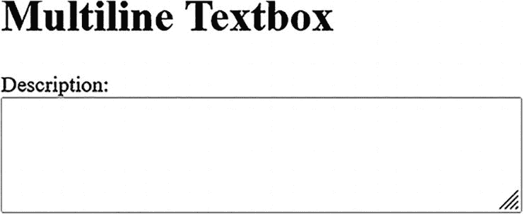

网页上描述字段的截图。显示了多行文本框。

**图 7-3**
带有描述字段的多行文本框

在 HTML 代码中，提供了一个描述字段供用户输入多行文本，这在单行文本框中是看不到的。根据此 HTML 代码，让我们使用其 ID 属性（其值为 `description`）来定位多行文本框。

**定位多行文本框**

让我们定位一个多行文本框，然后通过插入和检索输入的值来与之交互。那么，我们首先使用 ID 属性来定位它。

```
// 定位多行文本框
WebElement descriptionTextarea = driver.findElement(By.id("description"));
```

**插入值**

现在，一旦您从网页上定位到多行元素，就可以使用 `sendKeys()` 方法向多行文本框提供输入。

```
// 向文本框插入值
descriptionTextarea.sendKeys("这是一段示例描述文本。\n 它覆盖了多行。");
```

`sendKeys()` 方法使用了 `\n`，这是 Java 中的一个转义序列，模拟按下 Enter 键，从而在文本区域中创建新行。

**从多行文本框检索值**

要从多行文本框中检索输入的文本，您可以使用 `getText()` 方法。检索其值是为了在自动化测试中进行验证或确认。

```
// 从文本框检索值
String descriptionText = descriptionTextarea.getText();
System.out.println("输入的描述: " + descriptionText);
```

此代码片段返回从多行文本框中输入的所有文本。这在测试场景中是一个关键步骤，例如用户反馈、评论部分或任何您期望用户输入扩展文本的情况。


摘要
本章聚焦于 Web 自动化中的两个核心元素：iframe 和文本框。首先介绍了如何处理 iframe，这对于与嵌入式 Web 内容交互至关重要。本章探讨了切换到 iframe 的不同策略，例如使用 ID、名称、索引和 Web 元素。掌握这些知识十分必要，因为 iframe 通常包含关键元素，由于其独立的 DOM 结构，这些元素需要特别关注。此外，你还学习了处理嵌套 iframe 时面临的挑战，这强调了顺序导航的重要性，并讨论了用于支持动态内容加载的显式等待，从而确保了测试用例的健壮性和可靠性。

本章还讨论了单行文本框和多行文本框的细微差别。单行文本框用于输入字段，如电子邮件地址或姓名，在高效插入和检索值的场景中进行了讨论，这是基于表单的应用程序中的常见操作。你学习了多行文本框和文本区域，深入探讨了它们在捕获更广泛的用户输入（如评论或描述）中的作用。你看到了在 Selenium 中与这些用户输入进行交互的实际示例，突出了在自动化测试中精确输入和验证数据的重要性。
本章涵盖了处理复杂 Web 元素的内容，使你能够创建有效且可靠的自动化测试。

8. 断言

本章探讨了 Selenium 中断言的基本概念、技术和最佳实践。断言是在自动化测试期间验证 Web 应用程序行为和功能的可靠工具。
从断言简介开始，你将了解什么是断言以及为什么它们在 Selenium 测试框架中极其重要。然后，你将深入探讨两种主要的断言类型：硬断言和软断言。
接下来，你将探索 Selenium 提供的一系列断言方法，这些方法对于在测试中将预期结果与实际结果进行比较和验证至关重要。你还将深入研究如何处理断言失败，了解断言失败时会发生什么，以及如何在确保全面日志记录和报告的同时优雅地管理这些失败。
自定义断言是另一个讨论重点。你将发现如何创建针对特定应用程序需求定制的自定义断言方法。你将探索扩展断言功能，以有效满足你独特的测试需求。
最后，你将学习在 Selenium 中使用断言时的常见陷阱和错误，以及避免误报和漏报的策略。
在整个学习过程中，你将强调在 Selenium 中使用断言的最佳实践，涵盖何时使用它们、如何保持简单和具体、编写有意义的错误消息以及在测试用例中组织断言。这些最佳实践使你能够构建可靠、可维护且高效的 Selenium 测试脚本。

什么是断言？
Selenium 中的断言是你嵌入到自动化测试脚本中的语句或检查点，用于验证 Web 应用程序执行期间是否满足某些条件。这些条件可以涵盖广泛的标准，例如检查特定元素是否存在于网页上、文本是否与你的预期匹配，或者 URL 是否与预定义模式匹配。本质上，断言帮助你验证应用程序是否按预期运行。

断言的必要性

断言不仅仅是代码语句；它们对于自动化测试的有效性和可靠性至关重要。

*   **验证预期行为：** 断言充当质量控制机制和标准，使你能够确保 Web 应用程序按预期运行并符合预定义标准。它还确保新的更改或更新不会破坏现有功能或行为。
*   **测试自动化效率：** 如果没有断言，你将需要手动干预来确认测试是通过还是失败，这违背了自动化的目的。断言自动化了验证过程，并加快了开发周期中的反馈循环。
*   **错误检测：** 断言帮助你在测试过程的早期发现问题。如果断言失败，则表明应用程序或测试脚本存在问题，使你能够迅速定位并解决问题。
*   **文档：** 断言是测试脚本中的文档，阐明了你在测试什么条件以及什么构成成功的测试。

硬断言
硬断言是 Selenium 测试中的严格检查点。当你使用一个失败的硬断言时，测试脚本会立即停止，整个测试被标记为失败。可以将它们视为测试继续进行必须满足的不可协商的条件。
例如，当你使用硬断言确认页面上的“提交”按钮存在但未找到时，测试停止，你将收到一条失败消息。这对于避免误报和确保测试结果的可靠性至关重要。

使用 Java 代码，以下示例说明了 Selenium 中的硬断言。让我们也为这个示例创建一个简单的 HTML 页面。

```
//HTML 代码

示例页面

欢迎来到 Selenium 断言示例
这是一个示例段落。
提交

```

让我们编写使用 Selenium 与这个 HTML 页面交互并执行断言的 Java 代码。

```
import org.openqa.selenium.By;
import org.openqa.selenium.WebDriver;
import org.openqa.selenium.WebElement;
import org.openqa.selenium.chrome.ChromeDriver;
import org.testng.Assert;
public class HardAssertionsExample {
public static void main(String[] args) {
// 设置 ChromeDriver 可执行文件的路径
System.setProperty("webdriver.chrome.driver", "path/to/chromedriver");
// 创建 ChromeDriver 的新实例
WebDriver driver = new ChromeDriver();
// 导航到 HTML 页面
driver.get("file:///path/to/example.html");
// 在页面上查找元素
WebElement textElement = driver.findElement(By.id("textElement"));
WebElement submitButton = driver.findElement(By.id("submitButton"));
// 执行硬断言
Assert.assertEquals(textElement.getText(), "这是一个示例段落");
Assert.assertTrue(submitButton.isDisplayed());
// 关闭浏览器
driver.quit();
}
}
```

此示例使用硬断言来验证两个条件：段落元素的文本和“提交”按钮的存在。如果这些断言中的任何一个失败，测试会立即停止，并且测试被标记为失败。

软断言
软断言，通常称为*验证*，是 Selenium 中一种更灵活的验证方法。当你使用软断言时，你设置的条件很重要需要检查，但不足以在失败时立即停止测试。使用软断言，即使某些条件失败，测试脚本也会继续运行，并收集所有失败的信息以供后续分析。
考虑一个例子：当你使用软断言来验证页面上多个元素的内容时，如果其中一个不符合你的预期，测试不会立即停止。相反，它会继续运行，你可以在测试完成后检查所有失败。在测试 Web 应用程序时，验证是软断言的另一个说法。

对于前面的 HTML 代码，对其实现一个软断言，并观察测试行为的不同之处。


```
//Java Code
import org.openqa.selenium.By;
import org.openqa.selenium.WebDriver;
import org.openqa.selenium.WebElement;
import org.openqa.selenium.chrome.ChromeDriver;
import org.testng.asserts.SoftAssert;
public class SoftAssertionsExample {
public static void main(String[] args) {
// Set the path to your ChromeDriver executable
System.setProperty("webdriver.chrome.driver", "path/to/chromedriver");
// Create a new instance of ChromeDriver
WebDriver driver = new ChromeDriver();
// Navigate to the HTML page
driver.get("file:///path/to/example.html");
// Find the elements on the page
WebElement textElement = driver.findElement(By.id("textElement"));
WebElement submitButton = driver.findElement(By.id("submitButton"));
// Initialize SoftAssert
SoftAssert softAssert = new SoftAssert();
// Perform soft assertions (Verify)
softAssert.assertEquals(textElement.getText(), "This is a sample paragraph");
softAssert.assertTrue(submitButton.isDisplayed());
// Continue with test steps
// ...
// Assert all soft assertions at the end of the test
softAssert.assertAll();
// Close the browser
driver.quit();
}
}
```

此示例使用 TestNG 的 `SoftAssert` 类实现了软断言（Verify）。即使其中一个断言失败，测试仍会继续执行，并收集所有失败信息。测试末尾的 **softAssert.assertAll()** 语句会在任何软断言失败时将测试标记为失败。这允许你收集所有失败信息，并在报告结果前继续运行测试，以全面了解应用程序的行为。

硬断言与软断言

表 8-1 对比了硬断言（Asserts）和软断言（Verify）。

表 8-1
硬断言（Asserts）与软断言（Verify）的区别

| 方面 | 硬断言（Asserts） | 软断言（Verify） |
| --- | --- | --- |
| **失败时的行为** | 立即停止测试执行，并将整个测试标记为失败。 | 继续执行测试，并收集所有失败信息。 |
| **使用场景** | 适用于测试必须满足的关键条件。 | 适用于需要在单次测试运行中获取多个条件或元素的全面信息。 |
| **处理多个断言** | 通常用于不可妥协的检查，任何与预期行为的偏差都意味着重大问题。 | 允许在报告结果前评估应用程序行为的各个方面。 |
| **报告方式** | 提供清晰即时的失败反馈，便于快速识别和解决问题。 | 失败时不停止测试，而是累积所有失败信息供后续分析。需要在测试末尾使用 `assertAll()` 将测试标记为失败（若有任何软断言失败），从而提供测试过程中所有问题的综合报告。 |

表 8-1 总结了 Selenium 中硬断言（Asserts）和软断言（Verify）的主要区别，有助于理解其行为，并根据测试需求选择合适的断言类型。

Selenium 中的断言方法

*   **assertEquals****(expected, actual)：** 此方法用于比较预期值和实际值。在验证页面标题或文本内容等结果时非常有用。

*   在以下示例中，由于预期字符串和实际字符串不匹配，断言将失败。

*   **assertNotEqual：** 此方法检查两个值或表达式是否不相等。如果相等，则会抛出 `AssertionError`。

```
import org.testng.Assert;
public class AssertEqualsExample {
public static void main(String[] args) {
String expected = "Hello, World!";
String actual = "Hello, Selenium!";
// Assert that the expected and actual strings are equal
Assert.assertEquals(expected, actual);
System.out.println("Test completed.");
}
}
```


*   在此示例中，断言将会失败，因为预期整数和实际整数相等。

*   **assertTrue****(condition):**
    用于验证给定的条件或表达式计算结果是否为真。常用于验证页面上显示的元素，或应用程序状态中是否满足某些条件。

```
import org.testng.Assert;
public class AssertNotEqualsExample {
public static void main(String[] args) {
int expected = 10;
int actual = 10;
// 断言预期整数和实际整数不相等
Assert.assertNotEquals(expected, actual);
System.out.println("Test completed.");
}
}
```

*   在此示例中，断言将会失败，因为条件为假。

*   **assertFalse****(condition):**
    此方法用于验证给定的条件或表达式计算结果是否为假。它在断言布尔条件（例如 Web 元素的可见性）时非常有用。

```
import org.testng.Assert;
public class AssertTrueExample {
public static void main(String[] args) {
boolean condition = false;
// 断言条件为真
Assert.assertTrue(condition);
System.out.println("Test completed.");
}
}
```

*   在你的示例中，断言将会失败，因为条件为真。

*   **assertNull****(object):**
    用于验证值或对象是否为空。如果值不为空，则会抛出错误。

```
import org.testng.Assert;
public class AssertFalseExample {
public static void main(String[] args) {
boolean condition = true;
// 断言条件为假
Assert.assertFalse(condition);
System.out.println("Test completed.");
}
}
```

*   在此示例中，断言将会失败，因为对象不为空。

*   **assertNotNull(object):** 此方法与 `assertNull()` 函数相反，用于验证值或对象是否为空。如果为空，则会抛出 `AssertionError`。

```
import org.testng.Assert;
public class AssertNotNullExample {
public static void main(String[] args) {
Object object = null;
// 断言对象不为空
Assert.assertNotNull(object);
System.out.println("Test completed.");
}
}
```

*   在此示例中，断言将会失败，因为对象为空。

```
import org.testng.Assert;
public class AssertNullExample {
public static void main(String[] args) {
Object object = new Object();
// 断言对象为空
Assert.assertNull(object);
System.out.println("Test completed.");
}
}
```

这些断言方法对于验证 Selenium 测试脚本中的预期条件至关重要，有助于确保 Web 应用程序行为的正确性。

处理断言失败
处理断言失败是 Selenium 测试自动化的一个重要方面。当断言失败时，意味着预期条件或值与实际条件或值不匹配，你需要优雅地处理这种情况。妥善处理断言失败可以确保你能够捕获失败信息、记录日志并有效地报告。让我们来探讨一下。

断言失败时会发生什么？

当 Selenium 中的断言失败时，会抛出一个 `AssertionError` 异常。此异常会中断测试脚本的正常流程，并将测试标记为失败。如果你不处理断言失败，测试执行可能会突然停止。以下描述了断言失败时会发生的情况。

*   测试执行被中断。
*   断言库（例如 TestNG、JUnit）抛出一个错误异常。
*   测试被标记为失败。
*   当前测试用例中，失败断言之后的任何后续测试步骤或代码都不会被执行。

优雅地处理断言失败

优雅地处理断言失败对于确保测试自动化能够继续运行并提供有价值的见解至关重要。以下描述了优雅处理断言失败的方法。

*   **使用 try-catch：** 你可以使用 try-catch 块来捕获和处理断言失败。在 catch 块中，你可以定义自定义的错误处理逻辑，例如记录失败信息、截取屏幕截图或执行其他恢复操作。
*   **恢复操作：** 根据失败的性质，你可以采取恢复操作。例如，你可能想要刷新页面、导航到不同的 URL，或者关闭并重新打开浏览器。

记录和报告断言失败

你可以集成日志记录和报告功能，以改进对断言失败的处理。

*   **日志记录：** 你可以使用 Log4j 等标准库记录断言失败，或将错误信息打印到控制台。日志应包含关于哪个测试用例失败、哪个断言失败以及失败原因的详细信息。
*   **报告：** 报告框架有助于组织和呈现测试结果。它们可以捕获断言失败，并生成包含测试用例名称、失败描述、时间戳和屏幕截图的详细报告。这使得分析测试结果和跟踪问题变得更加容易。

自定义断言
在 Selenium 中创建自定义断言方法，允许你根据特定的应用程序需求定制断言，并扩展内置断言库的功能。这在自动化测试中执行复杂或特定领域的检查时非常有价值。让我们来探讨自定义断言。

为特定应用程序需求创建自定义断言方法

自定义断言方法是用户定义的断言检查，超越了 TestNG 或 JUnit 等测试框架提供的标准断言方法。以下说明了如何为特定应用程序需求创建自定义断言。

1.  **确定特定需求。** 首先，确定你的应用程序需要验证的一个独特或复杂的条件。这可能涉及自定义 UI 组件的行为、数据验证或特定的业务逻辑。
2.  **编写自定义断言方法。** 创建一个新方法，封装用于验证所识别需求的逻辑。此方法应返回一个布尔值，以指示条件是否满足。
3.  **在测试中使用自定义断言。** 在需要的地方，将你的自定义断言方法无缝地集成到测试脚本中。它可以像测试框架提供的任何其他断言方法一样使用。
4.  **处理断言失败。** 在你的自定义断言方法中处理断言失败。这可能涉及抛出自定义异常、记录关于失败的详细信息，或执行针对你的应用程序定制的恢复操作。

示例：用于检查数据有效性的自定义断言

假设你有一个特定需求，需要验证用户的年龄是否在预定义范围内。以下是一个自定义断言方法。

```
public class CustomAssertions {
public static boolean isAgeInRange(int age, int minAge, int maxAge) {
return age >= minAge && age <= maxAge;
}
}
```

在你的测试脚本中，你可以像下面这样使用这个自定义断言。

```
import org.testng.Assert;
public class TestExample {
public static void main(String[] args) {
int userAge = 30;
int minValidAge = 18;
int maxValidAge = 60;
boolean isAgeValid = CustomAssertions.isAgeInRange(userAge, minValidAge, maxValidAge);
Assert.assertTrue(isAgeValid, "User's age is not within the valid range.");
}
}
```

扩展断言功能

扩展断言功能允许你增强测试框架提供的内置断言方法，以满足额外的检查需求或自定义报告。以下说明了如何扩展断言功能。


1.  **创建自定义断言类。** 开发自定义断言类，这些类需继承测试框架提供的断言类（例如，在 TestNG 中继承 `org.testng.Assert`）。

2.  **添加新的断言方法。** 在自定义断言类中定义新的断言方法。这些方法应根据需要提供额外的检查或报告功能。

3.  **使用自定义断言。** 将自定义断言方法整合到测试脚本中。现在，你可以在测试中同时使用内置断言和自定义断言。

4.  **处理自定义报告。** 如果自定义断言提供了额外的报告或日志记录功能，请确保这些报告被恰当地捕获并记录在测试报告中。

示例：在 TestNG 中扩展断言功能

假设你想扩展 TestNG 的断言功能，使其包含带时间戳的自定义报告。以下代码创建了一个自定义断言类。

```
import org.testng.Assert;
import java.text.SimpleDateFormat;
import java.util.Date;
public class CustomAssert extends Assert {
public static void assertTrueWithTimestamp(boolean condition, String message) {
if (!condition) {
String timestamp = new SimpleDateFormat("yyyy-MM-dd HH:mm:ss").format(new Date());
String errorMessage = "[" + timestamp + "] " + message;
fail(errorMessage);
}
}
}
```

现在，你可以在 TestNG 测试中使用这个自定义断言。

```
public class TestExample {
public static void main(String[] args) {
boolean condition = true; // 替换为你的条件
CustomAssert.assertTrueWithTimestamp(condition, "自定义断言失败。");
}
}
```

简而言之，在 Selenium 中创建自定义断言方法和扩展断言功能，可以让你定制测试以满足特定的应用程序需求、增强报告功能并执行复杂的验证。在处理独特的测试场景或特定领域的检查时，这种灵活性尤其有价值。

Selenium 断言中的常见陷阱和错误
即使是经验丰富的测试人员和开发人员，在处理 Selenium 断言时也可能会陷入常见的陷阱并犯下错误。这些陷阱可能导致测试脚本不可靠、误报或漏报，以及维护测试套件困难。本讨论探讨了与 Selenium 断言相关的一些最常见的陷阱和错误，以及避免或减轻这些问题的实用解决方案。
通过理解这些挑战并采用最佳实践，测试人员和开发人员可以确保其 Selenium 自动化工作的有效性和稳健性。

使用断言时的常见错误

在编写 Selenium 测试断言时，必须注意那些可能损害测试准确性和可靠性的常见错误。这些错误范围从等待策略不足到错误处理不充分。本讨论简要探讨了这些常见陷阱，以帮助你避免它们并提高基于断言的 Selenium 测试的有效性。

*   **等待不足：** 一个常见错误是在执行断言之前没有等待元素加载完成。这可能导致断言因元素不存在或未就绪而失败。

**解决方案：** 使用显式等待或 `WebDriverWait` 来确保在断言元素的属性或内容之前，元素已可用。

*   **日志记录不足：** 未能记录关于断言失败的足够信息会使调试和问题解决变得困难。

**解决方案：** 在断言、日志或报告中包含有意义的错误消息和上下文信息，以帮助诊断失败。

*   **使用 Thread.sleep()：** 依赖 `Thread.sleep()` 等待元素加载效率低下，可能导致测试执行缓慢和测试不可靠。

**解决方案：** 优先使用显式等待或预期条件进行元素同步，而不是硬编码的休眠时间。

*   **忽略异常处理：** 当断言失败时未能正确处理异常可能导致测试脚本过早终止。

**解决方案：** 使用 try-catch 块优雅地捕获和处理断言异常，允许测试继续或执行必要的清理。

*   **过度使用断言：** 在单个测试中使用过多断言会使测试脚本复杂且难以维护。

**解决方案：** 专注于验证测试用例核心功能的关键断言。避免过多或冗余的断言。

避免误报和漏报
在软件测试领域，误报和漏报可能导致混乱和效率低下。误报发生在测试报告了不存在的问题时，而漏报则遗漏了真正的问题。本概述讨论了在测试工作中避免误报和漏报的策略，以确保结果更准确且可操作。

误报
当断言因暂时性问题（如页面加载缓慢或网络延迟）而非实际缺陷而失败时，就会发生**误报**。
为尽量减少误报，请使用具有合理超时时间的显式等待，以确保在执行断言前元素已完全加载。对不稳定的测试实施重试机制，以减少暂时性失败的影响。

漏报
当断言通过但应用程序中存在缺陷，或者断言编写不正确未能验证关键功能时，就会发生**漏报**。
为尽量减少漏报，请确保断言编写准确且全面，覆盖所有关键测试场景。随着应用程序的演变，定期审查和更新你的断言。

基线数据
确保你的测试数据一致且可靠。如果测试数据不一致或不完整，可能会发生误报或漏报。
维护一个稳定且结构良好的测试数据集。在执行测试前验证和确认测试数据的正确性。

环境稳定性
确保测试环境的稳定性。测试环境的变化可能会引入误报或漏报。
监控并控制测试环境，以尽量减少环境变化。记录并传达可能影响测试结果的任何环境变化。

有效报告
实施一个强大的报告机制，能够捕获并区分真正的失败、误报和漏报。
使用允许你准确分类和报告不同类型测试结果的报告框架。这有助于有效识别和解决问题。

在 Selenium 中使用断言的最佳实践
让我们探讨在 Selenium 中使用断言的最佳实践，包括何时以及如何使用它们、编写有意义的错误消息以及在测试用例中组织断言。遵循这些实践可确保你的断言有助于提高自动化测试的稳健性和清晰度。

何时使用断言

你应该在测试用例的关键点使用断言，以验证应用程序是否按预期运行。这包括验证元素的存在性、属性、文本内容以及其他关键功能方面。

*   **最佳实践：** 在点击按钮、填写表单或导航到页面等操作之后使用断言。验证预期结果是否与实际结果匹配。

保持断言简单且具体

保持断言简洁明了，专注于单一的验证任务至关重要。复杂的断言可能难以维护和排查问题。


*   **最佳实践：** 将复杂的断言分解为多个简单的断言，每个断言验证页面状态或行为的特定方面。这有助于在测试失败时更轻松地定位问题。

使用有意义的错误消息

当断言失败时，有意义的错误消息能提供宝贵的见解。通用或模糊的消息会使问题诊断变得困难。

*   **最佳实践：** 编写能清晰描述错误原因的错误消息。包含关于预期条件和应用程序实际状态的信息，以辅助调试。

在测试用例中组织断言

在测试用例中恰当地组织断言能增强可读性和可维护性。混乱或分散的断言可能导致混淆。

*   **最佳实践：** 将相关的断言分组，放在测试用例中结构良好的方法或部分中。使用注释或清晰的命名约定来表明每组断言的目的。

遵循这些最佳实践可确保您的断言有效、清晰且易于管理。这反过来又帮助您创建可靠且可维护的 Selenium 测试脚本，从而准确地验证 Web 应用程序的功能。

总结
本章将您进一步带入 Selenium 断言的领域，探讨了它们在 Web 测试自动化中的重要性。您从理解断言以及它们为何是 Selenium 框架中不可或缺的工具开始。本章考察了硬断言和软断言在验证测试结果中的作用。
在继续探索的过程中，您深入了解了 Selenium 提供的一系列全面的断言方法，包括 `assertEqual` 和 `assertTrue`，这些方法为您提供了强大的工具，用于比较和验证预期结果与实际结果。
您还学习了如何处理断言失败，深入了解了断言失败时会发生什么，并掌握了优雅错误管理的技巧。您强调了全面的日志记录和报告对于故障排除和分析的重要性。
自定义断言成为焦点，您学习了如何创建定制的断言方法来满足应用程序的特定需求。您还探索了如何扩展断言功能以有效适应独特的测试需求。
为了确保基于断言的测试健壮且可持续，您深入探讨了常见的陷阱、错误以及防止误报和漏报的策略。您还讨论了使用断言的最佳实践，包括何时以及如何使用它们、编写清晰且有意义的错误消息，以及在测试用例中组织断言。
通过本章的学习，您已掌握了在 Selenium 测试自动化工作中充分利用断言潜力的知识和技术，从而实现更准确、高效且信息量更丰富的测试流程。

9. 异常

在使用 Selenium WebDriver 进行 Web 自动化的快速变化环境中，即使是最有经验的测试专业人员也会遇到不熟悉的情况。随着 Web 元素或其性质的不断变化、间歇性的网络问题以及网站和 Web 应用程序中特定于浏览器的怪癖，会导致许多不可预测的测试场景。然而，为了应对实时环境不可预测性的大多数情况，细致的脚本编写和充分的准备需要对异常这一基本概念有更深入的理解。
作为 Selenium 测试专家，识别异常的区别不仅有益，而且是必要的。本章提供了对 Selenium 相关异常迷宫的见解。精通异常可确保您的自动化脚本不仅功能正常，而且具有适应性、弹性和健壮性，将潜在的障碍转化为通往全面 Web 测试道路上的垫脚石。

Selenium 中的异常是什么？
在任何编程语言中，异常是在程序执行期间发生的事件，它会中断程序的正常流程。异常主要表示程序在执行过程中遇到的错误条件或意外行为。就 Selenium 而言，异常主要用于表示在定位或与 Web 元素交互、浏览器通信或执行自动化命令时遇到的挑战。
例如，当您想要定位一个在网页上不可用的 Web 元素时，Selenium WebDriver 会抛出 `NoSuchElementException` 错误。此异常有助于您理解、排查并可能修复自动化脚本中的错误，因为它提供了有关所遇问题性质的具体信息。
接下来，让我们讨论 Selenium 中的各种异常，每个异常都代表了测试自动化期间引发的独特问题或挑战。为了开发健壮且可靠的 Selenium 测试脚本，您将学习如何处理这些异常，确保测试执行更准确、更流畅。

异常类型
本节讨论在自动化测试执行期间遇到的各种异常。这些异常被分为不同的类别，以简化其发生原因的排查。

Selenium 中的常见异常
在不同的测试场景中会发生各种异常。很难将它们全部列出，但让我们回顾一下最常发生的常见情况。这些异常已根据其在测试场景中的发生情况进行分类。

连接异常
当与 WebDriver 或浏览器的通信过程发生意外中断或阻塞时，您会遇到以下异常。

*   **ConnectionClosedException**
    在尝试与 WebDriver 交互但连接已关闭时抛出。

```
WebDriver driver = new ChromeDriver();
driver.close();
driver.getTitle();  // 这将抛出 ConnectionClosedException。
```

元素交互异常
当尝试访问或与网页上相应的 Web 元素交互时，会发生这些异常。

*   **ElementClickInterceptedException**
    在点击操作时目标元素被隐藏或不可用时抛出。

*   **ElementNotInteractableException**
    当 Web 元素不可交互，但尝试进行交互时抛出。

```
WebDriver driver = new ChromeDriver();
driver.get("http://example.com");
driver.findElement(By.id("overlayedButton")).click(); // 这将抛出 ElementClickInterceptedException。
```

*   **ElementNotSelectableException**
    当 Web 元素不可选择，而您尝试选择它时发生。主要发生在与按钮、复选框等交互时。当必须执行某些操作导致选择按钮时，也可能发生此异常。

```
driver.findElement(By.id("nonInteractableElement")).sendKeys("Test"); // 这将抛出 ElementNotInteractableException。
```

```
driver.findElement(By.xpath("//unselectableOption")).click(); // 这将抛出 ElementNotSelectableException。
```

基于状态的异常
这些异常与测试执行期间 Web 元素或网页的状态相对应。

*   **ElementNotVisibleException**
    当元素存在于网页上但不可见以执行操作时发生；在这种情况下会引发此异常。可以使用等待条件或必要的操作使元素可见来解决。

*   **InvalidElementStateException**
    当元素被禁用或未处于可执行指定操作的状态时发生。在这种情况下会引发此异常。您可以以表单提交按钮或日历中的日期选择为例，在点击之前需要提供所需信息。

```
driver.findElement(By.id("hiddenElement")).click(); // 这将抛出 ElementNotVisibleException。
```


*   **StaleElementReferenceException**
    当 Web 元素因被删除或不再处于稳定状态而无法在 DOM 中找到时，会引发此异常。这是由 Web 元素的动态特性引起的常见异常之一。可以通过使用 XPath 定位 Web 元素来处理此异常。

```
driver.findElement(By.id("disabledInput")).sendKeys("Test"); // 这将抛出 InvalidElementStateException。
```

```
WebElement oldElement = driver.findElement(By.id("oldElement"));
//DOM 发生变化
oldElement.click(); // 这将抛出 StaleElementReferenceException。
```

超时与延迟异常

当您使用等待函数来定位 Web 元素或对其执行操作时，会遇到这些异常。

*   **TimeoutException**
    当操作未在指定时间范围内完成时发生。时间值应设置为标准值，以免进一步延迟测试脚本的执行。

```
WebDriverWait wait = new WebDriverWait(driver, 5);
wait.until(ExpectedConditions.visibilityOfElementLocated(By.id("delayedElement"))); // 这可能会抛出 TimeoutException。
```

导航问题

这些异常在页面间导航或上下文切换期间引发。

*   **NoSuchWindowException**
    当您执行诸如切换到不同窗口或移动窗口位置等操作，但浏览器位置不正确或窗口不可用时，会发生此异常。Selenium WebDriver 会抛出此异常。

*   **NoAlertPresentException**
    当 alert 弹窗（如警告框、提示框和确认框）不可用，而您尝试访问它时，会发生此异常。这些 alert 弹窗由 JavaScript 启用。有时，alert 需要更多时间加载，JavaScript 在浏览器端被阻止，或者弹窗不可用或已关闭。

```
driver.switchTo().window("nonExistentWindowHandle"); // 这将抛出 NoSuchWindowException。
```

```
driver.switchTo().alert(); // 如果没有 alert，这将抛出 NoAlertPresentException。
```

选择器与搜索问题

当未定位到网页上指定的 Web 元素时，您可能会看到以下任一异常。

*   **NoSuchElementException**
    是从网页定位 Web 元素时最常见的异常之一。当指定的 Web 元素不在网页上时发生。此异常可能由以下原因引起：指定的 Web 元素不正确，或者与页面上的可用元素不匹配。

Web 定位器需要更多时间加载，因此在定位时它不可用。

*   如第 4 章所述，您可以使用不同的定位器方法定位 Web 元素，并指定等待，这将在第 10 章中介绍。

*   **InvalidSelectorException**
    与 NoSuchElementException 类似。这里指定的选择器无效或动态更改。

```
driver.findElement(By.id("nonExistentElement")); // 这将抛出 NoSuchElementException。
```

*   **NoSuchFrameException**
    是因为在网页上未找到定义的框架。

```
driver.findElement(By.xpath("///invalidXPath")); // 这将抛出 InvalidSelectorException。
```

```
driver.switchTo().frame("nonExistentFrame"); // 这将抛出 NoSuchFrameException。
```

JavaScript 执行异常

当执行与网页关联的 JavaScript 代码时，会发生此异常。

```
((JavascriptExecutor) driver).executeScript("invalidJavaScript()"); // 这将抛出 JavascriptException。
```

会话异常

当会话过期或无效时，Selenium WebDriver 会抛出 InvalidSessionIdException。

```
driver.get("http://example.com");
// 假设会话因某种原因在此终止
driver.getTitle(); // 这将抛出 InvalidSessionIdException。
```

驱动程序配置与功能异常

当 WebDriver 与目标 Web 浏览器之间存在配置错误或不支持的功能时，会引发此异常。它是 Selenium WebDriver 异常的基类，所有其他异常都包含在此类下。

```
driver.get("httt://invalidUrl"); // 由于 URL 格式无效，这可能会抛出 WebDriverException。
```

输入与参数异常

这些异常与您指定给 WebDriver 的输入数据或参数有关，包括以下内容。

*   **InvalidArgumentException**
    当您传递了错误的参数时，会引发此异常。

```
driver.manage().timeouts().implicitlyWait(-5, TimeUnit.SECONDS); // 由于时间为负数，这将抛出 InvalidArgumentException。
```

Alert 与弹窗异常

此异常与弹窗或 alert 有关。在测试执行期间，出现意外的弹窗，然后会抛出 UnexpectedAlertPresentException。

```
driver.get("http://example.com");
// 假设此处弹出一个意外的 alert
driver.findElement(By.id("someElement")).click(); // 如果未处理，这将抛出 UnexpectedAlertPresentException。
```

截图异常

当您向 Selenium WebDriver 提供指令以截取屏幕截图，但无法获取时，会发生此异常。

```
((TakesScreenshot)driver).getScreenshotAs(OutputType.FILE); // 如果截图捕获失败，这可能会抛出 ScreenshotException。
```

移动与操作异常

此异常与鼠标移动操作有关。当鼠标试图移出边界时，会遇到 **MoveTargetOutOfBoundsException**。

```
Actions actions = new Actions(driver);
actions.moveToElement(someElement, -1, -1).perform(); // 这将抛出 MoveTargetOutOfBoundsException。
```

浏览器功能与支持异常

以下是与不支持的功能或浏览器能力相关的异常。

*   **InsecureCertificateException**
    当您导航的站点具有不安全的证书时，会遇到此异常。属于 TLS（传输层安全）的证书可能无效或已过期。

*   **ImeNotAvailableException**
    当不支持 IME 时发生，通常是由于缺少操作系统级别的库或组件。

```
driver.get("https://insecure-certificate-website.com"); // 这可能会抛出 InsecureCertificateException。
```

*   **ImeActivationFailedException**
    当*输入法引擎*（IME）激活失败时发生。它通常与由 Selenium WebDriver 输入的日语、中文或多字节字符相关。此类输入框架的一个例子是 IBus，它支持像 Anthy 这样的日语引擎。

```
driver.manage().ime().activateEngine("IME_ENGINE"); // 如果 IME 支持不可用，这将抛出 ImeNotAvailableException。
```

```
driver.manage().ime().activateEngine("Invalid_IME_ENGINE"); // 这将抛出 ImeActivationFailedException。
```

属性与特性异常

当您尝试检索元素的属性或特性，但这些属性不可用时，您会看到此异常。通过了解元素是否包含您正在测试的属性，可以避免此异常。您也可以通过更新 DOM 中已更改的值来处理此异常。

```
String attributeVal = driver.findElement(By.id("elementWithoutAttribute")).getAttribute("nonExistentAttribute"); // 这可能会抛出 NoSuchAttributeException。
```

Cookie 处理异常

您列出了在测试用例中初始化或处理 Cookie 时引发的一些异常。

*   **InvalidCookieDomainException**
    当您尝试为当前 URL 以外的另一个域添加 Cookie 时，会调用此异常。

*   **UnableToSetCookieException**
    当 Selenium WebDriver 无法设置新 Cookie 时发生。您在测试期间会遇到此异常。


```
Cookie cookie = new Cookie("test", "test123", "wrong-domain.com");
driver.manage().addCookie(cookie); // 这将抛出 InvalidCookieDomainException。
```

```
Cookie invalidCookie = new Cookie("name", "value", "invalid-path");
driver.manage().addCookie(invalidCookie); // 这将抛出 UnableToSetCookieException。
```

窗口处理异常

这些异常是在切换或操作浏览器窗口或标签页时引发的。

*   **NoSuchWindowException**
    当你尝试执行浏览器窗口操作（如切换到指定窗口或移动窗口位置），而该窗口当前不可用时，Selenium 会抛出此异常。当窗口处于加载状态，而你尝试执行某些操作时，也可能遇到此异常。

*   **NoSuchContextException**
    在测试移动应用程序时，如果上下文切换未发生，则会抛出此异常。

```
driver.switchTo().window("nonExistentWindowHandle"); // 这将抛出 NoSuchWindowException。
```

```
driver.context("NonExistentContext"); // 在移动自动化中，这可能会抛出 NoSuchContextException。
```

元素状态异常

我们来讨论基于 Web 元素状态的异常，例如元素是否可选中、可见或可交互以执行指定操作。

*   **ElementNotInteractableException**
    当你尝试点击或输入，但 Web 元素未处于可交互状态，或者它指向了另一个元素（即使该元素在 DOM 中可用）时，会抛出此异常。

*   **ElementNotSelectableException**
    当你处理单选按钮和复选框等按钮时，如果按钮元素不可选中，或者尝试选择不可选中的元素（如 div 或 span），则会抛出此异常。

```
driver.findElement(By.id("hiddenElement")).click(); // 这将抛出 ElementNotInteractableException。
```

*   **ElementNotVisibleException**
    当你尝试对网页上存在但不可见或隐藏的 Web 元素执行特定操作时，会抛出此异常。这也可能是由于需要执行某些前置操作才能使元素可见。你可以使用等待函数来处理这些异常。

```
driver.findElement(By.id("divElement")).setSelected(); // 这可能会抛出 ElementNotSelectableException。
```

*   **InvalidElementStateException**
    当元素被禁用时，例如文本框被禁用，而你尝试在其中输入内容，则会引发 InvalidElementStateException。该问题与你正在交互的元素的状态有关。

```
driver.findElement(By.id("invisibleElement")).click(); // 这将抛出 ElementNotVisibleException。
```

```
driver.findElement(By.id("disabledTextBox")).sendKeys("text"); // 这将抛出 InvalidElementStateException。
```

服务器与响应异常

我们来讨论服务器响应 Selenium WebDriver 时引发的一些扩展异常。

*   **ErrorInResponseException**
    当你从服务器端收到错误消息时，会引发此异常。这是与远程服务器通信期间常见的异常之一。以下是一些错误响应。

*   400 – 错误请求

*   401 – 未授权

*   403 – 禁止访问

*   405 – 方法不允许

*   409 – 冲突

*   500 – 内部服务器错误

*   这些错误在第 5 章中讨论过。

*   **ErrorHandler.UnknownServerException**
    当你没有服务器给出的错误踪迹时，会引发此异常。它是对所有无法识别的服务器错误的响应。

其他异常

在测试执行过程中，还有一些不太常见的异常。

*   **UnexpectedTagNameException**
    当指定的标签不属于与元素关联的特定标签类型时，会引发此异常。

*   **UnknownMethodException**
    当 Selenium WebDriver 无法识别测试脚本中定义的命令时，会引发此异常。

```
WebElement checkBox = driver.findElement(By.id("aDivOrSpanID"));
Select dropdown = new Select(checkBox); // 这将抛出 UnexpectedTagNameException，因为 Select 期望一个 select 标签。
```

Selenium 中的异常处理
如上所述，我们已经讨论了所有异常及其发生原因，现在让我们深入了解处理它们的方法。即使在遇到意外事件或条件导致异常后，仍能继续执行测试脚本的过程或方法，称为异常处理。

为什么异常处理在 Selenium WebDriver 中至关重要

在 Selenium WebDriver 中，异常处理至关重要的主要原因有三个。

*   **弹性脚本**：Web 应用程序是动态的。其中的 Web 元素可能需要时间加载或无法及时加载，服务可能失败，昨天还能正常工作的东西今天可能就不行了。如果没有妥善处理异常，最小的故障也可能导致测试失败。然而，通过异常处理，你可以避免测试失败，从而应对意外场景，使测试脚本更具弹性。

*   **信息丰富的反馈**：当脚本莫名其妙地失败时，你需要详细的日志信息来了解测试脚本中出错的位置和原因。异常处理提供了这些信息，指导你直接定位问题根源，从而节省调试时间。

*   **条件执行**：你可以通过捕获测试脚本中的异常来做出决策。例如，当找不到某个 Web 链接时，你可以跳过它并寻找另一个，因为该链接可能需要先执行某些操作，或者该链接已被移除。

处理异常
当自动化测试脚本中发生异常时，默认的执行流程会停止，从而导致错误。此错误可能是运行时异常或 WebDriver 异常。Selenium 支持 Java 中用于处理异常的 try-catch 方法。

使用 try-catch 处理元素未找到的情况
在 Java 中，你使用 try-catch 关键字来捕获可能发生的任何异常。此方法结合了这两个关键字，每个关键字都有自己的代码块。try 块是起始块，包含你预期会引发异常的代码，而 catch 块包含在发生异常时执行的代码。

以下 try-catch 示例预期在网页上找不到元素时引发异常。

```
try {
WebElement element = driver.findElement(By.id("optionalElement"));
element.click();
} catch (NoSuchElementException e) {
System.out.println("未找到元素: " + e.getMessage());
}
```

当元素在网页上不可用时，`findElement()` 函数会抛出 NoSuchElementException。在 try 块中，你定义定位元素的代码；在 catch 块中，你定义一个在发生此异常时执行的打印语句。此方法允许脚本无论是否遇到异常都能继续运行。

注意

你在 try-catch 块中编写的代码也称为*受保护代码*。

当页面上可选 Web 元素的不可用性不会导致测试失败时，此方法非常理想。

使用 try-catch-finally 处理超时异常

这与 try-catch 方法类似；唯一的区别是多了一个用于 *finally* 关键字的代码块。无论是否发生异常，此块都会执行。让我们看看如何在以下 try-catch-finally 块中定义超时异常。

```
try {
WebDriverWait wait = new WebDriverWait(driver, Duration.ofSeconds(10));
wait.until(ExpectedConditions.visibilityOfElementLocated(By.id("elementId")));
} catch (TimeoutException e) {
System.out.println("元素在 10 秒内未出现: " + e.getMessage());
} finally {
driver.quit();
}
```


超时异常用于等待网页元素变为可见状态。当指定的等待时间到期时，会触发超时异常，该异常在 `try` 块中被提及，并在 `catch` 块中附带消息。`finally` 块包含无论是否引发异常都用于关闭 WebDriver 的代码。通过这种方式，你可以使用 try-catch-finally 处理在网页上遇到的任何异常。

使用带有 throw 的 try-catch-finally 处理过时元素异常

让我们使用 Java 语言中带有 `throw` 的 try-catch-finally 来处理过时元素异常。当网页元素因页面重新加载或动态内容更新而过时时，可能会发生此异常。你可以使用 *throw* 关键字抛出自定义异常。

```
try {
WebElement element = driver.findElement(By.id("dynamicElement"));
element.click();
} catch (StaleElementReferenceException e) {
System.out.println("Stale Element Reference: " + e.getMessage());
throw new RuntimeException("Failed due to stale element reference.");
} finally {
System.out.println("Cleanup actions if any.");
}
```

try-catch-finally 的结构保持不变。添加了 `throw` 关键字以引发自定义异常。这对于在动态场景中进行测试至关重要，在这些场景中，DOM 中的 Web 元素可能变化过于频繁。

使用多个 catch 块处理各种异常

当与网页交互时可能发生各种异常时，你需要一种方法来处理这种机制。这可以通过使用多个 `catch` 块来实现。每个块代表不同的异常，允许你分别处理它们。以下代码片段处理了不同的异常。

```
try {
WebElement element = driver.findElement(By.id("someElement"));
element.click();
} catch (NoSuchElementException e) {
System.out.println("Element not found: " + e.getMessage());
} catch (StaleElementReferenceException e) {
System.out.println("Stale Element Reference: " + e.getMessage());
} catch (TimeoutException e) {
System.out.println("Operation timed out: " + e.getMessage());
} finally {
driver.quit();
}
```

此示例使用了多个异常，例如元素未找到、过时元素和超时异常，分别写在每个 `catch` 块中。你还在 WebDriver 关闭时使用了 `finally` 块，以保持干净的测试环境。这可用于测试期间可能发生多个故障的情况。

处理自定义异常

你可以根据测试需求自定义异常处理技术。以下定义了自定义异常处理。

```
try {
// Selenium interactions
} catch (Exception e) {
throw new CustomSeleniumException("Custom message", e);
} finally {
// Cleanup actions
}
public class CustomSeleniumException extends Exception {
public CustomSeleniumException(String message, Throwable cause) {
super(message, cause);
}
}
```

这种自定义异常处理有助于封装有关错误的更多信息，或为测试套件创建更标准化的异常处理方式。它特别适用于大型项目或框架，在这些项目中，你需要一致地处理各种类型的异常。定义自定义异常可提供有关错误的更详细信息，使其更易于理解和调试。
这些示例帮助你处理 Java 中在自动化 Web 测试期间出现的、与各种场景相关的不同 Selenium 异常。接下来，让我们讨论处理异常的一般最佳实践。

处理异常的最佳实践

以下是编写 Selenium 异常处理的一些最佳实践。

*   **显示异常信息**。有三种方法可以获取有关所引发异常的信息。

    *   **printStackTrace()** 打印堆栈跟踪、异常名称及其描述等信息。它主要用于调试，因为它显示了导致异常的调用方法序列。

    *   **toString()** 显示异常名称和简要描述消息。通常用于创建日志信息或显示有关错误的简明信息。

    *   **getMessage()** 是以消息形式检索到的关于所遇到特定错误的详细信息。

*   你可以使用上述任何一种方法来记录信息。

*   **尽可能捕获最具体的异常。** 你需要力求捕获特定的异常，以了解其原因并进行相应处理。

*   **包含用于资源清理的 finally 块。** 无论是否发生任何异常，你都可以使用 `finally` 块代码来释放 WebDriver 等资源。

*   **实现自定义异常以提高清晰度和一致性。** 自定义异常在复杂测试项目中添加上下文和标准化错误处理方面非常有用。

*   **优雅地处理异常。** 当测试脚本失败时，你必须确保错误信息清晰简洁，以便于故障排除。

*   **考虑对瞬时错误使用重试机制。** 对于网页上频繁变化导致 StaleElementReferenceException 的元素，重试机制使测试场景在新的动态时代更具弹性。

*   **使用 findElements 和等待来避免异常。** 使用 `driver.findElements` 而不是 `driver.findElement` 来防止在未找到元素时出现异常，因为 `findElements` 返回一个列表。结合显式等待以确保元素已加载。此方法通过检查返回列表的大小是否至少为 1 来验证元素是否存在，从而实现安全且无异常的操作：

```
    WebDriverWait wait = new WebDriverWait(driver, Duration.ofSeconds(10));
    boolean isElementPresent = wait.until((WebDriver d) -> d.findElements(locator).size() >= 1);
    if (isElementPresent) {
    // Element is present; actions can be safely performed.
    }
    ```

*   此技术提供了一种验证元素存在的稳健方法，而不会遇到 NoSuchElementException，从而提高了脚本的稳定性。

总结
本章包含两个重要部分：一是异常及其类型，二是异常处理。第一部分讨论了什么是异常及其发生的原因。它还分类并列出了在自动化测试执行期间可能遇到的所有异常。
第二部分重点介绍了异常处理。它探讨了使用 Java 的各种 try-catch 块来处理单个到多个 Selenium 异常。通过应用这些技术，你可以确保测试在遇到错误时不会突然失败，从而大大增强测试的稳定性和可靠性。本章还讨论了处理各种异常的最佳实践。

10. Selenium 测试自动化中的等待策略


在 Selenium 测试自动化中，管理 Web 元素加载并变为可交互状态的时机是一项关键挑战。等待机制对于处理 Web 应用程序的异步行为至关重要，它能确保元素在测试继续执行前已准备好进行交互。本章重点介绍 Selenium 中不同类型的等待——隐式等待、显式等待和流畅等待，并概述其应用场景和最佳实践。

等待机制对于避免因尝试与尚未就绪的元素交互而导致的**不稳定测试**至关重要。让我们探讨如何有效使用这些等待机制，以确保自动化测试的健壮性和可靠性。本章涵盖了每种等待类型的独特特性，指导您了解其适当的使用场景，并帮助您理解在特定测试情况下应选择哪种等待方式。

本概述旨在加深您对 Selenium 中等待机制的理解，确保您掌握在测试自动化项目中高效处理元素同步挑战所需的工具和知识。让我们深入探讨 Selenium 的这些关键组件，以优化自动化测试的性能和可靠性。

### 等待的必要性

您需要测试 Web 应用程序并获得准确的结果；因此，在自动化测试中需要使用等待机制。在测试脚本中使用等待机制有以下几个重要原因。

#### 动态内容加载

您知道，现代网页通常需要时间才能使用 JavaScript 或 Ajax 加载所有动态元素。在此期间，测试脚本会尝试与尚未就绪的元素交互，从而导致异常发生。为避免此类情况，您需要使用等待机制来确保页面完全加载，并且相应的元素可用于与测试脚本交互。

#### 网络延迟和性能差异

网络延迟和服务器响应时间可能导致加载网页所需的时间发生变化。等待机制通过使测试脚本在等待 Web 元素变为可用或操作执行时暂停，从而帮助处理这些变化的时间。

#### 同步

借助等待机制，测试脚本和 Web 应用程序的状态得以同步。这种同步对于测试脚本的健壮性和可靠性至关重要。

#### 减少不稳定性

没有适当等待机制的测试脚本可能不稳定，因为它们有时会通过，有时会失败。使用等待机制可以使测试脚本更加一致。

#### 不确定的用户输入

有时，当用户提供意外输入时，脚本可能无法与 Web 元素交互，直到满足指定的特定条件。使用等待机制可确保在与 Web 元素交互之前成功满足指定的条件。

### 等待类型

在 Selenium 中，等待是处理 Web 应用程序异步行为的基本功能。主要有三种类型的等待：隐式等待、显式等待和流畅等待。让我们更深入地探讨每种类型。

#### 隐式等待

使用隐式等待时，您指定一个时间范围，使 WebDriver 等待元素在 DOM（文档对象模型）中可用，以避免抛出 `NoSuchElementException`。此等待设置为持续整个 WebDriver 对象的生命周期。等待的默认时间为零秒。

> **注意**
>
> DOM 是 HTML 和 XML 的接口。

您在测试脚本中设置一个等待时间段，以便定义的 Web 元素在给定页面上可用。在此期间，WebDriver 不会继续执行后续命令，并将避免抛出异常。WebDriver 被强制等待指定的等待时间。如果在此时间范围内 Web 元素不可用或不可见，则会引发 `NoSuchElementException`。当设置等待时间后 Web 元素被加载并找到时，WebDriver 将执行脚本中的后续测试命令。隐式等待的概念灵感来源于 Watir 工具。

以下是隐式等待的示例：

```
import org.openqa.selenium.By;
import org.openqa.selenium.WebDriver;
import org.openqa.selenium.WebElement;
import org.openqa.selenium.firefox.FirefoxDriver;
import java.util.concurrent.TimeUnit;
public class SeleniumFirefoxExample {
public static void main(String[] args) {
// 设置 Firefox 驱动属性
System.setProperty("webdriver.gecko.driver", "path/to/geckodriver");
// 初始化 WebDriver
WebDriver driver = new FirefoxDriver();
// 设置隐式等待时间
driver.manage().timeouts().implicitlyWait(10, TimeUnit.SECONDS);
// 导航到 URL
driver.get("http://example.com"); // 替换为目标 URL
// 使用 ID 查找元素
WebElement elementToTypeIn = driver.findElement(By.id("elementId")); // 替换为合适的定位器
// 在输入字段中输入内容
elementToTypeIn.sendKeys("Hello, World!");
// 关闭浏览器
driver.quit();
}
}
```

在此隐式等待示例中，您使用 10 秒的时间范围来通过 ID 查找/定位 Web 元素。时间范围由测试人员根据场景和需要执行的测试用例决定。您可以使用 `try-catch` 块来处理异常，如异常章节 9 所述。在定义的时间范围内，WebDriver 会一直等待，直到元素被定位。当元素被定位后，提交提供的文本，然后关闭浏览器。如果在时间范围内未找到 Web 元素，则会引发 `NoSuchElementException`。

> **注意**
>
> 隐式等待用于并非立即可用的 Web 元素。

#### 显式等待

如您所见，隐式等待使 WebDriver 等待特定时间。Web 元素在指定时间过后才在网页上可用。但是，隐式等待不能用于所有 Web 元素，因为执行测试用例所需的时间会更长。这导致了显式等待的使用，它是隐式等待的改进版本。

显式等待定义了 `ExpectedConditions` 以及 `WebDriverWait`。WebDriver 被强制等待一个必须在设定的时间范围内满足的指定条件。当条件满足或时间已过时，测试脚本开始执行脚本中定义的后续操作。

> **注意**
>
> 显式等待的默认轮询频率为 0.5 秒，此频率无法更改。

隐式等待和显式等待的主要区别在于，显式等待在定义的条件满足时立即继续执行代码，而不会等待时间结束。显式等待提供了更精确的控制，并防止无限等待时间，确保测试脚本的顺利继续。

使用显式等待的示例代码：

```
import org.openqa.selenium.By;
import org.openqa.selenium.WebDriver;
import org.openqa.selenium.WebElement;
import org.openqa.selenium.firefox.FirefoxDriver;
import org.openqa.selenium.support.ui.ExpectedConditions;
import org.openqa.selenium.support.ui.WebDriverWait;
public class SeleniumTest {
public static void main(String[] args) {
System.setProperty("webdriver.gecko.driver", "path/to/geckodriver");
WebDriver driver = new FirefoxDriver();
driver.get("http://example.com"); // 替换为目标 URL
WebDriverWait wait = new WebDriverWait(driver, 10); // 10 秒等待
WebElement dynamicElement =
wait.until(ExpectedConditions.visibilityOfElementLocated(By.id("dynamicElementId"))); // 替换为合适的定位器
dynamicElement.sendKeys("Text to type");
driver.quit();
}
}
```

上述代码定义了一个条件，该条件等待直到指定的 Web 元素在页面上可见。等待时间设置为 10 秒。当您无法预测 Web 元素的等待时间时，可以使用显式等待，从而提供更好的方法来处理现代 Web 应用程序的异步特性。预期条件对于定义显式等待非常重要。这些是已知的条件，将在下一个主题中讨论。


Java 类中常用的 ExpectedConditions

为了更有效地进行 Web 元素交互，你可以使用 Selenium WebDriver for Java 中提供的 `ExpectedConditions` 类，该类包含一组预定义的条件。以下是部分常用的 ExpectedConditions，包括其描述、失败原因以及引发的异常。

*   **elementToBeClickable(By locator)** 等待页面上的某个 Web 元素变为可见且可启用，以便你可以对其执行点击操作。

**失败原因**：如果该 Web 元素不可点击（不可交互）。

**引发的异常**：`ElementNotInteractableException`

```
    WebDriverWait wait = new WebDriverWait(driver, 10);
    WebElement element = wait.until(ExpectedConditions.elementToBeClickable(By.id("someId")));
    element.click();
    ```

*   **elementToBeClickable(WebElement element)** 等待特定的 WebElement 变为可点击，即同时满足可见和可启用。

**失败原因**：如果该 WebElement 在指定时间内不可点击。

**引发的异常**：如果尝试点击时元素不可交互，则抛出 `ElementNotInteractableException`。

```
    WebElement myElement = driver.findElement(By.id("clickableElement"));
    WebDriverWait wait = new WebDriverWait(driver, 10);
    WebElement clickableElement = wait.until(ExpectedConditions.elementToBeClickable(myElement));
    clickableElement.click();
    ```

*   **elementToBeSelected(By locator)** 等待某个元素被选中。这通常用于复选框或单选按钮等按钮元素。

**失败原因**：如果该按钮元素未被选中或不存在。

**引发的异常**：如果元素在指定时间内未被选中，通常会导致 `TimeoutException`。除了超时之外，没有针对元素未被选中的特定异常。

```
    WebDriverWait wait = new WebDriverWait(driver, 10);
    Boolean isSelected = wait.until(ExpectedConditions.elementToBeSelected(By.id("checkboxId")));
    ```

*   **elementToBeSelected(WebElement element)** 等待特定的 WebElement 被选中。

**失败原因**：如果该 Web 元素未被选中。

**引发的异常**：如果 WebElement 无效或不可选择，你可能会遇到 `StaleElementReferenceException` 或 `TimeoutException`。

```
    WebElement checkbox = driver.findElement(By.id("checkboxId"));
    WebDriverWait wait = new WebDriverWait(driver, 10);
    Boolean isSelected = wait.until(ExpectedConditions.elementToBeSelected(checkbox));
    ```

*   **presenceOfElementLocated(By locator)** 等待某个 Web 元素出现在 DOM 中，该元素不一定是可见的。一旦该 Web 元素出现，你就可以执行与其相关的后续操作。

**失败原因**：当该 Web 元素未出现在 DOM 中时，会引发异常。

**引发的异常**：`NoSuchElementException`

```
    WebDriverWait wait = new WebDriverWait(driver, 10);
    WebElement element = wait.until(ExpectedConditions.presenceOfElementLocated(By.id("someId")));
    ```

*   **presenceOfAllElementsLocatedBy(By locator)** 等待定位器指定的所有匹配的 Web 元素都出现在 DOM 中。

**失败原因**：如果并非所有匹配的 Web 元素都出现。

**引发的异常**：如果并非所有元素都在等待期内出现，通常会导致 `TimeoutException`。除了超时之外，没有针对部分出现的特定异常。

```
    WebDriverWait wait = new WebDriverWait(driver, 10);
    List elements = wait.until(ExpectedConditions.presenceOfAllElementsLocatedBy(By.className("someClass")));
    ```

*   **visibilityOfElementLocated(By locator)** 等待某个 Web 元素出现在 DOM 中并且可见。可见性意味着该元素不仅被显示，而且其高度和宽度都大于 0。

**失败原因**：如果该 Web 元素已出现但在指定时间内不可见。

**引发的异常**：`ElementNotVisibleException`

```
    WebDriverWait wait = new WebDriverWait(driver, 10);
    WebElement element = wait.until(ExpectedConditions.visibilityOfElementLocated(By.id("someId")));
    ```

*   **visibilityOf(WebElement element)** 等待特定的 WebElement 变为可见。可见性意味着该元素不仅被显示，而且其高度和宽度都大于 0。

**失败原因**：如果该 WebElement 在指定时间内不可见。

**引发的异常**：如果在元素不可见时尝试与之交互，则抛出 `ElementNotVisibleException`。

```
    WebElement myElement = driver.findElement(By.id("visibleElement"));
    WebDriverWait wait = new WebDriverWait(driver, 10);
    WebElement visibleElement = wait.until(ExpectedConditions.visibilityOf(myElement));
    ```

*   **visibilityOfAllElementsLocatedBy(By locator)** 等待定位器指定的所有 Web 元素在网页上都可见。

**失败原因**：如果任何一个元素不可见。

**引发的异常**：如果并非所有元素都在指定时间内可见，通常会导致 `TimeoutException`。除了超时之外，没有针对部分可见的特定异常。

```
    WebDriverWait wait = new WebDriverWait(driver, 10);
    List elements = wait.until(ExpectedConditions.visibilityOfAllElementsLocatedBy(By.className("someClass")));
    ```

*   **visibilityOfAllElements(List<WebElement> elements)** 等待提供的列表中的所有元素都可见。当你已经定位到元素并需要确保它们在继续操作前全部可见时，这非常有用。

**失败原因**：如果列表中的并非所有元素都在指定时间内可见。

**引发的异常**：如果并非所有元素都在指定时间内可见，通常会导致 `TimeoutException`。除了超时之外，没有针对部分可见的特定异常。

```
    List elements = driver.findElements(By.className("someClass"));
    WebDriverWait wait = new WebDriverWait(driver, 10);
    List visibleElements = wait.until(ExpectedConditions.visibilityOfAllElements(elements));
    ```

*   **textToBePresentInElementLocated(By locator, String text)** 等待特定文本出现在特定元素中。

**失败原因**：如果指定元素中不存在该文本。

**引发的异常**：如果在等待时间内未找到该文本，通常会导致 `TimeoutException`。除了超时之外，没有针对文本不存在的特定异常。

```
    WebDriverWait wait = new WebDriverWait(driver, 10);
    Boolean isTextPresent = wait.until(ExpectedConditions.textToBePresentInElementLocated(By.id("someId"), "Expected Text"));
    ```

*   **textToBePresentInElement(WebElement element, String text)** 等待特定文本出现在提供的 WebElement 中。

**失败原因**：如果指定文本在指定时间内未出现在该元素中。

**引发的异常**：如果在指定时间内未找到该文本，则抛出 `TimeoutException`。

```
    WebElement myElement = driver.findElement(By.id("textElement"));
    WebDriverWait wait = new WebDriverWait(driver, 10);
    Boolean isTextPresent = wait.until(ExpectedConditions.textToBePresentInElement(myElement, "Expected Text"));
    ```

*   **textToBePresentInElementValue(By locator, String text)** 等待特定文本出现在由定位器定位的元素的 value 属性中。

**失败原因**：如果该文本未出现在元素的 value 中。

**引发的异常**：如果在指定时间内未在元素的 value 中找到该文本，通常会导致 `TimeoutException`。除了超时之外，没有针对文本不存在的特定异常。


```
    WebDriverWait wait = new WebDriverWait(driver, 10);
    Boolean isTextPresent = wait.until(ExpectedConditions.textToBePresentInElementValue(By.id("inputId"), "Expected Value"));
    ```

*   **titleIs(String title)** 等待页面标题与提供的字符串完全匹配。

**失败条件**：如果标题不同。

**引发的异常**：通常，如果在等待时间内标题不匹配，会导致 `TimeoutException`。除超时外，没有针对标题不匹配的特定异常。

```
    WebDriverWait wait = new WebDriverWait(driver, 10);
    Boolean isTitle = wait.until(ExpectedConditions.titleIs("Expected Title"));
    ```

*   **titleContains(String title)** 等待页面标题包含特定文本。

**失败条件**：如果标题不包含指定的文本。

**引发的异常**：如果在指定时间内标题不包含该文本，通常会导致 `TimeoutException`。除超时外，没有针对标题不包含该文本的特定异常。

```
    WebDriverWait wait = new WebDriverWait(driver, 10);
    Boolean doesTitleContain = wait.until(ExpectedConditions.titleContains("Partial Title"));
    ```

*   **alertIsPresent()** 检查在设定的时间范围内是否存在警告框。如果存在，则返回一个警告元素。

**失败条件**：如果尝试切换到或与不存在的警告框进行交互。

**引发的异常**：`NoAlertPresentException`

```
    WebDriverWait wait = new WebDriverWait(driver, 10);
    Alert alert = wait.until(ExpectedConditions.alertIsPresent());
    alert.accept();
    ```

*   **frameToBeAvailableAndSwitchToIt(String frameLocator)** 等待框架可用，然后切换到该框架。

**失败条件**：如果未找到框架。

**引发的异常**：`NoSuchFrameException`

```
    WebDriverWait wait = new WebDriverWait(driver, 10);
    driver = wait.until(ExpectedConditions.frameToBeAvailableAndSwitchToIt("frameName"));
    ```

*   **frameToBeAvailableAndSwitchToIt(By locator)** 等待框架可用并切换到该框架。此变体使用定位器来识别框架。

**失败条件**：如果框架不可用或未找到。

**引发的异常**：`NoSuchFrameException`

```
    WebDriverWait wait = new WebDriverWait(driver, 10);
    driver = wait.until(ExpectedConditions.frameToBeAvailableAndSwitchToIt(By.id("frameId")));
    继续详细描述 Selenium WebDriver for Java 中其他 ExpectedConditions：
    ```

*   **frameToBeAvailableAndSwitchToIt(int frameLocator)** 等待给定索引处的框架可用并切换到该框架。

**失败条件**：如果指定索引处的框架不可用。

**引发的异常**：如果框架不存在或不可用，则抛出 `NoSuchFrameException`。

```
    WebDriverWait wait = new WebDriverWait(driver, 10);
    driver = wait.until(ExpectedConditions.frameToBeAvailableAndSwitchToIt(0)); // 索引 0 表示第一个框架
    ```

*   **invisibilityOfElementLocated(By locator)** 等待元素在 DOM 中不可见或不存在。

**失败条件**：如果元素可见。

**引发的异常**：如果元素保持可见，通常会导致 `TimeoutException`。除超时外，没有针对元素可见的特定异常。

```
    WebDriverWait wait = new WebDriverWait(driver, 10);
    Boolean isInvisible = wait.until(ExpectedConditions.invisibilityOfElementLocated(By.id("someId")));
    ```

*   **invisibilityOfElementWithText(By locator, String text)** 等待具有特定文本的元素在 DOM 中不可见或不存在。

**失败条件**：如果具有指定文本的元素在时间范围内保持可见。

**引发的异常**：如果在指定时间内元素保持可见，则抛出 `TimeoutException`。


```
    WebDriverWait wait = new WebDriverWait(driver, 10);
    Boolean isInvisible = wait.until(ExpectedConditions.invisibilityOfElementWithText(By.id("elementWithText"), "Text To Be Invisible"));
    ```

*   **numberOfElementsToBe(By locator, int number) 16** 等待 DOM 中出现特定数量的元素。

**失败条件**：元素数量与预期数量不符。

**引发的异常**：如果在指定时间内元素数量与预期数量不符，通常会导致 `TimeoutException`。除超时外，没有针对数量不匹配的特定异常。

```
    WebDriverWait wait = new WebDriverWait(driver, 10);
    Boolean correctNumber = wait.until(ExpectedConditions.numberOfElementsToBe(By.className("someClass"), 5));
    ```

*   **numberOfElementsToBeMoreThan(By locator, int number)** 等待 DOM 中存在的元素数量超过指定数量。

**失败条件**：元素数量未超过指定数量。

**引发的异常**：如果在指定时间内元素数量未超过指定数量，通常会导致 `TimeoutException`。除超时外，没有针对数量未超过指定值的特定异常。

```
    WebDriverWait wait = new WebDriverWait(driver, 10);
    Boolean moreThanNumber = wait.until(ExpectedConditions.numberOfElementsToBeMoreThan(By.className("someClass"), 3));
    ```

*   **numberOfElementsToBeLessThan(By locator, int number)** 等待 DOM 中存在的元素数量少于指定数量。

**失败条件**：元素数量未少于指定数量。

**引发的异常**：如果在指定时间内元素数量未少于指定数量，通常会导致 `TimeoutException`。除超时外，没有针对数量未少于指定值的特定异常。

```
    WebDriverWait wait = new WebDriverWait(driver, 10);
    Boolean lessThanNumber = wait.until(ExpectedConditions.numberOfElementsToBeLessThan(By.className("someClass"), 10));
    ```

*   **attributeToBe(By locator, String attribute, String value)** 等待元素的特定属性具有特定值。

**失败条件**：属性值与预期值不匹配。

**引发的异常**：如果在指定时间内属性值与预期值不匹配，通常会导致 `TimeoutException`。除超时外，没有针对属性值不匹配的特定异常。

```
    WebDriverWait wait = new WebDriverWait(driver, 10);
    Boolean attributeIsCorrect = wait.until(ExpectedConditions.attributeToBe(By.id("elementId"), "attributeName", "ExpectedValue"));
    ```

*   **attributeToBeNotEmpty(WebElement element, String attribute)** 等待元素的特定属性不为空。

**失败条件**：属性为空或不存在。

**引发的异常**：如果在指定时间内属性仍为空或不存在，通常会导致 `TimeoutException`。除超时外，没有针对空属性或不存在的属性的特定异常。

```
    WebElement myElement = driver.findElement(By.id("elementId"));
    WebDriverWait wait = new WebDriverWait(driver, 10);
    Boolean attributeNotEmpty = wait.until(ExpectedConditions.attributeToBeNotEmpty(myElement, "attributeName"));
    ```

*   **urlToBe(String url)** 等待页面 URL 为特定值。

**失败条件**：URL 与预期不同。

**引发的异常**：`TimeoutException`。

```
    WebDriverWait wait = new WebDriverWait(driver, 10);
    Boolean isUrl = wait.until(ExpectedConditions.urlToBe("http://expectedUrl.com"));
    ```

*   **urlContains(String fraction)** 等待 URL 包含特定的片段或子字符串。

**失败条件**：URL 从未包含指定的片段。

**引发的异常**：`TimeoutException`。

```
    WebDriverWait wait = new WebDriverWait(driver, 10);
    Boolean isUrlContains = wait.until(ExpectedConditions.urlContains("expectedPart"));
    ```

*   **urlMatches(String regex)** 等待 URL 匹配特定的正则表达式。

**失败条件**：当前 URL 在指定时间内未匹配正则表达式。

**引发的异常**：如果在指定时间内 URL 未匹配正则表达式，则抛出 `TimeoutException`。

```
    WebDriverWait wait = new WebDriverWait(driver, 10);
    Boolean urlMatches = wait.until(ExpectedConditions.urlMatches("regexPatternForURL"));
    ```

*   **refreshed(ExpectedCondition<T> condition)** 等待刷新后满足某个条件，通常用于可能变得陈旧的元素。

**失败条件**：页面或元素刷新后条件未满足。

**引发的异常**：如果在刷新后的指定时间内条件未满足，则抛出 `TimeoutException`。

```
    WebElement myElement = driver.findElement(By.id("dynamicElement"));
    // 执行某些导致刷新或更新的操作
    WebDriverWait wait = new WebDriverWait(driver, 10);
    WebElement refreshedElement = wait.until(ExpectedConditions.refreshed(ExpectedConditions.visibilityOf(myElement)));
    ```

现在，您已经了解了每个 `ExpectedCondition` 的工作原理、条件失败时会发生什么、通常会引发的异常，以及演示其用法的 Java 代码片段。

Fluent Waits
Selenium 中的 Fluent Wait 是一种显式等待，提供了高级等待功能。它允许您设置等待条件的最大时间，以及检查条件的频率。此外，您还可以在等待时忽略特定类型的异常，这使其比标准的 `WebDriverWait` 更加灵活。

假设您想等待一个元素变为可见，但预计可能需要一些时间，并且您不希望过于频繁地检查。以下展示了如何设置一个 Fluent Wait。

```
import org.openqa.selenium.By;
import org.openqa.selenium.WebDriver;
import org.openqa.selenium.WebElement;
import org.openqa.selenium.firefox.FirefoxDriver;
import org.openqa.selenium.support.ui.FluentWait;
import org.openqa.selenium.NoSuchElementException;
import java.time.Duration;
import java.util.function.Function;
public class SeleniumFirefoxFluentWaitExample {
public static void main(String[] args) {
// 设置 Firefox 驱动的属性
System.setProperty("webdriver.gecko.driver", "path/to geckodriver");
// 初始化 WebDriver
WebDriver driver = new FirefoxDriver();
try {
// 导航到 URL
driver.get("http://example.com"); // 替换为您的目标 URL
// 定义 FluentWait 实例
FluentWait wait = new FluentWait(driver)
.withTimeout(Duration.ofSeconds(30)) // 总等待时间
.pollingEvery(Duration.ofSeconds(5)) // 检查条件的频率
.ignoring(NoSuchElementException.class) // 忽略 NoSuchElementException
.withMessage("元素在 30 秒内未找到");
// 使用 FluentWait
WebElement elementToTypeIn = wait.until(new Function() {
public WebElement apply(WebDriver webDriver) {
return webDriver.findElement(By.id("elementId")); // 替换为合适的定位器
}
});
// 在输入框中输入内容
elementToTypeIn.sendKeys("Hello, World!");
} finally {
// 关闭浏览器
driver.quit();
}
}
}
```


在此示例中，`FluentWait` 被设置为最多等待 30 秒让元素出现，每 5 秒检查一次。它会忽略 `NoSuchElementException`（当页面未找到元素时由 `driver.findElement()` 抛出）。如果超时，自定义消息会包含在抛出的异常中。当处理加载时间变化很大的元素，或处理包含大量动态内容的页面时，这种方法非常有用。通过使用流畅等待，你可以创建高度自定义的等待策略，以适应应用程序的特定需求。

流畅等待的关键特性

*   **可自定义的轮询频率**：你可以定义检查条件的频率。这在元素需要时间加载的场景下，有助于减少检查次数。

*   **超时时间**：你可以设置等待条件的最大时间。

*   **忽略异常**：你可以指定在轮询条件时发生的一个或多个要忽略的异常。

*   **自定义消息**：你可以提供自定义的超时消息，这有助于调试。

选择合适的等待方式
在隐式等待、显式等待和流畅等待之间进行选择，取决于 Web 元素的具体要求、复杂性及其在测试环境中的行为。让我们讨论每种等待方式的工作原理、用法、设置、行为以及局限性，以帮助根据需求选择最佳方案。

隐式等待

*   **工作原理**：隐式等待告诉 WebDriver，如果在指定时间内未找到元素，则在抛出 `NoSuchElementException` 之前等待一段时间。此等待在 WebDriver 实例的整个生命周期内全局设置，并应用于所有元素查找。

*   **使用时机**：当你有一个相对较小、固定的延迟，可以应用于测试脚本中的所有元素查找时使用。

*   **设置方法**：它在 WebDriver 对象的整个生命周期内设置。一旦设置，它将应用于所有 `findElement` 和 `findElements` 调用。

*   **行为**：驱动程序会定期轮询 DOM，直到找到元素或达到超时时间。

*   **局限性**：它不能用于更复杂的条件。此外，如果设置时间过长，可能会导致测试执行出现不必要的延迟。

*   **代码示例**

```
    driver.manage().timeouts().implicitlyWait(10, TimeUnit.SECONDS);
    ```

显式等待

*   **工作原理**：显式等待指示 WebDriver 等待特定条件（预期条件）满足，或等待超过最大时间后抛出 `ElementNotVisibleException`。显式等待特定于某个元素及其条件。

*   **使用时机**：当你需要等待特定元素满足特定条件时使用，例如等待元素变为可点击、可见或具有特定文本。

*   **设置方法**：它在每个需要它的特定实例中设置。你可以定义 `WebDriverWait` 以及特定条件。

*   **行为**：驱动程序在继续之前等待指定的条件。如果在超时时间内条件未满足，则会抛出 `TimeoutException`。

*   **局限性**：与隐式等待相比，它需要更多的样板代码，并且需要为每个特定条件和元素实现。

*   **代码示例**

```
    WebDriverWait wait = new WebDriverWait(driver, 10);
    WebElement element = wait.until(ExpectedConditions.visibilityOfElementLocated(By.id("someId")));
    ```

流畅等待

*   **工作原理**：流畅等待允许对等待条件进行更复杂的配置。你可以设置等待条件的最大时间、检查条件的频率，以及在等待期间忽略某些类型的异常。

*   **使用时机**：它非常适合更复杂的场景，例如你需要自定义轮询频率或在等待期间忽略特定类型的异常（例如，等待 Ajax 元素）。

*   **设置方法**：你可以通过创建 FluentWait 实例、设置超时时间、轮询频率和要忽略的异常来配置流畅等待。

*   **行为**：流畅等待以指定的轮询间隔检查条件，并持续进行，直到条件满足或超时到期。它在轮询过程中会忽略指定的异常。

*   **局限性**：与显式等待相比，它的设置和配置更复杂。对于标准 ExpectedConditions 就足够的简单条件，可能显得大材小用。

*   **代码示例**

```
    FluentWait wait = new FluentWait(driver)
    .withTimeout(Duration.ofSeconds(30))
    .pollingEvery(Duration.ofSeconds(5))
    .ignoring(NoSuchElementException.class);
    WebElement element = wait.until(new Function() {
    public WebElement apply(WebDriver driver) {
    return driver.findElement(By.id("someId"));
    }
    });
    ```

隐式等待、显式等待和流畅等待的对比分析

表 10-1 总结了 Selenium 中的隐式等待、显式等待和流畅等待。

表 10-1
*等待方式对比*

| 标准 | 隐式等待 | 显式等待 | 流畅等待 |
| --- | --- | --- | --- |
| **应用范围** | 全局应用于所有 Web 元素 | 特定于特定元素或条件 | 特定，具有可自定义的轮询和超时设置 |
| **等待条件** | 等待元素出现在 DOM 中 | 等待特定条件（如可见性、可点击性） | 等待自定义条件，具有灵活的检查间隔 |
| **灵活性** | 灵活性较低；所有元素等待时间相同 | 更灵活；不同元素可设置不同条件 | 最灵活；可自定义等待条件、间隔和超时 |
| **条件检查频率** | 无法控制频率 | 频率由 ExpectedConditions 固定定义 | 可自定义条件检查的频率 |
| **异常处理** | 无特定异常处理机制 | 可以处理某些异常（如 `NoSuchElementException`） | 允许在等待期间进行详细的异常处理 |
| **超时配置** | 在 WebDriver 生命周期内固定超时 | 每个条件固定超时 | 可自定义最大超时时间和轮询频率 |
| **复杂度** | 实现和使用简单 | 比隐式等待更复杂，但通常直接明了 | 最复杂，提供对等待条件的精细控制 |
| **使用场景** | 适用于元素加载时间相似的简单静态页面 | 适用于需要特定条件的动态内容 | 最适合高度动态和不可预测的 Web 元素 |

此表突出了关键差异，以帮助你在 Selenium 测试场景中做出关于使用哪种等待方式的选择。

在 Selenium 测试自动化中使用等待的最佳实践

有效使用等待是 Selenium 测试自动化的关键方面，因为它能确保测试的可靠性和健壮性。以下是一些在 Selenium 中使用等待的最佳实践。

*   **优先使用显式等待而非隐式等待。** 使用显式等待（WebDriverWait 配合 ExpectedConditions），因为它们对于复杂条件更可靠。它们允许你等待特定元素上的特定条件。

*   **避免使用固定休眠（Thread.sleep()）。** 固定休眠（Thread.sleep()）会导致测试等待预定的时间量，这可能效率低下并导致更长的测试执行时间。它们不考虑元素的实际状态。


*   **注意超时设置。** 根据网络速度、应用程序响应时间和整体性能，设置合理的超时时间。避免设置过长的超时时间，因为这会导致测试套件运行缓慢。

*   **对更复杂的条件使用流畅等待。** 当处理加载时间高度不可预测的元素时，请使用流畅等待。它允许自定义轮询频率，并且可以忽略特定类型的异常，从而使测试更具弹性。

*   **尽量减少隐式等待的使用。** 隐式等待是全局设置的，适用于所有元素查找。虽然它们易于使用，但可能会导致意外的延迟。请谨慎使用，并且仅在所有元素查找都需要一致且较小的延迟时才使用。

*   **明智地组合等待。** 谨慎组合不同类型的等待，因为它们可能导致不可预测的等待时间甚至超时。了解不同等待在您的特定上下文中如何协同工作。

*   **等待页面加载和 Ajax 调用完成。** 在与元素交互之前，确保页面已完全加载并且所有 Ajax 调用已完成。这可以通过自定义的 `ExpectedConditions` 或执行 JavaScript 来实现。

*   **使用等待来提高测试的可扩展性和可维护性。** 实施适当的等待可以使测试更具可扩展性和可维护性，因为它减少了由时序问题引起的测试不稳定性。

*   **必要时创建自定义等待条件。** 有时，内置的 `ExpectedConditions` 可能无法满足您的需求。在这种情况下，请创建自定义等待条件来处理特定于您应用程序的独特场景。

*   **定期审查和调整等待策略。** 随着应用程序的发展，您的等待策略也应随之调整。定期审查和调整它们，以适应当前应用程序的行为。

*   **记录您的等待策略。** 确保您的等待方法有良好的文档记录。这有助于在整个测试套件中保持一致性，并使新团队成员更容易理解该方法。

遵循这些最佳实践，您可以创建不仅在功能测试方面准确，而且在执行方面高效可靠的 Selenium 测试。

总结
本章深入探讨了在 Web 应用程序中正确处理元素同步的重要性。本章介绍并深入探讨了 Selenium 中的三种主要等待类型——隐式等待、显式等待和流畅等待——每种类型都适用于测试自动化中的不同场景。隐式等待是一种全局设置，简单但灵活性较差，适用于所有元素查找的统一等待条件。相比之下，显式等待提供了更高的精度，允许对特定元素上的特定条件进行等待，使其更适合更复杂的同步需求。最先进的流畅等待提供了最高级别的控制，包括可自定义的轮询间隔和异常处理，非常适合处理高度动态的内容和 Ajax 元素。
本章强调了最佳实践，例如优先使用显式等待而非隐式等待以获得更高的准确性，避免使用固定休眠以提高效率，以及设置适当的超时时间以平衡测试速度和可靠性。本章还通过代码示例提供了实用的实施指导，使读者具备有效选择和应用适当等待类型的知识。这一全面的概述旨在赋予读者必要的技能，以创建稳定、可靠且高效的自动化测试，能够应对现代 Web 应用程序的异步和不可预测性。

11. 页面对象模型 (POM)

本章深入探讨了 Selenium WebDriver 框架内的各种测试自动化策略。通过剖析每种方法的复杂性，本章使技术从业者能够全面理解驱动有效且高效自动化测试的方法论。让我们首先审视 Selenium 中测试自动化的传统方法。这种方法通常被认为是 Selenium 测试的基石，涉及通过显式定位器和操作与 Web 元素直接交互。虽然它是一种基本策略，但其在复杂且不断变化的测试环境中的可扩展性和可维护性仍有待讨论。
接下来，您将探索页面对象模型 (POM)，这是一种结构设计模式，它将网页的属性和行为封装到不同的类中。POM 提倡一种更加模块化和面向对象的方法来编写测试脚本，解决了与传统方法相关的许多挑战，特别是那些与可维护性和代码重用相关的挑战。
在 POM 框架的基础上，本章介绍了 Page Factory，这是 Selenium 支持库提供的一种优化实现。凭借其注解驱动的配置，Page Factory 通过提供更简化、更直观的初始化 Web 元素的方式来增强 POM。本节将涵盖其语法、用法、实际优势以及在不同测试场景中的局限性。通过这次探索，您将获得构建健壮、可扩展且可维护的自动化测试解决方案的知识。

传统方法

传统上，自动化测试脚本是元素定位器（如 ID、XPath）、测试数据和操作命令（如点击、输入文本）混合在单个脚本中。这种方法虽然直接，但随着应用程序变得复杂和测试套件扩展，会变得笨重且脆弱。考虑一个简单的 HTML 登录表单。

```
Login Page

```

在传统方法中，测试直接写在测试脚本中。定位器和元素上的操作都在同一个方法中。以下是一个简单的登录测试可能的样子。

```
import org.openqa.selenium.By;
import org.openqa.selenium.WebDriver;
import org.openqa.selenium.chrome.ChromeDriver;
import org.junit.Test;
public class TraditionalLoginTest {
@Test
public void testLogin() {
WebDriver driver = new ChromeDriver();
driver.get("http://www.example.com/login");
driver.findElement(By.id("username")).sendKeys("user");
driver.findElement(By.id("password")).sendKeys("password");
driver.findElement(By.id("loginButton")).click();
// 断言和测试逻辑在此处
driver.quit();
}
}
```

在这个例子中，测试做了所有事情：打开浏览器、导航到页面、查找元素、与元素交互，然后关闭浏览器。

什么是 POM？
页面对象模型 (POM) 是一种设计模式，它鼓励采用模块化和可维护的方法进行 Selenium 测试脚本编写。在 POM 中，网页被表示为类，这些页面中的元素被表示为类上的变量。与这些元素的交互被封装为类中的方法。这种抽象产生了一个更清晰、更易于理解的代码库。

解码 DOM
文档对象模型 (DOM) 将网页的结构表示为对象的树。Selenium 与此 DOM 交互以定位元素并执行操作。理解 DOM 至关重要，因为它是传统测试方法和基于 POM 的测试方法的基础（参见第 4 章）。现在，让我们通过为提供的 HTML 创建 POM 来深入 POM 的结构化世界。

创建页面类
首先，您需要创建一个表示登录页面的 Java 类。此类包含用于交互的定位器和方法。


为应用程序中的每个页面创建一个 Java 类。该类代表页面，并包含用于定位元素和与之交互的定位器和方法。文件保存为 `LoginPage.java`。

```
import org.openqa.selenium.By;
import org.openqa.selenium.WebDriver;
public class LoginPage {
private WebDriver driver;
private By usernameLocator = By.id("username");
private By passwordLocator = By.id("password");
private By loginButtonLocator = By.id("loginButton");
public LoginPage(WebDriver driver) {
this.driver = driver;
}
public void enterUsername(String username) {
driver.findElement(usernameLocator).sendKeys(username);
}
public void enterPassword(String password) {
driver.findElement(passwordLocator).sendKeys(password);
}
public void clickLogin() {
driver.findElement(loginButtonLocator).click();
}
}
```

`LoginPage.java` 是登录页面的表示，它包含以下结构。

*   **定位器** 是用于在页面上查找元素的变量，例如 **usernameLocator**。
*   **构造函数** 初始化 WebDriver。
*   **方法** 如 **enterUsername**、**enterPassword** 和 **clickLogin** 用于与元素交互。

使用页面对象创建测试脚本

与其直接在测试方法中编写测试步骤，不如在 `LoginTest.java` 文件中使用页面对象中的方法。

```
import org.openqa.selenium.WebDriver;
import org.openqa.selenium.chrome.ChromeDriver;
import org.junit.Test;
public class LoginTest {
@Test
public void shouldLoginSuccessfully() {
WebDriver driver = new ChromeDriver();
driver.get("http://www.example.com/login");
LoginPage loginPage = new LoginPage(driver);
loginPage.enterUsername("testUser");
loginPage.enterPassword("testPass");
loginPage.clickLogin();
// 在此处添加断言和进一步的测试逻辑
driver.quit();
}
}
```

**LoginTest.java** 是利用 `LoginPage` 类的测试脚本。它导航到登录页面，通过页面对象与之交互，然后执行任何必要的断言或进一步的测试逻辑。

POM 中的 Java 文件

以下是前面示例中的主要 Java 文件。

*   **LoginPage.java**：代表登录页面，并包含与其元素交互的方法。
*   **LoginTest.java**：包含使用 `LoginPage` 执行测试的测试脚本。

在实际场景中，您会为应用程序中的每个页面创建一个 Java 文件，并可能根据它们所覆盖的功能或特性组织多个测试文件。

创建 POM 的完整分析与描述

以下列出了创建 POM 时需要分析的主要组件。

*   **分析网页**：理解应用程序中每个网页的结构。识别测试过程中需要与之交互的所有元素。
*   **设计页面类**：为每个网页创建一个对应的 Java 类（页面对象）。该类应：
    *   包含需要交互的每个元素的定位器
    *   提供用于交互的方法，如点击、文本输入、获取文本等
*   **初始化 WebDriver**：确保每个页面对象都接收到 WebDriver 实例以与浏览器交互。这通常通过构造函数完成。
*   **编写方法**：在页面类中编写对元素执行操作的方法，例如登录或填写表单。这些方法抽象了复杂性，使您的测试更易于阅读和编写。
*   **创建测试脚本**：编写使用页面对象提供的方法的测试脚本。测试应清晰易懂，反映用户在您网站上可能采取的步骤。
*   **维护与更新**：随着应用程序的变化，您需要更新页面对象以及可能的测试。POM 的妙处在于，更新通常仅限于页面对象，从而最大限度地减少对测试的影响。

传统模式与 POM 的区别

以下突出显示了传统测试模式与 POM 之间的区别。

*   **代码组织**
    *   **传统模式**：所有内容都在一个地方。脚本直接与 Web 元素交互。
    *   **POM**：代码被组织成代表页面的类。每个页面类包含与该页面相关的元素和操作。
*   **维护**
    *   **传统模式**：UI 的更改可能需要更新使用同一元素的多个测试脚本。
    *   **POM**：由 UI 更新引起的更改通常仅限于页面类。您只需在一个地方更新定位器或方法，所有使用该页面对象的测试都会随之更新。
*   **可重用性**
    *   **传统模式**：与特定元素交互的代码经常在多个测试脚本中重复。
    *   **POM**：同一个页面对象可以在多个测试中重用，从而减少重复。
*   **可读性**
    *   **传统模式**：测试可能变得杂乱且难以阅读，尤其是在复杂性增加时。
    *   **POM**：测试读起来更像是测试所做操作的高级描述，使其更易于理解。
*   **可扩展性**
    *   **传统模式**：随着测试数量的增长，传统方法变得更难管理。
    *   **POM**：POM 在大型项目中具有更好的可扩展性，因为它更易于管理和更新测试。

总之，虽然传统方法对于非常小或简单的项目可能设置更快，但 POM 在大多数测试场景中提供了显著优势，尤其是在应用程序和测试套件的规模和复杂性增长时。

POM 最佳实践

在 Selenium 中创建页面对象时，遵循最佳实践对于实现可维护、可扩展且健壮的测试套件至关重要。以下是实施 POM 时需要考虑的一些最佳实践。

*   **一个页面对应一个类。**
    *   **原则**：每个页面对象应代表一个页面或页面的一部分。它应封装该特定页面的所有功能和元素。
    *   **好处**：这确保了高内聚性，并使页面对象易于导航和维护。
*   **使用有意义的名称。**
    *   **原则**：为方法和元素定位器使用描述性且有意义的名称。任何阅读代码的人都应理解每个方法的用途以及每个定位器所指的内容。
    *   **好处**：提高可读性和可维护性。使您和其他人以后更容易理解和更新代码。
*   **使用 Page Factory。**
    *   **原则**：考虑使用 `PageFactory` 类来初始化元素。它提供了一种使用注解实现 POM 的更简单方法。
    *   **好处**：简化语法，使页面对象更简洁。
*   **隐藏实现细节。**
    *   **原则**：将页面的内部细节封装在页面对象内部。测试不应暴露于定位器和特定于浏览器的代码等内部工作机制。
    *   **好处**：测试变得更简洁，对 UI 变化的脆弱性降低。页面结构的更改只需更新页面对象，而无需更新测试。
*   **不要混合断言。**
    *   **原则**：避免将断言直接放在页面对象中。相反，从页面对象方法返回值，并在测试方法中进行断言。
    *   **好处**：保持页面对象的灵活性和跨不同场景的可重用性。同时将测试逻辑与导航逻辑分离。
*   **避免重复。**
    *   **原则**：不要重复自己。如果多个方法执行类似的操作，请考虑将它们抽象成一个公共方法。


*   **优点**：使代码更易于维护和更新。公共功能的修改只需进行一次。

*   **明智地使用等待。**

*   **原则**：使用显式等待来处理需要时间加载或出现的元素。避免使用硬编码的休眠。

*   **优点**：提高测试的可靠性。测试以应用程序允许的最快速度运行，并且不太可能因时间问题而失败。

*   **保持简单和专注。**

*   **原则**：页面对象中的每个方法应只负责一件事，不应过于复杂。

*   **优点**：简化调试和维护。更容易定位问题和更新功能。

*   **定期重构页面对象。**

*   **原则**：定期重新审视并重构你的页面对象。随着应用程序的变化，页面对象也应随之演变。

*   **优点**：使测试套件与应用程序保持同步。防止过时代码和策略的积累。

*   **为代码编写文档。**

*   **原则**：提供清晰简洁的文档，特别是针对页面对象中复杂或不易理解的部分。

*   **优点**：使他人（以及未来的你）更容易理解页面对象的用途和工作原理，从而便于更新和维护。

遵循这些最佳实践可以确保你在 Selenium 中尽可能有效且高效地使用 POM。正确实施 POM 可以极大地增强测试自动化套件的可维护性和可读性。

工厂页面
Page Factory 是一个 Selenium 支持类，允许你以更简化的方式初始化 Web 元素。它使用注解来标识 Web 元素，并减少了需要编写的样板代码量。
Page Factory 本质上是一种以更清晰、更简洁的方式初始化页面对象元素的方法；它不使用 `driver.findElement()`，而是使用 Page Factory 提供的注解来声明页面上的元素。

设置 Page Factory
Page Factory 通过使用像 `@FindBy` 这样的注解来查找和初始化 Web 元素。当你创建页面类的实例时，Page Factory 会自动在网页上查找与你定义的定位器匹配的元素，并将它们分配给变量。

LoginPage.java：表示登录页面

要开始使用 Page Factory，请使用其核心组件：`@FindBy` 注解。此注解用于定义 Web 元素的定位器。让我们创建一个名为 **LoginPage.java** 的 Java 文件，它表示前面提供的 HTML 代码的登录页面。

```
import org.openqa.selenium.WebDriver;
import org.openqa.selenium.WebElement;
import org.openqa.selenium.support.FindBy;
import org.openqa.selenium.support.PageFactory;
public class LoginPage {
// 使用 @FindBy 注解定义的元素
@FindBy(id = "username")
private WebElement usernameField;
@FindBy(id = "password")
private WebElement passwordField;
@FindBy(id = "loginButton")
private WebElement loginButton;
// 用于初始化 PageFactory 的构造函数
public LoginPage(WebDriver driver) {
PageFactory.initElements(driver, this);
}
// 输入用户名的方法
public void enterUsername(String username) {
usernameField.sendKeys(username);
}
// 输入密码的方法
public void enterPassword(String password) {
passwordField.sendKeys(password);
}
// 点击登录按钮的方法
public void clickLogin() {
loginButton.click();
}
}
```

LoginPage.java 使用 **@FindBy** 注解初始化 Web 元素。当创建 **LoginPage** 的实例时，**PageFactory.initElements** 方法将这些元素绑定到指定的定位器。

DashboardPage.java：表示仪表板页面

当用户成功登录时，会显示一个包含仪表板的页面。你会看到一个与 **LoginPage.java** 结构相似的文件，其中包含与仪表板相关的元素和方法。

```
import org.openqa.selenium.WebDriver;
import org.openqa.selenium.WebElement;
import org.openqa.selenium.support.FindBy;
import org.openqa.selenium.support.PageFactory;
public class DashboardPage {
// 仪表板页面特有的元素
@FindBy(id = "logoutButton")
private WebElement logoutButton;
// 用于初始化 PageFactory 的构造函数
public DashboardPage(WebDriver driver) {
PageFactory.initElements(driver, this);
}
// 点击注销按钮的方法
public void clickLogout() {
logoutButton.click();
}
}
```

与 `LoginPage` 类似，`DashboardPage.java` 使用 `@FindBy` 进行元素定位，并使用 Page Factory 初始化它们。它表示仪表板页面，并提供了与其元素交互的方法。

LoginTest.java：使用页面对象的测试脚本

此页面包含使用页面对象的实际测试。它初始化 WebDriver 和页面对象，并使用页面对象中的方法与应用程序进行交互。

```
import org.openqa.selenium.WebDriver;
import org.openqa.selenium.chrome.ChromeDriver;
import org.junit.Test;
public class LoginTest {
@Test
public void shouldLoginSuccessfully() {
WebDriver driver = new ChromeDriver();
driver.get("http://www.example.com/login");
// 使用 Page Factory 实例化 LoginPage
LoginPage loginPage = new LoginPage(driver);
loginPage.enterUsername("ourUser");
loginPage.enterPassword("ourPassword");
loginPage.clickLogin();
// 使用 Page Factory 实例化 DashboardPage
DashboardPage dashboardPage = new DashboardPage(driver);
// 在仪表板页面上执行操作或断言
driver.quit();
}
}
```

在 `LoginTest.java` 中，你创建了 `LoginPage` 和 `DashboardPage` 的实例。你通过这些页面对象提供的方法与 Web 应用程序进行交互。此脚本展示了通常如何使用 Page Factory 设置编写测试。

总结设置

*   **LoginPage.java** 和 **DashboardPage.java** 充当 Web 应用程序中特定页面的模板，封装了这些页面中的元素和交互。

*   **LoginTest.java** 是你利用这些模板与应用程序交互的地方，包括输入数据、点击按钮以及验证结果状态。

这种结构确保测试代码保持干净、可维护且易于理解。Page Factory 模式通过减少样板代码和提高可读性，极大地简化了代码，使你能够更专注于测试逻辑本身。

实施 Page Factory 的步骤

以下步骤可有效地在 Selenium 测试中实施 Page Factory 设计模式，从而产生更干净、更易于维护和阅读的测试代码。

1.  **识别元素。** 确定需要在网页上交互的元素。

2.  **创建页面对象类。** 为每个网页创建一个对应的 Java 类。使用 @FindBy 注解定义你的 Web 元素。

3.  **初始化 Page Factory。** 在页面类的构造函数中，使用 PageFactory.initElements(driver, this); 来初始化元素。

4.  **编写交互方法。** 在页面类中提供用于与元素交互的方法。

5.  **实施测试。** 在测试类中使用页面对象来执行操作和断言。

何时使用 Page Factory

虽然 Page Factory 提供了若干好处，但它并非每个项目都必需。考虑在以下场景中使用 Page Factory。

*   当项目中有大量需要交互的元素时
*   当你正在寻找一种更清晰、更具可读性的方式来表示页面对象中的元素时
*   当你的团队熟悉 Page Factory 模式及其引入的额外抽象层时

POM 与 Page Factory 的区别

让我们比较一下 POM 和 Page Factory 测试设计的特点，并观察它们之间的差异。

*   **初始化**


*   **POM（页面对象模型）**：通常需要使用 `driver.findElement()` 手动初始化每个 WebElement。

*   **Page Factory（页面工厂）**：通过 `@FindBy` 注解自动完成 WebElement 的初始化。

*   **可读性**

*   **POM**：由于每个元素都需要显式初始化，代码可能变得冗长。

*   **Page Factory**：通过注解提供更简洁、可读性更强的代码。

*   **元素初始化**

*   **POM**：元素通常在页面对象实例化时被初始化。

*   **Page Factory**：支持元素的延迟初始化。元素仅在你于方法中使用它们时才会被获取。

*   **维护性**

*   **POM**：与不使用任何模式相比，提高了可维护性。

*   **Page Factory**：与不使用任何模式相比，提高了可维护性，并且能进一步减少样板代码，使维护工作略微更轻松。

*   **性能**

*   **POM**：由于元素通常在类实例化时被初始化，因此性能可能更优。

*   **Page Factory**：在并非所有元素都在每个测试中使用的场景下，延迟加载可以提升性能，但按需初始化元素可能会带来轻微的开销。

*   **支持与社区**

*   **POM**：非常成熟，拥有大量的社区支持和示例。

*   **Page Factory**：同样得到良好支持，但由于它是 POM 的补充，新手可能发现直接相关的资源较少，并且理解它通常需要先扎实掌握 POM。

实现 Page Factory 的最佳实践

在探讨了 POM 的最佳实践之后，让我们来看看 Page Factory 的最佳实践。

*   **使用有意义的名称。** 即使语法更简洁，元素变量也应当具有描述性且有意义的名称。

*   **使用延迟加载。** Page Factory 支持元素的延迟加载。元素仅在你于代码中使用它们时才会被定位，而不是在页面对象创建时。这可以提升测试的性能。

*   **结合 POM 原则。** 继续遵循良好的 POM 原则，例如每个页面保持一个类，以及使用代表行为的方法。

*   **保持 Selenium 版本更新。** 确保你使用的 Selenium 版本支持 Page Factory，因为某些较新版本可能会弃用或改变 Page Factory 的工作方式。

POM 和 Page Factory 的局限性

虽然 POM 和 Page Factory 是 Selenium 中强大的设计模式，提供了许多好处，但像任何方法一样，它们也有其局限性。

POM 的局限性

*   **初始工作量增加**：搭建 POM 需要相当大的初始工作量。对于小型项目或简单的测试用例，这种开销可能不合理。

*   **学习曲线**：对于刚接触 POM 的团队来说，存在学习曲线。理解如何将功能正确地抽象到页面对象中需要时间。

*   **维护开销**：虽然从长远来看 POM 使维护更容易，但维护大量页面对象并确保它们与应用程序的 UI 保持同步可能具有挑战性。

*   **过度设计的风险**：存在过度设计测试代码的风险，使其变得复杂且难以理解，尤其是在页面对象设计不佳的情况下。

Page Factory 的局限性

*   **调试复杂**：由于延迟加载，元素仅在使用时才会被初始化。这有时会使调试更具挑战性，因为初始化问题可能在测试的任何时刻发生。

*   **动态元素**：对于包含大量动态内容且元素属性频繁变化的页面，Page Factory 可能不是最佳选择。`@FindBy` 注解的静态特性可能使处理这种情况变得棘手。

*   **对注解的依赖**：Page Factory 严重依赖注解，这对于喜欢直接使用元素方法的人来说可能不太直观。

*   **潜在的性能开销**：虽然延迟加载可以在某些场景下提升性能，但在其他场景下，按需初始化元素可能会增加开销，尤其是当同一元素被重复访问时。

何时使用以及选择哪一个：POM 与 Page Factory

在 POM 和 Page Factory 之间做出决定取决于多个因素，包括项目的规模和复杂性、团队对这些模式的熟悉程度，以及被测应用程序的具体需求。

何时使用 POM

*   **复杂应用程序**：对于具有多个页面和大量功能的复杂应用程序，POM 可以提供一种结构化和可维护的方式来组织测试。

*   **长期项目**：对于会随时间演变和维护的长期项目，POM 可以使更新和维护更易于管理。

*   **熟悉 OOP 的团队**：对于对面向对象编程有深刻理解的团队来说，POM 是一个自然的选择。

何时使用 Page Factory

*   **偏好基于注解的配置**：如果你的团队偏好基于注解的配置，并喜欢它提供的语法糖，那么 Page Factory 是一个不错的选择。

*   **需要可读性**：如果提高测试代码的可读性是优先事项，那么 Page Factory 的简洁语法会很有帮助。

*   **延迟加载有利的项目**：如果你正在处理一个并非所有元素都在每个测试中使用的项目，或者初始化时间是一个问题，那么 Page Factory 的延迟加载可以带来性能上的好处。

做出决定

在许多情况下，团队不必在 POM 和 Page Factory 之间做出排他性选择。它们可以有效地结合使用。Page Factory 在很多方面都是 POM 的增强，提供了一种更高效的方式来初始化页面对象。

*   对于更大、更复杂的项目，或者当长期可维护性是优先事项时，从 POM 开始，然后根据需要集成 Page Factory，可以两全其美。

*   对于较小的项目或刚开始接触测试自动化的团队，从 POM 开始，然后随着项目增长和团队对这些模式更加熟悉，再采用 Page Factory，这是一种实用的方法。

最终，选择应基于项目的具体需求和团队的偏好。无论选择哪种，最重要的是确保该方法能促进测试自动化工作的可维护性、可读性和效率。

总结

本章首先探讨了 Selenium 测试的传统方式，即测试脚本在同一方法中使用定位器和操作直接与 Web 元素交互。虽然这种方法很直接，但随着测试套件复杂性的增加，它常常导致代码重复和维护挑战。

然后，本章过渡到页面对象模型（POM）和 Page Factory。POM 通过将网页结构和行为封装在单独的类中，增强了可维护性和可重用性。Page Factory 在 POM 的基础上，使用注解来初始化 Web 元素，提供了一种更简洁、可读性更强的方式来定义和与这些元素交互。

理解这些方法论将使你掌握创建健壮、可扩展且可维护的测试自动化策略的工具，这些策略能够适应各种项目需求。

12. TestNG


本章将阐述 TestNG 如何显著提升你的 Selenium 测试实践，无论你是刚踏入自动化测试领域的新手，还是希望利用这两款强大工具协同效应的经验丰富的专业人士。

本章将探讨 TestNG 的核心要素，包括其关键特性，如注解、断言和数据驱动测试，以及它们如何与 Selenium 的功能相辅相成。通过实际示例，让初学者也能轻松理解这些概念，同时为经验丰富的测试人员深入介绍并行执行和依赖测试等高级功能。

这段旅程将展示 TestNG 如何从战略层面增强 Selenium 测试，提升其效率、可扩展性和可维护性。你将遇到真实场景和代码示例，展示如何有效应对复杂的测试挑战。

学完本章后，你将掌握将 TestNG 与 Selenium 集成的知识，既能提升测试的有效性，也能认识到在动态的自动化测试领域遵循最佳标准对于提升自动化项目整体质量至关重要。让我们开启这段旅程，解锁 TestNG 与 Selenium 在自动化测试中的全部潜力。

深入理解框架
自动化测试中的框架充当着战略蓝图的作用。它们提供了一种预定义的方式来组织测试，使其可重用且易于维护。框架确保你的测试实践不仅仅是完成任务，而是尽可能高效可靠地完成。

JUnit 概述
JUnit 是 Java 测试领域长期以来的中坚力量，是一个主要设计用于单元测试的框架。多年来，许多开发者都依赖这个工具，它随着软件开发的动态变化而不断演进。

截至最新版本，JUnit 5（或称 Jupiter）相比其前身有了显著进步，为现代测试需求引入了更高的灵活性和更多功能。

探索 JUnit 的特性

JUnit 作为 Java 测试的基础框架，其特性为单元测试树立了标准。

*   **注解** 就像代码中的路标，指导着测试过程。例如，`@Test` 标识一个测试方法，`@BeforeEach` 为每个测试设置前置条件，而 `@AfterEach` 则为每个测试清理后置条件。

*   **断言** 是测试的检查点，允许你验证预期结果。

*   **测试运行器** 是驱动测试的引擎，能够执行测试套件。

*   **测试套件** 就像容器，用于容纳和管理多个相关的测试。

*   **参数化测试** 允许你使用不同的参数运行同一个测试，从而增强测试覆盖率。

过渡到 TestNG：超越 JUnit 的进阶
TestNG，全称 Test Next Generation，是一个现代化的测试框架，已成为 Java 开发环境（尤其是自动化测试领域）的中流砥柱。它的构想是为了应对另一个流行测试框架 JUnit 中存在的某些局限性。TestNG 旨在简化从单元测试到集成测试和功能测试的广泛测试需求。

对 Java 测试框架更高灵活性和功能性的需求推动了 TestNG 的诞生。其设计理念侧重于使测试过程更高效、更有条理、更全面。它不仅仅是 JUnit 的替代品，更是一个超越简单单元测试的完整解决方案，为复杂的测试场景提供了必要的工具和特性。

在编写本章时，TestNG 的最新版本提供了与各种开发和测试工具兼容的高级功能。

TestNG 的特性

TestNG 在 JUnit 奠定的基础上发展而来，通过满足更复杂测试需求的特性扩展了这些能力。

*   **扩展的注解**：比 JUnit 更全面，TestNG 提供了诸如 `@BeforeSuite` 和 `@AfterSuite` 等注解，允许你定义更广泛的测试准备和清理活动。

*   **并行执行**：这是一个颠覆性的特性。TestNG 支持同时执行多个测试，显著减少测试执行时间，尤其是在大型项目中。

*   **灵活的测试配置**：利用 XML 文件进行测试套件配置，TestNG 提供了无与伦比的定制能力，允许精确控制运行哪些测试以及以何种顺序运行。

*   **数据驱动测试支持**：TestNG 便于使用各种数据集进行测试，使其成为全面测试场景的理想选择。

*   **依赖测试**：一个独特的功能，允许你定义测试方法之间的依赖关系，确保测试执行的逻辑流程和顺序。

*   **增强的报告**：TestNG 生成详细的报告，让你更深入地了解测试结果，这对于深入分析和持续改进至关重要。

对比分析：JUnit vs. TestNG

表 12-1 对比了 JUnit 和 TestNG。

表 12-1
JUnit 与 TestNG

| 特性 | JUnit | TestNG | 说明 |
| :--- | :--- | :--- | :--- |
| **注解支持** | 标准 | 更广泛 | TestNG 提供了更广泛的注解，允许更广泛的测试用例定义和管理。 |
| **并行执行** | 有限 | 全面 | TestNG 支持并行测试执行，显著加快测试过程，尤其适用于大型测试套件。 |
| **测试配置** | 基础 | 通过 XML 高度可定制 | TestNG 的 XML 配置允许创建更复杂、更精确的测试套件，提供对测试执行的更好控制。 |
| **数据驱动测试** | 基础支持 | 原生支持 | TestNG 为数据驱动测试提供了内置的、更友好的支持，便于使用多个数据集进行测试。 |
| **依赖测试** | 不支持 | 完全支持 | TestNG 允许指定测试方法之间的依赖关系，这对于某些测试序列至关重要。 |
| **报告** | 基础 | 全面 | TestNG 的报告更详细、信息更丰富，能更好地洞察测试结果。 |

表 12-1 显示了为什么 TestNG 通常是更受青睐的选择，尤其是在复杂和大规模的测试场景中，例如基于 Selenium 的 Web 应用自动化测试。

TestNG 在 Selenium WebDriver 中的应用：协同组合

将 TestNG 与 Selenium WebDriver 集成，将彻底改变你的 Web 应用测试方法。这种组合为你的 Selenium 测试带来了结构性、高效性和深度。

1.  **结构化和可扩展的测试**：TestNG 的注解和基于 XML 的配置使你能够创建组织良好且可扩展的 Selenium 测试套件。

2.  **高效的并行测试**：TestNG 的并行执行特性对于减少大规模 Web 应用测试所需的时间非常宝贵。

3.  **增强的数据驱动测试**：结合 Selenium，TestNG 的能力使你能够执行全面的数据驱动测试，确保广泛的覆盖率和可靠性。

4.  **卓越的报告，更深入的洞察**：TestNG 生成的详细报告提供了对测试执行的关键洞察，这对于持续改进你的测试策略至关重要。

在掌握自动化测试的过程中，充分利用像 TestNG 这样的框架的优势至关重要，尤其是当它与 Selenium WebDriver 等强大工具结合使用时。这种集成不仅简化了你的测试流程，还提升了你所开发和测试的软件的整体质量和可靠性。


设置 TestNG：分步指南
在 Java 开发环境中设置 TestNG 是一个直接的过程。本指南假设您已安装 Java 和 IDE（Eclipse 或 IntelliJ IDEA）。让我们逐步完成 TestNG 的安装和运行。

步骤 1：在 IDE 中安装 TestNG

Eclipse

1.  **启动 Eclipse** 并进入您偏好的工作空间。

2.  **安装 TestNG 插件**。

*   转到 **帮助** ➤ **Eclipse Marketplace**。

*   搜索 **TestNG**。

*   在搜索结果中找到 TestNG 插件，点击安装，并启动安装过程。

3.  **完成安装**。安装完成后，Eclipse 会提示重启以完成集成过程，将 TestNG 嵌入到您的 Eclipse 生态系统中。

IntelliJ IDEA

1.  **打开 IntelliJ IDEA** 并进入您的项目工作空间。

2.  **添加 TestNG 插件**。

*   访问 **文件** ➤ **设置** ➤ **插件**。

*   在 Marketplace 选项卡中，搜索 **TestNG**。

*   点击 TestNG 插件上的安装。

3.  **重启 IntelliJ IDEA**。安装后重启对于插件在 IDE 中完全正常运行至关重要。

步骤 2：创建新的 Java 项目

在 IDE 中安装 TestNG 后，下一步是创建一个新的 Java 项目。

*   在 **Eclipse** 中：导航到 **文件** ➤ **新建** ➤ **Java 项目**。

*   在 **IntelliJ IDEA** 中：选择 **文件** ➤ **新建** ➤ **项目**，并从可用选项中选择 Java。

步骤 3：将 TestNG 集成到项目中

将 TestNG 添加到项目的方法取决于您是否使用 Maven。

对于基于 Maven 的项目

1.  **打开 pom.xml 文件**。找到您 Java 项目的这个 Maven 配置文件。

2.  **添加 TestNG 依赖**。将以下依赖插入到您的 `pom.xml` 中。

```

org.testng
    testng
    7.x.x 
    test

```

3.  **更新项目**。保存文件并更新您的 Maven 项目。Maven 会自动下载并将 TestNG 集成到项目的类路径中。

注意

截至 2023 年 12 月 26 日，TestNG 的最新版本是 7.0.0。

对于非 Maven 项目

*   **在 Eclipse 中**：右键点击项目 ➤ **属性** ➤ **Java 构建路径** ➤ **库** ➤ **添加库** ➤ 选择 **TestNG**。

*   **在 IntelliJ IDEA 中**：导航到 **文件** ➤ **项目结构** ➤ **库** ➤ 按 **+** ➤ **从 Maven...**。搜索 **org.testng:testng** 并将其包含到项目中。

注意

Apache Maven 是一个强大的项目管理和自动化工具，主要用于 Java 项目。它简化了构建过程，管理项目依赖，并通过其项目对象模型（POM）提供统一的构建系统。

步骤 4：确认您的 TestNG 设置

为确保 TestNG 已正确设置并可运行。

1.  **创建一个测试类**。将其命名为类似 **ExampleTest** 的名称。

2.  **编写一个简单的测试方法**。

```
    import org.testng.annotations.Test;
    public class ExampleTest {
    @Test
    public void simpleTest() {
    System.out.println("TestNG is perfectly set up!");
    }
    }
    ```

3.  **执行测试**。从任一 IDE 运行此测试方法。成功执行并在控制台打印“TestNG is perfectly set up!”即确认 TestNG 已准备就绪。

您已成功在 IDE 中安装 TestNG 并将其添加到 Java 项目。此设置是使用 TestNG 功能进行高级测试的基础步骤，例如并行运行测试、对测试进行分组以及使用 TestNG 的断言和注解进行有效测试。

TestNG 注解和属性
在 TestNG 中，注解是指导测试脚本执行的标志。它们对于定义测试结构、指定测试执行流程和配置测试行为至关重要。让我们深入了解 TestNG 注解的细节、它们的属性，以及如何在测试脚本中有效使用它们，重点强调其实际应用。

@Test：TestNG 的核心

`@Test` 注解用于标识一个方法为 TestNG 测试。它具有多个属性，允许您控制测试方法行为的各个方面。让我们通过示例探索其一些关键属性。

*   **priority** 定义测试方法的执行顺序。优先级数字越低，执行越早。

```
    @Test(priority = 1)
    public void firstTest() {
    // 此测试将因其较高优先级（较低数字）而首先运行
    System.out.println("First test method");
    }
    ```

当测试方法的执行顺序很重要时，使用 **priority**。

*   **enabled** 决定测试方法是启用还是禁用。值为 false 会跳过该测试方法的执行。

```
    @Test(enabled = false)
    public void disabledTest() {
    // 此测试将不会被执行
    System.out.println("This test method is disabled.");
    }
    ```

使用 **enabled** 方法可以在不删除代码的情况下禁用测试方法。

*   **dependsOnMethods** 确保某些方法在被注解的测试方法之前运行。如果它所依赖的方法失败，则被注解的方法会被跳过。

```
    @Test(dependsOnMethods = {"firstTest"})
    public void dependentTest() {
    // 此测试仅在 'firstTest' 成功完成后运行
    System.out.println("Runs after firstTest");
    }
    ```

使用 **dependsOnMethods** 函数来管理测试依赖和顺序，尤其是在测试结果相互依赖时。

*   **groups** 将测试方法分配到一个或多个组中。它对于管理和运行整个测试套件的子集非常有用。

```
    @Test(groups = {"sanity"})
    public void sanityTest() {
    // 属于 'sanity' 测试组的一部分
    System.out.println("Part of sanity tests");
    }
    ```

您可以使用 **groups** 对测试进行分类，这在大型项目中非常有用，可以根据功能、模块或测试类型（如冒烟测试、回归测试等）对测试进行分组。

*   **dataProvider** 指定一个为测试方法提供数据的方法，从而实现数据驱动测试。

```
    @Test(dataProvider = "dataMethod")
    public void dataDrivenTest(String input) {
    // 此测试将使用不同的输入多次运行
    System.out.println("Data driven test with input: " + input);
    }
    @DataProvider
    public Object[][] dataMethod() {
    return new Object[][] {{"data1"}, {"data2"}};
    }
    ```

要使用不同的数据集多次运行测试，请使用 **dataProvider** 方法。

*   **expectedExceptions** 指示测试方法预期会抛出异常。如果抛出了指定的异常，则测试通过。

```
    @Test(expectedExceptions = ArithmeticException.class)
    public void exceptionTest() {
    // 此测试预期会抛出 ArithmeticException
    int i = 1 / 0;
    }
    ```

在测试预期会抛出异常的条件时使用此方法。

@Test 与其他注解结合使用
将 `@Test` 注解与其他 TestNG 注解结合使用，通常用于创建全面且高效的测试工作流。它允许您设置前置条件和后置条件，并管理测试依赖。
在实际场景中，将 `@Test` 与其他 TestNG 注解结合使用是设置全面测试环境的常见方式。

@BeforeSuite 和 @AfterSuite


这些注解指定了在测试套件中所有测试之前和之后运行的方法。它们用于所有测试通用的设置和清理任务，例如初始化共享资源或在所有测试完成后进行清理。

```
@BeforeSuite
public void globalSetup() {
// 全局设置代码
System.out.println("在任何套件执行之前进行全局设置。");
}
@AfterSuite
public void globalTeardown() {
// 全局清理代码
System.out.println("在所有套件执行之后进行全局清理。");
}
```

@BeforeTest/@AfterTest

带有这些注解的方法会在 TestNG XML 中 `<test>` 标签内的测试方法之前和之后运行。它们适用于准备和清理特定 `<test>` 组内所有测试通用的条件。

```
@BeforeTest
public void setupTest() {
// 一组测试的设置代码
System.out.println("在一组测试之前进行设置。");
}
@AfterTest
public void teardownTest() {
// 一组测试的清理代码
System.out.println("在一组测试之后进行清理。");
}
```

@BeforeClass/@AfterClass

这些注解用于在当前类的第一个方法被调用之前以及当前类的所有测试方法运行完毕之后运行方法。非常适合特定类的设置和清理活动。

```
@BeforeClass
public void setupClass() {
// 在类的任何方法运行之前执行的代码
System.out.println("在此类的任何测试方法之前执行设置操作。");
}
@AfterClass
public void teardownClass() {
// 在类的所有方法运行之后执行的代码
System.out.println("在此类的所有测试方法之后执行清理操作。");
}
```

@BeforeMethod/@AfterMethod

这些注解方法用于在每个测试方法之前和之后运行。它们非常适合为每个单独的测试方法准备和清理测试环境。

```
@BeforeMethod
public void setupMethod() {
// 在每个测试方法之前运行的代码
System.out.println("在每个测试方法之前运行。");
}
@AfterMethod
public void teardownMethod() {
// 在每个测试方法之后运行的代码
System.out.println("在每个测试方法之后运行。");
}
```

理解 TestNG 注解和属性对于编写有效且高效的测试用例至关重要。这些注解提供了一种强大的方式来控制测试的流程和行为，使您能够编写更有组织、更可靠的自动化测试。掌握这些知识后，您就可以编写第一个 TestNG 程序，通过实现这些注解来创建一个结构化的、全面的测试框架。

使用 Selenium 的 TestNG 测试用例
让我们创建一个使用 Selenium 的 TestNG 测试用例，演示各种 TestNG 注解的用法。此示例假设您已经在 Java 项目中配置了 Selenium 和 TestNG 框架。
首先，我们考虑一个简单的 HTML 片段，然后编写一个 TestNG 测试用例来与该片段中的元素进行交互并验证它们。

HTML 片段示例

假设您有一个名为 `example.html` 的基本 HTML 文件，内容如下。

```

Test Page

Welcome to the Test Page
Click Me

```

此 HTML 包含一个 ID 为 **testButton** 的简单按钮。

编写 TestNG 测试用例

让我们编写一个 TestNG 测试用例，在浏览器中加载此 HTML 文件，通过其 ID 定位按钮，并执行操作或验证，确保您已在项目中配置了 Selenium WebDriver 以与 Web 浏览器交互。

*   **设置 WebDriver**

设置 Chrome 驱动程序的系统属性并初始化它。这将打开一个 Chrome 浏览器窗口。

*   **@BeforeMethod**
    **- setUp**

此方法通过初始化 **WebDriver** 在每个测试方法之前准备测试环境。

*   **@Test -
    testButtonPresence**

测试方法使用 **driver.get(“file:///path/to/example.html”)** 在浏览器中加载本地 HTML 文件。请务必将 **file:///path/to/example.html** 替换为您机器上的实际文件路径。

使用 **driver.findElement(By.id(“testButton”))** 定位按钮元素。使用 **Assert.assertTrue** 断言来检查按钮是否在页面上显示。

*   **@AfterMethod -
    tearDown**

此方法在每个测试方法之后执行，负责关闭浏览器窗口并结束 WebDriver 会话。

```
import org.openqa.selenium.By;
import org.openqa.selenium.WebDriver;
import org.openqa.selenium.WebElement;
import org.openqa.selenium.chrome.ChromeDriver;
import org.testng.Assert;
import org.testng.annotations.AfterMethod;
import org.testng.annotations.BeforeMethod;
import org.testng.annotations.Test;
public class ExampleHtmlTest {
private WebDriver driver;
@BeforeMethod
public void setUp() {
System.setProperty("webdriver.chrome.driver", "path/to/chromedriver");
driver = new ChromeDriver();
}
@Test
public void testButtonPresence() {
// 将路径替换为您的 example.html 的绝对路径
driver.get("file:///path/to/example.html");
// 通过 ID 定位按钮
WebElement testButton = driver.findElement(By.id("testButton"));
// 验证按钮是否显示
Assert.assertTrue(testButton.isDisplayed(), "测试按钮应该被显示");
}
@AfterMethod
public void tearDown() {
driver.quit();
}
}
```

最后，从 IDE 中作为 TestNG 测试运行。在 Chrome 中打开指定的 HTML 文件，验证按钮的存在，然后关闭浏览器。
此示例演示了将 TestNG 与 Selenium WebDriver 结合使用对简单 HTML 页面执行自动化测试的基本用例。此类测试对于验证 UI 元素及其交互至关重要，是 Web 应用程序测试不可或缺的一部分。随着您在自动化领域的深入，可以基于这些基础知识来测试更复杂的场景和交互。

TestNG 断言

TestNG 在 Assert 类中提供了一组断言方法，这些方法对于验证测试条件的正确性至关重要。这些断言是验证 TestNG 测试中预期结果和实际结果的关键。让我们探索一些常用的断言：
**assertEquals**、**assertTrue**、
**assertFalse**、**assertNull** 和
**assertNotNull**。

*   **assertEquals** 检查两个值或对象是否相等。此方法是最常用的断言之一。

```
    @Test
    public void testEquality() {
    String expected = "TestNG";
    String actual = "Test" + "NG";
    Assert.assertEquals(actual, expected, "字符串不相等");
    }
    ```

这里，**assertEquals** 比较两个字符串：
    **expected** 和 **actual**。如果它们不相等，测试失败，并显示提供的消息（“字符串不相等”）。

*   **assertTrue** 验证条件是否为真。当您想断言某个条件成立时，它非常有用。

```
    @Test
    public void testCondition() {
    boolean condition = 5 > 3;
    Assert.assertTrue(condition, "条件不为真");
    }
    ```

在这种情况下，**assertTrue** 检查条件 (5 > 3) 是否为真。如果不是，测试失败并显示“条件不为真”消息。

*   **assertFalse** 检查条件是否为假。此方法与 **assertTrue** 相反。

```
    @Test
    public void testFalseCondition() {
    boolean condition = 3 > 5;
    Assert.assertFalse(condition, "条件不为假");
    }
    ```

这里，**assertFalse** 验证条件 (3 > 5) 是否为假。如果条件为真，测试失败并显示“条件不为假”消息。

*   **assertNull** 用于断言对象为 null。

```
    @Test
    public void testNull() {
    Object myObject = null;
    Assert.assertNull(myObject, "对象不为 null");
    }
    ```

此方法检查 myObject 是否为 null。如果 myObject 不为 null，测试失败并显示“对象不为 null”消息。

*   **assertNotNull** 用于检查对象是否不为 null。


```
    @Test
    public void testNotNull() {
    Object myObject = new Object();
    Assert.assertNotNull(myObject, "Object is null");
    }
    ```

此断言验证 `myObject` 不为 null。
如果 `myObject` 为 null，则测试失败并显示“Object is null”消息。
前面的章节探讨了 Selenium 在 Web 自动化脚本中直接执行断言的能力。当你将 TestNG 框架与 Selenium 集成时，务必记住，这些基于 Selenium 的断言同样可以作为 TestNG 测试中有效的断言方法。Selenium 主要是一个用于 Web 交互的工具，它提供了一种直接从 Web 元素进行验证的独特方法。将其与 TestNG 结构化的测试方法相结合，可以创建一个全面且健壮的测试环境。

本质上，在利用 TestNG 的结构化方法来编写测试时，你不应忽视 Selenium 断言的实用性和直接性。它们对 TestNG 框架形成了补充，尤其是在需要直接与 Web 元素交互时。这种集成丰富了测试自动化能力，确保在 Web 应用程序测试工作中实现更彻底、更可靠的验证过程。

TestNG 中的参数化测试
参数化测试是 TestNG 中一项强大的技术，它允许使用不同的输入数据集多次执行同一个测试。当你需要使用各种输入来测试某个函数或代码片段时，这种方法非常有用，无需为每组数据编写多个测试方法，即可实现对不同场景的全面覆盖和验证。

在 TestNG 中，参数化测试通过使用 **@DataProvider** 注解（提供测试数据）和 **@Test** 注解（消费数据以执行测试）来实现。

在 TestNG 中实现参数化测试
让我们通过一个简单的示例，逐步演示如何使用 TestNG 进行参数化测试。

步骤 1：定义 DataProvider

首先，定义一个带有 **@DataProvider** 注解的方法，该方法返回一个二维对象数组。此数组中的每一行代表一组参数；每一列代表一个参数值。

```
import org.testng.annotations.DataProvider;
public class TestParameters {
@DataProvider(name = "loginData")
public Object[][] provideLoginData() {
return new Object[][] {
{ "user1@example.com", "password1" },
{ "user2@example.com", "password2" },
{ "user3@example.com", "password3" }
};
}
}
```

在此示例中，**provideLoginData** 方法为一个假设的登录测试生成数据，每一行代表不同的用户凭据。

步骤 2：创建使用 DataProvider 的测试方法

让我们编写一个使用 **DataProvider** 提供的数据的测试方法。

```
import org.testng.Assert;
import org.testng.annotations.Test;
public class TestParameters {
// 上面的 DataProvider 方法
@Test(dataProvider = "loginData")
public void testLogin(String email, String password) {
System.out.println("尝试使用以下信息登录: " + email + " / " + password);
// 假设有一个尝试登录并返回布尔值的函数
boolean result = attemptLogin(email, password);
Assert.assertTrue(result, "登录应该成功");
}
private boolean attemptLogin(String email, String password) {
// 用于演示的虚拟登录逻辑
return email.contains("@example.com") && password.startsWith("password");
}
}
```

DataProvider（provideLoginData）生成一组用户凭据。**@DataProvider** 注解将这组数据命名为 `loginData`。测试方法（testLogin）从 DataProvider 接收参数（email 和 password）。**@Test** 注解通过其 `dataProvider` 属性链接到 DataProvider。该方法包含一个虚拟的登录函数和一个用于验证登录成功的断言。在实际场景中，这将被替换为实际的登录逻辑和验证。

注意

TestNG 中的 **@DataProvider** 注解及其在 **@Test** 注解中使用的 **dataProvider** 属性是同一功能的两个部分，但在参数化测试中扮演着不同的角色。

当运行此测试时，TestNG 会调用 **testLogin** 三次，每次使用 **provideLoginData** 方法提供的一组凭据。这展示了参数化测试如何通过单个测试代码高效地测试多个数据集。

高级 TestNG 配置与并行执行
随着 IT 项目中 TestNG 测试的复杂性和规模不断增长，高效的管理和更快的测试执行变得至关重要。`testng.xml` 配置文件和并行测试执行是 TestNG 满足这些需求的强大功能。本节将深入探讨如何利用 `testng.xml` 进行自定义测试执行和启用并行测试，从而提高测试套件的可管理性和效率。

利用 testng.xml 执行测试

`testng.xml` 文件允许你定义和分组测试用例、管理测试执行顺序以及指定参数。以下是一个基本的 `testng.xml` 文件示例，它定义了一个包含两个测试组的测试套件。

此配置允许分别执行回归测试和冒烟测试，便于实施有针对性的测试策略。

在 testng.xml 中启用并行执行

并行执行可以显著减少测试的总运行时间。在 `testng.xml` 文件中，`parallel` 属性和 `thread-count` 可以根据项目需求并行运行测试、类或方法。以下是一个在方法级别启用并行执行的示例。

此配置最多可并行运行五个方法，从而优化大型测试套件的执行时间。

实现并行执行：一个实际示例

考虑一个场景，其中多个测试方法需要在单个类中并行运行。以下示例类可以按照 `testng.xml` 中的配置并行执行。

```
package com.example.tests;
import org.testng.annotations.Test;
public class ParallelMethodTest {
@Test
public void testMethodOne() {
// 模拟测试执行时间
Thread.sleep(2000); // 仅用于演示
System.out.println("测试方法一。");
}
@Test
public void testMethodTwo() {
Thread.sleep(2000); // 仅用于演示
System.out.println("测试方法二。");
}
// 其他测试方法以此类推
}
```

当作为 testng.xml 中并行配置的一部分执行时，假设系统资源允许，这些方法将并发运行，从而减少总执行时间。
通过策略性地利用 `testng.xml` 文件执行测试并启用并行运行，你可以显著提升使用 TestNG 的 Selenium 自动化测试的性能和可扩展性。这种方法节省了宝贵的测试时间，并使管理大型复杂测试套件变得更加容易。请记住，在设计并行执行的测试时，要考虑线程安全和共享资源，以避免出现不稳定的测试。通过这些高级配置，TestNG 提供了一种灵活而强大的方式来优化自动化测试工作流程。

将 TestNG 与 Selenium 结合使用的最佳实践

将 TestNG 与 Selenium 结合使用，形成了自动化测试的强大组合。为了最大化其有效性，遵循某些最佳实践至关重要。这些实践可以简化测试流程，并确保测试套件的可维护性、可扩展性和健壮性。

1.  **使用 TestNG 注解组织测试。** 利用 TestNG 注解，如 **@BeforeSuite**、**@BeforeTest**、**@BeforeClass**、**@BeforeMethod** 及其对应的 **@After** 注解来设置和清理测试环境。这确保了每个测试都在一个干净的状态下运行。


2.  **采用数据驱动测试**。利用 TestNG 的 **@DataProvider** 进行数据驱动测试。这种方法允许你使用不同的数据集运行相同的测试，从而提高测试覆盖率和效率，正如你在参数化测试中所见。

3.  **设定测试方法优先级**。使用 **@Test** 注解中的 priority 属性来排序你的测试方法。当某些测试需要在其他测试之前执行时，这一点尤其有用。

4.  **对测试进行分组**。利用 TestNG 的 groups 属性对测试进行分类，例如冒烟测试、回归测试或健全性测试。这使你能够独立运行选定的测试组，并更有效地管理它们。

5.  **保持测试的独立性**。设计相互独立的测试。每个测试都应能独立运行，除非必要，否则不应依赖其他测试的结果。

6.  **有效进行断言**。明智地使用 TestNG 的断言方法或 Selenium 断言来验证测试结果。清晰精确的断言是判断测试成功或失败的关键。

7.  **实现并行执行**。你可以使用 TestNG 的并行执行功能同时运行多个测试，从而减少总体执行时间。

8.  **谨慎处理依赖关系**。在使用 **dependsOnMethods** 或 **dependsOnGroups** 功能时，确保依赖关系是必要的。测试之间的过度依赖可能导致维护困难。

9.  **保持测试与数据分离**。将测试数据（URL、凭据等）与测试脚本分开存储，理想情况下存储在外部文件或数据提供者中。这有助于简化数据管理和测试更新。

10. **融入持续集成**。将你的 TestNG 和 Selenium 测试集成到 CI/CD 流水线中，以实现持续测试和反馈。

11. **定期审查和重构**。定期审查测试代码以寻求改进，并根据需要进行重构，以提高可读性、性能和可维护性。

12. **记录你的测试**。为你的测试用例和代码维护清晰的文档，这对于新团队成员或长时间后重新审视测试尤其有帮助。

通过遵循这些最佳实践，你可以在测试项目中充分发挥 TestNG 和 Selenium 的潜力，确保自动化测试不仅有效可靠，而且能够适应应用程序不断变化的需求。

总结
本章详细探讨了 TestNG 与 Selenium 的集成，这种组合将自动化 Web 测试提升到了新的高度。本章首先概述了 TestNG，重点介绍了其强大的功能，如并行执行、灵活的配置和强大的注解。这些功能补充了 Selenium 的 Web 自动化能力，对于高效的测试管理至关重要。
关键主题包括深入探讨 TestNG 注解（这对于构建自动化测试至关重要），以及研究 TestNG 用于验证测试结果的断言。本章强调了使用 TestNG 的 **@DataProvider** 进行参数化测试的重要性，说明了如何使用不同的数据集运行相同的测试——这是数据驱动测试的核心方面。
TestNG 和 Selenium 之间的协同作用是焦点，展示了它们的集成如何增强创建健壮、可扩展和可维护的测试套件的能力。实际示例提供了实践视角，将理论与实践相结合。高级 TestNG 配置和并行执行的关键作用展示了如何利用 `testng.xml` 进行自定义测试套件，并通过并发运行测试显著减少执行时间，从而优化 Selenium 自动化测试的效率和可扩展性。
总之，本章作为一份综合指南，旨在利用 TestNG 和 Selenium 的联合力量，为希望完善其自动化测试策略的测试人员提供了宝贵的见解。本文讨论的最佳实践是此学习过程的关键部分，确保测试人员不仅掌握技术知识，还掌握在其测试环境中有效应用这些工具的方法。

索引

A

Action chains（动作链）

@After 注解

@AfterMethod-tearDown（@AfterMethod-拆卸方法）

Ajax 调用

Annotations（注解）

Apache Maven

assertEquals 方法

assertFalse 方法

AssertionError 异常

Assertions（断言）

自动化测试

基线数据

自定义

参见自定义断言

定义

环境稳定性

错误消息

失败

假阴性

假阳性

处理断言失败

硬断言

日志记录

方法

错误

报告

简单且具体

软断言

测试用例

测试

使用

assertNotEqual 方法

assertNotNull 方法

assertNull 方法

assertTrue 方法

Attributes（属性）

自动化测试脚本

B

@BeforeMethod

Browser commands（浏览器命令）

Browser position（浏览器位置）

Browser size（浏览器大小）

坐标

全屏模式

最大化

minimize() 方法

窗口大小

C

Cascading style sheets (CSS) selectors（层叠样式表选择器）

Checkboxes（复选框）

断言取消选中

断言元素类型

断言选中

按名称

取消全选

取消选中值

显示

ID

标签

定位/选择

全选

选择/取消选择

选择值

测试场地

验证断言

可见文本

Class name locator（类名定位器）

click() 方法

close 命令

ConnectionClosedException（连接已关闭异常）

Connection exception（连接异常）

CSS selectors（CSS 选择器）

属性选择器

以...开头 (^=)

包含 (*=)

以...结尾 ($=)

精确值

存在

特异性选择器

基本选择器

类选择器

ID 选择器

类型选择器

通用选择器

组合器

相邻兄弟选择器 (+)

子选择器 (>)

后代选择器 (空格)

通用兄弟选择器 (~)

伪类，定位元素

第一个子元素

最后一个子元素

第 n 个子元素

Custom assertions（自定义断言）

应用程序需求

数据有效性

D

Data-driven testing（数据驱动测试）

@DataProvider 注解

Dependency testing（依赖测试）

dependsOnGroups 函数

dependsOnMethods 函数

Disabled buttons（禁用的按钮）

Documentation（文档）

Document Object Model (DOM)（文档对象模型）

创建页面类

创建测试脚本

定义

节点

关系

结构

driver.findElement()

E

Eclipse IDE

配置

下载

安装

Java 项目

启动

运行安装程序

Efficiency（效率）

ElementClickInterceptedException（元素点击被拦截异常）

Element interaction exceptions（元素交互异常）

ElementNotInteractableException（元素不可交互异常）

ElementNotSelectableException（元素不可选择异常）

ElementNotVisibleException（元素不可见异常）

Error detection（错误检测）

ErrorHandler.UnknownServerException

ErrorInResponseException

Exceptions（异常）

弹窗/弹出框

属性/特性

浏览器容量

连接

自定义异常处理

元素交互

元素状态

执行 JavaScript

处理 Cookies

处理窗口

输入/参数

多个 catch 块

导航问题

截图


选择器/搜索问题

Selenium WebDriver

服务器响应

会话

基于状态

throw 关键字

超时

超时/延迟

try-catch

try-catch-finally 块

编写 Selenium

ExpectedConditions 类

alertIsPresent()

attributeToBe(By 定位器, String 属性, String 值)

attributeToBeNotEmpty(WebElement 元素, String 属性)

elementToBeClickable(By 定位器)

elementToBeClickable(WebElement 元素)

elementToBeSelected(By 定位器)

elementToBeSelected(WebElement 元素)

frameToBeAvailableAndSwitchToIt(By 定位器)

frameToBeAvailableAndSwitchToIt(int 框架定位器)

frameToBeAvailableAndSwitchToIt(String 框架定位器)

invisibilityOfElementLocated(By 定位器)

invisibilityOfElementWithText(By 定位器, String 文本)

numberOfElementsToBe(By 定位器, int 数量) 16

numberOfElementsToBeLessThan(By 定位器, int 数量)

numberOfElementsToBeMoreThan(By 定位器, int 数量)

presenceOfAllElementsLocatedBy(By 定位器)

presenceOfElementLocated(By 定位器)

refreshed(ExpectedCondition<T> 条件)

textToBePresentInElement(WebElement 元素, String 文本)

textToBePresentInElementLocated(By 定位器, String 文本)

textToBePresentInElementValue(By 定位器, String 文本)

titleContains(String 标题)

titleIs(String 标题)

urlContains(String 片段)

urlMatches(String 正则表达式)

urlToBe(String 网址)

visibilityOf(WebElement 元素)

visibilityOfAllElements(List<WebElement> 元素列表)

visibilityOfAllElementsLocatedBy(By 定位器)

visibilityOfElementLocated(By 定位器)

显式等待

ExpectedConditions

*对比* 隐式等待

精度

时间

WebDriver

F, G

假阴性

假阳性

@FindBy 注解

findElements() 方法

固定休眠 (Thread.sleep())

Fluent 等待

高级等待能力

最高控制级别

关键特性

NoSuchElementException

设置

时间范围

WebDriverWait

框架

框架

H

硬断言

超链接

数据属性

定义

HTTP 状态码

ID

图片

列表

第 n 个

部分链接文本

测试

文本

有效超链接

xpath

超文本标记语言 (HTML)

定义

元素

网页元素

I

ID 定位器

iframe

访问第一层

访问第二层/嵌套

层级结构

ID 属性

索引值

定位

主文档

name 属性

返回第一层

返回主文档

Selenium 网站

切换

测试

用途

等待

网页

图片按钮

ImeActivationFailedException

ImeNotAvailableException

隐式等待

DOM

全局设置

try-catch 块

Watir 工具

WebDriver

InsecureCertificateException

集成开发环境 (IDE)

IntelliJ IDEA

InvalidArgumentException

InvalidCookieDomainException

InvalidElementStateException

InvalidSelectorException

isEnabled() 方法

J

Java

社区

生态系统

IDE

库

OOP

平台无关性

稳定性与可靠性

测试框架

Java 开发环境

Java 开发工具包 (JDK)

JavaScript 按钮

Java 设置

环境变量

JDK

下载

安装

更新

验证

JUnit

描述

特性

*对比* TestNG

K

键盘操作

keyDown 方法

按键

keyUp 方法

滚动

元素

偏移量

scrollByAmount 方法

scrollToElement 方法

网页元素

sendKeys 方法

L

链接文本定位器

定位器

LoginTest.java

M

Maven

鼠标操作

点击并按住方法

点击方法

右键单击功能

双击

暂停

perform() 函数

释放

重置

鼠标移动

拖放

元素

偏移量

移动到元素

偏移量

当前位置

元素

视口

MoveTargetOutOfBoundsException

多行文本框

插入值

定位

检索值

多个网页元素

最佳实践

挑战

HTML 代码

Java 代码

Java 语法

定位

定位器

MultiSelectList

选择后

断言

断言取消选择

断言元素类型

选择前

取消选择选项

HTML 表单

select 类

验证

myObject

N

名称定位器

导航命令

navigate().back()

navigate().forward()

navigate().refresh()

等待的必要性

动态内容加载

网络延迟

性能变化

减少不稳定性

同步

不确定的用户输入

嵌套 iframe

NoAlertPresentException

NoSuchContextException

NoSuchElementException

NoSuchFrameException

NoSuchWindowException

O

面向对象编程 (OOP)

离线网页

在线网页

P

Page Factory

应用

仪表板

实现

局限性

登录页面

页面对象

*对比* POM

设置

配置


实现步骤

使用

`PageFactory.initElements` 方法

页面对象模型 (POM)

应用场景

最佳实践

组件

Java 文件

局限性

*与传统方式对比*

并行执行

参数化测试

`@DataProvider` 注解

`@DataProvider` 测试方法

定义

参数化测试

部分链接文本定位器

项目对象模型 (POM)

`provideLoginData` 方法

Q

`quit` 命令

R

单选按钮

取消选择

索引值

标签

定位元素

唯一 ID

验证

检查状态

现实的超时设置

可重用性

S

可扩展性

`SelectList` 元素

所有选项

断言

断言元素类型

默认/中性选项

取消选择

HTML 代码

交互

按索引定位/选择

按值定位/选择

检索选项

验证选择

可见文本

Selenium

能力

优势

架构

黑盒图

核心组件

WebDriver

断言

自动化测试

自动化工具对比

浏览器

功能

社区

定义

生态系统

演进

框架

起源/发展

IDE

Java

语言

开源

平台

远程控制 (RC)

Selenium 2.0

Selenium 3.0

Selenium 4.0

测试场景

Web 自动化能力

WebDriver

网站

Selenium 安装

JAR 包

Java 项目

测试脚本

验证

WebDriver

Selenium WebDriver

应用

浏览器位置

关闭/退出命令

下载

集成

接口

Java 代码

定位器

多个元素

网页

单行文本框

`softAssert.assertAll()` 语句

软断言

`StaleElementReferenceException`

标准 HTML 按钮

断言

提交

基于状态的异常

提交按钮

`switchTo().frame()` 方法

T

标签名定位器

`@Test` 注解

`dataProvider`

`dependsOnMethods`

`enabled`

`expectedExceptions`

`groups`

`priority`

TestNG 注解

测试应用程序

测试按钮

跨平台/跨浏览器

动态/上下文行为

错误处理

功能

交互

性能考量

交互后

安全考量

状态

可见性

Test Next Generation (TestNG)

注解和属性

断言功能

断言

`assertEquals`

`assertFalse`

`assertNotNull`

`assertNull`

`assertTrue`

最佳实践

`@DataProvider`

依赖

设计理念

增强 Selenium 测试

特性

框架

现代测试框架

参数化测试

参见“参数化测试”

并行执行

启用

实现

Selenium WebDriver

高效的并行测试

增强的数据驱动测试

结构化和可扩展的测试

卓越的报告

设置

参见“设置 TestNG”

简化测试需求

使用 Selenium 的测试用例

`testng.xml` 文件

编写测试用例

TestNG，设置

高级测试

配置

创建新的 Java 项目

集成到项目中

基于 Maven 的项目

非 Maven 项目

在 IDE 中安装

Eclipse

IntelliJ IDEA

测试运行器

测试套件

`@Test` 注解

`@BeforeClass`/`@AfterClass`

`@BeforeMethod`/`@AfterMethod`

`@BeforeSuite` 和 `@AfterSuite`

`@BeforeTest`/`@AfterTest`

`@Test-testButtonPresence`

文本框

插入值

多行

检索值

单行

`TimeoutException`

切换按钮

`Try-catch` 关键字

U, V

`UnableToSetCookieException`

`UnexpectedAlertPresentException`

`UnexpectedTagNameException`

统一资源定位符 (URL)

`UnknownMethodException`

W

等待

异步行为处理

最佳实践

对比分析

不稳定测试

重要性

参见“等待的必要性”

等待的选择

显式等待

流畅等待

隐式等待

等待类型

显式等待

流畅等待

隐式等待

Web 应用程序

Web 应用程序测试

Web 自动化

`WebDriverWait` 类

WebDriver 异常

Web 元素定位器

网页

离线

在线

X, Y, Z

XPath 定位器

绝对 XPath

基于属性的 XPath

逻辑运算符

`and` 运算符

`not` 运算符

`or` 运算符

位置过滤器

相对 XPath

```

```

```

```

```

```
