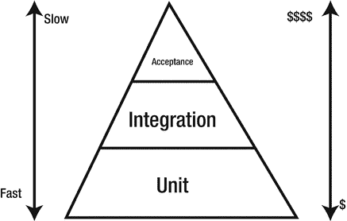
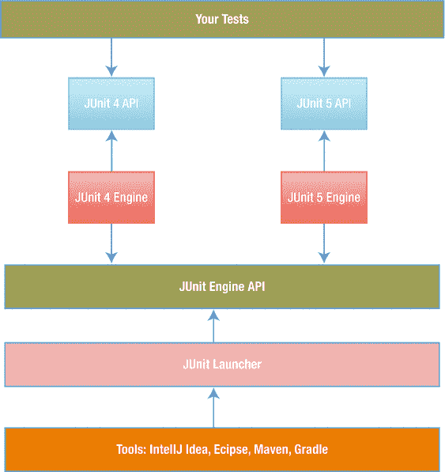
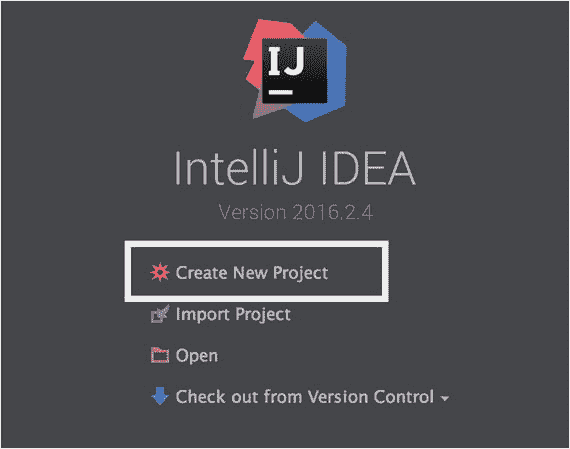
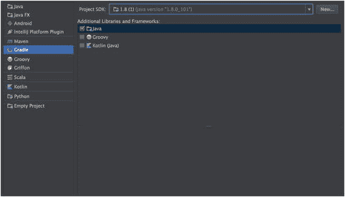
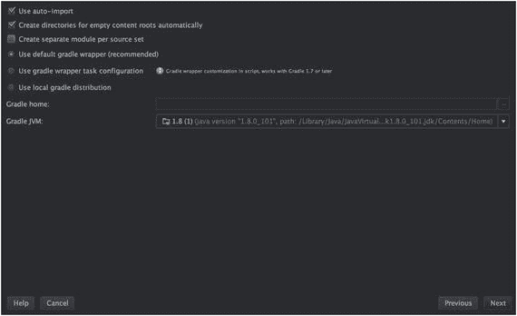
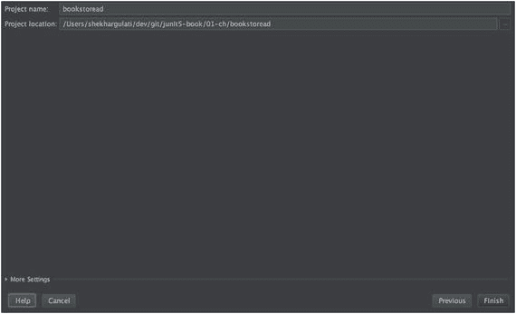
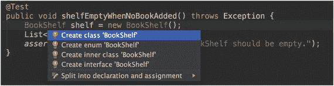
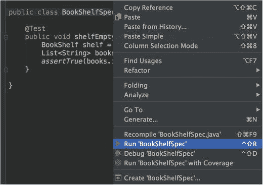
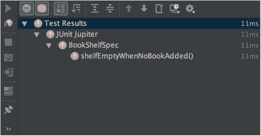
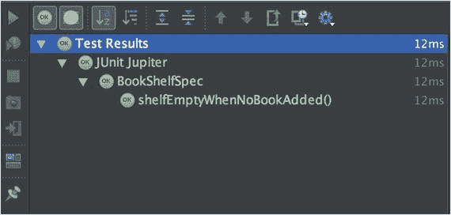

# 1. 以正确的方式构建软件

程序员很快就会意识到编写软件既困难又容易出错。软件项目屡屡失败，原因在于团队无法应对软件的复杂性。结果，项目无法按时完成，成本远超预期，也无法交付预期的商业价值。

回顾过去，软件编程作为一个职业仅有几十年的历史。在这短暂的发展历程中，我们见证了多种软件开发流程，并发现了一些最佳实践。我们认识到，如同其他进化过程一样，软件也会随时间演变。因此，我们应该适应变化，而不是固守僵化的计划。我们还发现，开发是一个协作过程——许多人共同参与软件的不同部分，以构建满足客户需求的产品。不同的人以迭代的方式扮演不同角色，共同决定产品的未来。许多组织正在采用敏捷软件开发流程来应对不断变化的业务需求。正如人们所说，唯一不变的就是变化。

测试驱动开发（TDD）是敏捷软件开发的一种实践，许多开发者都以某种形式使用它。TDD 的前提是，在编写生产代码之前，先编写一个会失败的测试用例。如果正确实施，TDD 可以帮助你编写出满足客户期望、设计简洁且缺陷更少的软件。

在本章中，我们将帮助你理解为什么作为一名专业程序员，你应该学习并遵循 TDD 实践。你将学习如何搭建一个基于 Gradle 的 Java 8 JUnit 5 项目。我们还会简要介绍 Java 8 的新特性，以便即使你之前没有使用过 Java 8，也能轻松上手。本章最后，我们将通过一个遵循 TDD 实践的简单示例来结束。本章将为你后续章节的学习做好准备，在后续章节中，我们将使用 TDD 构建一个功能完整的应用程序，并演示 JUnit 5 的高级特性。

## 测试驱动开发

你还记得上一次想要修改代码以修复客户发现的关键缺陷是什么时候吗？你当时能确定你的修复不会引入回归错误吗？另外，想想上一次你想要重构代码，却担心你的修改会破坏其他功能是什么时候？这种情况在软件开发中很常见——对破坏软件的恐惧。即使是最优秀的程序员也会犯错并引入缺陷。

软件项目充满了不确定性。我们与新技术、不断变化的需求、人员流动打交道，或者同时面对这些情况。为了克服恐惧并管理这些不确定性，我们需要一种能够帮助我们产出可用软件的开发实践。它必须保持简单，并在出现问题时为我们提供快速反馈。

测试驱动开发由 Kent Beck 于 2003 年重新发现，是一种通过倡导为所有软件需求编写测试来增强开发者信心的开发实践。它促使我们在短周期（几分钟）的增量开发循环中工作，从而为我们的进展提供快速反馈。TDD 强制我们在编写生产代码之前先编写一个会失败的测试。完整流程如下：

1.  为新的功能或行为添加一个测试。
2.  看到它失败。
3.  编写足够的代码使测试通过。
4.  确保所有之前的测试也都能通过。
5.  重构代码。
6.  重复以上步骤，直到完成。

这里的关键是首先编写一个会失败的测试。测试体现了我们对系统的理解。我们编写的是当执行某个操作时，我们期望系统会做什么。这有助于我们清晰地理解系统。

本书将重点介绍 TDD 的测试优先方法。有很多程序员是最后才编写测试。我们认为，测试后置的方法无法帮助你获得 TDD 的全部好处。TDD 有时被称为测试驱动设计（即，测试应帮助你设计系统）。TDD 的设计部分比测试部分更重要。当我们最后才编写测试时，我们无法从该实践中获得设计上的好处。

在软件开发中，快速反馈是软件生产力的关键。TDD 为我们提供了快速反馈，表明我们正朝着正确的方向前进。从某种意义上说，它让我们的思维保持专注和积极。我们相信自己的代码，因为它满足了写在测试中的最终用户期望。

TDD 帮助我们实现两个重要目标：

*   检测回归错误。
*   保持系统设计简洁。

让我们详细讨论这两个方面。

### 检测回归错误

遵循 TDD 最明显的原因是以自动化方式检测回归错误。遵循 TDD 的团队可以自由地更改和添加新功能，而无需担心引入回归问题。如果所有之前的测试用例都运行良好，那么我们可以确信没有引入任何回归错误。此外，随着我们不断为新的行为添加测试，安全网也在不断扩大。每当有人进行修改时，这些测试用例都会发挥作用。我们在代码中发现错误越早，修复的速度就越快，成本也越低。谷歌分享的数据验证了这一点，你可以在表 1-1 中看到。

表 1-1.

修复缺陷的成本

| 发现缺陷的软件测试阶段 | 每个缺陷的预估成本 |
| --- | --- |
| 系统测试 | $5,000 |
| 集成测试 | $500 |
| 完整构建 | $50 |
| 单元测试/测试驱动开发 | $5 |

有些人可能看不到编写测试的价值。他们更倾向于手动测试代码，或者在出现问题时使用日志语句来调试代码。手动测试既繁琐又耗时。除此之外，手动覆盖任何非平凡软件的所有边界情况都很困难。人类通常擅长检查快乐路径（即，总是能正常工作的场景）。因此，手动测试很可能会遗漏一些边界情况。

如果系统是遵循 TDD 编写的，那么一旦你发现一个缺陷，团队就会添加一个额外的测试用例来重现该错误。现在，你就可以修改生产代码，使这个失败的测试用例通过。这将确保边界情况得到处理。同时，由于这个边界情况现在已成为自动化测试套件的一部分，你可以放心，不会再遗漏它了。


### 保持系统设计简洁

程序员编写的自动化测试传统上被视为一项质量保证工作。它们旨在验证实现代码在编写时的正确性，并在未来代码演进时验证其正确性。测试只是故事的一半。我们将在本书中证明，TDD 本质上是一种设计工具，而测试只是其附带效果。

人们看待软件开发的一种方式是将其分解为不同阶段。最常见的两个阶段是：

*   **设计**
*   **编码**

通常，一个团队设计系统，另一个团队负责实现。当人们试图实现他人设计时，往往行不通。程序员在开始实现既定设计时会面临许多挑战。

TDD 打破了设计与编码阶段分离的神话，它提倡“代码即设计”的理念。我们不需要一个在实现时总是捉襟见肘的、庞大的前期设计。我们需要一种即时设计，它随着系统的构建而演进。

当我们开始编写测试时，我们就开始以调用者的视角来设计代码。测试成为代码的客户端。测试帮助我们编写刚好满足所需行为的代码。一旦测试通过，我们就毫不留情地重构代码。TDD 通常被视为一个“红 -> 绿 -> 重构”的持续循环。正是在重构阶段，设计才得以显现。重构被定义为在不改变代码外部行为的前提下改进其现有设计。测试帮助我们确信代码按预期工作。现在，我们可以安全地重构代码了。万一在重构过程中引入了破坏性变更，测试用例将会失败。因此，这能防止我们在重构时引入意外的副作用。

TDD 的重构阶段是最关键的阶段。重构时，请思考童子军的行为准则：

> 总是让营地比你发现它时更干净。

重构并不意味着你必须让代码变得完美。试着让代码比你最初检出时好一点点。你可以改进变量、方法或类的名称。你可以将一个大型函数拆分成多个小函数，或者将某个关注点提取到另一个类中。目标是让当前版本比上一个版本更好。如果我们每天都遵循这种做法，我们将朝着更简单、更易读的代码库迈进。

将 TDD 作为设计工具需要思维模式的转变。这不会一蹴而就。需要持续练习才能掌握并从中获益。

TDD 迫使我们编写松散耦合的类，以便我们可以轻松地对它们进行隔离测试。为了隔离测试特定代码，我们被迫将依赖关系显式化。我们编写只做一件事的小型内聚模块，以便测试特定行为。这些模块可以在未来进行扩展以满足不断变化的需求。这些都是 TDD 强制实施的良好设计实践。这一切都使得阅读和理解代码变得更加容易。多项研究表明，程序员花在阅读和理解代码上的时间比编写代码的时间更多。2007 年，微软进行的一项调查显示，95% 的受访者认为理解现有代码是他们工作的重要组成部分。

## 测试的层级

当你开始实践 TDD 时，你将编写不同层级的测试。你的应用程序应该包含以下每个层级的测试。每个层级都关注代码的不同方面，并提供不同的反馈。让我们逐一了解。

*   **单元测试**：在此，你测试单个软件组件，以验证单个单元在隔离环境中是否做了正确的事情。
*   **集成测试**：在此，你将多个单元放在一起测试，以验证它们作为一个整体是否能正确协同工作。
*   **验收测试**：在此，你测试整个系统，以验证它是否按用户期望工作。这通常被称为功能测试。

图 1-1 描绘了一个测试金字塔。图 1-1 要传达的重点是，你应该拥有比功能测试或集成测试多得多的单元测试。本书将主要关注单元测试，但你也应该花时间学习其他两种类型的测试。



图 1-1.

测试金字塔

单元测试的概念可以追溯到 1976 年，当时 David J. Panzal 在第二届国际软件工程会议上发表了《测试过程：一种软件验证的新方法》。该论文将测试过程描述为一种在目标模块上调用测试用例以生成报告的方法，该报告指示“测试用例”是否失败。这些测试过程是产品交付物的一部分，可用于初始产品验证和后续回归测试。这些过程是用一种称为测试过程语言（TPL）的语言为 FORTRAN 编写的。

## 单元测试的好处

如前所述，单元测试不再是开发后的工作。它与编写生产代码同等重要，并且必须前置进行。它通过提供坚实的基础来提高团队生产力。让我们详细看看单元测试提供的好处。

### 确定规格

在开始编码某个组件之前，我们必须尝试确定该组件必须做什么？尝试为可能的输入和可能的输出构建一个测试用例。在开始时构建测试用例的行为有助于澄清组件的预期行为。

如果我们无法提出一个测试，这意味着规格不够明确，需要更多思考。

### 提供早期错误检测

单元测试是代码正常工作的证明。它们在每次构建中执行，并能在第一时间检测到失败。

单元测试不仅能检测编码错误，还能检测产品规格中的缺陷。单元测试展示了进展；因此，一旦组件完成，就可以向利益相关者演示，以发现是否存在差距。错误发现得越早，修复成本就越低。

### 支持维护

产品规格会随着时间的推移而演变。这些变化导致了开发周期。在每个周期中，团队在做出任何更改之前，都必须了解现有代码是如何工作的。单元测试有助于理解预期的行为，而不会被实际代码所困扰。一个编写良好的单元测试套件可以极大地提升团队的生产力。

### 改进设计

单元测试是被测试代码的第一个客户端。它们揭示了客户端在与被测试代码交互时可能遇到的各种问题。单元测试促使我们从预期输入和预期输出的角度进行思考。对于内部组件（服务、工具类等），这有助于划分职责边界。它通过暴露接口设计中的缺陷来帮助改进产品规格。

### 产品文档

单元测试描述了一段代码如何工作——即给定输入的预期输出。它们始终描述规格的最新状态，因为它们与代码变更保持同步。


## 优秀单元测试的特征

测试应像生产代码一样，以同样的专注度和清晰度来编写。我们必须重构测试用例，使其保持简洁和正确。只有当人们能够理解并信赖测试时，它们才能发挥价值。

遵循 TDD（测试驱动开发）时，高质量的测试是成功的关键。拥有测试是一回事，拥有高质量的测试则是另一回事。测试需要具备若干特征，才能在其整个生命周期中保持有用。它们应当：

*   **可读性**：测试的目标之一是让阅读者了解被测试单元的功能。如果测试不可读，阅读者就无法理解测试何时会失败。一个好的单元测试用例拥有有意义的名称，这样阅读者无需查看实现细节就能理解被测试单元的行为。
*   **快速**：测试应在几秒内运行完毕，以便提供快速反馈。如果测试耗时过长，程序员就会想方设法跳过测试。单元测试必须模拟外部依赖，以便测试运行快速且独立于外部服务。模拟允许通过以可控方式模拟其依赖项的行为来测试代码单元。
*   **独立且隔离**：优秀的单元测试不依赖于执行顺序。它们不依赖其他单元测试来保证自身正确运行。它们应在各自独立的隔离环境中运行。
*   **正确性**：一个好的单元测试能做到名副其实。一个测试用例应对应一个单一场景（即行为）。通常，测试并未如其名称所示那样工作。这非常危险，因为在这种情况下，你无法信任你的测试。
*   **环境无关性**：任何软件项目的试金石如下：“你能在一台干净的开发机器上检出代码，并毫无问题地运行包括测试在内的完整构建吗？”大多数时候，我们发现单元测试失败是因为它们依赖于某些外部因素。外部因素可能是特定位置的文件、环境变量或其他东西。这会导致脆弱的测试。一个好的单元测试不依赖于环境。
*   **可重复性**：一个好的单元测试每次运行时都会产生相同的结果。测试执行应使用构建工具自动化。它们应成为自动化构建过程的一部分，以便每次执行构建时都能运行。当测试开始随机失败时，程序员会开始忽略它们。这些随机的测试失败难以重现，并且通常发生在持续集成服务器等外部系统上。团队应确保一旦发现失败的测试就立即修复。

## JUnit 简介

JUnit 由 Kent Beck 和 Erich Gamma 开发，是 Java 开发者最流行的单元测试框架之一。它最初基于 SUnit（一个由 Kent Beck 用 Smalltalk 编写的单元测试框架）。JUnit 的第一个版本于 1997 年发布。此后，它已成为事实上的标准，被许多不同语言和工具所采用。Martin Fowler 在其名言中强调了 JUnit 框架的重要性：

> 在软件开发领域，从未有如此多的人，欠了如此少的代码行如此大的恩情。

在 JUnit 引入之前，测试领域由“捕获-回放”测试工具主导。这些工具是黑盒测试工具，它们曾用于捕获系统在给定输入下的状态，然后尝试回放。用此类框架编写的测试需要付出巨大的努力。这些工具并非为单元测试组件而设计，因为它们是通过图形用户界面（GUI）来测试应用程序的。

JUnit 摒弃了基于 GUI 的测试理念。相反，它提供了一个轻量级框架，允许通过编写 Java 代码来创建测试。这使得开发者能够为他们代码的每一部分构建测试套件。由于其诸多优点，JUnit 被集成到各种构建工具和集成开发环境（IDE）中。

JUnit 团队一直善于利用新的 Java 语言特性。在 Java 5 发布（支持注解、泛型等）之后，JUnit 4.0 也随之发布，带来了诸如 `@Test` 和 `@Setup` 等功能。Kent Beck 这样评价 JUnit 4：

> JUnit 4 的主题是通过进一步简化 JUnit，鼓励更多开发者编写更多测试。

JUnit 4.0 通过摆脱命名约定并引入超时和测试异常等其他特性，简化了单元测试。JUnit 4.0 发布于十年前，大约在 2006 年 2 月。在接下来的十年里，我们看到了 JUnit 的多个小版本发布，最新的是 2014 年 12 月发布的 JUnit 4.12。在我们进一步了解 JUnit 5 之前，先来理解为什么我们需要一个新版本的 JUnit 框架。

### 为什么我们需要新版本的 JUnit？

随着开发者测试在过去几年中获得动力并日趋成熟，开发者开始对他们的单元测试框架抱有更多期望。以下是需要新版本的原因：

*   **特性**：开发者希望他们的测试框架支持集成测试、更好的断言以及许多其他特性，这样他们就不必依赖其他库。
*   **模块化**：早期版本的 JUnit 缺乏模块化。所有东西都打包成一个单一的 jar 文件。只有一个单一的 JUnit 项目，包含了所有 JUnit 代码库。它通过使用不同的子包来实现模块化。这意味着每个人都依赖于 JUnit jar——构建工具、IDE、你的 JUnit 测试、扩展等，都使用相同的代码。测试发现和测试执行就是紧密耦合问题的一个例子。
*   **可扩展性**：JUnit 4 通过两种机制提供了可扩展性：
    *   Runner API（应用程序编程接口）
    *   Rule API
    它们各有优缺点。要编写自定义的测试运行器，你必须实现完整的测试生命周期，包括测试实例化、测试执行、设置和清理等。Runner API 最大的缺点是你无法组合多个运行器。JUnit 4.7 引入的 Rule API 使用起来简单得多，但其功能有限。Rule API 的一个限制是，不能有一个单一的规则同时处理方法级别和类级别的回调。这使得 JUnit 在可扩展性方面留下了很多不足。
*   **Java 8**：Java 8 引入了许多新特性，比如 lambda 表达式。你可以将 Java 8 与旧版本的 JUnit 一起使用，但 JUnit 本身可以通过支持这些特性得到很大改进。


### JUnit 5

为了克服前述限制，JUnit Lambda 项目应运而生。JUnit Lambda 是 JUnit 5 的代号。JUnit 5 是基于 Java 8 对 JUnit 的完全重写。你需要 Java 8 才能使用 JUnit 5。它从头开始重新设计，克服了之前 JUnit 版本中的错误和局限。但这并不意味着用 JUnit 3 和 JUnit 4 编写的测试无法在 JUnit 5 上运行。JUnit 团队确保 JUnit 5 向后兼容，因此你也可以用它来运行旧的 JUnit 测试。JUnit 5 支持 JUnit 3.8 及以上版本。

JUnit 5 由三个子项目组成。每个子项目又包含多个模块，我们稍后会逐一介绍。

*   **JUnit Platform**：它为启动 JVM（Java 虚拟机）测试框架提供了基础。这包括一个可用于为 JUnit Platform 开发测试框架的 `TestEngine` API。它还提供了一个 `ConsoleLauncher`，可供 Gradle 和 Maven 等构建工具使用。
*   **JUnit Jupiter**：它提供了用于编写测试的新编程模型。此外，新的扩展机制也属于这个子项目。它实现了 JUnit Platform 定义的 `TestEngine` API，从而使 JUnit 5 测试能够运行。
*   **JUnit Vintage**：它提供了用于运行 JUnit 3 和 JUnit 4 测试的 `TestEngine` 实现。

JUnit 5 的架构如图 1-2 所示。JUnit 5 用引擎（engine）取代了运行器（runner）的概念。因此，中间有一个引擎 API，它为 JUnit 4 和 JUnit 5 API 都提供了实现。这允许你运行使用不同 JUnit 版本编写的测试。Gradle、IntelliJ 或 Eclipse 等工具使用启动器（launcher）API。你的测试将依赖于 JUnit 5 API，从而使你无需接触 JUnit 内部实现。



图 1-2.

JUnit 5 架构

JUnit 5 的主要模块包括：

*   **junit-jupiter-api**：该模块定义了编写测试所需的 API。
*   **junit-platform-launcher**：该模块定义了外部工具使用的启动器 API。启动器可用于发现、过滤和执行测试。
*   **junit-platform-engine**：它提供了可用于编写自己的 `TestEngine` 的 API。`TestEngine` 负责测试的发现和执行。
*   **junit-jupiter-engine**：它是针对 JUnit 5 的 `junit-platform-engine` API 的实现。
*   **junit-vintage-engine**：它是针对 JUnit 3 和 JUnit 4 的 `junit-platform-engine` API 的实现。
*   **junit-platform-commons**：它包含所有跨不同模块使用的工具类。
*   **junit-platform-console**：它提供了一个名为 `ConsoleLauncher` 的启动器实现。`ConsoleLauncher` 是一个独立的应用程序，用于从控制台启动 JUnit Platform。
*   **junit-platform-gradle-plugin**：这是一个 Gradle 插件，可用于运行 JUnit 5 测试。
*   **junit-platform-surefire-provider**：该模块为 JUnit 5 提供了 Maven 集成。

JUnit 团队还致力于为测试工具提供商和构建工具/IDE 奠定坚实的基础。在此版本中，他们发起了 Open Test Alliance（[`https://github.com/ota4j-team/opentest4j`](https://github.com/ota4j-team/opentest4j)），旨在为 JVM 上的测试执行定义标准。

## Java 8 入门

Java 8 已不再是新话题。市面上已经出版了许多关于它的优秀书籍。尽管如此，许多 Java 开发者仍未意识到 Java 8 的强大之处。在本书中，我们将使用 Java 8，因此本节将简要介绍 Java 8 的重要特性。

Java 8 是迄今为止 Java 最大的一次版本发布。它包含了众多特性，如 lambda 表达式、流 API、Optional、新的日期时间 API、接口中的默认方法和静态方法等。在本节中，我们将重点介绍 Java 8 的三个最重要的特性——lambda 表达式、流 API 和 Optional——它们将改变我们使用 Java 的方式。

### Lambda 表达式

Java 8 中引入的最重要的特性是 lambda 表达式。Lambda 表达式允许你将行为作为数据传递。在 Java 的早期版本中，我们使用匿名内部类来传递行为。让我们看一个 lambda 表达式的简单示例——Java 的 `Collections` 类中的排序函数。`sort` 函数接收 `List` 和 `Comparator`，并根据提供的 `Comparator` 进行排序。

```
List books = Arrays.asList("Effective Java", "Clean Code", "Refactoring");
Collections.sort(books, (b1, b2) -> b1.length() – b2.length));
```

这段代码根据书名的长度进行排序。程序的输出将是 [Refactoring, Clean Code, Effective Java]。

代码片段中显示的表达式 `(b1, b2) -> b1.length() – b2.length()` 是一个类型为 `Comparator<String>` 的 lambda 表达式。

*   `(b1, b2)` 是 `Comparator` 的 `compare` 方法的参数。
*   `b1.length() – b2.length()` 是比较两个书名长度的函数体。
*   `->` 是 lambda 运算符，用于分隔参数和 lambda 体。


### Streams API

Streams 提供了一种更高层次的抽象，让你能以声明式的方式表达 Java 集合中的计算。这类似于你使用 SQL 以声明式方式查询数据库中的数据。声明式意味着开发者编写他们想要做什么，而不是指定所有关于数据应如何查询的指令。Streams 仅提供只读操作，它们永远不会改变底层的集合。

以下是 Java 7 中执行集合处理的示例代码片段：

```
public class ExampleJava7 {
public static void main(String[] args) {
List books = getBooks();
List programmingBooks = new ArrayList();
for (Book book : books) {
if (book.getType() == BookType.PROGRAMMING) {
programmingBooks.add(book);
}
}
Collections.sort(programmingBooks, new Comparator() {
@Override
public int compare(Book b1, Book b2) {
return b1.getTitle().length() – b2.getTitle().length();
}
});
for (Book book:  programmingBooks) {
System.out.println(book.getTitle());
}
}
}
```

这段代码会打印所有编程类书籍的标题，按标题长度排序，最后输出到控制台。Java 7 开发者每天都会编写这类代码。为了编写这样一个简单的程序，我们不得不写了 15 行 Java 代码。上述代码更大的问题不在于开发者需要编写的行数，而在于其意图（即过滤书籍、按标题长度排序，最后打印它们）。

我们可以使用 Java 8 的 Stream API 来简化上述代码，如下所示：

```
public class ExampleJava8Stream {
public static void main(String[] args) {
List books = getBooks();
List programmingBookTitles = books.stream()
.filter(book -> book.getType() == BookType.PROGRAMMING)
.sorted((b1, b2) -> b1.getTitle().length() – b2.getTitle().length())
.map(Book::getTitle)
.collect(Collectors.toList());
programmingBookTitles.forEach(System.out::println);
}
}
```

这段代码构建了一个包含多个流操作的管道，接下来将逐一讨论每个操作。

*   `stream()`：通过在源集合（即 `tasks List<Book>`）上调用 `stream()` 方法来创建一个流管道。
*   `filter(Predicate<T>)`：此操作提取流中符合谓词定义条件的元素。一旦你有了一个流，就可以对其调用零个或多个中间操作。Lambda 表达式 `book -> book.getType() == BookType.PROGRAMMING` 定义了一个谓词，用于过滤所有编程类书籍。该 Lambda 表达式的类型是 `java.util.function.Predicate<Book>`。
*   `sorted(Comparator<T>)`：此操作返回一个流，其中包含所有按 Lambda 表达式定义的比较器（即上面示例中的 `(b1, b2) -> b1.getTitle().length() – b2.getTitle().length()`）排序后的流元素。
*   `map(Function<T,R>)`：此操作在对流中的每个元素应用 `Function<T,R>` 后返回一个流。
*   `collect(toList())`：此操作将对流执行操作的结果收集到一个 `List` 中。

### Optional<T>

Java 8 引入了一种新的数据类型 `java.util.Optional<T>`，它封装了一个空值。这使得 API 的意图更加清晰。如果一个函数返回 `Optional<T>` 类型的值，那么它就是在告诉调用者该值可能不存在。使用 `Optional` 数据类型可以明确地告知 API 调用者何时应预期一个可选值。使用 `Optional` 类型的目的是帮助 API 设计者通过查看方法签名，让调用者清楚地知道他们是否应该预期一个可选值。`Optional` API 中包含三种创建方法。

*   `Optional.empty`：当值不存在时，用于创建一个 `Optional`。与其返回 null，不如返回 `Optional.empty`。
*   `Optional.of(T value)`：用于从一个非空值创建 Optional。当值为 null 时，它会抛出 `NullPointerException`。你可以这样使用它：`Optional<String> mayBeName = Optional.of(name)`。
*   `Optional.ofNullable(T value)`：这是一个静态工厂方法，适用于 null 和非 null 值。对于 null 值，它会创建一个空的 `Optional`；对于非 null 值，它会使用该值创建一个 `Optional`。


## 项目设置

本书采用实践导向的方法，我们将通过一个示例来学习 TDD。在本书中，我们将构建一个名为 `bookstoread` 的应用程序。该应用程序类似于 [`www.goodreads.com/`](http://www.goodreads.com/) 网站。关于该应用程序的更多功能细节将在下一章介绍。本章将设置你将在本书中使用的项目。但在继续之前，我们需要做一些准备工作。请在你的机器上安装以下软件：

*   **Java 8**：JUnit 5 需要 Java 8 或更高版本。请从 Oracle 官方网站 [`www.oracle.com/technetwork/java/javase/downloads/index.html`](http://www.oracle.com/technetwork/java/javase/downloads/index.html) 下载 Java 8 的最新更新。在撰写本文时，Java 版本为 1.8.0_101。你可以通过运行以下命令来检查你的 Java 版本：

```
    $ java -version
    java version "1.8.0_101"
    Java(TM) SE Runtime Environment (build 1.8.0_101-b13)
    Java HotSpot(TM) 64-Bit Server VM (build 25.101-b13, mixed mode)
    ```

*   **IntelliJ IDEA 2016.2 或更高版本**：许多 Java 开发者已从 Eclipse 转向 IntelliJ Idea IDE。我们将使用 IntelliJ 的最新社区版。你可以从 JetBrains 网站 [`www.jetbrains.com/idea/download/`](http://www.jetbrains.com/idea/download/) 下载最新版本。IntelliJ Idea 对 JUnit 5 有良好的支持。
*   **Gradle**：Gradle 是 JVM 生态系统中流行的构建工具。它用于依赖管理和运行自动化任务。你不需要在本地机器上安装 Gradle。我们将使用一个 Gradle 包装器，它会为你的项目下载并安装 Gradle。要了解更多关于 Gradle 的信息，你可以参考 Gradle 文档 [`https://docs.gradle.org/current/userguide/userguide.html`](https://docs.gradle.org/current/userguide/userguide.html) 。

现在，我们已经准备好了所有先决条件，让我们使用 IntelliJ Idea 创建一个 Gradle 项目。

1.  启动 IntelliJ IDEA，你将看到如下创建项目的界面，如图 1-3 所示：



图 1-3.

IntelliJ 启动界面  
2.  点击“Create New Project”开始创建 Java Gradle 项目。你将看到一个创建新项目的界面。请选择 Gradle 和 Java，如图 1-4 所示。



图 1-4.

导入项目  
3.  你还需要指定项目 SDK。点击“New”按钮选择 JDK 8。点击“Next”进入下一个界面。现在，系统会要求你指定 GroupId 和 ArtifactId，如图 1-5 所示。


图 1-5.

项目属性  
4.  点击“Next”按钮进入下一个界面。此界面会要求你指定一些 Gradle 设置。我们将选择“Use auto-import”，以便 Gradle 在我们向构建文件添加新依赖时自动添加它们。同时，我们也会选择“Create directories for empty content roots automatically”选项（参考图 1-6）。



图 1-6.

Gradle 属性  
5.  点击“Next”按钮进入最后一个界面。在此界面中，系统会询问你希望创建项目的位置。为应用程序选择一个方便的目录路径。最后，点击“Finish”按钮完成项目创建过程，如图 1-7 所示。



图 1-7.

项目位置

我们将在本书后面介绍 JUnit 5 与 Gradle 的集成。所以，现在只需按照与 Gradle 相关的步骤操作即可。

现在，我们的 Java Gradle 项目已经创建完成，我们需要对 Gradle 构建文件（即 `build.gradle`）做一些修改。在 IDE 中打开 `build.gradle` 文件，并将其修改为以下内容：

```
group 'com.junit5book'
version '1.0-SNAPSHOT'
apply plugin: 'java'
sourceCompatibility = 1.8
repositories {
mavenCentral()
}
dependencies {
def junitVersion = '5.0.1'
testCompile 'org.junit.jupiter:junit-jupiter-api:' + junitVersion
testCompile 'org.junit.jupiter:junit-jupiter-engine:' + junitVersion
}
```

在代码所示的 `build.gradle` 文件中，我们完成了以下操作：

*   将 sourceCompatibility 从 1.5 改为 1.8：Gradle Java 插件的此属性用于指定要使用的 JVM 版本。由于我们将使用 JDK 1.8，因此将其改为 1.8。
*   在 dependencies 部分添加了 JUnit 5 依赖：我们需要添加两个依赖——`junit-jupiter-api` 和 `junit-jupiter-engine` API。正如“JUnit 5”一节中所讨论的，`junit-jupiter-api` 定义了编写测试所需的 API。`junit-jupiter-engine` 是 JUnit 5 对 `junit-platform-engine` API 的实现。

这就是开始使用 JUnit 5 所需做的全部工作。我们将在后续章节中介绍 Gradle 与 JUnit 5 的集成，请参考那些章节以了解更多信息。在接下来的几章中，我们将从 IDE 内部运行测试用例。


## 编写你的第一个测试

让我们开始构建 `bookstoread` 应用。我们将支持的第一个功能是向 BookShelf 添加书籍。在本章中，我们不会完全实现此功能。我们只会编写足够的代码来测试：当我们创建书架时，其中没有书籍（即书架是空的）。

我们将从编写一个测试规范开始。在 `src/main/test` 目录下创建一个新的包 `bookstoread`。我们将保持扁平的包结构，以使代码更易于阅读。在 bookstoread 包内，我们将创建一个新类 `BookShelfSpec`。如果你之前编写过 JUnit 测试用例，那么你通常会编写以 Test 或 Tests 结尾的测试类。在本书中，我们将遵循行为驱动开发（BDD）的命名约定。`*Test` 命名约定会迫使你认为单元测试是唯一的质量保证手段。我们希望你能从行为规范的角度思考，因此我们的测试将以 `Spec` 结尾。

你将得到一个空的规范类，如代码片段所示。

```
package bookstoread;
public class BookShelfSpec {
}
```

让我们编写第一个测试用例，该用例将断言：当没有书籍添加到书架时，它应该是空的。在 `BookShelfSpec` 内部，添加如下测试用例：

```
package bookstoread;
import org.junit.jupiter.api.Test;
import java.util.List;
import static org.junit.jupiter.api.Assertions.assertTrue;
public class BookShelfSpec {
@Test
public void shelfEmptyWhenNoBookAdded() throws Exception {
BookShelf shelf = new BookShelf();
List books = shelf.books();
assertTrue(books.isEmpty(), () -> "BookShelf should be empty.");
}
}
```

这段代码无法编译，因为还没有 `BookShelf` 类。此时，我们只是假设 `BookShelf` 将来会存在，从而编写了客户端代码。我们只是想以客户端的身份感受一下我们的 API。我们编写了期望以及我们希望 API 呈现的样子。随着学习的深入，我们将重构 API 以满足我们的期望。

一个测试用例被分解为以下三个部分：

*   设置测试用例所需的数据。
*   调用被测试的单元。
*   执行断言以验证预期行为是否正确。

这也被称为 AAA（Arrange，Act 和 Assert）。

在刚刚展示的测试用例中，你会注意到我们使用了 `org.unit.jupiter.api.Test` 注解。在早期版本的 JUnit 中，注解是 `org.junit.Test`。要编写 JUnit 5 测试用例，你必须使用 `org.unit.jupiter.api.Test` 注解。JUnit 5 根据测试用例上存在的注解来区分不同版本。

JUnit 5 精简了断言支持。JUnit 5 中没有 `assertThat` 方法。预期你会使用像 Hamcrest 或 AssertJ 这样的第三方断言库。我们将在后续章节中使用 AssertJ。在刚刚展示的代码中，我们使用了内置断言 `assertTrue`，它测试条件是否为真。

让我们编写代码使测试通过。在 `src/main/java` 目录下创建一个新类 `BookShelf`。向其中添加 `books` 方法，如图 1-8 所示。如果你使用 IntelliJ 为你创建类，则会生成此代码。要使用 IntelliJ 创建 BookShelf，请按 alt + enter 键选中 `BookShelfSpec` 中的 `BookShelf`，如图 1-8 所示。



图 1-8.

创建类

要使用 IntelliJ 快捷键创建 `books` 方法，请再次按 alt + enter 键选中 `books` 方法。最后，你将得到一个类，如下面代码所示：

```
package bookstoread;
import java.util.List;
public class BookShelf {
public List books() {
return null;
}
}
```

现在我们的代码可以编译了，让我们运行测试用例。要运行测试用例，请右键单击测试类并选择 `Run ‘BookShelfSpec’`，如图 1-9 所示。



图 1-9.

运行测试

当你运行测试时，你会看到测试失败，如图 1-10 所示。



图 1-10.

测试失败

在图 1-10 中你会注意到提到了 JUnit Jupiter。图 1-10 显示 `BookShelfSpec shelfEmptyWhenNoBookAdded` 测试是由 JUnit Jupiter 引擎执行的。如果你也有 JUnit 4 测试用例，那么你还会看到 JUnit Vintage。我们将在第 8 章中介绍这一点。

为了使这个测试用例通过，我们将修改 `BookShelf books` 方法的实现，使其返回一个空列表，如下面代码所示：

```
package bookstoread;
import java.util.Collections;
import java.util.List;
public class BookShelf {
public List books() {
return Collections.emptyList();
}
}
```

再次运行测试用例。这次你将看到令人愉悦的绿色条（见图 1-11）。



图 1-11.

测试成功

绿色条表示代码符合我们的预期。我们现在可以继续并添加一个新的测试用例。我们将在第 3 章讨论完 JUnit 5 的核心概念后，继续实现此功能。

## 总结

在本章中，你了解了为什么开发者测试对每个程序员来说都是一项宝贵的技能。我们详细讨论了 TDD，然后讨论了单元测试。单元测试通过为软件开发人员提供防止回归的安全网和帮助程序员设计应用程序的指南，从而显著提高生产力。

本章还讨论了 JUnit，它是 Java 中单元测试的事实标准。JUnit 5 是 JUnit 的一个模块化和可扩展的版本。我们通过使用 IntelliJ IDEA IDE 创建一个 Java Gradle 项目并编写了第一个测试用例来结束本章。在下一章中，我们将学习 JUnit 5 的核心概念。

