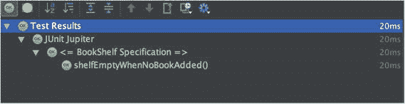
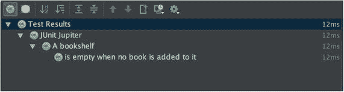
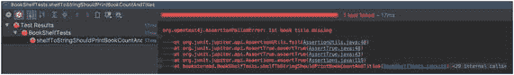
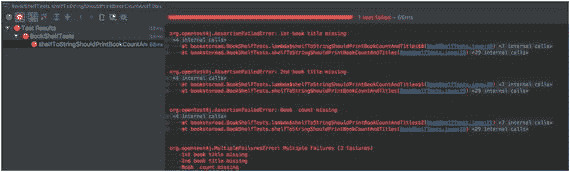
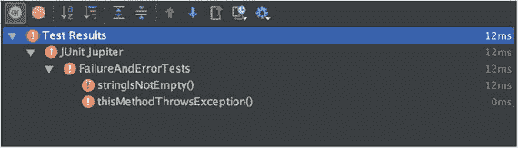
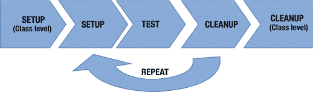

# 2. 理解 JUnit 5 核心概念

在第一章中，我们学习了测试驱动开发（TDD）的重要性。我们还讨论了单元测试的关键作用。但在我们继续使用 JUnit 5 构建应用程序之前，理解其核心概念非常重要。

本章的目标是概述 JUnit 5 的核心概念。JUnit 5 基于以下原则：

*   最小化占用空间。
*   简化测试用例。
*   提供功能上的可扩展性。
*   优先选择特定的扩展点而非通用的。

所有这些概念使得新版本在保持更精简和可扩展的同时，专注于测试需求。总而言之，JUnit 5 是对 JUnit 框架的完全重写，因此底层发生了很多变化。因此，即使你了解之前版本 JUnit 的核心概念，理解 JUnit 5 的不同之处也很重要。

然后，在下一章中，我们将开始使用 JUnit 5 构建一个 bookstoread 应用程序。构建应用程序将帮助你学习如何将这些核心概念应用到你的工作中。


## 测试类

作为程序员，我们通过测试类与单元测试框架进行交互。在第一章中，我们编写了第一个测试类 `BookShelfSpec`，它包含一个测试方法 `shelfEmptyWhenNoBookAdded`，该方法断言当没有添加任何书籍时，`BookShelf` 应为空。

在 JUnit 的早期版本中，如果一个类具有以下特征，则被视为测试类：

*   公开访问权限
*   一个无参构造函数
*   至少一个测试方法

在第一章中，我们编写了测试类 `BookShelfSpec`，如下代码所示，它满足了这些约束条件：

```
package bookstoread;
import org.junit.jupiter.api.Test;
import java.util.List;
import static org.junit.jupiter.api.Assertions.assertTrue;
public class BookShelfSpec {
@Test
public void shelfEmptyWhenNoBookAdded() {
BookShelf shelf = new BookShelf();
List books = shelf.books();
assertTrue(books.isEmpty(), () -> "BookShelf should be empty");
}
}
```

我们不必编写无参构造函数，因为如果类没有其他构造函数，Java 会隐式创建一个。

在 JUnit 5 中，其中一些约束条件已被放宽。JUnit 5 的测试类和测试方法不再要求是公开的。我们现在可以将它们设为包级私有，如下代码所示：

```
// 为简洁起见，省略了包和导入语句
class BookShelfSpec {
@Test
void shelfEmptyWhenNoBookAdded(){
BookShelf shelf = new BookShelf();
List books = shelf.books();
assertTrue(books.isEmpty(), () -> "BookShelf should be empty.");
}
}
```

放宽此限制的原因是 JUnit 内部使用反射来查找测试类和测试方法。即使它们具有有限的可见性，反射也能发现它们，因此无需将它们设为公开。这意义不大，因为我们可以使用我们喜欢的集成开发环境轻松生成测试类和测试方法存根。所以，作为程序员，我们以前也不需要做太多工作。但在我看来，这是一种微妙的方式，表明如果你不需要某样东西，为什么还要要求它呢。在本节中，我们将只关注测试类。我们将在下一节介绍测试方法。

### 构造函数

JUnit 5 不要求测试类具有公开的无参构造函数。构造函数可以是包级私有的、受保护的，甚至是私有的。以下是带有私有无参构造函数的 `BookShelfSpec`。运行测试用例，你会发现测试仍然可以正常工作。

```
class BookShelfSpec {
private BookShelfSpec() {
/*
此构造函数是私有的
*/
}
// 为简洁起见，省略了测试方法
}
```

JUnit 早期版本对构造函数的另一个约束是它们不能有参数。我们被要求有一个公开的无参构造函数。我们看到在 JUnit 5 中可见性约束被放宽了，但 JUnit 5 是否也放宽了无参构造函数的约束？你会惊喜地发现，在 JUnit 5 中，测试类构造函数允许有参数。测试方法不仅可以有构造函数，还可以有参数。这是通过提供 `ParameterResolver` 来实现的。`ParameterResolver` 在运行时动态解析参数。只有当你有一个解析器来解析这些参数并注入它们时，你才能在构造函数或测试方法中使用参数。我们将在第 8 章中更详细地介绍解析器。为了给你一个快速示例，我们将使用 JUnit 5 内置的解析器之一——`TestInfoParameterResolver`。

```
import org.junit.jupiter.api.TestInfo;
class BookShelfSpec {
private BookShelfSpec(TestInfo testInfo) {
System.out.println("Working on test " + testInfo.getDisplayName());
}
// 为简洁起见，省略了测试方法
}
```

在上述代码中，我们在测试类构造函数中定义了一个 `TestInfo` 类型的参数，该参数稍后在 `print` 语句中使用。`TestInfoParameterResolver` 向构造函数提供一个 `TestInfo` 实例。`TestInfo` 包含有关当前测试的信息。我们用它来显示测试类的名称。

当你运行上述代码时，它会为每个测试用例打印语句“`Working on test BookShelfSpec`”。因为我们只有一个测试用例，所以它只会被打印一次。

### 使用 @DisplayName

大多数程序员刚开始使用 JUnit 时，认为测试类名称需要以 `Test` 后缀结尾。在测试类名称中使用 `Test` 只是一种约定；你不必像那样命名你的测试类。如今，许多程序员以 `Spec` 或 `Specification` 结尾来命名他们的测试类。因此，我们可以编写 `BookShelfSpec` 或 `BookShelfSpecification`，而不是编写 `BookShelfTest`。`Spec` 命名约定是由行为驱动开发实践推广的。你的目标应该是选择一种命名约定，并在你的项目中坚持使用。

行为驱动开发将 TDD 原则与领域驱动设计相结合，为软件团队提供共享工具和共享流程，以便在软件开发上进行协作。

JUnit 5 允许你为测试类使用自定义名称。你可以使用 `org.junit.jupiter.api.DisplayName` 注解来提供一个可以包含空格、特殊字符甚至表情符号的名称。这允许你为测试类使用更有意义的名称。在下一章中，我们将为测试类使用 `@DisplayName` 注解。

```
import org.junit.jupiter.api.DisplayName;
import org.junit.jupiter.api.Test;
import org.junit.jupiter.api.TestInfo;
@DisplayName("")
class BookShelfSpec {
private BookShelfSpec(TestInfo testInfo) {
System.out.println("Working on test " + testInfo.getDisplayName());
}
@Test
void shelfEmptyWhenNoBookAdded() {
// 为简洁起见，省略了内容
}
}
```

当你在 IDE 中运行 `BookShelfSpec` 时，你将看到正在执行的测试类的名称为 BookShelf Specification，如图 2-1 所示。



图 2-1.

测试成功

## 测试方法

在 JUnit 的早期版本中，测试方法具有以下特征：

*   应使用 `org.junt.Test` 注解进行注解。
*   应具有公开可见性。
*   不应接受任何参数。
*   应返回 void。

在上一节中，我们讨论了在 JUnit 5 中测试方法不再需要是公开的。测试方法可以是受保护的或包级私有的。首选是使用包级私有，因为这样可以减少输入。

JUnit 5 中的测试必须使用 `org.junit.jupiter.api.Test` 注解进行注解。这与 JUnit 4 中使用的注解不同。JUnit 5 的设计者选择使用不同的注解，以便他们能够区分不同版本的 JUnit。JUnit 5 可以根据使用的 `@Test` 注解来运行 JUnit 4 和 JUnit 5 的测试。

### 测试方法中的参数

与测试类构造函数一样，在 JUnit 5 中，测试方法也可以接受参数。以下代码是一个测试方法将 `TestInfo` 作为其参数的示例：

```
@Test
void shelfEmptyWhenNoBookAdded(TestInfo testInfo) {
System.out.println("Working on test case " + testInfo.getDisplayName());
BookShelf shelf = new BookShelf();
List books = shelf.books();
assertTrue(books.isEmpty(), () -> "BookShelf should be empty.");
}
```

上述代码使用了 JUnit 5 的 `ParameterResolver` API。我们将在本书后面进一步了解它。


### 使用 @DisplayName

据说编程中最难的问题就是命名。大多数程序员都觉得给类、方法和变量起个好名字很困难。测试方法也是如此。我们见过名为 `test1`、`test2`、`testSomeMethodName` 等等的测试方法。测试方法名称中包含“test”的根本原因在于，JUnit 4 之前的版本要求测试方法名必须以“test”开头，这样 JUnit 才能找到测试方法。在 JUnit 4 引入 `@Test` 注解后，程序员不再需要在测试方法名中使用“test”。但正如人们所说，“旧习难改”，所以大多数程序员仍然沿用旧的惯例。

许多 TDD 大师和布道者曾在各种会议和聚会上提出过测试名称的问题。他们一直敦促人们开始为测试用例使用更好的名称。

> 测试名称应该说明它们测试的是什么行为，而不是它们测试的方法名称。 — 敏捷大师 Steve Freeman

大多数程序员认为测试方法名与生产类方法名之间存在一一对应关系。事实并非如此。我们通常最终会为一个方法编写多个行为测试。

测试方法名称必须表达其意图。我们为测试方法起了一个行为名称 `shelfEmptyWhenNoBookAdded`。如果有人读到这个测试名称，他/她就会知道我们在测试什么行为。但将行为作为方法名的问题在于，它会导致方法名非常长。此外，我们不能在方法名中使用空格，因此可读性会受到影响。

> 以简短声明式语句编写的测试名称，比机器可读的名称更具表现力。也就是说，后者只有在你理解了一种用于解析其含义的隐藏代码语言时才有意义。 — 《单元测试的艺术》作者 Roy Osherove

在像 Groovy 这样的编程语言中，我们可以使用字符串作为测试名称，这意味着我们可以在方法名中使用空格。在 Java 中，方法命名有严格的规则，因此程序员经常使用下划线 (_)，如下面的代码所示，这使其更具可读性：

```
@Test
void shelf_empty_when_no_book_added() {
BookShelf shelf = new BookShelf();
List books = shelf.books();
assertTrue(books.isEmpty(), () -> "BookShelf should be empty.");
}
```

我们在上一节讨论的 `@DisplayName` 注解与测试方法一起使用，以提供有意义的名称，如下面的代码所示：

```
@DisplayName("一个书架")
class BookShelfSpec {
@Test
@DisplayName("当没有书添加到其中时是空的")
void shelfEmptyWhenNoBookAdded() {
BookShelf shelf = new BookShelf();
List books = shelf.books();
assertTrue(books.isEmpty(), () -> "BookShelf should be empty.");
}
}
```

在前面展示的 `BookShelfSpec` 类中，我们在测试类和测试方法上都使用了 `@DisplayName` 注解来提供可读的名称。再次运行测试，你将看到更具可读性的测试输出，如图 2-2 所示。



图 2-2.

使用 @DisplayName 注解执行测试用例

## 断言

JUnit 中的断言是我们在测试方法中调用的静态方法，用于验证预期行为。每个断言都测试给定条件是否为真。如果断言的条件不为真，则会报告测试失败。所有 JUnit 5 断言都定义在 `org.junit.jupiter.api.Assertions` 类中。在我们迄今为止编写的单个测试用例中，我们使用了 `assertTrue`。

如第 1 章所述，与 JUnit 4 相比，JUnit 5 中的断言更少。在后续章节中，我们将使用 AssertJ，这是一个有助于编写清晰断言的第三方库。现在，让我们先了解 JUnit 5 内置的功能。

JUnit 4 支持两种断言语法——JUnit 原始版本自带的传统断言，如 `assertTrue`、`assertEquals` 等，以及使用 `assertThat` 的更易读的语法。JUnit 5 不支持 `assertThat` 语法。建议你使用 AssertJ 或 Hamcrest 等第三方库来编写 `assertThat` 断言。

JUnit 提供的每个 `assertXXX` 方法至少有三个重载方法。让我们看看其中一个断言方法 `assertNull`。以下是使用了所有重载 `assertNull` 方法的测试用例：

*   在这种情况下，第一个 `assertNull` 检查值（即 str）是否为 null。如果该值不为 null，则会抛出 `AssertionFailedError`，并且测试将失败。
*   第二个重载方法允许你传入一个字符串消息，该消息将在测试失败时显示给用户。最佳实践是为所有断言方法调用提供错误消息。
*   第三个方法使用了 Java 8 的 `java.util.function.Supplier` 函数式接口。我们向其传递了一个 lambda 表达式，该表达式将生成所需的消息。此方法的优点是，只有在断言失败时，才会从 supplier 中延迟获取失败消息。如果你正在构建一条复杂的消息，那么通过使用 supplier，你只需在失败发生时付出代价。

```
@Test
void nullAssertionTest() {
String str = null;
assertNull(str);
assertNull(str, "str 应该为 null");
assertNull(str, () -> "str 应该为 null");
}
```

带有两个值参数的断言方法遵循一种模式。第一个参数是期望值，第二个参数是实际值。

表 2-1 列出了 JUnit 5 中存在的一些最流行的断言方法。

表 2-1.

断言

| 断言方法 | 作用 |
| --- | --- |
| assertTrue | 断言条件为真 |
| assertFalse | 断言条件为假 |
| assertNull | 断言对象为 null |
| assertNotNull | 断言对象不为 null |
| assertEquals | 断言期望值和实际值相等 |
| assertNotEquals | 断言期望值和实际值不相等 |
| assertArrayEquals | 断言期望数组和实际数组相等 |
| assertSame | 断言期望值和实际值引用同一个对象 |
| assertNotSame | 断言期望值和实际值不引用同一个对象 |

需要注意的是，除了前面讨论的三种变体外，`assertTrue` 和 `assertFalse` 还有另一种重载方法。它接受一个 `java.util.function.BooleanSupplier` 作为参数。可以向该方法传递一个 lambda 表达式，或者我们可以将其与流、谓词和偏函数结合使用，以完全表达我们的期望。


```java
@Test
void shouldCheckForEvenNumbers() {
int number = new Random(10).nextInt();
assertTrue(() -> number%2 == 0, number+ " is not an even number.");
BiFunction divisible = (x, y) -> x % y == 0;
Function multipleOf2 = (x) -> divisible.apply(x, 2);
assertTrue(() -> multipleOf2.apply(number), () -> " 2 is not factor of " + number);
List numbers = Arrays.asList(1, 1, 1, 1, 2);
assertTrue(() -> numbers.stream().distinct().anyMatch(DSLTest::isEven), "Did not find an even number in the list");
}
static boolean isEven(int number) {
return number % 2 == 0;
}
```

在上述测试用例中，我们使用了几个特性。

*   第一个断言展示了如何使用简单的 lambda 表达式。
*   在下一个断言中，我们构建了几个函数（例如 `divisible` 和 `multipleOf2`），并用它们来测试是否能被 2 整除。
*   在最后一个断言中，我们使用了一个整数流和一个谓词来判断流中是否包含偶数。

这里需要注意的另一件事是，JUnit 5 改变了消息参数的顺序。在 JUnit 4 中，消息是第一个参数，但在 JUnit 5 中，消息是最后一个参数。

表 2-2.

JUnit 4 与 JUnit 5 断言方法参数列表

| JUnit 4 assert*(message, expected, actual) | JUnit 5 assert*(expected, actual, message) |

JUnit 5 也提供了一个 `fail` 方法，该方法在 JUnit 的早期版本中就已存在。它用于使测试因给定的失败消息而失败。它还有一个接受供应商的重载变体。

```java
@Test
void thisTestShouldFail() {
fail(() -> "This test should fail");
}
```

与 JUnit 4 不同，JUnit 5 提供了以下用于断言异常的方法：

*   `assertThrows(Class<? extends Throwable> expectedType, Executable executable)`：此断言断言提供的可执行对象会抛出 `expectedType` 类型的异常。这是在 JUnit 5 中断言异常的新方法。你不再需要 JUnit 4 的异常规则来测试异常。我们将在第 5 章中介绍此方法。

### 分组断言

> JUnit 的设计初衷是与大量小型测试协同工作。它在测试类的单独实例中执行每个测试。它会报告每个测试的失败。在测试之间共享设置代码是最自然的方式。这是一个贯穿 JUnit 的设计决策，当你决定在每个测试中报告多个失败时，你就开始与 JUnit 的设计相悖。不推荐这样做。——JUnit 4.0 常见问题解答

JUnit 提倡每个测试只包含一个断言的做法。当我们说单个断言时，意味着测试单一行为。前面编写的 `shouldCheckForEvenNumbers` 测试违反了这一建议，因为我们在其中测试了三个不同的东西。

但是，如果我们测试的是单个单元，我们仍然可以断言多个属性（例如，对 `BookShelf` 的 `toString` 方法进行测试）。

```java
@Test
public void shelfToStringShouldPrintBookCountAndTitles() throws Exception {
BookShelf shelf = new BookShelf();
List books = shelf.books();
shelf.add("The Phoenix Project");
shelf.add("Java 8 in Action");
String shelfStr = shelf.toString();
assertTrue(shelfStr.contains("The Phoenix Project"),  "1st book title missing");
assertTrue(shelfStr.contains("Java 8 in Action") , "2nd book title missing ");
assertTrue(shelfStr.contains("2 books found"), "Book  count missing");
}
```

上述测试用例会在第一个断言处失败。但这可能无法提供正确的信息。我们希望运行所有断言以查看完整的测试结果，如图 2-3 所示。



图 2-3.

未使用分组断言的测试失败

`assertAll` 方法可以解决这个问题。该断言可用于将所有相关断言组合在一起，并作为单个断言运行，仅报告失败的断言。每个断言都指定为一个 lambda 表达式。

```java
@Test
public void shelfToStringShouldPrintBookCountAndTitles() throws Exception {
BookShelf shelf = new BookShelf();
List books = shelf.books();
shelf.add("The Phoenix Project");
shelf.add("Java 8 in Action");
String shelfStr = shelf.toString();
assertAll( ()  -> assertTrue(shelfStr.contains("The Phoenix Project"),  "1st book title missing"),
() -> assertTrue(shelfStr.contains("Java 8 in Action") , "2nd book title missing "),
() -> assertTrue(shelfStr.contains("2 books found"), "Book  count missing"));
}
```

现在，如果发生失败，我们将得到如下输出。它会列出所有单独失败的断言，如图 2-4 所示。



图 2-4.

`assertAll` 失败输出

我们也可以选择将一个字符串作为第一个参数传递。该字符串将用作所有失败异常的标题。

### 错误与失败

在 JUnit 中，错误和失败是有区别的。当断言未满足时，测试失败；当测试抛出意外异常时，则发生错误。假设我们有以下示例测试类，其中包含两个测试方法：

```java
import org.junit.jupiter.api.Test;
import static org.junit.jupiter.api.Assertions.assertFalse;
import static org.junit.jupiter.api.Assertions.assertTrue;
class FailureAndErrorTests {
@Test
void stringIsNotEmpty() {
String str = "";
assertFalse(str.isEmpty());
}
@Test
void thisMethodThrowsException() {
String str = null;
assertTrue(str.isEmpty());
}
}
```

如果你运行上述代码，`stringIsNotEmpty` 将被报告为失败，而 `thisMethodThrowsException` 将被报告为错误。在 IntelliJ IDEA 等工具中，失败以橙色显示，而错误以红色显示，如图 2-5 所示。



图 2-5.

测试错误与失败

## JUnit 生命周期 API

一个典型的 JUnit 测试类包含多个测试用例。每个测试用例都由一个测试生命周期管理。完整的生命周期包括以下三个阶段：

1.  首先是设置阶段，在此阶段建立测试基础设施。JUnit 提供了两个级别的设置。一个是类级别，可以创建像数据库连接这样代价高昂的对象，这些对象可以在所有测试中重用而不会产生副作用。影响测试运行的测试对象需要在各个测试的设置方法中创建。
2.  接下来是测试执行本身。结果验证也是测试执行阶段的一部分。执行结果将表示成功或失败。
3.  最后一个阶段是清理阶段，在此阶段执行测试后所需的任何清理工作。就像类级别的设置一样，也有类级别的清理，可用于销毁在类级别创建的所有单例对象。

JUnit API 提供了用于执行测试用例设置和清理的注解（见图 2-6）。



图 2-6.

测试生命周期

### @BeforeAll

`org.junit.jupiter.api.BeforeAll` 注解负责为类中的所有测试用例执行一次性初始化。该方法必须是静态的且非私有的。它通常用于创建像数据库连接这样代价高昂的对象，这些对象可以在所有测试用例中重用。在 `BeforeAll` 中完成的工作可以移到 `BeforeEach` 中，但由于这通常是计算开销很大的操作，因此整体测试执行时间可能会大大延长。

该注解还具有继承行为。如果超类方法标记了 `@BeforeAll`，它们将在测试类的任何此类方法之前执行。


### @BeforeEach

`org.junit.jupiter.api.BeforeEach` 注解负责在执行单个测试之前执行任何初始化操作。每个测试都会创建对象，从而消除其他测试执行带来的副作用。

保持测试的独立性是一个好习惯。如果测试相互依赖，那么整个测试套件将变得难以阅读和理解。此外，在测试失败时，调试也会变得非常困难。想象一个场景：testA 依赖于 testB，而 testB 又依赖于 testC。如果 testA 失败，我们需要花费精力来确定之前的所有测试用例是否都正确执行并正确初始化了测试环境。这是一种不受欢迎的“测试坏味道”。

一个测试用例可以有任意数量的方法标记为 `@BeforeEach`，但执行顺序无法保证。JUnit 引擎可以按任意顺序运行它们。这些方法在每个测试之前都会执行；因此，请务必确保它们包含对所有测试用例都有意义的初始化代码。

该注解还具有继承行为。如果超类方法或接口默认方法标记了 `@BeforeEach`，它们将在测试类的任何此类方法之前执行。

### @AfterEach

`org.junit.jupiter.api.AfterEach` 注解是 `org.junit.jupiter.api.BeforeEach` 注解的对应物。它用于实现“有始有终”的原则。标记了 `@AfterEach` 的方法负责测试执行后的清理工作。该方法必须是静态且非私有的。该注解也具有继承行为。如果超类方法或接口默认方法标记了 `@AfterEach`，它们将在测试类的任何此类方法之后执行。

### @AfterAll

`org.junit.jupiter.api.AfterAll` 注解是 `org.junit.jupiter.api.BeforeAll` 注解的对应物。`@AfterAll` 执行一次方法调用（即在执行完测试类的所有测试用例之后）。该方法必须是静态且非私有的。该注解也具有继承行为。如果超类方法标记了 `@AfterAll`，它们将在测试类的任何此类方法之后执行。

在我们当前的用户故事中，我们只使用了 `@BeforeEach`，但假设明天我们构建了一个由数据库支持的 BookShelf。那么我们可以按以下方式使用所有这些注解：

```
class BookShelfSpec {
@BeforeAll
static void connectDBConnectionPool() {
}
@BeforeEach
void initializeBookShelfWithDatabase() {
}
@Test
void shouldGiveBackAllBooksInShelf() {
// 检查书架上的书籍
}
@AfterEach
void deleteShelfFromDB() {
}
@AfterAll
static void closeDBConnectionPool() {
}
}
```

可选地，我们可以将 `@BeforeAll` 和 `@AfterAll` 方法提取到一个超类中。如果数据库在更多测试用例中使用，这将清理重复代码。

```
abstract class DBConnectionPool{
@BeforeAll
static void connectDBConnectionPool() {
}
@AfterAll
static void closeDBConnectionPool() {
}
}
class BookShelfSpec extends DBConnectionPool{
@BeforeEach
void initializeShelfWithDatabase() {
}
@Test
void shouldGiveBackAllBooksInShelf() {
// 检查书架上的书籍
}
@AfterEach
void deleteCartFromDB() {
}
}
```

JUnit 测试执行引擎会为每个测试方法构建一个测试类的实例。这有助于保持测试执行的独立性，并消除一个测试对其他测试的影响。这种“每个测试一个实例”的行为强制要求为 `@BeforeAll` 和 `@AfterAll` 创建静态方法。可以将“每个测试一个实例”的行为更改为所有测试共享一个实例。为此，需要使用 `@TestListener(Lifecycle.PER_CLASS)` 注解该类。这样，JUnit 测试执行将创建一个单一实例。它将不再要求 `@BeforeAll`/`@AfterAll` 方法为静态。在这种情况下，一个测试的执行可能会影响其他测试的执行，因为测试用例状态在所有测试之间共享。因此，任何此类变量都必须在 `@BeforeEach`/`@AfterEach` 方法中显式清除。

## 测试执行

在本节中，我们将学习如何发现和执行测试。JUnit 5 分为我们在第 1 章中讨论过的多个模块。其中两个有助于我们理解测试发现和执行过程的模块是 `junit-platform-launcher` 和 `junit-platform-engine`。`junit-platform-launcher` 定义了 IDE 等工具用于发现和执行测试的 API。`junit-platform-engine` 提供了一个 API，我们可以用它来编写自己的测试引擎。到目前为止，我们一直在使用的测试引擎是 `junit-jupiter-engine`。让我们看看在幕后执行的所有步骤，以运行你的测试用例。

1.  一切从创建 `org.junit.platform.launcher.Launcher` 的实例开始。Launcher API 是 IDE 等工具用于发现和执行测试的入口点。测试执行并不在 Launcher 中发生。Launcher 会检测支持的测试引擎，而引擎负责执行测试。JUnit 5 提供了 Launcher 的默认实现 `org.junit.platform.launcher.core.DefaultLauncher`，你可以使用 `org.junit.platform.launcher.core.LauncherFactory` 创建它。DefaultLauncher 是包级保护的，因此你不能直接创建它的实例。你必须使用 LauncherFactory 来创建实例。你可以通过实现 Launcher API 来编写自己的 Launcher，但大多数情况下不需要这样做。
2.  要使用 Launcher API，你必须将其添加到类路径中。在你的构建文件中，将以下内容添加到依赖项部分。

```
    testCompile 'org.junit.platform:junit-platform-launcher: 1.0.1'
    ```

3.  添加依赖项后，你可以创建一个新的 Launcher 实例，如下面的代码所示：

```
    import org.junit.platform.launcher.Launcher;
    import org.junit.platform.launcher.core.LauncherFactory;
    public class TestLauncher {
    public static void main(String[] args) {
    Launcher launcher = LauncherFactory.create();
    }
    }
    ```

4.  `LauncherFactory.create` 方法会创建一个 DefaultLauncher 实例。DefaultLauncher 的构造函数接受一个 TestEngine 的 Iterable。如前所述，JUnit 支持 TestEngine API，该 API 在 `junit-platform-engine` 模块中定义。目前有两个 TestEngine 实现，分别定义在 `junit-jupiter-engine`（用于 JUnit 5）和 `junit-vintage-engine`（用于 JUnit 4 及更低版本）中。为了发现 TestEngine 的实现，JUnit 5 依赖于 JDK 的 `java.util.ServiceLoader` 机制。JDK 6 引入了 ServiceLoader 的概念，允许开发者通过向应用程序类路径添加新的 JAR 来扩展其代码的功能。在 Service Loader 模式中，所有实现都是通过 `META-INF/services` 目录中的一个文件来发现的。如果你查看 `junit-jupiter-engine` 模块内部，你会发现 `META-INF/services` 目录中有一个名为 `org.junit.platform.engine.TestEngine` 的文件。它包含一个条目，即 `org.junit.platform.engine.TestEngine` 的实现。

```
    org.junit.jupiter.engine.JupiterTestEngine
    ```

5.  JUnit 5 执行以下代码来发现类路径上存在的所有 TestEngine：

```
    Iterable testEngines = ServiceLoader.load(TestEngine.class,ReflectionUtils.getDefaultClassLoader());
    ```

6.  一旦发现了测试引擎，就会通过调用 Launcher 上的 `registerTestExecutionListeners` 方法向 Launcher 注册监听器。监听器的类型是 `org.junit.platform.launcher.TestExecutionListener`。JUnit 5 自身提供了一些实现。我们将注册 JUnit 5 提供的 `TestExecutionListener org.junit.platform.launcher.listeners.SummaryGeneratingListener`。`SummaryGeneratingListener` 会生成测试执行的摘要。让我们修改 TestLauncher 来注册一个监听器，如下面的代码所示：


```
    import org.junit.platform.launcher.Launcher;
    import org.junit.platform.launcher.core.LauncherFactory;
    import org.junit.platform.launcher.listeners.SummaryGeneratingListener;
    public class TestLauncher {
    public static void main(String[] args) {
    Launcher launcher = LauncherFactory.create();
    SummaryGeneratingListener summaryGeneratingListener = new SummaryGeneratingListener();
    launcher.registerTestExecutionListeners(summaryGeneratingListener);
    }
    }
    ```

7.  我们可以向启动器注册多个监听器，因为`registerTestExecutionListeners`方法接受`TestExecutionListener`的可变参数。
8.  下一步是将发现请求发送到已注册的测试引擎。为此，我们首先使用`org.junit.platform.launcher.core.LauncherDiscoveryRequestBuilder`创建一个新的`org.junit.platform.launcher.LauncherDiscoveryRequest`，如代码所示。在以下代码中，我们告诉请求它应该查找`bookstoread`包内的所有测试。

```
    LauncherDiscoveryRequest discoveryRequest =
    LauncherDiscoveryRequestBuilder
    .request()
    .selectors(DiscoverySelectors.selectPackage("bookstoread"))
    .build();
    我们使用 execute 方法将请求发送到已注册的引擎。
    launcher.execute(discoveryRequest);
    ```

9.  `execute`方法执行一个`TestPlan`，该计划是根据提供的`LauncherDiscoveryRequest`，通过查询所有已注册的引擎并收集其结果而构建的。已注册的监听器会收到进度和执行结果的通知。要查看测试结果的摘要，我们可以调用`SummaryGeneratingListener`的`getSummary`方法，如下代码所示：

```
    import org.junit.platform.engine.discovery.DiscoverySelectors;
    import org.junit.platform.launcher.Launcher;
    import org.junit.platform.launcher.LauncherDiscoveryRequest;
    import org.junit.platform.launcher.core.LauncherDiscoveryRequestBuilder;
    import org.junit.platform.launcher.core.LauncherFactory;
    import org.junit.platform.launcher.listeners.SummaryGeneratingListener;
    import java.io.PrintWriter;
    public class TestLauncher {
    public static void main(String[] args) {
    Launcher launcher = LauncherFactory.create();
    SummaryGeneratingListener summaryGeneratingListener = new SummaryGeneratingListener();
    launcher.registerTestExecutionListeners(summaryGeneratingListener);
    LauncherDiscoveryRequest discoveryRequest =
    LauncherDiscoveryRequestBuilder
    .request()
    .selectors(DiscoverySelectors.selectPackage("bookstoread"))
    .build();
    launcher.execute(discoveryRequest);
    summaryGeneratingListener.getSummary().printTo(new PrintWriter(System.out));
    }
    }
    ```

10. 如果你运行前面展示的`TestLauncher`，你将看到以下输出：

```
    Test run finished after 53 ms
    [         1 tests found      ]
    [         0 tests skipped    ]
    [         1 tests started    ]
    [         0 tests aborted    ]
    [         1 tests successful ]
    [         0 tests failed     ]
    [         0 containers failed]
    ```

测试输出清楚地表明我们执行了一个测试并且它成功了。`TestEngine`在调用每个测试方法之前会创建一个测试类的新实例。这有助于使测试相互独立，因为你不能依赖它们的执行顺序，从而避免任何意外的副作用。

## 总结

在本章中，你学习了 JUnit 5 的核心概念，以及 JUnit 5 与之前版本的 JUnit 有何不同。你了解了 JUnit 5 如何放宽对测试类和方法的某些约束，从而产生更简洁的测试。你还学习了如何使用`@DisplayName`注解为测试类和方法提供人类可读的名称。

本章最后介绍了如何使用`Launcher`和`TestEngine` API 发现和执行测试。在下一章中，我们将开始按照 TDD 实践并利用 JUnit 5 的特性来开发`bookstoread`应用程序。

