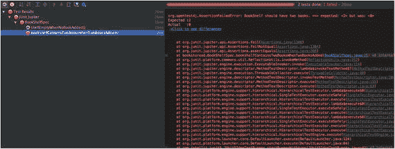
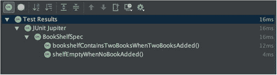
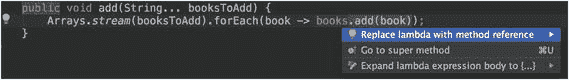
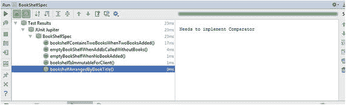
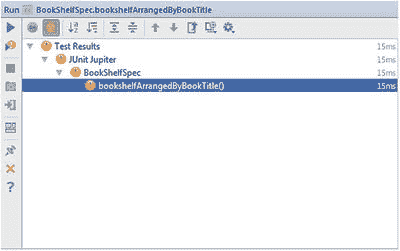
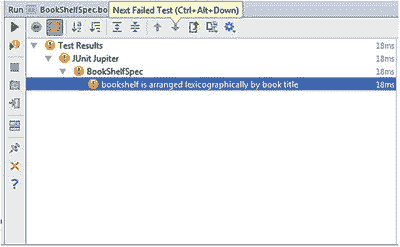
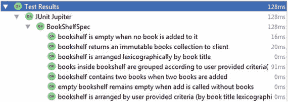
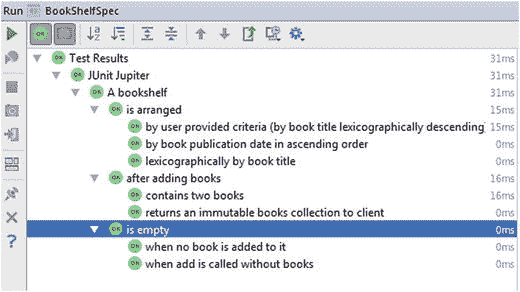

# 3. 使用 JUnit 5 开发应用程序

在上一章中，我们学习了 JUnit 5 的基础知识以及 JUnit 5 如何执行测试。我们了解了 JUnit 5 的核心类和方法，以及它们如何相互交互。现在，我们有了坚实的基础来开始构建`bookstoread`应用程序。

在本章中，我们将付诸实践，构建我们在前几章中开始的应用程序的几个功能。我们将遵循测试驱动开发（TDD）实践，迭代地构建功能。这将帮助你掌握我们之前讨论过的 TDD 持续循环：RED ➤ GREEN ➤ REFACTOR。

在编写应用程序的过程中，你将学习并掌握 JUnit 5 的新特性。

## Bookstoread 应用程序

Bookstoread 是一个社交编目网站，允许用户创建虚拟书架，他们可以在其中添加想要阅读的书籍。他们将能够根据不同的标准（作者姓名、书名、出版年份等）来整理书架。此外，他们还可以标记阅读进度，并查看自己的进展如何。

在本节中，我们将构建应用程序的功能。

### 第一个功能

> 作为用户，我想将多本书添加到我的书架中，以便稍后阅读。

#### 编写一个会失败的测试

我们将从开发第一个功能开始：将多本书添加到书架。在第一章中，我们为这个用例编写了第一个测试用例，如下代码所示：

```
@Test
public void emptyBookShelfWhenNoBookAdded() {
BookShelf shelf = new BookShelf();
List books = shelf.books();
assertTrue(books.isEmpty(), () -> "BookShelf should be empty.");
}
```

为了使这个测试用例通过，我们只编写了刚好能使其通过的代码。

```
import java.util.Collections;
import java.util.List;
public class BookShelf {
public List books() {
return Collections.emptyList();
}
}
```

让我们编写第二个测试用例，它将验证如果我们向书架添加两本书，书架将包含两本书。我们将保持简单，使用`String`来表示书籍。我们将推迟到合适的时候再决定为书籍创建领域对象。我们的测试将帮助我们决定何时应该为书籍使用合适的类型。

```
@Test
void bookshelfContainsTwoBooksWhenTwoBooksAdded() {
BookShelf shelf = new BookShelf();
shelf.add("Effective Java");
shelf.add("Code Complete");
List books = shelf.books();
assertEquals(2, books.size(), () -> "BookShelf should have two books.");
}
```

在上述代码中，我们编写了一个测试用例，通过两次调用`BookShelf`对象的`add`方法向书架添加两本书。添加书籍后，我们在`BookShelf`上调用了`books`方法，并断言它包含两本书。

这个测试用例现在无法编译，因为我们还没有在`BookShelf`中定义`add`方法。在`BookShelf`类中创建`add`方法，如下代码所示，以便代码能够编译：

```
public void add(String bookToAdd) {
}
```

上述对`BookShelf`类的添加将使我们的代码能够编译。再次运行所有测试；这次`bookshelfContainsTwoBooksWhenTwoBooksAdded`测试用例将会失败，如图 3-1 所示。在图 3-1 中，我们可以看到之前的测试用例仍然有效。



图 3-1.

测试失败

每次都要运行所有测试用例，以确保之前的所有测试都是绿色的。随着你添加更多测试，确保之前的测试用例仍然正常工作非常重要。


#### 使测试通过

让我们编写以下代码使测试用例通过：

```
package bookstoread;
import java.util.ArrayList;
import java.util.List;
public class BookShelf {
private final List books = new ArrayList();
public List books() {
return books;
}
public void add(String bookToAdd) {
books.add(bookToAdd);
}
}
```

在上述代码中，我们执行了以下操作：

1.  创建了一个类型为 `List<String>` 的实例变量 `books` 用于存储书籍。
2.  修改了 `books` 方法，使其返回 `books` 实例变量。
3.  实现了 `add` 方法，将 `bookToAdd` 添加到 `books` 列表中。

运行测试用例，这次测试将通过（见图 3-2）。



图 3-2.

测试成功

#### 重构代码

现在我们有两个通过的测试，让我们看看是否有需要重构的地方。我们可以改进的一点是允许用户一次添加多本书。我们可以重构 `add` 方法，使其接受可变参数，而不是简单的 `String`。让我们进行这个修改。

```
public void add(String... booksToAdd) {
Arrays.stream(booksToAdd).forEach(book -> books.add(book));
}
```

在上述代码中，我们首先使用 Java 8 的 `Arrays.stream` 方法将 `booksToAdd` 转换为 `Stream<String>`，然后使用 Stream 的 `forEach` 方法将每本书添加到 `books` 集合中。

我们可以使用 Java 8 的方法引用来使 `add` 方法更简洁，如图 3-3 所示。



图 3-3.

用方法引用替换 lambda 表达式

```
public void add(String... booksToAdd) {
Arrays.stream(booksToAdd).forEach(books::add);
}
```

如果你使用的是 IntelliJ，则可以使用快捷键 ALT+Enter 将 lambda 表达式转换为方法引用，如下所示。

再次运行你的测试用例，以验证所有测试仍然通过。重构绝不应改变程序的行为，因此针对预期行为编写的测试应保持通过。如果你编写依赖于程序内部状态的测试，那么它们很可能在重构后失效。这就是我们建议你针对公共 API（应用程序编程接口）方法编写测试的原因，并且你的测试应记录预期行为，而非实现细节。

我们修改了 `add` 方法签名，以便 BookShelf 的客户端能够通过一次方法调用添加多本书。由于测试用例是你的代码的第一个客户端，它会告诉你是否可以改进 API。让我们重构测试用例，使其在一次方法调用中传递多本书。

```
@Test
public void bookshelfContainsTwoBooksWhenTwoBooksAdded() {
BookShelf shelf = new BookShelf();
shelf.add("Effective Java", "Code Complete");
List books = shelf.books();
assertEquals(2, books.size(), () -> "BookShelf should have two books.");
}
```

再次运行测试，所有测试应仍然通过。

#### 为异常场景添加测试用例

没有更多需要重构的内容了，让我们进入下一个测试用例。我们需要编写一个新的测试用例吗？如果你再次阅读用户故事，你会发现我们已经实现了该用户故事中预期的功能。但我们仍然可以编写一些额外的行为测试，以确保在异常情况下会发生什么。

让我们编写一个测试用例，测试调用 `add` 方法但不传递任何书籍的场景。我们期望得到一个空的书架，如下代码所示：

```
@Test
public void emptyBookShelfWhenAddIsCalledWithoutBooks() {
BookShelf shelf = new BookShelf();
shelf.add();
List books = shelf.books();
assertTrue(books.isEmpty(), () -> "BookShelf should be empty.");
}
```

运行测试以验证所有测试仍然通过。你会发现所有测试都是通过的。现在，我们确信如果调用 `add` 方法时不传递任何参数，也不会出现问题。

我们可以为该用户故事添加的最后一个测试用例是确保 `BookShelf` 的客户端无法修改 `books` 方法返回的书籍集合。

```
@Test
void booksReturnedFromBookShelfIsImmutableForClient() {
BookShelf shelf = new BookShelf();
shelf.add("Effective Java", "Code Complete");
List books = shelf.books();
try {
books.add("The Mythical Man-Month");
fail(() -> "Should not be able to add book to books");
} catch (Exception e) {
assertTrue(e instanceof UnsupportedOperationException, () -> "Should throw UnsupportedOperationException.");
}
}
```

在上述测试用例中，我们首先向书架添加了几本书，然后尝试向 `books` 集合中添加另一本书（该集合是通过调用 BookShelf 的 `books` 方法获得的）。我们期望向 `books` 集合添加书籍会抛出 `UnsupportedOperationException`。如果没有抛出异常，则通过调用 JUnit 的 `fail` 方法使测试失败。我们将在第 5 章详细介绍如何测试异常。JUnit 5 显著改进了编写异常测试的方式。敬请期待！

再次运行所有测试用例。我们的新测试用例将会失败，因为从 `books` 方法获得的集合是可变的，所以我们能够成功地向其中添加一本书。

为了使测试通过，我们将修改 `books` 方法，使其返回一个不可变列表，如下代码片段所示：

```
public List books() {
return Collections.unmodifiableList(books);
}
```

再次运行测试，所有测试应通过。

#### 使用 @BeforeEach

如果我们查看测试用例，会发现每个测试的初始化代码都是重复的。我们可以将这段代码提取到一个方法中，并使用 `@BeforeEach` 进行注解。

```
public class BookShelfSpec {
private BookShelf shelf;
@BeforeEach
void init() throws Exception {
shelf = new BookShelf();
}
@Test
public void emptyBookShelfWhenNoBookAdded() {
List books = shelf.books();
assertTrue(books.isEmpty(), () -> "BookShelf should be empty.");
}
@Test
void bookshelfContainsTwoBooksWhenTwoBooksAdded() {
shelf.add("Effective Java", "Code Complete");
List books = shelf.books();
assertEquals(2, books.size(), () -> "BookShelf should have two books.");
}
// 为简洁起见，其余代码已删除
}
```

再次运行所有测试以验证它们仍然通过。现在代码状态良好，我们可以开始处理下一个功能了。

### 第二个功能

> 作为用户，我应该能够根据特定条件整理我的书架

#### 编写一个会失败的测试用例

下一个功能帮助用户根据特定条件整理书架。条件可以是书名、作者名、书籍出版日期，或者这些条件的组合。

让我们从按书名按字典序排列书籍开始这个功能。

```
@Test
void bookshelfArrangedByBookTitle() {
BookShelf shelf = new BookShelf();
shelf.add("Effective Java", "Code Complete","The Mythical Man-Month" );
List books = shelf.arrange();
assertEquals(Arrays.asList( "Code Complete", "Effective Java", "The Mythical Man-Month"), books, () -> "Books in a bookshelf should be arranged lexicographically by book title");
}
```

上述代码将无法编译，因为 `arrange` 方法未定义。为了使代码能够编译，让我们向 BookShelf 添加 `arrange` 方法。

```
public List arrange() {
return null;
}
```

运行所有测试用例，你会发现我们的新测试用例失败了。


#### 让测试通过

为了让测试用例通过，我们需要返回一个排序后的书籍集合。

```
public List arrange() {
books.sort(Comparator.naturalOrder());
return books;
}
```

运行测试用例，一切都会变绿。

你是否注意到上述实现存在一个问题？我们对底层集合进行了排序，这意味着如果在调用 `arrange` 方法之后再调用 `books` 方法，它也会返回一个已排序的集合。我们希望 `books` 方法能保持插入顺序。为此，我们来编写一个测试用例。

```
@Test
void booksInBookShelfAreInInsertionOrderAfterCallingArrange() {
BookShelf shelf = new BookShelf();
shelf.add("Effective Java", "Code Complete", "The Mythical Man-Month");
shelf.arrange();
List books = shelf.books();
assertEquals(Arrays.asList("Effective Java", "Code Complete", "The Mythical Man-Month"), books, () -> "Books in bookshelf are in insertion order");
}
```

这个测试用例将会失败。要修复此问题，我们必须返回一个新的已排序集合。

```
public List arrange() {
return books.stream().sorted().collect(Collectors.toList());
}
```

再次运行测试用例，所有测试都应该通过。

#### 重构

到目前为止，我们一直将书籍建模为简单的字符串。但是，我们希望用户能够根据不同的属性（如作者、出版日期等）对书籍进行排序。因此，我们应该捕获一本书的不同属性。这需要创建一个新类。

让我们在 `src/main/java/bookstoread` 包中创建一个新的 `Book` 类。

```
package bookstoread;
import java.time.LocalDate;
public class Book {
private final String title;
private final String author;
private final LocalDate publishedOn;
public Book(String title, String author, LocalDate publishedOn) {
this.title = title;
this.author = author;
this.publishedOn = publishedOn;
}
public String getTitle() {
return title;
}
public String getAuthor() {
return author;
}
public LocalDate getPublishedOn() {
return publishedOn;
}
@Override
public String toString() {
return "Book{" +
"title='" + title + '\'' +
", author='" + author + '\'' +
", publishedOn=" + publishedOn +
'}';
}
}
```

让我们修改测试，使用 `Book` 类而不是 `String`。由于每个测试中都使用相同的书籍，我们将它们提取出来作为测试初始化的一部分。

```
public class BookShelfSpec {
private BookShelf shelf;
private Book effectiveJava;
private Book codeComplete;
private Book mythicalManMonth;
@BeforeEach
void init() throws Exception {
shelf = new BookShelf();
effectiveJava = new Book("Effective Java", "Joshua Bloch", LocalDate.of(2008, Month.MAY, 8));
codeComplete = new Book("Code Complete", "Steve McConnel", LocalDate.of(2004, Month.JUNE, 9));
mythicalManMonth = new Book("The Mythical Man-Month", "Frederick Phillips Brooks", LocalDate.of(1975, Month.JANUARY, 1));
}
@Test
public void shelfEmptyWhenNoBookAdded() {
List books = shelf.books();
assertTrue(books.isEmpty(), () -> "BookShelf should be empty.");
}
@Test
public void bookshelfContainsTwoBooksWhenTwoBooksAdded() {
shelf.add(effectiveJava, codeComplete);
List books = shelf.books();
assertEquals(2, books.size(), () -> "BookShelf should have two books.");
}
@Test
public void emptyBookShelfWhenAddIsCalledWithoutBooks() {
shelf.add();
List books = shelf.books();
assertTrue(books.isEmpty(), () -> "BookShelf should be empty.");
}
@Test
public void booksReturnedFromBookShelfIsImmutableForClient() {
shelf.add(effectiveJava, codeComplete);
List books = shelf.books();
try {
books.add(mythicalManMonth);
fail(() -> "Should not be able to add book to books");
} catch (Exception e) {
assertTrue(e instanceof UnsupportedOperationException, () -> "Should throw UnsupportedOperationException.");
}
}
@Test
void bookshelfArrangedByBookTitle() {
shelf.add(effectiveJava, codeComplete, mythicalManMonth);
List books = shelf.arrange();
assertEquals(Arrays.asList(codeComplete, effectiveJava, mythicalManMonth), books, () -> "Books in a bookshelf should be arranged lexicographically by book title");
}
@Test
void booksInBookShelfAreInInsertionOrderAfterCallingArrange() {
shelf.add(effectiveJava, codeComplete, mythicalManMonth);
shelf.arrange();
List books = shelf.books();
assertEquals(Arrays.asList(effectiveJava, codeComplete, mythicalManMonth), books, () -> "Books in bookshelf are in insertion order");
}
}
```

这会导致代码编译失败。因此，我们必须修改 `BookShelf` 以使用 `Book` 而不是 `String`。将 `BookShelf` 的内容替换为以下代码所示的内容：

```
package bookstoread;
import java.util.*;
import java.util.stream.Collectors;
public class BookShelf {
private final List books = new ArrayList();
public List books() {
return Collections.unmodifiableList(books);
}
public void add(Book... booksToAdd) {
Arrays.stream(booksToAdd).forEach(books::add);
}
public List arrange() {
return books.stream().sorted().collect(Collectors.toList());
}
}
```

这将修复所有编译问题。再次运行测试用例，你会发现有几个与失败的 `arrange` 用例相关的测试用例。你将看到的异常消息如下代码片段所示：

```
java.lang.ClassCastException: bookstoread.Book cannot be cast to java.lang.Comparable
```

你可能已经猜到，原因是 `Book` 类没有实现 `Comparable` 接口。之前使用的 `sorted` 方法假设你要排序的对象实现了 `Comparable` 接口。修改 `Book` 类以实现 `Comparable` 接口，如下所示：

```
public class Book implements Comparable{
... // 为简洁起见已省略
@Override
public int compareTo(Book that) {
return this.title.compareTo(that.title);
}
}
```

再次运行测试用例，所有测试用例都将通过。

现在一切正常，让我们添加一个允许用户传入排序标准的测试用例。

```
@Test
void bookshelfArrangedByUserProvidedCriteria() {
shelf.add(effectiveJava, codeComplete, mythicalManMonth);
List books = shelf.arrange(Comparator.naturalOrder().reversed());
assertEquals(
asList(mythicalManMonth, effectiveJava, codeComplete),
books,
() -> "Books in a bookshelf are arranged in descending order of book title");
}
```

在上述代码中，我们从测试用例中传入了排序标准。我们希望按书名的逆字典序对书架进行排序。这段代码将无法编译。为了使其编译通过，我们需要修改现有的 `arrange` 方法以支持传入 `Comparator`，或者添加一个支持标准的新方法。我们将添加一个新方法，并保留旧方法用于自然排序（即按书名排序）。

```
public List arrange() {
return books.stream().sorted().collect(Collectors.toList());
}
public List arrange(Comparator criteria) {
return null;
}
```

这将使代码编译通过，但我们的新测试用例将会失败。为了让测试通过，我们将代码修改如下：

```
public List arrange() {
return books.stream().sorted().collect(Collectors.toList());
}
public List arrange(Comparator criteria) {
return books.stream().sorted(criteria).collect(Collectors.toList());
}
```

再次运行测试用例。这次所有测试用例都将通过。花点时间思考一下，你是否可以改进上述代码。你会注意到 `arrange` 方法中存在代码重复。我们可以像下面这样重构代码。

```
public List arrange() {
return arrange(Comparator.naturalOrder());
}
public List arrange(Comparator criteria) {
return books.stream().sorted(criteria).collect(Collectors.toList());
}
```

再次运行测试用例，所有测试用例将再次通过。你还可以再编写一个测试用例，按出版日期对书架进行排序。

在开发下一个功能之前，让我们先讨论一下 JUnit 5 的更多特性。


### 禁用测试

有时测试因合理原因而失败。避免因忽略执行失败测试而头疼的方法之一是使用 `@Disabled` 注解。其意图与 JUnit 4 的 `@Ignore` 注解类似。

如果测试被标记为 `@Disabled`，则 JUnit 引擎不会运行它。该注解也可用于类级别。如果某个类被标记了 `@Disabled` 注解，那么它将跳过该类中的所有测试。`@Disabled` 注解接受一个字符串作为可选参数，当测试被跳过时，该字符串会打印在控制台上。另请注意，JUnit 引擎会打印总体统计信息，其中包含被忽略、失败和已执行测试的总数。

有多种方法可以忽略测试用例的执行。我们可以从方法/类中移除 `@Test` 注解。但这不仅会停止测试的执行，还会停止测试的发现。该测试用例将不再出现在 JUnit 统计信息中。使用 `@Disabled` 注解显式禁用测试，远比删除它或移除 `@Test` 注解要好得多。

让我们将 `bookshelfArrangedByBookTitle` 测试标记为 `@Disabled`，如下面的代码片段所示：

```
@Disabled("需要实现 Comparator")
@Test
void bookshelfArrangedByBookTitle() {
shelf.add(effectiveJava, codeComplete, mythicalManMonth);
List books = shelf.arrange();
assertEquals(asList(codeComplete, effectiveJava, mythicalManMonth), books, () -> "书架上的书籍应按书名按字典序排列");
}
```

图 3-4 展示了 IntelliJ 如何显示一个被禁用的测试。



图 3-4.

被禁用的测试

### AssertJ

断言是测试类的关键部分，因为它们提供了结果验证。JUnit 5.0 提供了一组最少的断言 API。JUnit 平台只关心断言结果，而不关心断言 API。有许多第三方 API 可以帮助我们编写富有表现力的断言。旧版本的 JUnit 曾嵌入 Hamcrest 库来直接提供此功能。但新版本已弃用 Hamcrest；相反，它推荐使用 AssertJ 来完成这项工作。

AssertJ [`http://joel-costigliola.github.io/assertj/`](http://joel-costigliola.github.io/assertj/) 是编写断言的事实标准之一。它提供了丰富的流畅 API 来断言各个方面。总体而言，它带来了测试用例可读性和可维护性的好处。

在 `bookshelfArrangedByUserProvidedCriteria` 测试用例中，我们尝试将书籍的顺序与预期顺序进行比较。我们认为，该测试用例在验证结果时存在一个小问题。它比较两个不同的集合来检查元素顺序，但没有验证结果中的元素是否根据提供的比较器进行了排序。

假设我们将比较器改为自然顺序。这将改变结果的完整顺序。但失败的测试用例会提供一个错误，要求将顺序更正为降序。

```
预期 :[Book{title='人月神话', author='弗雷德里克·布鲁克斯', publishedOn=1975-01-01}, Book{title='Effective Java', author='约书亚·布洛克', publishedOn=2008-05-08}, Book{title='代码大全', author='史蒂夫·麦康奈尔', publishedOn=2004-06-09}]
实际   :[Book{title='代码大全', author='史蒂夫·麦康奈尔', publishedOn=2004-06-09}, Book{title='Effective Java', author='约书亚·布洛克', publishedOn=2008-05-08}, Book{title='人月神话', author='弗雷德里克·布鲁克斯', publishedOn=1975-01-01}]
```

如果我们查看测试，代码按预期工作，但断言结果中存在一个错误。如果我们能验证结果是按提供的比较器排序的，而不是将结果与另一个集合进行比较，那么我们可以大大改进这一点。AssertJ 正好允许我们这样做。让我们先在 build.gradle 的 dependencies 部分添加 AssertJ 依赖。

```
dependencies {
def junitVersion = '5.0.1'
testCompile 'org.junit.jupiter:junit-jupiter-api:' + junitVersion
testCompile 'org.junit.jupiter:junit-jupiter-engine:' + junitVersion
testCompile 'org.assertj:assertj-core:3.8.0'
}
```

现在，让我们使用 AssertJ 库的 `assertThat` 方法来修改测试用例。我们希望确保列表是使用提供的 Comparator 排序的。`assertThat` 断言是 `org.assertj.core.api.Assertions` 类的一部分，因此在使用该断言之前，我们必须导入该类。

```
import static org.assertj.core.api.Assertions.assertThat;
@Test
void bookshelfArrangedByUserProvidedCriteria() {
shelf.add(effectiveJava, codeComplete, mythicalManMonth);
Comparator reversed = Comparator.naturalOrder().reversed();
List books = shelf.arrange(reversed);
assertThat(books).isSortedAccordingTo(reversed);
}
```

上述测试用例更准确地表达了我们的意图。接下来，我们将进一步探索 AssertJ 库来执行我们的验证。

### 使用 @DisplayName

我们已经为我们开发的几个功能编写了一些测试用例。现在是时候讨论测试的一个重要方面——测试用例名称了。为测试用例命名是开发人员最困难的任务之一。测试的命名方式应使其在不查看测试代码的情况下，更容易找出测试失败的原因。

> 什么造就了干净的测试？三件事：可读性、可读性、还是可读性。可读性在单元测试中甚至可能比在生产代码中更重要。——鲍勃大叔

让我们看看它如何影响测试用例。在测试失败的情况下，`bookshelfArrangedByBookTitle` 的测试用例报告如图 3-5 所示。



图 3-5.

测试失败消息

失败信息不够描述性。我们需要查看日志或阅读测试代码来了解更多关于失败的信息。我们可以通过使用第 2 章讨论的 `@DisplayName` 注解来编写合适的测试名称，从而帮助自己（见图 3-6）。



图 3-6.

测试显示名称

```
@Test
@DisplayName("书架按书名以字典序排列")
void bookshelfArrangedByBookTitle() {
// 测试用例
}
```

测试用例名称相当具有描述性，并告诉我们书架没有按自然顺序排列。让我们尝试为我们所有的测试赋予有意义的描述。最终的测试运行应如图 3-7 所示。



图 3-7.

通过的测试

### 第三个功能

> 作为用户，我应该能够根据特定标准对书架上的书籍进行分组


#### 编写一个会失败的测试

在“第二个功能”部分，我们了解了如何根据用户条件整理书架。现在，客户希望我们支持书架内的分组功能。他们希望我们首先支持按出版年份分组，后续再支持按用户提供的任意条件进行分组。

```
import static org.assertj.core.api.Assertions.assertThat;
@Test
@DisplayName("书架内的书籍按出版年份分组")
void groupBooksInsideBookShelfByPublicationYear() {
shelf.add(effectiveJava, codeComplete, mythicalManMonth, cleanCode);
Map<Year, List<Book>> booksByPublicationYear = shelf.groupByPublicationYear();
assertThat(booksByPublicationYear)
.containsKey(Year.of(2008))
.containsValues(Arrays.asList(effectiveJava, cleanCode));
assertThat(booksByPublicationYear)
.containsKey(Year.of(2004))
.containsValues(singletonList(codeComplete));
assertThat(booksByPublicationYear)
.containsKey(Year.of(1975))
.containsValues(singletonList(mythicalManMonth));
}
```

上述代码无法编译，因为 `groupByPublication` 方法不存在。让我们按照下面的代码片段添加该方法：

```
public Map<Year, List<Book>> groupByPublicationYear() {
return null;
}
```

这会使代码可编译，但我们仍需编写实现代码。

#### 让测试通过

我们将使用代码片段中所示的 `groupingBy` 收集器来实现测试方法。`groupingBy` 收集器接收一个键函数，我们根据该函数对集合进行分组。

```
public Map<Year, List<Book>> groupByPublicationYear() {
return books
.stream()
.collect(Collectors.groupingBy(book -> Year.of(book.getPublishedOn().getYear())));
}
```

这将使所有测试变为绿色。

#### 重构

现在，让我们通过使代码通用化来改进它，以便客户端可以指定自己的分组条件。这将使我们的 API 灵活且可扩展。首先，我们将编写测试用例，根据不同的条件进行分组。

```
@Test
@DisplayName("书架内的书籍根据用户提供的条件分组（按作者姓名分组）")
void groupBooksByUserProvidedCriteria() {
shelf.add(effectiveJava, codeComplete, mythicalManMonth, cleanCode);
Map<String, List<Book>> booksByAuthor = shelf.groupBy(Book::getAuthor);
assertThat(booksByAuthor)
.containsKey("Joshua Bloch")
.containsValues(singletonList(effectiveJava));
assertThat(booksByAuthor)
.containsKey("Steve McConnel")
.containsValues(singletonList(codeComplete));
assertThat(booksByAuthor)
.containsKey("Frederick Phillips Brooks")
.containsValues(singletonList(mythicalManMonth));
assertThat(booksByAuthor)
.containsKey("Robert C. Martin")
.containsValues(singletonList(cleanCode));
}
```

代码无法编译，因为 `groupBy` 方法不存在。

```
public <K> Map<K, List<Book>> groupBy(Function<Book, K> fx) {
return books
.stream()
.collect(groupingBy(fx));
}
```

这将使所有测试用例变为绿色。现在我们将重构 `groupByPublicationYear`，使其使用 `groupBy` 方法。

```
public Map<Year, List<Book>> groupByPublicationYear() {
return groupBy(book -> Year.of(book.getPublishedOn().getYear()));
}
public <K> Map<K, List<Book>> groupBy(Function<Book, K> fx) {
return books
.stream()
.collect(groupingBy(fx));
}
```

运行测试用例，所有测试都应变为绿色。

### 嵌套测试

在一个编写良好的测试套件中，针对应用程序的不同功能会有多个测试。在我们的示例中，到目前为止，我们实现了三个功能，同时编写了近 10 个测试用例。这常常导致我们的测试类中测试用例激增。JUnit 5 提供了 `@Nested` 注解，以静态内部成员类的形式提供测试用例的逻辑分组。每个静态内部类都可以拥有自己的生命周期方法。这些方法将按层次顺序执行。此外，嵌套类可以标记 `@DisplayName`，使我们能够充分利用恰当的测试名称带来的好处。嵌套的层级没有限制。

对于我们的目的，我们可以按以下方式对各个功能进行分组：

```
@DisplayName("一个书架")
public class BookShelfSpec {
@BeforeEach
void init() {
// 为简洁起见，测试用例已移除
}
@Nested
@DisplayName("是空的")
class IsEmpty {
@Test
@DisplayName("当没有书籍添加到书架时")
public void emptyBookShelfWhenNoBookAdded() {
// 为简洁起见，测试用例已移除
}
@Test
@DisplayName("当调用 add 方法但未传入书籍时")
void emptyBookShelfWhenAddIsCalledWithoutBooks() {
// 为简洁起见，测试用例已移除
}
}
@Nested
@DisplayName("添加书籍后")
class BooksAreAdded {
@Test
@DisplayName("包含两本书")
void bookshelfContainsTwoBooksWhenTwoBooksAdded() {
// 为简洁起见，测试用例已移除
}
@Test
@DisplayName("向客户端返回不可变的书籍集合")
void bookshelfIsImmutableForClient() {
// 为简洁起见，测试用例已移除
}
}
}
// 为简洁起见，测试用例已移除
}
```

运行所有测试用例。生成的树形结构应表达出如图 3-8 所示的逻辑分组。



图 3-8.

嵌套测试

在本章开始时，我们并不知道书架的设计。随着我们逐步实现功能（和测试用例），我们发现书架是书籍的组合。将测试用例放在首位使我们的解决方案保持简单，同时让我们能够自由地为当前问题选择正确的设计。随着我们使用测试优先的方法开发更多功能，我们会发现这种方法迫使我们构建更多组件，从而推动整个应用程序设计的演进。

## 总结

在本章中，我们使用 JUnit 5.0 深入探讨了 TDD。在构建应用程序功能的过程中，我们体验了红-绿-重构循环。我们使用 `@BeforeEach` 来提取初始化过程。我们还使用了 AssertJ 来在测试断言中精确表达我们的意图。`@DisplayName` 帮助我们实现了更好的可读性。随着测试包的演进，我们还使用 `@Nested` 将其组织成逻辑分组。

在下一章中，我们将为 bookstoread 应用程序添加更多功能，并将使用 JUnit 的特性，如依赖注入、接口默认方法等。

