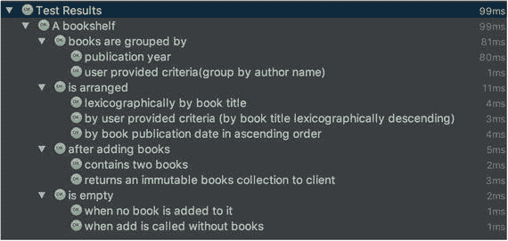
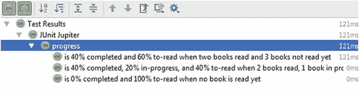
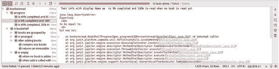
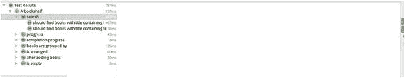
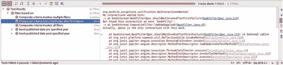
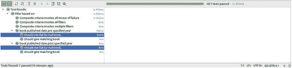

# 4. 依赖注入、模拟、测试特性与测试分组

在上一章中，我们开始构建 bookstoread 应用程序。我们遵循 TDD（测试驱动开发）实践并遵循红-绿-重构循环，为应用程序添加了一些功能。在编写应用程序的过程中，您了解了 JUnit 5 的核心概念，以及如何开始构建您的 JUnit 5 测试套件。本章将基于前三章获得的知识，涵盖单元测试的更高级概念。

在任何实际应用程序中，多个类将协作完成工作。这些依赖关系需要被妥善处理，以便您能够编写干净且隔离的测试。大多数情况下，测试代码中充斥着测试数据设置或协作者设置，这两者都会导致测试难以阅读和理解。

在本章中，我们首先介绍 JUnit 5 中引入的依赖注入支持，它可以使我们的测试数据设置无缝且无侵入性。然后，我们将了解模拟如何帮助我们轻松替换协作者。我们将使用一个模拟库 Mockito，它将负责创建和管理模拟对象。它提供了一个更高级别的 API（应用程序编程接口），我们用它来编写模拟对象应满足的期望，并验证这些期望是否得到满足。模拟和依赖注入是相互关联的，您将看到依赖注入如何帮助我们向测试中注入模拟对象。最后，我们将通过查看 JUnit 5 中的测试特性支持和定义测试分组的功能来结束本章。


## 依赖注入

在过去十年中，对简化软件设计非常有用的软件设计模式之一就是依赖注入（DI）。根据维基百科的定义：

> 依赖注入是一种技术，通过该技术，一个对象为另一个对象提供其依赖项。

DI 是 Java 生态系统中广泛使用的模式。它由 Spring 框架在 21 世纪初推广开来。DI 的核心在于使对象的依赖关系显式化。它简化了测试，因为你可以注入桩（stub）或模拟（mock）对象作为依赖项，从而让你能够控制并独立测试组件。DI 禁止在类内部使用 `new`（用于创建对象）或静态工厂方法。一个组件应暴露可被注入所需对象的方法或字段。DI 提供者将负责创建依赖项的实例，将其注入到所需组件中，并管理它们的生命周期。

JUnit 5 通过其扩展机制提供了对 DI 的支持。在 JUnit 5 中，你可以将依赖项注入到测试方法或构造函数中。这与早期版本的 JUnit 相比是一个重大变化，因为早期版本要求测试方法和构造函数必须是无参的。这使得测试代码更加灵活，因为你可以在需要的地方声明依赖项。

让我们看看如何使用 DI 来清理我们在第 3 章中编写的 `BookShelfSpec` 测试。如果你还记得，我们的 `BookShelfSpec` 在其 `@BeforeEach init` 方法中初始化了测试数据，如下代码所示：

```
public class BookShelfSpec {
private BookShelf shelf;
private Book effectiveJava;
private Book codeComplete;
private Book mythicalManMonth;
private Book cleanCode;
@BeforeEach
void init() {
shelf = new BookShelf();
effectiveJava = new Book("Effective Java", "Joshua Bloch", LocalDate.of(2008, Month.MAY, 8));
codeComplete = new Book("Code Complete", "Steve McConnel", LocalDate.of(2004, Month.JUNE, 9));
mythicalManMonth = new Book("The Mythical Man-Month", "Frederick Phillips Brooks", LocalDate.of(1975, Month.JANUARY, 1));
cleanCode = new Book("Clean Code", "Robert C. Martin", LocalDate.of(2008, Month.AUGUST, 1));
}
// 其余代码已省略，以保持简洁
}
```

上述代码存在几个问题。

*   测试代码与测试数据紧密耦合。如果我们想根据某些条件用不同的数据运行 `BookShelfSpec`，该怎么办？
*   我们无法重用测试数据。大多数情况下，多个测试类需要相同的数据。一种重用测试数据的方法是创建一个工具方法，调用该方法即可获取测试数据。这种解决方案可行，但它没有明确表达程序员的意图（即注入测试数据）。

现在，我们理解了要解决的问题，接下来学习 JUnit 5 如何帮助我们解决它。我们将从向 `init` 方法注入测试数据开始，如下代码所示：

```
public class BookShelfSpec {
private BookShelf shelf;
private Book effectiveJava;
private Book codeComplete;
private Book mythicalManMonth;
private Book cleanCode;
@BeforeEach
void init(Map books) {
shelf = new BookShelf();
this.effectiveJava = books.get("Effective Java");
this.codeComplete = books.get("Code Complete");
this.mythicalManMonth = books.get("The Mythical Man-Month");
this.cleanCode = books.get("Clean Code");
}
}
```

在上述代码中，我们将 `Map<String, Book>` 注入到了 `init` 方法中。Map 的键是书名，值是 Book 对象本身。为了尽量减少对测试的改动，我们将值赋给了不同的 Book 实例变量。这将确保我们所有的测试照常运行。我们的测试不再关心书籍测试数据的创建；相反，它们期望测试数据被注入进来。

DI API 允许我们在 JUnit 生命周期的所有阶段注入值。如果测试方法中存在带有 `@BeforeAll`、`@BeforeEach`、`@Test`、`@AfterEach` 或 `@AfterAll` 注解的参数，框架将尝试确定其值并进行注入。

但是 JUnit 5 将如何把测试数据注入到我们的 `init` 方法中呢？

JUnit 5 引入了 `ParameterResolver` 的概念，它提供了一个在运行时解析参数的 API。你可以使用内置的参数解析器，例如 `TestInfoParameterResolver`，或者通过实现 `ParameterResolver` 接口来提供你自己的解析器。`ParameterResolver` 是 JUnit 5 扩展机制的一部分，我们将在第 8 章中介绍。为了让你的测试识别自定义解析器，你应该使用 `ExtendWith` 注解来标注测试类，并为其提供解析器类，如下代码所示：

```
@DisplayName("一个书架")
@ExtendWith(BooksParameterResolver.class)
public class BookShelfSpec {
private BookShelf shelf;
private Book effectiveJava;
private Book codeComplete;
private Book mythicalManMonth;
private Book cleanCode;
@BeforeEach
void init(Map books) {
shelf = new BookShelf();
this.effectiveJava = books.get("Effective Java");
this.codeComplete = books.get("Code Complete");
this.mythicalManMonth = books.get("The Mythical Man-Month");
this.cleanCode = books.get("Clean Code");
}
// 其余代码已省略，以保持简洁
}
```

让我们看看实现 `BooksParameterResolver` 类需要做些什么。

```
import org.junit.jupiter.api.extension.ExtensionContext;
import org.junit.jupiter.api.extension.ParameterContext;
import org.junit.jupiter.api.extension.ParameterResolutionException;
import org.junit.jupiter.api.extension.ParameterResolver;
class BooksParameterResolver implements ParameterResolver {
@Override
public boolean supportsParameter(final ParameterContext parameterContext, final ExtensionContext extensionContext) throws ParameterResolutionException {
return false;
}
@Override
public Object resolveParameter(final ParameterContext parameterContext, final ExtensionContext extensionContext) throws ParameterResolutionException {
return null;
}
}
```

一个类需要实现 `ParameterResolver` 接口，才能被考虑用于参数解析。`ParameterResolver` 接口有两个方法，你的自定义实现必须实现它们。

*   `supportsParameter` 方法验证该实现是否能为所请求的参数提供解析。`BooksParameterResolver` 需要验证它是否支持 `Map<String, Book>` 类型的对象。
*   `resolveParameter` 方法返回所请求参数的值。`BooksParameterResolver` 返回一个包含书籍的 Map。

让我们以下面的方式查看 `BooksParameterResolver` 的完整实现：


```java
import org.junit.jupiter.api.extension.ExtensionContext;
import org.junit.jupiter.api.extension.ParameterContext;
import org.junit.jupiter.api.extension.ParameterResolutionException;
import org.junit.jupiter.api.extension.ParameterResolver;
import java.lang.reflect.Parameter;
import java.time.LocalDate;
import java.time.Month;
import java.util.HashMap;
import java.util.Map;
import java.util.Objects;
class BooksParameterResolver implements ParameterResolver {
@Override
public boolean supportsParameter(final ParameterContext parameterContext, final ExtensionContext extensionContext) throws ParameterResolutionException {
Parameter parameter = parameterContext.getParameter();
return Objects.equals(parameter.getParameterizedType().getTypeName(), "java.util.Map");
}
@Override
public Object resolveParameter(final ParameterContext parameterContext, final ExtensionContext extensionContext) throws ParameterResolutionException {
Map books = new HashMap();
books.put("Effective Java", new Book("Effective Java", "Joshua Bloch", LocalDate.of(2008, Month.MAY, 8)));
books.put("Code Complete", new Book("Code Complete", "Steve McConnel", LocalDate.of(2004, Month.JUNE, 9)));
books.put("The Mythical Man-Month", new Book("The Mythical Man-Month", "Frederick Phillips Brooks", LocalDate.of(1975, Month.JANUARY, 1)));
books.put("Clean Code", new Book("Clean Code", "Robert C. Martin", LocalDate.of(2008, Month.AUGUST, 1)));
books.put("Refactoring: Improving the Design of Existing Code", new Book("Refactoring: Improving the Design of Existing Code", "Martin Fowler", LocalDate.of(2002, Month.MARCH, 9)));
return books;
}
}
```

在上述代码中

*   我们实现了 `supportsParameter` 方法，该方法检查参数的参数化类型是否为 `java.util.Map<java.lang.String, bookstoread.Book>`。你必须执行字符串检查，因为这是检查参数化类型的唯一方法。`ParameterContext` 使用了 Java 8 的 Parameter API。在 JDK 8 之前，无法查询方法参数的相关信息。
*   接着，我们实现了 `resolveParameter` 方法，该方法返回一个包含测试数据的 Map。

现在，如果你运行 `BookShelfSpec`，所有测试都应该通过，如图 4-1 所示。



图 4-1.

注入测试数据后的测试执行结果

让我们再实现一个将在本章后续部分使用的功能。

## 功能：追踪书架进度

作为用户，我希望根据已阅读的书籍来追踪书架的阅读进度。

该功能的核心是为书架构建一个进度指标。`bookstoread` 的用户将持续阅读书籍并标记他们的进度。因此，我们需要向他们展示一个进度指示器，显示他们已完成多少。完整的指标包含三项内容。

*   待办：表示用户尚未阅读或开始阅读的书籍（占书架上总书籍）的百分比
*   已完成：表示用户已读完的书籍（占书架上总书籍）的百分比
*   进行中：表示用户已阅读部分内容的书籍（占书架上总书籍）的百分比

假设我们有一个书架，包含以下四本书：

*   Effective Java
*   Code Complete
*   Clean Code
*   The Mythical Man-Month

我们已读完 Clean Code，并且正在阅读 Effective Java。在这种情况下，完整的指标应显示：已完成 25%，进行中 25%，待办 50%。

让我们通过添加一个测试用例来开始构建该功能。我们将添加一个新的 Spec，如下代码所示：

```java
@DisplayName("A bookshelf progress")
public class BookShelfProgressSpec {
private BookShelf shelf;
private Book effectiveJava;
private Book codeComplete;
private Book mythicalManMonth;
private Book cleanCode;
private Book refactoring;
@BeforeEach
void init() {
shelf = new BookShelf();
effectiveJava = new Book("Effective Java", "Joshua Bloch", LocalDate.of(2008, Month.MAY, 8));
// 为简洁起见，省略部分代码
}
@Test
@DisplayName("is 0% completed and 100% to-read when no book is read yet")
void progress100PercentUnread() {
Progress progress = shelf.progress();
assertThat(progress.completed()).isEqualTo(0);
assertThat(progress.toRead()).isEqualTo(100);
}
}
```

上述测试用例将会失败。我们意识到 `BookShelf` 返回了一个 `Progress` 类的实例。`Progress` 类包含了完整的指标信息。该进度对象封装了所需的三个指标。

```java
public class Progress {
private final int completed;
private final int toRead;
private final int inProgress;
public Progress(int completed, int toRead, int inProgress) {
this.completed = completed;
this.toRead = toRead;
this.inProgress = inProgress;
}
public int completed() {         return this.completed;     }
public int toRead() {         return this.toRead;     }
public int inProgress() {         return this.inProgress;     }
}
```

`BookShelf` 提供了 `progress` API 来确定指标。

```java
public class BookShelf {
//  ....
// 为简洁起见，省略部分代码
public Progress progress() {     return new Progress(0, 100, 0); }
}
```

再次运行测试，现在应该通过了。

现在让我们构建另一个测试用例，其中我们已阅读了几本书。

```java
@Test
@DisplayName("is 40% completed and 60% to-read when 2 books are finished and 3 books not read yet")
void progressWithCompletedAndToReadPercentages() {
effectiveJava.startedReadingOn(LocalDate.of(2016, Month.JULY, 1));
effectiveJava.finishedReadingOn(LocalDate.of(2016, Month.JULY, 31));
cleanCode.startedReadingOn(LocalDate.of(2016, Month.AUGUST, 1));
cleanCode.finishedReadingOn(LocalDate.of(2016, Month.AUGUST, 31));
Progress progress = shelf.progress();
assertThat(progress.completed()).isEqualTo(40);
assertThat(progress.toRead()).isEqualTo(60);
}
```

进度只是一个报告指标。但要构建这个数字，我们需要追踪每本书的进度，正如上述测试用例中所做的那样。因此，我们现在必须向 `Book` 实体添加 `startedReadingOn` 和 `finishedReadingOn` 方法。

```java
public class Book implements Comparable {
// 为简洁起见，省略部分代码
public void startedReadingOn(LocalDate startedOn) {     this.startedReadingOn = startedOn; }
public void finishedReadingOn(LocalDate finishedOn) {     this.finishedReadingOn = finishedOn; }
public boolean isRead() {     return startedReadingOn != null && finishedReadingOn != null; }
}
```


请注意 `isRead` 方法。我们将使用该方法处理 `BookShelf` 中的书籍列表。我们可以将 `List<Books>` 转换为 Stream，然后使用 `isRead` 方法应用过滤器，以获取已读书籍的数量。

```
int booksRead = Long.valueOf(books.stream().filter(Book::isRead).count()).intValue();
```

现在，基于我们已有的内容，来实现 `BookShelf` 的 `progress` 方法。

```
public Progress progress() {
int booksRead = Long.valueOf(books.stream().filter(Book::isRead).count()).intValue();
int booksToRead = books.size() - booksRead;
int percentageCompleted = booksRead * 100 / books.size();
int percentageToRead = booksToRead * 100 / books.size();
return new Progress(percentageCompleted, percentageToRead, 0);
}
```

这应该能让测试重新通过。到目前为止，我们已经为“已完成”和“待办”添加了进度指示器。现在，让我们添加几个测试用例来计算“进行中”的书籍。为此，请在 `Book` 类中添加 `isProgress()` 方法，并使用它来过滤书籍流。

同样地，我们可以添加一个测试用例，覆盖 `BookShelf` 中所有书籍都已完成的情况。图 4-2 展示了所有与书架进度相关的测试用例成功执行的结果。



图 4-2.

BookShelf 进度测试成功执行

那么，这个功能就完成了吗？还没有完全完成，我们已经编写了测试和代码来让它们通过。我们仍然需要重构测试以进行改进。如果查看我们的测试用例，会发现确实没有什么可以改进的了。但现在让我们将 `BookShelfProgressSpec` 与 `BookShelfSpec`（在第 3 章中编写）进行比较。我们发现存在重复的测试数据设置。BookShelf 需要书籍才能工作。我们应该利用在“依赖注入”一节中学到的 DI 知识来改进这段代码。

让我们用 `ExtendWith` 注解标注 `BookShelfProgressSpec`，并为其提供 `BooksParameterResolver`。

```
@DisplayName("progress")
@ExtendWith(BooksParameterResolver.class)
class BookShelfProgressSpec {
// 为简洁起见，其余部分已删除
}
```

运行 `BookShelfProgressSpec`，所有测试用例都应该通过。这样，我们就不必为两个测试用例重复测试数据了。`ParameterResolver` 使我们能够轻松地重用数据设置。此外，如果需要，我们可以在运行时切换解析器提供的数据，以便用其他数据进行测试。我们的测试用例并不关心 `Map<String, Book>` 是如何提供给它的。数据可以从数据库读取、从文件读取或在内存中创建。

### 缓存测试数据

JUnit 5 扩展机制会为测试类创建参数解析器的单个实例，但它会为每次注入点调用调用 `resolve` 方法。在我们的例子中，我们有一个注入点 `@BeforeEach init` 方法，但根据 `@BeforeEach` 的生命周期，它会为每个测试用例调用。这意味着每次测试执行时，我们都会得到一份新的测试数据副本。如果测试不改变数据状态并且是只读的，那么可以通过将 `Map<String, Book>` 存储在 `BooksParameterResolver` 类的实例变量中来避免每次都创建新副本，如下代码所示：

```
class BooksParameterResolver implements ParameterResolver {
private final Map books;
public BooksParameterResolver() {
Map books = new HashMap();
books.put("Effective Java", new Book("Effective Java", "Joshua Bloch", LocalDate.of(2008, Month.MAY, 8)));
// 为简洁起见，其余部分已删除
this.books = books;
}
@Override
public boolean supportsParameter(final ParameterContext parameterContext, final ExtensionContext extensionContext) throws ParameterResolutionException {
// 为简洁起见，其余部分已删除
}
@Override
public Map resolveParameter(final ParameterContext parameterContext, final ExtensionContext extensionContext) throws ParameterResolutionException {
return books;
}
}
```

如果运行所有测试，你会注意到其中一个测试失败，如图 4-3 中的截图所示。



图 4-3.

缓存测试数据时测试失败

测试失败的原因是测试套件中的一个测试用例更改了测试数据的状态。该测试期望获得一份干净的测试数据副本，因此失败了。

链式团伙反模式：这种反模式指的是一组单元测试必须以特定顺序或作为一个整体进行处理。每个执行的测试都为下一个测试完成一些工作，因此它们相互依赖。

### 使用 ExtensionContext Store

到目前为止，在我们的测试用例中，我们在 `@BeforeEach init` 方法中注入了测试数据，然后将不同的书籍存储在实例变量中。如果我们想在 `init` 和 `test` 方法中都注入相同的测试数据，这样就不必将其存储在测试类实例变量中，该怎么办？我们目前看到的两种方法都不能解决这个用例。

*   为每次调用创建测试数据会传递一份新的测试数据副本。
*   当另一个测试更改测试数据状态时，为测试类中的所有测试缓存测试数据将会失败。

为了寻找可能的解决方案，让我们深入研究 JUnit API 的细节。`resolve` 方法接受两个参数。

*   `ParameterContext`：包含所请求参数的详细信息。
*   `ExtensionContext`：包含当前测试的上下文。每次测试执行都会创建自己的 `ExtensionContext`。该上下文包含测试方法、ID 等详细信息。

除了测试特定的详细信息外，上下文还提供了 `ExtensionContext.Store`，可用于保存特定上下文执行的数据。

*   `Store getStore()`
*   `Store getStore(Namespace namespace)`

Store 是一个键值持有者，提供 get 和 put 方法。每个 Store 实例都由一个命名空间唯一标识，该命名空间可用于创建新的 Store。在每个测试的 `ExtensionContext` 中，都有一个可用的默认命名空间，但建议创建一个自定义命名空间来唯一标识你的数据，并避免任何数据损坏问题。现在修改 `BooksParameterResolver`，使其使用 `ExtensionContext.Store` 来存储自定义的 Books 命名空间，并从那里提供书籍数组。

```
class BooksParameterResolver implements ParameterResolver {
@Override
public Object resolveParameter(final ParameterContext parameterContext, final ExtensionContext extensionContext) throws ParameterResolutionException {
ExtensionContext.Store store = extensionContext.getStore(ExtensionContext.Namespace.create(Book.class));
return store.getOrComputeIfAbsent("books", k -> getBooks());
}
// 为简洁起见，其余部分已删除
}
```

运行所有测试，并验证它们是否通过。现在，测试代码已经处于良好状态，我们可以开始处理下一个功能了。

在进入下一节关于模拟的内容之前，让我们先构建另一个功能，这将帮助我们在实际场景中应用模拟。


## 功能：搜索书架

作为用户，我应该能够搜索我的书架。搜索结果可以根据书籍的不同属性（如作者和出版日期）进行筛选。

下一个功能为书架添加了搜索能力。作为用户，我们希望能在书架中找到特定的书名。搜索应基于部分文本匹配。这可能导致一个词条产生大量结果，因此可以通过传递附加信息（如出版日期或作者姓名）作为提示，将结果筛选到所需范围。

让我们从为书架添加一个简单的基于书名的搜索功能开始。

```
@Nested
@DisplayName("search")
class BookShelfSeachSpec {
@BeforeEach
void setup() {
shelf.add(codeComplete, effectiveJava, mythicalManMonth, cleanCode);
}
@Test
@DisplayName(" should find books with title containing text")
void shouldFindBooksWithTitleContainingText() {
List books = shelf.findBooksByTitle("code");
assertThat(books.size()).isEqualTo(2);
}
}
```

我们将省略 `findBooksByTitle` 方法的细节。读者必须尝试添加一个实现，使上述测试用例通过。

现在，让我们通过添加所需的提示来增强 API。在功能描述中，用户可能希望按出版日期搜索，因此我们应该为此添加一个测试用例。

```
@Test
@DisplayName(" should find books with title containing text and published after specified date.")
void shouldFilterSearchedBooksBasedOnPublishedDate() {
List books = shelf.findBooksByTitle("code", b -> b.getPublishedOn().isBefore(LocalDate.of(2014, 12, 31)));
assertThat(books.size()).isEqualTo(2);
}
```

这里我们使用了 `findBooksByTitle` 方法的一个新变体。现在回到书架类，添加这个重载方法。

```
public List findBooksByTitle(String title) {
return findBooksByTitle(title, b -> true);
}
public List findBooksByTitle(String title, Predicate filter) {
return books.stream()
.filter(b -> b.getTitle().toLowerCase().contains(title))
.filter(filter)
.collect(toList());
}
```

让我们运行测试。它们都通过了，那么，我们是否应该继续？也许为作者姓名添加一个测试？首先，我们问问自己，双参数的 `findBooksByTitle` API 是否正确？上述实现是低层次的，无法充分表达过滤器的概念。该设计没有说明任何关于过滤器及其用途的信息。因此，尽管这个 API 能工作并达到目的，但它不符合所需的标准。

**基本类型偏执**

这是一种设计坏味道，指的是将业务领域概念表示为低层次类型。它意味着系统缺少必要的抽象。在这种情况下，我们基于基本类型构建交互，从而暴露了太多细节，使得代码难以理解和维护。

在上述场景中，我们需要构建 `BookFilter` 的概念。可能存在多种 `BookFilter` 的变体，它们可以执行不同类型的过滤。

```
public interface BookFilter {
boolean apply(Book b);
}
```

同时修改 `findBooksByTitle` API，使其使用 `BookFilter` 而不是 `java.util.function.Predicate`。

```
public List findBooksByTitle(String title, BookFilter filter) {
return books.stream()
.filter(b -> b.getTitle().toLowerCase().contains(title))
.filter(b -> filter.apply(b))
.collect(toList());
}
```

我们的测试用例无需任何修改即可正常工作。我们添加了一个函数式接口 `BookFilter`，测试用例中的 lambda 表达式提供了该接口所需的实现（参见图 4-4）。



图 4-4.

搜索相关测试成功执行

现在我们已经添加了 `BookFilter` 的概念，我们希望构建一些过滤器，比如出版年份过滤器，用于筛选在指定年份之后出版的书籍。让我们添加一个简单的测试用例 `BookPublishedFilterSpec`。

```
class BookFilterSpec {
private Book cleanCode;
private Book codeComplete;
@BeforeEach
void init() {
cleanCode = new Book("Clean Code", "Robert C. Martin", LocalDate.of(2008, Month.AUGUST, 1));
codeComplete = new Book("Code Complete", "Steve McConnel", LocalDate.of(2004, Month.JUNE, 9));
}
@Nested
@DisplayName("book published date")
class BookPulishedFilterSpec{
@Test
@DisplayName("is after specified year")
void validateBookPublishedDatePostAskedYear(){
BookFilter filter = BookPublishedYearFilter.After(2007);
assertTrue(filter.apply(cleanCode));
assertFalse(filter.apply(codeComplete));
}
}
}
```

在前面的测试用例中，我们测试了 `BookPublishedYearFilter`。该过滤器确保书籍必须在指定年份之后出版。现在为其添加实现，使测试用例通过。

```
class BookPublishedYearFilter implements BookFilter {
private LocalDate startDate;
static BookPublishedYearFilter After(int year) {
BookPublishedYearFilter filter = new BookPublishedYearFilter();
filter.startDate = LocalDate.of(year, 12, 31);
return filter;
}
@Override
public boolean apply(final Book b) {
return b.getPublishedOn().isAfter(startDate);
}
}
```

类似于“之后年份”过滤器，我们想添加一个“之前年份”过滤器，用于查找在指定年份之前出版的书籍。作为练习，这部分留给读者完成。

运行测试用例，确保所有测试都通过（参见图 4-5）。


图 4-5.

测试成功执行

现在我们有了多个过滤器，我们希望构建一个 `CompositeFilter`，它可以将多个过滤器组合成一个单一的过滤器。让我们先为此添加一个测试用例。

```
@Test
@DisplayName("Composite criteria is based on multiple filters")
void shouldFilterOnMultiplesCriteria(){
CompositeFilter compositeFilter = new CompositeFilter();
compositeFilter.addFilter( b -> false);
assertFalse(compositeFilter.apply(cleanCode));
}
```

添加组合过滤器的实现以满足测试标准。

```
class CompositeFilter implements BookFilter {
private List filters;
CompositeFilter() {
filters = new ArrayList();
}
@Override
public boolean apply(final Book b) {
return filters.stream()
.map(bookFilter -> bookFilter.apply(b))
.reduce(true, (b1, b2) -> b1 && b2);
}
void addFilter(final BookFilter bookFilter) {
filters.add(bookFilter);
}
}
```

测试用例通过了，但有一个令人困扰的问题。组合过滤器是否调用了传入的过滤器？另外，我们如何为只涉及部分过滤器调用的场景添加测试用例？我们是否应该为此构建一些测试？

```
@DisplayName("Composite criteria does not invoke after first failure")
void shouldNotInvokeAfterFirstFailure(){
CompositeFilter compositeFilter = new CompositeFilter();
compositeFilter.addFilter( b -> false);
compositeFilter.addFilter( b -> true);
assertFalse(compositeFilter.apply(cleanCode));
}
@DisplayName("Composite criteria invokes all filters")
void shouldInvokeAllFilters(){
CompositeFilter compositeFilter = new CompositeFilter();
compositeFilter.addFilter( b -> true);
compositeFilter.addFilter( b -> true);
assertTrue(compositeFilter.apply(cleanCode));
}
```

在上述所有场景中，很难确定过滤器调用发生在哪个时间点。


### 模拟（Mocking）

到目前为止，在我们所有传递了 `BookFilter` 的测试用例中，我们都使用了 lambda 表达式。该表达式创建了一个 `BookFilter` 的实现，并将其传递给相应的方法。这些由测试生成的实现被称为模拟对象（即，真实系统实现的替代品）。创建模拟对象的目标之一是测试所需的行为。但是，基于 lambda 表达式的模拟只允许我们验证测试结果，而无法验证模拟的交互；也就是说，我们无法验证模拟实例是否被调用。这个问题在 `CompositeFilter` 中更为明显，因为它包含一个过滤器链。

使用模拟是一个好主意，因为它允许我们隔离地测试系统。但我们模拟的质量还不够好。我们需要改进模拟，以跟踪交互情况。我们可以将这些信息保存在一个外部数据结构中，比如 `Map`。

```
@Test
@DisplayName("Composite criteria invokes multiple filters")
void shouldFilterOnMultiplesCriteria(){
CompositeFilter compositeFilter = new CompositeFilter();
final Map invocationMap = new HashMap();
compositeFilter.addFilter( b -> {
invocationMap.put(1,true);
return true;
});
compositeFilter.apply(cleanCode);
}
```

上述解决方案看起来很不优雅。它包含了太多底层细节，使得测试用例难以理解。作为替代方案，我们可以构建一个 `MockFilter` 抽象，在其中跟踪调用情况。

```
class MockedFilter implements BookFilter {
boolean returnValue;
boolean invoked;
MockedFilter(boolean returnValue){
this.returnValue=returnValue;
}
@Override
public boolean apply(Book b) {
invoked= true;
return returnValue;
}
}
```

这种方法的问题在于，我们试图重新发明轮子。在任何项目中，随着我们开发更多组件，对模拟的需求都会增加。因此，对所有内容都使用模拟很快就会变得难以管理。

因此，作为上述问题的最终解决方案，我们应该尝试使用现有的某个模拟框架。这里我们将使用 Mockito。首先，在 `build.gradle` 中添加其依赖项：

```
dependencies {
def junitVersion = '5.0.1'
testCompile 'org.junit.jupiter:junit-jupiter-api:' + junitVersion
testCompile 'org.junit.jupiter:junit-jupiter-engine:' + junitVersion
testCompile 'org.assertj:assertj-core:3.5.2'
testCompile 'org.mockito:mockito-core:2.+'
}
```

这会将 Mockito 库添加到我们项目的测试类路径中。要使用它，我们必须执行以下步骤：

*   使用 `Mockito.mock()` API 生成模拟对象。
*   使用 `Mockito.when` 记录所需的调用。`when` API 可以与 `thenXXX` API 链接以返回值。当测试用例进行所需调用时，这些记录的交互将被重放。
*   在测试结束时，验证与模拟对象发生的所有交互。

现在，我们的复合过滤器测试用例看起来如下：

```
@Test
@DisplayName("Composite criteria does not invoke after first failure")
void shouldNotInvokeAfterFirstFailure() {
CompositeFilter compositeFilter = new CompositeFilter();
BookFilter invokedMockedFilter = Mockito.mock(BookFilter.class);
Mockito.when(invokedMockedFilter.apply(cleanCode)).thenReturn(false);
compositeFilter.addFilter(invokedMockedFilter);
BookFilter nonInvokedMockedFilter = Mockito.mock(BookFilter.class);
Mockito.when(nonInvokedMockedFilter.apply(cleanCode)).thenReturn(true);
compositeFilter.addFilter(nonInvokedMockedFilter);
assertFalse(compositeFilter.apply(cleanCode));
Mockito.verify(invokedMockedFilter).apply(cleanCode);
Mockito.verifyZeroInteractions(nonInvokedMockedFilter);
}
@Test
@DisplayName("Composite criteria invokes all filters")
void shouldInvokeAllFilters() {
CompositeFilter compositeFilter = new CompositeFilter();
BookFilter firstInvokedMockedFilter = Mockito.mock(BookFilter.class);
Mockito.when(firstInvokedMockedFilter.apply(cleanCode)).thenReturn(true);
compositeFilter.addFilter(firstInvokedMockedFilter);
BookFilter secondInvokedMockedFilter = Mockito.mock(BookFilter.class);
Mockito.when(secondInvokedMockedFilter.apply(cleanCode)).thenReturn(true);
compositeFilter.addFilter(secondInvokedMockedFilter);
assertTrue(compositeFilter.apply(cleanCode));
Mockito.verify(firstInvokedMockedFilter).apply(cleanCode);
Mockito.verify(secondInvokedMockedFilter).apply(cleanCode);
}
```

让我们运行它！但现在有一个测试失败了，如图 4-6 所示。



图 4-6.

模拟检测到失败

嗯，如果我们查看失败消息，它清楚地表明没有预期任何交互，但模拟对象被一个 lambda 表达式调用了。我们没有预料到这一点，但 `CompositeFilter` 的行为并非如此。它总是调用完整的过滤器链，而不考虑最终结果。对于我们的业务场景，这种行为没有太大区别。但该测试用例很好地记录了过滤器的预期行为。让我们修改测试用例使其通过。

在前面的章节中，我们使用 Mockito 来发现 `CompositeFilter` 的行为。该部分旨在简要介绍模拟框架，并未详细涵盖。请参考 Mockito 文档以了解更多关于其功能的信息。

### 测试特性（Testing Traits）

现在，我们有一堆 `BookFilter`，我们可以期望它们具有一组共同的行为。每个过滤器都有自己的测试场景。但对于所有过滤器，我们都缺少边界条件测试用例。如果使用空书（null book）调用过滤器，它应该失败还是抛出异常？

在这种情况下，当期望有共同行为时，我们应该避免为每个过滤器构建单独的测试。与其为每个过滤器添加单独的测试方法，不如为上述场景编写一个测试用例，并将其作为接口的默认方法添加。该方法必须使用 `@Test` 注解。

```
interface FilterBoundaryTests {
BookFilter get();
@Test
@DisplayName("should not fail for null book.")
default void nullTest() {
assertThat(get().apply(null)).isFalse();
}
}
```

需要注意的是，接口的默认方法实现了完整的测试用例。像被测对象这样的内容可以作为接口方法提出，由实现类来实现。我们现在可以在现有的 `FilterSpecs` 中实现前面的接口，从而在每个测试类中实现 `get()` 方法。结果，`nullTest()` 将成为每个测试类的一部分。



图 4-7.

默认测试

```
class BookPublishedBeforeFilterSpec implements FilterBoundaryTests {
BookFilter filter;
@BeforeEach
void init() {
filter = BookPublishedYearFilter.Before(2007);
}
@Override
public BookFilter get() {
return filter;
}
// 为简洁起见，其余部分已移除
}
```

除了测试方法之外，接口还可以为 `@BeforeEach` 和 `@AfterEach` 生命周期事件提供默认方法。这些生命周期方法将针对测试类中的每个测试被调用。

默认方法不能参与 `@BeforeAll` 和 `@AfterAll` 生命周期事件。只有接口的静态方法才能参与这些事件。


### 按标签对测试进行分组

在大多数项目中，测试具有多种特性。例如，有些测试运行缓慢，有些运行快速，还有些则与环境相关。因此，我们希望能在测试套件中区分这些测试，并将它们组织成相似的组。这种分组背后的理念是，我们可以选择一个组，并根据需求执行它。JUnit 5 允许我们通过使用 `@Tag` 注解在测试上标记这些特性。一个测试可以被标记为“慢速”、“快速”、“夜间运行”等。在测试类/方法上标记标签后，我们可以在集成开发环境（IDE）/构建工具运行器中选择该标签。这将选中所有标记了所需标签的测试并执行它们。`@Tag` 注解是一个 `java.lang.annotation.Repeatable` 注解。因此，我们可以多次向测试方法/类添加该注解，从而为其添加多个元数据。

在编写本书时，IntelliJ IDEA 尚未提供任何处理标签的选项。它仍在发布里程碑版本以支持 JUnit 5 的所有功能。

需要注意的是，标签信息仅限于 JUnit 测试运行器。元信息也是 `TestInfo` 对象的一部分。该对象可以被注入到生命周期方法中，以执行一些相关操作。

```
@BeforeEach
void setup(Book[] books, TestInfo info) {
System.out.println(" 测试标签是 :  "+ info.getTags());
}
@Tag("nightly")
@Tag("generate-progress")
@Test
@DisplayName("当两本书已读且三本书未读时，完成度为 40%，待读度为 60%")
void progressWithCompletedAndToReadPercentages(Book[] books) {
// 为简洁起见已删除
}
```

JUnit 4 API 包含 `@Category` 注解，用于标记带有元信息的测试，这些元信息可用于构建测试组。该 API 在 JUnit 5 中已不再可用。

## 总结

在本章中，我们通过添加几个新功能增强了 `bookstoread` 应用程序。在此过程中，我们使用了依赖注入，并利用假设来验证测试前置条件。我们还快速学习了 JUnit 扩展模型。本书将在后续章节中更详细地讨论这个主题。

我们发现业务领域概念应被表达为系统中的抽象。所有这些抽象都可以通过模拟进行单元测试。我们发现可以为接口构建模拟实现，但使用像 Mockito 这样的模拟框架效率更高。最后，我们讨论了如何使用接口中的默认方法来测试抽象的共同行为。

在第 5 章中，我们将学习 JUnit 5 中新增的异常处理改进。

