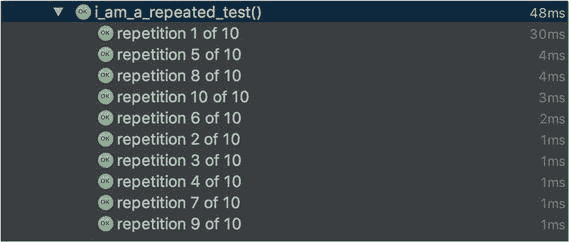
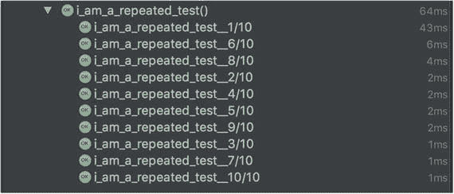

# 5. 测试异常

到目前为止，本书中我们还没有过多讨论如何使用 JUnit 5 处理异常。作为程序员，我们知道异常会发生，并且必须验证异常是否在预期时被抛出。在本章中，你将学习如何使用 JUnit 5 支持的各种方式来处理异常。我们将在本章末尾讨论 JUnit 5 对重复测试执行的支持。当需要处理不稳定的测试时，重复测试执行会很有帮助。当一个测试在相同的代码基础上既表现出通过又表现出失败的结果时，该测试就是不稳定的。

## 上下文设置

让我们考虑一个用例，以确保当添加的书籍超过其容量时，`BookShelf` 会抛出异常。如下面的代码所示，当我们尝试添加的书籍超过 `BookShelf` 容量时，会抛出 `BookShelfCapacityReached` 异常。

```
public void add(Book... booksToAdd) throws BookShelfCapacityReached {
Arrays.stream(booksToAdd).forEach(book -> {
if (books.size() == capacity) {
throw new BookShelfCapacityReached(String.format("BookShelf capacity of %d is reached. You can't add more books.", this.capacity));
}
books.add(book);
});
}
```

## 原始方法：使用 try-catch-fail

当处理可能抛出异常的代码时，首先必须创建一个会抛出异常的条件，然后必须验证它是否是预期的异常。此外，你可能还想验证异常中包含的消息。在前面显示的代码中，我们可以通过向容量为 2 的 `BookShelf` 添加书籍来在测试中创建异常条件。

```
@Test
void throwsExceptionWhenBooksAreAddedAfterCapacityIsReached() {
BookShelf bookShelf = new BookShelf(2);
bookShelf.add(effectiveJava, codeComplete);
bookShelf.add(mythicalManMonth);
}
```

运行代码会导致测试失败，因为 `bookShelf.add(mythicalManMonth)` 这一行会抛出异常。这不是我们想要的。测试用例不仅要引发异常，还要验证异常。代码的预期行为是引发异常；因此测试应该成功，而不是失败。

处理异常的经典方法是使用 Java 内置的 try-catch 机制。try 块将包装会抛出异常的代码，而 catch 块允许我们捕获代码抛出的异常。

始终在 try-catch 块中捕获特定的异常。

```
@Test
void throwsExceptionWhenBooksAreAddedAfterCapacityIsReached() {
BookShelf bookShelf = new BookShelf(2);
bookShelf.add(effectiveJava, codeComplete);
try {
bookShelf.add(mythicalManMonth);
} catch (BookShelfCapacityReached expected) {
assertEquals("BookShelf capacity of 2 is reached. You can't add more books.", expected.getMessage());
}
}
```

在上述代码中，我们将 `bookShelf.add` 语句包装在 try-catch 块中。我们捕获了 `BookShelfCapacityReached` 异常，并验证了消息是否符合预期。

上述测试用例完整吗？不，即使 `bookshelf.add` 语句没有抛出异常，它也会通过。为了确保在未引发异常时测试失败，我们调用 `org.junit.jupiter.api.Assertions.fail` 方法来实现预期的行为，如下面的代码所示：

```
@Test
void throwsExceptionWhenBooksAreAddedAfterCapacityIsReached() {
BookShelf bookShelf = new BookShelf(2);
bookShelf.add(effectiveJava, codeComplete);
try {
bookShelf.add(mythicalManMonth);
fail("Should throw BookShelfCapacityReached exception as more books are added than shelf capacity.");
} catch (BookShelfCapacityReached expected) {
assertEquals("BookShelf capacity of 2 is reached. You can't add more books.", expected.getMessage());
}
}
```

try-catch-fail 方法自 JUnit 诞生以来就一直存在。它仍然是一种有效的方法，但大多数情况下，使用现代方法会更好。


## JUnit 4 方式：@Test 注解与 Rule API

你也会认同之前讨论的 try-catch-fail 方法既冗长又丑陋。它会导致代码难以阅读和维护。在 JUnit 5 之前，处理异常的两种推荐方式是：

*   **使用 @Test 注解的 expected 属性**：旧版 JUnit 的 `@Test` 注解支持指定一个参数来标识预期异常的类型。这使得异常测试变得简单，如下代码所示。

    ```
    @Test(expected=BookShelfCapacityReached.class)
    public void throwsExceptionWhenBooksAreAddedAfterCapacityIsReached() {
    BookShelf bookShelf = new BookShelf(2);
    bookShelf.add(effectiveJava, codeComplete);
    bookShelf.add(mythicalManMonth);
    }
    ```

    如果在测试执行期间抛出了 `BookShelfCapacityReached` 异常，则上述测试通过。否则，测试将失败。这种方法有两个缺点：
    *   你无法缩小抛出异常的代码范围。
    *   你无法断言异常消息。JUnit 5 的 `@Test` 注解没有 `expected` 属性，因此这种方法将不起作用。
*   **使用 ExpectedException 规则**：JUnit 4 支持的另一种更具扩展性的方法是使用 `ExpectedException` 规则。JUnit Rule API 提供了对代码执行过程中发生情况的更多控制。`ExpectedException` 是 JUnit 4 自身提供的内置规则之一。

    ```
    public class BookShelfSpecWithRules {
    @Rule
    public ExpectedException expectedException = ExpectedException.none();
    @Test
    void throwsExceptionWhenBooksAreAddedAfterCapacityIsReached() {
    BookShelf bookShelf = new BookShelf(1);
    expectedException.expect(BookShelfCapacityReached.class);
    expectedException.expectMessage("BookShelf capacity of 1 is reached. You can't add more books.");
    bookShelf.add(effectiveJava, codeComplete);
    }
    }
    ```

    在上述代码中，我们首先创建了一个 `ExpectedException` 实例，然后告诉 `expectedException` 规则我们在测试执行期间期望什么。JUnit 4 的规则机制允许我们验证抛出的异常和消息。这种方法也存在局限性，即我们无法缩小抛出异常的代码范围。这意味着你的测试可能因为错误的原因而通过。

JUnit 5 对 Rule API 的支持有限。JUnit 5 支持 `ExpectedException` 规则。这意味着你仍然可以运行使用 `ExpectedException` Rule API 编写的现有测试。我们将在本章后面介绍它。

## JUnit 5 方式：使用 assertThrows 断言方法

JUnit 5 的 `Assertions` 类提供了一个 `org.junit.jupiter.api.Assertions.assertThrows` 方法，让你能够以清晰易读的方式编写代码来验证异常及其关联消息。它还允许你缩小抛出异常的代码范围，从而避免 JUnit 4 方法的问题。以下代码重构了测试用例以使用 `assertThrows` 方法：

```
@Test
void throwsExceptionWhenBooksAreAddedAfterCapacityIsReached() {
BookShelf bookShelf = new BookShelf(2);
bookShelf.add(effectiveJava, codeComplete);
BookShelfCapacityReached throwException = assertThrows(BookShelfCapacityReached.class, () -> bookShelf.add(mythicalManMonth));
assertEquals("BookShelf capacity of 2 is reached. You can't add more books.", throwException.getMessage());
}
```

`assertThrows` 方法接受这些参数——预期的异常类和一个类型为 `org.junit.jupiter.api.function.Executable` 的 lambda 表达式。

`Executable` 用于封装一段可能抛出异常的代码。`Executable` 函数式接口类似于 Java 内置的 `java.lang.Runnable` 接口，唯一的区别在于 `Runnable` 在其声明中不使用 `throws` 子句。这意味着你的 lambda 表达式必须捕获受检异常，然后重新抛出非受检异常。你可以通过编写自己的使用 `throws` 子句的函数式接口来避免这种麻烦。这正是 `Executable` 接口所做的。创建函数式接口的另一个优点是允许使用与你领域相对应的名称。`Executable` 告诉我们这个 lambda 封装了一次代码执行。

```
@FunctionalInterface
public interface Executable {
void execute() throws Throwable;
}
```

`assertThrows` 返回捕获到的异常，我们在下一条语句中使用它来断言异常消息，如前面的代码示例所示。

## 在 JUnit 5 中使用 JUnit 4 的 ExpectedException 规则

JUnit 5 对 JUnit 4 Rule API 的支持有限。这意味着你仍然可以使用 JUnit 4 Rule API 编写/运行测试。对 Rule API 的支持定义在 `junit-jupiter-migration-support` 模块中。对于任何新测试，你应该使用 `assertThrows` 方法，但如果你有 JUnit 4 的代码库，则可以依赖此扩展。要使用 Rule API，首先将依赖项添加到你的构建工具中。如果你使用 Gradle，请将以下内容添加到你的 `build.gradle` 文件中。

```
testCompile 'org.junit.jupiter:junit-jupiter-migrationsupport:5.0.1'
```

Maven 用户可以将以下内容添加到他们的 `pom.xml` 中。

```
<dependency>
    <groupId>org.junit.jupiter</groupId>
    <artifactId>junit-jupiter-migrationsupport</artifactId>
    <version>5.0.1</version>
    <scope>test</scope>
</dependency>
```

添加依赖项后，你需要通过使用 `@EnableRuleMigrationSupport` 注解来注解你的测试类，以在测试用例中启用 Rule API 支持，如下代码所示。

```
import org.junit.Rule;
import org.junit.jupiter.api.Test;
import org.junit.jupiter.migrationsupport.rules.EnableRuleMigrationSupport;
import org.junit.platform.runner.JUnitPlatform;
import org.junit.rules.ExpectedException;
import org.junit.runner.RunWith;
@EnableRuleMigrationSupport
public class BookShelfSpecWithRules {
@Rule
public ExpectedException expectedException = ExpectedException.none();
@Test
void throwsExceptionWhenBooksAreAddedAfterCapacityIsReached() {
BookShelf bookShelf = new BookShelf(1);
expectedException.expect(BookShelfCapacityReached.class);
expectedException.expectMessage("BookShelf capacity of 1 is reached. You can't add more books.");
bookShelf.add(effectiveJava, codeComplete);
}
}
```

除了添加 `@EnableRuleMigrationSupport` 注解之外，你无需对代码库进行任何更改。

现在，你可以运行测试用例，它将成功通过。


## 异常处理扩展

如第 4 章所述，JUnit 5 通过其扩展 API 提供了可扩展性。我们将在第 7 章详细讨论扩展 API。JUnit 5 通过扩展 API 为开发者提供了扩展点。当测试结果出现异常时，会调用 `TestExecutionExceptionHandler` 扩展接口。假设我们有一个用例，需要记录测试用例抛出的所有异常。我们可以编写 `LoggingTestExecutionExceptionHandler`，如下列代码所示：

```
import org.junit.jupiter.api.extension.TestExecutionExceptionHandler;
import org.junit.jupiter.api.extension. ExtensionContext;
import java.util.logging.Level;
import java.util.logging.Logger;
public class LoggingTestExecutionExceptionHandler implements TestExecutionExceptionHandler {
private Logger logger = Logger.getLogger(LoggingTestExecutionExceptionHandler.class.getName());
@Override
public void handleTestExecutionException(ExtensionContext context, Throwable throwable) throws Throwable {
logger.log(Level.INFO, "Exception thrown ", throwable);
throw throwable;
}
}
```

接下来，你需要通过使用 `ExtendWith` 注解来注册你的扩展，并将 `LoggingTestExecutionExceptionHandler` 扩展传递给它，如下列代码所示：

```
@ExtendWith(LoggingTestExecutionExceptionHandler.class)
public class BookShelfSpecWithRules {
}
```

当你运行代码时，异常将被记录，如下所示。

```
bookstoread.LoggingTestExecutionExceptionHandler handleTestExecutionException
INFO: Exception thrown
bookstoread.BookShelfCapacityReached: BookShelf capacity of 1 is reached. You can't add more books.
at bookstoread.BookShelf.lambda$add$0(BookShelf.java:30)
at java.util.Spliterators$ArraySpliterator.forEachRemaining(Spliterators.java:948)
at java.util.stream.ReferencePipeline$Head.forEach(ReferencePipeline.java:580)
at bookstoread.BookShelf.add(BookShelf.java:28)
at bookstoread.BookShelfSpecWithRules.throwsExceptionWhenBooksAreAddedAfterCapacityIsReached(BookShelfSpecWithRules.java:27)
at sun.reflect.NativeMethodAccessorImpl.invoke0(Native Method)
at sun.reflect.NativeMethodAccessorImpl.invoke(NativeMethodAccessorImpl.java:62)
at sun.reflect.DelegatingMethodAccessorImpl.invoke(DelegatingMethodAccessorImpl.java:43)
at java.lang.reflect.Method.invoke(Method.java:498)
```

## 使用测试超时

当你不想让测试无限期等待时，超时非常有用。在 JUnit 的旧版本中，`@Test` 注解有一个属性用于提供超时值。JUnit 5 的测试注解不支持任何属性。相反，JUnit 5 提供了断言方法来帮助你处理这种情况。JUnit 5 对超时提供了广泛的支持。

让我们先看一个简单的测试用例，我们期望测试在一秒内完成。

```
@Test
void test_should_complete_in_one_second() {
assertTimeout(Duration.of(1, ChronoUnit.SECONDS), () -> Thread.sleep(2000));
}
```

这个测试将会失败，因为代码执行会休眠两秒钟。我们期望测试用例在一秒内成功完成。

`assertTimeout` 有许多重载变体。上面展示的那个接受两个参数——超时持续时间和可执行代码。当你运行前面提到的测试用例时，它会按预期失败。你可能期望测试在一秒后失败，但它会在两秒后失败。

原因是 `assertTimeout` 在与调用代码相同的线程中执行可执行代码。这意味着测试会等待代码执行完成后再抛出异常。这会导致测试在两秒后失败。在本地测试机器上，测试在 2 秒 40 毫秒后失败。

还有另一组 `assertTimeout` 的重载方法，它们接受 Duration 和 `ThrowingSupplier`。区别在于 `ThrowingSupplier` 返回一个值，而 Executable 不返回值。因此，当你想要断言代码执行返回的值时，应该使用 `assertTimeout ThrowingSupplier` 变体。

```
String message = assertTimeout(Duration.of(1, ChronoUnit.SECONDS), () -> "Hello, World!");
assertEquals("Hello, World!", message);
```

### assertTimeoutPreemptively

这个方法克服了 assertTimeout 的局限性。它确保测试在超时之前完成。它在与调用线程不同的线程中运行测试。当超过超时时间时，它会中止代码。

```
assertTimeoutPreemptively(Duration.of(1, ChronoUnit.SECONDS), () -> Thread.sleep(2000));
```

现在测试将在超时时间过后立即完成。

## 重复测试

JUnit 5 增加了对运行指定次数测试的支持。当你处理本质上不稳定的测试时，这至关重要。不稳定的测试是指那些在相同代码库下既表现出通过又表现出失败行为的测试。要运行一个测试 X 次，请使用 `RepeatedTest` 注解标记它，如下列代码所示：

```
@RepeatedTest(10)
void i_am_a_repeated_test() {
assertTrue(true);
}
```

这个测试将运行十次，你将在集成开发环境（IDE）的截图中看到测试结果，如图 5-1 所示。



图 5-1.

重复测试执行

你可以使用一组预定义的占位符来自定义测试的名称。

```
@RepeatedTest(value = 10, name = "i_am_a_repeated_test__{currentRepetition}/{totalRepetitions}")
void i_am_a_repeated_test() {
assertTrue(true);
}
```

当你运行测试时，你将在 IDE 中看到以下测试输出，如图 5-2 的截图所示。



图 5-2.

带名称的重复测试

## 总结

在本章中，你学习了如何在出现异常时断言测试的正确行为。你学习了如何应用各种策略来处理异常。

在第 6 章中，我们将讨论如何将 JUnit 5 与你的工具集成。我们将涵盖构建工具、代码覆盖率、IDE 以及更多内容。

