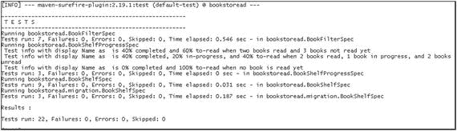
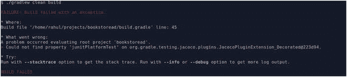
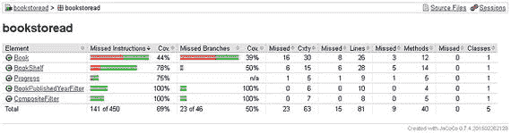
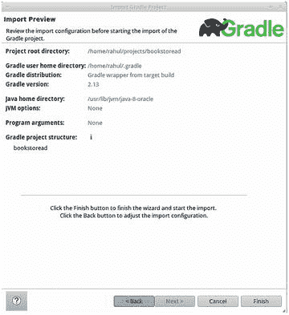
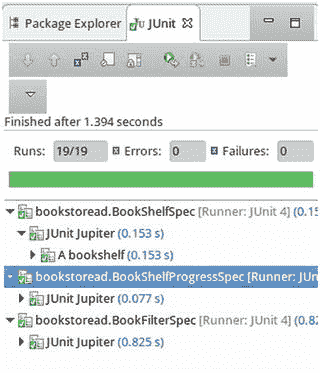

# 6. 集成工具

到目前为止，我们一直在 IntelliJ Idea 中进行开发。我们使用了 JUnit 5 的各种功能，并研究了做事的新方法。但是 Java 生态系统中存在大量的工具。工具有很多类别——构建工具、集成开发环境（IDE）、持续集成（CI）工具等等。每个类别都为开发者提供了多种选择。在本章中，我们将研究如何将 JUnit 5 与我们选择的工具集成。我们将首先将 JUnit 5 与我们选择的构建工具集成。然后，我们将集成代码覆盖率指标。最后，我们将使用其他 IDE。

## 构建工具

构建工具负责自动化项目构建。构建工具的任务不仅限于源代码编译和二进制文件创建。它还涉及执行任何其他过程，如单元测试、静态代码分析、二进制文件上传等。Java 生态系统中有许多构建工具，其中 Apache Ant、Maven 和 Gradle 是最常采用的。对于这些工具中的每一个，都有大量的插件目录可以执行各种操作。但在本章中，我们将专注于围绕单元测试的任务。默认的单元测试插件/扩展基于旧版本的 JUnit。因此，它们不适用于 JUnit 5 测试。让我们看看如何用这些构建工具中的每一个来执行基于 JUnit 5 的测试。我们将从 Gradle 开始，因为我们的 bookstoread 应用程序是基于它的。


### Gradle

Gradle 构建工具最初借鉴了其前身（如 Ant 和 Maven）的许多概念。它以 `build.gradle` 文件作为输入，来确定项目构建的步骤。需要注意的是，该构建文件是用 Groovy 编写的，而非其他工具事实上的标准 XML。Gradle 遵循 Maven 的“约定优于配置”方法，即大多数代码构建实践都通过通用默认值进行配置；例如，所有源代码都放在 `src/main/java` 下，测试代码放在 `src/test/java` 下。

到目前为止，对于我们的 `bookstoread` 项目，我们添加了一个 `build.gradle` 文件（见第 1 章）。该构建文件将源代码描述为一个 Java 项目。它还列出了所有必需的依赖项以及用于下载依赖项的仓库。

```
group 'com.junit5book'
version '1.0-SNAPSHOT'
apply plugin: 'java'
sourceCompatibility = 1.8
repositories {
mavenCentral()
}
dependencies {
def junitVersion = '5.0.1'
testCompile 'org.junit.jupiter:junit-jupiter-api:' + junitVersion
testCompile 'org.junit.jupiter:junit-jupiter-engine:' + junitVersion
testCompile 'org.assertj:assertj-core:3.5.2'
}
```

那么，我们是否尝试在控制台上运行它呢？

```
./gradle clean build
No command 'gradle' found
```

啊哈！我们的机器上没有安装 Gradle。但这对于 Gradle 来说并不是问题。Gradle 最显著的特性之一是“Gradle Wrapper”。其概念是让 Gradle 构建无需事先安装即可运行。它不仅消除了 Gradle 安装的先决条件，还强制要求所有使用该项目的机器上使用相同版本的 Gradle。

Wrapper 是一个小脚本文件 `gradlew.sh/gradlew.bat`，它与必要的文件一起被添加到项目中。现在让我们运行 wrapper 脚本。

```
./gradlew clean build
Downloading https://services.gradle.org/distributions/gradle-3.4.1-all.zip
.......................................................................
:clean
:compileJava
:processResources UP-TO-DATE
:classes
:jar
:assemble
:compileTestJava
:processTestResources UP-TO-DATE
:testClasses
:test
:check
:build
BUILD SUCCESSFUL
```

哇！通过使用 wrapper，我们无需在机器上安装 Gradle 就能启动构建。Gradle wrapper 进程下载了所需的 Gradle 版本和项目依赖项。然后使用这些来构建应用程序源代码。完整的构建过程由不同的阶段组成，如构建输出所示。

我们的重点是测试执行任务。遵循合理默认值的概念，Gradle 为我们的构建添加了一个测试插件。该插件的目的是执行测试用例并发布相应的报告。但如果我们查看 `:test` 下的构建输出，会发现没有执行任何测试用例。这是因为 Gradle 测试插件遵循一个约定，即期望测试类名以 `Test` 或 `Tests` 结尾。在我们的应用程序中，测试类名以 `Spec` 结尾，因此它们没有被执行。

让我们通过显式指定 Gradle 应查找以 `Spec` 结尾的类来重新运行 Gradle 构建，如下代码所示：

```
./gradlew clean test --tests *Spec
:test FAILED
FAILURE: Build failed with an exception.
* What went wrong:
Execution failed for task ':test'.
> No tests found for given includes: [*Spec]
```

Gradle 仍然无法找到我们的测试。这是因为 JUnit 5 更改了其 API（应用程序编程接口）。JUnit 5 版本不仅面向开发者，也面向基于 JUnit 的工具/平台。它们将此类平台所需的测试发现和执行（用于测试过滤和配置）解耦了。由于当前的测试插件不可用，JUnit 5 团队提供了一个可用于执行测试的 Gradle 测试插件。

在应用该插件之前，我们必须告诉 Gradle 在哪里可以找到它。这在 `build.gradle` 的 `buildscript` 部分中进行了描述。

```
buildscript {
repositories {
mavenCentral()
// 以下内容仅在您想使用 SNAPSHOT 版本时才需要。
// maven { url 'https://oss.sonatype.org/content/repositories/snapshots' }
}
dependencies {
classpath 'org.junit.platform:junit-platform-gradle-plugin:1.0.1'
}
}
apply plugin: 'org.junit.platform.gradle.plugin'
```

`org.junit.platform.gradle.plugin` 插件被配置为查找以 `*Test(s)` 结尾的测试。我们必须重新配置它以发现我们的测试。

```
junitPlatform{
filters{
includeClassNamePattern '.*Spec'
}
}
```

现在再次运行 gradle 构建，`gradle clean build`。它将运行所有测试并在控制台上打印测试结果摘要。

```
:junitPlatformTest
Mar 06, 2017 6:56:47 AM org.junit.platform.launcher.core.ServiceLoaderTestEngineRegistry loadTestEngines
INFO: Discovered TestEngines with IDs: [junit-jupiter]
Test run finished after 1095 ms
[        10 containers found      ]
[         0 containers skipped    ]
[        10 containers started    ]
[         0 containers aborted    ]
[        10 containers successful ]
[         0 containers failed     ]
[        19 tests found           ]
[         0 tests skipped         ]
[        19 tests started         ]
[         0 tests aborted         ]
[        19 tests successful      ]
[         0 tests failed          ]
```

需要注意的是，该插件会将 XML 报告发布到 `build/test-results/junit-platform` 目录下，而不是标准的 Gradle 测试报告位置（`build/reports`）。该报告按每个测试引擎分别指定。

现在让我们探索该插件提供的各种选项。默认情况下，该插件会发现项目类路径下的所有测试。可以通过使用 `selectors` 块来改变此行为。该块允许我们将测试限制到文件夹、包、类、测试方法或任何其他外部位置。

```
junitPlatform{
selectors{
aClass 'bookstoread.BookShelfSpec'
}
filters{
includeClassNamePattern '.*Spec'
}
}
```

上述块将仅运行 `BookShelfSpec` 类的测试。需要注意的是，即使我们只选择了一个单独的类，`filters` 部分也是必需的。基本上，`selectors` 部分用于测试发现元素，而 `filters` 部分实际上负责测试发现。

```
Mar 06, 2017 7:53:27 AM org.junit.platform.launcher.core.ServiceLoaderTestEngineRegistry loadTestEngines
INFO: Discovered TestEngines with IDs: [junit-jupiter]
Test run finished after 304 ms
[         6 containers found      ]
[         0 containers skipped    ]
[         6 containers started    ]
[         0 containers aborted    ]
[         6 containers successful ]
[         0 containers failed     ]
[         9 tests found           ]
[         0 tests skipped         ]
[         9 tests started         ]
[         0 tests aborted         ]
[         9 tests successful      ]
[         0 tests failed          ]
```

过滤器使我们能够基于 JUnit 5 引擎、包、标签或类名来选择测试。以下块将过滤并执行 `Filters` 标签下的测试（见第 4 章）。

```
junitPlatform{
filters{
includeClassNamePattern '.*Spec'
tags {
include 'Filter'
}
}
}
```

JUnit 5 Gradle 平台插件禁用了标准的 Gradle 任务。可以通过 `junitPlatform` 块下的 `enableStandardTestTask` 选项来改变此行为。将其设置为 `true` 以启用标准任务运行。


### Maven

Maven 旨在提供一个标准统一的构建流程，可用于任何 Java 项目。它采用基于 XML 的方式来配置项目的构建步骤（项目对象模型，简称 POM）。如前所述，它遵循“约定优于配置”原则，只有例外情况需要显式配置。一个极简的 Maven 构建文件 `pom.xml` 包含唯一的项目标识符和依赖项列表。在接下来的部分中，我们将尝试为我们的 bookstoread.com 项目配置一个 pom.xml。

在开始之前，我们必须确保 Maven 已添加到系统路径中。与 Gradle 不同，它没有附带一个可以自动下载并使其工作的包装脚本。可以从 [`http://maven.apache.org/`](http://maven.apache.org/) 下载最新版本的 Maven。解压归档文件，并将其路径添加到 PATH 环境变量中。验证它是否按预期工作。

```
$ mvn --version
Apache Maven 3.3.1
Maven home: /usr/share/maven
Java version: 1.8.0_101, vendor: Oracle Corporation
Java home: /usr/lib/jvm/java-8-oracle/jre
```

现在，让我们为项目添加以下 POM 文件：

```

4.0.0
com.junit5book
bookstoread
1.0-SNAPSHOT

UTF-8
1.8
1.8
5.0.1

org.junit.jupiter
junit-jupiter-api
${junit.jupiter.version}
test

org.assertj
assertj-core
3.5.2
test

mockito-core
org.mockito
2.7.12
test

```

现在，我们来看看重要的部分。

*   项目由 `groupId:artifactId` 标识。此外，项目的每个发布版本都由 version 标识。
*   文件的 properties 部分列出了各种键值，这些键值可以在 POM 的其他部分中引用。
*   默认情况下，Maven 会添加一个 Java 编译器插件。其 JDK 版本由 `maven.compiler.source` 和 `maven.compiler.target` 属性描述。
*   dependencies 标签包含项目所需的依赖项列表，以及它们各自的作用域。从 Gradle 构建中获取列表，我们添加了所需的依赖项。

现在让我们进行一次构建：

```
$ mvn clean test
[INFO] ------------------------------------------------------------------------
[INFO] Building bookstoread 1.0-SNAPSHOT
[INFO] ------------------------------------------------------------------------
[INFO]
[INFO] --- maven-clean-plugin:2.5:clean (default-clean) @ bookstoread ---
[INFO] Deleting /home/rahul/projects/bookstoread/target
[INFO]
[INFO] --- maven-resources-plugin:2.3:resources (default-resources) @ bookstoread ---
[INFO] Using 'UTF-8' encoding to copy filtered resources.
[INFO] skip non existing resourceDirectory /home/rahul/projects/bookstoread/src/main/resources
[INFO]
[INFO] --- maven-compiler-plugin:2.0.2:compile (default-compile) @ bookstoread ---
[INFO] Compiling 4 source files to /home/rahul/projects/bookstoread/target/classes
[INFO]
[INFO] --- maven-resources-plugin:2.3:testResources (default-testResources) @ bookstoread ---
[INFO] Using 'UTF-8' encoding to copy filtered resources.
[INFO] skip non existing resourceDirectory /home/rahul/projects/bookstoread/src/test/resources
[INFO]
[INFO] --- maven-compiler-plugin:2.0.2:testCompile (default-testCompile) @ bookstoread ---
[INFO] Compiling 2 source files to /home/rahul/projects/bookstoread/target/test-classes
[INFO]
[INFO] --- maven-surefire-plugin:2.10:test (default-test) @ bookstoread ---
[INFO] Surefire report directory : /home/rahul/projects/bookstoread/target/surefire-reports

T E S T S

Results :
Tests run: 0, Failures: 0, Errors: 0, Skipped: 0
[INFO] ------------------------------------------------------------------------
[INFO] BUILD SUCCESS
[INFO] ------------------------------------------------------------------------
```

但是没有运行任何测试。这与我们在修复 Gradle 构建时遇到的问题类似。基本上，测试引擎无法找到测试，因为它遵循命名约定。因此，我们需要配置 surefire 插件来识别我们的测试。

```

maven-surefire-plugin
2.19.1

**/*Spec.java

```

现在让我们进行一次构建，看看它是否运行我们的测试。

```
[INFO] --- maven-surefire-plugin:2.19.1:test (default-test) @ bookstoread ---

T E S T S

Running bookstoread.BookShelfSpec
Tests run: 0, Failures: 0, Errors: 0, Skipped: 0, Time elapsed: 0.004 sec - in bookstoread.BookShelfSpec
```

根据控制台输出，插件找到了所需的测试类，但没有在其中找到任何测试用例。这是因为默认插件配置为与 JUnit 4 一起工作。surefire 插件具有可插拔的架构。可以通过向插件类路径添加额外的 `surefireProvider` 来配置它。JUnit 5 附带了一个 `junit-platform-surefire-provider`，它可以基于 Jupiter 引擎或 Vintage 引擎（根据类路径）运行测试。现在，让我们将提供程序和 Jupiter 引擎添加到插件依赖项中。

```
maven-surefire-plugin
2.19.1

**/*Spec.java

org.junit.platform
junit-platform-surefire-provider
${junit.platform.version}

org.junit.jupiter
junit-jupiter-engine
${junit.jupiter.version}

```

现在让我们进行一次构建。所有测试用例都应该被执行。执行过程将在控制台生成输出，并在 `target/surefire-reports` 目录下生成测试文件（供后续参考）。



图 6-1.

Maven 与 JUnit 5

该插件还支持基于标签的测试过滤。为了执行/排除一组标签，请在 surefire 插件配置中指定 `includeTags`/`excludeTags` 属性。

```

**/*Spec.java

Filter

```

Maven surefire 插件有各种参数（例如，`forkcount` 和 `parallel`）。这些参数目前不受支持。


### Ant

Ant 是历史最悠久、功能最全面的项目自动化工具之一。它基于一个名为 `build.xml` 的文件，该文件配置了项目需要运行的任务。每个任务都可以与其他任务链接，以定义执行顺序。Ant 将构建调用定义为一个“目标”。一个项目可以有多个目标，这些目标可以链接在一起，以定义一个完整的构建周期。在本节中，我们将配置 Ant，使其在项目构建过程中运行基于 JUnit5 的测试。本节假定读者已了解 Ant。

在开始创建 `build.xml` 之前，请确保我们的操作系统 PATH 中已包含 Ant。可以从 [`http://ant.apache.org`](http://ant.apache.org) 下载最新版本的 Ant。解压归档文件，并将其路径添加到 PATH 变量中。验证其是否按预期工作。

```
$ ant -version
Apache Ant(TM) version 1.9.3 compiled on April 8 2014
```

Ant 有许多扩展，可以执行不同的任务。Apache Ivy 就是这样一个扩展，用于执行依赖解析。在没有依赖管理器的情况下，我们需要将项目依赖项作为源代码的一部分保留。Ivy 使得在 Ivy.xml 中表达所有项目依赖项成为可能。当执行构建时，它会下载所有必需的依赖项。要添加 Ivy 扩展，请从 [`http://ant.apache.org/ivy/`](http://ant.apache.org/ivy/) 下载最新版本。解压归档文件，并将 `ivy-{version}.jar` 复制到 `${ANT_HOME}/lib` 目录。

现在，让我们添加一个能够执行以下操作的 `build.xml`：

*   编译 src 文件。
*   编译测试文件。
*   运行测试并发布报告。

上述构建会下载 `ivy.xml` 中声明的依赖项。然后，它调用 `javac` 任务来编译源代码。接着，它将下载的库添加到类路径中，并再次调用 `javac` 任务来编译测试代码。

该构建仅编译代码。但我们如何调用测试呢？有一个“junit” Ant 任务可以运行单元测试。但该任务只运行基于 JUnit4 的测试用例。因此，该任务不适用于我们基于 JUnit 5 的测试。

JUnit5 团队提供了一个控制台启动器，可以在控制台上执行测试。该运行器根据测试的成功或失败，分别将进程输出设为 1 或 0。该运行器具有大量用于发现和执行测试的选项。可以从 Maven 中央仓库下载控制台运行器。由于 1.0.1 是目前可用的最新版本，可以从 [`http://central.maven.org/maven2/org/junit/platform/junit-platform-console-standalone/1.0.1/junit-platform-console-standalone-1.0.1.zip`](http://central.maven.org/maven2/org/junit/platform/junit-platform-console-standalone/1.0.1/junit-platform-console-standalone-1.0.1.zip) 下载。

在我们的 `bookstoread` 项目中解压 zip 文件。使用以下命令通过控制台启动器运行测试（见图 6-2）：


图 6-2.

控制台启动器

```
java -jar lib/junit-platform-console-standalone-1.0.1.jar --scan-classpath -cp lib/build/classes
```

上述命令执行以下操作：

*   发现已添加到类路径中的 Jupiter 引擎。
*   ‘-scan-classpath’ 尝试查找属于类路径一部分的测试用例。
*   该命令不会执行任何测试，因为我们的测试后缀（*spec）与默认约定不匹配。

该命令提供 `-n` 选项来执行与传递的模式匹配的类。因此，我们可以添加 `-n "^.*Spec?$"` 来发现我们的测试用例。我们还需要将 assertj 和 mockito 的必需依赖项添加到类路径中。

由于控制台运行器可以执行我们所有的测试用例，我们也可以将其添加到我们的 Ant build.xml 中。完整的方法包括以下构建步骤：

1.  配置 Ivy.xml 以下载归档文件。需要注意的是，我们需要的是 zip 归档文件，而不是 jar 文件（与其他依赖项一样）。
2.  将归档文件解压到单独的目录。
3.  使用 exec Ant 任务执行控制台运行器。
4.  此外，我们可以向控制台运行器传递一个 `-reports-dir` 参数。这将在指定目录中创建一个基于 XML 的报告。
5.  可以使用 `junitreport` 任务将基于 XML 的测试报告转换为 HTML。

### 代码覆盖率

代码覆盖率是通过执行测试用例捕获的一个重要指标。它是一个以百分比表示的指标，表示项目被其测试套件测试的程度。有许多工具（付费和开源）可用于确定覆盖率。这些工具中的大多数都有扩展/插件，可以与项目构建工具集成。在本节中，我们将使用 Java 代码覆盖率（JaCoCo）工具。它是一个开源工具，与所有版本的 Java 都能很好地配合，并且与 IntelliJ Idea、Gradle、Ant、Jenkins 等各种工具集成良好。在下一节中，我们将把 JaCoCo 集成到我们的项目构建中。

#### Gradle 扩展

JaCoCo 工具提供了一个 Gradle 插件。该插件与 Gradle 测试插件集成。但由于 JUnit 5 测试不是由默认的 Gradle 测试插件执行的，因此无法确定其覆盖率。我们需要将 jacoco 与 JUnit 5 团队提供的 junit-platform 测试插件一起配置。现在，让我们将插件添加到我们的 `build.gradle` 中，并尝试将其与 `junitPlatformTest` 一起配置。

```
apply plugin: 'jacoco'
sourceCompatibility = 1.8
repositories {
mavenCentral()
}
// 为简洁起见，省略其余部分
jacoco {
toolVersion = '0.7.4.201502262128'
applyTo junitPlatformTest
}
```

上述配置将生成一个二进制文件形式的代码覆盖率结果。我们需要一个 `jacoco` 报告任务来将二进制文件转换为 xml/html 报告。现在，让我们运行 gradle 构建以生成覆盖率。

构建失败，因为 `jacoco` 配置无法找到所需的 `junitPlatformTest` 插件（见图 6-3）。这是因为该插件在项目初始化期间不可用。只有在 Gradle 运行器评估项目之后，它才可用。现在我们只需要在项目的 `afterEvaluate` 部分配置 `jacoco` 插件。让我们也添加 `jacoco` 报告任务；完整的配置应如下所示：



图 6-3.

Gradle `JaCoCo` 失败

```
afterEvaluate {
jacoco {
toolVersion = '0.7.4.201502262128'
applyTo junitPlatformTest
}
task junit5JacocoReport(type:JacocoReport, dependsOn : junitPlatformTest){
executionData junitPlatformTest
sourceDirectories = files(sourceSets.main.allSource.srcDirs)
classDirectories = files(sourceSets.main.output)
reports {
xml.enabled = true
html.enabled = true
}
}
build.dependsOn junit5JacocoReport
}
```

现在进行构建以获取 `jacoco` 报告（见图 6-4）。



图 6-4.

`Jacoco` 覆盖率报告

#### Maven 扩展

用于 `jacoco` 的 Maven 插件（jacoco-maven-plugin）开箱即用，适用于基于 JUnit 5 的测试。与 Gradle 一样，我们首先确定二进制文件中的代码覆盖率结果，然后将其转换为报告。Maven 插件有不同的目标，这些目标被配置来完成这些任务。以下 POM 配置为我们的 bookstoread.com 生成了覆盖率报告：

```
org.jacoco
jacoco-maven-plugin

pre-unit-test

prepare-agent

${project.build.directory}/coverage-reports/jacoco-ut.exec

surefireArgLine

post-unit-test
test

report

${project.build.directory}/coverage-reports/jacoco-ut.exec

${project.reporting.outputDirectory}/jacoco-ut

```


#### Ant 扩展

现在让我们尝试使用 Ant 配置 `jacoco`。与之前的配置类似，这里我们也将分两步确定代码覆盖率。`JaCoCo 工具` 提供了一个 Ant 任务，可以通过执行单元测试用例或任何其他 Java 程序来确定代码覆盖率。由于我们使用控制台运行器执行 JUnit5 测试用例，我们将通过配置一个 Java 可执行程序来确定覆盖率。

在开始配置 `jacoco` 之前，让我们先查看 `consoleRunner` 脚本，找到完整的 Java 命令。该命令执行 `org.junit.platform.console.ConsoleLauncher` 类，其类路径中包含所有测试类。现在我们需要在构建脚本中配置相同的命令。该类是 junit-platform-console 依赖 jar 的一部分。

对 `ivy.xml` 进行以下更改，以确保我们下载 junit-platform-console 的 jar 包（而非发行版 zip 包）以及所需的 `jacoco` jar 包：

```
// 为简洁起见，省略了其余部分
```

现在我们需要使用 Java 主类配置 `jacoco` 任务。以下 `build.xml` 配置确保我们实现相同的目标：

```

// 为简洁起见，省略了其余部分

```

运行 Ant 构建以获取 HTML 格式的覆盖率报告。

## 其他工具

到目前为止，我们一直使用 IntelliJ 开发所有代码，该 IDE 对 JUnit 5 功能的支持正在不断改进。我们已经成功地将 JUnit 5 与 Gradle、Maven 和 Ant 集成。但 Java 生态系统包含大量工具。有许多 IDE（Eclipse、STS、IntelliJ、NetBeans 等）。那么，如果我们选择的工具尚不支持 JUnit 5，该怎么办？假设我们偏好的 IDE 是 Eclipse；那我们该怎么做？

JUnit 5 提供了一个基于 JUnit 4 Runner API 的 `PlatformRunner`。该运行器能够在所有支持 JUnit 4 的平台上执行测试。JUnit 5 测试用例必须使用 `@RunWith` 注解，并将 `PlatformRunner` 作为参数传入。因此，如果我们想在 Eclipse Neon 或更早版本中开发代码，可以执行以下操作：

1.  将 JUnit 4 的依赖添加到我们的 `pom.xml` 或 `build.gradle` 中

    ```
    testCompile 'junit:junit:4.12'
    ```

2.  添加 junit-platform-runner 的依赖

    ```
    testCompile 'org.junit.platform:junit-platform-runner:1.0.1'
    ```

3.  将项目作为 Gradle 项目（或 Maven 项目）导入 Eclipse（见图 6-5）

    

    图 6-5.
    Eclipse 导入对话框  
4.  每个测试类都需要使用 `@RunWith` 进行注解

    ```
    @RunWith(JUnitPlatform.class)
    @DisplayName("一个书架")
    public class BookShelfSpec {
    private BookShelf shelf;
    // 为简洁起见，省略了其余部分
    }
    ```

5.  现在执行我们的测试用例

    

    图 6-6.
    Eclipse JUnit 5 报告  

Eclipse 团队正在开发一个 Oxygen 版本，该版本将包含对 JUnit 5 的支持。在撰写本章时，Eclipse 团队已添加了 JUnit 5 支持 [ [`https://bugs.eclipse.org/bugs/show_bug.cgi?id=488566#c4`](https://bugs.eclipse.org/bugs/show_bug.cgi?id=488566#c4) ]，但尚未发布。

## 总结

在本章中，我们探讨了如何根据我们选择的工具配置 JUnit 5。我们为 booktoread.com 添加了基于 Gradle、Maven 和 Ant 的配置。然后，我们使用 `jacoco` 配合这些工具生成了代码覆盖率指标。最后，我们研究了那些不支持 JUnit 5 的工具，并以向后兼容模式配置了 JUnit 5。

在第 7 章中，我们将讨论 JUnit 5 扩展模型以及从 JUnit 4 迁移到新版本的相关内容。

