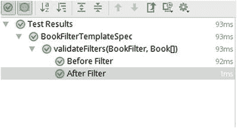
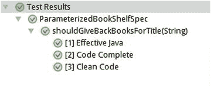
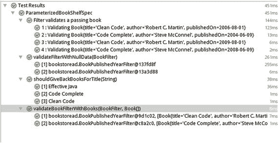

# 7. JUnit 5 扩展模型

JUnit 的核心原则之一是优先考虑扩展点而非功能。这意味着 JUnit 团队希望提供一种可扩展的机制，供开发者根据自身需求使用，而不是将所有功能都塞进 JUnit 核心。这一理念在 JUnit 的早期版本中就已存在。在 JUnit 4 中，团队添加了对 Rule API（应用程序编程接口）的支持，以提供诸如创建临时目录和文件、异常验证等功能。这些功能本可以轻松地添加到 JUnit 核心中，而无需提供扩展机制。相反，JUnit 团队决定构建 Runner 和 Rule API，从而提供一种扩展 JUnit 的机制。这不仅使 JUnit 能够干净地构建这些功能，还使第三方开发者能够使用该 API 实现自己的功能。其中一个例子是 `MockitoRule`，它允许你将模拟对象注入到测试中。

## JUnit 4 扩展模型

在学习 JUnit 5 的新扩展 API 之前，我们先讨论一下 JUnit 4 的可扩展性方法。这将有助于我们理解为什么 JUnit 5 团队决定设计和构建一种新的可扩展性机制。如前所述，扩展对 JUnit 来说并不新鲜。JUnit 4 提供了两种扩展机制：Runner API 和 Rule API。

1.  Runner API 被添加到 JUnit 4 中，以提供编写自定义运行器的能力。运行器管理测试的完整生命周期——测试类的实例化、调用 setup 和 tear-down 方法、执行测试用例、通过 `RunNotifier` 通知测试进度。JUnit 4 提供了一个默认使用的实现 `JUnit4`。任何人都可以通过扩展 `Runner` 类来编写自己的自定义运行器。要告诉 JUnit 使用自定义运行器，可以使用 `@RunWith` 注解并指定自定义运行器，如下面的代码片段所示：

    ```
    import org.junit.runner.RunWith;
    @RunWith(MyCustomRunner.class)
    public class MyTest {
    }
    ```

    Runner API 的两个主要缺点是：
    1.  即使开发者只想为特定生命周期阶段提供扩展，也必须实现完整的生命周期。这使得它在大多数用例中变得复杂且重量级。  
    2.  每个测试用例只能使用一个运行器类。这使得它们无法组合。例如，你不能在同一个测试类中同时使用 Parameterized 和 Mockito 运行器。   
2.  Rule API 在 JUnit 4.7 中引入，提供了一种轻量级的 JUnit 扩展机制。要使用规则，你需要创建一个规则的公共实例变量，并使用 `@Rule` 注解对其进行注解。Rule API 通过将测试方法包装到一个语句中来工作。该语句将首先运行任何 `@Before` 方法，然后运行 `@Test` 方法，最后运行任何 `@After` 方法。Rule API 克服了 Runner API 的局限性，但其能力也有限。Rule API 的主要缺点是：
    1.  Rule API 无法控制测试的完整生命周期，因此不能用于所有用例。它们仅适用于需要在测试用例执行前后执行某些操作的场景。  
    2.  你必须为方法级别和类级别的回调创建单独的规则。


## JUnit 5 扩展模型

扩展 API 是 JUnit Jupiter 引擎的一部分。考虑到 JUnit 4 中扩展方法的局限性，JUnit 5 团队决定构建一个统一的扩展 API，使其能够挂钩到测试生命周期的不同阶段。这意味着当到达某个生命周期阶段时，Jupiter 引擎将调用所有为该阶段注册的扩展。共有五个主要的扩展点可供挂钩。

1.  测试生命周期回调
2.  测试实例后处理
3.  条件测试执行
4.  参数解析
5.  异常处理

让我们逐一详细了解。

后续章节中介绍的每个扩展都实现了与 JUnit 扩展点相对应的接口。所有扩展点接口都扩展了一个名为 `Extension` 的标记接口。

另一个需要与之交互的接口是 `ExtensionContext`。它用于封装执行测试或测试容器的上下文。这种抽象允许扩展访问有关正在运行的测试的信息，并与 Jupiter 引擎进行交互。让我们看看该接口的主要方法以进一步了解它。

```
public interface ExtensionContext {
Optional getParent();
String getUniqueId();
String getDisplayName();
Set getTags();
Optional getElement();
Optional> getTestClass();
Optional getTestInstance();
Optional getTestMethod();
Optional getExecutionException();
void publishReportEntry(Map map);
default Store getStore() {
return getStore(Namespace.DEFAULT);
}
Store getStore(Namespace namespace);
}
```

`getParent()` 方法返回父级的 ExtensionContext。要理解这里的“父级”含义，必须了解 Jupiter 会创建一个测试节点树，每个节点都有其 ExtensionContext。一个测试节点会有一个测试类节点作为其父节点。因此，在测试类节点上调用 `getParent` 时，返回 Optional.empty；而在测试方法上调用 `getParent` 时，则返回非空值。

接下来的一组方法提供测试的唯一标识符、人类可读的名称以及一组测试标签。再下一组扩展方法用于访问测试类、实例和测试方法。你可以利用这些方法通过反射访问测试方法注解或实例字段。

`getExecutionException()` 方法用于获取测试或容器执行期间抛出的异常。`publishReportEntry` 用于发布键/值对，供控制台或 XML 报告等监听器使用。

最后一个重要的方法是 `getStore()`。JUnit 扩展使用 Store 来读写数据。Store 是一个带命名空间、分层结构的键/值数据存储。要通过 ExtensionContext 访问 Store，需要使用 Namespace 对象调用 `getStore` 方法。可以使用工厂方法 `create` 创建 Namespace，例如 `Namespace.create("com","shekhargulati","SummaryExtension")`。每个扩展都应使用唯一的命名空间，以避免不同扩展之间的数据混淆。

Store 本身就像一个功能增强的哈希映射。它提供了你期望从 Map 中获得的方法，如下列代码所示：

```
interface Store {
V get(Object key, Class requiredType);
Object getOrComputeIfAbsent(K key, Function defaultCreator);
void put(Object key, Object value);
V remove(Object key, Class requiredType);
}
```

## 测试生命周期回调

这组扩展允许你挂钩到测试生命周期的特定阶段。正如我们在第 4 章所学，测试类由以下生命周期方法组成：

1.  BeforeAll：标记有 `@BeforeAll` 注解的方法在当前测试类的所有测试之前执行。它们对于每个测试类仅执行一次。
2.  BeforeEach：标记有 `@BeforeEach` 注解的方法在当前测试类的每个测试方法之前执行。它们对于当前测试类中的每个测试执行一次。
3.  Test：所有标记有 `@Test` 注解的方法都是实际的测试方法。
4.  AfterEach：标记有 `@AfterEach` 注解的方法在当前测试类的每个测试方法之后执行。它们对于当前测试类中的每个测试执行一次。
5.  AfterAll：标记有 `@AfterAll` 注解的方法在当前测试类的所有测试之后执行。它们对于每个测试类仅执行一次。

对于这些测试生命周期阶段中的每一个，JUnit 5 都提供了一个扩展接口。

1.  BeforeAllCallback：此扩展在所有测试方法执行之前执行。
2.  AfterAllCallback：此扩展在所有测试方法执行之后执行。
3.  BeforeEachCallback：此扩展在每个测试方法执行之前执行。
4.  AfterEachCallback：此扩展在每个测试方法执行之后执行。
5.  BeforeTestExecutionCallback：此扩展在测试即将执行之前立即执行。
6.  AfterTestExecutionCallback：此扩展在测试执行之后立即执行。

对于一个包含所有扩展和生命周期方法的测试类，其执行顺序为：

1.  BeforeAllCallback
2.  BeforeAll
3.  BeforeEachCallback
4.  BeforeEach
5.  BeforeTestExecution
6.  Test
7.  AfterTestExecution
8.  AfterEach
9.  AfterEachCallback
10. AfterAll
11. AfterAllCallback

让我们编写一个扩展，用于打印测试类执行的摘要。该摘要将包括测试类所花费的总时间以及每个测试用例所花费的时间。让我们从创建实现某些生命周期扩展接口的扩展开始。

```
public class TestSummaryExtension implements
BeforeAllCallback,
AfterAllCallback,
BeforeTestExecutionCallback,
AfterTestExecutionCallback{
}
```

每个接口都有一个需要实现的单一生命周期方法。我们将实现的第一个方法是 `BeforeAllCallback` 接口的 `beforeAll` 方法。我们将存储测试用例的开始时间。

```
@Override
public void beforeAll(ExtensionContext context) throws Exception {
context.getStore().put("TEST_CLASS", System.currentTimeMillis());
}
```

接下来，我们将实现 `beforeTestExecution` 来存储测试开始时间。然后，我们将实现 `afterTestExecution` 来计算运行测试用例所花费的时间，如下列代码所示：

```
@Override
public void beforeTestExecution(ExtensionContext context) throws Exception {
context.getStore().put("TEST", System.currentTimeMillis());
}
@Override
public void afterTestExecution(ExtensionContext context) throws Exception {
long startTime = context.getStore().get("TEST", long.class);
long timeTook = System.currentTimeMillis() - startTime;
context.publishReportEntry(Collections.singletonMap(
"Summary",
String.format("%s took %d ms", context.getDisplayName(), timeTook)));
}
```

最后，我们将实现 `afterAll` 方法来计算运行测试类所花费的时间并打印摘要。

```
@Override
public void afterAll(ExtensionContext context) throws Exception {
long startTime = context.getStore().get("TEST_CLASS", long.class);
long timeTook = System.currentTimeMillis() - startTime;
context.publishReportEntry(Collections.singletonMap(
"Summary",
String.format("%s took %d ms", context.getDisplayName(), timeTook)));
}
```

要使你的测试使用此扩展，你需要使用 `@ExtendWith` 注解。我们将在本章后面介绍它。


## 测试实例后处理

此扩展允许你在测试实例创建后执行钩子操作。你需要实现 `TestInstancePostProcessor` 接口。该接口包含一个需要重写的方法——`postProcessTestInstance`。

正如 `TestInstancePostProcessor` 接口的 JavaDoc 所述，此扩展的典型应用场景是向测试实例注入依赖。例如，让我们编写一个向实例字段注入 SLF4J 日志器的扩展。

```
import java.lang.reflect.Field;
import org.junit.jupiter.api.extension.ExtensionContext;
import org.junit.jupiter.api.extension.TestInstancePostProcessor;
import org.slf4j.Logger;
import org.slf4j.LoggerFactory;
public class LoggingExtension implements TestInstancePostProcessor {
@Override
public void postProcessTestInstance(Object testInstance, ExtensionContext context) throws Exception {
Logger logger = LoggerFactory.getLogger(testInstance.getClass());
Field field = testInstance.getClass().getDeclaredField("logger");
field.set(testInstance, logger);
}
}
```

在上述代码中，我们获取了 `testInstance` 的访问权限，并通过反射设置了 logger 字段。

## 条件测试执行

在某些情况下，我们需要控制是否运行某个测试用例。JUnit 5 提供了 `ExecutionCondition` 扩展接口来实现这一用例。

让我们创建一个实现 `ExecutionCondition` 接口的 `RunOnCIExtension` 扩展类。

```
import org.junit.jupiter.api.extension.ConditionEvaluationResult;
import org.junit.jupiter.api.extension.ExecutionCondition;
import org.junit.jupiter.api.extension.ExtensionContext;
public class RunOnCIExtension implements ExecutionCondition {
@Override
public ConditionEvaluationResult evaluateExecutionCondition(ExtensionContext context) {
String jenkinsHome = System.getenv("JENKINS_HOME");
if (jenkinsHome != null) {
return ConditionEvaluationResult.enabled("Test enabled on CI");
}
return ConditionEvaluationResult.disabled("Test disabled as the environment is not CI");
}
}
```

## 参数解析

此扩展用于解析构造函数或测试方法接收的参数。

让我们创建一个解析 `Book` 类型的扩展。在测试用例中，我们经常需要处理测试数据，因此参数解析可以在此处提供帮助。

```
public class BookParameterResolver implements ParameterResolver {
@Override
public boolean supportsParameter(ParameterContext parameterContext,
ExtensionContext extensionContext) throws ParameterResolutionException {
return parameterContext.getParameter().getType()
.equals(Book.class);
}
@Override
public Object resolveParameter(ParameterContext parameterContext,
ExtensionContext extensionContext) throws ParameterResolutionException {
return new Book("Effective Java");
}
}
```

JUnit 5 内置了以下三个 `ParameterResolver`：

*   `TestInfoParameterResolver`：该解析器提供 `org.junit.jupiter.api.TestInfo` 实例。`TestInfo` 对象保存当前正在执行的测试的元信息。该对象可以提供显示名称、测试类、测试方法以及标签（如果有）。
*   `TestReporterParameterResolver`：该解析器提供 `org.junit.jupiter.api.TestReporter` 实例。`TestReporter` 允许我们为当前测试执行提供附加值。所有这些值都会包含在测试报告中，并显示在 IDE（集成开发环境）中。
*   `RepetitionInfoParameterResolver`：该解析器提供 `org.junit.jupiter.api.RepetitionInfo` 实例。`RepetitionInfo` 对象保存有关测试重复的信息（即当前重复索引和总重复次数）。该对象仅对使用 `org.junit.jupiter.api.RepeatedTest` 注解的测试可用。如果测试用例未标记 `@RepeatedTest`，则会抛出 `org.junit.jupiter.api.extension.ParameterResolutionException`。

```
class ParameterResolverSpec {
@BeforeEach
void initialize(TestInfo info,TestReporter reporter) {
reporter.publishEntry("Associated tags :", info.getTags().toString());
}
@RepeatedTest(value = 10)
@Tag("Numbers")
void numberTest(RepetitionInfo info) {
assertTrue(true);
}
@Test
void nonRepeated(RepetitionInfo info) {
assertTrue(true);
}
}
```

`TestReporter` 是 JUnit 5 向标准输出/标准错误输出打印信息的首选方式。另请注意，上述每个 `ParameterResolver` 都由 JUnit 执行引擎自动激活，无需使用 `@ExtendsWith` 进行显式激活。

## 异常处理

我们将讨论的最后一个扩展点是 `TestExecutionExceptionHandler`。此扩展可用于在测试遇到异常时改变其行为。

假设我们想创建一个扩展，用于记录并忽略所有 `IOException` 类型的异常，同时重新抛出所有其他异常。

```
public class IgnoreIOExceptionExtension
implements TestExecutionExceptionHandler {
Logger logger = LoggerFactory
.getLogger(IgnoreIOExceptionExtension.class);
@Override
public void handleTestExecutionException(ExtensionContext context,
Throwable throwable) throws Throwable {
if (throwable instanceof IOException) {
logger.error("IO Exception {}", throwable);
return;
}
throw throwable;
}
}
```

## 注册扩展

在前几节中，我们创建了测试扩展。现在，我们需要将它们注册到 JUnit 5 测试中。为此，我们使用 `@ExtendWith` 注解。你可以多次使用此注解来注册多个扩展，也可以将多个扩展作为数组传递给 `@ExtendWith` 注解。

```
@ExtendWith({
IgnoreIOExceptionExtension.class,
BookParameterResolver.class,
RunOnCIExtension.class,
TestSummaryExtension.classs
})
@ExtendWith(LoggingExtension.class)
public class UserServiceTests{
}
```

你也可以通过使用 `ServiceLoader` 机制自动注册扩展。你的扩展需要有一个文件 `META-INF/services/org.junit.jupiter.api.extension.Extension`，其中包含扩展的完全限定名称。

```
com.shekhargulati.extensions.TestSummaryExtension .
```

要启用此扩展注册机制，你需要将 `junit.extensions.autodetection.enabled` 配置属性设置为 `true`。一种方法是通过向 JVM（Java 虚拟机）传递系统属性来实现。另一种方法是将配置参数添加到 `LauncherDiscoveryRequest` 中，如下代码所示：

```
LauncherDiscoveryRequest request
= LauncherDiscoveryRequestBuilder.request()
.selectors(selectClass("com.junit5book.UserServiceTests"))
.configurationParameter("junit.extensions.autodetection.enabled", "true")
.build();
```

## JUnit 5 扩展

JUnit 团队使用扩展模型开发了以下新的测试类型：

*   `@TestTemplate`：定义一个在运行时生成测试的模板。
*   `@ParameterizedTest`：定义一个带参数的测试方法。

在接下来的章节中，我们将介绍如何使用上述每个扩展。这些章节不会涵盖每个扩展的实现细节。如需了解此类细节，请参阅 JUnit 5 文档。


### 测试模板

JUnit 5 允许我们创建测试骨架，这些骨架通过 `TestTemplateInvocationContext` 实例化，从而在运行时生成测试。生成的测试类似于 `@Test` 方法。模板支持完整的测试生命周期。任何使用 `@BeforeAll`/`@BeforeEach`/`@AfterEach`/`@AfterAll` 注解的方法都会根据生成测试的生命周期来执行。

测试模板是通过在非静态方法测试类上标记 `org.junit.jupiter.api.TestTemplate` 注解来创建的。此外，我们必须注册一个 `TestTemplateInvocationContextProvider` 扩展的实现，该扩展用于从模板生成实际的测试。

让我们尝试为我们的 `bookstoread` 应用程序添加一个测试模板。在第 4 章中，我们添加了可应用于 `Book` 的 `BookFilter`。该过滤器验证书籍是否满足某个条件。我们还创建了 `BookPublishedYearFilter`，它可以根据出版年份来过滤书籍。

在当前上下文中，让我们添加一个测试模板，该模板可以接收 `BookFilter` 和一个书籍数组，然后断言过滤器的验证结果。

```
class BookFilterTemplateSpec {
@TestTemplate
@ExtendWith(BookFilterTestInvocationContextProvider.class)
void validateFilters(BookFilter filter, Book[] books) {
assertNotNull(filter);
assertFalse(filter.apply(books[0]));
assertTrue(filter.apply(books[1]));
}
}
```

如上述测试用例所示，我们还需要创建一个 `BookFilterTestInvocationContextProvider`，它是 `org.junit.jupiter.api.extension.TestTemplateInvocationContextProvider` 的一个实现。该提供者需要实现以下方法：

`supportsTestTemplate`：该方法验证提供者是否适用于传入的 `ExecutionContext`。JUnit 执行引擎首先调用此方法来验证提供者是否适用。

`provideTestTemplateInvocationContexts`：该方法提供一个 `org.junit.jupiter.api.extension.TestTemplateInvocationContext` 的流。每个 `TestTemplateInvocationContext` 实例负责提供相应的测试名称以及额外的扩展（如果有的话）。

```
class BookFilterTestInvocationContextProvider implements TestTemplateInvocationContextProvider {
@Override
public boolean supportsTestTemplate(ExtensionContext context) {
return true;
}
@Override
public Stream provideTestTemplateInvocationContexts(ExtensionContext context) {
Book cleanCode = new Book("Clean Code", "Robert C. Martin", LocalDate.of(2008, Month.AUGUST, 1));
Book codeComplete = new Book("Code Complete", "Steve McConnel", LocalDate.of(2004, Month.JUNE, 9));
return Stream.of(bookFilterTestContext("Before Filter", BookPublishedYearFilter.Before(2007), cleanCode, codeComplete),
bookFilterTestContext("After Filter", BookPublishedYearFilter.After(2007), codeComplete, cleanCode));
}
private TestTemplateInvocationContext bookFilterTestContext(String testName, BookFilter bookFilter, Book... array) {
return new TestTemplateInvocationContext() {
@Override
public String getDisplayName(int invocationIndex) {
return testName;
}
@Override
public List getAdditionalExtensions() {
return Lists.newArrayList(new TypedParameterResolver(bookFilter), new TypedParameterResolver(array));
}
};
}
}
```

让我们详细看看 `provideTestTemplateInvocationContexts` 方法。该方法返回一个 `Stream<TestTemplateInvocationContext>`。每个 `TestTemplateInvocationContext` 实例提供一个测试显示名称和两个额外的扩展。这些扩展负责为我们的 `validateFilters` 测试解析方法参数。

我们的 `BookFilterTestInvocationContextProvider` 生成了以下两个测试用例：

*   **年份之前测试**：该测试包含 `BookPublishedYearFilter.Before(2007)` 过滤器和一个包含两本书的数组。
*   **年份之后测试**：该测试包含 `BookPublishedYearFilter.After(2007)` 过滤器和一个包含两本书的数组。

我们添加了一个 `TypedParameterResolver` 扩展。该扩展接收一个值，并验证它是否是传入方法参数之一的实例。如果是，则返回该值。

```
class TypedParameterResolver implements ParameterResolver {
T data;
TypedParameterResolver(T data) {
this.data = data;
}
@Override
public boolean supportsParameter(ParameterContext parameterContext, ExtensionContext extensionContext) throws ParameterResolutionException {
Class parameterClass = parameterContext.getParameter().getType();
return parameterClass.isInstance(data);
}
@Override
public Object resolveParameter(ParameterContext parameterContext, ExtensionContext extensionContext) throws ParameterResolutionException {
return data;
}
}
```

现在我们已经为测试模板添加了所有必需的组件，让我们执行它。将会运行两个测试，一个执行“年份之前”检查，另一个执行“年份之后”检查（参见图 7-1）。



图 7-1.

测试模板结果


### 参数化测试

在第 4 章中，我们了解到 JUnit 5 允许我们向测试中注入参数。参数可以注入到测试方法或 `BeforeEach`/`AfterEach` 方法中。这是通过实现 `org.junit.jupiter.extension.Extension` 接口（该接口可以提供值），然后使用 `@ExtendWith` 将其注册到测试中来实现的。

但如果只需要向测试方法中注入值，我们可以省去 `org.junit.jupiter.extension.Extension` 的自定义实现。相反，我们可以使用 `org.junit.jupiter.params.ParameterizedTest` 注解测试方法。我们还需要注册一个用于提供值的 `ValueSource`。

在我们的 `bookstoread` 应用中，我们向 `Bookshelf` 添加了一个 `findBookByTitle` 方法。让我们添加一个测试用例，在其中按现有标题搜索书架。

```
@ParameterizedTest
@ValueSource(strings = {"Effective Java", "Code Complete", "Clean Code"})
void shouldGiveBackBooksForTitle(String title) {
BookShelf shelf = new BookShelf();
Book effectiveJava = new Book("Effective Java", "Joshua Bloch", LocalDate.of(2008, Month.MAY, 8));
Book codeComplete = new Book("Code Complete", "Steve McConnel", LocalDate.of(2004, Month.JUNE, 9));
Book mythicalManMonth = new Book("The Mythical Man-Month", "Frederick Phillips Brooks", LocalDate.of(1975, Month.JANUARY, 1));
Book cleanCode = new Book("Clean Code", "Robert C. Martin", LocalDate.of(2008, Month.AUGUST, 1));
shelf.add(effectiveJava, codeComplete, mythicalManMonth, cleanCode);
List foundBooks = shelf.findBooksByTitle(title.toLowerCase());
assertNotNull(foundBooks);
assertEquals(1,foundBooks.size());
foundBooks = shelf.findBooksByTitle(title.toUpperCase());
assertNotNull(foundBooks);
assertEquals(0,foundBooks.size());
}
```

`shouldGiveBackBooksForTitle` 测试方法接收一个 `String` 作为输入。该方法随后构建一个包含书籍列表的 `BookShelf`。测试用例接着使用 `findBooksByTitle` 方法对指定的标题进行断言。

`String` 参数值由测试方法上的 `@ValueSource` 指定。该注解接收一个字符串数组作为输入，从而为每个值重复执行测试（见图 7-2）。



图 7-2.

字符串参数

`@ValueSource` 可用于指定原始类型（整数/双精度浮点数/长整数）和字符串的数组。该包还提供了以下数据源：

*   `EnumSource`：该数据源可用于从枚举中注入值。它允许选择/取消选择指定枚举值的子集。
*   `MethodSource`：该数据源可用于提供值的流/数组/可迭代对象。该方法必须是静态的，且不能接受任何参数。
*   `CSVSource`：该数据源可用于注入逗号分隔值的列表。每个逗号分隔的值可用于匹配测试方法的一个参数。
*   `CSVFileSource`：该数据源可用于从指定文件中注入逗号分隔值的列表。每个逗号分隔的值可用于匹配测试方法的一个参数。
*   `ArgumentsSource`：该数据源可用于注册一个自定义的 `Stream<Arguments>` 提供者。注册的提供者可用于注入自定义类型或多个参数（成对出现）。

现在，让我们为 `bookstoread` 应用使用其中一些数据源。我们可以使用 `MethodSource` 来提供一个 `BookFilter` 数组，这些过滤器可以单独进行验证。

```
@ParameterizedTest
@MethodSource("bookFilterProvider")
void validateFilterWithNullData(BookFilter filter) {
assertThat(filter.apply(null)).isFalse();
}
static Stream bookFilterProvider() {
return Stream.of(BookPublishedYearFilter.Before(2007), BookPublishedYearFilter.After(2007));
}
```

我们还可以注册一个自定义提供者，它可以成对注入值。这可以用来简化我们在上一节中创建的 `BookFilter` 模板测试。同样，测试方法将接收一个 `BookFilter` 和 `Book[]` 作为参数。然后，它使用提供的过滤器验证 `Book[]` 的值。

```
@ParameterizedTest
@ArgumentsSource(BookFilterCompositeArgsProvider.class)
void validateBookFiltersWithBooks(BookFilter filter, Book[] books) {
assertNotNull(filter);
assertFalse(filter.apply(books[0]));
assertTrue(filter.apply(books[1]));
}
class BookFilterCompositeArgsProvider implements ArgumentsProvider {
@Override
public Stream provideArguments(ExtensionContext context) {
Book cleanCode = new Book("Clean Code", "Robert C. Martin", LocalDate.of(2008, Month.AUGUST, 1));
Book codeComplete = new Book("Code Complete", "Steve McConnel", LocalDate.of(2004, Month.JUNE, 9));
return Stream.of(Arguments.of(BookPublishedYearFilter.Before(2007), Arrays.array(cleanCode, codeComplete)),
Arguments.of(BookPublishedYearFilter.After(2007), Arrays.array(codeComplete, cleanCode)));
}
}
```

`BookFilterCompositeArgsProvider` 提供了一个参数流，其中每个参数实例包含两个值（即一个 `BookFilter` 和一个 `Book[]`）。

前面讨论的所有数据源都是可重复的。一个测试可以有多个注解，这些注解可以提供不同的值集。在下面的测试用例中，我们将 `Book[]` 替换为一个 `Book` 实例。因此，测试方法接收一个 `BookFilter` 和一个 `Book` 作为参数。该测试使用 `BeforeYearArgsProvider` 注解（用于满足 `BeforePublishedYear` 过滤器条件的值）和 `AfterYearArgsProvider` 注解（用于满足 `AfterPublishYear` 过滤器条件的值）。

```
@ParameterizedTest(name = "{index} : Validating {1}")
@DisplayName("Filter validates a passing book")
@ArgumentsSource(BeforeYearArgsProvider.class)
@ArgumentsSource(AfterYearArgsProvider.class)
void validateBookFiltersWithBooks1(BookFilter filter, Book book) {
assertNotNull(filter);
assertTrue(filter.apply(book));
}
}
class BeforeYearArgsProvider implements ArgumentsProvider {
@Override
public Stream provideArguments(ExtensionContext context) {
Book cleanCode = new Book("Clean Code", "Robert C. Martin", LocalDate.of(2006, Month.AUGUST, 1));
Book codeComplete = new Book("Code Complete", "Steve McConnel", LocalDate.of(2004, Month.JUNE, 9));
return Stream.of(Arguments.of(BookPublishedYearFilter.Before(2007), cleanCode),
Arguments.of(BookPublishedYearFilter.Before(2007), codeComplete));
}
}
class AfterYearArgsProvider implements ArgumentsProvider {
@Override
public Stream provideArguments(ExtensionContext context) {
Book cleanCode = new Book("Clean Code", "Robert C. Martin", LocalDate.of(2009, Month.AUGUST, 1));
Book codeComplete = new Book("Code Complete", "Steve McConnel", LocalDate.of(2008, Month.JUNE, 9));
return Stream.of(Arguments.of(BookPublishedYearFilter.After(2007), cleanCode),
Arguments.of(BookPublishedYearFilter.After(2007), codeComplete));
}
}
```

现在，在上述代码中我们使用了 `@DisplayName`。该注解为整个测试执行（包含所有传入的值）赋予一个有意义的名称。此外，通过指定 `@ParameterizedTest` 的 `name` 属性，可以为每次测试执行提供一个有意义的名称。如果我们不提供任何名称，测试执行会使用注入的值生成一个默认名称。现在让我们运行完整的测试（见图 7-3）。



图 7-3.

参数化测试结果

## 总结

在本章中，我们首先学习了 JUnit 5 的新扩展 API。我们发现扩展 API 支持测试执行的所有生命周期阶段。该 API 还支持条件测试执行以及测试执行期间生成的异常。JUnit 5 包使用扩展 API 提供了许多功能，如默认提供者、测试模板和参数化测试。


