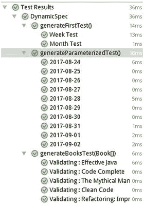
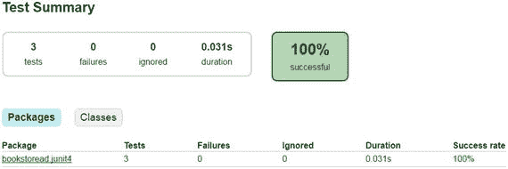
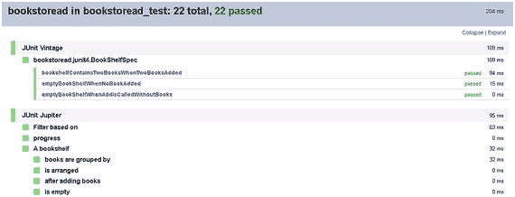
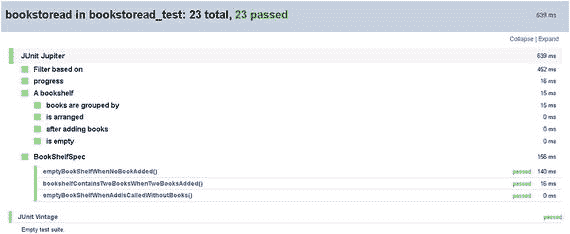

# 8. 动态测试与从 JUnit 4 迁移

在本书中，我们通过为 `bookstoread` 应用构建测试，学习了 JUnit 5 的不同特性。到目前为止，我们添加的所有测试本质上都是静态的。JUnit 5 为我们提供了一种全新的运行时测试创建范式。在本章中，我们将探讨动态测试的生成。

我们已经介绍了 JUnit 5 的所有特性。现在可以说，JUnit 5 将成为未来单元测试的事实标准。各种工具和平台正在构建对 JUnit 5 的支持。我们可以紧跟 JUnit 5 的潮流并开始采用它。但在过去，我们基于 JUnit 4 开发了大量测试和工具，这些代码至今仍为我们创造价值。我们可以保留旧工具/基础设施中的所有代码。但随着我们继续前进，这会使事情变得困难。在本章中，我们还将探讨将现有基于 JUnit 4 的代码迁移到新版本的方法。

## 动态测试

到目前为止，我们已经体验了多种创建测试用例的方式（`@Test`、`@TestTemplate`、`@ParameterizedTest`）。所有这些方法定义的测试都是静态的。此类测试中定义的行为在编译时确定，无法在运行时更改。假设（Assumptions）允许我们添加一些运行时行为，但其能力也有限。JUnit 5 引入了 `@TestFactory`，这是一种动态的测试执行模型。该模型使我们能够在运行时生成测试用例。在预期基于环境、操作系统、参数、应用配置等产生不同行为的场景中，该模型非常有用。被 `@TestFactory` 注解的方法必须返回 `DynamicTest` 的 `Stream`/`Collection`/`Iterable`/`Iterator`。尝试返回其他任何内容都会导致 `org.junit.platform.commons.JUnitException`。`org.junit.jupiter.api.DynamicTest` 类包含一个测试名称和一个可执行体，该可执行体必须作为测试执行的一部分被执行。

```
public class DynamicSpec  {
@TestFactory
Collection generateFirstTest() {
return Arrays.asList(
dynamicTest("Week Test", () -> assertEquals(DayOfWeek.MONDAY,DayOfWeek.of(1))),
dynamicTest("Month Test", () -> assertEquals(Month.JANUARY, Month.of(1)))
);
}
}
```

与静态测试相比，动态测试具有完全不同的生命周期。没有回调/生命周期方法。此外，这些测试不支持 JUnit 5 扩展模型。因此，我们无法使用扩展模型注入任何参数。但 Java 8 lambda 表达式允许我们将单个方法参数传递给相应的动态生成的测试。有一个 `DynamicTest.stream` API（应用程序编程接口），它允许我们传递一个输入参数的迭代器。从迭代器中检索到的每个值都会传递给一个新的测试执行。

```
@TestFactory
Stream generateParameterizedTest() {
LocalDate startDate = LocalDate.now();
Iterator daysIter = Stream.iterate(startDate, date -> date.plusDays(1)).limit(10).iterator();
return  stream(daysIter, d -> DateTimeFormatter.ISO_LOCAL_DATE.format(d), d -> assertNotNull(d));
}
```

让我们运行 `DynamicSpec`。我们应该会看到一个绿色条，表示有 12 个测试用例正在执行。我们已经讨论了动态测试没有测试生命周期和扩展支持的事实。但这并不意味着我们不能在动态测试中使用这些特性。负责生成测试的 `@TestFactory` 方法支持所有这些特性。我们可以注册一个扩展来向 `@TestFactory` 方法注入值。

```
@TestFactory
@ExtendWith(BooksProvider.class)
Stream generateBooksTest(Book[] books) {
return  stream(Arrays.asList(books).iterator(), b  -> String.format("Validating : %s",b.getTitle()), b -> assertFalse(b.isProgress()));
}
```

上述测试方法使用 `BooksProvider` 注入了一个 `Book[]`，该提供器已在第 4 章中添加。生成的测试将包含一个书名作为测试名称的一部分。



图 8-1.

动态测试

## JUnit 4 支持

JUnit 5 是基于过去经验教训对框架的重写。它为我们提供了新的、简单的方法来完成工作。它构建了一个新的编程模型和一个与旧版本框架不兼容的扩展框架。尽管新版本与旧版本不兼容，但框架编写者确保新旧版本可以在同一基础设施中共存。他们构建了足够的支持，以便开发者能够拥有轻松的迁移路径。

让我们开始向我们的 `bookstoread` 项目添加一个基于 JUnit 4 的示例测试。在第 1 章中，我们添加了 `BookShelfSpec`。这些测试用例定义了 `BookShelf` 类在各种场景下的行为。现在，添加一个新的测试用例 `bookstoread.junit4.BookShelfSpec`。

```
@RunWith(MockitoJUnitRunner.class)
public class BookShelfSpec {
private BookShelf shelf;
@Mock
private Book effectiveJava;
@Mock
private Book codeComplete;
@Rule
public TemporaryFolder temporaryFolder = new TemporaryFolder();
@Before
public void init() throws Exception{
shelf = new BookShelf();
temporaryFolder.newFile();
}
@Test
public void emptyBookShelfWhenNoBookAdded() {
List books = shelf.books();
assertTrue(books.isEmpty(), () -> "BookShelf should be empty");
}
@Test
public void bookshelfContainsTwoBooksWhenTwoBooksAdded() {
shelf.add(effectiveJava, codeComplete);
List books = shelf.books();
assertEquals(2, books.size(), () -> "BookShelf should have two books");
}
}
```

在上述测试用例中，我们的测试注解来自 `org.juint` 包。要使用这个包，我们必须将 `testCompile junit:junit:4.12` 依赖添加到我们的 `build.gradle` 中。

在上述测试用例中，我们添加了 JUnit 4 的特性，如 Runners 和 Rules，尽管其中一些并非必需。这里的目标是确定我们如何与所有这些特性协同工作。

让我们尝试执行 `./gradlew clean build` 以确保构建成功。我们的 `bookstoread` 应用源代码包含一个 `junitPlatformTest` 插件。该插件默认禁用标准的 Gradle 测试任务。通过添加以下配置来启用它：

```
junitPlatform{
enableStandardTestTask true
}
```

我们还需要为 `bookstoread.junit4` 包配置测试插件。

```
test {
include '**/junit4/**'
}
```

构建后，我们将在 `build/reports` 文件夹中获得测试执行报告（见图 8-2）：



图 8-2.

JUnit 4 测试


### 使用 Vintage 引擎

JUnit 的下一个版本不仅改进了测试 API，还定义了一个平台框架，可供基于 JUnit 构建的各种工具/插件使用。该平台框架包含面向测试发现、过滤、报告等功能的工具 API。它还定义了一个可插拔的引擎，负责执行测试。这使我们能够拥有独立的引擎来执行不同类型的测试。JUnit 5 版本定义了 Jupiter 引擎，用于执行基于 JUnit 5 API 的测试。它还定义了一个 Vintage 引擎，用于执行基于旧版本 JUnit 的测试。

JunitPlatformTest 插件基于前面描述的框架。该插件会发现项目类路径中可用的引擎并执行它们。到目前为止，我们只使用了 Jupiter 引擎。可以通过将其添加到我们的 `build.gradle` 中来启用 Vintage 引擎。

```
testCompile 'org.junit.vintage:junit-vintage-engine:4.12.1'
```

现在，执行 `./gradlew clean build` 应该在 `build/test-results/junit-platform` 文件夹中提供一个测试执行报告。该文件夹将为每个执行的引擎提供一个 XML 报告。

Vintage 引擎是一种无缝集成所有现有基于 JUnit 4 代码的方式。需要注意的是，使用 Vintage 引擎将有助于基于不同 JUnit 版本的测试用例在同一个项目中共存。但这并不会使旧版本的测试使用 JUnit 5 的新特性/方面。如图 8-3 中的 JUnit 执行报告所示，这两个引擎是相互独立执行的。



图 8-3.

组合引擎报告

### 迁移到 JUnit 5

Vintage 引擎为开发者提供了迁移的灵活性。我们可以从它开始，用新的生态系统构建我们所有的测试用例，然后逐步将我们的测试迁移到新的 JUnit 5 API。新的 API 位于 `org.junit.jupiter.api` 包下。大多数测试生命周期注解在旧版本和新版本之间都有一一对应的关系。

| Junit 4 (org.juint) | Junit 5 (org.junit.jupiter.api) |
| --- | --- |
| Test | Test |
| Before | BeforeEach |
| BeforeClass | BeforeAll |
| After | AfterEach |
| AfterClass | AfterAll |
| Ignore | Disabled |
| Category | Tag |
| RunWith | ExtendWith |

为了迁移我们现有的基于 JUnit 4 的 `bookstoread.junit4.BookShelfSpec` 测试，我们必须执行以下操作：

*   将所有旧的测试注解替换为对应的新值。
*   重构 JUnit 4 断言的测试用例。一些 JUnit 4 断言不再被支持。在新版本中，所有断言都是 `org.junit.jupiter.api.Assertions` 类的一部分。
*   重构 JUnit 4 假设的测试用例。一些 JUnit 4 假设不再被支持。在新版本中，所有假设都是 `org.junit.jupiter.api.Assumptions` 类的一部分。
*   `RunWith` 注解接受一个 `MockitoJunit4Runner` 类。但同样的类不能与 `ExtendWith` 一起使用。JUnit 4 的 Runner 模型在新版本中不再被支持。新版本要求使用扩展来代替 Runner。这些扩展需要添加到每个框架的新版本中（例如，Mockito 需要有一个 `MockitoExtension`）。类似地，当我们处理基于 Spring 的应用程序时，我们有一个 `SpringJUnit4ClassRunner`，用于通过 Spring 上下文注入依赖。同一个 Runner 不能与 JUnit 5 一起使用；因此 Spring 开发者添加了一个 `SpringExtension`，目前正在 Spring 5.0-SNAPSHOT 下开发。
*   `RunWith` 注解只能应用于一个测试类一次。因此，只能将一个 Runner 应用于一个测试类。但 `ExtendWith` 注解没有这个限制。它是一个可重复的注解，允许一个测试类拥有多个扩展。
*   如果扩展不可用，就像我们这种情况，我们需要在测试用例中执行相同的任务（即创建模拟对象）。
*   JUnit 4 引入了规则（Rules），可用于向每个测试用例添加行为。规则有两种注解。
    *   `@Rule`，为每个测试执行。
    *   `@ClassRule`，为测试类中的所有测试执行一次。在新版本中，这两者都不再被支持。开发者应该使用扩展来扩展行为，而不是使用规则。但是规则有很多种，用于各种事情，比如添加临时文件、超时、秒表等等。因此，所有这些都需要重构到新模型中，但这意味着我们失去了功能吗？JUnit 5 团队提供了特定的扩展，以确保所有现有的规则无需任何更改即可工作。以下扩展已添加到 JUnit 5：
    *   `ExternalResourceSupport`
    *   `VerifierSupport`
    *   `ExpectedExceptionSupport`

我们可以将每个扩展添加到我们的测试用例中，或者我们可以使用 `EnableRuleMigrationSupport` 注解，它可以启用所有这些扩展。这些扩展是 `junit-jupiter-migration-support` 组件的一部分。因此我们需要将其添加到我们的 `build.gradle` 中：

```
testCompile 'org.junit.jupiter:junit-jupiter-migrationsupport:5.0.1'
```

最后，我们迁移后的测试用例看起来如下：

```
@EnableRuleMigrationSupport
class BookShelfSpec {
private BookShelf shelf;
@Mock
private Book effectiveJava;
@Mock
private Book codeComplete;
@Rule
public TemporaryFolder temporaryFolder = new TemporaryFolder();
@BeforeEach
void init() throws Exception {
shelf = new BookShelf();
MockitoAnnotations.initMocks(this);
temporaryFolder.newFile();
}
@Test
void emptyBookShelfWhenNoBookAdded() {
List books = shelf.books();
assertTrue(books.isEmpty(), () -> "BookShelf should be empty");
}
}
```

在 JUnit 5 中，如果我们运行规则而没有相应的扩展，执行引擎会在执行规则方法时抛出各种异常。这些异常主要与规则中编写的逻辑有关，而不是通用的 JUnit 5 错误。

上述测试用例不再需要 Vintage 引擎来执行测试。但我们仍然不能移除它的依赖。该测试用例使用了 `TemporaryFolder` 规则，这是 JUnit 4 的一部分。

运行 `./gradlew clean build` 以确保所有测试都通过，如图 8-4 中的报告所示。



图 8-4.

从 Vintage 到 Jupiter


## 总结

在本章中，我们学习了如何将所有现有测试迁移到新版本。JUnit 5 定义了一个平台框架，允许我们使用可插拔的引擎来执行测试。基于 JUnit 5 API 的测试由 Jupiter 引擎执行，而基于旧版本 JUnit 的测试则由 Vintage 引擎执行。这两个引擎使我们能够在同一个项目中同时使用新旧 JUnit API 进行测试。但这并不能让旧版本的测试使用 JUnit 5 提供的新特性。如果我们想使用这些新特性，就需要将测试迁移到新版本。最后，我们列出了在迁移到 JUnit 5 时需要考虑的重要事项。

索引 A 应用程序编程接口 (API) 断言 错误与失败 分组 JUnit 4 与 JUnit 5 方法 测试用例 AssertJ B 黑盒测试 BooksToRead 应用 添加书籍 add 方法 排列 条件 字典序 重构 排序书籍 AssertJ @BeforeEach @Disabled @DisplayName 空书架 失败测试 分组 使测试通过 重构 使测试通过 重构 构建工具，JUnit 5 Ant 目标 构建步骤 控制台启动器 创建 build.xml javac 任务 代码覆盖率 Ant 扩展 Gradle 扩展 Maven 扩展 Gradle API BookShelfSpec 类 依赖 过滤器 插件 合理默认值 包装器 Maven clean test junit-platform-surefire-provider 插件 POM 项目标识 C 持续集成 (CI) 工具 D 依赖注入 (DI) 动态测试 E, F, G, H 异常处理 参见测试异常 ExpectedException 规则 扩展模型 条件测试执行 异常处理 JUnit 4 规则 API Runner API JUnit 5 getExecutionException() 方法 getParent() 方法 getStore() 方法 参数化测试 测试模板 参数解析 注册扩展 测试实例后处理 测试生命周期回调 beforeTestExecution @ExtendWith 注解 方法 阶段 I 集成开发环境 (IDE) IntelliJ J, K Java 代码覆盖率 (JaCoCo) 工具 JUnit 架构 模块 子项目 工具 版本 JUnit4 支持 迁移到 JUnit 5 测试 使用 vintage 引擎 vintage 到 Jupiter JUnit 5 构建工具 参见构建工具，JUnit 5 其他工具 原则 测试类 特性 构造函数 @DisplayName 参数和测试方法 L Lambda 表达式 M, N MockitoRule O Optional<T> P, Q 项目对象模型 (POM) 项目设置 Gradle 属性 安装 Gradle Java 8 项目位置 属性 R 回归错误 S 搜索书架 BookFilter BookPublishedFilterSpec 过滤器 findBooksByTitle 模拟 nullTest() 标签 @Test 测试执行 Streams API 系统设计 T 测试类 特性 构造函数 @DisplayName 参数和测试方法 测试驱动开发 (TDD) 优势 反馈 过程 回归错误 系统设计 测试级别 测试执行 测试异常 ExpectedException 规则 扩展 API 重复测试 @Test 方法 超时 try-catch-fail 测试生命周期 @AfterAll @AfterEach @BeforeAll @BeforeEach 阶段 @Test 方法 TestReporter 测试规范 类 创建 执行 JUnit 5 超时 跟踪书架进度 API 缓存测试数据 ExtensionContext 存储 isRead 方法 规范 添加 测试执行 Try-catch-fail U, V, W, X, Y, Z 单元测试 优势 特性
