# 十、让您的应用具有交互性

到目前为止，我们的 Java 程序数据的输入是通过在代码内部初始化的数组或变量或者通过程序参数提供的。然而，在现实生活中，大多数应用都需要与用户进行交互。可以通过输入用户名和密码向用户提供访问，并且用户有时需要键入细节来确认他/她的身份或者指示应用做什么。Java 支持多种方法来读取用户输入。在这一章中，我们将介绍几种构建交互式 Java 应用的方法。交互式 Java 应用从控制台、Java 构建的界面以及桌面或 web 获取输入。

JShell 是一个命令行界面，开发者可以在这里输入变量声明和单行语句，当按下<enter>时就会执行这些声明。像`bash`这样的命令行界面外壳和像来自 Windows 的命令提示符这样的终端可以用来以连续文本行的形式向程序发出命令。JShell 在本书的开始部分已经介绍过了，原因很简单，因为它是 Java 9 的一个新事物。以下部分将介绍如何使用命令行界面读取用户提供的数据和指令。之后的章节将集中在构建带有桌面/web 界面的 Java 应用上。</enter>

## 从命令行读取数据

本节专门介绍如何从命令行读取用户输入，无论是 IntelliJ IDEA 控制台还是从特定于操作系统的任何终端的可执行 jar 中运行程序。在 JDK 中，有两个类可以用来从命令行读取用户数据:`java.util.Scanner`和`java.io.Console`，本节将详细介绍这两个类。事不宜迟，我们开始吧。

### 使用`System.in`读取用户数据

在**章节** **9** 介绍在`System.out`下的控制台方法中记录打印数据之前，它们在本书的代码示例中经常使用。还有一个名为`System.in`的对应实用程序对象，用于从控制台读取数据:程序用户引入的用于控制应用流的数据。您可能已经注意到，到目前为止，所有 Java 程序在执行时都会被启动，会处理数据，会执行声明的语句，然后它们会终止，优雅地退出，或者在出错时出现异常。将终止决策传递给用户的最简单、最常见的方式是通过调用`System.in.read()`来结束 main 方法。该方法从输入流中读取数据的下一个字节，程序暂停，直到用户输入一个值；当值返回时，我们甚至可以保存并打印它。清单 10-1 显示了使用`System.in.read`读取用户输入的代码。

```java
package com.apress.bgn.ten;

import java.io.IOException;

public class ReadingFormStdinDemo {

    public static void main(String... args) throws IOException {
        System.out.print("Press any key to terminate:");
        byte[] b = new byte[3];
        int read = System.in.read(b);
        for (int i = 0; i < b.length; ++i) {
            System.out.println(b[i]);
        }
        System.out.println("Key pressed: " + read);
    }
}

Listing 10-1Reading a Value Provided By the User in the Console

```

用户输入保存在`byte[] b`数组中；它的大小是任意的。你可以输入任何你想要的东西。只有前三个字节会保存在数组中。然而，这种阅读信息的方式并没有真正的用处，不是吗？我的意思是，看看下面的代码片段，它描述了前面执行的代码和插入的随机文本。

```java
Press any key to terminate: ini mini miny moo.  # inserted text
32
105
110
Key pressed: 3

```

让我们看看如何从用户那里读取全文:输入 class `java.util.Scanner`。

### 使用`java.util.Scanner`

`System.in`变量的类型是`java.io.InputStream`，这是一个 JDK 特殊类型，由所有表示输入字节流的类扩展。你会在第**章** **11** 中了解到更多关于`InputStream`这个职业的信息。这意味着`System.in`可以包装在任何`java.io.Reader`扩展中(阅读**章节** **11** 了解更多信息)，因此字节可以作为可读数据读取。真正重要的是包`java.util`中一个名为`Scanner`的类。这种类型的实例可以通过调用其构造函数并提供`System.in`作为参数来创建。`Scanner`类提供了许多`next*()`方法，可以用来从控制台读取几乎任何类型。在图 10-1 中可以看到`next*()`方法列表。


图 10-1

读取各种类型数据的扫描仪方法

使用`Scanner`从控制台读取数据的优点是，读取的值在可能的情况下会自动转换为适当的类型；如果不是，则抛出一个`java.util.InputMismatchException`。

下面这段代码旨在让您可以通过插入文本然后插入值来选择要读取的值的类型。在清单 10-2 中，Scanner 实例的适当方法被调用来读取值。

```java
package com.apress.bgn.ten;

import java.math.BigInteger;
import java.util.ArrayList;
import java.util.List;
import java.util.Scanner;

public class ReadingFromStdinUsingScannerDemo {

    public static final String EXIT = "exit";
    public static final String HELP = "help";
    public static final String BYTE = "byte";
    public static final String SHORT = "short";
    public static final String INT = "int";
    public static final String BOOLEAN = "bool";
    public static final String DOUBLE = "double";
    public static final String LINE = "line";
    public static final String BIGINT = "bigint";
    public static final String TEXT = "text";
    public static final String LONGS = "longs";

    public static void main(String... args) {
        Scanner sc = new Scanner(System.in);
        String help = getHelpString();
        System.out.println(help);

        String input;
        do {
            System.out.print("Enter option: ");
            input = sc.nextLine();

            switch (input) {
                case HELP:
                    System.out.println(help);
                    break;
                case EXIT:
                    System.out.println("Hope you had fun. Buh-bye!");
                    break;
                case BYTE:
                    byte b = sc.nextByte();
                    System.out.println("Nice byte there: " + b);
                    sc.nextLine();
                    break;
                case SHORT:
                    short s = sc.nextShort();
                    System.out.println("Nice short there: " + s);
                    sc.nextLine();
                    break;
                case INT:
                    int i = sc.nextInt();
                    System.out.println("Nice int there: " + i);
                    sc.nextLine();
                    break;
                case BOOLEAN:
                    boolean bool = sc.nextBoolean();
                    System.out.println("Nice boolean there: " + bool);
                    sc.nextLine();
                    break;
                case DOUBLE:
                    double d = sc.nextDouble();
                    System.out.println("Nice double there: " + d);
                    sc.nextLine();
                    break;
                case LINE:
                    String line = sc.nextLine();
                    System.out.println("Nice line of text there: " + line);
                    break;
                case BIGINT:
                    BigInteger bi = sc.nextBigInteger();
                    System.out.println("Nice big integer there: " + bi);
                    sc.nextLine();
                    break;
                case TEXT:
                    String text = sc.next();
                    System.out.println("Nice text there: " + text);
                    sc.nextLine();
                    break;
                default:
                    System.out.println("No idea what you want bruh!");
            }

        } while (!input.equalsIgnoreCase(EXIT));
    }

    private static String getHelpString() {
        return new StringBuilder("This application helps you test various usage of Scanner. Enter type to be read next:")
                .append("\n\t help >  displays this help")
                .append("\n\t exit >  leave the application")
                .append("\n\t byte > read a byte")
                .append("\n\t short > read a short")
                .append("\n\t int > read an int")
                .append("\n\t bool > read a boolean")
                .append("\n\t double > read a double")
                .append("\n\t line > read a line of text")
                .append("\n\t bigint > read a BigInteger")
                .append("\n\t text > read a text value").toString();
    }
}

Listing 10-2Reading a Value Provided By the User in the Console Using java.util.Scanner

```

您可能已经注意到，在前面的代码示例中，大多数 scanner 方法都是用一个`nextLine()`一起调用的。这是因为您提供的每个输入都是由实际的令牌和一个新的行字符组成的(按下< Enter >结束您的输入)，在您可以输入下一个值之前，您还需要从流中取出那个字符。

清单 10-3 描述了清单 10-2 中的代码被用来读取一些用户值。

```java
This application helps you test various usage of Scanner. Enter type to be read next:
     help >  displays this help
     exit >  leave the application
     byte > read a byte
     short > read a short
     int > read an int
     bool > read a boolean
     double > read a double
     line > read a line of text
     bigint > read a BigInteger
     text > read a text value
Enter option: byte
12
Nice byte there: 12
Enter option: bool
true
Nice boolean there: true
Enter option: line
some of us are hardly ever here
Nice line of text there: some of us are hardly ever here
Enter option: text
john
Nice text there: john
Enter option: text
the rest of us are made to disappear...
Nice text there: the
Enter option: double
4.2
Nice double there: 4.2
Enter option: int
AAAA
Exception in thread "main" java.util.InputMismatchException
    at java.base/java.util.Scanner.throwFor(Scanner.java:939)
    at java.base/java.util.Scanner.next(Scanner.java:1594)
    at java.base/java.util.Scanner.nextInt(Scanner.java:2258)
    at java.base/java.util.Scanner.nextInt(Scanner.java:2212)
    at chapter.ten.scanner/com.apress.bgn.ten.ReadingFromStdinUsingScannerDemo.main(ReadingFromStdinUsingScannerDemo.java:80)

Listing 10-3Running the ReadingFromStdinUsingScannerDemo Class

```

前面清单中突出显示的输出代表了`next()`方法的测试用例。这个方法应该用于读取单个`String`令牌。下一个标记被转换成一个`String`实例，很明显，当遇到空格时，标记结束。这就是为什么在前面的例子中，唯一读取的文本最终是*的*。在最后一种情况下，期望的选项是一个整数值，但是输入了 *AAAA* ，这就是抛出异常的原因。

当您需要从控制台重复读取相同类型的值时，您可以查看您想要读取的值，并在读取之前检查它，以避免抛出`InputMismatchException`。对于这个特定的场景，每个`next*()`方法都有一个名为`hasNext*()`的配对方法。为了展示如何使用这些方法的示例，让我们在前面的代码中添加一个选项，以便能够读取长值列表，如清单 10-4 所示。

```java
...
public static final String LONGS = "longs";
...
    String input;
    do {
        System.out.print("Enter option: ");
        input = sc.nextLine();
        switch (input) {
            case LONGS:
                List<Long> longList = new ArrayList<>();
                while (sc.hasNextLong()) {
                    longList.add(sc.nextLong());
                }
                System.out.println("Nice long list there: " + longList);
                // else all done
                sc.nextLine();
                sc.nextLine();
                break;
            default:
                System.out.println("No idea what you want bruh!");
        }
    } while (!input.equalsIgnoreCase(EXIT));
...

Listing 10-4Using java.util.Scanner to Read a List of Long Values

```

虽然看起来很怪异，但是我们需要调用两次`nextLine()`方法:一次是针对无法转换为`long`的字符，所以`while`循环结束，一次是针对行尾字符，所以下一次读取的是下面读取值的类型。

在`Scanner`类中还有一些其他的方法可以用来过滤输入和只读所需的令牌，但是本节中列出的方法是您将会使用最多的。

### 使用`java.io.Console`

`java.io.Console`类是在比`Scanner,`晚一个版本的 Java 版本 1.6 中引入的，它提供了访问与当前 Java 虚拟机关联的基于字符的控制台设备(如果有的话)的方法。

因此，类`java.io.Console`的方法也可以用于写入控制台，而不仅仅是读取用户输入。如果从后台进程或 Java 编辑器启动 JVM，控制台将不可用，因为编辑器会将标准输入和输出流重定向到它自己的窗口。这就是为什么如果我们要使用`Console`编写代码，我们只能通过从终端运行类或 jar，通过调用`java ReadingUsingConsoleDemo.class`或`java -jar using-console-1.0-SNAPSHOT.jar`来测试它。JVM 的控制台，如果可用的话，在代码中由类`Console`的单个实例来表示，它可以通过调用`System.console()`来获得。

在图 10-2 中，您可以看到可以在控制台实例上调用的方法。


图 10-2

读取各种类型数据的扫描仪方法

显然，`read*(..)`方法用于从控制台读取用户输入，`printf(..)`和`format(..)`用于在控制台打印文本。这里的特例是两个`readPassword(..)`方法，它们允许从控制台读取文本，但在写的时候不显示。这意味着可以在没有任何实际用户界面的情况下编写支持身份验证的 Java 应用。清单 10-5 描述了一个示例代码来查看所有的操作。

```java
package com.apress.bgn.ten;

import java.io.Console;
import java.util.Calendar;
import java.util.GregorianCalendar;

public class ReadingUsingConsoleDemo {

    public static void main(String... args) {
        Console console = System.console();
        if (console == null) {
            System.err.println("No console found.");
            return;
        } else {
            console.writer().print("Hello there! (reply to salute)\n");
            console.flush();
            String hello = console.readLine();
            console.printf("You replied with: '" + hello + "'\n");

            Calendar calendar = new GregorianCalendar();
            console.format("Today is : %1$tm %1$te,%1$tY\n", calendar);
            char[] passwordChar = console.readPassword("Please provide password: ");
            String password =  new String(passwordChar);
            console.printf("Your password starts with '" + password.charAt(0) + "' and ends with '" + password.charAt(password.length()-1) + "'\n");
        }
    }
}

Listing 10-5Using java.io.Console to Read and Write Values

```

在前面的代码示例中，有意使用了各种使用控制台读写数据的方法，以向您展示应该如何使用它们。

`console.writer()`返回一个`java.io.PrintWriter`的实例，它可以用来将消息打印到控制台。问题是直到`console.flush()`被调用，消息才被打印出来。这意味着更多的消息可以被`java.io.PrintWriter`实例排队，并且只有当`flush()`被调用或者当它的内部缓冲区满了的时候才被打印。调用`console.format(..)`来打印格式化的消息，在本例中，使用一个`Calendar`实例来提取当前日期，并根据下面的模板打印出来:`dd mm,yyyy`由这个参数`%1$tm %1$te,%1$tY`定义。使用格式化程序的`Console`方法接受的模板在类`java.util.Formatter`中定义。

复杂的部分:在 IntelliJ 中运行这段代码是不可能的，所以我们必须要么执行类，要么执行 jar。

为了避免在运行代码时创建新的操作系统控制台窗口，大多数 ide，比如 IntelliJ IDEA，都使用无窗口 Java。因为没有窗口，所以没有供用户访问和插入数据的控制台。所以使用 java `.` io `.` Console 的应用必须在命令行中执行。

最简单的方法是配置 Maven `maven-jar-plugin`来创建一个可执行的 jar，要执行的主类是`ReadingUsingConsoleDemo`。Maven 生产的罐子可以在这里找到:`/chapter10/using-console/target/using-console-2.0-SNAPSHOT.jar`。如果你想的话，只需在 IntelliJ IDEA 中打开一个终端，点击终端按钮，进入`target`目录。一旦到了那里，执行`java -jar using-console-2.0-SNAPSHOT.jar`并享受其中的乐趣。在清单 10-6 中，你可以看到我用来测试程序的条目。

```java
> cd chapter10/using-console/target
> java -jar using-console-2.0-SNAPSHOT.jar
Hello there! (reply to salute)
Salut!
You replied with: 'Salut!'
Today is: 06 21,2021
Please provide password:
Your password starts with 'g' and ends with 'a'

Listing 10-6Running the Class ReadingUsingConsoleDemo

```

这是关于使用控制台的所有值得介绍的内容，因为一旦您在一个真正的生产就绪项目中工作，您可能永远都不需要它。

## 使用 Swing 构建应用

Swing 是一个用于 Java 的 GUI 部件工具包。从版本 1.2 开始，它是 JDK 的一部分，旨在为构建具有各种按钮、进度条、可选列表等复杂界面的用户应用提供更加美观和实用的组件。Swing 是基于一个叫做 AWT(简称**抽象窗口工具包** **)** 的东西的早期版本，它是最初的 Java 用户界面小部件工具包。AWT 非常简单，有一组图形界面组件，可以在任何平台上使用，这意味着 AWT 是可移植的，但这并不意味着在一个平台上编写的 AWT 代码实际上可以在另一个平台上工作，因为平台特定的限制。AWT 组件依赖于本机等效组件，这就是它们被命名为重量级组件的原因。在图 10-3 中，你可以看到一个简单的 Java AWT 应用。

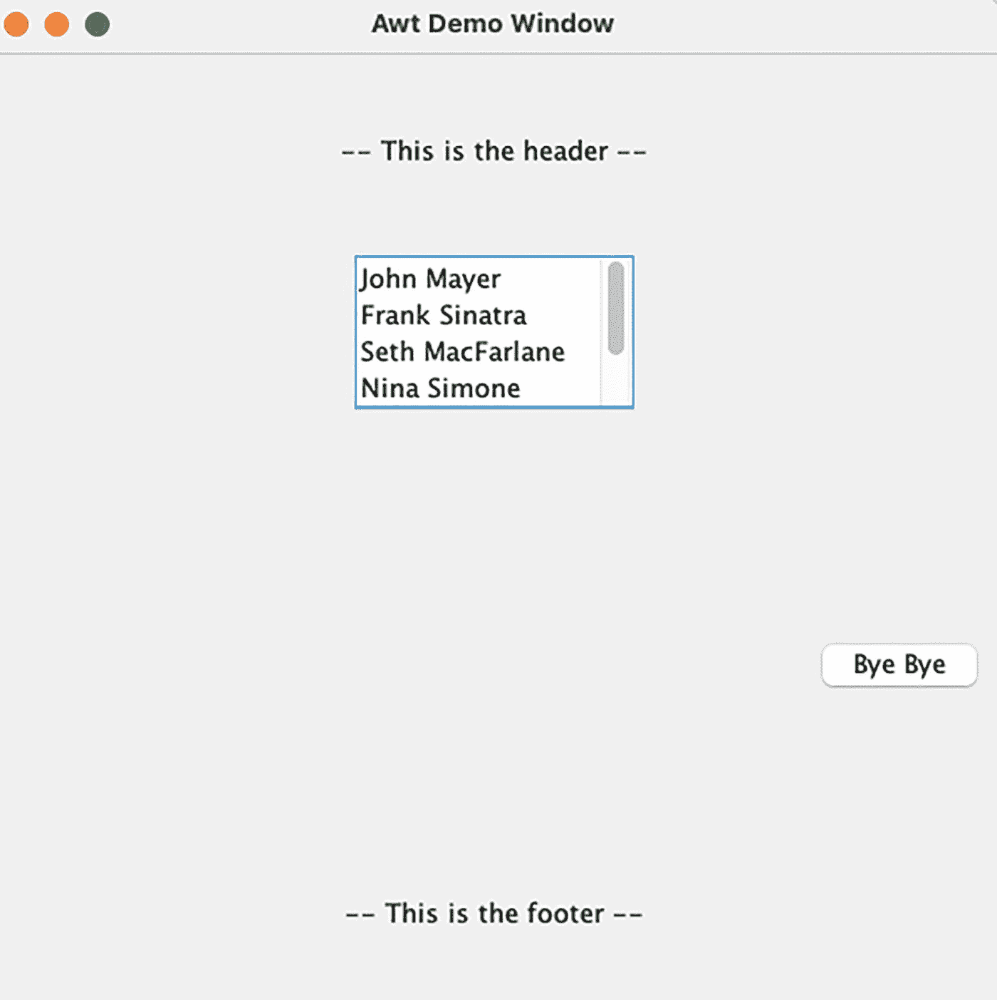

图 10-3

简单的 Java AWT 应用

这是一个简单的窗口，包含一个列表、一个文本区域和一个按钮。主题，也称为应用的外观和感觉，与构建它的操作系统是同一个主题——在本章的例子中是 macOS。由于前面提到的原因，它不能被改变:AWT 接入 OS 本地图形界面。如果你在 Windows 机器上运行相同的代码，窗口看起来会不同，因为它将使用 Windows 主题。

Swing 组件是用 Java 构建的，遵循 AWT 模型，但是提供了一个可插拔的外观。Swing 完全用 Java 实现，包含 AWT 的所有特性，但是它们不再依赖于原生 GUI 这就是为什么它们被称为*轻型*组件。Swing 提供了 AWT 所做的一切，并且用更高级的组件扩展了组件集，比如树形视图、列表框和选项卡式窗格。此外，外观和感觉以及主题是可插拔的，可以很容易地改变。这显然意味着比 AWT 应用更好的可移植性:用非特定于平台的组件编写更复杂的应用设计的可能性，并且因为 Swing 是 AWT 的替代方案，所以在它上面做了更多的开发。

当 web 应用飞速发展时，它们的用户界面非常简单，因为浏览器的功能非常有限。引入 AWT 是为了构建名为 applets 的 Java web 应用。Java 小程序是从浏览器启动的小应用，然后在安装在用户操作系统上的 JVM 中，在独立于浏览器本身的进程中执行。这就是为什么小应用可以在网页框架、新的应用窗口或为测试小应用而设计的独立工具中运行。Java 小程序使用操作系统的 GUI，这使得它们比当时 HTML 笨重的初始外观更漂亮。它们现在已被弃用，并计划在 Java 11 中删除。

至于用 Swing 或 AWT 编写的 Java 桌面应用，它们已经很少使用了，你可能会在学校里学着构建一个，但在其他方面已经过时了。然而，某些机构和公司使用的遗留应用已经在他们的业务中运行了很长时间，并且是用 Swing 构建的。我见过餐馆使用 Swing 应用来管理桌子和订单，我认为大多数超市也使用 Swing 应用来管理购物项目。这就是本书中存在这一部分的原因，因为你可能最终要维护这样的应用，了解基础知识是有好处的，因为 Swing 仍然是 JDK 的一部分。所有 Swing 组件(AWT 也是)都是`java.desktop`模块的一部分。所以如果你想使用 Swing 组件，你必须声明对这个模块的依赖。在清单 10-7 中，显示了一个配置片段。你可以看到我们项目中使用 Swing 的模块通过在其 module-info.java 中使用`requires`指令声明了它对`java.desktop`模块的依赖。

```java
module chapter.ten.swing {
    requires java.desktop;
}

Listing 10-7Module Configuration for the using-swing Project

```

图 10-3 中描述的应用是使用 AWT 构建的。本节将介绍在 Swing 中构建类似的东西，甚至向它添加更多组件。任何 Swing 应用的主类都被命名为`JFrame`，该类型的实例用于创建带有边框和标题的窗口。清单 10-8 中的代码就是这么做的。

```java
package com.apress.bgn.ten;

import javax.swing.*;
import java.awt.*;

public class BasicSwingDemo extends JFrame {
    public static void main(String... args) {
        BasicSwingDemo swingDemo = new BasicSwingDemo();
        swingDemo.setTitle("Swing Demo Window");
        swingDemo.setSize(new Dimension(500,500));

        swingDemo.setVisible(true);
    }
}

Listing 10-8Swing Application with a Simple Title

```

在前面的代码中，创建了一个`javax.swing.JFrame`的实例，为它设置了一个标题，我们还设置了一个大小，这样当窗口创建时，我们就可以看到一些东西。要真正显示窗口，必须在 JFrame 实例上调用`setVisible(true)`。运行前面的代码时，显示一个如图 10-4 所示的窗口。

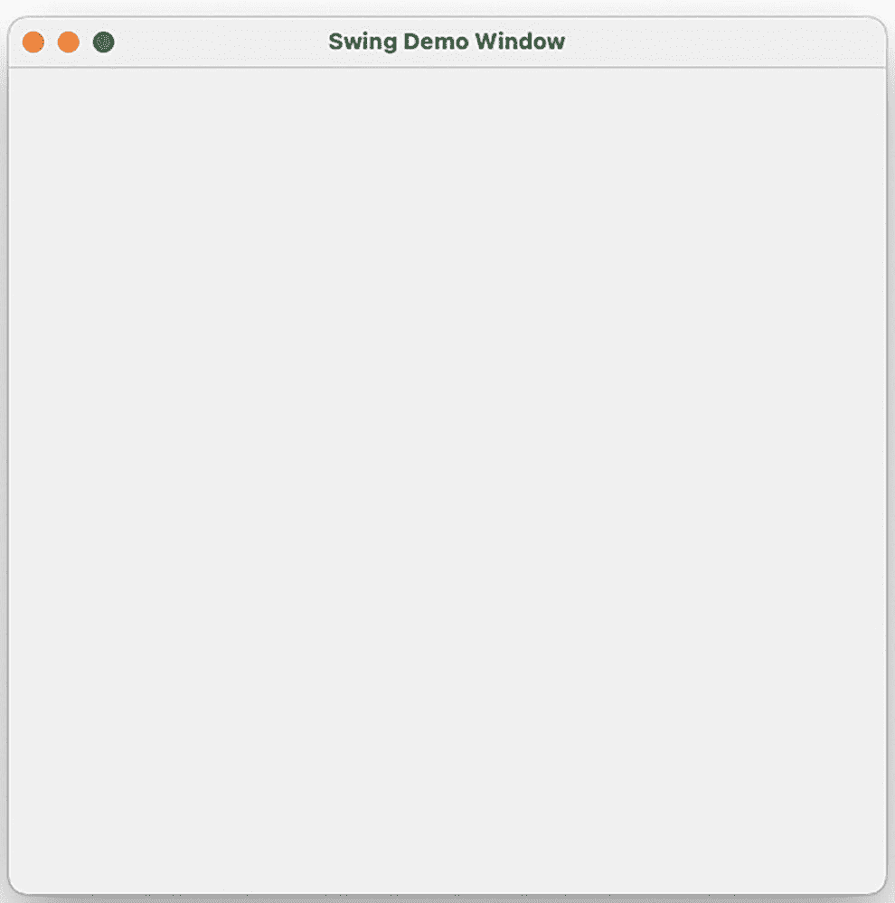

图 10-4

简单的 Java Swing 应用

默认情况下，窗口位于主监视器的左上角，但是可以通过使用一些 Swing 组件来计算相对于屏幕大小的位置来进行更改。确定一个相对于屏幕大小的摆动窗口的大小和位置，仅仅受限于你愿意投入的数学量。

此时，如果我们关闭显示的窗口，应用将继续运行。默认情况下，关闭窗口只是通过调用`setVisible(false)`使其不可见。如果我们想改变默认行为退出应用，我们必须改变关闭时的默认操作。这可以通过在创建 JFrame 实例后添加以下代码行来轻松完成。

```java
swingDemo.setDefaultCloseOperation(JFrame.EXIT_ON_CLOSE);

```

`JFrame.EXIT_ON_CLOSE`常量是定义窗口关闭时应用行为的一组常量的一部分。这个用来声明当窗口关闭时应用应该退出。其他相关选项包括:

*   不执行任何操作，包括关闭窗口。

*   `HIDE_ON_CLOSE`是导致调用`setVisible(false)`的默认选项。

*   当一个应用有多个窗口时，使用`DISPOSE_ON_CLOSE`；此选项用于在最后一个可显示窗口关闭时退出应用。

大多数 Swing 应用都是通过扩展`JFrame`类来获得对其组件的更多控制而编写的，因此前面的代码也可以如清单 10-9 所示来编写:

```java
package com.apress.bgn.ten;

import javax.swing.*;
import java.awt.*;

public class ExitingSwingDemo extends JFrame {

    public static void main(String... args) {
        ExitingSwingDemo swingDemo = new ExitingSwingDemo();
        swingDemo.setDefaultCloseOperation(JFrame.EXIT_ON_CLOSE);
        swingDemo.setTitle("Swing Demo Window");
        swingDemo.setSize(new Dimension(500,500));

        swingDemo.setVisible(true);
    }
}

Listing 10-9Swing Application That Exits When Closed

```

现在我们有了一个窗口，让我们开始添加组件，因为如果我们没有更多的组件来让我们注意到变化，那么改变外观是没有意义的。每个 Swing 应用至少有一个`JFrame`是根，是所有其他窗口的父窗口，因为窗口也可以通过使用`JDialog`类来创建。`JDialog`是创建对话窗口的主类，这是一种特殊类型的窗口，主要包含消息和选择选项的按钮。开发者可以使用这个类来创建自定义的对话框窗口，或者使用`JOptionPane`类方法来创建各种对话框窗口。

回到将组件添加到`JFrame`实例:通过将组件添加到容器中，将组件添加到`JFrame`中。对`JFrame`容器的引用可以通过调用`getContentPane()`来检索。默认的内容窗格是一个简单的中间容器，继承自`JComponent`，它扩展了`java.awt.Container` (Swing 是 AWT 的扩展，它的大部分组件都是 AWT 扩展)。对于`JFrame`，默认的内容窗格实际上是`JPanel`的一个实例。这个类有一个类型为`java.awt.LayoutManager`的字段，它定义了其他组件如何在`JPanel`中排列。一个`JFrame`实例的默认内容窗格使用一个`java.awt.BorderLayout`作为它的布局管理器，将一个窗格分成五个区域:东、西、北、南和中心。每个区域都可以被一个常量引用，该常量具有在`BorderLayout`中定义的匹配名称，所以如果我们想在我们的应用中添加一个退出按钮，我们可以通过编写清单 10-10 中描述的代码将其添加到南部区域。

```java
package com.apress.bgn.ten;

import javax.swing.*;
import java.awt.*;
import java.awt.event.ActionEvent;
import java.awt.event.ActionListener;

public class LayeredSwingDemo extends JFrame {
    private JPanel mainPanel;
    private JButton exitButton;

    public LayeredSwingDemo(String title) {
        super(title);
        mainPanel = (JPanel) this.getContentPane();
        exitButton = new JButton("Bye Bye!");
        exitButton.addActionListener(new ActionListener() {
            @Override
            public void actionPerformed(ActionEvent e) {
                System.exit(0);
            }
        });
        mainPanel.add(exitButton, BorderLayout.SOUTH);
    }

    public static void main(String... args) {
        LayeredSwingDemo swingDemo = new LayeredSwingDemo("Swing Demo Window");
        swingDemo.setDefaultCloseOperation(JFrame.DO_NOTHING_ON_CLOSE);
        swingDemo.setSize(new Dimension(500, 500));
        swingDemo.setVisible(true);
    }
}

Listing 10-10Swing Application using BorderLayout

to Arrange Components

```

在图 10-5 中你可以看到修改后的应用。我们已经在内容窗格的南部区域添加了一个退出按钮，并为`BorderLayout`的整体区域安排加了下划线。

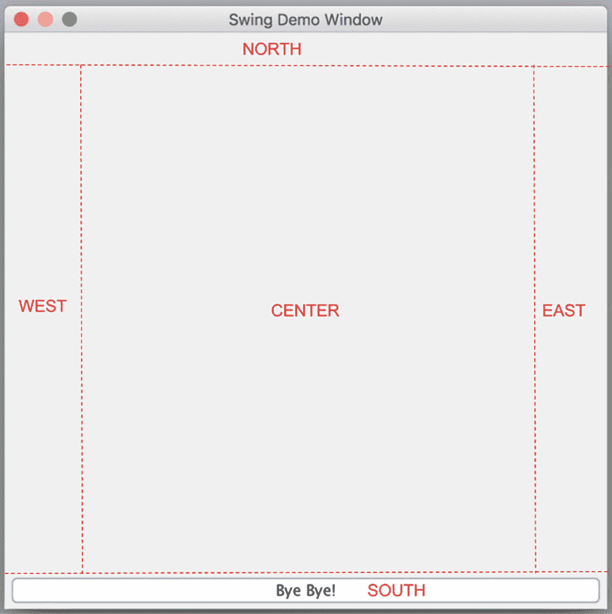

图 10-5

边界布局区域

此外，因为 new 按钮必须是退出应用的唯一方式，所以

```java
setDefaultCloseOperation(JFrame.EXIT_ON_CLOSE);

```

被替换为

```java
setDefaultCloseOperation(JFrame.DO_NOTHING_ON_CLOSE);

```

按钮附带了一个`java.awt.event.ActionListener`实例，这样它就可以记录按钮被点击的事件并做出相应的反应，在本例中是退出应用。大多数 Swing 组件支持侦听器，可以定义侦听器来捕获用户在对象上执行的事件，并以某种方式做出反应。我们可以看到，按钮扩展并填充了该区域的整个空间，因为它继承了该区域的维度。为了避免这种情况，按钮应该放在另一个容器中，这个容器应该使用不同的布局:`FlowLayout`。顾名思义，这种布局允许在定向流中添加 Swing 组件，就像在段落中一样。可以像文本文档中的文本格式一样进行调整，并为要对齐的组件定义常量:居中、左对齐等等。在前面的例子中，我们将把`exitButton`包装在另一个利用`FlowLayout`的`JPanel`中。清单 10-11 展示了如何使用`FlowLayout`在`JFrame`实例的右上角放置一个按钮。

```java
...
public LayeredSwingDemo(String title) {
        super(title);
        mainPanel = (JPanel) this.getContentPane();
        exitButton = new JButton("Bye Bye!");
        exitButton.addActionListener(e -> System.exit(0));
        JPanel exitPanel = new JPanel();
        FlowLayout flowLayout = new FlowLayout();
        flowLayout.setAlignment(FlowLayout.RIGHT);
        exitPanel.setLayout(flowLayout);
        exitPanel.setComponentOrientation(ComponentOrientation.RIGHT_TO_LEFT);
        exitPanel.add(exitButton);
        mainPanel.add(exitPanel, BorderLayout.SOUTH);
    }
...

Listing 10-11Swing Application Using BorderLayout and FlowLayout to Arrange Components

```

还可以使用更多的布局，但是让我们通过添加一个包含许多条目的列表来完成应用，并向其中添加一个侦听器，这样当您单击时，一个元素就会添加到添加到框架中心的文本区域中。swing 列表可以通过实例化`JList<T>`类来创建。这将创建一个显示对象列表的对象，并允许用户选择一个或多个项目。swing `JList<T>`类包含一个类型为`ListModel<T>`的字段，用于管理列表显示的数据内容。当创建和添加元素时，每个对象都与一个索引相关联，当用户选择一个对象时，该索引也可以用于处理。在下一个代码片段中，声明并初始化了`JList`对象，一个 ListSelectionListener 与之相关联，以定义当从列表中选择一个元素时要执行的操作。在我们的例子中，元素值必须加到一个`JTextArea`中。清单 10-12 中描述了这个对象。

```java
private static String[] data = {"John Mayer", "Frank Sinatra",
    "Seth MacFarlane", "Nina Simone", "BB King", "Peggy Lee"};
private JList<String> list;
private JTextArea textArea;
...
    textArea = new JTextArea(50, 10);
    //NORTH
    list = new JList<>(data);
    list.addListSelectionListener(new ListSelectionListener() {
        @Override
        public void valueChanged(ListSelectionEvent e) {
            if (!e.getValueIsAdjusting()) {
                textArea.append(list.getSelectedValue() + "\n");
            }
        }
    });
    mainPanel.add(list, BorderLayout.NORTH);
    //CENTER
    JScrollPane txtPanel = new JScrollPane(textArea);
    textArea.setBackground(Color.LIGHT_GRAY);
    mainPanel.add(txtPanel, BorderLayout.CENTER);
...

Listing 10-12Swing Application Using Layouts and JTextArea

to Arrange Components

```

当点击一个列表元素时，会发生两件事:前一个元素被取消选择，最近被点击的元素被选中，所以被选中的元素会改变。`getValueIsAdjusting()`方法返回这是否是一系列多个事件中的一个(选择事件，点击事件，任何支持的事件)，其中更改仍在进行，我们测试该方法是否返回 false 以检查选择是否已经进行，因此我们可以获取当前选择的元素的值并将其添加到文本区域。

关于`JTextArea`实例，这个实例被添加到一个`JScrollPane`实例中，这个实例允许`textArea`的内容仍然可见，因为它通过提供一两个滚动条来填充文本，这取决于配置。`JScrollPane`也可以包装在一个包含太多条目的列表中，以确保所有条目都是可访问的。此外，由于我们对用户通过文本区域提供的输入不感兴趣，所以调用了`setEditable(false);`方法。

既然我们已经有了一个更复杂的应用，那么是时候改变应用的外观了。到目前为止，我们一直使用底层操作系统提供的默认设置。使用 Swing，可以将外观配置为 JDK 支持的默认外观之一，或者可以使用额外的自定义外观，这些外观作为项目类路径中的依赖项提供，或者开发人员可以创建自己的外观。为了明确地指定外观，在创建任何 swing 组件之前，必须在 main 方法中添加以下代码行:

```java
UIManager.setLookAndFeel(..).

```

该方法接收一个`String`值作为参数，该值代表适当的外观子类的完全限定名。这个类必须扩展抽象`javax.Swing.LookAndFeel`。虽然没有必要，但是您可以通过调用以下命令来明确指定您想要使用本机 GUI:

```java
UIManager.setLookAndFeel(UIManager.getCrossPlatformLookAndFeelClassName());

```

了解了这些，我们来做一些有趣的事情。`UIManager`类包含实用方法和嵌套类，用于管理 swing 应用的外观。其中一个方法是`getInstalledLookAndFeels()`，它提取支持的外观列表，并将其作为`LookAndFeelInfo[]`返回。了解了这一点，让我们做以下事情:列出所有支持的外观，将它们添加到我们的列表中，当用户选择其中一个时，让我们应用它们。不幸的是，由于现在很少使用 swing，所以在我们的应用中没有太多可以使用的自定义外观，所以唯一要做的就是使用 JDK 的产品。清单 10-13 中的代码用外观和感觉完全限定的类名初始化数据数组。

```java
private static String[] data;
...
    public static void main(String... args) throws Exception {
        UIManager.setLookAndFeel(UIManager.getCrossPlatformLookAndFeelClassName());
        UIManager.LookAndFeelInfo[] looks = UIManager.getInstalledLookAndFeels();
        data = new String[looks.length];
        int i =0;
        for (UIManager.LookAndFeelInfo look : looks) {
            data[i++] = look.getClassName();
        }
        SwingDemo swingDemo = new SwingDemo("Swing Demo Window");
        swingDemo.setDefaultCloseOperation(JFrame.DO_NOTHING_ON_CLOSE);
        swingDemo.setSize(new Dimension(500, 500));
        swingDemo.setVisible(true);
    }
...

Listing 10-13Code Sample to Initialize the List of Supported Look-and-Feels

```

现在`ListSelectionListener`的实现变得有点复杂，因为在选择了一个新的外观和感觉类后，我们必须调用`JFrame`实例上的`repaint()`来应用新的外观和感觉，所以我们将把声明放到它自己的类中，并提供`SwingDemo`对象作为参数，这样就可以在`valueChanged(..)`方法中调用`repaint()`。清单 10-14 中描述了代码片段。

```java
private class LFListener implements ListSelectionListener {
    private JFrame parent;
    public LFListener(JFrame swingDemo) {
        parent = swingDemo;
    }
    @Override
    public void valueChanged(ListSelectionEvent e) {
        if (!e.getValueIsAdjusting()) {
            textArea.append(list.getSelectedValue() + "\n");
            try {
                UIManager.setLookAndFeel(list.getSelectedValue());
                Thread.sleep(1000);
                parent.repaint();
            } catch (Exception ee) {
                System.err.println(" Could not set look and feel! ");
            }
        }
    }
}

Listing 10-14Code Sample Showing repaint() Being Called

```

如果我们运行修改后的程序，并逐个选择列表中的每一项，我们应该会看到窗口外观有一点变化。在图 10-6 中你可以看到所有并排的窗口；差异几乎不明显，但它们确实存在。

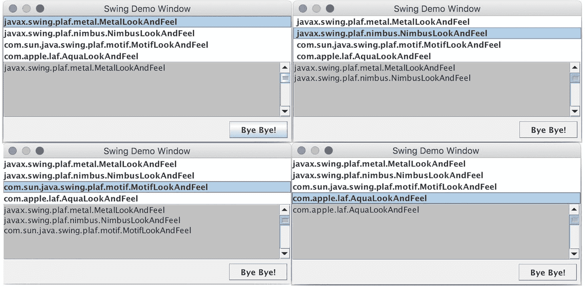

图 10-6

JDK 提供不同的外观和感觉

这就是用几行代码就可以对 Swing 组件做的事情。Swing 库中有更多的组件，但是 Swing 已经不那么常用了。因为现在的焦点是在移动和网络应用上，所以这部分就到此为止了。如果您需要创建或维护一个 Swing 应用，Oracle 提供了相当丰富的教程，其中包含大量示例，您可以直接复制粘贴并根据需要进行修改。 <sup>1</sup>

## JavaFX 简介

JavaFX Script 是 Sun Microsystems 设计的脚本语言，是 Java 平台上 JavaFX 技术家族的一部分。它是在 2008 年 12 月 JDK 6 发布后不久发布的，有一段时间开发者预计它会被放弃，因为它真的没有那么流行，是一种完全不同的语言。在收购 Sun Microsystems 之后，Oracle 决定保留它，并将其转变为 JavaFX 库，Java FX 库是一组图形和媒体包，开发人员可以使用它们来设计、创建、测试、调试和部署能够跨不同平台(包括移动平台)一致运行的富客户端应用。JavaFX 旨在取代 Swing 成为 JDK 的主要 GUI 库，但到目前为止，Swing 和 Java FX 都是所有 JDK 版本的一部分，直到 10。这在 JDK 11 中改变了。从 JDK 11 开始，JavaFX 作为一个独立的模块提供，与 JDK 分离。JavaFX 的使用仍然没有 Oracle 希望的那么多，将它从 JDK 中分离出来可能会鼓励 OpenJFX 社区贡献一些创新的想法，这些想法可能会将这个库转变为市场上其他现有 GUI 工具包的实际竞争对手(例如，Eclipse SWT)。 <sup>2</sup>

在被 JDK 排除后，Java FX 已经独立发展，与发布的 Java 版本保持同步。在撰写本章时，有一个 Java FX 17 EAP 版本可以在 [`https://openjfx.io`](https://openjfx.io) 下载。

下载适合您系统的版本后，解压归档文件。里面至少应该有一个 legal 和 lib 目录。lib 目录包含打包成 JAR 文件的 JavaFX 二进制文件。根据操作系统的不同，lib 可能包含其他库文件。对于本章中的示例，您必须复制以下三个文件:javafx.base.jar、javafx.controls.jar 和 chapter10/using-javafx/libs 中的 javafx.graphics.jar。

在一些电脑上，比如新的 macOS 笔记本电脑，这些例子可能无法运行，因为一些库文件必须复制到一个特定的位置。要找出复制它们的位置，运行带有`-Dprism.verbose=true` VM 参数的主`JavaFxDemo`类。这将导致错误日志更加详细，并告诉您库文件必须复制到哪里。

例如，对于 macOS，目录是`/Users/[user]/Library/Java/Extensions`，要复制的文件是来自`javafx-sdk-17/lib`目录的所有扩展名为`dylib`的文件。

Java FX 曾经是 JDK 的一部分，所以它有类和其他组件。Java FX 代码目前是普通的 Java 代码，所以不再编写脚本。Java FX 组件是在一列`java.fx`模块下定义的。在下面的配置片段中，你可以看到我们项目中使用 Java FX 的模块通过在清单 10-15 中使用`requires`指令声明了它对几个`java.fx`模块的依赖。

```java
module chapter.ten.javafx {
    requires javafx.base;
    requires javafx.graphics;
    requires javafx.controls;
    opens com.apress.bgn.ten to javafx.graphics;
}

Listing 10-15Configuration Sample for a Project Using java.fx Modules

```

Java FX Application launcher 使用反射来启动应用，因此我们需要打开`com.apress.bgn.ten`包来允许使用`opens`指令进行反射。如果没有这个指令，就会抛出一个`java.lang.IllegalAccessException`，应用不会启动。

最容易的开始是一个简单的窗口，只有一个关闭选项和解释。清单 10-16 中描述了显示一个普通方形窗口的代码。

```java
package com.apress.bgn.ten;

import javafx.application.Application;
import javafx.scene.Scene;
import javafx.scene.layout.StackPane;
import javafx.stage.Stage;

public class JavaFxDemo extends Application {
    public static void main(String... args) {
        launch(args);
    }

    @Override
    public void start(Stage primaryStage) {
        primaryStage.setTitle("Java FX Demo Window!");
        StackPane root = new StackPane();
        primaryStage.setScene(new Scene(root, 500, 500));
        primaryStage.show();
    }
}

Listing 10-16Simple JavaFx Application

```

你需要知道的第一件事是应用的主类必须扩展`javafx.application.Application`类，因为这是 Java FX 应用的入口点。这是必需的，因为 JAVA FX 应用是由位于 JVM 之上的名为 **Prism** 的新性能图形引擎运行的。除了图形引擎 Prism，Java FX 还自带名为 **Glass** 的窗口系统、媒体引擎和网络引擎。它们不公开暴露；开发人员唯一可用的是 Java FX API，它提供了对任何组件的访问，您可能需要这些组件来构建具有漂亮接口的应用。所有这些引擎都通过 **Quantum** 工具包连接在一起，该工具包是这些引擎和栈中上层之间的接口。Quantum 工具包是管理执行线程和渲染的工具。

`launch(..)`方法是`Application`类中的静态方法，用于启动独立的应用。它通常从 main 方法中调用，并且只能调用一次，否则会抛出一个`java.lang.IllegalStateException`。直到通过关闭所有窗口或调用`Platform.exit()`退出应用，launch 方法才返回。launch 方法创建一个 JavaFxDemo 实例，在其上调用`init()`方法，然后调用`start(..)`。`start(..)`方法在`Application`类中被声明为抽象的，所以开发者被迫提供一个具体的实现。

Java FX 应用是使用在`javafx.scene`下定义的组件构建的，具有层次结构。`javafx.scene`包的核心类是`javafx.scene.Node`，它是`Scene`层次结构的根。该层次结构中的类为应用用户界面的所有可视元素提供实现。因为它们都有`Node`作为根类，可视元素被称为节点，这使得应用成为节点的场景图，并且这个图的初始节点被称为根。每个节点都有一个唯一的标识符、一个样式类和一个包围体，除了根节点之外，图中的每个节点都有一个父节点和零个或多个子节点。除此之外，节点还具有以下属性:

*   当您将鼠标悬停在界面上以确保您单击了正确的组件时，模糊和阴影等效果非常有用。

*   不透明。

*   改变视觉状态或位置的变换。

*   事件处理程序类似于 Swing 中的监听器，用于定义对鼠标、按键和输入法的反应。

*   特定于应用的状态。

场景图大大简化了丰富界面的构建，因为它还包括矩形、文本、图像和媒体等基本图形，动画各种图形可以通过包`javax.animation`的动画 API 来完成。如果你对 Java FX 有兴趣，这里有一篇关于它的详细文章: [`https://docs.oracle.com/javafx/2/architecture/jfxpub-architecture.htm`](https://docs.oracle.com/javafx/2/architecture/jfxpub-architecture.htm) 。这本书的重点是如何做事情，而不是现在他们的工作，所以阅读这篇文章可能有助于你未来解决方案的设计。

我们从一个简单的窗口开始。第一步是添加一个退出应用的按钮。由于渲染 Java FX 应用涉及到渲染引擎，这意味着它必须正常关闭，所以调用`System.exit(0)`并不是一个好的选择。`start(..)`方法的内容必须调用一个特殊的 JavaFX 方法来优雅地关闭应用。代码如清单 10-17 所示。

```java
package com.apress.bgn.ten;

import javafx.application.Application;
import javafx.application.Platform;
import javafx.event.ActionEvent;
import javafx.event.EventHandler;
import javafx.scene.*;
import javafx.stage.*;

public class SimpleJavaFxDemo extends Application {
    public static void main(String... args) {
        launch(args);
    }

    @Override
    public void start(Stage primaryStage) {
        primaryStage.setTitle("Java FX Demo Window!");

        Button btn = new Button();
        btn.setText("Bye bye! ");
        btn.setOnAction(new EventHandler<ActionEvent>() {
            @Override
            public void handle(ActionEvent event) {
                Platform.exit();
            }
        });

        StackPane root = new StackPane();
        root.getChildren().add(btn);
        primaryStage.setScene(new Scene(root, 300, 300));
        primaryStage.show();
    }
}

Listing 10-17Simple JavaFx Application with a Button

```

运行`SimpleJavaFxDemo`类会在你的屏幕上弹出如图 10-7 所示的窗口，如果你点击`Bye, bye!`按钮，应用会因为`Platform.exit()`调用而优雅地关闭。


图 10-7

JavaFX 窗口演示

这个按钮只是放在窗口里面，默认情况下放在中间，因为没有编写代码来定位它。Java FX 支持以类似于 Swing 的方式在窗口中排列节点 <sup>3</sup> ，但是 Java FX 提供了支持几种不同风格布局的布局窗格。JavaFX 中带有`BorderLayout`管理器的`JPanel`的等价物是一个名为`BorderPane`的内置布局名称。`BorderPane`提供了五个放置节点的区域，分布与`BorderLayout`相似，但名称不同。清单 10-18 显示了将我们的按钮放置在右下角底部区域的代码，然后讨论更多关于它的内容。

```java
package com.apress.bgn.ten;

import javafx.application.*;
import javafx.geometry.Insets;
import javafx.geometry.Pos;
import javafx.scene.*;
import javafx.stage.*;

public class PannedJavaFxDemo extends Application {
    public static void main(String... args) {
        launch(args);
    }

    @Override
    public void start(Stage primaryStage) {
        primaryStage.setTitle("Java FX Demo Window!");

        Button exitButton = new Button();
        exitButton.setText("Bye bye! ");
        exitButton.setOnAction(event -> Platform.exit());

        BorderPane borderPane = new BorderPane();
        HBox box = new HBox();
        box.setPadding(new Insets(10, 12, 10, 12));
        box.setSpacing(10);
        box.setAlignment(Pos.BASELINE_RIGHT);
        box.setStyle("-fx-background-color: #85929e;");
        box.getChildren().add(exitButton);
        borderPane.setBottom(box);

        StackPane root = new StackPane();
        root.getChildren().add(borderPane);
        primaryStage.setScene(new Scene(root, 500, 500));
        primaryStage.show();
    }
}

Listing 10-18Simple JavaFx Application with a Properly Positioned Button

```

运行`PannedJavaFxDemo`类导致图 10-8 中描述的窗口在你的屏幕上弹出，该图已经被修改以显示一个`BorderPane`的区域。

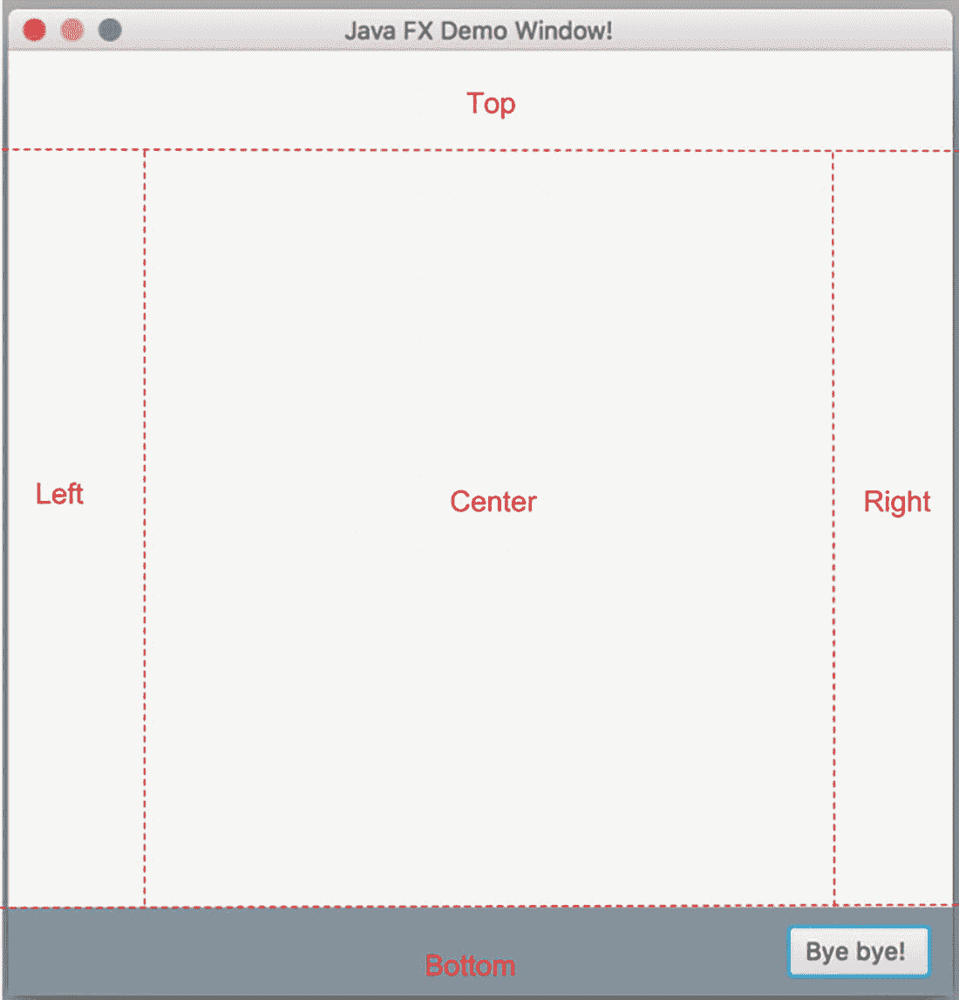

图 10-8

带有`BorderPane`演示的 JavaFX 窗口

如您所见，决定按钮位置的方法与 Swing 相似，只是有一些不同。`BorderPane`有五个区域，分别命名为:`Top`、`Bottom`、`Center`、`Left`和`Right`。为了在每个区域中放置一个节点，已经为每个区域定义了一个`set*(..)`方法:`setTop(..)`、`setBottom(..)`、`setCenter(..)`、`setLeft(..)`和`setRight(..)`。为了进一步定制节点的位置，它应该被放置在一个`HBox`节点中，另一个`JavaFX`元素可以被非常广泛地定制。从代码中可以看出，我们正在使用 CSS 样式元素设置背景。我们通过使用类`Insets`的一个实例定制其中的节点和包含节点的边界之间的空间，并通过调用`box.setAlignment(Pos.BASELINE_RIGHT)`定制包含节点的对齐方式。还有更多`HBox`支持的东西，所以你能用一个盒子做的事情(大部分)只受你想象力的限制。

因此，除了在前面的代码示例中制作漂亮的代码之外，还做了以下事情:根节点成为了一个`BorderPane`节点的父节点，在`BorderPane`的底部区域添加了一个`HBox`，这个`HBox`实例成为了一个`Button`的父节点。正如您所看到的，这个组织是分层的，按钮是层次结构中的最后一个节点。

我们还通过正确设计`HBox`节点的样式来避免使用层窗格。

现在是时候向我们的应用添加最后一个功能了，即文本区域和带有可选元素的列表。选中后，该值将被添加到文本区域。在 JavaFX 中创建文本区域很简单。这个类有一个非常明显的名字:`TextArea`。我们可以直接在`BorderPane`的中心区域添加节点，因为 JavaFX 文本区域默认是可滚动的。所以没有必要把它放在一个`ScrollPane`中，尽管这个类确实存在于`javafx.scene.control`包中，并且对于显示它内部的节点很有用，这些节点构成了一个比窗口大的窗体。清单 10-19 中的三行代码创建了一个`TextArea`类型的节点，声明它不可编辑，并将其添加到`BorderPane`的中心区域。清单 10-19 中的代码显示了完成这项工作的代码。

```java
TextArea textArea = new TextArea();
textArea.setEditable(false);
borderPane.setCenter(textArea);

Listing 10-19Creating and Configuring a JavaFX TextArea

```

下一个是名单。列表稍微复杂一点，但也更有趣，因为通过使用 JavaFX，您可以对列表做很多事情。需要实例化以创建列表对象的类被命名为`ComboBox<T>`。这个类只是用来创建列表的更大的类家族中的一个，根类是抽象类`ComboBoxBase<T>`。根据列表的预期行为，如果我们希望支持单选或多选，如果我们希望列表可编辑或不可编辑，应该选择适当的实现。在我们的例子中，`ComboBox<T>`类符合以下要求:我们需要一个支持单元素部分的不可编辑列表。一个`ComboBox<T>`有一个返回当前用户输入的`valueProperty()`方法。当列表可编辑时，用户输入可以基于从下拉列表中的选择或由用户手动提供的输入。清单 10-20 展示了如何在`BorderPane`的顶部添加一个列表，并添加一个监听器来记录所选的值，并保存到我们之前声明的`TextArea`中。

```java
import javafx.scene.control.ComboBox;
...
private static String data = {"John Mayer", "Frank Sinatra",
    "Seth MacFarlane", "Nina Simone", "BB King", "Peggy Lee"};
...
ComboBox<String> comboBox = new ComboBox<>();
comboBox.getItems().addAll(data);
borderPane.setTop(comboBox);

comboBox.valueProperty().addListener(
    new ChangeListener<String>() {
        @Override
        public void changed(ObservableValue<? extends String> observable, String oldValue, String newValue) {
            textArea.appendText(newValue + "\n");
        }
});

Listing 10-20Creating and Configuring a JavaFX ComboBox<T>

```

`ComboBox<T>`值字段是一个`ObservableValue<T>`实例。侦听器被添加到这个实例中，当它的值发生变化并且它的`changed(..)`方法被调用时，它会得到通知。如您所见，`changed(..)`方法也接收前面的列表选择值作为参数，因为可能我们有一些逻辑需要这两者。

在 AWT 和 Swing 中，您无法直观地处理列表。你有那种外观和感觉，就是这样。JavaFX 支持更多的节点可视化定制，因为它甚至支持 CSS。这就是为什么在下一部分我们会让我们的`ComboBox<T>`列表变得有趣。在 Java FX 中，列表中的每个条目都是一个单元格，可以用不同的方式绘制。为此，我们必须向这个类添加一个`CellFactory<T>`，它将为列表中的每一项创建一个`ListCell<T>`的实例。

如果没有指定`CellFactory<T>`,将使用默认样式创建单元格。清单 10-21 显示了定制一个`ComboBox<T>`的代码。

```java
comboBox.setCellFactory(
    new Callback<>() {
        @Override
        public ListCell<String> call(ListView<String> param) {
            return new ListCell<>() {
            {
                super.setPrefWidth(200);
            }

                @Override
                public void updateItem(String item, boolean empty) {
                    super.updateItem(item, empty);
                    if (item != null) {
                        setText(item);
                        if (item.contains("John") || item.contains("BB")) {
                            setTextFill(Color.RED);
                        } else if (item.contains("Frank") || item.contains("Peggy")) {
                            setTextFill(Color.GREEN);
                        } else if (item.contains("Seth")) {
                            setTextFill(Color.BLUE);
                        } else {
                            setTextFill(Color.BLACK);
                        }
                    } else {
                        setText(null);
                    }
                }
            };
        }
});

Listing 10-21Creating and Customizing Colors of Cells of a JavaFX ComboBox<T>

```

`javafx.util.Callback`接口是一个实用的工具接口，每次在某个动作之后，需要回调的时候都可以使用。在这种情况下，在将一个`String`值添加到`ComboBox<T>`节点的`ListView`(`ListView`顾名思义是可视化的，显示水平或垂直项目列表的`ComboBox<T>`的接口类型)之后，创建了一个单元格，并在那里插入了一些逻辑，以根据其值决定单元格中描述的文本的颜色。

在`ListCell<T>`声明中，有一段代码似乎不合适。

```java
{
    super.setPrefWidth(200);
}

```

前面的代码块是一种有趣的方式，可以在匿名类的声明中从父类调用方法。这里调用`setPrefWidth(200)`是为了确保所有的`ListCell<T>`实例具有相同的大小。`updateItem(..)`中的逻辑非常明显，因此不需要任何扩展的解释。添加细胞工厂的结果如图 10-9 所示。


图 10-9

JavaFX 彩色组合框演示

### 国际化

交互式应用通常被创建为部署在多个服务器上，并且在多个位置 24/7 可用。因为不是所有人都说同一种语言，所以说服人们成为你的客户并使用你的应用的关键是用多种语言构建它。设计一个应用以满足多个国家的用户需求并轻松适应这些需求的过程称为**国际化**。例如，以最初的谷歌页面为例。根据访问它的位置，它会根据该区域改变语言。创建帐户时，您可以选择自己喜欢的语言。这并不意味着谷歌已经为每个地区建立了一个网络应用；这是一个单一的 web 应用，根据用户的位置以不同的语言显示文本。国际化应该在应用的设计阶段就考虑到，因为以后添加它是相当困难的。我们没有 web 应用，但我们将国际化本章中迄今为止构建的 Java FX 应用。

当您开始阅读关于国际化的内容时，您可能会注意到包含国际化属性文件的文件或目录被命名为 *i18n* ，这是因为在英语字母表中 *i* 和 *n* 之间有 18 个字母。

国际化是基于地区的。 **Locale** 是一个术语，指的是语言和地区的组合。应用语言环境决定了将使用哪个国际化文件来定制应用。语言环境的概念是由 Java 中的`java.util.Locale`类实现的，一个`Locale`实例代表一个地理、政治或文化区域。当一个应用依赖于地区时，我们说它是地区敏感的，正如现在大多数应用一样。选择地区也是用户必须做的事情。每个`Locale`都可以用来选择相应的*语言环境资源*，这些资源是包含语言环境特定配置的文件。这些文件按地区分组，通常可以在`resources`目录下找到。这些资源用于配置`java.util.ResourceBundle`的一个实例，该实例可用于管理特定于地区的资源。

为了构建一个合适的本地化用例，前面的 JavaFX 应用将被修改；该列表将包含一个动物名称列表，而不是歌手姓名，这些动物名称带有可以翻译成各种语言的标签。还将添加一个包含可用语言的列表，当从该列表中选择一种语言时，将使用相应的区域设置设置一个`Locale`静态变量，并且窗口将被重新初始化，以便所有标签都可以被翻译成新的语言。让我们从创建资源文件开始。

资源文件是扩展名为`properties`的文件，顾名思义，它包含属性和值的列表。每一行都遵循下面的模式:`property_name=property_value`，如果不是这样，它就被认为是一个国际化资源文件。每个属性名在文件中必须是唯一的；如果有重复的，它会被忽略，IntelliJ IDEA 会用红色下划线来表示。对于需要支持的每种语言，我们需要创建一个属性文件，它包含相同的属性名，但不同的值，因为这些值将代表每种语言中该值的事务。所有文件的名称都必须包含一个通用后缀，并以语言名称和国家/地区结尾，用下划线分隔，因为这是创建语言环境实例所需的两个元素。对于我们的 JavaFX 应用，我们有三个文件，如图 10-10 所示。

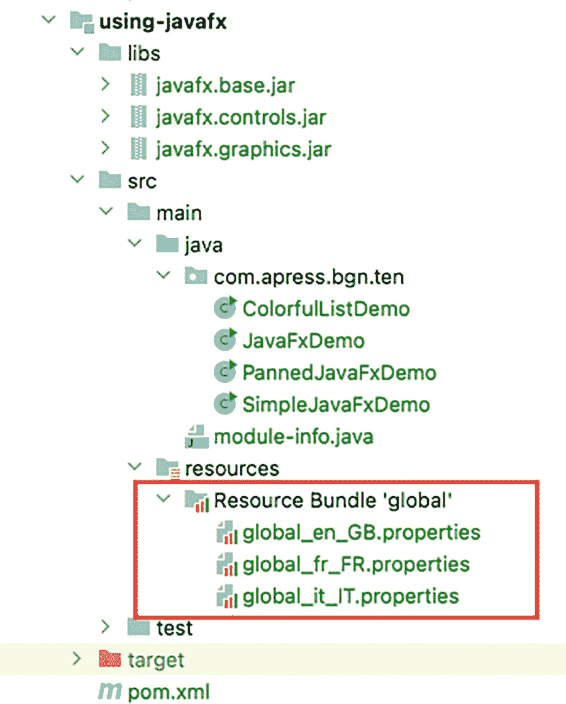

图 10-10

包含三个资源文件的资源包

后缀是`global`，这也将是我们的资源包名称。IntelliJ IDEA 让这一点变得非常明显，它指出我们的文件是用来做什么的，并以最明显的方式描述它们。文件内容如表 10-1 所示。

表 10-1

资源文件的内容

<colgroup><col class="tcol1 align-left"> <col class="tcol2 align-left"> <col class="tcol3 align-left"> <col class="tcol4 align-left"></colgroup> 
| 

属性名称

 | 

global_en_GB 中的属性值

 | 

global_fr_FR 中的属性值

 | 

global_it_IT 中的属性值

 |
| --- | --- | --- | --- |
| 英语 | 英语 | 英语怎么说 | 英语怎么说 |
| 法语 | 法语 | 法国人 | 弗朗西丝 |
| 意大利的 | 意大利的 | 义大利语 | 意大利语 |
| 猫 | 猫 | 闲谈 | 高谭市 |
| 狗 | 狗 | 钱 | 手杖 |
| 鹦鹉 | 鹦鹉 | 钱 | 小鹦鹉 |
| 老鼠 | 老鼠 | 笑一个 | 地形图 |
| 母牛 | 母牛 | 鹦鹉！鹦鹉 | 牛啊牛啊牛啊牛啊牛啊牛啊牛啊牛啊牛啊牛啊牛啊牛啊牛啊牛啊牛啊牛啊牛啊牛啊牛 |
| 猪 | 猪 | Porc | 腰子 |
| 窗口标题 | Java FX 演示窗口！ | Java FX 演示窗口！ | Java FX 演示窗口！ |
| 拜拜 | 拜拜！ | 拜拜！ | 再见！ |
| 选择宠物 | 选择宠物: | 选择宠物: | 选择宠物: |
| 选择语言 | 选择语言: | 选择语言: | 选择语言: |

IntelliJ IDEA 可以帮助您轻松地编辑资源包文件，并通过为它们提供一个特殊的视图来确保您不会遗漏任何键。当您打开一个资源文件时，在左下角您应该看到两个选项卡:一个是命名文本，单击它允许您将属性文件作为普通文本文件进行编辑；另一个是命名资源包，单击它将打开一个特殊视图，左侧是资源文件中的所有属性名称，右侧是包含所选属性名称值的所有资源文件的视图。在图 10-11 中，您可以看到这个视图和属性 ChooseLanguage 的值。

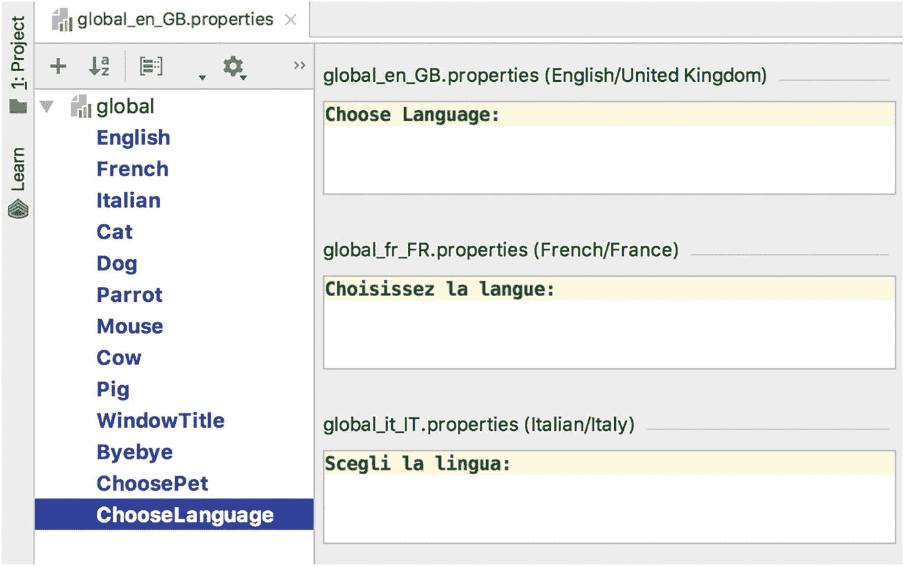

图 10-11

资源包 IntelliJ 想法编辑器

属性名可以包含特殊字符，如下划线和点来分隔它们的各个部分。在本书的例子中，属性名很简单，因为我们只有很少的属性名。在更大的应用中，属性名通常包含一个与其用途相关的前缀；例如，如果属性值是一个标题，该名称将带有前缀`title`。我们文件中的属性名可以被更改为清单 10-22 中列出的名称。

```java
English --> label.lang.english
French --> label.lang.french
Italian --> label.lang.italian
Cat --> label.pet.cat
Dog --> label.pet.dog
Parrot --> label.pet.parrot
Mouse --> label.pet.mouse
Cow --> label.pet.cow
Pig --> label.pet.pig
WindowTitle --> title.window
Byebye --> label.button.byebye
ChoosePet --> label.choose.pet
ChooseLanguage --> label.choose.language

Listing 10-22Recommended Internationalization Property Names

```

既然我们已经介绍了资源文件应该如何编写，那么让我们看看如何使用它们。要创建一个`ResourceBundle`，我们首先需要一个场所。应用有一个默认的区域设置，可以通过调用`Locale.getDefault()`来获得，一个`ResourceBundle`实例可以通过使用一个包名和一个区域设置实例来获得，如下面的代码片段所示:

```java
Locale locale = Locale.getDefault();
ResourceBundle labels = ResourceBundle.getBundle("global", locale);

```

当获得一个有效的`ResourceBundle`时，可以用它来替换所有硬编码的`String`实例，调用从匹配所选区域设置的资源文件中返回文本值。所以每次我们需要为一个节点设置标签时，我们不使用实际的文本，而是使用对:`resourceBundle.getString("[property_name]")`的调用来获取本地化的文本。

重新加载 JavaFX 窗口时，会重新创建它的所有节点。为了能够影响方式，我们需要添加几个静态属性来保持所选的区域设置。对于我们到目前为止构建的应用，在将其国际化后，代码看起来如清单 10-23 所示。

```java
package com.apress.bgn.ten;

import javafx.application.*;
import javafx.geometry.*;
import javafx.scene.*;
import javafx.stage.*;

import java.io.File;
import java.net.URL;
import java.net.URLClassLoader;
import java.util.Locale;
import java.util.ResourceBundle;

public class JavaFxDemo extends Application {

    private static final String BUNDLE_LOCATION = "chapter10/using-javafx/src/main/resources";

    private static ResourceBundle resourceBundle = null;
    private static Locale locale = new Locale("en", "GB");
    private static int selectedLang = 0;

    public static void main(String... args) {
        Application.launch(args);
    }

    @Override
    public void start(Stage primaryStage) throws Exception {
        loadLocale(locale);
        primaryStage.setTitle(resourceBundle.getString("WindowTitle"));

        String[] data = {resourceBundle.getString("Cat"),
                resourceBundle.getString("Dog"),
                resourceBundle.getString("Parrot"),
                resourceBundle.getString("Mouse"),
                resourceBundle.getString("Cow"),
                resourceBundle.getString("Pig")};

        BorderPane borderPane = new BorderPane();

        //Top
        final ComboBox<String> comboBox = new ComboBox<>();
        comboBox.getItems().addAll(data);

        final ComboBox<String> langList = new ComboBox<>();
        String[] languages = {
                resourceBundle.getString("English"),
                resourceBundle.getString("French"),
                resourceBundle.getString("Italian")};

        langList.getItems().addAll(languages);
        langList.getSelectionModel().select(selectedLang);

        GridPane gridPane = new GridPane();
        gridPane.setHgap(10);
        gridPane.setVgap(10);

        Label labelLang = new Label(resourceBundle.getString("ChooseLanguage"));
        gridPane.add(labelLang, 0, 0);
        gridPane.add(langList, 1, 0);

        Label labelPet = new Label(resourceBundle.getString("ChoosePet"));
        gridPane.add(labelPet, 0, 1);
        gridPane.add(comboBox, 1, 1);

        borderPane.setTop(gridPane);

        //Center
        final TextArea textArea = new TextArea();
        textArea.setEditable(false);
        borderPane.setCenter(textArea);

        comboBox.valueProperty().addListener((observable, oldValue, newValue)
                -> textArea.appendText(newValue + "\n"));

        langList.valueProperty().addListener((observable, oldValue, newValue)
                -> {
            int idx = langList.getSelectionModel().getSelectedIndex();
            selectedLang = idx;
            if (idx == 0) {
                //locale = Locale.getDefault();
                new Locale("en", "GB");
            } else if (idx == 1) {
                locale = new Locale("fr", "FR");
            } else {
                locale = new Locale("it", "IT");
            }

            primaryStage.close();
            Platform.runLater(() -> {
                try {
                    new JavaFxDemo().start(new Stage());
                } catch (Exception e) {
                    System.err.println("Could not reload application!");
                }
            });
        });

        HBox box = new HBox();
        box.setPadding(new Insets(10, 12, 10, 12));
        box.setSpacing(10);
        box.setAlignment(Pos.BASELINE_RIGHT);
        box.setStyle("-fx-background-color: #85929e;");
        Button exitButton = new Button();
        exitButton.setText(resourceBundle.getString("Byebye"));
        exitButton.setOnAction(event -> Platform.exit());
        box.getChildren().add(exitButton);
        borderPane.setBottom(box);

        //Bottom
        StackPane root = new StackPane();
        root.getChildren().add(borderPane);
        primaryStage.setScene(new Scene(root, 500, 500));
        primaryStage.show();
    }

    private void loadLocale(Locale locale) throws Exception {

        File file = new File(BUNDLE_LOCATION);
        URL[] url = {file.toURI().toURL()};
        ClassLoader loader = new URLClassLoader(url);

        resourceBundle = ResourceBundle.getBundle("global", locale, loader);
    }
}

Listing 10-23JavaFX Internationalized Application

```

您可能想知道为什么我们使用另一种方式加载资源包，以及为什么使用包位置的完整相对路径。如果我们希望应用可以从 IntelliJ 接口运行，我们必须提供一个相对于应用执行上下文的路径。当应用在可运行的 Java 档案中构建和打包时，资源文件是它的一部分，位于类路径中。当通过在 Java IDE 中执行`main()`方法来运行应用时，类路径相对于项目的实际位置。

清单 10-24 中的代码片段通过关闭`Stage`来重启场景，然后实例化一个 JavaFxDemo 对象并调用`start(..)`。这意味着整个层次节点结构被重新创建，唯一保留的状态是静态对象中定义的状态。这是区域设置所需要的，因为`start(..)`方法的执行现在从调用`loadLocale(locale)`开始，T3 选择应用的区域并加载`ResourceBundle`，这样所有节点都可以用它返回的文本进行标记。

```java
primaryStage.close();
Platform.runLater(() -> {
    try {
        new JavaFxDemo().start(new Stage());
    } catch (Exception e) {
        System.err.println("Could not reload application!");
    }
});

Listing 10-24JavaFX Code Snippet to Restart the Scene

```

到目前为止，我们构建并使用的应用非常简单。如果您需要构建更复杂的接口，并且需要国际化，这将意味着需要配置更多的翻译。您可能需要不同数字和日期格式的文件，或者多个资源包。国际化是一个很大的话题，也是一个很重要的话题，因为现在很少构建一个应用在一个地区使用。对于一个 Java 初学者来说，知道支持类是什么以及如何使用它们是一个很好的起点。

## 构建 Web 应用

现在，我们正在构建一个 web 应用。web 应用是运行在服务器上的应用，可以使用浏览器进行访问。直到最近，大多数 Java 应用都需要像 Apache Tomcat 或 Glassfish 这样的 Web 服务器，或者像 JBoss(目前称为 WildFly)或 TomEE 这样的企业服务器来托管，以便可以访问它们。您将使用类和 HTML 或 JSP 文件编写 web 应用，将其打包在 WAR (Web 归档)或 EAR(企业归档)中，将其部署到服务器，然后启动服务器。服务器将提供应用的上下文，并将请求映射到提供答案作为响应的类。假设应用将部署在 Tomcat 服务器上，在图 10-12 中，您可以看到一个已部署应用功能的抽象模式。

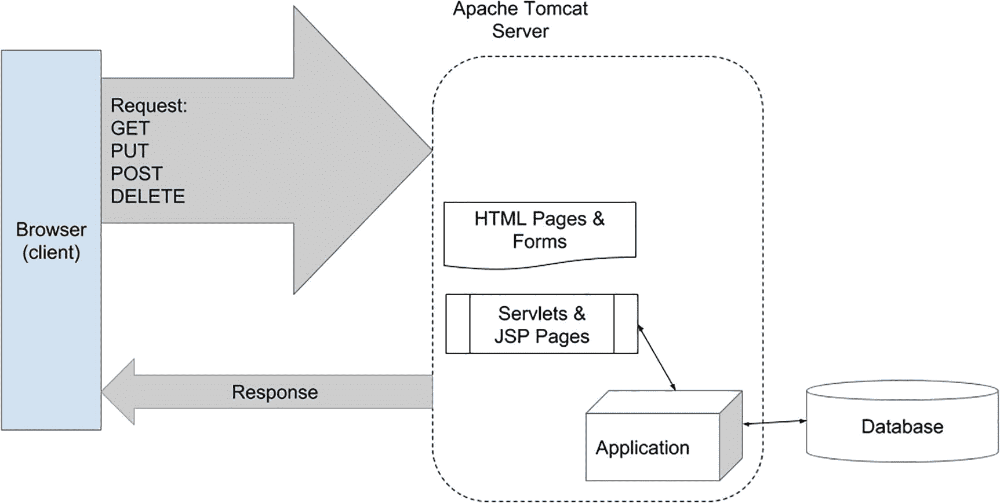

图 10-12

部署在 Apache Tomcat 服务器上的 Web 应用

对 web 应用的请求可以来自浏览器以外的其他客户端(例如，移动应用)，但是因为本节涵盖了 web 应用，所以我们将假设对我们的应用的所有请求都来自浏览器。

先稍微解释一下互联网。互联网是一个信息系统，由许多连接在一起的计算机组成。一些计算机托管提供对应用的访问的应用服务器，一些计算机访问这些应用，而一些计算机两者都做。这些计算机之间的通信是通过一系列协议在网络上完成的:HTTP、FTP、SMTP、POP 等等。最流行的协议是 HTTP，代表超文本传输协议，它是一种不对称的请求-响应客户端-服务器协议，这意味着客户端向服务器发出请求，然后服务器发送响应。后续的请求彼此不了解，它们不共享任何状态，因此它们是无状态的。HTTP 请求可以有不同的类型，根据它们要求服务器上的应用执行的动作来分类，但是有四种类型是开发人员更常用的(图 10.12 中的请求箭头中列出的一种)。我们不会深入讨论关于请求组件的细节，因为这与 Java 并不真正相关，但是我们将只讨论足够多的细节来理解 web 应用是如何工作的。下面列出了四种请求类型和服务器为每一种请求返回的响应类型。

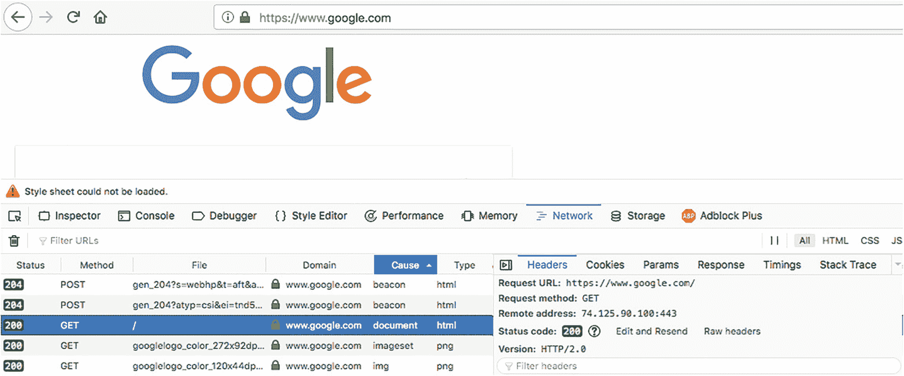

图 10-13

Firefox 中的网络调试器视图

*   **GET** :每当用户在浏览器中输入一个 URL，比如 [`http://my-site.com/index.html`](http://my-site.com/index.html) ，浏览器就把这个地址转换成一个请求消息，发送给 web 服务器。在 **Firefox** 中打开调试器视图，点击**网络**标签，尝试访问 [`https://www.google.com/`](https://www.google.com/) ，就可以轻松查看浏览器做了什么。在图 10-13 中，您可以看到 Firefox 调试器视图显示了被请求的 URL 和请求消息的内容。

在图像的右边，您可以看到被请求的 URL、请求的类型(也称为**请求方法**，在本例中是 GET)以及请求被发送到的服务器的**远程地址**。还有一个名为 **Raw headers** 的按钮，它将打开一个视图，以文本形式显示请求和响应的内容。GET 请求用于从服务器中检索某些东西，在本例中是一个网页。如果可以找到该网页，则发送包含浏览器要显示的页面和其他属性(如状态代码)的响应，以表明一切正常。有一个 HTTP 状态代码列表，最重要的是 200 代码，这意味着一切正常。在前面的图像中，您可以看到，在最初的请求得到回复后，为了显示页面，完成了许多额外的请求，并且所有后续的请求都是成功的，因为服务器返回的状态放在表中的第一列，并且总是 200。

*   **PUT** :当数据被发送到服务器用于更新现有数据时，使用这种类型的请求。在企业应用中，PUT 请求被解释为更新现有对象的请求。该请求包含对象的更新版本和识别它的方法。成功的 PUT 请求会生成一个状态代码为 204 的响应。

*   **POST** :当服务器需要被指示保存数据以便存储时，使用这种类型的请求。与 PUT 请求不同的是，这个数据在服务器上还不存在。在企业应用中，POST 请求或者用于发送凭证以便对用户进行身份验证，或者用于发送将用于创建新对象的数据。当 POST 请求用于发送凭据时，当用户通过身份验证时，响应状态代码为 200；当用户凭据不良时，响应状态代码为 401(未授权);当 POST 请求用于发送要保存的数据时，如果创建了对象，则返回 201 状态代码。

*   **DELETE** :当要求服务器删除数据时，使用这种类型的请求。当一切正常时，响应代码是 200，如果不正常，则是与原因相关的任何其他错误代码。

在更复杂的应用中还有一些其他的 HTTP 方法。如果你对请求方法、状态码和 HTTP 基础知识更感兴趣，我很自信地推荐你看看这个教程: [`http://www.steves-internet-guide.com/http-basics`](http://www.steves-internet-guide.com/http-basics) 。

现在让我们回到编写 Java Web 应用上来。

我们已经提到，直到不久前，我们需要一个服务器来托管一个 web 应用。从几年前开始，情况就不再是这样了。随着用于测试目的的数据库和具有最低功能的应用被嵌入式数据库所取代，web 服务器也发生了同样的情况。如果您想快速编写一个简单的 web 应用，现在可以选择使用像 Jetty 或 Tomcat Embedded 这样的嵌入式服务器。用嵌入式服务器支持复杂的页面非常困难，但是嵌入式服务器通常用于只需要简单 REST APIs 的微服务。

### 带有嵌入式服务器的 Java Web 应用

对于本章的这一节，嵌入式 Tomcat 服务器用于显示几个简单的网页，使用 Java servlet*(耐心年轻的学徒，稍后会解释)*。使用 Tomcat 10.0.7 版本，意味着支持 Java 模块。使用嵌入式 Apache Tomcat 服务器的优点是，您可以通过执行 main 方法来运行 web 应用。

清单 10-25 中描述了代码，它声明了一个非常简单的 servlet，作为应用的主页。

```java
package com.apress.bgn.ten;

import jakarta.servlet.http.HttpServlet;
import jakarta.servlet.http.HttpServletRequest;
import jakarta.servlet.http.HttpServletResponse;
import org.apache.catalina.Context;
import org.apache.catalina.LifecycleException;
import org.apache.catalina.startup.Tomcat;
// other import statements omitted

public class WebDemo {

    private static final Logger LOGGER = Logger.getLogger(Main.class.getName());

    public static final Integer PORT = Optional.ofNullable(System.getenv("PORT")).map(Integer::parseInt).orElse(8080);
    public static final String TMP_DIR = Optional.ofNullable(System.getenv("TMP_DIR")).orElse("/tmp/tomcat-tmp");
    public static final String STATIC_DIR = Optional.ofNullable(System.getenv("STATIC_DIR")).orElse("/tmp/tomcat-static");

    public static void main(String... args) throws IOException, LifecycleException {
        Tomcat tomcat = new Tomcat();
        tomcat.setBaseDir(TMP_DIR);
        tomcat.setPort(PORT);
        tomcat.getConnector();

        tomcat.setAddDefaultWebXmlToWebapp(false);

        String contextPath = ""; // root context
        boolean createDirs =  new File(STATIC_DIR).mkdirs();
        if(createDirs) {
            LOGGER.info("Tomcat static directory created successfully.");
        } else {
            LOGGER.severe("Tomcat static directory could not be created.");
        }
        String docBase = new File(STATIC_DIR).getCanonicalPath();
        Context context = tomcat.addWebapp(contextPath, docBase);

        addIndexServlet(tomcat, contextPath, context); // omitted

        Runtime.getRuntime().addShutdownHook(new Thread(() -> {
            try {
                tomcat.getServer().stop();
            } catch (LifecycleException e) {
                e.printStackTrace();
            }
        }));

        tomcat.start();
        tomcat.getServer().await();
    }
}

Listing 10-25Simple Java Application with an Embedded Server

```

例如，当您不需要利用模板库(如 JSP)生成复杂的 web 页面时，使用嵌入式 Tomcat 服务器编写应用是非常容易的。清单 10-24 中的代码片段只需要`tomcat-embed-core`库作为依赖项，创建服务器的步骤非常简单，在这里解释如下:

*   创建一个`org.apache.catalina.startup.Tomcat`实例并选择端口来公开它。在这种情况下，它是 8080，`PORT`变量的默认值，除非使用同名的系统环境变量声明。

*   为`Tomcat`实例设置一个基本目录，运行的服务器将在这里保存它生成的各种文件，比如日志。在这种情况下，目录被配置为`/tmp/tomcat-tmp`，除非使用带有`TMP_DIR`名称的系统环境变量进行声明。运行应用的用户应该对该位置拥有写权限。

*   设置`Tomcat`的静态文件所在的目录。在这种情况下，目录被配置为`/tmp/tomcat-static`，除非使用带有`STATIC_DIR`名称的系统环境变量进行声明。运行应用的用户应该对该位置拥有写权限。

*   通过调用`tomcat.setAddDefaultWebXmlToWebapp(false)`禁用`Tomcat`的默认配置。在这种情况下，这会阻止`org.apache.jasper.servlet.JspServlet`被注册。这个 servlet 支持在 webapp 中使用 JSP 文件，但是在配置时会自动接管并假设任何请求都必须解析为 JSP 页面，因此 Java Servlets 会被忽略。因为我们想保持应用的简单性并使用 Java servlets，所以我们禁用了它。

*   通过添加关闭挂钩，确保服务器在应用关闭时正常关闭。

*   编写一个简单的 servlet 来显示应用的主页，以测试服务器是否正确启动并按预期工作。这是通过前面的清单中省略的`addIndexServlet(..)`方法来完成的，以确保焦点在`Tomcat`实例上。方法如清单 10-26 所示。

```java
    private static void addIndexServlet(Tomcat tomcat, String contextPath, Context context) {
        HttpServlet indexServlet = new HttpServlet() {
            @Override
            protected void doGet(HttpServletRequest req, HttpServletResponse resp)
                    throws IOException {
                PrintWriter writer = resp.getWriter();
                writer.println("<html><title>Welcome</title><body style=\"background-color:black\">");
                writer.println("<h1 style=\"color:#ffd200\"> Embedded Tomcat 10.0.7 says hi!</h1>");
                writer.println("</body></html>");
            }
        };
        String servletName = "IndexServlet";
        String urlPattern = "/";
        tomcat.addServlet(contextPath, servletName, indexServlet);
        context.addServletMappingDecoded(urlPattern, servletName);
    }

Listing 10-26A Simple Method That Creates a Very Simple Servlet and Registers It with a Tomcat Instance

```

servlet 实例必须与一个名称和一个 URL 模式相关联，当用户试图打开`serverURL/contextPath/urlPattern`页面时，调用`doGet(..)`方法，返回在其主体中构造的响应。

部署在服务器(甚至是嵌入式服务器)上的 Java web 应用需要一个上下文路径。上下文路径值是访问应用的 URL 的一部分。URL 由四部分组成:

*   `protocol`:客户端和服务器进行通信所使用的应用层协议，如`http`、`https`、`ftp`等。

*   `hostname`:DNS 域名(如 [`www.google.com`](http://www.google.com) )或 ip 地址(如 192.168.0.255)或网络中可识别的任何别名。例如，当从同一台计算机上访问应用时，可以使用安装在`127.0.0.1`、本地主机或`0.0.0.0`上的服务器。

*   `path and filename`:资源的名称和位置，在服务器文档基目录下。用户通常会请求查看服务器上托管的特定页面，这就是为什么 URL 看起来像这样: [`https://docs.oracle.com/index.html`](https://docs.oracle.com/index.html) 。出于安全原因，一种非常常用的做法是通过使用内部映射(称为 URL 重定向)来隐藏路径和文件名。

那么前面提到的`contextPath`值是从哪里来的呢？当我们像前面的代码示例一样声明了一个嵌入式服务器时，它托管的任何文件都可以通过使用`http://localhost:8080/`来访问。但是在专用服务器上，可以同时运行多个应用，必须有一种方法将它们分开，对吗？这就是`contextPath`值派上用场的地方。通过将上下文路径设置为`/demo`而不是空字符串，可以在`http://localhost:8080/demo/`访问`WebDemo`应用及其提供给用户的资源。

总之，回到 Java web 应用。Java Web 应用是动态的；使用`Servlets`和`JSP(Java Server Pages)`页面从 Java 代码生成页面。因此，Java Web 应用不是在服务器上运行，而是在服务器的 Web 容器中运行。(这就是为什么 Tomcat 或 Jetty 有时被称为 Servlet 容器。)web 容器为 Java Web 应用提供了 Java 运行时环境。Apache Tomcat 就是这样一个运行在 JVM 中的容器，它支持 servlets 和 JSP 页面的执行。一个 **servlet** 是一个 Java 类，是`jakarta.servlet.http.HttpServlet`的子类。这种类型的实例在 web 容器中响应 HTTP 请求。

 Apache Tomcat 10.x 是 Jakarta EE(正式的 Java EE)技术子集的开源软件实现。Tomcat 基于 Servlet 5.0、JSP 3.0、EL 4.0、WS 2.0 和 JASIC 2.0。在 Tomcat 9.x 之前，servlet 是一个 Java 类，是`javax.servlet.http.HttpServlet`的子类。Tomcat 10.x 需要从`javax.`包迁移到`jakarta.</emphasis>`,以将 Oracle 官方 Java 产品与使用 Eclipse 构建服务器构建的开源产品分开。 <sup>4</sup> 

一个 **JSP 页面**是一个带有。包含 HTML 和 Java 代码的 jsp 扩展。JSP 页面在第一次被访问时被 web 容器编译成 servlet。本质上，servlet 是 Java Web 应用的核心元素。服务器还必须知道 servlet 的存在以及如何识别它，这就是调用`tomcat.addServlet(contextPath, servletName, servlet)`的来源。它基本上是将名为`servletName`的 servlet 添加到带有`contextPath`值上下文路径的应用上下文中，然后将一个 URL 模式关联到 servlet，调用`context.addServletMapping(urlPattern, servletName)`。

当 Java Web 应用运行时，它的所有 servlets 和 JSP 都在它的上下文中运行，但是它们必须在代码中添加到上下文中，并映射到 URL 模式。与该 URL 模式匹配的请求 URL 将访问该 servlet。在清单 10-26 中，servlet 是通过实例化`HttpServlet`抽象类并产生一个匿名 servlet 实例而当场创建的。清单清单 10-27 描述了一个名为`SampleServlet`的具体类，它扩展了`HttpServlet`类。这样做的好处是 URL 模式和 servlet 名称可以成为这个类的属性，从而简化了将它们添加到应用上下文的语法。

```java
package com.apress.bgn.ten;

import jakarta.servlet.http.HttpServlet;
import jakarta.servlet.http.HttpServletRequest;
import jakarta.servlet.http.HttpServletResponse;

import java.io.IOException;
import java.io.PrintWriter;
import java.util.logging.Logger;

public class SampleServlet  extends HttpServlet {
    private static final Logger LOGGER = Logger.getLogger(SampleServlet.class.getName());

    private final String servletName = "sampleServlet";
    private final String urlPattern = "/sample";

    @Override
    protected void doGet(HttpServletRequest req, HttpServletResponse resp)
            throws IOException {
        PrintWriter writer = resp.getWriter();
        try {
            writer.println(WebResourceUtils.readResource("index.html"));
        } catch (Exception e) {
            LOGGER.warning("Could not read static file : " + e.getMessage());
        }
    }

    @Override
    public String getServletName() {
        return servletName;
    }

    public String getUrlPattern() {
        return urlPattern;
    }
}

Listing 10-27The SampleServlet Class

```

出于实际原因，将`urlPattern`属性添加到该类中，以便将与该 servlet 相关的所有内容保存在一个地方。`servletName`也是一样。如果打算多次实例化这个类来创建多个 servlets，那么这两个属性应该声明为可配置的。将这个 servlet 添加到应用非常容易。需要创建一个这种类型的对象，然后必须调用`tomcat.addServlet(..)`和`context.addServletMappingDecoded(..)`，如清单 10-28 所示。

```java
SampleServlet sampleServlet = new SampleServlet();
tomcat.addServlet(contextPath, sampleServlet.getServletName(), sampleServlet);
context.addServletMappingDecoded(sampleServlet.getUrlPattern(), sampleServlet.getServletName());

Listing 10-28Adding the SampleServlet Class to the Web Application

```

在`doGet(..)`方法中,`index.html`文件的内容被读取(使用`WebResourceUtils`,它是本章项目的一部分，但与本章无关),并使用响应`PrintWriter`写入响应对象。

如您所见，`doGet(..)`方法接收两个对象作为参数:`HttpServletRequest`实例被读取，从客户端发送的请求的所有内容都可以使用适当的方法和 HttpServletResponse 实例进行访问，后者用于向响应添加信息。在前面的代码示例中，我们只是编写从另一个文件读取的 HTML 代码。可以调用的额外方法是设置响应状态的`response.setStatus(HttpServletResponse.SC_OK)`。

除了`doGet(..)`方法，还有与每个 HTTP 方法匹配的`do*(..)`方法，它们声明相同类型的参数。

从 Servlet 3.0 开始，可以使用`@WebServlet`注释来编写 Servlet，这消除了显式添加到 web 应用并在清单 10-28 所示的上下文中映射的必要性，因为它们是在 Tomcat 启动时自动选取的。此外，也不需要实例化 servlet 类。

Servlet 3.0 之后的`SampleServlet`类如清单 10-29 所示。

```java
package com.apress.bgn.ten;

import jakarta.servlet.annotation.WebServlet;
import jakarta.servlet.http.*;
// other import statements omitted

@WebServlet(
        name = "sampleServlet",
        urlPatterns = {"/sample"}
)
public class SampleServlet  extends HttpServlet {
    private static final Logger LOGGER = Logger.getLogger(SampleServlet.class.getName());

    @Override
    protected void doGet(HttpServletRequest req, HttpServletResponse resp)
            throws IOException {
        PrintWriter writer = resp.getWriter();
        try {
            writer.println(WebResourceUtils.readResource("index.html"));
        } catch (Exception e) {
            LOGGER.warning("Could not read static file : " + e.getMessage());
        }
    }
}

Listing 10-29Adding the SampleServlet Class to the Web Application

```

这就是我们处理 servlets 的方式，但是我们如何使用嵌入式服务器处理 JSP 页面呢？不是不可能，但也不容易。这就是为什么，对于这个任务，人们通常会选择更聪明的框架，比如 Spring Boot。 <sup>5</sup>

为了避免经历大量的设置代码和细节，JSP 语法将在一个 WEB 应用上解释，该应用必须部署在一个 Tomcat 服务器的独立实例上。

### 独立服务器上的 Java Web 应用

设计用于部署在应用服务器上的 Java 应用被打包为 Web 档案(war)或企业应用档案(ear)。这些是特殊类型的 Java 档案(jar ),用于将其他 jar、JSP(Java 服务器页面)、Java 类、静态页面和 web 应用中的其他资源组合在一起。有一个叫`maven-war-plugin`的 maven 插件，把一个神器打包成一场战争。EAR 是 Jakarta EE 使用的一种文件格式，用于将一个或多个模块打包到应用服务器上的单个部署中；它基本上将一组 jar 和 wars 链接到一个应用中。

在本章中，我们构建了一个非常简单的 web 应用，打包成一个 war，包含 Java 服务器页面，并部署到一个 Apache Tomcat 服务器的独立实例中。

要在本地安装 Apache Tomcat 服务器，请访问位于 [`https://tomcat.apache.org/download-10.cgi`](http://tomcat.apache.org) 的官方网站，下载 Apache Tomcat 版本 10.0.7，并按照您的操作系统的说明进行操作。因为 Apache Tomcat 是作为一个档案文件提供的，所以安装过程应该很简单，只需在您的计算机上的某个地方打开它。在本章中，IntelliJ IDEA 使用 Tomcat launcher 来运行 web 应用，因此与服务器的交互将是最小的。

Java web 应用的结构与典型的 Java 应用不同。它包含典型的`main`和`test`目录，但也包含一个包含 web 资源的`webapp`目录。项目结构如图 10-14 所示。

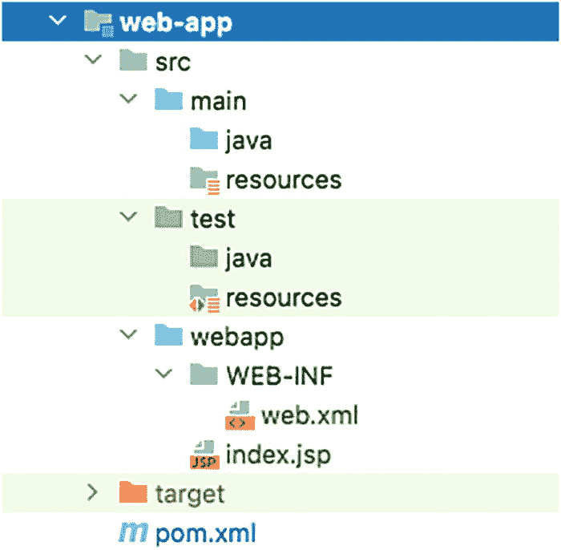

图 10-14

Web 应用结构变化

注意位于`WEB-INF`目录下的`web.xml`文件。这个文件定义了 web 应用的结构。在 Servlet 3.0 之前，这个文件是将 Servlet 映射到 **urlPatterns** 并将其配置为应用的一部分的唯一方法。在 Servlet 3.0 和注释的引入之后，这个文件大部分是空的。

当构建 web 应用时，应用的字节码保存在`WEB-INF/classes`下。如果应用使用第三方库，它们都被保存到`WEB-INF/lib`中。

现在，回到 Java 服务器页面。

有两种编写 JSP 页面的方法。最简单的一种方法是使用**JSP script let，这种方法现在很少使用，因为它将 HTML 代码与 Java 代码结合在一起。**JSP script let 是使用指令标签嵌入在 HTML 代码中的 Java 代码片段。有三种类型指令标签:

*   `<%@ page ...` `%>`声明性指令用于向容器提供指令。使用此指令声明的指令属于当前页面，可以在页面中的任何位置使用。这种指令可用于导入 Java 类型或定义页面属性。示例:

*   `<%@ include ...` `%>` declarative 用于在翻译阶段包含一个文件。因此，使用该指令的当前 JSP 文件是其内容和使用该指令声明的文件内容的组合。

*   `<%@ include file = "footer.jsp" >`

*   `<%@ taglib ...` `%>` declarative 用于声明一个标签库，其中包含将在 JSP 页面中使用的元素。这个声明性很重要，因为它用于导入一个带有自定义标记和元素的库，这些标记和元素将用于编写 JSP 页面。这些标签提供动态功能，而不需要 scriptlets。

```java
<%@ page import="java.util.Date" %>
<%@ page language="java" contentType="text/html; charset=US-ASCII" pageEncoding="US-ASCII" %>

```

图 10-14 中的`index.jsp`箭头非常简单，其内容在清单 10-30 中描述:

```java
<%@ page import="java.util.Date" %>
<%@ page language="java" contentType="text/html; charset=US-ASCII" pageEncoding="US-ASCII" %>
<!DOCTYPE html PUBLIC "-//W3C//DTD HTML 4.01 Transitional//EN" "http://www.w3.org/TR/html4/loose.dtd">
<html>
        <head><title>Web Application Demo JSP Page</title></head>
        <body style="background-color:black">
                <h1 style="color:#ffd200"> Today is <%= new Date() %></h1>
        </body>
</html>

Listing 10-30The Very Simple index.jsp Page Contents

```

它只打印今天的日期，并通过调用`new Date()`来完成。如你所见，我们在一个看起来像 HTML 的页面中使用了 Java 代码。因为那些指令在那里，扩展名是`.jsp,`,所以容器知道这个文件必须被编译成 servlet。当 web 应用的根域被访问时，它打开的默认页面是一个名为`index.html`或`index.htm`或`index.jsp`的文件。除了在`WEB-INF`目录中添加名为`index.jsp`的文件并确保容器可以找到它之外，剩下要做的就是在 IntelliJ IDEA 中配置一个 Apache Tomcat 启动器，并在启动 Tomcat 之前配置它来部署构建这个应用时产生的 war。

要配置 Apache Tomcat 启动器，IntelliJ IDEA 需要启用 Tomcat 和 TomEE 插件。如果您安装 IntelliJ IDEA 时没有对其进行自定义，则默认情况下会安装该插件。如果你设法卸载了它，只需打开 IntelliJ IDE **首选项**窗口，选择**插件**，在**市场**中找到它并勾选它的复选框，如图 10-15 所示。

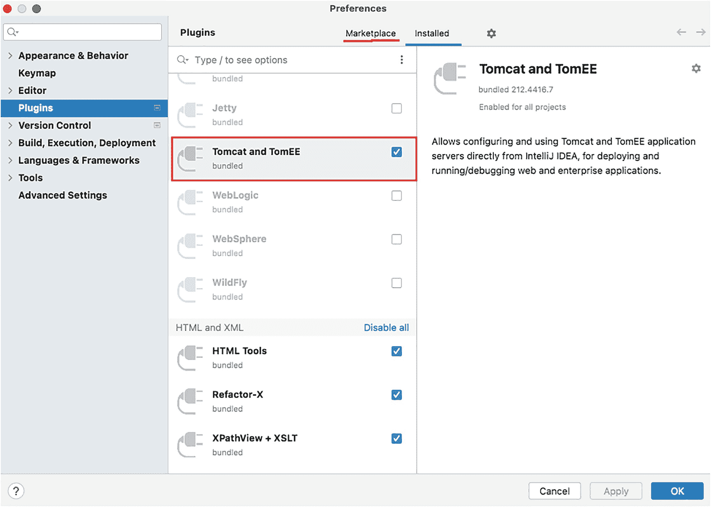

图 10-15

在 IntelliJ IDEA 中启用 Tomcat 和 TomEE 插件

一旦插件安装完毕，点击启动部分并选择**编辑配置...**，从左侧列表中选择 **Tomcat 服务器➤本地**，如图 10-16 所示。

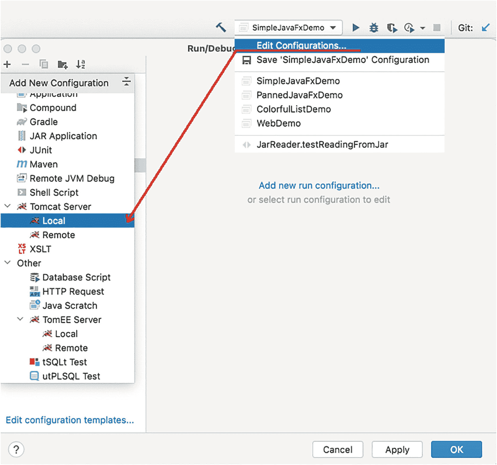

图 10-16

在 IntelliJ IDEA 中创建 Apache Tomcat 启动器

一个新的对话窗口打开。点击**配置**按钮，选择本地 Apache Tomcat，点击**确定**，如图 10-17 所示。

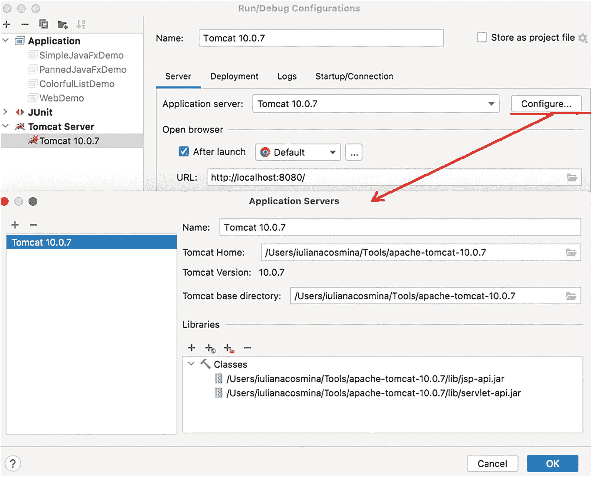

图 10-17

在 IntelliJ IDEA 中创建 Apache Tomcat 启动器:选择 Tomcat 服务器

选择服务器后，点击**修复**按钮或者**部署**标签，点击`+`符号选择工件。IntelliJ IDEA 将识别项目中的所有 web 应用，并提供一个列表供选择。选择`simple-webapp`，如图 10-18 所示。

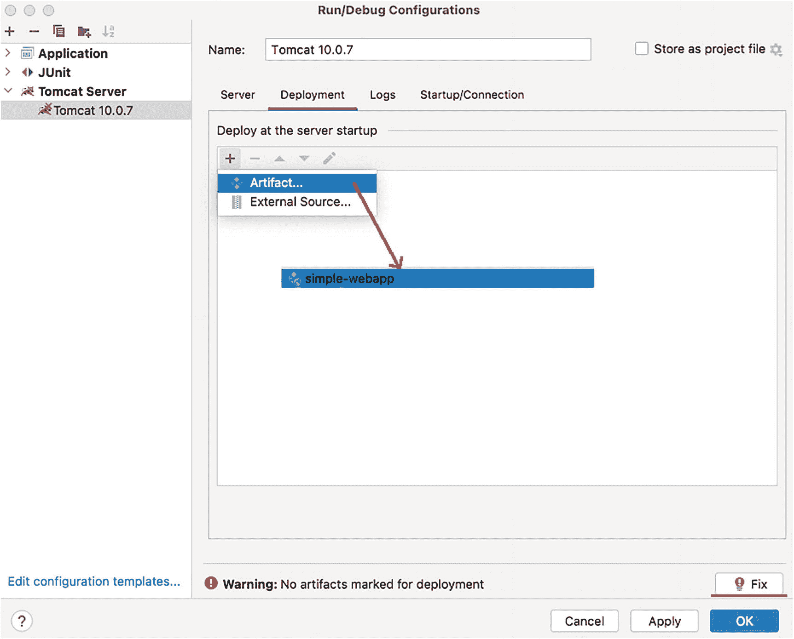

图 10-18

在 IntelliJ IDEA 中创建 Apache Tomcat 启动器:选择要部署的 web 应用

随意编辑启动器的名称和上下文路径，如图 10-19 所示。

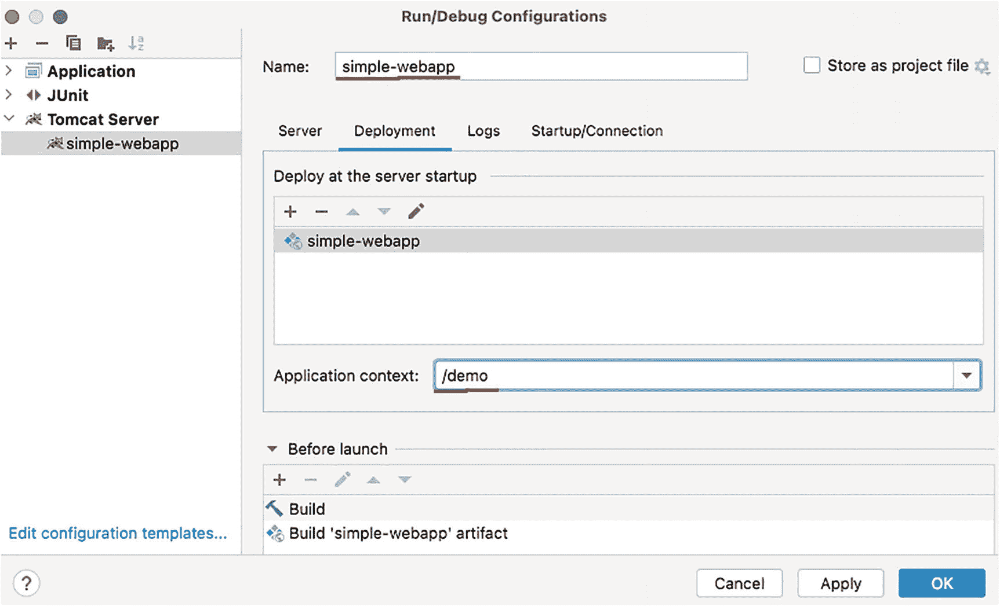

图 10-19

在 IntelliJ IDEA 中创建 Apache Tomcat 启动器:选择要部署的 web 应用

这样配置启动器后，启动服务器并在浏览器中打开`http://localhost:8080/demo`页面。您应该会在页面上看到这样一条简单的消息:

```java
Today is Mon Aug 20 01:41:29 BST 2018

```

当您自己运行该应用时，所描述的日期将是您系统上的日期。

既然已经提到了 **taglibs** ，那我们也来谈一点。最基本的标签库被命名为 **JSTL** ，代表 **JSP 标准标签库**。其他更先进的标记库由 JSF (Java Server Faces)、百里香或 Spring 提供。该库中定义的标签可用于编写根据请求属性改变行为的 JSP 页面，可用于迭代、测试值、国际化和格式化。基于所提供的 JSTL 函数，标签被分成五类，只有在指定了适当的指令之后，它们才能在 JSP 页面中使用。下面列出了五个指令以及标签涵盖的主题:

*   `<%@ taglib uri="` `http://java.sun.com/jsp/jstl/core` `" prefix="c" %>` JSTL 核心标签提供对显示值、迭代、条件逻辑、捕捉异常、url、转发或重定向响应的支持。

*   `<%@ taglib uri="` `http://java.sun.com/jsp/jstl/fmt` `" prefix="fmt" %>` JSTL 格式化标签通过地区和资源包提供数字、日期和 i18n 支持的格式化。

*   `<%@ taglib uri="` `http://java.sun.com/jsp/jstl/sql` `" prefix="sql" %>` JSTL SQL 标签为与关系数据库的交互提供支持，但从不在网页中使用 SQL，因为它非常容易被黑客攻击(只需在 Google 上查找术语 SQL Injection)。

*   `<%@ taglib uri="` `http://java.sun.com/jsp/jstl/xml` `" prefix="x" %>` JSTL XML 标签为处理 XML 文档、解析、转换和 XPath 表达式求值提供支持。

*   `<%@ taglib uri="` `http://java.sun.com/jsp/jstl/functions` `" prefix="fn" %>` JSTL 函数标签提供了许多函数，可用于执行文本操作等常见操作。

现在我们知道了基本的标签类别，你认为我们需要使用哪些类别来重新设计我们的`index.jsp`页面？如果你想过**和**的核心，**你就对了。此外，使用标记库的 JSP 页面通常由一个 servlet 进行备份，该 servlet 为将在 JSP 页面中使用的请求设置适当的属性。所以让我们修改一下`index.jsp`页面，如清单 10-31 所示。**

```java
<%@ page language="java" contentType="text/html;charset=US-ASCII" pageEncoding="US-ASCII"%>
<%@ taglib uri="http://java.sun.com/jsp/jstl/fmt" prefix="fmt" %>
<%@ taglib uri="http://java.sun.com/jsp/jstl/core" prefix="c" %>
<!DOCTYPE html PUBLIC "-//W3C//DTD HTML 4.01 Transitional//EN" "http://www.w3.org/TR/html4/loose.dtd">
<html>
    <head>
        <title>Web Application Demo JSP Page</title>
    </head>
    <body style="background-color:black">
        <fmt:formatDate value="${requestScope.today}" pattern="dd/MM/yyyy" var="todayFormatted"/>
        <p style="color:#ffd200"> Today is <c:out value="${todayFormatted}" /> </p>
    </body>
</html>

Listing 10-31Using FMT adn Core Taglibs to Rewrite index.jsp

```

现在，让我们重新命名它，以清楚它的用途:to `date.jsp`并编写一个名为`DateServlet`的 servlet 类，将`today`属性添加到请求中，该属性将由`<fmt:formatDate>`标记格式化，结果保存到`todayFormatted`变量中，稍后由`<c:out>`标记打印出来。清单 10-32 中描述了`DateServlet`。

```java
package com.apress.bgn.ten;

import jakarta.servlet.RequestDispatcher;
import jakarta.servlet.ServletException;
import jakarta.servlet.annotation.WebServlet;
import jakarta.servlet.http.HttpServlet;
import jakarta.servlet.http.HttpServletRequest;
import jakarta.servlet.http.HttpServletResponse;

import java.io.IOException;
import java.util.Date;

@WebServlet(
        name = "dateServlet",
        urlPatterns = {"/date"}
)
public class DateServlet extends HttpServlet {

    @Override
    protected void doGet(HttpServletRequest request, HttpServletResponse response)
            throws IOException, ServletException {
        System.out.println(" ->>> Getting date ");
        request.setAttribute("today", new Date());
        RequestDispatcher rd = getServletContext().getRequestDispatcher("/date.jsp");
        rd.forward(request, response);
    }
}

Listing 10-32DateServlet Class That Provides the today Attribute for the date.jsp Page

```

现在我们只需重启应用，第一页将显示`Today is 06/07/2021`，您将在系统上看到代码运行的日期。

如果你认为编写 Java web 应用很麻烦，那么你是对的。对于这样的任务，纯 Java 是相当乏味的。专业的 Java web 应用通常是使用框架编写的，这些框架可以轻松地创建页面并将其链接到后端。更有甚者，现在的趋势是使用强大的 JavaScript 框架，如 Angular 和 React，用 JavaScript 创建界面；使用高级 CSS4，许多 UI 设计现在也可以 100%在 CSS3 或 CSS4 中完成，并使用 Web 服务调用(通常是 REST)与企业服务器上托管的 Java 后端应用通信。反正好奇就去查；这个主题非常广泛，但是像 Spring 这样的框架使得设置环境和开始开发变得非常容易。只是不要陷入在不了解框架的基础上使用框架的陷阱。

## 摘要

本章介绍了重要的开发工具和技术，JDK 中为它们提供支持的类，以及重要的 Java 库，这些库可能会让你的开发工作变得实用而愉快。JDK 从未在 GUI 支持方面大放异彩，但 JavaFX 是从 AWT 和 Swing 发展而来的，可能会有未来。本章主题的完整列表如下:

*   如何编写交互式控制台应用

*   如何编写一个带有 Swing 界面的交互式应用

*   JavaFX 架构的基础

*   如何用 JavaFX 接口编写交互式应用

*   如何国际化您的应用

*   如何使用嵌入式服务器编写 web 应用

*   什么是 servlet

*   什么是 JSP Scriptlet

*   如何使用标记库编写 JSP 页面

*   如何将 Java web 应用部署到 Apache Tomcat

<aside aria-label="Footnotes" class="FootnoteSection" epub:type="footnotes">Footnotes 1

Oracle extensive Swing 教程可从 2021 年 10 月 15 日访问的 Oracle“Java 教程”， [`https://docs.oracle.com/javase/tutorial/uiswing/examples/layout/index.html`](https://docs.oracle.com/javase/tutorial/uiswing/examples/layout/index.html) 获得。

  2

SWT 是一个用于 Java 的开源小部件工具包，旨在提供对实现它的操作系统的用户界面设施的高效、可移植的访问。你可以在 Eclipse 的官方网站上了解更多信息，“SWT:标准小部件工具包”， [`https://www.eclipse.org/swt`](https://www.eclipse.org/swt) ，2021 年 10 月 15 日访问。

  3

前面提到过，所有 Java FX 组件的根类都被命名为 Node，所以在本节中，Java FX 组件将被称为 Node，而不是组件。

  4

这篇博客文章解释了整件事:参见 Java 杂志，“从 Java EE 到 Jakarta EE 的转变”， [`https://blogs.oracle.com/javamagazine/transition-from-java-ee-to-jakarta-ee`](https://blogs.oracle.com/javamagazine/transition-from-java-ee-to-jakarta-ee) ，2021 年 10 月 15 日访问。

  5

参见春季官方项目页面， [`https://spring.io/projects/spring-boot`](https://spring.io/projects/spring-boot) ，2021 年 10 月 15 日访问。

 </aside>**