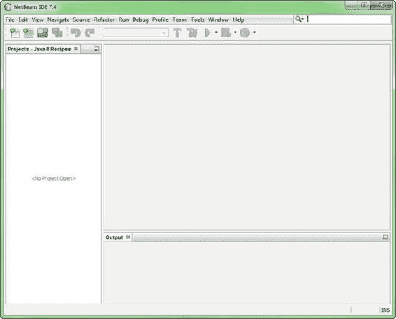
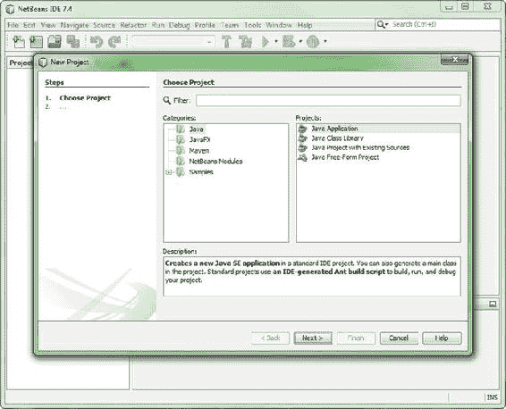
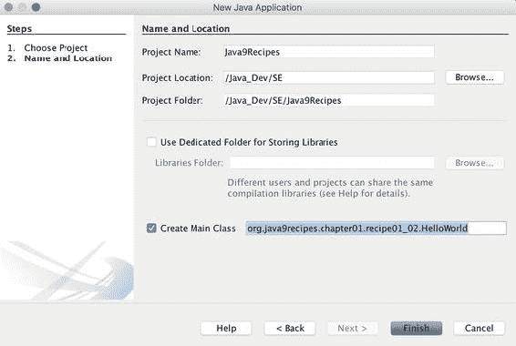
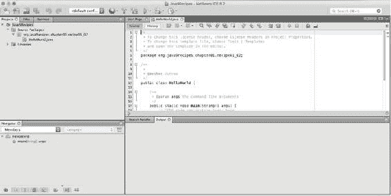

# 一、Java 9 入门

在这一章中，我们提供了一些方法来帮助刚接触 Java 语言的程序员以及那些有其他语言经验的程序员熟悉 Java 9。您将学习安装 Java，还将安装一个集成开发环境(IDE ),从中您将开发应用并试验本书中提供的解决方案。你将学习 Java 的基础知识，比如如何创建一个类，以及如何接受键盘输入。文档经常被忽视，但是在这一章中，你将很快学会如何为你的 Java 代码创建优秀的文档。

###### 注意

*Java 9 食谱*并不是一个完整的教程。相反，它涵盖了 Java 语言的关键概念。如果你真的是 Java 新手，我们推荐你购买和阅读由 Apress 出版的许多*入门 Java* 书籍中的一本。

## 1-1.创建开发环境

### 问题

您想安装 Java 并尝试使用这种语言。您还希望有一个合理的 IDE 来使用它。

### 解决办法

安装 Java 开发工具包 9 (JDK。这给了你语言和编译器。然后安装 NetBeans IDE，以提供更高效的工作环境。

Java 标准版(Java SE)对于这本书里的大部分食谱来说已经足够了。要下载该版本，请访问甲骨文技术网(OTN)的以下页面:

[`www . Oracle . com/tech network/Java/javase/overview/index . html`](http://www.oracle.com/technetwork/java/javase/overview/index.html)

图 1-1 显示了下载选项卡，你可以在页面显著位置看到 Java 平台下载链接和图片。该链接旁边是 NetBeans IDE 的图像，它提供了将 JDK 和 NetBeans 一起下载的选项。选择您喜欢的选项，下载适用于您的平台的版本，然后运行安装向导进行安装。出于本书的目的，我使用 NetBeans IDE 8.2。


###### 图 1-1。OTN 上的 Java SE 下载页面

###### 注意

如果您选择只安装 Java 平台(JDK)而不安装 NetBeans，您可以稍后访问 netbeans.org 下载 NetBeans。

### 它是如何工作的

名称*Java*是甲骨文公司的商标。语言本身是开源的，它的发展由一个叫做 *Java 社区进程* (JCP)的进程控制。你可以在 www.jcp.org 的[了解更多关于这个过程的信息。](http://www.jcp.org)

虽然这种语言本身并不归甲骨文公司所有，但它的核心开发往往是由甲骨文公司主导的。甲骨文公司经营着 jcp.org 的 JCP，并拥有其域名。

Java 有很多版本，比如移动版(ME)和企业版(EE)。Java SE 是标准版，代表了语言的核心。我们在本书中为 Java SE 程序员构建了食谱。那些对为 Raspberry Pi 等设备开发嵌入式应用感兴趣的人可能有兴趣了解更多关于 Java ME 的知识。类似地，那些对开发 web 应用和使用企业解决方案感兴趣的人可能会有兴趣学习更多关于 Java EE 的知识。

###### 注意

企业开发人员可能想要购买并阅读乔希·朱诺号(Apress，2013)的《Java EE 7 食谱》。

有几个不错的网站，您可以访问它们来了解更多关于 Java 的知识，并了解该平台的最新动态。OTN 上的以下页面是开始学习所有 Java 知识的好地方:

[`www.oracle.com/technetwork/java/index.html`](http://www.oracle.com/technetwork/java/index.html)

该页面提供的丰富资源一开始可能会让人不知所措，但是值得您花时间四处看看，顺便熟悉一下许多可用的链接。

其中一个链接指向 Java SE，它会带你进入图 1-1 中所示的页面。您可以从那里下载 Java SE 和 NetBeans IDE。从那里，您还可以访问官方文档、论坛和时事通讯等社区资源，以及旨在帮助您积累 Java 知识并获得该语言认证的培训资源。

## 1-2.进入“你好，世界”

### 问题

您已经安装了 Java SE 9 和 NetBeans IDE。现在您想运行一个简单的 Java 程序来验证您的安装是否正常工作。

### 解决办法

首先打开 NetBeans IDE。您应该会看到一个类似于图 1-2 中的工作区。如果您已经在 IDE 中处理过项目，您可能会在左侧窗格中看到一些项目。



###### 图 1-2。打开 NetBeans IDE

转到文件菜单并选择新建项目。您将看到图 1-3 中的对话框。选择 Java 类别，然后选择 Java 应用。点击下一步进入如图 1-4 所示的对话框。



###### 图 1-3。创建新的 Java SE 项目



###### 图 1-4。命名项目

为您的项目命名。对于与本书相关的项目，使用名称 Java9Recipes。在图 1-4 对话框顶部的项目名称文本框中输入项目名称。

然后在“创建主类”文本框中指定主类的名称。给出以下名称:

```java
org.java9recipes.chapter01.recipe1_02.HelloWorld
```

确保您已经输入了项目名和类名，就像我们在这里提供的一样，因为要遵循的代码取决于您这样做。确保“项目名称”文本框指定 Java9Recipes。确保“创建主类”文本框指定 org . Java 9 recipes . chapter 01 . recipe 1 _ 02 . hello world。

###### 小费

注意大小写；Java 是区分大小写的。

按“完成”以完成向导并创建一个框架项目。您现在应该看到一个 Java 源文件。框架代码已经生成，您的 NetBeans IDE 窗口应该类似于图 1-5 中的窗口。



###### 图 1-5。查看 NetBeans 生成的框架代码

将光标放在源代码窗格中的任意位置。按 Ctrl-A 选择所有的骨架代码。然后按 Delete 键删除它。用清单 1-1 中的代码替换删除的代码。

您可以在清单 1-1 中找到代码，作为本书示例下载的一部分。有两个名为 HelloMessage.java 和 HelloWorld.java 的文件，它们位于名为 org . Java 9 recipes . chapter 01 . recipe 1 _ 02 的 Java 包中。请注意，本书中所有配方溶液都在下载的例子中。

第一个类 HelloMessage 是一个容器类，用于保存基于字符串的消息。

###### 清单 1-1。一个“你好，世界”的例子

```java
package org.java9recipes.chapter01.recipe1_02;

public class HelloMessage {
    private String message = "";
    public HelloMessage() {
        this.message = "Default Message";
    }
    public void setMessage (String m) {
        this.message = m;
    }
    public String getMessage () {
        return message.toUpperCase();
    }   
}

The next class is named HelloWorld, and it initiates the program:

public class HelloWorld {
    /* The main method begins in this class */

    public static void main(String[] args) {
        HelloMessage hm;     
        hm = new HelloMessage();
        System.out.println(hm.getMessage());
        hm.setMessage("Hello, World");
        System.out.println(hm.getMessage());    
    }
}
```

确保您已经粘贴(或键入)了清单 1-1 中的代码。编译并运行该程序，您应该会看到以下输出:

```java
run:
DEFAULT MESSAGE
HELLO, WORLD
BUILD SUCCESSFUL (total time: 1 second)
```

此输出将出现在一个名为“输出”的新窗格中，该窗格由 NetBeans 在 IDE 窗口的底部打开。

### 它是如何工作的

您可以使用本菜谱中显示的通用技术运行本章中几乎所有的解决方案。出于这个原因，我们已经煞费苦心地详细说明了这一点，只展示了一步一步的截图。

#### 包装

解决方案示例首先创建一个 Java *包*:

```java
package org.java9recipes.chapter01.recipe1_02;
```

包是将相关类组合到一个共享名称空间中的一种方式。这个想法是通过以相反的顺序沿着你的组织的域名前进来实现普遍的唯一性。习惯上也是用小写来写包名。

NetBeans 将创建一个目录结构来模拟您的包路径。在这种情况下，NetBeans 创建了以下目录路径:

```java
C:\Users\JonathanGennick\Documents\NetBeansProjects\
Java9Recipes\src\org\java9recipes\chapter01\recipe1_02
```

以下是关于此路径的一些注意事项:

*   前面部分是 C:\Users\...\ netbeans 项目。除非您另外指定，否则 NetBeans 会在 NetbeansProject 目录下创建所有项目，您可以从图 1-4 中的对话框中进行指定。许多开发人员指定较短的路径。

*   接下来是 Java9Recipes 的第一次出现。该事件对应于您在图 1-4 的项目名称文本框中填写的项目名称。

*   您创建的任何源文件都进入 src 目录。NetBeans 在此级别创建其他目录。例如，NetBeans 创建一个构建目录，然后在其下是一个 classes 子目录来保存您编译的类文件。

*   最后是镜像您指定的包路径的目录，在本例中是 org \ Java 9 recipes \ chapter 01 \ recipe 1 _ 02。编译代码时，在 build\classes 目录下会创建一个相同的结构。请注意，如果使用另一个 IDE，您可能会看到创建的目录有所不同。

您不需要显式创建包。如果您没有创建，Java 编译器会为您创建一个，并给它一个隐藏的名称。我们喜欢直截了当，你也应该这样。在专业环境中，考虑周全并明确 Java 包名是必要的。在开发任何重要的应用时，组织以及明智选择的命名约定都很重要。

#### JavaBeans 风格的类

接下来，在解决方案示例中，您将看到一个遵循 JavaBeans 模式的类定义。HelloMessage 的定义遵循了您在 Java 编程中经常遇到的模式，因此我们包含了它。这个类很简单，能够保存一个名为 message 的字符串字段。

该类定义了三种方法:

*   HelloMessage()。此方法也称为构造函数，与类同名。在这种情况下，它不需要任何参数。每当你创建一个新的类对象时，它都会被自动调用。请注意，这被称为“无参数”构造函数，因为它是在类中类型化的，并且不带任何参数。如果不提供构造函数，JVM 将自动提供一个默认的构造函数(也没有参数)。

*   setMessage(字符串)。这个访问器方法以单词 set 开始。它需要一个参数。它指定由相应的 get 方法返回的消息。

*   getMessage()。这个访问器方法返回当前定义的消息。在我们的例子中，我们选择大写消息。

###### 注意

JavaBeans 类中使用访问器方法来访问任何私有声明的类成员。在这种情况下，可以使用这些方法访问标识为 message 的私有变量。访问器方法通常被称为“getters”和“setters”

以 set 和 get 开头的方法被称为 *setter* 和 *getter* 方法。变量 message 是类私有的，这意味着您不能从类外部直接访问消息。

你会在课上看到关键词 this。它是 Java 中的一个特殊关键字，用来引用当前对象。它的使用在清单 1-1 中是多余的，但是如果任何一个方法碰巧创建了它们自己的变量，并且这些变量也被命名为 message，那么就需要使用它。通常的做法是使用“this”关键字从“getter”和“setter”方法中引用类成员。

在 Java 中，通过 setter 和 getter 方法来协调对类变量的访问是很常见的，就像我们示例中的方法一样。这些方法代表了与其他类和你的主程序的某种契约。它们的好处是您可以随意更改 HelloMessage 的存储实现。只要您保持 setMessage()和 getMessage()的外部行为，依赖于 HelloMessage 的其他代码将继续正常工作。

#### 主程序

咒语公共静态空主(...)在公共类中用来表示 Java 程序的入口点。该声明开始了一个名为 main 的可执行方法。您必须指定一个字符串数组参数，通常该参数被定义为 String[] args。

当您执行当前选定的类时，NetBeans 会将代码编译成一组二进制文件，然后将控制权转移给 main()方法。NetBeans 也可以配置为在保存时重新编译，这将导致控制权转移到 main()方法。该方法依次执行以下操作:

1.  执行 HelloMessage 以创建一个名为 hm 的变量，该变量能够保存 HelloMessage 类的实例。变量 hm 此时为空。

2.  调用新的 HelloMessage()以该名称创建该类的对象。将执行无参数构造函数，现在“默认消息”被设置为问候文本。新对象现在存储在变量 hm 中。

3.  调用 System.out.println()以显示对象的无参数构造函数确实已按预期执行。问候语“默认消息”显示在“输出”窗格中。

4.  将消息设置为传统文本“Hello，World”。

5.  再次调用 System.out.println()以输出刚刚设置的新消息。现在你可以看到“HELLO，WORLD”这个问候语被添加到了“输出”窗格中。

解决方案中的模式在 Java 编程中很常见。main()方法是执行开始的地方。使用 new 运算符定义变量，创建对象。通常使用 setter 和 getter 方法来设置和检索对象变量。

###### 小费

命令行应用已经过时了。系统管理员和程序员有时将它们作为实用程序来编写，或者批量处理大量数据。但是总的来说，今天的大多数应用都是 GUI 应用。JavaFX 是编写标准桌面应用的前进方向，你可以在第 14 到 16 章中了解到它。Recipe 14-1 以 GUI 形式提供了本质上是“Hello，World”的应用。JavaEE 提供了为 Java 平台开发基于 web 的应用的选项，你可以在第十七章中了解更多。

## 1-3.配置类路径

### 问题

您想要执行一个 Java 程序，或者在您正在执行的应用中包含一个外部 Java 库。

### 解决办法

将 CLASSPATH 变量设置为用户定义的 Java 类或 Java 归档(JAR)文件的目录位置，您需要访问这些文件来执行应用。假设您在 OS 驱动器的根目录下有一个名为 JAVA_DEV 的目录，您的应用需要访问的所有文件都位于这个目录中。如果是这种情况，您应该执行如下命令:

```java
set CLASSPATH=C:\JAVA_DEV\some-jar.jar
```

或者在 Unix 和 Linux 系统上:

```java
export CLASSPATH=/JAVA_DEV/some-jar.jar
```

或者，javac 命令提供了一个选项，用于指定需要为应用加载的资源的位置。在所有平台上，使用这种技术设置类路径可以通过-classpath 选项来完成，如下所示:

```java
javac –classpath /JAVA_DEV/some-jar.jar
```

当然，在 Microsoft Windows 机器上，文件路径将使用反斜杠(\)来代替。

###### 注意

可以使用 javac–CP 选项，而不是指定–class path 选项。

### 它是如何工作的

Java 实现了*类路径*的概念。这是一个目录搜索路径，可以使用 CLASSPATH 环境变量在系统范围内指定。还可以通过 java 命令的-classpath 选项为 JVM 的特定调用指定类路径。(参见配方 1-4 中的示例。)

###### 注意

对于未来的许多 Java 应用来说，类路径肯定仍然很重要。然而，Java 9 中引入的新模块系统取代了那些利用模块化构建的应用使用脆弱类路径的需要。参见第二十二章了解更多关于 Java 模块化的信息。

当执行 Java 程序时，JVM 使用以下搜索顺序根据需要查找和加载类:

1.  这些类是 Java 平台的基础，包含在 Java 安装目录中。

2.  位于 JDK 的扩展目录中的任何包或 JAR 文件。

3.  在指定的类路径上加载的包、类、JAR 文件和库。

您可能需要为一个应用访问多个目录或 JAR 文件。如果您的依赖项位于多个位置，就会出现这种情况。为此，只需使用操作系统的分隔符(；或者:)作为 CLASSPATH 变量指定的位置之间的分隔符。以下是在 Unix 和 Linux 系统上的 CLASSPATH 环境变量中指定多个 JAR 文件的示例:

```java
export CLASSPATH=/JAVA_DEV/some-jar.jar:/JAVA_LIB/myjar.jar
```

或者，您可以通过命令行选项指定类路径:

```java
javac –classpath /JAVA_DEV/some-jar.jar:/JAVA_LIB/myjar.jar
```

当加载 Java 应用的资源时，JVM 加载第一个位置指定的所有类和包，然后是第二个位置，依此类推。这一点很重要，因为在某些情况下，加载的顺序可能会有所不同。

###### 注意

JAR 文件用于将应用和 Java 库打包成可分发的格式。如果您没有以那种方式打包您的应用，您可以简单地指定您的。类文件驻留在。

有时，您会希望将所有 JAR 文件包含在一个指定的目录中。为此，请在包含文件的目录后指定通配符(*)。例如:

```java
javac –classpath /JAVA_DEV/*:/JAVA_LIB/myjar.jar
```

指定通配符将告诉 JVM 它应该只加载 JAR 文件。它不会加载位于用通配符指定的目录中的类文件。如果还需要这些类文件，您需要为同一个目录指定一个单独的路径条目。例如:

```java
javac –classpath /JAVA_DEV/*:/JAVA_DEV
```

不会搜索类路径中的子目录。为了加载子目录中包含的文件，这些子目录和/或文件必须在类路径中明确列出。但是，相当于子目录结构*的 Java 包会被加载*。因此，驻留在相当于子目录结构的 Java 包中的任何 Java 类都将被加载。

###### 注意

组织您的代码是一个好主意；组织你在计算机上放置代码的位置也是很好的。一个好的做法是将所有的 Java 项目放在同一个目录中；它可以成为你的工作空间。将 JAR 文件中包含的所有 Java 库放在同一个目录中，以便于管理。

## 1-4.用包组织代码

### 问题

您的应用由一组 Java 类、接口和其他类型组成。您希望组织这些源文件，使它们更易于维护，并避免潜在的类命名冲突。

### 解决办法

创建 Java 包并将源文件放入其中，就像文件系统一样。Java 包可以用来组织应用中源文件的逻辑组。包可以帮助组织代码，减少不同类和其他 Java 类型文件之间的命名冲突，并提供访问控制。要创建一个包，只需在应用源文件夹的根目录下创建一个目录，并将其命名为。包通常相互嵌套，并且符合标准的命名约定。为了这个食谱的目的，假设该组织名为朱诺号，该组织制造小部件。要组织小部件应用的所有代码，请创建一组符合以下目录结构的嵌套包:

```java
/org/juneau
```

放在包中的任何源文件都必须包含 package 语句作为源文件的第一行。package 语句列出包含源文件的包的名称。例如，假设小部件应用的主类名为 JuneauWidgets.java。要将这个类放入名为 org.juneau 的包中，请将源文件移动到名为 juneau 的目录中，该目录位于 org 目录中，而 org 目录又位于应用的源文件夹的根目录中。目录结构应该如下所示:

```java
/org/juneau/JuneauWidgets.java
```

JuneauWidgets.java 的资料来源如下:

```java
package org.juneau;

/**
 * The main class for the Juneau Widgets application.
 * @author juneau
 */
public class JuneauWidgets {
    public static void main(String[] args){
        System.out println("Welcome to my app!");
    }
}
```

源代码中的第一行包含 package 语句，该语句列出了源文件所在的包的名称。语句中列出了整个包路径，路径中的名称用点分隔。

###### 注意

package 语句必须是 Java 源代码中列出的第一条语句。但是，在 package 语句之前可能会有一个注释或 Javadoc 注释。有关注释或 Javadoc 的更多信息，请参见配方 1-12。

一个应用可以由任意数量的包组成。如果小部件应用包含一些表示小部件对象的类，它们可以放在 org.juneau.widget 包中。该应用可以具有可用于与窗口小部件对象交互的接口。在这种情况下，可能还存在一个名为 org.juneau.interfaces 的包来包含任何这样的接口。

### 它是如何工作的

Java 包对于组织源文件、控制对不同类的访问以及确保没有命名冲突非常有用。包由文件系统上的一系列物理目录表示，它们可以包含任意数量的 Java 源文件。每个源文件必须在文件中的任何其他语句之前包含一个 package 语句。此 package 语句列出源文件所在的包的名称。在该配方的解决方案中，源代码包括以下程序包语句:

```java
package org.juneau;
```

这个 package 语句表明源文件位于一个名为 juneau 的目录中，该目录位于另一个名为 org 的目录中。包命名约定可能因公司或组织而异。然而，重要的是单词全部小写，这样它们就不会与任何 Java 类文件名冲突。许多公司或组织将使用其域名的反义词来命名软件包。但是，如果域名包含连字符，则应使用下划线。

###### 注意

当一个类驻留在 Java 包中时，它不再仅仅由类名引用，而是包名被添加到类名的前面，这就是所谓的*完全限定的*名。例如，因为驻留在文件 JuneauWidgets.java 中的类包含在 org.juneau 包中，所以使用 org.juneau.JuneauWidgets 而不仅仅是 JuneauWidgets 来引用该类。同名的类可以驻留在不同的包中(例如 org.java9recipes.JuneauWidgets)。

包对于建立安全级别和组织非常有用。默认情况下，位于同一个包中的不同类可以相互访问。如果源文件与它需要使用的另一个文件驻留在不同的包中，则必须在源文件的顶部(包语句下)声明 import 语句，以导入该另一个文件供使用；否则，必须在代码中使用完全限定的 package.class 名称。可以单独导入类，如下面的 import 语句所示:

```java
import org.juneau.JuneauWidgets;
```

但是，通常可能需要使用包中的所有类和类型文件。使用通配符(*)的单个 import 语句可以导入命名包中的所有文件，如下所示:

```java
import org.juneau.*;
```

虽然可以导入所有文件，但除非绝对必要，否则不建议这样做。事实上，包含许多使用通配符的 import 语句被认为是一种糟糕的编程实践。相反，类和类型文件应该单独导入。

在包中组织类可以证明是非常有用的。假设这个配方的解决方案中描述的小部件应用为每个不同的小部件对象包含不同的 Java 类。每个小部件类都可以分组到一个名为 org.juneau.widgets 的包中。所有这些接口都可以组织成一个名为 org.juneau.interfaces 的包。

任何实际的 Java 应用都会包含包。您使用的任何 Java 库或应用编程接口(API)都包含包。当您从那些库和 API 中导入类或类型时，您实际上是在导入包。

## 1-5.声明变量和访问修饰符

### 问题

你想在你的程序中创建一些变量和操作数据。此外，您希望某些变量只对当前的类可用，而其他的变量应该对所有的类可用，或者只对当前包中的其他类可用。

### 解决办法

Java 实现了八种基本数据类型。还有对字符串类类型的特殊支持。清单 1-2 显示了每个声明的示例。从示例中提取，以声明您自己的应用中所需的变量。

###### 清单 1-2。基本类型和字符串类型的声明

```java
package org.java9recipes.chapter01.recipe1_05;

public class DeclarationsExample {
    public static void main (String[] args) {
        boolean BooleanVal = true;  /* Default is false */
        char charval = 'G';     /* Unicode UTF-16 */
        charval = '\u0490';     /* Ukrainian letter Ghe(Ґ) */

        byte byteval;       /*  8 bits, -127 to 127 */
        short shortval;     /* 16 bits, -32,768 to 32,768 */
        int intval;         /* 32 bits, -2147483648 to 2147483647 */
        long longval;       /* 64 bits, -(2⁶⁴) to 2⁶⁴ - 1 */

        float   floatval = 10.123456F; /* 32-bit IEEE 754 */
        double doubleval = 10.12345678987654; /* 64-bit IEEE 754 */

        String message = "Darken the corner where you are!";
        message = message.replace("Darken", "Brighten");
    }
}
```

###### 注意

如果你对清单 1-2 中的乌克兰字母感到好奇，那就是带上翻的西里尔字母*Ghe*。你可以在 http://en.wikipedia.org/wiki/Ghe_with_upturn 了解它的历史。你可以在图表中的[`www.unicode.org/charts/PDF/U0400.pdf`](http://www.unicode.org/charts/PDF/U0400.pdf)找到它的码位值。当您需要查找与给定字符对应的代码点时，URL[`www.unicode.org/charts/`](http://www.unicode.org/charts/)是一个很好的起点。

变量受制于*可见性*的概念。在清单 1-2 中创建的那些函数在创建后可以从 main()方法中看到，并且在 main()方法结束时被释放。它们在 main()方法之外没有“生命”,并且不能从 main()之外访问。

在类级别创建的变量是一个不同的故事。这样的变量可以被称为*类字段或类成员*，就像在*字段或类成员*中一样。成员的使用可以限制在声明它的类的对象、声明它的包中，或者可以从任何包中的任何类访问它。清单 1-3 展示了如何通过私有和公共关键字来控制可见性。

###### 清单 1-3。可见度和场的概念

```java
package org.java9recipes.chapter01.recipe1_05;

class TestClass {
    private long visibleOnlyInThisClass;
    double visibleFromEntirePackage;
    void setLong (long val) {
        visibleOnlyInThisClass = val;
    }
    long getLong () {
       return visibleOnlyInThisClass;
    }  
}

public class VisibilityExample {            
    public static void main(String[] args) {
        TestClass tc = new TestClass();  
        tc.setLong(32768);
        tc.visibleFromEntirePackage = 3.1415926535;
        System.out.println(tc.getLong());
        System.out.println(tc.visibleFromEntirePackage);
    }
}
```

输出:

```java
32768
3.1415926535
```

成员通常绑定到一个类的对象。类的每个对象都包含该类中每个成员的一个实例。然而，您也可以定义只出现一次的所谓的*静态*字段，并且给定类的所有实例共享一个值。清单 1-4 说明了区别。

###### 清单 1-4。静态字段

```java
package org.java9recipes.chapter01.recipe1_05;

class StaticDemo {
    public static boolean oneValueForAllObjects = false;
}

public class StaticFieldsExample {
    public static void main (String[] args) {
        StaticDemo sd1 = new StaticDemo();
        StaticDemo sd2 = new StaticDemo();
        System.out.println(sd1.oneValueForAllObjects);
        System.out.println(sd2.oneValueForAllObjects);
        sd1.oneValueForAllObjects = true;
        System.out.println(sd1.oneValueForAllObjects);
        System.out.println(sd2.oneValueForAllObjects);
    }
}
```

清单 1-4 产生以下输出:

```java
false
false
true
true
```

只有名为 sd1 的类实例的 oneValueForAllObjects 字段设置为 true。然而对于 sd2 来说也是如此。这是因为在声明该字段时使用了关键字 static。静态字段对其类中的所有对象只出现一次。

### 它是如何工作的

清单 1-2 展示了变量声明的基本格式:

```java
type variable;
```

在声明变量时初始化它们是很常见的，所以您会经常看到:

```java
type variable = initialValue;
```

字段声明的前面可以有修饰符。例如:

```java
public static variable = initialValue;
protected variable;
private variable;
```

通常将可见性修饰符——public、protected 或 private——放在第一位，但是您可以随意按任何顺序列出这些修饰符。请注意，随着您对这门语言的深入了解，您将会遇到并需要了解更多的修饰语。默认情况下，如果没有指定修饰符，该类或成员将成为包私有的，这意味着只有包中的其他类才能访问该成员。如果一个类成员被指定为 protected，那么它也是包私有的，除了它在另一个包中的子类也有访问权。

字符串类型在 Java 中是特殊的。它实际上是一个类类型，但是在语法上你可以把它当作一个原始类型。每当您用双引号(" ... ")将字符串括起来时，Java 都会自动创建一个 String 对象).您不需要调用构造函数，也不需要指定 new 关键字。然而，String 是一个类，在该类中有一些方法可供您使用。清单 1-2 末尾显示的 replace()方法就是这样一种方法。

字符串由字符组成。Java 的 char 类型是一个双字节结构，用于以 Unicode-s UTF-16 编码存储单个字符。有两种方法可以生成 char 类型的文本:

*   如果一个字符很容易输入，那么用单引号将它括起来(例如:G)。

*   否则，指定以\u 开头的四位数 UTF-16 *码位*值(例如:' \u0490 ')。

一些 Unicode 码位需要五位数。这些不能用单个 char 值来表示。如果您需要更多关于 Unicode 和国际化的信息，请参阅第十二章。

避免对货币值使用任何原始类型。为此，尤其要避免使用任何一种浮点类型。请参考第十二章及其使用 Java Money API 计算货币金额的方法(方法 12-10)。BigDecimal 在您需要精确的固定十进制算术的任何时候都很有用。

如果您是 Java 新手，您可能不熟悉 String[]数组表示法，如示例中所示。有关阵列的更多信息，请参见第七章。它涵盖了枚举、数组以及通用数据类型。这一章中还有一些例子，展示了如何编写迭代代码来处理值的集合，比如数组。

## 1-6.从命令行或终端解释器编译和执行

### 问题

您无法安装 IDE，或者更喜欢使用标准的文本编辑器进行开发。此外，您希望从命令行或终端编译和执行 Java 程序，以便完全控制环境。

### 解决办法

使用 javac 命令编译您的程序。然后通过 java 命令执行它们。

首先，确保在执行路径中有 JDK 的 bin 目录。您可能需要执行如下命令之一。

Windows:

```java
setx path "%path%;C:\Program Files\Java\jdk1.9.0\bin"
```

x 轴:

```java
export PATH=/Library/Java/JavaVirtualMachines/jdk1.9.0.jdk/Contents/Home/bin
```

然后确保您的 CLASSPATH 环境变量包括包含 Java 代码的目录。以下是在 Windows 下设置环境变量的示例:

```java
set CLASSPATH=<<path-to-my-Java>>
```

现在，将您当前的工作目录更改为与您的项目相对应的目录。菜谱 1-2 让您创建一个名为 Java9Recipes 的项目。在 Windows 系统上更改项目目录，如下所示:

```java
cd <path-to-project>\Java9Recipes
```

向下一级进入 src 子目录:

```java
cd src
```

从这里，您可以发出 javac 命令来编译项目中的任何类。将适当的包名作为路径的一部分添加到要编译的每个源文件中。一定要包括。文件名后的 java 扩展名。例如，发出以下命令来编译配方 1-2 中的 HelloWorld 类。

Windows:

```java
javac org\java9recipes\chapter01\recipe1_02\HelloWorld.java
```

x 轴:

```java
javac org/java9recipes/chapter01/recipe1_02/HelloWorld.java
```

编译完成后，您将在与相同的目录中拥有一个. class 文件。java 文件。例如，如果您执行目录列表，您应该会看到四个文件:

```java
dir org\java9recipes\chapter01\recipe1_02

HelloMessage.class
HelloWorld.class
HelloMessage.java
HelloWorld.java
```

编译产生两个文件。一个用于 HelloMessage，另一个用于实现 main()方法的名为 HelloWorld 的类。

通过发出 java 命令调用 Java 虚拟机(JVM)来执行 main()方法。将完全限定的类名作为参数传递给命令。通过在包名前面加上前缀来限定类名，但是这次使用与源文件中相同的点符号。例如:

```java
java org.java9recipes.chapter1.recipe1_02.HelloWorld
```

不要指定。在命令的末尾初始化。您现在是以类名而不是文件名引用 HelloWorld。您应该会看到与配方 1-2 相同的输出。

###### 小费

人们必须编译源代码。源代码保存在带有. java 后缀的文件中，因此您的操作系统的文件和目录路径符号是合适的。一个执行一个类。类是语言中的一个抽象概念，所以语言的点符号变得很合适。记住这种区别有助于你记住何时使用哪种符号。

### 它是如何工作的

前两个解决步骤是内务处理步骤。您的执行路径中必须有 Java 编译器和虚拟机。您的程序所使用的任何类也有必要沿着所谓的*类路径*找到。指定类路径的一种方法是通过 class path 环境变量。有关类路径的更多信息，请参见方法 1-3。

###### 注意

Java 模块化系统为 javac 编译器增加了几个选项。更多信息请参见第二十二章。

末尾没有 c 的命令 java 是用来执行编译好的代码的。将包含 main 方法的类的限定名作为参数传递。JVM 将解释并执行该类中的字节码，从 main 方法开始。JVM 将沿着类路径搜索任何额外需要的类，比如 HelloMessage。

编译器的默认行为是将每个生成的类文件放入保存相应源文件的目录中。您可以通过-d 选项覆盖该行为。例如:

```java
javac -d "<specify-different-location>" "<path-to-project>
\Java9Recipes\src\org\java9recipes\chapter1\recipe1_02\HelloWorld.java"
```

这个命令中的-d 选项在我们自己的环境中指定一个目录作为保存生成的类文件的目标。该命令还指定源文件的完整路径和文件名。因此，无论当前的工作目录是什么，该命令都可以以相同的结果执行。

###### 小费

配置您的系统，以便您的命令行环境在默认情况下正确设置执行路径和类路径。在基于 Linux 或 Unix 的操作系统中，典型的方法是将适当的命令放入。侧写或者。bash_profile 文件。在 Windows 下，您可以通过单击高级系统设置链接，然后单击环境变量按钮，从名为系统的控制面板窗口中指定环境变量默认值。

有时候，您可能需要为 JVM 的特定执行指定一个定制的类路径。您可以通过-cp 参数来实现，如下所示:

```java
java -cp ".;<path-to-project>\Java9Recipes\build\classes\org\java9recipes\chapter1\recipe1_02"
org.java9recipes.chapter1.recipe1_02.HelloWorld
```

该执行将首先在当前工作目录(类路径中的前导点)中进行搜索，然后在与 NetBeans 放置已编译类的位置相对应的指定包目录下进行搜索。

###### 注意

有关配置类路径的更多信息，请参见方法 1-3。

## 1-7.在交互式 jShell 中开发

### 问题

您希望编写 Java 代码并让它立即被解释，这样您就可以快速地测试、原型化和修改您的代码，而不需要等待编译或编写整个 Java 类的仪式来执行琐碎的任务。

### 解决办法

通过打开命令提示符或终端，并执行 jshell 实用程序，可以利用 Java 9 中新增的交互式 jShell。jshell 位于您的 JDK 主 bin 目录中，就像 java 和 javac 实用程序一样。假设 <jdk>/bin 目录在类路径中，那么可以使用如下方式调用 jShell:</jdk>

```java
jshell
|  Welcome to JShell -- Version 1.9.0
|  Type /help for help

->
```

一旦解释器启动，就可以在 jShell 会话的生命周期内定义声明，可以立即输入和执行表达式和语句，等等。jShell 还允许 Java 开发人员通过删除多余的结构(如分号)来编写该语言的简写版本。清单 1-5 展示了 jShell 提供的一些基本功能。请记住，当您使用交互式 shell 时，如果您在任何时候需要帮助，可以键入/help 命令。

###### 清单 1-5。交互式 jShell

```java
-> System.out.println("Hello World")
Hello World
-> 1 + 1
|  Expression value is: 2
|    assigned to temporary variable $1 of type int
-> System.out.println("Hello Java 9")
Hello Java 9

-> // working with classes

-> class Main {
>>     // Main method
>>     public static void main(String[] args) {
>>         System.out.println("Classes within jShell");
>>         int index = 0;
>>         while(index <= 10){
>>             System.out.println("Looping: " + index);
>>             index++;
>>         }
>>     }
>> }
|  Added class Main

-> // List classes currently loaded in jShell
-> /classes
|    class Main
-> // Execute Class
-> Main.main(null)
Classes within jShell
Looping: 0
Looping: 1
Looping: 2
Looping: 3
Looping: 4
Looping: 5
Looping: 6
Looping: 7
Looping: 8
Looping: 9
Looping: 10

-> // Reset the state of the jshell
-> /r
|  Resetting state.
-> /classes

-> // Using imports
-> import java.util.ArrayList
-> import java.util.List
-> List<String> colors = new ArrayList<>();
|  Added variable colors of type List<String> with initial value []
-> colors.add("red")
|  Expression value is: true
|    assigned to temporary variable $4 of type boolean
-> colors.add("orange")
|  Expression value is: true
|    assigned to temporary variable $5 of type boolean
-> colors.add("yellow")
|  Expression value is: true
|    assigned to temporary variable $6 of type boolean
-> colors
|  Variable colors of type List<String> has value [red, orange, yellow]

-> // List the current jShell session variables
-> /v
|    List<String> colors = [red, orange, yellow]
|    boolean $4 = true
|    boolean $5 = true
|    boolean $6 = true

-> // List the commands that have been executed
-> /list

   1 : import java.util.ArrayList;
   2 : import java.util.List;
   3 : List<String> colors = new ArrayList<>();
   4 : colors.add("red")
   5 : colors.add("orange")
   6 : colors.add("yellow")
   7 : colors
```

如前所述，拥有交互式 shell 的一个好处是用于原型代码。在许多情况下，开发人员希望原型化类和对象。清单 1-5 展示了如何将类的代码输入到 jShell 中，以及一些在处理类时有用的命令。在构建原型时，从您最喜欢的编辑器中复制代码并粘贴到 jShell 中，然后针对它执行命令，这通常会很有帮助。

### 它是如何工作的

jShell 为开发人员提供了一个读取评估打印循环(REPL)环境，用于键入或粘贴代码“片段”并立即执行。与 REPL 环境或其他语言(如 Groovy、Python 和 JRuby)非常相似，jShell 为构建代码原型，甚至是动态执行存储的 Java 代码脚本提供了一个极好的环境。

jShell 允许编写缩写的 Java 代码，也称为代码片段。这可能是有益的，因为它允许人们专注于逻辑，而不是语法。最常用的快捷方式之一是能够在行尾省去分号。为了促进快速原型开发，变量可以在类之外声明，表达式和方法可以在类和接口之外动态键入，并且表达式不会留下副作用。除了动态编写代码的能力之外，jShell 还提供了一个便于在活动会话或实例中添加、修改和删除代码片段的系统。

jShell 环境的一个活动会话或实例构成了一个单独的 *JShellState* 。JShellState 的一个实例包括所有以前定义的变量、方法、类、导入语句等等，这些都是在同一个 jShell 会话中完成的。一旦 jShell 实例被终止，JShellState 也就结束了，因此所有的声明都丢失了。

有许多助手命令可以输入到 jShell 中，以检索关于当前 JShellState 的信息。/classes 命令列出了已经输入到当前 JShellState 中的所有类。/list 命令列出了已经键入到当前 JShellState 中的所有语句、表达式、类、方法、导入等等。/list 命令在每个清单旁边提供了一个行号，这使得用户可以通过键入/后跟您希望重新执行的行号来轻松地重新执行该行代码。因此，如果希望再次执行第 2 行，可以键入/2 再次执行该行。表 1-1 包含了 jShell 中可用命令的完整列表。

###### 表 1-1。jShell 命令

<colgroup class="calibre15"><col class="calibre16"> <col class="calibre16"></colgroup> 
| 

**命令**

 | 

**描述**

 |
| --- | --- |
| /l 或/list | 列出在当前会话中键入的源。 |
| /e 或/edit[源的名称或 id] | 打开 JShell 编辑板。可以选择键入要编辑的源条目的名称或 id。 |
| /d 或/drop[源的名称/id] | 删除由名称或 id 引用的源。 |
| /s 或/save [all&#124;history] | 保存在当前会话中键入的源。 |
| /o 或/open | 在 jShell 中打开一个源文件。 |
| /v 或/vars | 列出当前会话中已声明的变量及其当前值。 |
| /m 或/methods | 列出已在当前会话中声明的方法。 |
| /c 或/classes | 列出当前会话中已声明的类。 |
| /x 或/exit | 退出当前 jShell 会话。 |
| /r 或/reset | 重置当前会话的 JShellState。 |
| /f 或/feedback [level] | 启动反馈-选项包括(关闭、简洁、正常、详细、默认或？). |
| /p 或/prompt | 切换提示在 shell 中的显示。 |
| /cp 或/class path[路径] | 将类型化路径添加到当前类路径中。 |
| /h 或/history | 列出活动 JShellState 的历史记录。 |
| /setstart [文件] | 读取和设置启动定义文件。 |
| /savestart[文件] | 将当前会话的定义保存到指定的启动文件。 |
| /! | 重新执行最后一段代码。 |
| / | 重新执行第 n 段代码。 |
| /- | 重新执行第 n 个先前的代码段。 |

如果您键入/e 命令，一个名为“JShell Edit Pad”的便笺式编辑器将会打开，其中包含您为当前 JShellState 输入的源代码，如图 1-6 所示。您可以在这个面板中编辑源代码，然后单击“Accept”按钮在 jShell 中评估这些源代码。


###### 图 1-6。jshell edit pad(jshell 编辑面板)

jShell 的其他有用特性是，您可以通过按键盘上的向上箭头调出之前键入的命令。交互式 shell 还具有 tab 补全功能。如果您开始键入一条语句，然后按 Tab 键，该语句将自动完成，或者显示当前键入字符的选项列表。还可以设置一个预定义的导入列表，以便每次启动 jShell 会话时，这些导入都会自动发生。

jShell 提供了一个交互式环境，允许在输入代码片段时立即得到反馈。这对于原型开发或学习语言是有益的。其他语言，比如 Groovy、Python 和 Scala，也有类似的 REPL 环境。现在，jShell 可用于 Java，它为课堂使用的更具交互性的环境打开了大门，并提高了开发人员的原型开发效率。

###### 小费

要了解 jShell 中可用命令的更多信息，只需在 Shell 打开后键入/help。help 特性显示了 jShell 中可用特性的详细列表。

## 1-8.与字符串相互转换

### 问题

您有一个存储在原始数据类型中的值，并且您希望将该值表示为人类可读的字符串。或者，您想从另一个方向出发，将人类可读的字符串转换为原始数据类型。

### 解决办法

遵循清单 1-6 中的一个模式。该清单展示了从字符串到双精度浮点值的转换，并展示了返回字符串的两种方法。

###### 清单 1-6。字符串转换的一般模式

```java
package org.java9recipes.chapter01.recipe1_08;

public class StringConversion {
    public static void main (String[] args) {
        double pi;
        String strval;

        pi = Double.parseDouble("3.14");
        System.out.println(strval = String.valueOf(pi));
        System.out.println(Double.toString(pi));
    }
}
```

### 它是如何工作的

该解决方案展示了一些适用于所有基本类型的转换模式。首先，将浮点数从人类可读的表示形式转换成 Java 语言用于浮点运算的 IEEE 754 格式:

```java
pi = Double.parseDouble("3.14");
```

注意模式。您可以用 Float、Long 或任何其他目标数据类型替换 Double。每个基本类型都有一个对应的包装类，名称相同，但首字母大写。这里的基元类型是 double，对应的包装器也是 Double。包装器类实现了 Double.parseDouble()、Long.parseLong()、Boolean.parseBoolean()等辅助方法。这些解析方法将人类可读的表示转换成相应类型的值。

反过来说，调用 String.valueOf()通常是最容易的。String 类实现了这个方法，并且为每个基本数据类型重载了这个方法。或者，包装类也实现 toString()方法，您可以调用该方法将基础类型的值转换为人类可读的形式。至于采取哪种方法，这是你自己的喜好。

以数值类型为目标的转换需要一些异常处理才能实现。您通常需要很好地适应这样一种情况，即字符串值应该是有效的数字表示，但事实并非如此。第九章详细介绍了异常处理，接下来的食谱 1-10 提供了一个简单的例子来帮助你开始。

###### 警告

布尔类型的文字为“真”和“假”。它们区分大小写。当使用 Boolean parseBoolean()转换方法从字符串进行转换时，除这两个值之外的任何值都会被默认解释为 false。

## 1-9.通过命令行执行传递参数

### 问题

您希望将值传递给一个 Java 应用，该应用是通过命令行使用 *java* 实用程序调用的。

### 解决办法

使用 java 实用程序运行应用，并在应用名称后指定要传递给它的参数。如果你要传递多个参数，每个参数之间应该用空格隔开。例如，假设您想将参数传递给清单 1-7 中创建的类。

###### 清单 1-7。访问命令行参数的示例

```java
package org.java9recipes.chapter01.recipe1_09;

public class PassingArguments {
    public static void main(String[] args){
        if(args.length > 0){
            System.out.println("Arguments that were passed to the program: ");
            for (String arg:args){
                System.out.println(arg);
            }
        } else {
            System.out.println("No arguments passed to the program.");
        }
    }
}
```

首先，确保编译程序，以便有一个. class 文件可以执行。您可以在 NetBeans 中通过右键单击该文件并从上下文菜单中选择“编译文件”选项，或者通过命令行或终端中的 javac 实用程序来完成此操作。

接下来，打开命令提示符或终端窗口，遍历到项目的 build\classes 目录。(关于从命令行执行的详细讨论，请参见配方 1-6)。例如:

```java
cd <path-to-project>\Java9Recipes\build\classes
```

现在发出一个 java 命令来执行该类，并在命令行中类名后面键入一些参数。以下示例传递两个参数:

```java
java org.java9recipes.chapter01.recipe1_09.PassingArguments Upper Peninsula
```

您应该会看到以下输出:

```java
Arguments that were passed to the program:
Upper
Penninsula
```

空格分隔参数。如果要传递包含空格或其他特殊字符的参数，请用双引号将字符串括起来。例如:

```java
java org.java9recipes.chapter01.recipe1_09.PassingArguments "Upper Peninsula"
```

输出现在只显示一个参数:

```java
Arguments that were passed to the program:
Upper Penninsula
```

双引号将字符串“Upper Peninsula”转换为单个参数。

### 它是如何工作的

所有可从命令行或终端执行的 Java 类都包含一个 main()方法。如果查看 main()方法的签名，可以看到它接受 String[]参数。换句话说，您可以将 String 对象的数组传递给 main()方法。命令行解释程序(如 Windows 命令提示符和各种 Linux 和 Unix shells)从命令行参数中构建一个字符串数组，并代表您将该数组传递给 main()方法。

示例中的 main()方法显示传递的每个参数。首先，测试名为 args 的数组的长度，看它是否大于零。如果是，该方法将通过执行 for 循环来遍历数组中的每个参数，同时显示每个参数。如果没有传递任何参数，args 数组的长度将为零，并显示一条消息。否则，您会看到一条不同的消息，后跟一个参数列表。

命令行解释器将空格和其他字符识别为分隔符。一般来说，将数值作为由空格分隔的参数传递是安全的，不需要用引号将每个值括起来。但是，您应该养成用双引号括住字符串参数的习惯，如最终的解决方案示例所示。这样做是为了消除关于每个参数的开始和结束的任何模糊性。

###### 注意

Java 将所有参数视为字符串。如果您将数值作为参数传递，它们将以人类可读的形式作为字符串输入 Java。您可以使用配方 1-8 中所示的转换方法将它们转换成适当的数值类型。

## 1-10.通过 jShell 执行脚本

### 问题

您希望编写一个原型或脚本，并通过 jShell 实用程序从命令行或终端执行它。

### 解决办法

虽然 jShell 并不打算为 Java 开发提供一种新的语言语法，但是可以将在 jShell 中执行的源代码片段保存到一个文件中，然后将该文件传递给 jShell 实用程序来执行。在这个解决方案中，我们将一个简单的代码片段保存到一个名为 myScript.java 的文件中，并使用 jShell 实用程序执行它。

首先，将下面的源代码保存到一个名为 myScript.java 的文件中，并保存到您的文件系统中。

```java
System.out.println("Hello from jShell")
/x
```

使用以下语法执行脚本:

```java
jShell <path-to-file>/myScript.java
```

输出:

```java
Hello from jShell
```

### 它是如何工作的

有时，使用文本编辑器或 jShell 编辑板(见配方 1-7)来保存可以在 JShell 环境中执行的源代码是有益的。这增加了快速构建代码原型的能力，也促进了开发可反复执行的脚本的能力。这对于开发可由 JVM 执行的调度任务或管理任务非常有用。因此，jShell 的源代码可以存储在包含您选择的扩展名的文件中，然后该文件可以传递给 jShell 执行。

在该解决方案中，输出一个简单的字符串，然后退出 jShell 环境。请注意,/x 命令位于文件中源代码之后的单独一行。/x 命令告诉 jShell 环境在完成后退出。如果在完成时退出，一旦源代码运行完成并且 jShell 环境关闭，文件中定义的任何变量、方法、类等都将丢失。

不建议使用 jShell 环境编写应用来执行。事实上，GUI 应用超出了 jShell 的范围，调试器也不受支持。该环境显然是为了教育和原型设计的目的。然而，有些人可能会发现保存代码片段以便以后通过 jShell 执行是很方便的。

## 1-11.接受来自键盘的输入

### 问题

您对编写一个接受用户键盘输入的命令行或终端应用感兴趣。

### 解决办法

利用 java.io.BufferedReader 和 java.io.InputStreamReader 类读取键盘输入并将其存储到局部变量中。清单 1-8 显示了一个程序，它会一直提示输入，直到您输入一些代表 long 类型有效值的字符。

###### 清单 1-8。键盘输入和异常处理

```java
package org.java9recipes.chapter01.recipe1_11;

import java.io.*;

public class AcceptingInput {
    public static void main(String[] args){
        BufferedReader readIn = new BufferedReader(
                new InputStreamReader(System.in)
        );
        String numberAsString = "";
        long numberAsLong = 0;
        boolean numberIsValid = false;
        do {
            /* Ask the user for a number. */
            System.out.println("Please enter a number: ");
            try {
                numberAsString = readIn.readLine();
                System.out.println("You entered " + numberAsString);
            } catch (IOException ex){
                System.out.println(ex);
            }

            /* Convert the number into binary form. */
            try {
                numberAsLong = Long.parseLong(numberAsString);
                numberIsValid = true;
            } catch (NumberFormatException nfe) {
                System.out.println ("Not a number!");
            }
        } while (numberIsValid == false);  
    }
}
```

以下是该程序的运行示例:

```java
Please enter a number:
No
You entered No
Not a number!
Please enter a number:
Yes
You entered Yes
Not a number!
Please enter a number:
42
You entered 42
BUILD SUCCESSFUL (total time: 11 seconds)
```

前两个输入不代表 long 数据类型中的有效值。第三个值有效，运行结束。

### 它是如何工作的

我们的应用经常需要接受某种类型的用户输入。诚然，现在大多数应用都不是从命令行或终端使用的，但是能够创建从命令行或终端读取输入的应用有助于打下良好的基础，并且在一些应用或脚本中可能是有用的。终端输入在开发您或系统管理员可能使用的管理应用时也很有用。

这个配方的解决方案中使用了两个助手类。它们是 java.io.BufferedReader 和 java.io.InputStreamReader。使用这些类的代码的早期部分理解起来特别重要:

```java
BufferedReader readIn = new BufferedReader(
        new InputStreamReader(System.in)
);
```

这个语句中最里面的对象是 System.in，它代表键盘。您不需要声明 System.in. Java 的运行时环境会为您创建对象。它简单易用。

System.in 提供对来自输入设备的原始数据字节的访问，在我们的例子中，输入设备是键盘。InputStreamReader 类的工作是获取这些字节并将它们转换为当前字符集中的字符。System.in 被传递给 InputStreamReader()构造函数以创建 InputStreamReader 对象。

InputStreamReaderknows 了解字符，但不了解行。BufferedReader 类的工作是检测输入流中的换行符，并使您能够方便地一次读取一行。BufferedReader 还通过允许从输入设备以不同大小的块进行物理读取来提高效率，这些块的大小不同于应用消耗数据的大小。当输入流是一个大文件而不是键盘时，这一点会有所不同。

下面是清单 1-8 中的程序如何利用 BufferedReader 类的一个实例(名为 readIn)从键盘读取一行输入:

```java
numberAsString = readIn.readLine();
```

执行此语句会触发以下序列:

1.  System.in 返回一个字节序列。

2.  InputStreamReader 将这些字节转换为字符。

3.  BufferedReader 将字符流分成多行输入。

4.  readLine()向应用返回一行输入。

I/O 调用必须包装在 try-catch 块中。这些块用于捕捉任何可能发生的异常。如果转换不成功，示例中的 try 部分将会失败。失败会阻止将 numberIsValid 标志设置为 true，这将导致 do 循环进行另一次迭代，以便用户可以再次尝试输入有效值。要了解更多关于捕捉异常的信息，请参见第九章。

清单 1-8 顶部的以下语句值得一提:

```java
import java.io.*;
```

该语句使 java.io 包中定义的类和方法可用。其中包括 InputStreamReader 和 BufferedReader。还包括在第一个 try-catch 块中使用的 IOException 类。

## 1-12.记录您的代码

### 问题

您希望记录一些 Java 类，以帮助将来的维护。

### 解决办法

使用 Javadoc 将注释放在要记录的任何类、方法或字段之前。要开始这样的注释，请写下字符/**。然后用星号(*)开始后面的每一行。最后，用字符*/结束注释。清单 1-9 显示了用 Javadoc 注释的方法。

###### 清单 1-9。Javadoc 表单中的注释

```java
package org.java9recipes.chapter01.recipe1_12;

import java.math.BigInteger;

public class JavadocExample {
    /**
     * Accepts an unlimited number of values and
     * returns the sum.
     *
     * @param nums Must be an array of BigInteger values.
     * @return Sum of all numbers in the array.
     */
     public static BigInteger addNumbers(BigInteger[] nums) {
         BigInteger result = new BigInteger("0");
         for (BigInteger num:nums){
             result = result.add(num);
         }

         return result;
     }
    /**
     * Test the addNumbers method.
     * @param args not used
     */
     public static void main (String[] args) {
         BigInteger[] someValues = {BigInteger.TEN, BigInteger.ONE};
         System.out.println(addNumbers(someValues));
     }
}
```

可以用同样的方法将注释添加到类和字段的开头。这些注释对您和维护代码的其他程序员很有帮助，并且它们的特定格式使您能够轻松地生成代码的 HTML 引用。

通过调用名为 Javadoc 的工具生成 HTML 引用。这是一个命令行工具，它解析命名的 Java 源文件，并根据定义的类元素和 Javadoc 注释制定 HTML 文档。例如:

```java
javadoc JavadocExample.java
```

这个命令将生成几个 HTML 文件，包含类、方法和字段的文档。如果源代码中不存在 Javadoc 注释，仍然会生成一些默认文档。要查看文档，请将以下文件加载到浏览器中:

```java
index.html
```

该文件将与您正在记录的类或包位于同一目录中。还将有一个 index-all.html 文件，严格按照字母顺序列出记录在案的实体。

请记住，使用 Javadoc 工具和使用 javac 时适用相同的规则。您必须驻留在与源文件相同的目录中，或者在文件名前面加上文件所在的路径。

### 它是如何工作的

从头开始为应用生成文档可能非常繁琐。维护文档可能更麻烦。JDK 附带了一个称为 Javadoc 的广泛的文档系统。在您的代码源代码中放置一些特殊的注释，并运行一个简单的命令行工具，可以很容易地生成有用的文档并使其保持最新。此外，即使应用中的某些类、方法或字段没有专门针对 Javadoc 实用程序进行注释，也会为这些元素生成默认文档。

#### 格式化文档

要创建 Javadoc 注释，请以字符/**开头。虽然从 Java 1.4 开始是可选的，但是通常的做法是在注释中包含一个星号作为每一个后续行的第一个字符。另一个好的做法是缩进注释，使其与被记录的代码一致。最后，用字符*/结束注释。

Javadoc 注释应该以对类或方法的简短描述开始。很少使用 Javadoc 对字段进行注释，除非它们被声明为 public static final (constants)，在这种情况下，提供注释是个好主意。一个注释可以有几行的长度，甚至可以包含多个段落。如果你想把注释分成几个段落，那么使用

标签来分隔这些段落。注释可以包括几个标记，这些标记指示关于被注释的方法或类的各种细节。Javadoc 标签以&符号(@)开始，一些常见的标签如下:

```java
@param: Name and description of a parameter
@return: What is returned from the method
@see: Reference to another piece of code
```

您还可以在 Javadoc 中包含内联链接来引用 URL。要包含内联链接，请使用标签{@link My link}，其中 Link 是您要指向的实际 URL，My Link 是您要显示的文本。在 Javadoc 注释中还可以使用许多其他标记，包括{@literal}、{@code}、{@value org}和许多其他标记。有关完整的列表，请参见 OTN 网站上的 Javadoc 参考资料。

#### 执行工具

Javadoc 工具也可以针对整个包或源代码运行。只需将包名传递给 Javadoc 工具，而不是单个的源文件名。例如，如果一个应用包含一个名为 org.juneau.beans 的包，那么该包中的所有源文件都可以通过运行该工具进行记录，如下所示:

```java
javadoc org.juneau.beans
```

要一次为多个包生成 Javadoc，请用空格分隔包名，如下所示:

```java
javadoc org.juneau.beans org.juneau.entity
```

另一个选项是使用–source path 标志指定源文件的路径。例如:

```java
javadoc –sourcepath /java/src
```

默认情况下，Javadoc 工具将生成 HTML，并将其放入与被记录的代码相同的包中。如果您喜欢将源文件从文档中分离出来，那么这个结果可能会变成一个混乱的噩梦。相反，您可以通过将–d 标志传递给 Javadoc 工具来为生成的文档设置一个目的地。

## 1-13.读取环境变量 s

### 问题

您正在开发的应用需要利用一些环境变量。您希望从操作系统级别读取已设置的值。

### 解决办法

利用 Java 系统类来检索任何环境变量值。System 类有一个名为 getenv()的方法，它接受与系统环境变量的名称相对应的字符串参数。然后，该方法将返回给定变量的值。如果不存在匹配的环境变量，将返回空值。清单 1-10 提供了一个例子。ReadOneEnvVariable 类接受环境变量名作为参数，并显示已经在操作系统级别设置的变量值。

###### 清单 1-10。读取环境变量的值

```java
package org.java9recipes.chapter1.recipe1_13;

public class ReadOneEnvVariable {
    public static void main(String[] args) {
        if (args.length > 0) {
            String value = System.getenv(args[0]);
            if (value != null) {
                System.out.println(args[0].toUpperCase() + " = " + value);
            } else {
                System.out.println("No such environment variable exists");
            }
        } else {
            System.out.println("No arguments passed");
        }
    }
}
```

如果您对检索系统上定义的环境变量的完整列表感兴趣，请不要向 System.getenv()方法传递任何参数。您将收到一个 Map 类型的对象，其中包含所有的值。您可以遍历它们，如清单 1-11 所示。

###### 清单 1-11。遍历环境变量的映射

```java
package org.java9recipes.chapter1.recipe1_13;

import java.util.Map;

public class ReadAllEnvVariables {
    public static void main(String[] args){
        if(args.length > 0){
            String value = System.getenv(args[0]);
        if (value != null) {
            System.out.println(args[0].toUpperCase() + " = " + value);
        } else {
            System.out.println("No such environment variable exists");
        }
        } else {
            Map<String, String> vars = System.getenv();
            for(String var : vars.keySet()){
                System.out.println(var + " = " + vars.get(var));
            }
        }
    }
}
```

### 它是如何工作的

System 类包含许多不同的实用程序，可以帮助应用开发。其中之一是 getenv()方法，它将为给定的系统环境变量返回值。

您还可以返回所有变量的值，在这种情况下，这些值存储在一个*映射*中。映射是名称/值对的集合。第七章提供了更多关于地图的信息，包括一个详细展示如何迭代地图的方法。

清单 1-10 和 1-11 中获取环境变量值的方法是相同的。它被重载来处理解决方案中显示的两种情况。如果您只想获取变量值，请将变量名作为字符串传递。不传递任何参数来获取当前设置的所有变量的名称和值。

## 摘要

这一章包括了允许你快速开始使用 Java 的方法。它涵盖了 JDK 的安装，以及 NetBeans IDE 的安装和使用。本章还介绍了一些基础知识，如声明变量、编译代码和文档。本书的其余部分深入探讨了 Java 语言的各个不同领域，涵盖了从初学者到专家的各种主题。当您完成本书剩余部分中的示例时，请参考本章了解配置细节。