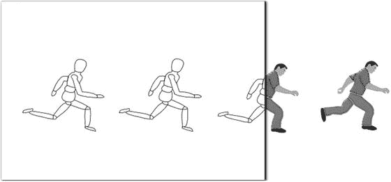
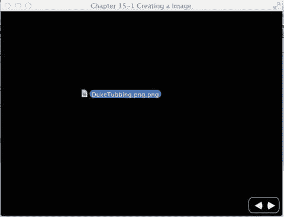
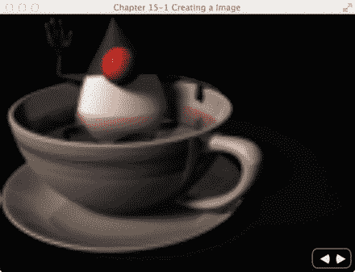
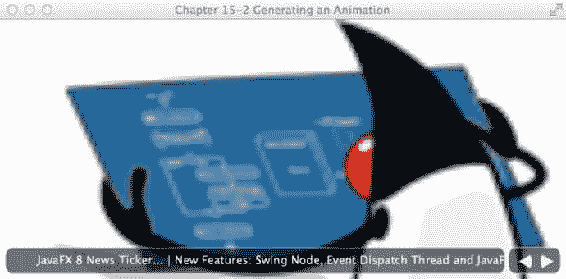
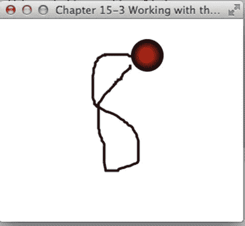
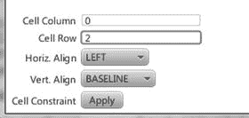
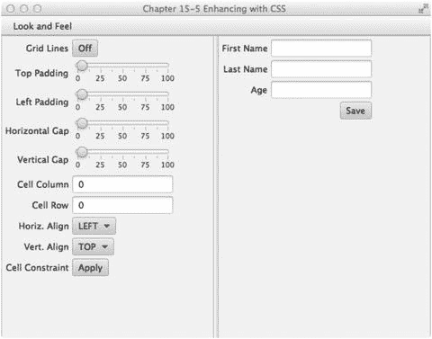

# 十五、JavaFX 图形

你听过有人说“当两个世界相撞”吗？当一个来自不同背景或文化的人被放在一个他们意见相左并且必须面对非常困难的决定的情况下，这个表达就会被使用。当我们构建一个需要动画的 GUI 应用时，我们经常处于商业和游戏世界的冲突之中。

在富客户端应用不断变化的世界中，您可能已经注意到动画的增加，例如脉冲按钮、过渡、移动背景等等。当 GUI 应用使用动画时，它们可以向用户提供视觉提示，让他们知道下一步该做什么。有了 JavaFX，您可以两全其美。

图 [15-1](#Fig1) 展示了一幅栩栩如生的简单图画。



###### 图 15-1。JavaFX 图形

在这一章中，你将创建图像，动画，外观和感觉。系好你的安全带；您将发现将酷炫的游戏式界面融入日常应用的解决方案。

###### 注意

如果您不熟悉 JavaFX，请参考第 14 章。其中，它将帮助您创建一个使用 JavaFX 提高工作效率的环境。

## 15-1.创建图像

### 问题

您的文件目录中有一些照片，您希望快速浏览并在图形用户界面中展示。

### 解决办法

创建一个简单的 JavaFX 图像查看器应用。这个配方中使用的主要 Java 类是:

*   Java VX . scene . image . image

*   javafx.scene.image.ImageView

*   事件处理程序<dragevent>类</dragevent>

以下源代码是图像查看器应用的实现:

```java
package org.java9recipes.chapter15.recipe15_01;

import java.io.File;
import java.util.ArrayList;
import java.util.List;
import javafx.application.Application;
import javafx.scene.Group;
import javafx.scene.Scene;
import javafx.scene.image.Image;
import javafx.scene.image.ImageView;
import javafx.scene.input.DragEvent;
import javafx.scene.input.Dragboard;
import javafx.scene.input.MouseEvent;
import javafx.scene.input.TransferMode;
import javafx.scene.layout.HBox;
import javafx.scene.paint.Color;
import javafx.scene.shape.Arc;
import javafx.scene.shape.ArcType;
import javafx.scene.shape.Rectangle;
import javafx.stage.Stage;

/**
 * Recipe 15-1: Creating Images
 *
 * @author cdea
 * Update: J Juneau
 */
public class CreatingImages extends Application {

    private final List<String> imageFiles = new ArrayList<>();
    private int currentIndex = -1;
    private final String filePrefix = "file:";

    public enum ButtonMove {

        NEXT, PREV
    };

    /**
     * @param args the command line arguments
     */
    public static void main(String[] args) {
        Application.launch(args);
    }

    @Override
    public void start(Stage primaryStage) {
        primaryStage.setTitle("Chapter 15-1 Creating a Image");
        Group root = new Group();
        Scene scene = new Scene(root, 551, 400, Color.BLACK);

        // image view
        final ImageView currentImageView = new ImageView();

        // maintain aspect ratio
        currentImageView.setPreserveRatio(true);

        // resize based on the scene
        currentImageView.fitWidthProperty().bind(scene.widthProperty());

        final HBox pictureRegion = new HBox();
        pictureRegion.getChildren().add(currentImageView);
        root.getChildren().add(pictureRegion);

        // Dragging over surface
        scene.setOnDragOver((DragEvent event) -> {
            Dragboard db = event.getDragboard();
            if (db.hasFiles()) {
                event.acceptTransferModes(TransferMode.COPY);
            } else {
                event.consume();
            }
        });

        // Dropping over surface
        scene.setOnDragDropped((DragEvent event) -> {
            Dragboard db = event.getDragboard();
            boolean success = false;
            if (db.hasFiles()) {
                success = true;
                String filePath = null;
                for (File file : db.getFiles()) {
                    filePath = file.getAbsolutePath();
                    System.out.println(filePath);
                    currentIndex += 1;
                    imageFiles.add(currentIndex, filePath);
                }
                filePath = filePrefix + filePath;
                // set new image as the image to show.
                Image imageimage = new Image(filePath);
                currentImageView.setImage(imageimage);

            }
            event.setDropCompleted(success);
            event.consume();

        });

        // create slide controls
        Group buttonGroup = new Group();

        // rounded rect
        Rectangle buttonArea = new Rectangle();
        buttonArea.setArcWidth(15);
        buttonArea.setArcHeight(20);
        buttonArea.setFill(new Color(0, 0, 0, .55));
        buttonArea.setX(0);
        buttonArea.setY(0);
        buttonArea.setWidth(60);
        buttonArea.setHeight(30);
        buttonArea.setStroke(Color.rgb(255, 255, 255, .70));

        buttonGroup.getChildren().add(buttonArea);
        // left control
        Arc leftButton = new Arc();
        leftButton.setType(ArcType.ROUND);
        leftButton.setCenterX(12);
        leftButton.setCenterY(16);
        leftButton.setRadiusX(15);
        leftButton.setRadiusY(15);
        leftButton.setStartAngle(-30);
        leftButton.setLength(60);
        leftButton.setFill(new Color(1, 1, 1, .90));

        leftButton.addEventHandler(MouseEvent.MOUSE_PRESSED, (MouseEvent me) -> {
            int indx = gotoImageIndex(ButtonMove.PREV);
            if (indx > -1) {
                String namePict = imageFiles.get(indx);
                namePict = filePrefix + namePict;
                final Image image = new Image(namePict);
                currentImageView.setImage(image);
            }
        });
        buttonGroup.getChildren().add(leftButton);

        // right control
        Arc rightButton = new Arc();
        rightButton.setType(ArcType.ROUND);
        rightButton.setCenterX(12);
        rightButton.setCenterY(16);
        rightButton.setRadiusX(15);
        rightButton.setRadiusY(15);
        rightButton.setStartAngle(180 - 30);
        rightButton.setLength(60);
        rightButton.setFill(new Color(1, 1, 1, .90));
        rightButton.setTranslateX(40);
        buttonGroup.getChildren().add(rightButton);

        rightButton.addEventHandler(MouseEvent.MOUSE_PRESSED, (MouseEvent me) -> {
            int indx = gotoImageIndex(ButtonMove.NEXT);
            if (indx > -1) {
                String namePict = imageFiles.get(indx);
                namePict = filePrefix + namePict;
                final Image image = new Image(namePict);
                currentImageView.setImage(image);
            }
        });

        // move button group when scene is resized
        buttonGroup.translateXProperty().bind(scene.widthProperty().subtract(buttonArea.getWidth() + 6));
        buttonGroup.translateYProperty().bind(scene.heightProperty().subtract(buttonArea.getHeight() + 6));
        root.getChildren().add(buttonGroup);

        primaryStage.setScene(scene);
        primaryStage.show();
    }

    /**
     * Returns the next index in the list of files to go to next.
     *
     * @param direction PREV and NEXT to move backward or forward in the list of
     * pictures.
     * @return int the index to the previous or next picture to be shown.
     */
    public int gotoImageIndex(ButtonMove direction) {
        int size = imageFiles.size();
        if (size == 0) {
            currentIndex = -1;
        } else if (direction == ButtonMove.NEXT && size > 1 && currentIndex < size - 1) {
            currentIndex += 1;
        } else if (direction == ButtonMove.PREV && size > 1 && currentIndex > 0) {
            currentIndex -= 1;
        }

        return currentIndex;
    }
```

图 [15-2](#Fig2) 描述了拖放操作，该操作在表面上用缩略图大小的图像给用户视觉反馈。在图中，我将图像拖到应用窗口上。



###### 图 15-2。拖放正在进行中

图 [15-3](#Fig3) 显示放下操作已成功加载图像。



###### 图 15-3。删除操作完成

### 它是如何工作的

这是一个简单的应用，允许您查看具有如下文件格式的图像。jpg，。加载图像需要使用鼠标将文件拖放到窗口区域。该应用还允许您调整窗口大小，这将自动导致图像缩放，同时保持其纵横比。几幅图像加载成功后，通过点击左右按钮控件，可以方便地翻阅每幅图像，如图 [15-3](#Fig3) 所示。

在遍历代码之前，让我们讨论一下应用的变量。表 [15-1](#Tab1) 描述了这个圆滑的图像浏览器应用的实例变量。

###### 表 15-1。CreatingImages 实例变量

<colgroup class="calibre15"><col class="calibre16"> <col class="calibre16"> <col class="calibre16"> <col class="calibre16"></colgroup> 
| 

可变的

 | 

数据类型

 | 

例子

 | 

描述

 |
| --- | --- | --- | --- |
| 映像文件 | 列表 | /User/pictures/fun.jpg | 字符串列表，每个字符串包含图像的绝对文件路径 |
| 当前值的索引 | （同 Internationalorganizations）国际组织 | Zero | imageFiles 列表中的零相对索引号；-1 表示没有图像可查看 |
| 然后 | 列举型别 | - | 用户单击右箭头按钮 |
| 上一个 | 列举型别 | - | 用户单击左箭头按钮 |

当您将图像拖动到应用中时，image file 变量会将绝对文件路径缓存为字符串，而不是实际的图像文件，以节省内存空间。如果用户将同一个图像文件拖动到显示区域，列表将包含表示该图像文件的重复字符串。显示图像时，currentIndex 变量包含 imageFiles 列表的索引。imageFiles 列表指向表示当前图像文件的字符串。当用户点击按钮显示上一幅和下一幅图像时，currentIndex 将分别递减或递增。接下来，让我们浏览代码，详细说明加载和显示图像的步骤。稍后，您将学习使用“下一页”和“上一页”按钮翻阅每幅图像的步骤。

首先实例化 javafx.scene.image.ImageView 类的一个实例。ImageView 类是一个图形节点(node ),用于显示已经加载的 javafx.scene.image.Image 对象。使用 ImageView 节点将使您能够在不操作物理图像的情况下在要显示的图像上创建特殊效果。为了避免在呈现许多效果时性能下降，可以使用引用单个 Image 对象的多个 ImageView 对象。许多类型的效果包括模糊、淡化和变换图像。

需求之一是在用户调整窗口大小时保持显示图像的纵横比。这里，您只需调用值为 true 的 setPreserveRatio()方法来保持图像的纵横比。请记住，因为用户调整了窗口的大小，所以您希望将 ImageView 的宽度绑定到场景的宽度，以允许缩放图像。设置 ImageView 后，您会希望将它传递给一个 HBox 实例(pictureRegion)以放入场景中。以下代码创建 ImageView 实例，保留纵横比，并缩放图像:

```java
// image view
final ImageView currentImageView = new ImageView();

// maintain aspect ratio
currentImageView.setPreserveRatio(true);

// resize based on the scene
currentImageView.fitWidthProperty().bind(scene.widthProperty());
```

接下来，让我们介绍 JavaFX 的原生拖放支持，它为用户提供了许多选项，例如将可视对象从一个应用拖放到另一个应用中。在这种情况下，用户将把图像文件从主机窗口操作系统拖到图像查看器应用。在这种情况下，必须生成 EventHandler 对象来侦听 DragEvents。为了满足这一要求，您将设置场景的拖放事件处理程序方法。

要设置拖动属性，请使用适当的通用 EventHandler <dragevent>类型调用场景的 setOnDragOver()方法。在示例中，lambda 表达式用于实现事件处理程序。通过 lambda 表达式实现 handle()方法来监听拖动事件(DragEvent)。在事件处理程序中，请注意事件(DragEvent)对象对 getDragboard()方法的调用。对 getDragboard()的调用将返回拖动源(Dragboard)，也就是广为人知的*剪贴板*。一旦获得 Dragboard 对象，就可以确定和验证在表面上拖动的是什么。在这种情况下，您需要确定 Dragboard 对象是否包含任何文件。如果是，则通过传入常量 TransferMode 来调用事件对象的 acceptTransferModes()。向应用的用户提供视觉反馈(参见图 [15-2](#Fig2) )。否则，它应该通过调用 event.consume()方法来使用事件。以下代码演示了如何设置场景的 OnDragOver 属性:</dragevent>

```java
    // Dragging over surface
scene.setOnDragOver((DragEvent event) -> {
    Dragboard db = event.getDragboard();
    if (db.hasFiles()) {
        event.acceptTransferModes(TransferMode.COPY);
    } else {
        event.consume();
    }
});
```

一旦设置了拖放事件处理程序属性，就可以创建一个拖放事件处理程序属性，这样它就可以完成操作。监听拖放事件类似于监听拖动事件，其中 handle()方法将通过 lambda 表达式实现。您再次从事件中获取 Dragboard 对象，以确定剪贴板中是否包含任何文件。如果是，则迭代文件列表，并将文件名添加到 imageFiles 列表中。此代码演示了如何设置场景的 OnDragDropped 属性:

```java
// Dropping over surface
scene.setOnDragDropped((DragEvent event) -> {
    Dragboard db = event.getDragboard();
    boolean success = false;
    if (db.hasFiles()) {
        success = true;
        String filePath = null;
        for (File file : db.getFiles()) {
            filePath = file.getAbsolutePath();
            System.out.println(filePath);
            currentIndex += 1;
            imageFiles.add(currentIndex, filePath);
        }
        filePath = filePrefix + filePath;
        // set new image as the image to show.
        Image imageimage = new Image(filePath);
        currentImageView.setImage(imageimage);

    }
    event.setDropCompleted(success);
    event.consume();

});
```

确定最后一个文件后，将显示当前图像。下面的代码演示了如何加载要显示的图像:

```java
// set new image as the image to show.
Image imageimage = new Image(filePath);
currentImageView.setImage(imageimage);
```

对于与图像查看器应用相关的最后一个需求，生成了允许用户查看下一个或上一个图像的简单控件。我强调“简单”控件是因为 JavaFX 包含另外两种创建自定义控件的方法。一种方法，层叠样式表(CSS)样式，将在后面的食谱 15-5 中讨论。要探索另一种选择，请参考皮肤上的 Javadoc 和可设置皮肤的 API。

本例中的简单按钮是使用 Java FX 的 javafx.scene.shape.Arc 在一个名为 javafx.scene.shape.Rectangle 的小透明圆角矩形上构建左右箭头而创建的。上一页和按钮移动下一页

当实例化一个在< and >符号之间有类型变量的泛型类时，相同的类型变量将在 handle()的签名中定义。当实现事件处理程序逻辑时，您确定按下了哪个按钮，然后将索引返回到要显示的下一个图像的 imageFiles 列表中。当使用 image 类加载图像时，可以从文件系统或 URL 加载图像。以下代码实例化一个 EventHandler <mouseevent>lambda 表达式，以显示 imageFiles 列表中的前一幅图像:</mouseevent>

```java
leftButton.addEventHandler(MouseEvent.MOUSE_PRESSED, (MouseEvent me) -> {
    int indx = gotoImageIndex(ButtonMove.PREV);
    if (indx > -1) {
        String namePict = imageFiles.get(indx);
        namePict = filePrefix + namePict;
        final Image image = new Image(namePict);
        currentImageView.setImage(image);
    }
});
```

右按钮的(right button)事件处理程序是相同的。唯一不同的是，它必须确定是否通过 ButtonMove 枚举按下了上一个或下一个按钮。该信息被传递给 gotoImageIndex()方法，以确定图像在该方向上是否可用。

为了完成 image viewer 应用，您将矩形按钮的控件绑定到场景的宽度和高度，这将在用户调整窗口大小时重新定位控件。这里，通过减去 buttonArea 的宽度(Fluent API)，将 translateXProperty()绑定到场景的 width 属性。在该示例中，还根据场景的 height 属性绑定了 translateYProperty()。一旦你的按钮控件被绑定，你的用户将体验到良好的用户界面。以下代码使用 Fluent API 将按钮控件的属性绑定到场景的属性:

```java
// move button group when scene is resized        buttonGroup.translateXProperty().bind(scene.widthProperty().subtract(buttonArea.getWidth()
   + 6));
buttonGroup.translateYProperty().bind(scene.heightProperty().subtract(buttonArea.getHeight()
   + 6));
root.getChildren().add(buttonGroup);
```

## 15-2.生成动画

### 问题

你想生成一个动画。例如，您希望创建一个新闻收报机和照片查看器应用，并满足以下要求:

*   它将有一个向左滚动的新闻滚动条控件。

*   当用户点击按钮控件时，它将淡出当前图片并淡入下一张图片。

*   当光标移入和移出场景区域时，它将分别淡入和淡出按钮控件。

*   当鼠标悬停在文本上时，新闻滚动条会暂停，当鼠标离开文本时，它会重新开始。

### 解决办法

通过访问 JavaFX 的动画 API(Java FX . animation . *)创建动画效果。要创建前面提到的新闻收报机，您需要以下类:

*   Java FX . animation . translate transition

*   javafx.util.Duration

*   javafx.event.EventHandler

*   javafx.scene.shape.Rectangle

要淡出当前图片并淡入下一张图片，您需要以下类:

*   Java FX . animation . sequential transition

*   Java FX . animation . fade transition

*   javafx.event.EventHandler

*   Java VX . scene . image . image

*   javafx.scene.image.ImageView

*   javafx.util.Duration

要在光标移入和移出场景区域时分别淡入和淡出按钮控件，您需要以下类:

*   Java FX . animation . fade transition

*   javafx.util.Duration

此处显示的是用于创建新闻滚动条控件的代码:

```java
// create ticker area
final Group tickerArea = new Group();
final Rectangle tickerRect = new Rectangle();
tickerRect.setArcWidth(15);
tickerRect.setArcHeight(20);
tickerRect.setFill(new Color(0, 0, 0, .55));
tickerRect.setX(0);
tickerRect.setY(0);
tickerRect.setWidth(scene.getWidth() - 6);
tickerRect.setHeight(30);
tickerRect.setStroke(Color.rgb(255, 255, 255, .70));

Rectangle clipRegion = new Rectangle();
clipRegion.setArcWidth(15);
clipRegion.setArcHeight(20);
clipRegion.setX(0);
clipRegion.setY(0);
clipRegion.setWidth(scene.getWidth() - 6);
clipRegion.setHeight(30);
clipRegion.setStroke(Color.rgb(255, 255, 255, .70));

tickerArea.setClip(clipRegion);

// Resize the ticker area when the window is resized
tickerArea.setTranslateX(6);
tickerArea.translateYProperty().bind(scene.heightProperty().subtract(
    tickerRect.getHeight() + 6));
tickerRect.widthProperty().bind(scene.widthProperty().subtract(
    buttonRect.getWidth() + 16));
clipRegion.widthProperty().bind(scene.widthProperty().subtract(
    buttonRect.getWidth() + 16));
tickerArea.getChildren().add(tickerRect);

root.getChildren().add(tickerArea);

// add news text
Text news = new Text();
news.setText("JavaFX 8 News Ticker... | New Features: Swing Node, Event Dispatch Thread and JavaFX Application Thread Merge,  " +
        "New Look and Feel - Modena, Rich Text Support, Printing, Tree Table Control, Much More!");
news.setTranslateY(18);
news.setFill(Color.WHITE);
tickerArea.getChildren().add(news);

final TranslateTransition ticker = new TranslateTransition();
ticker.setNode(news);
int newsLength = news.getText().length();

// Calculated guess based upon length of text
ticker.setDuration(Duration.millis((newsLength * 4/300) * 15000));
ticker.setFromX(scene.widthProperty().doubleValue());
ticker.setToX(-scene.widthProperty().doubleValue() - (newsLength * 5));
ticker.setFromY(19);
ticker.setInterpolator(Interpolator.LINEAR);
ticker.setCycleCount(1);

// when ticker has finished reset and replay ticker animation
ticker.setOnFinished((ActionEvent ae) -> {
    ticker.stop();
    ticker.setFromX(scene.getWidth());
    ticker.setDuration(new Duration((newsLength * 4/300) * 15000));
    ticker.playFromStart();
});

// stop ticker if hovered over
tickerArea.setOnMouseEntered((MouseEvent me) -> {
    ticker.pause();
});

// restart ticker if mouse leaves the ticker
tickerArea.setOnMouseExited((MouseEvent me) -> {
    ticker.play();
});

ticker.play();
```

下面是用于淡出当前图片和淡入下一张图片的代码:

```java
    // previous button
    Arc prevButton = // create arc ...

    prevButton.addEventHandler(MouseEvent.MOUSE_PRESSED, (MouseEvent me) -> {
        int indx = gotoImageIndex(PREV);
        if (indx > -1) {
            String namePict = imagesFiles.get(indx);
            final Image nextImage = new Image(namePict);
            SequentialTransition seqTransition = transitionByFading(nextImage, currentImageView);
            seqTransition.play();
        }
    });

    buttonGroup.getChildren().add(prevButton);

    // next button
    Arc nextButton = //... create arc

    buttonGroup.getChildren().add(nextButton);

    nextButton.addEventHandler(MouseEvent.MOUSE_PRESSED, (MouseEvent me) -> {
        int indx = gotoImageIndex(NEXT);
        if (indx > -1) {
            String namePict = imagesFiles.get(indx);
            final Image nextImage = new Image(namePict);
            SequentialTransition seqTransition = transitionByFading(nextImage, currentImageView);
            seqTransition.play();

        }
    });

//... the rest of the start(Stage primaryStage) method

public int gotoImageIndex(int direction) {
    int size = imagesFiles.size();
    if (size == 0) {
        currentIndexImageFile = -1;
    } else if (direction == NEXT && size > 1 && currentIndexImageFile < size - 1) {
        currentIndexImageFile += 1;
    } else if (direction == PREV && size > 1 && currentIndexImageFile > 0) {
        currentIndexImageFile -= 1;
    }

    return currentIndexImageFile;
}

public SequentialTransition transitionByFading(final Image nextImage, final ImageView imageView) {
    FadeTransition fadeOut = new FadeTransition(Duration.millis(500), imageView);
    fadeOut.setFromValue(1.0);
    fadeOut.setToValue(0.0);
    fadeOut.setOnFinished((ActionEvent ae) -> {
        imageView.setImage(nextImage);
    });
    FadeTransition fadeIn = new FadeTransition(Duration.millis(500), imageView);
    fadeIn.setFromValue(0.0);
    fadeIn.setToValue(1.0);
    SequentialTransition seqTransition = new SequentialTransition();
    seqTransition.getChildren().addAll(fadeOut, fadeIn);
    return seqTransition;
}
```

以下代码用于在光标移入和移出场景区域时分别淡入和淡出按钮控件:

```java
// Fade in button controls
scene.setOnMouseEntered((MouseEvent me) -> {
    FadeTransition fadeButtons = new FadeTransition(Duration.millis(500), buttonGroup);
    fadeButtons.setFromValue(0.0);
    fadeButtons.setToValue(1.0);
    fadeButtons.play();
});

// Fade out button controls
scene.setOnMouseExited((MouseEvent me) -> {
    FadeTransition fadeButtons = new FadeTransition(Duration.millis(500), buttonGroup);
    fadeButtons.setFromValue(1);
    fadeButtons.setToValue(0);
    fadeButtons.play();
});
```

图 [15-4](#Fig4) 显示了在屏幕底部区域带有滚动条控件的照片查看器应用。



###### 图 15-4。带有新闻栏的照片查看器

### 它是如何工作的

这个食谱采用了食谱 15-1 中的照片浏览器应用，并添加了一个新闻栏和一些漂亮的照片变换动画。主要动画效果集中在平移和淡入淡出。首先，创建一个 news ticker 控件，它通过使用 translation transition(Java FX . animation . translate transition)向左滚动文本节点。接下来，应用另一个淡入淡出效果，以便当用户单击“上一个”和“下一个”按钮过渡到下一个图像时，会出现缓慢的过渡。要实现这种效果，需要使用复合过渡(Java FX . animation . sequential transition ),由多个动画组成。最后，要创建按钮控件根据鼠标位置淡入淡出的效果，需要使用一个渐变过渡(Java FX . animation . fade transition)。

在我开始讨论满足需求的步骤之前，我想提一下 JavaFX 动画的基础知识。JavaFX animation API 允许您组装定时事件，这些事件可以在节点的属性值上进行插值以产生动画效果。每个定时事件称为一个关键帧(keyframe)，它负责在一段时间内对节点的属性进行插值(javafx.util.Duration)。知道关键帧的工作是对节点的属性值进行操作，您必须创建一个引用所需节点属性的 KeyValue 类的实例。插值的概念就是在起始值和结束值之间分配值。一个例子是在 1，000 毫秒内将矩形的当前 x 位置(零)移动到 100 个像素；换句话说，在一秒钟内将矩形向右移动 100 个像素。此处显示的是一个关键帧和关键值，用于对矩形的 x 属性进行 1000 毫秒的插值:

```java
final Rectangle rectangle = new Rectangle(0, 0, 50, 50);
KeyValue keyValue = new KeyValue(rectangle.xProperty(), 100);
KeyFrame keyFrame = new KeyFrame(Duration.millis(1000), keyValue);
```

当创建许多连续组合的关键帧时，您需要创建一个时间轴。因为 timeline 是 javafx.animation.Animation 的子类，所以您可以设置一些标准属性，例如它的循环计数和自动反转。*循环计数*是您希望时间轴播放动画的次数。如果希望循环计数无限期播放动画，请使用值 Timeline.INDEFINITE。自动反转是动画向后播放时间线的功能。默认情况下，周期计数设置为 1，自动冲销设置为 false。添加关键帧时，只需使用 getKeyFrames()添加即可。时间轴对象上的 add()方法。以下代码片段演示了 autoreverse 设置为 true 时无限播放的时间轴:

```java
Timeline timeline = new Timeline();
timeline.setCycleCount(Timeline.INDEFINITE);
timeline.setAutoReverse(true);
timeline.getKeyFrames().add(keyFrame);
timeline.play();
```

有了时间线的知识，您可以在 JavaFX 中制作任何图形节点的动画。虽然你可以用一种简单的方式来创建时间线，但这会变得非常麻烦。你可能想知道是否有更简单的方法来表达常见的动画。好消息！JavaFX 有转换(Transition)，这是执行常见动画效果的便利类。您可以使用转场创建的一些常见动画效果包括:

*   Java FX . animation . fade transition

*   Java FX . animation . path transition

*   Java FX . animation . scale transition

*   Java FX . animation . translate transition

要查看更多过渡，请参见 Javadoc 中的 javafx.animation。因为过渡对象也是 javafx.animation.Animation 类的子类，所以可以设置循环计数和自动反转属性。这个菜谱着重于两种过渡效果:平移过渡(translate transition)和淡化过渡(fade transition)。

问题陈述中的第一个要求是创建一个新闻收报机。在新闻滚动条控件中，文本节点在矩形区域内从右向左滚动。当文本滚动到矩形区域的左边缘时，您会希望文本被剪切以创建一个仅显示矩形内部像素的视口。为此，首先创建一个组来保存组成 ticker 控件的所有组件。接下来，你创建一个白色圆角矩形填充 55%的不透明度。创建可视区域后，使用 Group 对象上的 setClip(someRectangle)方法创建一个表示剪辑区域的类似矩形。图 [15-5](#Fig5) 显示了一个圆角矩形区域，作为剪切区域。


###### 图 15-5。在组对象上设置剪辑区域

一旦创建了 ticker 控件，就可以根据场景的 height 属性减去 ticker 控件的高度来绑定 translate Y。还可以根据场景的宽度减去按钮控件的宽度来绑定 ticker 控件的 width 属性。通过绑定这些属性，每当用户调整应用窗口大小时，滚动条控件可以更改其大小和位置。这使得滚动条控件看起来浮动在窗口的底部。下面的代码绑定了 ticker 控件的 translate Y、width 和剪辑区域的 width 属性:

```java
tickerArea.translateYProperty().bind(scene.heightProperty().subtract(tickerRect.getHeight() + 6));
tickerRect.widthProperty().bind(scene.widthProperty().subtract(buttonRect.getWidth() + 16));
clipRegion.widthProperty().bind(scene.widthProperty().subtract(buttonRect.getWidth() + 16));
tickerArea.getChildren().add(tickerRect);
```

现在 ticker 控件已经完成，您将创建一些新闻来填充它。在本例中，使用了一个文本节点，该节点包含表示新闻提要的文本。要向 ticker 控件添加新创建的文本节点，可以调用它的 getChildren()。add()方法。下面的代码向 ticker 控件添加一个文本节点:

```java
final Group tickerArea = new Group();
final Rectangle tickerRect = //...
Text news = new Text();
news.setText("JavaFX 8 News Ticker... | New Features: Swing Node, Event Dispatch Thread and JavaFX Application Thread Merge,  " +
        "New Look and Feel - Modena, Rich Text Support, Printing, Tree Table Control, Much More!");
news.setTranslateY(18);
news.setFill(Color.WHITE);
tickerArea.getChildren().add(news);
```

接下来，您必须使用 JavaFX 的 TranslateTransition API 从右向左滚动文本节点。第一步是设置目标节点来执行 TranslateTransition。然后设置持续时间，这是 TranslateTransition 制作动画所花费的总时间。TranslateTransition 通过公开对节点的 translate X 和 Y 属性进行操作的便利方法，简化了动画的创建。方便的方法前面加上 from 和 to。例如，在文本节点上使用 translate X 的场景中，有 fromX()和 toX()方法。fromX()是开始值，toX()是将被插值的结束值。在示例中，这些计算基于文本节点中的文本长度。因此，如果您从一个远程源(比如一个 RSS 提要)阅读，文本长度的差异应该不会影响滚动条。接下来，将 TranslateTransition 设置为线性过渡(插值器。线性)在起始值和结束值之间均匀插值。要查看更多插值器类型或查看如何创建自定义插值器，请参阅 Java FX . animation . interpolator 上的 Javadoc。最后，在示例中，循环计数设置为 1，这将根据指定的持续时间动画显示一次跑马灯。下面的代码片段详细说明了如何创建 TranslateTransition，该 Transition 从右向左动画显示文本节点:

```java
final TranslateTransition ticker = new TranslateTransition();
ticker.setNode(news);
int newsLength = news.getText().length();
ticker.setDuration(Duration.millis((newsLength * 4/300) * 15000));
ticker.setFromX(scene.widthProperty().doubleValue());
ticker.setToX(-scene.widthProperty().doubleValue() - (newsLength * 5));
ticker.setFromY(19);
ticker.setInterpolator(Interpolator.LINEAR);
ticker.setCycleCount(1);
```

当滚动条的新闻完全滚出滚动条区域到场景的最左边时，您会想要停止并从头(最右边)重放新闻提要。为此，通过 lambda 表达式创建 EventHandler <actionevent>对象的实例，并使用 setOnFinished()方法在 ticker (TranslateTransition)对象上设置该实例。以下是如何重放平移动画:</actionevent>

```java
// when window resizes width wise the ticker will know how far to move
// when ticker has finished reset and replay ticker animation
ticker.setOnFinished((ActionEvent ae) -> {
    ticker.stop();
    ticker.setFromX(scene.getWidth());
    ticker.setDuration(new Duration((newsLength * 4/300) * 15000));
    ticker.playFromStart();
});
```

一旦定义了动画，只需调用 play()方法就可以开始播放。以下代码片段显示了如何播放 TranslateTransition:

```java
ticker.play();
```

要在鼠标悬停并离开文本时暂停和启动滚动条，需要实现类似的事件处理程序:

```java
// stop ticker if hovered over
tickerArea.setOnMouseEntered((MouseEvent me) -> {
    ticker.pause();
});

// restart ticker if mouse leaves the ticker
tickerArea.setOnMouseExited((MouseEvent me) -> {
    ticker.play();
});
```

现在您对动画转场有了更好的理解，那么可以触发任意数量转场的转场呢？JavaFX 有两个提供这种行为的转换。这两个转换可以顺序或并行调用独立的从属转换。在这个菜谱中，您将使用一个顺序过渡(sequential transition)来包含两个 FadeTransitions，以便淡出当前显示的图像并淡入下一个图像。创建 previous 和 next 按钮的事件处理程序时，首先通过调用 gotoImageIndex()方法确定要显示的下一个图像。一旦确定了要显示的下一个图像，就调用 transitionByFading()方法，该方法返回 SequentialTransition 的一个实例。当调用 transitionByFading()方法时，您会注意到创建了两个 FadeTransitions。第一个过渡将不透明度级别从 1.0 更改为 0.0，以淡出当前图像，第二个过渡将不透明度级别从 0.0 插值到 1.0，淡入下一个图像，该图像随后成为当前图像。最后，这两个 FadeTransitions 被添加到 SequentialTransition 中并返回给调用者。以下代码创建两个 FadeTransitions 并将它们添加到 SequentialTransition 中:

```java
FadeTransition fadeOut = new FadeTransition(Duration.millis(500), imageView);
fadeOut.setFromValue(1.0);
fadeOut.setToValue(0.0);
fadeOut.setOnFinished((ActionEvent ae) -> {
    imageView.setImage(nextImage);
});
FadeTransition fadeIn = new FadeTransition(Duration.millis(500), imageView);
fadeIn.setFromValue(0.0);
fadeIn.setToValue(1.0);
SequentialTransition seqTransition = new SequentialTransition();
seqTransition.getChildren().addAll(fadeOut, fadeIn);
return seqTransition;
```

对于与渐强和渐弱相关的最后要求，请使用按钮控制。使用 FadeTransition 创建幽灵般的动画效果。首先，创建一个 EventHandler(更具体地说，通过 lambda 表达式创建一个 EventHandler <mouseevent>)。很容易将鼠标事件添加到场景中；您所要做的就是覆盖 handle()方法，其中入站参数是 MouseEvent 类型(与其形式类型参数相同)。在 lambda 内部，通过使用将持续时间和节点作为参数的构造函数来创建 FadeTransition 对象的实例。接下来，您会注意到调用 setFromValue()和 setToValue()方法来为不透明度插入 1.0 和 0.0 之间的值，从而产生淡入效果。下面的代码添加了一个事件处理程序，用于在鼠标光标位于场景内部时创建淡入效果:</mouseevent>

```java
// Fade in button controls
scene.setOnMouseEntered((MouseEvent me) -> {
    FadeTransition fadeButtons = new FadeTransition(Duration.millis(500), buttonGroup);
    fadeButtons.setFromValue(0.0);
    fadeButtons.setToValue(1.0);
    fadeButtons.play();
});
```

最后但同样重要的是，淡出事件处理程序基本上与淡入相同，除了不透明度 From 和 To 值从 1.0 到 0.0，这使得当鼠标指针离开场景区域时，按钮神秘地消失。

## 15-3.沿路径制作形状动画

### 问题

您想要创建一种方式来沿路径动画形状。

### 解决办法

创建一个应用，允许用户绘制一个形状的路径。这个配方中使用的主要 Java 类是:

*   Java FX . animation . path transition

*   javafx.scene.input.MouseEvent

*   javafx.event.EventHandler

*   javafx.geometry.Point2D

*   javafx.scene.shape.LineTo

*   javafx.scene.shape.MoveTo

*   javafx.scene.shape.Path

下面的代码演示了如何绘制形状的路径:

```java
package org.java9recipes.chapter15.recipe15_03;

import javafx.animation.PathTransition;
import javafx.application.Application;
import javafx.event.ActionEvent;
import javafx.event.EventHandler;
import javafx.geometry.Point2D;
import javafx.scene.Group;
import javafx.scene.Scene;
import javafx.scene.input.MouseEvent;
import javafx.scene.paint.Color;
import javafx.scene.paint.CycleMethod;
import javafx.scene.paint.RadialGradient;
import javafx.scene.paint.Stop;
import javafx.scene.shape.Circle;
import javafx.scene.shape.LineTo;
import javafx.scene.shape.MoveTo;
import javafx.scene.shape.Path;
import javafx.stage.Stage;
import javafx.util.Duration;

/**
 * Recipe 15-3: Working with the Scene Graph
 * @author cdea
 * Update: J Juneau
 */
public class WorkingWithTheSceneGraph extends Application {

    Path onePath = new Path();
    Point2D anchorPt;
    /**
     * @param args the command line arguments
     */
    public static void main(String[] args) {
        Application.launch(args);
    }

    @Override
    public void start(Stage primaryStage) {
        primaryStage.setTitle("Chapter 15-3 Working with the Scene Graph");

        final Group root = new Group();
        // add path
        root.getChildren().add(onePath);

        final Scene scene = new Scene(root, 300, 250);
        scene.setFill(Color.WHITE);

        RadialGradient gradient1 = new RadialGradient(0,
                .1,
                100,
                100,
                20,
                false,
                CycleMethod.NO_CYCLE,
                new Stop(0, Color.RED),
                new Stop(1, Color.BLACK));

        // create a sphere
        final Circle sphere = new Circle();
        sphere.setCenterX(100);
        sphere.setCenterY(100);
        sphere.setRadius(20);
        sphere.setFill(gradient1);

        // add sphere
        root.getChildren().add(sphere);

        // animate sphere by following the path.
        final PathTransition pathTransition = new PathTransition();
        pathTransition.setDuration(Duration.millis(4000));
        pathTransition.setCycleCount(1);
        pathTransition.setNode(sphere);
        pathTransition.setPath(onePath);
        pathTransition.setOrientation(PathTransition.OrientationType.ORTHOGONAL_TO_TANGENT);

        // once finished clear path
        pathTransition.onFinishedProperty().set((EventHandler<ActionEvent>)
        (ActionEvent event) -> {
            onePath.getElements().clear();
        });

        // starting initial path
        scene.onMousePressedProperty().set((EventHandler<MouseEvent>)
        (MouseEvent event) -> {
            onePath.getElements().clear();
            // start point in path
            anchorPt = new Point2D(event.getX(), event.getY());
            onePath.setStrokeWidth(3);
            onePath.setStroke(Color.BLACK);
            onePath.getElements().add(new MoveTo(anchorPt.getX(), anchorPt.getY()));
        });

        // dragging creates lineTos added to the path
        scene.onMouseDraggedProperty().set((EventHandler<MouseEvent>)
        (MouseEvent event) -> {
            onePath.getElements().add(new LineTo(event.getX(), event.getY()));
        });

        // end the path when mouse released event
        scene.onMouseReleasedProperty().set((EventHandler<MouseEvent>)
        (MouseEvent event) -> {
            onePath.setStrokeWidth(0);
            if (onePath.getElements().size() > 1) {
                pathTransition.stop();
                pathTransition.playFromStart();
            }
        });

        primaryStage.setScene(scene);
        primaryStage.show();
    }
}
```

图 [15-6](#Fig6) 显示了圆将遵循的绘制路径。当用户执行鼠标释放时，绘制的路径将消失，红球将遵循之前绘制的路径。



###### 图 15-6。路径转换

### 它是如何工作的

在这个菜谱中，您将创建一个简单的应用，使对象能够沿着场景图上绘制的路径移动。为了简单起见，该示例使用了一个执行路径转换(Java FX . animation . path transition)的形状(圆形)。应用用户将像绘图程序一样通过按下鼠标按钮在场景表面上绘制路径。一旦对绘制的路径感到满意，用户释放鼠标按键，这将触发红球沿着路径移动，类似于物体在建筑物内的管道中移动。

首先创建两个实例变量来维护组成路径的坐标。要保存正在绘制的路径，请创建 javafx.scene.shape.Path 对象的实例。在应用启动之前，应该将路径实例添加到场景图中。此处显示的是将实例变量 onePath 添加到场景图的过程:

```java
// add path
root.getChildren().add(onePath);
```

接下来，创建一个实例变量 anchor pt(Java FX . geometry . point 2d ),它将保存路径的起点。稍后，您将看到这些变量是如何基于鼠标事件更新的。此处显示的是维护当前绘制路径的实例变量:

```java
Path onePath = new Path();
Point2D anchorPt;
```

首先，让我们创建一个动画形状。在这种情况下，您将创建一个看起来很酷的红色球。要创建一个看起来像球形的球，创建一个渐变颜色 RadialGradient，用于绘制或填充圆形。(参考配方 15-6，了解如何用渐变颜料填充形状。)一旦创建了红色球体，就需要创建 PathTransition 对象来执行路径跟踪动画。实例化 PathTransition()对象后，只需将持续时间设置为 4 秒，并将循环计数设置为 1。循环计数是动画循环发生的次数。接下来，将节点设置为引用红色球(球体)。然后，将 path()方法设置为实例变量 onePath，该变量包含构成绘制路径的所有坐标和线条。为球体设置动画路径后，您应该指定形状如何跟随路径，例如垂直于路径上的切点。下面的代码创建了一个路径转换的实例:

```java
// animate sphere by following the path.
final PathTransition pathTransition = new PathTransition();
pathTransition.setDuration(Duration.millis(4000));
pathTransition.setCycleCount(1);
pathTransition.setNode(sphere);
pathTransition.setPath(onePath);
pathTransition.setOrientation(PathTransition.OrientationType.ORTHOGONAL_TO_TANGENT);
```

创建路径过渡后，您会希望它在动画完成时清理干净。若要在动画结束时重置或清除 path 变量，请创建并添加一个事件处理程序来侦听 path transition 对象上的 onFinished 属性事件。

以下代码片段添加了一个事件处理程序来清除当前路径信息:

```java
// once finished clear path
pathTransition.onFinishedProperty().set((EventHandler<ActionEvent>)
(ActionEvent event) -> {
            onePath.getElements().clear();
});
```

形状和转换都设置好了，应用需要响应鼠标事件，这将更新前面提到的实例变量。为此，请侦听场景对象上发生的鼠标事件。这里，您将再次依赖于创建事件处理程序来设置场景的 onMouseXXXProperty 方法，其中 XXX 表示实际的鼠标事件名称，如按下、拖动和释放。

当用户绘制路径时，他或她将执行鼠标按下事件来开始路径的起点。若要侦听鼠标按下事件，请使用 MouseEvent 的正式类型参数创建一个事件处理程序。在示例中，使用了 lambda 表达式。当鼠标按下事件发生时，清除任何先前绘制的路径信息的实例变量 onePath。接下来，只需设置路径的笔画宽度和颜色，这样用户就可以看到正在绘制的路径。最后，使用 MoveTo 对象的实例将起点添加到路径中。这里显示的是当用户执行鼠标按压时响应的处理程序代码:

```java
        // starting initial path
   scene.onMousePressedProperty().set((EventHandler<MouseEvent>)
(MouseEvent event) -> {
        onePath.getElements().clear();
        // start point in path
        anchorPt = new Point2D(event.getX(), event.getY());
        onePath.setStrokeWidth(3);
        onePath.setStroke(Color.BLACK);
        onePath.getElements().add(new MoveTo(anchorPt.getX(), anchorPt.getY()));
    });
```

一旦鼠标按下事件处理程序就绪，就可以为鼠标拖动事件创建另一个处理程序。同样，查找场景的 onMouseXXXProperty()方法，这些方法对应于您所关心的适当鼠标事件。在这种情况下，将设置 onMouseDraggedProperty()。在 lambda 表达式中，获取鼠标坐标，该坐标将被转换为要添加到路径(path)中的 LineTo 对象。这些 LineTo 对象是路径元素(javafx.scene.shape.PathElement)的实例，如配方 15-5 中所述。以下代码是负责鼠标拖动事件的事件处理程序:

```java
// dragging creates lineTos added to the path
scene.onMouseDraggedProperty().set((EventHandler<MouseEvent>)
(MouseEvent event) -> {
        onePath.getElements().add(new LineTo(event.getX(), event.getY()));
});
```

最后，创建一个事件处理程序来侦听鼠标释放事件。当用户释放鼠标时，路径的描边被设置为零，看起来好像已经被移除。然后，通过停止路径过渡并从头开始播放来重置路径过渡。以下代码是负责鼠标释放事件的事件处理程序:

```java
// end the path when mouse released event
        scene.onMouseReleasedProperty().set((EventHandler<MouseEvent>)
 (MouseEvent event) -> {
            onePath.setStrokeWidth(0);
            if (onePath.getElements().size() > 1) {
                pathTransition.stop();
                pathTransition.playFromStart();
            }
});
```

## 15-4.通过网格操纵布局

### 问题

您希望使用网格类型的布局创建一个好看的基于表单的用户界面。

### 解决办法

使用 JavaFX 的 javafx.scene.layout.GridPane 创建一个简单的。该应用将具有以下功能:

*   它将切换网格布局的网格线的显示，以便进行调试。

*   它将调整 GridPane 的顶部填充。

*   它将调整 GridPane 的左填充。

*   它将调整 GridPane 中单元格之间的水平间距。

*   它将调整 GridPane 中单元格之间的垂直间距。

*   它将水平对齐单元格内的控件。

*   它将垂直对齐单元格内的控件。

以下代码是窗体设计器应用的主要启动点:

```java
public class ManipulatingLayoutViaGrids extends Application {

    /**
     * @param args the command line arguments
     */
    public static void main(String[] args) {
        Application.launch(args);
    }

    @Override
    public void start(Stage primaryStage) {
        primaryStage.setTitle("Chapter 15-4 Manipulating Layout via Grids ");
        Group root = new Group();
        Scene scene = new Scene(root, 640, 480, Color.WHITE);

        // Left and right split pane
        SplitPane splitPane = new SplitPane();
        splitPane.prefWidthProperty().bind(scene.widthProperty());
        splitPane.prefHeightProperty().bind(scene.heightProperty());

        // Form on the right
        GridPane rightGridPane = new MyForm();

        GridPane leftGridPane = new GridPaneControlPanel(rightGridPane);

        VBox leftArea = new VBox(10);
        leftArea.getChildren().add(leftGridPane);
        HBox hbox = new HBox();
        hbox.getChildren().add(splitPane);
        root.getChildren().add(hbox);
        splitPane.getItems().addAll(leftArea, rightGridPane);

        primaryStage.setScene(scene);

        primaryStage.show();
    }

}
```

当窗体设计器应用启动时，要操作的目标窗体显示在窗口的拆分窗格的右侧。下面的代码是一个简单的类似网格的 form 类，它从 GridPane 扩展而来。它将由表单设计器应用操作:

```java
/**
 * MyForm is a form to be manipulated by the user.
 * @author cdea
 */
public class MyForm extends GridPane{
    public MyForm() {

        setPadding(new Insets(5));
        setHgap(5);
        setVgap(5);

        Label fNameLbl = new Label("First Name");
        TextField fNameFld = new TextField();
        Label lNameLbl = new Label("Last Name");
        TextField lNameFld = new TextField();
        Label ageLbl = new Label("Age");
        TextField ageFld = new TextField();

        Button saveButt = new Button("Save");

        // First name label
        GridPane.setHalignment(fNameLbl, HPos.RIGHT);
        add(fNameLbl, 0, 0);

        // Last name label
        GridPane.setHalignment(lNameLbl, HPos.RIGHT);
        add(lNameLbl, 0, 1);

        // Age label
        GridPane.setHalignment(ageLbl, HPos.RIGHT);
        add(ageLbl, 0, 2);

        // First name field
        GridPane.setHalignment(fNameFld, HPos.LEFT);
        add(fNameFld, 1, 0);

        // Last name field
        GridPane.setHalignment(lNameFld, HPos.LEFT);
        add(lNameFld, 1, 1);

        // Age Field
        GridPane.setHalignment(ageFld, HPos.RIGHT);
        add(ageFld, 1, 2);

        // Save button
        GridPane.setHalignment(saveButt, HPos.RIGHT);
        add(saveButt, 1, 3);

    }
}
```

当应用启动时，网格属性控制面板显示在窗口的拆分窗格的左侧。属性控制面板允许用户动态操作目标表单的网格窗格属性。以下代码表示将操作目标网格窗格属性的网格属性控制面板:

```java
/**
 * GridPaneControlPanel represents the left area of the split pane
 * allowing the user to manipulate the GridPane on the right.
 *
 * Manipulating Layout Via Grids
 * @author cdea
 */
public class GridPaneControlPanel extends GridPane{
    public GridPaneControlPanel(final GridPane targetGridPane) {
        super();

        setPadding(new Insets(5));
        setHgap(5);
        setVgap(5);

        // Setting Grid lines
        Label gridLinesLbl = new Label("Grid Lines");
        final ToggleButton gridLinesToggle = new ToggleButton("Off");
        gridLinesToggle.selectedProperty().addListener((ObservableValue<? extends Boolean> ov, Boolean oldValue, Boolean newVal) -> {
            targetGridPane.setGridLinesVisible(newVal);
            gridLinesToggle.setText(newVal ? "On" : "Off");
        });

        // toggle grid lines label
        GridPane.setHalignment(gridLinesLbl, HPos.RIGHT);
        add(gridLinesLbl, 0, 0);

        // toggle grid lines
        GridPane.setHalignment(gridLinesToggle, HPos.LEFT);
        add(gridLinesToggle, 1, 0);

        // Setting padding [top]
        Label gridPaddingLbl = new Label("Top Padding");

        final Slider gridPaddingSlider = new Slider();
        gridPaddingSlider.setMin(0);
        gridPaddingSlider.setMax(100);
        gridPaddingSlider.setValue(5);
        gridPaddingSlider.setShowTickLabels(true);
        gridPaddingSlider.setShowTickMarks(true);
        gridPaddingSlider.setMinorTickCount(1);
        gridPaddingSlider.setBlockIncrement(5);

        gridPaddingSlider.valueProperty().addListener((ObservableValue<? extends Number> ov, Number oldVal, Number newVal) -> {
            double top1 = targetGridPane.getInsets().getTop();
            double right1 = targetGridPane.getInsets().getRight();
            double bottom1 = targetGridPane.getInsets().getBottom();
            double left1 = targetGridPane.getInsets().getLeft();
            Insets newInsets = new Insets((double) newVal, right1, bottom1, left1);
            targetGridPane.setPadding(newInsets);
        });

        // padding adjustment label
        GridPane.setHalignment(gridPaddingLbl, HPos.RIGHT);
        add(gridPaddingLbl, 0, 1);

       // padding adjustment slider
       GridPane.setHalignment(gridPaddingSlider, HPos.LEFT);
       add(gridPaddingSlider, 1, 1);

        // Setting padding [top]
        Label gridPaddingLeftLbl = new Label("Left Padding");

        final Slider gridPaddingLeftSlider = new Slider();
        gridPaddingLeftSlider.setMin(0);
        gridPaddingLeftSlider.setMax(100);
        gridPaddingLeftSlider.setValue(5);
        gridPaddingLeftSlider.setShowTickLabels(true);
        gridPaddingLeftSlider.setShowTickMarks(true);
        gridPaddingLeftSlider.setMinorTickCount(1);
        gridPaddingLeftSlider.setBlockIncrement(5);

        gridPaddingLeftSlider.valueProperty().addListener((ObservableValue<? extends Number> ov, Number oldVal, Number newVal) -> {
            double top1 = targetGridPane.getInsets().getTop();
            double right1 = targetGridPane.getInsets().getRight();
            double bottom1 = targetGridPane.getInsets().getBottom();
            double left1 = targetGridPane.getInsets().getLeft();
            Insets newInsets = new Insets(top1, right1, bottom1, (double) newVal);
            targetGridPane.setPadding(newInsets);
        });

        // padding adjustment label
        GridPane.setHalignment(gridPaddingLeftLbl, HPos.RIGHT);
        add(gridPaddingLeftLbl, 0, 2);

        // padding adjustment slider
        GridPane.setHalignment(gridPaddingLeftSlider, HPos.LEFT);
        add(gridPaddingLeftSlider, 1, 2);

        // Horizontal gap
        Label gridHGapLbl = new Label("Horizontal Gap");

        final Slider gridHGapSlider = new Slider();
        gridHGapSlider.setMin(0);
        gridHGapSlider.setMax(100);
        gridHGapSlider.setValue(5);
        gridHGapSlider.setShowTickLabels(true);
        gridHGapSlider.setShowTickMarks(true);
        gridHGapSlider.setMinorTickCount(1);
        gridHGapSlider.setBlockIncrement(5);

        gridHGapSlider.valueProperty().addListener((ObservableValue<? extends Number> ov, Number oldVal, Number newVal) -> {
            targetGridPane.setHgap((double) newVal);
        });

        // hgap label
        GridPane.setHalignment(gridHGapLbl, HPos.RIGHT);
        add(gridHGapLbl, 0, 3);

       // hgap slider
       GridPane.setHalignment(gridHGapSlider, HPos.LEFT);
       add(gridHGapSlider, 1, 3);

        // Vertical gap
        Label gridVGapLbl = new Label("Vertical Gap");

        final Slider gridVGapSlider = new Slider();
        gridVGapSlider.setMin(0);
        gridVGapSlider.setMax(100);
        gridVGapSlider.setValue(5);
        gridVGapSlider.setShowTickLabels(true);
        gridVGapSlider.setShowTickMarks(true);
        gridVGapSlider.setMinorTickCount(1);
        gridVGapSlider.setBlockIncrement(5);

        gridVGapSlider.valueProperty().addListener((ObservableValue<? extends Number> ov, Number oldVal, Number newVal) -> {
            targetGridPane.setVgap((double) newVal);
        });

       // vgap label
       GridPane.setHalignment(gridVGapLbl, HPos.RIGHT);
       add(gridVGapLbl, 0, 4);

       // vgap slider
       GridPane.setHalignment(gridVGapSlider, HPos.LEFT);
       add(gridVGapSlider, 1, 4);

       // Cell Column
       Label cellCol = new Label("Cell Column");
       final TextField cellColFld = new TextField("0");

       // cell Column label
       GridPane.setHalignment(cellCol, HPos.RIGHT);
       add(cellCol, 0, 5);

       // cell Column field
       GridPane.setHalignment(cellColFld, HPos.LEFT);
       add(cellColFld, 1, 5);

       // Cell Row
       Label cellRowLbl = new Label("Cell Row");
       final TextField cellRowFld = new TextField("0");

       // cell Row label
       GridPane.setHalignment(cellRowLbl, HPos.RIGHT);
       add(cellRowLbl, 0, 6);

       // cell Row field
       GridPane.setHalignment(cellRowFld, HPos.LEFT);
       add(cellRowFld, 1, 6);

       // Horizontal Alignment
       Label hAlignLbl = new Label("Horiz. Align");
       final ChoiceBox hAlignFld = new ChoiceBox(FXCollections.observableArrayList(
            "CENTER", "LEFT", "RIGHT")
       );
       hAlignFld.getSelectionModel().select("LEFT");

       // cell Row label
       GridPane.setHalignment(hAlignLbl, HPos.RIGHT);
       add(hAlignLbl, 0, 7);

       // cell Row field
       GridPane.setHalignment(hAlignFld, HPos.LEFT);
       add(hAlignFld, 1, 7);

       // Vertical Alignment
       Label vAlignLbl = new Label("Vert. Align");
       final ChoiceBox vAlignFld = new ChoiceBox(FXCollections.observableArrayList(
            "BASELINE", "BOTTOM", "CENTER", "TOP")
       );
       vAlignFld.getSelectionModel().select("TOP");
       // cell Row label
       GridPane.setHalignment(vAlignLbl, HPos.RIGHT);
       add(vAlignLbl, 0, 8);

       // cell Row field
       GridPane.setHalignment(vAlignFld, HPos.LEFT);
       add(vAlignFld, 1, 8);

       // Vertical Alignment
       Label cellApplyLbl = new Label("Cell Constraint");
       final Button cellApplyButton = new Button("Apply");
       cellApplyButton.setOnAction((ActionEvent event) -> {
           for (Node child:targetGridPane.getChildren()) {

               int targetColIndx = 0;
               int targetRowIndx = 0;
               try {
                   targetColIndx = Integer.parseInt(cellColFld.getText());
                   targetRowIndx = Integer.parseInt(cellRowFld.getText());
               } catch (NumberFormatException e) {

               }
               System.out.println("child = " + child.getClass().getSimpleName());
               int col = GridPane.getColumnIndex(child);
               int row = GridPane.getRowIndex(child);
               if (col == targetColIndx && row == targetRowIndx) {
                   GridPane.setHalignment(child, HPos.valueOf(hAlignFld.getSelectionModel().getSelectedItem().toString()));
                   GridPane.setValignment(child, VPos.valueOf(vAlignFld.getSelectionModel().getSelectedItem().toString()));
               }
           }
        });

       // cell Row label
       GridPane.setHalignment(cellApplyLbl, HPos.RIGHT);
       add(cellApplyLbl, 0, 9);

       // cell Row field
       GridPane.setHalignment(cellApplyButton, HPos.LEFT);
       add(cellApplyButton, 1, 9);

    }
}
```

图 [15-7](#Fig7) 显示了一个应用，左边是 GridPane 属性控制面板，右边是目标表单。


###### 图 15-7。通过网格操纵布局

### 它是如何工作的

表单设计器应用允许用户使用左侧的 GridPane 属性控制面板来调整属性。从左侧控制面板调整属性时，右侧的目标表单将被动态操作。当创建这样的应用时，您将把控件绑定到目标表单(GridPane)上的各种属性。这个设计器应用基本上分为三个类:ManipulatingLayoutViaGrids、MyForm 和 GridPaneControlPanel。ManipulatingLayoutViaGrids 类是将要启动的主要应用。MyForm 是将被操作的目标表单，GridPaneControlPanel 是网格属性控制面板，它具有绑定到目标表单的网格窗格属性的 UI 控件。

首先创建应用的主启动点(ManipulatingLayoutViaGrids)。该类负责创建一个拆分窗格(split pane ),该窗格在右侧设置目标表单，并实例化一个显示在左侧的 GridPaneControlPanel。要实例化 GridPaneControlPanel，必须将想要操作的目标表单传入构造函数。我将进一步讨论这一点，但可以说 GridPaneControlPanel 构造函数将把它的控件连接到目标表单的属性。

接下来，创建一个名为 my form 的虚拟表单。这是属性控制面板将操作的目标表单。这里，注意 MyForm 扩展了 GridPane。在 MyForm 的构造函数中，创建并添加要放入表单的控件(GridPane)。

要了解更多关于 GridPane 的知识，请参考食谱 15-8。以下代码是由表单设计器应用操作的目标表单:

```java
/**
 * MyForm is a form to be manipulated by the user.
 * @author cdea
 */
public class MyForm extends GridPane{
    public MyForm() {

        setPadding(new Insets(5));
        setHgap(5);
        setVgap(5);

        Label fNameLbl = new Label("First Name");
        TextField fNameFld = new TextField();
        Label lNameLbl = new Label("Last Name");
        TextField lNameFld = new TextField();
        Label ageLbl = new Label("Age");
        TextField ageFld = new TextField();

        Button saveButt = new Button("Save");

        // First name label
        GridPane.setHalignment(fNameLbl, HPos.RIGHT);
        add(fNameLbl, 0, 0);
    //... The rest of the form code
```

要操作目标表单，您需要创建一个网格属性控制面板(GridPaneControlPanel)。该类负责将目标窗体的网格窗格属性绑定到允许用户使用键盘和鼠标调整值的 UI 控件。正如您在第 [14](14.html) 章中了解到的，在 Recipe 14-9 中，您可以将值与 JavaFX 属性绑定。但是，除了直接绑定值之外，您还可以在属性发生更改时得到通知。

可以添加到属性中的另一个功能是更改侦听器。Java FX Java FX . beans . value . change listeners 类似于 Java swing 的属性更改支持(Java . beans . propertychangelister)。类似地，当 bean 的属性值发生变化时，您会希望得到通知。变更侦听器通过使新旧值对开发人员可用来拦截变更。该示例通过为切换按钮创建一个 JavaFXchange 侦听器来打开或关闭网格线，从而开始这个过程。当用户与切换按钮交互时，更改侦听器将简单地更新目标网格窗格的 gridlinesVisible 属性。因为切换按钮的(ToggleButton) selected 属性是一个布尔值，所以实例化一个 ChangeListener 类，其形式类型参数为 Boolean。您还会注意到 lambda expression change listener 实现，其中它的入站参数将匹配在实例化 ChangeListener <boolean>时指定的通用形式类型参数。当属性更改事件发生时，更改侦听器将使用新值调用目标网格窗格上的 setGridLinesVisible()，并更新切换按钮的文本。以下代码片段显示了添加到 ToggleButton 的 ChangeListener <boolean>:</boolean></boolean>

```java
gridLinesToggle.selectedProperty().addListener(
        (ObservableValue<? extends Boolean> ov,
                Boolean oldValue, Boolean newVal) -> {
    targetGridPane.setGridLinesVisible(newVal);
    gridLinesToggle.setText(newVal ? "On" : "Off");
});
```

接下来，将一个更改侦听器应用到一个 slider 控件，该控件允许用户调整目标网格窗格的顶部填充。要为滑块创建一个 change listener，需要实例化一个 ChangeListener <number>。同样，您将使用一个 lambda 表达式，其签名与其形式类型参数号相同。当发生更改时，滑块的值用于创建 Insets 对象，该对象成为目标网格窗格的新填充。此处显示的是顶部填充和滑块控件的更改监听器:</number>

```java
gridPaddingSlider.valueProperty().addListener((
        ObservableValue<? extends Number> ov, Number oldVal, Number newVal) -> {
    double top1 = targetGridPane.getInsets().getTop();
    double right1 = targetGridPane.getInsets().getRight();
    double bottom1 = targetGridPane.getInsets().getBottom();
    double left1 = targetGridPane.getInsets().getLeft();
    Insets newInsets = new Insets((double) newVal, right1, bottom1, left1);
    targetGridPane.setPadding(newInsets);
});
```

因为处理左填充、水平间距和垂直间距的其他滑块控件的实现实际上与前面提到的顶部填充滑块控件相同，所以您可以快进到单元格约束控件。

您想要操作的网格控制面板属性的最后一部分是目标网格窗格的单元格约束。为简洁起见，该示例只允许用户在 GridPane 的单元格内设置组件的对齐方式。要查看更多要修改的属性，请参考 javafx.scene.layout.GridPane 上的 Javadoc。图 [15-8](#Fig8) 描述了单个单元格的单元格约束设置。一个例子是在目标网格窗格上左对齐标签年龄。因为单元格是零相关的，所以您将在单元格列字段中输入 **0** ，在单元格行字段中输入 2。接下来，选择下拉框 Horiz。向左对齐。对设置满意后，点按“应用”。图 [15-9](#Fig9) 显示水平左对齐的年龄标签控件。要实现这一更改，请创建一个 lambda 表达式，为应用按钮的 onAction 属性实现 EventHandler < ActionEvent >。在 lambda 表达式中，迭代目标网格窗格拥有的节点子级，以确定它是否是指定的单元格。一旦确定了指定的单元格和子节点，就会应用对齐方式。下面的代码显示了当按下“应用”按钮时应用单元格约束的 EventHandler:



###### 图 15-8。单元格约束


###### 图 15-9。目标网格窗格

```java
cellApplyButton.setOnAction((ActionEvent event) -> {
    for (Node child:targetGridPane.getChildren()) {

        int targetColIndx = 0;
        int targetRowIndx = 0;
        try {
            targetColIndx = Integer.parseInt(cellColFld.getText());
            targetRowIndx = Integer.parseInt(cellRowFld.getText());
        } catch (NumberFormatException e) {

        }
        System.out.println("child = " + child.getClass().getSimpleName());
        int col = GridPane.getColumnIndex(child);
        int row = GridPane.getRowIndex(child);
        if (col == targetColIndx && row == targetRowIndx) {
            GridPane.setHalignment(child, HPos.valueOf(hAlignFld.getSelectionModel().getSelectedItem().toString()));
            GridPane.setValignment(child, VPos.valueOf(vAlignFld.getSelectionModel().getSelectedItem().toString()));
        }
    }
 });
```

图 [15-8](#Fig8) 描绘了单元格约束网格控制面板部分，它将控件左对齐单元格第 0 列和单元格第 2 行。

图 [15-9](#Fig9) 描绘了目标网格窗格，网格线打开，年龄标签在单元格第 0 列和单元格第 2 行水平左对齐。

## 15-5.用 CSS 增强界面

### 问题

您希望改变 GUI 界面的外观和感觉。

### 解决办法

将 JavaFX 的 CSS 样式应用于图形节点。下面的代码演示了在图形节点上使用 CSS 样式。代码创建了五个主题:摩德纳、里海、控制样式 1、控制样式 2 和天空。每个主题都是使用 CSS 定义的，并影响对话框的外观。按照代码，您可以看到该对话框的两种不同版本:

```java
package org.java9recipes.chapter15.recipe15_05;

import javafx.application.Application;
import javafx.collections.FXCollections;
import javafx.collections.ObservableList;
import javafx.event.ActionEvent;
import javafx.event.EventHandler;
import javafx.scene.Group;
import javafx.scene.Scene;
import javafx.scene.control.Menu;
import javafx.scene.control.MenuBar;
import javafx.scene.control.MenuItem;
import javafx.scene.control.SplitPane;
import javafx.scene.layout.GridPane;
import javafx.scene.layout.HBox;
import javafx.scene.layout.VBox;
import javafx.scene.paint.Color;
import javafx.stage.Stage;

/**
 * Recipe 15-5:  Enhancing with CSS
 * @author cdea
 * Update: J Juneau
 */
public class EnhancingWithCss extends Application {

    /**
     * @param args the command line arguments
     */
    public static void main(String[] args) {
        Application.launch(args);
    }

    @Override
    public void start(Stage primaryStage) {

            primaryStage.setTitle("Chapter 15-5 Enhancing with CSS ");
            Group root = new Group();
            final Scene scene = new Scene(root, 640, 480, Color.BLACK);
            MenuBar menuBar = new MenuBar();
            Menu menu = new Menu("Look and Feel");

            //  Modena Look and Feel
            MenuItem modenaLnf = new MenuItem("Modena");
            modenaLnf.setOnAction(enableCss(STYLESHEET_MODENA,scene));
            menu.getItems().add(modenaLnf);

            // Old default, Caspian Look and Feel
            MenuItem caspianLnf = new MenuItem("Caspian");
            caspianLnf.setOnAction(enableCss(STYLESHEET_CASPIAN, scene));

            menu.getItems().add(caspianLnf);

            menu.getItems().add(createMenuItem("Control Style 1", "controlStyle1.css", scene));
            menu.getItems().add(createMenuItem("Control Style 2", "controlStyle2.css", scene));
             menu.getItems().add(createMenuItem("Sky", "sky.css", scene));       

            menuBar.getMenus().add(menu);
            // stretch menu
            menuBar.prefWidthProperty().bind(primaryStage.widthProperty());

            // Left and right split pane
            SplitPane splitPane = new SplitPane();
            splitPane.prefWidthProperty().bind(scene.widthProperty());
            splitPane.prefHeightProperty().bind(scene.heightProperty());

            // Form on the right
            GridPane rightGridPane = new MyForm();

            GridPane leftGridPane = new GridPaneControlPanel(rightGridPane);
            VBox leftArea = new VBox(10);
            leftArea.getChildren().add(leftGridPane);

            HBox hbox = new HBox();
            hbox.getChildren().add(splitPane);
            VBox vbox = new VBox();
            vbox.getChildren().add(menuBar);
            vbox.getChildren().add(hbox);
            root.getChildren().add(vbox);
            splitPane.getItems().addAll(leftArea, rightGridPane);

            primaryStage.setScene(scene);

            primaryStage.show();

    }

    protected final MenuItem createMenuItem(String label, String css, final Scene scene){
        MenuItem menuItem = new MenuItem(label);
        ObservableList<String> cssStyle = loadSkin(css);
        menuItem.setOnAction(skinForm(cssStyle, scene));
        return menuItem;
    }

    protected final ObservableList<String> loadSkin(String cssFileName) {
        ObservableList<String> cssStyle = FXCollections.observableArrayList();
        cssStyle.addAll(getClass().getResource(cssFileName).toExternalForm());
        return cssStyle;
    }

    protected final EventHandler<ActionEvent> skinForm
        (final ObservableList<String> cssStyle, final Scene scene) {
        return (ActionEvent event) -> {
            scene.getStylesheets().clear();
            scene.getStylesheets().addAll(cssStyle);
        };
    }

    protected final EventHandler<ActionEvent> enableCss(String style, final Scene scene){
        return (ActionEvent event) -> {

            scene.getStylesheets().clear();
            setUserAgentStylesheet(style);
        };
    }

}
```

图 [15-10](#Fig10) 描绘了标准的 JavaFX Modena 外观和感觉(主题)。



###### 图 15-10。摩德纳外观和感觉

图 [15-11](#Fig11) 描绘了控制风格 1 的外观和感觉(主题)。


###### 图 15-11。控制样式 1 外观和感觉

### 它是如何工作的

JavaFX 能够将 CSS 样式应用于场景图及其节点，就像浏览器将 CSS 样式应用于 HTML 文档对象模型(DOM)中的元素一样。在本菜谱中，您将使用 JavaFX 样式属性来设置用户界面的外观。您基本上使用菜谱的 UI 来应用各种外观和感觉。为了展示可用的皮肤，菜单选项允许用户选择应用于 UI 的外观。

在讨论 CSS 样式属性之前，先看看如何加载要应用于 JavaFX 应用的 CSS 样式。示例中的应用使用菜单项来允许用户选择自己喜欢的外观。创建菜单项时，您将创建一个方便的方法来构建一个菜单项，该菜单项通过 lambda 表达式加载指定的 CSS 和 EventHandler 操作，以将所选的 CSS 样式应用于当前 UI。默认情况下会加载 Modena 外观。通过将各自的样式表传递给 setUserAgentStylesheet()方法，可以应用不同的外观。例如，要加载 Caspian 外观，只需将常量 STYLESHEET_CASPIAN 传递给 setUserAgentStylesheet()方法。以下代码显示了如何创建这些菜单项:

```java
MenuItem caspianLnf = new MenuItem("Caspian");
caspianLnf.setOnAction(skinForm(caspian, scene));
```

接下来显示的是添加一个包含 Sky Look and Feel CSS 样式的菜单项的代码，它可以应用于当前的 UI。

```java
// Modena Look and Feel
MenuItem modenaLnf = new MenuItem("Modena");
modenaLnf.setOnAction(enableCss(STYLESHEET_MODENA,scene));
menu.getItems().add(modenaLnf);
```

setOnAction()方法调用名为 enableCss()的方法，该方法采用样式表和当前场景。enableCss()的代码如下:

```java
protected final EventHandler<ActionEvent> enableCss(String style, final Scene scene){
        return (ActionEvent event) -> {

            scene.getStylesheets().clear();
            setUserAgentStylesheet(style);
        };
    }
```

对于不属于默认 JavaFX 发行版的其他 CSS 样式，菜单项的创建略有不同。这是一个利用前面讨论过的便利方法的代码示例。

```java
menu.getItems().add(createMenuItem("Control Style 1", "controlStyle1.css", scene));
```

调用 createMenuItem()方法还将调用另一个方便的方法来加载名为 loadSkin()的 CSS 文件。它还将通过调用 skinForm()方法，使用适当的 EventHandler 设置菜单项的 onAction 属性。概括地说，loadSkin 负责加载 CSS 文件，skinForm()方法的工作是将皮肤应用到 UI 应用上。此处显示了构建将 CSS 样式应用于 UI 应用的菜单项的便利方法:

```java
    protected final MenuItem createMenuItem(String label, String css, final Scene scene){
        MenuItem menuItem = new MenuItem(label);
        ObservableList<String> cssStyle = loadSkin(css);
        menuItem.setOnAction(skinForm(cssStyle, scene));
        return menuItem;
    }

    protected final ObservableList<String> loadSkin(String cssFileName) {
        ObservableList<String> cssStyle = FXCollections.observableArrayList();
        cssStyle.addAll(getClass().getResource(cssFileName).toExternalForm());
        return cssStyle;
    }

    protected final EventHandler<ActionEvent> skinForm
    (final ObservableList<String> cssStyle, final Scene scene) {
    return (ActionEvent event) -> {
        scene.getStylesheets().clear();
        scene.getStylesheets().addAll(cssStyle);
    };
}
```

###### 注意

要运行这个方法，请确保 CSS 文件位于编译的类区域。当资源文件与加载它们的编译后的类文件放在同一个目录(包)中时，可以很容易地加载它们。CSS 文件与此代码示例文件放在一起。在 NetBeans 中，您可以选择清理并构建项目，也可以将文件复制到您的类的构建区域。

现在您已经知道了如何加载 CSS 样式，让我们来谈谈 JavaFX CSS 选择器和样式属性。像 CSS 样式表一样，场景图中也有与节点对象相关联的选择器或样式类。所有场景图节点都有一个名为 setStyle()的方法，该方法应用样式属性，这些属性可能会更改节点的背景色、边框、描边等。因为所有图形节点都从 Node 类扩展而来，所以派生类将能够继承相同的样式属性。了解节点类型的继承层次非常重要，因为节点的类型将决定您可以影响的样式属性的类型。例如，矩形从形状延伸，形状从节点延伸。继承不包括-fx-border-style，它是从 Region 扩展的节点的一部分。根据节点的类型，可以设置的样式是有限的。要查看所有样式选择器的完整列表，请参考 JavaFX CSS 参考指南:

```java
http://docs.oracle.com/javase/8/javafx/api/javafx/scene/doc-files/cssref.html
```

所有 JavaFX 样式属性都带有前缀-fx-。例如，所有节点都具有影响不透明度的样式属性，该属性为-fx-opacity。以下是设置 Java FX Java FX . scene . control . labels 和 javafx.scene.control.Buttons 样式的选择器:

```java
.label {
    -fx-text-fill: rgba(17, 145, 213);
    -fx-border-color: rgba(255, 255, 255, .80);
    -fx-border-radius: 8;
    -fx-padding: 6 6 6 6;
    -fx-font: bold italic 20pt "LucidaBrightDemiBold";

}
.button{
    -fx-text-fill: rgba(17, 145, 213);
    -fx-border-color: rgba(255, 255, 255, .80);
    -fx-border-radius: 8;
    -fx-padding: 6 6 6 6;
    -fx-font: bold italic 20pt "LucidaBrightDemiBold";

}
```

## 摘要

在本章中，我们讨论了与 JavaFX 图形相关的各种主题。我们学习了如何通过开发一个应用来创建图像，该应用允许用户将图像拖放到舞台上，从而创建图像的副本。然后我们介绍了食谱；它支持文本和形状的动画。最后，我们学习了如何利用网格和/或 CSS 来布局应用组件。