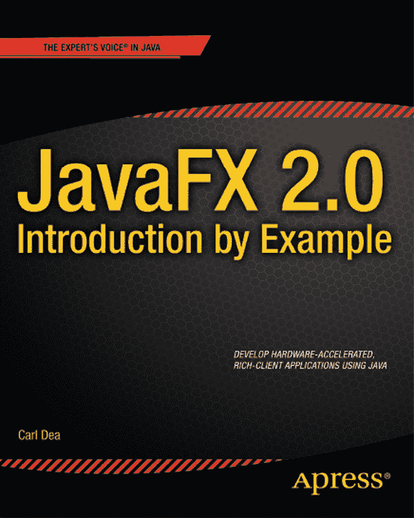

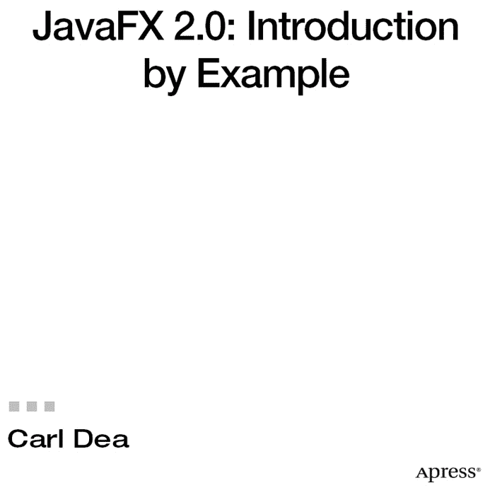

**JavaFX 2.0：实例入门**

版权所有 © 2011 Carl Dea

本作品受版权保护。出版商保留所有权利，无论涉及材料的全部或部分，特别是翻译、重印、重用插图、朗诵、广播、以缩微胶片或任何其他物理方式复制，以及传输或信息存储与检索、电子改编、计算机软件，或现在已知或以后开发的类似或不同方法的权利。与评论或学术分析相关的简短摘录，或专门为输入和执行于计算机系统而提供、仅供作品购买者独家使用的材料，不受此法律保留的限制。本出版物或其部分的复制，仅在出版商所在地现行版权法的规定下允许，且使用许可必须始终从 Springer 获取。使用许可可通过 Copyright Clearance Center 的 RightsLink 获取。违反行为将根据相应版权法受到起诉。

ISBN-13（平装）：978-1-4302-4257-4

ISBN-13（电子版）：978-1-4302-4258-1

本书中可能出现商标名称、标识和图像。我们不会在每次出现商标名称、标识或图像时都使用商标符号，而是仅以编辑方式使用这些名称、标识和图像，以利于商标所有者，且无意侵犯商标权。

本出版物中使用的商品名称、商标、服务标志及类似术语，即使未被标识为如此，也不应被视为对其是否受所有权保护的表达意见。

尽管本书中的建议和信息在出版时被认为是真实准确的，但作者、编辑和出版商均不对可能出现的任何错误或遗漏承担法律责任。出版商对本书所含内容不作任何明示或暗示的保证。

总裁与出版商：Paul Manning
      首席编辑：Jonathan Gennick
      技术审校：David Coffin
      编辑委员会：Steve Anglin, Mark Beckner, Ewan Buckingham, Gary Cornell, Morgan Ertel, Jonathan Gennick,
            Jonathan Hassell, Robert Hutchinson, Michelle Lowman, James Markham, Matthew Moodie, Jeff Olson,
            Jeffrey Pepper, Douglas Pundick, Ben Renow-Clarke, Dominic Shakeshaft, Gwenan Spearing, Matt Wade,
            Tom Welsh
      协调编辑：Annie Beck
      文字编辑：Nancy Sixsmith
      排版：Bytheway Publishing Services
      索引编制：BIM Indexing & Proofreading Services
      插图：SPi Global
      封面设计：Anna Ishchenko

全球图书贸易由 Springer Science+Business Media New York 发行，地址：233 Spring Street, 6th Floor, New York, NY 10013。电话：1-800-SPRINGER，传真：(201) 348-4505，电子邮件：`orders-ny@springer-sbm.com`，或访问 [`www.springeronline.com`](http://www.springeronline.com)。

有关翻译信息，请发送电子邮件至 `rights@apress.com`，或访问 [`www.apress.com`](http://www.apress.com)。

Apress 和 friends of ED 的书籍可批量购买用于学术、企业或促销用途。大多数图书也提供电子书版本和许可。如需更多信息，请参考我们的特殊批量销售–电子书许可网页：[`www.apress.com/bulk-sales`](http://www.apress.com/bulk-sales)。

作者在本文中引用的任何源代码或其他补充材料，读者可在 [`www.apress.com`](http://www.apress.com) 获取。有关如何找到本书源代码的详细信息，请访问 [`www.apress.com/source-code/`](http://www.apress.com/source-code/)。

## 目录概览

 关于作者

 关于技术审校

 致谢

 引言

 第 1 章：JavaFX 基础

 第 2 章：JavaFX 图形

 第 3 章：JavaFX 媒体

 第 4 章：Web 上的 JavaFX

 索引

## 目录

 关于作者

 关于技术审校

 致谢

 引言

 第 1 章：JavaFX 基础

1-1. 安装所需软件

问题

解决方案

工作原理

1-2. 创建简单用户界面

问题

解决方案 #1

解决方案 #2

工作原理

解决方案 #1

解决方案 #2

1-3: 绘制文本

问题

解决方案

工作原理

1-4: 更改文本字体

问题

解决方案

工作原理

1-5. 创建形状

问题

解决方案

工作原理

1-6. 为对象分配颜色

问题

解决方案

工作原理

1-7. 创建菜单

问题

解决方案

工作原理

1-8. 向布局添加组件

问题

解决方案

工作原理

1-9. 生成边框

问题

解决方案

工作原理

1-10. 绑定表达式

问题

解决方案

工作原理

1-11. 创建和使用可观察列表

问题

解决方案

工作原理

1-12. 生成后台进程

问题

解决方案

工作原理

1-13. 将键盘快捷键关联到应用程序

问题

解决方案

工作原理

1-14. 创建和使用表格

问题

解决方案

工作原理

1-15. 使用拆分视图组织用户界面

问题

解决方案

工作原理

1-16. 向用户界面添加选项卡

问题

解决方案

工作原理

1-17. 开发对话框

问题

解决方案

工作原理

 第 2 章：JavaFX 图形

2-1. 创建图像

问题

解决方案

工作原理

2-2. 生成动画

问题

解决方案

工作原理

2-3. 沿路径动画化形状

问题

解决方案

工作原理

2-4. 通过网格操控布局

问题

解决方案

工作原理

2-5. 使用 CSS 增强效果

问题

解决方案

工作原理

 第 3 章：JavaFX 媒体

3-1. 播放音频

问题

解决方案

工作原理

3-2. 播放视频

问题

解决方案

工作原理

3-3. 控制媒体动作与事件

问题

解决方案

工作原理

3-4. 标记视频中的位置

问题

解决方案

工作原理

3-5. 同步动画与媒体

问题

解决方案

工作原理

 第 4 章：Web 上的 JavaFX

4-1. 在网页中嵌入 JavaFX 应用程序

问题

解决方案

工作原理

4-2. 显示 HTML5 内容

问题

解决方案

工作原理

4-3. 使用 Java 代码操控 HTML5 内容

问题

解决方案

工作原理

4-4. 响应 HTML 事件

问题

解决方案

工作原理

4-5. 显示数据库中的内容

问题

解决方案

工作原理

 索引

## 关于作者

  **卡尔·P·迪亚**目前是 BCT-LLC 公司的软件工程师，从事高性能计算（HPC）架构项目。他拥有 15 年软件开发经验，客户涵盖《财富》500 强企业及非营利组织。他编写的软件涵盖关键任务型应用到 Web 应用。卡尔自 Java 诞生之初便开始使用该语言，同时也是 JavaFX 的狂热爱好者，早在该技术还被称为 F3 时便已开始关注。他对软件开发的热情始于中学科学老师向他展示 TRS-80 计算机的那一刻。卡尔目前专注于富客户端应用、游戏编程、Arduino、手机和平板电脑开发。工作之余，他和妻子喜欢观看女儿们的体操比赛。卡尔居住在美国东海岸马里兰州帕萨迪纳（又称“德纳”）。

## 关于技术审校

 **大卫·科芬**是 Apress 出版社《专家 Oracle》和《Java 安全》的作者。他是萨凡纳河工厂（美国能源部大型设施）的 IT 分析师。30 多年来，大卫的专业领域涵盖多平台网络集成和系统编程。在加入萨凡纳河工厂之前，他曾为多家国防承包商工作，并在俄亥俄州赖特-帕特森空军基地的国家空天飞机联合项目办公室担任办公与网络计算技术负责人。作为终身学习者，他拥有一个硕士学位，并正在攻读另一个学位。作为顾家的男人，大卫养育了八个孩子。他是一名铁人三项运动员和长距离游泳选手，成绩处于中游水平。他还是一名古典吉他手，但并未因此放弃本职工作。

## 引言

JavaFX 2.0 是 Java 的下一代图形用户界面（GUI）工具包，旨在帮助开发者快速构建丰富的跨平台应用。JavaFX 从零开始设计，通过硬件加速图形技术充分利用现代 GPU，同时提供精心设计的编程接口，使开发者能够整合图形、动画和 UI 控件。全新的 JavaFX 2.0 是一个纯 Java 语言的应用程序编程接口（API）。

JavaFX 2.0 API 的关键架构策略包括复用现有 Java 库，以及桥接在 JVM 上运行的其他语言（Visage、Jython、Groovy、JRuby 和 Scala）之间的通信。

Oracle 公司的南迪尼·拉马尼在《JavaFX 2.0 介绍》截屏视频中明确阐述了 JavaFX 平台的预期发展方向：

> *“行业正朝着配备 GPU 的多核/多线程平台发展。JavaFX 2.0 利用这些特性提升执行效率和 UI 设计灵活性。我们的首要目标是为企业应用的架构师和开发者提供一套工具和 API，帮助他们构建更好的数据驱动型业务应用。”*

——南迪尼·拉马尼
Oracle 公司
Java 客户端平台开发副总裁

### 历史回顾

2005 年，Sun Microsystems 收购了 SeeBeyond 公司，该公司一位名叫克里斯·奥利弗的软件工程师创建了名为 F3（形式追随功能）的图形丰富脚本语言。F3 后来由 Sun Microsystems 在 2007 年 JavaOne 大会上以 JavaFX 之名正式发布。

2009 年 4 月 20 日，Oracle 公司宣布收购 Sun Microsystems，成为 JavaFX 的新管理者。在 2010 年 JavaOne 大会上，Oracle 公布了 JavaFX 路线图。作为路线图的一部分，Oracle 宣布计划逐步淘汰 JavaFX 脚本语言，并为 Java 语言和平台重新打造 JavaFX。

根据 2010 年路线图的承诺，JavaFX 2.0 SDK 于 2011 年 10 月 3 日在 JavaOne 大会上发布。Oracle 还宣布将致力于推动 JavaFX 成为开源产品，从而让社区共同推动平台发展。开源 JavaFX 将提升其采用率，加快缺陷修复速度，并催生新的增强功能。

表 0-1 展示了 JavaFX 主要版本的整体历史。

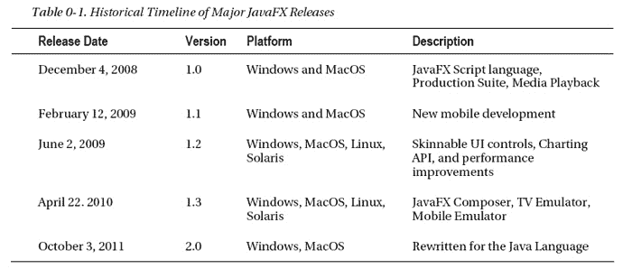

### 本书的编写方法

本书书名已说明一切：《JavaFX 2.0 入门实例》。在本书中，您将通过实践性的示例教程学习 JavaFX 2.0 的新功能。这些教程将为您提供创建自己的富客户端应用所需的知识。与 Java“一次编写，随处运行”的理念一脉相承，JavaFX 也秉持同样的精神。由于 JavaFX 2.0 完全用 Java 语言编写，您将感到得心应手。

大多数示例可在 Java 6 下编译运行。但部分示例将利用 Java 7 的语言增强特性，因此需要 Java 7 环境。在通过本书学习 JavaFX 2.0 和 Java 7 的过程中，您将发现新的 API 和语言增强特性有助于提高开发效率。正因如此，我鼓励您探索 Java 7 的所有新功能。要深入了解 Java 7 的新特性，我推荐《Java 7 实例》一书。另外，本书中的示例也可在《Java 7 实例》中找到。

本书涵盖 JavaFX 2.0 的基础知识、图形与动画、音频与视频以及 Web 技术。基础知识包括如何安装必备软件（JavaFX 2.0、NetBeans 7.1）和创建简单用户界面。您还将学习场景图、文本节点与字体样式、形状、颜色、布局、菜单、UI 控件、简单样式（CSS 样式）、绑定表达式、后台进程、键盘快捷键和对话框的基础知识。接下来，在图形与动画部分，您将接触图像处理、拖放操作、动画 API 和 UI 主题（外观与风格）。图形与动画之后，您将学习音频与视频。本节包括创建 MP3 播放器、使用视频播放器、响应媒体事件、处理媒体标记事件以及将动画与媒体事件同步。最后，您将使用 JavaFX 2.0 与 HTML5、JavaScript 和 XML 等 Web 技术互操作。在本节中，您将学习如何将 JavaFX 嵌入网页、渲染和动态操作 HTML5 内容、创建响应 HTML 事件的天气应用，以及使用嵌入式数据库（Derby）创建 RSS 订阅应用。

### 本书面向的读者

如果您是希望将客户端应用提升到新水平的 Java 开发者，本书将成为您的指南，帮助您开始创建实用且美观的用户界面。如果您使用的平台未在上表中列出，不必担心——当您阅读本书时，JavaFX 2.0 应该已经支持您喜爱的操作系统。

### 本书的结构安排

本书按照从入门到中级概念的自然递进顺序编排。对于 Java 开发者而言，本书提及的所有概念都不应难以理解。本书的示例采用问题-解决方案的格式呈现。在简要描述实际应用问题后，逐步解决方案将解释最适合解决该问题的技术。每个示例都可轻松调整以满足您在开发游戏、媒体播放器或常规企业应用时的特定需求。您的 Java UI 开发经验越丰富，就越能自由地跳转到本书的不同章节和示例。不过，任何 Java 开发者都可以循序渐进地学习本书，掌握增强日常 GUI 应用所需的技能。

### 下载代码

本书示例的源代码均可获取。你可以从 Apress 网站上本书的目录页面下载这些代码。网址是 [`http://www.apress.com/9781430242574`](http://www.apress.com/9781430242574)。代码将以 `.zip` 文件形式提供，并按章节组织。

## 第 1 章

## JavaFX 基础

JavaFX 2.0 API 是 Java 的下一代 GUI 工具包，供开发者构建丰富的跨平台应用程序。JavaFX 2.0 基于场景图范式（保留模式），而非传统的即时模式渲染风格。JavaFX 的场景图是一种树状数据结构，用于维护基于矢量的图形节点。JavaFX 的目标是应用于多种设备类型，例如移动设备、智能手机、电视、平板电脑和台式机。

在 JavaFX 诞生之前，开发富互联网应用程序（RIA）需要整合许多独立的库和 API，才能实现功能强大的应用程序。这些独立的库包括媒体、UI 控件、Web、3D 和 2D API。由于将这些 API 整合在一起相当困难，Sun Microsystems（现为 Oracle）才华横溢的工程师们创建了一套新的 JavaFX 库，将所有相同功能整合到一个屋檐下。JavaFX 堪称 GUI 领域的瑞士军刀（参见图 1-1）。JavaFX 2.0 是一个纯 Java（语言）API，允许开发者利用现有的 Java 库和工具。

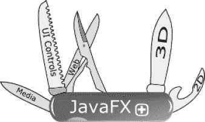

***图 1-1.** JavaFX*

根据你交谈的对象不同，你可能会遇到对“用户体验”（或在 UI 领域，UX）的不同定义。但有一个事实依然不变：用户总是期望 GUI 应用程序提供更好的内容和更高的可用性。鉴于此，开发者和设计师经常携手合作，共同打造满足这一需求的应用程序。JavaFX 提供了一个工具包，帮助开发者和设计师（在某些情况下，他们可能是同一个人）创建既实用又美观的应用程序。另外需要承认的是，无论你是在开发游戏、媒体播放器，还是常见的企业级应用程序，JavaFX 不仅能帮助你开发更丰富的用户界面，你还会发现其 API 设计得极为出色，能大幅提升开发者的生产力（我完全是从 API 使用者的角度出发）。

尽管本书并未详尽研究 JavaFX 2.0 的所有功能，但你会找到一些常见的用例，它们能帮助你构建更丰富的应用程序。希望这些范例能通过提供实用且贴近现实的示例，为你指明正确的方向。我也鼓励你探索其他资源，以更深入地了解 JavaFX。我强烈推荐《Pro JavaFX Platform》（Apress，2009 年）以及即将出版的《Pro JavaFX 2.0 Platform》（Apress，2012 年），这些都是非常宝贵的资源。这些书籍会深入讲解，帮助你创建专业级的应用程序。

那么，闲话少叙，我们开始吧，好吗？

### 1-1. 安装所需软件

#### 问题

你想开始开发 JavaFX 应用程序，但不知道需要安装哪些软件。

#### 解决方案

你需要安装以下软件才能开始使用 JavaFX：

> *   Java 7 JDK 或更高版本
> *   JavaFX 2.0 SDK
> *   NetBeans IDE 7.1 或更高版本

 **注意** 在撰写本文时，情况可能会发生变化。要查看其他要求，请参阅 [`http://download.oracle.com/javafx/2.0/system_requirements/jfxpub-system_requirements.htm`](http://download.oracle.com/javafx/2.0/system_requirements/jfxpub-system_requirements.htm)。

在撰写本文时，情况可能会发生变化。当你阅读本文时，你可能会发现 JavaFX 能够在你喜欢的操作系统上运行。对于本教程，我假设 Java 7 已经安装，因此我不会详述其安装步骤。以下是安装所有其他所需软件组件的步骤：

> 1.  从以下位置下载 JavaFX 2.0 和 NetBeans IDE 7.1.x：
>     *   JavaFX 2.0 SDK：[`http://www.oracle.com/technetwork/java/javafx/downloads/index.html`](http://www.oracle.com/technetwork/java/javafx/downloads/index.html)
>     *   NetBeans 7.1 beta SDK：[`http://netbeans.org`](http://netbeans.org)
> 2.  安装 JavaFX 2.0 SDK。启动 JavaFX SDK 安装可执行文件后，将出现图 1-2 所示的界面。

启动 JavaFX SDK 安装可执行文件后，你将看到图 1-2 中的向导起始界面。

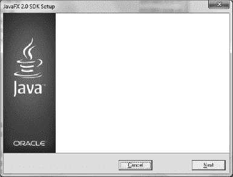

***图 1-2.** JavaFX 2.0 SDK 安装向导*

3.  接下来，你可以通过单击“浏览”按钮指定 JavaFX SDK 的主目录。图 1-3 显示了 JavaFX SDK 主目录的默认位置。你可能需要记下此位置，以便在第 6 步中配置你的 CLASSPATH。

图 1-3 显示了安装选项，允许你指定 JavaFX 2.0 SDK 的主目录。

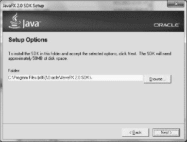

***图 1-3.** JavaFX SDK 主目录*

4.  单击“下一步”后，组件将开始安装，随后将出现图 1-4 所示的界面。

图 1-4 显示了在完成安装前安装最后几个组件的进度指示器。

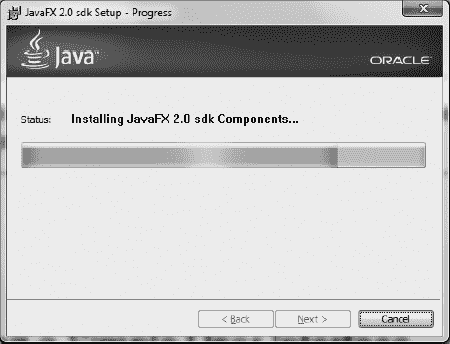

***图 1-4.** 完成安装*

5.  安装 NetBeans IDE，其中包含 JavaFX 2.0 插件。

安装时，你将按照默认的向导界面进行操作。如需其他说明，请参阅 [`http://netbeans.org/community/releases/71/install.html`](http://netbeans.org/community/releases/71/install.html)。

6.  配置你的环境变量 CLASSPATH，使其包含 JavaFX 运行时库。运行时库的名称和位置为 `<JavaFX SDK 主目录>\rt\lib\jfxrt.jar`。（Linux 使用正斜杠 /）。

#### 工作原理

本教程演示了如何在 Windows 平台上安装 JavaFX 2.0 和 NetBeans IDE。在其他操作系统上安装 JavaFX 2.0 时，你可能需要根据实际情况稍微调整步骤。虽然此处描述的步骤是针对 NetBeans 的，但你也可以使用其他 IDE 进行开发，例如 Eclipse、IntelliJ 或 vi。虽然大多数示例教程都是使用 NetBeans IDE 创建的，但你也可以使用命令行提示符编译和运行 JavaFX 应用程序。

要使用命令行提示符编译和运行 JavaFX 应用程序，你需要配置你的 CLASSPATH。按照向导安装必备软件后，你需要设置环境的 `CLASSPATH` 变量，使其包含 JavaFX 运行时库 `<JavaFX SDK 主目录>/rt/lib/jfxrt.jar`（第 6 步）。设置此库将有助于后续在命令行上编译和运行基于 JavaFX 的应用程序。以下代码根据你的平台配置 CLASSPATH 环境变量：

*在 Windows 平台上设置 CLASSPATH*

`set JAVAFX_HOME=C:\Program Files (x86)\Oracle\JavaFX 2.0 SDK`
`set JAVA_HOME=C:\Program Files (x86)\Java\jdk1.7.0`
`set CLASSPATH=%JAVAFX_HOME%\rt\lib\jfxrt.jar;.`

*在 UNIX/Linux/Mac OS 平台上设置 CLASSPATH*

`# bash 环境`
`export JAVAFX_HOME=<JavaFX SDK 主目录>`
`export CLASSPATH=$CLASSPATH:$JAVAFX_HOME/rt/lib/jfxrt.jar`

`#csh 环境`
`setenv JAVAFX_HOME <JavaFX SDK 主目录>`
`setenv CLASSPATH ${CLASSPATH}:${JAVAFX_HOME}/rt/lib/jfxrt.jar`

在教程 1-2 中，你将学习如何创建一个简单的 Hello World 应用程序。创建 Hello World 应用程序后，你将能够编译和运行基于 JavaFX 的应用程序。

### 1-2. 创建简单的用户界面

#### 问题

你想创建、编码、编译并运行一个简单的 JavaFX Hello World 应用程序。

#### 解决方案 #1

使用 NetBeans IDE 中的 JavaFX 项目创建向导，开发一个 JavaFX HelloWorld 应用程序。

**在 NETBEANS 中创建 JAVAFX HELLO WORLD 应用程序**

要快速上手，使用 NetBeans IDE 创建、编码、编译并运行一个简单的 JavaFX HelloWorld 应用程序，请遵循以下步骤：

启动 NetBeans IDE。

1) 在“文件”菜单上，选择“新建项目”。

2) 在“选择项目与类别”下，选择 `JavaFX` 文件夹。

3) 在“项目”下，选择“Java FX 应用程序”，然后点击“下一步”。

4) 将项目名称指定为 **HelloWorldMain**。

5) 更改或接受“项目位置”和“项目文件夹”字段的默认值。

6) 确保选中“创建应用程序类”复选框。点击“完成”。

7) 在 NetBeans IDE 的“项目”选项卡中，选择新创建的项目。打开“项目属性”对话框，验证“源/二进制格式”设置为 JDK 7。在“类别”下点击“源”。

8) 仍在“项目属性”对话框中，在“类别”下选择“库”，以验证 Java 7 和 JavaFX 平台已正确配置。点击“管理平台”按钮。确保出现一个显示 JavaFX 库的选项卡。图 1-5 展示了 JavaFX 选项卡，详细说明了其 SDK 主目录、运行时和 Javadoc 目录位置。验证完毕后，点击“关闭”按钮。

图 1-5 显示了“Java 平台管理器”窗口，其中包含作为 JDK 7 附带托管平台的 JavaFX。

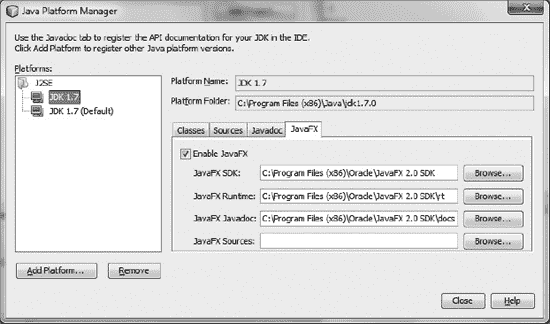

***图 1-5.** Java 平台管理器*

9) 关闭“Java 平台管理器”窗口后，点击“确定”关闭“项目属性”窗口。

10) 要运行并测试您的 JavaFX Hello World 应用程序，请访问“运行”菜单，并选择“运行主项目”或按 F6 键。

图 1-6 显示了一个从 NetBeans IDE 启动的简单 JavaFX Hello World 应用程序。

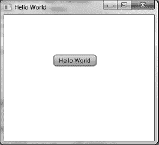

***图 1-6.** 从 NetBeans IDE 启动的 JavaFX Hello World*

#### 解决方案 #2

使用您喜欢的编辑器编写 JavaFX Hello World 应用程序的代码。创建 Java 文件后，您将使用命令行提示符来编译和运行您的 JavaFX 应用程序。以下是在命令行提示符下创建、编译和运行 JavaFX Hello World 应用程序的步骤。

**在其他 IDE 中创建 JAVAFX HELLO WORLD 应用程序**

要快速上手：

1. 将以下代码复制并粘贴到您喜欢的编辑器中，并将文件保存为 `HelloWorldMain.java`。

以下源代码是一个 JavaFX Hello World 应用程序：

`package helloworldmain;`

`import javafx.application.Application;`
`import javafx.event.ActionEvent;`
`import javafx.event.EventHandler;`
`import javafx.scene.Group;`
`import javafx.scene.Scene;`
`import javafx.scene.control.Button;`
`import javafx.stage.Stage;`

`/**`
` *`
` * @author cdea`
` */`
`public class HelloWorldMain extends Application {`

`    /**`
`     * @param args the command line arguments`
`     */`
`    public static void main(String[] args) {`
`        Application.launch(args);`
`    }`

`    @Override`
`    public void start(Stage primaryStage) {`
`        primaryStage.setTitle("Hello World");`
`        Group root = new Group();`
`        Scene scene = new Scene(root, 300, 250);`
`        Button btn = new Button();`
`        btn.setLayoutX(100);`
`        btn.setLayoutY(80);`
`        btn.setText("Hello World");`
`        btn.setOnAction(new EventHandler<ActionEvent>() {`

`            public void handle(ActionEvent event) {`
`                System.out.println("Hello World");`
`            }`
`        });`
`        root.getChildren().add(btn);`
`        primaryStage.setScene(scene);`
`        primaryStage.show();`
`    }`
`}`

2. 保存名为 `HelloWorldMain.java` 的文件后，在命令行提示符下，导航到该文件所在的目录。

3. 使用 Java 编译器 `javac` 编译源代码文件 `HelloWorldMain.java`：

`    javac -d . HelloWorldMain.java`

4. 运行并测试您的 JavaFX Hello World 应用程序。假设您与 `HelloWorldMain.java` 文件位于同一目录，请在命令行提示符下输入以下命令来运行您的 JavaFX Hello World 应用程序：

`    java helloworldmain.HelloWorldMain`

图 1-7 显示了一个从命令行提示符启动的简单 JavaFX Hello World 应用程序。

***图 1-7.** 从命令行提示符启动的 JavaFX Hello World*

#### 工作原理

以下是对两种解决方案的描述。两种解决方案都需要先决软件。（我将在配方 1-1 中介绍如何安装所需软件。）在解决方案 #1 中，您将使用 NetBeans IDE 创建一个 JavaFX 应用程序。解决方案 #2 允许您选择自己喜欢的编辑器，并使用命令行提示符来编译和执行 JavaFX 程序。

#### 解决方案 #1

要创建一个简单的 JavaFX Hello World 应用程序，使用 NetBeans 时，您将按照步骤 1 到 7 中指定的方式使用 JavaFX 项目创建向导。在步骤 8 到 10 中，您将验证两个设置，以确保项目已正确配置，能够编译和运行 JavaFX 2.0 应用程序。最后，在步骤 11 中，您将通过选择“运行主项目”菜单选项来运行 JavaFX Hello World 应用程序。

按照步骤 1 到 7 操作时，您不应遇到任何困难。然而，步骤 8 到 10 解决了一个较小的 NetBeans 错误，该错误涉及将项目的源/二进制格式设置为 JDK 7，并确保托管平台包含 JavaFX 运行时库。如果您没有遇到此问题，可能是 NetBeans 团队已经修正了该问题。为安全起见，在开始之前按照步骤 8 到 10 验证您的配置也无妨。

#### 解决方案 #2

要使用您喜欢的 IDE 创建一个简单的 JavaFX Hello World 应用程序，请遵循步骤 1 和 2。要在命令行上编译并运行您的 Hello World 程序，请遵循步骤 3 和 4。

将源代码输入您喜欢的编辑器并保存源文件后，您将需要编译并运行您的 JavaFX 程序。打开命令行提示窗口，并导航到名为 `HelloWorldMain.java` 的 Java 文件所在的目录。

这里我想指出使用命令 `javac -d . HelloWorldMain.java` 编译文件的方式。您会注意到文件名前的 `-d .`。这告诉 Java 编译器根据包名将类文件放在何处。在此场景中，`HelloWorldMain` 的包声明是 `helloworldmain`，这将在当前目录下创建一个子目录。编译完成后，您的目录结构应类似于以下内容：

`|projects`
`        |helloworld`
`              |HelloWorldMain.java`
`              | helloworldmain`
`                    |HelloWorldMain.class`

考虑到上述目录结构，以下命令将编译并运行我们的 JavaFX Hello World 应用程序：

`    cd /projects/helloworld`

`    javac –d . HelloWorldMain.java`

`    java helloworldmain.HelloWorldMain`

 **注意** 打包和部署 JavaFX 应用程序的方法有很多。要了解更多信息，请参阅 [`http://blogs.oracle.com/thejavatutorials/entry/javafx_2_0_beta_packager`](http://blogs.oracle.com/thejavatutorials/entry/javafx_2_0_beta_packager) 上的“学习如何部署和打包 JavaFX 应用程序”。有关深入的 JavaFX 部署策略，请参阅 Oracle 的“部署 JavaFX 应用程序”，网址为 [`http://download.oracle.com/javafx/2.0/deployment/deployment_toolkit.htm`](http://download.oracle.com/javafx/2.0/deployment/deployment_toolkit.htm)。

在这两种解决方案中，您都会在源代码中注意到 JavaFX 应用程序继承了 `javafx.application.Application` 类。`Application` 类提供了应用程序生命周期函数，例如在运行时启动和停止。这也为 Java 应用程序提供了一种以线程安全方式启动 JavaFX GUI 组件的机制。请记住，与 Java Swing 的事件调度线程类似，JavaFX 将拥有自己的 JavaFX 应用程序线程。

在我们的 `main()` 方法入口点，我们通过简单地将命令行参数传递给 `Application.launch()` 方法来启动 JavaFX 应用程序。一旦应用程序进入就绪状态，框架内部将调用 `start()` 方法来开始。当调用 `start()` 方法时，一个 JavaFX `javafx.stage.Stage` 对象可供开发者使用和操作。

您会注意到一些对象名称很奇怪，例如 `Stage` 或 `Scene`。API 的设计者将事物建模得类似于剧院或戏剧，演员在观众面前表演。用同样的类比，为了上演一出戏，演员基本上会在一个或多个场景中表演。当然，所有场景都在一个舞台上进行。在 JavaFX 中，`Stage` 相当于一个应用程序窗口，类似于 Java Swing API 的 `JFrame` 或 `JDialog`。您可以将 `Scene` 对象视为一个能够容纳零到多个 `Node` 对象的内容面板。`Node` 是所有要渲染的场景图节点的基本基类。常用的节点是 UI 控件和 `Shape` 对象。类似于树形数据结构，场景图通过使用容器类 `Group` 来包含子节点。我们稍后在研究 `ObservableList` 时会了解更多关于 `Group` 类的信息，但现在我们可以将它们视为能够容纳 `Node` 的 Java `List` 或集合。

添加子节点后，我们设置 `primaryStage`（`Stage`）的场景，并在 `Stage` 对象上调用 `show()` 方法来显示 JavaFX 窗口。

最后一件事：在本章中，大多数示例应用程序的结构将与这个示例相同，其中配方代码解决方案将位于 `start()` 方法内部。话虽如此，本章中的大多数配方将遵循相同的模式。换句话说，为简洁起见，许多样板代码将不会显示。要查看所有配方的完整源代码列表，请从本书网站下载源代码。

### 1-3：绘制文本

#### 问题

您想要在 JavaFX 场景图上绘制文本。

#### 解决方案

通过使用 `javafx.scene.text.Text` 类创建 `Text` 节点，并将其放置在 JavaFX 场景图上。由于 `Text` 节点将被放置在场景图上，您决定创建随机定位的 `Text` 节点，这些节点围绕其 (x, y) 位置旋转，散布在场景区域中。

以下代码实现了一个 JavaFX 应用程序，该应用程序显示散布在场景图上、具有随机位置和颜色的 `Text` 节点：

`package javafx2introbyexample.chapter1.recipe1_03;`

`import java.util.Random;`
`import javafx.application.Application;`
`import javafx.scene.Group;`
`import javafx.scene.Scene;`
`import javafx.scene.paint.Color;`
`import javafx.scene.text.Text;`
`import javafx.stage.Stage;`

`/**`
` *`
` * @author cdea`
` */`
`public class DrawingText extends Application {`

`    /**`
`     * @param args the command line arguments`
`     */`
`    public static void main(String[] args) {`
`        Application.launch(args);`
`    }`

`    @Override`
`    public void start(Stage primaryStage) {`
`        primaryStage.setTitle("Chapter 1-3 Drawing Text");`
`        Group root = new Group();`
`        Scene scene = new Scene(root, 300, 250, Color.WHITE);`
`        Random rand = new Random(System.currentTimeMillis());`
`        for (int i = 0; i < 100; i++) {`
`            int x = rand.nextInt((int) scene.getWidth());`
`            int y = rand.nextInt((int) scene.getHeight());`
`            int red = rand.nextInt(255);`
`            int green = rand.nextInt(255);`
`            int blue = rand.nextInt(255);`

`            Text text = new Text(x, y, "JavaFX 2.0");`

`            int rot = rand.nextInt(360);`
`            text.setFill(Color.rgb(red, green, blue, .99));`
`            text.setRotate(rot);`
`            root.getChildren().add(text);`
`        }`

`        primaryStage.setScene(scene);`
`        primaryStage.show();`
`    }`
`}`

图 1-8 显示了散布在 JavaFX 场景图上的随机 `Text` 节点。

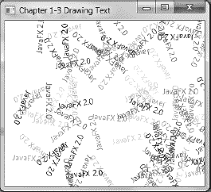

***图 1-8.** 绘制文本*

#### 工作原理

要在 JavaFX 中绘制文本，你需要创建一个 `javafx.scene.text.Text` 节点，并将其放置在场景图（`javafx.scene.Scene`）上。在本示例中，你会看到文本对象以随机颜色和位置散布在 `Scene` 区域中。

首先，我们创建一个循环来生成随机的 (x, y) 坐标，用于定位 `Text` 节点。其次，我们创建介于 (0–255 rgb) 之间的随机颜色分量，并将其应用于 `Text` 节点。第三，旋转角度（以度为单位）是一个介于 (0–360 度) 之间的随机生成值，用于使文本倾斜。以下代码创建了将分配给 `Text` 节点位置、颜色和旋转的随机值：

`    int x = rand.nextInt((int) scene.getWidth());`
`    int y = rand.nextInt((int) scene.getHeight());`
`    int red = rand.nextInt(255);`
`    int green = rand.nextInt(255);`
`    int blue = rand.nextInt(255);`
`    int rot = rand.nextInt(360);`

一旦生成了随机值，它们将被应用于 `Text` 节点，这些节点将被绘制到场景图上。以下代码片段将位置 (x, y)、颜色 (rgb) 和旋转（角度，以度为单位）应用于 `Text` 节点：

`    Text text = new Text(x, y, "JavaFX 2.0");`
`    text.setFill(Color.rgb(red, green, blue, .99));`
`    text.setRotate(rot);`

`    root.getChildren().add(text);`

你将开始看到场景图 API 的强大之处，因为它易于使用。`Text` 节点可以像 `Shapes` 一样轻松操作。实际上，它们确实是 `Shapes`。在继承层次结构中定义，`Text` 节点扩展自 `javafx.scene.shape.Shape` 类，因此能够执行一些有趣的操作，例如填充颜色或按角度旋转。尽管文本被着色了，但它们仍然显得有些单调。然而，在下一个配方中，我们将演示如何更改文本的字体。

### 1-4：更改文本字体

#### 问题

你想要更改文本字体，并为 `Text` 节点添加特殊效果。

#### 解决方案

创建一个 JavaFX 应用程序，使用以下类来设置文本字体并对 `Text` 节点应用效果：

> *   `javafx.scene.text.Font`
> *   `javafx.scene.effect.DropShadow`
> *   `javafx.scene.effect.Reflection`

以下代码设置了字体并对 `Text` 节点应用了效果。我们将使用 Serif、SanSerif、Dialog 和 Monospaced 字体，以及投影和反射效果：

`package javafx2introbyexample.chapter1.recipe1_04;`

`import javafx.application.Application;`
`import javafx.scene.Group;`
`import javafx.scene.Scene;`
`import javafx.scene.effect.DropShadow;`
`import javafx.scene.effect.Reflection;`
`import javafx.scene.paint.Color;`
`import javafx.scene.text.Font;`
`import javafx.scene.text.Text;`
`import javafx.stage.Stage;`

`/**`
` * 更改文本字体`
` * @author cdea`
` */`
`public class ChangingTextFonts extends Application {`

`    /**`
`     * @param args 命令行参数`
`     */`
`    public static void main(String[] args) {`
`        Application.launch(args);`
`    }`

`    @Override`
`    public void start(Stage primaryStage) {`
`        primaryStage.setTitle("第 1-4 章 更改文本字体");`
`        Group root = new Group();`
`        Scene scene = new Scene(root, 550, 250, Color.WHITE);`

`        // 带投影的 Serif 字体`
`        Text text2 = new Text(50, 50, "JavaFX 2.0: 实例入门");`
`        Font serif = Font.font("Serif", 30);`
`        text2.setFont(serif);`
`        text2.setFill(Color.RED);`
`        DropShadow dropShadow = new DropShadow();`
`        dropShadow.setOffsetX(2.0f);`
`        dropShadow.setOffsetY(2.0f);`
`        dropShadow.setColor(Color.rgb(50, 50, 50, .588));`
`        text2.setEffect(dropShadow);`
`        root.getChildren().add(text2);`

`        // SanSerif 字体`
`        Text text3 = new Text(50, 100, "JavaFX 2.0: 实例入门");`
`        Font sanSerif = Font.font("SanSerif", 30);`
`        text3.setFont(sanSerif);`
`        text3.setFill(Color.BLUE);`
`        root.getChildren().add(text3);`

`        // Dialog 字体`
`        Text text4 = new Text(50, 150, "JavaFX 2.0: 实例入门");`
`        Font dialogFont = Font.font("Dialog", 30);`
`        text4.setFont(dialogFont);`
`        text4.setFill(Color.rgb(0, 255, 0));`
`        root.getChildren().add(text4);`

`        // Monospaced 字体`
`        Text text5 = new Text(50, 200, "JavaFX 2.0: 实例入门");`
`        Font monoFont = Font.font("Monospaced", 30);`
`        text5.setFont(monoFont);`
`        text5.setFill(Color.BLACK);`
`        root.getChildren().add(text5);`

`        Reflection refl = new Reflection();`
`        refl.setFraction(0.8f);`
`        text5.setEffect(refl);`

`        primaryStage.setScene(scene);`
`        primaryStage.show();`
`    }`
`}`

图 1-9 展示了 JavaFX 应用程序设置各种字体样式并对 `Text` 节点应用效果（投影和反射）。

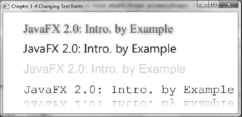

***图 1-9.** 更改文本字体*

#### 工作原理

在本配方中，我基本上使用了 JavaFX 的场景图来显示 `Text` 节点。JavaFX 采用保留模式方法，其中节点使用基于矢量的图形。基于矢量的图形允许你缩放形状并应用效果，而不会出现像素化（锯齿）问题。在每个 `Text` 节点中，你可以创建并设置要在场景图上渲染的字体。以下是在 `Text` 节点上创建和设置字体的代码：

`    Text text2 = new Text(50, 50, "JavaFX 2.0: 实例入门");`
`    Font serif = Font.font("Serif", 30);`
`    text2.setFont(serif);`

投影是一个真实的效果（`DropShadow`）对象，并且实际上应用于单个 `Text` 节点实例。`DropShadow` 对象被设置为基于相对于 `Text` 节点的 x 和 y 偏移量进行定位。此外，我们还可以设置阴影的颜色；这里我们将其设置为灰色，不透明度为 .588。以下是使用投影效果（`DropShadow`）设置 `Text` 节点效果属性的示例：

`    DropShadow dropShadow = new DropShadow();`
`    dropShadow.setOffsetX(2.0f);`
`    dropShadow.setOffsetY(2.0f);`
`    dropShadow.setColor(Color.rgb(50, 50, 50, .588));`
`    text2.setEffect(dropShadow);`

尽管这是关于设置文本字体的，但我们还是对 `Text` 节点应用了效果。我还添加了另一个效果（只是为了更上一层楼）。在创建使用等宽字体的最后一个 `Text` 节点时，我应用了流行的反射效果。这里设置反射的 0.8 或 80% 将被显示。反射值的范围从零（0%）到一（100%）。以下代码片段使用浮点值 0.8f 实现了 80% 的反射：

`    Reflection refl = new Reflection();`
`    refl.setFraction(0.8f);`

`    text5.setEffect(refl);`

### 1-5. 创建形状

#### 问题

你想要创建要放置在场景图上的形状。

#### 解决方案

使用 `javafx.scene.shape.*` 包中的 JavaFX 类：`Arc`、`Circle`、`CubicCurve`、`Ellipse`、`Line`、`Path`、`Polygon`、`Polyline`、`QuadCurve`、`Rectangle`、`SVGPath` 和 `Text`。你也可以使用 `javafx.builders.*` 包中与每种形状关联的构建器类。

以下代码绘制了各种复杂形状。第一个复杂形状涉及一条以正弦波形式绘制的三次曲线。下一个形状，我称之为*冰淇淋蛋筒*，使用了包含路径元素（`javafx.scene.shape.PathElement`）的路径类。第三个形状是一条形成微笑的二次贝塞尔曲线（`QuadCurve`）。最后一个形状是一个美味的甜甜圈。我们通过减去两个椭圆（一个较小，一个较大）来创建这个甜甜圈形状：

`        // CubicCurve`
`        CubicCurve cubicCurve = CubicCurveBuilder.create()`
`                .startX(50).startY(75)          // 起点 (x1,y1)`
`                .controlX1(80).controlY1(-25)   // 控制点 1`
`                .controlX2(110).controlY2(175)  // 控制点 2`
`                .endX(140).endY(75)             // 终点 (x2,y2)`
`                .strokeType(StrokeType.CENTERED).strokeWidth(1)`
`                .stroke(Color.BLACK)`
`                .strokeWidth(3)`
`                .fill(Color.WHITE)`
`                .build();`
`        root.getChildren().add(cubicCurve);`

`        // 冰淇淋`
`        Path path = new Path();`

`        MoveTo moveTo = new MoveTo();`
`        moveTo.setX(50);`
`        moveTo.setY(150);`

`        QuadCurveTo quadCurveTo = new QuadCurveTo();`
`        quadCurveTo.setX(150);`
`        quadCurveTo.setY(150);`
`        quadCurveTo.setControlX(100);`
`        quadCurveTo.setControlY(50);`

`        LineTo lineTo1 = new LineTo();`
`        lineTo1.setX(50);`
`        lineTo1.setY(150);`

`        LineTo lineTo2 = new LineTo();`
`        lineTo2.setX(100);`
`        lineTo2.setY(275);`

`        LineTo lineTo3 = new LineTo();`
`        lineTo3.setX(150);`
`        lineTo3.setY(150);`
`        path.getElements().add(moveTo);`
`        path.getElements().add(quadCurveTo);`
`        path.getElements().add(lineTo1);`
`        path.getElements().add(lineTo2);`
`        path.getElements().add(lineTo3);`
`        path.setTranslateY(30);`
`        path.setStrokeWidth(3);`
`        path.setStroke(Color.BLACK);`

`        root.getChildren().add(path);`

`        // QuadCurve 创建微笑`
`        QuadCurve quad =QuadCurveBuilder.create()`
`                .startX(50)`
`                .startY(50)`
`                .endX(150)`
`                .endY(50)`
`                .controlX(125)`
`                .controlY(150)`
`                .translateY(path.getBoundsInParent().getMaxY())`
`                .strokeWidth(3)`
`                .stroke(Color.BLACK)`
`                .fill(Color.WHITE)`
`                .build();`

`        root.getChildren().add(quad);`

`        // 外圈甜甜圈`
`        Ellipse bigCircle = EllipseBuilder.create()`
`                .centerX(100)`
`                .centerY(100)`
`                .radiusX(50)`
`                .radiusY(75/2)`
`                .translateY(quad.getBoundsInParent().getMaxY())`
`                .strokeWidth(3)`
`                .stroke(Color.BLACK)`
`                .fill(Color.WHITE)`
`                .build();`

`        // 甜甜圈洞`
`        Ellipse smallCircle = EllipseBuilder.create()`
`                .centerX(100)`
`                .centerY(100)`
`                .radiusX(35/2)`
`                .radiusY(25/2)`
`                .build();`

`        // 制作甜甜圈`
`        Shape donut = Path.subtract(bigCircle, smallCircle);`
`        // 橙色糖衣`
`        donut.setFill(Color.rgb(255, 200, 0));`

`        // 添加投影`
`        DropShadow dropShadow = new DropShadow();`
`        dropShadow.setOffsetX(2.0f);`
`        dropShadow.setOffsetY(2.0f);`
`        dropShadow.setColor(Color.rgb(50, 50, 50, .588));`
`        donut.setEffect(dropShadow);`

`        // 稍微向下移动`
`        donut.setTranslateY(quad.getBoundsInParent().getMinY() + 30);`

`        root.getChildren().add(donut);`

图 1-10 展示了我们使用 JavaFX 创建的正弦波、冰淇淋蛋筒、微笑和甜甜圈形状：

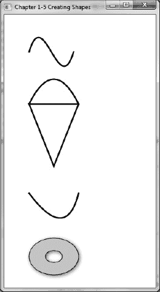

***图 1-10.** 创建形状*

#### 工作原理

第一个图形是 `javafx.scene.shape.CubicCurve` 类。要创建一条三次曲线，你只需找到合适的构造函数进行实例化。你需要设置的三次曲线主要参数包括：起点 X、起点 Y、控制点 1 X、控制点 1 Y、控制点 2 X、控制点 2 Y、终点 X、终点 Y。`startX`、`startY`、`endX`、`endY` 参数是曲线的起点和终点。`controlX1`、`controlY1`、`controlX2`、`controlY2` 分别表示控制点 1 和控制点 2。控制点是一个将曲线拉向自身方向的点。在我们的示例中，我们简单地在上方设置了一个**控制点 1** 将曲线向上拉，形成一个山峰；在下方设置了一个**控制点 2** 将曲线向下拉，形成一个山谷。下图（图 1-11）展示了一条受控制点影响的三次曲线：

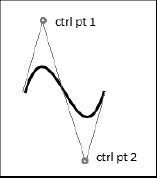

***图 1-11.** 三次曲线*

以下代码片段用于创建一个 `javafx.scene.shape.CubicCurve` 实例：

`CubicCurve cubicCurve = new CubicCurve();`
`cubicCurve.setStartX(50);     // 起点 (x1,y1)`
`cubicCurve.setStartY(75);  `
`cubicCurve.setControlX1(80);  // 控制点 1`
`cubicCurve.setControlY1(-25);`
`cubicCurve.setControlX2(110); // 控制点 2`
`cubicCurve.setControlY2(175);`
`cubicCurve.setEndX(140);      // 终点 (x2,y2)`
`cubicCurve.setEndY(75);`

但是，在解决方案部分的源代码清单中，你会立即注意到我没有像前一个片段那样使用通常的 `new CubicCurve()` 构造函数，而是使用了一个以 `Builder` 为后缀的类。`Builder` 类是遵循一种称为建造者模式的设计模式的便捷类。`Builder` 类通过允许开发者以即席方式（声明式）指定属性，提供了一种方法链式调用的方式。这使得代码更易读、更简洁，从而提高了开发者的生产力。在开发图形应用程序时使用此功能，你还会发现编码往往更具表现力，并让人联想到声明式语言（Visage、Groovy、Scala 和 Python）。

回到 `CubicCurveBuilder`；我们从 `create()` 方法开始，该方法将实例化一个 `Builder` 类。接下来是按任意顺序指定三次曲线的属性。类似于修改器或 setter 方法，你只需向该方法传递一个值。约定是方法前缀的 `set` 被移除，并且该方法返回建造者对象实例的 `this` 指针。通过返回自身，它允许你继续使用点符号来指定参数，从而实现方法链式行为。在 `Builder` 类上完成值指定后，调用 `build()` 方法将返回所需类的实例（在本例中为 `CubicCurve` 类）。

冰淇淋蛋筒形状是使用 `javafx.scene.shape.Path` 类创建的。当每个路径元素被创建并添加到 `Path` 对象时，每个元素*不*被视为图形节点（`javafx.scene.Node`）。这意味着它们不继承自 `javafx.scene.shape.Shape` 类，并且不能作为子节点添加到要显示的 `scene` 图形中。查看 Javadoc 时，你会注意到 `Path` 类继承自 `Shape` 类，而 `Shape` 类又继承自 `javafx.scene.Node` 类，因此 `Path` 是一个图形节点，但路径元素并不继承自 `Shape` 类。路径元素实际上继承自 `javafx.scene.shape.PathElement` 类，该类仅在 `Path` 对象的上下文中使用。因此，你无法实例化一个 `LineTo` 类并将其放入 `scene` 图形中。只需记住，以 `To` 为后缀的类是路径元素，而不是真正的 `Shape` 节点。例如，`MoveTo` 和 `LineTo` 对象实例是添加到 `Path` 对象的 `Path` 元素，而不是可以添加到场景中的形状。以下是将 `Path` 元素添加到 `Path` 对象以绘制冰淇淋蛋筒的示例：

`        // 冰淇淋`
`        Path path = new Path();`

`        MoveTo moveTo = new MoveTo();`
`        moveTo.setX(50);`
`        moveTo.setY(150);`

`        ...// 创建额外的路径元素。`
`        LineTo lineTo1 = new LineTo();`
`        lineTo1.setX(50);`
`        lineTo1.setY(150);`

`        ...// 创建额外的路径元素。`

`        path.getElements().add(moveTo);`
`        path.getElements().add(quadCurveTo);`
`        path.getElements().add(lineTo1);`

渲染 QuadCurve（微笑）对象时，我使用了与 `CubicCurveBuilder` 类类似的 `QuadCurveBuilder` 类，你会注意到创建此类形状的简便性。这与上面第一个形状中描述的三次曲线示例类似。不同之处在于，这里只有一个控制点，而不是两个。下图（图 1-12）展示了一个 `QuadCurve` 形状，其控制点位于起点和终点下方：

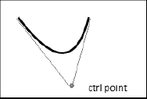

***图 1-12.** 二次曲线*

一旦你的建造者类完成，你将通过调用 `build()` 方法来收尾。下面展示了一条二次曲线，其描边粗细为三个像素，填充颜色为白色：

`        // QuadCurve 创建一个微笑`
`        QuadCurve quad =QuadCurveBuilder.create()`
`                .startX(50)`
`                .startY(50)`
`                .endX(150)`
`                .endY(50)`
`                .controlX(125)`
`                .controlY(150)`
`                .strokeWidth(3)`
`                .stroke(Color.BLACK)`
`                .fill(Color.WHITE)`
`                .build();`

最后是我们美味的甜甜圈形状，带有投影效果。创建甜甜圈时，我们首先创建两个圆形椭圆。通过从较大的椭圆区域中减去较小的椭圆（甜甜圈洞），使用 `Path.subtract()` 方法创建并返回一个新派生的 `Shape` 对象。以下是使用 `Path.subtract()` 方法创建甜甜圈形状的代码片段：

`        // 外圈甜甜圈`
`        Ellipse bigCircle = ...// 外部形状区域`

`        // 甜甜圈洞`
`        Ellipse smallCircle = ...// 内部形状区域`

`        // 制作甜甜圈`
`        Shape donut = Path.subtract(bigCircle, smallCircle);`

接下来，为我们的甜甜圈应用投影效果。一种常见的技术是绘制一个填充为黑色的形状，然后将原始形状稍微偏移地叠放在其上方，以模拟阴影。然而，在 JavaFX 中，我们只需绘制一次，然后使用 `setEffect()` 方法应用一个 `DropShadow` 对象实例。要设置阴影偏移，请调用 `setOffsetX()` 和 `setOffsetY()` 方法。

最后要指出的一点是，所有形状都被绘制并彼此上下堆叠放置。在创建每个形状时，你会注意到它们的 `translateY` 属性被设置，以重新定位或移动形状到其原始位置之外。例如，如果一个形状的左上角边界框点创建在 (100, 100)，而你希望将其移动到 (101, 101)，则 `translateX` 和 `translateY` 属性应设置为 1。

### 1-6\. 为对象分配颜色

#### 问题

你想用纯色和渐变色填充你的形状。

#### 解决方案

在 JavaFX 中，所有形状都可以使用纯色和渐变色进行填充。以下是用于填充形状节点的主要类：

> *   `javafx.scene.paint.Color`
> *   `javafx.scene.paint.LinearGradient`
> *   `javafx.scene.paint.Stop`
> *   `javafx.scene.paint.RadialGradient`

以下代码使用上述类为我们的形状添加了径向和线性渐变色，以及透明（Alpha 通道级别）颜色。在本示例中，我们将使用一个椭圆、一个矩形和一个圆角矩形。示例中还出现了一条纯黑色线条（如图 1-13 所示），以演示形状颜色的透明度。

`primaryStage.setTitle("第 1-6 章 为对象分配颜色");`
`Group root = new Group();`
`Scene scene = new Scene(root, 350, 300, Color.WHITE);`

`Ellipse ellipse = new Ellipse(100, 50 + 70/2, 50, 70/2);`
`RadialGradient gradient1 = RadialGradientBuilder.create()`
`        .focusAngle(0)`
`        .focusDistance(.1)`
`        .centerX(80)`
`        .centerY(45)`
`        .radius(120)`
`        .proportional(false)`
`        .cycleMethod(CycleMethod.NO_CYCLE)`
`        .stops(new Stop(0, Color.RED), new Stop(1, Color.BLACK))`
`        .build();`

`ellipse.setFill(gradient1);`
`root.getChildren().add(ellipse);`

`Line blackLine = LineBuilder.create()`
`        .startX(170)`
`        .startY(30)`
`        .endX(20)`
`        .endY(140)`
`        .fill(Color.BLACK)`
`        .strokeWidth(10.0f)`
`        .translateY(ellipse.prefHeight(-1) + ellipse.getLayoutY() + 10)`
`        .build();`

`root.getChildren().add(blackLine);`

`Rectangle rectangle = RectangleBuilder.create()`
`        .x(50)`
`        .y(50)`
`        .width(100)`
`        .height(70)`
`        .translateY(ellipse.prefHeight(-1) + ellipse.getLayoutY() + 10)`
`        .build();`

`LinearGradient linearGrad = LinearGradientBuilder.create()`
`        .startX(50)`
`        .startY(50)`
`        .endX(50)`
`        .endY(50 + rectangle.prefHeight(-1) + 25)`
`        .proportional(false)`
`        .cycleMethod(CycleMethod.NO_CYCLE)`
`        .stops( new Stop(0.1f, Color.rgb(255, 200, 0, .784)),`
`                new Stop(1.0f, Color.rgb(0, 0, 0, .784)))`
`        .build();`

`rectangle.setFill(linearGrad);`
`root.getChildren().add(rectangle);`

`Rectangle roundRect = RectangleBuilder.create()`
`        .x(50)`
`        .y(50)`
`        .width(100)`
`        .height(70)`
`        .arcWidth(20)`
`        .arcHeight(20)`
`        .translateY(ellipse.prefHeight(-1) +`
`                    ellipse.getLayoutY() +`
`                    10 +`
`                    rectangle.prefHeight(-1) +`
`                    rectangle.getLayoutY() + 10)`
`        .build();`

`LinearGradient cycleGrad = LinearGradientBuilder.create()`
`        .startX(50)`
`        .startY(50)`
`        .endX(70)`
`        .endY(70)`
`        .proportional(false)`
`        .cycleMethod(CycleMethod.REFLECT)`
`        .stops(new Stop(0f, Color.rgb(0, 255, 0, .784)),`
`               new Stop(1.0f, Color.rgb(0, 0, 0, .784)))`
`        .build();`

`roundRect.setFill(cycleGrad);`
`root.getChildren().add(roundRect);`

`primaryStage.setScene(scene);`
`primaryStage.show();`

图 1-13 展示了可以应用于形状的各种彩色填充效果。

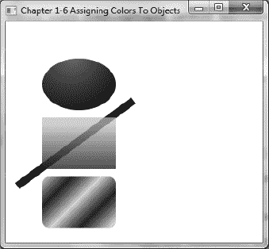

***图 1-13.** 彩色形状*

#### 工作原理

图 1-13 展示了从上到下依次显示的椭圆、矩形和带有彩色渐变填充的圆角矩形。绘制椭圆形状时，您将使用一种径向渐变，使其看起来像一个 3D 球体对象。接下来，您将创建一个填充有黄色半透明线性渐变的矩形。在黄色矩形后面绘制了一条粗黑线形状，以演示矩形的半透明颜色。最后，您将实现一个圆角矩形，填充有绿色和黑色相间的反射线性渐变，类似于对角线方向的 3D 管状效果。

渐变颜色的神奇之处在于，它们通常能让形状看起来具有三维效果。渐变绘制允许您在两种或多种颜色之间进行插值，从而为形状增加深度感。JavaFX 提供了两种类型的渐变：径向渐变（`RadialGradient`）和线性渐变（`LinearGradient`）。对于我们的椭圆形状，您将使用径向渐变（`RadialGradient`）。

我根据 JavaFX 2.0 Javadoc 中关于 `RadialGradient` 类的定义（[`http://download.oracle.com/javafx/2.0/api/javafx/scene/paint/RadialGradient.html`](http://download.oracle.com/javafx/2.0/api/javafx/scene/paint/RadialGradient.html)）创建了表 1-1。

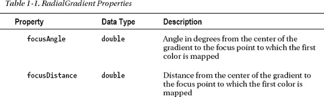

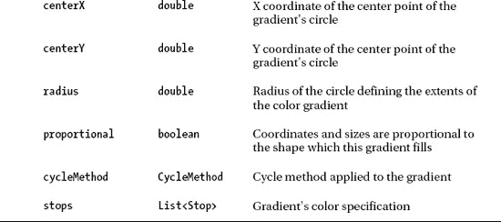

在我们的示例中，焦点角度设置为零，焦点距离设置为 .1，中心 X 和 Y 设置为 (80,45)，半径设置为 120 像素，比例设置为 false，循环方法设置为无循环（`CycleMethod.NO_CYCLE`），两个颜色停止值分别设置为红色（`Color.RED`）和黑色（`Color.BLACK`）。这些设置为我们的椭圆提供了径向渐变，从中心位置 (80, 45)（椭圆的左上角）的红色开始，插值到距离 120 像素（半径）处的黑色。

接下来，您将创建一个具有黄色半透明线性渐变的矩形。对于黄色矩形，您将使用线性渐变（`LinearGradient`）绘制。

我根据 JavaFX 2.0 Javadoc 中关于 `LinearGradient` 类的定义（[`http://download.oracle.com/javafx/2.0/api/javafx/scene/paint/LinearGradient.html`](http://download.oracle.com/javafx/2.0/api/javafx/scene/paint/LinearGradient.html)）创建了表 1-2。

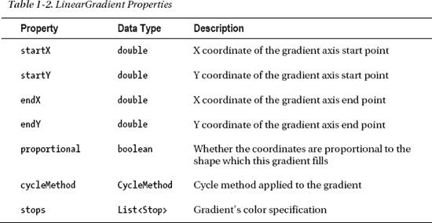

要创建线性渐变绘制，您需要指定起点和终点的 `startX`、`startY`、`endX` 和 `endY`。起点和终点的坐标表示渐变图案开始和结束的位置。

要创建第二个形状（黄色矩形），您需要将起始 X 和 Y 设置为 `(50, 50)`，结束 X 和 Y 设置为 (50, 75)，比例设置为 false，循环方法设置为无循环（`CycleMethod.NO_CYCLE`），两个颜色停止值分别设置为黄色（`Color.YELLOW`）和黑色（`Color.BLACK`），Alpha 透明度为 .784。这些设置为我们的矩形提供了从上到下的线性渐变，起点为 (50, 50)（矩形的左上角），插值到黑色（矩形的左下角）。

最后，您会注意到一个圆角矩形，其渐变图案沿对角线方向重复使用绿色和黑色。这是一种简单的线性渐变绘制，与线性渐变绘制（`LinearGradient`）相同，只是起始 X、Y 和结束 X、Y 设置在对角线位置，并且循环方法设置为反射（`CycleMethod.REFLECT`）。当将循环方法指定为反射（`CycleMethod.REFLECT`）时，渐变图案将在颜色之间重复或循环。以下代码片段实现了循环方法为反射（`CycleMethod.REFLECT`）的圆角矩形：

`LinearGradient cycleGrad = LinearGradientBuilder.create()`
`        .startX(50)`
`        .startY(50)`
`        .endX(70)`
`        .endY(70)`
`        .proportional(false)`
`        .cycleMethod(CycleMethod.REFLECT)`
`        .stops(new Stop(0f, Color.rgb(0, 255, 0, .784)),`
`               new Stop(1.0f, Color.rgb(0, 0, 0, .784)))`
`        .build();`

### 1-7. 创建菜单

#### 问题

您希望在 JavaFX 应用程序中创建标准菜单。

#### 解决方案

使用 JavaFX 的菜单控件来提供标准化的菜单功能，例如复选框菜单、单选菜单、子菜单和分隔符。以下是用于创建菜单的主要类。

> *   `javafx.scene.control.MenuBar`
> *   `javafx.scene.control.Menu`
> *   `javafx.scene.control.MenuItem`

以下代码调用了前面列出的所有菜单功能。示例代码将模拟一个楼宇安全应用程序，其中包含用于打开摄像头、发出警报和选择应急方案的菜单选项。

`        primaryStage.setTitle("第 1-7 章 创建菜单");`
`        Group root = new Group();`
`        Scene scene = new Scene(root, 300, 250, Color.WHITE);`

`        MenuBar menuBar = new MenuBar();`

`        // 文件菜单 - 新建、保存、退出`
`        Menu menu = new Menu("文件");`
`        menu.getItems().add(new MenuItem("新建"));`
`        menu.getItems().add(new MenuItem("保存"));`
`        menu.getItems().add(new SeparatorMenuItem());`
`        menu.getItems().add(new MenuItem("退出"));`

`        menuBar.getMenus().add(menu);`

`        // 摄像头菜单 - 摄像头 1、摄像头 2`
`        Menu tools = new Menu("摄像头");`
`        tools.getItems().add(CheckMenuItemBuilder.create()`
`                .text("显示摄像头 1")`
`                .selected(true)`
`                .build());`

`        tools.getItems().add(CheckMenuItemBuilder.create()`
`                .text("显示摄像头 2")`
`                .selected(true)`
`                .build());`
`        menuBar.getMenus().add(tools);`

`        // 警报`
`        Menu alarm = new Menu("警报");`
`        ToggleGroup tGroup = new ToggleGroup();`
`        RadioMenuItem soundAlarmItem = RadioMenuItemBuilder.create()`
`                .toggleGroup(tGroup)`
`                .text("发出警报")`
`                .build();`
`        RadioMenuItem stopAlarmItem = RadioMenuItemBuilder.create()`
`                .toggleGroup(tGroup)`
`                .text("关闭警报")`
`                .selected(true)`
`                .build();`

`        alarm.getItems().add(soundAlarmItem);`
`        alarm.getItems().add(stopAlarmItem);`

`        Menu contingencyPlans = new Menu("应急方案");`
`        contingencyPlans.getItems().add(new CheckMenuItem("倒计时 50 秒后自毁"));`
`        contingencyPlans.getItems().add(new CheckMenuItem("关闭咖啡机"));`
`        contingencyPlans.getItems().add(new CheckMenuItem("快逃命吧！"));`

`        alarm.getItems().add(contingencyPlans);`
`        menuBar.getMenus().add(alarm);`
`        menuBar.prefWidthProperty().bind(primaryStage.widthProperty());`

`        root.getChildren().add(menuBar);`
`        primaryStage.setScene(scene);`
`        primaryStage.show();`

图 1-14 展示了一个模拟的楼宇安全应用程序，其中包含单选、复选和子菜单项。

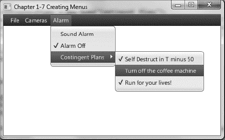

***图 1-14.** 创建菜单*

#### 工作原理

菜单是窗口平台应用程序中允许用户选择选项的标准方式。菜单还应具备热键或键盘快捷键功能。用户通常希望使用键盘而非鼠标来导航菜单。

首先，我们创建一个 `MenuBar` 实例，它将包含一个或多个菜单（`MenuItem`）对象。以下代码片段创建了一个菜单栏：

`MenuBar menuBar = new MenuBar();`

其次，我们创建菜单（`Menu`）对象，这些对象包含一个或多个菜单项（`MenuItem`）对象以及其他用于构成子菜单的 `Menu` 对象。以下代码片段创建了一个菜单：

`Menu menu = new Menu("文件");`

第三，我们创建要添加到 `Menu` 对象中的菜单项，例如菜单项（`MenuItem`）、复选框菜单项（`CheckMenuItem`）和单选菜单项（`RadioMenuItem`）。菜单项可以包含图标。本示例中未展示这一点，但我鼓励您探索所有菜单项（`MenuItem`）的各种构造函数。创建单选菜单项（`RadioMenuItem`）时，您应该了解 `ToggleGroup` 类。`ToggleGroup` 类也用于常规单选按钮（`RadioButton`），以仅允许选择一个选项。以下代码创建了要添加到 `Menu` 对象中的单选菜单项（`RadioMenuItem`）：

`// 警报`
`Menu alarm = new Menu("警报");`
`ToggleGroup tGroup = new ToggleGroup();`
`RadioMenuItem soundAlarmItem = RadioMenuItemBuilder.create()`
`        .toggleGroup(tGroup)`
`        .text("发出警报")`
`        .build();`
`RadioMenuItem stopAlarmItem = RadioMenuItemBuilder.create()`
`        .toggleGroup(tGroup)`
`        .text("关闭警报")`
`        .selected(true)`
`        .build();`

`alarm.getItems().add(soundAlarmItem);`
`alarm.getItems().add(stopAlarmItem);`

有时您可能希望用可视的分隔线将某些菜单项分隔开。要创建可视分隔符，请创建一个 `SeparatorMenuItem` 类的实例，并通过 `getItems()` 方法将其添加到菜单中。`getItems()` 方法返回一个 `MenuItem` 对象的可观察列表（`ObservableList<MenuItem>`）。稍后您将在配方 1-11 中了解到，当集合中的项目发生更改时，您将能够收到通知。以下代码行向菜单添加了一个可视的分隔线（`SeparatorMenuItem`）：

`menu.getItems().add(new SeparatorMenuItem());`

使用的其他菜单项包括复选框菜单项（`CheckMenuItem`）和单选菜单项（`RadioMenuItem`），它们分别类似于 JavaFX UI 控件中的复选框（`CheckBox`）和单选按钮（`RadioButton`）。

在将菜单栏添加到场景之前，您会注意到通过 `bind()` 方法，菜单栏的首选宽度与 `Stage` 对象的宽度之间存在绑定属性。当绑定这些属性时，您会看到当用户调整屏幕大小时，菜单栏的宽度会随之拉伸。稍后您将在配方 1-10“绑定表达式”中了解绑定的工作原理。

以下代码片段展示了菜单栏的 `width` 属性与舞台的 `width` 属性之间的绑定。

`        menuBar.prefWidthProperty().bind(primaryStage.widthProperty());`

`        root.getChildren().add(menuBar);`

### 1-8. 向布局添加组件

#### 问题

您希望通过将 UI 组件添加到类似网格显示的布局中，来创建一个简单的表单应用程序。

#### 解决方案

使用 JavaFX 的 `javafx.scene.layout.GridPane` 类。以下源代码使用网格面板布局节点（`javafx.scene.layout.GridPane`）实现了一个包含名字和姓氏字段控件的简单 UI 表单：

`        GridPane gridpane = new GridPane();`
`        gridpane.setPadding(new Insets(5));`
`        gridpane.setHgap(5);`
`        gridpane.setVgap(5);`

`        Label fNameLbl = new Label("名字");`
`        TextField fNameFld = new TextField();`
`        Label lNameLbl = new Label("姓氏");`
`        TextField lNameFld = new TextField();`
`        Button saveButt = new Button("保存");`

`        // 名字标签`
`        GridPane.setHalignment(fNameLbl, HPos.RIGHT);`
`        gridpane.add(fNameLbl, 0, 0);`

`        // 姓氏标签`
`        GridPane.setHalignment(lNameLbl, HPos.RIGHT);`
`        gridpane.add(lNameLbl, 0, 1);`

`        // 名字输入框`
`        GridPane.setHalignment(fNameFld, HPos.LEFT);       `
`        gridpane.add(fNameFld, 1, 0);`

`        // 姓氏输入框`
`        GridPane.setHalignment(lNameFld, HPos.LEFT);`
`        gridpane.add(lNameFld, 1, 1);`

`        // 保存按钮`
`        GridPane.setHalignment(saveButt, HPos.RIGHT);`
`        gridpane.add(saveButt, 1, 2);`

`        root.getChildren().add(gridpane);`

图 1-15 描绘了一个包含 UI 控件的小型表单，这些控件使用网格面板布局节点进行布局。

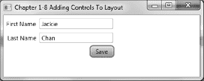

***图 1-15.** 向布局添加控件*

#### 工作原理

构建用户界面时最大的挑战之一是将控件布局到显示区域上。在开发 GUI 应用程序时，理想的情况是允许用户移动和调整可视区域的大小，同时保持良好的用户体验。与 Java Swing 类似，JavaFX 布局提供了内置布局，这些布局提供了在场景图上显示 UI 控件的最常用方式。本示例演示了 `GridPane` 类。在开始之前，我想解释一下 JavaFX 2.0 提供的两种常见布局。它们是水平盒子（`HBox`）和垂直盒子（`VBox`）布局节点。这两种常见布局将在后续示例中使用，以便场景图管理子节点。HBox 将包含子节点，这些子节点会占用可用的水平空间（随着节点的添加）。VBox 将包含子节点，这些子节点会占用可用的垂直空间（随着节点的添加）。

首先，我们创建一个 `GridPane` 实例。接着，我们使用 `Inset` 对象的实例来设置内边距。设置内边距后，我们只需设置水平和垂直间距。以下代码片段实例化了一个网格面板（`GridPane`），其内边距、水平间距和垂直间距均设置为 5（像素）：

`GridPane gridpane = new GridPane();`
`gridpane.setPadding(new Insets(5));`
`gridpane.setHgap(5);`
`gridpane.setVgap(5);`

内边距是指区域内容周围的上、右、下、左间距（以像素为单位）。在获取首选大小时，内边距将包含在计算中。设置水平和垂直间距与单元格内 UI 控件之间的间距有关。

接下来就是将每个 UI 控件放入其各自的单元格位置。所有单元格都是从零开始计数的。以下是一个代码片段，它将一个保存按钮 UI 控件添加到网格面板布局节点（`GridPane`）的 (1, 2) 单元格中：

`gridpane.add(saveButt, 1, 2);`

该布局还允许您在单元格内水平或垂直对齐控件。以下代码语句将保存按钮右对齐：

`GridPane.setHalignment(saveButt, HPos.RIGHT);`

### 1-9. 生成边框

#### 问题

您想要创建并自定义图像周围的边框。

#### 解决方案

创建一个应用程序，使用 JavaFX 的 CSS 样式 API 动态自定义边框区域。

以下代码创建了一个应用程序，其中包含一个 CSS 编辑器文本区域和一个围绕图像的边框视图区域。默认情况下，编辑器的文本区域将包含 JavaFX 样式选择器，这些选择器会在图像周围创建一条蓝色虚线。您可以通过单击“Bling!”按钮来修改 CSS 编辑器中的样式选择器值，以应用边框设置。

`primaryStage.setTitle("Chapter 1-9 Generating Borders");`
`Group root = new Group();`
`Scene scene = new Scene(root, 600, 330, Color.WHITE);`

`// 创建一个网格面板`
`GridPane gridpane = new GridPane();`
`gridpane.setPadding(new Insets(5));`
`gridpane.setHgap(10);`
`gridpane.setVgap(10);`

`// 标签 CSS 编辑器`
`Label cssEditorLbl = new Label("CSS Editor");`
`GridPane.setHalignment(cssEditorLbl, HPos.CENTER);`
`gridpane.add(cssEditorLbl, 0, 0);`

`// 标签 边框视图`
`Label borderLbl = new Label("Border View");`
`GridPane.setHalignment(borderLbl, HPos.CENTER);`
`gridpane.add(borderLbl, 1, 0);`

`// CSS 编辑器的文本区域`
`final TextArea cssEditorFld = new TextArea();`
`cssEditorFld.setPrefRowCount(10);`
`cssEditorFld.setPrefColumnCount(100);`
`cssEditorFld.setWrapText(true);`
`cssEditorFld.setPrefWidth(150);`
`GridPane.setHalignment(cssEditorFld, HPos.CENTER);`
`gridpane.add(cssEditorFld, 0, 1);`

`String cssDefault = "-fx-border-color: blue;\n"`
`        + "-fx-border-insets: 5;\n"`
`        + "-fx-border-width: 3;\n"`
`        + "-fx-border-style: dashed;\n";`
`cssEditorFld.setText(cssDefault);`

`// 为图片添加边框装饰`
`final ImageView imv = new ImageView();`
`final Image image2 = new Image(GeneratingBorders.class.getResourceAsStream("smoke_glass_buttons1.png"));`
`imv.setImage(image2);`

`final HBox pictureRegion = new HBox();`
`pictureRegion.setStyle(cssDefault);`
`pictureRegion.getChildren().add(imv);`
`gridpane.add(pictureRegion, 1, 1);`

`Button apply = new Button("Bling!");`
`GridPane.setHalignment(apply, HPos.RIGHT);`
`gridpane.add(apply, 0, 2);`

`apply.setOnAction(new EventHandler<ActionEvent>() {`
`    public void handle(ActionEvent event) {`
`        pictureRegion.setStyle(cssEditorFld.getText());`
`    }`
`});`

`root.getChildren().add(gridpane);        `
`primaryStage.setScene(scene);`
`primaryStage.show();`

图 1-16 展示了边框自定义应用程序。

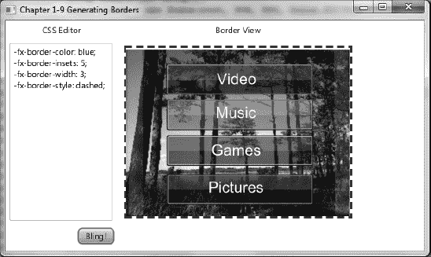

***图 1-16.** 生成边框*

#### 工作原理

JavaFX 能够像 Web 开发中的层叠样式表（CSS）一样对 JavaFX 节点进行样式设置。这个强大的 API 可以改变节点的背景颜色、字体、边框以及许多其他属性，本质上允许开发人员或设计人员使用 CSS 对 GUI 控件进行皮肤化处理。

本示例允许用户在左侧文本区域输入 JavaFX CSS 样式，并通过单击下方的“Bling!”按钮，将样式应用于右侧显示的图像。根据节点类型的不同，您可以设置的样式存在一些限制。要查看所有样式选择器的完整列表，请参考 JavaFX CSS 参考指南：
[`http://download.oracle.com/docs/cd/E17802_01/javafx/javafx/1.3/docs/api/javafx.scene/doc-files/cssref.html`](http://download.oracle.com/docs/cd/E17802_01/javafx/javafx/1.3/docs/api/javafx.scene/doc-files/cssref.html)。

在应用 JavaFX CSS 样式的第一步中，您必须确定要设置样式的节点类型。在设置各种节点类型的属性时，您会发现某些节点存在限制。在我们的示例中，目的是在 `ImageView` 对象周围放置边框。由于 `ImageView` 并非继承自 `Region`，因此它没有边框样式属性。为了解决这个问题，我简单地创建了一个 `HBox` 布局来包含 `imageView`，并将 JavaFX CSS 应用于 `HBox`。以下代码展示了如何使用 `setStyle()` 方法将 JavaFX CSS 边框样式应用于水平盒子区域（`HBox`）：

`String cssDefault = "-fx-border-color: blue;\n"`
`    + "-fx-border-insets: 5;\n"`
`    + "-fx-border-width: 3;\n"`
`    + "-fx-border-style: dashed;\n";`
`    final ImageView imv = new ImageView();`

`    ...// 设置其他图像视图属性`

`    final HBox pictureRegion = new HBox();`
`    pictureRegion.setStyle(cssDefault);`
`    pictureRegion.getChildren().add(imv);`

### 1-10. 绑定表达式

#### 问题

您想要同步两个值之间的更改。

#### 解决方案

使用 `javafx.beans.binding.*` 和 `javafx.beans.property.*` 包来绑定变量。在绑定值或属性时，需要考虑多种场景。本示例演示了以下三种绑定策略：

> *   Java Bean 上的双向绑定
> *   使用 Fluent API 的高级绑定
> *   使用 `javafx.beans.binding.*` 绑定对象的低级绑定

以下代码是一个实现了这三种策略的控制台应用程序。该控制台应用程序将根据各种绑定场景输出属性值。第一个场景是字符串属性变量与领域对象（`Contact`）所拥有的字符串属性（例如 `firstName` 属性）之间的双向绑定。下一个场景是使用流式接口 API 计算矩形面积的高级绑定。最后一个场景是使用低级绑定策略计算球体的体积。高级绑定和低级绑定之间的区别在于，高级绑定使用 `multiply()`、`subtract()` 等方法，而不是运算符 `*` 和 `-`。使用低级绑定时，您需要使用派生的 `NumberBinding` 类，例如 `DoubleBinding` 类。使用 `DoubleBinding` 类时，您需要重写其 `computeValue()` 方法，以便使用熟悉的运算符（如 `*` 和 `-`）来构建复杂的数学公式：

`package javafx2introbyexample.chapter1.recipe1_10;`

`import javafx.beans.binding.DoubleBinding;`
`import javafx.beans.binding.NumberBinding;`
`import javafx.beans.property.DoubleProperty;`
`import javafx.beans.property.IntegerProperty;`
`import javafx.beans.property.SimpleDoubleProperty;`
`import javafx.beans.property.SimpleIntegerProperty;`
`import javafx.beans.property.SimpleStringProperty;`
`import javafx.beans.property.StringProperty;`

`/**`
` * 绑定表达式`
` * @author cdea`
` */`
`public class BindingExpressions {`

`    /**`
`     * @param args 命令行参数`
`     */`
`    public static void main(String[] args) {`
`        System.out.println("第 1 章-10 绑定表达式\n");`

`        System.out.println("绑定 Contact bean [双向绑定]");`
`        Contact contact = new Contact("John", "Doe");`
`        StringProperty fname = new SimpleStringProperty();`
`        fname.bindBidirectional(contact.firstNameProperty());`
`        StringProperty lname = new SimpleStringProperty();`
`        lname.bindBidirectional(contact.lastNameProperty());`

`        System.out.println("当前 - StringProperty 值   : " + fname.getValue() + " " +`
`lname.getValue());`
`        System.out.println("当前 - Contact 值          : " + contact.getFirstName() + " "`
`+ contact.getLastName());`

`        System.out.println("修改 StringProperty 值");`
`        fname.setValue("Jane");`
`        lname.setValue("Deer");`

`        System.out.println("修改后 - StringProperty 值   : " + fname.getValue() + " " +`
`lname.getValue());`
`        System.out.println("修改后 - Contact 值          : " + contact.getFirstName() + " "`
`+ contact.getLastName());`

`        System.out.println();`
`        System.out.println("矩形的面积 [高级 Fluent API]");`

`        // 面积 = 宽度 * 高度`
`        final IntegerProperty width = new SimpleIntegerProperty(10);`
`        final IntegerProperty height = new SimpleIntegerProperty(10);`

`        NumberBinding area = width.multiply(height);`

`        System.out.println("当前 - 宽度和高度     : " + width.get() + " " +`
`height.get());`
`        System.out.println("当前 - 矩形面积: " + area.getValue());`
`        System.out.println("修改宽度和高度");`

`        width.set(100);`
`        height.set(700);`

`        System.out.println("修改后 - 宽度和高度     : " + width.get() + " " +`
`height.get());`
`        System.out.println("修改后 - 矩形面积: " + area.getValue());`
`        System.out.println();`
`        System.out.println("球体的体积 [低级 API]");`

`        // 体积 = 4/3 * pi r³`
`        final DoubleProperty radius = new SimpleDoubleProperty(2);`

`        DoubleBinding volumeOfSphere = new DoubleBinding() {`
`            {`
`                super.bind(radius);`
`            }`

`            @Override`
`            protected double computeValue() {`
`                return (4 / 3 * Math.PI * Math.pow(radius.get(), 3));`
`            }`
`        };`

`        System.out.println("当前 - 球体半径: " + radius.get());`
`        System.out.println("当前 - 球体体积: " + volumeOfSphere.get());`
`        System.out.println("修改 DoubleProperty 半径");`

`        radius.set(50);`
`        System.out.println("修改后 - 球体半径: " + radius.get());`
`        System.out.println("修改后 - 球体体积: " + volumeOfSphere.get());`

`    }`
`}`

`class Contact {`

`    private SimpleStringProperty firstName = new SimpleStringProperty();`
`    private SimpleStringProperty lastName = new SimpleStringProperty();`

`    public Contact(String fn, String ln) {`
`        firstName.setValue(fn);`
`        lastName.setValue(ln);`
`    }`

`    public final String getFirstName() {`
`        return firstName.getValue();`
`    }`

`    public StringProperty firstNameProperty() {`
`        return firstName;`
`    }`

`    public final void setFirstName(String firstName) {`
`        this.firstName.setValue(firstName);`
`    }`

`    public final String getLastName() {`
`        return lastName.getValue();`
`    }`

`    public StringProperty lastNameProperty() {`
`        return lastName;`
`    }`

`    public final void setLastName(String lastName) {`
`        this.lastName.setValue(lastName);`
`    }`
`}`

以下输出演示了这三种绑定场景：

`绑定 Contact bean [双向绑定]`
`当前 - StringProperty 值   : John Doe`
`当前 - Contact 值          : John Doe`
`修改 StringProperty 值`
`修改后 - StringProperty 值   : Jane Deer`
`修改后 - Contact 值          : Jane Deer`

`矩形的面积 [高级 Fluent API]`
`当前 - 宽度和高度     : 10 10`
`当前 - 矩形面积: 100`
`修改宽度和高度`
`修改后 - 宽度和高度     : 100 700`
`修改后 - 矩形面积: 70000`

`球体的体积 [低级 API]`
`当前 - 球体半径: 2.0`
`当前 - 球体体积: 25.132741228718345`
`修改 DoubleProperty 半径`
`修改后 - 球体半径: 50.0`
`修改后 - 球体体积: 392699.0816987241`

#### 工作原理

绑定（Binding）的核心思想是至少两个值保持同步。这意味着当一个依赖变量发生变化时，另一个变量也会随之改变。JavaFX 提供了多种绑定选项，使开发者能够同步领域对象和 GUI 控件中的属性。本示例将演示三种常见的绑定场景。

绑定变量最简单的方法之一是*双向绑定*。当领域对象包含的数据需要绑定到 GUI 表单时，通常会使用这种场景。在本示例中，我们创建了一个包含名字和姓氏的简单联系人（`Contact`）对象。请注意，实例变量使用了 `SimpleStringProperty` 类。许多以 `Property` 结尾的类都是 `javafx.beans.Observable` 类，它们都具有被绑定的能力。为了使这些属性能够被绑定，它们必须是相同的数据类型。在前面的示例中，我们在创建的 `Contact` 领域对象外部创建了类型为 `SimpleStringProperty` 的名字和姓氏变量。创建完成后，我们对它们进行双向绑定，以便任何一端的更改都能同步更新。因此，如果你更改了领域对象，其他绑定的属性也会更新。而当外部变量被修改时，领域对象的属性也会更新。以下演示了针对领域对象（`Contact`）的字符串属性进行双向绑定：

`Contact contact = new Contact("John", "Doe");`
`StringProperty fname = new SimpleStringProperty();`
`fname.bindBidirectional(contact.firstNameProperty());`
`StringProperty lname = new SimpleStringProperty();`
`lname.bindBidirectional(contact.lastNameProperty());`

接下来是如何绑定数字。使用新的 Fluent API 绑定数字非常简单。这种高级机制允许开发者绑定变量，通过简单的算术运算来计算值。基本上，一个“公式”被“绑定”后，会根据其所绑定的变量的变化来改变其结果。请查阅 Javadoc 了解所有可用方法和数字类型的详细信息。在这个示例中，我们简单地创建了一个计算矩形面积的公式。面积（`NumberBinding`）是绑定对象，它的依赖项是宽度和高度（`IntegerProperty`）属性。使用 Fluent 接口 API 进行绑定时，你会注意到 `multiply()` 方法。根据 Javadoc，所有属性类都继承自 `NumberExpressionBase` 类，该类包含了基于数字的 Fluent 接口 API。以下代码片段使用了 Fluent 接口 API：

`// 面积 = 宽度 * 高度`
`final IntegerProperty width = new SimpleIntegerProperty(10);`
`final IntegerProperty height = new SimpleIntegerProperty(10);    `
`NumberBinding area = width.multiply(height);`

最后一种绑定数字的场景被认为是一种更底层的方法。这允许开发者使用基本数据类型和更复杂的数学运算。这里我们使用 `DoubleBinding` 类，根据给定的半径求解球体的体积。我们首先实现 `computeValue()` 方法来执行体积的计算。如下所示，是通过重写 `computeValue()` 方法计算球体体积的底层绑定场景：

`final DoubleProperty radius = new SimpleDoubleProperty(2);`

`DoubleBinding volumeOfSphere = new DoubleBinding() {`
`        {`
`             super.bind(radius);`
`        }`

`        @Override`
`        protected double computeValue() {`
`                return (4 / 3 * Math.PI * Math.pow(radius.get(), 3));`
`        }`
`};`

### 1-11. 创建和使用可观察列表

#### 问题

你想创建一个包含两个列表视图控件的 GUI 应用程序，允许用户在两个列表之间传递项目。

#### 解决方案

利用 JavaFX 的 `javafx.collections.ObservableList` 和 `javafx.scene.control.ListView` 类，提供一种模型-视图-控制器（MVC）机制，每当后端列表被操作时，UI 的列表视图控件都会自动更新。

以下代码创建了一个包含两个列表的 GUI 应用程序，允许用户将一个列表中的项目发送到另一个列表。这里你将创建一个虚构的应用程序，用于挑选被视为英雄的候选人。用户将从左侧的列表中选择潜在的候选人，并将其移动到右侧的列表中，以被视为英雄。这演示了 UI 列表控件（`ListView`）与后端存储列表（`ObservableList`）同步的能力。

`primaryStage.setTitle("第 1-11 章 创建和使用 ObservableLists");`
`Group root = new Group();`
`Scene scene = new Scene(root, 400, 250, Color.WHITE);`

`// 创建一个网格面板`
`GridPane gridpane = new GridPane();`
`gridpane.setPadding(new Insets(5));`
`gridpane.setHgap(10);`
`gridpane.setVgap(10);`

`// 候选人标签`
`Label candidatesLbl = new Label("候选人");`
`GridPane.setHalignment(candidatesLbl, HPos.CENTER);`
`gridpane.add(candidatesLbl, 0, 0);`

`Label heroesLbl = new Label("英雄");`
`gridpane.add(heroesLbl, 2, 0);`
`GridPane.setHalignment(heroesLbl, HPos.CENTER);`

`// 候选人`
`final ObservableList<String> candidates =`
`FXCollections.observableArrayList("超人",`
`        "蜘蛛侠",`
`        "金刚狼",`
`        "警察",`
`        "消防救援",`
`        "士兵",`
`        "父母",`
`        "医生",`
`        "政治家",`
`        "牧师",`
`        "教师");`
`final ListView<String> candidatesListView = new ListView<String>(candidates);`
`candidatesListView.setPrefWidth(150);`
`candidatesListView.setPrefHeight(150);`

`gridpane.add(candidatesListView, 0, 1);`

`// 英雄`
`final ObservableList<String> heroes = FXCollections.observableArrayList();`
`final ListView<String> heroListView = new ListView<String>(heroes);`
`heroListView.setPrefWidth(150);`
`heroListView.setPrefHeight(150);`

`gridpane.add(heroListView, 2, 1);`

`// 选择英雄`
`Button sendRightButton = new Button(">");`
`sendRightButton.setOnAction(new EventHandler<ActionEvent>() {`

`    public void handle(ActionEvent event) {`
`        String potential = candidatesListView.getSelectionModel().getSelectedItem();`
`        if (potential != null) {`
`            candidatesListView.getSelectionModel().clearSelection();`
`            candidates.remove(potential);`
`            heroes.add(potential);`
`        }`
`    }`
`});`

`// 取消选择英雄`
`Button sendLeftButton = new Button("<");`
`sendLeftButton.setOnAction(new EventHandler<ActionEvent>() {`

`    public void handle(ActionEvent event) {`
`        String notHero = heroListView.getSelectionModel().getSelectedItem();`
`        if (notHero != null) {`
`            heroListView.getSelectionModel().clearSelection();`
`            heroes.remove(notHero);`
`            candidates.add(notHero);`
`        }`
`    }`
`});`

`VBox vbox = new VBox(5);`
`vbox.getChildren().addAll(sendRightButton,sendLeftButton);`

`gridpane.add(vbox, 1, 1);`
`GridPane.setConstraints(vbox, 1, 1, 1, 2,HPos.CENTER, VPos.CENTER);`

`root.getChildren().add(gridpane);        `
`primaryStage.setScene(scene);`
`primaryStage.show();`

图 1-17 描绘了我们的英雄选择应用程序。

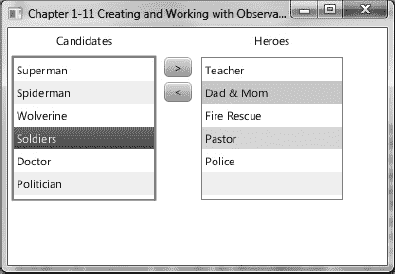

***图 1-17.** ListViews 和 ObservableLists*

#### 工作原理

在处理 Java `collections` 时，你会注意到有许多有用的容器类，它们代表了各种数据结构。其中一种常用的集合是 `java.util.ArrayList` 类。当构建包含 `ArrayList` 的领域对象的应用程序时，开发者可以轻松地操作集合中的对象。但在过去，将 Java Swing 组件与集合结合使用往往是一个挑战，尤其是更新 GUI 以反映领域对象的变化。我们如何解决这个问题呢？别担心，JavaFX 的 `ObservableList` 来救场了！

说到救场，我创建了一个 GUI 应用程序，允许用户选择他们最喜欢的英雄。这与通过从列表框组件中添加或删除项目来管理用户角色的应用程序界面非常相似。在 JavaFX 中，我们将使用一个 `ListView` 控件来保存 String 对象。在创建 `ListView` 实例之前，我们先创建一个包含候选对象的 `ObservableList`。这里你会注意到使用了名为 `FXCollections` 的工厂类，你可以将常见的集合类型传入其中，这些集合会被包装并以 `ObservableList` 的形式返回给调用者。在本示例中，我传入了一个 String 数组而不是 `ArrayList`，希望你能明白如何使用 `FXCollections` 类。我相信你会明智地使用它：“能力越大，责任越大”。这行代码调用了 `FXCollections` 类来返回一个可观察列表（`ObservableList`）：

`ObservableList<String> candidates = FXCollections.observableArrayList(...);`

创建 `ObservableList` 后，使用接收该可观察列表的构造函数实例化一个 `ListView` 类。以下是创建并填充 `ListView` 对象的代码：

`ListView<String> candidatesListView = new ListView<String>(candidates);`

最后，我们的代码将像操作 `java.util.ArrayList` 一样操作 `ObservableList`。一旦操作完成，`ListView` 会收到通知并自动更新，以反映 `ObservableList` 的变化。以下代码片段实现了当用户按下向右发送按钮时的事件处理器和动作事件：

`// 选择英雄`
`Button sendRightButton = new Button(">");`
`sendRightButton.setOnAction(new EventHandler<ActionEvent>() {`

`    public void handle(ActionEvent event) {`
`        String potential = candidatesListView.getSelectionModel().getSelectedItem();`
`        if (potential != null) {`
`            candidatesListView.getSelectionModel().clearSelection();`
`            candidates.remove(potential);`
`            heroes.add(potential);`
`        }`
`    }`
`});`

在设置动作时，我们使用泛型类 `EventHandler` 创建一个匿名内部类，其中包含 `handle()` 方法来监听按钮按下事件。当按钮按下事件发生时，代码会确定 `ListView` 中哪个项目被选中。一旦确定了项目，我们清除选择，移除该项目，并将其添加到英雄的 `ObservableList` 中。

### 1-12. 生成后台进程

#### 问题

你想创建一个 GUI 应用程序，模拟使用后台处理复制文件，同时向用户显示进度。

#### 解决方案

创建一个典型的对话框应用程序，在后台复制文件时显示进度指示器。以下是本示例中使用的主要类：

> *   `javafx.scene.control.ProgressBar`
> *   `javafx.scene.control.ProgressIndicator`
> *   `javafx.concurrent.Task` 类

以下源代码是一个模拟文件复制对话框的应用程序，它显示进度指示器并执行后台进程：

`package javafx2introbyexample.chapter1.recipe1_12;`

`import java.util.Random;`
`import javafx.application.Application;`
`import javafx.beans.value.ChangeListener;`
`import javafx.beans.value.ObservableValue;`
`import javafx.concurrent.Task;`
`import javafx.event.ActionEvent;`
`import javafx.event.EventHandler;`
`import javafx.geometry.Pos;`
`import javafx.scene.Group;`
`import javafx.scene.Scene;`
`import javafx.scene.control.Button;`
`import javafx.scene.control.Label;`
`import javafx.scene.control.ProgressBar;`
`import javafx.scene.control.ProgressIndicator;`
`import javafx.scene.control.TextArea;`
`import javafx.scene.layout.BorderPane;`
`import javafx.scene.layout.HBox;`
`import javafx.scene.paint.Color;`
`import javafx.stage.Stage;`

`/**`
` * 后台进程`
` * @author cdea`
` */`
`public class BackgroundProcesses extends Application {`

`    static Task copyWorker;`
`    final int numFiles = 30;`

`    /**`
`     * @param args 命令行参数`
`     */`
`    public static void main(String[] args) {`
`        Application.launch(args);`
`    }`

`    @Override`
`    public void start(Stage primaryStage) {`
`        primaryStage.setTitle("第 1-12 章 后台进程");`
`        Group root = new Group();`
`        Scene scene = new Scene(root, 330, 120, Color.WHITE);`

`        BorderPane mainPane = new BorderPane();`

`mainPane.layoutXProperty().bind(scene.widthProperty().subtract(mainPane.widthProperty()).divide(2));`
`        root.getChildren().add(mainPane);`

`        final Label label = new Label("文件传输：");`
`        final ProgressBar progressBar = new ProgressBar(0);`
`        final ProgressIndicator progressIndicator = new ProgressIndicator(0);`

`        final HBox hb = new HBox();`
`        hb.setSpacing(5);`
`        hb.setAlignment(Pos.CENTER);`
`        hb.getChildren().addAll(label, progressBar, progressIndicator);`
`        mainPane.setTop(hb);`

`        final Button startButton = new Button("开始");`
`        final Button cancelButton = new Button("取消");`
`        final TextArea textArea = new TextArea();`
`        textArea.setEditable(false);`
`        textArea.setPrefSize(200, 70);`
`        final HBox hb2 = new HBox();`
`        hb2.setSpacing(5);`
`        hb2.setAlignment(Pos.CENTER);`
`        hb2.getChildren().addAll(startButton, cancelButton, textArea);`
`        mainPane.setBottom(hb2);`

`        // 连接开始按钮`
`        startButton.setOnAction(new EventHandler<ActionEvent>() {`

`            public void handle(ActionEvent event) {`
`                startButton.setDisable(true);`
`                progressBar.setProgress(0);`
`                progressIndicator.setProgress(0);`
`                textArea.setText("");`
`                cancelButton.setDisable(false);`
`                copyWorker = createWorker(numFiles);`

`                // 连接进度条`
`                progressBar.progressProperty().unbind();`
`                progressBar.progressProperty().bind(copyWorker.progressProperty());`
`                progressIndicator.progressProperty().unbind();`
`                progressIndicator.progressProperty().bind(copyWorker.progressProperty());`

`                // 追加到文本框`
`                copyWorker.messageProperty().addListener(new ChangeListener<String>() {`

`                    public void changed(ObservableValue<? extends String> observable, String oldValue, String newValue) {`
`                        textArea.appendText(newValue + "\n");`
`                    }`
`                });`

`                new Thread(copyWorker).start();`
`            }`
`        });`

`        // 取消按钮将终止工作线程并重置状态。`
`        cancelButton.setOnAction(new EventHandler<ActionEvent>() {`
`            public void handle(ActionEvent event) {`
`                startButton.setDisable(false);`
`                cancelButton.setDisable(true);`
`                copyWorker.cancel(true);`

`                // 重置`
`                progressBar.progressProperty().unbind();`
`                progressBar.setProgress(0);`
`                progressIndicator.progressProperty().unbind();`
`                progressIndicator.setProgress(0);`
`                textArea.appendText("文件传输已取消。");`
`            }`
`        });`

`        primaryStage.setScene(scene);`
`        primaryStage.show();`
`    }`

`    public Task createWorker(final int numFiles) {`
`        return new Task() {`

`            @Override`
`            protected Object call() throws Exception {`
`                for (int i = 0; i < numFiles; i++) {`
`                    long elapsedTime = System.currentTimeMillis();`
`                    copyFile("某个文件", "某个目标文件");`
`                    elapsedTime = System.currentTimeMillis() - elapsedTime;`
`                    String status = elapsedTime + " 毫秒";`

`                    // 将状态加入队列`
`                    updateMessage(status);`
`                    updateProgress(i + 1, numFiles);`
`                }`
`                return true;`
`            }`
`        };`
`    }`

`    public void copyFile(String src, String dest) throws InterruptedException {`
`        // 模拟耗时操作`
`        Random rnd = new Random(System.currentTimeMillis());`
`        long millis = rnd.nextInt(1000);`
`        Thread.sleep(millis);`
`    }`
`}`

图 1-18 展示了我们的后台进程应用程序模拟文件复制窗口的效果。

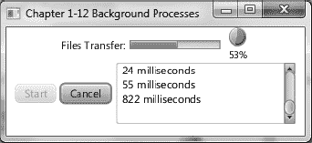

***图 1-18.** 后台进程*

#### 工作原理

GUI 开发的主要陷阱之一在于，何时以及如何委派工作（`Threads`）。我们时常被提醒要注意线程安全，尤其是在避免阻塞 GUI 线程方面。

我们首先创建了两个进度控件，用于向用户展示正在进行的工作。一个是进度条，另一个是进度指示器。进度指示器会在其图标下方显示一个百分比。以下代码片段展示了进度控件的初始创建过程：

`final ProgressBar progressBar = new ProgressBar(0);`
`final ProgressIndicator progressIndicator = new ProgressIndicator(0);`

接下来，我们通过 `createWorker()` 方法创建一个工作线程。这个便捷方法 `createWorker()` 会实例化并返回一个 `javafx.concurrent.Task` 对象，它类似于 Java Swing 中的 `SwingWorker` 类。与 `SwingWorker` 类不同，`Task` 对象被极大地简化了，使用起来也更加容易。如果你对比过上一个示例，你会发现没有任何 GUI 控件被传入 `Task` 中。聪明的 JavaFX 团队创建了可观察的属性，使得我们可以进行绑定。这促成了一种更加事件驱动的方式来处理工作（任务）。在创建 `Task` 对象的实例时，你需要实现 `call()` 方法，以便在后台执行工作。在工作执行过程中，你可能希望将进度或文本信息等中间结果加入队列，这时可以调用 `updateProgress()` 和 `updateMessage()` 方法。这些方法会以线程安全的方式更新信息，使得进度属性的观察者能够安全地更新 GUI，而不会阻塞 GUI 线程。以下代码片段展示了将消息和进度加入队列的能力：

`// 将状态加入队列`
`updateMessage(status);`
`updateProgress(i + 1, numFiles);`

创建了一个工作 `Task` 后，我们会解除之前绑定到进度控件上的所有旧任务。一旦进度控件解除绑定，我们便将进度控件绑定到新创建的 `Task` 对象 `copyWorker` 上。以下代码展示了将新的 `Task` 对象重新绑定到进度 UI 控件的过程：

`// 连接进度条`
`progressBar.progressProperty().unbind();`
`progressBar.progressProperty().bind(copyWorker.progressProperty());`
`progressIndicator.progressProperty().unbind();`
`progressIndicator.progressProperty().bind(copyWorker.progressProperty());`

接下来，我们实现一个 `ChangeListener`，用于将队列中的结果追加到 `TextArea` 控件中。JavaFX 属性的另一个显著特点是，你可以像在 Java Swing 组件上那样附加多个监听器。最后，我们的工作线程和控件都已连接完毕，可以生成一个线程在后台运行。以下代码行展示了如何启动一个 `Task` 工作对象：

`new Thread(copyWorker).start();`

最后，我们讨论一下取消按钮。取消按钮会简单地调用 `Task` 对象的 `cancel()` 方法来终止进程。任务被取消后，进度控件会被重置。一旦工作 `Task` 被取消，它就不能被重复使用了。这就是为什么启动按钮会重新创建一个新的 `Task`。如果你需要一个更健壮的解决方案，应该查看 `javafx.concurrent.Service` 类。以下代码行将取消一个 `Task` 工作对象：

`copyWorker.cancel(true);`

### 1-13. 将键盘序列关联到应用程序

#### 问题

你想要为菜单选项创建键盘快捷键。

#### 解决方案

创建一个使用 JavaFX 按键组合 API 的应用程序。你将用到的主要类如下所示：

> *   `javafx.scene.input.KeyCode`
> *   `javafx.scene.input.KeyCodeCombination`
> *   `javafx.scene.input.KeyCombination`

以下源代码列出了一个应用程序，该程序显示绑定到菜单项的可用键盘快捷键。当用户执行键盘快捷键时，应用程序会在屏幕上显示该按键组合：

`        primaryStage.setTitle("Chapter 1-13 Associating Keyboard Sequences");`
`        Group root = new Group();`
`        Scene scene = new Scene(root, 530, 300, Color.WHITE);`

`        final StringProperty statusProperty = new SimpleStringProperty();`

`        InnerShadow iShadow = InnerShadowBuilder.create()`
`                .offsetX(3.5f)`
`                .offsetY(3.5f)`
`                .build();`
`        final Text status = TextBuilder.create()`
`            .effect(iShadow)`
`            .x(100)`
`            .y(50)`
`            .fill(Color.LIME)`
`            .font(Font.font(null, FontWeight.BOLD, 35))`
`            .translateY(50)`
`            .build();`
`        status.textProperty().bind(statusProperty);`
`        statusProperty.set("Keyboard Shortcuts \nCtrl-N, \nCtrl-S, \nCtrl-X");`
`        root.getChildren().add(status);`

`        MenuBar menuBar = new MenuBar();`
`        menuBar.prefWidthProperty().bind(primaryStage.widthProperty());`
`        root.getChildren().add(menuBar);`

`        Menu menu = new Menu("File");`
`        menuBar.getMenus().add(menu);`

`        MenuItem newItem = MenuItemBuilder.create()`
`                .text("New")`
`                .accelerator(new KeyCodeCombination(KeyCode.N, KeyCombination.CONTROL_DOWN))`
`                .onAction(new EventHandler<ActionEvent>() {`
`                        public void handle(ActionEvent event) {`
`                            statusProperty.set("Ctrl-N");`
`                        }`
`                    })`
`                .build();`
`        menu.getItems().add(newItem);`

`        MenuItem saveItem = MenuItemBuilder.create()`
`                .text("Save")`
`                .accelerator(new KeyCodeCombination(KeyCode.S, KeyCombination.CONTROL_DOWN))`
`                .onAction(new EventHandler<ActionEvent>() {`
`                        public void handle(ActionEvent event) {`
`                            statusProperty.set("Ctrl-S");`
`                        }`
`                    })`
`                .build();`
`        menu.getItems().add(saveItem);`

`        menu.getItems().add(new SeparatorMenuItem());`

`        MenuItem exitItem = MenuItemBuilder.create()`
`                .text("Exit")`
`                .accelerator(new KeyCodeCombination(KeyCode.X, KeyCombination.CONTROL_DOWN))`
`                .onAction(new EventHandler<ActionEvent>() {`
`                        public void handle(ActionEvent event) {`
`                            statusProperty.set("Ctrl-X");`
`                        }`
`                    })`
`                .build();`
`        menu.getItems().add(exitItem);`

`        primaryStage.setScene(scene);`
`        primaryStage.show();`

图 1-19 展示了一个演示键盘序列或键盘快捷键的应用程序。

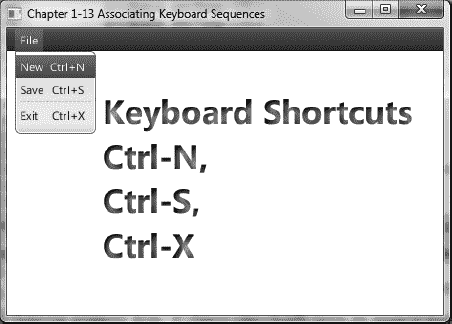

***图 1-19.** 键盘序列*

#### 工作原理

鉴于之前的示例略显枯燥，我决定让事情变得更有趣一些。我们将使用新的 `javafx.scene.input.KeyCodeCombination` 和 `javafx.scene.input.KeyCombination` 类来创建键盘快捷键。本示例将在用户执行按键组合时，在场景图上显示 `Text` 节点。在显示 `Text` 节点时，我应用了内阴影效果。以下代码片段创建了一个带有内阴影效果的 `Text` 节点：

`InnerShadow iShadow = InnerShadowBuilder.create()`
`        .offsetX(3.5f)`
`        .offsetY(3.5f)`
`        .build();`
`final Text status = TextBuilder.create()`
`    .effect(iShadow)`
`    .x(100)`
`    .y(50)`
`    .fill(Color.LIME)`

要创建键盘快捷键，只需调用菜单或按钮控件的 `setAccelerator()` 方法。在本示例中，我们使用 `Builder` 类，并通过 `accelerator()` 方法设置按键组合。以下代码行指定了 control-N 的按键组合：

`MenuItem newItem = MenuItemBuilder.create()`
`        .text("New")`
`        .accelerator(new KeyCodeCombination(KeyCode.N, KeyCombination.CONTROL_DOWN))`

### 1-14. 创建和使用表格

#### 问题

你希望在一个 UI 表格控件中显示项目，类似于 Java Swing 的 JTable 组件。

#### 解决方案

使用 JavaFX 的 `javafx.scene.control.TableView` 类创建一个应用程序。`TableView` 控件提供了与 Swing 的 `JTable` 组件类似的功能。

为了练习使用 `TableView` 控件，你将创建一个显示老板和员工的应用程序。在左侧，你将实现一个包含老板的 `ListView` 控件，而员工（下属）将显示在右侧的 `TableView` 控件中。

以下是一个简单领域类（`Person`）的源代码，用于表示将在 `ListView` 或 `TableView` 控件中显示的老板或员工：

`package javafx2introbyexample.chapter1.recipe1_14;`

`import javafx.beans.property.SimpleStringProperty;`
`import javafx.beans.property.StringProperty;`
`import javafx.collections.FXCollections;`
`import javafx.collections.ObservableList;`

`/**`
` *`
` * @author cdea`
` */`
`public class Person {`

`    private StringProperty aliasName;`
`    private StringProperty firstName;`
`    private StringProperty lastName;    `
`    private ObservableList<Person> employees = FXCollections.observableArrayList();`

`    public final void setAliasName(String value) {`
`        aliasNameProperty().set(value);`
`    }`

`    public final String getAliasName() {`
`        return aliasNameProperty().get();`
`    }`

`    public StringProperty aliasNameProperty() {`
`        if (aliasName == null) {`
`            aliasName = new SimpleStringProperty();`
`        }`
`        return aliasName;`
`    }`

`    public final void setFirstName(String value) {`
`        firstNameProperty().set(value);`
`    }`

`    public final String getFirstName() {`
`        return firstNameProperty().get();`
`    }`

`    public StringProperty firstNameProperty() {`
`        if (firstName == null) {`
`            firstName = new SimpleStringProperty();`
`        }`
`        return firstName;`
`    }`

`    public final void setLastName(String value) {`
`        lastNameProperty().set(value);`
`    }`

`    public final String getLastName() {`
`        return lastNameProperty().get();`
`    }`

`    public StringProperty lastNameProperty() {`
`        if (lastName == null) {`
`            lastName = new SimpleStringProperty();`
`        }`
`        return lastName;`
`    }`

`    public ObservableList<Person> employeesProperty() {`
`        return employees;`
`    }`

`    public Person(String alias, String firstName, String lastName) {`
`        setAliasName(alias);`
`        setFirstName(firstName);`
`        setLastName(lastName);`
`    }`

`}`

以下是我们主应用程序的代码，它在左侧显示一个包含老板的列表视图控件，在右侧显示一个包含员工的表格视图控件：

`        primaryStage.setTitle("第 1-14 章 使用表格");`
`        Group root = new Group();`
`        Scene scene = new Scene(root, 500, 250, Color.WHITE);`

`        // 创建一个网格面板`
`        GridPane gridpane = new GridPane();`
`        gridpane.setPadding(new Insets(5));`
`        gridpane.setHgap(10);`
`        gridpane.setVgap(10);`

`        // 候选人标签`
`        Label candidatesLbl = new Label("老板");`
`        GridPane.setHalignment(candidatesLbl, HPos.CENTER);`
`        gridpane.add(candidatesLbl, 0, 0);`

`        // 领导者列表`
`        ObservableList<Person> leaders = getPeople();`
`        final ListView<Person> leaderListView = new ListView<>(leaders);`
`        leaderListView.setPrefWidth(150);`
`        leaderListView.setPrefHeight(150);`

`        // 显示名和姓，并使用别名作为工具提示`
`        leaderListView.setCellFactory(new Callback<ListView<Person>, ListCell<Person>>() {`

`            public ListCell<Person> call(ListView<Person> param) {`
`                final Label leadLbl = new Label();`
`                final Tooltip tooltip = new Tooltip();`
`                    final ListCell<Person> cell = new ListCell<Person>() {`
`                        @Override`
`                        public void updateItem(Person item, boolean empty) {`
`                                super.updateItem(item, empty);`
`                                if (item != null) {`
`                                    leadLbl.setText(item.getAliasName());`
`                                    setText(item.getFirstName() + " " + item.getLastName());`
`                                    tooltip.setText(item.getAliasName());`
`                                    setTooltip(tooltip);`
`                                }`
`                        }`
`                    }; // ListCell`
`                    return cell;`

`            }`
`        }); // setCellFactory`

`        gridpane.add(leaderListView, 0, 1);`

`        Label emplLbl = new Label("员工");`
`        gridpane.add(emplLbl, 2, 0);`
`        GridPane.setHalignment(emplLbl, HPos.CENTER);`

`        final TableView<Person> employeeTableView = new TableView<>();`
`        employeeTableView.setPrefWidth(300);`
`        final ObservableList<Person> teamMembers = FXCollections.observableArrayList();`
`        employeeTableView.setItems(teamMembers);`

`        TableColumn<Person, String> aliasNameCol = new TableColumn<>("别名");`
`        aliasNameCol.setEditable(true);`
`        aliasNameCol.setCellValueFactory(new PropertyValueFactory("aliasName"));`
`        aliasNameCol.setPrefWidth(employeeTableView.getPrefWidth() / 3);`

`        TableColumn<Person, String> firstNameCol = new TableColumn<>("名");`
`        firstNameCol.setCellValueFactory(new PropertyValueFactory("firstName"));`
`        firstNameCol.setPrefWidth(employeeTableView.getPrefWidth() / 3);`

`        TableColumn<Person, String> lastNameCol = new TableColumn<>("姓");`
`        lastNameCol.setCellValueFactory(new PropertyValueFactory("lastName"));`
`        lastNameCol.setPrefWidth(employeeTableView.getPrefWidth() / 3);`

`        employeeTableView.getColumns().setAll(aliasNameCol, firstNameCol, lastNameCol);`
`        gridpane.add(employeeTableView, 2, 1);`

`        // 选择监听`
`        leaderListView.getSelectionModel().selectedItemProperty().addListener(new ChangeListener<Person>() {`
`            public void changed(ObservableValue<? extends Person> observable, Person oldValue,`
`Person newValue) {`
`                if (observable != null && observable.getValue() != null) {`
`                    teamMembers.clear();`
`                    teamMembers.addAll(observable.getValue().employeesProperty());`
`                }`
`            }`
`        });`

`        root.getChildren().add(gridpane);`

`        primaryStage.setScene(scene);`
`        primaryStage.show();`

以下代码是 `WorkingWithTables` 主应用程序类中包含的 `getPeople()` 方法。此方法有助于填充之前显示的 UI `TableView` 控件：

`    private ObservableList<Person> getPeople() {`
`        ObservableList<Person> people = FXCollections.<Person>observableArrayList();`
`        Person docX = new Person("X 教授", "查尔斯", "泽维尔");`
`        docX.employeesProperty().add(new Person("金刚狼", "詹姆斯", "豪利特"));`
`        docX.employeesProperty().add(new Person("镭射眼", "斯科特", "萨默斯"));`
`        docX.employeesProperty().add(new Person("暴风女", "奥萝洛", "门罗"));`

`        Person magneto = new Person("万磁王", "马克斯", "艾森哈特");`
`        magneto.employeesProperty().add(new Person("红坦克", "凯恩", "马可"));`
`        magneto.employeesProperty().add(new Person("魔形女", "瑞文", "达克霍姆"));`
`        magneto.employeesProperty().add(new Person("剑齿虎", "维克多", "克里德"));`

`        Person biker = new Person("Mountain Biker", "Jonathan", "Gennick");`
`        biker.employeesProperty().add(new Person("Josh", "Joshua", "Juneau"));`
`        biker.employeesProperty().add(new Person("Freddy", "Freddy", "Guime"));`
`        biker.employeesProperty().add(new Person("Mark", "Mark", "Beaty"));`
`        biker.employeesProperty().add(new Person("John", "John", "O'Conner"));`
`        biker.employeesProperty().add(new Person("D-Man", "Carl", "Dea"));`

`        people.add(docX);`
`        people.add(magneto);`
`        people.add(biker);`

`        return people;`
`    }`

图 1-20 展示了我们演示 JavaFX 的 `TableView` 控件的应用程序。

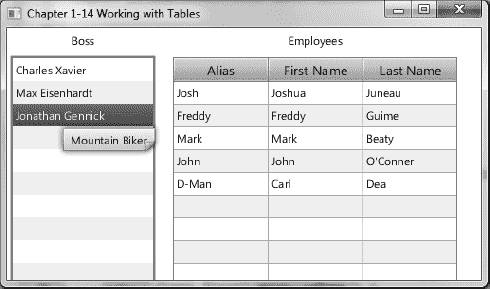

***图 1-20.** 使用表格*

#### 工作原理

为了有趣，我创建了一个简单的 GUI 来显示员工及其老板。你会在图 1-20 的左侧看到一个人物列表（老板）。当用户点击并选择一位老板时，其员工将显示在右侧的 `TableView` 区域中。你还会注意到，当鼠标悬停在选中的老板上时，会出现工具提示。

在开始讨论 `TableView` 控件之前，我想先解释一下负责更新 `TableView` 的 `ListView`。按照模型视图的方式，我们首先创建一个包含所有老板的 `ObservableList`，用于 `ListView` 控件的构造函数。在我的代码中，为了政治正确，我将老板称为*领导者*。以下代码创建了一个 `ListView` 控件：

`// 领导者列表`
`ObservableList<Person> leaders = getPeople();`
`final ListView<Person> leaderListView = new ListView<Person>(leaders);`

接下来，我们创建一个单元格工厂，以便在 `ListView` 控件中正确显示人员姓名。由于每个项目都是一个 `Person` 对象，`ListView` 不知道如何渲染 `ListView` 控件中的每一行。我们只需通过指定 `ListView<Person>` 和 `ListCell<Person>` 数据类型来创建一个 `javafx.util.Callback` 泛型类型对象。借助你信赖的 NetBeans IDE，它会预生成诸如实现方法 `call()` 之类的内容。接下来是 `ListCell<Person>` 类型的变量 `cell`（在 `call()` 方法内部），我们在其中创建一个匿名内部类。该内部类必须实现一个 `updateItem()` 方法。要实现 `updateItem()` 方法，你需要获取人员信息并更新 `Label` 控件（`leadLbl`）。希望你能跟上我的思路。最后一步是设置我们的工具提示。

最后，我们创建一个 `TableView` 控件，用于根据从 `ListView` 中选择的老板来显示员工。创建 `TableView` 时，我们首先创建列标题。使用以下代码创建表格列：

`TableColumn<String> firstNameCol = new TableColumn<String>("First Name");`
`firstNameCol.setProperty("firstName");`

创建列后，你会注意到 `setProperty()` 方法，它负责调用 Person bean 的属性。因此，当员工列表被放入 `TableView` 时，它将知道如何提取属性以放置到表格的每个单元格中。

最后一步是在 JavaFX 中实现 `ListView` 上的选择监听器，这被称为选择项属性（`selectionItemProperty()`）。我们只需创建并添加一个 `ChangeListener` 来监听选择事件。当用户选择一位老板时，`TableView` 会被清空并填充该老板的员工。实际上，这是 `ObservableList` 的魔力，它通知 `TableView` 发生了变化。通过 `teamMembers`（`ObservableList`）变量来填充 `TableView`：

`teamMembers.clear();`
`teamMembers.addAll(observable.getValue().employeesProperty());`

### 1-15. 使用拆分视图组织 UI

#### 问题

你想通过使用拆分分隔控件来分割 GUI 屏幕。

#### 解决方案

使用 JavaFX 的拆分窗格控件。`javafx.scene.control.SplitPane` 类是一个 UI 控件，它允许你将屏幕划分为类似框架的区域。拆分控件允许用户使用鼠标在任意两个拆分区域之间移动分隔线。

以下代码用于创建利用 `javafx.scene.control.SplitPane` 类将屏幕划分为三个窗口区域的 GUI 应用程序。这三个窗口区域分别是左侧列、右上区域和右下区域。此外，你将在三个区域中添加 `Text` 节点。

`// 左侧和右侧拆分窗格`
`SplitPane splitPane = new SplitPane();`
`splitPane.prefWidthProperty().bind(scene.widthProperty());`
`splitPane.prefHeightProperty().bind(scene.heightProperty());`

`VBox leftArea = new VBox(10);`

`for (int i = 0; i < 5; i++) {`
`    HBox rowBox = new HBox(20);`
`    final Text leftText = TextBuilder.create()`
`        .text("左侧 " + i)`
`        .translateX(20)`
`        .fill(Color.BLUE)`
`        .font(Font.font(null, FontWeight.BOLD, 20))`
`        .build();`

`    rowBox.getChildren().add(leftText);`
`    leftArea.getChildren().add(rowBox);`
`}`
`leftArea.setAlignment(Pos.CENTER);`

`// 上方和下方拆分窗格`
`SplitPane splitPane2 = new SplitPane();`
`splitPane2.setOrientation(Orientation.VERTICAL);`
`splitPane2.prefWidthProperty().bind(scene.widthProperty());`
`splitPane2.prefHeightProperty().bind(scene.heightProperty());`

`HBox centerArea = new HBox();`

`InnerShadow iShadow = InnerShadowBuilder.create()`
`    .offsetX(3.5f)`
`    .offsetY(3.5f)`
`    .build();`
`final Text upperRight = TextBuilder.create()`
`    .text("右上")`
`    .x(100)`
`    .y(50)`
`    .effect(iShadow)`
`    .fill(Color.LIME)`
`.font(Font.font(null, FontWeight.BOLD, 35))`
`.translateY(50)`
`    .build();`
`centerArea.getChildren().add(upperRight);`

`HBox rightArea = new HBox();`

`final Text lowerRight = TextBuilder.create()`
`    .text("右下")`
`    .x(100)`
`    .y(50)`
`    .effect(iShadow)`
`    .fill(Color.RED)`
`    .font(Font.font(null, FontWeight.BOLD, 35))`
`    .translateY(50)`
`    .build();`
`rightArea.getChildren().add(lowerRight);`

`splitPane2.getItems().add(centerArea);`
`splitPane2.getItems().add(rightArea);`

`// 添加左侧区域`
`splitPane.getItems().add(leftArea);`

`// 添加右侧区域`
`splitPane.getItems().add(splitPane2);`

`// 均匀放置分隔线`
`ObservableList<SplitPane.Divider> dividers = splitPane.getDividers();`
`for (int i = 0; i < dividers.size(); i++) {`
`    dividers.get(i).setPosition((i + 1.0) / 3);`
`}`

`HBox hbox = new HBox();`
`hbox.getChildren().add(splitPane);`
`root.getChildren().add(hbox);`

图 1-21 展示了使用拆分窗格控件的应用程序。

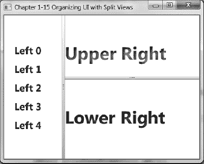

***图 1-21.** 拆分视图*

#### 工作原理

如果你曾见过简单的 RSS 阅读器或 Javadocs，你会注意到屏幕被分隔成多个区域，并带有允许用户调整的分隔线。在本方案中，左侧、右上和右下共有三个区域。

我首先创建一个 `SplitPane`，将场景的左侧区域与右侧区域分隔开。然后将其宽度和高度属性绑定到场景，这样当用户调整舞台大小时，这些区域将占据可用空间。接下来，我创建一个代表左侧区域的 VBox 布局控件。在 VBox（leftArea）中，我循环生成了一堆 `Text` 节点。接着是创建分隔窗格的右侧部分。以下代码片段允许分隔窗格控件（`SplitPane`）进行水平分割：

`SplitPane splitPane = new SplitPane();`
`splitPane.prefWidthProperty().bind(scene.widthProperty());`
`splitPane.prefHeightProperty().bind(scene.heightProperty());`

现在我们创建 `SplitPane` 来垂直分割区域，形成右上和右下区域。此处展示的是用于垂直分割窗口区域的代码：

`// 上下分隔窗格`
`SplitPane splitPane2 = new SplitPane();`
`splitPane2.setOrientation(Orientation.VERTICAL);`

最后，我们组装分隔窗格并调整分隔线的位置，使屏幕空间被均匀分割。以下代码组装了分隔窗格，并遍历分隔线列表以更新其位置：

`splitPane.getItems().add(splitPane2);`

`// 均匀放置分隔线`
`ObservableList<SplitPane.Divider> dividers = splitPane.getDividers();`
`for (int i = 0; i < dividers.size(); i++) {`
`    dividers.get(i).setPosition((i + 1.0) / 3);`
`}`

`HBox hbox = new HBox();`
`hbox.getChildren().add(splitPane);`
`root.getChildren().add(hbox);`

### 1-16\. 向 UI 添加选项卡

#### 问题

你想创建一个带有选项卡的 GUI 应用程序。

#### 解决方案

使用 JavaFX 的选项卡和选项卡窗格控件。选项卡（`javafx.scene.control.Tab`）和选项卡窗格控件（`javafx.scene.control.TabPane`）类允许你将图形节点放置在各个选项卡中。

以下代码示例创建了一个简单的应用程序，其中包含允许用户选择选项卡方向的菜单选项。可用的选项卡方向有顶部、底部、左侧和右侧。

`    @Override`
`    public void start(Stage primaryStage) {`
`        primaryStage.setTitle("第 1-16 章 向 UI 添加选项卡");`
`        Group root = new Group();`
`        Scene scene = new Scene(root, 400, 250, Color.WHITE);`

`        TabPane tabPane = new TabPane();`

`        MenuBar menuBar = new MenuBar();`

`        EventHandler<ActionEvent> action = changeTabPlacement(tabPane);`

`        Menu menu = new Menu("选项卡位置");`
`        MenuItem left = new MenuItem("左侧");`
`        left.setOnAction(action);`
`        menu.getItems().add(left);`

`        MenuItem right = new MenuItem("右侧");`
`        right.setOnAction(action);`
`        menu.getItems().add(right);`

`        MenuItem top = new MenuItem("顶部");`
`        top.setOnAction(action);`
`        menu.getItems().add(top);`

`        MenuItem bottom = new MenuItem("底部");`
`        bottom.setOnAction(action);`
`        menu.getItems().add(bottom);`

`        menuBar.getMenus().add(menu);`

`        BorderPane borderPane = new BorderPane();`

`        // 生成 10 个选项卡`
`        for (int i = 0; i < 10; i++) {`
`            Tab tab = new Tab();`
`            tab.setText("Tab" + i);`
`            HBox hbox = new HBox();`
`            hbox.getChildren().add(new Label("Tab" + i));`
`            hbox.setAlignment(Pos.CENTER);`
`            tab.setContent(hbox);`
`            tabPane.getTabs().add(tab);`
`        }`

`        // 添加选项卡窗格`
`        borderPane.setCenter(tabPane);`

`        // 绑定以占据可用空间`
`        borderPane.prefHeightProperty().bind(scene.heightProperty());`
`        borderPane.prefWidthProperty().bind(scene.widthProperty());`

`        // 添加菜单栏`
`        borderPane.setTop(menuBar);`

`        // 添加边框面板`
`        root.getChildren().add(borderPane);`

`        primaryStage.setScene(scene);`
`        primaryStage.show();`
`    }`

`    private EventHandler<ActionEvent> changeTabPlacement(final TabPane tabPane) {`
`        return new EventHandler<ActionEvent>() {`

`            public void handle(ActionEvent event) {`
`                MenuItem mItem = (MenuItem) event.getSource();`
`                String side = mItem.getText();`
`                if ("left".equalsIgnoreCase(side)) {`
`                    tabPane.setSide(Side.LEFT);`
`                } else if ("right".equalsIgnoreCase(side)) {`
`                    tabPane.setSide(Side.RIGHT);`
`                } else if ("top".equalsIgnoreCase(side)) {`
`                    tabPane.setSide(Side.TOP);`
`                } else if ("bottom".equalsIgnoreCase(side)) {`
`                    tabPane.setSide(Side.BOTTOM);`
`                }`
`            }`
`        };`
`    }`

图 1-22 展示了选项卡应用程序，它允许用户更改选项卡方向。

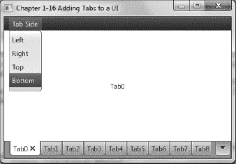

*图 1-22\. TabPane*

#### 工作原理

当你使用 `TabPane` 控件时，你可能已经知道希望选项卡以何种方向显示。此应用程序允许你通过左侧、右侧、顶部和底部的菜单选项来设置方向。

使用 `TabPane` 时，你会立刻注意到它与 Java Swing 的 `JTabbedPanel` 类非常相似。不是添加 `JPanel` 实例，而是直接添加 `javafx.scene.control.Tab` 实例。以下代码片段将 `Tab` 控件添加到选项卡窗格控件中：

`TabPane tabPane = new TabPane();`
`Tab tab = new Tab();`
`tab.setText("Tab" + i);`
`tabPane.getTabs().add(tab);`

当更改 `TabPane` 控件的方向时，请使用 `setSide()` 方法。以下代码行设置了选项卡窗格控件的方向：

`tabPane.setSide(Side.BOTTOM);`

### 1-17\. 开发对话框

#### 问题

你想创建一个模拟更改密码对话框的应用程序。

#### 解决方案

使用 JavaFX 的舞台（`javafx.stage.Stage`）和场景（`javafx.scene.Scene`）API 来创建对话框。

以下源代码清单是一个模拟修改密码对话框的应用程序。该应用程序包含用于弹出对话框的菜单选项。除了菜单选项外，用户还可以设置对话框的模态状态（`modality`）。

`/**`
` * 开发一个对话框`
` * @author cdea`
` */`
`public class DevelopingADialog extends Application {`

`    static Stage LOGIN_DIALOG;`
`    static int dx = 1;`
`    static int dy = 1;`

`    /**`
`     * @param args 命令行参数`
`     */`
`    public static void main(String[] args) {`
`        Application.launch(args);`
`    }`

`    private static Stage createLoginDialog(Stage parent, boolean modal) {`
`        if (LOGIN_DIALOG != null) {`
`            LOGIN_DIALOG.close();`
`        }`
`        return new MyDialog(parent, modal, "欢迎使用 JavaFX！");`
`    }`

`    @Override`
`    public void start(final Stage primaryStage) {`
`        primaryStage.setTitle("第 1-17 章 开发一个对话框");`
`        Group root = new Group();`
`        Scene scene = new Scene(root, 433, 312, Color.WHITE);`

`        MenuBar menuBar = new MenuBar();`
`        menuBar.prefWidthProperty().bind(primaryStage.widthProperty());`

`        Menu menu = new Menu("主页");`
`        // 添加修改密码菜单项`
`        MenuItem newItem = new MenuItem("修改密码", null);`
`        newItem.setOnAction(new EventHandler<ActionEvent>() {`

`            public void handle(ActionEvent event) {`
`                if (LOGIN_DIALOG == null) {`
`                    LOGIN_DIALOG = createLoginDialog(primaryStage, true);`
`                }`
`                LOGIN_DIALOG.sizeToScene();`
`                LOGIN_DIALOG.show();`
`            }`
`        });`

`        menu.getItems().add(newItem);`

`        // 添加分隔符`
`        menu.getItems().add(new SeparatorMenuItem());`

`        // 添加非模态菜单项`
`        ToggleGroup modalGroup = new ToggleGroup();`
`        RadioMenuItem nonModalItem = RadioMenuItemBuilder.create()`
`                .toggleGroup(modalGroup)`
`                .text("非模态")`
`                .selected(true)`
`                .build();`
`        nonModalItem.setOnAction(new EventHandler<ActionEvent>() {`

`            public void handle(ActionEvent event) {`
`                LOGIN_DIALOG = createLoginDialog(primaryStage, false);`
`            }`
`        });`

`        menu.getItems().add(nonModalItem);`

`        // 添加模态选择`
`        RadioMenuItem modalItem = RadioMenuItemBuilder.create()`
`                .toggleGroup(modalGroup)`
`                .text("模态")`
`                .selected(true)`
`                .build();`
`        modalItem.setOnAction(new EventHandler<ActionEvent>() {`

`            public void handle(ActionEvent event) {`
`                LOGIN_DIALOG = createLoginDialog(primaryStage, true);`
`            }`
`        });`
`        menu.getItems().add(modalItem);`

`        // 添加分隔符`
`        menu.getItems().add(new SeparatorMenuItem());`

`        // 添加退出`
`        MenuItem exitItem = new MenuItem("退出", null);`
`        exitItem.setMnemonicParsing(true);`
`        exitItem.setAccelerator(new KeyCodeCombination(KeyCode.X, KeyCombination.CONTROL_DOWN));`
`        exitItem.setOnAction(new EventHandler<ActionEvent>() {`
`            public void handle(ActionEvent event) {`
`                Platform.exit();`
`            }`
`        });`
`        menu.getItems().add(exitItem);`

`        // 添加菜单`
`        menuBar.getMenus().add(menu);`

`        // 将菜单栏添加到窗口`
`        root.getChildren().add(menuBar);`

`        primaryStage.setScene(scene);`
`        primaryStage.show();`

`        addBouncyBall(scene);`
`    }`

`    private void addBouncyBall(final Scene scene) {`

`        final Circle ball = new Circle(100, 100, 20);`
`        RadialGradient gradient1 = new RadialGradient(0,`
`                .1,`
`                100,`
`                100,`
`                20,`
`                false,`
`                CycleMethod.NO_CYCLE,`
`                new Stop(0, Color.RED),`
`                new Stop(1, Color.BLACK));`

`        ball.setFill(gradient1);`

`        final Group root = (Group) scene.getRoot();`
`        root.getChildren().add(ball);`

`        Timeline tl = new Timeline();`
`        tl.setCycleCount(Animation.INDEFINITE);`
`        KeyFrame moveBall = new KeyFrame(Duration.seconds(.0200),`
`                new EventHandler<ActionEvent>() {`

`                    public void handle(ActionEvent event) {`

`                        double xMin = ball.getBoundsInParent().getMinX();`
`                        double yMin = ball.getBoundsInParent().getMinY();`
`                        double xMax = ball.getBoundsInParent().getMaxX();`
`                        double yMax = ball.getBoundsInParent().getMaxY();`

`                        // 碰撞检测 - 边界`
`                        if (xMin < 0 || xMax > scene.getWidth()) {`
`                            dx = dx * -1;`
`                        }`
`                        if (yMin < 0 || yMax > scene.getHeight()) {`
`                            dy = dy * -1;`
`                        }`

`                        ball.setTranslateX(ball.getTranslateX() + dx);`
`                        ball.setTranslateY(ball.getTranslateY() + dy);`

`                    }`
`                });`

`        tl.getKeyFrames().add(moveBall);`
`        tl.play();`
`    }`
`}`

`class MyDialog extends Stage {`

`    public MyDialog(Stage owner, boolean modality, String title) {`
`        super();`
`        initOwner(owner);`
`        Modality m = modality ? Modality.APPLICATION_MODAL : Modality.NONE;`
`        initModality(m);`
`        setOpacity(.90);`
`        setTitle(title);`
`        Group root = new Group();`
`        Scene scene = new Scene(root, 250, 150, Color.WHITE);`
`        setScene(scene);`

`        GridPane gridpane = new GridPane();`
`        gridpane.setPadding(new Insets(5));`
`        gridpane.setHgap(5);`
`        gridpane.setVgap(5);`

`        Label mainLabel = new Label("输入用户名和密码");`
`        gridpane.add(mainLabel, 1, 0, 2, 1);`

`        Label userNameLbl = new Label("用户名：");`
`        gridpane.add(userNameLbl, 0, 1);`

`        Label passwordLbl = new Label("密码：");`
`        gridpane.add(passwordLbl, 0, 2);`

`        // 用户名字段`
`        final TextField userNameFld = new TextField("Admin");`
`        gridpane.add(userNameFld, 1, 1);`

`        // 密码字段`
`        final PasswordField passwordFld = new PasswordField();`
`        passwordFld.setText("drowssap");`
`        gridpane.add(passwordFld, 1, 2);`

`        Button login = new Button("修改");`
`        login.setOnAction(new EventHandler<ActionEvent>() {`

`            public void handle(ActionEvent event) {`
`                close();`
`            }`
`        });`
`        gridpane.add(login, 1, 3);`
`        GridPane.setHalignment(login, HPos.RIGHT);`
`        root.getChildren().add(gridpane);`
`    }`
`}`

图 1-23 展示了我们启用了“非模态”选项的修改密码对话框应用程序。

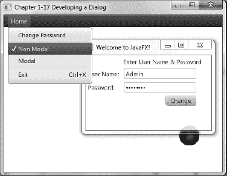

***图 1-23.** 开发一个对话框*

#### 工作原理

在本教程中，我们将使用 JavaFX 创建一个登录界面。在此过程中，我们主要关注 `javafx.stage.Stage` 类。JavaFX 通过 `javafx.stage.Stage` 类的实例向用户展示界面。当你继承 `Stage` 类时，你可以（如同在 `Swing` 中一样）在构造函数中传入所属窗口，该构造函数随后会调用 `initOwner()` 方法。接下来，使用 `initModality()` 方法设置对话框的模态状态。以下是一个继承自 `Stage` 类的示例，其构造函数初始化了所属舞台和模态状态：

`class MyDialog extends Stage {`

`    public MyDialog(Stage owner, boolean modality, String title) {`
`        super();`
`        initOwner(owner);`
`        Modality m = modality ? Modality.APPLICATION_MODAL : Modality.NONE;`
`initModality(m);`

`        ...// 类的其余部分`

其余代码创建了一个场景（`Scene`），与主应用程序的 `start()` 方法类似。由于登录表单相当乏味，我决定在用户忙于在对话框中更改密码时，创建一个弹跳球的动画。（你将在教程 2-2 中了解更多关于创建动画的内容。）

## 第 2 章

## JavaFX 图形

你是否曾听人说过“两个世界碰撞”？这个表达通常用于描述一个来自不同背景或文化的人，被置于一个矛盾冲突的境地，必须面对艰难抉择。当我们构建需要动画的 GUI 应用程序时，常常会处于业务世界与游戏世界的碰撞之中。

在不断变化的 RIA（富互联网应用）世界中，你可能已经注意到动画效果的增多，例如脉冲按钮、过渡效果、动态背景等。当 GUI 应用程序使用动画时，它们可以为用户提供视觉提示，告知下一步操作。借助 JavaFX，你将能够兼得两个世界的优势。

图 2-1 展示了一幅简单的画作变得生动起来。

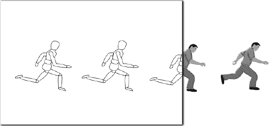

***图 2-1.** JavaFX 图形*

在本章中，你将创建图像、动画和外观样式。系好安全带；你将发现如何将酷炫的游戏化界面集成到日常应用程序中的解决方案。

 **注意** 如果你对 JavaFX 不熟悉，请参考第 1 章。除其他内容外，它将帮助你创建一个能够高效使用 JavaFX 的开发环境。

### 2-1. 创建图像

#### 问题

你的文件目录中有一些照片，希望快速浏览并展示它们。

#### 解决方案

创建一个简单的 JavaFX 图像查看器应用程序。本教程中使用的主要 Java 类包括：

> *   `javafx.scene.image.Image`
> *   `javafx.scene.image.ImageView`
> *   `EventHandler<DragEvent>` 类

以下是图像查看器应用程序的实现源代码：

`package javafx2introbyexample.chapter2.recipe2_01;`

`import java.io.File;`
`import java.util.ArrayList;`
`import java.util.List;`
`import javafx.application.Application;`
`import javafx.event.EventHandler;`
`import javafx.scene.Group;`
`import javafx.scene.Scene;`
`import javafx.scene.image.Image;`
`import javafx.scene.image.ImageView;`
`import javafx.scene.input.DragEvent;`
`import javafx.scene.input.Dragboard;`
`import javafx.scene.input.MouseEvent;`
`import javafx.scene.input.TransferMode;`
`import javafx.scene.layout.HBox;`
`import javafx.scene.paint.Color;`
`import javafx.scene.shape.Arc;`
`import javafx.scene.shape.ArcBuilder;`
`import javafx.scene.shape.ArcType;`
`import javafx.scene.shape.Rectangle;`
`import javafx.scene.shape.RectangleBuilder;`
`import javafx.stage.Stage;`

`/**`
` * 创建图像`
` * @author cdea`
` */`
`public class CreatingImages extends Application {`
`    private List<String> imageFiles = new ArrayList<>();`
`    private int currentIndex = -1;`
`    public enum ButtonMove {NEXT, PREV};`

`    /**`
`     * @param args 命令行参数`
`     */`
`    public static void main(String[] args) {`
`        Application.launch(args);`
`    }`

`    @Override`
`    public void start(Stage primaryStage) {`
`        primaryStage.setTitle("第 2-1 章 创建图像");`
`        Group root = new Group();`
`        Scene scene = new Scene(root, 551, 400, Color.BLACK);`

`        // 图像视图`
`        final ImageView currentImageView = new ImageView();`

`        // 保持宽高比`
`        currentImageView.setPreserveRatio(true);`

`        // 根据场景调整大小`
`        currentImageView.fitWidthProperty().bind(scene.widthProperty());`

`        final HBox pictureRegion = new HBox();`
`        pictureRegion.getChildren().add(currentImageView);`
`        root.getChildren().add(pictureRegion);`

`        // 在表面拖拽`
`        scene.setOnDragOver(new EventHandler<DragEvent>() {`
`            @Override`
`            public void handle(DragEvent event) {`
`                Dragboard db = event.getDragboard();`
`                if (db.hasFiles()) {`
`                    event.acceptTransferModes(TransferMode.COPY);`
`                } else {`
`                    event.consume();`
`                }`
`            }`
`        });`

`        // 在表面放置`
`        scene.setOnDragDropped(new EventHandler<DragEvent>() {`

`            @Override`
`            public void handle(DragEvent event) {`
`                Dragboard db = event.getDragboard();`
`                boolean success = false;`
`                if (db.hasFiles()) {`
`                    success = true;`
`                    String filePath = null;`
`                    for (File file:db.getFiles()) {`
`                        filePath = file.getAbsolutePath();`
`                        currentIndex +=1;`
`                        imageFiles.add(currentIndex, filePath);`

`                        // 绝对文件名`
`                        System.out.println("文件: " + file);`
`                        // 文件名列表中的索引`
`                        System.out.println("currentImageFileIndex = " + currentIndex);`
`                    }`

`                    // 设置新图像为要显示的图像`
`                    Image imageimage = new Image(filePath);`
`                    currentImageView.setImage(imageimage);`

`                }`
`                event.setDropCompleted(success);`
`                event.consume();`
`            }`
`        });`

`        // 创建幻灯片控件`
`        Group buttonGroup = new Group();`

`        // 圆角矩形`
`        Rectangle buttonArea = RectangleBuilder.create()`
`                .arcWidth(15)`
`                .arcHeight(20)`
`                .fill(new Color(0, 0, 0, .55))`
`                .x(0)`
`                .y(0)`
`                .width(60)`
`                .height(30)`
`                .stroke(Color.rgb(255, 255, 255, .70))`
`                .build();`

`        buttonGroup.getChildren().add(buttonArea);`
`        // 左侧控制`
`        Arc leftButton = ArcBuilder.create()`
`                .type(ArcType.ROUND)`
`                .centerX(12)`
`                .centerY(16)`
`                .radiusX(15)`
`                .radiusY(15)`
`                .startAngle(-30)`
`                .length(60)`
`                .fill(new Color(1,1,1, .90))`
`                .build();`

`        leftButton.addEventHandler(MouseEvent.MOUSE_PRESSED, new EventHandler<MouseEvent>() {`
`            public void handle(MouseEvent me) {`
`                int indx = gotoImageIndex(ButtonMove.PREV);`
`                if (indx > -1) {`
`                    String namePict = imageFiles.get(indx);`
`                    final Image image = new Image(new File(namePict).getAbsolutePath());`
`                    currentImageView.setImage(image);`
`                }`
`            }`
`        });`
`        buttonGroup.getChildren().add(leftButton);`

`        // 右侧控制`
`        Arc rightButton = ArcBuilder.create()`
`                .type(ArcType.ROUND)`
`                .centerX(12)`
`                .centerY(16)`
`                .radiusX(15)`
`                .radiusY(15)`
`                .startAngle(180-30)`
`                .length(60)`
`                .fill(new Color(1,1,1, .90))`
`                .translateX(40)`
`                .build();`
`        buttonGroup.getChildren().add(rightButton);`

`        rightButton.addEventHandler(MouseEvent.MOUSE_PRESSED, new EventHandler<MouseEvent>() {`
`            public void handle(MouseEvent me) {                `
`                int indx = gotoImageIndex(ButtonMove.NEXT);`
`                if (indx > -1) {`
`                    String namePict = imageFiles.get(indx);`
`                    final Image image = new Image(new File(namePict).getAbsolutePath());`
`                    currentImageView.setImage(image);`
`                }`
`            }`
`        });`

`        // 当场景大小改变时移动按钮组`
`        buttonGroup.translateXProperty().bind(scene.widthProperty().subtract(buttonArea.getWid`
`        h() + 6));`

`        buttonGroup.translateYProperty().bind(scene.heightProperty().subtract(buttonArea.getHe`
`        ight() + 6));`
`        root.getChildren().add(buttonGroup);`

`        primaryStage.setScene(scene);`
`        primaryStage.show();`
`    }`

`    /**`
`     * 返回文件列表中下一个要跳转的索引。`
`     *`
`     * @param direction PREV 和 NEXT 分别用于在图片列表中向后或向前移动。`
`     * @return int 上一张或下一张要显示的图片的索引。`
`     */`
`    public int gotoImageIndex(ButtonMove direction) {`
`        int size = imageFiles.size();`
`        if (size == 0) {`
`            currentIndex = -1;`
`        } else if (direction == ButtonMove.NEXT && size > 1 && currentIndex < size - 1) {`
`            currentIndex += 1;`
`        } else if (direction == ButtonMove.PREV && size > 1 && currentIndex > 0) {`
`            currentIndex -= 1;`
`        }`

`        return currentIndex;`
`    }`

`}`

图 2-2 展示了拖放操作，该操作通过一个缩略图大小的图像在界面上为用户提供视觉反馈。在图中，我正在将图像拖拽到应用程序窗口上。

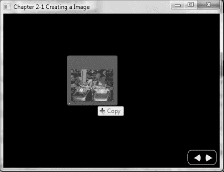

***图 2-2.** 拖放进行中*

图 2-3 展示了放置操作已成功加载图像。

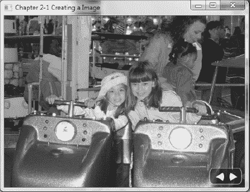

***图 2-3.** 放置操作完成*

#### 工作原理

本示例是一个简单的应用程序，允许您查看具有 `.jpg`、`.png` 和 `.gif` 等文件格式的图像。加载图像需要使用鼠标将文件拖放到窗口区域。该应用程序还允许调整窗口大小，这会自动按比例缩放图像尺寸，同时保持其宽高比。成功加载几张图像后，您可以通过单击左右按钮控件方便地翻页浏览每张图像，如图 2-3 所示。

在代码讲解之前，我们先讨论一下应用程序的变量。表 2-1 描述了我们这个精美图像查看器应用程序的实例变量。

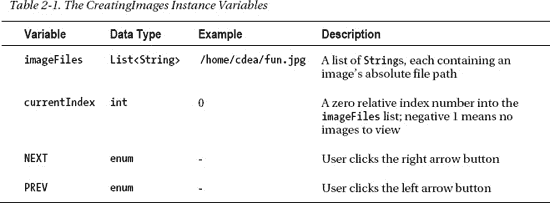

当将图像拖入应用程序时，`imageFiles` 变量会缓存绝对文件路径（作为字符串），而不是实际的图像文件，以节省内存空间。如果用户将同一图像文件拖入显示区域，列表中会包含代表该图像文件的重复字符串。在显示图像时，`currentIndex` 变量包含指向 `imageFiles` 列表的索引。该 `imageFiles` 列表指向代表当前图像文件的字符串。当用户点击按钮显示上一张或下一张图像时，`currentIndex` 会相应地递减或递增。接下来，您将逐步了解加载和显示图像的详细代码。稍后，我将讨论使用“上一张”和“下一张”按钮翻页浏览每张图像的步骤。

您首先需要实例化一个 `javafx.scene.image.ImageView` 类的实例。`ImageView` 类是一个图形节点（`Node`），用于显示已加载的 `javafx.scene.image.Image` 对象。使用 `ImageView` 节点，您可以在不操作物理 `Image` 的情况下，对要显示的图像创建特殊效果。为了避免在渲染多种效果时性能下降，您可以使用多个引用同一个 `Image` 对象的 `ImageView` 对象。许多效果类型包括模糊、淡化和图像变换。

其中一个需求是在用户调整窗口大小时保持显示图像的宽高比。在这里，您只需调用 `setPreserveRatio()` 方法，并传入值 `true` 来保持图像的宽高比。请记住，由于用户会调整窗口大小，您需要将 `ImageView` 的宽度绑定到 `Scene` 的宽度，以使图像缩放生效。设置好 `ImageView` 后，您需要将其传递给一个 `HBox` 实例（`pictureRegion`），以便放入场景中。以下代码创建了 `ImageView` 实例，保持了宽高比，并缩放了图像：

`    // 图像视图`
`    final ImageView currentImageView = new ImageView();`

`    // 保持宽高比`
`    currentImageView.setPreserveRatio(true);`

`    // 基于场景调整大小`
`    currentImageView.fitWidthProperty().bind(scene.widthProperty());`

接下来，我想介绍 JavaFX 新的原生拖放支持，它为用户提供了许多可执行的操作场景，例如将可视对象从一个应用程序拖放到另一个应用程序。在此场景中，用户将从宿主窗口操作系统拖放一个图像文件到您的图像查看器应用程序。执行此操作时，您必须创建 `EventHandler` 对象来监听 `DragEvent`。为满足此需求，您只需设置场景的拖放悬停（drag-over）和拖放放下（drag-dropped）事件处理方法。

要设置拖放悬停属性，您需要调用 Scene 的 `setOnDragOver()` 方法，并传入适当的泛型类型 `EventHandler<DragEvent>`。在这里，您将实现 `handle()` 方法来监听拖放悬停事件（`DragEvent`）。在 `handle()` 方法中，请注意事件（`DragEvent`）对象调用了 `getDragboard()` 方法。调用 `getDragboard()` 将返回拖放源（`Dragboard`），通常称为*剪贴板*。获取 `Dragboard` 对象后，您可以确定并验证拖放悬停在表面上的内容。在此场景中，您需要判断 `Dragboard` 对象是否包含任何文件。如果是，则调用事件对象的 `acceptTransferModes()` 方法，并传入常量 `TransferMode.COPY`，以向应用程序用户提供视觉反馈（请参考图 2-2）。否则，应通过调用 `event.consume()` 方法来消费该事件。以下代码演示了如何通过实例化一个形式类型参数为 `<DragEvent>` 的 `EventHandler` 类型的内部类，并重写其 `handle()` 方法来设置 Scene 的 `OnDragOver` 属性：

`// 在表面拖放悬停`
`scene.setOnDragOver(new EventHandler<DragEvent>() {`
`    @Override`
`    public void handle(DragEvent event) {`
`        Dragboard db = event.getDragboard();`
`        if (db.hasFiles()) {`
`            event.acceptTransferModes(TransferMode.COPY);`
`        } else {`
`            event.consume();`
`        }`
`    }`
`});`

设置好拖放悬停事件处理属性后，您必须创建一个拖放放下事件处理属性，以便完成操作。监听拖放放下事件与监听拖放悬停事件类似，您需要实现 `handle()` 方法。再次从事件中获取 `Dragboard` 对象，以判断剪贴板是否包含任何文件。如果是，您将遍历文件列表及其名称，并将其添加到 `imageFiles` 列表中。以下代码演示了如何通过实例化一个形式类型参数为 `<DragEvent>` 的 `EventHandler` 类型的内部类，并重写其 `handle()` 方法来设置 Scene 的 `OnDragDropped` 属性：

`// 在表面拖放放下`
`scene.setOnDragDropped(new EventHandler<DragEvent>() {`

`    @Override`
`    public void handle(DragEvent event) {`
`        Dragboard db = event.getDragboard();`
`        boolean success = false;`
`        if (db.hasFiles()) {`
`            success = true;`
`            String filePath = null;`
`            for (File file:db.getFiles()) {`
`                filePath = file.getAbsolutePath();`

`                currentIndex +=1;`
`                imageFiles.add(currentIndex, filePath);`
`            }`

`            // 设置新图像为要显示的图像`
`            Image imageimage = new Image(filePath);`
`            currentImageView.setImage(imageimage);`

`        }`
`        event.setDropCompleted(success);`
`        event.consume();`
`    }`
`});`

当最后一个文件确定后，当前图像就会被显示。以下代码演示了加载要显示的图像：

`// 设置新图像为要显示的图像`
`Image imageimage = new Image(filePath);`
`currentImageView.setImage(imageimage);`

对于图像查看器应用程序的最后一个需求，您将创建简单的控件，允许用户查看下一张或上一张图像。我强调“简单”控件，是因为 JavaFX 还包含另外两种创建自定义控件的方法。其中一种方法（CSS 样式）将在后面的 2-5 节中讨论。要探索另一种方法，请参考 Skin 和 Skinnable API 的 Javadoc。

为了创建简单的按钮，我使用了 JavaFX 的 `javafx.scene.shape.Arc` 来在小的透明圆角矩形 `javafx.scene.shape.Rectangle` 上构建左右箭头。接下来是添加一个 `EventHandler`，它监听鼠标按下事件，并根据枚举 `ButtonMove.PREV` 和 `ButtonMove.NEXT` 加载并显示相应的图像。您会发现 `EventHandler` 在很多方面都不可或缺且非常有用。当实例化一个带有类型变量（位于 `<` 和 `>` 符号之间）的泛型类时，相同的类型变量将在 `handle()` 方法的签名中定义。在实现 `handle()` 方法时，我判断按下了哪个按钮；然后它返回 `imageFiles` 列表中下一张要显示图像的索引。使用 `Image` 类加载图像时，您可以从文件系统或 `URL` 加载图像，但在本示例中，我使用的是 `File` 对象。以下代码实例化了一个带有 `handle()` 方法的 `EventHandler<MouseEvent>`，用于显示 `imageFiles` 列表中的上一张图像：

`Arc leftButton = //... 创建一个 Arc`
`leftButton.addEventHandler(MouseEvent.MOUSE_PRESSED, new EventHandler<MouseEvent>() {`
`   public void handle(MouseEvent me) {                `
`      int indx = gotoImageIndex(ButtonMove.PREV);`
`      if (indx > -1) {`
`         String namePict = imageFiles.get(indx);`
`         final Image image = new Image(new File(namePict).getAbsolutePath());`
`         currentImageView.setImage(image);`
`      }`
`  }`
`});`

右侧按钮（`rightButton`）的事件处理程序是相同的，所以我相信您能理解。唯一不同的是通过 `ButtonMove` 枚举判断按下的是上一张按钮还是下一张按钮。这被传递给 `gotoImageIndex()` 方法，以确定该方向是否有可用的图像。

为了完成图像查看器应用程序，您必须将矩形按钮控件绑定到 Scene 的宽度和高度，这样当用户调整窗口大小时，控件会重新定位。在这里，我通过减去 `buttonArea` 的宽度（使用 Fluent API）将 `translateXProperty()` 绑定到 Scene 的宽度属性。我还基于 Scene 的高度属性绑定了 `translateYProperty()`。一旦您的按钮控件绑定完成，用户将体验到良好的用户界面。以下代码使用 Fluent API 将按钮控件的属性绑定到 Scene 的属性：

`        // 当场景调整大小时移动按钮组`
`        buttonGroup.translateXProperty().bind(scene.widthProperty().subtract(buttonArea.getWid`
`        h() + 6));`

`        buttonGroup.translateYProperty().bind(scene.heightProperty().subtract(buttonArea.getHe`
`        ght() + 6));`
`        root.getChildren().add(buttonGroup);`

### 2-2\. 生成动画

#### 问题

你想要生成一个动画。例如，你想创建一个满足以下需求的新闻滚动条和照片查看器应用程序：

> *   它将包含一个向左滚动的新闻滚动条控件。
> *   当用户点击按钮控件时，当前图片会淡出，下一张图片会淡入。
> *   当光标移入和移出场景区域时，按钮控件会分别淡入和淡出。

#### 解决方案

通过访问 JavaFX 的动画 API（`javafx.animation.*`）来创建动画效果。要创建新闻滚动条，你需要以下类：

> *   `javafx.animation.TranslateTransition`
> *   `javafx.util.Duration`
> *   `javafx.event.EventHandler<ActionEvent>`
> *   `javafx.scene.shape.Rectangle`

要淡出当前图片并淡入下一张图片，你需要以下类：

> *   `javafx.animation.SequentialTransition`
> *   `javafx.animation.FadeTransition`
> *   `javafx.event.EventHandler<ActionEvent>`
> *   `javafx.scene.image.Image`
> *   `javafx.scene.image.ImageView`
> *   `javafx.util.Duration`

当光标移入和移出场景区域时，分别淡入和淡出按钮控件，需要以下类：

> *   `javafx.animation.FadeTransition`
> *   `javafx.util.Duration`

以下是用于创建新闻滚动条控件的代码：

`// 创建滚动条区域`
`final Group tickerArea = new Group();`
`final Rectangle tickerRect = RectangleBuilder.create()`
`        .arcWidth(15)`
`        .arcHeight(20)`
`        .fill(new Color(0, 0, 0, .55))`
`        .x(0)`
`        .y(0)`
`        .width(scene.getWidth() - 6)`
`        .height(30)`
`        .stroke(Color.rgb(255, 255, 255, .70))`
`        .build();`

`Rectangle clipRegion = RectangleBuilder.create()`
`        .arcWidth(15)`
`        .arcHeight(20)`
`        .x(0)`
`        .y(0)`
`        .width(scene.getWidth() - 6)`
`        .height(30)`
`        .stroke(Color.rgb(255, 255, 255, .70))`
`        .build();`

`tickerArea.setClip(clipRegion);`

`// 当窗口调整大小时，重新调整滚动条区域的大小`
`tickerArea.setTranslateX(6);`
`tickerArea.translateYProperty().bind(scene.heightProperty().subtract(tickerRect.getHeight(`
`) + 6));`
`tickerRect.widthProperty().bind(scene.widthProperty().subtract(buttonRect.getWidth() +`
`16));`
`clipRegion.widthProperty().bind(scene.widthProperty().subtract(buttonRect.getWidth() +`
`16));`
`tickerArea.getChildren().add(tickerRect);`

`root.getChildren().add(tickerArea);`

`// 添加新闻文本`
`Text news = TextBuilder.create()`
`        .text("JavaFX 2.0 News! | 85 and sunny | :)")`
`        .translateY(18)`
`        .fill(Color.WHITE)`
`        .build();`
`tickerArea.getChildren().add(news);`

`final TranslateTransition ticker = TranslateTransitionBuilder.create()`
`        .node(news)`
`        .duration(Duration.millis((scene.getWidth()/300) * 15000))`
`        .fromX(scene.widthProperty().doubleValue())`
`        .toX(-scene.widthProperty().doubleValue())`
`        .fromY(19)`
`        .interpolator(Interpolator.LINEAR)`
`        .cycleCount(1)`
`        .build();`

`// 当滚动条动画完成时，重置并重新播放滚动条动画`
`ticker.setOnFinished(new EventHandler<ActionEvent>() {`
`    public void handle(ActionEvent ae){`
`        ticker.stop();`
`        ticker.setFromX(scene.getWidth());`
`        ticker.setDuration(new Duration((scene.getWidth()/300) * 15000));`
`        ticker.playFromStart();`
`    }`
`});`

`ticker.play();`

以下是用于淡出当前图片并淡入下一张图片的代码：

`// 上一张按钮`
`Arc prevButton = // 创建弧线 ...`

`prevButton.addEventHandler(MouseEvent.MOUSE_PRESSED, new EventHandler<MouseEvent>() {`

`    public void handle(MouseEvent me) {`
`        int indx = gotoImageIndex(PREV);`
`        if (indx > -1) {`
`            String namePict = imagesFiles.get(indx);`
`            final Image nextImage = new Image(new File(namePict).getAbsolutePath());`
`            SequentialTransition seqTransition = transitionByFading(nextImage, currentImageView);`
`            seqTransition.play();`
`        }`
`    }`
`});`

`buttonGroup.getChildren().add(prevButton);`

`// 下一张按钮`
`Arc nextButton = //... 创建弧线`

`buttonGroup.getChildren().add(nextButton);`

`nextButton.addEventHandler(MouseEvent.MOUSE_PRESSED, new EventHandler<MouseEvent>() {`

`    public void handle(MouseEvent me) {`
`        int indx = gotoImageIndex(NEXT);`
`        if (indx > -1) {`
`            String namePict = imagesFiles.get(indx);`
`            final Image nextImage = new Image(new File(namePict).getAbsolutePath());`
`            SequentialTransition seqTransition = transitionByFading(nextImage, currentImageView);`
`            seqTransition.play();`
`        }`
`    }`
`});`

`//... start(Stage primaryStage) 方法的其余部分`

`public int gotoImageIndex(int direction) {`
`    int size = imagesFiles.size();`
`    if (size == 0) {`
`        currentIndexImageFile = -1;`
`    } else if (direction == NEXT && size > 1 && currentIndexImageFile < size - 1) {`
`        currentIndexImageFile += 1;`
`    } else if (direction == PREV && size > 1 && currentIndexImageFile > 0) {`
`        currentIndexImageFile -= 1;`
`    }`

`    return currentIndexImageFile;`
`}`

`public SequentialTransition transitionByFading(final Image nextImage, final ImageView`
`imageView) {`
`    FadeTransition fadeOut = new FadeTransition(Duration.millis(500), imageView);`
`    fadeOut.setFromValue(1.0);`
`    fadeOut.setToValue(0.0);`
`    fadeOut.setOnFinished(new EventHandler<ActionEvent>() {`
`        public void handle(ActionEvent ae) {`
`            imageView.setImage(nextImage);`
`        }`
`    });`
`    FadeTransition fadeIn = new FadeTransition(Duration.millis(500), imageView);`
`    fadeIn.setFromValue(0.0);`
`    fadeIn.setToValue(1.0);`
`    SequentialTransition seqTransition = SequentialTransitionBuilder.create()`
`        .children(fadeOut, fadeIn)`
`        .build();`
`    return seqTransition;`
`}`

以下代码用于当光标移入和移出场景区域时，分别淡入和淡出按钮控件：

`// 淡入按钮控件`
`scene.setOnMouseEntered(new EventHandler<MouseEvent>() {`
`    public void handle(MouseEvent me) {`
`        FadeTransition fadeButtons = new FadeTransition(Duration.millis(500), buttonGroup);`
`        fadeButtons.setFromValue(0.0);`
`        fadeButtons.setToValue(1.0);`
`        fadeButtons.play();`
`    }`
`});`
`// 淡出按钮控件`
`scene.setOnMouseExited(new EventHandler<MouseEvent>() {`
`    public void handle(MouseEvent me) {`
`        FadeTransition fadeButtons = new FadeTransition(Duration.millis(500), buttonGroup);`
`        fadeButtons.setFromValue(1);`
`        fadeButtons.setToValue(0);`
`        fadeButtons.play();`
`    }`
`});`

图 2-4 展示了屏幕底部区域带有滚动条控件的照片查看器应用程序。

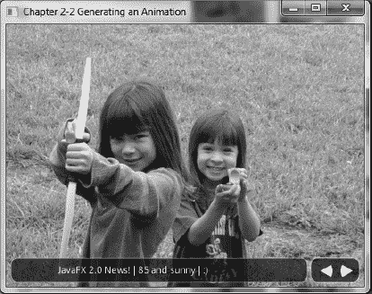

***图 2-4.** 带有新闻滚动条的照片查看器*

#### 工作原理

在照片查看器应用中，我决定加入动画效果。我主要关注的动画效果是平移和淡入淡出。首先，你将创建一个新闻滚动条控件，通过使用平移过渡（`javafx.animation.TranslateTransition`）让`Text`节点向左滚动。接着，当用户点击“上一张”和“下一张”按钮，从当前图片切换到下一张时，你将应用另一种淡入淡出效果。为了实现这种效果，你将使用一个由多个动画组成的复合过渡（`javafx.animation.SequentialTransition`）。最后，为了创建按钮控件根据鼠标位置淡入淡出的效果，你需要一个淡入淡出过渡（`javafx.animation.FadeTransition`）。

在开始讨论实现需求的步骤之前，我想先提一下 JavaFX 动画的基础知识。JavaFX 动画 API 允许你组装定时事件，这些事件可以在节点的属性值之间进行插值，从而产生动画效果。每个定时事件被称为一个关键帧（`KeyFrame`），它负责在一段时间（`javafx.util.Duration`）内对`Node`的属性进行插值。知道了关键帧的作用是操作`Node`的属性值，你就需要创建一个`KeyValue`类的实例，该实例将引用所需的`Node`属性。插值的概念简单来说就是在起始值和结束值之间分配数值。例如，将一个矩形从其当前 x 位置（零）在 1000 毫秒内移动到 100 像素；换句话说，就是将矩形向右移动 100 像素，耗时一秒。这里展示了一个关键帧和关键值，用于在 1000 毫秒内对矩形的 x 属性进行插值：

`final Rectangle rectangle = new Rectangle(0, 0, 50, 50);`
`KeyValue keyValue = new KeyValue(rectangle.xProperty(), 100);`
`KeyFrame keyFrame = new KeyFrame(Duration.millis(1000), keyValue);`

当创建多个连续组装的关键帧时，你需要创建一个`TimeLine`。因为`TimeLine`是`javafx.animation.Animation`的子类，所以可以设置其标准属性，例如循环次数和自动反转。*循环次数*是你希望时间线播放动画的次数。如果你希望循环次数无限播放动画，请使用值`Timeline.INDEFINITE`。自动反转是指动画反向播放时间线的能力。默认情况下，循环次数设置为 1，自动反转设置为 false。添加关键帧时，只需使用`TimeLine`对象上的`getKeyFrames().add()`方法即可。以下代码片段演示了一个无限播放且自动反转设置为 true 的时间线：

`Timeline timeline = new Timeline();`
`timeline.setCycleCount(Timeline.INDEFINITE);`
`timeline.setAutoReverse(true);`
`timeline.getKeyFrames().add(``keyFrame``);`
`timeline.play();`

掌握了时间线的这些知识，你就可以在 JavaFX 中为任何图形节点制作动画。虽然你可以用底层方式创建时间线，但这可能会变得非常繁琐。你可能想知道是否有更简单的方法来表达常见的动画。好消息是！JavaFX 提供了过渡（`Transition`），这些是用于执行常见动画效果的便捷类。一些常见的动画效果类如下：

> *   `javafx.animation.FadeTransition`
> *   `javafx.animation.PathTransition`
> *   `javafx.animation.ScaleTransition`
> *   `javafx.animation.TranslateTransition`

要查看更多过渡效果，请参阅 Javadoc 中的`javafx.animation`。由于`Transition`对象也是`javafx.animation.Animation`类的子类，你将有机会设置循环次数和自动反转属性。在本教程中，你将重点学习两种过渡效果：平移过渡（`TranslateTransition`）和淡入淡出过渡（`FadeTransition`）。

我们问题陈述中的第一个需求是创建一个新闻滚动条。创建新闻滚动条控件时，`Text`节点将在矩形区域内从右向左滚动。当文本滚动到矩形区域的左边缘时，你需要裁剪文本，以创建一个仅显示矩形内部像素的视口。在这里，我首先创建一个`Group`来容纳构成滚动条控件的所有组件。接下来，使用`RectangleBuilder`创建一个矩形，构建一个填充了 55% 不透明度的白色圆角矩形。创建可视区域后，我使用`Group`对象上的`setClip(someRectangle)`方法创建一个表示裁剪区域的类似矩形。图 2-5 显示了一个作为裁剪区域的圆角矩形区域：

***图 2-5.** 在 Group 对象上设置裁剪区域*

创建滚动条控件后，你将根据场景的高度属性减去滚动条控件的高度来绑定 translate Y。你还需要根据场景的宽度减去按钮控件的宽度来绑定滚动条控件的宽度属性。通过绑定这些属性，每当用户调整应用程序窗口大小时，滚动条控件都可以改变其大小和位置。这使得滚动条控件看起来像是浮动在窗口底部。以下代码绑定了滚动条控件的 translate Y、宽度和裁剪区域的宽度属性：

`tickerArea.translateYProperty().bind(scene.heightProperty().subtract(tickerRect.getHeight() +`
`6));`
`tickerRect.widthProperty().bind(scene.widthProperty().subtract(buttonRect.getWidth() + 16));`
`clipRegion.widthProperty().bind(scene.widthProperty().subtract(buttonRect.getWidth() + 16));`
`tickerArea.getChildren().add(tickerRect);`

现在你已经完成了滚动条控件的创建，接下来需要创建新闻来输入其中。你将创建一个包含代表新闻推送文本的`Text`节点。要将新创建的`Text`节点添加到滚动条控件，请调用其`getChildren().add()`方法。以下代码将一个`Text`节点添加到滚动条控件：

`final Group tickerArea = new Group();`
`final Rectangle tickerRect = //...`
`Text news = TextBuilder.create()`
`    .text("JavaFX 2.0 新闻！ | 85 度，晴朗 | :)")`
`    // ... 更多定义的属性`
`    .build();`
`// 将新闻添加到滚动条控件`
`tickerArea.getChildren().add(news);`

接下来是使用 JavaFX 的`TranslateTransition` API 将`Text`节点从右向左滚动。与许多 JavaFX 类一样，存在用于轻松创建对象的构建器类，你将使用`TranslateTransition`类相关的构建器类`TranslateTransitionBuilder`。第一步是设置执行`TranslateTransition`的目标节点。然后设置持续时间，即`TranslateTransition`在动画化时将花费的总时间。`TranslateTransition`通过公开操作`Node`的 translate X 和 Y 属性的便捷方法，简化了动画的创建。这些便捷方法以`from`和`to`为前缀。例如，在你在`Text`节点上使用 translate X 的场景中，有`fromX()`和`toX()`方法。`fromX()`是起始值，`toX()`是将被插值的结束值。接下来，你将`TranslateTransition`设置为线性过渡（`Interpolator.LINEAR`），以便在起始值和结束值之间均匀插值。要查看更多插值器类型或了解如何创建自定义插值器，请参阅关于`javafx.animation.Interpolator`的 Javadoc。最后，我将循环次数设置为 1，这将根据指定的持续时间将滚动条动画化一次。以下代码片段详细说明了创建一个将`Text`节点从右向左动画化的`TranslateTransition`：

`final TranslateTransition ticker = TranslateTransitionBuilder.create()`
`        .node(news)`
`        .duration(Duration.millis((scene.getWidth()/300) * 15000))`
`        .fromX(scene.widthProperty().doubleValue())`
`        .toX(-scene.widthProperty().doubleValue())`
`        .fromY(19)`
`        .interpolator(Interpolator.LINEAR)`
`        .cycleCount(1)`
`        .build();`

当滚动条的新闻完全滚出滚动条区域，到达场景的最左侧时，你需要停止并从起始位置（最右侧）重新播放新闻推送。为此，你将创建一个`EventHandler<ActionEvent>`对象的实例，并使用`setOnFinished()`方法将其设置在滚动条（`TranslateTransition`）对象上。这里展示了如何重播`TranslateTransition`动画：

`// 当窗口在宽度方向上调整大小时，滚动条将知道移动多远`
`ticker.setOnFinished(new EventHandler<ActionEvent>() {`
`    public void handle(ActionEvent ae){`
`        ticker.stop();`
`        ticker.setFromX(scene.getWidth());`
`        ticker.setDuration(new Duration((scene.getWidth()/300) * 15000));`
`        ticker.playFromStart();`
`    }`
`});`

一旦动画定义完毕，你只需调用`play()`方法即可启动它。以下代码片段展示了如何播放一个`TranslateTransition`：

`ticker.play();`

现在你对动画过渡有了更好的理解，那么能够触发任意数量过渡的过渡呢？JavaFX 有两个提供此行为的过渡。这两个过渡可以顺序或并行地调用各个独立的过渡。在本教程中，我使用顺序过渡（`SequentialTransition`）来包含两个`FadeTransition`，以便淡出当前显示的图像并淡入下一张图像。在创建“上一张”和“下一张”按钮的事件处理器时，你首先通过调用`gotoImageIndex()`方法确定要显示的下一个图像。一旦确定了要显示的下一个图像，你将调用`transitionByFading()`方法，该方法返回一个`SequentialTransition`的实例。调用`transitionByFading()`方法时，你会注意到创建了两个`FadeTransition`。第一个过渡将不透明度级别从 1.0 更改为 0.0，以淡出当前图像；第二个过渡将不透明度级别从 0.0 插值到 1.0，淡入下一张图像，该图像随后成为当前图像。最后，将两个`FadeTransition`添加到`SequentialTransition`并返回给调用者。以下代码创建了两个`FadeTransition`并将它们添加到一个`SequentialTransition`中：

`FadeTransition fadeOut = new FadeTransition(Duration.millis(500), imageView);`
`fadeOut.setFromValue(1.0);`
`fadeOut.setToValue(0.0);`
`fadeOut.setOnFinished(new EventHandler<ActionEvent>() {`
`    public void handle(ActionEvent ae) {`
`         imageView.setImage(nextImage);`
`    }`
`});`

`FadeTransition fadeIn = new FadeTransition(Duration.millis(500), imageView);`
`fadeIn.setFromValue(0.0);`
`fadeIn.setToValue(1.0);`
`SequentialTransition seqTransition = SequentialTransitionBuilder.create()`
`        .children(fadeOut, fadeIn)`
`        .build();`

对于与淡入淡出相关的最后一个需求，你将使用按钮控件。你将再次使用`FadeTransition`来创建一种幽灵般的动画效果。首先，就像你感兴趣的任何事件一样，你将创建一个`EventHandler`（更具体地说，是一个`EventHandler<MouseEvent>`）。向场景添加鼠标事件非常简单；你所要做的就是重写`handle()`方法，其中入参是`MouseEvent`类型（与其形式类型参数相同）。在`handle()`方法内部，你将使用接受持续时间和节点作为参数的构造函数创建一个`FadeTransition`对象的实例。接下来，你会注意到调用了`setFromValue()`和`setToValue()`方法，用于在不透明度级别 1.0 和 0.0 之间插值，从而产生淡入效果。以下代码添加了一个`EventHandler`，用于在鼠标光标位于场景内部时创建淡入效果：

`// 淡入按钮控件`
`scene.setOnMouseEntered(new EventHandler<MouseEvent>() {`
`    public void handle(MouseEvent me) {`
`        FadeTransition fadeButtons = new FadeTransition(Duration.millis(500), buttonGroup);`
`        fadeButtons.setFromValue(0.0);`
`        fadeButtons.setToValue(1.0);`
`        fadeButtons.play();`
`    }`
`});`

最后但同样重要的是，淡出`EventHandler`与淡入基本相同，只是不透明度的`From`和`To`值是从 1.0 到 0.0，这使得当鼠标指针移出场景区域时，按钮会神秘地消失。

### 2-3\. 沿路径动画化形状

#### 问题

你需要创建一种方法，使形状能够沿路径进行动画。

#### 解决方案

创建一个应用程序，允许用户绘制形状要跟随的路径。本方案中使用的主要 Java 类如下：

> *   `javafx.animation.PathTransition`
> *   `javafx.animation.PathTransitionBuilder`
> *   `javafx.scene.input.MouseEvent`
> *   `javafx.event.EventHandler`
> *   `javafx.geometry.Point2D`
> *   `javafx.scene.shape.LineTo`
> *   `javafx.scene.shape.MoveTo`
> *   `javafx.scene.shape.Path`

以下代码演示了如何绘制形状要跟随的路径：

`/**`
` * 使用场景图`
` * @author cdea`
` */`
`public class WorkingWithTheSceneGraph extends Application {`

`    Path onePath = new Path();`
`    Point2D anchorPt;`
`    /**`
`     * @param args 命令行参数`
`     */`
`    public static void main(String[] args) {`
`        Application.launch(args);`
`    }`

`    @Override`
`    public void start(Stage primaryStage) {`
`        primaryStage.setTitle("第 2-3 章 使用场景图");`

`        final Group root = new Group();`

`        // 添加路径`
`        root.getChildren().add(onePath);`

`        final Scene scene = SceneBuilder.create()`
`                .root(root)`
`                .width(300)`
`                .height(250)`
`                .fill(Color.WHITE)`
`                .build();`

`        RadialGradient gradient1 = new RadialGradient(0,`
`                .1,`
`                100,`
`                100,`
`                20,`
`                false,`
`                CycleMethod.NO_CYCLE,`
`                new Stop(0, Color.RED),`
`                new Stop(1, Color.BLACK));`

`        // 创建一个球体`
`        final Circle sphere = CircleBuilder.create()`
`                .centerX(100)`
`                .centerY(100)`
`                .radius(20)`
`                .fill(gradient1)`
`                .build();`

`        // 添加球体`
`        root.getChildren().addAll(sphere);`

`        // 让球体沿路径运动`
`        final PathTransition pathTransition = PathTransitionBuilder.create()`
`            .duration(Duration.millis(4000))`
`            .cycleCount(1)`
`            .node(sphere)`
`            .path(onePath)`
`            .orientation(PathTransition.OrientationType.ORTHOGONAL_TO_TANGENT)`
`            .build();`

`        // 完成后清除路径`
`        pathTransition.onFinishedProperty().set(new EventHandler<ActionEvent>() {`
`            public void handle(ActionEvent event){`
`                onePath.getElements().clear();`
`            }`
`        });`

`        // 开始初始路径`
`        scene.onMousePressedProperty().set(new EventHandler<MouseEvent>() {`
`            public void handle(MouseEvent event){`
`                // 清除路径`
`                onePath.getElements().clear();`
`                // 路径起点`
`                anchorPt = new Point2D(event.getX(), event.getY());`
`                onePath.setStrokeWidth(3);`
`                onePath.setStroke(Color.BLACK);`
`                onePath.getElements().add(new MoveTo(anchorPt.getX(), anchorPt.getY()));   `
`            }`
`        });`

`        // 拖拽时向路径添加 LineTo`
`        scene.onMouseDraggedProperty().set(new EventHandler<MouseEvent>() {`
`            public void handle(MouseEvent event){`
`                onePath.getElements().add(new LineTo(event.getX(), event.getY()));`
`            }`
`        });`

`        // 鼠标释放时结束路径`
`        scene.onMouseReleasedProperty().set(new EventHandler<MouseEvent>() {`
`            public void handle(MouseEvent event){`
`                onePath.setStrokeWidth(0);`
`                if (onePath.getElements().size() > 1) {`
`                    pathTransition.stop();`
`                    pathTransition.playFromStart();`
`                }`
`            }`
`        });`

`        primaryStage.setScene(scene);`
`        primaryStage.show();`
`    }`
`}`

图 2-6 展示了圆形将要跟随的绘制路径。当用户释放鼠标时，绘制的路径会消失，红色球体将沿着之前绘制的路径运动。

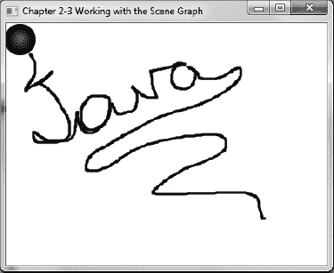

***图 2-6.** 路径过渡*

#### 工作原理

在本教程中，你将创建一个简单的应用程序，能够通过跟随场景图上绘制的路径来让对象动起来。为简化操作，你将使用一个形状（`Circle`）来执行路径过渡动画（`javafx.animation.PathTransition`）。你将允许用户像使用绘图程序一样，通过按下鼠标按钮在场景表面绘制路径。当对绘制的路径满意后，松开鼠标即可触发红色球体沿着路径移动，类似于物体在建筑物管道中移动的效果。

你将创建两个实例变量来维护构成路径的坐标。为了保存正在绘制的路径，你将创建一个`javafx.scene.shape.Path`对象的实例。同时需要注意，路径实例应在应用程序启动前添加到场景图中。以下是将实例变量`onePath`添加到场景图的代码：

`// 添加路径`
`root.getChildren().add(onePath);`

接下来，你将创建一个实例变量`anchorPt`（`javafx.geometry.Point2D`），用于保存路径的起点。稍后你将看到这些变量如何根据鼠标事件进行更新。以下是维护当前绘制路径的实例变量：

`Path onePath = new Path();`
`Point2D anchorPt;`

首先，让我们创建一个将要被动画化的形状。在本场景中，你将创建一个酷炫的红色球体。为了制作出具有球体外观的效果，你将创建一个渐变颜色`RadialGradient`，用于绘制或填充圆形形状。（关于如何使用渐变填充形状，请参考教程 1-6。）创建好红色球体后，你需要创建一个`PathTransition`对象来执行路径跟随动画。通过使用便捷的`PathTransitionBuilder`类，你只需将持续时间设置为四秒，循环次数设置为一次。循环次数是指动画循环发生的次数。接着，你将节点设置为引用红色球体（`sphere`）。然后，将`path()`方法设置为实例变量`onePath`，该变量包含构成绘制路径的所有坐标和线条。为球体设置好动画路径后，你需要指定形状如何跟随路径，例如垂直于路径的切点。以下代码创建了一个路径过渡动画的实例：

`// 通过跟随路径来动画化球体`
`final PathTransition pathTransition = PathTransitionBuilder.create()`
`    .duration(Duration.millis(4000))`
`    .cycleCount(1)`
`    .node(sphere)`
`    .path(onePath)`
`    .orientation(PathTransition.OrientationType.ORTHOGONAL_TO_TANGENT)`
`    .build();`

创建路径过渡动画后，你希望在动画完成时进行清理。为了在动画结束时重置或清理路径变量，你将创建并添加一个事件处理器来监听路径过渡对象上的`onFinished`属性事件。以下代码片段添加了一个事件处理器来清除当前路径信息：

`// 完成后清除路径`
`pathTransition.onFinishedProperty().set(new EventHandler<ActionEvent>() {`
`   public void handle(ActionEvent event){`
`      onePath.getElements().clear();`
`   }`
`});`

形状和过渡动画设置完成后，接下来你需要响应鼠标事件，这些事件将更新之前提到的实例变量。你将监听发生在`Scene`对象上的鼠标事件。这里，你将再次依赖创建事件处理器，并将其设置在场景的`onMouseXXXProperty`方法上，其中`XXX`表示实际的鼠标事件名称，例如按下（pressed）、拖动（dragged）和释放（released）。

当用户绘制路径时，他会执行鼠标按下事件来开始路径的绘制。为了监听鼠标按下事件，你将创建一个形式类型参数为`MouseEvent`的事件处理器。在这里，你需要重写`handle()`方法。当鼠标按下事件发生时，你希望清除实例变量`onePath`中任何先前绘制的路径信息。接着，你只需设置路径的描边宽度和颜色，以便用户能看到正在绘制的路径。最后，你将使用`MoveTo`对象的实例将起点添加到路径中。以下是响应用户鼠标按下事件的处理代码：

`        // 开始初始路径`
`        scene.onMousePressedProperty().set(new EventHandler<MouseEvent>() {`
`            public void handle(MouseEvent event){`
`                // 清除路径`
`                onePath.getElements().clear();`
`                // 路径中的起点`
`                anchorPt = new Point2D(event.getX(), event.getY());`
`                onePath.setStrokeWidth(3);`
`                onePath.setStroke(Color.BLACK);`
`                onePath.getElements().add(new MoveTo(anchorPt.getX(), anchorPt.getY()));   `
`            }`
`        });`

鼠标按下事件处理器就位后，你将创建另一个用于鼠标拖动事件的事件处理器。同样，你需要查找场景中与你关心的鼠标事件相对应的`onMouseXXXProperty()`方法。在这种情况下，你需要设置的是`onMouseDraggedProperty()`。在重写的`handle()`方法中，你将获取鼠标坐标，并将其转换为`LineTo`对象，然后添加到路径（`Path`）中。这些`LineTo`对象是路径元素（`javafx.scene.shape.PathElement`）的实例，如教程 1-5 所述。以下是负责鼠标拖动事件的事件处理器代码：

`// 拖动操作创建 LineTo 对象并添加到路径中`
`scene.onMouseDraggedProperty().set(new EventHandler<MouseEvent>() {`
`        public void handle(MouseEvent event){`
`                onePath.getElements().add(new LineTo(event.getX(), event.getY()));`
`        }`
`});`

最后，你将创建一个事件处理器来监听鼠标释放事件。当用户释放鼠标时，路径的描边宽度被设置为零，使其看起来像是被移除了。然后，你将重置路径过渡动画，停止它并从起点重新播放。以下是负责鼠标释放事件的事件处理器代码：

`// 鼠标释放事件时结束路径`
`scene.onMouseReleasedProperty().set(new EventHandler<MouseEvent>() {`
`    public void handle(MouseEvent event){`
`        onePath.setStrokeWidth(0);`
`        if (onePath.getElements().size() > 1) {`
`            pathTransition.stop();`
`            pathTransition.playFromStart();`
`        }`
`    }`
`});`

### 2-4. 通过网格操控布局

#### 问题

你想使用网格类型布局创建一个美观的表单类型用户界面。

#### 解决方案

创建一个简单的表单设计器应用程序，使用 JavaFX 的 `javafx.scene.layout.GridPane` 动态操作用户界面。该表单设计器应用程序将具备以下功能：

> *   切换网格布局的网格线显示，用于调试。
> *   调整 `GridPane` 的上内边距。
> *   调整 `GridPane` 的左内边距。
> *   调整 `GridPane` 中单元格之间的水平间距。
> *   调整 `GridPane` 中单元格之间的垂直间距。
> *   水平对齐单元格内的控件。
> *   垂直对齐单元格内的控件。

以下代码是表单设计器应用程序的主启动点：

`/**`
` * 通过网格操纵布局`
` * @author cdea`
` */`
`public class ManipulatingLayoutViaGrids extends Application {`

`    /**`
`     * @param args 命令行参数`
`     */`
`    public static void main(String[] args) {`
`        Application.launch(args);`
`    }`

`    @Override`
`    public void start(Stage primaryStage) {`
`        primaryStage.setTitle("第 2-4 章 通过网格操纵布局");`
`        Group root = new Group();`
`        Scene scene = new Scene(root, 640, 480, Color.WHITE);`

`        // 左右分割面板`
`        SplitPane splitPane = new SplitPane();`
`        splitPane.prefWidthProperty().bind(scene.widthProperty());`
`        splitPane.prefHeightProperty().bind(scene.heightProperty());`

`        // 右侧的表单`
`        GridPane rightGridPane = new MyForm();`

`        GridPane leftGridPane = new GridPaneControlPanel(rightGridPane);`

`        VBox leftArea = new VBox(10);`
`        leftArea.getChildren().add(leftGridPane);`
`        HBox hbox = new HBox();`
`        hbox.getChildren().add(splitPane);`
`        root.getChildren().add(hbox);`
`        splitPane.getItems().addAll(leftArea, rightGridPane);`

`        primaryStage.setScene(scene);`

`        primaryStage.show();`
`    }`

`}`

当表单设计器应用程序启动时，要操作的目标表单将显示在窗口分割面板的右侧。以下是一个简单的网格状表单类的代码，它继承自 `GridPane`，将由表单设计器应用程序进行操作：

`/**`
` * MyForm 是一个供用户操作的表单。`
` * @author cdea`
` */`
`public class MyForm extends GridPane{`
`    public MyForm() {`

`        setPadding(new Insets(5));`
`        setHgap(5);`
`        setVgap(5);`

`        Label fNameLbl = new Label("名字");`
`        TextField fNameFld = new TextField();`
`        Label lNameLbl = new Label("姓氏");`
`        TextField lNameFld = new TextField();`
`        Label ageLbl = new Label("年龄");`
`        TextField ageFld = new TextField();`

`        Button saveButt = new Button("保存");`

`        // 名字标签`
`        GridPane.setHalignment(fNameLbl, HPos.RIGHT);`
`        add(fNameLbl, 0, 0);`

`        // 姓氏标签`
`        GridPane.setHalignment(lNameLbl, HPos.RIGHT);`
`        add(lNameLbl, 0, 1);`

`        // 年龄标签`
`        GridPane.setHalignment(ageLbl, HPos.RIGHT);`
`        add(ageLbl, 0, 2);`

`        // 名字输入框`
`        GridPane.setHalignment(fNameFld, HPos.LEFT);       `
`        add(fNameFld, 1, 0);`

`        // 姓氏输入框`
`        GridPane.setHalignment(lNameFld, HPos.LEFT);`
`        add(lNameFld, 1, 1);`

`        // 年龄输入框`
`        GridPane.setHalignment(ageFld, HPos.RIGHT);`
`        add(ageFld, 1, 2);`

`        // 保存按钮`
`        GridPane.setHalignment(saveButt, HPos.RIGHT);`
`        add(saveButt, 1, 3);`

`    }`
`}`

当表单设计器应用程序启动时，网格属性控制面板将显示在窗口分割面板的左侧。该属性控制面板允许用户动态操作目标表单的网格面板属性。以下代码表示将操作目标网格面板属性的网格属性控制面板：

`/** GridPaneControlPanel 表示分割面板的左侧区域`
` * 允许用户操作右侧的 GridPane。`
` *`
` * 通过网格操纵布局`
` * @author cdea`
` */`
`public class GridPaneControlPanel extends GridPane{`
`    public GridPaneControlPanel(final GridPane targetGridPane) {`
`        super();`

`        setPadding(new Insets(5));`
`        setHgap(5);`
`        setVgap(5);`

`        // 设置网格线`
`        Label gridLinesLbl = new Label("网格线");`
`        final ToggleButton gridLinesToggle = new ToggleButton("关闭");`
`        gridLinesToggle.selectedProperty().addListener(new ChangeListener<Boolean>(){`
`            public void changed(ObservableValue<? extends Boolean> ov, Boolean oldValue, Boolean newVal) {`
`                targetGridPane.setGridLinesVisible(newVal);`
`                gridLinesToggle.setText(newVal ? "开启" : "关闭");`
`            }`
`        });`

`        // 切换网格线标签`
`        GridPane.setHalignment(gridLinesLbl, HPos.RIGHT);`
`        add(gridLinesLbl, 0, 0);`

`        // 切换网格线`
`        GridPane.setHalignment(gridLinesToggle, HPos.LEFT);       `
`        add(gridLinesToggle, 1, 0);`

`        // 设置内边距 [上]`
`        Label gridPaddingLbl = new Label("上内边距");`

`        final Slider gridPaddingSlider = SliderBuilder.create()`
`                .min(0)`
`                .max(100)`
`                .value(5)`
`                .showTickLabels(true)`
`                .showTickMarks(true)`
`                .minorTickCount(1)`
`                .blockIncrement(5)`
`                .build();`
`        gridPaddingSlider.valueProperty().addListener(new ChangeListener<Number>() {`
`            public void changed(ObservableValue<? extends Number> ov, Number oldVal, Number newVal) {        `
`                double top = targetGridPane.getInsets().getTop();`
`                double right = targetGridPane.getInsets().getRight();`
`                double bottom = targetGridPane.getInsets().getBottom();`
`                double left = targetGridPane.getInsets().getLeft();`

`                Insets newInsets = new Insets((double) newVal, right, bottom, left);`

`                targetGridPane.setPadding(newInsets);`
`            }`
`        });`

`        // 内边距调整标签`
`        GridPane.setHalignment(gridPaddingLbl, HPos.RIGHT);`
`        add(gridPaddingLbl, 0, 1);`

`       // 内边距调整滑块`
`       GridPane.setHalignment(gridPaddingSlider, HPos.LEFT);       `
`       add(gridPaddingSlider, 1, 1);`

`        // 设置内边距 [左]`
`        Label gridPaddingLeftLbl = new Label("左内边距");`

`        final Slider gridPaddingLeftSlider = SliderBuilder.create()`
`                .min(0)`
`                .max(100)`
`                .value(5)`
`                .showTickLabels(true)`
`                .showTickMarks(true)`
`                .minorTickCount(1)`
`                .blockIncrement(5)`
`                .build();`
`        gridPaddingLeftSlider.valueProperty().addListener(new ChangeListener<Number>() {`
`            public void changed(ObservableValue<? extends Number> ov, Number oldVal, Number`
`newVal) {`
`                double top = targetGridPane.getInsets().getTop();`
`                double right = targetGridPane.getInsets().getRight();`
`                double bottom = targetGridPane.getInsets().getBottom();`
`                double left = targetGridPane.getInsets().getLeft();`

`                Insets newInsets = new Insets(top, right, bottom, (double) newVal);`

`                targetGridPane.setPadding(newInsets);`
`            }`
`        });`

`        // 内边距调整标签`
`        GridPane.setHalignment(gridPaddingLeftLbl, HPos.RIGHT);`
`        add(gridPaddingLeftLbl, 0, 2);`

`        // 内边距调整滑块`
`        GridPane.setHalignment(gridPaddingLeftSlider, HPos.LEFT);       `
`        add(gridPaddingLeftSlider, 1, 2);`

`        // 水平间距`
`        Label gridHGapLbl = new Label("水平间距");`

`        final Slider gridHGapSlider = SliderBuilder.create()`
`                .min(0)`
`                .max(100)`
`                .value(5)`
`                .showTickLabels(true)`
`                .showTickMarks(true)`
`                .minorTickCount(1)`
`                .blockIncrement(5)`
`                .build();`
`        gridHGapSlider.valueProperty().addListener(new ChangeListener<Number>() {`
`            public void changed(ObservableValue<? extends Number> ov, Number oldVal, Number`
`newVal) {`
`                targetGridPane.setHgap((double) newVal);`
`            }`
`        });`

`        // 水平间距标签`
`        GridPane.setHalignment(gridHGapLbl, HPos.RIGHT);`
`        add(gridHGapLbl, 0, 3);`

`       // 水平间距滑块`
`       GridPane.setHalignment(gridHGapSlider, HPos.LEFT);       `
`       add(gridHGapSlider, 1, 3);`

`        // 垂直间距`
`        Label gridVGapLbl = new Label("垂直间距");`
`        final Slider gridVGapSlider = SliderBuilder.create()`
`                .min(0)`
`                .max(100)`
`                .value(5)`
`                .showTickLabels(true)`
`                .showTickMarks(true)`
`                .minorTickCount(1)`
`                .blockIncrement(5)`
`                .build();`
`        gridVGapSlider.valueProperty().addListener(new ChangeListener<Number>() {`
`            public void changed(ObservableValue<? extends Number> ov, Number oldVal, Number`
`newVal) {`
`                targetGridPane.setVgap((double) newVal);`
`            }`
`        });`

`       // 垂直间距标签`
`       GridPane.setHalignment(gridVGapLbl, HPos.RIGHT);`
`       add(gridVGapLbl, 0, 4);`

`       // 垂直间距滑块`
`       GridPane.setHalignment(gridVGapSlider, HPos.LEFT);       `
`       add(gridVGapSlider, 1, 4);`

`       // 单元格列`
`       Label cellCol = new Label("单元格列");`
`       final TextField cellColFld = new TextField("0");`

`       // 单元格列标签`
`       GridPane.setHalignment(cellCol, HPos.RIGHT);`
`       add(cellCol, 0, 5);`

`       // 单元格列输入框`
`       GridPane.setHalignment(cellColFld, HPos.LEFT);       `
`       add(cellColFld, 1, 5);`

`       // 单元格行`
`       Label cellRowLbl = new Label("单元格行");`
`       final TextField cellRowFld = new TextField("0");`

`       // 单元格行标签`
`       GridPane.setHalignment(cellRowLbl, HPos.RIGHT);`
`       add(cellRowLbl, 0, 6);`

`       // 单元格行输入框`
`       GridPane.setHalignment(cellRowFld, HPos.LEFT);       `
`       add(cellRowFld, 1, 6);`

`       // 水平对齐`
`       Label hAlignLbl = new Label("水平对齐");`
`       final ChoiceBox hAlignFld = new ChoiceBox(FXCollections.observableArrayList(`
`            "CENTER", "LEFT", "RIGHT")`
`       );`
`       hAlignFld.getSelectionModel().select("LEFT");`

`       // 单元格行标签`
`       GridPane.setHalignment(hAlignLbl, HPos.RIGHT);`
`       add(hAlignLbl, 0, 7);`

`       // 单元格行输入框`
`       GridPane.setHalignment(hAlignFld, HPos.LEFT);       `
`       add(hAlignFld, 1, 7);`

`       // 垂直对齐`
`       Label vAlignLbl = new Label("垂直对齐");`
`       final ChoiceBox vAlignFld = new ChoiceBox(FXCollections.observableArrayList(`
`            "BASELINE", "BOTTOM", "CENTER", "TOP")`
`       );`
`       vAlignFld.getSelectionModel().select("TOP");`
`       // 单元格行标签`
`       GridPane.setHalignment(vAlignLbl, HPos.RIGHT);`
`       add(vAlignLbl, 0, 8);`

`       // 单元格行输入框`
`       GridPane.setHalignment(vAlignFld, HPos.LEFT);       `
`       add(vAlignFld, 1, 8);`

`       // 垂直对齐`
`       Label cellApplyLbl = new Label("单元格约束");`
`       final Button cellApplyButton = new Button("应用");`
`       cellApplyButton.setOnAction(new EventHandler<ActionEvent>() {`

`            public void handle(ActionEvent event) {`

`                 for (Node child:targetGridPane.getChildren()) {`

`                     int targetColIndx = 0;`
`                     int targetRowIndx = 0;`
`                     try {`
`                         targetColIndx = Integer.parseInt(cellColFld.getText());`
`                         targetRowIndx = Integer.parseInt(cellRowFld.getText());`
`                     } catch (Exception e) {`

`                     }`
`                     System.out.println("child = " + child.getClass().getSimpleName());`
`                     int col = GridPane.getColumnIndex(child);`
`                     int row = GridPane.getRowIndex(child);`
`                     if (col == targetColIndx && row == targetRowIndx) {`
`                         GridPane.setHalignment(child,`
`HPos.valueOf(hAlignFld.getSelectionModel().getSelectedItem().toString()));`
`                         GridPane.setValignment(child,`
`VPos.valueOf(vAlignFld.getSelectionModel().getSelectedItem().toString()));                     `
`                     }`
`                 }`
`            }`
`        });`

`       // 单元格行标签`
`       GridPane.setHalignment(cellApplyLbl, HPos.RIGHT);`
`       add(cellApplyLbl, 0, 9);`

`       // 单元格行输入框`
`       GridPane.setHalignment(cellApplyButton, HPos.LEFT);       `
`       add(cellApplyButton, 1, 9);`

`    }`
`}`

图 2-7 展示了一个表单设计器应用程序，左侧是 `GridPane` 属性控制面板，右侧是目标表单。

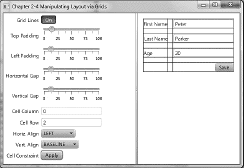

***图 2-7.** 通过网格操控布局*

#### 工作原理

表单设计器应用程序将允许用户通过左侧的 `GridPane` 属性控制面板动态调整属性。当从左侧控制面板调整属性时，右侧的目标表单将随之动态变化。在创建简单的表单设计器应用程序时，您需要将控件绑定到目标表单（`GridPane`）的各种属性上。该设计器应用程序主要分为三个类：`ManipulatingLayoutViaGrids`、`MyForm` 和 `GridPaneControlPanel`。首先，`ManipulatingLayoutViaGrids` 类是要启动的主应用程序。其次，`MyForm` 是待操作的目标表单。最后，`GridPaneControlPanel` 是网格属性控制面板，其 UI 控件绑定到目标表单的网格窗格属性。

首先，创建应用程序的主启动点（`ManipulatingLayoutViaGrids`）。该类负责创建一个分割窗格（`SplitPane`），将目标表单设置在右侧，并实例化一个 `GridPaneControlPanel` 显示在左侧。要实例化 `GridPaneControlPanel`，您必须将要操作的目标表单传入构造函数。我将在后面进一步讨论这一点，但简而言之，`GridPaneControlPanel` 的构造函数会将其控件连接到目标表单的属性上。

接下来，您将创建一个我称之为 `MyForm` 的虚拟表单。该表单将是属性控制面板要操作的目标表单。在这里，您会注意到 `MyForm` 继承了 `GridPane`。在 `MyForm` 的构造函数中，您将创建并添加要放入表单（`GridPane`）的控件。要了解更多关于 `GridPane` 的信息，请参考配方 1-8。以下代码是供表单设计器应用程序操作的目标表单：

`/**`
` * MyForm 是一个供用户操作的表单。`
` * @author cdea`
` */`
`public class MyForm extends GridPane{`
`    public MyForm() {`

`        setPadding(new Insets(5));`
`        setHgap(5);`
`        setVgap(5);`

`        Label fNameLbl = new Label("名字");`
`        TextField fNameFld = new TextField();`
`        Label lNameLbl = new Label("姓氏");`
`        TextField lNameFld = new TextField();`
`        Label ageLbl = new Label("年龄");`
`        TextField ageFld = new TextField();`

`        Button saveButt = new Button("保存");`

`        // 名字标签`
`        GridPane.setHalignment(fNameLbl, HPos.RIGHT);`
`        add(fNameLbl, 0, 0);`
`//… 表单代码的其余部分`

要操作目标表单，您需要创建一个网格属性控制面板（`GridPaneControlPanel`）。该类负责将目标表单的网格窗格属性绑定到 UI 控件上，从而允许用户通过键盘和鼠标调整数值。正如您之前在配方 1-10 中学到的，您可以使用 JavaFX 属性绑定值。但除了直接绑定值之外，您还可以在属性发生变化时收到通知。

您可以应用于属性的另一个功能是添加更改监听器。JavaFX 的 `javafx.beans.value.ChangeListener` 类似于 Java Swing 的属性更改支持（`java.beans.PropertyChangeListener`）。类似地，当 bean 的属性值发生变化时，您会希望收到该更改的通知。更改监听器旨在通过向开发人员提供旧值和新值来拦截更改。您将首先为切换按钮创建一个 `JavaFX` 更改监听器，用于打开或关闭网格线。当用户与切换按钮交互时，更改监听器将简单地更新目标网格窗格的 `gridlinesVisible` 属性。由于切换按钮（`ToggleButton`）的 `selected` 属性是 `Boolean` 值，您将实例化一个形式类型参数为 `Boolean` 的 `ChangeListener` 类。您还会注意到重写的方法 `changed()`，其入参参数将与实例化 `ChangeListener<Boolean>` 时指定的泛型形式类型参数匹配。当属性更改事件发生时，更改监听器将使用新值在目标网格窗格上调用 `setGridLinesVisible()`，并更新切换按钮的文本。以下代码片段展示了添加到 `ToggleButton` 的 `ChangeListener<Boolean>`：

`gridLinesToggle.selectedProperty().addListener(`
`new ChangeListener<Boolean>(){`
`        public void changed(ObservableValue<? extends Boolean> ov, Boolean oldValue, Boolean`
`newVal) {`
`targetGridPane.setGridLinesVisible(newVal);`
`gridLinesToggle.setText(newVal ? "开" : "关");`
`        }`
`});`

接下来，您将为滑块控件应用一个更改监听器，该控件允许用户调整目标网格窗格的顶部内边距。要为滑块创建更改监听器，您将实例化一个 `ChangeListener<Number>`。同样，您将重写 `changed()` 方法，其签名与其形式类型参数 `Number` 相同。当发生更改时，滑块的值将用于创建一个 `Insets` 对象，该对象成为目标网格窗格的新内边距。以下是顶部内边距和滑块控件的更改监听器：

`gridPaddingSlider.valueProperty().addListener(new ChangeListener<Number>() {`
`    public void changed(ObservableValue<? extends Number> ov, Number oldVal, Number`
`newVal) {        `
`        double top = targetGridPane.getInsets().getTop();`
`        double right = targetGridPane.getInsets().getRight();`
`        double bottom = targetGridPane.getInsets().getBottom();`
`        double left = targetGridPane.getInsets().getLeft();`

`        Insets newInsets = new Insets((double) newVal, right, bottom, left);`

`        targetGridPane.setPadding(newInsets);`
`    }`
`});`

由于处理左侧内边距、水平间距和垂直间距的其他滑块控件的实现与前面提到的顶部内边距滑块控件几乎相同，您可以快进到单元格约束控件。

您想要操作的网格控制面板属性的最后一部分是目标网格窗格的单元格约束。为简洁起见，我只允许用户设置 `GridPane` 单元格内组件的对齐方式。要查看更多可修改的属性，请参考 `javafx.scene.layout.GridPane` 的 Javadoc。图 2-8 描述了单个单元格的单元格约束设置。一个示例是将目标网格窗格上的“年龄”标签左对齐。由于单元格是从零开始的，您需要在“单元格列”字段中输入 **0**，在“单元格行”字段中输入 2。接下来，您需要将下拉框“水平对齐”选择为 LEFT。设置满意后，单击“应用”。图 2-9 显示了“年龄”标签控件水平左对齐。要实现此功能，您需要为应用按钮的 `onAction` 属性创建一个 `EventHandler<ActionEvent>`，通过调用其 `setOnAction()` 方法。同样，在创建 `EventHandler` 时，您将重写 `handle()` 方法。在 `handle()` 方法内部，您将遍历目标网格窗格拥有的所有子节点，以确定它是否是指定的单元格。一旦确定了指定的单元格和子节点，将应用对齐方式。以下代码是按下应用按钮时应用单元格约束的 `EventHandler`：

`final Button cellApplyButton = new Button("应用");`
`cellApplyButton.setOnAction(new EventHandler<ActionEvent>() {`

`    public void handle(ActionEvent event) {`

`         for (Node child:targetGridPane.getChildren()) {`

`             int targetColIndx = 0;`
`             int targetRowIndx = 0;`
`             try {`
`                 targetColIndx = Integer.parseInt(cellColFld.getText());`
`                 targetRowIndx = Integer.parseInt(cellRowFld.getText());`
`             } catch (Exception e) {`

`             }`
`             System.out.println("child = " + child.getClass().getSimpleName());`
`             int col = GridPane.getColumnIndex(child);`
`             int row = GridPane.getRowIndex(child);`
`             if (col == targetColIndx && row == targetRowIndx) {`
`                 GridPane.setHalignment(child, HPos.valueOf(hAlignFld.getSelectionModel().getSelectedItem().toString()));  `
`                 GridPane.setValignment(child,`
`VPos.valueOf(vAlignFld.getSelectionModel().getSelectedItem().toString()));                     `
`             }`
`         }`

`    }`
`});`

图 2-8 描绘了单元格约束网格控制面板部分，该部分将控件左对齐到单元格列 0 和单元格行 2。

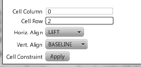

***图 2-8.** 单元格约束*

图 2-9 描绘了目标网格窗格，其中网格线已打开，并且“年龄”标签在单元格列 0 和单元格行 2 处水平左对齐。

***图 2-9.** 目标网格窗格*

### 2-5. 使用 CSS 增强界面

#### 问题

你想要改变 GUI 界面的外观与风格。

#### 解决方案

使用 JavaFX 的 CSS 样式应用于图形节点。以下代码演示了如何在图形节点上使用 CSS 样式。该代码创建了四个主题：Caspian、Control Style 1、Control Style 2 和 Sky。每个主题都使用 CSS 定义，并影响对话框的外观与风格。在代码之后，你可以看到对话框的两种不同呈现效果：

`package javafx2introbyexample.chapter2.recipe2_05;`

`import javafx.application.Application;`
`import javafx.collections.FXCollections;`
`import javafx.collections.ObservableList;`
`import javafx.event.ActionEvent;`
`import javafx.event.EventHandler;`
`import javafx.scene.Group;`
`import javafx.scene.Scene;`
`import javafx.scene.control.Menu;`
`import javafx.scene.control.MenuBar;`
`import javafx.scene.control.MenuItem;`
`import javafx.scene.control.SplitPane;`
`import javafx.scene.layout.GridPane;`
`import javafx.scene.layout.HBox;`
`import javafx.scene.layout.VBox;`
`import javafx.scene.paint.Color;`
`import javafx.stage.Stage;`

`/**`
` * 使用 CSS 增强界面`
` * @author cdea`
` */`
`public class EnhancingWithCss extends Application {`
`    /**`
`     * @param args the command line arguments`
`     */`
`    public static void main(String[] args) {`
`        Application.launch(args);`
`    }`

`    @Override`
`    public void start(Stage primaryStage) {`

`            primaryStage.setTitle("第 2-5 章 使用 CSS 增强界面");`
`            Group root = new Group();`
`            final Scene scene = new Scene(root, 640, 480, Color.BLACK);`

`            MenuBar menuBar = new MenuBar();`
`            Menu menu = new Menu("外观与风格");`

`            // 默认的 caspian 外观与风格`
`            ObservableList<String> caspian = FXCollections.observableArrayList();`
`            caspian.addAll(scene.getStylesheets());`
`            MenuItem caspianLnf = new MenuItem("Caspian");`
`            caspianLnf.setOnAction(skinForm(caspian, scene));`
`            menu.getItems().add(caspianLnf);`

`            menu.getItems().add(createMenuItem("Control Style 1", "controlStyle9781430242574.css",`
`scene));`
`            menu.getItems().add(createMenuItem("Control Style 2", "controlStyle9781430242574.css",`
`scene));`
`            menu.getItems().add(createMenuItem("Sky", "sky.css", scene));`

`menuBar.getMenus().add(menu);`
`            // 拉伸菜单`
`menuBar.prefWidthProperty().bind(primaryStage.widthProperty());`

`            // 左右分割面板`
`            SplitPane splitPane = new SplitPane();`
`            splitPane.prefWidthProperty().bind(scene.widthProperty());`
`            splitPane.prefHeightProperty().bind(scene.heightProperty());`

`            // 右侧表单`
`            GridPane rightGridPane = new MyForm();`

`            GridPane leftGridPane = new GridPaneControlPanel(rightGridPane);`
`            VBox leftArea = new VBox(10);`
`            leftArea.getChildren().add(leftGridPane);`

`            HBox hbox = new HBox();`
`            hbox.getChildren().add(splitPane);`
`            VBox vbox = new VBox();`
`            vbox.getChildren().add(menuBar);`
`            vbox.getChildren().add(hbox);`
`            root.getChildren().add(vbox);`
`            splitPane.getItems().addAll(leftArea, rightGridPane);`

`            primaryStage.setScene(scene);`

`            primaryStage.show();`

`    }`

`    protected final MenuItem createMenuItem(String label, String css, final Scene scene){`
`        MenuItem menuItem = new MenuItem(label);`
`        ObservableList<String> cssStyle = loadSkin(css);`
`        menuItem.setOnAction(skinForm(cssStyle, scene));`
`        return menuItem;`
`    }`

`    protected final ObservableList<String> loadSkin(String cssFileName) {`
`        ObservableList<String> cssStyle = FXCollections.observableArrayList();`
`        cssStyle.addAll(getClass().getResource(cssFileName).toExternalForm());`
`        return cssStyle;`
`    }`

`    protected final EventHandler<ActionEvent> skinForm(final ObservableList<String> cssStyle, final Scene scene) {`
`        return new EventHandler<ActionEvent>(){`
`            public void handle(ActionEvent event) {`
`                scene.getStylesheets().clear();`
`                scene.getStylesheets().addAll(cssStyle);   `
`            }`
`        };`
`    }`

`}`

图 2-10 展示了标准的 JavaFX Caspian 外观与风格（主题）。

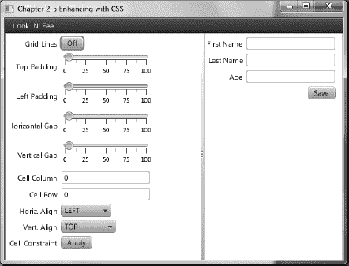

***图 2-10.** Caspian 外观与风格*

图 2-11 展示了 Sky 外观与风格（主题）。

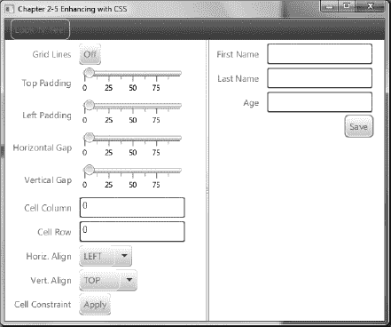

***图 2-11.** Sky 外观与风格*

#### 工作原理

JavaFX 能够像浏览器将 CSS 样式应用于 HTML 文档对象模型（DOM）中的元素一样，将 CSS 样式应用于场景图及其节点。在本教程中，你将使用 JavaFX 样式属性为用户界面进行皮肤定制。我主要使用本教程的 UI 来应用各种外观（Look ‘n’ Feel）。为了展示可用的皮肤，提供了一个菜单选择，允许用户选择要应用于 UI 的外观。

在讨论 CSS 样式属性之前，我想先向你展示如何加载要应用于 JavaFX 应用程序的 CSS 样式。首先，你需要创建菜单项，以便用户可以选择偏好的外观。创建菜单项时，你将创建一个便捷方法来构建一个菜单项，该方法会加载指定的 CSS 文件，并设置一个 `EventHandler` 动作，将选定的 CSS 样式应用于当前 UI。在添加 Caspian 主题作为菜单项时，你会注意到无需加载任何资源，因为它是 JavaFX 当前的外观。如下所示，是添加一个包含可应用于当前 UI 的 Caspian 外观 CSS 样式的菜单项：

`MenuItem caspianLnf = new MenuItem("Caspian");`
`caspianLnf.setOnAction(skinForm(caspian, scene));`

如下所示，是添加一个包含可应用于当前 UI 的 Sky 外观 CSS 样式的菜单项：

`MenuBar menuBar = new MenuBar();`
`Menu menu = new Menu("Look 'N' Feel");`
`menu.getItems().add(createMenuItem("Sky", "sky.css", scene));`

调用 `createMenuItem()` 方法时，还会调用另一个名为 `loadSkin()` 的便捷方法来加载 CSS 文件。它还会通过调用 `skinForm()` 方法，为菜单项的 `onAction` 属性设置一个合适的 `EventHandler`。回顾一下，`loadSkin` 负责加载 CSS 文件，而 `skinForm()` 方法负责将皮肤应用于 UI 应用程序。如下所示，是构建菜单项并将 CSS 样式应用于 UI 应用程序的便捷方法：

`    protected final MenuItem createMenuItem(String label, String css, final Scene scene){`
`        MenuItem menuItem = new MenuItem(label);`
`        ObservableList<String> cssStyle = loadSkin(css);`
`        menuItem.setOnAction(skinForm(cssStyle, scene));`
`        return menuItem;`
`    }`

`    protected final ObservableList<String> loadSkin(String cssFileName) {`
`        ObservableList<String> cssStyle = FXCollections.observableArrayList();`
`        cssStyle.addAll(getClass().getResource(cssFileName).toExternalForm());`
`        return cssStyle;`
`    }`

`    protected final EventHandler<ActionEvent> skinForm(final ObservableList<String> cssStyle,`
`final Scene scene) {`
`        return new EventHandler<ActionEvent>(){`
`            public void handle(ActionEvent event) {`
`                scene.getStylesheets().clear();`
`                scene.getStylesheets().addAll(cssStyle);   `
`            }`
`        };`
`    }`

 **注意** 要运行本教程示例，请确保 CSS 文件位于编译后的类目录中。当资源文件与加载它们的编译类文件位于同一目录（包）中时，可以轻松加载。CSS 文件与此代码示例文件位于同一位置。在 NetBeans 中，你可以选择“清理并构建项目”，或者将文件复制到你的类构建目录中。

现在，你已经知道如何加载 CSS 样式，接下来让我们讨论 JavaFX CSS 选择器和样式属性。与 CSS 样式表类似，场景图中的 `Node` 对象也有关联的选择器或样式类。所有场景图节点都有一个名为 `setStyle()` 的方法，用于应用可能改变节点背景颜色、边框、描边等的样式属性。由于所有图节点都继承自 `Node` 类，派生类将能够继承相同的样式属性。了解节点类型的继承层次结构非常重要，因为节点类型将决定你可以影响的样式属性类型。例如，Rectangle 继承自 Shape，而 Shape 又继承自 Node。这种继承不包括 `-fx-border-style`，它是继承自 `Region` 的节点的一部分。根据节点类型的不同，你可以设置的样式会受到限制。要查看所有样式选择器的完整列表，请参考 JavaFX CSS 参考指南：[`http://download.oracle.com/docs/cd/E17802_01/javafx/javafx/1.3/docs/api/javafx.scene/doc-files/cssref.html`](http://download.oracle.com/docs/cd/E17802_01/javafx/javafx/1.3/docs/api/javafx.scene/doc-files/cssref.html)。

所有 JavaFX 样式属性都将以 `-fx-` 为前缀。例如，所有 `Node` 都有一个样式属性来影响其不透明度，使用的属性是 `-fx-opacity`。以下是用于设置 JavaFX `javafx.scene.control.Label` 和 `javafx.scene.control.Button` 样式的选择器：

`.label {`
`    -fx-text-fill: rgba(17, 145, 213);`
`    -fx-border-color: rgba(255, 255, 255, .80);`
`    -fx-border-radius: 8;`
`    -fx-padding: 6 6 6 6;`
`    -fx-font: bold italic 20pt "LucidaBrightDemiBold";`

`}`
`.button{`
`    -fx-text-fill: rgba(17, 145, 213);`
`    -fx-border-color: rgba(255, 255, 255, .80);`
`    -fx-border-radius: 8;`
`    -fx-padding: 6 6 6 6;`
`    -fx-font: bold italic 20pt "LucidaBrightDemiBold";`

`}`

## 第 3 章

## JavaFX 中的媒体

JavaFX 提供了一个功能丰富的媒体 API，能够播放音频和视频。Media API 允许开发人员将音频和视频集成到他们的富互联网应用程序（RIA）中。Media API 的主要优势之一在于，通过 Web 分发媒体内容时具有跨平台能力。由于需要播放多媒体内容的设备种类繁多（平板电脑、音乐播放器、电视等），跨平台 API 的需求至关重要。

想象一下不远的未来，你的电视或墙壁能够以你从未梦想过的方式与你互动。例如，在观看电影时，你可以选择电影中使用的物品或服装并立即购买，而这一切都舒适地在家中完成。基于这样的未来愿景，开发人员致力于增强其媒体应用程序的交互特性。

在本章中，你将学习如何以交互方式播放音频和视频。请就座，观看 JavaFX 的第三幕，音频和视频将成为舞台的中心（如图 3-1 所示）。

***图 3-1.** 音频与视频*

### 3-1. 播放音频

#### 问题

你想听音乐，并通过图形可视化获得娱乐体验。

#### 解决方案

通过使用以下类来创建一个 MP3 播放器：

> *   `javafx.scene.media.Media`
> *   `javafx.scene.media.MediaPlayer`
> *   `javafx.scene.media.AudioSpectrumListener`

以下源代码是一个简单 MP3 播放器的实现：

`package javafx2introbyexample.chapter3.recipe3_01;`

`import java.io.File;`
`import java.util.Random;`
`import javafx.application.*;`
`import javafx.event.EventHandler;`
`import javafx.geometry.Point2D;`
`import javafx.scene.*;`
`import javafx.scene.input.*;`
`import javafx.scene.media.*;`
`import javafx.scene.paint.Color;`
`import javafx.scene.shape.*;`
`import javafx.scene.text.Text;`
`import javafx.stage.*;`

`/**`
` * 播放音频`
` * @author cdea`
` */`
`public class PlayingAudio extends Application {`
`    private MediaPlayer mediaPlayer;`
`    private Point2D anchorPt;`
`    private Point2D previousLocation;`

`    /**`
`     * @param args 命令行参数`
`     */`
`    public static void main(String[] args) {`
`        Application.launch(args);`
`    }`

`    @Override`
`    public void start(final Stage primaryStage) {`
`        primaryStage.setTitle("第 3 章-1 播放音频");`
`        primaryStage.centerOnScreen();`
`        primaryStage.initStyle(StageStyle.TRANSPARENT);`

`        Group root = new Group();`
`        Scene scene = new Scene(root, 551, 270, Color.rgb(0, 0, 0, 0));`
`        // 应用程序区域`
`        Rectangle applicationArea = RectangleBuilder.create()`
`                .arcWidth(20)`
`                .arcHeight(20)`
`                .fill(Color.rgb(0, 0, 0, .80))`
`                .x(0)`
`                .y(0)`
`                .strokeWidth(2)`
`                .stroke(Color.rgb(255, 255, 255, .70))`
`                .build();`
`        root.getChildren().add(applicationArea);`
`        applicationArea.widthProperty().bind(scene.widthProperty());`
`        applicationArea.heightProperty().bind(scene.heightProperty());`

`        final Group phaseNodes = new Group();        `
`        root.getChildren().add(phaseNodes);`

`        // 设置初始锚点`
`        scene.setOnMousePressed(new EventHandler<MouseEvent>() {`
`            public void handle(MouseEvent event){`
`                anchorPt = new Point2D(event.getScreenX(), event.getScreenY());`
`            }`
`        });`

`        // 拖拽整个舞台`
`        scene.setOnMouseDragged(new EventHandler<MouseEvent>() {`
`            public void handle(MouseEvent event){`
`                if (anchorPt != null && previousLocation != null) {`
`                    primaryStage.setX(previousLocation.getX() + event.getScreenX() -`
`anchorPt.getX());`
`                    primaryStage.setY(previousLocation.getY() + event.getScreenY() -`
`anchorPt.getY());`
`                }`
`            }`
`        });`

`        // 设置当前位置`
`        scene.setOnMouseReleased(new EventHandler<MouseEvent>() {`
`            public void handle(MouseEvent event){`
`                previousLocation = new Point2D(primaryStage.getX(), primaryStage.getY());`
`            }`
`        });`

`        // 在表面上拖拽`
`        scene.setOnDragOver(new EventHandler<DragEvent>() {`
`            @Override`
`            public void handle(DragEvent event) {`
`                Dragboard db = event.getDragboard();`
`                if (db.hasFiles()) {`
`                    event.acceptTransferModes(TransferMode.COPY);`
`                } else {`
`                    event.consume();`
`                }`
`            }`
`        });`

`        // 在表面上释放`
`        scene.setOnDragDropped(new EventHandler<DragEvent>() {`

`            @Override`
`            public void handle(DragEvent event) {`
`                Dragboard db = event.getDragboard();`
`                boolean success = false;`
`                if (db.hasFiles()) {`
`                    success = true;`
`                    String filePath = null;`
`                    for (File file:db.getFiles()) {`
`                        filePath = file.getAbsolutePath();`
`                        System.out.println(filePath);`
`                    }`
`                    // 播放文件`
`                    Media media = new Media(new File(filePath).toURI().toString());`

`                    if (mediaPlayer != null) {`
`                        mediaPlayer.stop();`
`                    }`

`                    mediaPlayer = MediaPlayerBuilder.create()`
`                            .media(media)`
`                            .audioSpectrumListener(new AudioSpectrumListener() {`
`                        @Override`
`                        public void spectrumDataUpdate(double timestamp, double duration,`
`float[] magnitudes, float[] phases) {`
`                            phaseNodes.getChildren().clear();`
`                            int i = 0;`
`                            int x = 10;`
`                            int y = 150;`
`                            final Random rand = new Random(System.currentTimeMillis());`
`                            for(float phase:phases) {`
`                                int red = rand.nextInt(255);`
`                                int green = rand.nextInt(255);`
`                                int blue = rand.nextInt(255);`

`                                Circle circle = new Circle(10);`
`                                circle.setCenterX(x + i);`
`                                circle.setCenterY(y + (phase * 100));`
`                                circle.setFill(Color.rgb(red, green, blue, .70));`
`                                phaseNodes.getChildren().add(circle);`
`                                i+=5;`
`                            }`
`                        }`
`                    })`
`                    .build();`

`                    mediaPlayer.setOnReady(new Runnable() {`
`                        @Override`
`                        public void run() {`
`                            mediaPlayer.play();`
`                        }`
`                    });`
`                }`

`                event.setDropCompleted(success);`
`                event.consume();`
`            }`
`        }); // setOnDragDropped 结束`

`        // 创建滑动控件`
`        final Group buttonGroup = new Group();`

`        // 圆角矩形`
`        Rectangle buttonArea = RectangleBuilder.create()`
`                .arcWidth(15)`
`                .arcHeight(20)`
`                .fill(new Color(0, 0, 0, .55))`
`                .x(0)`
`                .y(0)`
`                .width(60)`
`                .height(30)`
`                .stroke(Color.rgb(255, 255, 255, .70))`
`                .build();`

`        buttonGroup.getChildren().add(buttonArea);`
`        // 停止音频控件`
`        Node stopButton = RectangleBuilder.create()`
`                .arcWidth(5)`
`                .arcHeight(5)`
`                .fill(Color.rgb(255, 255, 255, .80))`
`                .x(0)`
`                .y(0)`
`                .width(10)`
`                .height(10)`
`                .translateX(15)`
`                .translateY(10)`
`                .stroke(Color.rgb(255, 255, 255, .70))`
`                .build();`

`        stopButton.setOnMousePressed(new EventHandler<MouseEvent>() {`
`            public void handle(MouseEvent me) {`
`               if (mediaPlayer!= null) {`
`                mediaPlayer.stop();`
`               }`
`            }`
`        });`
`        buttonGroup.getChildren().add(stopButton);`

`        // 播放控制`
`        final Node playButton = ArcBuilder.create()`
`                .type(ArcType.ROUND)`
`                .centerX(12)`
`                .centerY(16)`
`                .radiusX(15)`
`                .radiusY(15)`
`                .startAngle(180-30)`
`                .length(60)`
`                .fill(new Color(1,1,1, .90))`
`                .translateX(40)`
`                .build();`
`        playButton.setOnMousePressed(new EventHandler<MouseEvent>() {`
`            public void handle(MouseEvent me) {`
`                mediaPlayer.play();`
`            }`
`        });`

`        // 暂停控制`
`        final Group pause = new Group();`
`        final Node pauseButton = CircleBuilder.create()`
`                .centerX(12)`
`                .centerY(16)`
`                .radius(10)`
`                .stroke(new Color(1,1,1, .90))`
`                .translateX(30)`
`                .build();`
`        final Node firstLine = LineBuilder.create()`
`                .startX(6)`
`                .startY(16 - 10)`
`                .endX(6)`
`                .endY(16 - 2)`
`                .strokeWidth(3)`
`                .translateX(34)`
`                .translateY(6)`
`                .stroke(new Color(1,1,1, .90))`
`                .build();`

`        final Node secondLine = LineBuilder.create()`
`                .startX(6)`
`                .startY(16 - 10)`
`                .endX(6)`
`                .endY(16 - 2)`
`                .strokeWidth(3)`
`                .translateX(38)`
`                .translateY(6)`
`                .stroke(new Color(1,1,1, .90))`
`                .build();`
`        pause.getChildren().addAll(pauseButton, firstLine, secondLine);`

`        pause.setOnMousePressed(new EventHandler<MouseEvent>() {`
`            public void handle(MouseEvent me) {`
`                if (mediaPlayer!=null) {`
`                    buttonGroup.getChildren().remove(pause);`
`                    buttonGroup.getChildren().add(playButton);`
`                    mediaPlayer.pause();`
`                }`
`            }`
`        });`

`        playButton.setOnMousePressed(new EventHandler<MouseEvent>() {`
`            public void handle(MouseEvent me) {  `
`                if (mediaPlayer != null) {`
`                    buttonGroup.getChildren().remove(playButton);`
`                    buttonGroup.getChildren().add(pause);`
`                    mediaPlayer.play();                    `
`                }`
`            }`
`        });`

`        buttonGroup.getChildren().add(pause);`
`        // 当场景大小改变时移动按钮组`

`buttonGroup.translateXProperty().bind(scene.widthProperty().subtract(buttonArea.getWidth() +`
`6));`

`buttonGroup.translateYProperty().bind(scene.heightProperty().subtract(buttonArea.getHeight() +`
`6));`
`        root.getChildren().add(buttonGroup);`

`        // 关闭按钮`
`        final Group closeApp = new Group();`
`        Node closeButton = CircleBuilder.create()`
`                .centerX(5)`
`                .centerY(0)`
`                .radius(7)`
`                .fill(Color.rgb(255, 255, 255, .80))`
`                .build();`
`        Node closeXmark = new Text(2, 4, "X");`
`        closeApp.translateXProperty().bind(scene.widthProperty().subtract(15));`
`        closeApp.setTranslateY(10);`
`        closeApp.getChildren().addAll(closeButton, closeXmark);`
`        closeApp.setOnMouseClicked(new EventHandler<MouseEvent>() {`
`            @Override`
`            public void handle(MouseEvent event) {`
`                Platform.exit();`
`            }`
`        });`

`        root.getChildren().add(closeApp);`

`        primaryStage.setScene(scene);`
`        primaryStage.show();`
`        previousLocation = new Point2D(primaryStage.getX(), primaryStage.getY());`

`    }`
`}`

图 3-2 展示了一个带有可视化效果的 JavaFX MP3 播放器。

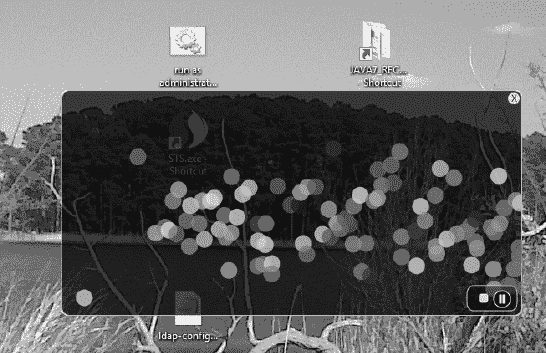

***图 3-2.** JavaFX MP3 播放器*

#### 工作原理

在开始之前，我们先讨论一下如何操作我们的 MP3 播放器。用户可以将音频文件拖放到应用程序区域中，以便随后播放。应用程序右下角有用于停止、暂停和恢复音频媒体播放的按钮。（按钮控件如图 3-2 所示。）在音乐播放过程中，用户还会注意到随机颜色的球体随着音乐跳动。当用户听完音乐后，可以点击右上角的白色圆角关闭按钮退出应用程序。

这与技巧 2-1 类似，您在其中学习了如何使用拖放桌面隐喻将文件加载到 JavaFX 应用程序中。不过，这里用户使用的是音频文件，而不是图像文件。要加载音频文件，JavaFX 目前支持以下文件格式：`.mp3`、`.wav` 和 `.aiff`。

遵循相同的视觉风格，您将使用与技巧 12-1 相同的样式。在本技巧中，我修改了按钮控件，使其看起来像按钮，类似于许多媒体播放器应用程序。当按下暂停按钮时，它将暂停音频媒体的播放，并切换到播放按钮控件，从而允许用户恢复播放。作为额外奖励，MP3 播放器将显示为一个不规则形状、半透明且无边框的窗口，并且可以使用鼠标在桌面上拖动。现在您已经知道如何操作音乐播放器，让我们来浏览一下代码。

首先，您将创建实例变量，这些变量将在应用程序的整个生命周期中维护状态信息。表 3-1 描述了我们的音乐播放器应用程序中使用的所有实例变量。第一个变量是对媒体播放器（`MediaPlayer`）对象的引用，该对象将与包含音频文件的 `Media` 对象一起创建。接下来，您将创建一个 `anchorPt` 变量，用于在用户开始拖动窗口时保存鼠标按下时的起始坐标。在鼠标拖动操作期间计算应用程序窗口的左上角边界时，`previousLocation` 变量将包含上一个窗口的屏幕 X 和 Y 坐标。

表 3-1 列出了 MP3 播放器应用程序的实例变量：

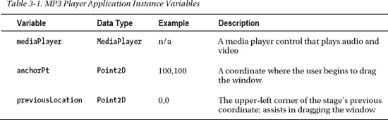

在之前关于 GUI 的章节中，您看到 GUI 应用程序通常包含一个标题栏和围绕 `Scene` 的窗口边框。在这里，我想通过向您展示如何创建不规则形状的半透明窗口来提高一点标准，从而使事情看起来更时髦或更现代。当您开始创建媒体播放器时，您会注意到在 `start()` 方法中，我们通过使用 `StageStyle.TRANSPARENT` 初始化样式来准备 `Stage` 对象。将样式初始化为 `StageStyle.TRANSPARENT` 后，窗口将无装饰，整个窗口区域的不透明度设置为零（不可见）。以下代码展示了如何创建一个没有标题栏或窗口边框的透明窗口：

`primaryStage.initStyle(StageStyle.TRANSPARENT);`

有了这个不可见的舞台，您将创建一个圆角矩形区域，作为应用程序的表面或主要内容区域。接下来，您会注意到矩形的宽度和高度绑定到了场景对象，以防窗口大小被调整。由于窗口不会被调整大小，因此绑定不是必需的（但在技巧 3-2 中，当您有机会将视频屏幕放大到全屏模式时，将需要它）。

在创建了一个黑色、半透明、圆角的矩形区域（`applicationArea`）之后，您将创建一个简单的 `Group` 对象，用于容纳所有随机颜色的 `Circle` 节点，这些节点将在音频播放时展示图形可视化效果。稍后，您将看到如何使用 `AudioSpectrumListener` 根据声音信息更新 `phaseNodes`（`Group`）变量。

接下来，您将向 `Scene` 对象添加 `EventHandler<MouseEvent>` 实例，以监控用户在屏幕上拖动窗口时的鼠标事件。此场景中的第一个事件是鼠标按下，它将光标的当前 (X, Y) 坐标保存到变量 `anchorPt` 中。以下代码向 `Scene` 的鼠标按下属性添加了一个 `EventHandler`：

`        // 起始锚点`
`        scene.setOnMousePressed(new EventHandler<MouseEvent>() {`
`            public void handle(MouseEvent event){`
`                anchorPt = new Point2D(event.getScreenX(), event.getScreenY());`
`            }`
`        });`

实现鼠标按下事件处理器后，您可以创建一个 `EventHandler` 来处理 `Scene` 的鼠标拖动属性。鼠标拖动事件处理器将根据上一个窗口的位置（左上角）以及 `anchorPt` 变量，动态更新和定位应用程序窗口（`Stage`）。此处显示的是负责 `Scene` 对象上鼠标拖动事件的事件处理器：

`        // 拖动整个舞台`
`        scene.setOnMouseDragged(new EventHandler<MouseEvent>() {`
`            public void handle(MouseEvent event){`
`                if (anchorPt != null && previousLocation != null) {`
`                    primaryStage.setX(previousLocation.getX() + event.getScreenX() - anchorPt.getX());`
`                    primaryStage.setY(previousLocation.getY() + event.getScreenY() - anchorPt.getY());                    `
`                }`
`            }`
`        });`

您还需要处理鼠标释放事件。一旦鼠标被释放，事件处理器将更新 `previousLocation` 变量，以便后续的鼠标拖动事件能够在屏幕上移动应用程序窗口。以下代码片段更新了 `previousLocation` 变量：

`        // 设置当前位置`
`        scene.setOnMouseReleased(new EventHandler<MouseEvent>() {`
`            public void handle(MouseEvent event){`
`                previousLocation = new Point2D(primaryStage.getX(), primaryStage.getY());`
`            }`
`        });`

接下来，您将实现拖放场景，以从文件系统（文件管理器）加载音频文件。处理拖放场景时，它与技巧 2-1 类似，您在其中创建了一个 `EventHandler` 来处理 `DragEvent`。这里我们将从主机文件系统加载音频文件，而不是图像文件。为简洁起见，我将仅提及拖放事件处理器的代码行。一旦音频文件可用，您将通过将文件作为 `URI` 传入来创建一个 `Media` 对象。以下代码片段展示了如何创建一个 `Media` 对象：

`Media media = new Media(new File(filePath).toURI().toString());`

创建 `Media` 对象后，您需要创建一个 `MediaPlayer` 实例来播放声音文件。`Media` 和 `MediaPlayer` 对象都是不可变的，这就是为什么每次用户将文件拖入应用程序时都会创建它们的新实例。接下来，您将检查实例变量 `mediaPlayer` 中是否有先前的实例，以确保在创建新的 `MediaPlayer` 实例之前它已停止。以下代码检查是否有先前的媒体播放器需要停止：

`  if (mediaPlayer != null) {`
`    mediaPlayer.stop();`
`  }`

那么，这就是我们创建 `MediaPlayer` 实例的地方。为了简化编码，您将使用 `MediaPlayer` 的构建器类 `MediaPlayerBuilder`。`MediaPlayer` 对象负责控制媒体对象的播放。请注意，`MediaPlayer` 在播放、暂停和停止媒体方面对声音或视频媒体的处理方式相同。使用 `MediaPlayerBuilder` 类创建媒体播放器时，您需要指定 `media` 和 `audioSpectrumListener` 属性方法。将 autoPlay 属性设置为 true 将在加载音频媒体后立即播放它。需要在 `MediaPlayer` 实例上指定的最后一件事是 `AudioSpectrumListener`。那么，这种监听器到底是什么呢？根据 Javadocs，它说它是一个接收音频频谱周期性更新的观察者。用通俗的话说，它就是音频媒体的声音数据，例如音量和节奏等。要创建 `AudioSpectrumListener` 的实例，您将创建一个内部类，重写 `spectrumDataUpdate()` 方法。表 3-2 列出了音频频谱监听器方法的所有入参。有关更多详细信息，请参阅 [`http://download.oracle.com/javafx/2.0/api/javafx/scene/media/AudioSpectrumListener.html`](http://download.oracle.com/javafx/2.0/api/javafx/scene/media/AudioSpectrumListener.html) 上的 Javadocs。

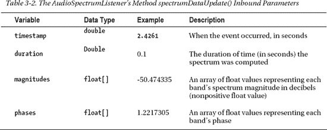

在这里，您将创建随机颜色的圆形节点，根据变量 phases（浮点数数组）将它们定位并放置在场景上。要绘制每个彩色圆形，您将圆形的中心 X 坐标递增 5 像素，并将圆形的中心 Y 坐标加上每个相位值乘以 100。此处显示的是绘制每个随机颜色圆形的代码片段：

`circle.setCenterX(x + i);`
`        circle.setCenterY(y + (phase * 100));`
`        ... // 设置圆形`
`i+=5;`

以下是 `AudioSpectrumListener` 的内部类实现：

`new AudioSpectrumListener() {`
`            @Override`
`            public void spectrumDataUpdate(double timestamp, double duration, float[]`
`magnitudes, float[] phases) {`

`               phaseNodes.getChildren().clear();`
`               int i = 0;`
`               int x = 10;`
`               int y = 150;`
`               final Random rand = new Random(System.currentTimeMillis());`
`               for(float phase:phases) {`
`                 int red = rand.nextInt(255);`
`                 int green = rand.nextInt(255);`
`                 int blue = rand.nextInt(255);`

`                 Circle circle = new Circle(10);`
`                 circle.setCenterX(x + i);`
`                 circle.setCenterY(y + (phase * 100));`
`                 circle.setFill(Color.rgb(red, green, blue, .70));`
`                 phaseNodes.getChildren().add(circle);`
`                 i+=5;`
`              }`

`           }`
`         };`

创建媒体播放器后，您将创建一个 `java.lang.Runnable`，将其设置到 `onReady` 属性中，以便在媒体处于就绪状态时调用。一旦就绪事件被触发，`run()` 方法将调用媒体播放器对象的 `play()` 方法来开始播放音频。完成拖放序列后，我们通过调用事件的 `setDropCompleted()` 方法并传入值 true 来适当地通知拖放系统。以下代码片段实现了一个 `Runnable`，以便在媒体播放器进入就绪状态后立即启动它：

`   mediaPlayer.setOnReady(new Runnable() {`
`      @Override`
`      public void run() {`
`         mediaPlayer.play();`
`      }`
`   });`

最后，您将使用 JavaFX 形状创建按钮，以表示停止、播放、暂停和关闭按钮。创建形状或自定义节点时，您可以向节点添加事件处理器以响应鼠标点击。尽管在 JavaFX 中有构建自定义控件的高级方法，但我选择使用简单的矩形、弧线、圆形和线条来构建我自己的按钮图标。要了解创建自定义控件的更高级方法，请参阅 `Skinnable` API 或技巧 2-5 的 Javadocs。要附加鼠标按下的事件处理器，只需调用 `setOnMousePress()` 方法，并传入一个 `EventHandler<MouseEvent>` 实例。以下代码演示了向 `stopButton` 节点添加一个 `EventHandler` 以响应鼠标按下：

`        stopButton.setOnMousePressed(new EventHandler<MouseEvent>() {`
`            public void handle(MouseEvent me) {`
`               if (mediaPlayer!= null) {`
`                 mediaPlayer.stop();                   `
`               }`
`            }`
`        });`

由于所有按钮都使用相同的前述代码片段，我将仅列出每个按钮将在媒体播放器上执行的方法调用。最后一个按钮“关闭”与媒体播放器无关，但它是退出 MP3 播放器应用程序的方式。以下操作负责停止、暂停、播放和退出 MP3 播放器应用程序：

`停止 - mediaPlayer.stop();  `
`暂停 - mediaPlayer.pause();`
`播放 - mediaPlayer.play();`
`关闭 - Platform.exit();`

### 3-2. 播放视频

#### 问题

您希望查看一个视频文件，并带有播放、暂停、停止和进度条等控制功能。

#### 解决方案

通过使用以下类来创建一个视频媒体播放器：

> *   `javafx.scene.media.Media`
> *   `javafx.scene.media.MediaPlayer`
> *   `javafx.scene.media.MediaView`

以下代码是一个 JavaFX 基础视频播放器的实现：

`public void start(final Stage primaryStage) {`
`    primaryStage.setTitle("第 3-2 章 播放视频");`
`    ... 设置舞台`

`    // 带轻微透明效果的圆角矩形`
`    Node applicationArea = createBackground(scene);`
`    root.getChildren().add(applicationArea);`

`    // 允许用户在桌面上拖动窗口`
`    attachMouseEvents(scene, primaryStage);`

`    // 允许用户查看视频播放进度`
`    progressSlider = createSlider(scene);`
`    root.getChildren().add(progressSlider);`

`    // 在表面拖放`
`    scene.setOnDragOver(… 拖放代码 );`

`    // 随视频播放更新滑块（稍后移除）`
`    progressListener = new ChangeListener<Duration>() {`
`        public void changed(ObservableValue<? extends Duration> observable, Duration`
`oldValue, Duration newValue) {`
`            progressSlider.setValue(newValue.toSeconds());`
`        }`
`    };`

`    // 在表面放下`
`    scene.setOnDragDropped(new EventHandler<DragEvent>() {`

`        @Override`
`        public void handle(DragEvent event) {`
`            Dragboard db = event.getDragboard();`
`            boolean success = false;`
`            URI resourceUrlOrFile = null;`

`            … // 检测并获取媒体文件`

`            // 加载媒体`
`            Media media = new Media(resourceUrlOrFile.toString());`

`            // 停止之前的媒体播放器并清理`
`            if (mediaPlayer != null) {`
`                mediaPlayer.stop();`
`                mediaPlayer.currentTimeProperty().removeListener(progressListener);`
`                mediaPlayer.setOnPaused(null);`
`                mediaPlayer.setOnPlaying(null);`
`                mediaPlayer.setOnReady(null);`
`            }`

`            // 创建新的媒体播放器`
`            mediaPlayer = MediaPlayerBuilder.create()`
`                    .media(media)`
`                    .build();`

`            // 在媒体播放时移动滑块以显示进度`
`            mediaPlayer.currentTimeProperty().addListener(progressListener);`

`            // 当状态就绪时播放视频`
`            mediaPlayer.setOnReady(new Runnable() {`
`                @Override`
`                public void run() {`
`                   progressSlider.setValue(1);`

`progressSlider.setMax(mediaPlayer.getMedia().getDuration().toMillis()/1000);`
`                   mediaPlayer.play();`
`                }`
`            });`

`            // 延迟初始化媒体查看器`
`            if (mediaView == null) {`
`                mediaView = MediaViewBuilder.create()`
`                        .mediaPlayer(mediaPlayer)`
`                        .x(4)`
`                        .y(4)`
`                        .preserveRatio(true)`
`                        .opacity(.85)`
`                        .smooth(true)`
`                        .build();`

`mediaView.fitWidthProperty().bind(scene.widthProperty().subtract(220));`

`mediaView.fitHeightProperty().bind(scene.heightProperty().subtract(30));`

`                // 将媒体查看器设为场景中的第二个节点`
`                root.getChildren().add(1, mediaView);`
`            }`

`            // 有时会发生加载错误`
`            mediaView.setOnError(new EventHandler<MediaErrorEvent>() {`
`                public void handle(MediaErrorEvent event) {`
`                    event.getMediaError().printStackTrace();`
`                }`
`            });`

`            mediaView.setMediaPlayer(mediaPlayer);`

`            event.setDropCompleted(success);`
`            event.consume();`
`        }`
`    });`

`    // 容纳按钮的矩形区域`
`    final Group buttonArea = createButtonArea(scene);`

`    // 停止按钮将停止并回退媒体`
`    Node stopButton = createStopControl();`

`    // 播放按钮可恢复或开始播放媒体`
`    final Node playButton = createPlayControl();`

`    // 暂停媒体播放`
`    final Node pauseButton = createPauseControl();`

`    stopButton.setOnMousePressed(new EventHandler<MouseEvent>() {`
`        public void handle(MouseEvent me) {`
`            if (mediaPlayer!= null) {`
`                buttonArea.getChildren().removeAll(pauseButton, playButton);`
`                buttonArea.getChildren().add(playButton);`
`                mediaPlayer.stop();                  `
`            }`
`        }`
`    });`
`    // 暂停媒体，并将按钮切换为播放按钮`
`    pauseButton.setOnMousePressed(new EventHandler<MouseEvent>() {`
`        public void handle(MouseEvent me) {`
`            if (mediaPlayer!=null) {`
`                buttonArea.getChildren().removeAll(pauseButton, playButton);`
`                buttonArea.getChildren().add(playButton);`
`                mediaPlayer.pause();`
`                paused = true;`
`            }`
`        }`
`    });`

`    // 播放媒体，并将按钮切换为暂停按钮`
`    playButton.setOnMousePressed(new EventHandler<MouseEvent>() {`
`        public void handle(MouseEvent me) {  `
`            if (mediaPlayer != null) {`
`                buttonArea.getChildren().removeAll(pauseButton, playButton);`
`                buttonArea.getChildren().add(pauseButton);`
`                paused = false;`
`                mediaPlayer.play();                    `
`            }`
`        }`
`    });`

`    // 将停止按钮添加到按钮区域`
`    buttonArea.getChildren().add(stopButton);`

`    // 默认设置暂停按钮`
`    buttonArea.getChildren().add(pauseButton);`

`    // 添加按钮`
`    root.getChildren().add(buttonArea);`

`    // 创建关闭按钮`
`    Node closeButton= createCloseButton(scene);`
`    root.getChildren().add(closeButton);`

`    primaryStage.setOnShown(new EventHandler<WindowEvent>() {`
`        public void handle(WindowEvent we) {`
`            previousLocation = new Point2D(primaryStage.getX(), primaryStage.getY());`
`        }`
`    });`

`    primaryStage.setScene(scene);`
`    primaryStage.show();`

`}`

接下来是我们的 `attachMouseEvents()` 方法，它为 `Scene` 添加了一个 `EventHandler`，以提供让视频播放器进入全屏模式的功能。

private void attachMouseEvents(Scene scene, final Stage primaryStage) {

`        // 全屏切换`
`        scene.setOnMouseClicked(new EventHandler<MouseEvent>() {`
`            public void handle(MouseEvent event){`
`                if (event.getClickCount() == 2) {`
`                    primaryStage.setFullScreen(!primaryStage.isFullScreen());`
`                }`
`            }`
`        });`
`        ... // 其余的事件处理器`
`    }`

以下代码是一个创建滑块控件的方法，它带有一个 `ChangeListener`，使用户能够在视频中向前和向后搜索：

`    private Slider createSlider(Scene scene) {`
`        Slider slider = SliderBuilder.create()`
`                .min(0)`
`                .max(100)`
`                .value(1)`
`                .showTickLabels(true)`
`                .showTickMarks(true)`
`                .build();`

`        slider.valueProperty().addListener(new ChangeListener<Number>() {`
`            public void changed(ObservableValue<? extends Number> observable, Number oldValue,`
`Number newValue) {`
`                if (paused) {`
`                    long dur = newValue.intValue() * 1000;`
`                    mediaPlayer.seek(new Duration(dur));`
`                }`
`            }`
`        });`
`        slider.translateYProperty().bind(scene.heightProperty().subtract(30));`
`        return slider;`
`    }`

图 3-3 展示了一个带有滑块控件的 JavaFX 基本视频播放器。

***图 3-3.** JavaFX 基本视频播放器*

#### 工作原理

要创建视频播放器，你需要像食谱 3-1 那样构建应用程序，复用相同的应用功能，例如拖放文件、媒体按钮控件等。为清晰起见，我采用了之前的食谱，并将大部分 UI 代码移入便捷函数中，这样你就能专注于媒体 API，而不会在 UI 代码中迷失方向。本章其余食谱将在此基础上，为这个 JavaFX 基础媒体播放器添加简单功能。因此，后续食谱中的代码片段将很简短，仅包含每个新功能所需的必要代码。

在开始之前，我想谈谈媒体格式。在撰写本书时，JavaFX 2.0 支持一种名为 VP6 的跨平台视频格式，其文件扩展名为 `.flv`（代表流行的 Adobe Flash 视频格式）。用于创建 VP6 和 `.flv` 文件的实际编码器和解码器（编解码器）由一家名为 On2 的公司授权。2009 年，On2 被谷歌收购，用于构建开放且免费的 VP7 和 VP8，以推动 HTML5 的发展。我不想用这些复杂背景让你困惑，但随着媒体格式的流行或淘汰，很难预测事态将如何发展。由于 JavaFX 的目标是跨平台，使用网络上最流行的编解码器似乎是合乎逻辑的，但你可能需要获得许可才能将视频编码为 VP6 `.flv` 文件格式。因此，关键在于 JavaFX 目前只能播放以 VP6 编码的视频文件。（我尽量记住这是当前媒体格式的状况，所以请不要将任何挫败感归咎于 JavaFX SDK。）有关要使用的格式的更多详细信息，请参阅 Javadoc API。提醒一句：要警惕那些声称可以免费转换视频的网站。在撰写本文时，唯一能够合法地将视频编码为 VP6 的编码器是 Adobe 和 Wildform 的商业转换器（[`http://www.wildform.com`](http://www.wildform.com)）。

现在，既然你知道了可接受的文件格式，如果你没有编码软件，可能想知道如何获取这种类型的文件。如果你手头没有 `.flv` 文件，可以从我最喜欢的网站之一 Media College（[`http://www.mediacollege.com`](http://www.mediacollege.com)）获取。从摄影到电影，Media College 提供论坛、教程和资源，帮助你进入媒体世界。在那里，你将获得一个特定的媒体文件，用于本章剩余的食谱。要获取 `.flv` 文件，请导航至以下 URL：[`http://www.mediacollege.com/adobe/flash/video/tutorial/example-flv.html`](http://www.mediacollege.com/adobe/flash/video/tutorial/example-flv.html)。

接下来，找到指向我们 `.flv` 媒体文件（`20051210-w50s.flv`）的链接，标题为 `Windy 50s Mobility Scooter Race`。要下载包含文件的链接，请右键单击并选择“目标另存为”或“链接另存为”。将文件保存到本地文件系统后，你可以将文件拖入媒体播放器应用程序以开始演示。

 **注意** 在撰写本书时，JavaFX 媒体播放器 API 目前支持使用 `.flv` 容器的 VP6 视频格式。

与上一个食谱中创建的音频播放器一样，我们的 JavaFX 基础视频播放器具有相同的基本媒体控件，包括停止、暂停和播放。除了这些简单控件外，我们还添加了新功能，例如搜索和全屏模式。

播放视频时，你需要一个视图区域（`javafx.scene.media.MediaView`）来显示视频。你还需要创建一个滑块控件来监控视频进度，该控件位于图 3-3 所示应用程序的左下角。滑块控件允许用户在视频中前后搜索。搜索功能仅在视频暂停时有效。最后一个额外功能是通过双击应用程序窗口使视频全屏显示。要恢复窗口，请再次双击或按 Escape 键。

为了快速上手，让我们直接进入代码。在 `start()` 方法中设置舞台后，你将通过调用 `createBackground()` 方法（`applicationArea`）创建一个黑色半透明背景。接下来，你将调用 `attachMouseEvents()` 方法，将所有 `EventHandler` 连接到场景中，使用户能够在桌面上拖动应用程序窗口。另一个要附加到 `Scene` 的 `EventHandler` 将允许用户切换到全屏模式。要使窗口进入全屏模式，你将创建一个条件来检查应用程序窗口的双击事件。一旦执行双击，你将调用 `Stage` 的 `setFullScreen()` 方法，并传入与当前设置值相反的布尔值。以下是如何使窗口进入全屏模式：

`        // 全屏切换`
`        scene.setOnMouseClicked(new EventHandler<MouseEvent>() {`
`            public void handle(MouseEvent event){`
`                if (event.getClickCount() == 2) {`
`                    primaryStage.setFullScreen(!primaryStage.isFullScreen());`
`                }`
`            }`
`        });`

继续在 `start()` 方法中的步骤，你将通过调用便捷方法 `createSlider()` 创建一个滑块控件。`createSlider()` 方法将实例化一个 `Slider` 控件，并添加一个 `ChangeListener`，以便在视频播放时移动滑块。每当滑块的值发生变化时，都会调用 `ChangeListener` 的 `changed()` 方法。一旦调用 `changed()` 方法，你将有机会看到旧值和新值。以下代码创建了一个 `ChangeListener`，用于在视频播放时更新滑块：

`    // 在视频播放时更新滑块（稍后移除）`
`    progressListener = new ChangeListener<Duration>() {`
`        public void changed(ObservableValue<? extends Duration> observable, Duration oldValue, Duration newValue) {`
`            progressSlider.setValue(newValue.toSeconds());`
`        }`
`    };`

创建进度监听器（`progressListener`）后，你将在 `Scene` 上创建拖放 `EventHandler`。

目标是确定在用户移动滑块之前是否按下了暂停按钮。一旦确定了暂停标志，你将获取新值并将其转换为毫秒。`dur` 变量用于移动 `mediaPlayer`，以便在用户向左或向右滑动控件时搜索视频中的位置。每当滑块的值发生变化时，都会调用 `ChangeListener` 的 `changed()` 方法。以下代码负责根据用户移动滑块来移动视频中的搜索位置。

`slider.valueProperty().addListener(new ChangeListener<Number>() {`
`   public void changed(ObservableValue<? extends Number> observable, Number oldValue, Number`
`newValue) {`
`                if (paused) {`
`                    long dur = newValue.intValue() * 1000;`
`                    mediaPlayer.seek(new Duration(dur));`
`                }`
`            }`
`        });`

继续，你将实现一个拖放 `EventHandler`，以处理拖入应用程序窗口区域的 .flv 媒体文件。在这里，你首先检查是否存在之前的 `mediaPlayer`。如果存在，你将停止之前的 `mediaPlayer` 对象并进行一些清理：

`        // 停止之前的媒体播放器并清理`
`        if (mediaPlayer != null) {`
`           mediaPlayer.stop();`
`           mediaPlayer.currentTimeProperty().removeListener(progressListener);`
`           mediaPlayer.setOnPaused(null);`
`           mediaPlayer.setOnPlaying(null);`
`           mediaPlayer.setOnReady(null);`
`        }`

`        // 准备就绪时播放视频`
`        mediaPlayer.setOnReady(new Runnable() {`
`            @Override`
`            public void run() {`
`               progressSlider.setValue(1);`

`        progressSlider.setMax(mediaPlayer.getMedia().getDuration().toMillis()/1000);`
`           mediaPlayer.play();`
`        }`
`    }); // setOnReady()`

与音频播放器一样，我们创建一个 `Runnable` 实例，在媒体播放器处于就绪状态时运行。你还会注意到 `progressSlider` 控件被设置为使用以秒为单位的值。

一旦媒体播放器对象处于就绪状态，你将创建一个 `MediaView` 实例来显示媒体。以下是创建 `MediaView` 对象并将其放入场景图以显示视频内容的代码：

`            // 延迟初始化媒体查看器`
`            if (mediaView == null) {`
`                mediaView = MediaViewBuilder.create()`
`                        .mediaPlayer(mediaPlayer)`
`                        .x(4)`
`                        .y(4)`
`                        .preserveRatio(true)`
`                        .opacity(.85)`
`                        .build();`

`                mediaView.fitWidthProperty().bind(scene.widthProperty().subtract(220));`
`                mediaView.fitHeightProperty().bind(scene.heightProperty().subtract(30));`

`                        // 将媒体查看器设为场景中的第二个节点`
`                        root.getChildren().add(1, mediaView);`
`                    }`

`                    // 有时会发生加载错误`
`                    mediaView.setOnError(new EventHandler<MediaErrorEvent>() {`
`                        public void handle(MediaErrorEvent event) {`
`                            event.getMediaError().printStackTrace();`
`                        }`
`                    });`

`                    mediaView.setMediaPlayer(mediaPlayer);`
`                    event.setDropCompleted(success);`
`                    event.consume();`
`                }`
`            });`

呼！我们终于完成了 `Scene` 的拖放 `EventHandler`。接下来基本上是食谱 3-1 末尾类似的媒体按钮控件。唯一不同的是一个名为 `paused` 的 `boolean` 类型实例变量，用于指示视频是否已暂停。当此 `paused` 标志设置为 `true` 时，滑块控件可以在视频中向前或向后搜索；否则为 `false`。以下是控制 `mediaPlayer` 对象并相应设置 `paused` 标志的 `pauseButton` 和 `playButton`：

`// 暂停媒体并交换按钮为播放按钮`
`pauseButton.setOnMousePressed(new EventHandler<MouseEvent>() {`
`    public void handle(MouseEvent me) {`
`        if (mediaPlayer!=null) {`
`            buttonArea.getChildren().removeAll(pauseButton, playButton);`
`            buttonArea.getChildren().add(playButton);`
`            mediaPlayer.pause();`
`            paused = true;`
`        }`
`    }`
`});`

`// 播放媒体并交换按钮为暂停按钮`
`playButton.setOnMousePressed(new EventHandler<MouseEvent>() {`
`    public void handle(MouseEvent me) {  `
`        if (mediaPlayer != null) {`
`            buttonArea.getChildren().removeAll(pauseButton, playButton);`
`            buttonArea.getChildren().add(pauseButton);`
`            paused = false;`
`            mediaPlayer.play();                    `
`        }`
`    }`
`});`

以上就是创建视频媒体播放器的方法。在下一个食谱中，你将能够监听媒体事件并调用操作。

### 3-3. 控制媒体操作与事件

#### 问题

你希望媒体播放器能针对特定事件提供反馈。例如，当媒体播放器的 `paused` 事件被触发时，在屏幕上显示“已暂停”文本。

#### 解决方案

你可以使用许多媒体事件处理方法。表 3-3 列出了所有可能触发的媒体事件，以便开发者附加 `EventHandler` 或 `Runnable`。

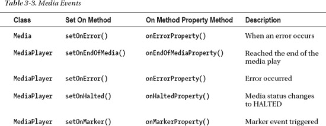

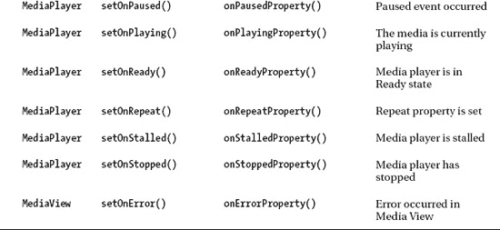

以下代码将在用户点击暂停按钮时，向用户显示包含“已暂停”和“时长”（精确到毫秒小数）的文本，该文本会覆盖在视频之上（参见图 3-4）：

`   // 当暂停事件发生时显示暂停消息`
`   mediaPlayer.setOnPaused(new Runnable() {`
`     @Override`
`     public void run() {`
`        pauseMessage.setText("已暂停 \n 时长: " +`
`mediaPlayer.currentTimeProperty().getValue().toMillis());`
`        pauseMessage.setOpacity(.90);`

`    }`
`  });` 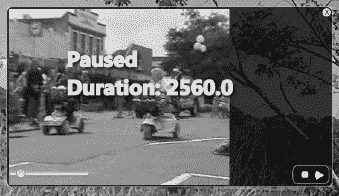

***图 3-4.** 暂停事件*

#### 工作原理

事件驱动架构（EDA）是一种重要的架构模式，用于建模异步传递消息的松散耦合组件和服务。JavaFX 团队将 Media API 设计为事件驱动。本方案将演示如何响应媒体事件进行实现。

基于事件编程的思想，你会在调用函数时发现非阻塞或回调行为。在本方案中，你将实现响应 `onPaused` 事件来显示文本，而不是将代码放入暂停按钮中。你将不再通过 `EventHandler` 将代码直接绑定到按钮，而是实现响应媒体播放器 `onPaused` 事件被触发的代码。在响应媒体事件时，你将实现 `java.lang.Runnable`。

你会很高兴地发现，你一直在使用事件属性并实现 `Runnable`。希望你在本章的所有方案中都注意到了这一点。当媒体播放器处于就绪状态时，`Runnable` 代码将被调用。为什么这是正确的？因为当媒体播放器完成媒体加载时，`onReady` 属性会收到通知。这样你就可以确保能够调用 `MediaPlayer` 的 `play()` 方法。我相信你会习惯事件式编程。以下代码片段演示了如何将一个 `Runnable` 实例设置到媒体播放器对象的 `OnReady` 属性中：

`mediaPlayer.setOnReady(new Runnable() {`
`    @Override`
`    public void run() {`
`        mediaPlayer.play();`
`    }`
`});`

你将采取与 `onReady` 属性类似的步骤。一旦触发了 `Paused` 事件，`run()` 方法将被调用，向用户显示一条消息，其中包含一个带有“已暂停”字样的 `Text` 节点，以及显示视频播放到该时刻的毫秒数。显示后，你可能希望将这些时长记录为标记（你将在方案 3-4 中学习）。以下代码片段展示了一个附加的 `Runnable` 实例，它负责在视频暂停的位置显示暂停消息和以毫秒为单位的时长：

`  // 当暂停事件发生时显示暂停消息`
`  mediaPlayer.setOnPaused(new Runnable() {`
`     @Override`
`     public void run() {`
`        pauseMessage.setText("已暂停 \n 时长: " +`
`mediaPlayer.currentTimeProperty().getValue().toMillis());`
`        pauseMessage.setOpacity(.90);`

`    }`
`  });`

### 3-4. 标记视频中的位置

#### 问题

你希望在媒体播放器中播放视频时提供隐藏式字幕文本。

#### 解决方案

首先应用方案 3-3。通过从上一个方案中获取标记的时长（以毫秒为单位），你将在视频的各个时间点创建媒体标记事件。每个媒体标记都会关联一个文本，该文本将作为隐藏式字幕显示。当标记到达时，文本将显示在右上侧。

以下代码片段演示了在 `Scene` 对象的 `onDragDropped` 事件属性中处理媒体标记事件：

`... // 在 start() 方法内部`

`final VBox messageArea = createClosedCaptionArea(scene);`
`root.getChildren().add(messageArea);`

`// 拖放到表面`
`scene.setOnDragDropped(new EventHandler<DragEvent>() {`

`    @Override`
`    public void handle(DragEvent event) {`
`        Dragboard db = event.getDragboard();`

`        ... // 拖放代码写在这里`

`        // 加载媒体`
`        Media media = new Media(resourceUrlOrFile.toString());`

`        ... // 清理媒体播放器`

`        // 创建一个新的媒体播放器`
`        mediaPlayer = MediaPlayerBuilder.create()`
`                .media(media)`
`                .build();`

`        ...// 设置媒体 'onXXX' 事件属性`

`        mediaView.setMediaPlayer(mediaPlayer);`

`        media.getMarkers().put("开始比赛", Duration.millis(1959.183673));`
`        media.getMarkers().put("他开始\n 领先", Duration.millis(3395.918367));`
`        media.getMarkers().put("他们正在\n 转弯", Duration.millis(6060.408163));`
`        media.getMarkers().put("人群欢呼", Duration.millis(9064.489795));`
`        media.getMarkers().put("他冲过\n 终点线", Duration.millis(11546.122448));`

`        // 显示隐藏式字幕`
`        mediaPlayer.setOnMarker(new EventHandler<MediaMarkerEvent> (){`
`            public void handle(MediaMarkerEvent event){`
`                closedCaption.setText(event.getMarker().getKey());`
`            }`
`        });`
`        event.setDropCompleted(success);`
`        event.consume();`
`    }`
`}); // setOnDragDropped() 结束`

下面是一个工厂方法，它返回一个区域，该区域将包含显示在视频右侧的隐藏式字幕：

`    private VBox createClosedCaptionArea(final Scene scene) {`
`        // 创建消息区域`
`        final VBox messageArea = new VBox(3);`
`        messageArea.setTranslateY(30);`
`        messageArea.translateXProperty().bind(scene.widthProperty().subtract(152) );`
`        messageArea.setTranslateY(20);`
`        closedCaption = TextBuilder.create()`
`            .stroke(Color.WHITE)`
`            .fill(Color.YELLOW)`
`            .font(new Font(15))`
`            .build();`
`        messageArea.getChildren().add(closedCaption);`
`        return messageArea;`
`    }`

图 3-5 展示了显示隐藏式字幕文本的视频媒体播放器。

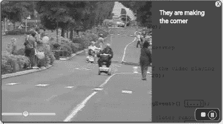

***图 3-5.** 隐藏式字幕文本*

#### 工作原理

Media API 拥有许多事件属性，开发者可以为这些属性附加 `EventHandler` 或 `Runnable` 实例，以便在事件被触发时做出响应。此处我们重点关注 `OnMarker` 事件属性。`Marker` 属性负责接收标记事件（`MediaMarkerEvent`）。

首先，让我们向 `Media` 对象中添加标记。它包含一个 `getMarkers()` 方法，该方法返回一个 `javafx.collections.ObservableMap<String, Duration>`。借助可观察映射，你可以添加代表每个标记的键值对。添加的键应为唯一标识符，值则为 `Duration` 的实例。为简单起见，我使用了隐藏式字幕文本作为每个媒体标记的键。标记的时长是你在配方 3-3 中按下视频暂停按钮时记录下来的。请注意，我不建议在生产代码中这样做。你可能需要使用一个并行的 `Map`。

添加标记后，你将使用 `setOnMarker()` 方法为 `MediaPlayer` 对象的 `OnMarker` 属性设置一个 `EventHandler`。接下来，你将创建 `EventHandler` 实例来处理触发的 `MediaMarkerEvent`。一旦接收到事件，就获取代表隐藏式字幕中要使用的文本的键。实例变量 `closedCaption`（`javafx.scene.text.Text` 节点）将通过调用 `setText()` 方法并传入与标记关联的键或字符串来显示。

媒体标记的内容就这些。这展示了你可以如何轻松地在视频播放过程中协调特效、动画等。

### 3-5. 同步动画与媒体

#### 问题

你希望在媒体显示中融入动画效果。例如，你希望在视频播放完毕后滚动显示“剧终”字样。

#### 解决方案

结合使用配方 3-3 和配方 2-2。配方 3-3 展示了如何响应媒体事件。配方 2-2 演示了如何使用 `javafx.animation.TranslateTransition` 为文本添加动画效果。

以下代码演示了在媒体结束事件触发时附加的操作：

`mediaPlayer.setOnEndOfMedia(new Runnable() {`
`   @Override`
`   public void run() {`
`      closedCaption.setText("");`
`      animateTheEnd.getNode().setOpacity(.90);`
`      animateTheEnd.playFromStart();`
`  }`
`});`

这里展示的是一个方法，它创建了一个包含字符串“The End”的 `Text` 节点的 `TranslateTransition`，该动画在媒体结束事件触发后播放：

`    public TranslateTransition createTheEnd(Scene scene) {`
`        Text theEnd = TextBuilder.create()`
`           .text("The End")`
`           .font(new Font(40))`
`           .strokeWidth(3)`
`           .fill(Color.WHITE)`
`           .stroke(Color.WHITE)`
`           .x(75)`
`           .build();`

`        TranslateTransition scrollUp = TranslateTransitionBuilder.create()`
`            .node(theEnd)`
`            .duration(Duration.seconds(1))`
`            .interpolator(Interpolator.EASE_IN)`
`            .fromY(scene.getHeight() + 40)`
`            .toY(scene.getHeight()/2)`
`            .build();`
`        return scrollUp;`
`    }`

图 3-6 描绘了在 `OnEndOfMedia` 事件触发后，文本节点“The End”向上滚动的效果。

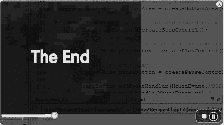

***图 3-6.** 动画显示“剧终”*

#### 工作原理

在本配方中，你将能够将事件与动画效果同步。换句话说，当视频播放到结尾时，`OnEndOfMedia` 属性事件将启动一个 `Runnable` 实例。启动后，将通过向上滚动一个包含字符串“The End”的 `Text` 节点来执行 `TranslateTransition` 动画。

那么，让我来描述与 `MediaPlayer` 对象关联的 `setOnEndOfMedia()` 方法。与配方 3-3 一样，我们只需调用 `setOnEndOfMedia()` 方法，并传入一个包含调用动画代码的 `Runnable`。如果你不了解动画的工作原理，请参考配方 2-2。一旦事件发生，你将看到文本向上滚动。以下代码片段来自 `scene.setOnDragDropped()` 方法内部：

`mediaPlayer.setOnEndOfMedia(new Runnable() {`
`   @Override`
`   public void run() {`
`      closedCaption.setText("");`
`      animateTheEnd.getNode().setOpacity(.90);`
`      animateTheEnd.playFromStart();`
`  }`
`});`

为节省篇幅，我相信你知道代码块应放在何处。如果不知道，你可以参考配方 3-3，其中你会看到其他 `OnXXX` 属性方法。要查看完整的代码清单，请访问本书网站下载源代码。

为了给文本“The End”添加动画效果，你将创建一个便捷的 `createTheEnd()` 方法，用于创建 `Text` 节点实例，并向调用者返回一个 `TranslateTransition` 对象。返回的 `TranslateTransition` 将执行以下操作：在播放视频前等待一秒钟。接下来是插值器，我使用了 `Interpolator.EASE_IN`，以便在完全停止前通过缓入效果移动 `Text` 节点。最后是设置节点的 Y 属性，使其从媒体视图区域的底部移动到中心。

以下代码是一个用于向上滚动节点的动画：

`TranslateTransition scrollUp = TranslateTransitionBuilder.create()`
`            .node(theEnd)`
`            .duration(Duration.seconds(1))`
`            .interpolator(Interpolator.EASE_IN)`
`            .fromY(scene.getHeight() + 40)`
`            .toY(scene.getHeight()/2)`
`            .build();`

## 第 4 章

## Web 上的 JavaFX

JavaFX 提供了与 HTML5 互操作的新功能。JavaFX 中底层的网页渲染引擎是名为 Webkit 的流行开源 API。Webkit 也被用于谷歌的 Chrome 和苹果的 Safari 浏览器。HTML5 是用于在网页浏览器中渲染内容的新标准标记语言。HTML5 内容包含 JavaScript、CSS、可缩放矢量图形（SVG）以及新的 HTML 元素标签。

JavaFX 与 HTML5 之间的关系非常重要，因为它们通过发挥各自的优势相互补充。例如，JavaFX 的富客户端 API 与 HTML5 的丰富网页内容相结合，创造了一种兼具桌面软件特性的网页应用用户体验。这种新型应用被称为 RIA。

在本章中，我们将涵盖以下内容：

> *   在 HTML 网页中嵌入 JavaFX 应用程序
> *   显示 HTML5 内容
> *   使用 Java 代码操作 HTML5 内容
> *   响应 HTML 事件
> *   显示数据库中的内容

### 4-1. 在网页中嵌入 JavaFX 应用程序

#### 问题

你希望通过利用现有的网页开发技能，结合 JavaFX 创建一个概念验证，给老板留下深刻印象，从而从格子间晋升到带窗户的办公室。

#### 解决方案

使用 NetBeans IDE 7.1 或更高版本，通过其新建项目向导创建一个 Hello World 程序，使其在浏览器中运行。以下是创建嵌入在 HTML 网页中的 Hello World JavaFX 应用程序的步骤：

 **注意** 有关深入的 JavaFX 部署策略，请参考 Oracle 的《部署 JavaFX 应用程序》：[`http://download.oracle.com/javafx/2.0/deployment/deployment_toolkit.htm`](http://download.oracle.com/javafx/2.0/deployment/deployment_toolkit.htm)。

以下是运行新建项目向导的步骤：

> 1.  在 NetBeans IDE 7.1 或更高版本的“文件”菜单中选择“新建项目”。图 4-1 突出显示了 NetBeans“文件”菜单中的该选项。
>     
>     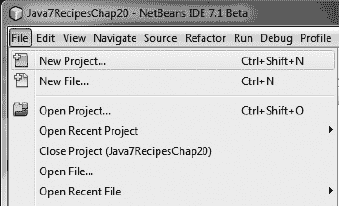
>     
>     ***图 4-1.** 创建新的 JavaFX 项目*
>     
>     
> 2.  在“选择项目”下的“类别”部分中选择“JavaFX”，如图 4-2 所示。接着，在“项目”下选择“JavaFX 应用程序”。然后点击“下一步”继续。
>     
>     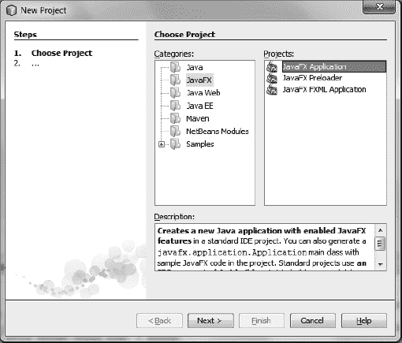
>     
>     ***图 4-2.** “新建项目”对话框*
>     
>     
> 3.  通过指定项目名称并选中复选框，让向导生成一个名为 `MyJavaFXApp.java` 的主类来创建项目。图 4-3 显示了一个指定了项目名称和位置的“新建 JavaFX 应用程序”向导。完成后，点击“完成”按钮。
>     
>     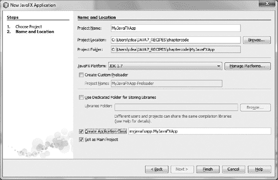
>     
>     ***图 4-3.** “新建 JavaFX 应用程序”对话框，您可在其中指定项目名称和项目位置*
>     
>     
> 4.  新项目创建完成后，您可以修改项目属性。要修改属性，请右键点击项目，然后从弹出菜单中选择“属性”。图 4-4 显示了创建的项目，其中包含一个名为 `MyJavaFXApp.java` 的主 JavaFX 文件。
>     
>     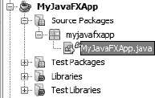
>     
>     ***图 4-4.** MyJavaFXApp.java 项目*
>     
>     
> 5.  进入项目属性，如图 4-5 所示。在“类别”选项区域中选择“源”。接着，检查“源代码/二进制格式”选项，将其指向 JDK 7。
>     
>     
>     
>     ***图 4-5.** “项目属性 - MyJavaFXApp”对话框窗口*
>     
>     
> 6.  在图 4-6 所示的“类别”列表中选择“运行”选项。选中“在浏览器中”单选按钮选项。然后点击“确定”按钮。
>     
>     
>     
>     ***图 4-6.** 设置“在浏览器中运行”选项*
>     
>     
> 7.  通过点击工具栏上的“运行”按钮或按 F6 键来运行并测试项目。图 4-7 展示了最终在浏览器中运行的 Hello World 应用程序。

***图 4-7.** 在浏览器中运行的 MyJavaFXApp Hello World 应用程序*

#### 工作原理

要创建嵌入在 HTML 页面中的 JavaFX 应用程序，您需要使用 NetBeans IDE。尽管存在不同的部署策略，例如 Webstart 和独立模式，但此处您使用 NetBeans 的新建项目向导，自动将其部署为包含 JavaFX 应用程序的本地网页并在浏览器中运行。有关深入的 JavaFX 部署策略，请参考 Oracle 的《部署 JavaFX 应用程序》：[`http://download.oracle.com/javafx/2.0/deployment/deployment_toolkit.htm`](http://download.oracle.com/javafx/2.0/deployment/deployment_toolkit.htm)。

以下是此解决方案生成的代码。您会注意到所使用的 JavaFX 类；例如 `Stage`、`Group` 和 `Scene` 类。

 **注意** 您可以将本方案中其他代码文件的导入和代码体拖放到新的主项目类的主体中，并相应地更改类定义行上的名称。

以下是 NetBeans 向导生成新项目以创建嵌入在 HTML 网页中的 JavaFX 应用程序时的源代码：

`package myjavafxapp;`

`import javafx.application.Application;`
`import javafx.event.ActionEvent;`
`import javafx.event.EventHandler;`
`import javafx.scene.Group;`
`import javafx.scene.Scene;`
`import javafx.scene.control.Button;`
`import javafx.stage.Stage;`

`/**`
` *`
` * @author cdea`
`*/`
`public class MyJavaFXApp extends Application {`

`    /**`
`     * @param args the command line arguments`
`     */`
`    public static void main(String[] args) {`
`        Application.launch(args);`
`    }`

`    @Override`
`    public void start(Stage primaryStage) {`
`        primaryStage.setTitle("Hello World");`
`        Group root = new Group();`
`        Scene scene = new Scene(root, 300, 250);`
`        Button btn = new Button();`
`        btn.setLayoutX(100);`
`        btn.setLayoutY(80);`
`        btn.setText("Hello World");`
`        btn.setOnAction(new EventHandler<ActionEvent>() {`

`            public void handle(ActionEvent event) {`
`                System.out.println("Hello World");`
`            }`
`        });`
`        root.getChildren().add(btn);`
`        primaryStage.setScene(scene);`
`        primaryStage.show();`
`    }`
`}`

在步骤 1 中，您启动一个新项目（如图 4-7 所示）。在步骤 2 中，您选择要创建的标准 JavaFX 应用程序。选择项目类型后，您将指定项目名称。确保选中“创建应用程序类”复选框，以便向导生成 MyJavaFXApp Java 文件。点击“完成”后，您新创建的应用程序将出现在“项目”选项卡中。接下来，您将执行步骤 5 来更改项目属性。

在步骤 5 中，您将更改两个类别：“源”和“运行”。在“源”类别中，确保“源代码/二进制格式”设置为 JDK 1.6 或更高版本。更新“源”类别后，您将通过“运行”类别更改项目的运行方式（步骤 6）。在步骤 6 中，选中“在浏览器中”单选按钮选项后，您会注意到工作目录字段下方的“宽度”和“高度”。要使用您自己的自定义网页，请点击“浏览”按钮选择现有的 HTML 文件，但在本方案中，您可以将其留空，让向导生成一个通用的 HTML 页面。假设您已完成设置，点击“确定”关闭“项目属性”对话框窗口。

最后，您将运行嵌入的 JavaFX Web 应用程序（步骤 7）。要运行您的应用程序，您需要确保此项目被设置为主项目，方法是在菜单中选择 `运行 -> 设置主项目 -> MyJavaFXApp`。启动运行后，您的浏览器将启动，其中包含一个包含 JavaFX 应用程序的通用网页。您还会注意到，有一个方便的链接允许您将应用程序作为 Webstart 应用程序（非嵌入）启动。

### 4-2\. 显示 HTML5 内容

#### 问题

您全身心投入工作项目，以至于经常错过孩子的足球比赛。您需要一个时钟应用程序来跟踪时间。

#### 解决方案

创建一个基于 JavaFX 的应用程序，其中包含一个以 HTML5 内容形式创建的模拟时钟。使用 JavaFX 的 `WebView` API 在应用程序中渲染 HTML5 内容。

以下源代码是一个显示动画模拟时钟的 JavaFX 应用程序。该应用程序将加载一个名为 `clock3.svg` 的 SVG 文件，并将其内容显示到 JavaFX 场景图中：

`package javafx2introbyexample.chapter4.recipe4_02;`

`import java.net.URL;`
`import javafx.application.Application;`
`import javafx.scene.Scene;`
`import javafx.scene.paint.Color;`
`import javafx.scene.web.WebView;`
`import javafx.stage.Stage;`

`/**`
` *`
` * @author cdea`
`*/`
`public class DisplayHtml5Content extends Application {`
`    private Scene scene;`
`    @Override public void start(Stage stage) {`
`        // 创建场景`
`        stage.setTitle("第 4 章-2 显示 Html5 内容");`
`        final WebView browser = new WebView();`
`        URL url = getClass().getResource("clock3.svg");`
`        browser.getEngine().load(url.toExternalForm());`
`        scene = new Scene(browser,590,400, Color.rgb(0, 0, 0, .80));`
`        stage.setScene(scene);`
`        stage.show();`
`    }`
`    public static void main(String[] args){`
`        Application.launch(args);`
`    }`
`}`

这段 JavaFX 代码将加载并渲染 HTML5 内容。假设你有一位设计师提供了诸如 HTML5 之类的内容，那么你的工作就是在 JavaFX 中渲染这些资源。以下代码代表一个名为 `clock3.svg` 的 SVG 文件，该文件主要由强大的工具 Inkscape 生成，Inkscape 是一款能够生成 SVG 的插画工具。在以下代码中，请注意手写的 JavaScript 代码（位于 `CDATA` 标签内），它将根据当前时间定位时钟的秒针、分针和时针。由于所有逻辑（从设置时间到动画指针）都包含在此文件中，因此内容是自包含的，这意味着任何支持 HTML5 的查看器都可以显示该文件的内容。因此，在调试时，你可以轻松地在任何兼容 HTML5 的浏览器中渲染内容。在本章后面，我们将演示能够与 HTML5 内容交互的 JavaFX 代码。

此处展示的是 SVG 模拟时钟的精简版本。（要获取该文件的源代码，请从本书网站下载代码。）这是一个在 Inkscape 中创建的 SVG 模拟时钟（`clock3.svg`）：

`<svg`

`   width="300"`
`   height="250"`
`   id="svg4171"`
`   version="1.1"`
`   inkscape:version="0.48.1 "`
`   sodipodi:docname="clock3.svg" onload="updateTime()">`

``
`<defs id="defs4173">`
`... // SVG 代码开始`
`... // 主时钟代码`

`<g id="hands" transform="translate(108,100)">`
`<g id="minuteHand">`
`<line stroke-width="3.59497285" y2="50" stroke-linecap="round" stroke="#00fff6" opacity=".9" />`
`<animateTransform attributeName="transform" type="rotate" repeatCount="indefinite" dur="60min" by="360" />`
`</g>`

`<g id="hourHand">`
`<line stroke-width="5" y2="30" stroke-linecap="round" stroke="#ffcb00" opacity=".9" />`
`<animateTransform attributeName="transform" type="rotate" repeatCount="indefinite" dur="12h" by="360" />`
`</g>`
`<g id="secondHand">`
`<line stroke-width="2" y1="-20" y2="70" stroke-linecap="round" stroke="red"/>`
`<animateTransform attributeName="transform" type="rotate" repeatCount="indefinite" dur="60s" by="360" />`
`</g>`
`</g>`

`    ... // 时钟代码的其余部分：眩光效果、指针顶部的黑色按钮盖（中心）`

`</svg>`

图 4-8 展示了一个 JavaFX 应用程序，它渲染了显示模拟时钟的 SVG 文件 `clock3.svg`。

***图 4-8.** 模拟时钟*

#### 工作原理

在本教程中，你将创建一个模拟时钟应用，将现有的 HTML5 内容渲染到 JavaFX 场景图上。HTML5 允许在浏览器中显示 SVG 内容。SVG 与 JavaFX 的场景图类似，其中的节点可以在不同尺寸下缩放并保留细节。要操作 SVG 或任何 HTML5 元素，你将使用 JavaScript 语言。如图 4-8 所示，这是一个显示动画模拟时钟的 JavaFX 应用。要了解更多关于 SVG 的信息，请访问 [`http://www.w3schools.com/svg/default.asp`](http://www.w3schools.com/svg/default.asp)。在运行此示例之前，请确保 `clock3.svg` 文件位于构建路径中。在 NetBeans 中，你可能需要在运行应用前执行清理和构建操作，以便将资源（`clock3.svg`）复制到构建路径。如果你在命令行中运行应用，也可以手动将 `clock3.svg` 文件复制到构建路径中，与 `DisplayHtml5Content.class` 文件所在位置相同。

在软件开发中，你无疑会经历与设计师合作的情况，他们通常会使用流行的工具生成网页内容，然后将其与应用程序的功能对接。为了创建模拟时钟，我请来了我的女儿，她非常精通开源工具 Inkscape。虽然本教程使用了 Inkscape 生成内容，但我不会详细介绍该工具，因为这超出了本书的范围。要了解更多关于 Inkscape 的信息，请访问 [`http://www.inkscape.org`](http://www.inkscape.org) 查看教程和演示。为了模拟设计师与开发者工作流程，她创建了一个外观酷炫的时钟，而我则添加了 JavaScript/SVG 代码来移动时钟的时针、分针和秒针。Inkscape 允许你创建形状、文本和效果，从而生成令人惊叹的插图。由于 SVG 文件被视为 HTML5 内容，你将能够在支持 HTML5 的浏览器中显示 SVG 图形。在此场景中，你将在 JavaFX 的 `WebView` 节点中显示模拟时钟。你可以将 `WebView` 节点视为一个能够加载 URL 并显示内容的迷你浏览器。加载 URL 时，你会注意到调用了 `getEngine().load()`，其中 `getEngine()` 方法会返回一个 `javafx.scene.web.WebEngine` 对象的实例。因此，`WebView` 对象会为每个 `WebView` 对象隐式创建一个 `javafx.scene.web.WebEngine` 对象实例。以下是 JavaFX 的 `WebEngine` 对象加载文件 `clock3.svg` 的示例：

`final WebView browser = new WebView();`
`URL url = getClass().getResource("clock3.svg");`
`browser.getEngine().load(url.toExternalForm());`

你可能会好奇为什么 JavaFX 源代码如此简短。代码简短是因为它的任务只是实例化一个 `javafx.scene.web.WebView`，该对象会实例化一个 `javafx.scene.web.WebEngine` 类并传递一个 URL。之后，`WebEngine` 对象会像任何浏览器一样渲染 HTML5 内容，完成所有工作。在渲染内容时，请注意时钟的指针会移动或动画化；例如，秒针会顺时针旋转。在让时钟动画化之前，你需要通过整个 SVG 文档（位于根 `svg` 元素上）的 `onload` 属性调用 JavaScript 的 `updateTime()` 函数来设置时钟的初始位置。设置好时钟指针后，你将添加 SVG 代码，分别使用 `line` 和 `animateTransform` 元素来绘制和动画化。以下是让秒针无限动画化的 SVG 代码片段：

`<g id="secondHand">`
`<line stroke-width="2" y1="-20" y2="70" stroke-linecap="round" stroke="red"/>`
`<animateTransform attributeName="transform" type="rotate" repeatCount="indefinite" dur="60s" by="360" />`
`</g>`

最后，如果你想创建一个像本教程中描述的那样时钟，请访问 [`http://screencasters.heathenx.org/blog`](http://screencasters.heathenx.org/blog) 学习所有关于 Inkscape 的知识。另一个令人印象深刻且美观的自定义控件展示，专注于仪表和表盘，是 Gerrit Grunwald 的 Steel Series。要感到完全惊叹，请访问他的博客 [`http://harmoniccode.blogspot.com`](http://harmoniccode.blogspot.com)。

### 4-3. 使用 Java 代码操作 HTML5 内容

#### 问题

你是一名薪水微薄的开发者，老板拒绝让你搬到靠窗的工位。你必须找到一种方法，在不离开工位的情况下了解天气情况。

#### 解决方案

创建一个从雅虎天气服务获取数据的天气应用。以下代码实现了一个天气应用，它检索雅虎的天气信息，并将其作为 HTML 渲染到 JavaFX 应用中：

`package javafx2introbyexample.chapter4.recipe4_03;`

`import javafx.animation.*;`
`import javafx.application.Application;`
`import javafx.beans.property.*;`
`import javafx.beans.value.*;`
`import javafx.concurrent.Worker.State;`
`import javafx.scene.*;`
`import javafx.scene.web.*;`
`import javafx.stage.Stage;`
`import javafx.util.Duration;`
`import org.w3c.dom.*;`

`/**`
` * 显示天气预览和 3 天预报`
` * @author cdea`
` */`
`public class ManipulatingHtmlContent extends Application {`
`    String url = "http://weather.yahooapis.com/forecastrss?p=USMD0033&u=f";`
`    int refreshCountdown = 60;`

`    @Override public void start(Stage stage) {`
`        // 创建场景`
`        stage.setTitle("第 4-3 章 操作 HTML 内容");`
`        Group root = new Group();`
`        Scene scene = new Scene(root, 460, 340);`

`        final WebEngine webEngine = new WebEngine(url);`

`        StringBuilder template = new StringBuilder();`
`        template.append("<head>\n");`
`        template.append("\n");`
`        template.append("</head>\n");        `
`        template.append("<body id='weather_background'>");`

`        final String fullHtml = template.toString();`

`        final WebView webView = new WebView();`

`        IntegerProperty countDown = new SimpleIntegerProperty(refreshCountdown);`
`        countDown.addListener(new ChangeListener<Number>() {`
`            @Override`
`            public void changed(ObservableValue<? extends Number> observable, Number oldValue,`
`Number newValue){`
`               // 当 countDown 发生变化时，调用 JavaScript 更新 HTML 中的文本`
`webView.getEngine().executeScript("document.getElementById('countdown').innerHTML =`
`'刷新前剩余秒数: " + newValue + "'");`
`                if (newValue.intValue() == 0) {`
`                    webEngine.reload();`
`                }`
`            }`
`        });`
`        final Timeline timeToRefresh = new Timeline();`
`        timeToRefresh.getKeyFrames().addAll(`
`                new KeyFrame(Duration.ZERO, new KeyValue(countDown, refreshCountdown)),`
`                new KeyFrame(Duration.seconds(refreshCountdown), new KeyValue(countDown, 0))`
`        );`
`        webEngine.getLoadWorker().stateProperty().addListener(new ChangeListener<State>() {`
`            @Override`
`            public void changed(ObservableValue<? extends State> observable, State oldValue,`
`State newValue){`
`                System.out.println("完成!" + newValue.toString());`
`                if (newValue != State.SUCCEEDED) {`
`                    return;`
`                }`
`                // 请求 200 OK`
`                Weather weather = parse(webEngine.getDocument());`

`StringBuilder locationText = new StringBuilder();`
`                locationText.append("<b>")`
`                        .append(weather.city)`
`                        .append(", ")`
`                        .append(weather.region)`
`                        .append(" ")`
`                        .append(weather.country)`
`                        .append("</b> \n");`

`                String timeOfWeatherTextDiv = "<b id=\"timeOfWeatherText\">" + weather.dateTimeStr + "</b> \n";`
`                String countdownText = "<b id=\"countdown\"></b> \n";`
`                webView.getEngine().loadContent(fullHtml + locationText.toString() +`
`                        timeOfWeatherTextDiv +`
`                        countdownText +`
`                        weather.htmlDescription);`
`                System.out.println(fullHtml + locationText.toString() +`
`                        timeOfWeatherTextDiv +`
`                        countdownText +`
`                        weather.htmlDescription);`
`                timeToRefresh.playFromStart();`
`            }`
`        });`

`        root.getChildren().addAll(webView);`

`        stage.setScene(scene);`
`        stage.show();`
`    }`

`    public static void main(String[] args){`
`        Application.launch(args);`
`    }`

`    private static String obtainAttribute(NodeList nodeList, String attribute) {`
`        String attr = nodeList`
`                .item(0)`
`                .getAttributes()`
`                .getNamedItem(attribute)`
`                .getNodeValue()`
`                .toString();`
`        return attr;`

`    }`

`    private static Weather parse(Document doc) {`

`        NodeList currWeatherLocation =`
`doc.getElementsByTagNameNS("http://xml.weather.yahoo.com/ns/rss/1.0", "location");`

`        Weather weather = new Weather();`
`        weather.city = obtainAttribute(currWeatherLocation, "city");`
`        weather.region = obtainAttribute(currWeatherLocation, "region");`
`        weather.country = obtainAttribute(currWeatherLocation, "country");`

`        NodeList currWeatherCondition = doc.getElementsByTagNameNS("http://xml.weather.yahoo.com/ns/rss/1.0", "condition");`
`        weather.dateTimeStr = obtainAttribute(currWeatherCondition, "date");`
`        weather.currentWeatherText = obtainAttribute(currWeatherCondition, "text");`
`        weather.temperature = obtainAttribute(currWeatherCondition, "temp");`

`        String forcast = doc.getElementsByTagName("description")`
`                        .item(1)`
`                        .getTextContent();`
`        weather.htmlDescription = forcast;`

`        return weather;`
`    }`

`}`
`class Weather {`
`    String dateTimeStr;`
`    String city;`
`    String region;`
`    String country;`
`    String currentWeatherText;`
`    String temperature;`
`    String htmlDescription;`

`}`

图 4-9 展示了从雅虎天气服务获取数据的天气应用程序。在显示的文本第三行，你会注意到“Seconds till refresh: 31”是一个倒计时，以秒为单位，直到下一次获取天气信息。对 HTML 内容的实际操作在此处进行。

***图 4-9.** 天气应用程序*

以下是在控制台输出的、渲染到 `WebView` 节点上的 HTML 内容：

`<head>`
``
`</head>`
`<body id='weather_background'><b>Berlin, MD US</b> `
`<b id="timeOfWeatherText">Thu, 06 Oct 2011 8:51 pm EDT</b> `
`<b id="countdown"></b> `

` `
`<b>Current Conditions:</b> `
`Fair, 49 F `
` <b>Forecast:</b> `
`Thu - Clear. High: 66 Low: 48 `
`Fri - Sunny. High: 71 Low: 52 `
` `
`<a href="http://us.rd.yahoo.com/dailynews/rss/weather/Berlin__MD/*http://weather.yahoo.com/foreca`
`st/USMD0033_f.html">Full Forecast at Yahoo! Weather</a>  `
`(provided by <a href="http://www.weather.com" >The Weather Channel</a>) `

#### 工作原理

在本教程中，你将创建一个能够从雅虎天气服务中检索 XML 信息的 JavaFX 应用程序。解析 XML 后，HTML 内容将被组装并渲染到 JavaFX 的 `WebView` 节点上。`WebView` 对象实例是一个能够渲染和检索 XML 或任何 HTML5 内容的图形节点。该应用程序还将显示一个倒计时，显示距离下一次从天气服务检索数据还有多少秒。

通过雅虎天气服务访问你所在地区的天气信息时，你需要获取一个位置 ID 或与你所在城市关联的 RSS 源的 URL。在我逐行解释代码之前，我将列出获取本地天气预报 RSS 源 URL 的步骤。

> 1.  在浏览器中打开 [`http://weather.yahoo.com/`](http://weather.yahoo.com/)。
> 2.  输入城市或邮政编码，然后点击“前往”按钮。
> 3.  点击网页右侧附近（在“将天气添加到你的网站”下方）的橙色小 RSS 按钮。
> 4.  复制并粘贴浏览器中的 URL 地址行，以便在你的天气应用程序代码中使用。例如，我使用了以下 RSS URL 网址：[`http://weather.yahooapis.com/forecastrss?p=USMD0033&u=f`](http://weather.yahooapis.com/forecastrss?p=USMD0033&u=f)。

现在你已经获取了一个有效的 RSS URL 网址，让我们在我们的教程示例中使用它。创建 `ManipulatingHtmlContent` 类时，你需要两个实例变量：`url` 和 `refreshCountdown`。`url` 变量将被赋值为步骤 4 中的 RSS URL 网址。`refreshCountdown` 变量类型为 `int`，赋值为 60，表示刷新或再次检索天气信息之前的秒数。

与我们所有在 `start()` 方法中的 JavaFX 示例一样，我们首先为初始主内容区域创建 `Scene` 对象。接下来，我们通过将 `url` 传递给构造函数来创建一个 `javafx.scene.web.WebEngine` 实例。`WebEngine` 对象将异步加载来自雅虎天气服务的 Web 内容。稍后我们将讨论负责在 Web 内容加载完成后处理内容的回调方法。以下代码行将使用 `WebEngine` 对象创建并加载一个 URL 网址：

`final WebEngine webEngine = new WebEngine(url);`

创建 `WebEngine` 对象后，你将创建一个 HTML 文档，该文档将作为模板，用于后续在 Web 内容成功加载时进行组装。虽然代码在 Java 代码中包含了 HTML 标记标签，这完全违反了关注点分离的原则，但为了简洁起见，我通过拼接字符串值将 HTML 内联了。为了实现适当的 MVC 式分离，你可能希望创建一个单独的文件，其中包含你的 HTML 内容，并为随时间变化的数据提供替换部分。以下代码片段是用于显示天气信息的模板创建的起始部分：

`    StringBuilder template = new StringBuilder();`
`    template.append("<head>\n")`
`       .append("\n")`
`       .append("</head>\n")`
`       .append("<body id='weather_background'>");`

通过拼接字符串创建网页后，你将创建一个 `WebView` 对象实例，这是一个可显示的图形节点，负责渲染网页。请记住教程 4-2 中的内容，我们讨论过 `WebView` 将拥有自己的 `WebEngine` 实例。了解这一点后，我们只使用 `WebView` 节点来渲染组装好的 HTML 网页，而不是通过 URL 检索 XML 天气信息。换句话说，`WebEngine` 对象负责从雅虎天气服务检索 XML 以进行解析，然后将其输入到 `WebView` 对象中以 HTML 形式显示。以下代码片段实例化了一个负责渲染 HTML5 内容的 `WebView` 图形节点：

`final WebView webView = new WebView();`

接下来，你将创建一个倒计时定时器，用于刷新应用程序窗口中显示的天气信息。首先，你将实例化一个 `IntegerProperty` 变量 `countdown`，用于保存距离下一次刷新时间的秒数。其次，你将添加一个更改监听器（`ChangeListener`），利用 JavaFX 执行 JavaScript 的能力来动态更新 HTML 内容。该更改监听器还将判断倒计时是否已归零。如果是，它将调用 `webEngine`（`WebEngine`）的 `reload()` 方法来刷新或再次检索天气信息。以下是使用 `executeScript()` 方法创建 `IntegerProperty` 值以更新 HTML 中倒计时文本的代码：

`IntegerProperty countDown = new SimpleIntegerProperty(refreshCountdown);`
`countDown.addListener(new ChangeListener<Number>() {`
`     @Override`
`     public void changed(ObservableValue<? extends Number> observable, Number oldValue,`
`Number newValue){`

`webView.getEngine().executeScript("document.getElementById('countdown').innerHTML =`
`'距离刷新还有: " + newValue + " 秒'");`
`                if (newValue.intValue() == 0) {`
`                    webEngine.reload();`
`                }`
`            }`
`}); // addListener()`

实现 `ChangeListener` 后，你可以创建一个 `TimeLine` 对象来改变 `countdown` 变量，从而触发 `ChangeListener` 更新显示距离刷新秒数的 HTML 文本。以下代码实现了一个 `TimeLine` 来更新 `countDown` 变量：

`final Timeline timeToRefresh = new Timeline();`
`timeToRefresh.getKeyFrames().addAll(`
`    new KeyFrame(Duration.ZERO, new KeyValue(countDown, refreshCountdown)),`
`    new KeyFrame(Duration.seconds(refreshCountdown), new KeyValue(countDown, 0))`
`);`

总之，其余代码创建了一个响应 `State.SUCCEEDED` 的 `ChangeListener`。一旦 `webEngine`（`WebEngine`）完成 XML 的检索，该更改监听器（`ChangeListener`）负责解析并将组装好的网页渲染到 `webView` 节点中。以下代码通过调用 `WebView` 的 `WebEngine` 实例上的 `loadContent()` 方法来解析并显示天气数据：

`                if (newValue != State.SUCCEEDED) {`
`                    return;`
`                }`
`                Weather weather = parse(webEngine.getDocument());`

`                ...// 其余内联 HTML`

`                String countdownText = "<b id=\"countdown\"></b> \n";`
`                webView.getEngine().loadContent(fullHtml + location.toString() +`
`                        timeOfWeatherTextDiv +`
`                        countdownText +`
`                        weather.htmlDescription);`

为了解析由 `webEngine` 的 `getDocument()` 方法返回的 XML，你将查询 `org.w3c.dom.Document` 对象。为方便起见，我创建了一个 `parse()` 方法来遍历 DOM 以获取天气数据，并返回一个 `Weather` 对象。有关天气服务返回的数据元素的更多信息，请参阅 Javadocs 和雅虎的 RSS XML 模式。

### 4-4\. 响应 HTML 事件

#### 问题

你开始为你那些同样对外界浑然不觉的隔间同事感到遗憾。一场暴风雨正在逼近，你想让他们知道在离开大楼前带上雨伞。

#### 解决方案

为你的天气应用程序添加一个“恐慌按钮”，用于模拟发送电子邮件通知。同时添加一个“冷静按钮”来撤销警告信息。

以下代码实现了带有额外按钮的天气应用程序，用于发出和撤销即将到来的暴风雨天气警告：

`    @Override public void start(Stage stage) {`

`...  // 模板构建`

这段代码将添加 HTML 按钮，其 `onclick` 属性设置为调用 JavaScript 的 `alert` 函数：

`        template.append("<body id='weather_background'>");`
`        template.append("<form>\n");`
`        template.append("  <input type=\"button\" onclick=\"alert('warning')\" value=\"恐慌`
`按钮\" />\n");`
`        template.append("  <input type=\"button\" onclick=\"alert('unwarning')\" value=\"冷静`
`下来\" />\n");`
`        template.append("</form>\n");`

以下代码被添加到 `start()` 方法中，用于创建警告消息，并将其不透明度设置为零以使其不可见：

`        // 调用 createMessage() 方法构建警告消息`
`        final Text warningMessage = createMessage(Color.RED, "警告: ");`
`        warningMessage.setOpacity(0);`

`       ... // 倒计时代码`

继续在 `start()` 方法内部，添加以下代码段，用于在成功获取天气信息后更新警告消息：

`        webEngine.getLoadWorker().stateProperty().addListener(new ChangeListener<State>() {`
`            public void changed(ObservableValue<? extends State> observable, State oldValue,`
`State newValue){`
`                System.out.println("完成!" + newValue.toString());`
`                if (newValue != State.SUCCEEDED) {`
`                    return;`
`                }`
`                Weather weather = parse(webEngine.getDocument());`
`                warningMessage.setText("警告: " + weather.currentWeatherText + "\n 温度: " +`
`weather.temperature + "\n 已通过电子邮件通知他人");`

`                ... // changed() 方法的其余部分`
`        }); // addListener 方法结束`

这段代码设置了 `OnAlert` 属性，这是一个事件处理器，用于响应按下“恐慌”或“冷静”按钮时的操作：

`        webView.getEngine().setOnAlert(new EventHandler<WebEvent<String>>(){`
`            public void handle(WebEvent<String> evt) {`
`                warningMessage.setOpacity("warning".equalsIgnoreCase(evt.getData()) ? 1d :`
`0d);`
`            }`
`        }); // setOnAlert() 方法结束`

`        root.getChildren().addAll(webView, warningMessage);`

`        stage.setScene(scene);`
`        stage.show();`

`    } // start() 方法结束`

以下方法是你将添加的一个私有方法，负责创建一个文本节点（`javafx.scene.text.Text`），当用户按下“恐慌按钮”时，该节点将用作警告消息：

`    private Text createMessage(Color color, String message) {`
`        DropShadow dShadow = DropShadowBuilder.create()`
`                            .offsetX(3.5f)`
`                            .offsetY(3.5f)`
`                            .build();`
`        Text textMessage = TextBuilder.create()`
`                    .text(message)`
`                    .x(100)`
`                    .y(50)`
`                    .strokeWidth(2)`
`                    .stroke(Color.WHITE)`
`                    .effect(dShadow)`
`                    .fill(color)`
`                    .font(Font.font(null, FontWeight.BOLD, 35))`
`                    .translateY(50)`
`                    .build();`
`        return textMessage;`
`    }`
`} // RespondingToHtmlEvents 类结束`

图 4-10 展示了我们的天气应用程序在按下“恐慌按钮”后显示警告消息的效果。要移除警告消息，你可以按下“冷静按钮”。

***图 4-10.** 显示警告消息的天气应用程序*

#### 工作原理

在本节中，你将向天气应用程序（来自第 4-3 节）添加额外功能，使其能够响应 HTML 事件。你将创建的应用程序与上一节类似，不同之处在于你将在网页上添加 HTML 按钮，这些按钮将渲染到 `WebView` 节点上。添加的第一个按钮是“恐慌按钮”，按下时会显示一条警告消息，说明当前的天气状况，并模拟向你的同事发送电子邮件通知。为了撤销警告消息，你还需要添加一个“冷静按钮”。

 **注意** 由于代码与上一节非常相似，我将指出源代码中的新增部分，而不会深入详细说明。

要添加按钮，你将使用 HTML 标签 `<input type=”button”…>`，并将 `onclick` 属性设置为使用 JavaScript 的 `alert()` 函数来通知 JavaFX 发生了警报事件。以下是添加到网页中的两个按钮：

`        StringBuilder template = new StringBuilder();`
`        ...// HTML 网页的头部部分`
`        template.append("<form>\n");`
`        template.append("  <input type=\"button\" onclick=\"alert('warning')\" value=\"恐慌`
`按钮\" />\n");`
`        template.append("  <input type=\"button\" onclick=\"alert('unwarning')\" value=\"冷静`
`下来\" />\n");`
`        template.append("</form>\n");`

当网页渲染并允许你按下按钮时，`onclick` 属性将调用包含字符串消息的 JavaScript `alert()` 函数。当 `alert()` 函数被调用时，网页的父级所有者（`webView` 的 `WebEngine` 实例）将通过 `WebEngine` 的 `OnAlert` 属性收到警报通知。为了响应 JavaScript 的警报，你将添加一个事件处理器（`EventHandler`）来响应 `WebEvent` 对象。在 `handle()` 方法中，你将通过切换 `warningMessage` 节点（`javafx.scene.text.Text`）的不透明度来简单地显示和隐藏警告消息。

以下代码片段根据事件数据（`evt.getData()`）中包含的字符串（该字符串来自 JavaScript 的 `alert()` 函数）来切换警告消息的不透明度。因此，如果消息是“warning”，则 `warningMessage` 的不透明度设置为 1；否则设置为 0（两者均为 `double` 类型）。

`webView.getEngine().setOnAlert(new EventHandler<WebEvent<String>>(){`
`    public void handle(WebEvent<String> evt) {`
`       warningMessage.setOpacity("warning".equalsIgnoreCase(evt.getData()) ? 1d : 0d);`
`    }`
`});`

有关其他 HTML 网页事件（`WebEvent`）的详细信息，请参阅 Javadocs。

### 4-5. 显示数据库中的内容

#### 问题

你希望持续关注最新消息，监测当地立法机构和科学界关于小型格子间工作区域缺乏光照的有害影响。

#### 解决方案

创建一个 JavaFX RSS 阅读器。RSS 订阅源的位置 URL 将存储在数据库中，以便后续检索。以下是本方案中使用的主要类：

> *   `javafx.scene.control.Hyperlink`
> *   `javafx.scene.web.WebEngine`
> *   `javafx.scene.web.WebView`
> *   `org.w3c.dom.Document`
> *   `org.w3c.dom.Node`
> *   `org.w3c.dom.NodeList`

本方案将使用 Apache 组织提供的嵌入式数据库 Derby，其官网为 [`http://www.apache.org`](http://www.apache.org)。前提条件是你需要下载 Derby 软件。请访问 [`http://db.apache.org/derby/derby_downloads.html`](http://db.apache.org/derby/derby_downloads.html) 下载包含库文件的最新版本。下载完成后，你可以将其解压到某个目录中。为了编译和运行本方案，你需要在 IDE 或环境变量中更新 classpath，使其指向 Derby 库（`derby.jar` 和 `derbytools.jar`）。运行示例代码时，你可以在文本字段中输入一个有效的 RSS URL，然后按回车键加载新的 RSS 头条。加载完成后，头条新闻会显示在右上方的框架区域。接着，你可以通过点击新闻下方的“查看”按钮，选择一篇头条新闻进行全文阅读。

以下代码在 JavaFX 中实现了一个 RSS 阅读器：

`package javafx2introbyexample.chapter4.recipe4_05;`

`import java.util.*;`
`import javafx.application.Application;`
`import javafx.beans.value.*;`
`import javafx.collections.ObservableList;`
`import javafx.concurrent.Worker.State;`
`import javafx.event.*;`
`import javafx.geometry.*;`
`import javafx.scene.*;`
`import javafx.scene.control.*;`
`import javafx.scene.input.*;`
`import javafx.scene.layout.*;`
`import javafx.scene.paint.Color;`
`import javafx.scene.web.*;`
`import javafx.stage.Stage;`
`import org.w3c.dom.Document;`
`import org.w3c.dom.Node;`
`import org.w3c.dom.NodeList;`

`/**`
` * 从数据库显示内容`
` * @author cdea`
` */`
`public class DisplayContentsFromDatabase extends Application {`

`    @Override public void start(Stage stage) {`
`        Group root = new Group();`
`        Scene scene = new Scene(root, 640, 480, Color.WHITE);`
`        final Map<String, Hyperlink> hyperLinksMap = new TreeMap<>();`

`        final WebView newsBrief = new WebView(); // 右上角`
`        final WebEngine webEngine = new WebEngine();`
`        final WebView websiteView = new WebView(); // 右下角`
`        webEngine.getLoadWorker().stateProperty().addListener(new ChangeListener<State>() {`
`            public void changed(ObservableValue<? extends State> observable, State oldValue,`
`State newValue){`
`                if (newValue != State.SUCCEEDED) {`
`                    return;`
`                }`

`                RssFeed rssFeed = parse(webEngine.getDocument(), webEngine.getLocation());`

`                hyperLinksMap.get(webEngine.getLocation()).setText(rssFeed.channelTitle);`

`                // 打印订阅源信息：`
`                StringBuilder rssSource = new StringBuilder();`
`                rssSource.append("<head>\n")`
`                        .append("</head>\n")`
`                        .append("<body>\n");`
`                rssSource.append("<b>")`
`                         .append(rssFeed.channelTitle)`
`                         .append(" (")`
`                         .append(rssFeed.news.size())`
`                         .append(")")`
`                         .append("</b> \n");`
`                 StringBuilder htmlArticleSb = new StringBuilder();`
`                for (NewsArticle article:rssFeed.news) {`

`                    htmlArticleSb.append("
\n")`
`                         .append("<b>\n")`
`                         .append(article.title)`
`                         .append("</b> ")`
`                         .append(article.pubDate)`
`                         .append(" ")`
`                         .append(article.description)`
`                         .append(" \n")`
`                         .append("<input type=\"button\" onclick=\"alert('")`
`                            .append(article.link)`
`                            .append("')\" value=\"查看\" />\n");`
`                }`

`                String content = rssSource.toString() + "<form>\n" + htmlArticleSb.toString()`
`+ "</form></body>\n";`
`                System.out.println(content);`
`                newsBrief.getEngine().loadContent(content);`
`                // 如果尚未保存，则写入磁盘`
`                DBUtils.saveRssFeed(rssFeed);`
`            }`
`        }); // 结束 webEngine addListener()`

`        newsBrief.getEngine().setOnAlert(new EventHandler<WebEvent<String>>(){`
`            public void handle(WebEvent<String> evt) {`
`                websiteView.getEngine().load(evt.getData());`
`            }`
`        }); // 结束 newsBrief setOnAlert()`

`        // 左右分割面板`
`        SplitPane splitPane = new SplitPane();`
`        splitPane.prefWidthProperty().bind(scene.widthProperty());`
`        splitPane.prefHeightProperty().bind(scene.heightProperty());`

`        final VBox leftArea = new VBox(10);`
`        final TextField urlField = new TextField();`
`        urlField.setOnAction(new EventHandler<ActionEvent>(){`
`            public void handle(ActionEvent ae){`
`                String url = urlField.getText();`
`                final Hyperlink jfxHyperLink = createHyperLink(url, webEngine);`
`                hyperLinksMap.put(url, jfxHyperLink);`
`                HBox rowBox = new HBox(20);`
`                rowBox.getChildren().add(jfxHyperLink);`
`                leftArea.getChildren().add(rowBox);`
`                webEngine.load(url);`
`                urlField.setText("");`
`            }`
`        }); // 结束 urlField setOnAction()`

`        leftArea.getChildren().add(urlField);`

`        List<RssFeed> rssFeeds = DBUtils.loadFeeds();`
`        for (RssFeed feed:rssFeeds) {`
`            HBox rowBox = new HBox(20);`
`            final Hyperlink jfxHyperLink = new Hyperlink(feed.channelTitle);`
`            jfxHyperLink.setUserData(feed);`
`            final String location = feed.link;`
`            hyperLinksMap.put(feed.link, jfxHyperLink);`
`            jfxHyperLink.setOnAction(new EventHandler<ActionEvent>() {`
`                    public void handle(ActionEvent evt) {`
`                        webEngine.load(location);`
`                    }`
`                }`
`            );`
`            rowBox.getChildren().add(jfxHyperLink);`
`            leftArea.getChildren().add(rowBox);`

`        } // 结束 for 循环`

`        // 在表面拖拽`
`        scene.setOnDragOver(new EventHandler<DragEvent>() {`
`            @Override`
`            public void handle(DragEvent event) {`
`                Dragboard db = event.getDragboard();`
`                if (db.hasUrl()) {`
`                    event.acceptTransferModes(TransferMode.COPY);`
`                } else {`
`                    event.consume();`
`                }`
`            }`
`        });  // 结束 scene.setOnDragOver()`

`        // 在表面放置`
`        scene.setOnDragDropped(new EventHandler<DragEvent>() {`

`            @Override`
`            public void handle(DragEvent event) {`
`                Dragboard db = event.getDragboard();`
`                boolean success = false;`
`                HBox rowBox = new HBox(20);`
`                if (db.hasUrl()) {`
`                    if (!hyperLinksMap.containsKey(db.getUrl())) {                        `
`                        final Hyperlink jfxHyperLink = createHyperLink(db.getUrl(), webEngine);`
`                        hyperLinksMap.put(db.getUrl(), jfxHyperLink);`
`                        rowBox.getChildren().add(jfxHyperLink);`
`                        leftArea.getChildren().add(rowBox);`
`                    }`
`                    webEngine.load(db.getUrl());`
`                }    `
`                event.setDropCompleted(success);`
`                event.consume();`
`            }`
`        });  // 结束 scene.setOnDragDropped()`

`        leftArea.setAlignment(Pos.TOP_LEFT);`

`        // 上下分割面板`
`        SplitPane splitPane2 = new SplitPane();`
`        splitPane2.setOrientation(Orientation.VERTICAL);`
`        splitPane2.prefWidthProperty().bind(scene.widthProperty());`
`        splitPane2.prefHeightProperty().bind(scene.heightProperty());`

`        HBox centerArea = new HBox();`

`        centerArea.getChildren().add(newsBrief);`

`        HBox rightArea = new HBox();`

`        rightArea.getChildren().add(websiteView);`

`        splitPane2.getItems().add(centerArea);`
`        splitPane2.getItems().add(rightArea);`

`        // 添加左侧区域`
`        splitPane.getItems().add(leftArea);`

`        // 添加右侧区域`
`        splitPane.getItems().add(splitPane2);`
`        newsBrief.prefWidthProperty().bind(scene.widthProperty());`
`        websiteView.prefWidthProperty().bind(scene.widthProperty());`
`        // 均匀放置分隔条`
`        ObservableList<SplitPane.Divider> dividers = splitPane.getDividers();`
`        for (int i = 0; i < dividers.size(); i++) {`
`            dividers.get(i).setPosition((i + 1.0) / 3);`
`        }`

`        HBox hbox = new HBox();`
`        hbox.getChildren().add(splitPane);`
`        root.getChildren().add(hbox);`

`        stage.setScene(scene);`
`        stage.show();`

`    } // 结束 start()`

`    private static RssFeed parse(Document doc, String location) {`

`        RssFeed rssFeed = new RssFeed();`
`        rssFeed.link = location;`

`        rssFeed.channelTitle = doc.getElementsByTagName("title")`
`             .item(0)`
`             .getTextContent();`

`        NodeList items = doc.getElementsByTagName("item");`
`        for (int i=0; i<items.getLength(); i++){`
`            Map<String, String> childElements = new HashMap<>();`
`            NewsArticle article = new NewsArticle();`
`            for (int j=0; j<items.item(i).getChildNodes().getLength(); j++) {`
`                Node node = items.item(i).getChildNodes().item(j);`
`                childElements.put(node.getNodeName().toLowerCase(), node.getTextContent());`
`            }`
`            article.title = childElements.get("title");`
`            article.description = childElements.get("description");`
`            article.link = childElements.get("link");`
`            article.pubDate = childElements.get("pubdate");`

`            rssFeed.news.add(article);`
`        }`

`        return rssFeed;`
`    } // 结束 parse()`

`    private Hyperlink createHyperLink(String url, final WebEngine webEngine) {`
`        final Hyperlink jfxHyperLink = new Hyperlink("正在加载新闻...");`
`        RssFeed aFeed = new RssFeed();`
`        aFeed.link = url;`
`        jfxHyperLink.setUserData(aFeed);`
`        jfxHyperLink.setOnAction(new EventHandler<ActionEvent>() {`
`            public void handle(ActionEvent evt) {`
`                RssFeed rssFeed = (RssFeed)jfxHyperLink.getUserData();`
`                webEngine.load(rssFeed.link);`
`            }`
`        });`
`        return jfxHyperLink;`
`    }`

`    public static void main(String[] args){`
`        DBUtils.setupDb();`
`        Application.launch(args);`
`    }`

`}  // 结束 createHyperLink()`

`class RssFeed {`
`    int id;`
`    String channelTitle = "新闻...";`
`    String link;`
`    List<NewsArticle> news = new ArrayList<>();`

`    public String toString() {`
`        return "RssFeed{" + "id=" + id + ", channelTitle=" + channelTitle + ", link=" + link +`
`", news=" + news + '}';`
`    }`

`    public RssFeed() {`
`    }`
`    public RssFeed(String title, String link) {`
`        this.channelTitle = title;`
`        this.link = link;`
`    }`
`}`

`class NewsArticle {`
`    String title;`
`    String description;`
`    String link;`
`    String pubDate;`

`    public String toString() {`
`        return "NewsArticle{" + "title=" + title + ", description=" + description + ", link="`
`+ link + ", pubDate=" + pubDate + ", enclosure=" + '}';`
`    }`

`}`

以下代码摘自 `DBUtils.java`。该代码展示了 `saveRssFeed()` 方法，该方法负责持久化 RSS 订阅源中的 URL：

`    public static int saveRssFeed(RssFeed rssFeed) {`
`        int pk = rssFeed.link.hashCode();`
`        loadDriver();`

`        Connection conn = null;`
`        ArrayList statements = new ArrayList();`
`        PreparedStatement psInsert = null;`
`        Statement s = null;`
`        ResultSet rs = null;`
`        try {`

`            // 数据库名称`
`            String dbName = "demoDB";`

`            conn = DriverManager.getConnection(protocol + dbName`
`                    + ";create=true", props);`

`            rs = conn.createStatement().executeQuery("select count(id) from rssFeed where id =`
`" + rssFeed.link.hashCode());`

`            rs.next();`
`            int count = rs.getInt(1);`

`            if (count == 0) {`

`                // 处理事务`
`                conn.setAutoCommit(false);`

`                s = conn.createStatement();`
`                statements.add(s);`

`                psInsert = conn.prepareStatement("insert into rssFeed values (?, ?, ?)");`
`                statements.add(psInsert);`
`                psInsert.setInt(1, pk);`
`                String escapeTitle = rssFeed.channelTitle.replaceAll("\'", "''");`
`                psInsert.setString(2, escapeTitle);`
`                psInsert.setString(3, rssFeed.link);`
`                psInsert.executeUpdate();`
`                conn.commit();`
`                System.out.println("已插入 " + rssFeed.channelTitle + " " + rssFeed.link);`
`                System.out.println("已提交事务");`
`            }`
`            shutdown();`
`        } catch (SQLException sqle) {`
`            sqle.printStackTrace();`
`        } finally {`
`            // 释放所有已打开的资源以避免不必要的内存占用`
`            close(rs);`
`            // Statements 和 PreparedStatements`
`            int i = 0;`
`            while (!statements.isEmpty()) {`
`                // PreparedStatement 继承自 Statement`
`                Statement st = (Statement) statements.remove(i);`
`                close(st);`
`            }`

`            //Connection`
`            close(conn);`

`        }`

`        return pk;`
`    } // 结束 saveRssFeed()`

在图 4-11 中，我们的 JavaFX 阅读器显示了三个窗格。左侧列以超链接形式显示 RSS 订阅源。顶部的文本字段允许用户输入新订阅源的 URL，这些 URL 随后会显示在下方的列表中。右上方的窗格包含标题、文章摘要以及一个“查看”按钮，该按钮可在底部窗格（右下区域）中渲染文章的网页。

***图 4-11.** JavaFX RSS 阅读器*

此处展示的是要在新标题区域（右上窗格）中渲染的 HTML 输出示例。您还将看到 HTML 视图按钮，该按钮负责通知应用程序在右下窗格区域加载并渲染整篇文章：

`<head>`
`</head>`
`<body>`
`<b>Carl 的 FX 博客（第 10 期）</b> `
`<form>`
`
`
`<b>`
`JavaFX 表单框架第二部分</b> 2009 年 8 月 3 日，星期一 18:36:02 +0000 简介 这是`
`关于 JavaFX 表单框架概念验证系列博客的第二篇。在详细说明 FXForms 框架的需求和简单设计之前，`
`我想先跟进一下关于企业应用开发与 JavaFX 相关棘手问题的评论。如果你还记得 [...] `
**`<input type="button" onclick="alert('http://carlfx.wordpress.com/2009/08/03/javafx-forms-`**
**`framework-part-2/')" value="查看" />`**

`... // 其余标题`

`</form></body>`

#### 工作原理

要创建一个 RSS 阅读器，你需要存储订阅源位置以便稍后阅读。添加新 RSS 订阅源时，你需要找到那个橙色的小图标按钮，并将 URL 地址行拖拽到你的 JavaFX RSS 阅读器应用程序中。我发现拖拽操作在我的 FireFox 浏览器上有效。不过，我也提供了一个文本字段，方便你复制粘贴 URL。输入一个 URL 并按回车键，即可开始加载该 URL 订阅源的标题新闻。例如，你可以访问 Google 科技新闻的 RSS 订阅源，地址为：
[`news.google.com/news?pz=1&cf=all&ned=us&hl=en&topic=tc&output=rss`](http://news.google.com/news?pz=1&cf=all&ned=us&hl=en&topic=tc&output=rss)

图 4-12 展示了左上角的橙色 RSS 图标。

***图 4-12.** RSS 图标*

你可以拖拽 URL，或者将其输入到文本字段中。JavaFX RSS 阅读器应用程序会将 URL 位置保存到数据库。RSS 应用程序包含三个框架区域：RSS 订阅源标题列（左侧）、标题新闻（右上）和网站视图（右下）。要显示新闻标题，请点击左侧的超链接。要在右下角框架中显示整篇文章，请点击右上角框架中标题下方的“查看”按钮。在运行代码之前，应用程序需要将 `derby.jar` 和 `derbytools.jar` 这两个 jar 库包含到你的项目类路径中。这些库允许你将 RSS URL 保存到嵌入式 JDBC 数据库中。

与你在方案 4-3 中所做的类似，你需要从互联网上检索新闻信息。检索到的 RSS 将使用 2.0 版本。RSS 是一种提供真正简易聚合（Really Simple Syndication）的 XML 标准，因此缩写为 RSS。现在关于缩写词说得够多了；让我们直接进入代码，好吗？

在我们的 `start()` 方法中，你将创建一个 640x480 的白色场景显示区域。接下来，你将创建一个映射（`TreeMap`），其中包含 `Hyperlink` 对象作为值，以及代表 RSS 订阅源 URL 位置（`String`）的键。与之前显示 HTML 内容时一样，你需要创建 `WebView`。这里你将创建两个 `WebView` 和一个 `WebEngine`。这两个 `WebView` 将分别渲染新闻标题框架区域和整篇文章的查看区域（右下角）。单个 `WebEngine` 负责在用户点击包含 RSS 超链接的左侧框架区域时检索 RSS 订阅源。

为了支持用户输入 RSS 订阅源的功能，你需要创建一个能够保存并渲染标题新闻的文本字段。以下是保存 RSS URL 并将其地址作为新超链接添加到订阅源列表的代码片段：

`        final VBox leftArea = new VBox(10);`
`        final TextField urlField = new TextField();`
`        urlField.setOnAction(new EventHandler<ActionEvent>(){`
`            public void handle(ActionEvent ae){`
`                String url = urlField.getText();`
`                final Hyperlink jfxHyperLink = createHyperLink(url, webEngine);`
`                hyperLinksMap.put(url, jfxHyperLink);`
`                HBox rowBox = new HBox(20);`
`                rowBox.getChildren().add(jfxHyperLink);`
`                leftArea.getChildren().add(rowBox);`
`                webEngine.load(url);`
`                urlField.setText("");`
`            }`
`        }); // urlField setOnAction() 结束`

当用户点击超链接时，新闻检索即被触发。一旦 `webEngine`（`WebEngine`）对象成功完成检索，你需要添加一个 `ChangeListener` 实例，以便在状态属性更改为 `State.SUCCEEDED` 时做出响应。当状态为 `State.SUCCEEDED` 时，你将开始解析从 `WebEngine` 的 `getDocument()` 方法返回的 XML DOM。同样，我提供了一个名为 `parse()` 的便捷方法，用于查询代表 RSS 新闻信息的 `Document` 对象。

`RssFeed rssFeed = parse(webEngine.getDocument(), webEngine.getLocation());`

接下来，你将创建一个 HTML 页面，列出频道标题和返回的新闻标题总数。在创建了用于显示 RSS 频道标题和文章数量的 HTML 之后，你将遍历所有新闻标题以构建记录集或行。每一行将包含一个标记为“查看”的 HTML 按钮，用于通知 `WebEngine` 对象一个包含文章 URL 的警报。当 `WebEngine` 对象收到通知时，`OnAlert` 属性将包含一个事件处理程序，用于在右下角分割区域的框架中渲染整篇文章。网页组装完成后，你将调用 `newsBrief` 对象的 `getEngine().loadContent()` 方法来渲染页面。渲染完成后，你将通过调用 `DBUtils.saveRssFeed(rssFeed)` 将 URL `rssFeed`（`RssFeed`）对象保存到数据库。为方便起见，`saveRssFeed()` 方法会检查重复项。

 **注意**：要查看与数据库持久化（DBUtils.java）相关的完整源代码，请访问本书的目录页面：[`http://www.apress.com/9781430242574`](http://www.apress.com/9781430242574)。在那里，你可以下载本书的示例代码。

以下代码加载要渲染的网页，并保存新添加的 `rssFeed` URL：

`newsBrief.getEngine().loadContent(content);`
`// 如果尚未存在，则写入磁盘。`
`DBUtils.saveRssFeed(rssFeed);`

与之前的方案一样，当按下新的标题“查看”按钮时，你将响应 HTML `WebEvent`，该按钮会调用 JavaScript 的 `alert()` 函数。以下是处理包含文章完整 URL 字符串的 web 事件（`WebEvent`）的代码片段，该 URL 用于在右下角区域框架中查看：

`newsBrief.getEngine().setOnAlert(new EventHandler<WebEvent<String>>(){`
`   public void handle(WebEvent<String> evt) {`
`      websiteView.getEngine().load(evt.getData());`
`   }`
`});`

在创建包含 HTML 按钮（用于渲染文章网页）的标题区域（右上角）时，你会注意到 `alert()` 函数中包含要加载并在下方分割框架区域中渲染的 URL。以下是生成的 HTML 示例，用于包含一个“查看”按钮的标题新闻，该按钮可以通知 web 引擎的 `OnAlert` web 事件（`WebEvent`）。

`<input type="button" onclick="alert('http://carlfx.wordpress.com/2009/08/03/javafx-forms-`
`framework-part-2/')" value="查看" />`

最后要指出的是，RSS 应用程序缺少一些功能。我想到的一个功能是能够删除左侧列区域中的单个 RSS 超链接。一种变通方法是通过删除文件系统上的数据库来移除所有链接。由于 Derby 是一个嵌入式数据库，你可以删除包含该数据库的目录。如果数据库不存在，JavaFX RSS 应用程序将重新创建一个空数据库。希望你能添加新功能来增强这个有趣且实用的应用程序。

## 索引

###  A

accelerator( ) 方法，51

acceptTransferModes( ) 方法，76

addListener( ) 方法，159，165

alarm.getItems( ) 方法，28，30

alert( ) 方法，162–163，174

aliasNameProperty( ) 方法，52

anchorPt.getX( ) 方法，89，92，113，120

anchorPt.getY( ) 方法，89，92，113，120

animateTheEnd.getNode( ) 方法，137–138

animateTheEnd.playFromStart( ) 方法，137–138

动画

概述，79–87

沿路径的形状动画，87–92

同步媒体与动画，137–139

Animation 类，84

Application 类，10

applicationArea.heightProperty( ) 方法，113

applicationArea.widthProperty( ) 方法，113

Application.launch( ) 方法，10

应用程序

将键盘序列关联到应用程序，49–51

在网页中嵌入应用程序，141–149

ArcBuilder.create( ) 方法，72–73，116

area.getValue( ) 方法，37

ArrayList 类，43

ArrayList( ) 方法，170

attachMouseEvents( ) 方法，126，129

音频，播放，111–123

AudioSpectrumListener( ) 方法，114，121

###  B

后台进程，44–48

ball.getBoundsInParent( ) 方法，65–66

biker.employeesProperty( ) 方法，55

bind( ) 方法，30

绑定，表达式，36–40

BorderPane( ) 方法，45，61

borderPane.prefHeightProperty( ) 方法，61

borderPane.prefWidthProperty( ) 方法，61

边框，33–35

browser.getEngine( ) 方法，149，153

build( ) 方法，20–21

Builder 类，20，51

Button( ) 方法，8，148

buttonArea.getChildren( ) 方法，125–126，131–132

buttonGroup.getChildren( ) 方法，72–73，81，115–117

buttonGroup.translateXProperty( ) 方法，73，78，117

buttonGroup.translateYProperty( ) 方法，73，78，117

###  C

call( ) 方法，47–48，56

cancel( ) 方法，48

candidatesListView.getSelectionModel( ) 方法，42，44

层叠样式表 (CSS)，使用 CSS 增强图形，104–109

caspian.addAll.scene.getStylesheets( ) 方法，105

centerArea.getChildren( ) 方法，58，167

changed( ) 方法，102，129–130，161

ChangeListener 类，101

子节点，targetGridPane.getChildren( ) 方法，99，103

childElements.put.node.getNodeName( ) 方法，168

child.getClass( ) 方法，99，103

CircleBuilder.create( ) 方法，88，116–117

clipRegion.widthProperty( ) 方法，80，85

close( ) 方法，67

closeApp.getChildren( ) 方法，117

closeApp.translateXProperty( ) 方法，117

closedCaption.setText.event.getMarker( ) 方法，135

颜色，为对象分配颜色，22–27

computeValue( ) 方法，36，38，40

conn.commit( ) 方法，170

conn.createStatement( ) 方法，170

contact.getFirstName( ) 方法，37

contact.getLastName( ) 方法，37

contingencyPlans.getItems( ) 方法，28

copyWorker.messageProperty( ) 方法，46

create( ) 方法，20

createBackground( ) 方法，129

createHyperLink( ) 方法，169

createMenuItem( ) 方法，108

createMessage( ) 方法，160

createPauseControl( ) 方法，125

createPlayControl( ) 方法，125

createSlider( ) 方法，129

createStopControl( ) 方法，125

createTheEnd( ) 方法，139

createWorker( ) 方法，48

CSS (层叠样式表)，使用 CSS 增强图形，104–109

cssStyle.addAll.getClass( ) 方法，106，108

CubicCurve 类，19–20

CubicCurve( ) 方法，20

CubicCurveBuilder 类，21

CubicCurveBuilder.create( ) 方法，16

currentImageView.fitWidthProperty( ) 方法，71，76

Cycle 方法，26

###  D

数据库，显示内容，163–174

`db.getFiles( )` 方法，71，77，114

`DBUtils.loadFeeds( )` 方法，166

`DBUtils.setupDb( )` 方法，169

对话框，63–68

`dividers.size( )` 方法，59–60，168

文档对象模型（DOM），108

`docX.employeesProperty( )` 方法，55

DOM（文档对象模型），108

`donut.setTranslateY.quad.getBoundsInParent( )` 方法，18

`DoubleBinding` 类，36，40

`DoubleBinding( )` 方法，38，40

`Dragboard` 类，76–77

`DragEvent` 类，76

`DropShadow` 类，15，22

`DropShadow( )` 方法，14–15，18

`DropShadowBuilder.create( )` 方法，161

`Duration.scene.getWidth( )` 方法，81，86

###  E

EDA（事件驱动架构），134

`EllipseBuilder.create( )` 方法，17–18

`ellipse.getLayoutY( )` 方法，23–24

在网页中嵌入应用程序，141–149

`employeesProperty( )` 方法，53，55，57

`employeeTableView.getColumns( )` 方法，55

`etStyle( )` 方法，35

事件驱动架构（EDA），134

`event.consume( )` 方法，71–72，76–77，114，125，131，136，166–167

`event.getDragboard( )` 方法，71，77，113–114，124，135，166–167

`event.getMediaError( )` 方法，125，131

`event.getScreenX( )` 方法，113，120

`event.getScreenY( )` 方法，113，120

`event.getSource( )` 方法，61

`event.getX( )` 方法，89，92

`event.getY( )` 方法，89，92

`EventHandler`，70–71，77，79，82，86，92，102，104，108

`executeScript( )` 方法，159

###  F

`fadeButtons.play( )` 方法，82–83，87

`FadeTransition` 类，87

`file.getAbsolutePath( )` 方法，71，77，114

`firstName.getValue( )` 方法，38

`firstNameProperty( )` 方法，37–38，40，53

`fname.getValue( )` 方法，37

字体，更改，13–16

`fromX( )` 方法，85

`FXCollections` 类，43

`FXCollections.observableArrayList( )` 方法，41，52，54，105–106，108

###  G

`getAliasName( )` 方法，52

`getChildren( )` 方法，46，85

`getClass( )` 方法，149，153

`getDocument( )` 方法，160，173

`getDragboard( )` 方法，76

`getEngine( )` 方法，152，174

`getFirstName( )` 方法，38，53

`getItems( )` 方法，30，58，167

`getLastName( )` 方法，39，53

`getPeople( )` 方法，54–56

`getTranslateX( )` 方法，66

`getTranslateY( )` 方法，66

`gotoImageIndex( )` 方法，78，86

图形

动画

概述，79–87

沿路径的形状动画，87–92

使用 CSS 增强，104–109

图像，70–78

通过网格操作布局，92–103

`gridHGapSlider.valueProperty( )` 方法，97

`gridLinesToggle.selectedProperty( )` 方法，95，102

`gridPaddingLeftSlider.valueProperty( )` 方法，96

`gridPaddingSlider.valueProperty( )` 方法，96，102

`GridPane` 类，31–32

`GridPane( )` 方法，31–33，41，53，66

`GridPane` 属性，100

网格，通过其操作布局，92–103

`gridVGapSlider.valueProperty( )` 方法，98

`Group( )` 方法，71–72，112–113，115–117，148，154，164

###  H

hAlignFld.getSelectionModel( ) 方法，99

handle( ) 方法，44，76–78，87，91–92，102，163

hb.getChildren( ) 方法，45

HBox( ) 方法，34，36，46，58–59，61，71，94，167–168

hbox.getChildren( ) 方法，59–61，94，105，168

height.get( ) 方法，37

HelloWorldMain.java 文件，8

heroListView.getSelectionModel( ) 方法，42

HPos.valueOf.hAlignFld.getSelectionModel( ) 方法，99，103

HTML 文件，149

HTML（超文本标记语言）事件，160–163

HTML5（超文本标记语言 5），显示内容，149–160

htmlArticleSb.toString( ) 方法，165

HTMLwebView.getEngine( ) 方法，154

hyperLinksMap.get.webEngine.getLocation( ) 方法，165

hyperLinksMap.put.db.getUrl( ) 方法，167

超文本标记语言 5（HTML5），显示内容，149–160

超文本标记语言（HTML）事件，160–163

###  I

Image 类，76，78

imageFiles.size( ) 方法，74

图像，70–78

imagesFiles.size( ) 方法，82

ImageView 类，35，76

ImageView( ) 方法，34，36，71，76

initModality( ) 方法，68

initOwner( ) 方法，68

InnerShadowBuilder.create( ) 方法，49，51，58

Integer.parseInt.cellColFld.getText( ) 方法，99，103

Integer.parseInt.cellRowFld.getText( ) 方法，99，103

item.getLastName( ) 方法，54

items.getLength( ) 方法，168

items.item(i).getChildNodes( ) 方法，168

###  J

Java 文件，7，9，148

JavaFX 文件，144

JDBC 数据库，173

JTabbedPanel 类，62

###  K

键盘序列，关联到应用程序，49–51

KeyValue 类，84

KeyValue.rectangle.xProperty( ) 方法，84

###  L

Label 控件，57

Label( ) 方法，54

lastName.getValue( ) 方法，39

lastNameProperty( ) 方法，37，39–40，53

布局

向布局中添加 UI 组件，31–32

通过网格操作布局，92–103

leaderListView.getSelectionModel( ) 方法，55

leadLbl.setText.item.getAliasName( ) 方法，54

leftArea.getChildren( ) 方法，58，93，105，166–167，173

LinearGradient 类，26

LinearGradientBuilder.create( ) 方法，23–24，27

LineBuilder.create( ) 方法，23，116

LineTo 类，21，92

LineTo( ) 方法，17，21

LineTo.event.getX( ) 方法，89，92

列表，可观察的，40–44

ListView 类，41，43

ListView 控件，43，52，56

lname.getValue( ) 方法，37

loadContent( ) 方法，159，174

loadDriver( ) 方法，170

loadSkin( ) 方法，108

locationText.toString( ) 方法，155

location.toString( ) 方法，159

LOGIN_DIALOG.close( ) 方法，63

LOGIN_DIALOG.show( ) 方法，64

LOGIN_DIALOG.sizeToScene( ) 方法，64

###  M

magneto.employeesProperty( ) 方法，55

main( ) 方法，10

mainPane.layoutXProperty( ) 方法，45

ManipulatingHtmlContent 类，158

ManipulatingLayoutViaGrids 类，100

Marker 属性，136

Math.pow.radius.get( ) 方法，38，40

媒体，111–139

控制其动作和事件，132–134

标记视频中的位置，134–137

播放

音频，111–123

视频，123–132

同步动画与媒体，137–139

Media 类，119–120，136

media.getMarkers( ) 方法，135

MediaPlayer 类，119–121，137–138

MediaPlayerBuilder 类，121

MediaPlayerBuilder.create( ) 方法，114，124，135

mediaPlayer.currentTimeProperty( ) 方法，124，130，133–134

mediaPlayer.pause( ) 方法，117，123，126，131

mediaPlayer.play( ) 方法，115–117，122–124，126，130，132，134

mediaPlayer.stop( ) 方法，114–115，121–125，130

MediaView 类，131

MediaViewBuilder.create( ) 方法，124，131

mediaView.fitHeightProperty( ) 方法，125，131

mediaView.fitWidthProperty( ) 方法，125，131

Menu 类，29

MenuBar( ) 方法，28–29，49，60，63，105，108

menuBar.getMenus( ) 方法，28，49，61，65，105

menuBar.prefWidthProperty( ) 方法，29–30，49，63，105

menu.getItems( ) 方法，28，30，50，61，64–65，105，108

MenuItemBuilder.create( ) 方法，49–51

菜单，27–30

messageArea.getChildren( ) 方法，136

messageArea.translateXProperty( ) 方法，136

mItem.getText( ) 方法，62

模型-视图-控制器 (MVC)，41

MouseEvent 类型，87

MoveTo 类，91

MoveTo( ) 方法，16，21

multiply( ) 方法，36，40

MVC (模型-视图-控制器)，41

MyForm( ) 方法，93–94，101，105

###  N

NewsArticle( ) 方法，168

newsBrief.getEngine( ) 方法，165，174

newsBrief.prefWidthProperty( ) 方法，167

newValue.intValue( ) 方法，127，130，154，159

newValue.toString( ) 方法，155，161

Node 类，20，109

Node 属性，84

node.getTextContent( ) 方法，168

NumberBinding 类，36

NumberExpressionBase 类，40

###  O

可观察列表，40–44

observableArrayList( ) 方法，55

observable.getValue( ) 方法，55

omputeValue( ) 方法，40

OnAlert 属性，161，174

OnEndOfMedia 属性，138

onEndOfMediaProperty( ) 方法，132

onePath.getElements( ) 方法，89，91–92

onErrorProperty( ) 方法，132–133

onHaltedProperty( ) 方法，132

OnMarker 属性，137

onMarkerProperty( ) 方法，132

onMouseDraggedProperty( ) 方法，92

onPausedProperty( ) 方法，133

onPlayingProperty( ) 方法，133

OnReady 属性，134

onReadyProperty( ) 方法，133

onRepeatProperty( ) 方法，133

onStalledProperty( ) 方法，133

onStoppedProperty( ) 方法，133

###  P

parse( ) 方法，160，168，173

parseInt.date.getHours( ) 方法，150

parseInt.date.getMinutes( ) 方法，150

parseInt.date.getSeconds( ) 方法，150

parse.webEngine.getDocument( ) 方法，155，159，161，165，173

PasswordField( ) 方法，67

Path 类，20，90

Path( ) 方法，16，21，88，91

path( ) 方法，91

PathElement 类，20

path.getElements( ) 方法，17，21

路径，沿路径动画化形状，87–92

Path.subtract( ) 方法，22

PathTransition 类，91

PathTransitionBuilder 类，91

PathTransitionBuilder.create( ) 方法，89，91

pathTransition.onFinishedProperty( ) 方法，89，91

pathTransition.playFromStart( ) 方法，89，92

pathTransition.stop( ) 方法，89，92

pause.getChildren( ) 方法，117

phaseNodes.getChildren( ) 方法，114，121–122

pictureRegion.getChildren( ) 方法，34，36，71

pictureRegion.setStyle.cssEditorFld.getText( ) 方法，34

Platform.exit( ) 方法，65，117，123

play( ) 方法，86，122，134

prefHeightProperty( ) 方法，58，167

prefWidthProperty( ) 方法，58，167

primaryStage.centerOnScreen( ) 方法，112

primaryStage.getX( ) 方法，113，118，120，126

primaryStage.getY( ) 方法，113，118，120，126

primaryStage.show( ) 方法，8，12，29，42，50，61，73，90，106，148

progressBar.progressProperty( ) 方法，46，48

progressIndicator.progressProperty( ) 方法，46，48

progressSlider.setMax.mediaPlayer.getMedia( ) 方法，124，130

progressSlider.setValue.newValue.toSeconds( ) 方法，123，129

psInsert.executeUpdate( ) 方法，170

###  Q

QuadCurveBuilder 类，21

QuadCurveTo( ) 方法，17

###  R

RadialGradient 类，25

RadialGradientBuilder.create( ) 方法，23

RadioMenuItemBuilder.create( ) 方法，28，30，64

radius.get( ) 方法，38

Random.System.currentTimeMillis( ) 方法，11，47，114，122

RectangleBuilder.create( ) 方法，23–24，72，79–80，113，115

rectangle.getLayoutY( ) 方法，24

Reflection( ) 方法，15–16

reload( ) 方法，159

resourceUrlOrFile.toString( ) 方法，124，135

RespondingToHtmlEvents 类，162

rightArea.getChildren( ) 方法，58，167

root.getChildren( ) 方法，23–24，59–60，88–89，117，125–126，168

rowBox.getChildren( ) 方法，58，166–167，173

rs.next( ) 方法，170

RssFeed( ) 方法，168–169

rssFeed.link.hashCode( ) 方法，169–170

rssSource.toString( ) 方法，165

run( ) 方法，115，122，124，130，133–134，137–138

Runnable( ) 方法，115，122，124，130，133–134，137–138

###  S

saveRssFeed( ) 方法，169，171，174

可缩放矢量图形 (SVG)，141，149–153

Scene 类，10，91，119–120，135，158

SceneBuilder.create( ) 方法，88

scene.getHeight( ) 方法，11–12，66，138–139

scene.getRoot( ) 方法，65

scene.getStylesheets( ) 方法，106，109

scene.getWidth( ) 方法，11–12，66，80，85

scene.onMouseDraggedProperty( ) 方法，89，92

scene.onMousePressedProperty( ) 方法，89，92

scene.onMouseReleasedProperty( ) 方法，89，92

scene.setOnDragDropped( ) 方法，138，167

scene.setOnDragOver( ) 方法，167

SeparatorMenuItem 类，30

SeparatorMenuItem( ) 方法，28，30，50，64

seqTransition.play( ) 方法，81

SequentialTransitionBuilder.create( ) 方法，82，87

Service 类，48

setAccelerator( ) 方法，51

setDropCompleted( ) 方法，122

setEffect( ) 方法，22

setFromValue( ) 方法，87

setFullScreen( ) 方法，129

setGridLinesVisible( ) 方法，102

setOffsetX( ) 方法，22

setOnAction( ) 方法，102，166，173

setOnAlert( ) 方法，161，166

setOnDragDropped( ) 方法，136

setOnDragOver( ) 方法，76

setOnEndOfMedia( ) 方法，132，138

setOnError( ) 方法，132–133

setOnFinished( ) 方法，86

setOnHalted( ) 方法，132

setOnMarker( ) 方法，132，137

setOnMousePress( ) 方法，122

setOnPaused( ) 方法，133

setOnPlaying( ) 方法，133

setOnReady( ) 方法，130，133

setOnRepeat( ) 方法，133

setOnStalled( ) 方法，133

setOnStopped( ) 方法，133

setPreserveRatio( ) 方法，76

setProperty( ) 方法，57

setSide( ) 方法，62

setStyle( ) 方法，109

setText( ) 方法，137

setText.item.getFirstName( ) 方法，54

Shape 类，10，13，20

形状

动画，沿路径，87–92

概述，16–22

show( ) 方法，10

shutdown( ) 方法，170

SimpleStringProperty 类，39

SimpleStringProperty( ) 方法，37–38，40，49，52–53

skinForm( ) 方法，108

Slider 控件，129

SliderBuilder.create( ) 方法，96–98，127

slider.translateYProperty( ) 方法，127

slider.valueProperty( ) 方法，127，130

软件，安装所需，2–5

spectrumDataUpdate( ) 方法，121

拆分视图，使用其组织 UI，57–60

SplitPane 类，57

SplitPane( ) 方法，57–60，93，105，166–167

splitPane.getDividers( ) 方法，59–60，168

splitPane.getItems( ) 方法，58–60，94，106，167

splitPane.prefHeightProperty( ) 方法，57，59，93，105，166

splitPane.prefWidthProperty( ) 方法，57，59，93，105，166

sqle.printStackTrace( ) 方法，170

Stage 类，10，30，67，119

stage.show( ) 方法，149，155，161，168

start( ) 方法，10，68，119，129，135，158，160–161，168，173

status.textProperty( ) 方法，49

String 属性，36

StringBuilder( ) 方法，154–155，158，163，165

subtract( ) 方法，22，36

super( ) 方法，66，68，95

SVG（可缩放矢量图形），141，149–153

SwingWorker 类，48

System.currentTimeMillis( ) 方法，47

System.out.println( ) 方法，37–38

###  T

Tab( ) 方法，61–62

表格，52–57

TableView 类，52

TableView 控件，52，55–57

TabPane 控件，62

TabPane( ) 方法，60，62

tabPane.getTabs( ) 方法，61–62

标签页，添加到用户界面，60–62

targetGridPane.getInsets( ) 方法，96–97，102

Task 类，48

Task( ) 方法，47

teamMembers.addAll.observable.getValue( ) 方法，55，57

teamMembers.clear( ) 方法，55，57

template.toString( ) 方法，154

文本

更改字体，13–16

绘制，11–13

Text 类，11，16

TextArea 控件，48

TextArea( ) 方法，33，46

TextBuilder.create( ) 方法，49，51，57–58，80，85，136–137，161

TextField( ) 方法，31，94，101，166，173

Thread(copyWorker).start( ) 方法，46，48

tickerArea.getChildren( ) 方法，80，85

tickerArea.translateYProperty( ) 方法，80，85

ticker.play( ) 方法，81，86

ticker.playFromStart( ) 方法，81，86

tickerRect.widthProperty( ) 方法，80，85

ticker.setFromX.scene.getWidth( ) 方法，81，86

ticker.stop( ) 方法，81，86

TimeLine 类，84，159

Timeline( ) 方法，65，84，154，159

timeline.getKeyFrames( ) 方法，84

timeline.play( ) 方法，84

timeToRefresh.getKeyFrames( ) 方法，154，159

timeToRefresh.playFromStart( ) 方法，155

tl.getKeyFrames( ) 方法，66

tl.play( ) 方法，66

ToggleGroup 类，30

ToggleGroup( ) 方法，28，30，64

tools.getItems( ) 方法，28

Tooltip( ) 方法，54

tooltip.setText.item.getAliasName( ) 方法，54

toString( ) 方法，99，103，114，120，155，169

toX( ) 方法，85

transitionByFading( ) 方法，86

TranslateTransition 类，85–86，139

TranslateTransitionBuilder.create( ) 方法，80，85，137，139

translateYProperty( ) 方法，78

###  U

用户界面

向布局中添加组件，31–32

向用户界面添加标签页，60–62

使用拆分视图组织，57–60

简单用户界面，5–11

updateItem( ) 方法，57

updateProgress( ) 方法，48

updateTime( ) 方法，150，153

urlField.getText( ) 方法，166，173

用户界面。参见 UIs

###  V

vAlignFld.getSelectionModel( ) 方法，99

VBox( ) 方法，105

vbox.getChildren( ) 方法，42，105

视频

标记位置，134–137

播放，123–132

volumeOfSphere.get( ) 方法，38

VPos.valueOf.vAlignFld.getSelectionModel( ) 方法，99，103

###  W, X, Y, Z

Weather 类，160

Weather( ) 方法，156

Web，141–174

显示数据库内容，163–174

显示 HTML5 内容，149–160

在网页中嵌入应用程序，141–149

页面，嵌入应用程序，141–149

响应 HTML 事件，160–163

WebEngine 类，152–153，158，173

WebEngine( ) 方法，164

webEngine.getLoadWorker( ) 方法，155，161，165

webEngine.getLocation( ) 方法，165，173

webEngine.load.db.getUrl( ) 方法，167

webEngine.reload( ) 方法，154，159

websiteView.getEngine( ) 方法，165，174

websiteView.prefWidthProperty( ) 方法，168

WebView 类，152，157–158

WebView( ) 方法，149，152，154，158，164

webView.getEngine( ) 方法，155，159，161，163

width.get( ) 方法，37
