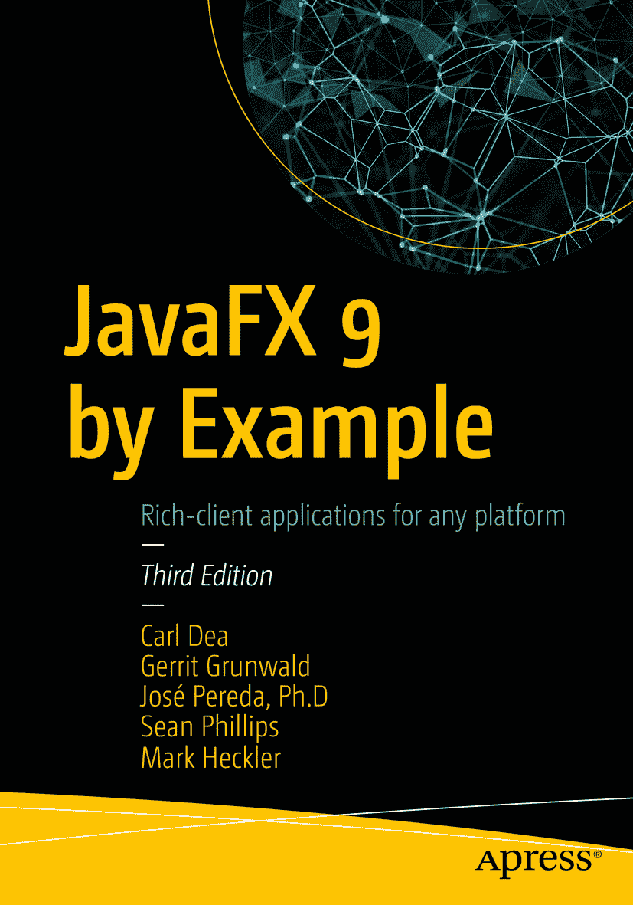
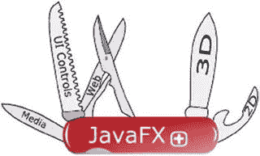

卡尔·迪亚、格里特·格伦瓦尔德、何塞·佩雷达、肖恩·菲利普斯与马克·赫克勒 著《JavaFX 9 实战》第三版

作者在本书中引用的任何源代码或其他补充材料，读者均可通过本书产品页面在 GitHub 上获取，网址为 [`www.apress.com/9781484219607`](http://www.apress.com/9781484219607)。如需更详细信息，请访问 [`http://www.apress.com/source-code`](http://www.apress.com/source-code)。ISBN 978-1-4842-1960-7 电子版 ISBN 978-1-4842-1961-4 [`doi.org/10.1007/978-1-4842-1961-4`](https://doi.org/10.1007/978-1-4842-1961-4) 美国国会图书馆控制号：2017952397 © 卡尔·迪亚、格里特·格伦瓦尔德、何塞·佩雷达、肖恩·菲利普斯与马克·赫克勒 2017 本作品受版权保护。出版商保留所有商业权利，涉及全部或部分材料，特别是翻译权、重印权、插图复用权、朗诵权、广播权、缩微胶片或其他物理形式的复制权，以及电子改编、计算机软件或目前已知或未来开发的类似或不同方法的传输与信息存储检索权。本书中可能出现商标名称、标识和图像。对于每个出现的商标名称、标识或图像，我们仅以编辑方式使用，并旨在维护商标所有者权益，无意侵犯商标。本出版物中使用的商品名称、商标、服务标志及类似术语，即使未明确标识，也不应被视为对其是否受专有权利保护的立场表达。尽管本书中的建议和信息在出版时被认为是真实准确的，但作者、编辑和出版商均不对可能存在的任何错误或遗漏承担法律责任。出版商对本书所含内容不作任何明示或暗示的保证。本书采用无酸纸印刷，通过 Springer Science+Business Media New York 向全球图书贸易发行，地址：233 Spring Street, 6th Floor, New York, NY 10013。电话：1-800-SPRINGER，传真：(201) 348-4505，电子邮件：orders-ny@springer-sbm.com，或访问 www.springeronline.com。Apress Media, LLC 是一家加利福尼亚有限责任公司，其唯一成员（所有者）为 Springer Science + Business Media Finance Inc (SSBM Finance Inc)。SSBM Finance Inc 是一家特拉华州公司。

## 引言

欢迎阅读《JavaFX 9 实战》。

### 什么是 JavaFX？

JavaFX 是 Java 的下一代图形用户界面（GUI）工具包，允许开发者快速构建丰富的跨平台应用程序。JavaFX 从头开始构建，通过硬件加速图形利用现代 GPU，同时提供设计精良的编程接口，使开发者能够结合图形、动画和 UI 控件。全新的 JavaFX 9 是一个纯 Java 语言应用程序编程接口（API）。JavaFX 的目标是应用于多种设备类型，如嵌入式设备、智能手机、电视、平板电脑和台式机。

前 Oracle 开发副总裁 Nandini Ramani 在《Introducing JavaFX》截屏视频中明确阐述了 JavaFX 作为平台的预期发展方向：

> 行业正朝着配备 GPU 的多核/多线程平台发展。JavaFX 利用这些特性来提高执行效率和 UI 设计灵活性。我们的初始目标是为企业应用程序的架构师和开发者提供一套工具和 API，帮助他们构建更好的数据驱动型业务应用程序。
> ——Nandini Ramani，前 Oracle 公司 Java 客户端平台开发副总裁

在 JavaFX 诞生之前，开发丰富的客户端应用程序需要整合许多独立的库和 API 才能实现功能强大的应用程序。这些独立的库包括媒体、UI 控件、Web、3D 和 2D API。由于将这些 API 整合在一起相当困难，Oracle 的杰出工程师们创建了一套全新的 JavaFX 库，将所有相同功能整合在一个框架下。JavaFX 堪称 GUI 工具包中的“瑞士军刀”（图 FM-1）。JavaFX 9 是一个纯 Java（语言）API，允许开发者利用现有的 Java 库和工具。

图 FM-1.

JavaFX

根据你交谈的对象不同，你可能会遇到对“用户体验”（或在 UI 领域中的 UX）的不同定义。但有一个事实始终不变——用户总是要求 GUI 应用程序提供更好的内容和更高的可用性。鉴于这一事实，开发者和设计师经常合作打造应用程序以满足这一需求。JavaFX 提供了一个工具包，帮助开发者和设计师（在某些情况下是同一个人）创建既实用又美观的应用程序。另外需要承认的是，在开发游戏、媒体播放器或常见的企业应用程序时，JavaFX 不仅有助于开发更丰富的用户界面，你还会发现其 API 设计得极为出色，能大幅提升开发者的生产力（我们始终关注 API 使用者的视角）。

尽管本书并未详尽研究 JavaFX 8 和 9 的所有功能，但你会找到有助于构建更丰富应用程序的常见用例。希望本书能通过提供实用的真实世界示例，为你指明正确的方向。

## 历史沿革

2005 年，Sun Microsystems 收购了 SeeBeyond 公司，该公司有一位名叫 Chris Oliver 的软件工程师创建了一种图形丰富的脚本语言，称为 F3（Form Follows Function）。F3 后来由 Sun Microsystems 在 2007 年 JavaOne 大会上以 JavaFX 的名义发布。2009 年 4 月 20 日，Oracle 公司宣布收购 Sun Microsystems，使 Oracle 成为 JavaFX 的新管理者。

在 2010 年 JavaOne 大会上，Oracle 宣布了 JavaFX 路线图，其中包括逐步淘汰 JavaFX 脚本语言，并重新为 Java 平台创建基于 Java API 的 JavaFX 平台。根据 2010 年路线图的承诺，JavaFX 2.0 SDK 于 2011 年 10 月在 JavaOne 大会上发布。除了发布 JavaFX 2.0，Oracle 还承诺将采取措施开源 JavaFX，从而让社区帮助推动平台发展。开源 JavaFX 将提高其采用率，加快错误修复的周转时间，并带来新的增强功能。

在 JavaFX 2.1 和 2.2 之间，新功能的数量迅速增长。表 FM-1 显示了 2.1 和 2.2 版本之间包含的众多功能。JavaFX 2.1 是 MacOS 上 Java SDK 的官方版本。JavaFX 2.2 是 Linux 操作系统上 Java SDK 的官方版本。

Java 8 于 2014 年 3 月 18 日发布。Java 8 拥有许多新的 API 和语言增强功能，包括 lambda 表达式、Stream API、Nashorn JavaScript 引擎和 JavaFX API。关于 JavaFX 8，其功能包括 3D 图形、富文本支持和打印 API。

Java 9 预计于 2017 年 9 月发布。Java 9 拥有众多功能，但最重要的功能是模块化，即广为人知的 Project Jigsaw。

## 本书学习内容

本书将通过实践示例，带你学习 JavaFX 9 的各项功能。这些示例将逐步为你提供创建丰富客户端应用程序所需的知识。秉承 Java“一次编写，随处运行”的理念，JavaFX 也延续了这一精神。由于 JavaFX 9 完全使用 Java 语言编写，你将感到得心应手。

大多数示例可以在 Java 8 下编译和运行。不过，其中一些示例旨在利用 Java 9 的语言增强特性。在通过本书学习 JavaFX 8 和 9 的过程中，你会发现 JavaFX API 和语言增强功能将帮助你成为一名更高效的开发者。话虽如此，我们仍鼓励你探索 Java 8 的所有新特性。

本书涵盖 JavaFX 8 和 9 的基础知识、模块、Lambda 表达式、属性、布局、UI 控件、打印机、动画、自定义 UI、图表、媒体、Web、3D、Arduino、触摸事件和手势。

## 本书读者对象

如果你是一名 Java 开发者，希望将客户端应用程序提升到新高度，那么本书将成为你的指南，帮助你开始创建可用且美观的用户界面。此外，如果你是一名经验丰富的 Java Swing、Flash/Flex、SWT 或 Web 开发者，想要学习如何创建高性能的丰富客户端应用程序，那么本书也适合你。

## 本书结构

本书按照从入门到中级再到高级概念的自然递进顺序编排。对于 Java 开发者而言，本书中提到的任何概念都不应过于难以理解。本书完全基于示例，并在演示应用程序之前讨论主要概念。对于每个项目，在展示代码执行输出后，我们将提供详细的解释，逐步讲解代码。每个示例都可以轻松调整，以满足你在开发游戏、媒体播放器或常规企业应用程序时的自身需求。你作为 Java UI 开发者的经验越丰富，就越能自由地跳转到本书的不同章节和示例。然而，任何 Java 开发者都可以通读本书，并学习增强日常 GUI 应用程序所需的技能。

致谢

我要感谢我出色的妻子 Tracey 和我的女儿 Caitlin 与 Gillian，感谢她们充满爱意的支持和牺牲。特别感谢我的女儿 Caitlin，她在第一版中帮助我绘制插图并构思有趣的示例。衷心感谢 Jim Weaver，他是一位出色的导师和朋友。我还要感谢 Josh Juneau 在整个过程中给予的建议和指导。非常感谢 Brian Molt，他提供了出色的反馈，最重要的是，他测试了我的代码示例。还要感谢 David Coffin 对第二版进行技术审阅。向我的合著者 Gerrit Grunwald、José Pereda、Sean Phillips 和 Mark Heckler 致敬，他们才华横溢。我的合著者们是真正的超级英雄，他们挺身而出，使本书得以问世。

向 Apress 的优秀员工们致以崇高的敬意，感谢他们的专业精神和支持。特别感谢 Jonathan Gennick 对我的信任，并一次次地鞭策我。感谢 Jill Balzano 让我们保持正轨并最终完成。

感谢所有在 Twitter 上关注我的人，尤其是与 JavaFX、UI/UX 和 IoT 相关的话题（标签）。同时，感谢《Pro JavaFX》一书的作者们（Jim Weaver、Weiqi Gao、Stephen Chin、Dean Iverson 和 Johan Vos）允许我在第一版中担任技术审阅章节。还要感谢 Stephen Chin 和 Keith Combs 领导出色的 JavaFX 用户组。我还要感谢 Rajmahendra Hegde 在 eWidgetFX 开源框架方面给予的帮助。感谢 Hendrik Ebbers 在过去的 JavaOne 大会上总是希望与我合作进行演讲和有趣的项目。最重要的是，感谢所有过去 JavaFX 1.x 书籍的作者们，他们激励了我。

衷心感谢整个 JavaFX 社区，其中成员众多，无法一一列举。最后，我要向在 JavaFX 2.x、8 和 9 发布期间直接或间接帮助过我的 Oracle 员工和前员工们致以崇高的敬意和感谢：Nandini Ramani、Jonathan Giles、Jasper Potts、Richard Bair、Angela Caicedo、Stuart Marks、John Yoon、David Grieve、Michael Heinrichs、David DeHaven、Nicolas Lorain、Kevin Rushforth、Sheila Cepero、Gail Chappell、Cindy Castillo、Scott Hommel、Joni Gordon、Alexander Kouznetsov、Irina Fedortsova、Dmitry Kostovarov、Alla Redko、Nancy Hildebrandt，以及所有参与其中的 Java、JavaFX 和 NetBeans 团队。

所以，你们或吃或喝，无论做什么，都要为荣耀神而行（哥林多前书 10:31，NASB）。

> ——卡尔·迪亚

目录 第 1 章：入门 1 下载所需软件 1 安装 Java 9 开发工具包 3 在 Microsoft Windows 上安装 JDK 3 在 MacOS X 上安装 JDK 7 在 Linux 上安装 JDK 11 设置环境变量 14 设置 Windows 环境变量 16 设置 MacOS X/Linux 环境变量 19 安装 Gradle 22 安装 NetBeans IDE 23 创建 JavaFX HelloWorld 应用程序 29 使用 NetBeans IDE 30 使用编辑器和终端（命令行提示符） 34 在命令行提示符下使用 Gradle 38 解读 HelloWorld 源代码 41 JavaFX 场景图 42 JavaFX 节点 42 打包 JavaFX 应用程序 43 下载本书源代码 44 总结 45 第 2 章：JavaFX 与 Jigsaw 47 什么是 Project Jigsaw？ 48 优势 48 劣势 49 Java 9 迁移路径 49 历史 52 JAR 地狱 52 OSGi 53 Maven/Gradle 54 入门 55 什么是模块路径？ 56 模块定义 57 模块类型 58 一个 HelloWorld JavaFX 9 模块化应用示例 63 创建项目结构 63 创建模块定义 63 创建主应用程序代码 64 编译代码（模块） 65 复制资源 65 运行应用程序 66 将应用程序打包为 JAR 66 以 JAR 形式运行应用程序 67 显示模块描述 67 总结 68 第 3 章：JavaFX 基础 69 JavaFX 线条 69 绘制线条 74 绘制形状 78 绘制复杂形状 79 复杂形状示例 79 三次曲线 83 冰淇淋蛋筒 84 笑脸 86 甜甜圈 86 绘制颜色 88 颜色示例 88 渐变颜色 92 停止颜色 92 线性渐变 92 径向渐变 93 半透明渐变 94 反射循环渐变 94 绘制文本 95 更改文本字体 97 应用文本效果 100 总结 101 第 4 章：Lambda 表达式与属性 103 Lambda 103 Lambda 表达式 104 函数式接口 107 聚合操作 108 默认方法 111 示例：大猫和小猫 111 示例代码 112 代码解释 116 属性与绑定 117 UI 模式 117 属性 117 JavaFX 属性类型 118 JavaFX JavaBean 120 属性更改支持 121 绑定 122 双向绑定 123 高级绑定 123 低级绑定 124 登录对话框示例 124 登录对话框源代码 126 代码解释 130 总结 134 第 5 章：布局与 Scene Builder 135 布局 135 HBox 136 VBox 140 FlowPane 144 BorderPane 144 GridPane 145 Scene Builder 150 下载并安装 Scene Builder 151 启动 Scene Builder 151 代码演练 169 总结 170 第 6 章：用户界面控件 171 标签 171 自定义字体 173 字体作为图标 174 示例：使用第三方字体包作为图标 174 工作原理 181 按钮 185 按钮 185 复选框 186 超链接 187 单选按钮 187 示例：按钮乐趣 189 按钮乐趣说明 189 ButtonFun.java 源代码 190 工作原理 196 菜单 198 创建菜单和菜单项 198 调用选中的 MenuItem 199 示例：使用菜单 200 工作原理 202 选择菜单和菜单项的其他方式 203 ObservableList 集合类 204 使用 ListView 204 示例：英雄选择器 205 工作原理 208 使用 TableView 209 什么是单元格工厂？ 209 使表格单元格可编辑 210 示例：老板与员工——使用表格 212 生成后台进程 221 创建后台任务 221 示例：文件复制进度对话框（后台进程） 222 工作原理 225 总结 226 第 7 章：图形 227 使用图像 227 加载图像 228 显示图像 230 照片查看器示例 231 功能/说明 231 UML：类图 233 文件描述 234 源代码 235 动画 255 什么是关键值？ 255 什么是关键帧？ 255 什么是时间线？ 256 JavaFX 过渡类 256 点击游戏示例 257 源代码 257 工作原理 261 复合过渡 261 PhotoViewer2 示例 262 总结 264 第 8 章：JavaFX 打印 265 JavaFX 打印 265 JavaFX 打印 API 268 Printer 和 PrinterJob 268 查询打印机属性 270 配置打印作业 272 打印网页 274 WebDocPrinter 应用示例 275 源代码 277 它是如何工作的？ 281 总结 282 第 9 章：媒体与 JavaFX 283 媒体事件 283 播放音频 285 MP3 播放器示例 285 MP3 音频播放器源代码 287 工作原理 301 播放视频 314 MPEG-4 314 VP6 .flv 314 视频播放器示例 315 视频播放器源代码 316 工作原理 320 模拟隐藏式字幕：在视频媒体中标记位置 323 隐藏式字幕视频示例 323 工作原理 325 总结 325 第 10 章：Web 上的 JavaFX 327 JavaFX Web 与 HTTP2 API 328 Web 引擎 330 WebEngine 的 load()方法 330 WebEngine 的 loadContent()方法 331 HTML DOM 内容 331 获取 org.w3c.dom.Document（DOM）对象 331 使用原始 XML 内容作为字符串 332 JavaScript 桥接 332 从 Java 到 JavaScript 的通信 333 从 JavaScript 到 Java 的通信 333 Java 9 模块 jdk.incubator.httpclient 335 发起 RESTful 请求 339 HTTP GET 请求 340 HTTP POST 请求 341 WebSocket 342 查看 HTML5 内容（WebView） 345 示例：HTML5 模拟时钟 345 模拟时钟源代码 346 工作原理 349 Inkscape 与 SVG 349 Web 事件 350 天气小部件示例 351 一行代码：将输入流读入字符串 353 源代码 354 工作原理 363 增强功能 364 总结 365 第 11 章：JavaFX 3D 367 JavaFX 中的基本 3D 场景 367 一个非常基础的 3D 场景示例 367 基本体 369 添加基本体示例 369 简单的平移和旋转示例 371 多基本体变换示例 372 现在全部组合：分组基本体 373 与场景交互 374 基本体的拾取 375 使用键盘进行第一人称移动 376 使用鼠标进行第一人称摄像机移动 377 超越基础 379 使用 TriangleMesh 类创建自定义 3D 对象 380 “缠绕”与呼啸 380 MeshView 与 DrawMode 383 摄像机就位！ 388 点亮灯光 389 总结 390 第 12 章：JavaFX 与 Arduino 391 Arduino 板 391 为 Arduino 编程 393 Arduino Web 编辑器 394 Arduino IDE 396 Windows 396 MacOS X 或 Linux 398 运行 IDE 398 闪烁示例 400 方向可视化器示例 401 工作原理 406 串行读取 406 Java 简单串行连接器 406 JavaFX、图表 API 与方向 406 创建模块项目 407 串行通信 409 工作原理 412 测试串行通信 414 JavaFX 图表 API 414 构建并运行项目 420 工作原理 421 添加更多功能 425 构建并运行项目 427 工作原理 428 更多示例 430 总结 430 第 13 章：移动端 JavaFX 431 JavaFXPorts：移植到移动端 431 JavaFXPorts 底层原理 431 JavaFXPorts 入门 432 Hello Mobile World 示例 433 它是如何工作的？ 435 将应用提交到应用商店 437 Gluon Mobile 438 Gluon IDE 插件 438 Charm Glisten 439 许可证 441 示例：BasketStats 应用 441 创建项目 441 添加模型 447 添加服务 450 修改主视图 453 修改面板视图 457 部署到移动端 464 更多示例 465 总结 465 第 14 章：JavaFX 与手势 467 在应用中识别手势 467 示例：使用触摸事件沿路径动画化形状 469 它是如何工作的？ 472 3D 中的触摸、旋转和缩放 473 Leap Motion 控制器 476 工作原理 477 Leap SDK 入门 478 将 Leap SDK 添加到 JavaFX 项目 479 手部追踪示例 479 LeapListener 类 480 3D 模型类 483 应用程序类 485 构建并运行项目 487 更多示例 489 总结 489 第 15 章：自定义 UI 491 主题化 491 原生外观 493 Web 和移动端外观 495 应用 JavaFX CSS 主题 497 切换主题示例 500 JavaFX CSS 样式 505 什么是选择器？ 506 如何定义基于-fx-的样式属性（规则） 511 遵守 JavaFX CSS 规则 512 自定义控件 513 LED 自定义控件 514 LED 自定义控件示例代码结构 515 LED 控件的属性 516 LED 控件的初始化代码 519 创建自定义控件的其他方式 523 总结 523 第 16 章：附录 A：参考资料 525 Java 9 SDK 525 Java 9 API 文档 525 Java 9 特性 525 Java 9 Jigsaw 526 IDE 526 部署应用程序 526 JavaFX 2D 形状 527 JavaFX 颜色 527 JavaFX 2.x 构建器类 527 JavaFX 打印 527 Project Lambda 528 Nashorn 529 属性与绑定 529 布局 530 JavaFX 工具 530 企业级 GUI 框架 531 领域特定语言 532 自定义 UI 532 操作系统样式指南 535 JavaFX 媒体 535 Web 上的 JavaFX 536 JavaFX 3D 537 JavaFX 游戏 538 Java IoT 与 JavaFX 嵌入式 539 软件与设备制造商 540 JavaFX 社区 540 应用程序 541 Java/JavaFX 书籍与杂志 543 作者博客 544 教程、课程、咨询公司与演示 544 工具、应用程序与库 545 JavaFX 视频与演示 547 索引 551 内容速览 关于作者 xix   关于技术审校 xxi   致谢 xxiii   引言 xxv   第 1 章：入门 1   第 2 章：JavaFX 与 Jigsaw 47   第 3 章：JavaFX 基础 69   第 4 章：Lambda 表达式与属性 103   第 5 章：布局与 Scene Builder 135   第 6 章：用户界面控件 171   第 7 章：图形 227   第 8 章：JavaFX 打印 265   第 9 章：媒体与 JavaFX 283   第 10 章：Web 上的 JavaFX 327   第 11 章：JavaFX 3D 367   第 12 章：JavaFX 与 Arduino 391   第 13 章：移动端 JavaFX 431   第 14 章：JavaFX 与手势 467   第 15 章：自定义 UI 491   第 16 章：附录 A：参考资料 525   索引 551   关于作者与关于技术审校 关于作者 关于技术审校

