# 1. 入门指南

要开始使用本书学习 JavaFX 9，你需要搭建开发环境，以便编译和运行书中的众多示例。本章将介绍如何安装所需软件，例如 Java 开发工具包（JDK）和 NetBeans 集成开发环境（IDE）。安装完所需软件后，你将开始创建一个传统的 JavaFX HelloWorld 示例。当你熟悉开发环境后，我将带你逐步解析 JavaFX HelloWorld 的源代码。最后，你将了解如何将应用程序打包为独立的应用程序，以便启动和分发。

我知道许多开发者对自己偏好的 IDE 和编辑器情有独钟，因此我也提供了三种编译和运行 HelloWorld 示例的方法。第一种方法使用 NetBeans IDE 编译和运行代码，第二种方法教你如何使用命令行（终端窗口），第三种方法则使用名为 Gradle 的构建工具来编译和启动 JavaFX 应用程序。第二种和第三种方法适用于不喜欢复杂 IDE 的开发者。如果你更习惯使用 Eclipse 和 IntelliJ IDE，那么你会很高兴地知道，Gradle 可以生成相应的项目文件，让你的项目能够轻松加载到这些 IDE 中。

如果你已经熟悉 Java 开发工具包（JDK）、Gradle 和 NetBeans IDE 的安装，可以直接跳到第 2 章，该章介绍 Java 9 Jigsaw。让我们开始吧！

## 下载所需软件

在使用本书时，你会发现许多示例可能仍使用 Java 8 JDK 编写；但第 2 章和其他一些章节将涉及 Java 9 特有的概念，因此需要 Java 9 JDK。Java 平台的主要变化之一是模块化（Jigsaw）。模块化将真正改变你的客户端应用程序。你可能很想知道，“它到底是如何改变的？” 想象一下，构建一个在内存和磁盘空间上占用更小空间的 Java 应用程序。这意味着用户将体验到更快的加载速度和更好的用户体验！

话虽如此，请继续下载 Java 9 Java 开发工具包（JDK）或更高版本。在本章中，你将看到在 Windows、MacOS X 和 Linux 上安装 JDK 的步骤。你可以从以下网址下载 Java 9 JDK：

[`http://www.oracle.com/technetwork/java/javase/downloads/index.html`](http://www.oracle.com/technetwork/java/javase/downloads/index.html)

另一个在先前版本中未提及的工具是 Gradle。Gradle 已成为现实世界中构建项目和产物的行业标准。稍后，我将带你了解如何安装 Gradle，但现在请前往 `gradle.org` 查找下载链接。在下载链接处，你将看到两个二进制发行版。一个是纯二进制发行版，另一个是包含源代码和文档的完整发行版。构建应用程序需要二进制发行版，因此你需要下载它。请前往以下网址下载 Gradle 的构建工具：

[`https://gradle.org/gradle-download`](https://gradle.org/gradle-download)

对于本书而言，安装集成开发环境（IDE）是可选的；但如果你选择使用 IDE，你将获得代码高亮、代码补全、增量调试、重构以及许多现代开发者便利功能的所有好处。业界最常用的三大 IDE 是 NetBeans、IntelliJ 和 Eclipse。尽管本书会带你安装 NetBeans IDE，但这并不意味着我们偏爱 NetBeans 或任何其他 IDE。我选择 NetBeans 是因为它的发布计划通常与主要 JDK 版本同步，并且它相当成熟，尤其是在工具支持和 JavaFX 应用程序开发方面。NetBeans 内置了许多 JavaFX 演示项目（示例模板）和 Scene Builder 工具。Scene Builder 是一个用于可视化构建 JavaFX 用户界面的图形化工具。

另一个专业提示是学习 Gradle 任务，这些任务能够通过单个命令为 IntelliJ 或 Eclipse IDE 生成 Java 项目。要了解更多关于可以自动设置 IntelliJ 和 Eclipse 项目的 Gradle 任务，请访问以下链接：

*   IntelliJ：[`https://docs.gradle.org/current/userguide/idea_plugin.html`](https://docs.gradle.org/current/userguide/idea_plugin.html)
*   Eclipse：[`https://docs.gradle.org/current/userguide/eclipse_plugin.html`](https://docs.gradle.org/current/userguide/eclipse_plugin.html)

以下是下载你喜爱的 IDE 的网址：

*   NetBeans：[`https://netbeans.org/downloads`](https://netbeans.org/downloads)
*   IntelliJ：[`https://www.jetbrains.com/idea/download`](https://www.jetbrains.com/idea/download)
*   Eclipse：[`https://eclipse.org/downloads`](https://eclipse.org/downloads)

目前，来自 Oracle 公司的 JavaFX 9 支持以下操作系统：

*   Windows 操作系统（Vista、7、8、10）32 位和 64 位
*   MacOS X（64 位）
*   Ubuntu Linux 12.x - 13.x（32 位和 64 位）

要查看所有受支持操作系统的详细列表，请访问以下链接：

[`http://jdk.java.net/9/supported`](http://jdk.java.net/9/supported)

虽然你可能看不到你支持的操作系统或硬件，但你会很高兴地了解到 OpenJDK 和 OpenJFX 项目，它们允许你自己构建 Java 和 JavaFX！要了解更多关于 OpenJDK 或 OpenJFX 的信息，请访问以下网址：

*   OpenJDK：[`http://openjdk.java.net`](http://openjdk.java.net)
*   OpenJFX：[`https://wiki.openjdk.java.net/display/OpenJFX/Main`](https://wiki.openjdk.java.net/display/OpenJFX/Main)

为你的操作系统下载合适的软件版本后，你将安装 Java 9 JDK、Gradle 和/或你选择的 IDE。

## 安装 Java 9 开发工具包

下载完适用于你特定操作系统的正确 Java 版本后，请按照本节概述的步骤安装 Java 9 JDK。我假设你已经下载了 Oracle 的 Java 9 JDK，但如果没有，请前往以下位置：

[`http://www.oracle.com/technetwork/java/javase/downloads/index.html`](http://www.oracle.com/technetwork/java/javase/downloads/index.html)

在接下来的几节中，你将按照步骤在三种流行的操作系统上安装 Java 9：Microsoft Windows、MacOS X 和 Linux。


### 在 Microsoft Windows 上安装 JDK

以下步骤使用适用于 Windows 10 操作系统的 Java 9 JDK 64 位版本。如果你的 Windows 操作系统不同，请参考以下链接了解更多详情。

[`http://www.oracle.com/technetwork/java/javase/overview/index.html`](http://www.oracle.com/technetwork/java/javase/overview/index.html)

以下是在 Windows 操作系统上安装 Java 9 JDK 的步骤：

1.  右键单击安装程序的可执行文件（`jdk-9-windows-x64.exe`），选择以管理员身份运行，以安装 Java 9 JDK。通常，其他操作系统也会弹出类似的警告对话框，提醒你安装或运行二进制文件的风险。点击“运行”按钮继续。
2.  点击“下一步”按钮开始安装过程，如图 1-1 所示。

    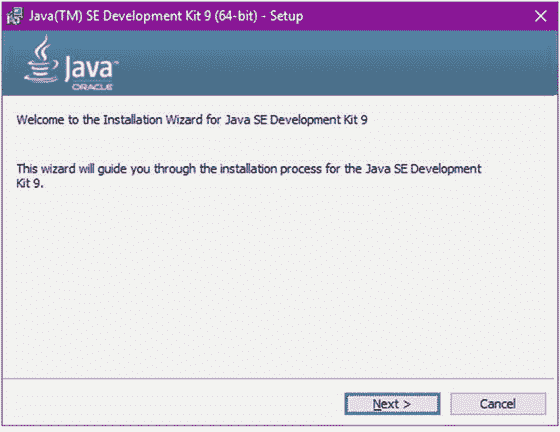

    图 1-1.

    Java SE Development Kit 9 安装过程
3.  接下来，你将看到“自定义安装”窗口，允许你选择可选功能，如图 1-2 所示。在此处，你只需接受默认选择，然后点击“下一步”按钮继续。

    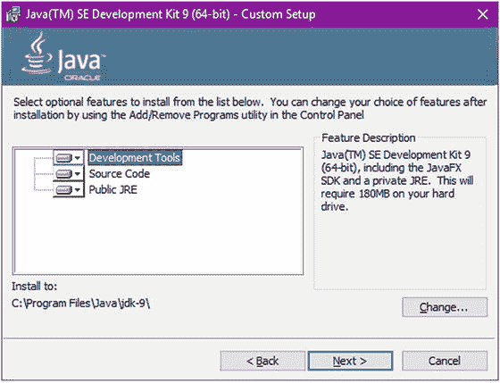

    图 1-2.

    Java SE Development Kit 9 可选功能
4.  之后，安装过程将显示一个进度条，如图 1-3 所示。

    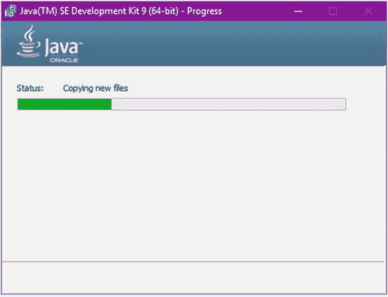

    图 1-3.

    Java SE Development Kit 9 安装进行中
5.  接下来，会弹出一个对话框询问你是否要更改 Java 运行时的安装目录。只需点击“下一步”按钮并接受默认目录，如图 1-4 所示。

    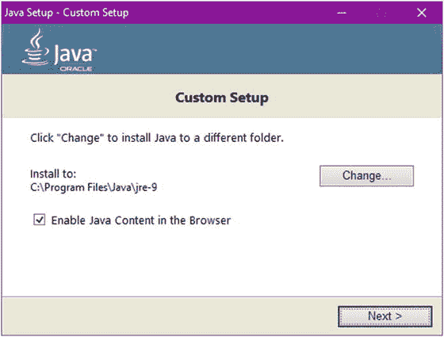

    图 1-4.

    Java 9 运行时目标目录
6.  要完成 Java 9 SE Development Kit 的安装，请点击“关闭”按钮退出，如图 1-5 所示。

    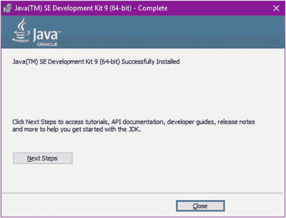

    图 1-5.

    安装的最后部分提示 Java SE Development Kit 9 已成功安装

### 在 MacOS X 上安装 JDK

以下步骤使用适用于 MacOS X (El Capitan) 操作系统的 Java 9 JDK 64 位版本。它假设你已经下载了 JDK，并且文件名类似于以下内容：

```
jdk-9-ea-bin-b88-macosx-x86_64-21_oct_2015.dmg
```

使用以下步骤在 MacOS X 操作系统上安装 Java 9 JDK：

1.  启动 `dmg` 文件后，你将看到如图 1-6 所示的对话框。接下来，双击图标开始安装过程。

    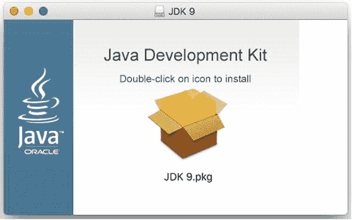

    图 1-6.

    MacOS X 操作系统上的 Java 9 JDK 安装程序
2.  接下来，要开始如图 1-7 所示的安装过程，请点击“继续”。在剩余的安装过程中，接受默认设置。

    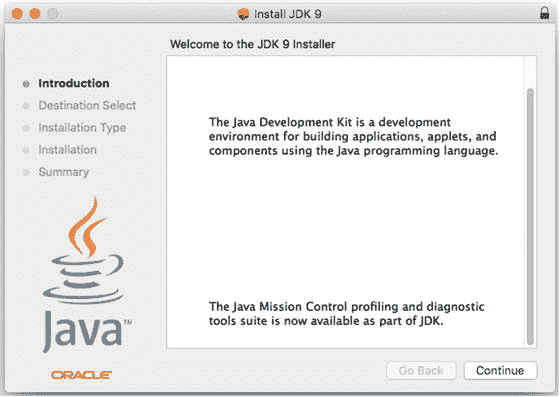

    图 1-7.

    MacOS X 操作系统的 Java 9 JDK 安装程序介绍
3.  点击“继续”按钮后，对话框将提示 JDK 在你的计算机上占用的磁盘空间大小，如图 1-8 所示。点击“安装”按钮继续。

    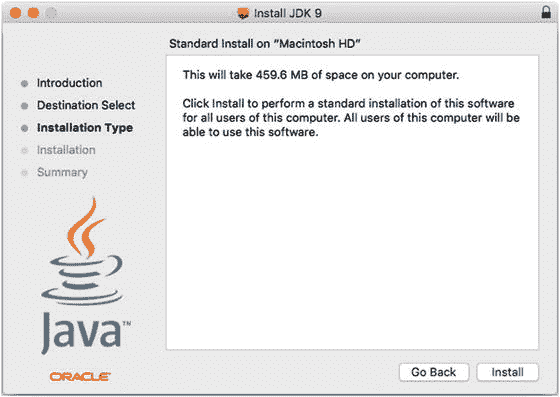

    图 1-8.

    提示 JDK 将使用多少空间的提示
4.  出于安全目的，你的 MacOS X 会提示你输入密码以允许安装程序继续，如图 1-9 所示。这假设你拥有安装软件的管理员权限。输入密码后，点击“安装软件”按钮启动该过程。

    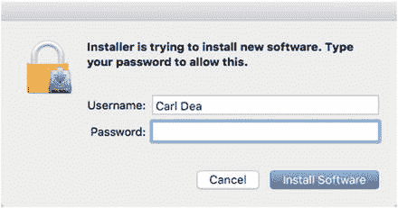

    图 1-9.

    权限窗口提示输入用户名和密码，以允许 JDK 软件安装在本地机器上
5.  安装过程将需要几秒钟，如图 1-10 所示。

    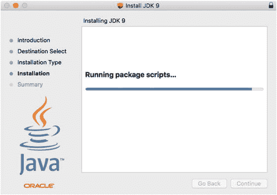

    图 1-10.

    JDK 安装进行中
6.  最后，你将点击“关闭”按钮，如图 1-11 所示。这完成了在 MacOS 操作系统上的 JDK 安装。

    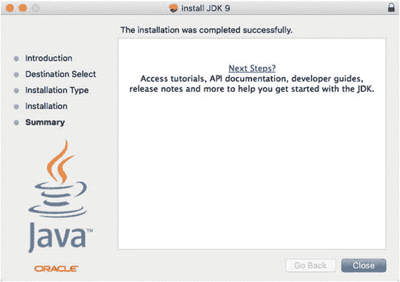

    图 1-11.

    JDK 安装完成

完成 JDK 安装后，你将在本章后面学习如何设置环境变量。接下来是在基于 Linux 的操作系统上安装 JDK 9 的说明。

### 在 Linux 上安装 JDK

首先，你应该通过在终端中输入以下命令来确定你的 Linux 系统是 32 位还是 64 位架构：

```
$ uname -m
```

在 64 位 Linux 机器上的输出如下：

```
x86_64
```

在 32 位 Linux 机器上的输出如下：

```
i686
```

假设你已从以下位置下载了 Java JDK：

[`http://www.oracle.com/technetwork/java/javase/downloads/index.html`](http://www.oracle.com/technetwork/java/javase/downloads/index.html)

对于 Linux 世界的用户，你需要下载一个类似以下名称的文件：

*   `jdk-9-bin-b88-linux-i586-21_oct_2015.tar.gz`
*   `jdk-9-bin-b88-linux-i586-21_oct_2015.rpm`。

找到下载的文件（`*.gz` 或 `*.rpm`），然后转到你的终端窗口开始安装过程。安装过程的说明在下一节中。

注意

在撰写本书时，使用的 Java 9 JDK 是 EA（早期版本）版本，因此 `JAVA_HOME` 目录名称可能会发生变化。请访问 Java 9 JDK 的安装说明以获取更多详细信息：[`https://docs.oracle.com/javase/9/install/installation-jdk-and-jre-linux-platforms.htm`](https://docs.oracle.com/javase/9/install/installation-jdk-and-jre-linux-platforms.htm)。

#### Fedora、CentOS、Oracle Linux 或 Red Hat Enterprise Linux 操作系统

下载 `gz` 文件后，你需要对其进行解压缩。在 Fedora、CentOS、Oracle Linux 或 Red Hat Enterprise Linux 操作系统上，输入以下命令来安装 JDK。

如果用户未在 `sudoers` 文件中注册，则需要 `su` 为 `root` 用户来执行以下命令。

```
$ mv ∼/Downloads/jdk-9-linux-x64.tar.gz /tmp
$ cd /tmp
$ tar zxvf /tmp/jdk-9-linux-x64.tar.gz
$ sudo mkdir /opt/jdk/
$ sudo mv jdk-9 /opt/jdk
```

如果你下载了 Java 9 JDK 的 `rpm` 版本，请使用以下命令：

```
$ sudo rpm -ivh jdk-9-linux-x64.rpm
```


#### Red Hat 替代方案

在系统上安装 JDK 9 后，你可能会遇到之前安装的其他 Java 版本。基于 Red Hat/CentOS 的操作系统提供了一种在 JDK 和 JRE 之间切换的方法。由于你已将 JDK 9 安装在 `/opt/jdk` 目录中，你需要使用 `alternatives` 将新的 JDK 9 注册为默认 Java。

首先，让我们在 `alternatives` 中注册新安装的 Java 可执行文件。你需要输入以下命令。这些命令将更新所有索引，以优先级 `100` 注册 Java，并显示所有已安装的已注册 Java 运行时。

```
$ sudo update
$ sudo alternatives --install /usr/bin/java java /opt/jdk/jdk-9/bin/java 100
```

接下来，你需要设置刚刚添加的默认 Java 版本。

```
$ sudo alternatives --config java
There are 3 programs which provide 'java'.
Selection    Command

* 1          /opt/jdk/jdk1.8.0_51/bin/java
+ 2          /opt/jdk/jdk1.8.0_66/bin/java
3          /opt/jdk/jdk-9/bin/java
Enter to keep the current selection[+], or type selection number: 3
```

要测试 `alternatives` 是否指向了正确的版本，只需在终端窗口中输入以下内容：

```
$ java -version
```

输出如下：

```
java version "1.9.0-ea"
Java(TM) SE Runtime Environment (build 1.9.0-ea-b90)
Java HotSpot(TM) 64-Bit Server VM (build 1.9.0-ea-b90, mixed mode)
```

你还需要为 `javac` 编译器配置替代方案，执行与之前类似的步骤。

```
$ sudo alternatives --install /usr/bin/javac javac /opt/jdk/jdk-9/bin/javac 100
$ sudo alternatives --config javac
There are 3 programs which provide 'javac'.
Selection    Command

* 1          /opt/jdk/jdk1.8.0_51/bin/javac
+ 2          /opt/jdk/jdk1.8.0_66/bin/javac
3          /opt/jdk/jdk-9/bin/javac
```

要测试 `alternatives` 是否指向了正确的 Java 编译器版本，只需输入以下内容：

```
$ javac -version
javac 1.9.0-ea
```

#### Ubuntu/Debian

当使用 Ubuntu 或 Debian Linux 时，你可以通过两种方式获取 Oracle 的 Java JDK。第一种方式是使用 `apt-get` 命令，第二种方式是从前面提到的官方网站下载 JDK。

使用 Ubuntu 或 Debian，你可以使用 `apt-get` 命令下载并安装 Oracle 的官方 JDK 9：

```
$ sudo apt-get update
$ sudo apt-get install oracle-java9-installer
```

从 Oracle 下载站点下载 Linux 版本后，你可以手动解压 `gz` 文件。对于 Ubuntu/Debian Linux 发行版，打开终端并输入以下命令：

```
$ mv ∼/Downloads/jdk-9-linux-x64.tar.gz /tmp
$ cd /tmp
$ tar zxvf jdk-9-linux-x64.tar.gz
$ sudo mv jdk-9 /usr/lib/jvm/
```

在 Ubuntu/Debian 系统上安装 JDK 9 后，你可能会遇到之前安装的其他 Java 版本。基于 Ubuntu/Debian 的操作系统提供了一种通过名为 `update-alternatives` 的工具在 JDK 和 JRE 之间切换的方法。假设你已使用 `apt-get` 安装了 JDK 9，它通常会将 JDK 放在 `/usr/lib/jvm` 目录中。现在，你需要使用 `alternatives` 来注册新的 JDK 9（`java` 和 `javac`）。

##### 默认 Java

输入以下命令在 `alternatives` 中注册新的 JDK：

```
$ sudo update
$ sudo update-alternatives --install /usr/bin/java java /usr/lib/jvm/jdk-9-linux-x64/bin/java 100
```

接下来，你需要将新注册的 `java` 设置为默认版本。输入以下命令：

```
$ sudo update-alternatives --config java
There are 2 choices for the alternative java (providing /usr/bin/java).
Selection    Path                                      Priority   Status

* 0            /usr/lib/jvm/java-8-openjdk/jre/bin/java  1061       auto mode
1            /usr/lib/jvm/java-9-oracle/bin/java       100        manual mode
Press enter to keep the current choice[*], or type selection number: 1
$ sudo update-alternatives --display java
Selection    Path                                       Priority   Status

0            /usr/lib/jvm/java-8-openjdk/jre/bin/java   1061       auto mode
* 1            /usr/lib/jvm/java-9-oracle/bin/java        100        manual mode
```

##### 默认 Javac

你还需要切换 `javac` 编译器。要设置 Java 编译器，输入以下命令来注册新的 `javac`：

```
$ sudo update-alternatives --install /usr/bin/javac javac /usr/lib/jvm/jdk-9-linux-x64/bin/javac 100
$ sudo update-alternatives --config javac
There are 2 choices for the alternative javac (providing /usr/bin/javac).
Selection    Path                                    Priority   Status

* 0            /usr/lib/jvm/java-8-openjdk/bin/javac   1061       auto mode
1            /usr/lib/jvm/java-9-oracle/bin/javac    100        manual mode
Press enter to keep the current choice[*], or type selection number: 1
$ sudo update-alternatives --config javac
There are 2 choices for the alternative javac (providing /usr/bin/javac).
Selection    Path                                    Priority   Status

0            /usr/lib/jvm/java-8-openjdk/bin/javac   1061       auto mode
* 1            /usr/lib/jvm/java-9-oracle/bin/javac    100        manual mode
```


## 设置环境变量

如果你没有使用 `aternatives` 的便捷功能来指向默认的 Java 二进制文件，你可以通过设置 Java 环境变量，采用传统方式来完成。本章未提及还有其他策略可以轻松切换 Java 版本，但理解 Java 的环境变量将使你能够在任何操作系统上安装和开发 Java 应用程序。

首先，你需要设置并更新几个重要的环境变量。如何设置它们以及它们应被设置的值，取决于你所选择的操作系统。需要设置的两个变量如下：

*   `JAVA_HOME`：告知操作系统 Java 安装目录的位置。
*   `PATH`：指定 Java 可执行文件目录的位置。此环境变量允许系统搜索包含可执行文件的路径或目录。Java 可执行文件位于 `JAVA_HOME` 主目录下的 `bin` 目录中。

以下是在 32 位 Windows 操作系统中需要设置的环境变量：

```
set JAVA_HOME="C:\Program Files (x86)\Java\jdk-9"
set PATH=%JAVA_HOME%\bin;%PATH%
```

在 64 位 Windows 中设置相同的变量，但值略有不同：

```
set JAVA_HOME="C:\Program Files\Java\jdk-9"
set PATH=%JAVA_HOME%\bin;%PATH%
```

注意

根据 JDK 版本的不同，`JAVA_HOME` 路径的名称会根据安装的版本而变化。例如，如果下一个版本命名为 JDK 9.0.1，那么路径很可能显示为 `JAVA_HOME="C:\Program Files\Java\jdk-9.0.1"`。要查看 Java 9 的 JDK 和 JRE 版本命名方案，请访问以下链接：

[`http://openjdk.java.net/jeps/223`](http://openjdk.java.net/jeps/223) 和

[`https://blogs.oracle.com/java-platform-group/a-new-jdk-9-version-string-scheme`](https://blogs.oracle.com/java-platform-group/a-new-jdk-9-version-string-scheme) 。

在类 Unix 平台（如 MacOS X 和 Linux）上，你的设置以及设置方式取决于你使用的 shell。以下示例分别展示了如何为 Bash、Bourne 和 CSH shell 设置所需的变量。

```
# Mac OS X /bin/bash
export JAVA_HOME=/Library/Java/JavaVirtualMachines/jdk-9.jdk/Contents/Home
export PATH=$PATH:$JAVA_HOME/bin
# Linux bash, bourne shell environments /bin/bash
export JAVA_HOME=/usr/java/jdk-9 export PATH=$PATH:$JAVA_HOME/bin
#csh environments /bin/csh
setenv JAVA_HOME /usr/java/jdk-9
setenv PATH ${JAVA_HOME}/bin:${PATH}
```

这些语句将仅为当前终端窗口会话临时设置环境变量。为了使 `JAVA_HOME` 和 `PATH` 更持久，你需要将它们添加到系统中，以便在登录时始终可用，这样无论何时启动或登录，它们都会被加载。根据你的操作系统，你需要能够编辑环境变量名称和值。

### 设置 Windows 环境变量

在 Windows 环境中，你可以使用键盘快捷键 Windows 徽标键+Pause/Break 键，然后点击“高级系统设置”（左侧链接）以显示“系统属性”窗口，如图 1-12 所示。

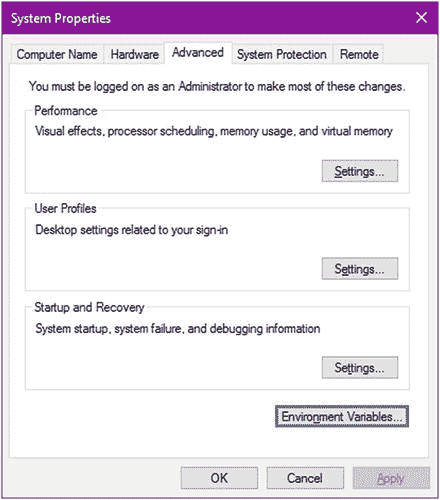

图 1-12.

系统属性窗口

接下来，点击“环境变量”按钮。此时，你可以添加、编辑和删除环境变量。你将使用已安装的主目录作为值来添加或编辑 `JAVA_HOME` 环境变量。Windows 操作系统上的“环境变量”窗口如图 1-13 所示。

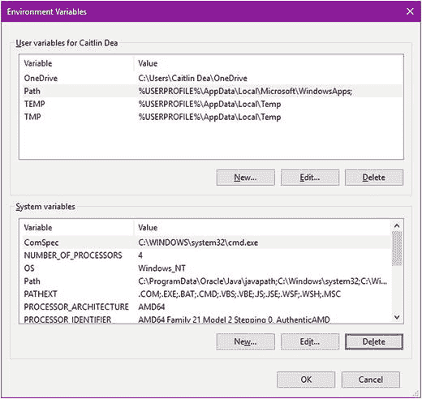

图 1-13.

Windows 环境变量窗口

要添加 `JAVA_HOME` 环境变量，请点击图 1-13 中所示的“新建”按钮。

点击“新建”按钮后，将出现图 1-14 所示的窗口，允许你输入环境变量名称和值。完成后，点击“确定”按钮。

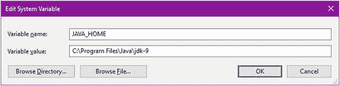

图 1-14.

用于输入 JAVA_HOME 环境变量的添加/编辑窗口

点击“确定”添加 `JAVA_HOME` 后，你需要更新 `Path` 环境变量，如图 1-15 所示。在“系统变量”区域中选择 `Path` 环境变量。然后，点击“编辑”按钮。

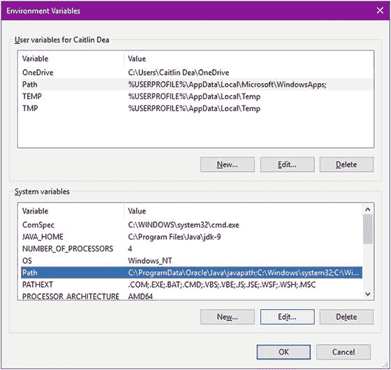

图 1-15.

编辑 Path 环境变量

在 Windows 10 中，你需要通过添加一个新条目来编辑 `Path` 环境变量，如图 1-16 所示。在此处，你将添加一个类似 `%JAVA_HOME%\bin` 的条目。要添加条目，请点击“新建”按钮。如果条目已存在，请点击“编辑”按钮。这允许系统识别 `JAVA_HOME` 的 `bin` 目录中的所有二进制可执行文件。换句话说，当你在终端或命令行提示符下时，系统将能够识别诸如 Java 编译器的 `javac.exe` 之类的文件。

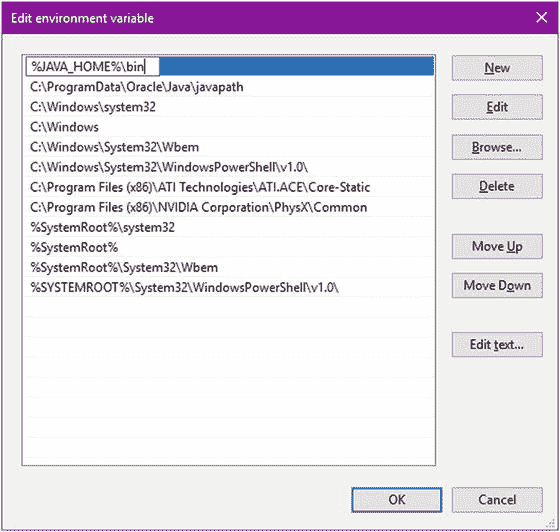

图 1-16.

将 %JAVA_HOME%\bin 添加到 Path 环境变量

在图 1-16 中，`%JAVA_HOME%\bin` 条目位于列表底部，但我通过点击“上移”按钮将其移到了顶部。


### 设置 MacOS X/Linux 环境变量

若要在 MacOS X 或 Linux 上永久设置环境变量，你可以使用 nano 或 vim 等常见文本编辑器。但在编辑用户 shell 配置文件之前，建议先备份一份，以防操作失误。由于许多 Unix 和 Linux 系统使用不同的 shell，我详细列出了需要复制和编辑的典型文件。

在 Mac 上，输入以下命令：

```
$ cp ∼/.bash_profile ∼/.bash_profile.orig
```

在 Linux 操作系统上，你需要输入以下命令来确定当前使用的 shell 类型，然后才能知道要复制和编辑哪个文件。不同的 shell 在创建控制台会话时使用不同的文件来导出环境变量。

```
$  echo $0
-bash
```

如果输出显示 `-bash`，则需要备份并编辑主目录下的 `.bashrc` 文件。如果输出显示 `-csh`，则需要备份并编辑主目录下的 `.cshrc` 文件。接下来，在编辑前先复制 `.bashrc` 文件作为备份。

```
$ cp ∼/.bashrc ∼/.bashrc.orig
```

如果你使用的是 Linux 操作系统且 shell 为 C shell，请输入以下命令：

```
$ cp ∼/.cshrc ∼/.cshrc.orig
```

现在，你需要使用 nano 或 vi 文本编辑器编辑刚刚备份的文件。要加载文件，请输入以下命令：

```
$ nano ∼/.bash_profile
```

或者

```
$ vi ∼/.bash_profile
```

请注意，我使用的是 MacOS X 操作系统 `home` 目录下的 `∼/.bash_profile` 文件。相信你会根据你的 Linux 操作系统和 shell 类型，将其替换为相应的文件。从上一个命令加载文件后，你需要执行编辑、保存和退出编辑器的操作。表格 1-1 和 1-2 分别快速列出了 nano 和 vim 的常用命令。

*   要为 MacOS X 平台设置 `JAVA_HOME`，你需要打开一个终端窗口，编辑主目录下的 `.bash_profile` 文件（例如，`nano ∼/.bash_profile`），并在文件末尾添加 `export` 命令：

```
    # Mac OS X /bin/bash
    export JAVA_HOME=/Library/Java/JavaVirtualMachines/jdk-9.jdk/Contents/Home
    export PATH=$PATH:$JAVA_HOME/bin
    ```

*   在 Linux 和其他使用 Bash shell 环境的 Unix 操作系统上，打开一个终端窗口，编辑 `∼/.bashrc` 或 `∼/.profile` 文件，使其包含 `export` 命令。添加 `export` 命令。

```
    # Linux bash, bourne shell environments /bin/bash
    export JAVA_HOME=/usr/java/jdk-9
    export PATH=$PATH:$JAVA_HOME/bin
    ```

*   在 Linux 和其他使用 C shell (csh) 环境的 Unix 操作系统上，打开一个终端窗口，编辑 `∼/.cshrc` 或 `∼/.login` 文件，使其包含 `setenv` 命令。添加 `export` 命令。

```
    #csh environments
    setenv JAVA_HOME /usr/java/jdk-9
    setenv PATH ${JAVA_HOME}/bin:${PATH}
    ```

表 1-2.

vi 编辑器编辑文件后的键盘命令

| 操作 | 命令 | 说明 |
| --- | --- | --- |
| 导航 | 使用上、下、右、左箭头键 | 箭头键、Page Up/Down 以及 Home 和 End 键也可用于移动光标。 |
| 插入文本 | i | 文本文件加载后即可修改，但修改前需按 'i' 键进入插入模式。要返回命令模式，请按 ESC 键。 |
| 追加文本 | a | 文本文件加载后即可修改，但修改前需按 'a' 键进入追加模式。要返回命令模式，请按 ESC 键。 |
| 命令模式 | ESC | 退出编辑器模式，进入命令模式。 |
| 保存文件 | `:w` | 假设你在输入 `:w`（冒号 'w'）之前已处于命令模式（按 ESC）。文件将被保存。要保存并退出，请输入 `:wq`。 |
| 退出编辑器 | `:q` | 返回命令行提示符。 |
| 不保存退出 | `:q!` | 忽略修改并退出编辑器。 |
| 保存并退出 | `:wq` | 保存文件并立即退出。 |

表 1-1.

Nano 编辑器编辑文件后的键盘命令

| 操作 | 命令 | 说明 |
| --- | --- | --- |
| 导航 | 使用上、下、右、左箭头键 | 箭头键、Page Up/Down 以及 Home 和 End 键也可用于移动光标。 |
| 保存文件 | Ctrl/Control+O | 编辑器会提示输入文件名。直接按 Enter 键接受相同文件名。 |
| 退出编辑器 | Ctrl/Control+X | 返回命令行提示符。 |

设置好路径和 `JAVA_HOME` 环境变量后，你需要打开一个终端窗口，在命令提示符下执行以下两个命令来验证它们：

```
$ java -version
$ javac -version
```

每个命令的输出都应显示一条消息，指示 Java 9 版本的语言和运行时。以下是版本显示输出。

```
Java -version
java version "1.9.0-ea"
Java(TM) SE Runtime Environment (build 1.9.0-ea-b90)
Java HotSpot(TM) 64-Bit Server VM (build 1.9.0-ea-b90, mixed mode)
javac -version
javac 1.9.0
```

## 安装 Gradle

如果你尚未下载 Gradle，请访问 [`http://gradle.org/gradle-download`](http://gradle.org/gradle-download)。下载二进制发行版后，你需要安装 Gradle。要安装 Gradle，请遵循以下步骤：

1.  将 Gradle 软件解压到一个目录中。  
2.  更新环境变量 `GRADLE_HOME`，使其指向解压后 `gradle` 文件夹所在的目录。  
3.  更新环境变量 `PATH`，使其包含 `$GRADLE_HOME/bin`。在 Windows 中，则为 `%GRADLE_HOME%/bin`。要使这些变量永久生效，请遵循前面关于 `JAVA_HOME` 的说明。  
4.  要在命令行（终端）验证 Gradle 是否正确安装，请输入以下命令：

    ```
    gradle -version
    ```

版本信息如下所示：

```

Gradle 2.7

Build time:   2015-09-14 07:26:16 UTC
Build number: none
Revision:     c41505168da69fb0650f4e31c9e01b50ffc97893
Groovy:       2.3.10
Ant:          Apache Ant(TM) version 1.9.3 compiled on December 23 2013
JVM:          1.9.0-ea (Oracle Corporation 1.9.0-ea-b90)
OS:           Mac OS X 10.11.1 x86_64
```

现在你已经安装了 JDK，可以安装 NetBeans IDE 了。安装 NetBeans IDE 是可选的，因此你可以跳过下一节。


## 安装 NetBeans IDE

在开发 JavaFX 应用程序时，您可能会想使用 NetBeans IDE。请务必下载包含 JavaFX 的正确 NetBeans 版本。如果您尚未下载 NetBeans IDE，请访问以下位置：

[`https://netbeans.org/downloads/index.html`](https://netbeans.org/downloads/index.html)

要安装 NetBeans IDE，请按照以下步骤操作：

1.  安装 NetBeans 8.2 或更高版本。启动二进制可执行文件。在 Windows 平台上，您会收到一条安全警告，告知用户正在安装软件。
2.  点击“下一步”按钮开始 NetBeans IDE 安装过程。图 1-17 提示用户开始安装过程。

    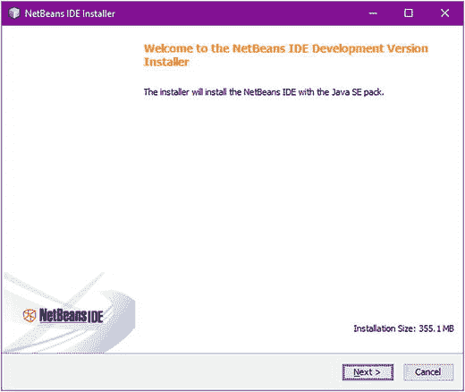

    图 1-17.

    NetBeans IDE 安装程序
3.  阅读并接受 NetBeans 许可协议。阅读并同意条款后，勾选“我接受许可协议中的条款”复选框，然后点击“下一步”继续，如图 1-18 所示。

    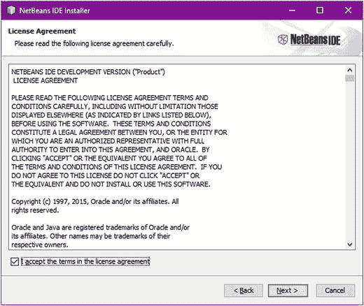

    图 1-18.

    NetBeans 许可协议
4.  接下来，您可以选择安装 NetBeans 的目标目录，并选择之前安装的 Java 9 SE 开发工具包。通常，保持安装 NetBeans IDE 和 JDK 9 的目标目录为默认设置，如图 1-19 所示。

    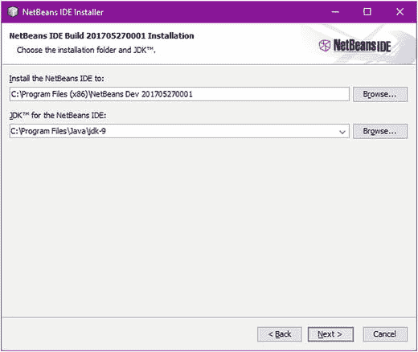

    图 1-19.

    NetBeans IDE 安装
5.  在“摘要”屏幕上，“检查更新”选项允许安装程序检索当前 NetBeans 版本以及任何其他插件依赖项的更新或补丁。接受默认设置并点击“安装”按钮，如图 1-20 所示。

    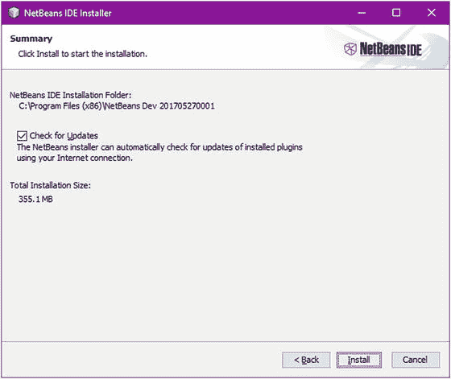

    图 1-20.

    检查更新 图 1-21 显示了安装进度条。

    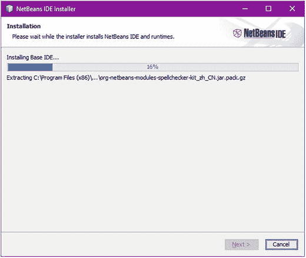

    图 1-21.

    安装进度
6.  要完成设置，在图 1-22 中，系统会提示您选择一个可选复选框，以向 NetBeans 团队贡献匿名使用数据，帮助诊断问题并改进产品。决定是否贡献后，点击“完成”按钮完成安装。

    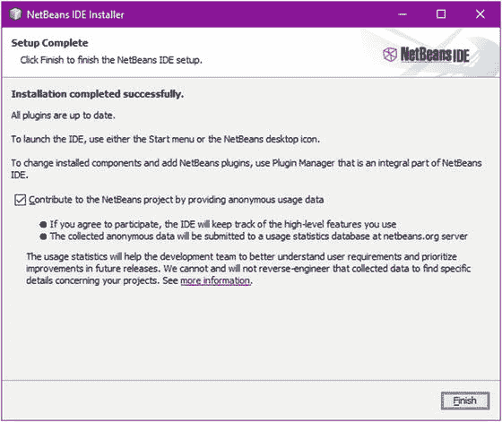

    图 1-22.

    设置完成
7.  启动 NetBeans IDE 以查看起始页，如图 1-23 所示。

    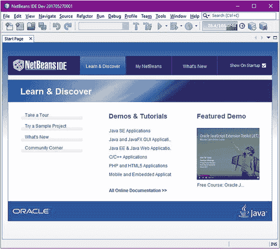

    图 1-23.

    NetBeans 起始页

现在，您可以继续前进，创建出色的 JavaFX 应用程序了！

## 创建 JavaFX HelloWorld 应用程序

在创建 JavaFX 应用程序时，您将学习三种开发、编译和运行应用程序的方法。

*   NetBeans IDE
*   编辑器和终端（命令行提示符）
*   编辑器和 Gradle 构建工具

### 使用 NetBeans IDE

要快速开始使用 NetBeans IDE 创建、编码、编译和运行一个简单的 JavaFX HelloWorld 应用程序，请按照本节概述的步骤操作。您可能希望在下一节中更深入地了解 IDE 在后台为您做了什么。不过现在，让我们先编写并运行一些代码。

1.  启动 NetBeans IDE。
2.  在“文件”菜单上，选择“文件” ➤ “新建项目”。
3.  在“选择项目和类别”下，选择“JavaFX”文件夹。
4.  在“项目”下，选择“Java FX 应用程序”，然后点击“下一步”。
5.  将项目名称指定为 `HelloWorld`。
6.  更改或接受“项目位置”和“项目文件夹”字段的默认值。图 1-24 显示了用于创建简单 HelloWorld 应用程序的“新建 JavaFX 应用程序”向导。

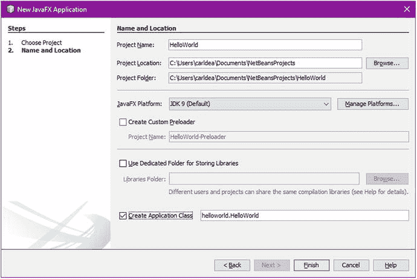

图 1-24.

新建 JavaFX 应用程序向导
7.  在此屏幕（图 1-24）上，点击“管理平台”按钮，确保“平台名称”字段默认包含 JDK 1.9 或更高版本。点击“完成”以自动创建 JavaFX HelloWorld 应用程序。
8.  几秒钟后，NetBeans 将生成 HelloWorld 项目所需的所有文件。NetBeans 完成后，该项目将显示在左侧的“项目”选项卡中。图 1-25 显示了一个新创建的 HelloWorld 项目。

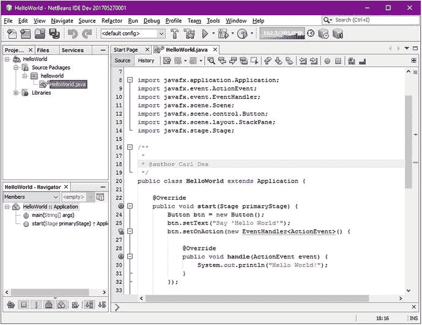

图 1-25.

新创建的 HelloWorld 项目
9.  在 NetBeans IDE 的“项目”选项卡（左侧）中，选择新创建的项目。从“文件”菜单选项“项目属性”中打开“项目属性”对话框。在此处，您将验证“源/二进制格式”设置是否使用了 JDK 9，如图 1-26 所示。在“类别”下点击“源”。

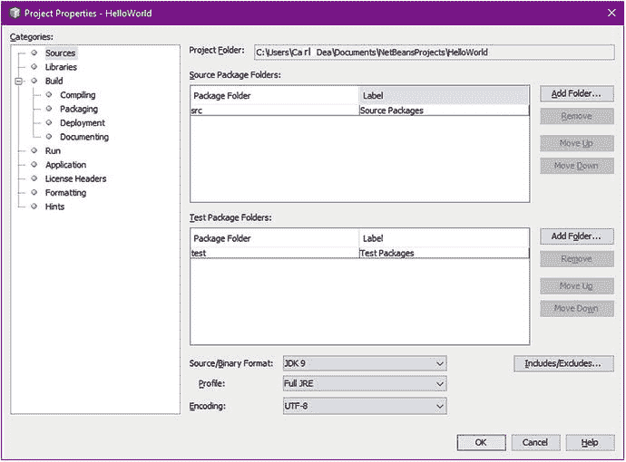

图 1-26.

项目属性
10. 要运行和测试您的 JavaFX HelloWorld 应用程序，请确保选中项目文件夹（左侧的“项目”选项卡），然后点击绿色的“运行”按钮或按 F6 键执行 HelloWorld 项目。图 1-27 显示了用于启动 JavaFX 应用程序的“运行项目”选项。

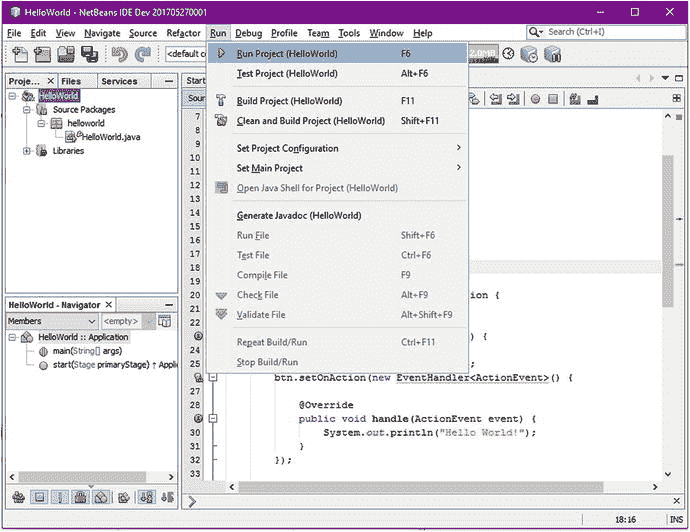

图 1-27.

运行 HelloWorld 项目
11. 选择“运行”选项后，输出应如图 1-28 所示。

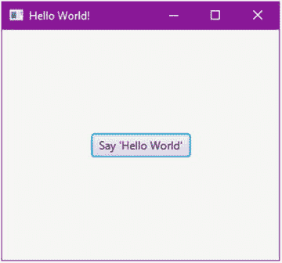

图 1-28.

从 NetBeans IDE 启动的 JavaFX HelloWorld

按照步骤 1 到 8 操作时，您应该不会遇到任何困难。但是，步骤 9 确保您的项目的源/二进制格式使用了 JDK 9。由于 Java 9 中新增了模块等语言特性，本书中的某些源代码将依赖新语法，因此无法向后兼容 Java 9 之前的版本。通常，开发人员会拥有较早版本的 Java 开发工具包，例如 JDK 8。当项目需要旧版本时，NetBeans 允许您在不同的 JDK 之间切换。需要注意的一点是，在 JavaFX 2.0 的早期版本中，该软件与 Java SDK 是分开打包的，这导致了一些软件版本混乱。谢天谢地，现在只需一次下载（JDK 9）即可！如果您仍在使用 Java 7 SDK，自 JavaFX 2.1 起，最新的下载也将在一个捆绑包中包含 JavaFX。

注意

您知道 Java 7 已经寿终正寝了吗？这意味着 Oracle 将不再发布任何面向公众的更新或版本。除非您仍拥有商业许可并与 Oracle 签订了支持合同，否则建议您将应用程序迁移到 Java 8 或更高版本。Java 7 运行时没有更新可能会带来安全隐患。所以，您已经得到了警告。官方 Java 7 生命周期终止和常见问题解答网站在此： [`https://www.java.com/en/download/faq/java_7.xml`](https://www.java.com/en/download/faq/java_7.xml) 。


### 使用编辑器和终端（命令行提示符）

开发 JavaFX 9 应用程序的第二种方式是使用普通文本编辑器和命令行提示符（终端）。通过学习如何在命令行提示符下编译和执行应用程序，你将了解类路径以及可执行文件所在的位置。当你在那些没有便捷的集成开发环境（IDE）和/或编辑器的环境中工作时，接触这些知识将提升你的技能。

在命令行下工作时，你基本上会使用 nano、vi、Emacs 或记事本等文本编辑器来编写 JavaFX HelloWorld 源代码。清单 1-1 中展示的是一个 HelloWorld Java 应用程序的示例。

```
package org.acme.helloworld;
import javafx.application.Application;
import javafx.event.ActionEvent;
import javafx.event.EventHandler;
import javafx.scene.Group;
import javafx.scene.Scene;
import javafx.scene.control.Button;
import javafx.stage.Stage;
/**
* A JavaFX Hello World Application
*/
public class HelloWorld extends Application {
/**
* @param args the command line arguments
*/
public static void main(String[] args) {
Application.launch(args);
}
@Override
public void start(Stage stage) {
stage.setTitle("Hello World");
Group root = new Group();
Scene scene = new Scene(root, 300, 250);
Button btn = new Button();
btn.setLayoutX(100);
btn.setLayoutY(80);
btn.setText("Hello World");
btn.setOnAction(new EventHandler() {
public void handle(ActionEvent event) {
System.out.println("Hello World");
}
});
root.getChildren().add(btn);
stage.setScene(scene);
stage.show();
}
}
清单 1-1.
来自 HelloWorld.java 的 JavaFX HelloWorld 应用程序
```

创建好 Java 文件后，你将使用命令行提示符或终端窗口来编译和运行你的 JavaFX 应用程序。以下是创建可在命令行提示符（终端）下编译和运行的 JavaFX HelloWorld 应用程序的步骤。

1.  在你的用户主目录下，创建一个 `projects` 目录，并在其下创建一个 `helloworld` 目录。在 MacOS 或 Linux 操作系统上，使用以下命令创建 `projects` 目录：

```
    $ mkdir -p ∼/projects/helloworld/src
    $ mkdir ∼/projects/helloworld/classes
    $ cd ∼/projects/helloworld/
    $ nano src/HelloWorld.java
    ```

在 Windows 操作系统上，使用以下命令切换目录：

```
    C:\Users\myusername>mkdir projects
    C:\Users\myusername>mkdir projects\helloworld
    C:\Users\myusername>mkdir projects\helloworld\src
    C:\Users\myusername>mkdir projects\helloworld\classes
    C:\Users\myusername>cd projects\helloworld
    C:\Users\myusername\projects\helloworld>notepad src\HelloWorld.java
    ```

2.  将清单 1-1 中的代码复制并粘贴到文本编辑器中，并将文件保存为 `HelloWorld.java`。该文件应位于 `src` 目录内。注意：在输入清单 1-1 中 `HelloWorld.java` 文件的代码时，请确保在文件顶部包含 `package org.acme.helloworld;` 语句。这样做之后，在编译代码时就会创建包命名空间目录。例如，编译后的 `HelloWorld.class` 文件将位于 `classes/org/acme/helloworld` 目录中。  
3.  使用 Java 编译器 `javac`，配合 `-d` 选项和 `classes` 目录，编译名为 `HelloWorld.java` 的源代码文件。`classes` 目录是存放编译后代码的位置。此外，你需要指定要编译的源代码文件，即 `src/*.java`。你需要输入的命令取决于你的操作系统。在 MacOS X 或 Linux 操作系统上，在命令行提示符下输入以下内容：

```
    $ javac -d classes src/*.java
    ```

在 Windows 命令行下，输入以下内容：

```
    C:\Users\myusername\projects\helloworld> javac -d classes src\*.java
    ```

注意文件名前面的 `-d classes`。`-d` 选项（目标目录）让 Java 编译器知道根据包的命名空间将编译后的类文件放在哪里。在此场景中，`HelloWorld` 的包语句（命名空间）是 `org.acme.helloworld`，这将在 `classes` 目录下创建子目录，假设你当前位于 `∼/projects/helloworld` 项目目录中。编译完成后，你的目录结构应类似于图 1-29。

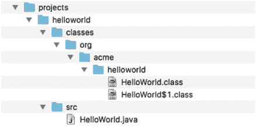

图 1-29.

编译后的 HelloWorld 示例根据包命名空间在 classes 目录下创建了目录。你会注意到，在你之前创建的 classes 目录下，创建了 org/acme/helloworld 子目录。  
4.  运行并测试你的 JavaFX HelloWorld 应用程序。假设你位于 `∼/projects/helloworld` 目录下，输入以下命令从命令行提示符运行你的 JavaFX HelloWorld 应用程序：

```
    $ java -cp classes org.acme.helloworld.HelloWorld
    ```

在 Windows 操作系统上：

```
C:\Users\myusername\projects\helloworld> java -cp classes org.acme.helloworld.HelloWorld
```

通过使用 `-cp`，`classes` 将告诉 Java 类路径目录所在的位置。图 1-30 显示了从命令行提示符启动的一个简单 JavaFX HelloWorld 应用程序的输出。

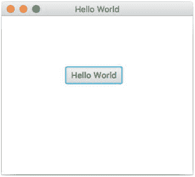

图 1-30.

从 MacOS X 命令行提示符启动的 JavaFX HelloWorld


### 在命令行提示符中使用 Gradle

开发 JavaFX 应用的第三种方式是使用 Gradle 构建工具。与之前类似，你仍将使用普通的文本编辑器，但创建和编译代码的步骤将不再手动执行，而是依赖 Gradle 构建工具。如果你尚未配置 Gradle，请参考本章前面“安装 Gradle”一节的内容。请按照以下步骤创建一个基于 Gradle 的项目。

1.  创建另一个名为 `helloworld_gradle` 的项目和目录。假设你当前位于 `~/projects` 目录下，你将在此创建一个基于 Gradle 的项目。在类 Unix 操作系统上，输入以下命令：

```
    $ mkdir -p projects/helloworld_gradle
    ```

在 Windows 上，输入以下命令：

```
    C:\Users\myusername>mkdir projects\helloworld_gradle
    ```

2.  将目录切换到 `helloworld_gradle`。在类 Unix 操作系统上，输入以下命令：

```
    $ cd helloworld_gradle
    ```

在 Windows 上，输入以下命令：

```
    C:\Users\myusername>cd projects\helloworld_gradle
    ```

3.  构建一个具有标准目录结构（Maven 和 Gradle 约定）的 Java 骨架项目。你会看到创建了类似 `src/main/java` 和 `src/test/java` 的目录。由于此操作会初始化项目文件和目录，因此只需执行一次。以下命令用于创建一个 Java 库项目：

```
    $ gradle init --type java-library
    ```

执行 Gradle `init` 任务后的输出如下：

```
    :wrapper
    :init
    BUILD SUCCESSFUL
    Total time: 1.897 secs
    ```

4.  由于你创建的是 JavaFX 应用而非 Java 库，你需要分别删除 `src/main/java` 和 `src/test/java` 目录下的 `Library.java` 和 `LibraryTest.java` 文件。这些文件只是为你创建 Java 库时提供的存根文件。在当前场景中，你创建的是一个 JavaFX 应用。  
5.  接下来，在 `src/main/java` 目录下创建一个名为 `org/acme/helloworld` 的目录，并将清单 1-1 中的 `HelloWorld.java` 文件复制到 `src/main/java/org/acme/helloworld` 目录中。结果如图 1-31 所示。

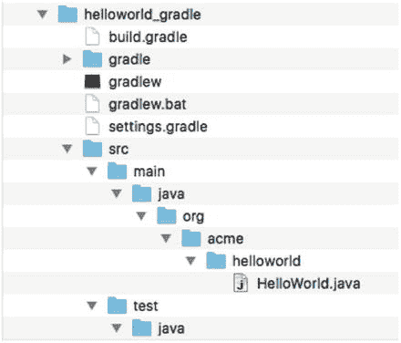

图 1-31.

Gradle Java 应用项目结构。请注意源代码目录结构遵循标准约定，布局为 `src/main/java` 和 `src/test/java`。诸如 Maven 和 Gradle 等构建工具均遵循此约定。  
6.  由于你创建的是 JavaFX 应用，你需要编辑 `build.gradle` 文件，添加一个插件，以便将 Java 项目构建为可启动的应用。你还需要添加一个条目，告知 Gradle 主应用应运行哪个类。使用你的文本编辑器，将以下条目添加到 `build.gradle` 文件中：

```
    apply plugin: 'application'
    mainClassName = "org.acme.helloworld.HelloWorld"
    ```

7.  保存并退出文件后，你需要使用 `gradle assemble` 命令构建项目。这将创建一个可运行的 `jar` 可执行文件。输入以下命令来编译并构建一个可执行的 HelloWorld `jar` 文件。

```
    $ gradle assemble
    ```

执行 Gradle assemble 任务后的输出如下：

```
    :compileJava
    Download https://jcenter.bintray.com/org/slf4j/slf4j-api/1.7.12/slf4j-api-1.7.12.pom
    Download https://jcenter.bintray.com/org/slf4j/slf4j-parent/1.7.12/slf4j-parent-1.7.12.pom
    Download https://jcenter.bintray.com/org/slf4j/slf4j-api/1.7.12/slf4j-api-1.7.12.jar
    :processResources UP-TO-DATE
    :classes
    :jar
    :assemble
    BUILD SUCCESSFUL
    Total time: 4.458 secs
    ```

8.  现在，使用以下命令（运行任务）来启动 HelloWorld 应用。

```
    $ gradle run
    ```

9.  当你添加了插件条目 `apply plugin: 'application'` 后，Gradle 的 run 任务便被添加进来。Gradle 插件提供了便捷的方式来构建不同类型的 Java 项目和产物。你应该会看到 Java HelloWorld 应用启动，如图 1-30 所示。

使用 Gradle 还可以做很多更强大的事情，但这超出了本书的范围；不过，我将列出一些你可能感兴趣使用的常用命令。

*   `gradle tasks`：列出所有可用的任务
*   `gradle clean`：从 `build` 目录中移除目录和文件
*   `gradle eclipseProject`：为 Eclipse IDE 创建项目文件。当你将以下语句添加到 `build.gradle` 文件中时，此任务将可用：

```
    apply plugin: 'eclipse'
    ```

*   `gradle intellijProject`：为 IntelliJ IDE 创建项目文件。当你将以下语句添加到 `build.gradle` 文件中时，此任务将可用：

```
    apply plugin: 'idea'
    ```

*   `gradle -help`：显示可用的选项和命令说明


## 解读 HelloWorld 源代码

你会注意到，在源代码中，基于 JavaFX 的应用程序继承自 `javafx.application.Application` 类。`Application` 类提供了应用程序生命周期函数，例如在运行时进行初始化、启动、开始和停止。这为 Java 应用程序提供了一种机制，使其能够从主线程中分离出来，启动 JavaFX GUI 组件。清单 1-2 中的代码是 JavaFX HelloWorld 应用程序的骨架，包含一个 `main()` 方法和一个重写的 `start()` 方法。

```
public class HelloWorld extends Application {
/**
* @param args the command line arguments
*/
public static void main(String[] args) {
// 在主线程上
Application.launch(args);
}
@Override
public void start(Stage stage) {
// 在 JavaFX 应用程序线程上
// JavaFX 代码写在这里...
}
}
清单 1-2.
HelloWorld.java 文件的骨架版本
```

在这里，在 `main()` 方法的入口点，你只需将命令行参数传递给 `Application.launch()` 方法即可启动 JavaFX 应用程序。要访问传递给 `launch()` 方法的任何参数，你可以调用 `Application` 类的 `getParameters()` 方法。有关访问命名参数和原始参数的各种方式的详细信息，请参阅 Javadoc 文档。以下是 `getParameters()` 方法的 Javadoc 文档链接：

[`https://docs.oracle.com/javase/8/javafx/api/javafx/application/Application.html#getParameters--`](https://docs.oracle.com/javase/8/javafx/api/javafx/application/Application.html%23getParameters%2D%2D)

在 `Application.launch()` 方法执行后，应用程序将进入就绪状态，框架内部将调用 `start()` 方法来启动。此时，程序执行发生在 JavaFX 应用程序线程上，而不是主线程上。当调用 `start()` 方法时，一个 JavaFX `javafx.stage.Stage` 对象可供开发者使用和操作。以下是重写的 Application `start()` 方法：

```
@Override
public void start(Stage stage) {...}
```

当程序在 `start()` 方法中开始时，会有一个独立的执行线程，称为 JavaFX 应用程序线程。请记住，在 JavaFX 应用程序线程上运行，在概念上等同于在 Java Swing 的事件调度线程上运行。请注意 Java 主线程与 UI 线程在涉及 UI 应用程序时的区别。在本书的后续部分，你将学习如何创建后台进程以避免阻塞 JavaFX 应用程序线程。当你学会如何构建应用程序以避免阻塞 GUI 时，用户会注意到你的应用程序在高负载下响应更迅速（更灵敏）。掌握 GUI 应用程序的响应性是增强可用性和整体用户体验的重要概念。要查看 Java Application API，请访问此处的 Javadoc：

[`https://docs.oracle.com/javase/8/javafx/api/javafx/application/Application.html`](https://docs.oracle.com/javase/8/javafx/api/javafx/application/Application.html)

[`https://docs.oracle.com/javase/9/`](https://docs.oracle.com/javase/9/)

### JavaFX 场景图

你会注意到一些类和对象的命名有些奇特，例如 `Stage` 和 `Scene`。这并非巧合——API 的设计者借鉴了剧院或戏剧的概念，即演员在观众面前表演。在这个类比中，一部戏剧由一幕或多幕场景组成，演员在其中表演。当然，所有场景都在一个舞台上依次进行。在 JavaFX 中，`Stage` 相当于一个应用程序窗口，类似于桌面上的 Java Swing API `JFrame` 或 `JDialog`。根据设备的不同（例如 Raspberry Pi (Raspbian)），可能只有一个舞台。你可以将 `Scene` 对象视为一个内容面板，类似于 Java Swing 的 `JPanel`，能够容纳零到多个 `Node` 对象（子节点）。

继续这个例子，在 `start()` 方法中，你会看到对于 JavaFX 桌面窗口（舞台），你可以使用 `setTitle()` 方法设置标题栏。接下来，你创建一个根节点（`Group`），将其作为应用程序窗口的顶层表面添加到 `Scene` 对象中。以下代码片段展示了如何设置标题并创建场景：

```
stage.setTitle("Hello World");
Group root = new Group();
Scene scene = new Scene(root, 300, 250);
```

### JavaFX 节点

JavaFX 节点是所有待渲染场景图节点的基本基类。以下图形功能可以应用于节点：缩放、变换、平移和效果。

一些最常用的节点是 UI 控件和 `Shape` 对象。与树数据结构类似，场景图通过使用容器类（例如 `Group` 或 `Pane` 类）来包含子节点。稍后当你学习 `ObservableList` 类时，你将了解更多关于 `Group` 类的信息，但现在你可以将它们视为能够容纳子节点对象的 Java `List` 或 `Collection` 类。在以下代码中，创建了一个按钮（`Button`）节点，将其定位在场景上，并设置了一个事件处理器（`EventHandler<ActionEvent>`），当用户按下按钮时，该处理器会做出响应。处理器代码将在控制台输出文本 `"Hello World"`。目前，此处显示的代码使用了匿名内部类；不过，你将在第 3 章中学习使用 Java 8 引入的 lambda 表达式。

```
Button btn = new Button();
btn.setLayoutX(100);
btn.setLayoutY(80);
btn.setText("Hello World");
btn.setOnAction(new EventHandler() {
public void handle(ActionEvent event) {
System.out.println("Hello World");
}
});
root.getChildren().add(btn);
```

一旦通过 `getChildren().add()` 方法将子节点添加到根 `Group` 中，你就可以设置 `stage` 的场景，并调用 `Stage` 对象上的 `show()` 方法来显示 JavaFX 应用程序窗口。默认情况下，该窗口允许用户最小化、最大化和关闭（退出）应用程序。以下代码设置了场景并显示了 JavaFX 应用程序窗口（`Stage`）：

```
stage.setScene(scene);
stage.show();
```


## 打包 JavaFX 应用程序

在某个时候，您会想要分发或部署您的 JavaFX 应用程序。为了处理众多的应用程序打包和部署策略，Oracle 的 Java 团队创建了一个 Java Packager 工具，以帮助开发者构建、打包和部署他们的应用程序。要了解更多关于如何使用 Java Packager 工具的信息，请参阅 Oracle 在以下网址的“部署 JavaFX 应用程序”文档：

[`https://docs.oracle.com/javase/8/docs/technotes/tools/unix/javapackager.html`](https://docs.oracle.com/javase/8/docs/technotes/tools/unix/javapackager.html)

为了让您体验 Java Packager 工具的功能，我将向您展示如何将 HelloWorld 类打包成一个适用于多种支持平台的可执行文件。这将允许用户双击启动或在原生操作系统上安装该应用程序。以下命令将自动编译并生成位于 `∼/projects/helloworld/dist/bundles` 目录中的可执行文件、启动器和安装程序。输入以下命令来创建可部署的 Java 应用程序。

```
$ cd ∼/projects/helloworld
$ javapackager -makeall -appclass org.acme.helloworld.HelloWorld -name hellothere
```

表 1-3 描述了用于构建可分发的 JavaFX 可执行应用程序包时常用的选项和开关。

表 1-3.

构建可执行 `jar` 的常用 JavaPackager 选项

| 选项/开关 | 示例 | 描述 |
| --- | --- | --- |
| `-createjar` | `--` | 创建一个 JavaFX `jar` 可执行应用程序。 |
| `-appclass` | `org.acme.helloworld.HelloWorld` | 指定包含 `main()` 方法的类的完全限定名称。 |
| `-srcdir` | `.` | 存放已编译类的父目录的顶层位置（当前目录）。 |
| `-outdir` | `out` | 打包后的 `jar` 文件将被创建的目标位置。 |
| `-outfile` | `helloworld.jar` | 指定可执行 `jar` 文件的名称。 |
| `-v` | `--` | 允许在执行 `javapackager` 时显示详细的日志信息。 |
| `-native` | `dmg` | JavaPackager 可以创建 `installer`、`image`、`exe`、`msi`、`dmg`、`rpm` 和 `deb` 文件扩展名，作为原生操作系统平台上的可部署可执行文件。 |
| `-makeall` |   | 根据操作系统，打包工具将构建安装程序和可执行文件。例如，对于 MacOS X 平台，`dist/bundle` 目录将包含以下文件扩展名的可执行文件：`jnlp`、`dmg`、`app`、`pkg` 和 `jar`。 |

要在命令行上运行 `jar` 可执行文件，您只需输入以下内容并按回车键：

```
$ java -jar dist/bundles/dist.jar
```

要在 MacOS X 操作系统上将 HelloWorld 作为独立应用程序启动，只需双击 `bundles` 目录中的 `hellothere`-1.0.dmg 或 `hellothere`-1.0.pkg 应用程序文件，如图 1-32 所示。

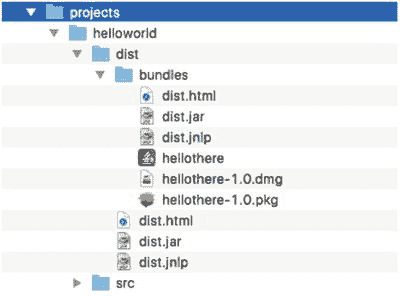

图 1-32.

Java Packager 创建了名为 hellothere 的 HelloWorld 应用程序的可执行文件和安装程序。还存在其他应用程序包，例如 hellothere-1.0.dmg，用于在 MacOS X 桌面上正确安装该应用程序。

打包和部署 JavaFX 应用程序的方法有很多种。要了解更多信息，请参阅 Oracle 在以下网址的“Java Packager 指南”：

[`https://docs.oracle.com/javase/8/docs/technotes/tools/unix/javapackager.html`](https://docs.oracle.com/javase/8/docs/technotes/tools/unix/javapackager.html)

另请参阅以下相关文章：

*   “课程：部署自包含应用程序” [`http://docs.oracle.com/javase/tutorial/deployment/selfContainedApps/index.html`](http://docs.oracle.com/javase/tutorial/deployment/selfContainedApps/index.html)
*   “自包含应用程序打包” [`https://docs.oracle.com/javase/8/docs/technotes/guides/deploy/self-contained-packaging.html`](https://docs.oracle.com/javase/8/docs/technotes/guides/deploy/self-contained-packaging.html)
*   “Java Web Start 应用程序” [`https://docs.oracle.com/javase/tutorial/deployment/webstart/index.html`](https://docs.oracle.com/javase/tutorial/deployment/webstart/index.html)

## 下载本书的源代码

要获取本书示例的源代码，您可以访问两个地方：

*   Apress 图书网站：[`http://www.apress.com/us/services/source-code`](http://www.apress.com/us/services/source-code)
*   GitHub：[`https://github.com/carldea/jfx9be`](https://github.com/carldea/jfx9be)

## 总结

到目前为止，您已经成功下载并安装了 Java 9 JDK、Gradle 和 NetBeans IDE。成功安装必备软件后，您通过 NetBeans IDE 创建了一个 JavaFX HelloWorld GUI 应用程序。然后，您能够使用文本编辑器输入源代码，并最终通过命令行提示符（终端窗口）编译和运行二进制类。您学到的另一种方法是使用 Gradle 构建工具，通过任务来编译和启动 JavaFX 应用程序。

在学习了编译、构建和运行 JavaFX 应用程序的三种方法之后，您快速浏览了 `HelloWorld.java` 源文件的代码。您还学习了如何使用 JavaFX Packager 工具将 JavaFX 应用程序打包为独立的 `jar`、`dmg`、`pkg` 和 `jnlp` 可执行文件。最后，您了解到有两个地方可以获取本书的源代码。

接下来，在第 2 章中，您将了解 JDK 9 中关于项目 Jigsaw 的新特性。如果您了解 JDK 9 的模块化并且没有耐心，可以直接跳到第 3 章学习 JavaFX 9 的基础知识，例如绘制和着色形状以及绘制文本和更改文本字体。


