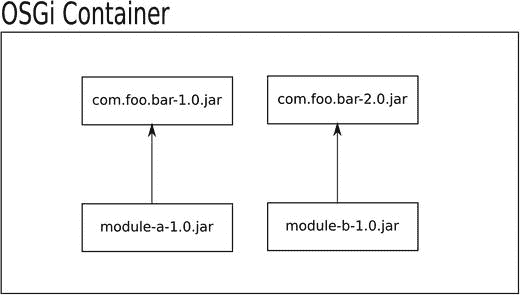
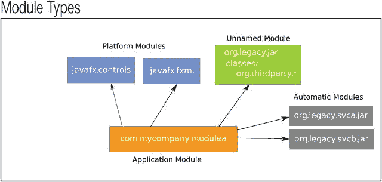
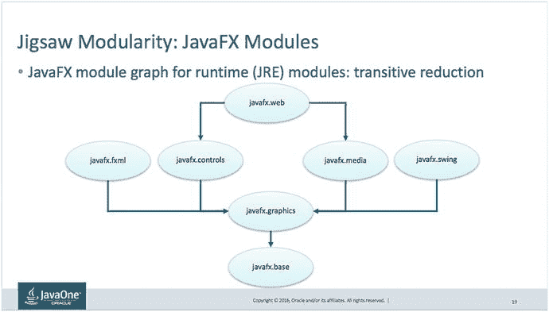
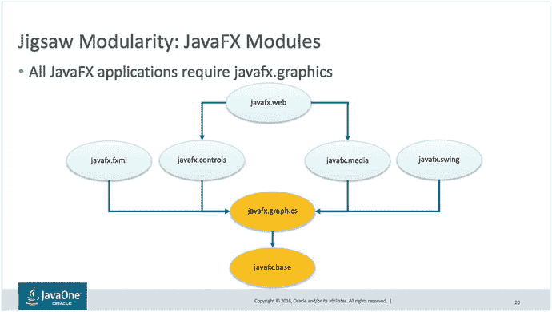
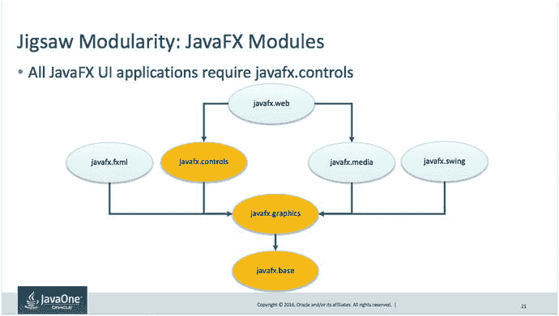
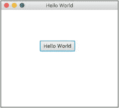

# 2. JavaFX 与 Jigsaw

在软件架构的早期，许多设计者和实践者常常强调模块化代码的理念。显然，将软件服务或 API 拆分成模块是合理的；然而，根据你与谁交谈，“模块”这个词对不同的人有不同的含义。例如，使用 Apache Maven 构建工具的开发者通常会将 `jar` 制品视为模块，而有些人则认为制品内的包也是模块。那么，在 Java 世界中，“模块”一词究竟意味着什么？

在本章中，你将探索模块化对于新的 Java 9 平台意味着什么。你还将学习在 JavaFX 应用程序的上下文中如何使用 Java 平台模块系统（JPMS）。本章是对 Java 9 模块系统的温和介绍，涵盖了常见的使用场景，例如将模块用作库依赖项。

话虽如此，我不会深入详细地介绍每一个模块化用例（相信我，它们相当多）。即使在撰写本文时，关于其他用例的讨论仍在进行中，可能超出了预期的范围。例如，关于自动模块的概念以及模块应如何[命名](http://download.java.net/java/jigsaw/docs/api/java/lang/module/ModuleFinder.html#of-java.nio.file.Path%E2%80%A6-)的讨论仍在继续。尽管专家小组和行业领袖在缺失功能与范围需求之间反复争论，但我相信 Java 社区将就一个强大的模块系统达成（善意的）共识，以满足实际中的大多数用例。要了解更多关于 Java 9 Jigsaw 主题的信息，我在本书的附录中列出了相关的 JSR、书籍和链接。

作为一个通用声明，特别是针对新的 Java 9 平台模块系统，我将提醒你注意以下内容。

声明

当你阅读本书时，Java 9 的模块系统已经发布。由于 Java 9 的模块系统是全新的，语言规范、API、术语和概念可能会发生变化。本章是基于 Java 9 的早期访问版本编写的。

以下是阅读本章关于 Java 9 模块系统时应遵循的章节列表。如果你已经了解 Java 9 模块系统的背景及其历史，可以直接跳到“入门”部分。

*   什么是 Project Jigsaw？
*   历史（Java 9 之前）
*   入门
*   结论

## 什么是 Project Jigsaw？

Java 模块化，也称为“Project Jigsaw”，是一项旨在让开发者能够在 Java 平台上以更易于管理的方式划分和封装代码的努力。通过将代码划分为模块，应用程序代码将更加松散耦合，而不是一个单一的应用程序。通过良好的封装，可以定义模块以安全地向其他模块暴露（导出）API。Java 的新模块系统还将向后兼容 Java 9 之前的代码和库（非模块化代码）。划分和封装代码不仅是很好的原则，还有其他额外的好处，你将在后面看到。

根据 Mark Reinhold 对 JSR 376（Project Jigsaw）的总结：

> 该 JSR 的总体目标是为 Java 平台定义一个易于理解且可扩展的模块系统。它将是易于理解的，即易于学习和使用，以便开发者能够使用它来构建和维护适用于 Java SE 和 Java EE 平台的库和大型应用程序。它将是可扩展的，以便能够用于将 Java SE 平台本身及其实现模块化。——Mark Reinhold，Oracle Java 平台组首席架构师，2015 年 4 月 1 日

### 优势

根据 Project Jigsaw 官方网站（[`http://openjdk.java.net/projects/jigsaw`](http://openjdk.java.net/projects/jigsaw)）的说法，以下是 Java 平台上模块系统的主要目标和优势：

> 为了实现这些目标，我们提议为 Java SE 平台设计和实现一个标准的模块系统，并将该系统应用于平台本身以及 JDK。该模块系统应足够强大，能够将 JDK 和其他大型遗留代码库模块化，同时仍然对所有开发者易于理解。——Project Jigsaw 网站，2016 年 12 月 21 日

*   使 Java SE 平台和 JDK 更容易向下扩展到小型计算设备
*   提高 Java SE 平台实现（尤其是 JDK）的整体安全性和可维护性
*   实现改进的应用程序性能
*   使开发者更容易为 Java SE 和 EE 平台构建和维护库及大型应用程序

正如前面提到的关于应用程序划分的内容，这些优势还可以导致应用程序缩小规模，以适应更小的计算设备，例如基于 ARM 的计算机。随着微服务成为在云和基于容器的应用程序环境中开发的标准，模块化代码还将有助于 Java SE 和 Java EE 平台的维护和安全性。

由于模块为可靠的配置构建铺平了道路，应用程序将占用更小的空间，从而提高内存和加载时间方面的性能。一个例子是模块化的 JavaFX 应用程序由于加载的模块集更小，启动速度得以提升。在 Java 9 之前，应用程序是使用整个 Java 运行时开发和打包的。这些应用程序必须加载许多未使用的库，例如 `corba` 或 `sql` 包。

将 Java 代码（Java 9）模块化时的其他优势被列为 Java 增强提案：

*   模块化运行时映像（JEP 220，位于 [`http://openjdk.java.net/jeps/220`](http://openjdk.java.net/jeps/220)）
*   Java 模块链接器（JEP 282，位于 [`http://openjdk.java.net/jeps/282`](http://openjdk.java.net/jeps/282)）
*   提前编译（JEP 295，位于 [`http://openjdk.java.net/jeps/295`](http://openjdk.java.net/jeps/295)）

JEP 220 是关于 Java SE 平台模块化运行时映像的增强提案。架构师们重构了整个 Java 运行时平台，例如其目录和核心库。重构运行时平台将有助于提高安全性、性能和可管理性。例如，像 `rt.jar`、`tools.jar` 和 `jfxrt.jar` 这样的库将不再可访问，而是全部被分解到模块中。

Java 9 中的新功能是 jlink，即 Java 链接器（JEP 282）。jlink 是一个通过将模块及其依赖项链接到自定义运行时映像中来组装和构建应用程序的工具。为了创建自定义运行时映像，Java 链接器与运行时的结构方式（JEP 220）结合使用。换句话说，这两个 JEP 本质上是步调一致的。

提到的三个 JEP 中的最后一个是 JEP 295，即提前编译。它更广为人知的名字是 AOT 编译。尽管它被认为是实验性的，但 AOT 编译器能够将 Java 代码转换为 Linux 操作系统上的原生代码。这在环境没有安装 Java 运行时的情况下具有很好的优势。另一个优势是速度。由于代码是静态编译的，因此无需进行 JIT（即时）编译或预热。此功能将用于小型设备或高效服务器（网络设备）。当你阅读本文时，AOT 编译将支持主流操作系统。

通过这三个重要的 Java 增强提案协同工作，你将开始看到构建得更简单、更轻量、更快速且原生的基于 Java 的应用程序。


### 缺点

尽管设计模块化代码有许多好处，但也存在一些缺点。部分缺点如下：

*   定义模块和依赖关系时会增加额外的复杂性。
*   由于涉及各种构建工具和集成开发环境（IDE），多个模块没有标准的项目结构。
*   当将传统的非模块化代码与模块化代码混合使用时，类路径和模块路径会同时生效。调试代码和解决依赖关系可能会更加困难。
*   传统的依赖项可能永远不会被重写为 Java 9 模块，这可能会带来向后或向前兼容的风险。

### Java 9 迁移路径

既然你已经了解了新 Java 平台模块系统的优缺点，你可能仍然因为未知的风险而犹豫不决。也许你认为它还是太新了。为了缓解任何潜在的焦虑，Oracle 创建了一份优秀的指南，帮助你迁移传统的 Java 应用程序到 Java 9。大胆去做吧！

迁移指南位于此处：[`https://docs.oracle.com/javase/9/migrate`](https://docs.oracle.com/javase/9/migrate) 。此外，你应该在此处查看 JDK 9 中的重要变更：[`https://docs.oracle.com/javase/9/whatsnew/toc.htm`](https://docs.oracle.com/javase/9/whatsnew/toc.htm) 。

该指南非常详细地解释了 Java 9 中的变化，以及如何使用平台模块和第三方库。迁移指南还介绍了一个名为 `jdeps` 的分析工具。

#### jdeps 分析工具

当对你的应用程序代码运行 `jdeps` 时，该工具会检查代码，以确定它是否依赖于已弃用的依赖项或 JDK 内部 API。例如，该分析工具会建议应被替换的 API。一些建议会为使用以 `com.sun.*`、`sun.misc.*` 等开头的包的代码提供替代方案。例如，如果你创建了一个未模块化的 Java 应用程序，同时引用了像 `com.sun.*` 这样的非公共包，`jdeps` 工具可以提供一个可供使用的替代模块。

以下是对一个 Java 8 编译的类文件调用 `jdeps` 工具后的输出。

```
$ jdeps -cp . com/jfxbe/helloworld/HelloWorld.class
HelloWorld.class -> java.base
HelloWorld.class -> javafx.base
HelloWorld.class -> javafx.controls
HelloWorld.class -> javafx.graphics
HelloWorld.class -> jdk.httpserver
com.jfxbe.helloworld -> com.sun.net.httpserver  jdk.httpserver
com.jfxbe.helloworld -> java.lang               java.base
com.jfxbe.helloworld -> javafx.application      javafx.graphics
com.jfxbe.helloworld -> javafx.collections      javafx.base
com.jfxbe.helloworld -> javafx.event            javafx.base
com.jfxbe.helloworld -> javafx.scene            javafx.graphics
com.jfxbe.helloworld -> javafx.scene.control    javafx.controls
com.jfxbe.helloworld -> javafx.stage            javafx.graphics
```

分析输出显示了 `HelloWorld.class` 文件所使用的平台模块的摘要和详细信息。你会注意到 `com.sun.net.httpserver` 可以在 `jdk.httpserver` 模块中找到。假设你的应用程序依赖于 `com.sun.net.httpserver.HttpServer` 类，那么向 Java 模块迁移的建议意味着你需要创建一个 `module-info.java` 文件，将 `jdk.httpserver` 模块作为依赖项引入。

让我们再看一个例子，对一个 Java 9 模块化应用程序的 JAR 文件使用 `jdeps` 工具。

以下是通过显示依赖信息来分析一个模块化 JAR 应用程序的示例。

*   `-summary` 或 `-s` 打印依赖摘要。
*   `-verbose` 或 `-v` 打印所有类级别的依赖。

```
$ jdeps -v helloworld.jar
```

以下是运行 `jdeps` 后的输出：

```
$ jdeps -v mlib/com.jfxbe.helloworld.jar
com.jfxbe.helloworld
[file:///Users/cpdea/JavaFX9byExample/Code/jfx9be/chap02/helloworld/mlib/com.jfxbe.helloworld.jar]
requires mandated java.base (@9-ea)
requires javafx.base (@9-ea)
requires javafx.controls (@9-ea)
requires javafx.graphics (@9-ea)
requires jdk.httpserver (@9-ea)
com.jfxbe.helloworld -> java.base
com.jfxbe.helloworld -> javafx.base
com.jfxbe.helloworld -> javafx.controls
com.jfxbe.helloworld -> javafx.graphics
com.jfxbe.helloworld -> jdk.httpserver
com.jfxbe.helloworld.HelloWorld   -> com.jfxbe.helloworld.HelloWorld$1 com.jfxbe.helloworld
com.jfxbe.helloworld.HelloWorld   -> com.sun.net.httpserver.HttpServer jdk.httpserver
com.jfxbe.helloworld.HelloWorld   -> java.lang.Object                  java.base
com.jfxbe.helloworld.HelloWorld   -> java.lang.String                  java.base
com.jfxbe.helloworld.HelloWorld   -> java.lang.Throwable               java.base
com.jfxbe.helloworld.HelloWorld   -> javafx.application.Application    javafx.graphics
com.jfxbe.helloworld.HelloWorld   -> javafx.collections.ObservableList javafx.base
com.jfxbe.helloworld.HelloWorld   -> javafx.event.EventHandler         javafx.base
com.jfxbe.helloworld.HelloWorld   -> javafx.scene.Group                javafx.graphics
com.jfxbe.helloworld.HelloWorld   -> javafx.scene.Parent               javafx.graphics
com.jfxbe.helloworld.HelloWorld   -> javafx.scene.Scene                javafx.graphics
com.jfxbe.helloworld.HelloWorld   -> javafx.scene.control.Button       javafx.controls
com.jfxbe.helloworld.HelloWorld   -> javafx.stage.Stage                javafx.graphics
com.jfxbe.helloworld.HelloWorld$1 -> com.jfxbe.helloworld.HelloWorld   com.jfxbe.helloworld
com.jfxbe.helloworld.HelloWorld$1 -> java.io.PrintStream               java.base
com.jfxbe.helloworld.HelloWorld$1 -> java.lang.Object                  java.base
com.jfxbe.helloworld.HelloWorld$1 -> java.lang.String                  java.base
com.jfxbe.helloworld.HelloWorld$1 -> java.lang.System                  java.base
com.jfxbe.helloworld.HelloWorld$1 -> javafx.event.ActionEvent          javafx.base
com.jfxbe.helloworld.HelloWorld$1 -> javafx.event.Event                javafx.base
com.jfxbe.helloworld.HelloWorld$1 -> javafx.event.EventHandler         javafx.base
com.jfxbe.helloworld.HelloWorld$1 -> javafx.stage.Stage                javafx.graphics
```

对你的代码运行 `jdeps` 后，该工具会告知你是否存在任何内部 API。正如你在输出中所见，`HelloWorld` 类依赖于以下内部 API：

```
com.sun.net.httpserver.HttpServer.
```

关于本书源代码的另一点需要注意的是，你会发现部分源代码是 Java 8 或 Java 9 的。尽管如此，你会很高兴地知道，新的 Java 9 编译器能够按原样（未模块化）编译 Java 8 源代码。加载到类路径上的模块路径类会被放置到一个未命名模块中，并且所有公共包都是可导出的（可读取访问）。

注意

某些章节使用了本书先前版本的 Java 8 源代码，而另一些章节则使用了 Java 9 源代码（模块）。无需惊慌，因为 Java 9 JDK 之前的源代码可以简单地编译和运行。换句话说，如果你遇到 Java 8 源代码，只需将其视为常规（传统）Java 代码或未模块化代码即可。


#### 终止开关

在某些情况下，已迁移到 Java 9（模块化代码）的遗留代码可能会引发类型为 `IllegalAccessException` 的运行时异常。这是因为代码使用了反射 API 和 Jigsaw 的强封装。

Oracle 的工程师决定提供一个终止开关，允许在使用反射时绕过非法访问检查。其目的是给开发者更多时间将代码迁移到 Java 9 模块；然而，该终止开关将在 Java 10 中被移除。以下是使用终止开关绕过所引发的运行时异常的示例。

```
$ java --permit-illegal-access -jar xyz.jar
```

你可以查看完整解释此内容的技术说明，网址为：

```
http://mail.openjdk.java.net/pipermail/jigsaw-dev/2017-March/011763.html
```

假设你已被说服，并准备踏上 Java Jigsaw 的列车，那么让我们继续讨论从过去到现在的模块。接下来，我将详细阐述用作模块的 Java JAR 文件的历史。如果你觉得 Java 模块（Java 9 之前）的历史有点无聊，可以直接跳到“入门”部分。

## 历史

那么，模块化应用和依赖管理并非新鲜事？对吧？！

最初，Java 开发者创建了由类和资源文件压缩而成的单个 Java 归档文件，称为 JAR。每个 JAR 文件被视为 Java 应用程序中的一个模块。当每个 JAR 文件从类路径加载时，包中的任何公共 API 都可以从该库中访问。虽然访问各种 API 很方便，但情况开始失控，由此产生了臭名昭著的术语“JAR 地狱”。（实际上，它最初源自术语“DLL 地狱”，这是使用 C/C++ 开发微软操作系统的开发者创造的，因为存在动态链接库文件（`*.dll`），在解析共享库的依赖关系时遇到了类似的问题。）

### JAR 地狱

术语“JAR 地狱”通常指 JVM 的类路径类型解析或依赖解析（在单个类加载器上）。例如，如果你有两个 JAR 文件，都包含一个 `Person` 类，但两者具有略有不同的方法或属性（两个不同版本），你可能会想知道在实例化 `new Person()` 类时会使用哪一个？

当然，这取决于类加载顺序，但默认情况下，JVM 会按照在类路径上指定的顺序加载类，例如命令行上的 `-cp` 开关。通常，第一个加载的类将被使用（遮蔽第二个）。一些 Web 应用环境可以强制执行加载顺序，例如父优先或子优先。你可以看到，当你试图调试应用程序却不知道它正在使用哪个 `Person` 类时，这会多么令人困惑。

由于这些已知问题，许多 Java 专家成立了 OSGi 联盟，旨在创建标准规范，作为在 Java 平台上开发模块化应用的第一步。下一节将简要介绍 Java OSGi 模块系统。

### OSGi

随着 Java 应用程序变得越来越大，拥有众多依赖关系，管理起来很快就变成了一场噩梦。自 2000 年以来，为了解决 Java 模块化问题，OSGi 联盟成立，旨在为基于 Java 的模块化和面向服务的系统创建开放标准规范。OSGi 的目标是提供一个规范，供供应商创建应用程序容器的实现。应用程序容器包含称为“捆绑包”的 JAR 文件，这些文件可以在不重启 JVM 的情况下动态加载。

简而言之，每个 JAR 捆绑包在 `META-INF/manifest.mf` 文件中包含描述其他捆绑包依赖关系的元数据。根据规范，还有许多其他方式可以导出包和封装捆绑包。由于每个捆绑包（模块）都在单独的类加载器中加载，同一 JVM 上可以共存同一 Java 类的不同版本。例如，`模块 A` 依赖于模块 `com.foo.bar-1.0.jar`，而 `模块 B` 依赖于模块 `com.foo.bar-2.0.jar`，如图 2-1 所示。两个 JAR 文件都是捆绑包，各自包含自己的模块定义（`manifest.mf`）。



图 2-1.

一个包含四个不同捆绑包的 OSGi 容器。这里，模块 A 依赖于模块 com.foo.bar 版本 1.0，模块 B 依赖于模块 com.foo.bar 版本 2.0。

假设容器已经包含了 `com.foo.bar` 的两个版本的 JAR 捆绑包，开发者将定义 `模块 A` 的清单，如清单 2-1 所示，以及 `模块 B` 的清单，如清单 2-2 所示。

```
Manifest-Version: 1.0
Bundle-ManifestVersion: 2
Bundle-Name: module-a
Bundle-SymbolicName: com.carlfx.myservice1
Bundle-Version: 1.0.0
Bundle-Activator: com.carlfx.myservice1.Activator
Import-Package:  com.foo.bar;version="1.0"
Export-Package:  com.carlfx.myservice1.api;version="1.0.0"
清单 2-1.
模块 A 的 manifest.mf 文件，包含 OSGi 捆绑包定义。模块 A 依赖于来自 JAR 文件 com.foo.bar-1.0.jar 的包 com.foo.bar。
```

假设应用程序运行在 OSGi 容器上，每个捆绑包将经历一个捆绑包加载生命周期。类似于操作系统，每个应用程序都有一个进程 ID（PID），OSGi 容器将为每个捆绑包分配一个唯一的捆绑包 ID。这个唯一 ID 允许开发者动态地监控、停止和启动捆绑包。

```
Manifest-Version: 1.0
Bundle-ManifestVersion: 2
Bundle-Name: module-b
Bundle-SymbolicName: com.carlfx.myservice2
Bundle-Version: 1.0.0
Bundle-Activator: com.carlfx.myservice2.Activator
Import-Package:  com.foo.bar;version="2.0"
Export-Package:  com.carlfx.myservice2.api;version="1.0.0"
清单 2-2.
模块 B 的 manifest.mf 文件，包含 OSGi 捆绑包定义。模块 B 依赖于来自 JAR 文件 com.foo.bar-2.0.jar 的包 com.foo.bar。
```

OSGi 规范详细说明了如何定义清单文件的所有属性和命名约定；然而，手动操作可能极其繁琐。为了轻松构建捆绑包，请查看 [`http://bndtools.org`](http://bndtools.org) 上的 Bnd 工具。此外，还有用于使用 Bnd 工具组装捆绑包的 Maven 插件和 Gradle 插件。

老实说，根据我使用 OSGi 的经验，我知道并相信它是一个健全的架构；然而，我感觉到其采用率较低，因为在开发、调试和部署基于 Java 的应用程序时，学习曲线陡峭。例如，在 OSGi 容器上构建 `HelloWorld` 简直就是杀鸡用牛刀。但如果你有兴趣构建一个管理动态服务或子应用程序（类似于移动设备上的 Android 操作系统）的应用程序启动器，你可能会选择使用 OSGi。简而言之，OSGi 容器允许你安装服务和应用程序（捆绑包），而无需重启主 Java 应用程序和 JVM。

以下是可用的四大 OSGi 实现：

*   Apache Felix：[`http://felix.apache.org`](http://felix.apache.org)
*   Eclipse Equinox：[`http://www.eclipse.org/equinox`](http://www.eclipse.org/equinox)
*   Eclipse Concierge：[`http://www.eclipse.org/concierge`](http://www.eclipse.org/concierge)
*   ProSys：[`https://www.bosch-si.com/iot-platform/iot-platform/gateway/software.html`](https://www.bosch-si.com/iot-platform/iot-platform/gateway/software.html)


### Maven/Gradle

另一个我尚未提及的重要事项是构建应用程序时的依赖管理。换句话说，当你构建一个 Java 应用程序时，你需要获取正确版本的 JAR 库依赖，以便编译、部署和运行你的应用程序。当一个 JAR 依赖于另一个 JAR，并以此类推，从而形成一个依赖图（树）时，这被称为传递性依赖。当需要追踪和调试代码时，极其庞大的传递性依赖常常让开发者感到沮丧。正如你稍后将在 Java 9 的 Jigsaw 模块定义中学到的，你将能够相当轻松地指定如何映射依赖关系。本节将简要介绍流行的构建工具 Maven。

#### 仓库

为了避免更多的 JAR 地狱并妥善管理依赖，Apache 组织于 2004 年发布了构建自动化工具 Maven。该构建工具为 Java 项目确立了约定。其中一个核心约定是 Java 项目的结构方式。这些项目结构也催生了构建 Java 工件（模块）的更标准方法。虽然 Maven 不仅仅是一个构建工具，但它也在某种程度上成为了在仓库中托管 JAR 的事实标准。这些仓库保存了当今使用的所有流行开源 JAR 库。虽然你可以拥有私有仓库，但 Maven Central 是互联网上的官方公共仓库。我还想特别感谢 JFrog 公司（[`https://www.jfrog.com/`](https://www.jfrog.com/)）的各位。JFrog 是一家专注于构建和仓库基础设施服务的公司。JFrog 的 Bintray 服务允许你在其仓库中托管二进制文件和可执行文件，地址为 [`https://www.jfrog.com/bintray`](https://www.jfrog.com/bintray)。

#### Maven 坐标

创建 Apache Maven 的人还提出了 Maven 坐标的概念，其中模块（工件）使用组 ID、工件 ID 和版本进行唯一命名。例如，代码清单 2-3 包含了一个指向用于网络编程的流行 Netty 库的 Maven 坐标。一个 Maven `pom.xml` 文件通常包含一个用于编译的依赖列表。

```
io.netty
netty-all
4.0.46.Final

代码清单 2-3.
包含指向 JAR 依赖的 Maven 坐标的 pom.xml 文件片段
```

要搜索和定位库依赖，请访问 [`https://search.maven.org`](https://search.maven.org)。在那里你可以找到流行的开源库。关于依赖和构建工具，最后要提一下的是位于 [`https://gradle.org`](https://gradle.org) 的 Gradle 构建工具。代码清单 2-4 展示了 Gradle 使用 Maven 坐标来管理依赖的方式。

```
dependencies {
compile 'io.netty:netty-all:4.0.46.Final'
testCompile 'junit:junit:4.12'
}
代码清单 2-4.
一个使用 Maven 坐标声明依赖的 Gradle 脚本。组 ID、工件 ID 和版本由冒号分隔。
```

再次提醒，当你阅读本章时，诸如 Maven 和 Gradle 之类的构建工具应该已经能够针对 Java 9 模块代码项目进行构建（工作）。

现在你已经对 Java 模块的过去和当前历史有了初步了解，让我们开始使用 Java 9 模块吧！

## 入门

在开始实现模块之前，本节将讨论 Java 9 的模块路径。假设你已经了解 Java 类路径，那么 Java 9 的新特性是模块路径（`--module-path`）。了解模块路径和类路径将帮助你理解 JAR 文件和类是如何被加载的。例如，当你使用 Java 9 编译器编译和运行 Java 9 之前的代码时，你需要了解 Java 9 模块和传统 JAR 文件如何共存。

### 什么是模块路径？

新的 Java 9 模块路径能够向应用程序代码或其他模块暴露模块和包，同时隐藏你不想暴露的包。相比之下，类路径无法将 JAR 封装为模块及其类类型。类路径的主要问题是当两个不同的 JAR 文件中存在同名的公共类类型时。要了解更多关于这个问题的信息，请查看前面关于历史（JAR 地狱）的部分。那么，这就引出了一个问题：如何指定模块路径？

稍后你将学习如何创建模块，但现在我们将以稍微反向的顺序来学习。我的意思是，你将首先学习如何运行（执行）一个模块，然后再学习如何创建模块。

模块路径是一个元素列表，其中每个元素要么是一个模块 JAR 文件，要么是一个模块目录。与类路径类似，每个元素由路径分隔符分隔，例如在类 Unix 操作系统和 Windows 操作系统中分别使用 `:` 或 `;`。以下是运行模块应用程序时模块路径的用法：

*   `--module-path` 或 `-p`：一个模块列表，可以是 JAR 文件或包含模块的目录。
*   `--module` 或 `-m`：你想要执行的模块名称和主类，用正斜杠分隔。

```
$ java --module-path <模块路径> --module <模块名>/<主类>
```

由于你稍后将学习如何创建和构建模块化 JAR 文件，这里假设文件系统上已经存在一个模块。例如，以下是指定模块路径以运行应用程序的方式：

```
$ java --module-path com.jfxbe.physicsengine.jar:mods -m com.jfxbe.game/com.carlfx.game.Main
```

在这个例子中，`--module-path` 上指定的第一个元素是一个名为 `com.jfxbe.physicsengine.jar` 的模块化 JAR 文件。这里，该 JAR 文件位于当前路径下。模块路径上指定的第二个元素是一个名为 `mods` 的目录。`mods` 目录可以任意命名，但按照惯例，它是“modules”（模块）的缩写。`mods` 目录是编译后的模块代码存放的地方。`mods` 目录可以包含一个或多个模块目录。这些模块目录包含类似于类路径的编译代码。代码清单 2-5 展示了 `com.jfxbe.game` 模块中编译代码的目录结构。

```
mods/
|---- com.jfxbe.game/
|---- module-info.class
|---- com/
|     |---- jfxbe/
|     |     |---- game/
|     |           |---- Main.class
|---- images/
|     |---- player1.png
|     |---- player2.png
|     |---- enemy.png
|---- soundfx/
|---- snore.au
代码清单 2-5.
com.jfxbe.game 模块中编译代码的目录结构
```

`mods` 目录包含一个名为 `com.jfxbe.game` 的模块或目录，其中包含编译后的代码和资源。你还会注意到 `com.jfxbe.game` 目录中的 `module-info.class` 文件以粗体显示。这个类文件是在编译 `module-info.java` 源文件后创建的。`module-info.java` 源文件被称为模块定义。让我们来看看 Java 9 的模块定义语法。


### 模块定义

简而言之，模块定义是一个列出模块依赖关系和包导出的配置文件。Java 9 模块引入的新关键字是 `requires` 和 `exports`。`requires` 关键字用于定义你需要（依赖）哪些模块。`exports` 关键字则允许其他模块读取其包。清单 2-6 展示了定义包含在 `module-info.java` 文件中的基本模块的代码。

```
module  {
requires [public] ;
exports ;
}
清单 2-6.
一个具有一个依赖项和一个导出包的基本模块定义
```

关于清单 2-6 中的语法，需要提醒的是：尖括号和方括号并非语法的一部分，而是为了让读者了解哪些是必需的，哪些是可选的。在清单 2-6 中，尖括号 `<>` 表示该项是必需的，方括号表示该项是可选的。例如，模块名称是必需的，而 `requires` 右侧的 `public` 关键字是可选的。接下来，我们将逐一分解并解释定义模块所需的每个项目。

#### 模块命名

从清单 2-6 开始，首先是 `<module name>`。你可能想知道如何命名一个模块。我知道，特别是对于如何命名模块，我曾感到困惑。实际上，根据 Jigsaw 项目关于模块命名的规范文档，这非常简单。文档中说明如下：

> 模块名称与包名称一样，不得冲突。推荐的模块命名方式是使用长期以来推荐用于命名包的反向域名模式。因此，模块名称通常是其导出包名称的前缀，但这种关系并非强制性的。—《模块系统现状》，Mark Reinhold，2016 年 3 月 3 日

```
http://openjdk.java.net/projects/jigsaw/spec/sotms/
```

一个使用反向域名模式命名的模块示例如下：

*   你公司的假设域名：[`http://www.mycompany.com`](http://www.mycompany.com)
*   模块名称应为：`com.mycompany.mymodule`

#### Requires

继续讨论清单 2-6 中所示的基本模块定义，关键字“`requires`”引用了模块依赖关系。关键字“`requires`”表示当前模块依赖于另一个已命名的模块。需要认识到的一个重要点是，所有模块都隐式依赖于（`requires`）基础平台模块 `java.base`。此外，如果你在模块中使用 JavaFX，你将隐式加载 `javafx.base` 模块。

#### Requires Public（隐式可读性）

在清单 2-6 中，`requires` 模块依赖关系的可选 `[public]` 修饰符允许派生模块隐式获得读取权限，这通常被称为隐式可读性。一个例子是：`module-A` 依赖于带有 `public` 修饰符的模块 `java.logging`，那么另一个模块，比如 `module-B`，依赖于 `module-A`。

由于日志模块在 `module-A` 中被声明为 public，`module-B` 将自动能够从 `java.logging` 模块获得可读性。这很好，因为 `module-B` 的模块定义中不必添加像 `requires java.logging` 这样的语句。`module-B` 将隐式免费获得 `java.logging` 模块。

#### Exports

当你在模块定义中使用 `exports` 时，你是在公开带有公共类的包命名空间。

尽管还有其他关键字定义了其他可读性关系选项，但我不会深入讨论它们，因为它们超出了本书的范围。可以说，大多数时候你都会使用清单 2-6 中所示的基本模块定义。既然你已经知道如何运行和定义模块，你还需要了解模块类型。了解模块类型将帮助你理解遗留代码和 Java 9 模块是如何加载的。

### 模块类型

Java 运行时会将类加载到四种类型的模块中。模块类型基于类或 JAR 是位于类路径还是模块路径上。当模块和类被加载到 JVM（类加载器）中时，它们会成为四种模块类型之一。每种模块类型对某些包和类具有可读性访问权限。例如，在定义应用程序模块时，实现者希望使用关键字 `export` 来公开 API，以允许其他模块和类读取包。图 2-2 显示了一个典型的依赖关系图。该依赖关系图显示了一个应用程序模块，它分别依赖于两个平台模块、一个未命名模块和两个自动模块。



图 2-2.
一个应用程序模块（com.mycompany.modulea）的依赖关系图，该模块依赖于两个平台模块、一个未命名模块和两个自动模块

为了理解它们之间的可读性关系，让我们更详细地了解这四种模块类型。

以下是四种模块类型及其可读性访问权限的描述：

*   **应用程序模块**：创建的命名模块，可以读取以下模块类型：
    *   平台模块
    *   应用程序模块
    *   自动模块
*   **平台模块**：来自 Java 运行时的核心模块，不能读取其他模块类型。只要核心模块被定义为 `public`（例如 `java.logging` 或 `java.base`），它们就可以公开访问其他核心模块。
*   **自动模块**：自动转换为应用程序模块类型的 JAR 库，可以读取以下模块类型：
    *   平台模块
    *   应用程序模块
    *   自动模块
    *   未命名模块
*   **未命名模块**：加载到类路径上的任何类或 JAR 库都将被加载到未命名模块中。未命名模块类型可以读取以下模块类型：
    *   平台模块
    *   应用程序模块
    *   自动模块

未命名模块不能读取另一个未命名模块，因为（每个类加载器）只有一个未命名模块。从类路径加载的 JAR 和类会被加载到未命名模块中。所有公共类类型和包都被导出，以允许未命名模块中的类访问其他类。

#### 应用程序模块（显式模块）

应用程序模块是你作为库或应用程序创建的模块。提醒一下模块的命名约定，你应该使用反向域名模式，如下所示：

```
module com.mycompany.modulea {
// 其余声明
}
```

运行你的模块应用程序时，你需要在模块路径上指定它，如下所示。

```
$ java --module-path mods/com.mycompany.modulea ...
```

你会看到 `mods` 目录，该目录用于存放编译后的模块。

#### 平台模块（隐式）

平台模块被认为是隐式模块，它们是应用程序模块中使用的核心 Java 和 JavaFX 平台模块。稍后你将使用平台模块创建一个 `HelloWorld` 应用程序。

以下是常见的 Java 和 JavaFX 平台模块列表：

```
java.base
java.logging
javafx.base
javafx.controls
javafx.fxml
javafx.graphics
javafx.media
javafx.swing
javafx.web
```


#### JavaFX 平台模块图

JavaFX 8 和 JavaFX 9 之间变化不大；然而，JavaFX 9 是全新模块化的。换句话说，JavaFX 类已被分解到各个平台模块中，而不是将所有 JavaFX 类都放入 `jfxrt.jar` 文件中。在创建模块时，您需要知道要依赖（`requires`）哪些 JavaFX 模块。

为了展示 JavaFX 9 的依赖关系图，我回想起 Jonathan Giles 在 JavaOne 2015 上关于 JavaFX 9 – 新特性与亮点 的演讲中描述可读性关系的幻灯片。Jonathan 是 JavaOne Rockstar 演讲者，也是 Oracle 公司的 JavaFX 技术负责人。为了描绘整个 JavaFX 模块图，图 2-3 展示了所有依赖于 `javafx.base` 模块的模块。



图 2-3.

整个 JavaFX 模块图。所有派生模块都依赖于 javafx.base

如前所述，JavaFX 平台模块依赖于 `javafx.base`。实际上，它们并非都直接依赖于 `javafx.base`，而是依赖于 `javafx.graphics`。`javafx.graphics` 模块的定义会在 `javafx.base` 旁边使用 `public` 修饰符，从而使 `javafx.base` 模块对 `javafx.graphics` 模块的派生模块具有读取访问权限，如下所示：

```
module javafx.graphics {
requires public javafx.base;
}
```

此外，图 2-4 展示了其他需要 `javafx.graphics` 模块的 JavaFX 平台模块，同时隐式地拥有对 `javafx.base` 模块的读取访问权限。



图 2-4.

javafx.graphics 依赖于 javafx.base

图 2-5 展示了模块 `javafx.controls` 依赖于模块 `javafx.graphics`，而后者最终依赖于 `javafx.base` 模块。假设您了解隐式可读性，那么创建一个依赖于 `javafx.controls` 的模块意味着您无需在模块定义中添加 `requires javafx.graphics` 或 `requires javafx.base`。



图 2-5.

所有 JavaFX 模块都依赖于 javafx.graphic 模块

现在您已经了解了平台模块，让我们看看其他类型的模块，例如未命名模块。

#### 未命名模块（类路径上的类和非 Jigsaw 模块）

加载到类路径上的任何类或 JAR 库都将进入未命名模块。由于它是一个没有模块名称的单一模块，其他应用程序模块无法在其模块定义中使用 `requires` 来引用它，因此得名未命名模块或无名称模块。这个未命名模块的主要目的是将所有公共类导出到 JVM。例如，如果一个 JAR 库被加载到未命名模块中，那么它的所有公共类都可以被使用。

#### 自动模块（作为命名模块加载的 JAR 文件）

任何遗留的 JAR 文件（非模块化）都可以转换为命名模块。与在类路径上使用遗留 JAR 文件不同，JAR 文件可以放在模块路径上，以自动转换为命名模块。当前的命名算法在 `java.base` 模块的 `ModuleFinder` 类的 Javadoc 文档中。

```
http://download.java.net/java/jigsaw/docs/api/java/lang/module/ModuleFinder.html#of-java.nio.file.Path...-
```

现在您已经了解了所有不同类型的模块以及它们的加载方式，我将向您展示如何使用 Java 9 模块创建一个 JavaFX `HelloWorld` 示例应用程序。

## 一个 HelloWorld JavaFX 9 模块化应用程序示例

在此示例中，您将创建一个 `HelloWorld` JavaFX 9 模块化应用程序。要构建一个 Java 9 项目，请遵循以下步骤。

### 创建项目结构

使用以下命令行语句创建一个项目目录：

```
# Windows
C:\>md \helloworld\src\
# Mac/Linux
$ mkdir -p helloworld/src
```

创建主模块的源目录：

```
# Windows
C:\> cd helloworld
C:\helloworld> md \src\com.jfxbe.helloworld
# Mac/Linux
$ cd helloworld
$ mkdir src/com.jfxbe.helloworld
```

创建用于存放源代码文件的 Java 包目录结构。

```
# Windows
C:\helloworld> md \src\com.jfxbe.helloworld\com\jfxbe\helloworld
# Mac/Linux
$ mkdir -p src/com.jfxbe.helloworld/com/jfxbe/helloworld
```

为模块应用程序 `helloworld` 创建了以下目录结构：

```
|---- helloworld/
|---- src/
|---- com.jfxbe.helloworld/
|---- com/
|---- jfxbe/
|---- helloworld/
```

### 创建模块定义

在 `helloworld/src/com.jfxbe.helloworld` 目录下创建一个名为 `module-info.java` 的文件。为 `HelloWorld` 模块定义一个 `module-info.java` 文件。

```
module com.jfxbe.helloworld {
requires javafx.controls;
exports com.jfxbe.helloworld;
}
```

目录结构应如下所示：

```
|---- helloworld/
|---- src/
|---- com.jfxbe.helloworld/
|----module-info.java
|---- com/
|---- jfxbe/
|---- helloworld/
```

接下来，您将在 `helloworld` 目录中创建 JavaFX `HelloWorld` 示例代码。

### 创建主应用程序代码

创建 `HelloWorld.java` 文件，并将其放置在 `src/com.jfxbe.helloworld/com/jfxbe/helloworld` 目录中。只需将清单 2-7 中的源代码输入到文本编辑器中并保存即可。提醒一下，包名是 `com.jfxbe.helloworld`。

```
package com.jfxbe.helloworld;
import javafx.application.Application;
import javafx.event.ActionEvent;
import javafx.event.EventHandler;
import javafx.scene.Group;
import javafx.scene.Scene;
import javafx.scene.control.Button;
import javafx.stage.Stage;
/**
* A JavaFX Hello World
* @author carldea
*/
public class HelloWorld extends Application {
/**
* @param args the command line arguments
*/
public static void main(String[] args) {
Application.launch(args);
}
@Override
public void start(Stage stage) {
stage.setTitle("Hello World");
Group root = new Group();
Scene scene = new Scene(root, 300, 250);
Button btn = new Button();
btn.setLayoutX(100);
btn.setLayoutY(80);
btn.setText("Hello World");
btn.setOnAction(new EventHandler() {
public void handle(ActionEvent event) {
System.out.println("Hello World");
}
});
root.getChildren().add(btn);
stage.setScene(scene);
stage.show();
}
}
清单 2-7.
主 HelloWorld 应用程序
```

### 编译代码（模块）

假设在编译源代码之前，您位于 `src` 目录（`helloworld`）的上一级目录。接下来，您必须将应用程序作为模块进行编译。

在 Linux/MacOS X 平台上，执行以下操作：

```
$ javac -d mods/com.jfxbe.helloworld src/com.jfxbe.helloworld/module-info.java \
src/com.jfxbe.helloworld/com/jfxbe/helloworld/HelloWorld.java
```

在 Windows 平台上，执行以下操作：

```
C:\helloworld>javac -d mods\com.jfxbe.helloworld src\com.jfxbe.helloworld\module-info.java src\com.jfxbe.helloworld\com\jfxbe\helloworld\HelloWorld.java
```

如果您要使用第三方模块，则必须使用 `--modules-path` 开关编译代码，以告知编译器需要将哪些额外的模块添加到模块路径上。例如，如果您的 `HelloWorld` 模块需要使用来自名为 `com.xyzcompany.coolmodule` 的第三方 Java 9 模块中的类 `com.xyzcompany.ServiceA`，您需要将条目添加到 `module-info.java` 文件中，然后像这样编译代码：

在 Linux/MacOS X 平台上，执行以下操作：

```
$ javac --modules-path mlibs -d mods/com.jfxbe.helloworld $(find src -name "*.java")
```

在 Windows 平台上，执行以下操作：

```
C:\helloworld> javac --modules-path mlibs -d mods\com.jfxbe.helloworld src\com.jfxbe.helloworld\module-info.java src\com.jfxbe.helloworld\com\jfxbe\helloworld\HelloWorld.java
```

此示例中使用的第三方模块以 JAR 文件形式存在于 `mlibs` 目录中。


### 复制资源

由于此 `HelloWorld` 应用程序不包含任何诸如 `fxml` 文件、图片或声音文件之类的资源，因此可以跳过此步骤。但如果你有需要复制到模块目录的资源，请使用以下命令。请根据你的需求修改以下命令。以下是递归复制包含 `*.fxml` 后缀的文件到 `mods/com.jfxbe.helloworld/com/jfxbe/helloworld` 目录的命令。

在 Linux/MacOS X 平台上，执行以下操作：

```
$ cp -r src/*.fxml mods/com.jfxbe.helloworld/com/jfxbe/helloworld
```

在 Windows 平台上，执行以下操作：

```
C:\helloworld> xcopy C:\helloworld\src\*.fxml C:\helloworld\mods\com.jfxbe.helloworld /S /Y
```

这些命令会递归复制以 `.fxml` 结尾的文件，并将它们放置在 `module` 目录中。当你的代码尝试调用 `getResource()` 方法时，这一点非常重要。

### 运行应用程序

以下是通过指定模块和包含主应用程序的类来运行应用程序的方法：

```
$ java --module-path mods -m com.jfxbe.helloworld/com.jfxbe.helloworld.HelloWorld
```

图 2-6 展示了运行 `HelloWorld` JavaFX 模块应用程序的输出结果。



图 2-6.

HelloWorld JavaFX 模块化应用程序的输出结果

### 将应用程序打包为 JAR

之前的模块是编译成类并放入 `mods/com.jfxbe.helloworld` 目录中的。如果能创建一个可执行的 JAR 文件，岂不是很好？那么，我们首先创建一个 `mlib` 目录。这个目录可以任意命名，但按照惯例，`mlib` 代表模块库。`mlib` 目录将包含 JAR 模块应用程序。以下内容说明了如何打包一个 Java 9 模块化应用程序。

在 Linux/MacOS X 平台上，执行以下操作：

```
$ mkdir mlib
$ jar --create --file=mlib/com.jfxbe.helloworld.jar \
--main-class=com.jfxbe.helloworld.HelloWorld -C mods/com.jfxbe.helloworld/.
```

在 Windows 平台上，执行以下操作：

```
C:\helloworld> md mlib
C:\helloworld> jar --create --file=C:\helloworld\mlib\com.jfxbe.helloworld.jar --main-class=com.jfxbe.helloworld.HelloWorld -C C:\helloworld\mods\com.jfxbe.helloworld.
```

这些选项说明如下：

*   `--create`：创建一个 JAR 文件
*   `--file`：要创建的 JAR 文件
*   `--main-class`：作为 JavaFX 应用程序的主类
*   `-C`：此选项用于切换目录并处理要转换的代码

### 以 JAR 形式运行应用程序

运行 JavaFX 应用程序的另一种方式是将其作为 JAR 文件运行。由于创建 JAR 时已指定了主类，因此以下命令无需包含类名即可运行应用程序。这样可以减少输入量。

```
java --module-path mlib -m com.jfxbe.helloworld
```

由于 JAR 模块定义指向了 Java 的主类，你会注意到 `-m` 不需要指定包名/类类型。这只是相对于 Java 更严谨方式的一种快捷方式。

### 显示模块描述

既然你已经知道如何将应用程序打包为 JAR 文件，你可能想查看或显示模块信息及其依赖关系。以下命令将读取并显示模块的 `module-info` 文件。

```
jar --describe-module --file=mlib/com.jfxbe.helloworld.jar
```

以下输出展示了 `--describe-module` 选项的使用情况。

```
module com.jfxbe.helloworld (module-info.class)
requires mandated java.base
requires javafx.base
requires javafx.controls
requires javafx.graphics
exports com.jfxbe.helloworld
main-class com.jfxbe.helloworld.HelloWorld
```

## 总结

在本章中，你学习了如何使用 Java 9 的 Project Jigsaw 来模块化 Java 代码。你了解了模块化的优缺点。你运行了 `jdeps` 工具来协助你从 JDK 8 迁移到 JDK 9。之后，你了解了 JAR 地狱这个术语，它基本上是指当从类路径加载不同版本的 Java 类时会发生冲突。你还学习了一些关于 OSGi 容器的知识，以及如何轻松创建模块包。OSGi 包含大量作为包定义的属性。

除了模块，你还初步了解了 Maven/Gradle 构建工具在管理依赖关系方面的作用。这些构建工具也拥有仓库，使开发者能够存储和检索构件。

接下来，你学习了如何在 `module-info.java` 文件中定义模块定义。在定义模块之后，你了解了四种模块类型。这四种模块类型是：平台模块、未命名模块、自动模块和应用程序模块。通过查看完整的模块图，你了解了关于 JavaFX 平台模块的更多细节。

最后但同样重要的是，你创建了一个作为 Java 9 模块的 JavaFX `HelloWorld` 应用程序。你学会了如何编译和创建一个 Java 9 JAR 模块。

好了，这就是 Java 9 模块。

