# 3. JavaFX 基础

没有什么比收到复杂难懂的建议作为问题的解决方案更令人沮丧的了。正因如此，我一直坚持专注于基础知识。就 JavaFX 而言，你将学习将在绘图表面（JavaFX 场景）上使用的基本绘图原语。为了在 JavaFX 场景上渲染图形，你需要基本的形状和颜色。基于你对 JavaFX 场景图的知识（你在第 1 章末尾已经接触过），你将在本章学习如何在 JavaFX 场景图上绘制和操作 2D 形状。

比形状对象更基础的是 JavaFX 的 [`javafx.scene.Node`](https://docs.oracle.com/javase/8/javafx/api/javafx/scene/Node.html) 类。`Node` 类是所有 JavaFX 场景图节点的基本基类。`Node` 类提供了对任何节点进行变换、平移和应用效果的能力。本章中的许多示例都涉及 [`javafx.scene.shape.Shape`](https://docs.oracle.com/javase/8/javafx/api/javafx/scene/shape/Shape.html) 类，它是 `Node` 类的子类。因此，`Shape` 类将继承 `Node` 类的所有功能。在本章中，你将探索许多继承自 `Shape` 的派生类。你将通过研究 JavaFX 最基本的形状——`Line` 节点来开始本章。


## JavaFX 线条

在 JavaFX 中渲染线条，概念上类似于欧几里得几何，即通过连接两个 (x, y) 坐标点，在空间中绘制出一条线段。当在 JavaFX 场景图上绘制时，线条是使用屏幕坐标空间（系统）进行渲染的。在几何学中，线条被定义为空间中由两个点连接而成的线段，尽管它没有宽度（粗细）和颜色值。你可能会问：“这是否意味着线条是不可见的？”在计算机世界中，物理设备会绘制占据实际表面的像素和形状。因此，在这些表面上绘制的线条将具有所谓的像素宽度或描边宽度。显示器和打印机就是此类表面的例子。由于这种生成方式，现代图形编程采用了标准的屏幕坐标系。在这个系统中，绘制的线条是可见的，并且具有宽度和颜色属性。

如果你还记得小学代数课上的内容，笛卡尔坐标系是用 X 轴和 Y 轴绘制的，原点 (0, 0) 位于两条轴线的中心交汇处。在计算机屏幕上，坐标系的原点 (0, 0) 位于左上角；这与笛卡尔坐标系不同，后者的 (0, 0) 位于绘图区域的中心。图 3-1 描绘了这两种坐标系作为对比。左侧显示的笛卡尔坐标系将所有四个象限都作为可见绘图区域。图 3-1 右侧显示的是屏幕坐标系，它将右下象限（灰色区域）作为屏幕的可见绘图区域。

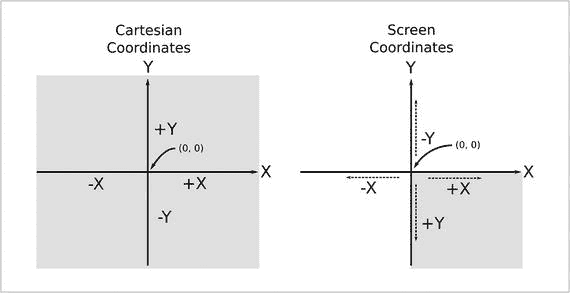

图 3-1.

笛卡尔坐标系与屏幕坐标系。在笛卡尔坐标系中，原点 (0, 0) 位于中心，而屏幕坐标系的原点 (0, 0) 位于屏幕或显示器的左上角。

仔细观察图 3-1，你会看到这两种坐标系。当沿着 x 轴移动一个点时，x 坐标的效果是相同的。然而，当使用屏幕坐标系沿着 y 轴移动时，其效果与笛卡尔坐标系相反。换句话说，当向下（从上到下）移动一个点时，y 坐标的值会增加。图 3-2 展示了使用屏幕坐标系绘制的形状。另请注意，使用负值会将对象绘制到屏幕之外，例如在可视区域中部分显示的星形。

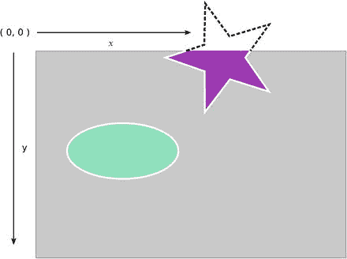

图 3-2.

屏幕坐标系

随着你对 JavaFX 的深入学习，你会发现许多场景图对象，例如线条、圆形和矩形。这些对象都是 `Shape` 类的派生类。所有形状对象都可以在两个形状区域之间执行几何运算，例如相减、相交和合并。通过掌握 [`Shape`](https://docs.oracle.com/javase/8/javafx/api/javafx/scene/shape/Shape.html) API，你将开始看到无限的可能性。现在让我们讨论如何创建线条。

要在 JavaFX 中绘制线条，你将使用 [`javafx.scene.shape.Line`](https://docs.oracle.com/javase/8/javafx/api/javafx/scene/shape/Line.html) 类。创建 `Line` 实例时，你需要指定一个起点 (x, y) 坐标和一个终点 (x, y) 坐标来绘制线条。在创建 `Line` 节点时，有两种方法可以指定起点和终点。第一种方法是使用 `Line` 的构造函数，参数为 `startX`、`startY`、`endX` 和 `endY`。第二种方法是使用空构造函数实例化 `Line` 类，然后使用其 setter 方法。虽然这两种创建 `Line` 节点的方法听起来相当基础，但我想指出，曾经还有第三种使用已弃用的构建器类来构造线条的方法。你将在本章后面看到 JavaFX 团队决定弃用这些类的原因。`Line` 类的所有参数的数据类型都是 `double` 类型值，这提供了浮点小数精度。以下代码片段展示了创建 `Line` 形状节点的两种方法。

```
Line method1 = new Line(startX, startY, endX, endY);
Line method2 = Line();
method.setStartX(startX);
method.setStartY(startY);
method.setEndX(endX);
method.setEndY(endY);
```

关于用作屏幕坐标的小数精度值，请记住，扩展了 `Region` 类的容器类具有一个 [`snapToPixelProperty`](https://docs.oracle.com/javase/8/javafx/api/javafx/scene/layout/Region.html#snapToPixelProperty--) `()` 方法属性，其默认值为 `true`。当为 `true` 时，子节点将使用整数精度作为屏幕坐标的值。`Node` 类的 Javadoc 文档通过以下陈述描述了像素的渲染方式：“在设备像素级别，整数坐标映射到像素之间的角落和缝隙，而像素的中心出现在整数像素位置之间的中点。”

使用整数值（整数）绘制描边宽度为 1 的线条或形状往往会显得模糊。根据 Javadoc 文档，坐标映射到左上角（缝隙）来绘制像素，从而占据两个像素。例如，如果你绘制一条起点为 (1, 1)、终点为 (8, 1) 的水平线，JavaFX 坐标将在缝隙的两侧绘制像素，如图 3-3 所示。缝隙显示为网格线。每个网格块（正方形）表示一个像素。该算法还使用了变化的颜色强度。

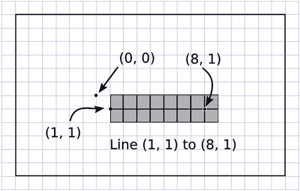

图 3-3.

使用整数值绘制的线条会显得粗且模糊。在 JavaFX 中，使用整数值的线条将占据两个像素。此外，像素的颜色可能会根据坐标的小数值或描边宽度而改变。

为了进一步探索 JavaFX，我创建了一个简单的示例，展示了在场景图上绘制的各种线条，如图 3-4 所示。这些线条大多相同；然而，当对坐标使用整数值时，线条往往会显得粗或模糊。当坐标的浮点值余数小于或等于 0.5 时，线条会显得细（占据一个像素）。注意“细线 2”为浅灰色，使其看起来更细，但仍然占据一个像素。

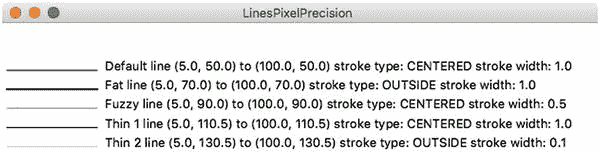

图 3-4.

绘制了五条线——默认线、粗线、模糊线、细线 1 和细线 2


假设你的线条显示模糊（使用整数坐标值），你可能希望线条清晰且纤细。要让线条描边变细，只需在坐标值上加 0.5，这会将坐标映射到屏幕坐标点描边像素的内部。使用小数坐标值时，JavaFX 会将线条渲染为一个像素，从而使其看起来更细。观察一个像素宽的线条相当困难，因此图 3-5 展示了放大后的五条线。

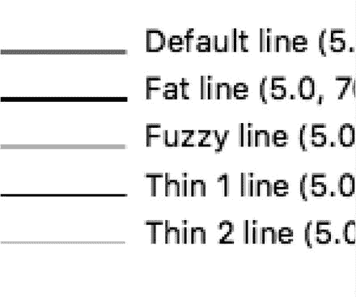

图 3-5.

图 3-4 的放大图，用于检查每条线绘制的像素。注意“细线 2”与“细线 1”一样只占用一个像素，但颜色是浅灰色。

继续讨论线条的创建，下面这条线的起点为(100.0, 10.0)，终点为(10.0, 110.0)，并将通过构造函数创建。

```
Line line = new Line(100.0, 10.0, 10.0, 110.0);
```

创建线条节点的第二种方法是使用空的默认构造函数实例化`Line`类，然后通过相关的 setter 方法设置每个属性。以下代码片段展示了如何使用 setter 方法指定线条的起点和终点。

```
Line line = new Line();
line.setStartX(100);
line.setStartY(10);
line.setEndX(10);
line.setEndY(110);
```

绘制在场景图上的`Line`节点默认描边宽度为`1.0 (double)`，描边颜色为黑色（`Color.BLACK`）。根据 Javadoc，除`Line`、`Polyline`和`Path`节点外，所有形状（如 Text、Rectangle 等）的描边颜色均为 null（无色）。

现在你已经知道如何在场景图上绘制线条，可能想知道如何更有创意地使用线条。创建不同类型的线条很简单：基本上只需设置从父类（[`javafx.scene.shape.Shape`](https://docs.oracle.com/javase/8/javafx/api/javafx/scene/shape/Shape.html)）继承的属性。表 3-1 显示了可以在线条（`Shape`）上设置的属性。要检索或修改每个属性，你将使用相应的 getter 和 setter 方法。该表列出了每个属性名称及其数据类型，并附有说明。更多详情请参考 Javadoc 文档。

表 3-1.

javafx.scene.shape.Shape 类属性

| 属性 | 数据类型 | 描述 |
| --- | --- | --- |
| `Fill` | `javafx.scene.paint.Paint` | 填充形状内部的颜色。 |
| `Smooth` | `Boolean` | True 开启抗锯齿，否则为 false。 |
| `strokeDashOffset` | `Double` | 虚线图案的偏移量（距离）。 |
| `strokeLineCap` | `javafx.scene.shape.StrokeLineCap` | 线条或路径末端的端点样式。有三种样式：`StrokeLineCap.BUTT`、`StrokeLineCap.ROUND` 和 `StrokeLineCap.SQUARE`。 |
| `strokeLineJoin` | `javafx.scene.shape.StrokeLineJoin` | 线条交汇处的装饰。有三种类型：`StrokeLineJoin.MITER`、`StrokeLineJoin.BEVEL` 和 `StrokeLineJoin.ROUND`。 |
| `strokeMiterLimit` | `Double` | 斜接接头的限制。与斜接接头装饰（`StrokeLineJoin.MITER`）一起使用。 |
| `stroke` | `javafx.scene.paint.Paint` | 形状线条描边的颜色。 |
| `strokeType` | `javafx.scene.shape.StrokeType` | 在`Shape`节点边界周围绘制描边的位置。有三种类型：`StrokeType.CENTERED`、`StrokeType.INSIDE` 和 `StrokeType.OUTSIDE`。 |
| `strokeWidth` | `Double` | 描边线条的宽度。 |

JavaFX 提供了两种样式化场景图中节点的方法：通过编程方式或使用 CSS 样式。现在，你将学习如何使用 JavaFX API 以编程方式样式化节点。稍后在第 15 章中，你将学习如何使用 JavaFX CSS 创建自定义控件以及如何为主题（皮肤）用户界面。接下来，你将通过一个示例继续学习 JavaFX 线条。

## 绘制线条

为了更好地理解如何基于表 3-1 使用形状的属性，让我们看一个示例。图 3-6 是清单 3-1（`DrawingLines.java`源代码）的输出，演示了 JavaFX 线条的绘制。该清单中的 JavaFX 应用程序绘制了三条具有不同修改属性的线条。本示例中使用的一些常见属性包括描边虚线偏移量、描边端点样式、描边宽度和描边颜色。

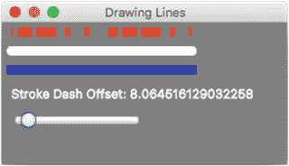

图 3-6.

绘制线条

在图 3-6 中，你可以看到第一条线（顶部）是一条带有虚线描边图案的粗红线。第二条线是一条具有圆形端点的粗白线。最后一条是与其它线条厚度相同的普通蓝线。你还会注意到在图 3-6 中，蓝线下方有两个控件——一个标签和一个滑块控件。这些控件允许用户动态更改红色（顶部）线条的描边虚线偏移量属性。当滑块控件移动时，标签控件会显示虚线偏移值。清单 3-1 展示了`DrawingLines.java`的源代码。

```
package jfxbe;
import javafx.application.Application;
import javafx.beans.value.ObservableValue;
import javafx.scene.*;
import javafx.scene.control.Slider;
import javafx.scene.paint.Color;
import javafx.scene.shape.*;
import javafx.scene.text.Text;
import javafx.stage.Stage ;
/**
* Drawing Lines
* @author carldea
*/
public class DrawingLines extends Application {
@Override
public void start(Stage primaryStage) {
primaryStage.setTitle("Drawing Lines");
Group root = new Group();
Scene scene = new Scene(root, 300, 150, Color.GRAY);
// Red line
Line redLine = new Line(10, 10, 200, 10);
// setting common properties
redLine.setStroke(Color.RED);
redLine.setStrokeWidth(10);
redLine.setStrokeLineCap(StrokeLineCap.BUTT);
// creating a dashed pattern
redLine.getStrokeDashArray().addAll(10d, 5d, 15d, 5d, 20d);
redLine.setStrokeDashOffset(0);
root.getChildren().add(redLine);
// White line
Line whiteLine = new Line(10, 30, 200, 30);
whiteLine.setStroke(Color.WHITE);
whiteLine.setStrokeWidth(10);
whiteLine.setStrokeLineCap(StrokeLineCap.ROUND);
root.getChildren().add(whiteLine);
// Blue line
Line blueLine = new Line(10, 50, 200, 50);
blueLine.setStroke(Color.BLUE);
blueLine.setStrokeWidth(10);
root.getChildren().add(blueLine);
// slider min, max, and current value
Slider slider = new Slider(0, 100, 0);
slider.setLayoutX(10);
slider.setLayoutY(95);
// bind the stroke dash offset property
redLine.strokeDashOffsetProperty()
.bind(slider.valueProperty());
root.getChildren()
.add(slider);
Text offsetText = new Text("Stroke Dash Offset: " + slider.getValue());
offsetText.setX(10);
offsetText.setY(80);
offsetText.setStroke(Color.WHITE);
// display stroke dash offset value
slider.valueProperty()
.addListener((ov, curVal, newVal) ->
offsetText.setText("Stroke Dash Offset: " + newVal));
root.getChildren().add(offsetText);
primaryStage.setScene(scene);
primaryStage.show();
}
/**
* @param args the command line arguments
*/
public static void main(String[] args) {
launch(args);
}
}
清单 3-1.
DrawingLines.java
```


`DrawingLines.java` 首先使用 `setTitle()` 方法设置 `Stage` 窗口的标题。然后，它为 `Scene` 对象创建一个根节点（[`javafx.scene.Group`](https://docs.oracle.com/javase/8/javafx/api/javafx/scene/Group.html)）。如果你还记得第 1 章中讨论的 `HelloWorld` 示例，添加到 JavaFX Scene 图中的第一个节点被称为根节点。根节点始终是 JavaFX 容器类型的节点，例如 `Group` 或 `BorderPane`。所有容器类型的节点（即那些继承自 [`javafx.scene.Parent`](https://docs.oracle.com/javase/8/javafx/api/javafx/scene/Parent.html) 的节点）都有一个名为 [`getChildren`](https://docs.oracle.com/javase/8/javafx/api/javafx/scene/Parent.html#getChildren--) `().add()` 的方法，该方法允许将任何 JavaFX 节点添加到场景图中。默认情况下，`Scene` 对象会填充白色背景；然而，由于我们的一条线是白色的，代码会将场景背景色设置为灰色（`Color.GRAY`）。这样能形成一些对比，以便看到白色的线条。在本书的平装版中，图片是灰度显示的，但如果你使用 PDF 版本，代码会分别创建红色、白色和蓝色三条线。

在第一行中，代码设置了 `Line` 节点的通用属性。这些通用属性包括描边颜色、描边宽度和描边线帽。如前所述，线条内部没有形状，因此线条的填充颜色属性被设置为 `null`（无颜色），而描边颜色默认为黑色。要设置描边颜色，你可以使用 [`javafx.scene.paint.Color`](https://docs.oracle.com/javase/8/javafx/api/javafx/scene/paint/Color.html) 类中内置的 JavaFX 颜色。例如，对于红色，你可以使用 [`Color.RED`](https://docs.oracle.com/javase/8/javafx/api/javafx/scene/paint/Color.html#RED)。指定颜色的方法有很多种，例如使用 RGB、HSB 或 Web 十六进制值。这三种方法也都支持指定 alpha 值（透明度）。稍后，你还会看到其他为形状着色的方法。请参考 Javadoc 以了解更多关于颜色（`javafx.scene.paint.Color`）的信息。设置好描边轮廓颜色后，你可以使用 [`setStrokeWidth`](https://docs.oracle.com/javase/8/javafx/api/javafx/scene/shape/Shape.html#setStrokeWidth-double-) `()` 方法来设置线条的描边宽度（粗细）。形状还有一个描边线帽属性。该属性指定了线条端点的样式。例如，将描边线帽指定为平头（[`StrokeLineCap`](https://docs.oracle.com/javase/8/javafx/api/javafx/scene/shape/StrokeLineCap.html)`.`[`BUTT`](https://docs.oracle.com/javase/8/javafx/api/javafx/scene/shape/StrokeLineCap.html#BUTT)）会形成平坦的方形端点，而圆头（[`StrokeLineCap.ROUND`](https://docs.oracle.com/javase/8/javafx/api/javafx/scene/shape/StrokeLineCap.html#ROUND)）样式则会呈现圆形端点。以下代码片段设置了线条节点的通用形状属性：

```
// 设置通用属性
redLine.setStroke(Color.RED);
redLine.setStrokeWidth(10);
redLine.setStrokeLineCap(StrokeLineCap.BUTT);
```

在红色 `Line` 节点上设置好通用属性后，示例代码创建了一个虚线模式。要形成虚线模式，你只需向 `getStrokeDashArray().add()` 方法添加 `double` 值即可。每个值代表一个虚线段的像素数。在设置虚线段数组时，第一个值（10d）是一个可见的、宽度为 10 像素的虚线段。接下来是一个 5 像素的空白段（不可见）。随后是一个宽度为 15 像素的可见虚线段，以此类推。由于数组包含奇数个值，你可以看到模式在重复自身时，第一个值（10d）会变成一个 10 像素的空白段（不可见）。以下是创建 `Line` 节点虚线模式的代码：

```
// 创建虚线模式
redLine.getStrokeDashArray().addAll(10d, 5d, 15d, 5d, 20d);
redLine.setStrokeDashOffset(0);
```

默认情况下，虚线偏移属性值为 `0`。要查看偏移属性变化时会发生什么，用户可以向右拖动滑块拇指以增加偏移量。描边虚线偏移是指从当前模式的哪个位置开始绘制线条。

由于另外两条线在修改通用属性的方式上基本相同，我就不再进一步解释了。我相信你现在已经理解了创建线条的基本原理。关于这个示例，最后要提的一点是 Slider 控件以及它通过绑定进行连接的方式。

请注意，在清单 3-1 中，在刚刚讨论的三条线之后，滑块控件有一个处理程序代码，它会动态更新一个 `Text` 节点以显示虚线偏移值。同时请注意对 `addListener()` 方法的调用，其中包含作为更改监听器添加的简洁代码。这在你看来可能有些奇怪；然而，它反映了一个新的 Java 8 特性，称为 lambda 表达式，你将在第 4 章中了解更多。以下代码片段使用 lambda 而不是匿名内部类（`ChangeListener`）创建了一个更改监听器。

```
// 显示描边虚线偏移值
slider.valueProperty()
.addListener( (ov, oldVal, newVal) ->
offsetText.setText("Stroke Dash Offset: " + newVal));
```

学习如何绘制线条将帮助你将这些知识应用到 JavaFX 中的任何 `Shape` 节点上。这些重要的概念将允许你创建任何你认为合适的、具有特定样式的形状。说到形状，接下来就要讨论它们了。


## 绘制形状

如果你熟悉允许用户在画布上绘制形状的绘图程序，在使用 JavaFX 的 `Shape` API 时，你会发现许多相似之处。JavaFX 的 `Shape` API 允许你创建许多常见形状，例如直线、矩形和圆形。一些更复杂的形状包括 `Arc`、`CubicCurve`、`Ellipse` 和 `QuadCurve`。当预定义的现成形状不符合要求时，JavaFX 还允许你创建自定义形状。在本节中，你将探索基本形状、复杂形状和自定义形状。由于篇幅限制，我不会演示 JavaFX 中所有可用的形状。要查看所有可用形状，请参考 Javadoc 了解详细信息。

如前所述，JavaFX 具有常见的形状，例如直线、矩形和圆形。在“绘制直线”一节中，你学习了更改任何形状的描边颜色、描边宽度和许多其他属性的基本方法。掌握这些技能将在本章中非常有用。让我们从熟悉矩形形状开始。

在场景图上绘制矩形相当容易。就像在几何课上一样，你指定宽度、高度和 (x, y) 位置（左上角）来将矩形定位在场景图上。要在 JavaFX 中绘制矩形，你可以使用 `javafx.scene.shape.Rectangle` 类。除了常见属性外，`Rectangle` 类还实现了弧宽和弧高。此功能将在矩形上绘制圆角。图 3-7 显示了一个圆角矩形，它同时具有弧宽和弧高。

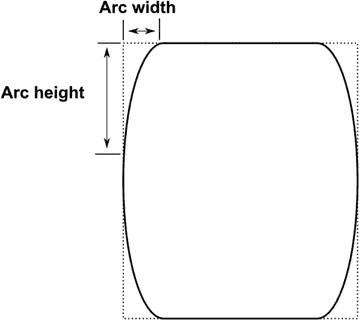

图 3-7.

圆角矩形的弧宽和弧高

以下是一个代码片段，它绘制了一个位于 (50, 50)、宽度为 100、高度为 130、弧宽为 10、弧高为 40 的矩形。

```
Rectangle roundRect = new Rectangle();
roundRect.setX(50);
roundRect.setY(50);
roundRect.setWidth(100);
roundRect.setHeight(130);
roundRect.setArcWidth(10);
roundRect.setArcHeight(40);
```

掌握了直线和矩形等简单形状的基本知识，你将能够操作具有等效属性的其他简单形状。有了这些简单形状的知识，让我们来看看如何创建更复杂的形状。

## 绘制复杂形状

学习简单形状固然很好，但要创建更复杂的形状，你需要了解 JavaFX API 还提供了哪些其他内置形状。探索 Java 文档 (`javafx.scene.shape.*`)，你会发现许多可供选择的派生形状类。以下是当前支持的形状：

*   Arc
*   Circle
*   CubicCurve
*   Ellipse
*   Line
*   Path
*   Polygon
*   Polyline
*   QuadCurve
*   Rectangle
*   SVGPath
*   Text（被视为一种形状类型）

### 复杂形状示例

为了演示绘制复杂形状，下一个代码示例绘制了四个有趣的卡通风格形状。通常卡通画有粗的描边宽度，类似于铅笔勾勒的轮廓。示例中的第一个形状是正弦波，第二个是冰淇淋蛋筒，第三个是微笑，最后一个是甜甜圈。在研究代码之前，你可能想先看看绘制在场景上的形状，这样在查看代码清单时，你可以直观地看到每个形状。图 3-8 是清单 3-2 的输出，描绘了四个复杂形状。

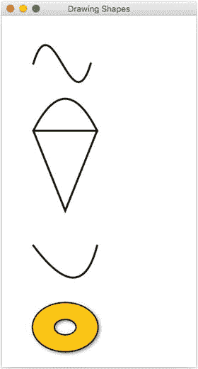

图 3-8.

绘制复杂形状

清单 3-2 中显示的 `DrawingShape.java` 代码演示了你在图 3-8 中看到的形状的绘制。第一个复杂形状涉及一个以正弦波形状绘制的三次曲线 (`CubicCurve`)。下一个形状是冰淇淋蛋筒；它使用了 `Path` 类，该类包含路径元素 (`javafx.scene.shape.PathElement`)。第三个形状是二次贝塞尔曲线 (`QuadCurve`)，形成一个微笑。最后一个形状是一个美味的甜甜圈；要创建这个甜甜圈形状，你将创建两个 (`Ellipse`) 形状（一个较小，一个较大），然后从较大的形状中减去较小的形状。为简洁起见，清单 3-2 仅显示了包含主要 JavaFX 元素的 `start()` 方法。要获取完整的代码清单，请从本书网站下载示例代码。

```
@Override
public void start(Stage primaryStage) {
primaryStage.setTitle("Drawing Shapes");
Group root = new Group();
Scene scene = new Scene(root, 306, 550, Color.WHITE);
// Sine wave
CubicCurve cubicCurve = new CubicCurve(
50,  // start x point
75,  // start y point
80,  // control x1 point
-25, // control y1 point
110, // control x2 point
175, // control y2 point
140, // end x point
75); // end y point
cubicCurve.setStrokeType(StrokeType.CENTERED);
cubicCurve.setStroke(Color.BLACK);
cubicCurve.setStrokeWidth(3) ;
cubicCurve.setFill(Color.WHITE);
root.getChildren().add(cubicCurve);
// Ice cream cone
Path path = new Path();
path.setStrokeWidth(3);
// create top part beginning on the left
MoveTo moveTo = new MoveTo();
moveTo.setX(50);
moveTo.setY(150);
// curve ice cream (dome)
QuadCurveTo quadCurveTo = new QuadCurveTo();
quadCurveTo.setX(150);
quadCurveTo.setY(150);
quadCurveTo.setControlX(100);
quadCurveTo.setControlY(50);
// cone rim
LineTo lineTo1 = new LineTo();
lineTo1.setX(50);
lineTo1.setY(150);
// left side of cone
LineTo lineTo2 = new LineTo();
lineTo2.setX(100);
lineTo2.setY(275);
// right side of cone
LineTo lineTo3 = new LineTo();
lineTo3.setX(150);
lineTo3.setY(150);
path.getElements().addAll(moveTo, quadCurveTo, lineTo1, lineTo2, lineTo3);
path.setTranslateY(30);
root.getChildren().add(path);
// A smile
QuadCurve quad = new QuadCurve(
50, // start x point
50, // start y point
125,// control x point
150,// control y point
150,// end x point
50);// end y point
quad.setTranslateY(path.getBoundsInParent().getMaxY());
quad.setStrokeWidth(3);
quad.setStroke(Color.BLACK);
quad.setFill(Color.WHITE);
root.getChildren().add(quad);
// outer donut
Ellipse bigCircle = new Ellipse(
100,   // center x
100,   // center y
50,    // radius x
75/2); // radius y
bigCircle.setStrokeWidth(3);
bigCircle.setStroke(Color.BLACK);
bigCircle.setFill(Color.WHITE);
// donut hole
Ellipse smallCircle = new Ellipse(
100,   // center x
100,   // center y
35/2,  // radius x
25/2); // radius y
// make a donut
Shape donut = Path.subtract(bigCircle, smallCircle);
donut.setStrokeWidth(1.8);
donut.setStroke(Color.BLACK);
// orange glaze
donut.setFill(Color.rgb(255, 200, 0));
// add drop shadow
DropShadow dropShadow = new DropShadow(
5,    // radius
2.0f, // offset X
2.0f, // offset Y
Color.rgb(50, 50, 50, .588));
donut.setEffect(dropShadow);
// move slightly down
donut.setTranslateY(quad.getBoundsInParent().getMinY() + 30);
root.getChildren().add(donut);
primaryStage.setScene(scene);
primaryStage.show();
}
清单 3-2.
Java 文件 DrawingShape.java 包含一个能够绘制高级形状的应用程序
```

图 3-8 中绘制了四个形状。每个形状将在以下各节中进一步详细说明，这些节描述了代码以及创建这四个形状中每一个背后的原理。


### 三次曲线

在代码清单 3-2 中，第一个图形（绘制为正弦波）实际上是 `javafx.scene.shape.CubicCurve` 类。要创建三次曲线，只需找到合适的构造函数进行实例化。三次曲线的主要参数包括 `startX`、`startY`、`controlX1`（控制点 1 的 X 坐标）、`controlY1`（控制点 1 的 Y 坐标）、`controlX2`（控制点 2 的 X 坐标）、`controlY2`（控制点 2 的 Y 坐标）、`endX` 和 `endY`。图 3-9 展示了一条受控制点影响的三次曲线。

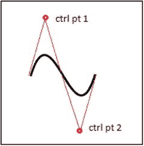

图 3-9.

三次曲线

`startX`、`startY`、`endX` 和 `endY` 参数是曲线的起点和终点，而 `controlX1`、`controlY1`、`controlX2` 和 `controlY2` 是控制点。控制点 (`controlX1`, `controlY1`) 是屏幕空间中的一个点，它会影响起点 (`startX`, `startY`) 到曲线中点之间的线段。点 (`controlX2`, `controlY2`) 是另一个控制点，它会影响曲线中点到终点 (`endX`, `endY`) 之间的线段。控制点会将曲线拉向自身方向。控制点的定义是：曲线上某点处垂直于切线的直线。本示例中，控制点 1 位于曲线上方，将曲线向上拉形成山丘；控制点 2 位于曲线下方，将曲线向下拉形成山谷。

注意

所有较旧的 JavaFX 2.x Builder 类在 JavaFX 8 中已被弃用。请注意，本书上一版使用了 Builder 类。在指定属性时，应优先使用构造函数和 setter 方法，以替代已弃用的 builder 类。

在此，我想提一下，从 JavaFX 8 开始，Oracle 的 JavaFX 团队决定弃用 JavaFX 中的许多 Builder 类。弃用 builder 类的主要原因是 Java 6 和 7 中发现了两个错误，这些错误在 Java 8 中已修复。这些错误修复后来会导致二进制兼容性问题，从而破坏 builder 类。要了解完整情况，请参阅附录 A 中关于 JavaFX 8 特性的部分，其中引用了关于 builder 类问题的讨论链接。了解这一点将有助于你识别较旧的 JavaFX 2.x 代码，从而轻松进行重构。本书第一版频繁使用了 Builder 类，它们是创建 JavaFX 对象的一种优雅方式。尽管 Builder 类已被弃用，但这并不妨碍你使用构建器模式创建 API。要创建没有关联 builder 类的对象，只需找到合适的构造函数进行实例化，或使用 setter 方法来设置对象的属性。

### 冰淇淋蛋筒

冰淇淋蛋筒形状是使用 [`javafx.scene.shape.Path`](https://docs.oracle.com/javase/8/javafx/api/javafx/scene/shape/Path.html) 类创建的。每个路径元素都被创建并添加到 `Path` 对象中。此外，每个元素都不被视为图形节点（`javafx.scene.Node`）。这意味着路径元素并非继承自 `javafx.scene.shape.Shape` 类，因此它们不能作为场景图中的子节点。图 3-10 展示了一个冰淇淋蛋筒形状。

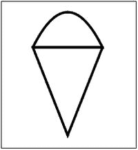

图 3-10.

使用 JavaFX 的 Path 节点绘制的冰淇淋蛋筒

路径元素实际上继承自 `javafx.scene.shape.PathElement` 类，该类仅在 `Path` 对象的上下文中使用。因此，你无法实例化一个 `LineTo` 类并将其放入场景图中。只需记住，后缀为 `To` 的类是路径元素，而不是 `Shape` 节点。

例如，`MoveTo` 和 `LineTo` 对象实例是添加到 `Path` 对象中的 `Path` 元素，而不是可以添加到场景中的形状。路径元素添加的顺序就是绘制顺序。以下代码片段是将 `Path` 元素添加到 `Path` 对象中以绘制冰淇淋蛋筒：

```
// 冰淇淋
Path path = new Path();
MoveTo moveTo = new MoveTo();
moveTo.setX(50);
moveTo.setY(150);
...// 创建其他路径元素
LineTo lineTo1 = new LineTo();
lineTo1.setX(50);
lineTo1.setY(150);
...// 创建其他路径元素
path.getElements().addAll(moveTo, quadCurveTo, lineTo1, lineTo2, lineTo3);
```

此代码片段摘自代码清单 3-2，为简洁起见省略了部分代码。图 3-11 描绘了冰淇淋蛋筒绘制路径元素的有序步骤。

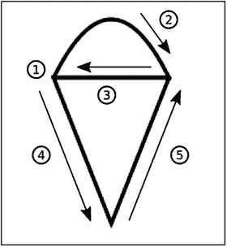

图 3-11.

冰淇淋蛋筒的绘制顺序（步骤 1-5）

*   步骤 1：`moveTo`
*   步骤 2：`quadCurveTo`
*   步骤 3：`lineTo1`
*   步骤 4：`lineTo2`
*   步骤 5：`lineTo3`

### 笑脸

为了绘制笑脸形状，代码使用了 `javafx.scene.shape.QuadCurve` 类。这与前面第一个图形中描述的三次曲线示例类似。不同之处在于，这里只有一个控制点，而不是两个。同样，控制点通过将中点拉向自身来影响线条。图 3-12 展示了一个 `QuadCurve` 形状，其控制点位于起点和终点下方，从而形成笑脸。

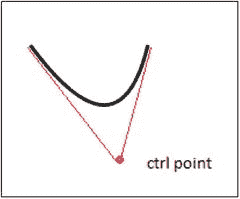

图 3-12.

二次曲线

以下代码绘制了一条二次曲线，其描边宽度为三个像素，填充颜色为白色：

```
// 一个笑脸
QuadCurve quad = new QuadCurve(
50, // 起点 x 坐标
50, // 起点 y 坐标
125,// 控制点 x 坐标
150,// 控制点 y 坐标
150,// 终点 x 坐标
50);// 终点 y 坐标
quad.setStrokeWidth(3);
quad.setStroke(Color.BLACK);
quad.setFill(Color.WHITE);
```


### 甜甜圈

最后是美味的甜甜圈形状，带有有趣的投影效果，如图 3-13 所示。这个自定义形状是通过几何运算（如减去、合并、相交等）创建的。使用任意两个形状，都可以执行几何运算，从而形成一个全新的形状对象。所有运算都可以在 [`javafx.scene.shape.Path`](https://docs.oracle.com/javase/8/javafx/api/javafx/scene/shape/Path.html) 类中找到。

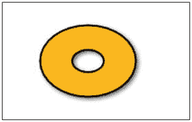

图 3-13.

通过形状减法创建的甜甜圈形状

要创建甜甜圈形状，首先创建两个圆形椭圆（[`javafx.scene.shape.Ellipse`](https://docs.oracle.com/javase/8/javafx/api/javafx/scene/shape/Ellipse.html)）实例。从较大的椭圆区域中减去较小的椭圆（甜甜圈孔），会创建一个新派生的 `Shape` 对象，该对象通过静态的 `Path.subtract()` 方法返回。以下代码片段使用 `Path.subtract()` 方法创建了甜甜圈形状：

```
// 外圈甜甜圈
Ellipse bigCircle = ...//外部形状区域
// 甜甜圈孔
Ellipse smallCircle = ...// 内部形状区域
// 制作甜甜圈
Shape donut = Path.subtract(bigCircle, smallCircle);
```

接下来是为甜甜圈形状应用投影效果。一种常见的技术是绘制填充为黑色的形状，同时将原始形状略微偏移地放置在其上方，以模拟阴影效果。然而，在 JavaFX 中，代码将只绘制一次甜甜圈形状，并使用 `setEffect()` 方法应用一个 `DropShadow` 对象实例。要设置阴影偏移量，请调用 `setOffsetX()` 和 `setOffsetY()` 方法。通常，如果光源来自左上方，则阴影会显示在形状的右下方。

最后要指出的一点是，示例中的所有形状最初都被绘制为彼此上下堆叠。回顾一下清单 3-2，你会注意到，每创建一个形状，其 `translateY` 属性就会被设置，以重新定位或将该形状从其原始位置偏移。例如，如果一个形状的左上角边界框点创建在 (100, 100) 处，而你希望将其移动到 (101, 101)，则 `translateX` 和 `translateY` 属性应设置为 1。

在此示例中，由于每个形状都渲染在另一个形状的下方，你可以调用 `getBoundsInParent()` 方法来返回关于节点边界区域的信息，例如其宽度和高度。`getBoundsInParent()` 对高度和宽度的计算包括了节点的实际尺寸（宽度和高度）以及任何效果、平移和变换。例如，一个应用了投影效果的形状，其宽度会因包含阴影而增加。

图 3-14 是一个围绕父节点内 `Rectangle` 节点的红色虚线矩形，更广为人知的名称为父边界矩形（Bounds in Parent）。你会注意到，宽度和高度的计算包括了应用于形状的变换、平移和效果。在图 3-14 中，变换操作是旋转，效果是投影。

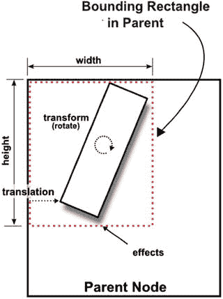

图 3-14.

父边界矩形

## 绘制颜色

我之前提到过，各种绘图程序都有自己的工具来绘制形状。绘图程序还提供了使用调色板绘制形状的能力。通常，绘图程序有一个油漆桶工具来填充画布上的区域。通常，照片编辑软件包能够使用渐变颜色填充或改变颜色的光照。在 JavaFX 中，你也可以使用类似的技术将颜色（`Paint`）应用于对象。在本节中，你将看到一个 JavaFX 应用程序的示例，该示例展示了三个用颜色（`Paint`）填充的形状。

### 颜色示例

为了演示常见的颜色填充，图 3-15 展示了一个显示三种具有不同颜色填充形状的应用程序。它描绘了以下三种形状——椭圆、矩形和圆角矩形。每个形状都有一个渐变填充。第一个形状，椭圆，填充了红色径向渐变。第二个是填充了黄色线性渐变的矩形。最后，圆角矩形具有绿色循环反射渐变填充。你还会注意到黄色矩形后面有一条粗黑线，用以说明颜色的 alpha 级别（透明度）。

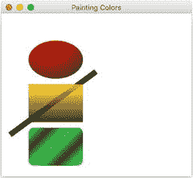

图 3-15.

彩色形状 注意

接下来的示例涉及创建纯色、渐变颜色和半透明颜色的基本技术。还有一些高级策略，例如 [`ImagePattern`](https://docs.oracle.com/javase/8/javafx/api/javafx/scene/paint/ImagePattern.html) API 和 [`Blend`](https://docs.oracle.com/javase/8/javafx/api/javafx/scene/effect/Blend.html) API。如果你感兴趣，可以通过 Javadoc 查看 API 文档来了解这些内容。

在 JavaFX 中，所有形状都可以用纯色和渐变颜色填充。提醒一下，根据 Javadoc，所有形状节点默认填充为黑色，但 `Line`、`Polyline` 和 `Path` 类（`java.scene.shape.Shape` 的后代）除外。清单 3-3 使用了以下主要类来填充图 3-15 中所示的形状节点：

*   `javafx.scene.paint.Color`
*   `javafx.scene.paint.Stop`
*   `javafx.scene.paint.RadialGradient`
*   `javafx.scene.paint.LinearGradient`

注意

在图 3-15 中，`blackLine`、`rectangle` 和 `roundRectangle` 形状都是通过 `setTranslateY()` 方法相对于 `ellipse` 形状以及彼此之间进行定位的。


```
@Override
public void start(Stage primaryStage) {
primaryStage.setTitle("Painting Colors");
Group root = new Group();
Scene scene = new Scene(root, 350, 300, Color.WHITE);
// 使用径向渐变颜色的红色椭圆
Ellipse ellipse = new Ellipse(100, // 中心 X
50 + 70/2, /* 中心 Y */
50,        /* 半径 X */
70/2);     /* 半径 Y */
RadialGradient gradient1 = new RadialGradient(
0,      /* 焦点角度 */
.1,   /* 焦点距离 */
80,   /* 中心 X */
45,   /* 中心 Y */
120,   /* 半径 */
false,      /* 是否按比例 */
CycleMethod.NO_CYCLE,  /* 循环方法 */
new Stop(0, Color.RED), /* 色标 */
new Stop(1, Color.BLACK)
);
ellipse.setFill(gradient1);
root.getChildren().add(ellipse);
double ellipseHeight = ellipse.getBoundsInParent()
.getHeight();
// 第二个形状后面的粗黑线
Line blackLine = new Line();
blackLine.setStartX(170);
blackLine.setStartY(30);
blackLine.setEndX(20);
blackLine.setEndY(140);
blackLine.setFill(Color.BLACK);
blackLine.setStrokeWidth(10.0f);
blackLine.setTranslateY(ellipseHeight + 10);
root.getChildren().add(blackLine);
// 一个使用半透明颜色线性渐变填充的矩形
Rectangle rectangle = new Rectangle();
rectangle.setX(50);
rectangle.setY(50);
rectangle.setWidth(100);
rectangle.setHeight(70);
rectangle.setTranslateY(ellipseHeight + 10);
LinearGradient linearGrad = new LinearGradient(
0,   /* 起始 X */
0,   /* 起始 Y */
0,   /* 结束 X */
1,   /* 结束 Y */
true, /* 是否按比例 */
CycleMethod.NO_CYCLE, /* 循环颜色色标 */
new Stop(0.1f, Color.rgb(255, 200, 0, .784)),
new Stop(1.0f, Color.rgb(0, 0, 0, .784)));
rectangle.setFill(linearGrad);
root.getChildren().add(rectangle);
// 一个使用反射循环线性渐变填充的圆角矩形
Rectangle roundRect = new Rectangle();
roundRect.setX(50);
roundRect.setY(50);
roundRect.setWidth(100);
roundRect.setHeight(70);
roundRect.setArcWidth(20);
roundRect.setArcHeight(20);
roundRect.setTranslateY(ellipseHeight + 10 +
rectangle.getHeight() + 10);
LinearGradient cycleGrad = new LinearGradient(
50, /* 起始 X */
50, /* 起始 Y */
70, /* 结束 X */
70, /* 结束 Y */
false, /* 是否按比例 */
CycleMethod.REFLECT,  /* 循环方法 */
new Stop(0f, Color.rgb(0, 255, 0, .784)),
new Stop(1.0f, Color.rgb(0, 0, 0, .784))
);
roundRect.setFill(cycleGrad);
root.getChildren().add(roundRect);
primaryStage.setScene(scene);
primaryStage.show();
}
清单 3-3.
PaintingColors.java
```

在指定颜色值时，`PaintingColors.java` 代码使用了默认 RGB 颜色空间中的颜色。为了创建颜色，代码使用了 `Color.rgb()` 方法。该方法接受三个整数值，分别代表红色、绿色和蓝色分量。另一个重载方法接受三个整数值和一个数据类型为 double 的第四个参数。这第四个参数是 alpha 通道，用于设置颜色的不透明度。该值介于 0 和 1 之间。0 表示完全透明，1 表示完全不透明。请记住，还有其他创建颜色的方式，例如 HSB 和 Web。HSB 代表色相、饱和度和亮度。要使用 HSB 颜色空间创建颜色，可以调用 `Color.hsb()` 方法。另一种在 HTML 和 CSS 的 Web 开发中常见的指定颜色值的方式是使用 RGB 十六进制字符串值。对于熟悉这种约定的开发者来说，他们会使用 `Color.web()` 方法。

绘制椭圆形状后，代码使用径向渐变调用了 `setFill()` 方法，以呈现 3D 球体对象的外观。接着，它创建了一个用黄色半透明线性渐变填充的矩形。在黄色矩形后面添加了一条粗黑线，以展示半透明颜色。最后，代码实现了一个圆角矩形，使用绿色和黑色相间的反射线性渐变填充，呈现出对角线方向的 3D 管状效果。每个形状及其相关的颜色填充将在后续章节中详细讨论。

### 渐变颜色

在 JavaFX 中创建渐变颜色涉及五个要素：

1.  第一个色标颜色的起始点（`javafx.scene.paint.Stop`）。
2.  代表结束色标颜色的终点。
3.  用于指定是使用标准屏幕坐标还是单位正方形坐标的 `proportional` 属性。
4.  用于指定三种枚举值之一的 `Cycle` 方法：`NO_CYCLE`、`REFLECT` 或 `REPEAT`。
5.  一个色标（`Stop`）颜色数组。每个包含颜色的色标将从绘制第一个色标颜色开始，然后插值到第二个色标颜色，依此类推。

### 色标颜色

在使用渐变颜色时，必须至少有两个颜色列表用于插值。此外，在处理渐变时，可以在颜色之间指定的渐变范围称为范围偏移。要指定范围偏移以分布颜色，需要 `Stop` 类的实例。以下代码片段展示了七个色标颜色，其范围分别为 0%、15%、30%、45%、60%、75% 和 100%。

```
Stop rStop = new Stop(0.0, Color.RED);
Stop oStop = new Stop(0.15, Color.ORANGE);
Stop yStop new Stop(0.30, Color.YELLOW);
Stop gStop new Stop(0.45, Color.GREEN);
Stop bStop new Stop(0.60, Color.BLUE);
Stop iStop new Stop(0.75, Color.INDIGO);
Stop vStop new Stop(1, Color.VIOLET);
```

示例代码是一个代表彩虹颜色（ROYGBIV）的渐变，从红色开始，在 0% 到 15% 的范围内插值，然后橙色在 15% 到 30% 之间渐变。接下来是 30% 到 45% 的范围，使用黄色，依此类推。现在你已经了解了如何指定色标颜色之间的范围偏移，接下来你将学习有助于线性渐变的渐变轴。渐变轴基于一条由起点和终点表示的线，它有助于在形状上分布颜色。

### 线性渐变

在处理线性或径向渐变颜色时，要特别注意 `proportional` 属性。通过将此属性设置为 `false`，你可以基于标准屏幕 (x, y) 坐标绘制一条具有起点（`start X`, `start Y`）和终点（`end X`, `end Y`）的线（渐变轴）。一个例子是使用起点 (0,0) 和终点 (100,0) 的线性渐变，这会创建一个水平渐变（从左到右）。如果一个矩形宽 100 像素，并且有一个偏移量为 0.0 的黑色色标和一个偏移量为 1.0 的白色色标，那么使用 0 到 100 像素之间的屏幕坐标，颜色将从黑色到白色均匀分布。但如果出于某种原因你想改变矩形的宽度，渐变将无法正确缩放。渐变不会拉伸以适应矩形的宽度。

为了允许渐变根据形状的大小进行拉伸，`proportional` 属性被设置为 `true`，并且渐变轴的起点和终点将表示为单位正方形坐标。这意味着起点和终点的 x、y 坐标必须在 0.0 到 1.0（`double` 类型）之间。这种策略比场景图上的屏幕坐标更紧凑，也更容易定义。因此，例如，如果一个矩形宽 200 像素，并且具有与上述相同的两个色标颜色，你可以指定渐变轴线的起点为 (0,0)，终点为 (1,0)，以使渐变从左到右拉伸（覆盖形状的宽度）。


### 径向渐变

带有渐变的颜色其奇妙之处在于，它们常常能让形状呈现出三维效果。渐变绘制允许你在两种或多种颜色之间进行插值，从而为形状增添立体感。JavaFX 提供了两种类型的渐变：径向渐变（`RadialGradient`）和线性渐变（`LinearGradient`）。对于这个椭圆形状，你将使用径向渐变（`RadialGradient`）。这将使椭圆看起来像一个球体。

表 3-2 展示了 JavaFX 8 中 `RadialGradient` 类的 Javadoc 定义。你可以在以下网址找到该文档：

表 3-2.

RadialGradient 属性

| 属性 | 数据类型 | 描述 |
| --- | --- | --- |
| `focusAngle` | `Double` | 从渐变中心到焦点（映射第一种颜色的点）的角度（以度为单位）。 |
| `focusDistance` | `Double` | 从渐变中心到焦点（映射第一种颜色的点）的距离。 |
| `centerX` | `Double` | 渐变圆中心点的 X 坐标。 |
| `centerY` | `Double` | 渐变圆中心点的 Y 坐标。 |
| `radius` | `Double` | 定义颜色渐变范围的圆的半径。 |
| `proportional` | `boolean` | 坐标和大小是否与此渐变所填充的形状成比例。 |
| `cycleMethod` | `CycleMethod` | 应用于渐变的循环方法。 |
| `Stops` | `List<Stop>` | 渐变的颜色规格。 |

[`http://download.java.net/jdk8/jfxdocs/javafx/scene/paint/RadialGradient.html`](http://download.java.net/jdk8/jfxdocs/javafx/scene/paint/RadialGradient.html)

在此示例中，焦点角度设置为零，距离设置为 0.1，中心 X 和 Y 设置为 (80,45)，半径设置为 120 像素，`proportional` 设置为 `false`，循环方法设置为无循环（`CycleMethod.NO_CYCLE`），两个颜色停止值设置为红色（`Color.RED`）和黑色（`Color.BLACK`）。这些设置通过从中心位置为 (80, 45)（椭圆的左上角）的红色开始，插值到距离为 120 像素（半径）的黑色，从而为椭圆提供径向渐变。由于径向渐变的中心位置设置为红色，渐变将插值到黑色，这看起来就像中心位置是一个头顶光源，而黑色则模拟了阴影（与光源相反）。

### 半透明渐变

接下来，你将看到如何创建矩形，该矩形具有黄色的半透明线性渐变。对于黄色矩形，你将使用线性渐变（`LinearGradient`）绘制。

表 3-3 展示了 JavaFX 8 中 `LinearGradient` 类的 Javadoc 定义。你也可以在以下网址找到这些定义：

表 3-3.

LinearGradient 属性

| 属性 | 数据类型 | 描述 |
| --- | --- | --- |
| `startX` | `Double` | 渐变轴起点的 X 坐标。 |
| `startY` | `Double` | 渐变轴起点的 Y 坐标。 |
| `endX` | `Double` | 渐变轴终点的 X 坐标。 |
| `endY` | `Double` | 渐变轴终点的 Y 坐标。 |
| `proportional` | `Boolean` | 坐标是否与此渐变所填充的形状成比例。当设置为 `true` 时，使用单位正方形坐标；否则，使用场景/屏幕坐标系。 |
| `cycleMethod` | `CycleMethod` | 应用于渐变的循环方法。 |
| `stops` | `List<Stop>` | 渐变的颜色规格。 |

[`http://download.java.net/jdk8/jfxdocs/index.html?javafx/scene/paint/LinearGradient.html`](http://download.java.net/jdk8/jfxdocs/index.html?javafx/scene/paint/LinearGradient.html)

要创建线性渐变绘制，你需要为起点和终点指定 `startX`、`startY`、`endX` 和 `endY`。起点和终点的坐标表示渐变图案开始和结束的位置。

要创建图 3-15 中的第二个形状，即黄色矩形，你将起点 X 和 Y 设置为 `(0.0, 0.0)`，终点 X 和 Y 设置为 (0.0, 1.0)，`proportional` 设置为 `true`，循环方法设置为无循环（`CycleMethod.NO_CYCLE`），两个颜色停止值设置为黄色（`Color.YELLOW`）和黑色（`Color.BLACK`），透明度 alpha 值为 0.784。这些设置使得矩形从上到下产生线性渐变，起点为 (0.0, 0.0)（单位正方形的左上角），插值到黑色，终点为 (0.0, 1.0)（单位正方形的左下角）。

### 反射循环渐变

最后，在图 3-15 的底部，你会注意到一个圆角矩形，它使用绿色和黑色沿对角线方向重复渐变图案。这是一种简单的线性渐变绘制，与线性渐变绘制（`LinearGradient`）相同，只是起点 X、Y 和终点 X、Y 的值设置在对角线位置，并且循环方法设置为反射（`CycleMethod.REFLECT`）。当你将循环方法指定为反射（`CycleMethod.REFLECT`）时，渐变图案将在停止颜色之间重复或循环。以下代码片段实现了具有反射循环方法（`CycleMethod.REFLECT`）的圆角矩形：

```
LinearGradient cycleGrad = new LinearGradient(
50, // 起点 X
50, // 起点 Y
70, // 终点 X
70, // 终点 Y
false, // proportional
CycleMethod.REFLECT,  // cycleMethod
new Stop(0f, Color.rgb(0, 255, 0, .784)),
new Stop(1.0f, Color.rgb(0, 0, 0, .784))
);
```


## 绘制文本

另一个基本的 JavaFX 节点是 `Text` 节点，它允许你在场景图上显示一串字符。要在 JavaFX 场景图上创建 `Text` 节点，你需要使用 `javafx.scene.text.Text` 类。由于所有 JavaFX 场景节点都继承自 `javafx.scene.Node`，因此它们会继承许多功能，例如缩放、平移或旋转的能力。

基于 Java 的继承层次结构，`Text` 节点的直接父类是 `javafx.scene.shape.Shape` 类，它提供了比 `Node` 类更多的功能。由于 `Text` 节点既是 `Node` 对象又是 `Shape` 对象，因此它可以在两个形状区域之间执行几何运算，例如相减、相交或并集。你还可以使用类似于镂空字母的形状来裁剪视口区域。

为了演示绘制文本，在本节中，你将看到一个关于如何在场景图上绘制文本节点的基本示例。此示例涉及以下三个功能：

*   使用 (x, y) 坐标定位 `Text` 节点
*   设置 `Text` 节点的描边颜色
*   围绕其枢轴点旋转 `Text` 节点

为了让事情变得有趣一些，你将创建 100 个 `Text` 节点，并为刚才提到的三个功能生成随机值。图 3-16 展示了绘制文本示例的运行效果。

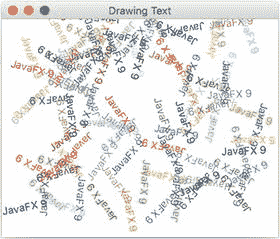

图 3-16.

绘制文本

清单 3-4 中所示的 `DrawingText.java` 代码创建了 100 个 `Text` 节点，并为以下属性生成了随机值：

*   x, y 坐标
*   RGB 填充颜色
*   旋转角度（度）

代码首先创建一个循环来生成随机的 (x, y) 坐标以定位 `Text` 节点。在循环中，它创建介于 0 到 255 之间的随机 RGB 颜色分量，并将其应用于 `Text` 节点。将所有分量设置为 0 会产生黑色。将所有三个 RGB 值设置为 255 会产生白色。

```
@Override
public void start(Stage primaryStage) {
primaryStage.setTitle("Drawing Text");
Group root = new Group();
Scene scene = new Scene(root, 300, 250, Color.WHITE);
Random rand = new Random(System.currentTimeMillis());
for (int i = 0; i < 100; i++) {
int x = rand.nextInt((int) scene.getWidth());
int y = rand.nextInt((int) scene.getHeight());
int red = rand.nextInt(255);
int green = rand.nextInt(255);
int blue = rand.nextInt(255);
Text text = new Text(x, y, "JavaFX 9");
int rot = rand.nextInt(360);
text.setFill(Color.rgb(red, green, blue, .99));
text.setRotate(rot);
root.getChildren().add(text);
}
primaryStage.setScene(scene);
primaryStage.show();
}
清单 3-4.
DrawingText.java
```

旋转角度（以度为单位）是一个从 0 到 360 度随机生成的值，这会导致文本的基线倾斜。根据 API 文档，`setRotate()` 方法将围绕枢轴点旋转，该枢轴点是未变换的[布局边界](http://docs.oracle.com/javafx/2/api/javafx/scene/Node.html#layoutBoundsProperty())（`layoutBounds`）属性的中心。基本上，枢轴点是没有应用任何变换（缩放、平移、剪切、旋转等）的节点的中心。

注意

如果你需要使用变换的组合，例如旋转、缩放和平移，请查看 `getTransforms().add(...)` 方法。有关局部边界、父边界和布局边界之间差异的更多详细信息，请参阅 Javadoc 文档。另外，请查看关于布局和 Scene Builder 的第 5 章。

以下代码用于 `DrawingText.java` 中，为 `Text` 节点的 x 和 y 位置（基线）、颜色和旋转创建随机值：

```
int x = rand.nextInt((int) scene.getWidth());
int y = rand.nextInt((int) scene.getHeight());
int red = rand.nextInt(255);
int green = rand.nextInt(255);
int blue = rand.nextInt(255);
int rot = rand.nextInt(360);
```

生成随机值后，它们会被应用于 `Text` 节点，这些节点将被绘制到场景图上。每个 `Text` 节点都维护一个文本原点属性，该属性包含其基线的起始点。在基于拉丁字母的字母表中，基线是字母下方的一条假想线，类似于书架上的书。但是，某些字母（例如小写字母 j）会延伸到基线以下。在指定 `Text` 节点的 x 和 y 坐标时，你实际上是在定位基线的起点。在图 3-17 中，x 和 y 坐标位于文本节点 `javafx 9` 中基线左侧的小写字母 j 下方。

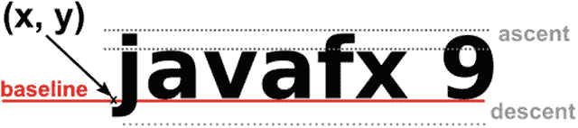

图 3-17.

文本节点的基线 (x, y) 坐标位置

以下代码片段将 (x, y) 坐标、颜色（RGB，不透明度为 .99）和旋转（角度，以度为单位）应用于 `Text` 节点：

```
Text text = new Text(x, y, "JavaFX 9");
text.setFill(Color.rgb(red, green, blue, .99));
text.setRotate(rot);
root.getChildren().add(text);
```

你应该开始看到场景图 API 的易用性所带来的强大功能，尤其是在处理 `Text` 节点时。在这里，你能够定位、着色和旋转文本。为了稍微美化一下，接下来你将看到如何更改文本的字体并应用效果。


### 更改文本字体

JavaFX 的 `Font` API 使您能够像文字处理应用程序一样更改字体样式和字号。为了演示这一点，我创建了一个 JavaFX 应用程序，它显示四个文本节点，其字符串值为 `"JavaFX 9 by Example"`，每个节点具有不同的字体样式。除了字体样式之外，我还添加了诸如投影（`DropShadow`）和反射（`Reflection`）之类的效果。

图 3-18 显示了示例的输出，清单 3-5 显示了 `ChangingTextFonts.java` 源代码。

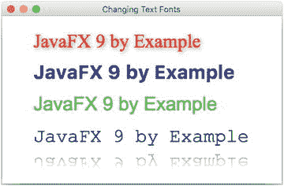

图 3-18.

更改文本字体

```
@Override
public void start(Stage primaryStage) {
primaryStage.setTitle("Changing Text Fonts");
System.out.println("Font families: ");
Font.getFamilies()
.stream()
.forEach( i -> System.out.println(i));
System.out.println("Font names: ");
Font.getFontNames()
.stream()
.forEach( i -> System.out.println(i));
Group root = new Group();
Scene scene = new Scene(root, 580, 250, Color.WHITE);
// Serif with drop shadow
Text text2 = new Text(50, 50, "JavaFX 9 by Example");
Font serif = Font.font("Serif", 30);
text2.setFont(serif);
text2.setFill(Color.RED);
DropShadow dropShadow = new DropShadow();
dropShadow.setOffsetX(2.0f);
dropShadow.setOffsetY(2.0f);
dropShadow.setColor(Color.rgb(50, 50, 50, .588));
text2.setEffect(dropShadow);
root.getChildren().add(text2);
// SanSerif
Text text3 = new Text(50, 100, "JavaFX 9 by Example");
Font sanSerif = Font.font("SanSerif", 30);
text3.setFont(sanSerif);
text3.setFill(Color.BLUE);
root.getChildren().add(text3);
// Dialog
Text text4 = new Text(50, 150, "JavaFX 9 by Example");
Font dialogFont = Font.font("Dialog", 30);
text4.setFont(dialogFont);
text4.setFill(Color.rgb(0, 255, 0));
root.getChildren().add(text4);
// Monospaced
Text text5 = new Text(50, 200, "JavaFX 9 by Example");
Font monoFont = Font.font("Monospaced", 30);
text5.setFont(monoFont);
text5.setFill(Color.BLACK);
root.getChildren().add(text5);
// Reflection
Reflection refl = new Reflection();
refl.setFraction(0.8f);
refl.setTopOffset(5);
text5.setEffect(refl);
primaryStage.setScene(scene);
primaryStage.show();
}
清单 3-5.
ChangingTextFonts.java
```

注意

清单 3-5 `ChangingTextFonts.java` 仅展示了 `start()` 方法，这是示例应用程序的核心。要查看完整的代码清单，请从 `Apress.com` 下载本书的完整示例代码。

对于 `Text` 节点，JavaFX 采用保留模式方法，其中节点使用基于矢量的图形渲染，而不是立即模式渲染。立即模式使用位图图形渲染策略。通过使用基于矢量的图形，您将拥有比位图图形更显著的优势。主要优势在于，它们允许您缩放形状并应用不同的效果，而不会出现像素化（锯齿状边缘）。例如，在立即模式渲染中，图像在放大时会变得颗粒化。然而，在保留模式下，您将获得平滑（抗锯齿）的形状。能够看到所有不同尺寸下都平滑美观的字体（排版）真是太好了。

`ChangingTextFonts.java` 重点介绍了以下要应用于 `Text` 节点的 JavaFX 类。该代码使用了 Serif、SanSerif、Dialog 和 Monospaced 字体，以及投影和反射效果。

*   `javafx.scene.text.Font`
*   `javafx.scene.effect.DropShadow`
*   `javafx.scene.effect.Reflection`

代码首先在舞台上设置标题。接下来，您会注意到新的 Java 8 语言 lambda 特性正在发挥作用，代码列出了当前系统可用的字体族和字体名称。如果您不熟悉 lambda，在第 4 章中您将更深入地了解这个概念，但现在您可以将其视为一种优雅的迭代集合的方式。字体族和字体名称列表将打印在控制台输出中。这对于您稍后尝试不同的字体样式非常方便。以下几行使用 Java 8 的 lambda 语法列出了当前系统上可用的字体：

```
System.out.println("Font families: ");
Font.getFamilies()
.stream()
.forEach( i -> System.out.println(i));
System.out.println("Font names: ");
Font.getFontNames()
.stream()
.forEach( i -> System.out.println(i));
```

注意

如果所选字体未安装在您的系统上，`Text` 节点将使用默认的系统字体。有许多网站提供可供您下载和安装的字体。请查看 Google Fonts：[`https://www.google.com/fonts`](https://www.google.com/fonts)。

列出可用字体后，代码会创建一个根节点，并为其场景设置背景颜色。在绘制第一个 `Text` 节点之前，让我们快速讨论一下如何获取字体。为了获取字体，代码调用了 `Font` 类中的静态方法 `font()`。调用 `font()` 方法时，您可以指定字体名称和磅值，以向调用者返回合适的字体。字体名称是一个字符串值，表示系统支持的字体类型。请参阅 Javadoc 文档以了解获取系统字体的其他方法。以下几行展示了创建 `Text` 节点实例并获取 30 磅 Serif 字体的过程。获取字体后，使用 `Text` 节点的 `setFont()` 方法来应用该字体。

```
Text text = new Text(50, 50, "JavaFX 9 by Example");
Font serif = Font.font("Serif", 30);
text.setFont(serif);
```

注意

尽管清单 2-5 使用了文本节点的绝对定位，但有时您可能希望显示文本节点，并能够在同一布局中换行显示多个文本节点，同时保持它们各自的字体格式。要实现此行为，请参考 JavaFX 8 的新 `TextFlow` API。请参阅以下网址的 Javadoc 文档：[`https://docs.oracle.com/javase/8/javafx/api/javafx/scene/text/TextFlow.html`](https://docs.oracle.com/javase/8/javafx/api/javafx/scene/text/TextFlow.html)


### 应用文本效果

在 `ChangingTextFonts.java` 示例的第一个 `Text` 节点中，代码添加了投影效果。添加投影的一种常见图形技巧是创建至少两层图像，底层图像颜色较深并带有轻微偏移。这种颜色较深且略微偏移的图像会模拟出阴影效果。在 JavaFX 中，投影是一个实际的效果（`DropShadow`）对象，它被应用于单个 `Text` 节点实例，无需多层图像叠加。`DropShadow` 对象的位置基于相对于 `Text` 节点的 x、y 偏移量来设置。你还可以设置阴影的颜色；此处，代码将阴影颜色设置为灰色，不透明度为 0.588。不透明度的取值范围是 0 到 1（`double` 类型），其中 0 表示完全透明，1 表示完全不透明。以下是一个为 `Text` 节点的效果属性设置投影效果（`DropShadow`）的示例：

```
DropShadow dropShadow = new DropShadow();
dropShadow.setOffsetX(2.0f);
dropShadow.setOffsetY(2.0f);
dropShadow.setColor(Color.rgb(50, 50, 50, .588));
text2.setEffect(dropShadow);
```

虽然这个示例是关于设置文本字体的，但它也演示了如何将投影效果应用于 `Text` 节点。`ChangingTextFonts.java` 示例还包含了另一种效果（算是锦上添花）。在使用等宽字体创建最后一个 `Text` 节点时，我应用了流行的倒影效果。调用 `setFraction()` 方法并传入 `0.8f`，本质上是指定要显示 80% 的倒影。倒影的数值范围从零（0%）到一（100%）。除了要显示的比例，还可以设置倒影的间隙或顶部偏移量。换句话说，不透明节点部分与倒影部分之间的间距是通过 `setTopOffset()` 方法调整的。顶部偏移量默认为零。以下代码片段实现了一个比例为 80%（浮点值 0.8f）、顶部偏移量为五个像素的倒影效果：

```
Reflection refl = new Reflection();
refl.setFraction(0.8f);
refl.setTopOffset(5);
text5.setEffect(refl);
```

## 总结

在本章中，你学习了在 JavaFX 场景图上绘制 2D 形状的基础知识。你深入了解了笛卡尔坐标系与屏幕坐标系之间的差异。这进一步加深了你对如何在 JavaFX 场景图上绘制形状节点的理解。第一个示例是使用 JavaFX `Line` 类绘制的基本形状——线条。在此，你深入探讨了父类（`Shape`）的常见属性。讨论的一些常见属性包括设置形状的描边宽度、描边颜色和虚线模式。接下来，你通过绘制有趣的卡通风格图像，探索了简单、复杂和自定义形状。创建形状后，你学习了如何使用颜色为它们着色。你不仅使用了标准的 RGB 颜色，还使用了各种内置技术，例如线性渐变（`LinearGradient`）和径向渐变（`RadialGradient`）着色。最后，你使用了 JavaFX 的 `Text` 节点。通过使用 `Text` 节点，你能够获取可用的系统字体，并应用诸如投影（[`DropShadow`](https://docs.oracle.com/javase/8/javafx/api/javafx/scene/effect/DropShadow.html)）和倒影（`Reflection`）之类的效果。

在最后一个详细说明更改文本字体的示例中，你学习了如何使用 Java 8 新的流 API 和 lambda 表达式来遍历系统字体列表。在第 4 章中，你将了解 Java 8 的 lambda、流和属性。

