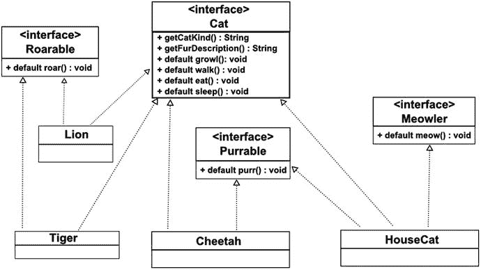

# 4. Lambda 与属性

在本章中，你将了解 Java 8 中引入的新语言特性，称为 lambda 表达式，或简称为 lambda。本章还涵盖了 JavaFX 属性和绑定 API。本章的目标是演示如何在 JavaFX GUI 应用程序的上下文中使用 lambda 和属性。话虽如此，我主要集中讨论本书大多数示例中使用的常见特性，而不会详细说明每一个 lambda 和属性特性。

为了更好地了解 Java 的 lambda 路线图，请参阅 Oracle Java 语言架构师 Brian Goetz 撰写的以下文章：

[`http://cr.openjdk.java.net/~briangoetz/lambda/lambda-state-final.html`](http://cr.openjdk.java.net/%7Ebriangoetz/lambda/lambda-state-final.html)

lambda 这个术语源于数学中所谓的 lambda 演算。该领域的一般概念被用来推导出已添加到 Java 中的特定行为，这些行为将在本章中描述。图 4-1 显示了希腊字母 lambda，你有时会看到它与该主题相关联。


图 4-1.

lambda 的希腊符号

## Lambda

Java Lambda 基于 JSR（Java 规范请求）335，即“Java™ 编程语言的 Lambda 表达式”。该特性恰如其分地以 lambda 演算命名，lambda 演算是数学逻辑和计算机科学中用于表达计算的形式系统。JSR 335，更广为人知的名称为 Project Lambda，包含了许多特性，例如在流上表达并行计算（Stream API）。

lambda 的一个主要目标是帮助解决 Java 语言中缺乏良好方式来表达函数式编程概念的问题。支持函数式编程概念的语言能够创建匿名（未命名）函数，类似于在 Java 中创建对象而非方法。这些函数对象通常被称为闭包。一些支持闭包或 lambda 的常见语言包括 Common Lisp、Clojure、Erlang、Haskell、Scheme、Scala、Groovy、Python、Ruby 和 JavaScript。

主要思想是，支持函数式编程的语言会使用类似闭包的语法。在 Java 8 中，你可以将匿名函数作为一等公民来创建。换句话说，函数或闭包可以像对象一样被对待，因此它们可以被赋值给变量并传递给其他函数。为了在之前的 Java 世界（Java 1.1 到 Java 7）中模拟闭包，你通常会使用匿名内部类来将函数（行为）封装为对象。清单 4-1 展示了一个匿名内部类的示例，该示例为 JavaFX 按钮按下时定义了处理程序代码（在 Java 8 之前）。

```
Button btn = new Button();
btn.setOnAction(new EventHandler() {
public void handle(ActionEvent event) {
System.out.println("Hello World");
} });
清单 4-1.
使用匿名内部类设置按钮的 OnAction
```

你会注意到，仅仅为了连接一个按钮，这段代码看起来非常冗长。在匿名内部类的深处，只有一行输出文本的代码。能够用包含所需行为的代码块来表达，而无需这么多样板代码，岂不是很好？不用再找了。Java 8 通过使用 lambda 表达式（闭包）解决了这个问题。为了了解它在 Java 8 lambda 表达式中的样子，让我们重写按钮处理程序代码。清单 4-2 是将按钮的 `EventHandler` 代码重写为 Java 8 lambda 表达式。

```
btn.setOnAction(event -> System.out.println("Hello World") );
清单 4-2.
使用 Lambda 表达式设置按钮的 OnAction
```

使用 lambda 表达式不仅使代码简洁易读，而且代码的性能也可能更好。实际上，在底层，编译器能够优化代码，并且很可能能够减少其占用空间。

### Lambda 表达式

如前所述，lambda 表达式是 Java 8 版本的闭包。与其他语言在语法上创建闭包的方式相同，你也将能够引用它们并将它们传递给其他方法。为了实现这种能力，你稍后将学习函数式接口。但现在，让我们先看看 lambda 表达式的基本语法。


#### 语法

指定 Lambda 表达式有两种方式。以下简单示例说明了其通用形式：

```
(param1, param2, ...) -> expression;
(param1, param2, ...) -> {  /* code statements */ };
```

Lambda 表达式以括号包围的参数列表开头，后跟箭头符号 `->`（一个连字符和一个大于号）以及表达式体。与 Java 方法类似，括号用于传入表达式中的参数。仅当只定义一个参数时，外围括号才是可选的。当表达式不接受参数（即空参数列表）时，括号仍然是必需的。

箭头符号用于分隔参数列表和表达式体。表达式体或代码块可以用花括号包围，也可以不用。当表达式体没有外围花括号时，它必须只包含一条语句。当表达式为单行语句时，它会被求值并隐式返回给调用者。只需记住，如果方法需要返回类型，并且你的代码块使用了花括号，则必须包含 `return` 语句。清单 4-3 展示了两个等价的 Lambda 表达式，一个带花括号，一个不带。

```
// 显式返回结果
Function func = x -> { return x * x; }
// 求值并隐式返回结果
Function func = x -> x * x;
double y = func(2.0); // x = 4.0
清单 4-3.
一条语句显式返回，另一条隐式返回
```

另需注意的一点是，参数可以选择性地指定类型。编译器会根据上下文推断参数的类型。在清单 4-3 中，有一个类型为 `java.util.function.Function<T, U>` 的函数式接口，其中 `T` 类型被转换为 `U` 类型。你会注意到参数 `x` 没有指定 `Double` 类型。这是因为 Java 8 编译器会根据函数式接口的定义来推断类型。

让我们看一个将 Lambda 表达式传递给方法的示例。一个简单的例子是使用 `setOnAction()` 方法设置 JavaFX 按钮。如前所述，编译器可以通过匹配方法的参数类型（其签名）和返回类型来推断 Lambda 参数。有时为了可读性，你可以选择性地指定每个参数的类型。如果指定了类型，则必须用括号将参数列表括起来。以下代码行为 JavaFX 按钮的 `setOnAction()` 方法中的 Lambda 表达式指定了参数类型（`ActionEvent`）。

```
btn.setOnAction( (ActionEvent event) -> System.out.println("Hello World") );
```

你还会注意到，对于方法内部（例如 `setOnAction()` 方法）的单行语句，省略分号也是可以的。最后一点语法糖是，如果 Lambda 只传入一个参数，则可以省略括号。以下是一个带有一个参数（`event`）且没有括号的 Lambda 表达式。

```
btn.setOnAction( event -> System.out.println("Hello World") );
```

作为对刚刚讨论的语法变体的总结，清单 4-4 中的语句都是等价的 Lambda 表达式。

```
btn.setOnAction( (ActionEvent event) -> {System.out.println(event); } );
btn.setOnAction( (event) -> System.out.println(event) );
btn.setOnAction( event -> System.out.println(event) );
清单 4-4.
为 JavaFX 按钮设置操作代码的三个语法等价的 Lambda 表达式
```

#### 方法引用

清单 4-4 展示了为 JavaFX 按钮的 `ActionEvent` 表达 Lambda 表达式的三种方式，但你知道还有第四种方式吗？

在使用 Lambda 时，经常会有方法接受单个参数作为输入，或返回单个值。这非常冗余，因此 Java 8 引入了方法引用的概念。方法引用本质上是一种语法糖，它允许你以更简洁的方式调用方法，从而使代码更易于阅读。例如，以下是一个使用方法引用的 Lambda 表达式：

```
btn.setOnAction(System.out::println);
```

这段代码设置了按钮的操作，你会注意到它是一个简洁的版本，其行为与清单 4-4 相同。区别在于，Lambda 中没有 `ActionEvent` 的输入参数，并且在 `System.out` 和 `println` 方法之间有一个不寻常的双冒号。双冒号被称为作用域运算符，它通过名称引用方法。你还会注意到 `println` 方法的括号被省略了。如果你还记得，每当 Lambda 表达式接受单个参数作为输入时，该参数会隐式传递给接受单个输入的 `println` 方法。当然，两者的类型必须相同。示例中的事件对象会隐式调用 `toString()` 来向 `println` 方法传递一个 `String`。

本书范围之外还有其他方法引用类型。请参阅 Javadoc 文档了解其他用例场景。查看以下关于方法引用的教程：

[`https://docs.oracle.com/javase/tutorial/java/javaOO/methodreferences.html`](https://docs.oracle.com/javase/tutorial/java/javaOO/methodreferences.html)


#### 变量捕获

在函数式编程语言中，通常可以通过闭包（lambda 表达式）来使用闭包作用域之外的变量。这些变量通常被称为非局部变量或捕获变量，因为它们并非 lambda 表达式或方法的局部作用域变量。当这些非局部变量在 lambda 表达式中使用时，它们必须是不可变的。这是函数式编程领域的一个关键原则。Java 8 编译器新增了一项能力，即可以引用匿名内部类或 lambda 表达式作用域之外的变量。

使用 lambda 表达式时，你可以选择引用闭包函数作用域之外的变量。通常，在 Java 8 之前，这些非局部变量必须是 `final`（不可变）的。这种不可变状态使编译器能够更好地预测程序行为，从而优化代码。在 Java Swing 开发中，当需要在匿名内部类方法（局部变量作用域）内部使用外部作用域的变量时，这种情况经常发生。为了遵守编译器规则，你必须将变量声明为 `final`。

Java 8 编译器具备一项新能力，可以推断传递给匿名内部类方法和 lambda 表达式的非局部变量的意图，并将其转换为 `final`（不可变）。要了解旧式 Java Swing 开发者（Java 8 之前）是如何遇到编译时错误的，请看代码清单 4-5。场景是一个按钮，在按下按钮后会修改 Swing `JLabel` 组件的文本。在 Java 8 之前，这段代码无法正确编译，因为 `label` 变量需要被声明为 `final`。

```
// Java 8 之前
// label 变量是 actionPerformed() 的非局部变量
JLabel label = new JLabel("Press Me");
btn.addActionListener(new ActionListener() {
public void actionPerformed(ActionEvent e) {
label.setText("Pressed"); /* !编译错误！变量 label 必须是 final 的。 */
} });
代码清单 4-5.
在 JDK 8 之前会产生编译器错误的代码
```

Java 8 新增了将非局部变量转换为 final 的能力。在代码清单 4-6 中，你会注意到除了注释之外，代码是完全相同的。从 Java 8 开始，你现在可以在匿名内部类和 lambda 表达式中使用变量捕获功能。

```
// Java 8 新增
// label 变量是 actionPerformed() 的非局部变量
JLabel label = new JLabel("Press Me");
// 编译器隐式地将 label 转换为 final（不可变）变量
btn.addActionListener(new ActionListener() {
public void actionPerformed(ActionEvent e) {
label.setText("Pressed"); /* 合法。变量 label 已被转换为 final */
} });
代码清单 4-6.
在 JDK 8 中成功编译的代码
```

代码清单 4-6 中展示的两个代码示例是相同的。区别在于使用 JDK 8 或更高版本的编译器时。当使用 Java 8 编译器时，捕获变量将隐式地变为 final（不可变引用），并且这不会触发任何编译错误。

## 函数式接口

云计算的出现帮助许多函数式编程语言重新焕发了活力。很明显，在处理极其庞大的数据集时，解决问题的方式发生了范式转变。应用函数式编程技术的一个典型用例是，能够以分布式方式遍历数据集并执行计算，从而将负载分摊到多个节点或 CPU 核心上。相比之下，命令式编程语言则是先收集数据，然后将其传递到一个紧凑的 `for` 循环中进行处理。由于数据和代码的耦合方式，这给单个线程（核心）处理如此大量的数据带来了很大负担。问题需要被分解，以允许其他线程（核心）参与计算，从而实现分布式处理。

函数式编程的优势之一在于能够以语法简洁的方式表达功能，但更重要的是能够将功能（lambda 表达式）传递给方法。能够将 lambda 表达式传递给方法通常促进了惰性求值这一概念。这种行为与函数回调行为（异步消息传递）相同，即调用被推迟（因此是“惰性的”）到稍后的时间点执行。与惰性求值相对的是急切求值。使用惰性求值通常可以通过避免不必要的计算来提高性能。

另一个需要讨论的重要主题是函数式接口如何在 Java 语言中用作闭包。Java 语言的设计者/架构师并没有将函数实现为 Java 中的一等类型，而是巧妙地定义了函数式接口作为闭包的概念。简单来说，函数式接口基本上就是一个单一抽象方法（SAM）。函数式接口的概念已经存在了很长时间。例如，那些使用过 Java 线程的人会记得 `Runnable` 接口，它有一个返回类型为 `void` 的单一 `run()` 方法。单一抽象方法模式是 Java 8 lambda 表达式的一个组成部分。作为函数式接口的一个例子，我创建了一个名为 `MyEquation` 的接口，其中包含一个单一的抽象 `compute()` 方法。一旦创建，你就可以使用 lambda 表达式来声明和赋值变量。代码清单 4-7 是一个具有单一抽象 `compute()` 方法的函数式接口。

```
// 函数式接口
interface MyEquation {
double compute(double val1, double val2);
}
代码清单 4-7.
一个声明的函数式接口，包含一个单一抽象方法 compute()
```

创建函数式接口后，你可以声明一个变量，并用 lambda 表达式为其赋值。代码清单 4-8 演示了将 lambda 表达式赋值给函数式接口变量。

```
MyEquation area = (height, width) -> height * width;
MyEquation perimeter = (height, width) -> 2*height + 2*width;
System.out.println("Area = " + area.compute(3, 4));
System.out.println("Perimeter = " + perimeter.compute(3, 4));
代码清单 4-8.
函数式接口的两个变量，使用 lambda 表达式赋值
```

以下是代码清单 4-8 的输出：

```
Area = 12.0
Perimeter = 14.0
```


## 聚合操作

Java 8 中 lambda 表达式的另一个强大用途是处理集合。Java 8 引入了新的 Stream API（`java.util.stream.*`），它允许你处理来自给定源的元素。源可以是对数据结构（如集合或 IO 通道）的引用。根据 Oracle 关于 Stream API 的 Java 8 文档（Javadoc）所述，“流并非存储元素的数据结构；相反，它们通过计算操作的管道，从源（可以是数据结构、生成器、IO 通道等）携带值。”

管道是一系列操作（lambda 表达式/函数式接口），可以处理或查询流中的每个元素。此类操作允许你执行聚合任务。聚合操作类似于电子表格可以对一系列单元格执行某些计算的方式，例如格式化、求平均值或求和。要开始在集合上使用聚合操作，你首先需要在 `java.util.Collection` 接口上调用 `default stream()` 方法。稍后你将了解更多关于默认方法的内容，但现在所有集合（`Collection`）都有一个 `stream()` 方法，该方法返回一个 `java.util.stream.Stream` 实例。清单 4-9 是一段代码片段，它从源集合（`List<Integer>`）中获取元素流。

```
List values = Arrays.asList(23, 84, 74, 85, 54, 60);
Stream stream = values.stream();
清单 4-9.
通过从集合调用 stream() 方法获取的流
```

常见的内置聚合操作有 `filter`、`map` 和 `forEach`。`filter` 允许你传入一个表达式来过滤元素，并返回一个包含所选项目的新 `Stream`。`map` 操作将每个元素转换（或映射）为另一种类型，并返回一个包含映射后类型项目的新 `Stream`。例如，你可能希望将流中的 `Integer` 值映射为 `String` 值。`forEach` 操作允许你传入一个 lambda 表达式来处理流中的每个元素。

一个运用这三种常见聚合操作的典型用例是：给定一个整数集合，过滤出大于某个阈值（一个非局部变量）的值，将过滤后的项目转换为十六进制值，并打印每个十六进制值。清单 4-10 实现了该用例，它运用了各种聚合操作。

```
// 创建一个值列表
List values = Arrays.asList(23, 84, 74, 85, 54, 60);
System.out.println("values: " + values.toString());
// 用于 lambda 表达式的非局部变量。
int threshold = 54;
System.out.println("大于 " + threshold + " 的值转换为十六进制：");
Stream stream = values.stream();
// 使用聚合函数 filter() 和 forEach()
stream
.filter(val -> val > threshold) /* 谓词函数式接口 */
.sorted()
.map(dec -> Integer.toHexString(dec).toUpperCase() ) /* 消费者函数式接口 */
.forEach(val -> System.out.println(val)); /* 每个输出值。 */
清单 4-10.
在整数集合上使用聚合操作
```

以下是清单 4-10 的输出：

```
values: [23, 84, 74, 85, 54, 60]
大于 54 的值转换为十六进制：
3C
4A
55
```

注意

此输出是一个按升序排序的整数列表，显示十六进制值。对应的十进制值如下：3C=60，4A=74，54=84，55=85。

在清单 4-10 中，代码首先创建一个整数列表作为集合。接着，输出原始元素列表（未修改）。然后，代码声明一个用于 lambda 表达式的非局部变量，名为 `threshold`，将在过滤表达式中使用。接下来，你从 `values` 集合中获取一个流（通过 `stream()` 方法）来执行聚合操作。

第一个操作是一个过滤器，它接收一个 lambda 表达式来过滤大于 54 的元素（`val > threshold`）。下一个操作是 `sorted()` 方法，它对从过滤器方法流返回的元素进行排序。继续方法链，注意 map 操作。`map()` 方法操作可以将流中的每个元素从一种数据类型映射到另一种数据类型。

在此场景中，流元素是 `Integer` 对象，它们被映射为 `String` 对象。`map()` 方法返回另一个流，其中包含类型为 `Stream<String>` 的元素。在此示例中，字符串元素是十六进制值。最后，`forEach()` 操作遍历字符串（十六进制）元素流中的每个元素并打印。请记住，`forEach()` 方法用于流的非并行处理。

你会注意到，每次调用聚合函数时，返回类型都是 `Stream` 对象，这允许你以非常类似于构建器模式的方式进行方法链式操作。澄清一下，方法链式操作的概念实际上源于 API 设计的流畅接口模式。

虽然我只触及了 `Stream` API 的主要特性，但我没有提到并行性这个重要主题。并行性是将工作并发分发给 CPU 核心的能力，从而减少总体计算时间。现代台式机、智能手机、平板电脑和计算机通常具有多核。为了利用真正的并行处理，Java 8 平台现在支持并行流。要并行执行操作，你可以简单地在集合上调用 `parallelStream()` 方法。由于项目可以并发操作，建议使用线程安全的集合。在清单 4-11 中，整数列表将使用 `Collections.synchronizedList()` 方法进行包装。

```
/**
* 聚合操作。
* @author cdea
*/
public class AggregateOperations {
/**
* @param args 命令行参数
*/
public static void main(String[] args) {
// 创建一个值列表
List values = Collections.synchronizedList(
Arrays.asList(23, 84, 74, 85, 54, 60));
System.out.println("values: " + values.toString());
// 用于 lambda 表达式的非局部变量。
int threshold = 54;
System.out.println("大于 " + threshold + " 的值转换为十六进制：");
java.util.stream.Stream stream = values.parallelStream();
// 使用聚合函数 filter() 和 forEach()
stream
.filter(val -> val > threshold) /* 谓词函数式接口 */
.sorted()
.map(dec -> Integer.toHexString(dec).toUpperCase() ) /* 消费者函数式接口 */
.forEachOrdered(System.out::println);
}
}
清单 4-11.
编写为支持并行流的聚合操作示例
```

使集合同步后，代码通过调用 `parallelStream()` 方法将 `Stream` 引用作为并行流获取。在对并行流执行即时或聚合函数之后，调用的最后一个终端函数是 `forEachOrdered()` 方法。你会注意到，与 `forEach()` 方法不同，`forEachOrdered()` 方法将在并行处理完成时按顺序遍历每个项目。如果你使用 `forEach()` 方法，项目将无序。

注意

当使用并行流进行排序时，请使用终端函数 `forEachOrdered()` 而不是 `forEach()`。根据 Javadoc，它指出“如果流定义了遭遇顺序，则按流的遭遇顺序对该流的每个元素执行一个操作。”


你是否知道，上述并行代码示例的运行速度可能比使用非并行流还要慢？这是因为示例中集合包含的元素太少。并行代码会为每个 CPU 核心创建新线程来处理计算任务。由于待处理元素数量极少，线程上下文切换和调度带来的开销，很可能比单线程循环遍历元素的方式更慢。

现在，如果你拥有海量数据，并行流的性能将超越仅使用单核的单线程。根据经验法则，当数据集极其庞大时，应使用并行流；而当数据量非常小时，则应使用非并行流。通常，如果你有四个核心且数据项超过 10 万条，就应使用并行流。

## 默认方法

默认方法是一种向 Java 接口添加默认实现方法的新方式。你可能会挠头并脱口而出：“Java 接口居然能有实现？！”是的，Java 8 现在支持这一概念，称为虚拟扩展方法，更广为人知的名字是守护方法。默认方法的作用是在不破坏兼容性的前提下，向接口添加（扩展）新行为。默认方法并非抽象方法，而是包含实现（代码）的方法。

例如，向 Java 接口添加新的抽象方法会影响所有实现类。由于 Java 接口的严格契约，编译器会强制实现者实现抽象方法；但实现包含默认方法的接口的类，并不会强制开发者实现这些默认方法。相反，派生类将直接获得默认方法实现的行为。

### 示例：大小猫科动物

可能不太明显，但之前用于聚合操作的`Collection`接口中的`stream()`方法并非抽象方法，而实际上是 Java 8 的默认方法。清单 4-12 展示了 Java 8 源码中`java.util.Collection`接口的默认方法`stream()`。

```
default Stream stream() {
return StreamSupport.stream(spliterator, false);
}
清单 4-12.
Java 8 的 Collection 接口中的默认方法 stream()
```

在本例中，我创建了一个关于猫科动物（嗷呜，喵喵）的领域模型（包含类和接口）。猫的种类或物种可以轻松展示某些猫科动物具备而其他种类不具备的默认行为。例如，狮子、老虎和美洲豹等大型猫科动物能够咆哮；而小型猫科动物则会发出咕噜声。此外，家猫能够喵喵叫。为了进一步描述这些行为特征，请查看图 4-2，这是一个展示猫科动物种类间默认行为的类图。



图 4-2.

以 UML 类图表示的猫科动物领域模型

观察`Tiger`和`Lion`类，你会发现它们都实现了`Roarable`和`Cat`接口。老虎和狮子通过`Roarable`接口中的`default roar()`方法拥有相同的行为（能够咆哮）。请注意，`Roarable`接口没有任何抽象方法，只有一个默认方法`roar()`，`Lion`和`Tiger`无需实现即可获得该方法。

相比之下，如果`Roarable`接口将`roar()`设为抽象方法（纯虚函数），则必须在`Tiger`和`Lion`的具体类中分别实现`roar()`。由于两个地方具有相同的功能，日后可能会成为维护的噩梦。这就是为什么默认方法允许你在不修改派生类的情况下添加行为。

### 示例代码

要查看图 4-2 中类图的代码实现，请参考清单 4-13 至 4-20。为实现该类图，我简要概述了代码示例的三个部分。首先，你将看到一组包含默认方法行为的猫科动物接口。其次，展示了具体的猫科动物类，如`Lion`、`Cheetah`和`HouseCat`。最后是主示例应用程序，演示了默认方法的实际应用。

清单 4-13 至 4-16 包含了 UML 接口`Roarable`、`Purrable`、`Meowler`和`Cat`，每个接口都包含一个默认方法。

```
public interface Roarable {
default void roar() {
System.out.println("Roar!!");
}
}
清单 4-13.
包含默认方法 roar() 的 Roarable 接口
```

```
public interface Purrable {
default void purr() {
System.out.println("Purrrrrrr...");
}
}
清单 4-14.
包含默认方法 purr() 的 Purrable 接口
```

```
public interface Meowler {
default void meow() {
System.out.println("MeeeeOww!");
}
}
清单 4-15.
包含默认方法 meow() 的 Meowler 接口
```

```
/**
* 这是一个抽象的 Cat 接口，包含所有猫科动物共有的默认方法。
* @author carldea
*/
public interface Cat {
String getCatKind();
String getFurDescription();
default void growl() {
System.out.println("Grrrrowl!!");
}
default void walk() {
System.out.println(getCatKind() + " is walking.");
}
default void eat() {
System.out.println(getCatKind() + " is eating.");
}
default void sleep() {
System.out.println(getCatKind() + " is sleeping.");
}
}
清单 4-16.
包含抽象方法和默认方法的主 Cat 接口
```

清单 4-17 至 4-20 展示了具体实现类`Tiger`、`Lion`、`Cheetah`和`HouseCat`，它们使用了上述接口。

```
public class Tiger implements Cat, Roarable {
@Override
public String getCatKind() {
return getClass().getSimpleName();
}
@Override
public String getFurDescription() {
return "striped";
}
}
清单 4-17.
实现 Cat 和 Roarable 接口的 Tiger 类
```

```
public class Lion implements Cat, Roarable {
@Override
public String getCatKind() {
return getClass().getSimpleName();
}
@Override
public String getFurDescription() {
return "gold-brown";
}
}
清单 4-18.
实现 Cat 和 Roarable 接口的 Lion 类
```

```
public class Cheetah  implements Cat, Purrable {
@Override
public String getCatKind() {
return getClass().getSimpleName();
}
@Override
public String getFurDescription() {
return "spotted";
}
}
清单 4-19.
实现 Cat 和 Purrable 接口的 Cheetah 类
```

```
public class HouseCat implements Cat, Purrable, Meowler {
@Override
public String getCatKind() {
return "Domestic Cat";
}
@Override
public String getFurDescription() {
return "mixed brown and white";
}
}
清单 4-20.
实现 Cat、Purrable 和 Meowler 接口的 HouseCat 类
```

清单 4-21 是主应用程序，它调用了猫实例的所有方法，展示了它们的行为。


```
/**演示 Java 8 中的默认方法。
* Mixins.java
*
* @author cdea
*/
public class Mixins {
public static void main(String[] args) {
Tiger bigCat = new Tiger();
Cheetah mediumCat = new Cheetah();
HouseCat smallCat = new HouseCat();
System.out.printf("%s with %s fur.\n", bigCat.getCatKind(),
bigCat.getFurDescription());
bigCat.eat();
bigCat.sleep();
bigCat.walk();
bigCat.roar();
bigCat.growl();
System.out.println("------------------");
System.out.printf("%s with %s fur.\n", mediumCat.getCatKind(),
mediumCat.getFurDescription());
mediumCat.eat();
mediumCat.sleep();
mediumCat.walk();
mediumCat.growl();
mediumCat.purr();
System.out.println("------------------");
System.out.printf("%s with %s fur.\n", smallCat.getCatKind(),
smallCat.getFurDescription());
smallCat.eat();
smallCat.sleep();
smallCat.walk();
smallCat.growl();
smallCat.purr();
smallCat.meow();
System.out.println("------------------");
}
}
清单 4-21.
执行代码示例的主应用程序文件（Mixins.java）
```

以下是清单 4-20 的输出，演示了默认方法的调用：

```
run:
Tiger with striped fur.
Tiger is eating.
Tiger is sleeping.
Tiger is walking.
Roar!!
Grrrrowl!!

Cheetah with spotted fur.
Cheetah is eating.
Cheetah is sleeping.
Cheetah is walking.
Grrrrowl!!
Purrrrrrr...

Domestic Cat with mixed brown and white fur.
Domestic Cat is eating.
Domestic Cat is sleeping.
Domestic Cat is walking.
Grrrrowl!!
Purrrrrrr...
MeeeeOww!

BUILD SUCCESSFUL (total time: 0 seconds)
```

### 代码解释

图 4-2（前面已展示）描绘了一个猫领域模型的 UML 类图。在顶层，你会注意到接口`Roarable`、`Cat`、`Purrable`和`Meowler`。这些接口为任何想要挑选和组合（mixin）公共行为的派生类提供了行为。

具体的实现类是`Lion`、`Tiger`、`Cheetah`和`HouseCat`。你会注意到主接口`Cat`包含了抽象方法`getCatKind()`和`getFurDescription()`，以及默认方法`walk()`、`eat()`和`sleep()`。像往常一样，Java 编译器会强制实现`Cat`接口的类实现抽象方法`getCatKind()`和`getFurDescription()`。

`Cat`接口上的默认方法具有实现代码，这些代码作为所有猫的功能。这些默认方法将为`Cat`接口提供行为，同时集中所有派生类的功能（实现）。我创建了空的（标记）接口`Roarable`、`Purrable`和`Meowler`，它们分别包含默认方法`roar()`、`purr()`和`meow()`。这些接口类似于 mixin 的概念，在面向对象语言中，它允许开发者为任何派生类或接口扩展或添加默认行为。清单 4-22 重复了清单 4-21 中主类的开头部分，该部分首先创建了三个猫对象：`Tiger`、`Cheetah`和`HouseCat`。

```
Tiger bigCat = new Tiger();
Cheetah mediumCat = new Cheetah();
HouseCat smallCat = new HouseCat();
清单 4-22.
创建三种类型的猫实例
```

创建猫对象后，代码开始执行默认方法和抽象方法。它调用了每个猫对象上的所有方法。清单 4-23 展示了一个类型为`Tiger`的猫及其所有被调用的方法。

```
System.out.printf("%s with %s fur.\n", bigCat.getCatKind(), bigCat.getFurDescription());
bigCat.eat();
bigCat.sleep();
bigCat.walk();
bigCat.roar();
bigCat.growl();
System.out.println("------------------");
清单 4-23.
在 Tiger 实例上调用的所有方法
```

由于其他种类的猫有类似的任务，我就不再进一步讨论了，因为我相信你已经掌握了要点。如果你已经读到这里，你真是个坚韧不拔的人。每当我学习一项新技能或新概念时，我总会想起那句编程谚语：“如果你手里只有一把锤子，那么所有东西看起来都像钉子。”学习新的语言特性往往很困难，尤其是当你长期在不使用 Java 中这些新的强大概念的情况下解决问题时。

我只是浅尝辄止，所以我鼓励你更深入地研究 Java 8 的特性。既然你已经掌握了 lambda 表达式的新能力，让我们回到 JavaFX 的正题上。

## 属性和绑定

属性基本上是 JavaFX 对象属性（如 String 或 Integer）的包装器对象。属性允许开发者添加监听器代码，以便在包装值发生变化或被标记为无效时做出响应。此外，属性对象可以相互绑定。绑定行为允许属性根据另一个属性变化的值来更新或同步其值。

### UI 模式

在讨论 JavaFX 的属性和绑定 API 之前，我想和你分享一些关于 UI 模式的知识。在开发 GUI 应用程序时，你不可避免地会遇到 UI 架构框架概念，例如模型-视图-控制器（[MVC](http://martinfowler.com/eaaCatalog/modelViewController.html)）、表示模型（[PM](http://martinfowler.com/eaaDev/PresentationModel.html)）、模型-视图-展示器（[MVP](http://martinfowler.com/eaaDev/ModelViewPresenter.html)）或模型-视图-视图模型（[MVVM](https://msdn.microsoft.com/en-us/library/hh848246.aspx)）。

根据你与谁交谈，你可能会得到不同的解释；然而，这些概念都涉及如何最好地处理模型和视图之间同步的问题。这意味着当用户与 UI（视图）交互（输入）时，底层的后端数据存储（模型）会自动更新，反之亦然。

在不试图过度简化这些概念的前提下，我建议你参考实际涉及的 UI 模式。主要涉及的 UI 模式包括监督控制器、表示模型和中介者。如果你有兴趣了解更多关于 UI 模式的知识，请阅读 Martin Fowler 在[`http://martinfowler.com/eaaDev/uiArchs.html`](http://martinfowler.com/eaaDev/uiArchs.html)上发表的“GUI 架构”一文。

由于这些模式多年来一直被广泛讨论，JavaFX 团队设计并实现了 API，以克服这些 UI 场景中出现的问题。在本节中，你将学习如何使用 JavaFX 属性和绑定来同步你的 GUI 和数据对象。当然，我不可能涵盖所有涉及上述 UI 模式的用例场景，但我希望能为你提供基础知识，让你走上正确的道路。


### 属性

在 JavaFX 属性 API 出现之前，Java Swing 开发者遵循 JavaBean 约定（规范），该规范规定对象应包含私有作用域的实例变量，并配有相应的 getter（访问器）和 setter（修改器）方法。例如，一个 `User` 类可能有一个 `String` 类型的私有实例变量 `password`。对应的 getter 和 setter 方法分别是 `getPassword()` 和 `setPassword()`。清单 4-24 展示了一个遵循旧版 JavaBean 约定的 `User` 类。

```
public class User {
private String password;
public String getPassword() {
return password;
}
public void setPassword(String password) {
this.password = password;
}
}
清单 4-24.
一个包含 Getter 和 Setter 方法的简单 JavaBean 类
```

作为遵循 JavaBean 约定的开发者，你会很快发现属性的命名约定是基于 getter 和 setter 方法名，而非私有变量名。换句话说，如果 getter 方法名为 `getPwd()`，那么属性名就是 `pwd`，与名为 `password` 的属性无关。

JavaBeans 规范还提供了一个包含属性变更支持（`java.beans.PropertyChangeSupport`）概念的 API，允许开发者在属性发生变化时添加处理（监听）代码。在当时，这仅解决了属性变更支持的部分问题。当涉及到变量绑定和与 Collections API 配合使用时，JavaBeans API 开始显露出其局限性。尽管 JavaBeans API 已成为构建领域对象的标准方式，但它仍然缺乏在 GUI 应用程序中同步领域模型和视图的稳健方法，如前所述。

多年来，JavaBean 规范和 API 催生了许多第三方工具和框架，以改善开发者体验。然而，使用单向或双向绑定将 GUI 组件连接到 JavaBeans 仍然相当复杂。有时，开发者会因资源未正确释放而导致对象泄漏。开发者很快意识到，他们需要一种更好的方式来绑定和解绑 GUI 控件，使其与属性连接。

### JavaFX 属性的类型

让我们快进到 JavaFX 的属性 API，看看它是如何处理常见问题的。我将首先讨论基于 JavaFX 的属性的不同类型。需要关注的有两种类型：

*   可读写
*   只读

简而言之，JavaFX 的属性是包装对象，它们持有实际值，同时提供变更支持、失效支持和绑定能力。我稍后会讨论绑定，但现在先来看看常用的属性类。

属性是包装对象，能够使值以可读写或只读的方式访问。所有包装属性类都位于 `javafx.beans.property.*` 包命名空间中。下面列出的是常用的属性类。要查看所有属性类，请参考 Javadoc 文档。

*   `javafx.beans.property.SimpleBooleanProperty`
*   `javafx.beans.property.ReadOnlyBooleanWrapper`
*   `javafx.beans.property.SimpleIntegerProperty`
*   `javafx.beans.property.ReadOnlyIntegerWrapper`
*   `javafx.beans.property.SimpleDoubleProperty`
*   `javafx.beans.property.ReadOnlyDoubleWrapper`
*   `javafx.beans.property.SimpleStringProperty`
*   `javafx.beans.property.ReadOnlyStringWrapper`

前缀为 `Simple`、后缀为 `Property` 的属性是可读写属性类，而前缀为 `ReadOnly`、后缀为 `Wrapper` 的类是只读属性。稍后，你将看到如何使用这些常用属性创建 JavaFX bean，但现在我们先来了解可读写属性。

#### 可读写属性

顾名思义，可读写属性是指既可以读取也可以修改的属性值。例如，我们来看一下 JavaFX 字符串属性。要创建一个既能读取又能写入包装值的字符串属性，你需要使用 `javafx.beans.property.SimpleStringProperty` 类。清单 4-25 是一个代码片段，演示了 `SimpleStringProperty` 类的实例，并通过 `set()` 方法修改属性。

```
StringProperty password = new SimpleStringProperty("password1");
password.set("1234");
System.out.println("修改后的 StringProperty " + password.get() ); // 1234
清单 4-25.
创建一个 StringProperty 实例
```

这里，一个声明为 `StringProperty` 类型的变量 `password` 被赋值为 `SimpleStringProperty` 类的实例。在面向对象语言中，声明变量时尽量使用抽象类型总是一个好习惯。因此，引用 `StringProperty` 会暴露更少的实现类（`SimpleStringProperty`）的方法。同时请注意，实际值是字符串“`password1`”，它被传递给了 `SimpleStringProperty` 类的构造函数。稍后你将发现，在处理 JavaBeans 和属性对象时，还有其他方便的构造函数方法。

在读取值时，你需要调用 `get()` 方法（或 `getValue()`），该方法将实际的包装值（`String`）返回给调用者。要修改值，只需调用 `set()` 方法（或 `setValue()`）并传入一个字符串即可。

#### 只读属性

要使属性变为只读，你需要使用 `javafx.beans.property.*` 包中前缀为 `ReadOnly` 的包装类。要创建一个只读属性，需要两个步骤。首先，实例化一个只读包装类，并调用 `getReadOnlyProperty()` 方法返回一个真正的只读属性对象。清单 4-26 创建了一个只读字符串属性。

```
ReadOnlyStringWrapper userName = new ReadOnlyStringWrapper("jamestkirk");
ReadOnlyStringProperty readOnlyUserName = userName.getReadOnlyProperty();
清单 4-26.
创建一个只读字符串属性
```

这段代码实际上需要两个步骤来获取一个只读字符串属性。你会注意到调用了 `getReadOnlyProperty()`，它返回该属性的一个只读副本（同步的）。根据 Javadoc API 的描述，`ReadOnlyStringWrapper` 类“创建了两个同步的属性。一个属性是只读的，可以传递给外部用户。另一个属性是可读写的，应仅在内部使用。”知道另一个属性可读可写，可能会让恶意开发者将对象强制转换为 `StringProperty` 类型，从而随意修改。从安全角度来看，你应该了解创建真正只读属性的正确步骤。


### JavaFX JavaBean

了解了 JavaBean 规范创建领域对象的方法后，我将重写之前的 JavaBean `User` 类，改用 JavaFX 属性。在重写 bean 的过程中，我还想添加一个名为 `userName` 的只读属性，以演示只读属性的行为。清单 4-27 展示了使用 JavaFX 属性重写后的 `User` 类。

```
import javafx.beans.property.*;
public class User {
private final static String USERNAME_PROP_NAME = "userName";
private final ReadOnlyStringWrapper userName;
private final static String PASSWORD_PROP_NAME = "password";
private final StringProperty password;
public User() {
userName = new ReadOnlyStringWrapper(this,
USERNAME_PROP_NAME, System.getProperty("user.name"));
password = new SimpleStringProperty(this, PASSWORD_PROP_NAME, "");
}
public final String getUserName() {
return userName.get();
}
public ReadOnlyStringProperty userNameProperty() {
return userName.getReadOnlyProperty();
}
public final String getPassword() {
return password.get();
}
public final void setPassword(String password) {
this.password.set(password);
}
public StringProperty passwordProperty() {
return password;
}
}
清单 4-27.
作为 JavaFX Bean 重写的文件 User.java
```

你可能注意到我在实例化 `ReadOnlyStringWrapper` 和 `SimpleStringProperty` 类时存在一些明显差异。与 JavaBean 属性变更支持类似，JavaFX 属性的构造函数允许你指定 bean 本身、其属性名称及其值。作为一个简单示例，清单 4-28 展示了使用基于 JavaFX 属性变更支持的构造函数来实例化只读属性和可读写属性。`userName` 变量被赋值为只读属性，而 `password` 变量被赋值为可读写属性。

```
userName = new ReadOnlyStringWrapper(this, USERNAME_PROP_NAME, System.getProperty("user.name"));
password = new SimpleStringProperty(this, PASSWORD_PROP_NAME, "");
清单 4-28.
实例化只读属性和可读写属性
```

出于多种原因（例如第三方工具和测试），使用基于属性变更支持的构造函数是一种良好实践。但最重要的是，在处理属性变更支持时，你需要访问 bean 及其其他属性。

最后要提的一点是，在清单 4-26 中，请注意 getter 和 setter 方法都是 final 的。将 getter 和 setter 设为 final 可以防止任何派生类重写并可能更改底层属性。

### 属性变更支持

属性变更支持是指添加处理程序代码的能力，该代码将在属性发生变化时做出响应。JavaFX 属性对象包含一个 `addListener()` 方法。该方法接受两种类型的函数式接口：`ChangeListener` 和 `InvalidationListener`。回想一下，函数式接口是使用 Java lambda 语法表达的单一抽象方法。所有 JavaFX 属性都是 `ObservableValue` 和 `Observable` 接口（方法重载）的后代，这两个接口分别提供了用于 `ChangeListener` 和 `InvalidationListener` 的 `addListener()` 方法。最后，请记住，通过移除监听器来清理它们非常重要。清理监听器的目的是回收内存。要移除它们，你需要调用 `removeListener()` 方法，并传入一个引用的（命名的）监听器，而不是匿名内部类或匿名 lambda 表达式。

清单 4-29 展示了如何创建一个 `ChangeListener` 并将其注册到属性上。当属性值发生变化时，`change()` 方法将被调用。我提供了匿名内部类和 lambda 表达式两种语法风格的实现，供你比较。

```
SimpleIntegerProperty xProperty = new SimpleIntegerProperty(0);
// 添加变更监听器（匿名内部类）
xProperty.addListener(new ChangeListener(){
@Override
public void changed(ObservableValue ov,
Number oldVal, Number newVal) {
// 代码写在这里
}
});
// 添加变更监听器（lambda 表达式）
xProperty.addListener((ObservableValue ov,
Number oldVal, Number newVal) -> {
// 代码写在这里
});
清单 4-29.
添加 ChangeListener 实例以在属性值变化时做出响应
```

清单 4-30 展示了如何创建一个 `InvalidationListener` 并将其注册到属性上。当属性值发生变化时，`invalidated()` 方法将被调用。我提供了匿名内部类和 lambda 表达式两种语法风格的实现，供你比较。

```
// 添加失效监听器（匿名内部类）
xProperty.addListener(new InvalidationListener() {
@Override
public void invalidated(Observable o) {
// 代码写在这里
}
});
// 添加失效监听器（lambda 表达式）
xProperty.addListener((Observable o) -> {
// 代码写在这里
});
清单 4-30.
添加 InvalidationListener 实例以在属性值变化时做出响应
```

开发人员常常对 `ChangeListener` 和 `InvalidationListener` 之间的区别感到困惑。在清单 4-30 中，你会注意到，使用 `ChangeListener` 时，你将获得 `Observable`（`ObservableValue`）、旧值和新值；而使用 `InvalidationListener` 时，你只能获得 `Observable` 对象（属性）。

在 Javadoc 文档中，`ChangeListener` 和 `InvalidationListener` 之间的区别描述如下：

*   “变更事件表示值已更改。如果当前值不再有效，则会生成失效事件。当 `ObservableValue` 支持惰性求值时，这种区别变得很重要，因为对于惰性求值的值，在重新计算之前，无法知道一个无效值是否真的发生了变化。因此，生成变更事件需要急切求值，而失效事件则可以为急切求值和惰性求值实现生成。”

`InvalidationListener` 提供了一种将值标记为无效的方法，但直到需要时才重新计算该值。这通常用于 UI 布局或自定义控件中，当节点在布局请求或绘制周期中不需要重绘/重新定位时，你可以避免不必要的计算。使用 `ChangeListener` 时，你通常希望进行急切求值，例如在表单类应用程序中对属性进行验证。这并不意味着你不能使用 `InvalidationListener` 进行属性验证；这完全取决于你的性能要求以及你确切需要在何时重新计算（求值）新值。当你访问可观察值时，会导致 `InvalidationListener` 变为急切求值。


## 绑定

简单来说，绑定的核心思想是至少两个值（属性）保持同步。这意味着当一个依赖变量发生变化时，另一个变量也会随之改变。JavaFX 提供了多种绑定选项，使开发者能够同步领域对象和 GUI 控件中的属性。在本节中，你将学习绑定属性对象时的三种绑定策略。

本节重点介绍以下 JavaFX API 包：

*   `javafx.beans.binding.*`
*   `javafx.beans.property.*`

绑定属性相当容易。唯一的要求是调用绑定的属性必须是可读/写的属性。要将一个属性绑定到另一个属性，你需要调用 `bind()` 方法。此方法将进行单向绑定。例如，当属性 A 绑定到属性 B 时，属性 B 的变化会更新属性 A，但反之则不然。如果 A 绑定到 B，则无法更新 A，否则会抛出 `RuntimeException: A bound value cannot be set`。

以下是 JavaFX 属性 API 中可考虑使用的另外三种绑定策略：

*   Java Bean 上的双向绑定
*   使用 Fluent API 的高级绑定
*   使用 `javafx.beans.binding.*` 绑定对象的低级绑定

### 双向绑定

双向绑定允许你绑定相同类型的属性，允许任一端发生更改，同时保持值同步。进行双向绑定时，要求两个属性都必须是可读/写的。通过使用 `bindBidirectional()` 方法，双向绑定两个属性非常容易。为了演示，我创建了一个简单的示例。

清单 4-31 是一个 `Contact` Bean，它有一个 `firstName` 属性，该属性与一个类型为 `StringProperty` 的局部变量 `fname` 进行了双向绑定。

```
Contact contact = new Contact("John", "Doe");
StringProperty fname = new SimpleStringProperty();
fname.bindBidirectional(contact.firstNameProperty());
contact.firstNameProperty().set("Play");
fname.set("Jane");
System.out.println("contact.firstNameProperty = " + contact.firstNameProperty().get() );
System.out.println("fname = " + fname.get() );
清单 4-31.
firstName 属性与常规字符串属性变量之间的双向绑定
```

此代码片段的输出如下：

```
contact.firstNameProperty = Jane
fname = Jane
```

### 高级绑定

JavaFX 2.0 引入了一个流畅接口 API 来绑定属性。流畅 API 是允许你使用类似英文的方法名对属性执行操作的方法。例如，如果你有一个数值属性，则有 `multiply()`、`divide()`、`subtract()` 等方法。另一个例子是字符串属性，它具有 `isEqualTo()`、`isNotEqualTo()`、`concat()` 等方法。例如，清单 4-32 展示了如何创建一个表示矩形面积公式的属性。

```
// Area = width * height
IntegerProperty width = new SimpleIntegerProperty(10);
IntegerProperty height = new SimpleIntegerProperty(10);
NumberBinding area = width.multiply(height);
清单 4-32.
使用高级绑定策略创建用于计算矩形面积的属性 (area)
```

此代码通过使用来自 `javafx.beans.binding.IntegerExpression` 父接口的流畅 API 演示了高级绑定。此示例通过使用 `multiply()` 方法进行绑定，该方法返回一个包含计算值的 `NumberBinding`。好处在于绑定是惰性求值的，这意味着除非你通过 `get()`（或 `getValue()`）方法调用属性（area）的值，否则不会进行计算（乘法）。有关所有可用的流畅接口，请参阅 `javafx.beans.binding.*` 包的 Javadoc。

### 低级绑定

使用低级绑定时，你将使用派生的 `NumberBinding` 类，例如用于 `Double` 类型值的 `DoubleBinding` 类。使用 `DoubleBinding` 类，你将重写其 `computeValue()` 方法，以便可以使用熟悉的运算符（如 `*` 和 `-`）来制定复杂的数学方程。高级绑定和低级绑定之间的区别在于，高级绑定使用 `multiply()` 和 `subtract()` 等方法，而不是运算符 `*` 和 `-`。清单 4-33 展示了如何为球体体积公式创建低级绑定。

```
DoubleProperty radius = new SimpleDoubleProperty(2);
DoubleBinding volumeOfSphere = new DoubleBinding() {
{
super.bind(radius); // 初始绑定
}
@Override
protected double computeValue() {
// Math.pow() (幂) 对半径进行立方运算
return (4 / 3 * Math.PI * Math.pow(radius.get(), 3));
}
};
清单 4-33.
使用低级绑定策略的属性绑定 (volumnOfSphere)
```

如果你已经读到这里，那么你肯定已经准备好开始构建 GUI 了。到目前为止，你已经有机会学习了 lambda 表达式、属性和绑定。接下来，我想用一个示例来结束本章，该示例展示了如何构建一个外观时髦的登录对话框，其中使用了形状、lambda 表达式、属性和绑定（并附带一些 UI 控件）。

## 登录对话框示例

在验证用户身份时，登录对话框是任何应用程序的典型功能。在此示例中，我创建了一个简单的表单应用程序，它将涉及你在第 3 章和本章中学到的所有技能。在深入分析你将在清单 4-34 中看到的代码之前，让我们先看一下登录对话框窗口。图 4-3 显示了代码将创建的登录对话框窗口的初始显示。


图 4-3.

登录对话框窗口的初始显示

以下是与应用程序交互的说明。

1.  用户将有三次机会输入正确的密码。图 4-4 显示了用户第一次尝试登录。（注意：密码是 `password1`。）

    

    图 4-4.

    用户正在登录对话框窗口中输入密码  
2.  当用户输入密码时，他们有机会按 Enter 键。如果密码不正确，密码文本字段的右侧会出现一个红色的 X。图 4-5 显示了无效登录。

    

    图 4-5.

    用户输入了无效密码并按下了 Enter 键  
3.  如果用户实时输入了正确的密码，则会显示一个绿色的勾号。出现绿色勾号后，用户可以按 Enter 键获得访问权限。图 4-6 显示了用户输入有效密码。

    

    图 4-6.

    用户输入了有效密码

### 登录对话框源代码

清单 4-34 显示了 JavaFX 示例登录对话框应用程序的源代码。清单 4-35 列出了用于设置此 JavaFX 示例登录对话框应用程序样式的 `style.css` 文件。


```
/**
* 一个用于演示 Lambda 表达式、属性和绑定的登录表单。
* @author cdea
*/
public class FormValidation extends Application {
private final static String MY_PASS = "password1";
private final static BooleanProperty GRANTED_ACCESS = new SimpleBooleanProperty();
private final static int MAX_ATTEMPTS = 3;
private final IntegerProperty ATTEMPTS = new SimpleIntegerProperty();
@Override
public void start(Stage primaryStage) {
// 创建一个代表用户的领域模型
User user = new User();
// 创建一个透明舞台
primaryStage.initStyle(StageStyle.TRANSPARENT);
primaryStage.setAlwaysOnTop(true);
Group root = new Group();
Scene scene = new Scene(root, 320, 112, null);
// 加载 style.css 以设置 JavaFX 节点的样式
scene.getStylesheets()
.add(getClass()
.getResource("/style.css")
.toExternalForm());
primaryStage.setScene(scene);
// 圆角矩形背景
Rectangle background = new Rectangle();
background.setId("background-rect");
background.widthProperty()
.bind(scene.widthProperty()
.subtract(5));
background.heightProperty()
.bind(scene.heightProperty()
.subtract(5));
// 一个只读字段，用于保存用户名。
Label userName = new Label();
userName.setId("username");
userName.textProperty()
.bind(user.userNameProperty());
HBox userNameCell = new HBox();
userNameCell.getChildren()
.add(userName);
// 当标签文本宽度超过背景减去挂锁图标时。
userNameCell.maxWidthProperty()
.bind(primaryStage.widthProperty()
.subtract(45));
userNameCell.prefWidthProperty()
.bind(primaryStage.widthProperty()
.subtract(45));
// 挂锁
Region padlock = new Region();
padlock.setId("padlock");
HBox padLockCell = new HBox();
padLockCell.setId("padLockCell");
HBox.setHgrow(padLockCell, Priority.ALWAYS);
padLockCell.getChildren().add(padlock);
// 第一行
HBox row1 = new HBox();
row1.getChildren()
.addAll(userNameCell, padLockCell);
// 密码文本字段
PasswordField passwordField = new PasswordField();
passwordField.setId("password-field");
passwordField.setPromptText("密码");
passwordField.prefWidthProperty()
.bind(primaryStage.widthProperty()
.subtract(55));
// 从密码字段填充用户对象的密码
user.passwordProperty()
.bind(passwordField.textProperty());
// 错误图标
Region deniedIcon = new Region();
deniedIcon.setId("denied-icon");
deniedIcon.setVisible(false);
// 授权图标
Region grantedIcon = new Region();
grantedIcon.setId("granted-icon");
grantedIcon.visibleProperty()
.bind(GRANTED_ACCESS);
// 隐藏和显示拒绝图标与授权图标
StackPane accessIndicator = new StackPane();
accessIndicator.getChildren().addAll(deniedIcon, grantedIcon);
// 第二行
HBox row2 = new HBox(3);
row2.getChildren().addAll(passwordField, accessIndicator);
HBox.setHgrow(accessIndicator, Priority.ALWAYS);
// 用户在密码字段上按下回车键
passwordField.setOnAction(actionEvent -> {
if (GRANTED_ACCESS.get()) {
System.out.printf("用户 %s 已被授予访问权限。\n",
user.getUserName());
System.out.printf("用户 %s 输入的密码是：%s\n",
user.getUserName(), user.getPassword());
Platform.exit();
} else {
deniedIcon.setVisible(true);
ATTEMPTS.set(ATTEMPTS.add(1).get());
}
});
// 当用户在密码字段中输入时的监听器
passwordField.textProperty().addListener((obs, ov, nv) -> {
GRANTED_ACCESS.set(passwordField.getText().equals(MY_PASS));
if (GRANTED_ACCESS.get()) {
deniedIcon.setVisible(false);
}
});
// 尝试次数的监听器
ATTEMPTS.addListener((obs, ov, nv) -> {
// 失败的尝试
System.out.println("尝试次数：" + ATTEMPTS.get());
if (MAX_ATTEMPTS == nv.intValue()) {
System.out.printf("用户 %s 的访问被拒绝。\n", user.getUserName());
Platform.exit();
}
});
VBox formLayout = new VBox(4);
formLayout.getChildren().addAll(row1, row2);
formLayout.setLayoutX(12);
formLayout.setLayoutY(12);
root.getChildren().addAll(background, formLayout);
primaryStage.show();
}
public static void main(String[] args) {
launch(args);
}
}
清单 4-34.
JavaFX 示例登录对话框应用程序的 Java 源代码
```

```
.root {
common-foreground-color: rgb(255, 255, 255, 0.90);
}
#background-rect {
-fx-translate-x: 5px;
-fx-translate-y: 5px;
-fx-arc-height: 15;
-fx-arc-width: 15;
-fx-fill: rgba(0, 0, 0, .55);
-fx-stroke: common-foreground-color;
-fx-stroke-width: 1.5;
}
#username {
-fx-font-family: "Helvetica";
-fx-font-weight: bold;
-fx-font-size: 30;
-fx-text-fill: common-foreground-color;
-fx-smooth: true;
}
#padLockCell {
-fx-alignment: center-right;
}
#padlock {
-fx-position-shape: true;
-fx-padding: 0 0 0 20;
-fx-scale-shape: false;
-fx-background-color: common-foreground-color;
-fx-shape: "M24.875,15.334v-4.876c0-4.894-3.981-8.875-8.875-8.875s-8.875,3.981-8.875,8.875v4.876H5.042v15.083h21.916V15.334H24.875zM10.625,10.458c0-2.964,2.411-5.375,5.375-5.375s5.375,2.411,5.375,5.375v4.876h-10.75V10.458zM18.272,26.956h-4.545l1.222-3.667c-0.782-0.389-1.324-1.188-1.324-2.119c0-1.312,1.063-2.375,2.375-2.375s2.375,1.062,2.375,2.375c0,0.932-0.542,1.73-1.324,2.119L18.272,26.956z";
}
#denied-icon {
-fx-position-shape: true;
-fx-padding: 0 0 0 20;
-fx-scale-shape: false;
-fx-border-color: white;
-fx-background-color: rgba(255, 0, 0, .9);
-fx-shape: "M24.778,21.419 19.276,15.917 24.777,10.415 21.949,7.585 16.447,13.087 10.945,7.585 8.117,10.415 13.618,15.917 8.116,21.419 10.946,24.248 16.447,18.746 21.948,24.248z";
}
#granted-icon {
-fx-position-shape: true;
-fx-padding: 0 0 0 20;
-fx-scale-shape: false;
-fx-border-color: white;
-fx-background-color: rgba(0, 255, 0, .9);
-fx-shape: "M2.379,14.729 5.208,11.899 12.958,19.648 25.877,6.733 28.707,9.561 12.958,25.308z";
}
#password-field {
-fx-font-family: "Helvetica";
-fx-font-size: 20;
-fx-text-fill:black;
-fx-prompt-text-fill:gray;
-fx-highlight-text-fill:black;
-fx-highlight-fill: gray ;
-fx-background-color: rgba(255, 255, 255, .80);
}
清单 4-35.
用于设置 JavaFX 示例登录对话框应用程序样式的 style.css 文件
```

### 代码解释

清单 4-34 中的 JavaFX 应用程序模拟了一个登录对话框窗口，允许用户输入有效密码。该代码主要通过重用之前清单 4-27 中展示的 `User` 类，演示了如何将 JavaFX JavaBeans 属性与 UI 控件进行绑定。

在开始代码讲解之前，我想提一下清单 4-34 与本书第二版第 3 章之间的区别。与旧版代码示例的主要区别在于，旧版完全使用 Java 代码实现，而新版则结合了 Java 代码和 JavaFX CSS 样式。在本章中，你会看到这个示例被分成了两个文件——一个在清单 4-34（Java 代码）中，另一个在清单 4-35（JavaFX CSS 文件）中。我特意这样做，是为了让你能够专注于与本章主题（如 Lambda 表达式、属性等）相关的代码。如果你不理解应用于 UI 控件的 [JavaFX CSS](https://docs.oracle.com/javase/8/javafx/api/javafx/scene/doc-files/cssref.html) 样式，请不要担心，我将在第 15 章“自定义用户界面”中详细解释。

那么，让我们开始讲解这个登录对话框示例，首先描述类成员变量，然后查看代码的主体部分。


#### 类成员变量

首先，我来描述一下类变量。变量 `MY_PASS` 包含一个硬编码的密码字符串“`password1`”。接下来，声明了 `GRANTED_ACCESS` 变量，其类型为 `SimpleBooleanProperty` 类，默认值为 `false`。该变量稍后将绑定到绿色对勾图标（`grantedIcon`）节点的 `visible` 属性上。基本上，当用户输入正确的密码按键时，`GRANTED_ACCESS` 将变为 `true`，从而触发绿色对勾图标节点的可见属性设置为 `true`，进而在场景图中显示该图标。当密码错误时，`visible` 属性变为 `false`，从而隐藏绿色对勾节点（`Region`）。常量变量 `MAX_ATTEMPTS` 是用户允许的最大登录尝试次数。最后，类型为 `IntegerProperty` 的 `ATTEMPTS` 变量保存了用户当前已进行的登录尝试次数。

#### start( ) 方法

`start()` 方法是 JavaFX 应用程序线程生命周期的起点，负责设置舞台、场景以及要显示的子节点。在 `start()` 方法中，创建了一个 `User` 对象，用作与 GUI 表单同步的领域对象。要查看 `User` 类的代码，请参考代码清单 4-26。接下来，通过调用 `Stage.initStyle(StageStyle.TRANSPARENT)` 方法将舞台设置为透明。这将允许你创建半透明且形状不规则的窗口，而无需原生操作系统标题栏和主内容周围边框的装饰。你还会注意到 `setAlwaysOnTop(true)` 语句，它会使 `Stage`（对话框窗口）始终位于桌面上所有其他应用程序窗口之上。为了方便起见，以下代码重复展示了如何让你的 Stage 窗口透明并显示在所有其他应用程序窗口之上。

```
primaryStage.initStyle(StageStyle.TRANSPARENT);
primaryStage.setAlwaysOnTop(true);
```

在代码初始化舞台之后，创建了一个 [`Scene`](https://docs.oracle.com/javase/8/javafx/api/javafx/scene/Scene.html) 对象，其根节点类型为 [`Group`](https://docs.oracle.com/javase/8/javafx/api/javafx/scene/Group.html)，允许添加子节点。JavaFX 的 `Group` 节点是一个简单的固定大小的父容器。在本书后续部分，你将学习其他能够动态调整大小的布局父容器。目前，对于这个子节点很少的简单示例，我们使用了 `Group` 节点。

回到根节点，尽管根节点是透明的，但仍需要创建一个矩形背景作为放置控件的表面。矩形背景的大小需要与定义的 `Scene`（登录屏幕）对象相同。以下代码片段创建了一个 `Scene` 对象，其根节点为 `Group` 节点，背景填充颜色为 null，从而使窗口透明。

```
Scene scene = new Scene(root, 320, 112, null);
```

登录屏幕的矩形背景实际上是一个圆角矩形（[`Rectangle`](https://docs.oracle.com/javase/8/javafx/api/javafx/scene/shape/Rectangle.html)），其弧高和弧宽均为 15 像素，填充颜色为黑色，不透明度为 55%。所有样式信息都位于 `style.css` 文件中，如代码清单 4-35 所示。要应用 JavaFX CSS，代码将加载位于应用程序 `resources` 目录下的 CSS 文件。以下代码片段演示了如何加载样式表定义并将其应用到场景中。

```
// 加载 style.css 以设置 JavaFX 节点的样式
scene.getStylesheets()
.add(getClass()
.getResource("/style.css")
.toExternalForm());
```

为了保持外观一致，代码声明了一个 `common-foreground-color` CSS 变量，其颜色为白色，不透明度为 90%。要查看完整的 style.css 文件中的 CSS 样式定义，请查看前面提到的代码清单 4-35 中的源代码。

继续看代码清单 4-34，在 `start()` 方法中，设置好初始矩形背景表面后，代码创建了一个 [`Label`](https://docs.oracle.com/javase/8/javafx/api/javafx/scene/control/Label.html) 节点，用于表示用户的用户名，该字段为只读（根据 `User` 类）。为了获取用户的真实用户名，代码调用了 Java 的 `System.getProperty("user.name")` 方法。该标签节点设置为 30 磅的 Helvetica 字体，填充颜色为 `common-foreground-color`（白色）属性。标签节点的 `text` 属性通过 `bind()` 方法绑定到 `User` 对象的只读 `userName` 属性。使用 JavaFX 的 `Label` 节点来表示用户的用户名字段。由于文本字符串可能较长，该字段的宽度可能会超过父容器的最大宽度。因此，当 JavaFX 标签的文本长度超过允许的宽度时，标签上的文本将被缩短，并以省略号结尾。

接下来，代码创建了一个 `HBox` 布局面板节点，用于容纳 `Label` 节点（`username`）。`HBox`（`userNameCell`）将通过使用 JavaFX 属性的流畅 API 来绑定其最大宽度和首选宽度属性，以确保它不会占用所有水平空间，并为挂锁图标留出放置的空间。图 4-3 显示了登录对话框窗口右上角的挂锁图标。以下代码片段展示了一个包含代码清单 4-34 中 `TextNode`（`username`）的 `HBox`。

```
// 包装文本节点
HBox userNameCell = new HBox();
userNameCell.getChildren().add(userName);
userNameCell.prefWidthProperty()
.bind(primaryStage.widthProperty()
.subtract(45));
```

我在这里对 [`HBox`](https://docs.oracle.com/javase/8/javafx/api/javafx/scene/layout/HBox.html) 布局控件提及甚少，因为它将在第 5 章中进一步讨论，该章涵盖布局和 Scene Builder 工具。在本书的上一版中，我使用 JavaFX 的 `SVGPath` 节点创建了挂锁图标；然而，为了将节点与其样式定义分离，你必须使用 `Region` 节点而不是 `SVGPath` 节点。当使用 `SVGPath` 节点并指定其 SVG 路径表示法文本时，你会发现只能通过编程方式（Java 代码）使用 `setContent()` 方法来实现。为了模拟 `SVGPath` 节点，但将 SVG 路径表示法代码放在 CSS 样式文件中，你将不得不使用 `Region` 节点。

`Region` 节点是一个非常通用的节点，通常用作 JavaFX 布局节点中许多可调整大小的父容器节点的基类。[`Region`](https://docs.oracle.com/javase/8/javafx/api/javafx/scene/layout/Region.html) 节点拥有大量的 CSS 样式属性，不仅允许你设置边框和背景的样式，有趣的是，还可以指定 SVG 路径表示法来创建自定义形状。查看代码清单 4-34，你将看到用于绘制各种形状图标的 SVG 路径表示法。当指定 SVG 路径表示法作为值时，你会注意到使用了 `-fx-shape` 属性。


回顾一下，第 3 章介绍了如何使用路径元素生成复杂形状来制作一个冰淇淋甜筒，如图 3-10 所示。话虽如此，`Region`类与`Path`节点非常相似，区别在于子路径元素是以字符串形式用 W3C SVG 路径表示法表达的。要渲染一条路径，代表路径表示法的字符串定义在`style.css`文件中。要了解如何使用`SVG`路径，请访问[`http://www.w3.org/Graphics/SVG`](http://www.w3.org/Graphics/SVG)。为了创建挂锁图标，我最初访问了由 Dmitry Baranovskiy 开发的名为 Raphaël 的 JavaScript 库的网站；然而，该网站已不可用。当时，我能够获取到非常好的 SVG 图标用于此示例。接下来，代码创建了一个`HBox`作为第一行（`row1`）的容器，用于容纳`userNameCell`和`padLock`节点。

创建第一行之后，代码继续创建`PasswordField` UI 控件。与`Label`节点类似，`PasswordField` UI 控件的字体可以通过编程方式或使用 JavaFX CSS 进行设置。提示文本显示在图 4-3 的初始登录对话框中，提示文本为“Password”。

为了对密码字段进行一些最终的样式设置，代码继续使用 JavaFX CSS 样式，你将在后续章节中看到这一点。应用于密码字段的 CSS 样式是白色背景，不透明度为 80%。仍在处理密码字段时，代码使用了流畅接口的`subtract()`方法来绑定首选宽度，该宽度减去了 55 像素。这为容纳包含授权和拒绝图标的`StackPane`留出了空间。最后，用户对象的`passwordProperty`被绑定到`PasswordField`的`textProperty`。这是一个单向绑定，这意味着当用户在 UI 密码字段中输入文本时，`User`对象的密码属性会发生变化，反之则不然。

接下来，代码使用`Region`节点创建了另外两个图标，分别表示一个“X”和一个对勾，代表拒绝（`deniedIcon`）和授权（`grantedIcon`）访问图标。这些图标将被放置在一个`StackPane`布局节点中。`StackPane`布局允许子节点堆叠，因此得名。在此场景中，`deniedIcon`和`grantedIcon`节点彼此堆叠在一起。这种技巧允许你使用`setVisible()`方法在图标之间切换。作为一个整体（堆栈面板）节点，它将被定位在密码字段的右侧。当用户在密码字段中输入时，布尔属性`GRANTED_ACCESS`会被更新，从而更新`grantedIcon`的可见属性。以下代码语句显示了绑定到`GRANTED_ACCESS`属性的可见属性。

```
grantedIcon.visibleProperty().bind(GRANTED_ACCESS);
```

完成第二行后，代码创建了另一个与第一行类似的`HBox`，这次容纳了密码字段和包含图标（拒绝和授权图标）的`StackPane`节点。接下来，代码继续连接 UI 控件，并为各种属性添加属性更改监听器（`ChangeListeners`）。代码接着处理`passwordField`，为`setOnAction()`方法添加一个作为函数式接口的动作，以响应用户按下回车键。当用户按下回车键时，以下处理程序代码被设置在密码字段上。

```
passwordField.setOnAction(actionEvent -> {
if (GRANTED_ACCESS.get()) {
System.out.printf("User %s is granted access.\n",
user.getUserName());
System.out.printf("User %s entered the password: %s\n",
user.getUserName(), user.getPassword());
Platform.exit();
} else {
deniedIcon.setVisible(true);
ATTEMPTS.set(ATTEMPTS.add(1).get());
}
});
```

本质上，如果密码匹配且用户按下回车键，程序将退出并输出以下内容：

```
Attempts: 1
User cdea is granted access.
User cdea entered the password: password1
```

你还会注意到，代码通过调用流畅接口方法`add()`来递增`ATTEMPTS`属性。

仍在处理密码字段时，代码添加了一个更改监听器来监听用户的按键输入。当用户在密码字段中输入时，密码会与存储的（硬编码的）密码进行比较。如果密码有效，代码将`GRANTED_ACCESS`属性设置为`true`，并通过`setVisible(false)`方法隐藏`deniedIcon`图标。

最后，我添加了最后一点连接逻辑，用于处理用户尝试次数过多的情况。我基本上在`ATTEMPTS`属性上添加了一个更改监听器。该更改监听器会将`MAX_ATTEMPTS`与`ATTEMPTS`进行比较，看它们是否相等。如果相等，它将调用 JavaFX 的`Platform.exit()`方法以优雅地退出应用程序。其余部分是将这些行组装到一个`VBox`布局中，并将其添加到根节点，以便显示场景。

## 总结

本章涵盖了属性和绑定的大量内容，特别是与 Java 8 新语言特性相关的内容。你了解了 Java 8 中的新特性，例如 lambda 表达式、流 API 和默认方法。从 Java lambda 开始，你学习了语法并使用了函数式接口。接着，你能够使用流 API 和常见的聚合函数。在使用了流 API 操作集合中元素的示例之后，你学习了如何使用默认方法扩展 Java 接口的行为。然后你探索了 UI 模式、属性 API 以及变更支持的概念。在扎实理解属性使用的基础上，你学习了各种绑定策略。作为本章的收尾，你看到了一个如何创建登录对话框窗口的示例，该示例运用了你迄今为止学到的所有概念。接下来，在第 5 章中，你将探索 JavaFX UI 布局和 UI 控件。

