# 5. 布局与 Scene Builder

随着越来越多的图形丰富应用程序（如桌面、智能手机和平板电脑设备）进入我们的生活，设计能够跨不同形态因素提供更好可用性的 GUI 应用程序变得非常重要。随着不同屏幕尺寸数量的增加，UI 开发者需要学习如何创建考虑 UI 布局管理的应用程序。UI 布局管理是指在 JavaFX 场景图上定位或调整子节点大小的能力。本章讨论了许多 GUI 应用程序中最常用的 JavaFX 布局。

本章还介绍了 Scene Builder 工具，这是一个图形化（所见即所得）编辑器，允许你以图形方式开发 UI，而无需手动编写（编程方式）UI 元素。在本节中，你将学习如何下载和安装该 UI 编辑器工具。安装 Scene Builder 后，你将学习如何构建一个典型的 UI 表单，其中包含常见的 UI 节点，如文本字段和按钮。之后，你将创建一个使用 UI 表单序列化文件格式（FXML）的应用程序。通过使用 FXML，你将有机会通过 JavaFX 的机制将 UI 元素连接到控制器代码，从而了解流行的 MVC（模型/视图/控制器）UI 模式的各个方面。


## 布局

构建用户界面时最大的挑战之一，就是将 UI 控件布局到显示区域上。在 GUI 应用程序中，理想的情况是允许用户调整可视区域（窗口）的大小，同时 UI 控件也能随之调整大小，以提供愉悦的用户体验。与 Java 的 Swing API 类似，JavaFX API 也提供了内置布局，这些布局提供了将 UI 控件显示到场景图上的最常见方式。以下是本节讨论的 JavaFX 布局：

*   [`javafx.scene.layout.HBox`](https://docs.oracle.com/javase/8/javafx/api/javafx/scene/layout/HBox.html)
*   [`javafx.scene.layout.VBox`](https://docs.oracle.com/javase/8/javafx/api/javafx/scene/layout/VBox.html)
*   [`javafx.scene.layout.FlowPane`](https://docs.oracle.com/javase/8/javafx/api/javafx/scene/layout/FlowPane.html)
*   [`javafx.scene.layout.BorderPane`](https://docs.oracle.com/javase/8/javafx/api/javafx/scene/layout/BorderPane.html)
*   [`javafx.scene.layout.GridPane`](https://docs.oracle.com/javase/8/javafx/api/javafx/scene/layout/GridPane.html)

注意

要查看本章未讨论的其他内置布局，请参阅位于 [`https://docs.oracle.com/javase/8/javafx/api/javafx/scene/layout/Pane.html`](https://docs.oracle.com/javase/8/javafx/api/javafx/scene/layout/Pane.html) 的 Javadoc 文档。

### HBox

`HBox` 布局的作用是将 JavaFX 子节点放置在水平行中。当子节点被连续添加时，每个节点都会被追加到末尾（右侧）。默认情况下，`HBox` 布局会尊重子节点的首选宽度和高度。当父节点不可调整大小时（例如，一个 [`Group`](https://docs.oracle.com/javase/8/javafx/api/javafx/scene/Group.html) 节点），`HBox` 的行高将采用具有最大首选高度的子节点的高度。此外，默认情况下，每个子节点都对齐到左上角（[`Pos`](https://docs.oracle.com/javase/8/javafx/api/javafx/geometry/Pos.html) `.TOP_LEFT`）位置。

可以配置 `HBox` 的调整大小范围，以允许父节点在布局请求时管理和计算可用空间。您可以通过编程方式更改 `HBox` 的布局约束，例如边框、内边距、外边距、间距和对齐方式。虽然在本章中您将学习如何使用编程方式设置约束，但也有其他替代策略。一种广为人知且首选的策略是使用 JavaFX CSS 属性来设置样式或约束；您将在本章稍后部分了解该方法，更多细节将在关于自定义 UI 的第 15 章中介绍。

当处理不可调整大小的子节点（例如 `Shape` 节点）时，父节点会考虑 `Shape` 的矩形边界（`ParentInBounds`）、其宽度和高度。相比之下，当使用可调整大小的节点（例如 `TextField` 控件）时，父节点（`HBox`）能够管理和计算 `TextField` 水平增长所需的可用空间。要使 UI 控件在 `HBox` 内水平增长，请使用静态方法 `HBox.setHgrow()`。同时，假设 `HBox` 的父节点是可调整大小的，并且会占用可用空间，例如 `BorderPane` 的中心区域。以下代码片段设置了一个 `TextField` 控件，使其在父节点 `HBox` 的宽度调整时水平增长：

```
TextField myTextField = new TextField()
HBox.setHgrow(myTextField, Priority.ALWAYS);
```

#### 一个 HBox 示例

在查看代码示例之前，让我们先看一下 `HBox` 节点内子节点的图片，并了解它们是如何适当间隔的。图 5-1 展示了一个包含四个矩形（`r1` 到 `r4`）的 HBox。该图显示了子节点的边框、内边距、外边距和间距的宽度。

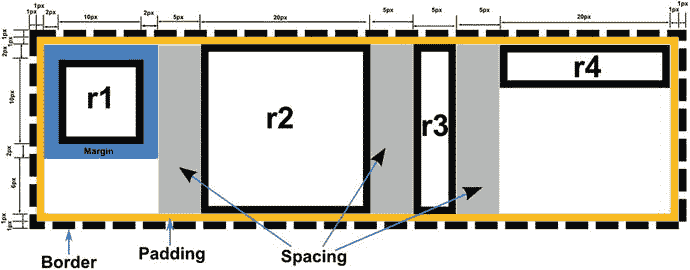

图 5-1.

一个包含四个矩形的 HBox 布局示例

一个实际运行的 `HBox` 布局示例，如清单 5-1 所示，该代码使用了四个矩形作为子节点，并设置了不同的 `HBox` 约束。示例中使用了不可调整大小的节点（如矩形形状），以演示 `HBox` 布局控件的多种间距属性。为简洁起见，此处仅列出相关代码。要查看完整清单，请访问本书页面上的“源代码/下载”选项卡，网址为 [`www.apress.com`](http://www.apress.com)，以下载源代码。

```
Group root = new Group();
Scene scene = new Scene(root, 300, 250);
// 子节点之间的像素间距
HBox hbox = new HBox(5);
// 边框为蓝色、虚线、
// 所有角半径为 0%、
// 宽度为 1 像素
BorderStroke[] borderStrokes = new BorderStroke[] {
new BorderStroke(Color.BLUE,
BorderStrokeStyle.DASHED,
new CornerRadii(0.0, true),
new BorderWidths(1.0))
};
hbox.setBorder(new Border(borderStrokes));
// 仅子节点之间的内边距
hbox.setPadding(new Insets(1));
// 矩形 r1 到 r4
Rectangle r1 = new Rectangle(10, 10);
Rectangle r2 = new Rectangle(20, 20);
Rectangle r3 = new Rectangle(5, 20);
Rectangle r4 = new Rectangle(20, 5);
// 2 像素的外边距
HBox.setMargin(r1, new Insets(2,2,2,2));
hbox.getChildren().addAll(r1, r2, r3, r4);
root.getChildren().add(hbox);
// 显示后输出所有累加起来的尺寸
primaryStage.setOnShown((WindowEvent we) -> {
System.out.println("hbox width  " + hbox.getBoundsInParent().getWidth());
System.out.println("hbox height " + hbox.getBoundsInParent().getHeight());
});
primaryStage.setTitle("HBox Example");
primaryStage.setScene(scene);
primaryStage.show();
清单 5-1.
HBoxExample.java 文件演示了使用 HBox 布局并将形状作为子节点
```

运行清单 5-1 中的代码后，输出结果如图 5-2 所示。在图 5-2 中，显示了一个带有蓝色虚线边框的 `HBox`。该 HBox 实例包含四个大小不同的矩形。

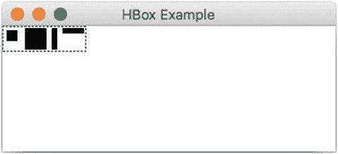

图 5-2.

文件 HBoxExample.java 的输出，演示了 HBox 布局


#### 代码详解

清单 5-1 首先使用单参数构造函数实例化了一个 `HBox`。该构造函数接受一个 `double` 类型的值，用于指定子节点之间的水平间距（以像素为单位）。这等同于在 `HBox` 实例上调用 `setSpacing()` 方法。在创建了一个间距为五像素的 `HBox` 实例后，代码创建了一个蓝色虚线边框，其四个角的圆角半径为零，描边宽度为一像素。以下代码片段创建了一个包含单个 `BorderStroke` 实例的数组，该实例将绘制在 `HBox` 布局面板节点周围。

```
// 边框为蓝色、虚线、所有角半径均为 0%、宽度为 1 像素
BorderStroke[] borderStrokes = new BorderStroke[] {
new BorderStroke(Color.BLUE,
BorderStrokeStyle.DASHED,
new CornerRadii(0.0, true),
new BorderWidths(1.0))
};
hbox.setBorder(new Border(borderStrokes));
```

在创建边框时，您会记得在第三章 3 中，您使用了与创建描边相同的概念来创建形状。边框的描边可以使用多种样式和颜色创建。所有 JavaFX 布局面板都有一个 `setBorder()` 方法，允许您创建边框。要创建边框，您必须创建一个包含至少一个 `BorderStroke` 对象的数组。此代码创建了一个 `BorderStroke` 实例，其颜色为蓝色，`BorderStrokeStyle.DASHED` 值为虚线。其他描边样式包括 `DOTTED`（点线）、`SOLID`（实线）和 `NONE`（无）。接下来，使用构造函数 `CornerRadii(percent, isPercentage)` 设置圆角半径参数。当使用 0.0 值时，角具有零半径，从而形成方角。通过改变半径，矩形可以具有圆角，看起来像药丸形状。最后，描边宽度参数接受一个 `BorderWidths` 类（双精度）的实例。

设置边框后，`HBox`（`hbox`）实例的 `setPadding()` 方法被调用，并传入一个 `Insets(1)` 参数，这将设置四个边，使边框和子节点之间使用一像素的间距。正如您之前在 图 5-1 中看到的，边框和内边距间距显示了周围的边界。

由于间距、内边距、外边距和边框像素宽度常常令人困惑，我在 图 5-1 中绘制了一个 `HBox` 示意图。该图显示了三个灰色矩形区域，每个宽度为五像素，代表子节点（`r1` 到 `r4`）之间的间距。设置间距使用了一个 `Insets` 对象，它允许您在 `HBox` 的子节点之间创建空间。间距通过 `HBox` 的构造函数或 `setSpacing()` 方法创建。图 5-1 中显示的间距是四个矩形之间的空间（图中显示为矩形形状之间的灰色部分）。为了不与内边距混淆，您会注意到 `HBox` 内部位于边框和子节点之间的部分是内边距（以黄色着色），它占据了一像素的宽度，环绕着这一行。

创建完所有四个矩形后，代码在矩形 `r1` 上设置了外边距。要设置外边距，您会注意到使用的是静态方法 `HBox.setMargin(Node, Insets)`，而不是 `HBox` 实例上的方法。代码创建了一个 `Insets` 对象，其顶部、右侧、底部和左侧的外边距均为两像素。如 图 5-1 所示，这是矩形 `r1`（蓝色）周围的环绕空间。要计算 `HBox` 的尺寸大小，您基本上需要将边框宽度、内边距、间距、外边距和子节点的边界（`ParentInBounds`）相加。当 `HBox` 的父节点是 `Group` 节点（不可调整大小）且子节点也不可调整大小时，`HBox` 的尺寸总计为宽 78 像素，高 24 像素。表 5-1 和 5-2 显示了 `HBox` 实例宽度和高度的明细。

表 5-2.

HBox 的总高度（像素）由边框、间距、内边距和首选子节点宽度相加得出

| 说明 | 像素 |
| --- | --- |
| HBox 顶部边框描边宽度 | 1 |
| HBox 顶部内边距（边框与矩形之间） | 1 |
| 最大矩形（r2）的首选高度 | 20 |
| HBox 底部内边距 | 1 |
| 底部边框描边宽度 | 1 |
| HBox 总高度（像素）： | 24 |

表 5-1.

HBox 的总宽度（像素）。所有边框、间距、内边距和首选子节点宽度均相加

| 说明 | 像素 |
| --- | --- |
| HBox 左侧边框描边宽度 | 1 |
| 左侧内边距 | 1 |
| 矩形 1 左侧外边距宽度 | 2 |
| 矩形 1 的宽度 | 10 |
| 矩形 1 右侧外边距宽度 | 2 |
| 矩形 1 与矩形 2 之间的间距 | 5 |
| 矩形 2 的宽度 | 20 |
| 矩形 2 与矩形 3 之间的间距 | 5 |
| 矩形 3 的宽度 | 5 |
| 矩形 3 与矩形 4 之间的间距 | 5 |
| 矩形 4 的宽度 | 20 |
| HBox 右侧内边距 | 1 |
| HBox 右侧边框描边宽度 | 1 |
| 总宽度（像素）： | 78 |

`HBox` 实例的总高度（像素）由表 5-2 中的各项组成。

注意

当使用可调整大小的父节点时，例如将 `HBox` 实例放在 `BorderPane` 的中心，`HBox` 节点的宽度和高度将会拉伸。在这种情况下，对于不可调整大小的子节点，唯一被拉伸的部分是 `HBox` 周围的边框和内边距，即 `BorderPane` 父节点的内边距区域。虚线边框看起来就像是环绕着边框面板的中心区域，占据了可用的宽度和高度。

### VBox

[`VBox`](https://docs.oracle.com/javase/8/javafx/api/javafx/scene/layout/VBox.html) 布局与 `HBox` 类似，不同之处在于它将子节点垂直堆叠在一列中。随着子节点的添加，每个子节点都放置在前一个子节点的下方。默认情况下，`VBox` 尊重子节点的首选宽度和高度。当父节点不可调整大小时（例如，`Group` 节点），列的最大宽度基于具有最大首选宽度的子节点。`VBox` 的整体高度也是如此，它基于边框、内边距、间距、外边距和子节点高度的总和。

此外，默认情况下，每个子节点都对齐到左上角（`Pos.TOP_LEFT`）位置。要更改默认对齐方式，请使用 `setAlignment(Pos value)` 方法。请参考 [`https://docs.oracle.com/javase/8/javafx/api/javafx/geometry/Pos.html`](https://docs.oracle.com/javase/8/javafx/api/javafx/geometry/Pos.html) 上的 Javadoc 文档，查看所有可能的子节点在单元格内的对齐位置。`VBox` 布局可以配置调整大小范围，以允许父节点在布局请求时管理和计算可用空间。请记住，要调整 `VBox` 及其子节点的大小，`VBox` 的父节点也必须可调整大小，例如 `BorderPane` 实例的中心区域。


#### VBox 示例

为了演示 `VBox` 的用法，清单 5-2 中的示例包含了与前一个示例相同的四个矩形，并使用了相同的布局约束。与 `HBox` 示例类似，代码将使用一个像素的描边宽度来绘制虚线边框（蓝色），并设置一个像素的内边距。

```
VBox vbox = new VBox(5);        // 仅子节点之间的间距
vbox.setPadding(new Insets(1)); // vbox 边框与子节点列之间的空间
// 边框为蓝色、虚线、所有角半径为 0%、
// 宽度为 1 像素
BorderStroke [] borderStrokes = new BorderStroke[] {
new BorderStroke(Color.BLUE,
BorderStrokeStyle.DASHED,
new CornerRadii(0.0, true),
new BorderWidths(1.0))
};
vbox.setBorder(new Border(borderStrokes));
Rectangle r1 = new Rectangle(10, 10); // 小正方形
Rectangle r2 = new Rectangle(20, 20); // 大正方形
Rectangle r3 = new Rectangle(5, 20);  // 垂直矩形
Rectangle r4 = new Rectangle(20, 5);  // 水平矩形
VBox.setMargin(r1, new Insets(2,2,2,2)); // r1 的外边距
vbox.getChildren().addAll(r1, r2, r3, r4);
root.getChildren().add(vbox);
primaryStage.setOnShown((WindowEvent we) -> {
System.out.println("vbox width  " + vbox.getBoundsInParent().getWidth());
System.out.println("vbox height " + vbox.getBoundsInParent().getHeight());
});
清单 5-2.
演示 VBox 布局的 VBoxExample.java 文件
```

图 5-3 显示了清单 5-2 中 `VBoxExample.java` 应用的输出，演示了以矩形形状作为子节点的 `VBox` 布局。该 VBox 具有一个像素宽的虚线边框和一个像素的内边距。这个像素的内边距位于边框和矩形之间。VBox 就像一个垂直的书架，每一层书架代表矩形之间的间距（水平白色区域）。矩形之间的间距由 `VBox` 的构造函数或使用 `setSpacing()` 方法定义。

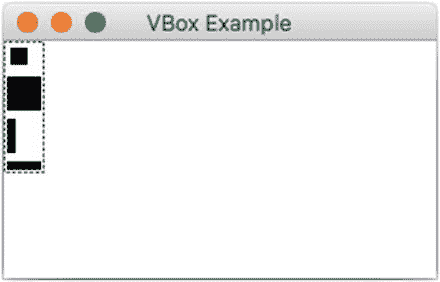

图 5-3.

VBoxExample.java 的输出，展示了添加到 VBox 的四个矩形

#### 代码解读

在清单 5-2 中，代码首先实例化了一个 `VBox`，其子节点之间的间距为五个像素。图 5-4 描绘了代表子节点（`r1` 到 `r4`）之间间距的水平灰色条。构造 `VBox` 后，代码通过 `setPadding()` 方法设置内边距。使用 `Insets` 对象设置内边距，可以在边框和行之间创建填充。在图 5-4 中，`VBox` 有一个像素宽的虚线边框，并且子节点周围有一个像素的内边距。

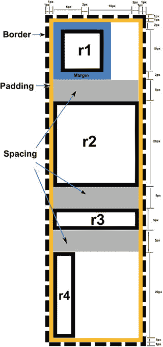

图 5-4.

VBox 具有一个像素的虚线边框、一个像素的内边距，以及四个由五个像素间距分隔的矩形节点

创建四个矩形后，代码在矩形 `r1` 上设置了外边距。为了设置外边距，我们使用了静态方法 `VBox.setMargin(Node, Insets)`。然后，代码创建了一个 `Insets` 对象，为矩形 1（`r1`）的上、右、下、左各设置两个像素的外边距。矩形 1（`r1`）有一个两个像素的外边距，在图 5-4 中以蓝色显示。要计算 `VBox` 实例的总大小，只需将间距、外边距、内边距和子节点的尺寸（局部边界）相加。由于父节点是 `Group`，`VBox` 节点的计算宽度总计为 24 像素，高度总计为 78 像素。

表 5-3.

VBox 的总宽度（像素）。所有边框、间距、内边距和最大首选子节点宽度均已相加

| 说明 | 像素 |
| --- | --- |
| VBox 左侧边框描边宽度 | 1 |
| 左侧内边距 | 1 |
| 最宽子节点（矩形 2）的宽度 | 20 |
| 矩形与边框之间的右侧内边距 | 1 |
| VBox 右侧边框描边宽度 | 1 |
| 总宽度： | 24 |

`VBox` 实例的总高度（像素）如表 5-4 所示。

表 5-4.

VBox 的总高度（像素）。所有边框、间距、内边距和首选子节点宽度均已相加

| 说明 | 像素 |
| --- | --- |
| VBox 顶部边框描边宽度 | 1 |
| 边框与子节点之间的内边距（顶部） | 1 |
| 矩形 1 的外边距（顶部）宽度 | 2 |
| 矩形 1 的宽度 | 10 |
| 矩形 1 的外边距（底部）宽度 | 2 |
| 矩形 1 与矩形 2 之间的间距 | 5 |
| 矩形 2 的高度 | 20 |
| 矩形 2 与矩形 3 之间的间距 | 5 |
| 矩形 3 的高度 | 5 |
| 矩形 3 与矩形 4 之间的间距 | 5 |
| 矩形 4 的高度 | 20 |
| VBox 子节点与边框之间的内边距 | 1 |
| VBox 边框（底部）描边宽度 | 1 |
| 总宽度： | 78 |

### FlowPane

`FlowPane` 布局节点允许一行中的子节点根据可用水平间距流动，并在水平空间小于所有节点宽度总和时将节点换行到下一行。图 5-5 显示了四个子节点从左到右流动然后换行。

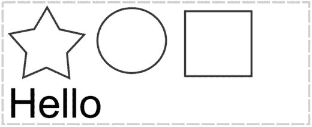

图 5-5.

一个 FlowPane 布局，节点从左到右流动，能够根据水平空间换行。Hello 文本节点被换行到下一行，因为可用水平空间（由虚线表示）太小。

默认情况下，`FlowPane` 布局使子节点从左到右流动（`Pos.TOP_LEFT`）。要更改流动对齐方式，只需调用 `setAlignment()` 方法并传入 `Pos` 类型的枚举值。清单 5-3 创建了一个 `FlowPane` 布局，使子节点从右到左流动（`Pos.TOP_RIGHT`）。

```
FlowPane flowPane = new FlowPane();
flowPane.setAlignment(Pos.TOP_RIGHT);
flowPane.getChildren().addAll(...); // 要添加的子节点。
清单 5-3.
创建一个从右到左流动的 FlowPane 布局
```

### BorderPane

`BorderPane` 布局节点允许将子节点放置在顶部、底部、左侧、右侧或中心区域。由于每个区域只能有一个节点，开发人员通常会嵌套布局。一个例子是创建一个包含子节点的 `HBox`，然后通过 `setTop()` 方法将其设置为顶部区域。图 5-6 显示了 `BorderPane` 的区域。

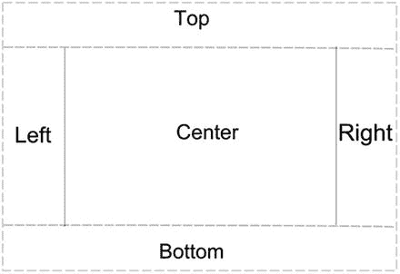

图 5-6.

BorderPane 布局

这种布局类似于您每天看到的许多网站，其中导航链接放置在页面的顶部、底部、左侧或右侧区域，而主要内容位于中心区域。`BorderPane` 的顶部和底部边框区域允许可调整大小的节点占据所有可用宽度。左侧和右侧边框区域占据顶部和底部边框之间的可用垂直空间。默认情况下，所有边框区域都尊重子节点的大小（首选宽度和高度）。根据 Javadocs，当节点放置在顶部、底部、左侧、右侧和中心区域时，默认对齐方式如下：

*   顶部：`Pos.TOP_LEFT`
*   底部：`Pos.BOTTOM_LEFT`
*   左侧：`Pos.TOP_LEFT`
*   右侧：`Pos.TOP_RIGHT`
*   中心：`Pos.CENTER`

接下来，您将学习如何将 `GridPane` 布局与 `BorderPane` 结合使用，以创建一个类似于 `Contacts` 表单应用的简单 UI。通过使用 `BorderPane` 及其中心区域作为根节点，可用的水平和垂直空间将分配给子节点。这将允许文本字段在调整窗口大小时拉伸。


### GridPane

到目前为止，你已经学习了简单的布局；现在让我们来看一个更高级的布局：`GridPane`。它常用于商业应用程序。例如，商业应用程序通常会有数据录入表单界面。表单通常在第一列有只读标签，在第二列有输入字段，类似于网格模式。

使用 `GridPane` 类时，你可以在行、列或单元格级别指定约束。例如，如果第二列包含输入文本字段，你可能希望它们在窗口调整大小时（宽度方向）随之调整大小。为了以网格方式布局组件，我在清单 5-4 中创建了一个示例表单类型的应用程序，它使用了 JavaFX 的 `GridPane` 布局。该示例最有趣的部分是在 `GridPane` 布局节点上使用了列约束。这很方便，因为放置在列中的任何节点都会继承列约束，而无需单独配置每个节点。列约束为子节点设置了最小和最大水平宽度，以便在窗口调整大小时能够伸缩。

#### 表单类型应用程序示例

为了演示 `GridPane` 布局，清单 5-4 是一个简单的表单类型用户界面，类似于联系人应用程序，允许用户输入名字和姓氏，然后点击保存按钮。为了让界面更专业一些，代码创建了一个包含徽标（SVG 图标）的横幅标题。

```
@Override
public void start(Stage primaryStage) {
primaryStage.setTitle("GridPaneForm ");
BorderPane root = new BorderPane();
Scene scene = new Scene(root, 380, 150, Color.WHITE);
GridPane gridpane = new GridPane();
//gridpane.setGridLinesVisible(true);
gridpane.setPadding(new Insets(5));
gridpane.setHgap(5);
gridpane.setVgap(5);
ColumnConstraints column1 = new ColumnConstraints(100);
ColumnConstraints column2 = new ColumnConstraints(50, 150, 300);
column2.setHgrow(Priority.ALWAYS);
gridpane.getColumnConstraints().addAll(column1, column2);
Label fNameLbl = new Label("First Name");
TextField fNameFld = new TextField();
Label lNameLbl = new Label("Last Name");
TextField lNameFld = new TextField();
Button saveButt = new Button("Save");
// First name label
GridPane.setHalignment(fNameLbl, HPos.RIGHT);
gridpane.add(fNameLbl, 0, 0);
// Last name label
GridPane.setHalignment(lNameLbl, HPos.RIGHT);
gridpane.add(lNameLbl, 0, 1);
// First name field
GridPane.setHalignment(fNameFld, HPos.LEFT);
gridpane.add(fNameFld, 1, 0);
// Last name field
GridPane.setHalignment(lNameFld, HPos.LEFT);
gridpane.add(lNameFld, 1, 1);
// Save button
GridPane.setHalignment(saveButt, HPos.RIGHT);
gridpane.add(saveButt, 1, 2);
// Build top banner area
FlowPane topBanner = new FlowPane();
topBanner.setAlignment(Pos.TOP_LEFT);
topBanner.setPrefHeight(40);
String backgroundStyle =
"-fx-background-color: lightblue;"
+ "-fx-background-radius: 3px;"
+ "-fx-background-inset: 5px;";
topBanner.setStyle(backgroundStyle);
SVGPath svgIcon = new SVGPath();
// icon from http://raphaeljs.com/icons/
svgIcon.setContent("M21.066,20.667c1.227-0.682,1.068-3.311-0.354-5.874c-0.611-1.104-1.359-1.998-2.109-2.623c-0.875,0.641-1.941,1.031-3.102,1.031c-1.164,0-2.231-0.391-3.104-1.031c-0.75,0.625-1.498,1.519-2.111,2.623c-1.422,2.563-1.578,5.192-0.35,5.874c0.549,0.312,1.127,0.078,1.723-0.496c-0.105,0.582-0.166,1.213-0.166,1.873c0,2.938,1.139,5.312,2.543,5.312c0.846,0,1.265-0.865,1.466-2.188c0.2,1.314,0.62,2.188,1.461,2.188c1.396,0,2.545-2.375,2.545-5.312c0-0.66-0.062-1.291-0.168-1.873C19.939,20.745,20.516,20.983,21.066,20.667zM15.5,12.201c2.361,0,4.277-1.916,4.277-4.279S17.861,3.644,15.5,3.644c-2.363,0-4.28,1.916-4.28,4.279S13.137,12.201,15.5,12.201zM24.094,14.914c1.938,0,3.512-1.573,3.512-3.513c0-1.939-1.573-3.513-3.512-3.513c-1.94,0-3.513,1.573-3.513,3.513C20.581,13.341,22.153,14.914,24.094,14.914zM28.374,17.043c-0.502-0.907-1.116-1.641-1.732-2.154c-0.718,0.526-1.594,0.846-2.546,0.846c-0.756,0-1.459-0.207-2.076-0.55c0.496,1.093,0.803,2.2,0.861,3.19c0.093,1.516-0.381,2.641-1.329,3.165c-0.204,0.117-0.426,0.183-0.653,0.224c-0.056,0.392-0.095,0.801-0.095,1.231c0,2.412,0.935,4.361,2.088,4.361c0.694,0,1.039-0.71,1.204-1.796c0.163,1.079,0.508,1.796,1.199,1.796c1.146,0,2.09-1.95,2.09-4.361c0-0.542-0.052-1.06-0.139-1.538c0.492,0.472,0.966,0.667,1.418,0.407C29.671,21.305,29.541,19.146,28.374,17.043zM6.906,14.914c1.939,0,3.512-1.573,3.512-3.513c0-1.939-1.573-3.513-3.512-3.513c-1.94,0-3.514,1.573-3.514,3.513C3.392,13.341,4.966,14.914,6.906,14.914zM9.441,21.536c-1.593-0.885-1.739-3.524-0.457-6.354c-0.619,0.346-1.322,0.553-2.078,0.553c-0.956,0-1.832-0.321-2.549-0.846c-0.616,0.513-1.229,1.247-1.733,2.154c-1.167,2.104-1.295,4.262-0.287,4.821c0.451,0.257,0.925,0.064,1.414-0.407c-0.086,0.479-0.136,0.996-0.136,1.538c0,2.412,0.935,4.361,2.088,4.361c0.694,0,1.039-0.71,1.204-1.796c0.165,1.079,0.509,1.796,1.201,1.796c1.146,0,2.089-1.95,2.089-4.361c0-0.432-0.04-0.841-0.097-1.233C9.874,21.721,9.651,21.656,9.441,21.536z");
svgIcon.setStroke(Color.LIGHTGRAY);
svgIcon.setFill(Color.WHITE);
Text contactText = new Text("Contacts") ;
contactText.setFill(Color.WHITE);
Font serif = Font.font("Dialog", 30);
contactText.setFont(serif);
topBanner.getChildren().addAll(svgIcon, contactText);
root.setTop(topBanner);
root.setCenter(gridpane);
primaryStage.setScene(scene);
primaryStage.show() ;
}
清单 5-4.
GridPaneForm.java 文件演示了 GridPane 布局
```


#### 代码演练

执行清单 5-4 后，您将看到图 5-7 中的输出，该图展示了一个简单的表单应用程序，允许用户输入名字和姓氏作为联系信息。调整窗口大小时，请注意输入文本字段控件会根据列约束而增长或缩小。此外，您还会注意到“保存”按钮在水平方向上右对齐（`HPos.RIGHT`），正好位于“姓氏”文本字段下方。

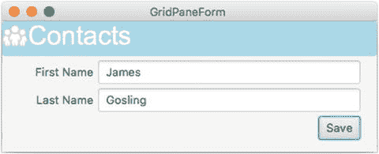

图 5-7.

GridPaneForm.java 文件的输出

清单 5-4 首先创建一个 `BorderPane` 对象实例作为场景的根节点。通过使用 `BorderPane` 作为根节点，然后将 `GridPane` 节点对象放置到中心区域，父节点（`BorderPane`）能够将所有的水平和垂直空间分配给 `GridPane`，从而调整其大小。创建 `BorderPane` 实例作为根节点后，代码实例化了一个带有内边距以及水平和垂直间距的 `GridPane` 布局。然后，清单 5-5 创建了一个 `GridPane` 布局，其内边距、水平间距和垂直间距均设置为 `5`（像素）。

```
GridPane gridpane = new GridPane();
gridpane.setPadding(new Insets(5));
gridpane.setHgap(5); gridpane.setVgap(5);
清单 5-5.
为每个单元格设置 UI 控件之间的内边距、水平间距和垂直间距
```

在进一步讲解之前，我想指出 `GridPane` 对象上一个名为 `setGridLinesVisible()` 的便捷方法。这允许您调试网格布局的单元格约束。调用 `setGridLinesVisible(true)` 方法后，网格线将出现在其单元格和间距周围。

提示

在图 5-8 中，网格窗格的网格线 `visible` 属性设置为 `true`，可以帮助您调试单元格约束。要打开网格线，请在网格窗格实例上调用 `setGridLinesVisible()` 方法。

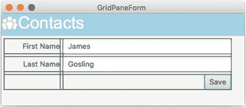

图 5-8.

网格窗格的网格线可见属性设置为 true。该可见属性通常用于调试目的。要打开网格线，请调用 setGridLinesVisible(true) 方法。

图 5-8 显示了网格线可见的网格窗格。

继续清单 5-4 中的代码演练，代码为第一列和第二列实现了列约束。要设置列的约束，请使用 `ColumnConstraints` 构造函数，它允许开发者为 `GridPane` 节点上的列指定最小宽度、首选宽度和最大宽度。这非常棒；这意味着当父容器节点（`BorderPane`）调整大小时，`GridPane` 将根据其行或列约束使其子节点在水平方向上增长或缩小。清单 5-6 演示了将第一列约束为 100 像素宽（用于只读标签），并将第二列的最小宽度设置为 50、首选宽度为 150、最大宽度为 300 的能力。

```
ColumnConstraints column1 = new ColumnConstraints(100); // 固定用于标签
ColumnConstraints column2 = new ColumnConstraints(50, 150, 300); // 最小,首选,最大
column2.setHgrow(Priority.ALWAYS);
gridpane.getColumnConstraints().addAll(column1, column2);
清单 5-6.
为 JavaFX 应用程序设置列约束
```

为第二列创建列约束后，代码通过传入枚举值 `Priority.ALWAYS` 调用了 `setHgrow()` 方法，这允许 UI 控件在窗口变宽时占据单元格内可用的水平空间。我将第二列的最大宽度设置为 300，以便您可以看到子 `TextField` 不会增长超过最大宽度（`300`）。换句话说，当窗口调整到超过 300 像素宽时，网格窗格列中的文本字段将停止拉伸。

下一步是将每个 UI 控件放置到其各自的单元格位置。所有单元格都相对于零；要将节点放置在第一列第一行的单元格中，您需要指定单元格为 (0, 0)。因此，以下代码片段将“保存”按钮添加到 `GridPane` 布局的第二列第三行，即单元格 (1, 2)：

```
gridpane.add(saveButton, 1, 2);
```

该布局还允许您在单元格内水平或垂直对齐控件。以下语句将“保存”按钮右对齐：

```
GridPane.setHalignment(saveButton, HPos.RIGHT);
```

完成 `GridPane` 设置后，代码实现了前面图 5-7 中所示的输入表单顶部横幅区域。为了创建标题横幅，我使用了一个背景颜色为浅蓝色的流式布局、一个 SVG 节点图标（显示为人物）和一个包含文本“Contacts”的文本节点。我从 JavaScript 库 RaphaelJS 的创始人兼作者 Dmitry Baranovskiy 那里获得了基于 SVG 的图标。托管原始 SVG 图标的网站已不再活跃。该图标采用 SVG 表示法（矢量绘图命令）的字符串形式。我只需通过调用 `setContent()` 方法将 SVG 字符串传递给一个 `javafx.scene.shape.SVGPath` 实例。以下代码片段展示了如何创建一个 `SVGPath` 节点实例。

```
SVGPath svgIcon = new SVGPath();
svgIcon.setContent("M21.066,...");
```

与显示横幅的 `FlowPane` 布局相关的重要代码包含首选高度和 JavaFX CSS 样式的设置。因为横幅（`FlowPane`）被放置在 `BorderPane` 布局的顶部区域，所以 `40` 像素的首选高度将被保留，并且宽度将随着窗口调整大小（变宽）而占据可用的水平空间。

了解到 `FlowPane` 会占据可用的水平空间后，您会注意到该区域被浅蓝色背景填充。通过使用 JavaFX CSS 样式，代码设置了一种浅蓝色，以及使用字符串（backgroundStyle）指定的圆角半径和内边距。清单 5-7 是设置放置在 `BorderPane` 布局顶部区域的横幅（`FlowPane`）样式的代码部分。如果 JavaFX CSS 样式现在看起来不太明白，请不要担心；关于自定义 UI 的更详细讨论将在第 15 章中进行。

```
FlowPane topBanner = new FlowPane();
topBanner.setPrefHeight(40);
String backgroundStyle = "-fx-background-color: lightblue;"
+ "-fx-background-radius: 30%;"
+ "-fx-background-inset: 5px;";
topBanner.setStyle(backgroundStyle);
清单 5-7.
占据顶部横幅区域且背景为浅蓝色的 FlowPane 布局的样式代码
```

我们仅仅触及了 `GridPane` 布局的皮毛。还有其他方法可以提供子节点的约束和对齐，因此我相信您会深入研究 `GridPane` 布局的 API。更多详细信息请参阅 Javadocs 文档。接下来，您将学习如何使用名为 Scene Builder 的图形编辑器创建 UI。


## 场景构建器

到目前为止，你已经学会了如何以编程方式编写和设计 UI 元素的样式。你可能在想，是否有更好的方法来构建用户界面。我很高兴地告诉你，Oracle 的 JavaFX 团队开发了一个名为 **Scene Builder** 的免费工具，它允许你以图形化方式构建 UI，这类工具通常被称为所见即所得编辑器。（WYSIWYG 代表“所见即所得”。）一段时间后，Oracle 宣布他们将不再提供 Scene Builder 工具的可下载二进制文件。

由于 Scene Builder 工具已开源，构建和托管可下载二进制文件的任务随后立即由 GluonHQ 公司接手（参见 [`http://gluonhq.com/`](http://gluonhq.com/) ）。通过这一举措以及其他许多大胆的行动，GluonHQ 凭借其他产品和服务不断前进，为 Java 开发者赋能。GluonHQ 的主要产品是提供一个 UI 和云开发平台，使公司能够使用单一代码库（Java）开发应用，并能够部署到移动端、桌面端和嵌入式设备等多个平台。典型的平台包括 iOS、Android、Windows、MacOS X 和 Raspbian（树莓派）。

在本节中，你将学习如何构建一个简单的 UI，并在 JavaFX 应用程序中使用序列化的 UI 格式化文件（FXML）。首先，前往 GluonHQ（ [`http://gluonhq.com`](http://gluonhq.com) ）在以下位置下载 Scene Builder 工具：

[`http://gluonhq.com/open-source/scene-builder/`](http://gluonhq.com/open-source/scene-builder/)

### 下载并安装 Scene Builder

在撰写本书时，尚不存在适用于 JDK 9 的 Scene Builder 工具版本。但是，你可以简单地将你的 `JAVA_HOME` 环境变量指向最新的 Java 8 SDK，以运行已下载的 Scene Builder 8 版本。可能当你读到此处时，已经有一个适用于 Java 9 的版本了。假设你已经为你的操作系统下载了 Scene Builder 工具，要启动该工具，我建议下载 JAR 版本并使用命令提示符启动它。在我看来，使用命令提示符更好，因为它会将任何错误和异常信息输出到控制台，从而帮助你进行调试。以下命令将从命令行启动 Scene Builder 工具。

```
$ java -jar SceneBuilder-8.0.0.jar
```

### 启动 Scene Builder

下载并安装 Scene Builder 后，你可以启动它。图 5-9 展示了 Scene Builder 工具。

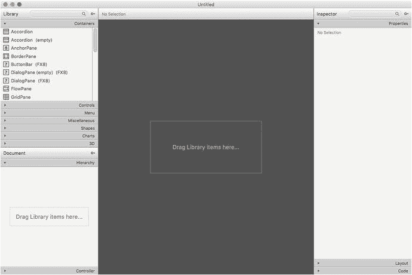

图 5-9.

首次启动 Scene Builder 工具

我首先从左侧开始描述各个选项卡及其子部分。在名为 **Library** 的主选项卡下，注意搜索栏。还有名为 **Containers**、**Controls**、**Menu**、**Miscellaneous**、**Shapes**、**Charts** 和 **3D** 的子部分。这些子部分包含各种类型的 JavaFX 节点，可以拖放到中央画布区域（将库项目拖放到此处……）。当然，第一个 JavaFX 节点必须是布局容器类型的节点，这样才能将控件等子类型节点拖放到容器类型的节点上。

在左侧 UI 元素下方是 **Document** 部分。Document 部分有两个子部分，名为 **Hierarchy** 和 **Controller**。**Hierarchy** 面板允许你以树状层次结构查看 UI 元素的 DOM（文档对象模型）。最后，在 Hierarchy 下方是 **Controller** 选项卡。**Controller** 部分允许你将控制逻辑（Controller Java 类）引用到此 UI 视图（FXML）。被引用的 Controller 类将允许处理程序代码与之前拖放到画布区域的 UI 元素进行交互。例如，点击一个“保存”按钮会调用关联 Controller 类上的一个方法。稍后，你将创建一个 Controller 类，并在 FXML 文件中引用它。

在 Scene Builder 的右侧是 **Inspector** 搜索栏，如图 5-9 所示。该搜索栏允许你非常轻松地查找 UI 元素的属性。在 Inspector 搜索栏下方，你会看到三个子部分——**Properties**、**Layout** 和 **Code**。**Properties** 面板部分允许你使用 JavaFX CSS 属性来设计 UI 元素的样式。在第 15 章中，你将了解更多关于 CSS 样式的内容，但现在你不会在工具中对 UI 元素使用 JavaFX CSS 样式。**Layout** 面板允许你指定节点属性的尺寸、变换和内边距。最后是 **Code** 面板，它允许你将事件方法映射到 UI 元素，例如 `OnMousePressed` 属性。

现在你已经了解了 Scene Builder 的功能，让我们来构建一个用户界面（UI）。但在构建 UI 之前，你需要明确想要构建什么样的 UI。为了简单起见，你将构建之前你在 `GridLayout` 部分创建的熟悉的联系人表单。你将使用 Scene Builder 工具来开发 UI，而不是以编程方式编写代码。按照以下步骤以图形化方式构建你的表单。

1.  将一个 `BorderPane` 容器拖放到右侧的画布上。图 5-10 展示了将 `BorderPane` 容器拖放到画布区域的过程。

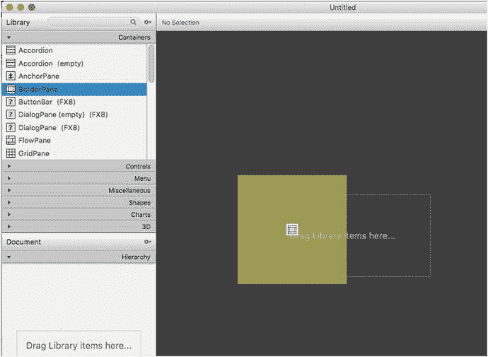

图 5-10.

将 BorderPane 拖放到显示“将库项目拖放到此处……”的画布区域。将 `BorderPane` 容器拖放到画布表面后，你应该会在左下角的 Document 选项卡下的 Hierarchy 部分看到显示 BorderPane 的区域——`TOP`、`LEFT`、`CENTER`、`RIGHT` 和 `BOTTOM`。图 5-11 展示了画布区域当前 UI 元素的文档层次结构（DOM）。你也可以将 UI 元素拖放到文档层次结构窗口中。有时将 UI 元素拖放到层次结构中更容易，有时则拖放到画布区域更容易。这完全取决于当存在嵌套容器时，画布上的区域有多小。

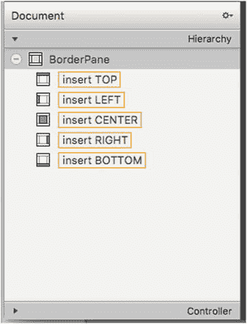

图 5-11.


显示 BorderPane 区域层次的文档结构  
2.  将一个 `GridPane` 容器拖入 BorderPane 的中心区域，如图 5-12 所示。图 5-13 展示了将 `GridPane` 节点拖放至 `BorderPane` 节点中心区域后的效果。请注意，编号的列和行是零相对单元格，允许您将元素拖入其中。由于 `BorderPane` 的中心区域会占据所有可用的宽度和高度，因此当将 `GridPane` 放置到中心区域时，`GridPane` 的宽度和高度将会拉伸。

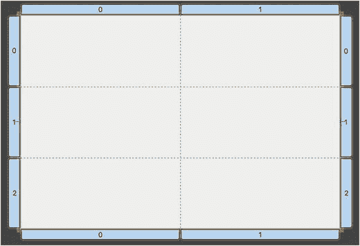

图 5-13.

位于 BorderPane 中心区域的 GridPane

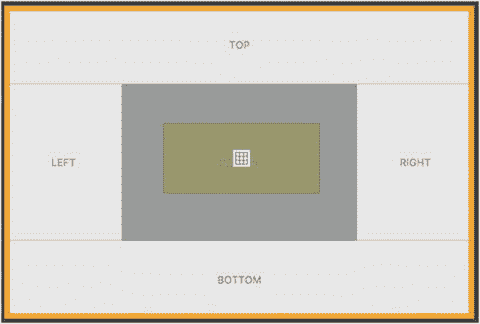

图 5-12.

将 GridPane 节点拖放到 BorderPane 节点的中心区域  
3.  在配置 `GridPane` 之前，您需要重新配置 `BorderPane` 的首选宽度和最大宽度，以允许 `GridPane` 占据可用的水平空间。通过在画布区域左下角的“层次结构”选项卡中选择 `BorderPane` 节点。接下来，在画布区域的右侧是“布局”选项卡（位于“属性”下），您将更改 `BorderPane` 的“首选宽度”和“最大宽度”属性。图 5-14 显示了 `BorderPane` 节点的首选宽度和最大宽度设置。确保首选宽度为 `USE_COMPUTED_SIZE`，最大宽度设置为 `MAX_VALUE`。这允许 `GridPane` 节点及其子节点在调整 JavaFX 舞台窗口大小时有机会水平增长（拉伸）。

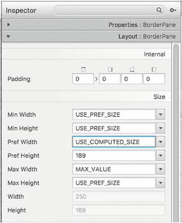

图 5-14.

BorderPane 的首选宽度和最大宽度属性设置允许 GridPane 水平拉伸  
4.  将 GridPane 布局的水平间距和垂直间距设置为 5 像素，并将内边距设置为 5 像素。内边距和间距设置位于画布区域右侧的“布局”选项卡部分（见图 5-15）。接下来，您将配置 GridPane 节点第一列和第二列的约束。如果您还记得，第一列将包含标签，第二列将包含我们表单的文本字段。

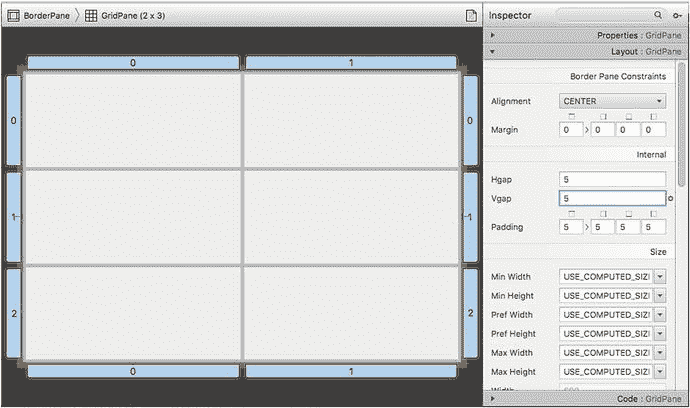

图 5-15.

GridPane 布局的属性配置，内边距、Hgap 和 Vgap 均设置为 5 像素  
5.  配置 `GridPane` 的列约束。要配置列约束，您首先选择图 5-16 中所示的列标题零 (0)。然后在 `Layout: ColumnConstraints` 属性表下配置宽度。对于最小宽度和最大宽度，使用下拉菜单中的 `USE_PREF_SIZE` 选项。在首选宽度中，输入 100。这意味着该列不会拉伸，因为其最小和最大宽度将设置为首选宽度。

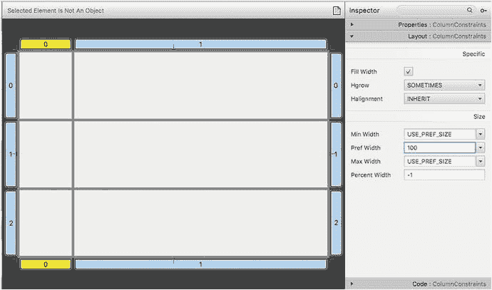

图 5-16.

将 GridPane 的第一列（零相对）约束设置为首选宽度 100  
6.  配置第二个 `GridPane` 的列约束。要配置列约束，您选择图 5-17 中所示的列标题一 (1)。选择后，在 `Layout: ColumnConstraints` 属性表下配置宽度。

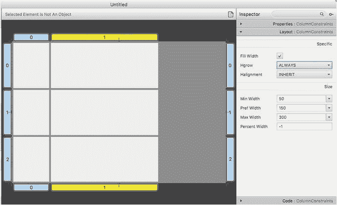

图 5-17.

正在配置 GridPane 第二列的约束 将最小宽度、首选宽度和最大宽度分别设置为 50、150 和 300。您还应该将 `Hgrow` 属性设置为 always。  
7.  配置 `GridPane` 的行约束。与选择列标题类似，您将选择行标题零（左侧），如图 5-18 所示。不要只选择一行，请按住 Shift 键并鼠标单击行标题 0、1 和 2，如图 5-18 所示。目标是一次性设置所有三个行约束。您将设置这三行的首选高度，该高度将尊重放置其中的 UI 元素。例如，当标签被放置到行单元格中时，标签的高度将用作该单元格行的高度。为最小高度和最大高度属性选择 `USE_PREF_SIZE`。为首选高度属性输入 30。

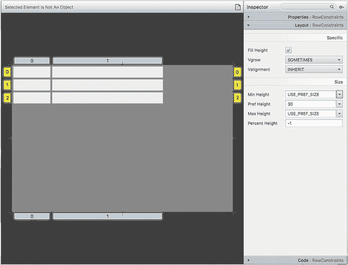

图 5-18.

设置 GridPane 三行的行高约束。最小高度和最大高度属性设置为 USE_PREF_SIZE。首选高度属性设置为 30。  
8.  在占据第一列和第一行的单元格中创建“名字”标签。从“库”下的“控件”部分将一个标签拖到网格窗格的第一列和第一行单元格中。此标签将是“名字”。图 5-19 显示了在“属性”选项卡子部分中将文本属性设置为“名字”。

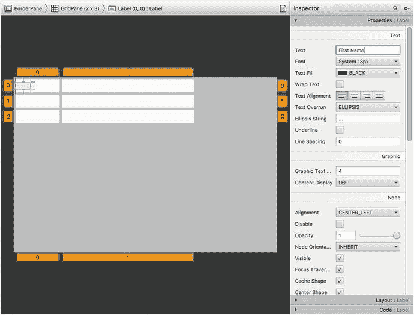

图 5-19.

正在将“名字”标签添加到第一列和第一行单元格。您会注意到在“属性”选项卡下，您将为标签输入文本。  
9.  将标签的水平对齐方式 (Halignment) 设置为右对齐。在图 5-20 中，通过转到“布局”选项卡子部分下的“属性表”来设置标签的水平对齐方式。

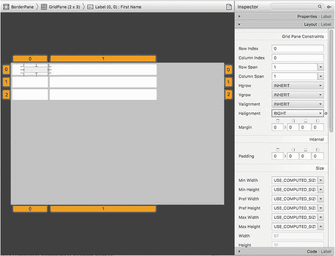

图 5-20.

将 GridPane 单元格中标签的水平对齐方式设置为右对齐。在“布局：标签（网格窗格约束）”下，Halignment 设置为 RIGHT。  
10. 重复步骤 8-9，为第二行第一列设置“姓氏”标签。在菜单选项中，选择“预览” ➤ “在窗口中显示预览”。图 5-21 显示了当前 UI 元素在窗口中的预览效果。

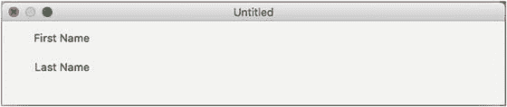

图 5-21.

预览窗口显示到目前为止的进度——两个标签，在第一列水平右对齐  
11. 将文本字段 UI 元素拖放到单元格 1,0 和单元格 1,1 中，这两个单元格分别代表名字和姓氏文本字段。您还需要将一个 JavaFX `Button` 节点拖到第二列第三行单元格。当您预览工作时，UI 应如图 5-22 所示。

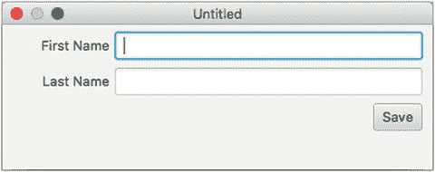

图 5-22.


布局在 GridPane 上的 UI 元素的预览窗口  
12. 将 UI 保存为 FXML 文件。在“文件”菜单中，选择“另存为”，并将其保存到 Java 项目的资源目录或 src 目录中。Scene Builder 允许你将 UI 保存为名为 FXML 的文件格式，其文件扩展名为 .fxml。将文件保存为 `ContactForm.fxml`。稍后，你将创建代码来加载要显示的 FXML 文件，并对 UI 元素执行操作。此文件应放置在 Java 项目的资源目录中，例如 `src/main/resources/ContactForm.xml`。（如果你不使用 Gradle 或 Maven 等构建工具，可以创建一个文件夹来存放项目的所有三个文件。如果你在命令行上编译，请确保 FXML 文件已复制到根类路径。）此时，当前文件（`ContactForm.fxml`）没有引用控制器类或带有 `fx:id` 属性的 UI 元素。在后续步骤中，当你创建了控制器类后，你将通过 Scene Builder 更新 UI，并再次保存 FXML 文件。

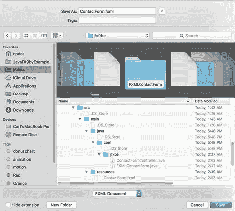

图 5-23.

用于保存 FXML 文件的“另存为”窗口

```

清单 5-8.
    表示使用 Scene Builder 创建的联系人表单 UI 视图的 ContactForm.fxml 文件
    ```

13. 创建一个为 UI 元素提供处理代码的控制器类。在与主应用程序代码 `FXMLContactForm.java`（参见步骤 19）相同的目录中，创建一个名为 `ContactFormController.java` 的类。将清单 5-9 中的代码输入到名为 `ContactFormController.java` 的文件中。在代码中，你会注意到在属性和方法上使用了 `@FXML` 注解。这些注解允许 JavaFX 平台将 FXML UI 元素绑定到控制器属性，例如 TextField 和 Button。控制器中的方法也可以加上 FXML 注解前缀，以指示能够绑定到操作（事件）（例如鼠标按下）的处理代码。这种绑定机制是一种称为依赖注入的机制。FXML 加载器将在运行时解析这些引用，本质上是将 UI 元素连接到控制器类中的处理代码。稍后，你将使用 Scene Builder 将“保存”按钮与控制器关联起来。在那里你会注意到，“保存”按钮的 `OnAction` 属性将调用清单 5-9 中所示的 `saveContactAction()` 方法。

```
    package com.jfxbe;
    import javafx.event.ActionEvent;
    import javafx.fxml.FXML;
    import javafx.scene.control.TextField;
    /**
    *
    */
    public class ContactFormController {
    @FXML private TextField firstNameField;
    @FXML private TextField lastNameField;
    @FXML
    protected void saveContactAction(ActionEvent event) {
    System.out.println("Saving the following information: ");
    System.out.println("First Name: " + firstNameField.getText());
    System.out.println(" Last Name: " + lastNameField.getText());
    }
    }
    清单 5-9.
    ContactFormController 类使用注解来引用 FXML 文件中的 UI 元素
    ```

14. 通过 Scene Builder 工具为 `ContactForm.fxml` 分配一个控制器类。假设你已经加载了之前创建的 UI，导航到位于左侧“文档”选项卡下的“控制器”选项卡中的“控制器类”字段。输入完全限定的类名 `com.jfxbe.ContactFormController`（假设你有一个包命名空间）。图 5-24 显示了引用控制器类的字段。请注意，在“控制器类”字段下方有一个名为“已分配的 fx:id”的表格，其中包含已分配的 `fx:id` 条目。该表格当前为空，但在下一步中，你将为一个组件（例如名字和姓氏文本字段控件（UI 元素））分配一个 `fx:` `id` 名称。

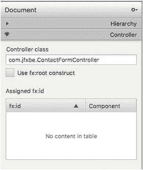

图 5-24.

设置引用联系人表单 UI (ContactForm.fxml) 的控制器类  
15. 在 Scene Builder 中为每个 UI 元素添加 `fx:id` 名称。假设你已经将最近创建的控制器类引用为 `com.jfxbe.ContactFormController`，通过选择画布或“层次结构”部分中的 UI 控件来更新 UI 元素的 `fx:id`。选择控件后，转到 Scene Builder 工具右侧的“代码”子部分，并在 `fx:id` 字段属性中输入 `firstNameField`，如图 5-25 所示。

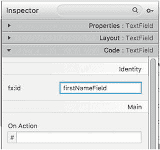

图 5-25.

设置引用名字文本字段的 fx:id 名称。这将允许控制器类访问该文本字段。  
16. 对姓氏字段重复步骤 15。姓氏字段的 `fx:id` 称为 `lastNameField`。  
17. 将操作代码绑定到“保存”按钮，如图 5-26 所示。与步骤 15 和 16 类似，选择“保存”按钮的 UI 元素，导航到其“代码”子部分，输入 `fx:id` 名称为 `saveButton`。接下来，将 `OnAction` 属性设置为 `saveContactAction`。不要忘记保存 UI (FXML)。如果你还记得步骤 13 中的清单 5-9，`ContactFormController.java` 文件包含 `saveContactAction()` 方法。

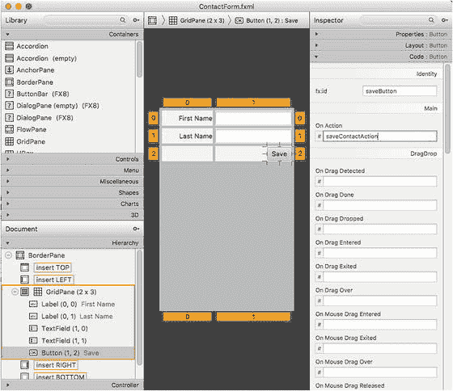

图 5-26.

设置 `OnAction` 属性以调用“保存”按钮的 `saveContactAction` 函数  
18. 最后一次预览联系人表单。图 5-27 显示了 `ContactForm.fxml` 文件的预览窗口。

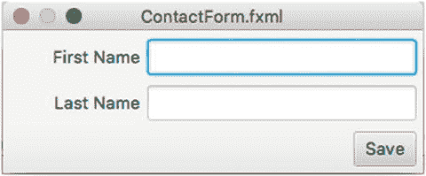

图 5-27.

从 Scene Builder 工具预览联系人表单  
19. 创建一个主 JavaFX 应用程序类，该类将加载要显示到场景中的 FXML。清单 5-10 显示了 `FXMLContactForm.java` 文件。如果你从头开始编码，请将所有三个文件放在同一目录中（FXML 文件、控制器类和应用程序类）。

```
    package com.jfxbe;
    import javafx.application.Application;
    import javafx.fxml.FXMLLoader;
    import javafx.scene.Parent;
    import javafx.scene.Scene;
    import javafx.scene.paint.Color;
    import javafx.stage.Stage;
    import java.io.IOException ;
    /**
    * 加载要显示的 FXML 视图的 FXMLContactForm 应用程序。
    */
    public class FXMLContactForm extends Application {
    /**
    * @param args 命令行参数
    */
    public static void main(String[] args) {
    Application.launch(args);
    }
    @Override
    public void start(Stage stage) {
    stage.setTitle("FXMLContactForm ");
    Parent root = null;
    try {
    root = FXMLLoader.load(getClass().getResource("/ContactForm.fxml"));
    } catch (IOException e) {
    e.printStackTrace();
    }
    Scene scene = new Scene(root, 380, 150, Color.WHITE);
    stage.setScene(scene);
    stage.show();
    }
    }
    清单 5-10.
    主 JavaFX FXMLContactForm 应用程序
    ```

20. 构建并运行应用程序。假设所有三个文件都在同一目录位置，导航或更改目录到文件所在目录，然后使用以下命令编译并运行代码：

```
    $ javac -d . *.java
    $ java -cp . com.jfxbe.FXMLContactForm
    ```

21. UI 应类似于图 5-28。要测试应用程序，请在文本字段中输入名字和姓氏，然后单击“保存”按钮，然后观察控制台输出。

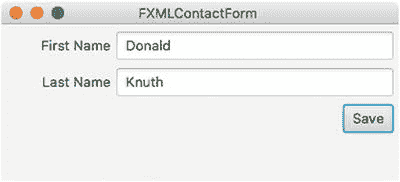

图 5-28.

JavaFX FXMLContactForm 应用程序

按下“保存”按钮时，控制台输出如下。


```
保存以下信息：
名字：唐纳德
姓氏：克努特
```

### 代码走查

通过使用 Scene Builder 工具创建联系人表单，你将 UI 保存为 FXML 格式的文件。FXML 是一种用于表示 JavaFX UI 的 XML 标记语言。当加载 FXML 进行显示时，与 JavaFX 节点关联的 XML 元素标签会被动态实例化为 Java 代码。使用 FXML 构建 UI 的主要思想是将 UI 代码与控制逻辑（操作）分离。在图形化布局 UI 元素并将文件保存为 `ContactForm.fxml` 后，你创建了一个名为 `ContactFormController.java` 的控制器类文件。`ContactFormController` 类包含引用 `ContactForm.fxml` 文件中 UI 元素的 `@FXML` 注解。以下代码片段是带有 `@FXML` 注解的实例变量。

```
@FXML private TextField firstNameField;
@FXML private TextField lastNameField;
```

`@FXML` 注解是一种 Java 运行时类型注解，它告诉 `FXMLLoader` 工具类哪些 UI 元素需要动态注入到控制器类中。这是 JavaFX 的依赖注入机制，允许控制器代码访问 UI 元素。此外，你会注意到 `@FXML` 注解也可以应用于基于 UI 事件（如 `OnAction` 属性）的方法。清单 5-11 展示了之前你在控制器类中看到的 `saveContactAction()` 方法。同时，回顾图 5-27（步骤 17），该方法名称被输入到 Scene Builder 工具的 `OnAction` 属性字段中。当按下“保存”按钮时，该方法被调用。

```
@FXML
protected void saveContactAction(ActionEvent event) {
System.out.println("保存以下信息：");
System.out.println("名字：" + firstNameField.getText());
System.out.println("姓氏：" + lastNameField.getText());
}
清单 5-11.
绑定到 UI 中“保存”按钮的处理程序代码
```

最后，JavaFX 应用程序代码加载要显示的 FXML 文件。此示例将 FXML 文件视为将要加载的资源。通常，标准 Java 应用程序或 Java 项目会有一个包含属性文件或图片等资源的 `resources` 目录。在此示例中，我们希望将 FXML 文件放在根级别。你会注意到文件上的 `/` 前缀表示该文件必须位于根类路径下。

`FXMLLoader.load()` 方法接收根类路径下的资源。如果你将类编译到目录中并开始运行应用程序，必须确保 FXML 文件被复制到根 `classes` 目录下。请参阅步骤 20，从命令提示符编译并运行应用程序。你使用 `-cp .` 设置类路径，其中 `.`（点）表示当前目录为根路径，因此 `getResource()` 方法能够看到要加载的 `ContactForm.fxml` 文件。

```
root = FXMLLoader.load(getClass().getResource("/ContactForm.fxml"));
```

## 总结

在本章中，你学习了用于创建用户界面的常见布局。本章的第一部分，你简要了解了常见布局，如 `HBox`、`VBox`、`FlowPane`、`BorderPane` 和 `GridPane`。通过使用一些常见的布局面板（如 `HBox` 和 `VBox`），你看到了详细的代码示例和放大后的示意图，这些图描述了布局节点中常令人困惑的属性。这些属性包括间距、内边距、外边距和边框宽度。其目的是确定布局面板及其子元素实际占用的空间（区域）。接下来，你学习了如何使用 `BorderPane` 和 `GridPane` 节点创建类似表单的 UI 应用程序。`GridPane` 提供了列级、行级和单元格级的约束。在类似表单的 UI 中，你还学习了如何控制子 UI 元素的位置和宽度。一个例子是，其中一个被控制的 UI 元素是文本字段，它会根据用户调整窗口大小而收缩或拉伸。

在学习了如何使用常见布局面板后，你学习了如何使用从 GluonHQ 下载的强大 Scene Builder 工具。本章还讨论了该工具的各种功能以及如何导航使用。熟悉该工具后，你有机会设计了一个与 `GridPane` 示例类似的表单 UI。这个练习的目的是以图形化方式而非编程方式创建 UI 界面。创建 UI 界面后，你将其保存为 JavaFX FXML 文件。通过了解如何将 UI 与控制逻辑分离，你学习了如何使用 JavaFX 的依赖注入机制，使控制器代码能够与 UI 元素交互。为了全面理解 Scene Builder 工具，你学习了如何创建一个应用程序，该程序能够加载 UI（FXML 文件）并通过 `FXMLLoader` 工具类自动连接控制器代码。

