# 6. 用户界面控件

在上一章中，你学习了如何使用 Scene Builder 工具布局控件。在本章中，你将学习如何与 UI 控件进行交互。由于篇幅限制，本章并未提供 Java 8 和 9 平台中每个 UI 控件的代码示例。不过，我确实为业务类应用程序中最常见的 UI 控件创建了示例。

在第 3 章讨论 JavaFX 场景图渲染基本形状节点的能力时，你了解到形状继承自基类 Node（`javafx.scene.Node`）。本章将探讨同样继承自基类 `Node` 但更为高级的用户界面（UI）控件。主要区别在于，UI 控件是提供用户交互的节点，例如按钮、菜单、文本字段、滑块和表格视图。

与使用 HTML5 的 Web 开发不同，JavaFX 允许 UI 控件节点、形状节点和画布节点在场景图（绘制表面）上共存。相比之下，HTML5 中的文本输入字段、SVG 元素和画布元素并不像 JavaFX 场景图上的节点那样继承共同的行为。例如，在使用 HTML 和 JavaScript 时，你无法轻松地使用通用 API 旋转 HTML 按钮和 SVG 矩形。而使用 JavaFX API 时，你可以像对待任何其他 JavaFX 节点一样对待 UI 控件；例如，你可以应用动画、变换、样式和效果。

JavaFX UI 控件是基类 `javafx.scene.control.Control` 的派生类，并实现了另外两个接口——`javafx.scene.control.Skinnable` 和 `javafx.event.EventTarget`。要深入了解如何创建自定义控件，请参阅第 15 章关于自定义用户界面的内容。现在，本章将探讨如何使用 UI 控件的示例。


## 标签

标签是只读控件，能够显示带有背景的文本和图形。与 `Text` 节点不同，标签继承自 `Control`，而非 `Shape`。标签为文本提供背景，并且当标签宽度（边界矩形）被调整得比显示给用户的文本字符串更小时，可以附加省略号（...）。这让用户知道还有更多文本内容需要显示。图 6-1 显示了一个完整显示长文本字符串（无省略号）的标签；然而，当窗口最小化时，标签的宽度会减小，从而显示截断的文本并在末尾附加省略号，如图 6-2 所示。


图 6-2.

一个宽度减小、附加省略号表示还有更多文本的长文本字符串标签


图 6-1.

一个具有完整可用宽度的长文本字符串标签

标签还可以包含一个相对于文本定位的图形节点。这意味着你可以添加任何类型的 JavaFX 节点作为图像图标。清单 6-1 展示了创建 JavaFX 标签的三种可能方式。第一种方式是使用空构造函数创建标签，然后使用 `setText()` 方法。第二种方式是使用接受字符串参数的构造函数，该参数用于在标签上显示的文本。最后一种方式是使用接受两个参数的构造函数，这两个参数分别接受文本（String）和用于图形（图标）的节点（Node）。

```
// 空文本标签
Label label1 = new Label();
label1.setText("JavaFX 9 by Example");
// 字符串文本标签
Label label2 = new Label("JavaFX Rocks!!!!");
// 字符串和图标标签
Node duke = new ImageView(new Image(getClass().getResourceAsStream("/duke.png")));
Label label3 = new Label("JavaFX Rocks!!!", duke);
label3.setContentDisplay(ContentDisplay.TOP);
清单 6-1.
创建标签的三种方式
```

如你所见，前两种创建标签的方法相当直接；然而，第三个例子稍微复杂一些。第三个例子创建了一个用作图形（Duke 吉祥物）的图像节点，该节点放置在标签文本的上方（`ContentDisplay.TOP`）。图 6-3 显示了一个标签，其中包含文本和一个位于标签文本内容上方的图像。

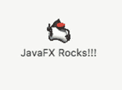

图 6-3.

一个包含图形（图像）并位于文本上方（使用 `ContentDisplay.TOP`）的标签。3D Duke 吉祥物的图像由 Joe Palrang 创作（知识共享许可协议）。

你会注意到，在清单 6-1 中，`label3` 变量使用了 `setContentDisplay()` 方法，该方法接受一个 `ContentDisplay` 枚举值。此方法负责决定标签中内容的显示方式，例如图形的位置，或者仅显示文本内容等。表 6-1 列出了使用 `ContentDisplay` 枚举常量显示标签内容的所有不同方式。

表 6-1.

用于指定内容如何在标签上显示的 ContentDisplay 枚举常量

| `BOTTOM` | 内容将放置在标签底部。 |
| `CENTER` | 内容将放置在标签中央。 |
| `GRAPHIC_ONLY` | 仅显示图形内容。 |
| `LEFT` | 内容将放置在标签左侧。 |
| `RIGHT` | 内容将放置在标签右侧。 |
| `TEXT_ONLY` | 仅显示标签的文本。 |
| `TOP` | 内容将放置在标签顶部。 |

提示

用于在标签上定位内容的 `ContentDisplay` 常量也可用于 JavaFX 按钮、复选框和菜单。

### 自定义字体

字体基本上可以设置标签、菜单、按钮以及许多其他包含文本的控件中文本的样式和大小。第 3 章讨论了如何将现有字体样式应用于 `Text` 节点，但如何使用自定义字体呢？在 JavaFX 中，你可以加载标准字体文件格式，例如 TrueType 字体（ttf）或 OpenType 字体（otf）。

加载自定义字体非常简单。首先，找到要加载的字体文件的路径。其次，你需要从 JavaFX 应用程序线程中初始加载该字体。如清单 6-2 所示，代码从类路径中加载一个 TrueType 字体作为资源。你还会注意到，使用了重写的 JavaFX 应用程序的 `init()` 方法来加载自定义字体。`init()` 方法将在调用 `start()` 方法之前，在 JavaFX 应用程序线程上执行。清单 6-2 中的代码使用了从 Google 字体网站 [`https://fonts.google.com`](https://fonts.google.com) 下载的自定义字体。在那里，你可以找到许多由世界各地的人们设计和创建的免费字体。以下链接是你可以下载由 Cadson Demak 设计的 Kanit 字体的地方。

[`https://fonts.google.com/specimen/Kanit?query=kanit&selection.family=Kanit`](https://fonts.google.com/specimen/Kanit%3Fquery=kanit%26selection.family=Kanit)

```
@Override
public void init() throws Exception {
// 加载自定义字体
Font.loadFont(CustomFonts.class.getResource("/Kanit-MediumItalic.ttf")
.openStream(), 12.0);
}
清单 6-2.
重写 JavaFX 应用程序类中的 init() 方法，以从类路径加载 TrueType 字体作为资源
```

在应用程序的 `start()` 方法内部（在 JavaFX 应用程序线程上），代码可以使用之前从 `init()` 方法加载的自定义字体。清单 6-3 显示了一个标签文本，该文本使用了名为 Kanit 的自定义字体，字体粗细为 MEDIUM，字号为 60 磅。

```
// 使用自定义字体
Label labelText = new Label("JavaFX 9 by Example ");
labelText.setFont(Font.font("Kanit", FontWeight.MEDIUM, 60));
清单 6-3.
假设字体已预先加载，代码设置自定义字体 Kanit 来为标签上的文本设置样式
```

清单 6-3 的输出如图 6-4 所示。

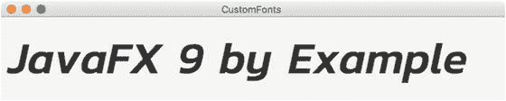

图 6-4.

使用自定义字体 Kanit 的标签输出

### 字体作为图标

在下一节中，你将学习如何加载被设计用作图标图像而非字符的自定义字体。这些将图像作为图标的自定义字体如今已成为许多网站的常见做法。这些字体包是用于标签、按钮、菜单或任何需要图像图标的地方的可缩放矢量图像。单个 Unicode 字符基本上被映射到一个图标图像，而不是拉丁字母表中的字母。


### 示例：使用第三方字体包作为图标

在 Web 开发中，你可能已经注意到许多专业图标被用作标签、按钮等元素的图形，但你是否也注意到它们能够很好地缩放（没有像素化）？这种新技术实际上是将自定义字体表示为矢量图像。这个巧妙的想法允许代码像获取普通字母字体一样获取矢量图像，并对其进行着色和调整大小。如果你不熟悉这个概念，请访问以下链接：

*   FontAwesome：[`http://fontawesome.io`](http://fontawesome.io)
*   Weather Icons：[`https://erikflowers.github.io/weather-icons`](https://erikflowers.github.io/weather-icons)
*   Material Design Icons：[`http://zavoloklom.github.io/material-design-iconic-font`](http://zavoloklom.github.io/material-design-iconic-font)
*   Glyph Icons：[`http://getbootstrap.com/components/#glyphicons`](http://getbootstrap.com/components/#glyphicons)

接下来，你将看到一个应用程序的代码示例，该应用程序允许你搜索或查看来自这些不同图标包的图标。在创建这个示例时，我遇到了一个名为 FontAwesomeFX 的基于 JavaFX 的库，由 Jens Deter 编写，他将许多流行的图标引入到 JavaFX 应用程序中。当你读到本章时，Jens Deter 很可能已经创建了针对 Java 9 进行模块化的内容（Java 9 模块）。

例如，Jens 库的当前实现将各种图标包放在一个 JAR 文件中。这里，使用 Java 9 模块可以将库拆分为不同的模块，从而允许应用程序只包含它需要的模块，使应用程序打包更小。要获取最新消息和更新，请访问 `FontAwesomeFX` 项目，链接如下：

[`https://bitbucket.org/Jerady/fontawesomefx`](https://bitbucket.org/Jerady/fontawesomefx)

#### 示例：LabelAwesome——一个字体包图标浏览器应用

`LabelAwesome` 示例应用程序允许用户搜索和浏览来自 FontAwesome、WeatherIcons、Material Design Icons 和 Glyph Icons 的各种字体包。该应用程序允许用户输入图标名称中包含的文本进行搜索。用户还可以选择四种方式在显示标签时定位字体图标。可供选择的位置是顶部、底部、左侧和右侧。在图 6-5 中，`LabelAwesome` 应用程序允许用户搜索和浏览来自各种字体包的图标。

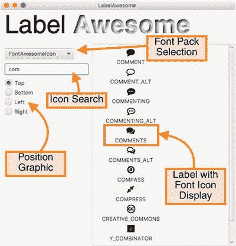

图 6-5.

LabelAwesome 应用程序允许用户搜索和浏览来自各种字体包的图标。该应用程序还允许用户选择相对于标签文本放置字体图标的位置。

#### 入门指南

`LabelAwesome` 应用程序代码位于名为 `LabelAwesome.java` 的 Java 文件中，如清单 6-6 所示。但是，在讨论清单 6-6 之前，让我们确保包含了正确的库依赖项。必须将 `fontawesomefx.jar` 库包含在类路径中，才能成功编译和执行。

如果你从 Apress 出版社下载了本书的源代码，那么 `FontAwesomeFX` 库已经包含在内。如果你可以访问 Maven 或 Gradle，你可以从 Maven Central 或 Bintray 下载它。Maven Central 和 Bintray 是托管构建工件（如 JAR 库）的仓库。对于熟悉 Maven 的用户，请使用清单 6-4 中的依赖坐标。

```
de.jensd
fontawesomefx
8.9
清单 6-4.
构建示例 LabelAwesome.java 的 Maven 坐标
```

对于熟悉 Gradle 的用户，请在项目的 `build.gradle` 文件中使用清单 6-5 作为编译时依赖项。

```
compile group: 'de.jensd', name: 'fontawesomefx', version: '8.9'
清单 6-5.
构建示例 LabelAwesome.java 的 Gradle 依赖项
```

以下是获取 `FontAwesomeFX` 最新版本的地址。在撰写本文时，使用的是 `FontAwesomeFX` 库的 8.9 版本。

*   Maven：[`http://search.maven.org`](http://search.maven.org)（搜索 `fontawesomefx`）
*   Bintray：[`https://bintray.com/jerady/maven/FontAwesomeFX`](https://bintray.com/jerady/maven/FontAwesomeFX)

现在，你应该准备好将清单 6-6 输入到名为 `LabelAwesome.java` 的文件中，以便编译和执行。`FontAwesomeFX` 应用程序可以帮助你在 FontAwesome、Weather Icons、Material Design Icons 和 Glyph Icons 等各种包中找到合适的图标。


```
package com.jfxbe;
import de.jensd.fx.glyphs.GlyphIcons;
import de.jensd.fx.glyphs.GlyphsDude;
import de.jensd.fx.glyphs.fontawesome.FontAwesomeIcon;
import de.jensd.fx.glyphs.fontawesome.FontAwesomeIconView;
import de.jensd.fx.glyphs.materialdesignicons.MaterialDesignIcon;
import de.jensd.fx.glyphs.materialdesignicons.MaterialDesignIconView;
import de.jensd.fx.glyphs.materialicons.MaterialIcon;
import de.jensd.fx.glyphs.materialicons.MaterialIconView;
import de.jensd.fx.glyphs.octicons.OctIcon;
import de.jensd.fx.glyphs.octicons.OctIconView;
import de.jensd.fx.glyphs.weathericons.WeatherIcon;
import de.jensd.fx.glyphs.weathericons.WeatherIconView;
import javafx.application.Application;
import javafx.collections.FXCollections;
import javafx.collections.ObservableList;
import javafx.geometry.Insets;
import javafx.geometry.Pos;
import javafx.scene.Scene;
import javafx.scene.control.*;
import javafx.scene.effect.InnerShadow;
import javafx.scene.layout.BorderPane;
import javafx.scene.layout.HBox;
import javafx.scene.layout.VBox;
import javafx.scene.paint.Color;
import javafx.scene.text.Font;
import javafx.scene.text.FontWeight;
import javafx.scene.text.Text;
import javafx.scene.text.TextFlow;
import javafx.stage.Stage;
import java.util.*;
/**
* LabelAwesome 是一个使用 Jens Deters 的 FontAwesomeFX 库的示例。
* @author carldea
*/
public class LabelAwesome extends Application {
// 查找图标包
private static Map> ICON_PACKS_MAP = new HashMap();
@Override
public void init() throws Exception {
// 加载所有图标
Font.loadFont(GlyphsDude.class
.getResource(FontAwesomeIconView.TTF_PATH).openStream(), 10.0);
Font.loadFont(GlyphsDude.class
.getResource(MaterialDesignIconView.TTF_PATH).openStream(), 10.0);
Font.loadFont(GlyphsDude.class
.getResource(MaterialIconView.TTF_PATH).openStream(), 10.0);
Font.loadFont(GlyphsDude.class
.getResource(OctIconView.TTF_PATH).openStream(), 10.0);
Font.loadFont(GlyphsDude.class
.getResource(WeatherIconView.TTF_PATH).openStream(), 10.0);
// 准备所有图标
ICON_PACKS_MAP.put("FontAwesomeIcon", Arrays.asList(FontAwesomeIcon.values()));
ICON_PACKS_MAP.put("MaterialDesignIcon",
Arrays.asList(MaterialDesignIcon.values()));
ICON_PACKS_MAP.put("MaterialIcon", Arrays.asList(MaterialIcon.values()));
ICON_PACKS_MAP.put("OctIcon", Arrays.asList(OctIcon.values()));
ICON_PACKS_MAP.put("WeatherIcon", Arrays.asList(WeatherIcon.values()));
}
/**
* @param args 命令行参数
*/
public static void main(String[] args) {
Application.launch(args);
}
@Override
public void start(Stage stage) {
stage.setTitle("LabelAwesome ");
BorderPane root = new BorderPane();
Scene scene = new Scene(root, 600, 450);
// 创建标题
Text labelText = new Text("Label ");
labelText.setFont(Font.font("Helvetica", FontWeight.EXTRA_LIGHT, 60));
Text awesomeText = new Text("Awesome");
InnerShadow innerShadow = new InnerShadow();
innerShadow.setOffsetX(3.0f);
innerShadow.setOffsetY(3.0f);
awesomeText.setEffect(innerShadow);
awesomeText.setFill(Color.WHITE);
awesomeText.setFont(Font.font("Helvetica", FontWeight.BOLD, 60));
TextFlow title = new TextFlow(labelText, awesomeText);
HBox banner = new HBox(title);
banner.setPadding(new Insets(10, 0, 10, 10));
banner.setPrefHeight(70);
root.setTop(banner);
// 显示图标区域
VBox labelDisplayPanel = new VBox(5);
labelDisplayPanel.setAlignment(Pos.CENTER);
ScrollPane scrollPane = new ScrollPane(labelDisplayPanel);
root.setCenter(scrollPane);
scrollPane.setPadding(new Insets(10, 10, 10, 10));
// 选择图标包（下拉框）
VBox controlsPanel = new VBox(10);
controlsPanel.setPadding(new Insets(10, 10, 10, 10));
List iconPackList = new ArrayList();
iconPackList.add("FontAwesomeIcon");
iconPackList.add("MaterialDesignIcon");
iconPackList.add("MaterialIcon");
iconPackList.add("OctIcon");
iconPackList.add("WeatherIcon");
ObservableList obsIconPackList = FXCollections.observableList(iconPackList);
ComboBox iconPacks = new ComboBox(obsIconPackList);
iconPacks.setValue(iconPackList.get(0));
controlsPanel.getChildren().add(iconPacks);
// 输入框（文本字段）
TextField inputField = new TextField();
inputField.setPrefWidth(200);
inputField.setPromptText("搜索图标名称");
controlsPanel.getChildren().add(inputField);
// 选择图标位置（单选按钮组）
VBox imagePositionPanel = new VBox(5);
ToggleGroup position = new ToggleGroup();
RadioButton topPosition = new RadioButton("顶部");
topPosition.setSelected(true);
topPosition.setUserData(ContentDisplay.TOP);
topPosition.requestFocus();
topPosition.setToggleGroup(position);
RadioButton bottomPosition = new RadioButton("底部");
bottomPosition.setUserData(ContentDisplay.BOTTOM);
bottomPosition.setToggleGroup(position);
RadioButton leftPosition = new RadioButton("左侧");
leftPosition.setUserData(ContentDisplay.LEFT);
leftPosition.setToggleGroup(position);
RadioButton rightPosition = new RadioButton("右侧");
rightPosition.setUserData(ContentDisplay.RIGHT);
rightPosition.setToggleGroup(position);
imagePositionPanel.getChildren()
.addAll(topPosition,
bottomPosition,
leftPosition,
rightPosition);
controlsPanel.getChildren()
.add(imagePositionPanel);
root.setLeft(controlsPanel);
// 当用户输入时，搜索文本。
inputField.textProperty().addListener((o, oldVal, newVal) ->
showIconList(newVal,labelDisplayPanel,
iconPacks.getValue(),
position.getSelectedToggle()
.getUserData())
);
// 当单选按钮选择图标位置时
position.selectedToggleProperty().addListener((o, oldVal, newVal) ->
showIconList(inputField.getText(),
labelDisplayPanel,
iconPacks.getValue(),
position.getSelectedToggle()
.getUserData()));
// 当下拉框选择图标包时。
iconPacks.setOnAction(actionEvent ->
showIconList(inputField.getText(),
labelDisplayPanel,
iconPacks.getValue(),
position.getSelectedToggle()
.getUserData()));
stage.setScene(scene);
stage.show();
// 初始显示当前图标列表
showIconList(inputField.getText(),
labelDisplayPanel,
iconPacks.getValue(),
position.getSelectedToggle()
.getUserData());
}
private void showIconList(String textInput,
VBox labelDisplayPanel,
String iconPack,
Object position) {
// 清空右侧显示区域
labelDisplayPanel.getChildren().clear();
// 获取图标包的名称列表。
List iconPackIcons = ICON_PACKS_MAP.get(iconPack);
iconPackIcons.stream()
.filter(iconEnum -> iconEnum.toString().toUpperCase()
.indexOf(textInput.toUpperCase()) > -1)
.forEach(iconEnum -> {
// 使用矢量字体创建文本节点。
Text iconShape = new Text(iconEnum.characterToString());
iconShape.getStyleClass().add("glyph-icon");
iconShape.setStyle(
String.format("-fx-font-family: %s; -fx-font-size: %s;",
iconEnum.getFontFamily(), 20));
Label label = new Label(iconEnum.toString(), iconShape);
label.setContentDisplay((ContentDisplay)position);
labelDisplayPanel.getChildren().add(label);
});
}
}
清单 6-6.
允许用户从 FontAwesomeFX 库中搜索可用字体图标图像的应用程序
```

#### 编译示例

输入清单 6-6 后，你需要编译它以便稍后执行。以下显示了编译 `LabelAwesome.java` 代码所需的命令。

```
$ mkdir classpath
$ javac -cp lib/fontawesomefx-8.9.jar -d classpath src/com/jfxbe/LabelAwesome.java
```

假设当前项目目录包含一个 `lib` 目录，其中包含 `FontAwesomeFX` JAR 库，那么在编译 Java 代码时，`-cp` 表示类路径，而 `-d` 表示编译后代码将写入的目录。本例中的目录名为 `classpath`。在 Java 9 模块中，请参考第 2 章设置模块路径，这假设你的源代码遵循 Jigsaw 的新约定。


#### 运行示例应用程序

编译完清单 6-6 后，您将需要从命令行运行示例应用程序。要运行该示例，您需要在类路径中包含 `FontAwesomeFX` 库，并将编译后的代码放入 `classpath` 目录中。您会注意到，在 UNIX/MacOS/Linux 系统上，使用 `:` 作为分隔符来追加类路径的多个路径。在 Windows 系统上，则需要使用 `;` 作为分隔符。以下命令将运行示例应用程序。

```
java -cp classpath:lib/fontawesomefx-8.9.jar com.jfxbe.LabelAwesome
```

运行示例后，图 6-6 显示了 `LabelAwesome` 应用程序的输出。`FontAwesomeFX` 库支持以下字体图标包：FontAwesome、Material Design、Material Icon 集、Oct Icon 集和 Weather Icon 集。要查看最新更新，请访问 Jens Deter 的网站：[`http://www.jensd.de/wordpress/?tag=fontawesome`](http://www.jensd.de/wordpress/?tag=fontawesome)。

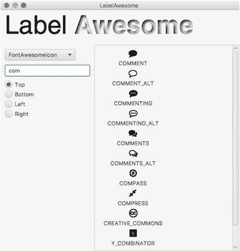

图 6-6.

清单 6-2 的输出展示了一个示例应用程序，用于演示 Jens Deter 的 FontAwesomeFX 库。

### 工作原理

在清单 6-6 中，代码首先声明了一个静态 `Map`，用于存储图标包名称（字符串）和 `de.jensd.fx.glyphs.GlyphIcons` 对象列表的条目。以下代码片段是图标包映射的声明。

```
Map> ICON_PACKS_MAP = new HashMap();
```

`GlyphIcons` 是一个接口，供实现类将各个 Unicode 字符映射到矢量图标。例如，`FontAwesomeIcon` 类是 `GlyphIcons` 接口的一个实现，它包含了来自 TrueType 字体文件 `fontawesome-webfont.ttf` 的所有 FontAwesome 图标映射。要查看完整源代码，请访问 Jens Deter 的 `FontAwesomeFX` 项目源代码，网址为：

[`https://bitbucket.org/Jerady/fontawesomefx`](https://bitbucket.org/Jerady/fontawesomefx)

#### init() 方法

接下来，重写的 `init()` 方法（来自 `Application` 类）实现了基于字体文件路径加载所有受支持的图标字体文件的过程。JavaFX 的 `javafx.scene.text.Font` 类可以使用 `openStream()` 方法从输入流中加载字体文件，并将其作为类路径上的资源。在此示例中，字体通过 `loadFont()` 方法并传入给定的输入流进行加载。加载的字体文件是 TrueType 字体 (TTF) 类型文件，位于 `FontAwesomeFX` 的 JAR 文件内部。以下代码从变量 (`FontAwesomeIconView.TTF_PATH`) 加载字体文件，该变量是一个包含字体路径的字符串，路径为 `/de/jensd/fx/glyphs/fontawesome/fontawesome-webfont.ttf`：

```
Font.loadFont(GlyphsDude.class.getResource(FontAwesomeIconView.TTF_PATH).openStream(), 10.0);
ICON_PACKS_MAP.put("FontAwesomeIcon", Arrays.asList(FontAwesomeIcon.values()));
```

#### start() 方法

在完成字体的初始设置后，`start()` 方法会设置应用程序的界面。它首先创建应用程序的标题，标题名为 `LabelAwesome`。

##### 使用 TextFlow 控件

在图 6-5 中，您会注意到标题文本。`Label` 和 `Awesome` 具有不同的样式，但显示在一起。此处代码使用了一个 `javafx.scene.text.TextFlow` 节点来包含混合的 `Text` 对象。在此示例中，开头的单词 Label 只是纯黑色，而单词 Awesome 则具有内阴影效果。以下代码片段将 Label 和 Awesome 的 `Text` 节点添加到 `TextFlow` 对象中。

```
TextFlow title = new TextFlow(labelText, awesomeText);
```

设置好标题横幅后，创建主显示区域（边框面板的中心）以包含显示图标区域。此处，每个标签都附带文本描述和一个图标字体（图像），并添加到一个 `VBox` 面板中以形成一行。如果您不熟悉诸如 `BorderPane` 或 `VBox` 之类的布局，请阅读第 5 章，其中涵盖了布局和 Scene Builder。

##### 使用 ComboBox 控件

接下来，创建一个组合框选择控件，其中包含代表特定字体包名称的字符串。清单 6-7 重新展示了 `start()` 方法中创建组合框控件的代码部分，该控件允许用户从 `FontAwesomeFX` 库中选择支持的字体包。在清单 6-7 中，您会注意到代码使用 `setOnAction()` 方法设置了 `onAction` 属性。当用户从下拉列表中选择一个图标包时，附加的处理程序 (`EventHandler`) 就会在此方法中被调用。一旦触发了 `onAction` 事件，就会调用 `showIconList()` 方法。稍后将更详细地解释 `showIconList()` 方法。

```
List iconPackList = new ArrayList();
iconPackList.add("FontAwesomeIcon");
iconPackList.add("MaterialDesignIcon");
iconPackList.add("MaterialIcon");
iconPackList.add("OctIcon");
iconPackList.add("WeatherIcon");
ObservableList obsIconPackList = FXCollections.observableList(iconPackList);
ComboBox iconPacks = new ComboBox(obsIconPackList);
iconPacks.setValue(iconPackList.get(0));
.
// 代码省略（声明并创建了其他控件）
.
.
// 为组合框控件附加一个操作，以重新显示标签。
// 当组合框选择一个图标包时。
iconPacks.setOnAction(actionEvent ->
showIconList(inputField.getText(),
labelDisplayPanel,
iconPacks.getValue(),
position.getSelectedToggle()
.getUserData()));
清单 6-7.
设置组合框控件以允许用户选择字体包
```

创建用于选择字体包的组合框控件后，代码创建了一个自动搜索文本字段，允许用户在字体包内搜索图标。


##### 使用 TextField 控件

清单 6-8 创建了一个 `TextField` 节点，其首选宽度为 200 像素，提示文本属性为 `Search Icon Name`。当文本字段为空时，输入文本字段中会显示提示文本。

```
// 输入字段 (TextField)
TextField inputField = new TextField();
inputField.setPrefWidth(200);
inputField.setPromptText("Search Icon Name");
.
.
.
// 当用户输入文本时进行搜索
inputField.textProperty().addListener((o, oldVal, newVal) ->
showIconList(newVal,
labelDisplayPanel,
iconPacks.getValue(),
position.getSelectedToggle()
.getUserData()));
清单 6-8.
创建用于在字体包中搜索图标名称的自动搜索文本字段
```

在清单 6-8 中，`inputField` 的 `textProperty()` 包含一个 `ChangeListener` lambda 表达式，每当文本发生变化时，它都会调用名为 `showIconList()` 的私有方法。当用户在文本字段中输入文本时，文本属性会发生变化。`showIconList()` 方法的参数是 `textInput`、`labelDisplayPanel`、`iconPack` 和 `position`。以下是 `showIconList()` 方法的签名。

```
private void showIconList(String textInput,
VBox labelDisplayPanel,
String iconPack,
Object position)
```

`showIconList()` 方法的第一个参数是 `textInput`，即输入到 `TextField` 控件中的内容。`labelDisplayPanel` 参数是一个 `VBox` 容器，用于容纳多行 `Label` 对象。下一个参数是 `iconPack`，类型为 `String`，表示图标包的名称，同时也是 `ICON_PACKS_MAP` 映射对象中的键。最后一个参数 `position` 的类型为 `Object`，将被转换为 `ContentDisplay` 枚举常量，用于确定图标相对于标签文本的位置。

继续看 `start()` 方法，代码创建了单选按钮，允许用户选择图标相对于标签内文本的位置。清单 6-9 重新展示了用于定位图标的单选按钮的创建过程。一个 `ChangeListener` 被附加到 `ToggleGroup` 变量 `position` 上。同样，`ChangeListener` lambda 代码将根据位置调用 `showIconList()` 方法。

```
ToggleGroup position = new ToggleGroup();
.
.
// 当单选按钮选择放置图标的位置时
position.selectedToggleProperty().addListener((o, oldVal, newVal) ->
showIconList(inputField.getText(),
labelDisplayPanel,
iconPacks.getValue(),
position.getSelectedToggle()
.getUserData())
);
清单 6-9.
用于选择显示标签时字体图标位置的单选按钮
```

你会注意到所有事件处理器和监听器都有一个共同的主题，即最终都会调用私有方法 `showIconList()`。这个方法只是更新显示区域右侧的标签行。

#### 私有方法 showIconDisplay()

清单 6-10 重新展示了来自完整清单 6-6 的 `showIconDisplay()` 方法。该方法负责刷新屏幕右侧显示的标签列表。

```
// 清除右侧显示区域
labelDisplayPanel.getChildren().clear();
// 获取图标包的名称列表。
List iconPackIcons = ICON_PACKS_MAP.get(iconPack);
iconPackIcons.stream()
.filter(iconEnum -> iconEnum.toString().toUpperCase()
.indexOf(textInput.toUpperCase()) > -1)
.forEach(iconEnum -> {
// 使用矢量字体创建一个文本节点。
Text iconShape = new Text(iconEnum.characterToString());
iconShape.getStyleClass().add("glyph-icon");
iconShape.setStyle(
String.format("-fx-font-family: %s; -fx-font-size: %s;",
iconEnum.getFontFamily(), 20));
Label label = new Label(iconEnum.toString(), iconShape);
label.setContentDisplay((ContentDisplay) position);
labelDisplayPanel.getChildren().add(label);
});
清单 6-10.
showIconDisplay() 方法遍历要定位和显示的图标列表
```

代码首先清除标签显示区域（`VBox` 容器）。然后，根据选定的图标包获取 `GlyphIcons` 列表。接着，代码会过滤 `iconPackIcons` 列表，查找任何图标名称中包含搜索文本字符串的部分。过滤完成后，图标列表将应用于 `VBox` 容器中以行形式显示的标签。

标签和自定义字体很有趣，但由于它们本质上是只读的，接下来我们来看看按钮。

## 按钮

如果说 JavaFX 标签是最基本的 UI 控件，那么下一个最基本的 UI 控件就是按钮控件。按钮响应鼠标点击或当按钮获得焦点时按下空格键的操作。在 JavaFX 中，还有其他控件的行为类似于按钮。事实上，所有具体的类按钮控件都继承自父类 `javafx.scene.control.ButtonBase`。以下是 JavaFX 按钮控件的列表：

*   Button
*   CheckBox
*   Hyperlink
*   Radio button
*   Toggle button
*   Menu/MenuItem

### Button

标准的按钮控件可以包含文本或图形（节点），类似于前面介绍的标签控件。按钮可以具有默认行为，例如当用户按下 Enter 或 Escape 键时。在创建表单应用程序的场景中，OK 按钮可以作为默认按钮，允许用户按下 Enter 键；或者点击 Cancel 按钮来响应 Escape 键。对话框窗口通常遵循这种模式。以下代码片段创建了三个按钮——OK、Cancel 和 Easy。OK 和 Cancel 按钮将被配置为分别接受 Enter 和 Escape 键的按下。Easy 按钮被设置为在按下时调用名为 `doSomethingCool()` 的方法。

```
Button okButton = new Button("OK");
okButton.setDefaultButton(true);
Button cancelButton = new Button("Cancel");
cancelButton.setCancelButton(true);
Button easyButton = new Button("Easy");
easyButton.setOnAction( actionEvent -> doSomethingCool() );
```


### 复选框

复选框按钮控件是一种包含三种状态的开关型按钮——`checked`（已选中）、`unchecked`（未选中）和 `undefined`（未定义）。当复选框处于已选中状态时，控件会在方框内显示一个勾选标记；否则，它处于未选中状态，显示一个空方框。已选中和未选中状态由 `selected` 属性控制。

当状态为未定义时，控件会在方框内显示一个连字符标记。未定义状态通过名为 `setIndeterminate(true)` 的方法设置。当 indeterminate 属性设置为 `true` 时，`selected` 属性将被忽略。如果你希望复选框允许用户循环切换这三种状态，可以使用 `setAllowIndeterminate(true)` 方法将 `allowIndeterminate` 属性设置为 `true`。在图 6-7 中，展示了复选框的三种状态。

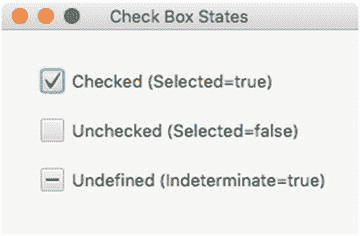

图 6-7.

复选框控件可以具有的三种状态

某些用例涉及树形表格视图控件，其中父节点带有一个处于未定义状态（显示连字符）的复选框，并且有两个或更多子节点，其中至少有一个子节点处于未选中状态（selected 等于 false），同时至少有一个子节点处于选中状态。

注意

通过使用 `setAllowIndeterminate(true)` 方法将 `allowIndeterminate` 属性设置为 `true`，复选框可以允许用户循环切换这三种状态。换句话说，当用户看到一个空的复选框（`selected=false`）时，他/她可以点击鼠标来选中该复选框（`selected=true`），然后再次点击使其变为未定义状态，显示为连字符（`indeterminate=true`）。

在使用复选框时，最常见的场景通常涉及两种状态：`checked`（已选中）和 `unchecked`（未选中）。例如，打开或关闭灯光。清单 6-11 展示了模拟控制一个假设的灯光控制 API 的代码，该 API 用于打开或关闭厨房灯光。

```
CheckBox kitchenLights = new CheckBox("厨房灯光");
lightControlManager.kitchenLights()
.switchProperty()
.bind(kitchenLights.selectedProperty());
```

### 超链接

超链接控件类似于网页中用于导航 URL 或显示弹出窗口的文本链接。当鼠标指针悬停在控件上时，超链接通常会显示带下划线的文本。此外，前景色可以根据链接是否已被点击而改变。这体现了“已访问”链接的概念（即 `visited` 属性）。清单 6-11 设置了一个带有动作代码的超链接，用于响应点击事件。该动作代码会将链接的文本或 URL 作为网页显示在 JavaFX `WebView` 节点中。

```
Hyperlink searchLink = new Hyperlink("www.google.com");
WebView browser = new WebView();
searchLink.setOnAction( actionEvent ->
browser.getEngine()
.load("https://" + searchLink.getText()));
清单 6-11.
一个带有动作代码的超链接，该代码将网页加载到 WebView 控件中
```

### 单选按钮

单选按钮通常用于应用程序中，要求用户在可用的（两个或更多）选项中选择一个。图 6-8 展示了使用单选按钮让用户选择支付类型。

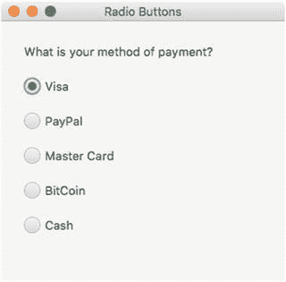

图 6-8.

一个假设的支付选择界面。使用单选按钮让用户选择一种支付方式。

要创建如图 6-8 所示的单选按钮，请查看清单 6-12 中的代码。它首先创建一个 `ToggleGroup`（切换组）来保存选中的值。该切换组一次只允许选中一个单选按钮。`ToggleGroup` 有一个监听器，负责在选中某个复选框时，将支付方式显示到控制台。

```
Label questionLabel = new Label("您的支付方式是什么？");
ToggleGroup group = new ToggleGroup();
RadioButton visaButton = new RadioButton("Visa");
visaButton.setUserData("Visa");
visaButton.setSelected(true);
RadioButton payPalButton = new RadioButton("PayPal");
payPalButton.setUserData("PayPal");
RadioButton masterCardButton = new RadioButton("Master Card");
masterCardButton.setUserData("Master Card");
RadioButton bitCoinButton = new RadioButton("BitCoin");
bitCoinButton.setUserData("BitCoin");
RadioButton cashButton = new RadioButton("现金");
cashButton.setUserData("现金");
visaButton.setToggleGroup(group);
payPalButton.setToggleGroup(group);
masterCardButton.setToggleGroup(group);
bitCoinButton.setToggleGroup(group);
cashButton.setToggleGroup(group);
group.selectedToggleProperty().addListener( listener -> {
System.out.println("支付类型: " + group.getSelectedToggle().getUserData());
});
清单 6-12.
要求用户选择一种支付方式的代码
```

提示

你可以使用 JavaFX 节点的 `set/getUserData()` 方法将任何对象放入其中。在此场景中，`RadioButton` 控件被设置为包含一个 `String` 值，用于唯一标识每个选中的项目。

现在你已经了解了如何设置标签和按钮，让我们通过一个名为“按钮乐趣”的示例，进一步探索 JavaFX 按钮的乐趣。

### 示例：按钮乐趣

在查看示例代码之前，我要感谢 Chasers Gaming 的独立游戏开发者为本示例提供了游戏精灵图。请通过以下方式支持他们：

*   [`https://www.patreon.com/chasersgaming`](https://www.patreon.com/chasersgaming)
*   [`https://www.facebook.com/Chasersgamingpage`](https://www.facebook.com/Chasersgamingpage)
*   推特：`@denchaser`

如图 6-9 所示的“按钮乐趣”是一个演示常见 JavaFX 按钮控件的应用程序。该应用程序允许用户查看和控制三种类型的车辆。

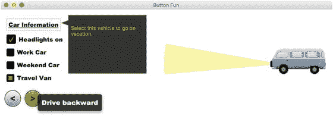

图 6-9.

“按钮乐趣”是一个允许用户查看和控制三种车辆类型（工作用车、周末用车和旅行面包车）相关方面的应用程序。

本示例演示了以下 UI 控件：

*   超链接
*   复选框
*   单选按钮
*   按钮
*   弹出窗口

### 按钮乐趣操作说明

以下是“按钮乐趣”应用程序的操作说明：

*   车辆信息：点击超链接，弹出关于所选车辆的信息。
*   打开或关闭前大灯：点击复选框控件。
*   选择车辆类型：点击选择三种车辆类型单选控件之一——工作用车、周末用车和旅行面包车。
*   向前驾驶车辆：点击带有 < 箭头的按钮。
*   向后驾驶车辆：点击带有 > 箭头的按钮。

### ButtonFun.java 的源代码

在开始本示例之前，你需要准备一些资源，例如在运行时正确加载的图像文件。要获取这些资源，请访问 Apress 下载代码示例，或访问 [`https://github.com/carldea/jfx9be/tree/master/chap06`](https://github.com/carldea/jfx9be/tree/master/chap06)。源代码还将包含诸如 clean、compile 和 build 之类的脚本。构建脚本会将 `resources` 目录正确复制到编译后的目录（classes）中。

清单 6-13 将调用 `init()` 方法来加载应用程序中要使用的图像精灵。其余代码主要是布局所有控件，并连接逻辑或动作代码以响应各种按钮点击。UI 的 CSS 样式位于清单 6-14 中，它将根据伪类（状态）为按钮着色并更改属性。


```
/**
* Button Fun 是一款展示应用开发中典型按钮的应用程序。
* 汽车精灵图来自 http://opengameart.org/users/chasersgaming
* @author carldea
*/
public class ButtonFun extends Application {
private Car[] myCars;
/**
* @param args 命令行参数
*/
public static void main(String[] args) {
Application.launch(args);
}
@Override
public void init() throws Exception {
super.init();
myCars = new Car[3];
Car workCar = buildCar("/spr_bluecar_0_0.png", "/spr_bluecar_0_0-backwards.png",
"选择此车用于通勤。");
Car sportsCar = buildCar("/sportscar.png", "/sportscar-backwards.png",
"选择此车用于前往剧院。");
Car travelVan = buildCar("/travel_vehicle.png", "/travel_vehicle.png",
"选择此车用于度假。");
myCars[0] = workCar;
myCars[1] = sportsCar;
myCars[2] = travelVan;
}
private Car buildCar(String carForwardFile, String carBackwardFile, String description) {
Image carGoingForward = new Image(carForwardFile);
Image carBackward = new Image(carBackwardFile);
return new Car(carGoingForward, carBackward, description);
}
@Override
public void start(Stage stage) {
stage.setTitle("Button Fun");
BorderPane root = new BorderPane();
root.setId("background");
Scene scene = new Scene(root, 900, 250);
// 加载 JavaFX CSS 样式
scene.getStylesheets()
.add(getClass().getResource("/button-fun.css")
.toExternalForm());
VBox leftControlPane = new VBox(10);
leftControlPane.setPadding(new Insets(0, 10, 20, 15));
// 创建用于线性、缓入和缓出的单选按钮
ToggleGroup group = new ToggleGroup();
RadioButton easeLinearBtn = new RadioButton("工作用车");
easeLinearBtn.setUserData(myCars[0]);
easeLinearBtn.getStyleClass().add("option-button");
easeLinearBtn.setSelected(true);
easeLinearBtn.setToggleGroup(group);
RadioButton easeInBtn = new RadioButton("周末用车");
easeInBtn.setUserData(myCars[1]);
easeInBtn.getStyleClass().add("option-button");
easeInBtn.setToggleGroup(group);
RadioButton easeOutBtn = new RadioButton("旅行车");
easeOutBtn.setUserData(myCars[2]);
easeOutBtn.getStyleClass().add("option-button");
easeOutBtn.setToggleGroup(group);
// 超链接
Hyperlink carInfoLink = createHyperLink(group);
leftControlPane.getChildren().add(carInfoLink);
// 创建复选框以控制车灯开关。
CheckBox headLightsCheckBox = new CheckBox("前灯开启");
leftControlPane.getChildren().add(headLightsCheckBox);
leftControlPane.setAlignment(Pos.BOTTOM_LEFT);
leftControlPane.getChildren().addAll(easeLinearBtn, easeInBtn, easeOutBtn);
// 创建按钮控件以控制汽车前进或后退。
HBox hbox = new HBox(10);
Button leftBtn = new Button("");
rightBtn.getStyleClass().add("nav-button");
FlowPane controlPane = new FlowPane();
FlowPane.setMargin(hbox, new Insets(0, 5, 10, 10));
hbox.getChildren().addAll(leftBtn, rightBtn);
controlPane.getChildren().add(hbox);
root.setBottom(controlPane);
// 绘制地面
AnchorPane surface = new AnchorPane();
root.setCenter(surface);
root.setLeft(leftControlPane);
int x1 = 20, x2 = 500;
int y1 = 100, y2 = 100;
ImageView carView = new ImageView(myCars[0].carForwards);
carView.setPreserveRatio(true);
carView.setFitWidth(150);
carView.setX(x1);
Arc carHeadlights = new Arc();
carHeadlights.setId("car-headlights-1");
carHeadlights.setCenterX(50.0f);
carHeadlights.setCenterY(90.0f);
carHeadlights.setRadiusX(300.0f);
carHeadlights.setRadiusY(300.0f);
carHeadlights.setStartAngle(170.0f);
carHeadlights.setLength(15f);
carHeadlights.setType(ArcType.ROUND);
carHeadlights.visibleProperty().bind(headLightsCheckBox.selectedProperty());
// 缓动汽车（跑车）
AnchorPane.setBottomAnchor(carView, 20.0);
AnchorPane.setBottomAnchor(carHeadlights, 20.0);
AnchorPane carPane = new AnchorPane(carHeadlights, carView);
AnchorPane.setBottomAnchor(carPane, 20.0);
surface.getChildren().add(carPane);
// 基于当前选中的单选按钮的动画。
TranslateTransition animateCar = new TranslateTransition(Duration.millis(400), carPane);
animateCar.setInterpolator(Interpolator.LINEAR);
animateCar.toXProperty().set(x2);
//animateCar.setInterpolator((Interpolator) group.getSelectedToggle().getUserData());
animateCar.setDelay(Duration.millis(100));
// 前进（左）
leftBtn.setTooltip(new Tooltip("向前行驶"));
leftBtn.setOnAction( ae -> {
animateCar.stop();
Car selectedCar = (Car) group.getSelectedToggle().getUserData();
carView.setImage(selectedCar.carForwards);
animateCar.toXProperty().set(x1);
animateCar.playFromStart();
});
// 后退（右）
rightBtn.setTooltip(new Tooltip("向后行驶"));
rightBtn.setOnAction( ae -> {
animateCar.stop();
Car selectedCar = (Car) group.getSelectedToggle().getUserData();
carView.setImage(selectedCar.carBackwards);
animateCar.toXProperty().set(x2);
animateCar.playFromStart();
});
group.selectedToggleProperty().addListener((ob, oldVal, newVal) -> {
Car selectedCar = (Car) newVal.getUserData();
System.out.println("选中的汽车: " + selectedCar.carDescription);
carView.setImage(selectedCar.carForwards);
});
stage.setScene(scene);
stage.show();
}
private Hyperlink createHyperLink(ToggleGroup chosenCarToggle) {
Hyperlink carInfoLink = new Hyperlink("汽车信息");
Popup carInfoPopup = new Popup();
carInfoPopup.getScene().getStylesheets()
.add(getClass().getResource("/button-fun.css")
.toExternalForm());
carInfoPopup.setAutoHide(true);
carInfoPopup.setHideOnEscape(true);
Arc pointer = new Arc(0, 0, 20, 20, -20, 40);
pointer.setType(ArcType.ROUND);
Rectangle msgRect = new Rectangle( 18, -20, 200.5, 150);
Shape msgBubble = Shape.union(pointer, msgRect);
msgBubble.getStyleClass().add("message-bubble");
TextFlow textMsg = new TextFlow();
textMsg.setPrefWidth(msgRect.getWidth() -5);
textMsg.setPrefHeight(msgRect.getHeight() -5);
textMsg.setLayoutX(pointer.getBoundsInLocal().getWidth()+5);
textMsg.setLayoutY(msgRect.getLayoutY() + 5);
Text descr = new Text();
descr.setFill(Color.ORANGE);
textMsg.getChildren().add(descr);
// 每当选中汽车时设置文本。
chosenCarToggle.selectedToggleProperty().addListener((obs, oldVal, newVal) -> {
Car selectedCar = (Car) newVal.getUserData();
descr.setText(selectedCar.carDescription);
});
carInfoPopup.getContent().addAll(msgBubble, textMsg);
carInfoLink.setOnAction(actionEvent -> {
Bounds linkBounds = carInfoLink.localToScreen(carInfoLink.getBoundsInLocal());
carInfoPopup.show(carInfoLink, linkBounds.getMaxX(), linkBounds.getMinY() -10);
});
return carInfoLink;
}
}
class Car {
String carDescription;
Image carBackwards;
Image carForwards;
public Car(){};
public Car(Image carForwards, Image carBackwards, String desc) {
this.carForwards = carForwards;
this.carBackwards = carBackwards;
this.carDescription = desc;
}
}
清单 6-13.
ButtonFun.java 源代码
```


```
#background {
/* 按钮渐变从上到下 */
-light-white: #fbfbfb;
-light-gray: #c8c8c8;
-dark-gray:  #9090a1;
-light-green: #aecf64;
-mid-green: #85ab32;
-dark-green: #609010;
-fx-background-color: #3b3b43;
}
#car-headlights-1 {
-fx-fill: rgba(255,255,153, 0.8);
}
.nav-button {
-fx-background-color:
#000000,
rgba(255,255,255, 0.8),
linear-gradient(-light-white, -light-gray, -dark-gray);
-fx-background-insets: 0,1,2;
-fx-background-radius: 50%;
-fx-font-family: 'Arial Black';
-fx-font-weight: bold;
-fx-font-size: 20px;
}
.nav-button:hover {
-fx-background-color:
#000000,
rgba(255,255,255, 0.8),
linear-gradient(-light-green, -mid-green, -dark-green);
-fx-effect: dropshadow( gaussian , -light-green , 10, 0.0 , 0 , 0 );
}
.nav-button:pressed {
-fx-background-color:
#000000,
rgba(255,255,255, 0.8),
linear-gradient(-dark-green, -mid-green, -light-green);
}
.option-button .dot {
-fx-background-radius: 0%;
}
.radio-button .text {
-fx-text-fill: -fx-text-background-color;
}
.radio-button .radio  {
-fx-background-color: rgba(0,0,0, 0.0), #000000, #000000, #090909;
-fx-background-insets: 0 0 -1 0,  0,  1,  2;
-fx-background-radius: 3; /* 大数值确保保持圆形 */
-fx-padding: 0.333333em; /* 4 -- 从外边缘到内部黑点的内边距 */
}
.radio-button:selected .dot {
-fx-background-color: linear-gradient(-light-green, -mid-green, -dark-green);
-fx-background-insets: 0 0 -1 0;
}
.option-button {
-fx-background-radius: 0%;
-fx-font-family: 'Arial Black';
-fx-text-fill: #ffffff;
-fx-font-weight: bold;
-fx-font-size: 15px;
}
.check-box {
-fx-background-radius: 0%;
-fx-font-family: 'Arial Black';
-fx-text-fill: #ffffff;
-fx-font-weight: bold;
-fx-font-size: 15px;
}
.check-box .box {
-fx-background-color: rgba(0,0,0, 0.0), #000000, #000000, #090909;
-fx-background-insets: 0 0 -1 0,  0,  1,  2;
-fx-background-radius: 3; /* 大数值确保保持圆形 */
-fx-padding: 0.333333em; /* 4 -- 从外边缘到内部黑点的内边距 */
}
.check-box:selected .mark {
-fx-background-color: linear-gradient(-light-green, -mid-green, -dark-green);;
-fx-background-insets: 0 0 -1 0;
}
.hyperlink {
-fx-background-radius: 0%;
-fx-font-family: 'Arial Black';
-fx-text-fill: #ffffff;
-fx-font-weight: bold;
-fx-font-size: 15px;
-fx-border-color: -mid-green;
}
.message-bubble {
-fx-fill: rgba(0,0,0, .8);
-fx-stroke: #85ab32;
}
清单 6-14.
button-fun.css 文件包含用于样式化 Button Fun 应用程序屏幕的 JavaFX CSS 样式属性
```

### 工作原理

*   重写 JavaFX Application 类中的 `init()` 方法，以加载一个 `Car` 对象数组。每个 `Car` 实例都包含一张汽车前进的图片、一张汽车后退的图片以及一段车辆的文字描述。
*   在 `start()` 方法中，代码首先通过加载清单 6-14 中的 `button-fun.css` 文件来设置场景。
*   接下来，代码创建一个切换组和单选按钮，以支持车辆的选择。
*   创建单选按钮后，代码创建一个超链接，允许用户显示一个弹出窗口，展示所选汽车的描述。代码调用了一个我创建的私有方法，其签名如下：

    ```
    private Hyperlink createHyperLink(ToggleGroup chosenCarToggle)
    ```

*   通过传入 `chosenCarToggle` 参数，弹出窗口可以确定选择了哪种车辆类型，从而显示正确的描述。
*   在 `createHyperLink()` 方法内部，创建弹出窗口时，代码会创建一个由两个形状（一个弧形和一个矩形）合并而成的自定义形状。图 6-10 展示了合并前的两个形状。在图 6-11 中，这两个形状构成了消息弹出框。

    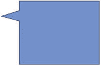

    图 6-11.
    合并操作后的弧形和矩形形状

    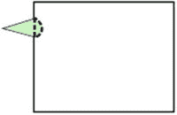

    图 6-10.
    合并操作前的弧形和矩形形状

    ```
    Arc pointer = new Arc(0, 0, 20, 20, -20, 40);
    pointer.setType(ArcType.ROUND);
    Rectangle msgRect = new Rectangle( 18, -20, 200.5, 150);
    Shape msgBubble = Shape.union(pointer, msgRect);
    ```

*   显示的弹出窗口将位于超链接的右侧。以下代码片段获取边界框的位置，并将其转换为屏幕坐标。弹出窗口显示在另一个窗口（`Stage`）中。

    ```
    carInfoLink.setOnAction(actionEvent -> {
    Bounds linkBounds = carInfoLink.localToScreen(carInfoLink.getBoundsInLocal());
    carInfoPopup.show(carInfoLink, linkBounds.getMaxX(), linkBounds.getMinY() -10);
    });
    ```

*   创建用于显示汽车信息的超链接后，我们返回到 `start()` 方法。代码创建一个复选框控件，用于切换汽车的前大灯。此代码创建了一个填充颜色为半透明黄色的弧形。
*   最后，`start()` 方法中的代码创建了两个按钮，用于让所选汽车向前或向后行驶。使用 `TranslateTransition` 动画来驱动汽车图片的移动。你将在第 7 章中学习动画，该章涵盖了 JavaFX 图形。

## 菜单

菜单是窗口化桌面应用程序允许用户选择选项的标准方式。例如，应用程序通常有一个“文件”菜单，提供保存或打开文件的选项（菜单项）。在窗口化环境中，用户使用鼠标导航并选择菜单项。菜单和菜单项通常还具有通过组合键选择选项的功能，也称为键盘快捷键。换句话说，组合键允许无需鼠标即可快速进行菜单选择。


### 创建菜单和菜单项

在探讨如何调用由选择菜单选项触发的代码之前，我们先来看看如何创建菜单。首先，你必须创建一个菜单栏（`javafx.scene.control.MenuBar`）对象，用于容纳一个或多个`javafx.scene.control.Menu`对象。每个`Menu`对象类似于一个树形层次结构，其中 Menu 对象可以包含 Menu 和 MenuItem（`javafx.scene.control.MenuItem`）对象。因此，一个菜单可以包含其他菜单作为子菜单或嵌套菜单。图 6-12 展示了一个包含“保存”菜单项的“文件”菜单。

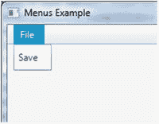

图 6-12.

一个包含简单“文件”菜单的菜单栏，该菜单含有一个“保存”菜单项

菜单项是 Menu 对象中的子选项。你可以将菜单项视为树结构中的叶节点（不包含子节点）。清单 6-15 是创建一个菜单栏的代码，该菜单栏包含一个“文件”菜单，其中有一个“保存”选项作为菜单项，如图 6-12 所示。

```
MenuBar menuBar = new MenuBar();
Menu fileMenu = new Menu("File");
fileMenu.getItems().add(new MenuItem("Save"));
menuBar.getMenus().add(fileMenu);
清单 6-15.
创建一个包含“文件”菜单（带有“保存”菜单项）的 MenuBar
```

虽然你可以创建像图 6-12 中那样的简单菜单项，但你可能需要更高级的选项，例如复选选项或单选按钮。基于继承层次结构，以下是`MenuItem`类的子类。下面的列表展示了可用的`MenuItem`子类，用作菜单选项。随后将对每个子类进行简要说明。

*   `CheckMenuItem`
*   `RadioMenuItem`
*   `CustomMenuItem`
*   `SeparatorMenuItem`
*   `Menu`

`CheckMenuItem`菜单项类似于复选框 UI 控件，允许用户可选地选择项目。`RadioMenuItem`菜单项类似于单选按钮 UI 控件，允许用户从一个项目组中仅选择一个项目。与你之前在按钮部分学到的相同，创建复选菜单和单选菜单的方式类似。

接下来是自定义菜单项，即`CustomMenuItem`类，它允许开发者创建自己专用的菜单项。例如，你可能希望有一个行为类似于切换按钮的菜单选项。

之后你会看到`SeparatorMenuItem`，它实际上是`CustomMenuItem`类型的一个派生类。`SeparatorMenuItem`是一个菜单项，用于显示一条视觉分隔线来分隔菜单项。

列表中最后一个是 Menu 类。由于`Menu`类是`MenuItem`的子类，它拥有一个`getItems().add()`方法，能够添加子项，例如其他`Menu`和`MenuItem`对象实例。

### 调用选中的 MenuItem

现在你已经知道如何构建菜单和菜单项，让我们看看如何调用附加到每个菜单项的代码。你会很高兴地知道，为菜单项连接处理程序代码的方式与连接 JavaFX 按钮完全相同，这意味着菜单项也有一个`setOnAction()`方法。`setOnAction()`方法接收一个类型为`EventHandler<ActionEvent>`的函数式接口，该接口是当菜单项被选中时调用的处理程序代码。

清单 6-16 展示了当“退出”菜单项被触发时，两种等效的动作代码实现。第一种实现使用了匿名内部类，第二种使用了 Java 8 的 lambda 表达式。一种更简洁的附加事件处理程序代码的方法是使用 lambda 函数式接口。

```
// 使用匿名内部类的实现
exitMenuItem.setOnAction(new EventHandler() {
@Override
public void handle(ActionEvent t) {
Platform.exit();
}
});
// 使用 lambda / 函数式接口的实现
exitMenuItem.setOnAction(ae -> Platform.exit());
清单 6-16.
实现动作被调用时的事件处理程序代码
```

### 示例：使用菜单

为了演示各种菜单选择场景，下一个代码示例模拟了一个安全警报应用程序。如图 6-13 所示，菜单栏显示了三个主菜单——文件、摄像头和警报。当选择“文件”菜单时，它会显示三个子菜单项选项——新建、保存和退出。

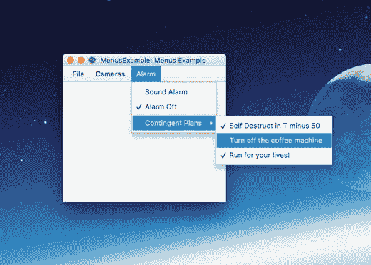

图 6-13.

模拟安全警报系统的菜单示例应用程序

清单 6-17 来自文件`MenuExample.java`，展示了演示菜单选择的相关代码。在执行代码之前，你可能想了解如何使用这个虚构的安全警报应用程序。

选择“摄像头”菜单会显示两个`CheckMenuItem`菜单项，你可以使用它们来选择性地显示摄像头 1 或摄像头 2。最后，“警报”菜单显示两个`RadioMenuItem`选项和一个子菜单“应急计划”。该子菜单显示三个子`CheckMenuItem`选项。

```
@Override
public void start(Stage primaryStage) {
primaryStage.setTitle("菜单示例");
BorderPane root = new BorderPane();
Scene scene = new Scene(root, 300, 250, Color.WHITE);
MenuBar menuBar = new MenuBar();
root.setTop(menuBar);
// 文件菜单 - 新建、保存、退出
Menu fileMenu = new Menu("文件");
MenuItem newMenuItem = new MenuItem("新建");
MenuItem saveMenuItem = new MenuItem("保存");
MenuItem exitMenuItem = new MenuItem("退出");
exitMenuItem.setOnAction(actionEvent -> Platform.exit() );
fileMenu.getItems().addAll(newMenuItem,
saveMenuItem,
new SeparatorMenuItem(),
exitMenuItem
);
// 摄像头菜单 - 摄像头 1、摄像头 2
Menu cameraMenu = new Menu("摄像头");
CheckMenuItem cam1MenuItem = new CheckMenuItem("显示摄像头 1");
cam1MenuItem.setSelected(true);
cameraMenu.getItems().add(cam1MenuItem);
CheckMenuItem cam2MenuItem = new CheckMenuItem("显示摄像头 2");
cam2MenuItem.setSelected(true);
cameraMenu.getItems().add(cam2MenuItem);
// 警报菜单
Menu alarmMenu = new Menu("警报");
// 发出警报或关闭警报
ToggleGroup tGroup = new ToggleGroup();
RadioMenuItem soundAlarmItem = new RadioMenuItem("发出警报");
soundAlarmItem.setToggleGroup(tGroup);
RadioMenuItem stopAlarmItem = new RadioMenuItem("关闭警报");
stopAlarmItem.setToggleGroup(tGroup);
stopAlarmItem.setSelected(true);
alarmMenu.getItems().addAll(soundAlarmItem,
stopAlarmItem,
new SeparatorMenuItem());
// 应急菜单选项
Menu contingencyPlans = new Menu("应急计划");
contingencyPlans.getItems().addAll(
new CheckMenuItem("倒计时 50 秒后自毁"),
new CheckMenuItem("关闭咖啡机"),
new CheckMenuItem("快逃命！"));
alarmMenu.getItems().add(contingencyPlans);
menuBar.getMenus().addAll(fileMenu, cameraMenu, alarmMenu);
primaryStage.setScene(scene);
primaryStage.show();
}
清单 6-17.
MenuExample.java 文件是一个假设的警报系统应用程序，演示了各种菜单项
```


### 工作原理

代码首先创建一个 `MenuBar` 控件，它可以包含一个到多个菜单（`MenuItem`）对象。创建 `MenuBar` 后，它被设置为 `BorderPane` 布局的顶部区域。由于顶部区域允许可调整大小的节点占据可用的水平空间，因此 `MenuBar` 控件将拉伸至 `BorderPane`（根场景）的宽度。清单 6-18 将 `BorderPane` 的顶部区域设置为容纳一个菜单栏。

```
MenuBar menuBar = new MenuBar();
BorderPane root = new BorderPane();
root.setTop(menuBar);
清单 6-18.
菜单栏被设置为根 BorderPane 的顶部区域节点
```

接下来，代码实例化包含一个或多个菜单项（`MenuItem`）对象以及其他 `Menu` 对象的 `Menu` 对象，从而创建子菜单。

创建“文件”菜单后，代码创建“摄像机”菜单。此菜单将包含 `CheckMenuItem` 对象。这些菜单项允许用户选择或取消选择“显示摄像机 1”和“显示摄像机 2”作为菜单项。

最后是“警报”菜单的实现，它包含两个单选菜单项（`RadioMenuItem`）、一个分隔符（`SeparatorMenuItem`）和一个子菜单（`Menu`）。为了创建“警报”菜单的单选菜单项，代码本身创建了一个 `ToggleGroup` 类的实例。`ToggleGroup` 类也用于常规单选按钮（`RadioButtons`），以仅允许选择一个选项。清单 6-19 创建了要添加到 `alarmMenu Menu` 对象中的单选菜单项（`RadioMenuItems`）。

```
// 警报菜单
Menu alarmMenu = new Menu("Alarm");
// 发出警报声或关闭警报
ToggleGroup tGroup = new ToggleGroup();
RadioMenuItem soundAlarmItem = new RadioMenuItem("Sound Alarm");
soundAlarmItem.setToggleGroup(tGroup);
RadioMenuItem stopAlarmItem = new RadioMenuItem("Alarm Off");
stopAlarmItem.setToggleGroup(tGroup);
stopAlarmItem.setSelected(true);
alarmMenu.getItems().addAll(soundAlarmItem, stopAlarmItem, new SeparatorMenuItem());
清单 6-19.
创建包含单选和分隔符菜单项的菜单项
```

代码还通过实例化一个 `SeparatorMenuItem` 类来添加视觉分隔符，该类通过 `getItems().addAll()` 方法添加到菜单中。`getItems()` 方法返回一个 `MenuItem` 对象的可观察列表（`ObservableList<MenuItem>`）。稍后你将了解 `ObservableList` 集合，简单来说，它们是能够在添加或移除项目时通知并更新 UI 控件的集合。有关完整描述，请参阅本章后面的“ObservableList 集合类”一节。

添加到“警报”菜单的最后一个子菜单项是一个名为“应急计划”的子菜单。为了增添一些趣味，我创建了一些幽默的菜单选项，用于在发生紧急情况时的应急计划。

### 选择菜单和菜单项的其他方式

在前面的示例中，你学习了如何使用鼠标创建和调用菜单项，但你是否知道还有其他调用菜单项的方法？在本节中，你将学习另外三种调用菜单项的方法：通过构建键盘助记符、组合键和上下文菜单。

#### 键盘助记符

标准菜单通常具有键盘助记符，以便在不使用鼠标的情况下选择菜单项。通常，使用菜单的应用程序允许用户按下 Alt 键，这会在菜单文本标签的某个字母下方显示下划线 (_)。用户按下该字母后，菜单将下拉显示其子菜单项，并且用户可以使用箭头键进行导航。请记住，此行为仅在 Windows 平台上有效。

要在代码中实现此行为，你可以像之前一样通过调用接收 `String` 值的构造函数来实例化一个菜单，但这次你需要在菜单或菜单项文本中所选字母前放置一个下划线字符。此外，为了让系统识别助记符，你只需将 `true` 传递给 `setMnemonicParsing(true)` 方法。清单 6-20 创建了一个使用字母“F”作为助记符的“文件”菜单。

```
Menu fileMenu = new Menu("_File");
fileMenu.setMnemonicParsing(true);
清单 6-20.
创建一个文件菜单，其助记符为字母“F”
```

#### 组合键

组合键是选择菜单选项的按键组合。例如，Windows 平台上的大多数应用程序使用组合键 Ctrl+S 来保存文件。在 MacOS 平台上，组合键是 Command (⌘)+S。诸如 Ctrl、Command、Alt、Shift 和 Meta 等键被称为修饰键。通常这些修饰键与单个字母组合按下。有时组合键也被称为键盘快捷键（映射到菜单项）。

要创建组合键，你需要一个 `KeyCodeCombination` 对象的实例，该对象将包含按键和修饰键。清单 6-21 提供了一个 (Ctrl 或 Meta)+S 的键码组合。你会注意到代码使用了 `KeyCombination.SHORTCUT_DOWN` 值作为键修饰符，而不是 `CONTROL_DOWN` 或 `META_DOWN`。原因很简单；`SHORTCUT_DOWN` 的值将使应用程序能够跨平台运行。`CONTROL_DOWN` 和 `META_DOWN` 值分别依赖于 Windows 和 MacOS 平台，但 `SHORTCUT_DOWN` 适用于所有平台。

```
MenuItem saveItem = new MenuItem("_Save");
saveItem.setMnemonicParsing(true);
saveItem.setAccelerator(new KeyCodeCombination(KeyCode.S, KeyCombination.SHORTCUT_DOWN));
清单 6-21.
一个映射到键盘快捷键 Ctrl+S（Windows）或 Command+S（Mac）的菜单项
```

#### 上下文菜单

上下文菜单是当用户在 JavaFX UI 控件或舞台表面右键单击鼠标时显示的弹出菜单。要创建上下文菜单，你需要实例化一个 `ContextMenu` 类。与常规菜单完全一样，`ContextMenu` 菜单有一个 `getItems().add()` 方法来添加菜单项。以下代码片段显示了一个实例化并带有一个菜单项（`exitItem`）的上下文菜单：

```
ContextMenu contextFileMenu = new ContextMenu(exitItem);
```

为了响应应用程序中场景上的鼠标右键单击，你可以添加一个事件处理程序来监听右键单击事件。一旦检测到，就会调用上下文菜单的 `show()` 方法。清单 6-22 中的代码设置了一个事件处理程序，分别根据鼠标右键或左键单击来显示和隐藏上下文菜单。注意由主鼠标按钮单击（左键单击）调用的 `hide()` 方法，用于移除上下文菜单。

```
primaryStage.addEventHandler(MouseEvent.MOUSE_CLICKED,
(MouseEvent me) -> {
if (me.getButton() == MouseButton.SECONDARY || me.isControlDown()) {
contextFileMenu.show(root, me.getScreenX(), me.getScreenY());
} else {
contextFileMenu.hide();
}
});
清单 6-22.
附加一个事件处理程序，该处理程序在 JavaFX 舞台上遇到鼠标右键单击事件时显示弹出菜单
```

要查看展示这些调用菜单的附加策略的完整代码清单，请访问本书网站下载名为 `KeyCombinationsAndContextMenus.java` 的项目。


## ObservableList 集合类

在使用 Java Collections API 时，你会注意到许多有用的容器类，它们代表了诸如集合、映射和列表等数据结构。其中一种常用的具体列表类是 `java.util.ArrayList`，它实现了 `List` 接口。长期以来，Java Swing 开发者使用 `ListModels` 和 `ArrayList` 来构建应用程序，以表示将在类似列表的 UI 控件中显示的对象列表。导致诸多困扰的问题在于同步列表模型和视图组件的能力。为了解决这个问题，你可以使用 JavaFX 的 `ObservableList` 类。`ObservableList` 类是一种集合，当对象被添加、更新和移除时，它能够通知 UI 控件。

以下是使用 `FXCollections.observableArrayList()` 函数将现有集合包装成可观察列表的方法：

```
List doctors = ...// 查询数据库
ObservableList obsDoctors = FXCollections.observableArrayList(doctors);
```

JavaFX 的 `ObservableList` 通常用于列表 UI 控件，例如 `ListView` 和 `TableView`。让我们看两个将使用 `ObservableList` 集合类的示例。要了解其他可观察集合（如映射、集合和数组），请参阅 API `javafx.collections.FXCollections` 的 Javadoc 文档。

## 使用 ListView

JavaFX 的 `ListView` 控件类似于 Java Swing 的 `JList` 组件。`ListView` 由一个可观察列表（`ObservableList`）支持。与 Java Swing 的 `ListModel` 类似，当修改可观察列表中的项目时，`ListView` 控件会自动更新其 UI 显示。以下代码创建了一个用于 `ListView` 控件的可观察列表。

```
ObservableList javafxers = FXCollections.observableArrayList(
"Carl Dea",
"Gerrit Grunwald",
"Mark Heckler",
"José Pereda",
"Sean Phillips");
ListView myListView = new ListView(javafxers);
```

这段代码展示了如何创建一个由 `String` 对象的可观察列表支持的 `ListView`。默认情况下，如果项目是字符串，`ListView` 会直接显示它们。但如果它们包含你创建的领域对象呢？答案是使用单元格工厂。你将在下一节关于 `TableView` 的内容中了解它们；现在，让我们看看如何操作可观察列表和 `ListView` 控件中的项目。

### 示例：英雄选择器

英雄选择器示例应用程序将演示 `ObservableList` 的功能；它显示两个 JavaFX `ListView` UI 控件，并允许用户在两个 `ListView` 控件之间传输项目。一个列表包含候选英雄，另一个列表包含已经成为英雄的人。如图 6-14 所示，此应用程序允许你选择一个候选人，将其转移到包含已选英雄的另一个 `ListView` 控件。

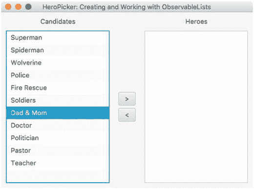

图 6-14.

英雄选择器应用程序，用于选择候选人作为英雄，以演示 ListView 控件

```
/**
* 英雄选择器应用程序演示可观察列表和列表视图。
* @author cdea
*/
public class HeroPicker extends Application {
@Override
public void start(Stage primaryStage) {
primaryStage.setTitle("HeroPicker: 创建和使用 ObservableLists");
BorderPane root = new BorderPane();
Scene scene = new Scene(root, 500, 350, Color.WHITE);
// 创建一个网格面板
GridPane gridpane = new GridPane();
gridpane.setPadding(new Insets(10));
gridpane.setHgap(10);
gridpane.setVgap(10);
gridpane.setPrefHeight(Double.MAX_VALUE);
ColumnConstraints column1 = new ColumnConstraints(150, 150, Double.MAX_VALUE);
ColumnConstraints column2 = new ColumnConstraints(50);
ColumnConstraints column3 = new ColumnConstraints(150, 150, Double.MAX_VALUE);
column1.setHgrow(Priority.ALWAYS);
column3.setHgrow(Priority.ALWAYS);
gridpane.getColumnConstraints().addAll(column1, column2, column3);
// 候选人标签
Label candidatesLbl = new Label("候选人");
GridPane.setHalignment(candidatesLbl, HPos.CENTER);
gridpane.add(candidatesLbl, 0, 0);
// 英雄标签
Label heroesLbl = new Label("英雄");
gridpane.add(heroesLbl, 2, 0);
GridPane.setHalignment(heroesLbl, HPos.CENTER);
// 候选人
ObservableList candidates = FXCollections.observableArrayList("超人",
"蜘蛛侠",
"金刚狼",
"警察",
"消防救援",
"士兵",
"爸爸妈妈",
"医生",
"政治家",
"牧师",
"教师");
ListView candidatesListView = new ListView(candidates);
gridpane.add(candidatesListView, 0, 1);
// 英雄
ObservableList heroes = FXCollections.observableArrayList();
ListView heroListView = new ListView(heroes);
gridpane.add(heroListView, 2, 1);
// 选择英雄
Button sendRightButton = new Button(" > ");
sendRightButton.setOnAction((ActionEvent event) -> {
String potential = candidatesListView.getSelectionModel().getSelectedItem();
if (potential != null) {
candidatesListView.getSelectionModel().clearSelection();
candidates.remove(potential);
heroes.add(potential);
}
});
// 取消选择英雄
Button sendLeftButton = new Button("  {
String notHero = heroListView.getSelectionModel().getSelectedItem();
if (notHero != null) {
heroListView.getSelectionModel().clearSelection();
heroes.remove(notHero);
candidates.add(notHero);
}
});
VBox vbox = new VBox(5);
vbox.getChildren().addAll(sendRightButton,sendLeftButton);
vbox.setAlignment(Pos.CENTER);
gridpane.add(vbox, 1, 1);
root.setCenter(gridpane);
GridPane.setVgrow(root, Priority.ALWAYS);
primaryStage.setScene(scene);
primaryStage.show();
}
public static void main(String[] args) {
launch(args);
}
}
清单 6-23.
英雄选择器应用程序演示 ObservableList 和 ListView 类
```

图 6-15 显示了清单 6-23（英雄选择器应用程序）的输出。

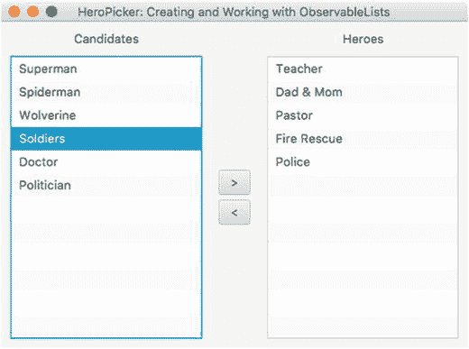

图 6-15.

英雄选择器应用程序的输出，演示了 ObservableList 和 ListView 类的使用


### 工作原理

本示例创建了一个图形用户界面应用程序，允许用户选择他们最喜欢的英雄。这与通过从列表框组件中添加或删除项目来管理用户角色的系统管理应用程序非常相似。在 JavaFX 中，代码示例使用了两个 `ListView` 控件来保存 `String` 对象。为简洁起见，我们不讨论布局的使用，而是直接跳转到与按钮操作和 `ListView` 控件相关的代码。

基于清单 6-23，在创建 `ListView` 实例之前，代码会创建一个包含候选列表的 `ObservableList`。这里你会注意到使用了一个名为 `FXCollections` 的工厂类，你可以将常见的集合类型传入其中，这些集合类型会被包装并以 `ObservableList` 的形式返回给调用者。在该示例中，一个字符串数组被传入 `FXCollections.observableArrayList()` 方法，而不是一个 `ArrayList`。使用 `ObservableList` 允许你通过一次方法调用同时更新数组中的项目列表和屏幕上的显示内容。

希望你已了解如何使用 `FXCollections` 类。下面的代码行调用了 `FXCollections.observableArrayList()` 方法类，以返回一个可观察列表（`ObservableList`）：

```
ObservableList candidates = FXCollections.observableArrayList(...);
```

代码创建 `ObservableList` 后，会使用一个接收该可观察列表的构造函数来实例化 `ListView` 类。以下代码创建并填充了一个 `ListView` 对象：

```
ListView candidatesListView = new ListView(candidates);
```

最后一项任务是代码像操作 `java.util.ArrayList` 一样操作 `ObservableList`。当它们被操作时，`ListView` 会收到通知并自动更新以反映 `ObservableList` 的变化。清单 6-24 实现了当用户按下向右发送（>）按钮时的动作事件代码。

```
// 选择英雄
Button sendRightButton = new Button(">");
sendRightButton.setOnAction( actionEvent -> {
String potential = candidatesListView.getSelectionModel().getSelectedItem();
if (potential != null) {
candidatesListView.getSelectionModel().clearSelection();
candidates.remove(potential);
heroes.add(potential);
}
});
清单 6-24.
处理选定项目的动作代码
```

为了设置按钮的动作代码，代码使用了一个以 `actionEvent`（`ActionEvent`）为参数的 lambda 表达式，该表达式在按钮被点击时调用。当按钮按下事件发生时，代码通过 `ListView` 上的 `getSelectionModel()` 方法确定 `ListView` 中哪个项目被选中。一旦确定了项目，代码会清除选择、移除该项目，并将该项目添加到 `Heroes ObserverableList` 中。如果你不清除选择，被移除项目之后的下一个项目将会被选中。

当使用 `ObserverableList` 时，移除或添加项目会通知控件。其妙处在于，当 `ObserverableList` 发生变化时，无需刷新 `ListView` UI 控件，因为 `ListView` 会自动更新。

## 使用 TableView

你还可以在其他类似列表的 UI 控件（如 `TableView`）中使用 `ObservableList`。JavaFX 的 `javafx.scene.control.TableView` 控件类似于 Swing 的 `JTable` 组件，它包含行、列和单元格，与电子表格应用程序非常相似。以下代码片段创建了一个 `TableView` 控件，其中包含一个针对领域对象 `firstName` 属性的列。

```
TableView employeeTableView = new TableView();
TableColumn firstNameCol = new TableColumn("First Name");
firstNameCol.setCellValueFactory(new PropertyValueFactory("firstName"));
```

### 什么是单元格工厂？

单元格工厂提供了一种自定义如何在单元格中显示内容的方法，例如 `ListView` 的一行或 `TableView` 控件中一列的单元格。清单 6-25 展示了如何创建一个单元格工厂，以在 `ListView` 的单元格行中显示 `Person` 对象的姓和名。

```
// 显示姓和名
personListView.setCellFactory(new Callback, ListCell>() {
@Override
public ListCell call(ListView param) {
Label leadLbl = new Label();
ListCell cell = new ListCell() {
@Override
public void updateItem(Person item, boolean empty) {
super.updateItem(item, empty);
if (item != null) {
leadLbl.setText(item.getAliasName());
setText(item.getFirstName() + " " + item.getLastName());
}
}
}; // ListCell
return cell;
}
}); // setCellFactory
清单 6-25.
为列表视图控件设置单元格工厂（回调）
```

当然，这段代码看起来有些冗长，因此清单 6-26 展示了使用更简洁的基于 lambda 语法的转换代码。

```
// 使用别名显示姓和名并带工具提示
personListView.setCellFactory(listView -> {
Label leadLbl = new Label();
ListCell cell = new ListCell() {
@Override
public void updateItem(Person item, boolean empty) {
super.updateItem(item, empty);
if (item != null) {
leadLbl.setText(item.getAliasName());
setText(item.getFirstName() + " " + item.getLastName());
}
}
}; // ListCell
return cell;
}); // setCellFactory
清单 6-26.
使用基于 Lambda 的语法设置单元格工厂以减少样板代码
```

### 使表格单元格可编辑

你是否曾希望能够修改单元格？JavaFX 的 `TableView` 控件及其单元格是可以编辑的。在设计 `TableView` 时，JavaFX 工程师已经考虑到了这一点，并提供了便捷的函数来实现可编辑单元格。

#### 将表格单元格编辑为文本字段

一种显而易见的可编辑单元格是允许用户使用 `textfield` 控件编辑与该单元格关联的信息。以下代码片段将一个列设置为可编辑的文本字段。

```
TableColumn aliasNameCol = new TableColumn("Alias");
aliasNameCol.setCellValueFactory(new PropertyValueFactory("aliasName"));
aliasNameCol.setCellFactory(TextFieldTableCell.forTableColumn());
```

图 6-16 显示了一个包含员工的 `TableView` 控件上“别名”列中的可编辑单元格。

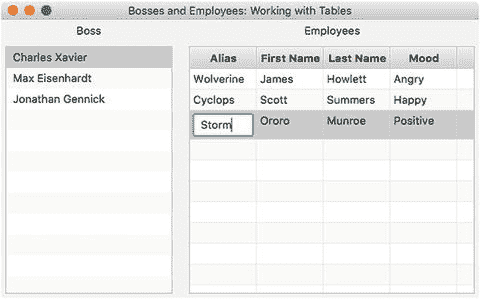

图 6-16.

使用文本字段修改员工信息的可编辑单元格。别名列使用 `TextFieldTableCell.forTableColumn()` 便捷函数设置了单元格工厂。

#### 将表格单元格编辑为组合框

另一种常见的编辑单元格控件是组合框。组合框允许用户以下拉列表选择的方式选择枚举值。以下代码片段将一个单元格列设置为组合框。图 6-17 显示了“心情”列单元格内的组合框。

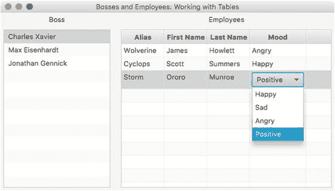

图 6-17.

使用组合框修改员工心情属性的可编辑单元格。心情列使用 `ComboBoxTableCell.forTableColumn()` 便捷函数设置了单元格工厂。

```
import static com.jfxbe.Person.MOOD_TYPES;
ObservableList moods = FXCollections.observableArrayList(MOOD_TYPES.values());
TableColumn moodCol = new TableColumn("Mood");
moodCol.setCellValueFactory(new PropertyValueFactory("mood"));
moodColumn.setCellFactory(ComboBoxTableCell.forTableColumn(moods));
```


### 示例：使用表格管理老板与员工

上一个示例在`ListView`中使用了字符串对象列表，而本节我们将使用通常称为 POJO（普通 Java 对象）的领域对象。请记住，在`ListView`和`TableView`控件中使用自定义领域对象时，需要为每一行或单元格定制对象字段的显示方式。

作为`TableView`控件的示例，我创建了一个名为“老板与员工”的应用程序，如图 6-18 所示。该示例应用程序演示了如何填充一个`TableView`，其中包含一个基于从`ListView`控件（左侧）选择老板的可观察员工列表（`Person`类）。在图 6-18 中，您还会注意到悬停在列表视图单元格（行）上时显示的工具提示。

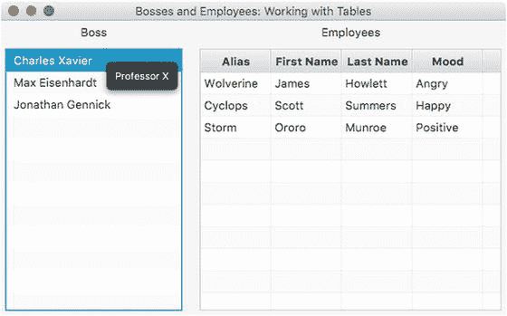

图 6-18.

“老板与员工”应用程序的输出，演示了 JavaFX 的`ListView`和`TableView`控件。可观察列表将包含`Person`类的领域对象。

#### 领域对象

在深入探讨主 GUI 代码之前，我们先研究一下代表一个人（`Person`）的领域对象，在本例中即老板或员工。清单 6-27 展示了一个 JavaFX bean（`Person`类）的实现，它代表将在`ListView`和`TableView`控件中显示的老板或员工。一个`Person`实例将包含以下属性：`aliasName`、`firstName`、`lastName`和`mood`。一个人还拥有一个员工列表，用于保存下属员工（手下）。处理列表视图选择以及填充表格视图功能的 GUI 代码见清单 6-28。

```
public class Person {
public enum MOOD_TYPES {
Happy,
Sad,
Angry,
Positive
}
private StringProperty aliasName;
private StringProperty firstName;
private StringProperty lastName;
private ObjectProperty mood;
private ObservableList employees = FXCollections.observableArrayList();
public Person(String alias, String firstName, String lastName, MOOD_TYPES mood) {
setAliasName(alias);
setFirstName(firstName);
setLastName(lastName);
setMood(mood);
}
public final void setAliasName(String value) {
aliasNameProperty().set(value);
}
public final String getAliasName() {
return aliasNameProperty().get();
}
public StringProperty aliasNameProperty() {
if (aliasName == null) {
aliasName = new SimpleStringProperty();
}
return aliasName;
}
public final void setFirstName(String value) {
firstNameProperty().set(value);
}
public final String getFirstName() {
return firstNameProperty().get();
}
public StringProperty firstNameProperty() {
if (firstName == null) {
firstName = new SimpleStringProperty();
}
return firstName;
}
public final void setLastName(String value) {
lastNameProperty().set(value);
}
public final String getLastName() {
return lastNameProperty().get();
}
public StringProperty lastNameProperty() {
if (lastName == null) {
lastName = new SimpleStringProperty();
}
return lastName;
}
public final void setMood(MOOD_TYPES value) {
moodProperty().set(value);
}
public final MOOD_TYPES getMood() {
return moodProperty().get();
}
public ObjectProperty moodProperty() {
if (mood == null) {
mood = new SimpleObjectProperty(MOOD_TYPES.Happy);
}
return mood;
}
public ObservableList employeesProperty() {
return employees;
}
}
清单 6-27.
在可观察列表中用作 JavaFX Bean 的 Person 类
```

#### GUI 代码

现在您已经了解了领域对象（`Person`）的参与，让我们来看看填充和显示数据的 GUI 代码。清单 6-28 展示了`BossesAndEmployees.java`文件，其中包含填充代表老板的`ListView`控件的主要 GUI 代码。其余代码还负责在用户选择某个老板时，填充右侧的`TableView`控件。

在清单 6-28 中，GUI 代码以编程方式布局控件，而非通过 Scene Builder 工具使用 FXML。本章的代码示例主要采用编程方式，这通常被认为是不良实践，因为 GUI 代码与控制器代码耦合在一起。然而，我认为依赖工具构建 GUI 代码往往会隐藏内部机制，从而阻碍您学习底层实际工作原理。要了解如何使用 FXML 视图和控制器类，请参阅关于布局和 Scene Builder 的第 5 章。


```java
package com.jfxbe;
import javafx.application.Application;
import javafx.collections.FXCollections;
import javafx.collections.ObservableList;
import javafx.geometry.HPos;
import javafx.geometry.Insets;
import javafx.scene.Scene;
import javafx.scene.control.*;
import javafx.scene.control.cell.ComboBoxTableCell;
import javafx.scene.control.cell.PropertyValueFactory;
import javafx.scene.control.cell.TextFieldTableCell;
import javafx.scene.layout.BorderPane;
import javafx.scene.layout.GridPane;
import javafx.scene.paint.Color;
import javafx.stage.Stage;
import static com.jfxbe.Person.MOOD_TYPES;
import static com.jfxbe.Person.MOOD_TYPES.*;
/**
* 一个 JavaFX 示例应用程序，用于演示
* ListView 和 TableView 中使用的可观察列表。
* 同时演示了使用具有属性作为属性的领域对象。
*
* 老板和员工
* @author cdea
*/
public class BossesAndEmployees extends Application {
@Override
public void start(Stage primaryStage) {
primaryStage.setTitle("老板和员工：使用表格");
BorderPane root = new BorderPane();
Scene scene = new Scene(root, 630, 250, Color.WHITE);
// 创建一个网格面板
GridPane gridpane = new GridPane();
gridpane.setPadding(new Insets(20));
gridpane.setHgap(10);
gridpane.setVgap(10);
root.setCenter(gridpane);
// 候选人标签
Label candidatesLbl = new Label("老板");
GridPane.setHalignment(candidatesLbl, HPos.CENTER);
gridpane.add(candidatesLbl, 0, 0);
// 老板列表
ObservableList bosses = getPeople();
final ListView leaderListView = new ListView(bosses);
leaderListView.setPrefWidth(150);
leaderListView.setMinWidth(200);
leaderListView.setMaxWidth(200);
leaderListView.setPrefHeight(Integer.MAX_VALUE);
// 显示名字和姓氏，并使用别名作为工具提示
leaderListView.setCellFactory(listView -> {
Tooltip tooltip = new Tooltip();
ListCell cell = new ListCell() {
@Override
public void updateItem(Person item, boolean empty) {
super.updateItem(item, empty);
if (item != null) {
setText(item.getFirstName() + " " + item.getLastName());
tooltip.setText(item.getAliasName());
setTooltip(tooltip);
}
}
}; // ListCell
return cell;
}); // setCellFactory
gridpane.add(leaderListView, 0, 1);
Label emplLbl = new Label("员工");
gridpane.add(emplLbl, 2, 0);
GridPane.setHalignment(emplLbl, HPos.CENTER);
TableView employeeTableView = new TableView();
employeeTableView.setEditable(true);
employeeTableView.setPrefWidth(Integer.MAX_VALUE);
ObservableList teamMembers = FXCollections.observableArrayList();
employeeTableView.setItems(teamMembers);
TableColumn aliasNameCol = new TableColumn("别名");
aliasNameCol.setCellValueFactory(new PropertyValueFactory("aliasName"));
aliasNameCol.setCellFactory(TextFieldTableCell.forTableColumn());
TableColumn firstNameCol = new TableColumn("名字");
firstNameCol.setCellValueFactory(new PropertyValueFactory("firstName"));
firstNameCol.setCellFactory(TextFieldTableCell.forTableColumn());
TableColumn lastNameCol = new TableColumn("姓氏");
lastNameCol.setCellValueFactory(new PropertyValueFactory("lastName"));
lastNameCol.setCellFactory(TextFieldTableCell.forTableColumn());
TableColumn moodCol = new TableColumn("心情");
moodCol.setCellValueFactory(new PropertyValueFactory("mood"));
ObservableList moods = FXCollections.observableArrayList(MOOD_TYPES.values());
moodCol.setCellFactory(ComboBoxTableCell.forTableColumn(moods));
moodCol.setPrefWidth(100);
employeeTableView.getColumns().add(aliasNameCol);
employeeTableView.getColumns().add(firstNameCol);
employeeTableView.getColumns().add(lastNameCol);
employeeTableView.getColumns().add(moodCol);
gridpane.add(employeeTableView, 2, 1);
// 选择监听
leaderListView.getSelectionModel()
.selectedItemProperty()
.addListener((observable, oldValue, newValue) -> {
if (observable != null && observable.getValue() != null) {
teamMembers.clear();
teamMembers.addAll(observable.getValue().employeesProperty());
}
});
primaryStage.setScene(scene);
primaryStage.show();
}
private ObservableList getPeople() {
ObservableList people = FXCollections.observableArrayList();
Person docX = new Person("X 教授", "查尔斯", "泽维尔", Positive);
docX.employeesProperty().add(new Person("金刚狼", "詹姆斯", "豪利特", Angry));
docX.employeesProperty().add(new Person("镭射眼", "斯科特", "萨默斯", Happy));
docX.employeesProperty().add(new Person("暴风女", "奥萝洛", "门罗", Positive));
Person magneto = new Person("万磁王", "马克斯", "艾森哈特", Sad);
magneto.employeesProperty().add(new Person("红坦克", "凯恩", "马可", Angry));
magneto.employeesProperty().add(new Person("魔形女", "瑞文", "达克霍姆", Sad));
magneto.employeesProperty().add(new Person("剑齿虎", "维克多", "克里德", Angry));
Person biker = new Person("山地车手", "乔纳森", "詹尼克", Positive);
biker.employeesProperty().add(new Person("MkHeck", "马克", "赫克勒", Happy));
biker.employeesProperty().add(new Person("Hansolo", "格里特", "格伦瓦尔德", Positive));
biker.employeesProperty().add(new Person("Doc", "何塞", "佩雷达", Happy));
biker.employeesProperty().add(new Person("宇航员", "肖恩", "菲利普斯", Positive));
biker.employeesProperty().add(new Person("CarlFX", "卡尔", "迪亚", Happy));
people.add(docX);
people.add(magneto);
people.add(biker);
return people;
}
public static void main(String[] args) {
launch(args);
}
}
清单 6-28.
创建包含 ListView 和 TableView 控件（用于管理老板和员工）的网格面板的主 GUI 代码
```


#### 工作原理

为了增添趣味性，我创建了一个简单的 GUI 应用程序，用于显示老板及其下属。请注意，图 6-19 左侧是重要人物（老板）列表，右侧是下属。当您点击选择一位老板时，其下属将显示在 `TableView` 控件中。您还会注意到，当鼠标悬停在选中的老板上时，会弹出工具提示。

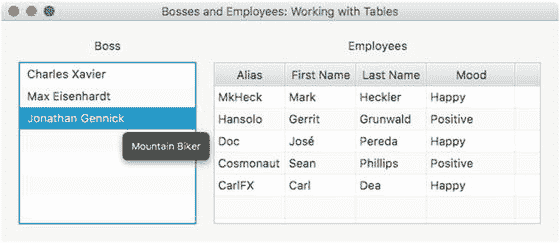

图 6-19.

“老板与下属”应用程序演示了 `ListView` 和 `TableView` 控件。请注意，当鼠标悬停在列表视图中的老板上时，会显示工具提示。

清单 6-28 首先设置场景，以 `GridPane` 作为主节点，用于布局和定位 `ListView` 和 `TableView` 控件。

在讨论 `TableView` 控件之前，您需要了解 `ListView` 控件负责更新 `TableView` 的职责。正如之前关于清单 6-28 中可观察列表的讨论，代码通过私有方法 `getPeople()` 填充一个包含所有老板的 `ObservableList`，并将其传递给 `ListView` 控件的构造函数。以下代码摘自清单 6-28，展示了如何使用包含领域对象的可观察列表来构造一个 `ListView`。

```
// 领导列表
ObservableList leaders = getPeople();
ListView leaderListView = new ListView(leaders);
```

接下来，代码通过 `setCellFactory()` 方法实例化一个单元格工厂，以便在 `ListView` 控件的单元格中正确显示人员姓名。由于每个项目不是字符串，而是 `Person` 对象，因此 `ListView` 不知道如何渲染 `ListView` 控件中的每一行（单元格）。为了告知 `ListView` 应从 `Person` 对象中使用哪些属性，代码简单地通过指定 `ListView<Person>` 和 `ListCell<Person>` 数据类型，创建了一个 `javafx.util.Callback` 泛型对象。

```
// 使用别名显示姓名和工具提示
leaderListView.setCellFactory(new Callback, ListCell>() {
@Override
public ListCell call(ListView param) {
Label leadLbl = new Label();
Tooltip tooltip = new Tooltip();
ListCell cell = new ListCell() {
@Override
public void updateItem(Person item, boolean empty) {
super.updateItem(item, empty);
if (item != null) {
leadLbl.setText(item.getAliasName());
setText(item.getFirstName() + " " + item.getLastName());
tooltip.setText(item.getAliasName());
setTooltip(tooltip);
}
}
}; // ListCell
return cell;
}
}); // setCellFactory
```

您可能对创建 `Callback` 接口的复杂匿名内部类感到相当畏惧。幸好，Java 8 引入了 lambda 表达式，因为样板代码可以简化和重写，如清单 6-29 所示。

```
leaderListView.setCellFactory(listView -> {
Label leadLbl = new Label();
Tooltip tooltip = new Tooltip();
ListCell cell = new ListCell() {
@Override
public void updateItem(Person item, boolean empty) {
super.updateItem(item, empty);
if (item != null) {
leadLbl.setText(item.getAliasName());
setText(item.getFirstName() + " " + item.getLastName());
tooltip.setText(item.getAliasName());
setTooltip(tooltip);
}
}
}; // ListCell
return cell;
}); // setCellFactory
清单 6-29.
call 方法在 ListView 控件中显示老板姓名，并附带显示别名的工具提示弹出框
```

在清单 6-28 所示的 `call()` 方法中，有一个类型为 `ListCell<Person>` 的变量 `cell`，代码在其中创建了一个匿名内部类。该内部类必须实现 `updateItem()` 方法。`updateItem()` 方法的任务是获取每个人的信息，然后更新一个 `Label` 控件（`leadLbl`）。该标签会显示在 `ListView` 控件的每个单元格行中。`updateItem()` 方法最后做的一件事是为每个单元格行添加一个工具提示弹出框（`Tooltip`）。当光标悬停在 `ListView` 中的单元格（老板）上时，工具提示会弹出。更新单元格后，返回 `cell` 变量。

最后，代码创建一个 `TableView` 控件，用于根据从 `ListView` 控件中选择的老板来显示其下属。在创建 `TableView` 控件时，代码首先创建列标题，如清单 6-28 所示。

通过设置 JavaFX bean 属性名称（对应领域对象），创建 `FirstName` 表格列。

```
TableColumn firstNameCol = new TableColumn("First Name");
firstNameCol.setCellValueFactory(new PropertyValueFactory("firstName"));
```

创建列后，您会注意到 `setCellValueFactory()` 方法，它负责调用 `Person` bean 的属性。当下属列表被放入 `TableView` 时，它将知道如何提取属性以放置到表格的每个单元格列中。基于 JavaBean 约定，使用 bean 属性名称（`firstName`）创建一个新的 `PropertyValueFactory` 实例。

设置好列之后，代码将为 `TableView` 列设置单元格工厂，以允许用户编辑单元格，这也会更新下属（`Person`）的字段。代码将使“别名”列成为可编辑的文本字段，使“心情”列成为可编辑的组合框。

最后是 `ListView` 上选择监听器的实现。在代码中，您会注意到 `getSelectionModel().selectedItemProperty()` 方法（显示在清单 6-28 末尾），它允许添加一个监听器。代码简单地创建并添加一个 `ChangeListener` 来处理选择事件。当用户选择一位老板时，`TableView` 会被清空，并填充所选老板的下属。实际上，这是 `ObservableList` 的魔力，它通知 `TableView` 发生了变化。清空并填充 `TableView` 的代码摘自清单 6-28，如下所示：

```
teamMembers.clear();
teamMembers.addAll(observable.getValue().employeesProperty());
```

## 生成后台进程

通常，在具有长时间运行进程的桌面应用程序中，视觉反馈应指示正在发生某些事情，或建议用户耐心等待。GUI 开发的主要陷阱之一是难以知道何时以及如何将工作委托给工作线程。为了避免这些陷阱，GUI 开发人员不断被提醒线程安全问题，尤其是在高负载期间阻塞 UI 线程时。JavaFX 提供了 UI 控件，通过将工作卸载到不同的线程（`Task`）来帮助解决此问题，同时提供正在执行的工作的反馈或进度指示器。


### 创建后台任务

JavaFX API 可以在后台线程上执行工作，这些工作被称为任务（`javafx.concurrent.Task`）。这些任务是一次性的，会在某个线程上执行。`Task` 类是 Java 并发库中 `Runnable` 和 `Future` 接口的子类。

Java Future 的优点是能够在执行代码时提供异步行为。换句话说，当你执行任务时，它不会阻塞。当使用 `ExecutorService` 的 `submit()` 方法时，会向调用者返回一个 future 对象。可以定期检查该 future 对象，以确定任务是否完成或是否发生错误。清单 6-30 展示了一个为执行任务而创建的简单线程池。

```
Task worker = new Task() {
@Override
protected Boolean call() throws Exception {
for (int i=0; i<100; i++) {
// 一些繁重的工作（不在 UI 线程上）
updateMessage("进度文本");
updateProgress(i, 100);
}
return true;
}
};
ExecutorService threadPool = threadPool = Executors.newFixedThreadPool(2);
Future future = threadPool.submit(worker);
清单 6-30.
为执行工作线程任务而创建的线程池
```

你注意到清单 6-30 中的 `call()` 方法包含两个方法——`updateMessage()` 和 `updateProgress()` 了吗？这些方法通过更新当前运行任务的状态或进度信息来提供帮助。接下来，你将看到一个示例应用程序，它将模拟一个显示文件复制进度的对话框窗口。

### 示例：文件复制进度对话框（后台进程）

为了演示一个生成后台进程同时向用户提供反馈的 GUI 应用程序，我创建了一个示例应用程序，它模拟了一个可视化显示多个文件复制进度的对话框窗口。图 6-20 从左到右描绘了一个进度条和一个进度指示器（饼图）。进度指示器在指示图标下方显示一个百分比。当进程仍在执行时，用户可以单击“取消”按钮来取消或终止任务。


图 6-20.

一个模拟文件复制过程的窗口，使用进度条和进度指示器向用户提供反馈

以下是此示例中使用的主要类：

*   `javafx.scene.control.ProgressBar`
*   `javafx.scene.control.ProgressIndicator`
*   `javafx.concurrent.Task`

清单 6-31 展示了一个代码示例，该示例使用 JavaFX 的进度条和进度指示器 UI 控件，在复制文件时向用户提供反馈。

```
public class BackgroundProcesses extends Application {
static Task copyWorker;
final int numFiles = 30;
private ExecutorService threadPool;
/**
* @param args the command line arguments
*/
public static void main(String[] args) {
Application.launch(args);
}
@Override
public void init() throws Exception {
super.init();
threadPool = Executors.newFixedThreadPool(1);
}
@Override
public void stop() throws Exception {
super.stop();
threadPool.shutdown();
}
@Override
public void start(Stage primaryStage) {
primaryStage.setTitle("BackgroundProcesses: 后台进程");
Group root = new Group();
Scene scene = new Scene(root, 330, 120, Color.WHITE);
BorderPane mainPane = new BorderPane();
mainPane.layoutXProperty()
.bind(scene.widthProperty()
.subtract(mainPane.widthProperty())
.divide(2));
root.getChildren().add(mainPane);
Label label = new Label("文件传输:");
ProgressBar progressBar = new ProgressBar(0);
ProgressIndicator progressIndicator = new ProgressIndicator(0);
HBox hb = new HBox();
hb.setSpacing(5);
hb.setAlignment(Pos.CENTER);
hb.getChildren().addAll(label, progressBar, progressIndicator);
mainPane.setTop(hb);
Button startButton = new Button("开始");
Button cancelButton = new Button("取消");
TextArea textArea = new TextArea();
textArea.setEditable(false);
textArea.setPrefSize(200, 70);
HBox hb2 = new HBox();
hb2.setSpacing(5);
hb2.setAlignment(Pos.CENTER);
hb2.getChildren().addAll(startButton, cancelButton, textArea);
mainPane.setBottom(hb2);
// 连接开始按钮
startButton.setOnAction((ActionEvent event) -> {
startButton.setDisable(true);
progressBar.setProgress(0);
progressIndicator.setProgress(0);
textArea.setText("");
cancelButton.setDisable(false);
copyWorker = createWorker(numFiles);
// 连接进度条
progressBar.progressProperty().unbind();
progressBar.progressProperty().bind(copyWorker.progressProperty());
progressIndicator.progressProperty().unbind();
progressIndicator.progressProperty().bind(copyWorker.progressProperty());
// 追加到文本框
copyWorker.messageProperty()
.addListener((observable, oldValue, newValue) ->
textArea.appendText(newValue + "\n")
);
threadPool.submit(copyWorker);
});
// 取消按钮将终止工作线程并重置。
cancelButton.setOnAction((ActionEvent event) -> {
startButton.setDisable(false);
cancelButton.setDisable(true);
copyWorker.cancel(true);
// 重置
progressBar.progressProperty().unbind();
progressBar.setProgress(0);
progressIndicator.progressProperty().unbind();
progressIndicator.setProgress(0);
textArea.appendText("文件传输已被取消。");
});
cancelButton.setDisable(true);
primaryStage.setScene(scene);
primaryStage.show();
}
private Task createWorker(final int numFiles) {
return new Task() {
@Override
protected Boolean call() throws Exception {
for (int i = 0; i < numFiles; i++) {
long elapsedTime = System.currentTimeMillis();
copyFile("某个文件", "某个目标文件");
elapsedTime = System.currentTimeMillis() - elapsedTime;
String status = elapsedTime + " 毫秒";
// 排队更新状态
updateMessage(status);
updateProgress(i + 1, numFiles); // (进度, 最大值)
}
return true;
}
};
}
private void copyFile(String src, String dest) throws InterruptedException {
// 模拟长时间操作
Random rnd = new Random(System.currentTimeMillis());
long millis = rnd.nextInt(1000);
Thread.sleep(millis);
}
}
清单 6-31.
一个演示后台进程的示例应用程序
```


### 工作原理

清单 6-31 中的代码首先创建了两个进度控件（而非一个），用于向用户展示正在进行的工作。接着，代码通过私有的 `createWorker()` 方法创建了一个工作线程。`createWorker()` 便捷方法实例化并返回一个 `javafx.concurrent.Task` 对象，该对象类似于 Java Swing 中的 `SwingWorker` 类。与 `SwingWorker` 类不同，`Task` 对象因其事件驱动设计而大大简化且更易于使用。例如，`Task` 对象能够异步更新进度。

在创建 `Task` 对象的实例时，代码实现了 `call()` 方法以在后台执行工作。在工作进行过程中，你通常希望将中间结果（如进度或文本信息）加入队列，以便向用户提供反馈。为了将信息加入队列，API 允许你调用 `updateProgress()` 或 `updateMessage()` 方法。这些方法以线程安全的方式更新信息，使得进度属性的观察者能够安全地更新 GUI，而不会阻塞 GUI 线程。清单 6-32 将消息加入队列并显示进度。

```
// 将状态加入队列
updateMessage(status);
updateProgress(i + 1, numFiles); // (进度, 最大进度)
清单 6-32.
在不阻塞进度 UI 控件的情况下更新文本消息和进度
```

创建工作任务后，代码会解除绑定之前绑定到进度控件的所有旧任务。一旦进度控件解除绑定，代码便将进度控件绑定到新创建的名为 `copyWorker` 的 `Task` 对象。清单 6-33 将新的 `Task` 对象重新绑定到进度 UI 控件。

```
// 连接进度条
progressBar.progressProperty().unbind();
progressBar.progressProperty().bind(copyWorker.progressProperty());
progressIndicator.progressProperty().unbind();
progressIndicator.progressProperty().bind(copyWorker.progressProperty());
清单 6-33.
任务使用后，进度控件需要重新绑定到新任务
```

接下来，请注意代码实现了一个 `ChangeListener`，用于将队列中的结果追加到 `TextArea` 控件中。JavaFX 属性的另一个显著特点是，你可以像 Java Swing 组件一样附加多个监听器。最后，工作线程和控件全部连接完毕，以生成一个在后台运行的线程。以下代码行展示了如何启动一个 `Task` 工作线程。

```
new Thread(copyWorker).start();
```

这段代码最后连接了“取消”按钮。该按钮仅调用 `Task` 对象的 `cancel()` 方法来终止进程。任务取消后，进度控件会被重置。一旦工作任务被取消，它便无法重复使用。这就是“开始”按钮需要重新创建新任务的原因。如果你需要一个更健壮的可重用解决方案，请查看 `javafx.concurrent.Service` 类。

## 总结

本章从学习标签和自定义字体开始，例如使用第三方库 `FontAwesomeFX`。在学习标签之后，你通过一个有趣的动画游戏精灵示例，深入了解了各种按钮控件。

学习常用按钮控件后，你了解了如何创建标准菜单和菜单栏。通过创建菜单，你学会了编写处理代码来响应菜单项的选择。然后，你能够将组合键或键盘快捷键映射到菜单选项。你还学习了如何创建通过右键单击场景图来调用的上下文菜单。通过多种创建菜单和菜单项的方式，你运行了一个模拟安全警报应用程序的示例程序。

最后，你接触到了 `ObservableList` 集合，它支持显示诸如 `ListView` 和 `TableView` 节点等 UI 控件。通过学习 UI 控件 `ListView` 和 `TableView`，你得以使用领域对象来填充列表单元格和表格列单元格。你还学习了如何使用文本字段和组合框使表格视图的列单元格可编辑。

最后，你学习了 JavaFX 的 `Task` API，它使你能够在更新任务状态的同时异步执行代码。你还学习了如何将任务绑定到进度类型的控件 `ProgressBar` 和 `ProgressIndicator`。借助 `ProgressBar` 和 `ProgressIndicator`，你运行了一个模拟后台工作线程复制文件并更新进度的示例。

