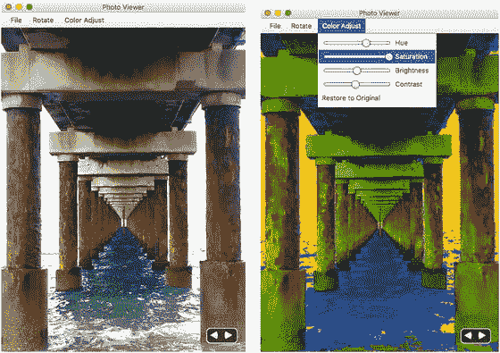
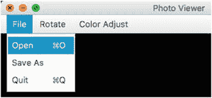
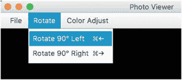
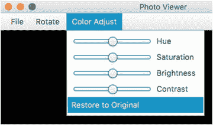
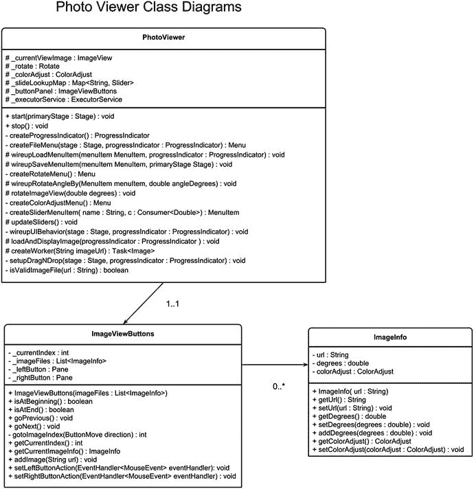

# 7. 图形

你是否曾听人说过“当两个世界碰撞”？这个表达通常用于描述来自不同背景或文化的人陷入冲突，必须面对艰难抉择的情况。在构建需要图形或动画的 GUI 应用程序时，我们常常会处于商业世界与游戏世界的碰撞航线上。换句话说，在开发应用程序时，能够很好地平衡商业应用的 UI 方面和类似电子游戏的效果是件好事。

在不断变化的富互联网应用（RIA）世界中，你可能已经注意到动画的使用越来越多，例如脉冲按钮、过渡效果、移动背景等。GUI 应用程序可以使用动画来提供视觉提示，让用户知道下一步该做什么。借助 JavaFX，你将能够两全其美，既能创建吸引人的图形，也能处理处理业务交易的表单式应用程序。

在本章中，你将学习 JavaFX 图形的基础知识，例如显示和操作图像。此外，在本章中你还将学习高级动画 API。系好安全带；你将发现将酷炫的游戏式界面集成到日常应用程序中的解决方案。

在本章中，你将了解以下内容：

*   加载和显示图像
*   后台任务
*   进度指示器
*   更改图像的颜色设置
*   将位图图像写入磁盘
*   拖放图像文件
*   使用关键值、关键帧和时间线进行动画制作
*   动画过渡类
*   顺序和并行过渡

## 使用图像

JavaFX 的另一个强大功能是能够在场景图上显示标准图像文件格式。在本节中，你将学习如何加载、显示、缩放和旋转图像。额外福利是，你还将学习如何轻松更改图像的色彩属性，例如色调、饱和度、亮度和对比度。

在学习 JavaFX `Image` 和 `ImageView` API 的基础知识后，你将探索一个照片查看器应用程序的示例。这个有趣的应用程序允许你缩放、旋转和操作图像。


### 加载图像

你可能已经了解互联网上许多标准的图像文件格式，例如 `.jpg`、`.png`、`.gif` 和 `.bmp`。为了加载这些标准图像文件格式，JavaFX 提供了 `javafx.scene.image.Image` API。`Image` 类拥有许多便捷的构造方法，便于实现不同的加载策略，如下表所示：

*   `Image(java.io.InputStream inputStream)`
*   `Image(java.io.InputStream is, double requestedWidth, double requestedHeight, boolean preserveRatio, boolean smooth)`
*   `Image(java.lang.String url)`
*   `Image(java.lang.String url, boolean backgroundLoading)`
*   `Image(java.lang.String url, double requestedWidth, double requestedHeight, boolean preserveRatio, boolean smooth)`
*   `Image(java.lang.String url, double requestedWidth, double requestedHeight, boolean preserveRatio, boolean smooth, boolean backgroundLoading)`

如你所见，所有构造方法中只有少数几个通用参数，它们以不同的组合方式用于不同的加载场景。表 7-1 简要描述了每个参数。

表 7-1.

加载 `javafx.scene.image.Image` 类图像时的通用参数

| 参数 | 数据类型 | 描述 |
| --- | --- | --- |
| `inputStream` | `java.io.InputStream` | 输入流，例如来自文件或网络。 |
| `url` | `String` | 图像的 URL 位置，例如本地文件系统上的文件或托管图像文件的 Web 服务器。 |
| `backgroundLoading` | `boolean` | 在后台加载图像（脱离 JavaFX 应用程序线程）。 |
| `requestedWidth` | `double` | 指定图像的边界框宽度。 |
| `requestedHeight` | `double` | 指定图像的边界框高度。 |
| `preserveRatio` | `boolean` | 保持图像在边界框内的宽高比。 |
| `smooth` | `boolean` | 值为 `true` 表示使用更好的算法来平滑图像，但速度可能较慢；否则将使用较低质量的算法，渲染像素更快。 |

为了演示如何加载图像，清单 7-1 展示了三种加载图像的方式。该代码清单演示了从本地文件系统、类路径以及远程主机系统（如 Web 服务器）加载图像。

```
try {
// 当前线程上下文不应是 GUI 线程。
// 从 Windows 文件系统加载图像
File file = new File("C:\\Users\\jdoe\\Pictures\\myphoto.jpg");
String localUrl = file.toURI().toURL().toString();
// 不在后台加载（阻塞）
Image localImage = new Image(localUrl, false);
// 从 jar 文件中的类路径加载图像
String urlStr = this.getClass()
.getClassLoader()
.getResource("images/myphoto.jpg")
.toExternalForm();
// 在后台加载（非阻塞）
Image cpUrl = new Image(urlStr, true);
// 从 Web 服务器加载图像
String remoteUrl = "http://mycompany.com/myphoto.jpg";
// 在后台加载（非阻塞）
Image remoteImage = new Image(remoteUrl, true);
System.out.println(localUrl);  // file:/C:/Users/jdoe/Pictures/myphoto.jpg
System.out.println(cpUrl);     // jar:file:/myApp.jar!/images/myphoto.jpg
System.out.println(remoteUrl); // http://mycompany.com/myphoto.jpg
// ... 其余代码
} catch (MalformedURLException ex) {
ex.printStackTrace();
}
清单 7-1.
从文件系统、类路径和远程 Web 服务器加载图像
```

此清单演示了如何使用接收图像 `URL` 路径和一个 `boolean` 参数的构造方法，来决定是否在后台线程中加载图像。由于构造方法必须接受一个 `URL` 对象，因此文件路径必须转换为 URL 对象（URL 规范）。

清单 7-1 首先使用一个基于包含图像路径位置的字符串的 `File` 对象，从本地文件系统加载图像。在此场景中，我指定了一个基于 Microsoft Windows 的绝对文件路径。在这里你会注意到，表示 Windows 操作系统上文件路径的字符串中使用了双反斜杠。第一个反斜杠用于在 Java 字符串中转义反斜杠字符。`toURL()` 方法会将文件系统路径转换为标准的 `URL` 格式字符串。好处在于，该方法调用会将绝对文件路径转换为标准统一资源定位符规范的格式。该字符串将包含表示协议和路径信息的前缀 `file:`。

与本地文件系统类似，从 Java 类路径或资源目录加载图像文件也是如此。假设应用程序被构建为可执行的 JAR，清单 7-1 中的示例将协议显示为 `jar:file:`，表示 JAR 归档文件内的文件。请特别注意使用 `getClassLoader()` 方法的代码。某些环境（如 OSGi 平台）会在其自身的上下文（也称为 bundle）中使用独立的类加载器。通过使用 `getClassLoader()` 方法，代码可以安全地从正确的类加载器上下文中获取资源。例如，如果项目有一个包含图像文件的资源目录，你可以像下面这样基于类路径加载资源：

```
src/
+--main/
+----java/
+-------com/
+---------mycompany/
+-----------MyClass.java
+----resources/
+-------com/
+---------mycompany/
+-----------my_image.jpg
String urlStr = MyClass.class
.getClassLoader()
.getResource("com/mycompany/my_image.jpg")
.toExternalForm();
```

在这个例子中，你会注意到资源字符串 `com/mycompany/my_image.jpg` 的开头包含了路径信息。有时项目会将所有图像图标放在一个名为 `images` 的目录中，或者放在包命名空间内。

回到清单 7-1 中的代码，最后一种策略是一个示例，展示了加载托管在远程 Web 服务器上的图像的能力。你可以看到，代码还使用了 `http:` 作为 `URL` 路径的前缀协议，以演示在远程主机 Web 服务器上加载图像。

务必牢记，清单 7-1 中关于使用布尔值 `false` 进行阻塞调用的语句，不应在 JavaFX 应用程序线程上使用。这是因为可能会阻塞 UI 线程，从而导致应用程序看起来像冻结了一样。根据图像文件的大小或网络延迟，UI 开发者（也就是你！）的目标是通过在后台线程加载图像来避免阻塞 UI 线程（JavaFX 应用程序线程）。加载图像后，该图像便可以在 JavaFX 应用程序线程（`ImageView` 节点）上渲染。如果你传入布尔值 `true`，`ImageView` 节点将显示为空白，直到后台线程完成加载 `Image` 对象。

现在你已经了解了如何加载图像，接下来你将学习如何使用 JavaFX `ImageView` 节点来显示它们。


### 显示图像

图像对象加载完成后，需要将其传递给 `ImageView` 对象才能在 JavaFX 场景图中显示。`javafx.scene.image.ImageView` 节点本质上是一个包装对象，它引用了一个之前讨论过的 `Image` 对象。由于 `ImageView` 对象是一个 JavaFX `Node` 对象，因此你可以对其应用特效和执行变换。

当使用 `ImageView` 节点应用诸如模糊等特殊效果时，图像的像素数据实际上并未被操作，而是被复制，以便在 `ImageView` 节点上进行计算和显示。当存在多个 `ImageView` 对象都指向同一个 `Image` 对象时，这是一种非常强大的技术。清单 7-2 演示了如何异步加载图像（后台加载）并将其传递给 `ImageView` 构造函数。

```
Image remoteImage = new Image(remoteUrl, true);
ImageView imageView = new ImageView(remoteImage);
root.getChildren().add(imageView);
清单 7-2.
在后台加载图像并在 ImageView 节点中显示
```

默认情况下，`width` 和 `height` 将是图像的实际像素尺寸。

现在你已经了解了如何以编程方式将图像加载并显示到 JavaFX 场景图中，让我们来看一个照片查看器示例应用程序。在下一节中，你将了解如何实现一个照片查看器应用程序，该应用程序允许加载、查看、缩放和旋转图像。

## 照片查看器示例

在 JavaFX 中显示图像的一个实用示例是照片查看器应用程序。此应用程序允许你拖放图像文件或从菜单中加载图像，以便在场景图中查看。图 7-1 展示了显示图像的 JavaFX 照片查看器应用程序。图 7-1 还显示了允许用户修改当前图像颜色设置的功能。



图 7-1.

显示当前图像的照片查看器应用程序。左侧图像是原始照片，右侧图像进行了颜色调整。

在本节中，你将了解照片查看器的功能以及如何使用该应用程序的说明。一旦你了解了功能和说明，本节将讨论 UML 类图并对源代码文件进行简要描述。最后，你将获得照片查看器应用程序源代码的详细演练。代码演练将包括应用程序的 GUI 代码、应用程序逻辑和 CSS 样式。

在查看 JavaFX 照片查看器应用程序的源代码之前，下一节将简要说明其功能以及如何使用它的说明。

### 功能/说明

照片查看器应用程序的功能如下：

*   **加载图像**：加载具有以下文件格式的图像：`.jpg`、`.gif`、`.png` 和 `.bmp`。用户可以通过“打开”菜单选项加载图像，或者通过将图像从文件系统拖放到应用程序区域来加载。图 7-2 显示了用于调出文件选择器的“打开”菜单项。

    

    图 7-2.

    打开文件菜单以显示文件选择器，从文件系统加载图像
*   **进度指示器**：在加载图像时显示进度指示器。图 7-3 显示了应用程序加载图像时的进度指示器。

    

    图 7-3.

    显示进度指示器，表明应用程序正在加载文件
*   **旋转图像**：将图像顺时针或逆时针旋转 90 度。图 7-4 描绘了将图像旋转 90 度的菜单选项。还有用于旋转图像的键盘快捷键（在 macOS 上是 ➤ 左/右箭头键，在 Windows 和 Linux 操作系统上是 Ctrl + 左/右箭头键）。

    

    图 7-4.

    菜单选项，用于将图像顺时针或逆时针旋转 90 度
*   **调整图像大小**：在保持宽高比的同时调整图像大小。要调整当前图像的大小，请使用鼠标指针展开应用程序窗口的高度或宽度。
*   **上一张/下一张图像按钮**：能够使用自定义按钮控件翻阅图像。这允许你查看列表中的上一张和下一张图像，如图 7-5 所示。此外，还可以使用箭头键（左和右）分别查看上一张和下一张图像，作为键盘等效操作。

    

    图 7-5.

    自定义 UI 控件 `ImageViewButtons` 负责在照片查看器应用程序中查看上一张和下一张图像。自定义控件的源代码文件是 `ImageViewButtons.java`。
*   **调整颜色属性**：能够通过更改色相、饱和度、亮度和对比度来调整当前查看图像的颜色。你可以使用“颜色调整”下的菜单选项，如图 7-6 所示。此外，你还可以将图像恢复为原始颜色设置。

    

    图 7-6.

    “颜色调整”菜单选项允许你更改当前显示图像的颜色属性。最后一个选项允许你将图像恢复为原始颜色设置。
*   **另存为**：“另存为图像”菜单选项允许你使用不同的文件名保存当前显示的图像，或覆盖其加载时的原始图像。“另存为”选项位于“文件”菜单中。图像将以 PNG 格式的位图图形文件写入。

### UML：类图

作为设计和类结构，照片查看器应用程序由三个类组成，如图 7-7 中的 UML 类图所示。这三个 UML 类是 `PhotoViewer`、`ImageViewButtons` 和 `ImageInfo`。主要的 JavaFX 应用程序类 `PhotoViewer` 与 `ImageViewButtons` 实例具有一对一的关系。`ImageViewButtons` 类是一个简单的自定义控件，用于管理零到多个 `ImageInfo` 对象。基本上，`ImageViewButtons` 实例是一个 UI 控件，具有用于查看上一张和下一张图像的按钮。每个加载到当前图像视图并应用了效果的图像都将有一个关联的 `ImageInfo` 对象。



图 7-7.

照片查看器应用程序的类图。一个 `PhotoViewer` 拥有一个 `ImageViewButtons` 实例。一个 `ImageViewButtons` 实例拥有零到多个 `ImageInfo` 对象。


### 文件说明

在详细讲解源代码之前，下一节将简要介绍构成照片查看器示例应用程序的四个源代码文件。该示例应用程序的源代码由以下三个 Java 类文件和一个 [JavaFX CSS](https://creativecommons.org/licenses/by-sa/3.0/deed.en) 样式文件组成：

*   `PhotoViewer.java`
*   `ImageViewButtons.java`
*   `ImageInfo.java`
*   `photo-viewer.css`

`PhotoViewer.java` 是启动的主 JavaFX 应用程序。与本书中的所有示例一样，你会看到一个 `start()` 方法，它从 JavaFX 应用程序的生命周期中接收一个舞台（`java.stage.Stage`）实例。代码从这里开始创建 UI 元素，并将其放入 JavaFX 场景图中。

`ImageViewButtons.java` 是一个简单的自定义控件，用于管理映射到图像文件的字符串 URL 列表。`ImageViewButtons` 的一个实例是一个自定义 UI 控件，如前文图 7-5 所示，它描绘了允许用户查看上一张和下一张图像的左右箭头按钮。

`ImageInfo.java` 是一个普通的 Java 对象（POJO），包含图像的 URL 位置、颜色调整和旋转信息。每加载一张图像，它都会有一个关联的 `ImageInfo` 实例。由于应用程序只有一个负责一次显示一张图像的 `ImageView` 节点，因此每张图像都有一个 `ImageInfo` 的引用实例，用于存储当前颜色调整和旋转信息等设置。当每张图像加载了相应的 `ImageInfo` 对象后，该对象就会被应用到 `ImageView` 节点上。

`photo-viewer.css` 文件是一个 JavaFX CSS 样式文件，应用于照片查看器应用程序中的各种 UI 元素。该 CSS 文件主要包含用于为按钮和形状着色的 CSS 选择器。此文件位于项目的资源目录中。

### 源代码

在本书的先前版本中，照片查看器应用程序的源代码示例仅包含一个 Java 类文件。作为单个文件，其唯一的优点是代码集中在一处。然而，作为一个 Java 类文件，存在许多缺点。其中一个想到的缺点是可读性差，因此现在将这个大文件拆分为三个独立的 Java 文件和一个 JavaFX CSS 文件。

将所有内容放在一个 Java 文件中的另一个显著缺点是代码实际上缺乏灵活性，尤其是在向应用程序添加新功能时。事实上，在本章末尾，你将通过简单地扩展现有应用程序并重写一个方法来了解照片查看器应用程序的一个新功能。本章包含多个代码清单，这些清单被拆分为多个代码部分。每个 Java 类文件都展示了多个代码清单，以帮助更详细地描述相关内容。

#### PhotoViewer.java

让我们从查看照片查看器应用程序的清单 7-3 开始学习源代码。它包含了状态变量和常量。本质上，这是名为 `PhotoViewer.java` 的类和文件的顶部部分。

这些全局使用的变量将有助于减少传递给私有方法的参数数量。由于 `PhotoViewer` 类是示例的焦点，因此在查看代码部分时，通过了解哪些是全局变量、哪些是局部变量，将更容易理解。

```
/** 标准日志记录器。 */
private final static Logger LOGGER = Logger
.getLogger(PhotoViewer.class.getName());
/** 当前图像视图显示 */
protected ImageView currentViewImage;
/** 图像视图的旋转 */
protected Rotate rotate = new Rotate();
/** 颜色调整 */
protected ColorAdjust colorAdjust = new ColorAdjust();
/** 颜色调整类型到绑定滑块的映射 */
protected Map sliderLookupMap = new HashMap();
/** 用于查看上一张和下一张图像的自定义按钮面板 */
protected ImageViewButtons buttonPanel;
/** 用于加载图像的单线程服务 */
protected ExecutorService executorService =
Executors.newSingleThreadScheduledExecutor();
... // PhotoViewer.java 的其余部分
清单 7-3.
PhotoViewer 类的状态变量和常量声明
```

清单 7-2 首先创建了一个名为 `LOGGER` 的变量。它是一个标准日志记录器，用于辅助将调试语句输出到控制台。与流行的日志记录器（如 Apache log4j）类似，标准 Java 日志记录器也具有各种日志级别。为了提供与 log4j 等效的调试日志级别，你可以使用 `Level.FINE` 作为日志级别。要查看其他日志级别，请参阅 Javadoc 文档了解详情。

接下来是一个名为 `currentImageView`（[`javafx.scene.image.ImageView`](https://docs.oracle.com/javase/8/javafx/api/javafx/scene/image/ImageView.html)）的变量，它将代表应用程序查看图像的主显示区域。当图像被加载时，它们将显示在 `ImageView` 节点中。`currentImageView` 变量将在 `start()` 方法中创建。稍后，你将看到操作逻辑如何附加到 UI 元素上——但现在我们继续讨论其他实例变量。

在声明了 `currentImageView` 变量之后，声明并创建了 `rotate`（[`javafx.scene.transform.Rotate`](https://docs.oracle.com/javase/8/javafx/api/javafx/scene/transform/Rotate.html)）变量。它将用作 `ImageView` 节点的旋转变换。换句话说，`rotate` 变量负责旋转当前正在查看的图像。如前所述，每张加载的图像都会有一个关联的 `ImageInfo` 对象，其中包含其旋转角度，该角度会被应用到 `rotate` 变量上。一旦应用了当前图像的度数，当前图像视图节点将自动旋转。

接下来，`colorAdjust` 变量被创建为一个 [`javafx.scene.effect.ColorAdjust`](http://www.w3.org/Addressing/URL/url-spec.txt) 实例，以允许用户更改当前显示图像的色彩属性。每当加载图像时，都会创建一个 `ImageInfo` 实例，其中包含一个 `ColorAdjust` 对象（通过 `getColorAdjust()` 方法）。稍后，你将看到 `updateSliders()` 方法的代码，该方法负责更新包含滑块及其值的菜单项。这些绑定到每个滑块的值将代表来自 `ImageInfo` 对象颜色调整属性的色相、饱和度、亮度和对比度级别。


如前所述，“颜色调整”菜单项包含用于调整图像颜色的滑块，每个滑块都需要绑定到一种颜色调整类型。颜色调整类型包括色相、饱和度、亮度和对比度。一个名为 `sliderLookupMap` 的全局变量，类型为 `Map<String, Slider>`，是一个键/值对，它将颜色调整类型（`String`）映射到 JavaFX 的 [`Slider`](https://commons.wikimedia.org) UI 控件。该查找映射稍后在代码中用于解绑和绑定当前 `colorAdjust` 值与每个滑块控件之间的颜色调整属性。

声明的最后一个状态变量之一是 `buttonPanel`，其类型为 `ImageViewButtons`。`ImageViewButtons` 对象的单个实例是我在名为 `ImageViewButtons.java` 的类文件中创建的自定义 UI 控件。这个自定义 UI 控件只是左右箭头按钮，允许用户查看上一张和下一张图像。稍后，您将看到代码清单，该清单会在调整窗口大小时，动态地将该自定义控件定位（布局）到应用程序屏幕的右下角。

最后，是类型为 [`java.util.concurrent.ExecutorService`](https://docs.oracle.com/javase/8/javafx/api/javafx/application/Platform.html) 的 `executorService` 变量，它负责在后台线程中运行任务。应用程序的任务（[`javafx.concurrent.Task`](https://docs.oracle.com/javase/8/javafx/api/javafx/concurrent/Task.html)）是回调函数，负责加载图像（后台线程）并在加载成功后显示图像。当显示图像并应用 `ImageInfo` 属性时，修改 ImageView 的代码会在 JavaFX 应用程序线程上执行。

在声明了 `PhotoViewer` 类的状态变量和常量之后，清单 7-4 中显示的代码展示了实现的主要应用程序生命周期方法。清单 7-4 中实现的三个方法是 `start()`、`stop()` 和 `main()`。当应用程序启动时，`main()` 方法在主应用程序线程上运行，该方法调用 `launch()` 方法来启动 JavaFX 应用程序生命周期（`launch()` 方法会阻塞）。

```
@Override
public void start(Stage primaryStage) {
primaryStage.setTitle("Photo Viewer");
BorderPane root = new BorderPane();
Scene scene = new Scene(root, 551, 400, Color.BLACK);
scene.getStylesheets()
.add(getClass()
.getClassLoader()
.getResource("photo-viewer.css")
.toExternalForm());
primaryStage.setScene(scene);
// Anchor Pane
AnchorPane mainContentPane = new AnchorPane();
// Group is a container to hold the image view
Group imageGroup = new Group();
AnchorPane.setTopAnchor(imageGroup, 0.0);
AnchorPane.setLeftAnchor(imageGroup, 0.0);
// Current image view
currentViewImage = createImageView(rotate);
imageGroup.getChildren().add(currentViewImage);
// Custom ButtonPanel (Next, Previous)
List IMAGE_FILES = new ArrayList();
buttonPanel = new ImageViewButtons(IMAGE_FILES);
// Create a progress indicator
ProgressIndicator progressIndicator = createProgressIndicator();
// layer items. Items that are last are on top
mainContentPane.getChildren().addAll(imageGroup,
buttonPanel, progressIndicator);
// Create menus File, Rotate, Color adjust menus
Menu fileMenu = createFileMenu(primaryStage, progressIndicator);
Menu rotateMenu = createRotateMenu();
Menu colorAdjustMenu = createColorAdjustMenu();
MenuBar menuBar = new MenuBar(
fileMenu, rotateMenu, colorAdjustMenu);
root.setTop(menuBar);
// Create the center content of the root pane (Border)
// Make sure the center content is under the menu bar
BorderPane.setAlignment(mainContentPane, Pos.TOP_CENTER);
root.setCenter(mainContentPane);
// When nodes are visible they can be repositioned.
primaryStage.setOnShown( event ->
wireupUIBehavior(primaryStage, progressIndicator));
primaryStage.show();
}
@Override
public void stop() throws Exception {
super.stop();
// Shutdown thread service
executorService.shutdown();
}
public static void main(String[] args) {
launch(args);
}
清单 7-4.
PhotoViewer 类的 start()、stop() 和 main() 方法实现
```

当 JavaFX 应用程序线程准备就绪时，`init()` 方法会在 `start()` 方法之前被调用。`init()` 方法在 Application 创建之后被调用。可以重写 `init()` 方法来初始化任何资源（不在 JavaFX 应用程序线程上运行）。在清单 7-4 中，我没有实现 `init()` 方法，但我想指出应用程序生命周期中方法调用的顺序。当 JavaFX 应用程序通过使用 `Platform.exit()` 方法退出时，应用程序的 `stop()` 方法最后被调用。`stop()` 方法为应用程序提供了清理任何资源的机会。在清单 7-4 中，`stop()` 方法调用了 `executorService`（`java.util.concurrent.ExecutorService`）变量的 `shutdown()` 方法，以优雅地关闭线程执行器服务。如果不调用执行器服务进行关闭，您的应用程序将无法正常关闭。在 `stop()` 执行之后，代码执行返回到 `main()` 方法中的主线程，该位置位于清单 7-4 中调用 `launch()` 的代码行语句之后（最后一行代码）。


主要代码位于 `start()` 方法中。`start()` 方法首先创建根面板，将其作为 [`BorderPane`](https://docs.oracle.com/javase/8/javafx/api/javafx/animation/PathTransition.html?javafx/scene/layout/BorderPane.html)，用于在场景顶部（[`Pos.TOP`](https://docs.oracle.com/javase/8/javafx/api/javafx/geometry/Pos.html)）放置菜单选项，而主要 UI 元素则放置在中心区域（`Pos.CENTER`）。接着，代码使用 `AnchorPane` 布局创建中心区域，以便将 UI 元素相对于视图区域进行定位。通过使用 JavaFX 的 `Group`，任何应用于 `BorderPane` 中心区域之外的图像视图的变换（`Rotate`）都会被自动向下推（位于菜单栏下方）。后续的代码语句主要调用私有的工厂类型方法，这些方法负责创建并初始化要添加到场景图中的 UI 元素。

接下来，代码使用私有方法 `createImageView()` 创建了一个 `ImageView` 对象，并用它来构建中心区域。然后，代码通过 `ImageViewButtons` 类创建了一个自定义控件的单一实例，用于管理图像。接着，代码通过 `createProgressIndicator()` 方法创建了进度指示器，让用户知道正在加载图像（忙碌状态）。最后，代码调用相关方法创建了各种菜单和菜单项，例如“打开”、“另存为”等。

稍后，您将看到动态定位进度指示器和自定义按钮控件（`ImageViewButtons`）的代码。但现在，让我们详细地逐一了解这些创建 UI 元素的工厂方法。

在清单 7-5 中，有一个工厂函数 `createImageView()`，它由 `start()` 方法调用，负责创建一个 `ImageView` 节点，并将其赋值给全局变量 `currentImageView`。所创建的图像视图节点通过 `setPreserveRatio(true)` 方法设置为在调整大小时保持宽高比。您还会注意到，旋转参数作为变换传入，允许应用程序中的其他代码旋转该图像视图对象。

```
private ImageView createImageView(Rotate rotate) {
ImageView imageView = new ImageView();
imageView.setPreserveRatio(true);
imageView.setSmooth(true);
imageView.getTransforms().addAll(rotate);
return imageView;
}
清单 7-5.
一个创建带有旋转变换的 ImageView 的工厂类型函数
```

在清单 7-6 中，有一个工厂函数 `createProgressIndicator()`，它由 `start()` 方法调用，负责创建一个 JavaFX [`ProgressIndicator`](https://docs.oracle.com/javase/8/javafx/api/javafx/scene/effect/ColorAdjust.html) 节点，并将其赋值给 `progressIndicator` 实例变量。使用默认构造函数创建的 `ProgressIndicator` 节点将被设置为不确定状态。默认情况下，代码通过 `setVisible(false)` 方法隐藏进度指示器 UI 控件。最后，进度指示器的最大尺寸被设置为 100x100 像素。稍后，您将看到每当场景区域调整大小时，动态将进度指示器定位在应用程序窗口中心的代码。

```
private ProgressIndicator createProgressIndicator() {
ProgressIndicator progress = new ProgressIndicator();
progress.setVisible(false);
progress.setMaxSize(100d, 100d);
return progress;
}
清单 7-6.
一个创建进度指示器的工厂函数
```

在清单 7-7 中，`createFileMenu()` 方法由 `start()` 方法调用，用于创建“文件”菜单及其他菜单项。代码首先创建一个 [`Menu`](https://docs.oracle.com/javase/8/javafx/api/javafx/scene/control/Slider.html) 对象，用于包含子菜单项，例如“打开”、“另存为”和“退出”。在创建“打开”菜单选项时，您会注意到字符串 `“_Open”` 前面有一个下划线。为了让菜单系统识别带有下划线前缀字母的字符串，您必须调用 `setMnemonicParse(true)` 方法。

```
private Menu createFileMenu(Stage stage,
ProgressIndicator progressIndicator) {
Menu fileMenu = new Menu("文件");
MenuItem loadImagesMenuItem = new MenuItem("_ 打开");
loadImagesMenuItem.setMnemonicParsing(true);
loadImagesMenuItem.setAccelerator(new KeyCodeCombination(KeyCode.O,
KeyCombination.SHORTCUT_DOWN));
// 用于打开文件的文件选择器
wireupLoadMenuItem(loadImagesMenuItem, stage, progressIndicator);
MenuItem saveAsMenuItem = new MenuItem("另存为(_A)");
saveAsMenuItem.setMnemonicParsing(true);
// 用于将图像另存为文件的文件选择器
wireupSaveMenuItem(saveAsMenuItem, stage);
// 退出应用程序
MenuItem exitMenuItem = new MenuItem("_ 退出");
exitMenuItem.setMnemonicParsing(true);
exitMenuItem.setAccelerator(new KeyCodeCombination(KeyCode.Q,
KeyCombination.SHORTCUT_DOWN));
// 退出
exitMenuItem.setOnAction(actionEvent -> Platform.exit());
fileMenu.getItems().addAll(loadImagesMenuItem,
saveAsMenuItem, exitMenuItem);
return fileMenu;
}
清单 7-7.
一个创建并返回文件菜单的工厂函数
```

继续讨论清单 7-7 中关于菜单文本前加下划线的内容，字母 O 前的下划线允许 JavaFX 菜单系统为窗口操作系统提供使用按键修饰符（例如 Alt 键与字母组合）来调用操作的功能。通常，在 Windows 环境中，当用户按下 Alt 键时，菜单会在菜单文本的某个字母下方显示下划线。除了使用修饰符组合外，菜单项还可以分配一个快捷键加速器，例如基于 Apple 键盘的 ⌘ + O 组合。在基于 Windows 或 Linux 的操作系统上，快捷键加速器（快捷方式）是 Ctrl+O 键组合。

其余代码在创建菜单项和连接处理程序代码方面是相同的，因此我不再赘述。

接下来是处理加载图像菜单选项的代码。在根据清单 7-7 创建文件菜单的过程中，创建了子菜单项 `loadImagesMenuItem`。在创建 `loadImagesMenuItem` 菜单项时，它会通过 `wireupLoadMenuItem()` 方法附加处理程序代码，如清单 7-8 所示。


```
protected void wireupLoadMenuItem(MenuItem menuItem,
Stage primaryStage,
ProgressIndicator progressIndicator) {
// 启动一个基于图像文件格式过滤的文件选择器
FileChooser fileChooser = new FileChooser();
fileChooser.setTitle("查看图片");
fileChooser.setInitialDirectory(
new File(System.getProperty("user.home"))
);
fileChooser.getExtensionFilters().addAll(
new FileChooser.ExtensionFilter("所有图像",
"*.jpg", "*.jpeg", "*.png", "*.bmp", "*.gif"),
new FileChooser.ExtensionFilter("JPG", "*.jpg"),
new FileChooser.ExtensionFilter("JPEG", "*.jpeg"),
new FileChooser.ExtensionFilter("PNG", "*.png"),
new FileChooser.ExtensionFilter("BMP", "*.bmp"),
new FileChooser.ExtensionFilter("GIF", "*.gif")
);
menuItem.setOnAction( actionEvt -> {
List list = fileChooser.showOpenMultipleDialog(primaryStage);
if (list != null) {
for (File file : list) {
//openFile(file);
try {
String url = file.toURI().toURL().toString();
if (isValidImageFile(url)) {
buttonPanel.addImage(url);
loadAndDisplayImage(progressIndicator);
}
} catch (MalformedURLException e) {
e.printStackTrace();
}
}
}
});
}
清单 7-8.
为打开图像文件菜单选项附加操作代码
```

清单 7-8 首先创建了一个默认指向用户主目录的 JavaFX 文件选择器。为了将文件选择器初始化为用户主目录，代码使用了系统属性 `user.home`。要查看其他系统属性，请访问以下链接中的 Java 文档：

[`https://docs.oracle.com/javase/tutorial/essential/environment/sysprop.html`](https://docs.oracle.com/javase/tutorial/essential/environment/sysprop.html)

接下来，你会看到各种文件扩展名过滤器被添加到文件选择器的扩展名过滤器属性中。代码将列出（过滤）具有正确文件扩展名的图像文件。最后，代码会调用 `loadAndDisplayImage(progressIndicator)` 方法来加载并显示图像。

在之前清单 7-7 的代码创建“文件”菜单的过程中，子菜单项 `saveAsMenuItem` 被创建。在 `saveAsMenuItem` 菜单项创建之后，它将通过 `wireupSaveMenuItem()` 附加操作代码，如清单 7-9 所示。代码首先创建了一个默认指向用户主目录的 JavaFX 文件选择器。在文件选择器调用 `showSaveDialog()` 方法后，应用程序将阻塞，直到用户输入文件名来保存图像。

```
protected void wireupSaveMenuItem(MenuItem menuItem,
Stage primaryStage) {
menuItem.setOnAction( actionEvent -> {
FileChooser fileChooser = new FileChooser();
File fileSave = fileChooser.showSaveDialog(primaryStage);
if (fileSave != null) {
WritableImage image = currentViewImage.snapshot(
new SnapshotParameters(), null);
try {
ImageIO.write(SwingFXUtils.fromFXImage(image, null),
"png", fileSave);
} catch (IOException e) {
e.printStackTrace();
}
}
});
}
清单 7-9.
为保存图像菜单选项附加操作代码
```

一旦文件名被选定，变量 `fileSave` 将不为 `null`，随后会对 `ImageView` 节点进行快照。调用 `snapshot()` 方法本质上会返回一个包含内存中位图图形的 `WritableImage` 实例。最后，`ImageIO.write()` 方法是一个便捷方法，可以将位图图形写入文件。

接下来是创建“旋转”菜单及其菜单选项。清单 7-10 展示了从 `start()` 方法调用的 `createRotateMenu()` 方法。代码首先创建了一个 `Menu` 对象，用于包含子菜单项“向左旋转 90°”和“向右旋转 90°”。

```
private Menu createRotateMenu() {
Menu rotateMenu = new Menu("旋转");
// 带有键盘快捷键的菜单项，用于将图像向左旋转 90 度
MenuItem rotateLeft = new MenuItem("向左旋转 90°");
rotateLeft.setAccelerator(new KeyCodeCombination(KeyCode.LEFT,
KeyCombination.SHORTCUT_DOWN));
wireupRotateAngleBy(rotateLeft, -90);
// 带有键盘快捷键的菜单项，用于将图像向右旋转 90 度
MenuItem rotateRight = new MenuItem("向右旋转 90°");
rotateRight.setAccelerator(new KeyCodeCombination(KeyCode.RIGHT,
KeyCombination.SHORTCUT_DOWN));
wireupRotateAngleBy(rotateRight, 90);
rotateMenu.getItems().addAll(rotateLeft, rotateRight);
return rotateMenu;
}
清单 7-10.
创建并返回旋转菜单
```

清单 7-10 接着通过调用 `wireupRotateAngleBy()` 方法来附加处理代码。在清单 7-11 中，`wireupRotateAngleBy()` 方法的参数接收目标菜单项和一个以度为单位的角度。你会注意到这里调用了 `wireupRotateAngleBy()` 方法，并传入了 -90 或 90。负的或正的 90 度将有助于将图像逆时针或顺时针旋转。

在清单 7-11 中，`wireupRotateAngleBy()` 方法创建了要附加到目标菜单项的操作代码，并附带一个以度为单位的角度。该处理代码负责获取当前图像，并根据其图像信息增加或减少角度值。随后它会调用清单 7-12 中所示的 `rotateImageView()` 方法。

```
protected void wireupRotateAngleBy(MenuItem menuItem, double angleDegrees) {
// 旋转选项
menuItem.setOnAction(actionEvent -> {
ImageInfo imageInfo = buttonPanel.getCurrentImageInfo();
imageInfo.addDegrees(angleDegrees);
rotateImageView(imageInfo.getDegrees());
});
}
清单 7-11.
为向右或向左旋转菜单项附加操作代码
```

该方法最终会调用清单 7-12 中所示的 `rotateImageView()` 方法。`rotateImageView()` 方法是实际旋转 `ImageView` 节点（旋转变量）的代码。你会注意到旋转中心点是根据图像的中心点来确定的。

```
private void rotateImageView(double degrees) {
rotate.setPivotX(currentViewImage.getFitWidth()/2);
rotate.setPivotY(currentViewImage.getFitHeight()/2);
rotate.setAngle(degrees);
}
清单 7-12.
rotateImageView() 方法按指定角度（度）旋转图像视图。它将旋转中心点设置在图像视图节点的中心位置
```

最后一个要创建的菜单选项是“颜色调整”菜单。同样，遵循与其他创建并附加处理代码的工厂方法相同的模式，清单 7-13 中所示的 `createColorAdjustMenu()` 方法构建了子菜单项，其中包含用于调整 `ImageView` 颜色调整设置的 JavaFX 滑块控件。每个子菜单项随后由 `createSliderMenuItem()` 方法创建，如后面的清单 7-14 所示。


```
private Menu createColorAdjustMenu() {
Menu colorAdjustMenu = new Menu("Color Adjust");
Consumer hueConsumer = (value) ->
colorAdjust.hueProperty().set(value);
MenuItem hueMenuItem = createSliderMenuItem("Hue", hueConsumer);
Consumer saturationConsumer = (value) ->
colorAdjust.setSaturation(value);
MenuItem saturateMenuItem = createSliderMenuItem("Saturation",
saturationConsumer);
Consumer brightnessConsumer = (value) ->
colorAdjust.setBrightness(value);
MenuItem brightnessMenuItem = createSliderMenuItem("Brightness",
brightnessConsumer);
Consumer contrastConsumer = (value) ->
colorAdjust.setContrast(value);
MenuItem contrastMenuItem = createSliderMenuItem("Contrast",
contrastConsumer);
MenuItem resetMenuItem = new MenuItem("Restore to Original");
resetMenuItem.setOnAction(actionEvent -> {
colorAdjust.setHue(0);
colorAdjust.setContrast(0);
colorAdjust.setBrightness(0);
colorAdjust.setSaturation(0);
updateSliders();
});
colorAdjustMenu.getItems()
.addAll(hueMenuItem, saturateMenuItem,
brightnessMenuItem, contrastMenuItem,
resetMenuItem);
return colorAdjustMenu;
}
清单 7-13. 工厂方法，用于创建并返回一个包含菜单项的菜单，这些菜单项允许通过滑块调整当前图像视图节点的颜色属性
```

继续讨论清单 7-13，每个子菜单项都是通过调用 `createSliderMenuItem()` 方法创建的，如下面的清单 7-14 所示。该方法签名包含以下传入参数：`name` 和 `c`（`Consumer`）。每种颜色调整类型都会关联一个 JavaFX 滑块控件。字符串名称在 `sliderLookupMap` 中用作键，代表查找 `Slider` 时的颜色调整类型。这些字符串键分别是：Hue（色相）、Saturation（饱和度）、Brightness（亮度）和 Contrast（对比度）。

```
private MenuItem createSliderMenuItem(String name,
Consumer c) {
Slider slider = new Slider(-1, 1, 0);
sliderLookupMap.put(name, slider);
slider.valueProperty().addListener(ob ->
c.accept(slider.getValue()));
Label label = new Label(name, slider);
label.setContentDisplay(ContentDisplay.LEFT);
MenuItem menuItem = new CustomMenuItem(label);
return menuItem;
}
清单 7-14. createSliderMenuItem() 方法创建一个包含滑块控件的菜单项，用于更改特定的颜色调整，例如色相、饱和度、亮度和对比度
```

清单 7-14 展示了通过 `addListener()` 方法向滑块的 `value` 属性添加了一个 `InvalidationListener`。该监听器将执行函数式接口 `c`（`Consumer<Double>`）。每当你看到这种调用者将函数式接口作为参数传入的编程模式时，通常意味着调用者希望实现回调类型的行为或执行延迟代码。开发者经常会在当前函数作用域之外定义一个执行代码块（闭包）。要查看 Java 8 中使用的许多便捷函数式接口，请参阅 Javadoc 文档中的 `java.util.function.*` 包。

在清单 7-14 中，方法参数以字符串 `name` 开头。`name` 参数用作显示颜色调整类型（如色相、饱和度、亮度或对比度）的文本标签。`name` 参数也是颜色调整类型的字符串，用作从 `sliderLookupMap` 中检索滑块控件的键。最后，`c` 参数表示与每个颜色调整属性关联的滑块的处理代码。参数 `c` 是一个 `java.util.function.Consumer` 函数式接口，用作滑块值变化时被调用的处理代码。例如，当调用者为色相属性创建滑块时，调用者会传入一个如下的 `Consumer` 函数式接口：

```
Consumer hueConsumer = (value) -> colorAdjust.hueProperty().set(value);
MenuItem hueMenuItem = createSliderMenuItem("Hue", hueConsumer);
```

`createSliderMenuItem()` 函数是通用的，它允许调用者定义滑块值属性变化时的行为。

此外，清单 7-15 更新了颜色调整滑块及其值。每当用户查看上一张或下一张图像时，代码会调用 `updateSliders()` 方法，该方法获取当前图像关联的图像信息（`ImageInfo`）对象，并将颜色调整菜单项滑块的旋钮重新定位到新值。

```
protected void updateSliders() {
sliderLookupMap.forEach( (id, slider) -> {
switch (id) {
case "Hue":
slider.setValue(colorAdjust.getHue());
break;
case "Brightness":
slider.setValue(colorAdjust.getBrightness());
break;
case "Saturation":
slider.setValue(colorAdjust.getSaturation());
break;
case "Contrast":
slider.setValue(colorAdjust.getContrast());
break;
default:
slider.setValue(0);
}
});
}
清单 7-15. updateSlider() 方法负责更新包含滑块控件的菜单项，以根据当前查看的图像（ImageInfo）更新其值
```

清单 7-16 随后进一步将处理代码附加到按钮上，并包含针对各种 UI 元素的呈现逻辑。额外的呈现逻辑从处理代码开始，分别重新计算和重新定位自定义按钮面板（`buttonPanel`）和进度指示器。其目的是让自定义按钮控件在窗口调整大小时，始终浮动在右下角。


```
private void wireupUIBehavior(Stage primaryStage,
ProgressIndicator progressIndicator) {
Scene scene = primaryStage.getScene();
// 使自定义按钮面板浮动在右下角
Runnable repositionButtonPanel = () -> {
// 更新 buttonPanel 的 x 坐标
buttonPanel.setTranslateX(scene.getWidth() - 75);
// 更新 buttonPanel 的 y 坐标
buttonPanel.setTranslateY(scene.getHeight() - 75);
};
// 使进度指示器居中
Runnable repositionProgressIndicator = () -> {
// 更新进度指示器的 x 坐标
progressIndicator.setTranslateX(
scene.getWidth()/2 - (progressIndicator.getWidth()/2));
progressIndicator.setTranslateY(
scene.getHeight()/2 - (progressIndicator.getHeight()/2));
};
// 调用两个重定位闭包
Runnable repositionCode = () -> {
repositionButtonPanel.run();
repositionProgressIndicator.run();
};
// 每当窗口大小改变时，重新定位按钮面板
scene.widthProperty().addListener(observable ->
repositionCode.run());
scene.heightProperty().addListener(observable ->
repositionCode.run());
// 立即执行一次重定位
repositionCode.run();
// 当场景大小改变时，调整图像视图大小
currentViewImage.fitWidthProperty()
.bind(scene.widthProperty());
// 查看上一张图片的操作
Runnable viewPreviousAction = () -> {
// 如果没有上一张图片或正在加载中
if (buttonPanel.isAtBeginning()) return;
else buttonPanel.goPrevious();
loadAndDisplayImage(progressIndicator);
};
// 绑定左按钮动作
buttonPanel.setLeftButtonAction( mouseEvent ->
viewPreviousAction.run());
// 左箭头键按下动作
scene.addEventHandler(KeyEvent.KEY_PRESSED, keyEvent -> {
if (keyEvent.getCode() == KeyCode.LEFT
&& !keyEvent.isShortcutDown()) {
viewPreviousAction.run();
}
});
// 查看下一张图片的操作
Runnable viewNextAction = () -> {
// 如果没有下一张图片或正在加载中
if (buttonPanel.isAtEnd()) return;
else buttonPanel.goNext();
loadAndDisplayImage(progressIndicator);
};
// 绑定右按钮动作
buttonPanel.setRightButtonAction( mouseEvent ->
viewNextAction.run());
// 右箭头键按下动作
scene.addEventHandler(KeyEvent.KEY_PRESSED, keyEvent -> {
if (keyEvent.getCode() == KeyCode.RIGHT
&& !keyEvent.isShortcutDown()) {
viewNextAction.run();
}
});
// 设置拖放文件功能
setupDragNDrop(primaryStage, progressIndicator);
}
清单 7-16.
wireupUIBehavior() 方法将处理程序代码附加到 UI 元素
```

清单 7-16 中的 `wireupUIBehavior()` 方法通过为按钮和按键添加上一张/下一张图片的处理程序代码来完成设置。清单 7-16 中最后一步设置是调用 `setupDragNDrop()` 方法，该方法将在后续清单 7-19 的讲解中讨论。

当用户查看上一张或下一张图片时，加载并显示图片的代码是清单 7-17 中所示的 `loadAndDisplayImage()` 方法。请注意，进度指示器作为参数传入。`progressIndicator` 默认是隐藏的（其 `visible` 属性为 `false`）。当图片正在加载过程中时，进度指示器变为可见。加载完成后，它再次被隐藏。

```
protected void loadAndDisplayImage(ProgressIndicator progressIndicator) {
if (buttonPanel.getCurrentIndex()  loadImage = createWorker(imageInfo.getUrl());
// 加载成功后应用图片信息
loadImage.setOnSucceeded(workerStateEvent -> {
try {
currentViewImage.setImage(loadImage.get());
// 旋转图像视图
rotateImageView(imageInfo.getDegrees());
// 应用颜色调整
colorAdjust = imageInfo.getColorAdjust();
currentViewImage.setEffect(colorAdjust);
// 更新包含滑块控件的菜单项
updateSliders();
} catch (InterruptedException e) {
e.printStackTrace();
} catch (ExecutionException e) {
e.printStackTrace();
} finally {
// 隐藏进度指示器
progressIndicator.setVisible(false);
}
});
// 任何失败都关闭旋转指示器
loadImage.setOnFailed(workerStateEvent ->
progressIndicator.setVisible(false));
executorService.submit(loadImage);
}
清单 7-17.
loadDisplayImage() 方法负责从 URL 加载图片并显示
```

清单 7-17 调用了 `createWorker()` 方法，该方法返回一个 Task 工作线程。代码随后添加了处理程序，当通过 `setOnSucceeded()` 方法触发成功事件时做出响应。在这里，代码将设置图片、应用旋转角度、对图像视图应用颜色调整，并更新菜单选项中的颜色调整滑块。

每次调用 `loadAndDisplayImage()` 方法时，它都会创建一个新的 `Task<Image>` 回调，在 executor 服务（`executorService`）上运行。清单 7-18 展示了创建一个新 `Task` 的过程，该任务负责在后台线程加载图片，并在 JavaFX 应用程序线程上显示图片。

```
protected Task createWorker(String imageUrl) {
return new Task() {
@Override
protected Image call() throws Exception {
// 在工作线程上...
Image image = new Image(imageUrl, false);
return image;
}
};
}
清单 7-18.
基于 URL 创建 Task 以加载和渲染图片
```

至此，您已接近完成对 `PhotoViewer.java` 源代码的详细讲解，剩下的代码功能只有清单 7-19 和 7-20。清单 7-19 展示了之前提到的 `setupDragNDrop()` 方法，该方法与处理拖放到应用程序上的文件相关。`setupDragNDrop()` 方法首先在触发 `DragOver` 事件时添加处理程序代码。

当文件被拖放到场景表面时，处理程序代码会获取 `DragBoard` 对象，以确定在继续操作之前是否存在有效的图片文件。一旦文件列表有效，事件会更新为 `TransferMode.LINK`。它会在鼠标指针尖端显示一个图标，为拖放过程提供视觉反馈。`setupDragNDrop()` 代码继续处理当触发 `DragDropped` 事件时调用的处理程序代码。


```
private void setupDragNDrop(Stage primaryStage,
ProgressIndicator progressIndicator) {
Scene scene = primaryStage.getScene();
// Dragging over surface
scene.setOnDragOver((DragEvent event) -> {
Dragboard db = event.getDragboard();
if ( db.hasFiles()
|| (db.hasUrl()
&& isValidImageFile(db.getUrl()))) {
LOGGER.log(Level.INFO, "url " + db.getUrl());
event.acceptTransferModes(TransferMode.LINK);
} else {
event.consume();
}
});
// Dropping over surface
scene.setOnDragDropped((DragEvent event) -> {
Dragboard db = event.getDragboard();
// image from the local file system.
if (db.hasFiles() && !db.hasUrl()) {
db.getFiles().forEach( file -> {
try {
String url = file.toURI().toURL().toString();
if (isValidImageFile(url)) {
buttonPanel.addImage(url);
}
} catch (MalformedURLException ex) {
ex.printStackTrace();
}
});
} else {
String url = db.getUrl();
LOGGER.log(Level. FINE, "dropped url: "+ db.getUrl());
if (isValidImageFile(url)) {
buttonPanel.addImage(url);
}
}
loadAndDisplayImage(progressIndicator);
event.setDropCompleted(true);
event.consume();
});
}
清单 7-19.
`setupDragNDrop()` 方法负责处理拖放图像文件的行为
```

在加载图像过程中，通过检查文件是否具有有效的图像文件扩展名来验证文件。为了验证文件扩展名，清单 7-20 展示了 `isValidImageFile()` 方法。这里，你将看到流 API 和 `anyMatch()` 方法的使用。它将 URL 字符串转换为小写，并根据图像类型扩展名列表检查字符串的结尾。

```
private boolean isValidImageFile(String url) {
List imgTypes = Arrays.asList(".jpg", ".jpeg",
".png", ".gif", ".bmp");
return imgTypes.stream()
.anyMatch(t -> url.toLowerCase().endsWith(t));
}
清单 7-20.
如果 URL 字符串的文件扩展名为 JPG、JPEG、PNG、GIF 或 BMP，则 `isValidImageFile()` 返回 true
```

#### ImageViewButtons.java

清单 7-21 展示了一个简单的自定义 UI 控件，用于显示上一张和下一张按钮。该自定义控件还管理图像列表。有助于对图像文件进行记账的状态变量是 `currentIndex`、`imageFiles`、`leftButton` 和 `rightButton`。`currentIndex` 变量跟踪当前显示图像在 `imageFiles` 列表中的索引。当前索引默认为 -1，表示没有加载图像。创建了一个枚举 `ButtonMove`，用于在内部帮助确定是按下了上一张还是下一张按钮。

```
/**
* Created by cpdea on 11/12/16.
*/
public class ImageViewButtons extends Pane {
/** 当前在 IMAGE_FILES 列表中的索引。 */
private int currentIndex = -1;
/** 下一张和上一张按钮方向的枚举 */
public enum ButtonMove {NEXT, PREV}
/** ImageInfo 实例的列表。 */
private List imageFiles;
private Pane leftButton;
private Pane rightButton;
public ImageViewButtons(List imageFiles) {
imageFiles = imageFiles;
// 创建按钮面板
Pane buttonStackPane = new StackPane();
buttonStackPane.getStyleClass().add("button-pane");
// 左箭头按钮
leftButton = new Pane();
Arc leftButtonArc = new Arc(0,12, 15, 15, -30, 60);
leftButton.getChildren().add(leftButtonArc);
leftButtonArc.setType(ArcType.ROUND);
leftButtonArc.getStyleClass().add("left-arrow");
// 右箭头按钮
rightButton = new Pane();
Arc rightButtonArc = new Arc(15, 12, 15, 15, 180-30, 60);
rightButton.getChildren().add(rightButtonArc);
rightButtonArc.setType(ArcType.ROUND);
rightButtonArc.getStyleClass().add("right-arrow");
HBox buttonHbox = new HBox();
buttonHbox.getStyleClass().add("button-panel");
HBox.setHgrow(leftButton, Priority.ALWAYS);
HBox.setHgrow(rightButton, Priority.ALWAYS);
HBox.setMargin(leftButton, new Insets(0,5,0,5));
HBox.setMargin(rightButton, new Insets(0,5,0,5));
buttonHbox.getChildren().addAll(leftButton, rightButton);
buttonStackPane.getChildren().addAll(buttonHbox);
getChildren().add(buttonStackPane);
}
public boolean isAtBeginning() {
return currentIndex == 0;
}
public boolean isAtEnd() {
return currentIndex == imageFiles.size()-1;
}
public void goPrevious() {
currentIndex = gotoImageIndex(ButtonMove.PREV);
}
public void goNext() {
currentIndex = gotoImageIndex(ButtonMove.NEXT);
}
private int gotoImageIndex(ButtonMove direction) {
int size = imageFiles.size();
if (size == 0) {
currentIndex = -1;
} else if (direction == ButtonMove.NEXT
&& size > 1
&& currentIndex  1
&& currentIndex > 0) {
currentIndex -= 1;
}
return currentIndex;
}
public int getCurrentIndex() {
return currentIndex;
}
public ImageInfo getCurrentImageInfo() {
return imageFiles.get(getCurrentIndex());
}
/**
* 添加图像文件路径的 URL 字符串表示形式。
* 基于 URL，该方法将检查它是否匹配支持的图像格式。
* @param url 图像文件路径的字符串表示形式。
*/
public void addImage(String url) {
currentIndex +=1;
imageFiles.add(currentIndex, new ImageInfo(url));
}
public void setLeftButtonAction(EventHandler eventHandler) {
leftButton.addEventHandler(MouseEvent.MOUSE_PRESSED, eventHandler);
}
public void setRightButtonAction(EventHandler eventHandler) {
rightButton.addEventHandler(MouseEvent.MOUSE_PRESSED, eventHandler);
}
}
清单 7-21.
自定义的 ImageViewButtons 类是提供左右按钮以查看上一张和下一张图像的 UI 代码
```

自定义按钮面板控件代码具有回调方法，允许 API 用户能够将处理程序代码附加到上一张和下一张按钮。附加处理程序代码的方法称为 `setLeftButtonAction()` 和 `setRightButtonAction()`。例如，以下代码片段允许 API 用户在单击按钮时附加处理程序代码：

```
setLeftButtonAction((mouseEvent) -> System.out.println("JavaFX 9"));
```

#### ImageInfo.java

`ImageInfo` 类包含各种图像显示属性，例如图像文件的 `URL` 位置。如清单 7-22 所示，`ImageInfo` 类还负责保存用户设置的旋转角度（度）和颜色调整（`ColorAdjust`）设置。当使用上一张和下一张按钮查看每个图像时，关联的 `ImageInfo` 实例将应用于 `ImageView` 对象。

```
public class ImageInfo {
private String url;
private double degrees;
private ColorAdjust colorAdjust;
public ImageInfo(String url) {
this.url = url;
}
public String getUrl() {
return url;
}
public void setUrl(String url) {
this.url = url;
}
public double getDegrees() {
return degrees;
}
public void setDegrees(double degrees) {
this.degrees = degrees;
}
public void addDegrees(double degrees) {
setDegrees(this.degrees + degrees);
}
public ColorAdjust getColorAdjust() {
if (colorAdjust == null) {
colorAdjust = new ColorAdjust();
}
return colorAdjust;
}
public void setColorAdjust(ColorAdjust colorAdjust) {
this.colorAdjust = colorAdjust;
}
}
清单 7-22.
ImageInfo 类是一个 POJO，用于保存图像的 URL、旋转角度和颜色调整设置
```


#### photo-viewer.css

Photo Viewer 应用程序的 JavaFX CSS 样式文件是 `photo-viewer.css`，如代码清单 7-23 所示。如果你不熟悉 JavaFX CSS 样式，可以快进到关于自定义用户界面的第 15 章。简而言之，代码清单 7-23 包含了代码清单 7-21 中自定义控件（`ImageViewButtons`）的 JavaFX CSS 样式。通常，你可以通过调用节点的 `getStyleClass().add(...)` 方法，将类选择器添加到任何 JavaFX 节点。

例如，这里我将自定义按钮的区域节点设置为使用类选择器 `"button-pane"`：

```
buttonStackPane.getStyleClass().add("button-pane")
```

```
/*
File    : photo-viewer.css
Author  : Carl Dea
*/
.root {
-fx-background-color: rgba(0, 0, 0, .75);
-arrow-fill: rgba(255, 255, 255, .90);
-arrow-fill-hover: rgba(71, 241, 255, .90);
-blur-effect-hover: dropshadow(gaussian, rgba(255, 255, 255, .90), 10, .3, 0, 0 );
}
.button-pane {
-fx-min-width: 60;
-fx-max-width: 60;
-fx-pref-width: 60;
-fx-min-height: 30;
-fx-max-height: 30;
-fx-pref-height: 30;
-fx-border-radius: 7.5;
-fx-background-radius: 9.0;
-fx-background-color: rgba(0,0,0, .55);
-fx-border-width: 1.5;
-fx-border-color: white;
}
.left-arrow {
-fx-fill: -arrow-fill;
}
.left-arrow:hover {
-fx-fill: -arrow-fill-hover;
-fx-effect: -blur-effect-hover;
}
.right-arrow {
-fx-fill: -arrow-fill;
}
.right-arrow:hover {
-fx-fill: -arrow-fill-hover;
-fx-effect: -blur-effect-hover;
}
代码清单 7-23.
photo-viewer.css 文件包含各种 UI 元素的 JavaFX CSS 选择器和样式定义
```

代码清单 7-23 的其余部分展示了使用伪类来处理鼠标悬停（`:hover`）状态的 CSS 选择器，当鼠标光标进入或离开节点时触发。当鼠标悬停在上一张和下一张箭头按钮上时，按钮会应用蓝色发光效果。在第 15 章中，你将有机会了解更多关于类选择器和伪类状态的内容。

好了，这就是一个功能完善的 Photo Viewer 应用程序，能够对图像进行缩放、旋转和更改颜色设置。为了在图形主题上获得更多乐趣，下一节将介绍 JavaFX 动画 API。

## 动画

动画是图像随时间变化时产生运动错觉的效果。类似于卡通翻页书，每一页代表一个帧或图片，它们会在时间线上显示一段时间（持续时间）。在 JavaFX 中，你将使用动画 API（[`javafx.animation`](https://docs.oracle.com/javase/8/javafx/api/javafx/animation/Animation.html) `.*`）。在本节中，你将学习关键值、关键帧、时间线和过渡。最后，为了演示动画 API，你将探索一个经过略微修改并增加了增强功能的 Photo Viewer 应用程序。

### 什么是关键值？

JavaFX 动画 API 允许你组装定时事件，这些事件可以在基于属性的值之间进行插值，从而产生动画效果。例如，要产生淡出效果，你可以针对节点的透明度属性，使其值在一段时间内从 1（完全不透明）插值到 0（透明）。代码清单 7-24 定义了一个 `KeyValue` 实例，它针对矩形节点的透明度属性，从 1 开始，以值 0 结束。默认情况下，`KeyValue` 对象将使用线性插值器。

```
Rectangle Rectangle rectangle = new Rectangle(0, 0, 50, 50);
KeyValue keyValue = new KeyValue(rectangle.opacityProperty(), 0);
代码清单 7-24.
一个 KeyValue 对象，通过将透明度属性从 1 插值到 0 来实现淡出效果
```

`KeyValue` 对象实际上并不进行插值，它只是定义了要进行插值的属性的起始值和结束值。此外，`KeyValue` 可以使用不同类型的插值器来定义，例如线性、缓入或缓出。例如，代码清单 7-25 定义了一个关键值，它将使用 `Interpolator.EASE_OUT` 插值器，将一个矩形从左向右移动 100 像素。缓出会在到达结束关键值之前减慢移动速度。

```
Rectangle rectangle = new Rectangle(0, 0, 50, 50);
KeyValue keyValue = new KeyValue(rectangle.xProperty(), 100, Interpolator.EASE_OUT);
代码清单 7-25.
一个 KeyValue 对象，使用插值器将矩形从左向右移动 100 像素，该插值器在接近结束值时开始减速
```

请访问 Javadocs 文档以了解可用的插值器（[`javafx.animation.Interpolator`](https://docs.oracle.com/javase/8/javafx/api/javafx/animation/Interpolator.html)）。默认情况下，未指定插值器的 `KeyValue` 构造函数将使用线性插值（`Interpolator.LINEAR`），它会在一段时间内均匀分布这些值。

### 什么是关键帧？

当动画（[`javafx.animation.Timeline`](https://docs.oracle.com/javase/8/javafx/api/javafx/scene/doc-files/cssref.html)）发生时，每个称为关键帧（一个 `KeyFrame` 对象）的定时事件负责在一段时间（[`javafx.util.Duration`](https://docs.oracle.com/javase/8/javafx/api/javafx/util/Duration.html)）内对关键值（`KeyValue` 对象）进行插值。创建 `KeyFrame` 对象时，构造函数需要一个定时持续时间来对关键值进行插值。`KeyFrame` 构造函数都通过使用包含参数列表的变量或 `KeyValue` 对象的集合来接受一个或多个关键值。

为了演示将矩形沿对角线方向从左上角移动到右下角，代码清单 7-26 定义了一个关键帧，其持续时间为 1000 毫秒，并包含两个表示矩形 x 和 y 属性的关键值。

```
Rectangle rectangle = new Rectangle(0, 0, 50, 50);
KeyValue xValue = new KeyValue(rectangle.xProperty(), 100);
KeyValue yValue = new KeyValue(rectangle.yProperty(), 100);
KeyFrame keyFrame = new KeyFrame(Duration.millis(1000), xValue, yValue);
代码清单 7-26.
为矩形定义的关键帧，使其在一秒内沿对角线从左上角移动到右下角
```

此示例定义了一个关键帧，用于在一秒或 1000 毫秒内将矩形的左上角 (0, 0) 移动到点 (100, 100)。既然你已经知道如何定义关键帧，那么你需要使用 `Timeline` 实例来执行动画。


### 什么是时间线？

时间线是由多个 `KeyFrame` 对象组成的动画序列。每个 `KeyFrame` 对象按顺序运行。由于时间线是抽象类 `javafx.animation.Animation` 的子类，因此它具有标准属性，例如循环次数和自动反转，你可以对这些属性进行设置。循环次数是你希望时间线播放动画的次数。如果你希望循环次数无限播放动画，请使用值 `Timeline.INDEFINITE`。自动反转属性是一个布尔标志，用于指示动画是否可以反向播放时间线（即按相反顺序播放关键帧）。默认情况下，循环次数设置为 1，自动反转设置为 `false`。

要向 `Timeline` 对象添加关键帧，请使用 `getKeyFrames().addAll()` 方法。清单 7-27 演示了一个无限播放（循环）的时间线，并将自动反转设置为 `true`，以使动画序列能够反向播放。创建了一个 `Timeline` 实例，其循环次数设置为无限运行，自动反转设置为 `true`，以允许动画序列反向播放。

```
Timeline timeline = new Timeline();
timeline.setCycleCount(Timeline.INDEFINITE);
timeline.setAutoReverse(true);
timeline.getKeyFrames().addAll(keyFrame1, keyFrame2);
timeline.play();
清单 7-27.
一个无限重复动画的时间线实例
```

掌握了时间线的这些知识后，你现在可以在 JavaFX 中为任何场景图节点制作动画。尽管你可以通过底层方式创建时间线，但对于简单的动画来说，这种技术可能会变得非常繁琐。你可能想知道是否有更简单的方法来表达常见的动画效果，例如淡入淡出、缩放和平移。好消息是！JavaFX 提供了内置的过渡动画（扩展了 `Transition` 类），这些是用于执行常见动画效果的便捷类。

### JavaFX 过渡类

JavaFX API 支持称为过渡类的常见动画。过渡类继承自 `javafx.animation.Animation` 类，类似于前面讨论的 `Timeline`。过渡类是创建应用于 JavaFX `Node` 对象的常见动画的更简单方法。

以下是一些最常见的过渡动画类，以及每个类的简要说明：

*   `javafx.animation.FadeTransition`
*   `javafx.animation.PathTransition`
*   `javafx.animation.ScaleTransition`
*   `javafx.animation.TranslateTransition`

淡入淡出过渡（`FadeTransition`）针对节点的透明度属性，以实现淡入淡出动画效果。路径过渡（`PathTransition`）使节点能够沿着生成的路径（`javafx.scene.shape.Path`）移动。`ScaleTransition` 过渡针对节点的 `scaleX`、`scaleY` 和 `scaleZ` 属性来调整节点大小。平移过渡（`TranslateTransition`）针对节点的 `translateX`、`translateY` 和 `translateZ` 属性，以在屏幕上移动节点。我只列出了几种常见的过渡——还有更多我没有讨论的过渡，因此我鼓励你查看 `javafx.animation.Transition` 类子类的 Javadocs 文档。

## 点击式游戏示例

为了演示你在本章中学到的最常见的 JavaFX 动画过渡，我创建了一个简单的点击式游戏。为了让你了解点击式游戏的背景，在 90 年代，有许多流行的益智类游戏，允许玩家仅通过使用鼠标点击来探索和开启任务。其中一个著名的点击式游戏叫做《神秘岛》（参见 [`http://cyan.com/games/myst`](http://cyan.com/games/myst)）。游戏《神秘岛》一开始就将玩家抛入一个神秘的海岛世界，通过检查物体和寻找暗门来探索并解决各种谜题。

在图 7-8 所示的点击式游戏中，玩家将看到演示大多数常见 JavaFX 动画过渡的动画。在这个点击式游戏示例中，玩家可以点击物品来解锁额外的动画。


图 7-8.

一个使用 JavaFX 过渡 API 的简单点击式游戏。游戏中描绘了代表飞机、云朵和风车的 SVGPath 形状。风车的转子叶片位于一个单独的 SVGPath 上，该路径将演示旋转平移动画。

### 源代码

`ClickAndPointGame.java` 文件是清单 7-28 中所示点击式游戏的源代码。游戏首先将 SVG 路径作为 JavaFX 节点（`SVGPath`）加载。这些 SVG 节点是使用从网站 Wikimedia Commons 的 [`https://commons.wikimedia.org`](https://commons.wikimedia.org) 下载的图形创建的。在那里，我找到了一个来自名为 Kaboldly 的作者的漂亮飞机图形。云朵来自一位名为 Thorpe 的作者，风车来自一位名为 Spedona 的作者。所有这些图像均采用知识共享许可协议（参见 [`https://creativecommons.org/licenses/by-sa/3.0/deed.en`](https://creativecommons.org/licenses/by-sa/3.0/deed.en)）。


```
public class ClickAndPointGame extends Application {
@Override
public void start(Stage primaryStage) throws Exception {
primaryStage.setTitle("点击指向游戏");
AnchorPane root = new AnchorPane();
Scene scene = new Scene(root, 551, 400, Color.WHITE);
SVGPath plane = createSVGPath("game-assets/plane-svg-path.txt");
SVGPath windmill = createSVGPath("game-assets/windmill-svg-path.txt");
AnchorPane.setBottomAnchor(windmill, 50.0);
AnchorPane.setRightAnchor(windmill, 100.0);
SVGPath rotorBlades = createSVGPath("game-assets/rotor-blades-svg-path.txt");
AnchorPane.setBottomAnchor(rotorBlades, 58.0);
AnchorPane.setRightAnchor(rotorBlades, 86.0);
// 创建云朵
SVGPath cloud1 = createSVGPath("game-assets/cloud-svg-path.txt");
// 路径过渡动画
Path flightPath = new Path();
PathElement startPath = new MoveTo(-200, 100);
QuadCurveTo quadCurveTo = new QuadCurveTo(100, -50, 500, 100);
flightPath.getElements()
.addAll(startPath, quadCurveTo);
flightPath.setVisible(false);
PathTransition flyPlane = new PathTransition(Duration.millis(8000),
flightPath, plane);
flyPlane.setCycleCount(Animation.INDEFINITE);
flyPlane.setOrientation(
PathTransition.OrientationType.ORTHOGONAL_TO_TANGENT);
// 旋转过渡动画
RotateTransition rotateBlade = new RotateTransition(Duration.millis(8000),
rotorBlades);
rotateBlade.setCycleCount(Animation.INDEFINITE);
rotateBlade.setFromAngle(0);
rotateBlade.setToAngle(360);
// 缩放过渡动画
ScaleTransition scaleTransition = new ScaleTransition(Duration.millis(500),
plane);
scaleTransition.setCycleCount(4);
scaleTransition.setAutoReverse(true);
scaleTransition.setFromX(1);
scaleTransition.setFromY(1);
scaleTransition.setByX(1.5);
scaleTransition.setByY(1.5);
// 平移过渡动画
TranslateTransition moveCloud = new TranslateTransition(Duration.seconds(15),
cloud1);
moveCloud.setFromX(-200);
moveCloud.setFromY(100);
moveCloud.setCycleCount(Animation.INDEFINITE);
moveCloud.setAutoReverse(true);
moveCloud.setToX(scene.getWidth() + 200);
// 淡入淡出过渡动画
FadeTransition fadeCloud = new FadeTransition(Duration.millis(1000),
cloud1);
fadeCloud.setCycleCount(4);
fadeCloud.setFromValue(1);
fadeCloud.setToValue(0);
fadeCloud.setOnFinished(actionEvent -> cloud1.setOpacity(1));
// 当屏幕宽度变化时重新调整终点
scene.widthProperty().addListener( observable -> {
quadCurveTo.setControlX(scene.getWidth()/2);
quadCurveTo.setX(scene.getWidth() + 200);
flyPlane.playFromStart();
moveCloud.setToX(scene.getWidth() + 200);
moveCloud.playFromStart();
});
scene.setOnMouseClicked( mouseEvent -> {
boolean isCloudClicked = cloud1.getBoundsInParent()
.contains(mouseEvent.getX(),
mouseEvent.getY());
if (isCloudClicked) {
if (fadeCloud.getStatus() == Animation.Status.STOPPED) {
fadeCloud.playFromStart();
}
}
boolean isPlaneClicked = plane.getBoundsInParent()
.contains(mouseEvent.getX(),
mouseEvent.getY());
if (isPlaneClicked) {
if (scaleTransition.getStatus() == Animation.Status.STOPPED) {
scaleTransition.playFromStart();
}
}
});
root.getChildren()
.addAll(flightPath,
plane,
cloud1,
windmill,
rotorBlades);
primaryStage.setScene(scene);
primaryStage.setOnShowing( windowEvent -> {
quadCurveTo.setControlX(scene.getWidth()/2);
quadCurveTo.setX(scene.getWidth() + 200);
flyPlane.playFromStart();
rotateBlade.playFromStart();
moveCloud.playFromStart();
});
primaryStage.show();
}
private  SVGPath createSVGPath(String url) {
SVGPath svgPath = new SVGPath();
Task svgLoadWorker = createSVGLoadWorker(url);
svgLoadWorker.setOnSucceeded(stateEvent -> {
// 应用路径信息
svgPath.setContent(svgLoadWorker.getValue());
});
new Thread(svgLoadWorker).start();
return svgPath;
}
protected Task createSVGLoadWorker(String pathDataUrl) {
return new Task() {
@Override
protected String call() throws Exception {
// 在工作线程上...
String pathData = null;
InputStream in = this.getClass()
.getClassLoader()
.getResourceAsStream(pathDataUrl);
pathData = new Scanner(in, "UTF-8")
.useDelimiter("\\A").next();
return pathData ;
}
};
}
public static void main(String[] args) {
launch(args);
}
}
清单 7-28.
ClickAndPointGame.java 文件的源代码，演示了常见的动画过渡类
```

### 工作原理

清单 7-28 中的代码首先从类路径上某个目录中的文件资源加载各种 SVG 形状路径。在加载 SVG 文件时，我创建了一个名为 `createSVGPath()` 的私有方法。`createSVGPath()` 方法会调用 `createSVGLoadWorker()` 方法，将文本文件读取为 Java 字符串，该字符串随后将作为 JavaFX `SVGPath` 节点的内容返回。如果你想知道我是如何获取 SVG 形状路径的，我只需在编辑器中打开 SVG 文件，然后提取形状的路径信息即可。我强烈推荐使用名为 Inkscape ([`https://inkscape.org/en/`](https://inkscape.org/en/)) 的工具，它允许你操作 SVG 文件。任何浏览器都可以通过选择查看源代码的菜单选项来查看 SVG 文件。

在代码创建了代表各个形状的独立 `SVGPath` 节点之后，代码创建了各种过渡动画。清单 7-28 展示了代码中的第一个过渡动画。这是一个 `PathTransition` 动画，其变量为 `flightPath`。为了模拟飞机从场景左侧飞到右侧，路径过渡动画会创建 JavaFX 路径元素。这些路径元素由一个 `MoveTo` 实例和一个 `QuadCurveTo` 实例组成。路径元素 `QuadCurveTo` 会使飞机看起来像是在爬升高度，先抬起机头，随后在降低高度时放下机头。使用 `PathTransition` 时，有不同的路径方向。此示例使用 `OrientationType.ORTHOGONAL_TO_TANGENT` 来保持节点（`SVGPath`）对象垂直于曲线上的路径切点。

接下来，代码创建了一个针对风车转子叶片的 `RotateTransition`，以产生旋转动画。该旋转平移动画被设置为无限循环运行。

应用于飞机的另一个动画是 `ScaleTransition` 动画。当玩家点击飞机时，缩放过渡动画就会触发。当用户点击飞机时，飞机会放大和缩小四次，这是由循环计数属性设置的。

为了演示 `TranslateTransition` 动画，云朵形状的 x 平移属性将成为目标。通过 `setCycleCount(Animation.INDEFINITE)` 方法，云朵将无限期地从左向右移动。

最后一个过渡动画是 `FadeTransition` 动画，它将应用于云朵形状的不透明度属性。当玩家用鼠标点击云朵形状时，就会产生这种淡入淡出的动画效果。

最后，代码创建了一个鼠标点击监听器，用于判断玩家是否点击了某个 SVG 形状内部。鼠标点击代码使用边界来确定鼠标指针坐标是否位于形状内部，从而执行相应的操作。对于飞机而言，当用户点击飞机时，会应用缩放过渡效果。当点击云朵时，会触发淡入淡出过渡动画。

现在你已经了解了如何使用这些简单的过渡动画，或许你就能创建下一个酷炫的点击指向游戏了！不过，你可能需要通过将目前学到的简单动画串联起来，来实现更复杂的动画效果。接下来，你将学习复合过渡动画，它允许你按顺序或并行执行多个动画。


## 复合过渡

如果你想让多个动画按顺序或并行运行，该怎么办？JavaFX 动画 API 提供了 `SequentialTransition` 和 `ParallelTransition` 类。顾名思义，`SequentialTransition` 允许你按顺序运行多个类型为 (`javafx.animation.Transition`) 的动画，而 `ParallelTransition` 类则可以并行运行多个动画。以下代码片段使用两个 `FadeTransition` 对象按顺序运行。

```
SequentialTransition seqTransition = new SequentialTransition(fadeOut, fadeIn);
seqTransition.playFromStart();
```

要创建并行过渡，以下代码片段将同时对形状执行平移和旋转。

```
ParallelTransition parallelTransition = new ParallelTransition(translateRight, rotateRight);
parallelTransition.playFromStart();
```

本章最后通过一个示例来结束，该示例使用由两个 `FadeTransition` 动画组成的顺序过渡，对照片查看器应用程序进行了轻微增强。

## PhotoViewer2 示例

为了演示复合过渡，我增强了本章前面提到的照片查看器示例，以便在用户查看上一张或下一张图像时创建淡出和淡入效果。要查看完整源代码，请查看本书网站上的 `PhotoViewer2.java` 文件。

代码非常简单，因为 `PhotoViewer2` 类只是继承了 `PhotoViewer` 类并重写了 `loadAndDisplayImage()` 方法。重写后的方法改变了旧的行为，在图像加载完成时添加了淡入淡出效果，如清单 7-29 所示。一旦图像成功加载，就会调用私有方法 `transitionByFading()` 来返回一个 `SequentialTransition` 动画。返回 `SequentialTransition` 后，动画即被调用。

```
protected void loadAndDisplayImage(ProgressIndicator progressIndicator) {
if (buttonPanel.getCurrentIndex()  loadImage = createWorker(imageInfo.getUrl());
// after loading has succeeded apply image info
loadImage.setOnSucceeded(workerStateEvent -> {
try {
Image nextImage = loadImage.get();
SequentialTransition fadeIntoNext = transitionByFading(nextImage, imageInfo);
fadeIntoNext.playFromStart();
} catch (InterruptedException e) {
e.printStackTrace();
} catch (ExecutionException e) {
e.printStackTrace();
} finally {
// hide progress indicator
progressIndicator.setVisible(false);
}
});
// any failure turn off spinner
loadImage.setOnFailed(workerStateEvent ->
progressIndicator.setVisible(false));
executorService.submit(loadImage);
}
清单 7-29.
方法 loadAndDisplayImage() 将创建一个工作线程任务来加载要显示的下一个图像
```

这段代码创建了一个工作线程任务，用于在后台线程上加载图像。一旦图像成功加载，调用私有方法 `transitionByFading()` 将创建一个包含两个过渡的顺序过渡。如清单 7-30 所示，方法 `transitionByFading()` 将返回一个要执行的 `SequentialTransition` 实例。

```
private SequentialTransition transitionByFading(Image nextImage,
ImageInfo imageInfo) {
// fade out image view node
FadeTransition fadeOut =
new FadeTransition(Duration.millis(500), currentViewImage);
fadeOut.setFromValue(1.0);
fadeOut.setToValue(0.0);
fadeOut.setOnFinished(actionEvent -> {
currentViewImage.setImage(nextImage);
// Rotate image view
rotateImageView(imageInfo.getDegrees());
// Apply color adjust
colorAdjust = imageInfo.getColorAdjust();
currentViewImage.setEffect(colorAdjust);
// update the menu items containing slider controls
updateSliders();
});
// fade in image view node
FadeTransition fadeIn =
new FadeTransition(Duration.millis(500), currentViewImage);
fadeIn.setFromValue(0.0);
fadeIn.setToValue(1.0);
// fade out image view, swap image and fade in image view
SequentialTransition seqTransition =
new SequentialTransition(fadeOut, fadeIn);
return seqTransition;
}
清单 7-30.
transitionByFading() 是一个私有工厂方法，它创建一个由两个 FadeTransition 动画组成的 SequentialTransition，负责淡出当前显示的图像并淡入要显示的下一个图像
```

清单 7-30 实现了顺序过渡中的步骤。当执行顺序过渡时，第一个过渡 (`fadeOut`) 将淡出包含当前图像的 `currentViewImage` (`ImageView`) 节点。`fadeOut` 过渡将获取处理程序代码，以响应 `OnFinished` 事件被触发时的情况。换句话说，当淡出过渡完成时，代码块将依次设置下一个图像、旋转图像视图、调整颜色以及更新滑块控件。在第一个过渡运行之后，第二个过渡开始运行，执行淡入效果以显示新的（下一个）图像。

假设你已经读到这里，现在应该对 JavaFX 图形编程有了基本的了解。

## 总结

在本章中，你学习了如何使用 `javafx.scene.image.Image` 类的构造函数加载图像，该构造函数接受位于本地、类路径或远程 Web 服务器上的文件的标准 URL 规范格式。然后，你有机会实现了一个具有拖放功能的照片查看器应用程序，用于加载和显示图像。你还了解了可以对图像视图节点进行的旋转和颜色调整。

接下来，你了解了 JavaFX 动画 API 的基础知识，以创建关键值、关键帧和时间线。在学习了使用时间线对任何节点进行动画的基本概念之后，你了解了称为过渡的便捷动画类。通过使用常见的过渡，你看到了一个简单的点击游戏示例，该示例演示了以下过渡：路径、旋转、缩放、平移和淡入淡出。最后，你通过使用 `SequentialTransition` 动画增强照片查看器来结束本章，从而在用户查看下一张或上一张图像时创建复合淡入淡出效果。

