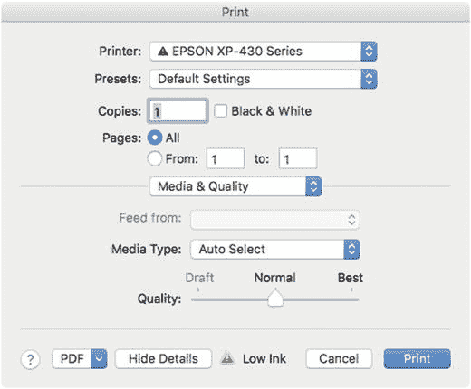
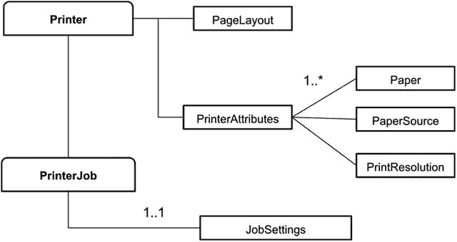
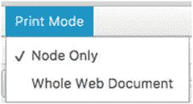

# 8. JavaFX 打印

许多桌面应用程序（如文字处理器和电子表格）允许用户通过打印机或复印机打印文档。在本章中，你将学习如何将 HTML 文档和 JavaFX 节点发送到打印机。JavaFX 打印 API (`javafx.print`) 自 JavaFX 8 以来就已存在，它们允许应用程序开发者查询可用的打印机、设置打印机以及生成打印作业。在本章中，你将探索 JavaFX 的打印 API，并以一个类似 Web 浏览器的应用程序结束本章，该应用程序用于缩放和打印 Web 内容。

在本章中，你将了解以下内容：

*   查询可用的打印机
*   发现打印机的属性和功能
*   以编程方式打印（使用打印机对话框）
*   显示打印机对话框以配置打印作业
*   缩放和打印 JavaFX 节点
*   打印跨多页的 HTML 网页


## JavaFX 打印

在开始介绍 JavaFX 打印 API 之前，我想先吊吊你的胃口，让你看看用很少的代码就能轻松打印东西。JavaFX 最简单的打印形式允许你打印任何可见的 JavaFX 节点，如清单 8-1 所示。

```
PrinterJob job = PrinterJob.createPrinterJob();
job.showPrintDialog(primaryStage);
boolean success = job.printPage(circle);
if (success) {
job.endJob();
}
清单 8-1.
使用 PrinterJob 类打印 JavaFX 节点
```

清单 8-1 的目标是将一个 JavaFX `Circle` 节点打印到打印机。清单 8-1 展示了创建一个打印任务 (`PrinterJob`)，然后调用 `showPrintDialog()` 方法，该方法会启动一个对话框窗口，允许你配置当前的打印任务，如图 8-1 所示。



图 8-1.

用于配置当前打印任务的打印对话框窗口

配置好打印机设置后，点击“打印”按钮开始打印过程。代码将调用打印任务的 `printPage()` 方法，将任务发送给打印机。调用 `printPage()` 方法后，会返回一个布尔值，表示打印任务是否成功。如果打印成功（`true`），代码会通过调用打印任务对象上的 `endJob()` 方法来结束打印任务。

清单 8-1 的输出应该会将一个 JavaFX `circle` 节点打印到打印机上。假设圆形位于打印机的可打印宽度内，你应该会看到一张打印出来的纸上有一个圆形。稍后，你将学习如何使用 API 查询打印机的可打印宽度和高度。

清单 8-1 的输出看起来实现起来很简单；然而，事情并非表面看起来那么简单。你可能在想，“如何打印一个内容跨越多页的节点？”

由于代码只是打印到单页上，你还会发现，如果一个节点大于（超出）打印机版面的可打印宽度和高度，这些区域将不会被打印到物理纸张（`Paper`）上。话虽如此，你需要实现一种策略，要么调整节点内容的大小，要么将节点内容分割成多个节点，以便打印到每一页上。

在本章中，你将主要学习如何配置打印任务以及打印单个节点，例如图像或形状节点。但是，如果你足够有雄心，并且愿意创建一个真正的文字处理器或贺卡应用程序，你不可避免地会想要打印跨越多页的内容。因此，你可能需要自己进行计算。基本上，这种计算涉及计算文本行数或确定内容区域的宽度和高度。

虽然在一个章节中创建一个能够打印多页的文字处理器相当有挑战性，但我至少会提供一些框架代码来帮助你入门。如清单 8-2 所示，框架代码已经搭建好，以便你可以提供辅助代码（`MyPrinterHelper.createPages()` 方法），该方法将进行计算，并返回一个节点列表，这些节点最终将被排队等待打印。

```
Printer printer = Printer.getDefaultPrinter();
PageLayout layout = printer.getDefaultPageLayout();
double printWidth = layout.getPrintableWidth();
double printHeight = layout.getPrintableHeight();
PrinterJob job = PrinterJob.createPrinterJob(printer);
// 假设你有一个大于可打印区域的节点。
TableView myLargeJFXNode = ... // 跨越多页的大型节点。
// 创建一个辅助函数，返回一个
// 代表要打印页面的节点列表。
List pages = MyPrinterHelper.createPages(myLargeJFXNode, printWidth, printHeight);
pages.forEach(job::printPage);
job.endJob();
清单 8-2.
用于打印跨越多页节点的框架代码
```

在清单 8-2 中，代码首先获取布局信息，以确定可打印的宽度和高度。获取可打印宽度和高度后，代码将调用 `MyPrinterHelper.createPages()` 方法，返回一个要打印的节点列表。`createPages()` 方法负责计算如何将目标节点分割成一个适合可打印版面的节点列表。调用 `MyPrinterHelper.createPages()` 方法的代码语句接收以下参数：`targetNode`、`printWidth` 和 `printHeight`。

一旦每个页面被准备为一个节点，你就可以将它们排队等待打印。根据要打印的内容类型，你需要决定如何将各部分分割成节点，以便排队打印。由于这取决于要打印的内容类型，因此如何设计单个节点完全取决于你。一个例子是基于 `ListView` 节点的项（`getItems()`）打印一张邮寄标签纸。

如果你觉得创建自己的函数来将内容分割成可打印节点太难了，别担心，JavaFX Web 引擎来了。稍后，你将看到一个示例应用程序，它会加载一个 HTML 网页并将其打印为多页。先不剧透，`javafx.scene.web.WebEngine` 节点有一个便捷方法 `print()`，可以将网页发送到打印机。`WebEngine` 打印能力的优点在于，它可以在不将 `WebView` 节点显示在 JavaFX 场景图上的情况下进行打印。这允许你创建一个 JavaFX 应用程序窗口（`Stage`），在后台将 HTML 文档发送到打印机。需要注意的是，JavaFX 打印 API 不支持在没有启动 JavaFX 应用程序窗口的情况下，作为后台进程进行真正的无头打印服务。要使用 JavaFX 打印 API 进行打印，必须有一个 JavaFX 应用程序线程在运行。

现在你已经初步了解了 JavaFX 打印的简单性，接下来你将更详细地了解 JavaFX 的打印 API，以便以编程方式配置打印机属性和打印任务。


## JavaFX 打印 API

让我们来看看构成 JavaFX 打印 API 的主要类。表 8-1 列出了主要的打印类，并根据 Java 8 Javadoc 文档（ [`javafx.print`](https://docs.oracle.com/javase/8/javafx/api/javafx/print/package-summary.html) ）提供了简要说明。

表 8-1.

JavaFX 打印 API 类及其描述

| 类/枚举 | 描述 |
| --- | --- |
| [`JobSettings`](https://docs.oracle.com/javase/8/javafx/api/javafx/print/JobSettings.html) | `JobSettings` 类封装了打印作业的大部分配置。 |
| [`PageLayout`](https://docs.oracle.com/javase/8/javafx/api/javafx/print/PageLayout.html) | `PageLayout` 封装了布局内容所需的信息。 |
| [`PageRange`](https://docs.oracle.com/javase/8/javafx/api/javafx/print/PageRange.html) | `PageRange` 用于选择或限制要打印的作业打印流页面。 |
| [`Paper`](https://docs.oracle.com/javase/8/javafx/api/javafx/print/Paper.html) | 一个封装打印机所用纸张介质尺寸的类。 |
| [`PaperSource`](https://docs.oracle.com/javase/8/javafx/api/javafx/print/PaperSource.html) | `PaperSource` 是用于纸张的进纸托盘。 |
| [`Printer`](https://docs.oracle.com/javase/8/javafx/api/javafx/print/Printer.html) | `Printer` 实例代表打印作业的目标设备。 |
| [`PrinterAttributes`](https://docs.oracle.com/javase/8/javafx/api/javafx/print/PrinterAttributes.html) | 此类封装了打印机与其作业打印能力及其他属性相关的属性。 |
| [`PrinterJob`](https://docs.oracle.com/javase/8/javafx/api/javafx/print/PrinterJob.html) | `PrinterJob` 是 JavaFX `scenegraph` 打印的起点。 |
| [`PrintResolution`](https://docs.oracle.com/javase/8/javafx/api/javafx/print/PrintResolution.html) | 用于表示打印机在进纸方向和横向方向上以每英寸点数（DPI）为单位的支持设备分辨率的类。 |
| [`Collation`](https://docs.oracle.com/javase/8/javafx/api/javafx/print/Collation.html) | `enum` 类 `Collation` 指定作业中打印文档的每个副本的介质页是否按顺序排列。 |
| [`PageOrientation`](https://docs.oracle.com/javase/8/javafx/api/javafx/print/PageOrientation.html) | 一个 `enum` 类，指定打印页面的介质页方向。 |
| [`PrintColor`](https://docs.oracle.com/javase/8/javafx/api/javafx/print/PrintColor.html) | 一个 `enum` 类，描述打印应为黑白还是彩色。 |
| [`Printer.MarginType`](https://docs.oracle.com/javase/8/javafx/api/javafx/print/Printer.MarginType.html) | `MarginType`（`enum` 类）用于确定 `PageLayout` 的可打印区域。 |
| [`PrinterJob.JobStatus`](https://docs.oracle.com/javase/8/javafx/api/javafx/print/PrinterJob.JobStatus.html) | 一个 `enum` 类，用于报告打印作业的状态。 |
| [`PrintQuality`](https://docs.oracle.com/javase/8/javafx/api/javafx/print/PrintQuality.html) | 一个 `enum` 类，用于描述打印质量设置。 |
| [`PrintSides`](https://docs.oracle.com/javase/8/javafx/api/javafx/print/PrintSides.html) | 一个 `enum` 类，用于枚举可能的双面打印模式。 |

## Printer 和 PrinterJob

表 8-1 中展示的众多类可能会让你感到不知所措；然而，你只需要记住 `Printer` 和 `PrinterJob` 类。图 8-2 展示了一个高层级图，显示了重要的 JavaFX 打印 API 类之间的关系。



图 8-2.

主要 JavaFX 打印类的 UML 图

为了节省空间，图 8-2 中显示的 UML 图仅展示了 `PrinterAttributes` 对象的部分打印机属性，而非全部。你会注意到该图只显示了几个具有一对多关系的 `Paper`、`PaperSource` 和 `PrintResolution` 对象的打印机属性。不过，稍后你将看到输出打印机所有支持属性的示例代码。现在，让我们先看看查询打印机的方法。

为了轻松开始查询信息，你可以将注意力集中在 `Printer` 和 `PrinterJob` 类上。`Printer` 和 `PrinterJob` 类都包含静态方法，分别用于查询打印机信息和创建打印作业。

要列出可用的打印机，你可以调用 `static` 方法 `Printer.getAllPrinter()`，如清单 8-3 所示。

```
Printer.getAllPrinters()
.forEach(System.out::println);
清单 8-3.
从 Printer 类列出可用打印机
```

以下是清单 8-3 的输出结果。它显示了在我的 Apple Macbook Pro 上可用的打印机列表。根据你的操作系统环境和连接的打印机，你可能会看到不同的结果。

```
Printer EPSON XP-430 Series
Printer S300-S400 Series
```

`Printer` 类上另一个方便的静态方法是 `getDefaultPrinter()`，用于获取系统的默认打印机。根据你的桌面操作系统，如果尚未设置默认打印机，用户可以前往打印机/扫描仪设置进行设置。在 Windows 操作系统上，你需要导航到控制面板的“设置” ➤ “设备” ➤ “<打印机>”。在 MacOS 系统上，导航到“系统偏好设置” ➤ “打印机与扫描仪”。在这两种操作系统上，你都可以右键单击选定的“<打印机>”将其设置为默认打印机。

获取 `Printer` 对象后，你可以调用 `getPrinterAttributes()` 方法，该方法返回一个 `PrinterAttributes` 对象，用于检索打印机支持的功能。`PrinterAttributes` 对象将包含各种方法，用于确定支持的方向、纸张类型、纸张来源或打印分辨率。


### 查询打印机属性

回顾一下，图 8-2 中的 UML 图仅展示了 `PrinterAttributes` 对象中的部分属性。另一方面，代码清单 8-4 展示了列出默认打印机所有属性的代码。通过在打印机对象（`defaultPrinter`）上调用 `getPrinterAttributes()` 方法，可以查询默认打印机的页面布局及其所有支持的打印机属性，并将结果输出到控制台。

```
Printer.getAllPrinters().forEach(System.out::println);
Printer defaultPrinter = Printer.getDefaultPrinter();
PrinterAttributes attributes = defaultPrinter.getPrinterAttributes();
System.out.println("--------------------------");
System.out.println("Default Print Layout : ");
System.out.printf(" %s%n", defaultPrinter.getDefaultPageLayout() );
System.out.printf(" printable width: %f%n", defaultPrinter.getDefaultPageLayout().getPrintableWidth() );
System.out.printf(" printable height: %f%n", defaultPrinter.getDefaultPageLayout().getPrintableHeight() );
System.out.println("--------------------------");
System.out.println("Supported Orientations : ");
attributes.getSupportedPageOrientations()
.forEach(System.out::println);
System.out.println("--------------------------");
System.out.println("Supported Collations : ");
attributes.getSupportedCollations()
.forEach( collation -> System.out.printf(" %s%n", collation));
System.out.println("--------------------------");
System.out.println("Supported Paper types : ");
attributes.getSupportedPapers()
.forEach( paper -> System.out.printf(" %s%n", paper));
System.out.println("--------------------------");
System.out.println("Supported Paper Sources : ");
attributes.getSupportedPaperSources()
.forEach( paperSource -> System.out.printf(" %s%n", paperSource));
System.out.println("--------------------------");
System.out.println("Supported Print Colors : ");
attributes.getSupportedPrintColors()
.forEach( paperColor -> System.out.printf(" %s%n", paperColor));
System.out.println("--------------------------");
System.out.println("Supported Print Quality types : ");
attributes.getSupportedPrintQuality()
.forEach( printQuality -> System.out.printf(" %s%n", printQuality));
System.out.println("--------------------------");
System.out.println("Supported Print Resolutions : ");
attributes.getSupportedPrintResolutions()
.forEach( printRez -> System.out.printf(" %s%n", printRez));
System.out.println("--------------------------");
System.out.println("Supported Print Sides: ");
attributes.getSupportedPrintSides()
.forEach( printSize -> System.out.printf(" %s%n", printSize));
代码清单 8-4.
输出打印机的默认页面布局及其所有支持属性的代码。
```

以下是运行代码清单 8-4 的输出结果。

```
Printer EPSON XP-430 Series
Printer S300-S400 Series

Default Print Layout :
Paper=Paper: Letter size=8.5x11.0 INCH Orient=PORTRAIT leftMargin=54.0 rightMargin=54.0 topMargin=54.0 bottomMargin=54.0
printable width: 504.000000
printable height: 684.000000

Supported Orientations :
PORTRAIT
LANDSCAPE
REVERSE_PORTRAIT
REVERSE_LANDSCAPE

Supported Collations :

Supported Paper types :
Paper: 4x6 size=101.6x152.4 MM
Paper: 8x10 size=8.0x10.0 INCH
Paper: A4 size=210.0x297.0 MM
Paper: A6 size=105.0x148.0 MM
Paper: Legal size=8.4x14.0 INCH
Paper: Letter size=8.5x11.0 INCH
Paper: Number 10 Envelope size=4.125x9.5 INCH
Paper: custom_z_101.6x180.6mm size=101.6x180.6 MM
Paper: invoice size=139.7x215.9 MM
Paper: iso-b7 size=88.0x125.0 MM
Paper: na-5x7 size=127.0x177.8 MM

Supported Paper Sources :

Supported Print Colors :
COLOR

Supported Print Quality types :
NORMAL

Supported Print Resolutions :
Feed res=300dpi. Cross Feed res=300dpi.

Supported Print Sides:
ONE_SIDED
```

你已经了解了默认打印机的属性和支持的功能，因此现在可以配置打印作业了。在下一节中，你将学习如何以编程方式配置和打印文档。本章开头部分解释了如何在打印前显示打印机配置对话框。接下来，你将学习如何在不使用配置对话框的情况下手动配置打印机。


### 配置打印任务

现在你已经知道如何查询打印机的属性，接下来你可能希望以不同于默认设置的方式配置打印机。假设有一个假想的用例：你正试图节省彩色墨水和纸张。换句话说，你希望使用更少的黑色墨水、双面打印，并采用横向页面方向进行打印。

基于 JavaFX 打印 API，一个打印任务将按如下方式配置：

*   使用单色（`PrintColor.MONOCHROME`）
*   双面打印（`PrintSides.DUPLEX`）
*   使用较低的打印质量（`PrintQuality.LOW`）
*   采用横向页面方向打印（`PageOrientation.LANDSCAPE`）

为了实现这个用例场景，你首先需要从 `PrinterJob` 类中调用 `createPrinterJob()` 方法。该方法返回一个 `PrinterJob` 对象，使你能够通过 `getJobSettings()` 方法获取并更改打印任务设置。清单 8-5 展示了创建 `PrinterJob` 对象，然后获取 `JobSettings` 对象以设置各种属性的代码。要查看清单 8-5 的完整源代码，请参考本书的源代码以及名为 `SaveInkAndTrees.java` 的 Java 文件。

```
PrinterJob job = PrinterJob.createPrinterJob();
JobSettings jobSettings = job.getJobSettings();
jobSettings.setPrintColor(PrintColor.MONOCHROME);
jobSettings.setPrintSides(PrintSides.DUPLEX);
jobSettings.setPrintQuality(PrintQuality.LOW);
PageLayout pageLayout = printer.createPageLayout(Paper.NA_LETTER, PageOrientation.LANDSCAPE, Printer.MarginType.DEFAULT);
jobSettings.setPageLayout(pageLayout);
System.out.println(">>> jobSettings :\n" + jobSettings);
清单 8-5.
配置打印任务的颜色、双面、质量和页面布局
```

警告

由于底层打印机可能不支持映射到 JavaFX 相关打印 `enum` 值（例如 `PrinterColor.MONOCHROME`）的属性，`JobSettings` 对象可能无法按你预期的方式被修改。在以编程方式修改 `JobSettings` 之前，你应该先查询打印机支持的属性。

在清单 8-5 中，获取任务设置对象后，代码开始调用 `color`、`sides` 和 `quality` 方法的设置器。任务设置属性只有在受支持的属性列表中时才能被修改。有关 `PrinterColor`、`PrintSides` 和 `PrintQuality` 类所有可用的枚举值，请参考 Javadoc 文档。此外，在设置属性之前查询受支持的属性非常重要，因为如果你尝试设置一个不受支持的属性，系统将采用该属性的默认值。

接下来，代码通过 `createPageLayout()` 方法创建页面布局。该方法接收以下参数：

*   `Paper.NA_LETTER`
*   `PageOrientation.LANDSCAPE`
*   `Printer.MarginType.DEFAULT`

根据 Javadoc 文档，`Printer.MarginType.DEFAULT` 是所有边距均为 0.75 英寸的默认值。这个默认值被认为是所有已知打印机的通用边距。但是，如果纸张太小，可能会调整此值，以确保边距不超过较小尺寸的 50%。期望处理此类小尺寸介质的应用程序应明确指定所需的边距。在极少数情况下，如果硬件边距大于 0.75 英寸，则所有边距都将调整为该硬件最小值。

清单 8-5 的输出如下所示。由于这是我家里的打印机，我注意到一些打印属性没有正确修改，例如双面、打印颜色和打印质量。我的打印机本应设置为双面、单色和低质量。你可能想知道发生了什么。

```
>>> JobSettings:
Collation = UNCOLLATED
Copies = 1
Sides = ONE_SIDED
JobName = JavaFX Print Job
Page ranges = null
Print color = COLOR
Print quality = NORMAL
Print resolution = Feed res=300dpi. Cross Feed res=300dpi.
Paper source = Paper source : Automatic
Page layout = Paper=Paper: Letter size=8.5x11.0 INCH Orient=LANDSCAPE leftMargin=54.0 rightMargin=54.0 topMargin=54.0 bottomMargin=54.0
```

不必惊慌，但在清单 8-5 中进行任务设置更改时，我注意到一些设置并未被修改。这基本上是由于底层打印机缺乏映射到 JavaFX 打印机 `enum` 和打印属性类的受支持属性。通过打印任务设置对象，你可以将自己的属性与受支持的属性进行比较。我在清单 8-6 中提供了代码，用于根据先前的打印场景检查受支持的属性。如果你要查找的打印属性不受支持，清单 8-6 中的代码将启动打印机对话框。这将允许原生打印对话框窗口让用户在打印前修改属性。

```
Printer printer = job.getPrinter();
PrinterAttributes attr = printer.getPrinterAttributes();
boolean supported = attr.getSupportedPrintColors()
.contains(PrintColor.MONOCHROME) &&
attr.getSupportedPrintSides()
.contains(PrintSides.DUPLEX) &&
attr.getSupportedPrintQuality()
.contains(PrintQuality.LOW) &&
attr.getSupportedPapers()
.contains(Paper.NA_LETTER) &&
attr.getSupportedPageOrientations()
.contains(PageOrientation.LANDSCAPE);
if (!supported) {
job.showPrintDialog(primaryStage);
}
// Rest of the print code.
清单 8-6.
在将任务发送打印前确定打印机的打印属性是否受支持
```

现在你已经知道如何配置任务设置并创建要发送到打印机的文档，让我们看看如何打印基于 HTML5 的内容。

## 打印网页

如前所述，打印跨越多页的内容并不容易。然而，JavaFX API 确实在 `WebEngine` 对象上提供了一个便捷的方法，称为 `print()`。它允许你打印 HTML5 内容。`WebEngine` 对象是一个非可视化的 JavaFX 对象，能够从远程 Web 服务器加载 HTML 文档。清单 8-7 展示了最少的代码量，即可将网页加载并打印到默认打印机。如果文档跨越多页，打印机将继续打印所有剩余页面。

```
WebEngine webEngine = new WebEngine();
webEngine.getLoadWorker()
.stateProperty()
.addListener( (ov, oldState, newState) -> {
if (newState == State.SUCCEEDED) {
PrinterJob job = PrinterJob.createPrinterJob();
if (job != null) {
webEngine.print(job);
job.endJob();
}
}
});
webEngine.load("https://en.wikipedia.org/wiki/Tachyon");
清单 8-7.
使用 JavaFX 的 WebEngine 对象打印 Web 内容
```

这段代码将提供一个回调函数来监听 Web 引擎加载过程的状态变化。加载成功后（`State.SUCCEEDED`），会创建一个打印任务并将其传递给 `WebEngine` 对象的 `print()` 方法。

希望你能看到将 HTML 内容发送到打印机是多么简单。现在让我们看一个示例应用程序。


## WebDocPrinter 示例应用

您是否曾需要快速打印网购后的机票或发票？这里有一个我创建的示例应用，它类似于浏览器，允许用户根据有效的 URL 加载并显示网站。这个类似浏览器的应用名为 `WebDocPrinter`，如图 8-3 所示。它支持两种打印模式：仅节点和整个 Web 文档。默认设置为“仅节点”模式，允许用户仅打印 WebView 节点。“仅节点”模式只会打印红色边框内的内容。“整个 Web 文档”打印模式则会打印整个 HTML 文档，即使它跨越多页。“整个 Web 文档”打印模式会自动缩放内容以适应可打印区域。


图 8-3.

WebDocPrinter 应用支持两种打印模式：仅节点和整个 Web 文档

该应用包含以下 UI 元素：

*   `Menus`：两种打印模式，称为“仅节点”和“整个 Web 文档”
*   `TextField`：用于输入有效 URL 的地址栏
*   `Button`：一个打印按钮
*   `Slider`：一个滑块控件，用于在显示 `WebView` 节点时调整缩放级别
*   `Label`：用于以百分比形式显示缩放级别的标签
*   `WebView`：用于显示 HTML 文档
*   `Path`：一个带有红色描边的矩形路径，用于勾勒可打印区域

`WebDocPrinter` 应用支持两种打印模式：仅节点和整个 Web 文档。`WebDocPrinter` 应用演示了如何打印单个节点或打印包含多页的整个网页。使用“整个 Web 文档”打印模式会自动缩放内容以适应可打印区域。

用户在地址行（`TextField`）输入 URL 后，按下回车键，从而触发应用获取网页并将其显示在 `WebView` 节点上。默认情况下，菜单栏的打印模式（如图 8-4 所示）设置为“仅节点”打印模式，这意味着应用只会将 `WebView` 节点打印在一页上。



图 8-4.

两种打印模式是“仅节点”和“整个 Web 文档”

当打印 JavaFX `WebView` 节点时，默认情况下打印机只会打印一页。通过使用“仅节点”模式，显示区域上会出现一个红色框轮廓，用于表示打印机在物理纸张上的可打印布局区域，如图 8-3 所示。如前所述，使用“仅节点”打印模式时，红色边框外的任何内容都不会被打印。

第二种打印模式是“整个 Web 文档”，它将使用 `WebEngine` 对象提供的便捷方法 `print()` 来打印整个 HTML 网页。同样，如果文档跨越多页，这些页面都将被发送到打印机。

最后，`WebDocPrinter` 应用的最后一个功能是一个滑块控件，允许用户缩放或放大/缩小以调整网页内容的大小，如图 8-5 所示。


图 8-5.

URL 地址行允许用户获取网页。打印按钮将显示的页面发送到打印机。滑块控件可放大或缩小以缩放网页，使其适应打印宽度。

在“仅节点”打印模式下使用的缩放功能，将帮助用户在将内容发送到打印机之前，使其适应可打印区域（红色边框），如图 8-3 所示。缩放的最小值为 5%，最大值为 300%。再次强调，我想指出的是，当使用“仅节点”打印模式时，任何显示在红色边框区域之外的内容都不会被打印。

### 源代码

现在您已经了解了 `WebDocPrinter` 应用的功能，让我们来看看源代码。由于实际的打印代码非常少，我将所有代码都放在一个名为 `WebDocPrinter.java` 的文件中，如代码清单 8-8 所示。


```
/**
* 允许用户输入 URL 以显示 HTML 页面，
* 并将其发送到默认打印机。同时，该应用程序允许
* 调整显示节点的大小以适应打印页面。
*/
public class WebDocPrinter extends Application{
private static String PRINT_MODE_MENU = "打印模式";
private static String NODE_ONLY = "仅节点";
private static String WHOLE_WEB_DOC = "整个网页文档";
public static void main(String[] args) {
//System.setProperty("jsse.enableSNIExtension", "false");
Application.launch(args);
}
@Override
public void start(Stage primaryStage) throws Exception {
// 创建根面板和场景
primaryStage.setTitle("WebDocPrinter");
BorderPane root = new BorderPane();
Scene scene = new Scene(root, 551, 400, Color.WHITE);
primaryStage.setScene(scene);
// 创建菜单
MenuBar menuBar = new MenuBar();
Menu printModeMenu = new Menu("打印模式");
ToggleGroup printModeGroup = new ToggleGroup();
// 仅节点打印模式
RadioMenuItem printOnePage = new RadioMenuItem(NODE_ONLY);
printOnePage.setUserData(NODE_ONLY);
printOnePage.setToggleGroup(printModeGroup);
printModeGroup.selectToggle(printOnePage);
printModeMenu.setText(PRINT_MODE_MENU + " (" + NODE_ONLY + ")");
// 整个网页文档打印模式
RadioMenuItem multiPages = new RadioMenuItem("整个网页文档");
multiPages.setUserData(WHOLE_WEB_DOC);
multiPages.setToggleGroup(printModeGroup);
printModeMenu.getItems().addAll(printOnePage, multiPages);
menuBar.getMenus().add(printModeMenu);
root.setTop(menuBar);
BorderPane contentPane = new BorderPane();
root.setCenter(contentPane);
// 创建显示区域
WebView browserDisplay = new WebView();
// 创建滑块以控制缩放
Slider zoomSlider = new Slider(.05, 3.0,1.0);
zoomSlider.setBlockIncrement(0.05);
zoomSlider.valueProperty().addListener( listener -> {
System.out.println("缩放 " + browserDisplay.getZoom());
browserDisplay.setZoom(zoomSlider.getValue());
});
// 表示缩放大小百分比的标签
Label zoomValueLabel = new Label();
StringConverter sc = new StringConverter(){
@Override public Double fromString(String value) {
// 如果值为 null 或空字符串，则返回 null
if (value == null) {
return null;
}
value = value.trim();
value.replace("%", "");
if (value.length()  {
Printer printer = Printer.getDefaultPrinter();
System.out.println("打印机宽度: " +
printer.getDefaultPageLayout().getPrintableWidth());
System.out.println("宽度: " +
browserDisplay.widthProperty().get() );
});
WebEngine webEngine = browserDisplay.getEngine();
webEngine.getLoadWorker()
.stateProperty()
.addListener( (obsValue, oldState, newState) -> {
if (newState == Worker.State.SUCCEEDED) {
System.out.println("网页加载完成: " +
webEngine.getLocation());
}
});
// 创建地址栏
TextField urlAddressField = new TextField();
urlAddressField.setPromptText("输入要打印页面的 URL");
urlAddressField.setOnAction( actionEvent ->
webEngine.load(urlAddressField.getText()));
// 创建打印按钮
Button printButton = new Button("打印");
printButton.setOnAction(actionEvent -> {
PrinterJob job = PrinterJob.createPrinterJob();
if (job != null) {
System.out.println("开始打印任务");
Toggle selected = printModeGroup.getSelectedToggle();
if (selected != null) {
String mode = (String) selected.getUserData();
if (NODE_ONLY.equals(mode)) {
boolean success = job.printPage(browserDisplay);
if (success) {
job.endJob();
}
} else {
// WHOLE_WEB_DOC
boolean printIt = job.showPrintDialog(primaryStage);
if (printIt) {
webEngine.print(job);
job.endJob();
}
}
}
}
});
// 组装打印按钮、缩放滑块、缩放标签
VBox vBox = new VBox();
HBox hBox = new HBox(10);
hBox.setPadding(new Insets(5));
hBox.setAlignment(Pos.CENTER_LEFT);
hBox.getChildren().addAll(printButton, zoomSlider, zoomValueLabel);
vBox.getChildren().addAll(urlAddressField, hBox);
contentPane.setTop(vBox);
// 居中 WebView 区域
StackPane centerArea = new StackPane(browserDisplay);
// 创建表示打印区域的红色方框
Path printPerimeter = new Path();
Printer printer = Printer.getDefaultPrinter();
double printWidth = printer.getDefaultPageLayout().getPrintableWidth();
double printHeight = printer.getDefaultPageLayout().getPrintableHeight();
PathElement[] corners = {
new MoveTo(0,0),
new LineTo(printWidth, 0),
new LineTo(printWidth, printHeight),
new LineTo(0, printHeight),
new ClosePath()
};
printPerimeter.getElements().addAll(corners);
printPerimeter.setStroke(Color.RED);
StackPane.setAlignment(printPerimeter, Pos.TOP_LEFT);
centerArea.getChildren().add(printPerimeter);
contentPane.setCenter(centerArea);
printModeGroup.selectedToggleProperty()
.addListener((observableValue) -> {
Toggle selected = printModeGroup.getSelectedToggle();
if (selected != null) {
String mode = String.valueOf(selected.getUserData());
printModeMenu.setText(PRINT_MODE_MENU + " (" + mode + ")");
if (NODE_ONLY.equals(mode)) {
printPerimeter.setVisible(true);
} else {
printPerimeter.setVisible(false);
}
}
});
primaryStage.setOnShown( eventHandler -> {
printButton.requestFocus();
});
primaryStage.show();
}
}
清单 8-8.
WebDocPrinter 应用程序源代码
```


### 工作原理是什么？

在清单 8-8 中，请注意 `start()` 方法首先创建了所有 JavaFX 应用程序典型的根面板和场景。接着，代码创建了两个菜单选项，允许用户选择打印模式。在后续代码中，当菜单项被选中时，会为其添加处理程序代码。菜单创建完成后，代码设置了 `WebView` 节点和缩放滑块控件。

`WebView` 节点是显示 HTML 文档的主要区域。缩放滑块控件将添加处理程序代码（`InvalidationListener`）来更新 `WebView` 节点的缩放属性。

当以百分比形式显示缩放值时，每当滑块值发生变化，JavaFX 的 `Label` 就会更新。在这里，你将看到如何使用 `StringConverter` 类将字符串转换为双精度浮点数。`StringConverter` 类将滑块控件中的双精度值转换为标签控件的文本值，并附加一个百分号（%）。一旦创建了 `StringConverter` 对象并将其赋值给变量 `sc`，代码就会基于标签的文本属性（`String`）、缩放滑块的值（`Double`）以及变量 `sc` 来绑定属性。

以下代码片段绑定了上述提到的属性和变量。

```
Bindings.bindBidirectional(zoomValueLabel.textProperty(),
zoomSlider.valueProperty(), sc);
```

代码继续创建应用程序的其余部分，添加了一个类似网络浏览器的 JavaFX `TextField` 用于输入 URL 地址行。地址行允许用户输入有效的 `URL` 来请求指定的网页。该文本字段有一个 `onAction` 属性，用于设置处理程序代码，该代码随后会调用 Web 引擎的 `load()` 方法。换句话说，用户输入网址后，按下回车键即可触发网页的加载。

接下来是创建打印按钮（`printButton` 变量），用于根据选定的打印模式进行打印。打印按钮会在将数据发送到打印机之前确定打印模式。当用户选择“仅节点”时，代码会将 `WebView` 节点传递给 `PrintJob` 对象的 `printPage()` 方法。如果用户选择打印整个文档，代码会获取 Web 引擎（`WebEngine`）并将打印作业传递给 `print()` 方法。以下代码片段来自清单 8-8，再次展示了两种打印模式——仅节点和整个 Web 文档。

```
// 仅节点 - 打印模式
job.printPage(browserDisplay);
// 整个 Web 文档 - 打印模式
webEngine.print(job);
```

清单 8-8 的收尾部分，代码创建了一个路径，该路径被勾勒为一个矩形，其宽度和高度值来自默认打印机的布局。最后，`printModeGroup`（`ToggleGroup`）变量的 `selectedToggleProperty` 附加了处理程序代码，用于切换红色矩形形状的 `visible` 属性。此外，当点击打印按钮时，通过调用 `printModeGroup` 对象的 `getUserObject()` 方法获取一个字符串来确定打印模式。该字符串代表两个字符串常量之一：`NODE_ONLY` 或 `WHOLE_WEB_DOC`。

## 本章小结

在本章中，你从一个简单的代码片段开始，该代码片段在打印 JavaFX 节点之前启动一个打印对话框来配置打印机。接着，你通过查询并显示打印机所有支持的属性和特性，熟悉了 JavaFX 打印 API。在学习了打印属性之后，你能够使用从 `PrinterJob` 实例获取的 `JobSettings` 对象，以编程方式配置打印作业。在以编程方式配置打印作业时，你了解到，除非打印机支持特定属性（例如双面打印或黑白打印），否则这些属性不会被修改。

在学习了如何查询和配置打印机属性之后，你了解了 `WebEngine` 对象中便捷的 `print()` 方法。同时，你还了解到 `print()` 方法可以打印跨多页的 Web 内容，并且可以自动缩放 Web 内容以适应每一页。最后，你有机会查看一个名为 `WebDocPrinter.java` 的示例应用程序，它能够以两种打印模式打印 Web 内容：仅节点和整个 Web 文档。“仅节点”打印模式通过将 `WebView` 节点发送到打印机来打印 Web 文档的一部分，而“整个 Web 文档”打印模式则打印整个网页，即使它跨越多页。

