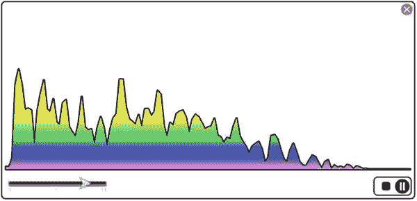
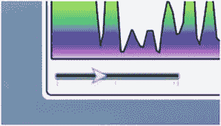
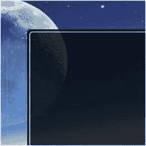
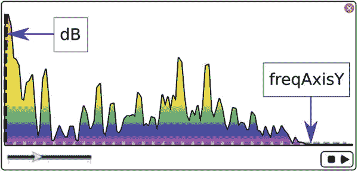
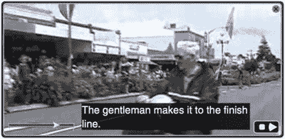

# 9. 媒体与 JavaFX

JavaFX 提供了一个功能丰富的媒体 API，能够播放音频和视频。Media API 允许开发者将音频和视频集成到他们的富互联网应用程序（RIA）中。Media API 的主要优势之一是它能够通过网络分发跨平台的媒体内容。鉴于一系列设备（平板电脑、音乐播放器、电视等）都需要播放多媒体内容，一个跨平台的 API 至关重要。

想象一下不远的未来，你的电视或墙壁能够以你从未梦想过的方式与你互动。例如，在观看电影时，你可以选择电影中使用的服装并立即购买，而这一切都在舒适的家中完成。基于这样的未来展望，开发者们致力于增强其媒体应用程序的交互特性。

在本章中，你将学习如何以交互方式播放音频和视频。请就座，音频和视频即将成为舞台的焦点。

你将学习以下 JavaFX 媒体 API：

*   `javafx.scene.media.Media`
*   `javafx.scene.media.MediaPlayer`
*   `javafx.scene.media.MediaStatus`
*   `javafx.scene.media.MediaView`


## 媒体事件

事件驱动架构（EDA）是一种重要的架构模式，用于建模异步传递消息的松散耦合组件和服务。JavaFX 团队将 Media API 设计为事件驱动。在本节中，您将学习如何与媒体事件进行交互。

基于事件编程的思想，您在调用媒体功能时会发现非阻塞或回调行为。您无需通过 `EventHandler` 直接将代码绑定到按钮，而是实现响应媒体播放器 `OnXXXX` 事件触发的代码，其中 `XXXX` 是事件名称。

在响应媒体事件时，您将实现 `java.lang.Runnable` 函数式接口（lambda 表达式）。这些函数式接口是回调，它们会被延迟求值，或在稍后某个事件触发时被调用。例如，在播放媒体内容时，您会创建一个 lambda 表达式并将其设置在 `OnReady` 事件上。有关基于事件驱动方法播放媒体的示例，请参见以下代码块：

```
Media media = new Media(url);
MediaPlayer mediaPlayer = new MediaPlayer(media);
Runnable playMusic = () -> mediaPlayer.play();
mediaPlayer.setOnReady(playMusic);
```

如您所见，`playMusic` 变量被赋值为一个 lambda 表达式（`Runnable`），并传递给媒体播放器的 `setOnReady()` 方法。当 `OnReady` 事件发生时，`playMusic Runnable` 闭包代码将被调用。虽然我尚未讨论如何设置 `Media` 和 `MediaPlayer` 类实例，但我希望先让您熟悉这些核心概念，然后再继续深入，因为这些概念将在本章中贯穿使用。

表 9-1 显示了所有可能触发的媒体事件，允许开发者附加 `Runnables`（或 `EventHandlers`）。除了 `OnMarker` 事件外，以下所有事件都是 `Runnable` 函数式接口。

表 9-1.

Media 和 MediaPlayer 事件

| 类 | 事件设置方法 | 事件属性方法 | 描述 |
| --- | --- | --- | --- |
| `Media` | `setOnError()` | `onErrorProperty()` | 当发生错误时 |
| `MediaPlayer` | `setOnEndOfMedia()` | `onEndOfMediaProperty()` | 当媒体播放到达末尾时 |
| `MediaPlayer` | `setOnError()` | `onErrorProperty()` | 当发生错误时；状态变为 [`MediaPlayer.Status`](https://docs.oracle.com/javase/8/javafx/api/javafx/scene/media/MediaPlayer.Status.html) `HALTED` |
| `MediaPlayer` | `setOnHalted()` | `onHaltedProperty()` | 当媒体状态变为 `HALTED` 时 |
| `MediaPlayer` | `setOnMarker()` | `onMarkerProperty()` | 当 `Marker` 事件被触发时 |
| `MediaPlayer` | `setOnPaused()` | `onPausedProperty()` | 当状态为 [`MediaPlayer.Status.PAUSED`](https://docs.oracle.com/javase/8/javafx/api/javafx/scene/media/MediaPlayer.Status.html#PAUSED) 时 |
| `MediaPlayer` | `setOnPlaying()` | `onPlayingProperty()` | 当媒体正在播放时。当状态为 [`MediaPlayer.Status`](https://docs.oracle.com/javase/8/javafx/api/javafx/scene/media/MediaPlayer.Status.html) `PLAYING` 时 |
| `MediaPlayer` | `setOnReady()` | `onReadyProperty()` | 当媒体播放器处于 `Ready` 状态时。当状态为 [`MediaPlayer.Status`](https://docs.oracle.com/javase/8/javafx/api/javafx/scene/media/MediaPlayer.Status.html) `READY` 时 |
| `MediaPlayer` | `setOnRepeat()` | `onRepeatProperty()` | 当播放器的 `currentTime` 达到 `stopTime` 并即将重复时调用的事件处理器。此回调在回退到 `startTime` 之前执行 |
| `MediaPlayer` | `setOnStalled()` | `onStalledProperty()` | 当媒体状态变为 `STALLED` 时 |
| `MediaPlayer` | `setOnStopped()` | `onStoppedProperty()` | 当状态 `stopped` 被触发时。 [`MediaPlayer.Status.STOPPED`](https://docs.oracle.com/javase/8/javafx/api/javafx/scene/media/MediaPlayer.Status.html#STOPPED) |

## 播放音频

JavaFX 的媒体 API 支持加载扩展名为 `.mp3`、`.wav` 和 `.aiff` 的音频文件。此外，JavaFX 8 新增了播放 HTTP 直播流格式（也称为 HLS，文件扩展名 `.m3u8`）音频的功能。HLS 超出了本书的范围，本章将不进行介绍，但通过进一步研究，JavaFX 可用于构建实时广播应用程序。

在 JavaFX 中播放音频文件非常简单。给定一个有效的文件 URL 位置，您可以实例化一个 `javafx.scene.media.Media` 类来加载资源。然后将 `Media` 对象传递给 `javafx.scene.media.MediaPlayer` 对象构造函数的新实例，以创建媒体播放器控件。最后一步是在 `OnReady` 事件触发时调用媒体播放器对象的 `play()` 方法，此时媒体文件将开始播放。要实现在加载后自动播放媒体文件，可以使用 `setAutoPlay()` 方法将媒体播放器的自动播放属性设置为 true。以下代码加载并播放位于 Web 服务器上的 MP3 音频文件：

```
Media media = new Media("http://some_host/eye_on_it.mp3");
MediaPlayer  mediaPlayer = new MediaPlayer(media);
mediaPlayer.setAutoPlay(true);
```

注意

加载媒体文件时，请确保文件位置是遵循标准 URL 规范的格式化字符串：[`https://www.w3.org/Addressing/URL/url-spec.txt`](https://www.w3.org/Addressing/URL/url-spec.txt) 和 [`https://url.spec.whatwg.org`](https://url.spec.whatwg.org) 。

只要文件名字符串的格式遵循标准 URL 规范，媒体文件可以位于 Web 服务器、JAR 文件或本地文件系统中。

注意

对于低延迟的音频文件播放，请使用 `javafx.scene.media.AudioClip` 类。一个典型的场景是连续多次播放给定的声音，例如游戏中使用的音效。

### MP3 播放器示例

现在您已经知道如何加载和播放音频媒体，让我们看一个有趣的示例，该示例涉及播放音乐并显示彩色可视化效果。在本节中，您将学习如何创建一个 MP3 音频播放器。在探索清单 9-1 中的示例代码之前，请先查看图 9-1 以预览音频播放器的用户界面。当音频文件正在播放时，频谱显示会以面积图的形式呈现。音频播放器的控件允许您查看正在播放的媒体的进度，并执行停止、暂停和播放操作。在图 9-1 中，背景是白色的；然而，实际代码会以黑色背景显示。在打印纸上，最好避免大面积的深色区域。



图 9-1.

一个 JavaFX 音频播放器

在此示例中，您将再次使用文件拖放隐喻，就像在第 7 章处理图像时一样。同样，用户导航到本地文件系统或浏览器 URL 地址栏，找到要拖放到应用程序界面上的媒体文件。对于 MP3 播放器，您将找到文件格式和扩展名为 `.mp3`、`.wav` 或 `.aif` 的音频文件用于此示例。

如图 9-1 所示，MP3 播放器根据媒体的音频频谱信息显示一个面积折线图。音频播放器在右下角有一个自定义按钮面板控件。按钮面板控件允许用户暂停、继续和停止播放音乐。您还会注意到左下角的搜索位置滑块（也称为进度和搜索位置滑块），它允许用户观看音乐播放的进度，也可以在媒体（音频或视频）中向前或向后搜索。当允许用户向前或向后搜索时，需要先暂停音频或视频。


#### 停止、播放和暂停按钮

图 9-2 左侧的图像显示了停止（方形）和播放（三角形楔形）按钮。当点击停止按钮时，媒体的起始时间将重新定位到文件的开头。当点击暂停按钮时，媒体将保持其在媒体播放中的当前位置。此外，当媒体暂停时，播放按钮会出现，以便用户可以恢复音乐。图 9-2 右侧的图像显示了包含停止和暂停按钮（带有两条垂直线的圆形）的按钮面板。当音乐正在播放时，用户可以点击暂停按钮来暂停音乐。


图 9-2.

带有停止（矩形）、播放（三角形）和暂停（圆形）按钮的自定义按钮面板控件

#### 进度和定位滑块控件

接下来，您会注意到应用程序窗口左下角的进度和定位滑块控件，如图 9-3 所示。假设媒体处于暂停状态，定位滑块控件允许您在媒体的当前时间中向前或向后移动。此外，滑块的“拇指”（箭头）会随着媒体播放的进行从左向右移动。



图 9-3.

定位滑块控件允许用户在音频文件播放时监控进度

#### 关闭按钮

最后，请注意图 9-4 中所示的关闭按钮，它允许用户退出应用程序。


图 9-4.

位于右上角的关闭按钮允许用户停止媒体播放器并退出应用程序

### MP3 音频播放器源代码

清单 9-1 展示了一个基于 JavaFX 的 MP3 音频播放器的源代码。本书先前版本中的源代码经过了进一步重构，将内容拆分为多个方法，而不是一个庞大的 `start()` 方法。除了重构之外，我还移除了使用编程方式为 JavaFX 节点设置样式的代码。我没有使用 `setter()` 方法来为 JavaFX 节点设置样式，而是简单地创建了一个 CSS 样式表（声明式样式）。清单 9-2 中显示的样式表包含了 CSS 选择器定义。


```java
package com.jfxbe;
import java.net.MalformedURLException;
import javafx.application.*;
import javafx.beans.property.*;
import javafx.beans.value.ChangeListener;
import javafx.event.EventHandler;
import javafx.geometry.Point2D;
import javafx.scene.*;
import javafx.scene.control.Alert;
import javafx.scene.control.ButtonType;
import javafx.scene.control.Slider;
import javafx.scene.input.*;
import javafx.scene.layout.*;
import javafx.scene.media.*;
import javafx.scene.media.MediaPlayer.Status;
import javafx.scene.paint.Color;
import javafx.scene.shape.*;
import javafx.stage.*;
import javafx.util.Duration;
/**
* 使用 JavaFX MediaPlayer API 播放音频。
*
* @author carldea
*/
public class PlayingAudio extends Application {
private MediaPlayer mediaPlayer;
private Point2D anchorPt;
private Point2D previousLocation;
private ChangeListener progressListener;
private BooleanProperty playAndPauseToggle = new SimpleBooleanProperty(true);
private EventHandler mouseEventConsumer = event -> event.consume();
/**
* @param args 命令行参数
*/
public static void main(String[] args) {
Application.launch(args);
}
@Override
public void start(Stage primaryStage) {
// 移除原生窗口边框和标题栏
primaryStage.initStyle(StageStyle.TRANSPARENT);
// 创建应用程序表面或背景
Pane root = new AnchorPane();
root.setId("app-surface");
Scene scene = new Scene(root, 551, 270, Color.rgb(0, 0, 0, 0));
// 加载 JavaFX CSS 样式
scene.getStylesheets()
.add(getClass().getResource("/playing-audio.css")
.toExternalForm());
primaryStage.setScene(scene);
// 初始化舞台，使其可通过鼠标拖动
initMovablePlayer(primaryStage);
// 为面积图创建 Path 实例
Path chartArea = new Path();
chartArea.setId("chart-area");
// 创建按钮面板（停止、播放和暂停）
Node buttonPanel = createButtonPanel(root);
AnchorPane.setRightAnchor(buttonPanel, 3.0);
AnchorPane.setBottomAnchor(buttonPanel, 3.0);
// 创建用于进度和定位的滑块
Slider progressSlider = createSlider();
AnchorPane.setLeftAnchor(progressSlider, 2.0);
AnchorPane.setBottomAnchor(progressSlider, 2.0);
// 在音频/视频播放时更新滑块（播放状态）
progressListener = (observable, oldValue, newValue) ->
progressSlider.setValue(newValue.toSeconds());
// 初始化场景以接受文件
// 通过拖放操作加载媒体文件
initFileDragNDrop(root);
// 创建关闭按钮
Node closeButton = createCloseButton();
AnchorPane.setRightAnchor(closeButton, 2.0);
AnchorPane.setTopAnchor(closeButton, 2.0);
root.getChildren()
.addAll(chartArea,
buttonPanel,
progressSlider,
closeButton);
primaryStage.centerOnScreen();
primaryStage.show();
}
/**
* 初始化舞台，允许鼠标光标通过拖拽移动应用程序。
* @param primaryStage - 应用程序的主舞台窗口。
*/
private void initMovablePlayer(Stage primaryStage) {
Scene scene = primaryStage.getScene();
Pane root = (Pane) scene.getRoot();
root.setPickOnBounds(true);
// 设置初始锚点
root.setOnMousePressed(mouseEvent ->
anchorPt = new Point2D(mouseEvent.getScreenX(),
mouseEvent.getScreenY())
);
// 根据先前位置移动舞台的 x,y 坐标
root.setOnMouseDragged(mouseEvent -> {
if (anchorPt != null && previousLocation != null) {
primaryStage.setX(previousLocation.getX()
+ mouseEvent.getScreenX()
- anchorPt.getX());
primaryStage.setY(previousLocation.getY()
+ mouseEvent.getScreenY()
- anchorPt.getY());
}
});
// 将新的先前位置设置为当前鼠标 x,y 坐标
root.setOnMouseReleased(mouseEvent ->
previousLocation = new Point2D(primaryStage.getX(),
primaryStage.getY())
);
// 在舞台显示后初始化 previousLocation
primaryStage.addEventHandler(WindowEvent.WINDOW_SHOWN,
(WindowEvent t) -> {
previousLocation = new Point2D(primaryStage.getX(),
primaryStage.getY());
});
}
/**
* 初始化媒体文件的拖放功能。
* @param root - 场景图的根面板。
*/
private void initFileDragNDrop(Pane root) {
// 拖拽到表面上方
root.setOnDragOver(dragEvent -> {
Dragboard db = dragEvent.getDragboard();
if (db.hasFiles() || db.hasUrl()) {
dragEvent.acceptTransferModes(TransferMode.LINK);
} else {
dragEvent.consume();
}
});
// 释放到表面上方
root.setOnDragDropped(dragEvent -> {
Dragboard db = dragEvent.getDragboard();
boolean success = false;
String filePath = null;
if (db.hasFiles()) {
success = true;
if (db.getFiles().size() > 0) {
try {
// 获取文件并播放媒体
filePath = db.getFiles()
.get(0)
.toURI().toURL().toString();
playMedia(filePath, root);
} catch (MalformedURLException ex) {
ex.printStackTrace();
}
}
} else {
// 来自某个主机或 jar 的音频文件
playMedia(db.getUrl(), root);
success = true;
}
dragEvent.setDropCompleted(success);
dragEvent.consume();
});
}
/**
* 创建一个包含音频播放器停止、暂停和播放按钮的节点。
*
* @param root 场景图的根面板。
* @return Node 包含播放、暂停和停止按钮的面板。
*/
private Node createButtonPanel(Pane root) {
// 创建按钮控制面板
FlowPane buttonPanel = new FlowPane();
buttonPanel.setId("button-panel");
// 停止按钮控件
Node stopButton = new Rectangle(10, 10);
stopButton.setId("stop-button");
stopButton.setOnMouseClicked(mouseEvent -> {
if (mediaPlayer != null) {
updatePlayAndPauseButtons(true, root);
if (mediaPlayer.getStatus() == Status.PLAYING ||
mediaPlayer.getStatus() == Status.PAUSED) {
mediaPlayer.stop();
}
playAndPauseToggle.set(false);
}
});
// 包含播放和暂停按钮的切换按钮
StackPane playPauseToggleButton = new StackPane();
// 播放按钮控件
Arc playButton = new Arc(12, // 中心 x
16, // 中心 y
15, // 半径 x
15, // 半径 y
150, // 起始角度
60);  // 长度
playButton.setId("play-button");
playButton.setType(ArcType.ROUND);
playButton.setMouseTransparent(true);
// 暂停控件
Group pauseButton = new Group();
pauseButton.setId("pause-button");
Circle pauseBackground = new Circle(12, 16, 10);
pauseBackground.getStyleClass()
.add("pause-circle");
Line firstLine = new Line(6,  // 起始 x
6,  // 起始 y
6,  // 结束 x
14); // 结束 y
firstLine.getStyleClass()
.addAll("pause-line", "first-line");
Line secondLine = new Line(6,   // 起始 x
6,   // 起始 y
6,   // 结束 x
14); // 结束 y
secondLine.getStyleClass()
.addAll("pause-line", "second-line");
pauseButton.getChildren()
.addAll(pauseBackground, firstLine, secondLine);
pauseButton.setMouseTransparent(true);
playPauseToggleButton.getChildren()
.addAll(playButton, pauseButton);
playPauseToggleButton.setOnMouseEntered(mouseEvent -> {
Color red = Color.rgb(255, 0, 0, .90);
pauseBackground.setStroke(red);
firstLine.setStroke(red);
secondLine.setStroke(red);
playButton.setStroke(red);
});
playPauseToggleButton.setOnMouseExited(mouseEvent -> {
Color white = Color.rgb(255, 255, 255, .90);
pauseBackground.setStroke(white);
firstLine.setStroke(white);
secondLine.setStroke(white);
playButton.setStroke(white);
});
// 布尔属性，用于切换媒体播放器的播放和暂停
playAndPauseToggle.addListener(
(observable, oldValue, newValue) -> {
if (newValue) {
// 播放
if (mediaPlayer != null) {
updatePlayAndPauseButtons(false, root);
mediaPlayer.play();
}
} else {
// 暂停
if (mediaPlayer!=null) {
updatePlayAndPauseButtons(true, root);
if (mediaPlayer.getStatus() == Status.PLAYING) {
mediaPlayer.pause();
}
}
}
});
// 按下切换按钮
playPauseToggleButton.setOnMouseClicked( mouseEvent ->{
if (mouseEvent.getClickCount() == 1) {
playAndPauseToggle.set(!playAndPauseToggle.get());
}
});
buttonPanel.getChildren()
.addAll(stopButton,
playPauseToggleButton);
buttonPanel.setPrefWidth(50);
// 过滤掉鼠标事件，防止根节点接收事件以拖动窗口
buttonPanel.addEventHandler(MouseEvent.ANY, mouseEventConsumer);
return buttonPanel;
}
/**
* 关闭按钮，用于退出应用程序
*
* @return Node 表示关闭按钮。
*/
private Node createCloseButton() {
StackPane closeButton = new StackPane();
closeButton.setId("close-button");
Node closeBackground = new Circle(0, 0, 7);
closeBackground.setId("close-circle");
SVGPath closeXmark = new SVGPath();
closeXmark.setId("close-x-mark");
closeXmark.setContent("M 0 0 L 6 6 M 6 0 L 0 6");
closeButton.getChildren()
.addAll(closeBackground,
closeXmark);
// 退出应用
closeButton.setOnMouseClicked(mouseEvent -> {
if (mediaPlayer != null){
mediaPlayer.stop();
}
Platform.exit();
});
// 过滤鼠标事件，防止传播到父节点
closeButton.addEventHandler(MouseEvent.ANY, mouseEventConsumer);
return closeButton;
}
/**
* 将文件拖放到应用程序后，创建一个新的 MediaPlayer 实例并加载媒体文件。
*
* @param url - 指向音频文件的 URL。
* @param root - 场景图的根面板。
*/
private void playMedia(String url, Pane root) {
if (mediaPlayer != null) {
mediaPlayer.pause();
mediaPlayer.setOnPaused(null);
mediaPlayer.setOnPlaying(null);
mediaPlayer.setOnReady(null);
mediaPlayer.currentTimeProperty()
.removeListener(progressListener);
mediaPlayer.setAudioSpectrumListener(null);
}
// 创建一个新的媒体播放器
Media validMedia = null;
try {
validMedia = new Media(url);
} catch (Exception e) {
new Alert(Alert.AlertType.ERROR, e.getMessage(), ButtonType.OK).showAndWait()
.filter(response -> response == ButtonType.OK)
.ifPresent(response -> e.printStackTrace());
return;
}
final Media media = validMedia;
mediaPlayer = new MediaPlayer(media);
// 在媒体播放时移动滑块以显示进度
mediaPlayer.currentTimeProperty()
.addListener(progressListener);
mediaPlayer.setOnReady(() -> {
// 显示媒体的元数据
media.getMetadata().forEach( (name, val) -> {
System.out.println(name + ": " + val);
});
updatePlayAndPauseButtons(false, root);
Slider progressSlider =
(Slider) root.lookup("#seek-position-slider");
progressSlider.setValue(0);
progressSlider.setMax(mediaPlayer.getMedia()
.getDuration()
.toSeconds());
mediaPlayer.play();
});
// 倒回到开头
mediaPlayer.setOnEndOfMedia( ()-> {
updatePlayAndPauseButtons(true, root);
// 将按钮切换为播放按钮
mediaPlayer.stop();
playAndPauseToggle.set(false);
});
// 获取图表路径区域
Path chartArea = (Path) root.lookup("#chart-area");
int chartPadding = 5;
// 频域为 X 轴。
// freqAxisY 是频率轴的 Y 坐标。
double freqAxisY = root.getHeight() - 45;
// 图表的高度
double chartHeight = freqAxisY - chartPadding;
// 在 CSS 文件中，内边距设置如下：
//   -fx-border-insets: 6 6 6 6; (上, 右, 下, 左)
//   -fx-border-width: 1.5;
// 下面内边距将等于 7.5，这是内边距 6（左）和边框宽度 1.5 的联合
double padding = root.getBorder().getInsets().getLeft();
double chartWidth = root.getWidth() - ((2 * padding) + (2 * chartPadding));
// 音频声音以分贝为单位，幅度范围从 0 到 -60
// 对幅度进行平方运算可以拉伸绘图。同时除以图表高度可以归一化或将 y 坐标保持在图表边界内。
double scaleY = chartHeight / (60 * 60);
double space = 5; // 每个数据点之间的间距。有助于在宽度方向上拉伸图表。
mediaPlayer.setAudioSpectrumListener(
(double timestamp,
double duration,
float[] magnitudes,
float[] phases) -> {
if (mediaPlayer.getStatus() == Status.PAUSED || mediaPlayer.getStatus() == Status.STOPPED) {
return;
}
// freqBarX 是要绘制的 x 坐标
double freqBarX = padding + chartPadding;
// scaleX 是一个单位。这确保绘图保持在图表宽度区域内
double scaleX = chartWidth / (magnitudes.length * space);
// 检查数据数组是否已创建。
// 如果未创建，则创建要添加到 chartArea 路径中的路径组件数量。检查大小减 3 是为了排除
// 第一个 MoveTo 元素，以及最后两个元素 LineTo 和 ClosePath。
if ((chartArea.getElements().size() - 3) != magnitudes.length) {
// 移动到图表左下角。
chartArea.getElements().clear();
chartArea.getElements().add(new MoveTo(freqBarX, freqAxisY));
// 更新所有 LineTo 元素以绘制折线图
for(float magnitude:magnitudes) {
double dB = magnitude * magnitude;
dB = chartHeight - dB * scaleY;
chartArea.getElements().add(new LineTo(freqBarX, freqAxisY - dB));
freqBarX+=(scaleX * space);
}
// 通过添加 LineTo 到图表右下角并闭合路径来形成形状。
chartArea.getElements().add(new LineTo(freqBarX, freqAxisY));
chartArea.getElements().add(new ClosePath());
} else {
// 如果元素已创建
// 遍历并更新路径元素
int idx = 0;
for(float magnitude:magnitudes) {
double dB = magnitude * magnitude;
dB = chartHeight - dB * scaleY;
// 跳过路径中的第一个 MoveTo 元素。
idx++;
// 使用 x 和 y 更新元素
LineTo dataPoint = (LineTo) chartArea.getElements().get(idx);
dataPoint.setX(freqBarX);
dataPoint.setY(freqAxisY - dB);
freqBarX += (scaleX * space);
}
}
});
}
/**
* 当 playVisible 为 true 时，设置播放按钮可见，暂停按钮不可见；否则相反。
*
* @param playVisible - 值为 true 时播放按钮可见，暂停按钮不可见；否则相反。
* @param root - 根节点 (AnchorPane)
*/
private void updatePlayAndPauseButtons(boolean playVisible, Parent root) {
Node playButton = root.lookup("#play-button");
Node pauseButton = root.lookup("#pause-button");
if (playVisible) {
// 显示播放按钮
playButton.toFront();
playButton.setVisible(true);
pauseButton.setVisible(false);
pauseButton.toBack();
} else {
// 显示暂停按钮
pauseButton.toFront();
pauseButton.setVisible(true);
playButton.setVisible(false);
playButton.toBack();
}
}
/**
* 一个位置滑块，用于前后定位，绑定到媒体播放器控件。
*
* @return 绑定到媒体播放器的滑块控件。
*/
private Slider createSlider() {
Slider slider = new Slider(0, 100, 1);
slider.setId("seek-position-slider");
slider.valueProperty()
.addListener((observable) -> {
if (slider.isValueChanging()) {
// 在定位前必须检查媒体是否已暂停
if (mediaPlayer != null &&
mediaPlayer.getStatus() == MediaPlayer.Status.PAUSED) {
// 将秒转换为毫秒
double dur = slider.getValue() * 1000;
mediaPlayer.seek(Duration.millis(dur));
}
}
});
return slider;
}
}
清单 9-1.
一个 MP3 音频播放器应用程序 (PlayingAudio.java)
```


应用程序的 JavaFX CSS 样式文件名为 `playing-audio.css`，如清单 9-2 所示，其中包含了音频播放器中各种元素的 ID 和类。

```
.root {
-white-ish: rgba(255, 255, 255, .90);
-black-ish: rgba(0, 0, 0, .80);
}
#app-surface {
/* 应用程序表面 */
-fx-snap-to-pixel: false;
/* 背景  */
-fx-background-color:  -black-ish;
-fx-background-radius: 7;
-fx-background-insets: 2 2 2 2;
/* 边框 */
-fx-border-color:  -white-ish;
-fx-border-style:  solid;
-fx-border-insets: 6 6 6 6;
-fx-border-width:  1.5;
-fx-border-radius: 5;
}
#chart-area {
-fx-stroke: white;
-fx-stroke-width: 1.5;
-fx-stroke-type: outside;
-fx-smooth: true;
-fx-stroke-line-cap: round;
-fx-stroke-line-join: round;
/*
chartPadding = 5
freqAxisY = 225
*/
-fx-fill: linear-gradient(from 5 5 to 5 225,
rgba(255, 0, 0, .70) 0%,    /* 红色    */
rgba(255, 165, 0, .70) 40%, /* 橙色 */
rgba(255, 255, 0, .70) 70%, /* 黄色 */
rgba(0, 255, 0, .70) 80%,   /* 绿色  */
rgba(0, 0, 255, .70) 90%,   /* 蓝色   */
rgba(75,0,128,.70) 95%,     /* 靛蓝 */
rgba(238,130,238,.70) 100%) /* 紫色 */
}
#button-panel {
/* 背景 */
-fx-background-color:  -black-ish;
-fx-background-radius: 7;
/* 边框 */
-fx-border-radius:     5;
-fx-border-color:      -white-ish;
-fx-border-style:      solid;
-fx-border-width:      1.5;
-fx-stroke:            -white-ish;
-fx-alignment:         center-right;
-fx-hgap: 5;
}
#stop-button {
-fx-arc-width:   5;
-fx-arc-height:  5;
-fx-fill:        -white-ish;
-fx-stroke:      -white-ish;
}
#stop-button:hover {
-fx-stroke: red;
}
#play-button {
-fx-fill:        -white-ish;
}
#play-button:hover {
-fx-stroke: derive(red, 90%);
}
.pause-circle {
-fx-stroke:      -white-ish;
-fx-stroke-width: 1.5;
}
.pause-line {
-fx-stroke-width: 3;
-fx-stroke:       -white-ish;
-fx-translate-y:  6;
}
.pause-line.first-line {
-fx-translate-x: 4;
}
.pause-line.second-line {
-fx-translate-x: 8;
}
/* 关闭按钮 */
#close-x-mark {
-fx-stroke-width: 1.5;
-fx-stroke: -black-ish;
}
#close-circle {
-fx-stroke: rgba(235, 90, 78, .90);
-fx-fill: rgba(186, 90, 78, .90);
-fx-snap-to-pixel: false;
}
#close-circle:hover {
-fx-stroke: derive(red, 90%);
}
/* 播放进度和搜索滑块 */
.slider {
-fx-show-tick-labels: false;
-fx-show-tick-marks:  true;
}
/* 三角形滑块拇指 */
.slider .thumb {
-fx-shape: "M 2 2 L 6 6 L 2 10 L 3 6 Z";
}
.slider .thumb:hover {
-fx-border-color:derive(red, 90%);
}
.slider .track {
-fx-pref-height: 6;
-fx-background-radius: 2;
-fx-background-color: derive(black, 40%);
-fx-border-color:derive(gray, 80%);
}
.slider .axis .axis-label {
-fx-text-fill: white;
}
清单 9-2.
音频播放器应用程序的 JavaFX CSS 样式
```

### 工作原理

在开始之前，我想描述一下本书这一版本与上一版相比所做的一些改动。我基本上（再次）重构了上一版书籍中与媒体相关的源代码。由于这次重构，我会频繁提及私有作用域的方法。这些私有方法用于将代码分解成更易于管理的部分，以便您能更好地专注于媒体播放器应用程序的每个功能。

假设您已经构建并运行了清单 9-1 中的代码，您将首先拖放一个音频文件到示例 MP3 播放器中，就像您在第 7 章的照片查看器应用程序中所做的那样，在那里您学习了如何使用拖放桌面隐喻将文件加载到 JavaFX 应用程序中。不过，这次加载的是音频文件，而不是图像文件。要加载音频文件，JavaFX 目前支持以下文件格式：`.mp3`、`.wav`、`.aiff` 和 `.m3u8`。要查看支持的编码类型，请参考 `javafx.scene.media` 包摘要的 Javadocs 文档。

回顾图 9-2，您可能会注意到按钮面板控件的外观和感觉与第 7 章图 7-1 中的照片查看器应用程序相似。在此示例中，我修改了按钮控件，使其看起来像按钮，类似于许多媒体播放器应用程序。

作为额外功能，MP3 播放器将显示为一个不规则形状的半透明窗口，没有标题栏或边框。应用程序窗口也可以使用鼠标在桌面上拖动。现在您已经知道如何操作音乐播放器，让我们来浏览一下代码。

#### 音频播放器应用程序的实例变量

首先，代码在类的顶部包含了实例变量，这些变量将在应用程序的整个生命周期内维护状态信息。表 9-2 描述了 MP3 音频播放器应用程序中使用的所有实例变量。

表 9-2.

MP3 播放器应用程序实例变量

| 变量 | 数据类型 | 示例 | 描述 |
| --- | --- | --- | --- |
| `mediaPlayer` | `MediaPlayer` | - | 一个播放音频和视频的媒体播放器引用。 |
| `anchorPt` | `Point2D` | (100,100) | 用户开始拖动舞台窗口时的屏幕坐标。 |
| `previousLocation` | `Point2D` | (0, 0) | 舞台先前坐标的左上角；辅助拖动舞台窗口。 |
| `progressListener` | `ChangeListener<Duration>` | 5 (秒) | 绑定到媒体播放器的 `currentTimeProperty()` 方法。更新 UI 滑块控件。 |
| `playAndPauseToggle` | `BooleanProperty` | true | 一个布尔属性，带有一个更改监听器，用于暂停和播放音频文件。当显示暂停按钮时，该属性为 true；否则为 false。 |
| `mouseEventConsumer` | `EventHandler<MouseEvent>` | - | 事件过滤器，用于阻止鼠标事件发送到父节点。 |

在表 9-2 中，第一个变量是对媒体播放器 (`MediaPlayer`) 对象的引用，该对象将与包含音频文件的 `Media` 对象一起创建。接下来，您可以看到两个名为 `anchorPt` 和 `previousLocation` 的变量。当用户在屏幕上拖动应用程序窗口时，这些变量用于维护舞台窗口在桌面上的位置。

`anchorPt` 变量用于在用户开始拖动窗口时保存鼠标按下的起始坐标。在鼠标拖动操作期间计算应用程序窗口的左上边界时，`previousLocation` 变量将包含上一个窗口的屏幕 x 和 y 坐标。

在描述了跟踪窗口位置的变量之后，您将看到 `progressListener` 变量。这里的 `progressListener` 负责在播放音频文件时调整滑块指示器（拇指）。

变量 `playAndPauseToggle` 负责确定用户何时点击了暂停和播放按钮控件。正如您稍后将看到的，该属性将附加一个更改监听器，用于在 `StackPane` 内显示和隐藏播放和暂停按钮（参见 `updatePlayAndPauseButtons()`）。

最后，变量 `mouseEventConsumer` 是一个事件过滤器，应用于按钮面板和关闭按钮。事件过滤器将阻止鼠标事件传播到父节点 (`AnchorPane`)。在这种情况下，父节点是场景图的根节点。这可以防止当鼠标光标点击按钮面板和关闭按钮时拖动窗口。

虽然应用程序本可以有更多的状态变量来引用场景图上的节点等对象，但实际上您可以通过 ID 来查找它们。这当然假设 JavaFX 节点的唯一 ID 是使用 `setId()` 方法设置的。例如，如果场景图包含一个 ID 为 `stop-button` 的节点 (`node.setId("stop-button")`)，您可以稍后调用 `scene.lookup("#stop-button")` 方法从场景图中检索停止按钮节点。请记住在 ID 前加上 `#` 符号。


#### 设置舞台窗口

既然你已经了解了实例（状态）变量，现在让我们进入 `start()` 方法代码块。在之前关于 GUI 的章节中，你看到 GUI 应用程序通常包含一个标题栏和围绕场景的窗口边框。在这里，我想演示创建不规则形状半透明窗口的能力。代码调用舞台（`primaryStage`）对象的 `initStyle()` 方法，并传入 `StageStyle.TRANSPARENT` 值；结果，舞台窗口没有标题栏（即无装饰）并且是透明的。

初始化舞台样式后，代码创建了一个根节点，类型为 `AnchorPane`。我使用 `AnchorPane` 是因为它便于将控件相对于应用程序窗口的边缘进行定位。你会注意到调用了 `setId()` 方法，并传入 `app-surface` 作为其唯一 ID。如果你不熟悉 JavaFX CSS，请花些时间阅读关于自定义 UI 主题的第 15 章。我们将采用清单 9-2 中所示的样式定义。为了重申 CSS 样式代码的部分内容，清单 9-2 中的根节点如下所示：

```
.root {
-white-ish: rgba(255, 255, 255, .90);
-black-ish: rgba(0, 0, 0, .80);
}
#app-surface {
/* 应用程序表面 */
-fx-snap-to-pixel: false;
/* 背景  */
-fx-background-color:  -black-ish;
-fx-background-radius: 7;
-fx-background-insets: 2 2 2 2;
/* 边框 */
-fx-border-color:  -white-ish;
-fx-border-style:  solid;
-fx-border-insets: 6 6 6 6;
-fx-border-width:  1.5;
-fx-border-radius: 5;
}
//... 代码省略
```

将 CSS 样式应用于根节点后，如图 9-5 所示，你会看到一个半透明的圆角背景，其外边缘略微向内嵌入了白色边框。



图 9-5.

JavaFX CSS 样式化音频播放器应用程序的根节点。CSS 选择器 `app-surface` 将创建一个半透明的圆角背景，其外边缘略微向内嵌入了白色边框。

接下来，代码执行常规步骤，通过应用 JavaFX 样式表文件 `playing-audio.css` 来设置场景。清单 9-2 展示了 `playing-audio.css` 文件的内容。注意，`root` 类选择器有两个全局颜色属性，分别命名为 `-white-ish` 和 `-black-ish`。我创建这些属性是为了在其他样式定义块中重用。如果你不熟悉 JavaFX CSS 样式，请参考关于自定义 UI 的第 15 章。

回到清单 9-1 的 `start()` 方法中，在应用 CSS 样式表之后，代码调用了私有方法 `initMovablePlayer()`，该方法负责使舞台窗口可拖动。由于没有原生标题栏，你会发现能够拖动应用程序表面的任何部分会很方便。`initMovablePlayer()` 方法使用了前面提到的实例变量 `anchorPt` 和 `previousLocation`，以便在触发鼠标事件（如按下、拖动或释放）时，根据相对屏幕坐标计算点。

#### 频谱区域图可视化（Scene.lookup( ) 方法）

在创建了一个可使用鼠标拖动的场景和舞台之后，代码创建了一个 ID 为 `chart-area` 的 `Path` 实例。此路径将包含 `Path` 元素，这些元素会在播放音频媒体时绘制一个频谱图作为可视化效果。正如你稍后在代码中会看到的，`MediaPlayer` 实例将附加一个音频频谱监听器，用于更新路径元素，这些元素将绘制一个填充了线性渐变的区域图。

虽然具有唯一 ID 的 JavaFX 节点可以使用 CSS 选择器进行样式化，但该 ID 也可以用于通过 `lookup(id)` 方法在父节点或场景中回溯或查找。请注意，在节点上设置的 ID 应该是唯一的。根据 Javadocs 文档：“如果有多个节点匹配指定的选择器，此函数将返回第一个匹配的节点。如果没有找到具有此 ID 的节点，则返回 null。”

注意

要在场景图或父节点中查找节点，请使用 `lookup()` 方法，并传入子节点的 ID。务必在字符串 ID 前加上符号 `#`。例如，`Node myButton = scene.lookup("#my-button");`。

使用场景的 `lookup()` 方法是一种便捷的方式，可以以随机访问的方式从场景图中检索节点，而无需创建全局定义的实例变量。


#### 创建自定义按钮面板

继续介绍 `start()` 方法，代码通过调用私有方法 `createButtonPanel()` 创建了一个自定义按钮面板。调用 `createButtonPanel()` 方法创建自定义按钮面板后，代码会将控件定位到右下角。以下代码片段将按钮面板设置为右下角，并带有 3.0 像素的内边距。

```
AnchorPane.setRightAnchor(buttonPanel, 3.0);
AnchorPane.setBottomAnchor(buttonPanel, 3.0);
```

深入探究 `createButtonPanel()` 方法，它首先使用 JavaFX 形状来表示 MP3 音频播放器的停止、播放和暂停按钮。在创建形状或自定义节点时，你可以向节点添加事件处理器来响应鼠标事件。尽管在 JavaFX 中有更高级的方法来构建自定义控件，但我选择使用简单的矩形、弧线、圆形和线条来构建自己的按钮图标。要了解创建自定义控件的更高级方法，请参阅关于自定义 UI 的第 15 章。

要为鼠标按下事件附加事件处理器，只需调用 `setOnMouseClick()` 方法，并传入一个 `EventHandler<MouseEvent>` 实例。以下代码块添加了一个 lambda 表达式，用于响应 `stopButton` 节点的鼠标点击事件。代码清单 9-3 展示了来自代码清单 9-1 中私有方法 `createButtonPanel()` 的停止按钮代码。停止按钮会将暂停按钮切换为播放按钮，并将播放器定位到文件开头。鼠标点击事件的事件处理器已附加到停止按钮上。

```
// 停止按钮控件
Node stopButton = new Rectangle(10, 10);
stopButton.setId("stop-button");
stopButton.setOnMouseClicked(mouseEvent -> {
if (mediaPlayer != null) {
updatePlayAndPauseButtons(true, root);
if (mediaPlayer.getStatus() == Status.PLAYING ||
mediaPlayer.getStatus() == Status.PAUSED) {
mediaPlayer.stop();
}
playAndPauseToggle.set(false);
}
});
代码清单 9-3.
来自私有方法 createButtonPanel() 的停止按钮代码
```

在代码清单 9-3 中，一个方形节点（`Rectangle`）被定义为停止按钮，并设置了 ID 为 `stop-button`。该 ID 将唯一标识一个节点，用于代码清单 9-2 中的 CSS 样式设置。接下来，代码为 `OnMouseClicked` 事件设置了一个事件处理器，用于停止媒体播放器的播放。你会注意到调用了 `updatePlayAndPauseButtons(true, root)` 方法，该方法会切换显示播放按钮并隐藏暂停按钮。否则，传入布尔值 `false`，则会显示暂停按钮并隐藏播放按钮。最后一个参数是用于查找播放和暂停按钮的根节点。

仍在 `createButtonPanel()` 方法中，其余代码创建了一个 `StackPane` 来包含暂停和播放按钮的形状。接下来，你会看到播放按钮是使用 `Arc` 形状创建的。在为暂停和播放控件创建类似切换按钮时，代码使用 `StackPane` 作为容器来同时容纳暂停和播放形状。由于我想将 `StackPane` 视为一个按钮，因此必须忽略暂停和播放形状上的鼠标事件。播放和暂停节点都通过调用 `setMouseTransparent(true)` 方法来忽略鼠标事件。这样，`OnMouseClicked` 事件的处理代码就附加到了 `StackPane` 上，用于切换显示哪个按钮形状，并更新布尔属性 `playAndPauseToggle`。

布尔属性变量 `playAndPauseToggle` 被设置为 `false`。`playAndPauseToggle` 属性负责实际暂停和播放媒体播放器。在 `createButtonPanel()` 方法接近末尾处，一个更改监听器被附加到 `playAndPauseToggle` 属性上，该监听器会在值发生变化时做出响应。此处显示的代码来自代码清单 9-2，但在代码清单 9-4 中重新展示，以指出该属性用于实际控制媒体播放器的暂停和播放。当布尔属性为 `true` 时，显示暂停按钮，媒体开始播放。否则，显示播放按钮，媒体暂停。

```
// 用于切换播放和暂停的布尔属性
// 媒体播放器
playAndPauseToggle.addListener((observable, oldValue, newValue) -> {
if (newValue) {
// 播放
if (mediaPlayer != null) {
updatePlayAndPauseButtons(false, root);
mediaPlayer.play();
}
} else {
// 暂停
if (mediaPlayer!=null) {
updatePlayAndPauseButtons(true, root);
if (mediaPlayer.getStatus() == Status.PLAYING) {
mediaPlayer.pause();
}
}
}
});
代码清单 9-4.
添加到布尔属性 playAndPauseToggle 的更改监听器
```

媒体播放器对象是一个状态机，在内部进行状态转换。某些方法使用不在 JavaFX 应用程序线程上的其他线程。因此，在调用 `pause()` 或 `stop()` 等方法之前，查询媒体播放器的状态通常是一种良好的实践。对于暂停按钮，你已经看到代码在调用媒体播放器对象的 `pause()` 方法之前检查了 `Status.PLAYING`。

由于所有按钮都使用类似于代码清单 9-3 和前面代码片段（`EventHandler`）的代码，我将仅列出每个按钮最终将在媒体播放器上执行的方法调用。以下操作负责停止、暂停、播放和退出 MP3 播放器应用程序：

```
停止 - mediaPlayer.stop();
暂停 - mediaPlayer.pause();
播放 - mediaPlayer.play();
关闭 - Platform.exit();
```

最后，在返回按钮面板之前，代码添加了一个事件过滤器，以防止其父节点接收任何鼠标事件。由于父节点（根节点）包含监听鼠标拖拽事件的代码，你不希望它在用户尝试点击按钮面板内的按钮时产生干扰。换句话说，当鼠标指针位于按钮面板区域时，你无法在屏幕上拖拽应用程序。以下语句过滤了所有传播到父节点的鼠标事件。

```
// 过滤掉，以防止根节点
// 接收鼠标事件来拖拽窗口。
buttonPanel.addEventHandler(MouseEvent.ANY, mouseEventConsumer);
```

#### 播放进度、快退和快进

在 `start()` 方法中创建自定义按钮面板后，代码调用了私有方法 `createSlider()`，该方法返回一个 JavaFX `Slider` UI 控件。滑块控件表示一个进度位置滑块，它会根据媒体播放时的位置移动。当媒体暂停时，用户也可以拖拽滑块控件的“滑块头”来在音频或视频媒体中向前或向后移动时间。


##### 在媒体中向前或向后搜索

在私有方法 `createSlider()` 中，以下代码实现了一个滑块控件，用于表示 MP3 音频播放器应用程序的进度（搜索）位置滑块：

```
Slider slider = new Slider(0, 100, 1);
slider.setId("seek-position-slider");
slider.valueProperty()
.addListener((observable) -> {
if (slider.isValueChanging()) {
// 搜索前必须检查媒体是否已暂停
if (mediaPlayer != null &&
mediaPlayer.getStatus() == MediaPlayer.Status.PAUSED) {
// 将秒转换为毫秒
double dur = slider.getValue() * 1000;
mediaPlayer.seek(Duration.millis(dur));
}
}
});
```

请注意滑块控件的 `valueProperty()` 方法以及对 `addListener()` 方法的调用，该方法包含一个 `InvalidationListener`（lambda 表达式），用于检测用户是否移动了滑块控件，从而更改了值属性。`InvalidationListener`（函数式接口）的 lambda 参数是一个 `javafx.beans.Observable` 类型的对象，它引用滑块的 `value` 属性。

代码首先通过使用 `isValueChanging()` 方法检查滑块的值是否已更改。出于性能效率的考虑，在调用 `seek()` 方法之前执行此检查非常重要。使用 `InvalidationListener`，滑块的值仅在需要时才会更改（这是惰性求值的一个示例）。如果使用 `ChangeListener`（急切求值），值会过于频繁地更改，可能会使媒体播放器不堪重负。提醒一下，`InvalidationListener` 是一个只有一个 `Observable` 类型参数的 lambda，而 `ChangeListener` 是一个包含三个参数（一个 `ObservableValue`、一个旧值和一个新值）的 lambda 表达式。

##### 使用滑块控件显示播放进度

仍在 `start()` 方法中，代码将变量 `progressListener` 分配给一个 `ChangeListener`（lambda）实例，如下面的代码片段所示：

```
// 随着音频/视频播放（播放中）更新滑块
progressListener = (observable, oldValue, newValue) ->
progressSlider.setValue(newValue.toSeconds());
```

`progressListener` 负责在媒体播放器播放音频或视频媒体时更新滑块的“滑块按钮”。该监听器在 `playMedia()` 方法中被添加到媒体播放器对象的 `currentTimeProperty()` 中。在私有方法 `playMedia()` 中，代码首先通过移除绑定到旧媒体播放器对象的单例 `progressListener` 实例来进行清理，然后将 `progressListener` 添加到一个新创建的媒体播放器对象上。通过移除对进度监听器的旧引用，可以让 Java 运行时执行其垃圾回收过程，从而防止内存泄漏。目前，无法通过 setter 方法替换 `MediaPlayer` 实例中的媒体对象。为了加载新媒体，必须创建一个新的 `MediaPlayer` 实例。你会在展示使用构造函数 `MediaPlayer(media)` 加载媒体的代码中注意到，它接受一个 `Media` 实例。

#### 为音频文件设置拖放支持

继续看 `start()` 方法，注意对私有方法 `initFileDragNDrop()` 的调用。我创建了这个方法来支持拖放功能，该功能负责从本地文件系统或浏览器 URL 地址字段加载音频文件。由于实现与第 5 章的“照片查看器”示例几乎相同，我将不讨论代码细节，只提及对私有方法 `playMedia()` 的调用。文件被拖放后，URL 字符串会被传递给 `playMedia()` 方法。该方法将方便地进行清理并创建一个新的媒体播放器，然后立即播放媒体文件。

#### 音频文件拖放

```
/**
* 初始化媒体文件的拖放功能。
* @param root - 场景图的根面板。
*/
private void initFileDragNDrop(Pane root)
```

在 `initFileDragNDrop()` 方法内部是 `OnDragDropped` 事件处理代码，它从 `DragEvent` 的拖放板中获取文件。在这里，URL 路径被提取出来并传递给私有方法 `playMedia()`。`playMedia()` 方法首先检查是否存在先前创建的 `mediaPlayer` 对象。如果存在先前的媒体播放器实例，代码将停止该媒体播放器并清理所有对事件、监听器和属性的旧引用。

#### 媒体元数据

接下来，代码使用一个有效的 `URL` 字符串创建一个 `Media` 类实例。创建 `Media` 实例后，代码通过 `getMetadata()` 方法遍历媒体的元数据，将键作为输出显示到控制台。有时 MP3 音乐文件会包含关于艺术家、曲目或歌曲标题的信息。通过查询媒体对象的元数据，你可以将这些信息显示给用户。

列出媒体元数据后，代码使用一个新的 `Media` 对象实例化一个新的 `MediaPlayer` 实例，并将 `progressListener` 添加到媒体播放器的 `currentTimeProperty()` 方法中。如前文关于进度位置滑块控件所述，随着媒体的播放，“滑块按钮”将向前移动。

#### 播放媒体

```
private void playMedia(String url, Pane root)
```

文件被拖放到播放表面后，代码将 URL 和根 `Pane` 传递给私有方法 `playMedia()`。如果存在先前的媒体播放器，代码会通过暂停并清除所有附加的事件处理程序或监听器来进行一些清理工作。

接下来，代码将加载并`验证`媒体是否受支持。使用 `Media` 类构造函数加载媒体文件时，可能会遇到 `MediaException`，这很可能是媒体不受支持的问题。代码将向用户显示一个 JavaFX 警告窗口。清单 9-5 展示了如何验证媒体文件是否受支持。如果不支持，将向用户显示一个 JavaFX 警告对话框。

```
// 创建一个新的媒体播放器
Media validMedia = null;
try {
validMedia = new Media(url);
} catch (Exception e) {
new Alert(Alert.AlertType.ERROR,
e.getMessage(),
ButtonType.OK)
.showAndWait()
.filter(response -> response == ButtonType.OK)
.ifPresent(response -> e.printStackTrace());
return;
}
final Media media = validMedia;
清单 9-5.
判断媒体文件是否受支持的代码。
```

继续 `playMedia()` 方法，代码使用新媒体实例化一个新的 `MediaPlayer`。接下来，`mediaPlayer` 会将之前定义的 `progressListener` 附加到其 `currentTimeProperty()` 方法上。

mediaPlayer.setOnReady()

设置好媒体播放器对象后，代码就可以播放文件了。代码传入一个创建的 `Runnable`（lambda 表达式）实例来响应媒体播放器对象上的 `OnReady` 事件。代码首先通过调用 `updatePlayAndPauseButtons()` 方法重置自定义按钮面板上的“播放”和“暂停”按钮。传入 `true` 会显示“播放”按钮并隐藏“暂停”按钮；否则，会显示“暂停”按钮并隐藏“播放”按钮。

接下来，代码根据媒体的总时长初始化滑块控件。最后，代码调用媒体播放器对象的 `play()` 方法开始播放音乐媒体。

#### 倒带（OnEndOfMedia 事件）

继续在 `playMedia()` 方法内部，设置好媒体播放器的 `OnReady` 事件后，代码会设置 `OnEndOfMedia` 事件。当媒体播放器的播放位置到达末尾时，会触发此事件。代码会切换“播放”和“暂停”按钮的外观，并将媒体倒带到文件的起始位置，同时将其置于 `Ready` 状态。


#### 使用 AudioSpectrumListener 接口更新可视化效果

还记得之前讨论过的 MP3 音频播放器在播放音乐时，频谱区域图表会像跳舞一样动态变化的效果吗？我们仍然在 `playMedia()` 方法中，来看看如何实现这种迷人的效果。

继续 `playMedia()` 方法，代码将获取之前创建的、ID 为 `chart-area` 的 `Path` 节点。下面这行代码使用根节点的 `lookup()` 方法检索该 `Path` 节点：

```
// 获取图表路径区域
Path chartArea = (Path) root.lookup("#chart-area");
```

接下来，代码使用一个 `AudioSpectrumListener`（lambda 表达式）实例来设置媒体播放器的音频频谱监听器。该监听器会定期收到音频频谱的更新通知。以下代码再次来自清单 9-1。它展示了如何根据幅度数组，使用线性渐变颜色更新 `Path` 节点（图表区域）。清单 9-6 展示了使用音频频谱数据绘制的面积图。每隔一个时间间隔，音频频谱数据就会绘制一个面积图。根据根面板的大小和定义的图表内边距，代码将使用幅度数组数据绘制一个闭合路径，并用线性渐变填充。

```
int chartPadding = 5;
// 频域为 X 轴。
// freqAxisY 是频域轴的 Y 坐标。
double freqAxisY = root.getHeight() - 45;
// 图表的高度
double chartHeight = freqAxisY - chartPadding;
// 在 CSS 文件中，内边距设置如下：
//   -fx-border-insets: 6 6 6 6; (上, 右, 下, 左)
//   -fx-border-width: 1.5;
// 下面的内边距将等于 7.5，这是内边距 6（左）和边框宽度 1.5 的合并值
double padding = root.getBorder().getInsets().getLeft();
double chartWidth = root.getWidth() - ((2 * padding) + (2 * chartPadding));
// 音频声音以分贝为单位，幅度范围从 0 到 -60
// 对幅度进行平方运算可以拉伸绘图。同时，除以图表高度可以归一化或将 y 坐标保持在图表边界内。
double scaleY = chartHeight / (60 * 60);
double space = 5; // 每个数据点之间的间距。有助于在宽度方向上拉伸图表。
mediaPlayer.setAudioSpectrumListener(
(double timestamp,
double duration,
float[] magnitudes,
float[] phases) -> {
if (mediaPlayer.getStatus() == Status.PAUSED || mediaPlayer.getStatus() == Status.STOPPED) {
return;
}
// freqBarX 是要绘制的 x 坐标
double freqBarX = padding + chartPadding;
// scaleX 是一个单位。这确保绘图保持在图表宽度区域内。
double scaleX = chartWidth / (magnitudes.length * space);
// 检查数据数组是否已创建。
// 如果未创建，则创建要添加到 chartArea 路径中的路径组件数量。
// 检查大小减 3 是为了排除第一个 MoveTo 元素，以及最后两个元素 LineTo 和 ClosePath。
if ((chartArea.getElements().size() - 3) != magnitudes.length) {
// 移动到图表的左下角。
chartArea.getElements().clear();
chartArea.getElements().add(new MoveTo(freqBarX, freqAxisY));
// 更新所有 LineTo 元素以绘制折线图
for(float magnitude:magnitudes) {
double dB = magnitude * magnitude;
dB = chartHeight - dB * scaleY;
chartArea.getElements().add(new LineTo(freqBarX, freqAxisY - dB));
freqBarX+=(scaleX * space);
}
// 通过添加 LineTo 到图表的右下角来闭合路径，并闭合路径以形成一个形状。
chartArea.getElements().add(new LineTo(freqBarX, freqAxisY));
chartArea.getElements().add(new ClosePath());
} else {
// 如果元素已创建
// 遍历并更新路径元素
int idx = 0;
for(float magnitude:magnitudes) {
double dB = magnitude * magnitude;
dB = chartHeight - dB * scaleY;
// 跳过路径中的第一个 MoveTo 元素。
idx++;
// 使用 x 和 y 更新元素
LineTo dataPoint = (LineTo) chartArea.getElements().get(idx);
dataPoint.setX(freqBarX);
dataPoint.setY(freqAxisY - dB);
freqBarX += (scaleX * space);
}
}
});
清单 9-6.
使用音频频谱数据绘制的面积图
```

清单 9-6 基于 `Path` 元素创建了一个面积图，用于表示特定频率下的幅度。从图表的设置开始，代码在根面板的左侧内边距之后定义了五个像素的内边距。接着，声明了 `freqAxisY` 变量，用于存储绘制频域轴（x 轴）的 y 坐标。然后，定义并计算了 `chartHeight` 和 `chartWidth` 变量。由于已知的内边距和边框宽度是在 CSS 中定义的，代码将调用根面板的 `getBorder().getInsets().getLeft()` 方法来获取左侧内边距的计算值。内边距是内边距和边框宽度的合并值。

在图 9-6 中，`freqAxisY` 变量是面积图底部的屏幕 y 坐标（固定值），代表 x 轴上的频域。dB 是一个计算值，表示特定频率下的分贝数，用于绘制每个幅度（数据点）的 y 坐标。



图 9-6.
面积图的 x 轴（freqAxisY）和 y 轴（dB）


在计算面积图的位置、宽度和高度后，需要一个 `scaleY` 变量来帮助归一化或将绘图点保持在应用程序窗口边界内。Y 轴代表分贝值，某些幅度值可能会绘制到显示表面之外（图表外）。最后定义的变量是间距变量，它将用于表示每个待绘制数据点之间的像素数。

接下来是有趣的部分——创建频谱面积图可视化。媒体播放器可以定期接收音频频谱数据的通知。默认情况下，每 0.1 秒（100 毫秒）发出一次更新。当然，你可以通过调用媒体播放器的 `setAudioSpectrumInterval(double)` 方法来更改间隔。为了响应音频频谱通知更新，代码调用了媒体播放器的 `setAudioSpectrumListener()`。该方法签名如下所示：

```
mediaPlayer.setAudioSpectrumListener(
(double timestamp,
double duration,
float[] magnitudes,
float[] phases)
```

根据 Javadoc 文档，该监听器是一个观察者，负责接收音频频谱的定期更新。通俗地说，它代表音频媒体的声音数据，例如音量、节奏等。要创建 `AudioSpectrumListener` 的实例，你需要创建一个 lambda 表达式，其参数对应接口方法 `spectrumDataUpdate()` 的参数。表 9-3 列出了音频频谱监听器方法的所有入参。更多详细信息，请参考 `javafx.scene.media.AudioSpectrumListener` 的 Javadoc 文档。

表 9-3.

AudioSpectrumListener 的 spectrumDataUpdate() 方法入参

| 参数 | 数据类型 | 示例 | 描述 |
| --- | --- | --- | --- |
| `timestamp` | `Double` | `2.4261` | 事件发生的时间，以秒为单位。 |
| `duration` | `Double` | `0.1` | 计算频谱所花费的时间（以秒为单位）。 |
| `magnitudes` | `float[]` | `-50.474` | 一个浮点值数组，表示每个频段的频谱幅度（以分贝为单位，为非正浮点值）。 |
| `phases` | `float[]` | `1.22` | 一个浮点值数组，表示每个频段的相位。每个值的范围在 `-Math.PI` 和 `+Math.PI` 之间。 |

监听器的代码首先检查媒体播放器的当前状态是否为“暂停”或“停止”。如果是，则立即返回。如果状态既不是“暂停”也不是“停止”，那么就开始绘制频谱面积图。代码首先声明并预先计算变量，以包含数据点的起始 x 坐标值。`scaleX` 变量用于缩放点，确保它们在图表宽度范围内。接下来是初始化图表的 `Path` 节点对象。图表的 `Path` 节点将使用 `Path` 元素进行初始化，以根据传入的幅度数组形成一个闭合路径。

在创建面积图的形状时，第一个 `Path` 元素将是 `MoveTo`。最后两个 `Path` 元素将是 `LineTo` 和 `ClosePath` 元素。最后两个 `Path` 元素从最后一个数据点绘制到图表的右下角（可见的 x 轴），然后使用 `ClosePath` 元素闭合路径。位于第一个和最后一个元素之间的 `Path` 元素将在每个更新间隔内更新。由于所有幅度值都是介于 0 和 -60 之间的负数，因此使用这些值的平方来表示数据点的振幅或峰值。由于图表本质上是一个形状，因此可以用颜色填充。在本例中，代码将使用基于色谱（红橙黄绿蓝靛紫）的线性渐变来填充图表。以下代码片段是 JavaFX 的 `fill` 属性，为面积图形状分配了线性渐变。

```
-fx-fill: linear-gradient(from 5 5 to 5 225,
rgba(255, 0, 0, .70) 0%,    /* 红色    */
rgba(255, 165, 0, .70) 40%, /* 橙色 */
rgba(255, 255, 0, .70) 70%, /* 黄色 */
rgba(0, 255, 0, .70) 80%,   /* 绿色  */
rgba(0, 0, 255, .70) 90%,   /* 蓝色   */
rgba(75,0,128,.70) 95%,     /* 靛色 */
rgba(238,130,238,.70) 100%) /* 紫色 */
```

#### 退出（关闭按钮）

```
private Node createCloseButton()
```

最后，在 `start()` 方法中，通过调用私有方法 `createCloseButton()` 创建一个关闭按钮，该按钮返回一个包含退出应用程序处理程序代码的自定义节点，从而实现退出应用程序的功能。创建关闭按钮时，我创建了一个包含圆形和 `SVGNode` 的堆栈面板。圆形和 `SVGNode` 使用清单 9-2 中的 CSS 进行样式设置。除了一个名为 `hover` 的伪类（当鼠标光标位于关闭按钮上方时用于高亮显示按钮）之外，样式设置并无特别之处。以下代码片段在鼠标悬停在关闭按钮（圆形）上时，会改变描边颜色的不透明度。

```
#close-circle:hover {
-fx-stroke: derive(red, 90%);
}
```

`createCloseButton` 方法的主要工作是通过调用 `stop()` 和 `Platform.exit()` 来停止媒体播放器并退出应用程序。

## 播放视频

在 JavaFX 中播放视频非常简单。你可以使用与音频相同的 API 将媒体加载到 JavaFX 媒体播放器对象中。唯一的区别是你需要一个 `MediaView` 节点来在场景上显示视频。由于 `MediaView` 是一个 JavaFX 节点，你可以对其进行变换、缩放、平移和应用效果。在本节中，你将了解跨平台视频媒体文件格式，稍后你将看到一个 JavaFX 视频播放器的示例。

在撰写本书时，JavaFX 媒体播放器 API 支持 MPEG-4 H.264/AVC (`.mp4`) 和 VP6（使用 `.flv` 容器格式）视频格式。

### MPEG-4

MPEG-4 是一种多媒体容器格式，包含 H.264/AVC 视频。目前，MPEG-4 是一种广泛用于在互联网上观看视频的压缩视频格式。你会发现一些高清录像机可以自动将原始视频转换为 MPEG-4，生成扩展名为 `.mp4` 的文件。对于不能生成 `mp4` 文件的设备，你目前需要购买能够将原始视频转换为 MP4 格式文件的电影或视频编辑软件。

以下软件程序（以及其他程序）可以将原始视频转换为便携式 MPEG4 格式：

*   Adobe Premiere
*   Apple Final Cut Pro
*   Apple iMovie
*   Apple Quick Time Pro
*   Sony Vegas Movie Studio
*   Sony Vegas Pro
*   FFmpeg


### VP6 .flv 格式

JavaFX 2.x 及更高版本支持一种名为 VP6 的跨平台视频格式，其文件扩展名为 `.flv`（代表流行的 Adobe Flash 视频格式）。用于创建 VP6 和 `.flv` 文件的实际编码器和解码器（编解码器）由一家名为 On2 的公司授权。2010 年，On2 被谷歌收购，用于构建 VP7 和 VP8，使其成为开放且免费的技术，以推动 HTML5 的发展。

有关要使用的格式的更多详细信息，请参阅 Javadoc。给聪明人的忠告：警惕那些声称可以免费转换视频的网站。截至撰写本文时，唯一能够合法地将视频编码为 VP6 的编码器是 Adobe 的商业转换器。

您可能想知道，在没有编码软件的情况下如何获取 `.flv` 文件。如果您手头没有 `.flv` 文件，可以从我最喜欢的网站之一 Media College（[`http://www.mediacollege.com`](http://www.mediacollege.com)）获取。从摄影到电影，Media College 提供论坛、教程和资源，帮助引导您进入媒体世界。

在那里，您可以获取一个特定的媒体文件，用于本章中与隐藏式字幕相关的某个示例。要获取 `.flv` 文件，请导航至以下 URL：

[`http://www.mediacollege.com/adobe/flash/video/tutorial/example-flv.html`](http://www.mediacollege.com/adobe/flash/video/tutorial/example-flv.html) `.`

接下来，找到名为“Windy 50s Mobility Scooter Race”的链接，该链接指向 `.flv` 媒体文件（`20051210-w50s.flv`）。要下载所需文件的链接，请右键单击并选择“目标另存为”或“保存”。将文件本地保存到文件系统后，即可将其用于本章的示例。

本章不要求您必须拥有 `.flv` 文件。您可以使用 MPEG-4（mp4）格式的文件来运行示例。

### 视频播放器示例

图 9-7 展示了一段用我的 FlipCam 拍摄的 MPEG-4（`.mp4`）家庭视频。我只需将 MP4 文件拖放到应用程序界面上，视频便开始播放。在本节中，您将学习如何实现一个基本的 JavaFX 视频播放器应用程序。


图 9-7.

一个基本的 JavaFX 视频播放器

要创建视频播放器，您只需复用之前的 MP3 音频播放器示例，并进行非常小的调整。代码与 MP3 音频播放器示例几乎完全相同，只是将可视化组件（`Path`）替换为了 `javafx.scene.media.MediaView` 节点，如图 9-7 所示。

由于核心功能未变，您将体验到相同的功能，例如媒体文件的快进、停止、暂停和播放。视频播放器新增的另一个功能是，可以通过双击应用程序窗口区域将视频切换至全屏模式。要恢复舞台窗口，请再次双击或按 Esc 键。

注意

由于本章中的所有视频播放器示例均基于 MP3 音频播放器项目构建，您会注意到诸如媒体文件的快进、停止、暂停和播放等功能完全相同。为简洁起见，在后续示例中，我仅列出演示新功能的代码部分，并省略 MP3 音频播放器示例核心代码中已有的部分。

### 视频播放器源代码

清单 9-7 展示了 JavaFX 视频播放器应用程序的实现。在您检查完代码后，我将讨论其工作原理。


```
public class PlayingVideo extends Application {
private MediaPlayer mediaPlayer;
private Point2D anchorPt;
private Point2D previousLocation;
private ChangeListener progressListener;
private BooleanProperty playAndPauseToggle = new SimpleBooleanProperty(true);
private EventHandler mouseEventConsumer = event -> event.consume();
/**
* @param args 命令行参数
*/
public static void main(String[] args) {
Application.launch(args);
}
@Override
public void start(Stage primaryStage) {
// Bug: JDK-8087498 [Mac] 全屏模式在某些 StageStyles 下失败
// 移除原生窗口边框和标题栏
primaryStage.initStyle(StageStyle.TRANSPARENT);
// 创建应用程序表面或背景
Pane root = new AnchorPane();
root.setId("app-surface");
Scene scene = new Scene(root, 551, 270, Color.rgb(0, 0, 0, 0));
// 加载 JavaFX CSS 样式
scene.getStylesheets()
.add(getClass().getResource("/playing-video.css")
.toExternalForm());
primaryStage.setScene(scene);
// 将舞台初始化为全屏
initFullScreenMode(primaryStage);
// ...代码省略
// 创建用于显示视频的媒体视图
MediaView mediaView = createMediaView(root);
// ...代码省略
}
/**
* Bug: JDK-8087498 [Mac] 全屏模式在某些 StageStyles 下失败
* 附加事件处理代码（鼠标事件）以
* 切换至全屏模式。双击场景。
*/
private void initFullScreenMode(Stage primaryStage) {
Scene scene = primaryStage.getScene();
// 全屏切换
scene.setOnMouseClicked((MouseEvent event) -> {
if (event.getClickCount() == 2) {
Platform.runLater(() ->
primaryStage.setFullScreen(!primaryStage.isFullScreen()) );
}
});
}
/**
* 初始化舞台，允许鼠标光标通过拖拽移动应用程序。
* @param primaryStage - 应用程序的主舞台窗口。
*/
private void initMovablePlayer(Stage primaryStage) {
// ...代码省略
}
/**
* 初始化媒体文件的拖放功能。
* @param root - 场景图的根面板。
*/
private void initFileDragNDrop(Pane root) {
// ...代码省略
}
/**
* 创建一个 MediaView 节点。
*
* @return Pane
*/
private MediaView createMediaView(Pane root) {
MediaView mediaView = new MediaView();
mediaView.setId("media-view");
mediaView.setPreserveRatio(true);
mediaView.setSmooth(true);
// 计算 MediaView 的宽度（在 AnchorPane 中）
DoubleBinding widthProperty = new DoubleBinding(){
@Override
protected double computeValue() {
return root.getWidth() - (root.getInsets()
.getLeft() +
root.getInsets()
.getRight());
}
};
// 计算裁剪区域的高度。
// 这可以防止视频显示超出底部边框区域。
DoubleBinding heightClipProperty = new DoubleBinding(){
@Override
protected double computeValue() {
return root.getHeight() - (root.getInsets()
.getTop() +
root.getInsets()
.getBottom());
}
};
// 媒体视图 fitWidth 属性的绑定
mediaView.fitWidthProperty().bind(widthProperty);
// 当宽度变化时重新计算
root.widthProperty().addListener(observable1 ->
widthProperty.invalidate());
// 当高度变化时重新计算
root.heightProperty().addListener(observable1 ->
heightClipProperty.invalidate());
// 创建一个与根面板圆角边框匹配的圆角矩形裁剪区域。
// 绑定使用计算出的尺寸属性：
// widthProperty 和 heightClipProperty
Rectangle clipRegion = new Rectangle();
clipRegion.setArcWidth(10);
clipRegion.setArcHeight(10);
clipRegion.widthProperty().bind(widthProperty);
clipRegion.heightProperty().bind(heightClipProperty);
mediaView.setClip(clipRegion);
// 在失效监听器上更新计算
// 以重新定位媒体视图和裁剪区域
root.insetsProperty().addListener(observable -> {
widthProperty.invalidate();
heightClipProperty.invalidate();
Insets insets = root.getInsets();
clipRegion.setX(insets.getRight());
clipRegion.setY(insets.getTop());
mediaView.setX(insets.getRight());
mediaView.setY(insets.getTop());
});
// 当发生错误时
mediaView.setOnError(mediaErrorEvent -> {
mediaErrorEvent.getMediaError()
.printStackTrace();
});
return mediaView;
}
/**
* 创建一个包含音频播放器
* 停止、暂停和播放按钮的节点。
*
* @param root 场景图的根面板。
* @return Node 一个包含播放、暂停和停止按钮的面板。
*/
private Node createButtonPanel(Pane root) {
// ...代码省略
}
/**
* 用于退出应用程序的关闭按钮
*
* @return Node 表示关闭按钮。
*/
private Node createCloseButton() {
// ...代码省略
}
/**
* 将文件拖放到应用程序上后，会使用媒体文件
* 创建一个新的 MediaPlayer 实例。
*
* @param url - 指向音频文件的 URL。
* @param root - 场景图的根面板。
*/
private void playMedia(String url, Pane root) {
// ...代码省略
// 请添加以下代码
// 设置媒体播放器以显示视频（MediaView）
MediaView mediaView
= (MediaView) root.getScene().lookup("#media-view");
mediaView.setMediaPlayer(mediaPlayer);
}
/**
* 当 playVisible 为 true 时，设置播放按钮可见，暂停按钮不可见；
* 否则相反。
*
* @param playVisible - 值为 true 时播放按钮可见，暂停按钮不可见；
* 否则相反。
* @param root - 根节点（AnchorPane）
*/
private void updatePlayAndPauseButtons(boolean playVisible, Parent root) {
// ...代码省略
}
/**
* 一个位置滑块，用于前后搜索，
* 绑定到媒体播放器控件。
*
* @return Slider 绑定到媒体播放器的滑块控件。
*/
private Slider createSlider() {
// ...代码省略
}
}
清单 9-7.
JavaFX 视频播放器应用程序的源代码
```

### 工作原理

我之前提到过，`PlayingVideo.java` 的源代码与音频播放器项目的代码基本相同，只做了少量修改。让我们从这些修改开始。在 `start()` 方法中，根面板（`AnchorPane`）被创建，并使用 `play-video.css` 文件进行样式设置。JavaFX CSS 将为应用程序和控件设置样式。为确保应用程序样式正确，请务必从本书网站下载源代码。下载源代码后，请确保资源（如 `play-video.css`）位于编译后的代码中。这样，在运行时就可以通过类路径加载这些资源。

#### 为全屏模式设置舞台窗口

```
private void initFullScreenMode(Stage primaryStage)
```

接下来，代码调用了 `initFullScreenMode()` 方法，该方法附加了处理程序代码以监听鼠标双击事件。当用户双击背景表面（场景）时，应用程序和媒体视图将变为全屏。以下代码片段是设置在 `OnMouseClicked` 事件上的处理程序代码。

```
private void initFullScreenMode(Stage primaryStage) {
Scene scene = primaryStage.getScene();
// 全屏切换
scene.setOnMouseClicked((MouseEvent event) -> {
if (event.getClickCount() == 2) {
Platform.runLater(() ->
primaryStage.setFullScreen(!primaryStage.isFullScreen()) );
}
});
}
```


#### MediaView 节点

```
private MediaView createMediaView(Pane root)
```

在 `start()` 方法中添加全屏功能后，代码调用了私有方法 `createMediaView()`，该方法返回一个负责显示视频的 `MediaView` 节点。

为了了解 `createMediaView()` 方法实际返回的内容，我们来看看它的实现方式。在 `createMediaView()` 方法内部，首先实例化一个 ID 为 `media-view` 的 `MediaView` 节点。然后，代码将保持比例属性设置为 `true`，这样在调整视频图像大小时，其宽高比将保持不变。换句话说，调整窗口大小不会拉伸视频画面。清单 9-8 创建了一个保持宽高比的新 `MediaView` 节点。

```
MediaView mediaView = new MediaView();
mediaView.setId("media-view");
mediaView.setPreserveRatio(true);
清单 9-8.
创建保持宽高比的 MediaView 节点
```

你还记得使用 CSS 样式创建应用程序窗口时的情形吗？我之所以这么问，是因为你应该注意到背景具有带内嵌填充的圆角，并且还有圆角线框边框。基于这些细节，我设计让视频（`MediaView`）能够适配在圆角边框区域内。由于观看区域的尺寸可能会发生变化，例如激活全屏模式或调整窗口大小，代码需要重新计算 `MediaView` 节点视口的宽度和高度值。

为了精确起见，我选择创建两个自定义属性来动态调整媒体视图的显示区域。第一个自定义属性名为 `widthProperty`，它根据可用空间计算媒体视图节点的宽度。媒体视图宽度的可用空间是根据根面板的宽度减去左右内嵌值计算得出的。内嵌值是面板（根面板）内边距和边框宽度的并集。

第二个自定义属性名为 `heightClipProperty`，它计算 `MediaView` 裁剪区域的高度值。正在显示的视频高度可能会超过应用程序底部边框的高度，因此将施加一个裁剪区域来防止这种情况发生。清单 9-9 展示了计算显示宽度和高度的两个自定义属性。如果你不熟悉自定义属性，请参考第 4 章关于 lambda 表达式和属性的内容。

```
// 计算 MediaView 的宽度（在 AnchorPane 中）
DoubleBinding widthProperty = new DoubleBinding(){
@Override
protected double computeValue() {
return root.getWidth() - (root.getInsets()
.getLeft() +
root.getInsets()
.getRight());
}
};
// 计算裁剪区域的高度。
// 这可以防止视频显示超出底部边框区域。
DoubleBinding heightClipProperty = new DoubleBinding(){
@Override
protected double computeValue() {
return root.getHeight() - (root.getInsets()
.getTop() +
root.getInsets()
.getBottom());
}
};
清单 9-9.
用于计算显示 MediaView 节点时宽度和高度的自定义属性
```

继续 `createMediaView()` 方法，代码将 `MediaView` 节点的 `fitWidthProperty` 与自定义属性 `widthProperty` 进行绑定。绑定 `widthProperty` 后，代码会向根节点（`AnchorPane`）添加失效监听器。这些监听器会检测根节点宽度和高度属性的变化。一旦检测到变化，自定义属性 `widthProperty` 和 `heightClipProperty` 就会被标记为失效，这将导致这些属性被重新计算。

```
// MediaView 的 fitWidth 绑定
mediaView.fitWidthProperty().bind(widthProperty);
// 当宽度变化时重新计算
root.widthProperty().addListener(observable1 ->
widthProperty.invalidate());
// 当高度变化时重新计算
root.heightProperty().addListener(observable1 ->
heightClipProperty.invalidate());
清单 9-10.
窗口大小调整时重新计算自定义属性的绑定和监听器
```

接下来，代码创建一个裁剪区域，该区域将创建一个视口，其尺寸绑定到两个自定义属性——`widthProperty` 和 `heightClipProperty`。清单 9-11 展示了裁剪区域的创建，其形状类似于根节点背景的内嵌圆角边框区域。

```
// 创建一个与根面板圆角边框匹配的圆角矩形裁剪区域。
// 绑定使用计算出的尺寸属性：
// widthProperty 和 heightClipProperty
Rectangle clipRegion = new Rectangle();
clipRegion.setArcWidth(10);
clipRegion.setArcHeight(10);
clipRegion.widthProperty().bind(widthProperty);
clipRegion.heightProperty().bind(heightClipProperty);
mediaView.setClip(clipRegion);
清单 9-11.
应用于 MediaView 节点的裁剪区域
```

最后一个监听器将附加到根面板（`AnchorPane`）上，以便在 `insets` 属性发生变化时做出响应。由于应用程序尚未显示，内嵌值此时为零。换句话说，此时 CSS 样式尚未应用和渲染。清单 9-12 展示了一个用于更新裁剪区域和媒体视图属性的失效监听器。一旦 CSS 被应用并渲染到 JavaFX 场景中，`insets` 属性将发生变化并调用监听器代码。如果内嵌值或边框宽度发生变化，裁剪区域以及媒体视图的位置和尺寸将被重新计算。

```
// 在失效监听器上更新计算
// 以重新定位媒体视图和裁剪区域
root.insetsProperty().addListener(observable -> {
widthProperty.invalidate();
heightClipProperty.invalidate();
Insets insets = root.getInsets();
clipRegion.setX(insets.getRight());
clipRegion.setY(insets.getTop());
mediaView.setX(insets.getRight());
mediaView.setY(insets.getTop());
});
清单 9-12.
当 insets 属性变化时响应的失效监听器
```

最后，清单 9-13 展示了代码如何简单地将处理程序代码添加到 `OnError` 属性中，以便在媒体视图节点中引发错误事件时进行处理。该代码仅打印媒体错误的堆栈跟踪信息。

```
// 当发生错误时
mediaView.setOnError(mediaErrorEvent -> {
mediaErrorEvent.getMediaError()
.printStackTrace();
});
return mediaView;
清单 9-13.
为 MediaView 节点遇到错误时添加处理程序代码
```

## 模拟隐藏式字幕：在视频媒体中标记位置

你是否曾想实现隐藏式字幕视频？过去，曾有关于 JavaFX 8 可能支持视频媒体标准隐藏式字幕规范的讨论；然而，截至撰写本文时，该功能的状态尚不明确。幸运的是，仍有希望；JavaFX 支持媒体事件标记，以实现与隐藏式字幕视频相同的行为。


### 隐藏式字幕视频示例

为了演示隐藏式字幕视频示例，我创建了一个名为 `ClosedCaptionVideo` 的项目。为节省篇幅，此处仅展示与媒体事件标记相关的代码部分（见代码清单 9-14）。如需查看完整源代码，请访问本书网站并下载本章代码。

在之前阅读视频媒体文件格式时，您了解到可以通过以下网址找到 `.flv` 文件：[`http://www.mediacollege.com/adobe/flash/video/tutorial/example-flv.html`](http://www.mediacollege.com/adobe/flash/video/tutorial/example-flv.html)。

我在隐藏式字幕视频示例中使用了 `20051210-w50s.flv` 文件。图 9-8 展示了在视频底部特定时间点显示的隐藏式字幕（`Label`）。用于显示文本的节点是位于底部的 JavaFX 标签。如需更改文本字体和大小，请查看 `playing-video.css` 文件。



图 9-8. 隐藏式字幕视频

代码清单 9-14 展示了 `playMedia()` 方法末尾设置隐藏式字幕代码的部分。请注意，媒体对象是在用户将视频文件拖放到应用程序界面后获取的。接着，代码通过查找获取隐藏式字幕标签节点，以便后续根据 `OnMarker` 事件进行更新。

```
// 获取媒体对象
Media media = ...
// 查找隐藏式字幕标签
Label closedCaption =
(Label) root.lookup("#closed-caption-text");
// 倒带至开头
mediaPlayer.setOnEndOfMedia( ()-> {
updatePlayAndPauseButtons(true, root);
// 将按钮切换为播放按钮
mediaPlayer.stop();
playAndPauseToggle.set(false);
// 清除隐藏式字幕
closedCaption.setText("");
});
media.getMarkers().put("比赛开始",
Duration.millis(1959));
media.getMarkers().put("他开始领先于她。",
Duration.millis(3395));
media.getMarkers().put("他们正在转弯",
Duration.millis(6060));
media.getMarkers().put("人群在欢呼！！！",
Duration.millis(9064));
media.getMarkers().put("这位先生冲过了终点线。",
Duration.millis(11546));
// 显示隐藏式字幕
mediaPlayer.setOnMarker((MediaMarkerEvent event) ->
closedCaption.setText(event.getMarker().getKey())
);
代码清单 9-14. 媒体标记事件
```

### 工作原理

代码清单 9-14 展示了基于有效 URL 字符串新建的 Media 对象。代码首先查找隐藏式字幕的 `Label` 节点。

假设 `start()` 方法已调用私有方法 `createClosedCaptionArea()`，则根节点将包含一个 ID 为 `close-caption-text` 的 `Label` 节点。获取隐藏式字幕节点后，代码实现了当 `OnEndOfMedia` 事件触发时的处理程序。该处理程序会更新播放和暂停按钮的显示状态，同时清除隐藏式字幕的 `Label` 节点。

接下来，代码将键/值对作为标记添加到媒体中。每个标记对包含一个 `String` 类型的键和一个 `Duration` 类型（以毫秒为单位）的值。该时长是触发 `OnMarker` 事件的时间点。

您会立即注意到，`setOnMarker()` 方法通过一个参数类型为 `MediaMarkerEvent` 的 lambda 表达式进行设置。当 `OnMarker` 事件触发时，会调用 `MediaMarkerEvent` 闭包代码。该闭包代码仅将 `closedCaption`（`javafx.scene.control.Label`）节点的文本设置为键的值，作为隐藏式字幕文本。

## 本章小结

在本章中，您探索了 JavaFX 媒体的世界。您首先学习了媒体事件以及在使用 JavaFX Media API 时基于事件的编程。接着，您了解了如何轻松地将媒体文件创建为 URL 字符串进行加载和播放。在学习了 `MediaPlayer` API 后，您有机会查看了一个 MP3 音频播放器示例，该示例展示了诸如 Seek、Stop、Pause 和 Play 等功能。您还学习了如何使用 `AudioSpectrumListener` 接口实现炫酷的可视化效果。

在学习了音频媒体之后，您又学习了视频。您了解了当前支持的媒体格式，如 MPEG-4 和 FLV。然后您看到了一个基本的 JavaFX 视频播放器应用程序示例。在此过程中，您发现播放视频与播放音频基本相同，区别仅在于使用了能够显示视频的 `MediaView` 节点。最后，您接触了一个关于媒体标记事件（`MediaMarkerEvent`）的简短示例，用于模拟隐藏式字幕视频。

