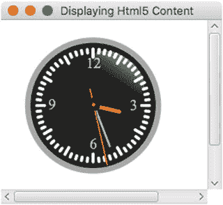
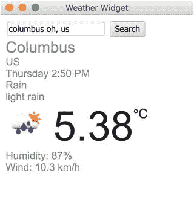
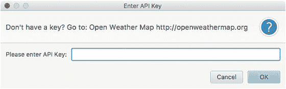

# 10. JavaFX 在 Web 中的应用

JavaFX 提供了与 HTML5 内容互操作的能力。JavaFX 底层的网页渲染引擎是广受欢迎的开源 C++ API——WebKit。该 API 被用于 Apple 的 Safari 浏览器、Amazon 的 Kindle 设备，并在 Google 的 Chrome 浏览器 27 版本之前被使用（WebKit 的分支称为 Blink）。HTML5 是在网页浏览器中渲染内容的事实标准标记语言。HTML5 内容包括 JavaScript、CSS、可缩放矢量图形（SVG）、Canvas API、媒体、XML 以及新的 HTML 元素标签。简而言之，您可以创建嵌入了类似网页浏览器功能的 JavaFX 应用程序。

JavaFX 与 HTML5 之间的关系是一种重要的结合，因为它们通过发挥各自的优势相互补充。例如，JavaFX 丰富的客户端 API 与 HTML5 丰富的网页内容相结合，创造了一种兼具原生桌面软件特性的网页应用用户体验。这种新型应用程序被称为富互联网应用程序（RIA）。

在深入探讨示例应用程序之前，本章将讨论以下核心 Java/JavaFX 基于 Web 的 API：

*   Java 9 模块 `javafx.web`，包命名空间：`javafx.scene.web`
    *   `WebEngine`
    *   `WebView`
    *   `WebEvent`
*   Java 9 模块：`jdk.jsobject`，包命名空间：`netscape.javascript`
    *   `JSObject`
*   Java 9 模块：`jdk.incubator.httpclient`，包命名空间：`jdk.incubator.http`。模块 `jdk.incubator.httpclient` 目前在 Java 9 中仍处于实验阶段。根据一些报告，该模块将在 Java 10 中最终确定并命名为 `java.httpclient`。
    *   `HttpClient`
    *   `HttpRequest`
    *   `HttpResponse`

在本章中，您将研究实现以下功能的示例应用程序：

*   将 HTML5 内容显示到 `WebView` 节点中（基于 SVG 的模拟时钟）
*   Java 与 JavaScript 之间的通信（`WeatherWidget`）


## JavaFX Web 与 HTTP2 API

在了解 JavaFX Web 和 HTTP2 API 之前，我想先说明，本章中的代码示例是作为 Java 9 模块（Jigsaw）开发的。鉴于此，我认为向您展示一个包含本章讨论的三个模块的模块定义是个好主意：

*   `javafx.web - WebEngine 和 WebView`
*   `jdk.jsobject - JSObject`
*   `jdk.incubator.httpclient - HttpClient, HttpRequest, HttpResponse`

下面展示的是一个依赖于这三个模块的典型应用程序模块：

```
module com.jfxbe.myapplicationmodule {
requires javafx.web;
requires jdk.jsobject;
requires jdk.incubator.httpclient;
exports com.jfxbe.myapplicationmodule;
}
```

作为给性急读者的快速参考，表 10-1 包含了这些模块及其类的描述。我还在描述列中提供了一个简短的代码片段，说明如何使用与 JavaFX Web 和 HTTP2 API 相关的各种 API。要查看与每个类相关的更详细讨论，您可以跳过表 10-1。

表 10-1.

Java 模块中包含的类描述

| 模块名称 | 类名 | 描述 |
| --- | --- | --- |
| `javafx.web` | `javafx.scene.web.WebEngine` | 一个能够加载 Web 内容的非可视化 UI 组件。`WebEngine webEngine = new WebEngine(url);` |
|   | `javafx.scene.web.WebView` | 一个由 `WebEngine` 实例支持的 JavaFX 节点，能够渲染 HTML5 内容以供显示。`WebView webView = new WebView();webView.getEngine().load(` [`www.oracle.com`](http://www.oracle.com) `");` |
|   | `javafx.scene.web.WebEvent` | 常见基于 HTML 浏览器的 Web 事件的回调。这些 Web 事件由 `WebEngine` 实例处理。`webView.getEngine()` `.setOnAlert((WebEvent<String> t) -> {` `showErrorDialog(t.getData());` `});` |
| `jdk.jsobject` | `netscape.javascript.JSObject` | JavaScript 桥接对象允许 Java 与 JavaScript 引擎通信。当返回时，您可以使用 `setMember()` 方法设置 Java 对象，以允许 JavaScript 代码调用 Java 方法。`JSObject jsobj = (JSObject) webView.getEngine()` `.executeScript("window");jsobj.setMember("WeatherWidget", this);` |
| `jdk.incubator.` `httpclient` | `jdk.incubator.http.HttpClient` | 一种发起 HTTP 请求的新方式。附加功能包括 WebSocket、认证器、代理和 SSL。`String jsonText = HttpClient.newHttpClient()` `.send(HttpRequest.newBuilder( URI.create(urlQueryString))` `.GET().build(),` `BodyHandler.asString()).body();` |
|   | `jdk.incubator.http.HttpRequest` | 用于发起 `GET`、`POST`、`UPDATE`、`DELETE` 等多种 HTTP 请求的新 API。`import static jdk.incubator.http.HttpRequest.BodyProcessor.fromString;` `import static jdk.incubator.http.HttpClient.newHttpClient;` `HttpRequest req = HttpRequest.newBuilder(` `URI.create("` `http://acme/create-account` `"))` `.POST(fromString("param1=abc,param2=123"))` `.build();` `newHttpClient().sendAsync(req,` `BodyHandler.discard(null))` `.whenCompleteAsync( (resp, throwable) -> {` `System.out.println("Saving complete.");` `});` |
|   | `jdk.incubator.http.HttpResponse` | 在发起 HTTP 请求后，会返回一个 HTTP 响应对象。响应对象包含状态码、HTTP 标头以及负载或内容体。请参阅 Javadoc 文档以了解将正文内容转换为不同数据格式的多种方法。`HttpResponse.BodyProcessor` |

## Web 引擎

JavaFX 提供了一个能够加载 HTML5 内容的非 GUI 组件，称为 `WebEngine` API（`javafx.scene.web.WebEngine`）。该 API 本质上是 `WebEngine` 类的一个对象实例，用于加载包含 HTML5 内容的文件。要加载的 HTML5 文件可以位于本地文件系统、Web 服务器或 JAR 文件中。当您使用 Web 引擎对象加载文件时，会使用后台线程来加载 Web 内容，这样就不会阻塞 JavaFX 应用程序线程。在本节中，您将了解以下两种用于加载 HTML5 内容的 `WebEngine` 方法：

*   `load(String URL)`
*   `loadContent(String HTML)`

### WebEngine 的 load() 方法

`WebEngine` API 与许多使用后台线程的 API 一样，遵循基于事件的编程模型。基于事件通常意味着方法调用是异步的（回调）；例如，Web 引擎可以从远程 Web 服务器异步加载 Web 内容，并在内容加载完成时通知处理程序代码。

收到通知后，处理程序代码将在 JavaFX 应用程序线程上运行。清单 10-1 在后台工作线程中从远程 Web 服务器加载 HTML 内容。

```
WebEngine webEngine = new WebEngine();
webEngine.getLoadWorker()
.stateProperty()
.addListener( (obs, oldValue, newValue) -> {
if (newValue == SUCCEEDED) {
// 加载完成...
// 处理内容...
// 使用 webEngine.getDocument();
}
});
webEngine.load("https://java.com");
清单 10-1.
一个带有 ChangeListener Lambda 表达式的 WebEngine，用于判断后台加载是否完成（成功）
```

要监视或判断工作线程是否已完成，可以将一个 `javafx.beans.value.ChangeListener`（lambda 表达式）添加到状态属性中。如果您不熟悉如何创建 lambda 表达式，请参阅关于 Lambda 表达式的第 4 章，以便能够使用诸如 `ChangeListener` 或 `InvalidationListener` 对象之类的函数式接口。

在清单 10-1 中，您会注意到一个作为 lambda 表达式的 `ChangeListener`，通过 `addListener()` 方法添加到状态属性中。状态属性包含 Web 引擎后台工作线程的状态或生命周期。这些状态基于 `State` 枚举，该枚举由 `javafx.concurrent.Worker` 接口拥有。

设置好监听器后，代码通过使用 Web 引擎的 `load()` 方法开始加载过程。还要注意，传递给 `load()` 方法的字符串是一个有效的 URL 字符串，表示 Web 内容文件或 Web 服务器的位置。

当将 `ChangeListener` lambda 表达式添加到状态属性时，参数如下：

*   `obs` 的类型为 `ObservableValue<? extends Worker.State>`，它引用 Web 引擎对象上的状态属性。
*   `oldValue` 的类型为 `Worker.State` 枚举，包含状态属性更改前的值。
*   `newValue` 的类型为 `Worker.State` 枚举，包含新的状态属性。

lambda 表达式（`ChangeListener`）每个参数的类型说明符被省略，以使参数签名更简洁。状态属性更改后，可以检查 `newValue` 参数以获取各种线程状态。在清单 10-1 中，`newValue` 变量用于检查工作线程的状态，这是一个急切求值的示例。

为了更全面，我列出了所有可能的工作线程状态：

```
READY, SCHEDULED, RUNNING, SUCCEEDED, CANCELLED, FAILED
```

正如您在清单 10-1 中看到的，代码通过将工作线程的状态与 `Worker.SUCCEEDED` 枚举值进行比较，来判断工作线程是否已完成加载 Web 内容。


### WebEngine 的 loadContent() 方法

加载 HTML5 内容的另一种方式是使用 Web 引擎的 `loadContent(String htmlText)` 方法并接受一个字符串。`loadContent()` 方法的优点在于，可以预先生成表示为字符串的 HTML 内容，而无需从远程服务器获取网页。以下代码片段加载了一个表示 HTML 内容的字符串：

```
webEngine.loadContent("JavaFX Rocks!");
```

现在你已经了解了加载 HTML 内容的两种策略，接下来将看到如何获取和操作原始内容，以及 Web 内容加载后可能从 Web 引擎对象获取的常见数据类型。

## HTML DOM 内容

Web 引擎可以按照基于 W3C 标准的 Java API，将当前页面的文档对象模型（DOM）作为 XML 内容加载。通常，熟悉 XML 文档对象模型（DOM）的开发者可以轻松查询 `org.w3c.dom.Document` 对象。本节将展示如何获取 W3C XML `Document` 对象以及作为 `String` 对象的原始 XML。

### 获取 org.w3c.dom.Document（DOM）对象

在 Web 引擎实例成功加载 HTML 内容后，可以通过调用 `WebEngine` 对象的 `getDocument()` 方法来获取 XML DOM。

以下代码片段获取了一个文档（`org.w3c.dom.Document`）实例，前提是 Web 引擎已完成 HTML 或 XML 内容的加载。

```
webEngine.getLoadWorker()
.stateProperty()
.addListener( (obs, oldValue, newValue) -> {
if (newValue == SUCCEEDED) {
org.w3c.dom.Document xmlDom = webEngine.getDocument();
// 在此处对 xmlDom 进行操作
}
});
webEngine.load("http://myserver.com/my_cool_xml:data.xml");
```

### 将原始 XML 内容作为字符串使用

根据具体情况，有时需要将原始 XML 数据作为文本字符串获取。开发者通常使用 JDOM 或 dom4j 等库来轻松地在两种数据类型之间进行转换。清单 10-2 展示了如何将 `org.w3c.dom.Document` 对象转换为 `String` 对象，而无需使用前面提到的 XML 解析库。

```
TransformerFactory transformerFactory = TransformerFactory.newInstance();
Transformer transformer = transformerFactory.newTransformer();
StringWriter stringWriter = new StringWriter();
transformer.transform(new DOMSource(webEngine.getDocument()),
new StreamResult(stringWriter));
String xml = stringWriter.getBuffer().toString();
System.out.println(xml);
清单 10-2.
将 XML DOM 转换为字符串
```

清单 10-2 的输出如下所示：

```

Tracey
Dea

Carl
Dea

```

### JavaScript 桥接

在本章开头，我讨论了底层 Web 引擎如何使用 WebKit 加载 HTML5 内容并与之交互。与 HTML5 内容交互意味着什么？JavaFX 的 `WebEngine` API 有一个 JavaScript 桥接，允许 Java 代码调用 HTML5 内容中的 JavaScript 函数或脚本代码。那么，另一个问题是如何将原始 HTML5 内容作为字符串获取？

实际应用中一些常见的用例包括：获取原始 HTML 内容用于网络爬虫（用于搜索引擎）、缓存网页、屏幕抓取、数据挖掘和数据分析。要获取原始 HTML5，你需要与 WebKit 中的 JavaScript 引擎交互，使用 WebEngine 的 `executeScript()` 方法访问 Web 内容的 DOM。以下代码语句访问 HTML 文档（DOM），从 `documentElement.outerHTML`（最顶层元素）获取原始内容：

```
String html = (String) webEngine.executeScript("document.documentElement.outerHTML");
```

### 从 Java 到 JavaScript 的通信

使用 `executeScript()` 方法的另一个示例见清单 10-3，其中代码调用了一个 JavaScript 函数 `sayHello()`，将文本添加到现有的、`id` 为 `my_message` 的 HTML `DIV` 元素中。包含 `sayHello()` 函数的 HTML 文件如清单 10-4 所示。

```
// 来自 Java 代码
webEngine.executeScript("sayHello('Hi there');");
清单 10-3.
Java 调用 JavaScript 函数
```

清单 10-3 中的 Java 代码调用了 JavaScript 函数 `sayHello()`，以更新 `id` 为 `my_message` 的 `DIV` 元素。清单 10-4 展示了包含 `sayHello()` 函数和 `DIV` 元素的 HTML 文件。请注意，代码将使用 DOM 的 `document.getElementById()` 函数来获取 DIV 元素。要了解更多关于 JavaScript 以及如何操作 DOM 的信息，请访问：

`https://developer.mozilla.org/en-US/docs/Web/API/Document`

```
function sayHello( msg ) {
document.getElementById('my_message').innerHTML = msg;
}

.
.

清单 10-4.
包含 sayHello() 函数的 HTML 文件
```

能够调用 JavaScript 是一项强大的功能，它允许 Java 代码使用 `WebEngine` 对象的 JavaScript 引擎来操作 DOM。但是，JavaScript 代码如何与 Java 代码进行通信呢？


### 从 JavaScript 与 Java 通信

Java 8 允许 JavaScript 代码调用 Java 代码。允许 JavaScript 调用 Java 代码意味着 Web 开发者现在可以利用许多 Java API。在本节中，我们将简要讨论如何让 JavaScript 代码与 Java 代码进行通信。

让 JavaScript 与 Java 通信非常简单。第一步是通过调用 `executeScript("window")` 方法获取 `WebEngine` 对象的 `JSObject` 对象。`JSObject` 是一个包装对象，用于在两种语言之间建立桥梁。

获取 `JSObject` 后，只需调用 `setMember()` 方法，即可将任何对象传入 JavaScript 引擎的上下文。调用 `setMember()` 方法时，需要传入一个字符串名称和对应的对象。假设该成员对象具有公开的实例方法，JavaScript 代码就可以访问它们。清单 10-5 展示了如何设置 `JSObject`，以便 JavaScript 引擎与 Java 通信。

```
// The web view's web engine
webView.getEngine()
.getLoadWorker()
.stateProperty()
.addListener( (obs, oldValue, newValue) -> {
if (newValue == Worker.State.SUCCEEDED) {
// Let JavaScript make upcalls to this (Java) class
JSObject jsobj = (JSObject) webView.getEngine()
.executeScript("window");
jsobj.setMember("ABCD", new HelloWorld() );
} });
清单 10-5.
允许 JavaScript 代码向上调用 Java 代码
```

在清单 10-5 中可以看到，`HelloWorld` 类实例被设置为 (`JSObject`) 对象中的一个成员。清单 10-6 展示了包含 `sayGoodbye()` 方法的简单 `HelloWorld` 类。

```
public class HelloWorld () {
public String sayGoodbye(String name) {
return "Hasta la vista " + name;
}
}
清单 10-6.
包含公共方法 sayGoodbye() 的 Java 类
```

将 `HelloWorld` 实例设置为名为 `ABCD` 的 `JSObject` 成员后，清单 10-7 中所示的 JavaScript 函数 `sayGoodbye()` 现在就可以调用 Java 方法 `ABCD.sayGoodbye()`。

```
.
.

function sayGoodbye(name) {
var message = ABCD.sayGoodbye(name);
document.getElementById('my_message').innerHTML = message;
}

.
.

清单 10-7.
调用 Java 代码的 JavaScript 代码
```

需要警告的是，请谨慎暴露那些可能让客户端代码获得访问权限，从而可能危害系统或查看私有数据的方法。

注意

由于 JavaScript 代码能够调用 Java，因此确保不暴露可能危害系统或查看私有数据的 API 至关重要。

正如本章前面提到的，`WebEngine` 对象是一个能够加载 Web 内容的非 GUI 组件，因此您可能会想，是否有可能进行 Web 服务调用，以检索具有不同数据格式（如流行的 JSON 格式）的序列化数据。要回答这个问题，您需要了解 `WebEngine` API 的职责和限制。

当使用 JavaFX 的 `WebEngine` API 请求 HTML、JSON 和 XML 数据等 Web 内容时，您会遇到一些限制；其中一些涉及异步从 Web 服务器获取（`GET`）数据或向 Web 服务器提交（`POST`）数据的能力。这类 Web 请求被称为 RESTful 服务。

当然，有几种有趣的方法（技巧）可以通过调用 HTML DOM 来获取文本内容，从而使用 `WebEngine` 对象获取 JSON 数据。清单 10-8 是一个如何在其 HTML DOM 中获取 JSON 文本内容的示例。

```
webEngine.load("http://myserver.org/current-weather?format=json");
.
.
.
// handler code to obtain JSON data.
String json = (String) webEngine.getDocument()
.getElementsByTagName("body")
.item(0)
.getTextContent();
清单 10-8.
获取 DOM 中的 JSON 文本
```

处理代码遍历 HTML 的 DOM，以获取从 Web 引擎对象检索到的文本内容。尽管实现起来看起来很容易将 JSON 数据作为字符串获取，但我不建议使用这种方法，因为它相当脆弱且非标准。从代码维护的角度来看，该代码可能会脱离上下文，未来可能出现潜在的 bug。我相信您听过这样一句话：“能做某事并不意味着你应该去做。”

您很快就会发现，`WebEngine` API 的职责基本上就是加载 HTML5 并与其内容（HTML/JavaScript）进行交互。`WebEngine` API 不负责进行 Web 服务调用或使用不同的传输协议序列化数据。

那么，有没有更好的方法来发起 Web 请求（RESTful）呢？当然有。虽然有许多库可以简化 Web 服务调用，但下一节将向您展示如何使用 Java 9 中名为 `jdk.incubator.httpclient` 的新实验模块来完成这些操作。


### Java 9 模块 jdk.incubator.httpclient

在本书前一版关于网络请求的章节中，我们使用了诸如 `HttpURLConnection` 类这样的传统 API；然而，在本章中，我们将改用新的实验性 Java 9 模块 HTTP2（JSR 110）。多年来，Java 开发者严重依赖第三方库来便捷地发起网络请求。在本书前一版中，我通过使用 `legacy HttpURLConnection` API 提供了一个纯 Java 解决方案；但它存在局限性。以下是 `HttpURLConnection` API 局限性的简要概述：

*   它支持现已过时的旧协议，例如 gopher、ftp 等。它不支持 WebSocket。
*   这些 API 非常难以使用。它们在准备请求和处理错误条件时，既没有使用流畅接口 API 模式，也没有使用 lambda 表达式。
*   请求调用仅支持阻塞模式。这些 API 没有使用 Java 8 新的 `CompletableFuture` API。

实验性的 Java 9 模块 `jdk.incubator.httpclient` 包含了新的 API，允许用户发起使用 Java 8 的 lambda 和并发 API `CompletableFuture` 的 HTTP 网络请求。`CompletableFuture` API 允许你发起一个异步调用，稍后再完成它。一旦调用完成，就可以触发处理程序代码来处理 `HttpResponse`。在本章后面，我们将通过一个示例天气小部件应用程序来使用这些新 API，该应用程序能够发起返回 JSON 数据的 RESTful 调用。

最初，Java 架构师计划将新的 HTTP2 模块添加到 Java 9 中；然而，随着项目 Jigsaw 的截止日期越来越紧，决定将其推迟到 Java 10。关于新 HTTP2 模块的好消息是，工程师们在 JDK 9 中创建了一个名为 `jdk.incubator.httpclient` 的孵化器项目。孵化器区域用于实验，最终将成为官方的核心 API。要查看 HTTP2 JDK 增强提案，请访问 [`http://openjdk.java.net/jeps/110`](http://openjdk.java.net/jeps/110)。

尽管 Java 9 中的新 HTTP2 模块是实验性的，但据我所知，它功能完备。Java 10 中官方的 HTTP2 模块实现可能会命名为 `java.httpclient`。事实上，一旦该模块迁移到 Java 10，你依赖 Java 9 HTTP 客户端模块（`jdk.incubator.httpclient`）的代码很可能会失效，需要指向新的模块名称。快速回顾一下，如果你还记得第 2 章关于模块化的内容，你的模块定义可能如下所示：

```
module com.jfxbe.myclientmodule {
requires jdk.incubator.httpclient;
exports com.jfxbe.myclientmodule;
}
```

假设你已经设置了 `JAVA_HOME` 和 `PATH` 环境变量，在执行应用程序模块时可能不需要添加 `jdk.incubator.httpclient` 模块；但是，`--add-modules` 选项可用于将第三方或平台模块添加到你的模块路径中。为了安全起见，在运行代码时请务必添加（`--add-modules`）`httpclient` 模块，如下所示：

```
$ java --add-modules jdk.incubator.httpclient --module-path mods com.jfxbe.myclientmodule
```

如果你不熟悉 Java 9 模块，请参阅第 2 章关于 JavaFX 和 Jigsaw 的内容以了解更多细节。假设你了解了必要的项目，让我们继续讨论 HTTP2 模块。

新的 HTTP2 模块主要分为两部分——`HttpClient` API 和 `HttpRequest` API。`HttpClient` API 全部关于连接，而 `HttpRequest` API 则关于网络请求。两者都使用构建器模式，分别通过静态方法 `HttpClient.newBuilder()` 和 `HttpRequest.newBuilder()` 实现。当遵循构建器模式时，大多数与属性相关的方法允许你以临时方式指定值。每个方法都返回最初创建的构建器实例。

在 `HttpClient` 和 `HttpRequest` 上调用 `newBuilder()` 后，会返回一个 `HttpClient.Builder` 和 `HttpRequest.Builder` 的实例。一旦你完成了对属性方法的值指定，你将调用 `build()` 方法来返回对象的实际实例。对于 `HttpClient.Builder` 实例，在调用 `build()` 方法后，会向调用者返回一个 `HttpClient` 实例。

#### HttpClient API

Java 9 HTTP2 模块的 `HttpClient` API 提供了多种连接设置。根据 Javadoc 文档，`HttpClient.Builder` 支持表 10-2 中所示的以下连接设置。

表 10-2. 使用 HttpClient.Builder 类时的连接设置

| 连接属性 | 描述 |
| --- | --- |
| `authenticator(Authenticator a)` | 设置用于 HTTP 身份验证的验证器。 |
| `cookieManager(CookieManager cookieManager)` | 设置一个 cookie 管理器。 |
| `executor(Executor executor)` | 设置用于发送和接收异步请求的 `ExecutorService`。 |
| `followRedirects(HttpClient.Redirect policy)` | 指定请求是否会自动跟随服务器发出的重定向。 |
| `pipelining(boolean enable)` | 为此客户端发送的 HTTP/1.1 请求启用流水线模式。 |
| `priority(int priority)` | 设置从此客户端发送的任何 HTTP/2 请求的默认优先级。 |
| `proxy(ProxySelector selector)` | 为此客户端设置一个 `ProxySelector`。 |
| `sslContext(SSLContext sslContext)` | 设置一个 `SSLContext`。 |
| `sslParameters(SSLParameters sslParameters)` | 设置 `SSLParameters`。 |
| `version(HttpClient.Version version)` | 在可能的情况下请求特定的 HTTP 协议版本。 |

一个使用基本身份验证的典型网站会指定一个 `java.net.Authenticator` 实例。清单 10-9 展示了一个使用基本身份验证创建的 `HttpClient`。

```
HttpClient client = HttpClient.newBuilder()
.authenticator(new Authenticator() {
@Override
protected PasswordAuthentication getPasswordAuthentication() {
return new PasswordAuthentication("username", "pa$$w0rd1".toCharArray());
}})
.build();
清单 10-9. 在 HttpClient 实例上指定的基本身份验证
```


#### HttpRequest API

构建好 HTTP 客户端后，你需要使用 `HttpRequest.newBuilder()` 方法创建一个 HTTP 请求，从而生成一个 `HttpRequest.Builder` 实例。在此处，你可以指定属性来构建一个 Web 请求。还记得我之前提到旧版 `HttpURLConnection` API 的局限性吗？其中一个局限就是该 API 难以使用。为了对比，我们来看看发起同步 HTTP `GET` Web 请求的旧方式与改进方式。清单 10-10 展示了发起 HTTP GET Web 请求的旧方式。

```
URL url = new URL(urlQueryString);
HttpURLConnection connection = (HttpURLConnection) url.openConnection(); connection.setDoOutput(true);
connection.setInstanceFollowRedirects(false);
connection.setRequestMethod("GET");
connection.setRequestProperty("Content-Type", "application/json"); connection.setRequestProperty("charset", "utf-8");
connection.connect();
InputStream inStream = connection.getInputStream();
output(inStream);
清单 10-10.
发起 HTTP GET Web 请求的旧方式
```

如你所见，清单 10-10 中的旧代码非常冗长。此外，HTTP 客户端和请求 API 似乎是结合在一起的。要查看使用新的 `http2` 模块改进后的代码，请参考清单 10-11（`HttpRequest`）。

```
HttpRequest request = HttpRequest.newBuilder(URI.create(queryStr))
.GET()
.build();
HttpResponse response = HttpClient.newHttpClient().send(request,
BodyHandler.asString());
System.out.println(response.statusCode());
System.out.println(response.body());
清单 10-11.
发起 HTTP GET Web 请求的改进方式
```

清单 10-11 的输出应类似于以下内容：

```

hello world
```

你会在清单 10-11 中注意到，HTTP `GET` 是一个方法，而不是旧方法 `setRequestMethod("GET")` 中指定的字符串。新的 `HttpRequest.Builder` API 还允许你通过 `method(String, BodyProcessor)` 方法来指定字符串形式的方法。`method()` 方法通常用于不太常见的 HTTP 方法，例如 `OPTION` 或 `HEAD`。由于 HTTP 协议是标准协议，HTTP 请求构建器也支持其他常用方法，例如 `PUT`、`POST` 和 `DELETE`。

在清单 10-11 中，你会注意到 `send()` 方法被用作与清单 10-10 等效的阻塞行为。在第二种场景中，`send()` 方法同样会对远程 Web 服务器进行阻塞调用。稍后，你将学习如何对远程 Web 服务器进行非阻塞调用。

通过使用 `HttpRequest.Builder` 对象，有多种方法可以创建 `HttpRequest` 实例。首先，你必须调用 `HttpRequest.newBuilder()` 方法。你可以在 `HttpRequest.Builder` 对象上指定的所有可用属性方法都列在表 10-3 中。请记住，当你在 `HttpRequest.Builder` 实例上完成属性方法的指定后，需要调用 `build()` 方法来返回一个 `HttpRequest` 对象。

表 10-3.

使用 HttpRequest.Builder 类时的 HttpRequest.Builder 请求属性方法

| 请求属性 | 描述 |
| --- | --- |
| `body(HttpRequest.BodyProcessor reqproc)` | 为此构建器设置请求体。 |
| `copy()` | 基于当前状态返回此构建器的精确副本。 |
| `expectContinue(boolean enable)` | 在发送请求体之前，请求服务器确认请求。 |
| `followRedirects(HttpClient.Redirect policy)` | 指定此请求是否会自动遵循服务器发出的重定向。 |
| `GET()` | 从此构建器构建并返回一个 `GET HttpRequest`。 |
| `header(String name, String value)` | 将给定的名称/值对添加到此请求的标头集合中。 |
| `headers(String... headers)` | 将给定的名称/值对添加到此请求的标头集合中。 |
| `method(String method)` | 使用给定的方法 `String` 从此构建器构建并返回一个 `HttpRequest`。 |
| `POST()` | 从此构建器构建并返回一个 `POST HttpRequest`。 |
| `proxy(ProxySelector proxy)` | 为此请求覆盖请求客户端上设置的 `ProxySelector`。 |
| `PUT()` | 从此构建器构建并返回一个 `PUT HttpRequest`。 |
| `setHeader(String name, String value)` | 将给定的名称/值对设置为此请求的标头集合。 |
| `timeout(TimeUnit unit, long timeval)` | 为此请求设置超时时间。 |
| `uri(URI uri)` | 设置此 `HttpRequest` 的请求 URI。 |
| `version(HttpClient.Version version)` | 为此请求覆盖 `HttpClient.version()` 设置。 |

现在你已经了解了如何使用 `send()` 轻松发起同步（阻塞）Web 请求，接下来让我们看看如何异步（非阻塞）发起 RESTful 请求。接下来你将看到更多关于如何使用 Java 9 的实验性模块 `jdk.incubator.httpclient` 发起 RESTful 请求的示例。

### 发起 RESTful 请求

在企业级 Web 开发领域，你不可避免地会遇到 RESTful Web 服务的概念。基于表述性状态转移（REST）的概念，RESTful Web 服务是轻量级的 HTTP 请求，通常涉及 XML 或 JSON 格式的数据。要发起 RESTful 调用，Web 请求将包含一个请求方法，用于告知 Web 服务器 HTTP 数据流事务的类型。

与数据库事务类似，RESTful 约定遵循 CRUD（创建、读取、更新和删除）的概念，其中创建阶段对应 `POST` 请求，读取对应 `GET`，更新对应 `PUT`，删除对应 `DELETE`。虽然 `GET` 和 `DELETE` 操作仅需一个查询字符串即可发起请求，但 `POST` 和 `PUT` 通常需要在请求中包含较大的数据负载。


### HTTP GET 请求

由于 RESTful 服务超出了本书的讨论范围，我将仅详细介绍两种常见的 RESTful 调用请求——`GET` 和 `POST`。清单 10-12 展示了开发者在检索 JSON 数据时通常执行的常见 HTTP `GET` 请求。请注意，在清单 10-12 中，`sendAsync()` 方法被用作对远程 Web 服务器的异步调用。这涉及一个后台工作线程获取数据，并在完成后收到通知。

```
import static jdk.incubator.http.HttpClient.newHttpClient;
import static jdk.incubator.http.HttpRequest.newBuilder;
import static jdk.incubator.http.HttpResponse.BodyHandler;
.
.
// ========================================================================
// sendAsync() 和 whenCompleteAsync() 方法返回一个
// CompletableFuture> 实例。
// ========================================================================
String queryStr = "http://myplace/current-weather?q=Pasadena%20MD,US&format=json";
HttpClient.newHttpClient()
.sendAsync(newBuilder(URI.create(queryStr))
.GET()
.build(),
BodyHandler.asString())
.whenCompleteAsync( (httpResp, throwable) -> {
if (throwable != null){
System.err.println(throwable.getMessage());
return;
}
String json  = httpResp.body();
System.out.println(json);
});
清单 10-12.
用于检索天气数据的 RESTful GET 请求
```

在清单 10-12 中，代码首先通过 `newHttpClient()` 方法创建一个 `HttpClient` 实例。`newHttpClient()` 方法在顶部被静态导入。这使得代码更简洁、更易读，无需输入所属类名。你还会注意到其他静态导入的方法和类，例如 `newBuilder` 和 `BodyHandler`。

创建新的 `HttpClient` 对象后，使用 `newBuilder()` 方法通过 `GET` 请求调用 `sendAsync()` 方法。为方便起见，`newBuilder()` 方法遵循构建器模式来创建 Web 请求。传递给 `sendAsync()` 方法的第二个（最后一个）参数是 `BodyHandler` 类型。

接下来，你将了解 Web 请求完成时的正文处理器类型和 `HttpResponse<T>` 响应对象。

#### 正文处理器

对于典型的 Web 请求，正文处理器只是一个 `String` 类型，但也可以检索其他正文类型。当正文处理器作为 `send()` 或 `sendAsync()` 方法的第二个参数传入时，与返回的 `HttpResponse<T>` 相关的正文处理器类型 `T` 将是相同的。例如，`whenCompleteAsync()` 方法将接收一个具有 `String` 类型正文处理器的 HTTP 响应。

在清单 10-12 中，`whenCompleteAsync()` 方法在 Web 请求完成时被触发。触发后，处理器代码将接收一个 `HttpResponse<String>` 和一个 Java `Throwable`。同样，你会注意到处理器代码调用 `httpResp.body()` 返回一个字符串。因为之前传入的 `BodyHandler.asString()` 的数据类型是字符串，所以 `body()` 方法返回一个 `String` 类型的值。

想知道还有哪些其他类型的正文处理器可用吗？

根据 Java 9 Javadoc 文档，以下是一些可以检索的其他正文处理器类型：

*   `asByteArray()`：返回一个 `BodyHandler<byte[]>`，它返回一个从 `BodyProcessor.asByteArray()` 获取的 `BodyProcessor<byte[]>`。
*   `asByteArrayConsumer(Consumer)`：返回一个 `BodyHandler<Void>`，它返回一个从 `BodyProcessor.asByteArrayConsumer(Consumer)` 获取的 `BodyProcessor<Void>`。
*   `asFileDownload(Path,OpenOption...)`：返回一个 `BodyHandler<Path>`，它返回一个 `BodyProcessor<Path>`，其中指定了下载目录，但文件名从 `Content-Disposition` 响应头中获取。`Content-Disposition` 头必须指定附件类型，并且还必须包含一个文件名参数。如果文件名指定了多个路径组件，则仅使用最后一个组件作为文件名（使用给定的目录名）。当返回 `HttpResponse` 对象时，正文已完全写入文件，并且 `HttpResponse.body()` 返回该文件的 `Path` 对象。返回的 `Path` 是提供的目录名和服务器提供的文件名的组合。如果目标目录不存在或无法写入，则响应将失败并抛出 `IOException`。
*   `discard(Object)`：返回一个响应正文处理器，它会丢弃响应正文并使用给定的值作为其替代。在 `POST` 请求期间使用。
*   `asString(Charset)`：返回一个 `BodyHandler<String>`，它返回一个从 `BodyProcessor.asString(Charset)` 获取的 `BodyProcessor<String>`。如果提供了字符集，则使用它对正文进行解码。如果字符集为 `null`，则处理器尝试从 `Content-encoding` 头确定字符集。如果不支持该字符集，则使用 `UTF_8`。

在此示例中，异步调用 `sendAsync()` 方法接受一个由查询字符串组成的有效 `URI`。创建 `URI` 后，`newBuilder()` 方法调用 `GET()` 方法来指定 HTTP 方法，最后调用 `build()` 方法返回一个填充了 `HttpRequest` 类型的对象。接下来，你将看到客户端发送较大负载（例如表单提交）时的常见 `POST` 请求。

### HTTP POST 请求

进行 RESTful `POST` 请求的代码看起来与上一个示例中的 `GET` 请求类似，不同之处在于提交的数据不会指定为附加的查询字符串，例如“`?param1=1&param2=555`”。相反，为了将名称/值对作为 `String` 负载发送，清单 10-13 展示了一个虚构银行使用 HTTP RESTful `POST` 服务创建新客户银行账户的示例。

```
HttpRequest request = HttpRequest.newBuilder(
URI.create("https://acmebank/create-account"))
.POST(fromString("id=" + newSeqId + ",firstName=John,lastName=Doe"))
.build();
HttpClient httpClient = newHttpClient();
httpClient.sendAsync(request, BodyHandler.discard(null))
.whenCompleteAsync( (httpResp, throwable) -> {
if (throwable != null){
System.err.println("Error Saving");
return;
}
System.out.println("Saving complete.");
});
清单 10-13.
一个 RESTful POST 请求
```

在清单 10-13 中，代码进行异步调用以创建新的客户银行账户。在此场景中，`id` 通过变量 `newSeqId` 在 `POST` 方法中传递，而不是在 HTTP 响应中返回。为了演示服务器不返回创建的客户 `id` 或任何字符串响应，指定了 `BodyHandler.discard(null)` 方法来忽略来自服务器的正文内容。

再次强调，关于 `sendAsync()` 方法的第二个参数与服务器返回的数据的关系，如果你的服务器代码在记录创建后返回一个生成的 `id`，则需要将 `sendAsync()` 方法的第二个参数替换为 `BodyHandler.asString()`。异步调用完成后，你可以调用 `httpResp.body()` 函数来返回服务器发送的消息。

新的 HTTP2 模块不仅可以提供请求/响应行为，还可以提供全双工或 WebSockets 行为。下一节将介绍 WebSockets。

### WebSockets

WebSockets 是一种使用 TCP 连接进行双向（全双工）通信的协议。Java 9 的 `http2` 模块支持创建客户端 WebSockets。与前面提到的 API 类似，WebSockets API 也提供了一个 `WebSocket.Builder` 类，用于轻松创建 `WebSocket` 实例。


#### 服务端套接字

本节不会展示与 WebSocket 相关的服务端示例代码。由于市面上有大量服务端解决方案，我建议你在网上搜索并挑选一个。我将主要展示使用 Java 9 的 `http2` 模块与一个本质上作为回显服务器的 WebSocket 进行通信的客户端代码。

对于基于 WebSocket 的服务端解决方案，以下是我在互联网上找到的一些方案：

*   Netty：[`https://netty.io`](https://netty.io)
*   Vert.x：[`http://vertx.io`](http://vertx.io)
*   Spark：[`http://sparkjava.com`](http://sparkjava.com)
*   JEE 7 供应商：
    *   Spring WebSocket：[`https://docs.spring.io/spring/docs/current/spring-framework-reference/html/websocket.html`](https://docs.spring.io/spring/docs/current/spring-framework-reference/html/websocket.html)
    *   Jetty：[`http://www.eclipse.org/jetty`](http://www.eclipse.org/jetty)

为了测试我的客户端代码，我使用了 Spark Java 的内嵌 Web 服务器，地址为 [`http://sparkjava.com`](http://sparkjava.com)。它们提供了创建 REST API 和服务端 WebSocket 的优秀示例。其文档展示了如何创建一个简单的回显服务器，该服务器会返回客户端发送的内容。要查看它们的回显服务器实现，请访问 Spark Java 关于 WebSocket 的主题页面：[`http://sparkjava.com/documentation`](http://sparkjava.com/documentation) `- embedded-web-server`。

要获取 Spark 库，以下是 Maven 和 Gradle 的坐标。

Spark Java 的 Maven 坐标：

```
com.sparkjava
spark-core
2.6.0

```

Spark Java 的 Gradle 坐标表示法：

```
compile "com.sparkjava:spark-core:2.6.0"
```

#### 客户端套接字

在客户端，你将创建一个 WebSocket 来连接服务器。要从 `HttpClient` 类创建 WebSocket，可以调用静态的 `newWebSocketBuilder()` 方法。该方法接受两个参数——一个 `URI` 和一个 `WebSocket.Listener` 对象。清单 10-14 创建了一个到 URL 为 `ws://localhost:4567/echo` 的回显服务器的 WebSocket 连接。默认情况下，Spark 使用端口 4567。

```
HttpClient client = HttpClient.newHttpClient();
WebSocket clientWebSocket = client.newWebSocketBuilder(
URI.create("ws://localhost:4567/echo"),
new ClientSocketListener())
.buildAsync().join();
// 向服务器发送两条消息
clientWebSocket.sendText("Hello World 1" + new Date());
clientWebSocket.sendText("Hello World 2" + new Date());
清单 10-14.
创建一个客户端 WebSocket 以通过 TCP/IP 发送文本。服务器会将发送的消息返回给客户端。
```

清单 10-14 首先创建了一个 `HttpClient` 实例，然后调用 `newWebSocketBuilder()` 来创建一个 `WebSocket.Builder` 实例。在传入 `URI` 之后，第二个参数是一个新的 `ClientSocketListener` 实例。要完成构建器，调用 `buildAsync()` 将返回一个 `CompletableFuture<WebSocket>`。调用 `buildAsync()` 之后，再调用 `join()` 方法将使其阻塞并等待返回 `WebSocket` 实例。创建 WebSocket 后，调用 `sendText()` 方法向服务器发送文本。

清单 10-15 中展示的 `ClientSocketListener` 类负责与服务器通信时的处理代码。其中唯一真正实现的方法是 `onText()`。

```
class ClientSocketListener implements WebSocket.Listener {
@Override
public void onOpen(WebSocket webSocket) {
System.out.println("onOpen");
}
@Override
public CompletionStage onBinary(WebSocket webSocket, ByteBuffer message, WebSocket.MessagePart part) {
System.out.println("onBinary");
return null;
}
@Override
public CompletionStage onPing(WebSocket webSocket, ByteBuffer message) {
System.out.println("onPing");
return null;
}
@Override
public CompletionStage onPong(WebSocket webSocket, ByteBuffer message) {
System.out.println("onPong");
return null;
}
@Override
public CompletionStage onClose(WebSocket webSocket, int statusCode, String reason) {
System.out.println("onClose");
return null;
}
@Override
public void onError(WebSocket webSocket, Throwable error) {
System.out.println("onError");
}
@Override
public CompletionStage onText(WebSocket webSocket,
CharSequence message,
WebSocket.MessagePart part) {
System.out.println("onText");
// 请求一条消息
webSocket.request(1);
// 从服务器接收消息。
return CompletableFuture.completedFuture(message)
.thenAccept(System.out::println);
}
}
清单 10-15.
一个用于响应回显服务器的客户端套接字监听器类
```

在清单 10-15 中，这些方法基本上都是当从服务器接收到消息时的所有事件和回调。你会注意到 `onText()` 方法返回一个实例：

```
CompletableFuture
```

由于消息是异步的，当消息完成时会触发 `thenAccept()` 方法。完成后，类型为 `CharSequence` 的消息将被打印到控制台。

好了，这就是一个关于 WebSocket 的简短代码示例。我相信你对获取和发布数据感到兴奋；不过，请保持这份热情，因为你接下来将看到如何使用 JavaFX 显示数据！

### 查看 HTML5 内容（WebView）

现在你已经了解了获取网络内容的各种策略，你终于有机会使用强大的 JavaFX `WebView` 节点来显示 HTML5 网络内容了。

JavaFX 提供了一个 GUI WebView（`javafx.scene.web.WebView`）节点，它可以将 HTML5 内容渲染到场景图上。`WebView` 节点本质上是一个迷你浏览器 UI 组件，可以响应 Web 事件，并允许开发者与 HTML5 内容进行交互。由于加载网络内容与显示网络内容的能力密切相关，`WebView` 节点对象还包含一个 `WebEngine` 实例。

为了吊起你的胃口，我创建了一个使用 `WebView` API 渲染 HTML5 内容的示例。该示例是一个显示基于 SVG 的模拟时钟的 JavaFX 应用程序。要获取完整源代码，请访问本书网站并下载 `DisplayingHtml5Content` 项目。


### 示例：一个 HTML5 模拟时钟

作为使用 HTML5 内容渲染到 `WebView` 节点的一个示例，让我们来看一个基于 W3C 可缩放矢量图形（SVG）标记语言、使用 SVG 文件创建的模拟时钟。图 10-1 展示了一个基于 SVG 的模拟时钟，它被渲染在 JavaFX 的 `WebView` 节点中。



图 10-1.

基于 SVG 的模拟时钟（WebView 节点）

你可以看到，模拟时钟的表盘有时针、分针和秒针。时钟指针将根据当前时间进行初始化和定位。当然，随着时间的推移，指针会顺时针旋转。

要下载代码，请访问本书的网站或 [`https://github.com/carldea/jfx9be`](https://github.com/carldea/jfx9be) 获取关于如何编译和运行代码的说明。代码清单 10-16 展示了如何在 DOS 命令提示符（终端）下编译代码、复制资源以及运行显示 HTML5 内容应用程序的语句。

```
// 编译
$ javac -d mods/com.jfxbe.html5content $(find src/com.jfxbe.html5content -name "*.java")
// 复制资源
$ cp src/com.jfxbe.html5content/com/jfxbe/html5content/clock.svg \
mods/com.jfxbe.html5content/com/jfxbe/html5content
// 运行应用程序
$ java --module-path mods -m \
com.jfxbe.html5content/com.jfxbe.html5content.DisplayingHtml5Content
代码清单 10-16.
编译、复制资源并运行显示 HTML5 内容应用程序示例的语句
```

编译语句会将编译后的类放入 `mods/com.jfxbe.html5content` 目录中。

一旦你编译了代码，下一条语句会将资源复制到编译后的区域。复制资源可以使诸如 `clock.svg` 之类的文件在运行时可用。通常，你喜欢的集成开发环境（IDE）会自动复制资源。最后一条语句通过使用 `--module-path` 指向新编译的模块（`com.jfxbe.html5content`）来运行应用程序。同时请注意 `-m` 开关。它告诉 Java 运行时环境要运行哪个模块，以及哪个类包含应用程序的 `main()` 方法。

成功运行应用程序后，图 10-1 展示了包含一个在 `WebView` 节点中渲染的 SVG 时钟的 `DisplayingHtml5Content` 应用程序。接下来，让我们看看源代码，了解它是如何实现的（即，是什么让它运转的？）。

### 模拟时钟源代码

源代码以代码清单 10-17 所示的模块定义开始。如果你不熟悉 Java 9 的模块定义，请参考关于 JavaFX 和 Jigsaw 的第 2 章。如果你想忽略模块，将代码视为 Java 8 代码，只需跳过模块定义，查看代码清单 10-18 所示的主要源代码即可。

```
module com.jfxbe.html5content {
requires javafx.web;
requires jdk.jsobject;
exports com.jfxbe.html5content;
}
代码清单 10-17.
com.jfxbe.html5content 模块的 module-info.java 定义内容
```

模块定义以诸如 `com.jfxbe.html5content` 这样的名称开始。当然，这只是一个约定，不一定要使用命名空间和点号分隔。在撰写本书时，编译过程中我收到一个警告，因为我的模块名称 `html5content` 中包含数字 `5`。目前，关于命名约定、在指定要包含的模块名称时减少输入量以及简化命令行上应用程序的运行等方面，已有一些邮件在讨论。

主要的模拟时钟源代码如代码清单 10-18 所示。该模拟时钟基于一个加载到 JavaFX 应用程序场景图中的 SVG 文件。代码清单 10-19 展示了包含大部分功能代码的 SVG 文件，这些代码用于显示表盘以及驱动时针、分针和秒针动画的 JavaScript 代码。

```
package com.jfxbe.html5content;
import javafx.application.Application;
import javafx.scene.Scene;
import javafx.scene.paint.Color;
import javafx.scene.web.WebView;
import javafx.stage.Stage;
import java.net.MalformedURLException;
import java.net.URL;
/**
* 一个使用 WebView 节点渲染的 SVG 模拟时钟。
* @author cdea
*/
public class DisplayingHtml5Content extends Application {
@Override
public void start(Stage primaryStage) throws MalformedURLException {
primaryStage.setTitle("显示 Html5 内容");
WebView browser = new WebView();
Scene scene = new Scene(browser,320,250, Color.rgb(0, 0, 0, .80));
primaryStage.setScene(scene);
URL url = getClass().getResource("clock.svg");
browser.getEngine().load(url.toExternalForm());
primaryStage.show();
}
public static void main(String[] args) {
launch(args);
}
}
代码清单 10-18.
模拟时钟源代码（DisplayingHtml5Content.java）
```

代码清单 10-19 展示了使用 Inkscape 工具创建的 `clock.svg` SVG 文件。SVG 规范类似于 HTML 标记，你可以在其中嵌入 JavaScript 代码来查询 DOM 中的元素标签。

```

12) {
hr = hr - 12; }
var min = parseInt(date.getMinutes());
var sec = parseInt(date.getSeconds());
var pi=180;
var secondAngle = sec * 6 + pi;
var minuteAngle = ( min + sec / 60 ) * 6 + pi;
var hourAngle   = (hr + min / 60 + sec /3600) * 30 + pi;
moveHands(secondAngle, minuteAngle, hourAngle);
}
function moveHands(secondAngle, minuteAngle, hourAngle) {
var secondHand = document.getElementById("secondHand"); var minuteHand = document.getElementById("minuteHand"); var hourHand = document.getElementById("hourHand");
secondHand.setAttribute("transform","rotate("+ secondAngle + ")");
minuteHand.setAttribute("transform","rotate("+ minuteAngle +")");
hourHand.setAttribute("transform","rotate("+ hourAngle + ")");
} ]]>

... // SVG 代码开始
... // 主时钟代码

... // 时钟其余代码：光泽眩光、黑色按钮盖（中心）

代码清单 10-19.
包含模拟时钟 SVG 表示的 clock.svg 文件
```


### 工作原理

HTML5 允许在浏览器中显示可缩放矢量图形（SVG）内容。SVG 类似于 JavaFX 的场景图（保留模式），其中的节点可以在不同尺寸下缩放，同时保留形状细节，不会产生像素化效果。在此示例中，代码清单 10-18 代表 Java 源代码，而代码清单 10-19 代表加载到 `WebView` 节点中的 SVG 内容代码。

在运行示例代码之前，请确保 `clock.svg` 文件位于构建路径中。在 NetBeans 中，你可能需要在运行应用程序之前执行清理和构建操作，这会将资源文件 `clock.svg` 复制到构建路径中。

让我们直接进入代码清单 10-18 的代码，从 `start()` 方法开始。该方法首先设置 `Stage` 窗口的标题栏。然后，在创建 Scene 对象时，代码实例化一个 `WebView` 节点作为根节点。创建完成后，该场景被设置为 `Stage` 窗口的当前场景。

在加载文件之前，代码基于 `getClass().getResources()` 方法获取文件位置的有效 URL 字符串。

加载 URL 时，你会注意到调用了 `getEngine().load()`，其中 `getEngine()` 方法会返回一个 `javafx.scene.web.WebEngine` 对象的实例。这基本上意味着所有实例化的 `WebView` 类都会隐式创建自己的 `javafx.scene.web.WebEngine` 实例。以下代码片段摘自代码清单 10-18，展示了 JavaFX 的 `WebEngine` 对象加载 `clock.svg` 文件的过程：

```
WebView browser = new WebView();
URL url = getClass().getResource("clock.svg");
browser.getEngine().load(url.toExternalForm());
```

你可能想知道为什么 Java 源代码这么少。这是因为 `WebView`（`javafx.scene.web.WebView`）节点仅负责渲染 HTML5 内容。大部分代码显示在代码清单 10-19 中，其中包含 `clock.svg` 文件。该文件不仅包含 SVG 标记语言，还包含 JavaScript 代码。SVG 规范支持对元素应用动画。接下来，让我们看看 SVG 内容是如何创建的。

### Inkscape 与 SVG

这个模拟时钟是使用流行的开源 SVG 绘图程序 Inkscape 创建的。由于 Inkscape 超出了本书的范围，我不会讨论该工具的细节。要了解更多关于 Inkscape 的信息，请访问 [`http://www.inkscape.org/`](http://www.inkscape.org/) 查看教程和演示。要了解更多关于 SVG 的信息，请访问 [`https://www.w3schools.com/graphics/svg_intro.asp`](https://www.w3schools.com/graphics/svg_intro.asp) 。

简而言之，Inkscape 允许设计人员创建形状、文本和效果来生成插图。由于 SVG 文件被视为 HTML5 内容，因此这些文件也可以在支持 HTML5 的浏览器（例如 `WebView` 节点）中显示。

运行名为 `DisplayingHtml5Content` 的示例项目时，你会看到时钟的指针通过顺时针旋转来移动或产生动画。你可能想知道时钟指针是如何旋转或定位的。简单来说，当操作 SVG 元素或任何 HTML5 元素时，将使用 JavaScript 语言。事实上，在此示例中，时钟的时针、分针和秒针节点元素是通过使用代码清单 10-19 中位于 `<script>` 标签元素之间的 JavaScript 代码来旋转的。

在这些 `<script>` 标签之间是负责初始化和更新时钟指针的 JavaScript 代码语句。主代码使用 `updateTime()` 函数来计算每个秒针、分针和时针的位置。在时钟指针动画开始之前，代码通过整个 SVG 文档（位于根 `svg` 元素上）的 `onload` 属性调用 JavaScript `updateTime()` 函数来设置时钟的初始位置。一旦时钟指针设置完毕，SVG 代码就开始使用 `animateTransform` 元素来制作时钟指针的动画。以下是使秒针无限期动画化的 SVG 代码：

最后，如果你想创建一个像本示例中描述的时钟，请访问 [`http://screencasters.heathenx.org/blog`](http://screencasters.heathenx.org/blog) 了解有关 Inkscape 的所有信息。另一个令人印象深刻且美观的自定义控件展示，专注于时钟、仪表和刻度盘，是 Gerrit Grunwald 的 Medusa、Steel Series 和 Enzo 库。要感到完全惊叹，请访问他的博客 [`http://harmoniccode.blogspot.com`](http://harmoniccode.blogspot.com) 。

### WebEvents

如果你已经阅读过第 9 章关于 JavaFX 媒体以及 API 如何设计为事件驱动的讨论，那么你会很高兴地知道 JavaFX Web API 也遵循事件驱动的编程模型。Web 事件反映了浏览器引发客户端事件（如警报、错误和状态）的方式。在本节中，你将简要了解如何响应基于 Web 的事件。

如果你熟悉 JavaScript 客户端 Web 开发，你很可能知道如何弹出一个带有消息的警报对话框。如果你不知道如何显示警报框，以下 JavaScript 代码片段将弹出一个警报对话框（假设你正在使用浏览器）：

```
alert('JavaFX is Awesome');

```

通常，老派的 Web 开发人员会使用警报框来调试网页。然而，现代 Web 开发人员更可能使用 JavaScript 函数 `console.log()` 将信息输出到 Firebug 或 Chrome 浏览器开发者工具提供的控制台中。那么，你认为如果一个包含上述 `alert()` 代码的 HTML 网页被加载到 `WebView` 节点中会发生什么？

当代码在 JavaFX `WebView` 节点内执行时，不会弹出本机对话框窗口。但是 `OnAlert` 事件会作为 `javafx.scene.web.WebEvent` 对象被触发。要设置处理程序，请使用 `setOnAlert()` 方法，其入参类型为 `WebEvent`。

以下代码片段将接收包含字符串消息的 `WebEvent<String>` 对象，并将该消息输出到控制台：

```
webView.getEngine().setOnAlert((WebEvent wEvent) -> {
System.out.println("Alert Event - Message: " + wEvent.getData());
// ... 显示一个 JavaFX Alert 对话框窗口
});
```

希望在触发警报消息时创建自己的对话框窗口的开发人员，只需响应 `WebEvents` 并使用 JavaFX 对话框 API（例如 `Alert` 实例）即可。表 10-4 显示了所有 `WebEngine` 的 Web 事件。

表 10-4.

javafx.scene.web.WebEngine WebEvents 和属性

| 设置方法 | 方法属性 | 描述 |
| --- | --- | --- |
| `setOnAlert()` | `onAlertProperty()` | JavaScript 警报处理程序 |
| `setOnError()` | `onErrorProperty()` | WebEngine 错误处理程序 |
| `setOnResized()` | `onResizedProperty()` | JavaScript 调整大小处理程序 |
| `setOnStatusChanged()` | `onStatusChanged()` | JavaScript 状态处理程序 |
| `setOnVisibilityChanged()` | `onVisibilityChangedProperty()` | JavaScript 窗口可见性处理程序 |
| `setConfirmHandler()` | `confirmHandlerProperty()` | JavaScript 确认窗口 |

现在你已经了解了如何检索数据、操作 HTML 以及响应基于浏览器的 Web 事件，让我们看一个结合了你目前所学所有技术的示例。这个示例是一个天气小部件应用程序，它从 RESTful 端点获取 JSON 数据。你还将看到使用 JavaScript 桥接对象 `netscape.javascript.JSObject` 在 Java 和 JavaScript 之间进行双向通信。


### 天气小部件示例

本节演示的示例是一个天气小部件，它结合了目前所提及的所有基于 Web 的概念。该示例是一个 JavaFX 应用程序，它从 Open Weather Map API（[`http://openweathermap.org`](http://openweathermap.org)）加载 JSON 格式的天气信息。图 10-2 展示了显示美国俄亥俄州哥伦布市当前天气状况的天气小部件示例。



图 10-2.

一个显示当前天气状况的天气小部件。当你以“城市 州,国家”的格式输入城市、州代码和国家代码后，点击“搜索”按钮即可获取 JSON 数据。

要下载代码，请访问本书网站或 [`https://github.com/carldea/jfx9be`](https://github.com/carldea/jfx9be) 获取有关如何编译和运行代码的说明。由于 `http2` 模块属于孵化器领域，我想提醒你注意，在编译和运行包含该模块时会出现警告。清单 10-20 展示了如何在 DOS 命令提示符（终端）下编译代码、复制资源并运行天气小部件应用程序的语句。

```
// MacOSX 和 Linux
// 编译
$ javac -d mods/com.jfxbe.weatherwidget $(find src/com.jfxbe.weatherwidget -name "*.java")
// 复制资源
$ cp src/com.jfxbe.weatherwidget/com/jfxbe/weatherwidget/weather_template.html \
mods/com.jfxbe.weatherwidget/com/jfxbe/weatherwidget
// 运行应用程序
$ java --add-modules jdk.incubator.httpclient --module-path mods -m com.jfxbe.weatherwidget/com.jfxbe.weatherwidget.WeatherWidget
// Windows 操作系统
// 编译
c:\jfxbe\chap10> javac -d mods\com.jfxbe.weatherwidget src\com.jfxbe.weatherwidget\module-info.java src\com.jfxbe.weatherwidget\com\jfxbe\weatherwidget\WeatherWidget.java
// 复制资源
c:\jfxbe\chap10> copy src\com.jfxbe.weatherwidget\com\jfxbe\weatherwidget\weather_template.html
mods\com.jfxbe.weatherwidget\com\jfxbe\weatherwidget
// 运行应用程序
c:\jfxbe\chap10> java --add-modules jdk.incubator.httpclient --module-path mods -m com.jfxbe.weatherwidget/com.jfxbe.weatherwidget.WeatherWidget
清单 10-20.
编译、复制资源并运行天气小部件应用程序示例的语句
```

编译语句会将编译后的类放入 `mods/com.jfxbe.weatherwidget` 目录。编译时，你应该会在控制台上看到以下警告：

```
warning: using incubating module(s): jdk.incubator.httpclient
1 warning
```

你可以忽略该警告并继续执行其他步骤。该警告基本上表明它被视为实验性功能，不属于核心部分。

编译完代码后，你需要将资源复制到编译后的区域。复制资源将使文件在运行时可用。通常，你喜欢的 IDE 会自动复制资源。最后一条语句通过 `--add-modules` 添加 `jdk.incubator.httpclient` 模块，并使用 `--module-path` 将新编译的模块指向 `mods` 目录来运行应用程序。注意 `-m` 开关，它告诉 Java 运行时运行哪个模块以及哪个类包含 `main` 应用程序。在本例中，模块名称和主类名称指定如下：

```
com.jfxbe.weatherwidget/com.jfxbe.weatherwidget.WeatherWidget.
```

成功运行应用程序后，图 10-2 显示了天气小部件应用程序窗口。

在我深入讲解源代码之前，我想指出，为了让天气小部件应用程序成功检索数据，必须从 Open Weather Map 的人员那里获取一个有效的 API 密钥。要注册并获取 API 密钥，请访问 [`http://openweathermap.org`](http://openweathermap.org) 。如果你是第一次运行该应用程序，系统会弹出一个对话框，要求你输入 API 密钥，如图 10-3 所示。



图 10-3.

一个用于输入来自 Open Weather Map 的 API 密钥的对话框

一旦 API 密钥被输入并接受，它将被本地存储在一个名为：

```
{user.home}/.openweathermap-api-key
```

的文件中。其中 `{user.home}` 是你需要替换为你的主目录的位置。文件保存后，当你再次启动应用程序时，将加载该 API 密钥文件，而不会提示用户输入 API 密钥。

在 Java 的系统属性中，`user.home` 是用户的主目录，具体取决于操作系统。请参阅以下位置的 Javadoc 文档和教程：

```
https://docs.oracle.com/javase/tutorial/essential/environment/sysprop.html
```

注意

本示例中的 Web 服务由 Open Weather Map（[`http://openweathermap.org`](http://openweathermap.org)）的人员提供支持。我鼓励你支持他们，因为他们继续为应用程序和移动开发者提供有关全球地图和天气数据的宝贵服务。

### 一行代码：将输入流读取为字符串

作为天气小部件示例加载 API 密钥文件的一个非常巧妙的小技巧，我创建了一个简单的静态工具方法 `streamToString()`。这个方便的工具方法允许你读取文件内容或连接的输入流，并将其转换为字符串。

当你查看天气小部件示例的源代码时，该方法将尝试读取一个本地文件，该文件包含从网站 [`http://openweathermap.org`](http://openweathermap.org) 颁发的 API 密钥字符串。

清单 10-21 展示了如何将输入流转换为 `String` 对象。

```
private static String streamToString(InputStream inputStream) {
String text = new Scanner(inputStream, "UTF-8")
.useDelimiter("\\Z")
.next();
return text;
}
清单 10-21.
一个将文本文件读取为字符串对象返回给调用者的静态方法
```

你会很快注意到那个“神奇地”将输入流转换为 `String` 对象的奇怪的一行语句。`streamToString()` 方法使用了方便的 `Scanner` API。这个 API 非常适合读取具有分隔文本行的文本文件，例如逗号分隔值（CSV）。Scanner 对象默认将其分隔符设置为行尾字符（`\n`）。

通过将文件结束符（EOF）标记（`\\Z`）设置为分隔符，`next()` 方法将返回结束前的文本流，从而将整个文本作为一个字段创建。当然，还有其他检索文本数据的方法，可能也更高效；但是，你可以看到，使用这种策略可以处理中小型数据请求（最多约 3MB）的常见情况。大小可能是一个问题，因为数据被转换为 `String` 对象，并且根据没有垃圾回收的请求数量，内存资源很容易被消耗——可能会使应用程序不堪重负。由于它只是一个由哈希组成的 API 密钥，所以应该完全没问题。

天气小部件允许用户在搜索字段中输入城市或区域来确定天气状况。获取 JSON 天气数据后，屏幕将显示以下信息：城市、国家、星期几、时间（上次更新）、天气状况、天气描述、图标、温度、湿度、风速。代码将执行 JavaScript 代码来填充显示内容。

好了，关于应用程序的先决条件和描述就介绍到这里——现在让我们来看看天气小部件的源代码。


### 源代码

天气小部件项目包含三个源文件：

*   `module-info.java`：模块定义，需要 `jdk.incubator.httpclient` 等。
*   `WeatherWidget.java`：主应用程序代码
*   `weather_template.html`：用作天气信息主要显示的 HTML 模板

在清单 10-22 中，`module-info.java` 文件包含了模块定义。天气小部件模块依赖于以下模块：`javafx.web`、`jdk.jsobject` 和 `jdk.incubator.httpclient`。最后一条语句是天气小部件模块自身的导出。导出模块是使该模块及其 API 对任何使用者公开的方式。例如，如果另一个模块添加了 `requires com.jfxbe.weatherwidget`，那么它们的代码就可以安全地导入 `com.jfxbe.weatherwidget` 所拥有的包。请记住，如果现有模块（例如 `java.base` 模块）已经引用了传递性依赖，则无需在模块定义中包含它们。

```
module com.jfxbe.weatherwidget {
requires javafx.web;
requires jdk.jsobject;
requires jdk.incubator.httpclient;
exports com.jfxbe.weatherwidget;
}
清单 10-22.
com.jfxbe.weatherwidget 模块的 module-info.java
```

清单 10-23 是 `WeatherWidget.java` 文件中的天气小部件主应用程序代码。在源代码中，为了节省本章篇幅，我省略了一些导入语句，但包含了静态导入，以使后续代码更简洁。建议阅读类顶部的注释，以便更好地理解代码在 Java 和 JavaScript 之间来回通信时的数据流。


```java
package com.jfxbe.weatherwidget;
// 其他导入已省略...
import static jdk.incubator.http.HttpClient.newHttpClient;
import static jdk.incubator.http.HttpRequest.newBuilder;
import static jdk.incubator.http.HttpResponse.BodyHandler;
/**
* WeatherWidget 应用程序演示了
* 以下交互的使用：
* 
*  1) 从 Java 到 JavaScript 的通信
*  2) 从 JavaScript 到 Java 的通信
*  3) RESTful GET Web 服务端点
*  4) 操作 JSON 对象
*  5) 处理 HTML/JavaScript WebEvents
*  6) 使用 Firebug lite 进行调试
* 
*
* 
*     以下是帮助演示上述交互的步骤：
*
* 步骤 1：用户在搜索文本字段中输入城市、州和国家。
*         （参见 weather_template.html）
* 步骤 2：按下搜索按钮后，调用 JavaScript 函数
*         findWeatherByLocation()。（参见 weather_template.html）
* 步骤 3：从 JavaScript 向上调用 Java 方法
*         WeatherWidget.queryWeatherByLocationAndUnit()。（参见此类）
* 步骤 4：查询天气数据后，JSON 数据被传递给
*         Java 方法 populateWeatherData()。此方法将调用
*         JavaScript 函数 populateWeatherData()。（参见此类）
* 步骤 5：使用 JavaScript 函数 populateWeatherDate() 填充 HTML 页面
*         （参见 weather_template.html）
*
* 
*
* 需要获取有效的 API 密钥才能查询天气数据。
* 要获取 API 密钥，请访问 Open Weather Map：
* http://openweathermap.org
*
* @author cdea
*/
public class WeatherWidget extends Application {
/** 当前天气 REST 端点的主 URL。 */
public static final String WEATHER_URL = "http://api.openweathermap.org/data/2.5/weather";
/** 包含有效 API 密钥的本地文件。 */
public static final String API_KEY_FILE = ".openweathermap-api-key";
/** 用于访问天气和地图数据的 API 密钥。 */
private static String API_KEY = null;
/** 天气显示 HTML 页面 */
public static final String WEATHER_DISPLAY_TEMPLATE_FILE = "weather_template.html";
/** 用于显示 HTML5 内容的 WebView 节点 */
private WebView webView;
/** 用于发出 HTTP 请求的单例 HTTP 客户端 */
private static HttpClient HTTP_CLIENT;
@Override
public void start(Stage stage) {
stage.setTitle("天气小部件");
webView = new WebView();
Scene scene = new Scene(webView, 300, 300);
stage.setScene(scene);
// 获取 API 密钥
loadAPIKey();
// 开启 Firebug lite 用于调试
// html、css、javascript
// enableFirebug(webView);
// Web 视图的 Web 引擎
webView.getEngine()
.getLoadWorker()
.stateProperty()
.addListener( (obs, oldValue, newValue) -> {
if (newValue == Worker.State.SUCCEEDED) {
// 让 JavaScript 向上调用此（Java）类
JSObject jsobj = (JSObject)
webView.getEngine()
.executeScript("window");
jsobj.setMember("WeatherWidget", this);
// 默认城市的天气（一个阳光明媚的地方）
queryWeatherByLocationAndUnit("Miami,FL", "c");
}
});
// 显示解释错误的 JavaFX 对话框窗口
webView.getEngine().setOnAlert((WebEvent t) -> {
System.out.println("警报事件 - 消息：" + t.getData());
showErrorDialog(t.getData());
});
// 加载 HTML 模板以显示天气
webView.getEngine()
.load(getClass()
.getResource(WEATHER_DISPLAY_TEMPLATE_FILE)
.toExternalForm());
stage.show();
}
/**
* 如果 API 密钥文件不存在，提示用户输入其密钥。
* 一旦有效密钥保存到名为 .openweathermap-api-key 的文件中，
* 应用程序将使用它来获取天气数据。
*/
private void loadAPIKey() {
// 从本地文件加载 API 密钥
File keyFile = new File(System.getProperty("user.home") + "/" + API_KEY_FILE);
// 检查文件是否存在以及读写权限。
if (keyFile.exists() && keyFile.canRead() && keyFile.canWrite()) {
try (FileInputStream fis = new FileInputStream(keyFile)){
Optional apiKey = Optional.ofNullable(streamToString(fis));
apiKey.ifPresent(apiKeyStr -> API_KEY = apiKeyStr);
} catch (Exception e) {
Platform.exit();
return;
}
} else {
// 如果 API 密钥不存在，显示对话框。
TextInputDialog dialog = new TextInputDialog("");
dialog.setTitle("输入 API 密钥");
dialog.setHeaderText("没有密钥？请访问：Open Weather Map http://openweathermap.org");
dialog.setContentText("请输入 API 密钥：");
Optional result = dialog.showAndWait();
result.ifPresent(key -> {
// 写入磁盘
try (FileOutputStream fos = new FileOutputStream(keyFile)) {
String apiKey = result.get();
fos.write(apiKey.getBytes());
fos.flush();
API_KEY = apiKey;
} catch (Exception e) {
e.printStackTrace();
Platform.exit();
return;
}
});
}
}
/**
* 显示错误对话框窗口。
* @param errorMessage
*/
private void showErrorDialog(String errorMessage) {
Alert dialog = new Alert(Alert.AlertType.ERROR,  errorMessage);
dialog.setTitle("检索天气数据时出错");
dialog.show();
}
@Override
public void stop() throws Exception {
// 在此处清理资源...
}
/**
* 快速单行方法，以文件结束符为分隔符，
* 并将整个输入流作为字符串返回。
* @param inputStream 字节输入流。
* @return String 来自输入流的字符串。
*/
public String streamToString(InputStream inputStream) {
String text = new Scanner(inputStream, "UTF-8")
.useDelimiter("\\Z")
.next();
return text;
}
/**
* 返回包含参数的 URL 字符串。
* @param cityRegion 城市、州和国家。州和国家
*                   用逗号分隔。
* @param unitType 指定 c 表示摄氏度，f 表示华氏度。
* @return String 表示 Web 请求的查询字符串。
*/
private  String generateQueryString(String cityRegion, String unitType) {
String units = "f".equalsIgnoreCase(unitType) ? "imperial": "metric";
String queryString = WEATHER_URL +
"?q=" + cityRegion +
"&" + "units=" + units +
"&" + "mode=json" +
"&" + "appid=" + API_KEY;
return queryString;
}
/**
* 此方法由 JavaScript 函数
* findWeatherByLocation() 调用。请参阅 weather_template.html
* 文件。
* 
* -- 步骤 3 --
* 
*
* @param cityRegion 城市、州和国家。
* @param unitType 温度单位：摄氏度或华氏度。
*/
public void queryWeatherByLocationAndUnit(String cityRegion,
String unitType) {
// 构建天气请求
String queryStr  = generateQueryString(cityRegion, unitType);
System.out.println("请求 (http2): " + queryStr);
// 异步发出 GET 请求以获取天气数据
// sendAsync() 方法返回一个 CompletableFuture>
HTTP_CLIENT.sendAsync( newBuilder(URI.create(queryStr))
.GET()
.build(),
BodyHandler.asString())
.whenCompleteAsync( (httpResp, throwable) -> {
if (throwable != null){
showErrorDialog(throwable.getMessage());
return;
}
String json  = httpResp.body();
populateWeatherData(json, unitType);
System.out.println("响应 (http2): " + json);
});
}
/**
* 使用 Web 引擎调用 JavaScript 函数 populateWeatherData()。
* 
*     -- 步骤 4 --
*     从 Java 调用 JavaScript 函数 populateWeatherData()。
* 
*
* @param json 要评估的 JSON 字符串（转换为真正的 JavaScript 对象）。
* @param unitType 温度的单位符号和单位。
*/
private void populateWeatherData(String json, String unitType) {
Platform.runLater(() -> {
// 在 JavaFX 应用程序线程上...
webView.getEngine()
.executeScript("populateWeatherData(eval(" + json + "), " +
"'" + unitType + "' );");
});
}
public static void main(String[] args){
HTTP_CLIENT = newHttpClient();
Application.launch(args);
}
}
清单 10-23.
天气小部件的源代码 (WeatherWidget.java)
```


最后，清单 10-24 包含文件资源 `weather_template.html` 中的 HTML 和 JavaScript 代码。该文件被加载到 JavaFX WebView 节点中。

```

Weather Widget

body { background-color:#ffffff; }
.tileTextDisplay {
font-family: arial,sans-serif;
font-weight: lighter !important;
color: #878787 !important;
}
.largerFont {
font-size: x-large !important;
}
.mediumFont {
font-size: medium !important;
}
#weather-temp {
font-family: 'Arial', sans-serif;
font-size: 64px;
color: #212121 !important;
}
#unitType {
font-family: 'Arial', sans-serif;
font-size: 20px;
color: #000000 !important;
}

var weekday=new Array(7);
weekday[0]="Sunday";
weekday[1]="Monday";
weekday[2]="Tuesday";
weekday[3]="Wednesday";
weekday[4]="Thursday";
weekday[5]="Friday";
weekday[6]="Saturday";
/* -- 步骤 2 --
* 向上调用 Java，调用
* WeatherWidget.queryWeatherByLocationAndUnit() 方法。
*/
function findWeatherByLocation() {
var cityInfo = encodeURIComponent(document.getElementById('search-field').value);
setInnerText("error-msg", "");
WeatherWidget.queryWeatherByLocationAndUnit(cityInfo, "c");
}
/* -- 步骤 5 --
* 用天气数据填充 UI。
* 此函数从 Java 代码调用。
*/
function populateWeatherData(json, unitType) {
var jsonWeather = json;
if (jsonWeather.cod) {
if (jsonWeather.cod != 200 ) {
document.getElementById('error-msg').innerHTML = jsonWeather.message;
alert(jsonWeather.message);
return;
}
}
setInnerText('city', jsonWeather.name);
setInnerText('country', jsonWeather.sys.country);
var weatherTime = new Date(jsonWeather.dt * 1000);
var timeStr = timeFormat(jsonWeather.dt * 1000);
setInnerText('weather-day-time', weekday[weatherTime.getDay()] + " " + timeStr) + " (最后更新)";
setInnerText('weather-current', jsonWeather.weather[0].main);
setInnerText('weather-current-desc', jsonWeather.weather[0].description);
document.getElementById('weather-icon').src = "http://openweathermap.org/img/w/" + jsonWeather.weather[0].icon + ".png";
setInnerText('weather-temp', jsonWeather.main.temp);
setInnerText('weather-humidity', "湿度: " + jsonWeather.main.humidity + "%");
var windSpeed = (unitType === 'f') ? 'mph' : 'km/h';
setInnerText('weather-wind-speed', "风速: " + jsonWeather.wind.speed + " " +windSpeed);
}
function setInnerText(id, text) {
document.getElementById(id).innerText = text;
}
function timeFormat( millis ) {
var weatherTime = new Date(millis);
var hours = weatherTime.getHours();
var minutes = weatherTime.getMinutes();
var meridian = hours >= 12 ? '下午' : '上午';
hours = hours % 12;
hours = hours ? hours : 12; // 小时 '0' 表示 '12'
minutes = minutes

&deg;C

清单 10-24.
一个填充了天气数据的 HTML 模板文件
```

### 工作原理

代码分为两部分——清单 10-23 中显示的 Java 代码和清单 10-24 中显示的 HTML/JavaScript 代码。此示例的目的是演示 Java 与 JavaScript 之间的双向通信，同时提供 JSON 数据的 RESTful HTTP `GET` 请求。由于从数据检索到 HTML 操作的所有方面都已讨论过，我将主要讨论清单 10-23 中 JavaFX `WeatherWidget` 代码的 `start()` 方法的高级步骤。

以下代码步骤取自清单 20-23 中 `start()` 方法内的源代码。

1.  设置场景和舞台窗口，以 `WebView` 作为根节点。  
2.  读取 API 密钥文件。如果 API 密钥不存在，则显示提示对话框窗口。  
3.  创建一个 `WebView` 节点来显示 HTML 内容。
    1.  创建当 `WebView` 内容加载完成时响应的处理程序代码。页面 `weather_template.html` 作为单页应用仅加载一次。  
    2.  加载完成后，代码将应用实例（`this`）传递给 Web 引擎，以允许从 JavaScript 代码进行向上调用。为了允许 JavaScript 代码访问 Java 对象，代码通过传入 `name` 和对象来调用 `setMember()` 方法，如下所示：

```
        // 让 JavaScript 向上调用此（Java）类
        JSObject jsobj = (JSObject) webView.getEngine().executeScript("window");
        jsobj.setMember("WeatherWidget", this);
        ```

3.  默认显示佛罗里达州迈阿密的天气预报，通过获取 JSON 天气数据填充到 HTML 页面中。小写的“c”表示单位类型为摄氏度。通过调用以下 Java 方法，它将获取 JSON 数据并调用 JavaScript 代码，用天气数据填充 HTML DOM。

```
        queryWeatherByLocationAndUnit("Miami%20FL,US", "c");
        ```

4.  为 `WebView` 的 Web 引擎上的 `OnAlert` 属性创建处理程序代码。该处理程序代码响应 HTML 的 JavaScript `alert()` 函数以处理 `WebEvent`。如果 Web 服务器返回错误，Web 事件数据将传递给我的私有 `showErrorDialog()` 方法。此方法将显示一个包含错误消息的对话框窗口。

```
    webView.getEngine().setOnAlert( (WebEvent t) -> {
    System.out.println("警报事件 - 消息: " + t.getData());
    showErrorDialog(t.getData());
    });
    ```

5.  从类路径加载 HTML 文件 `weather_template.html`，以显示在 `WebView` 上。

```
    // 加载 HTML 模板以显示天气
    webView.getEngine()
    .load(getClass().getResource(WEATHER_DISPLAY_TEMPLATE_FILE)
    .toExternalForm());
    ```

在清单 10-23 中，你会注意到关于步骤 1 到 5 的注释部分；这些展示了从用户根据城市、州和国家搜索天气，到在 HTML 页面中显示数据的应用流程。以下是步骤 1 到 5：

*   步骤 1：按钮点击调用 JavaScript 函数 `findWeatherByLocation()`：
*   步骤 2：向上调用实际的 Java 代码方法 `queryWeatherByLocationAndUnit()`：

```
    function findWeatherByLocation() {...}
    ```

*   步骤 3：Java 方法使用新的 `http2` 模块发起异步 RESTful `GET` 请求以获取天气数据：

```
    public void queryWeatherByLocationAndUnit(String cityRegion, String unitType)
    ```

*   步骤 4：获取 JSON 数据后（在 Java 端），调用 `executeScript()` 方法将 JSON 对象传递给 JavaScript 函数 `populateWeatherData()`：

```
    private void populateWeatherData(String json, String unitType) {
    Platform.runLater(() -> {
    // 在 JavaFX 应用线程上....
    webView.getEngine()
    .executeScript("populateWeatherData(eval(" + json + "), " +
    "'" + unitType + "' );");
    });
    }
    ```

*   步骤 5：HTML 页面被填充代表天气的 JSON 数据：

```
    function populateWeatherData(json, unitType) {...}
    ```

### 增强功能

作为练习，你可能希望天气小部件应用定期获取新的天气数据。根据 Open Weather Map 的说法，他们的天气预报更新通常每三小时一次。

关于如何调用 `setInterval()` 函数的提示，请查看以下代码片段：

```
// 每周期使用缓存的 URL 查询并填充预报
setInterval(function(){
WeatherWidget.queryWeatherByLocationAndUnit(null, "c");
},
(1000 * 60 * 60 * 3) // 每 3 小时
); // 设置间隔
```


## 总结

在本章中，你学习了用于检索 Web HTML5 内容的 `WebEngine` API。首先，你了解了加载 Web 内容的两种方式——使用 `WebEngine` 的 `load()` 和 `loadContent()` 方法。在学习了如何加载 Web 内容后，你了解了如何获取原始内容，例如 DOM XML 或 XML。接着，你学习了强大的 JavaScript 桥接，它允许 Java 和 JavaScript 之间进行双向通信。通过熟悉 Web 开发概念，你还了解了 JavaFX 的 `WebEngine` API 在发起 Web 请求方面的一些限制。

在这些关于发起 RESTful Web 服务调用的限制中，你有机会了解了 Java 9 新的实验性 `httpclient` 模块。通过使用 `httpclient` 模块，你可以使用构建器类发起 RESTful 的 `GET` 和 `POST` 请求，从而简化了 Web 请求的创建。

你还学习了流行的 WebSockets 协议。在这里，你有机会创建客户端 Web 套接字来与回声服务器通信。在学习了检索数据和操作 HTML 的多种方法之后，你看到了一个如何通过运行基于 SVG 的模拟时钟动画来渲染 HTML5 内容的示例。

最后，你看到了所有概念如何整合到一个使用 JavaFX 的 `WebView` 节点的天气小部件应用程序的最终示例中。该天气小部件调用 `openweathermap.org` 来检索 JSON 数据，然后将其显示在 `WebView` 节点内的 HTML5 页面上。此示例的核心重点是学习 Java 代码如何与 `WebEngine` 的 JavaScript 桥接进行通信。

现在你已经对 JavaFX 和 Web 有了初步了解，让我们继续探讨一些高级主题。在下一章中，你将探索 JavaFX 3D 的世界！

